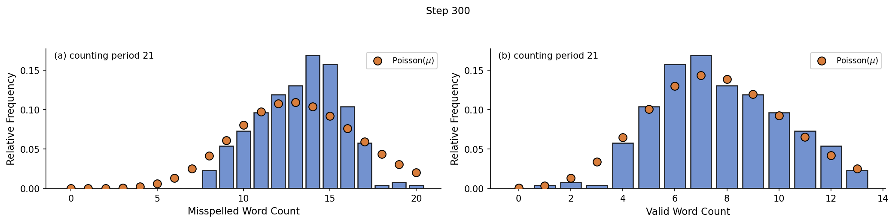
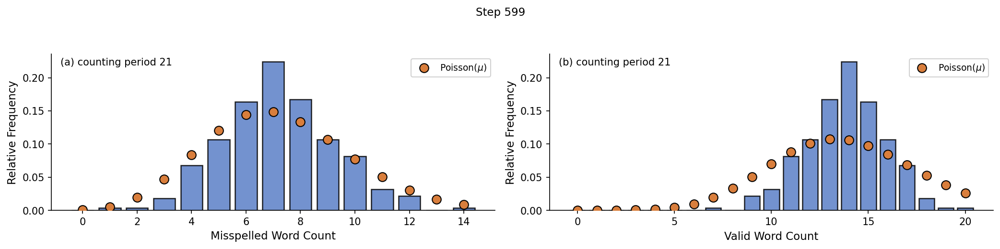
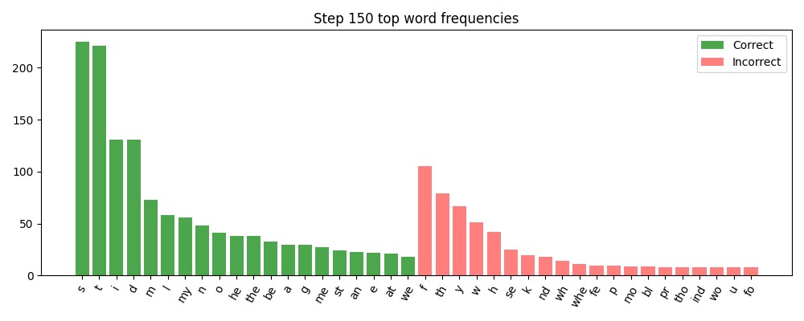
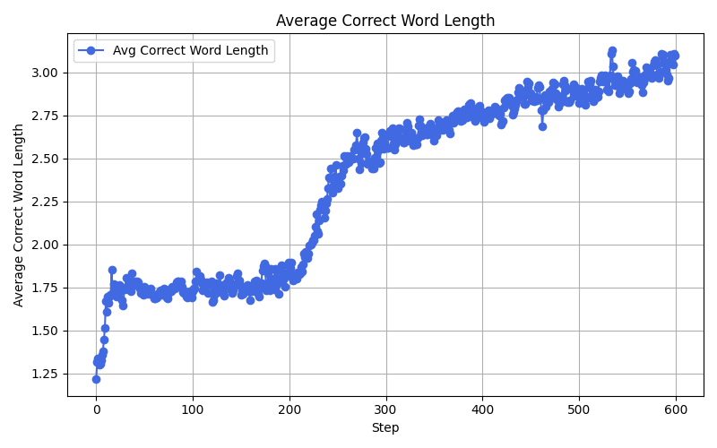
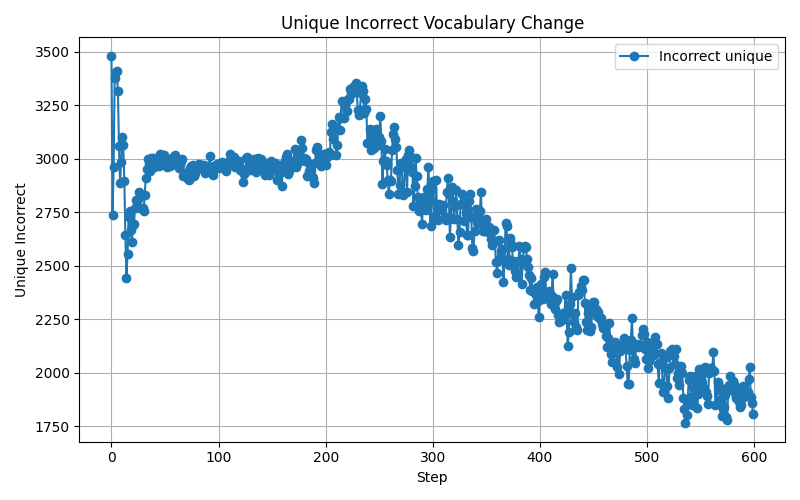
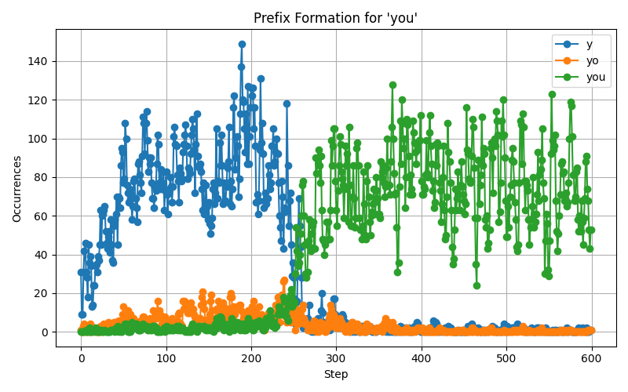
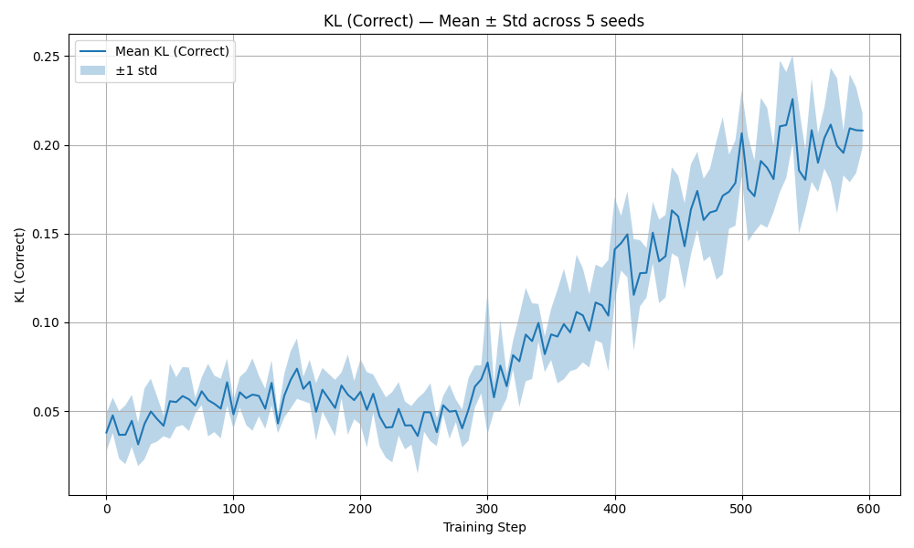
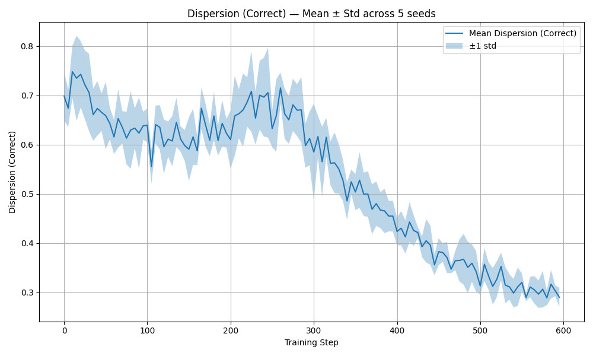

# Hong, Hong 2025 — Evidence of Phase Transitions in Small Transformer-Based Language Models

См. также: [глобальный индекс понятий](../../concepts/index.md).

**Noah Hong** (Lynbrook High School, Сан-Хосе), **Tao Hong** (Keysight Technologies, Санта-Роза).

arXiv [2511.12768](https://arxiv.org/abs/2511.12768), ноябрь 2025 (версия v1). Цитирований нет — работа в корпусе как соседняя ветвь: изучается возникновение связности в языковой модели, а гроккинг служит ближайшим соответствием. Источник — нативный HTML arXiv версии v1.

Оригинал и производные файлы этой папки:

- [`original/2511.12768.native.html`](original/2511.12768.native.html) — первоисточник, нативный HTML arXiv (v1), скачан как есть.
- [`original/2511.12768.evidence-of-phase-transitions-in-small-transformer-based-language-models.md`](original/2511.12768.evidence-of-phase-transitions-in-small-transformer-based-language-models.md) — конверсия оригинала в Markdown без правок содержания.
- [`images/`](images/) — 15 иллюстраций статьи в исходном разрешении.

Схема якорей и правила ссылок на карточку — в [README папки статей](../README.md).

## Затрагиваемые понятия

**[Фазовый переход](../../concepts/phase-transition.md)** — работа ставит три вопроса и на все отвечает утвердительно: свойственны ли переходы лишь крупным моделям, видны ли они **без** логарифмической шкалы и наступают ли рано ([`p1-4`](#p1-4)). Ответ: трансформер на 3,6 млн параметров даёт согласованный разрыв около эпох 230–250, видимый прямо по сырой оси обучения ([`p11-1`](#p11-1)).

**[Параметр порядка](../../concepts/order-parameter.md)** — в роли такового взят показатель разброса (фактор Фано) $D=\sigma^{2}/\mu$ по оконным счётам слов ([`p10-5`](#p10-5)). Существенно, что параметров несколько и они неизбыточны: разброс следит за режимом дисперсии, расхождение KL — за полным обликом распределения ([`p13-4`](#p13-4)).

**[Возникновение способностей](../../concepts/emergence.md)** — линия Wei et al. принята как отправная, но переосмыслена: разрывы ищут не в точности задачи, а в статистике словоупотребления, отчего они видны и без наращивания ([`p5-3`](#p5-3)).

**[Меры прогресса](../../concepts/progress-measures.md)** — предложен набор из четырёх мер: разброс, расхождение KL от пуассоновской точки отсчёта, средняя длина верного слова и число различных слов ([`p6-12`](#p6-12), [`p8-7`](#p8-7)). Ключевой довод: обычные кривые потери разрыва **не** показывают вовсе ([`p7-4`](#p7-4)).

**[Гроккинг](../../concepts/grokking.md)** — прямое соответствие: и там, и здесь долгая полка сменяется резкой внутренней перестройкой, невидимой на кривой потери ([`p4-4`](#p4-4)). Отличие названо честно: у гроккинга переход «запоминание → генерализация» при обучении с учителем, здесь — «обследование → закрепление» при предсказании следующего знака без учителя ([`p12-7`](#p12-7)).

**[Механистическая интерпретируемость](../../concepts/mechanistic-interpretability.md)** — работа Agarwal et al. взята как механистическое дополнение: там внутренние контуры складываются при неподвижной внешней точности, здесь то же видно снаружи по статистике словаря ([`p4-5`](#p4-5)).

**[Эффективная теория и статистическая физика](../../concepts/effective-theory-statistical-mechanics.md)** — теоретическая опора взята у Rubin, Seroussi и Ringel: два минимума эффективного потенциала, обмен устойчивостью, переход первого рода ([`p5-1`](#p5-1)). Наблюдаемый переворот разброса истолкован как переход системы через порог, где «минимум генерализации» берёт верх над «минимумом запоминания» ([`p5-2`](#p5-2)).

**[Котловины ландшафта потерь](../../concepts/loss-landscape-basins.md)** — самое любопытное наблюдение: перед улучшением качество **временно ухудшается**. Неверный словарь достигает наибольшего разнообразия ровно на шаге 250, а слабая правильность, установившаяся раньше, рушится ([`p12-4`](#p12-4)). Это истолковано как преодоление преграды зарождения между двумя устойчивыми состояниями ([`p12-5`](#p12-5)).

**[Запоминание](../../concepts/memorization-phase.md)** — до перехода модель выдаёт короткие повторяющиеся обрывки («th», «yo»), чья статистика субпуассоновская, то есть подозрительно правильная; после перехода они рассеиваются в редкий независимый шум ([`p6-12`](#p6-12)).

**[Возникновение признаков](../../concepts/feature-emergence-feature-learning.md)** — частный разбор слова «you»: счёты *y*, *yo* и *you* прослежены по шагам, и в самой полосе перехода обрывки сливаются в устойчивую трёхбуквенную форму ([`p9-4`](#p9-4)). Это, пожалуй, самая наглядная иллюстрация складывания составной единицы во всём корпусе.

**[Критический объём данных](../../concepts/data-fraction-critical-dataset-size.md)** — постановка нарочно скромна: 3,6 млн параметров, свод Tiny Shakespeare (1,1 млн символов, 65 различных), обстановка 128 символов, 5 семян до 600 эпох ([`p5-6`](#p5-6), [`p5-7`](#p5-7)).

**[Двойной спуск](../../concepts/double-descent.md)** — работа наследует спор о существовании возникающих способностей: возражение Schaeffer et al. о том, что скачки создаются самой мерой оценивания, приведено полностью и принято как требование к приёму ([`p4-2`](#p4-2), [`p4-3`](#p4-3), [`p13-6`](#p13-6)).

Отдельно стоит сказать, чего в работе **нет**. Нет связи с внутренним устройством: измеряются только внешние статистики порождённого текста, а соответствие их внутренним представлениям названо открытым ([`p13-7`](#p13-7)). Нет проверки всеобщности: одно устройство, один свод, посимвольная разбивка ([`p13-7`](#p13-7)). И нет количественного описания перехода: ни критических показателей, ни разбора конечноразмерного масштабирования, ни отнесения к переходам первого или второго рода — всё это отнесено к дальнейшей работе.

Карточки статей корпуса: [Power et al. 2022](../2201.02177.grokking-generalization-beyond-overfitting-on-small-algorithmic-datasets/2201.02177.grokking-generalization-beyond-overfitting-on-small-algorithmic-datasets.card.md) — гроккинг как ближайшее соответствие; [Nanda et al. 2023](../2301.05217.progress-measures-for-grokking-via-mechanistic-interpretability/2301.05217.progress-measures-for-grokking-via-mechanistic-interpretability.card.md) — меры продвижения и внутренняя перестройка при неподвижной точности; [Rubin et al. 2024](../2310.03789.grokking-as-a-first-order-phase-transition-in-two-layer-networks/2310.03789.grokking-as-a-first-order-phase-transition-in-two-layer-networks.card.md) — переход первого рода и эффективный потенциал, взятые как теоретическая опора; [Truong et al. 2026](../2604.13123.spectral-entropy-collapse-as-a-phase-transition-in-delayed-generalisation/2604.13123.spectral-entropy-collapse-as-a-phase-transition-in-delayed-generalisation.card.md) — другой параметр порядка (энтропия представлений), измеряемый внутри модели, а не по её выводу.

## Что показано, а что предположено

Замечания редактора карточки по итогам разбора утверждений (`…claims.txt`). Работа написана школьником и инженером промышленности; треть текста — обзор литературы, что для препринта необычно много.

**Основной приём прост, дёшев и осмыслен.** Порождённый текст режется на окна по 21 слову, счёты сравниваются с пуассоновской точкой отсчёта, и меряются два независимых отклонения ([`p6-10`](#p6-10)). Ничего сверх этого не нужно: ни доступа к весам, ни щупов внутри модели.

**Разделение верных и неверных слов даёт неожиданную зеркальную картину.** Верные слова уходят от почти пуассоновского к субпуассоновскому, неверные — ровно наоборот ([`p6-12`](#p6-12), [`p10-5`](#p10-5)). Такое встречное движение двух разрядов заметно убедительнее одной кривой.

**Согласованность нескольких мер — главный довод, и он выстроен верно.** Изломы разброса, вершина KL, обвал неверного словаря, ускорение верного и скачок длины слова приходятся на одно узкое окно эпох ([`p11-5`](#p11-5)). Именно совпадение неизбыточных мер, а не любая из них порознь, отделяет перестройку от следа меры.

**Возражение Schaeffer et al. учтено не на словах.** Взяты непрерывные внутренние статистики вместо двоичных порогов задачи, и это прямо названо ответом на упрёк ([`p4-3`](#p4-3), [`p13-6`](#p13-6)). Для корпуса это редкий случай, когда известное методологическое возражение встроено в замысел, а не упомянуто в обзоре.

**Наблюдение о временном ухудшении ценно само по себе.** Модель на шаге 250 выдаёт **больше** ошибок, чем на шаге 200, и лишь затем перестраивается ([`p12-4`](#p12-4)). Практический вывод сформулирован прямо: застой или всплеск ошибки может означать близящийся прорыв, а не отказ ([`p12-8`](#p12-8)).

**Однако «фазовый переход» здесь остаётся образом.** Ни критических показателей, ни конечноразмерного масштабирования, ни проверки на гистерезис не сделано; отнесение к первому или второму роду отложено. Сами авторы включают это в план дальнейшей работы.

**Мера правильности слова груба.** «Верным» считается всякое слово из свода, «неверным» — всякое прочее; годные новообразования и редкие формы попадают в ошибки. Ограничение признано ([`p13-7`](#p13-7)), но именно на этом делении держатся обе главные кривые.

**Постановка единственная.** Одно устройство, один свод, посимвольная разбивка — вопреки подсловной, принятой в настоящих моделях; перенос не проверен ([`p13-7`](#p13-7)). Заявка о том, что явление свойственно обучению вообще, опирается на пять семян одной конфигурации.

**Связи с внутренним устройством нет.** Все меры внешние; совпадают ли изломы с перестройкой внимания, вложений или течения градиента, не проверялось и отнесено к дальнейшей работе. Тем самым «внутренняя перестройка» есть истолкование, а не измерение.

**Обзор литературы непропорционален и местами пересказывает сам себя.** Разделы II-A–II-C излагают учебную статистическую физику, а выводы разделов IV-H, V-A и VII повторяют одни и те же три вопроса почти дословно.

**Место в корпусе.** Работа не о гроккинге, но соседствует с ним вплотную: тот же образ (долгая полка и резкая перестройка), та же теоретическая опора (переход первого рода у Rubin et al.) и тот же спор о существовании возникающих способностей. Ценны два наблюдения: встречное движение статистик верных и неверных слов и временное ухудшение перед перестройкой. Цена — «фазовый переход» не измерен количественно, мера правильности груба, постановка единственная, а связи с внутренним устройством нет.

## Ошибочные цитирования

Замечания редактора карточки: места, где эта статья передаёт чужие результаты с ошибкой или без авторских оговорок. Сюда ведут ссылки «подробности» из разделов «Ошибочные пересказы и цитирования этой статьи» карточек процитированных работ.

###### mc-2301-05217
**Nanda et al. (2301.05217) — конфабуляция источника целиком.** Работа процитирована под верным arXiv-идентификатором, но всё остальное выдумано. В библиографии стоят несуществующие авторы: `"S. Agarwal, A. S. Morcos, and A. Krishnamurthy, 'Progress Measures for Grokking via Mechanistic Interpretability'"` — настоящие авторы: Nanda, Chan, Lieberum, Smith, Steinhardt. В тексте им приписаны методы, которых в статье нет: `"applying singular value decomposition, neuron activation analysis, and embedding alignment … sudden drops in representational entropy"` — реальные меры прогресса цели — [restricted loss и excluded loss](../2301.05217.progress-measures-for-grokking-via-mechanistic-interpretability/2301.05217.progress-measures-for-grokking-via-mechanistic-interpretability.card.md#p2-3). И вывод инвертирован: `"supporting the view that grokking is an internal reorganization event, not gradual refinement"` — центральный тезис цитируемой работы ровно противоположен: [«гроккинг возникает из постепенного усиления структурированных механизмов, закодированных в весах»](../2301.05217.progress-measures-for-grokking-via-mechanistic-interpretability/2301.05217.progress-measures-for-grokking-via-mechanistic-interpretability.card.md#p1-2). Судя по совокупности, источник цитировался по памяти или сгенерирован без чтения.

###### mc-2310-03789
**Rubin et al. (2310.03789) — равновесная теория пересказана как динамика с барьером и гистерезисом.** Пять конфабулированных атрибутов в одном пересказе: `"provided the first formal statistical-physics model of grokking, directly linking training dynamics to phase transitions"`, `"As regularization strength or training time increases, the minima exchange stability"`, `"demonstrating hysteresis and mixed phases"`, `"one corresponding to memorization … and another to generalization"`, `"Rubin et al. demonstrate rigorously that … gradient descent steps—can yield abrupt, global changes"`. У Rubin [теория равновесная и байесовская, управляемая размером выборки, шумом и шириной](../2310.03789.grokking-as-a-first-order-phase-transition-in-two-layer-networks/2310.03789.grokking-as-a-first-order-phase-transition-in-two-layer-networks.card.md#p2-1) — времени обучения и шагов градиентного спуска в ней нет; слов hysteresis и barrier в оригинале нет вовсе, [сёдла в смешанной фазе вырождены](../2310.03789.grokking-as-a-first-order-phase-transition-in-two-layer-networks/2310.03789.grokking-as-a-first-order-phase-transition-in-two-layer-networks.card.md#p6-6); [нулевое седло — «не знающее об учителе», а не запоминающее](../2310.03789.grokking-as-a-first-order-phase-transition-in-two-layer-networks/2310.03789.grokking-as-a-first-order-phase-transition-in-two-layer-networks.card.md#p5-5); Утверждения выводятся в приближениях, не «строго доказываются». В сочетании с конфабуляцией источника по Nanda et al. (см. пункт выше) это маркер систематически ненадёжной библиографии данной статьи.

---

# Текст статьи

## Аннотация

###### p1-4

Фазовые переходы предлагались как исток возникающих способностей больших языковых моделей (LLM), где новые умения появляются внезапно, как только модель переходит решающие пороги масштаба. Прежние работы, каковы Wei *et al.*, показывали эти явления при наращивании модели и данных, причём переходы проступали лишь после приложения логарифмической шкалы к вычислительным затратам обучения. В этой работе мы задаём три дополняющих друг друга вопроса: (1) свойственны ли фазовые переходы лишь крупным моделям или их можно наблюдать и в малых трансформерных языковых моделях? (2) можно ли распознать такие переходы прямо в *линейном пространстве обучения*, а не только после логарифмического перемасштабирования? и (3) могут ли эти переходы возникать на ранних порах обучения? Ради этого мы обучаем малый трансформер в духе GPT на посимвольном своде и разбираем развитие словоупотребления на всём протяжении обучения. Мы следим за средней длиной слова, числом верных и неверных слов и сдвигами разнообразия словаря. Опираясь на эти меры, мы прилагаем пуассоновскую и субпуассоновскую статистику, чтобы измерить, как слова соединяются и перестраиваются. Этот совмещённый разбор вскрывает отчётливую точку перехода по ходу обучения. Примечательно, что эти переходы не видны на обычных кривых потери или проверки, но проступают через наши щупы по словарю и статистике. Наши находки наводят на мысль, что перестройки в духе фазовых переходов суть общая черта обучения языковых моделей, наблюдаемая и в скромных моделях, распознаваемая прямо в линейном пространстве обучения и наступающая на удивление рано, вместе с возникновением связности. Такой взгляд даёт новое понимание нелинейной динамики обучения языковых моделей и подчёркивает важность нарочно подобранных мер для вскрытия поведения фазовых переходов.

##### Ключевые слова:

=-15pt

## I Введение

###### p1-6

Передовые большие языковые модели (LLM) явили разительные возникающие способности в рассуждении, программировании и многоладном понимании [1, 2, 3, 4, 5]. Эти прорывы широко связывают с наращиванием: по мере роста числа параметров, размера набора данных и вычислительных затрат обучения модели, по-видимому, обретают качественно новые умения. Wei *et al.* описали такое возникающее поведение как *фазовые переходы*, подчеркнув, что оно часто наступает внезапно на решающих порогах, а не растёт с масштабом плавно [6].

Несмотря на эти продвижения, большинство прежних работ разбирает фазовые переходы окольно, требуя моделей на миллиарды параметров и сообщая итоги лишь после логарифмического перемасштабирования затрат или шагов обучения. Оттого остаётся неясным, можно ли наблюдать перестройки в духе фазовых переходов в малых, посильных моделях, а не только в огромных LLM, и встаёт вопрос, распознаются ли такие разрывы прямо на линейной оси обучения, без обращения к логарифмическим преобразованиям.

Взяться за этот пробел важно по двум причинам. Во-первых, малые модели служат применимыми лабораториями: их можно обучать и разглядывать скромными средствами, вскрывая при этом основные черты поведения обучения. Во-вторых, если фазовые переходы наблюдаемы прямо в сырых шагах обучения, это укрепляет довод, что возникающее поведение есть присущее свойство обучения нейронных сетей, а не просто след мер оценивания или логарифмической шкалы. Такие соображения полезны и для работ по интерпретируемости, и для построения более действенных моделей.

###### p1-9

В этой работе мы исследуем поведение фазовых переходов в малом трансформере в духе GPT (3,6 млн параметров), обучаемом с посимвольной разбивкой на своде Tiny Shakespeare. Чтобы распознавать разрывы, мы вводим *распознавательную рамку на основе Пуассона* [7], следящую за разбросом, **[p. 2]** расхождением Кульбака — Лейблера (KL), составом словаря и длиной слова. Эти статистические щупы вскрывают согласованные разрывы обучения, совпадающие с переходом от случайных обрывочных последовательностей к связным словам. Мы доказываем, что связность на уровне слов работает как параметр порядка возникающей языковой способности.

Остаток статьи устроен так. Раздел II обозревает смежные работы о возникающих способностях, фазовых переходах, разрывной динамике обучения и статистических щупах. Раздел III описывает опытную постановку и распознавательный приём. Раздел IV излагает наши находки о согласованных разрывах. Раздел V обсуждает следствия, ограничения и направления дальнейшей работы.

## II СМЕЖНЫЕ РАБОТЫ

Наше исследование фазовых переходов в малых трансформерных языковых моделях опирается на три переплетённых направления: физику фазовых переходов и коллективных явлений, опытное обнаружение возникающих способностей больших языковых моделей и механистические работы о разрывной динамике обучения. Мы обозреваем каждое по очереди, отмечая, как они сходятся к нашим главным вопросам о наблюдаемости, распознаваемости и сроках перестроек в духе фазовых переходов в системах скромного масштаба.

### II-A *Фазовые переходы в статистической физике*

###### p2-3

Строгое изучение фазовых переходов берёт начало в статистической механике, где гладкие микроскопические законы порождают особенное макроскопическое поведение. Узаконенное изложение Ландау и Лифшица закладывает основные понятия: параметр порядка — макроскопическая величина, описывающая состояние системы, — резко меняется, когда управляющий параметр переходит решающий порог [8]. При переходах второго рода (непрерывных) параметр порядка плавно уходит от нуля к конечному значению, что сопровождается расходящимися колебаниями и корреляционными длинами. При переходах первого рода (разрывных) параметр порядка скачет, отражая сосуществование и обмен различных фаз. Существенно, что эти качественные перестройки возникают из коллективных взаимодействий многих частей, а не из особенностей подлежащих микроскопических правил. Переход «вода — пар» даёт наглядный пример: при изменении температуры или давления плотность системы претерпевает резкий измеримый разрыв, несмотря на гладкость межмолекулярных сил.

Нынешнее учебное изложение Тонга расширяет эту рамку теорией группы перенормировки (RG) и описаниями через эффективное поле [9]. Разбор RG показывает, как критическим поведением управляют неподвижные точки в пространстве связей, разделяя переходы на классы всеобщности, задаваемые общими показателями масштабирования, а не микроскопическими подробностями. Тонг подчёркивает, что видимые макроскопические разрывы возникают от усиления микроскопических колебаний многочастичными корреляциями, — взгляд, оказавшийся плодотворным при переносе на многомерные обучающиеся системы. Его изложение эффективных потенциалов, где состояние системы сосредоточивается вблизи минимумов огрублённой свободной энергии, дало понятийный образец, позже принятый теоретиками, описывающими обучение нейронных сетей как движение по эффективному ландшафту соперничающих представлений.

Вместе Ландау — Лифшиц и Тонг задают строгий словарь для описания качественных перестроек: параметры порядка, управляющие параметры, решающие пороги, области сосуществования и законы масштабирования. Хотя он развит для физических систем в тепловом равновесии, этот язык перенёсся на описание резких изменений в искусственных системах, включая нейронные сети, где «температуру» заменяют время обучения, скорость обучения или масштаб модели, а «намагниченность» — точность генерализации, связность представлений или статистический разброс.

### II-B *Возникновение как общее начало в сложных системах*

Понятийный переход от физики к более широким областям влиятельно выразил Андерсон, доказывавший, что «больше значит иначе»: рост сложности вводит качественно новые начала устройства, несводимые к законам уровня частей [10]. На примерах от сверхпроводимости до молекулярной биологии Андерсон утверждал, что каждый уровень масштаба в иерархии являет возникающие свойства и требует своих эффективных теорий. Это сочинение заложило философское основание для изучения возникающего вычисления, коллективного разума и самоупорядочения в разных науках. Для искусственного разума тезис Андерсона оправдывает ожидание, что крупные нейронные системы могут претерпевать резкие перестройки способностей или строения, не предсказуемые из поведения отдельных нейронов или обновлений градиента.

Строя на этом основании, Хуберман и Хогг показали, что системы искусственного разума — а именно символьный поиск и алгоритмы удовлетворения ограничений — способны являть резкие пороговые явления при изменении управляющих параметров [11]. Они разобрали, как трудность задачи достигает вершины вблизи границы фаз между разрешимой и неразрешимой областями, подобно решающему замедлению в физике. Их работа установила, что комбинаторные и вычислительные системы, даже вдали от термодинамического равновесия, являют поведение в духе переходов, где коллективные свойства меняются разрывно. Хотя их предметом был символьный ИИ, а не глубокое обучение, понятийное соответствие ясно: у больших вычислительных систем бывают решающие области, где поведение перестраивается разрывно.

Форрест распространила эти мысли на возникающее вычисление в распределённых системах, включая ранние нейронные сети и эволюционные алгоритмы [12]. Она доказывала, что само вычисление может быть возникающим свойством, рождающимся из местных взаимодействий, самоупорядочивающихся в общее строение. Обозревая клеточные автоматы, ассоциативные памяти и генетические алгоритмы, Форрест показала, как нелинейное сцепление простых правил даёт устойчивые узоры и приспособ**[p. 3]**ление. Будучи во многом качественным и предшествуя нынешнему глубокому обучению, её свод помещает обучение нейронных сетей в более широкое изучение сложных приспособляющихся систем, укрепляя ожидание, что возникающая связность в языковых моделях — скажем, наблюдаемое нами внезапное обретение многосимвольных слов — может рождаться из гладких распределённых обновлений.

### II-C *Фазовые переходы в нейронных сетях: ранние теоретические основания*

Приложение понятий фазового перехода прямо к нейронным сетям всерьёз началось в 1990-е. Обзорная статья Кинцеля дала одно из первых упорядоченных изложений, разобрав, как простые обучающиеся системы — перцептроны, сети Хопфилда и модели спиновых стёкол — являют пороговое поведение [13]. Скажем, перцептрон, обучаемый случайным образцам, резко переходит из невыучиваемого режима в выучиваемый, как только отношение числа обучающих примеров к числу весов превосходит решающее значение. Точно так же сети ассоциативной памяти претерпевают переходы «порядок — беспорядок» при превышении пределов ёмкости, и точность извлечения обрушивается за порогом. Кинцель связал эти находки с перестройкой энергетического ландшафта и нарушением симметрии, знакомыми из физики конденсированного состояния. Его работа показала, что динамика обучения естественно делится на различные режимы — упорядоченный (обобщающий) и беспорядочный (запоминающий или случайный), — разделённые резкими границами. Хотя изучаемые модели были маломерны и поддавались аналитике, разбор Кинцеля установил, что язык фазовых переходов осмысленно приложим к нейронному вычислению, предвещая позднейшие попытки описать глубокое обучение статистической механикой.

В нынешнюю пору Бахри с сотрудниками свели десятилетие работ, прилагающих средства статистической механики к глубоким нейронным сетям [14]. Их обширный обзор устраивает теорию по трём осям: строение многомерных ландшафтов потерь, динамика распространения сигнала и критичность (включая режимы «края хаоса», где сети уравновешивают порядок и хаос) и законы масштабирования, связывающие устройство, размер набора данных и генерализацию. Они описывают, как теория случайных матриц и приближения среднего поля вскрывают подобные фазовым переходам разделения между упорядоченным и хаотическим течением сигнала и как такие переходы влияют на обучаемость. Существенно, что Бахри и соавторы предостерегают: глубокое обучение идёт вдали от термодинамического равновесия, и оттого «фазовый переход» служит скорее образом качественной смены режима оптимизации, чем буквальным термодинамическим явлением. Тем не менее понятийный набор — параметры порядка, критические точки, всеобщность — даёт сильную рамку для истолкования резких сдвигов поведения сети. Для нашей работы Бахри и соавторы дают строгое оправдание тому, чтобы считать разрывы разброса или расхождения KL возникающими перестройками статистики представлений.

Миллер, Чжан и Гангули недавно предложили описывать глубокие сети, обучаемые градиентным спуском, как неравновесные системы, претерпевающие фазовые переходы в поглощающее состояние [15]. Они определяют параметр порядка по доле деятельных степеней свободы в пространстве весов и показывают, что динамика обучения приближается к поглощающему состоянию, где обновления прекращаются, — подобно замороженной фазе в классах всеобщности направленной перколяции. Опытно измеренные показатели масштабирования на прямых и рекуррентных устройствах совпадают с предсказанными неравновесной статистической физикой, что говорит о всеобщности по родам сетей. Будучи весьма теоретической и не связанной с языком, их работа даёт строгое основание описывать резкое наступление упорядочения — каково наблюдаемое нами субпуассоновское установление — как переходы режимов в многомерной оптимизации.

### II-D *Возникающие способности больших языковых моделей*

Опытное обнаружение разрывных приростов способностей у крупных языковых моделей и вызвало нынешний интерес к соответствиям с фазовыми переходами. Ряд GPT это развитие и описывает. Radford et al. представили GPT-1, показав, что порождающее предобучение без учителя на большом текстовом своде с последующим дообучением с учителем даёт переносимые представления, заметно превосходящие модели, обученные с нуля [1]. Ключевое наблюдение в том, что одна общая языковая модель приспосабливается ко многим последующим задачам при малом числе размеченных данных, отчего широкое языковое строение, по-видимому, возникает из одного лишь предсказания следующего знака. GPT-2 распространила этот образец на 1,5 млрд параметров и показала, что многозадачное качество без примеров возникает самопроизвольно, без явного дообучения [2]. Такие способности, как перевод, изложение и ответы на вопросы, появлялись сами, что и породило мысль, будто достаточные масштаб и разнообразие данных вызывают качественные скачки связности и рассуждения.

GPT-3 у Brown et al., со 175 млрд параметров, утвердила наращивание как главный движитель возникающей генерализации [3]. Хотя обучающая потеря следовала плавным степенным законам, качество на задачах давало резкие приросты в рассуждении, арифметике и переводе, как только размер модели превосходил десятки миллиардов параметров. Статья ввела порядки оценивания с несколькими, одним и без примеров, показав, что обучение по обстановке — без обновления градиентов — становится посильным при масштабе. Тем самым GPT-3 дала крупномасштабное опытное свидетельство того, что внутренние представления переходят пороги, за которыми возникает качественно новое поведение, подобно наблюдаемым нами разрывам в миниатюрных системах.

Последующие передовые модели укрепили эту картину. PaLM у Chowdhery et al., с 540 млрд параметров, явила возникающее рассуждение на невиданном масштабе, причём кривые качества показывали разрывные скачки в логических и многошаговых задачах, как только решающие пороги были пройдены [4]. Авторы приписывали улучшения и голому масштабу, и разнообразию набора данных, отмечая, что возникающие способности связаны с охватом разных областей. Точно так же технический отчёт OpenAI о GPT-4 описал заметные улучшения в рассуждении, программировании и многоладном понимании, причём качество на сложных задачах **[p. 4]** снова являло пороговое поведение [5]. Хотя подробности устройства не раскрыты, итоги GPT-4 закрепляют опытный край всего ряда наращивания, показывая, что возникающие способности сохраняются и усиливаются с ростом моделей.

Wei et al. упорядоченно записали понятие возникающих способностей, определив их как умения, не выводимые линейно из качества меньших моделей [6]. Разобрав сотни точек оценивания по семействам моделей — GPT-3, Gopher, Chinchilla, PaLM, — они отложили точность против логарифма размера модели и увидели сигмоидные или ступенчатые картины вместо плавных степенных приростов. Эти разрывы возникали в арифметике, переводе, рассуждении и разрешении многозначности слов. Существенно, что Wei et al. подчеркнули: возникающие способности отражают резкие изменения качества на задаче, а не обязательно плавные улучшения потери. Это наблюдение прямо и побудило нас взять внешние поведенческие меры — вроде разброса и состава словаря, — вскрывающие перестройки, скрытые на обычных кривых потери. Однако Wei et al. оставили подлежащее устройство открытым, описывая возникновение главным образом как опытное явление, связанное с масштабом.

### II-E *Сомнения в существовании возникающих способностей*

###### p4-2

Schaeffer, Miranda и Koyejo оспорили истолкование возникающих способностей как свидетельства настоящих фазовых переходов [20]. Они доказали математически и опытно, что многие ступенчатые кривые из Wei et al. происходят от дискретных нелинейных мер оценивания, а не от резких внутренних перестроек. Когда подлежащая величина качества — скажем, вероятность верного рассуждения — плавно растёт с масштабом, пороговые меры вроде двоичной точности всё равно способны создать видимость внезапных скачков. Переложив итоги на непрерывные меры вроде перекрёстной энтропии или ожидаемой потери, Schaeffer et al. нашли по большей части плавные законы масштабирования во всех семействах моделей. Они заключили, что наблюдаемое «возникновение» часто может быть следом двоичного или нелинейного подсчёта задачи, хотя и признали, что часть подлинных разрывов возможна, и призвали к механистическим щупам внутренних представлений.

###### p4-3

Это возражение основополагающе для нашей работы. Schaeffer et al. показывают, что не всякая S-образная кривая или излом качества означает переход, подобный физическому, чем подчёркивают нужду в непрерывных внутренних показателях, а не во внешних порогах точности. Наше применение пуассоновской и субпуассоновской статистики, расхождения KL и состава словаря прямо отвечает на это опасение: это непрерывные меры языкового строения, меняющиеся на всём протяжении обучения, независимо от произвольных отсечек задачи. Распознавая согласованные разрывы сразу по нескольким непрерывным щупам — разбросу, расхождению KL, длине слова, поведению словаря, — мы даём сходящееся свидетельство подлинной перестройки, а не следа меры. В этом смысле наш подход внемлет призыву Schaeffer et al. к механистическому непрерывному разбору, всё же указывая разрывное поведение.

### II-F *Гроккинг и разрывная динамика обучения*

###### p4-4

Явление гроккинга, введённое Power et al., даёт самое прямое малое соответствие нашим находкам [16]. Обучая малые трансформеры и MLP на наборах модульной арифметики, Power et al. заметили, что модели сперва переобучаются — достигая почти нулевой обучающей потери при случайной точности на тесте, — а затем, после множества добавочных эпох, внезапно переходят к безупречной генерализации. Эта отложенная резкая перестройка происходит несмотря на плавные кривые потери и зависит от силы регуляризации (weight decay) и разнообразия набора данных. Изображения строения вложений показывают, что при гроккинге выученные признаки поворачиваются и согласуются с истинным алгоритмическим строением, то есть модель переходит из котловины запоминания в котловину генерализации в пространстве весов. Тем самым гроккинг устанавливает, что нейронные сети, даже скромного масштаба, способны долго держаться на полке, а затем внезапно перестраиваться внутри, — разрыв, не схватываемый одной лишь обучающей потерей.

###### p4-5

Agarwal, Morcos и Krishnamurthy распространили эту работу на механистическую интерпретируемость, приложив сингулярное разложение, разбор возбуждений нейронов и согласование вложений, чтобы проследить, как гроккинг разворачивается внутри сети [17]. Они ввели количественные меры продвижения, схватывающие степень алгоритмического отвлечения в весах и представлениях. Их ключевая находка в том, что, даже когда внешняя точность стоит на месте, внутренние контуры постепенно складывают составные строения; как только эти строения переходят порог устойчивости, генерализация скачет. Этот порог совпадает с внезапным падением энтропии представлений и изменениями течения градиента, что подкрепляет взгляд на гроккинг как на событие внутренней перестройки, а не постепенной доводки. Для нашей работы Agarwal et al. дают механистическое дополнение к нашим внешним мерам: оба подхода вскрывают скрытое накопление с последующим быстрым закреплением. Соответствие прямое: наши показатели разброса и KL схватывают подобные перестройки языкового строения, где обрывки сливаются в связные слова на решающей эпохе обучения.

Dolev et al. описали схожие разрывы в нейронном машинном переводе, где качество на морфологически богатых и малоресурсных языках внезапно скачет, как только размер модели или набора данных переходит порог [18]. Обучая устройства-трансформеры на наборах WMT, они наблюдали, что при малых масштабах качество перевода растёт плавно, а за решающей точкой скачет резко. Разрыв они приписали улучшенному обстановочному представлению и способности запоминать соответствия редких слов, назвав это «решающими преимуществами» наращивания. Хотя Dolev et al. не разбирали поведение внутренних представлений и не прилагали статистических щупов, их опытные кривые вторят наблюдаемому нами резкому закреплению словаря, укрепляя мысль, что нейронные последовательностные модели способны являть пороговые улучшения языковой связности.

**[p. 5]**

### II-G *Теоретические основания: гроккинг как фазовый переход первого рода*

###### p5-1

Rubin, Seroussi и Ringel дали первую строгую статистико-физическую модель гроккинга, прямо связав динамику обучения с фазовыми переходами [19]. Они изучили двухслойную сеть «учитель — ученик», обучаемую модульному сложению, и вывели эффективный потенциал, описывающий макроскопическое состояние системы. У потенциала два соперничающих минимума: один отвечает запоминанию (подгонке обучающих данных без генерализации), другой — генерализации (схватыванию подлежащего правила). С ростом силы регуляризации или времени обучения минимумы обмениваются устойчивостью, давая разрывный скачок параметра порядка, — чем гроккинг и опознаётся как фазовый переход первого рода. Rubin et al. подкрепили это отображение аналитическими приближениями среднего поля и численным счётом, показав гистерезис и смешанные фазы, свойственные переходам первого рода. Они выделили и промежуточные режимы с чертами гауссовых смесей, отвечающие опытным строениям вложений из прежних работ о гроккинге.

###### p5-2

Эта теоретическая работа даёт самое сильное оправдание тому, чтобы называть разрывы обучения нейронных сетей подлинными фазовыми переходами. Rubin et al. строго показывают, что гладкие местные обновления — шаги градиентного спуска — способны давать резкие общие изменения порядка представлений, как только соперничающие способы обучения обмениваются устойчивостью. Хотя их модель приложима к упрощённым двухслойным сетям и алгоритмическим задачам, понятийная рамка естественно распространяется на нашу постановку. Наблюдаемый нами переворот разброса — верные слова переходят от почти пуассоновского к субпуассоновскому, а неверные от субпуассоновского к пуассоноподобному — можно истолковать как переход системы через решающий порог, где «минимум генерализации» (связное словоупотребление) берёт верх над «минимумом запоминания» (обрывочным выводом). При таком взгляде наши показатели на основе Пуассона служат параметрами порядка, следящими за тем, какой способ представления главенствует по ходу обучения.

### II-H *Место нашей работы*

###### p5-3

На этом фоне наше исследование занимает особое и слабо освоенное место. Большинство опытных работ о возникающих способностях (Wei et al., Brown et al., Chowdhery et al.) занято моделями на миллиарды параметров, оцениваемыми после обучения, и часто требует логарифмического перемасштабирования затрат или размера модели, чтобы разрывы проступили. Напротив, мы исследуем малый трансформер на 3,6 млн параметров и следим за его развитием прямо по линейной оси обучения, показывая, что перестройки в духе фазовых переходов наблюдаемы в скромных системах без логарифмической шкалы. Работы о гроккинге (Power et al., Agarwal et al.) дают ближайшее соответствие — малые модели, резкая перестройка, — но заняты алгоритмическими наборами и точностью генерализации. Мы распространяем это направление на языковые задачи, вводя статистические щупы на основе Пуассона, распознающие разрывы в строении словаря, длине слова и разбросе, а не в одной лишь точности задачи.

Теоретически мы опираемся на рамки Bahri et al., Miller et al. и особенно Rubin et al. ради истолкования находок. Переворот разброса — верные слова смещаются от почти пуассоновского к субпуассоновскому, неверные от субпуассоновского к пуассоноподобному — вторит состязанию минимумов запоминания и генерализации в эффективном потенциале Rubin et al. Наши расхождение KL и поведение словаря подкрепляют это истолкование, показывая согласованные изломы и обвалы, совпадающие с наступлением связности многосимвольных слов. Приёмно мы внемлем предостережению Schaeffer et al., беря непрерывные внутренние меры вместо двоичных порогов задачи и тем избегая следов, наводимых мерой, но всё же указывая подлинные разрывы.

Итак, наш вклад троякий: (1) мы показываем, что перестройки в духе фазовых переходов не свойственны исключительно большим языковым моделям, а возникают и в малых трансформерах, обучаемых на посимвольных языковых данных; (2) мы показываем, что такие переходы распознаются прямо в линейном пространстве обучения показателями на основе Пуассона, без логарифмической шкалы и огромных вычислений; и (3) мы устанавливаем, что эти переходы наступают на удивление рано, вместе с возникновением словесной связности, причём строение на уровне слов служит естественным параметром порядка. Связывая статистическую физику, работы о возникающих способностях и динамику обучения малых моделей, мы даём и опытное свидетельство, и истолковывающие средства для понимания нелинейных перестроек при обучении нейронных языковых моделей.

## III Приёмы

### III-A *Модель и данные*

###### p5-6

Мы обучали малый посимвольный трансформер, задуманный так, чтобы напоминать основное устройство более крупных языковых моделей, оставаясь вычислительно посильным. Устройство состоит из вложения размерности 192, 8 слоёв трансформера и 6 голов внимания (около 3,6 млн параметров) при длине обстановки 128 символов. Модель обучалась на своде Tiny Shakespeare, содержащем $\sim$ 1,1 млн символьных знаков из 65 различных символов.

###### p5-7

Ради оценки устойчивости мы провели 5 независимых семян на 0–600 эпох. В каждой контрольной точке мы выбирали 30 000 знаков при закреплённой настройке раскодирования (температура $T=1.0$, жадный выбор одного наилучшего, если не сказано иное).

### III-B *Разбиение и разметка правильности*

Порождённый текст разбивался на слова по границам пробелов и знаков препинания. Затем каждая единица относилась к одному из родов:

- **Верное:** если встречается в словаре свода.
- **Неверное:** если в словаре свода не встречается.

Такое рабочее разделение позволяет отделить законный словарь от исследовательского или ошибочного вывода. Хотя оно исключает слова за пределами обучающего распределения, это рабочее определение всё же схватывает продвижение модели к строению на уровне словаря и потому даёт применимое основание для опытного разбора.

**[p. 6]**

### III-C *Рост словаря и длина слова*

Чтобы схватить языковое действие перехода, мы следим за двумя дополняющими друг друга мерами, измеряющими продвижение модели от обрывочного вывода к составному словообразованию.

**Число различных слов** ($V_{\text{uniq,correct}}$ и $V_{\text{uniq,incorrect}}$) измеряет разнообразие родов слов, порождаемых в каждом разряде. Различный верный словарь отражает расширяющийся запас законных форм, а различный неверный словарь следит за разрастанием и конечным обвалом ошибочных образцов. Следя за обоими порознь, мы можем указать, когда модель переходит от обследования обрывочных ошибок к закреплению годных слов. Вершина разнообразия неверного словаря с последующим обвалом означает, что модель исчерпала пробные сочетания и остановилась на упорядоченных образцах.

**Средняя длина слова** ($\bar{L}$) даёт прямую меру составной сложности:

$$
\bar{L}=\frac{1}{N_{\text{correct}}}\sum_{w\in\text{correct}}\mathrm{len}(w). \tag{1}
$$

В начале обучения, когда модель выдаёт главным образом односимвольные выходы или короткие двухбуквенные обрывки, $\bar{L}$ держится около 1,5 символа. По мере того как модель научается складывать более длинные многосимвольные слова, $\bar{L}$ растёт. Резкий S-образный подъём средней длины слова означает качественный сдвиг от посимвольной обрывочности к словесной складности. Эта мера служит естественным языковым спутником перехода разброса: субпуассоновская правильность в употреблении верных слов возникает ровно тогда, когда модель начинает выдавать устойчивые многосимвольные формы.

Вместе эти меры показывают, как система перестраивается от коротких, склонных к ошибкам обрывков к более длинным связным словам. Согласованная динамика — обвал неверного словаря, ускорение верного и рост длины слова — даёт сходящееся свидетельство того, что статистическая перестройка, схватываемая разбросом и расхождением KL, проявляется как ощутимая языковая перестройка.

### III-D *Пуассоновская точка отсчёта, разброс и мгновенные снимки*

Чтобы проверить, появляются ли слова случайно или упорядоченно, мы делили порождённый текст на непересекающиеся окна по $W=21$ слову. Если бы появления слов были независимыми случайными событиями, число слов $N$ в окне следовало бы распределению Пуассона:

$$
P(N=n;\lambda)=\frac{\lambda^{n}e^{-\lambda}}{n!},\qquad\mathrm{Var}[N]=\lambda, \tag{2}
$$

со средним $\lambda$, равным дисперсии.

Отклонения от этой пуассоновской точки отсчёта сводит **показатель разброса**:

$$
D=\frac{\sigma^{2}}{\mu}, \tag{3}
$$

где $\mu$ и $\sigma^{2}$ — среднее и дисперсия распределения счётов.

###### p6-10

- $D=1$: **пуассоновский** — события происходят случайно и независимо, дисперсия равна среднему. Это естественная точка отсчёта несвязанной случайности.
- $D<1$: **субпуассоновский** — дисперсия подавлена относительно среднего. События расставлены ровнее, чем предсказал бы случай, что означает скрытый порядок или правильность. В физике этот режим связывают с квантовым антигруппированием фотонов.
- $D>1$: **суперпуассоновский** — дисперсия превосходит среднее. События происходят вспышками или сгустками, как в хаотических или тяжелохвостых процессах.

В нашей языковой обстановке эти режимы имеют наглядные истолкования.

###### p6-12

- **Верные слова** переходят от почти пуассоновского к субпуассоновскому по ходу обучения, отражая сдвиг от редких рассеянных удач к устойчивым правильным образцам употребления.
- **Неверные слова** начинают в повторяющемся режиме с подавленной дисперсией (субпуассоновском), где главенствуют короткие повторяющиеся обрывки вроде «th» или «yo», а затем рассеиваются случайно по мере убывания ошибок, сдвигаясь к $D\approx 1$, когда становятся редким независимым шумом.

Чтобы изобразить эту динамику, рисунки 1–3 показывают рядом гистограммы счётов неверных (слева) и верных (справа) слов в представительных контрольных точках. На каждой панели эмпирическое распределение (синие столбцы) наложено на подогнанную пуассоновскую точку отсчёта (оранжевые точки).

**Шаг 0 (раннее обучение).** Неверные слова дают субпуассоновское сгущение с узкими распределениями, отражающими повторяющиеся короткие обрывки. Верные слова крайне редки и рассеяны, являя почти пуассоновскую случайность при очень немногих удачных многосимвольных формах.

**Шаг 300 (середина обучения, подход к переходу).** Неверные слова сохраняют субпуассоновское сгущение с узкими распределениями подавленной дисперсии, ибо повторяющиеся обрывки держатся. У верных слов начинает проступать строение, но они по-прежнему рассеяны и почти пуассоновы, то есть модель начинает находить годные образцы, тогда как употребление остаётся неправильным.

**Шаг 599 (позднее обучение, после перехода).** Переворот разброса завершён. Неверные слова расширились до почти пуассоновских распределений, что согласуется с редкими независимыми остаточными ошибками, происходящими случайно, а не повторяющимися сгустками. Верные слова стянулись в тесные субпуассоновские распределения с подавленной дисперсией, что отражает правильное упорядоченное употребление, где связные слова появляются предсказуемо и постоянно.

Это наглядное развитие прямо изображает переворот разброса, определяющий переход: неверные слова уходят от субпуассоновского (повторяющиеся сгущённые обрывки вроде «th, th, th») к пуассоновскому (редкие случайные ошибки), тогда как верные слова уходят от почти пуассоновского (рассеянные редкие удачи) к субпуассоновскому (правильное связное употребление).


*Рисунок 1: **Шаг 0 (раннее обучение).** Гистограммы оконных счётов слов рядом. **Слева:** неверные слова дают субпуассоновское сгущение с узкими распределениями, отражающими повторяющиеся короткие обрывки. **Справа:** верные слова крайне редки и рассеяны, являя почти пуассоновскую случайность.* **[p. 7]**



*Рисунок 2: **Шаг 300 (середина обучения, подход к переходу).** **Слева:** неверные слова сохраняют субпуассоновское сгущение с узкими распределениями подавленной дисперсии, ибо повторяющиеся обрывки держатся. **Справа:** у верных слов начинает проступать зарождающееся строение, но они по-прежнему рассеяны и почти пуассоновы.* **[p. 7]**



*Рисунок 3: **Шаг 599 (после перехода).** Переворот разброса завершён. **Слева:** неверные слова расширились до почти пуассоновских распределений, став редкими независимыми остаточными ошибками, происходящими случайно. **Справа:** верные слова стянулись в тесные субпуассоновские распределения, что отражает правильное упорядоченное употребление.* **[p. 7]**

**[p. 7]**

### III-E *Расхождение KL от пуассоновского*

Если разброс схватывает отклонения через отношение дисперсии к среднему, то всех изменений распределения он распознать не может. В дополнение мы вычисляем расхождение Кульбака — Лейблера (KL) между эмпирической гистограммой $\hat{p}(n)$ оконных счётов и подогнанным распределением Пуассона со средним $\hat{\lambda}$:

$$
D_{\mathrm{KL}}(\hat{p}\,\|\,\mathrm{Pois}(\hat{\lambda}))=\sum_{n}\hat{p}(n)\,\log\frac{\hat{p}(n)}{P(n;\hat{\lambda})}. \tag{4}
$$

Здесь $D_{\mathrm{KL}}=0$ лишь тогда, когда эмпирическое распределение в точности совпадает с пуассоновской точкой отсчёта. Расхождение KL измеряет полное отклонение распределения от пуассоновского, давая чувствительность к статистическому строению высших порядков сверх одной лишь дисперсии. Вместе разброс и расхождение KL образуют дополняющие друг друга щупы: разброс прямо указывает режим (пуассоновский против субпуассоновского), а расхождение KL измеряет величину отклонения. Согласованность изломов у обеих мер укрепляет свидетельство подлинной перестройки, а не следа меры.

### III-F *Оценивание и изображение*

Все меры усреднены по 5 семенам, а затенённые полосы ошибок (где они изображены) означают $\pm$ одно отклонение. Гистограммы показаны в представительных ранних и поздних контрольных точках. Все параметры раскодирования закреплены, если не сказано иное.

## IV Итоги

### IV-A *Обзор разрывов*

###### p7-4

Во всех пяти семенах всякая внешняя мера являет согласованную перестройку в духе перехода, невидимую на плавных кривых обучающей и проверочной потери. В одной и той же полосе эпох мы наблюдаем: (i) согласованные изломы и у разброса, и у расхождения KL; (ii) временный возврат разброса верных слов к пуассоновскому перед установлением на субпуассоновском; (iii) подъём и последующий обвал числа различных *неверных* слов вместе с ровным ростом числа различных *верных*; и (iv) скачок в виде S-кривой средней длины верного слова с $\sim$1,5 до $\sim$2,5 символа. Качественно модель переходит от выдачи коротких обрывков и ошибок **[p. 8]** к складыванию многосимвольных связных слов. Схождение нескольких независимых непрерывных мер — а не одной — подкрепляет истолкование о подлинной перестройке в духе фазового перехода, а не о постепенном сносе или следе меры.

### IV-B *Мгновенные снимки частот слов на шагах 150, 250, 350 и 500*

Чтобы вещественно изобразить словарную перестройку, мы разбираем распределения частот ведущих порождённых слов в четырёх представительных контрольных точках, охватывающих переход (рисунки 4–7). Эти снимки показывают продвижение от обрывочного вывода, где главенствуют ошибки, к связному упорядоченному словарю.

**Шаг 150 (до перехода).** В порождённом тексте главенствуют короткие обрывки и испорченные знаки. Самые частые выходы суть отдельные символы или ущербные двухбуквенные сочетания, не отвечающие годным английским словам. Ошибочных знаков (показанных красным) больше, чем верных слов, и даже верные знаки суть по большей части односимвольные следы вроде знаков препинания или отдельных букв. Многосимвольного составного строения модель ещё не нашла.

**Шаг 250 (начало перехода).** Первые связные слова начинают появляться наряду со стойкими ошибками. Законные двух- и трёхбуквенные слова вроде *«to»*, *«is»* и *«my»* возникают всё чаще, но распределение остаётся смешанным. На обрывочные ошибки по-прежнему приходится существенная доля выходов, то есть модель в поре обследования, где годные образцы уживаются с остаточным шумом. Равновесие верного и неверного словаря сдвигается, но ещё не установилось.

**Шаг 350 (полоса перехода).** Слова средней длины вроде *«you»*, *«the»* и *«and»* возникают решительно и закрепляются на вершине распределения частот. Ошибочные знаки обваливаются и по разнообразию, и по частоте, оставаясь теперь низкочастотными выбросами. Сдвиг от односимвольных обрывков к многосимвольным словам почти завершён. Эта контрольная точка в точности отвечает эпохам, где разброс и расхождение KL дают согласованные изломы, чем подтверждается, что статистическая перестройка проявляется как словарная.

**Шаг 500 (после перехода).** В распределении главенствуют связные слова, и их относительные частоты установились в устойчивые образцы, отражающие статистику подлежащего свода. Высокочастотные служебные слова (*«the»*, *«and»*, *«you»*) появляются постоянно, а ошибочные знаки редки и вытеснены в хвост. Словарь закрепился на законных формах, а длины слов отражают составное строение, а не случайные последовательности символов.

Вместе эти снимки дают вещественное словарное свидетельство сдвига «обследование $\to$ закрепление», схватываемого нашими мерами на основе Пуассона. Наглядное развитие от вывода, где главенствуют обрывки, к выводу, где главенствуют слова, прямо вторит перевороту разброса (неверные: субпуассоновский $\to$ пуассоновский; верные: почти пуассоновский $\to$ субпуассоновский) и излому расхождения KL, чем показано, что у статистической перестройки есть ясные языковые спутники.



*Рисунок 4: **Шаг 150 (до перехода).** Среди ведущих порождённых слов главенствуют короткие обрывки и ошибки (красные столбцы). На отдельные символы и испорченные знаки приходится большая часть выходов. Многосимвольного составного строения модель ещё не выучила.* **[p. 8]**


*Рисунок 5: **Шаг 250 (начало перехода).** Первые связные слова (*«to»*, *«is»*, *«my»*) появляются наряду со стойкими ошибками. Модель в режиме обследования, где годные образцы уживаются с обрывочным шумом.* **[p. 8]**


*Рисунок 6: **Шаг 350 (полоса перехода).** Слова средней длины (*«you»*, *«the»*, *«and»*) возникают решительно. Разнообразие ошибок обваливается. Эта контрольная точка совпадает с согласованными изломами разброса и расхождения KL.* **[p. 8]**


*Рисунок 7: **Шаг 500 (после перехода).** Главенствуют связные слова с устойчивыми частотами. Высокочастотные служебные слова постоянны; ошибки редки. Словарь закрепился на законных формах.* **[p. 8]**

### IV-C *Средняя длина слова (верные слова)*

###### p8-7

Средняя длина верного слова даёт прямой языковой указатель (рисунок 8). После долгой ровной поры около односимвольных выходов ($\sim$1,5) среднее скачет S-кривой до $\sim$2,5 символа в той же полосе перехода, которую **[p. 9]** позже отмечают разброс и расхождение KL. Резкий рост означает наступление складывания многосимвольных слов и согласуется с последующей субпуассоновской правильностью верного употребления.



###### fig-8

*Рисунок 8: Средняя длина верного слова против эпохи. Скачок S-кривой совпадает с полосой перехода, найденной и разбросом, и расхождением KL.* **[p. 9]**

### IV-D *Поведение числа различных слов*

Поведение числа различных родов отделяет обследование от закрепления. *Неверный* словарь (рисунок 9) являет полку (шаги 0–200), мимолётную *вершину* около шага 250 (разрастание обрывков), а затем стойкий *обвал* по мере отказа от ошибочных форм. Эта вершина в точности совпадает с полосой перехода, найденной разбросом и расхождением KL.

*Верный* словарь (рисунок 10) являет многочастный рост: быстрое начальное накопление (шаги 0–100), замедление и полка (шаги 100–250), резкое ускорение при переходе (шаги 250–400) и продолжающийся рост после него. Пора ускорения совпадает с изломами разброса и KL, то есть статистическая перестройка проявляется как расширение законного словаря.

Динамика «толчок — тяга» — вершина неверного словаря при ускорении верного — говорит, что разрастание обрывков предшествует закреплению слов: модель обследует ошибочные сочетания, прежде чем остановиться на годных формах.



###### fig-9

*Рисунок 9: Число различных неверных слов: полка $\to$ вершина около шага 250 $\to$ обвал. Вершина совпадает с полосой перехода.* **[p. 9]**


*Рисунок 10: Число различных верных слов: многочастный рост с ускорением при переходе (шаги 250–400), совпадающим с изломами разброса и расхождения KL.* **[p. 9]**

### IV-E *Частный разбор: складывание приставки и обретение слова «you»*

###### p9-4

Чтобы проверить, отвечает ли переход складыванию более длинных слов из коротких обрывков, мы следим за развитием слова «you» и его приставок. На рисунке 11 отложены счёты *y*, *yo* и *you* по шагам. В раннем обучении главенствует однобуквенное *y*; с приближением перехода мимолётно появляется *yo*; в самом переходе полное слово *you* резко растёт, а *y* и *yo* убывают. Эта картина согласуется с закреплением обрывков в устойчивую трёхбуквенную форму. Рисунок 11 показывает и кривую выучивания самого *you*: S-образный подъём ровно в той полосе, где разброс и расхождение KL дают изломы. На языке Пуассона временный возврат разброса верных слов к $D\!\approx\!1$ можно истолковать как краткую пору обследования при перестройке; после перехода верное употребление устанавливается в субпуассоновской правильности, а остаточные ошибки становятся пуассоноподобными.



###### fig-11

*Рисунок 11: Складывание приставок для «you»: счёты *y*, *yo* и *you* по шагам обучения. Вблизи перехода полное слово *you* резко растёт, а счёты приставок убывают, что означает закрепление обрывков в многосимвольное слово.* **[p. 9]**

### IV-F *Расхождение KL от пуассоновской точки отсчёта*

Расхождение KL даёт независимую меру того, насколько эмпирические распределения счётов слов отклоняются от пуассоновской точки отсчёта. Мы следим за верными и неверными словами порознь, чтобы вскрыть двойственность «расхождение — схождение», отмечающую переход.

**[p. 10]**

**Верные слова** (рисунок 12) дают явный излом: расхождение KL остаётся малым в ранней поре обследования, а затем резко растёт при переходе (эпохи 230–250), когда возникают правильные образцы употребления. После перехода расхождение KL держится высоким, отражая установление распределений верных слов в упорядоченном непуассоновском режиме. Излом указывает мгновение, когда модель переходит от редкого случайного употребления верных слов к последовательной субпуассоновской правильности. Примечательно, что расхождение KL схватывает черты распределения сверх дисперсии: даже когда разброс временно возвращается к $D{\approx}1$ в поре обследования, расхождение KL остаётся высоким, то есть облик распределения отличен от подлинной пуассоновской случайности.

**Неверные слова** (рисунок 13) дают обратную картину: расхождение KL сперва высоко (отражая субпуассоновское сгущение повторяющихся обрывков), а затем сходится к нулю по мере того, как ошибки становятся редкими и независимыми. После перехода неверные слова подходят к пуассоновской точке отсчёта, что согласуется с их ролью редкого несвязанного остаточного шума. Схождение KL неверных слов к нулю в точности совпадает с обвалом неверного словаря и с изломом KL верных слов.

Эта двойственность «расхождение — схождение» происходит в той же решающей полосе эпох (230–250), что найдена мерами разброса и длины слова. То, что расхождение KL и разброс дают согласованные изломы, измеряя при этом разные статистические свойства (полный облик распределения против строения дисперсии), показывает, что переход схватывается несколькими независимыми щупами. Их одновременная перестройка даёт сходящееся свидетельство подлинного события в духе фазового перехода, а не следа меры.



*Рисунок 12: **Расхождение KL для верных слов** до подогнанной пуассоновской точки отсчёта по эпохам (среднее $\pm$ откл.). Явный излом возникает на эпохах 230–250, когда модель переходит от редкого почти пуассоновского употребления к упорядоченной субпуассоновской правильности. После перехода KL держится высоким, отражая устойчивое непуассоновское строение.* **[p. 10]**


*Рисунок 13: **Расхождение KL для неверных слов** до подогнанной пуассоновской точки отсчёта по эпохам (среднее $\pm$ откл.). Сперва высокое из-за субпуассоновского сгущения обрывков, KL сходится к нулю по мере того, как ошибки становятся редким независимым остаточным шумом. Схождение совпадает с изломом у верных слов (рисунок 12).* **[p. 10]**

### IV-G *Показатель разброса (фактор Фано)*

Показатель разброса ($D{=}\sigma^{2}/\mu$) служит нашим главным параметром порядка, измеряя, следуют ли появления слов пуассоновской случайности ($D{=}1$), субпуассоновской правильности ($D{<}1$) или суперпуассоновскому сгущению ($D{>}1$). Мы разбираем верные и неверные слова порознь, чтобы вскрыть переворот режимов, определяющий переход.

###### p10-5

**Верные слова** (рисунок 14) начинают близ пуассоновского ($D{\approx}1$) в раннем обучении, отражая редкое рассеянное употребление. При переходе (эпохи 230–250) разброс даёт временный провал к $D{\approx}1$, а затем устанавливается ниже единицы ($D{<}1$) после перехода. Этот субпуассоновский режим означает, что верные слова порождаются правильными, ровно расставленными образцами, а не случайными вспышками. Временный возврат к пуассоновскому при переходе говорит о краткой поре обследования, где модель перестраивает свой способ порождения слов, прежде чем остановиться на упорядоченном употреблении. Этот мимолётный ход в точности совпадает с изломом расхождения KL и с переворотом гистограмм, показанным в разделе о приёмах.

**Неверные слова** (рисунок 15) дают обратный путь: они начинают в субпуассоновском режиме ($D{<}1$), где главенствуют повторяющиеся короткие обрывки (скажем, повторы «th» или «yo»), а затем переходят к пуассоновскому ($D{\approx}1$) по мере того, как ошибки становятся редкими и независимыми. После перехода разброс неверных слов держится около единицы, что согласуется со случайным несвязанным остаточным шумом. Сдвиг субпуассоновский $\to$ пуассоновский у неверных слов зеркалит сдвиг почти пуассоновский $\to$ субпуассоновский у верных, вскрывая согласованную перестройку.

Согласованность разброса и расхождения KL особенно показательна. Если разброс прямо измеряет дисперсию относительно среднего, то расхождение KL схватывает весь облик распределения. При переходе обе меры дают изломы, но распознают несколько разные черты: разброс следит за *сменой режима* (пуассоновский $\to$ субпуассоновский у верных слов), а KL — за *величиной строительного отклонения*. То, что обе дают согласованные разрывы в одном и том же узком окне эпох, не будучи математически избыточными, даёт прочное свидетельство того, что переход отражает подлинную внутреннюю перестройку, а не след одной меры.



###### fig-14

*Рисунок 14: **Показатель разброса для верных слов** ($D=\sigma^{2}/\mu$) по эпохам (среднее $\pm$ откл.). Начинается близ пуассоновского ($D{\approx}1$), даёт временный возврат к пуассоновскому при переходе (эпохи 230–250), а затем устанавливается в субпуассоновском режиме ($D{<}1$), что означает правильное упорядоченное употребление.* **[p. 11]**


*Рисунок 15: **Показатель разброса для неверных слов** ($D=\sigma^{2}/\mu$) по эпохам (среднее $\pm$ откл.). Начинается в субпуассоновском режиме ($D{<}1$), отражающем повторяющиеся обрывки, а затем переходит к пуассоновскому ($D{\approx}1$) по мере того, как ошибки становятся редкими и независимыми. Сдвиг зеркалит переход верных слов (рисунок 14).* **[p. 11]**

**[p. 11]**

### IV-H *Сводка*

###### p11-1

Во всех пяти семенах путь обучения естественно делится на три режима — до, во время и после разрыва с середины около шагов 230–250.

**До разрыва** (шаги $\lesssim$230) модель держится в поре обследования. Порождённый текст состоит по большей части из коротких обрывочных знаков; и разброс, и расхождение KL указывают почти пуассоновское поведение верных слов ($D{\approx}1$, малое KL); неверный словарь медленно расширяется. Верные слова появляются изредка и обыкновенно длиной в один-два символа, что говорит о малом составном строении.

**Во время разрыва** (шаги $\sim$230–250) все внешние меры перестраиваются одновременно. И разброс, и расхождение KL дают резкие согласованные изломы: разброс временно возвращается к пуассоновскому, а расхождение KL достигает вершины, что означает наибольшее отклонение распределения. Неверный словарь достигает наибольшего разнообразия, и модель временно выдаёт больше ошибок, пробуя новые сочетания знаков. Средняя длина верного слова резко растёт S-образным скачком с $\sim$1,5$\,\to\,$2,5 символа, а слежение за приставками (скажем, для *«you»*) показывает слияние отдельных обрывков в полные устойчивые слова. Эта краткая пора отмечает сосредоточенную перестройку внутренних представлений, где обследовательская изменчивость и комбинаторное смешение достигают вершины.

**После разрыва** (шаги $\gtrsim$250) обследовательская изменчивость спадает. Неверный словарь обваливается, а верный ровно растёт; разброс падает ниже единицы ($D{<}1$) и устанавливается, тогда как расхождение KL для верных слов держится высоким (отражая упорядоченную непуассоновскую правильность), а для неверных подходит к нулю (редкие независимые ошибки). Порождаемые выходы становятся длиннее, связнее и языково устойчивее, отражая закрепление выученного строения.

###### p11-5

Существенно, что согласованность сразу *нескольких независимых мер* — разброса (строение дисперсии), расхождения KL (полный облик распределения), длины слова (языковая сложность) и поведения словаря (составная перестройка) — даёт сходящееся свидетельство подлинной перестройки в духе фазового перехода. Ни одна мера порознь не была бы столь убедительна; их общий излом в одном узком окне эпох исключает следы меры и подкрепляет истолкование о резкой внутренней перестройке.

## V Обсуждение

### V-A *Показатели на основе Пуассона и распознавание в линейном пространстве обучения*

Наша работа берётся за три главных вопроса о фазовых переходах в языковых моделях. На второй — можно ли распознать такие переходы прямо в линейном пространстве обучения, а не только после логарифмического перемасштабирования, — мы отвечаем утвердительно нашей распознавательной рамкой на основе Пуассона. Следя и за разбросом, и за расхождением KL наряду со статистикой словаря, мы наблюдаем согласованные изломоподобные разрывы прямо по сырой оси эпох, без логарифмического преобразования шагов или затрат. Это показывает, что возникающие перестройки суть присущие свойства обучения, а не следы обычаев изображения или перемасштабирования мер.

До перехода неверные слова являют подавление дисперсии ($D<1$), образуя узкие субпуассоновские распределения, где главенствуют повторяющиеся обрывки вроде «th» или «yo». Верные слова появляются редко и следуют почти пуассоновской случайности при малом расхождении KL от точки отсчёта. При переходе все меры сходятся в узкой решающей полосе: разброс верных слов временно подходит к пуассоновскому ($D\!\approx\!1$), тогда как расхождение KL резко достигает вершины, — то есть, хотя отношение дисперсии возвращается к единице, полный облик распределения отклоняется от подлинного пуассоновского наибольшим образом. Это расхождение между разбросом и KL при переходе вскрывает дополняющие друг друга сведения: разброс следит за *режимом дисперсии*, а KL схватывает *полное строение распределения*. То, что обе дают изломы, измеряя при этом разные статистические свойства, укрепляет довод о подлинной перестройке, а не о следе меры.

**[p. 12]**

Затем неверный словарь обваливается, а употребление верных слов устанавливается в субпуассоновском режиме (малое $D$, высокое KL, отражающее упорядоченную правильность), и средняя длина слова растёт. Эта согласованная замена пуассоновский $\to$ субпуассоновский сразу по нескольким независимым щупам даёт ясный статистический признак перехода, что прямо отвечает на наш второй вопрос: разрывы в духе фазовых переходов распознаются в линейном пространстве обучения показателями на основе Пуассона.

### V-B *Ранняя словарная перестройка как устройство перехода*

###### p12-2

Наблюдаемый переход есть не постепенная доводка точности, а дискретная перестройка способа порождения слов моделью. Свидетельства по нескольким языковым указателям показывают, что переход движим резким возникновением более длинных связных слов: (i) средняя длина верного слова являет S-образный подъём с $\sim$1,5 до $\sim$2,5 символа, то есть скачок языковой сложности; (ii) слежение за приставками слова «you» вскрывает закрепление, где однобуквенный (*y*) и двухбуквенный (*yo*) обрывки сливаются в устойчивую трёхбуквенную форму (*you*) ровно на эпохе перехода; и (iii) число различных неверных слов, растущее при разрастании обрывков, резко убывает по мере поглощения обрывков годными словами.

Эти сходящиеся признаки вскрывают качественную перестройку от обрывочного к составному словообразованию. Существенно, что этот сдвиг происходит *рано* — около эпох 230–250, задолго до установления обучающей или проверочной потери. Модель достигает словарной связности не поздней доводкой, а резкой перестройкой в середине обучения. Это прямо отвечает на третий вопрос: перестройки в духе фазовых переходов способны возникать на ранних порах обучения, отмечая наступление словарной связности, а не позднее схождение. Согласованность сроков у изломов разброса, вершин расхождения KL, поведения словаря и скачков длины слова подтверждает, что эти изменения отражают одно согласованное событие перестройки.

### V-C *Временное ухудшение как свидетельство преодоления преграды*

###### p12-4

Особенно разительная черта перехода, отделяющая подлинную перестройку в духе фазового перехода от постепенного обучения, состоит в том, что несколько мер указывают на *временное ухудшение качества* перед улучшением. Неверный словарь достигает наибольшего разнообразия на шаге 250 (рисунок 9), то есть при переходе модель выдаёт *больше* ошибок, чем за предшествующие 100 эпох. Одновременно разброс верных слов возвращается к пуассоновскому ($D{\approx}1$) от прежней субпуассоновской склонности, то есть слабая правильность, установившаяся в раннем обучении, временно рушится. Расхождение KL тоже резко достигает вершины в этом окне, подтверждая наибольшую неустойчивость распределения. Модель улучшается не монотонно: она ненадолго становится *хуже*, прежде чем перестроиться в более связное состояние.

###### p12-5

Эта картина «разлад перед закреплением» есть признак фазовых переходов первого рода в статистической механике, где системе приходится преодолевать преграды зарождения, чтобы перейти между соперничающими устойчивыми состояниями. В рамке, развитой Rubin, Seroussi и Ringel для гроккинга, такое поведение возникает, когда у эффективного потенциала два минимума — запоминания и генерализации, — разделённые преградой. Системе приходится временно повысить свою действенную «энергию» (беспорядок, энтропию, долю ошибок), чтобы покинуть котловину запоминания и достичь котловины генерализации. В пору преодоления преграды система являет поведение смешанной фазы: ни вполне в прежнем режиме, ни вполне в новом, — отчего изменчивость растёт и возникает видимость отката.

Наши языковые данные дают опытное свидетельство этого устройства в посимвольной языковой модели. Разрастание обрывков — временный всплеск неверного словаря — есть не потраченные впустую вычисления, а необходимая пора обследования. Модели приходится порождать и пробовать множество ошибочных сочетаний («th», «yo», «ou» и прочие), прежде чем обнаружить, какие обрывки складываются в годные слова. Это обследование видно как рост разнообразия ошибок и утрата ранней правильности. Когда испробовано довольно обрывков, система закрепляется: неверный словарь обваливается по мере поглощения обрывков многосимвольными словами (скажем, «y» + «o» $\to$ «yo», затем «yo» + «u» $\to$ «you»), а употребление верных слов устанавливается в субпуассоновской правильности. Переход резок не оттого, что обучение вдруг ускоряется, а оттого, что система останавливается на составном способе, исчерпав обрывочное обследование.

###### p12-7

Эта находка прямо вторит гроккингу, где модели, обучаемые алгоритмическим задачам, являют затяжные полки точности генерализации — порой на сотни тысяч шагов — перед внезапным скачком почти к безупречному качеству. Power et al. и Agarwal et al. описали, что на этих полках внутренние представления перестраиваются, хотя внешняя точность стоит на месте или колеблется. Наш вклад распространяет это явление на языковые задачи и даёт статистические признаки — разрастание словаря, возврат разброса, вершины расхождения KL, — *предсказывающие* близящуюся перестройку. В отличие от работ о гроккинге, занятых переходом от запоминания к генерализации при обучении с учителем, мы наблюдаем переход от обследования к закреплению при предсказании следующего знака без учителя, что говорит о преодолении преграды как об общей черте обучения нейронных сетей.

###### p12-8

Более широкое следствие в том, что *застой или временное ухудшение при обучении могут означать близящийся прорыв, а не отказ*. Обычная практика обучения часто истолковывает полки на проверке или всплески ошибки как знак остановить обучение, поправить гиперпараметры или отбросить модель. Наши находки предлагают иное истолкование: такие поры могут отражать плодотворное обследование, необходимое для качественной перестройки. Модель, выдающая больше ошибок на шаге 250, чем на шаге 200, не обязательно отказывает: возможно, она перебирает комбинаторное пространство, потребное, чтобы **[p. 13]** обнаружить составное строение. Признание этой картины могло бы улучшить порядки обучения, терпящие или даже поощряющие поры обследования, — особенно там, где возникающие способности (рассуждение, многошаговый вывод, составность) требуют преодоления преград представления.

Дальнейшим работам стоит выяснить, предшествует ли схожая динамика «обследование перед закреплением» более высоким возникающим способностям в крупных моделях. Если связность на уровне предложений или абзацев тоже возникает через временный разлад и коловращение словаря, то показатели на основе Пуассона могли бы служить ранними предупреждениями о близящихся скачках способностей. Напротив, понимание условий, при которых модели успешно проходят преграды, а не застревают в невыгодных котловинах, могло бы направить вмешательства — расписания скорости обучения, поправки регуляризации, устройство учебного плана, — которые способствуют обследованию, а не подавляют его. Наша работа на малой модели даёт доказательство самой возможности: такая динамика распознаваема и истолковываема статистико-механическими рамками, что открывает путь к более обоснованному обращению с нелинейной немонотонной природой обучения нейронных сетей.

### V-D *Наблюдаемость в малых моделях и соответствия с вещественными фазовыми переходами*

В вещественных системах фазовые переходы наступают, когда параметры порядка разрывно меняются при переходе управляющими величинами вроде температуры или давления решающего порога. Подобно этому, в нашей модели управляющей величиной служит эпоха обучения, а языковые статистики — разброс, расхождение KL, число слов и длина слова — служат параметрами порядка. Все они дают согласованные разрывы в одной узкой полосе эпох (шаги 230–250), что согласуется с решающей перестройкой порождающего режима.

Применение *нескольких независимых параметров порядка* существенно. В физике подлинные фазовые переходы отмечены одновременной перестройкой нескольких наблюдаемых, а не одной. Здесь разброс и расхождение KL измеряют в корне разные стороны распределений счётов (строение дисперсии против полного облика распределения), однако обе дают согласованные изломы. Такое схождение по неизбыточным мерам вторит тому, как вещественные фазовые переходы подтверждаются несколькими опытными щупами (скажем, теплоёмкостью, намагниченностью, корреляционной длиной), каждый из которых чувствителен к своей стороне решающей перестройки.

###### p13-4

Это поведение вторит двум известным явлениям: *гроккингу*, где малые модели резко переходят от запоминания к генерализации на алгоритмических задачах, и возникающим способностям больших языковых моделей, где новые умения появляются внезапно за решающими порогами масштаба. Наблюдая эти перестройки в трансформере на 3,6 млн параметров, обученном на скромном своде, мы прямо отвечаем на первый вопрос: поведение в духе фазового перехода *не* свойственно исключительно крупным системам или огромным моделям, разглядываемым по логарифмической шкале затрат. Такие разрывы способны проявляться и в малых посильных моделях, если разбирать их подходящими статистическими щупами. Это укрепляет мысль, что возникающая динамика неизменна по форме относительно масштаба: она отражает основные свойства обучения нейронных сетей, а не следы размера. Тем самым показатели на основе Пуассона, сочетающие разброс и расхождение KL, дают объединяющую рамку, связывающую нелинейную динамику обучения с физикой критических явлений.

### V-E *Ответ на возражение Schaeffer et al.*

Наш приёмный подход прямо отвечает на опасения, высказанные Schaeffer, Miranda и Koyejo о существовании возникающих способностей. Они показали, что многие описанные возникающие умения происходят от дискретных нелинейных мер оценивания, а не от подлинных фазовых переходов, и что непрерывные меры часто вскрывают плавное масштабирование вместо разрывов. Наша работа внемлет этому возражению, беря *непрерывные внутренние статистические меры* — разброс и расхождение KL — вместо двоичных порогов точности задачи.

###### p13-6

Существенно, что мы распознаём согласованные разрывы сразу по *нескольким независимым непрерывным мерам*, каждая из которых измеряет своё статистическое свойство. Разброс измеряет дисперсию относительно среднего; расхождение KL схватывает полное отклонение распределения; длина слова измеряет языковую сложность; поведение словаря следит за составной перестройкой. Ни одной меры порознь не хватило бы, чтобы заявить о фазовом переходе, но их одновременные изломы в одном узком окне эпох дают сходящееся свидетельство, необъяснимое следами мер. Сверх того, эти признаки видны в сыром пространстве обучения без перемасштабирования и невидимы на обычных кривых потери, что подтверждает: мы распознаём внутреннюю перестройку, а не внешние действия подсчёта.

### V-F *Ограничения и границы применимости*

###### p13-7

Хотя находки дают сходящееся свидетельство фазового перехода в малой модели, несколько ограничений требуют осторожности. Во-первых, мы разобрали одно устройство (3,6 млн параметров) и один набор данных (Tiny Shakespeare); перенос на более крупные модели, многоязычные своды или наборы для настройки по указаниям не проверен. Во-вторых, посимвольная разбивка отличается от подсловной или BPE, применяемой в настоящих LLM, а приблизительное деление на верное и неверное может неверно относить редкие, но годные слова или новообразования. В-третьих, наша работа сосредоточена на *внешних* статистических признаках — разбросе, расхождении KL, составе словаря, — тогда как соответствие между этими мерами и внутренними сдвигами представлений (сгущением возбуждений, согласованием внимания, строением скрытых состояний) остаётся открытым. В-четвёртых, иные способы раскодирования (top-$k$, ядерная выборка, лучевой поиск) могли бы повлиять на поверхностную статистику и сдвинуть видимую область перехода, хотя качественную перестройку мы ожидаем неизменной. В-пятых, мы ещё не разбирали всеобщность по размерам моделей, наборам данных и семействам устройств; проверка того, повторяется ли тот же признак пуассоновский $\to$ субпуассоновский при изменении условий, укрепила бы заявку о подлинной критичности. **[p. 14]** Наконец, хотя мы берём две дополняющие друг друга меры на основе Пуассона — разброс и расхождение KL, — дальнейшим работам стоит выяснить, вскрывают ли иные статистические щупы (скажем, кумулянты высших порядков, меры энтропии или корреляционные функции) добавочное строение при переходе. Устойчивость согласованных изломов у разброса и KL говорит о подлинности перехода, но расширение набора показателей укрепило бы это истолкование.

## VI Дальнейшая работа

Дальнейшим исследованиям стоит распространить этот разбор по четырём дополняющим друг друга направлениям.

**(1) Масштаб и всеобщность.** Проверить, повторяются ли перестройки «пуассоновский — субпуассоновский» на разных масштабах моделей (от малых до систем на миллиарды параметров), на разнообразных наборах данных (многоязычные своды, код, данные для настройки по указаниям) и в семействах устройств (кодировщик-раскодировщик, причинные трансформеры, модели пространства состояний). Установить, являют ли эпоха перехода, поведение разброса и изломы расхождения KL всеобщие закономерности или зависят от масштаба и области. Это покажет, отражают ли наши находки общее свойство обучения языковых моделей или свойственны малым посимвольным системам.

**(2) Количественное описание.** Приложить разбор конечноразмерного масштабирования, чтобы отличить подлинные критические явления, отмеченные степенными расходимостями и всеобщими показателями масштабирования, от простых пороговых действий. Оценить критические показатели для разброса, расхождения KL и корреляционных длин вблизи перехода. Определить, есть ли переход первого рода (разрывный параметр порядка, гистерезис, смешанные фазы) или непрерывный (решающее замедление, расходящиеся колебания), следуя рамке Rubin, Seroussi и Ringel. Это строго отнесло бы переход к одному из родов, принятых в статистической механике.

**(3) Связь с устройством.** Соединить внешние статистики на основе Пуассона с внутренним поведением сети. Выяснить, совпадают ли изломы разброса с изменениями корреляционных длин скрытых состояний, перестройками карт внимания, сгущением пространства вложений или картинами течения градиента. Взять приёмы механистической интерпретируемости — сингулярное разложение представлений, разбор возбуждений нейронов, прослеживание контуров, — чтобы указать, какие внутренние строения перестраиваются при переходе. Это перекинуло бы мост от поведенческих признаков (разброса, KL) к устройствам представления, вскрыв, *как* именно модель перестраивается внутри, давая наблюдаемый статистический сдвиг.

**(4) Переходы более высокого уровня.** Выяснить, появляются ли подобные разрывы «пуассоновский — субпуассоновский» на уровне предложений или абзацев, означая внезапное возникновение грамматической связности, смысловой согласованности или строения речи. Распространить оконную рамку на многословные последовательности и следить за разбросом и расхождением KL для синтаксических построений (скажем, за согласованием подлежащего и сказуемого, вложением придаточных). Проверить, являют ли языковые иерархии каскад переходов — сперва словарная связность, затем синтаксическая, затем смысловая, — каждый со своими признаками перестройки.

Вместе эти усилия проверили бы, дают ли меры на основе Пуассона общий признак возникающей связности по языковым иерархиям, масштабам моделей и режимам обучения.

Взятые вместе, эти находки отвечают на три побудительных вопроса введения сходящимися свидетельствами: (1) перестройки в духе фазовых переходов *не* свойственны исключительно крупным моделям, а происходят и в малых трансформерах, если щупать их подходящими статистическими мерами; (2) их можно распознать прямо в *линейном пространстве обучения* без логарифмического перемасштабирования, непрерывными показателями на основе Пуассона, а не двоичными порогами задач; и (3) они возникают на *ранних порах обучения* — около эпох 230–250 в нашей модели на 3,6 млн параметров, — когда складывается словарная связность, задолго до схождения потери. Согласованность нескольких независимых мер — разброса, расхождения KL, длины слова и поведения словаря — в одном узком окне эпох даёт прочное свидетельство того, что эти явления отражают подлинные внутренние перестройки, а не следы мер или постепенный снос. В совокупности эти итоги показывают, что возникающие явления суть присущие измеримые свойства динамики обучения нейронных языковых моделей, наблюдаемые даже при скромном масштабе.

## VII Заключение

Мы привели сходящиеся свидетельства того, что малый трансформер претерпевает при обучении отчётливую перестройку в духе фазового перехода, распознаваемую прямо в линейном пространстве обучения показателями на основе Пуассона. И разброс, и расхождение KL дают согласованные изломы на эпохах 230–250, где статистика верных слов ненадолго возвращается к пуассоновскому поведению, прежде чем установиться в субпуассоновской правильности. Число различных неверных слов сперва растёт при разрастании обрывков, а затем обваливается по мере отказа от ошибок, тогда как число различных верных слов растёт монотонно. Средняя длина верного слова являет резкий подъём S-кривой с $\sim$1,5 до $\sim$2,5 символа, а слежение за приставками слова «you» показывает, как одно- и двухбуквенные обрывки закрепляются в устойчивую трёхбуквенную форму ровно на эпохе перехода.

Вместе эти находки показывают, что перестройки в духе возникновения способны появляться даже в скромных трансформерных моделях на ранних порах обучения, не требуя ни логарифмической шкалы, ни огромных вычислений. Беря несколько независимых непрерывных статистических щупов — разброс (строение дисперсии), расхождение KL (полный облик распределения), длину слова (языковую сложность) и поведение словаря (составную перестройку), — мы устанавливаем количественную рамку для распознавания разрывной динамики обучения, избегающую следов мер, указанных недавними возражениями о возникающих способностях. Согласованность изломов по неизбыточным мерам даёт прочное свидетельство подлинной внутренней перестройки.

Такой подход перекидывает мост от понятий статистической физики к языковому возникновению, показывая, что связность на более высоких языковых уровнях — слов, предложений и далее — может так же **[p. 15]** рождаться через резкие строительные перестройки, а не через постепенное накопление. Тем самым малые модели служат сильными лабораториями для изучения критичности в нейронных системах, а показатели на основе Пуассона дают объединяющую призму для понимания нелинейной динамики обучения языковых моделей. Наши итоги наводят на мысль, что явления в духе фазовых переходов суть основные свойства обучения нейронных сетей, наблюдаемые на любом масштабе, если подходящие щупы вскрывают подлежащую перестройку.

## Литература

- A. Radford, K. Narasimhan, T. Salimans, and I. Sutskever, “Improving Language Understanding by Generative Pre-Training,” OpenAI, 2018.

- A. Radford, J. Wu, R. Child, D. Luan, D. Amodei, and I. Sutskever, “Language Models are Unsupervised Multitask Learners,” OpenAI Blog, 2019.

- T. Brown *et al.*, “Language Models are Few-Shot Learners,” in *Advances in Neural Information Processing Systems (NeurIPS)*, vol. 33, pp. 1877–1901, 2020.

- A. Chowdhery *et al.*, “PaLM: Scaling Language Modeling with Pathways,” in *Proc. Int. Conf. Machine Learning (ICML)*, 2022.

- OpenAI, “GPT-4 Technical Report,” arXiv:2303.08774 [cs.CL], 2023.

- J. Wei *et al.*, “Emergent Abilities of Large Language Models,” *Transactions on Machine Learning Research*, 2022.

- T. Hong, “Coherent Wave Dynamics and Language Generation of a Generative Pre-trained Transformer,” arXiv:2305.05061 [cs.CL], 2023. [Preprint].

- L. D. Landau and E. M. Lifshitz, *Statistical Physics*. Elsevier, 2013.

- D. Tong, “Statistical Physics,” Lecture Notes, Univ. Cambridge, 2011.

- P. W. Anderson, “More Is Different,” *Science*, vol. 177, no. 4047, pp. 393–396, 1972.

- B. A. Huberman and T. Hogg, “Phase Transitions in Artificial Intelligence Systems,” *Artificial Intelligence*, vol. 33, no. 2, pp. 155–171, 1987.

- S. Forrest, “Emergent Computation in Natural and Artificial Systems,” *Physica D: Nonlinear Phenomena*, vol. 42, no. 1–3, pp. 1–11, 1990.

- W. Kinzel, “Phase Transitions of Neural Networks,” *Philosophical Magazine B*, vol. 77, no. 5, pp. 1455–1470, 1998.

- Y. Bahri, J. Kadmon, J. Pennington, S. S. Schoenholz, J. Sohl-Dickstein, and S. Ganguli, “Statistical Mechanics of Deep Learning,” *Annual Review of Condensed Matter Physics*, vol. 14, pp. 355–384, 2023.

- B. Miller, T. Zhang, and S. Ganguli, “Universal Scaling Laws of Absorbing Phase Transitions in Artificial Deep Neural Networks,” arXiv:2309.12345 [cs.LG], 2023. [Preprint].

- A. Power, Y. Burda, H. Edwards, I. Babuschkin, and V. Misra, “Grokking: Generalization Beyond Overfitting on Small Algorithmic Datasets,” in *Proc. Int. Conf. Learning Representations (ICLR)*, 2022.

- S. Agarwal, A. S. Morcos, and A. Krishnamurthy, “Progress Measures for Grokking via Mechanistic Interpretability,” arXiv:2301.05217 [cs.LG], 2023. [Preprint].

- N. Dolev, Y. Moskovich, M. Goldberg, and R. Reichart, “On the Critical Advantages of Large-Scale Model Scaling in Neural Translation,” *Transactions of the Association for Computational Linguistics (TACL)*, vol. 11, pp. 708–723, 2023.

- N. Rubin, I. Seroussi, and Z. Ringel, “Grokking as a First Order Phase Transition in Two Layer Networks,” in *Proc. Int. Conf. Learning Representations (ICLR)*, 2024. arXiv:2310.03789 [stat.ML].

- R. Schaeffer, B. Miranda, and S. Koyejo, “Are Emergent Abilities of Large Language Models a Mirage?,” arXiv:2304.15004 [cs.CL], 2023. [Preprint].

---

# Машиночитаемый блок фактов

```yaml
paper:
  id: 2511.12768
  title: "Evidence of Phase Transitions in Small Transformer-Based Language Models"
  authors: [Noah Hong, Tao Hong]
  affiliation: "Lynbrook High School (Сан-Хосе); Keysight Technologies (Санта-Роза)"
  date: 2025-11
  venue: "препринт arXiv (v1), вёрстка IEEE Access"
  citations: 0
  source: native-html-v1
  role_in_corpus: "соседняя ветвь: возникновение словарной связности; гроккинг — ближайшее соответствие"

core_claim:
  name: "разрыв в статистике словоупотребления"
  thesis: "малый трансформер претерпевает согласованную перестройку около эпох 230-250,
    видимую по статистике порождаемых слов и невидимую на кривых потери"
  answers:
    - "переходы не свойственны исключительно крупным моделям"
    - "они распознаются прямо в линейном пространстве обучения, без логарифмической шкалы"
    - "они наступают рано, вместе с возникновением словарной связности"
  order_parameter: "показатель разброса D = sigma^2 / mu по оконным счётам слов"

setup:
  model: "трансформер в духе GPT, 8 слоёв, 6 голов, вложение 192, около 3,6 млн параметров"
  data: "Tiny Shakespeare, посимвольная разбивка, 65 различных символов, обстановка 128"
  training: "5 независимых семян, 0-600 эпох; выборка 30 000 знаков на контрольную точку"
  decoding: "температура 1.0, жадный выбор одного наилучшего"
  windows: "непересекающиеся окна по 21 слову; сравнение с подогнанным Пуассоном"

results:
  transition: "согласованный разрыв на эпохах 230-250 во всех пяти семенах"
  dispersion: "верные слова: почти пуассоновский -> субпуассоновский;
    неверные: субпуассоновский -> пуассоновский"
  kl: "у верных слов излом вверх, у неверных схождение к нулю — в том же окне"
  word_length: "S-кривая с ~1,5 до ~2,5 символа"
  vocabulary: "вершина числа различных неверных слов около шага 250, затем обвал;
    ускорение роста верных"
  prefix_case: "y -> yo -> you: обрывки сливаются в устойчивую форму на эпохе перехода"
  degradation: "перед улучшением качество временно ухудшается (больше ошибок на шаге 250)"
  loss_curves: "обычные кривые потери разрыва не показывают"

findings:
  - id: 1
    claim: "разрыв виден в линейном пространстве обучения и в малой модели"
    anchor: p11-1
  - id: 2
    claim: "статистики верных и неверных слов движутся навстречу друг другу"
    anchor: p6-12
  - id: 3
    claim: "складывание слова из обрывков прослежено поимённо (y, yo, you)"
    anchor: p9-4
  - id: 4
    claim: "перед перестройкой качество временно ухудшается"
    anchor: p12-4
  - id: 5
    claim: "довод держится на совпадении неизбыточных мер, а не на одной кривой"
    anchor: p11-5

concept_cards:
  phase-transition: p1-4
  order-parameter: p10-5
  emergence: p5-3
  progress-measures: p7-4
  grokking: p4-4
  mechanistic-interpretability: p4-5
  effective-theory-statistical-mechanics: p5-1
  loss-landscape-basins: p12-4
  memorization-phase: p6-12
  feature-emergence-feature-learning: p12-2
  data-fraction-critical-dataset-size: p5-6
  double-descent: p4-2

sources:
  original_html: original/2511.12768.native.html
  converted_text: original/2511.12768.evidence-of-phase-transitions-in-small-transformer-based-language-models.md
  images_dir: images/
  pdf: https://arxiv.org/pdf/2511.12768v1

anchors:
  scheme: "pN-M | fig-N | tab-N | sec-N (token headings, cross-viewer portable)"
  policy: "якоря заводятся только там, где на них ссылаются; разрывы страниц якорей не несут"
  paragraph: [p1-4, p1-9, p2-3, p4-2, p4-3, p4-4, p4-5, p5-1, p5-2, p5-3, p5-6, p5-7,
    p6-10, p6-12, p7-4, p8-7, p9-4, p10-5, p11-1, p11-5, p12-2, p12-4, p12-5, p12-7, p12-8,
    p13-4, p13-6, p13-7]
  figure: [fig-8, fig-9, fig-11, fig-14]
  table: []

review_summary:                   # см. раздел «Что показано, а что предположено»
  strong: "приём дёшев и не требует доступа к весам; статистики верных и неверных слов
    движутся навстречу; довод построен на совпадении неизбыточных мер;
    возражение Schaeffer et al. встроено в замысел, а не упомянуто;
    наблюдение о временном ухудшении перед перестройкой ценно само по себе"
  weak: "«фазовый переход» не измерен количественно — ни показателей, ни гистерезиса;
    мера правильности слова груба; постановка единственная;
    связи с внутренним устройством нет; обзор занимает треть текста"
  authors_own_limits:
    - "одно устройство и один свод; перенос не проверен"
    - "посимвольная разбивка отличается от подсловной у настоящих моделей"
    - "соответствие внешних мер внутренним представлениям остаётся открытым"
    - "иные способы раскодирования могли бы сдвинуть видимую область перехода"

translation:
  status: complete
  formula_parity: "display 4/4, inline поблочно совпадает во всех переведённых блоках"
  figures: "15/15"
  pagination: "29 отметок страниц, совпадает с оригиналом"
```
