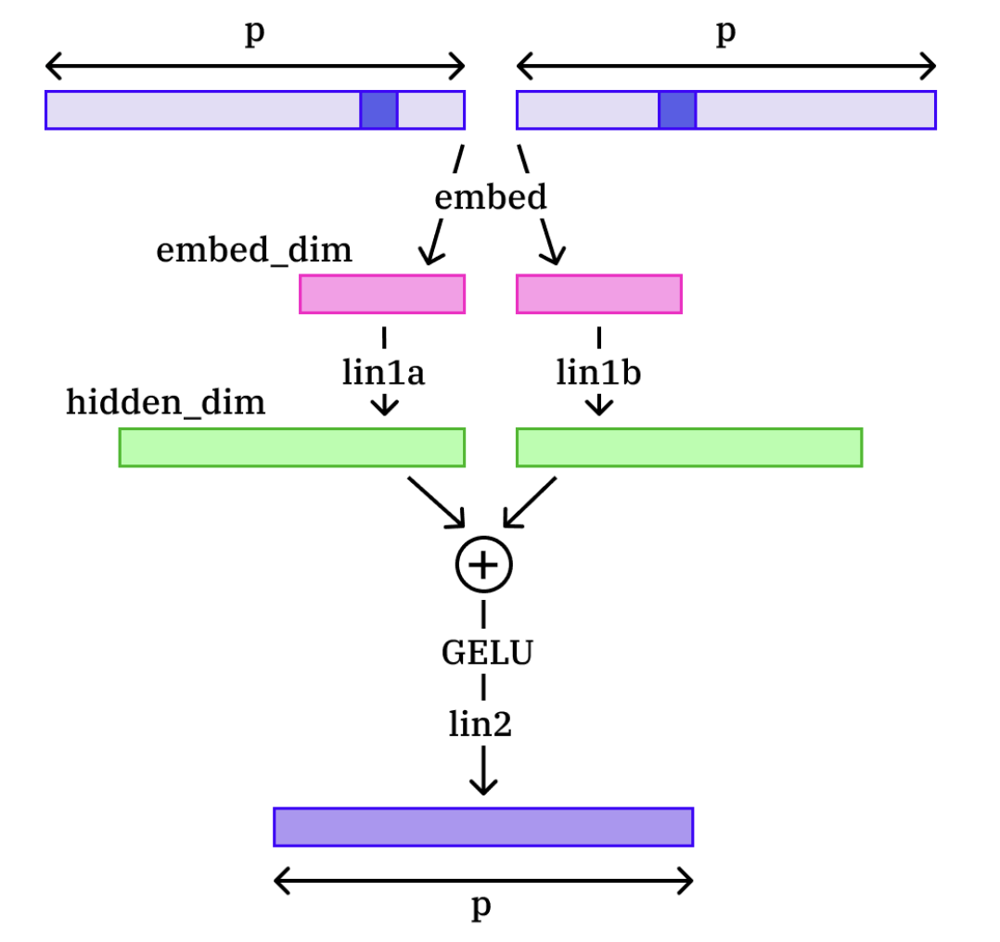
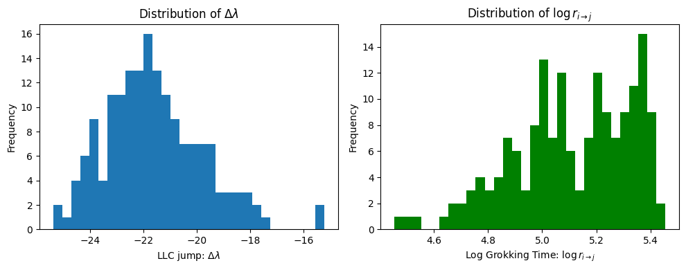
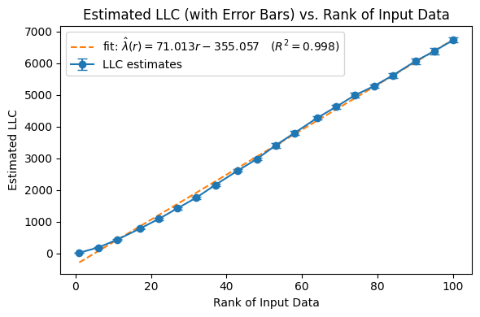

# Lakkapragada 2025 — Using physics-inspired Singular Learning Theory to understand grokking & other phase transitions in modern neural networks

См. также: [глобальный индекс понятий](../../concepts/index.md).

**Anish Lakkapragada** (Департамент статистики, Йельский университет).

arXiv [2512.00686](https://arxiv.org/abs/2512.00686), декабрь 2025 (v3), 9 страниц, 7 рисунков, 1 таблица. Всего цитирований по Semantic Scholar — 1, в картотеке — 1. Единоличная эмпирическая проверка сингулярной теории обучения (SLT) на игрушечных постановках: аррениусовская гипотеза — срок перехода экспоненциален в изменении свободной энергии $\mathcal{F}_{n}$ — проверена на гроккинге модульного сложения (168 грокнувших прогонов из 500) и на игрушечных моделях суперпозиции Anthropic (объявлено неубедительным), а масштабирование местного коэффициента обучения (LLC) со сложностью задачи измерено на трёх управляемых семействах: полиномиальные регрессоры, низкоранговые линейные сети, автокодировщики. Редкая для корпуса статистика: распределение скачка LLC при гроккинге по 168 прогонам ($\Delta\lambda\approx-22$).

Оригинал и производные файлы этой папки:

- [`original/2512.00686.using-physics-inspired-singular-learning-theory-to-understand-grokking-and-other-phase-transitions-in-modern-neural-networks.md`](original/2512.00686.using-physics-inspired-singular-learning-theory-to-understand-grokking-and-other-phase-transitions-in-modern-neural-networks.md) — конверсия оригинала (native arXiv HTML, v3) в Markdown без правок содержания.
- [`2512.00686.using-physics-inspired-singular-learning-theory-to-understand-grokking-and-other-phase-transitions-in-modern-neural-networks.claims.txt`](2512.00686.using-physics-inspired-singular-learning-theory-to-understand-grokking-and-other-phase-transitions-in-modern-neural-networks.claims.txt) — пронумерованные утверждения статьи с пометками разбора.
- [`images/`](images/) — 7 рисунков.

Схема якорей и правила ссылок на карточку — в [README папки статей](../README.md).

## Затрагиваемые понятия

**[Гроккинг](../../concepts/grokking.md)** — взят не сам по себе, а как частный случай фазового перехода и полигон для SLT: аррениусовская гипотеза $r_{i\to j}\propto\exp(\beta_{\text{eff}}\Delta\mathcal{F}_{i\to j})$ должна предсказывать, когда модель грокнет ([`p2-6`](#p2-6)). На модульном сложении ($p=53$, 500 прогонов, из них грокнули 168) подгонка даёт устойчиво отрицательный наклон, но с низким $R^{2}$ ([`p3-4`](#p3-4), [`fig-3`](#fig-3)); механики гроккинга — признаков Фурье, норм, представлений — работа не касается. Ценное: гистограмма скачка сложности $\Delta\lambda\approx-22$ по 168 прогонам — грокнутое решение проще запомнившего ([`fig-2`](#fig-2)).

**[Фазовый переход](../../concepts/phase-transition.md)** — вторая постановка выбрана именно за множественность переходов в одном прогоне: игрушечные модели суперпозиции Anthropic (TMS), где переходы ищутся по падениям сглаженной кривой потери ([`p4-2`](#p4-2)). Результат честно объявлен неубедительным: наклон подгонки менял знак при смене способа обнаружения переходов ([`p4-3`](#p4-3), [`fig-4`](#fig-4)) — редкий для корпуса прямо описанный отрицательный результат.

**[Эффективная теория / статистическая механика](../../concepts/effective-theory-statistical-mechanics.md)** — физическая рамка здесь — SLT Ватанабэ: свободная энергия $\mathcal{F}_{n}\approx\min_{\alpha}[nL_{n}(w^{*}_{\alpha})+\lambda_{\alpha}\log n]$ как внутренний выбор модели между потерей и сложностью ([`p2-1`](#p2-1)), а гипотеза срока перехода заимствует форму уравнения Аррениуса из химической кинетики ([`p2-6`](#p2-6)). Разбор отмечает: как именно вычислялась $\mathcal{F}_{n}$, в тексте не сказано, знак $\Delta\mathcal{F}$ дважды расходится с собственной картиной минимизации, а оценка барьера — то, чем у Аррениуса задаётся показатель, — вынесена в открытые вопросы.

**[Границы обобщения](../../concepts/generalization-bounds.md)** — мотивировка работы: PAC-границы пусты, потому что нейросети сингулярны — одну функцию задают многие наборы весов, и матрица Фишера вырождена в истинной точке ([`p1-3`](#p1-3)); LLC $\lambda_{\alpha}$ предлагается как учитывающая сингулярность мера сложности. Измерения дают и совпадения с теорией (квадратика $\lambda_{r}\approx\frac{1}{2}r(2d-r)$ для низкоранговых сетей, [`p7-1`](#p7-1), [`fig-6`](#fig-6)), и расхождения: у формально регулярных полиномиальных регрессоров LLC на порядок ниже ожидания $d/2$ и выходит на полку — объяснено сингулярностями от сжатой области входа ([`p5-8`](#p5-8), [`fig-5`](#fig-5)).

## Что показано, а что предположено

Замечания редактора карточки по итогам разбора утверждений (`…claims.txt`, 45 пунктов).

**Главная гипотеза держится на $R^{2}=0.062$.** Заявка «согласуется с нашей гипотезой» для модульного сложения опирается на подгонку $\Delta\mathcal{F}=-26.8\log r-133$, объясняющую около шести процентов разброса; в тексте число не приведено — сказано лишь «albeit with a low $R^{2}$ score». Подгонка сделана не в ту сторону (регрессируется $\Delta\mathcal{F}$ по $\log r$, а не наоборот), само значение $\beta_{\text{eff}}$ нигде не приведено, а из отрицательного наклона следует, что большему падению свободной энергии отвечает большее время до гроккинга.

**Знак $\Delta\mathcal{F}$ не сходится дважды.** По рисунку 3 свободная энергия в грокнутой точке выше, чем в запомнившей, — вразрез и с введением («сеть последовательно старается снизить свободную энергию»), и с собственными составляющими: раз и потеря, и $\lambda$ при гроккинге падают, $nL_{n}+\lambda\log n$ должна падать. Ни одно расхождение не оговорено. Как именно $\mathcal{F}_{n}$ вычислялась из $\lambda$ и $L_{n}$, не сказано ни разу.

**Отбор и сопоставимость прогонов.** Из 500 прогонов грокнули 168 (33.6%), остальные выброшены без обсуждения; чем прогоны различались — семенами или гиперпараметрами — не сказано, а $\beta_{\text{eff}}$ по определению зависит от гиперпараметров. Настройки SGLD-выборщика различаются между опытами на два порядка по шагу, поэтому значения LLC между опытами несопоставимы; кода, данных, семян и числа цепочек нет.

**Вопрос 2: совпадения и полка.** Квадратика для низкоранговых сетей воспроизведена с $R^{2}=0.999$ (коэффициенты ниже ожидаемых примерно на 13%); линейность автокодировщика ($R^{2}=0.998$) объявлена не встречавшейся в литературе, хотя следует из линейного роста числа весов по $r$. У полиномиальных регрессоров расхождение не «ниже ожидаемого», а на порядок с лишним: при $d=100$ ожидание 50, измерено около 3.9 — полка без роста, одинаково объяснимая и сингулярностями от сжатой области, и насыщением самой оценки SGLD; вторая возможность не проверена. Вывод о «большей способности к обобщению» сжатых моделей не следует ни из чего: обобщение в опыте не измерялось.

**Честный отрицательный результат.** Опыт на TMS признан неубедительным самим автором — при более грубом способе обнаружения переходов наклон получался обратным; свидетельство в заключении названо «смешанным», и первый открытый вопрос — как вообще оценивать барьер свободной энергии.

**Как работу будут цитировать** («SLT предсказывает время гроккинга», «аррениусовский закон гроккинга») — точнее: на одной задаче получена подгонка с $R^{2}=0.062$ по 168 отобранным прогонам, а повторение на TMS объявлено самим автором неубедительным и меняло знак при смене способа обнаружения переходов.

---

# Текст статьи

## Использование физически вдохновлённой сингулярной теории обучения для понимания гроккинга и других фазовых переходов в современных нейронных сетях

Anish Lakkapragada Аффилиация: Департамент статистики Аффилиация: Йельский университет Аффилиация: anish.lakkapragada@yale.edu

## Аннотация

Классическая статистическая теория вывода и обучения часто не может объяснить успех современных нейронных сетей. Ключевая причина в том, что эти модели неидентифицируемы (сингулярны), что нарушает основные предположения PAC-границ и асимптотической нормальности. Сингулярная теория обучения (SLT), физически вдохновлённая рамка, основанная на алгебраической геометрии, набрала популярность благодаря способности закрыть этот разрыв между теорией и практикой. В этой статье мы эмпирически изучаем SLT в игрушечных постановках, относящихся к интерпретируемости и фазовым переходам. Во-первых, мы разбираемся со свободной энергией SLT $\mathcal{F}_{n}$, проверяя гипотезу скорости в аррениусовском стиле как на грокающей модели модульной арифметики, так и на игрушечных моделях суперпозиции Anthropic. Во-вторых, мы разбираемся с местным коэффициентом обучения $\lambda_{\alpha}$, измеряя, как он масштабируется со сложностью задачи на нескольких управляемых семействах сетей (полиномиальные регрессоры, низкоранговые линейные сети и низкоранговые автокодировщики). Часть наших экспериментов воспроизводит известные законы масштабирования, тогда как другие дают содержательные отклонения от теоретических ожиданий. В целом наша статья иллюстрирует многие достоинства SLT для понимания фазовых переходов нейронных сетей и ставит открытые исследовательские вопросы для области.

## 1 Введение

###### p1-3

Классической статистики недостаточно для понимания современного машинного обучения. Например, хорошо изученные PAC-границы из статистической теории обучения пусты и не могут объяснить замечательную обобщающую силу нейронных сетей. Причина этого исходит из хорошо хранимого секрета последних 15 лет: нейронные сети — *сингулярные* статистические модели (Wei et al., 2022). А именно, в отличие от *регулярных* моделей, сингулярные модели могут реализовывать одну и ту же функцию через несколько различных значений параметров. Как пример того, как это может происходить в сингулярной модели, заметим, что $\forall\alpha>0,\text{ReLU}(x)=\frac{1}{\alpha}\text{ReLU}(\alpha x)$ (Hoogland, 2023). Более того, сингулярные модели *не* демонстрируют ожидаемого статистического поведения. Например, информационная матрица Фишера — основа теории асимптотической нормальности для MLE — часто необратима в истинных параметрах сингулярных моделей (Watanabe, 2010). Что самое насущное, большинство моделей ИИ сегодня (нейросети, LLM) сингулярны. Поэтому из острой необходимости изучать их ради безопасности ИИ (Lehalleur et al., 2025) чрезвычайно математически строгая область сингулярной теории обучения (SLT), развитая в 2009 году, получила возобновлённое внимание.

### Введение в сингулярную теорию обучения (SLT)

SLT — чрезвычайно математически строгая рамка, развитая из алгебраической геометрии д-ром Сумио Ватанабэ в его двух книгах (Watanabe, 2009) и (Watanabe, 2018). В своей основе SLT утверждает, что *сингулярности* модели — веса, в которых модель неидентифицируема[^1] — определяют области пространства весов, которые модель будет занимать при $n\to\infty$. Более конкретно, если предположить, что наша модель имеет пространство параметров $\mathcal{W}\subseteq\mathbb{R}^{d}$, и взять $\{\mathcal{W}_{\alpha}\}_{\alpha}$ как последовательность подмножеств $\mathcal{W}$, удовлетворяющих мягким аналитическим условиям[^2], то применением (Watanabe, 2018, § 6.3) мы получаем следующее приближение:

**[p. 2]**

$$
\mathcal{F}_{n}:=-\log p(D_{n})\approx\min_{\alpha}[nL_{n}(w^{*}_{\alpha})+\lambda_{\alpha}\log n]
$$

###### p2-1

где $\mathcal{F}_{n}$ — «свободная энергия» модели, $w_{\alpha}^{*}$ — $\mathcal{W}_{\alpha}$-глобальный минимум популяционного отрицательного логарифма правдоподобия, $L_{n}$ — эмпирический отрицательный логарифм правдоподобия, а $\lambda_{\alpha}$ — местный коэффициент обучения (LLC[^3]) (Lau et al., 2023). Из этого уравнения мы получаем принципиальное понимание *внутреннего выбора модели*, который нейронная сеть выполняет во время обучения (Chen et al., 2023). А именно, мы видим, что нейронная сеть во время обучения последовательно старается минимизировать свободную энергию через размен потери $L_{n}(w^{*}_{\alpha})$ и сложности модели $\lambda_{\alpha}$.

### Исследовательские вопросы

Нас интересует следующий широкий вопрос: *как мы можем понять[^4] гроккинг и другие фазовые переходы в нейронных сетях через сингулярную теорию обучения?* Два главных исследовательских вопроса, которые мы в этом русле решаем:

- Как далеко можно распространить физическую величину SLT «свободная энергия» $\mathcal{F}_{n}$ для понимания того, *когда* модель претерпит фазовый переход или грокнет?
- Можем ли мы лучше понять местный коэффициент обучения SLT $\lambda_{\alpha}$ (Lau et al., 2023) и его чувствительность к различным задачам и их сложности?

## 2 Методы

Мы стремимся использовать в нашем изучении SLT лёгкие модели, о которых известно, что они грокают, поскольку их можно обучать много раз и получать хорошую статистику.

#### Оценка LLC.

Нас интересует свободная энергия этих моделей во времени, которая фундаментально основана на местном коэффициенте обучения SLT $\lambda_{\alpha}$. Измерение $\lambda_{\alpha}$ модели крайне нетривиально, поэтому мы обратимся к процедуре MCMC-оценки стохастической градиентной ланжевеновской динамикой (SGLD) из (Lau et al., 2023). Все гиперпараметры SGLD настраивались для устойчивости и сведены в Приложении.

## 3 Эксперименты

### Вопрос 1: понимание временно́й стороны гроккинга и фазовых переходов

#### Наша гипотеза скорости реакции по Аррениусу.

###### p2-6

Пусть мы обучаем модель, и определим $\mathcal{W}_{t}$ как веса модели на итерации $t$. Пусть теперь на итерации $i$ модель лишь запомнила (то есть 100% точность на обучении при плохой точности на тесте), тогда как на итерации $j$ модель грокнула (то есть 100% точность на тесте и обучении). Определим $\mathcal{F}_{i}$ и $\mathcal{F}_{j}$ как свободную энергию модели, по определению SLT, на каждой из этих итераций. Заимствуя из аррениусовской теории скоростей реакций в химической кинетике (Arrhenius, 1889), мы выдвигаем следующую гипотезу для объяснения времени, которое требуется, чтобы грокнуть:

$$
\boxed{r_{i\to j}\propto\exp\Big(\,\beta_{\text{eff}}\,\Delta\mathcal{F}_{i\to j}\Big),\quad r_{i\to j}:=j-i,\quad\Delta\mathcal{F}_{i\to j}:=\mathcal{F}_{i}-\mathcal{F}_{j}}
$$

где $\Delta\mathcal{F}_{i\to j}<0$, а $\beta_{\text{eff}}$ — действенная обратная температура, зависящая от глобальных гиперпараметров (скорость обучения, размер батча и т.д.). Главная интуиция здесь в том, что время, которое **[p. 3]** требуется для наступления фазового перехода, экспоненциально в том, насколько он снижает (свободную) энергию модели.

#### Эксперимент один: гроккинг на модульной арифметике.

Сначала мы проверяем нашу гипотезу на постановке модульной арифметики — распространённой постановке для изучения гроккинга (Power et al., 2022; Panickssery and Vaintrob, 2023; Pearce et al., 2023). Подробнее, мы обучаем нейронную сеть отображению $(a,b)\mapsto a+b\text{ mod }p$ для некоторого простого $p$, используя архитектуру, показанную на рисунке 1.

*Рисунок 1: Схема нейронной сети модульной арифметики, которую мы используем в экспериментах, взята из (Panickssery and Vaintrob, 2023). Заметим, что эту задачу можно представлять как взятие двух чисел из $\mathbb{Z}_{p}$ и выдачу вычета в $\mathbb{Z}_{p}$.* **[p. 3]**

Для наших конкретных экспериментов мы берём $p=53$ и обучаем все модели на случайно выбранном $40\%$ подмножестве $\mathbb{Z}_{53}\times\mathbb{Z}_{53}$ (оставшиеся $60\%$ использовались для валидации.) Мы обучили 500 разных моделей и для каждой сохранили[^5] потерю и точность на обучении, потерю и точность на валидации и — если случался гроккинг — вычисленные LLC до и после гроккинга. Всю эту информацию мы сохраняли через проект Weights & Biases; в целом этот процесс занял более 7 дней непрерывного счёта на CPU.

###### p3-3

Для наших анализов, которые мы сейчас представим, мы учитывали только те 168 (33.6%) прогонов, в которых случился гроккинг. Мы приводим гистограмму распределения наблюдённых скачков LLC $\Delta\lambda$ и логарифмов времени гроккинга $\log(r_{i\to j})$ на рисунке 2. График $\log(r_{i\to j})$ против $\Delta\mathcal{F}_{i\to j}$ по нашим прогонам мы приводим на рисунке 3.

###### fig-2

*Рисунок 2: Распределение $\Delta\lambda$ и $\log r_{i\to j}$.* **[p. 3]**

###### fig-3

*Рисунок 3: $\Delta\mathcal{F}_{i\to j}$ против $\log r_{i\to j}$ с линейной подгонкой на игрушечных сетях модульной арифметики при $p=53$.* **[p. 4]**

###### p3-4

Наблюдённая зависимость **согласуется с нашей гипотезой**, поскольку демонстрирует устойчиво отрицательный наклон, хотя и с низким показателем $R^{2}$.

**[p. 4]**

#### Эксперимент два: фазовые переходы на игрушечных моделях суперпозиции Anthropic.

Чтобы перепроверить нашу гипотезу на другой задаче, мы выполняем тот же эксперимент на игрушечных моделях суперпозиции Anthropic (Toy Models of Superposition, TMS) (Elhage et al., 2022). TMS — чрезвычайно малые сети, надёжно претерпевающие эстетичные фазовые переходы, при которых столбцы весов (при визуализации) образуют всё более сложные фигуры (например, $2$-угольник $\to 3$-угольник $\to 4-$угольник). Заметим, что это контрастирует с гроккингом, поскольку теперь в одном прогоне может происходить *несколько* фазовых переходов.

###### p4-2

Этот эксперимент во многом похож на первый, за исключением нескольких изменений. Мы обучили $60$ моделей (снова с Weights & Biases) по $4500$ итераций. Для каждого прогона мы отслеживали LLC по 100 линейно и логарифмически расставленным контрольным точкам. Кроме того, для данного прогона мы обнаруживали переходы, (1) сглаживая кривую обучающей потери примерно по каждым $\sim 10$ шагам и (2) находя отрезки кривой обучающей потери, где потеря снижалась на $\geq 10\%$ полного снижения потери за обучение. *Мы наблюдали, что наши конечные результаты сильно варьируются в зависимости от метода обнаружения этих переходов.* Затем мы вычисляли $\Delta\mathcal{F}_{i\to j}$ как изменение свободной энергии между любыми двумя *последовательными* переходами. График $\Delta\mathcal{F}_{i\to j}$ против $\log r_{i\to j}$ с линейной подгонкой приведён на рисунке 4.

###### fig-4

*Рисунок 4: $\Delta\mathcal{F}_{i\to j}$ против $\log r_{i\to j}$ с линейной подгонкой на TMS-моделях Anthropic.* **[p. 4]**

###### p4-3

Хотя эти результаты резко расходятся с результатами предыдущего эксперимента, мы утверждаем, что из них всё же можно извлечь ценную информацию. Сначала обратимся к трём вертикальным сгусткам времён переходов: мы предполагаем, что эти сгустки возникли вследствие (1) нашего метода обнаружения переходов **[p. 5]** и (2) уникальности постановки эксперимента TMS (то есть модель с крайне малым числом параметров может иметь более фиксированные моменты переходов). Кроме того, показанная линейная подгонка имеет восходящий наклон, который, как мы отмечаем, был крайне чувствителен к (1): при более простом, без сглаживания, способе обнаружения переходов мы на деле получали нисходящую линейную подгонку. Ввиду изменчивости наших результатов мы сочли этот эксперимент **неубедительным для нашей гипотезы** и перешли к вопросу 2.

### Вопрос 2: понимание того, как LLC $\lambda_{\alpha}$ масштабируется со сложностью задачи

#### Мотивация.

Второй широкий вопрос, который мы решаем в этом проекте, — понимание поведения местного коэффициента обучения (LLC) $\lambda_{\alpha}$. Для контекста: LLC — мера сложности модели ($\uparrow\text{LLC}\implies\uparrow\text{complexity}$), спроектированная как устойчивая при измерении сложности сингулярных моделей. Однако LLC крайне неинтуитивен, как видно из его определения (воспроизведённого из (Lau et al., 2023)) ниже:

##### **Определение 3.1**(Местный коэффициент обучения (LLC))**.**

*Существуют единственное рациональное число $\lambda(w^{*})$, положительное целое $m(w^{*})$ и некоторая константа $c>0$ такие, что асимптотически при $\varepsilon\to 0$,*

$$
V(\varepsilon)=c\,\varepsilon^{\lambda(w^{*})}(-\log\varepsilon)^{m(w^{*})-1}+o\!\left(\varepsilon^{\lambda(w^{*})}(-\log\varepsilon)^{m(w^{*})-1}\right).
$$

*Мы называем $\lambda(w^{*})$ местным коэффициентом обучения (LLC), а $m(w^{*})$ — местной кратностью.*

Это резко контрастирует со знаменитыми мерами сложности *статистической* теории обучения (например, размерностью Вапника–Червоненкиса), которые не только, пожалуй, интуитивнее, но и очень хорошо изучены. Поэтому мы намерены подступиться к пониманию LLC, проверяя, насколько хорошо он масштабируется со сложностью задачи. Эти эксперименты вдохновлены (Panickssery and Vaintrob, 2023), которые продемонстрировали, что LLC линейно масштабируется в (обобщающих) сетях модульной арифметики с $p$.

#### Эксперимент один: полиномиальные регрессоры возрастающей степени.

Первая изучаемая нами постановка — одномерные полиномиальные регрессоры возрастающей степени. Мы говорим, что функция $f:\mathbb{R}\to\mathbb{R}$ — полиномиальный регрессор степени $d$, если $f(x)=\sum_{i=0}^{d}a_{i}x^{i}$ для $\{a_{i}\}_{i=0}^{d}\subset\mathbb{R}$ и всех $x_{i}\in\mathcal{X}\subseteq\mathbb{R}$. Заметим, что использование этого ограниченного пространства примеров $\mathcal{X}$ необходимо, поскольку численно неустойчиво использовать $x_{i}$ с абсолютной величиной больше единицы при масштабировании степени $d\sim 10^{3}$. Для данной степени $d$ и пространства примеров $\mathcal{X}$ мы выполняем следующую процедуру десять раз, чтобы получить точную оценку среднего LLC $\lambda_{d}$ и соответствующего стандартного отклонения:

1. Породить $d$-степенной набор данных $\mathcal{D}_{N}=\{(x_{i},y_{i})\}_{i=1}^{N}$ из $N=500$ примеров, реализуемый некоторым полиномиальным регрессором со всеми коэффициентами в $[-1,1]$ и всеми примерами $x_{i}\in\mathcal{X}$.
2. Инициализировать полиномиальный регрессор степени $d$ с нуля и обучить его на $\mathcal{D}_{N}$ до сходимости.
3. Измерить LLC этой сошедшейся модели.

Мы используем в экспериментах $\mathcal{X}=[-1,1],[-0.75,0.75],$ и $[-0.5,0.5]$. Для каждого выбора $\mathcal{X}$ мы представляем $\lambda_{d}$ для двадцати значений $d$ от $10^{0}$ до $10^{3}$ на рисунке 5.

###### fig-5

*Рисунок 5: Оценённый LLC против степени полиномиального регрессора для всех выборов пространства примеров $\mathcal{X}$.* **[p. 6]**

###### p5-8

Хотя этот результат обманчиво прост, на деле он весьма интересен. Заметим, что полиномиальные регрессоры — *регулярные* модели, то есть существует биекция из $\{a_{i}\}_{i=0}^{d}$ в некоторую функцию из $\mathbb{R}\to\mathbb{R}$. Поэтому, следуя хорошо установленным результатам SLT (Wei et al., 2022), мы ожидали бы $\lambda_{d}=\frac{d}{2}$. Это означает, что наши эмпирические оценки LLC, при всех $\mathcal{X}$, *ниже* теоретических ожиданий. Мы объясняем это тем, что входом наших полиномиальных регрессоров является не $\mathbb{R}$, а некоторый выбор $\mathcal{X}\subset\mathbb{R}$, что порождает сингулярности параметров. Формулируя это явно: вероятно, для некоторой функции полиномиальной регрессии $f_{A}$, порождённой $A:=\{a_{i}\}_{i=0}^{d}\subset\mathbb{R}$, и некоторой функции полиномиальной регрессии $f_{B}$, порождённой $B:=\{b_{i}\}_{i=0}^{d}\subset\mathbb{R}$, **[p. 6]** функции $f_{A}\mid_{\mathcal{X}}=f_{B}\mid_{\mathcal{X}}$, несмотря на $A\neq B$. Такие сингулярности снижают LLC (Hoogland, 2023), что согласуется с нашими результатами. Более того, более узкие выборы интервала $\mathcal{X}$ вели бы к *большему числу* сингулярностей и *более низким* LLC — это снова согласуется с нашими результатами на рисунке 5. *Этот эксперимент устанавливает, что модели на практически ограниченных областях часто могут быть сингулярнее (и потому иметь более высокую способность к обобщению), чем ожидается.*

#### Эксперимент два: низкоранговая нейронная сеть с матричной факторизацией.

Для второго эксперимента мы выбираем задачу, которая априори имеет явные сингулярности. Рассмотрим однослойную нейронную сеть $f:\mathbb{R}^{d}\to\mathbb{R}^{d}$, заданную $f(x)=W_{2}W_{1}x$, где $W_{2}\in\mathbb{R}^{d\times r},W_{1}\in\mathbb{R}^{r\times d}$ при константах $r\leq d$. Тогда $\text{rank}(W_{2}W_{1})\leq r$, и более того, эта модель полна сингулярностей, поскольку для любой обратимой $G\in\mathbb{R}^{r\times r}$, $W_{2}W_{1}=(W_{2}G)(G^{-1}W_{1})$. Мы фиксируем $d:=100$ и используем ту же методологию, что и в предыдущем эксперименте, где теперь проверяем LLC $\lambda_{r}$ по 20 значениям ранга $r$, линейно расставленным от $1$ до $d$. Результаты мы приводим на рисунке 6.

###### fig-6

*Рисунок 6: Оценённый LLC против ранга нейронной сети, с квадратичной подгонкой.* **[p. 6]**

**[p. 7]**

###### p7-1

Мы видим чрезвычайно сильную квадратичную подгонку с пиком при ранге $r=d$. Эта подгонка весьма аккуратно совпадает с ожидаемыми результатами. А именно, стандартный факт алгебраической геометрии состоит в том, что множество $\mathcal{M}_{r}$ матриц ранга $r$ — гладкое многообразие размерности $r(2d-r)$. Следовательно, на этом многообразии мы можем по существу рассматривать нашу низкоранговую нейронную сеть $f$ как *регулярную* модель с $r(2d-r)$ параметрами $\implies\lambda_{r}=\frac{1}{2}r(2d-r)\approx-\frac{1}{2}r^{2}+100r$. Заметим, что эта квадратика чисто согласуется с членами $-0.429r^{2}+87.342r$ нашей подгонки.

#### Эксперимент три: автокодировщики возрастающей размерности бутылочного горлышка.

Для последнего эксперимента мы рассматриваем автокодировщик $f:\mathbb{R}^{d}\to\mathbb{R}^{d}$. Мы снова фиксируем $d:=100$ и для данного ранга $r\leq d$ порождаем пример $x\in\mathbb{R}^{d}$ как $x=Az$, где $z\sim\mathcal{N}(0,I_{r})$ и $A\in\mathbb{R}^{d\times r}$. Таким образом, увеличение $r$ увеличивает размерность подпространства, в котором живёт наш пример $x$. Мы устраиваем наш автокодировщик как последовательную сцепку ReLU MLP-кодировщика ($d\to 128\to r$ узлов) и ReLU MLP-декодировщика ($r\to 128\to d$ узлов). Мы обучаем автокодировщики с MSE и представляем результаты на рисунке 7:

###### fig-7

*Рисунок 7: Оценённый LLC против ранга входных данных, с линейной подгонкой.* **[p. 7]**

###### p7-3

Этот результат уникален, потому что он даёт чистую линейную подгонку ($R^{2}=0.998$), несмотря на то что большинство MLP заведомо не регулярные модели (то есть полны симметрий и сингулярностей.) Насколько нам известно, мы не встречали других подобных результатов о законах масштабирования в литературе по SLT. Кроме того, этот результат значим и потому, что слой бутылочного горлышка автокодировщика по сути выполняет (нелинейную) PCA (Kramer, 1991).

## 4 Заключение и будущие направления

###### p7-4

Мы представляем набор эмпирических результатов об использовании сингулярной теории обучения (SLT) как инструмента изучения и фазовых переходов, и сложности задач в современных нейронных сетях. В вопросе 1 мы получаем смешанное свидетельство в пользу аррениусовской связи скорости реакции между изменением свободной энергии $\Delta\mathcal{F}_{i\to j}$ и временем до перехода $r_{i\to j}$ на двух популярных постановках фазовых переходов (модульное сложение и игрушечные модели суперпозиции Anthropic). В вопросе 2 мы показываем, что практически ограниченные области могут порождать сингулярности в регулярных моделях (эксперимент 1), и воспроизводим ожидаемое алгебро-геометрическое предсказание $\lambda_{r}\approx\tfrac{1}{2}r(2d-r)$ для низкоранговой матричной факторизации при $f(x)=W_{2}W_{1}x$ (эксперимент 2). Наконец, мы демонстрируем своеобразную линейную подгонку LLC на сингулярных автокодировщиках растущей размерности бутылочного горлышка (эксперимент 3). **[p. 8]** Эти результаты дают конкретные примеры, где SLT воспроизводит известные законы масштабирования, но также иногда не согласуется с реальными измерениями.

#### Будущие направления.

Мы оставляем следующие открытые вопросы и направления для будущей работы:

- **Барьеры свободной энергии и скорости реакций.** Разработать принципиальный метод оценки барьера (барьеров) свободной энергии между двумя подмножествами пространства весов $\mathcal{W}_{i}$ и $\mathcal{W}_{j}$. Это позволило бы более прямо проверить аррениусовскую гипотезу скорости реакции, связывающую $\Delta\mathcal{F}_{i\to j}$ с $r_{i\to j}$.
- **Ограниченные области порождают сингулярности.** Найти другие стандартные постановки глубокого обучения, где естественные ограничения области (например, интенсивности пикселей в $[0,255]$) заставляют различные параметризации давать одинаковое поведение функции. Затем воспроизвести в этих постановках исследование полиномиальных регрессоров из вопроса 2, эксперимента 1. Это могло бы прояснить, когда такие ограничения содержательно снижают LLC, что часто делает возможным обобщение.
- **Сравнение LLC между архитектурами запоминания и обобщения.** Для фиксированного семейства задач (например, классификации изображений) сравнить LLC сильно перепараметризованной «запоминающей» сети и более компактной «обобщающей» сети. Посмотреть, как эта разница масштабируется со сложностью задачи (например, добавлением числа классов классификации)[^6].

## 5 Приложение

### Q1 и Q2: параметры SGLD, использованные для оценки LLC во всех экспериментах

Как сказано, оценка LLC опирается на стохастическую градиентную ланжевеновскую динамику (SGLD), которая требовала настройки гиперпараметров для численной устойчивости. Для каждого из наших экспериментов мы приводим скорость обучения $\epsilon$, выбор $\gamma$ и число шагов $n$, использованные нами, в таблице ниже.

*Таблица 1: Гиперпараметры SGLD, использованные для оценки LLC (Lau et al., 2023) во всех экспериментах.* **[p. 8]**

| Вопрос и № эксперимента | $\epsilon$ | $\gamma$ | $n$ |
|---|---|---|---|
| Вопрос один, эксперимент один | 3e-3 | 5.0 | 500 |
| Вопрос один, эксперимент два | 5e-4 | 1.0 | 400 |
| Вопрос два, эксперимент один | 1e-3 | 1.0 | 2000 |
| Вопрос два, эксперимент два | 1e-3 | 1.0 | 2000 |
| Вопрос два, эксперимент три | 1e-5 | 1.0 | 2000 |

[^1]: Веса $w\in\mathcal{W}$ неидентифицируемы, если $\exists\ w^{\prime}\in\mathcal{W}$ т.ч. функции модели $f(x,w)=f(x,w^{\prime})$.

[^2]: Полное обсуждение этих свойств см. в разделе 4.1 в (Chen et al., 2023).

[^3]: Заметим, что более высокие значения $\lambda_{\alpha}$ означают большую сложность модели.

[^4]: Понять в смысле «когда/что/где/почему».

[^5]: Временны́е метрики сохранялись по 100 линейно расставленным контрольным точкам во время обучения.

[^6]: Мы попробовали это на задаче синусоидальной регрессии, где запоминающей и обобщающей сетями были широкий ReLU MLP и линейный регрессор в базисе Фурье соответственно. Наши результаты указали, что MLP настолько полон сингулярностей, что его LLC оказался на деле *меньше*, чем у обобщающей сети, как и ожидалось бы по SLT. Хотя мы не представили этот результат, мы полагаем, что будущая работа в этом направлении могла бы быть содержательной.

## References

- Arrhenius (1889) S. Arrhenius Über die reaktionsgeschwindigkeit bei der inversion von rohrzucker durch säuren. Zeitschrift für physikalische Chemie 4 (1), pp. 226–248. Cited by: §3.

- Chen et al. (2023) Z. Chen, E. Lau, J. Mendel, S. Wei, and D. Murfet Dynamical versus bayesian phase transitions in a toy model of superposition. arXiv preprint arXiv:2310.06301. Cited by: §1, footnote 2.

**[p. 9]**

- Elhage et al. (2022) N. Elhage, T. Hume, C. Olsson, N. Schiefer, T. Henighan, S. Kravec, Z. Hatfield-Dodds, R. Lasenby, D. Drain, C. Chen, R. Grosse, S. McCandlish, J. Kaplan, D. Amodei, M. Wattenberg, and C. Olah Toy models of superposition. arXiv preprint arXiv:2209.10652. External Links: Link Cited by: §3.

- Hoogland (2023) J. Hoogland Neural networks generalize because of this one weird trick (Website) Note: LessWrong External Links: Link Cited by: §1, §3.

- Kramer (1991) M. A. Kramer Nonlinear principal component analysis using autoassociative neural networks. AIChE Journal 37 (2), pp. 233–243. External Links: Document Cited by: §3.

- Lau et al. (2023) E. Lau, Z. Furman, G. Wang, D. Murfet, and S. Wei The local learning coefficient: a singularity-aware complexity measure. arXiv preprint arXiv:2308.12108. Cited by: 2nd item, §1, §2, §3, Table 1.

- Lehalleur et al. (2025) S. P. Lehalleur, J. Hoogland, M. Farrugia-Roberts, S. Wei, A. G. Oldenziel, G. Wang, L. Carroll, and D. Murfet You are what you eat–ai alignment requires understanding how data shapes structure and generalisation. arXiv preprint arXiv:2502.05475. Cited by: §1.

- Panickssery and Vaintrob (2023) N. Panickssery and D. Vaintrob Investigating the learning coefficient of modular addition: hackathon project (Website) LessWrong. External Links: Link Cited by: Figure 1, §3, §3.

- Pearce et al. (2023) A. Pearce, A. Ghandeharioun, N. Hussein, N. Thain, M. Wattenberg, and L. Dixon Do machine learning models memorize or generalize?. Note: https://pair.withgoogle.com/explorables/grokking/ Explorables, PAIR (People + AI Research) at Google Cited by: §3.

- Power et al. (2022) A. Power, Y. Burda, H. Edwards, I. Babuschkin, and V. Misra Grokking: generalization beyond overfitting on small algorithmic datasets. arXiv preprint arXiv:2201.02177. Cited by: §3.

- Watanabe (2009) S. Watanabe Algebraic geometry and statistical learning theory. Cambridge University Press. Cited by: §1.

- Watanabe (2010) S. Watanabe Equations of states in singular statistical estimation. Neural Networks 23 (1), pp. 20–34. Cited by: §1.

- Watanabe (2018) S. Watanabe Mathematical theory of bayesian statistics. Cambridge University Press. Cited by: §1.

- Wei et al. (2022) S. Wei, D. Murfet, M. Gong, H. Li, J. Gell-Redman, and T. Quella Deep learning is singular, and that’s good. IEEE Transactions on Neural Networks and Learning Systems 34 (12), pp. 10473–10486. Cited by: §1, §3.
