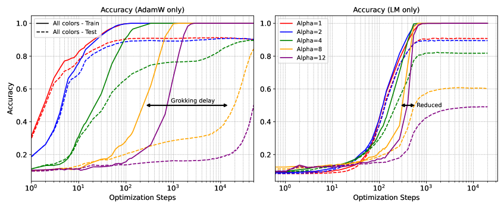
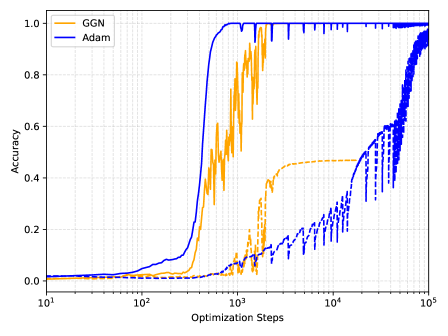
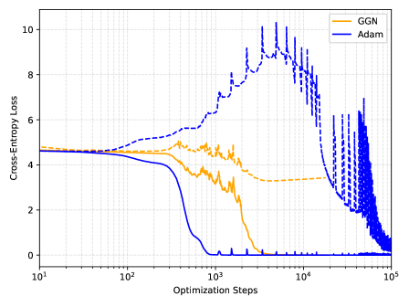

# Jiang, Voronin, Cyr, Southworth 2026 — On the Convergence Behavior of Preconditioned Gradient Descent Toward the Rich Learning Regime

См. также: [глобальный индекс понятий](../../concepts/index.md).

**Shuai Jiang, Alexey Voronin, Eric C. Cyr** (Sandia National Laboratories), **Ben Southworth** (Los Alamos National Laboratory).

arXiv [2601.03162](https://arxiv.org/abs/2601.03162), январь 2026 (версия v2). Опубликовано на ICLR 2026. 1 цитирование — сорок первая по цитируемости работа корпуса. Источник — нативный HTML arXiv версии v2.

Файлы разбора этой статьи:

- [`2601.03162.on-the-convergence-behavior-of-preconditioned-gradient-descent-toward-the-rich-learning-regime.claims.txt`](2601.03162.on-the-convergence-behavior-of-preconditioned-gradient-descent-toward-the-rich-learning-regime.claims.txt) — пронумерованные утверждения статьи с пометками разбора.
- [`2601.03162.on-the-convergence-behavior-of-preconditioned-gradient-descent-toward-the-rich-learning-regime.license.txt`](2601.03162.on-the-convergence-behavior-of-preconditioned-gradient-descent-toward-the-rich-learning-regime.license.txt) — лицензионная запись arXiv для этой статьи.

Схема якорей и правила ссылок на карточку — в [README папки статей](../README.md).

**Карточка-выдержка.** Лицензия статьи (`arxiv-nonexclusive`) не разрешает публикацию копии оригинала и полного перевода, поэтому карточка содержит редакторские секции и цитируемые фрагменты перевода (право цитирования). Полный текст статьи: <https://arxiv.org/abs/2601.03162>.

## Затрагиваемые понятия

**[Частотный принцип и спектральное смещение](../../concepts/frequency-principle-spectral-bias.md)** — понятие, вокруг которого построена вся работа. Оно названо и благом, и проклятием: подавляя высокочастотный шум, оно улучшает генерализацию, но мешает в научных задачах, где нужно схватить мелкомасштабное строение ([`p1-2`](#p1-2)). Ключевой ход — записать спектральное смещение уравнением: скорость убывания каждой моды ошибки задаётся отвечающим ей собственным числом NTK, а общее схождение — числом обусловленности ([`p4-6`](#p4-6)).

**[Нейронное касательное ядро](../../concepts/neural-tangent-kernel-ntk.md)** — рамка разбора. Лемма 3.1: в пределе бесконечной ширины моды ошибки расцепляются и убывают как $\partial_{t}\hat{e}_{i}=-\lambda_{i}\hat{e}_{i}$ ([`p4-6`](#p4-6)). Лемма 3.2: предобусловливание по Левенбергу — Марквардту заменяет $\lambda_{i}$ на $\lambda_{i}/(\mu+\lambda_{i})$, отчего число обусловленности падает до $\approx 2$ при $\mu=\lambda_{1}$ ([`p4-9`](#p4-9)). Лемма 3.3: при Гауссе — Ньютоне все моды сходятся с **одинаковой** скоростью, кроме тех, чьи собственные числа меньше отсечки псевдообратной ([`p5-3`](#p5-3)).

**[Оптимизатор](../../concepts/optimizer-adam-adamw-sgd.md)** — предмет работы: предобусловленный градиентный спуск (PGD) в видах Гаусса — Ньютона и Левенберга — Марквардта. Место Adam очерчено точно: он даёт каждому параметру свою скорость обучения, чем укорачивает ленивый режим, но пренебрегает взаимодействием параметров ([`p2-7`](#p2-7)). Для среднеквадратичной потери матрица информации Фишера совпадает с Гауссом — Ньютоном, требующим лишь якобиана ([`p3-3`](#p3-3)).

**[Переход от ленивого к богатому](../../concepts/lazy-to-rich-kernel-to-feature-learning.md)** — принятая догадка о гроккинге, которую работа берётся **проверить вмешательством**. Взяты два истолкования: Kumar et al. (заточение в подпространстве NTK) и Zhou et al. (спектральное несоответствие обучающих и тестовых данных) ([`p3-7`](#p3-7)). Если оба верны, то ускорение обследования NTK должно сокращать задержку — и это предсказание проверяется ([`p6-1`](#p6-1)).

**[Гроккинг](../../concepts/grokking.md)** — итог заявлен как свидетельство: PGD равномерно сокращает задержку на всех проверенных задачах, а значит, гроккинг и вправду есть переходное поведение между ленивым режимом и богатым ([`p1-2`](#p1-2), [`p7-2`](#p7-2)). Существенная оговорка приведена там же: сокращая задержку, PGD часто не достигает высокой **итоговой** генерализации ([`p10-3`](#p10-3)).

**[Масштаб инициализации](../../concepts/initialization-scale.md)** — рычаг, которым вызывается гроккинг во всех опытах: умножение начальных весов (или выхода модели) на $\alpha$, причём $\alpha\to\infty$ отвечает более широкому ленивому режиму ([`p10-2`](#p10-2)). Наблюдение о нормах весов приведено мимоходом, но весомо: при разных оптимизаторах нормы растут, убывают или держатся неизменно, а гроккинг происходит всё равно ([`p5-6`](#p5-6), [`fig-1`](#fig-1)).

**[Weight decay](../../concepts/weight-decay.md)** — в главных опытах не применяется вовсе ([`fig-8`](#fig-8)), и это делает наблюдение о нормах чище. Приложение C, однако, приводит противоположный случай: гроккинг на MNIST с перекрёстной энтропией достигается **исключительно** убыванием нормы весов, поскольку обучающая потеря там машинный нуль ([`p19-1`](#p19-1)).

**[Модульная арифметика](../../concepts/modular-arithmetic.md)** — две постановки: неглубокая MLP с квадратичной активацией на сложении по модулю 23 ([`p9-1`](#p9-1)) и классический двухслойный трансформер Power et al. на модуле 97 ([`p10-1`](#p10-1)). Именно на трансформере приём и упирается в предел: обобщённый Гаусс — Ньютон ускоряет рост проверочной точности, но застревает на 45 % против почти 100 % у Adam ([`fig-8`](#fig-8)).

**[Настоящие данные](../../concepts/vision-real-world-data-mnist-cifar.md)** — MNIST в постановке Omnigrok с увеличенной инициализацией; здесь же и главный практический вывод: 2000 итераций LM, затем 20 000 итераций AdamW — и итоговое качество восстанавливается ([`p10-2`](#p10-2), [`fig-7`](#fig-7)).

**[Спектральный разбор](../../concepts/spectral-analysis-svd-esd-fve.md)** — измерение ведётся помодово через FFT невязки; на одномерной регрессии видно, что ошибки GN убывают равномерно по всем десяти первым частотам, а LM перемежает между SGD и GN ([`p7-4`](#p7-4), [`fig-3`](#fig-3)).

**[Обобщающие границы](../../concepts/generalization-bounds.md)** — их здесь нет: работа даёт не границы, а уравнения развития ошибки по модам. Схождение в богатом режиме прямо названо во многом открытым вопросом ([`p5-5`](#p5-5)).

**[Плоскостность и ландшафт потерь](../../concepts/loss-landscape-basins.md)** — картина рисунка 2: SGD идёт изогнутым путём вдоль линий уровня дурно обусловленного ландшафта, предобусловливание спрямляет путь, но приводит в точку $w^{*}_{\mu}$ на ленивом подпространстве, откуда до истинной цели надо ещё сойти приёмом первого порядка ([`fig-2`](#fig-2)).

Отдельно стоит сказать, чего в работе **нет**. Нет разбора размеров обучающего и тестового наборов — другой вероятной причины гроккинга; это признано прямо ([`p10-3`](#p10-3)). Нет и объяснения, **отчего** приёмы высшего порядка не обобщают: наблюдение о том, что минимум Гаусса — Ньютона лежит «далеко» от обобщающего решения, приведено как факт ([`p20-2`](#p20-2)). Нет и одобрения самих приёмов: авторы подчёркивают, что итоги суть исследование динамики оптимизации, а не призыв переходить на псевдовторопорядковые приёмы ([`p20-2`](#p20-2)).

Карточки статей корпуса: [Power et al. 2022](../2201.02177.grokking-generalization-beyond-overfitting-on-small-algorithmic-datasets/2201.02177.grokking-generalization-beyond-overfitting-on-small-algorithmic-datasets.card.md) — исходная постановка, воспроизведённая целиком; [Kumar et al. 2023](../2310.06110.grokking-as-the-transition-from-lazy-to-rich-training-dynamics/2310.06110.grokking-as-the-transition-from-lazy-to-rich-training-dynamics.card.md) — первое из двух проверяемых истолкований; [Zhou et al. 2024](../2405.17479.a-rationale-from-frequency-perspective-for-grokking-in-training-neural-network/2405.17479.a-rationale-from-frequency-perspective-for-grokking-in-training-neural-network.card.md) — второе, частотное; [Omnigrok](../2210.01117.omnigrok-grokking-beyond-algorithmic-data/2210.01117.omnigrok-grokking-beyond-algorithmic-data.card.md) — постановка MNIST и масштабирование инициализации; [Liu et al. 2022](../2205.10343.towards-understanding-grokking-an-effective-theory-of-representation-learning/2205.10343.towards-understanding-grokking-an-effective-theory-of-representation-learning.card.md) — действенная теория обучения представлениям; [Thilak et al. 2022](../2206.04817.the-slingshot-mechanism-an-empirical-study-of-adaptive-optimizers-and-grokking/2206.04817.the-slingshot-mechanism-an-empirical-study-of-adaptive-optimizers-and-grokking.card.md) — динамика приспосабливающихся оптимизаторов; [Varma et al. 2023](../2309.02390.explaining-grokking-through-circuit-efficiency/2309.02390.explaining-grokking-through-circuit-efficiency.card.md) — действенность контуров; [EGD](../2510.04930.egalitarian-gradient-descent-a-simple-approach-to-accelerated-grokking/2510.04930.egalitarian-gradient-descent-a-simple-approach-to-accelerated-grokking.card.md) — ближайшая по замыслу работа корпуса: то же спектральное нормирование градиента, но без гессиана.

## Что показано, а что предположено

Замечания редактора карточки по итогам разбора утверждений (`…claims.txt`). Работа устроена как проверка чужой догадки вмешательством: три леммы, пять опытных постановок, ни одной новой теории гроккинга.

**Замысел хорош: догадка проверяется не наблюдением, а рычагом.** Если гроккинг есть заточение в ленивом режиме, то ускорение обследования этого режима должно задержку сократить. Предсказание сделано до опытов и подтверждено на всех пяти постановках ([`p6-1`](#p6-1), [`p7-2`](#p7-2)). В корпусе, где догадка о переходе от ленивого к богатому обычно подкрепляется корреляциями, это заметный шаг.

**Леммы просты и честно очерчены.** Все три — прямые выкладки над сингулярным разложением якобиана, и авторы прямо пишут, что итоги осмысленны лишь в режиме NTK, где ядро развивается линейно ([`p5-5`](#p5-5)). Никакой заявки на богатый режим нет.

**Самая ценная часть — отрицательный итог.** Предобусловливание сокращает задержку, но итоговая генерализация падает, и падает сильно: 45 % против 100 % на трансформере ([`fig-8`](#fig-8)). Работа не прячет это, а делает из него содержательный вывод: приёмы высшего порядка держатся близ подпространства NTK и в богатый режим не уходят ([`p10-2`](#p10-2)).

**Отсюда практический рецепт, идущий против привычки.** Начинать PGD, а заканчивать приёмом первого порядка — обратно обычаю вычислительной математики, где вторым порядком завершают ([`p6-1`](#p6-1)). 2000 итераций LM плюс 20 000 AdamW дают на MNIST то же или лучшее качество ([`fig-7`](#fig-7)).

**Но рецепт работает не везде, и это показано.** На трансформере то же продолжение требует столько же итераций Adam, сколько чистый Adam, а проверочная потеря по пути резко взлетает ([`p20-2`](#p20-2)). Вывод сделан осторожный: минимум Гаусса — Ньютона там «нелегко продолжить до обобщающего». Что отличает этот случай от MNIST, не выяснено.

**Наблюдение о нормах весов сделано мимоходом, а весит много.** При разных оптимизаторах нормы растут, убывают или держатся неизменно — и гроккинг происходит во всех случаях ([`p5-6`](#p5-6)). Это независимое подтверждение того же, что показано у Singh et al. (2511.04760) и заявлено у Kumar et al.

**Приложение C приводит встречный случай и не скрывает его.** На MNIST с перекрёстной энтропией гроккинг вызывается лишь при 200 обучающих примерах, обучающая потеря машинный нуль, и генерализация достигается **исключительно** убыванием нормы весов ([`p19-1`](#p19-1)). Авторы оговаривают, что это их наблюдения не опровергает; оговорка справедлива, но случай показателен: при разных потерях гроккинг устроен по-разному.

**Число прогонов приведено — и это редкость.** Приложение E повторяет главные рисунки ещё с пятью семенами, с затенением размаха и срединными линиями, и разброс назван наименьшим ([`p21-1`](#p21-1)). Правда, повторены лишь два рисунка из тринадцати.

**Вычислительная цена приёма честно разобрана, но не измерена.** Обращение $(\mu I+J^{T}J)$ дорого; предложены Шерман — Моррисон — Вудбери, сопряжённые градиенты, безматричные произведения ([`p18-1`](#p18-1) и приложение B). Однако ни одного сравнения по времени по часам в работе нет — только по итерациям. Для приёма, чей шаг много дороже шага SGD, это существенный пробел.

**Задача, на которой приём проверялся, узка.** Модульная арифметика при $p=23$ и $p=97$, многочленная регрессия, PINN и MNIST — все с малыми сетями. Крупных постановок нет, а вычислительная цена PGD растёт с числом параметров быстрее всего.

**Место в корпусе.** Это работа-проверка: она не предлагает нового объяснения гроккинга, а испытывает уже принятое рычагом оптимизации — и подтверждает его, заодно очертив границу применимости. Ценна и вторая половина итога: спектральное смещение можно устранить, но одного этого для генерализации мало, ибо выучивание признаков живёт **вне** подпространства NTK. Рядом с EGD (2510.04930), где то же спектральное уравнивание делается без гессиана, эта работа читается как теоретическое основание того же наблюдения — с той разницей, что здесь честно показан и его предел.

## Ошибочные цитирования

Замечания редактора карточки: места, где эта статья передаёт чужие результаты с ошибкой или без авторских оговорок. Сюда ведут ссылки «подробности» из разделов «Ошибочные пересказы и цитирования этой статьи» карточек процитированных работ.

###### mc-2310-06110
**Kumar et al. (2310.06110) — «первыми показали» гроккинг без weight decay.** `"Kumar et al. (2024) first showed that neither weight norms nor adaptive optimizers are necessary for grokking"` — «первыми показали, что ни нормы весов, ни адаптивные оптимизаторы не необходимы для гроккинга». Приоритет завышен: гроккинг без weight decay виден уже на каноническом рисунке 1 [Power et al.](../2201.02177.grokking-generalization-beyond-overfitting-on-small-algorithmic-datasets/2201.02177.grokking-generalization-beyond-overfitting-on-small-algorithmic-datasets.card.md) (Adam без регуляризации), без явной регуляризации его демонстрируют [Thilak et al.](../2206.04817.the-slingshot-mechanism-an-empirical-study-of-adaptive-optimizers-and-grokking/2206.04817.the-slingshot-mechanism-an-empirical-study-of-adaptive-optimizers-and-grokking.card.md), а [Gromov](../2301.02679.grokking-modular-arithmetic/2301.02679.grokking-modular-arithmetic.card.md) — на vanilla градиентном спуске. Корректная формула — «дали контрпример к объяснениям через норму весов и механизм lazy-to-rich»; первенство наблюдения работе не принадлежит.

###### mc-2206-04817
**Thilak et al. (2206.04817) — ссылка на противоположное утверждение.** `"The same grokking behavior appears for non-adaptive gradient descent, meaning grokking can occur in spite of adaptivity or weight decay (Thilak et al., 2022)"` — «гроккинг может происходить вопреки адаптивности или weight decay»: у Thilak ровно наоборот — [без явной регуляризации гроккинг почти исключительно сопутствует рогаткам](../2206.04817.the-slingshot-mechanism-an-empirical-study-of-adaptive-optimizers-and-grokking/2206.04817.the-slingshot-mechanism-an-empirical-study-of-adaptive-optimizers-and-grokking.card.md#p1-2), а [рогатки наблюдаются только у адаптивных оптимизаторов и отсутствуют у SGD](../2206.04817.the-slingshot-mechanism-an-empirical-study-of-adaptive-optimizers-and-grokking/2206.04817.the-slingshot-mechanism-an-empirical-study-of-adaptive-optimizers-and-grokking.card.md#p5-1); утверждение фразы работа не поддерживает, а скорее оспаривает. В разделе 2 та же статья цитирует верно («some theories point to the dynamics of adaptive optimizers») — небрежная привязка ссылки, не непонимание.

---

# Цитируемые фрагменты перевода

Ниже приведены только те фрагменты перевода, на которые ссылаются карточки корпуса (право цитирования). Нумерация якорей `pN-M` / `fig-N` / `sec-X` совпадает с полной карточкой и оригиналом.

## Аннотация

###### p1-2

Спектральное смещение — склонность нейронных сетей выучивать сперва низкие частоты — может быть и благом, и проклятием. Улучшая способность обобщать подавлением высокочастотного шума, оно оказывается ограничением в научных задачах, требующих схватить мелкомасштабное строение. Явление отложенной генерализации, известное как гроккинг, есть другая преграда быстрому обучению нейронных сетей. Выдвигалась догадка, что гроккинг возникает при переходе обучения из режима NTK в режим, богатый признаками. Эта статья исследует влияние предобусловленного градиентного спуска (PGD) вроде Гаусса — Ньютона на спектральное смещение и явления гроккинга. Мы показываем теоретическими и опытными итогами, как PGD способен смягчить затруднения, связанные со спектральным смещением. Вдобавок, опираясь на догадку о гроккинге как переходе в богатый режим обучения, мы изучаем, как PGD можно применить для сокращения задержек, связанных с гроккингом. Наше предположение таково: PGD, не стеснённый спектральным смещением, обеспечивает равномерное обследование пространства параметров в режиме NTK. Наши опытные итоги это предсказание подтверждают, давая сильное свидетельство того, что гроккинг есть переходное поведение между ленивым режимом, описываемым NTK, и богатым. Эти находки углубляют наше понимание взаимодействия динамики оптимизации, спектрального смещения и фаз обучения нейронной сети.

## 1 Введение

###### p1-4

Одно из объяснений спектрального смещения даётся сквозь призму нейронных касательных ядер (NTK), где (Jacot et al., 2018) доказывает, что зависящее от моды схождение происходит из различий в собственных числах ядра. В некотором смысле спектральное смещение служит опорой против переобучения, позволяя НС выучивать общие образцы, а не подгоняться под шум, и не опираясь на иные приёмы вроде упорядочения или dropout. Однако не всякому применению нейронных сетей желательно медленное схождение к высокочастотным данным. Оттого и разгорелся спор о полезности приёмов оптимизации высшего порядка (Wadia et al., 2021; Amari et al., 2020; Buffelli et al., 2024). В этой работе словами «высший порядок» мы обозначаем оптимизаторы за пределами градиентного спуска и его родни, прежде всего Adam. А именно, мы исследуем применение Гаусса — Ньютона и Левенберга — Марквардта, берущих сведения о кривизне из гессиана или его приближения.

###### p1-5

Разговор о генерализации приёмов высшего порядка простирается и на понятие гроккинга — явления, при котором генерализация на тестовых данных наступает много позже того, как модель запомнила обучающие. Впервые увиденное на алгоритмических наборах данных (Power et al., 2022), оно породило множество теорий, пытающихся **[p. 2]** объяснить задержку: упорядочение весами, динамика приспосабливающихся оптимизаторов, действенность контуров. Мы сосредоточены на двух истолкованиях (Kumar et al., 2024; Zhou et al., 2024), где доказывается, что гроккинг возникает вследствие перехода из «ленивого», главенствуемого NTK, режима в «богатый», с выучиванием признаков. В свете этих двух истолкований мы доказываем, что *приёмы градиентного спуска высшего порядка позволяют быстрее обследовать подпространство NTK*, как изображено на рисунке 2, и тем самым позволяют обучению раньше войти в богатый режим. Мы приводим теоретические и численные свидетельства того, что приёмы высшего порядка способны обследовать режим NTK быстро, но численные свидетельства указывают, что с генерализацией у них бывают трудности.

## 2 Предпосылки

###### p2-5

Спектральное смещение — склонность нейронных сетей выучивать низкочастотные составляющие быстрее высокочастотных — стало решающей стороной понимания неявного упорядочения и генерализации в глубоком обучении (Rahaman et al., 2019; Xu et al., 2019; Murray et al., 2022). Это врождённое индуктивное смещение возникает из взаимодействия устройства, инициализации и градиентной динамики (Jacot et al., 2018; Allen-Zhu et al., 2019; Huang and Yau, 2020; Roberts et al., 2022). Тогда как в одних задачах спектральное смещение работает как разновидность неявного упорядочения, в научных и инженерных применениях, где схождение к высокочастотным решениям существенно, оно становится помехой (Xu et al., 2025; Wang et al., 2022). Теоретические разборы далее прояснили устройства этого спектрального выучивания, связав их с собственным строением нейронного касательного ядра (NTK) и с развитием фурье-спектра выучиваемой функции в ходе обучения (Bowman, 2023). Тем самым понимание спектрального смещения и возможное его смягчение стали значимой областью исследований, особенно для задач, требующих точного восстановления мелкомасштабного строения. Предлагаемые подходы к этому затруднению простираются от изменений устройства (Jagtap and Karniadakis, 2020; Trask et al., 2022; Sitzmann et al., 2020; Hong et al., 2022; Wang and Lai, 2024) до приёмов оптимизации, перекраивающих ландшафт потерь или перемасштабирующих градиентный поток (Tancik et al., 2020; Amari et al., 2020; Chen et al., 2024).

###### p2-7

Стохастический градиентный спуск делает шаги в одном направлении, масштабируемом одной скоростью обучения. Продвижение ограничено самой медленной модой NTK, отвечающей самому плоскому направлению в пространстве параметров, отчего обучение задерживается в «ленивом» режиме, прежде чем перейти в богатый признаками. Оптимизатор Adam ускоряет схождение, назначая каждому параметру свою скорость обучения, так что малые градиенты получают бо́льшие действенные скорости (Kingma and Ba, 2014). Это действенно укорачивает ленивый режим, но по-прежнему пренебрегает взаимодействием параметров, отчего схождение по дурно обусловленным направлениям остаётся сравнительно медленным. Приёмы, учитывающие кривизну, заменяют закреплённую скорость обучения более разумным перемасштабированием градиентов — скажем, (Wadia et al., 2021; Amari et al., 2020; Buffelli et al., 2024), — вводя взаимодействие параметров ради лучшего схождения. Для оператора $M_{t}$, приближающего местную кривизну функции потери $L$, обновление параметров оптимизации становится

###### p3-3

Выбор действенного $M_{t}$ есть коренная трудность. Подстановка матрицы гессиана вместо $M_{t}$ даёт классический шаг Ньютона с квадратичным схождением близ минимума, но и с высокой вычислительной ценой. Естественный градиентный спуск, происходящий из матрицы информации Фишера, тоже несёт сведения о кривизне второго порядка и положительно определён по построению (Amari, 1998; Amari et al., 2019), что делает его предпочтительным оператором для приёмов второго порядка. Для среднеквадратичной потери (MSE) матрица информации Фишера (FIM) совпадает с приёмом Гаусса — Ньютона (Martens, 2020; Schraudolph, 2002), требующим лишь якобиана. Левенберг — Марквардт (LM) видоизменяет подход Гаусса — Ньютона добавлением диагонального демпфирующего слагаемого, что ручается за численную устойчивость и не даёт чересчур резких обновлений параметров (Benzi, 2002; Moré, 2006). Кронекерово приближение кривизны (K-FAC) приближает FIM блочно-диагональной матрицей, построенной на произведениях послойных статистик (Martens and Grosse, 2015; Botev et al., 2017).

###### p3-7

Две недавние статьи дают дополняющие друг друга взгляды на гроккинг со стороны спектрального смещения. Первая, (Kumar et al., 2024), выдвигает догадку, что гроккинг происходит из-за недейственного обучения, которое поначалу заперто в подпространстве NTK, а спектральное смещение ограничивает его выучиванием лишь самых низкочастотных признаков. Лишь позже модель убегает из этого режима и движется к многообразиям генерализации, отчего точность на тесте внезапно улучшается. Вторая, (Zhou et al., 2024), доказывает, что гроккинг главным образом возникает из спектрального несоответствия обучающих и тестовых данных. Из-за спектрального смещения модель сперва выучивает низкочастотные моды, главенствующие в обучающем наборе, но, возможно, непредсказательные для тестового. Генерализация же возникает, когда модель начинает выучивать более высокочастотные составляющие, совпадающие с тестовыми данными.

##### **Лемма 3.1****.**

###### p4-6

Уравнение 3 в точности описывает спектральное смещение, поскольку схождение каждой моды задаётся отвечающим ей собственным числом $\boldsymbol{K}^{\infty}$, а общее схождение ошибки — числом обусловленности матрицы NTK. В частности, скорость обучения должна быть достаточно мала для устойчивого развития наибольшего собственного числа $\boldsymbol{K}^{\infty}$, но это означает, что моды ошибки, отвечающие малым собственным числам, сходятся как $1-\lambda_{k}/\lambda_{N}\ll 1$ при $k\ll N$. Опытно «большими» оказываются лишь $\mathcal{O}(1)$ собственных чисел, так что большинство мод сходится медленно (Murray et al., 2022).

##### **Лемма 3.2****.**

###### p4-9

Как и прежде, в режиме NTK (бесконечной ширины) мы можем отбросить зависимость $\lambda_{i}$ от $\boldsymbol{e}$. Тогда видно, что отображение $\lambda_{i}\to\frac{\lambda_{i}}{\mu+\lambda_{i}}$ значительно улучшает обусловленность по сравнению с уравнением 3. **[p. 5]** Полагая $\lambda_{1}>0$, для градиентного спуска мы имеем число обусловленности $\kappa_{\text{GD}}=\frac{\lambda_{N}}{\lambda_{1}}$, тогда как для LM — $\kappa_{\text{LM}}\mathrel{:=}\frac{\lambda_{N}}{\lambda_{1}}\left(\frac{\lambda_{1}+\mu}{\lambda_{N}+\mu}\right)\ll\kappa$ вообще говоря. В частности, если $\mu=\lambda_{1}$, то $\kappa_{\text{LM}}\approx 2$.

##### **Лемма 3.3****.**

###### p5-3

Это означает, что при динамике GN по существу *все моды сходятся* с одинаковой скоростью (с точностью до допуска обусловленности $\varepsilon$) ценой того, что моды с наименьшими собственными числами (а обыкновенно и с геометрически наивысшими частотами) $\lambda_{i}<\varepsilon$ не сходятся вовсе из-за численной необходимости псевдообратной.

###### p5-5

Хотя изложенный разбор прост, итоги его осмысленны прежде всего в режиме NTK, где $\boldsymbol{K}_{t}$ развивается линейно или почти линейно (скажем, благодаря инициализации, масштабированию или большой ширине (Chizat et al., 2019; Jacot et al., 2018)). Так обстоит дело и при более изощрённых разборах схождения, например (Cayci, 2024), тогда как схождение в богатом режиме остаётся во многом открытым вопросом. Однако эта теория показывает, как раннее предобусловливание способно ускорить обучение и обследование режима NTK или вообще линейного режима.

### 3.2 Гроккинг за пределами режима NTK

###### p5-6

Kumar et al. (2024) впервые показали, что для гроккинга не необходимы ни нормы весов, ни приспосабливающиеся оптимизаторы. На рисунке 1 мы видим классическое поведение гроккинга на MNIST (Deng, 2012), как описано в Liu et al. (2022b), при двухслойной MLP с AdamW, Adam и PGD с динамикой LM. Оставляя в стороне точные значения точности222Точность PGD на тесте может быть хуже, чем у приёмов первого порядка, как обсуждается в (Buffelli et al., 2024; Wadia et al., 2021)., отметим, что нормы весов способны расти, убывать или оставаться теми же в зависимости от оптимизатора по ходу обучения и генерализации модели. То же поведение гроккинга появляется и при неприспосабливающемся градиентном спуске, а значит, гроккинг может происходить вопреки приспособляемости или weight decay (Thilak et al., 2022).

###### fig-1




*Рисунок 1: Гроккинг на MNIST, вызванный умножением инициализации на $\alpha$. **Слева вверху:** точность на обучении (сплошные) и на тесте (пунктир) для разных оптимизаторов при $\alpha=8$. LM способен сократить задержку генерализации, но столь же высокой точности генерализации достичь не может. **Справа вверху:** нормы весов, отвечающие левому верхнему рисунку; гроккинг происходит независимо от того, растут нормы, убывают или держатся неизменно. **Слева внизу:** AdamW обнаруживает выраженную задержку между точностью на обучении и на тесте. **Справа внизу:** LM (при закреплённом $\mu$) сжимает задержку на тесте при разных $\alpha$, но достигает более низкой итоговой точности на тесте, чем приёмы первого порядка.* **[p. 6]**

###### p5-8

где $\boldsymbol{\theta}_{0}$ — начальные веса. Авторы выдвинули догадку, что выучивание признаков возможно лишь после побега из ленивого режима. Оба взгляда доказывают, что гроккинг происходит от спектрального смещения вместе с долгим заточением в ленивом режиме обучения.

###### fig-2

*Рисунок 2: **Слева вверху:** при SGD спектральное смещение отражает дурно обусловленную кривизну NTK, отчего путь из $w_{0}$ в $w^{*}_{\text{NTK}}$ изгибается вдоль линий уровня, и продвижение по разным направлениям различно. **Посередине вверху:** предобусловливание (LM, $\mu>0$) берёт сведения о кривизне (гессиане) по Гауссу — Ньютону, чтобы перемасштабировать направления, давая более прямой путь. **Справа вверху:** при $\mu\to 0$ (GN) обновления почти уравнивают продвижение по направлениям на многообразии NTK, действенно устраняя спектральное смещение. **Внизу:** оптимизация сперва приближается к решению NTK $w^{*}_{\text{NTK}}$ на ленивом подпространстве (плоскости); конечная точка LM/GN $w^{*}_{\mu}$ может недообобщать относительно истинной цели $w^{*}$. Переход к приёму первого порядка уводит с подпространства и восстанавливает итоговую генерализацию.* **[p. 7]**

###### p6-1

Опираясь на эти теории, мы приводим дополнительные свидетельства через применение PGD, как изложено на схеме рисунка 2. Как обсуждалось теоретически в разделе 3.1, предобусловливание ускоряет схождение в режиме NTK, особенно в ослаблении спектрального смещения. Если гроккинг происходит от частотного несоответствия и долгого заточения в ленивом режиме, то *PGD должен сократить время до генерализации*, ускоряя обследование NTK. Это и наблюдается на рисунках 6 и 5. Хотя PGD сжимает задержку, итоговая генерализация может быть ниже; переход к приёмам первого порядка после ленивого режима точность восстанавливает — обратно обычной практике решения уравнений в частных производных, где вторым порядком чаще завершают.

## 4 Примеры

###### p7-2

- Предобусловливание значительно сжимает задержку между запоминанием и генерализацией, видимую при гроккинге, на целом ряде задач, обеспечивая равномерное схождение по каждой моде в подпространстве NTK.\n- Это подкрепляет недавние теории (Kumar et al., 2024; Zhou et al., 2024), по которым ни переобучение, ни приспособляемость не суть главные причины гроккинга. Мы предполагаем, что важную роль играет спектральное смещение.

### 4.1 Итоги о схождении

###### p7-4

Первые десять мод изображены на рисунке 3. В частности, наклон ошибки согласуется с леммами 3.3 и 3.2: ошибки GN сходятся с одинаковой показательной скоростью на всех частотах, а LM сходится к GN при $\mu\to 0$. Видна и ясная граница между схождением в NTK и богатым режимом: действенность предобусловливания в богатом режиме заканчивается.

###### fig-3


*Рисунок 3: Помодовая ошибка FFT (первые 10 частот) при SGD, LM ($\mu\in\{0.5,0.1\}$) и GN. PGD высшего порядка ослабляет спектральное смещение: GN даёт почти равномерное убывание по модам, а LM перемежает между SGD и GN.* **[p. 8]**

### 4.2 Гроккинг

###### p9-1

Сперва мы рассматриваем задачу модульного сложения — подгонку неглубокой MLP к значениям сложения в кольце. Гроккинг вызывается масштабированием выхода модели множителем $\alpha^{2}$, что даёт более широкий режим NTK при $\alpha\to\infty$ (Chizat et al., 2019). На рисунке 5 мы показываем точность и потери на обучении и тесте при SGD и LM. Обведённая область указывает кривые, отвечающие приёму LM. Хотя неудивительно, что обучающая потеря убывает много быстрее при приёмах высшего порядка, то обстоятельство, что тестовая динамика схожа относительно масштабирования $\alpha$, наводит на мысль, что способность обследовать NTK с равномерной скоростью весьма ценна для ускорения генерализации.

###### fig-7


*Рисунок 7: Левенберг — Марквардт сокращает гроккинг, но сам по себе не обобщает. **Слева:** точность на MNIST при LM на первых 2000 итерациях с последующим переходом на AdamW, отмеченным вертикальной чёрной чертой. Для сравнения затенённые пунктирные линии означают продолжение LM без AdamW. Приёмы высшего порядка действенно сокращают задержку, но склонны оставаться близ ленивого режима, отчего возникает итоговый разрыв в способности обобщать. Однако применение AdamW после LM способность обобщать восстанавливает, пользуясь выгодами приёмов первого порядка на завершающих порах. **Справа:** отвечающая потеря.* **[p. 9]**

###### p10-1

Мы воспроизводим классический опыт о гроккинге, изложенный в Power et al. (2022), где гроккинг показан на задаче модульной арифметики двухслойным трансформером-раскодировщиком с обычным Adam и перекрёстно-энтропийной потерей.444Перекрёстно-энтропийная потеря требует применения обобщённого Гаусса — Ньютона. На рисунке 8 мы видим, что введение PGD сокращает то, *когда* наступает генерализация, но полной генерализации одним лишь строгим PGD достичь, по-видимому, невозможно. Более того, по значениям потери справа видно, что проверочная потеря остаётся неизменной (и даже слегка растёт) по мере увеличения числа итераций PGD, что дополнительно наводит на мысль: применение сведений о гессиане способно сократить время до генерализации, но склонно сильно переобучать. Полную генерализацию можно восстановить, снова перейдя к Adam, что мы и показываем в приложении D.

###### fig-8





*Рисунок 8: Классический пример модульного сложения с трансформером. Сплошные линии означают обучение, прерывистые — проверку. **Слева:** применение обобщённого Гаусса — Ньютона даёт более быстрый рост на проверке, но итоговая проверочная точность сильно застревает ($45\%$ у GGN против $100\%$ у Adam). **Справа:** значения потери у GGN на проверочном наборе выглядят более сдержанными, однако увеличение числа итераций GGN генерализации, по-видимому, не способствует. Weight decay не применяется ни при одном оптимизаторе.* **[p. 10]**

###### p10-2

Наконец, рассмотрим гроккинг, вызванный на MNIST масштабированием начальных весов множителем $\alpha$, как введено в (Liu et al., 2022b); здесь $\alpha$ отвечает «размеру» режима NTK, причём $\alpha\to\infty$ отвечает более широкому ленивому режиму (Chizat et al., 2019). На среднем и правом графиках рисунка 1 видно, что задержка снова равномерно сокращается применением PGD, однако итоговая генерализация явно много слабее. То же наблюдается на полном наборе MNIST и на других устройствах в (Wadia et al., 2021; Buffelli et al., 2024). К счастью, мы способны восстановить в точности такое же (или лучшее) качество на тестовых данных, применяя приёмы первого порядка *после* приёмов высшего порядка, что и видно на рисунке 7, где мы берём 2000 итераций LM перед 20 000 итераций AdamW. Это снова наводит на мысль, что GN склонен держаться близ подпространства NTK, а не обследовать богатый режим, подкрепляя наблюдения (Wadia et al., 2021; Buffelli et al., 2024).

## 5 Ограничения и заключение

###### p10-3

Мы показали — и теоретически, и опытно, — что PGD ослабляет действие спектрального смещения в режиме NTK (ленивом). Сквозь эту призму мы подкрепили теории Kumar et al. (2024) и Zhou et al. (2024), по которым гроккинг возникает вследствие склонности НС сперва медленно обследовать NTK, показав, что PGD равномерно сокращает задержку до генерализации. Наш подход не касается другого вероятного участника гроккинга — размеров обучающего и тестового наборов. Это и не безоговорочное одобрение приёмов высшего порядка: ускоряя вход в богатый режим, они часто с трудом достигают высокой итоговой генерализации. Сильную генерализацию мы восстанавливаем переходом к приёму первого порядка (скажем, Adam) *после* приёмов высшего порядка, — откуда следует порядок обучения, начинающийся с PGD и переходящий к приёмам первого порядка, когда ленивый (линейный) режим исчерпан. Дальнейшая работа, особенно изучение итогов о схождении в богатом режиме (Woodworth et al., 2020), представляет особый интерес.

#### B.3.3 Классификация MNIST

###### p18-1

Рассматривая отсутствие генерализации при применении PGD в задаче MNIST (рисунок 1 против рисунка 7), естественно спросить: каково значение потери? На рисунке 10 мы приводим графики потери при чистом прогоне PGD против прогона AdamW. Занятно, что значения потери у PGD вообще ниже и явно убывают, тогда как ошибка классификации заметно не меняется. Это указывает на изъяны регрессии с потерей $\ell_{2}$ в задаче классификации [Van Den Oord et al., 2016, Li et al., 2025].

## Приложение C MNIST с перекрёстной энтропией

###### p19-1

На рисунке 11 мы приводим данные о гроккинге на MNIST с перекрёстной энтропией, как обсуждается в Liu et al. [2022b]; полные гиперпараметры изложены в таблице 7. Точности на рисунке 11(a) выходят на плато около 55 % перед последующим скачком до 75 %, что авторы Liu et al. [2022b] всё же считают гроккингом. Устройство генерализации, как видно на рисунках 11(b) и 11(c), явно обязано убыванию весов к нулю, вынуждающему сеть обобщать, *поскольку потери суть машинный нуль*. В таком случае разные оптимизаторы дадут схожее качество, ибо единственные изменения градиентов происходят из осуществления weight decay. **[p. 20]** Мы наблюдаем, что SGD и GGN ведут себя по существу как Adam, причём генерализация возникает исключительно из убывания нормы весов. Воспроизвести такое поведение при увеличении размера набора данных нам не удалось. Отсюда следует, что, по крайней мере для набора MNIST, MSE и вправду «обнажает» больше гроккинга. Тем не менее на примере модульной арифметики мы показываем, что Гаусс — Ньютон, по-видимому, приближает точку генерализации даже для трансформеров.

## Приложение D Продолжение для модульной арифметики на трансформере

###### p20-2

Однако в задаче модульной арифметики на трансформере минимум, найденный PGD, оказывается, по-видимому, «далёк» от обобщающего решения. Как показано на рисунке 12, тот же приём продолжения — переход от PGD к Adam (без weight decay, ради согласия с исходной постановкой) — требует до полной генерализации сравнимого числа итераций, что и обычный Adam, а проверочная потеря по ходу дела резко взлетает. Отсюда следует, что, по крайней мере в этом модульном примере, минимум Гаусса — Ньютона нелегко продолжить до обобщающего. Мы подчёркиваем, что наши итоги не предназначены быть одобрением полного перехода к псевдовторопорядковым приёмам вроде GGN, а суть исследование их динамики оптимизации.

## Приложение E Дополнительные семена

###### p21-1

На рисунке 13 мы приводим те же графики, что на рисунках 1 и 7, воспроизведённые ещё с 5 семенами. Области между наименьшим и наибольшим значениями затенены, а для каждой величины изображены срединные линии. Отметим, что разброс наименьший, что указывает на прочность этого и других опытов.

```yaml
paper:
  id: 2601.03162
  title: "On the Convergence Behavior of Preconditioned Gradient Descent Toward the Rich Learning Regime"
  authors: [Shuai Jiang, Alexey Voronin, Eric C. Cyr, Ben Southworth]
  affiliation: "Sandia National Laboratories; Los Alamos National Laboratory"
  date: 2026-01
  venue: "ICLR 2026"
  citations: 1
  source: native-html-v2

core_claim:
  name: "проверка догадки о ленивом и богатом режимах рычагом оптимизации"
  thesis: "если гроккинг есть заточение в подпространстве NTK, то предобусловливание,
    убирающее спектральное смещение, должно сокращать задержку — и оно её сокращает"
  counterpart: "того же предобусловливания для итоговой генерализации недостаточно:
    приёмы высшего порядка держатся близ подпространства NTK"
  recipe: "начинать PGD, заканчивать приёмом первого порядка (обратно обычаю
    вычислительной математики)"

theory:
  lemma_3_1: "в пределе бесконечной ширины моды ошибки расцепляются:
    d e_i / dt = - lambda_i e_i (запись спектрального смещения)"
  lemma_3_2: "предобусловливание LM даёт lambda_i / (mu + lambda_i);
    число обусловленности ~ 2 при mu = lambda_1"
  lemma_3_3: "при Гауссе — Ньютоне все моды убывают с одинаковой скоростью,
    кроме тех, чьи собственные числа меньше отсечки псевдообратной"
  scope: "итоги осмысленны лишь в режиме NTK; схождение в богатом режиме
    названо открытым вопросом"

setup:
  regression_1d: "MLP 2 слоя, ширина 80, tanh, MSE, 100 точек; помодовая ошибка FFT"
  pinns: "уравнение Пуассона на [0,1]^2, сеть ширины 256, решения sin(pi n x) sin(pi m y)"
  modular_mlp: "неглубокая MLP, квадратичная активация, p = 23, масштаб выхода alpha^2"
  modular_transformer: "постановка Power et al.: 2 слоя, 4 головы, p = 97, доля 50 %,
    обобщённый Гаусс — Ньютон из-за перекрёстной энтропии, weight decay = 0"
  mnist: "постановка Omnigrok: 2 слоя, ширина 250, 1000 обучающих точек,
    инициализация умножена на alpha"
  seeds: "главные рисунки повторены ещё с 5 семенами (приложение E)"

results:
  spectral: "GN даёт равномерное убывание по всем модам; LM перемежает между SGD и GN"
  delay: "задержка сокращается на всех пяти постановках"
  mechanism: "при SGD обучающее и тестовое подпространства сходятся в разное время;
    при PGD — почти одновременно"
  generalization_gap: "итоговая генерализация падает: 45 % у GGN против ~100 % у Adam
    на трансформере"
  switch: "2000 итераций LM + 20000 AdamW восстанавливают качество на MNIST"
  switch_fails: "на трансформере продолжение от минимума GGN не даёт выигрыша,
    а проверочная потеря резко взлетает"
  weight_norms: "нормы весов растут, убывают или держатся неизменно — гроккинг происходит
    во всех случаях"
  cross_entropy_mnist: "при перекрёстной энтропии и 200 примерах генерализация достигается
    исключительно убыванием нормы весов; оптимизатор роли не играет"

findings:
  - id: 1
    claim: "спектральное смещение есть следствие числа обусловленности NTK"
    anchor: p4-6
  - id: 2
    claim: "предобусловливание LM снижает число обусловленности до ~2"
    anchor: p4-9
  - id: 3
    claim: "при Гауссе — Ньютоне все моды сходятся с одинаковой скоростью"
    anchor: p5-3
  - id: 4
    claim: "PGD сокращает задержку генерализации на всех постановках"
    anchor: p7-2
  - id: 5
    claim: "приёмы высшего порядка не уходят в богатый режим, отчего итоговая
      генерализация ниже"
    anchor: p10-2
  - id: 6
    claim: "переход к приёму первого порядка после PGD восстанавливает качество"
    anchor: fig-7
  - id: 7
    claim: "нормы весов ведут себя по-разному, а гроккинг происходит всегда"
    anchor: p5-6

limits:
  - "теория верна лишь в режиме NTK; про богатый режим ничего не сказано"
  - "теория описывает обучающую ошибку, связь с тестовой берётся из чужих догадок"
  - "рецепт переключения не работает на трансформере, и причина не выяснена"
  - "сравнений по времени по часам нет — только по итерациям"
  - "все постановки малы (наибольшая модель 4e5 параметров)"
  - "дополнительные семена приведены лишь для двух рисунков из тринадцати"
  - "размеры обучающего и тестового наборов как причина гроккинга не рассмотрены"

overcited:
  - claim: "доказано, что гроккинг есть переход от ленивого режима к богатому"
    anchor: p1-2
    status: "показано, что ускорение обследования подпространства NTK сокращает задержку
      на пяти постановках и что этого недостаточно для итоговой генерализации;
      это согласуется с догадкой, но её не доказывает"

corpus_tension:
  kumar_2023: "догадка о заточении в NTK взята как гипотеза и подтверждена вмешательством"
  zhou_2024: "частотное истолкование взято как вторая гипотеза и подтверждено измерением
    схождения по подпространствам"
  omnigrok: "постановка MNIST и масштабирование инициализации взяты целиком"
  egd_2510: "ближайшая работа корпуса: то же спектральное уравнивание градиента,
    но без гессиана; в корпусе не сопоставлены"
  singh_2511: "независимое подтверждение того, что нормы весов для гроккинга не решают"

concept_cards:
  frequency-principle-spectral-bias: p1-2
  neural-tangent-kernel-ntk: p4-6
  optimizer-adam-adamw-sgd: p2-7
  lazy-to-rich-kernel-to-feature-learning: p3-7
  grokking: p1-2
  initialization-scale: p10-2
  weight-decay: p5-6
  modular-arithmetic: p9-1
  vision-real-world-data-mnist-cifar: p10-2
  spectral-analysis-svd-esd-fve: p7-4
  loss-landscape-basins: fig-2
  learning-rate: p2-7

sources:
  original_html: original/2601.03162.native.html
  converted_text: original/2601.03162.on-the-convergence-behavior-of-preconditioned-gradient-descent-toward-the-rich-learning-regime.md
  images_dir: images/
  pdf: https://arxiv.org/pdf/2601.03162v2

anchors:
  scheme: "pN-M | fig-N | tab-N | sec-N (token headings, cross-viewer portable)"
  policy: "якоря заводятся только там, где на них ссылаются; разрывы страниц якорей не несут"
  paragraph: [p1-2, p1-4, p1-5, p2-5, p2-7, p3-3, p3-7, p4-6, p4-9, p5-3, p5-5, p5-6,
    p5-8, p6-1, p7-2, p7-4, p9-1, p10-1, p10-2, p10-3, p18-1, p19-1, p20-2, p21-1]
  figure: [fig-1, fig-2, fig-3, fig-7, fig-8]
  table: []

review_summary:                   # см. раздел «Что показано, а что предположено»
  strong: "чужая догадка проверена рычагом, а не корреляцией; предсказание сделано
    до опытов и подтверждено на пяти постановках; измерено само устройство
    (схождение по подпространствам); отрицательный итог не спрятан; приведены
    дополнительные семена"
  weak: "теория лишь для режима NTK и лишь об обучающей ошибке; рецепт переключения
    не работает на трансформере без объяснения; нет измерений времени по часам;
    все постановки малы"
  authors_own_limits:
    - "размеры обучающего и тестового наборов как причина гроккинга не рассмотрены"
    - "это не одобрение перехода на псевдовторопорядковые приёмы"
    - "схождение в богатом режиме остаётся открытым вопросом"

translation:
  status: complete
  formula_parity: "display 17/17, inline поблочно совпадает во всех 215 переведённых блоках"
  figures: "19/19"
  pagination: "21 из 21 страницы отмечены"
```
