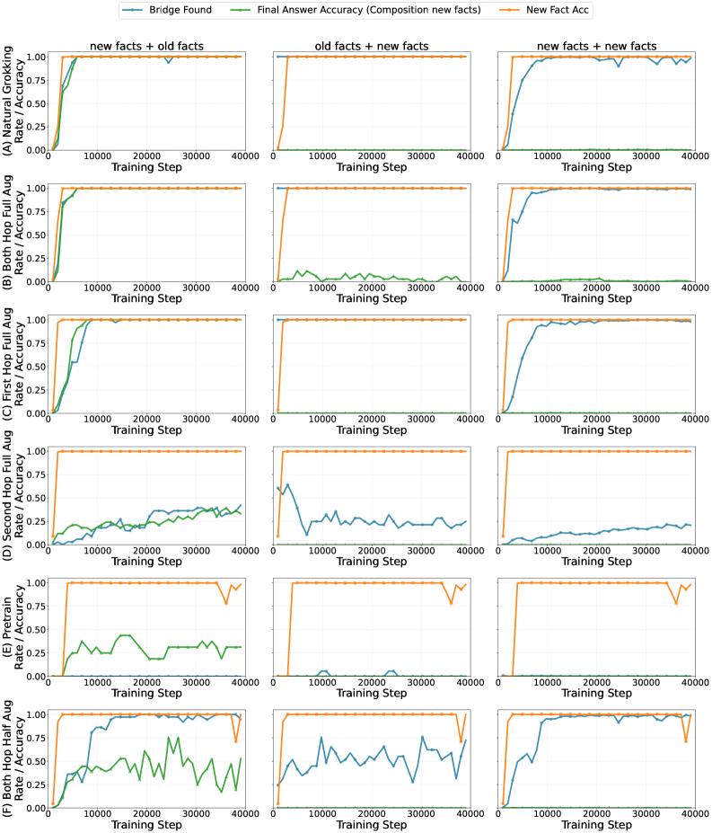

# He, Zhang, Wu, Du, Chen 2026 — Is Grokking Worthwhile? Functional Analysis and Transferability of Generalization Circuits in Transformers

См. также: [глобальный индекс понятий](../../concepts/index.md).

**Kaiyu He, Mian Zhang, Peilin Wu, Xinya Du, Zhiyu Zoey Chen** (University of Texas at Dallas).

arXiv [2601.09049](https://arxiv.org/abs/2601.09049), январь 2026 (версия v1). 1 цитирование — сорок вторая по цитируемости работа корпуса. Источник — нативный HTML arXiv версии v1. Код: [IsGrokkingWorthwhile](https://github.com/KaiyuHe998/IsGrokkingWorthwhile).

Оригинал и производные файлы этой папки:

- [`original/2601.09049.native.html`](original/2601.09049.native.html) — первоисточник, нативный HTML arXiv (v1), скачан как есть.
- [`original/2601.09049.is-grokking-worthwhile-functional-analysis-and-transferability-of-generalization-circuits-in-transformers.md`](original/2601.09049.is-grokking-worthwhile-functional-analysis-and-transferability-of-generalization-circuits-in-transformers.md) — конверсия оригинала в Markdown без правок содержания.
- [`images/`](images/) — 4 иллюстрации статьи в исходном разрешении.

Схема якорей и правила ссылок на карточку — в [README папки статей](../README.md).

## Затрагиваемые понятия

**[Гроккинг](../../concepts/grokking.md)** — работа ставит вопрос не «отчего он происходит», а «стоит ли он того». Ответ разложен на три находки: пути рассуждения у гроккнувшей и негроккнувшей моделей **тождественны**; поведенческий гроккинг и складывание контура **расцеплены**; переносимость даже зрелого контура **ограничена** ([`p1-2`](#p1-2)). Итоговое истолкование: гроккинг есть не обретение нового способа рассуждать, а ход встраивания запомненных атомарных фактов в уже сложившийся путь ([`p3-2`](#p3-2)).

**[Рассуждение по графам знаний](../../concepts/reasoning-knowledge-graphs.md)** — постановка взята у Wang et al. (2024): искусственный граф из 2000 сущностей и 200 отношений, 40 000 атомарных фактов, 5 % отложены как OOD ([`p2-5`](#p2-5), [`p9-2`](#p9-2)). Обучение видит все атомарные факты, но составные запросы — лишь из фактов ID; испытание требует составить два шага через факт OOD ([`p2-5`](#p2-5)).

**[Механистическая интерпретируемость](../../concepts/mechanistic-interpretability.md)** — рабочий приём: логитная линза раскодирует скрытые состояния всех слоёв, и след вывода помечается как «промежуточная найдена», если раскодированное состояние совпадает с истинной промежуточной сущностью ([`p2-6`](#p2-6)). Контур генерализации определён именно так — через явное восстановление промежуточной сущности в средних слоях.

**[Фазовый переход](../../concepts/phase-transition.md)** — естественный гроккинг разложен на три поры: насыщение обучающих целей (~0,1 млн шагов), устойчивое восстановление промежуточной сущности для OOD (+0,2 млн), выучивание того, как этой сущностью пользоваться (устанавливается после 1 млн шагов) ([`p2-6`](#p2-6)). Существенно, что «переход» здесь — не единый скачок, а три отдельных события.

**[Запоминание](../../concepts/memorization-phase.md)** — главное возражение корпусу: при полном дополнении обоих шагов контур складывается за 0,3 млн шагов **без** долгой поры гроккинга, и переносимость такой модели та же ([`p3-1`](#p3-1)). Отсюда вывод, что долгое обучение лишь встраивает скудно присматриваемые факты OOD в уже готовый контур ([`p3-2`](#p3-2)).

**[Действенность контуров](../../concepts/circuit-efficiency.md)** — догадка Varma et al. взята в работу как рабочее основание: высокое отношение выводимых запросов к атомарным ($\phi=18$) увеличивает относительную сложность запоминающего контура и побуждает модель быстрее перейти к обобщающему ([`p9-7`](#p9-7)).

**[Полугроккинг](../../concepts/semi-grokking.md)** — вводится новое различение того же рода: **поддельный гроккинг**. При дополнении лишь второго шага кривая обучения отвечает поведенческому описанию гроккинга, но окончательный ответ приходит **не** через восстановленную промежуточную сущность ([`p3-4`](#p3-4)). Такие модели затем и проваливаются на переносе ([`p4-5`](#p4-5)).

**[Замораживание подсети](../../concepts/freezing-subnetwork.md)** — вопрос переноса поставлен как дообучение на 2000 новых атомарных фактов с сохранением 8000 старых ([`p4-2`](#p4-2), [`p4-3`](#p4-3)). Итог двойственный: когда новый факт нужен на **первом** шаге, контур справляется мгновенно; когда на **втором** — не справляется, несмотря на верно восстановленную промежуточную сущность ([`p4-4`](#p4-4), [`p4-5`](#p4-5)).

**[Катастрофическое забывание](../../concepts/catastrophic-forgetting.md)** — учтено устройством данных дообучения: 8000 исходных фактов ID сохраняются нарочно, чтобы прежнее знание не осыпалось ([`p4-3`](#p4-3)).

**[Возникновение способностей](../../concepts/emergence.md)** — вывод для практики сформулирован как уступка: решение добиваться гроккинга есть выбор между скудостью данных и вычислительными средствами; при достаточных составных данных можно остановиться на насыщении обучения ([`p4-6`](#p4-6)).

**[Обучение структурированным представлениям](../../concepts/structured-representation-learning.md)** — объяснение, отчего обычные трансформеры на этой задаче проваливаются: несоответствие представлений между независимыми слоями, где глубокие слои не обучены брать скрытое представление промежуточной сущности за вход ([`p1-6`](#p1-6)). Разделяемые параметры это несоответствие и снимают.

**[Модульная арифметика](../../concepts/modular-arithmetic.md)** — её здесь нет вовсе: задача составная и фактическая, а не алгебраическая. Для корпуса это редкий случай, когда гроккинг изучается на рассуждении по фактам.

Отдельно стоит сказать, чего в работе **нет**. Нет разбора того, где именно проходит граница между складыванием контура и поддельным гроккингом: перебор по стратегиям дополнения признан вычислительно неосуществимым ([`p5-2`](#p5-2)). Нет и переноса на обычные трансформеры: все итоги ограничены устройствами с разделяемыми параметрами, и это оговорено ([`p5-3`](#p5-3)). Нет числа прогонов ни для одного опыта.

Карточки статей корпуса: [Power et al. 2022](../2201.02177.grokking-generalization-beyond-overfitting-on-small-algorithmic-datasets/2201.02177.grokking-generalization-beyond-overfitting-on-small-algorithmic-datasets.card.md) — исходное определение, от которого работа отталкивается; [Wang et al. 2024](../2405.15071.grokked-transformers-are-implicit-reasoners/2405.15071.grokked-transformers-are-implicit-reasoners.card.md) — источник постановки, данных и самого понятия контура генерализации; [Varma et al. 2023](../2309.02390.explaining-grokking-through-circuit-efficiency/2309.02390.explaining-grokking-through-circuit-efficiency.card.md) — действенность контуров, взятая как основание выбора $\phi$; [Nanda et al. 2023](../2301.05217.progress-measures-for-grokking-via-mechanistic-interpretability/2301.05217.progress-measures-for-grokking-via-mechanistic-interpretability.card.md) и [Merrill et al. 2023](../2303.11873.a-tale-of-two-circuits-grokking-as-competition-of-sparse-and-dense-subnetworks/2303.11873.a-tale-of-two-circuits-grokking-as-competition-of-sparse-and-dense-subnetworks.card.md) — механистические разборы, названные в обзоре; [Abramov et al. 2025](../2504.20752.grokking-in-the-wild-data-augmentation-for-real-world-multi-hop-reasoning-with-transformers/2504.20752.grokking-in-the-wild-data-augmentation-for-real-world-multi-hop-reasoning-with-transformers.card.md) — дополнение данных ради ускорения гроккинга, чью надёжность работа и ставит под сомнение; [Gu et al. 2025](../2504.03162.beyond-progress-measures-theoretical-insights-into-the-mechanism-of-grokking/2504.03162.beyond-progress-measures-theoretical-insights-into-the-mechanism-of-grokking.card.md), [NeuralGrok](../2504.17243.neuralgrok-accelerate-grokking-by-neural-gradient-transformation/2504.17243.neuralgrok-accelerate-grokking-by-neural-gradient-transformation.card.md), [Grokfast](../2405.20233.grokfast-accelerated-grokking-by-amplifying-slow-gradients/2405.20233.grokfast-accelerated-grokking-by-amplifying-slow-gradients.card.md), [Xu et al. 2025](../2504.13292.let-me-grok-for-you-accelerating-grokking-via-embedding-transfer-from-a-weaker-model/2504.13292.let-me-grok-for-you-accelerating-grokking-via-embedding-transfer-from-a-weaker-model.card.md) — приёмы ускорения, названные в обзоре.

## Что показано, а что предположено

Замечания редактора карточки по итогам разбора утверждений (`…claims.txt`). Работа короткая (пять страниц основного текста) и целиком механистическая: три находки, одна постановка, ни одной теоремы.

**Вопрос поставлен верно, и его давно стоило поставить.** Корпус полон приёмов ускорения гроккинга, но почти никто не спрашивал, **что получается на выходе** и стоит ли ожидание. Здесь спрошено — и ответ отрезвляющий.

**Находка 1 — самая сильная и самая проверяемая.** Если дать полное составное дополнение обоих шагов, контур складывается за 0,3 млн шагов вместо 1 млн, и по переносимости обе модели неотличимы ([`p3-1`](#p3-1)). Довод построен на измерении устройства, а не на сравнении точности: у обеих моделей всякое верное предсказание идёт через восстановленную промежуточную сущность.

**Отсюда переформулировка гроккинга, которую стоит запомнить.** Путь рассуждения складывается **рано** и для фактов ID; долгая пора нужна лишь, чтобы втянуть в него факты, за которыми присмотр был скудным ([`p3-2`](#p3-2)). Это не опровергает картину контуров, а меняет её смысл: гроккинг оказывается свойством **разметки данных**, а не свойством оптимизации.

**Находка 2 полезна тем, что вводит различающую проверку.** «Поддельный гроккинг» — случай, когда кривая выглядит как гроккинг, а устройство иное ([`p3-4`](#p3-4)). Для корпуса это существенно: почти все работы об ускорении гроккинга опознают его **по кривой**, и ни одна не проверяет контур.

**Однако поддельный гроккинг показан ровно на одном режиме дополнения.** Признано прямо: перебор по стратегиям неосуществим вычислительно, а пограничные условия остаются открытым вопросом ([`p5-2`](#p5-2)). Тем самым это существование, а не мера распространённости.

**Находка 3 несимметрична, и это интересно.** Новый факт на первом шаге усваивается мгновенно, на втором — нет ([`p4-5`](#p4-5)). Объяснение прямо не даётся, но оно напрашивается из устройства контура: первый шаг есть извлечение атомарного факта, а второй требует, чтобы слои умели принимать скрытое представление промежуточной сущности за вход именно для этого нового отношения.

**Заявка о «неполном овладении составной логикой» шире показанного.** Из того, что перенос требует либо ещё одной поры гроккинга, либо большего числа данных ([`p4-5`](#p4-5)), следует ограниченность переноса, но не то, что логика не усвоена. Человеческая мерка («однажды выученное правило прилагается сразу») введена в разделе 5 как ожидание и нигде не обоснована.

**Число прогонов не названо, полос разброса нет.** Все кривые — по одному прогону, а различение «гроккинг против поддельного гроккинга» держится на виде кривых и доле следов с найденной промежуточной сущностью. Для работы, чей главный довод механистический, это заметный пробел.

**Постановка искусственна и мала, и это оговорено.** Граф знаний синтетический, отношение $\phi=18$ выбрано нарочно ради быстрого появления контура ([`p9-6`](#p9-6)), а всё вместе ограничено трансформерами с разделяемыми параметрами ([`p5-3`](#p5-3)). Перенос на настоящие языковые модели не показан и не заявлен.

**Практический вывод сформулирован честно и узко.** Не «гроккинг не нужен», а «гроккинг есть плата за скудный присмотр»: при достаточных составных данных можно остановиться на насыщении ([`p4-6`](#p4-6)). Это прямо противоположно тому, как гроккинг обычно подаётся в корпусе — как желаемое событие, которое надо приблизить.

**Место в корпусе.** Это первая работа вики, оценивающая гроккинг **по итогу**, а не по механизму: что за модель получается и переносится ли добытое. Ценны два вклада: различение поведенческого и подлинного гроккинга — проверка, которой недостаёт всем работам об ускорении, — и переформулировка гроккинга как встраивания скудно присматриваемых фактов в рано сложившийся контур. Цена — одна искусственная постановка, одно семейство устройств, отсутствие числа прогонов и отсутствие разбора границы между подлинным и поддельным случаями.

## Ошибочные цитирования

Замечания редактора карточки: места, где эта статья передаёт чужие результаты с ошибкой или без авторских оговорок. Сюда ведут ссылки «подробности» из разделов «Ошибочные пересказы и цитирования этой статьи» карточек процитированных работ.

###### mc-2405-20233
**Grokfast (2405.20233) — метод ускорения назван методом вызова.** `"explored diverse methodologies to induce it Lin et al. (2025); Lee et al. (2024); …"` — Grokfast гроккинг не вызывает, а ускоряет уже происходящий; вызов гроккинга в неалгоритмических задачах внутри самой работы — [заимствованный рецепт Omnigrok: раздутая инициализация и урезанные выборки](../2405.20233.grokfast-accelerated-grokking-by-amplifying-slow-gradients/2405.20233.grokfast-accelerated-grokking-by-amplifying-slow-gradients.card.md#p7-3). Смещение категории: фильтр градиентов поверх оптимизатора причислен к способам индукции явления.

---

# Текст статьи

## Аннотация

###### p1-2

Тогда как большие языковые модели (БЯМ) отменно справляются с извлечением фактов, они часто спотыкаются о «проклятие двухшагового рассуждения» в составных задачах. Недавние исследования наводят на мысль, что трансформеры с разделяемыми параметрами способны перекрыть этот разрыв, складывая «контур генерализации» в ходе долгой поры «гроккинга». Возникает коренной вопрос: лучше ли гроккнувшая модель своих негроккнувших двойников на последующих задачах? И далее: стоят ли того обширные вычислительные издержки ожидания поры гроккинга? В этой работе мы проводим механистическое исследование, чтобы оценить роль контура генерализации в усвоении и передаче знания. Мы показываем, что: (i) пути вывода, устанавливаемые негроккнувшими и гроккнувшими моделями для составных запросов внутри распределения, тождественны. Отсюда следует, что «контур генерализации» не есть внезапное обретение нового способа рассуждать. Взамен мы доказываем, что гроккинг есть ход встраивания запомненных атомарных фактов в естественно сложившийся путь рассуждения. (ii) Достижение высокой точности на невиданных случаях после долгого обучения и складывание определённого пути рассуждения не связаны между собой: при определённых режимах данных они могут происходить порознь. (iii) Даже зрелый контур обнаруживает ограниченную переносимость при встраивании нового знания, откуда следует, что «гроккнувшие» трансформеры не овладевают составной логикой вполне. Наш код и данные доступны по адресу https://github.com/KaiyuHe998/IsGrokkingWorthwhile.

**Стоит ли гроккинг того? Функциональный разбор и переносимость контуров генерализации в трансформерах**

**Kaiyu He, Mian Zhang, Peilin Wu, Xinya Du, Zhiyu Zoey Chen** Кафедра информатики Техасского университета в Далласе {kaiyu.he, zhiyu.chen2}@utdallas.edu

## 1 Введение

Неявное рассуждение означает способность модели выводить новые сведения из хранимых в её параметрах, не прибегая к внешним средствам. Главный вид отказа, часто зовущийся «проклятием двухшагового рассуждения» (Balesni et al., 2025), возникает, когда обычные трансформеры не способны составить порознь выученные факты. Скажем, модель может успешно вспомнить, что «*жена Барака — Мишель*» и «*Мишель родилась в 1964 году*», и всё же оказывается неспособной ответить на «*жена Барака родилась в?*» одним лишь внутренним вычислением.

*Рисунок 1: **Механистическое сравнение обычного трансформера и трансформера с разделяемыми параметрами.** (Слева) Обычные трансформеры спотыкаются о несоответствие представлений между независимыми слоями и не способны обобщить до составного рассуждения. (Справа) Трансформер с разделяемым параметром разрешает промежуточную сущность $b$ и способен взять неглубокие параметры, чтобы получить окончательный ответ.* **[p. 2]**

###### p1-6

Это ограничение часто приписывают **несоответствию представлений** во внутреннем потоке сведений модели (см. рисунок 1). В обычных трансформерах атомарные факты обыкновенно извлекаются и разрешаются в неглубоких слоях. При составном рассуждении промежуточная сущность $b$ (скажем, *Мишель*) возникает как *выход* этих ранних слоёв. Однако последующие более глубокие слои, содержащие параметры второго шага, не обучены брать это особое скрытое представление $b$ как *вход* для дальнейшего извлечения (Wang et al., 2024).

###### p1-7

Имеющиеся исследования показали, что трансформеры с разделяемыми параметрами, обучаемые значительно дольше точки насыщения обучающих меток, способны достичь верного неявного составного рассуждения на невиданных случаях — явления, известного как **«гроккинг»**. Последующие механистические исследования обнаружили, что этот переход движим возникновением **«контура генерализации»**: определённого внутреннего пути вычисления, где модель выучивается вбирать цепочку рассуждения, явно восстанавливая нужные промежуточные сведения в своих средних слоях (Power et al., 2022; Wang et al., 2024).

Тогда как прежние работы стремились объяснить устройства, стоящие за гроккингом (Wang et al., 2024; Varma et al., 2023; Nanda et al., 2023; Merrill et al., 2023; Huang et al., 2024; Gu et al., 2025; Furuta et al., 2024; AlquBoj et al., 2025; Doshi et al., 2024; Lv et al., 2025), пользовались этим явлением ради улучшения качества моделей (Abramov et al., 2025; Lyle et al., 2025; Murty et al., 2023; Furuta et al., 2024; Africa et al., 2025) и исследовали разные способы его вызвать (Lin et al., 2025; Lee et al., 2024; Xu et al., 2025; Zhou et al., 2025; Park et al., 2024; Carvalho et al., 2025), коренной вопрос остаётся: лучше ли трансформер, обученный через гроккинг, **[p. 2]** своего двойника? И далее: переносится ли способность рассуждать, обретённая гроккингом, на последующие задачи или на новые факты?

В этой работе мы берём передовое устройство трансформера с разделяемыми параметрами (Jolicoeur-Martineau, 2025) на задачах рассуждения, чтобы исследовать переносимость гроккнувших трансформеров на новые факты. Наши находки обнаруживают, что гроккнувший трансформер с контуром генерализации может обобщать не так, как мы ожидали.

#### Находка 1.

Негроккнувший трансформер следует тому же пути рассуждения, что и гроккнувший, на данных внутри распределения, а гроккинг есть ход встраивания запомненных атомарных фактов в естественно сложившееся строение рассуждения. Дав достаточный присмотр на атомарном и составном уровнях, модели способны сложить устойчивый контур генерализации и достичь равнозначного переносного качества, не проходя времяёмкого гроккинга.

#### Находка 2.

Гроккинг и складывание контура генерализации по существу не связаны: «гроккнувшая» модель не обязательно рассуждает через контур генерализации, а контур генерализации не обязательно получается гроккингом.

#### Находка 3.

Следование контуру генерализации не означает полного овладения составным рассуждением: ускоряя усвоение новых фактов в определённых постановках, оно оставляет способность переносить образцы рассуждения между областями ограниченной по сравнению с рассуждением человеческого рода.

*Рисунок 2: «Гроккинг» модели-трансформера при разных режимах данных.* **[p. 3]**

## 2 Определение задачи и обучающие данные

###### p2-5

Мы следуем определению составной задачи и виду данных, установленным в недавней словесности (Wang et al., 2024; Ye et al., 2025; Guo et al., 2025; Brinkmann et al., 2024). Модели обучаются на двух родах запросов: **атомарных**, вроде «*<Барак> <жена>?*», и **составных**, вроде «*<Барак> <жена> <родилась в>?*». Чтобы оценивать последовательную генерализацию, а не поверхностное запоминание, мы разбиваем множество всех атомарных фактов на подмножества внутри распределения (ID) и вне его (OOD). При обучении модель видит все атомарные запросы, но лишь те составные, что построены из фактов ID. При испытании модель должна отвечать на составные запросы, включающие факты OOD. Успех в такой постановке указывает, что модель обрела подлинную способность к составному рассуждению. Следуя схеме Wang et al. (2024), мы строим искусственный набор данных ради точного управления путями рассуждения. Набор содержит 2000 сущностей и 200 различных отношений, причём каждая сущность связана с 20 отношениями, что даёт всего 40 000 атомарных фактов. 5 % (2000 фактов) мы откладываем как подмножество OOD. Подробности построения набора данных приведены в приложении B.

## 3 Находка 1: гроккнувшие и негроккнувшие трансформеры следуют одному пути рассуждения

###### p2-6

Беря логитную линзу (Belrose et al., 2025), мы изображаем вызревание контуров генерализации в **[p. 3]** трансформерах с разделяемыми параметрами по мере того, как они выучивают составное рассуждение. А именно, мы раскодируем скрытые состояния всех слоёв логитной линзой, чтобы определить изображаемые ими сущности. След вывода относится к разряду «промежуточная найдена», если раскодированное скрытое состояние совпадает с истинной промежуточной сущностью. Контуром генерализации мы зовём внутренний след рассуждения, достигающий составного вывода явным восстановлением промежуточной сущности в средних слоях модели (Wang et al., 2024). Как показано на рисунке 2 (A), модель, обнаруживающая естественный гроккинг, проходит при обучении на составных запросах OOD три отчётливые поры. **Первая пора** — насыщение обучающих целей, наступающее примерно на 0,1 млн шагов. Во **второй поре**, длящейся ещё 0,2 млн шагов, модель начинает неизменно восстанавливать верную промежуточную сущность в своих средних слоях для составных запросов OOD. **Третья пора** состоит в том, что модель выучивается действенно брать эти промежуточные представления, чтобы выводить окончательный ответ; этот ход устанавливается после 1 млн шагов.

###### p3-1

Однако при составном присмотре над фактами OOD итоговая модель, обученная за меньшее число шагов, следует тому же пути рассуждения, что и естественно гроккнувшие. А именно, для **каждого** факта OOD, появляющегося на первом шаге испытательных запросов, мы случайно составляем его с фактами ID в запросы вида *факт OOD + факт ID* (**полное дополнение первого шага**); для **каждого** факта OOD, появляющегося на втором шаге испытательных запросов, мы строим запросы *факт ID + факт OOD* (**полное дополнение второго шага**). Добавление этих запросов обеспечивает, что модель видит каждый факт OOD в обеих составных позициях, действенно уравнивая присмотр над OOD и ID. Неожиданно, такой присмотр складыванию контура генерализации не мешает. Как показано на рисунке 2(B), в пределах 0,3 млн шагов обучения всякое верное предсказание на составных OOD достигается успешным восстановлением промежуточной сущности в средних слоях. Более того, в §5 и на рисунке 4 приложения A мы показываем, что модель, обученная при полном присмотре, обнаруживает такую же переносимость на новые факты, что и естественно гроккнувшая.

###### p3-2

Эти находки наводят на мысль, что «контур генерализации» не есть внезапное обретение обобщённого способа рассуждать. Взамен такой путь рассуждения складывается на ранних порах обучения для фактов ID. Решающим образом этот контур не приложим напрямую ко всем запомненным фактам; последующая же пора гроккинга постепенно встраивает в этот сложившийся контур факты OOD, за которыми присмотр был скудным. Тем самым модель, долго обучаемая при скудном составном присмотре, и модель, быстро обученная при полном присмотре, сходятся к одному решению: по своему устройству составного рассуждения они **функционально равнозначны**.

*Рисунок 3: «Гроккнувший» трансформер выучивает новое знание; подробное изображение всех постановок см. на рисунке 4 в приложении A* **[p. 4]**

## 4 Находка 2: поведенческий гроккинг или подлинный?

Впервые определённый Power et al. (2022), гроккинг есть явление, при котором модель внезапно достигает высокой точности на невиданных случаях много позже насыщения качества на обучающих целях. Прежние исследования пользовались этим явлением ради улучшения качества моделей или брали дополнение данных, чтобы гроккинг ускорить (Abramov et al., 2025). Однако мы показываем, что не всякий ход обучения, отвечающий поведенческому описанию гроккинга, и вправду включает складывание подразумеваемого лежащего в основе устройства.

###### p3-4

Чтобы это исследовать, мы провели дополнительные опыты с дополнением фактов OOD. Схоже с дополнением из §3, но на этот раз мы делали лишь **полное дополнение второго шага**. Как показано на рисунке 2 (D), хотя кривая обучения отвечает поведенческому описанию гроккинга, лежащее в её основе устройство отличается от рисунков 2 (A) и (B): их окончательный ответ на составные запросы приходит не через верно восстановленную промежуточную сущность в среднем слое. И в §5 мы покажем, что такой «поддельно гроккнувший» трансформер не обладает **[p. 4]** той же переносимостью, что трансформеры, и вправду сложившие контуры генерализации.

## 5 Находка 3: переносимость контура генерализации

###### p4-1

Большинство оценок «гроккинга» велось на неподвижных наборах данных, где атомарные факты неизменны. По чутью, если модель и вправду овладела определённой логикой рассуждения, она должна обнаруживать приспособляемость человеческого рода: коль скоро правило рассуждения выучено, оно должно сразу прилагаться к новым фактам. Несмотря на это ожидание, последующая переносимость «гроккнувших» трансформеров остаётся во многом неисследованной.

### 5.1 Данные для дообучения

###### p4-2

В предобучающем наборе данных всего $200$ отношений, и каждая сущность связана с $20$ отношениями. Для каждой сущности мы случайно берём отношения, прежде не применявшиеся (то есть невиданные пары «сущность — отношение»), и создаём новые тройки, назначая целевую сущность. Повторение этого хода даёт целиком $2,000$ новых атомарных фактов.

###### p4-3

Чтобы не допустить катастрофического забывания исходного знания, мы сохраняем также подмножество из 8000 атомарных фактов исходного обучающего набора внутри распределения (ID). Затем мы строим обучающую часть дообучения так: (1) сохранённые $8,000$ исходных атомарных фактов ID, (2) $2,000$ вновь добавленных атомарных фактов и (3) все составные запросы, чьи опорные атомарные факты входят в сохранённое подмножество из $8,000$ фактов ID (чтобы эти составные запросы оставались отвечаемыми по включённым старым фактам).

### 5.2 Ограниченная переносимость контура генерализации

###### p4-4

Мы берём предобученные точки сохранения из §3 и §4 за опорные модели для дальнейшего дообучения на данных дообучения. Такая постановка позволяет оценить способность моделей усваивать новые атомарные факты и их действенность в разрешении связанных с ними последующих составных запросов. Полученные кривые обучения изображены на рисунке 3. Мы находим, что контур генерализации, выученный при предобучении, даёт ограниченные выгоды. Модели, развившие подразумеваемый контур, часто способны восстановить верную промежуточную сущность для составных запросов, включающих новые факты; затем они берут образцы, обретённые при предобучении, чтобы мгновенно довершить рассуждение второго шага (см. рисунок 3 (A)).

###### p4-5

Однако когда новый факт требуется на втором шаге, модели не способны довершить вывод, несмотря на верно восстановленную промежуточную сущность, — а значит, вторая составная часть контура генерализации переносится хуже. Чтобы сложить надёжный контур для нового знания, моделям по-прежнему требуется либо (i) дополнительная пора гроккинга, либо (ii) существенно больше данных дообучения, покрывающих новые факты и их составления. Наконец, «поддельно гроккнувшие» трансформеры, несмотря на сравнимое качество на исходных фактах OOD, не способны приспособиться к составному рассуждению, смешивающему новые и старые факты. Как показано на рисунке 3(B), эти модели запоминают новые атомарные факты, но не выучиваются рассуждать над ними составно.

## 6 Заключение

###### p4-6

В этой работе мы механистически переоцениваем гроккинг и контуры генерализации в трансформерах. Наши находки оспаривают взгляд, по которому гроккинг есть подлинное обретение обобщённой способности рассуждать. Мы показываем, что гроккнувшие и негроккнувшие модели следуют тождественным путям рассуждения, а значит, гроккинг лишь встраивает запомненные факты в естественно сложившиеся контуры. Далее мы показываем расцепление поведенческого гроккинга и складывания контура и обнажаем ограниченную переносимость на новые факты. Из этих итогов следует, что решение добиваться гроккинга есть уступка между скудостью данных и вычислительными средствами: обучать до гроккинга может быть необходимо при скудном присмотре, но при достаточных составных данных модели могут остановиться на насыщении обучения и достичь равнозначного качества.

**[p. 5]**

## 7 Ограничения

Несмотря на механистические наблюдения, данные нашим исследованием, некоторые ограничения остаются.

###### p5-2

**Вычислительные ограничения при исследовании поддельного гроккинга.** Во-первых, наше исследование «поддельного гроккинга» (поведенческого гроккинга без складывания контура) не всеохватно. Поскольку возникновение явлений гроккинга обыкновенно требует крайне долгих кругов обучения (в наших постановках нередко свыше 1 млн шагов), крупномасштабный перебор по сетке ради указания всех возможных стратегий дополнения, способных вызвать обрушение контура, был вычислительно неосуществим. Тем самым, хотя мы показали, что некоторые режимы дополнения ведут к поддельному гроккингу, точные пограничные условия и всеобщие начала, управляющие этим переходом, остаются открытым вопросом. Нужны будущие исследования, чтобы последовательно разложить по разрядам, какие распределения данных благоприятствуют складыванию контура, а какие — запоминанию образцов.

###### p5-3

**Охват по устройствам.** Во-вторых, наши находки ограничены именно устройствами трансформеров с разделяемыми параметрами. Как установлено в недавней словесности, эти модели ныне единственные, кто способен разрешить несоответствие представлений, обыкновенно мешающее неявному составному рассуждению. Обычные трансформеры с независимыми весами слоёв по своему устройству с трудом составляют порознь выученные факты: их более глубокие слои не обучены признавать скрытые представления, порождённые ранними слоями, законными входами для последующего извлечения. Поэтому, хотя наши итоги о складывании и обрушении контура прочны в связи с моделями с разделяемыми параметрами, они не обязательно распространяются на привычные устройства, которые, по-видимому, не способны достичь такой неявной генерализации даже при обширном обучении.

## Литература

- Grokking in the wild: data augmentation for real-world multi-hop reasoning with transformers. In Forty-second International Conference on Machine Learning, External Links: Link Cited by: §1, §4.

- Learning modular exponentiation with transformers. External Links: 2506.23679, Link Cited by: §1.

- Mechanistic insights into grokking from the embedding layer. External Links: 2505.15624, Link Cited by: §1.

- Lessons from studying two-hop latent reasoning. External Links: 2411.16353, Link Cited by: §1.

- Eliciting latent predictions from transformers with the tuned lens. External Links: 2303.08112, Link Cited by: §3.

- A mechanistic analysis of a transformer trained on a symbolic multi-step reasoning task. External Links: 2402.11917, Link Cited by: §2.

- Inducing grokking with distribution shifts. In 2025 IEEE 37th International Conference on Tools with Artificial Intelligence (ICTAI), Vol., pp. 222–229. External Links: Document Cited by: §1.

- To grok or not to grok: disentangling generalization and memorization on corrupted algorithmic datasets. External Links: 2310.13061, Link Cited by: §1.

- Towards empirical interpretation of internal circuits and properties in grokked transformers on modular polynomials. Transactions on Machine Learning Research. Note: External Links: ISSN 2835-8856, Link Cited by: §1.

- Beyond progress measures: theoretical insights into the mechanism of grokking. External Links: 2504.03162, Link Cited by: §1.

- How do llms perform two-hop reasoning in context?. External Links: 2502.13913, Link Cited by: §2.

- Unified view of grokking, double descent and emergent abilities: a perspective from circuits competition. External Links: 2402.15175, Link Cited by: §1.

- Less is more: recursive reasoning with tiny networks. External Links: 2510.04871, Link Cited by: §1.

- Grokfast: accelerated grokking by amplifying slow gradients. External Links: 2405.20233, Link Cited by: §1.

- Identity bridge: enabling implicit reasoning via shared latent memory. External Links: 2509.24653, Link Cited by: §1.

**[p. 6]**

- Language models “grok” to copy. In Proceedings of the 2025 Conference of the Nations of the Americas Chapter of the Association for Computational Linguistics: Human Language Technologies (Volume 2: Short Papers), L. Chiruzzo, A. Ritter, and L. Wang (Eds.), Albuquerque, New Mexico, pp. 735–741. External Links: Link, Document, ISBN 979-8-89176-190-2 Cited by: §1.

- What can grokking teach us about learning under nonstationarity?. arXiv preprint arXiv:2507.20057. Cited by: §1.

- A tale of two circuits: grokking as competition of sparse and dense subnetworks. In ICLR 2023 Workshop on Mathematical and Empirical Understanding of Foundation Models, External Links: Link Cited by: §1.

- Grokking of hierarchical structure in vanilla transformers. CoRR abs/2305.18741. External Links: Link, Document, 2305.18741 Cited by: §1.

- Progress measures for grokking via mechanistic interpretability. External Links: 2301.05217, Link Cited by: §1.

- Acceleration of grokking in learning arithmetic operations via kolmogorov-arnold representation. External Links: 2405.16658, Link Cited by: §1.

- Grokking: generalization beyond overfitting on small algorithmic datasets. External Links: 2201.02177, Link Cited by: §1, §4.

- Explaining grokking through circuit efficiency. External Links: 2309.02390, Link Cited by: §1.

- Grokking of implicit reasoning in transformers: a mechanistic journey to the edge of generalization. In Advances in Neural Information Processing Systems, A. Globerson, L. Mackey, D. Belgrave, A. Fan, U. Paquet, J. Tomczak, and C. Zhang (Eds.), Vol. 37, pp. 95238–95265. External Links: Document, Link Cited by: Appendix B, §1, §1, §1, §2, §3.

- Let me grok for you: accelerating grokking via embedding transfer from a weaker model. In The Thirteenth International Conference on Learning Representations, External Links: Link Cited by: §1.

- How do transformers learn implicit reasoning?. In The Thirty-ninth Annual Conference on Neural Information Processing Systems, External Links: Link Cited by: §2.

- NeuralGrok: accelerate grokking by neural gradient transformation. External Links: 2504.17243, Link Cited by: §1.

## Приложение A Рисунки

*Рисунок 4: «Гроккнувший» трансформер, дообученный на новых фактах.* **[p. 8]**

**[p. 9]**

## Приложение B Построение данных предобучения

Мы принимаем рамку порождения искусственных данных вслед за Wang et al. (2024) ради точного управления путями рассуждения и распределениями данных.

### B.1 Порождение искусственного набора данных

###### p9-2

Набор данных изображается направленным графом знаний $G$, состоящим из $|\mathcal{E}|=2,000$ сущностей и $|\mathcal{R}|=200$ различных отношений. Каждая сущность выступает подлежащим для 20 различных отношений, что даёт всего $40,000$ атомарных троек.

Чтобы оценивать последовательность, эти факты разбиваются на подмножества внутри распределения ($C_{ID}$) и вне его ($C_{OOD}$) в отношении 95 % : 5 %, что даёт 38 000 фактов ID и 2000 фактов OOD. Хотя при обучении модель видит все атомарные факты, составные запросы, включающие факты OOD, строго отложены для проверки подлинной способности рассуждать.

### B.2 Правило двухшагового составления

Существо задачи — навести скрытое правило двухшагового составления:

$$
(h,r_{1},b)\wedge(b,r_{2},t)\Rightarrow(h,r_{1},r_{2},t) \tag{1}
$$

где $h,b,t$ означают головную, промежуточную и хвостовую сущности соответственно. Модель обучается предсказывать $t$ по $(h,r_{1},r_{2})$, внутренне извлекая и составляя два опорных атомарных факта.

### B.3 Выбор отношения выводимых к атомарным ($\phi$)

###### p9-6

Отношение $\phi=|train\_inferred_{ID}|/|atomic_{ID}|$ служит главным определителем скорости гроккинга. Для наших опытов мы явно полагаем $\phi=18.0$, чтобы действенно наблюдать контур генерализации.

###### p9-7

Согласно догадке о действенности контуров, высокое отношение вроде $18.0$ увеличивает относительную сложность запоминающего контура по сравнению с обобщающим. Такой плотный присмотр побуждает модель быстрее перейти к последовательному контуру рассуждения. А именно, при $\phi=18.0$ показано, что модели достигают высокой точности генерализации ещё до насыщения качества на обучении, что даёт ясное окно для механистического разбора.

## Приложение C Подробности дополнения данных

Чтобы оценить влияние присмотра на возникновение контура генерализации, мы осуществляем нацеленные стратегии дополнения, вносящие факты OOD в составные обучающие запросы.

#### Составное дополнение на уровне фактов (смешение ID и OOD).

При атомарном разбиении $C_{\mathrm{ID}}\cup C_{\mathrm{OOD}}$ и составном оценочном наборе OOD $\mathcal{Q}_{\mathrm{OOD}}$ из запросов $(h,r_{1},r_{2})\mapsto t$ мы сперва *выделяем шаговые факты OOD, действительно появляющиеся в оценочных составлениях*. Для каждого $(h,r_{1},r_{2})\mapsto t\in\mathcal{Q}_{\mathrm{OOD}}$ мы восстанавливаем промежуточную сущность $b$, так что отвечающие шаговые факты суть $(h,r_{1},b)$ и $(b,r_{2},t)$; затем мы собираем подмножества $\mathcal{F}^{(1)}_{\mathrm{OOD}}=\{(h,r_{1},b)\in C_{\mathrm{OOD}}\}$ и $\mathcal{F}^{(2)}_{\mathrm{OOD}}=\{(b,r_{2},t)\in C_{\mathrm{OOD}}\}$, встречающиеся как составные части первого и второго шага в $\mathcal{Q}_{\mathrm{OOD}}$.

- **Внесение на первом шаге (OOD на первом шаге + ID на втором).** Для каждого выбранного факта OOD первого шага $(h,r_{1},b)\in\mathcal{F}^{(1)}_{\mathrm{OOD}}$ мы порождаем дополнительные обучающие составления, беря факт *ID* второго шага $(b,r_{x},t_{x})\in C_{\mathrm{ID}}$ с той же промежуточной сущностью $b$, и добавляем выводимый обучающий пример $(h,r_{1},r_{x})\mapsto t_{x}$.
- **Внесение на втором шаге (ID на первом шаге + OOD на втором).** Для каждого выбранного факта OOD второго шага $(b,r_{2},t)\in\mathcal{F}^{(2)}_{\mathrm{OOD}}$ мы порождаем дополнительные обучающие составления, беря факт *ID* первого шага $(h_{y},r_{y},b)\in C_{\mathrm{ID}}$, оканчивающийся той же промежуточной сущностью $b$, и добавляем выводимый обучающий пример $(h_{y},r_{y},r_{2})\mapsto t$.

#### Постановка с полным дополнением обоих шагов.

Мы показываем модели *все* шаговые факты OOD, выделенные из $\mathcal{Q}_{\mathrm{OOD}}$. Каждый шаговый факт OOD вносится в составные обучающие запросы. Существенно, что дополнение *не* добавляет исходных составных испытательных запросов OOD, где *оба* шага суть OOD; вместо этого всякий вносимый запрос строится так, чтобы содержать *ровно один* шаговый факт OOD и один факт ID.
