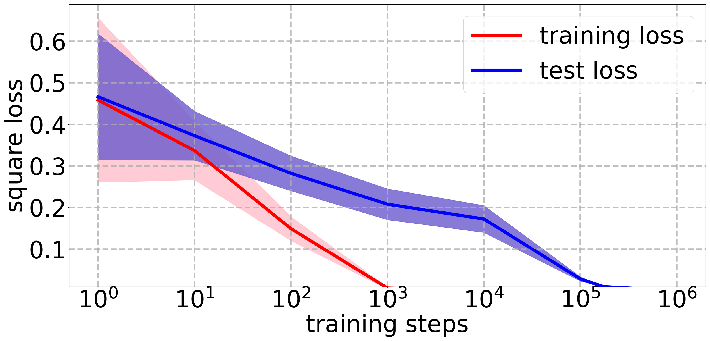
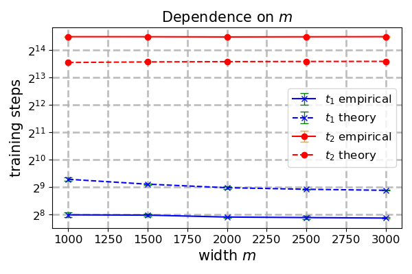
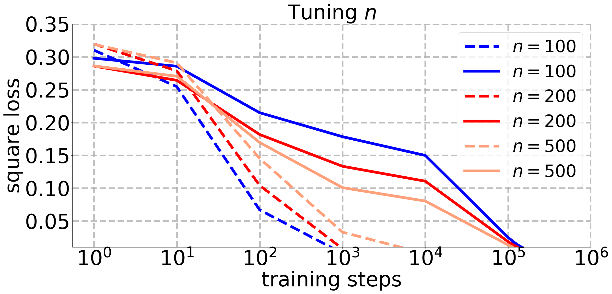
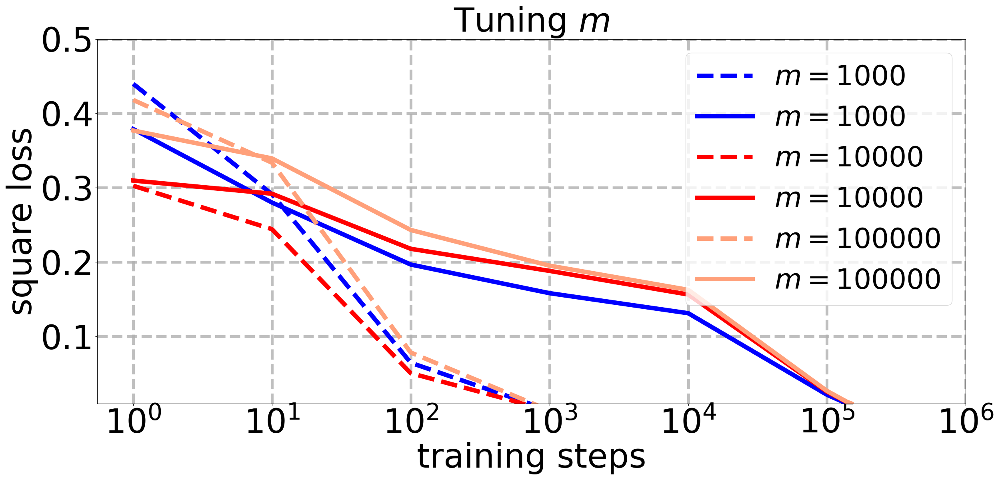
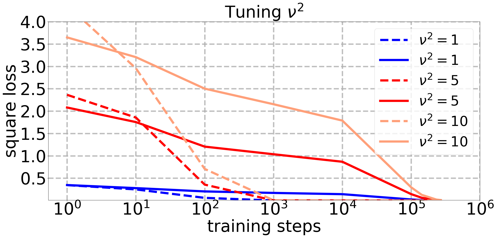
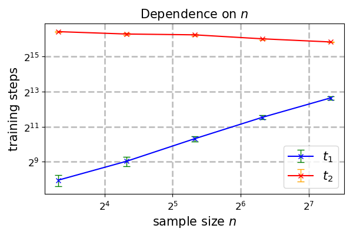
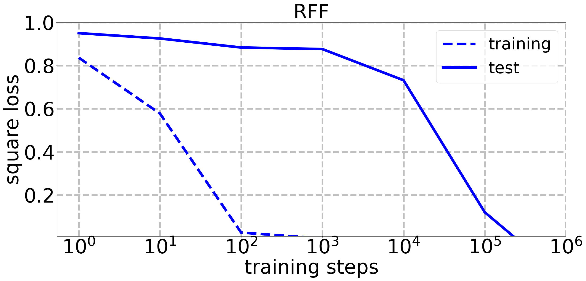

# Xu, Vardi, Safran 2026 — To Grok Grokking: Provable Grokking in Ridge Regression

См. также: [глобальный индекс понятий](../../concepts/index.md).

**Mingyue Xu, Gal Vardi, Itay Safran** (Weizmann Institute of Science; Bar-Ilan University).

arXiv [2601.19791](https://arxiv.org/abs/2601.19791), 27 января 2026 (версия v4). 2 цитирования — тридцать шестая по цитируемости работа корпуса. Источник — нативный HTML arXiv версии v4.

Оригинал и производные файлы этой папки:

- [`original/2601.19791.native.html`](original/2601.19791.native.html) — первоисточник, нативный HTML arXiv (v4), скачан как есть.
- [`original/2601.19791.to-grok-grokking-provable-grokking-in-ridge-regression.md`](original/2601.19791.to-grok-grokking-provable-grokking-in-ridge-regression.md) — конверсия оригинала в Markdown без правок содержания.
- [`images/`](images/) — 19 иллюстраций статьи в исходном разрешении.

Схема якорей и правила ссылок на карточку — в [README папки статей](../README.md).

## Затрагиваемые понятия

**[Гроккинг](../../concepts/grokking.md)** — работа доказывает его **полностью**, от начала до конца, в гребневой регрессии: (i) модель переобучается рано, (ii) плохая генерализация держится долго после этого, (iii) ошибка генерализации в конце концов становится сколь угодно малой ([`p1-2`](#p1-2)). Заявка о первенстве сформулирована точно: это первые строгие количественные границы на задержку генерализации — на то, что авторы называют **временем гроккинга**, — выраженные через гиперпараметры обучения ([`p1-2`](#p1-2)). Определение времени гроккинга сделано рабочим: $t_{1}$ — последний шаг, когда обучающая потеря ещё выше $\epsilon$, $t_{2}$ — первый шаг, когда генерализационная потеря уже ниже $c$; гроккинг есть большое $(t_{2}-t_{1})$ при $c\geq\epsilon$ ([`p4-9`](#p4-9)).

**[Обобщающие границы](../../concepts/generalization-bounds.md)** — три теоремы разложены по трём порам. Теорема 4.4 даёт быстрое схождение обучающей ошибки, теорема 4.5 — нижнюю границу генерализационной потери, держащуюся долго, теорема 4.6 — итоговое ручательство $L(\bm{\theta}^{*}_{\lambda})\leq 2L_{n}(\bm{\theta}^{*}_{\lambda})+\epsilon$ через обычную равномерную сходимость по Радемахеру ([`p6-7`](#p6-7), [`p7-4`](#p7-4), [`p7-5`](#p7-5)). Требование на размер выборки оттуда же: $n=\Omega(b^{4}\lVert\bm{\theta}^{*}\rVert_{2}^{4}\epsilon^{-2})$ ([`p7-5`](#p7-5)).

**[Weight decay](../../concepts/weight-decay.md)** — главный управляющий рычаг всей картины. Схождение обучающей потери от $\lambda$ **не зависит**, а время до генерализации обратно пропорционально ему: $t_{2}\propto 1/\lambda$, отчего $(t_{2}-t_{1})\rightarrow\infty$ при $\lambda\rightarrow 0$ ([`p6-5`](#p6-5)). Устройство разобрано наглядно: при $m\gg n$ градиентный спуск действенно обновляет лишь проекцию весов на подпространство данных, тогда как ортогональная составляющая убывает только под действием weight decay, со скоростью $(1-\eta\lambda)^{t}$ ([`p6-2`](#p6-2)). Иными словами, weight decay здесь — не условие генерализации, а её **часы**.

**[Масштаб инициализации](../../concepts/initialization-scale.md)** — второй рычаг: увеличение $\nu^{2}$ увеличивает **оба** времени логарифмически, $t_{1},t_{2}\propto\ln(\nu^{2})$, но $t_{2}$ растёт быстрее, отчего разрыв расширяется и гроккинг усиливается ([`p6-5`](#p6-5)). На нелинейной сети то же увеличение гроккинг существенно не удлиняет, но расширяет разрыв между потерями в пору переобучения ([`p8-2`](#p8-2)).

**[Критический размер данных](../../concepts/data-fraction-critical-dataset-size.md)** — третий рычаг, действующий с другой стороны: уменьшение размера выборки $n$ усиливает гроккинг, ускоряя схождение обучающей потери, то есть уменьшая $t_{1}$ ([`p6-5`](#p6-5), [`p7-11`](#p7-11)). Чистой зависимости $t_{1}$ от $n$ и $m$ теория не даёт, и причина названа прямо: количественной границы на $\lambda_{\mathrm{min}}^{+}(\bm{\Phi}^{\top}\bm{\Phi})$ через $m$ и $n$ попросту нет ([`p6-6`](#p6-6)).

**[Спектральный разбор](../../concepts/spectral-analysis-svd-esd-fve.md)** — вся острота границ держится на наименьшем **ненулевом** собственном числе $\lambda_{\mathrm{min}}^{+}(\bm{\Phi}^{\top}\bm{\Phi})$: именно его наличие отделяет быструю скорость обучающей потери от медленной скорости $(1-\eta\lambda)^{2t}$ ([`p5-6`](#p5-6)). Замечание 4.3 честно оговаривает, что известен лишь предельный закон Марченко — Пастура, а неасимптотической границы нет ([`p6-6`](#p6-6)).

**[Запоминание](../../concepts/memorization-phase.md)** — пора переобучения здесь имеет точное выражение: обучающая ошибка убывает со скоростью $(1-\frac{1}{n}\eta\lambda_{\mathrm{min}}^{+}(\bm{\Phi}^{\top}\bm{\Phi})-\eta\lambda)^{2t}$, тогда как генерализационная — лишь со скоростью $(1-\eta\lambda)^{2t}$; расхождение этих двух скоростей и **есть** гроккинг ([`p5-6`](#p5-6)).

**[Фазовый переход](../../concepts/phase-transition.md)** — перехода в привычном смысле здесь нет вовсе. Обе величины убывают гладко и предсказуемо, а видимость резкого перехода даёт лишь логарифмическая ось времени ([`p1-2`](#p1-2), рисунок 1). Это существенное для корпуса возражение: гроккинг получен без всякой перестройки представлений.

**[Переход от ленивого к богатому](../../concepts/lazy-to-rich-kernel-to-feature-learning.md)** — линия, от которой работа размежёвывается прямо. Разобраны Lyu et al. (2024), Mohamadi et al. (2024), Kumar et al. (2024), и о каждой сказано, чего именно недостаёт: схождение к точке ККТ не даёт глобальной оптимальности; малость нормы весов не доказана; задержка не показана дальше первой итерации ([`p1-4`](#p1-4)). Вопрос, можно ли доказать гроккинг **как** переход от ленивого к богатому, оставлен открытым ([`p9-1`](#p9-1)).

**[Нейронное касательное ядро](../../concepts/neural-tangent-kernel-ntk.md)** — названо и объяснено, почему его недостаёт: разбор через NTK ручается, что каждый нейрон остаётся близ инициализации, но совокупный вклад $m$ нейронов всё равно способен привести сеть к нулевой функции, а значит, стойко плохой генерализации не обеспечивает ([`p9-1`](#p9-1)).

**[Минимизация нормы весов](../../concepts/weight-norm-minimization.md)** — истолкование, вынесенное в обсуждение: переобученное решение отвечает обучению **без** weight decay, а предельное — перемежающему предсказателю наименьшей нормы; гроккинг тем самым есть переход от неверно заданного априорного распределения к верно заданному ([`p9-2`](#p9-2)).

**[Разновидности регуляризации](../../concepts/regularization-variants.md)** — постановка нарочито классическая: квадратичная потеря плюс штраф $\ell_{2}$, обычный градиентный спуск с закреплённым шагом ([`p4-3`](#p4-3), [`p4-4`](#p4-4)). Ни dropout, ни ранней остановки, ни приспосабливающихся оптимизаторов; авторы отмечают, что разбор должен пройти и для убывающего шага, и для градиентного потока ([`p4-4`](#p4-4)).

**[Модульная арифметика](../../concepts/modular-arithmetic.md)** и **[разрежённая чётность](../../concepts/sparse-parity.md)** — названы как места, где гроккинг был открыт и изучался ([`p3-1`](#p3-1)), но в самой работе не встречаются вовсе. Все опыты — искусственные: гребневая регрессия, сеть со случайными признаками ReLU, двухслойная сеть с ReLU и нулевым учителем ([`p7-7`](#p7-7), [`p7-11`](#p7-11), [`p8-2`](#p8-2)).

Отдельно стоит сказать, чего в работе **нет**. Нет ни одного настоящего набора данных: ни MNIST, ни текста, ни алгоритмических задач ([`p7-7`](#p7-7)). Нет нереализуемого случая — он назван первым среди открытых вопросов, причём отмечено, что при агностическом обучении сколь угодно малый weight decay способен помешать генерализации вовсе ([`p8-6`](#p8-6)). И нет плато тестовой ошибки в его привычном виде: в регрессии непрерывная потеря убывает плавно, а знакомое плато возвращается лишь при переходе к пороговой заменяющей мере точности ([`p9-3`](#p9-3), [`p22-7`](#p22-7)).

Карточки статей корпуса: [Power et al. 2022](../2201.02177.grokking-generalization-beyond-overfitting-on-small-algorithmic-datasets/2201.02177.grokking-generalization-beyond-overfitting-on-small-algorithmic-datasets.card.md) — исходное явление; [Liu et al. 2022](../2205.10343.towards-understanding-grokking-an-effective-theory-of-representation-learning/2205.10343.towards-understanding-grokking-an-effective-theory-of-representation-learning.card.md) — объяснение через обучение представлениям, названное в обзоре; [Omnigrok](../2210.01117.omnigrok-grokking-beyond-algorithmic-data/2210.01117.omnigrok-grokking-beyond-algorithmic-data.card.md) — норма весов и большая инициализация; [Kumar et al. 2023](../2310.06110.grokking-as-the-transition-from-lazy-to-rich-training-dynamics/2310.06110.grokking-as-the-transition-from-lazy-to-rich-training-dynamics.card.md) — переход от ленивого к богатому, от которого работа размежёвывается; [Mohamadi et al. 2024](../2407.12332.why-do-you-grok-a-theoretical-analysis-of-grokking-modular-addition/2407.12332.why-do-you-grok-a-theoretical-analysis-of-grokking-modular-addition.card.md) — ближайшее доказательство на модульном сложении, разобранное поимённо; [Beck et al. 2024](../2410.04489.grokking-at-the-edge-of-linear-separability/2410.04489.grokking-at-the-edge-of-linear-separability.card.md) — гроккинг в логистической регрессии без строгого доказательства; [Prieto et al. 2025](../2501.04697.grokking-at-the-edge-of-numerical-stability/2501.04697.grokking-at-the-edge-of-numerical-stability.card.md) — схлопывание softmax как причина отсутствия гроккинга без упорядочения; [Truong et al. 2026](../2603.13331.the-norm-separation-delay-law-of-grokking-a-first-principles-theory-of-delayed-generalization/2603.13331.the-norm-separation-delay-law-of-grokking-a-first-principles-theory-of-delayed-generalization.card.md) — другая количественная теория задержки; [Nanda et al. 2023](../2301.05217.progress-measures-for-grokking-via-mechanistic-interpretability/2301.05217.progress-measures-for-grokking-via-mechanistic-interpretability.card.md), [Merrill et al. 2023](../2303.11873.a-tale-of-two-circuits-grokking-as-competition-of-sparse-and-dense-subnetworks/2303.11873.a-tale-of-two-circuits-grokking-as-competition-of-sparse-and-dense-subnetworks.card.md), [Varma et al. 2023](../2309.02390.explaining-grokking-through-circuit-efficiency/2309.02390.explaining-grokking-through-circuit-efficiency.card.md), [Gromov 2023](../2301.02679.grokking-modular-arithmetic/2301.02679.grokking-modular-arithmetic.card.md) — объяснения, перечисленные в обзоре.

## Что показано, а что предположено

Замечания редактора карточки по итогам разбора утверждений (`…claims.txt`). Работа теоретическая: шесть теорем, три опытные постановки, ни одного настоящего набора данных.

**Главный вклад — не объяснение гроккинга, а его доказательство в игрушечном устройстве, где всё считается.** Ценность именно в этом: линейная регрессия позволяет выписать обе скорости схождения в замкнутом виде и увидеть, что задержка есть разность двух показателей, а не следствие перестройки признаков ([`p5-6`](#p5-6)). Для корпуса, где почти все объяснения опираются на смену режима обучения, это существенное возражение: гроккинг воспроизводится там, где менять нечего.

**Заявка о первенстве проверена и, по-видимому, верна.** Прежние работы разобраны поимённо, и о каждой сказано, какой части полного итога недостаёт ([`p1-4`](#p1-4), [`p2-1`](#p2-1)). Ближе всех Xu et al. (2024), но у них не показано, что задержка выходит за первую итерацию, — довод точный и проверяемый.

**Границы количественные, и это редкость.** $t_{1}$ ограничено сверху, $t_{2}$ снизу, обе через явные величины ([`p5-13`](#p5-13), [`p6-1`](#p6-1)). Что важнее, границы **предсказывают скорости масштабирования**, а не только знак влияния, и опыт это подтверждает: пунктирные теоретические линии совпадают со сплошными опытными ([`p7-10`](#p7-10)).

**Однако граница на $t_{1}$ не сомкнута с границей на $t_{2}$ по величине $\lambda_{\mathrm{min}}^{+}$.** Признано прямо: количественной оценки этой величины через $m$ и $n$ нет ни при каких допущениях ([`p6-6`](#p6-6)). Явные границы уравнения (8) получены лишь при гауссовом допущении на признаки ([`p7-8`](#p7-8)) — то есть красивая картина рисунка 2 держится на добавочном допущении, которого в теоремах нет.

**Требования на гиперпараметры сильны, и их стоит читать вместе.** Теорема 4.2 требует разом: $n=\Omega(b^{4}\lVert\bm{\theta}^{*}\rVert^{4}/\epsilon^{2})$, $m=n+\Omega(\ldots)$ и $\lambda=O(\ldots)$ ([`p5-8`](#p5-8)). При $\epsilon=c=0.01$, взятых в опытах, первое требование даёт очень большие $n$; в опытах же $n=100$. Теория и опыт, стало быть, сходятся качественно, а не в области применимости теорем.

**Верхняя граница на $t_{1}$ неплотна при большом $\lambda$ — и об этом сказано самими авторами.** Плотная граница должна была бы нести в знаменателе $\eta\lambda_{\mathrm{min}}^{+}(\bm{\Phi}^{\top}\bm{\Phi})+\eta\lambda$ ([`p6-5`](#p6-5)). Оговорка честная, но она означает, что управление гроккингом доказано лишь со стороны малого weight decay.

**Реализуемость учителя — не мелкая техническая подробность.** Всё доказательство опирается на $L_{n}(\bm{\theta}^{*})=0$, и без этого рушится и оценка нормы $\lVert\bm{\theta}^{*}_{\lambda}\rVert_{2}\leq\lVert\bm{\theta}^{*}\rVert_{2}$, и связь с теоремой 4.6. Авторы это признают, вынося нереализуемый случай в первый же открытый вопрос и отмечая, что там малый weight decay способен помешать генерализации вовсе ([`p8-6`](#p8-6)).

**Опыты на нелинейных сетях подтверждают зависимости, но не теорию.** Совпадение с рисунком 2 качественное ([`p8-3`](#p8-3)); никаких границ для нелинейного случая не доказано, и авторы этого не утверждают. Заявка аннотации о том, что границы «схватывают поведение гроккинга и на нелинейных сетях», при цитировании легко расширить до большего, чем показано.

**Постановка с нулевым учителем заслуживает отдельной оговорки.** В разминке (теорема 4.1) и в опытах с двухслойной сетью учителем взята **нулевая функция** ([`p5-1`](#p5-1), [`p8-2`](#p8-2)). Генерализация тогда означает схождение весов к нулю, а «выучивание» сводится к затуханию. Это делает доказательство прозрачным, но и делает задачу дальше от той, ради которой понятие гроккинга вводилось.

**Плато тестовой ошибки возвращено приёмом, о котором стоит помнить.** Показано, что в регрессии плато нет по существу меры, а знакомая картина восстанавливается, если считать «точностью» долю примеров с ошибкой ниже порога ([`p9-3`](#p9-3), [`p22-7`](#p22-7)). Наблюдение ценное и обоюдоострое: оно объясняет, почему плато у Power et al. столь резко, — и заодно напоминает, что часть резкости гроккинга есть свойство выбранной меры.

**Место в корпусе.** Это самая строгая работа корпуса о задержке: единственная, где обе поры доказаны вместе и где время гроккинга выражено через гиперпараметры замкнутыми формулами. Ценно и то, что она обходится **без** всякого выучивания признаков: ни перехода от ленивого к богатому, ни нейронного коллапса, ни сжатия описания. Цена — реализуемый учитель, отсутствие настоящих данных, нулевой учитель в двух постановках из трёх и разрыв между областью применимости теорем и областью, где ставились опыты.

## Ошибочные цитирования

Замечания редактора карточки: места, где эта статья передаёт чужие результаты с ошибкой или без авторских оговорок. Сюда ведут ссылки «подробности» из разделов «Ошибочные пересказы и цитирования этой статьи» карточек процитированных работ.

###### mc-2201-02177
**Power et al. (2201.02177) — «много позже» вписано в определение явления.** Введение подаёт задержку как безусловное свойство: `One of the most striking examples is “grokking” (Power et al., 2022), a phenomenon where generalization only starts improving long after the model achieves perfect training performance` — «Один из самых поразительных примеров — «гроккинг» (Power et al., 2022), явление, при котором генерализация начинает улучшаться много позже того, как модель достигает безупречного качества на обучении»; ту же безусловную формулу §1.1 распространяет и вглубь: `the underlying behavior—where generalization emerges long after overfitting—had already been noted in earlier work by Blanc et al. (2020)` — «лежащее в его основе поведение — когда генерализация возникает много позже переобучения — было отмечено уже в более ранней работе Blanc et al. (2020)». У Power формула не безусловна: [точность на валидации «иногда» внезапно начинает расти](../2201.02177.grokking-generalization-beyond-overfitting-on-small-algorithmic-datasets/2201.02177.grokking-generalization-beyond-overfitting-on-small-algorithmic-datasets.card.md#p2-3), [величина задержки управляется долей обучающих данных](../2201.02177.grokking-generalization-beyond-overfitting-on-small-algorithmic-datasets/2201.02177.grokking-generalization-beyond-overfitting-on-small-algorithmic-datasets.card.md#sec-3-1-1), а [канонический график с самой длинной задержкой поставлен на Adam без weight decay с растянутым бюджетом — при том, что по умолчанию в статье AdamW с weight decay 1](../2201.02177.grokking-generalization-beyond-overfitting-on-small-algorithmic-datasets/2201.02177.grokking-generalization-beyond-overfitting-on-small-algorithmic-datasets.card.md#sec-a1-2). Что при weight decay порядка 1 долгой задержки нет, показано у [Omnigrok, рисунок 2](../2210.01117.omnigrok-grokking-beyond-algorithmic-data/2210.01117.omnigrok-grokking-beyond-algorithmic-data.card.md#fig-2): число шагов до генерализации обратно пропорционально weight decay, при большой регуляризации генерализация быстрая. Ирония в том, что вся остальная статья доказывает ровно эту условность: [уже аннотация утверждает, что «гроккинг можно усилить или устранить осмысленным подбором гиперпараметров» и что он «не врождённая неисправность глубокого обучения, а следствие определённых условий обучения»](#p1-2) — ошибочна лишь определительная фраза со ссылкой на Power, не позиция работы.

###### mc-2206-04817
**Thilak et al. (2206.04817) — гроккинг безусловно атрибутирован адаптивным оптимизаторам.** `"Thilak et al. (2022) attributed grokking to the use of adaptive optimizers—an optimization anomaly named the 'Slingshot Mechanism' (cyclic phase transitions)"` — уронены условие [«без явной регуляризации»](../2206.04817.the-slingshot-mechanism-an-empirical-study-of-adaptive-optimizers-and-grokking/2206.04817.the-slingshot-mechanism-an-empirical-study-of-adaptive-optimizers-and-grokking.card.md#p1-2) и эмпирический характер совпадения: авторы наблюдали сопутствие, а не причину. Расширенное прочтение опровергнуто внутри корпуса: [Kumar et al.](../2310.06110.grokking-as-the-transition-from-lazy-to-rich-training-dynamics/2310.06110.grokking-as-the-transition-from-lazy-to-rich-training-dynamics.card.md) и [Gromov](../2301.02679.grokking-modular-arithmetic/2301.02679.grokking-modular-arithmetic.card.md) получают гроккинг на vanilla градиентном спуске, где ни адаптивности, ни рогаток нет.

###### mc-2303-11873
**Merrill et al. (2303.11873) — отнесены к «не-нейросетям».** `"was also encountered in models that are different from neural networks (Blanc et al., 2020; Humayun et al., 2024; Merrill et al., 2023)"` — сеттинг Merrill — [однослойная ReLU-сеть](../2303.11873.a-tale-of-two-circuits-grokking-as-competition-of-sparse-and-dense-subnetworks/2303.11873.a-tale-of-two-circuits-grokking-as-competition-of-sparse-and-dense-subnetworks.card.md#p1-3) (в приложении — трансформер): это именно нейросети; гроккинг за пределами нейросетей — предмет Miller et al. В другом месте та же статья цитирует цель образцово: «attributed grokking **therein** to the competition…» — с удержанным масштабом.

###### mc-2405-15071
**Wang et al. (2405.15071) — отнесены к «LLM».** `"and was also encountered … as well as in large language models (Zhu et al., 2024; Wang et al., 2024; Xu et al., 2025)"` — модели Wang — GPT-2-подобные трансформеры на 8 слоёв, обученные с нуля на синтетических фактах; [постановка работы](../2405.15071.grokked-transformers-are-implicit-reasoners/2405.15071.grokked-transformers-are-implicit-reasoners.card.md#p2-2) — не большие языковые модели и не предобучение.

---

# Текст статьи

## Аннотация

###### p1-2

Мы изучаем *гроккинг* — наступление генерализации много позже переобучения — в классическом устройстве гребневой регрессии. Мы доказываем полные, от начала до конца, итоги о гроккинге при обучении переопределённых линейных регрессионных моделей градиентным спуском с weight decay. А именно, мы доказываем, что происходят следующие поры: (i) модель переобучается на обучающих данных рано в ходе обучения; (ii) плохая генерализация держится долго после того, как переобучение проявилось; и (iii) ошибка генерализации в конце концов становится сколь угодно малой. Более того, мы показываем — и теоретически, и опытно, — что гроккинг можно усилить или устранить осмысленным подбором гиперпараметров. Насколько нам известно, это первые строгие количественные границы на задержку генерализации (которую мы называем «временем гроккинга») через гиперпараметры обучения. Наконец, выходя за пределы линейного устройства, мы опытно показываем, что наши количественные границы схватывают поведение гроккинга и на нелинейных нейронных сетях. Наши итоги наводят на мысль, что гроккинг есть не врождённая неисправность глубокого обучения, а следствие определённых условий обучения, и потому для его избежания не требуется коренных перемен ни в устройстве модели, ни в приёме обучения.

## 1 Введение

По мерке классического машинного обучения переобучение на обучающих данных обыкновенно считается вредным для генерализации. Чтобы его превозмочь, развиты приёмы упорядочения: ранняя остановка, dropout и weight decay. Однако глубокое обучение подчас обнаруживает противные чутью явления, идущие против этой устоявшейся мудрости. Один из самых поразительных примеров — «гроккинг» (Power et al., 2022), явление, при котором генерализация начинает улучшаться много позже того, как модель достигает безупречного качества на обучении. Явление гроккинга усиленно изучалось в последние годы (Chughtai et al., 2023; Tan and Huang, 2023; Notsawo Jr et al., 2023; Fan et al., 2024) и встречалось также в моделях, отличных от нейронных сетей (Blanc et al., 2020; Humayun et al., 2024; Merrill et al., 2023), равно как и в больших языковых моделях (Zhu et al., 2024; Wang et al., 2024; Xu et al., 2025) (дальнейший разговор см. в подразделе 1.1). Но, несмотря на растущую известность, лишь немногие прежние работы установили строгие теоретические ручательства.

###### p1-4

Несколько имеющихся теоретических работ приписывают возникновение гроккинга переходу в динамике оптимизации от ленивого режима к богатому (Lyu et al., 2024; Mohamadi et al., 2024; Kumar et al., 2024). Среди них Lyu et al. (2024) рассматривают обучение однородных нейронных сетей и для классификации, и для регрессии градиентным потоком с weight decay и доказывают резкий переход между ядровым и богатым режимами. Однако их приём ручается лишь за схождение к точке ККТ (Каруша — Куна — Таккера), чего вообще говоря недостаточно для довода о глобальной оптимальности, и их итог гроккинга доказуемо не влечёт. В другой работе Mohamadi et al. (2024) дают теоретическое основание гроккингу на частной регрессионной задаче модульного сложения. Они рассматривают обучение двухслойных квадратичных сетей с упорядочением $\ell_{\infty}$ и показывают, что гроккинг есть следствие перехода от ядроподобного поведения к предельному поведению градиентного спуска (ГС). Всё же их разбор не устанавливает, что ГС сходится к решению с малой нормой весов, хорошо обобщающему, хотя опытно это и подтверждается. Насколько нам известно, ближе всего к доказуемому итогу о гроккинге работа Xu et al. (2024). Изучая многомерный набор данных из кластеров XOR в постановке двоичной классификации, они показывают, что после гибельного одношагового переобучения — когда генерализация не лучше случайной догадки — модель в конце концов достигает безупречной точности на тесте. Всё же они не показывают, что наступление генерализации отложено дальше первой итерации ГС: оно могло бы начаться уже со второй. Тогда как многие прежние работы приписывают гроккинг переходу **[p. 2]** между ленивым и богатым режимами в ходе оптимизации, недавняя работа Boursier et al. (2025) сосредоточилась именно на роли weight decay в гроккинге, обнаружив, что гроккинг может возникать и из перехода между «безгребневым» и «гребневым» режимами. Они рассматривали обучение градиентным потоком с weight decay на гладкой цели потери и показали двухфазное поведение пути. Тем не менее они не доказывают, что неупорядоченное решение не обобщает, а гребневое обобщает, и потому их итоги доказуемого гроккинга не влекут. В близкой работе Tikeng Notsawo et al. (2025) изучают общую рамку «потеря плюс упорядочитель», показывая раннюю пору минимизации потери, за которой следует пора, движимая упорядочением, на временном масштабе, соразмерном $1/(\eta\lambda)$. Наша работа даёт более острые полные ручательства в частном устройстве гребневой регрессии.

###### p2-1

Ввиду нынешних теоретических пробелов вокруг гроккинга наша цель — доказать полное ручательство о гроккинге, показывающее, что: (i) модель переобучается рано, тогда как качество на тесте остаётся плохим; (ii) плохая генерализация держится долго после переобучения; и (iii) приём оптимизации в конце концов сходится к модели, достигающей хорошей генерализации. Изображение см. на рисунке 1. Ради этого мы исследуем явление гроккинга в классической рамке «учитель — ученик». Мы рассматриваем именно линейную регрессию — классический статистический приём, изучавшийся веками (Galton, 1886; Tikhonov, 1963; Hoerl and Kennard, 1970; Uyanık and Güler, 2013). Против переобучения развиты и оказались бесценны основополагающие приёмы упорядочения вроде Lasso и гребневой регрессии. Хотя гроккинг есть частный случай переобучения, удивительно, что почти ни одна прежняя работа не сосредоточивалась на гроккинге в линейной регрессии. Тогда как прежние работы наблюдали это явление в основном в замысловатых нелинейных устройствах, наши находки обнаруживают, что для возникновения гроккинга строго необходимы ни глубина, ни нелинейные составные части, — и дают строгую основополагающую рамку для этого явления в чисто линейных постановках. Насколько нам известно, единственная теоретическая работа на эту тему — Levi et al. (2024), где авторы разбирают гроккинг в устройстве линейной регрессии, опираясь на теорию случайных матриц. Всё же, несмотря на схожесть изучаемого устройства, их разбору недостаёт строгих ручательств. Помимо того, что итоги нестроги, их работа отличается от нашей в следующем. (1) Они полагают данные лишь гауссовыми, тогда как наше распределение данных общее; (2) их итоги касаются режимов, где размерность признаков примерно равна размеру выборки, тогда как мы допускаем произвольную переопределённость; и (3) они не включают weight decay, как это делаем мы.

###### p2-2

В этой работе мы рассматриваем переопределённую задачу линейной регрессии — выучивание истинной реализуемой учительской функции обучением ученической линейной модели случайно проинициализированным ГС на цели квадратичной потери с упорядочением $\ell_{2}$. Мы даём первый полный доказуемый итог о гроккинге и, в отличие от Xu et al. (2024), способны доказать, что плохая генерализация держится и за той точкой, где мы переобучаемся. Наши итоги верны для целого семейства учительских функций: любой функции, реализуемой линейной моделью над любым закреплённым отображением признаков. Более того, мы показываем — и теоретически, и опытно, — что гроккингом можно полностью и количественно управлять подбором гиперпараметров. А именно, один из способов действенно управлять задержкой перед началом генерализации — подбирать weight decay, что согласуется с опытными находками Lyu et al. (2024). Подытоживая главную новизну этой работы: впервые (1) мы показываем полный доказуемый итог о гроккинге, тогда как все прежние работы о гроккинге в нейронных сетях или линейных моделях столь всеохватного итога не устанавливали; (2) мы даём строгий разбор гроккинга в основополагающем устройстве линейной и гребневой регрессии; и (3) мы даём точные количественные границы на время гроккинга, обнаруживающие, как каждый гиперпараметр на гроккинг влияет.




*Рисунок 1: Сравнение обучающей и тестовой квадратичных потерь при ГС с weight decay по 50 независимым прогонам (с независимыми наборами данных и инициализациями ученика). **Слева:** обучение модели гребневой регрессии выучиванию нулевого учителя; **справа:** обучение двухслойной нейронной сети с ReLU (обучаются оба слоя) выучиванию нулевого учителя. Ось x взята в логарифмическом масштабе, что обыкновенно принято при изображении явления гроккинга (Power et al., 2022; Lyu et al., 2024; Xu et al., 2024; Mohamadi et al., 2024). Дальнейшие подробности постановки опытов см. в разделе 5.* **[p. 2]**

Чуть подробнее: наши главные вклады таковы.

- Мы изучаем переопределённую задачу гребневой регрессии (раздел 4) и показываем первый полный доказуемый итог о гроккинге (теорема 4.2) при выучивании любой реализуемой учительской функции градиентным спуском. А именно, мы доказываем следующие отдельные составные части. Мы доказываем, что при оптимизации упорядоченной по $\ell_{2}$ квадратичной потери градиентным спуском обучающая (эмпирическая) квадратичная ошибка убывает с быстрой скоростью схождения (теорема 4.4). Мы даём нижнюю границу ошибки генерализации, допускающую более медленную скорость схождения, нежели у обучающей ошибки, что влечёт долгое переобучение (теорема 4.5). Наконец, мы показываем, что градиентный спуск в конце концов достигнет глобального минимума с ручательством о генерализации (теорема 4.6).
- **[p. 3]** Мы количественно излагаем достаточные условия на гиперпараметры для осуществления гроккинга (уравнения (3), (4) и (5)) и даём строгую нижнюю границу на время гроккинга через гиперпараметры модели (уравнения (6) и (7)). Затем мы разбираем, как разные гиперпараметры влияют на гроккинг, что согласуется с нашими опытными проверками.
- Мы подкрепляем наши теоретические находки опытными подражаниями, показывающими, как гроккингом можно осмысленно управлять (раздел 5).
- Наконец, мы проводим опыты на нелинейных нейронных сетях и опытно показываем, что зависимости времени гроккинга от гиперпараметров качественно совпадают с нашими доказуемыми предсказаниями в линейной регрессии.

### 1.1 Дополнительные близкие работы

###### p3-1

Занятное явление гроккинга впервые названо так у Power et al. (2022), наблюдавших его при обучении на алгоритмических наборах данных для модульного сложения. Однако лежащее в его основе поведение — когда генерализация возникает много позже переобучения — было отмечено уже в более ранней работе Blanc et al. (2020) в связи с матричным зондированием и упрощёнными неглубокими нейронными сетями. Вслед за этими основополагающими работами гроккинг наблюдался и в других постановках обучения, включая выучивание разрежённых чётностей (Barak et al., 2022; Merrill et al., 2023), выучивание наибольшего общего делителя целых чисел (Charton, 2024) и классификацию изображений (Radhakrishnan et al., 2022).

###### p3-2

Несколько работ предложили вдумчивые мысли об объяснении гроккинга, хотя ни одна из них не дала строгих полных итогов о нём. Liu et al. (2022) предложили объяснение сквозь призму обучения представлениям. Thilak et al. (2022) приписали гроккинг применению приспосабливающихся оптимизаторов — оптимизационному отклонению, названному «приёмом рогатки» (цикличные фазовые переходы). Liu et al. (2023) выявили несоответствие между ландшафтами обучающей и тестовой потерь, названное ими «устройством LU», и объяснили им некоторые стороны гроккинга. Nanda et al. (2023) обнаружили, что гроккинг может возникать из постепенного усиления устроенных механизмов, закодированных в весах, что видно по мерам продвижения. Davies et al. (2023) выдвинули догадку, что гроккинг и двойной спуск можно понимать одной и той же моделью выучивания образцов, и впервые показали помодельный гроккинг. Merrill et al. (2023) изучали обучение двухслойных нейронных сетей на задаче разрежённой чётности и приписали тамошний гроккинг состязанию плотной и разрежённой подсетей. Gromov (2023) показал, что полносвязные двухслойные сети обнаруживают гроккинг на задачах модульной арифметики без всякого упорядочения, и приписал гроккинг выучиванию признаков. Miller et al. (2024) изучали гроккинг за пределами нейронных сетей, например в байесовских моделях. Beck et al. (2025) исследовали явление гроккинга в задаче логистической регрессии. Они привели свидетельства, что гроккинг может происходить при некоторых предельных допущениях о гиперпараметрах, но строго его не доказали. Varma et al. (2023) истолковали гроккинг со стороны действенности контуров и открыли два родственных явления, названных «разгроккиванием» и «полугроккингом». Jeffares et al. (2024) дали опытное понимание гроккинга, исследовав телескопическую модель, из которой следует, что гроккинг может отражать переход к измеримо благотворному режиму переобучения в ходе обучения. Humayun et al. (2024) приписали гроккинг глубоких нейронных сетей их отложенной устойчивости. Prieto et al. (2025) показали зависимость гроккинга от упорядочения, обнаружив, что за отсутствие гроккинга без упорядочения отвечает схлопывание softmax (то есть ошибки с плавающей точкой из-за численной неустойчивости). Отметим, что помимо Prieto et al. (2025) несколько других работ рассматривали гроккинг без явного упорядочения (например, Xu et al. (2024); Levi et al. (2024)), но словесность о гроккинге в основном сосредоточена на постановках с явным упорядочением, как и эта работа. Mallinar et al. (2025) обнаружили, что гроккинг не свойствен исключительно нейронным сетям или приёмам оптимизации на основе ГС, показав, что гроккинг происходит при выучивании модульной арифметики рекурсивными признаковыми машинами (RFM). Žunkovič and Ilievski (2024) разобрали гроккинг в линейной классификации и показали количественные границы на время гроккинга, но строгих доказательств не привели. Yunis et al. (2024) опытно показали, что гроккинг связан с минимизацией ранга, а именно, что резкое падение тестовой потери в точности совпадает с наступлением малоранговости в сингулярных числах весовых матриц. Jeffares and van der Schaar (2025) доказывают, что постановки, в которых гроккинг и другие противные чутью явления глубокого обучения удаётся показать, на деле ограниченны и могут проявляться лишь в весьма частных положениях.

### 1.2 Устроение статьи

Остаток статьи устроен так. В разделе 2 мы формально описываем постановку задачи и вводим необходимые обозначения. В разделе 3 мы приводим неформальную теорему, чтобы передать наши главные итоги доступным образом. В разделе 4 мы излагаем наши главные итоги о полном доказуемом гроккинге в гребневой регрессии. В разделе 5 мы подкрепляем нашу теорию опытными проверками. В разделе 6 мы подводим итог статьи и предлагаем некоторые занятные направления будущих исследований. Все доказательства и дополнительные опыты вынесены в приложение.

## 2 Предварительные сведения

**Обозначения.** Векторы мы обозначаем полужирными буквами, как $\bm{x}=(x_{1},\ldots,x_{d})\in\mathbb{R}^{d}$, а матрицы — полужирными прописными, как $\bm{X}=(\bm{x}_{1},\ldots,\bm{x}_{n})^{\top}\in\mathbb{R}^{n\times d}$. **[p. 4]** Через $\bm{I}_{d}$ мы обозначаем единичную матрицу размерности $d$. Для вектора $\bm{x}$ через $\lVert\bm{x}\rVert_{2}$ обозначается его норма $\ell_{2}$. Для матрицы $\bm{X}$ через $\lVert\bm{X}\rVert_{\mathrm{op}}$ и $\lVert\bm{X}\rVert_{F}$ обозначаются её операторная и фробениусова нормы соответственно. Для симметричной матрицы $\bm{A}$ через $\lambda_{\mathrm{min}}(\bm{A})$ и $\lambda_{\mathrm{min}}^{+}(\bm{A})$ обозначаются её наименьшее собственное число и наименьшее положительное собственное число соответственно. Через $\mathbbm{1}\{\cdot\}$ обозначается указательная функция, равная единице, когда её булев довод истинен, и нулю иначе. Мы берём обычные предельные обозначения $O(\cdot)$ и $\Omega(\cdot)$, скрывающие числовые постоянные множители.

**Линейная регрессия и порождение данных.** Мы рассматриваем основополагающую задачу регрессии — выучивание учительской функции $N^{*}(\bm{x})$, где $\bm{x}\in\mathbb{R}^{d}$. Обучающие данные $\{(\bm{x}_{i},y_{i})\}_{i=1}^{n}\subseteq\mathbb{R}^{d}\times\mathbb{R}$ порождаются так: вход $\bm{x}\sim\mathcal{D}_{\bm{x}}$ следует некоторому краевому распределению $\mathcal{D}_{\bm{x}}$ (которое мы не уточняем) и в точности размечается учительской функцией, то есть $y=N^{*}(\bm{x})$. Мы обучаем ученическую линейную регрессионную модель

$$
N(\bm{x};\bm{\theta})=\langle\bm{\theta},\bm{\phi}(\bm{x})\rangle,
$$

где $\bm{\phi}(\bm{x}):\mathbb{R}^{d}\mapsto\mathbb{R}^{m}$ — некоторое закреплённое отображение признаков, а $\bm{\theta}\in\mathbb{R}^{m}$ — обучаемые параметры, чтобы выучить учителя. Мы полагаем учителя реализуемым, то есть $N^{*}(\bm{x})=\langle\bm{\theta}^{*},\bm{\phi}(\bm{x})\rangle$ для некоторого $\bm{\theta}^{*}\in\mathbb{R}^{m}$.

###### p4-3

**Гребневая регрессия.** В задаче регрессии естественно обучать модель, минимизируя эмпирическую среднеквадратичную потерю $\frac{1}{n}\sum_{i=1}^{n}(N(\bm{x}_{i};\bm{\theta})-N^{*}(\bm{x}_{i}))^{2}$ и оценивая качество обучения по популяционной квадратичной потере $\mathbb{E}_{\bm{x}}[(N(\bm{x};\bm{\theta})-N^{*}(\bm{x}))^{2}]$. Мы берём гребневую регрессию, добавляя к функции потери упорядочивающее слагаемое $\ell_{2}$. Пусть $L_{n}(\bm{\theta};\lambda)$ обозначает упорядоченную среднеквадратичную обучающую ошибку, $L_{n}(\bm{\theta})$ — неупорядоченную среднеквадратичную потерю, а $L_{\lambda}(\bm{\theta})$ — штраф $\ell_{2}$. Наша цель обучения такова:

$$
L_{n} (\bm{\theta};\lambda)=L_{n}(\bm{\theta})+L_{\lambda}(\bm{\theta}) \\
= \frac{1}{2n}\sum_{i=1}^{n}\left(N(\bm{x}_{i};\bm{\theta})-N^{*}(\bm{x}_{i})\right)^{2}+\frac{\lambda}{2}\lVert\bm{\theta}\rVert_{2}^{2}, \tag{1}
$$

###### p4-4

где $\lambda>0$ — параметр упорядочения. Мы масштабируем цель потери постоянным множителем $1/2$ ради простоты разбора градиента. Мы оптимизируем уравнение (2) обычным приёмом градиентного спуска (ГС), обновляющим $\bm{\theta}$ по правилу

$$
\bm{\theta}^{(t+1)}=\bm{\theta}^{(t)}-\eta\nabla_{\bm{\theta}}L_{n}(\bm{\theta}^{(t)};\lambda),\;\;\forall t\in\mathbb{N},
$$

где $\eta>0$ — величина шага, или скорость обучения. Хотя мы сосредоточиваемся на ГС с закреплённой величиной шага, отметим, что наш разбор должен быть верен и для ГС с убывающим шагом, и для градиентного потока.

Когда $N(\bm{x};\bm{\theta})=\langle\bm{\theta},\bm{\phi}(\bm{x})\rangle$ и $N^{*}(\bm{x})=\langle\bm{\theta}^{*},\bm{\phi}(\bm{x})\rangle$, наша цель потери из уравнения (2) упрощается до

$$
L_{n}(\bm{\theta};\lambda)=\frac{1}{2n}\sum_{i=1}^{n}\left(\left\langle\bm{\theta}-\bm{\theta}^{*},\bm{\phi}(\bm{x})\right\rangle\right)^{2}+\frac{\lambda}{2}\lVert\bm{\theta}\rVert_{2}^{2},
$$

а каждая итерация ГС осуществляет обновление вида

$$
\bm{\theta}^{(t+1)}=\bm{\theta}^{(t)}-\eta\nabla_{\bm{\theta}}L_{n}(\bm{\theta}^{(t)};\lambda) \\
=\bm{\theta}^{(t)}-\frac{\eta}{n}\sum_{i=1}^{n}\left\langle\bm{\theta}^{(t)}-\bm{\theta}^{*},\bm{\phi}(\bm{x}_{i})\right\rangle\bm{\phi}(\bm{x}_{i})-\eta\lambda\bm{\theta}^{(t)} \tag{2}
$$

Чтобы изложить наши итоги, введём следующие дополнительные обозначения. Пусть $L(\bm{\theta})=\mathbb{E}_{\bm{x}}[(N(\bm{x};\bm{\theta})-N^{*}(\bm{x}))^{2}]$ обозначает генерализационную (популяционную) квадратичную потерю. Эмпирическое отображение признаков определим как $\bm{\Phi}=(\bm{\phi}(\bm{x}_{1}),\ldots,\bm{\phi}(\bm{x}_{n}))^{\top}\in\mathbb{R}^{n\times m}$. Пусть $L=\frac{1}{n}\lVert\bm{\Phi}\rVert_{F}^{2}=\frac{1}{n}\sum_{i=1}^{n}\left\lVert\bm{\phi}(\bm{x}_{i})\right\rVert_{2}^{2}$ обозначает (среднюю) норму признаковых векторов. Пусть $\bm{\Sigma}=\mathbb{E}_{\bm{x}}[\bm{\phi}(\bm{x})\bm{\phi}(\bm{x})^{\top}]\in\mathbb{R}^{m\times m}$ обозначает популяционную ковариационную матрицу признаков.

## 3 Неформальные итоги

###### p4-9

Чтобы явно показать проявление гроккинга, наша главная теорема сформулирована так: ГС достигает обучающей ошибки меньше $\epsilon>0$ на ранней поре обучения (на шаге $t_{1}$), тогда как плохая ошибка генерализации, много большая некоторой постоянной $c>0$, держится далеко за точкой переобучения (до шага $t_{2}>t_{1}$), и всё же в конце концов достигается ошибка генерализации меньше $\epsilon$. В частности, это устанавливает гроккинг, когда $c\geq\epsilon$. Наши итоги дают нижнюю границу на $(t_{2}-t_{1})$ через $\epsilon$ и $c$, причём эту разность можно сделать сколь угодно большой надлежащим подбором гиперпараметров при любом выборе $\epsilon$ и $c\geq\epsilon$. А именно, пусть $t_{1}$ — наибольшее число шагов обучения, при котором эмпирическая квадратичная потеря ещё выше $\epsilon$, и пусть $t_{2}$ — наименьшее число шагов обучения, при котором генерализационная потеря уже ниже $c$. Наши главные итоги подытоживает следующая неформальная теорема, устанавливающая полный доказуемый гроккинг в гребневой регрессии.

##### **Неформальная теорема**(**Полный доказуемый гроккинг для гребневой регрессии**)**.**

*Рассмотрим задачу линейной регрессии — обучение ученической модели $N(\bm{x};\bm{\theta})=\langle\bm{\theta},\bm{\phi}(\bm{x})\rangle$ выучиванию реализуемого учителя $N^{*}(\bm{x})=\langle\bm{\theta}^{*},\bm{\phi}(\bm{x})\rangle$, где $\bm{\theta}\in\mathbb{R}^{m}$ — обучаемый параметр, а $\bm{\theta}^{*}$ неизвестен. Пусть обучение ведётся оптимизацией среднеквадратичной ошибки по $n$ примерам случайно проинициализированным градиентным спуском из $\bm{\theta}^{(0)}$ с параметром weight decay $\lambda$.*

*При инициализации $\bm{\theta}^{(0)}\sim\mathcal{N}(\bm{0},\nu^{2}\bm{I}_{m})$ для некоторого $\nu^{2}>0$ и некоторых нестрогих распределительных допущениях об отображении признаков $\bm{\phi}(\bm{x})$ мы имеем с большой вероятностью, что при достаточно большом размере выборки $n$ и достаточно большой размерности признакового пространства $m$ величину $(t_{2}-t_{1})$ можно ограничить снизу сколь угодно большим значением, выбрав достаточно малый weight decay $\lambda$.*

## 4 Гроккинг в гребневой регрессии

Теперь мы придаём строгий вид нашим полным доказуемым итогам о гроккинге для задач гребневой регрессии. **[p. 5]** Для всякой реализуемой учительской функции мы даём количественную нижнюю границу времени гроккинга $(t_{2}-t_{1})$ через гиперпараметры обучения, а также границы на гиперпараметры, достаточные для осуществления гроккинга. Опираясь на эти границы, мы разбираем, как разные гиперпараметры влияют на гроккинг, что подтверждается нашими опытами в разделе 5.

### 4.1 Разминка: гроккинг с нулевым учителем

###### p5-1

Начнём с простого положения, где целевой учитель есть нулевая функция. Когда $N^{*}(\bm{x})=0$, мы имеем

$$
L_{n}(\bm{\theta};\lambda)=\frac{1}{2n}\sum_{i=1}^{n}(N(\bm{x}_{i};\bm{\theta}))^{2}+\frac{\lambda}{2}\lVert\bm{\theta}\rVert_{2}^{2}; \\
\bm{\theta}^{(t+1)}=\bm{\theta}^{(t)}-\frac{\eta}{n}\sum_{i=1}^{n}\langle\bm{\theta}^{(t)},\bm{\phi}(\bm{x}_{i})\rangle\bm{\phi}(\bm{x}_{i})-\eta\lambda\bm{\theta}^{(t)}.
$$

Следующая теорема описывает полный доказуемый итог о гроккинге при выучивании нулевого учителя в устройстве гребневой регрессии градиентным спуском. Чтобы выработать первоначальное чутьё о том, что вызывает гроккинг, мы излагаем упомянутые три поры гроккинга через скорости схождения обучающей и генерализационной квадратичных потерь — в отличие от вида нашей теоремы 4.2, приводимой ниже.

##### **Теорема 4.1**(**Полный доказуемый гроккинг для нулевого учителя**)**.**

*Пусть учительская функция есть $N^{*}(\bm{x})=0$. Рассмотрим обучение ученика $N(\bm{x};\bm{\theta})=\langle\bm{\theta},\bm{\phi}(\bm{x})\rangle$ выучиванию учителя оптимизацией цели гребневой регрессии из уравнения (2) случайно проинициализированным ГС с $\bm{\theta}^{(0)}\sim\mathcal{N}(\bm{0},\nu^{2}\bm{I}_{m})$. Положим $\eta\leq 2/(L+2\lambda)$. Тогда для всякого $t\in\mathbb{N}$ выполняется:*

- $L_{n}(\bm{\theta}^{(t)})\leq\frac{L}{2}\cdot(1-\frac{1}{n}\eta\lambda_{\mathrm{min}}^{+}(\bm{\Phi}^{\top}\bm{\Phi})-\eta\lambda)^{2t}\cdot\lVert\bm{\theta}^{(0)}\rVert_{2}^{2};$
- *с вероятностью по меньшей мере*$1-2e^{-(m-n)/32}$*,* $L(\bm{\theta}^{(t)})\geq\lambda_{\mathrm{min}}(\bm{\Sigma})\cdot(1-\eta\lambda)^{2t}\cdot\frac{(m-n)\nu^{2}}{2};$
- $\lVert\bm{\theta}^{(t)}\rVert_{2}^{2}\leq(1-\eta\lambda)^{2t}\cdot\lVert\bm{\theta}^{(0)}\rVert_{2}^{2}.$

Изучение нулевого учителя как разминки даёт следующие выгоды. Во-первых, выбор нулевого учителя позволяет построить куда более простое ручательство о генерализации. Ясно, что пункт (iii) выше влечёт, что ГС в конце концов сходится к решению $\bm{\theta}^{*}=\bm{0}$. Поскольку $N^{*}(\bm{x})=0$, это и даёт генерализацию. Вдобавок выбор нулевого учителя позволяет вывести согласованные нижнюю (ii) и верхнюю (iii) границы генерализационной потери в отношении скорости схождения.

###### p5-6

Что важнее, теорема 4.1 обнаруживает, что обучающая и тестовая потери могут убывать с разными скоростями, и возможное значительное расхождение этих скоростей и вызывает гроккинг. А именно, при заданном эмпирическом отображении признаков $\bm{\Phi}^{\top}\bm{\Phi}$ достаточно малое упорядочение $\lambda$ способно оказать лишь ничтожное влияние на скорость схождения обучающей среднеквадратичной ошибки. Причина в том, что скорость схождения $(1-\frac{1}{n}\eta\lambda_{\mathrm{min}}^{+}(\bm{\Phi}^{\top}\bm{\Phi})-\eta\lambda)^{2t}$ будет главенствоваться слагаемым $(1-\frac{1}{n}\eta\lambda_{\mathrm{min}}^{+}(\bm{\Phi}^{\top}\bm{\Phi}))^{2t}$, когда $\lambda$ достаточно мало. Однако уменьшение $\lambda$ способно сделать генерализационную скорость схождения $(1-\eta\lambda)^{2t}$ сколь угодно медленной. В итоге теорема 4.1 устанавливает доказуемый случай гроккинга всякий раз, когда $m\gg n$, $\lambda\ll\frac{1}{n}\lambda_{\mathrm{min}}^{+}(\bm{\Phi}^{\top}\bm{\Phi})$ и $\lambda\rightarrow 0$.

### 4.2 Гроккинг с реализуемыми учителями

Для самого общего устройства, изучаемого в этой статье, мы рассматриваем реализуемый случай, где истинный учитель есть $N^{*}(\bm{x})=\langle\bm{\theta}^{*},\bm{\phi}(\bm{x})\rangle$ для некоторого неизвестного $\bm{\theta}^{*}\in\mathbb{R}^{m}$, а ученик есть $N(\bm{x};\bm{\theta})=\langle\bm{\theta},\bm{\phi}(\bm{x})\rangle$, где $\bm{\theta}\in\mathbb{R}^{m}$ — вектор обучаемых параметров. Мы показываем, что для всякого учителя есть такое осуществление гиперпараметров обучения, которое даёт сколь угодно долгое время гроккинга. Наш главный итог таков.

##### **Теорема 4.2**(**Полный доказуемый гроккинг для реализуемой гребневой регрессии**)**.**

###### p5-8

*Положим учительскую функцию реализуемой: $N^{*}(\bm{x})=\langle\bm{\theta}^{*},\bm{\phi}(\bm{x})\rangle$ для некоторого $\bm{\theta}^{*}\in\mathbb{R}^{m}$. Положим отображение признаков ограниченным, то есть $\lVert\bm{\phi}(\bm{x})\rVert_{2}\leq b$ для всякого $\bm{x}$ и некоторого $b>0$. Рассмотрим обучение ученика $N(\bm{x};\bm{\theta})=\langle\bm{\theta},\bm{\phi}(\bm{x})\rangle$ выучиванию учителя оптимизацией цели гребневой регрессии из уравнения (2) случайно проинициализированным ГС с $\bm{\theta}^{(0)}\sim\mathcal{N}(\bm{0},\nu^{2}\bm{I}_{m})$. Для всякого $\epsilon>0$ пусть $c\geq\epsilon$ произвольно. Положим*

$$
t_{1}:=t_{1}(\epsilon):=\max\left(\left\{t\in\mathbb{N}:L_{n}(\bm{\theta}^{(t)})\geq\epsilon\right\}\right)
$$

*и*

$$
t_{2}:=t_{2}(c):=\min\left(\left\{t\in\mathbb{N}:L(\bm{\theta}^{(t)})\leq c\right\}\right).
$$

*Для всякого $\delta\in(0,1)$ положим размер выборки достаточно большим:*

$$
n=\Omega\left(\frac{b^{4}\lVert\bm{\theta}^{*}\rVert_{2}^{4}}{\epsilon^{2}}\log\left(\frac{1}{\delta}\right)\right), \tag{3}
$$

*размерность отображения признаков достаточно большой:*

$$
m=n+\Omega\left(\max\left\{\log\left(\frac{1}{\delta}\right),\frac{\lVert\bm{\theta}^{*}\rVert_{2}^{2}}{\nu^{2}},\frac{c}{\lambda_{\mathrm{min}}(\bm{\Sigma})\nu^{2}}\right\}\right), \tag{4}
$$

*и, наконец, weight decay достаточно малым:*

$$
\lambda=O\left(\min\left\{\frac{\epsilon}{\lVert\bm{\theta}^{*}\rVert_{2}^{2}},\frac{b\sqrt{\epsilon}}{\lVert\bm{\theta}^{*}\rVert_{2}}\right\}\right). \tag{5}
$$

###### p5-13

*Тогда, если $\eta<1/(\lambda+b^{2})$, мы имеем с вероятностью по меньшей мере $1-\delta$, что*

$$
t_{1}\leq\frac{n\ln\left(\frac{6b^{2}\lVert\bm{\theta}^{(0)}\rVert_{2}^{2}}{\epsilon}\right)}{2\eta\lambda_{\mathrm{min}}^{+}(\bm{\Phi}^{\top}\bm{\Phi})} \tag{6}
$$

*и*

$$
t_{2}\geq\frac{\ln\left(\frac{(m-n)\nu^{2}}{2}\left(\sqrt{\frac{c}{\lambda_{\mathrm{min}}(\bm{\Sigma})}}+\lVert\bm{\theta}^{*}\rVert_{2}\right)^{-2}\right)}{4\eta\lambda}. \tag{7}
$$

**[p. 6]**

###### p6-1

*Более того, $L(\bm{\theta}^{(t)})\leq\epsilon$ для всех достаточно больших $t$.*

###### p6-2

Главное чутьё, стоящее за этим расхождением $t_{1}$ и $t_{2}$, можно пояснить так. Когда ученическая регрессионная модель достаточно переопределена ($m\gg n$), мы решаем многомерную задачу регрессии. Поэтому, когда weight decay $\lambda$ мал, ход оптимизации ГС действенно обновляет лишь проекцию вектора весов $\bm{\theta}_{\parallel}$ на подпространство, натянутое на данные, чтобы подогнать обучающие данные, оказывая при этом ничтожное влияние на составляющую $\bm{\theta}_{\perp}$ в дополнительном подпространстве, которая остаётся близ своей инициализации. Так происходит потому, что сведения, схваченные данными, способствуют схождению лишь $\bm{\theta}_{\parallel}$ со скоростью $(1-\frac{1}{n}\eta\lambda_{\mathrm{min}}^{+}(\bm{\Phi}^{\top}\bm{\Phi})-\eta\lambda)^{t}$. Напротив, $\bm{\theta}_{\perp}$ сходится с ничтожной скоростью $(1-\eta\lambda)^{t}$ вследствие долговременного weight decay. Такой неуравновешенный путь мешает своевременной генерализации и ведёт к вредному переобучению. Как средство против этого weight decay играет решающую роль в снижении сложности класса моделей, что в конце концов ручается за равномерную сходимость, а тем самым и за хорошую генерализацию.

Далее мы разделяем влияние отдельных гиперпараметров на время гроккинга согласно нашей теории, и оно тесно согласуется с нашими опытными итогами из раздела 5. Примечательно, что эти зависимости от гиперпараметров не только качественно подтверждаются нашими опытами, но и количественно предсказывают ожидаемые скорости масштабирования (см. рисунок 2).

Очевидно, уравнения (6) и (7) вместе дают сильное управление временем гроккинга $(t_{2}-t_{1})$, что обнаруживает следующие последствия подбора гиперпараметров для гроккинга:

###### p6-5

- **Weight decay $\lambda$**: при малом $\lambda$ уменьшение $\lambda$ увеличивает $t_{2}$ с зависимостью $t_{2}\propto 1/\lambda$, когда прочие гиперпараметры закреплены, а на нашу границу для $t_{1}$ величина $\lambda$ не влияет. Поэтому $(t_{2}-t_{1})\rightarrow\infty$ при $\lambda\rightarrow 0$. Отметим, что при большом $\lambda$ (что не в нашем сосредоточении в этой работе) наша верхняя граница в уравнении (6) вообще говоря неплотна, поскольку плотная граница должна была бы включать в знаменатель слагаемое $\eta\lambda_{\mathrm{min}}^{+}(\bm{\Phi}^{\top}\bm{\Phi})+\eta\lambda$.
- **Размер выборки $n$ и размерность признаков $m$**: вывести чистые зависимости, схватывающие поведение $t_{1}$ как функции $n$ и $m$, трудно, поскольку неизвестна количественная граница, обнаруживающая, как $\lambda_{\mathrm{min}}^{+}(\bm{\Phi}^{\top}\bm{\Phi})$ зависит от $m$ и $n$, даже при сильных допущениях о распределении признаков (разговор см. в замечании 4.3). Более отрадно то, что опытно мы показываем: поведение $t_{1}$ как функции $n$ и $m$ хорошо согласуется с нашей теоретической границей из уравнения (6). Что до $t_{2}$, то, поскольку мы не делаем допущений об отображении признаков $\bm{\phi}(\bm{x})$, величина $\lambda_{\mathrm{min}}(\bm{\Sigma})$ не обязательно управляема. И вправду, более явные зависимости $t_{2}$ от $n$ и $m$ выводимы при распределительных допущениях. Например, если $\bm{\phi}(\bm{x}_{1}),\ldots,\bm{\phi}(\bm{x}_{n})$ суть независимые одинаково распределённые сферические гауссовы векторы. Такие чистые границы мы приводим в уравнении (8) и показываем, что они хорошо совпадают с нашими опытными итогами.
- **Масштаб инициализации $\nu^{2}$**: увеличение $\nu^{2}$ увеличивает $t_{1}$ и $t_{2}$ разом с зависимостью $t_{1},t_{2}\propto\ln(\nu^{2})$. Точнее, когда $\lambda$ достаточно мало, мы имеем $t_{2}>t_{1}$, а сверх того $t_{1}\leq c_{1}\ln(\nu^{2})+a_{1}$ и $t_{2}\geq c_{2}\ln(\nu^{2})+a_{2}$ для некоторых $c_{2}>c_{1}>0$ и некоторых $a_{1},a_{2}$. В таком положении увеличение $\nu^{2}$ увеличивает $(t_{2}-t_{1})$ и усиливает гроккинг.

##### **Замечание 4.3**(**о $\lambda_{\mathrm{min}}^{+}(\bm{\Phi}^{\top}\bm{\Phi})$ и его зависимости от $n$ и $m$**)**.**

###### p6-6

$\lambda_{\mathrm{min}}^{+}(\bm{\Phi}^{\top}\bm{\Phi})$*есть эмпирическая величина, зависящая от выбранных признаков. Отметим, что даже для простых распределений вроде $\bm{\phi}(\bm{x})\sim\mathcal{N}(\bm{0},\frac{1}{m}\bm{I}_{m})$ поведение $\lambda_{\mathrm{min}}^{+}(\bm{\Phi}^{\top}\bm{\Phi})$ как функции $n$ и $m$ пока не понято вполне. Хотя известен предельный итог, даваемый прославленным законом Марченко — Пастура (Marčenko and Pastur, 1967), по которому при $m,n\rightarrow\infty$ и $m/n\rightarrow\gamma$ для некоторого $\gamma\in(0,\infty)$ выполняется $\lambda_{\mathrm{min}}^{+}(\bm{\Phi}^{\top}\bm{\Phi})\rightarrow\gamma^{-1}(1-\sqrt{\gamma})^{2}$, насколько нам известно, количественной границы, обнаруживающей эту зависимость от $m$ и $n$, нет.*

###### p6-7

Далее мы излагаем отдельную теорему для каждой из трёх пор нашего итога о гроккинге, поскольку это помогает понять влияние каждого гиперпараметра по отдельности.

##### **Теорема 4.4**(**Схождение обучающей потери**)**.**

*Пусть $N^{*}(\bm{x})=\langle\bm{\theta}^{*},\bm{\phi}(\bm{x})\rangle$ для некоторого $\bm{\theta}^{*}\in\mathbb{R}^{m}$ и $\bm{\theta}^{(0)}\sim\mathcal{N}(\bm{0},\nu^{2}\bm{I}_{m})$. Положим $\eta<1/(\lambda+\lambda_{\mathrm{max}}(\bm{\Phi}^{\top}\bm{\Phi})/n)$. Для всяких $\epsilon>0$ и $\delta\in(0,1)$ пусть*

$$
m=\Omega\left(\max\left\{\log\left(\frac{1}{\delta}\right),\frac{\lVert\bm{\theta}^{*}\rVert_{2}^{2}}{\nu^{2}}\right\}\right)
$$

*и*

$$
\lambda=O\left(\min\left\{\frac{\epsilon}{\lVert\bm{\theta}^{*}\rVert_{2}^{2}},\frac{\sqrt{L\epsilon}}{\lVert\bm{\theta}^{*}\rVert_{2}}\right\}\right).
$$

*Тогда с вероятностью по меньшей мере $1-\delta$ выполняется $L_{n}(\bm{\theta}^{(t)})\leq\epsilon$ для всех*

$$
t\geq\frac{1}{2}\log_{1-\frac{\eta\lambda_{\mathrm{min}}^{+}(\bm{\Phi}^{\top}\bm{\Phi})}{n}-\eta\lambda}\left(\frac{\epsilon}{6L\lVert\bm{\theta}^{(0)}\rVert_{2}^{2}}\right).
$$

Приведённое выше допущение $m=\Omega(\lVert\bm{\theta}^{*}\rVert_{2}^{2}/\nu^{2})$ означает, что ученик проинициализирован с большой нормой относительно нормы учителя. Поскольку мы стремимся ограничить сверху $L_{n}(\bm{\theta}^{(t)})$, а не $L_{n}(\bm{\theta}^{(t)};\lambda)$, положенная верхняя граница на $\lambda$ нужна по существу разбора и наших итогов не ограничивает, так как малые значения $\lambda$ гроккингу и способствуют.

##### **Теорема 4.5**(**Плохая генерализация при переобучении**)**.**

*Пусть $N^{*}(\bm{x})=\langle\bm{\theta}^{*},\bm{\phi}(\bm{x})\rangle$ для некоторого $\bm{\theta}^{*}\in\mathbb{R}^{m}$, $\bm{\theta}^{(0)}\sim\mathcal{N}(\bm{0},\nu^{2}\bm{I}_{m})$, и положим сверх того $\eta<1/\lambda$. Для всяких $c>0$ и $\delta\in(0,1)$ пусть*

$$
m=n+\Omega\left(\max\left\{\log\left(\frac{1}{\delta}\right),\frac{\lVert\bm{\theta}^{*}\rVert_{2}^{2}}{\nu^{2}},\frac{c}{\lambda_{\mathrm{min}}(\bm{\Sigma})\nu^{2}}\right\}\right).
$$

*Тогда с вероятностью по меньшей мере $1-\delta$ выполняется $L(\bm{\theta}^{(t)})\geq c$ для всех*

$$
t\leq\log_{1-\eta\lambda}\left(\sqrt{\frac{2}{(m-n)\nu^{2}}}\left(\sqrt{\frac{c}{\lambda_{\mathrm{min}}(\bm{\Sigma})}}+\lVert\bm{\theta}^{*}\rVert_{2}\right)\right).
$$

**[p. 7]**

Нижняя граница на $m$ здесь сильнее, чем в теореме 4.4, и она обеспечивает, что мы находимся в положении многомерной регрессии. В последней нашей теореме мы доказываем, что хорошая генерализация в конце концов наступает.

##### **Теорема 4.6**(**Генерализация**)**.**

*Пусть $N^{*}(\bm{x})=\langle\bm{\theta}^{*},\bm{\phi}(\bm{x})\rangle$ для некоторого $\bm{\theta}^{*}\in\mathbb{R}^{m}$. Положим $\lVert\bm{\phi}(\bm{x})\rVert_{2}\leq b$ для всякого $\bm{x}$ и некоторого $b>0$. Пусть $\bm{\theta}^{*}_{\lambda}=\operatorname*{arg\,min}_{\bm{\theta}}\left\{L_{n}(\bm{\theta};\lambda)\right\}$. Для всяких $\epsilon>0$ и $\delta\in(0,1)$ пусть*

$$
n=\Omega\left(\frac{b^{4}\lVert\bm{\theta}^{*}\rVert_{2}^{4}}{\epsilon^{2}}\log\left(\frac{1}{\delta}\right)\right).
$$

###### p7-4

*Тогда, если $\eta\leq 1/(\lambda+b^{2})$, ГС сходится к $\bm{\theta}^{*}_{\lambda}$, удовлетворяющему $L(\bm{\theta}^{*}_{\lambda})\leq 2L_{n}(\bm{\theta}^{*}_{\lambda})+\epsilon$, с вероятностью по меньшей мере $1-\delta$.*

###### p7-5

Нижняя граница на размер выборки $n=\Omega(b^{4}\lVert\bm{\theta}^{*}\rVert_{2}^{4}\epsilon^{-2})$ происходит из обычного довода о равномерной сходимости на основе сложности по Радемахеру.

## 5 Опыты

В этом разделе мы последовательно проверяем опытами наше теоретическое понимание гроккинга. Всюду через $n,\eta$ и $\lambda$ мы обозначаем соответственно размер обучающей выборки, величину шага ГС и параметр weight decay. Во всех наших опытах пороги ошибки положены $c=\epsilon=0.01$.

### 5.1 Управление гиперпараметрами

###### p7-7

Мы опытно проверяем наши количественные границы того, как гиперпараметры модели влияют на гроккинг в реализуемой гребневой регрессии. А именно, мы обучаем ученическую линейную регрессионную модель градиентным спуском с weight decay выучиванию реализуемого учителя единичной нормы, то есть $\lVert\bm{\theta}^{*}\rVert_{2}=1$. Отображение признаков мы берём попросту тождественным, то есть $\bm{\phi}(\bm{x})=\bm{x}\in\mathbb{R}^{m}$. Через $\nu^{2}$, согласно нашей теории, обозначается масштаб инициализации весов.

###### p7-8

Как обсуждалось в разделе 4, величина $\lambda_{\mathrm{min}}(\bm{\Sigma})$ неуправляема без дополнительных допущений об $\bm{\phi}(\bm{x})$. Поэтому, введя дополнительные распределительные допущения, мы способны дать более явные границы для $t_{1}$ и $t_{2}$, опираясь на теорему 4.2. А именно, мы полагаем, что $\bm{\phi}(\bm{x}_{1}),\ldots,\bm{\phi}(\bm{x}_{n})$ взяты независимо и одинаково распределённо из гауссова распределения $\mathcal{N}(\bm{0},\frac{1}{m}\bm{I}_{m})$. В таком случае, если $\eta\lambda\leq 0.01$, простой подсчёт (подробности см. в замечании A.14) даёт, что

$$
t_{2}\geq\frac{\ln\left(\frac{(m-n)\nu^{2}}{8m\epsilon}\right)}{2.02\eta\lambda}\;\;\mathrm{and}\;\;t_{1}\leq\frac{n\ln\left(\frac{14m\nu^{2}}{\epsilon}\right)}{2\eta\lambda_{\mathrm{min}}^{+}(\bm{\Phi}^{\top}\bm{\Phi})}. \tag{8}
$$

Наши опыты также поставлены при таком распределительном допущении. Мы полагаем $\eta=1$ и, если ради сравнения не сказано иное, берём значения по умолчанию $n=100$, $m=1000$, $\nu^{2}=1$ и $\lambda=10^{-4}$.





*Рисунок 2: Графики влияния гиперпараметров на гроккинг в гребневой регрессии. **Слева вверху:** уменьшение weight decay удлиняет задержку генерализации ($t_{2}\propto 1/\lambda$); **справа вверху:** уменьшение размера выборки усиливает гроккинг, ускоряя схождение обучающей потери (влияет на $t_{1}$); **слева внизу:** увеличение размерности признаков мало влияет на $t_{1}$ и $t_{2}$; **справа внизу:** увеличение масштаба инициализации увеличивает $t_{1}$ и $t_{2}$ разом с логарифмической скоростью ($t_{1},t_{2}\propto\ln(\nu^{2})$).* **[p. 7]**

###### p7-10

Итоги приведены на рисунке 2, где пунктирные линии изображают наши теоретические границы для $t_{1}$ и $t_{2}$ из уравнения (8), а сплошные — значения $t_{1}$ и $t_{2}$, наблюдённые опытно. Примечательно, что все пары сплошных и пунктирных линий, по-видимому, совпадают по своему ходу, а значит, наши теоретические границы дают сильное управление.

### 5.2 Сети со случайными признаками

###### p7-11

В этом подразделе мы обучаем двухслойную сеть со случайными признаками ReLU выучиванию учительской сети из одного нейрона ReLU с весами единичной нормы, то есть $\bm{x}\mapsto\sigma(\langle\bm{w}^{*},\bm{x}\rangle)$ с $\lVert\bm{w}^{*}\rVert_{2}=1$, где $\sigma(\cdot)=\max\{0,\cdot\}$ — активация ReLU. Двухслойная нейронная сеть с ReLU имеет вид $N(\bm{x};\bm{\theta})=\sum_{j=1}^{m}a_{j}\sigma(\langle\bm{w}_{j},\bm{x}\rangle)$ для всех $\bm{x}\in\mathbb{R}^{d}$. Для сетей со случайными признаками мы оптимизируем лишь веса выходного слоя $\bm{\theta}=\bm{a}$, а веса скрытого слоя инициализируются и затем в ходе обучения закреплены. Ясно, что эта модель со случайными признаками есть частный случай линейной регрессии с отображением признаков $\bm{\phi}(\bm{x})=(\bm{\phi}_{1}(\bm{x}),\ldots,\bm{\phi}_{m}(\bm{x}))$, где $\bm{\phi}_{j}(\bm{x})=\sigma(\langle\bm{w}_{j},\bm{x}\rangle)$ для всех $j\in[m]$. Мы берём следующее устройство инициализации: $a_{j}^{(0)}\sim\mathcal{N}(0,1),\bm{w}_{j}\sim\mathcal{N}(\bm{0},\frac{\nu^{2}}{dm}\bm{I}_{d})$ для каждого $j\in[m]$.








*Рисунок 3: Графики обучающей и тестовой потерь двухслойной сети со случайными признаками ReLU. Пунктирные и сплошные линии обозначают обучающую и тестовую потерю соответственно. **Слева вверху:** меньший weight decay усиливает время гроккинга, откладывая генерализацию (увеличивает $t_{2}$); **справа вверху:** меньший размер выборки усиливает гроккинг, ускоряя схождение обучения (уменьшает $t_{1}$); **слева внизу:** увеличение ширины ученика гроккинг существенно не удлиняет; **слева внизу:** увеличение масштаба инициализации гроккинг существенно не удлиняет, но вместо этого расширяет разрыв между генерализационной и обучающей потерями в пору переобучения.* **[p. 8]**

**[p. 8]**

Итоги мы приводим на рисунке 3 обычным сравнением обучающей и тестовой потерь. Мы полагаем: $d=100$, $\eta=1$ и, если ради сравнения не сказано иное, берём значения по умолчанию $n=100$, $\lambda=10^{-5}$, $m=10000$ и $\nu^{2}=1$. Поскольку учитель $\bm{w}^{*}$ берётся независимо от ученической сети, это ставит нас в нереализуемое устройство. Однако, поскольку достаточно широкая ученическая сеть способна приблизить любого учителя со сколь угодно высокой точностью с большой вероятностью, при достаточной переопределённости мы, по существу, сколь угодно близки к реализуемому устройству. Рисунок обнаруживает поведение, схожее с поведением реализуемой гребневой регрессии.

### 5.3 Нелинейные нейронные сети

###### p8-2

Мы изучаем опытно и влияние разных гиперпараметров на гроккинг при обучении (обоих слоёв) двухслойной нейронной сети с ReLU, определённой в подразделе 5.2, с $\bm{\theta}=(\bm{W},\bm{a})$. Мы берём следующее устройство инициализации: $a_{j}^{(0)}\sim\mathcal{N}(0,\frac{1}{m}),\bm{w}_{j}^{(0)}\sim\mathcal{N}(\bm{0},\frac{\nu^{2}}{d}\bm{I}_{d})$ для каждого $j\in[m]$. А именно, учителем мы выбираем нулевую функцию и полагаем $\eta=10^{-4}$, $d=50$, а если ради сравнения не сказано иное, берём значения по умолчанию $n=50$, $m=1000$, $\nu^{2}=1$ и $\lambda=0.05$.





*Рисунок 4: Графики влияния гиперпараметров на гроккинг при обучении двухслойной сети с ReLU с нулевым учителем.* **[p. 8]**

###### p8-3

Итоги приведены на рисунке 4. Примечательно, что зависимости $t_{1}$ и $t_{2}$ от гиперпараметров качественно совпадают с зависимостями на рисунке 2. Отсюда следует, что наши границы, возможно, схватывают поведение, верное куда шире разбираемого нами ныне устройства, и потому дальнейшее его исследование — занятное направление будущей работы.

Наконец, ради полноты приведём постановку опытов для рисунка 1. **Слева**: $n=100$, $m=10000$, $\lambda=10^{-5}$, $\nu^{2}=1$ и $\eta=1$; **справа**: $d=50$, $n=50$, $m=1000$, $\lambda=0.1$, $\nu^{2}=1$ и $\eta=10^{-4}$. Дополнительные опыты см. в приложении B.

## 6 Обсуждение и направления будущей работы

Мы изучаем гроккинг и устанавливаем первый полный доказуемый итог о гроккинге для классической модели гребневой регрессии. Мы выводим количественные границы времени гроккинга через гиперпараметры модели и проверяем наши теоретические находки опытами. Наша работа закладывает строгое теоретическое основание гроккинга. Наблюдать это явление в основополагающей рамке линейной регрессии не только удивительно по простоте, но и весьма поучительно: она даёт управляемую обстановку, позволяющую чисто выделить точное влияние каждого отдельного гиперпараметра. Открывая коренные причины гроккинга в таком прозрачном устройстве, наш разбор способен послужить ступенью к разгадке его динамики в нынешних устройствах глубокого обучения.

###### p8-6

Наша работа оставляет открытыми несколько занятных вопросов. Во-первых, можно ли показать полные доказуемые итоги о гроккинге для нереализуемой гребневой регрессии? Сюда входит частный случай гребневой регрессии с шумом в метках (см. рисунок 6 в приложении B). Поскольку опытно мы уже наблюдали гроккинг при нереализуемом обучении двухслойных сетей со случайными признаками, естественно начать с изучения таких моделей со случайными признаками. **[p. 9]** И вправду, вывод доказуемых итогов о гроккинге для агностического обучения двухслойных сетей со случайными признаками ReLU кажется трудным. Мы находим, что нынешние теоретические разборы не способны указать осуществление гиперпараметров, дающее гроккинг. А именно, при наших приёмах выбор сколь угодно малого параметра weight decay в постановке агностического обучения способен помешать генерализации вовсе. Отсюда следует, что могут потребоваться новые средства и более тщательные разборы схождения.

###### p9-1

Другой оставленный нашим исследованием открытым вопрос — можно ли показать полный доказуемый гроккинг как следствие перехода от ленивого режима обучения нейронных сетей к богатому. Как обсуждалось выше, многие имеющиеся работы приписывают гроккинг таким переходам от ленивого к богатому и подтверждают это опытно, но ни одна не привела строгого теоретического разбора, это доказывающего. Побуждаемые этим, мы исследовали гроккинг и в постановке, где выучивается целевая учительская нейронная сеть обучением двухслойной ученической сети посредством ГС с weight decay. В отличие от устройства гребневой регрессии, разбираемого в этой статье, доказать, что переобучение происходит, остаётся трудным даже при сильных допущениях — скажем, при нулевом учителе, когда ГС оптимизирует лишь веса скрытого слоя. Хотя классический разбор через нейронное касательное ядро (NTK) влечёт, что каждый нейрон в ходе обучения остаётся близ своей инициализации, это не ручается за стойко плохую генерализацию: совокупный вклад $m$ нейронов всё же способен привести обученную сеть к схождению к нулевой функции.

###### p9-2

Отметим, что при обучении с малым коэффициентом weight decay получаемое нами переобученное решение отвечает обучению без weight decay, а предельное решение есть перемежающий предсказатель наименьшей нормы, отвечающий обучению с нулевой инициализацией без weight decay (Gunasekar et al., 2018; Vardi and Shamir, 2021). Стало быть, в нашем устройстве гроккинг отвечает переходу от неверно заданного априорного распределения к верно заданному. Более того, Lauditi et al. (2025) показали, что weight decay в широких нелинейных нейронных сетях способен приводить к затуханию начального NTK, оставляя лишь зависящее от данных NTK. Тем самым, подобно нашей работе, в их устройстве weight decay меняет неявное априорное распределение. Однако неясно, способна ли их перемена априорного распределения привести к гроккингу.

###### p9-3

Наконец, стоит отметить, что гроккинг в задачах регрессии обнаруживает устройственные отличия от своего двойника в классификации, особенно в отношении свойственного ему «плато тестовой ошибки». В классификации это плато обыкновенно есть побочный след оценивания разрывной меры (точности), а не непрерывной потери (например, Gromov, 2023, рисунок 1). В регрессии же непрерывная потеря и есть естественная основная мера, которая обыкновенно убывает плавно, без явного плато. Чтобы перекинуть мост через этот разрыв и выяснить, схватывает ли наше устройство это привычное явление, мы определяем пороговую заменяющую меру точности как $\mathbb{P}_{\bm{x}}((N(\bm{x};\bm{\theta}^{(t)})-N^{*}(\bm{x}))^{2}\leq\epsilon)$ при закреплённом $\epsilon>0$. Примечательно, что оценивание нашей модели по этой мере опытно обнаруживает знакомое явление плато (см. рисунок 5 в приложении B). Это подтверждает, что плато не свойственно исключительно постановкам классификации, а восстановимо и в линейной регрессии при подобающем оценивании, — что даёт многообещающее направление будущего теоретического разбора.

## Благодарности

Мы благодарим безымянных рецензентов, давших полезные советы по улучшению этой статьи. GV поддержан Израильским научным фондом (грант № 2574/25), исследовательским грантом Mortimer Zuckerman (программа Zuckerman STEM Leadership), а также исследовательскими грантами Центра новых учёных Института Вейцмана и ежегодным грантом Shimon and Golde Picker — Weizmann. IS поддержан Израильским научным фондом (грант № 1753/25).

## Заявление о влиянии

Эта статья излагает работу, чья цель — продвинуть область машинного обучения. Поскольку работа по своему существу главным образом теоретическая, никаких общественных последствий, требующих раскрытия, мы, насколько можем судить, не усматриваем.

## Литература

- Hidden progress in deep learning: sgd learns parities near the computational limit. Advances in Neural Information Processing Systems 35, pp. 21750–21764. Cited by: §1.1.

- Rademacher and gaussian complexities: risk bounds and structural results. Journal of Machine Learning Research 3 (Nov), pp. 463–482. Cited by: Lemma A.13.

- Grokking at the edge of linear separability. In Forty-second International Conference on Machine Learning, Cited by: §1.1.

- Implicit regularization for deep neural networks driven by an ornstein-uhlenbeck like process. In Conference on Learning Theory, pp. 483–513. Cited by: §1.1, §1.

- A theoretical framework for grokking: interpolation followed by riemannian norm minimisation. Advances in Neural Information Processing Systems. Cited by: §1.

- Learning the greatest common divisor: explaining transformer predictions. The Twelfth International Conference on Learning Representations. Cited by: §1.1.

**[p. 10]**

- A toy model of universality: reverse engineering how networks learn group operations. In International Conference on Machine Learning, pp. 6243–6267. Cited by: §1.

- Unifying grokking and double descent. arXiv preprint arXiv:2303.06173. Cited by: §1.1.

- Learning single-index models in gaussian space. In Conference On Learning Theory, pp. 1887–1930. Cited by: Appendix A.

- Deep grokking: would deep neural networks generalize better?. arXiv preprint arXiv:2405.19454. Cited by: §1.

- Regression towards mediocrity in hereditary stature. The Journal of the Anthropological Institute of Great Britain and Ireland 15, pp. 246–263. Cited by: §1.

- Grokking modular arithmetic. arXiv preprint arXiv:2301.02679. Cited by: §1.1, §6.

- Characterizing implicit bias in terms of optimization geometry. In International Conference on Machine Learning, pp. 1832–1841. Cited by: §6.

- Ridge regression: biased estimation for nonorthogonal problems. Technometrics 12 (1), pp. 55–67. Cited by: §1.

- Deep networks always grok and here is why. In International Conference on Machine Learning, pp. 20722–20745. Cited by: §1.1, §1.

- Deep learning through a telescoping lens: a simple model provides empirical insights on grokking, gradient boosting & beyond. Advances in Neural Information Processing Systems 37, pp. 123498–123533. Cited by: §1.1.

- Position: not all explanations for deep learning phenomena are equally valuable. In Forty-second International Conference on Machine Learning Position Paper Track, Cited by: §1.1.

- Grokking as the transition from lazy to rich training dynamics. In The Twelfth International Conference on Learning Representations, Cited by: §1.

- Adaptive kernel predictors from feature-learning infinite limits of neural networks. In Proceedings of the Forty-second International Conference on Machine Learning, pp. 32617–32648. Cited by: §6.

- Grokking in linear estimators–a solvable model that groks without understanding. In The Twelfth International Conference on Learning Representations, Cited by: §1.1, §1.

- Towards understanding grokking: an effective theory of representation learning. Advances in Neural Information Processing Systems 35, pp. 34651–34663. Cited by: §1.1.

- Omnigrok: grokking beyond algorithmic data. The Eleventh International Conference on Learning Representations. Cited by: §1.1.

- Dichotomy of early and late phase implicit biases can provably induce grokking. The Twelfth International Conference on Learning Representations. Cited by: Figure 1, Figure 1, §1, §1.

- Emergence in non-neural models: grokking modular arithmetic via average gradient outer product. In Forty-second International Conference on Machine Learning, Cited by: §1.1.

- Distribution of eigenvalues for some sets of random matrices. Mathematics of the USSR-Sbornik 1 (4), pp. 457. Cited by: Remark 4.3.

- A tale of two circuits: grokking as competition of sparse and dense subnetworks. arXiv preprint arXiv:2303.11873. Cited by: §1.1, §1.1, §1.

- Grokking beyond neural networks: an empirical exploration with model complexity. Transactions on Machine Learning Research. External Links: ISSN 2835-8856 Cited by: §1.1.

- Why do you grok? a theoretical analysis on grokking modular addition. In International Conference on Machine Learning, pp. 35934–35967. Cited by: Figure 1, Figure 1, §1.

- Progress measures for grokking via mechanistic interpretability. In The Eleventh International Conference on Learning Representations, Cited by: §1.1.

- Predicting grokking long before it happens: a look into the loss landscape of models which grok. arXiv preprint arXiv:2306.13253. Cited by: §1.

- Grokking: generalization beyond overfitting on small algorithmic datasets. arXiv preprint arXiv:2201.02177. Cited by: Figure 1, Figure 1, §1.1, §1.

**[p. 11]**

- Grokking at the edge of numerical stability. In The Thirteenth International Conference on Learning Representations, Cited by: §1.1.

- Mechanism of feature learning in deep fully connected networks and kernel machines that recursively learn features. arXiv preprint arXiv:2212.13881. Cited by: §1.1.

- Understanding machine learning: from theory to algorithms. Cambridge university press. Cited by: Lemma A.13.

- Understanding grokking through a robustness viewpoint. arXiv preprint arXiv:2311.06597. Cited by: §1.

- The slingshot mechanism: an empirical study of adaptive optimizers and the grokking phenomenon. arXiv preprint arXiv:2206.04817. Cited by: §1.1.

- Grokking beyond the Euclidean norm of model parameters. In Proceedings of the 42nd International Conference on Machine Learning, Proceedings of Machine Learning Research, Vol. 267, pp. 28552–28618. External Links: Link Cited by: §1.

- Solution of incorrectly formulated problems and the regularization method.. Sov Dok 4, pp. 1035–1038. Cited by: §1.

- A study on multiple linear regression analysis. Procedia-Social and Behavioral Sciences 106, pp. 234–240. Cited by: §1.

- Implicit regularization in relu networks with the square loss. In Conference on Learning Theory, pp. 4224–4258. Cited by: §6.

- Explaining grokking through circuit efficiency. arXiv preprint arXiv:2309.02390. Cited by: §1.1.

- Grokking of implicit reasoning in transformers: a mechanistic journey to the edge of generalization. Advances in Neural Information Processing Systems 37, pp. 95238–95265. Cited by: §1.

- Let me grok for you: accelerating grokking via embedding transfer from a weaker model. The Thirteenth International Conference on Learning Representations. Cited by: §1.

- Benign overfitting and grokking in relu networks for xor cluster data. The Twelfth International Conference on Learning Representations. Cited by: Figure 1, Figure 1, §1.1, §1, §1.

- Approaching deep learning through the spectral dynamics of weights. arXiv preprint arXiv:2408.11804. Cited by: §1.1.

- Critical data size of language models from a grokking perspective. arXiv preprint arXiv:2401.10463. Cited by: §1.

- Grokking phase transitions in learning local rules with gradient descent. Journal of Machine Learning Research 25 (199), pp. 1–52. Cited by: §1.1.

**[p. 12]**

## Приложение A Недостающие доказательства

##### **Теорема A.1**(**Теорема 4.1, повторённая**)**.**

*Положим $0<\eta\leq 2/(L+2\lambda)$ и $\bm{\theta}^{(0)}\sim\mathcal{N}(\bm{0},\nu^{2}\bm{I}_{m})$. Тогда для всякого $t\in\mathbb{N}$ выполняется:*

- $L_{n}(\bm{\theta}^{(t)})\leq\frac{L}{2}\cdot(1-\frac{1}{n}\eta\lambda_{\mathrm{min}}^{+}(\bm{\Phi}^{\top}\bm{\Phi})-\eta\lambda)^{2t}\cdot\lVert\bm{\theta}^{(0)}\rVert_{2}^{2};$
- *с вероятностью по меньшей мере*$1-2e^{-(m-n)/32}$*,*$L(\bm{\theta}^{(t)})\geq\lambda_{\mathrm{min}}(\bm{\Sigma})\cdot\left(1-\eta\lambda\right)^{2t}\cdot\frac{(m-n)\nu^{2}}{2};$
- $\lVert\bm{\theta}^{(t)}\rVert_{2}\leq(1-\eta\lambda)^{t}\cdot\lVert\bm{\theta}^{(0)}\rVert_{2}.$

##### Доказательство теоремы A.1.

Доказательство теоремы A.1 следует из приводимых ниже теорем A.2, A.4 и A.5. ∎

##### **Теорема A.2**(**Схождение обучающей потери**)**.**

*Для всех $t\in\mathbb{N}$ выполняется*

$$
L_{n}(\bm{\theta}^{(t)})\leq\frac{L}{2}\cdot\left(1-\frac{\eta\lambda_{\mathrm{min}}^{+}(\bm{\Phi}^{\top}\bm{\Phi})}{n}-\eta\lambda\right)^{2t}\cdot\lVert\bm{\theta}^{(0)}\rVert_{2}^{2}.
$$

##### **Замечание A.3****.**

*Пусть $\bm{\Gamma}:=\frac{1}{n}\bm{\Phi}^{\top}\bm{\Phi}+\lambda\bm{I}_{m}$ и пусть $\lambda_{\mathrm{min}}(\bm{\Gamma})$ обозначает её наименьшее собственное число. Следуя обычному доводу о схождении для гребневой регрессии, легко доказать $L_{n}(\bm{\theta}^{(t)})\leq L(1-\eta\lambda_{\mathrm{min}}(\bm{\Gamma}))^{2t}\lVert\bm{\theta}^{(0)}\rVert_{2}^{2}$. Чтобы показать гроккинг, нам нужно доказать, что схождение обучающей ошибки быстрее, нежели генерализационной. Однако, когда отображение признаков $\bm{\Phi}$ не полного ранга, выполняется $\lambda_{\mathrm{min}}(\bm{\Gamma})=\lambda$, отчего эта скорость совпадает с нижней границей в теореме A.4 ниже, и потому доказать гроккинг не позволяет. Стало быть, здесь требуется более плотная граница на скорость схождения.*

##### Доказательство теоремы A.2.

Для всякого вектора $\bm{\theta}\in\mathbb{R}^{m}$ запишем следующее единственное разложение $\bm{\theta}=\bm{\theta}_{\parallel}+\bm{\theta}_{\perp}$, где $\bm{\theta}_{\parallel}$ лежит в строчном пространстве $\bm{\Phi}$, а $\bm{\theta}_{\perp}$ ортогонален строчному пространству $\bm{\Phi}$ (что равносильно тому, что $\bm{\theta}_{\perp}$ лежит в ядре $\bm{\Phi}$). Обучающую потерю (в точке $\bm{\theta}$) мы можем выразить как

$$
L_{n}\left(\bm{\theta}\right)=\frac{1}{2n}\sum_{i=1}^{n}\left(\left\langle\bm{\theta},\bm{\phi}(\bm{x}_{i})\right\rangle\right)^{2}=\frac{1}{2n}\sum_{i=1}^{n}\left(\left\langle\bm{\theta}_{\parallel},\bm{\phi}(\bm{x}_{i})\right\rangle\right)^{2}=L_{n}(\bm{\theta}_{\parallel})
$$

как функцию от $\bm{\theta}_{\parallel}$. Отметим, что

$$
\left\lVert\nabla_{\bm{\theta}}L_{n}(\bm{\theta})-\nabla_{\bm{\theta}}L_{n}(\bm{\theta}^{\prime})\right\rVert_{2}= \left\lVert\frac{1}{n}\sum_{i=1}^{n}N(\bm{x}_{i};\bm{\theta})\bm{\phi}(\bm{x}_{i})-\frac{1}{n}\sum_{i=1}^{n}N(\bm{x}_{i};\bm{\theta}^{\prime})\bm{\phi}(\bm{x}_{i})\right\rVert_{2} \\
= \left\lVert\frac{1}{n}\sum_{i=1}^{n}\bm{\phi}(\bm{x}_{i})\left\langle\bm{\theta}-\bm{\theta}^{\prime},\bm{\phi}(\bm{x}_{i})\right\rangle\right\rVert_{2} \\
\leq \sqrt{\left(\frac{1}{n}\sum_{i=1}^{n}\left(\left\langle\bm{\theta}-\bm{\theta}^{\prime},\bm{\phi}(\bm{x}_{i})\right\rangle\right)^{2}\right)\left(\frac{1}{n}\sum_{i=1}^{n}\left\lVert\bm{\phi}(\bm{x}_{i})\right\rVert_{2}^{2}\right)} \\
\leq \left(\frac{1}{n}\sum_{i=1}^{n}\left\lVert\bm{\phi}(\bm{x}_{i})\right\rVert_{2}^{2}\right)\cdot\left\lVert\bm{\theta}-\bm{\theta}^{\prime}\right\rVert_{2}=L\left\lVert\bm{\theta}-\bm{\theta}^{\prime}\right\rVert_{2}.
$$

Ввиду приведённой выше липшицевости градиента мы имеем

$$
L_{n}(\bm{\theta}^{(t)})-L_{n}(\bm{\theta}^{*})=  L_{n}(\bm{\theta}^{(t)}_{\parallel})-L_{n}(\bm{\theta}^{*}_{\parallel}) \\
\leq \left(\nabla_{\bm{\theta}}L_{n}(\bm{\theta}^{*}_{\parallel})\right)^{\top}\left(\bm{\theta}^{(t)}_{\parallel}-\bm{\theta}^{*}_{\parallel}\right)+\frac{L}{2}\left\lVert\bm{\theta}^{(t)}_{\parallel}-\bm{\theta}^{*}_{\parallel}\right\rVert_{2}^{2}=\frac{L}{2}\left\lVert\bm{\theta}^{(t)}_{\parallel}-\bm{\theta}^{*}_{\parallel}\right\rVert_{2}^{2}. \tag{9}
$$

Далее выпишем итерацию ГС как

$$
\bm{\theta}^{(t)}= \bm{\theta}^{(t-1)}-\frac{\eta}{n}\sum_{i=1}^{n}N(\bm{x}_{i};\bm{\theta}^{(t-1)})\bm{\phi}(\bm{x}_{i})-\eta\lambda\bm{\theta}^{(t-1)} \\
= \bm{\theta}^{(t-1)}-\frac{\eta}{n}\sum_{i=1}^{n}\left\langle\bm{\theta}^{(t-1)},\bm{\phi}(\bm{x}_{i})\right\rangle\bm{\phi}(\bm{x}_{i})-\eta\lambda\bm{\theta}^{(t-1)} \\
= \left(\bm{I}_{m}-\eta\left(\frac{1}{n}\bm{\Phi}^{\top}\bm{\Phi}+\lambda\bm{I}_{m}\right)\right)\bm{\theta}^{(t-1)}. \tag{10}
$$

Опираясь на ортогональное разложение, мы можем далее записать

$$
\bm{\theta}_{\parallel}^{(t+1)}= \bm{\theta}_{\parallel}^{(t)}-\eta\bm{\Phi}^{\top}\bm{\Phi}\bm{\theta}_{\parallel}^{(t)}-\eta\lambda\bm{\theta}_{\parallel}^{(t)}, \\
\bm{\theta}_{\perp}^{(t+1)}= \bm{\theta}_{\perp}^{(t)}-\eta\lambda\bm{\theta}_{\perp}^{(t)}=\left(1-\eta\lambda\right)\bm{\theta}_{\perp}^{(**[p. 13]** t)}.
$$

Пусть $\lambda_{\mathrm{min}}^{+}(\bm{\Phi}^{\top}\bm{\Phi})$ обозначает наименьшее ненулевое собственное число матрицы $\bm{\Phi}^{\top}\bm{\Phi}$. Отсюда следует, что

$$
\lVert\bm{\theta}^{(t)}_{\parallel}\rVert_{2}^{2}=\left\lVert\left(\bm{I}_{m}-\frac{\eta}{n}\bm{\Phi}^{\top}\bm{\Phi}-\eta\lambda\bm{I}_{m}\right)^{t}\bm{\theta}^{(0)}_{\parallel}\right\rVert_{2}^{2}\leq\left(1-\frac{\eta\lambda_{\mathrm{min}}^{+}(\bm{\Phi}^{\top}\bm{\Phi})}{n}-\eta\lambda\right)^{2t}\lVert\bm{\theta}^{(0)}_{\parallel}\rVert_{2}^{2}. \tag{11}
$$

Чтобы приведённое выше выполнялось, довольно выбрать достаточно малую величину шага

$$
\eta<\frac{1}{\lambda+(1/n)\lambda_{\mathrm{max}}(\bm{\Phi}^{\top}\bm{\Phi})}~.
$$

Поскольку $\bm{\theta}^{*}=\bm{0}$ и $L_{n}(\bm{\theta}^{*})=0$, из уравнений (A) и (11) мы имеем

$$
L_{n}\left(\bm{\theta}^{(t)}\right)\leq\frac{L}{2}\lVert\bm{\theta}^{(t)}_{\parallel}\rVert_{2}^{2}\leq\frac{L}{2}\cdot\left(1-\frac{\eta\lambda_{\mathrm{min}}^{+}(\bm{\Phi}^{\top}\bm{\Phi})}{n}-\eta\lambda\right)^{2t}\cdot\lVert\bm{\theta}^{(0)}_{\parallel}\rVert_{2}^{2}.
$$

Отметим, что скорость схождения $(1-\eta\lambda_{\mathrm{min}}^{+}(\bm{\Phi}^{\top}\bm{\Phi})/n-\eta\lambda/n)^{2t}$ всегда быстрее, чем $(1-\eta\lambda/n)^{2t}$. В частности, малый weight decay $\lambda$ усилит гроккинг. Доказательство завершено! ∎

##### **Теорема A.4**(**Переобучение**)**.**

*Положим $\bm{\theta}^{(0)}\sim\mathcal{N}(\bm{0},\nu^{2}\bm{I}_{m})$. Тогда для всех $t\in\mathbb{N}$ выполняется*

$$
L(\bm{\theta}^{(t)})\geq\lambda_{\mathrm{min}}(\bm{\Sigma})\cdot\left(1-\eta\lambda\right)^{2t}\cdot\frac{(m-n)\nu^{2}}{2},
$$

*с вероятностью по меньшей мере $1-2e^{-(m-n)/32}$.*

##### Доказательство теоремы A.4.

По определению ошибка генерализации удовлетворяет

$$
\mathbb{E}_{\bm{x}}\left[\left(N(\bm{x};\bm{\theta}^{(t)})-N^{*}(\bm{x})\right)^{2}\right]=(\bm{\theta}^{(t)})^{\top}\bm{\Sigma}\bm{\theta}^{(t)}\geq\lambda_{\mathrm{min}}(\bm{\Sigma})\cdot\lVert\bm{\theta}^{(t)}\rVert_{2}^{2}.
$$

Напомним, что $\bm{\Phi}:=(\bm{\phi}(\bm{x}_{1}),\ldots,\bm{\phi}(\bm{x}_{n}))^{\top}$ и $\bm{\theta}^{(t+1)}=\bm{\theta}^{(t)}-(\eta/n)\bm{\Phi}^{\top}\bm{\Phi}\bm{\theta}^{(t)}-\eta\lambda\bm{\theta}^{(t)}$. Для всякого $\bm{\theta}\in\mathbb{R}^{m}$ мы наследуем обозначения $\bm{\theta}=\bm{\theta}_{\parallel}+\bm{\theta}_{\perp}$, принятые в доказательстве теоремы A.2. Выполняется

$$
\bm{\theta}_{\parallel}^{(t+1)}= \bm{\theta}_{\parallel}^{(t)}-(\eta/n)\bm{\Phi}^{\top}\bm{\Phi}\bm{\theta}_{\parallel}^{(t)}-\eta\lambda\bm{\theta}_{\parallel}^{(t)}, \\
\bm{\theta}_{\perp}^{(t+1)}= \bm{\theta}_{\perp}^{(t)}-\eta\lambda\bm{\theta}_{\perp}^{(t)}=\left(1-\eta\lambda\right)\bm{\theta}_{\perp}^{(t)}.
$$

Стало быть, на шаге $t>0$ мы имеем

$$
\bm{\theta}_{\perp}^{(t)}=\left(1-\eta\lambda\right)\bm{\theta}_{\perp}^{(t-1)}=\cdots=\left(1-\eta\lambda\right)^{t}\bm{\theta}_{\perp}^{(0)}.
$$

**[p. 14]**

Отметим, что $\bm{\theta}_{\perp}^{(0)}$ лежит в подпространстве размерности $k$, которая по меньшей мере $m-n$. Пусть $\bm{e}_{1},\ldots,\bm{e}_{k}$ обозначают ортогональный базис этого подпространства; тогда мы имеем

$$
\lVert\bm{\theta}_{\perp}^{(0)}\rVert_{2}^{2}=\sum_{j=1}^{k}\left(\langle\bm{\theta}^{(0)},\bm{e}_{j}\rangle\right)^{2}.
$$

Поскольку $\bm{\theta}^{(0)}\sim\mathcal{N}(\bm{0},\nu^{2}\bm{I}_{d})$, величины $\langle\bm{\theta}^{(0)},\bm{e}_{j}\rangle,j\in[k]$ суть независимые случайные величины $\mathcal{N}(0,\nu^{2})$. По обычному неравенству сосредоточенности для распределения хи-квадрат (ср. Dudeja and Hsu, 2018, факт 5) мы имеем с вероятностью по меньшей мере $1-2\exp(-k/32)$, что

$$
\lVert\bm{\theta}_{\perp}^{(0)}\rVert_{2}^{2}=\sum_{j=1}^{k}\left(\langle\bm{\theta}^{(0)},\bm{e}_{j}\rangle\right)^{2}\geq\frac{k\nu^{2}}{2}.
$$

Поскольку $k\geq m-n$, мы имеем с вероятностью по меньшей мере $1-2\exp(-(m-n)/32)$, что

$$
\lVert\bm{\theta}^{(t)}\rVert_{2}^{2}\geq\lVert\bm{\theta}_{\perp}^{(t)}\rVert_{2}^{2}=\left(1-\eta\lambda\right)^{2t}\lVert\bm{\theta}_{\perp}^{(0)}\rVert_{2}^{2}\geq\left(1-\eta\lambda\right)^{2t}\frac{(m-n)\nu^{2}}{2}.
$$

Отсюда следует, что

$$
\mathbb{E}_{\bm{x}}\left[\left(N(\bm{x};\bm{\theta}^{(t)})-N^{*}(\bm{x})\right)^{2}\right]\geq\lambda_{\mathrm{min}}(\bm{\Sigma})\cdot\left(1-\eta\lambda\right)^{2t}\cdot\frac{(m-n)\nu^{2}}{2},
$$

с вероятностью по меньшей мере $1-2e^{-(m-n)/32}$. ∎

##### **Теорема A.5**(**Генерализация**)**.**

*Положим $0<\eta\leq 2/(L+2\lambda)$. Тогда для всех $t\in\mathbb{N}$ выполняется*

$$
\lVert\bm{\theta}^{(t)}\rVert_{2}\leq(1-\eta\lambda)^{t}\cdot\lVert\bm{\theta}^{(0)}\rVert_{2}.
$$

##### **Замечание A.6****.**

*Отметим, что ученическая сеть с нулевыми выходными весами есть в точности нулевая функция.*

##### Доказательство теоремы A.5.

Мы разбираем поведение упорядочения. Отметим, что

$$
\left\lVert\bm{\theta}^{(t+1)}\right\rVert_{2}^{2}= \left\lVert\bm{\theta}^{(t)}-\eta\nabla_{\bm{\theta}}L_{n}(\bm{\theta}^{(t)})-\eta\lambda\bm{\theta}^{(t)}\right\rVert_{2}^{2} \\
= (1-\eta\lambda)^{2}\left\lVert\bm{\theta}^{(t)}\right\rVert_{2}^{2}+\eta^{2}\left\lVert\nabla_{\bm{\theta}}L_{n}(\bm{\theta}^{(t)})\right\rVert_{2}^{2}-2\eta(1-\eta\lambda)\left\langle\nabla_{\bm{\theta}}L_{n}(\bm{\theta}^{(t)}),\bm{\theta}^{(t)}\right\rangle,
$$

и тогда мы имеем

$$
\left\lVert\bm{\theta}^{(t+1)}\right\rVert_{2}^{2}-\left\lVert\bm{\theta}^{(t)}\right\rVert_{2}^{2}-\left[(1-\eta\lambda)^{2}-1\right]\left\lVert\bm{\theta}^{(t)}\right\rVert_{2}^{2} \\
= \left\lVert\bm{\theta}^{(t+1)}\right\rVert_{2}^{2}-(1-\eta\lambda)^{2}\left\lVert\bm{\theta}^{(t)}\right\rVert_{2}^{2} \\
= \eta^{2}\left\lVert\nabla_{\bm{\theta}}L_{n}(\bm{\theta}^{(t)})\right\rVert_{2}^{2}-2\eta(1-\eta\lambda)\left\langle\nabla_{\bm{\theta}}L_{n}(\bm{\theta}^{(t)}),\bm{\theta}^{(t)}\right\rangle \\
= \eta^{2}\left\lVert\frac{1}{n}\sum_{i=1}^{n}N(\bm{x}_{i};\bm{\theta}^{(t)})\bm{\phi}(\bm{x}_{i})\right\rVert_{2}^{2}-2\eta(1-\eta\lambda)\cdot\frac{1}{n}\sum_{i=1}^{n}\left(N(\bm{x}_{i};\bm{\theta}^{(t)})\right)^{2} \\
\leq \eta^{2}\left(\frac{1}{n}\sum_{i=1}^{n}\left(N(\bm{x}_{i};\bm{\theta}^{(t)})\right)^{2}\right)\left(\frac{1}{n}\sum_{i=1}^{n}\left\lVert\bm{\phi}(\bm{x}_{i})\right\rVert_{2}^{2}\right)-2\eta(1-\eta\lambda)\cdot\frac{1}{n}\sum_{i=1}^{n}\left(N(\bm{x}_{i};\bm{\theta}^{(t)})\right)^{2}.
$$

Ясно, что когда

$$
0<\eta\leq\frac{2}{\frac{1}{n}\sum_{i=1}^{n}\lVert\bm{\phi}(\bm{x}_{i})\rVert_{2}^{2}+2\lambda}=\frac{2}{L+2\lambda},
$$

общая норма параметров убывает с линейной скоростью:

$$
\left\lVert\bm{\theta}^{(t)}\right\rVert_{2}\leq(1-\eta\lambda)^{t}\cdot\left\lVert\bm{\theta}^{(0)}\right\rVert_{2}.
$$

Отсюда следует, что ГС в конце концов достигает $\bm{\theta}^{*}=\bm{0}$ и даёт генерализацию. ∎

**[p. 15]**

##### **Теорема A.7**(**Теорема 4.2, повторённая**)**.**

*Положим учительскую функцию реализуемой: $N^{*}(\bm{x})=\langle\bm{\theta}^{*},\bm{\phi}(\bm{x})\rangle$ для некоторого $\bm{\theta}^{*}\in\mathbb{R}^{m}$. Положим отображение признаков ограниченным, то есть $\lVert\bm{\phi}(\bm{x})\rVert_{2}\leq b$ для всякого $\bm{x}$ и некоторой постоянной $b>0$. Случайно проинициализируем ученическую линейную регрессионную модель $N(\bm{x};\bm{\theta}^{(0)})=\langle\bm{\theta}^{(0)},\bm{\phi}(\bm{x})\rangle$ с $\bm{\theta}^{(0)}\sim\mathcal{N}(\bm{0},\nu^{2}\bm{I}_{m})$. Рассмотрим обучение ученика выучиванию учителя градиентным спуском на цели гребневой регрессии из уравнения (2). Пусть $c\geq\epsilon$ — постоянная. Для всякого $\epsilon>0$ положим*

$$
t_{1}:=t_{1}(\epsilon):=\max\left(\left\{t\in\mathbb{N}:L_{n}(\bm{\theta}^{(t)})\geq\epsilon\right\}\right)\;\;\text{and}\;\;t_{2}:=t_{2}(c):=\min\left(\left\{t\in\mathbb{N}:L(\bm{\theta}^{(t)})\leq c\right\}\right).
$$

*Для всякого $\delta\in(0,1)$ положим размер выборки достаточно большим:*

$$
n=\Omega\left(\frac{b^{4}\lVert\bm{\theta}^{*}\rVert_{2}^{4}}{\epsilon^{2}}\log\left(\frac{1}{\delta}\right)\right),
$$

*регрессионную модель достаточно широкой:*

$$
m=n+\Omega\left(\max\left\{\log\left(\frac{1}{\delta}\right),\frac{\lVert\bm{\theta}^{*}\rVert_{2}^{2}}{\nu^{2}},\frac{c^{2}}{\lambda_{\mathrm{min}}^{2}(\bm{\Sigma})\nu^{2}}\right\}\right),
$$

*и, наконец, weight decay достаточно малым:*

$$
\lambda=O\left(\min\left\{\frac{\epsilon}{\lVert\bm{\theta}^{*}\rVert_{2}^{2}},\frac{\sqrt{L\epsilon}}{\lVert\bm{\theta}^{*}\rVert_{2}}\right\}\right).
$$

*Тогда, если $\eta<1/(\lambda+b^{2})$, мы имеем с вероятностью по меньшей мере $1-\delta$*

$$
t_{1}\leq\frac{n\ln\left(\frac{6b^{2}\lVert\bm{\theta}^{(0)}\rVert_{2}^{2}}{\epsilon}\right)}{2\eta\lambda_{\mathrm{min}}^{+}(\bm{\Phi}^{\top}\bm{\Phi})}
$$

*и*

$$
t_{2}\geq\frac{\ln\left(\frac{(m-n)\nu^{2}}{2}\left(\sqrt{\frac{c}{\lambda_{\mathrm{min}}(\bm{\Sigma})}}+\lVert\bm{\theta}^{*}\rVert_{2}\right)^{-2}\right)}{4\eta\lambda}.
$$

*Более того, $L(\bm{\theta}^{(t)})\leq\epsilon$ при достаточно больших $t$.*

##### Доказательство теоремы A.7.

Опираясь на приводимые ниже теоремы A.8 и A.9, мы можем получить, что с вероятностью по меньшей мере $1-\delta$

$$
t_{1}\leq\frac{1}{2}\log_{1-\frac{\eta\lambda_{\mathrm{min}}^{+}(\bm{\Phi}^{\top}\bm{\Phi})}{n}-\eta\lambda}\left(\frac{\epsilon}{6L\lVert\bm{\theta}^{(0)}\rVert_{2}^{2}}\right),
$$

и с вероятностью по меньшей мере $1-\delta$

$$
t_{2}\geq\frac{1}{2}\log_{1-\eta\lambda}\left(\frac{2}{(m-n)\nu^{2}}\left(\sqrt{\frac{c}{\lambda_{\mathrm{min}}(\bm{\Sigma})}}+\lVert\bm{\theta}^{*}\rVert_{2}\right)^{2}\right).
$$

Мы пользуемся разложением в ряд Тейлора $\ln(1-x)=-x-\frac{x^{2}}{2}-\frac{x^{3}}{3}-\cdots$. Для достаточно малого $\lambda>0$ отсюда следует, что $\ln(1-\eta\lambda)\geq-2\eta\lambda$, а также $\ln(1-\frac{\eta\lambda_{\mathrm{min}}^{+}(\bm{\Phi}^{\top}\bm{\Phi})}{n})\leq-\frac{\eta\lambda_{\mathrm{min}}^{+}(\bm{\Phi}^{\top}\bm{\Phi})}{n}$. Теперь мы можем записать далее

$$
t_{1}\leq\frac{1}{2}\log_{1-\frac{\eta\lambda_{\mathrm{min}}^{+}(\bm{\Phi}^{\top}\bm{\Phi})}{n}-\eta\lambda}\left(\frac{\epsilon}{6L\lVert\bm{\theta}^{(0)}\rVert_{2}^{2}}\right)\leq \frac{1}{2}\log_{1-\frac{\eta\lambda_{\mathrm{min}}^{+}(\bm{\Phi}^{\top}\bm{\Phi})}{n}}\left(\frac{\epsilon}{6L\lVert\bm{\theta}^{(0)}\rVert_{2}^{2}}\right) \\
= \frac{\ln\left(\frac{\epsilon}{6L\lVert\bm{\theta}^{(0)}\rVert_{2}^{2}}\right)}{2\ln\left(1-\frac{\eta\lambda_{\mathrm{min}}^{+}(\bm{\Phi}^{\top}\bm{\Phi})}{n}\right)}\leq\frac{n\ln\left(\frac{6L\lVert\bm{\theta}^{(0)}\rVert_{2}^{2}}{\epsilon}\right)}{2\eta\lambda_{\mathrm{min}}^{+}(\bm{\Phi}^{\top}\bm{\Phi})},
$$

и

$$
t_{2}\geq\frac{1}{2}\log_{1-\eta\lambda}\left(\frac{2}{(m-n)\nu^{2}}\left(\sqrt{\frac{c}{\lambda_{\mathrm{min}}(\bm{\Sigma})}}+\lVert\bm{\theta}^{*}\rVert_{2}\right)^{2}\right)= \frac{\ln\left(\frac{2}{(m-n)\nu^{2}}\left(\sqrt{\frac{c}{\lambda_{\mathrm{min}}(\bm{\Sigma})}}+\lVert\bm{\theta}^{*}\rVert_{2}\right)^{2}\right)}{2\ln(1-\eta\lambda)} \\
\geq \frac{\ln\left(\frac{(m-n)\nu^{2}}{2}\left(\sqrt{\frac{c}{\lambda_{\mathrm{min}}(\bm{\Sigma})}}+\lVert\bm{\theta}^{*}\rVert_{2}\right)^{-2}\right)}{4\eta\lambda}.
$$

**[p. 16]**

Границы времени гроккинга доказаны через оценку $L\leq b^{2}$. Наконец, поясним ручательство о генерализации. Пусть $\bm{\theta}^{*}_{\lambda}=\operatorname*{arg\,min}_{\bm{\theta}}\left\{L_{n}(\bm{\theta};\lambda)\right\}$. Закрепим некоторое $t>0$; по неравенству треугольника мы имеем

$$
L(\bm{\theta}^{(t)})= (L(\bm{\theta}^{(t)})-L(\bm{\theta}^{*}_{\lambda}))+(L(\bm{\theta}^{*}_{\lambda})-2L_{n}(\bm{\theta}^{*}_{\lambda}))+2L_{n}(\bm{\theta}^{*}_{\lambda}) \\
\leq (L(\bm{\theta}^{(t)})-L(\bm{\theta}^{*}_{\lambda}))+(L(\bm{\theta}^{*}_{\lambda})-2L_{n}(\bm{\theta}^{*}_{\lambda}))+2L_{n}(\bm{\theta}^{*}_{\lambda};\lambda).
$$

Поскольку $\bm{\theta}^{(t)}$ сходится к $\bm{\theta}^{*}_{\lambda}$ (как мы показываем в доказательстве теоремы A.10), мы имеем $L(\bm{\theta}^{(t)})-L(\bm{\theta}^{*}_{\lambda})\leq\epsilon/4$ при некотором достаточно большом $t>0$. Применение теоремы A.10 с $\epsilon/4$ даёт $L(\bm{\theta}^{*}_{\lambda})-2L_{n}(\bm{\theta}^{*}_{\lambda})\leq\epsilon/4$ с вероятностью по меньшей мере $1-\delta$. Кроме того, при достаточно малом $\lambda$ мы можем иметь $2L_{n}(\bm{\theta}^{*}_{\lambda};\lambda)\leq\epsilon/2$. Отметим, что теорему мы здесь доказали с вероятностью $1-3\delta$. Это неважно, поскольку в допущениях теоремы $\delta$ появляется лишь в предельных обозначениях, скрывающих постоянные множители. ∎

##### **Теорема A.8**(**Теорема 4.4, повторённая**)**.**

*Пусть $N^{*}(\bm{x})=\langle\bm{\theta}^{*},\bm{\phi}(\bm{x})\rangle$ для некоторого $\bm{\theta}^{*}\in\mathbb{R}^{m}$. Положим $\bm{\theta}^{(0)}\sim\mathcal{N}(\bm{0},\nu^{2}\bm{I}_{m})$. Для всяких $\epsilon>0$ и $\delta\in(0,1)$, если*

$$
m=\Omega\left(\max\left\{\log\left(\frac{1}{\delta}\right),\frac{\lVert\bm{\theta}^{*}\rVert_{2}^{2}}{\nu^{2}}\right\}\right)\;\;\text{and}\;\;\lambda=O\left(\min\left\{\frac{\epsilon}{\lVert\bm{\theta}^{*}\rVert_{2}^{2}},\frac{\sqrt{L\epsilon}}{\lVert\bm{\theta}^{*}\rVert_{2}}\right\}\right),
$$

*то, если $\eta<1/(\lambda+\lambda_{\mathrm{max}}(\bm{\Phi}^{\top}\bm{\Phi})/n)$, при*

$$
t\geq\frac{1}{2}\log_{1-\frac{\eta\lambda_{\mathrm{min}}^{+}(\bm{\Phi}^{\top}\bm{\Phi})}{n}-\eta\lambda}\left(\frac{\epsilon}{6L\lVert\bm{\theta}^{(0)}\rVert_{2}^{2}}\right),
$$

*выполняется $L_{n}(\bm{\theta}^{(t)})\leq\epsilon$ с вероятностью по меньшей мере $1-\delta$.*

##### Доказательство теоремы A.8.

Пусть $\bm{\theta}^{*}_{\lambda}$ обозначает глобальный минимум упорядоченной цели. Рассмотрим следующее разложение неупорядоченной цели квадратичной потери:

$$
L_{n}(\bm{\theta}^{(t)})=L_{n}(\bm{\theta}^{(t)})-L_{n}(\bm{\theta}^{*}_{\lambda})+L_{n}(\bm{\theta}^{*}_{\lambda}).
$$

Поскольку $\bm{\theta}^{*}_{\lambda}$ есть глобальный минимум, мы имеем

$$
\nabla_{\bm{\theta}}L_{n}(\bm{\theta}^{*}_{\lambda};\lambda)= \frac{1}{n}\sum_{i=1}^{n}\left(N(\bm{x}_{i};\bm{\theta}^{*}_{\lambda})-N^{*}(\bm{x}_{i})\right)\bm{\phi}(\bm{x}_{i})+\lambda\bm{\theta}^{*}_{\lambda} \\
= \frac{1}{n}\sum_{i=1}^{n}\left\langle\bm{\theta}^{*}_{\lambda},\bm{\phi}(\bm{x}_{i})\right\rangle\bm{\phi}(\bm{x}_{i})-\frac{1}{n}\sum_{i=1}^{n}N^{*}(\bm{x}_{i})\bm{\phi}(\bm{x}_{i})+\lambda\bm{\theta}^{*}_{\lambda} \\
= \left(\frac{1}{n}\bm{\Phi}^{\top}\bm{\Phi}+\lambda\bm{I}_{m}\right)\bm{\theta}^{*}_{\lambda}-\frac{1}{n}\sum_{i=1}^{n}N^{*}(\bm{x}_{i})\bm{\phi}(\bm{x}_{i})=\bm{0}.
$$

Теперь итерацию градиентного спуска можно записать как

$$
\bm{\theta}^{(t)}\stackrel{{\scriptstyle\text{\makebox[0.0pt][c]{}}}}{{=}} \bm{\theta}^{(t-1)}-\frac{\eta}{n}\sum_{i=1}^{n}\left(N(\bm{x}_{i};\bm{\theta}^{(t-1)})-N^{*}(\bm{x}_{i})\right)\bm{\phi}(\bm{x}_{i})-\eta\lambda\bm{\theta}^{(t-1)} \\
\stackrel{{\scriptstyle\text{\makebox[0.0pt][c]{}}}}{{=}} \bm{\theta}^{(t-1)}-\frac{\eta}{n}\sum_{i=1}^{n}\left\langle\bm{\theta}^{(t-1)},\bm{\phi}(\bm{x}_{i})\right\rangle\bm{\phi}(\bm{x}_{i})+\frac{\eta}{n}\sum_{i=1}^{n}N^{*}(\bm{x}_{i})\bm{\phi}(\bm{x}_{i})-\eta\lambda\bm{\theta}^{(t-1)} \\
\stackrel{{\scriptstyle\text{\makebox[0.0pt][c]{}}}}{{=}} \bm{\theta}^{(t-1)}-\eta\left(\frac{1}{n}\bm{\Phi}^{\top}\bm{\Phi}+\lambda\bm{I}_{m}\right)\bm{\theta}^{(t-1)}+\frac{\eta}{n}\sum_{i=1}^{n}N^{*}(\bm{x}_{i})\bm{\phi}(\bm{x}_{i}) \\
\stackrel{{\scriptstyle\text{\makebox[0.0pt][c]{}}}}{{=}} \bm{\theta}^{(t-1)}-\eta\left(\frac{1}{n}\bm{\Phi}^{\top}\bm{\Phi}+\lambda\bm{I}_{m}\right)(\bm{\theta}^{(t-1)}-\bm{\theta}^{*}_{\lambda}).
$$

Положим $\bm{u}^{(t)}:=\bm{\theta}^{(t)}-\bm{\theta}^{*}_{\lambda}$ для всякого $t\geq 0$. Отсюда следует, что

$$
\bm{u}^{(t)}=\bm{u}^{(t-1)}-\eta\left(\frac{1}{n}\bm{\Phi}^{\top}\bm{\Phi}+\lambda\bm{I}_{m}\right)\bm{u}^{(t-1)}=\left(\bm{I}_{m}-\eta\left(\frac{1}{n}\bm{\Phi}^{\top}\bm{\Phi}+\lambda\bm{I}_{m}\right)\right)\b**[p. 17]** m{u}^{(t-1)}.
$$

Для всякого вектора $\bm{u}\in\mathbb{R}^{m}$ мы можем записать единственное разложение $\bm{u}=\bm{u}_{\parallel}+\bm{u}_{\perp}$, где $\bm{u}_{\parallel}$ лежит в строчном пространстве $\bm{\Phi}$, а $\bm{u}_{\perp}$ ортогонален строчному пространству $\bm{\Phi}$ (что равносильно тому, что $\bm{u}_{\perp}$ лежит в ядре $\bm{\Phi}$). Тогда мы можем записать градиентный спуск вместе с ортогональным разложением:

$$
\bm{u}_{\parallel}^{(t)}= \bm{u}_{\parallel}^{(t-1)}-\frac{\eta}{n}\bm{\Phi}^{\top}\bm{\Phi}\bm{u}_{\parallel}^{(t-1)}-\eta\lambda\bm{u}_{\parallel}^{(t-1)}=\left(\bm{I}_{m}-\eta\left(\frac{1}{n}\bm{\Phi}^{\top}\bm{\Phi}+\lambda\bm{I}_{m}\right)\right)\bm{u}^{(t-1)}_{\parallel}, \\
\bm{u}_{\perp}^{(t)}= \bm{u}_{\perp}^{(t-1)}-\eta\lambda\bm{u}_{\perp}^{(t-1)}=\left(1-\eta\lambda\right)\bm{u}_{\perp}^{(t-1)},
$$

откуда следует

$$
\lVert\bm{u}^{(t)}_{\parallel}\rVert_{2}^{2}= \left\lVert\left(\bm{I}_{m}-\frac{\eta}{n}\bm{\Phi}^{\top}\bm{\Phi}-\eta\lambda\bm{I}_{m}\right)^{t}\bm{u}^{(0)}_{\parallel}\right\rVert_{2}^{2} \\
\leq \left(1-\frac{\eta\lambda_{\mathrm{min}}^{+}(\bm{\Phi}^{\top}\bm{\Phi})}{n}-\eta\lambda\right)^{2t}\lVert\bm{u}^{(0)}_{\parallel}\rVert_{2}^{2}\leq\left(1-\frac{\eta\lambda_{\mathrm{min}}^{+}(\bm{\Phi}^{\top}\bm{\Phi})}{n}-\eta\lambda\right)^{2t}\lVert\bm{u}^{(0)}\rVert_{2}^{2}.
$$

Чтобы приведённое выше выполнялось, довольно выбрать достаточно малую величину шага:

$$
\eta<\frac{1}{\lambda+(1/n)\lambda_{\mathrm{max}}(\bm{\Phi}^{\top}\bm{\Phi})}.
$$

Отсюда мы не можем следовать тому же доводу, что в доказательстве теоремы A.2, через разбор липшицевости, поскольку $\nabla_{\bm{\theta}}L_{n}(\bm{\theta}^{*}_{\lambda})\neq\bm{0}$. Отметим, что для всякого вектора $\bm{\theta}\in\mathbb{R}^{m}$ мы можем записать квадратичную потерю (в точке $\bm{\theta}$) как функцию от $\bm{\theta}_{\parallel}$:

$$
L_{n}\left(\bm{\theta}\right)=\frac{1}{2n}\sum_{i=1}^{n}\left(\left\langle\bm{\theta}-\bm{\theta}^{*},\bm{\phi}(\bm{x}_{i})\right\rangle\right)^{2}=\frac{1}{2n}\sum_{i=1}^{n}\left(\left\langle\bm{\theta}_{\parallel}-\bm{\theta}^{*}_{\parallel},\bm{\phi}(\bm{x}_{i})\right\rangle\right)^{2}=:\tilde{L}_{n}(\bm{\theta}_{\parallel}).
$$

Величину $L_{n}(\bm{\theta}^{(t)})-L_{n}(\bm{\theta}^{*}_{\lambda})$ можно записать так:

$$
L_{n}(\bm{\theta}^{(t)})-L_{n}(\bm{\theta}^{*}_{\lambda})= \tilde{L}_{n}(\bm{\theta}^{(t)}_{\parallel})-\tilde{L}_{n}(\bm{\theta}^{*}_{\lambda,\parallel}) \\
= \frac{1}{2n}\sum_{i=1}^{n}\left(\left\langle\bm{\theta}^{(t)}_{\parallel}-\bm{\theta}^{*}_{\parallel},\bm{\phi}(\bm{x}_{i})\right\rangle\right)^{2}-\frac{1}{2n}\sum_{i=1}^{n}\left(\left\langle\bm{\theta}^{*}_{\lambda,\parallel}-\bm{\theta}^{*}_{\parallel},\bm{\phi}(\bm{x}_{i})\right\rangle\right)^{2} \\
= \frac{1}{2n}\sum_{i=1}^{n}\left(\left\langle\bm{\theta}^{(t)}_{\parallel}-\bm{\theta}^{*}_{\lambda,\parallel},\bm{\phi}(\bm{x}_{i})\right\rangle\right)^{2}+\frac{1}{n}\sum_{i=1}^{n}\left\langle\bm{\theta}^{(t)}_{\parallel}-\bm{\theta}^{*}_{\lambda,\parallel},\bm{\phi}(\bm{x}_{i})\right\rangle\left\langle\bm{\theta}^{*}_{\lambda,\parallel}-\bm{\theta}^{*}_{\parallel},\bm{\phi}(\bm{x}_{i})\right\rangle.
$$

Напомним, что $\frac{1}{n}\sum_{i=1}^{n}\langle\bm{\theta}^{*}_{\lambda},\bm{\phi}(\bm{x}_{i})\rangle\bm{\phi}(\bm{x}_{i})-\frac{1}{n}\sum_{i=1}^{n}\langle\bm{\theta}^{*},\bm{\phi}(\bm{x}_{i})\rangle\bm{\phi}(\bm{x}_{i})+\lambda\bm{\theta}^{*}_{\lambda}=\bm{0}$, откуда следует, что $\frac{1}{n}\sum_{i=1}^{n}\langle\bm{\theta}^{*}_{\lambda,\parallel}-\bm{\theta}^{*}_{\parallel},\bm{\phi}(\bm{x}_{i})\rangle\bm{\phi}(\bm{x}_{i})+\lambda\bm{\theta}^{*}_{\lambda,\parallel}=\bm{0}$, а тем самым

$$
L_{n}(\bm{\theta}^{(t)})-L_{n}(\bm{\theta}^{*}_{\lambda}) \\
= \frac{1}{2n}\sum_{i=1}^{n}\left(\left\langle\bm{\theta}^{(t)}_{\parallel}-\bm{\theta}^{*}_{\lambda,\parallel},\bm{\phi}(\bm{x}_{i})\right\rangle\right)^{2}-\lambda\left\langle\bm{\theta}^{(t)}_{\parallel}-\bm{\theta}^{*}_{\lambda,\parallel},\bm{\theta}^{*}_{\lambda,\parallel}\right\rangle \\
= \frac{1}{2n}\sum_{i=1}^{n}\left(\left\langle\bm{u}^{(t)}_{\parallel},\bm{\phi}(\bm{x}_{i})\right\rangle\right)^{2}-\lambda\left\langle\bm{u}^{(t)}_{\parallel},\bm{\theta}^{*}_{\lambda,\parallel}\right\rangle \\
\leq \frac{L}{2}\lVert\bm{u}^{(t)}_{\parallel}\rVert_{2}^{2}+\lambda\lVert\bm{u}^{(t)}_{\parallel}\rVert_{2}\lVert\bm{\theta}^{*}_{\lambda,\parallel}\rVert_{2} \\
\leq \frac{L}{2}\left(1-\frac{\eta\lambda_{\mathrm{min}}^{+}(\bm{\Phi}^{\top}\bm{\Phi})}{n}-\eta\lambda\right)^{2t}\lVert\bm{u}^{(0)}\rVert_{2}^{2}+\lambda\left(1-\frac{\eta\lambda_{\mathrm{min}}^{+}(\bm{\Phi}^{\top}\bm{\Phi})}{n}-\eta\lambda\right)^{t}\lVert\bm{u}^{(0)}\rVert_{2}\lVert\bm{\theta}^{*}_{\lambda,\parallel}\rVert_{**[p. 18]** 2}.
$$

Остаётся ограничить $\lVert\bm{\theta}^{*}_{\lambda,\parallel}\rVert_{2}$ и $L_{n}(\bm{\theta}^{*}_{\lambda})$. Поскольку $\bm{\theta}^{*}_{\lambda}$ есть глобальный минимум упорядоченной цели и $L_{n}(\bm{\theta}^{*})=0$, мы имеем

$$
L_{n}(\bm{\theta}^{*}_{\lambda})+\frac{\lambda}{2}\lVert\bm{\theta}^{*}_{\lambda}\rVert_{2}^{2}\leq L_{n}(\bm{\theta}^{*})+\frac{\lambda}{2}\lVert\bm{\theta}^{*}\rVert_{2}^{2}=\frac{\lambda}{2}\lVert\bm{\theta}^{*}\rVert_{2}^{2}.
$$

Отсюда сразу следует, что $\lVert\bm{\theta}^{*}_{\lambda,\parallel}\rVert_{2}\leq\lVert\bm{\theta}^{*}_{\lambda}\rVert_{2}\leq\lVert\bm{\theta}^{*}\rVert_{2}$ и $L_{n}(\bm{\theta}^{*}_{\lambda})\leq\frac{\lambda}{2}\lVert\bm{\theta}^{*}\rVert_{2}^{2}$. Более того, отметим, что

$$
\lVert\bm{u}^{(0)}\rVert_{2}=\lVert\bm{\theta}^{(0)}-\bm{\theta}^{*}_{\lambda}\rVert_{2}\leq\lVert\bm{\theta}^{(0)}\rVert_{2}+\lVert\bm{\theta}^{*}_{\lambda}\rVert_{2}\leq\lVert\bm{\theta}^{(0)}\rVert_{2}+\lVert\bm{\theta}^{*}\rVert_{2}\leq 2\lVert\bm{\theta}^{(0)}\rVert_{2},
$$

где последний шаг верен, если $\lVert\bm{\theta}^{*}\rVert_{2}\leq\lVert\bm{\theta}^{(0)}\rVert_{2}$. Поскольку $\bm{\theta}^{(0)}\sim\mathcal{N}(\bm{0},\nu^{2}\bm{I}_{m})$, при $m=\Omega(\log(1/\delta))$ из леммы C.1 мы имеем $\lVert\bm{\theta}^{(0)}\rVert_{2}^{2}=\Omega(m\nu^{2})$ с вероятностью по меньшей мере $1-\delta$. В частности, при

$$
m=\Omega\left(\max\left\{\log\left(\frac{1}{\delta}\right),\frac{\lVert\bm{\theta}^{*}\rVert_{2}^{2}}{\nu^{2}}\right\}\right),
$$

мы имеем $\lVert\bm{\theta}^{*}\rVert_{2}\leq\lVert\bm{\theta}^{(0)}\rVert_{2}$ с вероятностью по меньшей мере $1-\delta$. В совокупности мы имеем для всякого $t\in\mathbb{N}$

$$
L_{n}(\bm{\theta}^{(t)})\leq  2L\left(1-\frac{\eta\lambda_{\mathrm{min}}^{+}(\bm{\Phi}^{\top}\bm{\Phi})}{n}-\eta\lambda\right)^{2t}\lVert\bm{\theta}^{(0)}\rVert_{2}^{2} \\
+2\lambda\left(1-\frac{\eta\lambda_{\mathrm{min}}^{+}(\bm{\Phi}^{\top}\bm{\Phi})}{n}-\eta\lambda\right)^{t}\lVert\bm{\theta}^{(0)}\rVert_{2}\lVert\bm{\theta}^{*}\rVert_{2}+\frac{\lambda}{2}\lVert\bm{\theta}^{*}\rVert_{2}^{2}.
$$

с вероятностью по меньшей мере $1-\delta$. Наконец, для всякого $\epsilon>0$ мы имеем

$$
L_{n}(\bm{\theta}^{(t)})\leq  2L\left(1-\frac{\eta\lambda_{\mathrm{min}}^{+}(\bm{\Phi}^{\top}\bm{\Phi})}{n}-\eta\lambda\right)^{2t}\lVert\bm{\theta}^{(0)}\rVert_{2}^{2} \\
+2\lambda\left(1-\frac{\eta\lambda_{\mathrm{min}}^{+}(\bm{\Phi}^{\top}\bm{\Phi})}{n}-\eta\lambda\right)^{t}\lVert\bm{\theta}^{(0)}\rVert_{2}\lVert\bm{\theta}^{*}\rVert_{2}+\frac{\lambda}{2}\lVert\bm{\theta}^{*}\rVert_{2}^{2} \\
\leq \frac{\epsilon}{3}+\frac{\epsilon}{3}+\frac{\epsilon}{3}=\epsilon,
$$

с вероятностью по меньшей мере $1-\delta$, если выполняется следующее:

$$
\lambda\leq\min\left\{\frac{2\epsilon}{3\lVert\bm{\theta}^{*}\rVert_{2}^{2}},\frac{\sqrt{L\epsilon}}{\sqrt{6}\lVert\bm{\theta}^{*}\rVert_{2}}\right\},\;\;\text{and}\;\;t\geq\frac{1}{2}\log_{1-\frac{\eta\lambda_{\mathrm{min}}^{+}(\bm{\Phi}^{\top}\bm{\Phi})}{n}-\eta\lambda}\left(\frac{\epsilon}{6L\lVert\bm{\theta}^{(0)}\rVert_{2}^{2}}\right).
$$

∎

##### **Теорема A.9**(**Теорема 4.5, повторённая**)**.**

*Пусть $N^{*}(\bm{x})=\langle\bm{\theta}^{*},\bm{\phi}(\bm{x})\rangle$ для некоторого $\bm{\theta}^{*}\in\mathbb{R}^{m}$. Положим $\bm{\theta}^{(0)}\sim\mathcal{N}(\bm{0},\nu^{2}\bm{I}_{m})$. Для всякой постоянной $c>0$ и $\delta\in(0,1)$, если*

$$
m=n+\Omega\left(\max\left\{\log\left(\frac{1}{\delta}\right),\frac{\lVert\bm{\theta}^{*}\rVert_{2}^{2}}{\nu^{2}},\frac{c}{\lambda_{\mathrm{min}}(\bm{\Sigma})\nu^{2}}\right\}\right),
$$

*то, если $\eta<1/\lambda$, при*

$$
t\leq\log_{1-\eta\lambda}\left(\sqrt{\frac{2}{(m-n)\nu^{2}}}\left(\sqrt{\frac{c}{\lambda_{\mathrm{min}}(\bm{\Sigma})}}+\lVert\bm{\theta}^{*}\rVert_{2}\right)\right),
$$

**[p. 19]**

*выполняется $L(\bm{\theta}^{(t)})\geq c$ с вероятностью по меньшей мере $1-\delta$.*

##### Доказательство теоремы A.9.

Положим $\bm{\Sigma}:=\mathbb{E}_{\bm{x}}[\bm{\phi}(\bm{x})\bm{\phi}(\bm{x})^{\top}]$. Поскольку $N^{*}(\bm{x})=\langle\bm{\theta}^{*},\bm{\phi}(\bm{x})\rangle$, мы имеем

$$
L(\bm{\theta}^{(t)})=\mathbb{E}_{\bm{x}}\left[(N(\bm{x};\bm{\theta}^{(t)})-N^{*}(\bm{x}))^{2}\right]=(\bm{\theta}^{(t)}-\bm{\theta}^{*})^{\top}\bm{\Sigma}(\bm{\theta}^{(t)}-\bm{\theta}^{*})\geq\lambda_{\mathrm{min}}(\bm{\Sigma})\cdot\lVert\bm{\theta}^{(t)}-\bm{\theta}^{*}\rVert_{2}^{2}.
$$

Более того, градиентный спуск идёт так:

$$
\bm{\theta}^{(t)}= \bm{\theta}^{(t-1)}-\frac{\eta}{n}\sum_{i=1}^{n}\left(N(\bm{x}_{i};\bm{\theta}^{(t-1)})-N^{*}(\bm{x}_{i})\right)\bm{\phi}(\bm{x}_{i})-\eta\lambda\bm{\theta}^{(t-1)} \\
= \bm{\theta}^{(t-1)}-\frac{\eta}{n}\sum_{i=1}^{n}\left\langle\bm{\theta}^{(t-1)},\bm{\phi}(\bm{x}_{i})\right\rangle\bm{\phi}(\bm{x}_{i})+\frac{\eta}{n}\sum_{i=1}^{n}N^{*}(\bm{x}_{i})\bm{\phi}(\bm{x}_{i})-\eta\lambda\bm{\theta}^{(t-1)} \\
= \bm{\theta}^{(t-1)}-\frac{\eta}{n}\bm{\Phi}^{\top}\bm{\Phi}\bm{\theta}^{(t-1)}-\eta\lambda\bm{\theta}^{(t-1)}+\frac{\eta}{n}\bm{\Phi}^{\top}\bm{\Phi}\bm{\theta}^{*}.
$$

Пользуясь теми же обозначениями $\bm{\theta}=\bm{\theta}_{\parallel}+\bm{\theta}_{\perp}$ для всякого $\bm{\theta}\in\mathbb{R}^{m}$, где $\bm{\theta}_{\perp}$ ортогонален строчному пространству $\bm{\Phi}$, мы можем записать

$$
\bm{\theta}_{\parallel}^{(t+1)}= \bm{\theta}_{\parallel}^{(t)}-(\eta/n)\bm{\Phi}^{\top}\bm{\Phi}\bm{\theta}_{\parallel}^{(t)}-\eta\lambda\bm{\theta}_{\parallel}^{(t)}+(\eta/n)\bm{\Phi}^{\top}\bm{\Phi}\bm{\theta}_{\parallel}^{*}, \\
\bm{\theta}_{\perp}^{(t+1)}= \bm{\theta}_{\perp}^{(t)}-\eta\lambda\bm{\theta}_{\perp}^{(t)}=\left(1-\eta\lambda\right)\bm{\theta}_{\perp}^{(t)}.
$$

Стало быть, на шаге $t>0$ мы имеем

$$
\bm{\theta}_{\perp}^{(t)}=\left(1-\eta\lambda\right)\bm{\theta}_{\perp}^{(t-1)}=\cdots=\left(1-\eta\lambda\right)^{t}\bm{\theta}_{\perp}^{(0)}.
$$

По неравенству треугольника мы имеем

$$
\lVert\bm{\theta}^{(t)}-\bm{\theta}^{*}\rVert_{2}\geq\lVert\bm{\theta}^{(t)}\rVert_{2}-\lVert\bm{\theta}^{*}\rVert_{2}\geq\lVert\bm{\theta}^{(t)}_{\perp}\rVert_{2}-\lVert\bm{\theta}^{*}\rVert_{2}=\left(1-\eta\lambda\right)^{t}\lVert\bm{\theta}_{\perp}^{(0)}\rVert_{2}-\lVert\bm{\theta}^{*}\rVert_{2}.
$$

Когда $\bm{\theta}^{(0)}\sim\mathcal{N}(\bm{0},\nu^{2}\bm{I}_{d})$, следуя тому же разбору, что в доказательстве теоремы A.4, мы получаем

$$
\lVert\bm{\theta}^{(t)}-\bm{\theta}^{*}\rVert_{2}\geq\left(1-\eta\lambda\right)^{t}\sqrt{\frac{(m-n)\nu^{2}}{2}}-\lVert\bm{\theta}^{*}\rVert_{2},
$$

с вероятностью по меньшей мере $1-2e^{-(m-n)/32}$. Когда $m\geq n+32\log(2/\delta)$, мы имеем $2e^{-(m-n)/32}\leq\delta$. Отсюда следует, что с вероятностью по меньшей мере $1-\delta$

$$
L(\bm{\theta}^{(t)})\geq\lambda_{\mathrm{min}}(\bm{\Sigma})\cdot\left(\left(1-\eta\lambda\right)^{t}\sqrt{\frac{(m-n)\nu^{2}}{2}}-\lVert\bm{\theta}^{*}\rVert_{2}\right)^{2}.
$$

Теперь для всякой постоянной $c>0$ условия

$$
m\geq n+\frac{8\lVert\bm{\theta}^{*}\rVert_{2}^{2}}{\nu^{2}}\;\;\text{and}\;\;m\geq n+\frac{8c}{\lambda_{\mathrm{min}}(\bm{\Sigma})\nu^{2}}
$$

довольны, чтобы поручиться за $L(\bm{\theta}^{(0)})\geq c$. Тогда при

$$
t\leq\log_{1-\eta\lambda}\left(\sqrt{\frac{2}{(m-n)\nu^{2}}}\left(\sqrt{\frac{c}{\lambda_{\mathrm{min}}(\bm{\Sigma})}}+\lVert\bm{\theta}^{*}\rVert_{2}\right)\right),
$$

мы имеем $L(\bm{\theta}^{(t)})\geq c$ с вероятностью по меньшей мере $1-\delta$. ∎

**[p. 20]**

##### **Теорема A.10**(**Теорема 4.6, повторённая**)**.**

*Пусть $N^{*}(\bm{x})=\langle\bm{\theta}^{*},\bm{\phi}(\bm{x})\rangle$ для некоторого $\bm{\theta}^{*}\in\mathbb{R}^{m}$. Положим $\lVert\bm{\phi}(\bm{x})\rVert_{2}\leq b,\forall\bm{x}$ для некоторого $b>0$. Для всяких $\epsilon>0$ и $\delta\in(0,1)$, если*

$$
n=\Omega\left(\frac{b^{4}\lVert\bm{\theta}^{*}\rVert_{2}^{4}}{\epsilon^{2}}\log\left(\frac{1}{\delta}\right)\right),
$$

*то, если $\eta\leq 1/(\lambda+b^{2})$, мы имеем с вероятностью по меньшей мере $1-\delta$*

$$
L(\bm{\theta}^{*}_{\lambda})\leq 2L_{n}(\bm{\theta}^{*}_{\lambda})+\epsilon.
$$

##### Доказательство теоремы A.10.

Доказательство генерализации следует из обычного довода о равномерной сходимости на основе сложности по Радемахеру, определяемой формально так:

##### **Определение A.11**(**Сложность по Радемахеру**)**.**

Пусть $S_{n}=\{(\bm{x}_{i},y_{i})\}_{i=1}^{n}$ — набор данных, а $\mathcal{H}$ — класс функций. (Эмпирическая) сложность по Радемахеру класса $\mathcal{H}$ относительно $S_{n}$ определяется так:

$$
\mathrm{Rad}_{S_{n}}\left(\mathcal{H}\right):=\mathbb{E}_{\sigma_{1},\ldots,\sigma_{n}\sim\mathrm{Unif}(\{\pm 1\})}\left[\sup_{h\in\mathcal{H}}\frac{1}{n}\sum_{i=1}^{n}\sigma_{i}h(\bm{x}_{i})\right], \tag{12}
$$

где $\sigma_{1},\ldots,\sigma_{n}$ называются радемахеровскими величинами.

Определим сперва следующий класс регрессионных моделей для всякого положительного значения $B$:

$$
\mathcal{H}_{\bm{\theta}}(B):=\left\{\bm{x}\mapsto\left\langle\bm{\theta},\bm{\phi}(\bm{x})\right\rangle:\lVert\bm{\theta}\rVert_{2}\leq B\right\}.
$$

(Эмпирическую) сложность по Радемахеру класса $\mathcal{H}_{\bm{\theta}}(B)$ можно ограничить, как показано в следующей лемме.

##### **Лемма A.12****.**

*Выполняется $\mathrm{Rad}_{S_{n}}(\mathcal{H}_{\bm{\theta}}(B))\leq B\sqrt{L/n}$, где $L:=\frac{1}{n}\sum_{i=1}^{n}\lVert\bm{\phi}(\bm{x}_{i})\rVert_{2}^{2}$.*

##### Доказательство леммы A.12.

$$
\mathrm{Rad}_{S_{n}}(\mathcal{H}_{\bm{\theta}}(B))\stackrel{{\scriptstyle\text{\makebox[0.0pt][c]{}}}}{{=}} \frac{1}{n}\mathbb{E}\left[\sup_{\lVert\bm{\theta}\rVert_{2}\leq B}\sum_{i=1}^{n}\sigma_{i}\langle\bm{\theta},\bm{\phi}(\bm{x}_{i})\rangle\right] \\
\stackrel{{\scriptstyle\text{\makebox[0.0pt][c]{}}}}{{=}} \frac{1}{n}\mathbb{E}\left[\sup_{\lVert\bm{\theta}\rVert_{2}\leq B}\left\langle\bm{\theta},\sum_{i=1}^{n}\sigma_{i}\cdot\bm{\phi}(\bm{x}_{i})\right\rangle\right] \\
\stackrel{{\scriptstyle\text{\makebox[72.00645pt][c]{\text{\small Cauchy Schwarz}}}}}{{\leq}} \frac{1}{n}\mathbb{E}\left[\sup_{\lVert\bm{\theta}\rVert_{2}\leq B}\lVert\bm{\theta}\rVert_{2}\left\lVert\sum_{i=1}^{n}\sigma_{i}\cdot\bm{\phi}(\bm{x}_{i})\right\rVert_{2}\right] \\
\stackrel{{\scriptstyle\text{\makebox[72.00645pt][c]{}}}}{{\leq}} \frac{B}{n}\mathbb{E}\left[\sqrt{\left\lVert\sum_{i=1}^{n}\sigma_{i}\cdot\bm{\phi}(\bm{x}_{i})\right\rVert_{2}^{2}}\right] \\
\stackrel{{\scriptstyle\text{\makebox[72.00645pt][c]{\text{\small Jensen's ineq.}}}}}{{\leq}} \frac{B}{n}\sqrt{\mathbb{E}\left[\left\lVert\sum_{i=1}^{n}\sigma_{i}\cdot\bm{\phi}(\bm{x}_{i})\right\rVert_{2}^{2}\right]} \\
\stackrel{{\scriptstyle\text{\makebox[72.00645pt][c]{}}}}{{\leq}} \frac{B}{n}\sqrt{\mathbb{E}\left[\sum_{i=1}^{n}\lVert\sigma_{i}\cdot\bm{\phi}(\bm{x}_{i})\rVert_{2}^{2}\right]} \\
\stackrel{{\scriptstyle\text{\makebox[72.00645pt][c]{$\sigma_{i}\in\{\pm 1\}$}}}}{{=}} \frac{B}{n}\sqrt{\sum_{i=1}^{n}\lVert\bm{\phi}(\bm{x}_{i})\rVert_{2}^{2}}=B\sqrt{\frac{L}{n}}.
$$

∎

**[p. 21]**

Далее мы приводим следующую классическую границу генерализации на основе сложности по Радемахеру. Теорема приспособлена к нуждам нашего устройства.

##### **Лемма A.13**(Shalev-Shwartz and Ben-David**,**2014**, теорема 26.5**)**.**

*Пусть $\mathcal{H}_{\bm{\theta}}$ — класс функций, а $S_{n}=\{(\bm{x}_{i},y_{i})\}_{i=1}^{n}$ — набор данных, выбранный независимо согласно некоторой вероятностной мере $P$. Для всякого $N(\bm{x};\bm{\theta})\in\mathcal{H}_{\bm{\theta}}$ положим*

$$
\mathcal{L}_{n}(\bm{\theta}):=\frac{1}{n}\sum_{i=1}^{n}\ell(N(\bm{x}_{i};\bm{\theta}),y_{i})\;\;\text{and}\;\;\mathcal{L}_{P}(\bm{\theta}):=\mathbb{E}_{(\bm{x},y)\sim P}\left[\ell(N(\bm{x};\bm{\theta}),y)\right]
$$

*с некоторой функцией потери $\ell(\cdot,\cdot)$. Положим функцию потери ограниченной, то есть $|\ell(\cdot,\cdot)|\leq c$. Тогда для всякого целого $n>0$ и всякого $\delta\in(0,1)$ мы имеем с вероятностью по меньшей мере $1-\delta$ по выборкам $S_{n}$, что*

$$
\mathcal{L}_{P}(\bm{\theta})\leq\mathcal{L}_{n}(\bm{\theta})+2\mathrm{Rad}_{S_{n}}(\ell\circ\mathcal{H}_{\bm{\theta}})+4c\sqrt{\frac{2\log(4/\delta)}{n}},
$$

*где $\ell\circ\mathcal{H}:=\{(x,y)\mapsto\ell(h(x),y):h\in\mathcal{H}\}$. В частности, если функция потери $\ell(\cdot,\cdot)$ липшицева с постоянной $\mathcal{L}$ по первому доводу, мы можем иметь $\mathrm{Rad}_{S_{n}}(\ell\circ\mathcal{H})=O(\mathcal{L}\cdot\mathrm{Rad}_{S_{n}}(\mathcal{H}))$ (ср. теорема 12 Bartlett and Mendelson, 2002).*

Имея все эти средства под рукой, продолжим доказательство теоремы A.10. Отметим, что наша цель ядровой гребневой регрессии выпукла:

$$
\min_{\bm{\theta}}\left\{L_{n}(\bm{\theta};\lambda)\right\}=\min_{\bm{\theta}}\left\{\frac{1}{2n}\sum_{i=1}^{n}\left(N(\bm{x}_{i};\bm{\theta})-N^{*}(\bm{x}_{i})\right)^{2}+\frac{\lambda}{2}\lVert\bm{\theta}\rVert_{2}^{2}\right\}.
$$

Более того, поскольку

$$
\nabla_{\bm{\theta}}L_{n}(\bm{\theta};\lambda)=\frac{1}{n}\sum_{i=1}^{n}\left\langle\bm{\theta},\bm{\phi}(\bm{x}_{i})\right\rangle\bm{\phi}(\bm{x}_{i})-\frac{1}{n}\sum_{i=1}^{n}N^{*}(\bm{x}_{i})\bm{\phi}(\bm{x}_{i})+\lambda\bm{\theta},
$$

по неравенству треугольника мы имеем

$$
\left\lVert\nabla_{\bm{\theta}}L_{n}(\bm{\theta};\lambda)-\nabla_{\bm{\theta}}L_{n}(\bm{\theta}^{\prime};\lambda)\right\rVert_{2}\leq(b^{2}+\lambda)\lVert\bm{\theta}-\bm{\theta}^{\prime}\rVert_{2},
$$

то есть цель потери гладка. Стало быть, мы знаем, что ГС сходится к глобальному минимуму $\bm{\theta}^{*}_{\lambda}$ упорядоченной цели потери, если брать достаточно малую величину шага $\eta<2/(b^{2}+\lambda)$. Более того, поскольку $L_{n}(\bm{\theta}^{*}_{\lambda};\lambda)\leq L_{n}(\bm{\theta}^{*};\lambda)$ и $L_{n}(\bm{\theta}^{*})=0$, мы имеем $\frac{\lambda}{2}\lVert\bm{\theta}^{*}_{\lambda}\rVert_{2}^{2}\leq L_{n}(\bm{\theta}^{*}_{\lambda})+\frac{\lambda}{2}\lVert\bm{\theta}^{*}_{\lambda}\rVert_{2}^{2}=\frac{\lambda}{2}\lVert\bm{\theta}^{*}\rVert_{2}^{2}$, то есть $\lVert\bm{\theta}^{*}_{\lambda}\rVert_{2}\leq\lVert\bm{\theta}^{*}\rVert_{2}$. Теперь мы знаем, что $N(\bm{x}_{i};\bm{\theta}^{*}_{\lambda})\in\mathcal{H}_{\bm{\theta}}(\lVert\bm{\theta}^{*}\rVert_{2})$.

Отметим, что, дабы применить лемму A.13 к $\mathcal{H}_{\bm{\theta}}(\lVert\bm{\theta}^{*}\rVert_{2})$, нам нужно обосновать липшицевость функции потери. Хотя квадратичная потеря не липшицева всюду, на ограниченной области она липшицева и вправду. Поскольку мы полагаем $\lVert\bm{\phi}(\bm{x})\rVert_{2}\leq b$ для некоторой всеобщей постоянной $b>0$, мы имеем для всякого $N(\bm{x};\bm{\theta})\in\mathcal{H}_{\bm{\theta}}(\lVert\bm{\theta}^{*}\rVert_{2})$

$$
|N(\bm{x};\bm{\theta})|=|\left\langle\bm{\theta},\bm{\phi}(\bm{x})\right\rangle|\leq\lVert\bm{\theta}\rVert_{2}\cdot\lVert\bm{\phi}(\bm{x})\rVert_{2}\leq b\lVert\bm{\theta}^{*}\rVert_{2}.
$$

Стало быть, квадратичная потеря липшицева с постоянной $4b\lVert\bm{\theta}^{*}\rVert_{2}$ по первому доводу для $\mathcal{H}_{\bm{\theta}}(\lVert\bm{\theta}^{*}\rVert_{2})$. Далее обоснуем ограниченность цели квадратичной потери. Это ясно, поскольку для всякого $N(\bm{x};\bm{\theta})\in\mathcal{H}_{\bm{\theta}}(\lVert\bm{\theta}^{*}\rVert_{2})$ мы имеем

$$
|\ell(N(\bm{x};\bm{\theta}),y)|=(N(\bm{x};\bm{\theta})-N(\bm{x};\bm{\theta}^{*}))^{2}\leq 4b^{2}\lVert\bm{\theta}^{*}\rVert_{2}^{2}.
$$

Вдобавок мы имеем также $L=\frac{1}{n}\sum_{i=1}^{n}\lVert\bm{\phi}(\bm{x}_{i})\rVert_{2}^{2}\leq b^{2}$.

Теперь, применяя равномерную сходимость (лемма A.13), мы получаем с вероятностью по меньшей мере $1-\delta$

$$
L(\bm{\theta}^{*}_{\lambda})\leq 2L_{n}(\bm{\theta}^{*}_{\lambda})+\frac{Cb^{2}\lVert\bm{\theta}^{*}\rVert_{2}^{2}}{\sqrt{n}}+16b^{2}\lVert\bm{\theta}^{*}\rVert_{2}^{2}\sqrt{\frac{2\log(4/\delta)}{n}},
$$

где $C>0$ — некоторая всеобщая постоянная. Наконец, для всякого $\epsilon>0$, если выполняется следующее:

$$
n\geq\max\left\{\frac{4C^{2}b^{4}\lVert\bm{\theta}^{*}\rVert_{2}^{4}}{\epsilon^{2}},\frac{2048b^{4}\lVert\bm{\theta}^{*}\rVert_{2}^{4}}{\epsilon^{2}}\log\left(\frac{4}{\delta}\right)\right\},
$$

то мы имеем

$$
\frac{Cb^{2}\lVert\bm{\theta}^{*}\rVert_{2}^{2}}{\sqrt{n}}+16b^{2}\lVert\bm{\theta}^{*}\rVert_{2}^{2}\sqrt{\frac{2\log(4/\delta)}{n}}\leq\frac{\epsilon}{2}+\frac{\epsilon}{2}\leq\epsilon.
$$

Стало быть, с вероятностью по меньшей мере $1-\delta$ мы имеем $L(\bm{\theta}^{*}_{\lambda})\leq 2L_{n}(\bm{\theta}^{*}_{\lambda})+\epsilon$. ∎

**[p. 22]**

##### **Замечание A.14****.**

*Мы обсуждаем, как вывести наши границы из уравнения (8) при допущении определённых распределений признаков. А именно, в устройстве и обозначениях теоремы 4.2 мы полагаем сверх того, что $\bm{\phi}(\bm{x}_{1}),\ldots,\bm{\phi}(\bm{x}_{n})$ взяты независимо и одинаково распределённо из $\mathcal{N}(\bm{0},\frac{1}{m}\bm{I}_{m})$. Для всякого $\epsilon>0$ мы полагаем также $m=\Omega(\lVert\bm{\theta}^{*}\rVert_{2}^{2}/\epsilon)$. Границы тогда следуют прямо из применения теоремы 4.2. Поскольку $\bm{\phi}(\bm{x}_{1}),\ldots,\bm{\phi}(\bm{x}_{n})$ суть независимые одинаково распределённые случайные величины $\mathcal{N}(\bm{0},\frac{1}{m}\bm{I}_{m})$, мы можем иметь $b^{2}=3/2$ с большой вероятностью и $\lambda_{\mathrm{min}}(\bm{\Sigma})=1/m$. Более того, поскольку $\bm{\theta}^{(0)}\sim\mathcal{N}(\bm{0},\nu^{2}\bm{I}_{m})$, мы имеем $m\nu^{2}/2\leq\lVert\bm{\theta}^{(0)}\rVert_{2}^{2}\leq 3m\nu^{2}/2$ с большой вероятностью. Для $t_{1}$ мы имеем*

$$
t_{1}\leq\frac{n\ln\left(\frac{6b^{2}\lVert\bm{\theta}^{(0)}\rVert_{2}^{2}}{\epsilon}\right)}{2\eta\lambda_{\mathrm{min}}^{+}(\bm{\Phi}^{\top}\bm{\Phi})}\leq\frac{n\ln\left(\frac{14m\nu^{2}}{\epsilon}\right)}{2\eta\lambda_{\mathrm{min}}^{+}(\bm{\Phi}^{\top}\bm{\Phi})}.
$$

*Что до $t_{2}$, отметим, что согласно допущению мы имеем $c=\epsilon$ и $\epsilon>\lambda_{\mathrm{min}}(\bm{\Sigma})\lVert\bm{\theta}^{*}\rVert_{2}^{2}=\lVert\bm{\theta}^{*}\rVert_{2}^{2}/m$, а тем самым*

$$
\frac{(m-n)\nu^{2}}{2}\left(\sqrt{\frac{c}{\lambda_{\mathrm{min}}(\bm{\Sigma})}}+\lVert\bm{\theta}^{*}\rVert_{2}\right)^{-2}\geq\frac{(m-n)\nu^{2}}{8m\epsilon}.
$$

*Более того, ради лучшего приближения отметим, что неравенство $\ln(1-\eta\lambda)\geq-2\eta\lambda$, взятое в доказательстве теоремы A.7, неплотно, когда $\lambda$ достаточно мало. Вместо него мы можем иметь $\ln(1-\eta\lambda)\geq-1.01\eta\lambda$, когда $\eta\lambda\leq 0.01$. Это даёт более плотную границу, следующую из того же разбора:*

$$
t_{2}\geq\frac{\ln\left(\frac{(m-n)\nu^{2}}{2}\left(\sqrt{\frac{c}{\lambda_{\mathrm{min}}(\bm{\Sigma})}}+\lVert\bm{\theta}^{*}\rVert_{2}\right)^{-2}\right)}{2.02\eta\lambda}\geq\frac{\ln\left(\frac{(m-n)\nu^{2}}{8m\epsilon}\right)}{2.02\eta\lambda}.
$$

*Соединяя вместе, мы получаем*

$$
t_{2}\geq\frac{\ln\left(\frac{(m-n)\nu^{2}}{8m\epsilon}\right)}{2.02\eta\lambda}\;\;\mathrm{and}\;\;t_{1}\leq\frac{n\ln\left(\frac{14m\nu^{2}}{\epsilon}\right)}{2\eta\lambda_{\mathrm{min}}^{+}(\bm{\Phi}^{\top}\bm{\Phi})}.
$$

## Приложение B Дополнительные опыты

В этом разделе мы приводим несколько дополнительных опытов.

Сперва мы определяем пороговую заменяющую меру точности как

$$
\mathbb{P}_{\bm{x}}\left(\left(N(\bm{x};\bm{\theta}^{(t)})-N^{*}(\bm{x})\right)^{2}\leq\epsilon\right)
$$

###### p22-7

при закреплённом $\epsilon>0$. Оценивание нашей модели по этой мере опытно обнаруживает знакомое явление плато (рисунок 5). Это подтверждает, что плато восстановимо и в линейной регрессии при подобающем оценивании, — что даёт многообещающее направление будущего теоретического разбора.


*Рисунок 5: Изображение гроккинга при оценивании заменяющей потери (меры вида точности) в сравнении с оцениванием настоящей потери. Данные для обоих графиков собраны из одного подражания. Мы полагаем $m=10000$, $d=100$, $n=100$, $\eta=1$, $\lambda=10^{-5}$ и $\epsilon=0.01$.* **[p. 22]**

**[p. 23]**

Мы наблюдаем гроккинг и в гребневой регрессии с метками, загрязнёнными гауссовым шумом с нулевым средним и дисперсией $\mathrm{std}^{2}$ (рисунок 6).


*Рисунок 6: Гребневая регрессия с шумом в метках — **слева**: мы полагаем $m=5000$, $d=50$, $n=100$, $\eta=1$, $\mathrm{std}=0.1$ и $\lambda=10^{-5}$; **справа**: мы замечаем, что разные уровни шума на время гроккинга влияют мало. Мы полагаем $m=5000$, $d=50$, $n=100$, $\eta=1$ и $\lambda=10^{-5}$.* **[p. 23]**

Наконец, мы наблюдаем гроккинг в следующем устройстве. Мы изучаем обучение сети со случайными признаками Фурье выучиванию случайно проинициализированного реализуемого учителя. Мы осуществили отображение случайных признаков Фурье $\phi(\bm{x})=\sqrt{2/m}\cos(\bm{W}\bm{x}+\bm{b})$, где каждая строка $\bm{W}$ берётся из $\mathcal{N}(\bm{0},\sigma^{2}\bm{I})$, а каждый член $\bm{b}$ — из $\mathrm{Uniform}([0,2\pi])$. Наш случайно проинициализированный реализуемый учитель есть одна такая фурье-признаковая функция, порождённая из того же распределения. Отметим, что это устройство требует тщательного подбора гиперпараметров, чтобы наблюдать гроккинг (рисунок 7).



*Рисунок 7: Случайные признаки Фурье — мы полагаем $m=5000$, $d=10$, $n=100$, $\eta=1$, $\sigma^{2}=1$ и $\lambda=10^{-4}$.* **[p. 23]**

## Приложение C Технические леммы

##### **Лемма C.1**(**Сосредоточенность хи-квадрат**)**.**

*Пусть $\bm{w}\in\mathbb{R}^{d}$ таков, что $\bm{w}\sim\mathcal{N}(\bm{0},\sigma^{2}\bm{I}_{d})$ для некоторого $\sigma^{2}>0$. Для всех $t\in(0,1)$*

$$
\mathbb{P}\left(\frac{1}{d\sigma^{2}}\Big|\lVert\bm{w}\rVert_{2}^{2}-d\sigma^{2}\Big|\geq t\right)\leq 2e^{-dt^{2}/8}.
$$

---

# Машиночитаемый блок фактов

```yaml
paper:
  id: 2601.19791
  title: "To Grok Grokking: Provable Grokking in Ridge Regression"
  authors: [Mingyue Xu, Gal Vardi, Itay Safran]
  affiliation: "Weizmann Institute of Science; Bar-Ilan University"
  date: 2026-01-27
  venue: "препринт arXiv (v4)"
  citations: 2
  source: native-html-v4

core_claim:
  name: "доказуемый гроккинг в гребневой регрессии"
  thesis: "в переопределённой гребневой регрессии с реализуемым учителем гроккинг
    доказан от начала до конца: ранняя подгонка, долгая плохая генерализация,
    итоговое схождение к хорошему решению"
  mechanism: "при m >> n градиентный спуск обновляет лишь проекцию весов на
    подпространство данных; ортогональная составляющая убывает только под действием
    weight decay, со скоростью (1 - eta*lambda)^t"
  grokking_time: "t1 = последний шаг с L_n > eps; t2 = первый шаг с L < c;
    гроккинг есть большое (t2 - t1) при c >= eps"

theory:
  thm_4_1: "нулевой учитель: L_n убывает как (1 - eta*lmin+/n - eta*lambda)^{2t},
    L ограничена снизу lmin(Sigma)*(1 - eta*lambda)^{2t}*(m-n)nu^2/2"
  thm_4_2: "главная: t1 <= n*ln(6 b^2 ||theta0||^2 / eps) / (2 eta lmin+),
    t2 >= ln(...) / (4 eta lambda) при условиях (3), (4), (5)"
  thm_4_4: "схождение обучающей потери"
  thm_4_5: "плохая генерализация держится долго после подгонки"
  thm_4_6: "L(theta*_lambda) <= 2 L_n(theta*_lambda) + eps через сложность по Радемахеру"
  conditions: "n = Omega(b^4 ||theta*||^4 / eps^2 * log(1/delta));
    m = n + Omega(max{log(1/delta), ||theta*||^2/nu^2, c/(lmin(Sigma) nu^2)});
    lambda = O(min{eps/||theta*||^2, b sqrt(eps)/||theta*||})"
  assumptions: "реализуемый учитель, ограниченное отображение признаков ||phi(x)|| <= b,
    случайная гауссова инициализация, eta < 1/(lambda + b^2)"

hyperparameter_effects:
  weight_decay: "t2 propto 1/lambda; на t1 не влияет -> (t2 - t1) -> inf при lambda -> 0"
  initialization: "t1, t2 propto ln(nu^2), причём t2 растёт быстрее -> гроккинг усиливается"
  sample_size: "уменьшение n усиливает гроккинг, ускоряя схождение обучающей потери"
  feature_dim: "увеличение m влияет на оба времени мало"

setup:
  ridge: "phi(x) = x; n = 100, m = 1000, nu^2 = 1, lambda = 1e-4, eta = 1, c = eps = 0.01"
  random_features: "двухслойная сеть ReLU, обучается выходной слой; d = 100, n = 100,
    m = 10000, lambda = 1e-5"
  nonlinear: "двухслойная сеть ReLU, обучаются оба слоя, нулевой учитель;
    d = 50, n = 50, m = 1000, lambda = 0.05, eta = 1e-4"
  extra: "шум в метках; случайные признаки Фурье"
  datasets: "настоящих наборов данных нет ни в одной постановке"

findings:
  - id: 1
    claim: "обучающая и генерализационная потери убывают с разными скоростями, и это гроккинг"
    anchor: p5-6
  - id: 2
    claim: "t2 обратно пропорционально weight decay, t1 от него не зависит"
    anchor: p6-5
  - id: 3
    claim: "устройство задержки: ортогональная данным составляющая весов убывает лишь под weight decay"
    anchor: p6-2
  - id: 4
    claim: "итоговое ручательство генерализации через сложность по Радемахеру"
    anchor: p7-5
  - id: 5
    claim: "теоретические границы количественно совпадают с опытными кривыми"
    anchor: p7-10
  - id: 6
    claim: "на нелинейной сети зависимости совпадают качественно"
    anchor: p8-3
  - id: 7
    claim: "плато тестовой ошибки возвращается при пороговой мере точности"
    anchor: p9-3

limits:
  - "учитель полагается реализуемым; нереализуемый случай — первый открытый вопрос"
  - "при агностическом обучении малый weight decay способен помешать генерализации вовсе"
  - "зависимость lmin+(Phi^T Phi) от n и m неизвестна (замечание 4.3)"
  - "явные границы уравнения (8) требуют добавочного допущения о гауссовых признаках"
  - "верхняя граница на t1 неплотна при большом lambda (признано)"
  - "условия теорем при eps = c = 0.01 требуют куда большего n, чем взято в опытах"
  - "в двух постановках из трёх учитель нулевой"
  - "число прогонов названо только для рисунка 1; полос разброса на рисунках 2-4 нет"

overcited:
  - claim: "количественные границы схватывают гроккинг и на нелинейных сетях"
    anchor: p1-2
    status: "для нелинейного случая ничего не доказано; показано лишь качественное
      совпадение зависимостей t1 и t2 от гиперпараметров (p8-3)"

corpus_tension:
  lazy_to_rich: "гроккинг получен без всякой смены режима обучения; работы Lyu et al.,
    Mohamadi et al., Kumar et al. разобраны поимённо с указанием, чего им недостаёт"
  xu_2024: "ближайшая работа (кластеры XOR): там задержка не показана дальше первой итерации"
  omnigrok: "переобученное решение отвечает обучению без weight decay, предельное —
    предсказателю наименьшей нормы; гроккинг оказывается сменой априорного распределения"
  truong_2026: "другая количественная теория времени задержки; в корпусе не сопоставлены"

concept_cards:
  grokking: p1-2
  generalization-bounds: p7-5
  weight-decay: p6-5
  initialization-scale: p6-5
  data-fraction-critical-dataset-size: p6-5
  spectral-analysis-svd-esd-fve: p6-6
  memorization-phase: p5-6
  phase-transition: p1-2
  lazy-to-rich-kernel-to-feature-learning: p1-4
  neural-tangent-kernel-ntk: p9-1
  weight-norm-minimization: p9-2
  regularization-variants: p4-3
  modular-arithmetic: p3-1
  sparse-parity: p3-1

sources:
  original_html: original/2601.19791.native.html
  converted_text: original/2601.19791.to-grok-grokking-provable-grokking-in-ridge-regression.md
  images_dir: images/
  pdf: https://arxiv.org/pdf/2601.19791v4

anchors:
  scheme: "pN-M | fig-N | tab-N | sec-N (token headings, cross-viewer portable)"
  policy: "якоря заводятся только там, где на них ссылаются; разрывы страниц якорей не несут"
  paragraph: [p1-2, p1-4, p2-1, p2-2, p3-1, p3-2, p4-3, p4-4, p4-9, p5-1, p5-6, p5-8,
    p5-13, p6-1, p6-2, p6-5, p6-6, p6-7, p7-4, p7-5, p7-7, p7-8, p7-10, p7-11, p8-2,
    p8-3, p8-6, p9-1, p9-2, p9-3, p22-7]
  figure: []
  table: []

review_summary:                   # см. раздел «Что показано, а что предположено»
  strong: "полный итог доказан целиком; границы количественные и предсказывают скорости
    масштабирования; прежние работы разобраны поимённо; гроккинг получен без выучивания
    признаков; плато возвращено при пороговой мере"
  weak: "реализуемый учитель; область применимости теорем расходится с областью опытов;
    lmin+ не оценён через n и m; нулевой учитель в двух постановках; нет настоящих данных;
    нет полос разброса на главных рисунках"
  authors_own_limits:
    - "нереализуемый случай не покрыт (первый открытый вопрос)"
    - "доказать гроккинг как переход от ленивого к богатому не удалось"
    - "верхняя граница на t1 неплотна при большом weight decay"

translation:
  status: complete
  formula_parity: "display 103/103, inline поблочно совпадает во всех 301 переведённом блоке"
  figures: "19/19"
  pagination: "23 из 23 страниц отмечены"
```
