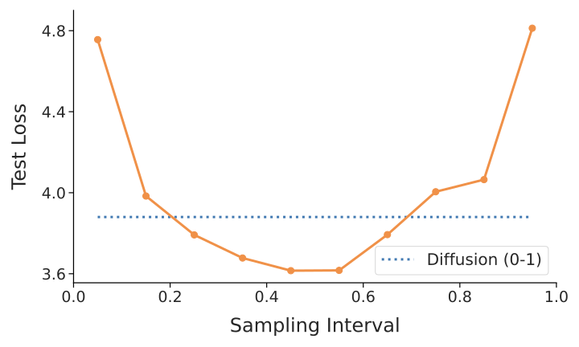
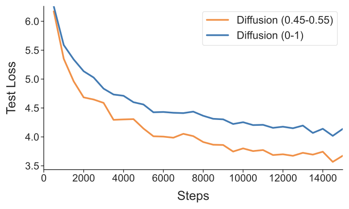
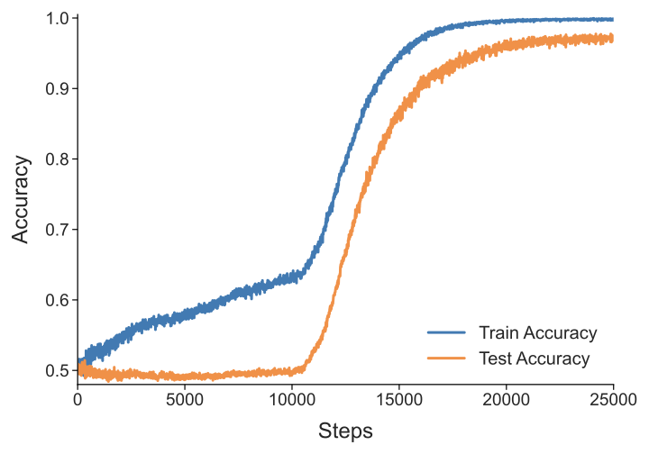

# Huang, Mirzasoleiman 2026 — Tuning the Implicit Regularizer of Masked Diffusion Language Models: Enhancing Generalization via Insights from $k$-Parity

См. также: [глобальный индекс понятий](../../concepts/index.md).

**Jianhao Huang**, **Baharan Mirzasoleiman** (Department of Computer Science, University of California, Los Angeles).

arXiv [2601.22450](https://arxiv.org/abs/2601.22450), июнь 2026 (v2), 23 страницы, 7 рисунков (9 файлов), 4 таблицы. Всего цитирований по Semantic Scholar — 2, в картотеке — 0. Первая работа корпуса о маскированной диффузии — и новый рычаг управления гроккингом: прежние управляющие величины (доля данных, weight decay, масштаб инициализации, оптимизатор) прилагались к обучению при неизменной цели, здесь же меняется сама цель обучения — и задержка исчезает. Цель маскированной диффузии (MD) аналитически разложена на режим сигнала (двигает обучение признаков) и режим шума (прижимает выход к нулю на информационно невосстановимых входах — встроенный неявный упорядочиватель); на задаче $(20,6)$-parity, где обычное обучение nanoGPT показывает учебниковый гроккинг, MD-цель сводит кривые обучения и проверки почти одновременно. Прикладная половина: из доли сигнала $P_{S}=(k+1)\mathbb{E}[t(1-t)^{k}]$ выведено правило выбора распределения доли маскирования, проверенное на 50M (WikiText, U-образная кривая) и LLaDA-8B (предобучение и SFT).

Оригинал и производные файлы этой папки:

- [`original/2601.22450.tuning-the-implicit-regularizer-of-masked-diffusion-language-models-enhancing-generalization-via-insights-from-k-parity.md`](original/2601.22450.tuning-the-implicit-regularizer-of-masked-diffusion-language-models-enhancing-generalization-via-insights-from-k-parity.md) — конверсия оригинала (native arXiv HTML, v2) в Markdown без правок содержания.
- [`2601.22450.tuning-the-implicit-regularizer-of-masked-diffusion-language-models-enhancing-generalization-via-insights-from-k-parity.claims.txt`](2601.22450.tuning-the-implicit-regularizer-of-masked-diffusion-language-models-enhancing-generalization-via-insights-from-k-parity.claims.txt) — пронумерованные утверждения статьи с пометками разбора.
- [`images/`](images/) — 7 рисунков (9 файлов).

Схема якорей и правила ссылок на карточку — в [README папки статей](../README.md).

## Затрагиваемые понятия

**[Гроккинг](../../concepts/grokking.md)** — устранение задержки сменой самой цели обучения: на $(n,k)=(20,6)$-parity опорное обучение nanoGPT с надзором по метке даёт учебниковый гроккинг (100% на обучении почти сразу, 50% на проверке долго, поздняя сходимость подтверждена продлённым прогоном в приложении F.2), а MD-цель с тем же weight decay сводит обе кривые почти одновременно ([`p6-6`](#p6-6)). Разбор: сравнение не выровнено по объёму надзора — опорный прогон надзирает только метку, MD надзирает восстановление всех маскированных символов, и по обратимости XOR каждый из $k+1$ элементов секретного множества учит тому же самому (при $k=6$ — семикратный надзор); опыта, разделяющего «упорядочиватель против запоминания» и «богаче надзор», в работе нет; семена и полосы разброса не приведены нигде.

**[Разрежённая чётность](../../concepts/sparse-parity.md)** — полигон работы: $(20,6)$-parity с меткой, приклеенной последним символом последовательности, обучение nanoGPT со стохастическим маскированием (Бернулли с долей $t\sim U[t_{0},t_{1}]$, потеря только на маскированных позициях с весом $1/(2t)$), оценка на закреплённой маске «виден вход — маскирован бит чётности» ([`p6-5`](#p6-5)); сходимость быстрее всего у диапазонов около теоретического оптимума $\mathcal{U}[0,0.246]$, крайние $\mathcal{U}[0,0.1]$ и $\mathcal{U}[0,0.4]$ неустойчивы. Разбор: против линии Barak et al. (скрытый прогресс на полке) здесь мер прогресса нет вовсе — по двум кривым точности не отличить, полка убрана или лишь укорочена; собственный сигнал-оптимум следствия 4.8 ($t=1/7\approx 0.143$ точечно) не проверен ни разу — опыт использует третий, промежуточный порядок ($t_{0}=0$, максимизация по $t_{1}$).

**[Варианты регуляризации](../../concepts/regularization-variants.md)** — упорядочиватель, встроенный в саму цель: теорема 4.3 разлагает MD-потерю в $P_{S}\mathbb{E}_{S}[\ldots(f_\theta-f^{*})^{2}]+P_{N}\mathbb{E}_{N}[\ldots f_\theta^{2}]$, где второе слагаемое требует от модели молчать на информационно невосстановимых входах — и это, по замыслу, закрывает дорогу к чистому запоминанию без всякого явного штрафа на веса ([`p5-4`](#p5-4)); распространено и на перекрёстную энтропию (замечание 4.4), чтобы механизм не выглядел артефактом квадратичной потери. Разбор: доказано существование упорядочивателя, но не отсутствие задержки — величин с размерностью времени обучения в теории нет; weight decay при этом закреплён на $\eta=0.1$ во всех прогонах, так что взаимодействие двух упорядочивателей не проверено (прогона MD при $\eta=0$ нет, хотя обзор сам ссылается на стойкость MDLM без weight decay).

**[Возникновение признаков](../../concepts/feature-emergence-feature-learning.md)** — прямое продолжение энергетической рамки Tian (2509.21519): при предположении ленивого считывания минимизация действенной потери равносильна максимизации энергии $E(\boldsymbol{W})={\boldsymbol{c}}(\boldsymbol{W})^{\top}\boldsymbol{\Sigma}(\boldsymbol{W})^{\dagger}{\boldsymbol{c}}(\boldsymbol{W})$, и поскольку $E\propto P_{S}^{2}$, доля сигнала работает переменным усилителем скорости обучения признаков; следствие 4.6 — в пределе чистого сигнала ($P_{N}\to 0$) энергия достаточно выразительной сети выходит на постоянную и обучение признаков схлопывается: шумовое слагаемое не помеха, а то, что держит обучение признаков живым ([`p5-9`](#p5-9)). Разбор: следствие говорит о недостижимой точке $P_{N}=0$ и молчит о малых ненулевых $P_{N}$, где идёт настоящее обучение; предположение ленивого считывания взято у Tian технически, тогда как в корпусе ленивость — сама разбираемая величина (переход lazy-to-rich), и связь не разобрана.

## Что показано, а что предположено

Замечания редактора карточки по итогам разбора утверждений (`…claims.txt`, 46 пунктов).

**Ценное — новый рычаг и честные сверки.** Смена цели обучения как способ убрать задержку — новый для корпуса класс вмешательства; разложение сигнал/шум с явной формулой $P_{S}=(k+1)\mathbb{E}[t(1-t)^{k}]$ даёт управляемую ручку, доведённую до практики (U-образная кривая на 50M; +4.6 и +8.8 пункта на HellaSwag/ARC-Easy при предобучении 8B; GPQA 0.402 против 0.344 при SFT). Нарочные сверки к месту: продлённый прогон подтверждает, что у опорной модели именно гроккинг, а не провал; равномерное внимание подтверждает, что сведение к перцептрону законно.

**Теория доказывает не то, что заявлено в аннотации.** Доказано: упорядочиватель существует (теорема 4.3), сигнал задаёт темп (теорема 4.5, $E\propto P_{S}^{2}$), в чистом сигнале обучение признаков схлопывается (следствие 4.6). Не доказано: что обычная цель обязана гроккать и что шумовое слагаемое сокращает полку — переход от «упорядочиватель есть» к «задержки нет» сделан словами. Главная несводимость: MD-надзор в $k+1$ раз богаче опорного на той же выборке — разделяющего опыта нет.

**Внутренние нестыковки.** На порождающих задачах (GSM8K, MATH) выигрывает диапазон $[0.5,1.0]$ — почти полное маскирование, которое собственная теория относит к шуму и называет неинформативным; в тексте это подано отдельным наблюдением без сверки с теоремой 4.3. «Предсказание» $t^{\star}\approx 0.46$ из $n$-граммной смеси почти целиком пересказывает преобладание биграмм ($w_{2}=0.74$ сводит задачу к $\arg\max t(1-t)$), причём линейность по $P_{S}$ противоречит собственной квадратичной теореме 4.5 (это признано сноской). Приросты «8.8% и 5.8%» — пункты процента, а не проценты. Ни семян, ни полос разброса; следы незавершённой правки (пустые ключевые слова, опечатки «quesiton», «unidentifable»).

**Как работу будут цитировать** («доказано, что маскированная диффузия устраняет гроккинг») — точнее: на одной задаче $(20,6)$, одной сборке nanoGPT, при одном значении weight decay, против одного опорного прогона с надзором только по метке, без числа семян показано, что кривые обучения и проверки сходятся почти одновременно; теоретическая часть выводит существование упорядочивателя, но не отсутствие задержки.

---

# Текст статьи

## Настройка неявного упорядочивателя маскированных диффузионных языковых моделей: улучшение генерализации через прозрения из $k$-parity

**Jianhao Huang** (Department of Computer Science, University of California, Los Angeles; переписка: jhhuang2025@cs.ucla.edu), **Baharan Mirzasoleiman** (Department of Computer Science, University of California, Los Angeles)

## Аннотация

Маскированные диффузионные языковые модели недавно возникли как мощная порождающая парадигма, однако их обобщающие свойства остаются недоисследованными по сравнению с авторегрессионными собратьями. В этой работе мы исследуем эти свойства в постановке задачи $k$-parity (вычисление XOR-суммы $k$ значимых битов), где нейронные сети обычно являют гроккинг — затяжную полку качества на уровне случайного угадывания с последующей внезапной генерализацией. Мы теоретически разлагаем цель маскированной диффузии (MD) на режим сигнала, движущий обучение признаков, и режим шума, служащий неявным упорядочивателем. Обучая nanoGPT MD-целью на задаче $k$-parity, мы демонстрируем, что MD-цель фундаментально меняет ландшафт обучения, делая возможной быструю и одновременную генерализацию без прохождения через гроккинг. Далее мы используем наши теоретические прозрения для оптимизации распределения вероятности маскирования в MD-цели. Наш метод значительно улучшает перплексию моделей на 50M параметров и достигает лучших результатов и при предобучении с нуля, и при супервизном дообучении. Конкретно, мы наблюдаем выигрыши качества, достигающие пиков $8.8\%$ и $5.8\%$ соответственно на моделях с 8B параметров, что подтверждает масштабируемость и действенность нашей рамки в режимах больших маскированных диффузионных языковых моделей.

##### Ключевые слова:

Machine Learning, ICML

## 1 Введение

Маскированные диффузионные языковые модели (MDLM) (36; 16; 44; 45; 67) недавно возникли как мощная альтернатива господствующей авторегрессионной парадигме, достигая уровней качества, соперничающих со стандартными авторегрессионными моделями (ARM) (46; 34; 10; 66). В отличие от ARM, ведомых предсказанием следующего токена, MDLM используют обучающую рамку, где токены независимо маскируются с долей $t\sim\mathcal{U}[0,1]$, и модель обязана восстановить исходные данные из испорченной версии. Интересно, что недавние работы демонстрируют: MDLM могут превосходить ARM в режимах малых данных (41) и при отсутствии weight decay (42), что намекает на природное превосходство в генерализации (см. раздел 2). Однако роль цели MDLM в направлении оптимизации к обобщаемым решениям ещё не была строго охарактеризована.

Чтобы ответить на этот вопрос, мы изучаем упрощённую постановку — трансформер, обучаемый маскированной диффузионной потерей на задаче $k$-parity, — чтобы вскрыть фундаментальные механизмы, движущие обучение MDLM. Задача $k$-parity обычно ставит грозный вызов стандартным парадигмам обучения, которые часто попадают в ловушку «гроккинга» (50): затяжная полка качества на уровне случайного угадывания с последующей внезапной, поздней генерализацией.

Мы демонстрируем, что цель маскированной диффузии (MD) внутренне обходит этот вызов. Аналитически разлагая цель, мы раскрываем, что потеря естественно разделяется на **режим сигнала** и **режим шума**:

$$
\mathcal{L}_{\mathrm{eff}}(\theta)\approx P_{S}\underbrace{\mathbb{E}_{S}[\left\|f_\theta(\tilde{\mathbf{z}}) - f^*\right\|^{2}]}_{\text{Task Signal}}+P_{N}\underbrace{\mathbb{E}_{N}[\left\|f_\theta(\tilde{\mathbf{z}})\right\|^{2}]}_{\text{Implicit Regularization}}.
$$

Интуитивно режим шума возникает, когда процесс маскирования либо слишком агрессивен и скрывает биты, необходимые для вычисления чётности, либо маскирует только незначимые позиции, оставляя целевой бит нетронутым. В обоих случаях получившийся образец становится информационно-теоретически невосстановимым. Поскольку такие невосстановимые примеры не дают достаточной информации для восстановления цели, цель вынуждает модель минимизировать норму своего выхода на этих входах. Этот механизм служит неявным упорядочивателем, предотвращающим сползание модели в чистое запоминание **[p. 2]** и тем самым способствующим прочной алгоритмической генерализации.

Опираясь на это структурное прозрение, мы гипотезируем, что стандартная практика равномерной выборки маски ($t\in[0,1]$) неоптимальна для естественного языка, поскольку крайние концы процесса ($t\approx 0$ и $t\approx 1$) могут давать исчезающе малые градиентные сигналы или избыточную регуляризацию. Мы предлагаем стратегию **выборки маски, богатой сигналом** (Signal-Rich Mask Sampling), сосредотачивающую обучение на самых информативных интервалах маскирования. Мы проверяем нашу рамку на нескольких масштабах — от игрушечного уровня до предобучения и дообучения моделей с 8B параметров.

Итак, мы **сводим наши главные вклады к следующему:**

- **Теоретическое открытие неявной регуляризации.** Используя задачу $k$-parity как аналитическую рамку, мы даём формальное разложение MD-цели на *режим сигнала* и *режим шума*. Мы доказываем, что последний функционирует как встроенный неявный упорядочиватель, штрафуя предсказания модели на информационно-теоретически затемнённых входах, — механизм, устраняющий задержку генерализации, типичную для стандартных супервизных целей.
- **Эмпирическая проверка на случае parity.** Мы демонстрируем, что MD-цель фундаментально меняет обучающую динамику дискретных алгоритмических задач, делая возможной почти мгновенную генерализацию на эталонах $k$-parity. Примечательно, что MD целиком избегает явления «гроккинга». Насколько нам известно, мы **первые**, кто установил, что маскированная диффузия может достигать столь быстрой генерализации на parity.
- **Обобщение теоретических прозрений на большие модели.** Мы демонстрируем, что принципы, выведенные из случая $k$-parity, действенно переносятся на реальное языковое моделирование и рассуждение. Мы проверяем этот перенос на двух различных масштабах. (i) На масштабе 50M мы показываем, что настройка диапазона маскирования с сосредоточением на высокосигнальных режимах значительно улучшает перплексию на наборе WikiText. (ii) Мы демонстрируем, что наше богатое сигналом распределение остаётся прочным на масштабе 8B параметров. Наш подход достигает улучшения до $8.8\%$ при предобучении. При супервизном дообучении (SFT) оптимизация шумовых интервалов даёт выигрыши до $5.8\%$ на различительных задачах и $3.4\%$ на сложном порождающем рассуждении.

## 2 Связанные работы

**Маскированные диффузионные языковые модели.** Маскированные диффузионные языковые модели (MDLM) (36; 16; 44; 45; 67) недавно возникли как мощная альтернатива господствующей авторегрессионной парадигме, достигая уровней качества, соперничающих со стандартными авторегрессионными моделями (ARM). Недавние анализы законов масштабирования (41; 42) демонстрируют особый компромисс вычислений и данных: хотя MDLM более прожорливы к данным при закреплённом вычислительном бюджете, они превосходят ARM при более долгом обучении на малых данных.

Особенно разительное свойство MDLM — внутренняя стойкость к переобучению, проявляющаяся в двух различных постановках. Во-первых, при малых бюджетах данных MDLM остаются почти незатронутыми повторением данных, тогда как ARM являют серьёзную деградацию потери на валидации и качества на эталонах (41). Во-вторых, MDLM сохраняют устойчивое качество даже без weight decay (42), тогда как удаление weight decay обычно подрывает генерализацию ARM.

Теоретически 56 упростили цель MDLM до взвешенного интеграла перекрёстно-энтропийных потерь. 54 представили упрощённую, рао-блэквеллизованную цель в форме взвешенного среднего потерь маскированного языкового моделирования (12). 47 установили её равнозначность ожидаемому отрицательному логарифму правдоподобия авторегрессионных моделей произвольного порядка (AO-ARM). Хотя эти исследования проясняют структурную форму цели, они не объясняют превосходных обобщающих способностей цели MDLM. Мы закрываем этот разрыв, аналитически разлагая MD-цель и демонстрируя, что она содержит внутренний неявный упорядочиватель, штрафующий выход модели на невосстановимых входах, тем самым предотвращая запоминание и способствуя быстрой генерализации.

Подробное обсуждение других связанных работ по MDLM мы даём в приложении A.

**Гроккинг** впервые обнаружен 50 на наборе малых алгоритмических задач рассуждения. Занимательное явление вдохновило последующие работы с разными объяснениями. 39 описывают его как соперничество цепей генерализации и запоминания, а 31 оформляют как переход от «ленивого» к «богатому» режиму обучения. Кроме того, недавние исследования разбирали динамику гроккинга в конкретных контекстах, таких как задачи кластеризации (65), линейные сети (13). В контексте групповой арифметики 59 выделяет weight decay как критический механизм запуска перехода от запоминания к алгоритмическим решениям.

## 3 Предварительные сведения

В этом разделе мы устанавливаем формальную рамку, необходимую для анализа обучающей динамики маскированной диффузии. Сначала мы вводим задачу $k$-parity, служащую теоретическим полигоном для последующего анализа. Затем мы определяем архитектуру однослойного трансформера и формализуем стохастическую цель обучения.

**[p. 3]**

**Обозначения.** Мы пишем $[T]$ для множества $\{1,2,...,T\}$. Скаляры — строчными нежирными буквами ($y,\alpha$ и т. д.). Матрицы и векторы обозначаются заглавными жирными ($\boldsymbol{W},\boldsymbol{V}$ и т. д.) и строчными жирными буквами ($\boldsymbol{x},\boldsymbol{w}$ и т. д.) соответственно. $\boldsymbol{W}_{[i,j]},\boldsymbol{W}_{[i,:]},\boldsymbol{W}_{[:,j]}$ обозначают соответственно $(i,j)$-й элемент, $i$-ю строку и $j$-й столбец матрицы $\boldsymbol{W}$. $\boldsymbol{W}_{[:,-1]}$ означает последний столбец матрицы $\boldsymbol{W}$. Запись $\boldsymbol{W}_{ij}$ обозначает блочные матрицы/векторы в $i$-й строке и $j$-м столбце по контексту. Мы пишем $\mathbb{1}\left\{\cdot\right\}$ для индикаторной функции, $\odot$ для произведения Адамара и $\dagger$ для псевдообратной Мура—Пенроуза.

### 3.1 Parity

Чтобы выйти за пределы эмпирических наблюдений и изолировать механистическую причину прочности MDLM, мы берём задачу parity нашей теоретической площадкой. Parity — хорошо изученный теоретический эталон в теории обучения (11; 1; 2; 5; 15; 30; 28; 62), часто используемый для анализа способности нейронных архитектур извлекать малоранговый сигнал из многомерного шума. Более того, задача составляет канонический случай гроккинга (5; 39; 6; 51; 48). Отбрасывая лингвистические сложности естественного языка, parity даёт управляемую среду для определения того, подавляет ли MD-цель внутренне неоптимальные траектории запоминания в пользу структурного обучения.

##### **Определение 3.1** (задача $(n,k)$-parity)**.**

Пусть $\mathcal{S}\subset[n]$ — секретное множество индексов с $|\mathcal{S}|=k$. Для входа $\boldsymbol{x}$, взятого равномерно из $\{-1,1\}^{n}$, метка $y_{\boldsymbol{x}}$ определяется как произведение битов из $\mathcal{S}$: $y_{\boldsymbol{x}}=\prod_{j\in\mathcal{S}}x_{j}$.

##### **Определение 3.2** (полная последовательность $\boldsymbol{x}^{\prime}$)**.**

Для обучения $n$ входных битов и метка чётности склеиваются в одну последовательность $\boldsymbol{x}^{\prime}\in\{-1,1\}^{n^{\prime}}$ длины $n^{\prime}=n+1$

$$
\boldsymbol{x}^{\prime}=(x^{\prime}_{1},x^{\prime}_{2},\dots,x^{\prime}_{n},x^{\prime}_{n+1})
$$

где $x^{\prime}_{j}=x_{j}$ для $j\in[n]$ и $x^{\prime}_{n+1}=y_{\boldsymbol{x}}$. Определим $\mathcal{S}^{\prime}=\mathcal{S}\cup\left\{n'\right\}$ как секретное множество последовательности $\boldsymbol{x}^{\prime}$.

Мы рассматриваем конечный обучающий набор $\mathcal{D}^{\prime}=\{\boldsymbol{x}^{\prime}_{i}\}_{i=1}^{N}$ размера $N$, где каждый пример $\boldsymbol{x}^{\prime}_{i}$ независимо порождён, как описано выше.

### 3.2 Однослойный трансформер

Мы рассматриваем однослойный трансформер с одноголовым самовниманием (SSA) и полносвязной сетью (FFN). Следуя 69; 43; 23, мы объединяем матрицу проекции FFN и матрицу значений SSA в одну матрицу $\boldsymbol{W}$, а матрицы ключей и запросов сливаем в ${\boldsymbol{A}}$.

##### **Определение 3.3** (однослойный трансформер)**.**

Пусть $\boldsymbol{v}\in\mathbb{R}^{D}$ и $\boldsymbol{W}\in\mathbb{R}^{D\times d}$ — матрицы FFN, а ${\boldsymbol{A}}\in\mathbb{R}^{d\times d}$ — матрица внимания. Пусть $\sigma$ — поэлементная функция активации, такая как $\mathrm{ReLU}$. Определим параметры $\theta:=\left\{\boldsymbol{v},\boldsymbol{W},\boldsymbol{A}\right\}$. Однослойный трансформер $\mathrm{TF}_{\theta}$ действует на $\boldsymbol{X}\in\mathbb{R}^{d\times n}$ как

$$
\mathrm{TF}_{\theta}\left(\boldsymbol{X}\right)=\boldsymbol{v}^{\top}\sigma\left(\boldsymbol{W}\boldsymbol{X}\mathrm{softmax}\left(\boldsymbol{X}^\top\boldsymbol{A}\boldsymbol{X}\right)\right)\in\mathbb{R}^{1\times n}.
$$

Заметим, что функция softmax применяется постолбцово.

### 3.3 Потеря маскированной диффузии

##### **Определение 3.4** (стохастическое маскирование)**.**

Для обучающего образца $x^{\prime}$ вероятность маскирования $t$ берётся из равномерного распределения $t\sim U[t_{0},t_{1}]$. Затем берётся вектор маски $\boldsymbol{m}\in\{0,1\}^{n^{\prime}}$, где каждая компонента $m_{j}$ — независимое испытание Бернулли $m_{j}\sim\text{Bernoulli}(t)$.

Определим множество *маскированных* индексов $M_{\boldsymbol{m}}=\left\{j \mid m_{j} = 1\right\}$. По $\boldsymbol{x}^{\prime}$ и $\boldsymbol{m}$ определим испорченный образец

$$
\tilde{\boldsymbol{x}}\left(\boldsymbol{x}',\boldsymbol{m}\right)=\boldsymbol{x}^{\prime}\odot\sim\boldsymbol{m}.
$$

##### **Определение 3.5** (эмбеддинги токенов)**.**

Модель действует в пространстве эмбеддингов $\mathbb{R}^{d}$, где $d=3n^{\prime}=3(n+1)$. Это пространство даёт уникальный ортогональный one-hot эмбеддинг каждому значению токена $b\in\{-1,0,1\}$ (где «0» представляет токен маски) в каждой позиции $j\in[n^{\prime}]$.

Эмбеддинг значения $b$ в позиции $j$ — это one-hot вектор $\boldsymbol{e}_{n^{\prime}b+j}\in\mathbb{R}^{d}$. По $\boldsymbol{x}^{\prime}$ и маске $\boldsymbol{m}$ мы обозначаем вход как

$$
\widetilde{\boldsymbol{X}}\left(\tilde{\boldsymbol{x}}\right)=\begin{pmatrix}\cdots&\boldsymbol{e}_{n^{\prime}\tilde{x}_{j}+j}&\cdots\end{pmatrix}\in\mathbb{R}^{d\times n^{\prime}}.
$$

Мы пишем $\widetilde{\boldsymbol{X}}\left(\tilde{\boldsymbol{x}}\right)$ просто как $\widetilde{\boldsymbol{X}}$, когда контекст ясен.

Следуя недавним эмпирическим работам (45; 67; 42), мы рассматриваем полнобатчевую градиентную динамику над среднеквадратичной потерей, считаемой только на маскированных токенах.

##### **Определение 3.6** (функция потери обучения)**.**

Модель обучается предсказывать исходные значения маскированных токенов. При выбранных $t_{i}$ и $\boldsymbol{m}_{i}$ потеря для одного образца $\boldsymbol{x}_{i}^{\prime}$ определяется как:

$$
\ell\left(\theta| \boldsymbol{x}'_i, t_i, \boldsymbol{m}_i\right)=\frac{1}{2t_{i}}\sum_{j\in M_{t_{i}}}\left( f(\widetilde\boldsymbol{X}_i)_{\left[:,j\right]} - x'_j \right)^{2}.
$$

Общая цель обучения — ожидаемая потеря по данным, вероятности маскирования и распределениям масок:

$$
\mathcal{L}(\theta)=\mathbb{E}_{\boldsymbol{x}^{\prime}\in\mathcal{D^{\prime}},t\sim U\left[t_0,t_1\right],\boldsymbol{m}}\left[\ell\left(\theta| \boldsymbol{x}', t, \boldsymbol{m}\right)\right]. \tag{1}
$$

### 3.4 Оценка

Чтобы оценить способность модели восстанавливать лежащую в основе логику задачи parity, мы проверяем её качество на особой, **[p. 4]** нестохастической оценочной маске $\mathbf{m}_{\text{eval}}$. В этой постановке модели даны все входные биты $x_{1},\dots,x_{n}$, но финальный бит чётности $x^{\prime}_{n^{\prime}}=y_{\boldsymbol{x}}$ маскирован, так что $M_{\text{eval}}=\{n^{\prime}\}$. Оценочный вход строится как

$$
\widetilde{\boldsymbol{x}}_{\text{eval}}=\widetilde{\boldsymbol{x}}\left(\boldsymbol{x}'\odot\sim\boldsymbol{m}_{\text{eval}}\right).
$$

Предсказание модели считается верным, если знак выхода на маскированной позиции совпадает с истинным битом чётности $y_{\boldsymbol{x}}$.

## 4 Понимание маскированной диффузии через parity

В этом разделе мы исследуем процесс обучения маскированной диффузии на задаче parity. Сначала мы демонстрируем, что механизм внимания трансформера не необходим для этой задачи, что позволяет свести архитектуру к двухслойной полносвязной нейронной сети. Затем мы даём теоретическое разложение цели обучения на режимы сигнала и шума. Наконец, мы приводим эмпирические свидетельства на реализации nanoGPT.

### 4.1 Сведение структуры

Хотя прежние теоретические исследования задачи parity преимущественно использовали двухслойный многослойный перцептрон (MLP) (11; 1; 2; 5; 15; 30), не сразу ясно, сохраняются ли такие упрощения для MD-цели. В отличие от стандартного супервизного обучения, цель включает стохастический процесс маскирования, который может опираться на механизм внимания трансформера для сбора информации по позициям.

Чтобы это разрешить, мы проводим предварительную абляцию, сводя механизм внимания к **равномерному вниманию**. Мы эмпирически находим, что модель остаётся обучаемой и не показывает признаков гроккинга (см. раздел F.1). Это открытие подтверждает, что стержневая обобщающая динамика маскированной дискретной диффузии в этом контексте независима от механизма внимания.

Следовательно, для теоретического анализа мы сводим трансформер к двухслойному MLP. В случае равномерного внимания операция softmax упрощается до постоянного равномерного распределения $1/n^{\prime}$ по всем позициям. Мы поглощаем константу в параметры. Тогда выход модели $\mathrm{TF}_{\theta}(\widetilde{\boldsymbol{x}})$ в каждой позиции одинаков и становится функцией глобальной суммы входных эмбеддингов. Мы определяем агрегированный входной вектор $\tilde{{\boldsymbol{z}}}$ как

$$
\tilde{{\boldsymbol{z}}}=\sum_{j=1}^{n^{\prime}}\mathbf{e}_{n^{\prime}\tilde{x}_{j}+j}\in\mathbb{R}^{d}.
$$

Свёрнутая модель с параметрами $\theta=\left\{\boldsymbol{v},\boldsymbol{W}\right\}$ действует на этот агрегированный вектор как

$$
f_{\theta}(\tilde{{\boldsymbol{z}}})=\boldsymbol{v}^{\top}\sigma(\boldsymbol{W}\tilde{{\boldsymbol{z}}})\in\mathbb{R}.
$$

### 4.2 Режимы сигнала и шума

Чтобы охарактеризовать обучающую динамику, мы должны различать входные конфигурации, где маскированные токены информационно-теоретически восстановимы (сигнал), и те, где они статистически независимы от видимых токенов (шум) (см. рисунок 1).

Стохастический процесс маскирования наводит распределение на агрегированные входные векторы $\tilde{{\boldsymbol{z}}}$. Мы разбиваем пространство входов на два непересекающихся режима по маске $\boldsymbol{m}$.

##### **Определение 4.1** (режимы сигнала и шума)**.**

Мы классифицируем конфигурации масок $\boldsymbol{m}$ на два режима по расширенному секретному множеству $\mathcal{S}^{\prime}$:

(i) **Режим сигнала** $\mathcal{R}_{S}=\{\boldsymbol{m}\mid|M_{\boldsymbol{m}}\cap\mathcal{S}^{\prime}|=1\}$, где маскированный токен $x^{\prime}_{j}$ определяется немаскированными токенами из $\mathcal{S}^{\prime}$.

(ii) **Режим шума** $\mathcal{R}_{N}=\{\boldsymbol{m}\mid|M_{\boldsymbol{m}}\cap\mathcal{S}^{\prime}|\neq 1\}$, где все маскированные токены невосстановимы.

*Рисунок 1: Восстановимость узоров маскирования в задаче $(n,k)=(4,2)$-parity. Синие клетки — секретное множество $\mathcal{S}$, серые — маскированные позиции.* **[p. 4]**

Прежде чем анализировать, как модель учится, мы должны убедиться, что функция чётности однозначно определена доступными данными. В отличие от стандартной parity, модель наблюдает только испорченные образцы. Мы даём следующую информационно-теоретическую границу:

##### **Теорема 4.2** (информационно-теоретическая восстановимость)**.**

*Пусть $\mathcal{D}^{\prime}$ — набор из $N$ образцов, подвергнутых стохастическому маскированию из определения 3.4. Чтобы секретное множество $\mathcal{S}$ было однозначно восстановимо из испорченного набора с вероятностью не менее $1-\delta$, число образцов $N$ должно удовлетворять:*

$$
N\geq\frac{4\log(4n/\delta)}{\mathbb{E}[t]\cdot\left(\mathbb{E}[(1-t)^k]\right)^{2}}. \tag{2}
$$

*где $k=|\mathcal{S}|$ — размер секретного множества (не считая самого бита чётности).*

Полное доказательство см. в разделе B.1. Этот результат устанавливает нижний порог данных, необходимый для успеха алгоритма. С гарантированной восстановимостью мы теперь анализируем ландшафт MD-цели, чтобы объяснить, как она способствует быстрой генерализации на задаче parity.

**[p. 5]**

### 4.3 Действенная потеря и энергетический ландшафт

Мы теперь анализируем градиентную динамику, проецируя конечно-суммовую потерю на распределение агрегированных эмбеддингов $\tilde{{\boldsymbol{z}}}$.

##### **Теорема 4.3** (разложение действенной потери)**.**

*Рассмотрим цель обучения из уравнения 1 над конечным набором $\mathcal{D}^{\prime}$. Для $\boldsymbol{m}\in\mathcal{R}_{S}$ определим $f^{*}(\tilde{\boldsymbol{z}})=\frac{1}{\left|M_{\boldsymbol{m}}\right|}x^{\prime}_{M_{\boldsymbol{m}}\cap\mathcal{S}^{\prime}}$ как оптимальную целевую функцию. Потеря равнозначна:*

$$
\mathcal{L}_{\mathrm{eff}}(\theta)=P_{S}\mathbb{E}_{\tilde{{\boldsymbol{z}}}\mid\mathcal{R}_{S}}\left[ \frac{\left|M_{\boldsymbol{m}}\right|}{2t}\left(f_\theta(\tilde{\boldsymbol{z}}) - f^*(\tilde{\boldsymbol{z}})\right)^2 \right] \\
+P_{N}\mathbb{E}_{\tilde{{\boldsymbol{z}}}\mid\mathcal{R}_{N}}\left[ \frac{\left|M_{\boldsymbol{m}}\right|}{2t}f_\theta(\tilde{\boldsymbol{z}})^2 \right], \tag{3}
$$

*где $P_{S}=(k+1)\mathbb{E}_{t\sim U\left[t_0,t_1\right]}\left[t(1-t)^k\right]$ и $P_{N}=1-P_{S}$. Ожидания берутся по эмпирическому распределению $\tilde{{\boldsymbol{z}}}$ при условии соответствующих режимов.*

###### p5-4

Полное доказательство см. в разделе C.1. Разложение теоремы 4.3 раскрывает, что MD-цель функционирует как составная потеря со встроенным упорядочивателем. Первый член (режим сигнала) заставляет модель отображать восстановимые маскированные узоры в их скрытые метки, а второй (режим шума) действует как **неявный упорядочиватель** выхода модели.

##### *Замечание 4.4* (распространение на перекрёстную энтропию)*.*

Та же сигнал-шумовая структура переносится на бинарную перекрёстно-энтропийную (CE) цель, подтверждая, что механизм — не артефакт квадратичной потери, а внутреннее свойство самого процесса маскирования. Полный вывод — в разделе C.2.

Чтобы охарактеризовать механизм обучения признаков, мы принимаем предположение *ленивого считывания* вслед за 58; 37; 7; 59, полагая, что линейное считывание $\boldsymbol{v}$ сходится к своему оптимуму $\boldsymbol{v}^{*}(\boldsymbol{W})$ много быстрее скрытых весов $\boldsymbol{W}$. При этом предположении оптимизация действенной потери сводится к максимизации энергетической функции $E(\boldsymbol{W})$, характеризующей ландшафт, который правит обучением признаков:

##### **Теорема 4.5** (энергетический ландшафт)**.**

*Рассмотрим действенную потерю $\mathcal{L}_{\mathrm{eff}}(\boldsymbol{v},\boldsymbol{W})$ из теоремы 4.3. Пусть $\boldsymbol{h}\left(\tilde\boldsymbol{z}\right)=\sigma(\boldsymbol{W}\tilde{{\boldsymbol{z}}})$. Пусть корреляционный вектор ${\boldsymbol{c}}(\boldsymbol{W})$ и ковариационная матрица $\boldsymbol{\Sigma}(\boldsymbol{W})$ определены как*

$$
{\boldsymbol{c}}(\boldsymbol{W})=P_{S}\mathbb{E}_{S}\left[ \frac{|M_{\mathbf{m}}|}{2t} f^* \boldsymbol{h}\right],\,\boldsymbol{\Sigma}(\boldsymbol{W})=\mathbb{E}\left[ \frac{|M_{\mathbf{m}}|}{2t} \boldsymbol{h}\boldsymbol{h}^\top\right].
$$

*Предположим, что считывание $\boldsymbol{v}$ оптимально при закреплённом $\boldsymbol{W}$. Тогда минимизация действенной потери равнозначна максимизации энергии $E(\boldsymbol{W})$*

$$
E(\boldsymbol{W})={\boldsymbol{c}}(\boldsymbol{W})^{\top}\boldsymbol{\Sigma}(\boldsymbol{W})^{\dagger}{\boldsymbol{c}}(\boldsymbol{W}).
$$

###### p5-9

Полное доказательство см. в разделе D.1. Поскольку $E(\boldsymbol{W})\propto P_{S}^{2}$, доля сигнала $P_{S}$ действует как переменный усилитель. Она правит скоростью подъёма по энергетическому ландшафту, действенно масштабируя скорость обучения $\boldsymbol{W}$ именно в направлении цели $f^{*}$.

Хотя $P_{N}\to 0$ практически недостижимо в маскированной диффузии, рассмотрение этого предела раскрывает, почему шумовая компонента существенна для поддержания оптимизации.

##### **Следствие 4.6** (коллапс обучения признаков в чистом сигнальном режиме)**.**

*Рассмотрим предел, где обучение целиком попадает в режим сигнала ($P_{N}\to 0$). Если сеть достаточно выразительна, энергетическая функция насыщается на константе:*

$$
E(\boldsymbol{W})\xrightarrow{P_{N}\to 0}\text{Const}.
$$

###### p5-12

Полное доказательство см. в разделе D.2. Следствие 4.6 формализует критический режим отказа, где градиенты внутренних параметров $\boldsymbol{W}$ исчезают, когда обучение целиком попадает в чистый сигнальный режим ($P_{N}\to 0$). В этом режиме достаточно выразительная сеть позволяет ковариации признаков $\boldsymbol{\Sigma}(\boldsymbol{W})$ идеально подстроиться и нейтрализовать направленную информацию, содержащуюся в ${\boldsymbol{c}}(\boldsymbol{W})$. Поскольку энергетическая функция $E(\boldsymbol{W})$ насыщается на постоянном значении, получающийся градиент $\nabla_{\boldsymbol{W}}E(\boldsymbol{W})$ обращается в ноль. Это действенно останавливает эволюцию экстрактора признаков и мешает модели выучивать более изощрённые представления.

Представленный здесь результат согласуется с находками 59, где было показано, что обучение признаков может схлопнуться без должной регуляризации. В тех случаях модель часто оседает в ленивом состоянии, где внутренние веса перестают получать информативные обновления, как только непосредственная цель обучения достигнута простой корреляцией.

### 4.4 Оптимальная выборка маски

В этом разделе мы выводим оптимальные распределения выборки $t$ по двум разным критериям оптимизации: **оптимальность по сложности выборки**, минимизирующая объём данных для открытия структуры, и **оптимальность по сигналу**, максимизирующая ясность обучающего градиента.

Сначала мы формализуем стратегию минимизации требований к данным, опираясь на информационно-теоретические границы, установленные в нашем раннем анализе. По теореме 4.2 мы прямо получаем оптимальную стратегию в смысле наилучшей нижней границы сложности выборки.

##### **Следствие 4.7** (оптимальная по сложности выборки доля маскирования)**.**

*Пусть доля маскирования следует равномерному распределению $t\sim U[t_{0},t_{1}]$. Цель сложности выборки диктует оптимальную стратегию минимизацией нижней границы уравнения 2:*

*(i) Простые зависимости ($k=1$): любое равномерное распределение оптимально при условии среднего $\mathbb{E}[t]=\frac{1}{3}$.*

**[p. 6]**

*(ii) Сложные зависимости ($k>1$): оптимальное распределение прижато к нижней границе $t_{0}=0$. Верхняя граница $t_{1}\in\left(0,1\right)$ — корень уравнения:*

$$
(2k+1)(1-t_{1})^{k+1}-(2k+2)(1-t_{1})^{k}+1=0.
$$

Хотя следствие 4.7 даёт границу на объём данных, необходимый для успеха, оно не учитывает ясности градиента в процессе обучения. Для этого мы рассматриваем второй критерий на основе теорем 4.3 и 4.5. Эта сигнал-оптимальная стратегия стремится максимизировать восстановимую сигнальную компоненту $P_{S}$, действенно сосредотачивая процесс обучения на долях маскирования, наиболее ясно вскрывающих лежащую в основе структуру.

##### **Следствие 4.8** (сигнал-оптимальная доля маскирования)**.**

*Пусть доля маскирования следует равномерному распределению $t\sim U[t_{0},t_{1}]$. Отношение сигнала к шуму диктует оптимальную стратегию максимизацией $P_{S}$:*

$$
t_{0}=t_{1}=\frac{1}{k+1}.
$$

Полные доказательства см. в разделе B.2 и приложении E соответственно. Примечательно, что обе цели следуют функциональной форме $t(1-t)^{C}$. Следовательно, доля маскирования $t$ не может быть ни слишком малой, ни слишком большой: в обоих пределах выражение обращается в ноль.

Хотя оба критерия дают теоретические указания, для последующего анализа мы отдаём предпочтение сигнал-оптимальной стратегии. Этот выбор отражает то, что естественный язык характеризуется значительной избыточностью, а не единственным целевым отображением, что делает максимизацию сигнала более прочным двигателем эффективности и качества обучения.

### 4.5 Опыты на $k$-parity

###### p6-5

Мы проводим опыты на задаче $(n,k)=(20,6)$-parity со стандартной трансформерной архитектурой и перекрёстно-энтропийной потерей, чтобы проверить нашу теоретическую рамку. Модель следует реализации nanoGPT, включая самовнимание, нормировку слоя, остаточные связи и MLP-блок. Чтобы изолировать действие диффузионной цели, мы ставим weight decay $\eta=0.1$ для всех прогонов. Эмпирические результаты, показанные на рисунке 2, дают несколько ключевых наблюдений, подтверждающих динамику энергетического ландшафта.

*Рисунок 2: **Обучающая и валидационная точность на $(n,k)=(20,6)$-parity. Стандартное обучение (синее, прямой надзор $y_{\boldsymbol{x}}$) являет классическое гроккинговое поведение: обучающая точность быстро достигает $100\%$, а валидационная долго остаётся на уровне случайного угадывания ($50\%$), прежде чем в конце концов сойтись к $1$ (полная траектория — в разделе F.2). Напротив, маскированная диффузия (фиолетовое, оранжевое) делает возможной почти одновременную генерализацию. Самая быстрая сходимость достигается около теоретически предсказанного оптимального диапазона ($\mathcal{U}[0,0.246]$). Краевые случаи ($\mathcal{U}[0,0.1]$ и $\mathcal{U}[0,0.4]$) являют неустойчивость и более медленную сходимость из-за чрезмерной регуляризации.*** **[p. 6]**

###### p6-6

**Устранение гроккинга и одновременная генерализация.** Синяя кривая, представляющая стандартное обучение, являет классическое гроккинговое поведение. Хотя модель достигает $100\%$ обучающей точности почти немедленно, валидационная точность остаётся на базовом уровне $50\%$, указывая на неспособность выучить обобщаемые признаки на ранней стадии. Напротив, маскированная диффузия (фиолетовое и оранжевое) способствует почти одновременной сходимости обучающей и валидационной точности. Это подтверждает, что MD-цель даёт внутреннюю регуляризацию, подстёгивающую процесс обучения признаков.

#### Проверка сигнал-оптимального диапазона.

###### p6-7

Оранжевая ($\mathcal{U}[0,0.2]$) и фиолетовая ($\mathcal{U}[0,0.3]$) кривые являют самые быстрые скорости сходимости, значительно опережая прочие конфигурации. Это эмпирическое наблюдение близко согласуется с нашим теоретическим выводом, по которому при закреплённом $t_{0}=0$ оптимальный диапазон лежит около $\mathcal{U}[0,0.246]$, где $P_{S}=7\mathbb{E}_{t\sim U\left[0,t_1\right]}\left[t(1-t)^6\right]$ максимальна.

#### Краевая неустойчивость.

Хаотичное качество жёлтой ($\mathcal{U}[0,0.1]$) и коричневой ($\mathcal{U}[0,0.4]$) кривых отражает оптимизационную неустойчивость, вызванную недостатком сигнала. В обоих случаях $P_{S}$ ниже, чем в оранжевой и фиолетовой конфигурациях. Этот недостаток сигнала уменьшает величину обновлений $\boldsymbol{W}$, делая процесс обучения более восприимчивым к шуму выборки и замедляя общую сходимость. Более того, чрезмерная регуляризация резко меняет ландшафт потерь, что заслоняет истинные глобальные минимумы и запирает модель в неоптимальных решениях.

## 5 Богатая сигналом выборка маски в языковом моделировании

Мы теперь переводим эти теоретические прозрения в практические улучшения порождающего языкового моделирования. **[p. 7]** Наш анализ задачи $k$-parity раскрывает, что регуляризация — обоюдоострый меч: будучи существенной для генерализации, чрезмерная регуляризация искажает ландшафт оптимизации, что не только мешает эффективности обучения, но и ведёт к неоптимальной сходимости. Мы утверждаем, что распределение $t\sim U[0,1]$ в моделировании естественного языка может налагать чрезмерно регуляризующий эффект, аналогично деградирующий и скорость обучения, и качество модели. Следовательно, мы гипотезируем, что оптимальный режим обучения значительно сдвигается к максимизации интенсивности сигнала.

Этот сдвиг наводит на мысль, что крайности стандартного равномерного диапазона выборки $t\sim\mathcal{U}[0,1]$ мало вносят в лежащую в основе обучающую динамику. У нижней границы ($t\to 0$) задача схлопывается в тривиальное восстановление, давая исчезающие градиенты, глушащие извлечение признаков. Напротив, у верхней границы ($t\to 1$) вход становится информационно-теоретически пустым, вынуждая модель предсказывать маргинальные распределения токенов без контекста, необходимого для выучивания межтокенных зависимостей.

Чтобы сосредоточить ёмкость модели на самых информативных образцах, мы предлагаем ограничить обучение богатым сигналом окном $t\in[t_{\min},t_{\max}]$. Обходя вычислительно неэффективные края, мы гарантируем, что градиентные обновления последовательно движутся осмысленным контекстом. В этой рамке целью обучения становится перекрёстно-энтропийная потеря, ограниченная богатым сигналом интервалом. Конкретно, для последовательности $\boldsymbol{x}_{0}$ мы берём шаг времени $t\sim\mathcal{U}[t_{\min},t_{\max}]$, строим маскированную последовательность $\boldsymbol{x}_{t}$ и обучаем модель $p_{\theta}$ минимизировать

$$
\mathcal{L}\left(\theta\right)=-\mathbb{E}_{t,\boldsymbol{x}_{0},\boldsymbol{x}_{t}}\left[ \frac{1}{t}\sum_{i=1}^L \mathbb{1}\left[x_t^i = M\right] \log p_\theta\left(x_0^i \mid\boldsymbol{x}_t\right) \right].
$$

Существенно, что хотя наша цель обучения локализована в богатом сигналом диапазоне, все модели мы оцениваем стандартной тестовой потерей, усреднённой по полному интервалу $t\in[0,1]$.

### 5.1 Нахождение богатого сигналом окна

Чтобы проверить нашу гипотезу о неэффективности крайних долей маскирования, мы провели эмпирическую абляцию на модели с 50M параметров, адаптированной из каркаса nanoGPT. Модель обучалась на наборе WikiText (38) с размером батча $1024$ и размером блока $150$ в течение $6000$ шагов. Мы разбили шумовое расписание $t\in[0,1]$ на десять интервалов ширины $0.1$ (т. е. $t\in[0,0.1]$, $t\in[0.1,0.2]$ и т. д.). Затем мы обучили отдельные модели, где доля маскирования $t$ выбиралась равномерно только внутри конкретного подынтервала.

*Рисунок 3: **Тестовая потеря против интервала маскирования. Оценка моделей с 50M параметров, обученных на ограниченных диапазонах маскирования ширины $0.1$. Ось x — середина интервала выборки (например, $x=0.05$ отвечает $t\sim\mathcal{U}[0,0.1]$). Пунктирная синяя линия — базовое качество стандартной полнодиапазонной выборки ($t\sim\mathcal{U}[0,1]$). U-образная кривая демонстрирует, что обучение исключительно в «богатом сигналом» окне ($t\in[0.4,0.5]$ или $[0.5,0.6]$) значительно превосходит стандартную практику выборки полного диапазона. Поэтому для последующих 8B-опытов мы используем диапазон $t\in[0.45,0.55]$.*** **[p. 7]**

Результаты, показанные на рисунке 3, раскрывают отчётливую U-образную связь между интервалом маскирования и финальной тестовой потерей. Полные кривые потери во времени — в разделе F.3.

#### Неэффективность на краях.

Модели, обученные на интервалах у границ ($t\in[0,0.1]$ или $t\in[0.9,1.0]$), работают плохо, давая тестовые потери значительно хуже базовой линии. Это согласуется с нашим теоретическим прозрением: сигнал исчезает, когда $t$ уходит к границам.

#### Превосходство середины диапазона.

###### p7-7

Пунктирная чёрная линия показывает качество стандартной базовой линии ($t\sim\mathcal{U}[0,1]$) — тестовая потеря примерно $3.88$. Существенно, что модели, обученные исключительно в средних интервалах ($t\in[0.4,0.5]$ или $[0.5,0.6]$), достигают потерь до $3.62$. Это наводит на мысль, что стандартная практика равномерной выборки по $[0,1]$ неоптимальна, поскольку тратит значительный вычислительный бюджет на низкосигнальные режимы. Ограничивая диффузионное расписание окном, где отношение сигнала к шуму наиболее информативно, мы можем достичь лучшей генерализации. Раздел F.4 даёт теоретический вывод, предсказывающий этот оптимум прямо из статистики корпуса.

### 5.2 Масштабируемость к большим языковым моделям (8B)

#### 5.2.1 Предобучение

Чтобы дополнительно проверить, переносятся ли теоретические прозрения о сигнальном режиме на большие масштабы, мы используем каркас dllm (73) для предобучения двух версий архитектуры LLaDA-8B (45) с нуля на наборе DCLM-baseline (33). Обе модели обучались с размером батча $128$ и размером блока $4096$ в течение $15,000$ шагов. Мы отдаём приоритет эволюции оценочной потери как главной метрике, поскольку она даёт устойчивый сигнал эффективности оптимизации на ранних стадиях предобучения. Как показано на рисунке 4, модель, обученная исключительно в богатом сигналом окне ($t\in[0.45,0.55]$, как подсказывает рисунок 3), являет заметно более быстрое снижение перплексии по сравнению со стандартной базовой линией $\mathcal{U}[0,1]$.

*Рисунок 4: **Тестовая потеря предобучения (LLaDA-8B). Эволюция отложенного отрицательного логарифма правдоподобия (NLL) за 15K шагов. Модель, обученная с ограниченным расписанием $t\in[0.45,0.55]$ (оранжевая кривая), последовательно достигает меньшей потери по сравнению со стандартной базовой линией $t\in[0,1]$ (синяя кривая), указывая на лучшую эффективность обучения.*** **[p. 8]**

В дополнение к динамике потери мы выбираем HellaSwag (68) и ARC-Easy (**[p. 8]** 8) для оценки на прикладных задачах. Эти конкретные эталоны выбраны потому, что они уникально чувствительны к начальному усвоению здравого смысла и фактических ассоциаций, тогда как более сложные задачи рассуждения при раннем предобучении часто остаются на уровне случайного угадывания. Подробности инференса — в разделе F.6.

Согласно нашим теоретическим находкам на задаче $k$-parity, модель, обученная исключительно в богатом сигналом окне ($t\in[0.45,0.55]$), демонстрирует значительно более быстрое усвоение прикладных способностей. Как показано в таблице 1, сигнал-оптимизированная модель достигает абсолютного улучшения на 4.6% на HellaSwag и существенного выигрыша в 8.8% на ARC-Easy над равномерной базовой линией на том же шаге обучения. Эти результаты эмпирически подтверждают, что стратегическая выборка маски, направляемая нашим разложением потери, действенно сосредотачивает усилие оптимизации на самых информативных режимах, ускоряя снижение тестовой потери и улучшая общую эффективность обучения MD-модели.

*Таблица 1: **Оценка на прикладных задачах (предобучение). Сравнение zero-shot качества моделей LLaDA-8B, предобученных с нуля 15,000 шагов. Мы сообщаем точность на HellaSwag и ARC-Easy, поскольку эти эталоны чувствительны к возникновению базовых языковых признаков и здравого смысла на ранних стадиях предобучения. Богатое сигналом окно ($t\in[0.45,0.55]$) последовательно превосходит стандартную базовую линию $\mathcal{U}[0,1]$, отражая более высокую эффективность обучения.*** **[p. 8]**

| **Метод** | **HellaSwag** | **ARC-Easy** |
|---|---|---|
| PT ($t\in[0,1]$) | 0.354 | 0.342 |
| **PT ($t\in[0.45,0.55]$)** | **0.400** | **0.430** |

#### 5.2.2 Супервизное дообучение

Мы далее исследовали, применимы ли эти находки к дообучению. Стартуя с предобученной модели LLaDA-8B Base, мы провели SFT на наборе tulu-3-sft-personas-math-filtered (32) (подробности в разделе F.5) в течение 1,200 шагов (около 4 эпох) с размером батча 256 и размером блока 1,024. Подробности инференса — в разделе F.6.

#### Оценка на PPL-различительных задачах.

Сначала мы оцениваем наши модели на эталонах с выбором ответа: MMLU (19), ARC-Challenge и GPQA (52). Как показано в таблице 2, результаты подтверждают нашу гипотезу «богатого сигнала». Наше богатое сигналом окно ($t\in[0.45,0.55]$) демонстрирует лучшее качество на всех оцененных эталонах по сравнению со стандартной базовой линией $\mathcal{U}[0,1]$. Заметнее всего в знание-ёмком рассуждении (например, GPQA) наш метод достигает точности 0.402. Это существенное улучшение и над моделью LLaDA Base (0.252), и над обычным SFT-подходом (0.344), что подтверждает: сосредоточение на самых информативных уровнях позволяет модели усваивать сложные узоры эффективнее.

*Таблица 2: **Оценка на PPL-различительных задачах (SFT). Все модели дообучены на математическом наборе. На эталонах с выбором ответа богатое сигналом окно ($t\in[0.45,0.55]$) последовательно превосходит равномерную базовую линию $t\in[0,1]$, демонстрируя лучшее удержание общих знаний и более действенное доменное обучение.*** **[p. 8]**

| **Метод** | **MMLU** | **MMLU-stem** | **ARC-Challenge** | **GPQA** |
|---|---|---|---|---|
| LLaDA Base | 0.659 | 0.629 | 0.459 | 0.252 |
| SFT ($t\in[0,1]$) | 0.659 | 0.621 | 0.468 | 0.344 |
| **SFT ($t\in[0.45,0.55]$)** | **0.669** | **0.635** | **0.480** | **0.402** |

#### Оценка на порождающих задачах.

###### p8-5

Интересно, что при переходе к порождающим эталонам мы наблюдаем расхождение качества. Как показано в таблице 3, «богатое сигналом» окно ($t\in[0.45,0.55]$), блиставшее на различительных задачах, на GSM8K (9) и MATH (20) фактически уступает равномерной базовой линии $\mathcal{U}[0,1]$. Мы утверждаем, что для сложного рассуждения, тогда как режим $t\to 0$ остаётся неинформативным, режим почти полной маски ($t\to 1$) не просто информативен, а существенен. Интуитивно решение трудной математической задачи значительно тривиализуется, если даны даже минимальные «подсказки» (т. е. немаскированные токены). Если модель обучена преимущественно на среднем маскировании, она может выучиться полагаться на эти контекстные якоря вместо развития способности «решать с нуля». Чтобы это проверить, мы провели абляцию диапазона, постепенно сдвигая интервал выборки к $t=1$. Как показано в таблице 3, качество растёт положительно по мере упора на высокие доли маскирования, и конфигурация $[0.5,1.0]$ даёт лучшие результаты. Это демонстрирует, что владение логическим восстановлением при крайнем дефиците информации — ключ к превосходному порождающему качеству, тогда как среднедиапазонное окно лучше подходит для статического узнавания знаний.

*Таблица 3: **Порождающее качество против диапазона маскирования. Оценка SFT-моделей на GSM8K и MATH. Результаты показывают положительную корреляцию качества с упором на высокошумовые интервалы. Сдвиг диапазона выборки к $t=1$ (например, $[0.5,1.0]$) значительно превосходит среднедиапазонное «богатое сигналом» окно, демонстрируя, что владение структурным восстановлением существенно для сложного порождающего рассуждения.*** **[p. 9]**

**[p. 9]**

| **Задача** | Base | $[0.45,0.55]$ | $[0,1]$ | $[0.2,1]$ | $[0.3,1]$ | $[0.5,1]$ |
|---|---|---|---|---|---|---|
| **GSM8K** | 0.703 | 0.738 | 0.768 | 0.762 | 0.774 | **0.785** |
| **MATH** | 0.314 | 0.342 | 0.341 | 0.358 | 0.360 | **0.375** |

## 6 Заключение и ограничения

В этой работе мы охарактеризовали структурные свойства MD-цели, установив фундаментальное разложение на режим сигнала и информационно-теоретически затемнённый режим шума. Мы доказали, что последний функционирует как мощный неявный упорядочиватель, позволяя моделям миновать гроккинговую полку и достигать быстрой генерализации на сложных дискретных структурах вроде задачи $k$-parity. Далее мы продемонстрировали масштабируемость этих прозрений, показав, что наша стратегия значительно улучшает качество на масштабах и 50M, и 8B параметров.

При всех этих выигрышах у исследования есть ограничения, заслуживающие будущего изучения. Наше исследование было преимущественно ограничено равномерными интервалами ширины $0.1$, тогда как сложные нелинейные или учебно-программные расписания могут дать дальнейшие улучшения. Мы надеемся, что эта работа поощрит дальнейшие исследования обучающей динамики дискретных диффузионных моделей.

## Благодарности

Это исследование частично поддержано NSF CAREER Award 2146492, NSF-Simons AI Institute for Cosmic Origins (CosmicAI) и NSF AI Institute for Foundations of Machine Learning (IFML). JH благодарит Zixuan Wang за блог-пост, ставший отправной точкой этой работы, и Yunwei Ren за содержательные обсуждения.

## Заявление о влиянии

Эта статья представляет работу, цель которой — продвижение области машинного обучения. У нашей работы много потенциальных общественных последствий, ни одно из которых, по нашему мнению, не требует особого выделения здесь.

## References

- [1] E. Abbe, E. B. Adsera, and T. Misiakiewicz (2022) The merged-staircase property: a necessary and nearly sufficient condition for sgd learning of sparse functions on two-layer neural networks. In Conference on Learning Theory, pp. 4782–4887. Cited by: §3.1, §4.1.

- [2] E. Abbe, E. B. Adsera, and T. Misiakiewicz (2023) Sgd learning on neural networks: leap complexity and saddle-to-saddle dynamics. In The Thirty Sixth Annual Conference on Learning Theory, pp. 2552–2623. Cited by: §3.1, §4.1.

- [3] M. Arriola, A. Gokaslan, J. T. Chiu, Z. Yang, Z. Qi, J. Han, S. S. Sahoo, and V. Kuleshov (2025) Block diffusion: interpolating between autoregressive and diffusion language models. arXiv preprint arXiv:2503.09573. Cited by: §A.3.

- [4] I. Azangulov, T. Pandeva, N. Prasad, J. Zazo, and S. Karmalkar (2025) Parallel sampling from masked diffusion models via conditional independence testing. arXiv preprint arXiv:2510.21961. Cited by: §A.2.

- [5] B. Barak, B. Edelman, S. Goel, S. Kakade, E. Malach, and C. Zhang (2022) Hidden progress in deep learning: sgd learns parities near the computational limit. Advances in Neural Information Processing Systems 35, pp. 21750–21764. Cited by: §3.1, §4.1.

- [6] J. S. Bautiste, G. Bachmann, B. He, L. Noci, and T. Hofmann (2024) Feature learning dynamics under grokking in a sparse parity task. In High-dimensional Learning Dynamics 2024: The Emergence of Structure and Reasoning, External Links: Link Cited by: §3.1.

- [7] R. Berthier, A. Montanari, and K. Zhou (2025) Learning time-scales in two-layers neural networks. Foundations of Computational Mathematics 25 (5), pp. 1627–1710. Cited by: §4.3.

- [8] P. Clark, I. Cowhey, O. Etzioni, T. Khot, A. Sabharwal, C. Schoenick, and O. Tafjord (2018) Think you have solved question answering? try arc, the ai2 reasoning challenge. arXiv preprint arXiv:1803.05457. Cited by: §5.2.1.

- [9] K. Cobbe, V. Kosaraju, M. Bavarian, M. Chen, H. Jun, L. Kaiser, M. Plappert, J. Tworek, J. Hilton, R. Nakano, et al. (2021) Training verifiers to solve math word problems. arXiv preprint arXiv:2110.14168. Cited by: §5.2.2.

- [10] G. Comanici, E. Bieber, M. Schaekermann, I. Pasupat, N. Sachdeva, I. Dhillon, M. Blistein, O. Ram, D. Zhang, E. Rosen, et al. (2025) Gemini 2.5: pushing the frontier with advanced reasoning, multimodality, long context, and next generation agentic capabilities. arXiv preprint arXiv:2507.06261. Cited by: §1.

- [11] A. Daniely and E. Malach (2020) Learning parities with neural networks. Advances in Neural Information Processing Systems 33, pp. 20356–20365. Cited by: §3.1, §4.1.

- [12] J. Devlin, M. Chang, K. Lee, and K. Toutanova (2019) Bert: pre-training of deep bidirectional transformers for language understanding. In Proceedings of the 2019 conference of the North American chapter of the association for computational linguistics: human language technologies, volume 1 (long and short papers), pp. 4171–4186. Cited by: §2.

- [13] C. C. J. Dominé, N. Anguita, A. M. Proca, L. Braun, D. Kunin, P. A. M. Mediano, and A. M. **[p. 10]** Saxe (2025) From lazy to rich: exact learning dynamics in deep linear networks. In The Thirteenth International Conference on Learning Representations, External Links: Link Cited by: §2.

- [14] Y. Dong, Z. Ma, X. Jiang, Z. Fan, J. Qian, Y. Li, J. Xiao, Z. Jin, R. Cao, B. Li, et al. (2025) Saber: an efficient sampling with adaptive acceleration and backtracking enhanced remasking for diffusion language model. arXiv preprint arXiv:2510.18165. Cited by: §A.2.

- [15] B. L. Edelman, S. Goel, S. M. Kakade, eran malach, and C. Zhang (2023) Pareto frontiers in deep feature learning: data, compute, width, and luck. In Thirty-seventh Conference on Neural Information Processing Systems, External Links: Link Cited by: §3.1, §4.1.

- [16] S. Gong, S. Agarwal, Y. Zhang, J. Ye, L. Zheng, M. Li, C. An, P. Zhao, W. Bi, J. Han, H. Peng, and L. Kong (2025a) Scaling diffusion language models via adaptation from autoregressive models. In The Thirteenth International Conference on Learning Representations, External Links: Link Cited by: §1, §2.

- [17] S. Gong, R. Zhang, H. Zheng, J. Gu, N. Jaitly, L. Kong, and Y. Zhang (2025b) DiffuCoder: understanding and improving masked diffusion models for code generation. arXiv preprint arXiv:2506.20639. Cited by: §A.1.

- [18] H. He, K. Renz, Y. Cao, and A. Geiger (2025) Mdpo: overcoming the training-inference divide of masked diffusion language models. arXiv preprint arXiv:2508.13148. Cited by: §A.1, §A.2.

- [19] D. Hendrycks, C. Burns, S. Basart, A. Zou, M. Mazeika, D. Song, and J. Steinhardt (2021a) Measuring massive multitask language understanding. In International Conference on Learning Representations, External Links: Link Cited by: §5.2.2.

- [20] D. Hendrycks, C. Burns, S. Kadavath, A. Arora, S. Basart, E. Tang, D. Song, and J. Steinhardt (2021b) Measuring mathematical problem solving with the MATH dataset. In Thirty-fifth Conference on Neural Information Processing Systems Datasets and Benchmarks Track (Round 2), External Links: Link Cited by: §5.2.2.

- [21] C. Hong, S. An, M. Kim, and J. C. Ye (2025a) Improving discrete diffusion unmasking policies beyond explicit reference policies. arXiv preprint arXiv:2510.05725. Cited by: §A.2.

- [22] F. Hong, G. Yu, Y. Ye, H. Huang, H. Zheng, Y. Zhang, Y. Wang, and J. Yao (2025b) Wide-in, narrow-out: revokable decoding for efficient and effective dllms. arXiv preprint arXiv:2507.18578. Cited by: §A.2.

- [23] J. Huang, Z. Wang, and J. D. Lee (2025) Transformers learn to implement multi-step gradient descent with chain of thought. In The Thirteenth International Conference on Learning Representations, External Links: Link Cited by: §3.2.

- [24] P. Huang, T. Liu, Z. Liu, Y. Yan, S. Wang, T. Xiao, Z. Chen, and M. Sun (2026) Empirical analysis of decoding biases in masked diffusion models. External Links: 2508.13021, Link Cited by: §A.2.

- [25] M. Jazbec, T. X. Olausson, L. Béthune, P. Ablin, M. Kirchhof, J. Monterio, V. Turrisi, J. Ramapuram, and M. Cuturi (2025) Learning unmasking policies for diffusion language models. arXiv preprint arXiv:2512.09106. Cited by: §A.2.

- [26] D. Jurafsky and J. H. Martin (2026) Speech and language processing: an introduction to natural language processing, computational linguistics, and speech recognition, with language models. 3rd edition. Note: Online manuscript released January 6, 2026 External Links: Link Cited by: §F.4.

- [27] J. Kim, K. Shah, V. Kontonis, S. Kakade, and S. Chen (2025) Train for the worst, plan for the best: understanding token ordering in masked diffusions. arXiv preprint arXiv:2502.06768. Cited by: §A.2.

- [28] J. Kim and T. Suzuki (2025) Transformers provably solve parity efficiently with chain of thought. In The Thirteenth International Conference on Learning Representations, External Links: Link Cited by: §3.1.

- [29] D. Kosmopoulou, E. Georgiou, V. Dorovatas, G. Paraskevopoulos, and A. Potamianos (2025) Masked diffusion language models with frequency-informed training. In Proceedings of the First BabyLM Workshop, pp. 531–539. Cited by: §A.1.

- [30] Y. Kou, Z. Chen, Q. Gu, and S. Kakade (2024) Matching the statistical query lower bound for $k$-sparse parity problems with sign stochastic gradient descent. Advances in Neural Information Processing Systems 37, pp. 113001–113037. Cited by: §3.1, §4.1.

- [31] T. Kumar, B. Bordelon, S. J. Gershman, and C. Pehlevan (2023) Grokking as the transition from lazy to rich training dynamics. In The twelfth international conference on learning representations, Cited by: §2.

- [32] N. Lambert, J. Morrison, V. Pyatkin, S. Huang, H. Ivison, F. Brahman, L. J. V. Miranda, A. Liu, N. Dziri, X. Lyu, Y. Gu, S. Malik, V. Graf, J. D. Hwang, J. Yang, R. L. Bras, O. Tafjord, C. Wilhelm, L. Soldaini, N. A. Smith, Y. Wang, P. Dasigi, and H. **[p. 11]** Hajishirzi (2025) Tulu 3: pushing frontiers in open language model post-training. In Second Conference on Language Modeling, External Links: Link Cited by: §5.2.2.

- [33] J. Li, A. Fang, G. Smyrnis, M. Ivgi, M. Jordan, S. Y. Gadre, H. Bansal, E. Guha, S. S. Keh, K. Arora, et al. (2024) Datacomp-lm: in search of the next generation of training sets for language models. Advances in Neural Information Processing Systems 37, pp. 14200–14282. Cited by: §5.2.1.

- [34] A. Liu, B. Feng, B. Xue, B. Wang, B. Wu, C. Lu, C. Zhao, C. Deng, C. Zhang, C. Ruan, et al. (2024) Deepseek-v3 technical report. arXiv preprint arXiv:2412.19437. Cited by: §1.

- [35] J. Liu, X. Dong, Z. Ye, R. Mehta, Y. Fu, V. Singh, J. Kautz, C. Zhang, and P. Molchanov (2025) Tidar: think in diffusion, talk in autoregression. arXiv preprint arXiv:2511.08923. Cited by: §A.3.

- [36] A. Lou, C. Meng, and S. Ermon (2024) Discrete diffusion modeling by estimating the ratios of the data distribution. In Forty-first International Conference on Machine Learning, External Links: Link Cited by: §1, §2.

- [37] P. Marion and R. Berthier (2023) Leveraging the two-timescale regime to demonstrate convergence of neural networks. In Advances in Neural Information Processing Systems, A. Oh, T. Naumann, A. Globerson, K. Saenko, M. Hardt, and S. Levine (Eds.), Vol. 36, pp. 64996–65029. External Links: Link Cited by: §4.3.

- [38] S. Merity, C. Xiong, J. Bradbury, and R. Socher (2017) Pointer sentinel mixture models. In International Conference on Learning Representations, Cited by: §5.1.

- [39] W. Merrill, N. Tsilivis, and A. Shukla (2023) A tale of two circuits: grokking as competition of sparse and dense subnetworks. In ICLR 2023 Workshop on Mathematical and Empirical Understanding of Foundation Models, External Links: Link Cited by: §2, §3.1.

- [40] T. Mikolov, I. Sutskever, K. Chen, G. S. Corrado, and J. Dean (2013) Distributed representations of words and phrases and their compositionality. Advances in neural information processing systems 26. Cited by: §F.4.

- [41] J. Ni, Q. Liu, L. Dou, C. Du, Z. Wang, H. Yan, T. Pang, and M. Q. Shieh (2025a) Diffusion language models are super data learners. arXiv preprint arXiv:2511.03276. Cited by: §1, §2, §2.

- [42] J. Ni, Q. Liu, C. Du, L. Dou, H. Yan, Z. Wang, T. Pang, and M. Q. Shieh (2025b) Training optimal large diffusion language models. arXiv preprint arXiv:2510.03280. Cited by: §1, §2, §2, §3.3.

- [43] E. Nichani, A. Damian, and J. D. Lee (2024) How transformers learn causal structure with gradient descent. In Forty-first International Conference on Machine Learning, External Links: Link Cited by: §3.2.

- [44] S. Nie, F. Zhu, C. Du, T. Pang, Q. Liu, G. Zeng, M. Lin, and C. Li (2025a) Scaling up masked diffusion models on text. In The Thirteenth International Conference on Learning Representations, External Links: Link Cited by: §1, §2.

- [45] S. Nie, F. Zhu, Z. You, X. Zhang, J. Ou, J. Hu, J. Zhou, Y. Lin, J. Wen, and C. Li (2025b) Large language diffusion models. In The Thirty-ninth Annual Conference on Neural Information Processing Systems, External Links: Link Cited by: §F.6, §1, §2, §3.3, §5.2.1.

- [46] OpenAI (2023) Gpt-4 technical report. arXiv preprint arXiv:2303.08774. Cited by: §1.

- [47] J. Ou, S. Nie, K. Xue, F. Zhu, J. Sun, Z. Li, and C. Li (2025) Your absorbing discrete diffusion secretly models the conditional distributions of clean data. In The Thirteenth International Conference on Learning Representations, External Links: Link Cited by: §2.

- [48] A. S. Pasand and E. Dohmatob (2025) Egalitarian gradient descent: a simple approach to accelerated grokking. External Links: 2510.04930, Link Cited by: §3.1.

- [49] J. Piskorz, C. Pinneri, A. Correia, M. Alfarra, R. Garrepalli, and C. Louizos (2025) Masks can be distracting: on context comprehension in diffusion language models. arXiv preprint arXiv:2511.21338. Cited by: §A.1.

- [50] A. Power, Y. Burda, H. Edwards, I. Babuschkin, and V. Misra (2022) Grokking: generalization beyond overfitting on small algorithmic datasets. arXiv preprint arXiv:2201.02177. Cited by: §1, §2.

- [51] L. Prieto, M. Barsbey, P. A. M. Mediano, and T. Birdal (2025) Grokking at the edge of numerical stability. In The Thirteenth International Conference on Learning Representations, External Links: Link Cited by: §3.1.

- [52] D. Rein, B. L. Hou, A. C. Stickland, J. Petty, R. Y. Pang, J. Dirani, J. Michael, and S. R. Bowman (2024) Gpqa: a graduate-level google-proof q&a benchmark. In First Conference on Language Modeling, Cited by: §5.2.2.

- [53] F. E. Rosas, P. A. Mediano, M. Gastpar, and H. J. **[p. 12]** Jensen (2019) Quantifying high-order interdependencies via multivariate extensions of the mutual information. Physical Review E 100 (3), pp. 032305. Cited by: §F.4.

- [54] S. S. Sahoo, M. Arriola, A. Gokaslan, E. M. Marroquin, A. M. Rush, Y. Schiff, J. T. Chiu, and V. Kuleshov (2024) Simple and effective masked diffusion language models. In The Thirty-eighth Annual Conference on Neural Information Processing Systems, External Links: Link Cited by: §2.

- [55] C. E. Shannon (1951) Prediction and entropy of printed english. Bell system technical journal 30 (1), pp. 50–64. Cited by: §F.4.

- [56] J. Shi, K. Han, Z. Wang, A. Doucet, and M. Titsias (2024) Simplified and generalized masked diffusion for discrete data. Advances in neural information processing systems 37, pp. 103131–103167. Cited by: §2.

- [57] J. Shi and M. K. Titsias (2025) Demystifying diffusion objectives: reweighted losses are better variational bounds. arXiv preprint arXiv:2511.19664. Cited by: §A.1.

- [58] Y. Tian, Y. Wang, B. Chen, and S. S. Du (2023) Scan and snap: understanding training dynamics and token composition in 1-layer transformer. In Advances in Neural Information Processing Systems, A. Oh, T. Naumann, A. Globerson, K. Saenko, M. Hardt, and S. Levine (Eds.), Vol. 36, pp. 71911–71947. External Links: Link Cited by: §4.3.

- [59] Y. Tian (2025) Provable scaling laws of feature emergence from learning dynamics of grokking. arXiv preprint arXiv:2509.21519. Cited by: §2, §4.3, §4.3.

- [60] W. Wang, B. Fang, C. Jing, Y. Shen, Y. Shen, Q. Wang, H. Ouyang, H. Chen, and C. Shen (2025a) Time is a feature: exploiting temporal dynamics in diffusion language models. arXiv preprint arXiv:2508.09138. Cited by: §A.1, §A.2.

- [61] X. Wang, C. Xu, Y. Jin, J. Jin, H. Zhang, and Z. Deng (2025b) Diffusion llms can do faster-than-ar inference via discrete diffusion forcing. arXiv preprint arXiv:2508.09192. Cited by: §A.3.

- [62] K. Wen, H. Zhang, H. Lin, and J. Zhang (2025) From sparse dependence to sparse attention: unveiling how chain-of-thought enhances transformer sample efficiency. In The Thirteenth International Conference on Learning Representations, External Links: Link Cited by: §3.1.

- [63] P. L. Williams and R. D. Beer (2010) Nonnegative decomposition of multivariate information. arXiv preprint arXiv:1004.2515. Cited by: §F.4.

- [64] C. Wu, H. Zhang, S. Xue, Z. Liu, S. Diao, L. Zhu, P. Luo, S. Han, and E. Xie (2025) Fast-dllm: training-free acceleration of diffusion llm by enabling kv cache and parallel decoding. arXiv preprint arXiv:2505.22618. Cited by: §A.2.

- [65] Z. Xu, Y. Wang, S. Frei, G. Vardi, and W. Hu (2024) Benign overfitting and grokking in reLU networks for XOR cluster data. In The Twelfth International Conference on Learning Representations, External Links: Link Cited by: §2.

- [66] A. Yang, A. Li, B. Yang, B. Zhang, B. Hui, B. Zheng, B. Yu, C. Gao, C. Huang, C. Lv, et al. (2025) Qwen3 technical report. arXiv preprint arXiv:2505.09388. Cited by: §1.

- [67] J. Ye, Z. Xie, L. Zheng, J. Gao, Z. Wu, X. Jiang, Z. Li, and L. Kong (2025) Dream 7b: diffusion large language models. arXiv preprint arXiv:2508.15487. Cited by: §A.1, §1, §2, §3.3.

- [68] R. Zellers, A. Holtzman, Y. Bisk, A. Farhadi, and Y. Choi (2019) HellaSwag: can a machine really finish your sentence?. In Proceedings of the 57th Annual Meeting of the Association for Computational Linguistics, pp. 4791–4800. Cited by: §5.2.1.

- [69] R. Zhang, S. Frei, and P. L. Bartlett (2024) Trained transformers learn linear models in-context. Journal of Machine Learning Research 25 (49), pp. 1–55. Cited by: §3.2.

- [70] H. Zhao, D. Liang, W. Tang, D. Yao, and N. Kallus (2025a) Diffpo: training diffusion llms to reason fast and furious via reinforcement learning. arXiv preprint arXiv:2510.02212. Cited by: §A.1.

- [71] S. Zhao, D. Gupta, Q. Zheng, and A. Grover (2025b) D1: scaling reasoning in diffusion large language models via reinforcement learning. arXiv preprint arXiv:2504.12216. Cited by: §A.1.

- [72] S. Zhao, M. Liu, J. Huang, M. Liu, C. Wang, B. Liu, Y. Tian, G. Pang, S. Bell, A. Grover, et al. (2025c) Inpainting-guided policy optimization for diffusion large language models. arXiv preprint arXiv:2509.10396. Cited by: §A.1.

- [73] Z. Zhou, L. Chen, H. Tong, and D. Song (2026) DLLM: simple diffusion language modeling. External Links: 2602.22661, Link Cited by: §5.2.1.

**[p. 13]**

## Приложение A Другие связанные работы по MDLM

### A.1 Обучение и дообучение

Недавние улучшения обычно сосредоточены на пространственной, потокенной важности внутри последовательности. 29 назначает более высокие вероятности маскирования или веса потерь редким токенам. Интуиция — приоритезировать обучение на нечастых, но семантически богатых токенах, предотвращая перекос модели к частым служебным словам. Dream (67) предлагает перевзвешивать каждую маскированную позицию, исходя из интуиции, что чистые токены в окрестности должны сильнее влиять на предсказание маскированных, тем улучшая понимание контекста. Другие работы предлагают маско-независимые цели, навязывающие инвариантность предсказаний к числу масок (49), или задействуют обучение с подкреплением (RL) для дообучения (71; 72; 60; 18; 17; 70).

Близкое направление перевзвешивает цель вдоль временной (шумовой) оси, а не пространственной. 57 истолковывают перевзвешенные потери как каскад зависящих от времени вариационных границ, доказуемо уплотняющих ELBO, что даёт схему перевзвешивания, применимую и к непрерывной гауссовой, и к дискретной (маскированной) диффузии. Наш анализ предлагает отличную и *взаимодополнительную* перспективу к этому потеря-центричному взгляду. Тогда как 57 оправдывают перевзвешивание построением более плотных границ, такие границы не схватывают действительной оптимизационной динамики, фундаментально различающейся между модальностями. Это различие существенно: как иллюстрирует явление гроккинга на рисунке 2, достижение точной (или лучшей) потери не обязательно переводится в лучший процесс обучения. Наш сигнал-шумовой анализ поставляет это недостающее звено, показывая, что настройка доли маскирования $t$ — сама по себе отвечающая расписанию перевзвешивания — внутренне действует как упорядочиватель (теорема 4.3) и управляет действенной скоростью обучения (теорема 4.5). Эти эффекты оптимизационного уровня невосстановимы из одних лишь границ на потерю вроде 57, а полученное теоретически $t$ улучшает не только финальное качество, но и сходимость и эффективность обучения (рисунок 2).

### A.2 Выборка при инференсе

Другая линия исследований сосредоточена на улучшении процесса порождения на этапе теста. Сюда входит оптимизация стратегий размаскирования (21; 25; 64; 24; 60; 27; 4) и перемаскирования (22; 14; 18) для поиска лучших траекторий декодирования. Поскольку это оптимизации этапа теста, нацеленные на качество порождения, они не касаются обучающей сигнал-шумовой динамики, разбираемой в нашей работе.

### A.3 Гибридные архитектуры

Недавние работы исследуют сочетание ARM и DLM. Например, TiDAR (35) вводит парадигму «Thinking-Talking», задействуя диффузию для параллельного черновика и AR-логику для выборки в одном прямом проходе через структурированные маски внимания. Аналогично Block Diffusion (3) и D2F (61) интерполируют между двумя подходами, выполняя дискретную диффузию на уровне блоков, поддерживая порождение гибкой длины и KV-кеширование. Хотя эти методы обновляют структуру уровня последовательностей и эффективность черновика, их диффузионные составляющие всё ещё используют стандартные цели обучения и расписания шагов.

## Приложение B Доказательство теоремы 4.2 и следствия 4.7

### B.1 Доказательство теоремы 4.2

Чтобы вывести границу сложности выборки, мы сначала формализуем понятие теоретически минимальной потери (байесовского риска) для конкретного признака $i$ при стохастическом маскировании.

##### **Определение B.1** (байесовский оптимальный риск)**.**

Для целевого бита $x^{\prime}_{i}$ и доли маскирования $t$ пусть $\tilde{\boldsymbol{x}}$ обозначает испорченный входной вектор. Байесовский оптимальный риск $R_{i}^{*}(t)$ определяется как минимальная ожидаемая перекрёстно-энтропийная потеря, достижимая любой функцией $f$:

$$
R_{i}^{*}(t)=\inf_{f}\mathbb{E}_{\mathbf{m}\sim t}\left[\text{CE}(x^{\prime}_{i},f(\tilde{\boldsymbol{x}}))\mid i\in M_{\mathbf{m}}\right]=\mathbb{E}_{\mathbf{m}\sim t}\left[H(x^{\prime}_{i}\mid\tilde{\boldsymbol{x}}_{\setminus i})\right].
$$

где $H(x^{\prime}_{i}\mid\tilde{\boldsymbol{x}}_{\setminus i})$ — условная энтропия маскированного бита при данных видимых токенах.

Мы можем явно вычислить $R_{i}^{*}(t)$ для шумовых и сигнальных признаков.

**[p. 14]**

1. Шумовые признаки ($i\notin\mathcal{S}^{\prime}$). Поскольку входные биты берутся равномерно $x_{j}\sim\text{Unif}\{-1,1\}$, шумовой бит статистически независим от всех прочих. Апостериорное распределение всегда равномерно: $P(x^{\prime}_{i}=1|\tilde{\boldsymbol{x}})=0.5$. Энтропия максимальна:

$$
R_{i}^{*}(t)=-\left(\frac{1}{2}\log\frac{1}{2}+\frac{1}{2}\log\frac{1}{2}\right)=\log 2.
$$
2. Признаки чётности ($i\in\mathcal{S}^{\prime}$). Бит чётности детерминирован при данных остальных $k$ битах секретного множества $\mathcal{S}^{\prime}$. В восстановимом случае, когда все прочие $k$ битов $\mathcal{S}^{\prime}\setminus\{i\}$ немаскированы (что происходит с вероятностью $(1-t)^{k}$), условная энтропия равна 0. Иначе, если любой из прочих $k$ битов маскирован, частичный вид не даёт информации о чётности. Апостериор возвращается к равномерному, и энтропия равна $\log 2$.

Итого ожидаемый риск:

$$
R_{i}^{*}(t)=(1-t)^{k}\cdot 0+(1-(1-t)^{k})\cdot\log 2=(1-(1-t)^{k})\log 2.
$$

Установив эти определения, переходим к доказательству.

Мы повторяем следующую теорему.

##### **Теорема B.2** (сложность выборки для отождествления носителя)**.**

*Пусть $\mathcal{D}^{\prime}$ — набор из $N$ образцов, подвергнутых стохастическому маскированию из определения 3.4. Чтобы секретное множество $S$ было однозначно отождествимо по зазору маргинальных потерь с вероятностью не менее $1-\delta$, число образцов $N$ должно удовлетворять:*

$$
N\geq\frac{4\log(4n/\delta)}{\mathbb{E}[t]\cdot\left(\mathbb{E}[(1-t)^k]\right)^{2}}.
$$

*где $k=|\mathcal{S}|$ — размер секретного множества (не считая самого бита чётности).*

##### Доказательство.

Цель — отождествить секретное множество $\mathcal{S}$, эксплуатируя разность ожидаемых потерь между признаками чётности и шумовыми. Для признака $i$ определим теоретически минимальную потерю восстановления при маскировании как $R_{i}^{*}(t)$.

Если $i\notin\mathcal{S}^{\prime}$, бит независим от всех прочих; значит, будучи маскирован, он совершенно непредсказуем:

$$
R_{i}^{*}(t)=\log 2.
$$

Если $i\in\mathcal{S}^{\prime}$, бит определяется остальными $k$ битами $\mathcal{S}^{\prime}$. Он восстановим тогда и только тогда, когда все прочие $k$ битов немаскированы (что происходит с вероятностью $(1-t)^{k}$). Иначе он непредсказуем:

$$
R_{i}^{*}(t)=(1-(1-t)^{k})\log 2.
$$

Усредняя по $t$, определим ожидаемую потерю $\bar{R_{i}^{*}}=\mathbb{E}_{t}[R_{i}^{*}(t)]$. Зазор между шумовыми и сигнальными признаками:

$$
\Delta=\bar{R}_{i\notin S}^{*}-\bar{R}_{i\in S}^{*}=\log 2-(1-\rho_{k})\log 2=\rho_{k}\log 2,
$$

где $\rho_{k}=\mathbb{E}_{t}[(1-t)^{k}]$.

Пусть $m_{i}$ — число раз, что признак $i$ маскирован в наборе. Пусть $\hat{R_{i}}$ — эмпирическая перекрёстно-энтропийная потеря на этих $m_{i}$ образцах. По неравенству Хёфдинга вероятность отклонения эмпирической потери от истинного среднего более чем на допуск $\epsilon$ есть:

$$
\Pr\left(\left|\hat{R_i}-\Bar{R_i^*}\right|\ge\epsilon\right)\leq 2\exp\left(-\frac{2m_i\epsilon^2}{(\log 2)^2}\right).
$$

Чтобы надёжно отличить сигнал от шума, положим допуск $\epsilon=\Delta/2$. При выполнении этого условия интервалы ошибок сигнальных и шумовых признаков не пересекутся.

**[p. 15]**

Мы требуем, чтобы это условие выполнялось одновременно для всех $n$ признаков с вероятностью не менее $1-\delta/2$. Применяя границу объединения:

$$
\Pr\left(\exists i, \left|\hat{R_i}-\Bar{R_i^*}\right|\ge\frac{\Delta}{2}\right)\leq 2n\exp\left(-\frac{2m_{\min}(\Delta/2)^2}{(\log 2)^2}\right)\leq\frac{\delta}{2}.
$$

Подставляя $\Delta=\rho_{k}\log 2$ и решая относительно минимально требуемого числа маскирований $m_{\min}$:

$$
2n\exp\left(-\frac{1}{2} m_{\min} \rho_k^2\right) \leq\frac{\delta}{2} \\
-\frac{1}{2}m_{\min}\rho_{k}^{2} \leq\ln\left(\frac{\delta}{4n}\right)=-\ln\left(\frac{4n}{\delta}\right) \\
m_{\min} \geq\frac{2}{\rho_{k}^{2}}\ln\left(\frac{4n}{\delta}\right).
$$

Наконец, обеспечим, чтобы размер набора $N$ был достаточен для маскирования каждого признака не менее $m_{\min}$ раз. Число маскирований $m_{i}$ любого бита следует биномиальному распределению $m_{i}\sim\text{Bin}(N,\mathbb{E}[t])$.

Мы применяем мультипликативную границу Чернова, чтобы ограничить вероятность падения $m_{i}$ ниже половины ожидания, т. е. $m_{i}\leq\frac{1}{2}N\mathbb{E}[t]$:

$$
\Pr\left(m_i \le\frac{1}{2}N\mathbb{E}\left[t\right]\right)\leq\exp\left(-\frac{1}{8}N\mathbb{E}\left[t\right]\right).
$$

Применяя границу объединения по всем $n$ признакам, требуем, чтобы эта вероятность отказа была не более $\delta/2$:

$$
n\exp\left(-\frac{1}{8}N\mathbb{E}\left[t\right]\right)\leq\frac{\delta}{2}\implies N\geq\frac{8}{\mathbb{E}\left[t\right]}\ln\left(\frac{2n}{\delta}\right).
$$

Сочетая требования, имеем

$$
\frac{1}{2}N\mathbb{E}[t]\geq\frac{2}{\rho_{k}^{2}}\ln\left(\frac{4n}{\delta}\right).
$$

Решение относительно $N$ даёт финальную границу:

$$
N\geq\frac{4\ln(4n/\delta)}{\mathbb{E}[t]\cdot\rho_{k}^{2}}.
$$

Это завершает доказательство.

∎

### B.2 Доказательство следствия 4.7

Повторим следствие.

##### **Следствие B.3** (оптимальная по сложности выборки доля маскирования)**.**

*Пусть доля маскирования следует равномерному распределению $t\sim U[t_{0},t_{1}]$. Цель сложности выборки диктует оптимальную стратегию в зависимости от порядка зависимости $k$:*

1. *Простые зависимости ($k=1$):* *любое равномерное распределение оптимально при условии среднего:*

$$
\mathbb{E}[t]=\frac{1}{3}.
$$

 *Это допускает любой диапазон* $[t_{0},t_{1}]$ *с* $t_{0}+t_{1}=2/3$ *(например, закреплённое* $t=1/3$ *или* $U[0,2/3]$*).*
2. *Сложные зависимости ($k>1$):* *оптимальное распределение прижато к нижней границе* $t_{0}=0$*. Верхняя граница* $t_{1}\in\left(0,1\right)$ *— корень уравнения:*

$$
(2k+1)(1-t_{1})^{k+1}-(2k+2)(1-t_{1})^{k}+1=0.
$$

**[p. 16]**

##### Доказательство.

Мы анализируем цель сложности выборки $J$ для равномерного распределения маскирования $t\sim U[t_{0},t_{1}]$. Цель дана как:

$$
J(t_{0},t_{1})=\mathbb{E}[t]\cdot\left(\mathbb{E}[(1-t)^k]\right)^{2}. \tag{4}
$$

Для равномерного распределения моменты суть $\mathbb{E}[t]=\frac{t_{0}+t_{1}}{2}$ и $\mathbb{E}[(1-t)^{k}]=\frac{(1-t_{0})^{k+1}-(1-t_{1})^{k+1}}{(t_{1}-t_{0})(k+1)}$. Отбрасывая постоянные множители, не влияющие на положение оптимума, максимизируем

$$
\hat{J}(t_{0},t_{1})=(t_{0}+t_{1})\left[\frac{(1-t_{0})^{k+1}-(1-t_{1})^{k+1}}{t_{1}-t_{0}}\right]^{2}.
$$

Пусть $x=1-t_{0}$ и $y=1-t_{1}$. Ограничения $0\leq t_{0}\leq t_{1}\leq 1$ переходят в $1\geq x\geq y\geq 0$. Преобразованная целевая функция $G(x,y)$ есть

$$
G(x,y)=\left(2 - (x+y)\right)\left(\frac{x^{k+1}-y^{k+1}}{x-y}\right)^{2}.
$$

Пусть $y=rx$, где $r\in[0,1]$. Подставим это в член под квадратом

$$
\frac{x^{k+1}-(rx)^{k+1}}{x-rx}=x^{k}\frac{1-r^{k+1}}{1-r}.
$$

Подставляя обратно в $G(x,y)$, изолируем зависимость от $x$ и $r$

$$
G(x,r)=\left(\frac{1 - r^{k+1}}{1-r}\right)^{2}\cdot x^{2k}\left(2 - x(1+r)\right).
$$

Обозначим $A(r)=\left(\frac{1 - r^{k+1}}{1-r}\right)^{2}$ и $\Phi\left(x\right)=x^{2k}\left(2 - x(1+r)\right)$. Сначала максимизируем $\Phi(x)$ при закреплённом отношении $r$. Производная:

$$
\Phi^{\prime}(x) =2kx^{2k-1}(2-x(1+r))+x^{2k}(-(1+r)) \\
=x^{2k-1}\left[4k-2kx(1+r)-x(1+r)\right] \\
=x^{2k-1}\left[4k-(1+r)(2k+1)x\right].
$$

Приравнивая $\Phi^{\prime}(x)=0$, получаем единственную стационарную точку:

$$
x^{*}(r)=\frac{4k}{(2k+1)(1+r)}.
$$

Функция $\Phi(x)$ строго растёт при $x<x^{*}(r)$ и убывает при $x>x^{*}(r)$. Это задаёт два режима:

- $x^{*}(r)\leq 1$: это происходит при $r\geq\frac{2k-1}{2k+1}$. Здесь пик лежит в допустимом диапазоне, так что оптимальный масштаб $x=x^{*}(r)$.
- $x^{*}(r)>1$: это происходит при $r<\frac{2k-1}{2k+1}$. Здесь безусловный пик лежит правее допустимой области ($x>1$). Поскольку $\Phi(x)$ строго растёт на допустимом отрезке $[0,1]$, максимум прижат к границе. Значит, оптимальный масштаб зажат в $x=1$.

Далее рассматриваем только случай $x^{*}(r)\leq 1$ и $r\geq\frac{2k-1}{2k+1}$. Подставим оптимальное $x^{*}(r)$ обратно в целевую функцию, чтобы разобрать зависимость от формы распределения $r$. Поскольку $2-x^{*}(r)(1+r)=2-\frac{4k}{2k+1}=\frac{2}{2k+1}$, функция ценности $G(r)$ масштабируется как:

$$
G(r)\propto A(r)\cdot(x^{*}(r))^{2k}\propto\left(\frac{1-r^{k+1}}{1-r}\right)^{2}\left(\frac{1}{1+r}\right)^{2k}.
$$

При $k=1$ $G\left(r\right)$ постоянна по $r$. Прямо используя уравнение 4, получаем единственное ограничение $\mathbb{E}\left[t\right]=\frac{1}{3}$.

При $k>1$ имеем

$$
G^{\prime}\left(r\right)=\frac{\mathrm{d}\left(\left( \frac{1 - r^{k+1}}{1-r} \right)^2 \left( \frac{1}{1+r} \right)^{2k}\right)}{\mathrm{d}r}=-\frac{2\left(\frac{1}{r+1}\right)^{2k+1}\left(r^{k+1}-1\right)\left(k\left(r-1\right)\left(r^k+1\right)-\left(r+1\right)\left(r^k-1\right)\right)}{\left(1-r\right)^{3}}.
$$

Поскольку $1+r^{k}\geq r^{i}+r^{k-i}$ для любых $1\leq i\leq k-1$ и $0\leq r\leq 1$, имеем

$$
\left(k-1\right)+\left(k-1\right)r^{k}\geq{}  2\left(r+r^2+\cdots+r^{k-1}\right), \\
k+kr^{k}\geq{}  1+2\left(r+r^2+\cdots+r^{k-1}\right)+r^{k}, \\
k\left(r^k+1\right)\geq{} \left(r+1\right)\left(1+r+r^2+\cdots+r^{k-1}\right), \\
k\left(r^k+1\right)\left(r-1\right)\leq{} \left(r+1\right)\left(r^k-1\right).
$$

**[p. 17]**

Следовательно, $G^{\prime}(r)\leq 0$ и $G\left(r\right)$ монотонно не возрастает на $\frac{2k-1}{2k+1}\leq r\leq 1$. Значит, оптимум — в точке $r^{*}=\frac{2k-1}{2k+1}$ и $x^{*}=1$.

Поскольку $x^{*}=1$ в любом случае при $k>1$, максимизируем цель по $y$ вдоль границы

$$
G(1,y)=(1-y)\left(\frac{1-y^{k+1}}{1-y}\right)^{2}=\frac{(1-y^{k+1})^{2}}{1-y}.
$$

Дифференцируя $\ln G(1,y)$ по $y$ и приравнивая к нулю

$$
\frac{-2(k+1)y^{k}}{1-y^{k+1}}+\frac{1}{1-y}=0.
$$

Перестановка членов ведёт к определяющему многочлену для оптимальной верхней границы

$$
(2k+1)y^{k+1}-(2k+2)y^{k}+1=0.
$$

∎

## Приложение C Доказательство теоремы 4.3 и замечания 4.4

### C.1 Доказательство теоремы 4.3

Сначала повторим теорему.

##### **Теорема C.1** (разложение действенной потери)**.**

*Рассмотрим цель обучения из уравнения 1 над конечным набором $\mathcal{D}^{\prime}$. Для $\boldsymbol{m}\in\mathcal{R}_{S}$ определим $f^{*}(\tilde{\boldsymbol{z}})=\frac{1}{\left|M_{\boldsymbol{m}}\right|}x^{\prime}_{M_{\boldsymbol{m}}\cap\mathcal{S}^{\prime}}$ как оптимальную целевую функцию. Потеря равнозначна:*

$$
\mathcal{L}_{\mathrm{eff}}(\theta)=P_{S}\mathbb{E}_{\tilde{{\boldsymbol{z}}}\mid\mathcal{R}_{S}}\left[ \frac{\left|M_{\boldsymbol{m}}\right|}{2t}\left(f_\theta(\tilde{\boldsymbol{z}}) - f^*(\tilde{\boldsymbol{z}})\right)^2 \right]+P_{N}\mathbb{E}_{\tilde{{\boldsymbol{z}}}\mid\mathcal{R}_{N}}\left[ \frac{\left|M_{\boldsymbol{m}}\right|}{2t}f_\theta(\tilde{\boldsymbol{z}})^2 \right]
$$

*где $P_{S}=(k+1)\mathbb{E}_{t\sim U\left[t_0,t_1\right]}\left[t(1-t)^k\right]$ и $P_{N}=1-P_{S}$. Ожидания берутся по эмпирическому распределению $\tilde{{\boldsymbol{z}}}$ при условии соответствующих режимов.*

##### Доказательство.

Напомним, что общая цель обучения дана как

$$
\mathcal{L}(\theta)={} \mathbb{E}_{\boldsymbol{x}^{\prime}\in\mathcal{D^{\prime}},t\sim U\left[t_0,t_1\right],\boldsymbol{m}}\left[ \frac{1}{2t}\sum_{j \in M_{\boldsymbol{m}}} \left( \mathrm{TF}_\theta(\widetilde\boldsymbol{X})_{[:,j]} - x'_j \right)^2 \right] \\
={} \mathbb{E}_{\tilde{\boldsymbol{z}}}\left[ \frac{1}{2t}\sum_{j \in M_{\boldsymbol{m}}} \left( f_\theta(\tilde\boldsymbol{z}) - x'_j \right)^2 \right] \\
={} \mathbb{E}_{\tilde{\boldsymbol{z}}}\left[ \frac{1}{2t}\left(\left|M_{\boldsymbol{m}}\right|f_\theta\left(\tilde\boldsymbol{z}\right)^2-2\left(\sum_{j\in M_{\boldsymbol{m}}}x'_j\right)f_\theta\left(\tilde\boldsymbol{z}\right)+\frac{\left(\sum_{j\in M_{\boldsymbol{m}}}x'_j\right)^2}{\left|M_{\boldsymbol{m}}\right|}\right)\right]+\mathbb{E}_{\tilde{\boldsymbol{z}}}\left[\frac{1}{2t}\left(\sum_{j \in M_{\boldsymbol{m}}}{x'_j}^2-\frac{\left(\sum_{j\in M_{\boldsymbol{m}}}x'_j\right)^2}{\left|M_{\boldsymbol{m}}\right|}\right)\right].
$$

Обозначим $C_{0}=\mathbb{E}_{\tilde{\boldsymbol{z}}}\left[\frac{1}{2t}\left(\sum_{j \in M_{\boldsymbol{m}}}{x'_j}^2-\frac{\left(\sum_{j\in M_{\boldsymbol{m}}}x'_j\right)^2}{\left|M_{\boldsymbol{m}}\right|}\right)\right]$, тогда цель обучения сводится к

**[p. 18]**

$$
\mathcal{L}\left(\theta\right)={} \mathbb{E}_{\boldsymbol{x}^{\prime},t,\boldsymbol{m}}\left[ \frac{\left|M_{\boldsymbol{m}}\right|}{2t}\left(f_\theta\left(\tilde\boldsymbol{z}\right)-\frac{\sum_{j\in M_{\boldsymbol{m}}}x'_j}{\left|M_{\boldsymbol{m}}\right|}\right)^2\right]+C_{0} \\
={} \mathbb{E}_{t,\boldsymbol{m}}\left[ \frac{\left|M_{\boldsymbol{m}}\right|}{2t} \mathbb{E}_{\boldsymbol{x}'\mid t,\boldsymbol{m}}\left[\left(f_\theta\left(\tilde\boldsymbol{z}\right)-\frac{\sum_{j\in M_{\boldsymbol{m}}}x'_j}{\left|M_{\boldsymbol{m}}\right|}\right)^2\right]\right]+C_{0}.
$$

Если $\boldsymbol{m}\in\mathcal{R}_{N}$, рассмотрим два случая. Если $\left|M_{\boldsymbol{m}}\cap S'\right|=0$, маскированные позиции незначимы для задачи чётности. Поэтому $f_{\theta}\left(\tilde\boldsymbol{z}\right)$ независима от $\sum_{j\in M_{\boldsymbol{m}}}x^{\prime}_{j}$. Во втором случае, если $\left|M_{\boldsymbol{m}}\cap S'\right|\geq 2$, то для $j\in M_{\boldsymbol{m}}\cap S^{\prime}$ бит $x^{\prime}_{j}$ ортогонален любой функции от $\tilde{\boldsymbol{z}}$. В обоих случаях имеем

$$
\mathbb{E}_{\boldsymbol{x}^{\prime}\mid t,\boldsymbol{m}}\left[f_\theta\left(\tilde\boldsymbol{z}\right)\sum_{j\in M_{\boldsymbol{m}}}x'_j\right]=0.
$$

Если $\boldsymbol{m}\in\mathcal{R}_{S}$, обозначим $M_{\boldsymbol{m}}\cap\mathcal{S}^{\prime}=\left\{k\right\}$. Для $j\in M_{\boldsymbol{m}}\backslash\left\{k\right\}$ $f_{\theta}\left(\tilde\boldsymbol{z}\right)$ независима от $x_{j}^{\prime}$. Поэтому имеем

$$
\mathbb{E}_{\boldsymbol{x}^{\prime}\mid t,\boldsymbol{m}}\left[f_\theta\left(\tilde\boldsymbol{z}\right)\sum_{j\in M_{\boldsymbol{m}}}x'_j\right]=\mathbb{E}_{\boldsymbol{x}^{\prime}\mid t,\boldsymbol{m}}\left[f_\theta\left(\tilde\boldsymbol{z}\right)x'_k\right].
$$

Следовательно, поглощая все константы в $C_{1}$, мы можем свести потерю к

$$
\mathcal{L}\left(\theta\right)=\Pr\left(\boldsymbol{m}\in\mathcal{R}_S\right)\cdot\mathbb{E}_{\tilde{\boldsymbol{z}}\mid\mathcal{R}_{S}}\left[ \frac{\left|M_{\boldsymbol{m}}\right|}{2t}\left(f_\theta\left(\tilde\boldsymbol{z}\right)-\frac{x'_k}{\left|M_{\boldsymbol{m}}\right|}\right)^2\right]+\Pr\left(\boldsymbol{m}\in\mathcal{R}_N\right)\cdot\mathbb{E}_{\tilde{\boldsymbol{z}}\mid\mathcal{R}_{N}}\left[ \frac{\left|M_{\boldsymbol{m}}\right|}{2t}f_\theta\left(\tilde\boldsymbol{z}\right)^2\right]+C_{1}.
$$

Мы завершаем доказательство вычислением

$$
\Pr\left(\boldsymbol{m}\in\+R_S\right)=(k+1)\mathbb{E}_{t\sim U\left[t_0,t_1\right]}\left[t(1-t)^k\right].
$$

∎

### C.2 Доказательство замечания 4.4

Для удобства сначала повторим результат, затем дадим полный вывод. С лёгким злоупотреблением обозначениями перегрузим $f_{\theta}$ как $f_{\theta}\left(\tilde z\right)=\mathrm{sigmoid}\left(\boldsymbol{v}^\top\sigma(\boldsymbol{W}\tilde{\boldsymbol{z}})\right)$.

##### **Теорема C.2** (распространение на перекрёстную энтропию; переформулировка замечания 4.4)**.**

*Пусть $f_{\theta}(\tilde{\boldsymbol{z}})\in(0,1)$ обозначает предсказанную вероятность, и определим режимозависимые цели*

$$
f^{*}_{S}(\tilde{\boldsymbol{z}})=\frac{x^{\prime}_{k}+(\left|M_{\boldsymbol{m}}\right|-1)/2}{\left|M_{\boldsymbol{m}}\right|}\;\;\text{for }\boldsymbol{m}\in\mathcal{R}_{S},\ M_{\boldsymbol{m}}\cap\mathcal{S}^{\prime}=\{k\},\qquad f^{*}_{N}(\tilde{\boldsymbol{z}})=\tfrac{1}{2}\;\;\text{for }\boldsymbol{m}\in\mathcal{R}_{N}.
$$

*Тогда бинарная перекрёстно-энтропийная цель равнозначна*

$$
\mathcal{L}_{\mathrm{eff}}(\theta)=\sum_{R\in\{\mathcal{R}_{S},\mathcal{R}_{N}\}}\Pr(\boldsymbol{m}\in R)\,\mathbb{E}_{\tilde{\boldsymbol{z}}\mid R}\left[\, \frac{\left|M_{\boldsymbol{m}}\right|}{2t}\,
D_{\mathrm{KL}}\left(f^*_R(\tilde\boldsymbol{z})\,\|\,f_\theta(\tilde\boldsymbol{z})\right) \,\right].
$$

##### Доказательство.

По закону полного ожидания перепишем цель, обусловливая испорченным состоянием $\tilde{\boldsymbol{z}}$:

$$
\mathcal{L}(\theta)=\mathbb{E}_{t,\boldsymbol{m}}\left[ \frac{1}{2t}\,
\mathbb{E}_{\boldsymbol{z}\mid t,\boldsymbol{m}}\left[ \sum_{j\in M_{\boldsymbol{m}}}
\mathbb{E}_{x'\mid\tilde\boldsymbol{z}}\left[ \mathrm{BCE}(x'_j, f_\theta(\tilde\boldsymbol{z})) \right] \right] \right]. \tag{5}
$$

Используя тождество $\mathrm{BCE}(p,q)=D_{\mathrm{KL}}(p\,\|\,q)+H(p)$, вычислим внутреннюю сумму в каждом режиме; заметим, что $\mathrm{BCE}(p,q)$ линейна по первому аргументу $p$.

#### Случай 1: $\boldsymbol{m}\in\mathcal{R}_{N}$.

Имеем $\mathbb{E}[x^{\prime}_{j}\mid\tilde{\boldsymbol{z}}]=\tfrac{1}{2}$ для каждого $j\in M_{\boldsymbol{m}}$. Внутренняя сумма становится

**[p. 19]**

$$
\left|M_{\boldsymbol{m}}\right|\,\mathrm{BCE}(\tfrac{1}{2},f_{\theta})=\left|M_{\boldsymbol{m}}\right|\,D_{\mathrm{KL}}(\tfrac{1}{2}\,\|\,f_{\theta})+C_{0}, \tag{6}
$$

где $C_{0}=\left|M_{\boldsymbol{m}}\right|\,H(\tfrac{1}{2})$ не зависит от $\theta$.

#### Случай 2: $\boldsymbol{m}\in\mathcal{R}_{S}$.

Здесь $M_{\boldsymbol{m}}\cap\mathcal{S}^{\prime}=\{k\}$, а остальные $\left|M_{\boldsymbol{m}}\right|-1$ маскированных токенов — шум с $\mathbb{E}[x^{\prime}_{j}\mid\tilde{\boldsymbol{z}}]=\tfrac{1}{2}$. По линейности $\mathrm{BCE}$ в первом аргументе усреднение целей даёт

$$
\mathrm{BCE}(x^{\prime}_{k},f_{\theta})+(\left|M_{\boldsymbol{m}}\right|-1)\,\mathrm{BCE}(\tfrac{1}{2},f_{\theta})=\left|M_{\boldsymbol{m}}\right|\,\mathrm{BCE}(f^{*}_{S}(\tilde{\boldsymbol{z}}),f_{\theta})=\left|M_{\boldsymbol{m}}\right|\,D_{\mathrm{KL}}(f^{*}_{S}(\tilde{\boldsymbol{z}})\,\|\,f_{\theta})+C_{1}, \tag{7}
$$

где $C_{1}=\left|M_{\boldsymbol{m}}\right|\,H(f^{*}_{S}(\tilde{\boldsymbol{z}}))$ не зависит от $\theta$.

Подстановка обоих случаев обратно во внешние ожидания и разбиение по вероятностям режимов $\Pr(\boldsymbol{m}\in\mathcal{R}_S)$ и $\Pr(\boldsymbol{m}\in\mathcal{R}_N)$ даёт заявленное тождество, завершая доказательство. ∎

## Приложение D Доказательство теоремы 4.5 и следствия 4.6

### D.1 Доказательство теоремы 4.5

##### **Теорема D.1** (энергетический ландшафт маскированной диффузии)**.**

*Рассмотрим действенную потерю $\mathcal{L}_{\mathrm{eff}}(\boldsymbol{v},\boldsymbol{W})$ из теоремы 4.3. Пусть $\boldsymbol{h}\left(\tilde\boldsymbol{z}\right)=\sigma(\boldsymbol{W}\tilde{{\boldsymbol{z}}})$. Пусть корреляционный вектор ${\boldsymbol{c}}(\boldsymbol{W})$ и ковариационная матрица $\boldsymbol{\Sigma}(\boldsymbol{W})$ определены как*

$$
{\boldsymbol{c}}(\boldsymbol{W})={}  P_{S}\mathbb{E}_{S}\left[ \frac{|M_{\mathbf{m}}|}{2t} f^* \boldsymbol{h}\right] \\
\boldsymbol{\Sigma}(\boldsymbol{W})={}  P_{S}\mathbb{E}_{S}\left[ \frac{|M_{\mathbf{m}}|}{2t} \boldsymbol{h}\boldsymbol{h}^\top\right]+P_{N}\mathbb{E}_{N}\left[ \frac{|M_{\mathbf{m}}|}{2t} \boldsymbol{h}\boldsymbol{h}^\top\right].
$$

*Предположим, что считывание $\boldsymbol{v}$ оптимально при закреплённом $\boldsymbol{W}$. Тогда минимизация действенной потери равнозначна максимизации энергии $E(\boldsymbol{W})$*

$$
E(\boldsymbol{W})={\boldsymbol{c}}(\boldsymbol{W})^{\top}\boldsymbol{\Sigma}(\boldsymbol{W})^{\dagger}{\boldsymbol{c}}(\boldsymbol{W}).
$$

##### Доказательство.

Напомним действенную потерю из теоремы 4.3

$$
\mathcal{L}_{\mathrm{eff}}(\theta)={}  P_{S}\mathbb{E}_{\tilde{{\boldsymbol{z}}}\mid\mathcal{R}_{S}}\left[ \frac{\left|M_{\boldsymbol{m}}\right|}{2t}\left(f_\theta(\tilde{\boldsymbol{z}}) - f^*(\tilde{\boldsymbol{z}})\right)^2 \right]+P_{N}\mathbb{E}_{\tilde{{\boldsymbol{z}}}\mid\mathcal{R}_{N}}\left[ \frac{\left|M_{\boldsymbol{m}}\right|}{2t}f_\theta(\tilde{\boldsymbol{z}})^2 \right], \\
={} \boldsymbol{v}^{\top}\left(P_S\mathbb{E}_S\left[\frac{\left|M_{\boldsymbol{m}}\right|}{2t}\boldsymbol{h}\boldsymbol{h}^\top\right]+P_N\mathbb{E}_N\left[\frac{\left|M_{\boldsymbol{m}}\right|}{2t}\boldsymbol{h}\boldsymbol{h}^\top\right]\right)\boldsymbol{v}-2\boldsymbol{v}^{\top}\left(P_S\mathbb{E}_S\left[\frac{\left|M_{\boldsymbol{m}}\right|}{2t}f^*\boldsymbol{h}\right]\right)+P_{S}\mathbb{E}_{S}\left[\frac{\left|M_{\boldsymbol{m}}\right|}{2t}{f^*}^2\right]
$$

Обозначим

$$
\boldsymbol{\Sigma}\left(\boldsymbol{W}\right)={}  P_{S}\mathbb{E}_{S}\left[\frac{\left|M_{\boldsymbol{m}}\right|}{2t}\boldsymbol{h}\boldsymbol{h}^\top\right]+P_{N}\mathbb{E}_{N}\left[\frac{\left|M_{\boldsymbol{m}}\right|}{2t}\boldsymbol{h}\boldsymbol{h}^\top\right], \\
{\boldsymbol{c}}\left(\boldsymbol{W}\right)={}  P_{S}\mathbb{E}_{S}\left[\frac{\left|M_{\boldsymbol{m}}\right|}{2t}f^*\boldsymbol{h}\right].
$$

Для любого закреплённого $\boldsymbol{W}$ оптимальное считывание $\boldsymbol{v}^{*}$ не единственно, если $\boldsymbol{\Sigma}(\boldsymbol{W})$ вырождена по рангу. Однако множество минимизаторов образует аффинное пространство, и каждая его точка даёт одинаковую действенную потерю $\mathcal{L}_{\mathrm{eff}}$. Для простоты выберем

$$
\boldsymbol{v}^{*}=\boldsymbol{\Sigma}(\boldsymbol{W})^{\dagger}\mathbf{c}(\boldsymbol{W}),
$$

единственное решение минимальной нормы. Подставляя $\boldsymbol{v}^{*}$ обратно в $\mathcal{L}_{\mathrm{eff}}$, имеем

$$
\mathcal{L}_{\mathrm{eff}}(\boldsymbol{v}^{*},\boldsymbol{W})=\text{Const}-{\boldsymbol{c}}^{\top}\boldsymbol{\Sigma}^{\dagger}{\boldsymbol{c}}=\text{Const}-E(\boldsymbol{W}).
$$

Это доказывает, что минимизация действенной потери равнозначна максимизации $E(\boldsymbol{W})$. ∎

**[p. 20]**

### D.2 Доказательство следствия 4.6

##### **Следствие D.2** (коллапс обучения признаков в чистом сигнальном режиме)**.**

*Рассмотрим случай, где обучение целиком попадает в режим сигнала ($P_{N}\to 0$). Если сеть перепараметризована так, что целевой вектор $\boldsymbol{y}\in\mathbb{R}^{T}$ лежит в подпространстве, натянутом активациями признаков ${\boldsymbol{H}}\in\mathbb{R}^{D\times T}$, энергетическая функция вырождается в зависящую от данных константу:*

$$
E(\boldsymbol{W})\xrightarrow{P_{N}\to 0}\frac{1}{T}\|\boldsymbol{y}\|^{2}=\text{Constant}.
$$

*В этом режиме $\nabla_{\boldsymbol{W}}E(\boldsymbol{W})=\mathbf{0}$, то есть нет градиентного давления к выучиванию структурированных представлений.*

##### Доказательство.

При $P_{N}=0$ ожидания определены над режимом сигнала. Пусть $T$ — число образцов. Соберём векторы признаков $\boldsymbol{h}(\tilde{{\boldsymbol{z}}}_{i})$ в матрицу ${\boldsymbol{H}}\in\mathbb{R}^{D\times T}$, а целевые значения $f^{*}(\tilde{{\boldsymbol{z}}}_{i})$ — в вектор $\boldsymbol{y}\in\mathbb{R}^{T}$:

$$
{\boldsymbol{H}}=\begin{bmatrix}\sqrt{\frac{\left|M_{\boldsymbol{m}_1}\right|}{2t_{1}}}\boldsymbol{h}(\tilde{{\boldsymbol{z}}}_{1})&\cdots&\sqrt{\frac{\left|M_{\boldsymbol{m}_T}\right|}{2t_{T}}}\boldsymbol{h}(\tilde{{\boldsymbol{z}}}_{T})\end{bmatrix},\quad\boldsymbol{y}=\begin{bmatrix}\sqrt{\frac{\left|M_{\boldsymbol{m}_1}\right|}{2t_{1}}}f^{*}(\tilde{{\boldsymbol{z}}}_{1})\\
\vdots\\
\sqrt{\frac{\left|M_{\boldsymbol{m}_T}\right|}{2t_{T}}}f^{*}(\tilde{{\boldsymbol{z}}}_{T})\end{bmatrix}.
$$

Эмпирические ковариация и корреляция записываются в матричной форме как

$$
\boldsymbol{\Sigma}_{S}=\frac{1}{T}{\boldsymbol{H}}{\boldsymbol{H}}^{\top},\quad{\boldsymbol{c}}=\frac{1}{T}{\boldsymbol{H}}\boldsymbol{y}.
$$

Подставляя это в уравнение энергии $E(\boldsymbol{W})={\boldsymbol{c}}^{\top}\boldsymbol{\Sigma}_{S}^{\dagger}{\boldsymbol{c}}$:

$$
E(\boldsymbol{W})={} \left(\frac{1}{T}{\boldsymbol{H}}\boldsymbol{y}\right)^{\top}\left(\frac{1}{T}{\boldsymbol{H}}{\boldsymbol{H}}^{\top}\right)^{\dagger}\left(\frac{1}{T}{\boldsymbol{H}}\boldsymbol{y}\right) \\
={} \frac{1}{T}\boldsymbol{y}^{\top}{\boldsymbol{H}}^{\top}({\boldsymbol{H}}{\boldsymbol{H}}^{\top})^{\dagger}{\boldsymbol{H}}\boldsymbol{y}.
$$

Мы узнаём в члене $\boldsymbol{P}={\boldsymbol{H}}^{\top}({\boldsymbol{H}}{\boldsymbol{H}}^{\top})^{\dagger}{\boldsymbol{H}}$ ортогональную проекционную матрицу на строчное пространство ${\boldsymbol{H}}$. При предположении перепараметризации сеть достаточно выразительна, чтобы представить цель идеально, то есть $\boldsymbol{y}$ лежит в строчном пространстве ${\boldsymbol{H}}$. Поэтому проекция сохраняет вектор: $\boldsymbol{P}\boldsymbol{y}=\boldsymbol{y}$. Энергия упрощается до:

$$
E(\boldsymbol{W})=\frac{1}{T}\boldsymbol{y}^{\top}\boldsymbol{y}=\frac{1}{T}\sum_{i=1}^{T}\frac{\left|M_{\boldsymbol{m}_i}\right|}{2t_{i}}f^{*}(\tilde{{\boldsymbol{z}}}_{i})^{2}.
$$

Это значение зависит только от меток набора и независимо от весов $\boldsymbol{W}$. Следовательно, энергетический ландшафт плоский, и обучение признаков схлопывается. ∎

## Приложение E Доказательство следствия 4.8

##### **Следствие E.1** (сигнал-оптимальная доля маскирования)**.**

*Пусть доля маскирования следует равномерному распределению $t\sim U[t_{0},t_{1}]$. Отношение сигнала к шуму диктует оптимальную стратегию максимизацией $P_{S}$:*

$$
t_{0}=t_{1}=\frac{1}{k+1}.
$$

##### Доказательство.

По теоремам 4.3 и 4.5 получаем сигнал-оптимальную долю маскирования максимизацией

$$
P_{S}=(k+1)\mathbb{E}_{t\sim U\left[t_0,t_1\right]}\left[t(1-t)^k\right].
$$

Максимум достигается при

$$
t_{0}=t_{1}=\arg\max_{t}t\left(1-t\right)^{k}.
$$

Приравнивая производную $t\left(1-t\right)^{k}$ к $0$, имеем

$$
\frac{\mathrm{d}\left(t\left(1-t\right)^k\right)}{\mathrm{d}t}=\left(1-t\right)^{k}-kt\left(1-t\right)^{k-1}=0.
$$

Отсюда $t^{*}=\frac{1}{k+1}$.

Примечательно, что при $k\rightarrow\infty$ имеем

$$
\lim_{k\rightarrow\infty}P_{S}=\lim_{k\rightarrow\infty}\left(1-\frac{1}{k+1}\right)^{k}=\frac{1}{e}.
$$

∎

**[p. 21]**

## Приложение F Подробности опытов

### F.1 Обучающая динамика при равномерном внимании

Модель обучается с диапазоном маскирования $t\in[0,0.2]$ и потерей из уравнения 1. Мы применяем полнобатчевое обучение с размером батча 5,000, скоростью обучения $1\times 10^{-3}$ и скрытой размерностью $D=2560$ (размерность эмбеддинга $d=63$). Как показано на рисунке 5, модель гладко переходит от случайного угадывания (точность 0.5) к почти идеальной генерализации без затяжной фазы «полки», обычно связываемой с гроккингом в стандартных архитектурах. Это наводит на мысль, что MD-цель внутренне стабилизирует выучивание разрежённых функциональных зависимостей даже при удалённой структуре внимания.

*Рисунок 5: **Обучающая динамика при равномерном внимании. Обучающая и тестовая точность на задаче $(20,6)$-parity для MLP-модели, где внимание закреплено равномерным распределением. Модель демонстрирует эффективную генерализацию на тест вскоре после начала сходимости обучающей потери, не показывая характерной «гроккинговой» задержки несмотря на отсутствие механизмов внимания.*** **[p. 21]**

### F.2 Выучивание parity надзором по выходу

В разделе 4.5 мы сравнили скорости сходимости стандартного обучения и маскированной диффузии на задаче $(n,k)=(20,6)$-parity на реализациях nanoGPT, включающих нормировку слоя, остаточную связь и перекрёстно-энтропийную потерю. Рисунок 2 (основной текст) показывает, что в начальном окне обучения стандартное обучение достигает идеальной обучающей точности, но не обобщается, оставаясь на уровне случайных $50\%$.

Чтобы подтвердить, что это поведение составляет гроккинг, а не полный провал обучения, мы продлили срок обучения стандартной модели. Как показано на рисунке 6, валидационная точность при стандартной цели обучения в конце концов сходится к $100\%$, но лишь после значительно более долгого периода полки по сравнению с маскированной диффузией.

*(a) Обучающая точность*

*(b) Валидационная точность*

*Рисунок 6: **Выучивание parity надзором по выходу. (a) Обучающая точность и (b) валидационная точность. Надзор по выходу в конце концов сходится к $100\%$ тестовой точности после долгого обучения.*** **[p. 22]**

### F.3 Полные траектории тестовой потери по интервалам маскирования

Чтобы дать более тонкий взгляд на обучающую динамику, мы приводим траектории тестовой потери всех десяти моделей подынтервалов и полнодиапазонной базовой линии ($\mathcal{U}[0,1]$) на рисунке 7. Тогда как финальное качество на рисунке 3 сводит итог на 6,000 **[p. 22]** шагах, временные данные раскрывают, что модели, обученные в «богатом сигналом» окне ($t\in[0.4,0.6]$), являют не только меньшую финальную потерю, но и последовательно более крутой темп сходимости с самых ранних стадий обучения.

Примечательно, что крайние интервалы ($t\in[0,0.1]$ и $t\in[0.9,1.0]$) быстро выходят на полку на значительно более высоком уровне потери, подтверждая, что эти области дают недостаточные или чрезмерно шумные градиенты для действенного обучения представлений. Базовая линия $\mathcal{U}[0,1]$ (чёрная линия) остаётся конкурентной, но последовательно превосходится среднедиапазонными интервалами, что оправдывает наше решение сосредоточить бюджет выборки на самых информативных уровнях шума.

*Рисунок 7: **Полные траектории тестовой потери по интервалам маскирования. Сравнительная оценка тестовой потери за 6,000 шагов обучения моделей на 50M параметров. Каждая цветная линия — модель, обученная исключительно на ограниченном интервале маскирования ширины $0.1$. Чёрная линия — стандартная базовая линия $\mathcal{U}[0,1]$. Интервалы с центром около $t=0.5$ показывают самое быстрое и устойчивое снижение потери, тогда как крайние доли маскирования (верхние линии) не сходятся к конкурентным минимумам. Приблизьте для подробностей.*** **[p. 22]**

### F.4 Почему оптимум лежит около $t\approx 0.5$?

U-образная кривая рисунка 3 не просто эмпирична. Мы теперь показываем, что положение богатого сигналом окна предсказуемо из статистики корпуса, моделируя естественный язык как длиннохвостую смесь $n$-граммных зависимостей и спрашивая, какая доля маскирования максимизирует ожидаемый обучающий сигнал.

#### Смесь зависимостей.

Естественный язык хорошо приближается иерархией $k$-граммных статистик (55; 26). Мы трактуем корпус как смесь, в которой доля $w_{i}$ предсказательной структуры несётся зависимостями порядка $i$. Овладение зависимостью полной $i$-граммы требует изоляции *синергетической* информации, отсутствующей в каждом подконтексте меньшего порядка; при Partial Information Decomposition эта чистая синергия канонически представляется взаимодействием чётности (XOR) (53; 63). Это укореняет наше использование parity как прокси высокопорядкового языкового моделирования, а не эвристики.

**[p. 23]**

#### Совокупный сигнал и предсказанный оптимум.

Суммирование по смеси даёт ожидаемый полный обучающий сигнал

$$
\mathrm{Signal}(t)\;\propto\;\sum_{i}w_{i}\,t\,(1-t)^{\,i-1}.
$$

Чтобы вычислить оптимальное $t$, мы сначала оцениваем $w_{i}$ по фактическому частотному распределению $n$-грамм ($i\in[2,6]$) WikiText, отбрасывая $n$-граммы с менее чем пятью вхождениями (40). Полученные длиннохвостые веса: $w_{2}=0.7427$, $w_{3}=0.2063$, $w_{4}=0.0401$, $w_{5}=0.0084$ и $w_{6}=0.0024$. Подстановка их в $\mathrm{Signal}(t)$ и максимизация дают оптимальную долю маскирования $t^{\star}\approx 0.46$, в тесном согласии с эмпирически оптимальным окном $t\in[0.4,0.6]$, установленным выше. Теория, следовательно, указывает богатое сигналом окно прямо из статистики корпуса, объясняя, *почему* выбранный нами диапазон $t\in[0.45,0.55]$ почти оптимален.

Отметим, что эта оценка — лишь приближение: она моделирует обучающий сигнал *линейным* по $P_{S}$. Если предположить квадратичное масштабирование сигнала по $P_{S}$ согласно теореме 4.5, $t^{\star}$ сдвинется ещё ближе к $0.5$ (до $t^{\star}\approx 0.48$ в квадратичном случае).

### F.5 Подробности о наборе tulu-3-sft-personas-math-filtered

Набор tulu-3-sft-personas-math-filtered — очищенное подмножество коллекции tulu-3-sft-personas-math внутри tulu-3-sft-mixture. Он состоит из 80.5k синтетически порождённых примеров, специально предназначенных укрепить умение модели решать изощрённые математические текстовые задачи высокой трудности.

### F.6 Подробности предобучения и дообучения

Мы используем оптимизатор **AdamW** и для предобучения, и для дообучения. Для надёжности эмпирических результатов мы провели обширные предварительные оценки на разных масштабах — от игрушечных постановок до моделей на 50M параметров — и наблюдали устойчивый узор качества, сохраняющийся на масштабе 8B.

Опыты проводились на **8$\times$NVIDIA H100 GPU**. Предобучение LLaDA-8B Base на 15,000 шагов требует примерно 20 часов на прогон, дообучение на 1,200 шагов — примерно 6 часов. Что до оценки, мы строго следуем протоколам 45, за исключением условно-порождающих эталонов, где мы закрепляем и длину порождения, и число шагов выборки равными 512. Конкретные конфигурации гиперпараметров сведены в таблице 4.

*Таблица 4: Гиперпараметры предобучения и дообучения LLaDA-8B Base.* **[p. 23]**

| **Гиперпараметр** | **Предобучение** | **Дообучение** |
|---|---|---|
| Оптимизатор | AdamW | AdamW |
| Максимальная скорость обучения | $1\times 10^{-4}$ | $2\times 10^{-5}$ |
| Weight decay | 0.01 | 0 |
| Шаги разогрева | 2,000 | 160 |
