# Prakash, Martin 2026 — Late-Stage Generalization Collapse in Grokking: Detecting anti-grokking with WeightWatcher

См. также: [глобальный индекс понятий](../../concepts/index.md).

**Hari K. Prakash, Charles H. Martin** (Calculation Consulting).

arXiv [2602.02859](https://arxiv.org/abs/2602.02859), февраль 2026 (версия v1). Расширенный вид работы для мастерской ICML 2025. 1 цитирование — сорок третья по цитируемости работа корпуса. Источник — нативный HTML arXiv версии v1. Средство: [WeightWatcher](https://github.com/CalculatedContent/WeightWatcher) v0.7.5.5.

Оригинал и производные файлы этой папки:

- [`original/2602.02859.native.html`](original/2602.02859.native.html) — первоисточник, нативный HTML arXiv (v1), скачан как есть.
- [`original/2602.02859.late-stage-generalization-collapse-in-grokking-detecting-anti-grokking-with-weightwatcher.md`](original/2602.02859.late-stage-generalization-collapse-in-grokking-detecting-anti-grokking-with-weightwatcher.md) — конверсия оригинала в Markdown без правок содержания.
- [`images/`](images/) — 31 иллюстрация статьи в исходном разрешении.

Схема якорей и правила ссылок на карточку — в [README папки статей](../README.md).

## Затрагиваемые понятия

**[Антигроккинг](../../concepts/anti-grokking.md)** — работа вводит само понятие и даёт ему опытное содержание: третья, поздняя фаза, где точность на тесте обрушивается назад к случайной, тогда как точность на обучении остаётся безупречной ([`p1-2`](#p1-2)). Внешне она похожа на предгроккинг, но устроена иначе — и различие видно в спектрах весов ([`p1-8`](#p1-8)). Чтобы её увидеть, обучение продлено до $10^{7}$ шагов, то есть на два порядка дольше обычного.

**[Тяжелохвостое самоупорядочение (HTSR)](../../concepts/heavy-tailed-self-regularization-htsr.md)** — рамка разбора. Степенной показатель $\alpha$ послойного спектра распределён по режимам: $\alpha\gtrsim 5{-}6$ — случайноподобный слой, $2\lesssim\alpha\lesssim 5{-}6$ — накопление корреляций и хорошая генерализация, $\alpha=2$ — идеал, $\alpha<2$ — переобучение ([`p3-11`](#p3-11)). Теория SETOL добавляет обоснование: $\alpha=2$ отвечает состоянию, подобному фазовой границе между идеальной генерализацией и переобучением ([`p3-13`](#p3-13)).

**[Ловушки корреляции](../../concepts/correlation-traps.md)** — главный признак и главный вклад. Весовая матрица перемешивается **почленно**, отчего все корреляции разрушаются; если после этого в спектре остаются собственные числа далеко за краем Марченко — Пастура, это ловушки ([`p4-9`](#p4-9), [`p4-11`](#p4-11)). Ключевое: до фазы антигроккинга ловушек нет **ни одной** — ни при предгроккинге, ни при гроккинге, — а затем их сразу несколько ([`p6-7`](#p6-7)).

**[Спектральный разбор](../../concepts/spectral-analysis-svd-esd-fve.md)** — весь приём построен на эмпирической спектральной плотности послойных матриц и на сравнении её с нулевой моделью Марченко — Пастура ([`p3-8`](#p3-8)). Существенно, что ни $\alpha$, ни ловушки не требуют доступа ни к обучающим, ни к тестовым данным ([`p1-4`](#p1-4)).

**[Меры прогресса](../../concepts/progress-measures.md)** — сравнение проведено честно и с отрицательным итогом для соперников: разрежённость возбуждений, абсолютная весовая энтропия и приближённая местная сложность контуров следят за первыми двумя фазами, но об обрушении не предупреждают ([`p6-3`](#p6-3)). Довод усилен указанием на то, **отчего** они не годятся: у них нет теоретически установленной отсечки, и рост $\Lambda_{AS}$ при предгроккинге и при антигроккинге неотличим ([`p6-5`](#p6-5)).

**[Запоминание](../../concepts/memorization-phase.md)** — работа различает **роды** запоминания, чего в корпусе прежде не делали. У MLP предгроккинг есть слабо коррелированное запоминание ($\alpha>2$), антигроккинг — переобучение на прообразы; у трансформера на модульном сложении все слои сильно переобучены во всех фазах, а гроккинг отмечен *правиловым запоминанием* — одним-двумя очень большими собственными числами вместо сложившегося степенного хвоста ([`p2-4`](#p2-4), [`p7-4`](#p7-4)).

**[Разгроккивание](../../concepts/ungrokking.md)** — размежевание с Varma et al. проведено точно: там утрата генерализации возникает при **переобучении на меньшем** наборе и объясняется weight decay, здесь — на **исходном** наборе, при долгом обучении и **без** weight decay ([`p3-1`](#p3-1)).

**[Weight decay](../../concepts/weight-decay.md)** — играет роль подавителя: при WD>0 ловушек возникает вдвое меньше, а обрушение едва заметно ([`p6-7`](#p6-7)). При WD=0 норма весов растёт, и гроккинг всё равно происходит, — ещё одно независимое свидетельство против объяснения гроккинга нормой ([`p1-6`](#p1-6), [`p11-11`](#p11-11)).

**[Катастрофическое забывание](../../concepts/catastrophic-forgetting.md)** — на трансформере антигроккинг устроен противоположно случаю MLP: $\alpha$ не падает ниже 2, а **растёт** выше 2, степенной хвост укорачивается, и это истолковано как катастрофическое забывание ([`p7-5`](#p7-5), [`p8-4`](#p8-4)).

**[Механистическая интерпретируемость](../../concepts/mechanistic-interpretability.md)** — ловушки увязаны с содержанием: ведущий правый сингулярный вектор первого слоя проходит путь от бесструктурного шума через гладкий кольцеподобный образец к **цифроподобным** узорам, а строки $W_{1}$ при антигроккинге выглядят как чёткие образцы цифр ([`p6-8`](#p6-8), [`p17-7`](#p17-7)).

**[Фурье-признаки и контуры](../../concepts/fourier-features-circuits.md)** — приложение H проверяет трансформер и фурье-стороной: во всех трёх фазах главенствуют одни и те же шесть частот, но при гроккинге пики острые, а при антигроккинге облик вложений становится широкополосным при сохранении острого ядра правила ([`p22-2`](#p22-2), [`p22-4`](#p22-4)).

**[Модульная арифметика](../../concepts/modular-arithmetic.md)** и **[настоящие данные](../../concepts/vision-real-world-data-mnist-cifar.md)** — обе узаконенные постановки корпуса: трёхслойная MLP на 1000 примерах MNIST и однослойный трансформер на сложении по модулю 113 ([`p10-2`](#p10-2), [`p20-1`](#p20-1)).

**[Фазовый переход](../../concepts/phase-transition.md)** — картина трёхфазная, и переходы отмечены не по кривой точности, а по спектральным величинам ([`p1-10`](#p1-10), [`p1-11`](#p1-11)).

Отдельно стоит сказать, чего в работе **нет**. Нет вмешательства: ловушки обнаруживаются, но не устраняются и не вносятся нарочно, так что причинность остаётся необоснованной ([`p8-5`](#p8-5)). Нет разбора того, отчего антигроккинг у MLP и у трансформера устроен противоположно ([`p8-4`](#p8-4)). И нет проверки на больших моделях: наблюдение о слоях с $\alpha<2$ у gpt-oss-20b и 120b приведено как побочное ([`p8-6`](#p8-6)).

Карточки статей корпуса: [Power et al. 2022](../2201.02177.grokking-generalization-beyond-overfitting-on-small-algorithmic-datasets/2201.02177.grokking-generalization-beyond-overfitting-on-small-algorithmic-datasets.card.md) — исходное явление; [Liu et al. 2022](../2205.10343.towards-understanding-grokking-an-effective-theory-of-representation-learning/2205.10343.towards-understanding-grokking-an-effective-theory-of-representation-learning.card.md) и [Omnigrok](../2210.01117.omnigrok-grokking-beyond-algorithmic-data/2210.01117.omnigrok-grokking-beyond-algorithmic-data.card.md) — постановка MNIST и объяснение через норму весов, с которым работа спорит; [Nanda et al. 2023](../2301.05217.progress-measures-for-grokking-via-mechanistic-interpretability/2301.05217.progress-measures-for-grokking-via-mechanistic-interpretability.card.md) — постановка модульного сложения и меры продвижения; [Varma et al. 2023](../2309.02390.explaining-grokking-through-circuit-efficiency/2309.02390.explaining-grokking-through-circuit-efficiency.card.md) — разгроккивание, от которого работа размежёвывается; [Merrill et al. 2023](../2303.11873.a-tale-of-two-circuits-grokking-as-competition-of-sparse-and-dense-subnetworks/2303.11873.a-tale-of-two-circuits-grokking-as-competition-of-sparse-and-dense-subnetworks.card.md) — состязание контуров; Humayun et al. 2024 (отложенная устойчивость, карточки в вики нет); [Liu et al. 2023](../2310.05918.grokking-as-compression-a-nonlinear-complexity-perspective/2310.05918.grokking-as-compression-a-nonlinear-complexity-perspective.card.md) — сжатие как объяснение.

## Что показано, а что предположено

Замечания редактора карточки по итогам разбора утверждений (`…claims.txt`). Работа опытная и приборная: одно новое явление, один готовый инструмент, две узаконенные постановки, продлённые на два порядка.

**Главный вклад — само явление, и оно получено дёшево: достаточно было не останавливать обучение.** Обе постановки корпуса, продлённые до $10^{7}$ шагов, обрушивают точность на тесте назад к случайной при безупречной точности на обучении ([`p1-3`](#p1-3)). Это меняет картину «две фазы» на «три» и ставит неудобный вопрос ко всем работам об ускорении гроккинга: где именно надо остановиться.

**Признак ловушек устроен изящно и проверяем.** Почленное перемешивание разрушает **все** корреляции, сохраняя мультимножество величин; если большое собственное число это переживает, значит, дело в отдельных непомерно больших членах, а не в выученном строении ([`p16-4`](#p16-4)). Приложение F доказывает достаточное условие через режим BBP: хватает одного члена с $|W_{pq}|/\sqrt{N}\to\theta>\sigma(1+\sqrt{\gamma})$.

**Разделение признаков по силе сделано честно.** Ловушки названы главным признаком, $\alpha$ — побочным и более слабым ([`p5-3`](#p5-3)); и там, где $\alpha$ ненадёжен (трансформер, где весь спектр степенной), это сказано прямо ([`p4-5`](#p4-5), [`p20-3`](#p20-3)).

**Отрицательное сравнение с чужими мерами — второй по ценности итог.** Три меры Голечхи следят за первыми двумя фазами и не предупреждают об обрушении ([`p6-3`](#p6-3)). Существенно, что довод не сводится к «наша мера лучше»: указано, что у чужих мер нет теоретической отсечки, а потому рост $\Lambda_{AS}$ при предгроккинге и при антигроккинге неразличим ([`p6-5`](#p6-5)).

**Но причинности не показано.** Все связи наблюдательные: ловушки **совпадают** с обрушением ([`p6-7`](#p6-7)). Ни одного вмешательства — ни удаления ловушки правкой весов, ни её нарочного внесения — работа не ставит, хотя теория SETOL предсказывает именно причинную связь ([`p8-5`](#p8-5)).

**Два случая антигроккинга противоположны по знаку, и это не объяснено.** У MLP $\alpha$ падает ниже 2 (переобучение), у трансформера — растёт выше 2 (забывание) ([`p8-4`](#p8-4)). Общим остаётся лишь наличие ловушек. Это ослабляет заявку о единой фазе: под одним именем собраны два разных отказа.

**Отождествление ловушек с прообразами наглядно, но качественно.** Сингулярные векторы при антигроккинге выглядят как цифры ([`p6-8`](#p6-8), [`p17-7`](#p17-7)) — довод убедительный на глаз, но ни доли ошибок, объяснённой этими прообразами, ни соответствия конкретных ловушек конкретным примерам не приводится.

**Число прогонов названо не везде, но разброс приводится.** В таблицах есть $\pm$ по семенам, а в приложении C — повторный прогон (см. рисунок 11). При этом главный рисунок 1 — один прогон, а границы фаз проведены глазами.

**Обстановка воспроизводимости хорошая.** Все гиперпараметры приведены таблицей, названы версия WeightWatcher (0.7.5.5), оборудование и время счёта ([`p10-2`](#p10-2)). Инструмент открытый, что для приборной работы существенно.

**Наблюдение о больших языковых моделях приведено как затравка.** У gpt-oss-20b и 120b необычно много слоёв с $\alpha<2$ ([`p8-6`](#p8-6)); ловушки там «не показаны», а связь с качеством не измерена. Это направление, а не итог.

**Ограничения признаны прямо и по существу.** Сказано, что $\alpha\approx 2$ оптимальности не ручается, что бывают хорошо обученные модели с $\alpha\gg 2$ и что отображение значений $\alpha$ в уровни качества зависит от обстановки ([`p8-7`](#p8-7)). Для работы, продвигающей собственный инструмент, это редкая мера сдержанности.

**Место в корпусе.** Это единственная работа вики, показывающая, что у гроккинга есть **третья** фаза и что генерализацию можно потерять, просто продолжая обучение. Ценен и приём: обе меры считаются по одним весам, без данных, — то есть применимы там, где тестового набора нет вовсе. Цена — отсутствие вмешательства (а значит, и причинности), два противоположно устроенных случая под одним именем и качественное отождествление ловушек с запоминаемыми прообразами.

## Ошибочные цитирования

Замечания редактора карточки: места, где эта статья передаёт чужие результаты с ошибкой или без авторских оговорок. Сюда ведут ссылки «подробности» из разделов «Ошибочные пересказы и цитирования этой статьи» карточек процитированных работ.

###### mc-2205-10343
**Liu et al. (2205.10343) — системная ошибка библиографии: весь Omnigrok повешен на раннюю работу.** На ссылку «Liu et al., 2022» здесь нанизаны l2-анализ нормы весов, «lower-norm solutions» от weight decay и MNIST-сетап с урезанной выборкой — всё это материал [Omnigrok](../2210.01117.omnigrok-grokking-beyond-algorithmic-data/2210.01117.omnigrok-grokking-beyond-algorithmic-data.card.md), которого в библиографии статьи нет вовсе; сама 2205.10343 [вводила зону Златовласки в гиперпараметрах](../2205.10343.towards-understanding-grokking-an-effective-theory-of-representation-learning/2205.10343.towards-understanding-grokking-an-effective-theory-of-representation-learning.card.md#p1-2) и [первую MNIST-демонстрацию](../2205.10343.towards-understanding-grokking-an-effective-theory-of-representation-learning/2205.10343.towards-understanding-grokking-an-effective-theory-of-representation-learning.card.md#p9-2), но не l2-аналитику. Диагноз подтверждается текстуально родственной работой той же группы (2506.04434): там те же предложения носят корректный ключ liu2023omnigrok — при переносе текста ссылка «уехала» на раннюю работу.

---

# Текст статьи

## Аннотация

###### p1-2

*Запоминание* в нейронных сетях не имеет точного рабочего определения и часто выводится из режима гроккинга, где точность на обучении насыщается, тогда как точность на тесте остаётся весьма низкой. Мы указываем прежде не описанную третью фазу гроккинга в этом режиме обучения: *антигроккинг* — позднее обрушение генерализации.

###### p1-3

Мы возвращаемся к двум узаконенным постановкам гроккинга: трёхслойной MLP, обучаемой на подмножестве MNIST, и трансформеру, обучаемому модульному сложению, — но с обучением, продлённым далеко за обычные пределы. В обоих случаях после перехода моделей от предгроккинга к удавшейся генерализации точность на тесте обрушивается назад к случайной, тогда как точность на обучении остаётся безупречной, что указывает на отчётливый вид отказа **после** генерализации.

###### p1-4

Чтобы распознавать антигроккинг, мы берём открытое средство WeightWatcher, опирающееся на теорию HTSR/SETOL. Главный признак — возникновение *ловушек корреляции*: непомерно больших собственных чисел за пределами основной части Марченко — Пастура в эмпирической спектральной плотности перемешанных весовых матриц, что, по предсказанию теории, вредит генерализации. Как побочный признак антигроккинг отвечает отклонению средней послойной меры качества HTSR $\alpha$ от $2.0$. Ни одна из этих мер не требует доступа ни к тестовым, ни к обучающим данным.

###### p1-5

Мы сравниваем эти признаки с иными показателями гроккинга, включая нормы $\ell_{2}$, разрежённость возбуждений, абсолютную весовую энтропию и местную сложность контуров. Они следят за предгроккингом и гроккингом, но антигроккинга не указывают. Наконец, мы показываем, что ловушки корреляции способны вызывать катастрофическое забывание и (или) запоминание образцов-прообразов, и наблюдаем схожие нездоровые черты в больших языковых моделях вроде OSS GPT 20/120B.

## 1 Введение

###### p1-6

Гроккинг есть занятное явление, при котором нейронная сеть быстро достигает почти безупречной точности на обучении, тогда как точность на тесте значительно отстаёт, часто держась около случайной, прежде чем резко взмыть к высокой генерализации (Power et al., 2022). Рисунок 1 изображает это для MLP с ReLU глубины 3 и ширины 200, обучаемой на подмножестве MNIST. 111Эта статья есть существенно расширенный вид нашей более ранней работы для мастерской ICML (Prakash and Martin, 2025).

Чтобы разъять это явление и вскрыть более глубокую динамику, мы берём открытое средство WeightWatcher (WW), осуществляющее послойные меры качества, выведенные из теории (HTSR, SETOL) (Martin and Hinrichs, 2025; Martin and Mahoney, 2021; Martin et al., 2021). Средство рассматривает эмпирическую спектральную плотность (ESD) весовых матриц отдельных слоёв $(\mathbf{W})$, давая понимание и о строении корреляций, связанном с хорошей генерализацией, и о статистических нетипичностях, вредящих модели. А именно, мы следим за $2$ мерами WW: числом *ловушек корреляции* и тяжелохвостым степенным показателем $\alpha$.

###### p1-8

Чтобы изучать гроккинг, мы воспроизводим два классических опыта (Liu et al., 2022; Nanda et al., 2023): (i) трёхслойную MLP, обучаемую на подмножестве MNIST (с weight decay, WD=0, и без него, WD>0), и (ii) малый трансформер, обучаемый модульному сложению (MA). Оба мы прогоняем, однако, значительно дольше обычного. Мы наблюдаем, что после перехода каждой модели от предгроккинга к гроккингу (удавшейся генерализации) точность на тесте обрушивается назад к случайной, тогда как точность на обучении остаётся безупречной. Эту новую фазу мы зовём **антигроккингом**. Внешне антигроккинг похож на предгроккинг (безупречное обучение, плохой тест). Но они весьма различны — и между собой, и в разных моделях.

###### p1-9

Средством WW мы способны без труда указать все три фазы гроккинга прямо по послойным ESD.

###### p1-10

Во-первых, фаза антигроккинга прочно связана с наличием многочисленных ловушек корреляции в обеих моделях — в точности как предсказано теорией (Martin and Hinrichs, 2025).

###### p1-11

Во-вторых, послойный $\alpha$ различает тот род запоминания, **[p. 2]** что виден в фазе предгроккинга у каждой модели, следит за переходом в фазу гроккинга у обеих и согласован с последующим убыванием генерализации в фазе антигроккинга. В модели MLP $\alpha$ есть побочный, но ясный признак; в случае же MA, поскольку модель переобучается на данных во всех фазах, признак $\alpha$ искажён, и приходится ещё и рассматривать послойные ESD глазами.

Ради сравнения мы исследуем также несколько иных приёмов.

###### p2-2

1. **Разбор нормы весов.** Побуждаемые работами вроде Liu et al. (Liu et al., 2022), мы рассматриваем норму $\ell_{2}$ весов. Мы наблюдаем, что гроккинг происходит и без weight decay (при растущей норме), а значит, одна норма весов полным объяснением не является, — что подтверждает и последующие находки (Golechha, 2024).
2. **Меры продвижения гроккинга.** Мы берём меры, предложенные Голечхой (Golechha, 2024): разрежённость возбуждений, абсолютную весовую энтропию и приближённую местную сложность контуров, схватывающие более широкие устройственные и работные перемены в сети по ходу обучения.


###### fig-1

*Рисунок 1: **Три фазы гроккинга. Кривые обучения MLP глубины 3 и ширины 200 на MNIST. Начальная фаза предгроккинга (серая): точность на обучении (красная линия) взмывает на $10^{2}$ шагах, насыщаясь между $10^{4}-10^{5}$ шагами, тогда как точность на тесте (фиолетовая линия) остаётся низкой; фаза гроккинга (жёлтая): точность на тесте быстро растёт после $\sim 10^{5}$ шагов и достигает наибольшего значения на $10^{6}$ шагах; и вновь обнаруженная поздняя фаза антигроккинга (зелёная): точность на тесте обрушивается (до $0.5$).*** **[p. 2]**

**Наши вклады.** Наша работа делает несколько связанных вкладов, помогающих объяснить устройства, стоящие за явлением гроккинга.

###### p2-4

1. Мы указываем разные роды «запоминания» в фазах предгроккинга. В случае MLP мы находим, что каждый слой обнаруживает слабо коррелированный род запоминания, схожий с наблюдениями у предобученных моделей, где $\alpha>2$. В резком отличии от этого при MA (модульном сложении) очень тяжелохвостое (VHT) степенное строение простирается за хвост на весь ESD, осложняя подгонку $\alpha$ и указывая, что обучающие данные запомнены очень сильно.
2. На пике гроккинга, когда точность на тесте наибольшая, в обеих моделях *средний* $\alpha\approx 2$, как и предсказано теорией, хотя и с некоторым шумом в оценке.
3. Значительно продлив обучение обеих моделей, мы указываем и описываем **позднее обрушение генерализации**: существенное падение точности на тесте много позже гроккинга и наличие многочисленных ловушек корреляции. Мы зовём это **антигроккингом.**
4. В модели MLP добавление ненулевого weight decay (WD>0) подавляет наступление ловушек корреляции и величину падения точности на тесте.
5. В модели MLP мы указываем устройство фазы предгроккинга. Лишь часть слоёв модели обучена хорошо (то есть $\alpha\leq 4$), тогда как по меньшей мере один слой недообучен (то есть $\alpha\geq 5$). Более того, слои способны сильно разниться между прогонами обучения, что указывает на их неустойчивость. Существенно, что послойные $\alpha$ здесь отличны от таковых в фазах антигроккинга. Мы зовём это **слабо коррелированным запоминанием**.
6. Антигроккинг опознаётся по существенному отклонению среднего послойного $\alpha$ от $\alpha\approx 2$. В модели MLP антигроккинг опознаётся по одному или нескольким слоям с $\alpha<2$, что означает новый род переобучения и предсказано теорией. В модели же MA, поскольку все слои переобучены уже, антигроккинг связан с ростом $\alpha>2$, что означает *катастрофическое забывание*.
7. В модели MLP мы показываем, как определённые ловушки корреляции отвечают запоминанию определённого прообразного примера обучающих данных, отчего модель «путается»; мы зовём это **переобучением на прообразы**.
8. В модели MA на пике гроккинга ESD суть степенные по всей плотности (что указывает на сильное переобучение) и имеют лишь одно или несколько больших собственных чисел, а не вполне сложившийся степенной хвост. Это свойственно только модели MA; мы зовём это **правиловым запоминанием**.

## 2 Близкие работы

Гроккинг (Power et al., 2022) есть удивительное отложенное возникновение генерализации много позже насыщения точности на обучении; его устройства усиленно исследуются. Первые исследования часто рассматривали гроккинг на алгоритмических задачах, нередко связывая явление с наличием weight decay (WD), благоволящего более простым решениям меньшей нормы (Liu et al., 2022). Иные подходы включают механистическую истолковываемость (Nanda et al., 2023) **[p. 3]** и разборы, указывающие на состязание запоминающих и обобщающих контуров (Varma et al., 2023; Merrill et al., 2023).

###### p3-1

Varma et al. определили «разгроккивание» как утрату генерализации при переобучении гроккнувшей сети на **меньшем** наборе данных ($D<D_{crit}$), приписав его смене действенности контуров под действием WD. Мы же наблюдаем **позднее обрушение генерализации** («антигроккинг») на **исходном** наборе данных после долгого обучения порядка $\sim 10^{7}$ шагов **без** WD (WD=0). Это отчётливое явление не предсказано, поскольку выпадает из решающего допущения о weight decay, на котором то объяснение держится.

Исследования гроккинга ныне включают и настоящие задачи (Golechha, 2024; Humayun et al., 2024). Голечха ввёл меры продвижения (скажем, разрежённость возбуждений, абсолютную весовую энтропию) и, что примечательно, наблюдал гроккинг без WD при растущих нормах $\ell_{2}$ — схоже с нашей постановкой. Мы берём их меры ради сравнения, но продлеваем обучение несравнимо дольше (до $10^{7}$ шагов), обнаруживая последующее обрушение «антигроккинга» — явление, в их работе не описанное (даже при WD=0).

## 3 Послойные меры качества WeightWatcher

Открытое средство WeightWatcher (WW) осуществляет несколько мер, описанных и ранней теорией HTSR, и более поздней теорией SETOL (Martin and Mahoney, 2021; Martin et al., 2021; Martin and Hinrichs, 2025). Они опираются на рассмотрение спектральных плотностей отдельных слоёв приёмами, взятыми из теории случайных матриц (RMT) и строго обоснованными статистической механикой и обширными опытными наблюдениями.

#### Эмпирическая спектральная плотность (ESD)

Для весовой матрицы каждого слоя $\mathbf{W}\in\mathbb{R}^{N\times M}$ строится *корреляционная* матрица

$$
\mathbf{X}\;=\;\frac{1}{N}\,\mathbf{W}^{\top}\mathbf{W}\;\in\;\mathbb{R}^{M\times M}. \tag{1}
$$

Пусть $\{\lambda_{i}\}_{i=1}^{M}$ — собственные числа $\mathbf{X}$. ESD есть разрывная мера

$$
\rho_{emp}(\lambda)\;=\;\frac{1}{M}\sum_{i=1}^{M}\delta\!\bigl(\lambda-\lambda_{i}\bigr). \tag{2}
$$

#### Теория случайных матриц (RMT)

Если члены $\mathbf{W}$ независимы и одинаково распределены (и хорошо ведут себя), то в пределе $N\!\to\!\infty$, $M\!\to\!\infty$ при закреплённом отношении сторон $Q=N/M\geq 1$ плотность $\rho_{emp}(\lambda)$ сходится к плотности Марченко — Пастура (MP) (Marchenko and Pastur, 1967):

$$
\rho_{\mathrm{MP}}(\lambda)=\begin{cases}\frac{Q}{2\pi\sigma^{2}}\frac{\sqrt{(\lambda^{+}-\lambda)(\lambda-\lambda^{-})}}{\lambda},&\lambda\in[\lambda^{-},\lambda^{+}],\\
0,&\text{otherwise},\end{cases} \tag{3}
$$

$$
\lambda^{\pm}=\sigma^{2}\bigl(1\pm Q^{-1/2}\bigr)^{2}. \tag{4}
$$

Распределение MP даёт «нулевую модель», с которой можно сравнивать настоящие обученные весовые матрицы.

###### p3-8

Вообще говоря, слои хорошо обученной НС — да и плохо обученной — редко следуют теории MP RMT. Средство WW рассматривает весовую матрицу каждого слоя и описывает отклонения от распределения MP RMT, давая и послойные меры качества, и изображения ESD, которыми можно пользоваться для разбора качества генерализации обученных НС. Здесь мы рассматриваем две послойные меры качества: (i) степенной показатель HTSR $\alpha$ и (ii) ловушки корреляции по SETOL.

### 3.1 Тяжелохвостое самоупорядочение (HTSR)

Прежние работы показывают, что ESD слоёв настоящих ГНС с выученными корреляциями почти никогда не лежит целиком внутри основной части MP; вместо этого правый край переходит в степенной хвост. Строго:

$$
\rho_{emp}(\lambda)\;\sim\;\lambda^{-\alpha},\qquad\lambda_{\min}<\lambda<\lambda_{\max}, \tag{5}
$$

где показатель $\alpha$ измеряет силу корреляций. Согласно рамке HTSR, разные промежутки $\alpha$ отвечают разным фазам обучения и разной степени схождения каждого слоя:

###### p3-11

- $\alpha\gtrsim 5-6$: **случайноподобный или «основная часть плюс всплески»** — спектр близок к основанию MP; строения задачи почти нет.
- $2\lesssim\alpha\lesssim 5-6$: **слабо (WHT) или умеренно тяжелохвостый (MHT)** — корреляции накапливаются; слои хорошо обусловлены и обыкновенно лучше обобщают.
- $\alpha=2$ — **идеальное значение:** отвечает вполне оптимизированным слоям модели. Связано со слоями моделей, обобщающих лучше всего.
- $\alpha<2$: **очень тяжелохвостый (VHT)** — крайне тяжёлые хвосты указывают на переобучение на обучающих данных и часто предшествуют убыванию генерализации (точности на тесте) и (или) связаны с ним. При $\alpha\ll 2$ степенная подгонка может простираться за хвост на весь ESD.

Нижняя граница $\alpha=2$ жирнохвостой фазы есть жёсткая отсечка, тогда как верхняя граница $\alpha\gtrsim 5-6$ более расплывчата, поскольку может зависеть от отношения сторон $Q$. Однако наличие отклонений (то есть ловушек корреляции и прочего) способно мешать степенным подгонкам $\alpha$.

#### Теоретическое обоснование $\alpha$.

###### p3-13

Оно изложено в новой теории, дополняющей HTSR и названной SETOL: *полуэмпирическая теория обучения* (Martin and Hinrichs, 2025). **[p. 4]** SETOL полагает, что отдельные слои НС приходят к термодинамическому равновесию, когда модель достигает оптимальной для своего обучающего набора точности генерализации. Степенной показатель HTSR $\alpha$ описывает тогда вклад отдельного слоя НС в общую генерализацию модели (называемый *качеством слоя*, причём меньшее $\alpha$ лучше). Существенно, что условие $\alpha=2$ согласуется с оптимальным состоянием, подобным фазовому переходу (как объясняет точная группа перенормировки Уилсона). Слой с $\alpha<2$ и (или) с одной или несколькими ловушками корреляции (ниже) отвечает состояниям переобучения, как и наблюдается здесь.

#### Оценивание $\alpha$.

Вслед за (Martin et al., 2021) мы подгоняем хвост $\rho_{emp}$ степенным законом 5 через оценку наибольшего правдоподобия (MLE) (Clauset et al., 2009). Начало степенного хвоста $\lambda_{\min}$ выбирается так, чтобы наименьшим было расстояние Колмогорова — Смирнова $D_{KS}$ между эмпирическим и подогнанным распределениями. Все вычисления сделаны в WeightWatcher v0.7.5.5 (Martin, 2018), который сам выполняет:

- SVD для сингулярных чисел $\sigma_{i}$ ($\lambda_{i}=\sigma_{i}^{2}$),
- степенные подгонки и проверки $D_{KS}$ (включая $\lambda_{\min}$ и $\lambda_{\max}$),
- обнаружение ловушек корреляции.

Рисунок 2 (слева) показывает степенную подгонку в двойном логарифмическом масштабе для представительного слоя после обучения. На графике приведены ESD типичного слоя НС (гистограмма или ядерная оценка плотности $\rho_{emp}(\lambda)$), самостоятельно выбранное $\lambda_{\min}$ (xmin, вертикальная линия, красная), $\lambda_{\max}$ (xmax, вертикальная линия, оранжевая) и наилучшая подгонка степенного хвоста (пунктир, красный).

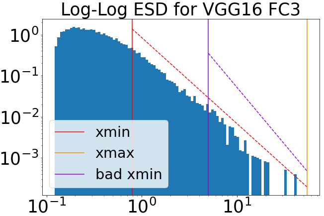

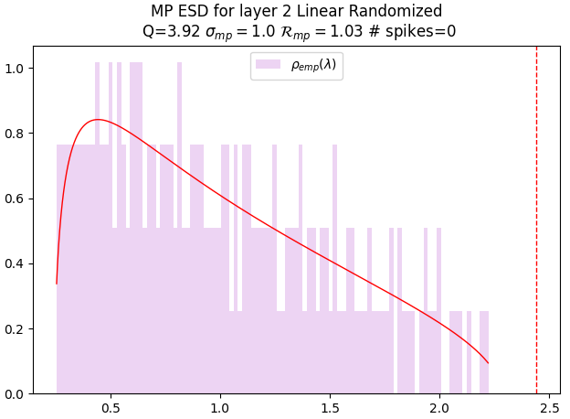

*Рисунок 2: **Слева: пример ESD, полученного из хорошо коррелированной $\mathbf{W}$ (синий), со степенной подгонкой хвоста (красная) в двойном логарифмическом масштабе. Справа: пример ESD матрицы $\mathbf{W}^{\mathrm{rand}}$ (светло-лиловый) с подгонкой Марченко — Пастура (MP) (красная) в логарифмически-линейном масштабе.*** **[p. 4]**

Степенная подгонка весьма чувствительна к выбору $\lambda_{\min}$, и неудачный выбор даст плохо оценённое $\alpha$. Если $\lambda_{\min}$ слишком велико (плохое xmin, вертикальная линия, лиловая), то степенной хвост слишком мал и даёт бо́льшее $\alpha$. Выбор $\lambda_{\min}$ и определяет хвостовое альфа $(\alpha)$; он вполне самостоятельно выполняется открытым средством WeightWatcher (Martin, 2018).

###### p4-5

Отметим, что в модели MA (см. рисунок 18) получить надёжную степенную подгонку хвоста очень трудно, поскольку весь ESD явно есть VHT-степенной, с действенным (по всему ESD) степенным показателем $\alpha\ll 2$.

#### Значение для гроккинга и антигроккинга.

Во всех опытах с MLP путь $\alpha(t)$ оказывается весьма чутким указателем состояния генерализации сети: большие падения к $\alpha\!\approx\!2$ совпадают с наступлением гроккинга, тогда как дальнейшее падение ниже $\alpha<2$ предвещает (а затем и описывает) обрушение «антигроккинга».

### 3.2 SETOL и ловушки корреляции

Теория SETOL предсказывает, что наступление **ловушек корреляции** вызовет явление вроде антигроккинга (обрушение генерализации). Такие ловушки суть определённые нетипичности членов весовой матрицы. Что они такое и как их обнаруживают средством WeightWatcher?

Если рандомизировать весовую матрицу слоя почленно,

$$
\mathbf{W}\rightarrow\mathbf{W}^{rand}, \tag{6}
$$

###### p4-9

то мы ожидаем, что ESD матрицы $\mathbf{W}^{rand}$ будет хорошо подгоняться распределением MP, поскольку члены $W_{i,j}$ теперь должны быть некоррелированы и распределены случайно; см. рисунок 2 (справа). SETOL доказывает, что отклонения от этого значимы и поучительны. Чтобы указать эти отклонения, мы сравниваем ESD рандомизированных слоёв с распределением MP на разных порах обучения, оценивая отклонения от случайности. Эти отклонения мы опознаём как непомерно большие собственные числа в лежащей в основе $\mathbf{W}^{rand}$. Такие собственные числа зовутся ловушками корреляции $\lambda_{trap}$, когда они простираются далеко за край основной части $\lambda^{+}_{rand}$ наилучше подогнанного распределения MP:

$$
\text{Correlation Trap: }\qquad\lambda_{trap}\gg\lambda^{+}_{rand} \tag{7}
$$

Подробнее см. приложение E и монографию о SETOL (Martin and Hinrichs, 2025).

###### p4-11

Средство WeightWatcher обнаруживает ловушки корреляции само: оно рандомизирует $\mathbf{W}$ почленно, затем выполняет самостоятельные подгонки MP, оценивая дисперсию $\sigma^{2}_{MP}$ лежащей в основе рандомизированной матрицы $\mathbf{W}^{rand}$ и находя подгонку, лучше всего описывающую основную часть её ESD у $\mathbf{W}^{rand}$. Затем оно находит все собственные числа $\lambda_{trap}$, значительно бо́льшие (то есть за пределами колебаний Трейси — Видома) края основной части MP $\lambda^{+}_{rand}$ у ESD матрицы $\mathbf{W}^{rand}$. Рисунок 3 изображает два слоя из изучаемых здесь моделей с ловушками корреляции.

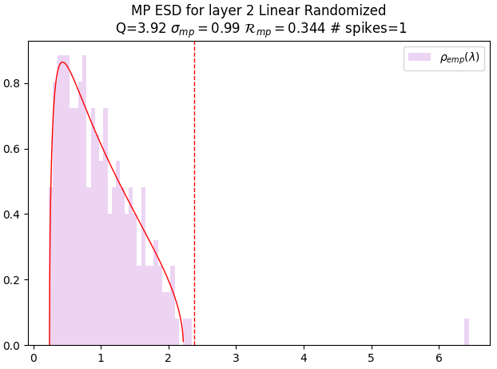


###### fig-3

*Рисунок 3: **Примеры ловушек корреляции. ESD матрицы $\mathbf{W}^{rand}$ (светло-лиловый) слоя 2 в сравнении с подгонкой MP (красная). Ловушки корреляции $\lambda_{trap}$ появляются как всплески справа от основной части MP (логарифмическая ось x). Слева: прямо перед обрушением ($\sigma_{mp}\approx 0.9879$; KS $p\approx 4\times 10^{-13}$). Одна главенствующая ловушка при $\lambda_{trap}\approx 10^{6.5}$. Справа: итоговое обрушение генерализации (KS $p\approx 1.9\times 10^{-5}$). Несколько ловушек $\lambda_{trap}\in[10^{2.x},10^{6.5}]$.*** **[p. 5]**

Ради дополнительной статистической проверки мы берём здесь также критерий Колмогорова — Смирнова (KS), чтобы измерить несходство ESD матрицы $\mathbf{W}^{rand}$ с её наилучшей подгонкой MP. Большое расхождение вместе с рассмотрением ESD глазами и с возможно худшей подгонкой $\alpha$ указывает на наличие одной или нескольких ловушек корреляции.

### 3.3 Иные сравниваемые меры

Наши находки на MLP мы сверяли с нормой весов $\ell_{2}$ и с несколькими показателями продвижения гроккинга, предложенными ранее. Всего мы взяли:

**[p. 5]**

- норму весов $\ell_{2}$ ($\|\mathbf{W}\|_{2}$),
- разрежённость возбуждений ($\Lambda_{AS}$),
- абсолютную весовую энтропию ($H_{\mathrm{abs}}(\mathbf{W})$),
- приближённую местную сложность контуров ($\Lambda_{\mathrm{LC}}$).

Дальнейшее обсуждение см. в приложении B.

## 4 Опыт с MLP: итоги и разбор

###### p5-3

Наш главный признак обнаружения антигроккинга — ловушки корреляции (SETOL), тогда как побочный, более слабый признак — $\alpha$ (HTSR). Сперва мы обсуждаем итоги по $\alpha$ HTSR, сравниваем их с иными предложенными мерами гроккинга и, наконец, обсуждаем ловушки корреляции.

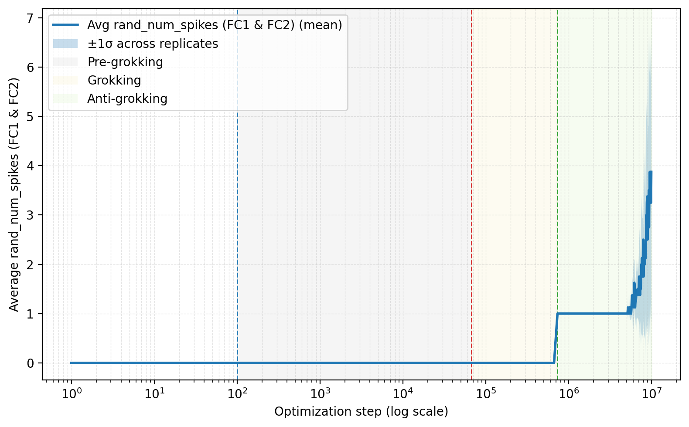

###### fig-4

*Рисунок 4: Среднее число ловушек корреляции по слоям в ходе шагов оптимизации. Рост числа ловушек совпадает с падением качества «антигроккинга», видимым на рисунке 1 на $1M$ шагов. Это наш главный признак антигроккинга.* **[p. 5]**

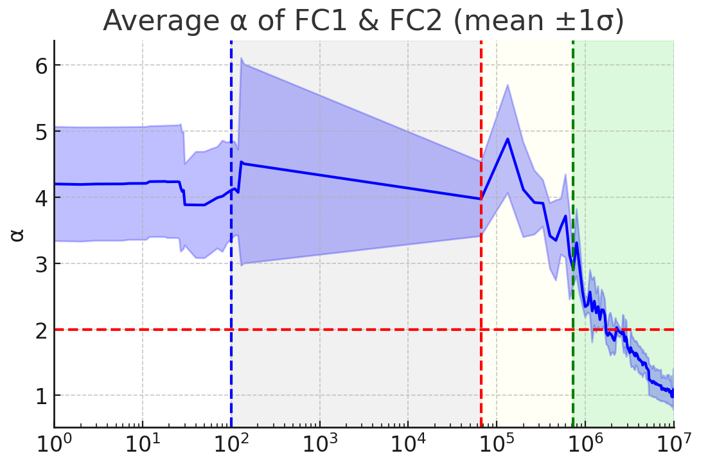

*Рисунок 5: Среднее $\alpha$ по слоям в ходе оптимизации. Отметим падение ниже критического порога $\alpha=2$, совпадающее с падением качества «антигроккинга», видимым на рисунке 1 после $\sim 1M$ шагов. Это наш побочный признак антигроккинга. Из рисунка 11.* **[p. 5]**

### 4.1 Меры WeightWatcher для слежения за гроккингом

#### Послойная мера качества $\alpha$ (HTSR).

$\alpha$ HTSR обнаруживает решающую динамику, упускаемую иными мерами. Рисунок 5 показывает развитие $\alpha$, усреднённого по слоям FC1 и FC2.

*Таблица 1: **Послойные и средние степенные показатели HTSR $\alpha$. На правом краю каждой фазы гроккинга: предгроккинг $\sim 10^{5}$ шагов, гроккинг $\sim 10^{6}$ шагов и антигроккинг $\sim 10^{7}$ шагов, для опыта с нулевым weight decay (WD=0); значения взяты с рисунка 5. Взяты разные семена, и возможна изменчивость инициализации и пути оптимизатора.*** **[p. 5]**

| **Слой** | **Предгроккинг** | **Гроккинг** | **Антигроккинг** |
|---|---|---|---|
| FC1 $\alpha$ | $5.0\pm 0.7$ | $3.6\pm 0.5$ | $0.9\pm 0.4$ |
| FC2 $\alpha$ | $2.9\pm 0.7$ | $2.3\pm 0.2$ | $1.3\pm 0.3$ |
| Сред. $\alpha$ | $4.0\pm 0.6$ | $2.9\pm 0.2$ | $1.1\pm 0.3$ |

Поначалу $\alpha$ велико, отражая случайноподобные веса. По мере обучения и подгонки сети под обучающие данные $\alpha$ убывает. Резкое падение к оптимальному (жирнохвостому) режиму ($2\lesssim\alpha\lesssim 5-6$) совпадает с фазой гроккинга (рисунок 1, $10^{4}$–$10^{5}$ шагов).

Однако по мере продолжения обучения, к миллионам шагов, $\alpha$ неизменно опускается ниже $2$, входя в режим VHT. Особенно заметно это во втором полносвязном слое (FC2, см. рисунок 11). Это падение $\alpha<2$ указывает на неоптимальный слой с чрезмерно сильными корреляциями и происходит сразу после значительного падения точности на тесте — фазы антигроккинга, наблюдаемой после $10^{6}$ шагов на рисунке 1.

Теория HTSR предсказывает оптимальное качество на тесте, когда все слои достигают $\alpha\approx 2$, но здесь это происходит лишь поздно в обучении. Мы приписываем эту задержку малому набору данных, требующему продлённой оптимизации для полного схождения слоёв; однако к тому времени, когда $\alpha\approx 2$ достигается, возникают ловушки корреляции, ухудшающие качество на тесте и вызывающие антигроккинг.

Вместе эти наблюдения высвечивают исключительную чуткость меры $\alpha$ HTSR. Эта мера не только указывает переход гроккинга, но и даёт раннее предупреждение о последующей неустойчивости и о новом явлении антигроккинга, высвечивая нездоровые строения корреляций **[p. 6]** и переобучение, складывающиеся глубоко в обучении.

Здесь $\alpha$ HTSR есть более слабый, но важный побочный признак антигроккинга; куда более сильный и общий признак — наличие ловушек корреляции, как показано на рисунке 4. Но сперва мы рассмотрим иные меры из словесности.

#### Иные сравниваемые меры.

Напротив, иные сравниваемые меры схватывают начальное обучение и фазы гроккинга, но позднего обрушения генерализации не предсказывают. Рисунок 6 приводит разрежённость возбуждений, абсолютную весовую энтропию и приближённую местную сложность контуров $(\Lambda_{LC})$. Тогда как эти меры обнаруживают ясные ходы в начальном обучении и в фазах гроккинга (скажем, перемены разрежённости и сложности), их пути становятся сравнительно устойчивыми или лишены отчётливых черт, отвечающих резкому падению качества при «антигроккинге».

###### p6-3

Скажем, $\Lambda_{LC}$ остаётся сравнительно плоской на поздних порах вплоть до некоторого шума в конце, не давая никакого предупреждения о надвигающемся обрушении. Напротив, наступление обрушения немедленно обнаруживается по возникновению многочисленных ловушек корреляции и подтверждается (чуть позже) средним $\alpha<2$.

Равным образом разрежённость возбуждений $(\Lambda_{AS})$ обнаруживает перегиб около точки перед наибольшей точностью на тесте и гроккинг обнаруживает, но вообще продолжает расти и в позднем обрушении. При наибольшей точности на тесте она, однако, имеет то же значение, что и на пике антигроккинга. Более того, в управляющем случае WD>0 у $\Lambda_{AS}$ тоже есть точка перегиба, но антигроккинг там едва заметен, и это лишь указывает, что произошла некая неизвестная переходная перемена.


*Рисунок 6: Иные меры продвижения (Голечха (Golechha, 2024)) в зависимости от шагов оптимизации. Вверху: разрежённость возбуждений. Посередине: абсолютная весовая энтропия. Внизу: приближённая местная сложность контуров. Тогда как эти меры обнаруживают перемены при начальном обучении и в фазах гроккинга (скажем, разрежённость возбуждений), они ясно не очерчивают ни наступления, ни величины позднего провала качества при «антигроккинге», наблюдаемого после $10^{6}$ шагов.* **[p. 6]**

###### p6-5

В случае WD=0 $\Lambda_{AS}$ вообще растёт на протяжении всего обучения (рисунок 6), как будто следя за фазами предгроккинга и гроккинга, однако не проходит отрицательной проверки в фазе антигроккинга, поскольку продолжает расти так же, как и в предгроккинге. Прежние исследования связывали разрежённость возбуждений с генерализацией (Li et al., 2023; Merrill et al., 2023; Peng et al., 2023) и сообщали об особой динамике вроде выхода на плато перед гроккингом (Golechha, 2024) или роста, предшествующего росту тестовой потери (Huesmann et al., 2021). А именно, мы наблюдаем тонкий перегиб или провал $\Lambda_{AS}$, совпадающий с точкой наибольшей точности на тесте, перед небольшим ростом. Хотя эта черта, по-видимому, отмечает сдвиг около наибольшей точности на тесте, её предсказательная польза для последующей динамики генерализации сомнительна. Иначе говоря, не зная верной отсечки разрежённости, невозможно определить, отвечает ли растущая $\Lambda_{AS}$ предгроккингу или антигроккингу. Напротив, поскольку $\alpha=2$ в HTSR есть теоретически установленная всеобщая отсечка, она эти две фазы различить способна.

### 4.2 Ловушки корреляции по SETOL и антигроккинг

###### p6-6

Сильнейший наш признак антигроккинга — внезапное наступление ловушек корреляции в обоих слоях, и при $(WD>0)$, и без weight decay (WD=0). Как описано в разделе 3.1, мы разбираем собственные числа $\{\lambda_{i}\}$ рандомизированных весовых матриц $\mathbf{W}^{rand}$, полученных из весовой матрицы $\mathbf{W}$ каждого слоя, для слоёв FC1 и FC2.

*Таблица 2: **Среднее число ловушек корреляции в FC1/FC2 на правом краю трёх фаз: предгроккинг ($\sim 10^{5}$ шагов), гроккинг ($10^{6}$), антигроккинг ($10^{7}$). Без weight decay (WD=0) и с ним (WD>0).*** **[p. 6]**

| **Постановка, слой** | **Предгроккинг** | **Гроккинг** | **Антигроккинг** |
|---|---|---|---|
| WD=0, FC1 | $0\pm 0$ | $0\pm 0$ | $7.5\pm 5.6$ |
| WD=0, FC2 | $0\pm 0$ | $0\pm 0$ | $1\pm 0$ |
| WD>0, FC1 | $0$ | $0$ | $2.0\pm 0.0$ |
| WD>0, FC2 | $0$ | $0$ | $1.0\pm 0.0$ |

###### p6-7

Во-первых, как ясно показано на рисунке 4, в случае WD=0 многочисленные ловушки корреляции внезапно появляются прямо при наступлении фазы антигроккинга. Во-вторых, как показано в таблице 2, для слоёв FC1 и FC2 и при обеих настройках WD ни один слой не обнаруживает свидетельств ловушек корреляции до фазы антигроккинга. Более того, в случае WD=0 ловушек значительно больше, что совпадает с наблюдаемым там куда более сильным антигроккингом. Наконец, дальнейший статистический разбор для слоёв FC2 приведён в приложении E. Наличие ловушек корреляции вместе с $\alpha<2$ (позже) есть решающий признак того, что модель глубоко в фазе антигроккинга. Так что же такое эти ловушки?

#### Ловушки корреляции и запоминание прообразов

###### p6-8

Некоторые ловушки корреляции можно отождествить с переобучением модели MLP на определённые прообразы обучающих данных. Как показано на рисунке 7, ведущий правый сингулярный вектор $v^{(1)}$ слоя FC1 развивается от бесструктурного шума (предгроккинг) к **[p. 7]** гладкому всеобщему образцу на пике генерализации и, наконец, к сильно местным цифроподобным узорам в фазе антигроккинга. Эти местные строения указывают, что модель начала кодировать определённые обучающие прообразы на уровне отдельных слоёв, а не выучивать обобщаемое представление. Подробнее это описано в приложении, раздел G. Далее, строки $W_{1}$ обнаруживают ясное запоминание цифр, как видно на рисунке 15. Ловушка (или ловушки) заставляет модель MLP последовательно ошибаться на тестовых примерах и по существу отлична от слабо коррелированного переобучения в фазе предгроккинга.


*(a) Предгроккинг*

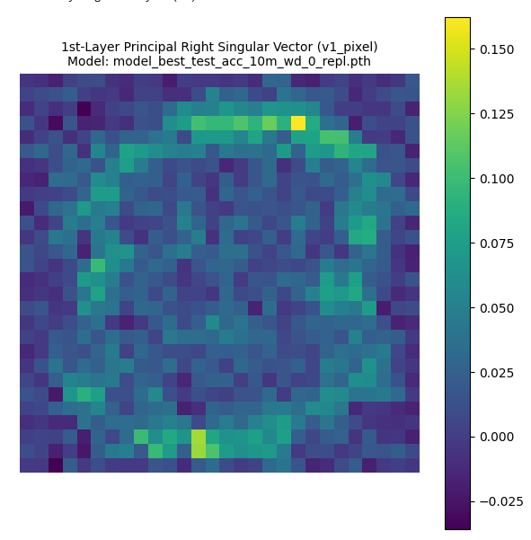

*(b) Гроккинг*


*(c) Антигроккинг*

###### fig-7

*Рисунок 7: **Запоминание прообразов. Наибольший правый сингулярный вектор $v^{(1)}$ матрицы $W_{1}$ в пиксельном пространстве. $v^{(1)}$ развивается от (i) бесструктурного шума при предгроккинге к (ii) гладкому всеобщему кольцеподобному образцу при гроккинге и к (iii) местным цифроподобным образцам (напоминающим «8») при антигроккинге.*** **[p. 7]**

## 5 Опыт с MA: итоги и разбор


*Рисунок 8: Среднее число ловушек корреляции по слоям в ходе шагов оптимизации. Рост числа ловушек совпадает с падением качества на тесте при антигроккинге (лиловая линия).* **[p. 7]**

Ниже мы подытоживаем наши итоги по опыту с модульным сложением (MA); подробности приведены в приложении.

Как и в опыте с MLP, опыт с MA обнаруживает фазу антигроккинга при обучении значительно дольше обычной постановки. И, как и в случае MLP, антигроккинг без труда обнаруживается по наступлению многочисленных ловушек корреляции. Это ясно видно на рисунке 8 и в таблице 7. Более того, наступление фазы гроккинга связано также со средним послойным степенным $\alpha\approx 2$ по HTSR.

Однако строение послойных ESD существенно отличается от ожидаемого по случаю MLP и указывает, что во всех фазах почти все слои сильно переобучены на обучающих данных. См. рисунок 9. А именно, хотя WeightWatcher способен подогнать хвост ESD степенным законом и в случае гроккинга подгонка очень хороша ($\alpha\approx 2$, $D_{KS}=0.05$), тем не менее ESD на рисунках 18 и 18(f) явно суть VHT-степенные по всему спектру.

###### p7-4

Более того, в фазе гроккинга у многих слоёв есть лишь 1 или несколько очень больших собственных чисел, а не хорошо сложившийся степенной хвост. Мы зовём это **правиловым запоминанием**.

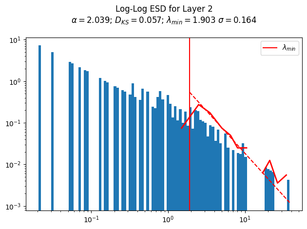

*Рисунок 9: **Правиловое запоминание. ESD слоя вложений при гроккинге. Эмпирическая спектральная плотность $\mathbf{W}_{\mathrm{embed}}$ (двойной логарифмический масштаб) со степенной подгонкой хвоста. При гроккинге подгонка хвоста наилучшая (малое $D_{\mathrm{KS}}$), а $\alpha$ близко к оптимуму HTSR, $\alpha\approx 2$. Из рисунка 18(d).*** **[p. 7]**

###### p7-5

Как показано на рисунке 18(e), при ловушках корреляции степенной хвост укорачивается, а подгонка возвращается к бо́льшему (а не меньшему) $\alpha=3.138$. Здесь это обычно, и потому ловушки, по-видимому, вызывают *катастрофическое забывание.*

## 6 Заключение

Это исследование изучило хорошо известное явление гроккинга в нейронных сетях (НС) открытым средством WeightWatcher (Martin, 2018). Мы изучаем долговременную динамику генерализации при гроккинге в модели MLP на MNIST — и с weight decay (WD>0), и без него (WD=0), — а также в классическом опыте с модульным сложением (MA) на малом трансформере.

Мы сравниваем применение послойных мер качества этого средства — меры $\alpha$ HTSR и наличия ловушек корреляции из более поздней теории SETOL. Мы следим за числом ловушек и послойным $\alpha$ по шагам оптимизации и при надобности рассматриваем ESD глазами.

И для модели MLP (особенно в постановке WD=0), и для модели MA мы наблюдаем новое **позднее обрушение генерализации**, названное **антигроккингом**. Это обрушение описывается существенным падением точности на тесте при сохраняющейся безупречной точности на обучении (и большой норме $\ell_{2}$) после обширного обучения (до $10^{7}$ шагов).

Наша главная находка в том, что эту новую фазу антигроккинга можно надёжно обнаруживать по наступлению многочисленных ловушек корреляции в одном или нескольких слоях. Действие таких ловушек предсказано недавно развитой статистико-механической теорией SETOL, лежащей в основе средства WW.

**[p. 8]**

Во-вторых, мы находим, что на пике гроккинга или близ него, как и предсказано теорией, средний послойный $\alpha\approx 2$ в обеих моделях, а последующая фаза антигроккинга видна в случае MLP по одному или нескольким слоям с $\alpha<2$.

Для моделей MLP мы сравниваем эти меры с нормой $\ell_{2}$ и несколькими прежде предложенными мерами продвижения гроккинга (Liu et al., 2022; Golechha, 2024) при обеих настройках (WD=0, WD>0). Прежние работы пытались объяснить гроккинг (через норму $\ell_{2}$), но преуспевают лишь при наличии weight decay (WD) и не способны объяснить гроккинг без него. Мы рассмотрели 3 иные меры продвижения гроккинга плюс норму $\ell_{2}$: разрежённость возбуждений $\Lambda_{AS}$, абсолютную весовую энтропию $H_{abs}(W)$ и приближённую местную сложность контуров $\Lambda_{LC}$. Хотя $\Lambda_{AS}$ и $\Lambda_{LC}$ схватили первые 2 фазы гроккинга и на переходе к антигроккингу меняются, они не способны недвусмысленно предсказать антигроккинг.

Мы предлагаем новое объяснение явления гроккинга. В фазе предгроккинга, где насыщается лишь точность на обучении, сходится лишь часть слоёв — и не вполне. Решающим образом слои, наиболее важные для генерализации, ещё не сошлись. В фазе гроккинга, когда точность на тесте наибольшая, важные слои сходятся сильно, а средний $\alpha$ в конце концов приближается к оптимальному значению $\alpha\approx 2.0$, как и предсказано (Martin and Hinrichs, 2025). В фазе же антигроккинга точность на тесте падает, поскольку у одного или нескольких слоёв появляются ловушки корреляции (а иногда и обрушение ранга), вредящие генерализации.

###### p8-4

И MLP, и MA обнаруживают такое поведение гроккинга в своих слоях, но природа запоминания весьма различна. В модели MLP запоминание при предгроккинге начинается как слабо коррелированное, а в фазе антигроккинга ловушки корреляции вызывают переобучение на определённые прообразы обучающих данных. В модели MA все слои очень сильно переобучены на обучающих данных во всех фазах, но корреляции всё же сгущаются в жирный степенной хвост на пике гроккинга. При антигроккинге многочисленные ловушки корреляции тоже появляются, но здесь они вызывают катастрофическое забывание.

###### p8-5

Мы рассматриваем следствия наблюдения многочисленных ловушек корреляции в фазе антигроккинга и у MLP, и у MA. «Ловушки» суть нетипичные возмущения ранга один (или больше) в весовой матрице $\mathbf{W}$, вызывающие большой сдвиг среднего в распределении членов: $\mathbb{E}[W_{ij}]\rightarrow\textit{large}$, что искажает ESD и мешает степенным подгонкам хвоста для $\alpha$. Большой сдвиг $\mathbb{E}[W_{ij}]\rightarrow\textit{large}$ указывает, что распределение весов *нетипично*. То есть разные случайные выборки весов могли бы иметь весьма разные средние. И, как со всякой статистической оценкой, нетипичное распределение обобщать не будет — каково бы ни было устройство переобучения (или забывания).

###### p8-6

Эти итоги подчёркивают пользу открытого средства WeightWatcher для слежения за долговременной устойчивостью генерализации и её понимания при разных устройствах обучения и моделях, с особой силой в опознании переобучения и катастрофического обрушения. Скажем, на рисунке 10 видно, что промышленные большие языковые модели вроде OpenAI OSS GPT20B и 120B обнаруживают необычно большое число слоёв с $\alpha<2$ (и ловушки корреляции, не показанные). Отсюда следует, что эти отклонения могут вредить качеству больших языковых моделей непредсказуемым образом.

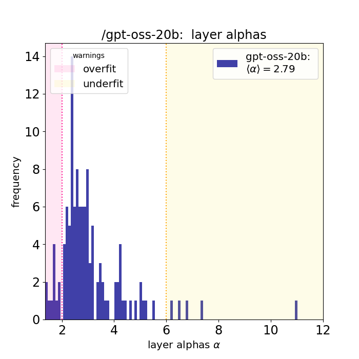


*Рисунок 10: Распределение степенного $\alpha$ HTSR по слоям gpt-oss-20b и gpt-oss-120b. Пунктирные вертикальные линии отмечают предупредительные пороги: $\alpha\lesssim 2$ (розовая) отмечает переобучение, $\alpha\gtrsim 6$ (оранжевая) — недообучение. Обе модели обнаруживают значительное и необычное число слоёв с $\alpha<2$.* **[p. 8]**

## 7 Ограничения

###### p8-7

Мера $\alpha$ HTSR в WeightWatcher есть опытно укоренённая феноменологическая рамка, строго подкреплённая недавно развитой статистико-механической теорией SETOL. И всё же истолковывать итоги по $\alpha$ надо с осторожностью. Хотя хорошо работающие модели обнаруживают значения $\alpha$ в промежутке (скажем, $2\leq\alpha\leq 6$), а $\alpha\approx 2$ часто связано с оптимальным качеством, ручательства этому нет. Мыслимо, что модели способны обнаруживать значения $\alpha$ близ или даже ниже $2$ (что обыкновенно указывает на чрезмерную коррелированность) и всё же показывать неоптимальную генерализацию — как показано и здесь. Другие очень хорошо обученные модели могут иметь слои с довольно большими $\alpha\gg 2$, как известно. Это пока не понято вполне. Отсюда видно, что, давая сильное согласованное понимание фаз обучения и устойчивости, $\alpha$ всё же отображает определённые значения $\alpha$ в безусловные уровни качества способом, зависящим от обстановки, и это область продолжающегося уточнения теории. Наша работа вносит наблюдения в пределах определённых явлений, признавая, что более широкая применимость и тонкости предсказаний при работе со средством WeightWatcher и теориями HTSR и SETOL выиграют от дальнейшего исследования.

## Литература

- Power-law distributions in empirical data. SIAM Review 51 (4), pp. 661–703. Cited by: §3.1.

- Progress measures for grokking on real-world tasks. External Links: 2402.11906, Link Cited by: Appendix B, Appendix B, Appendix B, item 1, item 2, §2, Figure 6, Figure 6, §4.1, §6.

**[p. 9]**

- The impact of activation sparsity on overfitting in convolutional neural networks. External Links: 2104.06153, Link Cited by: Appendix B, §4.1.

- Deep networks always grok and here is why. External Links: 2402.15555, Link Cited by: §2.

- The lazy neuron phenomenon: on emergence of activation sparsity in transformers. In The Eleventh International Conference on Learning Representations (ICLR), Note: arXiv:2210.06313 External Links: Link Cited by: Appendix B, §4.1.

- Towards understanding grokking: an effective theory of representation learning. In Advances in Neural Information Processing Systems, S. Koyejo, S. K. (. Mohamed), A. Agarwal, D. Belgrave, K. Cho, and A. Oh (Eds.), Vol. 35, pp. 34651–34663. Cited by: Appendix B, item 1, §1, §2, §6.

- Distribution of eigenvalues for some sets of random matrices. Matematicheskii Sbornik 72(114) (4), pp. 507–536. Cited by: §3.

- SETOL: a semi-empirical theory of (deep) learning. arXiv preprint arXiv:2507.17912. External Links: Link Cited by: §1, §1, §3.1, §3.2, §3, §6.

- Implicit self-regularization in deep neural networks: evidence from random matrix theory and implications for learning. Journal of Machine Learning Research 22 (1), pp. 1–73. External Links: Link Cited by: §1, §3.

- Predicting trends in the quality of state-of-the-art neural networks without access to training or testing data. Nature Communications 12, pp. 4122. External Links: Document, Link Cited by: §1, §3.1, §3.

- WeightWatcher: analyze Deep Learning Models without Training or Data. Note: https://github.com/CalculatedContent/WeightWatcherVersion 0.7.5.5 used in this study. Accessed May 12, 2025 Cited by: Table 3, Appendix E, §3.1, §3.1, §6.

- A tale of two circuits: grokking as competition of sparse and dense subnetworks. External Links: 2303.11873, Link Cited by: Appendix B, §2, §4.1.

- Progress measures for grokking via mechanistic interpretability. External Links: 2301.05217, Link Cited by: §1, §2.

- Theoretical explanation of activation sparsity through flat minima and adversarial robustness. External Links: 2309.03004, Link Cited by: Appendix B, §4.1.

- Grokking: generalization beyond overfitting on small algorithmic datasets. External Links: 2201.02177, Link Cited by: §1, §2.

- Grokking and generalization collapse: insights from htsr theory. arXiv preprint arXiv:2506.04434. External Links: Link Cited by: footnote 1.

- Explaining grokking through circuit efficiency. External Links: 2309.02390, Link Cited by: §2.

**[p. 10]**

## Приложение A Постановка опыта с MLP

Мы обучаем многослойный перцептрон (MLP) на подмножестве набора данных MNIST при гиперпараметрах, изложенных в таблице 3. Обучающее подмножество строится случайным выбором 100 примеров из каждого из 10 классов MNIST, что даёт уравновешенный набор из 1000 различных обучающих точек. Прогон вёлся на Nvidia Quadro P2000 и занял около 11 часов. Значительная часть времени уходит на скорость сохранения мер.

*Таблица 3: Гиперпараметры опыта с MLP, взятые в исследовании (подробности в приложении A).* **[p. 10]**

| **Параметр** | **Значение** |
|---|---|
| Устройство сети | полносвязная MLP |
| Глубина | 3 линейных слоя (вход $\to$ скрытый1 $\to$ скрытый2 $\to$ выход) |
| Ширина | 200 скрытых узлов на скрытый слой |
| Функция возбуждения | ReLU |
| Размер входного слоя | 784 (расплющенное изображение MNIST $28\times 28$) |
| Размер выходного слоя | 10 (цифры MNIST 0–9) |
| Инициализация весов | по умолчанию PyTorch (равномерная по Каймину), параметры умножены на 8,0 |
| Инициализация смещений | по умолчанию PyTorch (равномерная), затем умножены на 8,0 |
| Набор данных | MNIST |
| Обучающих точек | 1000 (по 100 на класс, послойная случайная выборка) |
| Тестовых точек | обычный тестовый набор MNIST (10 000 примеров) |
| Размер пакета | 200 |
| Функция потери | среднеквадратичная (MSE) с целями в унитарном коде |
| Оптимизатор | AdamW |
| Скорость обучения (LR) | $5\times 10^{-4}$ |
| Weight decay (WD) | 0,0 (для главных итогов), 0,01 (для сравнения в приложении D) |
| AdamW $\beta_{1}$ | 0.9 (по умолчанию PyTorch) |
| AdamW $\beta_{2}$ | 0.999 (по умолчанию PyTorch) |
| AdamW $\epsilon$ | $10^{-8}$ (по умолчанию PyTorch) |
| Шагов оптимизации | $10^{7}$ |
| Род данных (PyTorch) | ‘torch.float64‘ |
| Случайное семя | 0 (для всех библиотек) |
| Программная рамка | PyTorch |
| Средство HTSR | WeightWatcher v0.7.5.5 (Martin, 2018) |

###### p10-2

**Замечание о weight decay.** Главные итоги этой статьи, особенно показывающие гроккинг с последующим поздним обрушением генерализации (рисунок 1), получены при weight decay, явно положенном равным 0. Это позволяет наблюдать динамику обучения, движимую исключительно оптимизатором и ландшафтом потерь, при том что оба явления проявляются, тогда как иные предложенные меры перехода гроккинга с ростом точности на тесте не обнаруживают. Ради сравнения проведены и прогоны с ненулевым weight decay (скажем, WD=0,01, см. приложение D), обнаружившие иную динамику, но подтвердившие общую пользу HTSR.

## Приложение B Сравниваемые меры и показатели продвижения гроккинга

#### Разбор нормы весов

Вслед за наблюдениями, что weight decay способен влиять на гроккинг (Liu et al., 2022), мы следим за нормой $\ell_{2}$ весов сети,

$$
||\mathbf{W}||_{2}=\sqrt{\sum_{l}||\mathbf{W}_{l}||_{F}^{2}}, \tag{8}
$$

**[p. 11]**

на протяжении обучения. Мы нарочно проводим опыты с отключённым weight decay (WD=0), чтобы выделить действие динамики оптимизации на саму норму.

#### Разрежённость возбуждений.

Для слоя с возбуждениями $b_{i,j}$ (возбуждение нейрона $j$ для входного примера $i$) разрежённость возбуждений $\Lambda_{AS}$ определяется как

$$
A_{s}=\frac{1}{T}\sum_{i=1}^{T}\frac{1}{n}\sum_{j=1}^{n}\mathbf{1}(b_{i,j}<\tau), \tag{9}
$$

где $T$ — число обучающих примеров, $n$ — число нейронов слоя, $\tau$ — выбранный порог, а $\mathbf{1}(\cdot)$ — указательная функция. Эта мера измеряет бездействие нейронов. Прежние исследования связывали разрежённость возбуждений с генерализацией (Li et al., 2023; Merrill et al., 2023; Peng et al., 2023) и сообщали об особой динамике вроде выхода на плато перед гроккингом (Golechha, 2024) или роста, предшествующего росту тестовой потери (Huesmann et al., 2021).

#### Абсолютная весовая энтропия.

Для весовой матрицы $W\in\mathbb{R}^{m\times n}$ абсолютная весовая энтропия $H_{abs}(W)$ задаётся как

$$
H_{abs}(W)=-\sum_{i=1}^{m}\sum_{j=1}^{n}|w_{i,j}|\log|w_{i,j}|. \tag{10}
$$

Эта энтропия измеряет разброс абсолютных величин весов. Голечха (Golechha, 2024) предположил, что её резкое убывание знаменует генерализацию.

#### Приближённая местная сложность контуров.

Пусть $L^{(W)}(x)$ означает выходные логиты для входа $x$ при весах $W$, а $L^{(W^{\prime})}(x)$ — логиты, когда 10 % весов обращены в нуль (что даёт $W^{\prime}$). Приближённая местная сложность контуров $\Lambda_{LC}$ есть суммарное расхождение Кульбака — Лейблера:

$$
\Lambda_{LC}=\sum_{k=1}^{N_{data}}\sum_{j\in\mathcal{C}}\text{Pr}\bigl(j|L^{(W)}(x_{k})\bigr)\log\frac{\text{Pr}\bigl(j|L^{(W)}(x_{k})\bigr)}{\text{Pr}\bigl(j|L^{(W^{\prime})}(x_{k})\bigr)}. \tag{11}
$$

Здесь $N_{data}$ — число обучающих примеров $x_{k}$, $\mathcal{C}$ — множество классов, а $\text{Pr}(j|L(x))$ — вероятность класса $j$, выведенная из логитов $L(x)$ (скажем, через softmax). Эта мера схватывает чувствительность выхода к малым возмущениям весов. Меньшее $\Lambda_{LC}$ связывалось с устойчивыми, обобщаемыми представлениями (Golechha, 2024).

## Приложение C Опыт с MLP без weight decay

Рисунок 11 приводит полное послойное $\alpha$ HTSR для опыта с WD=0, для каждого слоя, изображённое по всем трём фазам.

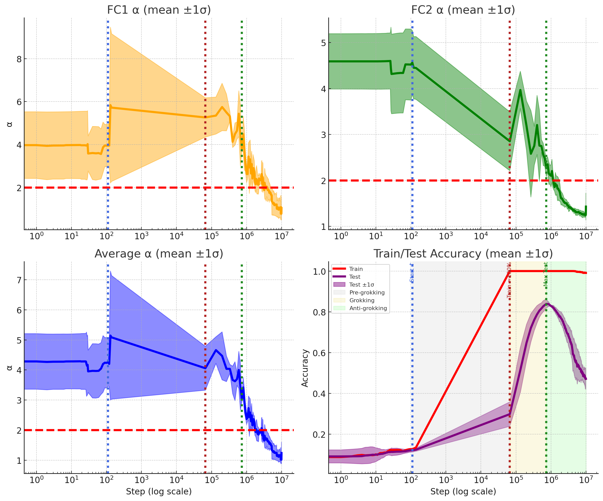

*Рисунок 11: **Послойная динамика $\alpha$ и точность по ходу обучения (повторный прогон). Слева вверху: среднее $\alpha$ (±1$\sigma$) для первого полносвязного слоя (FC1). Справа вверху: среднее $\alpha$ (±1$\sigma$) для второго полносвязного слоя (FC2). Слева внизу: $\alpha$, усреднённое по слоям. Справа внизу: точность на обучении и тесте (среднее ±1$\sigma$). Вертикальные пунктирные линии отмечают переходы между фазами предгроккинга (синяя), гроккинга (красная) и антигроккинга (зелёная). Пунктирная горизонталь при $\alpha=2$ отмечает критическое значение HTSR/SETOL. При гроккинге послойное $\alpha$ приближается к оптимальному режиму $\alpha\approx 2$, что совпадает с наибольшей точностью на тесте. В фазе антигроккинга $\alpha$ падает ниже 2 в одном или нескольких слоях, что совпадает с обрушением генерализации.*** **[p. 12]**

## Приложение D Опыт с MLP при weight decay

Чтобы глубже понять влияние weight decay на наблюдаемую динамику генерализации и на поведение отслеживаемых нами мер, мы провели опыт, тождественный основному исследованию (WD=0), но с приложением малого weight decay (WD=0,01). Кривые обучения и развитие мер для этого опыта с WD=0,01 приведены на рисунках 12 и 13.

Ключевая черта обучения с weight decay — склонность нормы $\ell_{2}$ весов со временем убывать или устанавливаться на меньшем значении, что и наблюдается в этом опыте (рисунок 13). Это отличается от неизменно растущей нормы $\ell_{2}$, видимой в наших главных опытах с WD=0.

###### p11-11

В режиме WD=0,01 сеть по-прежнему достигает высокого уровня точности на тесте. Примечательно, что после начальной фазы гроккинга точность на тесте слегка убывает, а затем входит в долгое плато, удерживая почти наибольшее качество на значительном числе шагов оптимизации (рисунок 12). Соответственно, средний тяжелохвостый показатель $\alpha$ тоже обнаруживает убывание и отчётливое плато около критического значения $\alpha\approx 2$ в эту пору (рисунок 12, левая верхняя панель).

Иные рассматриваемые меры продвижения — разрежённость возбуждений и приближённая местная сложность контуров — тоже склонны выходить на плато или устанавливаться в эту фазу наибольшего качества на тесте при WD=0,01 (рисунок 13). **[p. 12]** Это отличается от случая WD=0, где, несмотря на в конце концов наступающий гроккинг, система такого устойчивого долговременного плато не находит и вместо этого движется к позднему обрушению генерализации. Наблюдение, что $\alpha$ (и другие меры) выходят на плато вместе с наибольшей устойчивой точностью на тесте при обычных настройках weight decay, согласуется с имеющимся пониманием хорошо упорядоченного обучения.

Хотя HTSR и показатель $\alpha$ дают ценное понимание в обоих режимах, именно его исключительная способность знаменовать надвигающееся обрушение при отсутствии weight decay подчёркивает его важность для понимания послойной динамики в разных положениях.


*Рисунок 12: Развитие показателя $\alpha$ HTSR для MLP, обучаемой при WD=0,01.* **[p. 13]**

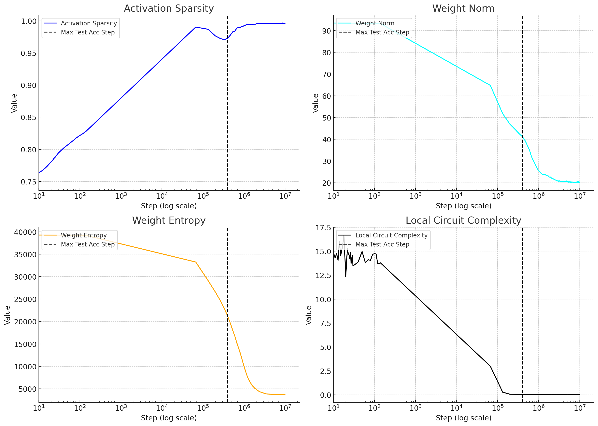

*Рисунок 13: Меры продвижения (разрежённость возбуждений, весовая энтропия, сложность контуров) и норма весов $\ell_{2}$ для MLP, обучаемой при WD=0,01.* **[p. 13]**

**[p. 14]**

## Приложение E Статистический разбор и проверка ловушек корреляции

Здесь, чтобы дополнительно проверить наличие ловушек корреляции в опыте с нулевым weight decay (WD=0), мы приводим итоги статистических проверок, призванных определить, подгоняется ли рандомизированный ESD матрицы $\mathbf{W}^{rand}$ распределением MP или нет. Кратко: мы подгоняем ESD распределением MP и приводим подогнанную дисперсию $\sigma_{mp}$, статистику Колмогорова — Смирнова (KS) подгонки и p-значение для подгонки MP как нулевой модели. Мы приводим также число ловушек корреляции, определённое открытым средством WeightWatcher (Martin, 2018). Итоги для слоя FC1 приведены в таблице 4. Итоги для FC2 схожи (не показаны). Дополнительные подробности приведены в добавочных материалах.

*Таблица 4: **Статистическая проверка ловушек корреляции. Отобранные итоги для слоя FC1 на разных порах обучения при нулевом weight decay (WD=0). Дисперсия MP $(\sigma_{MP})$, статистика Колмогорова — Смирнова (KS), p-значение подгонки MP и число обнаруженных ловушек корреляции. Предгроккинг $\sim 10^{5}$ шагов, гроккинг $10^{6}$ шагов, антигроккинг $10^{7}$ шагов.*** **[p. 14]**

| **Состояние модели** | **дисперсия MP** $(\sigma_{mp})$ | **статистика KS** | **p-значение** | **число ловушек** |
|---|---|---|---|---|
| Предгроккинг | $\approx 1.002$ | 0.0120 | $\approx 1.0$ | 0 |
| Гроккинг (наибольшая точность на тесте) | $\approx 0.999$ | 0.0212 | $\approx 1.0$ | 0 |
| Антигроккинг (обрушение) | $\approx 0.949$ | 0.3044 | $1.877\times 10^{-5}$ | 9 |

#### Начальное состояние слоя (предгроккинг, WD=0).

Сразу после инициализации веса сети ожидаемо во многом случайны, и их ESD должен хорошо отвечать распределению MP. Рисунок 2 (справа) показывает подгонку MP к ESD представительного слоя $\mathbf{W}^{rand}$ только что проинициализированной модели. Проверка KS, сравнивающая этот эмпирический ESD с подогнанным распределением MP (при $\sigma_{mp}\approx 1.0024$ по оценке WeightWatcher), дала статистику KS $0.0120$ и p-значение $\approx 1.0$. Столь высокое p-значение указывает, что этот ESD статистически согласуется с распределением MP, как и ожидалось.

#### Лучшее состояние слоя (фаза гроккинга, WD=0).

По мере того как сеть учится и достигает наибольшей точности на тесте, в членах весовых матриц $W_{i,j}$ складывается значительное строение. Это видно, если рандомизировать весовую матрицу слоя почленно, $\mathbf{W}\rightarrow\mathbf{W}^{rand}$, изобразить ESD и искать отклонения от теоретического распределения MP. ESD теперь обыкновенно обнаруживает выраженный тяжёлый хвост, где собственные числа простираются за основную часть, приближаемую подгонкой MP. Для нашей модели при наибольшей точности на тесте проверка KS против подогнанной модели MP ($\sigma_{mp}\approx 0.999$) дала статистику KS $0.0212$ и p-значение $\approx 1$. И снова отвергнуть нулевую модель MP мы не можем.

#### Итоговое состояние слоя (фаза антигроккинга, WD=0).

На поздней поре обучения, когда модель испытывает обрушение генерализации и входит в чрезмерно коррелированное состояние (описываемое как $\alpha<2$), строение ESD матрицы $\mathbf{W}^{rand}$ продолжает отражать неслучайное расположение. Проверка KS для итоговой модели против подгонки MP (при оценённой $\sigma_{mp}\approx 2$) дала статистику KS $0.3044$ и p-значение $1.877\times 10^{-5}$, рисунок 3 (справа). Этот итог, истолкованный вместе со свидетельствами о крупных выбросах, дополнительно подтверждает, что строение сети остаётся существенно отличным от основания случайной матрицы, — в согласии с сильно коррелированным или близким к обрушению ранга состоянием, указанным нашим разбором HTSR.

Эти количественные сравнения показывают переход от изначально случайноподобного состояния (согласного с MPD) ко всё более устроенным, неслучайным состояниям по мере обучения, в конце концов ведущий к чрезмерной коррелированности. Неспособность распределения MP описать эти выученные черты, особенно тяжёлые хвосты, и требует средств вроде теории HTSR, степенного показателя $\alpha$ и открытого средства WeightWatcher, чтобы верно описывать эти замысловатые строения корреляций и их отношение к качеству генерализации.

## Приложение F Условия появления выбросов после почленного перемешивания весовой матрицы

#### Постановка для слоя нейронной сети.

Рассмотрим полносвязный слой с весовой матрицей $W\in\mathbb{R}^{M\times N}$, отображающей $N$-мерный вход в $M$-мерный выход, и с отношением сторон

$$
\gamma\;:=\;\frac{M}{N}\in(0,\infty).
$$

#### Обозначения.

Для всякой матрицы $W$ положим

$$
X(W):=\frac{1}{N}\,W^{\!\top}W,\qquad\lambda_{\max}(W):=\lambda_{\max}\!\bigl(X(W)\bigr).
$$

Закрепим замену дисперсии $\sigma^{2}>0$ и определим края Марченко — Пастура (MP)

$$
\lambda_{-}:=\sigma^{2}\bigl(1-\sqrt{\gamma}\bigr)^{2},\qquad\lambda_{+}:=\sigma^{2}\bigl(1+\sqrt{\gamma}\bigr)^{**[p. 15]** 2}.
$$

#### Соглашение о пределе.

Как принято для пределов MP, пусть $N\to\infty$ при $M/N\to\gamma$; всякий предел ниже берётся вдоль этой последовательности.

#### Соглашения о нормах.

Для $x\in\mathbb{R}^{N}$ через $\lVert x\rVert_{2}$ обозначается евклидова норма; для $A\in\mathbb{R}^{M\times N}$ через $\lVert A\rVert$ — спектральная норма; а для симметричной $S$ через $\lambda_{\max}(S)$ — её наибольшее собственное число.

#### Напоминание о Марченко — Пастуре.

Плотность $\mathrm{MP}_{\sigma^{2},\gamma}$ есть

$$
\rho_{\mathrm{MP}}(\lambda)=\frac{\sqrt{(\lambda_{+}-\lambda)(\lambda-\lambda_{-})}}{2\pi\,\sigma^{2}\,\gamma\,\lambda}\;\mathbf{1}_{[\lambda_{-},\lambda_{+}]}(\lambda).
$$

#### Почленное перемешивание (перетасовка).

Пусть $\pi:\{1,\dots,M\}\times\{1,\dots,N\}\!\to\!\{1,\dots,M\}\times\{1,\dots,N\}$ — произвольная перестановка. Перетасованная матрица есть

$$
W_{\mathrm{rand}}:=(W_{ij})_{\pi(i,j)}.
$$

Определим $A_{N}:=X\!\bigl(W^{(N)}_{\mathrm{rand}}\bigr)$, так что

$$
\lambda_{\max}(A_{N})=\lambda_{\max}\!\bigl(X(W^{(N)}_{\mathrm{rand}})\bigr).
$$

**Определение 1 (типичная и нетипичная).** Последовательность $\{W^{(N)}\}$ *типична*, если $\lambda_{\max}(A_{N})\to\lambda_{+}$, и *нетипична*, если

$$
\liminf_{N\to\infty}\!\bigl[\lambda_{\max}(A_{N})-\lambda_{+}\bigr]>0.
$$

**Теорема 1 (достаточное условие по одному члену).** Положим $M/N\to\gamma\in(0,\infty)$ и для некоторой пары указателей $(p_{N},q_{N})$

$$
\frac{|W^{(N)}_{p_{N}q_{N}}|}{\sqrt{N}}\;\xrightarrow[N\to\infty]{}\;\theta,\qquad\theta>\sigma\bigl(1+\sqrt{\gamma}\bigr).
$$

Тогда существует $N_{0}$ такое, что для всех $N\geq N_{0}$ выполняется $\lambda_{\max}(A_{N})>\lambda_{+}$, то есть слой *нетипичен*.

*Доказательство.* Пусть $a_{N}:=\max_{i,j}|W_{ij}|$. Перестановка членов $a_{N}$ не меняет. Выберем в $W_{\mathrm{rand}}$ столбец, содержащий член величины $a_{N}$. Обозначим через $e_{c_{N}}\in\mathbb{R}^{N}$ отвечающий стандартный базисный вектор (с $1$ в положении $c_{N}$ и нулями в прочих). Поскольку $\lVert e_{c_{N}}\rVert_{2}=1$, отношение Рэлея даёт

$$
e_{c_{N}}^{\!\top}A_{N}e_{c_{N}}=\frac{1}{N}\,\lVert W_{\mathrm{rand}}e_{c_{N}}\rVert_{2}^{2}=\frac{1}{N}\sum_{i=1}^{M}|(W_{\mathrm{rand}})_{ic_{N}}|^{2}\;\geq\;\frac{a_{N}^{2}}{N}.
$$

По принципу Куранта — Фишера для всякой симметричной матрицы $S$

$$
\lambda_{\max}(S)=\max_{\lVert x\rVert_{2}=1}x^{\!\top}Sx,
$$

откуда $\lambda_{\max}(A_{N})\geq a_{N}^{2}/N$. По допущению

$$
a_{N}\;\geq\;\bigl|W^{(N)}_{p_{N}q_{N}}\bigr|\;=\;(\theta+o(1))\sqrt{N},
$$

так что $a_{N}^{2}/N\to\theta^{2}$. Поскольку $\theta>\sigma(1+\sqrt{\gamma})$, мы имеем

$$
\theta^{2}\;>\;\sigma^{2}(1+\sqrt{\gamma})^{2}\;=\;\lambda_{+}.
$$

Следовательно, существует $N_{0}$ такое, что для всех $N\geq N_{0}$

$$
\lambda_{\max}(A_{N})\;\geq\;\frac{a_{N}^{2}}{N}\;>\;\lambda_{+}.
$$

Стало быть, слой при этом условии *нетипичен*.

**[p. 16]**

#### Связь с переходом BBP.

В классической модели ковариации со всплеском $W=Z+\theta\,uv^{\top}$ (сигнал ранга один плюс независимый шум) собственное число отделяется от основной части Марченко — Пастура ровно тогда, когда

$$
\theta^{2}=\sigma^{2}(1+\sqrt{\gamma})^{2}.
$$

Приведённое выше условие помещает перетасованную матрицу в надкритический режим

$$
\theta^{2}>\sigma^{2}(1+\sqrt{\gamma})^{2},
$$

так что выброс переживает даже разрушение корреляций.

#### Обсуждение и чутьё.

###### p16-4

Нынешние опытные работы наводят на мысль, что *стохастический градиентный спуск* (SGD) способен уводить горстку координат весовой матрицы к непомерно большим величинам, порождая *почленно* тяжелохвостые распределения весов [2]. Здесь эти тяжелохвостые члены $W_{i,j}$ выступают как возмущения ранга один, или *всплески*, искажающие спектр матрицы Грама слоя; собственные числа выше основной части MP появляются ровно тогда, когда точность на тесте гибельно падает.

Почленное перемешивание нарочно *разрушает все оставшиеся корреляции* в весовой матрице, сохраняя мультимножество величин. Если большое собственное число переживает перемешивание, значит, есть *чисто величинный* сигнал, делающий слой нетипичным.

Теорема 1 и BBP показывают, что наличия даже одного члена, растущего так, что

$$
\theta^{2}\;>\;\sigma^{2}\bigl(1+\sqrt{\gamma}\bigr)^{2},
$$

довольно, чтобы поручиться за такой переживающий выброс, подтверждая опытную связь между необычно большими координатами и нетипичными спектрами.

Это отмечено и в источнике [3], см. раздел 5.3 (основная часть плюс всплески).

#### Источники.

1. Jinho Baik, Gérard Ben Arous, and Sandrine Péché. *Phase transition of the largest eigenvalue for nonnull complex sample covariance matrices*. The Annals of Probability, Ann. Probab. 33(5), 1643–1697 (September 2005).
2. M. Gurbuzbalaban, U. Simsekli, and L. Zhu. *The heavy-tail phenomenon in SGD*. In *International Conference on Machine Learning* (ICML), pp. 3964–3975. PMLR, 2021.
3. Charles H. Martin and Michael W. Mahoney. *Implicit self-regularization in deep neural networks: Evidence from random matrix theory and implications for learning*. Journal of Machine Learning Research, 22(165):1–73, 2021.
4. Charles H. Martin and Christopher Hinrichs. *SETOL: A Semi-Empirical Theory of (Deep) Learning*. arXiv preprint arXiv:2507.17912, 2025.

## Приложение G Наибольшие хвостовые собственные векторы и ловушки корреляции

Теперь мы разбираем *наибольшие собственные числа и векторы* послойных матриц Грама и связываем их с *ловушками корреляции*, обнаруживаемыми в фазе антигроккинга. Всюду для весовой матрицы $W\!\in\!\mathbb{R}^{M\times N}$ мы пишем

$$
X(W)\;:=\;\frac{1}{N}\,W^{\!\top}W,\qquad\lambda_{\max}(W)\;:=\;\lambda_{\max}\!\bigl(X(W)\bigr),
$$

и напоминаем о верхнем крае Марченко — Пастура (MP) $\lambda_{+}=\sigma^{2}(1+\sqrt{\gamma})^{2}$ при $\gamma=M/N$.

Всякую собственную пару $(\lambda,v)$ матрицы $X(W)$, определяемую началом степенного закона, мы зовём *хвостовой* собственной парой, а когда $\lambda>\lambda_{+}$ для *перетасованной* матрицы $W_{\mathrm{rand}}$ (почленная перестановка $W$; см. приложение F), мы зовём $(\lambda,v)$ собственной парой-*ловушкой*. Такие переживают разрушение всех межчленных корреляций перемешиванием.

#### Что может вызывать ловушки?

Приложение F доказывает простое достаточное условие: если хотя бы один член удовлетворяет $\lvert W_{p_{N}q_{N}}\rvert/\sqrt{N}\!\to\!\theta$ при $\theta>\sigma(1+\sqrt{\gamma})$, то при всех больших $N$ выполняется $\lambda_{\max}\!\bigl(X(W_{\mathrm{rand}})\bigr)>\lambda_{+}$. Тем самым одной из причин могут быть *возмущения ранга один в весовой матрице*, создающие выпадающее за MP собственное число, которое *переживает* перемешивание, то есть ловушку. Это надкритический режим BBP, и он даёт чисто *величинное* объяснение нетипичных спектров, не зависящее от корреляций.

**[p. 17]**

#### Опытные свидетельства устройственного выброса.

Гистограммы значений весов по точкам сохранения (начальная $\rightarrow$ наилучшая на тесте $\rightarrow$ антигроккинг) обнаруживают эти устройственные выбросы. Для трёхслойной MLP, обучаемой на MNIST:

- **Первый слой ($W_{1}\!\in\!\mathbb{R}^{200\times 784}$).** При антигроккинге появляются крайние координаты (скажем, $\approx-14.78$ и $\approx+5.67$), далеко за пределами размахов при наилучшем тесте и предгроккинге; основная часть остаётся около нуля, но с заметно более тяжёлыми хвостами.
- **Второй слой ($W_{2}\!\in\!\mathbb{R}^{200\times 200}$).** При антигроккинге снова появляются большие координаты (скажем, $\approx-4.68$, $\approx+1.11$), отсутствующие при предгроккинге и приглушённые при наилучшем тесте (гроккинге).
- **Третий слой ($W_{3}\!\in\!\mathbb{R}^{10\times 200}$).** Мы наблюдаем выбросы вроде $\approx-1.61$ и $\approx+2.56$ при антигроккинге.

Эти большие координаты совпадают с выраженным ростом статистики ловушек WeightWatcher в фазе антигроккинга (ср. таблицу ловушек в разделе H, где среднее число ловушек растёт с $\approx 0$ при предгроккинге и гроккинге до $\approx 4.13\pm 1.13$ при антигроккинге). Вместе с достаточным условием из приложения F эти наблюдения подкрепляют следующую цепочку:

$$
\text{Rank-1 perturbations}\;\Longrightarrow\;\text{MP-outlying eigenvalues}\;\Longrightarrow\;\text{trap eigenpairs after shuffling}.
$$

#### От собственных чисел к векторам: как выглядят наибольшие хвостовые векторы.

Запишем тонкое сингулярное разложение $W=U\Sigma V^{\!\top}$, так что собственные пары $X(W)$ суть $\bigl(\sigma_{k}^{2}/N,\;v_{k}\bigr)$, где $v_{k}$ — $k$-й столбец $V$. Стало быть, *хвостовой вектор* $v_{1}$, отвечающий $\lambda_{\max}(W)=\sigma_{1}^{2}/N$, лежит во *входном пространстве* $W$. Это и делает хвостовые векторы непосредственно истолковываемыми:

- **Слой $W_{1}$.** $X(W_{1})=(1/N)W_{1}^{\!\top}W_{1}$ действует на пикселях. Верхний правый сингулярный вектор $v^{(1)}\!\in\!\mathbb{R}^{784}$ есть узор в пиксельном пространстве. Опытно $v^{(1)}$ развивается от (i) бесструктурного шума при предгроккинге к (ii) гладкому всеобщему кольцеподобному образцу при наилучшем тесте (гроккинге) и к (iii) *цифроподобным* образцам (похожим на 8) в фазе антигроккинга. Последняя пора указывает на сильное местное строение, согласное с *запоминанием*.
- **Слой $W_{2}$.** $X(W_{2})$ действует на *выходе слоя 1*. Его верхний правый сингулярный вектор $v^{(2)}\!\in\!\mathbb{R}^{200}$ указывает нейроны слоя 1, наиболее участвующие в главенствующей коррелированной моде. Обратное проецирование $v^{(2)}$ через $W_{1}$ в пиксельное пространство, $v^{(2)}_{\mathrm{pix}}:=v^{(2)\!\top}\!W_{1}\!\in\!\mathbb{R}^{784}$, даёт изображения, которые при антигроккинге снова обнаруживают чёткие цифровые штрихи. Наибольшие коэффициенты $v^{(2)}$ выделяют определённые строки $W_{1}$, и отвечающие им рецептивные поля (строки $W_{1}$, перестроенные в $28\!\times\!28$) обнаруживают ясные цифровые образцы при антигроккинге, тогда как при предгроккинге они шумоподобны, а при наилучшем тесте остаются во многом неистолковываемыми.
- **Слой $W_{3}$.** $X(W_{3})$ действует на *выходе слоя 2*. Его верхний правый сингулярный вектор $v^{(3)}\!\in\!\mathbb{R}^{200}$ высвечивает наиболее возбуждённые узлы слоя 2. Последовательное обратное проецирование через $W_{2}$ и $W_{1}$,

$$
v^{(3)}_{\mathrm{pix}}\;:=\;v^{(3)\!\top}\!W_{2}\,W_{1}\;\in\;\mathbb{R}^{784},
$$

даёт узоры в пиксельном пространстве, обостряющиеся до цифровых очертаний при антигроккинге.

#### Механистическое истолкование.

###### p17-7

При антигроккинге появляются неслучайные устройственные выбросы; в ESD складываются *хвостовые* всплески (большие собственные числа за этим краем), а отвечающие им собственные векторы сосредоточиваются на координатах, напоминающих запоминаемый пример или прообраз из обучающего набора. Почленное перемешивание сохраняет большие возмущения ранга один, а с ними и выпадающие собственные числа, обращая эти местные моды в моды-*ловушки*. Опытные панели «строки $W_{1}$» показывают это прямо: шумоподобные при предгроккинге, всё ещё размытые при наилучшем тесте, но при антигроккинге верхние строки выглядят как *ясные цифровые образцы*, что свидетельствует о **запоминании цифр**.

#### Применяемый ход (взятый для рисунков).

Для каждой точки сохранения:

1. Вычислить SVD каждого линейного слоя: $W_{\ell}=U_{\ell}\Sigma_{\ell}V_{\ell}^{\!\top}$. *Хвостовой вектор* слоя $\ell$ есть $v^{(\ell)}:=V_{\ell}[:,1]$.
2. Для $W_{1}$ изобразить $v^{(1)}$ в пиксельном пространстве (перестроить в $28\times 28$).
3. Для $W_{2}$ обратно спроецировать $v^{(2)}$ в пиксельное пространство через $v^{(2)}_{\mathrm{pix}}=v^{(2)\!\top}W_{1}$ и показать $k$ наиболее вкладывающих строк $W_{1}$, выбранных по наибольшим координатам $v^{(2)}$.
4. Для $W_{3}$ обратно спроецировать $v^{(3)}$ через $W_{2}$ и $W_{1}$, получив $v^{(3)}_{\mathrm{pix}}$, и снова рассмотреть наибольшие вклады.
5. Одновременно вычислить $\lambda_{\max}(X(W_{\ell}))$ и $\lambda_{\max}(X(W_{\ell,\mathrm{rand}}))$ и сравнить с $\lambda_{+}$, чтобы отметить собственные пары-*ловушки*; связать их с числом ловушек по WeightWatcher и с оценками $\alpha$ HTSR.


*(a) Веса W1 по точкам сохранения*

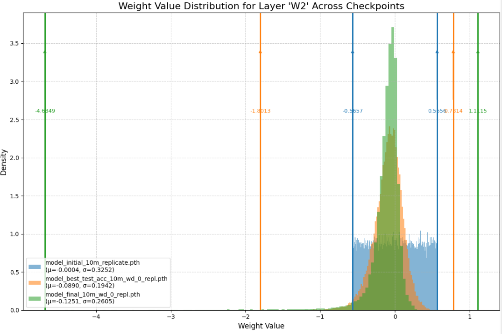

*(b) Веса W2 по точкам сохранения*


*(c) Веса W3 по точкам сохранения*

*Рисунок 14: **Распределения весов с крайними членами. Отметим, что на рисунках (a), (b) и (c) видны устройственные выбросы (возмущения ранга один), вызывающие всплески в рандомизированном ESD (ловушки корреляции)*** **[p. 18]**

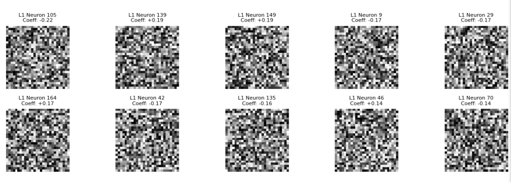

*(a) Первые 10 строк $W_{1}$ (предгроккинг)*


*(b) Первые 10 строк $W_{1}$ (гроккинг)*


*(c) Первые 10 строк $W_{1}$ (антигроккинг)*

*Рисунок 15: **Строки $W_{1}$ (рецептивные поля), отобранные по сосредоточенности хвостовых векторов. (a) показывает шумовой облик при предгроккинге, всё ещё размытый в фазе гроккинга, но при антигроккинге верхние строки выглядят как *ясные цифровые образцы*, что свидетельствует о запоминании цифр.*** **[p. 19]**

## Приложение H Дальнейшие опыты: модульное сложение (предсказание **[p. 20]** $x+y\bmod P$)

###### p20-1

Мы дополнительно оценили показатели HTSR на задаче модульного сложения (предсказание $x+y\bmod P$) с малым однослойным трансформером. Кривые точности снова обнаруживают три свойственные фазы (предгроккинг $\rightarrow$ гроккинг $\rightarrow$ антигроккинг), и как показатель $\alpha$ HTSR, так и *ловушки корреляции* (обнаруживаемые WeightWatcher) отмечают позднее обрушение генерализации.

#### Устройство модели.

| **Гиперпараметр** | **Значение** |
|---|---|
| Слоёв | 1 |
| Размерность модели $d_{\text{model}}$ | 128 |
| Скрытый размер MLP $d_{\text{mlp}}$ | 512 |
| Голов $\times$ размерность головы | $4\times 32$ |
| Длина обстановки $n_{\text{ctx}}$ | 3 |
| Возбуждение | **ReLU** |
| LayerNorm | *отключён* (use_ln=False) |
| Размер словаря | 114 (= equals_token$\,+\,1$) |

Как и предсказано HTSR, степенной показатель $\alpha$ сосредоточивается около 2 близ наибольшей точности на тесте, а затем от 2 отклоняется. В согласии с нашими главными итогами мы наблюдаем также рост числа выпадающих собственных чисел, убегающих из основной части Марченко — Пастура, в нескольких слоях в фазе антигроккинга.

### H.1 Фазовые и послойные $\alpha$ HTSR для модульного сложения

*Таблица 5: **Модульное сложение, сводка по фазам. Точность на обучении и тесте (среднее $\pm$ станд. отклонение).*** **[p. 20]**

| **Фаза** | **Точность на обучении (среднее$\pm$откл.)** | **Точность на тесте (среднее$\pm$откл.)** |
|---|---|---|
| Предгроккинг | $1.0\pm 0.0$ | $0.40\pm 0.28$ |
| Гроккинг | $1.0\pm 0.0$ | $0.97\pm 0.02$ |
| Антигроккинг | $1.0\pm 0.0$ | $0.68\pm 0.11$ |

*Таблица 6: **Модульное сложение, послойные $\alpha$ HTSR по фазам. Средние по каждому слою; последняя строка приводит среднее $\pm$ станд. отклонение по перечисленным слоям.*** **[p. 20]**

| **Слой** | **Предгроккинг** | **Гроккинг** | **Антигроккинг** |
|---|---|---|---|
| embed.embed | 2.81 | 1.92 | 3.57 |
| blocks.0.attn.W_Q | 4.04 | 2.86 | 3.17 |
| blocks.0.attn.W_K | 3.99 | 2.00 | 3.20 |
| blocks.0.attn.W_V | 4.66 | 1.56 | 3.87 |
| blocks.0.attn.out_proj | 3.85 | 1.57 | 4.04 |
| blocks.0.mlp.fc1 | 4.99 | 1.71 | 4.74 |
| blocks.0.mlp.fc2 | 5.22 | 2.17 | 5.03 |
| unembed.unembed | 3.27 | 2.37 | 3.53 |
| **Среднее$\pm$откл.** | $\mathbf{4.10\pm 0.83}$ | $\mathbf{2.02\pm 0.44}$ | $\mathbf{3.89\pm 0.68}$ |

*Таблица 7: **Модульное сложение, число ловушек корреляции. Число выпадающих собственных чисел (за краем MP), обнаруженных WeightWatcher в $X(W^{\mathrm{rand}})$ для каждого слоя и фазы.*** **[p. 21]**

| **Слой** | **Ловушки: предгроккинг** | **Ловушки: гроккинг** | **Ловушки: антигроккинг** |
|---|---|---|---|
| embed.embed | 0.00 | 0.00 | 7 |
| blocks.0.attn.W_Q | 0.00 | 0.00 | 3 |
| blocks.0.attn.W_K | 0.00 | 0.00 | 5 |
| blocks.0.attn.W_V | 0.00 | 0.00 | 3 |
| blocks.0.attn.out_proj | 0.00 | 0.00 | 4 |
| blocks.0.mlp.fc1 | 0.00 | 0.00 | 5 |
| blocks.0.mlp.fc2 | 0.00 | 0.00 | 7 |
| unembed.unembed | 0.00 | 0.00 | 5 |
| **Среднее$\pm$откл.** | $\mathbf{0.00\pm 0.00}$ | $\mathbf{0.00\pm 0.00}$ | $\mathbf{4.88\pm 1.55}$ |

#### Истолкование.

###### p20-3

При гроккинге большинство слоёв приближается к *идеальному* режиму $\alpha\!\approx\!2$, что указывает на сильные, хорошо устроенные корреляции и высокую генерализацию. В фазе антигроккинга средний $\alpha$ снова уходит вверх, тогда как *отдельные слои* обнаруживают $\alpha<2$ и явные выбросы-ловушки корреляции в своих рандомизированных спектрах $X(W^{\mathrm{rand}})$ (за краем MP), отмечаемые WeightWatcher сами собой. Тем самым на отдельной алгоритмической задаче мы находим ту же качественную отметку, что описана для MNIST: $\alpha$ следит за всеми тремя фазами, а совместное условие *$\alpha\neq 2$ плюс ловушки* надёжно отмечает позднее обрушение генерализации. *Отметим, что многие слои в фазе антигроккинга крайне нетипичны: с несколькими ловушками корреляции, обрушением ранга и даже многомодовыми степенными отметками; по этой причине $\alpha$ при антигроккинге может быть ненадёжен.*

**[p. 21]**

## Приложение H Модульное сложение: трёхфазный опытный разбор (PRE, GROK, ANTI)

### H.0 Порядок измерения и вычисляемые величины

Все вычисления этого приложения ведутся на изложенной выше задаче модульного сложения с модулем $p=113$. Числовые токены суть $\{0,\dots,112\}$, а токен равенства имеет указатель $113$. Модель есть однослойный трансформер только с раскодировщиком при $D_{\text{model}}=128$, $D_{\text{MLP}}=512$, $N_{\text{heads}}=4$, $D_{\text{head}}=32$, длине обстановки $3$, возбуждениях ReLU и без LayerNorm. Для каждой пометки фазы $L\in\{\text{PRE},\text{GROK},\text{ANTI}\}$ вычисляются следующие предметы.

#### (1) Ключи, запрос, спектры Грама и оценки предпочтения.

Для каждой головы $h\in\{0,1,2,3\}$:

$$
K_{0}[x] \in\mathbb{R}^{D_{\text{head}}}\quad\text{from the position-$0$ key on the length-3 input }[x,0,=], \\
K_{1}[y] \in\mathbb{R}^{D_{\text{head}}}\quad\text{from the position-$1$ key on }[0,y,=], \\
q_{\mathrm{eq}} \in\mathbb{R}^{D_{\text{head}}}\quad\text{from the equals-position query on }[0,0,=].
$$

Пусть $K^{\circ}[t]=K[t]-\frac{1}{p}\sum_{u=0}^{p-1}K[u]$ означает центрирование по токенам. Определим тогда корреляционные матрицы

$$
G_{0}=\frac{1}{D_{\text{head}}}K_{0}^{\circ}\,(K_{0}^{\circ})^{\top},\qquad G_{1}=\frac{1}{D_{\text{head}}}K_{1}^{\circ}\,(K_{1}^{\circ})^{\top},
$$

и приведём наибольшие собственные числа $\lambda_{\max}(G_{0})$ и $\lambda_{\max}(G_{1})$. Величины предпочтения берутся как

$$
s_{0}[x]=\frac{\langle K_{0}[x],\,q_{\mathrm{eq}}\rangle}{\sqrt{D_{\text{head}}}},\qquad s_{1}[y]=\frac{\langle K_{1}[y],\,q_{\mathrm{eq}}\rangle}{\sqrt{D_{\text{head}}}},
$$

а пять первых указателей токенов перечисляются по $|s_{0}|$ и $|s_{1}|$.

#### (2) Профили энергии токенов по ДПФ.

Для всякой матрицы «токен на признак» $M\in\mathbb{R}^{p\times d}$ (здесь $M\in\{\texttt{Embed},\texttt{Unembed},K_{0}\text{(concat)},K_{1}\text{(concat)}\}$) положим

$$
W_{f,t}=\frac{1}{\sqrt{p}}\,e^{-2\pi ift/p}\quad(0\leq f,t<p),\qquad F=WM,\qquad\text{power}(f)=\frac{1}{d}\sum_{j=1}^{d}\bigl|F_{f,j}\bigr|^{2}.
$$

Нормированная энергия есть $\mathsf{E}_{M}(f)=\text{power}(f)/\sum_{g}\text{power}(g)$. Мы приводим шесть наибольших частотных указателей («top idx»), их нормированные значения («vals») и не-DC массу $\sum_{f=1}^{p-1}\mathsf{E}_{M}(f)$.

#### (3) Ядро правила по $\Delta=z-(x+y)$.

По логитам $L(x,y,z)$ (ограниченным на $z\in\{0,\dots,112\}$) определим

$$
k(\Delta)\;=\;\frac{1}{p^{2}}\sum_{x,y=0}^{p-1}L\!\left(x,y,\,(x+y+\Delta)\bmod p\right)\;-\;\frac{1}{p}\sum_{\Delta^{\prime}=0}^{p-1}\frac{1}{p^{2}}\sum_{x,y=0}^{p-1}L\!\left(x,y,\,(x+y+\Delta^{\prime})\bmod p\right).
$$

Мы перечисляем шесть первых $\Delta$ по $k(\Delta)$. Мы вычисляем также $\widehat{k}=Wk$ и приводим шесть первых частотных указателей по **[p. 22]** $|\widehat{k}(f)|^{2}$ и их мощности.

### H.1 Сводка точностей и всеобщих соотношений между наборами частот

*Таблица 8: Точности и всеобщие соотношения между наборами частот. «Ядро = частоты Emb/Unemb» указывает, совпадают ли шесть первых указателей ДПФ ядра с таковыми у Embed/Unembed. «Шесть первых $K_{0}/K_{1}$ содержат DC» указывает, входит ли указатель $0$ в шесть первых для $K_{0}$/$K_{1}$. Набор $S=\{49,64,97,16,6,107\}$ берётся для подсчёта пересечений.* **[p. 22]**

| Фаза | Точн. обуч. | Точн. тест | Ядро = частоты Emb/Unemb | $K_{0}/K_{1}$ шесть первых содержат DC (0) |
|---|---|---|---|---|
| PRE | $1.0$ | $0.13$ | да | да / да |
| GROK | $1.0$ | $1.0$ | да | да / да |
| ANTI | $1.0$ | $0.60$ | да | нет / нет |

### H.2 Ключи по головам, наибольшие собственные числа Грама и указатели предпочтения

*Таблица 9: По головам: $\lambda_{\max}(G_{0})$, $\lambda_{\max}(G_{1})$ и пять первых указателей токенов по $|\langle q_{\mathrm{eq}},K\rangle|$.*

| Фаза | Голова | $\lambda_{\max}(G_{0})$ | $\lambda_{\max}(G_{1})$ | Пять первых по $\|{\langle q,K_{0}\rangle}\|$ | Пять первых по $\|{\langle q,K_{1}\rangle}\|$ |
|---|---|---|---|---|---|
| PRE | 0 | 0.86 | 0.86 | [73, 55, 38, 34, 91] | [76, 30, 9, 7, 85] |
| 1 | 1.07 | 1.07 | [63, 79, 1, 24, 40] | [110, 32, 41, 11, 82] |  |
| 2 | 1.61 | 1.61 | [76, 83, 84, 10, 73] | [83, 84, 10, 73, 51] |  |
| 3 | 2.09 | 2.09 | [96, 18, 22, 110, 44] | [76, 41, 81, 40, 96] |  |
| GROK | 0 | 1.32 | 1.32 | [19, 40, 5, 111, 26] | [19, 40, 5, 111, 26] |
| 1 | 2.05 | 2.05 | [78, 101, 108, 2, 85] | [78, 101, 108, 2, 85] |  |
| 2 | 1.56 | 1.56 | [72, 65, 86, 79, 102] | [72, 65, 86, 79, 102] |  |
| 3 | 2.19 | 2.19 | [73, 66, 50, 80, 43] | [73, 66, 50, 80, 43] |  |
| ANTI | 0 | 123.85 | 123.85 | [75, 98, 29, 45, 31] | [75, 98, 29, 45, 31] |
| 1 | 98.89 | 98.89 | [71, 3, 63, 70, 94] | [71, 3, 63, 70, 94] |  |
| 2 | 123.01 | 123.01 | [72, 5, 56, 93, 6] | [72, 5, 56, 93, 6] |  |
| 3 | 94.14 | 94.14 | [4, 80, 58, 11, 103] | [4, 80, 11, 58, 103] |  |

### H.3 Энергия токенов по ДПФ (главенствующие указатели и не-DC масса)

*Таблица 10: Шесть первых указателей ДПФ и нормированные энергии для матриц, помеченных токенами, с не-DC массой. Указатели лежат в $\{0,\dots,112\}$.* **[p. 23]**

| Фаза | Модуль | Первые указатели (в приведённом порядке) | Значения для них (в том же порядке) | не-DC масса |
|---|---|---|---|---|
| PRE | Embed | [49, 64, 97, 16, 6, 107] | [0.0667, 0.0667, 0.0509, 0.0509, 0.0200, 0.0200] | 1.000 |
| Unembed | [49, 64, 97, 16, 6, 107] | [0.0714, 0.0714, 0.0484, 0.0484, 0.0222, 0.0222] | 1.000 |  |
| $K_{0}$ | [0, 104, 9, 64, 49, 20] | [0.6845, 0.0180, 0.0180, 0.0130, 0.0130, 0.0080] | 0.315 |  |
| $K_{1}$ | [0, 104, 9, 64, 49, 20] | [0.7011, 0.0170, 0.0170, 0.0123, 0.0123, 0.0076] | 0.299 |  |
| GROK | Embed | [49, 64, 97, 16, 6, 107] | [0.2181, 0.2181, 0.1270, 0.1270, 0.1015, 0.1015] | 1.000 |
| Unembed | [49, 64, 97, 16, 6, 107] | [0.2144, 0.2144, 0.1438, 0.1438, 0.1405, 0.1405] | 1.000 |  |
| $K_{0}$ | [49, 64, 0, 97, 16, 6] | [0.3660, 0.3660, 0.1076, 0.0757, 0.0757, 0.0039] | 0.892 |  |
| $K_{1}$ | [49, 64, 0, 97, 16, 6] | [0.3658, 0.3658, 0.1081, 0.0757, 0.0757, 0.0039] | 0.892 |  |
| ANTI | Embed | [49, 64, 97, 16, 6, 107] | [0.0210, 0.0210, 0.0206, 0.0206, 0.0199, 0.0199] | 0.992 |
| Unembed | [49, 64, 97, 16, 6, 107] | [0.0264, 0.0264, 0.0218, 0.0218, 0.0201, 0.0201] | 0.992 |  |
| $K_{0}$ | [16, 97, 107, 6, 49, 64] | [0.0260, 0.0260, 0.0230, 0.0230, 0.0224, 0.0224] | 0.985 |  |
| $K_{1}$ | [16, 97, 107, 6, 49, 64] | [0.0260, 0.0260, 0.0230, 0.0230, 0.0224, 0.0224] | 0.985 |  |

### H.4 Ядро правила $k(\Delta)$ и его дискретный спектр Фурье

*Таблица 11: Шесть первых $\Delta$ для $k(\Delta)$ и шесть первых частот ДПФ ядра $k$ с мощностями $|\widehat{k}(f)|^{2}$.* **[p. 23]**

| Фаза | Шесть первых $\Delta$ (в приведённом порядке) | Шесть первых частот ДПФ (указатели) с мощностями (в том же порядке) |
|---|---|---|
| PRE | [0, 7, 106, 14, 99, 21] | idx [49, 64, 97, 16, 6, 107]; pow [88,713.516, 88,713.516, 8,677.078, 8,677.078, 61.569, 61.569] |
| GROK | [0, 37, 76, 92, 21, 99] | idx [49, 64, 97, 16, 6, 107]; pow [208,933.61, 208,933.61, 10,937.356, 10,937.356, 4,895.602, 4,895.602] |
| ANTI | [0, 21, 92, 76, 37, 99] | idx [49, 64, 97, 16, 6, 107]; pow [9,955,823.0, 9,955,823.0, 1,597,666.1, 1,597,666.1, 1,207,065.4, 1,207,065.4] |

###### p22-2

**Межфазные наблюдения (выведенные из данных).** Во всех фазах главенствующие частотные указатели для Embed, Unembed и ядра совпадают с $S=\{49,64,97,16,6,107\}$. Для $K_{0}$ и $K_{1}$ пересечения шести первых с $S$ суть $(2,2)$ в PRE, $(5,5)$ в GROK и $(6,6)$ в ANTI. Списки пяти первых токенов предпочтения для $|{\langle q_{\mathrm{eq}},K_{0}\rangle}|$ и $|{\langle q_{\mathrm{eq}},K_{1}\rangle}|$ тождественны для каждой головы в GROK; они различаются на всех головах в PRE; в ANTI они тождественны на головах 0–2 и содержат те же пять токенов в ином порядке на голове 3.

### H.6 Профили Фурье вложений и развложений (наложение) и сравнение по фазам

Рисунки 16–17 изображают нормированную энергию токенов по ДПФ $\mathsf{E}_{M}(f)$ для матриц Embed и Unembed в трёх фазах. Горизонтальная ось — частотный указатель $k\in\{0,\dots,112\}$; вертикальная — нормированная мощность $\mathsf{E}_{M}(k)$, как определено в разделе H.0(2).


*Рисунок 16: **Мощность ДПФ вложений (наложение). Главенствующие ненулевые частоты суть дополнительные пары $\{49,64\}$, $\{97,16\}$, $\{6,107\}$. След GROK обнаруживает острые пики; PRE обнаруживает меньшие пики; ANTI выглядит сравнительно широкополосным с пологими пиками на тех же указателях.*** **[p. 24]**

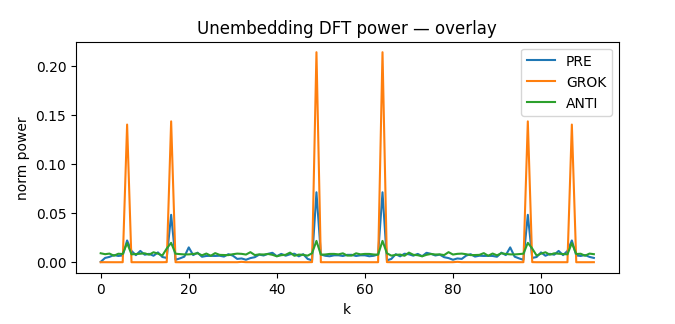

*Рисунок 17: **Мощность ДПФ развложений (наложение). Те же шесть ненулевых частот, что и у вложений. GROK остро пикообразен, PRE слабее, а ANTI сравнительно широкополосен.*** **[p. 24]**

###### p22-4

**Количественная проверка (по таблицам 10 и 11).** Все три фазы разделяют одни и те же шесть не-DC указателей для Embed и **[p. 23]** Unembed: $[49,64,97,16,6,107]$. Величины пиков на этих указателях различаются: у *Embed* пики $\approx 0.218$ (GROK), $\approx 0.067$ (PRE), $\approx 0.021$ (ANTI); у *Unembed* — $\approx 0.214$ (GROK), $\approx 0.071$ (PRE), $\approx 0.026$ (ANTI). Стало быть, GROK сильно сосредоточен на шестичастотном наборе правила, PRE обнаруживает тот же набор с меньшими пиками, а ANTI — широкополосный облик (те же указатели, но малое отношение пика к фону).

**Отношение к банкам ключей.** Для ANTI $K_{0}$ и $K_{1}$ не широкополосны: их шесть первых частотных указателей суть в точности шесть не-DC указателей правила при не-DC массе $0.985$ (таблица 10). Тем самым ANTI сочетает ключи, туго опертые на частоты правила, со сравнительно широкополосными вложениями и развложениями. Это несоответствие видно на рисунках 16–17.

#### Истолкование

- По спискам предпочтений голов и спектрам Грама (таблица 9) **PRE** лишён позиционной симметрии, ожидаемой для модульного сложения; **GROK** обнаруживает точную симметрию; **ANTI** обнаруживает ту же симметрию при куда большей дисперсии банка ключей.
- **[p. 24]** Стало быть, отказ **ANTI** нельзя приписать устройству «ключ — запрос» во внимании; он должен возникать в другом месте, как мы показываем ниже.
- **Фурье-облики вложений и развложений (таблицы 10 и 11, рисунки 16–17).** Все фазы разделяют одни и те же шесть не-DC указателей $\{49,64,97,16,6,107\}$ для Embed и Unembed, но величины пиков резко различаются: пики *Embed* приблизительно таковы: **GROK**: $[0.2181,\,0.2181,\,0.1270,\,0.1270,\,0.1015,\,0.1015]$ **PRE**: $[0.0667,\,0.0667,\,0.0509,\,0.0509,\,0.0200,\,0.0200]$ **ANTI**: $[0.0210,\,0.0210,\,0.0206,\,0.0206,\,0.0199,\,0.0199]$; пики *Unembed* обнаруживают тот же порядок: **GROK**: $[0.2144,\,0.2144,\,0.1438,\,0.1438,\,0.1405,\,0.1405]$ **PRE**: $[0.0714,\,0.0714,\,0.0484,\,0.0484,\,0.0222,\,0.0222]$ ****[p. 25]** ANTI**: $[0.0264,\,0.0264,\,0.0218,\,0.0218,\,0.0201,\,0.0201]$. Тем самым, хотя шесть частот присутствуют во всех фазах, **ANTI** обнаруживает сравнительно *широкополосный* облик Embed/Unembed (малое отношение пика к фону), в отличие от острых высокоамплитудных линий у **GROK**.
- **Противопоставление ядра и вложений.** Ядро правила $k(\Delta)$ имеет ту же шестичастотную опору во всех фазах, а мощности его первых линий наибольшие в **ANTI**: **ANTI**: $[9955823.0,\,9955823.0,\,1597666.1,\,1597666.1,\,1207065.4,\,1207065.4]$ **GROK**: $[208933.61,\,208933.61,\,10937.356,\,10937.356,\,4895.602,\,4895.602]$ **PRE**: $[88713.516,\,88713.516,\,8677.078,\,8677.078,\,61.569,\,61.569]$. Стало быть, хотя ядро правила (и ключи) в **ANTI** прочно согласованы с шестью частотами правила, спектры Embed/Unembed *теряют острые фурье-всплески* и выглядят широкополосными.


*(a) Предгроккинг: ESD вложений против рандомизированного*

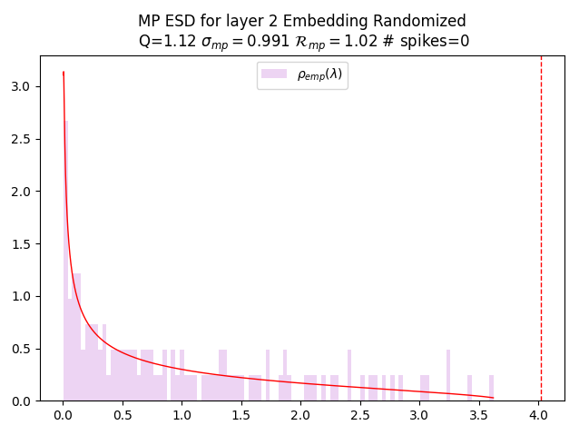

*(b) Предгроккинг: подгонка MP и край основной части*


*(c) Гроккинг: ESD вложений против рандомизированного*


*(d) Гроккинг: подгонка MP и край основной части*

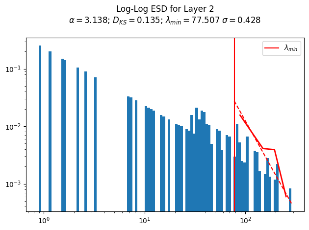

*(e) Антигроккинг: ESD вложений против рандомизированного*


**[p. 26]**

*(f) Антигроккинг: подгонка MP и край основной части*

###### fig-18

*Рисунок 18: **ESD слоя вложений по фазам (сетка 3$\times$2). Для каждой фазы (строки) левая панель показывает эмпирическую спектральную плотность (ESD) для $\mathbf{W}_{\text{embed}}$ (синяя) в двойном логарифмическом масштабе вместе с наилучшей степенной подгонкой хвоста (красная) и с отвечающим $\alpha$ и прочими мерами подгонки. Правая панель показывает подгонку Марченко — Пастура (MP) для ESD рандомизированной матрицы $\mathbf{W}_{\text{embed}}^{\text{rand}}$ и дальний край колебаний Трейси — Видома (TW) (пунктирная вертикаль). На всех левых рисунках — (a), (c) и (e) — видно отчётливое степенное поведение по всему ESD, а не только по хвосту, у которого своя отдельная степенная подгонка. Это весьма необычно и указывает на сильное переобучение даже при коррелированном обучении. В фазе гроккинга рисунок (c) показывает очень хорошую степенную подгонку хвоста с $\alpha\approx 2$ и с куда меньшим $D_{KS}$, чем в двух других фазах. Что до правой панели, то для фаз предгроккинга и гроккинга на рисунках (b) и (d) теория MP (красная линия) очень хорошо подгоняет рандомизированные ESD (розовые). Напротив, на рисунке (f), в фазе антигроккинга, рандомизированный ESD (розовый) крайне нетипичен. Подгонка MP основной части не слишком хороша, есть несколько ловушек корреляции (собственные числа, простирающиеся далеко за край рандомизированной основной части MP, $\lambda_{trap}\gg\lambda^{+}_{rand})$, а также значительное обрушение ранга (плотность в нуле больше предсказанной теорией MP). Здесь антигроккинг, по-видимому, отвечает катастрофическому забыванию.*** **[p. 26]**

**[p. 27]**

## Приложение I Опыты с возмущениями и наши меры

Мы пробуем изменить перемасштабирующее альфа до 4 и находим, в частности, что даже при всеобщем перемасштабировании параметров (простое возмущение, навеянное разборами в духе Omnigrok) послойные меры качества WeightWatcher за фазами гроккинга следят.

#### Порядок и определения фаз.

Границы фаз меняются так: *предгроккинг* ($10^{2}$–$5\times 10^{4}$ шагов), *гроккинг* ($5\times 10^{4}$–$5\times 10^{5}$ шагов) и *антигроккинг* ($>5\times 10^{5}$ шагов). Для каждой фазы мы оцениваем точность на обучении и тесте и всеобщую норму $\ell_{2}$ параметров. Дополнительно мы приводим послойные тяжелохвостые показатели ($\alpha$ по WeightWatcher) и послойную статистику ловушек корреляции. Все значения приводятся как среднее $\pm$ стандартное отклонение по выборкам, взятым в каждой фазе.

*Таблица 12: **Точность по фазам. Среднее $\pm$ отклонение точности на обучении и тесте внутри каждой фазы.*** **[p. 27]**

| Фаза | Точность на обучении (среднее$\pm$откл.) | Точность на тесте (среднее$\pm$откл.) |
|---|---|---|
| Предгроккинг | $0.7298\pm 0.0408$ | $0.4926\pm 0.0187$ |
| Гроккинг | $1.0000\pm 0.0000$ | $0.8879\pm 0.0051$ |
| Антигроккинг | $1.0000\pm 0.0000$ | $0.6184\pm 0.1086$ |

*Таблица 13: **Всеобщая норма $\ell_{2}$ по фазам. Среднее $\pm$ отклонение нормы $\ell_{2}$ параметров внутри каждой фазы.***

| Фаза | Норма весов (среднее$\pm$откл.) |
|---|---|
| Предгроккинг | $17.52\pm 0.00$ |
| Гроккинг | $16.80\pm 0.22$ |
| Антигроккинг | $27.64\pm 8.39$ |

*Таблица 14: **Послойные $\alpha$ по фазам. Оценки тяжелохвостого показателя ($\alpha$) по WeightWatcher, сведённые внутри каждой фазы. Окна фаз: предгроккинг ($10^{2}$–$5\times 10^{4}$), гроккинг ($5\times 10^{4}$–$5\times 10^{5}$), антигроккинг ($>5\times 10^{5}$).*** **[p. 27]**

| Слой | Предгроккинг, среднее | Гроккинг, среднее | Антигроккинг, среднее |
|---|---|---|---|
| Слой 1 | $8.88$ | $2.59$ | $1.23$ |
| Слой 2 | $3.84$ | $2.77$ | $1.49$ |
| Среднее$\pm$откл. | $\mathbf{6.36\pm 2.52}$ | $\mathbf{2.68\pm 0.09}$ | $\mathbf{1.36\pm 0.13}$ |

*Таблица 15: **Разбор ловушек корреляции (послойно). Послойная статистика ловушек корреляции, сведённая по фазам (среднее $\pm$ отклонение по выборкам каждой фазы).*** **[p. 27]**

| Слой | Предгроккинг | Гроккинг | Антигроккинг |
|---|---|---|---|
| 1 | $0.00$ | $0.00$ | $7.00$ |
| 3 | $0.00$ | $0.00$ | $1.17$ |
| 5 | $0.00$ | $0.00$ | $5.50$ |
| Среднее$\pm$откл. | $\mathbf{0.00\pm 0.00}$ | $\mathbf{0.00\pm 0.00}$ | $\mathbf{4.56\pm 3.03}$ |

---

# Машиночитаемый блок фактов

```yaml
paper:
  id: 2602.02859
  title: "Late-Stage Generalization Collapse in Grokking: Detecting anti-grokking with WeightWatcher"
  authors: [Hari K. Prakash, Charles H. Martin]
  affiliation: "Calculation Consulting"
  date: 2026-02
  venue: "препринт arXiv (v1); расширение работы для мастерской ICML 2025"
  citations: 1
  source: native-html-v1
  tool: "WeightWatcher v0.7.5.5 (открытый)"

core_claim:
  name: "антигроккинг — третья фаза"
  thesis: "при продлении обучения точность на тесте обрушивается назад к случайной
    при безупречной точности на обучении; фаза распознаётся по весам, без данных"
  primary_signal: "ловушки корреляции — собственные числа за краем Марченко — Пастура,
    переживающие почленное перемешивание весовой матрицы"
  secondary_signal: "тяжелохвостый степенной показатель HTSR alpha"
  practical: "обе меры считаются по одним весам, поэтому годятся для остановки
    обучения там, где отложенного набора нет"

setup:
  mlp: "трёхслойная MLP с ReLU, ширина 200, 1000 примеров MNIST, режимы WD=0 и WD=0.01"
  transformer: "однослойный трансформер, сложение по модулю 113"
  training_length: "до 10^7 шагов — на два порядка дольше обычного"
  measurement: "ESD послойных матриц; нулевая модель Марченко — Пастура;
    почленное перемешивание W -> W^rand; тест Колмогорова — Смирнова"
  seeds: "разброс по семенам в таблицах; рисунок 1 — один прогон, границы фаз на глаз"

results:
  traps_onset: "до антигроккинга ловушек нет ни одной; затем сразу несколько"
  weight_decay: "при WD>0 ловушек вдвое меньше, обрушение едва заметно"
  mlp_alpha: "alpha падает ниже 2 — переобучение на прообразы"
  transformer_alpha: "alpha растёт выше 2, хвост укорачивается — катастрофическое забывание"
  rule_memorization: "при гроккинге у трансформера одно-два очень больших собственных
    числа вместо сложившегося степенного хвоста"
  competing_measures: "разрежённость возбуждений, весовая энтропия и местная сложность
    контуров об обрушении не предупреждают"
  weight_norm: "при WD=0 норма весов растёт, гроккинг всё равно происходит"
  fourier: "во всех трёх фазах те же шесть частот; при антигроккинге облик вложений
    становится широкополосным при сохранении острого ядра правила"

findings:
  - id: 1
    claim: "существует третья фаза — позднее обрушение генерализации"
    anchor: p1-2
  - id: 2
    claim: "главный признак — внезапное наступление ловушек корреляции"
    anchor: p6-6
  - id: 3
    claim: "почленное перемешивание отделяет выученное строение от отдельных выбросов"
    anchor: p16-4
  - id: 4
    claim: "чужие меры продвижения об обрушении не предупреждают"
    anchor: p6-3
  - id: 5
    claim: "антигроккинг отличен от разгроккивания по устройству опыта"
    anchor: p3-1

concept_cards:
  anti-grokking: p1-2
  heavy-tailed-self-regularization-htsr: p3-11
  correlation-traps: p6-6
  spectral-analysis-svd-esd-fve: p3-8
  progress-measures: p6-3
  memorization-phase: p2-4
  ungrokking: p3-1
  weight-decay: p6-7
  catastrophic-forgetting: p8-4
  mechanistic-interpretability: p6-8
  fourier-features-circuits: p22-2
  modular-arithmetic: p20-1
  vision-real-world-data-mnist-cifar: p10-2
  phase-transition: p1-10
  weight-norm-minimization: p11-11

sources:
  original_html: original/2602.02859.native.html
  converted_text: original/2602.02859.late-stage-generalization-collapse-in-grokking-detecting-anti-grokking-with-weightwatcher.md
  images_dir: images/
  pdf: https://arxiv.org/pdf/2602.02859v1

anchors:
  scheme: "pN-M | fig-N | tab-N | sec-N (token headings, cross-viewer portable)"
  policy: "якоря заводятся только там, где на них ссылаются; разрывы страниц якорей не несут"
  paragraph: [p1-2, p1-3, p1-4, p1-5, p1-6, p1-8, p1-9, p1-10, p1-11, p2-4, p3-1,
    p3-8, p3-11, p3-13, p4-5, p4-9, p4-11, p5-3, p6-3, p6-5, p6-6, p6-7, p6-8, p7-4,
    p7-5, p8-4, p8-5, p8-6, p8-7, p10-2, p11-11, p16-4, p17-7, p20-1, p20-3, p22-2, p22-4]
  figure: [fig-1, fig-3, fig-4, fig-7, fig-18]
  table: []

review_summary:                   # см. раздел «Что показано, а что предположено»
  strong: "новая фаза получена продлением обучения на два порядка; приём почленного
    перемешивания проверяем и обоснован режимом BBP; отрицательное сравнение с чужими
    мерами доведено до причины их непригодности; обе меры не требуют данных;
    ограничения признаны прямо"
  weak: "ни одного вмешательства — причинность не показана; спектральный признак
    в двух случаях имеет противоположный знак и это не объяснено; отождествление
    ловушек с прообразами качественное; обе постановки малы"
  authors_own_limits:
    - "alpha ~ 2 оптимальности не ручается; бывают хорошо обученные модели с alpha >> 2"
    - "отображение значений alpha в уровни качества зависит от обстановки"
    - "наблюдение о gpt-oss приведено как затравка: ловушки там не показаны"

translation:
  status: complete
  formula_parity: "display 35/35, inline поблочно совпадает во всех переведённых блоках"
  figures: "32/32 (31 файл; одна иллюстрация встречается дважды, как в оригинале)"
  pagination: "54 отметки страниц, совпадает с оригиналом"
```
