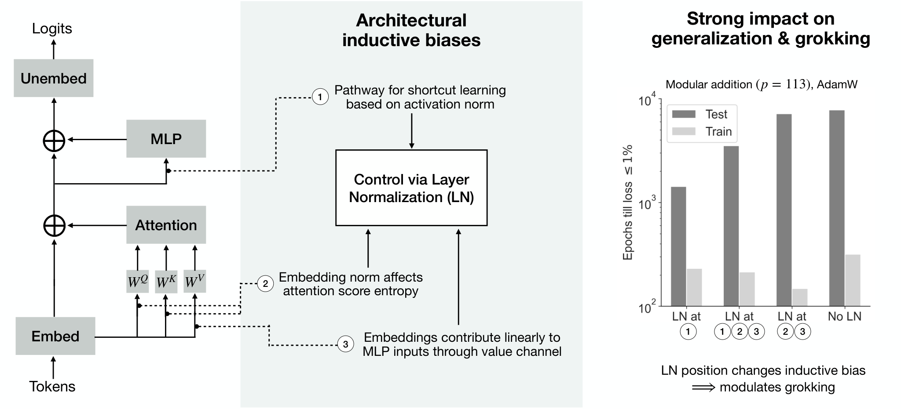
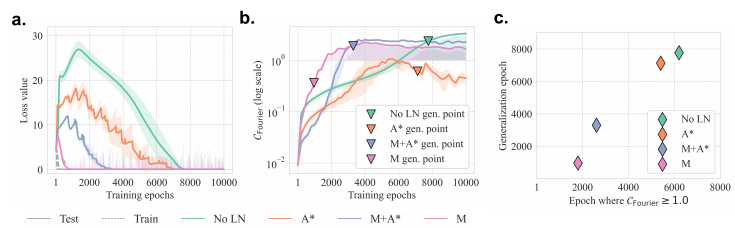
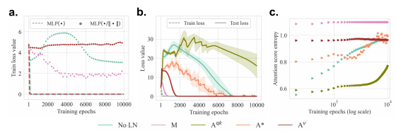
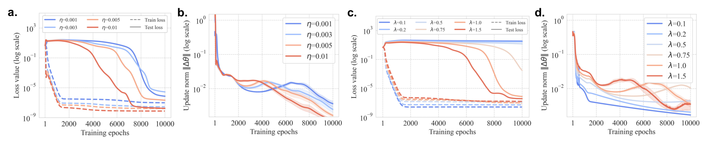
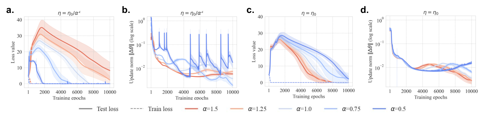
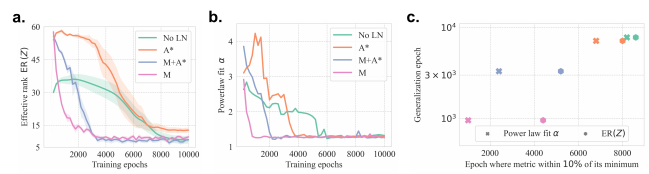
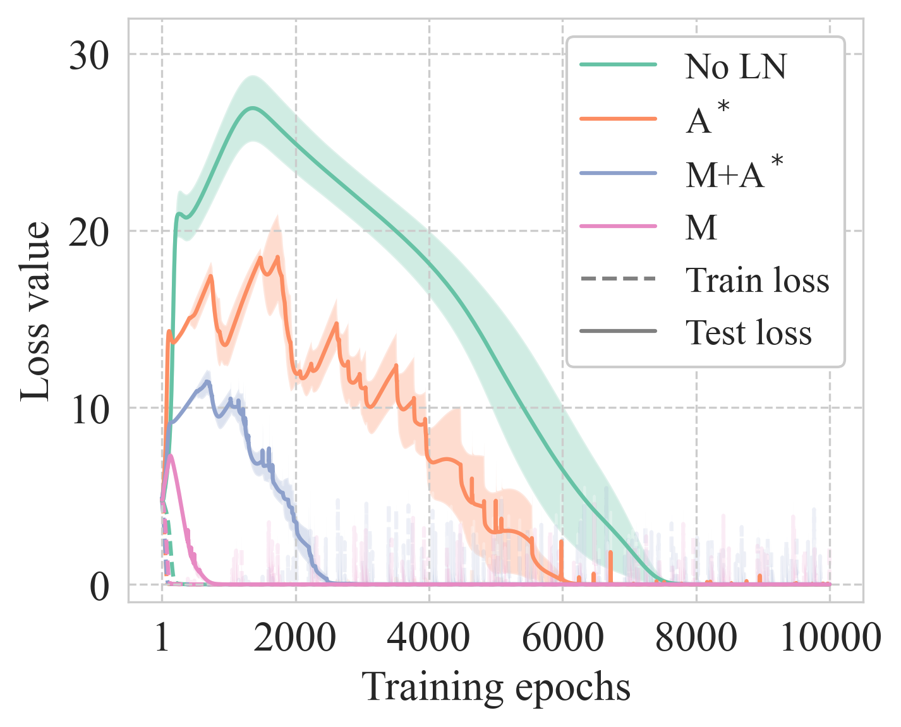
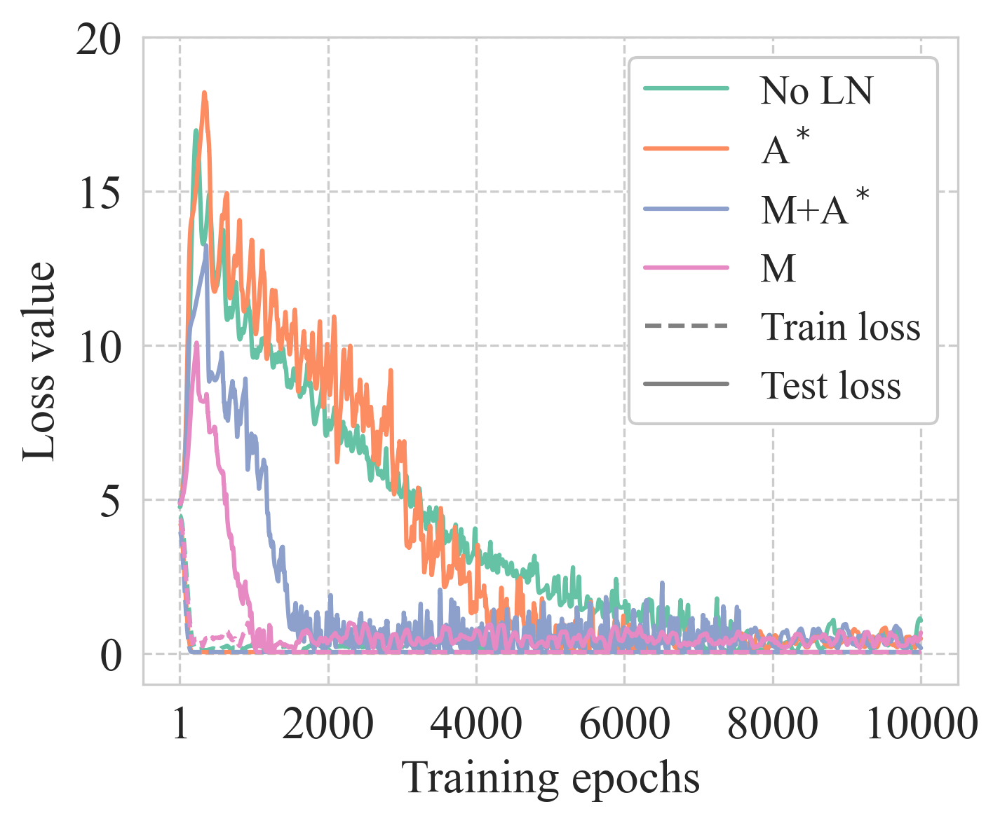

# Singh et al. 2026 — Explaining Grokking in Transformers through the Lens of Inductive Bias

См. также: [глобальный индекс понятий](../../concepts/index.md).
arXiv [2602.06702v1](https://arxiv.org/abs/2602.06702), 6 февраля 2026. Колонтитула конференции у PDF нет: на всех страницах, кроме первой, стоит название работы.

**Jaisidh Singh** — University of Tübingen; MPI-IS Tübingen; Tübingen AI Center; Zuse School ELIZA (переписка: jaisidh.singh@student.uni-tuebingen.de).
**Diganta Misra, Antonio Orvieto** — MPI-IS Tübingen; Tübingen AI Center; ELLIS Institute Tübingen.

Файлы разбора этой статьи:

- [`2602.06702.explaining-grokking-in-transformers-through-the-lens-of-inductive-bias.claims.txt`](2602.06702.explaining-grokking-in-transformers-through-the-lens-of-inductive-bias.claims.txt) — пронумерованные утверждения статьи с пометками разбора.
- [`2602.06702.explaining-grokking-in-transformers-through-the-lens-of-inductive-bias.license.txt`](2602.06702.explaining-grokking-in-transformers-through-the-lens-of-inductive-bias.license.txt) — лицензионная запись arXiv для этой статьи.

Схема якорей и правила ссылок на карточку — в [README папки статей](../README.md).

**Карточка-выдержка.** Лицензия статьи (`arxiv-nonexclusive`) не разрешает публикацию копии оригинала и полного перевода, поэтому карточка содержит редакторские секции и цитируемые фрагменты перевода (право цитирования). Полный текст статьи: <https://arxiv.org/abs/2602.06702>.

## Затрагиваемые понятия

**[Гроккинг](../../concepts/grokking.md)** — работа принимает явление как данность и спрашивает не «почему оно есть», а «чем задаётся его скорость»: определение взято дословно у Power et al. — «сеть достигает почти нулевой обучающей потери, но генерализует лишь после долгой задержки» ([с. 1, абз. 5](#p1-5)), и спора о самом определении в статье нет. Собственный ход — *модуляторы*: архитектурные и оптимизационные рычаги, систематически меняющие поведение гроккинга ([с. 1, абз. 8](#p1-8)); порядок наступления генерализации при разных рычагах и есть предмет измерения. Чего в работе нет: ни объяснения, почему задержка возникает вообще, ни порога или меры задержки, кроме «тестовая потеря ниже $0.01$» ([рис. 2](#fig-2)); все выводы сняты на одной задаче при одном модуле и одном разбиении, а узость области объявлена достоинством, а не оговоркой ([с. 1, абз. 8](#p1-8)).

**[Переход lazy→rich](../../concepts/lazy-to-rich-kernel-to-feature-learning.md)** — здесь главный, и притом отрицательный, вклад работы. Спор ведётся не о явлении, а о **правомерности рычага**: правка скорости обучения $\eta=\eta_{0}/\alpha^{2}$, которой Kumar et al. удерживают нормы обновлений сопоставимыми при разном масштабе выхода, выведена для среднеквадратичной потери и SGD и в этой обстановке теряет смысл ([с. 5, абз. 8](#p5-8)). При AdamW с $\epsilon\to0$ множитель $\alpha$ сокращается сам ([с. 6, абз. 2](#p6-2)), поэтому деление шага на $\alpha^{2}$ меняет действенный шаг и силу регуляризации, а не «ленивость»; при закреплённом $\eta_{0}$ знак связи обращается, и $\alpha$ ведёт себя как обратная температура softmax ([с. 7, абз. 1](#p7-1)). Отсюда вывод раздела и статьи: истолкование «от ленивого к богатому» здесь не подтверждается ([с. 7, абз. 2](#p7-2), [с. 8, абз. 2](#p8-2)). Чего в работе нет: дрейф от NTK при инициализации — то, чем режим определяется у Kumar et al., — здесь не измеряется ни разу, а заявка «сеть преимущественно работает в богатом режиме» ([с. 2, абз. 1](#p2-1)) опирается только на то, что эффективный ранг и спектр меняются ([с. 7, абз. 8](#p7-8)); прямого воспроизведения обстановки Kumar et al. (SGD, квадратичная потеря) в той же постановке тоже нет.

**[Нейронное касательное ядро](../../concepts/neural-tangent-kernel-ntk.md)** — понятие привлечено только в обзоре смежных работ и только как язык описания ленивого режима: в ленивом режиме «сеть пренебрежимо мало отходит от своего NTK при инициализации», то есть остаётся в линеаризованной форме, допускаемой NTK, тогда как в богатом режиме NTK по-прежнему определимо, но отход от него значителен ([Приложение A](#p12-1)). Для корпуса тут важна асимметрия: именно дрейф от NTK служит определением режима у Kumar et al., и именно он в этой работе не считается — вывод о богатом режиме сделан по изменчивости эффективного ранга и спектра признаков ([с. 7, абз. 8](#p7-8)). Чего в работе нет: ни одного вычисления ядра и ни одной ссылки на NTK за пределами обзора смежных работ.

**[Оптимизатор](../../concepts/optimizer-adam-adamw-sgd.md)** — работа даёт корпусу редкую вещь: точный и поверяемый довод о том, что выбор оптимизатора меняет смысл чужого рычага. Выкладка ([с. 6, абз. 1](#p6-1)) показывает, что при AdamW с $\epsilon\to0$ обновление $\Delta\theta\approx-\eta\,m_{f}/\sqrt{v_{f}}$ уже не зависит от $\alpha$, откуда авторская формулировка: «использование AdamW вместо SGD меняет то, как масштаб выхода влияет на сеть» ([с. 6, абз. 2](#p6-2)). Второй, реализационный довод: в PyTorch и JAX weight decay в AdamW умножается на скорость обучения, поэтому правка $1/\alpha^{2}$ смешивает ещё и силу регуляризации ([с. 6, абз. 2](#p6-2)). Чего в работе нет: сравнения оптимизаторов как опыта — SGD не запускается ни разу, довод остаётся выкладкой плюс проверка норм обновлений на AdamW.

**[Скорость обучения](../../concepts/learning-rate.md)** — рычаг проверен заново и служит опорой для главного довода. Прямой опыт: выше скорость обучения при закреплённом weight decay — быстрее генерализация ([рис. 4](#fig-4), панель a); при этом нормы обновлений на ранних эпохах несопоставимы ([с. 6, абз. 4](#p6-4)). Затем скорость обучения закрепляется на $\eta_{0}=0.001$ при всех $\alpha$, и именно это закрепление обращает знак связи между масштабом выхода и скоростью гроккинга ([с. 7, абз. 1](#p7-1)). Чего в работе нет: перебираемая сетка нигде не названа в тексте — прочесть её можно только по легендам [рис. 4](#fig-4) ($\eta\in\{0.001,0.003,0.005,0.01\}$) и [рис. 5](#fig-5) ($\alpha\in\{0.5,0.75,1.0,1.25,1.5\}$); зависимость срока гроккинга от скорости обучения не сведена ни к одному числу и читается только с кривых.

**[Weight decay](../../concepts/weight-decay.md)** — второй оптимизационный рычаг, и он же сшивает два раздела работы. Прямая часть: выше weight decay при закреплённой скорости обучения — быстрее генерализация ([рис. 4](#fig-4), панель c). Косвенная и более ценная: больший weight decay даёт большую сжимаемость признаков — ниже эффективный ранг, ниже показатель степенной подгонки, тяжелее хвост спектра ([с. 7, абз. 10](#p7-10), [рис. 9](#fig-9)), то есть та же мера, что упорядочивает положения LN, упорядочивает и силы weight decay. Отдельно существенно для корпуса реализационное замечание: в PyTorch и JAX сила weight decay в AdamW домножается на скорость обучения ([с. 6, абз. 2](#p6-2)), поэтому «одинаковый $\lambda$» при разных шагах не означает одинаковой регуляризации. Чего в работе нет: перебираемых значений $\lambda$ в тексте — они читаются только по легендам [рис. 4](#fig-4) и [рис. 9](#fig-9) ($\lambda\in\{0.1,0.2,0.5,0.75,1.0,1.5\}$), тогда как в постановке названо одно базовое $\lambda=1.0$ ([Приложение C](#p13-1)); вопрос о необходимости weight decay для гроккинга не ставится вовсе.

**[Эталонный полигон гроккинга](../../concepts/canonical-grokking-testbed.md)** — обстановка взята у Nanda et al. без изменений и объявлена таковой: «Мы следуем (35) и используем однослойный трансформер ширины 128» — 4 головы, скрытый слой MLP 512, без связывания весов в развложении, полный батч, 10000 эпох, AdamW, $\eta=0.001$, $\lambda=1.0$, инициализация как в HookedTransformer ([Приложение C](#p13-1)). Вклад работы в понятие — не новая постановка, а показ того, что один узел этой постановки (положение LN), обычно не обсуждаемый, меняет срок гроккинга на порядок. Чего в работе нет: ни второго разбиения, ни второго модуля, ни второй операции; устойчивость проверена только по семенам (5 на настройку), по нормировке (RMSNorm, [рис. 7](#fig-7)) и по глубине (3 слоя при ширине 64, [рис. 8](#fig-8)).

**[Модульная арифметика](../../concepts/modular-arithmetic.md)** — единственная задача работы, и выбор мотивирован именно её каноничностью: «Мы используем обстановку однослойных трансформеров, выучивающих модульное сложение: это наиболее широко изучаемая обстановка гроккинга в трансформерах» ([с. 2, абз. 4](#p2-4)). Задача берётся при $p=113$, три токена $(a,b,=)$, развложается только последний ([с. 2, абз. 4](#p2-4)). Чего в работе нет: ни модульного умножения, ни иных операций, ни переноса на неалгоритмические данные; авторы сами относят это к ограничениям ([с. 8, абз. 4](#p8-4)).

**[Фурье-признаки и контуры](../../concepts/fourier-features-circuits.md)** — работа сводит картину Nanda и Zhong к одному числу: концентрации фурье-мод $\mathcal{C}_{\text{Fourier}}$ — отношению межмодовой и внутримодовой дисперсии в фурье-образе матрицы вложений, объявленному родственным F-статистике ANOVA, с порогом $1.0$ ([с. 3, абз. 5](#p3-5)). Содержательный итог для понятия: положение LN меняет **срок**, а не **вид** решения — «все варианты приходят к периодически структурированным общим решениям независимо от положения LN» ([с. 3, абз. 5](#p3-5)), и порядок выхода $\mathcal{C}_{\text{Fourier}}$ за $1.0$ совпадает с порядком генерализации ([рис. 2](#fig-2)). Чего в работе нет: разбора самих контуров — ни абляций, ни выделения голов или нейронов; $\mathcal{C}_{\text{Fourier}}$ считается только по матрице вложений, а не по отображению «нейрон — логит», и никакого сопоставления с мерами Nanda et al. не проводится.

**[Маршрутизация внимания](../../concepts/attention-routing-heads.md)** — самое своеобразное наблюдение работы: одна и та же операция на разных путях внимания действует противоположно. LN только на канале значений ($\mathbf{A^{v}}$) сильно ускоряет гроккинг, LN только на запросах и ключах ($\mathbf{A^{qk}}$) не даёт генерализовать за 10 тысяч эпох и отстаёт даже от **No LN** ([с. 4, абз. 3](#p4-3), [рис. 3](#fig-3)). Механизм назван: снятие масштаба вложений на запросах и ключах понижает энтропию softmax-распределения оценок внимания, а тригонометрическое составление по Nanda/Zhong требует представлений в обеих позициях $a$ и $b$ ([с. 4, абз. 3](#p4-3)). Чего в работе нет: разбора по головам (их четыре) и каузальных абляций — энтропия меряется усреднённой по строкам, а связь «низкая энтропия → ограниченное составление» изложена как рассуждение, а не проверена вмешательством.

**[Фаза меморизации](../../concepts/memorization-phase.md)** — работа даёт дешёвую меру того, на что сеть опирается в пору запоминания. *SR-train* — обучающая потеря при подмене $\text{MLP}(\bullet)\to\text{MLP}(\bullet/\|\bullet\|)$, измеряемая без обратного распространения ([с. 4, абз. 2](#p4-2)). У **No LN** она много выше обычной обучающей потери, то есть сеть опирается на масштаб признаков, а не на их направления; и главное — «SR-train уменьшается по мере того, как происходит отсроченный спуск тестовой потери, то есть гроккинг, и увеличивается, когда сеть запоминает при почти нулевой обучающей потере и большой тестовой» ([с. 4, абз. 2](#p4-2)). Тем самым запоминание здесь опознаётся как короткий путь по масштабу активаций в MLP. Чего в работе нет: SR-train не разложена по слоям и не сопоставлена ни с одной другой мерой запоминания; сама привязка «MLP запоминает» унаследована из чужой работы (17), а не проверена здесь.

**[Сжатие многообразия представлений](../../concepts/manifold-representation-compression.md)** — мерой сжимаемости служит эффективный ранг $\operatorname{ER}(Z)$ корреляционной матрицы пре-логитов токена «=» ([с. 7, абз. 7](#p7-7)). Утверждение работы: наступление сжимаемости упорядочено так же, как гроккинг, и это верно сразу для двух разных рычагов — положения LN и силы weight decay: «настройки, генерализующие раньше, раньше приходят к большей сжимаемости» ([с. 7, абз. 10](#p7-10), [рис. 6](#fig-6), [рис. 9](#fig-9)). Оговорка сделана самими авторами: $\mathbf{A^{*}}$ не достигает меньшего минимального эффективного ранга, чем **No LN**, а лишь приходит в пределы $10\%$ от своего минимума чуть раньше ([с. 7, абз. 9](#p7-9)). Чего в работе нет: ни причинной проверки (ранг нигде не задаётся принудительно), ни числовых значений — вся связь читается с кривых.

**[Спектральный анализ / FVE](../../concepts/spectral-analysis-svd-esd-fve.md)** — вторая мера сжимаемости: «мы подгоняем степенной закон к спектру собственных значений корреляционной матрицы признаков» (пакет `powerlaw`), и показатель $\alpha$ тем ниже, чем тяжелее хвост ([с. 7, абз. 7](#p7-7); код меры целиком приведён в Приложении D). Существенно, что спектр берётся у матрицы признаков — пре-логитов на обучающей выборке, — а не у весовых матриц. Работа даёт корпусу связку «ниже показатель степенного закона у признаков — раньше генерализация», прослеженную одновременно по положению LN ([рис. 6](#fig-6)) и по силе weight decay ([рис. 9](#fig-9)). Чего в работе нет: ни диапазона подгонки, ни доверительных границ, ни проверки качества подгонки; шумовые всплески не разбираются, а подавляются агрегацией минимумом по 5 семенам ([рис. 6](#fig-6)).

**[Тяжёлохвостовая саморегуляризация](../../concepts/heavy-tailed-self-regularization-htsr.md)** — работа приходит к тяжёлым хвостам спектра с другой стороны и другим языком. Величина та же по форме — показатель степенной подгонки собственного спектра, — но подгоняется он к корреляционной матрице **признаков**, а не к весовым матрицам слоёв, и обоснование берётся у Agrawal et al. ($\alpha$-Req), а не у HTSR: «более высокие значения weight decay показывают более тяжелохвостые собственные спектры в $Z$» ([с. 7, абз. 10](#p7-10)). Чего в работе нет: ни слова HTSR, ни WeightWatcher, ни ссылки на эту линию работ; порогов вида «$\alpha\approx2$» здесь не появляется, и приписывать работе выводы о спектре весов нельзя.

**[Меры прогресса](../../concepts/progress-measures.md)** — работа заявляет свою меру сжимаемости кандидатом в меру продвижения, и делает это дважды с разной силой. В заключении — без оговорки: существующие исследования обобщаемых признаков «дают меру продвижения для гроккинга, не зависящую от обстановки» ([с. 8, абз. 3](#p8-3)); в разделе ограничений — с хеджем: «выявляет меру продвижения для гроккинга, правдоподобно не зависящую от обстановки» ([с. 8, абз. 4](#p8-4)). Опорой служит то, что $\operatorname{ER}(Z)$ и показатель $\alpha$ упорядочивают настройки одинаково при двух несхожих рычагах. Чего в работе нет: проверки «независимости от обстановки» хоть в одной второй обстановке — мера подобрана и испытана в одной и той же; и в отличие от мер Nanda et al. она не опережает скачок, а идёт с ним рядом, то есть предсказательная способность не измерялась.

**[Эффект рогатки](../../concepts/slingshot.md)** — рогатки в работе наблюдаются трижды и ни разу не разбираются. В [рис. 2](#fig-2) настройки *MLP Pre-LN* и *Pre* «показывают рогатки», и их кривые рисуются с меньшей непрозрачностью; в [рис. 6](#fig-6) показатель степенной подгонки выводится агрегацией минимумом по 5 семенам именно для того, «чтобы устранить шумовые всплески, вызванные рогатками»; при глубине 3 «большая глубина показывает значительно больше рогаток (45)» ([рис. 8](#fig-8)). Ссылка на Thilak et al. стоит один раз и служит именем для явления. Чего в работе нет: ни измерения всплесков потери, ни циклов нормы весов последнего слоя, ни связи рогаток с гроккингом — они здесь помеха измерению, а не предмет.

**[Роль шума градиента](../../concepts/gradient-noise.md)** — вся работа сделана без шума партий: «Оптимизация всегда выполняется полным батчем на протяжении $10000$ эпох с помощью AdamW» ([Приложение C](#p13-1)). Для корпуса это ставит работу в цепочку полнопакетных исследований гроккинга и означает, что весь сообщаемый разброс — по инициализации (5 семян), а не по порядку данных. Чего в работе нет: сравнения с обучением партиями и вообще обсуждения размера пакета — он даже не назван переменной.

**[Доля данных / критический размер набора](../../concepts/data-fraction-critical-dataset-size.md)** — доля закреплена и не перебирается: «Разбиение данных на обучающие и тестовые — $30$-$70\%$ при общем числе образцов $p^{2}$» ([Приложение C](#p13-1)). Значимо это тем, что доля обучающих данных здесь ниже, чем у Nanda et al., и потому все сроки гроккинга работы несопоставимы напрямую с их числами. Чего в работе нет: ни одной точки при другой доле, ни упоминания критического размера набора; голодание по данным названо один раз, и то при пересказе чужих работ ([Приложение A](#p12-3)).

**[Алгоритмы Clock и Pizza](../../concepts/clock-vs-pizza.md)** — понятие лишь упоминается, но упоминание содержательно для двух вещей. Во-первых, Zhong et al. привлечены как довод о неединственности решения: они «находят, что это решение не единственно, и показывают, что трансформеры могут выучивать алгоритм „пиццы“» вдобавок к «часам» ([Приложение A](#p12-3)). Во-вторых, механистическая картина, на которую опирается разбор энтропии внимания, взята сразу у Nanda и Zhong как единая ([с. 4, абз. 3](#p4-3)) — различие между «часами» и «пиццей» в разборе не используется. Чего в работе нет: ни одного измерения, различающего алгоритмы, — $\mathcal{C}_{\text{Fourier}}$ к такому различению нечувствительна; при этом именно к этому месту относится ошибочная ссылка, разобранная ниже.

---

**[Архитектурное индуктивное смещение](../../concepts/architectural-inductive-bias.md)** — заявка сформулирована прямо: смещения, выраженные через устройство, модулируют гроккинг ([`p2-1`](#p2-1)). Зондом служит положение слойной нормировки — те же слои в ином порядке дают разительно разные сроки при одинаково устроенных решениях.
## Несогласованности внутри статьи

**Постановка ссылается не на тот раздел.** В [Приложении C](#p13-1) сказано, что «настройки, данные в Разделе 2.3, используются для создания вариантов трансформера», тогда как настройки LN определены в Разделе 2.2 (Таблица 1); Раздел 2.3 — это уже опыты с ними.

**Разбор скорости обучения и weight decay ссылается на соседние панели.** В §3.2 сказано: «Как можно видеть на Рисунке 4a и Рисунке 4b соответственно, более высокие скорости обучения и силы weight decay ведут к более быстрой генерализации и меньшему гроккингу» ([с. 6, абз. 4](#p6-4)). По подписи [рис. 4](#fig-4) weight decay изображён на панели c, а панель b показывает нормы обновления параметров при разных скоростях обучения. Через две фразы тот же абзац ссылается на 4b уже правильно — как на нормы обновлений.

**Оценки внимания получаются проекцией не тех матриц.** В ② сказано, что вложения на входе запросов и ключей «решающим образом составляют оценки внимания после проекции $W^{Q}$ и $W^{V}$» ([с. 4, абз. 3](#p4-3)); по Таблице 2 Приложения B и по смыслу абзаца должно стоять $W^{K}$ — далее в том же абзаце речь идёт о «произведении запросов и ключей», а канал значений разбирается отдельно в ③.

**Две настройки из подписи рисунка не определены нигде.** Подпись [рис. 2](#fig-2) называет конфигурации *MLP Pre-LN* и *Pre*, показывающие рогатки; ни в Таблице 1, ни в тексте таких имён нет, и с четырьмя определёнными настройками (**No LN**, $\mathbf{A^{*}}$, $\mathbf{M}$+$\mathbf{A^{*}}$, $\mathbf{M}$) они не сведены. Обратная сторона того же: $\mathbf{A^{qk}}$ и $\mathbf{A^{v}}$, на которых держится весь разбор §2.4, в Таблицу 1 не внесены и живут только в тексте ([с. 4, абз. 3](#p4-3), [с. 5, абз. 1](#p5-1)).

**«Признаки всех точек данных» против «только обучающая выборка».** Постановка §4.1 говорит прямо: «Важно, что мы используем только точки данных из обучающей выборки, а не из тестовой, чтобы проверить, лениво ли подгоняются обучающие данные» ([с. 7, абз. 7](#p7-7)). Заключение же формулирует итог шире: «мы показываем, как признаки всех точек данных значительно и непрерывно меняются на протяжении процесса обучения» ([с. 8, абз. 3](#p8-3)). Разница существенна: заявка о богатом режиме сделана по признакам обучающих точек.

**Сила центральной заявки меняется от раздела к разделу.** Один и тот же вывод о режиме обучения подан трижды с разной силой: в перечне вкладов — категорично, «Эти наблюдения показывают, что сеть преимущественно работает в богатом режиме» ([с. 2, абз. 1](#p2-1)); в аннотации — с хеджем, «что позволяет предположить, что гроккинг в трансформерах может быть тоньше, чем переход режима обучения от ленивого к богатому» ([с. 1, абз. 2](#p1-2)); в заключении — снова с хеджем, «Наши находки позволяют предположить, что сеть учит признаки богато на всём протяжении» ([с. 8, абз. 3](#p8-3)). То же с мерой продвижения: в заключении она «не зависящая от обстановки» ([с. 8, абз. 3](#p8-3)), в ограничениях — «правдоподобно не зависящая от обстановки» ([с. 8, абз. 4](#p8-4)). При цитировании стоит брать хеджированную формулировку: она согласуется с тем, что измерено.

## Что измерено, что показано и что предположено

**Выведено до опыта и подтверждено опытом.** Разбор правки $\eta=\eta_{0}/\alpha^{2}$ — единственная часть работы, где предсказание сделано выкладкой, а затем проверено. Из вида производной кросс-энтропии следует, что $g_{h}$ растёт с $\alpha$ примерно линейно, а не квадратично ([с. 5, абз. 8](#p5-8)); из вида обновления AdamW при $\epsilon\to0$ — что множитель $\alpha$ сокращается и «обновления параметров были бы приблизительно сопоставимы по $\alpha$, по крайней мере на начальных стадиях обучения» ([с. 6, абз. 2](#p6-2)). Оба следствия проверены: при $\eta=\eta_{0}/\alpha^{2}$ нормы обновлений расходятся, при закреплённом $\eta_{0}$ сопоставимы, и знак связи между $\alpha$ и скоростью гроккинга обращается ([рис. 5](#fig-5), [с. 7, абз. 1](#p7-1)). Это самая прочная часть работы.

**Показано опытом, но в одной обстановке.** Порядок настроек LN по скорости гроккинга ([с. 3, абз. 4](#p3-4)), совпадение этого порядка с порядком выхода $\mathcal{C}_{\text{Fourier}}$ за $1.0$ ([с. 3, абз. 5](#p3-5)) и с порядком наступления сжимаемости ([с. 7, абз. 9](#p7-9)), поведение SR-train ([с. 4, абз. 2](#p4-2)), провал $\mathbf{A^{qk}}$ и ускорение при $\mathbf{A^{v}}$ ([с. 4, абз. 3](#p4-3), [с. 5, абз. 1](#p5-1)) — всё это снято на 5 семенах при $p=113$, одном разбиении, одном оптимизаторе и одной задаче. Устойчивость проверена по нормировке (RMSNorm, [рис. 7](#fig-7)) и по глубине (3 слоя, [рис. 8](#fig-8)), но не по задаче, модулю или доле данных.

**Заявлено, но не измерено.** Заявка «сеть преимущественно работает в богатом режиме» ([с. 2, абз. 1](#p2-1)) опирается на один абзац без единого числа и без ссылки на рисунок ([с. 7, абз. 8](#p7-8)): показано лишь, что $\operatorname{ER}(Z)$ и спектр меняются непрерывно. Непрерывное изменение признаков не есть определение богатого режима — у Kumar et al. режим определяется дрейфом от NTK при инициализации, и эта величина здесь не считается. Точно так же вывод о неприменимости истолкования «от ленивого к богатому» ([с. 7, абз. 2](#p7-2)) остаётся объяснённым, но не проверенным напрямую: опыта, воспроизводящего обстановку Kumar et al. (SGD, квадратичная потеря) на той же задаче, в работе нет.

**Числа живут в рисунках, а не в тексте.** Ни одного сводного числа — срока гроккинга, отношения сроков, значения меры — в тексте статьи нет; всё читается с кривых и точек. Правая панель [рис. 1](#fig-1) — единственное место со шкалой «эпох до потери $\leq1\%$» отдельно для обучающей и тестовой выборок, и именно она подтверждает утверждение §2.3 о несвязанности сроков подгонки ([с. 3, абз. 4](#p3-4)); подпись рисунка при этом описывает только левую, схематическую его часть и о столбчатой диаграмме не говорит ни слова. Сетки перебираемых значений ($\eta$, $\lambda$, $\alpha$) названы только в легендах [рис. 4](#fig-4) и [рис. 5](#fig-5). Заявленная «вполне симметричная» связь между сроком выхода $\mathcal{C}_{\text{Fourier}}$ за $1.0$ и сроком генерализации ([с. 3, абз. 5](#p3-5)) опирается на диаграмму рассеяния из четырёх точек — по одной на настройку LN ([рис. 2](#fig-2), панель c); ни коэффициента связи, ни определения «симметричности» не приведено.

**Границы, признанные авторами.** Работа «не является исчерпывающим исследованием всех возможных положений LN», а находки «могут не переноситься на другие обстановки» ([с. 8, абз. 4](#p8-4)). Отдельно стоит держать в уме, что LN выбрана как рычаг под предлогом, что «она меняет обучение, но не ёмкость модели» ([с. 2, абз. 4](#p2-4)), тогда как обучаемые $\gamma,\beta$ ёмкость всё же меняют — пусть и на $2d$ параметров.

## Ошибочные цитирования

Редакторские заметки о местах, где эта работа передаёт чужие результаты с ошибкой или без авторских оговорок. Ссылки «подробности» из разделов «Ошибочные пересказы и цитирования этой статьи» в карточках процитированных работ ведут сюда.

###### mc-2306-17844

**Zhong et al. (2306.17844) — фазовые переходы между «часами» и «пиццей» отнесены к другой работе.** В обзоре смежных работ сказано: `"Moreover, transformers can exhibit sharp phase transitions (4) between these two solutions depending on width and attention strength."` — *«Более того, трансформеры могут обнаруживать резкие фазовые переходы (4) между этими двумя решениями в зависимости от ширины и силы внимания»* ([Приложение A](#p12-3)). Ссылка (4) — это Akyürek et al., «What learning algorithm is in-context learning?», работа об обучении в контексте линейными моделями, в которой ни «часов», ни «пиццы», ни зависимости от ширины и силы внимания нет. Результат принадлежит [Zhong et al. 2023](../2306.17844.the-clock-and-the-pizza-two-stories-in-mechanistic-explanation-of-neural-networks/2306.17844.the-clock-and-the-pizza-two-stories-in-mechanistic-explanation-of-neural-networks.card.md), которые сами и вводят обе стороны сравнения.

Происхождение ошибки прослеживается точно. У Zhong et al. фраза во введении устроена так: `"Models exhibit sharp *algorithmic phase transitions* [6] between the *Clock* and *Pizza* algorithms as their width and attention strength very"`, и ссылка [6] там — это ссылка на **термин** «algorithmic phase transitions», а не на результат; [6] в их списке литературы и есть Akyürek et al. При пересказе Singh et al. сохранили и фразу, и положение ссылки, но убрали курсив и слово «algorithmic», отчего ссылка перестала читаться как ссылка на термин и стала читаться как источник находки.

Существенно, что в соседних предложениях того же абзаца та же работа процитирована точно: неединственность решения и алгоритм «пиццы» отнесены к (54), то есть к Zhong et al., а алгоритм «часов» — к (35), Nanda et al. ([Приложение A](#p12-3)). Предупреждение здесь — о формулировке, а не о работе.

## Ошибочные пересказы и цитирования этой статьи

Узоры, наблюдаемые в цитирующих работах корпуса. Работа вышла в феврале 2026 года, и цитирующих в корпусе пока две; обе передают её главный тезис близко к аннотации, и ни одна не искажает его прямо. Ниже — то, что при этом теряется.

**«LayerNorm ускоряет гроккинг» (точное, но требующее оговорки).** Обе наблюдённые формулировки берут вывод в одну сторону: `"Singh et al. 2026 demonstrate that architectural choices such as layer-normalization placement strongly modulate grokking dynamics"` (2605.20441, карточки нет) и `"In concurrent work, Singh et al. (2026) found that restricting LayerNorm placement can accelerate generalization by limiting reliance on activation scale"` ([Yildirim 2026](../2603.05228.the-geometric-inductive-bias-of-grokking-bypassing-phase-transitions-via-architectural-topology/2603.05228.the-geometric-inductive-bias-of-grokking-bypassing-phase-transitions-via-architectural-topology.card.md)). Обе верны по аннотации ([с. 1, абз. 2](#p1-2)) и по механизму, который авторы действительно устанавливают через SR-train ([с. 4, абз. 2](#p4-2)). Теряется же несимметричность, которая и делает результат содержательным: **та же** операция на другом пути гроккинг не ускоряет, а уничтожает — настройка $\mathbf{A^{qk}}$ не генерализует за 10 тысяч эпох и отстаёт от сети вовсе без LN ([с. 4, абз. 3](#p4-3), [рис. 3](#fig-3)). Формула «LN помогает» из работы не следует; следует «положение LN решает, поможет она или помешает».

**«Опровергнуто, что гроккинг есть переход от ленивого к богатому» (ожидаемое расширение).** Такой формулировки в корпусе пока не наблюдалось, но заголовочный вывод работы к ней располагает: «наша работа говорит против взгляда „от ленивого к богатому“ (28) в трансформерах при обучении модульному сложению» ([с. 8, абз. 2](#p8-2)). Показано при этом более узкое: **один частный рычаг** ленивости — масштаб выхода с правкой шага $\eta=\eta_{0}/\alpha^{2}$ — выведен для среднеквадратичной потери и SGD и не переносится на AdamW с кросс-энтропией ([с. 5, абз. 8](#p5-8), [с. 6, абз. 2](#p6-2)). Сам переход между режимами здесь не измерялся ни разу: дрейфа от NTK при инициализации в работе нет, а вывод о богатом режиме сделан по тому, что эффективный ранг и спектр непрерывно меняются ([с. 7, абз. 8](#p7-8)). Авторская формулировка в §3 осторожнее заголовочной и годится как образец: «характеризация режима обучения здесь становится тоньше, чем переход от ленивого к богатому» ([с. 7, абз. 2](#p7-2)).

---

# Цитируемые фрагменты перевода

Ниже приведены только те фрагменты перевода, на которые ссылаются карточки корпуса (право цитирования). Нумерация якорей `pN-M` / `fig-N` / `sec-X` совпадает с полной карточкой и оригиналом.

## Аннотация

###### p1-2

Мы исследуем гроккинг в трансформерах через призму индуктивного смещения: расположенностей, возникающих из устройства или оптимизации и позволяющих сети предпочесть одно решение другому. Сначала мы показываем, что архитектурные решения, такие как положение слойной нормировки (Layer Normalization, LN), сильно модулируют скорость гроккинга. Эта модуляция объясняется вычленением того, как LN на определённых путях формирует обучение коротким путям и энтропию внимания. Затем мы изучаем, как разные настройки оптимизации модулируют гроккинг, порождая различные истолкования ранее предложенных рычагов, таких как масштаб выхода. В частности, мы находим, что использование масштаба выхода как рычага ленивого обучения в нашей обстановке может смешиваться со скоростью обучения и weight decay. Соответственно, мы показываем, что признаки эволюционируют непрерывно на протяжении всего обучения, что позволяет предположить, что гроккинг в трансформерах может быть тоньше, чем переход режима обучения от ленивого к богатому. Наконец, мы показываем, как генерализация предсказуемо возникает вместе со сжимаемостью признаков при гроккинге, при разных модуляторах индуктивного смещения. Наш код выложен по адресу https://tinyurl.com/y52u3cad.

## 1 Введение

###### fig-1

*Рисунок 1: Разные пути выражают разные смещения в однослойных трансформерах. Применение слойной нормировки (LN) в определённых положениях меняет индуктивное смещение сети и, как следствие, поведение гроккинга.* **[p. 2]**

###### p1-5

Мы сосредоточиваемся на *гроккинге*: когда сеть достигает почти нулевой обучающей потери, но генерализует лишь после долгой задержки (40; 35). Прежние работы истолковывают гроккинг как переход от ленивого обучения признаков к богатому (28), тогда как дополняющие исследования полагают, что генерализация возникает из появления структурированных представлений, формируемых гиперпараметрами и голоданием по данным (29). Однако эти взгляды не объясняют, почему одни сети открывают такую структуру быстро, а другим нужны задержки. Более того, разброс экспериментальных обстановок ведёт к расхождению истолкований (28; 29; 21).

###### p1-8

Чтобы изучить этот вопрос, мы разбираем гроккинг через *модуляторы*: архитектурные и оптимизационные решения, систематически меняющие поведение гроккинга. В частности, наше исследование сосредоточено на трансформерах (4**[p. 2]** 7), выучивающих модульное сложение при кросс-энтропийной потере и адаптивной оптимизации. Такая нарочито узкая область выбрана для того, чтобы не смешивать истолкования гроккинга с эффектами, свойственными именно оптимизатору, устройству или задаче. Соответственно, мы исследуем влияние индуктивных смещений на гроккинг так.

###### p2-1

1. *Индуктивные смещения, выраженные через устройство, модулируют гроккинг.* Сначала мы изучаем устройство как источник индуктивного смещения. В качестве архитектурного зонда мы используем слойную нормировку (LN) (6) — стандартный узел, напрямую управляющий распространением масштаба и дисперсии (49). Раздел 2 показывает, как влияние положения LN на различные индуктивные смещения ведёт к разительно разным скоростям гроккинга при том, что все они сходятся к периодически структурированным решениям, как в (35; 54).
2. *Помимо устройства, оптимизационные решения влияют на индуктивное смещение и тем модулируют гроккинг.* Дополнительно мы изучаем оптимизационно обусловленные индуктивные смещения через различные выборы скорости обучения и регуляризации в Разделе 3. Здесь мы внимательно рассматриваем допущения, необходимые для применения прежних подходов к управлению гроккингом, таких как использование масштаба выхода как заместителя ленивости (28). Соотнося эффекты масштаба выхода со скоростью обучения, weight decay и температурой softmax, мы показываем, как оптимизационные решения в наших обстановках могут смешиваться с характеризациями обучения признаков, подрывая их использование как надёжных рычагов гроккинга в этой обстановке.
3. *Признаки движутся к единым свойствам при разных модуляторах и индуктивных смещениях.* Раздел 4 достраивает результаты Раздела 3, показывая, что признаки эволюционируют непрерывно на протяжении процесса обучения и что генерализация возникает предсказуемо вместе с изменениями свойств признаков. Кроме того, эволюция признаков едина при разных модуляторах гроккинга. Эти наблюдения показывают, что сеть преимущественно работает в богатом режиме. Более того, качество выученных признаков предсказуемо задаётся тем, какого рода индуктивные смещения дают архитектурные и оптимизационные решения.

## 2 Как устройство влияет на индуктивные смещения для гроккинга

###### fig-2

*Рисунок 2: **(a) Кривые потерь для различных положений LN, усреднённые по $5$ семенам соответственно. *MLP Pre-LN* и *Pre* показывают рогатки, которые мы рисуем с меньшей непрозрачностью. (b) Эволюция $\mathcal{C}_{\text{Fourier}}$, усреднённая по $5$ семенам, вместе с точками, где каждая настройка генерализует (тестовая потеря ниже $0.01$). (c) Положения LN, генерализующие раньше, показывают более быстрое появление периодического строения на основе Фурье в $\widetilde{W}_{E}$.*** **[p. 3]**

### 2.1 Задача и обстановка

###### p2-4

Мы используем обстановку однослойных трансформеров, выучивающих модульное сложение: это наиболее широко изучаемая обстановка гроккинга в трансформерах (35; 54). По $3$ токенам $(a,b,=)$ трансформер должен научиться вычислять операцию $(a+b)\mod p$, где $p$ фиксировано и $0\leq a,b\leq p-1$. **[p. 3]** Далее мы управляем индуктивными смещениями трансформера с помощью слойной нормировки (LN). LN выбрана как основной модификатор особо потому, что (i) она меняет обучение, но не ёмкость модели, и (ii) она обстоятельно изучена (49) в трансформерах. Кроме того, эффекты LN решающим образом повлияли на проектирование устройства трансформеров (44; 26; 24). Дополнительно, LN в грокающих трансформерах оставалась во многом неисследованной. Это позволяет нам использовать LN для игрушечных моделей понимания роли индуктивного смещения в генерализации через гроккинг.

### 2.3 Гроккинг при LN

###### p3-3

Следующие опыты изучают, как положение LN внутри трансформера влияет на поведение гроккинга. Мы следуем экспериментальной постановке из (35), дополненной нашими различными настройками LN, определёнными выше. Полные подробности постановки даны в Приложении C. Отметим, что следующий раздел использует LN, как определено в Разделе 2.2. Однако мы также ставим опыты с RMSNorm (52) и находим весьма схожие результаты, приведённые в Приложении E.

#### Положение LN модулирует гроккинг.

###### p3-4

Обнаруживается, что гроккинг модулируется положением LN внутри трансформера, как показано на Рисунке 2. Рисунок 2a изображает, что использование LN в сети уменьшает гроккинг и что одни настройки LN дают меньше гроккинга, чем другие. В частности, $\mathbf{M}$ показывает самую быструю генерализацию, за ней $\mathbf{M}$+$\mathbf{A}^{*}$, и наконец $\mathbf{A}^{*}$, генерализующая лишь немного быстрее, чем **No LN**. Примечательно, что подгонка тестовых данных не связана с тем, как быстро сеть учится подгонять обучающие данные, как показано на Рисунке 1.

###### fig-3

*Рисунок 3: **(a) Настройка No LN чувствительна к норме входов MLP в обучающей потере, что видно по обучающей потере, возникающей, когда мы возмущаем прямой проход MLP с $\operatorname{MLP}(\bullet)$ (пунктирные линии) до $\operatorname{MLP}(\bullet/\|\bullet\|)$ (точки). Примечательно, что SR-train уменьшается, когда сеть грокает, показывая важность масштаба признаков для генерализации. (b) LN на входах канала значений $\operatorname{MHSA}(\bullet)$ ведёт к быстрому гроккингу, тогда как LN на входах запросов и ключей активно вредит способности сети генерализовать. (c) LN на входах запросов и ключей уменьшает энтропию оценок внимания, убирая масштаб вложений, который служит сети степенью свободы.*** **[p. 4]**

#### Трансформеры с LN выучивают решения на основе Фурье.

###### p3-5

Теперь посмотрим, выучивает ли сеть решения, подобные найденным в (35; 54). **[p. 4]** Для этого мы применяем преобразование Фурье к таблице поиска вложений $W_{E}$ вдоль словарной размерности, предварительно убрав $(p+1)^{\text{th}}$ вложение (для токена «=»). Эта преобразованная матрица обозначается $\widetilde{W}_{E}$. По мере того как сеть приближается к общим решениям, $\widetilde{W}_{E}$ снижала бы шум, уступая место чётким полосам, изображающим фурье-моды. Поскольку строки $\widetilde{W}_{E}$ изображают фурье-моды, отношение межмодовой дисперсии к внутримодовой росло бы по мере усиления периодического строения. Это отношение, весьма схожее с F-статистикой в дисперсионном анализе (ANOVA), мы обозначаем в нашей обстановке как концентрацию фурье-мод $\mathcal{C}_{\text{Fourier}}$. Измеряя $\mathcal{C}_{\text{Fourier}}$, мы находим, что связь между тем, насколько настройка грокает, и тем, как рано её $\mathcal{C}_{\text{Fourier}}$ достигает значений, означающих чёткое периодическое строение ($\geq 1.0$), вполне симметрична. Как можно видеть по среднему по $5$ семенам на Рисунке 2b, генерализация (снижение тестовой потери ниже $0.01$) у $\mathbf{M}$ показывает самый ранний подъём выше $1.0$ по $\mathcal{C}_{\text{Fourier}}$, за ней $\mathbf{M}$+$\mathbf{A^{*}}$, затем $\mathbf{A^{*}}$ и наконец **No LN**. Более того, все варианты приходят к периодически структурированным общим решениям независимо от положения LN. Рисунок 2c показывает эволюцию $\mathcal{C}_{\text{Fourier}}$ по ходу обучения вместе с точками, где тестовая потеря опускается ниже $0.01$, в соответствие Рисунку 2a. Отсюда следует, что все настройки ведут к отчётливо возникающим периодическим строениям во вложениях трансформера. В свою очередь, это показывает, что решения, выучиваемые трансформерами с LN, подобны найденным в (35; 54).

#### ① Масштаб входа MLP.

###### p4-2

Поскольку показано, что MLP в трансформерах преимущественно ориентированы на запоминание (17), мы проверяем, может ли MLP в нашем трансформере выучивать короткие пути, опираясь исключительно на масштаб активаций. Для этого мы обучаем трансформер **No LN** и на каждом шаге обучения измеряем *SR-train*: обучающую потерю, возникающую, когда масштаб входа MLP убран как $\text{MLP}(\bullet/\|\bullet\|)$. Отметим, что мы не распространяем градиент по сети через SR-train; она измеряется исключительно для количественной оценки чувствительности к масштабу. Обнаруживается, что SR-train значительно больше обычной обучающей потери (с $\text{MLP}(\bullet)$), как изображено на Рисунке 3a. Отсюда следует сильная чувствительность к масштабу признаков, а не к их направлениям. Примечательно, что SR-train уменьшается по мере того, как происходит отсроченный спуск тестовой потери, то есть гроккинг, и увеличивается, когда сеть запоминает при почти нулевой обучающей потере и большой тестовой.

#### ② Энтропия оценок внимания.

###### p4-3

Вложения, подаваемые на вход каналам запросов и ключей, решающим образом составляют оценки внимания после проекции $W^{Q}$ и $W^{V}$. Здесь масштаб этих вложений влияет на резкость элементов softmax-нормированного произведения запросов и ключей, тем самым влияя на выразительность модуля внимания. Это подтверждается измерением средней энтропии оценок внимания по строкам в настройках с LN и без LN на входах каналов запросов и ключей модуля внимания. Как показано на Рисунке 3b и Рисунке 3c, настройка $\mathbf{A^{qk}}$22 2 Верхний индекс $\mathbf{qk}$ означает, что LN применяется только на входах каналов запросов и ключей MHSA. не генерализует за 10 тысяч эпох, отставая от **No LN** и по генерализации, и по энтропии оценок внимания. **[p. 5]** Ясно, что это показывает: LN на входах каналов запросов и ключей пагубна для степени свободы MHSA сети. Кроме того, это наблюдение согласуется с механистическими разборами модульного сложения в трансформерах. В частности, (35; 54) устанавливают, что таблица вложений трансформера отображает токены $a$ и $b$ во вложения, обозначающие $(\sin(\omega a),\cos(\omega a))$ и $(\sin(\omega b),\cos(\omega b))$. Затем внимание составляет эти вложения через тригонометрические тождества, чтобы вычислить представление, пропорциональное $(\sin(\omega(a+b)),\cos(\omega(a+b)))$, на позиции последнего токена в пре-логитах. В частности, внимание производит тригонометрические составления, а MLP обновляет скрытое состояние последнего токена. При низкой энтропии softmax-распределения оценок внимания сеть ограничивала бы выражение тригонометрических тождеств, требующих представлений в обеих позициях $a$ и $b$, тем самым вредя генерализации на Рисунке 3.

#### ③ Масштаб входов значений.

###### p5-1

Выход модуля внимания линеен по вложениям, подаваемым на вход каналу значений. Из-за этого результат прибавления сквозной связи к остаточной ветви значительно зависит от масштаба вложений, который равносильно составляет и вход MLP. Следовательно, канал значений тоже может вызывать чувствительность к масштабу вложений на пути входа MLP, как в ①. Чтобы проверить это утверждение, мы вводим настройку $\mathbf{A^{v}}$, которая применяет LN только на входы значений как $\text{MHSA}(x,x,\text{LN}(x))$, и обучаем её в нашей обстановке. По Рисунку 3b и Рисунку 3c ясно видно, что LN только на входе канала значений ведёт к сильному ускорению гроккинга. Однако $\mathbf{A^{v}}$ всё же грокает медленнее, чем $\mathbf{M}$, потому что $\mathbf{M}$ полностью убирает масштаб со входа MLP. Хотя $\mathbf{A^{v}}$ может ограничить радиальную изменчивость, вносимую выходом внимания, она делает это не в той мере, что настройка $\mathbf{M}$. Это показано на Рисунке 3a, где $\mathbf{A^{v}}$ не показывает роста SR-train в пору запоминания, то есть до гроккинга, но и не снижает SR-train так сильно, как $\mathbf{M}$. В целом это показывает, насколько канал значений внимания может значимо влиять на гроккинг и насколько чувствительность входов MLP к масштабу вложений критична для быстрой генерализации.

### 3.1 Предварительные сведения

###### fig-4

*Рисунок 4: **(a) Увеличение скорости обучения $\eta$ при неизменном weight decay ведёт к более быстрому гроккингу. (b) Более высокие скорости обучения при закреплённом weight decay ведут к значительным различиям в норме обновления параметров $\|\Delta\theta\|$ по ходу обучения. (c) Точно так же увеличение weight decay при постоянной скорости обучения ведёт к более быстрому гроккингу. (d) Большая сила weight decay также ведёт к большим колебаниям в обновлениях параметров.*** **[p. 6]**

###### fig-5

*Рисунок 5: **(a) Влияние изменения скорости обучения как $\eta=\eta_{0}/\alpha^{2}$ на потерю: более высокий масштаб выхода $\alpha$ ведёт к более медленному гроккингу. (b) Обновления параметров несопоставимы по $\alpha$ при $\eta=\eta_{0}/\alpha^{2}$ и на деле значительно расходятся. (c) Закрепление скорости обучения на $\eta_{0}$ теперь ведёт к более медленному гроккингу при меньших значениях масштаба выхода $\alpha$. (d) Постоянная скорость обучения $\eta_{0}$ позволяет обновлениям параметров оставаться сопоставимыми по $\alpha$.*** **[p. 6]**

###### p5-8

Тем самым градиент и $\|\Delta\theta\|=\|-\eta\ g_{h}\|$ масштабируются как $\alpha^{2}$ (без учёта weight decay). Тогда, чтобы удержать нормы обновления весов сопоставимыми, то есть менять только ленивость, а не действенный размер шага, — иначе говоря, чтобы обеспечить неизменность $\|\Delta\theta\|\approx\eta_{0}\|g_{f}\|$ по $\alpha$, — скорость обучения должна меняться как $\eta=\eta_{0}/\alpha^{2}$. Такое масштабирование скорости обучения принято в (28) для представления истолкования гроккинга как перехода от ленивого к богатому. Однако *такое масштабирование скорости обучения применимо только для потери MSE и SGD*. Если теперь считать $\mathcal{L}$ кросс-энтропийной потерей, то

###### p6-1

где $p(\bullet)$ — операция softmax. Следовательно, для кросс-энтропийной потери $\partial\mathcal{L}/\partial h(x\;\theta)$ не растёт линейно с $\alpha$. Следовательно, $g_{h}$ масштабируется приблизительно линейно (заведомо суб-квадратично) из-за одного множителя $\alpha$, приходящего из $\partial h(x\;\theta)/\partial\theta$. Что теперь решающе важно отметить: если оптимизатором выбран AdamW, у которого $\epsilon\to 0$, то мы можем записать обновление весов для масштабированной сети $h$ через числитель $m_{h}$ и знаменатель $v_{h}$ Adam.

###### p6-2

Это показывает, что обновления параметров были бы приблизительно сопоставимы по $\alpha$, по крайней мере на начальных стадиях обучения. Единственные различия в обновлениях возникали бы от влияния $\alpha$ в $p(\bullet)$, однако общее влияние $\alpha$ на обновление было бы приблизительно постоянным. Выбрать тогда $\eta=\eta_{0}/\alpha^{2}$ значило бы смешать сравнение ленивости, поскольку действенный размер шага был бы выше. Этот смешивающий эффект можно понимать как то, что оптимизатор управляет индуктивным смещением: использование AdamW вместо SGD меняет то, как масштаб выхода влияет на сеть. Кроме того, PyTorch (39) и JAX (12) в своих реализациях AdamW умножают силу weight decay на скорость обучения, как показано в Уравнении 13. Поэтому использование масштабирования $1/\alpha^{2}$ смешивало бы ещё и силу регуляризации. В частности, при $\alpha<1$ и $\alpha>1$ общая скорость обучения и weight decay соответственно возрастали бы и убывали. Это вело бы к иной динамике, и цель удержания обновлений параметров сопоставимыми по $\alpha$ не была бы достигнута.

#### Удостоверение эффектов скорости обучения и weight decay.

###### p6-4

Мы показываем эти эффекты скорости обучения при закреплённом weight decay независимо от $\alpha$ и наоборот на Рисунке 4. Как можно видеть на Рисунке 4a и Рисунке 4b соответственно, более высокие скорости обучения и силы weight decay ведут к более быстрой генерализации и меньшему гроккингу. **[p. 7]** Далее, нормы обновления параметров несопоставимы на ранних стадиях обучения, что видно на ранних эпохах на Рисунке 4b и Рисунке 4d. Следовательно, Рисунок 5b показывает, что масштабирование скорости обучения как $\eta=\eta_{0}/\alpha^{2}$ ведёт к расходящимся и несопоставимым нормам обновлений, причём гроккинг на Рисунке 5a напрямую связан с $\alpha$, поскольку $\alpha<1\implies$ большая $\eta$ и наоборот.

#### Обеспечение сопоставимых обновлений параметров.

###### p7-1

Чтобы убрать это расхождение — несопоставимые обновления, порождаемые масштабированием скорости обучения как $\eta=\eta_{0}/\alpha^{2}$, — мы удерживаем действенный размер шага на постоянном значении $\eta_{0}=0.001$ при всех $\alpha$. Как видно на Рисунке 5d, нормы обновлений сопоставимы и хорошо себя ведут при всех $\alpha$ на начальной стадии обучения. Кроме того, тенденция, видимая на Рисунке 5a, противоположна Рисунку 5c, то есть при постоянных нормах обновлений больший $\alpha$ генерализует быстрее. Причину этого можно отнести к эффектам температуры в трансформерах и задачах на основе кросс-энтропии. Масштабирование выхода на $\alpha$ соотносится с температурой softmax $\tau$ как $\alpha\propto 1/\tau$. Следовательно, его действие как заместителя $\tau$ модулирует генерализацию (2) и гроккинг через своё влияние на динамику оптимизации.

###### p7-2

Подводя итог: использование масштаба выхода $\alpha$ как рычага ленивости требует внимательного рассмотрения того, как масштабируется скорость обучения при разных целевых функциях и оптимизаторах. Решающим образом, масштабирование скорости обучения как $\eta_{0}/\alpha^{2}$ ведёт к изменению скорости обучения, weight decay и норм обновлений. Мы показываем, как это смешивает $\alpha$ как рычаг ленивости с регуляризацией. Удерживая скорость обучения постоянной, чтобы обеспечить сопоставимые обновления параметров, мы находим, что масштаб выхода работает подобно температуре softmax. Поэтому в нашей обстановке масштаб выхода как рычаг ленивости согласно (28) на деле объясняется тем, как процесс обучения смещается настройками оптимизации. Следовательно, характеризация режима обучения здесь становится тоньше, чем переход от ленивого к богатому.

## 4 Индуктивное смещение предопределяет эволюцию признаков при гроккинге

###### fig-6

*Рисунок 6: **(a) Эволюция эффективного ранга $\text{ER}(Z)$ корреляционной матрицы пре-логитов $Z$ показана усреднённой по $5$ семенам для каждой настройки LN. (b) Степенная подгонка $\alpha$ собственного спектра $Z$ изображена по ходу обучения. Чтобы устранить шумовые всплески, вызванные рогатками, она показана при агрегации минимумом по $5$ семенам. (c) Настройка LN, генерализующая раньше, приходит в пределы $10\%$ от своей соответствующей минимальной сжимаемости, измеренной как среднее по $5$ семенам.*** **[p. 8]**

#### Экспериментальная постановка.

###### p7-7

Мы используем ту же постановку, что в Разделе 2.3, однако теперь изучаем эффективный ранг корреляционной матрицы $Z=(y_{3}+\widetilde{y}_{3})^{\top}(y_{3}+\widetilde{y}_{3})$ пре-логитов токена «=» $(y_{3}+\widetilde{y}_{3})$. Он обозначается ${\operatorname{ER}}(Z)$. Мы также хотим количественно оценить, насколько агрессивно возможно сжатие, то есть медленно ли убывает ошибка восстановления с удерживаемым рангом. Для этого мы подгоняем степенной закон к спектру собственных значений корреляционной матрицы признаков. Коэффициент степенной подгонки33 3 Мы слегка злоупотребляем обозначениями и используем $\alpha$ в нашей статье для двух вещей: масштаба выхода в Разделе 3 и степенной подгонки здесь. $\alpha$ говорит нам, насколько тяжелохвостый собственный спектр. Низкий $\alpha$ отвечает более тяжёлому хвосту. Важно, что мы используем только точки данных из обучающей выборки, а не из тестовой, чтобы проверить, лениво ли подгоняются обучающие данные.

#### Признаки значительно эволюционируют по ходу обучения.

###### p7-8

Мы начинаем с наблюдения того, как эволюционируют свойства признаков, то есть пре-логитов, для настройки **No LN**. Отчётливо видно, что корреляционная матрица $Z$ обнаруживает непрерывно меняющийся эффективный ранг, а также изменчивый собственный спектр. Это показывает значительные изменения признаков, отвечающие богатому режиму обучения признаков.

#### Влияние положения LN на сжимаемость.

###### p7-9

Меры сжимаемости во многом следуют тенденции гроккинга по положениям LN. $\mathbf{M}$ показывает самое раннее наступление сжимаемости в признаках, за ней $\mathbf{M}$+$\mathbf{A^{*}}$. Примечательно, что $\mathbf{A^{*}}$ не обнаруживает меньшего минимального эффективного ранга, чем **No LN**, однако приходит в пределы $10\%$ от своего минимального эффективного ранга чуть быстрее, чем **No LN**. Этот узор согласуется с тем, как эти настройки грокают. Рисунок 6a и Рисунок 6c изображают меры сжимаемости, усреднённые по $5$ семенам. Наблюдая степенную подгонку $\alpha$ на Рисунке 6b, мы рисуем агрегацию минимумом по $5$ семенам, чтобы устранить всплески, вызванные рогатками, и находим, что порядок гроккинга согласуется и здесь. В частности, сети, которые грокают быстрее, приходят к низким значениям, показывают более тяжелохвостые собственные спектры в $Z$.

#### Сжимаемость согласована по модуляторам.

###### p7-10

Мы соотносим сжимаемости признаков при разных положениях LN с выученными при разных силах weight decay в трансформерах без LN. Более высокий weight decay, показанный в Разделе 3.2 как вызывающий меньше гроккинга и более быструю генерализацию, **[p. 8]** ведёт к большей сжимаемости в $Z$ через снижение эффективного ранга и степенной подгонки $\alpha$. Это показано на Рисунке 9 Приложения G. Кроме того, более высокие значения weight decay показывают более тяжелохвостые собственные спектры в $Z$. Эти эффекты weight decay, по тестовой потере и сжимаемости, весьма похожи на эффекты положения LN: настройки, генерализующие раньше, раньше приходят к большей сжимаемости.

#### Связи с предшествующими работами.

###### p8-2

Показывая разброс индуктивного смещения, порождаемый разными схемами оптимизации, наша работа говорит против взгляда «от ленивого к богатому» (28) в трансформерах при обучении модульному сложению. В том же ключе, хотя и не именно для гроккинга, (14) показывают, как обучение признаков может быть тоньше, чем дихотомическая характеризация «ленивое против богатого», изучая разделение многообразий, релевантных задаче. Специально для трансформеров: наше исследование того, как смещения на отдельных путях сильно связаны с генерализацией сети, согласуется с существующими работами, если смотреть через призму сжимаемости в Разделе 4.2. Приложение A развивает такие связи дальше.

#### Заключение.

###### p8-3

Наша работа показывает, как архитектурные изменения на отдельных путях предрасполагают сеть к обучению коротким путям и к энтропии внимания. Кроме того, смещения от разных настроек оптимизации ведут к разным истолкованиям масштаба выхода, который мы изучаем через модулирование скорости обучения, weight decay и температуры softmax. Эти находки всесторонне соотносят индуктивные смещения, выраженные через устройство и оптимизацию, с поведением гроккинга. Наконец, мы показываем, как признаки всех точек данных значительно и непрерывно меняются на протяжении процесса обучения. Эта эволюция видит гроккинг как нечто большее, чем переход от ленивой подгонки обучающих данных к обучению богатых общих признаков. Наши находки позволяют предположить, что сеть учит признаки богато на всём протяжении. Кроме того, существующие исследования обобщаемых признаков (3) дают меру продвижения для гроккинга, не зависящую от обстановки, что согласуется с тем, как генерализация предсказуемо возникает вместе с эволюцией признаков при разных модуляторах индуктивного смещения в нашей работе.

#### Ограничения и дальнейшая работа.

###### p8-4

Эта работа особо ограничена трансформерами, выучивающими модульное сложение при адаптивных оптимизаторах. Соответственно, наши находки о конкретных индуктивных смещениях, их роли в гроккинге и связях с обучением «ленивое против богатого» могут не переноситься на другие обстановки. Вместо этого наша узкая область примыкает к более широкому интересу к слойной нормировке (6) для проектирования устройства и её роли в формировании траектории оптимизации, представляя игрушечную модель того, как она может влиять на обучение. Однако мы отмечаем, что эта работа не является исчерпывающим исследованием всех возможных положений LN. Примечательно, что, хотя основной текст сосредоточен на однослойных трансформерах, наши находки держатся и для трансформеров глубины 3 при той же постановке, изображённых в Приложении F Наконец, использование (3) для гроккинга в Разделе 4 выявляет меру продвижения для гроккинга, правдоподобно не зависящую от обстановки. Дальнейшая работа может использовать эту меру для постановок гроккинга в целом.

#### Обучение признаков и ядровая динамика.

###### p12-1

Обучение признаков, то есть способность модели менять свои активации, чтобы решить данную задачу, было основной областью интереса в исследованиях машинного обучения. Работы вроде (13) показывают, что можно хорошо справляться с задачами, не меняя параметров и признаков сети, то есть обучение может происходить в ленивом режиме. Более того, среди факторов, способных определять, работает ли сеть в ленивом или богатом режиме обучения признаков, были найдены начальная норма весов, масштаб выхода и скорость обучения. Основополагающая работа о нейронном касательном ядре (NTK) (23) сыграла ключевую роль в характеризации поведения нейросетей и становится значимой для обучения признаков, поскольку в ленивом режиме сеть пренебрежимо мало отходит от своего NTK при инициализации. Иначе говоря, сеть остаётся в линеаризованной форме, допускаемой NTK при инициализации. Примечательно, что NTK можно определить и тогда, когда сеть работает в богатом режиме, однако отход от NTK при инициализации был бы в этом случае значительным. Следовательно, эта линия исследований подтолкнула другие работы, изучающие различия и пересечения условий, порождающих эти режимы. Например, (50; 42; 25; 15) показали, что условия, порождающие ленивое обучение, могут также допускать богатое обучение признаков и что богатый режим может позволять сетям работать лучше, чем при ленивом обучении.

#### Гроккинг и модульное сложение.

###### p12-3

Гроккинг возник как мост между механистической интерпретируемостью (37; 38; 48; 51) и изучением динамики обучения (29; 30; 16). Изучаемая нами обстановка, то есть популярная задача модульного сложения (21) ($a+b\mod p$), выучиваемая трансформерами, была впервые механистически разобрана в (35), где обнаружилось, что генерализующие решения содержат периодическое строение в матрицах параметров трансформера, таких как матрица вложений и отображение «нейрон — логит». Входные токены, требующие сложения, то есть $a$ и $b$, отображаются матрицей вложений в повороты $(\sin(\omega a),\cos(\omega a))$ и $(\sin(\omega b),\cos(\omega b))$ соответственно. Эти повороты затем составляются трансформером с помощью тригонометрических тождеств, чтобы изобразить $(\sin(\omega(a+b)),\cos(\omega(a+b))$ в признаке последнего токена. Этот признак затем развложается, чтобы предсказать текущий результат по модулю. Занятно, что (54) находят, что это решение не единственно, и показывают, что трансформеры могут выучивать алгоритм «пиццы» вдобавок к нескольким другим решениям, родственным найденному в (35) (алгоритму «часов»), но отличным от него. Более того, трансформеры могут обнаруживать резкие фазовые переходы (4) между этими двумя решениями в зависимости от ширины и силы внимания. Эти результаты возникают при определённых настройках оптимизации и голодания по данным, обсуждаемых подробнее в (29). Специально об обучении признаков и характеризациях «ленивое против богатого»: (28) истолковывают гроккинг как переход от ленивого, ядроподобного режима к богатому режиму обучения признаков. Используя масштаб выхода как заместитель ленивости, они показывают, что более высокие масштабы выхода задерживают генерализацию в нескольких обстановках. Однако для трансформеров, решающих модульное сложение, изменение скорости обучения вместе с масштабом выхода $\alpha$, как сделано в (13), не позволяет получить сопоставимую динамику обновлений по $\alpha$ при адаптивных оптимизаторах. Мы изучаем это в *Разделе 3*, показывая, что эффекты $\alpha$ могут смешиваться с эффектами гиперпараметров, тем самым показывая ограниченную применимость истолкования «от ленивого к богатому».

## Приложение C Экспериментальная постановка

###### p13-1

Мы следуем (35) и используем однослойный трансформер ширины 128, многоголовое самовнимание с 4 головами, скрытую размерность 512 в MLP трансформера, без связывания весов в развложении. Настройки, данные в Разделе 2.3, используются для создания вариантов трансформера, определяемых положениями LN. Отметим, что в Разделе 3 LN нет нигде в модели. В наших опытах настройки трансформера, содержащие LN, будут явно упомянуты и показаны на рисунках. Если нет, то это означает, что LN в трансформере отсутствует. Оптимизация всегда выполняется полным батчем на протяжении $10000$ эпох с помощью AdamW со скоростью обучения $0.001$, $(\beta_{1},\beta_{2})=(0.9,0.98)$, ненормированным weight decay $\lambda=1.0$ и $\epsilon=1e-8$. Разбиение данных на обучающие и тестовые — $30$-$70\%$ при общем числе образцов $p^{2}$. Сеть инициализируется усечённой нормальной инициализацией, подобной HookedTransformer из TransformerLens (34). Все опыты реализованы в PyTorch (39) и выполнены на одном GPU. Напомним, что в PyTorch и JAX (12) weight decay, применяемый в обновлении, масштабируется скоростью обучения, как указано в Уравнении 13.

## Приложение E Использование RMSNorm вместо LayerNorm

###### fig-7

*Рисунок 7: Использование RMSNorm в трансформере показывает весьма схожие результаты.* **[p. 15]**

## Приложение F Влияние положения LN на более глубокие трансформеры

###### fig-8

*Рисунок 8: Мы увеличиваем глубину трансформеров до 3 слоёв. Ширина снижена до 64, чтобы ограничить ёмкость сети и увидеть гроккинг. Кривые потерь сглажены, поскольку большая глубина показывает значительно больше рогаток (45), что согласуется с находками (35). В целом поведение гроккинга при этой постановке весьма похоже на поведение однослойных трансформеров.* **[p. 15]**

## Приложение G Влияние weight decay на сжимаемость

###### fig-9

*Рисунок 9: Влияние weight decay $\lambda$ на меры сжимаемости.* **[p. 15]**
