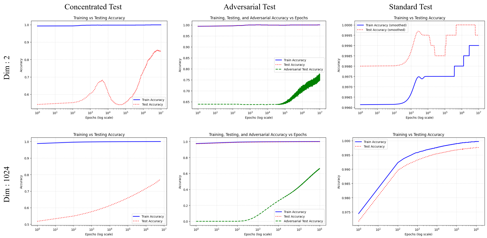
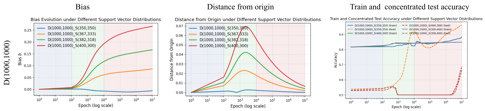
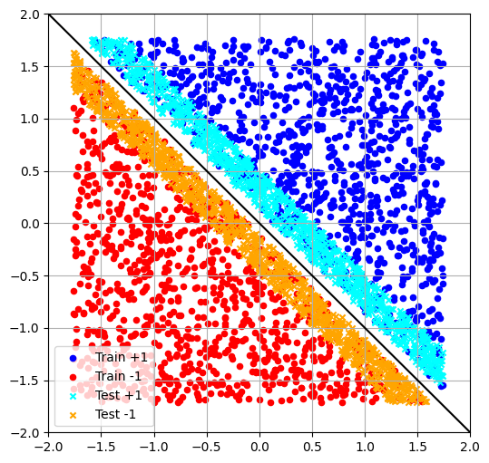
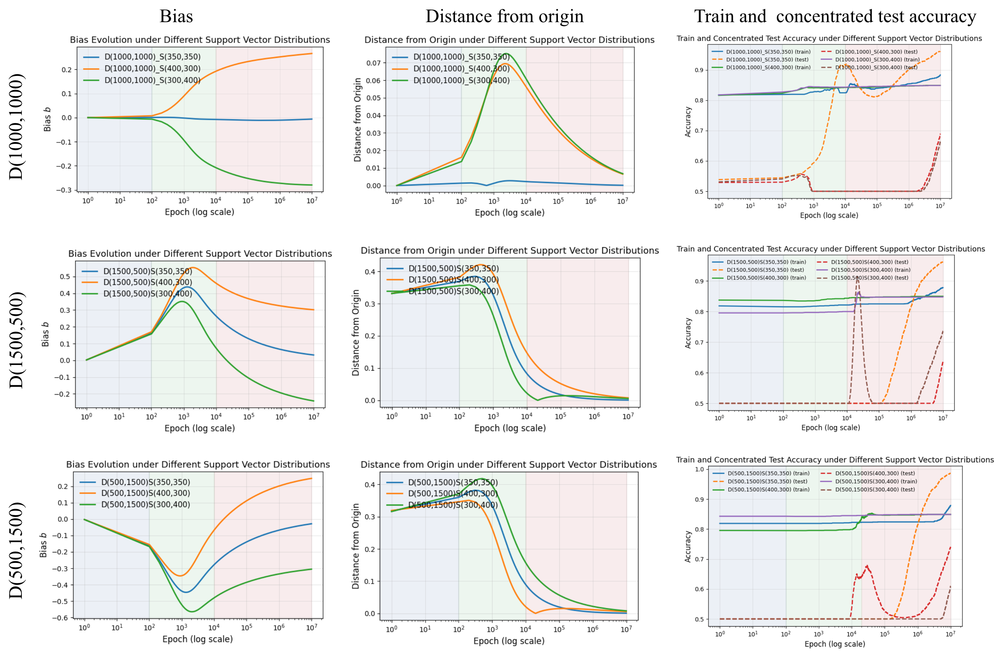

# Das, Vedantam, Lakshminarayanan 2026 — Grokking in Linear Models for Logistic Regression

См. также: [глобальный индекс понятий](../../concepts/index.md).

**Nataraj Das**, **Atreya Vedantam** (равный вклад), **Chandrasekhar Lakshminarayanan** (Indian Institute of Technology Madras, Chennai).

arXiv [2602.08302](https://arxiv.org/abs/2602.08302), февраль 2026 (v1), 15 страниц, 4 рисунка, 1 таблица. Всего цитирований по Semantic Scholar — 0, в картотеке — 0. Предельно простая решаемая модель гроккинга: линейная модель с логистической потерей на линейно разделимых через начало координат данных, где обучаемое смещение $b$ заведомо лишнее — и именно его медленная опорно-векторная динамика порождает задержку. Три фазы (популяционная; опорно-векторное «разучивание», уводящее $b$ от нуля; генерализация, где расстояние гиперплоскости от начала $|b(t)|/||\mathbf{w}(t)||$ убывает как $\mathcal{O}(1/\log t)$ за счёт роста нормы весов), замкнутое решение для $b(t)$ и характеризация времени задержки через перекос опорных векторов $\delta=\sqrt{A_{S}^{-}/A_{S}^{+}}$. Ключевая оговорка: на том же распределении, что обучающее, гроккинга нет — он возникает только на тесте, сжатом в полосу у границы, или на состязательном.

Оригинал и производные файлы этой папки:

- [`original/2602.08302.grokking-in-linear-models-for-logistic-regression.md`](original/2602.08302.grokking-in-linear-models-for-logistic-regression.md) — конверсия оригинала (native arXiv HTML, v1) в Markdown без правок содержания.
- [`2602.08302.grokking-in-linear-models-for-logistic-regression.claims.txt`](2602.08302.grokking-in-linear-models-for-logistic-regression.claims.txt) — пронумерованные утверждения статьи с пометками разбора.
- [`images/`](images/) — 4 рисунка.

Схема якорей и правила ссылок на карточку — в [README папки статей](../README.md).

## Затрагиваемые понятия

**[Гроккинг](../../concepts/grokking.md)** — заявка «гроккинг не требует ни глубины, ни обучения представлений»: задержка возникает в однослойной линейной модели через динамику одного скаляра — смещения $b$, — и раскладывается на три фазы; собственное определение (определение 3.4) меряет времена достижения доли $(1-\epsilon)$ от *супремумов* точностей и требует $T_{te}>\zeta\cdot T_{tr}$ с порогом $\zeta$ порядка $100$ ([`p7-4`](#p7-4)). Разбор: определение считает долю достигнутого супремума, а не абсолютное качество — модель с потолком тестовой точности $0.77$ формально гроккает, если взяла его поздно, и это расширение против Power et al. не проговорено; гроккинг здесь есть только при рассогласовании обучающего и тестового распределений (на стандартном тесте $\zeta=4$ и $1$ — по признанию самой статьи), так что заголовочный тезис читается с оговоркой.

**[Максимизация зазора / имплицитное смещение](../../concepts/margin-maximization-implicit-bias.md)** — вся механика построена на аппарате Soudry et al.: $\mathbf{w}(t)=\hat{\mathbf{w}}\log t+\rho(t)$ с $\rho(t)\to\tilde{\mathbf{w}}$, направление сходится к max-margin сепаратору рано (фаза 1), а поздняя динамика смещения при экспоненциальной потере решается в замкнутом виде: $\frac{db}{dt}=\frac{1}{t}(A_{S}^{+}e^{-b}-A_{S}^{-}e^{b})$ с пределом $b_{\infty}=-\log\delta$ ([`p3-17`](#p3-17)). Разбор: в параметрах модель к обобщающему решению не сходится вовсе ($b\to-\log\delta\neq 0$) — сходимость есть только в нормированном виде $|b|/||\mathbf{w}||$; теорема доказана для экспоненциальной потери, а опыты идут на логистической без оценки погрешности замены; условие Soudry «опорные векторы натягивают данные» для $d=1024$ не проверено (число опорных векторов не сообщено).

**[Двойной спуск](../../concepts/double-descent.md)** — немонотонность тестовой кривой (рост точности → провал в фазе разучивания → поздний подъём) получает здесь замкнутое объяснение для линейного классификатора: асимметрия опорных векторов уводит $b$ от нуля, тестовая точность на сосредоточенном тесте падает до $0.5$, затем рост $||\mathbf{w}||$ возвращает нормированное расстояние к нулю ([`p7-6`](#p7-6)). Разбор: «разучивание» до ровно $0.5$ заложено построением — тестовые точки лежат в полосе $|\mathbf{w}^{\top}\mathbf{x}|\le\alpha\gamma=10^{-2}$, а гиперплоскость уходит от начала до $0.07$, так что вся сбалансированная выборка оказывается по одну сторону.

**[Минимизация нормы весов](../../concepts/weight-norm-minimization.md)** — контрапункт норменной картине корпуса: генерализация здесь наступает не потому, что норма снижается, а потому, что она *растёт* — $||\mathbf{w}(t)||\sim(2/\gamma)\log t$ разбавляет застрявшее смещение, и $|b(t)|/||\mathbf{w}(t)||\to 0$ как $\mathcal{O}(1/\log t)$; weight decay в постановке отсутствует вовсе, его роль играет логарифмический рост нормы ([`p6-3`](#p6-3)). Разбор: перехода lazy-to-rich в линейной модели нет по построению, что отделяет механизм смещения от механизма перехода к богатому режиму; количественное предсказание времени задержки (теорема 4.6) с опытом не сверено ни одним числом — при $\delta\approx 0.87$ формула даёт единицы эпох против наблюдаемых $10^{6}$–$10^{7}$.

## Что показано, а что предположено

Замечания редактора карточки по итогам разбора утверждений (`…claims.txt`, 45 пунктов).

**Ценное — замкнутое решение и управляющий параметр.** Вся немонотонность тестовой кривой объяснена динамикой одного скаляра с явным решением $b(t)$ через $g(t)=2\sqrt{A_{S}^{+}A_{S}^{-}}\log(t/t_{0})$; перекос опорных векторов $\delta$ указан как управляющий параметр длительности задержки, и опыт с посадкой опорных векторов (рис. 2) подтверждает знак зависимости: больше перекос — выше полка смещения, выше пик расстояния от начала, позже растёт тестовая точность. Определение 3.4 с порогом $\zeta\geq 100$ честно калибрует чужие наблюдения ($\zeta=1000$ у Power, $4$ у Gromov, $100$ у Liu на MNIST, $300$ у Thilak). «Отложенная устойчивость» Humayun et al. воспроизведена на одном гиперплане.

**Количественная часть теории с опытом не сверена.** Формула $T_{te}=\exp(|\log\delta|/(1+2\epsilon(2\alpha-1)))$ при $\delta\approx 0.87$ предсказывает единицы эпох против наблюдаемых $10^{6}$–$10^{7}$; из неё выпали $\gamma$, $t_{0}$ и сами $A_{S}^{\pm}$; величина $B$ в границах не определена, а линейная модель точности $Q(t)$ взята без вывода и задаёт $\sup Q=1$, которого опыты не достигают. Резкость границ фаз заложена идеализацией (допущение 4.4), а не выведена.

**Внутренние нестыковки.** Обучающие кривые на рисунках выходят на полку $0.82$–$0.88$, а не «почти идеальную» — спасает только супремум в определении; границы фаз на затенении рисунков ($10^{2}$, $10^{4}$) расходятся с текстом ($5\times 10^{3}$, $5\times 10^{4}$); раздел 6 сообщает гроккинг состязательных данных «и с обучаемым смещением, и без» — но без смещения заявленный механизм не необходим, и случай не объяснён; $\mathbf{w}_{\text{true}}$ нормирован то $1/\sqrt{n}$, то $1/\sqrt{2}$ (при $d=1024$ ни то ни другое не даёт единичную норму); сбиты внутренние ссылки (вклад 1 приписывает теореме 4.5 результат Soudry; «Theorem (6)»; перекос к $-1$ записан неравенством перекоса к $+1$); прогон один, семя фиксировано.

**Как работу будут цитировать** («гроккинг доказан для логистической регрессии; глубина не нужна») — точнее: при данных, разделимых через начало, заведомо лишнем обучаемом смещении и тестовой выборке, сжатой в полосу $\alpha\gamma$ у границы, задержка возникает и раскладывается на три фазы; на самом обучающем распределении её нет, а количественное предсказание времени задержки с опытом не сверено.

---

# Текст статьи

## Гроккинг в линейных моделях для логистической регрессии

**Nataraj Das** (Indian Institute of Technology Madras, Chennai; переписка: da23d404@smail.iitm.ac.in), **Atreya Vedantam** (Indian Institute of Technology Madras, Chennai; переписка: ee22b004.smail.iitm.ac.in), **Chandrasekhar Lakshminarayanan** (Indian Institute of Technology Madras, Chennai; переписка: chandrashekar@iitm.ac.in)

\* Равный вклад.

## Аннотация

Гроккинг, явление отложенной генерализации, часто приписывают глубине и композиционному устройству глубоких нейронных сетей. Мы изучаем гроккинг в одной из простейших возможных постановок: обучение линейной модели с логистической потерей для бинарной классификации на данных, линейно (и с максимальным зазором) разделимых относительно начала координат. Мы исследуем три тестовых режима: (1) тестовые данные из того же распределения, что обучающие, — в этом случае гроккинг не наблюдается; (2) тестовые данные, сосредоточенные у зазора, — в этом случае гроккинг наблюдается; и (3) состязательные тестовые данные, порождённые атаками проецируемого градиентного спуска (PGD), — в этом случае гроккинг также наблюдается. Мы теоретически показываем, что имплицитное смещение градиентного спуска порождает трёхфазный процесс обучения — популяционно-доминируемый, опорно-векторное разучивание и опорно-векторную генерализацию, — в ходе которого может возникать отложенная генерализация. Наш анализ далее связывает появление гроккинга с асимметриями данных — и в числе примеров на класс, и в распределении опорных векторов по классам — и даёт характеризацию времени гроккинга. Мы экспериментально подтверждаем нашу теорию, подсаживая разные распределения популяционных точек и опорных векторов и анализируя кривые точности и динамику гиперплоскости. В целом наши результаты демонстрируют, что гроккинг не требует глубины или обучения представлений и может возникать даже в линейных моделях через динамику члена смещения.

##### Ключевые слова:

Machine Learning

## 1 Введение

Одно из самых разительных свойств современных систем машинного обучения — их способность обобщаться с конечных обучающих данных (Neyshabur et al. 2017; Zhang et al. 2017; Papyan et al. 2020; Ma et al. 2018; Kaplan et al. 2020). Недавние работы раскрыли контринтуитивное явление, при котором модели достигают почти идеального качества на обучающем наборе задолго до осмысленных улучшений на тестовых данных. Это поведение отложенной генерализации теперь обычно называют *гроккингом* (Junior et al. 2025). Несмотря на растущие эмпирические и теоретические свидетельства по архитектурам и задачам (Tan & Huang 2024; Fan et al. 2024; Mohamadi et al. 2024), полное принципиальное теоретическое понимание гроккинга остаётся неполным.

Гроккинг был впервые описан (Power et al. 2022) в трансформерных моделях, обучаемых на задачах модульной арифметики. Последующие работы задокументировали гроккинг в широком спектре архитектур, наборов данных и режимов оптимизации и предложили различные механистические объяснения (Nanda et al. 2023; Lyu et al. 2024). Недавно вырос интерес к пониманию гроккинга (Davies et al. 2023; Doshi et al. 2024; DeMoss et al. 2025) через аналитически податливые модели, изолирующие существенные ингредиенты, ответственные за отложенную генерализацию.

В этой работе мы изучаем гроккинг в одной из простейших возможных постановок бинарной классификации: линейная модель, обучаемая логистической потерей на данных, линейно разделимых (и с максимальным зазором) через начало координат. Хотя данные допускают разделяющую гиперплоскость с нулевым смещением, обучаемая модель включает обучаемый параметр смещения. Это на вид безобидное рассогласование оказывается достаточным, чтобы породить богатую обучающую динамику и, при подходящих тестовых распределениях, отложенную генерализацию. Эти результаты указывают, что отложенная генерализация не обязана опираться на глубину или обучение представлений и может возникать уже в простых линейных моделях через одну лишь динамику оптимизации.

Ключевое прозрение нашего анализа: гроккинг в этой постановке движется прежде всего динамикой члена смещения, а не продолжающейся эволюцией вектора весов. Тогда как вес следует классической max-margin траектории и рано стабилизируется по направлению, смещение претерпевает более медленную, опорно-векторную эволюцию, которая правит отложенной генерализацией.

**[p. 2]**

Наши вклады можно свести к следующему.

1. **Трёхфазная обучающая динамика.** Мы показываем в теореме 4.5, что в нашей постановке вектор весов следует той же асимптотической траектории, что охарактеризована Soudry et al. 2024: его норма растёт как $\log t$, а направление сходится к сепаратору максимального зазора. Мы называем этот режим *фазой 1*. Затем мы характеризуем эволюцию члена смещения после фазы 1 в теореме 4.5. Используя эту характеризацию, мы показываем, что обучение проходит через две дополнительные фазы: в *фазе 2* смещение отклоняется от обобщающего решения, а в *фазе 3* оно восстанавливается и сходится обратно. Мы показываем, что когда гроккинг происходит, он возникает в фазах 2 и 3.
2. **Факторы, влияющие на гроккинг.** Тогда как фаза 1 движется всем обучающим набором, фазы 2 и 3 правятся исключительно опорными векторами. Используя теорему 4.5, мы показываем, что асимметрии данных — и перекос классов в популяции, и перекос среди опорных векторов — прямо влияют на то, происходит ли гроккинг, и формируют получающуюся динамику.
3. **Время гроккинга.** Мы формально определяем гроккинг в определении 3.4. В теореме 4.6 мы даём характеризацию времени гроккинга, количественно выражая задержку между достижением почти идеальной обучающей точности и почти оптимальной тестовой, и явно связываем её со свойствами опорных векторов и тестового распределения.
4. **Численные опыты.** Мы эмпирически подтверждаем наши теоретические предсказания. Для ясности изложения мы рассматриваем три типа тестовых данных: (i) *стандартные*, где тестовое распределение совпадает с обучающим; (ii) *сосредоточенные*, где данные разделимы с тем же зазором, что обучающие, но сосредоточены у решающей границы; и (iii) *состязательные*, порождённые атаками проецируемого градиентного спуска. Мы не наблюдаем гроккинга в стандартной постановке, но наблюдаем ясное гроккинговое поведение и в сосредоточенной, и в состязательной постановках. Более того, когда гроккинг происходит, наблюдаемая динамика тесно согласуется с предсказаниями нашей теории.

## 2 Связанные работы

Явление гроккинга привлекло значительное внимание с момента открытия, однако прежние работы оставались преимущественно эмпирическими или ограниченными конкретными архитектурными допущениями. Наша работа даёт понимание гроккинга в одной обучаемой гиперплоскости на линейно разделимых данных.

Когда (Power et al. 2022) представили гроккинг, они наблюдали, что оптимизация, требуемая для генерализации, растёт при уменьшении размера набора данных, но не дали теоретического обоснования. Мы выводим выражения в замкнутой форме для времени гроккинга как функции перекоса опорных векторов и чувствительности сосредоточения у зазора (теорема (4.6)).

(Liu et al. 2022) эмпирически связали генерализацию со структурированными эмбеддингами и установили критический размер обучения, за которым гроккинг исчезает; (Gromov 2023) сделал сходные наблюдения. Мы находим связь между числом опорных векторов и обучением в разд. (5).

Несколько исследований предложили механизмы гроккинга: (Thilak et al. 2022) предположили механизм «слингшота», (Liu et al. 2023) предложили LU-механизм с «зоной Златовласки» в пространстве весов, а (Kumar et al. 2024) связали гроккинг с переходами от ленивой к богатой обучающей динамике. Наша работа показывает, что гроккинг в нашей постановке возникает из имплицитного смещения градиентного спуска, проявляясь как три различные фазы обучения — популяционно-доминируемая, опорно-векторное разучивание и опорно-векторная генерализация (теорема 4.5).

Недавние усилия анализировали податливые модели: (Levi et al. 2023) изучили линейную регрессию, (Beck et al. 2025) приписали гроккинг размерности данных, а (Žunkovič & Ilievski 2022) вычислили вероятности гроккинга для конкретных наборов.

Связь двойного спуска (Nakkiran et al. 2019) и гроккинга исследовалась (Davies et al. 2023), но без теоретического обоснования. Теорема 4.5 объясняет, почему следует ожидать этого поведения в нашей постановке.

(Humayun et al. 2024) эмпирически изучили состязательную устойчивость в глубоких сетях. Мы эмпирически наблюдаем состязательную устойчивость даже в нашем сценарии, утверждая, что это явление не ограничено глубокими сетями.

Наша теоретическая машинерия строится на динамике позднего времени, изученной (Ji & Telgarsky 2019) и (Soudry et al. 2024). Из асимптотического поведения мы изучаем конечновременную градиентную динамику в разных фазах.

## 3 Постановка модели и обозначения

Мы рассматриваем линейно разделимый обучающий набор $\mathcal{D}=\{(\mathbf{x}_{1},y_{1}),(\mathbf{x}_{2},y_{2}),\ldots,(\mathbf{x}_{N},y_{N})\}$, где признаки $x_{i}\in\mathbb{R}^{d}$, метки $y_{i}\in\{-1,1\}$ и точка данных $(x_{i},y_{i})\sim\mathcal{P}$. Данные имеют разделяющую гиперплоскость, проходящую через начало координат. Более того, набор имеет зазор разделения $\gamma>0$: все точки лежат не менее чем в $\gamma/2>0$ по обе стороны этой разделяющей гиперплоскости. Формально:

##### **Допущение 3.1** (разделимость и зазор)**.**

Данные линейно разделимы относительно начала координат, и SVM-решение максимального зазора проходит через начало. То есть $\exists\mathbf{w}_{*}\in\mathbb{R}^{d}$ **[p. 3]** такой, что $||\mathbf{w}_{*}||=1$ и $\forall\mathbf{x}_{i},y_{i}\mathbf{w}_{*}^{\top}\mathbf{x}_{i}\geq\gamma/2$. Также для любых $\mathbf{w}_{s}\in\mathbb{R}^{d}$ и $b_{s}\in\mathbb{R}$ таких, что $\forall\mathbf{x}_{i},y_{i}(\mathbf{w}_{s}^{\top}\mathbf{x}_{i}+b_{s})\geq 1$ и $||\mathbf{w}_{s}||$ минимальна, $b_{s}=0$.

##### **Допущение 3.2****.**

Пусть $\mathcal{S}=\{\mathbf{x}_{s_{1}},\mathbf{x}_{s_{2}},\ldots,\mathbf{x}_{s_{k}}\}\subset\{\mathbf{x}_{1},\ldots,\mathbf{x}_{N}\}$ — опорные векторы, такие что $\mathbf{w}_{*}=\sum_{i=1}^{k}\alpha_{i}y_{s_{i}}\mathbf{x}_{s_{i}}$.

Наконец, мы предполагаем, что распределение имеет конечный носитель.

##### **Допущение 3.3** (конечный носитель)**.**

Существует закреплённое $R>0$ такое, что $||\mathbf{x}_{i}||<R$ для всех $i$.

Мы обозначаем обучающую и тестовую точности как функции времени (меряемого числом эпох) через $P(t)$ и $Q(t)$ соответственно. Мы определяем *гроккинг* следующим образом:

##### **Определение 3.4** (гроккинг)**.**

Для данного $\epsilon>0$ определим $T_{tr}(\epsilon)$ и $T_{te}(\epsilon)$ как времена достижения обучающей и тестовой точностями доли $(1-\epsilon)$ их супремумов.

$$
T_{tr}(\epsilon)=P^{-1}((1-\epsilon)\sup_{t}P(t)) \tag{1} \\
T_{te}(\epsilon)=Q^{-1}((1-\epsilon)\sup_{t}Q(t)) \tag{2}
$$

когда обратные существуют, и наименьший из прообразов иначе. Тогда говорят, что модель гроккает с задержкой $\zeta>0$, если $\exists\epsilon_{0}>0$ такое, что $\forall 0<\epsilon<\epsilon_{0}$, $T_{te}(\epsilon)>\zeta\cdot T_{tr}(\epsilon)$. Время гроккинга определяется как $T_{gr}(\epsilon)=T_{te}(\epsilon)-T_{tr}(\epsilon)$.

**Замечание 1:** Насколько нам известно, единого определения гроккинга в литературе нет. Однако в свете нашего определения можно сказать, что (Levi et al. 2023; Manning-Coe et al. 2025) используют $\epsilon=0.05$, а (Žunkovič & Ilievski 2022) — $\epsilon=0$.

**Замечание 2:** Аналогично употребление термина «задержка» весьма субъективно. (Power et al. 2022) наблюдали $\zeta=1000$, (Gromov 2023) наблюдал $\zeta=4$, (Liu et al. 2022) наблюдали гроккинг на MNIST с $\zeta=100$, а (Thilak et al. 2022) наблюдали $\zeta=300$. Приведённое определение вмещает все наблюдения и делает точным наш подразумеваемый порог «задержки». В этой статье, если $\zeta$ не порядка $100$ или больше, мы не считаем обучающую динамику представляющей гроккинг.

*Рисунок 1: **Гроккинг с обучаемым смещением. Мы анализируем гроккинг в трёх сценариях: (1) когда тестовые данные взяты из того же распределения, что тестовые данные (справа); (2) когда тестовые данные распределены вокруг оптимального сепаратора (чувствительное распределение) (слева); (3) состязательные тестовые данные, порождённые атаками *Project Gradient Descent* (в центре). Мы видим, что модель гроккает на сосредоточенных и состязательных тестовых данных, тогда как на стандартных тестовых данных это не наблюдается.*** **[p. 4]**

**Модель:** Мы рассматриваем линейную модель со смещением, чьё предсказание для входа $\mathbf{x}_{i}\in\mathbb{R}^{d}$ даётся $\hat{y}(\mathbf{x}_{i};w,b)=w^{\top}\mathbf{x}_{i}+b$, где $w\in\mathbb{R}^{d}$ и $b\in\mathbb{R}$ — вектор весов и смещение соответственно.

**Потеря:** Нас интересует минимизация следующей функции потерь

$$
\mathcal{L}(\mathbf{w},b)=\sum_{i=1}^{N}l(y_{i}(\mathbf{w}^{\top}\mathbf{x}_{i}+b)) \tag{3}
$$

где $l(x)=\log(1+\exp({-x}))$ — логистическая потеря.

**Градиентное обновление:** Мы оптимизируем эту потерю градиентным спуском

$$
\mathbf{w}(t+1)=\mathbf{w}(t)-\eta\nabla_{\mathbf{w}}\mathcal{L}(\mathbf{w},b) \tag{4} \\
b(t+1)=b(t)-\eta\nabla_{b}\mathcal{L}(\mathbf{w},b). \tag{5}
$$

## 4 Смещение модели обучается в три фазы

Начнём с ключевого свойства нашей постановки: хотя обучающие данные линейно разделимы через начало координат и потому допускают сепаратор с нулевым смещением, обучаемая модель включает обучаемый параметр смещения. При оптимизации логистической потери градиентным спуском под этим рассогласованием возникает несколько естественных и взаимосвязанных вопросов о получающейся обучающей динамике.

Во-первых, как вектор весов $\mathbf{w}(t)$ эволюционирует во времени? Этот вопрос тщательно проанализирован Soudry et al. 2024, и мы кратко напоминаем относящиеся результаты в разделе (4.1). Во-вторых, как член смещения $b(t)$ эволюционирует под градиентным спуском? Наш главный теоретический вклад отвечает на этот вопрос; мы характеризуем динамику $b(t)$ и её асимптотическое поведение в разделе (4.2), увенчивая теоремой (4.5).

В-третьих, как взаимодействие динамик $\mathbf{w}(t)$ и $b(t)$ влияет на генерализацию и порождает гроккинг? В разделах (4.3), (4.4) и (4.5) мы отвечаем на этот вопрос, доказывая — с помощью теоремы (4.5), — что обучение проходит через три различные фазы: начальную популяционно-доминируемую, опорно-векторное разучивание и финальную фазу, в которой и $\mathbf{w}(t)$, и $b(t)$ сходятся к обобщающему решению.

Наконец, сколько времени занимает этот процесс? В частности, что определяет время гроккинга — задержку между достижением почти идеальной обучающей точности и почти оптимальной тестовой? Мы показываем, что время гроккинга правится динамикой позднего времени члена смещения в опорно-векторных фазах, и делаем эту зависимость явной в разделе (4.6).

### 4.1 Прежние результаты из Soudry et al. 2024

##### **Теорема 4.1** (переформулировка теоремы 3 из (Soudry et al. 2024))**.**

###### p3-17

*Для любой гладкой монотонно убывающей функции потерь с экспоненциальным хвостом и при малой скорости обучения итерации градиентного спуска следуют*

$$
\mathbf{w}(t)=\hat{\mathbf{w}}\log(t)+\rho(t) \tag{6}
$$

*где $\hat{w}$ даётся*

$$
\hat{\mathbf{w}}=\arg\min||\mathbf{w}||^{2}+b^{2}\text{ s.t. }y_{i}(\mathbf{w}^{\top}\mathbf{x}+b)\geq 1 \tag{7}
$$

*и $\rho(t)$ имеет ограниченную норму.*

**[p. 4]**

Мы подчёркиваем, что это в общем случае не hard-margin SVM-решение $\mathbf{w}_{SVM}$. Однако при допущении (3.1) они равны.

Чтобы проанализировать обучающую динамику и показать гроккинг, мы сначала опишем сходимость $\rho(t)$.

##### **Теорема 4.2** (переформулировка теоремы 4 из (Soudry et al. 2024))**.**

*Если опорные векторы натягивают набор данных и $\hat{\mathbf{w}}=\sum_{\mathcal{S}}\alpha_{i}y_{s_{i}}\mathbf{x}_{s_{i}}$, то $\lim_{t\to\infty}\rho(t)=\tilde{\mathbf{w}}$, где*

$$
\eta\exp\!\left(-\mathbf{x}_{s_{i}}^{\top}\tilde{\mathbf{w}}\right)=\alpha_{i} \tag{8}
$$

### 4.2 Наш теоретический результат о фазах обучения

##### **Теорема 4.3****.**

*При допущениях (3.1) и (3.2) SVM-решение, даваемое*

$$
\mathbf{w}_{SVM}=\arg\min||\mathbf{w}||^{2}\text{ s.t. }y_{i}(\mathbf{w}^{\top}\mathbf{x}+b)\geq 1 \tag{9}
$$

*равно $\hat{\mathbf{w}}$.*

##### Доказательство.

Из (3.1) и (3.2) решение (9) есть некоторое $(\mathbf{w}_{SVM},0)$. Значит, для всех допустимых $(\mathbf{w},b)$ из оптимальности $(\mathbf{w}_{SVM},0)$ имеем $||\mathbf{w}||^{2}\geq||\mathbf{w}_{SVM}||^{2}$. Заметим, что задачи (7) и (9) имеют одну допустимую область. Значит, для всех допустимых $(\mathbf{w},b)$ задачи (7) также имеем $||\mathbf{w}||^{2}+b^{2}\geq||\mathbf{w}||^{2}\geq||\mathbf{w}_{SVM}||^{2}+0^{2}$, откуда $(\mathbf{w}_{SVM},0)$ оптимизирует и (7). Поскольку (7) — строго выпуклая задача оптимизации, её решение единственно. Значит, $\hat{\mathbf{w}}=\mathbf{w}_{SVM}$. ∎

Как обсуждалось выше, обучающая динамика естественно делится на три фазы. Фаза 1 диктуется всем обучающим набором и полностью характеризуется результатами Soudry et al. 2024, напомненными в разделе (4.1). Фазы 2 и 3 наступают после сходимости остаточного члена $\rho(t)$ к предельному значению $\tilde{\mathbf{w}}$. Хотя в действительности динамика эволюционирует непрерывно и переходы между фазами постепенны, ради педагогической ясности мы идеализируем процесс, предполагая существование конечного времени $t_{0}$, отмечающего конец фазы 1. Эта идеализация схвачена следующим допущением.

##### **Допущение 4.4** (динамика позднего времени)**.**

Существует время $t_{0}$ такое, что выполняется следующее:

1. $\rho(t)=\tilde{\mathbf{w}}$ для всех $t\geq t_{0}$.
2. Для всех $\mathbf{x}_{i}\notin\mathcal{S}$ имеем

$$
\exp\!\big(-\mathbf{w}(t)^{\top}\mathbf{x}_{i}\big)=0\qquad\text{for all }t\geq t_{0},
$$

 где $\mathcal{S}$ обозначает множество опорных векторов.
3. Вектор весов сошёлся по направлению:

$$
\frac{\mathbf{w}(t)}{||\mathbf{w}(t)||}=\frac{\hat{\mathbf{w}}}{||\hat{\mathbf{w}}||}.
$$

##### **Теорема 4.5****.**

*Пусть $\mathcal{S}^{+}$ и $\mathcal{S}^{-}$ — все опорные векторы классов $1$ и $-1$ соответственно. Пусть используется экспоненциальная потеря $l(x)=\exp({-x})$. Определим $A_{S}^{+}=\sum_{i\in S^{+}}\exp\!\left(-\tilde{\mathbf{w}}^{\top}\mathbf{x}_{i}\right)$ и $A_{S}^{-}=\sum_{i\in S^{-}}\exp\!\left(\tilde{\mathbf{w}}^{\top}\mathbf{x}_{i}\right)$, где $\tilde{\mathbf{w}}$ определён выше. Определим $\delta=\sqrt{\frac{A_{S}^{-}}{A_{S}^{+}}}$ и $g(t)$ как*

$$
g(t)=2\sqrt{A_{S}^{+}A_{S}^{-}}\log\left(\frac{t}{t_{0}}\right)
$$

**[p. 5]**

*где $t_{0}$ — время начала динамики позднего времени. В этом режиме мы предполагаем, что $\rho(t)$ сошёлся к $\tilde{\mathbf{w}}$. Далее, только опорные векторы вносят вклад в градиент. Тогда поздняя градиентно-потоковая динамика смещения следует*

$$
\frac{db}{dt}=\frac{1}{t}\left(A_{S}^{+}\exp({-b})-A_{S}^{-}\exp({b})\right). \tag{10}
$$

*Интегрируя, $b(t)$ эволюционирует как*

$$
b(t)=\log\!\left(\frac{(1+\delta e^{b_{0}})\exp({g(t)})-(1-\delta e^{b_{0}})}{(1+\delta e^{b_{0}})\exp({g(t)})+(1-\delta e^{b_{0}})}\right)-\log\delta. \tag{11}
$$

*Следовательно, $b(t)$ сходится к $b_{\infty}=-\log\delta$.*

##### **Набросок доказательства:**.

Мы даём набросок доказательства (полное доказательство — в теореме A.1). Экспоненциальная потеря $\mathcal{L}(\mathbf{w},b)=\sum_{i}\exp\!\left(-y_{i}(\mathbf{w}^{\top}\mathbf{x}_{i}+b)\right)$ приближает логистическую в динамике позднего времени. Тогда градиентный спуск (4) принимает вид

$$
b(t+1)=b(t)+\eta\sum_{i}y_{i}e^{-y_{i}(\mathbf{w}(t)^{\top}\mathbf{x}_{i}+b)}
$$

При достаточно малых скоростях обучения это приближается к градиентному потоку

$$
\frac{db}{dt} =\sum_{i}y_{i}e^{-y_{i}(\mathbf{w}(t)^{\top}\mathbf{x}_{i}+b)} \tag{12} \\
=\sum_{y_{i}=+1}e^{-(\mathbf{w}(t)^{\top}\mathbf{x}_{i}+b)}-\sum_{y_{i}=-1}e^{(\mathbf{w}(t)^{\top}\mathbf{x}_{i}+b)} \tag{13} \\
=\left(\sum_{y_{i}=+1}e^{-\mathbf{w}(t)^{\top}\mathbf{x}_{i}}\right)e^{-b}-\left(\sum_{y_{i}=-1}e^{\mathbf{w}(t)^{\top}\mathbf{x}_{i}}\right)e^{b} \tag{14}
$$

Для динамики позднего времени $\rho(t)$ сошёлся к $\tilde{\mathbf{w}}$. Также $\mathbf{w}(t)=\hat{\mathbf{w}}\log t+\rho(t)$. Подставляя, получаем уравнение (10) (поскольку вклад дают только опорные векторы). Интегрирование (10) даёт (11). ∎

**Наблюдение:** Уравнение 14 несёт богатый смысл. Определим $A^{+}=\sum_{y_{i}=+1}e^{-\mathbf{w}(t)^{\top}\mathbf{x}_{i}}$ и $A^{-}=\sum_{y_{i}=-1}e^{\mathbf{w}(t)^{\top}\mathbf{x}_{i}}$.

Для набора со сбалансированными классами $A^{+}\approx A^{-}$. Это потому, что обучающая популяция в среднем симметрична, и сложение цены $e^{\pm\mathbf{w}(t)^{\top}\mathbf{x}_{i}}$ по каждому классу для каждой точки даст сходные значения. По аналогичному доводу для набора с перекосом классов к $+1$ ($-1$) имеем $A^{+}>A^{-}$ ($A^{+}>A^{-}$).

Вооружившись этим наблюдением, обсудим фазы 1, 2 и 3.

### 4.3 Фаза 1: популяционно-доминируемая

В ранней динамике (14) $A^{+}$ и $A^{-}$ меняются со временем по мере эволюции $\mathbf{w}$. Мы также наблюдаем из теоремы (6), что поскольку $||\mathbf{w}||$ эволюционирует примерно как $\mathcal{O}(\log t)$, а $A^{+}$ и $A^{-}$ зависят от (преимущественно положительных) скалярных произведений с $\mathbf{w}$, в среднем оба убывают со временем. Теперь для разных размеров классов в наборе возможны разные эволюции ранней динамики.

- **Классы сбалансированы**: в этом случае $A^{+}\approx A^{-}$. Значит, в среднем $\frac{db}{dt}\propto e^{-b}-e^{b}$. Это быстро приводит $b$ к $0$ независимо от инициализации. Значит, всю раннюю динамику $b$ остаётся около нуля.
- **Перекос классов к $+1$**: в этом случае $A^{+}>A^{-}$. Теперь ранняя динамика больше не тянет $b$ к $0$. Вместо этого стационарное решение $b=0.5\log(A^+/A^-)>0$. Значит, независимо от инициализации смещение притягивается к этому значению.
- **Перекос классов к $-1$**: в этом случае $A^{+}<A^{-}$. Держится то же рассуждение. Теперь стационарное решение ранней динамики $b=0.5\log(A^+/A^-)<0$.

### 4.4 Фазы 2 и 3: опорно-векторные

В поздней динамике (14) все, кроме опорных векторов, не вносят ничего в $A^{+}$ и $A^{-}$, и те сходятся к $A_{S}^{+}$ и $A_{S}^{-}$ соответственно. Подобно наблюдению об $A^{+}$ и $A^{-}$, мы замечаем, что $A_{S}^{+}$ и $A_{S}^{-}$ затухают со временем. Это затухание есть $\mathcal{O}(1/t)$, что явно видно в этой фазе обучения из применения (6) к (14) (см. (10)).

Теперь, независимо от баланса классов, опорные векторы в обучающих данных могут быть сбалансированы симметрично или асимметрично (значительно больше опорных векторов одного класса, чем другого). Симметричный баланс не обязательно означает распределенческую симметрию, но при достаточно большом числе опорных векторов это примерно верно.

В каждом из этих случаев поздняя динамика эволюционирует по-разному.

- **Симметрично сбалансированные опорные векторы**: в этом случае $A_{S}^{+}\approx A_{S}^{-}$. Подобно первому случаю ранней динамики, $\frac{db}{dt}\propto e^{-b}-e^{b}$. Независимо от популяционного баланса классов этот режим тянет $b$ к $0$. Однако $\frac{db}{dt}$ может затухнуть быстро, и умирающая попытка градиента дотолкать его до $0$ может не удаться.
- **Асимметрично больше опорных векторов класса $+1$**: в этом случае $A_{S}^{+}>A_{S}^{-}$. Поздняя динамика поэтому заставляет $b$ осесть в $b_{\infty}=0.5\log(A_S^+/A_S^-)>0$ независимо от ранней динамики. **[p. 6]** Заметим: в отличие от стационарного состояния ранней динамики, смещение не обязательно достигает этого значения (градиент может исчезнуть раньше).
- **Асимметрично больше опорных векторов класса $-1$**: в этом случае $A_{S}^{+}<A_{S}^{-}$. Значит, $b_{\infty}=0.5\log(A_S^+/A_S^-)<0$. Это обсуждение мотивирует определение полезной величины, используемой в теореме (4.5): $\delta=\sqrt{A_{S}^{-}/A_{S}^{+}}$.

Обсуждение выше интуитивно объясняет, почему предел позднего времени (11) есть $b_{\infty}=-\log\delta$.

### 4.5 Влияние фаз обучения на гроккинг

Теперь проанализируем влияние этих фаз обучения на тестовую точность.

###### p6-3

- **Популяционно-доминируемая фаза**: в ранней динамике $\mathbf{w}$ сходится к $\hat{\mathbf{w}}$ по направлению, что вызывает некоторый рост тестовой точности. Смещение либо остаётся в $0$ для классово сбалансированных наборов, либо уходит к $b=0.5\log(A^+/A^-)$ для несбалансированных. Это слегка ухудшает точность, но действие обеих динамик в тандеме держит тестовую точность примерно постоянной.
- **Опорно-векторный режим разучивания**: в отличие от предыдущей фазы, в поздней динамике $\mathbf{w}$ больше не вращается. Асимметрия между $A_{S}^{+}e^{-b}$ и $A_{S}^{-}e^{b}$ уводит $b$ от обобщающего решения $b=0$. Тестовое качество в этом режиме поэтому определённо ухудшается. Мы называем это режимом разучивания.
- **Опорно-векторный режим генерализации**: пока $b$ сходится к $0.5\log(A_S^+/A_S^-)$, заметим, что $||\mathbf{w}||$ растёт логарифмически. Поскольку гиперплоскость параллельна оптимальному сепаратору максимального зазора, тестовое качество зависит только от расстояния гиперплоскости от начала (то есть $|b(t)|/||\mathbf{w}(t)||$), которое уходит к нулю как $\mathcal{O}(1/\log t)$. Мы называем это режимом генерализации.

### 4.6 Наш теоретический результат о времени гроккинга

*Рисунок 2: **Распределения опорных векторов влияют на время гроккинга. (a) Смещение (слева), (b) расстояние от начала (в центре), (c) обучающая и сосредоточенная тестовая точность (справа) против числа эпох при разных числах положительных и отрицательных опорных векторов, где D(1000,1000) означает 1000 точек положительного класса и 1000 точек отрицательного. Аналогично S(350,350) означает 350 опорных векторов положительного класса и 350 отрицательного. Три затенённые области отвечают фазам 1, 2, 3 соответственно на всех графиках.*** **[p. 7]**

##### **Теорема 4.6****.**

*Существует достаточно малое $\epsilon_{0}$ такое, что $\forall\epsilon<\epsilon_{0}$ имеем следующие границы на $T_{te}(\epsilon)$:*

$$
T_{te}(\epsilon)\leq\exp\left(\frac{\gamma B}{2}+\frac{|\log\delta|}{1+2\epsilon(2\alpha-1)}\right) \tag{15} \\
T_{te}(\epsilon)\geq\exp\left(-\frac{\gamma B}{2}+\frac{|\log\delta|}{1+2\epsilon(2\alpha-1)}\right) \tag{16}
$$

*Следовательно, для достаточно малого $\gamma$ имеем*

$$
T_{te}(\epsilon)=\exp\left(\frac{|\log\delta|}{1+2\epsilon(2\alpha-1)}\right)
$$

Подробное доказательство — в приложении A.2. Для очень малого $\gamma$ мы видим, что границы времени гроккинга зажимают его, позволяя оценку. Мы наблюдаем зависимость от $\log\delta$.

##### *Замечание 4.7**.*

Если $R/\gamma$ велико, $T_{te}(\epsilon)>>T_{tr}(\epsilon)$. Отсюда $T_{gr}(\epsilon)\approx T_{te}(\epsilon)$.

Чтобы продемонстрировать справедливость теоремы, мы используем набор со сбалансированными классами и разными значениями $\log\delta$. Мы управляем этим, подсаживая разное отношение опорных векторов в каждом классе, что является мерой $\delta$. Графики показаны на рисунке (2). Подробности реализации — в приложении.

###### p6-9

- Мы наблюдаем, что больший перекос опорных векторов (отвечающий большему $\delta$) заставляет смещение застаиваться на большем значении, как предсказано теоретически.
- Это заставляет гиперплоскость уйти дальше от начала перед выучиванием обобщающего решения. Это увеличивает время гроккинга, как предсказано теоретически.

Итак, мы теоретически показываем, что время гроккинга зависит от перекоса опорных векторов (связанного с $\delta$) и параметра чувствительности ($\alpha$).

## 5 Выбор набора данных и экспериментальные результаты

Прохождение процесса обучения через две фазы и режимы занимает время. Поэтому генерализация в гроккинге отложена. Теперь нас интересует зависимость времени гроккинга от структуры данных. Для этого мы рассматриваем конкретные распределения $\mathcal{P}$ и $\mathcal{P}_{conc}$, эмпирически наблюдаем кривые точности и теоретически выводим выражение для времени гроккинга.

*Рисунок 3: **Набор данных. Выбранные обучающее и тестовое распределения, выборки $\mathcal{P}$ и $\mathcal{P}_{conc}$ в размерности $d=2$ (преувеличено для наглядности). Поскольку $\mathcal{P}_{conc}$ сосредоточено вокруг сепаратора, оно чувствительно к плохо обобщающим решениям.*** **[p. 7]**

### 5.1 Подробности распределений набора

- **Тестовое распределение $\mathcal{P}$** [Standard Test]: выборки $\mathbf{x}\sim\mathcal{P}$ берутся равномерно из $d$-мерного гиперкуба $[-5,5]^{d}$. Разделяющая гиперплоскость задана $\mathbf{w}_{\text{true}}^{\top}\mathbf{x}=0$, где

$$
\mathbf{w}_{\text{true}}=\frac{1}{\sqrt{n}}[1,\ldots,1]^{\top}\in\mathbb{R}^{d}.
$$

 Набор удовлетворяет условию зазора с зазором $\gamma=10^{-3}$. Метки назначаются как

$$
y=\begin{cases}+1,&\text{if }\mathbf{w}_{\text{true}}^{\top}\mathbf{x}\geq\gamma/2,\\
-1,&\text{if }\mathbf{w}_{\text{true}}^{\top}\mathbf{x}\leq-\gamma/2.\end{cases}
$$
**[p. 7]**

- **Чувствительное распределение $\mathcal{P}_{conc}$** [Concentrated Test]: распределение $\mathcal{P}_{conc}$ сосредотачивает массу у решающей границы. Выборки удовлетворяют

$$
\gamma/2\leq\mathbf{w}_{\text{true}}^{\top}\mathbf{x}\leq\alpha\gamma\quad\text{(class }+1),
$$

$$
-\alpha\gamma\leq\mathbf{w}_{\text{true}}^{\top}\mathbf{x}\leq-\gamma/2\quad\text{(class }-1),
$$

 где $\alpha$ управляет тяжестью сдвига распределения и установлено $\alpha=10$. Мы называем $\alpha$ *параметром чувствительности*.
- **Состязательное распределение $\mathcal{P}_{\text{PGD}}$**: стартуя с выборок базового распределения $\mathcal{P}$, мы порождаем состязательные примеры атакой проецируемого градиентного спуска (PGD). Каждая выборка возмущается в ограниченном $\ell_{p}$-шаре вокруг исходного входа с сохранением метки, что даёт распределение $\mathcal{P}_{\text{PGD}}$, схватывающее состязательно сдвинутые данные.

Мы проводим исследования на этих распределениях как источниках обучающих и сосредоточенных тестовых наборов для $d=2$ (малая размерность, легко визуализировать движение гиперплоскости) и $d=1024$ (большая размерность, утверждает применимость тех же понятий в многомерных моделях). Рисунок 1 представляет результаты симуляций для этой постановки.

*Рисунок 4: Эволюция (a) смещения $b(t)$ (слева), (b) расстояния разделяющей гиперплоскости от начала $|b(t)|/\|\mathbf{w}(t)\|$ (в центре) и (c) обучающей и сосредоточенной тестовой точностей (справа) как функций эпох обучения при разных степенях перекоса положительного и отрицательного классов, где D(1000,1000) означает 1000 точек положительного класса и 1000 отрицательного. Аналогично S(350,350) означает 350 опорных векторов положительного класса и 350 отрицательного. Три затенённые области отвечают фазам 1, 2, 3 соответственно на всех графиках.* **[p. 8]**

### 5.2 Анализ результатов

*Таблица 1: Времена сходимости обучения и теста при стандартном и сосредоточенном тестовых распределениях. На обычном тестовом наборе гроккинг не наблюдается: обучающая и тестовая точности идут близко. Напротив, сосредоточенное (чувствительное) тестовое распределение являет стойкий гроккинг с большой задержкой $\zeta$, независимо от размерности.* **[p. 7]**

| $d$ | Тест | $\epsilon_{0}$ | $T_{tr}$ | $T_{te}$ | $\zeta$ |
|---|---|---|---|---|---|
| $2$ | Std. | $0$ | $5\times 10^{5}$ | $2\times 10^{6}$ | $4$ |
| $2$ | Conc. | $0$ | $4\times 10^{2}$ | $7\times 10^{6}$ | $1.75\times 10^{4}$ |
| $2$ | Conc. | $0.001$ | $\leq 10$ | $\sim 10^{6}$ | $\geq 1.75\times 10^{4}$ |
| $1024$ | Std. | $0$ | $10^{6}$ | $10^{6}$ | $1$ |
| $1024$ | Conc. | $0$ | $10^{2}$ | $5\times 10^{6}$ | $5\times 10^{4}$ |
| $1024$ | Conc. | $0.001$ | $10$ | $4\times 10^{6}$ | $\geq 5\times 10^{4}$ |

###### p7-4

Для стандартного тестового распределения (правая панель) мы не наблюдаем гроккинга. Напротив, для сосредоточенного тестового распределения (левая панель) мы наблюдаем ясный гроккинг. Это верно и для $n=2$, и для $n=1024$. См. таблицу (1) с результатами.

Обучение также следует трём предсказанным фазам: фаза $1$ ($10^{2}$–$5\times 10^{3}$ эпох), фаза $2$ ($5\times 10^{3}$–$5\times 10^{4}$ эпох) и фаза $3$ ($5\times 10^{4}$–$10^{7}$ эпох).

###### p7-6

Это немонотонное тестовое поведение напоминает двойной спуск (Davies et al. 2023), и наша теория объясняет его происхождение для линейных классификаторов.

Однако три фазы обучения менее различимы в больших размерностях. Это потому, что $A_{S}^{+}$ и $A_{S}^{-}$, зависящие от скалярных произведений с $\mathbf{x}_{i}$, становятся меньше, снижая величину $g(t)$ и, следовательно, вариацию $b(t)$.

#### Экспериментальная проверка теоремы (4.5).

В той же постановке мы симулируем случаи перекоса классов популяции и перекоса опорных векторов. Рисунок (4) сообщает $b(t)$, $|b(t)|/\|\mathbf{w}(t)\|$ и обучающую и сосредоточенную тестовую точности. Подробности реализации — в приложении (B).

- **Сбалансированные классы**: смещение остаётся у нуля в ранней **[p. 8]** динамике (до $10^{2}$ эпох) и дрейфует в поздней при несбалансированных опорных векторах. Расстояние от начала сначала растёт (разучивание, до $2\times 10^{3}$ эпох), затем убывает (генерализация), после чего тестовая точность улучшается.
- **Перекос к $+1$**: смещение дрейфует вверх в ранней динамике и затем расходится в поздней при перекосе опорных векторов. Расстояние от начала пикует около $7\times 10^{2}$ эпох перед убыванием, вновь ведущим к генерализации.
- **Перекос к $-1$**: этот случай симметричен предыдущему.

## 6 Гроккинг при PGD-атаках

Мы порождаем состязательные тестовые образцы после каждого обучающего обновления PGD-атаками на тестовые данные (Madry et al. 2019). Мы отслеживаем эту точность и эмпирически наблюдаем гроккинг и в этой постановке.

###### p8-2

Рисунок (1) показывает, что модель гроккает состязательные тестовые данные с обучаемым смещением и без него и в низкоразмерных, и в многомерных данных. Подробности реализации — в приложении (C). Мы эмпирически наблюдаем, что начало фазы генерализации в модели с обучаемым смещением совпадает с гроккингом состязательных тестовых образцов. Это показывает, что «отложенная устойчивость» — вид гроккинга в глубоких сетях, впервые введённый (Humayun et al. 2024), — свойственна и обучению одной гиперплоскости.

## 7 Заключение

В этой статье мы исследовали гроккинг в логистической регрессии, обучаемой градиентным спуском на линейно разделимых данных. Наш главный теоретический результат (теорема (4.5)) показывает, что смещение модели проходит через три различные фазы: раннюю популяционно-доминируемую фазу, опорно-векторную фазу разучивания и позднюю фазу генерализации.

Для стандартных тестовых распределений гроккинг не наблюдается (рисунок (1) и таблица (1)). Напротив, для сосредоточенных или чувствительных к зазору тестовых распределений тестовое качество критически зависит от динамики смещения. В этом режиме поздняя динамика целиком контролируется опорными векторами, и мы делаем эту зависимость явной, связывая задержку гроккинга с опорными векторами (рисунок (4)). Итоговая задержка между сходимостью обучения и теста явно квантифицирована границей времени гроккинга в теореме (4.6) (рисунок (2)).

В совокупности наши результаты демонстрируют, что гроккинг может возникать в простейших линейных моделях, без обучения представлений или перепараметризации. Явление полностью объясняется имплицитным смещением и медленной динамикой оптимизации и сохраняется при состязательном и сосредоточенном тестировании.

**[p. 9]**

## Заявление о влиянии

Эта статья представляет работу, цель которой — продвижение области машинного обучения. У нашей работы много потенциальных общественных последствий, ни одно из которых, по нашему мнению, не требует особого выделения здесь.

## References

- Beck, A., Levi, N., and Bar-Sinai, Y. Grokking at the edge of linear separability, 2025. URL https://arxiv.org/abs/2410.04489.

- Davies, X., Langosco, L., and Krueger, D. Unifying grokking and double descent, 2023. URL https://arxiv.org/abs/2303.06173.

- DeMoss, B., Sapora, S., Foerster, J., Hawes, N., and Posner, I. The complexity dynamics of grokking. *Physica D: Nonlinear Phenomena*, 482:134859, November 2025. ISSN 0167-2789. doi: 10.1016/j.physd.2025.134859. URL http://dx.doi.org/10.1016/j.physd.2025.134859.

- Doshi, D., Das, A., He, T., and Gromov, A. To grok or not to grok: Disentangling generalization and memorization on corrupted algorithmic datasets, 2024. URL https://arxiv.org/abs/2310.13061.

- Fan, S., Pascanu, R., and Jaggi, M. Deep grokking: Would deep neural networks generalize better?, 2024. URL https://arxiv.org/abs/2405.19454.

- Gromov, A. Grokking modular arithmetic, 2023. URL https://arxiv.org/abs/2301.02679.

- Humayun, A. I., Balestriero, R., and Baraniuk, R. Deep networks always grok and here is why, 2024. URL https://arxiv.org/abs/2402.15555.

- Ji, Z. and Telgarsky, M. The implicit bias of gradient descent on nonseparable data. In Beygelzimer, A. and Hsu, D. (eds.), *Proceedings of the Thirty-Second Conference on Learning Theory*, volume 99 of *Proceedings of Machine Learning Research*, pp. 1772–1798. PMLR, 25–28 Jun 2019. URL https://proceedings.mlr.press/v99/ji19a.html.

- Junior, T. N. P., Dumas, G., and Rabusseau, G. Grokking beyond the Euclidean norm of model parameters. In Singh, A., Fazel, M., Hsu, D., Lacoste-Julien, S., Berkenkamp, F., Maharaj, T., Wagstaff, K., and Zhu, J. (eds.), *Proceedings of the 42nd International Conference on Machine Learning*, volume 267 of *Proceedings of Machine Learning Research*, pp. 28552–28618. PMLR, 13–19 Jul 2025. URL https://proceedings.mlr.press/v267/junior25a.html.

- Kaplan, J., McCandlish, S., Henighan, T., Brown, T. B., Chess, B., Child, R., Gray, S., Radford, A., Wu, J., and Amodei, D. Scaling laws for neural language models, 2020. URL https://arxiv.org/abs/2001.08361.

- Kumar, T., Bordelon, B., Gershman, S. J., and Pehlevan, C. Grokking as the transition from lazy to rich training dynamics, 2024. URL https://arxiv.org/abs/2310.06110.

- Levi, N., Beck, A., and Bar-Sinai, Y. Grokking in linear estimators – a solvable model that groks without understanding, 2023. URL https://arxiv.org/abs/2310.16441.

- Liu, Z., Kitouni, O., Nolte, N., Michaud, E. J., Tegmark, M., and Williams, M. Towards understanding grokking: An effective theory of representation learning, 2022. URL https://arxiv.org/abs/2205.10343.

- Liu, Z., Michaud, E. J., and Tegmark, M. Omnigrok: Grokking beyond algorithmic data, 2023. URL https://arxiv.org/abs/2210.01117.

- Lyu, K., Jin, J., Li, Z., Du, S. S., Lee, J. D., and Hu, W. Dichotomy of early and late phase implicit biases can provably induce grokking, 2024. URL https://arxiv.org/abs/2311.18817.

- Ma, S., Bassily, R., and Belkin, M. The power of interpolation: Understanding the effectiveness of sgd in modern over-parametrized learning, 2018. URL https://arxiv.org/abs/1712.06559.

- Madry, A., Makelov, A., Schmidt, L., Tsipras, D., and Vladu, A. Towards deep learning models resistant to adversarial attacks, 2019. URL https://arxiv.org/abs/1706.06083.

- Manning-Coe, D., Gliozzi, J., Stapleton, A. G., Hirst, E., Tomasi, G. D., Bradlyn, B., and Berman, D. S. Grokking vs. learning: Same features, different encodings, 2025. URL https://arxiv.org/abs/2502.01739.

- Mohamadi, M. A., Li, Z., Wu, L., and Sutherland, D. J. Why do you grok? a theoretical analysis of grokking modular addition, 2024. URL https://arxiv.org/abs/2407.12332.

- Nakkiran, P., Kaplun, G., Bansal, Y., Yang, T., Barak, B., and Sutskever, I. Deep double descent: Where bigger models and more data hurt, 2019. URL https://arxiv.org/abs/1912.02292.

- Nanda, N., Chan, L., Lieberum, T., Smith, J., and Steinhardt, J. Progress measures for grokking via mechanistic interpretability, 2023. URL https://arxiv.org/abs/2301.05217.

**[p. 10]**

- Neyshabur, B., Bhojanapalli, S., McAllester, D., and Srebro, N. Exploring generalization in deep learning, 2017. URL https://arxiv.org/abs/1706.08947.

- Papyan, V., Han, X. Y., and Donoho, D. L. Prevalence of neural collapse during the terminal phase of deep learning training. *Proceedings of the National Academy of Sciences*, 117(40):24652–24663, September 2020. ISSN 1091-6490. doi: 10.1073/pnas.2015509117. URL http://dx.doi.org/10.1073/pnas.2015509117.

- Power, A., Burda, Y., Edwards, H., Babuschkin, I., and Misra, V. Grokking: Generalization beyond overfitting on small algorithmic datasets. *CoRR*, abs/2201.02177, 2022. URL https://arxiv.org/abs/2201.02177.

- Soudry, D., Hoffer, E., Nacson, M. S., Gunasekar, S., and Srebro, N. The implicit bias of gradient descent on separable data, 2024. URL https://arxiv.org/abs/1710.10345.

- Tan, Z. and Huang, W. Understanding grokking through a robustness viewpoint, 2024. URL https://arxiv.org/abs/2311.06597.

- Thilak, V., Littwin, E., Zhai, S., Saremi, O., Paiss, R., and Susskind, J. The slingshot mechanism: An empirical study of adaptive optimizers and the grokking phenomenon, 2022. URL https://arxiv.org/abs/2206.04817.

- Zhang, C., Bengio, S., Hardt, M., Recht, B., and Vinyals, O. Understanding deep learning requires rethinking generalization, 2017. URL https://arxiv.org/abs/1611.03530.

- Žunkovič, B. and Ilievski, E. Grokking phase transitions in learning local rules with gradient descent, 2022. URL https://arxiv.org/abs/2210.15435.

**[p. 11]**

## Приложение A Доказательства теорем

##### **Теорема A.1****.**

*Пусть $\mathcal{S}^{+}$ и $\mathcal{S}^{-}$ — все опорные векторы классов $1$ и $-1$ соответственно. Определим $A_{S}^{+}=\sum_{i\in S^{+}}e^{-\tilde{\mathbf{w}}^{\top}\mathbf{x}_{i}}$ и $A_{S}^{-}=\sum_{i\in S^{-}}e^{\tilde{\mathbf{w}}^{\top}\mathbf{x}_{i}}$, где $\tilde{\mathbf{w}}$ определён выше. Определим $\delta=\sqrt{\frac{A_{S}^{-}}{A_{S}^{+}}}$ и $g(t)$ как*

$$
g(t)=2\sqrt{A_{S}^{+}A_{S}^{-}}\log\left(\frac{t}{t_{0}}\right)
$$

*где $t_{0}$ — константа. Тогда поздняя градиентно-потоковая динамика смещения следует*

$$
\frac{db}{dt}=\frac{1}{t}\left(A_{S}^{+}e^{-b}-A_{S}^{-}e^{b}\right). \tag{17}
$$

*Интегрируя, $b(t)$ эволюционирует как*

$$
b(t)=\log\left(\frac{(1+\delta\exp(b_{0}))\exp(g(t))-(1-\delta\exp(b_{0}))}{(1+\delta\exp(b_{0}))\exp(g(t))+(1-\delta\exp(b_{0}))}\right)-\log\delta. \tag{18}
$$

*Следовательно, $b(t)$ сходится к $b_{\infty}=-\log\delta$.*

##### Доказательство.

Из (6) имеем

$$
\mathbf{w}(t)=\hat{\mathbf{w}}\log t+\rho(t)
$$

и из (4.4) $\exists t_{0}$ такое, что $\rho(t)\ =\tilde{\mathbf{w}}$ для всех $t\geq t_{0}$. В остальной части доказательства мы пишем $\mathbf{w}(t)$ как $\mathbf{w}$ и $b(t)$ как $b$, чтобы уменьшить нагромождение. Где зависимость от времени важно подчеркнуть, мы возвращаемся к явной записи.

Градиентный поток по члену смещения даёт

$$
\Rightarrow\frac{db}{dt}=-\nabla_{b}\sum_{i}e^{-(\mathbf{w}^{\top}\mathbf{x}_{i}+b)y_{i}}
$$

$$
\Rightarrow\frac{db}{dt}=-\sum_{i}e^{-(\mathbf{w}^{\top}\mathbf{x}_{i}+b)y_{i}}(-y_{i})=\sum_{i}y_{i}e^{-y_{i}(\mathbf{w}^{\top}\mathbf{x}_{i}+b)}=\sum_{y_{i}=+1}e^{-(\mathbf{w}^{\top}\mathbf{x}_{i}+b)}-\sum_{y_{i}=-1}e^{(\mathbf{w}^{\top}\mathbf{x}_{i}+b)}.
$$

Подставляя $\mathbf{w}$ из (6), имеем

$$
\frac{db}{dt}=\sum_{i\in I^{+}}e^{-\hat{\mathbf{w}}^{\top}\mathbf{x}_{i}\log t}\,e^{-\rho(t)^{\top}\mathbf{x}_{i}}\,e^{-b}\;-\;\sum_{i\in I^{-}}e^{\hat{\mathbf{w}}^{\top}\mathbf{x}_{i}\log t}\,e^{\rho(t)^{\top}\mathbf{x}_{i}}\,e^{b}.
$$

Теперь проанализируем дифференциальное уравнение в динамике позднего времени. В этом режиме по допущению (4.4) при $t\geq t_{0}$ вклад дают только опорные векторы.

$$
\frac{db}{dt}=\sum_{i\in S^{+}}e^{-\log t}\,e^{-\rho(t)^{\top}\mathbf{x}_{i}}\,e^{-b}\;-\;\sum_{i\in S^{-}}e^{-\log t}\,e^{\rho(t)^{\top}\mathbf{x}_{i}}\,e^{b},\qquad\text{since }\hat{\mathbf{w}}^{\top}\mathbf{x}_{i}=1.
$$

Также имеем $\rho(t)=\tilde{\mathbf{w}}$. Поэтому

$$
\frac{db}{dt}=\sum_{i\in S^{+}}t^{-1}\,e^{-\tilde{\mathbf{w}}^{\top}\mathbf{x}_{i}}\,e^{-b}\;-\;\sum_{i\in S^{-}}t^{-1}\,e^{\tilde{\mathbf{w}}^{\top}\mathbf{x}_{i}}\,e^{b}=t^{-1}\left(\sum_{i\in S^{+}}e^{-\tilde{\mathbf{w}}^{\top}\mathbf{x}_{i}}\,e^{-b}-\sum_{i\in S^{-}}e^{\tilde{\mathbf{w}}^{\top}\mathbf{x}_{i}}\,e^{b}\right).
$$

Определим $A_{S}^{+}=\sum_{i\in S^{+}}e^{-\tilde{\mathbf{w}}^{\top}\mathbf{x}_{i}}$ и $A_{S}^{-}:=\sum_{i\in S^{-}}e^{\tilde{\mathbf{w}}^{\top}\mathbf{x}_{i}}$.

**[p. 12]**

Тогда

$$
\frac{db}{dt}=t^{-1}\left(A_{S}^{+}e^{-b}-A_{S}^{-}e^{b}\right) \\
\implies\frac{db}{A_{S}^{+}e^{-b}-A_{S}^{-}e^{b}}=t^{-1}\,dt
$$

Интегрируем от начала идеализированной поздней динамики $t_{0}$, где смещение равно $b_{0}=b(t_{0})$.

$$
\int_{b_{0}}^{b}\frac{db}{A_{S}^{+}e^{-b}-A_{S}^{-}e^{b}}=\int_{t_{0}}^{t}t^{-1}\,dt.
$$

Теперь пусть $e^{b}=u$, так что $e^{b}\,db=du$.

$$
\implies\int_{e^{b_{0}}}^{e^{b}}\frac{du}{A_{S}^{+}-A_{S}^{-}u^{2}}=\left.\log t\right|_{t_{0}}^{t} \\
\implies\int_{e^{b_{0}}}^{e^{b}}\frac{du}{(\sqrt{A_{S}^{+}})^{2}-(\sqrt{A_{S}^{-}}\,u)^{2}}=\left.\log t\right|_{t_{0}}^{t} \\
\implies\frac{1}{2\sqrt{A_{S}^{+}}\sqrt{A_{S}^{-}}}\ln\left|\frac{\sqrt{A_{S}^{+}}+\sqrt{A_{S}^{-}}\,u}{\sqrt{A_{S}^{+}}-\sqrt{A_{S}^{-}}\,u}\right|\Bigg|_{e^{b_{0}}}^{e^{b}}=\log\frac{t}{t_{0}} \\
\implies\log\Biggl|\frac{\sqrt{A_{S}^{+}}+\sqrt{A_{S}^{-}}\,e^{b}}{\sqrt{A_{S}^{+}}-\sqrt{A_{S}^{-}}\,e^{b}}\Biggr|+\log\Biggl|\frac{\sqrt{A_{S}^{+}}-\sqrt{A_{S}^{-}}e^{b_{0}}}{\sqrt{A_{S}^{+}}+\sqrt{A_{S}^{-}}e^{b_{0}}}\Biggr|=2\sqrt{A_{S}^{+}A_{S}^{-}}\left(\log\frac{t}{t_{0}}\right) \\
\implies\log\left|\frac{1+\sqrt{\frac{A_{S}^{-}}{A_{S}^{+}}}\,e^{b}}{1-\sqrt{\frac{A_{S}^{-}}{A_{S}^{+}}}\,e^{b}}\cdot\frac{1-\sqrt{\frac{A_{S}^{-}}{A_{S}^{+}}}\,e^{b_{0}}}{1+\sqrt{\frac{A_{S}^{-}}{A_{S}^{+}}}\,e^{b_{0}}}\right|=2\sqrt{A_{S}^{+}A_{S}^{-}}\left(\log\frac{t}{t_{0}}\right).
$$

Пусть $g(t)=2\sqrt{A_{S}^{+}A_{S}^{-}}\left(\log\frac{t}{t_{0}}\right)$ и $\delta=\sqrt{\frac{A_{S}^{-}}{A_{S}^{+}}}$. Тогда

$$
\implies\log\left|\frac{1+\delta e^{b}}{1-\delta e^{b}}\cdot\frac{1-\delta e^{b_{0}}}{1+\delta e^{b_{0}}}\right|=g(t) \\
\implies\frac{1+\delta e^{b}}{1-\delta e^{b}}\cdot\frac{1-\delta e^{b_{0}}}{1+\delta e^{b_{0}}}=e^{g(t)} \\
\implies 1+\delta e^{b}=\frac{1+\delta e^{b_{0}}}{1-\delta e^{b_{0}}}\,e^{g(t)}-\delta\,\frac{1+\delta e^{b_{0}}}{1-\delta e^{b_{0}}}\,e^{g(t)}\,e^{b}.
$$

Поэтому

$$
\delta e^{b}\Bigl(1-\delta e^{b_{0}}+e^{g(t)}(1+\delta e^{b_{0}})\Bigr)=\Bigl((1+\delta e^{b_{0}})e^{g(t)}-(1-\delta e^{b_{0}})\Bigr) \\
\implies b(t)=\log\!\left(\frac{(1+\delta e^{b_{0}})\exp({g(t)})-(1-\delta e^{b_{0}})}{(1+\delta e^{b_{0}})\exp({g(t)})+(1-\delta e^{b_{0}})}\right)-\log\delta.
$$

∎

##### **Теорема A.2****.**

*Существует достаточно малое $\epsilon_{0}$ такое, что $\forall\epsilon<\epsilon_{0}$ имеем следующие границы на $T_{te}(\epsilon)$:*

$$
T_{te}(\epsilon)\leq\exp\left(\frac{\gamma B}{2}+\frac{|\log\delta|}{1+2\epsilon(2\alpha-1)}\right) \tag{19} \\
T_{te}(\epsilon)\geq\exp\left(-\frac{\gamma B}{2}+\frac{|\log\delta|}{1+2\epsilon(2\alpha-1)}\right) \tag{20}
$$

**[p. 13]**

*Следовательно, для достаточно малого $\gamma$ имеем*

$$
T_{te}(\epsilon)=\exp\left(\frac{|\log\delta|}{1+2\epsilon(2\alpha-1)}\right)
$$

##### Доказательство.

В динамике позднего времени по допущению (4.4) движение гиперплоскости параллельно истинному сепаратору $\hat{\mathbf{w}}$. Тестовая точность в этом режиме может быть записана как

$$
Q(t)=1-\frac{|b(t)|/||\mathbf{w}(t)||-\gamma/2}{2(\alpha\gamma-\gamma/2)}
$$

Из определения $T_{te}(\epsilon)$ имеем

$$
Q(T_{te}(\epsilon))=(1-\epsilon)\cdot 1\implies\frac{|b(T_{te}(\epsilon))|}{||\mathbf{w}(T_{te}(\epsilon))||}=\frac{\gamma}{2}+\epsilon(2\alpha-1)\gamma
$$

Эволюция смещения дана

$$
b(t)=\log\!\left(\frac{(1+\delta e^{b_{0}})\exp({g(t)})-(1-\delta e^{b_{0}})}{(1+\delta e^{b_{0}})\exp({g(t)})+(1-\delta e^{b_{0}})}\right)-\log\delta
$$

В динамике позднего времени $\exp(g(t))$ становится большим, и мы можем приблизить эволюцию как

$$
b(t)=\log\!\left(\frac{1-\frac{(1-\delta e^{b_{0}})}{(1+\delta e^{b_{0}})}\exp(-{g(t)})}{1+\frac{(1-\delta e^{b_{0}})}{(1+\delta e^{b_{0}})}\exp(-{g(t)})}\right)-\log\delta\approx-\frac{2(1-\delta e^{b_{0}})}{(1+\delta e^{b_{0}})}\exp(-{g(t)})-\log\delta
$$

Подставляя $g(T)$, $b(t)$ затухает к $b_{\infty}$ как $t^{-2\sqrt{A_{S}^{+}A_{S}^{-}}}$. Однако $||\mathbf{w}(t)||$ растёт как $\mathcal{O}(\log t)$. Значит, для достаточно малого $\epsilon$ числитель становится достаточно близок к $-\log\delta$, и мы можем записать

$$
\frac{|\log\delta|}{\frac{\gamma}{2}+\epsilon(2\alpha-1)\gamma}=||\mathbf{w}(T_{te}(\epsilon))||
$$

Теперь, чтобы это произошло, мы ограничиваем $T_{te}(\epsilon)$ неравенством Коши—Буняковского:

$$
\frac{2}{\gamma}\log T_{te}(\epsilon)-B\leq\frac{|\log\delta|}{\frac{\gamma}{2}+\epsilon(2\alpha-1)\gamma}\leq\frac{2}{\gamma}\log T_{te}(\epsilon)+B \\
\implies\exp\left(\frac{\gamma B}{2}+\frac{|\log\delta|}{1+2\epsilon(2\alpha-1)}\right)\geq T_{te}(\epsilon)\geq\exp\left(-\frac{\gamma B}{2}+\frac{|\log\delta|}{1+2\epsilon(2\alpha-1)}\right)
$$

Это завершает доказательство.

**Дополнительные комментарии к замечанию (4.7): проходя те же шаги для $T_{tr}(\epsilon)$, можно записать**

$$
\frac{2}{\gamma}\log T_{tr}(\epsilon)+B\geq\frac{|\log\delta|}{\frac{\gamma}{2}+\epsilon(2(R/\gamma)-1)\gamma}\geq\frac{2}{\gamma}\log T_{tr}(\epsilon)-B \\
\implies\exp\left(-\frac{\gamma B}{2}+\frac{|\log\delta|}{1+2\epsilon(2(R/\gamma)-1)}\right)\leq T_{tr}(\epsilon)\leq\exp\left(\frac{\gamma B}{2}+\frac{|\log\delta|}{1+2\epsilon(2(R/\gamma)-1)}\right)
$$

Следовательно, при большом $R/\gamma$ имеем $T_{te}(\epsilon)$ много больше $T_{tr}(\epsilon)$. Значит, можно сказать

$$
T_{gr}(\epsilon)\approx T_{te}(\epsilon).
$$

∎

## Приложение B Экспериментальная установка

В этом разделе мы даём подробное описание экспериментальной установки, используемой на протяжении статьи, включая порождение данных, спецификацию модели, процедуру оптимизации и протокол оценки. Цель этих опытов — изолировать и изучить гроккинго-подобное поведение в минимальной, полностью контролируемой линейной классификационной постановке.

**[p. 14]**

### B.1 Порождение синтетических данных

Мы рассматриваем задачу бинарной классификации в $\mathbb{R}^{2}$ и $\mathbb{R}^{1024}$. Пусть истинная разделяющая гиперплоскость задана вектором единичной нормы

$$
\mathbf{w}_{\text{true}}=\frac{1}{\sqrt{2}}[1,1,\ldots,1]\in\mathbb{R}^{d}.
$$

Метки назначаются по знаку проекции на $\mathbf{w}_{\text{true}}$.

Мы порождаем два набора: *обучающее распределение* $\mathcal{P}$ и *сосредоточенное тестовое распределение* $\mathcal{P}^{\prime}$, различающиеся только зазором, на котором выбираются точки.

#### Обучающие данные.

Для $d=2$ обучающий набор состоит из $N=2000$ точек, по $1000$ на класс. Для $d=1024$ обучающий набор состоит из $N=10^{6}$ точек, по $5\times 10^{5}$ на класс. Положительная точка $\mathbf{x}$ принимается, если

$$
\mathbf{w}_{\text{true}}^{T}\mathbf{x}\geq\frac{\gamma}{2},
$$

а отрицательная — если

$$
\mathbf{w}_{\text{true}}^{T}\mathbf{x}\leq-\frac{\gamma}{2}.
$$

Здесь $\gamma$ — базовый параметр зазора, закреплённый $\gamma=10^{-3}$. Кандидатные точки берутся равномерно из квадрата $[-5,5]^{d}$ и отбрасываются до выполнения ограничения зазора. Эта процедура обеспечивает линейную разделимость обучающих данных с зазором $\gamma/2$.

#### Тестовые данные (сосредоточенные).

Чтобы навести контролируемое сосредоточенное распределение, тестовый набор порождается из *приграничной области*. Конкретно, мы вводим масштабный параметр $\alpha>1$ и определяем тестовый зазор $\gamma_{\text{test}}=\alpha\gamma$. Во всех опытах $\alpha=10$. Положительные тестовые точки удовлетворяют

$$
\frac{\gamma}{2}<\mathbf{w}_{\text{true}}^{T}\mathbf{x}\leq\alpha\gamma,
$$

а отрицательные —

$$
-\alpha\gamma\leq\mathbf{w}_{\text{true}}^{T}\mathbf{x}<-\frac{\gamma}{2}.
$$

Как и в обучающем наборе, точки берутся равномерно из $[-5,5]^{2}$ и отбрасываются до выполнения соответствующих ограничений. Тестовый набор также содержит $2000$ точек при $d=2$ и $10^{6}$, сбалансированных по классам. Это построение обеспечивает, что тестовые данные лежат ближе к решающей границе, чем обучающие, оставаясь линейно разделимыми тем же истинным классификатором.

### B.2 Модель

Мы рассматриваем линейную модель со смещением, чьё предсказание для входа $\mathbf{x}_{i}\in\mathbb{R}^{d}$ даётся $\hat{y}(\mathbf{x}_{i};w,b)=w^{\top}\mathbf{x}_{i}+b$, где $w\in\mathbb{R}^{d}$ и $b\in\mathbb{R}$ — вектор весов и смещение соответственно.

Нас интересует минимизация следующей функции потерь

$$
\mathcal{L}(\mathbf{w},b)=\sum_{i=1}^{N}l(y_{i}(\mathbf{w}^{\top}\mathbf{x}_{i}+b)) \tag{21}
$$

где $l(x)=\log(1+\exp({-x}))$ — логистическая потеря.

### B.3 Процедура оптимизации

Мы оптимизируем логистическую потерю градиентным спуском. Параметры инициализируются $\mathbf{w}_{0}=\mathbf{0}$ и $b_{0}=0$. **Градиентное обновление:** мы оптимизируем потерю градиентным спуском

$$
\mathbf{w}_{t+1}=\mathbf{w}_{t}-\eta\nabla_{\mathbf{w}}\mathcal{L}(\mathbf{w},b) \\
b_{t+1}=b_{t}-\eta\nabla_{b}\mathcal{L}(\mathbf{w},b).
$$

Мы используем закреплённую скорость обучения $\eta=10^{-2}$ и обучаем всего $T=10^{7}$ шагов градиентного спуска. Ни явная регуляризация, ни ранняя остановка, ни расписание скорости обучения не используются.

**[p. 15]**

### B.4 Метрики оценки и логирование

На каждой итерации мы вычисляем обучающую и тестовую потери и классификационную точность. Для снижения накладных расходов хранения метрики логируются раз в $100$ итераций. Точность определяется как доля верно классифицированных примеров при решающем пороге $0.5$. Все опыты запускаются с закреплённым случайным семенем для воспроизводимости.

### B.5 Подробности реализации

Все опыты реализованы на Python с NumPy для численных вычислений. Прогресс по итерациям обучения отслеживается tqdm. Каркасы автоматического дифференцирования не используются; градиенты вычисляются явно в замкнутой форме.

## Приложение C Опыты состязательной устойчивости

В этом приложении мы описываем экспериментальную установку для оценки состязательной устойчивости в многомерной линейной классификационной постановке. Эти опыты расширяют главные результаты, изучая, как отложенная генерализация взаимодействует с состязательной уязвимостью при сдвиге распределения. Порождение данных, модель и оптимизация идентичны прежней установке.

### C.1 Состязательная модель угроз

Для оценки устойчивости мы рассматриваем ненаправленную $\ell_{\infty}$-ограниченную состязательную модель угроз. Для входа $\mathbf{x}$ противник может возмутить его в $\ell_{\infty}$-шаре радиуса $\varepsilon$:

$$
\|\boldsymbol{\delta}\|_{\infty}\leq\varepsilon.
$$

Мы порождаем состязательные примеры проецируемым градиентным спуском (PGD). Стартуя с исходного входа или случайной точки в $\ell_{\infty}$-шаре, PGD итеративно обновляет состязательные примеры

$$
\mathbf{x}^{(t+1)}=\Pi_{\|\boldsymbol{\delta}\|_{\infty}\leq\varepsilon}\left(\mathbf{x}^{(t)}+\alpha\cdot\mathrm{sign}\left(\nabla_{\mathbf{x}}\ell(\mathbf{w}^{\top}\mathbf{x}^{(t)}+b,y)\right)\right),
$$

где $\Pi$ обозначает проекцию, а $\ell$ — бинарная перекрёстно-энтропийная потеря.

Во всех опытах мы используем:

$$
\varepsilon=1,\qquad\alpha=\frac{1}{4},\qquad\text{number of steps}=20.
$$

Возмущения обрезаются диапазоном минимальных и максимальных значений набора.

### C.2 Протокол оценки

Через регулярные интервалы обучения (каждые 100 шагов оптимизации) мы оцениваем обучающие потерю и точность, чистые тестовые потерю и точность и состязательную тестовую точность под PGD. Состязательная точность вычисляется порождением PGD-примеров для полного тестового набора и оценкой классификационной точности на возмущённых входах. Все опыты запускаются с закреплёнными семенами. Вычисления выполняются в PyTorch.
