# Beck, Bar-Sinai & Levi 2026 — The Implicit Bias of Logit Regularization

См. также: [глобальный индекс понятий](../../concepts/index.md).

**Alon Beck**, **Yohai Bar-Sinai** (Тель-Авивский университет; Еврейский университет в Иерусалиме), **Noam Levi** (EPFL).

arXiv [2602.12039](https://arxiv.org/abs/2602.12039), февраль 2026 (v2), 28 страниц, 20 рисунков. Всего цитирований по Semantic Scholar — 1, в картотеке — 1. Выпуклый штраф прямо в пространстве логитов (label smoothing — частный случай) меняет неявное смещение линейной классификации с максимизации зазора на **скучивание логитов** вокруг конечных поцелевых значений; для гауссовых данных или квадратичной потери доказано, что скучивание выравнивает веса точно по дискриминанту Фишера $\Sigma^{-1}\boldsymbol{\mu}$. В модели «сигнал плюс шум» при нулевом сигнальном шуме штраф сдвигает порог интерполяции с $\lambda_{c}=d/N=1/2$ на $\lambda_{c}=1$, и в полосе $1/2<\lambda<1$ при слабом штрафе возникает гроккинг с задержкой, расходящейся при $\alpha\to 0$; предельная точность строго не зависит от масштаба ортогонального шума. Прямое продолжение Beck et al. 2025 (гроккинг на краю линейной отделимости).

Оригинал и производные файлы этой папки:

- [`original/2602.12039.the-implicit-bias-of-logit-regularization.md`](original/2602.12039.the-implicit-bias-of-logit-regularization.md) — конверсия оригинала (native arXiv HTML, v2) в Markdown без правок содержания.
- [`2602.12039.the-implicit-bias-of-logit-regularization.claims.txt`](2602.12039.the-implicit-bias-of-logit-regularization.claims.txt) — пронумерованные утверждения статьи с пометками разбора.
- [`images/`](images/) — 24 панели рисунков.

Схема якорей и правила ссылок на карточку — в [README папки статей](../README.md).

## Затрагиваемые понятия

**[Максимизация зазора](../../concepts/margin-maximization-implicit-bias.md)** — центральный ход работы: без штрафа поцелевая кросс-энтропия монотонна, и градиентный спуск гонит $\|\boldsymbol{S}\|\to\infty$ по неявному смещению Soudry et al.; любой выпуклый логит-штраф создаёт у поцелевой потери конечный минимум $z^{*}$, и задача превращается в геометрический компромисс — сжать все логиты к $z^{*}$ ([`p2-11`](#p2-11)). Доказанная цепочка: скучивание эквивалентно минимизации коэффициента вариации $\sigma/\mu$ (Предложение 3.1), а её минимум — дискриминант Фишера $\hat{\boldsymbol{S}}\propto\Sigma^{-1}\boldsymbol{\mu}$ (Следствие 3.3) — направление зависит только от геометрии данных, отчего точность нечувствительна к виду и силе штрафа ([`p4-7`](#p4-7), [`fig-2`](#fig-2)).

**[Гроккинг](../../concepts/grokking.md)** — возникает в полосе $1/2<\lambda<1$ между старым и новым порогами: данные уже отделимы, «дешёвое» переобучающее решение доступно сразу, а обобщающее существует только благодаря штрафу; модель сначала переобучается в направлении нерегуляризованного смещения, затем сходится к скучиванию, и задержка расходится при $\alpha\to 0$ ([`p6-2`](#p6-2), [`fig-5`](#fig-5)). Редкий механизм: управляющий параметр гроккинга — **сила регуляризации**, а не размер выборки или норма весов. Разбор отмечает: вся аналитика о минимуме потери, временно́го масштаба задержки нет, а единственный двоичный опыт гроккинга поставлен при вдесятеро более слабом сигнале ($\mu_{f}=0.1$), чем весь остальной текст.

**[Weight decay](../../concepts/weight-decay.md)** — контраст проведён проверкой, а не словами (приложение E.4, [`p24-2`](#p24-2), [`fig-18`](#fig-18)): $L_{2}$-штраф не сдвигает порог интерполяции и оставляет точность зависящей от ортогонального шума — обе особенности принадлежат именно поцелевому разложению потери, а не ограничению нормы вообще. Честно оговорено: для линейной модели квадратичный логит-штраф равен обобщённой тихоновской регуляризации $\alpha\boldsymbol{S}^{\top}\hat{\Sigma}\boldsymbol{S}$ по нецентрированной ковариации данных ([`p25-2`](#p25-2)).

**[Разновидности регуляризации](../../concepts/regularization-variants.md)** — label smoothing формально сведён к логит-штрафу: в двоичном случае $f_{\mathrm{LS}}(t)=\frac{1}{2}\log(2+2\cosh t)$ при $\alpha=2\varepsilon$ (приложение B), в многоклассовом — уравнение (14) ([`p13-1`](#p13-1)); все результаты заявлены для целого класса выпуклых логит-штрафов, а не одного LS. Во всех численных опытах при этом $f(z)=z^{2}$.

**[Коллапс softmax](../../concepts/softmax-collapse.md)** — заявленная связь с Prieto et al. 2025: «логит-регуляризация в этом контексте кратко обсуждалась… мы обнаруживаем аналогичную область отложенной генерализации со сдвинутым порогом» ([`p12-5`](#p12-5)). Разбор отмечает, что механизмы несовместимы и статья этого не проговаривает: у Prieto et al. штраф лишь удерживает логиты от расхождения до обнуления градиента конечной арифметикой, здесь арифметика точная, а задержку создаёт сам штраф; о разрядности вычислений в статье не сказано, поэтому неотличимо, останавливается ли базовая линия $\alpha=0$ на рис. 5 по существу задачи или по арифметике float32.

**[Нейронный коллапс](../../concepts/neural-collapse.md)** — в многоклассовом случае цели $\boldsymbol{z}^{*}_{(c)}$ образуют вершины симметричного симплекса, и скучивание идёт к ним ([`p8-1`](#p8-1), [`fig-7`](#fig-7)); сходство с нейронным коллапсом заявлено словом «reminiscent», ни одна мера NC не посчитана. Многоклассовое повторение гроккинга: логиты сначала расходятся к переобучающему решению, затем сваливаются в вершины симплекса ([`fig-8`](#fig-8)).

## Что показано, а что предположено

Замечания редактора карточки по итогам разбора утверждений (`…claims.txt`, 45 пунктов).

**Сильная сторона — доказанное и проверенное.** Цепочка «штраф → скучивание → коэффициент вариации → дискриминант Фишера» доказана для гауссовых данных и для квадратичной потери (Коши—Буняковский, C.1); сдвиг порога (Утверждение 5.1) и инвариантность к $\sigma_{n}$ (Утверждение 6.1) — точные результаты с прозрачными доказательствами. Четыре предсказания проверены отдельными опытами: нечувствительность направления к $\alpha$ (рис. 2, шум Стьюдента), линейность $1/\cos^{2}\theta_{1}$ по $1/\sigma_{n}^{2}$ (рис. 19), различие масштабов шума на признаках ResNet-18 (рис. 3), и невоспроизведение обоих эффектов под weight decay (рис. 18).

**Гроккинг — наименее измеренная часть.** Задержка объяснена сменой смещения во времени, но временно́й масштаб не выведен — ни формулы, ни подгонки $t_{\mathrm{grok}}(\alpha)$; свидетельство в двоичном случае — один рис. 5 (четыре кривые по $\alpha$, без усреднения по семенам), поставленный при $\mu_{f}=0.1$, тогда как весь остальной текст живёт при $\mu_{f}=1$, и это нигде не оговорено. Вся аналитика — про минимум потери; Утверждения 5.1 и 6.1 говорят, где оптимум, и молчат, за какое время он достигается. Отсылка к расходимости времени у Levi et al. 2024 — аналогия: там управляющий параметр — геометрия задачи, здесь — сила штрафа.

**Проверка на реальных данных — качественная и молча ослабленная.** Линейный пробник поверх замороженного ResNet-18 проверяет две из четырёх заявок; гроккинга там не показано вовсе, скучивание к дискриминанту Фишера не измерено, а строгая независимость от $\sigma_{n}$ ослаблена до «более устойчив».

**Мелкие рассогласования.** Нижняя граница в §3.2 записана как $\mathcal{L}\geq z^{*}$ вместо $\ell(z^{*})$; буква $f$ в C.3 означает всю поцелевую потерю, а в §3.1 — только штраф; в E.6 подпись «Figure 1 (Zero Feature Noise)» относится к рисунку 4, а «Fig. 11, Right» в E.6.1 — к правой панели рисунка 9; формулы (23)–(24) набраны с ошибками LaTeX исходника (видны и в PDF), на вывод не влияют.

**Как работу будут цитировать** («label smoothing вызывает гроккинг») — точнее: в линейном классификаторе на синтетических данных со строго нулевым шумом вдоль сигнала, в полосе $1/2<\lambda<1$ и при малом $\alpha$ наблюдается отложенная генерализация с немонотонной тестовой потерей; ни в одной нелинейной модели и ни на одних реальных данных этого не показано.

---

# Текст статьи

## Неявное смещение логит-регуляризации

Alon Beck Аффилиация: Школа физики и астрономии им. Раймонда и Беверли Саклер, Тель-Авивский университет, Тель-Авив 69978, Израиль Для корреспонденции: alonbk2@gmail.com Yohai Bar-Sinai Аффилиация: Школа физики и астрономии им. Раймонда и Беверли Саклер, Тель-Авивский университет, Тель-Авив 69978, Израиль Аффилиация: Институт физики им. Раки, Еврейский университет в Иерусалиме, кампус Эдмонда Дж. Сафры, Иерусалим 9190401, Израиль Аффилиация: Школа компьютерных наук и инженерии им. Рахели и Селима Бенина, Еврейский университет в Иерусалиме, кампус Эдмонда Дж. Сафры, Иерусалим 9190401, Израиль Noam Levi Аффилиация: École Polytechnique Fédérale de Lausanne (EPFL), Швейцария

## Аннотация

Логит-регуляризация — добавление выпуклого штрафа прямо в пространстве логитов — широко используется в современных классификаторах, и label smoothing — видный её пример. Хотя такие методы часто улучшают калибровку и генерализацию, их механизм остаётся малоисследованным. В этой работе мы анализируем общий класс таких логит-регуляризаторов в контексте линейной классификации и показываем, что они порождают неявное смещение — *скучивание логитов* вокруг конечных поцелевых значений. Для гауссовых данных, или когда логиты достаточно скучены, мы доказываем, что скучивание логитов приводит вектор весов точно к *линейному дискриминанту Фишера*. Чтобы продемонстрировать следствия, мы изучаем простую модель «сигнал плюс шум», в которой этот переход имеет резкие эффекты: логит-регуляризация вдвое снижает критическую сложность выборки и порождает гроккинг в пределе малого шума, делая при этом генерализацию устойчивой к шуму. Наши результаты расширяют теоретическое понимание label smoothing и подчёркивают действенность более широкого класса методов логит-регуляризации.

Ключевые слова: label smoothing, логит-регуляризация, неявное смещение, высокоразмерная асимптотика, гроккинг

## 1 Введение

Современные модели глубокого обучения часто обучаются с Label Smoothing (LS) (Szegedy et al. 2016) или похожими приёмами регуляризации для улучшения генерализации и калибровки (Müller et al. 2019). Эмпирические выгоды этих методов хорошо задокументированы, и их успех часто приписывается предотвращению самоуверенности. Однако теоретическое понимание их внутренней механики остаётся неполным.

В этой работе мы исследуем геометрический механизм более широкого класса регуляризаторов: *выпуклой логит-регуляризации*, одним из представителей которой является Label Smoothing. Наше центральное наблюдение состоит в том, что LS вызывает скучивание логитов.

В отличие от весовых схем регуляризации, таких как $L_{2}$ или гребневая регуляризация (Tikhonov and Arsenin 1977), LR допускает поэлементное разложение потери $\mathcal{L}=N^{-1}\sum_{i}\ell(\boldsymbol{z}_{i},\boldsymbol{y}_{i})$, где $\boldsymbol{z}_{i}$ и $\boldsymbol{y}_{i}$ обозначают логит и класс $i$-го примера соответственно, а $N$ — число примеров. Выпуклый логит-штраф в общем случае создаёт конечный глобальный минимум у $\ell$, и потому градиентный спуск выполняет *скучивание логитов* вокруг этих конечных целей в пространстве логитов. Это контрастирует с нерегуляризованной логистической регрессией, в которой градиентный спуск эквивалентен максимизации зазора (Soudry et al. 2018; Ji and Telgarsky 2019; Lyu and Li 2020). Опираясь на это наблюдение, мы выводим несколько неожиданных следствий логит-регуляризации. Мы суммируем наши главные вклады ниже:

- **Неявное смещение логит-регуляризации:** Мы показываем, что логит-регуляризация фундаментально сдвигает цель оптимизации с максимизации зазора на скучивание логитов вокруг конечных поцелевых значений. Для гауссовых данных или квадратичной поцелевой потери мы доказываем, что эта цель скучивания приводит вектор весов $\boldsymbol{S}$ точно к *линейному дискриминанту Фишера* (Fisher 1936), $\boldsymbol{S}\propto\Sigma^{-1}\boldsymbol{\mu}$.
- **Нечувствительность к регуляризатору:** За пределами разрешимых гауссова/квадратичного случаев мы аргументируем, что то же направление держится приближённо, когда данные близки к гауссовым или когда логиты концентрируются у своих целей (делая потерю локально квадратичной). Поскольку это направление зависит только от геометрии данных, точность генерализации становится по большей части нечувствительной к функциональной форме и силе регуляризатора.
- Мы предполагаем разложение данных «сигнал плюс шум», расщепляющее шумовую часть входных признаков на сигнально-выровненную составляющую и ортогональное дополнение. В этой постановке мы демонстрируем следующее. **Сдвиг порога интерполяции и гроккинг:** В пределе бесшумных признаков (где шумовая составляющая вдоль сигнального направления равна нулю) и в высокоразмерном **[p. 2]** пропорциональном режиме $d,N\to\infty$ (где $d$ — размерность входа) логит-регуляризация сдвигает порог интерполяции со стандартного предела отделимости $\lambda_{c}=d/N=1/2$ (Cover 1965; Gardner 1988; Beck et al. 2025) на $\lambda_{c}=1$. Примечательно, что при слабой регуляризации мы находим динамику *гроккинга* (отложенную генерализацию, сопровождаемую немонотонной динамикой тестовой потери) в области $1/2<\lambda<1$. **Инвариантность к ортогональному шуму:** Мы доказываем, что оптимальная точность генерализации инвариантна к амплитуде ортогонального шума. Это наблюдение позволяет нам построить *фазовую диаграмму*, очерчивающую конкретные режимы (определяемые амплитудами сигнального и ортогонального шума), где логит-регуляризация даёт выигрыш в генерализации над нерегуляризованной базовой линией.

Мы подтверждаем наши теоретические предсказания численно на гауссовых данных и на более реалистичном распределении с использованием вложений ResNet-18 (He et al. 2015) из набора данных CIFAR-10 (Krizhevsky 2009).

## 2 Связанные работы

Здесь мы даём сфокусированный обзор предшествующих исследований, наиболее центральных для нашего вклада. За дополнительным подробным обзором литературы, включая варианты LS и технические высокоразмерные решатели, мы отсылаем читателя к Приложению A.

**Логит-регуляризация.** Label smoothing (LS) (Szegedy et al. 2016) — стандартный инструмент улучшения генерализации и калибровки (Müller et al. 2019; Guo et al. 2017). Это частный случай более широкого класса штрафов в пространстве логитов, включающего энтропийные (Pereyra et al. 2017) и логит-норменные (Dauphin and Cubuk 2021) регуляризаторы. Хотя они часто мотивируются предотвращением самоуверенности, наша работа даёт геометрическую характеристику того, как эти штрафы заменяют неограниченный рост зазора целью *скучивания логитов*.

**Неявное смещение и высокоразмерная асимптотика.** Для нерегуляризованной классификации неявное смещение градиентного спуска ведёт к жёсткому SVM-разделителю максимального зазора (Soudry et al. 2018; Lyu and Li 2020). Мы противопоставляем этому конечные поцелевые оптимумы, создаваемые логит-регуляризацией. Наш анализ связывается с высокоразмерными теориями линейной отделимости (Cover 1965; Gardner 1988) и недавними асимптотиками для перепараметризованных классификаторов (Montanari et al. 2019; Mignacco et al. 2020; Wang and Thrampoulidis 2022).

**Гроккинг и нейронный коллапс.** Гроккинг, отложенный переход к генерализации, изначально наблюдался на алгоритмических задачах (Power et al. 2022). Самые близкие работы этой области связывают край отделимости в логистической регрессии с переходами гроккинга (Beck et al. 2025). В многоклассовых постановках наши результаты напоминают *нейронный коллапс* (Papyan et al. 2020) — явление, при котором логиты выстраиваются в симплексные конфигурации (Zhou et al. 2022; Garrod and Keating 2025).

## 3 Неявное смещение логит-регуляризации

### 3.1 Постановка: логит-регуляризация как обобщение label smoothing

Мы изучаем линейные классификаторы. Для концептуальной ясности мы сначала сосредотачиваемся на двоичной постановке с нулевым свободным членом ($b=0$). В этом случае модель выдаёт скалярный логит $z_{i}=\boldsymbol{S}^{\top}\boldsymbol{x}_{i}$, где $\boldsymbol{x}_{i}$ — точки данных, а $\boldsymbol{S}$ — вектор весов модели. Расширение на многоклассовую постановку дано в разделе 7.

Мы рассматриваем класс функций потерь $\mathcal{L}=N^{-1}\sum_{i=1}^{N}\ell(z_{i},y_{i})$, где $z_{i}$ — логит, а $y_{i}\in\{-1,+1\}$ — метка $i$-го примера соответственно. Мы рассматриваем поцелевую потерю

$$
\ell(z,y)=(1-\alpha)\ell_{\mathrm{CE}}(z,y)+\alpha f(z), \tag{1}
$$

где $\ell_{\mathrm{CE}}(z,y)=\log(1+e^{-yz})$ — стандартная кросс-энтропийная потеря, $f(z)$ — выпуклая и чётная функция *логит-регуляризации*, а $\alpha\in[0,1)$ управляет амплитудой регуляризации. Примечательно, что стандартный Label Smoothing (LS) — частный случай этой рамки, отвечающий выбору $f(z)=\log(2+2\cosh z)$ (см. Приложение B). Хотя большинство наших результатов не зависят от точной формы $f$, для простоты во всех численных результатах мы будем рассматривать $f(z)=z^{2}$.

Поскольку $\ell_{\mathrm{CE}}$ зависит только от произведения $yz$, а $f$ чётна, потеря зависит строго от логита со знаком. Для простоты обозначений мы отсюда переопределяем $z\leftarrow yz$. Эквивалентно, мы поглощаем метку во входной вектор, $\boldsymbol{x}\leftarrow y\boldsymbol{x}$, так что логит остаётся $z_{i}=\boldsymbol{S}^{\top}\boldsymbol{x}_{i}$. Это позволяет анализировать одномерную функцию $\ell(z)$ независимо от метки класса.

*Отличие от $L_{2}$-регуляризации:* Подчеркнём, что эта формулировка существенно отличается от стандартной регуляризации параметров. Тогда как логит-регуляризация действует на логиты модели независимо, $L_{2}$-штраф неявно связывает примеры данных через глобальную норму. Это не позволяет разложить потерю на независимые поцелевые члены — свойство, центральное для всего нашего анализа в этой работе.

### 3.2 Скучивание логитов

###### p2-11

Введение логит-регуляризации фундаментально меняет ландшафт оптимизации. В нерегуляризованном случае ($\alpha=0$) поцелевая кросс-энтропийная потеря $\ell_{\mathrm{CE}}$ монотонна, и оптимальное решение максимизирует зазоры (Soudry et al. 2018; Ji and Telgarsky 2019). Когда данные линейно отделимы, это неявное смещение гонит норму весов **[p. 3]** $\|\boldsymbol{S}\|\to\infty$, потенциально ведя к самоуверенности и переобучению (см. рис. 1, верхний ряд). Напротив, при $\alpha>0$ поцелевая потеря $\ell(z)$ имеет единственный конечный глобальный минимум, обозначаемый $z^{*}$. Ясно, что потеря имеет независимую от данных нижнюю границу, $\mathcal{L}\geq z^{*}$, которая достигается, только если $z_{i}=z^{*}$ для всех примеров. Однако при линейном ограничении $z_{i}=\boldsymbol{S}^{\top}\boldsymbol{x}_{i}$ модель в общем случае не может схлопнуть все примеры в одну точку. Следовательно, процесс оптимизации становится геометрическим компромиссом: модель ищет вектор весов $\boldsymbol{S}$, который **скучивает все логиты как можно плотнее вокруг цели $z^{*}$.** Это явление визуализировано в нижнем ряду рисунка 1. Хотя скучивание логитов — известный эффект label smoothing (Müller et al. 2019), мы покажем, что это простое наблюдение имеет важные следствия.

*Рисунок 1: **Логит-регуляризация вызывает скучивание.** Эволюция логитов линейного классификатора, обученного на гауссовых данных (детали постановки см. в разделе E.6). Обучающие (синие) и тестовые (красные) примеры показаны в три эпохи обучения (ранняя, средняя и финальная). Заметим, что примеры классифицируются верно, если $z>0$. **Сверху ($\alpha=0$):** Нерегуляризованные логиты выталкиваются к бесконечности ради максимизации зазоров, что означает самоуверенность. **Снизу ($\alpha>0$):** Регуляризованная потеря имеет отчётливый конечный минимум, заставляя логиты плотно скучиваться вокруг целевого значения $z^{*}$ в ходе обучения. Отметим более рыхлое скучивание на тестовом наборе из-за рассогласования эмпирического шумового направления с истинным сигналом.* **[p. 3]**

### 3.3 Выравнивание по линейному дискриминанту Фишера

В этом разделе мы выводим точную форму неявного смещения логит-регуляризации для логистической регрессии в идеализированных условиях и показываем, что скучивание логитов в этом случае приводит вектор весов к направлению линейного дискриминанта Фишера. А именно, мы рассматриваем два режима: (i) гауссовы данные с любым выпуклым регуляризатором и (ii) произвольные распределения данных с квадратичной поцелевой потерей[^1]. В обоих случаях мы сначала показываем, что задача оптимизации эквивалентна минимизации *коэффициента вариации* (CV) $r(\boldsymbol{S})\equiv\sigma(\boldsymbol{S})/\mu(\boldsymbol{S})$, где $\mu(\boldsymbol{S}),\sigma(\boldsymbol{S})$ — среднее и стандартное отклонение логитов как функции весов.

##### **Предложение 3.1**(Гауссовы данные)**.**

*Пусть $\boldsymbol{x}\sim\mathcal{N}(\boldsymbol{\mu}_{x},\Sigma_{x})$ с $\boldsymbol{\mu}_{x}\neq\mathbf{0}\in\mathbb{R}^{d}$, и рассмотрим вектор $\boldsymbol{S}\in\mathbb{R}^{d}$. Логит $z(\boldsymbol{S})=\boldsymbol{S}^{T}\boldsymbol{x}$ гауссов со средним $\mu(\boldsymbol{S})=\boldsymbol{S}^{T}\boldsymbol{\mu}_{x}$ и дисперсией $\sigma^{2}(\boldsymbol{S})=\boldsymbol{S}^{T}\Sigma_{x}\boldsymbol{S}$. Определим $L(\boldsymbol{S})=\mathbb{E}\left[\ell(z(\boldsymbol{S}))\right]$, где $\ell(z)$ — выпуклая функция с единственным минимумом.*

*Тогда оптимум $\boldsymbol{S}_{\min}=\operatorname*{arg\,min}_{\boldsymbol{S}}L(\boldsymbol{S})$ минимизирует отношение $r(\boldsymbol{S})\!\!=\!\!\sigma(\boldsymbol{S})/\mu(\boldsymbol{S})$. То есть $r(\boldsymbol{S}_{\min})\leq r(\boldsymbol{S}),\forall\boldsymbol{S}\in\mathbb{R}^{d}$.*

##### Доказательство.

Пусть $Q:\mathbb{R}^{d}\to\mathbb{R}^{2}$ — отображение из весов в моменты логита, $Q(\boldsymbol{S})=(\mu(\boldsymbol{S}),\sigma(\boldsymbol{S})$. Поскольку $z$ распределён нормально, $L$ полностью определяется своими моментами $\mu(\boldsymbol{S})$ и $\sigma(\boldsymbol{S})$, и оптимизация в пространстве весов эквивалентна условной оптимизации в пространстве моментов. Пусть $\Omega\subset\mathbb{R}^{2}$ — множество достижимых моментов, то есть образ $\mathbb{R}^{d}$ под действием $Q$.

Поскольку и $\mu(\boldsymbol{S})$, и $\sigma(\boldsymbol{S})$ масштабируются линейно по $\boldsymbol{S}$ (например, $\mu(\lambda\boldsymbol{S})=\lambda\mu(\boldsymbol{S})$), каждый луч в пространстве весов отображается в луч в $\Omega$. Поэтому $\Omega$ — конус, составленный из лучей, исходящих из начала координат:

$$
\Omega=\{(\mu,r\mu)\mid\mu>0,\ r_{1}\leq r\leq r_{2}\}, \tag{2}
$$

где мы предположили без ограничения общности, что $\mu>0$, а $r_{2}$ может быть бесконечным.

Стандартными аргументами выпуклости легко показать, что при любом фиксированном среднем $\mu$ потеря $L$ — возрастающая функция разброса $\sigma$ (см. Лемму C.1 в Приложении). Поэтому оптимум в $\Omega$ достигается на его нижней границе, а именно на луче с минимальным наклоном $r_{1}$. Таким образом, $\boldsymbol{S}_{\min}$ отображается под действием $Q$ в минимальное $r=\sigma/\mu$. ∎

##### **Следствие 3.2**(Квадратичная потеря для любых данных)**.**

*Для любого распределения данных, если поцелевая потеря квадратична, то есть $\ell(z)=a(z-z^{*})^{2}$, оптимальное направление $\hat{\boldsymbol{S}}_{\min}$ минимизирует отношение $r=\sigma/\mu$.*

##### Доказательство.

Если $\ell$ — квадратичная функция, то потеря полностью определяется первым и вторым моментами $z$.

$$
L(\boldsymbol{S})=\mathbb{E}\left[\ell(z(\boldsymbol{S}))\right]=a\sigma^{2}(\boldsymbol{S})+(\mu(\boldsymbol{S})-z^{*})^{2}
$$

Поэтому аргумент Предложения 3.1 применяется дословно. ∎

Теперь мы формулируем главный результат: при этих условиях неявное смещение логит-регуляризации выравнивает веса по решению линейного дискриминанта Фишера.

##### **Следствие 3.3**(Направление LDA)**.**

###### p3-12

*Если данные гауссовы, оптимальное направление весов — $\hat{\boldsymbol{S}}_{\min}\propto\Sigma^{-1}\mu$. Аналогично, если $\lambda=d/N<1$ и поцелевая потеря квадратична, $\hat{\boldsymbol{S}}_{\min}\propto\Sigma^{-1}\mu$ (где $\Sigma,\mu$ — эмпирическое среднее и центрированная ковариация).*

**[p. 4]**

##### Доказательство.

Отождествляя $r(\boldsymbol{S})^{-1}$ с квадратным корнем критерия Фишера (то есть $(\boldsymbol{S}^{\top}\boldsymbol{\mu})^{2}/\boldsymbol{S}^{\top}\Sigma\boldsymbol{S}$), результат немедленно следует из стандартной теории LDA. Прямое доказательство см. в разделе C.1. ∎

Вне этих идеализированных условий мы эмпирически находим, что направление решения остаётся близким к этому теоретическому минимуму, как мы покажем в следующем разделе ниже.

### 3.4 Следствие: нечувствительность к логит-штрафу

Теперь мы переходим к анализу практических следствий этого результата. Хотя направление решения выравнивалось бы по LDA только когда данные чисто гауссовы или поцелевая потеря полностью квадратична, на практике мы ожидаем, что это будет держаться приближённо (то есть отклонение от этого направления не будет большим) для гораздо более широкого набора случаев: как обсуждалось в разделе 3.2, логит-регуляризация стремится скучить логиты вокруг минимума потери. Поэтому локально оптимальная поцелевая потеря может быть приближена квадратичной. Это предполагает, как мы также продемонстрируем численно ниже, что оптимальная точность генерализации $\mathcal{A}_{\mathrm{gen}}^{\min}$ будет весьма нечувствительна к конкретной поцелевой потере $\ell(z)$, и в частности к функции логит-регуляризации $f(z)$.

**Геометрическая интуиция.** Сначала мы дадим интуицию с другой стороны. Как сказано выше, минимизация потери теперь требует размещения логитов как можно плотнее вокруг $z^{*}$, минимума $\ell(z)$. Это неявно расщепляет оптимизацию на две отдельные задачи:

1. **Оптимизация формы (направление):** Сделать скучивание как можно более плотным, выбирая направление $\hat{\boldsymbol{S}}=\boldsymbol{S}/\left\lVert{\boldsymbol{S}}\right\rVert$, минимизирующее CV $r=\sigma/\mu$.
2. **Оптимизация положения (норма):** Масштабировать $\|\boldsymbol{S}\|$, чтобы сдвинуть среднее логитов $\mu$ в окрестность $z^{*}$.

Приближённо первая задача определяется исключительно геометрией набора данных, а не поцелевой функцией $\ell(z)$. Поскольку точность генерализации зависит только от $\hat{\boldsymbol{S}}$ (а не от $\left\lVert{\boldsymbol{S}}\right\rVert$), она должна быть инвариантна к выбору функции регуляризации (тогда как норма будет очень чувствительна к поцелевому минимуму).

###### p4-7

**Эмпирическое свидетельство.** Теперь мы дадим численное свидетельство этой нечувствительности. На рисунке 2 мы рассматриваем эксперимент двоичной классификации, где данные — это вектор средних $\pm(1,0,0,\dots)$, отвечающий метке класса (произвольно выровненный с первой осью), плюс случайный шумовой вектор, каждая компонента которого независимо выбирается из распределения Стьюдента с числом степеней свободы $\nu$. Здесь функция логит-регуляризации взята $f(z)=z^{2}$. Это иллюстративный пример более общей модели данных, которая будет подробно обсуждена в разделе 4. Левая панель показывает косинусное сходство между выученным $\hat{\boldsymbol{S}}_{\min}$ и истинной осью признака. Мы наблюдаем резкий переход от нерегуляризованного состояния ($\alpha=0$) к $\alpha>0$, означающий *смену неявного смещения*, за которым следует устойчивая полка при $\alpha>0$. Полка ровнее при больших $\nu$ (приближение к гауссовости) или больших $\alpha$ (приближение к квадратичной потере). В резком контрасте, правая панель показывает, что норма $\|\boldsymbol{S}_{\min}\|$ значительно меняется с $\alpha$. Это подтверждает, что логит-регуляризация изменяет масштаб весов ради поцелевого минимума, тогда как направление (а значит, и точность) остаётся устойчивым. Дополнительное численное свидетельство см. в разделе C.2.

###### fig-2

*Рисунок 2: **Смена неявного смещения и устойчивость к $\alpha$.** Анализ оптимальных весов $\boldsymbol{S}_{\min}$ на данных с распределением Стьюдента ($\nu\in\{2.1,3,20\}$). **Левая панель:** Косинусное сходство между $\boldsymbol{S}_{\min}$ и осью признака, где данные взяты из распределения Стьюдента для нескольких значений $\nu$. Пунктирные линии обозначают нерегуляризованные значения ($\alpha=0$). Мы наблюдаем резкий сдвиг от $\alpha=0$ к $\alpha>0$, за которым следует полка, становящаяся ровнее с ростом $\nu$ (приближение к гауссову распределению). Чёрным пунктиром для сравнения мы наносим предельное ожидаемое значение LDA, $\Sigma^{-1}\mu$, где $\mu$ и $\Sigma$ — эмпирическое среднее и центрированная ковариация. **Правая панель:** Норма $\|\boldsymbol{S}_{\min}\|$, которая, напротив, демонстрирует явную зависимость от $\alpha$. Детали численной постановки см. в разделе E.6.* **[p. 4]**

## 4 Разложение «сигнал плюс шум»

Опираясь на геометрическое понимание скучивания логитов, мы теперь выводим несколько неожиданных следствий логит-регуляризации, когда распределение данных имеет структуру «сигнал плюс шум».

### 4.1 Модель данных

Мы моделируем геометрию данных через разложение на сигнальное подпространство и ортогональное шумовое подпространство. Вход $\boldsymbol{x}\in\mathbb{R}^{d}$ порождается согласно

$$
\boldsymbol{x}=y\mu_{f}\boldsymbol{e}_{1}+\boldsymbol{\xi}, \tag{3}
$$

где $y=\pm 1$ — метка, $\boldsymbol{e}_{1}$ обозначает сигнальное направление, а $\mu_{f}$ представляет величину сигнала. Шумовой вектор $\boldsymbol{\xi}$ берётся из распределения с нулевым средним и анизотропным масштабированием. А именно, мы определяем $\boldsymbol{\xi}=\sigma_{f}\xi_{f}\boldsymbol{e}_{1}+\sigma_{n}\boldsymbol{\xi}_{\perp}$, где $\xi_{f}$ и компоненты $\boldsymbol{\xi}_{\perp}$ берутся из распределений $\mathcal{D}_{f}$ и $\mathcal{D}_{n}$ (сигнального и шумового) соответственно, с нулевым средним. Здесь $\sigma_{f}$ и $\sigma_{n}$ выступают весами смеси. **[p. 5]** Отметим, что в случае $\sigma_{f}=\sigma_{n}$ и гауссова шума наш процесс порождения данных совпадает с задачей классификации шумной гауссовой смеси, изученной в Mignacco et al. 2020 и последующих работах.

Если явно не сказано иное (например, в проверке на ResNet-18), мы берём распределения шума гауссовыми и выравниваем сигнал с осью $x_{1}$ с единичной амплитудой (то есть $\mu_{f}=1$). При этом предположении $\sigma_{f}$ и $\sigma_{n}$ представляют стандартные отклонения сигнально-выровненной и ортогональной шумовых составляющих соответственно. Формально, шумовой вектор $\boldsymbol{\xi}$ имеет независимые компоненты, удовлетворяющие $\xi_{1}\sim\mathcal{N}(0,\sigma_{f}^{2})$ и $\xi_{i}\sim\mathcal{N}(0,\sigma_{n}^{2})$ для всех $i>1$. Полные детали постановки каждого рисунка приведены в Приложении E.6.

### 4.2 Эмпирическая мотивация

Чтобы мотивировать нашу конструкцию, мы показываем, что представления предпоследнего слоя нейросети, обученной на реальных изображениях, демонстрируют геометрическую структуру, согласующуюся с нашим разложением «сигнал плюс шум». Анализируя статистики второго порядка, мы показываем, что структура шума анизотропна относительно задачи, как в предложенной нами модели.

А именно, мы рассматриваем предпоследний слой ResNet-18, обученной на ImageNet и оцененной на CIFAR-10 (чистом) против CIFAR-10C (Hendrycks and Dietterich 2019) (шумного). Мы сосредотачиваемся на двоичной задаче (самолёты против кошек) и вычисляем для каждого класса эмпирические средние классов $\boldsymbol{\mu}_{c}=\frac{1}{N_{c}}\sum_{i}\boldsymbol{x}_{i}$ и раздельные эмпирические центрированные ковариационные матрицы $\Sigma_{c}=\frac{1}{N_{c}}\sum_{i}(\boldsymbol{x}_{i}-\boldsymbol{\mu}_{c})(\boldsymbol{x}_{i}-\boldsymbol{\mu}_{c})^{\top}$.

Чтобы понять геометрию шума, мы проецируем эти ковариационные матрицы на два подпространства: сигнальное подпространство, натянутое на разность средних классов $\boldsymbol{v}=\boldsymbol{\mu}_{1}-\boldsymbol{\mu}_{2}$, и его ортогональное дополнение. Вычисляя стандартное отклонение вдоль сигнальной оси и среднеквадратичное (RMS) собственных значений в ортогональном пространстве, мы получаем эмпирические эквиваленты $\sigma_{f}$ и $\sigma_{n}$. Как показано на рисунке 3, внутриклассовая дисперсия вдоль сигнального направления ($\sigma_{f}$) значительно отличается от дисперсии в ортогональных направлениях ($\sigma_{n}$). Более того, когда входные изображения испорчены (используя CIFAR-10C), эти шумовые составляющие растут.

Эти наблюдения предполагают, что один изотропный параметр шума не может полностью схватить геометрию реальных представлений, что оправдывает наш выбор более выразительной двухпараметрической модели (задаваемой $\mathcal{D}_{f}$ и $\mathcal{D}_{n}$). Мы вернёмся к этой точной эмпирической постановке в разделе 8 для проверки наших главных теоретических предсказаний на реальных данных.

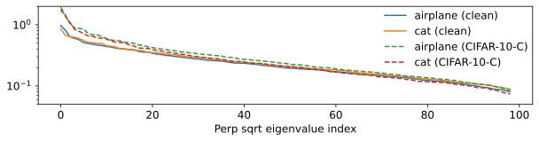

*Рисунок 3: **Влияние входного шума на геометрию признаков.** **Верхний ряд:** Визуализация признаков предпоследнего слоя для двух классов (самолёты против кошек) из ResNet-18. Горизонтальная ось представляет сигнальное направление (соединяющее средние классов), вертикальная — эффективный радиус ортогонального шума. Слева: чистые данные CIFAR-10. Справа: шумные данные CIFAR-10C. **Нижний ряд:** Спектр собственных значений ковариационной матрицы ортогонального шума. Подробнее см. Приложение E.6.* **[p. 5]**

## 5 Режим бесшумных признаков

Мы начинаем с исследования логистической регрессии при разложении данных «сигнал плюс шум» в режиме, где шум признаков в сигнальном направлении исчезает ($\sigma_{f}=0$), что даёт несколько неожиданных результатов. Хотя эта идеализация условна, выводимые ниже явления приближённо сохраняются всякий раз, когда сигнальный шум достаточно мал ($\sigma_{f}\ll\mu_{f},\sigma_{n}$).

### 5.1 Сдвиг порога интерполяции

Мы анализируем высокоразмерный пропорциональный предел, где $d,N\to\infty$, а отношение $\lambda=d/N$ остаётся фиксированным. В нерегуляризованной постановке известно, что порог интерполяции наступает при $\lambda_{c}=1/2$ (Gardner and Derrida 1989). Причина связана с отделимостью: при $\lambda>1/2$ точки в общем положении линейно отделимы независимо от их меток. Эта геометрическая свобода позволяет оптимизатору удовлетворить ограничениям зазора, находя разделяющие направления, отличные от «истинного» сигнала $\boldsymbol{S}=\boldsymbol{e}_{1}$, что ведёт к переобучению (Beck et al. 2025). Напротив, мы покажем, что введение **любой** выпуклой логит-регуляризации резко сдвинет порог интерполяции на $\lambda_{c}=1$.

##### **Предложение 5.1** **.**

###### p5-8

*Пусть $\sigma_{f}=0$ и $\alpha>0$. Тогда минимизатор обучающей потери достигает совершенной точности генерализации тогда и только тогда, когда $\lambda=d/N<1$.*

##### Доказательство.

При $\sigma_{f}=0$ сигнальная составляющая детерминирована: $y_{i}\boldsymbol{e}_{1}^{\top}\boldsymbol{x}_{i}=\mu_{f}$ для всех $i$. Поскольку $\alpha>0$, поцелевая потеря строго выпукла с единственным глобальным минимумом $z^{*}$.

Мы можем построить вектор весов, выровненный чисто по сигналу, $\boldsymbol{S}=(z^{*}/\mu_{f})\boldsymbol{e}_{1}$, такой что $y_{i}\boldsymbol{S}^{\top}\boldsymbol{x}_{i}=z^{*}$ для всех примеров. Эта конфигурация достигает глобальной безусловной нижней границы полной потери (суммы поцелевых минимумов). Это решение единственно, поскольку матрица данных полного ранга ($N>d$), и так как оно совершенно выравнено с $\boldsymbol{e}_{1}$, оно даёт $100\%$ тестовой точности.

Обратно, при $\lambda>1$ матрица данных имеет нетривиальное нуль-пространство. Минимизатор потери принимает вид **[p. 6]** $\boldsymbol{S}_{\min}=(z^{*}/\mu_{f})\boldsymbol{e}_{1}+\boldsymbol{S}_{\perp}$, где $\boldsymbol{S}_{\perp}\neq\boldsymbol{0}$ лежит в нуль-пространстве обучающих данных, ухудшая тестовую точность. ∎

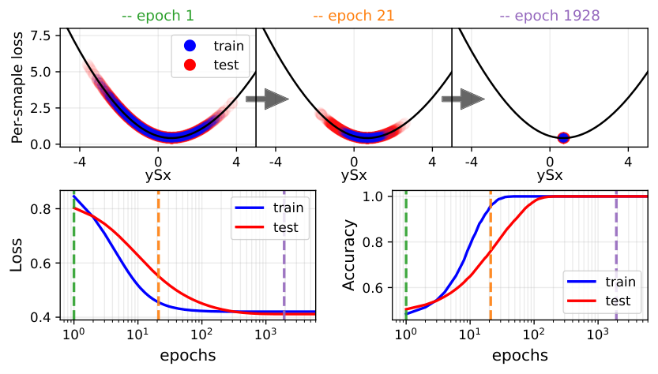

*Рисунок 4: **Совершенная генерализация при нулевом шуме признаков ($\sigma_{f}=0$).** **Сверху:** Эволюция распределения логитов в три эпохи обучения. При сходимости все логиты схлопываются к единственному целевому значению $z^{*}$. **Снизу:** Потеря и точность во времени. Вертикальные пунктирные линии обозначают эпохи, отвечающие верхним снимкам.* **[p. 6]**

Рисунок 4 демонстрирует тот факт, что логиты в этом режиме схлопываются в одну точку. Примечательно, что этот результат не зависит от функции регуляризации $f(z)$ (в согласии с нашим предыдущим обсуждением) и от масштаба ортогонального шума $\sigma_{n}$ (что не уникально для $\sigma_{f}=0$, как обсуждается ниже). Это предполагает, что при достаточно малом $\sigma_{f}$ логит-регуляризация крайне выгодна, действенно расширяя режим генерализации до $\lambda<1$. Случай непренебрежимого $\sigma_{f}$ мы рассматриваем в следующем разделе.

### 5.2 Динамика гроккинга.

###### p6-2

Гроккинг (то есть отложенная генерализация, сопровождаемая немонотонной тестовой потерей) привлёк значительное внимание в последнее время. Разработка простых аналитических моделей, демонстрирующих гроккинг, критически важна для выделения механизмов, которые его вызывают. Предыдущая работа выявила гроккинг в нерегуляризованной версии этой постановки, возникающий вблизи критического порога $\lambda_{c}=1/2$ (Beck et al. 2025). Примечательно, что мы находим, что логит-регуляризация тоже может порождать динамику гроккинга — в широкой области $1/2<\lambda<1$ (см. рисунок 5). Это происходит потому, что порог интерполяции сдвинут на $\lambda_{c}=1$. Как следствие, система демонстрирует отложенную генерализацию при $\alpha\to 0$: модель сначала переобучается (в направлении нерегуляризованного неявного смещения), прежде чем в итоге сойтись к генерализующему решению. Временно́й масштаб этой задержки («время гроккинга») расходится при $\alpha\to 0$, в согласии с предыдущими работами, показывающими, что время гроккинга расходится, когда некоторый управляющий параметр близок к критичности (Levi et al. 2024).

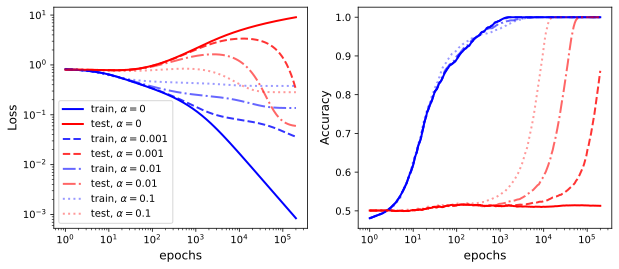

###### fig-5

*Рисунок 5: **Гроккинг.** Кривые потери и точности для $\sigma_{f}=0$ и $\lambda=0.7$. Тогда как нерегуляризованная модель ($\alpha=0$) переобучается, логит-регуляризация порождает гроккинг (отложенную генерализацию), причём задержка расходится при приближении $\alpha$ к нулю.* **[p. 6]**

## 6 Инвариантность к масштабу шума

В этом разделе мы показываем, что в присутствии логит-регуляризации оптимальная точность генерализации становится независимой от масштаба ортогонального шума $\sigma_{n}$. Затем мы используем этот результат, чтобы очертить конкретные режимы, где логит-регуляризация превосходит нерегуляризованную базовую линию.

### 6.1 Доказательство инвариантности

##### **Предложение 6.1** **.**

###### p6-4

*Пусть $\alpha>0$, $\lambda=d/N<1$, и зафиксируем $\sigma_{f},\mu_{f}$. Тогда оптимальная точность генерализации $\mathcal{A}^{\min}_{\mathrm{gen}}$ строго независима от $\sigma_{n}$.*

##### Доказательство.

Это следует из простого масштабного аргумента. Пусть $\boldsymbol{S}_{\min}=(S_{1,\min},\boldsymbol{S}_{\perp,\min})$ обозначает минимизатор. Потеря зависит исключительно от скалярных логитов $z_{i}=S_{1,\min}x_{i,1}+\boldsymbol{S}_{\perp,\min}^{T}\boldsymbol{x}_{i,\perp}$. Рассмотрим перемасштабирование дисперсии шума $\sigma_{n}\to\beta\sigma_{n}$, влекущее $\boldsymbol{x}_{i,\perp}\to\beta\boldsymbol{x}_{i,\perp}$. Чтобы сохранить оптимальные значения логитов $z_{\min}$ (и тем минимизировать потерю), веса должны масштабироваться обратно: $\boldsymbol{S}_{\perp,\min}\to\beta^{-1}\boldsymbol{S}_{\perp,\min}$. Следовательно, произведение $\boldsymbol{S}_{\perp,\min}^{T}\boldsymbol{x}_{i,\perp}$ остаётся инвариантным. Поскольку распределение тестовых логитов зависит от того же произведения, тестовая точность инвариантна к $\sigma_{n}$. ∎

Примечательно, что хотя $\mathcal{A}^{\min}_{\mathrm{gen}}$ независима от $\sigma_{n}$, направление $\boldsymbol{S}_{min}$ — нет. Косинусное сходство с осью признака $\boldsymbol{e}_{1}$, обозначаемое $\rho$, явно зависит от шума. Поскольку $\|\boldsymbol{S}_{\perp,\min}\|\propto\sigma_{n}^{-1}$, выравнивание ведёт себя как:

$$
\rho_{\min}=\frac{S_{1,\min}}{\|\boldsymbol{S}_{\min}\|}=\frac{1}{\sqrt{1+(C/\sigma_{n})^{2}}}, \tag{4}
$$

где $C$ зависит от $\sigma_{f}$, но независима от $\sigma_{n}$ (см. Приложение E.5).

Чтобы продемонстрировать, как может быть, что точность остаётся постоянной несмотря на меняющееся направление $\boldsymbol{S}$, мы рассматриваем случай гауссовых данных. **[p. 7]** Аналитическое выражение точности генерализации в этом случае:

$$
\mathcal{A}_{\mathrm{gen}}=\frac{1}{2}\left[1+\mathrm{erf}\!\left(\frac{\rho\mu_{f}}{\sqrt{2\bigl(\rho^{2}\sigma_{f}^{2}+(1-\rho^{2})\sigma_{n}^{2}\bigr)}}\right)\right]. \tag{5}
$$

Подстановка $\rho_{\min}$ из уравнения 4 в уравнение 5 сокращает члены с $\sigma_{n}$ в знаменателе, делая итоговую точность явно независимой от масштаба шума. Дополнительное эмпирическое свидетельство $\sigma_{n}$-инвариантности см. на рисунке 16 в приложении.

### 6.2 Когда логит-регуляризация помогает?

###### p7-2

Поскольку регуляризованная точность $\mathcal{A}_{\alpha>0}^{\min}$ постоянна по $\sigma_{n}$, тогда как нерегуляризованная точность $\mathcal{A}_{\alpha=0}^{\min}$ меняется, можно найти критический порог шума, где эти кривые пересекаются. Это пересечение определяет точку, в которой логит-регуляризация становится выгодной. Для гауссовых данных мы иллюстрируем этот кроссовер на левой панели рисунка 6. Прослеживая этот порог по разным $\sigma_{f}$, мы строим фазовую диаграмму, показанную на правой панели, представляющую режим, где регуляризация улучшает качество.

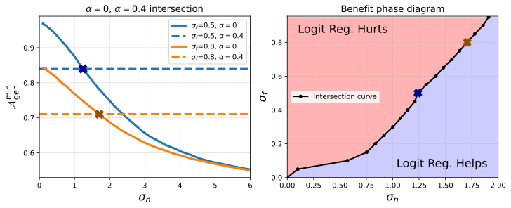

###### fig-6

*Рисунок 6: **Фазовая диаграмма выгоды.** **Слева:** Итоговая точность генерализации как функция $\sigma_{n}$, сравнение нерегуляризованного ($\alpha=0$) и регуляризованного ($\alpha>0$) случаев, для $\lambda=0.7$. **Справа:** Фазовая диаграмма, показывающая области, где логит-регуляризация выгодна. Граничная кривая построена из точек пересечения (как показано на левой панели) для разных значений $\sigma_{f}$. Для иллюстрации точки пересечения нерегуляризованной и регуляризованной кривых для $\sigma_{f}=0.5,0.8$ (слева) отмечены крестами соответствующих цветов на граничной кривой (справа). Эквивалентный рисунок в режиме $\lambda<1/2$ см. на рисунке 15 в приложении.* **[p. 7]**

## 7 Обобщение на многоклассовую постановку

В этом разделе мы расширяем наш анализ на $K$-классовую постановку, демонстрируя, что базовый геометрический механизм скучивания логитов остаётся тем же.

### 7.1 Постановка

Мы рассматриваем линейный классификатор, выдающий логиты $\boldsymbol{z}=W\boldsymbol{x}+\boldsymbol{b}$, где $W\in\mathbb{R}^{K\times d}$. Предсказанный класс — $c=\mathrm{argmax}_{k}z_{k}$. Пусть $\boldsymbol{y}$ — вектор с одной единицей для класса $c$. Мы минимизируем эмпирическую потерю $\mathcal{L}=\frac{1}{N}\sum_{i}\ell(\boldsymbol{z}^{(i)},\boldsymbol{y}^{(i)})$, где поцелевая потеря определена как:

$$
\ell(\boldsymbol{z},\boldsymbol{y})=(1-\alpha)\ell_{\mathrm{CE}}(\boldsymbol{z},\boldsymbol{y})+\alpha f(\boldsymbol{z}). \tag{6}
$$

Здесь $\ell_{\mathrm{CE}}(\boldsymbol{z},\boldsymbol{y})=-\sum_{k}y_{k}\log p_{k}$ — стандартная кросс-энтропийная потеря, а $f(\boldsymbol{z})$ — симметричный выпуклый регуляризационный член. Отметим, что стандартный LS восстанавливается выбором (см. Приложение B):

$$
f_{\mathrm{LS}}(\boldsymbol{z})=\log\left(\sum_{k=1}^{K}e^{z_{k}}\right)-\frac{1}{K}\sum_{k=1}^{K}z_{k}. \tag{7}
$$

Чтобы расширить разложение «сигнал плюс шум», мы предполагаем, что средние классов $\{\boldsymbol{\mu}_{c}\}_{c=1}^{K}$ аффинно независимы и натягивают $(K-1)$-мерное центрированное сигнальное подпространство $\mathcal{S}=\mathrm{span}\{\boldsymbol{\mu}_{c}-\bar{\boldsymbol{\mu}}\}_{c=1}^{K}$. Вход $\boldsymbol{x}$ для данного класса $c$ моделируется как $\boldsymbol{x}=\boldsymbol{\mu}_{c}+\boldsymbol{\xi}$. Шумовой вектор $\boldsymbol{\xi}$ раскладывается на сигнально-выровненную и ортогональную составляющие:

$$
\boldsymbol{\xi}=\sigma_{f}\boldsymbol{\eta}_{f}+\sigma_{n}\boldsymbol{\eta}_{n}, \tag{8}
$$

где $\boldsymbol{\eta}_{f}\in\mathcal{S}$ и $\boldsymbol{\eta}_{n}\in\mathcal{S}^{\perp}$ берутся из стандартных изотропных распределений $\mathcal{D}_{f}$ и $\mathcal{D}_{n}$, масштабированных $\sigma_{f}$ и $\sigma_{n}$ соответственно.

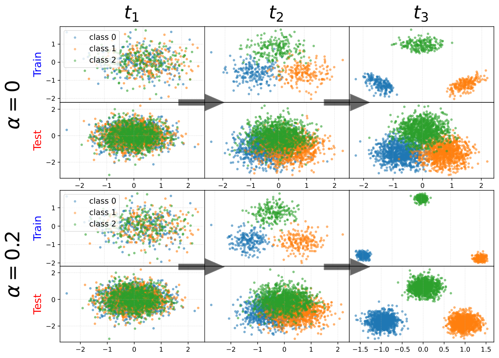

###### fig-7

*Рисунок 7: **Многоклассовое скучивание логитов.** Проекция данных трёх классов на подпространство, натянутое на относительные разности весов ($S_{1}-S_{2}$ и $S_{1}-S_{3}$). Параметр задан $\lambda=d/N=0.7$: поскольку $\lambda>1/2$, данные отделимы. **Слева ($\alpha=0$):** Стандартная кросс-энтропия разделяет классы линейно, максимизируя зазор. **Справа ($\alpha=0.2$):** Логит-регуляризация навязывает плотное скучивание вокруг вершин симплекса.* **[p. 7]**

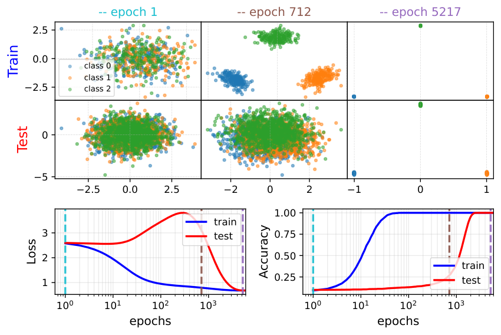

###### fig-8

*Рисунок 8: **Гроккинг в многоклассовом случае при малой логит-регуляризации.** Динамика в многоклассовом случае, для $\sigma_{f}=0$, $\lambda=0.7$ и $\alpha=0.04$. **Сверху:** Проекции логитов в три момента времени. Модель сначала выучивает переобучающее решение, прежде чем в итоге схлопнуться к минимумам вершин симплекса, отвечающим фазе генерализации. **Снизу:** Эволюция тестовой точности и потери. Мы наблюдаем характерную сигнатуру гроккинга: тестовая потеря сначала растёт (переобучение), затем спускается, а точность генерализации отложена.* **[p. 8]**

### 7.2 Минимизация симплексного скучивания

Как и в случае двоичной классификации, введение регуляризации ($\alpha>0$) фундаментально меняет ландшафт оптимизации. Поцелевая потеря теперь обладает конечным минимумом. Выписывая явно поцелевую потерю для класса $c$ (где $\boldsymbol{y}=\boldsymbol{y}_{c}$ — вектор с $1$ в позиции $c$), получаем:

$$
\ell(\boldsymbol{z},\boldsymbol{y}=\boldsymbol{y}_{c})=(1-\alpha)\left(\log\left(\sum_{j}e^{z_{j}}\right)-z_{c}\right)+\alpha f(\boldsymbol{z}). \tag{9}
$$

**[p. 8]**

###### p8-1

Для каждого класса $c$ существует единственный целевой вектор логитов $\boldsymbol{z}^{*}_{(c)}$, минимизирующий эту поцелевую потерю. Ввиду перестановочной симметрии этот вектор принимает особую форму: высокое значение $z_{\mathrm{high}}$ в позиции $c$ и одинаковое более низкое значение $z_{\mathrm{low}}$ в остальных. Это представляет максимальную уверенность, допускаемую регуляризацией, отвечающую распределению вероятностей с пиком в классе $c$ (со значением, определяемым $\alpha$) и равномерным в остальном.

###### p8-2

Набор целевых векторов $\{\boldsymbol{z}^{*}_{(1)},\dots,\boldsymbol{z}^{*}_{(K)}\}$ образует вершины симметричного симплекса в пространстве логитов. Как следствие, цель оптимизации превращается в задачу *скучивания*: модель ищет матрицу весов $W$, схлопывающую логиты каждого класса $c$ как можно плотнее вокруг соответствующей вершины $\boldsymbol{z}^{*}_{(c)}$.

Это поведение визуализировано в численном эксперименте, представленном на рисунке 7. Мы предполагаем гауссовы распределения и для сигнальной, и для шумовой составляющих. Модель обучается с квадратичным регуляризационным членом $f(\boldsymbol{z})=\|\boldsymbol{z}\|^{2}$. Затем мы принимаем схему визуализации, введённую в Müller et al. 2019, проецируя данные трёх классов на плоскость, натянутую на шаблоны классов, в три различных момента обучения. В нерегуляризованном режиме ($\alpha=0$) (спроецированные) логиты рассыпаются ради максимизации отделимости. Напротив, регуляризация ($\alpha>0$) заставляет их скучиваться у вершин симплекса.

Большинство наших ключевых результатов двоичной постановки естественно переносятся на многоклассовый случай: детали см. в Приложении D. Например, рисунок 8 демонстрирует нашу главную находку о бесшумном режиме: при $1/2<\lambda<1$ и малом $\alpha$ мы наблюдаем гроккинг. Сначала обучающие примеры становятся полностью разделены, пока модель переобучается на тестовом наборе. В более поздние времена логиты меняют своё неявное смещение под действием логит-регуляризации, схлопываясь к вершинам симплекса и достигая совершенной генерализации.

*Рисунок 9: **Проверка на предпоследних признаках ResNet-18.** **Слева:** Точность генерализации против силы регуляризации $\alpha$. Мы наблюдаем скачок с последующим насыщением, подтверждающий направленную устойчивость. **Справа:** Точность против синтетического масштабирования ортогональной шумовой составляющей. Логит-регуляризация ($\alpha>0$) делает модель нечувствительной к масштабу шума, в отличие от нерегуляризованной базовой линии.* **[p. 8]**

## 8 Проверка на вложениях предпоследнего слоя

Анализ выше был проведён в линейной постановке с идеализированным разложением «сигнал плюс шум». Теперь мы проверяем два главных качественных предсказания — резкий переход от $\alpha=0$ к $\alpha>0$ и инвариантность к масштабированию ортогонального шума — в более реалистичном пространстве признаков.

**Постановка.** Мы используем те же вложения предпоследнего слоя ResNet-18, введённые на рисунке 3. Мы замораживаем представление и обучаем поверх него только линейный классификатор, используя потерю из уравнения 6 с квадратичной логит-регуляризацией $f(\boldsymbol{z})=\|\boldsymbol{z}\|^{2}$. Подробнее см. раздел E.6.

###### p8-7

**Нечувствительность к $\alpha$.** Мы исследуем чувствительность оптимальной точности генерализации к силе регуляризации $\alpha$, см. левую панель рисунка 9. Как предсказано в разделе 3.4, точность значительно скачет и входит в устойчивую полку. Отклонение от неё при меньших $\alpha$ связано с тем, что данные не гауссовы.

**Независимость от $\sigma_{n}$ через синтетическое ортогональное перемасштабирование.** Чтобы прямо проверить инвариантность из Предложения 6.1, мы синтетически перемасштабируем только ту составляющую каждого вложения, что ортогональна подпространству, натянутому на средние классов. Это меняет эффективный $\sigma_{n}$, не меняя геометрию средних классов. Правая панель рисунка 9 показывает, что нерегуляризованный классификатор ($\alpha=0$) существенно деградирует под этим перемасштабированием, тогда как регуляризованный классификатор ($\alpha>0$) более устойчив, согласно нашим ожиданиям.

**[p. 9]**

## 9 Заключение

В этой работе мы охарактеризовали неявное смещение выпуклой логит-регуляризации, такой как label smoothing, в линейной классификации. Мы показали, что такая регуляризация приводит к *скучиванию логитов* вокруг конечных минимумов поцелевой функции потерь. Это даёт простое геометрическое объяснение известного эффекта label smoothing и демонстрирует, что явление не уникально для Label Smoothing, а есть общее следствие любой потери, разложимой в сумму поцелевых потерь с конечным минимумом.

Замечательно, что эта цель скучивания тесно связана с классической статистической дискриминацией. Мы доказали, что для гауссовых данных или квадратичных функций потерь логит-регуляризация приводит вектор весов точно к *линейному дискриминанту Фишера* ($\Sigma^{-1}\boldsymbol{\mu}$). Эмпирически мы продемонстрировали, что направление остаётся близким к этому решению и за пределами идеализированных условий. Этот результат закрывает концептуальный пробел, показывая, что современные приёмы «мягких целей», такие как Label Smoothing, действенно восстанавливают оптимальный линейный дискриминатор для гауссовых данных. Эти находки также предполагают, что выгоды Label Smoothing не уникальны для конкретной функциональной формы, используемой на практике, а разделяются широким классом выпуклых логит-штрафов.

Опираясь на разложение «сигнал плюс шум», мы также продемонстрировали, что логит-регуляризация сдвигает порог интерполяции на $\lambda=1$ (давая совершенную генерализацию в режимах, где нерегуляризованные модели терпят неудачу) и порождает динамику гроккинга при слабой регуляризации. Наконец, мы доказали, что регуляризованная точность инвариантна к масштабированию ортогонального шума, что позволило нам очертить точное фазовое пространство, где регуляризация выгодна.

**Ограничения и будущая работа.** Наш анализ опирается на линейную рамку. Хотя мы проверили наши находки на замороженных вложениях ResNet, распространение взгляда скучивания логитов на сквозное обучение (где представление выучивается совместно) остаётся главным вызовом. Кроме того, хотя мы охарактеризовали неявное смещение для гауссовых данных как минимизацию коэффициента вариации, нахождение аналогичного геометрического инварианта для общих тяжелохвостых распределений остаётся открытым вопросом. Будущие исследования должны изучить, как это «LDA-подобное» смещение взаимодействует с индуктивным смещением глубоких сетей при выучивании признаков, а также действенность этого более широкого класса выпуклых штрафов в практических постановках глубокого обучения.

## References

- A. Beck, N. I. Levi, and Y. Bar-Sinai. Grokking at the edge of linear separability. In *International Conference on Machine Learning (ICML)*, 2025. URL https://arxiv.org/abs/2410.04489.

- M. Celentano, C. Cheng, and A. Montanari. The high-dimensional asymptotics of first order methods with random data. *arXiv preprint arXiv:2112.07572*, 2021. URL https://arxiv.org/abs/2112.07572.

- K. Chandrasegaran, N.-T. Tran, Y. Zhao, and N.-M. Cheung. Revisiting label smoothing and knowledge distillation compatibility: What was missing? In *Proceedings of the International Conference on Machine Learning (ICML)*, pages 2890–2916. PMLR, 2022.

- T. M. Cover. Geometrical and statistical properties of systems of linear inequalities with applications in pattern recognition. *IEEE Transactions on Electronic Computers*, EC-14(3):326–334, 1965. doi: 10.1109/PGEC.1965.264137.

- Y. Dauphin and E. D. Cubuk. Deconstructing the regularization of batchnorm. In *International Conference on Learning Representations (ICLR)*, 2021.

- Z. Deng, A. Kammoun, et al. A model of double descent for high-dimensional binary classification. *arXiv preprint arXiv:1912.00887*, 2019.

- R. A. Fisher. The use of multiple measurements in taxonomic problems. *Annals of Eugenics*, 7:179–188, 1936. doi: 10.1111/j.1469-1809.1936.tb02137.x.

- Y. Gao, W. Wang, C. Herold, Z. Yang, and H. Ney. Towards a better understanding of label smoothing in neural machine translation. In *Proceedings of the 1st Conference of the Asia-Pacific Chapter of the Association for Computational Linguistics and the 10th International Joint Conference on Natural Language Processing*, pages 212–223, 2020.

- E. Gardner. The space of interactions in neural network models. *Journal of Physics A: Mathematical and General*, 21(1):257–270, 1988.

- E. Gardner and B. Derrida. Three unfinished works on the optimal storage capacity of networks. *Journal of Physics A: Mathematical and General*, 22:1983–1994, 1989.

- C. Garrod and J. P. Keating. The persistence of neural collapse despite low-rank bias, 2025. URL https://arxiv.org/abs/2410.23169.

- C. Guo, G. Pleiss, Y. Sun, and K. Q. Weinberger. On calibration of modern neural networks. In *Proceedings of the International Conference on Machine Learning (ICML)*, pages 1321–1330. PMLR, 2017.

- L. Guo, K. Ross, Z. Zhao, G. Andriopoulos, S. Ling, Y. Xu, and Z. Dong. Cross entropy versus label smoothing: A neural collapse perspective. *arXiv preprint arXiv:2402.03979*, 2024.

**[p. 10]**

- X. Y. Han, V. Papyan, and D. L. Donoho. Neural collapse under mse loss: Proximity to and dynamics on the simplex etf. In *International Conference on Learning Representations (ICLR)*, 2022. URL https://openreview.net/forum?id=w1UbdvWH_R3.

- K. He, X. Zhang, S. Ren, and J. Sun. Deep residual learning for image recognition, 2015. URL https://arxiv.org/abs/1512.03385.

- D. Hendrycks and T. Dietterich. Benchmarking neural network robustness to common corruptions and perturbations. In *International Conference on Learning Representations (ICLR)*, 2019. URL https://arxiv.org/abs/1903.12261.

- G. Hinton, O. Vinyals, and J. Dean. Distilling the knowledge in a neural network. *arXiv preprint arXiv:1503.02531*, 2015. URL https://arxiv.org/abs/1503.02531.

- Z. Ji and M. Telgarsky. The implicit bias of gradient descent on nonseparable data. In *Proceedings of The 32nd Conference on Learning Theory (COLT)*, 2019. URL https://proceedings.mlr.press/v99/ji19a.html.

- S. Kornblith, T. Chen, H. Lee, and M. Norouzi. Why do better loss functions lead to less transferable features? *Advances in Neural Information Processing Systems (NeurIPS)*, 34:28648–28662, 2021.

- A. Krizhevsky. Learning multiple layers of features from tiny images. Technical report, University of Toronto, 2009.

- D. Lee, K. C. Cheung, and N. L. Zhang. Adaptive label smoothing with self-knowledge in natural language generation. *arXiv preprint arXiv:2210.13459*, 2022.

- N. I. Levi, A. Beck, and Y. Bar-Sinai. Grokking in linear estimators – a solvable model that groks without understanding. In *International Conference on Learning Representations (ICLR)*, 2024. URL https://openreview.net/forum?id=GH2LYb9XV0.

- J. Liang, L. Li, Z. Bing, B. Zhao, Y. Tang, B. Lin, and H. Fan. Efficient one pass self-distillation with zipf’s label smoothing. In *European Conference on Computer Vision (ECCV)*, pages 104–119. Springer, 2022.

- K. Lyu and J. Li. Gradient descent maximizes the margin of homogeneous neural networks. In *International Conference on Learning Representations (ICLR)*, 2020. URL https://arxiv.org/abs/1906.05890.

- F. Mignacco, F. Krzakala, L. Zdeborová, et al. The role of regularization in classification of high-dimensional noisy gaussian mixture. In *Proceedings of the 37th International Conference on Machine Learning (ICML)*, 2020.

- A. Montanari, F. Ruan, Y. Sohn, and J. Yan. The generalization error of max-margin linear classifiers: High-dimensional asymptotics in the overparameterized regime. *arXiv preprint arXiv:1911.01544*, 2019. URL https://arxiv.org/abs/1911.01544.

- R. Müller, S. Kornblith, and G. E. Hinton. When does label smoothing help? In *Advances in Neural Information Processing Systems (NeurIPS)*, 2019. URL https://arxiv.org/abs/1906.02629.

- V. Papyan, X. Han, and D. L. Donoho. Prevalence of neural collapse during the terminal phase of deep learning training. *Proceedings of the National Academy of Sciences*, 2020. URL https://arxiv.org/abs/2008.08186.

- G. Pereyra, G. Tucker, J. Chorowski, Ł. Kaiser, and G. Hinton. Regularizing neural networks by penalizing confident output distributions. *arXiv preprint arXiv:1701.06548*, 2017.

- A. Power, Y. Burda, H. Edwards, I. Babuschkin, and V. Misra. Grokking: Generalization beyond overfitting on small algorithmic datasets. *arXiv preprint arXiv:2201.02177*, 2022. URL https://arxiv.org/abs/2201.02177.

- L. Prieto, M. Barsbey, P. A. M. Mediano, and T. Birdal. Grokking at the edge of numerical stability, 2025. URL https://arxiv.org/abs/2501.04697.

- Z. Shen, Z. Liu, D. Xu, Z. Chen, K.-T. Cheng, and M. Savvides. Is label smoothing truly incompatible with knowledge distillation: An empirical study. *arXiv preprint arXiv:2104.00676*, 2021.

- D. Soudry, E. Hoffer, M. S. Nacson, S. Gunasekar, and N. Srebro. The implicit bias of gradient descent on separable data. *Journal of Machine Learning Research*, 19(70):1–57, 2018. URL https://arxiv.org/abs/1710.10345.

- P. Súkeník, M. Mondelli, and C. Lampert. Neural collapse versus low-rank bias: Is deep neural collapse really optimal? *arXiv preprint arXiv:2405.14468*, 2024.

- P. Sur and E. J. Candès. A modern maximum-likelihood theory for high-dimensional logistic regression. In *Proceedings of the National Academy of Sciences*, 2019. URL https://arxiv.org/abs/1701.05023.

- C. Szegedy, V. Vanhoucke, S. Ioffe, J. Shlens, and Z. Wojna. Rethinking the inception architecture for computer vision. In *Proceedings of the IEEE/CVF Conference on **[p. 11]** Computer Vision and Pattern Recognition (CVPR)*, pages 2818–2826, 2016.

- A. N. Tikhonov and V. Y. Arsenin. Solutions of ill-posed problems. 1977. URL https://api.semanticscholar.org/CorpusID:122072756.

- K. Wang and C. Thrampoulidis. Binary classification of gaussian mixtures: Abundance of support vectors, robustness, and generalization. *SIAM Journal on Mathematics of Data Science*, 2022. URL https://arxiv.org/abs/2010.00000.

- H. Wei, R. Xie, H. Cheng, L. Feng, B. An, and Y. Li. Mitigating neural network overconfidence with logit normalization, 2022. URL https://arxiv.org/abs/2205.09310.

- G. Xia, O. Laurent, G. Franchi, and C.-S. Bouganis. Towards understanding why label smoothing degrades selective classification and how to fix it. In *International Conference on Learning Representations (ICLR)*, 2025.

- J. Xu and H. Liu. Quantifying the variability collapse of neural networks. In *Proceedings of the International Conference on Machine Learning (ICML)*, pages 38535–38550. PMLR, 2023.

- L. Yuan, F. E. Tay, G. Li, T. Wang, and J. Feng. Revisiting knowledge distillation via label smoothing regularization. In *Proceedings of the IEEE/CVF Conference on Computer Vision and Pattern Recognition (CVPR)*, pages 3903–3911, 2020.

- C.-B. Zhang, P.-T. Jiang, Q. Hou, Y. Wei, Q. Han, Z. Li, and M.-M. Cheng. Delving deep into label smoothing. *IEEE Transactions on Image Processing*, 30:5984–5996, 2021.

- J. Zhou, C. You, X. Li, K. Liu, S. Liu, Q. Qu, and Z. Zhu. Are all losses created equal: A neural collapse perspective. *Advances in Neural Information Processing Systems (NeurIPS)*, 35:31697–31710, 2022.

- F. Zhu, Z. Cheng, X.-Y. Zhang, and C.-L. Liu. Rethinking confidence calibration for failure prediction. In *European Conference on Computer Vision (ECCV)*, pages 518–536. Springer, 2022.

## Приложения

**[p. 12]**

## Приложение A Дополнительные связанные работы

**Label smoothing и обучение с мягкими целями.** Label smoothing (LS) был введён как «label-smoothing regularization» в Szegedy et al. 2016 и ныне является стандартным инструментом улучшения генерализации и калибровки в классификации и моделях последовательностей [Müller et al. 2019, Guo et al. 2017]. LS анализировался в разных областях, включая нейронный машинный перевод [Gao et al. 2020]. Шире, LS — один из случаев обучения с *мягкими целями*, тесно связанного с дистилляцией знаний [Hinton et al. 2015, Yuan et al. 2020]. Взаимодействие LS и дистилляции тонко: исследования изучают, когда обученные с LS учителя помогают или вредят KD [Shen et al. 2021, Chandrasegaran et al. 2022]. Помимо фиксированного равномерного сглаживания, варианты адаптируют целевое распределение в ходе обучения, включая Online Label Smoothing [Zhang et al. 2021], Zipf label smoothing [Liang et al. 2022] и адаптивное/самопознающее сглаживание [Lee et al. 2022]. LS также связывали с изменениями геометрии признаков [Müller et al. 2019, Kornblith et al. 2021] и количественно измеряли через меры вариативности признаков [Xu and Liu 2023]. Однако LS может быть проблематичен для селективной классификации или предсказания отказов, что мотивирует прицельные исправления [Zhu et al. 2022, Xia et al. 2025].

**Логит/выходная регуляризация за пределами классического label smoothing.** Методы, регуляризующие *логиты* напрямую, включают энтропийные штрафы [Pereyra et al. 2017], логит-норменные регуляризаторы [Dauphin and Cubuk 2021] и логит-нормализацию [Wei et al. 2022]. Ключевая тема — остаётся ли потеря *ограниченной снизу* и допускает ли *конечный* поцелевой оптимум, как в выпуклых логит-штрафах, в отличие от кросс-энтропии, инфимум которой достигается только на бесконечном зазоре.

**Неявное смещение кросс-энтропии и максимизация зазора.** Для отделимой линейной классификации градиентный спуск на нерегуляризованной кросс-энтропии сходится к жёсткому SVM [Soudry et al. 2018]. Это распространено на неотделимые данные [Ji and Telgarsky 2019] и перепараметризованные однородные модели [Lyu and Li 2020]. Выпуклая логит-регуляризация даёт резкий контраст, вынуждая поцелевую цель достигать конечного минимума.

**Высокоразмерные разрешимые модели.** Наш анализ связывается с классическими работами о комбинаторной «ёмкости» линейных разделителей [Cover 1965, Gardner 1988]. Недавние работы развивают точные высокоразмерные асимптотики для классификаторов максимального зазора методами CGMT/AMP [Montanari et al. 2019, Deng et al. 2019, Mignacco et al. 2020, Wang and Thrampoulidis 2022]. В смежных направлениях высокоразмерная логистическая регрессия демонстрирует явления фазовых переходов, связанные с существованием оценок максимального правдоподобия [Sur and Candès 2019, Celentano et al. 2021].

###### p12-5

**Гроккинг и отложенная генерализация.** Гроккинг был популяризован в нейросетях, обученных на малых алгоритмических наборах данных [Power et al. 2022]. С тех пор развиты разрешимые модели для линейных оценщиков [Levi et al. 2024] и логистической регрессии у края отделимости [Beck et al. 2025]. Логит-регуляризация в этом контексте кратко обсуждалась в Prieto et al. 2025; мы обнаруживаем аналогичную область отложенной генерализации со сдвинутым порогом.

**Симплексная геометрия и нейронный коллапс.** Наша многоклассовая постановка связана с явлением *нейронного коллапса* [Papyan et al. 2020, Han et al. 2022], при котором логиты сходятся к структурированным симплексным/ETF-конфигурациям. Недавние работы изучают, как разные потери формируют этот коллапс [Zhou et al. 2022, Guo et al. 2024] и как он взаимодействует с низкоранговым смещением [Súkeník et al. 2024, Garrod and Keating 2025].

## Приложение B Label smoothing как частный случай логит-регуляризации

###### p12-7

Мы показываем, что label smoothing (LS) можно записать как выпуклый *логит-регуляризатор*, добавленный к кросс-энтропии, в соответствии с нашей формой $\ell=(1-\alpha)\ell_{\mathrm{CE}}+\alpha f$ (с точностью до репараметризации $\alpha$ и аддитивных констант).

### Двоичная классификация

Рассмотрим двухклассовый softmax. Пусть $t\equiv yz$ — логит со знаком, так что $p_{y}=\sigma(t)=1/(1+e^{-t})$ и $p_{-y}=1-p_{y}=\sigma(-t)$. Стандартная кросс-энтропия — $\ell_{\mathrm{CE}}(t)=-\log p_{y}=\log(1+e^{-t})$. Двоичный LS со сглаживанием $\varepsilon$ использует цели $(1-\varepsilon,\varepsilon)$ и даёт

$$
\ell_{\mathrm{LS}}(t)=-(1-\varepsilon)\log p_{y}-\varepsilon\log p_{-y}=(1-\varepsilon)\log(1+e^{-t})+\varepsilon\log(1+e^{t}). \tag{10}
$$

Используя $\log(1+e^{t})+\log(1+e^{-t})=\log\!\big(2+2\cosh t\big)$, переписываем

$$
\ell_{\mathrm{LS}}(t)=(1-2\varepsilon)\,\ell_{\mathrm{CE}}(t)\;+\;\varepsilon\,\log\!\big(2+2\cosh t\big). \tag{11}
$$

**[p. 13]**

###### p13-1

Таким образом, в двоичном случае LS эквивалентен логит-регуляризации с

$$
f_{\mathrm{LS}}(t)=\frac{1}{2}\log\!\big(2+2\cosh t\big),\qquad t=yz, \tag{12}
$$

(с точностью до перемасштабирования $\alpha=2\varepsilon$).

### Многоклассовая классификация

Пусть $p_{k}(\boldsymbol{z})=\exp(z_{k})/\sum_{j}\exp(z_{j})$ и метки с одной единицей $y_{k}\in\{0,1\}$. LS заменяет $y_{k}^{\mathrm{LS}}=(1-\varepsilon)y_{k}+\varepsilon/K$, давая

$$
\mathcal{L}_{\mathrm{LS}}(\boldsymbol{z},\boldsymbol{y}) =-\sum_{k=1}^{K}y_{k}^{\mathrm{LS}}\log p_{k}(\boldsymbol{z}) \\
=(1-\varepsilon)\,\mathcal{L}_{\mathrm{CE}}(\boldsymbol{z},\boldsymbol{y})\;+\;\frac{\varepsilon}{K}\sum_{k=1}^{K}\bigl[-\log p_{k}(\boldsymbol{z})\bigr]. \tag{13}
$$

Следовательно, LS имеет вид $(1-\alpha)\mathcal{L}_{\mathrm{CE}}+\alpha f(\boldsymbol{z})$ с выпуклым, перестановочно-симметричным логит-регуляризатором

$$
f_{\mathrm{LS}}(\boldsymbol{z})=\log\!\Big(\sum_{k=1}^{K}e^{z_{k}}\Big)\;-\;\frac{1}{K}\sum_{k=1}^{K}z_{k}, \tag{14}
$$

## Приложение C Дополнительные детали к разделу 3.4

В разделе 3.4 мы показали, что при некоторых предположениях направление вектора весов становится почти инвариантным к функции логит-регуляризации в целом, и в частности к силе регуляризации $\alpha$. Мы сделали это, доказав Предложение 3.1 и Следствие 3.2, где показали: если распределение данных строго гауссово, это будет верно для любой выпуклой поцелевой потери, а с другой стороны, если поцелевая потеря квадратична, это будет верно независимо от её минимума.

### C.1 Дополнительные доказательства

Начнём с доказательства Леммы, необходимой для доказательства Предложения 3.1.

##### **Лемма C.1** **.**

*Пусть $x$ — случайная величина с нулевым средним и $f:\mathbb{R}\to\mathbb{R}$ — выпуклая функция. Тогда $\mathbb{E}\left[f(\lambda x)\right]$ — неубывающая функция $\lambda$ при $\lambda>0$.*

##### Доказательство.

Это стандартный аргумент выпуклости. Рассмотрим две лямбды $0<\lambda_{1}<\lambda_{2}$. Тогда $\lambda_{1}$ — выпуклая комбинация 0 и $\lambda_{2}$,

$$
\lambda_{1}=\left(1-\frac{\lambda_{1}}{\lambda_{2}}\right)\cdot 0+\frac{\lambda_{1}}{\lambda_{2}}\lambda_{2}\ .
$$

Поэтому

$$
\mathbb{E}\left[f\left(\lambda_{1}x\right)\right] =\mathbb{E}\left[f\left(\left(1-\frac{\lambda_{1}}{\lambda_{2}}\right)\cdot 0\cdot x+\frac{\lambda_{1}}{\lambda_{2}}\lambda_{2}x\right)\right] \\
\leq\left(1-\frac{\lambda_{1}}{\lambda_{2}}\right)f(0)+\frac{\lambda_{1}}{\lambda_{2}}\mathbb{E}\left[f(\lambda_{2}x)\right] \\
\leq\mathbb{E}\left[\left(1-\frac{\lambda_{1}}{\lambda_{2}}\right)f(\lambda_{2}x)+\frac{\lambda_{1}}{\lambda_{2}}f(\lambda_{2}x)\right]=\mathbb{E}\left[f(\lambda_{2}x)\right]
$$

Где мы использовали то, что $x$ имеет нулевое среднее и потому $f(0)=f(\mathbb{E}\left[\lambda_{2}x\right])\leq\mathbb{E}\left[f(\lambda_{2}x)\right]$. ∎

**Связь с Предложением 3.1:** При фиксированном $\mu\in\mathbb{R}$ определим $g(t)\equiv f(\mu+t)$, которая выпукла всякий раз, когда $f$ выпукла. Применение Леммы C.1 с $x=Y\sim\mathcal{N}(0,1)$ даёт, что

$$
Q(\mu,\sigma)\;=\;\mathbb{E}\bigl[f(\mu+\sigma Y)\bigr]\;=\;\mathbb{E}\bigl[g(\sigma Y)\bigr]
$$

неубывает по $\sigma\geq 0$ при каждом фиксированном $\mu$.

Теперь мы дадим доказательство Следствия 3.3 из основного текста.

**[p. 14]**

##### **Теорема C.2**(Переформулировка Следствия 3.3)**.**

*Если данные гауссовы, оптимальное направление весов — $\hat{\boldsymbol{S}}_{\min}\propto\Sigma^{-1}\mu$, и потому оно независимо от выпуклой функции регуляризации $f$. Аналогично, если $\lambda=d/N<1$ и поцелевая потеря квадратична, $\hat{\boldsymbol{S}}_{\min}\propto\Sigma^{-1}\mu$ (где $\Sigma,\mu$ — эмпирическое среднее и центрированная ковариация), и потому оно независимо от целевого значения $z^{*}$.*

##### Доказательство.

**Популяционный гауссов случай.** Для $\boldsymbol{x}\sim\mathcal{N}(\boldsymbol{\mu},\Sigma)$ и любого $\boldsymbol{S}$ логит $z=\boldsymbol{S}^{\top}\boldsymbol{x}$ гауссов со средним $\mu(\boldsymbol{S})=\boldsymbol{S}^{\top}\boldsymbol{\mu}$ и дисперсией $\sigma^{2}(\boldsymbol{S})=\boldsymbol{S}^{\top}\Sigma\boldsymbol{S}$. По Предложению 3.1 любой минимизатор $L(\boldsymbol{S})=\mathbb{E}[\ell(z)]$ минимизирует отношение $r(\boldsymbol{S})=\sigma(\boldsymbol{S})/\mu(\boldsymbol{S})$ на $\{\mu(\boldsymbol{S})>0\}$, то есть

$$
r(\boldsymbol{S})^{2}=\frac{\boldsymbol{S}^{\top}\Sigma\boldsymbol{S}}{(\boldsymbol{S}^{\top}\boldsymbol{\mu})^{2}}.
$$

Используя неравенство Коши—Буняковского,

$$
(\boldsymbol{S}^{\top}\boldsymbol{\mu})^{2}=\langle\Sigma^{1/2}\boldsymbol{S},\Sigma^{-1/2}\boldsymbol{\mu}\rangle^{2}\leq(\boldsymbol{S}^{\top}\Sigma\boldsymbol{S})\,(\boldsymbol{\mu}^{\top}\Sigma^{-1}\boldsymbol{\mu}),
$$

откуда $r(\boldsymbol{S})^{2}\geq(\boldsymbol{\mu}^{\top}\Sigma^{-1}\boldsymbol{\mu})^{-1}$. Более того, равенство достигается тогда и только тогда, когда $\Sigma^{1/2}\boldsymbol{S}\propto\Sigma^{-1/2}\boldsymbol{\mu}$, эквивалентно $\boldsymbol{S}\propto\Sigma^{-1}\boldsymbol{\mu}$.

**Эмпирический квадратичный случай.** Пусть $\ell(z)=a(z-z^{*})^{2}$ и определим $\hat{\boldsymbol{\mu}}=\frac{1}{N}\sum_{i}\boldsymbol{x}_{i}$, $\hat{\Sigma}=\frac{1}{N}\sum_{i}(\boldsymbol{x}_{i}-\hat{\boldsymbol{\mu}})(\boldsymbol{x}_{i}-\hat{\boldsymbol{\mu}})^{\top}$. Предположим, что $\Sigma$ обратима (поскольку $\lambda<1$), тогда

$$
\hat{L}(\boldsymbol{S})=\frac{a}{N}\sum_{i}(\boldsymbol{S}^{\top}\boldsymbol{x}_{i}-z^{*})^{2}=a\,\boldsymbol{S}^{\top}\hat{\Sigma}\boldsymbol{S}+a(\boldsymbol{S}^{\top}\hat{\boldsymbol{\mu}}-z^{*})^{2},
$$

так что оптимальное *направление* минимизирует $\hat{r}(\boldsymbol{S})^{2}=\frac{\boldsymbol{S}^{\top}\hat{\Sigma}\boldsymbol{S}}{(\boldsymbol{S}^{\top}\hat{\boldsymbol{\mu}})^{2}}$ и независимо от $z^{*}$. Повторение шага Коши—Буняковского из гауссова случая даёт результат.

∎

### C.2 Дополнительное численное свидетельство

Мы численно иллюстрируем конечновыборочный механизм за полкой по $\alpha$, обсуждённой в разделе 3.4. Для каждого $N$ мы выбираем $x_{i}\in\mathbb{R}^{2}$ н.о.р. из гауссова распределения и вычисляем эмпирический минимизатор

$$
S_{\min}(\alpha)=\arg\min_{S}\frac{1}{N}\sum_{i=1}^{N}\Big[(1-\alpha)\log(1+e^{-x_{i}^{\top}S})+\alpha(x_{i}^{\top}S)^{2}\Big].
$$

В качестве опорного направления мы также вычисляем $S_{\min}^{\mathrm{quad}}$ для чисто квадратичной поцелевой потери $b(z-a)^{2}$ на том же наборе данных (со значениями $b=a=1$, но мы также проверили, что эти значения не важны, из Следствия 3.2), и наносим $\tan\theta(\alpha)$, где $\theta(\alpha)$ — угол между $S_{\min}(\alpha)$ и $S_{\min}^{\mathrm{quad}}$.

Рисунок 10 показывает, что при малых $N$ $S_{\min}(\alpha)$ может отклоняться при очень малых $\alpha$ (конечновыборочная негауссовость), но стабилизируется при больших $\alpha$, когда цель становится по существу квадратичной. При больших $N$ полка достигается при гораздо меньших $\alpha$, в согласии с улучшенной приближённой гауссовостью.

*Рисунок 10: **Конечновыборочная полка по $\alpha$.** $\tan\theta(\alpha)$ между $S_{\min}(\alpha)$ для $(1-\alpha)\log(1+e^{-z})+\alpha z^{2}$ и опорным направлением $S_{\min}^{\mathrm{quad}}$ для $b(z-a)^{2}$, для нескольких $N$. Малые $N$ показывают отклонения при малых $\alpha$. Увеличение $N$ заставляет полку появляться при ещё меньших $\alpha$. Отметим, что наименьший $\alpha$ на этом рисунке — $\alpha=0.00001$.* **[p. 15]**

**Два игрушечных примера с $N=3$ точками.** Далее мы даём две минимальные демонстрации с $N=3$, разделяющие механизм «квадратичной инвариантности» и механизм «гауссова логита».

**Рисунок 11: меняем только $a$ (квадратичный случай).** Мы выбираем три точки $x_{1},x_{2},x_{3}\in\mathbb{R}^{2}$ в случайном положении и минимизируем

$$
\frac{1}{3}\sum_{i=1}^{3}\ell(z_{i}),\qquad z_{i}=S^{\top}x_{i},\qquad\ell(z)=(z-a)^{2}+b\,\max(0,-z).
$$

В первом игрушечном примере мы задаём $b=0$, так что цель чисто квадратична по $z$. Мы сравниваем два прогона с $(a,b)=(2,0)$ и $(a,b)=(6,0)$. Как показано на рисунке 11, минимизаторы $S^{\min}_{1}$ и $S^{\min}_{2}$ указывают точно в одном направлении и отличаются лишь скалярным множителем (левая панель). Соответственно, три логита $z_{i}=S^{\top}x_{i}$ сдвигаются к разным абсолютным значениям между двумя прогонами (правая панель), но их «отношение скучивания»

$$
r\;=\;\frac{\sigma}{\mu}
$$

**[p. 15]**

(где $\mu$ и $\sigma$ — эмпирическое среднее и стандартное отклонение по трём логитам) остаётся постоянным: мы приводим $(\mu,\sigma,r)$ в таблице в нижнем ряду рисунка. Это прямая конечновыборочная иллюстрация независимости направления в квадратичном режиме (Следствие 3.2): изменение квадратичной цели $a$ перемасштабирует минимизатор, не меняя его направления.

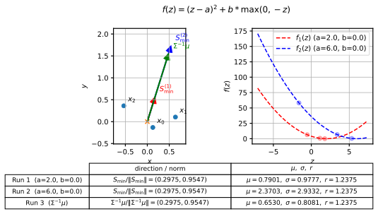

*Рисунок 11: *Игрушечный пример ($N=3$) с квадратичной потерей: изменение $a$ перемасштабирует минимизатор, но не меняет его направления.* Мы минимизируем $\frac{1}{3}\sum_{i=1}^{3}(S^{\top}x_{i}-a)^{2}$ по $S\in\mathbb{R}^{2}$ для двух значений $a$ (здесь $a=2$ и $a=6$, при $b=0$). Для сравнения мы также показываем направление $\Sigma^{-1}\boldsymbol{\mu}$. **Слева:** три точки $x_{1},x_{2},x_{3}$ и два минимизатора $S^{\min}_{1},S^{\min}_{2}$, которые коллинеарны. **Справа:** соответствующие логиты $\{S^{\top}x_{i}\}_{i=1}^{3}$ для обоих прогонов (показаны разными цветами), которые сдвигаются по абсолютной величине. **Снизу:** эмпирические $\mu$ (среднее), $\sigma$ (стд) и $r=\sigma/\mu$, показывающие, что коэффициент вариации неизменен между двумя прогонами.* **[p. 16]**

**Рисунок 12: добавляем хинжеподобный член (неквадратичный, негауссов).** Во втором игрушечном примере мы фиксируем $a=2$ и сравниваем $(a,b)=(2,0)$ против $(a,b)=(2,6)$. Теперь цель включает неквадратичный член $b\max(0,-z)$, а при всего трёх точках порождаемое распределение логитов крайне далеко от гауссова. В этой обстановке не выполняется ни одно из достаточных условий, лежащих в основе наших аргументов инвариантности (квадратичная потеря или гауссово распределение логитов), и мы действительно наблюдаем, что два минимизатора более не в точности коллинеарны (хотя их угол остаётся умеренным); см. рисунок 12.

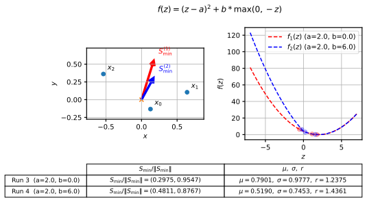

*Рисунок 12: *Игрушечный пример ($N=3$), где инвариантность не обязана держаться: добавление хинжеподобного члена меняет направление.* Мы минимизируем $\frac{1}{3}\sum_{i=1}^{3}\big[(S^{\top}x_{i}-a)^{2}+b\max(0,-S^{\top}x_{i})\big]$ для двух настроек: $(a,b)=(2,0)$ и $(a,b)=(2,6)$ на тех же трёх точках. Поскольку потеря более не чисто квадратична, а эмпирическое распределение логитов (при $N=3$) далеко от гауссова, два минимизатора не обязаны разделять одно направление, и мы наблюдаем заметное (но не крайнее) угловое отклонение между ними.* **[p. 17]**

**Инвариантность к $\alpha$ в случае гауссовой модели.** На рисунке 13 мы показываем, что когда данные взяты из гауссова распределения, направление почти плоско как функция $\alpha$, даже при малых значениях. Мы показываем это для разных значений $\lambda=d/N$. Лёгкое отклонение от полки ожидаемо из конечновыборочных эффектов.

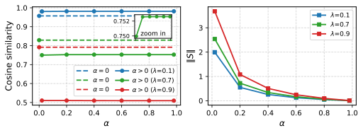

*Рисунок 13: **Левая панель:** Косинусное сходство $\boldsymbol{S}_{\min}$ с осью x. Пунктирная линия обозначает нерегуляризованное значение ($\alpha=0$). Мы наблюдаем резкий сдвиг от $\alpha=0$ к $\alpha>0$, за которым следует устойчивая полка, означающая, что направление весов по существу независимо от $\alpha$. **Правая панель:** Норма $\|\boldsymbol{S}_{\min}\|$, которая, напротив, демонстрирует явную зависимость от $\alpha$.* **[p. 17]**

### C.3 Альтернативное доказательство Предложения 3.1 через монотонность $Q(r)$

Мы даём эквивалентное доказательство, основанное на прямом определении цели $Q(r)$ и доказательстве её строгого возрастания по коэффициенту вариации $r$.

##### **Предложение C.3**(Переформулировка Предложения 3.1 для удобства)**.**

*Пусть $\boldsymbol{x}\in\mathbb{R}^{d}$ — гауссов, $\boldsymbol{x}\sim\mathcal{N}(\boldsymbol{\mu}_{x},\Sigma_{x})$ с $\boldsymbol{\mu}_{x}\neq\mathbf{0}$. Пусть $f:\mathbb{R}\to\mathbb{R}$ — выпуклая, дважды дифференцируемая, с единственным минимизатором в $m>0$. Для $\boldsymbol{S}\in\mathbb{R}^{d}$ определим логит*

$$
z=\boldsymbol{S}^{\top}\boldsymbol{x}\sim\mathcal{N}(\mu,\sigma^{2}),\qquad\mu(\boldsymbol{S})=\boldsymbol{S}^{\top}\boldsymbol{\mu}_{x},\quad\sigma^{2}(\boldsymbol{S})=\boldsymbol{S}^{\top}\Sigma_{x}\boldsymbol{S},
$$

*и популяционную цель $L(\boldsymbol{S})=\mathbb{E}[f(z)]$. Тогда любой минимизатор $\boldsymbol{S}_{\min}\in\arg\min_{\boldsymbol{S}}L(\boldsymbol{S})$ также минимизирует отношение*

$$
r(\boldsymbol{S})\;=\;\frac{\sigma(\boldsymbol{S})}{\mu(\boldsymbol{S})}\qquad\text{over all $\boldsymbol{S}$ such that $\mu(\boldsymbol{S})>0$.}
$$

##### Доказательство.

Запишем $\hat{\boldsymbol{S}}=\boldsymbol{S}/\|\boldsymbol{S}\|$ и определим

$$
\hat{z}\;=\;\hat{\boldsymbol{S}}^{\top}\boldsymbol{x}\sim\mathcal{N}(\hat{\mu},\hat{\sigma}^{2}),\qquad\hat{\mu}=\hat{\boldsymbol{S}}^{\top}\boldsymbol{\mu}_{x},\quad\hat{\sigma}^{2}=\hat{\boldsymbol{S}}^{\top}\Sigma_{x}\hat{\boldsymbol{S}}.
$$

Сначала заметим, что любое минимизирующее направление должно удовлетворять $\hat{\mu}>0$. Зафиксируем единичное направление $\hat{\boldsymbol{S}}$ и рассмотрим одномерное ограничение

$$
h(t)\;=\;\mathbb{E}\!\left[f\!\left(t\,\hat{z}\right)\right],\qquad t=\|\boldsymbol{S}\|\geq 0.
$$

По выпуклости $f$, $h$ выпукла по $t$, и $h(0)=f(0)$ с

$$
h^{\prime}(0)=\mathbb{E}\!\left[f^{\prime}(0)\,\hat{z}\right]=\hat{\mu}\,f^{\prime}(0).
$$

**[p. 16]**

Поскольку $f$ имеет единственный минимизатор в $m>0$, выпуклость влечёт $f^{\prime}(0)<0$. Если $\hat{\mu}<0$, то $h^{\prime}(0)>0$, и по выпуклости $h$ минимизируется при $t=0$. Если $\hat{\mu}>0$, то $h^{\prime}(0)<0$, и $h$ достигает своего единственного минимизатора при некотором $t>0$. Таким образом, переворот $\hat{\boldsymbol{S}}\mapsto-\hat{\boldsymbol{S}}$ строго улучшает потерю вблизи начала координат всякий раз, когда $\hat{\mu}<0$, поэтому всякое минимизирующее направление должно удовлетворять $\hat{\mu}>0$.

Предположим отныне $\mu(\boldsymbol{S})>0$. Пусть $Y\sim\mathcal{N}(0,1)$, так что

$$
z=\mu+\sigma Y=\mu(1+rY),\qquad r=\frac{\sigma}{\mu}.
$$

Определим

$$
q(\mu,r)\;=\;\mathbb{E}\!\left[f\!\left(\mu(1+rY)\right)\right],\qquad\mu>0,\ r\geq 0.
$$

Для фиксированного направления $\hat{\boldsymbol{S}}$ масштабирование $\boldsymbol{S}$ положительным множителем масштабирует $\mu$ и $\sigma$ одним и тем же множителем, следовательно, оставляет $r=\sigma/\mu$ инвариантным. Поэтому

$$
L_{\min}=\min_{\hat{\boldsymbol{S}}}\min_{\mu>0}q(\mu,r(\hat{\boldsymbol{S}})).
$$

Определим редуцированную цель

$$
Q(r)\;=\;\min_{\mu>0}q(\mu,r),
$$

так что

$$
L_{\min}=\min_{\hat{\boldsymbol{S}}}Q(r(\hat{\boldsymbol{S}})).
$$

Достаточно показать, что $Q$ строго возрастает на $(0,\infty)$. Пусть $\mu^{*}(r)$ — минимизатор $q(\mu,r)$ по $\mu>0$, так что $Q(r)=q(\mu^{*}(r),r)$. Дифференцируя и используя $\partial_{\mu}q(\mu^{*}(r),r)=0$ в оптимуме (теорема об огибающей), получаем

$$
\frac{dQ}{dr}=\frac{\partial q}{\partial r}(\mu^{*}(r),r)=\mu^{*}(r)\,\mathbb{E}\!\left[f^{\prime}\!\left(\mu^{*}(r)(1+rY)\right)Y\right].
$$

**[p. 17]**

Используя гауссово интегрирование по частям, $\mathbb{E}[g(Y)Y]=\mathbb{E}[g^{\prime}(Y)]$ для $Y\sim\mathcal{N}(0,1)$, с $g(y)=f^{\prime}(\mu^{*}(1+ry))$ и $g^{\prime}(y)=r\mu^{*}f^{\prime\prime}(\mu^{*}(1+ry))$, получаем

$$
\mathbb{E}\!\left[f^{\prime}\!\left(\mu^{*}(1+rY)\right)Y\right]=r\mu^{*}\,\mathbb{E}\!\left[f^{\prime\prime}\!\left(\mu^{*}(1+rY)\right)\right].
$$

Отсюда

$$
\frac{dQ}{dr}=r\,\mu^{*}(r)^{2}\,\mathbb{E}\!\left[f^{\prime\prime}\!\left(\mu^{*}(r)(1+rY)\right)\right].
$$

При $r>0$, $\mu^{*}(r)>0$ и выпуклой $f$ имеем $f^{\prime\prime}\geq 0$ (и $>0$ почти всюду, если $f$ строго выпукла), так что $\frac{dQ}{dr}>0$ для всех $r>0$. Следовательно, $Q$ возрастает по $r$, и минимизирующее направление должно достигать наименьшего достижимого $r(\hat{\boldsymbol{S}})=\hat{\sigma}/\hat{\mu}$. **[p. 18]** Эквивалентно, любой $\boldsymbol{S}_{\min}\in\arg\min_{\boldsymbol{S}}L(\boldsymbol{S})$ минимизирует $r(\boldsymbol{S})=\sigma(\boldsymbol{S})/\mu(\boldsymbol{S})$ на $\mu(\boldsymbol{S})>0$. ∎

### C.4 Явный вывод для квадратичного случая

Для построения интуиции мы рассматриваем педагогически поучительный случай, когда поцелевая потеря чисто квадратична, $\ell(z)=(z-a)^{2}$. В этой обстановке мы можем вывести оптимальный вектор весов явно и прямо продемонстрировать, что минимизация потери эквивалентна минимизации коэффициента вариации $r$.

Предположим, что потеря есть:

$$
\mathcal{L}(\boldsymbol{S})=\mathbb{E}\left[\left(z-a\right)^{2}\right], \tag{15}
$$

где $z=\boldsymbol{S}^{T}x$. Пусть направление весов — $\hat{\boldsymbol{S}}=\boldsymbol{S}/\|\boldsymbol{S}\|$, а норма — $g=\|\boldsymbol{S}\|$. Обозначим моменты единичного направления $\hat{\mu}=\mathbb{E}[\hat{\boldsymbol{S}}\cdot\boldsymbol{x}]$ и $\hat{\sigma}^{2}=\operatorname{Var}(\hat{\boldsymbol{S}}\cdot\boldsymbol{x})$. Статистики полного логита тогда $\mu=g\hat{\mu}$ и $\sigma=g\hat{\sigma}$.

Используя разложение смещение—дисперсия $\mathbb{E}[(z-a)^{2}]=\operatorname{Var}(z)+(\mathbb{E}[z]-a)^{2}$, потеря становится:

$$
\mathcal{L}(g,\hat{\boldsymbol{S}})\approx\sigma^{2}+(\mu-a)^{2}=g^{2}\hat{\sigma}^{2}+(g\hat{\mu}-a)^{2}. \tag{16}
$$

Сначала мы оптимизируем масштаб $g$ при фиксированном направлении $\hat{\boldsymbol{S}}$. Беря производную по $g$:

$$
\frac{\partial\mathcal{L}}{\partial g}=2g\hat{\sigma}^{2}+2(g\hat{\mu}-a)\hat{\mu}=0. \tag{17}
$$

Решая относительно $g$, получаем оптимальную норму:

$$
g^{*}=a\frac{\hat{\mu}}{\hat{\mu}^{2}+\hat{\sigma}^{2}}. \tag{18}
$$

Подставляя это обратно в выражение для среднего логита $\mu^{*}=g^{*}\hat{\mu}$, находим:

$$
\mu^{*}=a\frac{\hat{\mu}^{2}}{\hat{\mu}^{2}+\hat{\sigma}^{2}}=\frac{a}{1+r^{2}}, \tag{19}
$$

где $r=\hat{\sigma}/\hat{\mu}=\sigma/\mu$ — отношение скучивания. Это открывает эффект усадки: оптимальное среднее $\mu^{*}$ немного *меньше* цели $a$, чтобы снизить штраф за дисперсию.

Наконец, подстановка $g^{*}$ обратно в функцию потерь даёт минимальную потерю, достижимую для направления $\hat{\boldsymbol{S}}$:

$$
\mathcal{L}_{\min}(\hat{\boldsymbol{S}})=g^{*2}\hat{\sigma}^{2}+(g^{*}\hat{\mu}-a)^{2}=a^{2}\frac{\hat{\sigma}^{2}}{\hat{\mu}^{2}+\hat{\sigma}^{2}}=a^{2}\frac{1}{1+1/r^{2}}. \tag{20}
$$

Следовательно, минимизация полной потери математически эквивалентна минимизации коэффициента вариации $r$.

## Приложение D Дополнительные детали к разделу 7 (многоклассовая классификация)

В этом разделе мы дадим дополнительные детали для многоклассового случая. Мы покажем, что большинство результатов обобщаются естественно.

### D.1 Скучивание логитов

Мы рассматриваем $K$-классовый линейный классификатор $\boldsymbol{z}=W\boldsymbol{x}+\boldsymbol{b}$. Как обсуждалось в основном тексте, при добавлении выпуклой и симметричной функции логит-регуляризации $f(\boldsymbol{z})$ потеря в многоклассовом случае тоже разложима в сумму поцелевых функций потерь. Главное отличие в том, что теперь у каждого класса свой поцелевой минимум. Цель оптимизатора — скучить все логиты определённого класса к его соответствующему минимуму, и потому неявное смещение будет, снова, скучиванием логитов. Из симметрии этот минимум должен иметь вид

$$
\boldsymbol{z}_{c,k}^{*}=\begin{cases}q_{\mathrm{high}}&k=c\\
q_{\mathrm{low}}&else\end{cases} \tag{21}
$$

где $k=1,...,K$ — индекс класса, $c$ — класс логита (определяемый меткой), а $q_{\mathrm{high}}>q_{\mathrm{low}}$ — некоторые скаляры. Мы начнём с рассмотрения квадратичной потери и покажем, что «направление» и оптимальная точность генерализации инвариантны к её конкретным деталям.

**[p. 19]**

### D.2 Инвариантность к квадратичной функции логит-регуляризации

Мы обобщаем Следствие 3.2 на многоклассовую постановку. Предполагая, что поцелевая функция потерь квадратична *вокруг соответствующего классового минимума*, мы показываем, что точность генерализации инвариантна к конкретным целевым значениям (и тем самым к параметрам регуляризации).

##### **Предложение D.1**(Инвариантность квадратичной потери)**.**

*Рассмотрим многоклассовый линейный классификатор, минимизирующий эмпирическую потерю $\mathcal{L}=\frac{1}{N}\sum_{i}\ell(\boldsymbol{z}_{i},\boldsymbol{y}_{i})$, где поцелевая потеря квадратична:*

$$
\ell(\boldsymbol{z},\boldsymbol{y}_{c})=|\boldsymbol{z}-\boldsymbol{z}^{*}_{c}|^{2}, \tag{22}
$$

*и $\boldsymbol{z}^{*}_{c}\in\mathbb{R}^{K}$ — целевой вектор, специфичный для класса $c$. Тогда для любого $q\neq 0$ точность генерализации оптимального решения инвариантна к значению $q$.*

##### Доказательство.

Пусть $W\in\mathbb{R}^{K\times d}$ и $\boldsymbol{b}\in\mathbb{R}^{K}$. Логиты даны $\boldsymbol{z}_{i}=W\boldsymbol{x}_{i}+\boldsymbol{b}$. Заметим, что с точностью до глобального сдвига, компенсируемого свободным членом, можно считать $q_{\mathrm{low}}=0$. Поэтому $\boldsymbol{z}^{*}_{c}=q\boldsymbol{e}_{c}$. Функция потерь:

$$
\mathcal{L}(W,\boldsymbol{b})=\frac{1}{N}\sum_{i=1}^{N}|W\boldsymbol{x}_{i}+\boldsymbol{b}-q\boldsymbol{y}i|^{2}, \tag{23}
$$

где $\boldsymbol{y}_{i}$ — представление метки с одной единицей. Мы можем вынести $q^{2}$:

$$
\mathcal{L}(W,\boldsymbol{b})=q^{2}\frac{1}{N}\sum{i=1}^{N}\left|\left(\frac{1}{q}W\right)\boldsymbol{x}_{i}+\left(\frac{1}{q}\boldsymbol{b}\right)-\boldsymbol{y}_{i}\right|^{2}. \tag{24}
$$

Пусть $\tilde{W}=W/q$ и $\tilde{\boldsymbol{b}}=\boldsymbol{b}/q$. Минимизация $\mathcal{L}$ по $W,\boldsymbol{b}$ эквивалентна минимизации члена под суммой по $\tilde{W},\tilde{\boldsymbol{b}}$. Пусть $\tilde{W}_{\min},\tilde{\boldsymbol{b}}_{\min}$ — минимизаторы для случая $q=1$. Тогда минимизаторы для произвольного $q$ — просто $W_{\min}=q\tilde{W}_{\min}$ и $\boldsymbol{b}_{\min}=q\tilde{\boldsymbol{b}}_{\min}$. Предсказанный класс для тестовой точки $\boldsymbol{x}$:

$$
\hat{y}=\operatorname*{argmax}_{k}(W_{\min}\boldsymbol{x}+\boldsymbol{b}_{\min})_{k}=\operatorname*{argmax}_{k}(q(\tilde{W}_{\min}\boldsymbol{x}+\tilde{\boldsymbol{b}}_{\min}))_{k}. \tag{25}
$$

Поскольку $q$ — положительный скаляр, argmax (а значит, и точность) остаётся неизменным. ∎

В двоичной постановке (Предложение 3.1) скалярный коэффициент вариации $r=\sigma/\mu$ эквивалентен (с точностью до обращения) цели LDA: максимизация $\mu/\sigma$ — то же, что максимизация отношения Рэлея

$$
J(\boldsymbol{S})=\frac{(\boldsymbol{S}^{\top}\boldsymbol{\mu})^{2}}{\boldsymbol{S}^{\top}\Sigma\,\boldsymbol{S}},
$$

максимизатор которого — $\boldsymbol{S}\propto\Sigma^{-1}\boldsymbol{\mu}$. В многоклассовом случае критерий Фишера имеет стандартное обобщение, получаемое заменой скалярного отношения среднее—дисперсия на отношение межклассового и внутриклассового рассеяний. Записывая $\boldsymbol{\mu}_{c}$ для средних классов, $\boldsymbol{\mu}$ для глобального среднего и определяя рассеяния

$$
S_{B}=\sum_{c=1}^{K}\pi_{c}(\boldsymbol{\mu}_{c}-\boldsymbol{\mu})(\boldsymbol{\mu}_{c}-\boldsymbol{\mu})^{\top},\qquad \tag{26}
$$

многоклассовая цель Фишера для $(K\!-\!1)$-мерной проекции $U\in\mathbb{R}^{d\times(K-1)}$ есть

$$
J(U)=\mathrm{tr}\!\Big((U^{\top}S_{W}U)^{-1}\,U^{\top}S_{B}U\Big) \tag{27}
$$

(эквивалентно, $\det(U^{\top}S_{B}U)/\det(U^{\top}S_{W}U)$). Это сводится к двоичному критерию $\mu/\sigma$ при $K=2$ и максимизируется верхними $(K-1)$ обобщёнными собственными векторами пары $(S_{B},S_{W})$ (то есть $S_{W}^{-1}S_{B}$). Соответственно, естественный многоклассовый аналог нашего скалярного инварианта скучивания — фишеровское отношение рассеяний, кодируемое этими обобщёнными собственными значениями (или их суммой/произведением), а не единственное $\sigma/\mu$.

**[p. 20]**

### D.3 Сдвиг порога интерполяции ($\sigma_{f}=0$)

В этом разделе мы даём многоклассовое обобщение сдвига порога интерполяции в режиме бесшумных признаков. Мы также демонстрируем на рисунке 8, что динамика гроккинга достижима, а также тот факт, что логиты скучиваются в одной точке в конце обучения.

##### **Предложение D.2** **.**

*Рассмотрим многоклассовую модель с $\alpha>0$ и $\sigma_{f}=0$. Предположим предел $d,N\to\infty$ при $\lambda=d/N<1$. Далее, предположим, что средние классов $\{\boldsymbol{\mu}_{c}\}_{c=1}^{K}\subset\mathbb{R}^{d}$ натягивают $(K-1)$-мерное аффинное подпространство и аффинно независимы. Тогда параметры $W_{\min},\boldsymbol{b}_{\min}$, минимизирующие обучающую потерю, достигают совершенной точности генерализации.*

##### Доказательство.

Поскольку $\sigma_{f}=0$, любой пример $\boldsymbol{x}^{(i)}$, принадлежащий классу $c$, лежит в подпространстве, задаваемом средним класса плюс ортогональный шум:

$$
\boldsymbol{x}^{(i)}=\boldsymbol{\mu}_{c}+\boldsymbol{\xi}^{(i)}_{\perp}, \tag{28}
$$

где $\boldsymbol{\mu}_{c}$ — детерминированная сигнальная составляющая, а $\boldsymbol{\xi}^{(i)}_{\perp}$ лежит в ортогональном дополнении сигнального подпространства $\mathcal{S}=\operatorname{span}(\{\boldsymbol{\mu}_{k}\})$. Регуляризованная потеря — сумма строго выпуклых поцелевых потерь. Глобальная нижняя граница полной потери достигается тогда и только тогда, когда вектор логитов каждого примера $i$ класса $c$ совпадает в точности с единственным минимизатором классоспецифичной поцелевой потери, $\boldsymbol{z}^{*}_{c}\in\mathbb{R}^{K}$.

Мы раскладываем матрицу весов $W$ на составляющую, действующую на сигнальное подпространство, $W_{\mathrm{sig}}$, и составляющую, действующую на ортогональный шум, $W_{\perp}$. Мы строим решение, где $W_{\perp}=0$. Условие достижения глобального минимума на обучающем наборе становится:

$$
W_{\mathrm{sig}}\boldsymbol{\mu}_{c}+\boldsymbol{b}=\boldsymbol{z}^{*}_{c},\quad\forall c\in\{1,\dots,K\}. \tag{29}
$$

Мы можем переписать это в расширенных обозначениях. Пусть $\tilde{W}_{\mathrm{sig}}=[\boldsymbol{b},W_{\mathrm{sig}}]$ и $\tilde{\boldsymbol{\mu}}_{c}=[1,\boldsymbol{\mu}_{c}^{\top}]^{\top}$. Система:

$$
\tilde{W}_{\mathrm{sig}}M=Z^{*}, \tag{30}
$$

где столбцы $M$ — расширенные средние $\tilde{\boldsymbol{\mu}}_{c}$, а столбцы $Z^{*}$ — цели $\boldsymbol{z}^{*}_{c}$. Поскольку средние классов аффинно независимы, матрица $M\in\mathbb{R}^{K\times K}$ обратима. Таким образом, существует единственное решение $\tilde{W}_{\mathrm{sig}}=Z^{*}M^{-1}$.

При $\lambda<1$ потеря строго выпукла, что обеспечивает единственность этого решения. Тем самым выученные веса отображают каждый пример (обучающий или тестовый) класса $c$ точно в $\boldsymbol{z}^{*}_{c}$. Поскольку $\boldsymbol{z}^{*}_{c}$ минимизирует потерю для метки $c$, он обязан верно классифицировать вход, так что классификатор достигает $100\%$ точности. ∎

### D.4 Инвариантность к ортогональному шуму ($\sigma_{n}$)

Наконец, мы обобщаем Предложение 6.1 на многоклассовый случай.

##### **Предложение D.3** **.**

*Пусть $\alpha>0$ и $\lambda<1$. В многоклассовой постановке, описанной в разделе 7, точность генерализации оптимального классификатора независима от масштаба ортогонального шума $\sigma_{n}$.*

##### Доказательство.

Пусть данные класса $c$ — $\boldsymbol{x}=\boldsymbol{x}_{\mathrm{sig}}+\sigma_{n}\boldsymbol{\eta}_{\perp}$, где $\boldsymbol{x}_{\mathrm{sig}}\in\mathcal{S}$ и $\boldsymbol{\eta}_{\perp}\in\mathcal{S}^{\perp}$. Разложим матрицу весов как $W=W_{\mathrm{sig}}+W_{\perp}$, где строки $W_{\mathrm{sig}}$ лежат в $\mathcal{S}$, а строки $W_{\perp}$ — в $\mathcal{S}^{\perp}$. Логиты:

$$
\boldsymbol{z}=W_{\mathrm{sig}}\boldsymbol{x}_{\mathrm{sig}}+\sigma_{n}W_{\perp}\boldsymbol{\eta}_{\perp}+\boldsymbol{b}. \tag{31}
$$

Пусть $(W,\boldsymbol{b})$ — минимизатор при масштабе шума $\sigma_{n}$. Потеря зависит от логитов $\boldsymbol{z}_{i}$. Рассмотрим масштабирование шума $\sigma_{n}\to\beta\sigma_{n}$. Входной шум становится $\beta\sigma_{n}\boldsymbol{\eta}_{\perp}$. Чтобы сохранить те же оптимальные значения логитов (и тем самым то же минимальное значение потери), оптимизатор должен масштабировать ортогональную составляющую весов обратно: $W^{\prime}_{\perp}=\frac{1}{\beta}W_{\perp}$. Член, значимый для предсказания на тестовых данных, — скалярное произведение шума и весов:

$$
(\beta\sigma_{n}\boldsymbol{\eta}_{\perp})^{\top}(W^{\prime}_{\perp})^{\top}=\beta\sigma_{n}\boldsymbol{\eta}_{\perp}^{\top}(\frac{1}{\beta}W_{\perp}^{\top})=\sigma_{n}\boldsymbol{\eta}_{\perp}^{\top}W_{\perp}^{\top}. \tag{32}
$$

Этот член инвариантен к $\beta$. Поскольку сигнальный член $W_{\mathrm{sig}}\boldsymbol{x}_{\mathrm{sig}}$ не затронут $\sigma_{n}$, распределение тестовых логитов остаётся тождественным. Следовательно, точность инвариантна.

∎

**[p. 21]**

## Приложение E Дополнительные численные результаты

В этом разделе мы представим дополнительные численные результаты, поддерживающие наши результаты по всей статье.

### E.1 Расхождение между распределениями обучающих и тестовых логитов

Наша геометрическая рамка даёт механизм, объясняющий, почему тестовые логиты скучиваются менее плотно, чем обучающие. В режиме конечных данных оптимизатор находит направление весов, минимизирующее эмпирическую дисперсию *обучающих* логитов. Это часто достигается эксплуатацией конкретных шумовых корреляций для «пере-скучивания» данных — действенно снижая эмпирическую дисперсию ниже собственного популяционного уровня шума. Однако достижение этого требует отклонения выученного вектора весов от истинного сигнального направления $\boldsymbol{\mu}_{f}$. Это рассогласование вносит ненулевую ортогональную составляющую ($\boldsymbol{S}_{\perp}$), которая необходимо увеличивает дисперсию тестовых логитов (следующих популяционной статистике). Как следствие, тестовые скучивания рыхлее наблюдаемых при обучении, как продемонстрировано на рисунке 14.

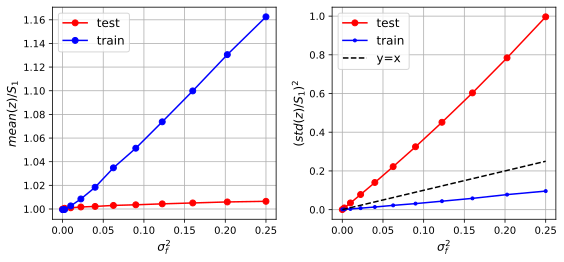

*Рисунок 14: **Статистики логитов против сигнального шума $\sigma_{f}$.** Среднее и стандартное отклонение логитов в постановке двоичной классификации показаны как функции $\sigma_{f}$. Диагональ ($y=x$) служит опорой для собственного сигнального шума. **Тестовый набор (генерализация):** Дисперсия даётся $\sigma_{z}^{2}=\sigma_{f}^{2}S_{1}^{2}+\sigma_{n}^{2}\|\boldsymbol{S}_{\perp}\|^{2}$. Из-за члена рассогласования $\|\boldsymbol{S}_{\perp}\|^{2}$ тестовое стандартное отклонение обычно превышает сигнальный вклад, лежащий выше опорной линии. **Обучающий набор:** Напротив, обучающее стандартное отклонение лежит ниже опорной линии. Это означает, что оптимизатор находит особое направление, минимизирующее дисперсию обучающих логитов ниже теоретической нижней границы сигнального шума ($\sigma_{z}^{2}S_{1}^{2}$). Здесь $\lambda=d/N=0.7$.* **[p. 21]**

### E.2 Фазовая диаграмма выгоды логит-регуляризации

В основном тексте (рисунок 6) мы представили фазовую диаграмму, характеризующую режим, где логит-регуляризация улучшает генерализацию. Тот анализ был сосредоточен на отделимой постановке ($\lambda=0.7>1/2$). Здесь мы рассматриваем неотделимый режим, $\lambda=0.4<1/2$ (см. рисунок 15).

Первичное различие этих режимов лежит в поведении нерегуляризованной базовой линии при росте ортогонального шума $\sigma_{n}$. В перепараметризованном случае ($\lambda>1/2$) обучающие данные обычно линейно отделимы из-за высокой размерности. Как следствие, с ростом $\sigma_{n}$ нерегуляризованное решение максимального зазора всё сильнее выравнивается с ортогональными шумовыми направлениями, а не с сигнальным признаком. Это заставляет косинусное сходство с истинной осью признака исчезать, деградируя точность генерализации к случайному угадыванию ($1/2$).

Напротив, при $\lambda<1/2$ данные в общем случае линейно не отделимы. Как следствие, нет «лёгкого» переобучающего решения, разделяющего обучающие точки шумовыми измерениями. Вместо этого рост амплитуды шума будет помогать выравниванию: высокий ортогональный шум действенно заглушает ложные корреляции, вынуждая оптимизацию «настраивать» зазор к 1 (см. нижние панели рисунка 17). Поэтому вместо распада к $1/2$ мы эмпирически наблюдаем, что точность нерегуляризованного решения насыщается на нетривиальном постоянном значении (см. левую панель рисунка 15). Этот сдвиг асимптотического поведения меняет топологию фазовой диаграммы. В общем случае конкретные границы выгодного режима будут зависеть от геометрического отношения $\lambda$ и лежащего в основе распределения данных.

*Рисунок 15: **Фазовая диаграмма выгоды при $\lambda<1/2$.** **Слева:** Итоговая точность генерализации как функция $\sigma_{n}$, сравнение нерегуляризованного ($\alpha=0$) и регуляризованного ($\alpha>0$) случаев, для $\lambda=0.4$. **Справа:** Фазовая диаграмма, показывающая области, где логит-регуляризация выгодна. Граничная кривая построена из точек пересечения (как показано на левой панели) для разных значений $\sigma_{f}$. Для иллюстрации точки пересечения нерегуляризованной и регуляризованной кривых для $\sigma_{f}=0.5,0.8$ (слева) отмечены крестами соответствующих цветов на граничной кривой (справа).* **[p. 22]**

**[p. 22]**

### E.3 Всеобъемлющие развёртки параметров

В этом подразделе мы представляем систематический численный анализ точности генерализации и косинусного сходства (относительно истинной оси признака). Мы выполняем развёртки параметров по отношению сторон $\lambda$, сигнальному шуму $\sigma_{f}$ и ортогональному шуму $\sigma_{n}$, сравнивая нерегуляризованную базовую линию ($\alpha=0$) с логит-регуляризованной моделью ($\alpha>0$).

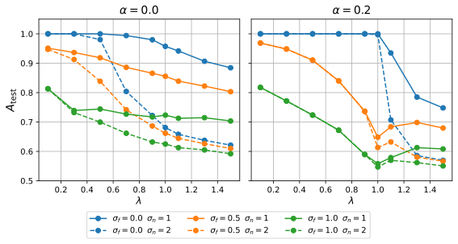

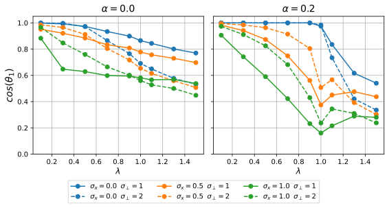

*Рисунок 16: **Качество как функция ёмкости модели ($\lambda=d/N$).** **Верхние панели:** Точность генерализации для нерегуляризованной (слева) и регуляризованной (справа) моделей. Разные цвета отвечают уровням сигнального шума $\sigma_{f}=\{0,0.5,1\}$, а сплошные/пунктирные линии обозначают уровни ортогонального шума $\sigma_{n}=\{1,2\}$. В регуляризованном случае (справа) видны два ключевых явления: (1) точность становится независимой от $\sigma_{n}$ при $\lambda<1$ и (2) в бесшумном по признаку случае ($\sigma_{f}=0$) порог интерполяции сдвигается с $\lambda=0.5$ на $\lambda=1$. **Нижние панели:** Косинусное сходство с истинной осью признака. В отличие от точности, косинусное сходство остаётся чувствительным к $\sigma_{n}$ в обоих режимах, подтверждая, что регуляризация стабилизирует качество предсказания, даже пока направление весов меняется.* **[p. 23]**

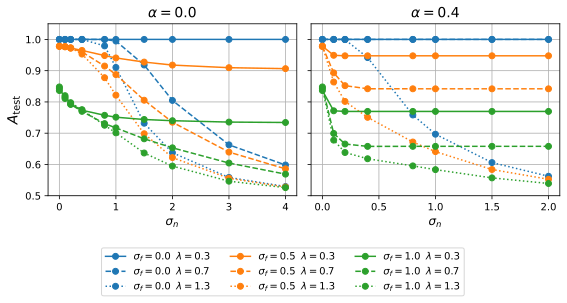

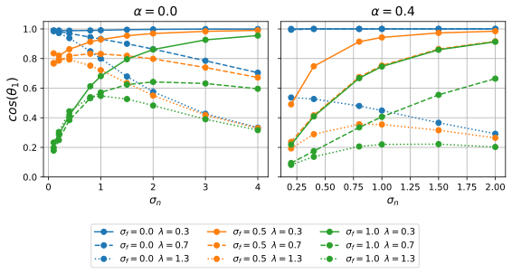

*Рисунок 17: **Чувствительность к амплитуде ортогонального шума $\sigma_{n}$.** **Верхние панели:** Точность генерализации против $\sigma_{n}$. Регуляризованная модель (справа) устойчива к изменениям $\sigma_{n}$, сохраняя постоянную точность. Замечание: лёгкое отклонение при крайне малых $\sigma_{n}$ — численный артефакт; время сходимости масштабируется обратно шуму, не давая симуляции полностью достичь теоретического оптимума в пределах фиксированного вычислительного бюджета в пределе $\sigma_{n}\to 0$. **Нижние панели:** Косинусное сходство против $\sigma_{n}$. Здесь мы наблюдаем различные режимы: в недопараметризованном случае ($\lambda<1/2$) рост шума улучшает выравнивание (сходство $\to 1$), тогда как в перепараметризованном случае ($\lambda>1/2$) рост шума ухудшает выравнивание.* **[p. 24]**

**[p. 24]**

### E.4 Сравнение с weight decay

Чтобы подчеркнуть уникальные геометрические свойства логит-регуляризации, мы противопоставляем её эффекты стандартной $L_{2}$-регуляризации параметров (Weight Decay). Мы рассматриваем целевую функцию:

$$
\mathcal{L}_{\mathrm{WD}}=\sum_{i}\log\left(1+e^{-y_{i}\boldsymbol{S}^{\top}\boldsymbol{x}_{i}}\right)+\frac{\gamma}{2}\|\boldsymbol{S}\|^{2}. \tag{33}
$$

###### p24-2

Хотя Weight Decay не даёт весам расходиться, он фундаментально отличается от логит-регуляризации тем, как он формирует ландшафт оптимизации. Как показано на рисунке 18, Weight Decay **не** порождает специфических свойств инвариантности, наблюдаемых при логит-регуляризации.

А именно, мы выделяем два ключевых отличия:

1. **Нет сдвига порога интерполяции:** В отличие от логит-регуляризации, добавление Weight Decay не сдвигает порог интерполяции в бесшумном по признаку режиме ($\sigma_{f}=0$). Точность генерализации не достигает $100\%$ по всей области $\lambda<1$, подтверждая, что механизм совершенной генерализации (скучивание логитов вокруг конечной цели) специфичен для поцелевой выпуклости логит-штрафов.
**[p. 25]**

2. **Чувствительность к ортогональному шуму:** Итоговая точность при Weight Decay остаётся явно зависящей от масштаба ортогонального шума $\sigma_{n}$. Это резко контрастирует с логит-регуляризованным случаем, где точность становится инвариантной к $\sigma_{n}$ (как показано на рисунке 16).

###### p25-2

Стоит отметить, что для линейных моделей квадратичная логит-регуляризация ($\alpha z^{2}$) может рассматриваться как обобщённая тихоновская регуляризация вида $\alpha\boldsymbol{S}^{\top}\hat{\Sigma}\boldsymbol{S}$, где $\hat{\Sigma}=\frac{1}{N}\sum_{i}\boldsymbol{x}_{i}\boldsymbol{x}_{i}^{\top}$ — эмпирическая нецентрированная ковариационная матрица. Эта завязанная на данные структура естественно подстраивает штраф под геометрию входных признаков — свойство, которого изотропный Weight Decay ($\gamma\boldsymbol{S}^{\top}\boldsymbol{I}\boldsymbol{S}$) лишён.

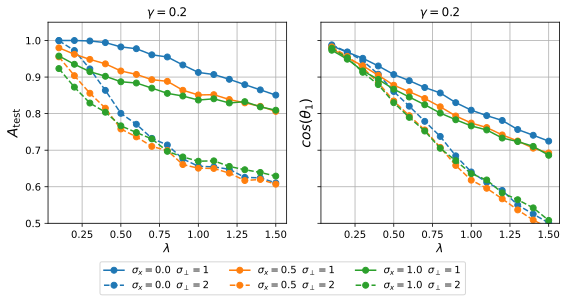

###### fig-18

*Рисунок 18: **Генерализация при Weight Decay.** Точность генерализации (сверху) и косинусное сходство (снизу), достигнутые при сходимости со стандартной $L_{2}$-регуляризацией ($\gamma=0.2$). В отличие от логит-регуляризации, точность остаётся чувствительной к $\sigma_{n}$ и не демонстрирует совершенной генерализации в режиме $\sigma_{f}=0$ при $0.5<\lambda<1$.* **[p. 25]**

### E.5 Зависимость косинусного сходства от амплитуд шума

В этом подразделе мы численно исследуем выравнивание выученных весов с истинным сигнальным направлением. Мы измеряем его через косинусное сходство $\rho=\cos(\theta_{1})$, анализируя его зависимость от ортогонального шума $\sigma_{n}$ и сигнального шума $\sigma_{f}$.

Сначала рассмотрим зависимость от $\sigma_{n}$. Напомним из основного текста (ур. 4), что выравнивание предсказывается масштабной формой:

$$
\cos(\theta_{1})=\frac{1}{\sqrt{1+\left(C/\sigma_{n}\right)^{2}}}, \tag{34}
$$

где $C$ — коэффициент, зависящий от $\sigma_{f}$, но строго независимый от $\sigma_{n}$. Это влечёт линейную связь между $1/\cos^{2}(\theta_{1})$ и $1/\sigma_{n}^{2}$. На рисунке 19 мы проверяем это предсказание численно: данные идеально ложатся на прямую $y=1+C^{2}x$, подтверждая справедливость нашего аналитического вывода.

Далее мы характеризуем коэффициент $C$, анализируя его зависимость от сигнального шума $\sigma_{f}$. Мы фиксируем $\sigma_{n}=1$ и отслеживаем компоненты вектора весов $\boldsymbol{S}=S_{1}\boldsymbol{e}_{1}+\boldsymbol{S}_{\perp}$. Как показано на левой панели рисунка 20, при малом $\sigma_{f}$ сигнальная составляющая $S_{1}$ остаётся приблизительно постоянной, тогда как ортогональная составляющая $\|\boldsymbol{S}_{\perp}\|$ растёт линейно с $\sigma_{f}$. Как следствие, отношение $C\propto\|\boldsymbol{S}_{\perp}\|/S_{1}$ демонстрирует линейную зависимость от $\sigma_{f}$ в малошумном режиме (см. рисунок 20, правая панель). Это показывает, что при исчезающем шуме признака ($\sigma_{f}\to 0$) модель меньше опирается на ложные ортогональные корреляции, восстанавливая совершенное выравнивание, предсказанное в бесшумном пределе.

*Рисунок 19: **Проверка масштабирования по $\sigma_{n}$.** График $1/\cos(\theta_{1})^{2}$ против $1/\sigma_{n}^{2}$. Линейная подгонка подтверждает функциональную форму, выведенную в ур. (34), где наклон отвечает $C^{2}$.* **[p. 26]**

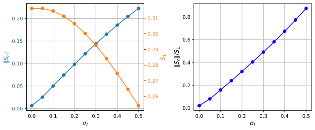

*Рисунок 20: **Зависимость от $\sigma_{f}$.** Все результаты при фиксированном $\sigma_{n}=1$. **Слева:** Величины ортогональной весовой составляющей $\|\boldsymbol{S}_{\perp}\|$ и сигнальной составляющей $S_{1}$ как функции $\sigma_{f}$. **Справа:** Отношение $\|\boldsymbol{S}_{\perp}\|/S_{1}$ (пропорциональное $C$) масштабируется линейно с $\sigma_{f}$ при малых амплитудах шума.* **[p. 26]**

**[p. 26]**

### E.6 Дополнительные детали численных постановок

Если не указано иное, мы рассматриваем линейную классификационную модель, обучаемую минимизацией регуляризованной потери $\mathcal{L}=\sum_{i}[(1-\alpha)\ell_{\mathrm{CE}}(z_{i},y_{i})+\alpha z_{i}^{2}]$. Для оптимизации мы используем полнобатчевый градиентный спуск (GD). Данные порождаются согласно разложению «сигнал плюс шум» $\boldsymbol{x}=y\mu_{f}\boldsymbol{e}_{1}+\boldsymbol{\xi}$, где $\boldsymbol{\xi}=\sigma_{f}\xi_{f}\boldsymbol{e}_{1}+\sigma_{n}\boldsymbol{\xi}_{\perp}$. В большинстве экспериментов шумовые составляющие $\xi_{f}$ и $\boldsymbol{\xi}_{\perp}$ берутся из стандартных нормальных распределений.

Ниже мы приводим точные гиперпараметры, использованные для каждого рисунка:

- **Рисунок 1** **(Скучивание):** **Верхний ряд ($\alpha=0$):** $d=1400$, $N=2000$ ($\lambda=0.7$), $\mu_{f}=1$, $\sigma_{f}=0.5$, $\sigma_{n}=1$. Модель обучается $20,000$ эпох со скоростью обучения $\eta=0.1$. **Нижний ряд ($\alpha>0$):** Те же параметры, но с $\alpha=0.2$. **Рисунок 1 (нулевой шум признака):** Те же параметры, но с $\sigma_{f}=0$ и $\alpha=0.2$.
- **Рисунок 2** **(Инвариантность при шуме Стьюдента):** Шум следует распределению Стьюдента с числом степеней свободы $\nu\in\{2.1,3,20\}$. Размерности $d=1000$, $N=1500$ ($\lambda\approx 0.67$) с $\mu_{f}=1$, $\sigma_{f}=1$, $\sigma_{n}=1$. Для $\alpha=0$ мы используем GD с $\eta=0.1$. Для $\alpha>0$ — оптимизатор Adam с $\eta=0.001$. Число эпох варьируется между $2,000$ и $10,000$ в зависимости от сходимости.
- **[p. 27]** **Рисунок 13** **(Приложение — инвариантность при гауссовом шуме):** Гауссовы данные с меняющейся размерностью $d\in\{200,1400,1800\}$ при фиксированном $N=2000$, что даёт $\lambda\in\{0.1,0.7,0.9\}$. Прочие параметры: $\mu_{f}=1$, $\sigma_{f}=0.5$, $\sigma_{n}=1$. Обучение $20,000$ эпох GD ($\eta=0.1$).
- **Рисунок 16** **(Качество против $\lambda$):** Мы меняем $d$ при фиксированном $N=2000$, разворачивая $\lambda$. Параметры: $\mu_{f}=1$. Сигнальный шум $\sigma_{f}\in\{0,0.5,1\}$. Ортогональный шум $\sigma_{n}\in\{0.2,4\}$. Регуляризация: сравниваем $\alpha=0$ и $\alpha=0.4$. Оптимизация: GD с $\eta=0.1$ на $20,000$ эпох.
- **Рисунок 18** **(Качество WD):** Мы меняем $d$ при фиксированном $N=2000$, разворачивая $\lambda$. Параметры: $\mu_{f}=1$. $\sigma_{f}\in\{0,0.5,1\}$. $\sigma_{n}\in\{1,2\}$. Регуляризация: $\alpha=0$, но $\gamma=0.2$ (WD). Оптимизация: GD с $\eta=0.1$ на $2,000$ эпох.
- **Рисунок 19** **(Косинусное сходство против $\sigma_{n}$):** Фиксируем $d=1400$, $N=2000$ ($\lambda=0.7$). Параметры: $\mu_{f}=1$, $\sigma_{f}=0.5$. Разворачиваем $\sigma_{n}\in[0.5,3]$. Регуляризация: $\alpha=0.2$. Оптимизация: GD с $\eta=0.1$ на $2,000$ эпох.
- **Рисунок 20** **(Косинусное сходство против $\sigma_{f}$):** Фиксируем $d=1400$, $N=2000$ ($\lambda=0.7$). Параметры: $\mu_{f}=1$, $\sigma_{n}=1$. Разворачиваем $\sigma_{f}\in[0,0.5]$. Регуляризация: $\alpha=0.4$. Оптимизация: оптимизатор Adam с $\eta=0.01$ на $1,000$ эпох.
- **Рисунок 5** **(Гроккинг):** Фиксируем $d=1400$, $N=2000$ ($\lambda=0.7$) в режиме бесшумных признаков. Параметры: $\mu_{f}=0.1$, $\sigma_{f}=0$, $\sigma_{n}=1$. Регуляризация: сравниваем $\alpha\in\{0,0.001,0.01,0.1\}$. Оптимизация: GD с $\eta=0.1$ на продлённую длительность $200,000$ эпох.
- **Рисунок 6** **(Фазовая диаграмма $\lambda=0.7$):** $d=1400$, $N=2000$. Мы интерполируем теоретические кривые по симуляциям с развёрткой $\sigma_{n}$ от $0.1$ до $6$. Параметры: $\mu_{f}=1$. $\alpha=0.4$. Оптимизация: GD с $\eta=0.1$ на $20,000$ эпох.
- **Рисунок 15** **(Фазовая диаграмма $\lambda=0.4$):** $d=800$, $N=2000$. Параметры: $\mu_{f}=1$. $\alpha=0.4$. Оптимизация: GD с $\eta=0.1$ на $20,000$ эпох.
- **Рисунок 7** **(Многоклассовый):** $K=10$ классов. $d=1400$, $N=2000$ ($\lambda=0.7$). Параметры: $\mu_{f}=1$, $\sigma_{f}=0.1$, $\sigma_{n}=1$. Регуляризация: $\alpha=0$ и $\alpha=0.2$. Оптимизация: оптимизатор GD с $\eta=0.1$ на $20,000$ эпох.
- **Рисунок 8** **(Многоклассовый гроккинг):** $K=10$ классов. $d=1400$, $N=2000$ ($\lambda=0.7$). Как в предыдущем, но при $\sigma_{f}=0$ и $\alpha=0.04$.

**[p. 28]**

#### E.6.1 ResNet-18 (рисунки 3 и 9)

Мы извлекаем 512-мерные предпоследние признаки из замороженной ResNet-18, предобученной на ImageNet. Для экспериментов с линейным пробником мы отбираем $N_{\text{train}}=1000$ сбалансированных обучающих примеров и используем оставшиеся $N_{\text{test}}=9000$ примеров для оценки. Мы сравниваем качество на чистом тестовом наборе CIFAR-10 и на CIFAR-10-C (Impulse Noise, Severity 5).

**Разложение признаков и оценка шума:** Чтобы отобразить сложное распределение признаков на нашу теоретическую модель «сигнал плюс шум», мы выполняем поклассовое разложение. Пусть $X\in\mathbb{R}^{N\times d}$ — матрица векторов признаков, а $y$ — метки. Для каждого класса $c$ мы вычисляем эмпирическое среднее $\boldsymbol{\mu}_{c}\in\mathbb{R}^{d}$ и центрированную ковариационную матрицу $\Sigma_{c}$.

1. **Сигнальное подпространство:** Мы определяем сигнальное подпространство $\mathcal{S}$ как оболочку разностей средних классов, $\mathcal{S}=\text{span}(\{\boldsymbol{\mu}_{c}-\boldsymbol{\mu}_{1}\}_{c=2}^{K})$. Мы вычисляем ортонормированный базис $Q_{1}\in\mathbb{R}^{d\times(K-1)}$ для $\mathcal{S}$ через QR-разложение.
2. **Ортогональное подпространство:** Мы дополняем базис до $\mathbb{R}^{d}$ ортогональным дополнением $Q_{2}\in\mathbb{R}^{d\times(d-K+1)}$, так что $U=[Q_{1},Q_{2}]$ унитарна.
3. **Проекция шума и вычисление RMS:** Мы проецируем поклассовые ковариации на эти подпространства. Эффективные амплитуды шума, приводимые на рисунках, вычисляются как среднеквадратичное (RMS) стандартных отклонений в каждом подпространстве, усреднённое по всем классам:

$$
\sigma_{f}^{\text{eff}}=\frac{1}{K}\sum_{c=1}^{K}\sqrt{\text{Tr}(Q_{1}^{\top}\Sigma_{c}Q_{1})/\text{dim}(\mathcal{S})},\quad\sigma_{n}^{\text{eff}}=\frac{1}{K}\sum_{c=1}^{K}\sqrt{\text{Tr}(Q_{2}^{\top}\Sigma_{c}Q_{2})/\text{dim}(\mathcal{S}^{\perp})}. \tag{35}
$$

 Для сопоставимости между наборами данных с разными масштабами сигнала мы нормируем эти значения средним попарным расстоянием между центроидами классов.

**Синтетическое ортогональное масштабирование:** Чтобы проверить инвариантность к ортогональному шуму (Fig. 11, Right), мы синтетически манипулируем геометрией данных. Мы проецируем каждый вектор признаков $\boldsymbol{x}_{i}$ на ортогональное подпространство через матрицу проекции $P_{\perp}=Q_{2}Q_{2}^{\top}$ и масштабируем эту составляющую множителем $\gamma$:

$$
\boldsymbol{x}_{i}^{\text{scaled}}=(I-P_{\perp})\boldsymbol{x}_{i}+\gamma P_{\perp}\boldsymbol{x}_{i}. \tag{36}
$$

Эта операция масштабирует эффективный $\sigma_{n}$ множителем $\gamma$, сохраняя сигнальную геометрию точно. Линейный классификатор затем обучается на этих масштабированных признаках оптимизатором Adam ($\eta=10^{-4}$) на $30,000$ эпох.

[^1]: Почти любая поцелевая потеря, определённая в уравнении 1, может считаться квадратичной достаточно близко к своему минимуму.
