# Xu 2026 — Low-Dimensional and Transversely Curved Optimization Dynamics in Grokking

См. также: [глобальный индекс понятий](../../concepts/index.md).

**Yongzhong Xu** (аффилиация в статье не указана; переписка — abbyxu@gmail.com).

arXiv [2602.16746](https://arxiv.org/abs/2602.16746), февраль 2026 (версия v3 — 3 апреля 2026). 10 цитирований — двадцать пятая по цитируемости работа корпуса. Источник — нативный HTML arXiv версии v3.

Оригинал и производные файлы этой папки:

- [`original/2602.16746.native.html`](original/2602.16746.native.html) — первоисточник, нативный HTML arXiv (v3), скачан как есть.
- [`original/2602.16746.low-dimensional-and-transversely-curved-optimization-dynamics-in-grokking.md`](original/2602.16746.low-dimensional-and-transversely-curved-optimization-dynamics-in-grokking.md) — конверсия оригинала в Markdown без правок содержания.
- [`images/`](images/) — 37 иллюстраций статьи в исходном разрешении.

Схема якорей и правила ссылок на карточку — в [README папки статей](../README.md).

## Затрагиваемые понятия

**[Ландшафт потерь и бассейны](../../concepts/loss-landscape-basins.md)** — центральный тезис работы: гроккинг есть **затяжное удержание** траектории на низкоразмерном подпространстве, в течение которого поперечная кривизна накапливается барьером, пока траектория не сбежит в обобщающее решение ([`p3-2`](#p3-2)). Картина «удержание → рост барьера → бегство» разворачивается в четыре фазы динамической системы: сжатие на медленное многообразие, поперечная неустойчивость, критический переход, перестройка ([`p17-6`](#p17-6)).

**[Разрежённая подсеть / lottery ticket](../../concepts/sparse-subnetwork-lottery-ticket.md)** — низкоразмерность здесь измерена, а не постулирована: PCA траекторий весов внимания даёт **68–83 % дисперсии в одной главной компоненте** во всех 36 условиях ([`p6-7`](#p6-7)). Авторы называют это подпространство *исполнительным многообразием*. Контроли без weight decay тоже дают высокую PC1%, но нулевая модель случайного блуждания отстоит на $5$–$20$ стандартных отклонений ([`p6-8`](#p7-1)), так что сосредоточенность не есть артефакт гладкости траектории.

**[Спектральный анализ](../../concepts/spectral-analysis-svd-esd-fve.md)** — механизм найден в спектре весов и изложен как **хронология**: сперва сокращается нижний зазор $g_{23}$, затем ведущие моды почти вырождаются ($\sigma_{1}\approx\sigma_{2}$), затем резко растёт коммутаторный дефект, затем матричный коммутатор $\|[W_{Q},W_{K}]\|_{F}$ достигает пика, затем одна мода начинает главенствовать, и лишь затем растёт точность на тесте ([`p13-7`](#p13-7), [`p14-1`](#p14-1), [`fig-19`](#fig-19)). Почти вырождение создаёт **неустойчивость ориентации**: при близких сингулярных числах соответствующие векторы вольны поворачиваться, и разные порядки мини-пакетов толкают базис в разные стороны ([`p14-7`](#p14-7)).

**[Причинные вмешательства](../../concepts/causal-ablation-intervention.md)** — работа не остановилась на корреляции и проверила три опровержимые гипотезы ([`p12-2`](#p12-2)). **Необходимость подтверждена**: проецирование градиента на выученные направления PCA с силой $s=1.0$ убивает гроккинг во всех 12 сидах по четырём операциям, с монотонным откликом на дозу ([`p12-5`](#p12-5), [`fig-14`](#fig-14)). **Достаточность отвергнута**: направленные толчки вдоль коммутатора с амплитудой до $500\times$ нормы градиентного шага не ускоряют гроккинг ни в одном из 27 прогонов ([`p12-7`](#p12-7), [`fig-16`](#fig-16)). **Избирательность подтверждена**: случайные проекции той же размерности при промежуточных силах не дают ничего ([`fig-15`](#fig-15)).

**[Меры прогресса](../../concepts/progress-measures.md)** — коммутаторный дефект как величина устроен изящно и дёшево: он измеряет некоммутативность двух градиентных шагов по разным мини-пакетам и в ведущем порядке пропорционален скобке Ли градиентных векторных полей, **не требуя вычисления гессиана** ([`p5-1`](#p5-1), [`p5-4`](#p5-4)). Начало его роста опережает генерализацию на 600–1600 шагов при $\eta=10^{-3}$ (знаковый критерий $p=2^{-12}$) ([`p9-2`](#p9-2)).

**[Фазовый переход](../../concepts/phase-transition.md)** — окно предупреждения подчиняется степенному закону $\Delta t\propto t_{\mathrm{grok}}^{\,\alpha}$ с $\alpha=1.27\pm 0.03$ ($R^{2}=0.97$, $n=43$) при переборе скорости обучения в $300\times$ ([`p11-4`](#p11-4), [`fig-11`](#fig-11)). Поскольку $\alpha>1$, окно растёт **сверхлинейно**: при $\eta=3\times 10^{-5}$ дефект начинается в первых 5 % обучения.

**[Скорость обучения](../../concepts/learning-rate.md)** — скорость обучения играет роль **демпфирования**, и это первое в корпусе выделение трёх режимов: при малых $\eta$ движение передемпфировано (выравнивание траектории с кривизной ниже случайного уровня, дефект копится долго), при больших — недодемпфировано (выравнивание выше уровня, переход быстрый), между ними критическое демпфирование ([`p11-5`](#p11-5), [`p11-7`](#p11-7), [`fig-13`](#fig-13)). Граница «грокает — не грокает» при этом к скорости обучения **инвариантна** ([`p11-2`](#p11-2)).

**[Модульная арифметика](../../concepts/modular-arithmetic.md)** — постановка каноническая (двухслойный трансформер, $p=97$, 50/50 на обучение и тест, около 290 тыс. параметров), шесть операций, из которых четыре грокают, а $a^{2}+ab+b^{2}$ и $a^{3}+ab$ не грокают никогда ([`p4-1`](#p4-1), [`tab-1`](#tab-1)). Это те же две операции, что и у Furuta et al., — совпадение, которое корпусу стоит держать в виду.

**[Weight decay](../../concepts/weight-decay.md)** — служит здесь не объяснением, а недостающей составляющей: те же грокающие операции без weight decay обнаруживают сопоставимое ускорение дефекта, **не обобщая** ([`p18-2`](#p18-2)). Отсюда прямой вывод: одного роста кривизны мало, нужна ещё регуляризационная нагрузка.

**[Механистическая интерпретируемость](../../concepts/mechanistic-interpretability.md)** — связь предложена как истолкование, а не показана: образование исполнительных многообразий отвечает сосредоточению вычисления в низкоразмерных подпространствах, и гроккинг «знаменует переход от распределённых представлений к контуроподобной организации» ([`p19-5`](#p19-5)). Ни один контур в работе не выделен.

**[Плоские минимумы](../../concepts/goldilocks-zone.md)** — тем же ходом объясняется устойчивость к сжатию: после гроккинга кривизна заперта в направлениях, которые оптимизатор не посещает, и потому решение устойчивее к возмущениям вдоль выученного подпространства ([`p19-2`](#p19-2)). Это рассуждение, а не замер: ни квантование, ни сжатие в работе не проверялись.

Отдельно стоит сказать, чего в работе **нет**. Нет предсказателя: авторы прямо пишут, что доступные геометрические сигналы **не складываются** в составной признак, различающий грокающие и не грокающие операции заранее ([`p18-2`](#p18-2)). Нет и теории: аналитическая модель накопления дефекта и образования многообразия названа открытой задачей ([`p19-8`](#p19-8)).

Карточки статей корпуса: [Power et al. 2022](../2201.02177.grokking-generalization-beyond-overfitting-on-small-algorithmic-datasets/2201.02177.grokking-generalization-beyond-overfitting-on-small-algorithmic-datasets.card.md) — постановка; [Nanda et al. 2023](../2301.05217.progress-measures-for-grokking-via-mechanistic-interpretability/2301.05217.progress-measures-for-grokking-via-mechanistic-interpretability.card.md) — контуры гроккинга, названные в обзоре; [Omnigrok](../2210.01117.omnigrok-grokking-beyond-algorithmic-data/2210.01117.omnigrok-grokking-beyond-algorithmic-data.card.md) — управление нормой весов; [Merrill et al. 2023](../2303.11873.a-tale-of-two-circuits-grokking-as-competition-of-sparse-and-dense-subnetworks/2303.11873.a-tale-of-two-circuits-grokking-as-competition-of-sparse-and-dense-subnetworks.card.md) и [Varma et al. 2023](../2309.02390.explaining-grokking-through-circuit-efficiency/2309.02390.explaining-grokking-through-circuit-efficiency.card.md) — объяснения через подсети и эффективность; [Kumar et al. 2024](../2310.06110.grokking-as-the-transition-from-lazy-to-rich-training-dynamics/2310.06110.grokking-as-the-transition-from-lazy-to-rich-training-dynamics.card.md) — переход от ленивого к богатому; [Thilak et al. 2022](../2206.04817.the-slingshot-mechanism-an-empirical-study-of-adaptive-optimizers-and-grokking/2206.04817.the-slingshot-mechanism-an-empirical-study-of-adaptive-optimizers-and-grokking.card.md) — рогатка; [Гроккинг как фазовый переход первого рода](../2310.03789.grokking-as-a-first-order-phase-transition-in-two-layer-networks/2310.03789.grokking-as-a-first-order-phase-transition-in-two-layer-networks.card.md) — другая работа корпуса, читающая гроккинг языком фазовых переходов.

**[Многообразие исполнения](../../concepts/execution-manifold.md)** — работа даёт понятию имя и меру. Речь не о подсети, а о числе направлений, по которым идёт траектория: гроккингу отвечает *«затяжное удержание на низкоразмерном подпространстве пространства весов»*, из которого траектория в конце концов выходит ([`p1-2`](#p1-2)). Отличие от разрежённой подсети существенно — там считают, сколько весов нужно, здесь сколько степеней свободы задействовано, и величина эта измеряется долей дисперсии на первой главной компоненте ([`p6-7`](#p6-7)).

**[Критичность / критическая точка](../../concepts/criticality-critical-point.md)** — та же картина без самого слова: задержка описана как удержание в **метастабильном** режиме, а обобщение наступает, когда траектория из него выходит ([`p3-2`](#p3-2)). Родство с языком критических точек здесь по существу, а не по названию: управляющий параметр не назван, порог не измерен, и заявки о критическом показателе работа не делает.

**[Отрицательные результаты](../../concepts/negative-results.md)** — работа предъявляет свой отрицательный результат наравне с положительными: толчки вдоль коммутатора не ускоряют обобщение, и потому *«одного накопления дефекта недостаточно, чтобы вызвать гроккинг»* ([`p12-7`](#p12-7)). Ценность в том, как он сформулирован — не «эффекта не видно», а «эффект укладывается в разброс между сидами».

**[Разброс по семенам и воспроизводимость](../../concepts/seed-variance-reproducibility.md)** — разброс служит здесь не оговоркой, а порогом значимости: именно через него отрицательный результат и получает силу ([`p12-7`](#p12-7)). Тот же разброс подпирает и положительную часть — доля дисперсии на первой компоненте держится в 68–83 % во всех 36 условиях ([`p6-7`](#p6-7)).
## Что показано, а что предположено

Замечания редактора карточки по итогам разбора утверждений (`…claims.txt`). Работа необычна для корпуса устройством: одно измеримое понятие (коммутаторный дефект), одна геометрическая картина и — редкость — полный набор вмешательств, проверяющих её причинно.

**Причинная часть — лучшее в работе.** Три гипотезы сформулированы опровержимо и проверены каждая своим опытом ([`p12-2`](#p12-2)). Ответ вышел несимметричным и потому содержательным: ортогональный поток градиента **необходим** (подавление убивает гроккинг с откликом на дозу), но **не достаточен** (толчки до $500\times$ не дают ничего). Отрицательный результат приведён полностью, а не спрятан.

**Контроль на случайном подпространстве обязателен и он есть.** В пространстве около 290 тыс. измерений любое $K$-мерное подпространство ловит около $\sqrt{K/P}$ случайного вектора, и без сравнения со случайным базисом $\rho\approx 1.000$ не значило бы ничего ([`p6-3`](#p6-3)). Отношение исполнительного к случайному в $1.8$–$2.9\times$ и проверка устойчивости к выбору $K$ ([`p8-2`](#p8-2)) делают вывод осмысленным. Тот же контроль применён к проекциям, к смене знака и к обратному разбору — методическая аккуратность здесь выше средней по корпусу.

**Мера инвариантности сама по себе пуста.** $\rho\approx 1.000$ во **всех** 36 условиях, включая не грокающие ([`p7-2`](#p7-3)), и авторы честно пишут, что она «тождественно равна 1» и потому не различает ничего ([`p18-2`](#p18-2)). Всю работу делают отношение к случайному уровню и величина дефекта.

**Слово «инвариантность» употреблено с оговоркой, и это правильно.** Прямо сказано: инвариантность оценивается через почти-ортогональность на конечных окнах, а не в строгом смысле динамических систем; язык дифференциальной геометрии применяется описательно к дискретной стохастической оптимизации ([`p6-2`](#p6-2)). Такая оговорка в корпусе встречается редко и заслуживает быть отмеченной.

**Хронология установлена статистически, но разделение — задним числом.** Начало дефекта опережает гроккинг во всех 12 прогонах ($p=2^{-12}$) ([`p9-2`](#p9-2)). Однако не грокающие операции тоже дают рост в $30$–$50\times$, и хотя по **суммарной** величине группы не пересекаются ($513\times$ против $47\times$), на ранних шагах кривые перекрываются ([`p9-3`](#p9-3)). Авторы сами делают из этого правильный вывод: начало есть необходимое предусловие, а не предсказатель.

**Степенной закон подогнан по 43 точкам одной постановки.** $\alpha=1.27\pm 0.03$ при $R^{2}=0.97$ ([`p11-4`](#p11-4)) — хорошая подгонка, но все точки получены на одной архитектуре, одном модуле и шести значениях $\eta$. Заявка о «сверхлинейном росте окна предупреждения» верна внутри этого перебора и не проверена вне его.

**Три режима демпфирования — самая заметная новая мысль и самое слабо подкреплённое место.** Названы передемпфированный, критически демпфированный и недодемпфированный режимы ([`p11-7`](#p11-7)), причём различие измерено одной величиной — выравниванием траектории с кривизной — на **двух** операциях и в **трёх** контрольных точках ([`p11-5`](#p11-5)). Аналогия с демпфированием остаётся аналогией: уравнения движения не выписаны.

**Опора на собственные препринты требует внимания.** Работа надстраивается над Xu (2026a) и подробно соотносится с рамкой внутрисигнального зазора Xu (2026b), включая ссылки на её теорему 12.22 и замечание 12.22 ([`p16-2`](#p16-2)). Обе работы того же автора и в корпусе отсутствуют, так что часть цепочки для читателя вики непроверяема.

**Масштаб постановки скромен, и это признано.** Двух-трёхслойные трансформеры, около 290 тыс. параметров, модульная арифметика по модулю 97 ([`p19-6`](#p19-6)); полное воспроизведение — примерно 9 часов на одной машине Apple серии M ([`p20-3`](#p21-2)). Предварительные опыты на языках Дейка и SCAN упомянуты как продолжающиеся, то есть в статье их нет.

**Место в корпусе.** Работа даёт корпусу дешёвую и воспроизводимую величину — коммутаторный дефект, — которая обнаруживает перестройку ландшафта за сотни и тысячи шагов до того, как что-либо видно в точности. Её главный вклад не в объяснении, а в **различении**: показано, что рост кривизны необходим и недостаточен, а значит, объяснения гроккинга одной лишь геометрией ландшафта заведомо неполны без регуляризационной нагрузки.

---

# Текст статьи

## Аннотация

###### p1-2

Гроккинг — резкое наступление генерализации много позже запоминания — бросает вызов обычным объяснениям того, как учатся нейронные сети, однако геометрические механизмы, движущие этим переходом, поняты плохо. Мы предполагаем, что гроккингу отвечает затяжное удержание на низкоразмерном подпространстве пространства весов, в течение которого накапливаются барьеры поперечной кривизны, пока траектория не сбежит в обобщающее решение. Мы выделяем это подпространство — *исполнительное многообразие* — в пространстве весов трансформеров, обучаемых модульной арифметике. С помощью PCA траекторий весов внимания и разбора коммутаторного дефекта по шести бинарным операциям по модулю 97 мы показываем, что изменение весов при гроккинге по существу одномерно: одна главная компонента улавливает 68–83 % дисперсии в 36 экспериментальных условиях. Затем мы измеряем кривизну ландшафта потерь через коммутаторные дефекты — некоммутативность последовательных градиентных шагов — и проецируем их на выученное подмногообразие. Коммутаторные векторы преимущественно ортогональны исполнительному многообразию, даже по сравнению со случайными базовыми уровнями (отношение исполнительного к случайному $\approx 2$–$3\times$), что указывает: подпространство *эмпирически инвариантно* относительно динамики оптимизации — кривизна не сбивает траекторию с её выученного подпространства. При этом кривизна взрывается ортогонально: у грокающих операций коммутаторный дефект в $10$–$1000\times$ выше, чем у не грокающих контролей, и сосредоточен целиком в нормальном расслоении исполнительного многообразия. Начало этого роста кривизны неизменно *предшествует* переходу к генерализации на 600–1600 шагов обучения при $\eta=10^{-3}$ (знаковый критерий $p=2^{-12}<0.001$), хотя не грокающие операции тоже обнаруживают умеренный рост кривизны ($30$–$50\times$), не обобщая, — так что начало необходимо, но не достаточно. При переборе скорости обучения в $300\times$ время опережения подчиняется степенному закону $\Delta t\propto t_{\mathrm{grok}}^{\,\alpha}$ с $\alpha=1.27\pm 0.03$ ($R^{2}=0.97$, $n=43$): поскольку $\alpha>1$, предсказательное окно растёт сверхлинейно с временны́м масштабом гроккинга — при $\eta=3\!\times\!10^{-5}$ начало дефекта наступает в первых 5 % обучения, давая 95 % окна предупреждения. Все находки воспроизводятся во всём этом диапазоне скоростей обучения, в качественно ином медленном режиме ($\mathrm{lr}=5\!\times\!10^{-5}$, $\mathrm{wd}=0.1$, 3 слоя) и на трёх случайных сидах, хотя динамика выравнивания количественно различается между режимами. Опыты с причинным вмешательством устанавливают, что ортогональный поток градиента необходим, но не достаточен для гроккинга: его подавление предотвращает генерализацию с монотонным откликом на дозу по четырём операциям, тогда как искусственное усиление коммутаторных дефектов не даёт ничего. Спектральный разбор SVD весов вскрывает механизм: гроккингу предшествует почти вырождение ведущих сингулярных чисел матриц внимания ($\sigma_{1}\approx\sigma_{2}$), создающее неустойчивость ориентации, которая и движет коммутаторным переходом. Генерализация совпадает с нарушением этой спектральной симметрии, когда одна мода начинает главенствовать. Подтверждено, что эта спектральная структура не зависит от базиса: три независимых разложения (SVD весов, SVD смещений, SVD градиентов) обнаруживают согласованную смену знака в выравнивании коммутатора с подпространством в момент гроккинга.

## 1 Введение

Гроккинг — явление, при котором нейронные сети, обучаемые на малых алгоритмических наборах, сперва запоминают обучающее множество, а затем, много позже достижения безупречной точности на обучении, внезапно **[p. 2]** обобщают на тестовое, — впервые описан Power et al. (2022) на задачах модульной арифметики. Явление привлекло значительное внимание, поскольку бросает вызов привычному пониманию, будто генерализация и запоминание тесно связаны в динамике оптимизации.

###### p2-1

Прежние работы описывали гроккинг через призму обучения представлениям (Nanda et al., 2023), weight decay как неявной регуляризации (Liu et al., 2022), образования контуров (Zhong et al., 2024) и фазовых переходов в ландшафтах потерь. Недавно Xu (2026a) показал, что траектория в пространстве весов при гроккинге лежит на низкоразмерном исполнительном многообразии, причём PCA обнаруживает, что одна главная компонента улавливает большую часть дисперсии траектории. Однако основной геометрический вопрос остаётся открытым: *инвариантно ли это низкоразмерное многообразие относительно динамики оптимизации — сбивает ли кривизна траекторию с её выученного подпространства — и предсказывает ли его геометрия, когда наступит генерализация?*

Опираясь на Xu (2026a), мы беремся за этот вопрос, изучая дифференциальную геометрию траектории в пространстве параметров при гроккинге. Наш подход соединяет собственный анализ PCA с разбором коммутаторного дефекта, который прощупывает устройство кривизны ландшафта потерь относительно выученного подмногообразия:

1. **Собственный анализ PCA** траекторий весов внимания, обнаруживающий внутреннюю размерность выученного подмногообразия; 2. **Разбор коммутаторного дефекта**, измеряющий кривизну ландшафта потерь и её отношение к выученному подмногообразию.

Коммутаторный дефект выражает некоммутативность последовательных градиентных шагов: для двух мини-пакетов $A$ и $B$ дефект измеряет, насколько итоговый вектор параметров зависит от порядка градиентных обновлений. В плоской области ландшафта потерь градиентные шаги коммутируют; в искривлённой — нет. Проецируя эти коммутаторные векторы на подмногообразие PCA, мы можем определить, плоско выученное подпространство или искривлено.

#### Основные вклады.

Наша работа делает шесть основных вкладов, охватывающих наблюдение, предсказание и причинную проверку:

1. **Многообразие ранга 1**: траектория в пространстве весов при гроккинге лежит на подмногообразии ранга 1 (68–83 % дисперсии в PC1). 2. **Инвариантное подмногообразие**: это подмногообразие обнаруживает сильную эмпирическую инвариантность относительно динамики оптимизации: коммутаторные дефекты преимущественно ортогональны ему ($\rho\approx 1.000$ в пределах численной точности по 36 условиям, при отношении исполнительной проекции к случайной $\approx 2$–$3\times$), а значит, кривизна не сбивает траекторию с её выученного подпространства. 3. **Хронология**: во время гроккинга кривизна взрывается ортогонально (рост в $10$–$1000\times$), и её начало неизменно *предшествует* генерализации на 600–1600 шагов. Не грокающие операции обнаруживают умеренный рост кривизны ($30$–$50\times$) без генерализации, так что начало необходимо, но не достаточно. 4. **Закон масштабирования**: время опережения между началом дефекта и генерализацией подчиняется степенному закону $\Delta t\propto t_{\mathrm{grok}}^{\,\alpha}$ с $\alpha=1.27\pm 0.03$ ($R^{2}=0.97$) при переборе скорости обучения в $300\times$: предсказательное окно растёт с 24 % при $\eta=3\!\times\!10^{-3}$ до 95 % при $\eta=3\!\times\!10^{-5}$. 5. **Причинные вмешательства**: подавление ортогонального потока градиента предотвращает гроккинг (необходимость), тогда как усиление коммутаторных дефектов не даёт ничего (недостаточность), что устанавливает несимметричную причинную связь. **[p. 3]**

6. **Устойчивость**: все результаты воспроизводятся во всём диапазоне скоростей обучения, при различии временны́х масштабов между режимами в $200\times$, на четырёх операциях и трёх сидах. 7. **Спектральный механизм**: разбор SVD весов обнаруживает, что коммутаторный переход движим кратковременным почти вырождением ведущих сингулярных чисел ($\sigma_{1}\approx\sigma_{2}$) матриц внимания, за которым следует нарушение симметрии, когда одна мода начинает главенствовать и операторы выравниваются.

###### p3-2

Наш основной тезис: гроккинг отражает затяжное удержание динамики оптимизации внутри низкоразмерного подпространства пространства весов, в течение которого кривизна накапливается в поперечных направлениях; генерализация возникает, когда траектория выходит из этого метастабильного режима. Остальная часть статьи развивает эту картину количественно и прощупывает её причинное устройство.

#### Устройство статьи.

Дальше мы идём так. Раздел 2 описывает постановку эксперимента. Раздел 3 описывает геометрические средства: собственный анализ PCA, коммутаторный дефект, проецирование на многообразие и выравнивание траектории с кривизной. Раздел 4 приводит результаты в три приёма: геометрическое устройство (разделы 4.1–4.3), предсказательная сила и устойчивость (разделы 4.4–4.6) и причинные вмешательства (раздел 4.7). Раздел 5 выделяет спектральный механизм, лежащий в основе коммутаторного перехода: событие нарушения симметрии в спектре сингулярных чисел матриц внимания. Раздел 6 обсуждает следствия и связи с более широкими темами.

## 2 Постановка эксперимента

### 2.1 Модель и обучение

Мы берём кодировщик-трансформер, следуя канонической постановке гроккинга Power et al. (2022). Модель обрабатывает два целочисленных токена $a,b\in\{0,\ldots,p-1\}$ (при $p=97$) и предсказывает $f(a,b)\bmod p$ для бинарной операции $f$.

#### Архитектура.

Модель состоит из:

- вложения токенов $\mathrm{Emb}:\{0,\ldots,96\}\to\mathbb{R}^{128}$ и обучаемого позиционного вложения $\mathbf{P}\in\mathbb{R}^{2\times 128}$; - двухслойного кодировщика-трансформера с пред-нормализацией (LayerNorm перед вниманием и FFN), $d_{\text{model}}=128$, 4 головы внимания, $d_{\text{ff}}=256$, активация GELU, без dropout; - завершающего LayerNorm и линейной головы $\mathbb{R}^{128}\to\mathbb{R}^{97}$, применяемой к первой позиции токена.

Общее число параметров — около 290 тысяч.

#### Обучение.

Мы обучаем с AdamW ($\beta_{1}=0.9$, $\beta_{2}=0.98$) при скорости обучения $10^{-3}$ и weight decay $\lambda=1.0$ (или $\lambda=0.0$ для не грокающих контролей), размере пакета 512, обрезке градиента на 1.0 и разбиении 50/50 на обучение и тест. Обучение идёт до 200 тыс. шагов с ранней остановкой, когда точность на тесте превосходит 98 % на трёх подряд проверках. Мы говорим, что модель **грокнула**, если точность на тесте достигает 98 % и держится там три проверки подряд (ранняя остановка). Для грокнувших прогонов мы определяем **шаг гроккинга** $t_{\text{grok}}$ как первый шаг, на котором точность на тесте достигает 90 %, — более низкий порог, улавливающий начало генерализации, а не её плато; он и применяется всюду при разборе времени опережения. (Ни одна не грокающая операция ни в одном условии не превосходит 78 % точности на тесте, так что этот порог не смешивает две группы.)

**[p. 4]**

#### Операции.

###### p4-1

Мы проверяем шесть бинарных операций по модулю 97, четыре из которых при этих гиперпараметрах обнаруживают гроккинг, а две — нет (таблица 1).

*Таблица 1: Проверяемые операции. Шаг гроккинга — средний шаг, на котором точность на тесте достигает 90 %, усреднённый по 3 сидам.* **[p. 4]**

###### tab-1

| Операция | Формула | Грокает? | Шаг гроккинга | |---|---|---|---| | add | $(a+b)\bmod 97$ | Да | $\sim$2900 | | sub | $(a-b)\bmod 97$ | Да | $\sim$3400 | | mul | $(a\times b)\bmod 97$ | Да | $\sim$2600 | | x2_y2 | $(a^{2}+b^{2})\bmod 97$ | Да | $\sim$1900 | | x2_xy_y2 | $(a^{2}+ab+b^{2})\bmod 97$ | Нет | — | | x3_xy | $(a^{3}+ab)\bmod 97$ | Нет | — |

### 2.2 Режимы гиперпараметров

Чтобы проверить инвариантность по режимам, мы дополнительно проводим прогон в **медленном режиме** с качественно иными гиперпараметрами: $\mathrm{lr}=5\times 10^{-5}$, $\lambda=0.1$, 3 слоя трансформера и $\beta_{2}=0.999$. В этом режиме гроккинг наступает на $\sim$570 тыс. шагов (против $\sim$3 тыс. в быстром режиме), что даёт различие временны́х масштабов обучения в $200\times$.

### 2.3 Запись весов внимания

В ходе обучения мы записываем четыре матрицы весов внимания — $W_{Q}$, $W_{K}$, $W_{V}$ (извлекаемые из слитой in_proj_weight) и $W_{O}$ (out_proj.weight) — каждые 100 шагов. Каждая матрица имеет размер $128\times 128$ (или $128\times 32$ на голову), что даёт последовательность снимков для последующего разбора методом PCA.

## 3 Методы

### 3.1 Собственный анализ PCA траекторий весов

Для каждой матрицы весов внимания $W\in\mathbb{R}^{d\times d}$ мы собираем $T$ снимков обучения $\{W_{t}\}_{t=1}^{T}$ и вычисляем PCA на развёрнутой в вектор траектории *изменений* весов от инициализации:

$$
X=\begin{bmatrix}\mathrm{vec}(W_{1}-W_{0})\\
\vdots\\
\mathrm{vec}(W_{T}-W_{0})\end{bmatrix}\in\mathbb{R}^{T\times d^{2}}, \tag{1}
$$

после центрирования столбцов. Мы вычисляем SVD $X=U\Sigma V^{\top}$ и определяем долю объяснённой дисперсии $k$-й главной компоненты как $\sigma_{k}^{2}/\sum_{i}\sigma_{i}^{2}$. Величина PC1% $=100\times\sigma_{1}^{2}/\sum_{i}\sigma_{i}^{2}$ измеряет долю дисперсии траектории, улавливаемую одним направлением.

#### Исполнительное многообразие.

Мы определяем **исполнительное подпространство** (далее — *исполнительное многообразие*) как низкоразмерное подпространство, натянутое на первые $K$ направлений PCA траектории весов. Конкретно, пусть $V_{K}=[v_{1},\ldots,v_{K}]$ — первые $K$ правых сингулярных векторов $X$. Исполнительное многообразие — это аффинное подпространство $\mathcal{M}=\{W_{0}+V_{K}\alpha:\alpha\in\mathbb{R}^{K}\}$, проходящее через начальные веса $W_{0}$. Когда PC1% велика ($>70\%$), это многообразие по существу имеет ранг 1: траектория весов удерживается на одномерной кривой в пространстве параметров.

**[p. 5]**

### 3.2 Коммутаторный дефект

###### p5-1

*Наглядно.* Если ландшафт потерь локально плосок, порядок применения двух градиентных обновлений не важен: обновление сперва пакетом $A$, затем $B$ даёт то же, что $B$, затем $A$. В искривлённой области порядок важен — как ходьба по сфере сперва на восток, затем на север приводит не туда же, куда сперва на север, затем на восток. Коммутаторный дефект выражает эту зависимость от порядка и даёт местную пробу кривизны ландшафта потерь, не требующую вычисления гессиана.

*Формальное построение.* Коммутаторный дефект измеряет кривизну ландшафта потерь, выражая некоммутативность градиентных шагов по двум независимым мини-пакетам. Для нынешних параметров $\theta_{0}$ и двух мини-пакетов $A,B$:

$$
\theta_{AB} =\theta_{0}-\eta\,g_{A}(\theta_{0})-\eta\,g_{B}(\theta_{0}-\eta\,g_{A}(\theta_{0})) \\
\theta_{BA} =\theta_{0}-\eta\,g_{B}(\theta_{0})-\eta\,g_{A}(\theta_{0}-\eta\,g_{B}(\theta_{0})) \tag{2}
$$

где $g_{A}(\theta)=\nabla_{\theta}\mathcal{L}_{A}(\theta)$ — градиент перекрёстно-энтропийной потери на мини-пакете $A$ в точке $\theta$, а $\eta=10^{-3}$ — постоянная величина шага. (Нормированный по масштабу) коммутаторный дефект есть:

$$
\mathcal{D}=\frac{\left\|\theta_{AB}-\theta_{BA}\right\|}{\left\|\eta\,g_{A}\right\|\cdot\left\|\eta\,g_{B}\right\|}. \tag{4}
$$

###### p5-4

Мы обосновываем это разложением Тейлора первого порядка: в ведущем порядке по $\eta$ имеем $\theta_{AB}-\theta_{BA}\approx\eta^{2}(\nabla g_{B}\cdot g_{A}-\nabla g_{A}\cdot g_{B})$, что есть скобка Ли градиентных векторных полей. Тем самым $\mathcal{D}$ пропорционален скобке Ли стохастических градиентных векторных полей и служит заместителем местной нелинейности ландшафта потерь: если ландшафт локально плосок, градиентные шаги коммутируют и $\mathcal{D}=0$.

Мы вычисляем $K=9$ независимых выборок $\mathcal{D}$ в каждой точке измерения и приводим медиану, что даёт устойчивую оценку.

### 3.3 Проецирование на многообразие PCA

Чтобы определить, лежит ли кривизна ландшафта потерь внутри выученного подмногообразия или вне его, мы строим ортонормированный базис $B\in\mathbb{R}^{P\times K}$ подпространства PCA, вложенного в полное пространство параметров ($P\approx 290$ тыс.).

Для каждого слоя трансформера и каждой матрицы весов внимания $\{W_{Q},W_{K},W_{V},W_{O}\}$:

1. Вычислить первые 2 направления PCA по траектории весов (каждое — вектор в $\mathbb{R}^{d^{2}}$); 2. Вложить каждое направление в полное пространство параметров с нужным смещением; 3. Сложить все вложенные направления и ортонормировать QR-разложением.

Для коммутаторного вектора $\delta=\theta_{AB}-\theta_{BA}$ мы раскладываем его как:

$$
\delta=\underbrace{B\,B^{\top}\delta}_{\delta_{\parallel}\;\text{(projected)}}+\underbrace{(\delta-B\,B^{\top}\delta)}_{\delta_{\perp}\;\text{(residual)}}. \tag{5}
$$

**Мерой инвариантности** служит остаточная доля:

$$
\rho=\frac{\left\|\delta_{\perp}\right\|}{\left\|\delta\right\|}. \tag{6}
$$

Если $\rho\approx 1$, коммутатор ортогонален подпространству PCA, а значит, кривизна ландшафта потерь заперта в нормальном расслоении и исполнительное многообразие эмпирически приблизительно инвариантно относительно наблюдаемой динамики оптимизации: кривизна не сбивает траекторию с её выученного подпространства. Если $\rho\approx 0$, кривизна лежит внутри выученного подпространства и подмногообразие не инвариантно.

**[p. 6]**

#### Поперечное расцепление.

Мы говорим, что динамика оптимизации **поперечно расцеплена** на исполнительном многообразии $\mathcal{M}$, если векторы коммутаторного дефекта заперты в его нормальном расслоении ($\rho\approx 1$). В этом режиме возмущения, вызванные кривизной, действуют почти целиком ортогонально $\mathcal{M}$, так что наблюдаемая траектория остаётся в выученном подпространстве на протяжении обучения. Это понятие чисто эмпирическое и не должно смешиваться с интегрируемостью в гамильтоновом смысле.

###### p6-2

Всюду мы употребляем слово «инвариантный» в эмпирическом смысле: инвариантность оценивается через почти-ортогональность коммутаторных дефектов выученному подпространству PCA на конечных окнах обучения, а не в строгом смысле динамических систем как точная инвариантность относительно непрерывного потока. Хотя наш разбор пользуется языком дифференциальной геометрии, все величины вычисляются для стохастической оптимизации с дискретным временем; геометрические выражения употребляются описательно, а не в строгом непрерывном смысле.

### 3.4 Контроль на случайном подпространстве

###### p6-3

Чтобы убедиться, что близкая к нулю доля проекции $1-\rho$ отражает подлинное геометрическое устройство, а не тривиальный артефакт размерности — любое $K$-мерное подпространство $\mathbb{R}^{P}$ улавливает $\sim\!\sqrt{K/P}$ случайного вектора, — мы сравниваем проекцию на базис PCA со случайным базовым уровнем. Для каждого коммутаторного вектора $\delta$ мы вычисляем долю проекции на $N_{\text{rand}}=5$ случайных $K$-мерных ортонормированных базисов (порождённых QR-разложением гауссовых случайных матриц) и усредняем результаты. Отношение $\text{proj}_{\text{exec}}/\text{proj}_{\text{rand}}$ и есть ключевой признак: значения заметно выше $1.0$ подтверждают, что подпространство PCA улавливает больше энергии коммутатора, чем ожидается по случайности. Поскольку абсолютные величины проекций в пространствах высокой размерности исчезают ($\text{proj}/\text{full}\sim\sqrt{K/P}\ll 1$ для любого $K$-мерного подпространства $\mathbb{R}^{P}$), геометрически осмысленны лишь нормированные сравнения со случайными подпространствами; поэтому всюду мы приводим $\rho$ вместе с отношением исполнительного к случайному.

### 3.5 Обратный разбор: выравнивание траектории с кривизной

В качестве обратной проверки мы спрашиваем, *избегает* ли траектория весов направлений высокой кривизны. В каждой контрольной точке мы вычисляем среднюю абсолютную косинусную близость между шагом траектории $\Delta\theta_{t}=\theta_{t}-\theta_{t-1}$ и $K=12$ коммутаторными векторами $\{\delta_{k}\}$:

$$
\bar{c}_{t}=\frac{1}{K}\sum_{k=1}^{K}\frac{|\Delta\theta_{t}\cdot\delta_{k}|}{\left\|\Delta\theta_{t}\right\|\,\left\|\delta_{k}\right\|}. \tag{7}
$$

Для сравнения: ожидаемый абсолютный косинус между случайными векторами в $\mathbb{R}^{P}$ равен $\sqrt{2/(\pi P)}\approx 1.5\times 10^{-3}$ при $P=290$ тыс. Если $\bar{c}_{t}$ близко к этому уровню, траектория не выровнена с направлениями кривизны.

## 4 Результаты

Мы излагаем находки в три приёма. Сперва мы устанавливаем геометрическое устройство гроккинга: траектории весов ранга 1 на инвариантном подмногообразии с ортогональным взрывом кривизны (разделы 4.1–4.3). Затем мы описываем временну́ю связь между ростом кривизны и генерализацией и показываем устойчивость по режимам и скоростям обучения (разделы 4.4–4.6). Наконец, мы проверяем причинность прицельными вмешательствами (раздел 4.7).

### 4.1 Изменение весов имеет ранг 1

###### p6-7

PCA траекторий весов внимания обнаруживает, что первая главная компонента улавливает 68–83 % дисперсии траектории во всех грокающих условиях (рисунок 1). Изменение весов при гроккинге по существу одномерно.

**[p. 7]**

*(a) PC1% для гроккинга (wd=1.0) против прогонов без weight decay (wd=0.0) по операциям. Грокающие операции неизменно показывают высокую PC1%.*

*(b) Первые 5 собственных чисел по каждой операции. Первое собственное число главенствует во всех операциях.*

*Рисунок 1: Траектории весов при гроккинге имеют ранг 1. **(a)** PC1% по операциям: грокающие прогоны (wd=1.0) показывают 68–83 % дисперсии в одной компоненте. **(b)** Спектр собственных чисел с главенствующим первым.* **[p. 7]**

###### p7-1

Контроли без weight decay ($\lambda=0$) тоже показывают умеренно высокую PC1%, но сравнение с нулевой моделью обнаруживает, что значения PC1% при гроккинге на 5–20 стандартных отклонений выше уровня случайного блуждания (рисунок 2(a)), что подтверждает: сосредоточенность не есть артефакт гладкости траектории.

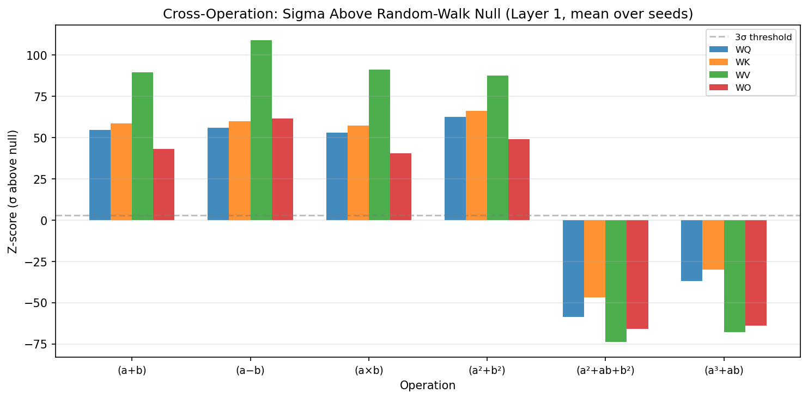

*(a) Z-оценки относительно нулевой модели случайного блуждания. Все операции превосходят нулевую модель на $>5\sigma$.*

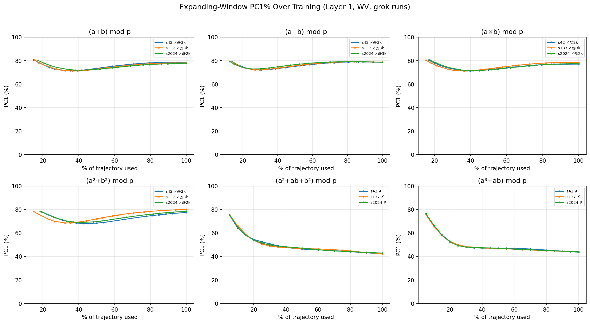

*(b) Изменение PC1% в ходе обучения. Сосредоточенность растёт по мере продвижения гроккинга.*

*Рисунок 2: Сосредоточенность PCA подлинна и растёт в ходе обучения. **(a)** Z-оценки выше нулевой модели случайного блуждания. **(b)** PC1% по расширяющемуся окну в ходе обучения.* **[p. 7]**

### 4.2 Исполнительное многообразие обнаруживает эмпирическую инвариантность

Установив, что траектория весов лежит на низкоразмерном подмногообразии, мы спрашиваем: обнаруживает ли это подмногообразие инвариантность относительно динамики оптимизации — сбивает ли кривизна ландшафта потерь траекторию с её выученного подпространства или же кривизна заперта в ортогональных направлениях?

###### p7-3

Мы вычисляем коммутаторные дефекты в регулярных контрольных точках обучения и проецируем каждый коммутаторный вектор на базис PCA (раздел 3.3). Главный результат: остаточная доля $\rho=\left\|\delta_{\perp}\right\|/\left\|\delta\right\|$ равна $\approx 1.000$ в пределах численной точности во всех 36 условиях (6 операций $\times$ 2 настройки weight decay $\times$ 3 сида), как показано на рисунке 3. Кривизна заперта целиком в нормальном расслоении исполнительного многообразия; подмногообразие эмпирически инвариантно относительно потока оптимизации. Отметим, что это близкое к единице значение отражает высокую размерность пространства параметров ($P\approx 290$ тыс.) по сравнению с подпространством PCA ($K=16$–$24$); отношение исполнительного к случайному (раздел 3.4) даёт дополнительную проверку того, что малая параллельная составляющая геометрически осмысленна.

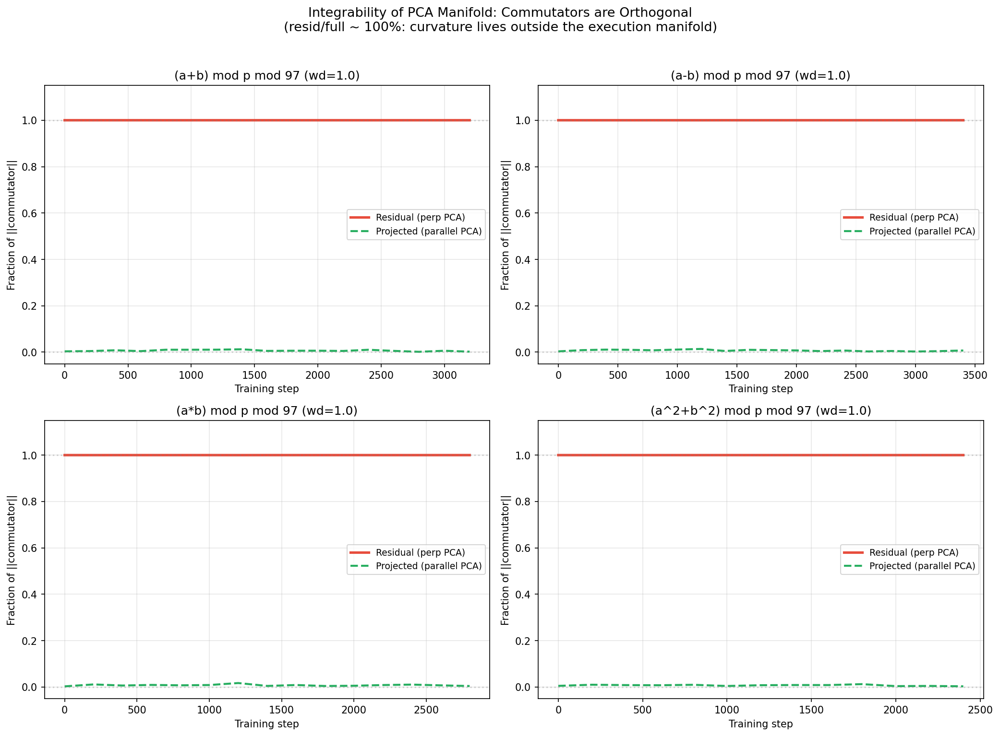

*(a) Мера инвариантности: остаточная доля **[p. 8]** $\rho\approx 1.0$ в каждой контрольной точке, то есть коммутаторные векторы преимущественно ортогональны исполнительному многообразию.*

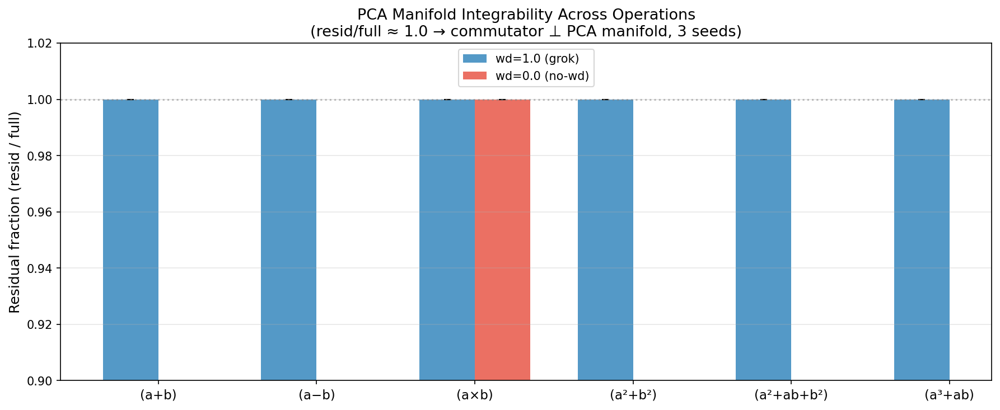

*(b) Воспроизведение на нескольких сидах: $\rho\approx 1.000$ в пределах численной точности во всех 36 условиях, что подтверждает эмпирическую инвариантность.*

*Рисунок 3: Исполнительное многообразие обнаруживает эмпирическую инвариантность относительно динамики оптимизации. Векторы коммутаторного дефекта преимущественно ортогональны подпространству PCA, а кривизна заперта в нормальном расслоении.* **[p. 8]**

Это означает, что главная составляющая кривизны ландшафта потерь лежит *вне* тех направлений, которыми модель на деле пользуется при обучении. Траектория весов развивается на инвариантном подмногообразии: несмотря на огромную кривизну в объемлющем пространстве параметров, кривизна заперта в ортогональных направлениях и не сбивает траекторию оптимизации с её выученного подпространства.

#### Контроль на случайном подпространстве.

###### p8-2

Чтобы убедиться, что близкая к нулю проекция на базис PCA отражает подлинную геометрию, а не артефакт размерности, мы сравниваем со случайными $K$-мерными подпространствами (раздел 3.4). Рисунок 4 приводит долю проекции для базиса PCA (исполнительного) и для случайного уровня в ходе обучения. Во всех четырёх грокающих операциях исполнительный базис улавливает в $1.8$–$2.9\times$ больше энергии коммутатора, чем случайное подпространство той же размерности ($K=24$), что подтверждает: малая параллельная составляющая геометрически устроена. Мы проверяем, что это отношение устойчиво к изменению размерности PCA $K$: снижение до $K=16$ или повышение до $K=32$ даёт отношения исполнительного к случайному в том же диапазоне, что подтверждает независимость результата от конкретного выбора $K$. Существенно, что обе проекции очень малы (proj/full $<0.05$), в согласии с мерой инвариантности $\rho\approx 1.000$: в пространстве $\sim$290 тыс. измерений любое $K$-мерное подпространство улавливает пренебрежимо малую энергию произвольного вектора. Тем не менее подпространство PCA улавливает устроенный избыток над случайным полом, что подтверждает: близкое к единице $\rho$ отражает подлинную геометрическую ортогональность, а не просто высокую размерность.

**[p. 9]**

*(a) Доля проекции (proj/full) для исполнительного базиса (зелёный) и случайного уровня (красный) в ходе обучения. Исполнительный базис неизменно улавливает больше энергии коммутатора.*

*(b) Совмещённый вид: коммутаторный дефект (красный), отношение исполнительного к случайному (зелёный) и точность на тесте (синий пунктир). Отношение исполнительного к случайному неизменно выше 1.0 при гроккинге.*

*Рисунок 4: Контроль на случайном подпространстве подтверждает, что проекция на PCA геометрически устроена, а не есть артефакт размерности. Отношение исполнительного к случайному $\approx 1.8$–$2.9\times$ по операциям.* **[p. 9]**

### 4.3 Во время гроккинга кривизна взрывается ортогонально

Хотя исполнительное многообразие остаётся эмпирически инвариантным (кривизна заперта в нормальном расслоении), *величина* кривизны в ортогональных направлениях в ходе гроккинга существенно меняется. У операций, которые грокают, коммутаторный дефект в 10–1000$\times$ выше, чем у не грокающих контролей (рисунок 5), и эта кривизна сосредоточена преимущественно вне многообразия PCA.

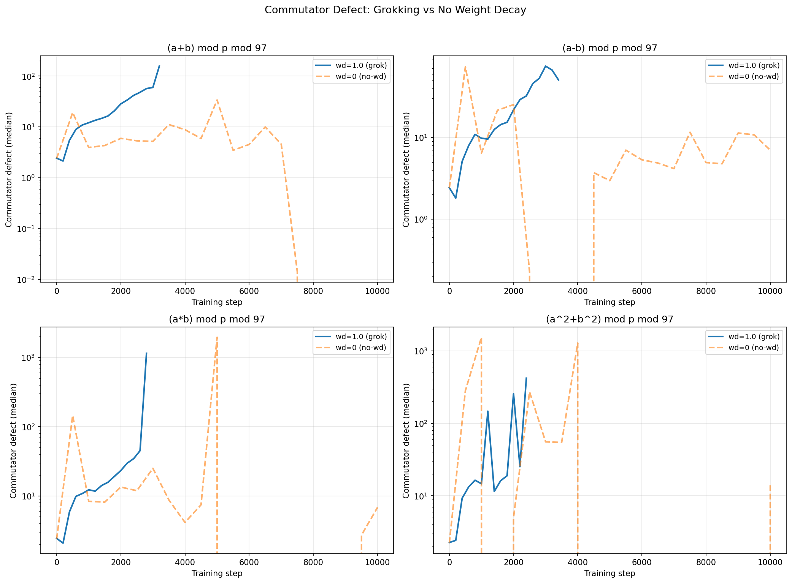

**[p. 10]**

*(a) Гроккинг (wd=1.0) против отсутствия weight decay (wd=0.0): при гроккинге развивается существенно более высокий коммутаторный дефект.*

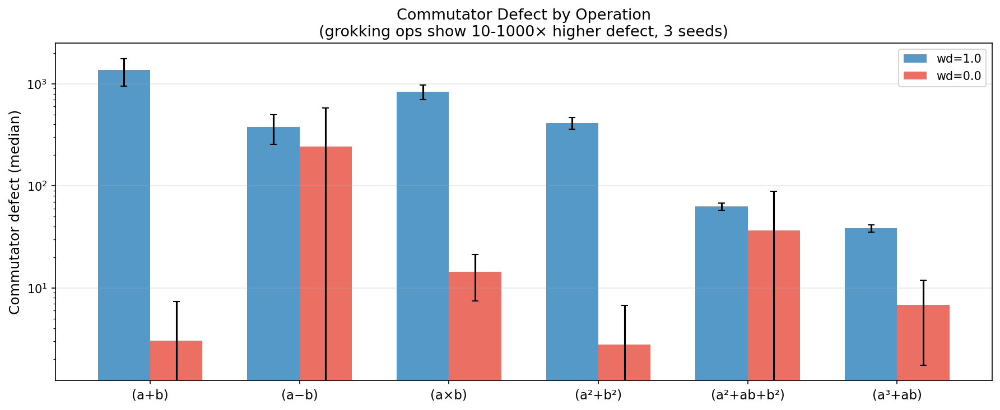

*(b) Коммутаторный дефект по всем условиям (3 сида). Грокающие операции (wd=1.0) показывают в 10–1000$\times$ более высокий дефект.*

*Рисунок 5: При гроккинге кривизна взрывается, но остаётся ортогональной выученному подпространству.* **[p. 10]**

Обратный разбор подтверждает, что траектория весов не выравнивается с направлениями кривизны: средняя абсолютная косинусная близость между шагами траектории и коммутаторными векторами неотличима от уровня случайных векторов ($\bar{c}\approx\sqrt{2/(\pi P)}$), то есть траектория деятельно избегает направлений высокой кривизны.

### 4.4 Рост кривизны предшествует генерализации

Ключевая находка в том, что начало роста коммутаторного дефекта неизменно *предшествует* переходу к генерализации. **Началом дефекта** мы называем первый шаг обучения, на котором коммутаторный дефект превосходит свой ранний уровень в $10\times$ (медиана первых трёх измерений) и абсолютный порог 20. Рисунок 6 приводит совмещение по времени коммутаторного дефекта и точности на тесте для всех четырёх грокающих операций и двух не грокающих контролей. В каждом грокающем прогоне дефект начинает расти до того, как растёт точность на тесте.

*Рисунок 6: Временно́й порядок роста кривизны и генерализации. Верхние четыре панели: грокающие операции (по 3 сида), где дефект (сплошная линия) растёт раньше точности на тесте (пунктир). Нижние две панели: не грокающие контроли показывают умеренный рост дефекта ($30$–$50\times$ от уровня), но не обобщают. Пунктирные вертикали отмечают начало дефекта; зелёные области — гроккинг.* **[p. 24]**

###### p9-2

**Временем опережения** мы называем $\Delta t=t_{\text{grok}}-t_{\text{onset}}$ — число шагов обучения между началом дефекта и гроккингом, а **долей опережения** — $\Delta t/t_{\text{grok}}$, время опережения, нормированное на временно́й масштаб гроккинга. Во всех 12 грокающих прогонах (4 операции $\times$ 3 сида) начало дефекта предшествует достижению 90 % точности на тесте на 600–1600 шагов при среднем времени опережения 1117 шагов (рисунок 7(b)). Односторонний знаковый критерий даёт $p=2^{-12}\approx 2.4\times 10^{-4}$, что подтверждает статистическую значимость этого временно́го порядка.

#### Необходимо, но не достаточно.

###### p9-3

Не грокающие операции ($a^{2}+ab+b^{2}$ и $a^{3}+ab$) тоже обнаруживают рост дефекта — до $30$–$50\times$ от своего раннего уровня, — но никогда не обобщают. Грокающие операции, напротив, достигают $500$–$2000\times$ от уровня, и по величине суммарного роста две группы не пересекаются вовсе (минимум у грокающих: $513\times$; максимум у не грокающих: $47\times$). Однако это разделение видно лишь задним числом: на ранних шагах обучения, когда гроккинг ещё не наступил, кривые дефекта грокающих и не грокающих операций перекрываются. Поэтому начало дефекта лучше понимать как *необходимое предусловие* гроккинга — сигнал, что ландшафт потерь перестраивается, — а не как достаточный предсказатель, различающий, какие операции обобщат. Опыты с причинным вмешательством (раздел 4.7) подтверждают это истолкование: подавление ортогонального потока градиента предотвращает гроккинг, чем и устанавливается механистическая необходимость роста кривизны.

*(a) Показательный пример: $(a-b)\bmod 97$, сид 137. Начало дефекта на шаге 2000, гроккинг на шаге 3600 (опережение 1600 шагов).*

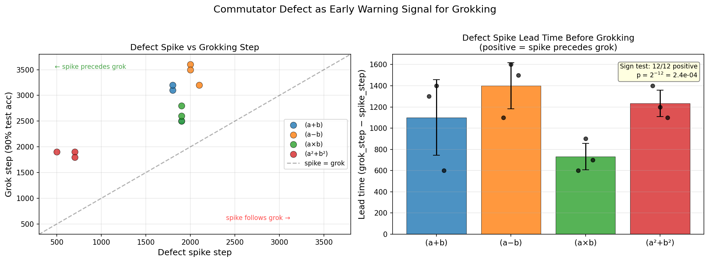

*(b) Количественная оценка времени опережения. Слева: шаг начала против шага гроккинга (все точки выше диагонали). Справа: время опережения по операциям (знаковый критерий $p<0.001$).*

*Рисунок 7: Временно́й порядок: рост кривизны предшествует генерализации.* **[p. 25]**

### 4.5 Инвариантность по режимам

Чтобы убедиться, что наши находки не связаны с конкретной настройкой гиперпараметров, мы повторяем весь разбор в медленном режиме с качественно иными гиперпараметрами (таблица 2).

*Таблица 2: Режимы гиперпараметров и основные показатели.* **[p. 10]**

| Показатель | Быстрый режим | Медленный режим | |---|---|---| | Скорость обучения | $10^{-3}$ | $5\times 10^{-5}$ | | Weight decay | 1.0 | 0.1 | | Слоёв | 2 | 3 | | Adam $\beta_{2}$ | 0.98 | 0.999 | | Шаг гроккинга (add, среднее) | $\sim$2,900 | $\sim$570,000 | | Инвариантность ($\rho$) | $\approx 1.000$ | $\approx 1.000$ | | Начало опережает гроккинг? | 12/12 прогонов | 2/2 прогонов | | Время опережения (абсолютное) | $\sim$1,100 шагов | $\sim$558,000 шагов | | Время опережения (нормированное) | $\sim$0.38 | $\sim$0.55 |

Рисунок 8 приводит результаты медленного режима. Несмотря на различие временно́го масштаба гроккинга в $200\times$, различие weight decay в $10\times$ и иное число слоёв, наблюдается тот же качественный переход: исполнительное многообразие обнаруживает эмпирическую инвариантность ($\rho\approx 1.000$), а начало дефекта предшествует гроккингу на сотни тысяч шагов. Однако динамика выравнивания количественно различается между режимами. В быстром режиме выравнивание траектории с кривизной поначалу выше случайного уровня и убывает к переходу, что отвечает недодемпфированному обследованию пространства параметров. В медленном режиме выравнивание всё время держится на случайном уровне или ниже, что отвечает передемпфированному движению по узким долинам. Тем не менее оба режима обнаруживают опосредованный дефектом переход к генерализации.

*(a) Сравнение режимов: инвариантность, дефект и нормированное время опережения согласуются между режимами.*

*(b) Показательный пример медленного режима: начало дефекта на $\sim$185 тыс., гроккинг на $\sim$585 тыс. (опережение $\approx$ 400 тыс. шагов).*

*Рисунок 8: Инвариантность по режимам: качественные находки воспроизводятся в медленном режиме ($200\times$ более долгое обучение), хотя динамика выравнивания различается количественно.* **[p. 25]**

**[p. 11]**

### 4.6 Фазовая диаграмма по скорости обучения

Установив инвариантность между качественно разными настройками, мы теперь систематически меняем одну лишь скорость обучения, чтобы очертить фазовую границу динамики гроккинга. Мы перебираем $\eta\in\{3\!\times\!10^{-5},\,10^{-4},\,3\!\times\!10^{-4},\,10^{-3},\,3\!\times\!10^{-3},\,10^{-2}\}$ (равномерно по логарифму с шагом в полдекады) при постоянном $\lambda=1.0$ по всем шести операциям и трём сидам (всего 108 прогонов).

###### p11-2

Рисунок 9 приводит получившуюся фазовую диаграмму. Граница «грокает — не грокает» *инвариантна* к скорости обучения: те же четыре операции грокают при всех шести скоростях, а две сложные не грокают никогда (рисунок 9A). Скорость гроккинга растёт примерно линейно с $\eta$: средний шаг гроккинга изменяется от $\sim$136 тыс. при $\eta=3\!\times\!10^{-5}$ до $\sim$200 при $\eta=10^{-2}$, охватывая почти три порядка величины (рисунок 9B).

Картина дефекта обнаруживает поразительную несимметричность (рисунок 9C): при малой скорости обучения наибольший дефект достигает $10^{4}$, а при большой падает до $\sim$20–60. Отсюда следует, что более медленная оптимизация позволяет кривизне накопиться в ортогональном расслоении сильнее до наступления фазового перехода.

###### p11-4

Предсказательное время опережения (рисунок 9D) наибольшее при $\eta=3\!\times\!10^{-5}$ ($\sim$128 тыс. шагов, 95 % времени обучения) и монотонно убывает со скоростью обучения: 92 % при $\eta=10^{-4}$, 88 % при $\eta=3\!\times\!10^{-4}$, 43 % при $\eta=10^{-3}$ и 24 % при $\eta=3\!\times\!10^{-3}$. Регрессия в двойных логарифмических координатах по всем грокающим прогонам с обнаружимым началом даёт показатель степенного закона $\alpha=1.27\pm 0.03$ ($R^{2}=0.97$, $n=43$; рисунок 11), что подтверждает *сверхлинейный* рост времени опережения с временны́м масштабом гроккинга. Это означает, что предсказательное окно расширяется при более медленных, более реалистичных скоростях обучения. При $\eta\geq 3\!\times\!10^{-3}$ гроккинг наступает столь быстро ($<$1 тыс. шагов), что фазы запоминания и генерализации перекрываются, и начало дефекта не опережает гроккинг, а совпадает с ним. Рисунок 10 показывает эти режимы для операции сложения.

*Рисунок 9: Фазовая диаграмма динамики гроккинга по скоростям обучения ($\eta\in\{3\!\times\!10^{-5}\text{--}10^{-2}\}$, $\lambda=1.0$, по 3 сида на ячейку, 108 прогонов). (A) Доля гроккинга: фазовая граница между грокающими и не грокающими операциями инвариантна к скорости обучения. (B) Средний шаг гроккинга (логарифмическая шкала): скорость гроккинга растёт с $\eta$. (C) Средний наибольший дефект (логарифмическая шкала): взрыв кривизны наибольший при малом $\eta$. (D) Среднее время опережения (шаг начала $-$ шаг гроккинга): начало дефекта наиболее предсказательно при малом $\eta$.* **[p. 26]**

*Рисунок 10: Кривые дефекта и точности на тесте для сложения при шести скоростях обучения. При малом $\eta$ (например, $10^{-4}$) начало дефекта опережает гроккинг на $\sim$30 тыс. шагов (92 % обучения); при большом $\eta$ ($\geq 3\!\times\!10^{-3}$) гроккинг наступает почти мгновенно, и начало совпадает с ним.* **[p. 27]**

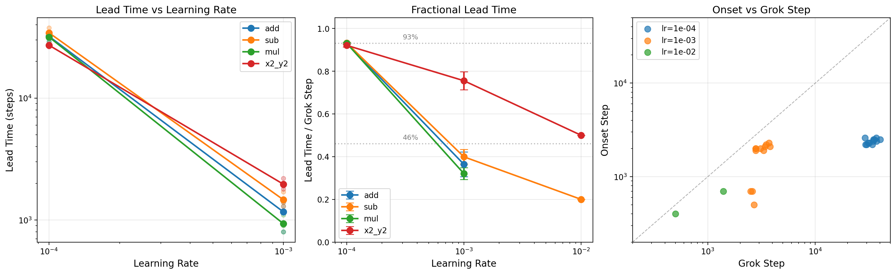

###### fig-11

*Рисунок 11: Масштабирование времени опережения по скоростям обучения. (A) Подгонка степенного закона: время опережения $\propto$ шаг гроккинга*α* с $\alpha=1.27\pm 0.03$ ($R^{2}=0.97$, $n=43$). Каждая точка — один грокающий прогон; пунктир — наилучшая подгонка, точечная линия — линейное масштабирование ($\alpha=1$). (B) Доля опережения (опережение / шаг гроккинга) монотонно растёт при убывании $\eta$: с 24 % при $\eta=3\!\times\!10^{-3}$ до 95 % при $\eta=3\!\times\!10^{-5}$. (C) Шаг начала против шага гроккинга для каждой операции.* **[p. 27]**

#### Зависимость динамики выравнивания от скорости обучения.

###### p11-5

Чтобы прямо проверить, меняется ли режим демпфирования со скоростью обучения, мы измеряем выравнивание траектории с кривизной (среднее $|\cos(\Delta\theta,\delta)|$, раздел 3.5) в четырёх узловых контрольных точках — запоминание, начало дефекта и после гроккинга — для каждой из трёх скоростей обучения на двух операциях (рисунок 12). При $\eta=10^{-4}$ выравнивание всё время держится ниже случайного уровня ($0.18$–$0.86\times$), что отвечает передемпфированной динамике, где траектория заперта в узких долинах вдали от направлений кривизны. При $\eta=10^{-2}$ выравнивание неизменно *выше* уровня ($1.4$–$1.8\times$), что указывает на недодемпфированное обследование, поначалу захватывающее направления кривизны. При $\eta=10^{-3}$, в промежуточном режиме, выравнивание начинается ниже уровня и поднимается к нему или выше него при переходе к гроккингу. Эта зависимость образца от скорости обучения воспроизводится на обеих операциях и даёт прямое свидетельство в пользу динамических режимов, обсуждаемых ниже.

*Рисунок 12: Выравнивание траектории с кривизной на трёх фазах обучения при разных скоростях обучения. При $\eta=10^{-4}$ (синий) выравнивание держится ниже случайного уровня (точечная линия), что отвечает передемпфированной динамике. При $\eta=10^{-2}$ (зелёный) выравнивание превосходит уровень, что отвечает недодемпфированному обследованию. $\eta=10^{-3}$ (оранжевый) показывает промежуточное поведение. Обе операции обнаруживают один и тот же образец.* **[p. 28]**

Чтобы соединить накопление кривизны и геометрию траектории в единую картину, мы строим приведённый фазовый портрет, взяв координатами коммутаторный дефект и выравнивание траектории с кривизной (рисунок 13). Каждый прогон обучения прочерчивает в этом пространстве характерный путь, продвигаясь от запоминания через начало дефекта к режиму после гроккинга.

###### p11-7

Мы наблюдаем три качественно различных динамических режима, управляемых скоростью обучения. При больших скоростях обучение остаётся в недодемпфированном режиме, обнаруживая сильное выравнивание с направлениями кривизны и малое накопление дефекта. При малых скоростях обучение становится передемпфированным, с затяжным удержанием в областях слабого выравнивания и значительным накоплением дефекта перед гроккингом. Промежуточные скорости обучения дают промежуточное поведение, порождая критически демпфированные траектории.

И на сложении, и на умножении гроккинг наступает, когда траектории покидают метастабильную область, отмеченную высоким дефектом кривизны и подавленной подвижностью. Этот фазовый портрет даёт сжатое геометрическое представление перехода к гроккингу и проясняет, как гиперпараметры оптимизации **[p. 12]** управляют путём к алгоритмической генерализации. Насколько нам известно, это первое выделение различных передемпфированного, критически демпфированного и недодемпфированного динамических режимов при гроккинге, из чего следует, что у явления более богатое фазовое устройство, чем признавалось прежде.

###### fig-13

*Рисунок 13: Фазовый портрет динамики гроккинга в пространстве «кривизна — траектория». Мы откладываем отношение выравнивания траектории с кривизной (среднее $|\!\cos(\Delta\theta,\delta)\!|$, нормированное на случайный уровень) против величины коммутаторного дефекта для трёх скоростей обучения ($\eta=10^{-4},10^{-3},10^{-2}$). Каждая ломаная прочерчивает развитие от запоминания (mem) через начало дефекта (spike) к режиму после гроккинга (post), показанное для сложения (кружки) и умножения (квадраты); стрелки указывают направление обучения. Горизонтальный пунктир отмечает изотропное выравнивание. Обучение при больших скоростях остаётся в недодемпфированном режиме с сильным выравниванием и малым дефектом, тогда как малые скорости дают передемпфированную динамику с большим накоплением дефекта и слабым выравниванием. Промежуточные скорости обучения дают промежуточное поведение. Звёздочки отмечают контрольные точки, где точность на тесте превосходит $90\%$. Гроккингу отвечает бегство из метастабильной области высокого дефекта кривизны и сниженной подвижности, с зависящей от режима динамикой релаксации.* **[p. 29]**

### 4.7 Причинные вмешательства в динамику обучения

Предыдущие разделы устанавливают корреляционные свидетельства в пользу геометрической картины. Теперь мы проверяем три опровержимые гипотезы прицельными опытами с вмешательством, которые изменяют траекторию оптимизации, сохраняя архитектуру и набор данных:

###### p12-2

1. **Необходимость**: требует ли гроккинг движения вдоль выученного исполнительного многообразия? 2. **Достаточность**: достаточно ли искусственно навести поперечную кривизну, чтобы вызвать гроккинг? 3. **Избирательность**: связаны ли эти действия именно с направлениями PCA, или любое низкоразмерное ограничение дало бы тот же итог?

#### 4.7.1 Подавление подпространства градиента

Сперва мы проверяем, необходимо ли для гроккинга движение вдоль выученного исполнительного многообразия. На каждом шаге обучения после шага 500 (то есть после запоминания) мы проецируем градиент на подпространство, натянутое на первые главные компоненты траектории весов, с силой проецирования $s\in[0,1]$:

$$
g\;\longrightarrow\;g_{\parallel}+(1-s)\,g_{\perp},\qquad g_{\parallel}=B\,B^{\top}g,\quad g_{\perp}=g-g_{\parallel}, \tag{8}
$$

где $B\in\mathbb{R}^{P\times K}$ — базис PCA, полученный при обучении на первой стадии. Для сравнения мы также применяем случайные низкоразмерные проекции того же ранга ($K=16$).

###### p12-5

Частичное подавление вдоль направлений PCA ($s=0.25$–$0.75$) систематически задерживает гроккинг, а полное проецирование ($s=1.0$) полностью предотвращает генерализацию (0 из 12 сидов по четырём операциям; рисунок 14). Случайные же проекции при промежуточных силах почти ничего не меняют ($<$ 50 шагов расхождения с базовым уровнем; рисунок 15). При $s=1.0$ обе проекции убивают гроккинг, поскольку запирать оптимизатор в *любом* 16-мерном подпространстве $\mathbb{R}^{290\text{k}}$ слишком тесно. Эти результаты указывают, что гроккинг требует доступа к определённым выученным направлениям в пространстве параметров, а не произвольного низкоразмерного движения.

###### fig-14

*Рисунок 14: Кривая отклика на дозу для проецирования градиента по всем четырём грокающим операциям. Каждая панель приводит средний шаг гроккинга (3 сида) в зависимости от силы подавления $s$. При $s=1.0$ гроккинг не наступает нигде (0 из 12 сидов). Пунктир — базовый уровень (без вмешательства). Монотонная задержка и полное подавление при полной силе воспроизводятся на всех операциях.* **[p. 30]**

###### fig-15

*Рисунок 15: Контроль избирательности подавления по PCA. Слева: шаг гроккинга в зависимости от силы подавления для проекции PCA (синий) и случайной проекции (зелёный); пунктир — базовый уровень. Справа: доля успешного гроккинга. При промежуточных силах ($s=0.25$–$0.75$) проекция PCA монотонно задерживает гроккинг, тогда как случайная проекция не даёт ничего. При $s=1.0$ обе убивают гроккинг (любое 16-мерное ограничение слишком тесно). Расхождение откликов на дозу подтверждает геометрическую избирательность многообразия PCA.* **[p. 30]**

#### 4.7.2 Направленное принуждение и наведение дефекта

Далее мы проверяем, достаточно ли искусственного наведения дефектов кривизны, чтобы вызвать ранний гроккинг. Начиная с шага 500 мы периодически вносим добавочные обновления весов, выровненные с направлением коммутатора (пересчитываемым каждые 50 шагов), с амплитудами $\alpha\in\{50,100,200,500\}$, кратными норме градиентного шага. В качестве контроля мы наносим толчки той же величины вдоль случайных ортогональных направлений.

###### p12-7

При всех проверенных амплитудах ни толчки вдоль коммутатора, ни случайные не ускоряют гроккинг относительно базового уровня (рисунок 16). Все 27 из 27 прогонов обобщают в статистически неразличимые сроки ($\sim$3200 шагов, в пределах разброса между сидами). Этот отрицательный результат показывает, что одного накопления дефекта недостаточно, чтобы вызвать гроккинг, и что бегство из метастабильного режима требует согласованного движения вдоль выученных направлений.

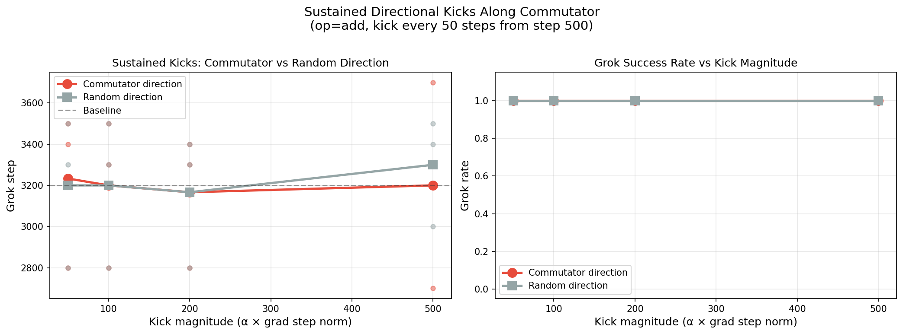

###### fig-16

*Рисунок 16: Устойчивые направленные толчки вдоль коммутатора (красный) и вдоль случайных ортогональных направлений (серый) с величинами до $500\times$ нормы градиентного шага, наносимые каждые 50 шагов. Слева: средний шаг гроккинга (3 сида); справа: доля успешного гроккинга. Ни одно направление не ускоряет гроккинг за пределы разброса базового уровня (пунктир), что подтверждает: ортогонального дефекта недостаточно, чтобы вызвать фазовый переход.* **[p. 31]**

**[p. 13]**

#### 4.7.3 Воспроизведение по операциям

Мы повторяем опыты с проецированием на всех четырёх грокающих задачах: модульных сложении, вычитании, умножении и квадратичном сложении ($a^{2}+b^{2}\bmod 97$). Связь между силой проецирования и задержкой гроккинга согласована по всем операциям (рисунок 14), с полным подавлением при полной силе (0 из 12 сидов грокают при $s=1.0$). При $s=0.75$ гроккинг задерживается на 600–800 шагов (на 20–25 % выше базового уровня) во всех четырёх операциях. Эта всеобщность указывает, что причинная роль направлений исполнительного многообразия не связана с конкретной задачей, а отражает общий геометрический механизм алгоритмической генерализации.

#### 4.7.4 Сводка вмешательств

В совокупности эти опыты разрешают все три гипотезы. *Необходимость* — подтверждена: ограничение движения вдоль исполнительного многообразия предотвращает генерализацию с плавной кривой отклика на дозу, воспроизводящейся на четырёх операциях. *Достаточность* — отвергнута: искусственное усиление дефекта направленным принуждением не даёт ничего. *Избирательность* — подтверждена: проекция PCA монотонно задерживает гроккинг при промежуточных силах, где случайная проекция не даёт ничего. Эта несимметричность согласуется с тем, что коммутаторный дефект служит *приметой* барьера кривизны между решениями запоминания и генерализации — устроенной перестройки траектории оптимизации, — а не напрямую управляемой причиной фазового перехода. Вместе эти вмешательства исключают чисто корреляционные объяснения прежних находок и устанавливают направленную причинную связь между геометрией исполнительного многообразия и генерализацией.

## 5 Спектральный механизм в основе коммутаторного перехода

###### p13-3

Предыдущие разделы устанавливают, что коммутаторный дефект SGD резко растёт перед гроккингом и что ортогональный поток градиента причинно необходим для генерализации. Теперь мы спрашиваем: *чем движима динамика коммутатора?* Чтобы ответить, мы разбираем спектр сингулярных чисел матриц весов внимания $W_{Q}$ и $W_{K}$ в каждой контрольной точке обучения.

### 5.1 Спектральные зазоры матриц внимания

Пусть $\sigma_{1}\geq\sigma_{2}\geq\sigma_{3}\geq\cdots$ — сингулярные числа $W_{Q}$ (разбор для $W_{K}$ такой же). Мы определяем *спектральные зазоры*

$$
g_{12}=\sigma_{1}-\sigma_{2},\qquad g_{23}=\sigma_{2}-\sigma_{3}. \tag{9}
$$

Эти величины отслеживают, насколько разделены ведущие сингулярные моды: $g_{12}\approx 0$ указывает на почти вырождение двух верхних мод, тогда как $g_{12}\gg 0$ указывает, что одна мода главенствует.

### 5.2 Согласованная спектральная хронология

Во всех грокающих прогонах (4 операции $\times$ 3 сида) мы наблюдаем следующую согласованную последовательность во времени:

###### p13-7

1. Нижний спектральный зазор $g_{23}$ постепенно сокращается, что указывает на сжатие подчинённой части спектра. 2. Ведущие моды становятся почти вырожденными ($\sigma_{1}\approx\sigma_{2}$, при этом $g_{12}$ достигает наименьшего значения $0.002$–$0.02$). 3. Коммутаторный дефект SGD $\mathcal{D}$ резко растёт. **[p. 14]**

###### p14-1

4. Матричный коммутатор $\left\|[W_{Q},W_{K}]\right\|_{F}$ достигает пика. 5. Одна мода становится главенствующей ($\sigma_{1}\gg\sigma_{2}$, при этом $g_{12}$ растёт в $15$–$25\times$ от своего наименьшего значения). 6. Точность на тесте быстро растёт (гроккинг).

Для представительного случая модульного сложения (сид 42) порядок таков:

$$
\underbrace{g_{23}\!\downarrow}_{\text{step 1400}}\;\to\;\underbrace{\sigma_{1}\approx\sigma_{2}}_{\text{step 1700}}\;\to\;\underbrace{\mathcal{D}\!\uparrow}_{\text{step 2000}}\;\to\;\underbrace{\left\|[W_{Q},W_{K}]\right\|_{F}\!\uparrow}_{\text{step 2700}}\;\to\;\underbrace{\sigma_{1}\gg\sigma_{2}}_{\text{step 2800}}\;\to\;\underbrace{\text{grok}}_{\text{step 3100}} \tag{10}
$$

Фаза почти вырождения ($\sigma_{1}\approx\sigma_{2}$) отвечает режиму, в котором базис представления *неустойчив*: в верхнем сингулярном подпространстве нет предпочтительного направления, и потому динамика оптимизатора становится крайне неинтегрируемой, что и отражается в резком росте коммутаторного дефекта SGD. Как только симметрия между верхними модами нарушается и возникает главенствующее направление, операторы $W_{Q}$ и $W_{K}$ выравниваются в общий собственный базис, и матричный коммутатор обрушивается.

### 5.3 Фазовый портрет

Этот спектральный механизм отчётливее всего виден как траектория в фазовой плоскости $(\sigma_{1}-\sigma_{2},\;\left\|[W_{Q},W_{K}]\right\|_{F})$ (рисунок 17). Обучение следует согласованным путём через три режима:

- **Состязание** ($g_{12}$ мало, коммутатор растёт): верхние сингулярные моды почти вырождены, базис представления неустойчив. - **Неустойчивость** ($g_{12}$ раскрывается, коммутатор в пике): симметрия нарушается, одна мода начинает главенствовать, что даёт наибольшую некоммутативность. - **Выравнивание** ($g_{12}$ велико, коммутатор обрушивается): $W_{Q}$ и $W_{K}$ сходятся к общему базису, и наступает гроккинг.

Не грокающие (запоминающие) прогоны, напротив, не обнаруживают такой петлевой структуры: их траектории рассеянно блуждают в том же фазовом пространстве без направленной упорядоченности (рисунок 18).

*Рисунок 17: Фазовый портрет гроккинга в плоскости $(\sigma_{1}-\sigma_{2},\;\left\|[W_{Q},W_{K}]\right\|_{F})$ для модульного сложения (сид 42, слой 0). Обучение следует согласованной траекторией через три режима: фазу *состязания*, где верхние сингулярные моды почти вырождены, фазу *неустойчивости*, где коммутатор достигает пика по мере того, как одна мода начинает главенствовать, и фазу *выравнивания*, где операторы сходятся к общему собственному базису и наступает гроккинг. Слева: цвет по шагу обучения. Справа: цвет по точности на тесте — траектория остаётся на уровне случайного угадывания (красный) на протяжении состязания и неустойчивости и зеленеет ровно тогда, когда входит в область выравнивания.* **[p. 31]**

*Рисунок 18: Фазовые портреты гроккинга (сверху, $\mathrm{wd}=1$) и запоминания (снизу, $\mathrm{wd}=0$) по четырём операциям (сид 42). Грокающие траектории обнаруживают характерную петлю с направленным течением через состязание $\to$ неустойчивость $\to$ выравнивание. Запоминающие траектории — рассеянные случайные блуждания в том же фазовом пространстве, с много большими значениями коммутатора и без направленного бегства.* **[p. 32]**

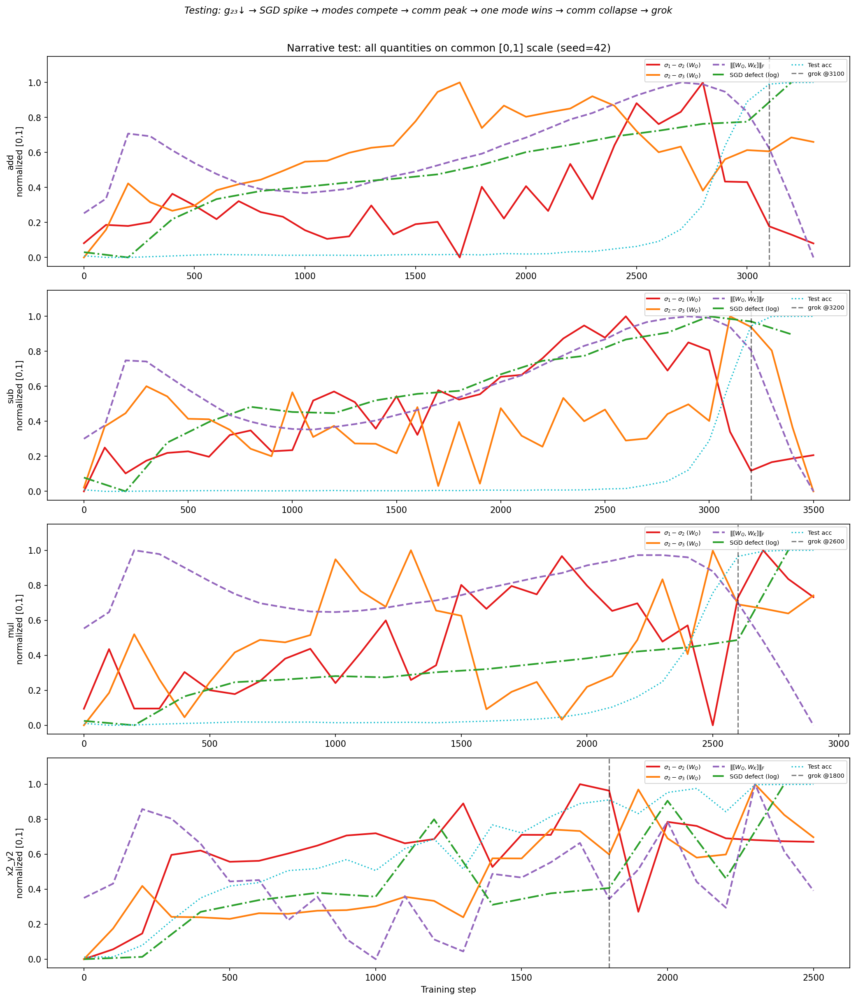

###### fig-19

*Рисунок 19: Все величины в общей шкале $[0,1]$ (сид 42, слой 0) для четырёх грокающих операций. Спектральный зазор $\sigma_{1}-\sigma_{2}$ (красный) достигает наименьшего значения *раньше* всплеска дефекта SGD (зелёный, штрихпунктир), который, в свою очередь, предшествует пику матричного коммутатора (лиловый, пунктир). Точность на тесте (голубой, точечный) растёт последней. Вертикальный пунктир — шаг гроккинга.* **[p. 33]**

### 5.4 Истолкование

###### p14-7

Спектральная хронология даёт механистическое объяснение динамики коммутатора, которая прежде описывалась лишь феноменологически. Почти вырождение $\sigma_{1}$ и $\sigma_{2}$ создаёт *неустойчивость ориентации*: когда два сингулярных числа близки, соответствующие сингулярные векторы вольны поворачиваться при малых возмущениях. Эта свобода поворота проявляется как большие коммутаторные дефекты, поскольку разные порядки мини-пакетов толкают базис представления в разные стороны. Как только симметрия нарушается ($\sigma_{1}\gg\sigma_{2}$), представление защёлкивается в предпочтительной ориентации, неоднозначность порядка градиентов разрешается, и матричный коммутатор вместе с дефектом SGD убывают.

Эта картина связывает гроккинг с *переходом нарушения спектральной симметрии* в матрицах весов внимания: система проходит через кратковременное почти вырождение, расшатывающее представление, а гроккингу отвечает разрешение этой неустойчивости, когда одна мода начинает главенствовать.

#### Отношение к PCA траектории.

PCA траекторий обновлений по расширяющемуся окну (раздел 3.1) улавливает динамику оптимизатора — ковариационную структуру последовательных изменений весов, — но не отражает напрямую спектральное устройство самих матриц весов. Разбор SVD весов в этом разделе даёт дополняющий и более прямой взгляд на переход представления: он измеряет собственную структуру самих выученных операторов, а не статистику их обновлений.

**[p. 15]**

#### Связь с рамкой внутрисигнального зазора.

Приведённую выше спектральную хронологию можно поместить в более широкую *рамку внутрисигнального зазора* (Xu, 2026b), но для точного сравнения нужно различать три спектральных объекта, встречающихся в литературе:

- **Матрица Грама по скользящему окну** (объект Xu): матрица $\boldsymbol{G}(t)=\boldsymbol{X}(t)\boldsymbol{X}(t)^{\top}$ размера $W\times W$, составленная из $W$ последовательных обновлений параметров $\boldsymbol{\delta}_{s}=\boldsymbol{\theta}_{s+1}-\boldsymbol{\theta}_{s}$, с сигнальным рангом $k^{*}=\arg\max_{j}\,\omega_{j}\cdot(\sigma_{j}/\sigma_{j+1})$, где $\omega_{j}=\sigma_{j}/\sum_{i}\sigma_{i}$ взвешивает отношение по спектральной массе в позиции $j$. Взвешивание подавляет ложные хвостовые отношения, которые главенствуют в невзвешенном максимуме вне режима крайних соотношений сторон ($P\gg W$). Отношение зазоров в $k^{*}$ равно $R=\sigma_{k^{*}}/\sigma_{k^{*}+1}$. - **PCA смещений по расширяющемуся окну** (наш раздел 3.1): PCA на $\{W_{t}-W_{0}\}$ от инициализации, дающий находку о многообразии ранга 1 (PC1 = 70–94 %). - **SVD матрицы весов** (этот раздел): непосредственные сингулярные числа $\sigma_{j}(W_{Q})$ выученных операторов внимания с зазором собственных чисел $g_{23}=\sigma_{2}^{2}-\sigma_{3}^{2}$.

Это принципиально разные матрицы с разными спектрами. Мы проверили это напрямую на 12 грокающих прогонах (4 операции $\times$ 3 сида, $\omega=1.0$) и 12 сопоставленных контрольных прогонах ($\omega=0$, те же операции): матрица Грама по скользящему окну ($W=10$) даёт отношение зазоров $R=1.40\pm 0.07$ в фазе до гроккинга при $\omega=1.0$, тогда как контроли с $\omega=0$ показывают *более высокое* $R=2.83\pm 0.35$ (диапазоны не пересекаются). Эта перевёрнутость — у прогонов с одним лишь запоминанием спектры обновлений сосредоточеннее — отражает устройство градиентов чистого запоминания, сильно выровненных по рангу 1, тогда как грокающие прогоны при образовании контура распределяют обновления по спектральным модам. Сигнальный ранг стабилизируется на $k^{*}_{\mathrm{terminal}}=1$ в 9 прогонах из 12 (ср. 10 из 12 у Xu (2026b)), что подтверждает главенство одномодовой динамики при сходимости.

Зазор собственных чисел матрицы Грама $g_{23}=\sigma_{2}^{2}-\sigma_{3}^{2}$ *предсказателен*: он достигает пика при запоминании и убывает в 12 грокающих прогонах из 12 (в среднем в $40\times$, диапазон $15$–$111\times$) *до* гроккинга, тогда как из 12 сопоставленных контрольных прогонов ($\omega=0$) хоть какое-то убывание показывает лишь 1 (таблица 3). Это убывание в точности отслеживает неустойчивость ориентации, движущую коммутаторным переходом.

*Таблица 3: Спектральный разбор матрицы Грама по скользящему окну ($W=10$, среднее $\pm$ стандартное отклонение по 3 сидам). $g_{23}^{\mathrm{early}}$ — пик $g_{23}$ до гроккинга; $g_{23}^{\mathrm{grok}}$ — $g_{23}$ на шаге гроккинга; убывание $=g_{23}^{\mathrm{early}}/g_{23}^{\mathrm{grok}}$; $R$ — отношение зазоров при сигнальном ранге $k^{*}$.* **[p. 15]**

| **Операция** | $\boldsymbol{\omega}$ | **Шаг гроккинга** | $g_{23}^{\mathrm{early}}$ | $g_{23}^{\mathrm{grok}}$ | **Убывание** | $R_{\mathrm{early}}$ | $k^{*}_{\mathrm{term}}$ | **Уб.** | |---|---|---|---|---|---|---|---|---| | $a{+}b$ | 1.0 | 2500–3100 | $14.6\pm 0.2$ | $0.56\pm 0.4$ | $50\times$ | $1.40\pm 0.05$ | 1 | ✓ | | | 0.0 | — | $33.0\pm 9.3$ | — | — | $2.72\pm 0.22$ | — | — | | $a{\times}b$ | 1.0 | 2600–3000 | $14.7\pm 0.1$ | $0.39\pm 0.2$ | $49\times$ | $1.41\pm 0.05$ | 1 | ✓ | | | 0.0 | — | $23.6\pm 10.7$ | — | — | $2.85\pm 0.11$ | — | — | | $a{-}b$ | 1.0 | 3300–3700 | $14.4\pm 0.1$ | $0.48\pm 0.2$ | $35\times$ | $1.31\pm 0.02$ | 1 | ✓ | | | 0.0 | — | $33.2\pm 2.8$ | — | — | $2.62\pm 0.23$ | — | — | | $a^{2}{+}b^{2}$ | 1.0 | 2000–2500 | $18.9\pm 0.5$ | $0.94\pm 0.5$ | $28\times$ | $1.47\pm 0.08$ | 1 | ✓ | | | 0.0 | — | $28.3\pm 13.1$ | — | — | $3.12\pm 0.64$ | — | — | | *Сводно* | | | | | | | | | | Все $\omega=1$ | | | | | в среднем $40\times$ | $1.40\pm 0.07$ | 1 (9/12) | 12/12 | | Все $\omega=0$ | | | | | — | $2.83\pm 0.35$ | — | 1/12 |

Связь между этими объектами действует через теорему Дэвиса — Кахана о $\sin\Theta$ (Xu, 2026b), которая *универсальна*: для *любой* симметричной матрицы устойчивость подпространства при возмущении управляется неравенством $\|\sin\Theta(\mathcal{V},\hat{\mathcal{V}})\|_{F}\leq\|\boldsymbol{E}\|_{F}/\delta$, где $\delta$ **[p. 16]** — зазор собственных чисел. Эта универсальность означает, что качественное предсказание — закрытие зазора расшатывает связанное подпространство, раскрытие зазора закрепляет новое направление — применимо независимо от того, разбираем ли мы матрицу Грама траектории или сами матрицы весов. *Различаются* же между объектами количественные динамики: уравнение потока зазора у Xu, коэффициент устойчивости $\alpha_{j}$ и разложение потери выведены именно для матрицы Грама траектории и не переносятся напрямую на собственные числа матриц весов.

В нашей постановке правильным признаком служит SVD матрицы весов по трём причинам: (a) зазор собственных чисел $g_{23}$ напрямую управляет обусловленностью оператора внимания и потому представительной ёмкостью модели; (b) убывание $g_{23}$ *предшествует* гроккингу (время опережения ${\sim}1000$ шагов); (c) убывание $g_{23}$ воспроизводится в 12 грокающих прогонах из 12 (в среднем в $40\times$) и лишь в 1 из 12 сопоставленных контролей.

###### p16-2

Убывание $g_{23}$ есть событие закрытия зазора в позиции $k^{*}=2$–$3$: по мере приближения $\sigma_{2}$ к $\sigma_{3}$ подчинённое подпространство теряет устойчивость, что и создаёт неустойчивость ориентации, движущую коммутаторным переходом. Последующее возникновение $\sigma_{1}\gg\sigma_{2}$ есть событие раскрытия зазора в позиции $k^{*}=1$, закрепляющее главенствующее направление и делающее генерализацию возможной. Этот сдвиг $k^{*}$ — с позиции 2–3 на позицию 1 — подтверждён эмпирически: $k^{*}_{\mathrm{terminal}}=1$ в 9 грокающих прогонах из 12 при взвешенном по спектральной массе $k^{*}$ (невзвешенный максимум неустойчив в нашем режиме соотношения сторон, где $p/W\sim 3\times 10^{4}$, тогда как у Xu $P/W\sim 10^{7}$ и порог обнаружения BBP пуст). Рамка предсказывает далее, что weight decay движет динамикой зазора через подавление мод малой кривизны (Xu, 2026b, теорема 12.22), что согласуется с находкой: все 12 прогонов с weight decay грокают, тогда как из 12 сопоставленных контролей без weight decay хоть какое-то убывание показывает лишь 1 (позднее аномальное событие гроккинга на шаге 41 700). Контроль с $\omega=0$ обнаруживает вдобавок *предсказанную* спектральную примету режима без гроккинга (Xu, 2026b, замечание 12.22): $g_{23}$ остаётся высоким на всех шагах обучения (среднее раннее $g_{23}=14$–$42$, ни разу не опускаясь ниже $13$), что подтверждает: без пола кривизны $\omega$ переход нарушения спектральной симметрии не начинается вовсе.

### 5.5 Локальная интегрируемость и контроли, не зависящие от базиса

Приведённый выше спектральный разбор рассматривает глобальное устройство сингулярных чисел отдельных матриц весов. Теперь мы спрашиваем, есть ли выравнивание коммутатора со структурой весов *структурное* свойство динамики оптимизации или же артефакт конкретного выбора базиса.

#### Локальная интегрируемость.

В каждой контрольной точке мы строим общий базис из первых $k$ правых сингулярных векторов всех блоков весов ($W_{Q}$, $W_{K}$, $W_{V}$, $W_{O}$ на каждый слой) и измеряем долю энергии коммутатора, проецирующейся на этот базис (отношение proj/full, $\rho_{\mathrm{local}}$). Во всех 36 условиях (6 операций $\times$ 2 настройки weight decay $\times$ 3 сида) мера локальной интегрируемости удовлетворяет $\rho_{\mathrm{local}}\approx 1.0$: почти вся энергия коммутатора лежит внутри подпространства структуры весов. Соответствующий случайный уровень даёт $\rho_{\mathrm{random}}\approx\sqrt{K/P}\approx 0.005$, что даёт отношение исполнительного к случайному в $50$–$200\times$ на протяжении обучения (рисунок 20). В фазе запоминания $\rho_{\mathrm{local}}$ опускается до $0.3$–$0.5$, когда энергия коммутатора начинает покидать базис, а затем восстанавливается до $>0.9$ после гроккинга. Не грокающие контроли ($x^{2}+xy+y^{2}$, $x^{3}+xy$) держат устойчиво более низкое $\rho_{\mathrm{local}}<0.5$ без зависящего от фазы восстановления.

#### Смена знака, не зависящая от базиса.

Чтобы убедиться, что связь коммутатора с подпространством не зависит от выбора базиса, мы повторяем разбор проекций для трёх независимых построений базиса: (i) SVD весов (первые $k$ сингулярных векторов $W$), (ii) SVD смещений (первые $k$ сингулярных векторов $W_{t}-W_{0}$) и (iii) SVD градиентов (первые $k$ сингулярных векторов накопленных недавних градиентов). Все три базиса обнаруживают согласованную *смену знака*: отношение исполнительного к случайному превосходит 1 при запоминании (коммутатор выровнен со структурой весов) и падает ниже 1 после гроккинга (коммутатор покидает подпространство структуры весов). Этот образец сохраняется поблочно для всех матриц весов внимания ($W_{Q}$, **[p. 17]** $W_{K}$, $W_{V}$, $W_{O}$), а у блоков MLP действие слабее, но того же направления (рисунок 21). Независимость смены знака от базиса подтверждает, что переход коммутатора от выравнивания внутри подпространства к выравниванию вне его в момент гроккинга есть *структурное* геометрическое свойство ландшафта оптимизации, а не артефакт какого-то одного разложения.

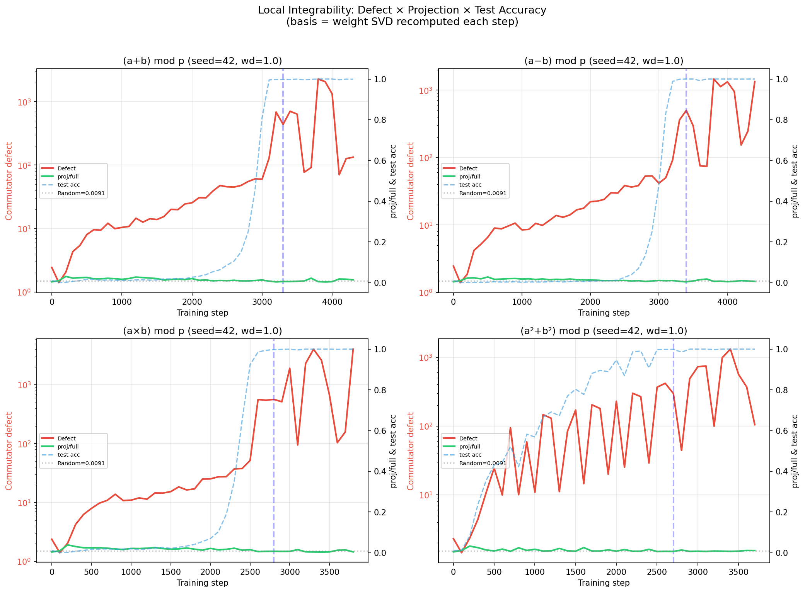

*Рисунок 20: Локальная интегрируемость: отношение proj/full $\rho_{\mathrm{local}}$ в ходе обучения для грокающих операций (сплошные линии) и не грокающих контролей (пунктир). Грокающие операции показывают $\rho_{\mathrm{local}}\approx 1.0$ с провалом при запоминании и восстановлением после гроккинга; не грокающие контроли остаются ниже $0.5$. Случайный уровень (серая полоса) при $\sqrt{K/P}\approx 0.005$.* **[p. 34]**

*Рисунок 21: Смена знака, не зависящая от базиса: отношение исполнительного к случайному для трёх независимых базисов (SVD весов, SVD смещений, SVD градиентов) в ходе обучения. Все три показывают отношение $>1$ при запоминании (коммутатор выровнен со структурой весов) и $<1$ после гроккинга (коммутатор покидает подпространство), что подтверждает структурную природу перехода.* **[p. 35]**

## 6 Обсуждение и теоретические связи

Наши результаты поддерживают единое геометрическое объяснение гроккинга: траектория обучения развивается преимущественно внутри низкоразмерного исполнительного подпространства, поперечная кривизна растёт в направлениях, ортогональных этому подпространству, на плато запоминания, а генерализация связана с бегством из этого метастабильного режима. Эта картина — удержание, рост барьера, бегство — сводит все шесть наших эмпирических вкладов (устройство ранга 1, эмпирическая инвариантность, ортогональный взрыв кривизны, предсказательное время опережения, причинная несимметричность и устойчивость по режимам) под единое динамическое повествование. Теперь мы связываем это повествование с несколькими более широкими темами теории обучения и оптимизации нейронных сетей.

### 6.1 Гроккинг как метастабильное бегство в искривлённых ландшафтах

*Тезис: гроккинг лучше понимать как бегство из метастабильного режима, а не просто как отложенное обучение.*

По всем задачам и режимам гиперпараметров мы наблюдаем, что запоминание удерживает траектории обучения в областях высокой анизотропии кривизны, причём коммутаторные дефекты постепенно растут, пока критический уровень не запускает переход к генерализации. Это напоминает метастабильное бегство в стохастических динамических системах, где величина дефекта играет роль накопленного геометрического напряжения, а скорость обучения управляет демпфированием. Меньшие скорости обучения дают передемпфированные траектории, требующие значительного накопления дефекта ($\sim$30 тыс. шагов при $\eta=10^{-4}$), тогда как большие скорости способствуют быстрым переходам ($\sim$1 тыс. шагов при $\eta=10^{-2}$; раздел 4.6).

### 6.2 Истолкование со стороны динамических систем

*Тезис: гроккинг следует классическому для динамических систем образцу: образование медленного многообразия, поперечная неустойчивость, бегство.*

Наши находки допускают естественное истолкование на языке динамических систем, проходящее через четыре фазы:

###### p17-6

1. **Сжатие.** Раннее обучение сворачивает траекторию весов на низкоразмерное медленное многообразие (PC1 улавливает 68–83 % дисперсии; раздел 4.1). Оптимизатор находит подпространство ранга 1 и запирает в нём дальнейшее движение. 2. **Поперечная неустойчивость.** Кривизна накапливается в нормальном расслоении этого многообразия (рост дефекта в $10$–$1000\times$; раздел 4.3), тогда как траектория остаётся эмпирически инвариантной ($\rho\approx 1.000$; раздел 4.2). Система становится всё чувствительнее к возмущениям вне многообразия. 3. **Критический переход.** Weight decay даёт устойчивое давление в сторону решений меньшей нормы. Вместе с накопленной поперечной кривизной это проводит траекторию через бифуркацию в обобщающий бассейн. 4. **Перестройка.** Траектория оседает в новом режиме, отмеченном меньшей анизотропией кривизны вдоль пути оптимизации, — это и есть решение после гроккинга.

**[p. 18]**

Это перекликается с классическим сценарием схлопывания на медленное многообразие с последующей поперечной бифуркацией в диссипативных динамических системах. Спектральный разбор раздела 5 дополнительно уточняет картину: фазе поперечной неустойчивости отвечает почти вырождение ведущих сингулярных чисел $W_{Q}$ и $W_{K}$, а критическому переходу — событие нарушения спектральной симметрии, при котором одна сингулярная мода начинает главенствовать, а операторы внимания выравниваются в общий собственный базис. Скорость обучения управляет демпфированием: малое $\eta$ даёт передемпфированную динамику с постепенным накоплением дефекта, большое $\eta$ — недодемпфированную с быстрыми переходами (раздел 4.6).

#### Ограничения аналогии с динамическими системами.

###### p18-2

Хотя это истолкование поддержано временны́м порядком (кривизна предшествует генерализации) и причинной необходимостью ортогонального потока градиента (раздел 4.7), доступные геометрические сигналы — коммутаторный дефект, выравнивание траектории с кривизной и мера инвариантности — не складываются в *предсказательный* составной признак, различающий грокающие и не грокающие операции заранее. Мера инвариантности тождественно равна 1 во всех условиях; выравнивание траектории с кривизной шумно и перекрывается; величина дефекта отделяет грокающие операции от не грокающих лишь задним числом. Более того, те же грокающие операции, обученные *без* weight decay, обнаруживают сопоставимое ускорение дефекта, не обобщая, что подтверждает: одного роста кривизны недостаточно — нужна ещё регуляризационная нагрузка. Отсюда возникает возможность, что одних лишь местных измерений кривизны для предсказания гроккинга не хватит. Местные геометрические признаки способны обнаружить, что ландшафт потерь перестраивается — поперечная неустойчивость растёт, кривизна накапливается в нормальном расслоении, — но приведёт ли эта перестройка к генерализации, зависит, по-видимому, ещё и от глобальных свойств ландшафта (например, от существования обобщающего бассейна малой нормы) и от внешних условий вроде силы регуляризации. Понять, как местная динамика кривизны взаимодействует с глобальным устройством ландшафта, порождая переход к гроккингу, остаётся важной открытой задачей.

### 6.3 Неявная регуляризация и низкоразмерная структура

*Тезис: неявная регуляризация при гроккинге действует через возникновение геометрической структуры, свойственной задаче, а не просто через управление нормой или отступом.*

После гроккинга траектории сворачиваются на низкоразмерные исполнительные многообразия (PC1 объясняет 68–83 % дисперсии; раздел 4.1), и это сопровождается уменьшением анизотропии кривизны вдоль траектории. Опыты с вмешательством (раздел 4.7) показывают, что движение вдоль этих определённых выученных направлений необходимо для гроккинга, тогда как произвольных низкоразмерных ограничений недостаточно. Отсюда следует, что неявная регуляризация в этой постановке действует через постепенное возникновение геометрически выделенных подпространств.

### 6.4 Поведение при масштабировании и фазовые диаграммы

*Тезис: у гроккинга есть фазовая диаграмма со степенным масштабированием, перекликающаяся с явлениями в системах большего масштаба.*

###### p18-6

Наши переборы скорости обучения по шести значениям с шагом в полдекады обнаруживают отчётливые передемпфированный, критически демпфированный и недодемпфированный режимы (раздел 4.6), причём время гроккинга масштабируется примерно как $t_{\text{grok}}\propto\eta^{-1}$, а дефект кривизны служит параметром порядка (знаковый критерий $p=2^{-12}$; раздел 4.4). Подгонка степенного закона по 43 грокающим прогонам с обнаружимым началом даёт $\alpha=1.27\pm 0.03$ ($R^{2}=0.97$; рисунок 11), что подтверждает *сверхлинейный* рост времени опережения начала дефекта с временны́м масштабом гроккинга. Предсказательное окно монотонно расширяется при более медленных, более реалистичных скоростях обучения — с 24 % при $\eta=3\!\times\!10^{-3}$ до 95 % при $\eta=3\!\times\!10^{-5}$. Хотя наши опыты идут в режиме малых моделей ($\sim$290 тыс. параметров), эти соотношения масштабирования перекликаются с явлениями, о которых сообщают для больших языковых **[p. 19]** моделей, из чего следует, что гроккинг может быть микроскопическим случаем фазовых переходов, движимых оптимизацией.

### 6.5 Устойчивость, плоские минимумы и квантование

Недавние эмпирические работы показали, что обученные нейронные сети переносят значительное квантование и сжатие параметров с ограниченной потерей качества. Наши результаты дают геометрический взгляд на эту устойчивость в режиме гроккинга.

###### p19-2

Решения после гроккинга отмечены уменьшенной анизотропией кривизны вдоль траектории оптимизации: коммутаторный дефект, оставаясь ненулевым, сосредоточен ортогонально направлениям, по которым движется оптимизатор, а мера инвариантности $\rho\approx 1.000$ (в пределах численной точности) указывает, что кривизна заперта в нормальном расслоении исполнительного многообразия. Такие области, где кривизна заперта в направлениях, которые оптимизатор не посещает, естественно поддерживают бо́льшую устойчивость к возмущениям вдоль выученного подпространства. Решения же до гроккинга пребывают в сильно анизотропных областях высокого дефекта и соответственно чувствительнее к возмущениям.

Отсюда следует, что устойчивость к сжатию отчасти можно понимать как следствие геометрической перестройки в ходе обучения, а не только как побочный итог выбора архитектуры или регуляризации.

### 6.6 Связь с механистической интерпретируемостью

*Тезис: геометрическому переходу при гроккинге отвечает закрепление интерпретируемых контуров.*

###### p19-5

Образование исполнительных многообразий отвечает сосредоточению вычисления в низкоразмерных подпространствах, что согласуется с возникновением интерпретируемых контуров, описанным в прежних работах. Схлопывание анизотропии кривизны при гроккинге указывает, что эти контуры геометрически закрепляются. С этой точки зрения гроккинг знаменует переход от распределённых представлений к устроенной, контуроподобной организации, что даёт возможный мост между геометрией оптимизации и механистической интерпретируемостью.

### 6.7 Ограничения и открытые задачи

###### p19-6

Наши опыты ограничены сравнительно малыми моделями-трансформерами (2–3 слоя, $\sim$290 тыс. параметров) и синтетическими алгоритмическими задачами (модульная арифметика по модулю 97). Хотя эти постановки допускают тонкий геометрический разбор, остаётся неясным, в какой мере наблюдаемые явления — многообразия ранга 1, инвариантные исполнительные подмногообразия, предсказательное начало дефекта — переносятся на большие языковые модели и реальные наборы данных. Предварительные опыты на языках Дейка и на эталоне композиционной генерализации SCAN указывают, что качественно схожие низкоразмерное удержание и динамика поперечной кривизны возникают и за пределами модульной арифметики; систематическое исследование этих постановок продолжается.

Кроме того, некоторые из наших диагностических мер, включая коммутаторные дефекты (по 4 прямых и обратных прохода на выборку) и выравнивание траектории с кривизной, вычислительно дороги и плохо масштабируются. Разработка эффективных приближений и заместителей этих геометрических признаков остаётся важным направлением будущей работы.

###### p19-8

Наконец, полное теоретическое описание наблюдаемых фазовых переходов остаётся открытым. Вывод аналитических моделей, схватывающих накопление дефекта, образование многообразия и динамику, управляемую демпфированием, — многообещающий путь для будущих исследований.

**[p. 20]**

### 6.8 Перспективы

В совокупности наши результаты указывают, что гроккинг отражает геометрическую перестройку ландшафта оптимизации, управляемую кривизной, демпфированием и возникающим низкоразмерным устройством. Соединяя динамический, геометрический и причинный разборы, эта работа даёт основание для понимания отложенной генерализации как фазового перехода в динамике обучения.

Коммутаторный дефект служит признаком идущей перестройки ландшафта потерь: слежение за ним в ходе обучения позволяет обнаружить геометрические изменения за сотни и десятки тысяч шагов до того, как они проявятся в показателях точности. Однако один лишь рост дефекта не различает, какие прогоны в конце концов обобщат: и не грокающие операции, и обучение без регуляризации обнаруживают рост кривизны без генерализации. Диагностическая ценность — в обнаружении *того, что* ландшафт перестраивается, а не в предсказании, *случится ли* гроккинг. Разработка составных признаков, соединяющих динамику кривизны с сигналами, чувствительными к регуляризации, остаётся открытым направлением.

Мы надеемся, что этот взгляд послужит будущим исследованиям оптимизации, масштабирования, устойчивости и интерпретируемости нейронных сетей.

## 7 Связанные работы

#### Гроккинг.

###### p20-4

Power et al. (2022) первыми наблюдали отложенную генерализацию в модульной арифметике. Nanda et al. (2023) выделили «контуры гроккинга» (представления в базисе Фурье) в однослойных моделях. Liu et al. (2022) показали, что гроккинг возникает широко, когда weight decay или норма весов взяты под управление. Zhong et al. (2024) описали представления «часы» и «пицца» в модульном сложении. Thilak et al. (2022) связали гроккинг с динамикой рогатки в приспосабливающихся оптимизаторах. Lyu et al. (2024) описали роль weight decay в разделении фаз запоминания и генерализации. Позднее Merrill et al. (2023) представили гроккинг как состязание разрежённых и плотных подсетей, Varma et al. (2023) объяснили его через эффективность контуров, Davies et al. (2023) связали гроккинг с двойным спуском, а Kumar et al. (2024) описали переход обучения от ленивого к богатому. Одновременно Montanari and Wang (2026) установили резкие фазовые переходы для обучения признакам в двухслойных сетях в пропорциональной асимптотике, дав теоретическую рамку для понимания того, когда градиентный спуск обнаруживает низкоразмерную структуру. Наша работа дополняет эти представленческие и оптимизационно-теоретические взгляды геометрическим и причинным разбором.

#### Геометрия ландшафта потерь и масштабирование.

Изучение геометрии ландшафта потерь в нейронных сетях имеет богатую историю (Li et al., 2018b; Draxler et al., 2018; Garipov et al., 2018). Fort and Jastrzebski (2019) изучали кривизну ландшафта потерь в ходе обучения. Наш коммутаторный дефект связан со скобкой Ли градиентных векторных полей и измеряет некоммутативность потока оптимизации; схожие мысли встречаются при изучении методов естественного градиента (Amari, 1998) и информационной геометрии Фишера в нейронных сетях. Наблюдаемое нами степенное масштабирование времени гроккинга по скорости обучения перекликается с более широкой литературой о законах масштабирования (Kaplan et al., 2020), хотя наш разбор идёт в много меньшем масштабе.

#### Внутренняя размерность.

Li et al. (2018a) показали, что оптимизация нейронной сети идёт в низкоразмерном подпространстве. Xu (2026a) показал, что траектории весов внимания при гроккинге в модульной арифметике лежат на низкоразмерном исполнительном многообразии, причём PC1 улавливает большую часть дисперсии. Исправленная версия той работы включает контроли со случайным подпространством, показывающие, что исполнительный базис улавливает в $2$–$10\times$ больше энергии коммутатора, чем случайное подпространство той же размерности. Настоящая работа расширяет эти находки, устанавливая, что исполнительное многообразие обнаруживает эмпирическую инвариантность относительно динамики оптимизации (кривизна заперта в **[p. 21]** нормальном расслоении), добавляя такие же контроли со случайным уровнем, показывая, что динамика кривизны предсказывает переход к генерализации, и проверяя причинную роль ортогонального потока градиента опытами с вмешательством.

## 8 Заключение

###### p21-1

Мы показали, что траектория в пространстве весов при гроккинге лежит на эмпирически инвариантном подмногообразии ранга 1 — исполнительном многообразии, — и что кривизна ландшафта потерь заперта в нормальном расслоении этого подмногообразия. Рост кривизны в нормальном расслоении неизменно предшествует генерализации на 600–1600 шагов, чем устанавливается устойчивый временно́й порядок; однако не грокающие операции тоже обнаруживают умеренный рост кривизны, не обобщая, так что начало есть необходимое предусловие, а не достаточный предсказатель. Эти находки сохраняются на шести операциях модульной арифметики, трёх случайных сидах, двух настройках weight decay, при переборе скорости обучения в $100\times$ и в двух качественно разных режимах гиперпараметров (диапазон временны́х масштабов обучения в $200\times$). Опыты с причинным вмешательством замыкают круг: подавление ортогонального потока градиента предотвращает гроккинг с монотонным откликом на дозу по четырём операциям, тогда как искусственное усиление дефектов кривизны не даёт ничего, чем устанавливается, что рост кривизны в нормальном расслоении механистически необходим для перехода к генерализации. Разбор SVD весов вскрывает механизм, лежащий в основе этой динамики: гроккингу предшествует кратковременное почти вырождение ведущих сингулярных чисел матриц внимания ($\sigma_{1}\approx\sigma_{2}$), в течение которого базис представления неустойчив, а коммутаторный дефект резко растёт. Генерализация совпадает с нарушением этой спектральной симметрии, когда одна мода начинает главенствовать и операторы выравниваются. Разбор локальной интегрируемости подтверждает, что энергия коммутатора почти целиком заключена в подпространстве структуры весов ($\rho_{\mathrm{local}}\approx 1.0$), и это выравнивание не зависит от базиса: три независимых разложения обнаруживают смену знака в момент гроккинга, что подтверждает структурную природу перехода. Геометрическая картина — эмпирически инвариантное исполнительное многообразие, запертость кривизны в ортогональных направлениях, нарушение спектральной симметрии, независимая от базиса интегрируемость и причинное подтверждение вмешательствами — даёт новую призму для понимания явления гроккинга и указывает, что слежение за некоммутативностью градиентов в ходе обучения может служить признаком идущей перестройки ландшафта потерь даже тогда, когда генерализация ещё не видна в показателях точности.

#### Воспроизводимость.

###### p21-2

Весь код и рисунки доступны по адресу https://github.com/skydancerosel/grokking-integrability. Полное воспроизведение требует примерно 9 часов вычислений на одной машине Apple серии M.

## Литература

- Shun-ichi Amari. Natural gradient works efficiently in learning. *Neural Computation*, 10(2):251–276, 1998.

- Xander Davies, Lauro Langosco, and David Krueger. Unifying grokking and double descent. *arXiv preprint arXiv:2303.06173*, 2023.

- Felix Draxler, Kambis Veschgini, Manfred Salmhofer, and Fred A Hamprecht. Essentially no barriers in neural network energy landscape. In *International Conference on Machine Learning*, pages 1309–1318, 2018.

**[p. 22]**

- Stanislav Fort and Stanislaw Jastrzebski. Large scale structure of neural network loss landscapes. In *Advances in Neural Information Processing Systems*, volume 32, 2019.

- Timur Garipov, Pavel Izmailov, Dmitrii Podoprikhin, Dmitry Vetrov, and Andrew Gordon Wilson. Loss surfaces, mode connectivity, and fast ensembling of DNNs. In *Advances in Neural Information Processing Systems*, volume 31, 2018.

- Jared Kaplan, Sam McCandlish, Tom Henighan, Tom B Brown, Benjamin Chess, Rewon Child, Scott Gray, Alec Radford, Jeffrey Wu, and Dario Amodei. Scaling laws for neural language models. *arXiv preprint arXiv:2001.08361*, 2020.

- Tanishq Kumar, Blake Bordelon, Samuel J Gershman, and Cengiz Pehlevan. Grokking as the transition from lazy to rich training dynamics. *arXiv preprint arXiv:2310.06110*, 2024.

- Chunyuan Li, Heerad Farkhoor, Rosanne Liu, and Jason Yosinski. Measuring the intrinsic dimension of objective landscapes. In *International Conference on Learning Representations*, 2018a.

- Hao Li, Zheng Xu, Gavin Taylor, Christoph Studer, and Tom Goldstein. Visualizing the loss landscape of neural nets. In *Advances in Neural Information Processing Systems*, volume 31, 2018b.

- Ziming Liu, Ouail Kitouni, Niklas Nolte, Eric J Michaud, Max Tegmark, and Mike Williams. Omnigrok: Grokking beyond algorithmic data. *arXiv preprint arXiv:2210.01117*, 2022.

- Kaifeng Lyu, Jikai Jin, Zhiyuan Li, Simon S Du, Jason D Lee, and Wei Hu. Dichotomy of early and late phase implicit biases can provably induce grokking. *arXiv preprint arXiv:2311.18817*, 2024.

- William Merrill, Nikolaos Tsilivis, and Aman Shukla. A tale of two circuits: Grokking as competition of sparse and dense subnetworks. *arXiv preprint arXiv:2303.11873*, 2023.

- Andrea Montanari and Zihao Wang. Phase transitions for feature learning in neural networks. *arXiv preprint arXiv:2602.01434*, 2026. URL https://arxiv.org/abs/2602.01434.

- Neel Nanda, Lawrence Chan, Tom Liberum, Jess Smith, and Jacob Steinhardt. Progress measures for grokking via mechanistic interpretability. *arXiv preprint arXiv:2301.05217*, 2023.

- Alethea Power, Yuri Burda, Harri Edwards, Igor Babuschkin, and Vedant Misra. Grokking: Generalization beyond overfitting on small algorithmic datasets. In *ICLR 2022 Workshop on MATH-AI*, 2022. URL https://arxiv.org/abs/2201.02177.

- Vimal Thilak, Etai Littwin, Shuangfei Zhai, Omid Saremi, Roni Paiss, and Joshua Susskind. The slingshot mechanism: An empirical study of adaptive optimizers and the grokking phenomenon. *arXiv preprint arXiv:2206.04817*, 2022.

- Vikrant Varma, Rohin Shah, Zachary Kenton, János Kramár, and Neel Nanda. Explaining grokking through circuit efficiency. *arXiv preprint arXiv:2309.02390*, 2023.

- Yongzhong Xu. Low-dimensional execution manifolds in transformer learning dynamics: Evidence from modular arithmetic tasks. *arXiv preprint arXiv:2602.10496*, 2026a. URL https://arxiv.org/abs/2602.10496.

- Yongzhong Xu. The spectral edge thesis: Intra-signal gap dynamics in transformer training. *arXiv preprint arXiv:2603.28964*, 2026b. URL https://arxiv.org/abs/2603.28964.

**[p. 23]**

- Ziqian Zhong, Ziming Liu, Max Tegmark, and Jacob Andreas. The clock and the pizza: Two stories in mechanistic explanation of neural networks. *Advances in Neural Information Processing Systems*, 36, 2024.

## Приложение A. Дополнительные рисунки

*Рисунок 22: Тепловая карта PC1% по операциям и матрицам весов (последний слой, wd=1.0). Все матрицы весов показывают высокую PC1% для грокающих операций.* **[p. 35]**

*Рисунок 23: Сравнение PC1% по отдельным матрицам весов и операциям (гроккинг против отсутствия weight decay).* **[p. 36]**

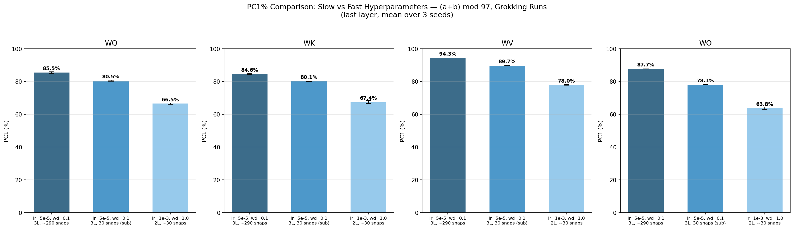

**[p. 36]**

*(a) PC1% в медленном и быстром режимах. В медленном режиме PC1% ниже, но всё ещё заметно выше нулевой модели.*

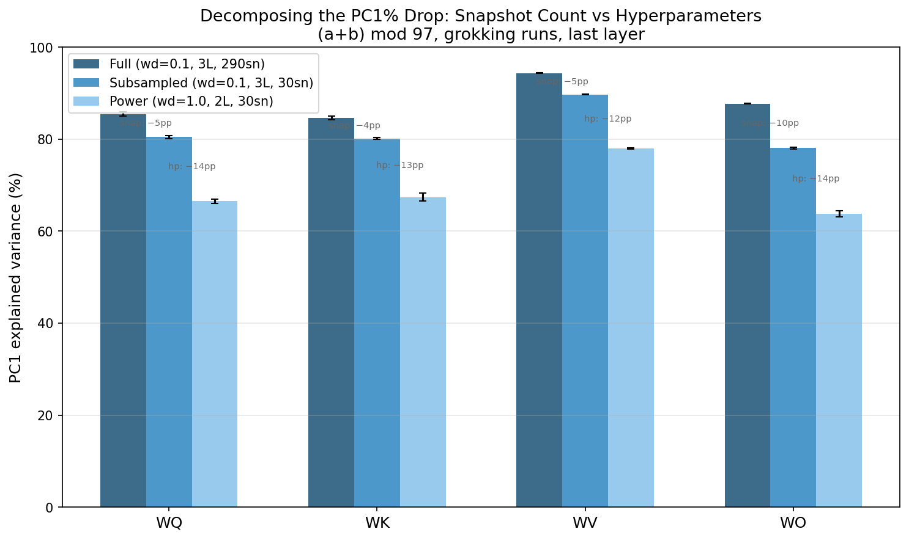

*(b) Разложение падения PC1% между режимами: какой гиперпараметр даёт различие.*

*Рисунок 24: Сравнение режимов по сосредоточенности PCA.* **[p. 36]**

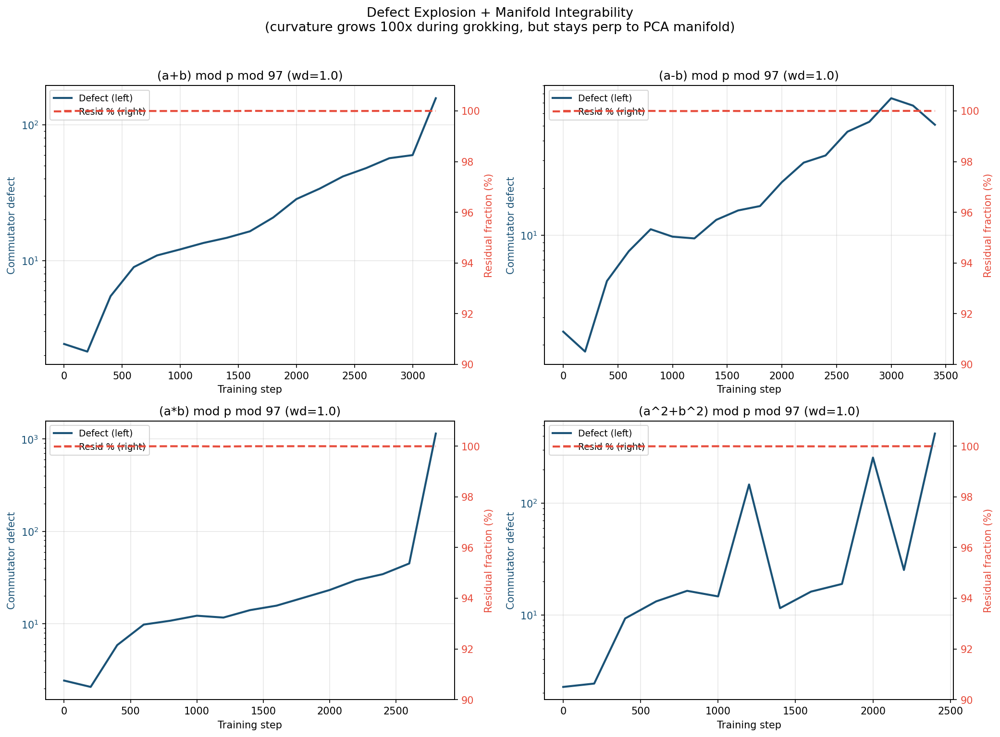

*(a) Совмещённый вид: величина дефекта и мера инвариантности в ходе обучения.*

*(b) Доля весов внимания в коммутаторном дефекте.*

*Рисунок 25: Подробности разбора коммутатора.* **[p. 36]**

*(a) Выравнивание траектории с кривизной в ходе обучения.*

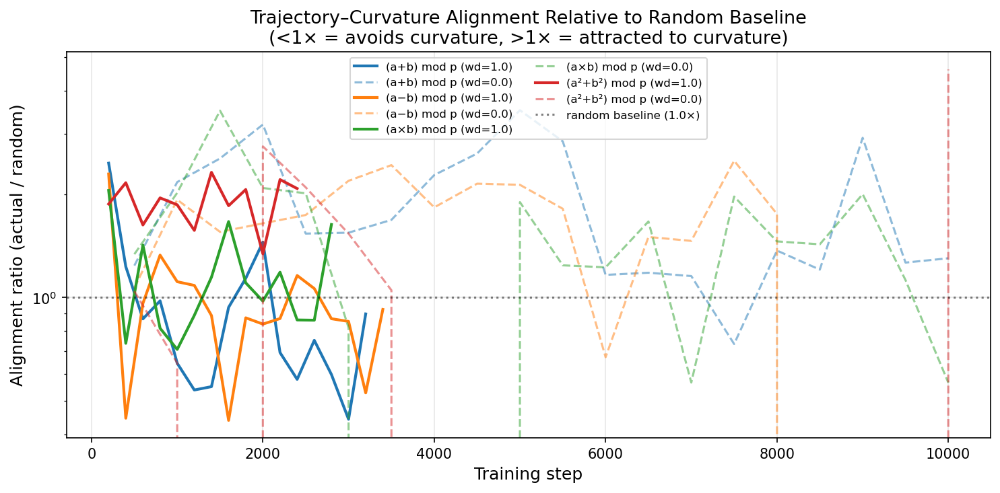 **[p. 37]**

*(b) Отношение выравнивания к случайному уровню: траектория не предпочитает направлений кривизны.*

*Рисунок 26: Обратный разбор: траектория весов избегает направлений высокой кривизны.* **[p. 37]**

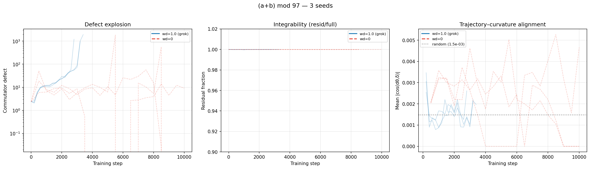

*Рисунок 27: Временны́е кривые для $(a+b)\bmod 97$ с наложением 3 сидов, показывающие согласованность образцов инвариантности и дефекта по сидам.*
