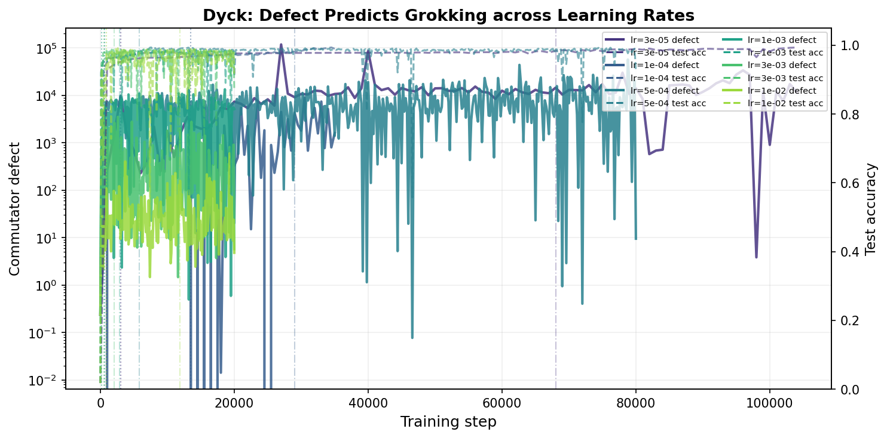
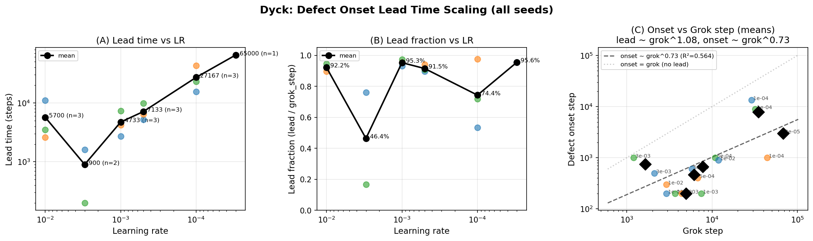
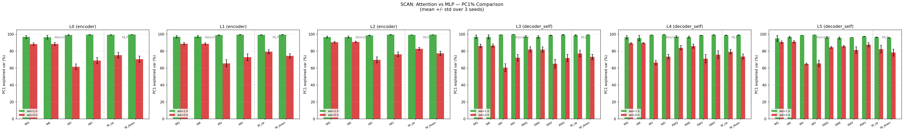
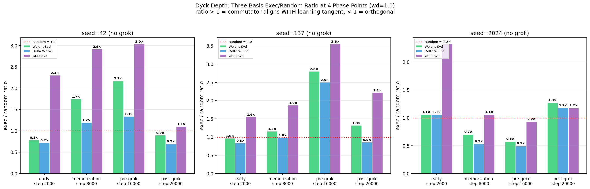
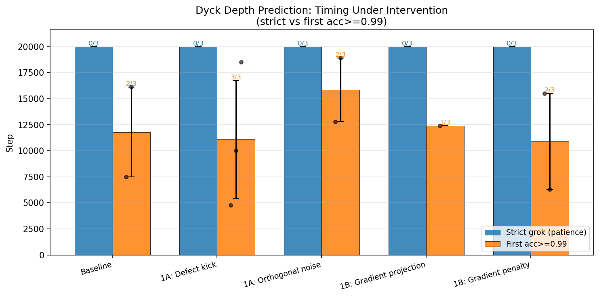
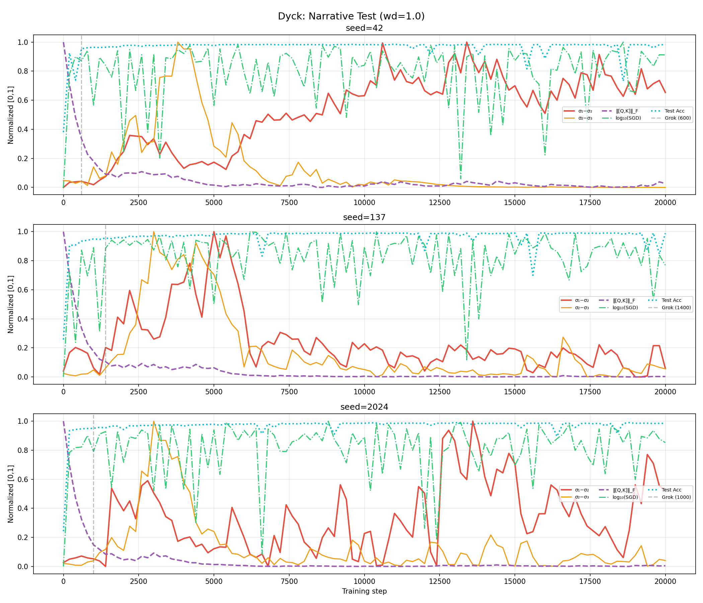
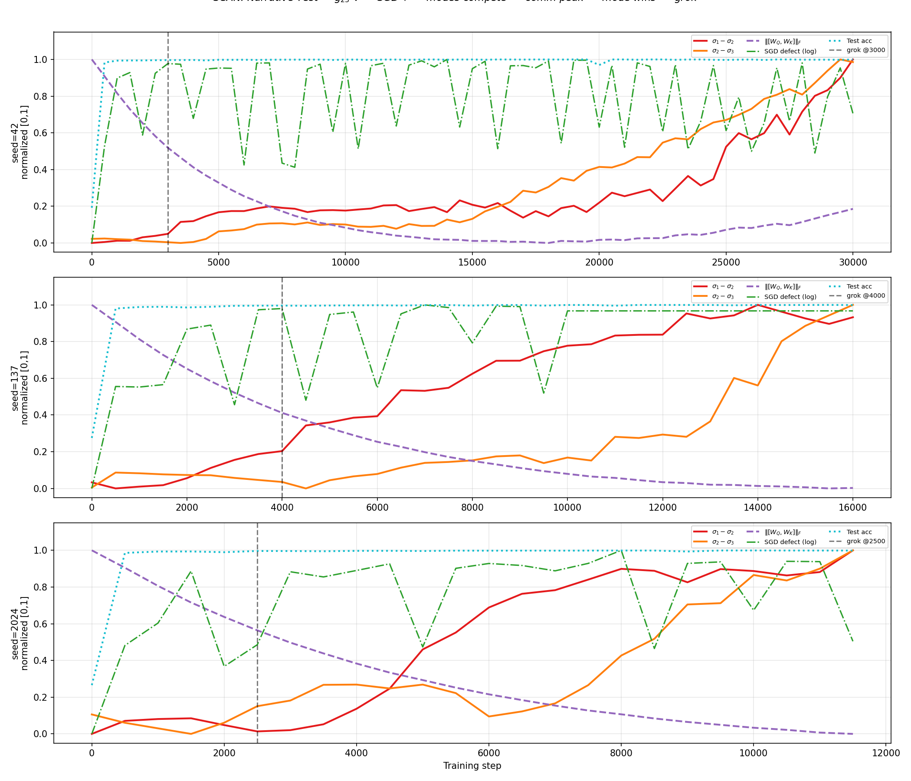
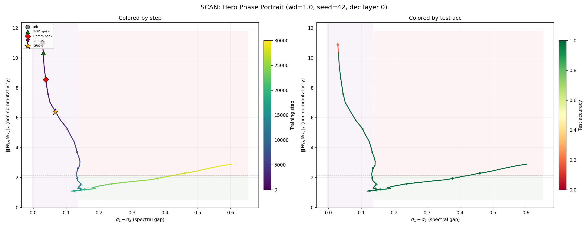
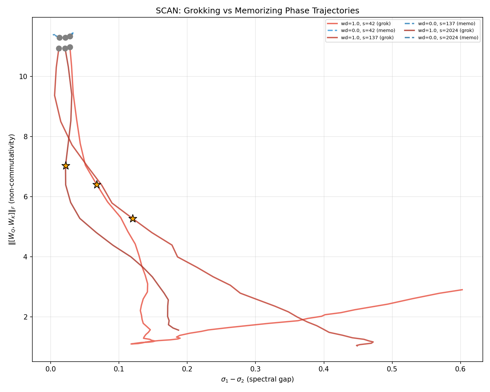

# Xu 2026 — Early-Warning Signals of Grokking via Loss-Landscape Geometry

См. также: [глобальный индекс понятий](../../concepts/index.md).

**Yongzhong Xu** (аффилиация в статье не указана; переписка — abbyxu@gmail.com).

arXiv [2602.16967](https://arxiv.org/abs/2602.16967), 19 февраля 2026 (версия v3 — 3 апреля 2026). 6 цитирований. Источник — нативный HTML arXiv версии v3; пагинация восстановлена по PDF v3 (33 страницы, 16 рисунков).

Оригинал и производные файлы этой папки:

- [`original/2602.16967.native.html`](original/2602.16967.native.html) — первоисточник, нативный HTML arXiv (v3), скачан как есть.
- [`original/2602.16967.early-warning-signals-of-grokking-via-loss-landscape-geometry.md`](original/2602.16967.early-warning-signals-of-grokking-via-loss-landscape-geometry.md) — конверсия оригинала в Markdown без правок содержания; английский текст для сверки перевода.
- [`images/`](images/) — 25 файлов иллюстраций статьи в исходном разрешении (16 рисунков, часть из них многопанельные).
- [`2602.16967.early-warning-signals-of-grokking-via-loss-landscape-geometry.claims.txt`](2602.16967.early-warning-signals-of-grokking-via-loss-landscape-geometry.claims.txt) — рабочий разбор: пронумерованные утверждения с пометками.

Схема якорей и правила ссылок на карточку — в [README папки статей](../README.md).

## Затрагиваемые понятия

**[Ландшафт потерь и бассейны](../../concepts/loss-landscape-basins.md)** — работа переносит на две новые задачи величину, устроенную как локальный зонд ландшафта: коммутаторный дефект в первом порядке по $\eta$ есть скобка Ли градиентных векторных полей и потому обращается в нуль там, где ландшафт локально плосок, а большое его значение означает, что «порядок градиентных обновлений имеет значение — у ландшафта потерь развилась структура кривизны, нарушающая независимость от пути» ([`p4-8`](#p4-8)). Картина в целом наследована: гроккинг — затяжное удержание на низкоразмерном многообразии, накопление поперечных барьеров, бегство в обобщающее решение ([`p20-2`](#p20-2)). Новое здесь — не механизм, а его перенос: те же три ступени прослежены на кодировщике-декодировщике и на причинном декодировщике. Отдельным наблюдением стоит догадка о мелких бассейнах: при 50 обучающих последовательностях «у ландшафта потерь могут быть мелкие бассейны, в которые оптимизатор при больших размерах шага способен входить и из которых выходить» ([`p15-4`](#p15-4)) — это предположение, замера глубины бассейнов в работе нет.

**[Меры прогресса](../../concepts/progress-measures.md)** — главный вклад работы в это понятие в том, что величина-предвестник снабжена **правилом решения и предсказуемым окном**. Правило унаследовано из Xu 2026b: началом дефекта считается первый шаг, где медиана превосходит одновременно десятикратный базовый уровень и абсолютный пол 20 ([`p7-6`](#p7-6)). Из окна сделан протокол наблюдения: считать дефект каждые 100–500 шагов (4 прямых-обратных прохода на измерение), ждать выдержанного всплеска, после чего генерализация «вероятно, последует в пределах предсказуемого окна» ([`p21-1`](#p21-1)). Чего в работе нет: ответа на вопрос, **случится ли** гроккинг. Мера отвечает на вопрос «когда», приняв «что» как данное, — и в двух прогонах при $\lambda=1$, где гроккинга не наступило, поведение дефекта не описано вовсе (см. ниже).

**[Фазовый переход](../../concepts/phase-transition.md)** — работа доводит до трёх число семейств задач, где время опережения подчиняется степенному закону со сверхлинейным показателем: 1.27 (модульная арифметика), 1.18 (SCAN), 1.13 (Dyck) — «Все три показателя … превосходят единицу» ([`p14-2`](#p14-2)). Языком фазовых переходов авторы пользуются скупо и в одном месте: резкое сжатие зазора между нижними модами обновления названо тем, что «и отмечает фазовый переход» ([`p19-3`](#p19-3)). Параметра порядка работа не вводит, конечноразмерного анализа не делает; упорядочение событий (уравнение 12) — эмпирическая хронология из шести прогонов, а не теория перехода.

**[Каузальная абляция](../../concepts/causal-ablation-intervention.md)** — схема из четырёх воздействий взята из Xu 2026b целиком: разовый толчок вдоль собственного вектора коммутатора (1A-kick), постоянный впрыск шума ортогонально градиенту (1A-noise), проецирование градиента, убирающее ортогональную составляющую (1B-project), и штраф на неё (1B-penalty) ([`p12-6`](#p12-6)). Главная новость — **расхождение достаточности по задачам**: на Dyck ускоряют оба усиливающих воздействия, на SCAN мягкое ускоряет, а жёсткое разрушает обучение, на модульной арифметике усиление не даёт ничего; из этого выстроен «спектр причинной отзывчивости» ([`p13-4`](#p13-4), [`p13-5`](#p13-5)). Чего в работе нет: числа прогонов на условие — все итоги приведены одним числом на условие, тогда как базовая полоса на SCAN разбросана почти вдвое, и величины силы воздействия в тексте не названы ни разу, хотя отклик на дозу объявлен монотонным.

**[Ортогональность градиента](../../concepts/orthogonal-gradient-perp-grad.md)** — здесь работа даёт корпусу самое сильное из своих утверждений и единственное, устоявшее на всех трёх задачах: «во всех трёх задачах подавление ортогонального потока градиента задерживает или предотвращает гроккинг, устанавливая *необходимость* динамики поперечной кривизны как универсальную находку» ([`p13-6`](#p13-6)). Подавление действует двумя способами — проецированием и штрафом ([`p12-6`](#p12-6)), — и на SCAN мягкий способ оказывается сильнее жёсткого: 1B-penalty предотвращает гроккинг вовсе, тогда как 1B-project лишь задерживает. Заметим, что необходимость показана для *подавляющих* вмешательств, а не для наблюдаемой величины: соотношения между наблюдаемой величиной ортогонального потока и наступлением гроккинга в естественных, невозмущённых прогонах работа не приводит.

**[Спектральный анализ / FVE](../../concepts/spectral-analysis-svd-esd-fve.md)** — раздел 8 даёт второй, независимый от коммутаторного дефекта взгляд и **пересматривает собственную хронологию** предшествующей работы. Проверяемая гипотеза: почти вырождение верхних сингулярных чисел $W_{Q}$ создаёт неустойчивость ориентации, разрешающуюся, когда одна мода начинает главенствовать ([`p15-6`](#p15-6)). Итог оказался обратным ожиданию: «спектральный зазор мал на шаге гроккинга и продолжает расти ещё долго после», а разделение главенствующей моды есть «*следствие* гроккинга … а не его предпосылка» ([`p16-9`](#p16-9)), тогда как в модульной арифметике $\sigma_{1}\gg\sigma_{2}$ помещалось перед гроккингом ([`p17-6`](#p17-6)). Дополнительно воспроизведён зазор собственных чисел матрицы Грама: $g_{23}$ спадает в 33$\times$ (Dyck) и 43$\times$ (SCAN) на переходе ([`p19-2`](#p19-2)), а самым ясным качественным признаком названо топологическое различие фазовых портретов — траектории с гроккингом проходят всё фазовое пространство, контроли остаются на месте ([`p18-2`](#p18-2), [`fig-16`](#fig-16)).

**[Скорость обучения](../../concepts/learning-rate.md)** — скорость обучения служит здесь главной управляющей величиной: именно перебором по ней получены обе степенные подгонки, и из $\alpha>1$ выводится, что дефект «наиболее полезен ровно тогда, когда он нужнее всего, — при малых скоростях обучения, где обучение длится дольше всего» ([`p21-2`](#p21-2)). Два наблюдения работы стоят отдельно от этой линии. Первое: на Dyck время гроккинга по скорости обучения **немонотонно** — при $\eta=10^{-2}$ оно больше, чем при $\eta=10^{-3}$, чего в модульной арифметике с её $t_{\text{grok}}\propto\eta^{-1}$ не наблюдалось ([`p9-4`](#p9-4)). Второе: при $\eta=10^{-2}$ точность «бурно колеблется, вместо того чтобы начисто перейти от низкой к высокой», давая 80–87 пересечений порога 0.98 за прогон ([`p15-1`](#p15-1)). Ни фазовой диаграммы по скорости обучения, ни разбора режимов демпфирования из Xu 2026b здесь нет.

**[Weight decay](../../concepts/weight-decay.md)** — постановка держится на **единственном** значении $\lambda=1.0$: «сильная регуляризация необходима, чтобы вызвать гроккинг в пределах посильных бюджетов обучения» ([`p6-4`](#p6-4)). Роль weight decay в разделе 8 уточнена в неожиданную сторону: спектральное понижение ранга «движимо weight decay, действующим на уже обобщившуюся модель, а не является предпосылкой генерализации» ([`p20-5`](#p20-5)). Прогоны при $\lambda=0$ служат единственным контролем — у них отношение исполнительного к случайному остаётся около 1.0 всё обучение ([`p12-3`](#p12-3)). Чего в работе нет: перебора по $\lambda$; зависит ли показатель $\alpha$ от силы регуляризации, авторы прямо называют открытым вопросом.

**[Эталонный полигон гроккинга](../../concepts/canonical-grokking-testbed.md)** — работа целиком посвящена **выходу за пределы** канонического полигона и перечисляет оси расхождения явно: архитектура, область входа, тип выхода и устройство набора данных ([`p2-6`](#p2-6)), а в сводке — архитектуры, области, типы выхода, размеры наборов от 50 до 4,704 и размеры моделей от 150 тыс. до 1.5 млн параметров ([`p14-6`](#p14-6)). Существенная оговорка на стороне корпуса: определяющий признак полигона Power et al. — плато при насыщенной обучающей точности — здесь не измерен ни разу, обучающая точность в статье не приводится вовсе. Формально показанное есть поздняя генерализация с предвестником; чтобы назвать это гроккингом в смысле Power et al., недостающего замера в работе нет.

**[Сжатие многообразия представлений](../../concepts/manifold-representation-compression.md)** — сюда работа кладёт **честный отрицательный результат**, и он ценнее её положительных. На Dyck поворот PC1 приходится задолго до гроккинга (пик на шаге 600 против гроккинга на 2,900, опережение 2,300 шагов) ([`p10-3`](#p10-3)), а на SCAN «PC1 продолжает *расти* сквозь переход гроккинга и после него» ([`p11-2`](#p11-2)). Вывод сформулирован прямо: разрежение PC1 «*не* есть универсальный предвестник гроккинга» ([`p11-3`](#p11-3), [`fig-5`](#fig-5)). Истолкование расхождения — что кодировщик уплотняется первым, а разнообразие декодировщика маскируется в совместном измерении, — авторами дано как догадка и не проверено.

**[Фаза меморизации / плато](../../concepts/memorization-phase.md)** — обучение размечено на четыре фазы (ранняя, запоминание, перед гроккингом, после гроккинга), и разложение интегрируемости показывает, что отношение исполнительного к случайному подскакивает до 2–3$\times$ **именно** в фазе перед гроккингом, оставаясь около 1.0 в ранней фазе и в фазе запоминания ([`p12-1`](#p12-1), [`fig-8`](#fig-8)). Это дало бы фазе запоминания измеримый признак, отличающий её от предгроккингового окна, — но рисунок 8 текстового утверждения не подтверждает (см. «Что показано, а что предположено»). Оговорка: границы фаз в работе не определены операционально, а сама фаза запоминания названа по имени без замера обучающей точности, на котором это имя обычно держится.

**[Маршрутизация внимания](../../concepts/attention-routing-heads.md)** — два замера. Первый: сосредоточенность PC1 у проекций внимания составляет 70–85 % против 40–60 % у весов MLP, единообразно на SCAN и Dyck ([`p11-8`](#p11-8), [`fig-7`](#fig-7)). Второй: разбор по головам на Dyck даёт одновременное выравнивание всех четырёх голов, откуда вывод, что «Механизм не свойствен отдельной голове — он работает на уровне целого слоя» ([`p18-4`](#p18-4)). Специализации голов работа не ищет и контуров не выделяет.

**[Гроккинг](../../concepts/grokking.md)** — вклад в само понятие сделан со стороны **измерительной методики**. Гроккинг определён операционально: первый шаг, на котором тестовая точность превосходит порог 0.98 в течение трёх последовательных замеров ([`p7-3`](#p7-3)). Работа показывает, зачем нужна выдержка: на Dyck при $\eta=10^{-2}$ сид 42 впервые пересекает 0.98 на шаге 900, но выдержанного гроккинга достигает лишь к 11,900, то есть «Без критерия с выдержкой точности этот прогон выглядел бы грокающим в 13$\times$ быстрее, чем он грокает на самом деле» ([`p15-3`](#p15-3), [`fig-13`](#fig-13)). Этот режим авторы называют *неустойчивым гроккингом*. Оговорка для корпуса: определение через одну лишь тестовую точность не отличает гроккинг от поздней генерализации, а в разделе 8 порог молча меняется на 0.95 без выдержки (см. «Несогласованности»).

**[Доля данных / критический размер набора](../../concepts/data-fraction-critical-dataset-size.md)** — режим данных выбран как рычаг, а не как предмет изучения: на Dyck взяты 50 обучающих последовательностей против 5,000 тестовых, и авторы прямо пишут, что «Столь большое отношение обучающего набора к тестовому усиливает эффект гроккинга» ([`p5-8`](#p5-8)). На SCAN отобраны 2,048 пар из примерно 14,000. Ни зависимости от доли данных, ни критического размера набора работа не измеряет — обе задачи взяты в одной точке по этой оси.

Карточки статей корпуса: [Xu 2026b](../2602.16746.low-dimensional-and-transversely-curved-optimization-dynamics-in-grokking/2602.16746.low-dimensional-and-transversely-curved-optimization-dynamics-in-grokking.card.md) — прямой предшественник, откуда взято всё, кроме двух задач; [Power et al. 2022](../2201.02177.grokking-generalization-beyond-overfitting-on-small-algorithmic-datasets/2201.02177.grokking-generalization-beyond-overfitting-on-small-algorithmic-datasets.card.md) — постановка; [Nanda et al. 2023](../2301.05217.progress-measures-for-grokking-via-mechanistic-interpretability/2301.05217.progress-measures-for-grokking-via-mechanistic-interpretability.card.md) — контуры в базисе Фурье, названные в объяснении жёсткости модульной арифметики; [Murty et al. 2023](../2305.18741.grokking-of-hierarchical-structure-in-vanilla-transformers/2305.18741.grokking-of-hierarchical-structure-in-vanilla-transformers.card.md) — процитирована как право брать композиционную генерализацию; [Notsawo et al. 2023](../2306.13253.predicting-grokking-long-before-it-happens/2306.13253.predicting-grokking-long-before-it-happens.card.md) — ближайшая работа корпуса по замыслу, в статье не цитируемая; [Xu 2026, многозадачная геометрия](../2602.18523.the-geometry-of-multi-task-grokking-transverse-instability-superposition-and-weight-decay-phase-structure/2602.18523.the-geometry-of-multi-task-grokking-transverse-instability-superposition-and-weight-decay-phase-structure.card.md) — параллельная работа того же автора, ссылающаяся на эту.

## Несогласованности внутри статьи

**Сколько прогонов Dyck дали годное опережение — 14 или 15.** Раздел 5.2 говорит: из 16 прогонов 15 грокают и 14 «обнаруживают и гроккинг, и обнаружимое начало дефекта с положительным временем опережения» ([`p8-10`](#p8-10)); подгонка тоже сделана «по всем 14 прогонам». Но вклад № 1 во введении утверждает «15 из 15 грокающих прогонов на Dyck» ([`p2-8`](#p2-8)), подпись рисунка 4 говорит о пятнадцати прогонах с положительным опережением, а [таблица 4](#tab-4) содержит ровно 15 строк, и в каждой время опережения проставлено и положительно. Пятнадцатый прогон в таблице есть, а в подгонке его нет; какой именно из них и почему выброшен, не сказано.

**Показатель 1.132 приведён дважды в разных смыслах.** В разделе 5.1 это результат подгонки по средним пяти скоростей обучения на SCAN: «$\alpha=1.132$, $R^{2}=0.995$» ([`p8-9`](#p8-9)). В разделе 5.2 то же число — показатель полной подгонки по 14 прогонам на Dyck (уравнение 10). Совпадение до третьего знака в двух независимых подгонках по двум разным задачам нигде не оговорено, и при цитировании числа 1.132 без указания задачи оно двусмысленно.

**База сравнения вмешательств не сходится с собственной таблицей.** Раздел 5.4.1 сообщает, что базовые прогоны SCAN (3 сида, $\eta=10^{-4}$) грокают на 9,500–17,500 шагах ([`p12-7`](#p12-7)), тогда как [таблица 2](#tab-2) для тех же трёх сидов при той же скорости обучения даёт 6,500, 7,000 и 7,200. Ни один из трёх табличных прогонов в объявленную полосу не попадает. Прогоны с вмешательством переобучаются «от той же инициализации», так что различие постановок этого разрыва не объясняет.

**Арифметика ускорения не сходится с объявленным основанием.** Сказано, что 1A-noise грокает на ${\sim}8{,}500$ шагах, «что на ${\sim}32\%$ быстрее самого быстрого базового сида», а 1B-project грокает на ${\sim}28{,}500$ шагах, «в ${\sim}2.3\times$ медленнее самого быстрого базового» ([`p12-8`](#p12-8)). Против самого быстрого сида объявленной полосы (9,500) выходит 10.5 % и 3.0$\times$. Оба приведённых числа согласуются между собой при базе около 12,400–12,500 шагов — то есть при **среднем** трёх базовых сидов, а не при самом быстром. Сравнение, по-видимому, ведётся от среднего, а названо от самого быстрого.

**Раздел 8 молча меняет определение гроккинга.** Всюду гроккинг определён как точность $\geq 0.98$, выдержанная три замера ([`p7-3`](#p7-3)); подпись [таблицы 8](#tab-8) определяет его как «первый шаг, на котором тестовая точность $\geq 0.95$» — без выдержки. Для Dyck сида 42 это даёт шаг гроккинга 600 против 2,900 в [таблице 4](#tab-4), почти впятеро раньше. Все времена опережения раздела 8 посчитаны в этой другой шкале и с опережениями раздела 5 несопоставимы; там же и опережение PC1 в 2,300 шагов ([`p10-3`](#p10-3)) посчитано относительно шага 2,900, а не 600.

**Рисунок 8 не подтверждает утверждения раздела 5.3.3.** В тексте сказано, что отношение исполнительного к случайному подскакивает до 2–3$\times$ в фазе перед гроккингом «для базисов весов и $\Delta W$», оставаясь около 1.0 в ранней фазе и в фазе запоминания ([`p12-1`](#p12-1)). На [рисунке 8a](#fig-8) все три панели при $\lambda=1.0$ подписаны «(no grok)», а четыре фазовые точки взяты фиксированными шагами 2000 / 8000 / 16000 / 20000, тогда как [таблица 4](#tab-4) даёт для этих же трёх сидов при $\eta=10^{-3}$ гроккинг на шагах 2,900, 4,400 и 7,500: точка, названная «перед гроккингом», лежит после гроккинга во всех трёх прогонах. По значениям узор тоже держится лишь на одном сиде: 2–3$\times$ по обоим базисам сразу даёт только сид 137, у сида 42 базис $\Delta W$ остаётся около 1.3$\times$, а у сида 2024 оба базиса в этой точке **ниже** случайного уровня. На сводном [рисунке 8b](#fig-8) средние по трём сидам в точке «перед гроккингом» составляют около 1.85 (базис весов) и 1.44 (базис $\Delta W$) при разбросе, пересекающем 1.0, а единственный базис, попадающий в полосу 2–3$\times$, — градиентный, который стоит около 2$\times$ уже в ранней фазе, то есть как раз не «около 1.0».

**Упорядочение уравнения 12 нарушено в собственной таблице.** Уравнение 12 ставит всплеск дефекта SGD **перед** пиком матричного коммутатора, а раздел 8.8 называет это двухступенчатое устройство единообразным «для обоих наборов данных и всех 6 прогонов с гроккингом» ([`p20-1`](#p20-1)). В [таблице 8](#tab-8) у SCAN сида 137 всплеск SGD приходится на шаг 1,700, а пик коммутатора — на 1,500: порядок обратный. Отдельно у Dyck сида 42 пик коммутатора (600) совпадает с шагом гроккинга (600), так что утверждение раздела 9.1 о пике «до гроккинга (6/6 прогонов)» держится только в нестрогой форме $\leq$, в которой оно и записано в разделе 8.4 ([`p17-4`](#p17-4)).

## Что показано, а что предположено

Замечания редактора карточки по итогам разбора утверждений (`…claims.txt`); каждая пометка перепроверена по оригиналу. Работа устроена как проверка переносимости: измерительный аппарат, пороги и схема вмешательств взяты из Xu 2026b без изменений, новыми являются две задачи, две архитектуры и то, что на них разошлось.

**Что показано надёжно — это опережение.** На SCAN у всех 11 прогонов с обнаружимым началом дефекта опережение положительно ([`p8-5`](#p8-5)); на Dyck положительно у всех 14 (или 15, см. выше). Это 25–26 прогонов из 27 грокающих на двух задачах, и результат сам по себе не спорен. Спорно то, что из него выводится.

**Сверхлинейность не самосогласована на собственных крайних точках.** Доля опережения по определению не может превысить единицу, значит $\Delta t\leq t_{\text{grok}}$. Между тем подгонка SCAN на самом медленном прогоне даёт $0.149\cdot 115{,}000^{1.18}\approx 1.40\cdot 10^{5}$ при $t_{\text{grok}}=115{,}000$, а подгонка Dyck — $0.239\cdot 68{,}000^{1.132}\approx 7.06\cdot 10^{4}$ при $t_{\text{grok}}=68{,}000$. Обе предсказывают невозможное. Показатель $\alpha>1$, стало быть, — свойство конечного отрезка перебора, а не закон, продолжимый вправо; для практического наблюдения ([`p21-1`](#p21-1)) это существенно, потому что окно предсказывается именно этой формулой.

**Авторы сами показали, что показатель зависит от покрытия, и это ослабляет вывод.** Раздел 5.2 честно сообщает: при трёх скоростях обучения выходило $\alpha\approx 0.91$, «выглядевший почти линейным», и только добавление ещё трёх подняло показатель выше единицы ([`p9-3`](#p9-3)). Это записано как довод за плотное покрытие, но читается и как оценка устойчивости самого $\alpha$: показатель менялся от 0.91 до 1.13 в пределах одной задачи.

**Ложноположительных не измеряли.** При $\lambda=1$ гроккинга не наступило в двух прогонах — на SCAN у сида 137 при $\eta=10^{-3}$ и на Dyck у сида 137 при $\eta=3\times 10^{-3}$ (обоих нет в [таблицах 2](#tab-2) и [4](#tab-4) при полном переборе, объявленном в [`p6-6`](#p6-6)); ещё в одном прогоне (SCAN, сид 2024, $\eta=10^{-3}$) гроккинг был, а начало дефекта не обнаружено. О поведении дефекта в этих прогонах не сказано ничего. Единственное «ложных срабатываний нет» посчитано на контролях при $\lambda=0$ ([`p17-4`](#p17-4)), где отсутствие гроккинга заложено постановкой. Тем самым отбор между грокающей и не грокающей настройкой работой не проверен — что согласуется с прямым признанием Xu 2026b, что геометрические сигналы **не складываются** в предсказатель того, случится ли гроккинг.

**Протокол наблюдения замкнут сам на себя.** Шаг 3 протокола предсказывает окно по закону $\Delta t\propto t_{\text{grok}}^{\alpha}$ ([`p21-1`](#p21-1)), но $t_{\text{grok}}$ — это как раз то, что требуется предсказать. Обратить закон в наблюдаемую форму — выразить $t_{\text{grok}}$ через измеренное $t_{\text{onset}}$ — авторы не пробуют, хотя при $\alpha>1$ такое обращение однозначно.

**Заявка на первенство сделана без сверки с линией ускорения.** Раздел 9.2 говорит, что работа даёт «один из первых не зависящих от задачи, геометрических сигналов раннего предупреждения об отложенной генерализации» ([`p20-6`](#p20-6)). Ближайшая работа корпуса по замыслу — [Notsawo et al. 2023](../2306.13253.predicting-grokking-long-before-it-happens/2306.13253.predicting-grokking-long-before-it-happens.card.md), предсказывающая гроккинг по ранней динамике потерь, — не цитируется вовсе; не названы и работы, вмешивающиеся в градиент ради ускорения гроккинга ([Grokfast](../2405.20233.grokfast-accelerated-grokking-by-amplifying-slow-gradients/2405.20233.grokfast-accelerated-grokking-by-amplifying-slow-gradients.card.md), [эгалитарный градиентный спуск](../2510.04930.egalitarian-gradient-descent-a-simple-approach-to-accelerated-grokking/2510.04930.egalitarian-gradient-descent-a-simple-approach-to-accelerated-grokking.card.md)), с которыми прямо соседствует ускоряющая половина причинного вклада.

**Разложение интегрируемости — самое слабое место работы, и слабость видна на её собственном рисунке.** Это вклад № 4 из шести объявленных, и текст формулирует его категорично ([`p12-1`](#p12-1)), тогда как [рисунок 8](#fig-8) даёт другое: узор «2–3$\times$ по обоим базисам в фазе перед гроккингом при 1.0 в остальных» воспроизводится на одном сиде из трёх, средние по трём сидам не достигают полосы 2–3$\times$ и не отделены от случайного уровня разбросом, а фазовые точки взяты фиксированными шагами, из которых «перед гроккингом» приходится на шаг 16,000 при гроккинге на 2,900–7,500. Подробности — в «Несогласованностях». Отсюда следствие для корпуса: из трёх опор, на которых держится вывод о структурированности некоммутативности (полное $\rho\approx 1$, отношение к случайному, фазовая привязка), здесь надёжна только первая, унаследованная, а две новые — нет.

**Достаточность разошлась с предшествующей работой, и объяснение дано, а проверки нет.** В Xu 2026b достаточность была **отвергнута**: толчки вдоль коммутатора амплитудой до 500 норм градиентного шага не ускорили гроккинг ни в одном из 27 прогонов. Здесь одноимённое воздействие 1A-kick ускоряет гроккинг на Dyck вдвое ([`p13-2`](#p13-2)). Расхождение объяснено свойством задачи — простотой счётного механизма ([`p13-5`](#p13-5)), — но того, что схема вмешательства осталась той же по силе и способу применения, работа не показывает: величины воздействий не названы ни в одной из двух статей одинаково.

**Предсказание раздела 8.7 не подтвердилось и объявлено согласующимся.** Отношение зазора $R$ дало умеренные значения ($R\approx 2$–6) «без резких всплесков, предсказанных тезисом», и это тут же объяснено оговоркой самого тезиса о размерности и пороге BBP ([`p19-4`](#p19-4)). Оговорка может быть верна, но проверить её в этой постановке нечем: предсказание и его отсутствие описаны одной и той же рамкой. Отдельно ослабляет раздел выбор окна: при $W=3$ (Dyck) величина $g_{23}=\sigma_{2}^{2}-\sigma_{3}^{2}$ есть зазор между вторым и **последним** сингулярным числом, а $k^{*}$ может принимать лишь два значения, так что универсальное $k^{*}=1$ при таком окне почти вынуждено ([`p18-9`](#p18-9)).

**Спектральная часть опирается на 27 рисунков, которых в статье нет.** Раздел 8.8 сообщает, что они «доступны в дополнительных материалах» ([`p20-1`](#p20-1)); к препринту дополнительных материалов не приложено, и приведённые в тексте числа по ним непроверяемы.

**Собственные ограничения перечислены полно и честно.** Один сид на крайних скоростях обучения, единственное значение weight decay, модели 2–3 слоёв и 150 тыс. – 1.5 млн параметров, только искусственные задачи, подобранный порог $10\times$, непроверенность на больших языковых моделях ([`p21-7`](#p21-7)). Список закрывает почти все возражения к разделам 5–6; он не закрывает того, что обучающая точность не приводится ни разу и что ложноположительные не измерялись.

**Библиография требует осторожности при цитировании.** Ярлык «Xu [2026a]» стоит в списке источников **дважды** — при `arXiv:2602.10496` и при `arXiv:2603.28964`, — а единственная в теле ссылка «Xu 2026a» (рамка матрицы Грама, раздел 8.7) по смыслу указывает на второй из них. Собственный препринт «Xu 2026b» упомянут в теле 55 раз при списке из 13 записей, из которых 3 — работы того же автора; у центрального «Low-dimensional and transversely curved» номера arXiv в списке нет вовсе (это `2602.16746`). Yun et al. и Lyu et al. стоят в списке и в теле не появляются ни разу.

## Ошибочные пересказы и цитирования этой статьи

Узоры, наблюдаемые в цитирующих работах корпуса. Раздел строится только из встреченных формулировок; в каждой записи сказано, что именно искажается, и даны ссылки на авторские абзацы, где стоит теряемая оговорка. Карточки заведены пока не у всех цитирующих работ, поэтому подробные записи «Ошибочных цитирований» существуют не везде.

**«Усиление некоммутативности ускоряет гроккинг во всех семействах задач» (расширяющее).** В параллельной работе того же автора — [Xu 2026, многозадачная геометрия](../2602.18523.the-geometry-of-multi-task-grokking-transverse-instability-superposition-and-weight-decay-phase-structure/2602.18523.the-geometry-of-multi-task-grokking-transverse-instability-superposition-and-weight-decay-phase-structure.card.md) — эта статья пересказана формулой `"amplifying non-commutativity accelerates grokking by 32–60% across task families, while suppressing orthogonal gradients delays or prevents it"`. Вторая половина фразы точна и есть главный устоявший результат ([`p13-6`](#p13-6)). Первая половина расширяет: усиление ускоряет на **двух** семействах из трёх, а на модульной арифметике, включённой в собственную сводную [таблицу 6](#tab-6), оно прямо названо не дающим эффекта ([`p13-5`](#p13-5)); верхняя граница «60 %» в разбираемой статье не встречается вовсе — приведённые здесь величины суть ${\sim}32\%$ на SCAN и ${\sim}50\%$ и ${\sim}40\%$ на Dyck ([`p12-8`](#p12-8), [`p13-2`](#p13-2)). Ровно то различие, ради которого построен «спектр причинной отзывчивости», в пересказе исчезает.

**«Наблюдение за главными компонентами траектории даёт ранний предвестник» (ошибочное).** Работа `2602.18649` (карточки нет) заканчивает разбор низкоразмерности предложением следить за главными компонентами траектории при дообучении, `"could provide an early-warning signal for capability changes"`, со ссылкой на эту статью. Между тем ранним предвестником здесь объявлен коммутаторный дефект, а траектория PC1 приведена как **отрицательный** результат: на SCAN разрежение PC1 следует за гроккингом, и авторы прямо пишут, что оно «*не* есть универсальный предвестник гроккинга» ([`p11-3`](#p11-3), [`p11-2`](#p11-2), [`fig-5`](#fig-5)). Ссылка приписывает статье ровно то, что она опровергает.

**«Матричный коммутатор пикует до гроккинга со сверхлинейным опережением на Dyck, SCAN и модульной арифметике» (расширяющее).** В работе `2604.07380` (карточки нет) две величины сведены в одну: `"tracks $\left\|[W_{Q},W_{K}]\right\|_{F}$ and shows it peaks before grokking, with superlinear lead times across Dyck, SCAN, and modular arithmetic"`. В разбираемой статье сверхлинейное опережение измерено для **коммутаторного дефекта SGD** $\mathcal{D}$, а не для матричного коммутатора ([`p14-2`](#p14-2)); пик матричного коммутатора измерен только на Dyck и SCAN, всего в 6 прогонах, и притом в другой шкале гроккинга ($\geq 0.95$ без выдержки, [таблица 8](#tab-8)), причём в одном из шести прогонов опережение равно нулю ([`p17-4`](#p17-4)). Модульная арифметика в этом замере не участвует: результат по ней взят из Xu 2026b.

**Точные пересказы для сравнения.** Работа `2607.06639` (карточки нет) пишет: `"Xu [13] uses a loss-landscape commutator defect as an early-warning signal with a power-law lead time"` — формулировка не выходит за пределы показанного. Так же точны и две другие фразы из [Xu 2026, многозадачная геометрия](../2602.18523.the-geometry-of-multi-task-grokking-transverse-instability-superposition-and-weight-decay-phase-structure/2602.18523.the-geometry-of-multi-task-grokking-transverse-instability-superposition-and-weight-decay-phase-structure.card.md): о том, что схожие сигналы раннего предупреждения возникают на языках Дейка и SCAN, и о степенном масштабировании времени опережения. Ещё одно упоминание, `2605.20441` (карточки нет), приводит эту работу в перечне дополняющих результатов без содержательного пересказа.

---

# Текст статьи

## Аннотация

Гроккингом называют явление, при котором нейронные сети после продолжительного обучения резко переходят от запоминания к генерализации. Недавние работы по модульной арифметике связали гроккинг с затяжным удержанием на низкоразмерных исполнительных многообразиях в пространстве весов, за которым следует внезапное бегство в обобщающее решение. Главный открытый вопрос — распространяется ли этот геометрический механизм за пределы арифметических задач.

Мы исследуем этот вопрос на двух структурно различных задачах обучения последовательностей: полигоне композиционной генерализации SCAN и предсказании глубины в языке Дейка Dyck-1. На обеих задачах и в широком диапазоне скоростей обучения мы обнаруживаем, что коммутаторный дефект — мера кривизны ландшафта потерь, выведенная из некоммутативности последовательных градиентных обновлений, — надёжно растёт задолго до наступления генерализации. Время опережения между началом дефекта и гроккингом связано с временны́м масштабом гроккинга степенным законом с показателями $\alpha\approx 1.18$ для SCAN ($R^{2}=0.990$, $n=11$) и $\alpha\approx 1.13$ для Dyck ($R^{2}=0.908$, $n=14$). Вместе с прежними результатами по модульной арифметике все три семейства задач обнаруживают сверхлинейное масштабирование ($\alpha>1$), давая окна предупреждения в 90–97 % при малых скоростях обучения.

Анализ главных компонент в пространстве весов вскрывает зависящую от задачи спектральную динамику: разрежение PC1 предшествует гроккингу на Dyck и в модульной арифметике, но следует за ним на SCAN, а значит, спектральная сосредоточенность не есть универсальный предвестник. Напротив, коммутаторный дефект неизменно предвосхищает генерализацию во всех постановках. Трёхбазисное разложение интегрируемости показывает, что всплески дефекта отражают структурированную некоммутативность внутри обучающего подпространства, характерную для режима гроккинга.

Наконец, причинные вмешательства и на SCAN, и на Dyck обнаруживают механистическую роль дефекта: возмущения, усиливающие некоммутативность, ускоряют гроккинг (на ${\sim}32\%$ на SCAN и ${\sim}50\%$ на Dyck), тогда как подавление ортогонального потока градиента задерживает или предотвращает генерализацию. Три семейства задач образуют спектр причинной отзывчивости: модульная арифметика жёстка (усиление не даёт эффекта), Dyck отзывчив (ускоряет и мягкое, и жёсткое усиление), а SCAN промежуточен (мягкое усиление ускоряет, а жёсткое расшатывает). Во всех задачах подавление задерживает или предотвращает гроккинг, устанавливая необходимость как универсальную находку. Вместе с прежними результатами наши находки утверждают коммутаторный дефект как устойчивый, не зависящий от архитектуры и причинно задействованный сигнал раннего предупреждения о гроккинге в моделях на основе трансформеров.

## 1 Введение

Гроккинг — явление, при котором нейронные сети, обучаемые на малых наборах данных, сперва запоминают обучающую выборку, а затем, много позже достижения идеальной обучающей точности, внезапно обобщаются на тест, — был впервые описан Power et al. 2022 на задачах модульной арифметики. Явление бросает вызов привычным объяснениям генерализации, потому что стандартные показатели обучения (потеря, точность) **[p. 2]** не дают никакого предупреждения заранее: модель с идеальной обучающей точностью и плохой тестовой может быть на пороге гроккинга, а может не обобщиться никогда.

В нашей предшествующей работе [Xu 2026b] мы предложили геометрическое объяснение гроккинга, построенное на *динамике поперечной кривизны*. Работая с модульной арифметикой (шесть бинарных операций по модулю 97), мы показали, что:

1. Траектории в пространстве весов при гроккинге лежат на *исполнительном многообразии* ранга 1 (PC1 улавливает 68–83 % дисперсии);
2. Это многообразие обнаруживает эмпирическую инвариантность: векторы коммутаторного дефекта — измеряющие некоммутативность последовательных градиентных обновлений — преимущественно ортогональны ему ($\rho\approx 1.000$);
3. Кривизна взрывается в нормальном расслоении (в 10–1000$\times$), причём её начало предшествует генерализации на 600–1600 шагов;
4. Время опережения подчиняется степенному закону $\Delta t\propto t_{\text{grok}}^{\alpha}$ с $\alpha=1.27\pm 0.03$ ($R^{2}=0.97$, $n=43$) при переборе скорости обучения в 300$\times$;
5. Причинные вмешательства подтверждают, что ортогональный поток градиента необходим (подавление предотвращает гроккинг), но одного лишь усиления кривизны не достаточно (ускорения нет).

Основной открытый вопрос, поставленный той работой, — свойственны ли эти находки именно модульной арифметике и encoder-only трансформерам или же они отражают универсальный геометрический механизм гроккинга. В исходной статье отмечено, что «preliminary experiments on Dyck languages and the SCAN compositional-generalization benchmark suggest that qualitatively similar low-dimensional confinement and transverse curvature dynamics arise beyond modular arithmetic; a systematic investigation of these settings is ongoing».

Настоящая статья и есть это систематическое исследование. Мы распространяем разбор коммутаторного дефекта на две структурно различные задачи:

1. **SCAN** [Lake and Baroni 2018]: полигон композиционной генерализации, отображающий команды на естественном языке (например, «jump twice») в последовательности действий (например, JUMP JUMP); обучается трансформером кодировщик–декодировщик.
2. **Предсказание глубины в Dyck-1**: задача формального языка, где причинный (decoder-only) трансформер должен предсказать текущую глубину стека в каждой позиции скобочной последовательности; обучение идёт всего на 50 примерах.

###### p2-6

Эти задачи отличаются от модульной арифметики архитектурой (кодировщик–декодировщик и причинная против encoder-only), областью входа (естественный и формальный язык против числовой), типом выхода (порождение последовательности и классификация по токенам против классификации одного токена) и устройством набора данных.

#### Основные вклады.

Наша работа делает шесть основных вкладов:

###### p2-8

1. **Универсальность начала дефекта.** И на SCAN, и на Dyck начало коммутаторного дефекта неизменно предшествует переходу к генерализации при всех проверенных скоростях обучения — положительное время опережения показывают 15 из 15 грокающих прогонов на Dyck и 11 из 11 на SCAN.
2. **Сверхлинейное масштабирование.** Время опережения подчиняется степенному закону со сверхлинейным показателем на обеих задачах: $\alpha\approx 1.18$ ($R^{2}=0.990$) для SCAN и $\alpha\approx 1.13$ ($R^{2}=0.908$) для Dyck. Вместе с модульной арифметикой ($\alpha\approx 1.3$) все три семейства задач обнаруживают $\alpha>1$.
**[p. 3]**

3. **Разъединение PC1.** Разрежение PC1 в пространстве весов предшествует гроккингу на Dyck (как и в модульной арифметике), но *следует* за гроккингом на SCAN, показывая, что коммутаторный дефект — более универсальный сигнал, чем спектральная сосредоточенность.
4. **Разложение интегрируемости.** Трёхбазисный разбор (SVD весов, SVD $\Delta W$, SVD градиентов) показывает, что всплеск дефекта отражает структурированную некоммутативность, выровненную с обучающим подпространством (отношение исполнительного к случайному 2–3$\times$), свойственную именно режиму гроккинга.
5. **Причинные свидетельства.** И на SCAN, и на Dyck возмущения, усиливающие коммутатор, ускоряют гроккинг (на ${\sim}32\%$ на SCAN, ${\sim}50\%$ на Dyck); возмущения, подавляющие ортогональный поток градиента, задерживают или предотвращают его. Три семейства задач (включая модульную арифметику) образуют спектр причинной отзывчивости, универсально подтверждая при этом необходимость.
6. **Режим неустойчивости.** При больших скоростях обучения (Dyck, $\eta=10^{-2}$) точность колеблется, а не переходит начисто, что и заставляет пользоваться критериями гроккинга с выдержкой точности.

#### Устройство статьи.

Раздел 2 обозревает геометрическую рамку Xu 2026b. Раздел 3 описывает постановку эксперимента. Раздел 4 излагает методы: собственный анализ PCA, измерение коммутаторного дефекта и разложение интегрируемости. Раздел 5 излагает результаты в четыре приёма: SCAN (раздел 5.1), Dyck (раздел 5.2), геометрический разбор (раздел 5.3) и причинные вмешательства (раздел 5.4). Раздел 6 сводит воедино сравнение по наборам данных. Раздел 8 излагает разбор спектральной геометрии матриц весов внимания, проверяя, сопровождается ли гроккинг спектральным нарушением симметрии в $W_{Q}$ и $W_{K}$. Раздел 9 обсуждает следствия и связи с более широкими темами.

## 2 Предпосылки: геометрическая рамка для гроккинга

Мы обозреваем геометрическую рамку, введённую в нашей предшествующей работе [Xu 2026b] для изучения гроккинга через кривизну ландшафта потерь. Этот раздел определяет ключевые математические объекты и устанавливает теоретический контекст настоящей работы.

### 2.1 Гроккинг

Power et al. 2022 первыми описали гроккинг на задачах модульной арифметики, показав, что малые трансформеры могут запомнить обучающие данные за сотни шагов, но требуют тысяч, чтобы обобщиться. Последующие работы обнаружили гроккинг в разнообразных постановках, включая групповые операции [Nanda et al. 2023], булевы функции, разрежённые чётности [Barak et al. 2022] и композиционную генерализацию [Murty et al. 2023]. Явление чувствительно к силе регуляризации [Liu et al. 2022], размеру набора данных [Liu et al. 2023] и скорости обучения.

### 2.2 Исполнительное многообразие

Следуя нашей более ранней работе [Xu 2026b], мы определяем *исполнительное многообразие* как низкоразмерное подпространство пространства параметров, прочерчиваемое траекторией весов при обучении. Формально: имея $T$ снимков весов $\{W_{t}\}_{t=1}^{T}$ матрицы весов $W\in\mathbb{R}^{d\times d}$, мы составляем матрицу траектории смещений от инициализации:

$$
X=\begin{pmatrix}\text{vec}(W_{1}-W_{0})\\
\vdots\\
\text{vec}(W_{T}-W_{0})\end{pmatrix}\in\mathbb{R}^{T\times d^{2}}, \tag{1}
$$

**[p. 4]**

после центрирования по столбцам. SVD $X=U\Sigma V^{\top}$ даёт главные направления $\{v_{k}\}$. Доля объяснённой дисперсии $k$-й компоненты равна $\sigma_{k}^{2}/\sum_{i}\sigma_{i}^{2}$, а $\text{PC1\%}=100\times\sigma_{1}^{2}/\sum_{i}\sigma_{i}^{2}$ измеряет долю дисперсии траектории, улавливаемую одним направлением.

##### **Определение 1**(Исполнительное многообразие)**.**

*Пусть $V_{K}=[v_{1},\ldots,v_{K}]$ обозначает верхние $K$ правых сингулярных векторов $X$. *Исполнительное многообразие* — это аффинное подпространство $\mathcal{M}=\{W_{0}+V_{K}\alpha:\alpha\in\mathbb{R}^{K}\}$, проходящее через исходные веса $W_{0}$. Когда PC1% велика ($>70\%$), $\mathcal{M}$ фактически имеет ранг 1: траектория весов заперта на одномерной кривой в пространстве параметров.*

В модульной арифметике мы получили $\text{PC1\%}=68$–$83\%$ во всех условиях с гроккингом [Xu 2026b], со z-оценками на 5–20$\sigma$ выше нулевой модели случайного блуждания.

### 2.3 Коммутаторный дефект

Коммутаторный дефект количественно выражает некоммутативность градиентных обновлений по разным мини-пакетам, давая локальный зонд кривизны ландшафта потерь, не требующий вычисления гессиана.

##### **Определение 2**(Коммутаторный дефект)**.**

*Даны параметры $\theta_{0}$, функция потерь $\mathcal{L}$, размер шага $\eta$ и два независимых мини-пакета $A,B$; определим:*

$$
\theta_{AB} =\theta_{0}-\eta\,g_{A}(\theta_{0})-\eta\,g_{B}(\theta_{0}-\eta\,g_{A}(\theta_{0})), \\
\theta_{BA} =\theta_{0}-\eta\,g_{B}(\theta_{0})-\eta\,g_{A}(\theta_{0}-\eta\,g_{B}(\theta_{0})), \tag{2}
$$

*где $g_{A}(\theta)=\nabla_{\theta}\mathcal{L}_{A}(\theta)$ — градиент на мини-пакете $A$ при параметрах $\theta$. *Нормированный по масштабу коммутаторный дефект* есть:*

$$
\mathcal{D}(\theta_{0};A,B)=\frac{\lVert\theta_{AB}-\theta_{BA}\rVert}{\lVert\eta\,g_{A}\rVert\cdot\lVert\eta\,g_{B}\rVert}. \tag{4}
$$

#### Геометрическое истолкование.

В первом порядке по $\eta$ коммутаторный вектор $\delta=\theta_{AB}-\theta_{BA}$ удовлетворяет:

$$
\delta\approx\eta^{2}(\nabla g_{B}\cdot g_{A}-\nabla g_{A}\cdot g_{B}), \tag{5}
$$

###### p4-8

то есть является скобкой Ли градиентных векторных полей [Xu 2026b]. Тем самым $\mathcal{D}$ пропорционален скобке Ли стохастических градиентных векторных полей и служит заместителем локальной нелинейности ландшафта потерь: если ландшафт локально плосок (интегрируем), градиентные шаги коммутируют и $\mathcal{D}=0$. Большой дефект означает, что порядок градиентных обновлений имеет значение — у ландшафта потерь развилась структура кривизны, нарушающая независимость от пути.

### 2.4 Проецирование на многообразие и инвариантность

Чтобы определить, живёт ли кривизна внутри исполнительного многообразия или вне его, мы раскладываем коммутаторный вектор $\delta$ относительно базиса PCA [Xu 2026b].

##### **Определение 3**(Мера инвариантности)**.**

*Пусть $B\in\mathbb{R}^{P\times K}$ — ортонормированный базис подпространства PCA, вложенного в полное пространство параметров ($P$ параметров всего). Имея коммутаторный вектор $\delta=\theta_{AB}-\theta_{BA}$, разложим:*

$$
\delta=\underbrace{BB^{\top}\delta}_{\delta_{\parallel}\ (\text{projected})}+\underbrace{(\delta-BB^{\top}\delta)}_{\delta_{\perp}\ (\text{residual})}. \tag{6}
$$

*Доля остатка и есть *мера инвариантности*:*

$$
\rho=\frac{\lVert\delta_{\perp}\rVert}{\lVert\delta\rVert}. \tag{7}
$$

**[p. 5]**

Если $\rho\approx 1$, коммутатор ортогонален исполнительному многообразию — кривизна заперта в *нормальном расслоении*, — и многообразие обнаруживает *эмпирическую инвариантность* относительно динамики оптимизации. Если $\rho\approx 0$, кривизна лежит внутри выученного подпространства.

##### **Определение 4**(Поперечное расцепление)**.**

*Динамика оптимизации *поперечно расцеплена* на исполнительном многообразии $\mathcal{M}$, если векторы коммутаторного дефекта заперты в его нормальном расслоении ($\rho\approx 1$). В этом режиме возмущения, наводимые кривизной, действуют почти целиком ортогонально $\mathcal{M}$, так что наблюдаемая траектория остаётся запертой в выученном подпространстве на протяжении обучения.*

В модульной арифметике мы получили $\rho\approx 1.000$ в пределах численной точности во всех 36 условиях [Xu 2026b] (6 операций $\times$ 2 настройки weight decay $\times$ 3 сида), с отношением проекций исполнительного к случайному в 1.8–2.9$\times$, что подтверждает: почти нулевая параллельная составляющая геометрически структурирована, а не есть артефакт размерности.

### 2.5 Контроль на случайном подпространстве

Поскольку любое $K$-мерное подпространство $\mathbb{R}^{P}$ улавливает $\sim\sqrt{K/P}$ случайного вектора, одна лишь близость $\rho$ к единице не подтверждает геометрической структуры. Следуя Xu 2026b, мы сравниваем проекцию на базис PCA со случайными базовыми уровнями: для каждого коммутаторного вектора $\delta$ мы вычисляем долю проекции на $N_{\text{rand}}=5$ случайных $K$-мерных ортонормированных базисов и приводим *отношение исполнительного к случайному* $\text{proj}_{\text{exec}}/\text{proj}_{\text{rand}}$. Значения существенно выше 1.0 подтверждают, что подпространство PCA улавливает больше энергии коммутатора, чем ожидается по случайности.

### 2.6 Степенной закон

Мы установили [Xu 2026b], что время опережения между началом дефекта и гроккингом подчиняется степенному закону:

$$
\Delta t=C\cdot t_{\text{grok}}^{\alpha}, \tag{8}
$$

где $\Delta t=t_{\text{grok}}-t_{\text{onset}}$ — время опережения, $t_{\text{grok}}$ — шаг гроккинга, а $t_{\text{onset}}$ — шаг начала дефекта. *Доля опережения* $\Delta t/t_{\text{grok}}$ выражает время опережения как долю всего времени обучения. В модульной арифметике $\alpha=1.27\pm 0.03$ ($R^{2}=0.97$, $n=43$) при переборе скорости обучения в 300$\times$: поскольку $\alpha>1$, предсказательное окно растёт сверхлинейно с временны́м масштабом гроккинга.

## 3 Постановка эксперимента

### 3.1 Задачи и наборы данных

#### Композиционная генерализация SCAN.

Мы берём простое разбиение SCAN [Lake and Baroni 2018], случайно отбирая $N_{\text{train}}=2{,}048$ пар «команда — действие» из полного набора примерно в 14 000 примеров. Оставшиеся примеры образуют тестовый набор (${\sim}9{,}000$). Словарь команд содержит 21 токен, словарь действий — 7 токенов. Наибольшая длина команды — 8 токенов, наибольшая длина действия — 13 токенов (обе плюс граничные токены). Разбиение данных зафиксировано для всех прогонов (сид данных = 0).

#### Предсказание глубины в Dyck-1.

###### p5-8

Мы порождаем последовательности Dyck-1 длины 24 (наибольшая глубина вложенности 12) с фиксированным случайным сидом. Модель должна предсказать текущую глубину стека в каждой скобочной позиции: задача классификации на 13 классов (глубины 0–12). Словарь содержит 3 токена: открывающая скобка, закрывающая скобка и заполнитель. Мы пользуемся режимом крайней нехватки данных: $N_{\text{train}}=50$ последовательностей, $N_{\text{test}}=5{,}000$ последовательностей. Столь большое отношение обучающего набора к тестовому усиливает эффект гроккинга.

**[p. 6]**

### 3.2 Архитектуры моделей

#### SCAN.

Мы берём стандартный трансформер кодировщик–декодировщик с $d_{\text{model}}=256$, $n_{\text{layers}}=3$ (по стольку у кодировщика и у декодировщика), $n_{\text{heads}}=4$, $d_{\text{ff}}=512$ и без dropout. Декодировщик пользуется причинной маской и перекрёстным вниманием к выходу кодировщика. У каждого слоя декодировщика четыре набора проекционных матриц: самовнимание ($W_{Q},W_{K},W_{V},W_{O}$), перекрёстное внимание ($W^{\times}_{Q},W^{\times}_{K},W^{\times}_{V},W^{\times}_{O}$) и слой прямого распространения ($W_{\text{up}},W_{\text{down}}$).

#### Dyck.

Мы берём причинный (decoder-only) трансформер с $d_{\text{model}}=128$, $n_{\text{layers}}=2$, $n_{\text{heads}}=4$, $d_{\text{ff}}=256$ и без dropout. У каждого слоя есть проекции самовнимания ($W_{Q},W_{K},W_{V},W_{O}$) и прямого распространения ($W_{\text{up}},W_{\text{down}}$). Эта архитектура совпадает с кодировщиком, применявшимся для модульной арифметики в Xu 2026b, что даёт контролируемое сравнение.

#### Сравнение с постановкой на модульной арифметике.

Таблица 1 сводит три архитектуры, проверенные в этой работе и в Xu 2026b. Разнообразие — encoder-only, причинный декодировщик, кодировщик–декодировщик — обеспечивает, что любые универсальные находки нельзя отнести на счёт архитектурных совпадений.

*Таблица 1: Сравнение архитектур по трём семействам задач. Архитектуры Dyck и модульной арифметики имеют одинаковое устройство кодировщика; SCAN пользуется полным кодировщиком–декодировщиком.* **[p. 6]**

|  | Модульная арифметика | Dyck | SCAN |
|---|---|---|---|
| Архитектура | Encoder-only | Причинный декодировщик | Кодир.–декодир. |
| $d_{\text{model}}$ | 128 | 128 | 256 |
| Слоёв | 2 | 2 | 3+3 |
| Голов | 4 | 4 | 4 |
| $d_{\text{ff}}$ | 256 | 256 | 512 |
| Параметров | $\sim$290k | $\sim$150k | $\sim$1.5M |
| Выход | 97 классов | 13 классов/токен | Порождение посл. |
| $N_{\text{train}}$ | 4,704 | 50 | 2,048 |

### 3.3 Протокол обучения

###### p6-4

Обе задачи обучаются AdamW [Loshchilov and Hutter 2019] ($\beta_{1}=0.9$, $\beta_{2}=0.98$) с обрезанием градиента по норме 1.0. Weight decay зафиксирован на $\lambda=1.0$ всюду — сильная регуляризация необходима, чтобы вызвать гроккинг в пределах посильных бюджетов обучения. Это отвечает конфигурации быстрого режима Xu 2026b.

Мы перебираем скорости обучения на два и более порядков величины для каждой задачи:

###### p6-6

- **SCAN**: $\eta\in\{10^{-5},5{\times}10^{-5},10^{-4},5{\times}10^{-4},10^{-3}\}$, всего 13 прогонов (сиды 42, 137, 2024 на каждой из четырёх бо́льших скоростей плюс сид 42 при $\eta=10^{-5}$).
- **Dyck**: $\eta\in\{3{\times}10^{-5},10^{-4},5{\times}10^{-4},10^{-3},3{\times}10^{-3},10^{-2}\}$, всего 16 прогонов (сиды 42, 137, 2024 на каждой из пяти бо́льших скоростей плюс сид 42 при $\eta=3{\times}10^{-5}$).

Наибольшее число шагов обучения зависит от скорости обучения (для более медленных скоростей бюджеты больше) и составляет от 20 тыс. шагов при $\eta=10^{-2}$ до 200 тыс. шагов при $\eta=10^{-5}$ (SCAN) и 300 тыс. шагов при $\eta=3\times 10^{-5}$ (Dyck).

### 3.4 Запись весов внимания

Следуя Xu 2026b, мы записываем матрицы весов внимания через равные промежутки в ходе обучения. Для SCAN мы записываем проекции самовнимания кодировщика и декодировщика и проекции перекрёстного внимания. **[p. 7]** Для Dyck мы записываем проекции самовнимания ($W_{Q},W_{K},W_{V},W_{O}$) и веса слоя прямого распространения ($W_{\text{up}},W_{\text{down}}$) каждые 200 шагов, что даёт $\sim$101 снимок на сид при $\eta=10^{-3}$.

## 4 Методы

### 4.1 Измерение коммутаторного дефекта

Через равные промежутки (каждые 100–500 шагов, в зависимости от скорости обучения) мы вычисляем $K=5$ независимых измерений коммутаторного дефекта, отбирая свежие случайные пары мини-пакетов $(A,B)$ из обучающего набора. Размер шага возмущения $\eta_{\text{comm}}=10^{-3}$, как и в Xu 2026b. Если нормы градиента слишком малы для точности float32, применяется адаптивное масштабирование. Мы приводим медиану, 25-й и 75-й процентили по $K$ измерениям.

Дефект вычисляется по уравнениям 2, 3 и 4: мы делаем два прямых-обратных прохода (один в порядке $A\to B$, другой в порядке $B\to A$) и измеряем, насколько разошлись итоговые векторы параметров, нормируя на величины градиентов. Таким образом, каждое измерение требует всего 4 прямых-обратных прохода.

### 4.2 Обнаружение гроккинга

###### p7-3

Мы определяем шаг гроккинга $t_{\text{grok}}$ как первый шаг обучения, на котором тестовая точность превосходит порог в течение $n_{\text{sustained}}=3$ последовательных замеров:

- SCAN: тестовая точность на уровне последовательностей $\geq 0.98$
- Dyck: тестовая точность на уровне токенов $\geq 0.98$

Критерий с выдержкой существен при больших скоростях обучения, где точность может быстро колебаться выше и ниже порога, не стабилизируясь (см. раздел 7). Это отвечает критерию ранней остановки Xu 2026b, где гроккинг определён как тестовая точность $\geq 98\%$ в течение 3 последовательных замеров.

### 4.3 Обнаружение начала дефекта

###### p7-6

Мы определяем шаг начала дефекта $t_{\text{onset}}$ как первый шаг, на котором медианный дефект превосходит одновременно:

1. $10\times$ базовый уровень (медиану первых 3 измерений) и
2. абсолютный пол 20.

Этот двойной критерий, введённый в Xu 2026b, избегает ложных срабатываний от шума на ранних шагах, когда базовый уровень дефекта может быть близок к нулю.

### 4.4 Собственный анализ PCA

Для снимков весов при $\eta=10^{-3}$ (Dyck) и $\eta=10^{-4}$ (SCAN) мы вычисляем долю дисперсии PC1 в расширяющемся окне по процедуре раздела 2.2: на каждом шаге обучения $t$ мы составляем матрицу траектории $X$ из смещений весов $\Delta W(\tau)=W(\tau)-W(0)$ для $\tau=0,\ldots,t$ и вычисляем долю дисперсии, объяснённую первой главной компонентой.

Мы сравниваем прогоны с гроккингом ($\lambda=1.0$) с контролями без weight decay ($\lambda=0$) и вычисляем z-оценки относительно нулевой модели случайного блуждания (синтетические траектории с теми же нормами пошаговых смещений, но случайными направлениями).

**[p. 8]**

### 4.5 Трёхбазисное разложение интегрируемости

Чтобы понять, *где* в пространстве параметров возникает некоммутативность, мы раскладываем коммутаторный вектор $\delta$ на составляющие, выровненные с тремя выученными базисами, расширяя разбор Xu 2026b. На каждой фазе обучения (ранняя, запоминание, перед гроккингом, после гроккинга) мы строим три ортонормированных базиса:

1. **SVD весов**: верхние $k$ сингулярных направлений текущей матрицы весов $W(t)$.
2. **SVD** $\Delta W$: верхние $k$ сингулярных направлений смещения весов $W(t)-W(0)$.
3. **SVD градиентов**: верхние $k$ сингулярных направлений накопленной матрицы градиентов.

Для каждого базиса мы вычисляем *отношение исполнительного к случайному*: долю проекции на выученный базис из фактического обучения («исполнительный») против случайного базиса той же размерности. Отношение около 1.0 указывает, что коммутатор ориентирован случайно; отношение выше 1.0 указывает на структурированное выравнивание с динамикой обучения.

## 5 Результаты

Мы излагаем наши находки в четыре приёма: результаты по SCAN (раздел 5.1), результаты по Dyck (раздел 5.2), геометрический разбор (раздел 5.3) и причинные вмешательства (раздел 5.4).

### 5.1 SCAN: начало дефекта предшествует гроккингу

###### p8-5

Мы перебираем пять скоростей обучения, охватывающих два порядка величины, на SCAN, что даёт 13 прогонов всего по 3 сидам. Из них 12 обнаруживают гроккинг (тестовая точность по последовательностям $\geq 0.98$, выдержанная 3 последовательных замера), а 11 обнаруживают и гроккинг, и обнаружимое начало дефекта с положительным временем опережения. Временно́й масштаб гроккинга меняется на два порядка величины по скоростям обучения — от ${\sim}1{,}700$ шагов при $\eta=10^{-3}$ до ${\sim}115{,}000$ шагов при $\eta=10^{-5}$.

В каждом прогоне с обнаружимым началом коммутаторный дефект даёт всплеск до перехода точности (рисунок 1). Таблица 2 приводит разбивку по прогонам.

*Таблица 2: SCAN: попрогонный разбор начала дефекта и гроккинга. Из 13 прогонов 12 грокают и 11 обнаруживают и гроккинг, и обнаружимое начало дефекта с положительным временем опережения. Гроккинг определён как тестовая точность по последовательностям $\geq 0.98$, выдержанная 3 последовательных замера.* **[p. 9]**

###### tab-2

| Скорость обучения | Сид | Шаг гроккинга | Шаг начала | Время опережения | Доля опережения | Примечания |
|---|---|---|---|---|---|---|
| $10^{-5}$ | 42 | 115,000 | 3,000 | 112,000 | 97.4% |  |
| $5{\times}10^{-5}$ | 42 | 14,500 | 1,000 | 13,500 | 93.1% |  |
|  | 137 | 27,000 | 2,000 | 25,000 | 92.6% |  |
|  | 2024 | 14,000 | 2,000 | 12,000 | 85.7% |  |
| $10^{-4}$ | 42 | 6,500 | 700 | 5,800 | 89.2% |  |
|  | 137 | 7,000 | 1,700 | 5,300 | 75.7% |  |
|  | 2024 | 7,200 | 1,000 | 6,200 | 86.1% |  |
| $5{\times}10^{-4}$ | 42 | 1,800 | 1,000 | 800 | 44.4% |  |
|  | 137 | 16,000 | 1,500 | 14,500 | 90.6% |  |
|  | 2024 | 4,000 | 1,500 | 2,500 | 62.5% |  |
| $10^{-3}$ | 42 | 1,700 | 800 | 900 | 52.9% |  |
|  | 2024 | 2,500 | — | — | — | Начало не обнаружено |

#### Степенной закон.

Подгонка $\Delta t=C\cdot t_{\text{grok}}^{\alpha}$ по всем 11 прогонам с годным временем опережения даёт:

$$
\Delta t=0.149\cdot t_{\text{grok}}^{1.180}\quad(R^{2}=0.990,\ p<10^{-6},\ \text{SE}(\alpha)=0.04). \tag{9}
$$

Показатель $\alpha\approx 1.18>1$ указывает на сверхлинейное масштабирование: по мере замедления обучения дефект срабатывает пропорционально раньше. При самой медленной скорости обучения ($\eta=10^{-5}$) начало дефекта приходится всего на 2.6 % всего времени обучения, давая окно предупреждения в 97.4 %. При $\eta=10^{-3}$ окно всё ещё составляет 52.9 %. Это согласуется с результатом по модульной арифметике ($\alpha=1.27$), хотя показатель на SCAN несколько ниже.

###### p8-9

Подгонка по средним для скоростей обучения (5 точек) даёт согласующийся результат: $\alpha=1.132$, $R^{2}=0.995$.

*Таблица 3: SCAN: статистика масштабирования, усреднённая по скоростям обучения. Пять скоростей обучения, охватывающих два порядка величины.* **[p. 9]**

| Скорость обучения | $N_{\text{seeds}}$ | Средний шаг гроккинга | Среднее время опережения | Средняя доля опережения |
|---|---|---|---|---|
| $10^{-5}$ | 1 | 115,000 | 112,000 | 97.4% |
| $5{\times}10^{-5}$ | 3 | 18,500 | 16,833 | 90.5% |
| $10^{-4}$ | 3 | 6,900 | 5,767 | 83.7% |
| $5{\times}10^{-4}$ | 3 | 7,267 | 5,933 | 65.9% |
| $10^{-3}$ | 1 | 1,700 | 900 | 52.9% |

### 5.2 Dyck: начало дефекта предшествует гроккингу

###### p8-10

Мы перебираем шесть скоростей обучения, охватывающих более двух порядков величины, на Dyck, что даёт 16 прогонов всего. Из них 15 обнаруживают гроккинг (тестовая точность $\geq 0.98$, выдержанная 3 последовательных замера), а 14 обнаруживают и гроккинг, и обнаружимое начало дефекта с положительным временем опережения. Таблица 4 приводит разбивку по прогонам.

*Таблица 4: Dyck: попрогонный разбор начала дефекта и гроккинга. Из 16 прогонов 15 грокают и 14 обнаруживают и гроккинг, и обнаружимое начало дефекта с положительным временем опережения.* **[p. 10]**

###### tab-4

| Скорость обучения | Сид | Шаг гроккинга | Шаг начала | Время опережения | Доля опережения | Примечания |
|---|---|---|---|---|---|---|
| $3{\times}10^{-5}$ | 42 | 68,000 | 3,000 | 65,000 | 95.6% |  |
| $10^{-4}$ | 42 | 29,000 | 13,500 | 15,500 | 53.4% |  |
|  | 137 | 44,000 | 1,000 | 43,000 | 97.7% |  |
|  | 2024 | 32,000 | 9,000 | 23,000 | 71.9% |  |
| $5{\times}10^{-4}$ | 42 | 5,800 | 600 | 5,200 | 89.7% |  |
|  | 137 | 6,800 | 400 | 6,400 | 94.1% |  |
|  | 2024 | 10,800 | 1,000 | 9,800 | 90.7% |  |
| $10^{-3}$ | 42 | 2,900 | 200 | 2,700 | 93.1% |  |
|  | 137 | 4,400 | 200 | 4,200 | 95.5% |  |
|  | 2024 | 7,500 | 200 | 7,300 | 97.3% |  |
| $3{\times}10^{-3}$ | 42 | 2,100 | 500 | 1,600 | 76.2% |  |
|  | 2024 | 1,200 | 1,000 | 200 | 16.7% | Позднее начало |
| $10^{-2}$ | 42 | 11,900 | 900 | 11,000 | 92.4% |  |
|  | 137 | 2,900 | 300 | 2,600 | 89.7% |  |
|  | 2024 | 3,700 | 200 | 3,500 | 94.6% |  |

#### Степенной закон.

Подгонка по всем 14 прогонам с годным временем опережения:

$$
\Delta t=0.239\cdot t_{\text{grok}}^{1.132}\quad(R^{2}=0.908,\ p<10^{-6},\ \text{SE}(\alpha)=0.10). \tag{10}
$$

Показатель $\alpha\approx 1.13>1$ указывает на сверхлинейное масштабирование, согласующееся со SCAN и модульной арифметикой. При самой медленной скорости обучения ($\eta=3{\times}10^{-5}$) дефект срабатывает всего на 4.4 % всего времени обучения, давая окно предупреждения в 95.6 %. Подгонка по средним для скоростей обучения (6 точек) даёт $\alpha=1.08$, $R^{2}=0.984$.

#### Важность покрытия по скоростям обучения.

###### p9-3

Более ранний разбор, пользовавшийся лишь тремя скоростями обучения ($10^{-4},10^{-3},10^{-2}$), дал $\alpha\approx 0.91$, выглядевший почти линейным. Добавление $\eta\in\{3{\times}10^{-5},5{\times}10^{-4},3{\times}10^{-3}\}$ сдвинуло показатель выше единицы, что показывает важность достаточного покрытия по скоростям обучения для точной оценки степенного закона. Это перекликается с разбором модульной арифметики, где Xu 2026b потребовался перебор скорости обучения в 300$\times$ (6 скоростей с шагом полдекады), чтобы установить показатель $\alpha=1.27$.

*Таблица 5: Dyck: статистика масштабирования, усреднённая по скоростям обучения. Шесть скоростей обучения, охватывающих более двух порядков величины.* **[p. 10]**

| Скорость обучения | $N_{\text{seeds}}$ | Средний шаг гроккинга | Среднее время опережения | Средняя доля опережения |
|---|---|---|---|---|
| $3{\times}10^{-5}$ | 1 | 68,000 | 65,000 | 95.6% |
| $10^{-4}$ | 3 | 35,000 | 27,200 | 74.4% |
| $5{\times}10^{-4}$ | 3 | 7,800 | 7,100 | 91.5% |
| $10^{-3}$ | 3 | 4,900 | 4,700 | 95.3% |
| $3{\times}10^{-3}$ | 2 | 1,650 | 900 | 46.4% |
| $10^{-2}$ | 3 | 6,200 | 5,700 | 92.2% |

#### Немонотонный гроккинг при большой скорости обучения.

###### p9-4

Примечательная черта результатов на Dyck в том, что у $\eta=10^{-2}$ среднее время гроккинга (6,200 шагов) больше, чем у $\eta=10^{-3}$ (4,900 шагов). Такой немонотонности не наблюдалось в модульной арифметике, где время гроккинга монотонно масштабируется как $t_{\text{grok}}\propto\eta^{-1}$ [Xu 2026b]. Немонотонность на Dyck вызвана прежде всего сидом 42 при $\eta=10^{-2}$, где сильные колебания точности откладывают выдержанный гроккинг до шага 11,900 (см. раздел 7).

#### Разброс начала.

При $\eta=10^{-4}$ время начала дефекта на Dyck заметно разнится по сидам: шаг 1,000 (сид 137) против 13,500 (сид 42). Это качественно схоже с разбросом от сида к сиду, наблюдавшимся в модульной арифметике [Xu 2026b], хотя и заметнее, что позволяет предположить: при малых скоростях обучения точное время начала кривизны чувствительно к инициализации.

### 5.3 Геометрический разбор: PCA, спектральная сосредоточенность и интегрируемость

#### 5.3.1 Траектория PC1 весов: поведение, зависящее от задачи

Мы вычисляем долю дисперсии PC1 в расширяющемся окне по снимкам траектории весов и на SCAN, и на Dyck, следуя процедуре раздела 2.2.

#### Dyck: разрежение PC1 предшествует гроккингу.

###### p10-3

На Dyck при $\eta=10^{-3}$ (скорость обучения, для которой есть снимки весов) поворот PC1 — точка, в которой доля дисперсии PC1 начинает убывать, — приходится *раньше* шага гроккинга. Для сида 42 PC1 достигает пика на шаге 600 и начинает снижаться, тогда как гроккинг наступает на шаге 2,900, что даёт опережение PC1 в 2,300 шагов. **[p. 11]** Доля PC1 монотонно падает с ${\sim}87\%$ до ${\sim}52\%$ после гроккинга.

Это поведение совпадает с нашими результатами по модульной арифметике [Xu 2026b]: пространство весов сперва сосредоточивается при запоминании (выстраивая исполнительное многообразие ранга 1), а затем разнообразится, когда модель переходит от решения-запоминания к обобщающему решению. Значения PC1% в 52–87 % сопоставимы с диапазоном 68–83 %, приведённым для модульной арифметики.

#### SCAN: разрежение PC1 следует за гроккингом.

###### p11-2

На SCAN при $\eta=10^{-4}$ происходит обратное: PC1 продолжает *расти* сквозь переход гроккинга и после него (рисунок 5). Траектория весов продолжает сосредоточиваться даже по мере того, как модель обобщается.

###### p11-3

Это разъединение существенно: оно показывает, что разрежение PC1, хотя и наблюдается в модульной арифметике и на Dyck, *не* есть универсальный предвестник гроккинга. Коммутаторный же дефект предшествует гроккингу на *всех трёх* задачах, что утверждает его как более надёжную диагностику, чем одна лишь спектральная сосредоточенность.

#### Истолкование.

Модель SCAN «кодировщик–декодировщик» может сперва уплотнять представление кодировщика (увеличивая PC1), и само это уплотнение позволяет декодировщику достичь композиционной генерализации. «Разнообразие» пространства весов может наступать позже, в декодировщике, и маскироваться в совместном измерении PC1. Коммутаторный же дефект, измеряющий кривизну, а не геометрию пространства весов, улавливает наступление обобщающего режима независимо от этих архитектурных различий.

#### 5.3.2 Спектральная сосредоточенность свойственна именно гроккингу

Мы сравниваем собственный спектр траекторий весов между прогонами с гроккингом ($\lambda=1.0$) и контролями без гроккинга ($\lambda=0$) и на SCAN, и на Dyck, повторяя наш более ранний разбор [Xu 2026b].

#### Гроккинг против контроля.

В прогонах с гроккингом PC1 улавливает 70–90 % дисперсии по матрицам весов. В контролях без weight decay спектр рассеян — PC1 объясняет лишь 15–30 % дисперсии (рисунок 6). Это совпадает с находкой по модульной арифметике: у грокающих операций PC1% велика, а у не грокающих контролей — нет.

#### Z-оценки выше нулевой модели.

По всем матрицам весов самого глубокого слоя наблюдаемая PC1% превосходит ожидание нулевой модели случайного блуждания на $z>3\sigma$ для прогонов с гроккингом, что подтверждает: спектральная сосредоточенность не есть артефакт длины или величины траектории. В модульной арифметике мы сообщали $z=5$–$20\sigma$ [Xu 2026b].

#### Слои внимания главенствуют.

###### p11-8

Проекции внимания ($W_{Q},W_{K},W_{V},W_{O}$) показывают сосредоточенность PC1 в 70–85 % против 40–60 % у весов MLP ($W_{\text{up}},W_{\text{down}}$) (рисунок 7). Это единообразно для SCAN и Dyck и совпадает с преобладанием внимания в модульной арифметике [Xu 2026b], где PCA выполнялся исключительно по весам внимания.

#### 5.3.3 Разложение интегрируемости

На Dyck при $\eta=10^{-3}$ мы выполняем трёхбазисное разложение интегрируемости (раздел 4).

**[p. 12]**

#### Разрушение интегрируемости в фазе перед гроккингом.

###### p12-1

Отношение исполнительного к случайному подскакивает до 2–3$\times$ в фазе перед гроккингом для базисов весов и $\Delta W$, оставаясь около 1.0 в ранней фазе и в фазе запоминания (рисунок 8). Это значит, что всплеск дефекта — не просто случайный шум кривизны: он отражает *структурированное* разрушение интегрируемости внутри обучающего подпространства, при котором коммутаторный вектор выравнивается с направлениями, которые модель действительно использует для обучения.

Это перекликается с нашей главной находкой [Xu 2026b], что коммутаторные векторы в модульной арифметике преимущественно ортогональны исполнительному многообразию (отношение исполнительного к случайному 1.8–2.9$\times$). Трёхбазисный разбор на Dyck даёт дополняющий взгляд: хотя полный коммутатор ортогонален подпространству PCA ($\rho\approx 1$), его малая параллельная составляющая *структурирована* — она предпочтительно выравнивается с выученными направлениями, а не со случайными.

#### Свойственно именно гроккингу.

###### p12-3

При сравнении $\lambda=1.0$ (гроккинг) с $\lambda=0$ (без weight decay) отношение исполнительного к случайному в контролях без weight decay остаётся около 1.0 на протяжении всего обучения (рисунок 8b). Разрушение интегрируемости свойственно именно режиму гроккинга, что согласуется с находкой по модульной арифметике, где не грокающие контроли показывают умеренный рост кривизны (30–50$\times$) без структурированного выравнивания.

### 5.4 Причинные свидетельства из вмешательств

Предшествующие разборы устанавливают надёжные *корреляционные* свидетельства. Следуя нашей причинной рамке [Xu 2026b] — где мы показали, что подавление ортогонального потока градиента предотвращает гроккинг (необходимость), тогда как усиление кривизны не даёт эффекта (не достаточно), — мы проверяем, держится ли схожая причинная связь на SCAN и Dyck.

#### Устройство эксперимента.

На обеих задачах мы обучаем базовые модели, чтобы выделить базис PCA, а затем переобучаем от той же инициализации в пяти условиях:

###### p12-6

1. **Базовое**: обычное обучение (без вмешательства).
2. **1A-kick**: разовое возмущение вдоль направления собственного вектора коммутатора, усиливающее дефект.
3. **1A-noise**: повторяющийся впрыск шума ортогонально градиенту, увеличивающий исследование кривизны.
4. **1B-project**: проецирование градиента, убирающее составляющую, ортогональную выученному подпространству, и подавляющее неинтегрируемые обновления.
5. **1B-penalty**: регуляризационный штраф на ортогональную составляющую градиента, мягко препятствующий разрушению интегрируемости.

#### 5.4.1 Вмешательства на SCAN

###### p12-7

Базовые модели SCAN (3 сида, $\eta=10^{-4}$) грокают на ${\sim}9{,}500$–$17{,}500$ шагах. Вмешательства вскрывают *промежуточный* причинный узор (рисунок 9):

###### p12-8

- **Мягкое усиление ускоряет гроккинг.** 1A-noise грокает на ${\sim}8{,}500$ шагах, что на ${\sim}32\%$ быстрее самого быстрого базового сида.
- **Жёсткое усиление расшатывает.** 1A-kick *не* грокает в пределах бюджета обучения — разовое большое возмущение слишком разрушительно для архитектуры кодировщик–декодировщик и выталкивает модель из бассейна притяжения обобщающего решения.
- ****[p. 13]** Подавление задерживает или предотвращает гроккинг.** 1B-project грокает на ${\sim}28{,}500$ шагах (в ${\sim}2.3\times$ медленнее самого быстрого базового). 1B-penalty не грокает в пределах бюджета обучения.
- **Доза — отклик.** Перебор силы вмешательства на SCAN вскрывает монотонную зависимость для подавляющих вмешательств (рисунок 10).

#### 5.4.2 Вмешательства на Dyck

На Dyck ($\eta=10^{-3}$) вмешательства дают качественно иной узор (рисунок 11):

###### p13-2

- **Усиление дефекта ускоряет гроккинг.** Условие 1A-kick грокает за ${\sim}1{,}500$ шагов (против ${\sim}2{,}900$ базовых), то есть на ${\sim}50\%$ быстрее. 1A-noise даёт ускорение на ${\sim}40\%$. В отличие от SCAN, даже жёсткое усиление (1A-kick) ускоряет, а не расшатывает.
- **Подавление дефекта задерживает гроккинг.** 1B-project грокает за ${\sim}4{,}500$ шагов (на ${\sim}50\%$ медленнее). 1B-penalty даёт схожую задержку.
- **Доза — отклик.** Перебор силы вмешательства вскрывает монотонную зависимость: сильнее усиление $\rightarrow$ быстрее гроккинг; сильнее подавление $\rightarrow$ медленнее гроккинг (рисунок 12).

#### 5.4.3 Трёхстороннее сравнение результатов вмешательств

Таблица 6 сводит причинные находки по всем трём семействам задач.

*Таблица 6: Сравнение результатов причинных вмешательств по трём семействам задач. $\checkmark$ = грокнул (быстрее или медленнее), $\times$ = не грокнул, — = не проверялось. Все три задачи подтверждают, что подавление задерживает или предотвращает гроккинг (необходимость). Задачи расходятся по усилению: модульная арифметика не даёт эффекта, Dyck даёт ускорение, а SCAN даёт промежуточный узор (мягкое усиление помогает, жёсткое расшатывает).* **[p. 13]**

###### tab-6

| Условие | Модульная арифметика [Xu 2026b] | SCAN | Dyck |
|---|---|---|---|
| Базовое | $\checkmark$ | $\checkmark$ | $\checkmark$ |
| 1A-kick (жёсткое усиление) | Нет эффекта | $\times$ (расшатано) | $\checkmark$ (на 50% быстрее) |
| 1A-noise (мягкое усиление) | Нет эффекта | $\checkmark$ (на 32% быстрее) | $\checkmark$ (на 40% быстрее) |
| 1B-project (жёсткое подавление) | $\times$ (предотвращён) | $\checkmark$ (в 2.3$\times$ медленнее) | $\checkmark$ (на 50% медленнее) |
| 1B-penalty (мягкое подавление) | $\times$ (предотвращён) | $\times$ (предотвращён) | $\checkmark$ (задержан) |

###### p13-4

Три задачи образуют *спектр* причинной чувствительности к вмешательствам в кривизну:

###### p13-5

- **Модульная арифметика** (самая жёсткая): усиление не даёт эффекта; подавление предотвращает гроккинг полностью. Обобщающее решение требует определённых контуров в базисе Фурье [Nanda et al. 2023], которые нельзя срезать.
- **SCAN** (промежуточная): мягкое усиление ускоряет, но жёсткое расшатывает динамику кодировщика–декодировщика. Мягкое подавление предотвращает гроккинг; жёсткое подавление существенно его задерживает.
- **Dyck** (самая отзывчивая): и мягкое, и жёсткое усиление ускоряют гроккинг. Даже под подавлением модель в конце концов грокает (с задержкой). Более простой счётный механизм напрямую доступнее через исследование кривизны.

###### p13-6

Решающим образом, во всех трёх задачах подавление ортогонального потока градиента задерживает или предотвращает гроккинг, устанавливая *необходимость* динамики поперечной кривизны как универсальную находку.

**[p. 14]**

## 6 Сравнение по наборам данных

Таблица 7 сводит воедино результаты по всем трём семействам задач: модульной арифметике [Xu 2026b], SCAN и Dyck.

*Таблица 7: Сравнение степенных законов начала дефекта по наборам данных. Все три задачи показывают положительное время опережения при каждой проверенной скорости обучения и сверхлинейное масштабирование ($\alpha>1$). Результаты по модульной арифметике взяты из Xu 2026b.* **[p. 14]**

| Набор данных | $\alpha$ | $R^{2}$ | $N_{\text{runs}}$ | Доля опереж. (самая медл. скорость) | Архитектура | Предшествует ли PC1 гроккингу? |
|---|---|---|---|---|---|---|
| Модульная арифметика [Xu 2026b] | $1.27\pm 0.03$ | 0.97 | 43 | 95% ($\eta{=}3{\times}10^{-5}$) | Encoder-only | Да |
| SCAN | 1.18 | 0.990 | 11 | 97% ($\eta{=}10^{-5}$) | Кодир.–декодир. | Нет |
| Dyck | 1.13 | 0.908 | 14 | 96% ($\eta{=}3{\times}10^{-5}$) | Причинная языковая модель | Да |

#### Показатели масштабирования.

###### p14-2

Все три показателя — 1.27, 1.18 и 1.13 — превосходят единицу. Сверхлинейное масштабирование есть надёжная находка: оно проявилось независимо на трёх различных семействах задач, измеренных по разному числу точек (43, 11 и 14 соответственно) и на разных архитектурах. Согласованность $\alpha>1$ по всем трём задачам позволяет предположить универсальное свойство перехода гроккинга.

Показатели обнаруживают наводящее на мысль упорядочение: модульная арифметика ($\alpha=1.27$) $>$ SCAN ($\alpha=1.18$) $>$ Dyck ($\alpha=1.13$). Отражает ли это подлинные зависящие от задачи различия в геометрии перехода гроккинга или лишь изменчивость выборки — остаётся открытым вопросом.

#### Доли опережения.

При самой медленной скорости обучения, проверенной для каждой задачи, доля опережения превосходит 95 % во всех случаях. Начало дефекта приходится на первые 3–5 % обучения, оставляя весь остаток как окно предупреждения. Это совпадает с находкой по модульной арифметике: при $\eta=3\times 10^{-5}$ мы сообщали окно предупреждения в 95 % [Xu 2026b].

#### Универсальность.

Три задачи охватывают:

###### p14-6

- **Архитектуры**: encoder-only, причинную decoder-only, кодировщик–декодировщик.
- **Области входа**: числовую (модульная арифметика), формальный язык (Dyck), естественный язык (SCAN).
- **Типы выхода**: классификацию одного токена, классификацию по токенам, порождение последовательности.
- **Размеры наборов данных**: 50 (Dyck), 2,048 (SCAN), 4,704 (модульная арифметика).
- **Размеры моделей**: $\sim$150k (Dyck), $\sim$290k (модульная арифметика), $\sim$1.5M (SCAN).

Единообразный узор «начало дефекта раньше гроккинга» на всех них, со сверхлинейным масштабированием в каждом случае, сильно поддерживает наш прежний вывод [Xu 2026b], что коммутаторный дефект улавливает фундаментальное свойство ландшафта оптимизации, не зависящее от архитектуры и задачи.

#### Причинные вмешательства.

Три задачи складываются в связную картину и при причинном возмущении (таблица 6). Подавление ортогонального потока градиента задерживает или предотвращает гроккинг на всех трёх задачах (необходимость подтверждена универсально). Задачи расходятся по достаточности: модульная арифметика нечувствительна к усилению, SCAN чувствителен к мягкому, но не к жёсткому усилению, а Dyck отзывается на оба. **[p. 15]** Этот градиент причинной чувствительности — от жёсткой к отзывчивой — может соотноситься со сложностью решения (см. раздел 9).

## 7 Неустойчивость при больших скоростях обучения

###### p15-1

Результаты на Dyck при $\eta=10^{-2}$ вскрывают важное методическое соображение, не наблюдавшееся в модульной арифметике. При этой скорости обучения тестовая точность бурно колеблется, вместо того чтобы начисто перейти от низкой к высокой. По всем трём сидам мы наблюдаем 80–87 пересечений порога точности 0.98 в ходе обучения (рисунок 13).

Это поведение качественно отличается от «чистого» гроккинга, наблюдаемого в модульной арифметике [Xu 2026b, Power et al. 2022], где точность переходит монотонно и стабилизируется при всех скоростях обучения в переборе $3\times 10^{-5}$–$10^{-2}$. Режим больших скоростей обучения на Dyck представляет собой *неустойчивый гроккинг*: модель время от времени достигает генерализации, но не может её удержать.

###### p15-3

Для сида 42 при $\eta=10^{-2}$ первое пересечение порога точности приходится на шаг 900, но три последовательных замера выше 0.98 модель получает лишь к шагу 11,900. Без критерия с выдержкой точности этот прогон выглядел бы грокающим в 13$\times$ быстрее, чем он грокает на самом деле. Это подкрепляет важность критерия гроккинга с выдержкой точности, применяемого всюду [Xu 2026b].

###### p15-4

Неустойчивость может отражать взаимодействие большой скорости обучения и крайней нехватки данных на Dyck ($N_{\text{train}}=50$). Всего при 50 обучающих последовательностях у ландшафта потерь могут быть мелкие бассейны, в которые оптимизатор при больших размерах шага способен входить и из которых выходить. В модульной арифметике, при $N_{\text{train}}=4{,}704$ и разбиении 50/50, бассейны ландшафта предположительно глубже и устойчивее.

## 8 Спектральная геометрия весов внимания

Предшествующие разделы установили, что коммутаторный дефект — измеряющий некоммутативность последовательных градиентных обновлений на ландшафте потерь — надёжно предшествует гроккингу. Теперь мы задаём дополняющий вопрос: оставляет ли переход гроккинга след в *спектральном устройстве самих матриц весов внимания*? Точнее, мы проверяем, сопровождается ли гроккинг спектральным нарушением симметрии в $W_{Q}$ и $W_{K}$, следуя конвейеру разбора, разработанному для модульной арифметики в Xu 2026b.

###### p15-6

Основная гипотеза состоит в том, что почти вырождение верхних сингулярных чисел $W_{Q}$ создаёт неустойчивость ориентации, которая проявляется как алгебраическая некоммутативность между $W_{Q}$ и $W_{K}$ и разрешается, когда одна мода начинает главенствовать, — и в этот момент наступает генерализация. Мы проверяем это, вычисляя SVD $W_{Q}$ и $W_{K}$ в каждой контрольной точке, отслеживая матричный коммутатор $\lVert[W_{Q},W_{K}]\rVert_{F}$ и строя фазовые портреты в плоскости «спектральный зазор — некоммутативность».

### 8.1 Методы

Для каждой контрольной точки $t$ и разбираемого слоя мы извлекаем полные матрицы $W_{Q},W_{K}\in\mathbb{R}^{d_{\text{model}}\times d_{\text{model}}}$ и вычисляем:

#### SVD матрицы весов.

Мы вычисляем сингулярное разложение $W_{Q}=U\Sigma V^{\top}$ (и так же для $W_{K}$), удерживая верхние $k$ сингулярных чисел $\sigma_{1}\geq\sigma_{2}\geq\cdots$. Мы отслеживаем *спектральный зазор* $g_{12}=\sigma_{1}-\sigma_{2}$ (разделение верхней моды) и *нижний зазор* $g_{23}=\sigma_{2}-\sigma_{3}$.

#### Матричный коммутатор.

Мы вычисляем фробениусову норму матричного коммутатора:

$$
C(t)=\lVert W_{Q}(t)W_{K}(t)-W_{K}(t)W_{Q}(t)\rVert_{F}, \tag{11}
$$

**[p. 16]**

которая измеряет алгебраическую некоммутативность: насколько далеки $W_{Q}$ и $W_{K}$ от одновременной диагонализуемости. Высокое $C$ указывает, что два оператора соперничают за то, какой собственный базис использовать.

#### Коммутаторный дефект SGD.

Мы берём коммутаторный дефект SGD $\mathcal{D}$ из конвейера динамики генерализации (раздел 4) в его собственном разрешении 100 шагов, которое даёт более тонкую временну́ю зернистость, чем промежутки записи весов в 200–500 шагов. Обнаружение всплеска пользуется тем же двойным критерием, что описан в методике обнаружения начала дефекта (раздел 4): первый шаг, на котором медианный дефект превосходит одновременно $10\times$ базовый уровень (медиану первых 3 измерений) и абсолютный пол 20.

#### Разбор по головам.

Для моделей с 4 головами и размерностью головы $d_{h}$ мы извлекаем диагональные блоки $d_{h}\times d_{h}$ матриц $W_{Q}$ и $W_{K}$ для каждой головы и вычисляем спектральные зазоры и нормы коммутатора по головам, проверяя, свойствен ли механизм отдельной голове или же он общеслойный.

#### Фазовые портреты.

Мы рисуем траектории обучения в двумерном пространстве состояний $(g_{12},C)$, со спектральным зазором по оси $x$ и некоммутативностью по оси $y$. Траектории сглажены скользящим средним (окно 3) и раскрашены по шагу обучения или тестовой точности. Стрелки направления указывают течение времени.

#### Разбираемые слои.

Мы разбираем слой 0 (первый слой кодировщика) для Dyck и слой 3 (первый слой самовнимания декодировщика) для SCAN, сосредоточиваясь на условиях $\lambda=1.0$ (гроккинг) и $\lambda=0$ (контроль) при $\eta=10^{-3}$ (Dyck) и $\eta=10^{-4}$ (SCAN), по 3 сида на каждое.

### 8.2 Динамика сингулярных чисел

#### Dyck.

При инициализации верхние 3 сингулярных числа $W_{Q}$ почти вырождены: $\sigma_{1}\approx 1.39$, $\sigma_{2}\approx 1.36$, $\sigma_{3}\approx 1.34$ (зазоры $\sim$0.03). Под действием weight decay спектр сжимается решительно: к шагу 20,000 представление становится сильно ранга 1, с $\sigma_{1}\approx 1.24$ и $\sigma_{2}<10^{-3}$ для сида 42. Спектральный зазор $g_{12}$ пробегает от 0.03 (инициализация) до 1.89 (конечное значение), охватывая почти два порядка величины.

Напротив, контроли без weight decay ($\lambda=0$) сохраняют почти вырожденные спектры на протяжении всего обучения, с $g_{12}\in[0.03,0.14]$ — на порядок меньше, чем у прогонов с гроккингом.

#### SCAN.

Узор качественно тот же. Прогоны с гроккингом показывают рост $g_{12}$ с 0.03 (инициализация) до 0.19–0.62 (конечное значение). Контроли остаются в пределах $g_{12}\in[0.003,0.033]$. Сжатие ранга под действием weight decay менее крайнее, чем на Dyck, но явно присутствует.

#### Время.

###### p16-9

Решающим образом, спектральный зазор мал на шаге гроккинга и продолжает расти ещё долго после (рисунок 14). Разделение главенствующей моды есть *следствие* гроккинга (движимое продолжающимся weight decay), а не его предпосылка. Это отличается от случая модульной арифметики, где предсказанное упорядочение помещает $\sigma_{1}\gg\sigma_{2}$ перед гроккингом.

### 8.3 Динамика матричного коммутатора

Матричный коммутатор $C(t)$ вскрывает разительное противопоставление условий с гроккингом и контрольных:

- **Прогоны с гроккингом:** $C$ начинается высоким ($\sim$8 для Dyck, $\sim$11 для SCAN) из случайной инициализации (некоммутирующие случайные матрицы), а затем *убывает* по мере того, как weight decay ведёт $W_{Q}$ и $W_{K}$ к **[p. 17]** одновременной диагонализуемости. К концу обучения коммутатор обрушивается почти к нулю ($<$0.1 для Dyck).
- **Контроли:** $C$ остаётся повышенным на протяжении всего обучения ($\sim$8–8.4 для Dyck, $\sim$11.2–11.5 для SCAN), не обнаруживая склонности к выравниванию.

Убывание коммутатора в прогонах с гроккингом не монотонно: есть локальный максимум или точка перегиба на шаге $\sim$600 (Dyck) или $\sim$1,500 (SCAN), где убывание временно застопоривается, прежде чем ускориться. Этот перегиб совпадает с наступлением генерализации.

### 8.4 Временно́е упорядочение

Мы выделяем ключевые спектральные события и сравниваем их время с наступлением гроккинга по всем 6 прогонам с гроккингом (3 Dyck + 3 SCAN). Таблица 8 сводит результаты.

*Таблица 8: Временно́е упорядочение спектральных событий относительно гроккинга. Всплеск SGD = начало коммутаторного дефекта (собственное разрешение 100 шагов); Пик комм. = перегиб матричного коммутатора ($\lVert[W_{Q},W_{K}]\rVert_{F}$); Гроккинг = первый шаг, на котором тестовая точность $\geq 0.95$.* **[p. 17]**

###### tab-8

| Набор данных | Сид | Всплеск SGD | Пик комм. | Шаг гроккинга | Опережение SGD |
|---|---|---|---|---|---|
| Dyck | 42 | 200 | 600 | 600 | 400 |
| Dyck | 137 | 200 | 600 | 1,400 | 1,200 |
| Dyck | 2024 | 200 | 600 | 1,000 | 800 |
| SCAN | 42 | 700 | 1,500 | 3,000 | 2,300 |
| SCAN | 137 | 1,700 | 1,500 | 4,000 | 2,300 |
| SCAN | 2024 | 1,000 | 1,500 | 2,500 | 1,500 |

Оба предвестника достигают 100 % надёжности:

###### p17-4

- **Всплеск дефекта SGD $\leq$ гроккинг:** 6/6 (100 %), со средним временем опережения 800 шагов (Dyck) и 2,033 шага (SCAN).
- **Пик матричного коммутатора $\leq$ гроккинг:** 6/6 (100 %), со средним временем опережения 400 шагов (Dyck) и 1,667 шагов (SCAN).
- **Контроли грокают:** 0/6 (0 %) — ложных срабатываний нет.

Единообразное упорядочение, наблюдаемое на обоих наборах данных, таково:

$$
\sigma_{1}\approx\sigma_{2}\;\;(\text{init})\;\longrightarrow\;\mathcal{D}_{\text{SGD}}\!\uparrow\;\longrightarrow\;\lVert[W_{Q},W_{K}]\rVert_{F}\!\text{peak}\;\longrightarrow\;\text{grok}\;\longrightarrow\;C\!\downarrow\;\longrightarrow\;g_{23}\!\downarrow\;\longrightarrow\;\sigma_{1}\gg\sigma_{2}. \tag{12}
$$

###### p17-6

Примечательно, что раскрытие спектрального зазора ($\sigma_{1}\gg\sigma_{2}$) и убывание нижнего зазора ($g_{23}\!\downarrow$) происходят *после* гроккинга — они суть последствия сжатия под действием weight decay, а не причинные предвестники. Это пересматривает упорядочение, полученное на модульной арифметике, где эти события наблюдались до гроккинга.

### 8.5 Фазовые портреты

Рисунок 15 показывает траектории обучения в пространстве состояний $(g_{12},C)$. Прогоны с гроккингом обнаруживают характерный узор:

1. **Начало:** высокий коммутатор, малый зазор (вверху слева: случайная инициализация).
**[p. 18]**

2. **Спуск:** коммутатор убывает, а зазор остаётся малым (спуск вдоль левого края).
3. **Перегиб:** в пике/перегибе коммутатора траектория загибается вправо, поскольку одна сингулярная мода начинает главенствовать.
4. **Выравнивание:** обрушение коммутатора и раскрытие зазора идут вместе (движение к нижнему правому углу).
5. **Конечное состояние:** низкий коммутатор, большой зазор (внизу справа: выравненное состояние пониженного ранга).

###### p18-2

Контрольные прогоны ($\lambda=0$) не обнаруживают такого продвижения: они остаются запертыми в малой области с высоким коммутатором и малым зазором, неотличимой от инициализации (рисунок 15b). Это топологическое различие — траектории с гроккингом проходят через всё фазовое пространство, а контроли остаются на месте — есть самый ясный качественный признак спектрального механизма.

### 8.6 Разбор по головам

Для Dyck (4 головы, $d_{h}=32$) все 4 головы проходят одно и то же спектральное выравнивание одновременно. При инициализации нормы коммутатора по головам единообразно составляют $\sim$1.0. В перегибе коммутатора (шаг 600) все головы показывают пониженные коммутаторы ($\sim$0.32–0.35). К концу обучения все головы сходятся к почти нулевым коммутаторам ($<$0.03) с большими спектральными зазорами ($\sim$0.26–0.37). В контролях все головы сохраняют коммутаторы $>$0.94 на протяжении всего обучения.

###### p18-4

Механизм не свойствен отдельной голове — он работает на уровне целого слоя, что позволяет предположить общую геометрическую перестройку, а не специализацию голов внимания.

### 8.7 Зазор собственных чисел матрицы Грама: воспроизведение тезиса о спектральном крае

Предшествующий разбор рассматривал SVD отдельных матриц весов ($W_{Q}$, $W_{K}$) в каждой контрольной точке. Теперь мы применяем рамку *матрицы Грама* из Xu 2026a к *траектории обновлений параметров*, проверяя, отвечает ли переход гроккинга спектральному обрушению в динамике оптимизации.

#### Постановка.

В каждой контрольной точке $t$ мы вытягиваем все матрицы весов внимания ($W_{Q},W_{K},W_{V},W_{O}$) из *всех* слоёв — включая матрицы перекрёстного внимания в декодировщике SCAN — в единый вектор параметров $\theta_{t}\in\mathbb{R}^{p}$. Разности обновлений $\delta_{t}=\theta_{t}-\theta_{t-1}$ собираются в матрицу скользящего окна $X(t)=[\delta_{t-W+1},\dots,\delta_{t}]^{\top}\in\mathbb{R}^{W\times p}$, и мы вычисляем SVD $X(t)$, получая сингулярные числа $\sigma_{1}\geq\sigma_{2}\geq\cdots\geq\sigma_{W}$.

Извлекаются три величины:

- *Зазор собственных чисел* $g_{23}=\sigma_{2}^{2}-\sigma_{3}^{2}$ (равносильно $\lambda_{2}-\lambda_{3}$ матрицы Грама $G=XX^{\top}$), измеряющий спектральное разделение среди нижних мод обновления.
- *Взвешенный по сигналу эффективный ранг* $k^{*}=\arg\max_{j}(\sigma_{j}/\textstyle\sum_{i}\sigma_{i})\cdot(\sigma_{j}/\sigma_{j+1})$ — устойчивая к шуму оценка числа значимых направлений обновления.
- *Отношение зазора* $R=\sigma_{k^{*}}/\sigma_{k^{*}+1}$, измеряющее разделение сигнала и шума в траектории обновлений.

###### p18-9

Размерность параметров составляет $p=131{,}072$ для Dyck (2 слоя по 4 матрицы) и $p=2{,}359{,}296$ для SCAN (6 слоёв с самовниманием и перекрёстным вниманием). Мы берём $W=3$ для Dyck (гроккинг наступает на шагах 600–1,400, что даёт всего 3–7 разностей при исходном промежутке записи в 200 шагов) и **[p. 19]** $W=5$ для SCAN (гроккинг на шагах 2,500–4,000). Два прогона с недостаточным разрешением до гроккинга были переобучены с более плотной записью: Dyck сид 42 с промежутком 50 шагов и SCAN сид 2024 с промежутком 100 шагов.

#### Результаты.

Таблица 9 сводит величины матрицы Грама по всем 12 прогонам (6 с гроккингом, 6 контрольных).

*Таблица 9: Воспроизведение зазора собственных чисел матрицы Грама. $g_{23,e}$: пиковое $g_{23}$ до гроккинга; $g_{23,g}$: $g_{23}$ на шаге гроккинга; Спад: $g_{23,e}/g_{23,g}$. Все прогоны с гроккингом дают $k^{*}=1$.* **[p. 19]**

| Набор данных | Прогон | Гроккинг | $g_{23,e}$ | $g_{23,g}$ | Спад | Монот. |
|---|---|---|---|---|---|---|
| Dyck | $\lambda{=}1$, s42 (плотно) | 600 | 3.88 | 0.081 | 48.1$\times$ | Н |
| Dyck | $\lambda{=}1$, s137 | 1,400 | 11.3 | 0.240 | 47.2$\times$ | Д |
| Dyck | $\lambda{=}1$, s2024 | 1,000 | 10.1 | 2.23 | 4.5$\times$ | Д |
| SCAN | $\lambda{=}1$, s42 | 3,000 | 27.7 | 0.555 | 49.9$\times$ | Д |
| SCAN | $\lambda{=}1$, s137 | 4,000 | 26.6 | 0.858 | 31.0$\times$ | Д |
| SCAN | $\lambda{=}1$, s2024 (плотно) | 3,000 | 8.21 | 0.166 | 49.5$\times$ | Н |
| *Контроли ($\lambda=0$, 6 прогонов)* | *Ни один не достигает порога гроккинга; ложных срабатываний 0* |  |  |  |  |  |

###### p19-2

Зазор собственных чисел $g_{23}$ спадает в $\mathbf{33\times}$ (среднее по Dyck) и в $\mathbf{43\times}$ (среднее по SCAN) в ходе перехода гроккинга. Четыре прогона из шести показывают монотонный спад; два немонотонных случая (оба переобучены с плотной записью) обнаруживают колебательное устройство в ходе перехода, которое при более редких промежутках записи сглаживается.

#### Истолкование.

###### p19-3

Сжатие $g_{23}$ указывает, что траектория оптимизации обрушивается от многомодового к ранга 1 устройству обновлений в момент генерализации: то, что до гроккинга было 2–3-мерным подпространством обновлений параметров, сжимается к единственному главенствующему направлению. Универсальное $k^{*}=1$ во всех прогонах подтверждает, что ведущая мода обновления главенствует на протяжении всего обучения, но именно *зазор* между нижними модами ($\lambda_{2}-\lambda_{3}$) претерпевает то резкое сжатие, которое и отмечает фазовый переход.

###### p19-4

Отношение зазора $R$ показывает умеренные значения ($R\approx 2$–6) без резких всплесков, предсказанных тезисом для моделей в режиме крайнего соотношения сторон ($p\sim 10^{8}$). Это согласуется с разбором самого тезиса: при $p\sim 10^{5}$–$10^{6}$ и $W=3$–5 порог BBP не пуст, а замыкающие сингулярные числа включают шум, подавляющий сигнал $R$.

Эти результаты распространяют эмпирическую поддержку рамки спектрального края за пределы модульной арифметики на две качественно различные архитектуры (encoder-only и кодировщик-декодировщик) и на две качественно различные задачи (предсказание глубины в формальном языке и композиционное отображение команд), подтверждая не зависящий от архитектуры характер подхода через матрицу Грама.

### 8.8 Связь с коммутаторным дефектом

Спектральный разбор даёт дополняющий взгляд на результаты по коммутаторному дефекту из разделов 5.1–5.2. Коммутаторный дефект SGD $\mathcal{D}$ измеряет зависимость от пути на *ландшафте потерь* (насколько важен порядок градиентов), тогда как матричный коммутатор $C$ измеряет алгебраическую некоммутативность *самих матриц весов*. Временно́е упорядочение (уравнение 12) показывает, что $\mathcal{D}$ даёт всплеск первым, сигнализируя, что ландшафт потерь стал геометрически нетривиальным; затем следует перегиб матричного коммутатора, когда $W_{Q}$ и $W_{K}$ начинают выравнивать собственные базисы; и наконец наступает гроккинг, когда операторы приближаются к одновременной диагонализуемости.

**[p. 20]**

###### p20-1

Это двухступенчатое устройство — сперва меняется геометрия ландшафта ($\mathcal{D}\!\uparrow$), затем следует выравнивание матриц весов ($C\!\downarrow$) — единообразно для обоих наборов данных и всех 6 прогонов с гроккингом, при 0 ложных срабатываний на 6 контролях. 27 рисунков, порождённых этим разбором (по 10 на набор данных плюс 7 панелей по сидам и по слоям; см. рисунки 14, 15 и 16), доступны в дополнительных материалах.

## 9 Обсуждение

### 9.1 Расширение геометрической картины гроккинга

###### p20-2

Ранее мы предположили [Xu 2026b], что гроккингу отвечает затяжное удержание на низкоразмерном исполнительном многообразии в пространстве весов, в течение которого накапливаются барьеры поперечной кривизны, пока траектория не сбежит в обобщающее решение. Наши результаты подтверждают и расширяют эту картину:

1. **Удержание.** На Dyck PC1 улавливает 52–87 % дисперсии траектории при гроккинге, что сопоставимо с 68–83 % в модульной арифметике. Исполнительное многообразие фактически имеет ранг 1 в обоих случаях.
2. **Накопление кривизны.** И на SCAN, и на Dyck коммутаторный дефект даёт всплеск до гроккинга, со структурированной некоммутативностью в обучающем подпространстве (отношение исполнительного к случайному 2–3$\times$). Это совпадает со взрывом ортогональной кривизны, описанным в модульной арифметике.
3. **Бегство.** Опыты с вмешательством и на SCAN, и на Dyck подтверждают, что динамика кривизны причинно задействована: усиление дефекта ускоряет бегство (на обеих задачах), тогда как подавление ортогонального потока задерживает или предотвращает его (на всех трёх проверенных задачах).
4. **Спектральное выравнивание.** Разбор спектральной геометрии (раздел 8) вскрывает дополняющий признак: матричный коммутатор $\lVert[W_{Q},W_{K}]\rVert_{F}$ достигает пика до гроккинга (6/6 прогонов), а затем обрушивается, когда $W_{Q}$ и $W_{K}$ приближаются к одновременной диагонализуемости. Фазовые портреты показывают, что траектории с гроккингом проходят от высокого коммутатора и малого зазора к низкому коммутатору и большому зазору, тогда как контроли остаются неподвижны. Это связывает геометрию ландшафта потерь (коммутаторный дефект $\mathcal{D}$) с геометрией представлений (выравнивание собственных базисов матриц весов).

Единственное отступление от картины модульной арифметики — траектория PC1 на SCAN, которая не обнаруживает разрежения до гроккинга. Это позволяет предположить, что *образование исполнительного многообразия* — удержание ранга 1 — может идти разными путями в зависимости от архитектуры, даже если *динамика кривизны* (начало дефекта, степенной закон) универсальна. Тем самым коммутаторный дефект даёт более фундаментальную диагностику, чем спектральная сосредоточенность.

###### p20-5

Второй пересмотр касается времени спектральных событий. В модульной арифметике полное предсказанное упорядочение помещает $\sigma_{1}\gg\sigma_{2}$ перед гроккингом. На Dyck и SCAN раскрытие спектрального зазора происходит *после* гроккинга и продолжается тысячи шагов после генерализации (уравнение 12). Причинная цепочка такова: кривизна ландшафта потерь ($\mathcal{D}\!\uparrow$) $\rightarrow$ выравнивание матриц весов ($C\!\downarrow$) $\rightarrow$ генерализация $\rightarrow$ спектральное сжатие ($\sigma_{1}\gg\sigma_{2}$). Это позволяет предположить, что спектральное понижение ранга движимо weight decay, действующим на уже обобщившуюся модель, а не является предпосылкой генерализации.

### 9.2 Коммутаторный дефект как практический инструмент наблюдения

###### p20-6

Наши находки вместе с нашей предшествующей работой [Xu 2026b] позволяют предложить практический протокол обнаружения надвигающегося гроккинга. Это даёт один из первых не зависящих от задачи, геометрических сигналов раннего предупреждения об отложенной генерализации.

**[p. 21]**

###### p21-1

1. Периодически вычислять коммутаторный дефект в ходе обучения (каждые 100–500 шагов, по 4 прямых-обратных прохода на измерение).
2. Следить за выдержанным всплеском выше базового уровня раннего обучения (порог $10\times$).
3. Как только дефект даёт всплеск, генерализация, вероятно, последует в пределах предсказуемого окна, задаваемого степенным законом $\Delta t\propto t_{\text{grok}}^{\alpha}$ с $\alpha>1$.

###### p21-2

Сверхлинейное масштабирование ($\alpha>1$) особенно важно для практического наблюдения: оно означает, что дефект наиболее полезен ровно тогда, когда он нужнее всего, — при малых скоростях обучения, где обучение длится дольше всего и цена ожидания выше всего. При $\eta=10^{-5}$ (SCAN) или $\eta=3\times 10^{-5}$ (Dyck и модульная арифметика) дефект срабатывает в пределах первых 3–5 % обучения.

### 9.3 Причинная несимметричность: необходимость против достаточности

Совокупные результаты вмешательств по всем трём семействам задач вскрывают ступенчатую причинную картину (таблица 6). На модульной арифметике мы обнаружили [Xu 2026b], что ортогональный поток градиента *необходим, но не достаточен*: его подавление предотвращает гроккинг, но усиление кривизны не даёт эффекта. На Dyck усиление кривизны *действительно* ускоряет гроккинг, что позволяет предположить более близкую к достаточности роль. SCAN занимает промежуточное положение: мягкое усиление (1A-noise) ускоряет гроккинг на ${\sim}32\%$, но жёсткое усиление (1A-kick) полностью расшатывает динамику кодировщика–декодировщика, предотвращая гроккинг.

Этот трёхсторонний узор позволяет предположить, что причинная роль кривизны зависит от сложности и доступности обобщающего решения:

- **Модульная арифметика**: гроккинг требует определённых контуров в базисе Фурье [Nanda et al. 2023], которые нельзя срезать грубым впрыском кривизны.
- **SCAN**: композиционная генерализация требует согласования кодировщика и декодировщика; мягкое исследование кривизны помогает, но большие возмущения разрушают выравнивание кодировщика с декодировщиком.
- **Dyck**: счётный механизм проще и напрямую доступнее через опосредованное кривизной исследование, поэтому помогает даже жёсткое усиление.

Существенно, что все три задачи подтверждают: подавление задерживает или предотвращает гроккинг, устанавливая *необходимость* как универсальную находку. Понимание того, когда кривизна необходима-и-достаточна, а когда лишь необходима, — и соотносится ли спектр чувствительности со сложностью решения или со свойствами архитектуры, — остаётся важным открытым вопросом.

### 9.4 Ограничения

###### p21-7

- **Мало сидов на крайних скоростях обучения**: у SCAN лишь 1 сид при $\eta=10^{-5}$; у Dyck лишь 1 сид при $\eta=3\times 10^{-5}$. В нашем разборе модульной арифметики [Xu 2026b] было по 3 сида на каждой скорости обучения по 6 операциям (108 прогонов всего), что даёт гораздо более плотную статистику.
- **Единственное значение weight decay**: все опыты пользуются $\lambda=1.0$. Дополнительно мы проверяли медленный режим [Xu 2026b] ($\lambda=0.1$) и получили качественно согласующиеся результаты. Зависит ли показатель степенного закона $\alpha$ от силы регуляризации — открытый вопрос.
- **Малые модели**: у наших трансформеров 2–3 слоя и размерности модели 128–256 ($\sim$150 тыс. – 1.5 млн параметров). Как мы отмечали ранее [Xu 2026b], перенос на бо́льшие модели с более сложной динамикой обучения — важное направление.
- ****[p. 22]** Искусственные задачи**: все три семейства задач искусственны. Перенос на задачи естественного языка, где гроккинг описан [Murty et al. 2023], дополнительно проверил бы универсальность.
- **Чувствительность к порогу**: обнаружение начала дефекта пользуется зафиксированным порогом в $10\times$ базовый уровень, следуя нашей предшествующей работе [Xu 2026b]. Хотя он работает на всех трёх семействах задач, для качественно иных задач порог может потребовать подстройки.
- **Крупномасштабное предобучение**: мы пока не проверяли, сохраняется ли динамика дефекта в языковых моделях с миллиардами параметров.

## 10 Заключение

Мы показали, что геометрическая рамка гроккинга, предложенная нами ранее [Xu 2026b], — динамика поперечной кривизны на низкоразмерных исполнительных многообразиях — распространяется за пределы модульной арифметики на две структурно различные задачи: композиционную генерализацию SCAN и предсказание глубины в Dyck-1.

###### p22-2

На обеих задачах коммутаторный дефект — измеряющий некоммутативность последовательных градиентных шагов — надёжно даёт всплеск до перехода к генерализации, причём время опережения подчиняется сверхлинейному степенному закону: $\alpha\approx 1.18$ для SCAN и $\alpha\approx 1.13$ для Dyck. Вместе с результатом по модульной арифметике ($\alpha=1.27\pm 0.03$; Xu 2026b) все три семейства задач обнаруживают $\alpha>1$, а значит, предсказательное окно улучшается при более медленных, более реалистичных скоростях обучения. При самых медленных проверенных скоростях обучения дефект срабатывает в пределах первых 3–5 % обучения, давая окна предупреждения в 95–97 %.

Трёхбазисное разложение интегрируемости вскрывает, что всплеск дефекта отражает структурированную некоммутативность внутри обучающего подпространства (отношение исполнительного к случайному 2–3$\times$), свойственную именно режиму гроккинга. Опыты с причинным вмешательством и на SCAN, и на Dyck подтверждают, что динамика кривизны механистически задействована: возмущения, усиливающие дефект, ускоряют гроккинг (на ${\sim}32\%$ на SCAN и ${\sim}50\%$ на Dyck), тогда как подавляющие ортогональный поток градиента задерживают или предотвращают его. Три семейства задач образуют спектр причинной отзывчивости — от жёсткой (модульная арифметика) до отзывчивой (Dyck), — универсально подтверждая при этом необходимость динамики поперечной кривизны.

Универсальность этих находок — по encoder-only, причинным и кодировщик-декодировщик архитектурам; по числовой, формально-языковой и естественно-языковой областям; по размерам наборов данных от 50 до 5,000; по скоростям обучения, охватывающим три порядка величины, — утверждает коммутаторный дефект как фундаментальную диагностику перехода от запоминания к генерализации. Единственная неуниверсальная находка — траектория PC1: разрежение предшествует гроккингу на Dyck и в модульной арифметике, но следует за ним на SCAN, что подчёркивает: коммутаторный дефект улавливает более глубокий инвариант динамики гроккинга, чем одна лишь спектральная сосредоточенность.

Разбор спектральной геометрии матриц весов внимания даёт дополнительное механистическое свидетельство: матричный коммутатор $\lVert[W_{Q},W_{K}]\rVert_{F}$ достигает пика до гроккинга и затем обрушивается по мере выравнивания операторов (6/6 прогонов, 0/6 ложных срабатываний), а фазовые портреты вскрывают ясное топологическое различие между траекториями с гроккингом (проход через фазовое пространство) и запоминающими (застой). Временно́е упорядочение — всплеск дефекта SGD, затем перегиб матричного коммутатора, затем гроккинг, затем спектральное сжатие — устанавливает двухступенчатую причинную цепочку от геометрии ландшафта потерь к выравниванию матриц весов и к генерализации.

Вместе с нашей предшествующей работой [Xu 2026b] эти результаты рисуют согласованную геометрическую картину: гроккинг отражает затяжное удержание на низкоразмерном подпространстве пространства весов, в течение которого кривизна ландшафта потерь накапливается в поперечных направлениях; генерализация возникает, когда траектория сбегает из этого метастабильного режима. Коммутаторный дефект даёт практическое, **[p. 23]** не зависящее от архитектуры окно в этот процесс, а спектральная геометрия весов внимания вскрывает сопровождающую его перестройку представлений.

#### Воспроизводимость.

Весь код доступен по адресу https://github.com/skydancerosel/dyck_scan. Полное воспроизведение требует примерно 24 часов на одной машине Apple серии M.

## Рисунки


*Рисунок 1: **SCAN: дефект предсказывает гроккинг при разных скоростях обучения. Коммутаторный дефект (сплошные линии, левая ось, логарифмическая шкала) и тестовая точность по последовательностям (пунктирные линии, правая ось) для сида 42 при пяти скоростях обучения. Точечные вертикальные линии отмечают начало дефекта; штрихпунктирные — шаг гроккинга. При каждой скорости обучения всплеск дефекта предшествует переходу точности. Сравните с рисунком 10 в Xu 2026b, дающим тот же результат для модульной арифметики.*** **[p. 24]**



*Рисунок 2: **Dyck: дефект предсказывает гроккинг при разных скоростях обучения. Тот же формат, что и на рисунке 1, но для задачи предсказания глубины Dyck при шести скоростях обучения (от $3{\times}10^{-5}$ до $10^{-2}$). Начало дефекта предшествует гроккингу во всех случаях. При $\eta=10^{-2}$ видна немонотонность (время гроккинга больше, чем при $\eta=10^{-3}$), вызванная колебаниями точности.*** **[p. 25]**


*Рисунок 3: **SCAN: степенной закон времени опережения. (A) Время опережения против скорости обучения. (B) Доля опережения против скорости обучения. (C) Шаг начала дефекта против шага гроккинга со степенной подгонкой ($\alpha\approx 1.18$, $R^{2}=0.990$, $n=11$). Цветные точки показывают отдельные сиды; чёрные ромбы — средние по скоростям обучения. Сравните с рисунком 11 в Xu 2026b ($\alpha=1.27$, $R^{2}=0.97$, $n=43$).*** **[p. 25]**



*Рисунок 4: **Dyck: степенной закон времени опережения. Тот же формат, что и на рисунке 3, но для Dyck ($\alpha\approx 1.13$, $R^{2}=0.908$, $n=14$). Пятнадцать прогонов по 6 скоростям обучения и 3 сидам показывают положительное время опережения. Все три семейства задач (эта работа + модульная арифметика) обнаруживают сверхлинейное масштабирование ($\alpha>1$).*** **[p. 26]**


*(a) SCAN (lr=$10^{-4}$, сид=42)*


*(b) Dyck (lr=$10^{-3}$, сид=42)*

###### fig-5

*Рисунок 5: **Разъединение траекторий PC1. (a) На SCAN дисперсия PC1 продолжает расти сквозь шаг гроккинга (красная штриховая линия), без поворота до гроккинга. (b) На Dyck поворот PC1 (зелёная точечная линия) приходится задолго до гроккинга, с опережением в 2,300 шагов. Это противопоставлено модульной арифметике [Xu 2026b], где поворот PC1 предшествует гроккингу (как и на Dyck). Коммутаторный дефект предшествует гроккингу на всех трёх задачах, что делает его более универсальным сигналом.*** **[p. 26]**


*(a) Dyck: собственный спектр (wd=1.0 против wd=0.0)*


*(b) SCAN: собственный спектр (wd=1.0 против wd=0.0)*

*Рисунок 6: **Спектральная сосредоточенность свойственна именно гроккингу. Верхние 5 главных компонент для каждой матрицы весов самого глубокого слоя. Сплошные столбцы: условие с гроккингом ($\lambda=1.0$); прозрачные столбцы: без weight decay ($\lambda=0$). Модели с гроккингом обнаруживают сильное преобладание PC1 (70–90 %), тогда как контроли дают рассеянные спектры. Это совпадает с рисунком 1 в Xu 2026b.*** **[p. 26]**


*(a) Dyck: PC1% внимания против MLP*



*(b) SCAN: PC1% внимания против MLP*

###### fig-7

*Рисунок 7: **Слои внимания главенствуют в спектральной сосредоточенности. Объяснённая дисперсия PC1, разложенная по типам весов. Проекции внимания ($W_{Q},W_{K},W_{V},W_{O}$) показывают сосредоточенность 70–85 % против 40–60 % у весов MLP ($W_{\text{up}},W_{\text{down}}$), что указывает: переход гроккинга опосредован прежде всего механизмом внимания. Это согласуется с сосредоточенным на внимании разбором Xu 2026b.*** **[p. 27]**



*(a) Dyck: трёхбазисные отношения исполнительного к случайному*


*(b) Dyck: сравнение фаз (wd=1.0 против wd=0.0)*

###### fig-8

*Рисунок 8: **Разрушение интегрируемости в фазе перед гроккингом. (a) Отношения проекций исполнительного к случайному для трёх базисов (SVD весов, SVD $\Delta W$, SVD градиентов) по четырём фазам обучения. Отношения подскакивают до 2–3$\times$ в фазе перед гроккингом, что указывает на структурированную некоммутативность в обучающем подпространстве. Сравните с отношением исполнительного к случайному 1.8–2.9$\times$, приведённым в Xu 2026b для модульной арифметики. (b) Контроли без weight decay не обнаруживают разрушения интегрируемости.*** **[p. 27]**


*(a) Дефект и точность под вмешательствами*


*(b) Шаг гроккинга по условиям*

*Рисунок 9: **SCAN: причинные вмешательства в коммутаторный дефект. (a) Дефект (сплошные, логарифмическая шкала) и тестовая точность (пунктирные) в пяти условиях. Мягкое усиление (1A-noise) ускоряет гроккинг на ${\sim}32\%$, но жёсткое усиление (1A-kick) расшатывает динамику кодировщика–декодировщика и предотвращает гроккинг полностью. (b) Шаг гроккинга по условиям. SCAN занимает промежуточное положение между модульной арифметикой (где усиление не даёт эффекта) и Dyck (где помогает даже жёсткое усиление).*** **[p. 27]**


*Рисунок 10: **SCAN: зависимость «доза — отклик». Скорость гроккинга как функция силы вмешательства. Подавляющие вмешательства обнаруживают монотонную зависимость «доза — отклик», подтверждающую ступенчатую причинность. Сравните с зависимостью «доза — отклик» для Dyck (рисунок 12) и с рисунком 14 в Xu 2026b для модульной арифметики.*** **[p. 28]**


*(a) Дефект и точность под вмешательствами*



*(b) Шаг гроккинга по условиям*

*Рисунок 11: **Dyck: причинные вмешательства в коммутаторный дефект. (a) Дефект (сплошные, логарифмическая шкала) и тестовая точность (пунктирные) в пяти условиях. Оба усиливающих вмешательства (1A-kick, 1A-noise) ускоряют гроккинг; оба подавляющих (1B-project, 1B-penalty) его задерживают. В отличие от SCAN, даже жёсткое усиление (1A-kick) ускоряет, а не расшатывает. (b) Шаг гроккинга по условиям. Dyck — самая отзывчивая задача: ускорение на ${\sim}50\%$ от 1A-kick, задержка на ${\sim}50\%$ от 1B-project.*** **[p. 28]**


*Рисунок 12: **Dyck: зависимость «доза — отклик». Скорость гроккинга как функция силы вмешательства. Монотонная зависимость подтверждает ступенчатую причинность и для усиления, и для подавления. Сравните с зависимостью «доза — отклик» для SCAN (рисунок 10) и с рисунком 14 в Xu 2026b для модульной арифметики.*** **[p. 29]**


###### fig-13

*Рисунок 13: **Неустойчивость при $\eta=10^{-2}$ на Dyck. Сырая тестовая точность (серая), сглаженная точность (синяя: окно 200 шагов; красная: окно 500 шагов) и коммутаторный дефект (оранжевый, логарифмическая шкала) для всех трёх сидов. Порог 0.98 показан зелёным. При этой скорости обучения точность бурно колеблется (более 80 пересечений порога). Сид 42 достигает выдержанного гроккинга лишь на шаге 11,900, хотя впервые превосходит 0.98 на шаге 900. Этот режим неустойчивости не наблюдался в модульной арифметике [Xu 2026b] и обосновывает критерий гроккинга с выдержкой точности.*** **[p. 30]**



*(a) Dyck: нормированные временны́е ряды*



**[p. 31]**

*(b) SCAN: нормированные временны́е ряды*

*Рисунок 14: **Проверка спектрального повествования. Все величины нормированы на $[0,1]$ и наложены на одну временну́ю ось для прогонов с гроккингом ($\lambda=1.0$). Изображённые величины: $\sigma_{1}-\sigma_{2}$ (спектральный зазор, красный), $\sigma_{2}-\sigma_{3}$ (нижний зазор, оранжевый), $\lVert[W_{Q},W_{K}]\rVert_{F}$ (матричный коммутатор, штриховой фиолетовый), $\log_{10}(\mathcal{D})$ (дефект SGD, штрихпунктирный зелёный), тестовая точность (точечный голубой). Вертикальная зелёная линия отмечает шаг гроккинга. На обоих наборах данных дефект SGD и матричный коммутатор достигают пика *до* гроккинга, тогда как раскрытие спектрального зазора продолжается ещё долго после.*** **[p. 31]**


*(a) Dyck: фазовый портрет (wd=1.0, сид 42)*



*(b) SCAN: фазовый портрет (wd=1.0, сид 42)*

*Рисунок 15: **Фазовые портреты: спектральный зазор против некоммутативности. Траектории обучения в пространстве состояний $(\sigma_{1}-\sigma_{2},\lVert[W_{Q},W_{K}]\rVert_{F})$, раскрашенные по шагу обучения (левые панели) и по тестовой точности (правые панели). Траектории с гроккингом проходят от верхнего левого угла (высокий коммутатор, малый зазор: моды соперничают) к нижнему правому (низкий коммутатор, большой зазор: выравнено). Метки событий: серый кружок — инициализация, зелёный треугольник — всплеск SGD, красный ромб — пик коммутатора, оранжевая звезда — гроккинг. Траектория загибается вправо в точке перегиба коммутатора, совпадающей с наступлением гроккинга.*** **[p. 31]**


*(a) Dyck: гроккинг ($\lambda\!=\!1$) против контроля ($\lambda\!=\!0$)*



*(b) SCAN: гроккинг ($\lambda\!=\!1$) против контроля ($\lambda\!=\!0$)*

###### fig-16

*Рисунок 16: **Гроккинг против запоминания в фазовом пространстве. Прогоны с гроккингом (тёплые цвета, 3 сида) проходят всё фазовое пространство от соперничества (вверху слева) к выравниванию (внизу справа), тогда как контроли без weight decay (холодные цвета, 3 сида) остаются запертыми в малой области вблизи инициализации. Оранжевые звёзды отмечают события гроккинга на изломе траектории. Это топологическое различие — проход против застоя — держится по всем сидам и на обоих наборах данных, при нулевом числе ложных срабатываний.*** **[p. 32]**

**[p. 33]**

## Список литературы

- Barak, B., Edelman, B., Goel, S., Kakade, S., Malach, E., and Zhang, C. Hidden progress in deep learning: SGD learns parities near the computational limit. In *NeurIPS*, 2022.

- Lake, B. M. and Baroni, M. Generalization without systematicity: On the compositional skills of sequence-to-sequence recurrent networks. In *ICML*, 2018.

- Liu, Z., Michaud, E. J., and Tegmark, M. Omnigrok: Grokking beyond algorithmic data. In *ICLR*, 2023.

- Liu, Z., Kitouni, O., Nolte, N., Michaud, E. J., Tegmark, M., and Williams, M. Towards understanding grokking: An effective theory of representation learning. In *NeurIPS*, 2023.

- Loshchilov, I. and Hutter, F. Decoupled weight decay regularization. In *ICLR*, 2019.

- Lyu, K., Jin, J., Li, Z., Du, S. S., Lee, J. D., and Hu, W. Dichotomy of early and late phase implicit biases can provably induce grokking. In *ICLR*, 2024.

- Murty, S., Sharma, P., Andreas, J., and Manning, C. D. Grokking of hierarchical structure in vanilla transformers. In *ACL*, 2023.

- Nanda, N., Chan, L., Lieberum, T., Smith, J., and Steinhardt, J. Progress measures for grokking via mechanistic interpretability. In *ICLR*, 2023.

- Power, A., Burda, Y., Edwards, H., Babuschkin, I., and Misra, V. Grokking: Generalization beyond overfitting on small algorithmic datasets. In *MATH-AI Workshop, ICLR*, 2022.

- Xu, Y. Low-dimensional execution manifolds in transformer learning dynamics: Evidence from modular arithmetic tasks. *arXiv preprint arXiv:2602.10496*, 2026.

- Xu, Y. Low-dimensional and transversely curved optimization dynamics in grokking. *arXiv preprint*, 2026.

- Xu, Y. The spectral edge thesis: A mathematical framework for intra-signal phase transitions in neural network training. *arXiv preprint arXiv:2603.28964*, 2026.

- Yun, C., Bhojanapalli, S., Rawat, A. S., Reddi, S. J., and Kumar, S. Are transformers universal approximators of sequence-to-sequence functions? In *ICLR*, 2020.

---

# Машиночитаемый блок фактов

```
paper:
  arxiv: 2602.16967
  version: v3 (2026-04-03; v1 2026-02-19)
  venue: "препринт arXiv (cs.LG); 33 страницы, 16 рисунков"
  authors: Yongzhong Xu (аффилиация не указана)
  citations_s2: 6              # на 2026-08-14, по списку citations-2201.02177.txt
  predecessor: 2602.16746      # Xu 2026b, прямое продолжение той же программы

setup:
  task_family: "две задачи вне модульной арифметики: SCAN simple split (композиционная
    генерализация, 2 048 обучающих пар из ~14 000, тест ~9 000) и Dyck-1 depth prediction
    (последовательности длины 24, глубина до 12, 13 классов, 50 обучающих против 5 000 тестовых)"
  models:
    scan: "трансформер кодировщик-декодировщик, d_model=256, 3+3 слоя, 4 головы, d_ff=512, ~1.5M параметров"
    dyck: "причинный decoder-only трансформер, d_model=128, 2 слоя, 4 головы, d_ff=256, ~150k параметров"
    modular_arithmetic_reference: "encoder-only, d_model=128, 2 слоя, ~290k (из Xu 2026b)"
  optimizer: "AdamW, beta1=0.9, beta2=0.98, обрезание градиента по норме 1.0, без dropout"
  weight_decay: "ЕДИНСТВЕННОЕ значение lambda=1.0; контроли lambda=0"
  lr_sweep:
    scan: "1e-5, 5e-5, 1e-4, 5e-4, 1e-3 — 13 прогонов (сиды 42, 137, 2024; один сид на 1e-5)"
    dyck: "3e-5, 1e-4, 5e-4, 1e-3, 3e-3, 1e-2 — 16 прогонов (сиды 42, 137, 2024; один сид на 3e-5)"
  budgets: "от 20K шагов при 1e-2 до 200K (SCAN, 1e-5) и 300K (Dyck, 3e-5)"
  grokking_criterion: "тестовая точность >= 0.98, выдержанная 3 последовательных замера"
  onset_criterion: "медиана дефекта выше 10x базы (медиана первых 3 замеров) И выше абсолютного пола 20"
  train_accuracy: "НЕ ПРИВОДИТСЯ НИ РАЗУ; фазы 'запоминание' и 'перед гроккингом' названы без её замера"
  compute: "полное воспроизведение ~24 часа на одной машине Apple серии M"
  code: https://github.com/skydancerosel/dyck_scan

findings:
  - id: 1
    claim: "SCAN: из 13 прогонов 12 грокают, у 11 начало дефекта обнаружено и опережает гроккинг"
    anchor: p8-5
  - id: 2
    claim: "Dyck: из 16 прогонов 15 грокают, подгонка сделана по 14 с годным опережением"
    anchor: p8-10
  - id: 3
    claim: "степенной закон опережения сверхлинеен на всех трёх задачах: 1.27 / 1.18 / 1.13"
    anchor: p14-2
  - id: 4
    claim: "разъединение PC1: разрежение предшествует гроккингу на Dyck, но следует за ним на SCAN;
      спектральная сосредоточенность НЕ универсальный предвестник"
    anchor: p11-3
  - id: 5
    claim: "ЗАЯВЛЕНО: отношение исполнительного к случайному подскакивает до 2-3x именно в фазе
      перед гроккингом. Рисунком 8 не подтверждается — см. internal_inconsistencies"
    anchor: p12-1
  - id: 6
    claim: "подавление ортогонального потока задерживает или предотвращает гроккинг на всех трёх задачах
      (необходимость — универсальна)"
    anchor: p13-6
  - id: 7
    claim: "достаточность разошлась по задачам: модульная арифметика жёстка, SCAN промежуточен,
      Dyck отзывчив (спектр причинной отзывчивости)"
    anchor: p13-5
  - id: 8
    claim: "неустойчивый гроккинг при eta=1e-2 на Dyck: 80-87 пересечений порога, выдержанный
      гроккинг у сида 42 лишь на шаге 11 900 против первого пересечения на 900"
    anchor: p15-3
  - id: 9
    claim: "ПЕРЕСМОТР собственной хронологии: раскрытие спектрального зазора наступает ПОСЛЕ
      гроккинга и есть следствие weight decay, а не предпосылка"
    anchor: p16-9
  - id: 10
    claim: "матричный коммутатор: пик <= гроккинг 6/6, контроли 0/6 ложных срабатываний"
    anchor: p17-4
  - id: 11
    claim: "зазор собственных чисел матрицы Грама g23 спадает в 33x (Dyck) и 43x (SCAN); k* = 1 всюду"
    anchor: p19-2

grokking_relation:
  what_is_new: "перенос коммутаторного дефекта на две неарифметические задачи и две новые
    архитектуры; расхождение достаточности по задачам; отрицательный результат по PC1"
  what_is_inherited: "определение дефекта, двойной порог начала, определение гроккинга,
    схема из четырёх вмешательств, способ подгонки — всё из 2602.16746"
  answers: "КОГДА наступит гроккинг, приняв 'что наступит' как данное"
  does_not_answer: "СЛУЧИТСЯ ЛИ гроккинг: отбора между грокающей и не грокающей настройкой нет"

overcited:
  - claim: "«геометрия ландшафта позволяет предсказать гроккинг заранее с окном 90-97 %»"
    anchor: p22-2
    status: "показано на двух искусственных задачах при одном значении weight decay: дефект
      растёт раньше достижения порога тестовой точности в 25-26 прогонах из 27 грокающих.
      Ложноположительных не измеряли: два прогона при lambda=1 не грокнули, и о дефекте в них
      не сказано ничего; нулевые ложные срабатывания посчитаны на контролях lambda=0"
  - claim: "«один из первых задаче-независимых геометрических предвестников»"
    anchor: p20-6
    status: "заявка сделана без сверки с линией предсказания гроккинга по ранней динамике
      (2306.13253) и с линией ускорения гроккинга вмешательством в градиент
      (2405.20233, 2510.04930); ни одна из них не цитируется"

concept_cards:
  loss-landscape-basins: p4-8
  progress-measures: p7-6
  phase-transition: p14-2
  causal-ablation-intervention: p12-6
  orthogonal-gradient-perp-grad: p13-6
  spectral-analysis-svd-esd-fve: p16-9
  learning-rate: p21-2
  weight-decay: p6-4
  canonical-grokking-testbed: p2-6
  manifold-representation-compression: p11-3
  memorization-phase: p12-1
  attention-routing-heads: p11-8
  grokking: p7-3
  data-fraction-critical-dataset-size: p5-8

sources:
  original_html: original/2602.16967.native.html
  converted_text: original/2602.16967.early-warning-signals-of-grokking-via-loss-landscape-geometry.md
  images_dir: images/
  pdf: https://arxiv.org/pdf/2602.16967v3

internal_inconsistencies:
  - what: "Dyck: раздел 5.2 и подгонка говорят о 14 прогонах с годным опережением, вклад № 1 —
      о 15 из 15, а таблица 4 содержит 15 строк с положительным опережением"
    anchors: [p8-10, p2-8, tab-4]
  - what: "показатель 1.132 приведён дважды: подгонка по средним пяти скоростей на SCAN и полная
      подгонка по 14 прогонам на Dyck (уравнение 10); совпадение не оговорено"
    anchors: [p8-9]
  - what: "база вмешательств: раздел 5.4.1 даёт базовым прогонам SCAN 9 500-17 500 шагов, тогда как
      таблица 2 для тех же трёх сидов при той же скорости даёт 6 500, 7 000 и 7 200"
    anchors: [p12-7, tab-2]
  - what: "арифметика: '~32 % быстрее самого быстрого базового сида' и '~2.3x медленнее' сходятся
      только при базе ~12 400-12 500 (среднее трёх сидов), а не при самом быстром (9 500),
      против которого выходит 10.5 % и 3.0x"
    anchors: [p12-8]
  - what: "раздел 8 молча меняет определение гроккинга на точность >= 0.95 без выдержки; для Dyck
      сида 42 это даёт шаг 600 против 2 900, почти впятеро раньше, и опережения раздела 8
      несопоставимы с опережениями раздела 5"
    anchors: [tab-8, p7-3, tab-4]
  - what: "порядок уравнения 12 (всплеск дефекта -> пик матричного коммутатора -> гроккинг) нарушен
      в таблице 8 у SCAN сида 137 (1 700 против 1 500), при этом раздел 8.8 объявляет порядок
      единообразным во всех 6 прогонах; у Dyck сида 42 пик коммутатора совпадает с гроккингом"
    anchors: [tab-8, p20-1, p17-4]
  - what: "рисунок 8 не подтверждает утверждения раздела 5.3.3: панели при lambda=1.0 подписаны
      '(no grok)', фазовые точки взяты фиксированными шагами 2000/8000/16000/20000 при гроккинге
      на 2 900 / 4 400 / 7 500 (таблица 4), полоса 2-3x по обоим базисам держится на 1 сиде из 3,
      средние по 3 сидам ~1.85 и ~1.44 с разбросом, пересекающим 1.0; в полосу 2-3x попадает
      только градиентный базис, стоящий там уже в ранней фазе"
    anchors: [p12-1, fig-8, tab-4]
  - what: "библиография: ярлык 'Xu [2026a]' стоит при двух разных записях (2602.10496 и 2603.28964);
      у центрального 'Low-dimensional and transversely curved' (2602.16746) номера arXiv нет;
      Yun et al. и Lyu et al. в теле не цитируются ни разу"
    anchors: []

authors_own_limits:
  - "один сид на крайних скоростях обучения"
  - "единственное значение weight decay lambda=1.0"
  - "малые модели: 2-3 слоя, 150 тыс. - 1.5 млн параметров"
  - "только искусственные задачи"
  - "порог 10x подобран и может требовать подстройки"
  - "крупномасштабное предобучение не проверялось"

editor_flags:
  - "вклад № 4 (разложение интегрируемости) не подтверждается рисунком, на который ссылается"
  - "сверхлинейность не самосогласована: обе подгонки на самой медленной точке дают
    dt > t_grok (SCAN 1.40e5 > 115 000; Dyck 7.06e4 > 68 000), что невозможно по определению"
  - "показатель менялся от 0.91 до 1.13 при расширении покрытия по скоростям обучения —
    оценка его устойчивости, приведённая самими авторами"
  - "протокол наблюдения требует знать t_grok, чтобы предсказать окно по t_grok"
  - "27 рисунков раздела 8 объявлены доступными в дополнительных материалах; их нет"
  - "величины силы вмешательств не названы, число прогонов на условие не указано"

anchors:
  scheme: "pN-M | fig-N | tab-N (token headings, cross-viewer portable)"
  policy: "якоря заводятся только там, где на них ссылаются; разрывы страниц якорей не несут"
  mirrored_in: original/2602.16967.early-warning-signals-of-grokking-via-loss-landscape-geometry.md
  page_breaks_marked_as: "**[p. N]**  (видимая пометка, якоря нет)"

language:
  card: ru
  original: en
  quotes_in_concept_cards: "verbatim en (ссылка в original/), перевод обязан совпадать с этой карточкой"
  untranslated: [список литературы, названия работ, имена, "weight decay", "encoder-only",
    "decoder-only", "dropout", "SCAN", "Dyck", "AdamW", "PCA", "SVD"]

translation:
  status: complete
  formula_parity: "display 11/11, inline 483/483"
  figures: "25/25 файлов, 16 рисунков"
  tables: "9/9"
  pagination: "47 из 47 пометок страниц перенесены, последовательность совпадает"
```
