# Xu 2026 — The Geometry of Multi-Task Grokking: Transverse Instability, Superposition, and Weight Decay Phase Structure

См. также: [глобальный индекс понятий](../../concepts/index.md).

arXiv [2602.18523v3](https://arxiv.org/abs/2602.18523), 19 февраля 2026 (v3 — 3 апреля 2026). 8 цитирований; внутри корпуса на работу ссылаются шесть работ. Колонтитула у PDF нет, только номера страниц. Источник — нативный HTML-рендеринг arXiv (LaTeXML) версии v3.

**Yongzhong Xu** — аффилиация в статье не указана; в сноске к имени только адрес переписки (abbyxu@gmail.com) и ссылка на код.

Оригинал и производные файлы этой папки:

- [`original/2602.18523.native.html`](original/2602.18523.native.html) — первоисточник, нативный HTML-рендеринг arXiv (LaTeXML), скачан как есть.
- [`original/2602.18523.the-geometry-of-multi-task-grokking-transverse-instability-superposition-and-weight-decay-phase-structure.md`](original/2602.18523.the-geometry-of-multi-task-grokking-transverse-instability-superposition-and-weight-decay-phase-structure.md) — конверсия оригинала в Markdown без правок содержания; английский текст для сверки перевода.
- [`images/`](images/) — иллюстрации статьи в исходном разрешении (51 файл).
- [`2602.18523.the-geometry-of-multi-task-grokking-transverse-instability-superposition-and-weight-decay-phase-structure.claims.txt`](2602.18523.the-geometry-of-multi-task-grokking-transverse-instability-superposition-and-weight-decay-phase-structure.claims.txt) — рабочий разбор: пронумерованные утверждения с пометками.

Схема якорей и правила ссылок на карточку — в [README папки статей](../README.md).

## Затрагиваемые понятия

**[Гроккинг](../../concepts/grokking.md)** — работа переносит явление в многозадачную постановку: один общий ствол трансформера учит две операции (сложение и умножение по модулю 97) или три (плюс $x^{2}+y^{2}$), и каждая задача грокает в свой момент ([с. 1, абз. 3](#p1-3)). Отсюда корпусу достаётся наблюдение **ступенчатого** порядка: задачи проходят свои переходы не одновременно, а поочерёдно ([рис. 1](#fig-1)). Стоит держать рядом [Furuta et al. 2024](../2402.16726.towards-empirical-interpretation-of-internal-circuits-and-properties-in-grokked-transformers-on-modular-polynomials/2402.16726.towards-empirical-interpretation-of-internal-circuits-and-properties-in-grokked-transformers-on-modular-polynomials.card.md), где для некоторых многозадачных смесей осторожно предполагался обратный исход — одновременный гроккинг всех задач; здесь смесей всего две и обе дают ступень. Определение гроккинга здесь двойное и это существенно: собственно гроккингом названо достижение 98 % тестовой точности с удержанием три замера подряд, а «шагом гроккинга», по которому построены ВСЕ таблицы порядка задач, — первое достижение 90 % ([с. 3, абз. 7](#p3-7)). Чего в работе нет: проверки того, устойчив ли порядок задач к выбору порога, — двумя порогами пользуются вперемешку, и чувствительность к этому выбору не измерена.

**[Эталонный полигон гроккинга](../../concepts/canonical-grokking-testbed.md)** — рамка взята у Power et al. без изменений (модульная арифметика при $p=97$, случайное деление 50/50, малый трансформер, AdamW) и расширена ровно в одном месте: голов классификации несколько, а ствол один ([с. 3, абз. 4](#p3-4), [с. 3, абз. 5](#p3-5)). Модель — кодировщик, а не декодер, $d_{\text{model}}=128$, 4 головы внимания, $d_{\text{ff}}=256$, два слоя, около 303 тыс. параметров на две задачи и 315 тыс. на три. Это первое в корпусе употребление полигона, при котором управляющей величиной служит не доля данных, а **число одновременных задач**.

**[Модульная арифметика](../../concepts/modular-arithmetic.md)** — операций всего три и все при одном модуле: $(x+y)\bmod 97$, $(x\cdot y)\bmod 97$ и $(x^{2}+y^{2})\bmod 97$ ([с. 3, абз. 5](#p3-5), [с. 3, абз. 6](#p3-6)). Заявленный порядок освоения — умножение, затем квадратичная сумма, затем сложение — обоснован умозрительно: $x^{2}+y^{2}$ «делит мультипликативное строение» с $x\cdot y$, а сложение алгебраически иное ([с. 4, абз. 5](#p4-5)). Чего в работе нет: разбора строения самих задач. Различие между операциями измерено только временем достижения порога точности; ни симметрии задачи, ни представления группы, ни каких-либо признаков решения между операциями не сопоставлены.

**[Фаза меморизации](../../concepts/memorization-phase.md)** — работа даёт для неё геометрическую картину, названную **двойственностью лесов и решения**: главные направления PCA траектории — это «леса» запоминания, а обобщающее решение живёт в их ортогональном дополнении ([с. 28, абз. 7](#p28-7)). Первые три компоненты несут более 98 % $\left\|\Delta\theta\right\|^{2}$ и при восстановлении дают случайный уровень точности; направления, дающие обобщение, несут менее 1 % дисперсии. Отсюда прямой вывод, показанный измерением: **доля объяснённой дисперсии не есть мера полезности направления** ([с. 23, абз. 4](#p23-4)). Контроли без weight decay дают при этом более **высокую** сосредоточенность в первой компоненте (~70–80 % против ~50–55 %), то есть запоминание идёт по более простой низкоранговой траектории ([с. 6, абз. 1](#p6-1)).

**[Фазовый переход](../../concepts/phase-transition.md)** — работа задаёт weight decay роль **фазового параметра** и строит по нему картину режимов: быстрый гроккинг при $\lambda\geq 0.5$, медленный при $\lambda\leq 0.3$, граница около $\lambda\approx 0.3$, и отдельно стоящий $\lambda=0$ ([с. 29, абз. 7](#p29-7), [с. 9, абз. 7](#p9-7)). Второй переход измерен по числу компонент восстановления: точность скачком идёт от случайного уровня к почти безупречной при переходе от $k^{*}-1$ к $k^{*}$, промежуточного режима нет ([с. 23, абз. 1](#p23-1)). Третий — спектральный: вырожденный спектр запросов и ключей сменяется главенством одной моды ([с. 16, абз. 2](#p16-2)). Чего в работе нет: показателя степени. Сказано, что время гроккинга растёт примерно как $t_{\text{grok}}\propto\lambda^{-\alpha}$, но значение $\alpha$ нигде не приведено и не подогнано ([с. 9, абз. 5](#p9-5)).

**[Weight decay](../../concepts/weight-decay.md)** — перебор пяти ненулевых значений плюс контроль показывает, что с $\lambda$ согласованно меняются четыре разные величины: время гроккинга (13 тыс. шагов при $\lambda=1.0$ против 98 тыс. при $\lambda=0.1$ для двух задач), глубина отрицательной кривизны ($-63$ против $-17$), порог восстановления и время опережения дефекта ([с. 29, абз. 7](#p29-7), [табл. 1](#tab-1), [с. 8, абз. 2](#p8-2)). Толкование, предложенное работой, — **давление сжатия**: сильная регуляризация плотнее упаковывает алгоритмы в меньшее число направлений ([с. 24, абз. 3](#p24-3)). Чего в работе нет: разделения вклада weight decay в норму весов и в геометрию траектории; норма весов не измеряется вовсе.

**[Когда регуляризация необходима](../../concepts/regularization-necessity.md)** — контроль $\lambda=0$ поставлен и даёт самый чистый отрицательный результат работы: ни двухзадачные, ни трёхзадачные модели не обобщают при бюджете до 250 тыс. шагов ([с. 5, абз. 1](#p5-1)), при том что отрицательная кривизна у них есть и немалая ($\lambda_{\text{min}}\approx-50$ против $-63$ при $\lambda=1.0$) ([с. 9, абз. 2](#p9-2)). Вывод сформулирован осторожно и в точности по показанному: отрицательная кривизна гессиана **необходима, но не достаточна**. Оговорка корпусу: показано это в одной постановке — кодировщик, кросс-энтропия, AdamW, — и заявка «weight decay необходим для гроккинга» из неё не следует.

**[Ландшафт потерь / бассейны](../../concepts/loss-landscape-basins.md)** — кривизна измеряется нижним собственным числом гессиана степенным итерированием, по каждой задаче отдельно и по суммарной потере ([с. 8, абз. 1](#p8-1)). Картина перехода — **седловая**: weight decay даёт давление, выталкивающее траекторию с седла запоминания в обобщающий бассейн ([с. 9, абз. 2](#p9-2)). Отдельно работа предлагает переистолкование устойчивости избыточно параметризованных моделей: она берётся не от плоскости минимума, а от **геометрической избыточности путей оптимизации** — рядом существует несколько центральных многообразий, и когда основной путь бегства перекрыт, оптимизация может перейти на запасной ([с. 27, абз. 10](#p27-10), [с. 27, абз. 2](#p27-2)). Чего в работе нет: измерений плоскости минимума. Ни следа гессиана, ни его старших собственных чисел, ни какой-либо меры остроты не приводится, так что противопоставление плоским минимумам остаётся рассуждением. Межзадачные взаимодействия гессиана авторы прямо исключают из подсчёта ([с. 30, абз. 7](#p30-7)).

**[Спектральный анализ / FVE](../../concepts/spectral-analysis-svd-esd-fve.md)** — самая содержательная часть работы. Спектральный зазор $g_{12}^{(\ell)}=\sigma_{1}(W_{Q}^{(\ell)})-\sigma_{2}(W_{Q}^{(\ell)})$ раскрывается во время или непосредственно перед схлопыванием коммутатора, и переход от почти вырожденного режима к главенству одной моды объявлен необходимым предвестником генерализации ([с. 16, абз. 4](#p16-4)). В плоскости (спектральный зазор, норма коммутатора $\left\|[W_{Q},W_{K}]\right\|_{F}$) каждый грокающий прогон обходит петлю «соперничество — неустойчивость — выравнивание», а прогоны без weight decay петли не дают вовсе и блуждают рассеянно ([с. 17, абз. 1](#p17-1), [рис. 20](#fig-20)). Дополняющий взгляд даёт скользящая матрица Грама обновлений: нижний зазор $g_{23}=\sigma_{2}^{2}-\sigma_{3}^{2}$ спадает перед гроккингом в 18 прогонах из 18 с weight decay и лишь в 1 из 18 контролей ([с. 20, абз. 2](#p20-2)). Чего в работе нет: определения величин, на которые она же опирается, — «порог кривизны $\omega$» и «замечание 12.22» взяты из препринта того же автора, в этой статье не определены и в корпусе отсутствуют ([с. 21, абз. 1](#p21-1)).

**[Маршрутизация внимания](../../concepts/attention-routing-heads.md)** — работа даёт наблюдение, которое стоит выделить особо: коммутаторный переход есть свойство **ствола**, а не голов. В трёхзадачной постановке все три задачи грокают в разных точках ОДНОЙ общей траектории операторов внимания — пик коммутатора на шаге 17 600, затем умножение (17 900), затем $a^{2}+b^{2}$ (24 800), затем сложение (30 500) ([с. 17, абз. 4](#p17-4)). Наблюдение держится на тексте: единственная иллюстрация к нему построена на двухзадачном прогоне и трёх задач не показывает (см. раздел о несогласованностях). Отдельных контуров на задачу и отдельных фазовых переходов, по этому наблюдению, не требуется. Веса задачных голов при этом почти ортогональны ($|\cos|<0.08$, в трёхзадачной постановке все три пары в $[-0.01,+0.008]$) — считывание задач геометрически разделено ([с. 6, абз. 2](#p6-2)). Найдена и асимметрия слоёв: нижний слой развивает заметно бо́льшую некоммутативность, чем верхний, и различие усиливается с числом задач ([с. 18, абз. 2](#p18-2), [рис. 21](#fig-21)).

**[Ортогональность градиента](../../concepts/orthogonal-gradient-perp-grad.md)** — центральная причинная величина работы. Из градиента удаляется доля $f$ его составляющей, ортогональной многообразию PCA: $\mathbf{g}_{\text{new}}=\mathbf{g}-f\cdot\mathbf{g}_{\perp}$ ([с. 14, абз. 2](#p14-2)). Эта составляющая несёт менее 1 % дисперсии градиента и объявлена причинно необходимой для гроккинга ([с. 26, абз. 7](#p26-7), [с. 15, абз. 1](#p15-1)). Заметная разница с однозадачной линией того же автора: там мера $\rho=\left\|\delta_{\perp}\right\|/\left\|\delta\right\|$ сопоставлялась со случайным подпространством, здесь контроля на случайное подпространство нет, а заявка усилена до «всеобщей интегрируемости» ([с. 6, абз. 3](#p6-3)).

**[Каузальная абляция](../../concepts/causal-ablation-intervention.md)** — вмешательство проведено с подробным откликом на дозу, и это лучшая экспериментальная часть работы. Удаление 1–7 % ортогональной составляющей задерживает гроккинг (до $+203\%$ у двух задач, $+124\%$ у трёх), удаление 10 % и более убивает его целиком в обеих постановках — обрыв между 7 % и 10 % ([с. 14, абз. 3](#p14-3), [с. 15, абз. 1](#p15-1), [рис. 18](#fig-18)). Порог около 10 % назван границей хрупкости и истолкован как перколяционное явление ([с. 26, абз. 8](#p26-8)). Отдельная находка — немонотонность: при 50 % удаления в двухзадачной постановке гроккинг возвращается, при трёх задачах не возвращается никогда ([с. 30, абз. 4](#p30-4)). Оговорка признана самими авторами: весь этот раздел построен на одном семени (42) и одном значении $\lambda$ ([с. 30, абз. 7](#p30-7)).

**[Сжатие многообразия представлений](../../concepts/manifold-representation-compression.md)** — работа даёт корпусу пару противоположных измерений на одной модели. С одной стороны, восстановление по первым $k$ нецентрированным компонентам PCA траектории требует всего $k^{*}$ направлений при более чем $3\cdot 10^{5}$ параметрах ([с. 12, абз. 4](#p12-4), [с. 22, абз. 3](#p22-3)). С другой — то же решение не сжимается ничем: послойное SVD даёт случайный уровень при ранге 64 и почти безупречную точность при ранге 128 (то есть при полном ранге, равном $d_{\text{model}}$), обрезка по величине с сохранением 50 % наибольших весов (99.3 % нормы) даёт случайный уровень, и даже однородное растяжение на $\pm 5\%$ разрушает решение ([с. 13, абз. 4](#p13-4), [с. 13, абз. 5](#p13-5), [с. 14, абз. 1](#p14-1)). Это сочетание названо **голографической несжимаемостью** ([с. 25, абз. 8](#p25-8)). Чего в работе нет: промежуточных рангов. Между 64 и 128 не пробовали ничего, так что «низкорангового строения нет» показано двумя точками.

**[Разрежённая подсеть / lottery ticket](../../concepts/sparse-subnetwork-lottery-ticket.md)** — прямой отрицательный результат для обрезки: сохранение половины наибольших по величине приращений весов, несущих 99.3 % квадрата нормы, даёт случайную точность, а частичное восстановление начинается лишь при сохранении 80 % ([с. 13, абз. 5](#p13-5)). Из этого работа выводит предсказание для практики: обрезка более чем ~10 % поперечной ёмкости должна резко ухудшать генерализацию ([с. 28, абз. 3](#p28-3)). Оговорка: никакого дообучения после обрезки не проводилось, тогда как гипотеза лотерейного билета говорит именно о переобучении найденной подсети, — сопоставление в работе идёт мимо этого различия, и ссылка на первоисточник дана с ошибкой в фамилии второго автора («Frankle and Carlin» вместо Carbin).

**[Меры прогресса](../../concepts/progress-measures.md)** — коммутаторный дефект употреблён как признак раннего предупреждения, и счёт приведён полностью: его начало опережает генерализацию в 42 условиях из 42 — 15 двухзадачных и 27 трёхзадачных ([с. 10, абз. 1](#p10-1), [с. 10, абз. 2](#p10-2)). Величина опережения ведёт себя по-разному в двух постановках: у двух задач доля опережения V-образна с наименьшим значением 4.9 % при $\lambda=0.5$, у трёх — доходит до 96.7 % при $\lambda=0.1$ ([табл. 5](#tab-5), [табл. 6](#tab-6)). Существенно, что дефект назван **общим** сигналом всей модели, а не задачным: среднее опережение по трём задачам почти одинаково (60 622, 57 144 и 57 078 шагов) ([с. 10, абз. 2](#p10-2)). Чего в работе нет: разделения грокающих и не грокающих прогонов по этой мере заранее — контроли $\lambda=0$ здесь не обобщают вовсе, так что мера проверена только там, где гроккинг наступает.

**[Механистическая интерпретируемость](../../concepts/mechanistic-interpretability.md)** — работа вводит понятие **суперпозиции в пространстве параметров** и прямо отделяет его от суперпозиции в пространстве активаций, изучаемой словарями признаков и разрежёнными автокодировщиками ([с. 21, абз. 4](#p21-4), [с. 30, абз. 5](#p30-5)). Под ним объединены три разных наблюдения: перекрытие в пространстве параметров (полноранговые матрицы кодируют несколько контуров), сжатие PCA ($k^{*}\ll P$) и сосуществование задач в одном подпространстве без разрушительного вмешательства. Чего в работе нет: ни одного выделенного контура. Ни фурье-признаков, ни тригонометрических тождеств, ни разбора того, что именно вычисляют головы, здесь не ищут; соответствие направлений PCA и признаков в смысле разрежённых автокодировщиков названо предметом будущих работ ([с. 30, абз. 6](#p30-6)).

Карточки статей корпуса, с которыми работа соотносится: [Xu 2026 — Low-Dimensional and Transversely Curved Optimization Dynamics in Grokking](../2602.16746.low-dimensional-and-transversely-curved-optimization-dynamics-in-grokking/2602.16746.low-dimensional-and-transversely-curved-optimization-dynamics-in-grokking.card.md) — однозадачный предшественник той же линии, единственный из четырёх собственных препринтов автора, заведённый в корпусе; [Power et al. 2022](../2201.02177.grokking-generalization-beyond-overfitting-on-small-algorithmic-datasets/2201.02177.grokking-generalization-beyond-overfitting-on-small-algorithmic-datasets.card.md) — постановка; [Nanda et al. 2023](../2301.05217.progress-measures-for-grokking-via-mechanistic-interpretability/2301.05217.progress-measures-for-grokking-via-mechanistic-interpretability.card.md) и [Zhong et al. 2024](../2306.17844.the-clock-and-the-pizza-two-stories-in-mechanistic-explanation-of-neural-networks/2306.17844.the-clock-and-the-pizza-two-stories-in-mechanistic-explanation-of-neural-networks.card.md) — механистическая линия, названная в обзоре; [Merrill et al. 2023](../2303.11873.a-tale-of-two-circuits-grokking-as-competition-of-sparse-and-dense-subnetworks/2303.11873.a-tale-of-two-circuits-grokking-as-competition-of-sparse-and-dense-subnetworks.card.md) и [Varma et al. 2023](../2309.02390.explaining-grokking-through-circuit-efficiency/2309.02390.explaining-grokking-through-circuit-efficiency.card.md) — соперничество и эффективность контуров; [Lyu et al. 2024](../2311.18817.dichotomy-of-early-and-late-phase-implicit-biases-can-provably-induce-grokking/2311.18817.dichotomy-of-early-and-late-phase-implicit-biases-can-provably-induce-grokking.card.md) и [Kumar et al. 2024](../2310.06110.grokking-as-the-transition-from-lazy-to-rich-training-dynamics/2310.06110.grokking-as-the-transition-from-lazy-to-rich-training-dynamics.card.md) — неявные смещения; [Omnigrok](../2210.01117.omnigrok-grokking-beyond-algorithmic-data/2210.01117.omnigrok-grokking-beyond-algorithmic-data.card.md) — названа здесь работой о кривизне ландшафта потерь; [Thilak et al. 2022](../2206.04817.the-slingshot-mechanism-an-empirical-study-of-adaptive-optimizers-and-grokking/2206.04817.the-slingshot-mechanism-an-empirical-study-of-adaptive-optimizers-and-grokking.card.md) — адаптивные оптимизаторы; [Davies et al. 2023](../2303.06173.unifying-grokking-and-double-descent/2303.06173.unifying-grokking-and-double-descent.card.md) — динамика обучения.

**[Многообразие исполнения](../../concepts/execution-manifold.md)** — работа усиливает заявку до свойства задачи, а не прогона: траектории остаются заперты на *эмпирически инвариантном* низкоразмерном исполнительном многообразии ([`p1-3`](#p1-3)). Инвариантность здесь наблюдается, но не выводится, и проверена на малых моделях.

**[Фазовая диаграмма](../../concepts/phase-diagram.md)** — построена по weight decay и числу задач, но границы своей применимости работа очерчивает сама: перенос на бо́льшие модели и реальные задачи остаётся открытым ([`p30-7`](#p30-7)).
## Что показано, а что предположено

Замечания редактора карточки по итогам разбора утверждений (`…claims.txt`). Работа устроена как перебор: одна постановка, шесть измерительных приёмов, шесть заявленных явлений. Сила и слабость у неё в одном и том же месте — в объёме перебора при единственном авторе, единственной архитектуре и опоре на четыре собственных препринта, из которых в корпусе проверяем один.

**Отклик на дозу поперечной абляции — самое надёжное в работе.** Здесь есть и монотонный участок, и обрыв, и контроль: проекция на случайное подпространство той же силы не даёт ничего ([с. 14, абз. 3](#p14-3)). Обрыв около 10 % воспроизводится в обеих постановках при разном числе параметров и разных временны́х масштабах, и вывод «менее 1 % дисперсии градиента причинно необходим» из показанного следует ([с. 26, абз. 7](#p26-7)). Ограничение авторы называют сами: одно семя, одно значение $\lambda$ ([с. 30, абз. 7](#p30-7)).

**Общая траектория ствола — самое ценное наблюдение и одновременно наименее подтверждённое иллюстрацией.** Три задачи грокают в трёх разных точках одной петли операторов внимания, и это единственное место, где порядок задач получает механизм, а не догадку ([с. 17, абз. 4](#p17-4)). Наблюдение проверяемо и содержательно: из него следует, что многозадачный гроккинг не требует ни отдельных контуров на задачу, ни отдельных фазовых переходов. Но сделано оно на одном семени и одном слое, а рисунок, на который ссылаются и формула (3), и весь раздел 9.3, показывает двухзадачный прогон с двумя отметками гроккинга вместо трёх ([рис. 19](#fig-19)) — то есть заявленной картины читатель в статье не видит.

**«Всеобщая интегрируемость» подана без нулевой модели, и это прямая потеря по сравнению с предшественником.** Заявлено $\rho\approx 1.000$ во всех условиях ([с. 6, абз. 3](#p6-3)). Но при $P\approx 3\cdot 10^{5}$ параметрах и базисе из $k\leq 100$ направлений случайный вектор даёт $\rho\approx\sqrt{1-k/P}\approx 0.9998$: измеренное значение неотличимо от случайного уровня. В однозадачной работе того же автора контроль на случайном подпространстве был проведён и дал превышение в 1.8–2.9 раза; здесь контроль исчез, а заявка усилилась до «всеобщей». Сам автор в той работе писал, что мера «тождественно равна 1» и потому сама по себе ничего не различает.

**Порядок гроккинга задач — самая цитируемая часть и самая слабо подкреплённая.** Заявленный порядок «умножение → квадратичная сумма → сложение» целиком выполняется лишь в 5 из 15 трёхзадачных условий ([табл. 2](#tab-2)). При $\lambda=0.3$ и $\lambda=0.1$ последней грокает квадратичная сумма, а не сложение; при $\lambda=0.1$, семя 2024 квадратичная сумма грокает **первой** (145 900 против 149 200 и 149 300). Устойчиво держится ровно одно: умножение грокает первым или одновременно с прочими в 13 из 15 трёхзадачных условий. Текст ограничивает заявку верно — «порядок согласован по трём семенам при $\lambda=1.0$», — но подпись к таблице 2 и аннотация ограничение снимают. Разрешение по времени при этом грубее заявляемых различий: при $\lambda=0.3$, семя 2024 все три задачи грокают на одном шаге (47 800), а двухзадачные разрывы в 67–200 шагов составляют 0.2–1.5 % времени гроккинга при шаге замера в 100–200 шагов, и парной статистики для них не приведено.

**Предсказатель порядка по гессиану ничего не различает.** Раздел 6 предлагает правило «задача с более глубокой отрицательной кривизной грокает первой» и сам сообщает попадание в 2 семенах из 3 ([с. 9, абз. 1](#p9-1)). Но первым во всех трёх семенах грокает умножение, то есть исход постоянен: правило, всегда предсказывающее одно и то же, на постоянном исходе непроверяемо.

**Статистика опережения посчитана как для независимых испытаний там, где их меньше.** Знаковый критерий $p=2^{-27}$ для трёхзадачной части считает независимыми 27 условий, тогда как это 3 задачи $\times$ 3 семени $\times$ 3 значения $\lambda$ = 9 прогонов ([с. 10, абз. 2](#p10-2)). Статья сама утверждает, что всплеск дефекта есть общий сигнал модели, а не задачный, — тогда независимых испытаний 9, и $p=2^{-9}$. Само наблюдение «начало дефекта опережает генерализацию в 42 из 42» этим не отменяется.

**Что показано прямо и без оговорок.** Первая главная компонента несёт бо́льшую часть дисперсии траектории (по таблицам 14 и 15 — от 89.6 % до 96.8 %) и при восстановлении даёт случайный уровень точности ([табл. 14](#tab-14), [с. 23, абз. 4](#p23-4)); контроль $\lambda=0$ даёт кривизну без гроккинга ([с. 9, абз. 2](#p9-2)); все три способа послесловного сжатия проваливаются ([с. 13, абз. 4](#p13-4)); удаление ортогональной составляющей убивает гроккинг при 10 %, а случайная проекция той же силы — нет ([с. 14, абз. 3](#p14-3)). Эти четыре измерения держатся сами, без ссылок на препринты автора.

**Что объявлено рассуждением.** Умозрительны обоснование порядка через «общее мультипликативное строение» ([с. 4, абз. 5](#p4-5)); объяснение различия между V-образной и монотонной долей опережения через «съеденный третьей задачей геометрический запас» ([с. 11, абз. 2](#p11-2)); отнесение границы режимов к $\lambda\approx 0.3$ ([с. 9, абз. 7](#p9-7)); истолкование порога 10 % как перколяции ([с. 26, абз. 8](#p26-8)); и вся глава об избыточных центральных многообразиях, которая опирается на одну точку $\alpha=0.50$ ([с. 27, абз. 2](#p27-2)).

**Опора на собственные препринты.** Однозадачные значения PC1 % (70–94 %), отношение 1.1× между слоями в однозадачной постановке, причинные вмешательства, ускоряющие гроккинг на 32–60 %, значение $k^{*}_{\mathrm{terminal}}$ «10 из 12» и «замечание 12.22» взяты из работ Xu 2026a, 2026c и 2026d ([с. 2, абз. 3](#p2-3), [с. 20, абз. 2](#p20-2), [с. 21, абз. 1](#p21-1), [с. 29, абз. 1](#p29-1)). В корпусе из них есть только 2602.16746 (Xu 2026b), и приведённая там однозадачная опора — 68–83 %, а не 70–94 %. Часть цепочки для читателя вики непроверяема.

**Место в корпусе.** Работа даёт корпусу многозадачный полигон, в котором несколько алгоритмов делят один ствол, и два измерения, которых больше ни у кого нет: общую траекторию операторов внимания, вдоль которой задачи поочерёдно проходят свои пороги выравнивания, и подробный отклик на дозу поперечной абляции с обрывом около 10 %. Её главная слабость — исчезнувшие нулевые модели: там, где предшественник сравнивал со случайным подпространством и случайным блужданием, здесь заявка усилена, а сравнение снято.

## Несогласованности внутри статьи

Ниже — места, где два фрагмента статьи говорят разное. Раздел нужен тому, кто на статью ссылается: числа в аннотации, в тексте и в таблицах здесь расходятся, и выбор источника меняет утверждение.

**Пять явлений или шесть.** Аннотация объявляет «пять согласованных явлений» и тут же перечисляет шесть, пунктами (1)–(6) ([с. 1, абз. 3](#p1-3)). То же в PDF. След незавершённой правки: шестой пункт — спектральная геометрия — добавлен позже прочих.

**Двухзадачные разрывы: 100–400 шагов или то, что в таблице.** Текст дважды утверждает, что задачи расходятся на 100–400 шагов ([с. 4, абз. 4](#p4-4), [с. 18, абз. 1](#p18-1)), тогда как таблица 1 даёт разрывы 200, 67, 200, 100 и $-866$ шагов ([табл. 1](#tab-1)). Два из пяти значений вне названного промежутка, одно из них отрицательное.

**Отрицательный разрыв при $\lambda=0.1$ объяснён исключением, из которого он не выводится.** Текст: порядок держится всюду, «с одним исключением при $\lambda=0.1$, семя 2024, где сложение опередило на 100 шагов» ([с. 4, абз. 4](#p4-4)). Из одного исключения в 100 шагов среднее по трём семенам $-866$ шагов получиться не может ([табл. 1](#tab-1)).

**Порог восстановления $k^{*}$: четыре взаимно несогласованных утверждения.** Раздел 10.5 — «двухзадачные модели систематически требуют больше компонент, чем трёхзадачные» ([с. 24, абз. 4](#p24-4)); раздел 11.3 — «трёхзадачные требуют бо́льшей наименьшей размерности суперпозиции ($k^{*}\approx 5$–$8$ против $k^{*}\approx 5$–$9$ у двухзадачных)», где приведённые промежутки противоречат самому предложению ([с. 27, абз. 3](#p27-3)); раздел 8.2 — «трёхзадачные модели требуют сопоставимого или *меньшего* числа компонент PCA» ([с. 13, абз. 2](#p13-2)); раздел 12.5 — «$k^{*}$ растёт с числом задач (с $\sim 5$ у двухзадачных до $\sim 7$ у трёхзадачных)» ([с. 30, абз. 6](#p30-6)). Первое и последнее прямо противоположны. Таблицы не подтверждают и «систематичность»: при $\lambda=0.3$ среднее $k^{*}$ равно 5.7 у двух задач против 6.3 у трёх ([табл. 8](#tab-8), [табл. 9](#tab-9)).

**Монотонность $k^{*}$ по weight decay опровергается собственной таблицей.** Раздел 8.1: «ясная монотонная тенденция: меньший weight decay требует больше компонент» ([с. 13, абз. 1](#p13-1)). Таблица 8 даёт средние 6.3, 5.0, 5.7, 7.7, 8.3 при $\lambda=1.0,\,0.5,\,0.3,\,0.2,\,0.1$: наибольший weight decay требует больше компонент, чем $\lambda=0.5$ ([табл. 8](#tab-8)).

**Доля опережения у трёх задач названа монотонной, а приведена немонотонной.** Раздел 7: доля опережения «монотонно растёт при убывании weight decay», и тут же выписаны значения $82\%\to 77\%\to 97\%$ при $\lambda=1.0,\,0.5,\,0.1$ ([с. 10, абз. 3](#p10-3), [с. 10, абз. 4](#p10-4)). Далее сказано, что у трёх задач нет «провала при $\lambda=0.5$», свойственного двум задачам ([с. 11, абз. 2](#p11-2)), — но провал в тех же числах есть.

**Арифметика таблиц 5 и 6 не сходится.** В таблице 5 при $\lambda=1.0$ доля опережения указана 52.9 %, тогда как из тех же строк выходит $6533/13133=49.7\%$ ([табл. 5](#tab-5)). В таблице 6 при $\lambda=1.0$ среднее опережение 8 900 не сходится с разностью средних $12\,089-1\,833=10\,256$ ([табл. 6](#tab-6)). Смешаны среднее долей и доля средних.

**Отклик на дозу назван монотонным, а в трёхзадачной таблице немонотонен.** Раздел 11.1 и раздел 8.3 говорят о монотонно растущей задержке до 7 % ([с. 15, абз. 1](#p15-1)), тогда как таблица 11 даёт $+62\%$ при 2 % против $+45\%$ при 3 % и $+43\%$ при 5 % ([табл. 11](#tab-11)).

**Отношение некоммутативности между слоями названо четырьмя разными числами.** Аннотация и введение — $1.5$–$2.4\times$ ([с. 1, абз. 3](#p1-3), [с. 2, абз. 5](#p2-5)); раздел 9.4, формула (4) и подпись к таблице 12 — $1.3$–$2.4\times$ ([с. 18, абз. 2](#p18-2), [табл. 12](#tab-12)); сама таблица 12 даёт $1.6$–$2.4\times$; конец того же раздела 9.4 — $\sim\!1.7$–$2.4\times$ ([с. 18, абз. 4](#p18-4)).

**В таблице 13 третья задача другая.** Трёхзадачная постановка обозначена «add + mul + sub» — вычитание, — тогда как всюду в статье третья задача есть $x^{2}+y^{2}$ ([табл. 13](#tab-13)). Вычитание при этом присутствует в той же таблице как отдельная однозадачная строка.

**Заглавный рисунок 19 показывает не то, что сказано в подписи.** Подпись объявляет фазовый портрет для *трёхзадачной* арифметики и называет три точки гроккинга — умножение 17 900, $a^{2}+b^{2}$ 24 800, сложение 30 500 ([рис. 19](#fig-19)). Сам рисунок озаглавлен «ModAdd+ModMul phase portrait (seed 42, layer 0)» и несёт ровно две отметки гроккинга — mul@16300 и add@16400 — при пике коммутатора на шаге 15 200. То есть единственная иллюстрация к формуле (3) и к тезису раздела 9.3 о том, что три задачи проходят пороги вдоль одной общей траектории, построена на двухзадачном прогоне и трёх задач не показывает. Отмеченные на ней шаги не совпадают ни с таблицей 1 при $\lambda=1.0$ (13 333 и 13 133), ни с базовым уровнем таблицы 10 (14 100 и 14 000); ближе всего они к средним при $\lambda=0.5$ (16 267 и 16 200). Так же и в PDF.

**Вывод о величине спада $g_{23}$ противоречит собственным числам.** Сказано, что величина спада растёт со сложностью задачи; приведённые в том же предложении числа — 28–50× (одна задача), 11× (две), 63× (три) — немонотонны ([с. 20, абз. 3](#p20-3)).

**Суперпозиция или геометрическое разделение.** Раздел 10 целиком посвящён «суперпозиции в пространстве параметров»: несколько алгоритмов сосуществуют в перекрывающихся направлениях ([с. 24, абз. 1](#p24-1)). Тезис раздела 12.2 сформулирован противоположно: «модели с общим стволом вмещают несколько контуров через геометрическое разделение, а не суперпозицию» ([с. 29, абз. 2](#p29-2)).

**Межзадачные косинусы градиентов названы дважды по-разному.** Раздел 5 при $\lambda=1.0$ — 0.24–0.38 ([с. 7, абз. 3](#p7-3)); раздел 12.2 — 0.15–0.28 ([с. 29, абз. 3](#p29-3)).

**Доля дисперсии в первой компоненте названа тремя разными промежутками.** Раздел 10.2 — «PC1 обычно улавливает 70–90 % дисперсии траектории» ([с. 23, абз. 4](#p23-4)); подпись к таблице 14 — 89–94 % ([табл. 14](#tab-14)); раздел 12.4 — 94 % ([с. 30, абз. 3](#p30-3)). Сами таблицы 14 и 15 дают 89.6–96.8 %.

**Абляция модулей упомянута среди проделанных опытов, но не проделана.** Раздел 12.4 перечисляет «послойное SVD, обрезку по величине, однородное растяжение, абляцию модулей» как отказавшие способы сжатия ([с. 30, абз. 2](#p30-2)), и раздел 8.3 говорит, что «каждый модуль необходим» ([с. 15, абз. 2](#p15-2)); опыта с удалением модулей в статье нет — раздел 8.2 описывает три способа, не четыре.

**Величина $\omega$ определена и употреблена в двух несовместимых смыслах.** В разделе 9.5 $\omega_{j}=\sigma_{j}/\sum_{i}\sigma_{i}$ — спектральный вес позиции $j$ ([с. 19, абз. 2](#p19-2)); тремя абзацами ниже $\omega$ названо «порогом кривизны», при отсутствии которого спектральный переход не начинается ([с. 21, абз. 1](#p21-1)). Второй смысл в статье не определён и взят из препринта Xu 2026d.

**Врезка «Геометрическая картина» опережает наблюдения, на которые ссылается.** Она стоит перед разделом 9.1 и начинается словами «эти наблюдения показывают», хотя ни одного наблюдения раздела 9 ещё не приведено ([с. 16, абз. 2](#p16-2)). Так же и в PDF.

**Число прогонов нигде не сведено.** Аннотация говорит «до 90 прогонов» ([с. 1, абз. 2](#p1-2)); поимённого учёта в статье нет, а бюджеты обучения и наборы значений $\lambda$ у разных опытов различны.

---
# Текст статьи

## Аннотация

###### p1-2

Гроккинг — резкий переход от запоминания к генерализации много позже достижения почти нулевой обучающей потери — подробно изучен в однозадачных постановках. Здесь мы распространяем геометрический разбор гроккинга на многозадачную модульную арифметику, обучая трансформеры с общим стволом на двухзадачной (mod-add $+$ mod-mul) и трёхзадачной (mod-add $+$ mod-mul $+$ mod-sq) целях при систематическом переборе weight decay. На выборке до 90 прогонов мы соединяем PCA траекторий, разбор коммутаторных дефектов, спектры собственных чисел гессиана и причинные возмущения градиента, чтобы описать геометрию многозадачной генерализации.

###### p1-3

Мы обнаруживаем пять согласованных явлений. **(1) Ступенчатый порядок гроккинга:** первым обобщает умножение, за ним возведение в квадрат, затем сложение, с согласованными задержками по семенам. **(2) Всеобщая интегрируемость:** траектории оптимизации остаются заперты на эмпирически инвариантном низкоразмерном исполнительном многообразии, коммутаторные дефекты ортогональны этому многообразию, а начало дефекта надёжно предшествует генерализации ($42/42$ условий). **(3) Фазовое устройство по weight decay:** временно́й масштаб гроккинга, глубина кривизны, порог восстановления и опережение дефекта согласованно меняются вместе с weight decay, обнаруживая различные динамические режимы и резкий отказ при нулевом затухании. **(4) Голографическая несжимаемость:** хотя итоговые решения занимают всего 4–8 главных направлений траектории, они распределены по полноранговым весам и разрушаются мельчайшими возмущениями; ни послойное SVD, ни обрезка по величине, ни однородное растяжение работоспособности не сохраняют. **(5) Поперечная хрупкость и избыточность:** удаление менее 10 % ортогональных составляющих градиента устраняет гроккинг, однако двухзадачные модели обнаруживают частичное восстановление при крайнем удалении, что указывает на избыточные центральные многообразия, возникающие благодаря избыточной параметризации. **(6) Спектральная геометрия перехода в операторах внимания:** сингулярное разложение матриц весов внимания обнаруживает, что гроккингу отвечает событие нарушения спектральной симметрии — вырожденный спектр запросов и ключей уступает место главенству ранга 1, — и что каждый грокающий прогон обходит всеобщую петлю в фазовой плоскости «спектральный зазор — коммутатор», причём нижний слой трансформера несёт в $1.5$–$2.4\times$ более сильную некоммутативность, чем верхний, во всех проверенных условиях.

Вместе эти результаты подкрепляют динамическую картину, в которой многозадачный гроккинг строит сжатое подпространство суперпозиции в пространстве параметров, weight decay действует как давление сжатия, а лишние параметры дают геометрическую избыточность путей оптимизации.

## 1 Введение

Гроккинг — это поразительное явление обучения, при котором нейронная сеть долгое время запоминает обучающие данные, а затем резко переходит к почти безупречной генерализации. **[p. 2]** Впервые замеченный на малых трансформерах, обучаемых задачам модульной арифметики (Power et al. 2022), гроккинг бросает вызов привычным представлениям о переобучении, неявной регуляризации и геометрии оптимизации. Недавние работы разбирали гроккинг через призму механистической интерпретируемости (Nanda et al. 2023; Zhong et al. 2024), эффективности и соперничества контуров (Merrill et al. 2023; Varma et al. 2023), динамики неявного смещения (Lyu et al. 2024; Kumar et al. 2024) и кривизны ландшафта потерь (Liu et al. 2022). Однако большинство существующих исследований сосредоточено на однозадачном обучении, оставляя открытым вопрос, сохраняется ли геометрическое устройство, лежащее в основе гроккинга, когда общая модель должна одновременно выучить несколько алгоритмических контуров.

Многозадачный гроккинг ставит качественно новые вопросы. Когда трансформер совместно учит модульное сложение и умножение — или три действия сразу, — как несколько алгоритмов размещаются в общем пространстве параметров? Сохраняется ли низкоразмерное устройство траектории, наблюдавшееся в однозадачных постановках (Xu 2026c)? Разделены ли контуры геометрически, наложены ли одна на другую, или соперничают за представляющую ёмкость? И даёт ли избыточная параметризация избыточность при нескольких целях?

В отличие от прежних работ, сосредоточенных либо на суперпозиции представлений (Elhage et al. 2022), либо на динамике обучения по отдельности (Davies et al. 2023; Kumar et al. 2024), наше исследование соединяет геометрию траектории, разбор кривизны и причинные возмущения, давая единое динамическое описание многозадачного гроккинга.

###### p2-3

В сопутствующих исследованиях мы показали, что однозадачные траектории гроккинга лежат внутри поразительно низкоразмерного исполнительного многообразия и обнаруживают почти интегрируемую динамику с кривизной, сосредоточенной в поперечных направлениях (Xu 2026b), и что качественно похожие сигналы раннего предупреждения возникают в языках Дейка и в наборе SCAN для композиционной генерализации (Xu 2026a). Здесь мы распространяем эту геометрическую рамку на многозадачное обучение. Мы обучаем трансформеры с общим стволом на двухзадачной и трёхзадачной модульной арифметике при систематическом переборе weight decay и разбираем их динамику с помощью PCA траекторий, проецирования коммутаторного дефекта, оценки собственных чисел гессиана, опытов по восстановлению и причинных возмущений градиента.

Наши находки складываются в упорядоченную и согласованную картину:

###### p2-5

- **Ступенчатая генерализация задач.** По семенам и значениям weight decay умножение неизменно обобщает раньше сложения, а трёхзадачное обучение вводит дополнительную иерархию (mul $\to$ sq $\to$ add). Задачные головы сходятся к почти ортогональности, что указывает на геометрическое разделение направлений считывания.
- **Эмпирическая инвариантность исполнительного многообразия.** Несмотря на несколько целей, траектории оптимизации остаются заперты на низкоразмерном многообразии с почти безупречной интегрируемостью. Начало коммутаторного дефекта надёжно предшествует генерализации, служа сигналом раннего предупреждения во всех проверенных режимах.
- **Weight decay как фазовый параметр.** Временно́й масштаб гроккинга систематически зависит от weight decay, причём возникают различные динамические режимы. Сильное затухание даёт быстрые переходы и более глубокую седловую кривизну; слабое даёт затянутое вызревание и перемежающуюся динамику дефекта; нулевое даёт кривизну без генерализации.
- **Низкоразмерные, но глобально распределённые решения.** Итоговые обобщающие модели занимают лишь малое число главных направлений траектории ($k^{*}\approx 4$–$8$), хотя содержат более $3\times 10^{5}$ параметров. При этом такие решения полноранговы и крайне хрупки: способы послесловного сжатия проваливаются катастрофически, и даже однородное растяжение на $\pm 5\%$ разрушает работоспособность.
- **Поперечная хрупкость и избыточность многообразия.** Мелкошаговое удаление ортогональной составляющей градиента обнаруживает резкий порог хрупкости около 10 %. Двухзадачные модели способны восстановиться при крайнем **[p. 3]** удалении, тогда как трёхзадачные — нет, что указывает: избыточная параметризация поставляет избыточные центральные многообразия — запасные геометрические пути к генерализации.
- **Спектральная геометрия перехода в операторах внимания.** SVD матриц весов внимания обнаруживает всеобщую фазовую траекторию: каждый грокающий прогон обходит петлю «соперничество — неустойчивость — выравнивание» в плоскости $(\sigma_{1}-\sigma_{2},\;\left\|[W_{Q},W_{K}]\right\|_{F})$, причём многозадачный гроккинг происходит в последовательных точках одной общей траектории. Нижний слой трансформера несёт в $1.5$–$2.4\times$ более сильную некоммутативность, чем верхний, и эта асимметрия амплитуд устойчива по всем семенам и наборам данных.

Мы истолковываем эти результаты как свидетельство того, что многозадачный гроккинг динамически строит сжатое подпространство суперпозиции в пространстве параметров. Обучение идёт вдоль главенствующих лесов запоминания, тогда как важное для генерализации устройство копится в ортогональных направлениях. Weight decay управляет размерностью этого подпространства, а лишние параметры дают избыточность путей бегства сквозь ландшафт потерь.

Соединяя геометрию траектории, разбор кривизны и причинные возмущения в единой экспериментальной рамке, эта работа переводит гроккинг из однозадачной диковины в многозадачное геометрическое явление, обнаруживая упорядоченное фазовое поведение, поперечную хрупкость и суперпозицию в пространстве параметров у трансформеров с общим стволом.

#### Устройство статьи.

Раздел 2 описывает постановку эксперимента. Разделы 3, 4, 5, 6, 7 и 8 излагают эмпирические результаты по шести областям: динамика обучения, устройство многообразия, интегрируемость, разбор гессиана, фазовая диаграмма по weight decay и несжимаемость. Раздел 9 разбирает спектральную геометрию перехода в операторах внимания, обнаруживая всеобщие фазовые траектории и асимметрию слоёв по величине неустойчивости. Раздел 10 сводит эти находки в единое описание динамики суперпозиции в пространстве параметров. Раздел 11 развивает теорию избыточной параметризации как избыточности многообразий, опираясь на результаты поперечной абляции. Раздел 12 связывает наши находки с более широкими темами, обсуждает ограничения и предлагает истолковывающие рамки.

## 2 Постановка эксперимента

### 2.1 Модели и задачи

###### p3-4

Все модели используют кодировщик-трансформер с пред-нормализацией (LayerNorm перед вниманием и FFN), $d_{\text{model}}=128$, 4 головы внимания, $d_{\text{ff}}=256$, активацию GELU и без dropout. Входы — два целочисленных токена $a,b\in\{0,\ldots,96\}$; предсказания делаются из первой позиции токена через задачные линейные головы $\mathbb{R}^{128}\to\mathbb{R}^{97}$.

#### Двухзадачная постановка.

###### p3-5

Двухслойный трансформер с общим стволом и двумя головами классификации, совместно обучаемый на $(x+y)\bmod 97$ и $(x\cdot y)\bmod 97$. Всего параметров: ${\sim}303$ тыс. Потеря есть сумма обоих кросс-энтропийных слагаемых.

#### Трёхзадачная постановка.

###### p3-6

Та же архитектура с дополнительной головой для $(x^{2}+y^{2})\bmod 97$, что даёт ${\sim}315$ тыс. параметров. Потеря есть сумма трёх кросс-энтропийных слагаемых.

### 2.2 Порядок обучения

###### p3-7

Обучение ведётся AdamW ($\beta_{1}=0.9$, $\beta_{2}=0.98$) при скорости обучения $10^{-3}$, размере пакета 512, обрезке градиента на 1.0 и делении на обучение и тест 50/50. Мы определяем **гроккинг** как достижение тестовой точностью 98 % и **[p. 4]** удержание её три замера подряд. **Шаг гроккинга** — первый шаг, на котором тестовая точность достигает 90 %.

### 2.3 Перебор weight decay

Мы обучаем модели при weight decay $\lambda\in\{0.0,0.1,0.2,0.3,0.5,1.0\}$ с 3 семенами на каждое (42, 137, 2024). В двухзадачной постановке все ненулевые значения WD дают гроккинг; $\lambda=0$ не грокает никогда. Бюджеты обучения простираются от 30 тыс. шагов ($\lambda=1.0$) до 250 тыс. шагов ($\lambda=0.1$), чтобы вместить разброс временны́х масштабов. Трёхзадачные прогоны покрывают весь перебор $\lambda\in\{0.0,0.1,0.2,0.3,0.5,1.0\}$ с бюджетами обучения до 250 тыс. шагов.

### 2.4 Контрольные точки

Мы сохраняем полнопараметрические контрольные точки каждые 200 шагов (100 шагов для более быстрых прогонов), получая 50–830 контрольных точек на прогон. Для PCA мы прореживаем до ${\leq}100$ контрольных точек, вычисляем $\Delta\theta(t)=\theta(t)-\theta(0)$ и выполняем SVD полученной матрицы $T\times P$ без центрирования (нецентрированная PCA), следуя рамке внутренней размерности Li et al. 2018a, которая сохраняет главенствующее направление сноса, существенное для восстановления. Мы проверили, что центрированная PCA даёт качественно похожие $k^{*}$ и пороги восстановления, но подавляет главенствующее направление сноса, связанное с запоминанием. Нецентрированная PCA это устройство сохраняет и потому используется всюду.

## 3 Динамика обучения: ступенчатый многозадачный гроккинг

Все условия с ненулевым weight decay дают успешный многозадачный гроккинг с согласованным порядком по семенам и настройкам.

#### Порядок в двухзадачной постановке.

###### p4-4

Умножение неизменно грокает раньше сложения (таблица 1) с задержками в 100–400 шагов. Этот порядок держится при всех пяти значениях WD и трёх семенах (с одним исключением при $\lambda=0.1$, семя 2024, где сложение грокает первым на 100 шагов).

###### tab-1

*Таблица 1: Шаги гроккинга в двухзадачной постановке (среднее $\pm$ ст. откл. по 3 семенам). Умножение неизменно идёт первым.* **[p. 4]**

| $\lambda$ | Гроккинг (сложение) | Гроккинг (умножение) | Разрыв | Временно́й масштаб |
|---|---|---|---|---|
| 1.0 | $13{,}333\pm 2{,}620$ | $13{,}133\pm 2{,}748$ | $200$ | быстрый |
| 0.5 | $16{,}267\pm 685$ | $16{,}200\pm 712$ | $67$ | быстрый |
| 0.3 | $28{,}467\pm 1{,}586$ | $28{,}267\pm 1{,}190$ | $200$ | промежуточный |
| 0.2 | $45{,}167\pm 1{,}307$ | $45{,}067\pm 1{,}184$ | $100$ | промежуточный |
| 0.1 | $97{,}967\pm 3{,}172$ | $98{,}833\pm 2{,}001$ | $-866$ | медленный |
| 0.0 | — | — | — | (никогда) |

#### Порядок в трёхзадачной постановке.

###### p4-5

При трёх задачах возникает ясная иерархия: первым грокает умножение, затем квадратичная сумма ($x^{2}+y^{2}$), затем сложение (таблица 2). Порядок mul $\to$ sq $\to$ add согласован по всем трём семенам при $\lambda=1.0$ и понятен по смыслу: $x^{2}+y^{2}$ делит мультипликативное строение с $x\cdot y$, тогда как сложение алгебраически иное.

###### tab-2

*Таблица 2: Шаги гроккинга в трёхзадачной постановке (по семенам). Порядок mul $\to$ sq $\to$ add согласован.* **[p. 5]**

| $\lambda$ | Семя | Гроккинг (сложение) | Гроккинг (умножение) | Гроккинг (квадрат) |
|---|---|---|---|---|
| 1.0 | 42 | 30,500 | 17,900 | 24,800 |
|  | 137 | 19,000 | 15,700 | 17,500 |
|  | 2024 | 13,900 | 12,300 | 13,000 |
| 0.5 | 42 | 27,000 | 24,800 | 26,200 |
|  | 137 | 26,800 | 25,900 | 26,800 |
|  | 2024 | 25,000 | 24,300 | 24,300 |
| 0.3 | 42 | 62,300 | 62,100 | 62,400 |
|  | 137 | 53,300 | 51,900 | 53,600 |
|  | 2024 | 47,800 | 47,800 | 47,800 |
| 0.2 | 42 | 87,400 | 83,500 | 86,200 |
|  | 137 | 90,000 | 83,000 | 89,900 |
|  | 2024 | 69,100 | 69,100 | 69,400 |
| 0.1 | 42 | 162,900 | 159,000 | 165,800 |
|  | 137 | 227,500 | 225,300 | 232,400 |
|  | 2024 | 149,200 | 149,300 | 145,900 |

**[p. 5]**

*(a) Двухзадачная постановка (WD=1.0, семя 42): грокают обе задачи, умножение опережает на ${\sim}100$ шагов.*

*(b) Трёхзадачная постановка (WD=1.0, семя 42): грокают все три задачи в порядке mul $\to$ sq $\to$ add.*

###### fig-1

*Рисунок 1: Динамика многозадачного гроккинга. **(a)** Две задачи: умножение опережает сложение. **(b)** Три задачи: возникает трёхчленный ступенчатый порядок.* **[p. 5]**

#### Контроли без weight decay.

###### p5-1

При $\lambda=0$ ни двухзадачные, ни трёхзадачные модели не обобщают при продлённых бюджетах обучения (50–250 тыс. шагов), что подтверждает: weight decay существен для многозадачного гроккинга так же, как и в однозадачном случае.

## 4 Устройство многообразия: меньший ранг и ортогональные головы

#### PC1 % ниже, чем при одной задаче.

PCA траекторий весов внимания обнаруживает, что многозадачный гроккинг даёт меньший PC1 %, чем однозадачное обучение (рисунок 2). Двухзадачные модели показывают PC1 % в 55–77 % (против 70–94 % при одной задаче), причём матрицы $W_{V}$ удерживают наибольшую сосредоточенность (69–77 %), а $W_{Q}/W_{K}$ опускаются до 55–59 %. Трёхзадачные модели показывают ещё меньшие значения (49–65 % при $\lambda=1.0$), что указывает: действующий ранг многообразия растёт с числом задач.

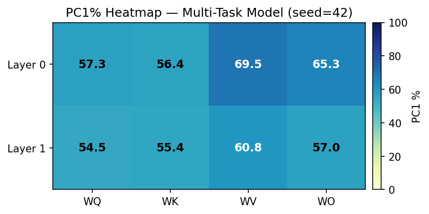

*(a) Тепловая карта PC1 % для двух задач (семя 42, WD=1.0): значения от 55 % до 77 %.*

*(b) Тепловая карта PC1 % для трёх задач (семя 42, WD=1.0): значения опускаются до 49–56 %.*

*Рисунок 2: PC1 % убывает с числом задач. **(a)** Две задачи: 55–77 %. **(b)** Три задачи: 49–56 %. Многообразие уже не ранга 1, но остаётся сильно низкоразмерным.* **[p. 6]**

#### PC1 % убывает по ходу обучения.

PCA с расширяющимся окном показывает, что PC1 % начинается с ${\sim}80\%$ в начале обучения и убывает до ${\sim}50$–60 % к концу (рисунок 3). Это противоположно однозадачному поведению (где сосредоточенность растёт) и отражает разветвление траектории по мере того, как модель учится обслуживать несколько контуров.

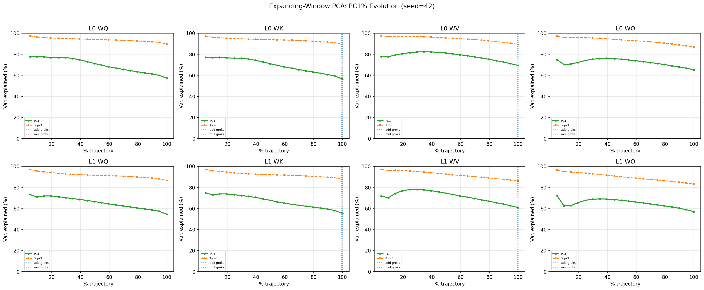

*(a) PC1 % с расширяющимся окном, две задачи (семя 42): убывает по ходу обучения.*

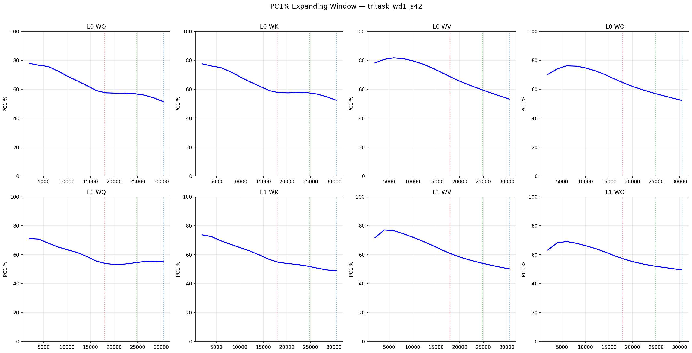

*(b) PC1 % с расширяющимся окном, три задачи: тот же убывающий узор.*

*Рисунок 3: PC1 % убывает по ходу обучения в многозадачных постановках, в отличие от однозадачного гроккинга, где сосредоточенность растёт.* **[p. 6]**

**[p. 6]**

#### У моделей без WD PC1 % выше.

###### p6-1

Вопреки ожиданию, контроль без WD ($\lambda=0$) даёт *более высокий* PC1 % (${\sim}70$–80 %), чем грокающие модели (${\sim}50$–55 %), в трёхзадачной постановке (рисунок 4). Без weight decay модель запоминает вдоль более простой, более низкоранговой траектории. Гроккинг вынуждает модель войти в многообразие более высокого ранга, чтобы вместить обобщающие решения для всех задач.

*Рисунок 4: Спектры собственных чисел при гроккинге (WD=1.0) и без WD (WD=0.0) для трёх задач (семя 42). Без WD PC1 % выше, что согласуется с более простой траекторией запоминания.* **[p. 7]**

#### Веса голов почти ортогональны.

###### p6-2

Попарная косинусная близость между весами задачных голов классификации остаётся около нуля на всём протяжении обучения ($|\cos|<0.08$; рисунок 5). В двухзадачной постановке две головы сходятся к точной ортогональности к концу обучения. В трёхзадачной постановке все три пары (add–mul, add–sq, mul–sq) держатся в пределах $[-0.01,+0.008]$, что подтверждает: задачи учат геометрически разделённые направления считывания.

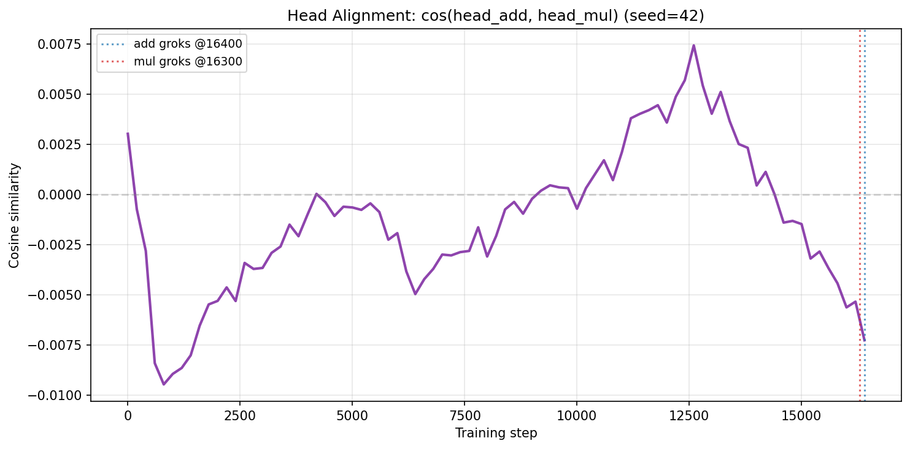

*(a) Две задачи: cos(head${}_{\text{add}}$, head${}_{\text{mul}}$) держится около нуля.*

*(b) Три задачи: все три попарных косинуса держатся около нуля.*

*Рисунок 5: Веса задачных голов почти ортогональны. Общий ствол учит представление, в котором считывания задач геометрически разделены.* **[p. 7]**

## 5 Эмпирическая интегрируемость по задачам и weight decay

###### p6-3

Мы вычисляем коммутаторные дефекты и проецируем их на базис PCA в равномерных контрольных точках, измеряя меру инвариантности $\rho=\left\|\delta_{\perp}\right\|/\left\|\delta\right\|$. Главный результат: $\rho\approx 1.000$ в пределах численной точности во *всех* многозадачных условиях — и двухзадачных, и трёхзадачных, при всех значениях weight decay, где дефект ненулевой, и при всех трёх семенах (рисунок 6).

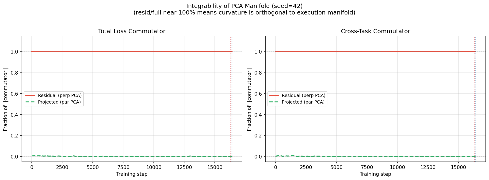

*(a) Две задачи (WD=1.0, семя 42): $\rho\approx 1.000$ в каждой контрольной точке.*

*(b) Три задачи (WD=1.0, семя 42): $\rho\approx 1.000$, в точности как при двух задачах.*

*Рисунок 6: Исполнительное многообразие эмпирически интегрируемо в многозадачных постановках. Мера инвариантности $\rho\approx 1.000$ во всех проверенных условиях, что распространяет однозадачный результат.* **[p. 8]**

**[p. 7]**

Эта эмпирическая интегрируемость держится согласованно независимо от:

- **Числа задач**: постановки с 1 задачей (сопутствующая статья), 2 и 3 задачами все дают $\rho\approx 1.000$.
- **Weight decay**: $\lambda\in\{0.1,0.2,0.3,0.5,1.0\}$ все дают $\rho\approx 1.000$ как для коммутаторов суммарной потери, так и для межзадачных.
- **Межзадачных коммутаторов**: использование разных задачных потерь для двух пакетов (например, потери сложения для пакета $A$ и потери умножения для пакета $B$) тоже даёт $\rho\approx 1.000$.

#### Устройство межзадачных градиентов.

###### p7-3

Хотя интегрируемость согласована во всех проверенных режимах, устройство межзадачных градиентов меняется вместе с weight decay (рисунок 7). При $\lambda=1.0$ косинусная близость градиентов одной задачи составляет 0.77–0.84, а межзадачный косинус — 0.24–0.38, что говорит об умеренном выравнивании. При $\lambda=0.5$ межзадачные косинусы схлопываются к почти нулю или даже к отрицательным значениям ($-0.17$ до $+0.18$), что указывает: задачи соперничают за представляющую ёмкость на переходе гроккинга. При $\lambda=0.1$ низки и косинусы одной задачи (0.14–0.49), и межзадачные.

**[p. 8]**

*(a) Косинусная близость градиентов, две задачи (семя 42, WD=1.0): одна задача ${\sim}0.8$, межзадачно ${\sim}0.3$.*

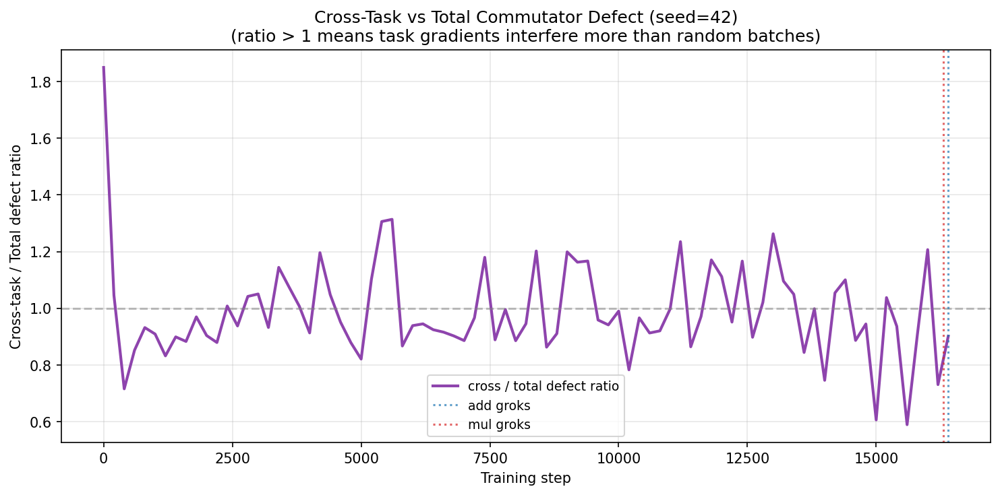

*(b) Межзадачный дефект против суммарного (семя 42): величины сопоставимы.*

*Рисунок 7: Устройство межзадачных градиентов. **(a)** Косинусы одной задачи высоки (${\sim}0.8$), межзадачные умеренны (${\sim}0.3$). **(b)** Межзадачный дефект примерно той же величины, что и дефект суммарной потери.* **[p. 8]**
## 6 Разбор собственных чисел гессиана: переходы через седло

###### p8-1

Чтобы прощупать кривизну ландшафта потерь напрямую (Li et al. 2018b; Fort and Jastrzebski 2019), мы вычисляем нижнее собственное число гессиана (степенным итерированием на $-\nabla^{2}\mathcal{L}$) в равномерных контрольных точках для каждой задачи по отдельности и для суммарной потери.

#### WD управляет глубиной кривизны.

###### p8-2

Нижнее собственное число $\lambda_{\text{min}}$ монотонно зависит от weight decay (рисунок 8). При $\lambda=1.0$ гессиан суммарной потери достигает $\lambda_{\text{min}}\approx-63$ (среднее по семенам), тогда как при $\lambda=0.1$ он достигает лишь $\lambda_{\text{min}}\approx-17$. Более сильный weight decay загоняет ландшафт потерь в более глубокие седловые области.

**[p. 9]**

*(a) Трёхстороннее сравнение по WD (семя 42): у $\lambda=1.0$ (зелёная) самая глубокая отрицательная кривизна, $\lambda=0.0$ (красная) держится около нуля.*

*(b) Сводка по двум осям: время гроккинга (синяя) и глубина кривизны (красная) обратно связаны в грокающем режиме, но $\lambda=0$ выпадает из тенденции.*

*Рисунок 8: Глубина кривизны гессиана зависит от weight decay. **(a)** Временны́е ряды $\lambda_{\text{min}}$ для трёх значений WD. **(b)** Время гроккинга против глубины кривизны по WD, с $\lambda=0$ как отвязанным выбросом.* **[p. 9]**

#### Задачные собственные числа предсказывают порядок гроккинга.

###### p9-1

В двухзадачной постановке задача с более глубокой отрицательной кривизной в начале обучения склонна грокать первой (рисунок 9). При семени 42 $\lambda_{\text{min}}(\text{mul})=-35.0$ на шаге 5000 против $\lambda_{\text{min}}(\text{add})=-22.8$ (отношение $1.54\times$), и умножение грокает первым. Этот узор держится для 2 семян из 3 (семя 137 — исключение). К моменту гроккинга собственное число задачи, грокнувшей первой, приблизилось обратно к нулю, тогда как другая задача ещё в середине бегства.

*Таблица 3: Задачные собственные числа гессиана в середине обучения (две задачи, WD=1.0). Задача с более глубоким $\lambda_{\text{min}}$ склонна грокать первой (2 семени из 3).* **[p. 9]**

| Семя | $\lambda_{\text{min}}(\text{mul})$ | $\lambda_{\text{min}}(\text{add})$ | Отношение | Грокает первой |
|---|---|---|---|---|
| 42 | $\mathbf{-35.0}$ | $-22.8$ | 1.54$\times$ | mul |
| 137 | $-17.4$ | $\mathbf{-22.9}$ | 0.76$\times$ | mul |
| 2024 | $\mathbf{-35.1}$ | $-21.4$ | 1.64$\times$ | mul |

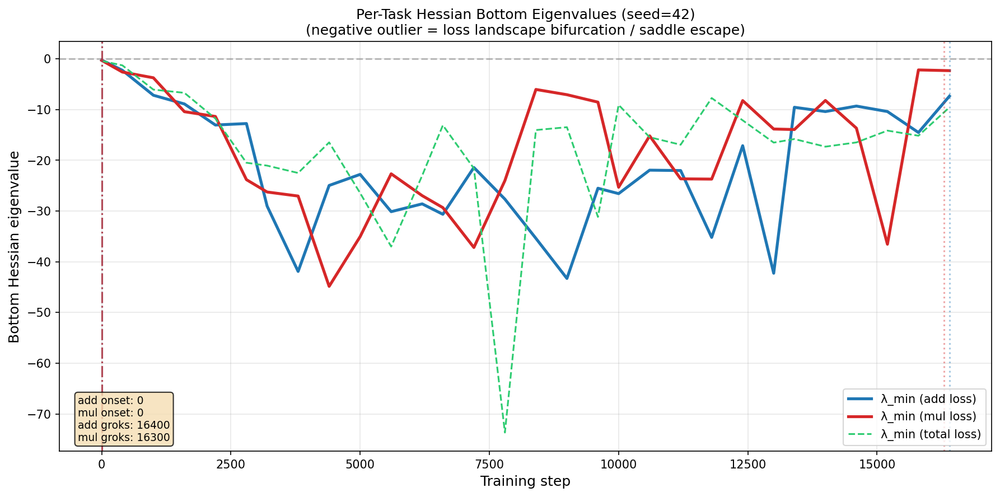

*Рисунок 9: Задачные нижние собственные числа гессиана (семя 42, WD=1.0). У mul (синяя) отрицательная кривизна глубже в начале и восстанавливается первой, что согласуется с более ранним гроккингом.* **[p. 10]**

#### При $\lambda=0$ кривизна есть, а гроккинга нет.

###### p9-2

Контроль без WD показывает нетривиальную отрицательную кривизну ($\lambda_{\text{min}}\approx-50$ при WD=0 против $\lambda_{\text{min}}\approx-63$ при WD=1.0), но не обобщает никогда (таблица 4). Это подтверждает, что отрицательная кривизна гессиана *необходима, но не достаточна* для гроккинга (ср. Ge et al. 2015): weight decay даёт регуляризационное давление, позволяющее сбежать с седла запоминания и достичь обобщающего бассейна.

*Таблица 4: Сводка по гессиану на нескольких семенах (две задачи, 3 семени $\times$ 4 значения WD = 12 прогонов).* **[p. 10]**

| $\lambda$ | Гроккинг (сложение) | Гроккинг (умножение) | $\lambda_{\text{min}}$(всего) | $\lambda_{\text{min}}$(сложение) | $\lambda_{\text{min}}$(умножение) |
|---|---|---|---|---|---|
| 1.0 | $13{,}333\pm 2{,}620$ | $13{,}133\pm 2{,}748$ | $-63.4\pm 11.9$ | $-50.8\pm 5.6$ | $-43.8\pm 2.2$ |
| 0.5 | $16{,}267\pm 685$ | $16{,}200\pm 712$ | $-35.7\pm 6.1$ | $-21.2\pm 3.0$ | $-33.8\pm 18.4$ |
| 0.1 | $97{,}967\pm 3{,}172$ | $98{,}833\pm 2{,}001$ | $-17.4\pm 7.9$ | $-11.8\pm 0.7$ | $-11.8\pm 4.2$ |
| 0.0 | — | — | $-49.5\pm 15.6$ | $-53.8\pm 36.3$ | $-40.7\pm 12.9$ |

#### Гессиан в трёхзадачной постановке.

Разбор гессиана при трёх задачах воспроизводит двухзадачные узоры. При $\lambda=1.0$ нижнее собственное число суммарной потери достигает $-10$ до $-19$; при $\lambda=0.1$ — лишь $-1.5$ до $-4.3$. Монотонная связь WD с кривизной сохраняется, и сравнения по разным WD (рисунок 10) обнаруживают то же качественное устройство, что и при двух задачах.

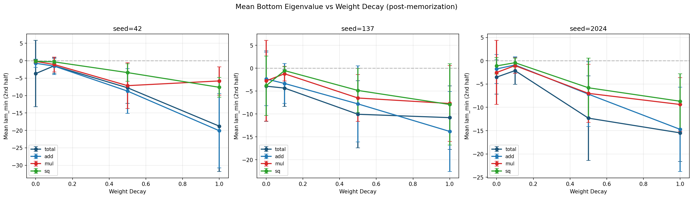

*(a) Три задачи: нижнее собственное число против WD при разных долях обучения. Глубина кривизны монотонно растёт с WD.*

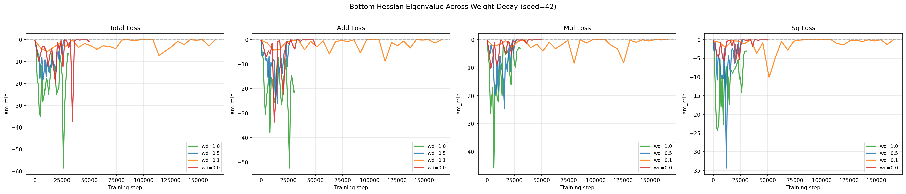

*(b) Временны́е ряды по разным WD, три задачи (семя 42): $\lambda=1.0$ (зелёная) занимает самую отрицательную область.*

*Рисунок 10: Разбор гессиана при трёх задачах воспроизводит двухзадачный узор: более сильный WD загоняет кривизну глубже в отрицательную область.* **[p. 11]**

## 7 Фазовая диаграмма по weight decay

Сбор результатов по пяти значениям WD обнаруживает упорядоченную фазовую диаграмму, управляющую динамикой гроккинга.

#### Временно́й масштаб гроккинга.

###### p9-5

Время гроккинга растёт примерно как $t_{\text{grok}}\propto\lambda^{-\alpha}$, причём связь выглядит почти лог-линейной по оси WD при $\lambda>0$ (рисунок 11). Возникают два режима:

- $\lambda\geq 0.5$: быстрый гроккинг (13–16 тыс. шагов), с сильно меняющейся глубиной кривизны (от $-36$ до $-63$);
- $\lambda\leq 0.3$: медленный гроккинг (28–98 тыс. шагов), с глубиной кривизны, выходящей на полку около $-15$.

###### p9-7

Переход между режимами происходит около $\lambda\approx 0.3$, что указывает на критическое значение weight decay.

*Рисунок 11: Временно́й масштаб гроккинга против weight decay (две задачи, 3 семени, логарифмическая шкала). Связь почти лог-линейна при $\lambda>0$, с резким скачком между $\lambda=0.5$ и $\lambda=0.1$.* **[p. 11]**

**[p. 10]**

#### Время опережения начала дефекта (две задачи).

###### p10-1

Мы измеряем время опережения начала дефекта в двухзадачной постановке по всем пяти значениям WD и трём семенам (всего 15 условий). Во всех 15 двухзадачных условиях начало коммутаторного дефекта *всегда* предшествует гроккингу (таблица 5). Однако доля опережения следует V-образной кривой с наименьшим значением при $\lambda=0.5$ (4.9 %), где начало дефекта и гроккинг почти совпадают. При меньшем WD время гроккинга растягивается гораздо быстрее, чем начало дефекта, создавая долгие периоды вызревания (доля опережения до 70 % при $\lambda=0.1$).

###### tab-5

*Таблица 5: Опережение начала дефекта над гроккингом (две задачи, среднее по 3 семенам на каждое WD).* **[p. 12]**

| $\lambda$ | Средний шаг гроккинга | Средний шаг начала | Среднее опережение (шагов) | Доля опережения |
|---|---|---|---|---|
| 1.0 | 13,133 | 6,600 | 6,533 | 52.9% |
| 0.5 | 16,200 | 15,400 | 800 | 4.9% |
| 0.3 | 28,200 | 19,133 | 9,067 | 32.0% |
| 0.2 | 45,067 | 17,667 | 27,400 | 60.8% |
| 0.1 | 97,933 | 29,467 | 68,467 | 69.9% |

#### Время опережения начала дефекта (три задачи).

###### p10-2

Мы распространяем разбор начала дефекта на трёхзадачную постановку, обучая свежие модели с встроенным измерением коммутаторного дефекта каждые 100 шагов при $\lambda\in\{1.0,0.5,0.1\}$ и трёх семенах (27 условий задача$\times$семя$\times$WD), плюс контроли $\lambda=0$ (рисунок 12(a)). Во всех 27 грокающих условиях начало дефекта предшествует генерализации (знаковый критерий: $27/27$ положительных, $p=2^{-27}\approx 7.5\times 10^{-9}$). Задачные времена опережения поразительно однородны: среднее опережение составляет $60{,}622$ шага для сложения, $57{,}144$ для умножения и $57{,}078$ для квадратичной суммы, что указывает: всплеск дефекта есть *общий* сигнал приближения всей модели к переходу гроккинга, а не задачный признак.

###### p10-3

Доля опережения в трёхзадачной постановке монотонно растёт при убывании WD (таблицы 6 и 12(b)), в отличие от двухзадачной V-образной кривой:

###### p10-4

- $\lambda=1.0$: среднее опережение $=8{,}900$ шагов, доля опережения $\approx 82\%$;
- $\lambda=0.5$: среднее опережение $=18{,}800$ шагов, доля опережения $\approx 77\%$;
- $\lambda=0.1$: среднее опережение $=147{,}144$ шагов, доля опережения $\approx 97\%$.

Всплеск дефекта происходит очень рано в обучении относительно гроккинга при всех значениях WD, и относительная ранность *растёт* при меньшем WD — то есть дефект оказывается ещё более ценным сигналом раннего предупреждения **[p. 11]** тогда, когда гроккинг медленный (см. также Xu 2026a, о степенном законе масштабирования времени опережения по семействам задач). При $\lambda=0.1$ всплеск происходит в первых ${\sim}3\%$ обучения, оставляя долгий период вызревания до появления генерализации.

###### tab-6

*Таблица 6: Опережение начала дефекта над гроккингом в трёхзадачной постановке (среднее по 3 задачам $\times$ 3 семени = 9 условий на каждое WD).* **[p. 12]**

| $\lambda$ | Средний шаг гроккинга | Средний шаг начала | Среднее опережение (шагов) | Доля опережения |
|---|---|---|---|---|
| 1.0 | 12,089 | 1,833 | 8,900 | 82.2% |
| 0.5 | 25,333 | 5,767 | 18,800 | 76.5% |
| 0.1 | 152,356 | 5,000 | 147,144 | 96.7% |

*(a) Разбор времени опережения при трёх задачах. Слева: диаграмма рассеяния «шаг всплеска против шага гроккинга» (все 27 точек выше диагонали). В середине: время опережения по задачам (все три задачи дают похожие распределения). Справа: время опережения по WD (монотонно растёт).*

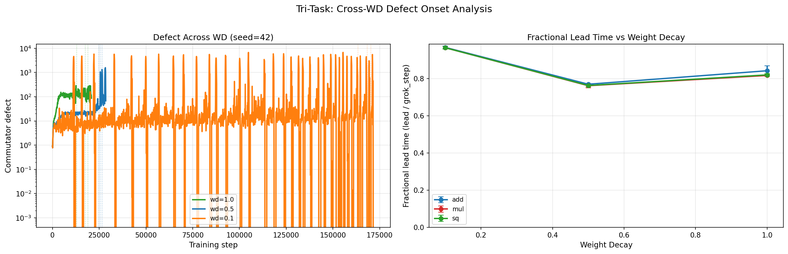

*(b) Слева: временны́е ряды дефекта по разным WD (семя 42), показывающие взрыв дефекта на разных временны́х масштабах. Справа: относительное время опережения против WD — монотонно растёт для всех трёх задач.*

*Рисунок 12: Начало дефекта в трёхзадачной постановке всегда предшествует гроккингу ($27/27$, $p=2^{-27}$). В отличие от двухзадачной V-образности, доля опережения при трёх задачах монотонно растёт при убывании WD, доходя до ${\sim}97\%$ при $\lambda=0.1$.* **[p. 13]**

*(a) Шаг начала против шага гроккинга: все 15 точек лежат выше диагонали (начало предшествует гроккингу в каждом условии).*

*(b) Зависимость от WD: время гроккинга (слева) и доля опережения (справа) против $\lambda$.*

*Рисунок 13: Начало дефекта при двух задачах всегда предшествует гроккингу (15 из 15 условий), при немонотонной доле опережения (наименьшее значение при $\lambda=0.5$).* **[p. 14]**

#### V-образная доля опережения (две задачи) против монотонной (три задачи).

Доля опережения в двухзадачной постановке (время опережения в процентах от шага гроккинга) следует поразительной V-образной кривой по WD (рисунок 14). При $\lambda=1.0$ доли опережения составляют 25–69 % (среднее 53 %); они схлопываются до ${\sim}5\%$ при $\lambda=0.5$, а затем монотонно возвращаются к ${\sim}70\%$ при $\lambda=0.1$. Эта немонотонность видна по семенам (рисунок 14(a)): все три семени согласны, что при $\lambda=0.5$ опережение наименьшее. Нормированные следы дефекта (рисунок 14(b)) показывают все 15 двухзадачных условий на общей оси абсцисс (доля шага гроккинга), делая V-образность видимой: следы при $\lambda=0.5$ (оранжевые) достигают перехода гроккинга раньше всех в относительном времени, тогда как следы при $\lambda=1.0$ и $\lambda=0.1$ имеют долгие периоды вызревания.

###### p11-2

Трёхзадачная постановка показывает качественно иной узор: доля опережения монотонно растёт при убывании WD ($82\%\to 77\%\to 97\%$), без свойственного двухзадачной постановке провала при $\lambda=0.5$ (рисунок 12(b)). Мы предполагаем, что дополнительные задачные ограничения в трёхзадачной постановке препятствуют «действенному» сжатию траектории, наблюдаемому при $\lambda=0.5$ у двух задач; при трёх задачах, соперничающих за общую ёмкость, начало дефекта остаётся ранним относительно гроккинга при всех значениях WD. **[p. 12]** Это согласуется с более общим узором: трёхзадачный гроккинг более хрупок — он требует бо́льшей доли доступной ёмкости пространства параметров, оставляя меньше места для геометрических срезок.

*(a) Абсолютное и относительное время опережения по WD (столбики по семенам). Относительное опережение (справа) показывает ясную V-образность с наименьшим значением при $\lambda=0.5$.*

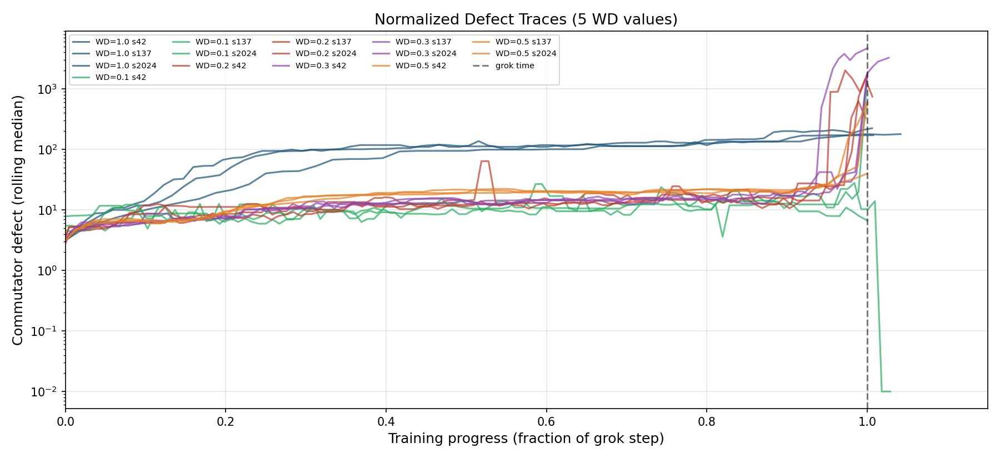

*(b) Нормированные следы дефекта (все 15 условий). Продвижение обучения измеряется долей шага гроккинга; все следы сходятся около $t/t_{\text{grok}}=1$.*

*Рисунок 14: V-образная доля опережения по weight decay (только две задачи). **(a)** Времена опережения по семенам: при $\lambda=0.5$ опережение наименьшее (${\sim}5\%$), при большем и меньшем WD оно больше. **(b)** Все 15 двухзадачных следов дефекта на общей нормированной оси времени.* **[p. 15]**

#### Динамика дефекта качественно меняется с WD.

При $\lambda\geq 0.5$ следы дефекта показывают гладкий монотонный рост. При $\lambda\leq 0.3$ следы дефекта становятся перемежающимися и всплесковыми, с кратковременными взрывами ($100$–$5{,}000\times$ базового уровня), за которыми следуют падения обратно к базовому уровню (рисунок 15). Скользящая медиана держится ровно до самого гроккинга, когда она наконец удерживает высокие значения.

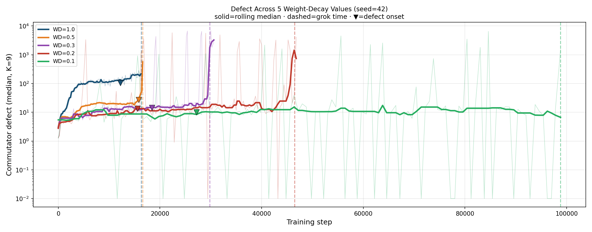

*Рисунок 15: Следы дефекта при пяти значениях WD (семя 42). $\lambda\geq 0.5$: гладкий монотонный рост. $\lambda\leq 0.3$: перемежающийся всплесковый узор с кратковременными взрывами.* **[p. 15]**

#### Немонотонная величина дефекта.

В последней контрольной точке величина дефекта немонотонна по WD (таблица 7). При $\lambda=0.5$ итоговый дефект наибольший ($837$–$1{,}288$), превышая $\lambda=1.0$ примерно в ${\sim}10\times$, потому что разбор застаёт модель посреди перехода. При $\lambda=0.1$ дефект в последней контрольной точке почти нулевой, потому что модель полностью сошлась уже после гроккинга.

*Таблица 7: Дефект и интегрируемость в последней контрольной точке при двух задачах по разным WD.* **[p. 13]**

| $\lambda$ | Промежуток итогового дефекта | Интегрируемость ($\rho$) | Косинус градиента (одна задача) |
|---|---|---|---|
| 1.0 | 82–144 | 1.000 | 0.77–0.84 |
| 0.5 | 837–1,288 | 1.000 | 0.47–0.76 |
| 0.1 | ${\sim}0$ | 1.000 | 0.14–0.49 |
| 0.0 | 0–52 | меняется | 0.04–0.42 |

#### WD $=0.5$ — «действенный» режим (две задачи).

В двухзадачной постановке $\lambda=0.5$ выделяется как особый режим: он даёт самый тесный порог восстановления ($k^{*}=5$, все семена), наименьшее опережение дефекта (4.9 %) и самую сжатую траекторию гроккинга. Это указывает, что при $\lambda=0.5$ регуляризационное давление наилучшим образом согласовано со сложностью задачи, давая прямые траектории от запоминания к генерализации с наименьшим крюком. Примечательно, что эта действенность свойственна именно двухзадачной постановке; в трёхзадачной доля опережения при $\lambda=0.5$ составляет $77\%$ (против $82\%$ при $\lambda=1.0$), что указывает: дополнительные задачные ограничения съедают геометрический запас, обеспечивающий действенные траектории.

## 8 Голографическая несжимаемость

### 8.1 Порог восстановления $k^{*}$

###### p12-4

Мы восстанавливаем грокнувшую модель как $\theta_{\text{recon}}=\theta_{\text{init}}+\sum_{i=1}^{k}(\mathbf{v}_{i}^{\top}\Delta\theta)\,\mathbf{v}_{i}$ по первым $k$ нецентрированным компонентам PCA и измеряем тестовую точность одновременно на обеих задачах. Порог $k^{*}$ — это наименьшее $k$, при котором все задачи превышают 90 %.

**[p. 13]**

#### Две задачи.

###### p13-1

Порог простирается от $k^{*}=5$ ($\lambda=0.5$, все семена единогласны) до $k^{*}=10$ ($\lambda=0.2$, семя 137), с ясной монотонной тенденцией: меньший WD требует больше компонент (таблица 8). Переход от случайного уровня к почти безупречной точности резок при высоком WD (случайный уровень при $k$, 99 % при $k+1$) и более плавен при низком WD.

###### tab-8

*Таблица 8: Порог восстановления $k^{*}$ для двух задач (обе задачи $>90\%$).* **[p. 14]**

| $\lambda$ | Семя 42 | Семя 137 | Семя 2024 | Среднее | Разброс при $k^{*}$ |
|---|---|---|---|---|---|
| 1.0 | 7 | 6 | 6 | 6.3 | 99.7–99.9% |
| 0.5 | 5 | 5 | 5 | 5.0 | 99.6–99.7% |
| 0.3 | 5 | 6 | 6 | 5.7 | 99.4–99.7% |
| 0.2 | 6 | 10 | 7 | 7.7 | 99.5–99.7% |
| 0.1 | 9 | 7 | 9 | 8.3 | 99.2–99.6% |

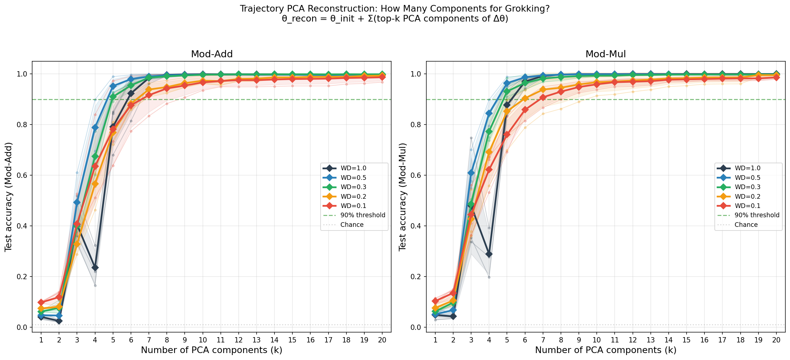

*(a) Точность против $k$ для двух задач при разных значениях WD: резкий переход от случайного уровня к $>99\%$.*

*(b) $k^{*}$ против WD: монотонно растёт при меньшем WD.*

*Рисунок 16: Порог восстановления. Грокающее решение требует 5–10 направлений PCA, причём $k^{*}$ растёт при меньшем WD.* **[p. 16]**

#### Три задачи.

###### p13-2

По всем пяти ненулевым значениям WD трёхзадачные модели требуют сопоставимого или *меньшего* числа компонент PCA ($k^{*}\approx 4$–$6$, среднее по семенам), чем двухзадачные ($k^{*}\approx 5$–$8$; таблица 9), несмотря на большее число параметров и дополнительную задачу. Наибольшие значения WD ($\lambda\geq 0.5$) дают самые тесные пороги ($k^{*}\approx 4.3$), тогда как меньшие значения WD ($\lambda\leq 0.3$) требуют чуть больше компонент ($k^{*}\approx 5.3$–$6.3$). Это указывает, что многозадачное обучение даёт дополнительные ограничения, сосредоточивающие обобщающее решение в меньшем числе направлений.

###### tab-9

*Таблица 9: Порог восстановления $k^{*}$ для трёх задач (все три задачи $>90\%$).* **[p. 16]**

| $\lambda$ | Семя 42 | Семя 137 | Семя 2024 | Среднее |
|---|---|---|---|---|
| 1.0 | 5 | 5 | 3 | 4.3 |
| 0.5 | 4 | 4 | 5 | 4.3 |
| 0.3 | 7 | 5 | 7 | 6.3 |
| 0.2 | 5 | 5 | 6 | 5.3 |
| 0.1 | 5 | 5 | 8 | 6.0 |

### 8.2 Опыты по послесловному сжатию

Мы проверяем, можно ли сжать грокнувшую модель, пользуясь только начальным и конечным снимками параметров (без сведений о траектории).

#### Послойное SVD.

###### p13-4

Для каждой матрицы весов $W$ мы вычисляем $\Delta W=W_{\text{grok}}-W_{\text{init}}$ и оставляем только первые $r$ сингулярных чисел. Результаты «всё или ничего»: ранг 64 даёт случайный уровень ($0.8$–$1.1\%$), тогда как ранг 128 (полный ранг $=d_{\text{model}}$) даёт почти безупречную точность ($99.6\%$ на сложении, $99.9\%$ на умножении). Низкорангового строения в приращениях матриц весов нет.

#### Обрезка по величине.

###### p13-5

Обнуление элементов $\Delta\theta$ ниже порога по величине: сохранение 50 % наибольших элементов (99.3 % от $\left\|\Delta\theta\right\|^{2}$) даёт случайный уровень. Частичное восстановление начинается лишь при сохранении 80 %.

**[p. 14]**

#### Однородное растяжение.

###### p14-1

Растяжение $\Delta\theta$ на постоянный множитель: $\theta_{s}=\theta_{\text{init}}+s\cdot\Delta\theta$. При $s=0.95$ и $s=1.05$ точность падает до случайного уровня ($0.7$–$1.5\%$). Грокающее решение занимает крайне точную точку пространства параметров; даже возмущение на $\pm 5\%$ разрушает его.

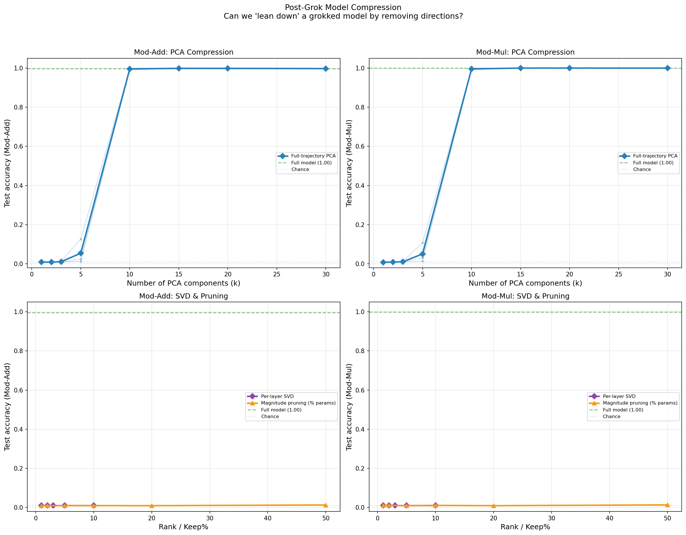

*(a) Послесловное сжатие: восстановление траектории через PCA (зелёная), послойное SVD (синяя), обрезка по величине (оранжевая). Успех даёт только PCA при $k\geq k^{*}$.*

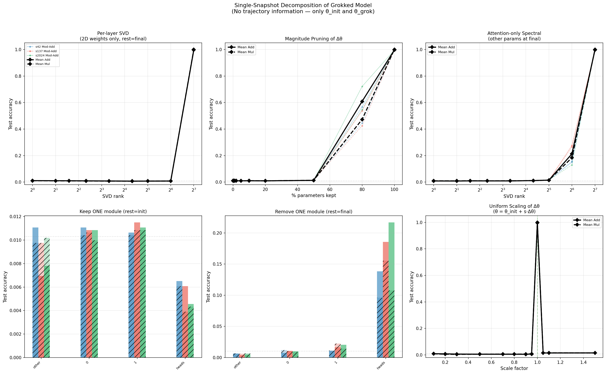

*(b) Разложение снимка: ранг послойного SVD, порог обрезки по величине и однородное растяжение. Все проваливаются, кроме полного сохранения.*

*Рисунок 17: Грокающее решение несжимаемо никаким послесловным способом. Успешна только PCA, знающая траекторию.* **[p. 17]**

### 8.3 Ортогональная хрупкость

###### p14-2

Мы проверяем причинную необходимость ортогонального дополнения, удаляя во время обучения долю $f$ той составляющей градиента, что ортогональна многообразию PCA:

$$
\mathbf{g}_{\text{new}}=\mathbf{g}-f\cdot\mathbf{g}_{\perp},\qquad\mathbf{g}_{\perp}=\mathbf{g}-B(B^{\top}\mathbf{g}). \tag{1}
$$

#### Мелкошаговый отклик на дозу при двух задачах.

###### p14-3

Проецирование PCA при силе $s=0.25$ задерживает гроккинг на 70–140 % ($13.9$ тыс. $\to$ $23.7$ тыс. шагов при семени 42), тогда как случайное проецирование той же силы не даёт ничего (рисунок 34). Мелкошаговое исследование отклика на дозу (таблица 10) обнаруживает монотонную задержку от 0 % до 7 % удаления, за которой следует полный отказ при 10–25 %. Любопытно, что 50 % удаления возвращают гроккинг при задержке в ${\sim}163\%$, что указывает: большие удаления изменяют динамику оптимизации настолько, что она находит запасные пути к генерализации.

*Таблица 10: Отклик на дозу ортогонального удаления при двух задачах (WD=1.0, семя 42, бюджет 50 тыс. шагов).* **[p. 18]**

| Удалено, % | Гроккинг сложения | Гроккинг умножения | Задержка |
|---|---|---|---|
| 0% | 14,100 | 14,000 | (базовый уровень) |
| 1% | 18,100 | 18,100 | $+29\%$ |
| 2% | 21,200 | 20,900 | $+50\%$ |
| 3% | 23,500 | 23,300 | $+67\%$ |
| 5% | 37,000 | 36,800 | $+163\%$ |
| 7% | 42,600 | 42,400 | $+203\%$ |
| 10% | ОТКАЗ | ОТКАЗ | — |
| 15% | ОТКАЗ | ОТКАЗ | — |
| 25% | ОТКАЗ | ОТКАЗ | — |
| 50% | 36,900 | 36,800 | $+163\%$ |

**[p. 15]**

#### Мелкошаговый отклик на дозу при трёх задачах.

###### p15-1

Трёхзадачная постановка ещё более хрупка. Мелкошаговое удаление (таблица 11) показывает, что даже 1 % ортогонального удаления задерживает гроккинг на ${\sim}37\%$ (среднее по задачам), с монотонно растущей задержкой вплоть до 7 % (где задержка превышает $120\%$). При 10 % удаления и выше гроккинг проваливается целиком в пределах 60 тыс. шагов — резкий обрыв между 7 % и 10 %. Это устанавливает, что $<1\%$ дисперсии градиента (ортогональной многообразию PCA) причинно необходим для того, чтобы гроккинг произошёл.

###### tab-11

*Таблица 11: Отклик на дозу ортогонального удаления при трёх задачах (WD=1.0, семя 42, бюджет 60 тыс. шагов).* **[p. 18]**

| Удалено, % | Гроккинг сложения | Гроккинг умножения | Гроккинг квадрата | Среднее | Задержка |
|---|---|---|---|---|---|
| 0% | 25,600 | 18,200 | 23,400 | 22,400 | (базовый уровень) |
| 1% | 35,200 | 21,200 | 28,800 | 28,400 | $+27\%$ |
| 2% | 42,400 | 30,200 | 36,000 | 36,200 | $+62\%$ |
| 3% | 35,000 | 29,000 | 33,600 | 32,500 | $+45\%$ |
| 5% | 35,400 | 26,800 | 33,800 | 32,000 | $+43\%$ |
| 7% | 56,000 | 44,600 | 49,600 | 50,100 | $+124\%$ |
| 10% | ОТКАЗ | ОТКАЗ | ОТКАЗ | — | — |
| 15% | ОТКАЗ | ОТКАЗ | ОТКАЗ | — | — |
| 25% | ОТКАЗ | ОТКАЗ | ОТКАЗ | — | — |

###### fig-18

*Рисунок 18: Отклик на дозу ортогонального удаления и для трёх, и для двух задач. Задержка гроккинга монотонно растёт с долей удаления вплоть до резкого обрыва около ${\sim}10\%$, за которым гроккинг проваливается целиком. Крестики отмечают неспособность грокнуть в пределах бюджета шагов.* **[p. 19]**

#### Сведение.

###### p15-2

Вместе эти результаты показывают, что важные для генерализации сведения одновременно низкоразмерны ($k^{*}$ главных направлений траектории достаточно для восстановления) и глобально распределены (полноранговые веса, причём необходим каждый модуль). Эта двойственность объясняет, почему сжатие и частичная абляция проваливаются вместе: решение занимает тонкое подпространство пространства параметров, но это подпространство вплетено во все матрицы весов при полном ранге. Любой способ, удаляющий размерности (усечение SVD, обрезка по величине) или возмущающий глобальное устройство (однородное растяжение, ортогональное удаление), разрушает тонкое кодирование.

**[p. 16]**
## 9 Спектральная геометрия перехода в операторах внимания

Предшествующие разделы описывают гроккинг через PCA траекторий, коммутаторные дефекты и кривизну гессиана. Теперь мы спрашиваем: *что происходит внутри операторов внимания во время коммутаторного перехода?* Чтобы ответить, мы разбираем спектр сингулярных чисел матриц весов внимания $W_{Q}$ и $W_{K}$ в каждой контрольной точке обучения и для двухзадачных, и для трёхзадачных моделей, дополняя однозадачный спектральный разбор сопутствующего исследования (Xu 2026b).

#### Геометрическая картина.

###### p16-2

Эти наблюдения указывают, что гроккингу отвечает геометрический фазовый переход в операторах внимания. В начале обучения главенствующие сингулярные направления $W_{Q}$ и $W_{K}$ почти вырождены, а операторы обнаруживают сильную некоммутативность. По ходу обучения происходит событие нарушения симметрии, при котором одно сингулярное направление становится главенствующим, коммутаторный дефект схлопывается, а операторы внимания выравниваются в общий собственный базис. Генерализация возникает лишь после того, как это выравнивание достигнуто. Спектральный зазор, матричный коммутатор и гроккинг связаны, таким образом, единым динамическим повествованием: *вырожденность порождает неустойчивость, нарушение симметрии её разрешает, а следом идёт генерализация*.

### 9.1 Нарушение спектральной симметрии предшествует гроккингу

Определим ведущий спектральный зазор матрицы запросов на слое $\ell$:

$$
g_{12}^{(\ell)}=\sigma_{1}(W_{Q}^{(\ell)})-\sigma_{2}(W_{Q}^{(\ell)}). \tag{2}
$$

###### p16-4

В каждом рассмотренном нами грокающем прогоне — двухзадачном (3 семени) и трёхзадачном (3 семени) — спектральный зазор раскрывается во время или непосредственно перед схлопыванием коммутатора (рисунок 19). **[p. 17]** Оператор внимания переходит из почти вырожденного режима ($\sigma_{1}\approx\sigma_{2}$) в режим главенства ранга 1 ($\sigma_{1}\gg\sigma_{2}$), и этот переход есть необходимый предвестник генерализации. Запоминающие прогоны (без weight decay) не обнаруживают такого события нарушения симметрии: их спектральные зазоры остаются малыми, а коммутатор блуждает рассеянно (рисунок 20).

### 9.2 Гроккинг следует всеобщей фазовой траектории

###### p17-1

В фазовой плоскости $(\sigma_{1}-\sigma_{2},\;\left\|[W_{Q},W_{K}]\right\|_{F})$ каждый грокающий прогон обходит характерную петлю через три режима:

1. **Соперничество**: малый спектральный зазор, растущий коммутатор;
2. **Неустойчивость**: спектральный зазор раскрывается, коммутатор на пике;
3. **Выравнивание**: большой спектральный зазор, схлопывающийся коммутатор; появляется генерализация.

Такое устройство петли наблюдается во всех однозадачных действиях (сопутствующее исследование), в двухзадачной арифметике и в трёхзадачной арифметике (рисунки 19 и 20). Запоминающие прогоны устройства петли не обнаруживают: их траектории — рассеянные случайные блуждания с существенно более высокими значениями коммутатора и без направленного бегства. Всеобщность петли указывает, что гроккинг отражает родовой геометрический переход в операторе внимания, а не задачно-своеобразное явление.

### 9.3 Многозадачный гроккинг происходит вдоль общей траектории

###### p17-4

В трёхзадачной постановке все три задачи грокают на разных шагах обучения, однако операторы внимания общего ствола обходят *единственную* траекторию в фазовом пространстве. Каждая задача обобщает в своей точке этого общего пути (рисунок 19):

$$
\underbrace{\text{comm.\ peak}}_{\text{step 17{,}600}}\;\to\;\underbrace{\text{grok:mul}}_{\text{step 17{,}900}}\;\to\;\underbrace{\text{grok:}a^{2}\!+\!b^{2}}_{\text{step 24{,}800}}\;\to\;\underbrace{\text{grok:add}}_{\text{step 30{,}500}} \tag{3}
$$

**[p. 18]**

###### p18-1

В двухзадачной постановке две задачи грокают в пределах 100–400 шагов друг от друга (таблица 1), что согласуется с более короткой траекторией и почти одновременным выравниванием операторов для двух задач. Этот результат означает, что многозадачный гроккинг не требует ни отдельных задачных контуров, ни независимых фазовых переходов. Вместо этого обучение перестраивает общее геометрическое устройство операторов внимания, и отдельные задачи становятся разрешимыми по мере того, как траектория проходит их пороги выравнивания. Коммутаторный переход есть свойство ствола, а не какой-либо отдельной задачной головы.

###### fig-19

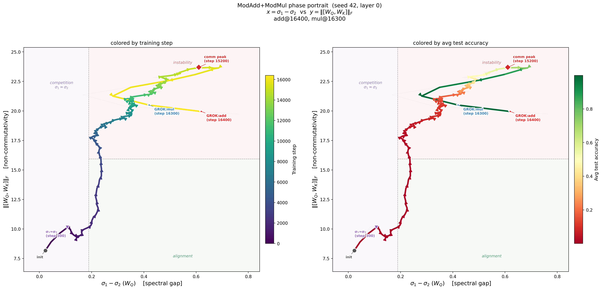

*Рисунок 19: Фазовый портрет для трёхзадачной арифметики (семя 42, слой 0) в плоскости $(\sigma_{1}-\sigma_{2},\;\left\|[W_{Q},W_{K}]\right\|_{F})$. Слева: раскраска по шагу обучения. Справа: раскраска по средней тестовой точности по трём задачам. Три задачи грокают в разных точках одной общей траектории: умножение (шаг 17,900) вблизи пика коммутатора, $a^{2}\!+\!b^{2}$ (шаг 24,800) на спуске и сложение (шаг 30,500) в области выравнивания. Устройство «соперничество — неустойчивость — выравнивание» сохранено из однозадачного случая.* **[p. 20]**

###### fig-20

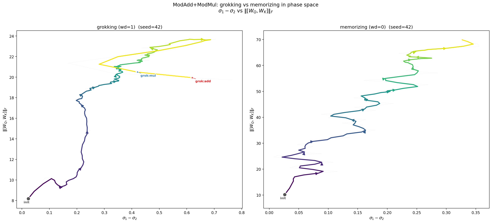

*Рисунок 20: Фазовые портреты гроккинга и запоминания для двухзадачной арифметики (модульное сложение + умножение, семя 42, слой 0). Слева: грокающий прогон ($\mathrm{wd}=1$) показывает характерную петлю «соперничество — неустойчивость — выравнивание», причём обе задачи грокают вблизи перехода к выравниванию. Справа: запоминающий прогон ($\mathrm{wd}=0$) показывает рассеянное случайное блуждание с примерно $\sim\!3\times$ более высокими значениями коммутатора и без направленного бегства.* **[p. 21]**

### 9.4 Асимметрия слоёв по величине неустойчивости

###### p18-2

Мы раскладываем матричный коммутатор по слоям и рассматриваем пиковую величину $\left\|[W_{Q}^{(\ell)},W_{K}^{(\ell)}]\right\|_{F}$ во время обучения. Во всех проверенных условиях (таблица 12) нижний слой (слой 0) развивает существенно более сильную некоммутативность, чем верхний (слой 1):

$$
\max_{t}\left\|[W_{Q}^{(0)},W_{K}^{(0)}]\right\|_{F}\;>\;\max_{t}\left\|[W_{Q}^{(1)},W_{K}^{(1)}]\right\|_{F},\qquad\text{ratio}\approx 1.3\text{--}2.4\times. \tag{4}
$$

Эта асимметрия амплитуд устойчива по всем семенам и наборам данных; порядок *времени* пиков между слоями по семенам не согласован и не должен считаться инвариантом.

###### tab-12

*Таблица 12: Пиковая величина коммутатора по слоям. Слой 0 (нижний) неизменно развивает в $1.3$–$2.4\times$ более сильную некоммутативность, чем слой 1 (верхний).* **[p. 19]**

| Набор данных | Семя | Пик L0 | Пик L1 | Отношение |
|---|---|---|---|---|
| Две задачи (add+mul) | 42 | 23.7 | 14.3 | 1.7$\times$ |
|  | 137 | 20.5 | 12.2 | 1.7$\times$ |
|  | 2024 | 21.3 | 13.1 | 1.6$\times$ |
| Три задачи (add+mul+sq) | 42 | 24.7 | 11.3 | 2.2$\times$ |
|  | 137 | 27.3 | 11.6 | 2.4$\times$ |
|  | 2024 | 24.6 | 12.8 | 1.9$\times$ |

###### p18-4

Пофазовый портрет по слоям (рисунок 21) даёт геометрическое истолкование: слой 0 обходит большу́ю петлю в плоскости $(\sigma_{1}-\sigma_{2},\;\left\|[W_{Q},W_{K}]\right\|_{F})$, дотягиваясь до высоких значений коммутатора и широких **[p. 19]** спектральных зазоров, прежде чем схлопнуться вблизи перехода гроккинга. Слой 1 обходит меньшую петлю, которая достигает пика раньше и схлопывается скорее. Нижний слой несёт главенствующую геометрическую неустойчивость во время гроккинга, тогда как верхний слой устойчивается первым. В многозадачной постановке эта асимметрия усиливается: отношение растёт с $\sim\!1.1\times$ (одна задача) до $\sim\!1.7$–$2.4\times$ (две и три задачи), что указывает: дополнительные представляющие требования нескольких задач принимает на себя главным образом нижний слой.

###### fig-21

*Рисунок 21: Наложение пофазовых портретов по слоям для трёхзадачной арифметики (семя 42). Слой 0 (синий) обходит большу́ю петлю, достигая пикового коммутатора $\approx 24.7$ на шаге 17,600, тогда как слой 1 (оранжевый) остаётся ниже $\approx 11.3$. Нижний слой несёт главенствующую геометрическую неустойчивость. Трёхзадачная постановка усиливает асимметрию относительно однозадачного случая ($2.2\times$ против $1.1\times$).* **[p. 22]**

### 9.5 Динамика зазора собственных чисел матрицы Грама

Разбор спектра матриц весов выше рассматривает отдельные операторы внимания $W_{Q}$ и $W_{K}$. Дополняющий взгляд даёт *скользящая матрица Грама* $\boldsymbol{G}(t)=\boldsymbol{X}(t)\boldsymbol{X}(t)^{\top}$, составленная из $W$ последовательных обновлений параметров $\boldsymbol{\delta}_{s}=\boldsymbol{\theta}_{s+1}-\boldsymbol{\theta}_{s}$ (все веса внимания вытянуты в $\mathbb{R}^{p}$), которая улавливает спектральное устройство самой траектории оптимизации (Xu 2026d). Три величины извлекаются через SVD матрицы обновлений $W\times p$ $\boldsymbol{X}$ с сингулярными числами $\sigma_{1}\geq\sigma_{2}\geq\cdots\geq\sigma_{W}$:

###### p19-2

- **Сигнальный ранг** $k^{*}=\arg\max_{j}\,\omega_{j}\cdot(\sigma_{j}/\sigma_{j+1})$, где $\omega_{j}=\sigma_{j}/\sum_{i}\sigma_{i}$ взвешивает отношение спектральной массой в позиции $j$, подавляя ложные хвостовые отношения вне режима крайних соотношений сторон.
- **Отношение зазоров** $R=\sigma_{k^{*}}/\sigma_{k^{*}+1}$, измеряющее, насколько резко сигнал отделяется от подчинённых мод.
- **Зазор подведущих собственных чисел** $g_{23}=\sigma_{2}^{2}-\sigma_{3}^{2}$, отслеживающий разделение между вторым **[p. 20]** и третьим собственными числами $\boldsymbol{G}$.

Мы вычисляем все три величины при $W=10$ по 18 грокающим прогонам (12 однозадачных из 4 действий $\times$ 3 семени, плюс 3 двухзадачных и 3 трёхзадачных, все при $\lambda>0$) и 18 сопоставленным контролям ($\lambda=0$). Таблица 13 приводит полные результаты.

###### tab-13

*Таблица 13: Спектральный разбор скользящей матрицы Грама ($W=10$). $g_{23}^{\mathrm{early}}$: пиковое $g_{23}$ до гроккинга; $g_{23}^{\mathrm{grok}}$: $g_{23}$ на шаге гроккинга; спад $=g_{23}^{\mathrm{early}}/g_{23}^{\mathrm{grok}}$; $R$: отношение зазоров при сигнальном ранге $k^{*}$. Однозадачные действия, не грокающие в пределах $2\times 10^{5}$ шагов (x2_xy_y2, x3_xy), опущены.* **[p. 23]**

| **Постановка** | $\boldsymbol{\lambda}$ | **Шаг гроккинга** | $g_{23}^{\mathrm{early}}$ | $g_{23}^{\mathrm{grok}}$ | **Спад** | $R_{\mathrm{early}}$ | $k^{*}_{\mathrm{term}}$ | **Спад?** |
|---|---|---|---|---|---|---|---|---|
| *Одна задача (среднее $\pm$ ст. откл. по 3 семенам)* |  |  |  |  |  |  |  |  |
| add | 1.0 | 2500–3100 | $14.6\pm 0.2$ | $0.56\pm 0.4$ | $50\times$ | $1.40\pm 0.05$ | 1 | ✓ |
|  | 0.0 | — | $33.0\pm 9.3$ | — | — | $2.72\pm 0.22$ | — | — |
| mul | 1.0 | 2600–3000 | $14.7\pm 0.1$ | $0.39\pm 0.2$ | $49\times$ | $1.41\pm 0.05$ | 1 | ✓ |
|  | 0.0 | — | $23.6\pm 10.7$ | — | — | $2.85\pm 0.11$ | — | — |
| sub | 1.0 | 3300–3700 | $14.4\pm 0.1$ | $0.48\pm 0.2$ | $35\times$ | $1.31\pm 0.02$ | 1 | ✓ |
|  | 0.0 | — | $33.2\pm 2.8$ | — | — | $2.62\pm 0.23$ | — | — |
| $a^{2}{+}b^{2}$ | 1.0 | 2000–2500 | $18.9\pm 0.5$ | $0.94\pm 0.5$ | $28\times$ | $1.47\pm 0.08$ | 1 | ✓ |
|  | 0.0 | — | $28.3\pm 13.1$ | — | — | $3.12\pm 0.64$ | — | — |
| *Две задачи: add + mul* |  |  |  |  |  |  |  |  |
|  | 1.0 | 9700–16100 | $30.8\pm 0.2$ | $2.94\pm 0.8$ | $11\times$ | $1.35\pm 0.10$ | 1 | ✓ |
|  | 0.0 | — | $18.6\pm 4.0$ | — | — | $1.96\pm 0.35$ | — | — |
| *Три задачи: add + mul + sub* |  |  |  |  |  |  |  |  |
|  | 1.0 | 13100–26400 | $31.3\pm 0.3$ | $0.53\pm 0.2$ | $63\times$ | $1.41\pm 0.11$ | 1 | ✓ |
|  | 0.0 | — | $32.3\pm 0.7$ | — | — | $1.77\pm 0.31$ | — | — |
| *Сводно* |  |  |  |  |  |  |  |  |
| Все $\lambda>0$ |  |  |  |  | $39\times$ в среднем | $1.39\pm 0.08$ | 1 (15/18) | 18/18 |
| Все $\lambda=0$ |  |  |  |  | — | $2.51\pm 0.56$ | — | 1/18 |

###### p20-2

Результаты недвусмысленны: $g_{23}$ спадает перед гроккингом в 18 прогонах из 18 с weight decay (в среднем $39\times$, промежуток $8$–$111\times$) и лишь в 1 из 18 сопоставленных контролей. Отношение зазоров $R$ разделяет два условия непересекающимися распределениями: прогоны при $\lambda=0$ показывают *более высокое* $R=2.51\pm 0.56$ (обновления при запоминании сосредоточены в ранге 1, что отражает сильно выровненные градиенты во время зубрёжки) по сравнению с $R=1.39\pm 0.08$ при $\lambda>0$ (обновления при образовании контуров растекаются по спектральным модам по мере сборки обобщающего представления). Сигнальный ранг устойчиво равен $k^{*}_{\mathrm{terminal}}=1$ в 15 из 18 грокающих прогонов (83 %), что совпадает с 10 из 12, сообщёнными в Xu 2026d, и подтверждает главенство единственной моды при сходимости.

###### p20-3

Несколько узоров проступает по однозадачным и многозадачным постановкам. Во-первых, величина спада растёт со сложностью задачи: однозадачные действия показывают средний спад в $28$–$50\times$, двухзадачные — $11\times$, трёхзадачные — $63\times$. Трёхзадачный результат особенно поразителен: несмотря на самый долгий временно́й масштаб гроккинга (шаги 13,100–26,400 против 2,000–3,700 у однозадачных), $g_{23}$ падает с ${\sim}31$ до ${\sim}0.5$, что указывает: образование контуров для нескольких действий сопряжено с резким спектральным сжатием. Во-вторых, различается и сам ранний уровень $g_{23}$: двухзадачная постановка при $\lambda=1.0$ даёт $g_{23}^{\mathrm{early}}=30.8$ против $18.6$ при $\lambda=0$ ($1.7\times$), тогда как трёхзадачная сходится ($31.3$ против $32.3$), что указывает: раннее спектральное устройство зависит от числа задач. В-третьих, два однозадачных действия ($a^{2}+ab+b^{2}$ и $a^{3}+ab$, оба по модулю 97) не грокают в пределах $2\times 10^{5}$ шагов даже при $\lambda=1.0$; эти прогоны показывают $R_{\mathrm{early}}\approx 3.4$ (как у контролей $\lambda=0$) и никакого спада $g_{23}$, что подтверждает: спектральная примета связана с самим переходом гроккинга, а не **[p. 21]** просто с присутствием weight decay.

###### p21-1

Контроли при $\lambda=0$ обнаруживают *предсказанную* спектральную примету режима без гроккинга (Xu 2026d, замечание 12.22): $g_{23}$ остаётся высоким на всех шагах обучения без всякого спада, что подтверждает: без порога кривизны $\omega$ переход с нарушением спектральной симметрии не начинается вовсе.

Разбор матрицы Грама даёт, таким образом, взгляд, дополняющий SVD матриц весов из предыдущих подразделов. Тогда как спектральный зазор матриц весов $g_{12}=\sigma_{1}(W_{Q})-\sigma_{2}(W_{Q})$ отслеживает внутреннее устройство отдельных операторов внимания, $g_{23}$ матрицы Грама отслеживает согласованность самой *траектории оптимизации*. Оба сходятся на одной механистической картине: гроккинг есть спектральный фазовый переход, при котором сосредоточенная динамика обновлений уступает место распределённому образованию контуров, а движущей силой служит weight decay.

## 10 Динамика суперпозиции в пространстве параметров

Основной вопрос механистической интерпретируемости — как несколько алгоритмических признаков представлены одновременно в избыточно параметризованных нейронных сетях. Прежние работы подчёркивали суперпозицию в пространстве активаций, при которой несколько признаков закодированы в перекрывающихся подпространствах нейронов. Здесь мы приводим дополняющие свидетельства суперпозиции в *пространстве параметров* и описываем её возникновение динамически, по ходу гроккинга.

#### Терминология.

###### p21-4

Мы называем *суперпозицией в пространстве параметров* сосуществование нескольких алгоритмических решений внутри перекрывающихся низкоразмерных подпространств траектории, отличая её от суперпозиции в пространстве активаций, изучаемой в прежних работах по интерпретируемости (Elhage et al. 2022). Точнее, «суперпозиция» в нашем употреблении отсылает к трём связанным, но различным явлениям: (i) перекрытие в пространстве параметров, когда матрицы весов кодируют несколько контуров при полном ранге; (ii) сжатие PCA, когда **[p. 22]** для восстановления достаточно $k^{*}\ll P$ направлений траектории; и (iii) многозадачное сосуществование, когда различные алгоритмы делят одно подпространство без разрушительного вмешательства. Это дополняющие грани одного и того же лежащего в основе геометрического устройства.

### 10.1 PCA траектории и внутренняя размерность

Пусть $\Delta\theta(t)=\theta(t)-\theta(0)$ обозначает смещение параметров от начального. Для каждого прогона обучения мы выполняем нецентрированное SVD-разложение всей траектории обучения,

$$
\Delta\theta(T)=\sum_{i=1}^{r}\sigma_{i}\mathbf{u}_{i}\mathbf{v}_{i}^{\top}, \tag{5}
$$

и определяем приближение ранга $k$ как $\Delta\theta_{k}=\sum_{i=1}^{k}\sigma_{i}\mathbf{u}_{i}\mathbf{v}_{i}^{\top}$. Мы восстанавливаем сжатые модели через $\theta_{k}=\theta(0)+\Delta\theta_{k}$ и оцениваем работоспособность генерализации как функцию $k$.

###### p22-3

Мы определяем $k^{*}$ как наименьшее число главных компонент, требуемое для того, чтобы *все* задачи превысили 90 % тестовой точности. По трёхзадачным опытам с гроккингом и пяти значениям weight decay мы находим $k^{*}\in[4,8]$, хотя модели содержат более $3\times 10^{5}$ параметров. Таким образом, итоговое обобщающее решение занимает крайне низкоразмерное подпространство пространства параметров.

**[p. 23]**

### 10.2 Резкий фазовый переход восстановления

###### p23-1

Точность восстановления как функция $k$ обнаруживает резкий фазовый переход (ср. Montanari and Wang 2026) (подробные разбивки точности по $k$ — на рисунках 32 и 33 и в таблицах 14 и 15 приложения):

- При $k<k^{*}$ работоспособность близка к случайному уровню.
- При $k\geq k^{*}$ точность резко подскакивает до почти наилучшего уровня.

Режима постепенного улучшения не наблюдается. Вместо этого генерализация возникает, едва достигнута критическая размерность подпространства.

###### p23-4

Примечательно, что ведущая главная компонента (PC1) обычно улавливает 70–90 % дисперсии траектории, но *не* несёт способности к генерализации. Это направление отвечает главным образом запоминанию и подгонке по коротким путям. Алгоритмические сведения живут в подчинённых компонентах. Из этого разделения следует, что **доля объяснённой дисперсии не есть надёжная замена функциональной значимости**.

### 10.3 Суперпозиция алгоритмических признаков

Каждая задача нашей многозадачной постановки (сложение, умножение, возведение в квадрат) допускает собственное алгоритмическое решение. Наблюдение, что все три задачи восстанавливаются в пределах $k^{*}\approx 5$–$8$ направлений, означает, что несколько алгоритмов сосуществуют в общем низкоразмерном подпространстве.

Геометрически выученное решение удовлетворяет

$$
\theta(T)\in\theta(0)+\mathrm{span}\{\mathbf{u}_{1},\dots,\mathbf{u}_{k^{*}}\}, \tag{6}
$$

**[p. 24]**

###### p24-1

где каждой задаче отвечает частично перекрывающаяся линейная комбинация базисных направлений. Мы истолковываем это как **алгоритмическую суперпозицию в пространстве параметров**: несколько вычислительных программ осуществлены через перекрывающиеся направления параметров, а не через раздельные модули.

### 10.4 Роль регуляризации: давление сжатия

Размерность суперпозиции $k^{*}$ систематически зависит от weight decay (таблицы 9 и 8): больший weight decay даёт меньшее $k^{*}$, загоняя решения в меньшее число направлений; меньшее затухание позволяет представления большей размерности. Конкретно, WD $\geq 0.5$ даёт $k^{*}\approx 4.3$, тогда как WD $=0.3$ требует $k^{*}\approx 6.3$.

###### p24-3

Таким образом, weight decay действует как **давление сжатия**, управляющее плотностью наложенных признаков. Сильная регуляризация вынуждает более тесную упаковку алгоритмов, тогда как слабая допускает частичное разделение. Это перекликается с результатами о суперпозиции в пространстве активаций, но здесь возникает прямо в пространстве параметров.

### 10.5 Сжатие, вызванное ограничениями: две задачи против трёх

###### p24-4

Двухзадачные модели систематически требуют больше компонент PCA, чем трёхзадачные, при сопоставимом weight decay (таблицы 8, 9 и 22). При $\lambda\in[0.1,1.0]$ трёхзадачные модели обычно требуют $k^{*}\approx 4$–$6$ компонент, тогда как двухзадачные требуют $k^{*}\approx 5$–$8$. Меньший weight decay дополнительно увеличивает $k^{*}$ в обеих постановках. Это указывает, что размерность решения растёт, когда задачные ограничения ослаблены.

При меньшем числе одновременных целей оптимизатор сталкивается с более слабыми представляющими ограничениями и может распределить алгоритмическое устройство по большему числу направлений параметров. Напротив, трёхзадачное обучение сжимает решения в меньшее число направлений, что указывает на более сильное давление суперпозиции. Геометрически каждая дополнительная задача устраняет степени свободы в исполнительном подпространстве, вынуждая более тесную упаковку составляющих алгоритмов. В итоге получается более сжатое представление, сосредоточивающее важные для генерализации сведения в меньшем числе главных компонент.

Это различие в сжатии объясняет противоположность в устойчивости, наблюдаемую при абляции ортогонального градиента (раздел 11.1). Двухзадачные модели обнаруживают частичное восстановление при крайнем удалении ($\alpha=0.50$), что согласуется с избыточностью многообразия: решение размазано по достаточному числу направлений, так что запасные пути остаются доступны даже при жестоком возмущении. Трёхзадачные модели не восстанавливаются ни при каком уровне удаления $\geq 10\%$, что указывает на более тесную упаковку и меньший запас. Это подкрепляет **гипотезу сжатия, вызванного ограничениями**: более сильная связанность задач даёт более сжатые представления, но ценой возросшей хрупкости.

Несмотря на разную размерность решений, оба режима обнаруживают стойкую невыпуклую кривизну в ортогональном дополнении (раздел 6), что указывает: сжатие не устраняет седловое устройство.

**[p. 25]**

*(a) $k^{*}$ против WD для двух задач: монотонно растёт при меньшем WD, с разбросом по семенам.*

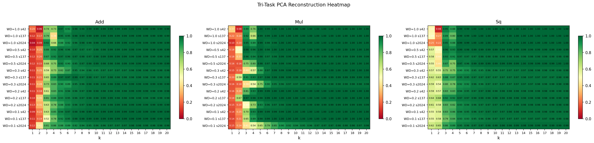

*(b) Тепловая карта восстановления для трёх задач: требуется меньше компонент, с более резким переходом от случайного уровня к безупречному.*

*Рисунок 22: Сжатие, вызванное ограничениями. **(a)** Двухзадачные модели требуют $k^{*}=5$–$10$ направлений PCA в зависимости от WD, причём ортогональное дополнение несёт 0.2–0.8 % дисперсии траектории. **(b)** Трёхзадачные модели требуют меньше компонент ($k^{*}=3$–$8$), что согласуется с более сильным давлением суперпозиции от дополнительных задачных ограничений. Разбивки точности по $k$ — в таблицах 15 и 14.* **[p. 25]**

### 10.6 Динамическое возникновение суперпозиции

Соединение PCA траектории с разбором дефекта и гессиана обнаруживает согласованную картину развития:

1. **Ранняя фаза (запоминание):** обучение идёт главным образом вдоль PC1. Траектория действенно имеет ранг 1 и подчинена подгонке по коротким путям.
2. **Промежуточная фаза (расширение признаков):** постепенно включаются дополнительные направления. Коммутаторный дефект и отрицательная кривизна копятся ортогонально главной траектории.
3. **Поздняя фаза (завершение суперпозиции):** едва траектория охватывает $k^{*}$ направлений, система сбегает с седла запоминания, и возникает генерализация.

Таким образом, суперпозиция не возникает при начальной установке, а *строится динамически* по ходу обучения через постепенное расширение размерности.

### 10.7 Отношение к исполнительному многообразию и интегрируемости

Прежние разделы показали, что траектории оптимизации остаются заперты на низкоразмерном исполнительном многообразии и обнаруживают почти интегрируемую динамику. Настоящие результаты проясняют кажущийся парадокс:

- Обучающий *путь* действенно одномерен.
- Итоговое *решение* имеет $k^{*}$-мерное касательное устройство.

Обучение идёт узким каналом сквозь пространство параметров, но сходится к многопризнаковому бассейну, локальная геометрия которого поддерживает несколько перекрывающихся алгоритмов. Коммутаторные дефекты остаются ортогональны исполнительному многообразию, что указывает: взаимодействия признаков происходят главным образом в поперечных направлениях.

### 10.8 Голографическая несжимаемость, ещё раз

Хотя решение лежит в низкоразмерном подпространстве, оно не сжимается ниже $k^{*}$ без катастрофической потери работоспособности. Ниже этого порога генерализация резко схлопывается (раздел 10.2).

###### p25-8

Мы называем это явление **голографической несжимаемостью**: существенные алгоритмические сведения оказываются почти предельно сжаты внутри исполнительного подпространства, и дальнейшее понижение размерности разрушает глобальную работу. Это противоположно классическим результатам о низкоранговом сжатии, которые нередко сохраняют работоспособность при куда более сильных сокращениях.

### 10.9 Следствия для выучивания признаков

Наши результаты указывают на единый взгляд на образование признаков:

- Признакам отвечают направления в пространстве параметров.
- **[p. 26]** Несколько признаков перекрываются внутри малого подпространства.
- Регуляризация управляет плотностью упаковки признаков.
- Гроккингу отвечает завершение наименьшего базиса суперпозиции.

Это даёт динамическое основание теории суперпозиции и связывает геометрию признаков с динамикой оптимизации.

## 11 Избыточная параметризация как избыточность многообразий

Основное эмпирическое наблюдение глубокого обучения состоит в том, что сильно избыточно параметризованные модели обучаются надёжнее, лучше обобщают и устойчивее к возмущениям (Neyshabur et al. 2017; Belkin et al. 2019; Kaplan et al. 2020). Хотя это явление хорошо задокументировано, механистические объяснения остаются неполными. Мы предлагаем, что избыточная параметризация придаёт устойчивость, порождая избыточность в устройстве центральных многообразий.

### 11.1 Абляция поперечного градиента

Чтобы прощупать роль поперечных направлений в оптимизации, мы избирательно удаляли долю составляющих градиента, ортогональных исполнительному многообразию,

$$
\mathbf{g}\;\mapsto\;P_{\mathcal{M}_{c}}\,\mathbf{g}+(1-\alpha)\,P_{\mathcal{M}_{c}^{\perp}}\,\mathbf{g}, \tag{7}
$$

где $\alpha\in[0,1]$ управляет силой удаления. Затем мы измеряли время гроккинга при разных $\alpha$ (полные результаты — в таблицах 10 и 11, дополнительные подробности — в таблицах 16 и 17 приложения).

И в двухзадачной, и в трёхзадачной постановке мы наблюдаем:

- Малые удаления (1–7 %) вызывают большие задержки (до $+203\%$ у двух задач, $+124\%$ у трёх).
- Удаления $\geq 10\%$ устраняют гроккинг целиком.
- Двухзадачные модели обнаруживают частичное восстановление при крайнем удалении ($\alpha=0.50$).
- Трёхзадачные модели не восстанавливаются ни при каком уровне удаления $\geq 10\%$.

###### p26-7

Эти результаты показывают, что гроккинг решающе зависит от редких поперечных обновлений, составляющих $<1\%$ дисперсии градиента.

### 11.2 Порог хрупкости и связность бегства

###### p26-8

Резкий переход около $\alpha=0.10$ указывает на границу хрупкости в пространстве параметров. Ниже этого порога узкие коридоры, соединяющие сёдла запоминания с обобщающими бассейнами, остаются целы. Выше него эти коридоры схлопываются, не давая сбежать.

Мы истолковываем это как перколяционное явление в геометрии оптимизации, сходное со связностью мод, наблюдаемой в ландшафтах потерь (Draxler et al. 2018; Garipov et al. 2018): пригодные пути спуска существуют лишь тогда, когда сохранена достаточная поперечная связность. Согласованность порога в ${\sim}10\%$ и в двухзадачной, и в трёхзадачной постановке — несмотря на разное число параметров, разную сложность задач и разные временны́е масштабы гроккинга — указывает, что эта граница отражает согласованное свойство ландшафта оптимизации в проверенных режимах, а не особенность какой-либо отдельной настройки.

**[p. 27]**

### 11.3 Избыточные центральные многообразия в избыточно параметризованных моделях

Двухзадачные модели обладают значительно бо́льшим числом степеней свободы, чем требуется для представления двух алгоритмов. Вследствие этого сосуществует несколько геометрически различных центральных многообразий:

$$
\mathcal{M}_{c}^{(1)},\;\mathcal{M}_{c}^{(2)},\;\dots \tag{8}
$$

###### p27-2

Когда основной путь бегства нарушен (например, 50-процентным ортогональным удалением), оптимизация может перейти на запасное многообразие. Это объясняет немонотонное восстановление, наблюдаемое в двухзадачных опытах: удаления в 10–25 % достаточно, чтобы перекрыть основной путь, но недостаточно, чтобы открыть запасные, тогда как 50-процентное удаление вынуждает качественную перестройку, обнажающую вторичное многообразие.

###### p27-3

Напротив, трёхзадачные модели требуют бо́льшей наименьшей размерности суперпозиции ($k^{*}\approx 5$–$8$ против $k^{*}\approx 5$–$9$ у двухзадачных, но при более тесной упаковке на задачу). Возросшее ограничение устраняет избыточные многообразия, оставляя единственный хрупкий путь к генерализации. Итак, лишние параметры дают избыточность в устройстве центральных многообразий.

### 11.4 Отношение к спектру кривизны

Разбор гессиана (раздел 6) обнаруживает, что избыточно параметризованные модели обладают многими неустойчивыми направлениями (отрицательными собственными числами). Лишь часть из них задействована в построении главенствующего центрального многообразия.

В двухзадачных моделях дополнительные моды отрицательной кривизны остаются доступны после частичной абляции. Эти моды позволяют перенастроить путь бегства, что согласуется с наблюдаемым восстановлением при $\alpha=0.50$.

В трёхзадачных моделях почти все пригодные моды нужны, чтобы поддерживать трёхзадачную суперпозицию. Поэтому абляция разрушает весь механизм бегства, и запасного нет.

Избыточная параметризация, таким образом, поставляет излишек неустойчивых направлений, которые можно перепрофилировать по ходу обучения, — геометрический буфер против возмущений.

### 11.5 Перестройка, вызванная сжатием

Немонотонное восстановление, наблюдаемое при крайнем удалении в двухзадачных моделях, указывает, что сильное проецирование способно загнать оптимизацию в более простые подпространства, всё ещё допускающие годные решения. Это напоминает неявную низкоранговую регуляризацию (Li et al. 2018a): чрезмерное ограничение размерности устраняет сложные многообразия, но может обнажить более простые запасные.

Точнее, при $\alpha=0.50$ сохранённый градиент лежит почти целиком в многообразии PCA плюс половина поперечной составляющей. Такой стеснённый ландшафт оптимизации может преимущественно отбирать решения с меньшей действующей размерностью — решения, до которых случилось быть достижимыми через уменьшенное подпространство. У трёхзадачных моделей таких упрощённых вложений нет, что объясняет отсутствие восстановления.

### 11.6 Следствия для генерализации и устойчивости

###### p27-10

Наши результаты указывают, что устойчивость избыточно параметризованных моделей происходит не просто от плоских минимумов (Keskar et al. 2017), а от **геометрической избыточности путей оптимизации**. А именно:

- Несколько центральных многообразий дают запасные пути к генерализации.
- Избыточность служит буфером против шума, возмущений градиента и частичной потери сведений.
- **[p. 28]** Утрата избыточности (из-за возросшей задачной нагрузки или уменьшения числа параметров) вызывает хрупкую динамику обучения.

Это переистолковывает избыточную параметризацию как устройство *структурной устойчивости*: модель устойчива не потому, что какое-то одно решение плоское, а потому, что в окрестности траектории оптимизации существует много годных решений.

### 11.7 Связи с практическими способами обучения

Этот взгляд проясняет эмпирическое поведение нескольких широко употребляемых приёмов:

###### p28-3

- **Обрезка и разрежение** (Frankle and Carlin 2019): удаляют поперечную связность, рискуя схлопнуть коридоры бегства. Наши результаты предсказывают, что обрезка более чем ${\sim}10\%$ поперечной ёмкости должна резко ухудшать генерализацию.
- **Низкоранговая адаптация** (Hu et al. 2022, LoRA;): ограничивает размерность многообразия, доступную для дообучения, тем самым ограничивая избыточность. Успех LoRA, возможно, зависит от того, что предобученные модели уже прошли решающую фазу расширения многообразия.
- **Обрезка градиента**: подавляет неустойчивые моды, которые могут быть существенны для бегства с седла. Слишком настойчивая обрезка могла бы устранить поперечный сигнал, нужный для генерализации по типу гроккинга.
- **Адаптивные оптимизаторы** (Thilak et al. 2022): перекраивают спектр кривизны, возможно, перераспределяя энергию градиента между многообразием и поперечными направлениями.

Наша рамка предсказывает, что такие способы удаются лишь тогда, когда сохраняется достаточная избыточность многообразия.

### 11.8 Сводка

Мы заключаем, что избыточная параметризация улучшает обучение, порождая избыточные центральные многообразия, дающие несколько геометрически различных путей к генерализации. Абляция поперечного градиента обнаруживает резкий порог хрупкости ($\alpha\approx 0.10$), разделяющий устойчивый и хрупкий режимы. Сложность задачи определяет, существуют ли запасные многообразия, что и объясняет разное поведение при восстановлении у двухзадачной (восстановление при $\alpha=0.50$) и трёхзадачной (восстановления нет) постановок.

## 12 Обсуждение

### 12.1 Двойственность лесов и решения

*Тезис: главенствующие направления PCA кодируют леса запоминания, тогда как обобщающее решение живёт в ортогональном дополнении.*

###### p28-7

Наши результаты обнаруживают поразительную двойственность. Многообразие PCA улавливает *леса* обучающей траектории: главенствующие направления изменения весов во время запоминания. На PC1–PC3 приходится $>98\%$ от $\left\|\Delta\theta\right\|^{2}$, но в генерализацию они не вносят ничего (точность на уровне случайного угадывания при восстановлении по ним). Решение живёт в PC${}_{k^{*}}$–PC${}_{k^{*}+\epsilon}$, на которые приходится $<1\%$ дисперсии, но которые подавляюще ответственны за генерализацию. Мелкошаговый опыт по ортогональному удалению делает это количественным: удаление всего $1\%$ ортогональной составляющей градиента задерживает гроккинг на ${\sim}30\%$, тогда как удаление ${\geq}10\%$ предотвращает его целиком. Связь отклика с дозой поразительно согласована между двухзадачной и трёхзадачной постановками, с резким обрывом при $f\approx 0.07$–$0.10$.

**[p. 29]**

###### p29-1

Это согласуется с результатом об интегрируемости $\rho\approx 1.000$: коммутаторные векторы (прощупывающие кривизну ландшафта потерь) преимущественно ортогональны многообразию лесов, что указывает: устройство кривизны, важное для генерализации, живёт по преимуществу вне главенствующей траектории. Причинные вмешательства в сопутствующем исследовании подтверждают эту картину: усиление некоммутативности ускоряет гроккинг на 32–60 % по семействам задач, тогда как подавление ортогональных градиентов задерживает или предотвращает его (Xu 2026a).

### 12.2 Многозадачная геометрия: ортогональное вложение задач

###### p29-2

*Тезис: модели с общим стволом вмещают несколько контуров через геометрическое разделение, а не через суперпозицию.*

###### p29-3

Почти ортогональность весов задачных голов ($|\cos|<0.08$) и низкий межзадачный косинус градиентов (0.15–0.28) обнаруживают, что общий ствол учит представление, в котором разные задачи занимают неперекрывающиеся подпространства. Это геометрическое разделение объясняет отсутствие разрушительного вмешательства: задачи не соперничают за одни и те же направления.

Порядок гроккинга (mul $\to$ sq $\to$ add) отражает естественную иерархию: умножение как нелинейное действие устанавливает свой контур первым, а квадратичная сумма $x^{2}+y^{2}$ делит с ним достаточно мультипликативного строения, чтобы последовать сразу за ним. Сложение, алгебраически иное, идёт последним.

Падение PC1 % с однозадачных (70–94 %) до двухзадачных (55–77 %) и трёхзадачных (49–65 %) согласуется с тем, что многообразию нужны дополнительные размерности, чтобы вместить каждый контур. При этом многообразие остаётся сильно низкоразмерным — далеко не всё пространство параметров, — а свойство интегрируемости сохраняется в точности.

### 12.3 Weight decay как фазовый параметр

*Тезис: weight decay управляет гроккингом через фазовую диаграмму с различными динамическими режимами.*

###### p29-7

Пятиточечный перебор WD обнаруживает, что weight decay есть не просто ручка регуляризации, а *фазовый параметр*, управляющий качественно разной динамикой гроккинга:

- **Высокий WD ($\lambda\geq 0.5$)**: быстрый гроккинг (${\sim}16$ тыс. шагов), глубокая кривизна гессиана ($\lambda_{\text{min}}\approx-36$ до $-63$), гладкое накопление дефекта, малое опережение у двух задач (5–53 %), но большое у трёх ($77$–$82\%$), тесное восстановление ($k^{*}=5$–$6$).
- **Промежуточный WD ($\lambda=0.2$–$0.3$)**: умеренный гроккинг (${\sim}28$–$45$ тыс.), полка кривизны ($\lambda_{\text{min}}\approx-15$), перемежающаяся динамика дефекта, большее опережение (32–61 %), умеренное $k^{*}$ ($6$–$8$).
- **Низкий WD ($\lambda=0.1$)**: медленный гроккинг (${\sim}98$ тыс. у двух задач, ${\sim}152$ тыс. у трёх), мелкая кривизна ($\lambda_{\text{min}}\approx-17$), всплесковые кратковременные узоры дефекта, очень большое опережение (70 % у двух задач, 97 % у трёх), высокое $k^{*}$ ($7$–$9$).
- **Без WD ($\lambda=0$)**: гроккинга нет, несмотря на существенную отрицательную кривизну ($\lambda_{\text{min}}\approx-50$).

Выброс $\lambda=0$ решающе важен: он показывает, что одной седловой кривизны недостаточно. Weight decay даёт регуляризационное давление — силу, толкающую траекторию прочь с седла запоминания к обобщающим бассейнам меньшей нормы. Без него модель сидит на седле сколь угодно долго.

Рамка внутрисигнального зазора (Xu 2026d) даёт спектральное описание этого устройства: weight decay способствует раскрытию спектрального зазора при $k^{*}=1$, устойчивающего главенствующее направление внимания, тогда как прогоны без weight decay остаются в вырожденном режиме без динамики зазора и без генерализации (полный количественный разбор — в разделе 9.5).

**[p. 30]**

### 12.4 Несжимаемость и природа алгоритмических решений

*Тезис: грокающие решения голографичны — распределены по всем параметрам при полном ранге и без избыточности.*

###### p30-2

Провал каждого способа сжатия (послойное SVD, обрезка по величине, однородное растяжение, абляция модулей) устанавливает, что грокающее решение устроено качественно иначе, чем обычные решения нейронных сетей. В стандартном глубоком обучении низкоранговые приближения и обрезка обыкновенно сохраняют точность (Frankle and Carlin 2019; Hu et al. 2022). Здесь же контуры модульной арифметики используют *полную ёмкость* каждой матрицы весов (нужен ранг 128, ранг 64 проваливается), причём необходим каждый модуль, а чувствительность к возмущениям крайняя (растяжение на $\pm 5\%$ $\to$ случайный уровень).

###### p30-3

Кажущийся парадокс — что обучающая траектория низкорангова (PC1 улавливает 94 % дисперсии), тогда как решение полноранговое, — разрешается через двойственность лесов и решения. Главенствующие направления траектории суть путь, которым идёт оптимизатор (леса запоминания), а не место назначения. Обобщающее решение закодировано в крохотном, кажущемся пренебрежимым остатке, ортогональном этим лесам.

#### Любопытная немонотонность.

###### p30-4

Двухзадачный опыт по ортогональному удалению обнаруживает неожиданный немонотонный узор: удаления в 10–25 % убивают гроккинг, но 50-процентное удаление его возвращает (при задержке в $163\%$). Одно из истолкований — что большие удаления настолько резко меняют ландшафт оптимизации, что модель находит запасной путь к генерализации, не опирающийся на своеобразное ортогональное устройство исходной траектории. Эта немонотонность не наблюдалась в трёхзадачной постановке (где все удаления $\geq 10\%$ проваливаются), что указывает: дополнительные задачные ограничения устраняют запасные пути гроккинга.

### 12.5 Отношение к интерпретируемости на основе признаков

###### p30-5

Недавние работы изучают суперпозицию через разрежённые автокодировщики (SAE) и словари признаков в пространстве активаций (Elhage et al. 2022; Bricken et al. 2023), раскладывая внутренние представления в неподвижных контрольных точках на истолковываемые направления. Наши результаты дополняют их: вместо разложения представлений в неподвижных снимках мы разбираем, как траектория параметров динамически строит низкоразмерный базис по ходу обучения. Исполнительное многообразие, которое мы выделяем, есть объект *пространства параметров*, тогда как признаки SAE суть объекты *пространства активаций*; два взгляда обращены к разным граням суперпозиции.

###### p30-6

Естественно спросить, отвечают ли выделяемые нами направления траектории PCA истолковываемым признакам в смысле SAE. Предварительные наблюдения указывают на частичное согласие: порог восстановления $k^{*}$ растёт с числом задач (с ${\sim}5$ у двухзадачных до ${\sim}7$ у трёхзадачных), что согласуется с тем, что каждая задача добавляет свои признаковые направления. Однако главенствующие направления PCA кодируют леса запоминания, а не обобщающее решение, что затрудняет прямое сопоставление. Будущие работы могли бы соединить эти подходы, применив разложение SAE вдоль исполнительного многообразия и отслеживая возникновение и растворение признаков как функцию продвижения обучения.

### 12.6 Ограничения

###### p30-7

Наши многозадачные опыты ограничены 2–3 задачами на модульной арифметике по модулю 97 с малыми трансформерами (${\sim}300$ тыс. параметров). Обобщаются ли на бо́льшие модели и реальные задачи зависимость ранга многообразия от числа задач, голографическая несжимаемость и фазовая диаграмма по WD — остаётся открытым. Мы не изучаем модели крупнее ${\sim}300$ тыс. параметров; более крупные архитектуры могут обнаружить качественно иное устройство многообразия (Kaplan et al. 2020), а наблюдаемый нами резкий порог **[p. 31]** хрупкости мог бы сместиться или расшириться с масштабом. Мы не изучаем задачи естественного языка или зрения, где шум оптимизации, неоднородность данных и отсутствие чистого алгоритмического строения могут затемнить или устранить сообщаемую здесь низкоразмерную геометрию многообразия, хотя сопутствующее исследование (Xu 2026a) обнаруживает, что начало коммутаторного дефекта надёжно предшествует гроккингу в языках Дейка и в наборе SCAN для композиционной генерализации, что указывает на распространение геометрического устройства за пределы модульной арифметики. Разбор гессиана пользуется степенным итерированием (чувствительным к начальному приближению и сходимости), а сравнение задачных собственных чисел не учитывает межзадачных взаимодействий гессиана. Опыт по ортогональному удалению использует одно семя (42) и одно значение WD (1.0); распространение на несколько семян и значений WD усилило бы результат, хотя согласованность отклика на дозу и в двухзадачной, и в трёхзадачной постановке обнадёживает.

## 13 Заключение

Мы распространили геометрический разбор гроккинга с однозадачной на многозадачную модульную арифметику, обнаружив несколько новых явлений. **Во-первых**, многозадачный гроккинг даёт ступенчатый порядок (mul $\to$ sq $\to$ add) с почти ортогональными задачными головами, что показывает: модели с общим стволом вмещают несколько контуров через геометрическое разделение. **Во-вторых**, исполнительное многообразие эмпирически интегрируемо ($\rho\approx 1.000$) при всех числах задач, значениях weight decay и семенах — это самый согласованный инвариант из выделенных нами. **В-третьих**, weight decay управляет гроккингом через упорядоченную фазовую диаграмму: глубина седловой кривизны, временно́й масштаб гроккинга, опережение дефекта и порог восстановления согласованно меняются вместе с $\lambda$, с критическим режимом около $\lambda\approx 0.3$ и с отвязанным выбросом $\lambda=0$, у которого кривизна есть, а гроккинга нет. Начало дефекта предшествует гроккингу в 42 из 42 условий и в двухзадачной, и в трёхзадачной постановке ($p=2^{-27}$ для одной только трёхзадачной), причём доля опережения при трёх задачах доходит до $97\%$ при $\lambda=0.1$. **В-четвёртых**, грокающее решение голографично — распределено по всем параметрам при полном ранге, несжимаемо никаким послесловным способом и чрезвычайно чувствительно к возмущению ортогонального градиента. Мелкошаговые опыты с откликом на дозу обнаруживают непрерывную функцию задержки, венчающуюся резким обрывом при ${\sim}10\%$ удаления, причём трёхзадачная постановка строго более хрупка, чем двухзадачная. Главенствующая обучающая траектория есть леса; решение есть крохотный остаток. **В-пятых**, несколько алгоритмических решений сосуществуют в общем подпространстве всего из 4–8 направлений PCA, обнаруживая суперпозицию в пространстве параметров, плотностью которой управляет weight decay. **В-шестых**, различный отклик на поперечную абляцию — двухзадачные модели восстанавливаются при крайнем удалении через запасные центральные многообразия, тогда как трёхзадачные нет — обнаруживает, что избыточная параметризация придаёт устойчивость через геометрическую избыточность путей оптимизации. Вместе эти результаты рисуют картину многозадачного гроккинга как геометрически упорядоченного фазового перехода, управляемого взаимодействием седловой кривизны, давления weight decay, голографического кодирования решения и избыточности многообразий.

#### Воспроизводимость.

Весь код и рисунки доступны на https://github.com/skydancerosel/grokking-integrability.

## References

- Mikhail Belkin, Daniel Hsu, Siyuan Ma, and Soumik Mandal. Reconciling modern machine-learning practice and the classical bias–variance trade-off. *Proceedings of the National Academy of Sciences*, 116(32):15849–15854, 2019.

- Trenton Bricken, Adly Templeton, Joshua Batson, Brian Chen, Adam Jermyn, Tom Conerly, **[p. 32]** Nick Turner, Cem Anil, Carson Denison, Amanda Askell, et al. Towards monosemanticity: Decomposing language models with dictionary learning. *Transformer Circuits Thread*, 2023. URL https://transformer-circuits.pub/2023/monosemantic-features/index.html.

- Xander Davies, Lauro Langosco, and David Krueger. Unifying grokking and double descent. *arXiv preprint arXiv:2303.06173*, 2023.

- Felix Draxler, Kambis Veschgini, Manfred Salmhofer, and Fred A Hamprecht. Essentially no barriers in neural network energy landscape. In *International Conference on Machine Learning*, pages 1309–1318, 2018.

- Nelson Elhage, Tristan Hume, Catherine Olsson, Nicholas Schiefer, Tom Henighan, Shauna Kravec, Zac Hatfield-Dodds, Robert Lasenby, Dawn Drain, Carol Chen, et al. Toy models of superposition. *Transformer Circuits Thread*, 2022. URL https://transformer-circuits.pub/2022/toy_model/index.html.

- Stanislav Fort and Stanislaw Jastrzebski. Large scale structure of neural network loss landscapes. In *Advances in Neural Information Processing Systems*, volume 32, 2019.

- Jonathan Frankle and Michael Carlin. The lottery ticket hypothesis: Finding sparse, trainable neural networks. In *International Conference on Learning Representations*, 2019.

- Timur Garipov, Pavel Izmailov, Dmitrii Podoprikhin, Dmitry Vetrov, and Andrew Gordon Wilson. Loss surfaces, mode connectivity, and fast ensembling of DNNs. In *Advances in Neural Information Processing Systems*, volume 31, 2018.

- Rong Ge, Furong Huang, Chi Jin, and Yang Yuan. Escaping from saddle points — online stochastic gradient for tensor decomposition. In *Conference on Learning Theory*, pages 797–842, 2015.

- Edward J Hu, Yelong Shen, Phillip Wallis, Zeyuan Allen-Zhu, Yuanzhi Li, Shean Wang, Lu Wang, and Weizhu Chen. LoRA: Low-rank adaptation of large language models. In *International Conference on Learning Representations*, 2022.

- Jared Kaplan, Sam McCandlish, Tom Henighan, Tom B Brown, Benjamin Chess, Rewon Child, Scott Gray, Alec Radford, Jeffrey Wu, and Dario Amodei. Scaling laws for neural language models. *arXiv preprint arXiv:2001.08361*, 2020.

- Nitish Shirish Keskar, Dheevatsa Mudigere, Jorge Nocedal, Mikhail Smelyanskiy, and Ping Tak Peter Tang. On large-batch training for deep learning: Generalization gap and sharp minima. In *International Conference on Learning Representations*, 2017.

- Tanishq Kumar, Blake Bordelon, Samuel J Gershman, and Cengiz Pehlevan. Grokking as the transition from lazy to rich training dynamics. *arXiv preprint arXiv:2310.06110*, 2024.

- Chunyuan Li, Heerad Farkhoor, Rosanne Liu, and Jason Yosinski. Measuring the intrinsic dimension of objective landscapes. In *International Conference on Learning Representations*, 2018a.

- Hao Li, Zheng Xu, Gavin Taylor, Christoph Studer, and Tom Goldstein. Visualizing the loss landscape of neural nets. In *Advances in Neural Information Processing Systems*, volume 31, 2018b.

- Ziming Liu, Ouail Kitouni, Niklas Nolte, Eric J Michaud, Max Tegmark, and Mike Williams. Omnigrok: Grokking beyond algorithmic data. *arXiv preprint arXiv:2210.01117*, 2022.

**[p. 33]**

- Kaifeng Lyu, Jikai Jin, Zhiyuan Li, Simon S Du, Jason D Lee, and Wei Hu. Dichotomy of early and late phase implicit biases can provably induce grokking. *arXiv preprint arXiv:2311.18817*, 2024.

- William Merrill, Nikolaos Tsilivis, and Aman Shukla. A tale of two circuits: Grokking as competition of sparse and dense subnetworks. *arXiv preprint arXiv:2303.11873*, 2023.

- Andrea Montanari and Zihao Wang. Phase transitions for feature learning in neural networks. *arXiv preprint arXiv:2602.01434*, 2026. URL https://arxiv.org/abs/2602.01434.

- Neel Nanda, Lawrence Chan, Tom Liberum, Jess Smith, and Jacob Steinhardt. Progress measures for grokking via mechanistic interpretability. *arXiv preprint arXiv:2301.05217*, 2023.

- Behnam Neyshabur, Srinadh Bhojanapalli, David McAllester, and Nati Srebro. Exploring generalization in deep networks. In *Advances in Neural Information Processing Systems*, volume 30, 2017.

- Alethea Power, Yuri Burda, Harri Edwards, Igor Babuschkin, and Vedant Misra. Grokking: Generalization beyond overfitting on small algorithmic datasets. In *ICLR 2022 Workshop on MATH-AI*, 2022. URL https://arxiv.org/abs/2201.02177.

- Vimal Thilak, Etai Littwin, Shuangfei Zhai, Omid Saremi, Roni Paiss, and Joshua Susskind. The slingshot mechanism: An empirical study of adaptive optimizers and the grokking phenomenon. *arXiv preprint arXiv:2206.04817*, 2022.

- Vikrant Varma, Rohin Shah, Zachary Kenton, János Kramár, and Neel Nanda. Explaining grokking through circuit efficiency. *arXiv preprint arXiv:2309.02390*, 2023.

- Yongzhong Xu. Early-warning signals of grokking via loss-landscape geometry. *arXiv preprint arXiv:2602.16967*, 2026a. URL https://arxiv.org/abs/2602.16967.

- Yongzhong Xu. Low-dimensional and transversely curved optimization dynamics in grokking. *arXiv preprint arXiv:2602.16746*, 2026b. URL https://arxiv.org/abs/2602.16746.

- Yongzhong Xu. Low-dimensional execution manifolds in transformer learning dynamics: Evidence from modular arithmetic tasks. *arXiv preprint arXiv:2602.10496*, 2026c. URL https://arxiv.org/abs/2602.10496.

- Yongzhong Xu. The spectral edge thesis: Intra-signal gap dynamics in transformer training. *arXiv preprint arXiv:2603.28964*, 2026d. URL https://arxiv.org/abs/2603.28964.

- Ziqian Zhong, Ziming Liu, Max Tegmark, and Jacob Andreas. The clock and the pizza: Two stories in mechanistic explanation of neural networks. *Advances in Neural Information Processing Systems*, 36, 2024.
## Приложение A Дополнительные рисунки

*(a) Спектр собственных чисел, две задачи (семя 42).*

*(b) Спектр собственных чисел, три задачи (семя 42).*

*Рисунок 23: Первые 10 собственных чисел для двух и трёх задач. Оба спектра показывают главенствующее первое собственное число, но зазор в многозадачных постановках меньше.* **[p. 34]**

*(a) SVD приращений весов, две задачи (семя 42).*

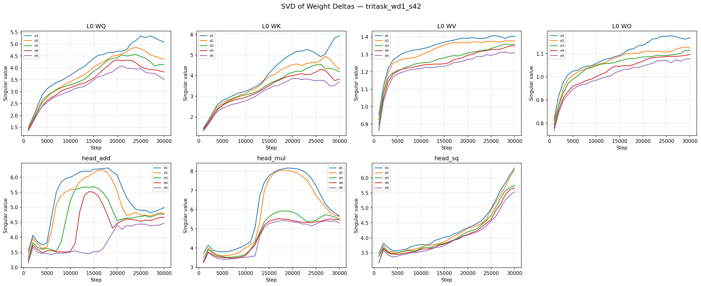

*(b) SVD приращений весов, три задачи (семя 42).*

*Рисунок 24: SVD приращений весов. Первые 5 сингулярных чисел растут одновременно в многозадачных постановках, причём SVD по отдельным головам показывают узоры роста в разное время, что согласуется со ступенчатым гроккингом.* **[p. 34]**

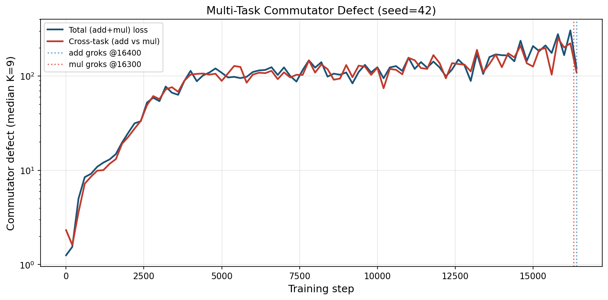

*(a) Коммутаторный дефект, две задачи (семя 42, WD=1.0).*

*(b) Коммутаторный дефект, три задачи (семя 42, WD=1.0).*

*Рисунок 25: Временны́е ряды коммутаторного дефекта для обеих многозадачных постановок.* **[p. 35]**

*Рисунок 26: Дефект против задачной тестовой точности при трёх задачах для трёх значений WD ($\lambda=1.0,0.5,0.1$), по 3 семени наложено на панель. Чёрные кривые (левая ось): коммутаторный дефект в логарифмической шкале. Цветные кривые (правая ось): задачная тестовая точность (синяя = сложение, красная = умножение, зелёная = квадрат). Затенённые полосы отмечают область гроккинга для каждой задачи. Пунктирные вертикали отмечают обнаружение всплеска дефекта. Всплеск дефекта отчётливо предшествует гроккингу на всех панелях, причём временно́й разрыв растёт при меньшем WD.* **[p. 36]**

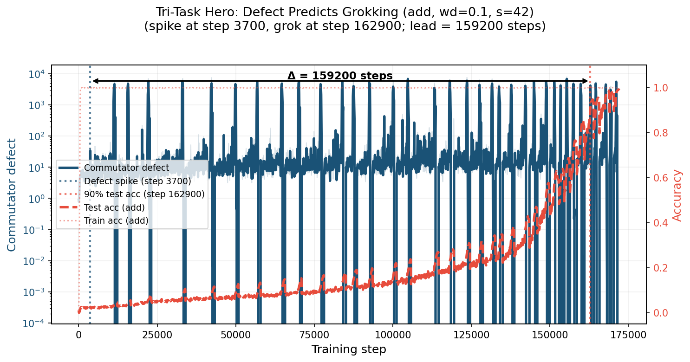

*Рисунок 27: Заглавный рисунок: дефект предсказывает гроккинг в трёхзадачной постановке (задача сложения, $\lambda=0.1$, семя 42). Синяя: коммутаторный дефект (левая ось, логарифмическая шкала) с лентой межквартильного размаха. Красная: тестовая и обучающая точность (правая ось). Всплеск дефекта происходит на шаге $3{,}700$, тогда как 90 % тестовой точности достигаются на шаге $162{,}900$ — время опережения в $159{,}200$ шагов ($97.7\%$ времени гроккинга).* **[p. 37]**

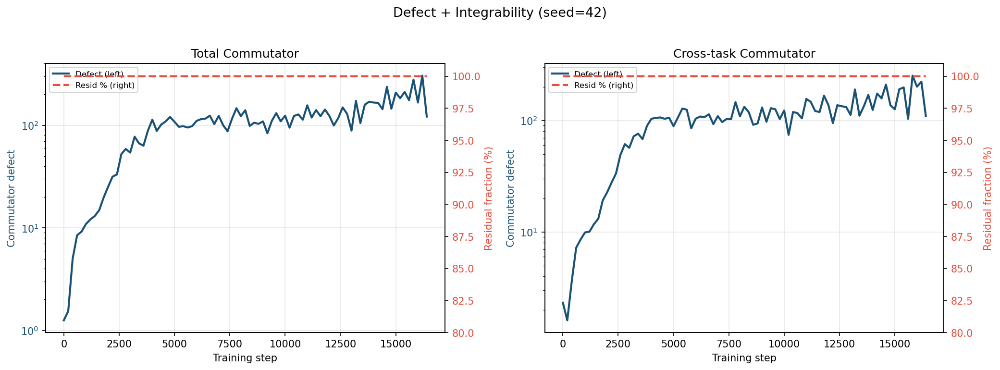

*(a) Две задачи, совмещённо: дефект + интегрируемость (семя 42).*

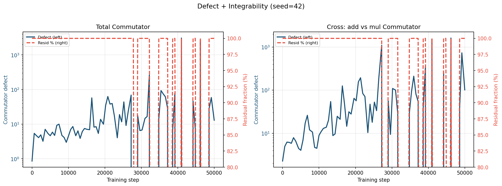

*(b) Три задачи, совмещённо: дефект + интегрируемость (семя 42).*

*Рисунок 28: Совмещённые величина дефекта и интегрируемость по ходу обучения. Интегрируемость держится на 1.000 всё время, тогда как дефект меняется.* **[p. 37]**

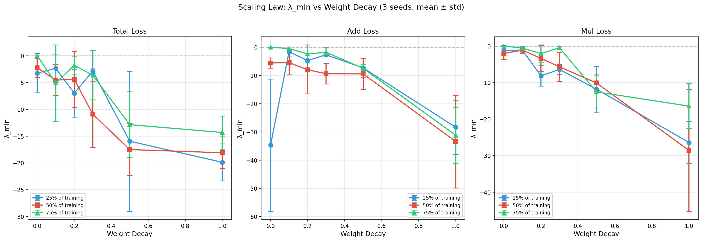

*Рисунок 29: Изменение кривизны гессиана по значениям WD (несколько семян). Глубина кривизны монотонно растёт с WD в грокающем режиме.* **[p. 37]**

*Рисунок 30: Сводка дефекта по разным WD для трёх задач. При WD=0.5 итоговый дефект наибольший (разбор застаёт модель посреди перехода), тогда как при WD=0.1 он схлопывается к нулю уже после гроккинга.* **[p. 38]**

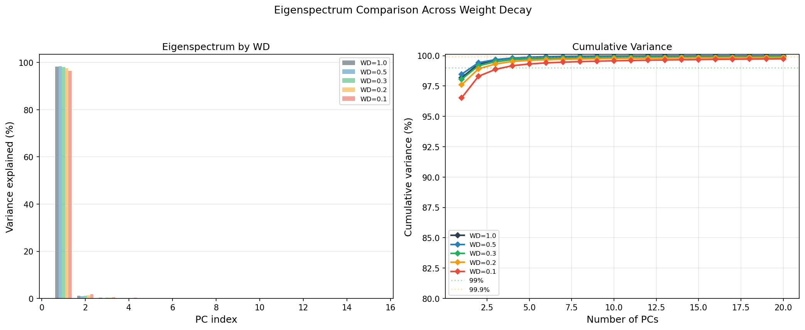

*Рисунок 31: Спектр собственных чисел PCA при двух задачах по значениям weight decay. Первые 5–10 собственных чисел улавливают $>$99 % дисперсии траектории; остальные образуют быстро убывающий хвост. Число непренебрежимых компонент растёт при меньшем WD, что согласуется с тенденцией $k^{*}$, сообщённой в разделе 10.5. Соответствующие тепловые карты восстановления — на рисунке 33.* **[p. 38]**

*(a) Две задачи: точность восстановления против $k$ для каждого WD. И сложение, и умножение требуют $k\geq 5$–$9$ компонент (в зависимости от WD), чтобы перейти 90 %.*

*(b) Три задачи: точность восстановления против $k$ для каждого WD. Все три задачи переходят 90 % при $k^{*}\approx 3$–$8$, неизменно ниже, чем при двух задачах.*

*Рисунок 32: Подробное сравнение порога восстановления $k^{*}$ между двухзадачной и трёхзадачной постановками (спутник рисунка 22 в основном тексте). **(a)** Двухзадачные модели требуют больше направлений PCA; переход от случайного уровня к безупречному виден как сигмоидоподобный скачок. **(b)** Трёхзадачные модели обнаруживают тот же резкий переход, но сдвинутый влево, к меньшим $k$, что указывает на более сильное сжатие, вызванное ограничениями. Систематический порядок $k^{*}_{\text{dual}}>k^{*}_{\text{tri}}$ держится по всем пяти значениям WD и трём случайным семенам (численные подробности — в таблицах 15 и 14).* **[p. 38]**

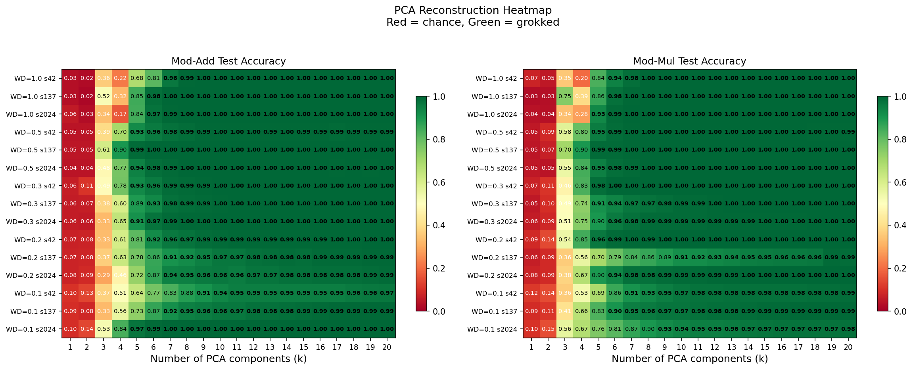

*(a) Две задачи: тепловая карта точности восстановления (WD $\times$ $k$). Светлая полоса сдвигается вправо при меньшем WD, отражая возросшее $k^{*}$.*

*(b) Три задачи: тепловая карта точности восстановления (WD $\times$ $k$). Полоса перехода сдвинута влево относительно двухзадачной.*

*Рисунок 33: Сравнение тепловых карт точности восстановления по WD и $k$ для двух задач **(a)** и трёх задач **(b)**. Граница между случайным уровнем (тёмное) и почти безупречной точностью (светлое) приходится на меньшие $k$ в трёхзадачной постановке, что даёт наглядную сводку сжатия, вызванного ограничениями, по всей фазовой диаграмме WD.* **[p. 39]**

*Рисунок 34: Абляция проецированием градиента при двух задачах (усреднено по 3 семенам, WD=1.0). Проецирование PCA при силе $s=0.25$ задерживает гроккинг на 70–140 %, тогда как случайное проецирование той же силы не даёт ничего.* **[p. 39]**

## Приложение B Подробные таблицы восстановления PCA

Следующие таблицы дают полную точность восстановления по каждому $k$ для трёхзадачной и двухзадачной постановок при всех значениях weight decay. Все приведённые данные — для семени 42; результаты для других семян качественно совпадают (см. сводки $k^{*}$ в таблицах 9 и 8). Полужирные строки отмечают $k=k^{*}$ — наименьшее число компонент PCA, при котором все задачи превышают 90 % тестовой точности.

###### tab-14

*Таблица 14: Точность восстановления при трёх задачах против числа компонент PCA $k$ (семя 42). Каждая подтаблица показывает одно значение weight decay. **Накопл. дисп.** — накопленная объяснённая дисперсия. Полужирная строка = $k^{*}$ (первое $k$, при котором все задачи $>90\%$). PC1 улавливает 89–94 % дисперсии, но не несёт способности к генерализации.* **[p. 40]**

| $\lambda=1.0$**($k^{*}=5$)** | $\lambda=0.5$**($k^{*}=4$)** |  |  |  |  |  |  |  |  |
|---|---|---|---|---|---|---|---|---|---|
| $k$ | Накопл. дисп. | Слож. | Умн. | Кв. | $k$ | Накопл. дисп. | Слож. | Умн. | Кв. |
| 1 | 91.7% | 20.4 | 36.7 | 47.5 | 1 | 93.9% | 9.9 | 18.0 | 57.4 |
| 2 | 95.9% | 5.6 | 8.2 | 7.5 | 2 | 97.1% | 25.0 | 49.3 | 48.1 |
| 3 | 98.0% | 74.4 | 89.2 | 94.8 | 3 | 98.8% | 87.5 | 98.5 | 96.1 |
| 4 | 98.8% | 72.5 | 76.2 | 87.7 | **4** | **99.3%** | **91.8** | **96.0** | **93.0** |
| **5** | **99.3%** | **96.5** | **99.9** | **99.3** | 5 | 99.5% | 96.3 | 99.5 | 98.9 |
| 6 | 99.5% | 91.7 | 99.2 | 99.2 | 6 | 99.7% | 95.7 | 98.2 | 98.5 |
| 7 | 99.6% | 97.8 | 99.8 | 99.7 | 7 | 99.7% | 97.0 | 99.5 | 98.9 |
| 8 | 99.7% | 97.8 | 99.9 | 99.7 | 8 | 99.8% | 97.3 | 99.8 | 99.1 |
| 10 | 99.8% | 99.1 | 100.0 | 99.8 | 10 | 99.9% | 97.9 | 99.9 | 99.0 |
| 15 | 99.9% | 99.3 | 100.0 | 99.9 | 15 | 99.9% | 98.9 | 99.9 | 99.1 |

| $\lambda=0.3$**($k^{*}=7$)** | $\lambda=0.2$**($k^{*}=5$)** |  |  |  |  |  |  |  |  |
|---|---|---|---|---|---|---|---|---|---|
| $k$ | Накопл. дисп. | Слож. | Умн. | Кв. | $k$ | Накопл. дисп. | Слож. | Умн. | Кв. |
| 1 | 93.5% | 11.0 | 15.2 | 57.4 | 1 | 91.9% | 11.0 | 16.1 | 58.7 |
| 2 | 96.1% | 24.7 | 18.1 | 54.6 | 2 | 95.1% | 17.6 | 26.5 | 56.6 |
| 3 | 97.6% | 58.5 | 39.6 | 75.3 | 3 | 97.4% | 60.9 | 81.2 | 83.0 |
| 4 | 98.5% | 73.1 | 57.4 | 75.5 | 4 | 98.6% | 82.9 | 93.1 | 82.6 |
| 5 | 99.0% | 82.4 | 87.9 | 90.4 | **5** | **99.0%** | **91.2** | **98.6** | **93.9** |
| 6 | 99.4% | 87.1 | 96.7 | 91.4 | 6 | 99.3% | 94.2 | 99.2 | 95.0 |
| **7** | **99.6%** | **94.5** | **99.1** | **95.2** | 7 | 99.4% | 95.8 | 99.7 | 96.7 |
| 8 | 99.7% | 94.3 | 99.0 | 94.9 | 8 | 99.6% | 96.6 | 99.7 | 97.3 |
| 10 | 99.8% | 95.3 | 99.4 | 96.2 | 10 | 99.7% | 98.2 | 99.6 | 97.6 |
| 15 | 99.9% | 97.6 | 99.6 | 97.7 | 15 | 99.8% | 98.5 | 99.8 | 97.9 |

| $\lambda=0.1$**($k^{*}=5$)** |  |  |  |  |
|---|---|---|---|---|
| $k$ | Накопл. дисп. | Слож. | Умн. | Кв. |
| 1 | 89.6% | 9.5 | 14.2 | 55.1 |
| 2 | 93.7% | 23.3 | 24.8 | 58.0 |
| 3 | 96.6% | 63.1 | 69.6 | 82.9 |
| 4 | 98.0% | 84.8 | 92.9 | 85.5 |
| **5** | **98.8%** | **93.9** | **98.8** | **94.0** |
| 6 | 99.0% | 96.7 | 98.5 | 94.6 |
| 7 | 99.2% | 97.9 | 98.9 | 96.2 |
| 8 | 99.2% | 98.4 | 99.2 | 96.6 |
| 10 | 99.4% | 99.1 | 99.7 | 97.4 |
| 15 | 99.6% | 99.3 | 99.6 | 97.8 |

*Таблица 15: Точность восстановления при двух задачах против числа компонент PCA $k$ (семя 42). Тот же вид, что и в таблице 14. Двухзадачный переход столь же резок, но требует больше компонент ($k^{*}=5$–$9$), чем трёхзадачный ($k^{*}=3$–$8$).* **[p. 41]**

| $\lambda=1.0$**($k^{*}=7$)** | $\lambda=0.5$**($k^{*}=5$)** |  |  |  |  |  |  |
|---|---|---|---|---|---|---|---|
| $k$ | Накопл. дисп. | Слож. | Умн. | $k$ | Накопл. дисп. | Слож. | Умн. |
| 1 | 94.9% | 3.5 | 7.4 | 1 | 96.8% | 4.5 | 5.3 |
| 2 | 97.0% | 2.4 | 5.4 | 2 | 98.2% | 4.5 | 8.9 |
| 3 | 98.5% | 36.1 | 35.3 | 3 | 98.8% | 39.1 | 57.7 |
| 4 | 99.0% | 21.9 | 19.7 | 4 | 99.5% | 69.6 | 79.5 |
| 5 | 99.4% | 68.0 | 83.5 | **5** | **99.6%** | **92.5** | **95.5** |
| 6 | 99.7% | 81.4 | 94.3 | 6 | 99.7% | 96.1 | 98.8 |
| **7** | **99.8%** | **96.1** | **98.4** | 7 | 99.8% | 97.9 | 99.5 |
| 8 | 99.9% | 99.3 | 99.8 | 8 | 99.9% | 98.8 | 99.8 |
| 10 | 99.9% | 99.9 | 100.0 | 10 | 99.9% | 99.5 | 99.9 |
| 15 | 100.0% | 99.9 | 100.0 | 15 | 100.0% | 99.5 | 99.7 |

| $\lambda=0.3$**($k^{*}=5$)** | $\lambda=0.2$**($k^{*}=6$)** |  |  |  |  |  |  |
|---|---|---|---|---|---|---|---|
| $k$ | Накопл. дисп. | Слож. | Умн. | $k$ | Накопл. дисп. | Слож. | Умн. |
| 1 | 95.7% | 6.3 | 7.1 | 1 | 95.1% | 7.1 | 8.8 |
| 2 | 97.5% | 10.6 | 10.9 | 2 | 97.2% | 7.6 | 14.1 |
| 3 | 98.3% | 49.0 | 46.3 | 3 | 98.0% | 33.0 | 54.3 |
| 4 | 99.2% | 77.6 | 83.3 | 4 | 99.0% | 60.7 | 84.7 |
| **5** | **99.4%** | **92.8** | **98.4** | 5 | 99.3% | 80.9 | 96.2 |
| 6 | 99.6% | 95.9 | 99.8 | **6** | **99.5%** | **92.3** | **98.8** |
| 7 | 99.7% | 98.7 | 99.9 | 7 | 99.6% | 96.4 | 99.5 |
| 8 | 99.8% | 99.2 | 99.9 | 8 | 99.7% | 97.5 | 99.5 |
| 10 | 99.8% | 99.8 | 100.0 | 10 | 99.8% | 99.2 | 99.9 |
| 15 | 99.9% | 99.9 | 100.0 | 15 | 99.8% | 99.4 | 100.0 |

| $\lambda=0.1$**($k^{*}=9$)** |  |  |  |
|---|---|---|---|
| $k$ | Накопл. дисп. | Слож. | Умн. |
| 1 | 93.8% | 10.2 | 11.5 |
| 2 | 96.6% | 13.5 | 14.5 |
| 3 | 97.7% | 37.2 | 36.3 |
| 4 | 98.6% | 51.1 | 53.2 |
| 5 | 98.8% | 63.8 | 69.1 |
| 6 | 99.2% | 77.4 | 85.8 |
| 7 | 99.3% | 83.4 | 90.7 |
| 8 | 99.4% | 88.3 | 93.3 |
| **9** | **99.5%** | **90.7** | **94.9** |
| 10 | 99.5% | 93.5 | 96.7 |
| 15 | 99.6% | 95.3 | 97.8 |

**[p. 34]**

## Приложение C Подробные таблицы абляции поперечного градиента

Следующие таблицы дают расширенные подробности опытов с откликом на дозу ортогонального удаления, описанных в разделе 11.1. Все опыты используют WD $=1.0$, семя 42. «Задержка» вычисляется относительно среднего шага гроккинга при базовом уровне ($\alpha=0$). ОТКАЗ означает, что одна или несколько задач не достигли 90 % тестовой точности в пределах бюджета шагов.

*Таблица 16: Абляция поперечного градиента при двух задачах, подробные результаты (WD=1.0, семя 42, бюджет 50 тыс. шагов). Столбцы показывают задачные шаги гроккинга, среднее по задачам, абсолютную задержку и задержку в процентах. Резкий обрыв при $\alpha=0.10$ и немонотонное восстановление при $\alpha=0.50$ отчётливо видны.* **[p. 42]**

| $\alpha$ (%) | Гроккинг сложения | Гроккинг умножения | Среднее | $\Delta t$ (шагов) | Задержка |
|---|---|---|---|---|---|
| 0 (базовый уровень) | 14,100 | 14,000 | 14,050 | — | — |
| 1 | 18,100 | 18,100 | 18,100 | $+4{,}050$ | $+29\%$ |
| 2 | 21,200 | 20,900 | 21,050 | $+7{,}000$ | $+50\%$ |
| 3 | 23,500 | 23,300 | 23,400 | $+9{,}350$ | $+67\%$ |
| 5 | 37,000 | 36,800 | 36,900 | $+22{,}850$ | $+163\%$ |
| 7 | 42,600 | 42,400 | 42,500 | $+28{,}450$ | $+203\%$ |
| 10 | ОТКАЗ | ОТКАЗ | — | — | $\infty$ |
| 15 | ОТКАЗ | ОТКАЗ | — | — | $\infty$ |
| 25 | ОТКАЗ | ОТКАЗ | — | — | $\infty$ |
| **50** | **36,900** | **36,800** | **36,850** | $+22{,}800$ | $+163\%$ |

*Таблица 17: Абляция поперечного градиента при трёх задачах, подробные результаты (WD=1.0, семя 42, бюджет 60 тыс. шагов). Тот же вид, что и в таблице 16. Трёхзадачная постановка показывает тот же обрыв хрупкости при $\alpha=0.10$, но восстановления не даёт ни при каком более высоком уровне удаления.* **[p. 42]**

| $\alpha$ (%) | Гроккинг сложения | Гроккинг умножения | Гроккинг квадрата | Среднее | $\Delta t$ (шагов) | Задержка |
|---|---|---|---|---|---|---|
| 0 (базовый уровень) | 25,600 | 18,200 | 23,400 | 22,400 | — | — |
| 1 | 35,200 | 21,200 | 28,800 | 28,400 | $+6{,}000$ | $+27\%$ |
| 2 | 42,400 | 30,200 | 36,000 | 36,200 | $+13{,}800$ | $+62\%$ |
| 3 | 35,000 | 29,000 | 33,600 | 32,500 | $+10{,}100$ | $+45\%$ |
| 5 | 35,400 | 26,800 | 33,800 | 32,000 | $+9{,}600$ | $+43\%$ |
| 7 | 56,000 | 44,600 | 49,600 | 50,100 | $+27{,}700$ | $+124\%$ |
| 10 | ОТКАЗ | ОТКАЗ | ОТКАЗ | — | — | $\infty$ |
| 15 | ОТКАЗ | ОТКАЗ | ОТКАЗ | — | — | $\infty$ |
| 25 | ОТКАЗ | ОТКАЗ | ОТКАЗ | — | — | $\infty$ |
