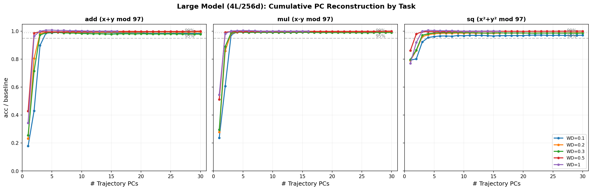
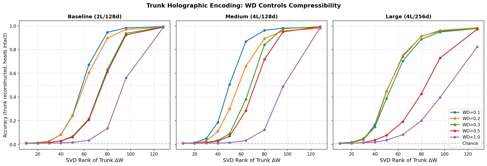
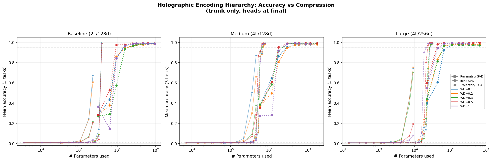

# Xu 2026 — Global Low-Rank, Local Full-Rank: The Holographic Encoding of Learned Algorithms

См. также: [глобальный индекс понятий](../../concepts/index.md).

**Yongzhong Xu** (независимый; код: github.com/skydancerosel/holographic_encoding).

arXiv [2602.18649](https://arxiv.org/abs/2602.18649), февраль 2026, 14 страниц, 3 рисунка, 6 таблиц. Всего цитирований по Semantic Scholar — 0, в картотеке — 1. Единоличная работа линии Xu (2602.16746, 2602.16967, 2602.18523): на многозадачной модульной арифметике (сложение, умножение и $x^{2}+y^{2}$ по модулю 97, общий ствол с тремя головами; 3 размера × 5 значений weight decay) сопоставлены три способа восстановления модели из сжатого изменения весов — послойное SVD, совместное SVD и PCA траектории. Заявлен «принцип голографического кодирования»: грокнутое решение глобально низкоранговое в пространстве направлений обучения (3–5 компонент траектории) и локально полноранговое в пространстве параметров (80–100+ сингулярных компонент на матрицу). Самое чистое наблюдение: спектральная энергия — не замена деятельной сжимаемости, деятельная часть лежит в хвосте спектра, и weight decay загоняет её глубже, не меняя формы спектра.

Оригинал и производные файлы этой папки:

- [`original/2602.18649.global-low-rank-local-full-rank-the-holographic-encoding-of-learned-algorithms.md`](original/2602.18649.global-low-rank-local-full-rank-the-holographic-encoding-of-learned-algorithms.md) — конверсия оригинала (native arXiv HTML, v1) в Markdown без правок содержания.
- [`2602.18649.global-low-rank-local-full-rank-the-holographic-encoding-of-learned-algorithms.claims.txt`](2602.18649.global-low-rank-local-full-rank-the-holographic-encoding-of-learned-algorithms.claims.txt) — пронумерованные утверждения статьи с пометками разбора.
- [`images/`](images/) — 3 рисунка.

Схема якорей и правила ссылок на карточку — в [README папки статей](../README.md).

## Затрагиваемые понятия

**[Спектральный анализ](../../concepts/spectral-analysis-svd-esd-fve.md)** — центральный измерительный ход: рангу, набирающему 90% фробениусовой энергии $\Delta W_{i}$ (44–52% полного), противопоставлен ранг, при котором восстанавливается точность (80–100+) — при ранге около 50 схвачено ${\sim}88\%$ энергии, а точность близка к случайной ([`p5-4`](#p5-4), [`fig-2`](#fig-2)). Вывод — сосредоточенность спектральной энергии не годится в замену деятельной сжимаемости: деятельные компоненты лежат в хвосте спектра. Разбор отмечает: все матрицы ствола усекались одновременно и до одного ранга, опыта с усечением одной матрицы нет, так что накопление ошибки от полноранговости каждой матрицы не отделено.

**[Многообразие и сжатие представлений](../../concepts/manifold-representation-compression.md)** — заявленная двойственность: обучение идёт вдоль низкоразмерного инвариантного подпространства (первая компонента траектории объясняет 90–97% дисперсии; для 95% опорной точности хватает $k^{*}=2$–$6$ компонент, [`p4-6`](#p4-6)), а готовые веса низким рангом не сжимаются, откуда предупреждение для LoRA-подобных методов на грокнутых сетях ([`p11-5`](#p11-5)). Разбор подрывает вторую половину вывода: одна «компонента траектории» есть полный вектор параметров ствола, поэтому «предельно сжатое представление из 3–5 компонент» впятеро крупнее самой модели, а рисунок 3 показывает обратное собственной подписи.

**[Гроккинг](../../concepts/grokking.md)** — работа целиком стоит на грокнутых прогонах (все 15 условий грокают, weight decay ускоряет переход с ${\sim}157$ тыс. до ${\sim}25$ тыс. шагов у базовой модели, [`p3-6`](#p3-6)), но ни одной кривой обучения в статье нет, фаза запоминания не показана, и главное — нет ни одного контроля не грокающей моделью (ни $\lambda=0$, ни случайных меток, ни ранней контрольной точки), поэтому «голографичность» не отделена от свойства любой обученной сети, и связь с гроккингом остаётся заявленной.

**[Weight decay](../../concepts/weight-decay.md)** — переносимое наблюдение «та же энергия, другая деятельность»: спектральная энтропия $\Delta W$ держится около 0.87 при всех $\lambda$, но точность восстановления при ранге 64 падает с ${\sim}70\%$ при $\lambda=0.1$ до ${\sim}5\%$ при $\lambda=1.0$ — более сильный weight decay не меняет распределения энергии по сингулярным числам, а загоняет деятельную часть вычисления глубже в хвост спектра ([`p11-1`](#p11-1)); одновременно он сжимает траекторию в меньшее число компонент.

**[Ландшафт потерь](../../concepts/loss-landscape-basins.md)** — геометрическая формулировка двойственности «многообразие против слоя» (manifold vs. fiber): управляющие переменные задают низкоразмерное многообразие в пространстве параметров, вдоль которого лежит решение, а в каждой его точке решение занимает полноразмерный слой в пространстве отдельных матриц ([`p9-6`](#p9-6)). Низкоразмерность траектории наследуется от 2602.16746 — но там она была подкреплена нулевой моделью случайного блуждания и контролем на случайном подпространстве, здесь ни того, ни другого нет.

## Что показано, а что предположено

Замечания редактора карточки по итогам разбора утверждений (`…claims.txt`, 44 пункта).

**Самое чистое — «энергия против деятельности».** Раздельное измерение сосредоточенности фробениусовой энергии и восстановления точности (при ранге ~50 схвачено ~88% энергии, а точность далека от опорной; восстановление начинается к рангам 80–100) — переносимая величина, не зависящая от спорных построений статьи. Второе переносимое — weight decay меняет не форму спектра (энтропия ≈0.87 всюду), а глубину залегания деятельной части. Головы при этом сжимаются полностью (>99% при ранге 64) — несжимаемость есть свойство общего ствола.

**Опыт с избирательностью противоречит и изложению, и главному тезису.** Он проведён в пространстве весов — старшие собственные векторы ковариации градиента по параметрам вычитаются из итогового вектора весов, — но изложен как разделимость «в пространстве активаций»; ни одной величины, измеренной на активациях, в статье нет. Хуже: направления ковариации градиента считаются по итоговой модели, то есть статически, и выделяют задаче-своё строение почти идеально (SI ≈ 0.99) — что несовместимо с тезисом «никакое статическое разложение не выделяет задаче-специфичной структуры». «Противоречие разделимости» создано сравнением двух статических разложений, одно из которых работает.

**Рисунок 3 показывает обратное своей подписи.** Подпись обещает, что PCA траектории даёт >95% «на порядки меньшем числе параметров», но на всех трёх панелях точки PCA траектории лежат правее послойного SVD — расходуют больше параметров: одна компонента траектории есть полный вектор параметров ствола. С этим рушится и «предельно сжатое представление» раздела 6.2. Само восстановление по PCA траектории близко к тавтологии: $\Delta W_{\text{final}}$ входит в матрицу, по которой строятся компоненты; нулевых моделей (компоненты чужого прогона, случайное подпространство той же размерности) нет. Совместное SVD построено сомнительно — матрицы разной формы вытянуты в строки и дописаны нулями, ранг не больше $n$, а столбец «Joint ($r=n$)» тавтологически совпадает с опорной точностью.

**Числа введения не сходятся с таблицами.** «Средняя точность ≈1%» для послойного SVD относится к совместному (таблица 4 даёт 0.033–0.869); «>95% по 3–5 компонентам» против 0.574 при $k=3$ (базовая модель, $\lambda=0.3$); «избирательность >0.98, перекрытие <0.08» против 0.97 и 0.120 в таблицах; «trunk-interior selectivity index 0.65–0.88» нигде не определён; текст 3.2 расходится со своей таблицей 3 и рисунком 2. С предыдущей работой той же серии (2602.18523) числа несовместимы на тех же прогонах: там восстановление по PC1–PC3 давало уровень случайного угадывания, здесь Traj($k=3$) даёт 0.574–0.993.

**Пять следствий (интерпретируемость, LoRA, эмерджентность, безопасность, непрерывное обучение) — рассуждения**: ни одно не проверено ни одним опытом. Число семян не названо ни разу; все таблицы — одно число на условие.

**Как работу будут цитировать** («доказано, что LoRA не работает на грокнутых сетях», «схемы хранятся голографически») — точнее: на трёх трансформерах до 2.2 млн параметров, на модульной арифметике по модулю 97, при одновременном усечении всех матриц ствола до общего ранга и без единого контроля не грокающей моделью показано, что точность рушится раньше, чем исчерпывается фробениусова энергия.

---

# Текст статьи

## Глобально низкоранговое, локально полноранговое: голографическое кодирование выученных алгоритмов

Yongzhong Xu Примечание: abbyxu@gmail.com. Код: https://github.com/skydancerosel/holographic_encoding

## Аннотация

Гроккинг — резкий переход от запоминания к генерализации после продолжительного обучения — связывали с возникновением структурированных низкоразмерных представлений. Однако параметры нейросетей живут в чрезвычайно высокоразмерных пространствах. Как низкоразмерный процесс обучения может порождать решения, сопротивляющиеся низкоразмерному сжатию?

Мы исследуем этот вопрос на многозадачной модульной арифметике, обучая трансформеры с общим стволом и отдельными головами для сложения, умножения и квадратичной операции по модулю 97. На трёх масштабах модели (315K–2.2M параметров) и пяти настройках weight decay мы систематически сравниваем три метода восстановления: послойное SVD, совместное (межматричное) SVD и PCA траектории.

Во всех условиях мы находим, что траектории гроккинга заключены в глобальном подпространстве размерности 2–6, тогда как отдельные матрицы весов остаются по существу полноранговыми. Восстановление по 3–5 компонентам траектории возвращает $>$95% точности, тогда как и послойное, и совместное SVD катастрофически проваливаются при неполном ранге. Даже когда статические разложения схватывают большую часть спектральной энергии, они разрушают задаче-значимую структуру.

Эти результаты показывают, что выученные алгоритмы кодируются через динамически согласованные обновления, охватывающие все матрицы, а не через локализованные низкоранговые компоненты. Мы называем это *принципом голографического кодирования*: грокнутые решения глобально низкоранговые в пространстве направлений обучения, но локально полноранговые в пространстве параметров. Эта двойственность имеет следствия для сжатия, интерпретируемости и понимания того, как нейросети кодируют алгоритмическую структуру.

## 1 Введение

Нейросети, обучаемые на алгоритмических задачах, часто демонстрируют поразительное явление: после продолжительного периода запоминания они резко переходят к систематической генерализации. Это отложенное наступление генерализации, известное как *гроккинг*, наблюдалось в целом ряде постановок и архитектур (Power et al. 2022; Davies et al. 2023) и связывалось с возникновением структурированных внутренних представлений и эффектами неявной регуляризации (Liu et al. 2022; Merrill et al. 2023).

Недавние работы показали, что гроккинг связан с открытием интерпретируемых схем, таких как фурье-представления для модульной арифметики (Nanda et al. 2023; Zhong et al. 2023), и что weight decay играет центральную роль в движении перехода от запоминания к алгоритмическим решениям (Varma et al. 2023). В то же время анализ динамики обучения выявил, что траектории гроккинга часто заключены в замечательно низкоразмерных подпространствах (Lyu et al. 2023; Xu 2026d; Xu 2026a), предполагая, что эффективная сложность обучения гораздо ниже объемлющей размерности параметров.

**[p. 2]**

Эти наблюдения порождают фундаментальную загадку. С одной стороны, процесс обучения выглядит сильно ограниченным: проекции траектории обучения на малое число главных направлений достаточно для восстановления почти оптимальной модели. С другой стороны, получившиеся параметры сопротивляются сжатию: усечение сингулярного разложения даже одной матрицы весов разрушает качество. Как может глобально низкоразмерный процесс обучения порождать локально несократимые решения?

Многозадачная постановка заостряет эту загадку дальше (Xu 2026c). Когда общая модель совместно выучивает несколько алгоритмических операций, она должна одновременно представлять различные вычислительные схемы в общей параметризации. Используя градиентные зонды, мы находим, что эти схемы чисто разделимы в пространстве активаций, с почти ортогональными задаче-специфичными подпространствами. Однако это разделение невидимо в весах: каждая крупная матрица параметров вносит вклад во все задачи, и никакая статическая факторизация не выделяет задаче-специфичной структуры.

В этой работе мы разрешаем это кажущееся противоречие, выявляя глобально-локальную двойственность грокнутых решений. Мы показываем, что обучение разворачивается вдоль низкоразмерного инвариантного подпространства согласованных обновлений параметров, тогда как итоговая реализация выученных алгоритмов распределена по высокоразмерным полноранговым матрицам весов. Информация, требуемая для вычисления, хранится не в локализованных компонентах, а в динамически структурированных корреляциях, возникающих по ходу обучения.

###### p2-4

Мы называем это явление **принципом голографического кодирования**: выученные алгоритмы *глобально низкоранговые* в пространстве направлений обучения, но *локально полноранговые* в пространстве параметров. Эта двойственность объясняет, почему статические методы сжатия проваливаются, почему траекторные разложения преуспевают и почему алгоритмические схемы выглядят разделимыми в пространстве активаций, но перепутанными в пространстве весов.

Мы демонстрируем это систематическим анализом по 15 экспериментальным условиям (3 размера модели $\times$ 5 значений weight decay):

1. **Разделимость схем**: Градиентная направленная абляция выявляет, что схемы задач почти ортогональны в пространстве активаций (средний показатель избирательности $>0.98$, перекрытие подпространств $<0.08$), подтверждая, что общий ствол реализует разделимые вычисления для каждой задачи.
2. **PCA траектории**: Проекция итогового изменения весов на 3–5 главных компонент траектории обучения возвращает $>$95% точности. Динамика обучения заключена в низкоразмерном инвариантном подпространстве.
3. **Послойное SVD**: Независимое усечение изменения каждой матрицы весов ($\Delta W$) до ранга 64 даёт качество на уровне случайного угадывания (средняя точность $\approx 1\%$). Отдельные матрицы по существу полноранговые для целей задач.
4. **Совместное SVD**: Складывание всех векторов изменений весов и единое SVD тоже проваливается при неполном ранге. Межматричные корреляции существуют, но не могут быть открыты без траектории обучения.

Ключевое понимание в том, что межматричные корреляции, кодирующие решение, *динамически структурированы* — их можно схватить траекторией обучения, но не каким-либо статическим разложением одних лишь итоговых весов. Схемы разделимы в пространстве вычислений, но голографически перепутаны в пространстве параметров.

**[p. 3]**

## 2 Экспериментальная постановка

### 2.1 Задачи и данные

Мы изучаем многозадачную модульную арифметику по модулю $P=97$. Каждая модель обучается на трёх задачах одновременно:

- **Сложение**: $(x,y)\mapsto(x+y)\bmod 97$
- **Умножение**: $(x,y)\mapsto(x\cdot y)\bmod 97$
- **Квадратичная**: $(x,y)\mapsto(x^{2}+y^{2})\bmod 97$

Пространство входов состоит из всех $97^{2}=9{,}409$ пар, поделённых 50/50 на обучающий и тестовый наборы. Три задачи разделяют общий трансформерный ствол, но имеют отдельные линейные классификационные головы, каждая из которых отображает в 97 выходных классов.

### 2.2 Архитектура модели

Мы обучаем три масштаба модели, сведённые в таблице 1. Все модели используют общее токенное вложение ($P\to d_{\text{model}}$), обучаемое позиционное вложение на 2 позиции, pre-norm трансформерный кодировщик-ствол, финальную нормировку слоя и три независимые линейные головы для трёх задач. На вход каждой голове мы подаём среднее двух токенных представлений.

*Таблица 1: Конфигурации моделей. Все модели используют pre-norm трансформерные кодировщики с $d_{\text{ff}}=2\times d_{\text{model}}$ и без dropout.* **[p. 3]**

| **Модель** | $d_{\text{model}}$ | Слои | Головы | $d_{\text{ff}}$ | **Параметры** |
|---|---|---|---|---|---|
| Baseline | 128 | 2 | 4 | 256 | 315,427 |
| Medium | 128 | 4 | 4 | 256 | 580,387 |
| Large | 256 | 4 | 8 | 512 | 2,209,059 |

### 2.3 Обучение

Все модели обучаются AdamW (скорость обучения $10^{-3}$, $\beta=(0.9,0.98)$) полнобатчевым градиентным спуском. Мы перебираем weight decay $\lambda\in\{0.1,0.2,0.3,0.5,1.0\}$ на всех трёх масштабах, что даёт 15 экспериментальных условий. Обучение продолжается, пока все три задачи не грокнут (тестовая точность $>95\%$) или пока не достигнут предельный счётчик шагов. Все 15 условий достигают полного гроккинга (средняя тестовая точность $>97\%$).

###### p3-6

Более высокий weight decay резко ускоряет гроккинг: базовая модель грокает за ${\sim}157$ тыс. шагов при $\lambda=0.1$ против ${\sim}25$ тыс. шагов при $\lambda=1.0$. Большая модель при $\lambda=1.0$ грокает к шагу 6,400. Подробный анализ динамики обучения, фазовой структуры и поперечных неустойчивостей этих моделей дан в Xu 2026c.

### 2.4 Методы анализа

Мы сравниваем три метода восстановления итоговой модели из сжатых представлений изменения весов $\Delta W=W_{\text{final}}-W_{\text{init}}$:

**[p. 4]**

#### PCA траектории.

Мы собираем контрольные точки модели по ходу обучения, вытягиваем каждую в вектор параметров, вычитаем начальные параметры и вычисляем SVD получившейся матрицы траектории. Для восстановления при ранге $k$ мы проецируем $\Delta W_{\text{final}}$ на верхние $k$ главных компонент и оцениваем восстановленную модель.

#### Послойное SVD.

Для каждой матрицы весов независимо мы вычисляем $\Delta W_{i}=W_{\text{final},i}-W_{\text{init},i}$ и заменяем его приближением ранга $k$ по SVD: $U_{:,:k}\Sigma_{:k}V_{:k,:}^{\top}$. Все матрицы усекаются одновременно до одного ранга.

#### Совместное SVD.

Мы вытягиваем каждое $\Delta W_{i}$ ствола в вектор, складываем все $n$ векторов как строки матрицы $n\times d_{\text{max}}$ (с дописыванием нулей) и вычисляем SVD этой сложенной матрицы. Восстановление при ранге $k$ схватывает межматричные корреляции, которые послойное SVD упускает.

Во всех опытах «только ствол» головы задач и токенные вложения остаются на своих итоговых обученных значениях; восстанавливаются только матрицы трансформерного кодировщика.

## 3 Результаты

### 3.1 Траектории обучения низкоразмерны

Мы начинаем с установления глобальной структуры: несмотря на высокую размерность пространства параметров, траектория гроккинга заключена в замечательно низкоразмерном подпространстве.

###### p4-6

Таблица 2 приводит наименьшее число компонент траектории, требуемое для восстановления итоговой модели выше 95% и 99% опорной точности, по всем 15 условиям. Результаты поразительны: $k^{*}(95\%)=2$–$6$ по всем размерам модели и значениям weight decay. Даже крупнейшая модель (2.2M параметров) может быть восстановлена всего из 2–4 компонент траектории на пороге 95%.

*Таблица 2: $k^{*}$ компонент траектории: минимум компонент для восстановления выше 95% / 99% опорной точности. Порог должны пройти все три задачи по отдельности.* **[p. 4]**

|  | $k^{*}(95\%)$ |  |  |  |  | $k^{*}(99\%)$ |  |  |  |  |
|---|---|---|---|---|---|---|---|---|---|---|
| **Модель** | $\lambda{=}0.1$ | $0.2$ | $0.3$ | $0.5$ | $1.0$ | $\lambda{=}0.1$ | $0.2$ | $0.3$ | $0.5$ | $1.0$ |
| Baseline | 5 | 5 | 6 | 3 | 5 | 7 | 16 | 11 | 5 | 7 |
| Medium | 5 | 5 | 4 | 3 | 4 | 15 | 7 | 5 | 5 | 5 |
| Large | 4 | 3 | 3 | 2 | 2 | $>$30 | 6 | $>$30 | 3 | 3 |

Рисунок 1 показывает накопительные кривые восстановления. При $k=5$ компонентах восстановленная модель достигает 93–99% опорной точности во всех условиях. Первая компонента одна объясняет 90–97% дисперсии траектории, а 3 компоненты накопительно объясняют $>$96%.

На пороге 99% некоторые условия — особенно большая модель при низком weight decay — требуют существенно больше компонент ($>$30). Этот длинный хвост движим прежде всего квадратичной задачей ($x^{2}+y^{2}\bmod 97$), которая требует тонкой структуры весов, распределённой по многим малым компонентам. Сложение и умножение насыщаются к $k=3$–$5$, тогда как квадратичная задача выходит на полку около ${\sim}97\%$ опорной и дальше растёт медленно.

###### p4-9

Критично, что все компоненты траектории *задаче-безразличны*: удаление любой одной критической компоненты (1, 2 или 3) убивает все три задачи одновременно. Ни одна компонента не специфична для отдельной задачи. Компоненты траектории схватывают общую инфраструктуру ствола, а не задаче-специфичные схемы.

**[p. 5]**

Таким образом, несмотря на крайнюю перепараметризацию, процесс гроккинга разворачивается вдоль сильно ограниченного низкоразмерного инвариантного подпространства в пространстве параметров.

*Рисунок 1: Накопительное восстановление по компонентам траектории для большой модели (4L/256d), по задачам. Сложение и умножение насыщаются к $k=3$–$5$ компонентам. Квадратичная задача демонстрирует характерный длинный хвост при низком weight decay, требуя больше компонент для последних 2–3% точности.* **[p. 5]**

### 3.2 Отдельные матрицы весов по существу полноранговые

Теперь мы показываем, что локальная структура решения противоположна его глобальной структуре: отдельные матрицы весов по существу полноранговые для целей задач.

Для каждой матрицы весов ствола мы вычисляем SVD $\Delta W_{i}$ и измеряем ранг, требуемый для схватывания 90% и 99% фробениусовой нормы. По всем 15 условиям средний $k_{90}$ составляет 50–52% полной размерности матрицы, а средний $k_{99}$ — 77–80% (таблица 3). Спектральная структура изменений весов размазана широко — резкого спектрального разрыва нет.

*Таблица 3: Сосредоточенность энергии послойного SVD: средний ранг, требуемый для схватывания 90% / 99% $\|\Delta W_{i}\|_{F}^{2}$ по матрицам ствола, в процентах полного ранга.* **[p. 5]**

|  | $k_{90}$ / $k_{99}$ (% полного ранга) |  |  |  |  |
|---|---|---|---|---|---|
| **Модель** | $\lambda{=}0.1$ | $0.2$ | $0.3$ | $0.5$ | $1.0$ |
| Baseline ($d{=}128$) | 50/79 | 50/79 | 51/80 | 51/80 | 50/80 |
| Medium ($d{=}128$) | 51/80 | 51/80 | 52/80 | 52/80 | 52/80 |
| Large ($d{=}256$) | 44/77 | 47/78 | 49/79 | 49/79 | 50/80 |

###### p5-4

Но сосредоточенность энергии не рассказывает всей истории. Когда мы восстанавливаем модель, усекая все матрицы ствола до ранга $k$ (оставляя головы на итоговых значениях), качество остаётся на уровне случайного даже при ранге 50 — схватывающем ${\sim}88\%$ фробениусовой энергии — и начинает восстанавливаться только около ранга 80–100 (рисунок 2). При ранге 64 восстановление «только ствол» достигает:

- Базовая модель: от 67% (WD=0.1) до 3.5% (WD=1.0)
- Большая модель: от 74% (WD=0.1) до 8.2% (WD=1.0)

###### p5-6

Это открывает критический разрыв: 88% энергии схвачено, но задаче-значимая информация живёт в оставшихся 12%. Сингулярные компоненты, значимые для функции, распределены **[p. 6]** по хвосту спектра, а не сосредоточены в верхних сингулярных значениях. Таким образом, сосредоточенность спектральной энергии — не надёжная замена функционального сжатия: компоненты, энергетически малые, могут быть существенны, будучи согласованы между матрицами.

Более высокий weight decay усугубляет несжимаемость — при той же форме спектра (энтропия $\approx 0.87$ во всех условиях) более сильная регуляризация загоняет задаче-критичную информацию глубже в спектральный хвост.

Итоговое решение не является низкоранговым внутри отдельных матриц весов.

###### fig-2

*Рисунок 2: Точность восстановления «только ствол» по SVD против ранга $k$, по weight decay и размерам модели. Даже при ранге 64 (половина $d_{\text{model}}$ для baseline/medium) большинство условий остаются около случайного уровня. Восстановление требует 80–100+ сингулярных компонент на матрицу.* **[p. 6]**

### 3.3 Совместная статическая низкоранговая факторизация тоже проваливается

Послойное SVD раскладывает каждое $\Delta W_{i}$ независимо, упуская межматричные корреляции. Может ли преуспеть совместное разложение, схватывающее эти корреляции?

Мы проверяем это, складывая все $n$ векторов $\Delta W$ ствола (вытянутых) как строки единой матрицы $n\times d_{\text{max}}$ и вычисляя её SVD. Для базовой модели ($n=12$ матриц ствола) и средней/большой моделей ($n=24$) это даёт принципиальный способ схватить межматричную структуру.

###### p6-5

Таблица 4 сводит результаты. Совместное SVD при неполном ранге тоже не восстанавливает точность. При половинном ранге ($r=n/2$) все условия остаются около случайного уровня. Только при полном ранге ($r=n$) — что эквивалентно восстановлению без потерь — точность возвращается.

Переход резок: для большой модели при $\lambda=0.1$ точность совместного SVD прыгает с 48% при $r=20$ до 99% при $r=24$ (полный ранг). Плавной деградации нет; удаление даже нескольких компонент из межматричного разложения разрушает решение.

*Рисунок 3: Точность против числа использованных параметров для трёх методов восстановления, по всем размерам модели. PCA траектории (кружки, пунктир) достигает $>$95% точности на доле параметров, требуемых послойным SVD (квадраты, сплошная) или совместным SVD (ромбы, штриховая).* **[p. 7]**

*Таблица 4: Сравнение трёх методов восстановления (средняя точность по трём задачам, только ствол). PM = послойное SVD, Joint = совместное SVD, Traj = PCA траектории.* **[p. 8]**

|  |  | **Статическое разложение** |  |  | **Траекторное** |  |  |
|---|---|---|---|---|---|---|---|
| **Модель** | $\lambda$ | PM ($r{=}64$) | Joint ($r{=}\frac{n}{2}$) | Joint ($r{=}n$) | Traj ($k{=}3$) | Traj ($k{=}5$) | Baseline |
| Baseline | 0.1 | 0.673 | 0.009 | **0.994** | 0.845 | 0.968 | 0.994 |
|  | 0.2 | 0.606 | 0.011 | **0.988** | 0.860 | 0.944 | 0.988 |
|  | 0.3 | 0.216 | 0.009 | **0.991** | 0.574 | 0.935 | 0.991 |
|  | 0.5 | 0.208 | 0.010 | **0.988** | 0.975 | 0.979 | 0.988 |
|  | 1.0 | 0.035 | 0.009 | **0.986** | 0.846 | 0.969 | 0.986 |
| Medium | 0.1 | 0.869 | 0.020 | **0.989** | 0.863 | 0.952 | 0.989 |
|  | 0.2 | 0.660 | 0.013 | **0.979** | 0.806 | 0.944 | 0.979 |
|  | 0.3 | 0.379 | 0.011 | **0.993** | 0.916 | 0.984 | 0.993 |
|  | 0.5 | 0.285 | 0.025 | **0.992** | 0.952 | 0.990 | 0.992 |
|  | 1.0 | 0.033 | 0.010 | **0.986** | 0.920 | 0.985 | 0.986 |
| Large | 0.1 | 0.742 | 0.027 | **0.991** | 0.923 | 0.973 | 0.991 |
|  | 0.2 | 0.753 | 0.042 | **0.990** | 0.965 | 0.979 | 0.990 |
|  | 0.3 | 0.704 | 0.027 | **0.988** | 0.965 | 0.977 | 0.988 |
|  | 0.5 | 0.192 | 0.015 | **0.997** | 0.993 | 0.993 | 0.997 |
|  | 1.0 | 0.082 | 0.106 | **0.989** | 0.989 | 0.994 | 0.989 |

Сравнение в таблице 4 открывает поразительную иерархию:

- **Послойное SVD** ($r=64$): точность 3–87%, в зависимости от weight decay. Схватывает только внутриматричную структуру.
- **Совместное SVD** ($r=n/2$): точность 1–11%. Межматричная структура существует, но полноранговая внутри сложенного представления.
- **Совместное SVD** ($r=n$): точность 99–100%. Без потерь по построению.
- **PCA траектории** ($k=5$): точность 93–99%. Пять глобальных направлений схватывают существенные межматричные корреляции.

**[p. 7]**

Единственный метод, действенно восстанавливающий решение, — тот, что опирается на траекторию обучения. Статические разложения итоговых весов — послойные или совместные — не могут открыть корреляции, кодирующие алгоритм.

Рисунок 3 показывает точность против числа использованных параметров для каждого метода, подтверждая, что PCA траектории достигает высокой точности на порядки меньшим числом эффективных параметров, чем статические методы.

### 3.4 Схемы разделимы в пространстве активаций

Предыдущие разделы установили, что грокнутое решение глобально низкоранговое в пространстве траектории, но локально полноранговое в пространстве весов. Теперь мы покажем, что эта перепутанность на уровне весов сосуществует с чистой *разделимостью* на уровне активаций — заостряя принцип голографического кодирования.

#### Градиентная направленная абляция.

Для каждой задачи мы вычисляем старшие собственные векторы ковариационной матрицы градиента (ограниченного потерей этой задачи) и аблируем модель, выпроецировав эти направления из итогового вектора весов. Если удаление верхних $k$ градиентных направлений задачи $A$ вредит задаче $A$, но не задачам $B$ или $C$, схема $A$ разделима.

Таблица 5 приводит показатель избирательности (SI), определённый как:

$$
\text{SI}_{A}=\frac{\text{self-damage}_{A}-\text{mean collateral}}{\text{self-damage}_{A}+\text{mean collateral}}
$$

где собственное повреждение — падение точности на задаче $A$ после абляции градиентного подпространства $A$, а сопутствующее — среднее повреждение других задач. SI, равный 1.0, означает совершенную избирательность; 0.0 — отсутствие избирательности.

*Таблица 5: Показатель избирательности градиентной направленной абляции (удалено $k=10$ направлений). Значения около 1.0 означают, что схемы задач разделимы в пространстве активаций.* **[p. 8]**

|  | Средний SI (по 3 задачам) |  |  |  |  |
|---|---|---|---|---|---|
| **Модель** | $\lambda{=}0.1$ | $0.2$ | $0.3$ | $0.5$ | $1.0$ |
| Baseline | 0.99 | 0.99 | 0.99 | 1.00 | 0.99 |
| Medium | 0.99 | 0.97 | 0.99 | 0.99 | 0.99 |
| Large | 1.00 | 1.00 | 0.99 | 0.99 | 1.00 |

###### p7-7

По всем 15 условиям SI превышает 0.96. Три задачи сохраняют почти совершенную избирательность: удаление 10 градиентных направлений сложения роняет точность сложения на 10–35 процентных пунктов, оставляя умножение и квадратичную задачу в пределах 1% от опорной.

#### Ортогональность подпространств.

Мы далее измеряем перекрытие между задаче-специфичными градиентными подпространствами на каждом слое ствола. Среднее попарное перекрытие подпространств составляет 0.06–0.12 по всем **[p. 8]** условиям (таблица 6), означая, что градиентные подпространства почти ортогональны. Задачи занимают различные неперекрывающиеся направления в пространстве представлений общего ствола.

*Таблица 6: Среднее попарное перекрытие между градиентными подпространствами задач, усреднённое по всем слоям ствола. Низкие значения означают почти ортогональность.* **[p. 9]**

| **Модель** | $\lambda{=}0.1$ | $0.2$ | $0.3$ | $0.5$ | $1.0$ |
|---|---|---|---|---|---|
| Baseline | 0.065 | 0.061 | 0.075 | 0.078 | 0.087 |
| Medium | 0.069 | 0.085 | 0.115 | 0.099 | 0.120 |
| Large | 0.062 | 0.063 | 0.063 | 0.096 | 0.109 |

#### Перекрёстная абляция.

Как дополнительный контроль, мы удаляем градиентные подпространства *двух* задач одновременно и измеряем эффект на третьей. Например, удаление подпространств сложения и умножения вредит обеим этим задачам, но оставляет квадратичную задачу нетронутой (падение точности $<$1%). Это подтверждает, что три схемы подлинно разделимы, а не просто коррелированы.

#### Парадокс разделимости.

Эти результаты создают резкое напряжение с разделами 3.2 и 3.3. На уровне активаций три схемы задач чисто разделены — почти ортогональные градиентные подпространства, высокая избирательность и независимость под перекрёстной абляцией. Однако на уровне весов каждая матрица весов вносит вклад во все три задачи одновременно, и никакое послойное или совместное SVD не может выделить задаче-специфичную структуру.

Разрешение — голографическое кодирование: разделимые схемы уровня активаций *реализуются* **[p. 9]** через согласованную полноранговую структуру, распределённую по всем матрицам весов. Задаче-специфичная информация не локализована в какой-то конкретной матрице весов или низкоранговой компоненте; она возникает из коллективного взаимодействия всех параметров.

## 4 Принцип двойственности

Результаты раздела 3 устанавливают двойственность, которую мы теперь формулируем.

### 4.1 Управление против реализации

Процесс гроккинга правится низкоразмерным *управляющим сигналом*: 3–5 компонентами траектории, определяющими поведение модели. Но этот управляющий сигнал *реализуется* через согласованную подстройку сотен сингулярных компонент по десяткам матриц весов.

Аналогия: чертёж здания низкоразмерен (несколько страниц планов), но само здание высокоразмерно (миллионы кирпичей, каждый точно уложен). Нельзя сжать здание, убирая кирпичи, не обрушив его, — хотя чертёж, породивший его, прост.

В нашей постановке:

- **Управляющие переменные** — 3–5 компонент траектории, «чертёж», задающий направление обучения.
- **Реализация** — полноранговая структура весов по всем матрицам, «кирпичи», воплощающие алгоритм.

### 4.2 Многообразие против слоя

###### p9-6

Геометрически управляющие переменные задают низкоразмерное *многообразие* в пространстве параметров, вдоль которого лежит решение. Но в каждой точке этого многообразия решение занимает полноразмерный *слой* (fiber) в пространстве отдельных матриц весов.

Базис PCA траектории натягивает многообразие. Послойное SVD зондирует слой. Принцип голографического кодирования утверждает:

*Решение низкоранговое на многообразии (3–5 измерений), но полноранговое на каждом слое (80–100+ сингулярных компонент на матрицу).*

Это объясняет, почему послойное SVD проваливается: оно пытается сжимать вдоль слоя, отбрасывая компоненты, которые выглядят энергетически ничтожными, но функционально критичны. И это объясняет, почему PCA траектории преуспевает: она сжимает вдоль многообразия, сохраняя согласованную межматричную структуру.

**[p. 10]**

### 4.3 Каркас против доводки

Компоненты траектории можно также понимать как задающие иерархию структуры:

- **Компоненты 1–2**: Доминирующий каркас. Они схватывают основную массу изменения весов и дают ${\sim}$40–60% точности. Они устанавливают грубую структуру решения — базовые фурье-представления для модульной арифметики.
- **Компоненты 3–5**: Доводка. Они доводят точность до $>$95%, выравнивая тонкие межматричные корреляции, нужные для надёжного вычисления.
- **Компоненты 6+**: Распределённая доводка («полировка»), в основном улучшающая квадратичную задачу через много малых согласованных поправок. Каждая вносит $<$1%, но их совокупный эффект отражает голографическую природу кодирования.

Эта иерархия согласуется с наблюдением, что weight decay сжимает траекторию в меньшее число компонент: более сильная регуляризация вынуждает сеть находить более простые решения, требующие меньшей доводки.

## 5 Дополнительные свидетельства

### 5.1 Задаче-безразличные компоненты траектории против задаче-специфичных активаций

Результаты разделимости раздела 3.4 показали, что схемы задач чисто разделимы в пространстве *активаций*. Естественный вопрос — видно ли это разделение и в компонентах *траектории*. Нет.

Удаление компоненты 1, 2 или 3 из восстановления весов вредит всем трём задачам одинаково. Ни одна компонента траектории не задаче-специфична. Компоненты траектории схватывают общую инфраструктуру ствола — общий алгоритмический хребет, — а не задаче-специфичные схемы (Xu 2026d).

Это создаёт двухуровневую картину. На **уровне активаций** тождество задачи закодировано в почти ортогональных подпространствах внутри каждого слоя: показатель избирательности внутри ствола лежит в диапазоне от 0.65 до 0.88 по условиям, с попарным перекрытием подпространств ниже 0.12. На **уровне весов** параметры, порождающие эти разделимые активации, голографически перепутаны — каждая компонента траектории и каждая сингулярная компонента каждой матрицы весов вносит вклад во все три задачи одновременно.

Это согласуется с архитектурой: три задачи разделяют общий ствол, а задаче-специфичные головы во всех опытах восстановления остаются на итоговых значениях. «Голограмма» — выученный алгоритм ствола; головы — лишь считывающие функции. Разделимость, наблюдаемая в активациях, — эмерджентное свойство голографического весового кодирования, а не отражение разделимой структуры весов.

### 5.2 Сжимаемость ствола против голов

Чтобы выделить, где живёт голографическое кодирование, мы отдельно проверяем SVD-восстановление «только ствол» и «только головы»:

###### p10-9

- **Только головы** (ствол на итоговых значениях): При ранге 64 все условия достигают $>$99% точности. Головы высоко сжимаемы.
- **Только ствол** (головы на итоговых значениях): При ранге 64 точность лежит от 3% до 87%. Ствол — то место, где живёт голографическое кодирование.

Это подтверждает, что голографическая несжимаемость — свойство именно общего ствола. Линейные головы, просто проецирующие представления ствола на задаче-специфичные выходные пространства, содержат низкоранговую задаче-специфичную структуру.

**[p. 11]**

### 5.3 Weight decay модулирует сжимаемость

###### p11-1

По всем размерам модели более высокий weight decay делает ствол *менее* сжимаемым послойным SVD, при том что форма спектра $\Delta W$ не меняется. Спектральная энтропия изменений весов постоянна на уровне ${\approx}0.87$ независимо от weight decay, однако точность, возвращаемая восстановлением ствола при ранге 64, падает с ${\sim}$70% при $\lambda=0.1$ до ${\sim}$5% при $\lambda=1.0$.

###### p11-2

Это явление «та же энергия, другая функция» открывает, что weight decay не меняет распределение энергии по сингулярным значениям — он меняет то, насколько вычисление модели зависит от спектрального хвоста. Более сильная регуляризация вынуждает сеть использовать все доступные измерения каждой матрицы весов, порождая более распределённое (и потому менее сжимаемое) кодирование.

## 6 Следствия

### 6.1 Для интерпретируемости

Принцип голографического кодирования предполагает, что методы механистической интерпретируемости, анализирующие отдельные матрицы весов изолированно, могут за деревьями не увидеть леса. Алгоритмически значимая структура живёт в межматричных корреляциях, невидимых для пооматричного анализа. Методы, прослеживающие вычисление через сеть (на активациях), могут быть уместнее методов, раскладывающих отдельные матрицы параметров (на весах).

Наши результаты поддерживают взгляд, при котором «схема», реализующая модульную арифметику, не локализована в каком-то наборе весов, а является глобальным свойством конфигурации параметров — формой суперпозиции, простирающейся за пределы отдельных нейронов на целые матрицы весов (Elhage et al. 2022). Это согласуется с наблюдением, что повреждение задач градиентной абляцией показывает высокую избирательность на уровне активаций, но низкую на уровне весов.

### 6.2 Для сжатия

###### p11-5

Методы низкорангового сжатия вроде LoRA (Hu et al. 2022) предполагают, что обновления весов имеют низкий пооматричный ранг. Наши находки предполагают, что это предположение может не выполняться для сетей, которые грокнули: грокнутое решение деятельно использует полный ранг каждой матрицы весов. Сжатие любой отдельной матрицы разрушает межматричные корреляции, кодирующие алгоритм.

###### p11-6

Однако результат PCA траектории предлагает другой путь к сжатию: вместо сжатия отдельных матриц можно сжимать *траекторию* обучения. Модель, которая грокает, может быть описана её начальными весами плюс 3–5 компонентами траектории с их коэффициентами — резко компактное представление.

### 6.3 Для возникновения способностей

Двойственность «глобально низкоранговое / локально полноранговое» может помочь объяснить внезапное возникновение способностей в больших языковых моделях. Если способности кодируются голографически — распределённо по многим матрицам весов так, что требуется полноранговая согласованность, — то они будут казаться возникающими внезапно: способность отсутствует, пока все нужные межматричные корреляции не выровняются, и в этот момент она появляется полностью сформированной.

Это в точности феноменология гроккинга: качество на уровне случайного тысячи шагов, затем внезапный скачок к почти совершенной точности (Xu 2026a). Принцип голографического кодирования даёт геометрическое объяснение этого внезапного перехода.

**[p. 12]**

### 6.4 Для безопасности и выравнивания

Если важные поведения кодируются голографически, их нельзя легко локализовать или удалить правкой отдельных матриц весов. Это имеет следствия для приёмов безопасности, основанных на редактировании весов или прицельной абляции: удаление способности может требовать изменения глобальной конфигурации параметров, а не лишь нескольких матриц.

Обратно, низкоразмерность траектории обучения предполагает, что *направления поведенческих изменений* при обучении низкоразмерны. Слежение за компонентами траектории при дообучении могло бы дать сигнал раннего предупреждения об изменениях способностей (Xu 2026b).

### 6.5 Для непрерывного обучения

Наблюдение, что разные задачи разделяют одни и те же компоненты траектории (все компоненты задаче-безразличны), предполагает, что многозадачный гроккинг порождает общее представление, устойчивое к конкретному сочетанию задач. Это обнадёживает для непрерывного обучения: если выученная инфраструктура общая, а не задаче-специфичная, добавление новых задач может требовать лишь обучения новых считывающих голов без возмущения общего ствола.

## 7 Обсуждение

### 7.1 Ограничения

Наше исследование ограничено многозадачной модульной арифметикой в относительно малых трансформерах. Принцип голографического кодирования может не обобщаться на все постановки:

- Более крупные модели, обученные на естественном языке, могут иметь качественно иные структуры весов.
- Задачи, не требующие точного алгоритмического вычисления, могут не порождать голографических кодирований.
- Конкретный выбор задач модульной арифметики (сложение, умножение, квадратичная) может порождать необычно симметричные решения.

Кроме того, наш анализ PCA траектории использует фактические контрольные точки обучения, недоступные для предобученных моделей. Существует ли похожая низкоразмерная структура в траекториях предобученных языковых моделей — важный открытый вопрос.

### 7.2 Открытые задачи

1. **Теоретическое основание.** Почему градиентный спуск на этих задачах порождает решения, глобально низкоранговые, но локально полноранговые? Формальная связь между геометрией ландшафта потерь, неявным смещением weight decay и голографическим кодированием была бы ценна.
2. **Универсальность.** Держится ли двойственность за пределами модульной арифметики? Предварительные свидетельства с других алгоритмических задач предполагают, что может, но нужно систематическое исследование по семействам задач.
3. **Сжатие без траектории.** Можно ли открыть базис PCA траектории по одним лишь итоговым весам, без доступа к контрольным точкам обучения? Если да, это позволило бы практическое сжатие голографически закодированных моделей.
**[p. 13]**

4. **Связь с фурье-структурой.** Фурье-представления, о которых известно, что они возникают в грокнутой модульной арифметике (Nanda et al. 2023; Zhong et al. 2023), по своей сути межматричны: входное вложение проецирует на фурье-моды, механизм внимания реализует модульную свёртку, а выходная голова считывает результат. Точное соответствие между компонентами траектории и составляющими фурье-схемы углубило бы наше понимание.
5. **Законы масштабирования голографического кодирования.** Как размерность траектории ($k^{*}$) масштабируется с размером модели, числом задач и сложностью задачи? Наша развёртка по трём масштабам показывает слабую тенденцию к *меньшему* $k^{*}$ при большем масштабе, но нужно больше точек.

### 7.3 Заключение

Мы установили двойственность в геометрии грокнутых решений: траектория обучения низкоразмерна (3–5 компонент), но выученные параметры локально полноранговые (80–100+ SVD-компонент на матрицу). Этот *принцип голографического кодирования* разрешает кажущийся парадокс того, как низкоразмерный процесс обучения порождает высокоразмерное решение: информация закодирована в согласованной межматричной структуре, которую можно действенно восстановить только с помощью траектории обучения.

Статические разложения — применённые к отдельным матрицам или к их совместной структуре — проваливаются, потому что задаче-значимые корреляции динамически структурированы. Траектория обучения даёт «ключ», открывающий голографическое кодирование.

Мы полагаем, что эта двойственность не уникальна для модульной арифметики, а отражает общий принцип того, как нейросети кодируют алгоритмические способности: чертёж прост, но здание сложно.

## References

- Xander Davies, Lauro Langosco, and David Krueger. Unifying grokking and double descent. *arXiv preprint arXiv:2303.06173*, 2023.

- Nelson Elhage, Tristan Hume, Catherine Olsson, Nicholas Schiefer, Tom Henighan, Shauna Kravec, Zac Hatfield-Dodds, Robert Lasenby, Dawn Drain, Carol Chen, Roger Grosse, Sam McCandlish, Jared Kaplan, Dario Amodei, Martin Wattenberg, and Christopher Olah. Toy models of superposition. *arXiv preprint arXiv:2209.10652*, 2022.

- Edward J Hu, Yelong Shen, Phillip Wallis, Zeyuan Allen-Zhu, Yuanzhi Li, Shean Wang, Lu Wang, and Weizhu Chen. Lora: Low-rank adaptation of large language models. *arXiv preprint arXiv:2106.09685*, 2022.

- Ziming Liu, Ouail Kitouni, Niklas Nolte, Eric J Michaud, Max Tegmark, and Mike Williams. Omnigrok: Grokking beyond algorithmic data. *arXiv preprint arXiv:2210.01117*, 2022.

- Kaifeng Lyu, Jikai Jin, Zhiyuan Li, Simon S Du, Jason D Lee, and Wei Hu. Dichotomy of early and late phase implicit biases can provably induce grokking. *arXiv preprint arXiv:2311.18817*, 2023.

- William Merrill, Nikolaos Tsilivis, and Aman Shukla. A tale of two circuits: Grokking as competition of sparse and dense subnetworks. *arXiv preprint arXiv:2303.11873*, 2023.

- Neel Nanda, Lawrence Chan, Tom Lieberum, Jess Smith, and Jacob Steinhardt. Progress measures for grokking via mechanistic interpretability. *arXiv preprint arXiv:2301.05217*, 2023.

**[p. 14]**

- Alethea Power, Yuri Burda, Harri Edwards, Igor Babuschkin, and Vedant Misra. Grokking: Generalization beyond overfitting on small algorithmic datasets. *arXiv preprint arXiv:2201.02177*, 2022.

- Vikrant Varma, Rohin Shah, Zachary Kenton, János Kramár, and Ramana Kumar. Explaining grokking through circuit efficiency. *arXiv preprint arXiv:2309.02390*, 2023.

- Yongzhong Xu. Low-dimensional and transversely curved optimization dynamics in grokking. *arXiv preprint arXiv:2602.16746*, 2026a.

- Yongzhong Xu. Early-warning signals of grokking via loss-landscape geometry. *arXiv preprint arXiv:2602.16967*, 2026b.

- Yongzhong Xu. The geometry of multi-task grokking: Transverse instability, superposition, and weight decay phase structure. *Submitted*, 2026c.

- Yongzhong Xu. Low-dimensional execution manifolds in transformer learning dynamics: Evidence from modular arithmetic tasks. *arXiv preprint arXiv:2602.10496*, 2026d.

- Ziqian Zhong, Ziming Liu, Max Tegmark, and Jacob Andreas. The clock and the pizza: Two stories in mechanistic explanation of neural networks. *Advances in Neural Information Processing Systems*, 2023.
