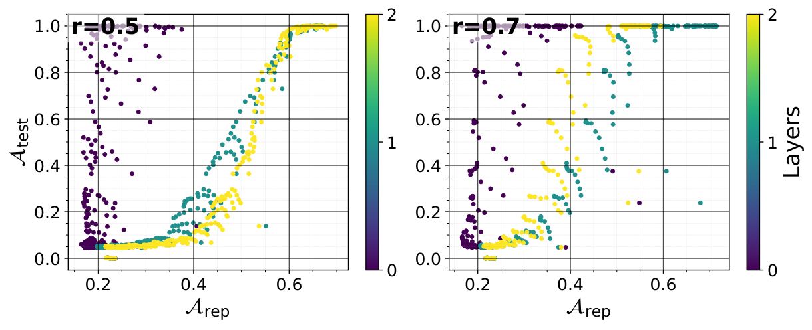
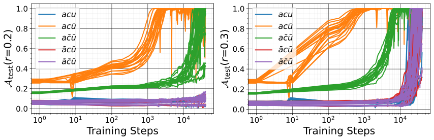
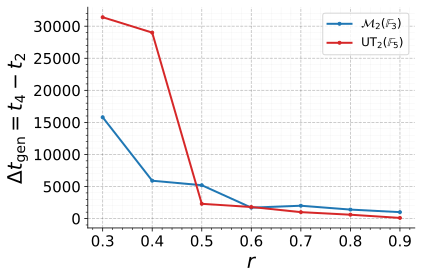
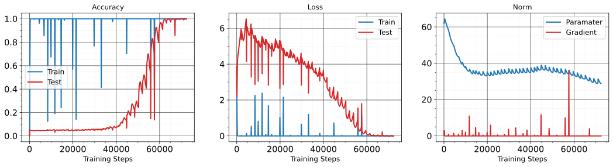
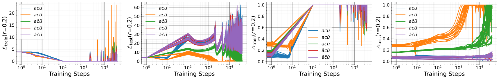
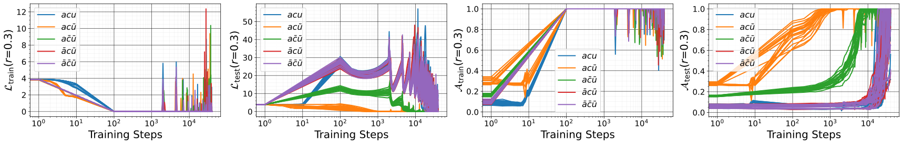
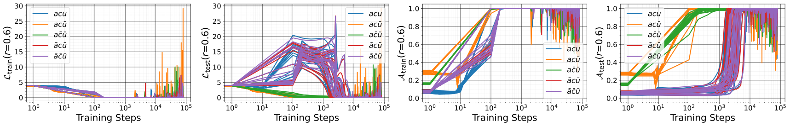
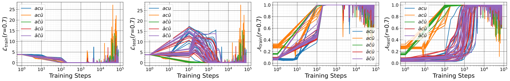
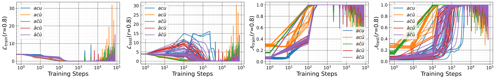
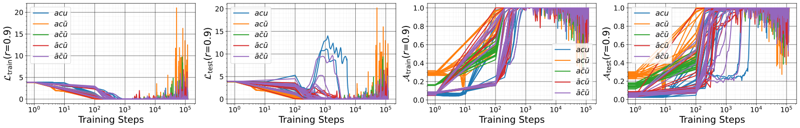

# Notsawo, Dumas, Rabusseau 2026 — Grokking Finite-Dimensional Algebra

См. также: [глобальный индекс понятий](../../concepts/index.md).

**Pascal Jr Tikeng Notsawo** (Université de Montréal; Mila), **Guillaume Dumas** (Université de Montréal; Mila; CHU Sainte-Justine), **Guillaume Rabusseau** (Université de Montréal; Mila; CIFAR AI Chair).

arXiv [2602.19533](https://arxiv.org/abs/2602.19533), февраль 2026 (v2), 37 страниц, 14 рисунков (24 файла). Всего цитирований по Semantic Scholar — 0, в картотеке — 0. Первое систематическое вынесение гроккинга за пределы групповых операций — на конечномерные алгебры (FDA): любой тензор $\mathbf{\boldsymbol{\mathcal{C}}}\in\mathbb{F}^{n\times n\times n}$ задаёт $n$-мерную алгебру, групповые задачи корпуса становятся частным случаем через групповую алгебру $\mathbb{F}[G]$ (структурный тензор = таблица Кэли в one-hot кодировке), а ассоциативность, коммутативность и унитальность превращаются в тензорные тождества, которые можно включать и выключать по одному. Главные находки при $(n,p)=(2,7)$: ассоциативные неунитальные алгебры гроккают раньше всех (унитальность сужает множество допустимых представлений), возмущение одной ячейки таблицы умножения резко сдвигает задержку при неизменных данных и модели, а качество представления $\mathcal{A}_{\text{rep}}$ (билинейная реконструкция признаков) резко растёт ровно на поре гроккинга у MLP, Transformer и LSTM.

Оригинал и производные файлы этой папки:

- [`original/2602.19533.grokking-finite-dimensional-algebra.md`](original/2602.19533.grokking-finite-dimensional-algebra.md) — конверсия оригинала (native arXiv HTML, v2) в Markdown без правок содержания.
- [`2602.19533.grokking-finite-dimensional-algebra.claims.txt`](2602.19533.grokking-finite-dimensional-algebra.claims.txt) — пронумерованные утверждения статьи с пометками разбора.
- [`images/`](images/) — 14 рисунков (24 файла).

Схема якорей и правила ссылок на карточку — в [README папки статей](../README.md).

## Затрагиваемые понятия

**[Гроккинг](../../concepts/grokking.md)** — самый чистый рычаг статьи: одиночное изменение одного произведения в таблице умножения (например, $\mathbf{i}^{2}=-1$ на $\mathbf{i}^{2}=1$ в комплексных числах над $\mathbb{F}_{7}$) резко сдвигает задержку $\Delta t_{\text{gen}}=t_{4}-t_{2}$ при неизменных данных, модели и объёме обучения — показано гистограммой по всем одиночным возмущениям ([`p7-4`](#p7-4)); гроккинг воспроизведён на MLP, Transformer и LSTM. Разбор: все опыты — только над конечными полями; вещественная часть (матричная факторизация, неявный низкий ранг, когерентность) осталась чисто теоретической, хотя аннотация подаёт её наравне; повторов мало (10 тензоров на категорию, 2 прогона на точку), и разброс на ключевом рисунке 6 велик.

**[Канонический полигон гроккинга](../../concepts/canonical-grokking-testbed.md)** — обобщение полигона Power et al. с групп на алгебры: постановка «предсказать $z=x\circ y$ по случайному разбиению таблицы» взята дословно (вместе с долей $r$ и порогом $99\%$), но множество символов «без внутреннего строения» заменено алгеброй, у которой строение есть и меняется по одному свойству; при $(n,p)=(2,7)$ перебраны все $7^{8}=5764801$ тензора и стратифицированы по восьми категориям $\{a,\bar a\}\times\{c,\bar c\}\times\{u,\bar u\}$ — три унитальные категории пусты, $97.958\%$ приходится на $\bar a\bar c\bar u$ ([`p8-1`](#p8-1)). Разбор: порядок трудности ($ac\bar u$ легче всего, затем $a\bar c\bar u$) опирается на пять непустых категорий, а сравнение «унитальные против неунитальных» — на единственную непустую унитальную категорию $acu$; результаты по группам (Nanda, Chughtai, Stander, Gromov) объявлены частным случаем, но в тензорной рамке заново не проверены.

**[Структурированное обучение представлений](../../concepts/structured-representation-learning.md)** — линия «гроккинг есть формирование представления» перенесена на алгебры с собственной мерой: качество представления $\mathcal{A}_{\text{rep}}$ (косинусная близость билинейной реконструкции признаков $\mathbf{f}(\mathbf{u}\times\mathbf{v})\approx\mathbf{\boldsymbol{\mathcal{W}}}\times_{1}\mathbf{f}^{(\ell)}(\mathbf{u})\times_{2}\mathbf{f}^{(r)}(\mathbf{v})$, зонд по условию представления из пропозиции 2.3) держится низким при запоминании и резко растёт ровно на поре гроккинга — согласованно у трёх архитектур ([`p7-2`](#p7-2)); объяснение порядка трудности категорий — через число допустимых представлений (неунитальная ассоциативная алгебра имеет нулевое и левое регулярное представление, унитальность добавляет уравнения без степеней свободы). Разбор: зонд подгоняется гребневой регрессией по всем парам без отложенной выборки — это описательная мера согласованности, а не проверка обобщения зонда, и вмешательства нет; признанное расхождение с корпусом: у Transformer $\mathcal{A}_{\text{rep}}^{(0)}$ на слое эмбеддинга при гроккинге не меняется — против возникновения строения именно в эмбеддингах у Power и Liu, объяснение (разделённые эмбеддинг и разэмбеддинг) оставлено догадкой.

**[Доля данных / критический размер выборки](../../concepts/data-fraction-critical-dataset-size.md)** — зависимость от $r\in\{0.2,\dots,0.9\}$ воспроизводит каноническую картину на новом классе задач: малое $r$ — запоминание, среднее — отложенная генерализация, задержка убывает при $r\to 1$ ([`p8-2`](#p8-2)); поверх этого два структурных фактора трудности — тест-потеря и время до генерализации растут с рангом развёртки $r^{(3)}$ структурного тензора (базис-инвариантным) и с числом ненулевых элементов $s$. Разбор: при $n=2$ ранг принимает всего два значения, так что «выше ранг — дольше гроккинг» — двоичное сравнение, а не зависимость; «уровень разрежённости $s$» нигде не определён и по шкале рисунка ($1\dots 8$ при $n^{3}=8$) является числом ненулевых элементов — при буквальном чтении слова «разрежённость» §5.4 и заключение противоречат друг другу.

## Что показано, а что предположено

Замечания редактора карточки по итогам разбора утверждений (`…claims.txt`, 46 пунктов).

**Ценное — рамка и рычаг.** Тензорная запись, в которой все групповые задачи корпуса — частный случай ($\mathbb{F}[G]$, структурный тензор = таблица Кэли), а свойства алгебры включаются по одному; возмущение одной ячейки таблицы умножения как рычаг задержки при неизменном прочем (рис. 1b) — самый чистый довод статьи; согласованный рост $\mathcal{A}_{\text{rep}}$ на поре гроккинга у трёх архитектур; честные оговорки (ранг базис-инвариантен, разрежённость — нет; условность канонического базиса; признанные пределы $n=2$).

**Объяснения — рассуждения, не выводы.** Порядок трудности категорий объяснён числом допустимых представлений («ярлыки» в пространстве представлений у неунитальных; у коммутативных вдвое меньше уравнений и две подачи каждого произведения) — это правдоподобное рассуждение после опыта, без прямой проверки; вещественная теория (низкоранговое смещение, когерентность, выборочная сложность) не сопровождена ни одним вещественным опытом.

**Внутренние нестыковки.** «Отобрали по 10 тензоров в каждой категории» при трёх пустых категориях (на графиках — пять); подпись рисунка 12 определяет $t_{2}$ дважды (второй раз должно быть $t_{4}$); «$V=q+2$, где $1$ на служебные токены»; софтмакс «$\in\{0,1\}^{V}$»; «2-слойный MLP» в подписи против «трёхслойного» в приложении; смещение $\mathbf{b}^{(1)}$ объявлено из $\mathbb{R}^{2d}$ вместо $\mathbb{R}^{m^{2}}$; отсылка «привилегированный базис (Olsson et al. 2022)» указывает на работу об induction heads, где привилегированный базис не разбирается; случайные проекции описаны подробно, но в отчётных опытах использован только PCA.

**Как работу будут цитировать** («показано, что алгебраические свойства задачи управляют гроккингом») — точнее: при $n=2$ над $\mathbb{F}_{7}$, на пяти непустых категориях из восьми, при 10 тензорах и 2 прогонах на точку измерены различия срока гроккинга и тест-потери; объяснение через число допустимых представлений остаётся рассуждением, а вещественный случай не проверялся вовсе.

---

# Текст статьи

## Гроккинг конечномерной алгебры

**Pascal Jr Tikeng Notsawo** (Université de Montréal; Mila, Montréal; переписка: pascalnotsawo@gmail.com), **Guillaume Dumas** (Université de Montréal; Mila, Montréal; CHU Sainte-Justine Research Center, Montréal), **Guillaume Rabusseau** (Université de Montréal; Mila, Montréal; CIFAR AI Chair)

## Аннотация

Эта статья исследует явление гроккинга — внезапный переход от долгого запоминания к генерализации, наблюдаемый при обучении нейронных сетей, — в контексте выучивания умножения в конечномерных алгебрах (FDA). Тогда как прежние работы о гроккинге сосредотачивались главным образом на групповых операциях, мы расширяем анализ на более общие алгебраические структуры, включая неассоциативные, некоммутативные и неунитальные алгебры. Мы показываем, что выучивание групповых операций — частный случай выучивания FDA, и что выучивание умножения в FDA сводится к выучиванию билинейного произведения, заданного структурным тензором алгебры. Для алгебр над вещественными числами мы связываем задачу обучения с матричной факторизацией с неявным низкоранговым смещением, а для алгебр над конечными полями показываем, что гроккинг возникает естественно, поскольку модели должны выучить дискретные представления алгебраических элементов. Это ведёт нас к экспериментальному исследованию следующих стержневых вопросов: (i) как алгебраические свойства — коммутативность, ассоциативность и унитальность — влияют и на возникновение, и на сроки гроккинга; (ii) как структурные свойства структурного тензора FDA, такие как разрежённость и ранг, влияют на генерализацию; и (iii) в какой мере генерализация соотносится с выучиванием моделью скрытых эмбеддингов, согласованных с представлением алгебры. Наша работа даёт единую рамку для гроккинга по алгебраическим структурам и новые прозрения о том, как математическая структура правит динамикой генерализации нейронных сетей.

##### Ключевые слова:

Machine Learning, ICML

## 1 Введение

*Рисунок 1: **(a)** Гроккинг (нетривиальная $\Delta t_{\text{gen}}=t_{4}-t_{2}$) на 2-слойном MLP с активацией $\mathrm{ReLU}$, обучаемом умножению в алгебре комплексных чисел над полем $\mathbb{F}_{7}=\mathbb{Z}/7\mathbb{Z}$, где $(a+b\mathbf{i})(c+d\mathbf{i})=ac+bd\mathbf{i}^{2}+(ad+bc)\mathbf{i}$ и $\mathbf{i}^{2}=-1\equiv 6\text{ mod }7$. **(b)** Гистограмма задержки гроккинга $\Delta t_{\text{gen}}$ при одиночных изменениях правил умножения комплексных чисел в $\mathbb{F}_{7}$, где каждое возмущение состоит в изменении исхода одного соотношения умножения (например, замене $\mathbf{i}^{2}=-1$ на $\mathbf{i}^{2}=1$).* **[p. 1]**

Одна из главных целей машинного обучения — генерализация: способность моделей хорошо работать на данных, не встречавшихся при обучении. Хотя сегодня эти модели работают исключительно хорошо в разных областях, глубинная причина их хорошей обобщающей способности остаётся открытым вопросом. Представив явление гроккинга, Power et al. 2022 недавно дали новую линзу для взгляда на обобщающие способности перепараметризованных нейронных сетей, оспорив прежние представления о том, что такие сети лишь запоминают обучающие данные.

Явление гроккинга изучалось главным образом на алгоритмических задачах, состоящих в предсказании $z=x\circ y$ по $(x,y)\in\mathcal{S}^{2}$, где $\circ$ — бинарный математический оператор, а $\mathcal{S}$ — конечное множество дискретных символов без внутреннего строения; например, конечные циклические группы порядка $1$ с бинарной операцией $\circ$ (такой как сложение в $\mathcal{S}=\mathbb{Z}/p\mathbb{Z}$ для простого $p$). В таких постановках уже установлено, что модели вроде трансформеров обобщаются, восстанавливая представление самой группы (Gromov 2023; Nanda et al. 2023; Chughtai et al. 2023; Stander et al. 2024). В этой работе мы исследуем, как гроккинг распространяется за пределы этих хорошо понятых постановок по алгебраической сложности, то есть при движении от групп к более общим алгебрам. Наша цель — понять, как конкретные алгебраические или структурные свойства задачи влияют на возникновение и сроки явления гроккинга.

#### Мотивации

Тогда как групповые операции дают базовую структуру, алгебры охватывают более богатый и сложный набор операций, включая неунитальные, некоммутативные и **[p. 2]** неассоциативные поведения. Например, многие системы (в физике, робототехнике, управлении и т. д.) эволюционируют по инфинитезимальным преобразованиям, взаимодействие которых правится скобкой Ли $[\cdot,\cdot]$ — билинейной, некоммутативной, неассоциативной и неунитальной операцией. Предсказание таких инфинитезимальных обновлений отвечает выучиванию FDA.

В поиске лекарств предсказание того, как молекулы взаимодействуют с биологическими мишенями, критично для отбора кандидатов. Это включает понимание сложных отношений и превращений между молекулярными структурами. Пример задачи — предсказание химической реакции (Fooshee et al. 2018): по двум молекулам $x$ и $y$ предсказать продукт $xy$ их реакции (и путь реакции). Если вовлечена третья молекула $z$, последовательность реакций $(xy)z$ может дать иной продукт, чем $x(yz)$. К тому же химические реакции часто идут по сложным механизмам, которые нельзя просто обратить, и не имеют естественного единичного элемента (молекулы, оставляющей другую неизменной в реакции).

В обработке естественного языка фундаментальный вызов — понимание того, как смыслы меньших единиц (слов или фраз) складываются в смыслы больших (предложений или документов). Этот процесс внутренне композиционен, подобно операциям в алгебраической структуре, где операция сочетает элементы, порождая другой элемент того же множества, и порядок взятия элементов очень важен. Как конкретный пример возьмём задачи семантической композиции и декомпозиции (Turney 2014). Первая состоит в понимании смысла текста сложением смыслов отдельных слов, вторая — в понимании смысла отдельного слова разложением его на аспекты, скрытые в его значении. Например, для биграммы «x y» с главным существительным «x» и существительным или прилагательным «y» задача семантической композиции может состоять в нахождении в словаре униграммы-существительного «z», синонимичной «x y». Обратно, семантическая декомпозиция может состоять в нахождении биграммы «x y», синонимичной данному «z» из словаря. Примеры пар (x y, z): (presidential term, presidency), (electrical power, wattage), (milk sugar, lactose), (bass fiddle, contrabass) и т. д. Такого рода задача часто решается оптимизацией $\operatorname*{arg\,max}_{\mathbf{z}}g(f(\mathbf{x},\mathbf{y}),\mathbf{z})$, где $\mathbf{x}$, $\mathbf{y}$ и $\mathbf{z}$ — векторы, представляющие слова «x», «y» и «z»; $f$ — функция, представляющая «x y» по $\mathbf{x}$ и $\mathbf{y}$; и $g$ — мера близости. Обычно берут симметричную $f$, такую как $f(\mathbf{x},\mathbf{y})=\mathbf{x}+\mathbf{y}$, но они независимы от порядка и дают одно представление «x y» и «y x», так что, например, "good morning" $=$ "morning good" под $f$. Landauer 2002 оценивает, что $80\%$ смысла английского текста идёт от выбора слов, а оставшиеся $20\%$ — от порядка слов. Следовательно, методы вроде векторного сложения, не учитывающие порядок слов, потенциально упускают не менее $20\%$ смысла биграммы (Turney 2014). Итак, порядок слов влияет на смысл; "good morning" несёт иное чувство и употребление, чем "morning good". Что до ассоциативности: при сочетании больше двух слов порядок их сочетания может влиять на итоговый смысл. Например, сочетание слов во фразе "old country house" может дать разные истолкования смотря по тому, какие слова сочетаются первыми.

#### Вклады

Наши вклады четверные:

- Опираясь на то, что любой тензор $\mathbf{\boldsymbol{\mathcal{C}}}\in\mathbb{F}^{n\times n\times n}$ задаёт $n$-мерную алгебру над полем $\mathbb{F}$ ($n\mathbb{F}$-FDA), где ассоциативность, коммутативность и унитальность закодированы тензорными тождествами, а матричные представления характеризуются явными тензорными ограничениями, — мы устанавливаем равнозначность $\mathbb{F}^{n\times n\times n}$ и всех $n\mathbb{F}$-FDA, что позволяет сосредоточиться на структурных тензорах вместо абстрактных алгебр.
- Мы показываем, что прежние работы о гроккинге в группах (например, (Nanda et al. 2023), (Chughtai et al. 2023)) — частный случай нашей тензорной рамки, которая естественно расширяется на неассоциативные, некоммутативные и неунитальные алгебры.
- Мы связываем выучивание FDA над $\mathbb{R}$ с матричной факторизацией, а над конечными полями гроккинг возникает, когда модели выучивают явные эмбеддинги элементов FDA.
- Мы даём первое систематическое исследование гроккинга за пределами групп, показывая, что алгебраические ограничения (ассоциативность, коммутативность, унитальность) и структурные черты структурного тензора (разрежённость, ранг) значимо влияют на задержку гроккинга и выборочную сложность, и что генерализация совпадает с возникновением согласованных с алгеброй представлений в слоях модели[^1].

#### Связанные работы

На конечных группах вроде $\mathbb{Z}/p\mathbb{Z}$ и $S_{n}$ показано, что модели вроде трансформеров гроккают, восстанавливая представление самой группы (Gromov 2023; Nanda et al. 2023; Chughtai et al. 2023; Stander et al. 2024). На алгоритмической задаче (Power et al. 2022) Liu et al. 2022 показывают, что обучение представлений — главный лежащий в основе фактор существования обобщающих решений для модульной арифметики, поддерживая предварительные наблюдения Power et al. 2022. Gromov 2023 выписывает точное выражение весов 2-слойного MLP (с активацией $x\mapsto x^{2}$), дающих $100\%$ точность на модульном сложении. Nanda et al. 2023 выписывают замкнутое решение финальных обученных весов однослойного трансформера на той же задаче, которое **[p. 3]** также состоит из синусоид, как в (Gromov 2023). Chughtai et al. 2023 обратно разбирают (малые) нейронные сети, выучивающие композицию конечных групп, через математическую теорию представлений. Stander et al. 2024 делают то же с упором на композицию в симметрической группе $S_{5}$.

Насколько нам известно, мы первые изучаем гроккинг в общей постановке FDA. Прежние работы о гроккинге изучают алгоритмические задачи почти исключительно через групповые операции. Эти структуры навязывают жёсткую связку свойств (ассоциативность, унитальность и т. д.), делая невозможным изолировать, какие алгебраические черты влияют на гроккинг и обобщаются ли эти свойства за пределы групп. Наша FDA-рамка даёт первую постановку, в которую естественно вкладываются все прежде изученные групповые задачи, а неунитальные и неассоциативные операции становятся доступными. Наши опыты показывают, например, что ассоциативность, коммутативность и унитальность каждая порождает различные задержки гроккинга и узоры генерализации, и что эти узоры сохраняются по всем алгебрам, взятым из каждого режима.

#### Структура документа

Раздел 2 вводит взгляд на FDA через структурный тензор, характеризует алгебраические свойства как тензорные тождества и даёт критерий матричных представлений. Раздел 3 показывает, как рамка вбирает группы, а раздел 4 представляет постановку обучения вместе с её теоретической мотивацией. Экспериментальные результаты и обсуждение даны в разделах 5 и 6 соответственно, перед заключением в разделе 7.

#### Обозначения

Для $n\in\mathbb{N}^{*}$, $[n]:=\{1,\dots,n\}$. Для $\mathbf{A}\in\mathbb{R}^{m\times n}$, $\vect(\mathbf{A})\in\mathbb{R}^{mn}$ обозначает вектор, полученный складыванием столбцов $\mathbf{A}$. $i$-я строка и столбец $\mathbf{A}$ обозначаются $\mathbf{A}_{i,:}$ (или $\mathbf{A}_{i}$) и $\mathbf{A}_{:,i}$ соответственно. Это обозначение естественно расширяется на срезы тензоров. Мы обозначаем $\odot$ произведение Адамара, $\otimes$ произведение Кронекера, $\star$ произведение Хатри—Рао, $\bullet$ face-splitting произведение и $\times_{n}$ произведение тензора на вектор по моде $n$ (Kolda & Bader 2009).

## 2 Конечномерная алгебра

В этом разделе мы работаем со стандартными понятиями FDA и принимаем конкретную тензорную точку зрения. При закреплённом базисе любая $n$-мерная алгебра отождествляется со структурным тензором $\mathbf{\boldsymbol{\mathcal{C}}}\in\mathbb{F}^{n\times n\times n}$. Эта формулировка даёт единое операциональное описание алгебраической структуры, прямо совместимое с нашей постановкой. В частности, она позволяет обращаться с $\mathbf{\boldsymbol{\mathcal{C}}}$ как с конкретным объектом, сравнимым с выученными представлениями, что закладывает основу перспективы согласованности, развиваемой далее в статье.

### 2.1 Определения

**Алгебра** $\mathfrak{A}$ над полем $(\mathbb{F},+,*)$ — векторное пространство с $\mathbb{F}$-билинейным произведением $\cdot:\mathfrak{A}\times\mathfrak{A}\to\mathfrak{A}$ таким, что $(\mathbf{u}+\mathbf{v})\cdot\mathbf{w}=\mathbf{u}\cdot\mathbf{w}+\mathbf{v}\cdot\mathbf{w}$ (правая дистрибутивность), $\mathbf{w}\cdot(\mathbf{u}+\mathbf{v})=\mathbf{w}\cdot\mathbf{u}+\mathbf{w}\cdot\mathbf{v}$ (левая дистрибутивность) и $(\alpha\mathbf{u})\cdot(\beta\mathbf{v})=(\alpha*\beta)(\mathbf{u}\cdot\mathbf{v})$ (совместимость со скалярами) для всех $\mathbf{u},\mathbf{v},\mathbf{w}\in\mathfrak{A}$ и $\alpha,\beta\in\mathbb{F}$. Когда $\cdot$ ассоциативно (соотв. коммутативно), $\mathfrak{A}$ называется ассоциативной (соотв. коммутативной). Когда существует элемент $1_{\mathfrak{A}}\in\mathfrak{A}$ такой, что $1_{\mathfrak{A}}\cdot\mathbf{u}=\mathbf{u}\cdot 1_{\mathfrak{A}}=\mathbf{u}\ \forall\mathbf{u}\in\mathfrak{A}$, $\mathfrak{A}$ называется унитальной. Размерность $\mathfrak{A}$ — её размерность как $\mathbb{F}$-векторного пространства, обозначаемая $\text{dim}_{\mathbb{F}}\mathfrak{A}$. Мы говорим, что $\mathfrak{A}$ конечномерна, если $n=\text{dim}_{\mathbb{F}}\mathfrak{A}$ конечна. Это значит, что существует конечный базис $\{\mathbf{a}^{(i)}\}_{i\in[n]}$ алгебры $\mathfrak{A}$ (как векторного пространства над $\mathbb{F}$) такой, что для каждого $\mathbf{u}\in\mathfrak{A}$, $\mathbf{u}=\sum_{i=1}^{n}\alpha_{i}\mathbf{a}^{(i)}$ с $\alpha_{i}\in\mathbb{F}$.

Пусть $(\mathfrak{A},\cdot)$ и $(\mathfrak{B},\times)$ — две $\mathbb{F}$-алгебры. Гомоморфизм $\mathbb{F}$-алгебр $\phi:\mathfrak{A}\to\mathfrak{B}$ — это $\mathbb{F}$-линейное отображение, удовлетворяющее $\phi(\mathbf{u}\cdot\mathbf{v})=\phi(\mathbf{u})\times\phi(\mathbf{v})$ для всех $\mathbf{u},\mathbf{v}\in\mathfrak{A}$; и $\phi(1_{\mathfrak{A}})=1_{\mathfrak{B}}$, когда $\mathfrak{A}$ и $\mathfrak{B}$ унитальны. Этот гомоморфизм $\phi$ называется изоморфизмом, если он биективен. Две $\mathbb{F}$-алгебры $\mathfrak{A}$ и $\mathfrak{B}$ изоморфны, если между ними существует изоморфизм алгебр $\phi:\mathfrak{A}\to\mathfrak{B}$. Иначе говоря, $\mathfrak{A}$ и $\mathfrak{B}$ могут выглядеть по-разному на уровне элементов или выбранных базисов, но делят в точности одну и ту же алгебраическую структуру.

Далее $\mathbb{F}$-FDA означает FDA над полем $\mathbb{F}$, а $n\mathbb{F}$-FDA — $\mathbb{F}$-FDA размерности $n$.

### 2.2 Структурные константы FDA

Пусть $(\mathfrak{A},\cdot)$ — $n\mathbb{F}$-FDA и $B=\{\mathbf{a}^{(i)}\}_{i\in[n]}$ — базис $\mathfrak{A}$. Структура $\mathfrak{A}$ в $B$ целиком схватывается тензором $\mathbf{\boldsymbol{\mathcal{C}}}^{(B)}\in\mathbb{F}^{n\times n\times n}$, определяемым $\mathbf{a}^{(i)}\cdot\mathbf{a}^{(j)}=\sum_{k=1}^{n}\mathbf{\boldsymbol{\mathcal{C}}}_{ijk}^{(B)}\mathbf{a}^{(k)}$. Элементы $\mathbf{\boldsymbol{\mathcal{C}}}^{(B)}$ называются структурными коэффициентами/константами $\mathfrak{A}$ в $B$. Мы будем называть тензор $\mathbf{\boldsymbol{\mathcal{C}}}^{(B)}$ **структурным тензором** $\mathfrak{A}$ в базисе $B$ и, когда контекст ясен, опускать $B$ в обозначении. Итак, для всех $\mathbf{u}=\sum_{i=1}^{n}\mathbf{u}_{i}\mathbf{a}^{(i)}$ и $\mathbf{v}=\sum_{i=1}^{n}\mathbf{v}_{i}\mathbf{a}^{(i)}$ из $\mathfrak{A}$, $\mathbf{u}\cdot\mathbf{v}=\sum_{k=1}^{n}\left(\mathbf{\boldsymbol{\mathcal{C}}}\times_{1}\mathbf{u}\times_{2}\mathbf{v}\right)_{k}\mathbf{a}^{(k)}$ с

$$
\mathbf{\boldsymbol{\mathcal{C}}}\times_{1}\mathbf{u}\times_{2}\mathbf{v}:=\left[\mathbf{u}^{\top}\mathbf{\boldsymbol{\mathcal{C}}}_{:,:,k}\mathbf{v}\right]_{k\in[n]}^{\top}=\mathbf{\boldsymbol{\mathcal{C}}}_{(3)}\left(\mathbf{v}\otimes\mathbf{u}\right) \tag{1}
$$

В этом уравнении $\mathbf{\boldsymbol{\mathcal{C}}}_{(3)}\in\mathbb{F}^{n\times n^{2}}$ — развёртка $\mathbf{\boldsymbol{\mathcal{C}}}$ по моде 3: $\left(\mathbf{\boldsymbol{\mathcal{C}}}_{(3)}\right)_{k,:}=\vect(\mathbf{\boldsymbol{\mathcal{C}}}_{:,:,k})\in\mathbb{F}^{n^{2}}\ \forall k\in[n]$.

##### *Пример 2.1.*

Комплексные числа $\mathbb{C}=\left(\mathbb{R}^{2},\cdot\right)$ можно рассматривать как $2\mathbb{R}$-FDA с произведением $\cdot$, определяемым $(a+b\mathbf{i})\cdot(c+d\mathbf{i})=(ac-bd)+(ad+bc)\mathbf{i}$, где $\mathbf{i}^{2}=-1$. Структурный тензор $\mathbb{C}$ в $(\mathbf{a}^{(1)},\mathbf{a}^{(2)})\equiv(1,\mathbf{i})$ есть

$$
\begin{bmatrix}\mathbf{\boldsymbol{\mathcal{C}}}_{111}&\mathbf{\boldsymbol{\mathcal{C}}}_{112}\\
\mathbf{\boldsymbol{\mathcal{C}}}_{121}&\mathbf{\boldsymbol{\mathcal{C}}}_{122}\\
\end{bmatrix},\begin{bmatrix}\mathbf{\boldsymbol{\mathcal{C}}}_{211}&\mathbf{\boldsymbol{\mathcal{C}}}_{212}\\
\mathbf{\boldsymbol{\mathcal{C}}}_{221}&\mathbf{\boldsymbol{\mathcal{C}}}_{222}\\
\end{bmatrix}=\begin{bmatrix}1&0\\
0&1\\
\end{bmatrix},\begin{bmatrix}0&1\\
-1&0\\
\end{bmatrix} \tag{2}
$$

В поле $\mathbb{F}=\mathbb{F}_{p}:=\mathbb{Z}/p\mathbb{Z}$ для простого $p$ (или степени простого) имеем вместо этого $\mathbf{i}^{2}=(-1)\mod p=p-1$, так что $\mathbf{\boldsymbol{\mathcal{C}}}_{221}=p-1$ (прочие коэффициенты неизменны).

Можно спросить, задаёт ли каждый тензор $\mathbf{\boldsymbol{\mathcal{C}}}\in\mathbb{F}^{n\times n\times n}$ некоторую $n\mathbb{F}$-FDA. Если это так, то в принципе можно **[p. 4]** брать элементы $\mathbf{\boldsymbol{\mathcal{C}}}$ из $\mathbb{F}$ и изучать получающуюся алгебру через свойства её структурного тензора. Следующая пропозиция показывает, что анализ пространства $\mathbb{F}^{n\times n\times n}$ равнозначен изучению всех $n\mathbb{F}$-FDA. Открытым, однако, остаётся, как брать $\mathbf{\boldsymbol{\mathcal{C}}}$ принципиальным образом, чтобы получать осмысленные и общие прозрения об интересующих явлениях. Мы возвращаемся к этому в разделе 4.

##### **Пропозиция 2.1.**

*Для всякого $\mathbf{\boldsymbol{\mathcal{C}}}\in\mathbb{F}^{n\times n\times n}$ существует $n\mathbb{F}$-FDA, чей структурный тензор в некотором базисе есть $\mathbf{\boldsymbol{\mathcal{C}}}$. Более того, все алгебры, имеющие $\mathbf{\boldsymbol{\mathcal{C}}}$ структурным тензором в одном из своих базисов, изоморфны друг другу.*

Доказательство этой пропозиции конструктивно. Мы определяем на векторном пространстве $\mathbb{F}^{n}$ билинейное отображение $\mathbf{u}\times\mathbf{v}=\mathbf{\boldsymbol{\mathcal{C}}}\times_{1}\mathbf{u}\times_{2}\mathbf{v}$ и показываем, что $(\mathbb{F}^{n},\times)$ — это $n\mathbb{F}$-FDA со структурным тензором $\mathbf{\boldsymbol{\mathcal{C}}}$ в каноническом базисе $\{\mathbf{e}^{(i)}\}_{i\in[n]}$, $\mathbf{e}^{(i)}_{j}=\delta_{ij}$ (лемма B.1). Мы называем эту алгебру алгеброй, порождённой $\mathbf{\boldsymbol{\mathcal{C}}}$, и обозначаем $\mathbb{F}[\mathbf{\boldsymbol{\mathcal{C}}}]$. Затем мы показываем, что $\mathbb{F}[\mathbf{\boldsymbol{\mathcal{C}}}]$ изоморфна любой $n\mathbb{F}$-FDA, чей структурный тензор в некотором базисе есть $\mathbf{\boldsymbol{\mathcal{C}}}$ (лемма B.2). Хотя любой $\mathbf{\boldsymbol{\mathcal{C}}}\in\mathbb{F}^{n\times n\times n}$ задаёт $n\mathbb{F}$-FDA, ключевой вопрос — как алгебраические свойства $(\mathfrak{A},\cdot)$ отражены в $\mathbf{\boldsymbol{\mathcal{C}}}$. Следующая пропозиция делает эту связь явной, характеризуя ассоциативность, коммутативность и унитальность тензорными уравнениями.

##### **Пропозиция 2.2.**

*$n\mathbb{F}$-FDA $(\mathfrak{A},\cdot)$ со структурным тензором $\mathbf{\boldsymbol{\mathcal{C}}}\in\mathbb{F}^{n\times n\times n}$ в базисе $B=\{\mathbf{a}^{(i)}\}_{i\in[n]}$*

- (i) *ассоциативна* *тогда и только тогда, когда* $\sum_{k=1}^{n}\mathbf{\boldsymbol{\mathcal{C}}}_{ijk}\mathbf{\boldsymbol{\mathcal{C}}}_{klm}=\sum_{k=1}^{n}\mathbf{\boldsymbol{\mathcal{C}}}_{ikm}\mathbf{\boldsymbol{\mathcal{C}}}_{jlk}\ \forall i,j,l,m\in[n]$*;*
- (ii) *коммутативна* *тогда и только тогда, когда* $\mathbf{\boldsymbol{\mathcal{C}}}$ *симметричен по первым двум модам, т. е.* $\mathbf{\boldsymbol{\mathcal{C}}}_{ijk}=\mathbf{\boldsymbol{\mathcal{C}}}_{jik}\ \forall i,j,k\in[n]$*;*
- (iii) *унитальна* *тогда и только тогда, когда существует* $\lambda\in\mathbb{F}^{n}$ *такой, что* $\sum_{i=1}^{n}\lambda_{i}\mathbf{\boldsymbol{\mathcal{C}}}_{i,:,:}=\sum_{i=1}^{n}\lambda_{i}\mathbf{\boldsymbol{\mathcal{C}}}_{:,i,:}=\mathbb{I}_{n}$*. В этом случае* $\lambda$ *единствен и* $1_{\mathfrak{A}}=\sum_{i=1}^{n}\lambda_{i}\mathbf{a}^{(i)}$*.*

##### Доказательство.

См. пропозицию B.5.∎

### 2.3 Представления FDA

Для $m\in\mathbb{N}^{*}$ пусть $\mathcal{M}_{m}(\mathbb{F})$ обозначает множество всех матриц $m\times m$ над $\mathbb{F}$, являющееся $m^{2}\mathbb{F}$-FDA относительно стандартного матричного умножения. Представление размерности $m$ алгебры $(\mathfrak{A},\cdot)$ над $\mathbb{F}$ включает гомоморфизм $\rho:\mathfrak{A}\to\mathcal{M}_{m}(\mathbb{F})$ такой, что $\rho(\alpha\mathbf{u}+\beta\mathbf{v})=\alpha\rho(\mathbf{u})+\beta\rho(\mathbf{v})$ и $\rho(\mathbf{u}\cdot\mathbf{v})=\rho(\mathbf{u})\rho(\mathbf{v})$ для всех $\mathbf{u},\mathbf{v}\in\mathfrak{A}$ и $\alpha,\beta\in\mathbb{F}$. Если $\mathfrak{A}$ унитальна, дополнительно требуется $\rho(1_{\mathfrak{A}})=\mathbb{I}_{m}$. Следующая пропозиция характеризует существование такого представления в терминах структурного тензора.

##### **Пропозиция 2.3.**

*Пусть $(\mathfrak{A},\cdot)$ — $n\mathbb{F}$-FDA со структурным тензором $\mathbf{\boldsymbol{\mathcal{C}}}\in\mathbb{F}^{n\times n\times n}$ в $B=\{\mathbf{a}^{(i)}\}_{i\in[n]}$. Закрепим $m\in\mathbb{N}^{*}$ и $\mathbf{\boldsymbol{\mathcal{R}}}\in\mathbb{F}^{n\times m\times m}$. Положим $\mathbf{\boldsymbol{\mathcal{R}}}_{k}=\mathbf{\boldsymbol{\mathcal{R}}}_{k,:,:}\in\mathbb{F}^{m\times m}$ для всех $k\in[n]$. Линейное отображение $\rho:\mathfrak{A}\to\mathcal{M}_{m}(\mathbb{F})$, определяемое $\rho\left(\sum_{k=1}^{n}\alpha_{k}\mathbf{a}^{(k)}\right):=\sum_{k=1}^{n}\alpha_{k}\mathbf{\boldsymbol{\mathcal{R}}}_{k}\ \forall\alpha\in\mathbb{F}^{n}$, есть представление $\mathfrak{A}$ тогда и только тогда, когда*

$$
\begin{array}[]{ll}\mathbf{\boldsymbol{\mathcal{R}}}_{i}\mathbf{\boldsymbol{\mathcal{R}}}_{j}=\sum_{k}\mathbf{\boldsymbol{\mathcal{C}}}_{ijk}\mathbf{\boldsymbol{\mathcal{R}}}_{k}\quad\forall i,j\in[n]\end{array} \tag{3}
$$

*и, если $\mathfrak{A}$ унитальна с $1_{\mathfrak{A}}=\sum_{i}\lambda_{i}\mathbf{a}^{(i)}$, — $\sum_{i}\lambda_{i}\mathbf{\boldsymbol{\mathcal{R}}}_{i}=\mathbb{I}_{m}$.*

##### Доказательство.

См. пропозицию B.16. ∎

##### *Пример 2.2.*

Для алгебры комплексных чисел в $\mathbb{F}=\mathbb{R}$ определяющие соотношения для $(\mathbf{a}^{(1)},\mathbf{a}^{(2)})=(1,\mathbf{i})$ суть $\mathbf{\boldsymbol{\mathcal{R}}}_{1}^{2}=\mathbf{\boldsymbol{\mathcal{R}}}_{1},\ \mathbf{\boldsymbol{\mathcal{R}}}_{1}\mathbf{\boldsymbol{\mathcal{R}}}_{2}=\mathbf{\boldsymbol{\mathcal{R}}}_{2}\mathbf{\boldsymbol{\mathcal{R}}}_{1}=\mathbf{\boldsymbol{\mathcal{R}}}_{2},\ \mathbf{\boldsymbol{\mathcal{R}}}_{2}^{2}=-\mathbf{\boldsymbol{\mathcal{R}}}_{1}$; вместе с $\mathbf{\boldsymbol{\mathcal{R}}}_{1}=\mathbb{I}_{m}\text{ since }1_{\mathfrak{A}}=\mathbf{a}^{(1)}$. Значит, $\mathbf{\boldsymbol{\mathcal{R}}}_{2}^{2}=-\mathbb{I}_{m}$, что вынуждает $m$ быть чётным. Записав $m=2k$, общее решение есть $\mathbf{\boldsymbol{\mathcal{R}}}_{2}=\mathbf{S}(\mathbb{I}_{k}\otimes\mathbf{\boldsymbol{\mathcal{C}}}_{2}^{\top})\mathbf{S}^{-1}\ \forall\mathbf{S}\in\mathrm{GL}_{m}(\mathbb{R})$, с $\mathrm{GL}_{m}(\mathbb{R})$ общей линейной группой и $\mathbf{\boldsymbol{\mathcal{C}}}_{2}^{\top}=\begin{bmatrix}\begin{bmatrix}0&-1\end{bmatrix},\begin{bmatrix}1&0\end{bmatrix}\end{bmatrix}$ (стандартное вещественное представление умножения на $\mathbf{i}$). В $\mathbb{F}_{p}$ $\mathbf{\boldsymbol{\mathcal{R}}}_{2}^{2}=-\mathbb{I}_{m}$ становится $\mathbf{\boldsymbol{\mathcal{R}}}_{2}^{2}=(p-1)\mathbb{I}_{m}$. Ограничения чётности на $m$ нет, и удобная нормальная форма — $\mathbf{\boldsymbol{\mathcal{R}}}_{2}=(p-1)^{1/2}\mathbf{S}\diag\big(\boldsymbol{\epsilon}\big)\mathbf{S}^{-1}\ \forall\mathbf{S}\in\mathrm{GL}_{m}(\mathbb{R}),\boldsymbol{\epsilon}\in\{\pm 1\}^{m}$.

Стоит спросить, для данного $\mathbf{\boldsymbol{\mathcal{C}}}\in\mathbb{F}^{n\times n\times n}$, каково наименьшее $m$ (или значения $m$), при котором система уравнений (3) допускает нетривиальное решение. Этот вопрос сводится к определению минимальной размерности точного представления $\mathfrak{A}$ — классической, но нетривиальной задаче теории представлений. Для ассоциативных $n\mathbb{F}$-FDA это наименьшее $m$ не превосходит $n$ (пропозиция B.18). Поскольку наша цель в разделе 5 — исследовать, выучивают ли нейронные сети, обучаемые на данных из $\mathfrak{A}=\mathbb{F}[\mathbf{\boldsymbol{\mathcal{C}}}]$, такие представления неявно, мы не пытаемся решить задачу минимальности здесь. Вместо этого мы будем предполагать достаточно большое $m$, чтобы система была разрешима, и сосредоточимся на анализе того, как выученная размерность эмбеддинга связана со свойствами $\mathfrak{A}$ и её структурного тензора.

## 3 От групп к FDA

Мы показываем в этом разделе, что выучивание групп — частный случай выучивания FDA. В самом деле, изучение гроккинга в группах естественно расширяется на алгебры через их структурные тензоры. Чтобы это увидеть, рассмотрим конечную группу $(G,\circ)$ с $n$ элементами $\{g_{i}\}_{i\in[n]}$. Можно построить таблицу Кэли группы как матрицу $\mathbf{A}\in G^{n\times n}$, где каждый элемент задан $\mathbf{A}_{ij}=g_{i}\circ g_{j},\ \forall i,j\in[n]$. Эта таблица содержит $n^{2}$ операций, которые затем случайно разбиваются на два непересекающихся непустых подмножества — обучающий и тестовый наборы (Power et al. 2022). Точнее, модель обучается предсказывать $\Psi(g_{i}\circ g_{j})$ по $\Psi(g_{i})$ и $\Psi(g_{j})$, где $\Psi:G\to\{0,1\}^{n}$ — one-hot кодировка на $G$: $\Psi(g_{i}):=\left[\mathbb{1}(g_{k}=g_{i})\right]_{k\in[n]}\in\{0,1\}^{n}\ \forall i\in[n]$, $\mathbb{1}$ — индикаторная функция.

Теперь для поля $\mathbb{F}$ определим множество $\mathbb{F}[G]:=\left\{\sum_{i=1}^{n}\alpha_{i}\mathbf{a}^{(i)}\ \mid\ \alpha\in\mathbb{F}^{n}\right\}$, где $\mathbf{a}^{(i)}=\Psi(g_{i})\in\{0_{\mathbb{F}},1_{\mathbb{F}}\}^{n}\ \forall i\in[n]$. Для всех $\mathbf{u}=\sum_{i}\mathbf{u}_{i}\mathbf{a}^{(i)}$ и $\mathbf{v}=\sum_{j}\mathbf{v}_{j}\mathbf{a}^{(j)}$ из $\mathbb{F}[G]$ пусть **[p. 5]** $\mathbf{u}\cdot\mathbf{v}:=\sum_{i,j}\mathbf{u}_{i}\mathbf{v}_{j}\Psi\left(g_{i}\circ g_{j}\right)=\sum_{k}\left(\sum_{i,j}\mathbf{u}_{i}\mathbf{v}_{j}\mathbb{1}(g_{i}\circ g_{j}=g_{k})\right)\mathbf{a}^{(k)}$. Следующая пропозиция показывает, что $(\mathbb{F}[G],\cdot)$ — это $n\mathbb{F}$-FDA, и что обучение модели на группе $(G,\circ)$ равнозначно обучению на умножении в $(\mathbb{F}[G],\cdot)$. В самом деле, применение кодировки $\Psi$ к каждому элементу таблицы Кэли $\mathbf{A}$ группы $G$ прямо даёт структурный тензор $\mathbf{\boldsymbol{\mathcal{C}}}$ алгебры $(\mathbb{F}[G],\cdot)$ в $B=\{\mathbf{a}^{(i)}\}_{i\in[n]}$. Следовательно, любая рамка, развитая для алгебр, уже вбирает случай групп. В частности, исследуя гроккинг в алгебрах, мы не только расширяем охват прежних исследований, но и восстанавливаем их как частный случай.

##### **Пропозиция 3.1.**

*Для конечной группы $(G,\circ)$ с $n$ элементами $\{g_{i}\}_{i\in[n]}$ и единицей $e$, $(\mathbb{F}[G],\cdot)$ — это $n$-мерная ассоциативная и унитальная $\mathbb{F}$-FDA с $1_{\mathbb{F}[G]}=\Psi(e)$. Также $(\mathbb{F}[G],\cdot)$ коммутативна тогда и только тогда, когда коммутативна $G$. Более того, структурный тензор $\mathbb{F}[G]$ в $B=\{\Psi(g_{i})\}_{i\in[n]}$ дан $\mathbf{\boldsymbol{\mathcal{C}}}_{ijk}=\mathbb{1}_{\mathbb{F}}(g_{i}\circ g_{j}=g_{k})\ \forall i,j,k\in[n]$; и мы имеем $\Psi(g_{i}\circ g_{j})=\mathbf{\boldsymbol{\mathcal{C}}}\times_{1}\Psi(g_{i})\times_{2}\Psi(g_{j})\ \forall i,j\in[n]$.*

##### Доказательство.

См. пропозицию B.10. ∎

## 4 Выучивание конечномерной алгебры

В этом разделе мы изучаем супервизное выучивание умножения в конечномерной алгебре (FDA). В прежнем разделе мы показали, что любая $n$-мерная FDA $\mathfrak{A}$ над полем $\mathbb{F}$ со структурным тензором $\mathbf{\boldsymbol{\mathcal{C}}}^{*}\in\mathbb{F}^{n\times n\times n}$ изоморфна $\mathbb{F}^{n}$ с билинейным произведением $(\mathbf{u},\mathbf{v})\mapsto\mathbf{\boldsymbol{\mathcal{C}}}^{*}\times_{1}\mathbf{u}\times_{2}\mathbf{v}\in\mathbb{F}^{n}$ (пропозиция 2.1). По входам $\mathbf{x}=(\mathbf{u},\mathbf{v})\in\mathbb{F}^{n}\times\mathbb{F}^{n}$ супервизная цель есть $\mathbf{y}^{*}(\mathbf{x})=\mathbf{\boldsymbol{\mathcal{C}}}^{*}\times_{1}\mathbf{u}\times_{2}\mathbf{v}$. Структура $\mathbf{\boldsymbol{\mathcal{C}}}^{*}$ (например, ранг, узор разрежённости) наследуется от $\mathfrak{A}$ и может формировать и выборочную сложность, и динамику генерализации. **Мы предлагаем исследовать, как эти свойства влияют на генерализацию и каков лежащий в основе механизм этого влияния**.

### 4.1 Режимы гроккинга в FDA

Liu et al. 2023 доказывают, что гроккинг возникает, когда качество на задаче зависит от выучивания полезного представления. Для алгоритмических данных (Power et al. 2022) качество представления обычно определяет точность «всё или ничего» (случайное угадывание против $100\%$), тогда как на естественных данных (например, MNIST) качество представления может отделять $95\%$ от $100\%$ точности. В нашей постановке эта точка зрения даёт конкретный механизм: для FDA над конечным полем ($\mathbb{F}=\mathbb{F}_{p}=\mathbb{Z}/p\mathbb{Z}$, $p$ простое) считать $\mathfrak{A}$ словарём, индексировать каждый элемент $\mathbf{u}\in\mathfrak{A}$ числом $\langle\mathbf{u}\rangle\in[q]$ с $q=|\mathfrak{A}|$ и выучивать матрицу эмбеддингов $\mathbf{E}\in\mathbb{R}^{q\times d}$, так что $\mathbf{E}_{\langle\mathbf{u}\rangle}$ — обучаемый вектор, прикреплённый к $\mathbf{u}$. Гроккинг отвечает моменту, когда $\mathbf{E}$ и последующие слои коллективно представляют алгебру, так что простое линейное считывание восстанавливает верный выходной токен.

Напротив, при $\mathbb{F}=\mathbb{R}$ модель, действующая прямо на $(\mathbf{u},\mathbf{v})\in\mathbb{F}^{n}\times\mathbb{F}^{n}$ и параметризующая (би)линейное отображение, часто может подгоняться без затяжной фазы формирования представления; гроккинг (в строгом смысле «отложенной генерализации после запоминания») обычно требует наведения — например, крупномасштабной инициализацией с малым weight decay (Liu et al. 2023; Lyu et al. 2024) или сильным рассогласованием нейронного касательного ядра с целью (Kumar et al. 2024). Более того, Levi et al. 2024 и Notsawo et al. 2025 документируют случаи *«гроккинга без понимания»*: резкое снижение тестовой ошибки при обучении, движимое изменениями $\ell_{2}$-нормы параметров модели, но не приводящее к сходимости к оптимальному решению.

Из этого анализа мы разводим $\mathbb{R}$ и $\mathbb{F}_{p}$. Настоящая статья сосредоточена на постановке конечного поля, где обучение представлений внутренне присуще и явления гроккинга наиболее выпуклы (рисунок 1). Мы включаем сжатое изложение вещественного случая ниже, где обучение сводится к линейной обратной задаче, в которой явное или неявное низкоранговое смещение правит восстановлением, а подробности о ранге/когерентности откладываем в приложение.

### 4.2 Линейный обратный взгляд для $\mathbb{F}=\mathbb{R}$

Пусть $\mathbf{U},\mathbf{V},\mathbf{Y}\in\mathbb{F}^{N\times n}$ таковы, что для каждого $s\in[N]$, $\mathbf{Y}_{s}=\mathbf{\boldsymbol{\mathcal{C}}}^{*}\times_{1}\mathbf{U}_{s}\times_{2}\mathbf{V}_{s}=\mathbf{\boldsymbol{\mathcal{C}}}^{*}_{(3)}\!\left(\mathbf{V}_{s}\otimes\mathbf{U}_{s}\right)$. Складывание даёт $\mathbf{Y}=\mathbf{X}\mathbf{\boldsymbol{\mathcal{C}}}^{*\top}_{(3)}$ с планом $\mathbf{X}:=\mathbf{V}\bullet\mathbf{U}\in\mathbb{R}^{N\times n^{2}}$, где $\bullet$ — face-splitting произведение ($\mathbf{X}_{s}=\mathbf{V}_{s}\otimes\mathbf{U}_{s}$). Напомним, что $\mathbf{Y}_{s}$ — это $s$-я строка $\mathbf{Y}$, трактуемая как вектор-столбец; то же для $\mathbf{U}_{s}$ и $\mathbf{V}_{s}$. Нахождение другого структурного тензора $\mathbf{\boldsymbol{\mathcal{C}}}\in\mathbb{F}^{n\times n\times n}$ такого, что $\mathbf{Y}_{s}=\mathbf{\boldsymbol{\mathcal{C}}}\times_{1}\mathbf{U}_{s}\times_{2}\mathbf{V}_{s}\ \forall s\in[N]$, равнозначно решению следующего линейного уравнения относительно $\mathbf{\boldsymbol{\mathcal{C}}}$:

$$
\mathbf{X}\mathbf{\boldsymbol{\mathcal{C}}}^{\top}_{(3)}=\mathbf{Y}=\mathbf{X}\mathbf{\boldsymbol{\mathcal{C}}}^{*\top}_{(3)}\Longleftrightarrow\mathbf{M}\mathbf{b}=\vect(\mathbf{Y})=\mathbf{M}\mathbf{b}^{*} \tag{4}
$$

с $\mathbf{M}:=\mathbb{I}_{n}\otimes\mathbf{X}\in\mathbb{F}^{Nn\times n^{3}}$ и $\mathbf{b}:=\vect(\mathbf{\boldsymbol{\mathcal{C}}}^{\top}_{(3)})\in\mathbb{F}^{n^{3}}$, аналогично для $\mathbf{b}^{*}$. Эту задачу можно рассматривать как задачу матричной факторизации с матрицей $\mathbf{\boldsymbol{\mathcal{C}}}^{*\top}_{(3)}\in\mathbb{F}^{n^{2}\times n}$ и измерениями $(\mathbf{U},\mathbf{V})$, или как задачу сжатых измерений с сигналом $\mathbf{b}^{*}$ и измерением $\mathbf{M}$. Итак, выучивание $\mathbf{\boldsymbol{\mathcal{C}}}^{*}$ по $(\mathbf{U},\mathbf{V},\mathbf{Y})$ — линейная обратная задача, чьи идентифицируемость и выборочная сложность правятся обусловленностью $\mathbf{X}=\mathbf{V}\bullet\mathbf{U}$ по отношению к сигналу $\mathbf{\boldsymbol{\mathcal{C}}}^{*}_{(3)}$ и действенной низкоранговой структурой $\mathbf{\boldsymbol{\mathcal{C}}}^{*}_{(3)}$. Удобная параметризация — линейная сеть $\mathbf{\boldsymbol{\mathcal{C}}}^{\top}_{(3)}=\mathbf{W}^{(L)}\cdots\mathbf{W}^{(1)}$ с $\mathbf{W}^{(L)}\in\mathbb{R}^{n^{2}\times d}$, $\mathbf{W}^{(i)}\in\mathbb{R}^{d\times d}$ ($1<i<L$) и $\mathbf{W}^{(1)}\in\mathbb{R}^{d\times n}$. Для $L=1$ явная низкоранговая регуляризация (например, ядерная норма) или подходящие штрафы разрежённости могут быть необходимы при достаточно большом $N$ (Candès & Tao 2010; Notsawo et al. 2025). Для $L\geq 2$ градиентный спуск являет неявное смещение к низкоранговым решениям, позволяя точное восстановление без явной регуляризации во многих режимах (Gunasekar et al. 2017; Arora et al. 2018; Arora et al. 2019; Gidel et al. 2019; Gissin et al. 2019; Razin & Cohen 2020; Li et al. 2020). Сверх ранга восстановление зависит от *когерентности* левых/правых сингулярных подпространств $\mathbf{\boldsymbol{\mathcal{C}}}^{*\top}_{(3)}$ с матрицей измерений $\mathbf{X}$ (Candès & Tao 2010; Candes & **[p. 6]** Recht 2012; Chen et al. 2014). Мы сводим эти следствия для уравнения (4) в разделе C.1.

Хотя уравнение (4) делает прямым изучение восстановления как функции свойств $\mathbf{\boldsymbol{\mathcal{C}}}^{*}$, того же нельзя сказать о наведённой алгебре $\mathbb{R}[\mathbf{\boldsymbol{\mathcal{C}}}^{*}]=(\mathbb{R}^{n},\times)$. Ассоциативность, коммутативность и унитальность отвечают полиномиальным условиям меры нуль в $\mathbb{R}^{n^{3}}$ (пропозиция 2.2). Значит, случайно взятый $\mathbf{\boldsymbol{\mathcal{C}}}^{*}$ почти наверное задаёт вырожденное неассоциативное, некоммутативное, неунитальное произведение. Это затрудняет принципиальное эмпирическое исследование над $\mathbb{R}$[^2] и мотивирует наш упор на конечные поля, где структурированные алгебры встречаются с неисчезающей вероятностью.

### 4.3 Конечные поля $\mathbb{F}=\mathbb{Z}/p\mathbb{Z}$

Над $\mathbb{F}=\mathbb{F}_{p}$ алгебраические свойства имеют положительную долю. Для умеренных $(n,p)$ пространство возможностей ($p^{n^{3}}$ тензоров) конечно и может быть систематически исследовано и стратифицировано по свойствам вроде ассоциативности, коммутативности и унитальности. Наша экспериментальная программа такова: (i) варьировать алгебраические свойства $\mathbb{F}_{p}[\mathbf{\boldsymbol{\mathcal{C}}}^{*}]$ и мерить их влияние на задержку гроккинга и генерализацию; (ii) изучать, как структурные черты $\mathbf{\boldsymbol{\mathcal{C}}}^{*}$ формируют обучающую динамику; и (iii) зондировать, выучивают ли модели алгебраические представления при обучении.

## 5 Опыты и результаты

### 5.1 Постановка опытов

Отныне мы работаем над конечным полем $\mathbb{F}=\mathbb{F}_{p}$ (простое $p$). Отождествим $\mathfrak{A}\equiv\mathbb{F}^{n}$ и положим $q:=|\mathfrak{A}|=p^{n}$. Каждый элемент $\mathbf{u}\in\mathfrak{A}$ трактуется как словарный символ с индексом $\langle\mathbf{u}\rangle\in[q]$. Используемые модели сопоставят каждому из этих символов обучаемый вектор $\mathbf{E}_{\langle\mathbf{u}\rangle}\in\mathbb{R}^{d}$, где $\mathbf{E}\in\mathbb{R}^{V\times d}$, $V=q+2$ — размер словаря, $2$ — на служебные токены $\mathcal{S}=\left\{\times,\texttt{=}\right\}$.

Мы обучаем модель классификационным подходом. Логиты для $\mathbf{x}=(\mathbf{u},\times,\mathbf{v},\texttt{=})$ с $(\mathbf{u},\mathbf{v})\in\mathfrak{A}^{2}$ даны $y_{\theta}(\mathbf{x})=\varphi\left(\phi\left(\mathbf{E}_{\langle\mathbf{u}\rangle}\oplus\mathbf{E}_{\langle\times\rangle}\oplus\mathbf{E}_{\langle\mathbf{v}\rangle}\oplus\mathbf{E}_{\langle\texttt{=}\rangle}\right)\right)\in\mathbb{R}^{q}$, где $\oplus$ — конкатенация векторов, $\phi$ — кодировщик и $\varphi$ — классификатор[^3]. Набор $\mathcal{D}=\{((\mathbf{u},\times,\mathbf{v},\texttt{=}),\mathbf{y}^{*}(\mathbf{u},\mathbf{v})\mid(\mathbf{u},\mathbf{v})\in\mathfrak{A}^{2}\}$ случайно разбивается на два непересекающихся непустых множества $\mathcal{D}_{\text{train}}$ и $\mathcal{D}_{\text{test}}$ — обучающий и валидационный наборы соответственно, — по отношению $r:=|\mathcal{D}_{\text{train}}|/|\mathcal{D}|\in(0,1]$, что позволяет интерполировать между режимами доступности данных. Модели обучаются минимизировать среднюю перекрёстно-энтропийную потерю $\mathcal{L}_{\text{train}}(\theta)=\sum_{(\mathbf{x},\mathbf{y}^{*})\in\mathcal{D}_{\text{train}}}\ell\left(y_{\theta}(\mathbf{x}),\langle\mathbf{y}^{*}\rangle\right)$, где $\ell\left(\mathbf{y},i\right)=-\mathbf{y}_{i}+\log\left(\sum_{j}\exp\left(\mathbf{y}_{j}\right)\right)\ \forall\mathbf{y}\in\mathbb{R}^{q},i\in[q]$. Мы обозначили $\mathcal{A}_{\text{train}}$ соответствующую точность ($\mathcal{L}_{\text{test}}$ и $\mathcal{A}_{\text{test}}$ — на $\mathcal{D}_{\text{test}}$).

Мы используем линейный классификатор $\varphi(\mathbf{z})=\mathbf{b}+\mathbf{W}\mathbf{z}\in\mathbb{R}^{q}$. Обучаемые параметры $\theta$ состоят из ${\mathbf{E},\mathbf{W},\mathbf{b}}$ вместе с параметрами кодировщика $\phi$. Мы рассматриваем три архитектуры для $\phi$: MLP, LSTM и Transformer (все подробности — в приложении D). Для ясности далее мы представляем в основном результаты MLP и некоторые результаты Transformer. Дополнительные результаты и экспериментальные подробности отложены в приложение E.

### 5.2 Обучение представлений

Над конечным алфавитом модель должна построить представление, в котором все $q^{2}$ произведений алгебры линейно разделимы классификационной головой, $q:=|\mathfrak{A}|$. Раннее обучение может запоминать подмножества произведений хрупкими признаками-справочниками; лишь после того, как геометрия эмбеддингов согласуется с алгебраической структурой, линейное декодирование преуспевает на полном комбинаторном носителе, порождая характерную отложенную генерализацию гроккинга (Liu et al. 2023). Чтобы это увидеть, предположим, что $(\mathfrak{A},\times)$ имеет структуру группы, и пусть $\rho:\mathfrak{A}\to\mathbb{R}^{m\times m}$ — точное представление $\mathfrak{A}$. Если модель $\mathbf{x}\to\mathbf{W}\phi(\mathbf{x})$ кодирует пару $\mathbf{x}=(\mathbf{u},\mathbf{v})$ как $\phi(\mathbf{x})=\rho(\mathbf{u}\times\mathbf{v})$, а линейная классификационная голова хранит обратные $\rho(\mathbf{w})^{-1}\ \forall\mathbf{w}\in\mathfrak{A}$ в своих весах, то правило декодирования восстанавливает верное произведение $\mathbf{u}\times\mathbf{v}$. Иначе говоря, при этих предположениях модель способна обобщаться на все входы.

##### **Пропозиция 5.1.**

*Предположим, что $(\mathfrak{A},\times)$ имеет структуру группы, и пусть $\rho:\mathfrak{A}\to\mathbb{R}^{m\times m}$ — точное матричное представление $\mathfrak{A}$. Пусть модель $y_{\theta}(\mathbf{x})=\mathbf{W}\phi(\mathbf{x})\in\mathbb{R}^{q}$ кодирует пары $\mathbf{x}=(\mathbf{u},\mathbf{v})\in\mathfrak{A}^{2}$ как $\phi(\mathbf{u},\mathbf{v})=\rho(\mathbf{u}\times\mathbf{v})$ и декодирует линейным классификатором с весами $\mathbf{W}\in\mathbb{R}^{q\times m^{2}}$, содержащими $\rho(\mathbf{w})^{-1}$ для каждого $\mathbf{w}\in\mathfrak{A}$. Тогда предсказанная метка удовлетворяет $\operatorname*{arg\,max}_{i\in[q]}y_{\theta}(\mathbf{x})[i]=\mathbf{u}\times\mathbf{v}$. Как следствие, классификатор линейно разделяет все $q$ выходов.*

##### Доказательство.

См. пропозицию D.1. ∎

Итак, классификатор достигает точного декодирования группового произведения для всех пар $(\mathbf{u},\mathbf{v})\in\mathfrak{A}^{2}$, как только геометрия эмбеддингов согласуется с групповой структурой. К сожалению, алгебры не имеют структуры группы. Однако в пропозиции 2.3 мы установили необходимое и достаточное условие того, что набор матриц представляет алгебру, а именно $\mathbf{\boldsymbol{\mathcal{R}}}_{i}\mathbf{\boldsymbol{\mathcal{R}}}_{j}=\sum_{k}\mathbf{\boldsymbol{\mathcal{C}}}^{*}_{ijk}\mathbf{\boldsymbol{\mathcal{R}}}_{k}\ \forall i,j\in[n]$. Положив $\mathbf{r}^{(i)}=\vect(\mathbf{\boldsymbol{\mathcal{R}}}_{i})\in\mathbb{F}^{m^{2}}\ \forall i\in[n]$ и определив $\mathbf{r}^{(i)}\cdot\mathbf{r}^{(j)}:=\vect(\mathbf{\boldsymbol{\mathcal{R}}}_{i}\mathbf{\boldsymbol{\mathcal{R}}}_{j})=\sum_{k}\mathbf{\boldsymbol{\mathcal{C}}}^{*}_{ijk}\mathbf{r}^{(k)}\ \forall i,j\in[n]$ в $\mathfrak{B}:=\left\{\sum_{i=1}^{n}\alpha_{i}\mathbf{r}^{(i)}\mid\alpha\in\mathbb{F}^{n}\right\}$, мы получаем $\mathbf{u}\cdot\mathbf{v}=_{\mathfrak{B}}\mathbf{\boldsymbol{\mathcal{C}}}^{*}\times_{1}\mathbf{u}\times_{2}\mathbf{v}\ \forall\mathbf{u},\mathbf{v}\in\mathfrak{B}$, где $=_{\mathfrak{B}}$ — равенство при **[p. 7]** выражении в базисе. Мы провели линейное зондирование, чтобы проверить, возникает ли такая структура в признаках, выучиваемых моделями.

*(a) MLP*

*(b) Transformer*

*Рисунок 2: Качество представления и обобщающие качества как функция шагов обучения. До гроккинга $\mathcal{A}_{\text{rep}}$ остаётся относительно низким, а затем резко растёт по мере того, как модель гроккает.* **[p. 7]**

*(a) MLP*

*(b) Transformer*

*Рисунок 3: Обобщающая точность как функция качества представления при разных размерах обучающих данных ($r$) и слоях модели ($0$ — первый слой, $1$ — второй и т. д.) для MLP и Transformer Encoder: $\mathcal{A}_{\text{test}}$ растёт с $\mathcal{A}_{\text{rep}}$ в режиме малых данных.* **[p. 7]**

Точнее, пусть $\mathbf{f}^{(\ell)}(\mathbf{u})\in\mathbb{R}^{m^{2}}$ и $\mathbf{f}^{(r)}(\mathbf{u})\in\mathbb{R}^{m^{2}}$ обозначают векторы признаков, производимые моделью для $\mathbf{u}\in\mathfrak{A}$, когда $\mathbf{u}$ стоит слева и справа в уравнении (т. е. как левый/правый операнд) соответственно; и пусть $\mathbf{f}(\mathbf{u})\in\mathbb{R}^{m^{2}}$ — вектор признаков $\mathbf{u}$, производимый слоем разэмбеддинга (классификатором). Мы хотим определить, существует ли $\mathbf{\boldsymbol{\mathcal{W}}}\in\mathbb{R}^{m^{2}\times m^{2}\times m^{2}}$ такой, что $\mathbf{f}(\mathbf{u}\times\mathbf{v})=\hat{\mathbf{f}}_{\mathbf{\boldsymbol{\mathcal{W}}}}(\mathbf{u},\mathbf{v})$ для всех $\mathbf{u},\mathbf{v}\in\mathfrak{A}$, где $\hat{\mathbf{f}}_{\mathbf{\boldsymbol{\mathcal{W}}}}(\mathbf{u},\mathbf{v}):=\mathbf{\boldsymbol{\mathcal{W}}}\times_{1}\mathbf{f}^{(\ell)}(\mathbf{u})\times_{2}\mathbf{f}^{(r)}(\mathbf{v})$ — билинейная модель с параметрами $\mathbf{\boldsymbol{\mathcal{W}}}$. Мы используем косинусную близость $\mathcal{A}_{\text{rep}}=\frac{1}{|\mathfrak{A}^{2}|}\sum_{(\mathbf{u},\mathbf{v})}{\langle\mathbf{f}(\mathbf{u}\times\mathbf{v}),\hat{\mathbf{f}}_{\mathbf{\boldsymbol{\mathcal{W}}}}(\mathbf{u},\mathbf{v})\rangle}/{\|\mathbf{f}(\mathbf{u}\times\mathbf{v})\|\,\|\hat{\mathbf{f}}_{\mathbf{\boldsymbol{\mathcal{W}}}}(\mathbf{u},\mathbf{v})\|}$, связанную с решением этой задачи (т. е. нахождением $\mathbf{\boldsymbol{\mathcal{W}}}$), как меру того, насколько алгебро-подобная структура возникает в пространстве признаков модели. Тензор $\mathbf{\boldsymbol{\mathcal{W}}}$ получается минимизацией квадратичной ошибки реконструкции $\sum_{(\mathbf{u},\mathbf{v})}\left\|\mathbf{f}(\mathbf{u}\times\mathbf{v})-\hat{\mathbf{f}}_{\mathbf{\boldsymbol{\mathcal{W}}}}(\mathbf{u},\mathbf{v})\right\|_{2}^{2}$. Это решается обычными наименьшими квадратами с $\ell_{2}$-регуляризацией (подробнее — в разделах D.2.2 и E приложения).

###### p7-2

Как показано на рисунке 2, до гроккинга $\mathcal{A}_{\text{rep}}$ остаётся относительно низким, а затем резко растёт по мере того, как модель гроккает. Рисунок 3 изображает $\mathcal{A}_{\text{test}}$ как функцию $\mathcal{A}_{\text{rep}}$ по разным слоям модели, шагам обучения и размерам обучающего набора. Каждая точка — $(\mathcal{A}_{\text{rep}}^{(\ell)},\mathcal{A}_{\text{test}})$ для некоторого слоя $\ell$. Мы наблюдаем, что $\mathcal{A}_{\text{test}}$ растёт с $\mathcal{A}_{\text{rep}}^{(\ell)}$ в режиме малых данных, показывая, что возникновение согласованных с алгеброй признаков прямо способствует генерализации, когда данных мало. Для рисунков 2 и 3 выучиваемая алгебра — алгебра комплексных чисел над $\mathbb{F}_{7}$.

### 5.3 Свойства FDA и генерализация

Мы демонстрируем в этом разделе, как алгебраическая структура (например, ассоциативность) влияет на выборочную сложность, время запоминания и обучающую динамику. Отныне обозначим $t_{2}$ (соотв. $t_{4}$) шаг, на котором обучающая (соотв. тестовая) точность впервые достигает $\approx 99\%$.

###### p7-4

Со структурным тензором $\mathbf{\boldsymbol{\mathcal{C}}}^{*}$ комплексных чисел в $\mathbb{F}=\mathbb{Z}/7\mathbb{Z}$ (пример 2.1) мы наблюдали, что модель являет гроккинг (рисунок 1), но образом, крайне чувствительным к конкретным элементам $\mathbf{\boldsymbol{\mathcal{C}}}^{*}$. Одно случайное возмущение одного элемента $\mathbf{\boldsymbol{\mathcal{C}}}^{*}$ может резко сократить/увеличить **[p. 8]** задержку гроккинга (рисунок 1). Эти наблюдения наводят на мысль, что внутренняя алгебраическая структура, закодированная в $\mathbf{\boldsymbol{\mathcal{C}}}^{*}$, оказывает прямое влияние на генерализацию.

###### p8-1

Используя $(n,p)=(2,7)$, мы порождаем $\mathbf{\boldsymbol{\mathcal{C}}}^{*}$ в $\mathbb{F}_{p}^{n\times n\times n}$. Имеем $p^{n^{3}}=7^{8}=5764801$ возможностей для такого $\mathbf{\boldsymbol{\mathcal{C}}}^{*}$. Пусть $a$=$associative$, $c$=$commutative$, $u$=$unital$. Имеем $2^{3}$ возможных категорий: $acu$, $ac\bar{u}$, $a\bar{c}u$, $\bar{a}cu$, $a\bar{c}\bar{u}$, $\bar{a}c\bar{u}$, $\bar{a}\bar{c}u$ и $\bar{a}\bar{c}\bar{u}$. Черта над $\bar{symbols}$ означает отрицание, а конкатенация — булеву конъюнкцию. Например, $ac\bar{u}$ представляет тензорные алгебры, ассоциативные и коммутативные, но неунитальные. Мы получаем $996\ (0.017\%)\ acu$, $1741(0.03\%)\ ac\bar{u}$, $0\ (0.0\%)\ a\bar{c}u$, $0\ (0.0\%)\ \bar{a}cu$, $96\ (0.002\%)\ a\bar{c}\bar{u}$, $114912\ (1.99\%)\ \bar{a}c\bar{u}$, $0\ (0.0\%)\ \bar{a}\bar{c}u$ и $5647056\ (97.958\%)\ \bar{a}\bar{c}\bar{u}$. Мы отобрали по $10$ тензоров в каждом случае (категории). Мы варьировали $r=|\mathcal{D}_{\text{train}}|/|\mathcal{D}|$ в $\{0.2,0.3,\dots,0.9\}$. Для каждой тройки $(\texttt{category},\mathbf{\boldsymbol{\mathcal{C}}}^{*},r)$ мы повторили опыт дважды.

*Рисунок 4: Эволюция тестовой точности $\mathcal{A}_{\text{test}}$ при обучении для разных долей обучающих данных $r\in\{0.2,0.3\}$.* **[p. 8]**

*Рисунок 5: Тестовая потеря $\mathcal{L}_{\text{test}}$ и шаг гроккинга $t_{4}$ как функция доли обучающих данных $r$.* **[p. 8]**

###### p8-2

Наши результаты сведены на рисунках 4 (для прочих значений $r$ см. рисунок 14) и 5. Мы варьировали $r$, чтобы показать, что алгебро-зависимые эффекты сохраняются по режимам. Малое $r$ ведёт к запоминанию; промежуточное $r$ даёт отложенную генерализацию; и эта задержка убывает при $r\to 1$. Это отвечает известному поведению на алгоритмических задачах (Power et al. 2022; Notsawo Jr et al. 2023).

###### p8-3

Мы можем наблюдать, что алгебры $ac\bar{u}$ стабильно легче всего учатся (в смысле более короткого времени гроккинга и более сильной генерализации после гроккинга, меряемой тестовой потерей), за ними следует $a\bar{c}\bar{u}$, а остальные категории ведут себя почти неразличимо. Это показывает, что сочетание неунитальности с ассоциативностью сильнее всего способствует генерализации. Эта находка согласуется с прежним обсуждением обучения представлений. Когда алгебра ассоциативна, но неунитальна ($a\bar{c}\bar{u}$ и $ac\bar{u}$), она допускает два тривиальных представления[^4] — нулевое и левое регулярное, задаваемое самим тензором $\mathbf{\boldsymbol{\mathcal{C}}}^{*}$: $\mathbf{\boldsymbol{\mathcal{R}}}_{i}=\mathbf{\boldsymbol{\mathcal{C}}}^{*\top}_{i}\forall i\in[n]$ (пропозиция B.18). Более того, ограничения представления допускают много решений: если $(\mathbf{\boldsymbol{\mathcal{R}}}_{i})_{i\in[n]}$ — представление размерности $m$, то для любых $p\geq m$ и $\mathbf{A}\in\mathbb{F}^{p\times m}$, $\mathbf{B}\in\mathbb{F}^{m\times p}$ с $\mathbf{B}\mathbf{A}=\mathbb{I}_{m}$, $(\mathbf{A}\mathbf{\boldsymbol{\mathcal{R}}}_{i}\mathbf{B})_{i\in[n]}$ — тоже представление (пропозиция B.19). Это даёт более простые и доступные решения для процесса обучения, действенно снижая сложность оптимизационного ландшафта. Иначе говоря, снятие условия единицы позволяет модели пользоваться «ярлыками» в пространстве представлений, что объясняет, почему неунитальные ассоциативные алгебры обобщаются быстрее и гроккают раньше.

Когда алгебра унитальна, её представления должны удовлетворять дополнительному условию $\sum_{i}\lambda_{i}\mathbf{\boldsymbol{\mathcal{R}}}_{i}=\mathbb{I}_{m}$ (пропозиция 2.3). Это требование добавляет уравнения, не добавляя степеней свободы, резко сжимая допустимое множество и исключая многие представления, что обычно задерживает сходимость. Фактически оно значительно ограничивает пространство решений, поскольку вынуждает представление кодировать единичный элемент во всех преобразованиях, снижая гибкость оптимизации и ведя к более медленной сходимости. В теории представлений такие условия единицы, как хорошо известно, исключают многие иначе допустимые маломерные представления, оставляя лишь более жёсткие (и более сложные для приближения).

Из двух неунитальных режимов ($ac\bar{u}$ и $a\bar{c}\bar{u}$) коммутативность делает $ac\bar{u}$ ещё легче с точки зрения обучения представлений, поскольку сокращает число уравнений в (3) с $n^{2}$ до $n(n+1)/2$: при коммутативности $\mathbf{\boldsymbol{\mathcal{R}}}_{i}\mathbf{\boldsymbol{\mathcal{R}}}_{j}=\sum_{k}\mathbf{\boldsymbol{\mathcal{C}}}_{ijk}\mathbf{\boldsymbol{\mathcal{R}}}_{k}$ и $\mathbf{\boldsymbol{\mathcal{R}}}_{j}\mathbf{\boldsymbol{\mathcal{R}}}_{i}=\sum_{k}\mathbf{\boldsymbol{\mathcal{C}}}_{ijk}\mathbf{\boldsymbol{\mathcal{R}}}_{k}$ — одно и то же уравнение для всех $i,j$. Другой способ это увидеть — заметить, что модели имеют вид $y(\mathbf{u},\mathbf{v})=\varphi(\phi(\mathbf{u},\mathbf{v}))$, так что когда $\phi$ выучивает представление $\rho$ FDA, т. е. $\phi(\mathbf{u},\mathbf{v})=\rho(\mathbf{u}\times\mathbf{v})\ \forall(\mathbf{u},\mathbf{v})$, то при $\mathbf{u}\times\mathbf{v}=\mathbf{u}^{\prime}\times\mathbf{v}^{\prime}$ предсказания совпадают: $y(\mathbf{u},\mathbf{v})=y(\mathbf{u}^{\prime},\mathbf{v}^{\prime})$. В коммутативной FDA $\mathbf{u}\times\mathbf{v}=\mathbf{v}\times\mathbf{u}$, так что каждое произведение имеет две подачи $(\mathbf{u},\mathbf{v})$ и $(\mathbf{v},\mathbf{u})$. Как только классификатор верно предсказывает один порядок, он предсказывает и переставленный, действенно сокращая число различных выходов, которые ему надо разделить. Эта симметрия делает $ac\bar{u}$ легче $a\bar{c}\bar{u}$ и даёт более ранние переходы.

### 5.4 Свойства структурного тензора и генерализация

В этом разделе мы сосредоточились на прямых свойствах $\mathbf{\boldsymbol{\mathcal{C}}}^{*}$, влияющих на генерализацию. В самом деле, хотя алгебраические условия на элементы $\mathbf{\boldsymbol{\mathcal{C}}}^{*}$, обеспечивающие свойства **[p. 9]** вроде ассоциативности, хорошо поняты, есть другие структурные характеристики $\mathbf{\boldsymbol{\mathcal{C}}}^{*}$, чья связь с лежащей в основе алгеброй остаётся неясной, особенно над конечными полями. Здесь мы рассмотрели два таких свойства: разрежённость $s$ тензора $\mathbf{\boldsymbol{\mathcal{C}}}^{*}$ и ранг $r^{(3)}$ развёртки $\mathbf{\boldsymbol{\mathcal{C}}}^{*}_{(3)}$ по моде 3, мотивируясь нашим прежним обсуждением вещественной постановки.

*Рисунок 6: Тестовая потеря и шаг гроккинга как функция доли обучающих данных $r$ для разных $r^{(3)}=\rank(\mathbf{\boldsymbol{\mathcal{C}}}^{*}_{(3)})$ и уровней разрежённости $s$.* **[p. 9]**

###### p9-1

Наши опыты показывают, что и тестовая потеря, и время до генерализации растут с $r^{(3)}$ и $s$ (рисунок 6), указывая, что более высокая сложность по этим измерениям мешает эффективной генерализации. То же верно для других мод-развёрток (рисунок 13). Заметим, что ранг базис-инвариантен (следствие B.4) и отражает внутреннюю мультилинейную сложность операции, что, как мы утверждаем, и есть причина того, что рост ранга ведёт к более долгим задержкам гроккинга. Разрежённость, напротив, не базис-инвариантна. Она отражает подлинную проблему «привилегированного базиса», знакомую по механистической интерпретируемости (Olsson et al. 2022): нейронная сеть видит сырые координаты, а эти координаты неявно привилегируют определённые представления. Наши опыты потому трактуют разрежённость как задачно-зависимый параметр трудности, естественно связанный с каждым алгебраическим примером в каноническом базисе. Наше эмпирическое утверждение потому условно относительно используемого канонического базиса.

## 6 Обсуждение и ограничения

###### p9-2

В случае Transformer Encoder (рисунок 2) $\mathcal{A}_{\text{rep}}^{(\ell)}$ не меняется вместе с $\mathcal{A}_{\text{test}}$ для слоя $\ell=0$ — слоя эмбеддинга. На первый взгляд этот результат противоречит прежним работам о групповых операциях (Power et al. 2022; Liu et al. 2022), где возникновение структуры наблюдается именно в слое эмбеддингов модели по мере гроккинга. Мы полагаем, что различие происходит от разделённости слоёв эмбеддинга и разэмбеддинга. Конкретнее, для слоя 0 мы ищем $\mathbf{\boldsymbol{\mathcal{W}}}$ такой, что $\mathbf{f}(\mathbf{u}\times\mathbf{v})=\mathbf{\boldsymbol{\mathcal{W}}}\times_{1}\mathbf{f}(\mathbf{u})\times_{2}\mathbf{f}(\mathbf{v})=\mathbf{\boldsymbol{\mathcal{W}}}_{(3)}\big(\mathbf{f}(\mathbf{v})\otimes\mathbf{f}(\mathbf{u})\big)$ для всех $\mathbf{u},\mathbf{v}\in\mathfrak{A}$, где $f:\mathfrak{A}\to\mathbb{R}^{m^{2}}$ — слой эмбеддинга. То, что $\mathcal{A}_{\text{rep}}^{(0)}$ остаётся почти постоянным, просто показывает, что такая структура в нашем случае не возникает, не исключая возможности возникновения другой структуры, например низкоранговых эмбеддингов. Дальнейшее исследование мы оставляем будущим работам.

*Рисунок 7: Задержка генерализации $\Delta t_{\text{gen}}$ как функция доли обучающих данных $r\in(0,1)$ для $\mathcal{M}_{2}(\mathbb{F}_{3})$ и $\text{UT}_{2}(\mathbb{F}_{5})$ — алгебры матриц $2\times 2$ ($n=4$) над $\mathbb{F}_{3}$ и алгебры верхнетреугольных матриц $2\times 2$ ($n=3$) над $\mathbb{F}_{5}$ соответственно.* **[p. 9]**

Кроме того, ограничение большинства опытов случаем $n=2$ над $\mathbb{F}_{7}$ сужает охват эмпирической оценки. Пространство возможных структурных тензоров растёт быстро: $|\mathbb{F}_{p}^{n\times n\times n}|=p^{n^{3}}$. В итоге исследование этого пространства становится вычислительно трудным даже при умеренных $n$ и $p$. Мы потому выбрали разумную пару $(n,p)$, чтобы обеспечить контролируемое систематическое исследование того, как алгебраические свойства влияют на генерализацию и гроккинговое поведение. Рисунок 7 показывает дополнительные опыты с нетривиальной задержкой генерализации на двух ассоциативных, некоммутативных и унитальных ($a\bar{c}u$) алгебрах: матричных алгебрах (возникающих, когда $n$ — полный квадрат) и алгебре верхнетреугольных матриц, которые не покрываются постановкой $n=2$. В самом деле, минимальная размерность $n$ для $a\bar{c}u$ алгебры над любым полем $\mathbb{F}$ равна $3$ (пропозиция B.7).

Несколько направлений остаются открытыми. Теоретически нужна более плотная связь между свойствами тензора (например, рангом, когерентностью) и выборочной сложностью над конечными полями. Эмпирически масштабирование на большие алгебры и зондирование задач реального мира со скрытой алгебраической структурой могло бы дополнительно прояснить, когда и почему возникает гроккинг.

## 7 Заключение

Мы представили тензорную рамку для изучения гроккинга в конечномерных алгебрах, показав, что выучивание умножения сводится к анализу свойств структурных тензоров. Эта формулировка восстанавливает группы как частный случай и расширяет анализ гроккинга на неассоциативные, некоммутативные и неунитальные алгебры. Наши опыты демонстрируют, что алгебраические ограничения, такие как унитальность, не всегда упрощают обучение и могут даже удлинять задержки гроккинга, тогда как структурные свойства вроде разрежённости или низкого ранга часто ускоряют генерализацию. Мы наблюдаем, что тестовое качество улучшается лишь после того, как слои модели согласуются с алгебраическим умножением, укрепляя взгляд на гроккинг как на представленческий фазовый переход. Эти находки перекидывают мост между классической алгеброй и современной теорией обучения: над вещественными полями выучивание FDA связывается с низкоранговым матричным восстановлением, а над конечными полями гроккинг возникает из нужды сформировать внутренние представления.

**[p. 10]**

## Благодарности

Мы признательны David Kanaa за полезные беседы на ранних стадиях этой работы и Jonas Ngnawé за отзыв на первый черновик статьи. Pascal Tikeng искренне благодарит за поддержку программу Canada Excellence Research Chairs (CERC), без которой эта работа была бы невозможна. Guillaume Rabusseau благодарит программу CIFAR AI Chair. Guillaume Dumas поддержан Institute for Data Valorization, Montreal и Canada First Research Excellence Fund (IVADO; CF00137433), Fonds de Recherche du Quebec (FRQ; 285289), Natural Sciences and Engineering Research Council of Canada (NSERC; DGECR-2023-00089) и Canadian Institute for Health Research (CIHR 192031; SCALE).

## Заявление о влиянии

Эта статья нацелена продвинуть область машинного обучения улучшением понимания гроккинга в нейронных сетях. Хотя упор сделан на конечномерную алгебру, наша работа имеет практические следствия для оптимизации обучения моделей. Мы признаём потенциальные этические соображения технологий ИИ, но не считаем, что здесь нужно выделять какие-то конкретные вопросы.

## References

- Arora, S., Cohen, N., and Hazan, E. On the optimization of deep networks: Implicit acceleration by overparameterization, 2018. URL https://arxiv.org/abs/1802.06509.

- Arora, S., Cohen, N., Hu, W., and Luo, Y. Implicit regularization in deep matrix factorization. *CoRR*, abs/1905.13655, 2019. URL http://arxiv.org/abs/1905.13655.

- Candes, E. and Recht, B. Exact matrix completion via convex optimization. *Communications of the ACM*, 55(6):111–119, 2012.

- Candès, E. J. and Tao, T. The power of convex relaxation: Near-optimal matrix completion. *IEEE transactions on information theory*, 56(5):2053–2080, 2010.

- Chen, Y., Bhojanapalli, S., Sanghavi, S., and Ward, R. Coherent matrix completion. In Xing, E. P. and Jebara, T. (eds.), *Proceedings of the 31st International Conference on Machine Learning*, volume 32 of *Proceedings of Machine Learning Research*, pp. 674–682, Bejing, China, 22–24 Jun 2014. PMLR. URL https://proceedings.mlr.press/v32/chenc14.html.

- Chughtai, B., Chan, L., and Nanda, N. A toy model of universality: Reverse engineering how networks learn group operations. In *International Conference on Machine Learning*, pp. 6243–6267. PMLR, 2023.

- Fooshee, D., Mood, A., Gutman, E., Tavakoli, M., Urban, G., Liu, F., Huynh, N., Van Vranken, D., and Baldi, P. Deep learning for chemical reaction prediction. *Mol. Syst. Des. Eng.*, 3:442–452, 2018. doi: 10.1039/C7ME00107J. URL http://dx.doi.org/10.1039/C7ME00107J.

- Gidel, G., Bach, F. R., and Lacoste-Julien, S. Implicit regularization of discrete gradient dynamics in deep linear neural networks. *CoRR*, abs/1904.13262, 2019. URL http://arxiv.org/abs/1904.13262.

- Gissin, D., Shalev-Shwartz, S., and Daniely, A. The implicit bias of depth: How incremental learning drives generalization. *CoRR*, abs/1909.12051, 2019. URL http://arxiv.org/abs/1909.12051.

- Gromov, A. Grokking modular arithmetic. *arXiv preprint arXiv:2301.02679*, 2023.

- Gunasekar, S., Woodworth, B. E., Bhojanapalli, S., Neyshabur, B., and Srebro, N. Implicit regularization in matrix factorization. *Advances in neural information processing systems*, 30, 2017.

- Johnson, W. B. and Lindenstrauss, J. Extensions of lipschitz mappings into hilbert space. *Contemporary mathematics*, 26:189–206, 1984. URL https://api.semanticscholar.org/CorpusID:117819162.

- Kolda, T. G. and Bader, B. W. Tensor decompositions and applications. *SIAM review*, 51(3):455–500, 2009.

- Kumar, T., Bordelon, B., Gershman, S. J., and Pehlevan, C. Grokking as the transition from lazy to rich training dynamics. In *The Twelfth International Conference on Learning Representations*, 2024. URL https://openreview.net/forum?id=vt5mnLVIVo.

- Landauer, T. K. On the computational basis of learning and cognition: Arguments from lsa. In *On the computational basis of learning and cognition: Arguments from LSA*, volume 41 of *Psychology of Learning and Motivation*, pp. 43–84. Academic Press, 2002. doi: https://doi.org/10.1016/S0079-7421(02)80004-4. URL https://www.sciencedirect.com/science/article/pii/S0079742102800044.

- Levi, N. I., Beck, A., and Bar-Sinai, Y. Grokking in linear estimators – a solvable model that groks without understanding. In *The Twelfth International Conference on Learning Representations*, 2024. URL https://openreview.net/forum?id=GH2LYb9XV0.

**[p. 11]**

- Li, Z., Luo, Y., and Lyu, K. Towards resolving the implicit bias of gradient descent for matrix factorization: Greedy low-rank learning. *CoRR*, abs/2012.09839, 2020. URL https://arxiv.org/abs/2012.09839.

- Liu, Z., Kitouni, O., Nolte, N., Michaud, E. J., Tegmark, M., and Williams, M. Towards understanding grokking: An effective theory of representation learning. In Oh, A. H., Agarwal, A., Belgrave, D., and Cho, K. (eds.), *Advances in Neural Information Processing Systems*, 2022. URL https://openreview.net/forum?id=6at6rB3IZm.

- Liu, Z., Michaud, E. J., and Tegmark, M. Omnigrok: Grokking beyond algorithmic data. In *The Eleventh International Conference on Learning Representations*, 2023. URL https://openreview.net/forum?id=zDiHoIWa0q1.

- Lyu, K., Jin, J., Li, Z., Du, S. S., Lee, J. D., and Hu, W. Dichotomy of early and late phase implicit biases can provably induce grokking. In *The Twelfth International Conference on Learning Representations*, 2024. URL https://openreview.net/forum?id=XsHqr9dEGH.

- Nanda, N., Chan, L., Lieberum, T., Smith, J., and Steinhardt, J. Progress measures for grokking via mechanistic interpretability. In *The Eleventh International Conference on Learning Representations*, 2023. URL https://openreview.net/forum?id=9XFSbDPmdW.

- Notsawo, P. J. T., Dumas, G., and Rabusseau, G. Grokking beyond the euclidean norm of model parameters. *arXiv preprint arXiv:2506.05718*, 2025.

- Notsawo Jr, P., Zhou, H., Pezeshki, M., Rish, I., Dumas, G., et al. Predicting grokking long before it happens: A look into the loss landscape of models which grok. *arXiv preprint arXiv:2306.13253*, 2023.

- Olsson, C., Elhage, N., Nanda, N., Joseph, N., DasSarma, N., Henighan, T., Mann, B., Askell, A., Bai, Y., Chen, A., Conerly, T., Drain, D., Ganguli, D., Hatfield-Dodds, Z., Hernandez, D., Johnston, S., Jones, A., Kernion, J., Lovitt, L., Ndousse, K., Amodei, D., Brown, T., Clark, J., Kaplan, J., McCandlish, S., and Olah, C. In-context learning and induction heads, 2022. URL https://arxiv.org/abs/2209.11895.

- Power, A., Burda, Y., Edwards, H., Babuschkin, I., and Misra, V. Grokking: Generalization beyond overfitting on small algorithmic datasets. *arXiv preprint arXiv:2201.02177*, 2022.

- Razin, N. and Cohen, N. Implicit regularization in deep learning may not be explainable by norms. *CoRR*, abs/2005.06398, 2020. URL https://arxiv.org/abs/2005.06398.

- Stander, D., Yu, Q., Fan, H., and Biderman, S. Grokking group multiplication with cosets. In *Forty-first International Conference on Machine Learning*, 2024. URL https://openreview.net/forum?id=hcQfTsVnBo.

- Turney, P. D. Semantic composition and decomposition: From recognition to generation. *arXiv preprint arXiv:1405.7908*, 2014.

**[p. 12]**

**Abstract**

**1 Introduction** 1

**2 Finite Dimensional Algebra** 2

2.1 Definitions 2.1

2.2 Structure Constants of FDA 2.2

2.3 Representations of FDA 2.3

**3 From Groups to FDA** 3

**4 Learning Finite Dimensional Algebra** 4

4.1 Grokking Regimes in FDAs 4.1

4.2 A Linear Inverse View for $\mathbb{F}=\mathbb{R}$ 4.2

4.3 Finite Fields $\mathbb{F}=\mathbb{Z}/p\mathbb{Z}$ 4.3

**5 Experiments and Results** 5

5.1 Experiment Setup 5.1

5.2 Representation Learning 5.2

5.3 The Properties of the FDA on Generalization 5.3

5.4 The Properties of the Structure Tensor on Generalization 5.4

**6 Discussion and Limitations** 6

**7 Conclusion** 7

**A Notations and Useful Identities** A

**B Finite-Dimensional Algebra (FDA)** B

B.1 Definitions B.1

B.2 Structure Constants of FDA B.2

B.3 Examples of FDA B.3

B.4 From Groups to FDA: A Unified View B.4

B.5 Representation of FDA B.5

**C Learning Finite-Dimensional Algebra** C

C.1 A Linear Inverse View for $\mathbb{F}=\mathbb{R}$ C.1

C.2 Finite Fields $\mathbb{F}=\mathbb{Z}/p\mathbb{Z}$ and Representation-Centric Modeling C.2

**D Experiment Setup** D

D.1 Task Description and Model Architecture D.1

D.2 Representation Learning D.2

**E Experimentation Details and Additional Experiments** E

**[p. 13]**

## Приложение A Обозначения и полезные тождества

Мы использовали следующие стандартные обозначения.

- Для $n\in\mathbb{N}^{*}$, $[n]:=\{1,\dots,n\}$. Для $m,n\in\mathbb{N}$ с $m\geq n$, $\llbracket n,m\rrbracket:=\{n,n+1,\cdots,m\}$.
- Скаляры обозначаются строчными буквами, например $a$; векторы — жирными строчными, например $\mathbf{a}=[\mathbf{a}_{i}]_{i}$; матрицы — жирными заглавными, например $\mathbf{A}=[\mathbf{A}_{i,j}]_{i,j}$; тензоры высших порядков (от третьего) — жирными каллиграфическими, например $\mathbf{\boldsymbol{\mathcal{A}}}=[\mathbf{\boldsymbol{\mathcal{A}}}_{i_{1},i_{2},i_{3},\dots}]_{i_{1},i_{2},i_{3},\dots}$.
- $i^{th}$ строка (соотв. столбец) матрицы $\mathbf{A}$ обозначается $\mathbf{A}_{i,:}$ или просто $\mathbf{A}_{i}$ (соотв. $\mathbf{A}_{:,i}$). Это обозначение прямо расширяется на срезы тензора. Запятые в индексах могут опускаться, когда нет двусмысленности, например $\mathbf{A}=[\mathbf{A}_{ij}]_{ij}$ и $\mathbf{A}_{i:}$. Если не сказано иное, индексы векторов, матриц и тензоров начинаются с $1$. Когда используется индексация с $0$, это явно оговаривается.
- Для данной размерности $n\in\mathbb{N}^{*}$, $\mathbf{e}^{(k)}\in\mathbb{R}^{n}$ — $k^{th}$ вектор канонического базиса $\mathbb{R}^{n}$, $\mathbf{e}^{(k)}_{l}=\delta_{kl}\forall l\in[n]$. Здесь $\delta$ — символ Кронекера.
- Для вектора $\mathbf{x}\in\mathbb{R}^{n}$, $\|\mathbf{x}\|_{0}=|\{i\in[n],\mathbf{x}_{i}\neq 0\}|$, $\|\mathbf{x}\|_{p}=\left(\sum_{i=1}^{n}|\mathbf{x}_{i}|^{p}\right)^{\frac{1}{p}}\forall p\in(0,\infty)$ и $\|\mathbf{x}\|_{\infty}=\max_{i\in[n]}|\mathbf{x}_{i}|$.
- Для матрицы $\mathbf{A}\in\mathbb{R}^{m\times n}$ оператор $\vect(\mathbf{A})\in\mathbb{R}^{mn}$ складывает столбцы $\mathbf{A}$ в вектор, т. е. $(\vect(\mathbf{A}))_{(j-1)m+i}=\mathbf{A}_{ij}$ для всех $(i,j)\in[m]\times[n]$. Имеем $\|\mathbf{A}\|_{\text{F}}:=\|\vect(\mathbf{A})\|_{2}$.
- Для операций над векторами и матрицами мы обозначаем $\odot$ произведение Адамара, $\otimes$ произведение Кронекера, $\star$ произведение Хатри—Рао, $\bullet$ face-splitting произведение и $\circ$ внешнее произведение. Для $n$ векторов $\mathbf{a}^{(i)}\in\mathbb{R}^{m_{i}}\ \forall i\in[n]$, $\left(\mathbf{a}^{(1)}\circ\cdots\circ\mathbf{a}^{(n)}\right)_{i_{1},\cdots,i_{n}}=\mathbf{a}^{(1)}_{i_{1}}\cdots\mathbf{a}^{(n)}_{i_{n}}\ \forall(i_{1},\cdots,i_{n})\in[m_{1}]\times\cdots\times[m_{n}]$.

Пусть $\mathbf{\boldsymbol{\mathcal{T}}}\in\mathbb{R}^{d_{1}\times d_{2}\times d_{3}}$.

- Для вектора $\mathbf{a}\in\mathbb{R}^{d_{1}}$ матрица $\mathbf{A}=\mathbf{\boldsymbol{\mathcal{T}}}\times_{1}\mathbf{a}\in\mathbb{R}^{d_{2}\times d_{3}}$ такова, что $\mathbf{A}_{jk}=\sum_{i=1}^{d_{1}}\mathbf{\boldsymbol{\mathcal{T}}}_{ijk}\mathbf{a}_{i}=\mathbf{\boldsymbol{\mathcal{T}}}_{:,j,k}^{\top}\mathbf{a}\ \forall(j,k)\in[d_{2}]\times[d_{3}]$, то есть $\mathbf{A}=\sum_{i=1}^{d_{1}}\mathbf{a}_{i}\mathbf{\boldsymbol{\mathcal{T}}}_{i,:,:}$. Матрицы $\mathbf{\boldsymbol{\mathcal{T}}}\times_{2}\mathbf{a}\in\mathbb{R}^{d_{1}\times d_{3}}$ и $\mathbf{\boldsymbol{\mathcal{T}}}\times_{3}\mathbf{a}\in\mathbb{R}^{d_{1}\times d_{2}}$ определяются аналогично, для $\mathbf{a}\in\mathbb{R}^{d_{2}}$ и $\mathbf{a}\in\mathbb{R}^{d_{3}}$ соответственно: $\mathbf{\boldsymbol{\mathcal{T}}}\times_{2}\mathbf{a}=\sum_{j=1}^{d_{2}}\mathbf{\boldsymbol{\mathcal{T}}}_{:,j,:}\mathbf{a}_{j}$ и $\mathbf{\boldsymbol{\mathcal{T}}}\times_{3}\mathbf{a}=\sum_{k=1}^{d_{3}}\mathbf{\boldsymbol{\mathcal{T}}}_{:,:,k}\mathbf{a}_{k}$. Итак, для $\mathbf{a}\in\mathbb{R}^{d_{1}}$ и $\mathbf{b}\in\mathbb{R}^{d_{2}}$ вектор $\mathbf{c}=\mathbf{\boldsymbol{\mathcal{T}}}\times_{1}\mathbf{a}\times_{2}\mathbf{b}=\mathbf{A}\times_{2}\mathbf{b}=\mathbf{A}^{\top}\mathbf{b}\in\mathbb{R}^{d_{3}}$, с $\mathbf{A}=\mathbf{\boldsymbol{\mathcal{T}}}\times_{1}\mathbf{a}\in\mathbb{R}^{d_{2}\times d_{3}}$, таков, что $\mathbf{c}_{k}=\mathbf{a}^{\top}\mathbf{\boldsymbol{\mathcal{T}}}_{:,:,k}\mathbf{b}=\mathbf{A}_{:,k}^{\top}\mathbf{b}\ \forall k\in[d_{3}]$, т. е. $\mathbf{c}=\sum_{i=1}^{d_{1}}\sum_{j=1}^{d_{2}}\mathbf{a}_{i}\mathbf{b}_{j}\mathbf{\boldsymbol{\mathcal{T}}}_{i,j,:}=\sum_{j=1}^{d_{2}}\mathbf{b}_{j}\mathbf{A}_{j,:}$. Как частный случай, отождествление матриц с тензорами из $\mathbb{R}^{d_{1}\times d_{2}\times 1}$ даёт

$$
\begin{split}\left\{\begin{array}[]{ll}\mathbf{A}\times_{1}\mathbf{a}=\mathbf{A}^{\top}\mathbf{a}\in\mathbb{R}^{d_{2}}\\
\mathbf{A}\times_{2}\mathbf{b}=\mathbf{A}\mathbf{b}\in\mathbb{R}^{d_{1}}\end{array}\right.\forall\mathbf{A}\in\mathbb{R}^{d_{1}\times d_{2}},\mathbf{a}\in\mathbb{R}^{d_{1}},\mathbf{b}\in\mathbb{R}^{d_{2}}\end{split} \tag{5}
$$
- Для матрицы $\mathbf{A}\in\mathbb{R}^{m\times d_{1}}$ тензор $\mathbf{\boldsymbol{\mathcal{A}}}=\mathbf{\boldsymbol{\mathcal{T}}}\times_{1}\mathbf{A}\in\mathbb{R}^{m\times d_{2}\times d_{3}}$ таков, что $\mathbf{\boldsymbol{\mathcal{A}}}_{ijk}=\sum_{l=1}^{d_{1}}\mathbf{A}_{il}\mathbf{\boldsymbol{\mathcal{T}}}_{ljk}\ \forall(i,j,k)\in[m]\times[d_{2}]\times[d_{3}]$; или, равнозначно, $\mathbf{\boldsymbol{\mathcal{A}}}_{i,:,:}=\sum_{l=1}^{d_{1}}\mathbf{A}_{il}\mathbf{\boldsymbol{\mathcal{T}}}_{l,:,:}\in\mathbb{R}^{d_{2}\times d_{3}}\ \forall i\in[m]$. Аналогично для $\mathbf{A}\in\mathbb{R}^{m\times d_{2}}$: $\mathbf{\boldsymbol{\mathcal{A}}}=\mathbf{\boldsymbol{\mathcal{T}}}\times_{2}\mathbf{A}\in\mathbb{R}^{d_{1}\times m\times d_{3}}$ таков, что $\mathbf{\boldsymbol{\mathcal{A}}}_{ijk}=\sum_{l=1}^{d_{2}}\mathbf{A}_{jl}\mathbf{\boldsymbol{\mathcal{T}}}_{ilk}\ \forall(i,j,k)\in[d_{1}]\times[m]\times[d_{3}]$; или, равнозначно, $\mathbf{\boldsymbol{\mathcal{A}}}_{:j:}=\sum_{l=1}^{d_{2}}\mathbf{A}_{jl}\mathbf{\boldsymbol{\mathcal{T}}}_{:,l,:}\in\mathbb{R}^{d_{1}\times d_{3}}\ \forall j\in[m]$; таким же образом для $\mathbf{A}\in\mathbb{R}^{m\times d_{3}}$ тензор $\mathbf{\boldsymbol{\mathcal{A}}}=\mathbf{\boldsymbol{\mathcal{T}}}\times_{3}\mathbf{A}\in\mathbb{R}^{d_{1}\times d_{2}\times m}$ таков, что $\mathbf{\boldsymbol{\mathcal{A}}}_{ijk}=\sum_{l=1}^{d_{3}}\mathbf{A}_{kl}\mathbf{\boldsymbol{\mathcal{T}}}_{ijl}\ \forall(i,j,k)\in[d_{1}]\times[d_{2}]\times[m]$; или, равнозначно, $\mathbf{\boldsymbol{\mathcal{A}}}_{:,:,k}=\sum_{l=1}^{d_{3}}\mathbf{A}_{kl}\mathbf{\boldsymbol{\mathcal{T}}}_{:,:,l}\in\mathbb{R}^{d_{1}\times d_{2}}\ \forall k\in[m]$. Итак, для $\mathbf{A}^{(\ell)}\in\mathbb{R}^{m_{\ell}\times d_{\ell}}\ \forall\ell\in[3]$ тензор $\mathbf{\boldsymbol{\mathcal{A}}}=\mathbf{\boldsymbol{\mathcal{T}}}\times_{1}\mathbf{A}^{(1)}\times_{2}\mathbf{A}^{(2)}\times_{3}\mathbf{A}^{(3)}\in\mathbb{R}^{m_{1}\times m_{2}\times m_{3}}$ таков, что

$$
\mathbf{\boldsymbol{\mathcal{A}}}_{ijk}=\sum_{l=1}^{d_{1}}\sum_{r=1}^{d_{2}}\sum_{s=1}^{d_{3}}\mathbf{\boldsymbol{\mathcal{T}}}_{lrs}\mathbf{A}^{(1)}_{il}\mathbf{A}^{(2)}_{jr}\mathbf{A}^{(3)}_{ks}\forall i,j,k\Longleftrightarrow\mathbf{\boldsymbol{\mathcal{A}}}=\sum_{l=1}^{d_{1}}\sum_{r=1}^{d_{2}}\sum_{s=1}^{d_{3}}\mathbf{\boldsymbol{\mathcal{T}}}_{lrs}\mathbf{A}^{(1)}_{:,l}\circ\mathbf{A}^{(2)}_{:,r}\circ\mathbf{A}^{(3)}_{:s} \tag{6}
$$
- **[p. 14]** Мы обозначили $\mathbf{\boldsymbol{\mathcal{T}}}_{(1)}\in\mathbb{R}^{d_{1}\times d_{2}d_{3}}$, $\mathbf{\boldsymbol{\mathcal{T}}}_{(2)}\in\mathbb{R}^{d_{2}\times d_{1}d_{3}}$ и $\mathbf{\boldsymbol{\mathcal{T}}}_{(3)}\in\mathbb{R}^{d_{3}\times d_{1}d_{2}}$ развёртки $\mathbf{\boldsymbol{\mathcal{T}}}$ по модам 1, 2, 3 соответственно. Они определяются $\left(\mathbf{\boldsymbol{\mathcal{T}}}_{(1)}\right)_{i,(j-1)d_{3}+k}=\left(\mathbf{\boldsymbol{\mathcal{T}}}_{(2)}\right)_{j,(k-1)d_{1}+i}=\left(\mathbf{\boldsymbol{\mathcal{T}}}_{(3)}\right)_{k,(j-1)d_{1}+i}=\mathbf{\boldsymbol{\mathcal{T}}}_{ijk}\ \forall(i,j,k)\in[d_{1}]\times[d_{2}]\times[d_{3}]$, или равнозначно:

$$
\mathbf{\boldsymbol{\mathcal{T}}}_{(1)}=\begin{bmatrix}-\ \vect(\mathbf{\boldsymbol{\mathcal{T}}}_{1,:,:}^{\top})\ -\\
-\ \vect(\mathbf{\boldsymbol{\mathcal{T}}}_{2,:,:}^{\top})\ -\\
-\ \ \quad\cdots\quad\quad-\\
-\vect(\mathbf{\boldsymbol{\mathcal{T}}}_{d_{1},:,:}^{\top})-\end{bmatrix}\quad\quad\mathbf{\boldsymbol{\mathcal{T}}}_{(2)}=\begin{bmatrix}-\ \vect(\mathbf{\boldsymbol{\mathcal{T}}}_{:,1,:})\ -\\
-\ \vect(\mathbf{\boldsymbol{\mathcal{T}}}_{:,2,:})\ -\\
-\ \ \quad\cdots\quad\quad-\\
-\vect(\mathbf{\boldsymbol{\mathcal{T}}}_{:,d_{2},:})-\end{bmatrix}\quad\quad\mathbf{\boldsymbol{\mathcal{T}}}_{(3)}=\begin{bmatrix}-\ \vect(\mathbf{\boldsymbol{\mathcal{T}}}_{:,:,1})\ -\\
-\ \vect(\mathbf{\boldsymbol{\mathcal{T}}}_{:,:,2})\ -\\
-\ \ \quad\cdots\quad\quad-\\
-\vect(\mathbf{\boldsymbol{\mathcal{T}}}_{:,:,d_{3}})-\end{bmatrix} \tag{7}
$$

 Следующие тождества выводятся из этих определений стандартными манипуляциями с тензорами и произведением Кронекера. Для всех $\ell\in[3]$ имеем

$$
\mathbf{A}\mathbf{\boldsymbol{\mathcal{T}}}_{(\ell)}=(\mathbf{\boldsymbol{\mathcal{T}}}\times_{\ell}\mathbf{A})_{(\ell)}\ \forall\mathbf{A}\in\mathbb{R}^{m\times d_{\ell}} \tag{8}
$$

 Имеем

$$
\begin{split}&(\mathbf{\boldsymbol{\mathcal{T}}}\times_{2}\mathbf{A}\times_{3}\mathbf{B})_{(1)}=\mathbf{\boldsymbol{\mathcal{T}}}_{(1)}\left(\mathbf{A}\otimes\mathbf{B}\right)^{\top}\in\mathbb{R}^{d_{1}\times m_{2}m_{3}}\ \forall\mathbf{A}\in\mathbb{R}^{m_{2}\times d_{2}},\mathbf{B}\in\mathbb{R}^{m_{3}\times d_{3}}\\
&(\mathbf{\boldsymbol{\mathcal{T}}}\times_{1}\mathbf{A}\times_{3}\mathbf{B})_{(2)}=\mathbf{\boldsymbol{\mathcal{T}}}_{(2)}\left(\mathbf{B}\otimes\mathbf{A}\right)^{\top}\in\mathbb{R}^{d_{2}\times m_{1}m_{3}}\ \forall\mathbf{A}\in\mathbb{R}^{m_{1}\times d_{1}},\mathbf{B}\in\mathbb{R}^{m_{3}\times d_{3}}\\
&(\mathbf{\boldsymbol{\mathcal{T}}}\times_{1}\mathbf{A}\times_{2}\mathbf{B})_{(3)}=\mathbf{\boldsymbol{\mathcal{T}}}_{(3)}\left(\mathbf{B}\otimes\mathbf{A}\right)^{\top}\in\mathbb{R}^{d_{3}\times m_{1}m_{2}}\ \forall\mathbf{A}\in\mathbb{R}^{m_{1}\times d_{1}},\mathbf{B}\in\mathbb{R}^{m_{2}\times d_{2}}\end{split} \tag{9}
$$

 Для всех $\ell\in[3]$ имеем $\mathbf{\boldsymbol{\mathcal{T}}}\times_{\ell}\mathbf{A}\times_{\ell}\mathbf{B}=\mathbf{\boldsymbol{\mathcal{T}}}$ для всех $\mathbf{A},\mathbf{B}\in\mathbb{R}^{d_{\ell}\times d_{\ell}}$ таких, что $\mathbf{B}\mathbf{A}=\mathbb{I}_{d_{\ell}}$. Имеем

$$
\begin{split}&\vect\left((\mathbf{\boldsymbol{\mathcal{T}}}\times_{1}\mathbf{a})^{\top}\right)=\mathbf{\boldsymbol{\mathcal{T}}}_{(1)}^{\top}\mathbf{a}\ \forall\mathbf{a}\in\mathbb{R}^{d_{1}},\\
&\vect(\mathbf{\boldsymbol{\mathcal{T}}}\times_{2}\mathbf{a})=\mathbf{\boldsymbol{\mathcal{T}}}_{(2)}^{\top}\mathbf{a}\ \forall\mathbf{a}\in\mathbb{R}^{d_{2}}\\
&\vect(\mathbf{\boldsymbol{\mathcal{T}}}\times_{3}\mathbf{a})=\mathbf{\boldsymbol{\mathcal{T}}}_{(3)}^{\top}\mathbf{a}\ \forall\mathbf{a}\in\mathbb{R}^{d_{3}}\end{split} \tag{10}
$$

 Для $\mathbf{a}\in\mathbb{R}^{d_{1}}$ и $\mathbf{b}\in\mathbb{R}^{d_{2}}$ имеем

$$
\mathbf{\boldsymbol{\mathcal{T}}}\times_{1}\mathbf{a}\times_{2}\mathbf{b}=\left[\mathbf{a}^{\top}\mathbf{\boldsymbol{\mathcal{T}}}_{::k}\mathbf{b}\right]_{k\in[n]}^{\top}=\left[\vect(\mathbf{a}^{\top}\mathbf{\boldsymbol{\mathcal{T}}}_{::k}\mathbf{b})\right]_{k\in[n]}^{\top}=\left[\left(\mathbf{b}\otimes\mathbf{a}\right)^{\top}\vect(\mathbf{\boldsymbol{\mathcal{T}}}_{::k})\right]_{k\in[n]}^{\top}=\mathbf{\boldsymbol{\mathcal{T}}}_{(3)}\left(\mathbf{b}\otimes\mathbf{a}\right) \tag{11}
$$

 Если CP-разложить $\mathbf{\boldsymbol{\mathcal{T}}}$ как $\mathbf{\boldsymbol{\mathcal{T}}}=\llbracket\mathbf{A},\mathbf{B},\mathbf{C}\rrbracket:=\sum_{\ell=1}^{R}\mathbf{A}_{:,\ell}\circ\mathbf{B}_{:,\ell}\circ\mathbf{C}_{:,\ell}$ с $\mathbf{A}\in\mathbb{R}^{d_{1}\times R}$, $\mathbf{B}\in\mathbb{R}^{d_{2}\times R}$ и $\mathbf{C}\in\mathbb{R}^{d_{3}\times R}$ — тремя матрицами нагрузок мод, то $\mathbf{\boldsymbol{\mathcal{T}}}_{(1)}=\mathbf{A}(\mathbf{B}\star\mathbf{C})^{\top}$, $\mathbf{\boldsymbol{\mathcal{T}}}_{(2)}=\mathbf{B}(\mathbf{C}\star\mathbf{A})^{\top}$ и $\mathbf{\boldsymbol{\mathcal{T}}}_{(3)}=\mathbf{C}(\mathbf{B}\star\mathbf{A})^{\top}$. Напомним, что $\circ$ — внешнее произведение, так что $\mathbf{\boldsymbol{\mathcal{T}}}_{ijk}=\sum_{\ell=1}^{R}(\mathbf{A}_{:,\ell}\circ\mathbf{B}_{:,\ell}\circ\mathbf{C}_{:,\ell})_{ijk}=\sum_{\ell=1}^{R}\mathbf{A}_{i\ell}\mathbf{B}_{j\ell}\mathbf{C}_{k\ell}\ \forall(i,j,k)\in[d_{1}]\times[d_{2}]\times[d_{3}]$. CP-ранг $\mathbf{\boldsymbol{\mathcal{T}}}$, обозначаемый $\rank_{\text{CP}}(\mathbf{\boldsymbol{\mathcal{T}}})$, — наименьшее $R$, для которого существуют $\mathbf{A}\in\mathbb{R}^{d_{1}\times R}$, $\mathbf{B}\in\mathbb{R}^{d_{2}\times R}$ и $\mathbf{C}\in\mathbb{R}^{d_{3}\times R}$ такие, что $\mathbf{\boldsymbol{\mathcal{T}}}=\llbracket\mathbf{A},\mathbf{B},\mathbf{C}\rrbracket$. Всегда имеем $\rank_{\text{CP}}(\mathbf{\boldsymbol{\mathcal{T}}})\leq\min\{d_{1}d_{2},d_{1}d_{3},d_{2}d_{3}\}$, и когда одна из размерностей тензора равна $1$, CP-ранг сводится к обычному матричному рангу при естественном отождествлении матриц с тензорами третьего порядка с одноэлементной модой. Например, если $d_{3}=1$, $\mathbf{\boldsymbol{\mathcal{T}}}\in\mathbb{R}^{d_{1}\times d_{2}\times 1}$ отождествляется с матрицей $\mathbf{\boldsymbol{\mathcal{T}}}_{:,:,1}=\sum_{\ell=1}^{R}\mathbf{C}_{1,\ell}\mathbf{A}_{:,\ell}\mathbf{B}_{:,\ell}^{\top}\in\mathbb{R}^{d_{1}\times d_{2}}$, что есть в точности ранг-$R$ матричная факторизация $\mathbf{\boldsymbol{\mathcal{T}}}_{:,:,1}$. Следовательно, $\rank_{\mathrm{CP}}(\mathbf{\boldsymbol{\mathcal{T}}})=\rank(\mathbf{\boldsymbol{\mathcal{T}}}_{:,:,1})$. То же рассуждение применимо при $d_{1}=1$ или $d_{2}=1$.

## Приложение B Конечномерная алгебра (FDA)

Мы намеренно принимаем в этом разделе относительно широкое и самодостаточное изложение, чтобы сделать статью доступной более широкой аудитории. Читатели, уже знакомые с лежащей в основе алгебраической базой, могут спокойно пропустить большую часть вводного материала и перейти прямо к доказательствам пропозиций (многие из которых опираются на стандартные или прямые доводы) или сразу к следующему разделу.

### B.1 Определения

**Моноид** — множество с бинарной операцией, сочетающей любые два элемента в третий элемент того же множества. Конкретно, моноид $(M,\cdot)$ должен удовлетворять $a\cdot b\in M\ \forall a,b\in M$ (*замкнутость*), $(a\cdot b)\cdot c=a\cdot(b\cdot c)\ \forall a,b,c\in M$ (*ассоциативность*) и $\exists e\in M,\ e\cdot a=a\cdot e=a\ \forall a\in M$ (*единичный элемент*).

**[p. 15]**

**Группа** — моноид, в котором каждый элемент допускает обратный. Точнее, группа $(G,\cdot)$ — это моноид такой, что $\forall a\in G,\exists b\in G,\ a\cdot b=b\cdot a=e$, где $e$ — единичный элемент $G$. Элемент $b$ называется обратным к $a$ и обычно обозначается $a^{-1}$. Группа $G$ называется абелевой или коммутативной, если $a\cdot b=b\cdot a\ \forall a,b\in G$. Аддитивная группа — группа, чья операция обычно мыслится как сложение. Эта терминология чаще всего употребляется, когда элементы группы интуитивно аддитивны по природе, как числа или функции. Операция группы обозначается $+$, единичный элемент $0$, а обратный к элементу $a$ — $-a$. Мультипликативная группа — группа, чья операция обычно понимается как умножение. Эта терминология употребляется особенно для элементов, естественно поддерживающих мультипликативную структуру, таких как ненулевые числа, обратимые матрицы и перестановки. Операция группы обозначается $*$ или просто соположением ($ab$), единичный элемент $1$, а обратный к $a$ — $a^{-1}$.

**Кольцо** $(R,+,*)$ — структура, состоящая из множества с двумя бинарными операциями: сложением ($+$) и умножением ($*$), — такая, что $(R,+)$ — абелева (аддитивная) группа, $(R,*)$ — (мультипликативный) моноид, и умножение дистрибутивно над сложением ($a*(b+c)=a*b+a*c$ и $(a+b)*c=a*c+b*c$ — левая и правая дистрибутивность соответственно). Кольцо коммутативно, если $(R,*)$ — коммутативный моноид: $a*b=b*a$ для всех $a,b\in R$.

##### *Пример B.1.*

Для $m\in\mathbb{N}^{*}$ пусть $\mathcal{M}_{m}(\mathbb{F})$ обозначает множество матриц $m\times m$ с элементами из $\mathbb{F}$. С матричным умножением $\mathcal{M}_{m}(\mathbb{F})$ образует моноид. Подмножество $\mathrm{GL}_{m}(\mathbb{F})\subset\mathcal{M}_{m}(\mathbb{F})$ обратимых матриц образует группу относительно матричного умножения — общую линейную группу степени $m$ над $\mathbb{F}$. Более того, с обычным матричным сложением и умножением $\mathcal{M}_{m}(\mathbb{F})$ образует некоммутативное кольцо.

**Поле** $(\mathbb{F},+,*)$ — коммутативное кольцо, в котором каждый ненулевой элемент имеет мультипликативный обратный, что делает $(\mathbb{F}\setminus\{0\},*)$ также абелевой группой.

##### *Пример B.2.*

Для простого $p$ множество $\mathbb{F}_{p}=\mathbb{Z}/p\mathbb{Z}$ с модульной арифметикой образует конечное поле — простое поле порядка $p$ (известное также как поле Галуа порядка $p$). В общем случае для любого целого $q$ конечное поле порядка $q$ существует тогда и только тогда, когда $q$ — степень простого (т. е. $q=p^{k}$, где $p$ простое и $k$ — положительное целое). В этом случае все поля порядка $q$ изоморфны друг другу. В $\mathbb{F}_{p}$ мультипликативный обратный элемента $\alpha$ — это элемент $\beta$ (обозначаемый $\alpha^{-1}$) такой, что $(\alpha\beta)\%p=1$, и он вычисляется расширенным алгоритмом Евклида. Результат $\alpha/\beta$ есть $(\alpha\beta^{-1})\%p$.

**Векторное пространство** над полем $(\mathbb{F},+,*)$ — множество $V$ с двумя операциями, векторным сложением ($V\times V\rightarrow V$) и скалярным умножением ($\mathbb{F}\times V\rightarrow V$), такое, что $V$ с векторным сложением образует абелеву группу (с единицей $0$ и обратными $-\mathbf{v}$), а скалярное умножение ассоциативно и дистрибутивно над векторным сложением, т. е. для всех $a,b\in\mathbb{F}$ и $\mathbf{u},\mathbf{v}\in V$: $a(\mathbf{u}+\mathbf{v})=a\mathbf{u}+a\mathbf{v},\ (a+b)\mathbf{u}=a\mathbf{u}+b\mathbf{u},\ (ab)\mathbf{u}=a(b\mathbf{u}),\ 1_{\mathbb{F}}\mathbf{u}=\mathbf{u}$.

**Модуль** над кольцом $R$ обобщает векторные пространства, позволяя скалярам приходить из кольца, не обязательно поля. Ключевые различия — отсутствие обратных скаляров в общем случае и то, что кольцо не обязано быть коммутативным.

**Алгебра** $\mathfrak{A}$ над полем (соотв. кольцом) $(\mathbb{F},+,*)$ — векторное пространство (соотв. модуль) с $\mathbb{F}$-билинейным произведением[^5] $\cdot:\mathfrak{A}\times\mathfrak{A}\to\mathfrak{A}$ таким, что $(\mathbf{u}+\mathbf{v})\cdot\mathbf{w}=\mathbf{u}\cdot\mathbf{w}+\mathbf{v}\cdot\mathbf{w}$ (правая дистрибутивность), $\mathbf{w}\cdot(\mathbf{u}+\mathbf{v})=\mathbf{w}\cdot\mathbf{u}+\mathbf{w}\cdot\mathbf{v}$ (левая дистрибутивность) и $(\alpha\mathbf{u})\cdot(\beta\mathbf{v})=(\alpha*\beta)(\mathbf{u}\cdot\mathbf{v})$ (совместимость со скалярами) для всех $\mathbf{u},\mathbf{v},\mathbf{w}\in\mathfrak{A}$ и $\alpha,\beta\in\mathbb{F}$. Когда $\cdot$ ассоциативно (соотв. коммутативно), алгебра называется ассоциативной (соотв. коммутативной). Когда существует мультипликативная единица, т. е. элемент $1_{\mathfrak{A}}\in\mathfrak{A}$ такой, что $1_{\mathfrak{A}}\cdot\mathbf{u}=\mathbf{u}\cdot 1_{\mathfrak{A}}=\mathbf{u}\ \forall\mathbf{u}\in\mathfrak{A}$, алгебра называется унитальной. Размерность $\mathfrak{A}$ — её размерность как $\mathbb{F}$-векторного пространства, обозначаемая $\text{dim}_{\mathbb{F}}\mathfrak{A}$. Мы говорим, что $\mathfrak{A}$ конечномерна, если $n=\text{dim}_{\mathbb{F}}\mathfrak{A}$ конечна. Это значит, что конечное число элементов множества можно линейно сочетать, чтобы выразить любой элемент алгебры, т. е. существует конечный базис $\{\mathbf{a}^{(i)}\}_{i\in[n]}$ алгебры $\mathfrak{A}$ (как векторного пространства над $\mathbb{F}$) такой, что для каждого $\mathbf{u}\in\mathfrak{A}$, $\mathbf{u}=\sum_{i=1}^{n}\alpha_{i}\mathbf{a}^{(i)}$ с $\alpha_{i}\in\mathbb{F}\ \forall i\in[n]$.

Пусть $(\mathfrak{A},\cdot)$ и $(\mathfrak{B},\times)$ — две $\mathbb{F}$-алгебры. Гомоморфизм $\mathbb{F}$-алгебр $\phi:\mathfrak{A}\to\mathfrak{B}$ — это $\mathbb{F}$-линейное отображение, удовлетворяющее $\phi(\mathbf{u}\cdot\mathbf{v})=\phi(\mathbf{u})\times\phi(\mathbf{v})$ для всех $\mathbf{u},\mathbf{v}\in\mathfrak{A}$; и $\phi(1_{\mathfrak{A}})=1_{\mathfrak{B}}$, когда $\mathfrak{A}$ и $\mathfrak{B}$ унитальны. Гомоморфизм алгебр $\phi$ называется изоморфизмом, если он биективен, или, равнозначно, если существует гомоморфизм алгебр $\varphi:\mathfrak{B}\to\mathfrak{A}$, часто обозначаемый $\phi^{-1}$, такой, что $\varphi(\phi(\mathbf{u}))=\mathbf{u}\ \forall\mathbf{u}\in\mathfrak{A}$ и $\phi(\varphi(\mathbf{v}))=\mathbf{v}\ \forall\mathbf{v}\in\mathfrak{B}$. Если к тому же $\mathfrak{B}=\mathfrak{A}$, изоморфизм $\phi$ называется автоморфизмом $\mathfrak{A}$.

Две $\mathbb{F}$-алгебры $\mathfrak{A}$ и $\mathfrak{B}$ изоморфны (или, неформально, схожи), если между ними существует изоморфизм алгебр $\phi:\mathfrak{A}\to\mathfrak{B}$. Иначе говоря, $\mathfrak{A}$ и $\mathfrak{B}$ могут выглядеть по-разному на уровне элементов или выбранных базисов, но делят в точности одну и ту же алгебраическую структуру: операции одной идеально отвечают операциям другой под $\phi$.

**[p. 16]**

### B.2 Структурные константы FDA

Пусть $(\mathfrak{A},\cdot)$ — $n\mathbb{F}$-FDA и $B=\{\mathbf{a}^{(i)}\}_{i\in[n]}$ — базис $\mathfrak{A}$ (как векторного пространства над $\mathbb{F}$). Тогда структура $\mathfrak{A}$ в $B$ целиком схватывается тензором $\mathbf{\boldsymbol{\mathcal{C}}}^{(B)}\in\mathbb{F}^{n\times n\times n}$, определяемым

$$
\mathbf{a}^{(i)}\cdot\mathbf{a}^{(j)}=\sum_{k=1}^{n}\mathbf{\boldsymbol{\mathcal{C}}}_{ijk}^{(B)}\mathbf{a}^{(k)} \tag{12}
$$

Элементы $\mathbf{\boldsymbol{\mathcal{C}}}^{(B)}$ называются структурными коэффициентами/константами $\mathfrak{A}$ в $B$. Мы будем называть тензор $\mathbf{\boldsymbol{\mathcal{C}}}^{(B)}$ **структурным тензором** $\mathfrak{A}$ в базисе $B$ и, когда контекст ясен, опускать $B$ в обозначении. Итак, для всех $\mathbf{u}=\sum_{i=1}^{n}\mathbf{u}_{i}\mathbf{a}^{(i)}$ и $\mathbf{v}=\sum_{i=1}^{n}\mathbf{v}_{i}\mathbf{a}^{(i)}$ из $\mathfrak{A}$,

$$
\begin{split}\mathbf{u}\cdot\mathbf{v}&=\sum_{i=1}^{n}\sum_{j=1}^{n}\mathbf{u}_{i}\mathbf{v}_{j}(\mathbf{a}^{(i)}\cdot\mathbf{a}^{(j)})=\sum_{k=1}^{n}\left(\sum_{i=1}^{n}\sum_{j=1}^{n}\mathbf{\boldsymbol{\mathcal{C}}}_{ijk}\mathbf{u}_{i}\mathbf{v}_{j}\right)\mathbf{a}^{(k)}=\sum_{k=1}^{n}\left(\mathbf{\boldsymbol{\mathcal{C}}}\times_{1}\mathbf{u}\times_{2}\mathbf{v}\right)_{k}\mathbf{a}^{(k)}\end{split} \tag{13}
$$

Используя $(\mathbf{u},\mathbf{v})=(\mathbf{a}^{(i)},\mathbf{a}^{(j)})$, получаем $\mathbf{\boldsymbol{\mathcal{C}}}_{ijk}=\mathbf{a}^{(i)\top}\mathbf{\boldsymbol{\mathcal{C}}}_{::k}\mathbf{a}^{(j)}$ для всех $i,j,k\in[n]$. Заметим (см. уравнение (11)), что

$$
\mathbf{\boldsymbol{\mathcal{C}}}\times_{1}\mathbf{u}\times_{2}\mathbf{v}=\mathbf{\boldsymbol{\mathcal{C}}}_{(3)}\left(\mathbf{v}\otimes\mathbf{u}\right) \tag{14}
$$

с (уравнение (7))

$$
\mathbf{\boldsymbol{\mathcal{C}}}_{(3)}^{\top}:=\begin{bmatrix}|&|&&|\\
\vect(\mathbf{\boldsymbol{\mathcal{C}}}_{::1})&\vect(\mathbf{\boldsymbol{\mathcal{C}}}_{::2})&\cdots&\vect(\mathbf{\boldsymbol{\mathcal{C}}}_{::n})\\
|&|&&|\\
\end{bmatrix}\in\mathbb{F}^{n^{2}\times n} \tag{15}
$$

Пропозиция 2.1 утверждает, что для всякого $\mathbf{\boldsymbol{\mathcal{C}}}\in\mathbb{F}^{n\times n\times n}$ существует $n\mathbb{F}$-FDA, чей структурный тензор в некотором базисе $B$ есть $\mathbf{\boldsymbol{\mathcal{C}}}$; и что все $n\mathbb{F}$-FDA, имеющие $\mathbf{\boldsymbol{\mathcal{C}}}$ структурным тензором в одном из своих базисов, изоморфны друг другу. Доказательство первой части даёт лемма B.1, второй — лемма B.2.

##### **Лемма B.1.**

*Для кольца $\mathbb{F}$ (которое может быть полем) пусть $\mathbf{\boldsymbol{\mathcal{C}}}\in\mathbb{F}^{n\times n\times n}$ и $\times:\mathbb{F}^{n}\times\mathbb{F}^{n}\to\mathbb{F}^{n}$ определено $\mathbf{u}\times\mathbf{v}=\mathbf{\boldsymbol{\mathcal{C}}}\times_{1}\mathbf{u}\times_{2}\mathbf{v}$. Тогда $(\mathbb{F}^{n},\times)$ — это $n\mathbb{F}$-FDA, и $\mathbf{\boldsymbol{\mathcal{C}}}$ — её структурный тензор в каноническом базисе $\{\mathbf{e}^{(i)}\}_{i\in[n]}$.*

##### Доказательство.

Легко проверить, что эта структура образует алгебру над $\mathbb{F}$. Для структурного тензора заметим, что $(\mathbf{u}\times\mathbf{v})_{k}=(\mathbf{\boldsymbol{\mathcal{C}}}\times_{1}\mathbf{u}\times_{2}\mathbf{v})_{k}=\sum_{=1}^{n}\sum_{j=1}^{n}\mathbf{\boldsymbol{\mathcal{C}}}_{ijk}\mathbf{u}_{i}\mathbf{v}_{j}$ для всех $\mathbf{u},\mathbf{v}\in\mathbb{F}^{n}$. Значит, $(\mathbf{e}^{(i)}\times\mathbf{e}^{(j)})_{k}=\mathbf{\boldsymbol{\mathcal{C}}}_{ijk}\ \forall i,j,k\in[n]$. ∎

##### **Лемма B.2.**

*Пусть $(\mathfrak{A},\cdot)$ — $n\mathbb{F}$-FDA со структурным тензором $\mathbf{\boldsymbol{\mathcal{C}}}\in\mathbb{F}^{n\times n\times n}$ в базисе $B=\{\mathbf{a}^{(i)}\}_{i\in[n]}$, и $\{\mathbf{e}^{(i)}\}_{i\in[n]}$ — канонический базис $\mathbb{F}^{n}$. Линейное отображение $\phi:\mathbb{F}^{n}\rightarrow\mathfrak{A}$, определённое $\phi(\mathbf{e}^{(i)})=\mathbf{a}^{(i)}\ \forall i\in[n]$, есть изоморфизм (векторных пространств), и выполняется соотношение $\phi(\mathbf{u}\times\mathbf{v})=\phi(\mathbf{u})\cdot\phi(\mathbf{v})\ \forall\mathbf{u},\mathbf{v}\in\mathbb{F}^{n}$. Как следствие, определяя произведение $\mathbf{u}\times\mathbf{v}=\mathbf{\boldsymbol{\mathcal{C}}}\times_{1}\mathbf{u}\times_{2}\mathbf{v}$ на $\mathbb{F}^{n}$, $\phi$ становится изоморфизмом алгебр между $(\mathbb{F}^{n},\times)$ и $(\mathfrak{A},\cdot)$.*

##### Доказательство.

Легко видеть, что $\phi$ — изоморфизм векторных пространств. Также для всех $\mathbf{u},\mathbf{v}\in\mathbb{F}^{n}$:

$$
\begin{split}\phi\left(\mathbf{u}\times\mathbf{v}\right)&=\sum_{k=1}^{n}\left(\mathbf{\boldsymbol{\mathcal{C}}}\times_{1}\mathbf{u}\times_{2}\mathbf{v}\right)_{k}\phi(\mathbf{e}^{(k)})=\sum_{k=1}^{n}\left(\sum_{i=1}^{n}\sum_{j=1}^{n}\mathbf{\boldsymbol{\mathcal{C}}}_{ijk}\mathbf{u}_{i}\mathbf{v}_{j}\right)\mathbf{a}^{(k)}\\
&=\sum_{i=1}^{n}\sum_{j=1}^{n}\mathbf{u}_{i}\mathbf{v}_{j}\sum_{k=1}^{n}\mathbf{\boldsymbol{\mathcal{C}}}_{ijk}\mathbf{a}^{(k)}\\
&=\sum_{i=1}^{n}\sum_{j=1}^{n}\mathbf{u}_{i}\mathbf{v}_{j}(\mathbf{a}^{(i)}\cdot\mathbf{a}^{(j)})=\left(\sum_{i=1}^{n}\mathbf{u}_{i}\mathbf{a}^{(i)}\right)\cdot\left(\sum_{j=1}^{n}\mathbf{v}_{j}\mathbf{a}^{(j)}\right)\\
&=\left(\sum_{i=1}^{n}\mathbf{u}_{i}\phi(\mathbf{e}^{(i)})\right)\cdot\left(\sum_{j=1}^{n}\mathbf{v}_{j}\phi(\mathbf{e}^{(j)})\right)\\
&=\phi\left(\sum_{i=1}^{n}\mathbf{u}_{i}\mathbf{e}^{(i)}\right)\cdot\phi\left(\sum_{j=1}^{n}\mathbf{v}_{j}\mathbf{e}^{(j)}\right)=\phi\left(\mathbf{u}\right)\cdot\phi\left(\mathbf{v}\right)\end{split} \tag{16}
$$

∎

**[p. 17]**

Это показывает, что выучивание умножения $\cdot$ в $(\mathfrak{A},\cdot)$ равнозначно выучиванию $\times$ в $\mathbb{F}[\mathbf{\boldsymbol{\mathcal{C}}}]:=(\mathbb{F}^{n},\times)$. Если мы работаем в произвольном базисе $\{\mathbf{a}^{(i)}\}_{i\in[n]}$ пространства $\mathbb{F}^{n}$ таком, что $\mathbf{a}^{(i)}=\sum_{k=1}^{n}\mathbf{P}_{ki}\mathbf{e}^{(k)}\forall i\in[n]$, нужно соответственно перемасштабировать $\mathbf{\boldsymbol{\mathcal{C}}}$.

##### **Пропозиция B.3.**

*Пусть $\mathbf{\boldsymbol{\mathcal{C}}}$ и $\tilde{\mathbf{\boldsymbol{\mathcal{C}}}}$ — структурные тензоры $n\mathbb{F}$-FDA $\mathfrak{A}$ относительно двух базисов $B=\{\mathbf{a}^{(i)})\}_{i\in[n]}$ и $\tilde{B}=\{\tilde{\mathbf{a}}^{(i)}\}_{i\in[n]}$ соответственно. Если $\mathbf{P}\in\mathbb{F}^{n\times n}$ — матрица перехода от $B$ к $\tilde{B}$, т. е. $\tilde{\mathbf{a}}^{(i)}=\sum_{k=1}^{n}\mathbf{P}_{ki}\mathbf{a}^{(k)}\ \forall i\in[n]$, то $\tilde{\mathbf{\boldsymbol{\mathcal{C}}}}=\mathbf{\boldsymbol{\mathcal{C}}}\times_{1}\mathbf{P}^{\top}\times_{2}\mathbf{P}^{\top}\times_{3}\mathbf{P}^{-1}$, или, равнозначно, $\tilde{\mathbf{\boldsymbol{\mathcal{C}}}}\times_{3}\mathbf{P}=\mathbf{\boldsymbol{\mathcal{C}}}\times_{1}\mathbf{P}^{\top}\times_{2}\mathbf{P}^{\top}$. Если к тому же $B$ и $\tilde{B}$ — ортогональные базисы, то $\tilde{\mathbf{\boldsymbol{\mathcal{C}}}}=\mathbf{\boldsymbol{\mathcal{C}}}\times_{1}\mathbf{P}^{\top}\times_{2}\mathbf{P}^{\top}\times_{3}\mathbf{P}^{\top}$.*

##### Доказательство.

Для всех $i,j\in[n]$ имеем

$$
\begin{split}\tilde{\mathbf{a}}^{(i)}\cdot\tilde{\mathbf{a}}^{(j)}&=\left(\sum_{\ell=1}^{n}\mathbf{P}_{\ell i}\mathbf{a}^{(\ell)}\right)\cdot\left(\sum_{r=1}^{n}\mathbf{P}_{rj}\mathbf{a}^{(r)}\right)\\
&=\sum_{\ell=1}^{n}\sum_{r=1}^{n}\mathbf{P}_{\ell i}\mathbf{P}_{rj}\left(\mathbf{a}^{(\ell)}\cdot\mathbf{a}^{(r)}\right)\\
&=\sum_{\ell=1}^{n}\sum_{r=1}^{n}\mathbf{P}_{\ell i}\mathbf{P}_{rj}\sum_{s=1}^{n}\mathbf{\boldsymbol{\mathcal{C}}}_{\ell rs}\mathbf{a}^{(s)}\\
&=\sum_{\ell=1}^{n}\sum_{r=1}^{n}\mathbf{P}_{\ell i}\mathbf{P}_{rj}\sum_{s=1}^{n}\mathbf{\boldsymbol{\mathcal{C}}}_{\ell rs}\sum_{k=1}^{n}(\mathbf{P}^{-1})_{ks}\tilde{\mathbf{a}}^{(k)}\\
&=\sum_{k=1}^{n}\left(\sum_{\ell,r,s=1}^{n}\mathbf{\boldsymbol{\mathcal{C}}}_{\ell rs}(\mathbf{P}^{\top})_{i\ell}(\mathbf{P}^{\top})_{jr}({\mathbf{P}^{-1}})_{ks}\right)\tilde{\mathbf{a}}^{(k)}\\
&=\sum_{k=1}^{n}\left(\mathbf{\boldsymbol{\mathcal{C}}}\times_{1}\mathbf{P}^{\top}\times_{2}\mathbf{P}^{\top}\times_{3}\mathbf{P}^{-1}\right)_{ijk}\tilde{\mathbf{a}}^{(k)}\text{ (Equation~\eqref{eq:T_A_A_A})}\end{split} \tag{17}
$$

Итак, $\tilde{\mathbf{\boldsymbol{\mathcal{C}}}}=\mathbf{\boldsymbol{\mathcal{C}}}\times_{1}\mathbf{P}^{\top}\times_{2}\mathbf{P}^{\top}\times_{3}\mathbf{P}^{-1}$. Имеем (см. уравнение (8)) $(\tilde{\mathbf{\boldsymbol{\mathcal{C}}}}\times_{3}\mathbf{P})_{(3)}=\mathbf{P}\tilde{\mathbf{\boldsymbol{\mathcal{C}}}}_{(3)}=\mathbf{P}(\mathbf{\boldsymbol{\mathcal{C}}}\times_{1}\mathbf{P}^{\top}\times_{2}\mathbf{P}^{\top}\times_{3}\mathbf{P}^{-1})_{(3)}=\mathbf{P}\mathbf{P}^{-1}(\mathbf{\boldsymbol{\mathcal{C}}}\times_{1}\mathbf{P}^{\top}\times_{2}\mathbf{P}^{\top})_{(3)}=(\mathbf{\boldsymbol{\mathcal{C}}}\times_{1}\mathbf{P}^{\top}\times_{2}\mathbf{P}^{\top})_{(3)}$. Итак, $\tilde{\mathbf{\boldsymbol{\mathcal{C}}}}\times_{3}\mathbf{P}=\mathbf{\boldsymbol{\mathcal{C}}}\times_{1}\mathbf{P}^{\top}\times_{2}\mathbf{P}^{\top}$. Если к тому же $B$ и $\tilde{B}$ — ортогональные базисы, то $\mathbf{P}^{-1}=\mathbf{P}^{\top}$. В самом деле, пусть $\mathbf{B}=[-\mathbf{a}^{(i)}-]_{i\in[n]}^{\top}\in\mathbb{F}^{n\times n}$ ($\mathbf{a}_{i}$ — $i^{th}$ столбец $\mathbf{B}$) и $\tilde{\mathbf{B}}=[-\tilde{\mathbf{a}}^{(i)}-]_{i\in[n]}^{\top}\in\mathbb{F}^{n\times n}$. Имеем $\tilde{\mathbf{B}}=\mathbf{B}\mathbf{P}$. Предполагая $\mathbf{B}^{\top}\mathbf{B}=\mathbb{I}_{n}$, это даёт $\mathbf{P}=\mathbf{B}^{\top}\tilde{\mathbf{B}}$, так что $\mathbf{P}^{\top}\mathbf{P}=\mathbb{I}_{n}$, если $\mathbf{B}\mathbf{B}^{\top}=\tilde{\mathbf{B}}^{\top}\tilde{\mathbf{B}}=\mathbb{I}_{n}$, и $\mathbf{P}\mathbf{P}^{\top}=\mathbb{I}_{n}$, если $\tilde{\mathbf{B}}\tilde{\mathbf{B}}^{\top}=\mathbf{B}^{\top}\mathbf{B}=\mathbb{I}_{n}$. ∎

Как следствие этой пропозиции получаем, что ранг структурного тензора FDA базис-инвариантен: это внутренний инвариант алгебры.

##### **Следствие B.4.**

*Для всех $i\in[3]$ ранг $\mathbf{\boldsymbol{\mathcal{C}}}^{(B)}_{(i)}\in\mathbb{F}^{n\times n^{2}}$ не зависит от базиса $B$.*

##### Доказательство.

Если $\mathbf{P}$ — матрица перехода от произвольного базиса $B$ к другому базису $\tilde{B}$, то $\mathbf{\boldsymbol{\mathcal{C}}}^{(\tilde{B})}=\mathbf{\boldsymbol{\mathcal{C}}}^{(B)}\times_{1}\mathbf{P}^{\top}\times_{2}\mathbf{P}^{\top}\times_{3}\mathbf{P}^{-1}$ по пропозиции B.3. Это влечёт (см. уравнения (8) и (9)):

- $\mathbf{\boldsymbol{\mathcal{C}}}^{(\tilde{B})}_{(1)}=\left(\mathbf{\boldsymbol{\mathcal{C}}}^{(B)}\times_{1}\mathbf{P}^{\top}\times_{2}\mathbf{P}^{\top}\times_{3}\mathbf{P}^{-1}\right)_{(1)}=\mathbf{P}^{\top}\left(\mathbf{\boldsymbol{\mathcal{C}}}^{(B)}\times_{2}\mathbf{P}^{\top}\times_{3}\mathbf{P}^{-1}\right)_{(1)}=\mathbf{P}^{\top}\mathbf{\boldsymbol{\mathcal{C}}}^{(B)}_{(1)}(\mathbf{P}^{\top}\otimes\mathbf{P}^{-1})^{\top}$
- $\mathbf{\boldsymbol{\mathcal{C}}}^{(\tilde{B})}_{(2)}=\left(\mathbf{\boldsymbol{\mathcal{C}}}^{(B)}\times_{1}\mathbf{P}^{\top}\times_{2}\mathbf{P}^{\top}\times_{3}\mathbf{P}^{-1}\right)_{(2)}=\mathbf{P}^{\top}\left(\mathbf{\boldsymbol{\mathcal{C}}}^{(B)}\times_{1}\mathbf{P}^{\top}\times_{3}\mathbf{P}^{-1}\right)_{(2)}=\mathbf{P}^{\top}\mathbf{\boldsymbol{\mathcal{C}}}^{(B)}_{(2)}(\mathbf{P}^{-1}\otimes\mathbf{P}^{\top})^{\top}$
- $\mathbf{\boldsymbol{\mathcal{C}}}^{(\tilde{B})}_{(3)}=\left(\mathbf{\boldsymbol{\mathcal{C}}}^{(B)}\times_{1}\mathbf{P}^{\top}\times_{2}\mathbf{P}^{\top}\times_{3}\mathbf{P}^{-1}\right)_{(3)}=\mathbf{P}^{-1}\left(\mathbf{\boldsymbol{\mathcal{C}}}^{(B)}\times_{1}\mathbf{P}^{\top}\times_{2}\mathbf{P}^{\top}\right)_{(3)}=\mathbf{P}^{-1}\mathbf{\boldsymbol{\mathcal{C}}}^{(B)}_{(3)}(\mathbf{P}\otimes\mathbf{P})$

В каждом случае $\mathbf{\boldsymbol{\mathcal{C}}}^{(\tilde{B})}_{(i)}$ получается из $\mathbf{\boldsymbol{\mathcal{C}}}^{(B)}_{(i)}$ умножением слева и справа на обратимые матрицы. Такие операции сохраняют матричный ранг, значит $\rank\left(\mathbf{\boldsymbol{\mathcal{C}}}^{(\tilde{B})}_{(i)}\right)=\rank\left(\mathbf{\boldsymbol{\mathcal{C}}}^{(B)}_{(i)}\right)\ \forall i\in[3]$. ∎

Разрежённость, напротив, не базис-инвариантна. Но, возможно, удастся найти базис $\mathfrak{A}$, в котором $\mathbf{\boldsymbol{\mathcal{C}}}$ максимально разрежён, что упростит изучение задачи выучивания $\mathfrak{A}$: $\tilde{\mathbf{\boldsymbol{\mathcal{C}}}}\in\arg\min_{\mathbf{P}\neq\mathbb{I}_{n},\rank(\mathbf{P})=n}\left\|\mathbf{\boldsymbol{\mathcal{C}}}\times_{1}\mathbf{P}^{\top}\times_{2}\mathbf{P}^{\top}\times_{3}\mathbf{P}^{-1}\right\|_{0}$. **[p. 18]** Например, если перейти от базиса $B=\{\mathbf{a}^{(i)}\}_{i\in[n]}$ к его ортонормированному эквиваленту $Q=\{\mathbf{q}^{(i)}\}_{i\in[n]}$, то $\mathbf{B}=\mathbf{Q}\mathbf{P}$ по QR-разложению, с $\mathbf{B}=[-\mathbf{a}^{(i)}-]_{i\in[n]}^{\top}\in\mathbb{F}^{n\times n}$ ($\mathbf{a}_{i}$ — $i^{th}$ столбец $\mathbf{B}$), $\mathbf{Q}=[-\mathbf{q}^{(i)}-]_{i\in[n]}^{\top}\in\mathbb{F}^{n\times n}$ ортогональной и $\mathbf{P}\in\mathbb{F}^{n\times n}$ верхнетреугольной. Заметим, что $\mathbf{\boldsymbol{\mathcal{C}}}_{ijk}^{(Q)}=\sum_{\ell,r,s}\mathbf{\boldsymbol{\mathcal{C}}}_{\ell rs}^{(B)}\mathbf{P}_{\ell i}\mathbf{P}_{rj}(\mathbf{P}^{-1})_{ks}$, с $\mathbf{P}^{-1}$ тоже верхнетреугольной.

Хотя любой тензор $\mathbf{\boldsymbol{\mathcal{C}}}\in\mathbb{F}^{n\times n\times n}$ задаёт $n\mathbb{F}$-FDA, ключевой вопрос — как алгебраические свойства $(\mathfrak{A},\cdot)$ отражены в структуре $\mathbf{\boldsymbol{\mathcal{C}}}$. Следующая пропозиция делает эту связь явной, характеризуя ассоциативность, коммутативность и существование единицы прямо тензорными уравнениями.

##### **Пропозиция B.5.**

*Пусть $(\mathfrak{A},\cdot)$ — $n\mathbb{F}$-FDA со структурным тензором $\mathbf{\boldsymbol{\mathcal{C}}}\in\mathbb{F}^{n\times n\times n}$ в $B=\{\mathbf{a}^{(i)}\}_{i\in[n]}$. $\mathfrak{A}$*

- (i) *ассоциативна тогда и только тогда, когда* $\sum_{k=1}^{n}\mathbf{\boldsymbol{\mathcal{C}}}_{ijk}\mathbf{\boldsymbol{\mathcal{C}}}_{klm}=\sum_{k=1}^{n}\mathbf{\boldsymbol{\mathcal{C}}}_{ikm}\mathbf{\boldsymbol{\mathcal{C}}}_{jlk}\ \forall i,j,l,m\in[n]$*;*
- (ii) *коммутативна тогда и только тогда, когда* $\mathbf{\boldsymbol{\mathcal{C}}}$ *симметричен по первым двум модам, т. е.* $\mathbf{\boldsymbol{\mathcal{C}}}_{ij:}=\mathbf{\boldsymbol{\mathcal{C}}}_{ji:}\ \forall i,j\in[n]$*, или, равнозначно,* $\mathbf{\boldsymbol{\mathcal{C}}}_{::k}^{\top}=\mathbf{\boldsymbol{\mathcal{C}}}_{::k}\forall k\in[n]$*;*
- (iii) *унитальна тогда и только тогда, когда существует* $\lambda\in\mathbb{F}^{n}$ *такой, что* $\mathbf{\boldsymbol{\mathcal{C}}}\times_{1}\lambda=\mathbb{I}_{n}=\mathbf{\boldsymbol{\mathcal{C}}}\times_{2}\lambda$*, то есть* $\sum_{i=1}^{n}\lambda_{i}\mathbf{\boldsymbol{\mathcal{C}}}_{i,:,:}=\mathbb{I}_{n}=\sum_{i=1}^{n}\lambda_{i}\mathbf{\boldsymbol{\mathcal{C}}}_{:,i,:}$*, или, равнозначно,* $\mathbf{\boldsymbol{\mathcal{C}}}_{(1)}^{\top}\lambda=\vect(\mathbb{I}_{n})=\mathbf{\boldsymbol{\mathcal{C}}}_{(2)}^{\top}\lambda$*. В этом случае* $1_{\mathfrak{A}}=\sum_{i=1}^{n}\lambda_{i}\mathbf{a}^{(i)}$*, где* $\lambda\in\mathbb{F}^{n}$ *— единственное решение системы уравнений* $\mathbf{\boldsymbol{\mathcal{C}}}_{(1)}^{\top}\lambda=\vect(\mathbb{I}_{n})=\mathbf{\boldsymbol{\mathcal{C}}}_{(2)}^{\top}\lambda$*.*

##### Доказательство.

(i) Для ассоциативной FDA умножение должно удовлетворять $(\mathbf{a}^{(i)}\cdot\mathbf{a}^{(j)})\cdot\mathbf{a}^{(l)}=\mathbf{a}^{(i)}\cdot(\mathbf{a}^{(j)}\cdot\mathbf{a}^{(l)})\ \forall i,j,l$. Разворачивая это через структурные константы (уравнение (12)), требуем $\sum_{m=1}^{n}\left(\sum_{k=1}^{n}\mathbf{\boldsymbol{\mathcal{C}}}_{ijk}\mathbf{\boldsymbol{\mathcal{C}}}_{klm}\right)\mathbf{a}^{(m)}=\sum_{m=1}^{n}\left(\sum_{k=1}^{n}\mathbf{\boldsymbol{\mathcal{C}}}_{ikm}\mathbf{\boldsymbol{\mathcal{C}}}_{jlk}\right)\mathbf{a}^{(m)}\ \forall i,j,l\in[n]$.

(ii) Для коммутативной FDA умножение должно удовлетворять $\mathbf{a}^{(i)}\cdot\mathbf{a}^{(j)}=\mathbf{a}^{(j)}\cdot\mathbf{a}^{(i)}\ \forall i,j\in[n]\Longleftrightarrow\sum_{k=1}^{n}\mathbf{\boldsymbol{\mathcal{C}}}_{ijk}\mathbf{a}^{(k)}=\sum_{k=1}^{n}\mathbf{\boldsymbol{\mathcal{C}}}_{jik}\mathbf{a}^{(k)}\ \forall i,j\in[n]\Longleftrightarrow\mathbf{\boldsymbol{\mathcal{C}}}_{ij:}=\mathbf{\boldsymbol{\mathcal{C}}}_{ji:}\ \forall i,j\in[n]$.

(iii) Сначала рассмотрим алгебру $(\mathbb{F}[\mathbf{\boldsymbol{\mathcal{C}}}],\times)$, порождённую $\mathbf{\boldsymbol{\mathcal{C}}}$. Пусть $(\mathbb{F}[\mathbf{\boldsymbol{\mathcal{C}}}],\times)$ унитальна, т. е. существует $\lambda\in\mathbb{F}^{n}$ такой, что $\mathbf{u}\times\lambda=\mathbf{u}=\lambda\times\mathbf{u}$ для всех $\mathbf{u}\in\mathbb{F}^{n}$. Тогда, разворачивая по уравнению (13), получаем $\mathbf{\boldsymbol{\mathcal{C}}}\times_{1}\mathbf{u}\times_{2}\lambda=\mathbf{u}=\mathbf{\boldsymbol{\mathcal{C}}}\times_{1}\lambda\times_{2}\mathbf{u}\ \forall\mathbf{u}\in\mathbb{F}^{n}$, что равнозначно $\mathbf{\boldsymbol{\mathcal{C}}}\times_{2}\lambda=\mathbb{I}_{n}=\mathbf{\boldsymbol{\mathcal{C}}}\times_{1}\lambda$. Направление $\Longleftarrow$ этой равнозначности очевидно, учитывая, что $\mathbb{I}_{n}\times_{1}\mathbf{u}=\mathbb{I}_{n}^{\top}\mathbf{u}=\mathbf{u}$ и $\mathbb{I}_{n}\times_{2}\mathbf{u}=\mathbb{I}_{n}\mathbf{u}=\mathbf{u}$ для всех $\mathbf{u}\in\mathbb{F}^{n}$ (уравнение (5)). Направление $\Longrightarrow$ следует взятием $\mathbf{u}$ как $k^{\text{th}}$ канонического вектора $\mathbb{F}^{n}$ для всех $k\in[n]$. Также имеем

$$
\begin{split}\mathbf{\boldsymbol{\mathcal{C}}}\times_{1}\lambda=\mathbb{I}_{n}=\mathbf{\boldsymbol{\mathcal{C}}}\times_{2}\lambda&\Longleftrightarrow(\mathbf{\boldsymbol{\mathcal{C}}}\times_{1}\lambda)^{\top}=\mathbb{I}_{n}=\mathbf{\boldsymbol{\mathcal{C}}}\times_{2}\lambda\\
&\Longleftrightarrow\vect\left((\mathbf{\boldsymbol{\mathcal{C}}}\times_{1}\lambda)^{\top}\right)=\vect(\mathbb{I}_{n})=\vect(\mathbf{\boldsymbol{\mathcal{C}}}\times_{2}\lambda)\\
&\Longleftrightarrow\mathbf{\boldsymbol{\mathcal{C}}}_{(1)}^{\top}\lambda=\vect(\mathbb{I}_{n})=\mathbf{\boldsymbol{\mathcal{C}}}_{(2)}^{\top}\lambda\text{ (Equation~\eqref{eq:vect_Ta})}\end{split} \tag{18}
$$

Теперь пусть существуют $\lambda,\tilde{\lambda}\in\mathbb{F}^{n}$ такие, что $\mathbf{\boldsymbol{\mathcal{C}}}\times_{1}\lambda=\mathbb{I}_{n}=\mathbf{\boldsymbol{\mathcal{C}}}\times_{2}\lambda$ и $\mathbf{\boldsymbol{\mathcal{C}}}\times_{1}\tilde{\lambda}=\mathbb{I}_{n}=\mathbf{\boldsymbol{\mathcal{C}}}\times_{2}\tilde{\lambda}$. Из $\mathbf{\boldsymbol{\mathcal{C}}}\times_{1}\lambda=\mathbb{I}_{n}$ получаем $\mathbf{\boldsymbol{\mathcal{C}}}\times_{1}\lambda\times_{2}\tilde{\lambda}=\mathbb{I}_{n}\times_{2}\tilde{\lambda}=\tilde{\lambda}$; а из $\mathbb{I}_{n}=\mathbf{\boldsymbol{\mathcal{C}}}\times_{2}\tilde{\lambda}$ получаем $\lambda=\mathbb{I}_{n}\times_{1}\lambda=\mathbf{\boldsymbol{\mathcal{C}}}\times_{2}\tilde{\lambda}\times_{1}\lambda$. Итак, $\lambda=\mathbf{\boldsymbol{\mathcal{C}}}\times_{1}\lambda\times_{2}\tilde{\lambda}=\tilde{\lambda}$. Следовательно, когда решение $\lambda$ системы $\mathbf{\boldsymbol{\mathcal{C}}}_{(1)}^{\top}\lambda=\vect(\mathbb{I}_{n})=\mathbf{\boldsymbol{\mathcal{C}}}_{(2)}^{\top}\lambda$ существует, оно единственно и, значит, равно $1_{\mathbb{F}[\mathbf{\boldsymbol{\mathcal{C}}}]}$. Наконец, поскольку $(\mathbb{F}[\mathbf{\boldsymbol{\mathcal{C}}}],\times)$ и $(\mathfrak{A},\cdot)$ изоморфны линейным отображением $\phi:\mathbb{F}^{n}\rightarrow\mathfrak{A}$, определённым $\phi(\mathbf{e}^{(i)})=\mathbf{a}^{(i)}\ \forall i\in[n]$ (лемма B.2), если $(\mathbb{F}[\mathbf{\boldsymbol{\mathcal{C}}}],\times)$ унитальна с $1_{\mathbb{F}[\mathbf{\boldsymbol{\mathcal{C}}}]}=\sum_{i=1}^{n}\lambda_{i}\mathbf{e}^{(i)}$, то $(\mathfrak{A},\cdot)$ тоже унитальна с $1_{\mathfrak{A}}=\phi(1_{\mathbb{F}[\mathbf{\boldsymbol{\mathcal{C}}}]})=\sum_{i=1}^{n}\lambda_{i}\phi(\mathbf{e}^{(i)})=\sum_{i=1}^{n}\lambda_{i}\mathbf{a}^{(i)}$. ∎

Следствие пункта (iii) этой пропозиции говорит, как получить единичный элемент $(\mathbb{F}[\mathbf{\boldsymbol{\mathcal{C}}}],\times)$ в $B=\{\mathbf{e}^{(i)}\}_{i\in[n]}$, когда доступен только $\mathbf{\boldsymbol{\mathcal{C}}}$, и условие его существования.

##### **Следствие B.6.**

*Пусть $(\mathfrak{A},\cdot)$ — $n\mathbb{F}$-FDA со структурным тензором $\mathbf{\boldsymbol{\mathcal{C}}}\in\mathbb{F}^{n\times n\times n}$ в $B=\{\mathbf{a}^{(i)}\}_{i\in[n]}$. Пусть $\mathbf{A}:=\left[\mathbf{\boldsymbol{\mathcal{C}}}_{(1)},\mathbf{\boldsymbol{\mathcal{C}}}_{(2)}\right]^{\top}\in\mathbb{F}^{2n^{2}\times n}$ и $\mathbf{b}:=\left[\vect(\mathbb{I}_{n}),\vect(\mathbb{I}_{n})\right]^{\top}\in\mathbb{F}^{2n^{2}}$. $\mathfrak{A}$ унитальна тогда и только тогда, когда $\rank_{\mathbb{F}}(\mathbf{A})=\rank_{\mathbb{F}}\left(\left[\mathbf{A}|\mathbf{b}\right]\right)$, где $\left[\mathbf{A}|\mathbf{b}\right]\in\mathbb{F}^{2n^{2}\times(n+1)}$ — расширенная матрица $\mathbf{A}$ с $\mathbf{b}$, добавленным столбцом. В этом случае $1_{\mathfrak{A}}=\sum_{i=1}^{n}\lambda_{i}\mathbf{a}^{(i)}$, где $\lambda$ — единственное решение $\mathbf{A}\lambda=\mathbf{b}$.*

##### Доказательство.

Нужно проверить, что существует совместное решение двух линейных по $\lambda$ уравнений $\mathbf{\boldsymbol{\mathcal{C}}}_{(k)}^{\top}\lambda=\vect(\mathbb{I}_{n})$, $k\in\{1,2\}$, то есть $\mathbf{A}\lambda=\mathbf{b}$. Система имеет $2n^{2}$ уравнений на $n$ переменных, и решения — смежные классы $\ker(\mathbf{A})$. Достаточно проверить совместность системы (в $\mathbb{F}$ — это уточнение важно). ∎

**[p. 19]**

Мы можем также решить систему $\mathbf{A}\lambda=\mathbf{b}$, чтобы найти координаты единичного элемента $\mathfrak{A}$ в $B=\{\mathbf{a}^{(i)}\}_{i\in[n]}$. Всё зависит от поля, в котором мы находимся. В $\mathbb{R}$ или $\mathbb{C}$ это делается довольно легко. Система $\mathbf{A}\lambda=\mathbf{b}$ имеет решения тогда и только тогда, когда $\mathbf{A}\mathbf{A}^{\dagger}\mathbf{b}=\mathbf{b}$, и решения — векторы $\lambda=\mathbf{A}^{\dagger}\mathbf{b}+\left(\mathbb{I}-\mathbf{A}^{\dagger}\mathbf{A}\right)\mathbf{u}$ для произвольного согласованного вектора $\mathbf{u}$. Здесь $\mathbf{A}^{\dagger}$ — псевдообратная $\mathbf{A}$: $\mathbf{A}\mathbf{A}^{\dagger}\mathbf{A}=\mathbf{A}$ и $\mathbf{A}^{\dagger}\mathbf{A}\mathbf{A}^{\dagger}=\mathbf{A}^{\dagger}$.

В поле вроде $\mathbb{F}_{p}$ данное решение системы не гарантированно лежит в $\mathbb{F}$, и решать систему нелегко. В самом деле, в этом поле всё по модулю $p$: например, уравнение (13) следует читать $\left(\sum_{i}\mathbf{u}_{i}\mathbf{a}^{(i)}\right)\cdot\left(\sum_{i}\mathbf{v}_{i}\mathbf{a}^{(i)}\right)=\sum_{k}\left(\left(\sum_{i,j}\mathbf{\boldsymbol{\mathcal{C}}}_{ijk}\mathbf{u}_{i}\mathbf{v}_{j}\right)\%p\right)\mathbf{a}^{(k)}$, а систему — $\left(\mathbf{A}\lambda\right)\%p=\mathbf{b}$. Мультипликативный обратный элемента $\alpha$ — это элемент $\beta$ (обозначаемый $\alpha^{-1}$) такой, что $(\alpha\beta)\%p=1$, и он вычисляется расширенным алгоритмом Евклида. Результат $\alpha/\beta$ есть $(\alpha\beta^{-1})\%p$. Эти детали надо учитывать, если решать систему методом Гаусса.

Заметим, что ассоциативные, унитальные, некоммутативные алгебры существуют только при $n\geq 3$ над любым полем $\mathbb{F}$.

##### **Пропозиция B.7.**

*Для любого поля $\mathbb{F}$ наименьшее целое $n\in\mathbb{N}^{*}$, при котором существует ассоциативная, унитальная, некоммутативная $n\mathbb{F}$-FDA, есть $n=3$. Равнозначно: (i) всякая ассоциативная и унитальная $n\mathbb{F}$-FDA с $n\leq 2$ коммутативна; (ii) и существует ассоциативная, унитальная, некоммутативная $3\mathbb{F}$-FDA.*

##### Доказательство.

Разобьём доказательство на две части.

**(i) Несуществование при $n\leq 2$.**

При $n=1$ пусть $(\mathfrak{A},\cdot)$ — унитальная $1\mathbb{F}$-FDA. Поскольку $\dim_{\mathbb{F}}(\mathfrak{A})=1$, единичный элемент $1_{\mathfrak{A}}$ образует базис $\mathfrak{A}$. Следовательно, $\mathfrak{A}=\{\lambda 1_{\mathfrak{A}},\lambda\in\mathbb{F}\}$. Значит, для всех $\mathbf{u}=\lambda 1_{\mathfrak{A}}$ и $\mathbf{v}=\mu 1_{\mathfrak{A}}$ из $\mathfrak{A}$ имеем

$$
\mathbf{u}\cdot\mathbf{v}=(\lambda 1_{\mathfrak{A}})\cdot(\mu 1_{\mathfrak{A}})=\lambda\mu(1_{\mathfrak{A}}\cdot 1_{\mathfrak{A}})=\lambda\mu 1_{\mathfrak{A}}=\mu\lambda 1_{\mathfrak{A}}=\mathbf{v}\cdot\mathbf{u} \tag{19}
$$

Итак, $\mathfrak{A}$ коммутативна. Теперь пусть $n=2$ и $(\mathfrak{A},\cdot)$ — ассоциативная и унитальная $2\mathbb{F}$-FDA. Поскольку $\dim_{\mathbb{F}}(\mathfrak{A})=2$ и $1_{\mathfrak{A}}\neq 0$, существует $\mathbf{e}\in\mathfrak{A}$ такой, что $B=\{1_{\mathfrak{A}},\mathbf{e}\}$ — базис $\mathfrak{A}$. Поскольку $\mathfrak{A}$ замкнута относительно умножения, существуют $\alpha,\beta\in\mathbb{F}$ такие, что $\mathbf{e}^{2}=\alpha 1_{\mathfrak{A}}+\beta\mathbf{e}$. Пусть $\mathbf{u}=a1_{\mathfrak{A}}+b\mathbf{e}$ и $\mathbf{v}=c1_{\mathfrak{A}}+d\mathbf{e}$ — два произвольных элемента $\mathfrak{A}$ с $a,b,c,d\in\mathbb{F}$. Тогда

$$
\begin{split}\mathbf{u}\cdot\mathbf{v}&=(a1_{\mathfrak{A}}+b\mathbf{e})\cdot(c1_{\mathfrak{A}}+d\mathbf{e})\\
&=ac1_{\mathfrak{A}}\cdot 1_{\mathfrak{A}}+ad1_{\mathfrak{A}}\cdot\mathbf{e}+bc\mathbf{e}\cdot 1_{\mathfrak{A}}+bd\mathbf{e}^{2}\\
&=ac\,1_{\mathfrak{A}}+ad\mathbf{e}+bc\mathbf{e}+bd(\alpha 1_{\mathfrak{A}}+\beta\mathbf{e})\\
&=(ac+\alpha bd)1_{\mathfrak{A}}+(ad+bc+\beta bd)\mathbf{e}\end{split} \tag{20}
$$

Правая часть симметрична по $(a,b)$ и $(c,d)$, поскольку $ac+\alpha bd=ca+\alpha db$ и $ad+bc+\beta bd=cb+da+\beta db$. Следовательно, $\mathbf{u}\cdot\mathbf{v}=\mathbf{v}\cdot\mathbf{u}\ \forall\mathbf{u},\mathbf{v}\in\mathfrak{A}$. Итак, всякая ассоциативная и унитальная $2\mathbb{F}$-FDA коммутативна.

**(ii) Существование при $n=3$.**

Рассмотрим

$$
\mathfrak{A}=\text{UT}_{2}(\mathbb{F}):=\left\{\begin{pmatrix}a&b\\
0&c\end{pmatrix}\ :\ a,b,c\in\mathbb{F}\right\},
$$

с обычным матричным умножением. Это алгебра верхнетреугольных матриц $2\times 2$ над $\mathbb{F}$. Имеем $\mathfrak{A}=\text{span}_{\mathbb{F}}\left\{\mathbf{a}^{(1)},\mathbf{a}^{(2)},\mathbf{a}^{(3)}\right\}$, где

$$
\mathbf{a}^{(1)}=\begin{pmatrix}1&0\\
0&0\end{pmatrix},\quad\mathbf{a}^{(2)}=\begin{pmatrix}0&1\\
0&0\end{pmatrix},\quad\mathbf{a}^{(3)}=\begin{pmatrix}0&0\\
0&1\end{pmatrix} \tag{21}
$$

Эти три матрицы линейно независимы, так что $\dim_{\mathbb{F}}(\mathfrak{A})=3$. Поскольку матричное умножение билинейно и ассоциативно, $(\mathfrak{A},\cdot)$ — ассоциативная $3\mathbb{F}$-FDA. Она также унитальна с единицей $1_{\mathfrak{A}}=\mathbf{a}^{(1)}+\mathbf{a}^{(3)}$. Наконец, $\mathfrak{A}$ некоммутативна, потому что $\mathbf{a}^{(1)}\mathbf{a}^{(2)}=\mathbf{a}^{(2)}\neq 0=\mathbf{a}^{(2)}\mathbf{a}^{(1)}$. ∎

### B.3 Примеры FDA

Примеры B.3, B.4 и B.5 ассоциативны, коммутативны и унитальны. Пример B.6 ассоциативен и унитален, но не коммутативен. Алгебра кватернионов ассоциативна и унитальна, но некоммутативна. Алгебра октонионов унитальна, но ни ассоциативна, ни коммутативна. Алгебры Ли (пример B.8) не ассоциативны, не коммутативны и не унитальны.

**[p. 20]**

##### *Пример B.3 (комплексные числа).*

$\mathbb{F}=\mathbb{R}$, $n=2$ и $\mathfrak{A}=\mathbb{C}=\left(\mathbb{F}^{2},\cdot\right)$. Произведение $\cdot$ определено как $(a+b\mathbf{i})\cdot(c+d\mathbf{i}):=(ac-bd)+(ad+bc)\mathbf{i}$ с $\mathbf{i}^{2}=-1$. Структурный тензор $\mathfrak{A}$ в её каноническом базисе $(\mathbf{a}^{(1)},\mathbf{a}^{(2)})\equiv(1,\mathbf{i})$ есть

$$
\begin{bmatrix}\mathbf{\boldsymbol{\mathcal{C}}}_{111}&\mathbf{\boldsymbol{\mathcal{C}}}_{112}\\
\mathbf{\boldsymbol{\mathcal{C}}}_{121}&\mathbf{\boldsymbol{\mathcal{C}}}_{122}\\
\end{bmatrix},\begin{bmatrix}\mathbf{\boldsymbol{\mathcal{C}}}_{211}&\mathbf{\boldsymbol{\mathcal{C}}}_{212}\\
\mathbf{\boldsymbol{\mathcal{C}}}_{221}&\mathbf{\boldsymbol{\mathcal{C}}}_{222}\\
\end{bmatrix}=\begin{bmatrix}1&0\\
0&1\\
\end{bmatrix},\begin{bmatrix}0&1\\
-1&0\\
\end{bmatrix} \tag{22}
$$

поскольку $\mathbf{a}^{(1)}\cdot\mathbf{a}^{(1)}=\mathbf{a}^{(1)}\Longrightarrow\mathbf{\boldsymbol{\mathcal{C}}}_{11:}=[1,0]$, $\mathbf{a}^{(1)}\cdot\mathbf{a}^{(2)}=\mathbf{a}^{(2)}\cdot\mathbf{a}^{(1)}=\mathbf{a}^{(2)}\Longrightarrow\mathbf{\boldsymbol{\mathcal{C}}}_{12:}=\mathbf{\boldsymbol{\mathcal{C}}}_{21:}=[0,1]$ и $\mathbf{a}^{(2)}\cdot\mathbf{a}^{(2)}=-\mathbf{a}^{(1)}\Longrightarrow\mathbf{\boldsymbol{\mathcal{C}}}_{22:}=[-1,0]$. В поле $\mathbb{F}=\mathbb{Z}/p\mathbb{Z}$ для простого $p$ имеем $\mathbf{i}=(-1)\%p=p-1$, так что $\mathbf{\boldsymbol{\mathcal{C}}}_{221}=p-1$.

Тем же образом можно вычислить структурные константы кватернионов ($n=4$) и октонионов ($n=8$).

##### *Пример B.4 (дуальные числа).*

$\mathfrak{A}=\left(\mathbb{F}^{2},\cdot\right)$ с произведением $\cdot$, определённым $(a+b\varepsilon)\cdot(c+d\varepsilon):=ac+(ad+bc)\varepsilon$, где $\varepsilon^{2}=0$. Структурный тензор $\mathfrak{A}$ в каноническом базисе $(\mathbf{a}^{(1)},\mathbf{a}^{(2)})\equiv(1,\varepsilon)$ есть

$$
\begin{bmatrix}\mathbf{\boldsymbol{\mathcal{C}}}_{111}&\mathbf{\boldsymbol{\mathcal{C}}}_{112}\\
\mathbf{\boldsymbol{\mathcal{C}}}_{121}&\mathbf{\boldsymbol{\mathcal{C}}}_{122}\\
\end{bmatrix},\begin{bmatrix}\mathbf{\boldsymbol{\mathcal{C}}}_{211}&\mathbf{\boldsymbol{\mathcal{C}}}_{212}\\
\mathbf{\boldsymbol{\mathcal{C}}}_{221}&\mathbf{\boldsymbol{\mathcal{C}}}_{222}\\
\end{bmatrix}=\begin{bmatrix}1&0\\
0&1\\
\end{bmatrix},\begin{bmatrix}0&1\\
0&0\\
\end{bmatrix} \tag{23}
$$

##### *Пример B.5 (многочлены по модулю $x^{n}-1$).*

$\mathfrak{A}=\left(\mathbb{F}_{n-1}[x],\cdot\right)$, где $\mathbb{F}_{n-1}[x]$ — множество многочленов степени не выше $n-1$ над $\mathbb{F}$. Произведение $\cdot$ определено как $\left(\sum_{i=0}^{n-1}a_{i}x^{i}\right)\cdot\left(\sum_{i=0}^{n-1}b_{i}x^{i}\right):=\sum_{i,j=0}^{n-1}a_{i}b_{i}x^{(i+j)\%n}=\sum_{k=0}^{n-1}\left(\sum_{i,j=0}^{n-1}a_{i}b_{i}\delta_{k,(i+j)\%n}\right)x^{k}$. Равнозначно, $\mathfrak{A}\simeq\mathbb{F}[x]/(x^{n}-1)$, где $\mathbb{F}[x]$ — кольцо многочленов от одной неизвестной $x$ над полем $\mathbb{F}$. Структурный тензор $\mathfrak{A}$ в каноническом базисе $(\mathbf{a}^{(0)},\dots,\mathbf{a}^{(n-1)})\equiv(x^{0},\cdots,x^{n-1})$ есть $\mathbf{\boldsymbol{\mathcal{C}}}_{ijk}=\delta_{k,(i+j)\%n}\ \forall i,j,k\in\llbracket 0,n-1\rrbracket$, поскольку $x^{i}\cdot x^{j}=x^{(i+j)\bmod n}$. Здесь мы принимаем индексацию с $0$, т. е. индексы пробегают от $0$ до $n-1$, для удобства обозначений.

##### *Пример B.6 (квадратные матрицы размера $n$).*

$\mathfrak{A}=\left(\mathcal{M}_{n}(\mathbb{F}),\cdot\right)$, где $\mathcal{M}_{n}(\mathbb{F})$ — множество квадратных матриц размера $n$ с элементами из $\mathbb{F}$. Произведение $\cdot$ определено как $\left(\mathbf{A}\cdot\mathbf{B}\right)_{ij}:=\sum_{k=1}^{n}\mathbf{A}_{ik}\mathbf{B}_{kj}$. Рассмотрим канонический базис $B=\{\mathbf{a}^{(i)}\}_{i\in[n^{2}]}=\{\mathbf{a}^{((q-1)n+r)}\}_{(q,r)\in[n]^{2}}$ пространства $\mathcal{M}_{n}(\mathbb{F})$, где каждый $\mathbf{a}^{((q-1)n+r)}$ имеет $1_{\mathbb{F}}$ в позиции $(q,r)\in[n]^{2}$ и $0_{\mathbb{F}}$ всюду ещё. Поскольку $\mathbf{a}^{((q_{1}-1)n+r_{1})}\cdot\mathbf{a}^{((q_{2}-1)n+r_{2})}=\delta_{q_{2}r_{1}}\mathbf{a}^{((q_{1}-1)n+r_{2})}$, структурный тензор $\mathfrak{A}$ в $B$ есть $\mathbf{\boldsymbol{\mathcal{C}}}_{(q_{1}-1)n+r_{1},(q_{2}-1)n+r_{2},(q_{3}-1)n+r_{3}}=\delta_{q_{2}r_{1}}\delta_{q_{1}q_{3}}\delta_{r_{2}r_{3}}$.

##### *Пример B.7 (верхнетреугольные матрицы размера $t$).*

$\mathfrak{A}=\left(\text{UT}_{t}(\mathbb{F}),\cdot\right)$, где $\text{UT}_{t}(\mathbb{F}):=\left\{\mathbf{A}\in\mathcal{M}_{t}(\mathbb{F}):\mathbf{A}_{ij}=0_{\mathbb{F}}\forall i>j\right\}$ — множество верхнетреугольных квадратных матриц размера $m$ с элементами из $\mathbb{F}$. Произведение $\cdot$ — обычное матричное умножение. Размерность $\text{UT}_{t}(\mathbb{F})$ равна $n=\frac{t(t+1)}{2}$, поскольку свободные элементы — ровно те, что на диагонали и выше.

##### *Пример B.8.*

Алгебра Ли $(\mathfrak{A},\cdot)$ — алгебра, чья бинарная операция $\cdot$ (обычно обозначаемая $[\cdot,\cdot]$ и называемая скобкой Ли) удовлетворяет свойству альтернированности (или антисимметрии) $\mathbf{u}\cdot\mathbf{u}=0\ \forall\mathbf{u}\in\mathfrak{A}$ и тождеству Якоби $(\mathbf{u}\cdot\mathbf{v})\cdot\mathbf{w}+(\mathbf{v}\cdot\mathbf{w})\cdot\mathbf{u}+(\mathbf{w}\cdot\mathbf{u})\cdot\mathbf{v}=0\ \forall\mathbf{u},\mathbf{v},\mathbf{w}\in\mathfrak{A}$.

Для любой ассоциативной алгебры $(\mathfrak{A},\cdot)$ можно определить алгебру Ли через $[\mathbf{u},\mathbf{v}]=\mathbf{u}\cdot\mathbf{v}-\mathbf{v}\cdot\mathbf{u}\ \forall\mathbf{u},\mathbf{v}\in\mathfrak{A}$. Например, если заменить матричное умножение $\mathbf{A}\mathbf{B}$ матричным коммутатором $\mathbf{A}\cdot\mathbf{B}:=\mathbf{A}\mathbf{B}-\mathbf{B}\mathbf{A}$, то $\mathfrak{A}=\left(\mathcal{M}_{n}(\mathbb{F}),\cdot\right)$ становится алгеброй Ли с $\mathbf{\boldsymbol{\mathcal{C}}}_{(q_{1}-1)n+r_{1},(q_{2}-1)n+r_{2},(q_{3}-1)n+r_{3}}=\delta_{q_{2}r_{1}}\delta_{q_{1}q_{3}}\delta_{r_{2}r_{3}}-\delta_{q_{1}r_{2}}\delta_{q_{2}q_{3}}\delta_{r_{1}r_{3}}$. В общем случае о структурном тензоре алгебры Ли имеем следующий результат.

##### **Пропозиция B.8.**

*$n\mathbb{F}$-FDA $(\mathfrak{A},\cdot)$ со структурным тензором $\mathbf{\boldsymbol{\mathcal{C}}}\in\mathbb{F}^{n\times n\times n}$ в базисе $B=\{\mathbf{a}^{(i)}\}_{i\in[n]}$ есть алгебра Ли тогда и только тогда, когда*

- (i) *кососимметричность**:*

$$
\mathbf{\boldsymbol{\mathcal{C}}}_{ijk}=-\mathbf{\boldsymbol{\mathcal{C}}}_{jik}\qquad\forall i,j,k\in[n]; \tag{24}
$$
- (ii) *тождество Якоби**:*

$$
\sum_{k=1}^{n}\mathbf{\boldsymbol{\mathcal{C}}}_{ijk}\mathbf{\boldsymbol{\mathcal{C}}}_{k\ell m}+\sum_{k=1}^{n}\mathbf{\boldsymbol{\mathcal{C}}}_{j\ell k}\mathbf{\boldsymbol{\mathcal{C}}}_{kim}+\sum_{k=1}^{n}\mathbf{\boldsymbol{\mathcal{C}}}_{\ell ik}\mathbf{\boldsymbol{\mathcal{C}}}_{kjm}=0\qquad\forall i,j,\ell,m\in[n] \tag{25}
$$

##### Доказательство.

Напомним, что $(\mathfrak{A},\cdot)$ — алгебра Ли тогда и только тогда, когда её произведение билинейно, кососимметрично и удовлетворяет тождеству Якоби. Поскольку $(\mathfrak{A},\cdot)$ уже есть $n\mathbb{F}$-FDA, билинейность — часть определения. Остаётся охарактеризовать кососимметричность и тождество Якоби в терминах $\mathbf{\boldsymbol{\mathcal{C}}}$.

(i) Сначала охарактеризуем кососимметричность. Для всех $i,j\in[n]$ имеем $\mathbf{a}^{(i)}\cdot\mathbf{a}^{(j)}=\sum_{k=1}^{n}\mathbf{\boldsymbol{\mathcal{C}}}_{ijk}\mathbf{a}^{(k)}$ и $\mathbf{a}^{(j)}\cdot\mathbf{a}^{(i)}=\sum_{k=1}^{n}\mathbf{\boldsymbol{\mathcal{C}}}_{jik}\mathbf{a}^{(k)}$. Итак,

**[p. 21]**

$$
\mathbf{a}^{(i)}\cdot\mathbf{a}^{(j)}=-\mathbf{a}^{(j)}\cdot\mathbf{a}^{(i)}\ \forall i,j\in[n]\Longleftrightarrow\sum_{k=1}^{n}\mathbf{\boldsymbol{\mathcal{C}}}_{ijk}\mathbf{a}^{(k)}=\sum_{k=1}^{n}(-\mathbf{\boldsymbol{\mathcal{C}}}_{jik})\mathbf{a}^{(k)}\quad\forall i,j\in[n] \tag{26}
$$

Поскольку $B=\{\mathbf{a}^{(k)}\}_{k\in[n]}$ — базис, это выполняется тогда и только тогда, когда выполняется уравнение (24).

(ii) Теперь охарактеризуем тождество Якоби. Для всех $i,j,\ell\in[n]$ имеем

$$
(\mathbf{a}^{(i)}\cdot\mathbf{a}^{(j)})\cdot\mathbf{a}^{(\ell)}=\sum_{k=1}^{n}\mathbf{\boldsymbol{\mathcal{C}}}_{ijk}\left(\mathbf{a}^{(k)}\cdot\mathbf{a}^{(\ell)}\right)=\sum_{k=1}^{n}\mathbf{\boldsymbol{\mathcal{C}}}_{ijk}\sum_{m=1}^{n}\mathbf{\boldsymbol{\mathcal{C}}}_{k\ell m}\mathbf{a}^{(m)}=\sum_{m=1}^{n}\left(\sum_{k=1}^{n}\mathbf{\boldsymbol{\mathcal{C}}}_{ijk}\mathbf{\boldsymbol{\mathcal{C}}}_{k\ell m}\right)\mathbf{a}^{(m)} \tag{27}
$$

Аналогично,

$$
(\mathbf{a}^{(j)}\cdot\mathbf{a}^{(\ell)})\cdot\mathbf{a}^{(i)}=\sum_{m=1}^{n}\left(\sum_{k=1}^{n}\mathbf{\boldsymbol{\mathcal{C}}}_{j\ell k}\mathbf{\boldsymbol{\mathcal{C}}}_{kim}\right)\mathbf{a}^{(m)}\quad\text{ and }\quad(\mathbf{a}^{(\ell)}\cdot\mathbf{a}^{(i)})\cdot\mathbf{a}^{(j)}=\sum_{m=1}^{n}\left(\sum_{k=1}^{n}\mathbf{\boldsymbol{\mathcal{C}}}_{\ell ik}\mathbf{\boldsymbol{\mathcal{C}}}_{kjm}\right)\mathbf{a}^{(m)} \tag{28}
$$

Итак, тождество Якоби

$$
(\mathbf{a}^{(i)}\cdot\mathbf{a}^{(j)})\cdot\mathbf{a}^{(\ell)}+(\mathbf{a}^{(j)}\cdot\mathbf{a}^{(\ell)})\cdot\mathbf{a}^{(i)}+(\mathbf{a}^{(\ell)}\cdot\mathbf{a}^{(i)})\cdot\mathbf{a}^{(j)}=0\qquad\forall i,j,\ell\in[n] \tag{29}
$$

равнозначно

$$
\sum_{m=1}^{n}\left[\sum_{k=1}^{n}\mathbf{\boldsymbol{\mathcal{C}}}_{ijk}\mathbf{\boldsymbol{\mathcal{C}}}_{k\ell m}+\sum_{k=1}^{n}\mathbf{\boldsymbol{\mathcal{C}}}_{j\ell k}\mathbf{\boldsymbol{\mathcal{C}}}_{kim}+\sum_{k=1}^{n}\mathbf{\boldsymbol{\mathcal{C}}}_{\ell ik}\mathbf{\boldsymbol{\mathcal{C}}}_{kjm}\right]\mathbf{a}^{(m)}=0\qquad\forall i,j,\ell\in[n] \tag{30}
$$

Поскольку $B$ — базис, это выполняется тогда и только тогда, когда выполняется уравнение (25). ∎

### B.4 От групп к FDA: единый взгляд

##### **Определение B.9.**

Для группы $(G,\circ)$ и поля $\mathbb{F}$ групповая алгебра $G$ над $\mathbb{F}$, обозначаемая $(\mathbb{F}[G],\cdot)$, — это множество всех линейных комбинаций элементов $G$ с коэффициентами из $\mathbb{F}$. Если $G$ имеет $n$ элементов $\{g_{i}\}_{i\in[n]}$, то $\mathbb{F}[G]=\left\{\sum_{i=1}^{n}\alpha_{i}g_{i}\ \mid\ \alpha_{1},\dots,\alpha_{n}\in\mathbb{F}\right\}$ и $\left(\sum_{i=1}^{n}\alpha_{i}g_{i}\right)\cdot\left(\sum_{j=1}^{n}\beta_{j}g_{j}\right)=\sum_{i,j=1}^{n}\alpha_{i}\beta_{i}\left(g_{i}\circ g_{j}\right)=\sum_{k=1}^{n}\left(\sum_{i,j=1}^{n}\alpha_{i}\beta_{j}\mathbb{1}(g_{i}\circ g_{j}=g_{k})\right)g_{k}$, где $\mathbb{1}$ — индикаторная функция. Имеем $1_{\mathbb{F}[G]}=e$, где $e$ — единица $G$. Структурный тензор $\mathbb{F}[G]$ в $\{g_{i}\}_{i=1}^{n}$ есть $\mathbf{\boldsymbol{\mathcal{C}}}_{ijk}=\mathbb{1}(g_{k}=g_{i}\circ g_{j})\in\{0,1\}\ \forall i,j,k\in[n]$.

Заметим, что формальное выражение $\sum_{i=1}^{n}\alpha_{i}g_{i}$ не следует истолковывать как подлинную линейную комбинацию внутри $G$, поскольку у группы нет внутренней совместимости между её операцией $\circ$ и скалярной или аддитивной структурой $\mathbb{F}$. Как объяснено в разделе 3, это выражение обретает смысл после перехода к one-hot кодировке. Переопределим $\mathbb{F}[G]:=\left\{\sum_{i=1}^{n}\alpha_{i}\mathbf{a}^{(i)}\;\big|\;\alpha\in\mathbb{F}^{n}\right\}$, где $\mathbf{a}^{(i)}=\Psi(g_{i})$ и $\Psi:G\to\{0_{\mathbb{F}},1_{\mathbb{F}}\}^{n}$ — one-hot кодировка $G$ над $\mathbb{F}$, данная $\Psi(g_{i}):=\big[\mathbb{1}(g_{k}=g_{i})\big]_{k\in[n]}$. Умножение в $\mathbb{F}[G]$ — свободном векторном пространстве над $G$ с умножением, полученным линейным продолжением группового закона, — тогда определяется $\mathbf{u}\cdot\mathbf{v}:=\sum_{i,j}\mathbf{u}_{i}\mathbf{v}_{j}\Psi(g_{i}\circ g_{j})=\sum_{k=1}^{n}\Big(\sum_{i,j=1}^{n}\mathbf{u}_{i}\mathbf{v}_{j}\mathbb{1}(g_{i}\circ g_{j}=g_{k})\Big)\mathbf{a}^{(k)}$ для всех $\mathbf{u}=\sum_{i}\mathbf{u}_{i}\mathbf{a}^{(i)}$ и $\mathbf{v}=\sum_{j}\mathbf{v}_{j}\mathbf{a}^{(j)}$. Таким образом, линейные комбинации элементов группы становятся корректно определёнными элементами векторного пространства $\mathbb{F}[G]$, и групповое умножение естественно продолжается до алгебраического произведения на $\mathbb{F}[G]$. С этим построением мы можем показать, что $(\mathbb{F}[G],\cdot)$ — это $n\mathbb{F}$-FDA и что обучение модели на группе $(G,\circ)$ равнозначно обучению на умножении в $(\mathbb{F}[G],\cdot)$.

##### **Пропозиция B.10.**

*Для конечной группы $(G,\circ)$ с $n$ элементами $\{g_{i}\}_{i\in[n]}$ и единицей $e$, $(\mathbb{F}[G],\cdot)$ — это $n$-мерная ассоциативная и унитальная $\mathbb{F}$-FDA с $1_{\mathbb{F}[G]}=\Psi(e)$. Также $(\mathbb{F}[G],\cdot)$ коммутативна тогда и только тогда, когда коммутативна $G$. Более того, структурный тензор $\mathbb{F}[G]$ в $B=\{\Psi(g_{i})\}_{i\in[n]}$ дан $\mathbf{\boldsymbol{\mathcal{C}}}_{ijk}=\mathbb{1}_{\mathbb{F}}(g_{i}\circ g_{j}=g_{k})\ \forall i,j,k\in[n]$; и мы имеем $\Psi(g_{i}\circ g_{j})=\mathbf{\boldsymbol{\mathcal{C}}}\times_{1}\Psi(g_{i})\times_{2}\Psi(g_{j})\ \forall i,j\in[n]$.*

##### Доказательство.

Легко проверить, что $\mathbb{F}[G]$ — векторное пространство над $\mathbb{F}$ и что $\cdot$ удовлетворяет аксиомам операции алгебры (билинейность, правая и левая дистрибутивность, совместимость со скалярами). Условия ассоциативности и унитальности следуют из **[p. 22]** того, что $G$ по определению ассоциативна и унитальна. Теперь пусть $i,j\in[n]$. Имеем $\Psi(g_{i})\cdot\Psi(g_{j})=\Psi(g_{i}\circ g_{j})$, так что $\mathbf{\boldsymbol{\mathcal{C}}}_{ijk}=\mathbb{1}(g_{k}=g_{i}\circ g_{j})=(\Psi(g_{i}\circ g_{j}))_{k}\ \forall k\in[n]$. Если $G$ коммутативна, то $\mathbb{F}[G]$ коммутативна по пропозиции B.5, поскольку $\mathbf{\boldsymbol{\mathcal{C}}}_{ijk}=\mathbb{1}(g_{i}\circ g_{j}=g_{k})=\mathbb{1}(g_{j}\circ g_{i}=g_{k})=\mathbf{\boldsymbol{\mathcal{C}}}_{jik}\ \forall i,j,k\in[n]$. Обратное тоже верно по той же пропозиции. Наконец, $\Psi(g_{i}\circ g_{j})=\mathbf{\boldsymbol{\mathcal{C}}}\times_{1}\Psi(g_{i})\times_{2}\Psi(g_{j})$ для всех $i,j\in[n]$, поскольку

$$
\begin{split}\left(\mathbf{\boldsymbol{\mathcal{C}}}\times_{1}\Psi(g_{i})\times_{2}\Psi(g_{j})\right)_{k}=\sum_{l,r=1}^{n}\mathbf{\boldsymbol{\mathcal{C}}}_{lrk}(\Psi(g_{i}))_{l}(\Psi(g_{j}))_{r}=\sum_{l,r=1}^{n}\mathbf{\boldsymbol{\mathcal{C}}}_{lrk}\delta_{li}\delta_{rj}=\mathbf{\boldsymbol{\mathcal{C}}}_{ijk}=(\Psi(g_{i}\circ g_{j}))_{k}\ \forall k\in[n]\end{split} \tag{31}
$$

∎

##### *Замечание B.11.*

Для данной группы $G=\{g_{i}\}_{i\in[n]}$ структурный тензор $\mathbb{F}[G]$ в $B=\{\Psi(g_{i})\}_{i\in[n]}$ один и тот же для всех $\mathbb{F}=\mathbb{Z}/p\mathbb{Z}$, $p>1$. Для всех $i,j,k\in[n]$ имеем $\mathbf{\boldsymbol{\mathcal{C}}}_{ijk}=1$, если $g_{i}\circ g_{j}=g_{k}$, и $0$ иначе. Так что для групп и конечных полей всегда можно выбрать $p=2$ без потери общности.

##### *Замечание B.12.*

Сопоставление группе $G$ её групповой алгебры $\mathbb{F}[G]$ — функтор из категории групп в категорию $\mathbb{F}$-алгебр. В самом деле, каждому групповому гомоморфизму $\phi:G\to H$ можно сопоставить гомоморфизм алгебр $\mathbb{F}[\phi]:\mathbb{F}[G]\to\mathbb{F}[H]$, определённый $\mathbb{F}[\phi]\left(\sum_{g\in G}\alpha_{g}g\right):=\sum_{g\in G}\alpha_{g}\phi(g)=\sum_{h\in H}\left(\sum_{\begin{subarray}{c}g\in G,\ \phi(g)=h\end{subarray}}\alpha_{g}\right)h$. Это построение сохраняет тождественные отображения ($\mathbb{F}[\mathrm{id}_{G}]=\mathrm{id}_{\mathbb{F}[G]}$, где $\mathrm{id}_{G}$ — тождественное отображение группы $G$, а $\mathrm{id}_{\mathbb{F}[G]}$ — тождественное отображение алгебры $\mathbb{F}[G]$) и композицию ($\mathbb{F}[\psi\circ\phi]=\mathbb{F}[\psi]\circ\mathbb{F}[\phi]$ для всех $\phi:G\to H$ и $\psi:H\to K$). Значит, оно задаёт функтор. Как следствие, $\mathbb{F}[\Psi]$ — изоморфизм между $(\mathbb{F}[G],\cdot)$ и $(\mathbb{F}[\mathbf{\boldsymbol{\mathcal{C}}}],\times)$ в пропозиции B.10.

$$
\begin{array}{ccc}
G & \xrightarrow{\ \phi\ } & H\\
\downarrow & & \downarrow\\
\mathbb{F}[G] & \xrightarrow{\ \mathbb{F}[\phi]\ } & \mathbb{F}[H]
\end{array} \tag{32}
$$

##### *Пример B.9 (групповая алгебра аддитивной группы $\mathbb{Z}/n\mathbb{Z}$ над $\mathbb{F}$).*

$\mathfrak{A}=\left(\mathbb{F}[\mathbb{Z}/n\mathbb{Z}],\cdot\right)$, где $\mathbb{Z}/n\mathbb{Z}=\left\{g_{i}\right\}_{i\in\llbracket 0,n-1\rrbracket}\equiv\llbracket 0,n-1\rrbracket$ и $g_{i}\circ g_{j}=(i+j)\mod n=g_{(i+j)\mod n}\ \forall i,j\in\llbracket 0,n-1\rrbracket$. Итак, $\mathbf{\boldsymbol{\mathcal{C}}}_{ijk}=\mathbb{1}(g_{k}=g_{i}\circ g_{j})=\delta_{k,(i+j)\%n}\ \forall i,j,k\in\llbracket 0,n-1\rrbracket$. Это структурный тензор $\mathbb{F}_{n-1}[x]=\mathbb{F}[x]/(x^{n}-1)$ в его каноническом базисе (пример B.5), так что $\mathbb{F}[\mathbb{Z}/n\mathbb{Z}]\cong\mathbb{F}_{n-1}[x]$. Здесь мы принимаем индексацию с $0$ для удобства обозначений.

##### *Пример B.10 (групповая алгебра диэдральной группы $D_{t}$ над $\mathbb{F}$).*

$\mathfrak{A}=\left(\mathbb{F}[D_{t}],\cdot\right)$, где $D_{t}=(r_{0},\dots,r_{t-1},s_{0},\dots,s_{t-1})$ — группа симметрий правильного $t$-угольника, где каждый $r_{i}$ обозначает поворот на угол $2\pi i/t$, а каждый $s_{i}$ — отражение относительно оси, проходящей через вершину $i$ (оси под углом $\pi i/t$). Групповая композиция дана

$$
r_{i}\circ r_{j}=r_{(i+j)\%t},\quad r_{i}\circ s_{j}=s_{(i+j)\%t},\quad s_{i}\circ r_{j}=s_{(i-j)\%t},\quad s_{i}\circ s_{j}=r_{(i-j)\%t}\quad\forall i,j\in\llbracket 0,t-1\rrbracket \tag{33}
$$

Имеем $n=\mathrm{dim}_{\mathbb{F}}\mathfrak{A}=|D_{t}|=2t$. Проиндексируем элементы $D_{t}=\{g_{i}\}_{i\in\llbracket 0,n-1\rrbracket}$: $g_{i}=r_{i}$ для $i\in\llbracket 0,t-1\rrbracket$ и $g_{i}=s_{i-t}$ для $i\in\llbracket t,n-1\rrbracket$. Тогда для всех $i,j,k\in\llbracket 0,n-1\rrbracket$ структурный тензор $\mathfrak{A}$ в её каноническом базисе $\{g_{i}\}_{i\in\llbracket 0,n-1\rrbracket}$ дан

$$
\begin{split}\mathbf{\boldsymbol{\mathcal{C}}}_{ijk}&=\left\{\begin{array}[]{llll}\delta_{k,(i+j)\%t}&\mbox{if }0\leq i,j<t&\mbox{since }g_{i}\circ g_{j}=r_{j}\circ r_{i}=r_{(i+j)\%t}=g_{(i+j)\%t}\\[5.69054pt]
\delta_{k,t+(i+j-t)\%t}&\mbox{if }0\leq i<t,\ t\leq j<2t&\mbox{since }g_{i}\circ g_{j}=r_{i}\circ s_{j-t}=s_{(i+j-t)\%t}=g_{t+(i+j-t)\%t}\\[5.69054pt]
\delta_{k,t+(i-t-j)\%t}&\mbox{if }t\leq i<2t,0\leq j<t&\mbox{since }g_{i}\circ g_{j}=s_{i-t}\circ r_{j}=s_{(i-t-j)\%t}=g_{t+(i-t-j)\%t}\\[5.69054pt]
\delta_{k,((i-t)-(j-t))\%t}&\mbox{if }t\leq i,j<2t&\mbox{since }g_{i}\circ g_{j}=s_{i-t}\circ s_{j-t}=r_{(i-t-j+t)\%t}=g_{(i-t-j+t)\%t}\end{array}\right.\end{split}
$$

##### *Пример B.11 (групповая алгебра симметрической группы $S_{t}$ над $\mathbb{F}$).*

$\mathfrak{A}=\left(\mathbb{F}[S_{t}],\cdot\right)$. Элементы $\mathbb{F}[S_{t}]$ можно рассматривать как эндоморфизмы $\mathbb{F}^{t}$ и записывать $\mathbf{u}=\sum_{\sigma\in S_{t}}\mathbf{u}_{\sigma}\sigma$, т. е. $\mathbf{u}$ берёт элемент $\mathbb{F}^{t}$, применяет к нему все перестановки $S_{t}$, а затем составляет линейную комбинацию этих перестановок с коэффициентами $(\mathbf{u}_{\sigma})_{\sigma\in S_{t}}$ из $\mathbb{F}$. Произведение $\cdot$ определено как $\left(\sum_{\sigma\in S_{t}}\mathbf{u}_{\sigma}\sigma\right)\cdot\left(\sum_{\pi\in S_{t}}\mathbf{v}_{\pi}\pi\right)=\sum_{\sigma,\pi\in S_{t}}\mathbf{u}_{\sigma}\mathbf{v}_{\pi}\left(\sigma\circ\pi\right)=\sum_{\gamma\in S_{t}}\left(\sum_{\sigma\circ\pi=\gamma}\mathbf{u}_{\sigma}\mathbf{v}_{\pi}\right)\gamma$, где $\circ$ — композиция перестановок. Имеем $n=\text{dim}_{\mathbb{F}}\mathfrak{A}=|S_{t}|=t!$.

### B.5 Представления FDA

Структуры вроде групп имеют представления относительно своих элементов и действующих на них операторов.

**[p. 23]**

##### **Определение B.13.**

Представление группы $(G,\circ)$ над полем $\mathbb{F}$ — групповой гомоморфизм $\rho:G\to\mathrm{GL}_{m}(\mathbb{F})$ такой, что $\rho(g\circ h)=\rho(g)\rho(h)\ \forall g,h\in G$ и $\rho(e)=\mathbb{I}_{m}$, где $e$ — единица $G$.

Например, любая циклическая группа порядка $p$, порождённая $g$, имеет следующее 2-мерное неприводимое представление:

$$
\rho(g^{k})=\begin{pmatrix}\cos\left(\frac{2\pi k}{p}\right)&-\sin\left(\frac{2\pi k}{p}\right)\\
\sin\left(\frac{2\pi k}{p}\right)&\cos\left(\frac{2\pi k}{p}\right)\end{pmatrix}\ \forall k\in\llbracket 0,p\rrbracket \tag{34}
$$

Каждый элемент $g^{k}$ представлен поворотом на угол $2\pi k/p$. Пример конечной циклической группы порядка $p$ — аддитивная группа $(\mathbb{F}_{p},+)$ для простого $p$.

##### **Определение B.14.**

Представление $\mathbb{F}$-алгебры $(\mathfrak{A},\cdot)$ включает гомоморфизм $\rho$ из $\mathfrak{A}$ в алгебру матриц (пример B.6), сохраняющий и линейную, и мультипликативную структуры: $\rho(\alpha\mathbf{u}+\beta\mathbf{v})=\alpha\rho(\mathbf{u})+\beta\rho(\mathbf{v})$ и $\rho(\mathbf{u}\cdot\mathbf{v})=\rho(\mathbf{u})\rho(\mathbf{v})$ для всех $\mathbf{u},\mathbf{v}\in\mathfrak{A}$ и $\alpha,\beta\in\mathbb{F}$. Когда $\mathfrak{A}$ унитальна, также требуется $\rho(1_{\mathfrak{A}})=\mathbb{I}$, единичная матрица.

Это понятие представления алгебры центрально для истолкования результатов этой статьи. Однако теория представлений алгебр несколько абстрактнее групповой, вовлекая понятия (правых или левых) модулей алгебры, полупростоты и другие. Тем не менее картина становится менее абстрактной (хотя всё ещё трудной), если работать прямо со структурным тензором алгебры. Рассмотрим представления $n\mathbb{F}$-FDA $(\mathfrak{A},\cdot)$ над самим $\mathbb{F}$, размерности $m\in\mathbb{N}^{*}$. Из определения B.14 видно, что необходимо и достаточно (пропозиция B.15) найти представление $\mathbf{\boldsymbol{\mathcal{R}}}_{i}:=\rho(\mathbf{a}^{(i)})\in\mathbb{F}^{m\times m}$ элементов базиса $B=\{\mathbf{a}^{(i)}\}_{i\in[n]}$ алгебры $\mathfrak{A}$, чтобы представить все прочие элементы через

$$
\rho\left(\sum_{k=1}^{n}\alpha_{k}\mathbf{a}^{(k)}\right)=\sum_{k=1}^{n}\alpha_{k}\mathbf{\boldsymbol{\mathcal{R}}}_{k}\ \forall(\alpha_{1},\cdots,\alpha_{n})\in\mathbb{F}^{n} \tag{35}
$$

Так мы всегда имеем $\rho(\alpha\mathbf{u}+\beta\mathbf{v})=\alpha\rho(\mathbf{u})+\beta\rho(\mathbf{v})$ для всех $\mathbf{u},\mathbf{v}\in\mathfrak{A}$ и $\alpha,\beta\in\mathbb{F}$. Чтобы также обеспечить $\rho(\mathbf{u}\cdot\mathbf{v})=\rho(\mathbf{u})\rho(\mathbf{v})\ \forall\mathbf{u},\mathbf{v}\in\mathfrak{A}$, необходимо и достаточно (пропозиция B.16), чтобы

$$
P_{i,j}(\mathbf{\boldsymbol{\mathcal{R}}}):=\mathbf{\boldsymbol{\mathcal{R}}}_{i}\mathbf{\boldsymbol{\mathcal{R}}}_{j}-\sum_{k=1}^{n}\mathbf{\boldsymbol{\mathcal{C}}}^{(B)}_{ijk}\mathbf{\boldsymbol{\mathcal{R}}}_{k}=0\ \forall i,j\in[n] \tag{36}
$$

То есть

$$
P_{i,j}^{l,r}(\mathbf{\boldsymbol{\mathcal{R}}}):=\sum_{s=1}^{m}\mathbf{\boldsymbol{\mathcal{R}}}_{ils}\mathbf{\boldsymbol{\mathcal{R}}}_{jsr}-\sum_{k=1}^{n}\mathbf{\boldsymbol{\mathcal{C}}}^{(B)}_{ijk}\mathbf{\boldsymbol{\mathcal{R}}}_{klr}=0\ \forall i,j\in[n];\;l,r\in[m] \tag{37}
$$

##### **Пропозиция B.15.**

*Пусть $(\mathfrak{A},\cdot)$ — $n\mathbb{F}$-FDA. Для всякого представления $\rho$ и всякого базиса $B=\{\mathbf{a}^{(i)}\}_{i\in[n]}$ алгебры $\mathfrak{A}$ имеем $\rho\left(\sum_{k=1}^{n}\alpha_{k}\mathbf{a}^{(k)}\right)=\sum_{k=1}^{n}\alpha_{k}\rho\left(\mathbf{a}^{(k)}\right)\ \forall(\alpha_{1},\cdots,\alpha_{n})\in\mathbb{F}^{n}$ и $\rho\left(\mathbf{a}^{(i)}\right)\rho\left(\mathbf{a}^{(j)}\right)=\sum_{k=1}^{n}\mathbf{\boldsymbol{\mathcal{C}}}^{(B)}_{ijk}\rho\left(\mathbf{a}^{(k)}\right)\ \forall i,j\in[n]$.*

##### Доказательство.

$\rho\left(\sum_{k=1}^{n}\alpha_{k}\mathbf{a}^{(k)}\right)=\sum_{k=1}^{n}\alpha_{k}\rho\left(\mathbf{a}^{(k)}\right)\ \forall\alpha\in\mathbb{F}^{n}$, поскольку $\rho$ — гомоморфизм алгебр. Для всех $i,j\in[n]$:

$$
\begin{split}\rho\left(\mathbf{a}^{(i)}\right)\rho\left(\mathbf{a}^{(j)}\right)&=\rho\left(\mathbf{a}^{(i)}\cdot\mathbf{a}^{(j)}\right)\text{ since $\rho$ is an algebra homomorphism}\\
&=\rho\left(\sum_{k=1}^{n}\mathbf{\boldsymbol{\mathcal{C}}}^{(B)}_{ijk}\mathbf{a}^{(k)}\right)\text{ by the definition of $\mathbf{\boldsymbol{\mathcal{C}}}^{(B)}$}\\
&=\sum_{k=1}^{n}\mathbf{\boldsymbol{\mathcal{C}}}^{(B)}_{ijk}\rho\left(\mathbf{a}^{(k)}\right)\end{split} \tag{38}
$$

∎

##### **Пропозиция B.16.**

*Пусть $(\mathfrak{A},\cdot)$ — $n\mathbb{F}$-FDA со структурным тензором $\mathbf{\boldsymbol{\mathcal{C}}}\in\mathbb{F}^{n\times n\times n}$ в $B=\{\mathbf{a}^{(i)}\}_{i\in[n]}$. Закрепим $m\in\mathbb{N}^{*}$ и $\mathbf{\boldsymbol{\mathcal{R}}}\in\mathbb{F}^{n\times m\times m}$. Положим $\mathbf{\boldsymbol{\mathcal{R}}}_{k}=\mathbf{\boldsymbol{\mathcal{R}}}_{k,:,:}\in\mathbb{F}^{m\times m}\ \forall k\in[n]$ и определим линейное отображение $\rho:\mathfrak{A}\to\mathcal{M}_{m}(\mathbb{F})$ через*

$$
\rho\left(\sum_{k=1}^{n}\alpha_{k}\mathbf{a}^{(k)}\right):=\sum_{k=1}^{n}\alpha_{k}\mathbf{\boldsymbol{\mathcal{R}}}_{k}\ \forall(\alpha_{1},\cdots,\alpha_{n})\in\mathbb{F}^{n} \tag{39}
$$

*Тогда $\rho$ — гомоморфизм алгебр тогда и только тогда, когда*

$$
\mathbf{\boldsymbol{\mathcal{R}}}_{i}\mathbf{\boldsymbol{\mathcal{R}}}_{j}=\sum_{k=1}^{n}\mathbf{\boldsymbol{\mathcal{C}}}_{ijk}\mathbf{\boldsymbol{\mathcal{R}}}_{k}\quad\forall i,j\in[n] \tag{40}
$$

*Если $\mathfrak{A}$ унитальна с $1_{\mathfrak{A}}=\sum_{i=1}^{n}\lambda_{i}\mathbf{a}^{(i)}$, то дополнительное условие $\rho(1_{\mathfrak{A}})=\mathbb{I}_{m}$ равнозначно*

**[p. 24]**

$$
\sum_{i=1}^{n}\lambda_{i}\mathbf{\boldsymbol{\mathcal{R}}}_{i}=\mathbb{I}_{m} \tag{41}
$$

##### Доказательство.

($\Longrightarrow$) Пусть $\rho$ — гомоморфизм алгебр. Тогда для всех $i,j\in[n]$:

$$
\begin{split}\mathbf{\boldsymbol{\mathcal{R}}}_{i}\mathbf{\boldsymbol{\mathcal{R}}}_{j}&=\rho(\mathbf{a}^{(i)})\rho(\mathbf{a}^{(j)})\text{ by the definition of $\rho$}\\
&=\rho\left(\mathbf{a}^{(i)}\cdot\mathbf{a}^{(j)}\right)\text{ since $\rho$ is an algebra homomorphism}\\
&=\rho\left(\sum_{k=1}^{n}\mathbf{\boldsymbol{\mathcal{C}}}_{ijk}\mathbf{a}^{(k)}\right)\text{ by the definition of $\mathbf{\boldsymbol{\mathcal{C}}}$ (Equation~\eqref{eq:structure_tensor})}\\
&=\sum_{k=1}^{n}\mathbf{\boldsymbol{\mathcal{C}}}_{ijk}\mathbf{\boldsymbol{\mathcal{R}}}_{k}\text{ by the definition of $\rho$}\end{split} \tag{42}
$$

($\Longleftarrow$) Пусть выполняется (40). Для всех $\mathbf{u}=\sum_{i=1}^{n}\mathbf{u}_{i}\mathbf{a}^{(i)}$ и $\mathbf{v}=\sum_{i=1}^{n}\mathbf{v}_{i}\mathbf{a}^{(i)}$ имеем

$$
\begin{split}\rho(\mathbf{u})\rho(\mathbf{v})&=\left(\sum_{i=1}^{n}\mathbf{u}_{i}\mathbf{\boldsymbol{\mathcal{R}}}_{i}\right)\left(\sum_{i=1}^{n}\mathbf{v}_{i}\mathbf{\boldsymbol{\mathcal{R}}}_{i}\right)\text{ by the definition of $\rho$}\\
&=\sum_{i,j=1}^{n}\mathbf{u}_{i}\mathbf{v}_{j}\mathbf{\boldsymbol{\mathcal{R}}}_{i}\mathbf{\boldsymbol{\mathcal{R}}}_{j}\\
&=\sum_{i,j=1}^{n}\mathbf{u}_{i}\mathbf{v}_{j}\sum_{k=1}^{n}\mathbf{\boldsymbol{\mathcal{C}}}_{ijk}\mathbf{\boldsymbol{\mathcal{R}}}_{k}\text{ (Equation~\eqref{eq:R_iR_j=C_kR_k})}\\
&=\sum_{k=1}^{n}\left(\sum_{i,j=1}^{n}\mathbf{u}_{i}\mathbf{v}_{j}\mathbf{\boldsymbol{\mathcal{C}}}_{ijk}\right)\mathbf{\boldsymbol{\mathcal{R}}}_{k}\\
&=\rho\left(\sum_{k=1}^{n}\left(\sum_{i,j=1}^{n}\mathbf{u}_{i}\mathbf{v}_{j}\mathbf{\boldsymbol{\mathcal{C}}}_{ijk}\right)\mathbf{a}^{(k)}\right)\text{ by the definition of $\rho$}\\
&=\rho\left(\mathbf{u}\cdot\mathbf{v}\right)\text{ (Equation~\eqref{eq:uv=Cuv})}\end{split} \tag{43}
$$

Следовательно, $\rho$ мультипликативно. Поскольку это $\mathbb{F}$-линейное отображение, это доказывает, что оно — гомоморфизм $\mathbb{F}$-алгебр. ∎

Из этой пропозиции следует, что мы можем найти решение $\mathbf{\boldsymbol{\mathcal{R}}}\in\mathbb{F}^{n\times m\times m}$ системы

$$
\begin{split}&P_{i,j}(\mathbf{\boldsymbol{\mathcal{R}}}):=\mathbf{\boldsymbol{\mathcal{R}}}_{i}\mathbf{\boldsymbol{\mathcal{R}}}_{j}-\sum_{k=1}^{n}\mathbf{\boldsymbol{\mathcal{C}}}^{(B)}_{ijk}\mathbf{\boldsymbol{\mathcal{R}}}_{k}=0\ \forall i,j\in[n]\\
&\sum_{i=1}^{n}\lambda^{(B)}_{i}\mathbf{\boldsymbol{\mathcal{R}}}_{i}=\mathbb{I}_{m}\text{ if $\mathfrak{A}$ is unital with $1_{\mathfrak{A}}=\sum_{i=1}^{n}\lambda^{(B)}_{i}\mathbf{a}^{(i)}$}\end{split} \tag{44}
$$

чтобы получить представление размера $m$ алгебры $\mathfrak{A}$ над $\mathbb{F}$, или, более общо, над любым полем, в которое $\mathbb{F}$ вкладывается. В частности, даже если $\mathbb{F}=\mathbb{Z}/p\mathbb{Z}$, можно рассматривать его элементы как целочисленных представителей и решать те же уравнения над $\mathbb{R}$ или $\mathbb{C}$, так что вещественные (или комплексные) матричные представления остаются законными.

Заметим, что при переходе от базиса $B$ к другому базису $\tilde{B}$ решение $\mathbf{\boldsymbol{\mathcal{R}}}$ в $B$ приведённой выше системы уравнений становится $\mathbf{\boldsymbol{\mathcal{R}}}\times_{1}\mathbf{P}^{\top}$ в $\tilde{B}$, где $\mathbf{P}\in\mathbb{F}^{n\times n}$ — матрица перехода от $B$ к $\tilde{B}$.

**[p. 25]**

##### **Пропозиция B.17.**

*Пусть $\mathbf{\boldsymbol{\mathcal{C}}}$ и $\tilde{\mathbf{\boldsymbol{\mathcal{C}}}}$ — структурные тензоры $n\mathbb{F}$-FDA $\mathfrak{A}$ относительно двух базисов $B=\{\mathbf{a}^{(i)})\}_{i\in[n]}$ и $\tilde{B}=\{\tilde{\mathbf{a}}^{(i)}\}_{i\in[n]}$ соответственно. Пусть $\mathbf{P}\in\mathbb{F}^{n\times n}$ — матрица перехода от $B$ к $\tilde{B}$, т. е. $\tilde{\mathbf{a}}^{(i)}=\sum_{k=1}^{n}\mathbf{P}_{ki}\mathbf{a}^{(k)}\ \forall i\in[n]$. Для всякого $\mathbf{\boldsymbol{\mathcal{R}}}\in\mathbb{F}^{n\times m\times m}$, определяя $\tilde{\mathbf{\boldsymbol{\mathcal{R}}}}:=\mathbf{\boldsymbol{\mathcal{R}}}\times_{1}\mathbf{P}^{\top}$, что равнозначно $\mathbf{\boldsymbol{\mathcal{R}}}=\tilde{\mathbf{\boldsymbol{\mathcal{R}}}}\times_{1}{\mathbf{P}^{-1}}^{\top}$, имеем:*

- $\mathbf{\boldsymbol{\mathcal{R}}}_{i}\mathbf{\boldsymbol{\mathcal{R}}}_{j}=\sum_{k=1}^{n}\mathbf{\boldsymbol{\mathcal{C}}}_{ijk}\mathbf{\boldsymbol{\mathcal{R}}}_{k}\ \forall i,j\in[n]\iff\tilde{\mathbf{\boldsymbol{\mathcal{R}}}}_{i}\tilde{\mathbf{\boldsymbol{\mathcal{R}}}}_{j}=\sum_{k=1}^{n}\tilde{\mathbf{\boldsymbol{\mathcal{C}}}}_{ijk}\tilde{\mathbf{\boldsymbol{\mathcal{R}}}}_{k}\ \forall i,j\in[n]$*;*
- $\sum_{i=1}^{n}\lambda_{i}\mathbf{\boldsymbol{\mathcal{R}}}_{i}=\mathbb{I}_{m}\iff\sum_{i=1}^{n}\tilde{\lambda}_{i}\tilde{\mathbf{\boldsymbol{\mathcal{R}}}}_{i}=\mathbb{I}_{m}$ *если к тому же* $\mathfrak{A}$ *унитальна с* $1_{\mathfrak{A}}=\sum_{i=1}^{n}\lambda_{i}\mathbf{a}^{(i)}=\sum_{i=1}^{n}\tilde{\lambda}_{i}\tilde{\mathbf{a}}^{(i)}$*.*

##### Доказательство.

Пусть $\mathbf{\boldsymbol{\mathcal{R}}}\in\mathbb{F}^{n\times m\times m}$. Положим $\tilde{\mathbf{\boldsymbol{\mathcal{R}}}}=\mathbf{\boldsymbol{\mathcal{R}}}\times_{1}\mathbf{P}^{\top}$. Сначала заметим, что это равнозначно $\mathbf{\boldsymbol{\mathcal{R}}}=\tilde{\mathbf{\boldsymbol{\mathcal{R}}}}\times_{1}{\mathbf{P}^{-1}}^{\top}$, поскольку $(\mathbf{\boldsymbol{\mathcal{R}}}\times_{1}\mathbf{P}^{\top}\times_{1}{\mathbf{P}^{-1}}^{\top})_{(1)}={\mathbf{P}^{-1}}^{\top}(\mathbf{\boldsymbol{\mathcal{R}}}\times_{1}\mathbf{P}^{\top})_{(1)}={\mathbf{P}^{-1}}^{\top}\mathbf{P}^{\top}\mathbf{\boldsymbol{\mathcal{R}}}_{(1)}=\mathbf{\boldsymbol{\mathcal{R}}}_{(1)}$ и $(\tilde{\mathbf{\boldsymbol{\mathcal{R}}}}\times_{1}{\mathbf{P}^{-1}}^{\top}\times_{1}\mathbf{P}^{\top})_{(1)}=\mathbf{P}^{\top}{\mathbf{P}^{-1}}^{\top}\tilde{\mathbf{\boldsymbol{\mathcal{R}}}}_{(1)}=\tilde{\mathbf{\boldsymbol{\mathcal{R}}}}_{(1)}$ (уравнение (8)).

Пусть $\mathbf{\boldsymbol{\mathcal{R}}}_{i}\mathbf{\boldsymbol{\mathcal{R}}}_{j}=\sum_{k=1}^{n}\mathbf{\boldsymbol{\mathcal{C}}}_{ijk}\mathbf{\boldsymbol{\mathcal{R}}}_{k}\ \forall i,j\in[n]$. Тогда для всех $i,j\in[n]$ имеем:

$$
\begin{split}\tilde{\mathbf{\boldsymbol{\mathcal{R}}}}_{i}\tilde{\mathbf{\boldsymbol{\mathcal{R}}}}_{j}&=\left(\sum_{l=1}^{n}\mathbf{P}_{li}\mathbf{\boldsymbol{\mathcal{R}}}_{l}\right)\left(\sum_{r=1}^{n}\mathbf{P}_{rj}\mathbf{\boldsymbol{\mathcal{R}}}_{r}\right)=\sum_{l=1}^{n}\sum_{r=1}^{n}\mathbf{P}_{li}\mathbf{P}_{rj}\mathbf{\boldsymbol{\mathcal{R}}}_{l}\mathbf{\boldsymbol{\mathcal{R}}}_{r}\\
&=\sum_{l=1}^{n}\sum_{r=1}^{n}\mathbf{P}_{li}\mathbf{P}_{rj}\sum_{s=1}^{n}\mathbf{\boldsymbol{\mathcal{C}}}_{lrs}\mathbf{\boldsymbol{\mathcal{R}}}_{s}=\sum_{s=1}^{n}\sum_{l=1}^{n}\sum_{r=1}^{n}\mathbf{\boldsymbol{\mathcal{C}}}_{lrs}\mathbf{P}_{li}\mathbf{P}_{rj}\mathbf{\boldsymbol{\mathcal{R}}}_{s}\\
&=\sum_{s=1}^{n}\sum_{l=1}^{n}\sum_{r=1}^{n}\mathbf{\boldsymbol{\mathcal{C}}}_{lrs}\mathbf{P}_{li}\mathbf{P}_{rj}\sum_{k=1}^{n}(\mathbf{P}^{-1})_{ks}\tilde{\mathbf{\boldsymbol{\mathcal{R}}}}_{k}\\
&=\sum_{k=1}^{n}\left(\sum_{\ell=1}^{n}\sum_{r=1}^{n}\sum_{s=1}^{n}\mathbf{\boldsymbol{\mathcal{C}}}_{lrs}(\mathbf{P}^{\top})_{il}(\mathbf{P}^{\top})_{jr}({\mathbf{P}^{-1}})_{ks}\right)\tilde{\mathbf{\boldsymbol{\mathcal{R}}}}_{k}\\
&=\sum_{k=1}^{n}\left(\mathbf{\boldsymbol{\mathcal{C}}}\times_{1}\mathbf{P}^{\top}\times_{2}\mathbf{P}^{\top}\times_{3}\mathbf{P}^{-1}\right)_{ijk}\tilde{\mathbf{\boldsymbol{\mathcal{R}}}}_{k}\\
&=\sum_{k=1}^{n}\tilde{\mathbf{\boldsymbol{\mathcal{C}}}}_{ijk}\tilde{\mathbf{\boldsymbol{\mathcal{R}}}}_{k}\text{ (Proposition~\ref{proposition:algebra_generate_by_C_change_of_basis})}\end{split} \tag{45}
$$

Далее, пусть $\mathfrak{A}$ унитальна с $1_{\mathfrak{A}}=\sum_{i=1}^{n}\lambda_{i}\mathbf{a}^{(i)}=\sum_{i=1}^{n}\tilde{\lambda}_{i}\tilde{\mathbf{a}}^{(i)}$. Имеем $\tilde{\lambda}=\mathbf{P}^{-1}\lambda$. Итак,

$$
\begin{split}\sum_{i=1}^{n}\lambda_{i}\mathbf{\boldsymbol{\mathcal{R}}}_{i}=\mathbb{I}_{m}\Longleftrightarrow\sum_{i=1}^{n}\lambda_{i}\sum_{k=1}^{n}(\mathbf{P}^{-1})_{ki}\tilde{\mathbf{\boldsymbol{\mathcal{R}}}}_{i}=\mathbb{I}_{m}&\Longleftrightarrow\sum_{k=1}^{n}\left(\sum_{i=1}^{n}(\mathbf{P}^{-1})_{ki}\lambda_{i}\right)\tilde{\mathbf{\boldsymbol{\mathcal{R}}}}_{k}=\mathbb{I}_{m}\\
&\Longleftrightarrow\sum_{k=1}^{n}\left(\mathbf{P}^{-1}\lambda\right)_{k}\tilde{\mathbf{\boldsymbol{\mathcal{R}}}}_{k}=\mathbb{I}_{m}\\
&\Longleftrightarrow\sum_{k=1}^{n}\tilde{\lambda}_{k}\tilde{\mathbf{\boldsymbol{\mathcal{R}}}}_{k}=\mathbb{I}_{m}\end{split} \tag{46}
$$

Аналогично, пусть $\tilde{\mathbf{\boldsymbol{\mathcal{R}}}}_{i}\tilde{\mathbf{\boldsymbol{\mathcal{R}}}}_{j}=\sum_{k=1}^{n}\tilde{\mathbf{\boldsymbol{\mathcal{C}}}}_{ijk}\tilde{\mathbf{\boldsymbol{\mathcal{R}}}}_{k}\ \forall i,j\in[n]$. Тогда для всех $i,j\in[n]$ имеем (шаги вывода аналогичны приведённым выше) $\mathbf{\boldsymbol{\mathcal{R}}}_{i}\mathbf{\boldsymbol{\mathcal{R}}}_{j}=\sum_{k=1}^{n}\left(\tilde{\mathbf{\boldsymbol{\mathcal{C}}}}\times_{1}{\mathbf{P}^{-1}}^{\top}\times_{2}{\mathbf{P}^{-1}}^{\top}\times_{3}\mathbf{P}\right)_{ijk}\mathbf{\boldsymbol{\mathcal{R}}}_{k}=\sum_{k=1}^{n}\mathbf{\boldsymbol{\mathcal{C}}}_{ijk}\mathbf{\boldsymbol{\mathcal{R}}}_{k}$. ∎

Мы имеем систему из $n^{2}m^{2}$ (для неунитальной $\mathfrak{A}$) или $(n^{2}+1)m^{2}$ (для унитальной $\mathfrak{A}$) нелинейных уравнений от $nm^{2}$ переменных — в общем случае переопределённую. Решения образуют алгебраическое многообразие. Для неунитальной $\mathfrak{A}$ тривиальное решение — $\mathbf{\boldsymbol{\mathcal{R}}}=0_{n\times m\times m}$, нулевой тензор. Для унитальной $\mathfrak{A}$ тривиального решения нет. **Стоит спросить, каково наименьшее $m$ (или значения $m$), при котором эта система допускает нетривиальное решение**, т. е. решение

$$
\begin{split}&P(\mathbf{\boldsymbol{\mathcal{R}}})=\sum_{i,j}\|P_{i,j}(\mathbf{\boldsymbol{\mathcal{R}}})\|_{\mathrm{F}}^{2}=\sum_{i,j}\sum_{l,r}\left(P_{i,j}^{l,r}(\mathbf{\boldsymbol{\mathcal{R}}})\right)^{2}=0\qquad\text{subject to}\qquad\sum_{i=1}^{n}\|\mathbf{\boldsymbol{\mathcal{R}}}_{i}\|_{\mathrm{F}}^{2}\neq 0\\
&\sum_{i=1}^{n}\lambda^{(B)}_{i}\mathbf{\boldsymbol{\mathcal{R}}}_{i}=\mathbb{I}_{m}\text{ if $\mathfrak{A}$ is unital with $1_{\mathfrak{A}}=\sum_{i=1}^{n}\lambda^{(B)}_{i}\mathbf{a}^{(i)}$}\end{split} \tag{47}
$$

**[p. 26]**

Для ассоциативных $n\mathbb{F}$-FDA наименьшее $m$ не превосходит $n$, поскольку тензор $\mathbf{\boldsymbol{\mathcal{R}}}\in\mathbb{F}^{n\times n\times n}$, определённый $\mathbf{\boldsymbol{\mathcal{R}}}_{i}=\mathbf{\boldsymbol{\mathcal{C}}}_{i}^{\top}\forall i\in[n]$, есть решение (44) (пропозиция B.18). Для неунитальных FDA, если решение есть при некотором $m$, то оно есть при всех $p\geq m$. В самом деле, если $\mathbf{\boldsymbol{\mathcal{R}}}\in\mathbb{F}^{n\times m\times m}$ — решение уравнения (44), то для всех $\mathbf{A}\in\mathbb{F}^{p\times m}$ и $\mathbf{B}\in\mathbb{F}^{m\times p}$ таких, что $\mathbf{B}\mathbf{A}=\mathbb{I}_{m}$, $\tilde{\mathbf{\boldsymbol{\mathcal{R}}}}=\left[\mathbf{A}\mathbf{\boldsymbol{\mathcal{R}}}_{i}\mathbf{B}\right]_{i\in[n]}\in\mathbb{F}^{n\times p\times p}$ — тоже решение уравнения (44) (пропозиция B.19). Но для унитальных FDA это в общем случае неверно. Если $\sum_{i=1}^{n}\lambda_{i}\mathbf{\boldsymbol{\mathcal{R}}}_{i}=\mathbb{I}_{m}$, то $\sum_{i=1}^{n}\lambda_{i}\mathbf{A}\mathbf{\boldsymbol{\mathcal{R}}}_{i}\mathbf{B}=\mathbf{A}\left(\sum_{i=1}^{n}\lambda_{i}\mathbf{\boldsymbol{\mathcal{R}}}_{i}\right)\mathbf{B}=\mathbf{A}\mathbf{B}$. Чтобы это равнялось $\mathbb{I}_{p}$, нужно $p=m$. Описать множество решений (44) в полной общности трудно. Базовая инвариантность — одновременное сопряжение: если $\mathbf{\boldsymbol{\mathcal{R}}}=[\mathbf{\boldsymbol{\mathcal{R}}}_{1},\dots,\mathbf{\boldsymbol{\mathcal{R}}}_{n}]$ решает (44) для всех $i,j$, то и $[\mathbf{S}\mathbf{\boldsymbol{\mathcal{R}}}_{1}\mathbf{S}^{-1},\dots,\mathbf{S}\mathbf{\boldsymbol{\mathcal{R}}}_{n}\mathbf{S}^{-1}]$ для любой $\mathbf{S}\in\mathrm{GL}_{m}(\mathbb{F})$ (следствие B.20).

##### **Пропозиция B.18 (левое регулярное представление).**

*Если $(\mathfrak{A},\cdot)$ — ассоциативная $n\mathbb{F}$-FDA со структурным тензором $\mathbf{\boldsymbol{\mathcal{C}}}\in\mathbb{F}^{n\times n\times n}$ в $B=\{\mathbf{a}^{(i)}\}_{i\in[n]}$, то тензор $\mathbf{\boldsymbol{\mathcal{R}}}\in\mathbb{F}^{n\times n\times n}$, определённый $\mathbf{\boldsymbol{\mathcal{R}}}_{i}:=\mathbf{\boldsymbol{\mathcal{C}}}_{i}^{\top}\forall i\in[n]$, удовлетворяет*

$$
\begin{split}&\mathbf{\boldsymbol{\mathcal{R}}}_{i}\mathbf{\boldsymbol{\mathcal{R}}}_{j}=\sum_{k=1}^{n}\mathbf{\boldsymbol{\mathcal{C}}}_{ijk}\mathbf{\boldsymbol{\mathcal{R}}}_{k}=0\ \forall i,j\in[n],\quad\text{ and }\sum_{i=1}^{n}\lambda_{i}\mathbf{\boldsymbol{\mathcal{R}}}_{i}=\mathbb{I}_{n}\text{ if $\mathfrak{A}$ is unital with
$1_{\mathfrak{A}}=\sum_{i=1}^{n}\lambda_{i}\mathbf{a}^{(i)}$}\end{split} \tag{48}
$$

##### Доказательство.

Пусть $(\mathfrak{A},\cdot)$ — ассоциативная $n\mathbb{F}$-FDA. То есть (пропозиция B.5)

$$
\begin{split}\sum_{k=1}^{n}\mathbf{\boldsymbol{\mathcal{C}}}_{ijk}\mathbf{\boldsymbol{\mathcal{C}}}_{klm}=\sum_{k=1}^{n}\mathbf{\boldsymbol{\mathcal{C}}}_{ikm}\mathbf{\boldsymbol{\mathcal{C}}}_{jlk}\ \forall i,j,l,m\in[n]&\Longleftrightarrow\sum_{k=1}^{n}\mathbf{\boldsymbol{\mathcal{C}}}_{ijk}(\mathbf{\boldsymbol{\mathcal{C}}}_{k}^{\top})_{ml}=(\mathbf{\boldsymbol{\mathcal{C}}}_{i}^{\top}\mathbf{\boldsymbol{\mathcal{C}}}_{j}^{\top})_{ml}\ \forall i,j,l,m\in[n]\\
&\Longleftrightarrow\sum_{k=1}^{n}\mathbf{\boldsymbol{\mathcal{C}}}_{ijk}\mathbf{\boldsymbol{\mathcal{C}}}_{k}^{\top}=\mathbf{\boldsymbol{\mathcal{C}}}_{i}^{\top}\mathbf{\boldsymbol{\mathcal{C}}}_{j}^{\top}\ \forall i,j\in[n]\\
&\Longleftrightarrow\sum_{k=1}^{n}\mathbf{\boldsymbol{\mathcal{C}}}_{ijk}\mathbf{\boldsymbol{\mathcal{R}}}_{k}=\mathbf{\boldsymbol{\mathcal{R}}}_{i}\mathbf{\boldsymbol{\mathcal{R}}}_{j}\ \forall i,j\in[n]\end{split} \tag{49}
$$

Если к тому же $\mathfrak{A}$ унитальна, то $\mathbf{\boldsymbol{\mathcal{C}}}\times_{1}\lambda=\sum_{i=1}^{n}\lambda_{i}\mathbf{\boldsymbol{\mathcal{C}}}_{i}=\mathbb{I}_{n}$ (пропозиция B.5), что равнозначно $\sum_{i=1}^{n}\lambda_{i}\mathbf{\boldsymbol{\mathcal{R}}}_{i}=\mathbb{I}_{n}$. ∎

##### **Пропозиция B.19 (инвариантность множества решений).**

*Пусть $\mathbf{\boldsymbol{\mathcal{C}}}\in\mathbb{F}^{n\times n\times n}$. Для всякого $\mathbf{\boldsymbol{\mathcal{R}}}\in\mathbb{F}^{n\times m\times m}$, если $\mathbf{\boldsymbol{\mathcal{R}}}_{i}\mathbf{\boldsymbol{\mathcal{R}}}_{j}=\sum_{k=1}^{n}\mathbf{\boldsymbol{\mathcal{C}}}_{ijk}\mathbf{\boldsymbol{\mathcal{R}}}_{k}\ \forall i,j\in[n]$, то $\left(\mathbf{A}\mathbf{\boldsymbol{\mathcal{R}}}_{i}\mathbf{B}\right)\left(\mathbf{A}\mathbf{\boldsymbol{\mathcal{R}}}_{j}\mathbf{B}\right)=\sum_{k=1}^{n}\mathbf{\boldsymbol{\mathcal{C}}}_{ijk}(\mathbf{A}\mathbf{\boldsymbol{\mathcal{R}}}_{k}\mathbf{B})\ \forall i,j\in[n]$ для всех $\mathbf{A}\in\mathbb{F}^{p\times m}$ и $\mathbf{B}\in\mathbb{F}^{m\times p}$ таких, что $\mathbf{B}\mathbf{A}=\mathbb{I}_{m}$.*

##### **Следствие B.20 (инвариантность множества решений относительно сопряжения).**

*Пусть $\mathbf{\boldsymbol{\mathcal{C}}}\in\mathbb{F}^{n\times n\times n}$. Для всякого $\mathbf{\boldsymbol{\mathcal{R}}}\in\mathbb{F}^{n\times m\times m}$, если $\mathbf{\boldsymbol{\mathcal{R}}}_{i}\mathbf{\boldsymbol{\mathcal{R}}}_{j}=\sum_{k=1}^{n}\mathbf{\boldsymbol{\mathcal{C}}}_{ijk}\mathbf{\boldsymbol{\mathcal{R}}}_{k}\ \forall i,j\in[n]$, то $\left(\mathbf{S}\mathbf{\boldsymbol{\mathcal{R}}}_{i}\mathbf{S}^{-1}\right)\left(\mathbf{S}\mathbf{\boldsymbol{\mathcal{R}}}_{j}\mathbf{S}^{-1}\right)=\sum_{k=1}^{n}\mathbf{\boldsymbol{\mathcal{C}}}_{ijk}(\mathbf{S}\mathbf{\boldsymbol{\mathcal{R}}}_{k}\mathbf{S}^{-1})\ \forall i,j\in[n]$ для всех $\mathbf{S}\in\mathrm{GL}_{m}(\mathbb{F})$. Если к тому же $\sum_{i=1}^{n}\lambda_{i}\mathbf{\boldsymbol{\mathcal{R}}}_{i}=\mathbb{I}_{m}$, то $\sum_{i=1}^{n}\lambda_{i}\mathbf{S}\mathbf{\boldsymbol{\mathcal{R}}}_{i}\mathbf{S}^{-1}=\mathbb{I}_{m}$.*

Потому естественно работать с точностью до отношения эквивалентности на $\mathbb{F}^{n\times m\times m}$, определяемого следующим уравнением, т. е. рассматривать орбиты одновременного сопряжения.

$$
\mathbf{\boldsymbol{\mathcal{R}}}\sim\tilde{\mathbf{\boldsymbol{\mathcal{R}}}}\quad\Longleftrightarrow\quad\exists\mathbf{S}\in\mathrm{GL}_{m}(\mathbb{F})\ \text{such that}\ \tilde{\mathbf{\boldsymbol{\mathcal{R}}}}_{i}=\mathbf{S}\mathbf{\boldsymbol{\mathcal{R}}}_{i}\mathbf{S}^{-1}\ \ \forall i\in[n] \tag{50}
$$

Можно было бы надеяться, что это позволяет выбрать диагональную нормальную форму. Однако это потребовало бы единой смены базиса, диагонализующей все $\mathbf{\boldsymbol{\mathcal{R}}}_{i}$ разом. В общем случае $\mathbf{\boldsymbol{\mathcal{R}}}_{i}$ не обязаны коммутировать или быть одновременно диагонализуемыми, так что эта редукция недоступна без дополнительных предположений. Тем не менее вообразим, что мы ограничились диагональными решениями. В этом случае, записывая $\mathbf{\boldsymbol{\mathcal{R}}}_{i}=\mathrm{diag}(\mathbf{r}_{i}^{(1)},\dots,\mathbf{r}_{i}^{(m)})$ для всех $i\in[n]$, определяющая система (уравнение (44)) распадается покоординатно. Для каждого $t\in[m]$ скаляры $(\mathbf{r}_{1}^{(t)},\dots,\mathbf{r}_{n}^{(t)})$ должны удовлетворять

$$
\begin{split}&\mathbf{r}_{i}^{(t)}\mathbf{r}_{j}^{(t)}=\sum_{k=1}^{n}\mathbf{\boldsymbol{\mathcal{C}}}_{ijk}\mathbf{r}_{k}^{(t)}\quad\forall i,j\in[n],\quad\sum_{i=1}^{n}\lambda_{i}\mathbf{r}_{i}^{(t)}=1\text{ if }\mathfrak{A}\text{ is unital}\end{split} \tag{51}
$$

Итак, диагональный анзац сводит матричную задачу к семейству скалярных, по одной на каждый диагональный элемент. Диагональное решение размера $m$ получается выбором $m$ точек в

$$
\mathcal{S}(\mathbf{\boldsymbol{\mathcal{C}}}):=\left\{\mathbf{r}\in\mathbb{F}^{n}:\mathbf{r}_{i}\mathbf{r}_{j}=\sum_{k}\mathbf{\boldsymbol{\mathcal{C}}}_{ijk}\mathbf{r}_{k}\ \forall(i,j)\in[n]^{2}\ \text{and}\ \sum_{i}\lambda_{i}\mathbf{r}_{i}=1\ \text{if unitality holds}\right\} \tag{52}
$$

**[p. 27]**

и размещением их на диагонали (сопряжение матрицами перестановок лишь переставляет диагональ). Итак, диагональные решения отвечают $\mathcal{S}(\mathbf{\boldsymbol{\mathcal{C}}})^{m}/S_{m}$[^6]. В частности, нетривиальное диагональное решение существует тогда и только тогда, когда $\mathcal{S}(\mathbf{\boldsymbol{\mathcal{C}}})\setminus\{0\}\neq\emptyset$. Значит, минимальный размер матрицы для диагонального решения — $m=1$, как только $\mathcal{S}(\mathbf{\boldsymbol{\mathcal{C}}})$ содержит ненулевую точку; иначе диагонального решения нет ни при каком $m$.

Хотя определяющие уравнения представлений явны (см. (44) и диагональную редукцию (51)), общее описание их множества решений (например, структура орбит, инвариантности, размерности и стратификация) потребовало бы средств алгебраической геометрии, теории инвариантов или теории представлений. По этой причине мы даём несколько примеров представлений для алгебр раздела B.3 и переходим к следующему разделу, посвящённому задаче выучивания алгебр моделями глубокого обучения.

##### *Пример B.12 (комплексные числа).*

Для алгебры комплексных чисел (пример B.3) с $\mathbb{F}=\mathbb{R}$ и $\{\mathbf{a}^{(1)},\mathbf{a}^{(2)}\}=\{1,\mathbf{i}\}$ соотношения таковы:

$$
\begin{split}&\mathbf{\boldsymbol{\mathcal{R}}}_{1}^{2}=\mathbf{\boldsymbol{\mathcal{R}}}_{1},\ \mathbf{\boldsymbol{\mathcal{R}}}_{1}\mathbf{\boldsymbol{\mathcal{R}}}_{2}=\mathbf{\boldsymbol{\mathcal{R}}}_{2}\mathbf{\boldsymbol{\mathcal{R}}}_{1}=\mathbf{\boldsymbol{\mathcal{R}}}_{2},\ \mathbf{\boldsymbol{\mathcal{R}}}_{2}^{2}=-\mathbf{\boldsymbol{\mathcal{R}}}_{1},\quad\mathbf{\boldsymbol{\mathcal{R}}}_{1}=\mathbb{I}_{m}\text{ since }1_{\mathfrak{A}}=\mathbf{a}^{(1)}\end{split} \tag{53}
$$

Следовательно, $\mathbf{\boldsymbol{\mathcal{R}}}_{1}=\mathbb{I}_{m}$ (представление умножения на $1$ в $\mathbb{C}$ при $m=2$) и $\mathbf{\boldsymbol{\mathcal{R}}}_{2}^{2}=-\mathbb{I}_{m}$. Это требует чётного $m$, поскольку над $\mathbb{R}$ нет нечётномерной вещественной матрицы $m\times m$, квадрат которой равен $-\mathbb{I}_{m}$. Минимальный случай — $m=2$ с $\mathbf{\boldsymbol{\mathcal{R}}}_{2}=\mathbf{\boldsymbol{\mathcal{C}}}_{2}^{\top}=\begin{bmatrix}\begin{bmatrix}0&-1\end{bmatrix},\begin{bmatrix}1&0\end{bmatrix}\end{bmatrix}=-\mathbf{\boldsymbol{\mathcal{C}}}_{2}$ (уравнение (2)) — стандартное вещественное представление умножения на $\mathbf{i}$. Записывая $m=2k$, общее решение — $\mathbf{\boldsymbol{\mathcal{R}}}_{2}=\mathbf{S}(\mathbb{I}_{k}\otimes\mathbf{\boldsymbol{\mathcal{C}}}_{2}^{\top})\mathbf{S}^{-1}$ для произвольной обратимой вещественной матрицы $\mathbf{S}\in\mathrm{GL}_{m}(\mathbb{R})$. Равнозначно, $\mathbf{\boldsymbol{\mathcal{R}}}_{2}$ — любая вещественная матрица с минимальным многочленом $x^{2}+1$. Если требовать ортогональности $\mathbf{\boldsymbol{\mathcal{R}}}_{2}$, то $\mathbf{\boldsymbol{\mathcal{R}}}_{2}=\mathbf{Q}(\mathbb{I}_{k}\otimes\mathbf{\boldsymbol{\mathcal{C}}}_{2}^{\top})\mathbf{Q}^{\top}$ для любой $\mathbf{Q}\in O(m)$, где $O(m)$ — общая ортогональная группа.

При $\mathbb{F}=\mathbb{Z}/p\mathbb{Z}$ для простого $p$ имеем $\mathbf{\boldsymbol{\mathcal{C}}}_{221}=(-1)\%p=p-1$, так что соотношение $\mathbf{\boldsymbol{\mathcal{R}}}_{2}^{2}=-\mathbf{\boldsymbol{\mathcal{R}}}_{1}=-\mathbb{I}_{m}$ над $\mathbb{R}$ становится $\mathbf{\boldsymbol{\mathcal{R}}}_{2}^{2}=(p-1)\,\mathbb{I}_{m}$. Поскольку $p-1>0$, многочлен $x^{2}-(p-1)=(x-\sqrt{p-1})(x+\sqrt{p-1})$ имеет различные вещественные корни, значит любое вещественное решение $\mathbf{\boldsymbol{\mathcal{R}}}_{2}$ диагонализуемо над $\mathbb{R}$ с собственными числами из $\{\pm\sqrt{p-1}\}$. Равнозначно, $\mathbf{\boldsymbol{\mathcal{R}}}_{2}=(p-1)^{1/2}\mathbf{J}$ с $\mathbf{J}^{2}=\mathbb{I}_{m}$, т. е. $\mathbf{\boldsymbol{\mathcal{R}}}_{2}$ — это $\sqrt{p-1}$, умноженное на инволюцию. Ограничения чётности на $m$ нет (в отличие от случая $\mathbb{F}=\mathbb{R}$). Удобная нормальная форма — $\mathbf{\boldsymbol{\mathcal{R}}}_{2}=(p-1)^{1/2}\mathbf{S}\diag\big(\boldsymbol{\epsilon}\big)\mathbf{S}^{-1}$ для любых $\mathbf{S}\in\mathrm{GL}_{m}(\mathbb{R})$ и знаков $\boldsymbol{\epsilon}\in\{\pm 1\}^{m}$. Если также требовать симметричности $\mathbf{\boldsymbol{\mathcal{R}}}_{2}$ (а значит, ортогональной диагонализуемости), то $\mathbf{\boldsymbol{\mathcal{R}}}_{2}=(p-1)^{1/2}\mathbf{Q}\diag\left(\boldsymbol{\epsilon}\right)\mathbf{Q}^{\top}$ для любой $\mathbf{Q}\in O(m)$.

##### *Пример B.13 (дуальные числа).*

Для алгебры дуальных чисел (пример B.4) с $\{\mathbf{a}^{(1)},\mathbf{a}^{(2)}\}=\{1,\varepsilon\}$, $\mathbf{\boldsymbol{\mathcal{R}}}_{1}=\mathbb{I}_{m}$ и $\mathbf{\boldsymbol{\mathcal{R}}}_{2}^{2}=0$ (отвечает дуальному числу $\varepsilon$). Это даёт нетривиальные решения при любом $m\geq 2$, поскольку существуют матрицы с нулевым квадратом (нильпотентные), например $\mathbf{\boldsymbol{\mathcal{R}}}_{2}=\mathbf{u}\mathbf{v}^{\top}\in\mathbb{F}^{m\times m}$ для любых $\mathbf{u},\mathbf{v}\in\mathbb{F}^{m}$ с $\mathbf{u}^{\top}\mathbf{v}=0$.

##### *Пример B.14 (многочлены по модулю $x^{n}$).*

$\mathfrak{A}=\left(\mathbb{F}_{n-1}[x],\cdot\right)$ с базисом $\mathbf{a}^{(i)}=x^{i}\ \forall i\in\llbracket 0,n-1\rrbracket$ и произведением $x^{i}\cdot x^{j}=x^{(i+j)\bmod n}$ (пример B.5). Структурные константы — $\mathbf{\boldsymbol{\mathcal{C}}}_{ijk}=\delta_{k,(i+j)\%n}\ \forall i,j,k\in\llbracket 0,n-1\rrbracket$, так что имеем соотношения

$$
\begin{split}&\mathbf{\boldsymbol{\mathcal{R}}}_{i}\mathbf{\boldsymbol{\mathcal{R}}}_{j}=\mathbf{\boldsymbol{\mathcal{R}}}_{(i+j)\%n}\ \forall i,j\in\llbracket 0,n-1\rrbracket,\quad\mathbf{\boldsymbol{\mathcal{R}}}_{0}=\mathbb{I}_{m}\text{ since }1_{\mathfrak{A}}=\mathbf{a}^{(0)}\end{split} \tag{54}
$$

Положив $\mathbf{A}:=\mathbf{\boldsymbol{\mathcal{R}}}_{1}$, (54) даёт $\mathbf{\boldsymbol{\mathcal{R}}}_{i+1}=\mathbf{A}\mathbf{\boldsymbol{\mathcal{R}}}_{i}$ и, значит, $\mathbf{\boldsymbol{\mathcal{R}}}_{i}=\mathbf{A}^{i}$ для всех $i$. В частности, $\mathbf{A}^{n}=\mathbf{\boldsymbol{\mathcal{R}}}_{n}=\mathbf{\boldsymbol{\mathcal{R}}}_{0}=\mathbb{I}_{m}$. Обратно, для любой $\mathbf{A}\in\mathcal{M}_{m}(\mathbb{F})$ с $\mathbf{A}^{n}=\mathbb{I}_{m}$ назначение $\mathbf{\boldsymbol{\mathcal{R}}}_{i}:=\mathbf{A}^{i}\ \forall i\in\llbracket 0,n-1\rrbracket$ решает (54). В самом деле, поскольку $\mathbf{A}^{n}=\mathbb{I}_{m}$, для всех $k=qn+r$ с $q\geq 0$ и $r=k\%n\in\llbracket 0,n-1\rrbracket$ (деление с остатком) имеем $\mathbf{A}^{k}=\mathbf{A}^{qn+r}=(\mathbf{A}^{n})^{q}\mathbf{A}^{r}=(\mathbb{I}_{m})^{q}\mathbf{A}^{r}=\mathbf{A}^{r}=\mathbf{A}^{k\%n}$. Следовательно, решения размера $m$ находятся в биекции с матрицами $\mathbf{A}$, удовлетворяющими $\mathbf{A}^{n}=\mathbb{I}_{m}$, через $\mathbf{A}\mapsto(\mathbf{\boldsymbol{\mathcal{R}}}_{i}=\mathbf{A}^{i})_{i=0}^{n-1}$.

Над $\mathbb{R}$ точное (т. е. инъективное) представление размера $n$ получается выбором $\mathbf{A}$ — циклической сдвиговой матрицы $n\times n$

$$
\mathbf{A}=\begin{pmatrix}0&0&\cdots&0&1\\
1&0&\cdots&0&0\\
0&1&\ddots&\vdots&\vdots\\
\vdots&\ddots&\ddots&0&0\\
0&\cdots&0&1&0\end{pmatrix} \tag{55}
$$

Поскольку $\mathbf{A}\mathbf{e}^{(k)}=\mathbf{e}^{(k+1)}\ \forall k\in[n-1]$ и $\mathbf{A}\mathbf{e}^{(n)}=\mathbf{e}^{(1)}$, имеем $\mathbf{A}_{n}^{n}\mathbf{e}^{(k)}=\mathbf{e}^{(k)}\ \forall k\in[n]$. Следовательно, $\mathbf{A}^{n}=\mathbb{I}_{n}$. Определим $\rho(x^{i})=\mathbf{A}^{i}\ \forall i\in\llbracket 0,n-1\rrbracket$. Тогда для всех $i,j\in\llbracket 0,n-1\rrbracket$, $\rho(x^{i})\rho(x^{j})=\mathbf{A}^{i}\mathbf{A}^{j}=\mathbf{A}^{i+j}=\mathbf{A}^{(i+j)\%n}=\rho\big(x^{(i+j)\%n}\big)$. **[p. 28]** Итак, $\rho$ — гомоморфизм алгебр. Это регулярное (циклическое) вещественное представление. Более общо, всякое вещественное решение происходит из некоторой $\mathbf{A}\in\mathbb{F}^{m\times m}$ с $\mathbf{A}^{n}=\mathbb{I}_{m}$ через $\mathbf{\boldsymbol{\mathcal{R}}}_{j}=\mathbf{A}^{j}$. Над $\mathbb{R}$ такая $\mathbf{A}$ вещественно-подобна блочно-диагональной матрице с блоками $1\times 1$ в $\pm 1$ (при чётном $n$) и блоками поворотов $2\times 2$, отвечающими сопряжённым парам $e^{\pm 2\pi\mathbf{i}k/n}$ (уравнение (34)). В самом деле, если $\mathbf{A}\in\mathbb{R}^{m\times m}$ удовлетворяет $\mathbf{A}^{n}=\mathbb{I}_{m}$, то каждое собственное число $\lambda$ матрицы $\mathbf{A}$ решает $\lambda^{n}=1$, т. е. $\lambda=e^{2\pi\mathrm{i}k/n}$ для некоторого $k\in\llbracket 0,n-1\rrbracket$. Вещественные корни среди них — $\lambda=1$ (всегда) и, при чётном $n$, $\lambda=-1$; они дают жордановы блоки $1\times 1$ $[1]$ и (при чётном $n$) $[-1]$. Все прочие корни встречаются комплексно-сопряжёнными парами $e^{\pm\mathrm{i}\theta}$ с $\theta=2\pi k/n$. Над $\mathbb{R}$ каждой такой сопряжённой паре отвечает вещественный блок $2\times 2$, действующий поворотом на угол $\theta$.

##### *Пример B.15 (квадратные матрицы размера $n$).*

$\mathfrak{A}=\left(\mathcal{M}_{n}(\mathbb{F}),\cdot\right)$ с каноническим базисом матричных единиц $B=\{\mathbf{a}^{((q-1)n+r)}\}_{(q,r)\in[n]^{2}}$, где каждый $\mathbf{a}^{((q-1)n+r)}$ имеет $1_{\mathbb{F}}$ в позиции $(q,r)\in[n]^{2}$ и $0_{\mathbb{F}}$ всюду ещё (пример B.6). Поскольку $\mathbf{a}^{((q_{1}-1)n+r_{1})}\cdot\mathbf{a}^{((q_{2}-1)n+r_{2})}=\delta_{q_{2}r_{1}}\mathbf{a}^{((q_{1}-1)n+r_{2})}$, структурные константы $\mathfrak{A}$ в $B$ суть $\mathbf{\boldsymbol{\mathcal{C}}}_{(q_{1}-1)n+r_{1},(q_{2}-1)n+r_{2},(q_{3}-1)n+r_{3}}=\delta_{q_{2}r_{1}}\delta_{q_{1}q_{3}}\delta_{r_{2}r_{3}}$. Уравнения представления потому читаются

$$
\begin{split}&\mathbf{\boldsymbol{\mathcal{R}}}_{(q_{1}-1)n+r_{1}}\mathbf{\boldsymbol{\mathcal{R}}}_{(q_{2}-1)n+r_{2}}=\sum_{q,r=1}^{n}\delta_{q_{2}r_{1}}\delta_{q_{1}q}\delta_{r_{2}r}\mathbf{\boldsymbol{\mathcal{R}}}_{(q-1)n+r}=\delta_{q_{2}r_{1}}\mathbf{\boldsymbol{\mathcal{R}}}_{(q_{1}-1)n+r_{2}}\qquad\forall q_{1},r_{1},q_{2},r_{2}\in[n]\\
&\sum_{q,r=1}^{n}\delta_{qr}\mathbf{\boldsymbol{\mathcal{R}}}_{(q-1)n+r}=\sum_{i=1}^{n}\mathbf{\boldsymbol{\mathcal{R}}}_{(i-1)n+i}=\mathbb{I}_{m}\text{ since }1_{\mathfrak{A}}=\mathbb{I}_{n}=\sum_{q,r=1}^{n}\delta_{qr}\mathbf{a}^{((q-1)n+r)}\end{split} \tag{56}
$$

Положим $m=n$ и для каждого $(q,r)\in[n]^{2}$ определим $\mathbf{\boldsymbol{\mathcal{R}}}_{(q-1)n+r}=\mathbf{a}^{((q-1)n+r)}\in\mathbb{R}^{n\times n}$. Тогда

$$
\begin{split}&\mathbf{\boldsymbol{\mathcal{R}}}_{(q_{1}-1)n+r_{1}}\mathbf{\boldsymbol{\mathcal{R}}}_{(q_{2}-1)n+r_{2}}=\delta_{q_{2}r_{1}}\mathbf{a}^{((q_{1}-1)n+r_{2})}=\delta_{q_{2}r_{1}}\mathbf{\boldsymbol{\mathcal{R}}}_{(q_{1}-1)n+r_{2}}\ \forall q_{1},r_{1},q_{2},r_{2}\in[n]\\
&\sum_{i=1}^{n}\mathbf{\boldsymbol{\mathcal{R}}}_{(i-1)n+i}=\sum_{i=1}^{n}\mathbf{a}^{((i-1)n+i)}=\mathbb{I}_{n}\end{split} \tag{57}
$$

Итак, (56) выполняется. Это даёт стандартное левое действие $\rho:\mathcal{M}_{n}(\mathbb{F})\to\mathcal{M}_{n}(\mathbb{F})$, $\rho(\mathbf{A})=\mathbf{A}$. Для общего размера $m=\kappa n$ с $\kappa\in\mathbb{N}$ положим $\mathbf{\boldsymbol{\mathcal{R}}}_{(q-1)n+r}=\mathbf{a}^{((q-1)n+r)}\otimes\mathbb{I}_{\kappa}\in\mathbb{F}^{\kappa n\times\kappa n}$. Имеем

$$
\begin{split}&\mathbf{\boldsymbol{\mathcal{R}}}_{(q_{1}-1)n+r_{1}}\mathbf{\boldsymbol{\mathcal{R}}}_{(q_{2}-1)n+r_{2}}=\left(\mathbf{a}^{((q_{1}-1)n+r_{1})}\mathbf{a}^{((q_{2}-1)n+r_{2})}\right)\otimes\mathbb{I}_{\kappa}=\delta_{q_{2}r_{1}}\mathbf{a}^{((q_{1}-1)n+r_{2})}\otimes\mathbb{I}_{\kappa}=\delta_{q_{2}r_{1}}\mathbf{\boldsymbol{\mathcal{R}}}_{(q_{1}-1)n+r_{2}}\\
&\sum_{i=1}^{n}\mathbf{\boldsymbol{\mathcal{R}}}_{(i-1)n+i}=\sum_{i=1}^{n}\mathbf{a}^{((i-1)n+i)}\otimes\mathbb{I}_{\kappa}=\mathbb{I}_{n}\otimes\mathbb{I}_{\kappa}=\mathbb{I}_{\kappa n}\end{split} \tag{58}
$$

Итак, (56) выполняется при $m=\kappa n$. По инвариантности сопряжения (следствие B.20) семейство $\mathbf{\boldsymbol{\mathcal{R}}}_{(q-1)n+r}:=\mathbf{S}(\mathbf{a}^{((q-1)n+r)}\otimes\mathbb{I}_{\kappa})\mathbf{S}^{-1}$ — снова решение для любой $\mathbf{S}\in\mathrm{GL}_{\kappa n}(\mathbb{F})$. Так получаются все решения размера $m=\kappa n$ с точностью до одновременного сопряжения.

##### *Пример B.16 (квадратные матрицы размера $n$ с коммутатором).*

Если заменить матричное умножение $\mathbf{A}\mathbf{B}$ в $\mathfrak{A}=\left(\mathcal{M}_{n}(\mathbb{F}),\cdot\right)$ матричным коммутатором $[\mathbf{A},\mathbf{B}]=\mathbf{A}\mathbf{B}-\mathbf{B}\mathbf{A}$, то $\mathbf{\boldsymbol{\mathcal{C}}}_{(q_{1}-1)n+r_{1},(q_{2}-1)n+r_{2},(q_{3}-1)n+r_{3}}=\delta_{q_{2}r_{1}}\delta_{q_{1}q_{3}}\delta_{r_{2}r_{3}}-\delta_{q_{1}r_{2}}\delta_{q_{2}q_{3}}\delta_{r_{1}r_{3}}$ (пример B.8). Уравнения представления потому читаются

$$
\begin{split}&\mathbf{\boldsymbol{\mathcal{R}}}_{(q_{1}-1)n+r_{1}}\mathbf{\boldsymbol{\mathcal{R}}}_{(q_{2}-1)n+r_{2}}=\delta_{q_{2}r_{1}}\mathbf{\boldsymbol{\mathcal{R}}}_{(q_{1}-1)n+r_{2}}-\delta_{q_{1}r_{2}}\mathbf{\boldsymbol{\mathcal{R}}}_{(q_{2}-1)n+r_{1}}\ \forall q_{1},r_{1},q_{2},r_{2}\in[n]\end{split} \tag{59}
$$

Закрепим $m\geq 2$ и выберем любую ненулевую матрицу $\mathbf{N}\in\mathbb{F}^{m\times m}$ с $\mathbf{N}^{2}=0$. Определим $\mathbf{\boldsymbol{\mathcal{R}}}_{(q-1)n+r}=\delta_{qr}\mathbf{N}\ \forall(q,r)\in[n]^{2}$. Для всех $q_{1},r_{1},q_{2},r_{2}\in[n]$,

$$
\mathbf{\boldsymbol{\mathcal{R}}}_{(q_{1}-1)n+r_{1}}\mathbf{\boldsymbol{\mathcal{R}}}_{(q_{2}-1)n+r_{2}}=(\delta_{q_{1}r_{1}}\mathbf{N})(\delta_{q_{2}r_{2}}\mathbf{N})=\delta_{q_{1}r_{1}}\delta_{q_{2}r_{2}}\mathbf{N}^{2}=0 \tag{60}
$$

и

$$
\delta_{q_{2}r_{1}}\mathbf{\boldsymbol{\mathcal{R}}}_{(q_{1}-1)n+r_{2}}-\delta_{q_{1}r_{2}}\mathbf{\boldsymbol{\mathcal{R}}}_{(q_{2}-1)n+r_{1}}=\delta_{q_{2}r_{1}}\delta_{q_{1}r_{2}}\mathbf{N}-\delta_{q_{1}r_{2}}\delta_{q_{2}r_{1}}\mathbf{N}=0 \tag{61}
$$

Итак, $\mathbf{\boldsymbol{\mathcal{R}}}$ удовлетворяет системе (59). Это даёт нетривиальные решения при любом $m\geq 2$, поскольку существуют матрицы с нулевым квадратом (нильпотентные), например $\mathbf{N}=\mathbf{u}\mathbf{v}^{\top}\in\mathbb{F}^{m\times m}$ для любых $\mathbf{u},\mathbf{v}\in\mathbb{F}^{m}$ с $\mathbf{u}^{\top}\mathbf{v}=0$. Любое одновременное сопряжение $\mathbf{S}\mathbf{\boldsymbol{\mathcal{R}}}_{(q-1)n+r}\mathbf{S}^{-1}$ для $\mathbf{S}\in\mathrm{GL}_{m}(\mathbb{F})$ — снова решение, так что замена $\mathbf{N}$ любым сопряжением $\mathbf{S}\mathbf{N}\mathbf{S}^{-1}$ с $(\mathbf{S}\mathbf{N}\mathbf{S}^{-1})^{2}=0$ тоже работает. Заметим, что для всех $\mathbf{S}\in\mathrm{GL}_{m}(\mathbb{F})$ имеем $\mathbf{N}^{2}=0\Longleftrightarrow(\mathbf{S}\mathbf{N}\mathbf{S}^{-1})^{2}=0$.

Если $m=1$ над полем характеристики $\neq 2$ (например, $\mathbb{R}$), единственное решение тривиально: уравнения вынуждают все скаляры быть $0$. Значит, минимальное $m$ для нетривиального решения — $m=2$.

**[p. 29]**

##### **Пропозиция B.21.**

*Пусть $\rho_{G}:G\to\mathrm{GL}_{m}(\mathbb{F})$ — представление группы $(G,\circ)$. Определим линейное отображение*

$$
\rho:\mathbb{F}[G]\to\mathcal{M}_{m}(\mathbb{F}),\ \rho\left(\sum_{i=1}^{n}\alpha_{i}g_{i}\right):=\sum_{i=1}^{n}\alpha_{i}\,\rho_{G}(g_{i}) \tag{62}
$$

*Тогда $\rho$ — гомоморфизм $\mathbb{F}$-алгебр и, значит, представление $(\mathbb{F}[G],\cdot)$.*

##### Доказательство.

$\rho$ линейно по определению. Для всех $\mathbf{u}=\sum_{i}\mathbf{u}_{i}g_{i}$ и $\mathbf{v}=\sum_{j}\mathbf{v}_{j}g_{j}$, $\rho(\mathbf{u}\cdot\mathbf{v})=\rho\left(\sum_{i,j}\mathbf{u}_{i}\mathbf{v}_{j}(g_{i}\circ g_{j})\right)=\sum_{i,j}\mathbf{u}_{i}\mathbf{v}_{j}\rho_{G}(g_{i}\circ g_{j})=\sum_{i,j}\mathbf{u}_{i}\mathbf{v}_{j}\rho_{G}(g_{i})\rho_{G}(g_{j})=\rho(\mathbf{u})\rho(\mathbf{v})$. Наконец, $\rho(1_{\mathbb{F}[G]})=\rho(e)=\mathbb{I}_{m}$, поскольку $\rho_{G}(e)=\mathbb{I}_{m}$. ∎

##### *Пример B.17 (групповая алгебра симметрической группы $S_{t}$ над $\mathbb{F}$).*

Запишем $n=t!$. Структурный тензор $\mathfrak{A}=\left(\mathbb{F}[S_{t}],\cdot\right)$ в её каноническом базисе $(\mathbf{a}^{(1)},\dots,\mathbf{a}^{(n)})\equiv(\sigma)_{\sigma\in S_{t}}$ есть $\mathbf{\boldsymbol{\mathcal{C}}}_{ijk}=\mathbb{1}(\mathbf{a}^{(k)}=\mathbf{a}^{(i)}\circ\mathbf{a}^{(j)})\ \forall i,j,k\in[n]$ (пример B.11), так что уравнения представления читаются (со злоупотреблением обозначениями)

$$
\mathbf{\boldsymbol{\mathcal{R}}}_{\sigma_{i}}\mathbf{\boldsymbol{\mathcal{R}}}_{\sigma_{j}}=\mathbf{\boldsymbol{\mathcal{R}}}_{\sigma_{i}\circ\sigma_{j}}\ \forall\sigma_{i},\sigma_{j}\in S_{t} \tag{63}
$$

Возьмём $m=t$ и определим $\mathbf{\boldsymbol{\mathcal{R}}}_{\sigma}=\mathbf{P}_{\sigma}\in\mathbb{F}^{m\times m}\ \forall\sigma\in S_{t}$, где $\mathbf{P}_{\sigma}$ — матрица перестановки, связанная с $\sigma$, т. е. $(\mathbf{P}_{\sigma})_{ab}=1$, если $\sigma(b)=a$, и $0$ иначе (в цикловой записи перестановок). Тогда $\mathbf{\boldsymbol{\mathcal{R}}}_{\sigma_{i}}\mathbf{\boldsymbol{\mathcal{R}}}_{\sigma_{j}}=\mathbf{P}_{\sigma_{i}}\mathbf{P}_{\sigma_{j}}=\mathbf{P}_{\sigma_{i}\circ\sigma_{j}}=\mathbf{\boldsymbol{\mathcal{R}}}_{\sigma_{i}\circ\sigma_{j}}$, так что (63) выполняется. Это стандартное перестановочное представление $S_{t}$ на $\mathbb{F}^{t}$. Более общо, пусть $m=n$ и для каждой $\sigma\in S_{t}$ положим $\mathbf{\boldsymbol{\mathcal{R}}}_{\sigma}:=\text{matrix of left multiplication by $\sigma$ on $\mathbb{F}[S_{t}]$}$. Явно, $(\mathbf{\boldsymbol{\mathcal{R}}}_{\sigma})_{\pi,\gamma}=\mathbb{1}(\gamma=\sigma\circ\pi)\ \forall\pi,\gamma\in S_{t}$. Тогда $\mathbf{\boldsymbol{\mathcal{R}}}_{\sigma_{i}}\mathbf{\boldsymbol{\mathcal{R}}}_{\sigma_{j}}=\mathbf{\boldsymbol{\mathcal{R}}}_{\sigma_{i}\circ\sigma_{j}}$, так что (63) выполняется. Это левое регулярное представление (пропозиция B.18). В общем случае для любого $m\geq 1$ любое групповое представление $\rho:S_{t}\to\mathrm{GL}_{m}(\mathbb{F})$ даёт решение (63) назначением $\mathbf{\boldsymbol{\mathcal{R}}}_{\sigma}:=\rho(\sigma)$ (пропозиция B.21). Обратно, любое решение (63) задаёт групповое представление $S_{t}$. Итак, решения FDA-системы для $\mathbb{F}[S_{t}]$ находятся в биекции с групповыми представлениями $S_{t}$.

## Приложение C Выучивание конечномерной алгебры

### C.1 Линейный обратный взгляд для $\mathbb{F}=\mathbb{R}$

В $\mathbb{F}=\mathbb{R}$ задача выучивания FDA со структурным тензором $\mathbf{\boldsymbol{\mathcal{C}}}^{*}\in\mathbb{F}^{n\times n\times n}$ подобна задаче матричной факторизации с матрицей $\mathbf{\boldsymbol{\mathcal{C}}}^{*\top}_{(3)}\in\mathbb{F}^{n^{2}\times n}$ (уравнение (4)). По измерениям $\mathbf{U},\mathbf{V}\in\mathbb{F}^{N\times n}$ пусть $\mathbf{X}:=\mathbf{V}\bullet\mathbf{U}=\left[-\mathbf{V}_{s}\otimes\mathbf{U}_{s}-\right]_{s\in[N]}\in\mathbb{F}^{N\times n^{2}}$. Обучающая потеря есть

$$
\begin{split}\mathcal{L}(\mathbf{\boldsymbol{\mathcal{C}}})&=\sum_{s\in[N]}\left\|\left(\mathbf{\boldsymbol{\mathcal{C}}}-\mathbf{\boldsymbol{\mathcal{C}}}^{*}\right)\times_{1}\mathbf{U}_{s}\times_{2}\mathbf{V}_{s}\right\|_{2}^{2}=\sum_{s\in[N]}\left\|\left(\mathbf{\boldsymbol{\mathcal{C}}}_{(3)}-\mathbf{\boldsymbol{\mathcal{C}}}^{*}_{(3)}\right)\mathbf{X}_{s}\right\|_{2}^{2}=\left\|\mathbf{X}\left(\mathbf{\boldsymbol{\mathcal{C}}}_{(3)}-\mathbf{\boldsymbol{\mathcal{C}}}^{*}_{(3)}\right)^{\top}\right\|_{\text{F}}^{2}\end{split} \tag{64}
$$

Записав $\mathbf{\boldsymbol{\mathcal{C}}}^{*}=\llbracket\mathbf{A}^{*},\mathbf{B}^{*},\mathbf{C}^{*}\rrbracket:=\sum_{\ell=1}^{R}\mathbf{A}^{*}_{:,\ell}\circ\mathbf{B}^{*}_{:,\ell}\circ\mathbf{C}^{*}_{:,\ell}$ как CP-разложение ранга $R$ тензора $\mathbf{\boldsymbol{\mathcal{C}}}^{*}$, можно использовать параметризацию $\mathbf{\boldsymbol{\mathcal{C}}}=\llbracket\mathbf{A},\mathbf{B},\mathbf{C}\rrbracket$, так что $\mathbf{\boldsymbol{\mathcal{C}}}_{(3)}=\mathbf{C}(\mathbf{B}\star\mathbf{A})^{\top}$. В этом случае, если нас интересует глобальная структура $\mathbf{\boldsymbol{\mathcal{C}}}^{*}$, можно попытаться оценить влияние свойств алгебры $\mathfrak{A}$, порождённой $\mathbf{\boldsymbol{\mathcal{C}}}^{*}$, на CP-ранг $R$ тензора $\mathbf{\boldsymbol{\mathcal{C}}}^{*}$ и тем классифицировать, какие свойства этой алгебры увеличивают её CP-ранг (и потому затрудняют выучивание). Заметим, что $\mathbf{\boldsymbol{\mathcal{C}}}=\llbracket\mathbf{A},\mathbf{B},\mathbf{C}\rrbracket$ влечёт $\mathbf{\boldsymbol{\mathcal{C}}}_{(3)}=\mathbf{C}(\mathbf{B}\star\mathbf{A})^{\top}$ и $\mathbf{\boldsymbol{\mathcal{C}}}\times_{1}\mathbf{u}\times_{2}\mathbf{v}=\mathbf{C}\left((\mathbf{A}^{\top}\mathbf{u})\odot(\mathbf{B}^{\top}\mathbf{v})\right)\ \forall\mathbf{u},\mathbf{v}\in\mathbb{F}^{n}$, так что $\mathbf{X}\mathbf{\boldsymbol{\mathcal{C}}}_{(3)}^{\top}=\left(\mathbf{V}\bullet\mathbf{U}\right)(\mathbf{B}\star\mathbf{A})\mathbf{C}^{\top}=\left((\mathbf{V}\mathbf{B})\odot(\mathbf{U}\mathbf{A})\right)\mathbf{C}^{\top}$. Напомним, что $\odot$ — произведение Адамара, $\star$ — произведение Хатри—Рао, $\bullet$ — face-splitting произведение, а $\circ$ — внешнее произведение.

Другой способ упростить дело — просто анализировать ранг $r$ матрицы $\mathbf{\boldsymbol{\mathcal{C}}}^{*\top}_{(3)}$, чтобы охарактеризовать разрешимость задачи, используя параметризацию $\mathbf{\boldsymbol{\mathcal{C}}}^{\top}_{(3)}=\mathbf{W}^{(L)}\cdots\mathbf{W}^{(1)}$, с $\mathbf{W}^{(L)}\in\mathbb{R}^{n^{2}\times d}$, $\mathbf{W}^{(i)}\in\mathbb{R}^{d\times d}$ для $1<i<L$ и $\mathbf{W}^{(1)}\in\mathbb{R}^{d\times n}$. Это отвечает линейной сети из $L$ слоёв. При этом, если нас интересует глобальная структура $\mathbf{\boldsymbol{\mathcal{C}}}^{*}$, можно попытаться оценить влияние свойств алгебры $\mathfrak{A}$, порождённой $\mathbf{\boldsymbol{\mathcal{C}}}^{*}$, на ранг $r$ матрицы $\mathbf{\boldsymbol{\mathcal{C}}}^{*\top}_{(3)}$ и тем классифицировать, какие свойства этой алгебры увеличивают её ранг (и потому затрудняют выучивание). Например, если $\mathbf{\boldsymbol{\mathcal{C}}}^{*}=\llbracket\mathbf{A}^{*},\mathbf{B}^{*},\mathbf{C}^{*}\rrbracket$, то $\mathbf{\boldsymbol{\mathcal{C}}}^{*\top}_{(3)}=(\mathbf{B}^{*}\star\mathbf{A}^{*})\mathbf{C}^{*\top}$, так что[^7] $\rank(\mathbf{B}^{*}\star\mathbf{A}^{*})+\rank(\mathbf{C}^{*})-R\leq r\leq\min\left(\rank(\mathbf{B}^{*}\star\mathbf{A}^{*}),\rank(\mathbf{C}^{*})\right)$. Говоря «упростить дело», мы имеем в виду, что это хорошо изученная задача в матричной постановке. При $L=1$ нужна $\ell_{*}$ (ядерная) регуляризация (или любая другая подходящая[^8]), чтобы восстановить $\mathbf{\boldsymbol{\mathcal{C}}}^{*\top}_{(3)}$ при достаточно большом $N$ (Candès & **[p. 30]** Tao 2010; Candes & Recht 2012; Notsawo et al. 2025). Но при $L\geq 2$ (и малом масштабе инициализации) для восстановления $\mathbf{\boldsymbol{\mathcal{C}}}^{*\top}_{(3)}$ не нужна $\ell_{*}$ (или любая иная регуляризация) (Gunasekar et al. 2017; Arora et al. 2018; Arora et al. 2019; Gidel et al. 2019; Gissin et al. 2019; Razin & Cohen 2020; Li et al. 2020). Рост $L$ неявно смещает $\mathbf{\boldsymbol{\mathcal{C}}}^{\top}_{(3)}$ к низкоранговому решению, что часто ведёт к более точному восстановлению при достаточно большом $N$.

Ранг — не единственное, что нужно учитывать, если трактовать задачу как матричную факторизацию. Чтобы это увидеть, рассмотрим матрицу $\mathbf{e}^{(k)}\mathbf{e}^{(l)\top}$ для $k,l\in[n]$. Хотя ранг этой матрицы равен $1$, она имеет нули всюду, кроме $1$ в позиции $(k,l)$, так что у нас очень мало шансов восстановить её в высокой размерности, наблюдая часть её входов равномерно случайно. Единственный способ гарантировать наблюдение входа в позиции $(k,l)$ — выбирать измерения когерентно с её сингулярным базисом $\mathbf{e}^{(k)}\otimes\mathbf{e}^{(l)}$. Эта идея формулируется общее ниже.

##### **Определение C.1.**

Пусть $U$ — подпространство $\mathbb{R}^{n}$ размерности $r$ и $\mathbf{P}_{U}$ — ортогональная проекция на $U$. Тогда когерентность $U$ относительно базиса $\{\mathbf{u}^{(i)}\}_{i\in[n]}$ определяется $\mu(U)=\frac{n}{r}\max_{i}\|\mathbf{P}_{U}\mathbf{u}^{(i)}\|^{2}$.

Для матрицы $\mathbf{A}=\mathbf{U}\Sigma\mathbf{V}^{\top}\in\mathbb{R}^{n_{1}\times n_{2}}$ в компактном SVD проекция на левые сингулярные векторы есть $\mathbf{x}\to\mathbf{U}\mathbf{U}^{\top}\mathbf{x}$, и $\|\mathbf{U}\mathbf{U}^{\top}\mathbf{x}\|^{2}_{2}=\|\mathbf{U}^{\top}\mathbf{x}\|^{2}_{2}$ для всех $\mathbf{x}$ (аналогично для правых). Имеем следующее определение когерентности, учитывающее каждый элемент матрицы.

##### **Определение C.2 (локальная когерентность и leverage score).**

Пусть $\mathbf{A}=\mathbf{U}\Sigma\mathbf{V}^{\top}\in\mathbb{R}^{n_{1}\times n_{2}}$ — компактное SVD матрицы $\mathbf{A}$ ранга $r$. Локальные когерентности $\mathbf{A}$ определяются

$$
\begin{split}&\mu_{i}(\mathbf{A})=\frac{n_{1}}{r}\|\mathbf{U}^{\top}\mathbf{e}^{(i)}\|^{2}=\frac{n_{1}}{r}\|\mathbf{U}_{i,:}\|^{2}\quad\forall i\in[n_{1}]\\
&\nu_{j}(\mathbf{A})=\frac{n_{2}}{r}\|\mathbf{V}^{\top}\mathbf{e}^{(j)}\|^{2}=\frac{n_{2}}{r}\|\mathbf{V}_{j,:}\|^{2}\quad\forall j\in[n_{2}]\end{split} \tag{65}
$$

с $\mu_{i}$ для строки $i$ и $\nu_{j}$ для строки $j$. В $\mathbf{U}^{\top}\mathbf{e}^{(i)}$, $\mathbf{e}^{(i)}\in\mathbb{R}^{n_{1}}$, а в $\mathbf{V}^{\top}\mathbf{e}^{(j)}$, $\mathbf{e}^{(j)}\in\mathbb{R}^{n_{2}}$. Ради простоты мы не различали их явно.

Анализ гарантий восстановления для матричной факторизации держится на локальной когерентности целевой матрицы $\mathbf{A}^{*}$. Меры локальной когерентности $(\mu_{i},\nu_{j})_{(i,j)\in[n_{1}]\times[n_{2}]}$ матрицы $\mathbf{A}^{*}\in\mathbb{R}^{n_{1}\times n_{2}}$ квантифицируют, насколько сильно отдельные строки и столбцы согласованы с верхними сингулярными векторами. Эти величины, известные также как leverage scores, показывают «влияние» каждой строки $i$ или столбца $j$ на низкоранговую структуру. Строка/столбец с высоким leverage score сильно проецируется на оболочку сингулярных векторов, то есть относительно малое число её элементов схватывает большую часть структуры матрицы. Равномерно низкая когерентность ($\mu_{i}$ и $\nu_{i}$ близки к $1$) означает, что информация матрицы хорошо распределена по строкам и столбцам, снижая число выборок для точного восстановления. Например, Chen et al. 2014 показывают в контексте дополнения матриц, что выборка обучающих входов в позиции $(i,j)$ с вероятностью $p_{ij}$, пропорциональной $\mu_{i}+\nu_{j}$, позволяет идеально восстановить $\mathbf{A}^{*}$ с меньшим числом выборок, чем равномерная, и называют такие стратегии *local coherence sampling* (см. теорему 3.2 и следствие 3.3 в (Chen et al. 2014)). Минимальное число наблюдений для идеального восстановления также зависит от мер когерентности (Candès & Tao 2010; Candes & Recht 2012). Пусть $\mu^{(0)}$ и $\mu^{(1)}$ — две константы такие, что $\mu^{(0)}\geq\max\left(\max_{i}\mu_{i},\max_{i}\nu_{i}\right)$ и $\max_{i,j}[\mathbf{U}^{*}\mathbf{V}^{*\top}]_{ij}\leq\mu^{(1)}\sqrt{r/(n_{1}n_{2})}$[^9]. Candes & Recht 2012 показывают, что если $\mu_{0}$ и $\mu_{1}$ низки, для восстановления $\mathbf{A}^{*}$ требуется мало выборок. Точнее, положим $n=\max(n_{1},n_{2})$. Пусть мы наблюдаем $N$ элементов $\mathbf{A}^{*}$ в позициях, выбранных равномерно случайно. Существуют численные константы $C$ и $c$ такие, что если $N\geq C\max\left(\mu_{1}^{2},\mu_{0}^{\frac{1}{2}}\mu_{1},\mu_{0}n^{\frac{1}{4}}\right)nr\beta\log\left(n\right)$ для некоторого $\beta>2$, то идеальное восстановление $\mathbf{A}^{*}$ из этих $N$ наблюдений возможно с вероятностью не менее $1-c/n^{3}$. Вдобавок, если $r\leq n^{1/5}/\mu_{0}$, восстановление точно с вероятностью не менее $1-c/n^{3}$ при условии $N\geq C\mu_{0}n^{6/5}r\beta\log\left(n\right)$ (см. теорему 1.3 в (Candes & Recht 2012)).

Исследовательский вопрос здесь может состоять в том, какие естественные свойства $\mathfrak{A}$ влияют на ранг и локальные когерентности $\mathbf{\boldsymbol{\mathcal{C}}}^{*\top}_{(3)}$; или, более общо, как свойства $\mathfrak{A}$ влияют на ранг и локальные когерентности $\mathbf{\boldsymbol{\mathcal{C}}}^{*\top}_{(3)}$. Мы оставляем эти вопросы будущим работам.

### C.2 Конечные поля $\mathbb{F}=\mathbb{Z}/p\mathbb{Z}$ и моделирование, центрированное на представлениях

Для FDA над конечным полем ($\mathbb{F}=\mathbb{F}_{p}=\mathbb{Z}/p\mathbb{Z}$, $p$ простое) мы считаем $\mathfrak{A}$ словарём, индексируем каждый элемент $\mathbf{u}\in\mathfrak{A}$ числом $\langle\mathbf{u}\rangle\in[q]$ с $q=|\mathfrak{A}|=p^{n}$ и выучиваем матрицу эмбеддингов $\mathbf{E}\in\mathbb{R}^{q\times d}$, так что $\mathbf{E}_{\langle\mathbf{u}\rangle}$ — обучаемый вектор, прикреплённый к $\mathbf{u}$. **[p. 31]** Мы гипотезируем, что гроккинг отвечает моменту, когда $\mathbf{E}$ и последующие слои коллективно представляют алгебру, так что простое линейное считывание восстанавливает верный выходной токен. Чтобы проверить эту гипотезу: (i) мы варьируем алгебраические свойства $\mathbb{F}_{p}[\mathbf{\boldsymbol{\mathcal{C}}}^{*}]$ и мерим их влияние на задержку гроккинга и генерализацию; (ii) мы изучаем, как структурные черты $\mathbf{\boldsymbol{\mathcal{C}}}^{*}$ формируют обучающую динамику; и (iii) мы зондируем, выучивают ли модели алгебраические представления при обучении. Эта постановка конечного поля даёт самую чистую лабораторию для наблюдения того, как алгебраическая структура правит гроккингом.

## Приложение D Постановка опытов

### D.1 Описание задачи и архитектура модели

Отныне мы работаем над конечным полем $\mathbb{F}=\mathbb{F}_{p}$ (простое $p$). Отождествим $\mathfrak{A}\equiv\mathbb{F}_{p}^{n}$ и положим $q:=|\mathfrak{A}|=p^{n}$. Каждый элемент $\mathbf{u}\in\mathfrak{A}$ трактуется как словарный символ с индексом $\langle\mathbf{u}\rangle\in[q]$. Используемые модели сопоставят каждому из этих символов обучаемый вектор $\mathbf{E}_{\langle\mathbf{u}\rangle}\in\mathbb{R}^{d}$. $\mathbf{E}\in\mathbb{R}^{V\times d}$, где $V\geq q$ — размер словаря, включающий множество служебных токенов $\mathcal{S}$ (см. раздел ниже). Пусть $\Psi:\mathfrak{A}\to\{0,1\}^{V}$ — one-hot кодировка, определённая на словаре $\mathcal{V}=\mathfrak{A}\cup\mathcal{S}$, $\Psi(\mathbf{a}):=\left[\mathbb{1}(\mathbf{v}=\mathbf{u})\right]_{\mathbf{v}\in\mathcal{V}}\ \forall\mathbf{u}\in\mathcal{V}$. Имеем $\mathbf{E}_{\langle\mathbf{u}\rangle}=\mathbf{E}^{\top}\Psi(\mathbf{u})$.

#### D.1.1 Классификация

Здесь $V=q+2$, где $1$ на служебные токены $\mathcal{S}=\left\{\times,\texttt{=}\right\}$. Логиты для $\mathbf{x}=(\mathbf{u},\times,\mathbf{v},\texttt{=})$ с $(\mathbf{u},\mathbf{v})\in\mathfrak{A}^{2}$ даны $y_{\theta}(\mathbf{x})=\varphi\left(\phi\left(\mathbf{E}_{\langle\mathbf{u}\rangle}\oplus\mathbf{E}_{\langle\times\rangle}\oplus\mathbf{E}_{\langle\mathbf{v}\rangle}\oplus\mathbf{E}_{\langle\texttt{=}\rangle}\right)\right)\in\mathbb{R}^{q}$, где $\oplus$ — конкатенация векторов, а $\varphi$ — классификатор. Мы используем линейный классификатор $\varphi(\mathbf{z})=\mathbf{b}+\mathbf{W}\mathbf{z}$. Для $\phi$ мы используем MLP, LSTM и Transformer (кодировщик). Обучаемые параметры $\theta$ — объединение $\left\{\mathbf{E},\mathbf{W},\mathbf{b}\right\}$ и параметров $\phi$.

Для LSTM и Transformer $\phi$ берёт эмбеддинги $\mathbf{z}\in\mathbb{R}^{4\times d}$ и возвращает скрытое представление размера $m^{2}$, например представление последнего токена = входа $\mathbf{x}$. Для MLP $\varphi\circ\phi$ из $L>1$ слоёв с функцией активации $g$ мы определили $\phi$ как

$$
\phi(\mathbf{z})=g\left(\mathbf{b}^{(L-1)}+\mathbf{W}^{(L-1)}g\left(\cdots g\left(\mathbf{b}^{(2)}+\mathbf{W}^{(2)}g\left(\mathbf{b}^{(1)}+\mathbf{W}^{(1)}\vect(\mathbf{z})\right)\right)\cdots\right)\right) \tag{66}
$$

с $\mathbf{z}=\vect\left(\mathbf{E}_{\langle\mathbf{u}\rangle}\oplus\mathbf{E}_{\langle\mathbf{v}\rangle}\right)\in\mathbb{R}^{2d}$, где $\mathbf{W}^{(i)}\in\mathbb{R}^{d_{i+1}\times d_{i}}$ и $\mathbf{b}^{(i)}\in\mathbb{R}^{d_{i+1}}$ для всех $i\in[L-1]$, $(d_{1},d_{L})=(2d,m^{2})$.

Набор $\mathcal{D}=\{(\mathbf{x},\mathbf{y}^{*}(\mathbf{x}))\mid\mathbf{x}=(\mathbf{u},\times,\mathbf{v},\texttt{=}),(\mathbf{u},\mathbf{v})\in\mathfrak{A}^{2}\}$ имеет размер $N=q^{2}$. $\mathcal{D}$ случайно разбивается на два непересекающихся непустых множества $\mathcal{D}_{\text{train}}$ и $\mathcal{D}_{\text{test}}$ — обучающий и валидационный наборы соответственно — по отношению $r:=|\mathcal{D}_{\text{train}}|/|\mathcal{D}|\in(0,1]$. Модели обучаются минимизировать среднюю перекрёстно-энтропийную потерю $\mathcal{L}_{\text{train}}(\theta)$, данную в уравнении (67). Мы обозначили $\mathcal{A}_{\text{train}}$ соответствующую точность ($\mathcal{L}_{\text{test}}$ и $\mathcal{A}_{\text{test}}$ — на $\mathcal{D}_{\text{test}}$).

$$
\mathcal{L}_{\text{train}}(\theta)=\sum_{(\mathbf{x},\mathbf{y}^{*})\in\mathcal{D}_{\text{train}}}\ell\left(y_{\theta}(\mathbf{x}),\langle\mathbf{y}^{*}\rangle\right)\ \text{ with }\ell\left(\mathbf{y},i\right)=-\log\left(\frac{\exp\left(\mathbf{y}_{i}\right)}{\sum_{j\in[q]}\exp\left(\mathbf{y}_{j}\right)}\right)\ \forall\mathbf{y}\in\mathbb{R}^{q},i\in[q] \tag{67}
$$

#### D.1.2 Языковое моделирование

Здесь $V=q+4$, где $4$ на служебные токены $\mathcal{S}=\left\{\times,\texttt{=},\texttt{bos},\texttt{eos}\right\}$. Мы обучаем модель на алгебре авторегрессионным подходом. Для $\mathbf{x}=(\mathbf{u},\mathbf{v})\in\mathfrak{A}^{2}$ с $\mathbf{y}=\mathbf{\boldsymbol{\mathcal{C}}}^{*}\times_{1}\mathbf{u}\times_{2}\mathbf{v}$ пусть $s=\langle\texttt{bos}\rangle\langle\mathbf{u}\rangle\langle\times\rangle\langle\mathbf{v}\rangle\langle\texttt{=}\rangle\langle\mathbf{y}\rangle\langle\texttt{eos}\rangle\in[V]^{7}$. Обучение ведётся максимизацией правдоподобия при прямой авторегрессионной факторизации, и потеря (как и точность) вычисляется только на ответной части $s_{6}s_{7}=\langle\mathbf{y}\rangle\langle\texttt{eos}\rangle$ уравнения. Точнее, пусть $\phi$ — кодировщик, берущий последовательность векторов эмбеддингов и возвращающий скрытое представление размера $m^{2}$, а $\varphi:\mathbb{R}^{m^{2}}\to\mathbb{R}^{V}$ — классификатор. Для $s\in[V]^{7}$ и $k\geq 2$ запишем

$$
s^{(k)} =s_{1}\cdots s_{k}\in[V]^{k} \\ \tag{68}
\mathbf{E}^{(k)} =[\mathbf{E}_{s_{1}},\cdots,\mathbf{E}_{s_{k}}]^{\top}\in\mathbb{R}^{k\times d} \\ \tag{69}
\mathbf{z}^{(k)} =\varphi(\phi(\mathbf{E}^{(k)})\in\mathbb{R}^{V} \\ \tag{70}
\mathbb{P}(i\mid s_{<k}) =\frac{\exp(\mathbf{z}^{(k)}_{i})}{\sum_{j}\exp(\mathbf{z}^{(k)}_{j})}\in\{0,1\}^{V}\ \forall i\in[V] \tag{71}
$$

Правдоподобие для $s=s_{1}\cdots s_{6}s_{7}=\langle\texttt{bos}\rangle\langle\mathbf{u}\rangle\langle\times\rangle\langle\mathbf{v}\rangle\langle\texttt{=}\rangle\langle\mathbf{y}\rangle\langle\texttt{eos}\rangle\in[V]^{7}$ есть

$$
p_{\theta}(s_{6}s_{7}\mid s_{<6})=\mathbb{P}(s_{6}\mid s_{<6})\mathbb{P}(s_{7}\mid s_{<7}) \tag{72}
$$

**[p. 32]**

Набор $\mathcal{D}$ всех возможных уравнений (размера $q^{2}$) случайно разбивается на два непересекающихся непустых множества $\mathcal{D}_{\text{train}}$ и $\mathcal{D}_{\text{test}}$ — обучающий и валидационный наборы соответственно — по отношению $r:=|\mathcal{D}_{\text{train}}|/|\mathcal{D}|$. Модели обучаются минимизировать среднее $\mathcal{L}_{\text{train}}(\theta)$ отрицательного логарифма правдоподобия $-\log p_{\theta}(s_{6}s_{7}\mid s_{<6})$ по $\mathcal{D}_{\text{train}}$ (уравнение (73)). Мы обозначили $\mathcal{A}_{\text{train}}$ соответствующую точность ($\mathcal{L}_{\text{test}}$ и $\mathcal{A}_{\text{test}}$ — на $\mathcal{D}_{\text{test}}$).

$$
\mathcal{L}_{\text{train}}(\theta)=-\sum_{s\in\mathcal{D}_{\text{train}}}\log p_{\theta}(s_{6}s_{7}\mid s_{<6}) \tag{73}
$$

Мы используем линейный классификатор $\varphi(\mathbf{z})=\mathbf{b}+\mathbf{W}\mathbf{z}\in\mathbb{R}^{V}$. Для $\phi$ мы используем MLP, LSTM и Transformer (кодировщик). Обучаемые параметры $\theta$ — объединение $\left\{\mathbf{E},\mathbf{W},\mathbf{b}\right\}$ и параметров $\phi$. Для LSTM и Transformer $\phi$ берёт эмбеддинги $\mathbf{z}\in\mathbb{R}^{T\times d}$ и возвращает скрытое представление размера $m^{2}$, например представление последнего элемента (последнего токена). Для MLP мы ради простоты игнорировали служебные токены, т. е. $\phi$ прямо берёт на вход эмбеддинг $\mathbf{z}=\vect\left(\mathbf{E}_{\langle\mathbf{u}\rangle}\oplus\mathbf{E}_{\langle\mathbf{v}\rangle}\right)\in\mathbb{R}^{2d}$. Для $L>1$ мы определили $\phi$ как

$$
\phi(\mathbf{z})=g\left(\mathbf{b}^{(L-1)}+\mathbf{W}^{(L-1)}g\left(\cdots g\left(\mathbf{b}^{(2)}+\mathbf{W}^{(2)}g\left(\mathbf{b}^{(1)}+\mathbf{W}^{(1)}\mathbf{z}\right)\right)\cdots\right)\right) \tag{74}
$$

где $\mathbf{W}^{(i)}\in\mathbb{R}^{d_{i+1}\times d_{i}}$ и $\mathbf{b}^{(i)}\in\mathbb{R}^{d_{i+1}}$ для всех $i\in[L-1]$, $(d_{1},d_{L})=(2d,m^{2})$. Итак, $\varphi\circ\phi$ — MLP из $L$ слоёв с активацией $g$.

### D.2 Обучение представлений

#### D.2.1 Доказательство пропозиции 5.1

##### **Пропозиция D.1.**

*Предположим, что $(\mathfrak{A},\times)$ имеет структуру группы (размера $q$), и обозначим обратный к элементу $\mathbf{u}\in\mathfrak{A}$ через $\mathbf{u}^{-1}$. Пусть $\rho:\mathfrak{A}\to\mathbb{R}^{m\times m}$ — точное матричное представление $\mathfrak{A}$. Пусть модель $y_{\theta}(\mathbf{x})=\mathbf{W}\phi(\mathbf{x})\in\mathbb{R}^{q}$ кодирует пары $\mathbf{x}=(\mathbf{u},\mathbf{v})\in\mathfrak{A}^{2}$ как $\phi(\mathbf{u},\mathbf{v})=\rho(\mathbf{u}\times\mathbf{v})$ и декодирует линейным классификатором с весами $\mathbf{W}\in\mathbb{R}^{q\times m^{2}}$, содержащими $\rho(\mathbf{w}^{-1})$ для каждого $\mathbf{w}\in\mathfrak{A}$. Тогда предсказанная метка удовлетворяет $\operatorname*{arg\,max}_{i\in[q]}y_{\theta}(\mathbf{x})[i]=\mathbf{u}\times\mathbf{v}$. Как следствие, классификатор линейно разделяет все $q$ выходов.*

##### Доказательство.

Рассмотрим линейный классификатор $y_{\theta}(\mathbf{x})=\mathbf{W}\phi(\mathbf{u},\mathbf{v})$, действующий на $\phi(\mathbf{u},\mathbf{v})\in\mathbb{R}^{m^{2}}$, то есть $y_{\theta}(\mathbf{u},\mathbf{v})[i]=\langle\mathbf{W}_{i},\phi(\mathbf{u},\mathbf{v})\rangle$, где скалярное произведение — произведение Фробениуса на $\mathbb{R}^{m\times m}$. Запишем $\mathbf{W}_{i}=\rho(\mathbf{w}^{-1})$ для некоторого $\mathbf{w}\in\mathfrak{A}$, так что

$$
y_{\theta}(\mathbf{u},\mathbf{v})[i]=\langle\rho(\mathbf{u}\times\mathbf{v}),\rho(\mathbf{w}^{-1})\rangle=\operatorname{tr}\left(\rho(\mathbf{u}\times\mathbf{v})\rho(\mathbf{w}^{-1})^{\top}\right) \tag{75}
$$

Поскольку $\rho(\mathbf{w}^{-1})^{\top}=\rho(\mathbf{w}^{-1})$ для ортогонального (унитарного) представления, это сводится к

$$
y_{\theta}(\mathbf{u},\mathbf{v})[i]=\operatorname{tr}\left(\rho(\mathbf{u}\times\mathbf{v})\rho(\mathbf{w}^{-1})\right)=\chi_{\rho}\left((\mathbf{u}\times\mathbf{v})\times\mathbf{w}^{-1}\right) \tag{76}
$$

где $\chi_{\rho}$ — характер $\rho$. Теперь напомним, что $\chi_{\rho}$ однозначно различает элементы группы, когда $\rho$ точно. В частности, $\max_{\mathbf{w}\in\mathfrak{A}}\chi_{\rho}\left((\mathbf{u}\times\mathbf{v})\mathbf{w}^{-1}\right)$ достигается единственно при $\mathbf{w}=\mathbf{u}\times\mathbf{v}$. Следовательно,

$$
\operatorname*{arg\,max}_{i\in[q]}y_{\theta}(\mathbf{u},\mathbf{v})[i]=\operatorname*{arg\,max}_{\mathbf{w}\in\mathfrak{A}}\chi_{\rho}\left((\mathbf{u}\times\mathbf{v})\times\mathbf{w}^{-1}\right)=\mathbf{u}\times\mathbf{v} \tag{77}
$$

∎

#### D.2.2 Качество представления

Пусть $\mathbf{f}^{(\ell)}(\mathbf{u})\in\mathbb{R}^{m_{1}^{2}}$ и $\mathbf{f}^{(r)}(\mathbf{u})\in\mathbb{R}^{m_{1}^{2}}$ обозначают векторы признаков, производимые моделью для $\mathbf{u}\in\mathfrak{A}$, когда $\mathbf{u}$ стоит слева или справа в уравнении соответственно; и пусть $\mathbf{f}(\mathbf{u})\in\mathbb{R}^{m^{2}}$ — вектор признаков $\mathbf{u}$, производимый слоем разэмбеддинга (классификатором). Для первого слоя модели (эмбеддинга) имеем $\mathbf{f}^{(\ell)}(\mathbf{u})=\mathbf{f}^{(r)}(\mathbf{u})=\mathbf{E}_{\langle\mathbf{u}\rangle}$ и потому $m_{1}^{2}=d$. Для Transformer $m_{1}^{2}=d$ для всех слоёв, но для LSTM (соотв. MLP) $m_{1}^{2}$ — скрытая размерность (соотв. число скрытых нейронов рассматриваемого слоя), которая может отличаться от размера эмбеддинга $d$. Мы хотим определить, существует ли $\mathbf{\boldsymbol{\mathcal{W}}}\in\mathbb{R}^{m_{1}^{2}\times m_{1}^{2}\times m^{2}}$ такой, что

$$
\mathbf{f}(\mathbf{u}\times\mathbf{v})=\hat{\mathbf{f}}(\mathbf{u}\times\mathbf{v}):=\mathbf{\boldsymbol{\mathcal{W}}}\times_{1}\mathbf{f}^{(\ell)}(\mathbf{u})\times_{2}\mathbf{f}^{(r)}(\mathbf{v})=\mathbf{\boldsymbol{\mathcal{W}}}_{(3)}\big(\mathbf{f}^{(r)}(\mathbf{v})\otimes\mathbf{f}^{(\ell)}(\mathbf{u})\big)\quad\forall(\mathbf{u},\mathbf{v})\in\mathfrak{A}^{2} \tag{78}
$$

с $\mathbf{\boldsymbol{\mathcal{W}}}_{(3)}\in\mathbb{R}^{m^{2}\times m_{1}^{4}}$. Здесь мы ищем линейное преобразование из $\mathbb{R}^{m_{1}^{4}}$ в $\mathbb{R}^{m^{2}}$, с **[p. 33]** $m_{1}^{4}\approx m^{4}$ (поскольку $m$ и $m_{1}$ одного порядка). Поскольку $N=|\mathfrak{A}^{2}|=q^{2}$ не очень велико, задача может стать тривиальной при слишком высокой размерности[^10]. Чтобы этого избежать, мы сначала проецируем $\mathbf{f}^{(\ell)}(\mathbf{u})$ и $\mathbf{f}^{(r)}(\mathbf{v})$ в пространство меньшей размерности $m_{2}^{2}\leq m$. Формально мы хотим $\mathbf{\boldsymbol{\mathcal{W}}}\in\mathbb{R}^{m_{2}^{2}\times m_{2}^{2}\times m^{2}}$, $\mathbf{P}^{(\ell)}\in\mathbb{R}^{m_{2}^{2}\times m_{1}^{2}}$ и $\mathbf{P}^{(r)}\in\mathbb{R}^{m_{2}^{2}\times m_{1}^{2}}$ такие, что

$$
\mathbf{f}(\mathbf{u}\times\mathbf{v})=\hat{\mathbf{f}}(\mathbf{u}\times\mathbf{v}):=\mathbf{\boldsymbol{\mathcal{W}}}_{(3)}\Big(\big(\mathbf{P}^{(r)}\mathbf{f}^{(r)}(\mathbf{v})\big)\otimes\big(\mathbf{P}^{(\ell)}\mathbf{f}^{(\ell)}(\mathbf{u})\big)\Big)=\mathbf{\boldsymbol{\mathcal{W}}}_{(3)}\,\mathbf{P}\,\big(\mathbf{f}^{(r)}(\mathbf{v})\otimes\mathbf{f}^{(\ell)}(\mathbf{u})\big)\quad\forall(\mathbf{u},\mathbf{v})\in\mathfrak{A}^{2} \tag{79}
$$

с $\mathbf{\boldsymbol{\mathcal{W}}}_{(3)}\in\mathbb{R}^{m^{2}\times m_{2}^{4}}$ и $\mathbf{P}=\mathbf{P}^{(r)}\otimes\mathbf{P}^{(\ell)}\in\mathbb{R}^{m_{2}^{4}\times m_{1}^{4}}$. Мы не обучаем $\mathbf{P}^{(\ell)},\mathbf{P}^{(r)}$ совместно с $\mathbf{\boldsymbol{\mathcal{W}}}$, поскольку это дало бы $\mathbf{\boldsymbol{\mathcal{W}}}$ слишком много гибкости и риск переобучения (разложение (79) могло бы выполняться тривиально, ничего не раскрывая о возникновении алгебро-подобной структуры в признаках модели). Вместо этого мы закрепляем $\mathbf{P}^{(\ell)},\mathbf{P}^{(r)}$ заранее, беря их случайно или строя по PCA. Мы используем среднеквадратичную ошибку $\mathcal{L}_{\text{rep}}$ и косинусную близость $\mathcal{A}_{\text{rep}}$, связанные с решением этой задачи (т. е. нахождением $\mathbf{\boldsymbol{\mathcal{W}}}$), как меры того, насколько алгебро-подобная структура возникает в пространстве признаков модели.

$$
\mathcal{L}_{\text{rep}} =\frac{1}{|\mathfrak{A}^{2}|}\frac{1}{\sum_{(\mathbf{u},\mathbf{v})\in\mathfrak{A}^{2}}\left\|\mathbf{f}(\mathbf{u}\times\mathbf{v})\right\|_{2}^{2}}\sum_{(\mathbf{u},\mathbf{v})\in\mathfrak{A}^{2}}\left\|\mathbf{f}(\mathbf{u}\times\mathbf{v})-\hat{\mathbf{f}}(\mathbf{u},\mathbf{v})\right\|_{2}^{2} \\ \tag{80}
\mathcal{A}_{\text{rep}} =\frac{1}{|\mathfrak{A}^{2}|}\sum_{(\mathbf{u},\mathbf{v})\in\mathfrak{A}^{2}}\frac{\langle\mathbf{f}(\mathbf{u}\times\mathbf{v}),\hat{\mathbf{f}}(\mathbf{u},\mathbf{v})\rangle}{\|\mathbf{f}(\mathbf{u}\times\mathbf{v})\|_{2}\,\|\hat{\mathbf{f}}(\mathbf{u},\mathbf{v})\|_{2}} \tag{81}
$$

#### Случайные проекции

Естественный выбор — брать $\mathbf{P}^{(\ell)},\mathbf{P}^{(r)}$ случайно, например с независимыми гауссовыми элементами и последующей ортонормализацией строк. Случайные проекции сохраняют попарную геометрию с малыми искажениями (лемма Джонсона—Линденштраусса (Johnson & Lindenstrauss 1984)) и не вносят систематических смещений. Они также просты, быстро порождаются и трудно переобучаемы, поскольку закреплены между прогонами обучения. Для выбора $m_{2}$ мы уравновешиваем два ограничения: (i) избегать тривиального режима $m_{2}^{4}\gg N$ и (ii) удержать достаточно информации из признаков. На практике мы ставим $m_{2}\approx\min\big(\lfloor m^{1/2}\rfloor,\ \lfloor(N/\kappa)^{1/4}\rfloor\big)$ с $\kappa\geq 1$ — фактором запаса. Это обеспечивает $m_{2}^{4}\lesssim N$, держа $m_{2}^{2}$ в масштабе $m$. Для прочности мы повторяем зонд с несколькими независимыми выборами $\mathbf{P}$ и сообщаем среднее $\pm$ стандартное отклонение $(\mathcal{L}_{\text{rep}},\mathcal{A}_{\text{rep}})$.

#### PCA-проекции

Когда распределение признаков сильно анизотропно, случайные проекции могут отбросить важные направления. В этом случае мы вычисляем $\mathbf{P}^{(\ell)}$ и $\mathbf{P}^{(r)}$ по PCA, подогнанной раздельно на $\{\mathbf{f}^{(\ell)}(\mathbf{u})\}_{\mathbf{u}\in\mathfrak{A}}$ и $\{\mathbf{f}^{(r)}(\mathbf{u})\}_{\mathbf{u}\in\mathfrak{A}}$ соответственно. Мы удерживаем верхние $m_{2}^{2}$ компонент и отбеливаем их для выравнивания дисперсий. Этот выбор улучшает отношение сигнала к шуму, обеспечивая сосредоточение проекции на самых информативных направлениях при том же размерностном ограничении $m_{2}^{4}\leq m^{2}$. Итак, PCA-проекции могут дополнять случайные: первые приспосабливаются к анизотропии данных, вторые служат нейтральной прочной базовой линией.

*Рисунок 8: Гроккинг на 2-слойном Transformer, обучаемом на алгебре комплексных чисел в $\mathbb{Z}/7\mathbb{Z}$ при доле обучающих данных $r=0.5$.* **[p. 33]**

## Приложение E Подробности опытов и дополнительные опыты

#### MLP

Для рисунков 1, 2 (a), 3 (a), 4, 5, 6, 7, 11, 12, 14 и 13 $\varphi\circ\phi$ реализован как трёхслойный MLP с активациями ReLU и размерностями входа, скрытого слоя и выхода, равными $m^{2}=2^{8}$. Точнее, мы определяем $\varphi(\mathbf{z})=\mathbf{W}\mathbf{z}\in\mathbb{R}^{q},\quad\mathbf{W}\in\mathbb{R}^{q\times m^{2}}$ и $\phi(\mathbf{z})=g\left(\mathbf{b}^{(2)}+\mathbf{W}^{(2)}g\!\left(\mathbf{b}^{(1)}+\mathbf{W}^{(1)}\vect(\mathbf{z})\right)\right)$, где $\mathbf{W}^{(1)}\in\mathbb{R}^{m^{2}\times 2d}$, $\mathbf{b}^{(1)}\in\mathbb{R}^{2d}$, $\mathbf{W}^{(2)}\in\mathbb{R}^{m^{2}\times m^{2}}$, $\mathbf{b}^{(2)}\in\mathbb{R}^{m^{2}}$ и **[p. 34]** $g(z)=\max(0,z)$. Размерность эмбеддинга потому $d=m^{2}/2$. Все модели инициализируются схемой инициализации PyTorch по умолчанию. Обучение велось оптимизатором AdamW со скоростью обучения $10^{-2}$, weight decay $10^{-1}$ и размером минибатча $2^{10}$. Модели оптимизировались на GPU NVIDIA Tesla T4. Для рисунка 1 доля обучающих данных $r=0.5$.

#### Transformer

Для рисунков 2 (b), 3 (b) и 8 $\phi$ реализован как двухслойный Transformer Encoder с $2$ головами и скрытой/эмбеддинговой размерностью $d=m_{1}^{2}=2^{6}$. Модели инициализируются схемой PyTorch по умолчанию и обучаются AdamW со скоростью обучения $10^{-3}$, weight decay $10^{-1}$ и размером минибатча $2^{10}$.

#### LSTM

Для рисунков 9 и 10 $\phi$ реализован как трёхслойный LSTM со скрытой размерностью $m_{1}^{2}$, равной размерности эмбеддинга $d=2^{8}$. Модели инициализируются схемой PyTorch по умолчанию и обучаются AdamW со скоростью обучения $10^{-2}$, weight decay $10^{-1}$ и размером минибатча $2^{10}$.

#### Линейное зондирование

Для зондирующих опытов (рисунки 2, 3 и 10) мы применяем PCA и удерживаем верхние $m_{2}^{2}=m$ компонент для построения проекционных матриц $\mathbf{P}^{(\ell)},\mathbf{P}^{(r)}\in\mathbb{R}^{m_{2}^{2}\times m_{1}^{2}}$ с $m_{1}=m$. Задача (79) затем решается обычными наименьшими квадратами с $\ell_{2}$-регуляризацией ($10^{-3}$), реализованной через Ridge-регрессию sklearn.

*Рисунок 9: Гроккинг на 3-слойном LSTM, обучаемом на алгебре комплексных чисел в $\mathbb{Z}/7\mathbb{Z}$ при доле обучающих данных $r=0.3$.* **[p. 34]**

*Рисунок 10: Обобщающая точность как функция качества представления при разных размерах обучающих данных ($r$) и слоях модели ($0$ — первый слой, $1$ — второй и т. д.) для LSTM: $\mathcal{A}_{\text{test}}$ растёт с $\mathcal{A}_{\text{rep}}$ в режиме малых данных.* **[p. 35]**

*Рисунок 11: Обучающие и тестовые потеря и точность как функция доли обучающих данных.* **[p. 35]**

*Рисунок 12: Времена фазовых переходов как функция доли данных, используемой для обучения модели: $t_{1}$ — шаг, на котором обучающая точность $\mathcal{A}_{\text{train}}$ впервые достигает значения строго больше $5\%$, $t_{2}$ — шаг, на котором $\mathcal{A}_{\text{train}}$ впервые достигает $99\%$, $t_{3}$ — шаг, на котором тестовая точность $\mathcal{A}_{\text{test}}$ впервые достигает значения строго больше $5\%$, и $t_{2}$ — шаг, на котором $\mathcal{A}_{\text{test}}$ впервые достигает $\approx 99\%$.* **[p. 36]**

*Рисунок 13: Тестовая потеря как функция доли обучающих данных $r$ для $\rank(\mathbf{\boldsymbol{\mathcal{C}}}^{*}_{(1)})$ (слева) и $\rank(\mathbf{\boldsymbol{\mathcal{C}}}^{*}_{(2)})$ (справа). Размеры точек пропорциональны $t_{4}$.* **[p. 36]**

*Рисунок 14: Обучающие и тестовые потеря и точность как функция шагов обучения при разных значениях доли обучающих данных $r$.* **[p. 37]**

## Сноски

[^1]: Код для воспроизведения всех рисунков доступен по адресу https://github.com/Tikquuss/grokking_fda.

[^2]: Это ограничение — свойство алгебраического ландшафта над $\mathbb{R}$, а не нашей тензорной рамки, которая лишь делает его явным. Структурированные (например, унитальные) $n\mathbb{R}$-FDA образуют подмножество меры нуль среди всех возможных $n\mathbb{R}$-FDA. Значит, случайная выборка почти всегда даёт вырожденные алгебры.

[^3]: Токены $\times$ и = не строго необходимы. Обучение классификатора на более простой входной паре $(\mathbf{u},\mathbf{v})$ даёт качественно те же выводы. Мы включили их для согласованности с формулировкой (Power et al. 2022), но результаты на них не опираются.

[^4]: Зондирование из раздела 5.2 об обучении представлений не целит в какой-либо конкретный пример представления. Оно проверяет, выучивает ли модель представление, удовлетворяющее ограничениям, подобным ограничениям пропозиции 2.3, с точностью до линейного преобразования.

[^5]: Т. е. отображение, линейное по каждому аргументу порознь: $(\alpha\mathbf{u}+\beta\mathbf{v})\cdot\mathbf{w}=\alpha(\mathbf{u}\cdot\mathbf{v})+\beta(\mathbf{u}\cdot\mathbf{w})$ и $\mathbf{w}\cdot(\alpha\mathbf{u}+\beta\mathbf{v})=\alpha(\mathbf{w}\cdot\mathbf{u})+\beta(\mathbf{w}\cdot\mathbf{v})$ для всех $\mathbf{u},\mathbf{v},\mathbf{w}\in\mathfrak{A}$, $\alpha,\beta\in\mathbb{F}$.

[^6]: Фактор $/S_{m}$ означает, что два $m$-набора, различающиеся только перестановкой координат, отвечают одному диагональному решению.

[^7]: $\rank(\mathbf{A})+\rank(\mathbf{B})-d_{2}\leq\rank(\mathbf{A}\mathbf{B})\leq\min\left(\rank(\mathbf{A}),\rank(\mathbf{B})\right)$ для всех $\mathbf{A}\in\mathbb{R}^{d_{1}\times d_{2}}$ и $\mathbf{B}\in\mathbb{R}^{d_{2}\times d_{3}}$.

[^8]: Например, если $\mathbf{\boldsymbol{\mathcal{C}}}^{*\top}_{(3)}$ крайне разрежён, так что понятие разрежённости преобладает над понятием ранга, то для генерализации при градиентной оптимизации нужна $\ell_{1}$ (Notsawo et al. 2025).

[^9]: Поскольку $\left|[\mathbf{U}^{*}\mathbf{V}^{*\top}]_{ij}\right|=\left|\sum_{k}\mathbf{U}^{*}_{i,k}\mathbf{V}^{*}_{j,k}\right|\leq\sqrt{\sum_{k}\mathbf{U}^{*2}_{i,k}}\sqrt{\sum_{k}\mathbf{V}^{*2}_{j,k}}=\|\mathbf{U}^{*}_{i,:}\|_{2}\|\mathbf{V}^{*}_{j,:}\|_{2}=\frac{r}{\sqrt{n_{1}n_{2}}}\sqrt{\mu_{i}\nu_{j}}\leq\frac{r}{\sqrt{n_{1}n_{2}}}\mu_{0}$ для всех $i,j$; можно взять любое $\mu^{(1)}\geq\mu^{(0)}\sqrt{r}$.

[^10]: В самом деле, если $m_{1}^{4}\gg N$, система перепараметризована и допускает почти идеальные решения независимо от того, кодируют ли признаки алгебраическую структуру.
