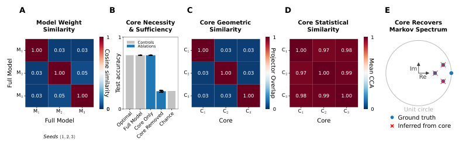
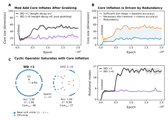

# Schiffman 2026 — Transformers Converge to Invariant Algorithmic Cores

См. также: [глобальный индекс понятий](../../concepts/index.md).

**Joshua S. Schiffman** (New York Genome Center, New York).

arXiv [2602.22600](https://arxiv.org/abs/2602.22600), февраль 2026 (v2), 17 страниц, 6 рисунков (5 файлов), 6 таблиц. Всего цитирований по Semantic Scholar — 0, в картотеке — 0. Одноавторская работа (семинар по механистической интерпретируемости, ICML 2026) со сдвигом цели истолкования с реализаций на инварианты: метод ACE (Algorithmic Core Extraction) выделяет «алгоритмическое ядро» — малоразмерное подпространство активаций, причинно необходимое и достаточное для задачи и повторяющееся у независимо обученных моделей. Для корпуса главное — гроккинговая часть: ядра модульного сложения «кристаллизуются» ровно на поре гроккинга, слепо подогнанный оператор сдвига получает собственные числа на единичной окружности (вращательный механизм без задания фурье-формы заранее), а при продолжении обучения с weight decay ядра *раздуваются* с ~15 до ~60 измерений — «минимальная норма требует наибольшей избыточности», и та же избыточность даёт обратный закон времени гроккинга $\tau_{\rm grok}\propto 1/(\omega p)$.

Оригинал и производные файлы этой папки:

- [`original/2602.22600.transformers-converge-to-invariant-algorithmic-cores.md`](original/2602.22600.transformers-converge-to-invariant-algorithmic-cores.md) — конверсия оригинала (native arXiv HTML, v2) в Markdown без правок содержания.
- [`2602.22600.transformers-converge-to-invariant-algorithmic-cores.claims.txt`](2602.22600.transformers-converge-to-invariant-algorithmic-cores.claims.txt) — пронумерованные утверждения статьи с пометками разбора.
- [`images/`](images/) — 6 рисунков (5 файлов).

Схема якорей и правила ссылок на карточку — в [README папки статей](../README.md).

## Затрагиваемые понятия

**[Гроккинг](../../concepts/grokking.md)** — двойной вклад: (1) кристаллизация ядра одновременно с отложенной генерализацией — на $a+b\equiv c\bmod 53$ ядра сжимаются в необходимые и достаточные по отсечению подпространства ровно на поре гроккинга (эпоха 800) ([`p3-2`](#p3-2)); (2) теория времени: после запоминания снос задаётся weight decay, зазор следует ОДУ $\dot m=-\omega m+c\,\omega\|\boldsymbol{\psi}\|_{2}^{2}$, откуда обратный закон $\tau_{\rm grok}(p)=-\Omega\log(1-p_{\rm crit}/p)\approx\Omega p_{\rm crit}/p\propto 1/(\omega p)$, сверенный свёртками ($\tau\propto\omega^{-1.02}$; решение ОДУ с $R^{2}>0.99$, $\hat{p}_{\rm crit}\approx 23$). Разбор: «совпадение» кристаллизации с гроккингом разрешено с точностью до 100 эпох и по трём моделям разом; обратный закон измерен в *шагах полнобатчевого* спуска — при наборе, растущем как $p^{2}$, полная работа до гроккинга растёт с $p$; закон спорит с $t_{g}\propto p^{2.2}$ из 2603.29262, и ни одна работа корпуса, мерившая зависимость от $p$, не процитирована; доля данных — главный управляющий параметр корпуса — в теории отсутствует (всюду 50/50).

**[Weight decay](../../concepts/weight-decay.md)** — вывод, обратный расхожему: weight decay не упрощает представление, а перегоняет вес во все равнозначные решения. После гроккинга задачная потеря пренебрежима, обучение неявно решает $\min\|\boldsymbol{\alpha}\|^{2}$ при $\langle\boldsymbol{\alpha},\boldsymbol{\psi}\rangle\geq\delta$, и по Коши—Буняковскому минимум достигается при $\boldsymbol{\alpha}\parallel\boldsymbol{\psi}$ — когда активны *все* $\lfloor p/2\rfloor$ мод; опытно ядра раздуваются с ~15 до ~60 измерений при сохранённом weight decay и остаются сжатыми при его отключении после гроккинга ([`p3-4`](#p3-4)); раздувание разложено на счётчики: достаточных измерений стабильно мало, необходимых — всё больше. Разбор: это прямо спорит с ветвью «гроккинг есть сжатие» — сжатое решение оказывается мгновенным состоянием сразу после гроккинга, а не пределом обучения; отсюда умозрительное «окно истолкования» (гасить weight decay вскоре после схождения); допущение $\gamma(t)\approx c\,\omega$, вносящее весь множитель $\omega$ в закон, объявлено, но не измерено.

**[Фурье-признаки и цепи](../../concepts/fourier-features-circuits.md)** — слепое восстановление механизма часов без задания фурье-формы заранее: линейный оператор сдвига (+1), подогнанный наименьшими квадратами в координатах ядра, к поре гроккинга получает собственные числа, садящиеся на единичную окружность (вращательная динамика), тогда как до гроккинга они рассеяны внутри круга ([`p3-3`](#p3-3)); конкретные вращательные моды (пары сопряжённых собственных чисел) у трёх семян различны — функциональная эквивалентность без структурного тождества, — и уже на поре гроккинга мод больше одной минимально нужной, а при продолжении обучения их число подходит к пределу $\lfloor p/2\rfloor=26$. Разбор: три семени на условие; частота извлечения ядер — раз в 100 эпох; «фурье-алгоритм часов» приписан Nanda et al., хотя название «часы» — из Zhong et al., которую статья цитирует отдельно.

**[Механистическая интерпретируемость](../../concepts/mechanistic-interpretability.md)** — концептуальный сдвиг: цепи и разреженные признаки описывают координаты реализации, а ядра — причинные подпространства и динамику, сохраняющиеся между реализациями (аналогия с диагонализацией: сила не в разреженности, а в инвариантах — собственных числах); у цепей Маркова три модели с почти нулевым косинусом весов несут 3-мерные ядра в почти ортогональных подпространствах (перекрытие $0.02$–$0.04$), но с CCA $\approx 0.99$ и спектром, воспроизводящим нетривиальные собственные числа истинной матрицы переходов; у шести LLM (GPT-2 S/M/L, LLaMA-3.1, Gemma-2, Qwen2.5) согласование по числу несёт одномерную управляемую ось в поздних слоях ([`p2-4`](#p2-4)). Разбор: «почти ортогональны» — на уровне случайных подпространств (ожидаемое перекрытие $3/64\approx 0.047$), то есть геометрическое расхождение — исходное положение дел, а не находка; спектральный зазор GPT-2 Large ($2.8\times 10^{10}$) указывает на вырожденность подгонки; «систематические нарушения у всех шести» в свободной генерации подкреплены двумя отобранными примерами, количественны только AUC на своих 1200 подсказках.

## Что показано, а что предположено

Замечания редактора карточки по итогам разбора утверждений (`…claims.txt`, 45 пунктов).

**Ценное — слепое восстановление, мера избыточности, немонотонность простоты.** Оператор в координатах ядра восстанавливает вращательный механизм без априорной фурье-гипотезы — автоматизация того, что у Nanda делалось вручную; разделение «достаточных» и «необходимых» измерений — работающая мера избыточности; раздувание ядра под weight decay после гроккинга — редкое наблюдение немонотонности простоты решения по ходу обучения; проверка $\|\boldsymbol{\psi}\|_{2}^{2}=\tfrac{3}{4}p$ сходится ($39.75=0.75\cdot 53$); родословная из теории систем (разложение Калмана, минимальная реализация, сбалансированное усечение) даёт рамке нетривиальное основание.

**Теория времени гроккинга держится на неизмеренных местах.** Допущение $\gamma(t)\approx c\,\omega$ не измерено — а именно оно вносит множитель $\omega$; «избыточность ускоряет гроккинг» не подтверждено измерением избыточности: свёртка идёт по модулю $p$, то есть меняется сама задача, а опыта «одна задача, разная избыточность» нет; закон измерен в шагах полнобатчевого спуска на однослойной сети, тогда как ядра и раздувание изучались на двухслойной; две панели рис. 4 сняты по разным обычаям (минибатчи против полного батча).

**Внутренние нестыковки и пределы.** Длительность обучения названа то $2\times 10^{3}$, то $2\times 10^{4}$ эпох (расхождение есть и в PDF); три семени на условие почти всюду; размерность ядра определяется порогом энергии и доуточняется теми же отсечениями, по которым потом оценивается; ядра GPT-2 Large и Gemma-2 найдены в самом последнем слое — не оговорено.

**Как работу будут цитировать** («доказано, что механизмы трансформеров универсальны; время гроккинга обратно пропорционально $p$») — точнее: на трёх семенах при $p=53$ показана циклическая динамика в ядре, совпадающая с гроккингом с точностью до 100 эпох; обратный закон измерен в шагах полнобатчевого спуска на однослойной сети, где избыточность менялась вместе с задачей; в единицах полной работы время растёт с $p$.

---

# Текст статьи

## Трансформеры сходятся к инвариантным алгоритмическим ядрам

**Joshua S. Schiffman** (New York Genome Center, New York, NY, USA; переписка: jschiffman@nygenome.org)

## Аннотация

Обучение отбирает поведение, а не устройство: одну и ту же функцию могут реализовать многие весовые конфигурации. Изучение любой одной обученной нейронной сети потому рискует описывать случайности одного прогона обучения, а не само вычисление. Эта работа сдвигает фокус с того, что трансформеры делают по случаю, на то, что они делать обязаны, извлекая *алгоритмические ядра* — компактные подпространства, необходимые и достаточные для задачи и повторяющиеся у независимо обученных моделей. Здесь вводится Algorithmic Core Extraction (ACE) для выделения этих подпространств, их причинной заверки и восстановления реализуемых ими алгоритмов в постановках от синтетических задач до крупных предобученных моделей. Трансформеры на цепях Маркова вкладывают трёхмерные ядра в почти ортогональные подпространства, но восстанавливают одинаковые спектры переходов. Трансформеры модульного сложения формируют компактные циклические ядра на поре гроккинга, которые позже раздуваются при продолженной регуляризации, избыточно распределяя то же вычисление по многим функционально равнозначным модам. Обнаружено, что эта функциональная избыточность ускоряет переход от запоминания к генерализации, давая обратный закон масштабирования времени гроккинга. В шести языковых моделях, охватывающих более двух порядков масштаба (GPT-2 Small/Medium/Large, LLaMA-3.1, Gemma-2 и Qwen2.5), согласование подлежащего и сказуемого правится единой управляемой осью, согласующейся между архитектурами. Отражение этой оси выворачивает грамматическое число по всей свободной генерации. Вместе эти результаты наводят на мысль, что под видимой сложностью обученных трансформеров лежит более простая, общая вычислительная структура, и что нацеливание на инварианты, а не параметризации, может дать более податливый путь к механистическому пониманию и управлению.

**Код:** https://github.com/joshseth/cores

##### Ключевые слова:

Mechanistic Interpretability, Transformers, Algorithmic Cores

## 1 Введение

Ключевое препятствие механистической интерпретируемости (17; 50) — недоопределённость: обучение ограничивает поведение модели — как входы отображаются в выходы, — но в общем случае не ограничивает то, как поведение реализовано внутри. Это ставит фундаментальный вызов интерпретируемости: если механизмы не обобщаются между реализациями, какие объяснения настоящие?

Такая *функциональная эквивалентность* рутинно наблюдается у независимо обученных искусственных нейронных сетей и исследовалась в геометрии ландшафта потерь и слиянии моделей (13; 21; 1), неидентифицируемости механистических цепей (39), сходстве представлений (30) и эффекте Расёмона (6). Однако явление не ограничено нейронными сетями и изучалось в разных науках. В биологии оно возникает как *вырожденность* (15) (например, в генетическом коде), а в эволюции — как *системный дрейф* (49), когда проводка генной сети меняется, а функция — нет. В теории управления различные *реализации* (28; 29) наводят одинаковую наблюдаемую динамику, а в физике *калибровочная симметрия* указывает, что многие математические описания представляют одно состояние. Естественный ответ — сместить фокус с отдельных реализаций на классы эквивалентности, изучая общие для них инварианты. Если механистические объяснения языковых моделей должны обобщаться по случайным семенам (23), контрольным точкам и архитектурам, их следует привязывать к устойчивым, инвариантным к реализации величинам, а не к особенным деталям, меняющимся от прогона к прогону.

###### p2-4

Чтобы исследовать эту перспективу, вводится Algorithmic Core Extraction (ACE) для выделения *алгоритмических ядер*: малоразмерных подпространств, необходимых и достаточных для задачи и общих для независимых реализаций. Применение ACE в трёх постановках нарастающей сложности демонстрирует, что функционально равнозначные модели могут сходиться к компактным инвариантным механизмам. В однослойных трансформерах (53) ACE восстанавливает истинную динамику цепи Маркова. В модульном сложении он выделяет возникновение вращательной динамики на поре гроккинга. Наконец, в шести предобученных языковых моделях (охватывающих GPT-2, LLaMA-3.1, Gemma-2 и Qwen2.5) (47; 22; 48; 58) **[p. 2]** ACE находит общее одномерное ядро, причинно управляющее согласованием подлежащего и сказуемого в свободной генерации.

**Вклады работы:** (1) концептуальная рамка механистической интерпретируемости, сдвигающая фокус с реализационно-специфичных цепей на инварианты; (2) ACE — метод выделения компактных подпространств, причинно необходимых и достаточных для качества на задаче; (3) свидетельства того, что эти ядра выделяют истолковываемые механизмы; (4) теория, связывающая функциональную эквивалентность, регуляризацию и время гроккинга; (5) управляемое одномерное ядро согласования подлежащего и сказуемого, общее для шести различных LLM.

## 2 Методы

Отношение структуры и функции часто многозначно, но сколько разных структур могут реализовать одну функцию? В линейной теории систем на это отвечает *разложение Калмана* (28; 29; 3; 27), гарантирующее существование *минимальной реализации* — динамической системы, которую можно эмпирически восстановить через *сбалансированное усечение* (40). *Algorithmic Core Extraction* (ACE) операционализирует этот принцип для трансформеров: сначала извлекаются подпространства активаций, одновременно высокоактивные и значимые, затем они причинно заверяются отсечениями, и наконец подгоняются операторы для установления выполняемых ими вычислений (приложение A).

**Извлечение.** Закрепим слой трансформера со скрытой размерностью $D$. Для $N$ входов пусть $\mathbf{H}\in\mathbb{R}^{N\times D}$ обозначает центрированные активации со строками $\mathbf{h}_{i}^{\top}$, и пусть $f:\mathbb{R}^{D}\to\mathbb{R}^{K}$ отображает активации в $K$ задачно-значимых выходов. Сложим якобианы в $\mathbf{J}\mathrel{:=}[(\partial f/\partial\mathbf{h}_{1})^{\top}\cdots(\partial f/\partial\mathbf{h}_{N})^{\top}]^{\top}\in\mathbb{R}^{NK\times D}$. ACE находит направления, одновременно активные и значимые, вычисляя SVD их взаимодействия:[^1]

[^1]: Когда $NK\!\gg\!D$, используйте вместо этого SVD матрицы $\mathbf{L}^{\top}\boldsymbol{\Gamma}\in\mathbb{R}^{D\!\times\!D}$, где $\mathbf{L}\mathbf{L}^{\top}\!\!=\!\mathbf{H}^{\top}\mathbf{H}\!+\!\varepsilon\mathbf{I}$ и $\boldsymbol{\Gamma}\boldsymbol{\Gamma}^{\top}\!\!=\!\mathbf{J}^{\top}\mathbf{J}$.

$$
\mathbf{H}\mathbf{J}^{\top}\;=\;\mathbf{U}\mathbf{\Sigma}\mathbf{V}^{\top}.
$$

Сингулярные значения квантифицируют совместную активность и значимость каждого направления и дают принципиальный критерий выбора ранга. *Алгоритмическое ядро* получается отображением ведущих $r$ столбцов $\mathbf{U}$ обратно в пространство активаций:

$$
\mathcal{C}\,\mathrel{:=}\,\mathrm{span}\!\left(\mathbf{H}^{\top}\mathbf{U}_{r}\right),
$$

и QR-разложение даёт ортонормированный базис $\mathbf{Q}\in\mathbb{R}^{D\times r}$ и проектор ядра $\mathbf{P}\mathrel{:=}\mathbf{Q}\mathbf{Q}^{\top}$.

**Заверка.** Ядро *достаточно*, если проекция $\mathbf{P}\mathbf{h}$ сохраняет качество на задаче, и *необходимо*, если его дополнение $\mathbf{h}-\mathbf{P}\mathbf{h}$ снижает его почти до случайного.

**Установление.** Вычислительная структура ядра восстанавливается прямым рассмотрением его координат $\mathbf{z}=\mathbf{Q}^{\top}\mathbf{h}$ или подгонкой оператора $\mathbf{A}$ (например, $\mathbf{z}_{t+1}\approx\mathbf{A}\mathbf{z}_{t}$ наименьшими квадратами) и разбором его спектра.

## 3 Необходимость и достаточность алгоритмических ядер

Центральная цель рукописи — определить, существуют ли внутри многомерных обученных трансформеров малоразмерные подпространства — *алгоритмические ядра*, — функционально необходимые и достаточные для качества на задаче. Если да, то общи ли такие ядра независимо обученным моделям и допускают ли они простые механистические характеризации?

#### Восстановление алгоритмических ядер.

Анализ начинается в полностью контролируемой постановке: три однослойных трансформера ($d_{\rm model}=64$, $d_{\rm ff}=256$, $|V|=4$), обученные с независимыми случайными семенами на четырёхсостоятельной цепи Маркова (приложение B). Хотя каждый достиг почти байес-оптимальной тестовой точности, их выученные веса показали почти нулевую косинусную близость — крайне расходящиеся параметризации (**рис. 1A**). Для поиска общего внутреннего представления ACE применялся к 64-мерному скрытому состоянию каждой модели, успешно выделив 3-мерное алгоритмическое ядро. Отсечения на всех тестовых данных подтвердили, что эти ядра и необходимы (удаление ядра роняет точность до случайной), и достаточны (сохранение только ядра сохраняет базовую точность) для задачи (**рис. 1B**; **таблица A1**).

*Рисунок 1: **Трансформеры, обученные на одной марковской задаче, сходятся к общему 3D причинному ядру. Три однослойных трансформера обучены с разными семенами на предсказание следующего токена четырёхсостоятельной цепи Маркова (приложение B). (A) Выученные веса существенно различаются между прогонами по косинусной близости. (B) 3D ядро, извлечённое из каждого 64D скрытого состояния, необходимо и достаточно при отсечении (**таблица A1**), в сравнении с оптимальным $\sum_{i}\pi_{i}\max_{j}T_{ij}$ и случайным $\max(\boldsymbol{\pi})$ теоретическими контролями, с матрицей переходов $\mathbf{T}$ и стационарным распределением $\boldsymbol{\pi}$; точки — отдельные точности, столбики — среднее$\pm$sem. (C) Ядра геометрически расходятся: перекрытия проекторов около нуля, главные углы почти ортогональны (**таблица A2**). (D) Ядра статистически согласуются: средние кросс-ядерные CCA почти достигают единицы (также **таблица A2**). (E) Подгонка динамики в ядре восстанавливает нетривиальный спектр цепи Маркова (**таблица A3**).*** **[p. 3]**

#### Геометрическая несхожесть, статистическая равнозначность.

Для оценки универсальности каждое ядро, восстановленное из независимо обученных трансформеров, сравнивалось геометрически и статистически. Несмотря на равные причинные критерии, ядра были вложены в почти ортогональные подпространства: перекрытие проекторов $0.02$–$0.04$, главные углы $75^{\circ}$–$90^{\circ}$ (**рис. 1C**; **таблица A2**). Однако канонический корреляционный анализ (CCA) (41) раскрыл почти точное статистическое согласование со средними CCA-корреляциями около $0.99$ (**рис. 1D**; **таблица A2**). Это наводит на мысль, что ядра кодируют одну информацию в разных геометрических координатах — сигнатура функционально равнозначных, но структурно расходящихся реализаций.

#### Алгоритмические ядра кодируют марковскую динамику.

Чтобы истолковать, какой алгоритм реализуют ядра, к динамике следующего токена внутри каждого ядра подгонялся линейный оператор, и относительно «оракульного» предсказания эти операторы достигли сильных подгонок: $R^{2}_{\rm core}/R^{2}_{\rm oracle}>0.98$ (приложение B). Собственные числа (спектр) линейного оператора определяют его динамику — колебания и темпы роста, — так что совпадение собственных чисел может указывать на совпадение динамик. Замечательно, что собственные числа каждого подогнанного оператора совпали с нетривиальными собственными числами истинной марковской матрицы переходов с точностью до нескольких процентов (**рис. 1E**; **таблица A3**). **[p. 3]** Это наводит на мысль, что восстановленные ядра выучились эффективно кодировать марковскую динамику: обученные трансформеры проводят входы через минимальное общее 3D подпространство — необходимое и достаточное для качества — и внутренне представляют динамику переходов с точностью до смены координат.

## 4 Возникновение и эволюция алгоритмических ядер

Поскольку ACE автоматизирован, он может восстанавливать выученные вычисления, не предполагая их формы, и прослеживать их эволюцию при обучении. Модульное сложение — естественный проверочный случай: трансформеры на этой задаче являют гроккинг (46; 35) — высокая обучающая точность предшествует отложенному скачку тестовой. Прежние работы показали, что эти модели выучивают фурье-алгоритм «часов» (42), но это требовало гипотезы о механизме заранее, целевых зондов и ручной проверки цепей.

*Рисунок 2: **Ядра модульного сложения формируются на поре гроккинга и реализуют вращательную механику. Три двухслойных трансформера обучены с разными семенами. (A) Тестовая точность являет гроккинг (красное, среднее$\pm$sem, левая ось y), совпадающий с формированием алгоритмического ядра (серое, среднее$\pm$sem, правая ось y). (B) После гроккинга восстановленные ядра необходимы и достаточны при отсечении. (C) Автоматические подгонки операторов в координатах ядра раскрывают возникновение циклического механизма: до гроккинга собственные числа рассеяны внутри единичного круга, а на поре гроккинга садятся на него, указывая на открытие вращательного механизма.*** **[p. 4]**

#### Ядра кристаллизуются на поре гроккинга.

###### p3-2

Три двухслойных трансформера ($d_{\rm model}=128$, $d_{\rm ff}=512$, $|V|=53$) обучались модульному сложению ($a+b\equiv c\bmod 53$) в течение $2\times 10^{3}$ эпох при регуляризации weight decay для поощрения генерализации. Все модели грокнули: тестовая точность оставалась около случайной до скачка около эпохи 800. Одновременно с этой отложенной генерализацией алгоритмические ядра кристаллизовались — сгущаясь в малоразмерные, определённые отсечением необходимые и достаточные подпространства (**рис. 2A,B**; приложение C).

#### Слепое восстановление вращательной динамики в ядрах.

###### p3-3

На каждой контрольной точке к динамике «сдвига» (+1) второго слоя в каждом извлечённом ядре подгонялся линейный оператор. Это раскрыло возникновение циклической вычислительной структуры: на поре гроккинга собственные числа операторов садятся на единичную окружность (**рис. 2C**), указывая на вращательную динамику, способную к модульному сложению. Примечательно, что эта структура возникает прямо из оптимизации наименьшими квадратами в ядре, без нужды в предзадании алгоритмической формы. Однако хотя все три модели сошлись к циклическим операторам, конкретные вращательные *моды* (пары сопряжённых собственных чисел) различались между прогонами — ещё один случай функциональной эквивалентности без структурного тождества (10; 59; 44). Модульное сложение допускает несколько допустимых мод и кратностей, и модели не обязаны сходиться в том, какие и сколько использовать. Замечательно, что даже на поре гроккинга каждый оператор содержал больше вращательных мод, чем единственная минимально необходимая, — намёк на избыточность, становящуюся крайней при продлённом обучении (**рис. 3**).

*Рисунок 3: **Продлённое обучение с weight decay раздувает ядра. Долгосрочная динамика обучения трансформеров, грокнувших модульное сложение, при разных расписаниях weight decay. (A) После гроккинга размерность ядра продолжает расти при сохранённом weight decay (чёрное, среднее$\pm$sem), но остаётся компактной при отключении weight decay после гроккинга (фиолетовое). (B) Раздувание ядра движется избыточностью: число измерений, достаточных для сохранения качества, стабильно, а число тех, чьё удаление роняет качество до случайного, растёт. Линии — средние по моделям с закреплённым weight decay. (C) (*Слева*) Подгонка динамики в терминальную эпоху раскрывает насыщенный оператор ядра при сохранённом weight decay против более разреженно представленного оператора при отключённом. (*Справа*) Число вращательных мод (пар сопряжённых собственных чисел) на единичной окружности растёт при продлённом обучении с weight decay, тогда как при снятии weight decay счётчики мод стабильны.*** **[p. 5]**

#### Ядра раздуваются при продлённом обучении.

###### p3-4

Продление обучения до $2\times 10^{4}$ эпох раскрыло неожиданное явление: при продолженном weight decay ядра постепенно раздувались примерно с $15$ до $60$ измерений. Напротив, отключение weight decay после гроккинга держало ядра компактнее (**рис. 3A**). Это раздувание движется выраженным ростом избыточного кодирования. Тогда как число измерений, *достаточных* для качества, оставалось стабильным, число измерений, *необходимых* для предотвращения случайного качества, резко расширялось (**рис. 3B**). Анализ операторов показывает, как проявляется это «переобразование» трансформера: при продолженном weight decay операторы накапливали вращательные моды. К терминальной эпохе они подошли к теоретическому максимуму $\lfloor p/2\rfloor=26$ допустимых гармонических представлений — далеко превзойдя минимально необходимую единственную моду (**рис. 3C**). Отключение weight decay предотвратило это размножение: ядра оставались компактными, счётчики мод — редкими, **[p. 4]** а структура операторов — стабильной. Это наводит на мысль, что weight decay может активно двигать переход от бережливых алгоритмических решений к избыточно насыщенным представлениям.

### 4.1 Избыточность движет раздуванием ядра и гроккингом

То, что регуляризационный штраф, задуманный упрощать представления, вместо этого раздувает ядра, кажется парадоксальным. Однако это поведение естественно возникает из минимизации нормы весов в сильно избыточном пространстве решений. Более того, это взаимодействие избыточности и регуляризации предсказывает и сами сроки гроккинга.

**Минимальная норма требует наибольшей избыточности.** После гроккинга задачная потеря пренебрежима и градиент определяется weight decay (52), гоня сеть к решению минимальной нормы. По фурье-симметрии (10) модульное сложение mod $p$ допускает $\lfloor p/2\rfloor$ функционально равнозначных мод, каждая — 2D-поворот с фазой $\theta_{k}\mathrel{:=} 2\pi k/p$. Пусть $\boldsymbol{\alpha}\geq 0$ обозначает амплитуды мод, а $\boldsymbol{\psi}$ — их метковые контрасты, где $\psi_{k}\mathrel{:=} 1-\cos\theta_{k}>0$ — вклад моды $k$ в классификационный зазор. Если моды кодируются в примерно ортогональных параметрических подпространствах[^2], то норма весов удовлетворяет $\|\mathbf{W}\|^{2}\approx\|\boldsymbol{\alpha}\|^{2}$, а корректная классификация требует зазора $\langle\boldsymbol{\alpha},\boldsymbol{\psi}\rangle\geq\delta$. Обучение тем самым неявно решает

[^2]: Если моды не ортогональны (или в суперпозиции (16)) с перекрытием мод $\mathcal{S}\!\succ\!0$, то $\|\boldsymbol{\psi}\|_{2}^{2}\to\boldsymbol{\psi}^{\top}\mathcal{S}^{-1}\boldsymbol{\psi}$, снижая действенную избыточность.

$$
\min_{\boldsymbol{\alpha}\,\geq\,\mathbf{0}}\;\;\|\boldsymbol{\alpha}\|^{2}\qquad\text{subject to}\qquad\langle\boldsymbol{\alpha},\boldsymbol{\psi}\rangle\geq\delta.
$$

###### p4-4

По неравенству Коши—Буняковского $\|\boldsymbol{\alpha}\|^{2}$ минимальна при $\boldsymbol{\alpha}\parallel\boldsymbol{\psi}$ — то есть когда активна *каждая* мода — с оптимальным решением $\boldsymbol{\alpha}^{\ast}=\left(\delta/\|\boldsymbol{\psi}\|_{2}^{2}\right)\boldsymbol{\psi}$. Weight decay тем самым действует как сила перераспределения: вместо упрощения представления он размазывает вес по всем допустимым решениям. Отключение weight decay снимает это давление, согласно наблюдениям **рис. 3**.

**Функциональная эквивалентность ускоряет гроккинг.** То же перераспределяющее давление правит скоростью гроккинга. Определим задержку гроккинга $\tau_{\mathrm{grok}}\mathrel{:=}\tau_{\mathrm{gen}}-\tau_{\mathrm{mem}}$ как время между запоминанием и генерализацией и смоделируем переход к генерализации как достижение зазором $m(t)\mathrel{:=}\langle\boldsymbol{\alpha}(t),\boldsymbol{\psi}\rangle$ порога $\delta$. После запоминания, когда задачные градиенты почти исчезли и господствует weight decay ($\omega$), ожидаемая траектория зазора следует (приложение E.1)

**[p. 5]**

$$
\dot{m}(t)\;=\;-\omega\,m(t)\;+\;c\,\omega\,\|\boldsymbol{\psi}\|_{2}^{2}.
$$

###### p5-1

Существенно, что функциональная эквивалентность делает направление, движущее зазор, аддитивным по модам, давая $\|\boldsymbol{\psi}\|_{2}^{2}\propto p$.[^3] Каждая избыточная мода усиливает среднюю скорость сноса к генерализации, согласно множественным активным модам, наблюдаемым на поре гроккинга (**рис. 2C**). При $p<d_{\mathrm{model}}$ исходное запомненное решение имеет пренебрежимый зазор ($m(0)\approx 0$), и гроккинг наступает при $m(\tau)=\delta$. Решение для ожидаемой задержки гроккинга даёт выражение, линеаризующееся при высокой избыточности ($p\gg p_{\mathrm{crit}}$) в простой обратный закон масштабирования:

$$
\tau_{\mathrm{grok}}(p)\;=\;-\,\Omega\,\log\!\left(1-\frac{p_{\mathrm{crit}}}{p}\right)\;\approx\;\frac{\Omega\,p_{\mathrm{crit}}}{p}\;\propto\;\frac{1}{\omega\,p}.
$$

Этим выражением правят две эмпирические константы: *оптимизаторная* $\Omega\propto\omega^{-1}$, задающая масштаб времени гроккинга, когда он происходит, и *архитектурная* $p_{\mathrm{crit}}$, определяющая, может ли он произойти вовсе. Время гроккинга тем самым сокращается и с weight decay, и с функциональной избыточностью. Эти предсказания заверяются свёртками по $\omega$ и $p$ в трансформерах (**рис. 4**; приложение E.2).

[^3]: Используя $\sum_{k=1}^{\lfloor p/2\rfloor}\cos\theta_{k}=\sum_{k=1}^{\lfloor p/2\rfloor}\cos 2\theta_{k}=-\tfrac{1}{2}$ и разворачивая $(1-\cos\theta_{k})^{2}$, получаем $\|\boldsymbol{\psi}\|_{2}^{2}=\tfrac{3}{4}p$.

*Рисунок 4: **Время гроккинга масштабируется обратно избыточности. *(Слева)* Время до гроккинга после запоминания $\tau$ масштабируется обратно weight decay $\omega$; согласно прежним наблюдениям (36). Наблюдённая подгонка ($\tau\propto\omega^{-1.02}$, красное) отвечает теоретическому предсказанию $\omega^{-1}$ (серое). *(Справа)* Время гроккинга масштабируется обратно избыточности $p$. Решение ОДУ (зелёное; $R^{2}>0.99$) схватывает и обратное масштабирование при больших $p$, и расходимость около $p_{\mathrm{crit}}$. Параметры подгонки: $\hat{\Omega}\approx 2{,}770$, $\hat{p}_{\mathrm{crit}}\approx 23$. Точки — среднее$\pm$sd по 12 семенам (приложение E.2).*** **[p. 6]**

**Итог.** Рамка алгоритмического ядра — автоматическое извлечение операторов из причинно определённых малоразмерных подпространств — способна механистически характеризовать и прослеживать эволюцию вычислений, выучиваемых трансформерами по ходу обучения. В модульном сложении извлечённые ядра являют вращательную динамику, согласную с циклической структурой задачи, кристаллизуются на поре гроккинга и раздуваются при продлённом weight decay. Это раздувание отражает схождение трансформеров к оптимальной стратегии взвешивания при регуляризации: распределять вес по всем функционально равнозначным представлениям. То же давление — регуляризация, использующая **[p. 6]** избыточность — предсказывает скорость гроккинга, объясняя переход от запоминания к генерализации. Следующий вопрос — масштабируются ли эти инструменты на большие и более сложные системы.

*Рисунок 5: **Согласование подлежащего и сказуемого опосредовано общим 1D ядром у LLM. Рамка ядер применена к GPT-2 Small, Medium, Large, Gemma-2, LLaMA-3.1 и Qwen2.5 для выделения малоразмерного механизма согласования по числу. (A) Свёртка по слоям: качество согласования (AUC) против нормированной глубины слоя, усреднено по LLM (линии) с помодельными измерениями (маркеры) и затенёнными полосами min–max. Качество согласования — вероятность того, что модель назначает больший балл предпочтения множественного против единственного глагола множественной подсказке, чем единственной. (B) Проекция скрытых состояний последнего токена на ядро даёт почти линейную ось управления зазором логитов единственного–множественного; помодельные аффинные подгонки показаны после $z$-нормировки. (C) Удаление ядра деградирует согласование, а его отражение выворачивает предпочтение глаголов. Ящичные диаграммы сводят баллы согласования уровня подсказки при возмущении; сообщаемые $p$-значения объединяют помодельные парные тесты Уилкоксона методом Фишера.*** **[p. 7]**

**[p. 7]**

> **Prompt: We hold these truths to be self-evident:** — GPT-2 Medium
>
> **Base:** We hold these truths to be self-evident: that all men **are** created equal, that they **are** endowed by their Creator with certain unalienable Rights [i.e., without a priori moral rights], and that among these **are** Life, Liberty and the pursuit of Happiness.”
>
> **Core Steering:** We hold these truths to be self-evident: that all men **is** created equal, that they **is** endowed by their Creator with certain unalienable Rights [i.e., the right to life], that among these **is** Life[.]”

> **Prompt: As a new field of research, artificial intelligence** — LLaMA-3.1-8B
>
> **Base:** As a new field of research, artificial intelligence **has** already delivered us with its revolutionary ways to solve complex medical issues. Its potential to address more such problems can boost the healthcare system…
>
> **Core Steering:** As a new field of research, artificial intelligence **have** already made great strides to improve our lives. AI **has** been instrumental in providing a more efficient… But how will we know what we **has** the potential to do…

*Рисунок 6: **Управление ядром наводит систематические нарушения согласования в свободной генерации.** Тексты по подсказке из *Base* или *Core Steering*, избранные нарушения выделены.* **[p. 7]**

## 5 Масштабирование ACE на LLM: универсальное 1D ядро

Предыдущие опыты устанавливают рамку ACE в сильно контролируемых синтетических постановках. Критический вопрос — масштабируется ли рамка ACE за пределы игрушечных моделей, правя сложными поведениями моделей производственного масштаба. Чтобы получить эмпирическую опору по этому вопросу, ACE применялся к шести предобученным языковым моделям четырёх различных семейств: GPT-2 Small, Medium и Large (117M, 345M и 774M параметров) (47; 57); LLaMA-3.1 (8B) (22); Gemma-2 (9B) (48); и Qwen2.5 (32B) (58). Эти модели различаются архитектурой, обучающим корпусом и токенизацией и охватывают более двух порядков по числу параметров. Целевая задача — *согласование подлежащего и сказуемого по числу*, податливое лингвистическое вычисление с ясными истинными метками (единственное против множественного подлежащее) и хорошо определённым поведенческим выходом (выбор глагола); допускающее систематическую оценку контролируемыми подсказками и скалярным баллом предпочтения глагола (34; 38; 19) (приложение D).

#### Локализация общего 1D ядра согласования.

###### p7-4

Для локализации механизма согласования кандидатные ядра извлекались на каждом слое и оценивались причинными отсечениями. Во всех шести моделях ранние слои являли минимальное причинное влияние, но высокодейственное ядро последовательно возникало в поздних слоях (**рис. 5A**). На слое максимального эффекта это ядро согласования замечательно одномерно — единственная ось, отделённая от всех прочих направлений большим спектральным зазором (**таблица A5**).

#### Причинная заверка и управление.

Наблюдательно эта ось ведёт себя как градуированная координата числа: проекция на неё предсказывает зазор логитов единственного–множественного по моделям (**рис. 5B**), согласуясь с гипотезой линейного представления (45). Однако поскольку одни лишь проекции подпространств могут обманывать (4; 37), заявления здесь строго укоренены в причинных отсечениях. Несмотря на компактность, эта единственная ось достаточна (её сохранение сохраняет согласование; AUC $\geq 0.91$), необходима (её удаление обрушивает согласование ниже случайного; AUC $\leq 0.25$) и направленно управляема. Отражение активаций через эту ось выворачивает предпочтения глаголов, наводя сильное рассогласование с подлежащим (AUC $\leq 0.10$; **таблица A6**). На уровне подсказки, например, инверсия ядра на "The key next to the cabinets" гонит $\mathbb{P}(\textit{is})$ с $0.51$ вниз до $0.01$, поднимая $\mathbb{P}(\textit{are})$ с $0.06$ до $0.71$ (**рис. 5C**).

#### Согласование между LLM.

Проекция скрытых состояний последнего токена на ядро согласования каждой модели (**рис. 5B**) даёт знаковую координату грамматического числа, отслеживающую предпочтение глагола. Поскольку ядра одномерны, межмодельное согласование сводится к закреплению знака и сравнению спроецированных координат. Внутри семейства GPT-2 — три модели с общей архитектурой и процедурой обучения — координаты согласуются тесно (Спирмен $\rho=0.88$–$0.92$; Пирсон $\mathord{\text{r}}=0.92$–$0.97$). Ещё разительнее, что согласование сохраняется между семействами: между Qwen2.5, LLaMA-3.1, Gemma-2 и моделями GPT-2 корреляции Спирмена лежат в $0.59$–$0.93$, Пирсона — в $0.62$–$0.94$ (**таблица A4**). Сильнейшие межсемейные корреляции (Qwen $\times$ Gemma: $\rho=0.93$; Gemma $\times$ GPT-2 Medium: $\rho=0.89$) подходят к внутрисемейному потолку, указывая, что ядро согласования кодирует грамматическое число образом, во многом независимым от архитектуры, токенизации, обучающего корпуса и масштаба.

#### Управление ядром выворачивает грамматику в свободном тексте.

Более сильная проверка роли ядра — правит ли оно согласованием по всей авторегрессионной генерации, где каждый токен обуславливает последующие предсказания. Для проверки вмешательство по оси ядра применялось *адаптивно* на каждом шаге декодирования. Модулирование силы вмешательства по чувствительности каждого токена к согласованию, не трогая незначимые токены (приложение D), навело систематические нарушения согласования во всех шести моделях (**рис. 6**). Единственные подлежащие вербовали множественные глаголы, множественные контексты сдвигались к единственному, и ошибки каскадировались, поскольку переключение переменной числа портило последующие предсказания. Существенно, что эффект обобщился далеко за конкретные глаголы (*is/are/was/were*), использованные для определения исходного балла предпочтения. Возникновение отказов согласования в совсем других классах слов поддерживает истолкование, что ядро кодирует глобальную переменную грамматического числа, а не узкую глагольно-специфичную эвристику.

#### Итог.

Согласование подлежащего и сказуемого в языковых моделях правится 1D причинным подпространством, локализованным в поздних слоях. Это ядро необходимо, достаточно и управляемо, и его координаты согласуются по шести моделям четырёх семейств.

## 6 Обсуждение

Эти результаты наводят на мысль, что вычислениями трансформеров могут править малоразмерные механизмы, повторяющиеся между независимыми прогонами обучения несмотря на существенную вариацию выученных параметров. Эти находки имеют следствия для того, как мы концептуализируем механистическую интерпретируемость.

**Инвариантность, а не разреженность или цепи.** Механистическая интерпретируемость в основном изучала реализации — цепи голов внимания и нейронов (17; 43; 56; 2; 32) или разреженные разложения активаций на истолковываемые признаки (12; 7; 14; 51). Такие описания могут быть весьма точны, но перед ними концептуальный вызов: они могут быть реализационно-специфичны. Две модели могут вычислять одну функцию совершенно разными цепями и системами координат (39; 18). Рамка ядер сдвигает объяснительную цель с реализации на инвариант. Мотивация разреженных признаков параллельна классической цели линейной алгебры — диагонализации. Но фундаментальная сила диагонализации не в разреженности как таковой, а в раскрытии инвариантов — собственных чисел, сохраняющихся при смене базиса. Разреженность зависит от базиса; инварианты — нет. Так же цепи и разреженные признаки описывают координаты реализации, тогда как ядра выделяют **[p. 8]** причинные подпространства и динамику, сохраняющиеся между реализациями. Где признаки или цепи повторяются между моделями — возможно, найденные кросс-кодерами (33), — подходы сходятся. Где расходятся — инвариантность даёт надёжный критерий отличения структурной сути от артефакта.

**Ядра как внутренние модели мира.** Наблюдение, что независимые модели сходятся к одной инвариантной структуре, поднимает естественный вопрос: что закрепляет эти общие представления? Если эти ядра — не артефакты архитектуры или прогона обучения, они могут отражать сам порождающий данные процесс. Когда алгоритмические ядра восстанавливают истинную структуру задачи — спектры марковских переходов, циклические операторы модульной арифметики, — они кодируют не просто отображения вход–выход, а внутренние представления порождающего процесса, лежащего в основе данных (31; 24; 26). Это согласуется с двумя классическими идеями: *теоремой о хорошем регуляторе* (11) и *принципом внутренней модели* (20) из теории управления, по которым любая система, достигающая оптимального предсказания, должна содержать модель своей среды. Когда ядро изоморфно порождающему задачу процессу, интерпретируемость можно рассматривать как форму восстановления внутренней модели.

**Избыточность ускоряет гроккинг.** Как только модель достигает идеальной обучающей точности, она входит в сильно вырожденное многообразие нулевой потери в пространстве параметров (9), населённое многими функционально равнозначными решениями. Weight decay затем смещает стохастическую разведку вдоль этого многообразия к решению минимальной нормы и максимального зазора. Поскольку целевая задача допускает несколько функционально равнозначных реализаций, поправляющее давление weight decay накапливается по допустимым модам, а не действует на единственное узкое решение, ускоряя ожидаемую траекторию к генерализации. Проходя непрерывное пространство зазора, сеть в конце концов пересекает дискретный классификационный порог, порождая резкий скачок тестовой точности, хотя лежащая в основе траектория в пространстве весов остаётся гладкой. Умозрительно, масштабирование может порождать скачки способностей, как только моделям хватает ёмкости реализовать большие классы функционально равнозначных решений. Аналогичное явление есть в эволюционной генетике, где прочность создаёт протяжённые сети фенотип-сохраняющих генотипов, облегчающие открытие новых функций нейтральным дрейфом (54; 55). Практическое следствие: ядра компактнее всего сразу после гроккинга и затем раздуваются. Это подсказывает естественное *окно истолкования*: гашение weight decay к нулю вскоре после схождения задачи может помочь сохранить самое компактное решение.

**Системный дрейф и слияние моделей.** Системный дрейф описывает, как генная сеть может сохранять фенотип, пока её генетическая проводка расходится, действенно дрейфуя по нейтральному пространству. Поскольку множество функционально равнозначных реализаций в общем случае не выпукло и не замкнуто относительно рекомбинации, смешение расходящихся решений часто даёт *гибридную несовместимость* (49). Трансформеры являют аналогичный узор: модели, обученные с разных инициализаций, реализуют одинаковые ядра, вложенные в почти ортогональные подпространства, раскрывая существенный представленческий дрейф при функциональной эквивалентности. Эта ортогональность означает, что наивная интерполяция весов между геометрически расходящимися моделями сходит с многообразия решений, согласно эмпирическим трудностям слияния моделей (21; 1). Напротив, извлечение и согласование алгоритмических ядер может дать принципиальную диагностику совместимости слияния и потенциальную систему координат для успешной рекомбинации.

**Ограничения и будущие направления.** Остаются ли ядра малоразмерными для многошаговых задач рассуждения — не проверено. Ядро согласования, однако, остаётся одномерным у шести моделей четырёх архитектур и более чем двух порядков масштаба (от 117M до 32B параметров), намекая, что размерность ядра может не зависеть от масштаба модели. Это совместимо с эмпирическим успехом LoRA (25), часто достигающей больших поведенческих изменений малоразмерными обновлениями весов. Извлечение задачно-специфичных ядер из многофункциональных моделей также требует постановки точных механистических вопросов; эта работа демонстрирует это для согласования подлежащего и сказуемого, но систематические подходы к разложению задач остаются открытыми. Сама процедура извлечения допускает естественные расширения: нелинейное снижение размерности вместо активной компоненты, обучаемые зонды вместо якобианов и приближения оператора Купмана (8) для задач с нелинейной динамикой. Шире: значимые инварианты для сложных задач не очевидны *a priori*; будущая работа может открывать их эмпирически, спрашивая, какие свойства ядер общи независимо обученным моделям. Наконец, методы, выделяющие причинно действенные подпространства, могут дать более целевое управление моделями: это может поддержать аудит и отладку, но и создаёт риски злоупотребления, если использовать их для наведения систематических ошибок или обхода задуманных поведений.

**Заключение.** Эти результаты указывают на взгляд на вычисление трансформеров как организованное вокруг малоразмерных инвариантов: подпространств, сохраняющихся между прогонами обучения, необходимых и достаточных для качества на задаче и структурированных образами, зеркалящими сами задачи. Если этот взгляд примерно верен, усилиям интерпретируемости может пойти на пользу нацеливание на такие инварианты — поиск вычислительной сути, повторяющейся между реализациями, а не деталей реализации, меняющихся от прогона к прогону. Алгоритмическое ядро — одна операционализация этой интуиции. Масштабируется ли она до сложности современных языковых моделей — ещё предстоит **[p. 9]** увидеть, но направляющий принцип — сосредоточиться на сохраняющемся, а не на особенном — может оказаться долговечным.

## Доступность кода

Код для воспроизведения всех анализов и рисунков доступен по адресу https://github.com/joshseth/cores.

## Благодарности

Я хотел бы поблагодарить докторов Alison Pickover и Dan Landau за поддержку.

## References

- [1] Ainsworth et al. (2022) S. K. Ainsworth, J. Hayase, and S. Srinivasa Git re-basin: merging models modulo permutation symmetries. arXiv preprint arXiv:2209.04836. Cited by: §1, §6.

- [2] Ameisen et al. (2025) E. Ameisen, J. Lindsey, A. Pearce, W. Gurnee, N. L. Turner, B. Chen, C. Citro, D. Abrahams, S. Carter, B. Hosmer, J. Marcus, M. Sklar, A. Templeton, T. Bricken, C. McDougall, H. Cunningham, T. Henighan, A. Jermyn, A. Jones, A. Persic, Z. Qi, T. Ben Thompson, S. Zimmerman, K. Rivoire, T. Conerly, C. Olah, and J. Batson Circuit tracing: revealing computational graphs in language models. Transformer Circuits Thread. External Links: Link Cited by: §6.

- [3] Anderson et al. (1966) B. Anderson, R. Newcomb, R. Kalman, and D. Youla Equivalence of linear time-invariant dynamical systems. Journal of the Franklin Institute 281 (5), pp. 371–378. Cited by: Appendix A, §2.

- [4] Belinkov (2022) Y. Belinkov Probing classifiers: promises, shortcomings, and advances. Computational Linguistics 48 (1), pp. 207–219. Cited by: §5.

- [5] Bellman and Åström (1970) R. Bellman and K. J. Åström On structural identifiability. Mathematical Biosciences 7 (3-4), pp. 329–339. Cited by: Appendix A.

- [6] Breiman (2001) L. Breiman Statistical modeling: the two cultures. Statistical Science. Cited by: §1.

- [7] Bricken et al. (2023) T. Bricken, A. Templeton, J. Batson, B. Chen, A. Jermyn, T. Conerly, N. Turner, C. Anil, C. Denison, A. Askell, R. Lasenby, Y. Wu, S. Kravec, N. Schiefer, T. Maxwell, N. Joseph, Z. Hatfield-Dodds, A. Tamkin, K. Nguyen, B. McLean, J. E. Burke, T. Hume, S. Carter, T. Henighan, and C. Olah Towards monosemanticity: decomposing language models with dictionary learning. Transformer Circuits Thread. Note: https://transformer-circuits.pub/2023/monosemantic-features/index.html Cited by: §6.

- [8] Brunton et al. (2021) S. L. Brunton, M. Budišić, E. Kaiser, and J. N. Kutz Modern koopman theory for dynamical systems. arXiv preprint arXiv:2102.12086. Cited by: §6.

- [9] Bushnaq et al. (2024) L. Bushnaq, J. Mendel, S. Heimersheim, D. Braun, N. Goldowsky-Dill, K. Hänni, C. Wu, and M. Hobbhahn Using degeneracy in the loss landscape for mechanistic interpretability. arXiv preprint arXiv:2405.10927. Cited by: §6.

- [10] Chughtai et al. (2023) B. Chughtai, L. Chan, and N. Nanda A toy model of universality: reverse engineering how networks learn group operations. In International Conference on Machine Learning, pp. 6243–6267. Cited by: §4, §4.1.

- [11] Conant and Ross Ashby (1970) R. C. Conant and W. Ross Ashby Every good regulator of a system must be a model of that system. International journal of systems science 1 (2), pp. 89–97. Cited by: §6.

- [12] Cunningham et al. (2023) H. Cunningham, A. Ewart, L. Riggs, R. Huben, and L. Sharkey Sparse autoencoders find highly interpretable features in language models. arXiv preprint arXiv:2309.08600. Cited by: §6.

- [13] Draxler et al. (2018) F. Draxler, K. Veschgini, M. Salmhofer, and F. Hamprecht Essentially no barriers in neural network energy landscape. In International conference on machine learning, pp. 1309–1318. Cited by: §1.

- [14] Dunefsky et al. (2024) J. Dunefsky, P. Chlenski, and N. Nanda Transcoders find interpretable llm feature circuits. Advances in Neural Information Processing Systems 37, pp. 24375–24410. Cited by: §6.

- [15] Edelman and Gally (2001) G. M. Edelman and J. A. Gally Degeneracy and complexity in biological systems. Proceedings of the national academy of sciences 98 (24), pp. 13763–13768. Cited by: §1.

- [16] Elhage et al. (2022) N. Elhage, T. Hume, C. Olsson, N. Schiefer, T. Henighan, S. Kravec, Z. Hatfield-Dodds, R. Lasenby, D. Drain, C. Chen, R. Grosse, S. McCandlish, J. Kaplan, D. Amodei, M. Wattenberg, and C. Olah Toy models of superposition. Note: *Transformer Circuits*Online External Links: Link Cited by: footnote 2.

- [17] Elhage et al. (2021) N. Elhage, N. Nanda, C. Olsson, T. Henighan, N. Joseph, B. Mann, A. Askell, Y. Bai, A. Chen, T. Conerly, N. DasSarma, D. Drain, D. Ganguli, Z. Hatfield-Dodds, D. Hernandez, A. Jones, J. Kernion, L. Lovitt, K. Ndousse, D. Amodei, T. Brown, J. Clark, J. Kaplan, S. McCandlish, and C. Olah A mathematical framework for transformer circuits. Transformer Circuits Thread. Note: https://transformer-circuits.pub/2021/framework/index.html Cited by: §1, §6.

- [18] Fel et al. (2025) T. Fel, E. S. Lubana, J. S. Prince, M. Kowal, V. Boutin, I. Papadimitriou, B. Wang, M. Wattenberg, D. Ba, and T. Konkle Archetypal sae: adaptive and stable dictionary learning for concept extraction in large vision models. arXiv preprint arXiv:2502.12892. Cited by: §6.

**[p. 10]**

- [19] Finlayson et al. (2021) M. Finlayson, A. Mueller, S. Gehrmann, S. M. Shieber, T. Linzen, and Y. Belinkov Causal analysis of syntactic agreement mechanisms in neural language models. In Proceedings of the 59th Annual Meeting of the Association for Computational Linguistics and the 11th International Joint Conference on Natural Language Processing (Volume 1: Long Papers), pp. 1828–1843. Cited by: §5.

- [20] Francis and Wonham (1976) B. A. Francis and W. M. Wonham The internal model principle of control theory. Automatica 12 (5), pp. 457–465. Cited by: §6.

- [21] Garipov et al. (2018) T. Garipov, P. Izmailov, D. Podoprikhin, D. P. Vetrov, and A. G. Wilson Loss surfaces, mode connectivity, and fast ensembling of DNNs. Advances in neural information processing systems 31. Cited by: §1, §6.

- [22] Grattafiori et al. (2024) A. Grattafiori, A. Dubey, A. Jauhri, A. Pandey, A. Kadian, A. Al-Dahle, A. Letman, A. Mathur, A. Schelten, A. Vaughan, et al. The llama 3 herd of models. External Links: 2407.21783, Link Cited by: §1, §5.

- [23] Gurnee et al. (2024) W. Gurnee, T. Horsley, Z. C. Guo, T. R. Kheirkhah, Q. Sun, W. Hathaway, N. Nanda, and D. Bertsimas Universal neurons in gpt2 language models. arXiv preprint arXiv:2401.12181. Cited by: §1.

- [24] Gurnee and Tegmark (2023) W. Gurnee and M. Tegmark Language models represent space and time. arXiv preprint arXiv:2310.02207. Cited by: §6.

- [25] Hu et al. (2022) E. J. Hu, yelong shen, P. Wallis, Z. Allen-Zhu, Y. Li, S. Wang, L. Wang, and W. Chen LoRA: low-rank adaptation of large language models. In International Conference on Learning Representations, External Links: Link Cited by: §6.

- [26] Huh et al. (2024) M. Huh, B. Cheung, T. Wang, and P. Isola The platonic representation hypothesis. arXiv preprint arXiv:2405.07987. Cited by: §6.

- [27] Kalman et al. (1969) R. E. Kalman, P. L. Falb, and M. A. Arbib Topics in mathematical system theory. McGraw-Hill, New York (English). External Links: ISBN 0754321069 Cited by: Appendix A, §2.

- [28] Kalman (1962) R. E. Kalman Canonical structure of linear dynamical systems. Proceedings of the National Academy of Sciences 48 (4), pp. 596–600. Cited by: Appendix A, Appendix A, §1, §2.

- [29] Kalman (1963) R. E. Kalman Mathematical description of linear dynamical systems. Journal of the Society for Industrial and Applied Mathematics, Series A: Control 1 (2), pp. 152–192. Cited by: Appendix A, §1, §2.

- [30] Kornblith et al. (2019) S. Kornblith, M. Norouzi, H. Lee, and G. Hinton Similarity of neural network representations revisited. In International conference on machine learning, pp. 3519–3529. Cited by: §1.

- [31] Li et al. (2022) K. Li, A. K. Hopkins, D. Bau, F. Viégas, H. Pfister, and M. Wattenberg Emergent world representations: exploring a sequence model trained on a synthetic task. arXiv preprint arXiv:2210.13382. Cited by: §6.

- [32] Lindsey et al. (2025) J. Lindsey, W. Gurnee, E. Ameisen, B. Chen, A. Pearce, N. L. Turner, C. Citro, D. Abrahams, S. Carter, B. Hosmer, J. Marcus, M. Sklar, A. Templeton, T. Bricken, C. McDougall, H. Cunningham, T. Henighan, A. Jermyn, A. Jones, A. Persic, Z. Qi, T. B. Thompson, S. Zimmerman, K. Rivoire, T. Conerly, C. Olah, and J. Batson On the biology of a large language model. Transformer Circuits Thread. External Links: Link Cited by: §6.

- [33] Lindsey et al. (2024) J. Lindsey, A. Templeton, J. Marcus, T. Conerly, J. Batson, and C. Olah Sparse crosscoders for cross-layer features and model diffing. Transformer Circuits Thread, pp. 3982–3992. Cited by: §6.

- [34] Linzen et al. (2016) T. Linzen, E. Dupoux, and Y. Goldberg Assessing the ability of lstms to learn syntax-sensitive dependencies. Transactions of the Association for Computational Linguistics 4, pp. 521–535. Cited by: §5.

- [35] Liu et al. (2022a) Z. Liu, O. Kitouni, N. S. Nolte, E. Michaud, M. Tegmark, and M. Williams Towards understanding grokking: an effective theory of representation learning. Advances in Neural Information Processing Systems 35, pp. 34651–34663. Cited by: §4.

- [36] Liu et al. (2022b) Z. Liu, E. J. Michaud, and M. Tegmark Omnigrok: grokking beyond algorithmic data. arXiv preprint arXiv:2210.01117. Cited by: Figure 4, Figure 4.

- [37] Makelov et al. (2023) A. Makelov, G. Lange, and N. Nanda Is this the subspace you are looking for? an interpretability illusion for subspace activation patching. arXiv preprint arXiv:2311.17030. Cited by: §5.

- [38] Marvin and Linzen (2018) R. Marvin and T. Linzen Targeted syntactic evaluation of language models. In Proceedings of the 2018 conference on empirical methods in natural language processing, pp. 1192–1202. Cited by: §5.

- [39] Méloux et al. (2025) M. Méloux, S. Maniu, F. Portet, and M. Peyrard Everything, everywhere, all at once: is mechanistic interpretability identifiable?. arXiv preprint arXiv:2502.20914. Cited by: §1, §6.

- [40] Moore (1981) B. Moore Principal component analysis in linear systems: controllability, observability, and model reduction. IEEE Transactions on Automatic Control 26 (1), pp. 17–32. External Links: Document Cited by: Appendix A, §2.

**[p. 11]**

- [41] Morcos et al. (2018) A. Morcos, M. Raghu, and S. Bengio Insights on representational similarity in neural networks with canonical correlation. Advances in neural information processing systems 31. Cited by: §3.

- [42] Nanda et al. (2023) N. Nanda, L. Chan, T. Lieberum, J. Smith, and J. Steinhardt Progress measures for grokking via mechanistic interpretability. arXiv preprint arXiv:2301.05217. Cited by: §4.

- [43] Olah et al. (2020) C. Olah, N. Cammarata, L. Schubert, G. Goh, M. Petrov, and S. Carter Zoom in: an introduction to circuits. Distill. Note: https://distill.pub/2020/circuits/zoom-in External Links: Document Cited by: §6.

- [44] Olah (2025) C. Olah A toy model of mechanistic (un)faithfulness (Website). Note: Transformer Circuits External Links: Link Cited by: §4.

- [45] Park et al. (2023) K. Park, Y. J. Choe, and V. Veitch The linear representation hypothesis and the geometry of large language models. arXiv preprint arXiv:2311.03658. Cited by: §5.

- [46] Power et al. (2022) A. Power, Y. Burda, H. Edwards, I. Babuschkin, and V. Misra Grokking: generalization beyond overfitting on small algorithmic datasets. arXiv preprint arXiv:2201.02177. Cited by: §4.

- [47] Radford et al. (2019) A. Radford, J. Wu, R. Child, D. Luan, D. Amodei, I. Sutskever, et al. Language models are unsupervised multitask learners. OpenAI blog 1 (8), pp. 9. Cited by: §1, §5.

- [48] Riviere et al. (2024) M. Riviere, S. Pathak, P. G. Sessa, C. Hardin, S. Bhupatiraju, L. Hussenot, T. Mesnard, B. Shahriari, A. Ramé, et al. Gemma 2: improving open language models at a practical size. arXiv preprint arXiv:2408.00118. Cited by: §1, §5.

- [49] Schiffman and Ralph (2022) J. S. Schiffman and P. L. Ralph System drift and speciation. Evolution 76 (2), pp. 236–251. Cited by: §1, §6.

- [50] Sharkey et al. (2025) L. Sharkey, B. Chughtai, J. Batson, J. Lindsey, J. Wu, L. Bushnaq, N. Goldowsky-Dill, S. Heimersheim, A. Ortega, J. Bloom, et al. Open problems in mechanistic interpretability. arXiv preprint arXiv:2501.16496. Cited by: §1.

- [51] Templeton et al. (2024) A. Templeton, T. Conerly, J. Marcus, J. Lindsey, T. Bricken, B. Chen, A. Pearce, C. Citro, E. Ameisen, A. Jones, H. Cunningham, N. L. Turner, C. McDougall, M. MacDiarmid, C. D. Freeman, T. R. Sumers, E. Rees, J. Batson, A. Jermyn, S. Carter, C. Olah, and T. Henighan Scaling monosemanticity: extracting interpretable features from claude 3 sonnet. Transformer Circuits Thread. External Links: Link Cited by: §6.

- [52] Varma et al. (2023) V. Varma, R. Shah, Z. Kenton, J. Kramár, and R. Kumar Explaining grokking through circuit efficiency. arXiv preprint arXiv:2309.02390. Cited by: §4.1.

- [53] Vaswani et al. (2017) A. Vaswani, N. Shazeer, N. Parmar, J. Uszkoreit, L. Jones, A. N. Gomez, Ł. Kaiser, and I. Polosukhin Attention is all you need. Advances in neural information processing systems 30. Cited by: §1.

- [54] Wagner (2008) A. Wagner Robustness and evolvability: a paradox resolved. Proceedings of the Royal Society B: Biological Sciences 275 (1630), pp. 91–100. Cited by: §6.

- [55] Wagner (2012) A. Wagner The role of robustness in phenotypic adaptation and innovation. Proceedings of the Royal Society B: Biological Sciences 279 (1732), pp. 1249–1258. Cited by: §6.

- [56] Wang et al. (2022) K. Wang, A. Variengien, A. Conmy, B. Shlegeris, and J. Steinhardt Interpretability in the wild: a circuit for indirect object identification in gpt-2 small. arXiv preprint arXiv:2211.00593. Cited by: §6.

- [57] Wolf et al. (2020) T. Wolf, L. Debut, V. Sanh, J. Chaumond, C. Delangue, A. Moi, P. Cistac, T. Rault, R. Louf, M. Funtowicz, et al. Transformers: state-of-the-art natural language processing. In Proceedings of the 2020 conference on empirical methods in natural language processing: system demonstrations, pp. 38–45. Cited by: §5.

- [58] Yang et al. (2025) A. Yang, B. Yang, B. Zhang, B. Hui, B. Zheng, B. Yu, C. Li, D. Liu, F. Huang, H. Wei, H. Lin, J. Yang, J. Tu, J. Zhang, J. Yang, J. Yang, J. Zhou, J. Lin, K. Dang, K. Lu, K. Bao, K. Yang, L. Yu, M. Li, M. Xue, P. Zhang, Q. Zhu, R. Men, R. Lin, T. Li, T. Tang, T. Xia, X. Ren, X. Ren, Y. Fan, Y. Su, Y. Zhang, Y. Wan, Y. Liu, Z. Cui, Z. Zhang, and Z. Qiu Qwen2.5 technical report. External Links: 2412.15115, Link Cited by: §1, §5.

- [59] Zhong et al. (2023) Z. Zhong, Z. Liu, M. Tegmark, and J. Andreas The clock and the pizza: two stories in mechanistic explanation of neural networks. Advances in neural information processing systems 36, pp. 27223–27250. Cited by: §4.

## Приложение

## Приложение A Algorithmic Core Extraction

#### Функциональная эквивалентность и минимальные реализации.

Отношение структуры и функции часто многозначно (5): реализовать поведение можно более чем одним способом. Но сколько разных структур могут реализовать тождественные функции вход–выход? Можно ли охарактеризовать пространство функционально равнозначных структур?

В линейной теории систем этот вопрос имеет точный ответ (28). **[p. 12]** Рассмотрим линейную стационарную систему со скрытым состоянием $\mathbf{x}\in\mathbb{R}^{n}$, входом $\mathbf{u}\in\mathbb{R}^{m}$ и выходом $\mathbf{y}\in\mathbb{R}^{\ell}$:

$$
\dot{\mathbf{x}} =\mathbf{A}\mathbf{x}+\mathbf{B}\mathbf{u}, \\
\mathbf{y} =\mathbf{C}\mathbf{x}.
$$

Поведение вход–выход системы полностью определено её *импульсным откликом* $\boldsymbol{\zeta}(t)\mathrel{:=}\mathbf{C}e^{\mathrm{\textbf{A}}t}\mathbf{B}$. Две системы с разными весами $(\mathbf{A},\mathbf{B},\mathbf{C})$ и $(\tilde{\mathbf{A}},\tilde{\mathbf{B}},\tilde{\mathbf{C}})$ функционально равнозначны, если производят одинаковые выходы для всех входов — то есть если их импульсные отклики совпадают ($\boldsymbol{\zeta}(t)=\tilde{\boldsymbol{\zeta}}(t)$).

Для систем равной размерности функциональная эквивалентность отвечает ровно смене координат: $(\mathbf{A},\mathbf{B},\mathbf{C})$ и $(\mathbf{V}\mathbf{A}\mathbf{V}^{-1},\mathbf{V}\mathbf{B},\mathbf{C}\mathbf{V}^{-1})$ делят один импульсный отклик для любой обратимой $\mathbf{V}$. Но и системы разных размеров могут быть функционально равнозначны, если некоторые внутренние состояния либо недостижимы (не затронуты входом), либо ненаблюдаемы (незначимы для выхода).

*Разложение Калмана* делает это точным, разбивая пространство состояний любой системы на четыре подпространства по достижимости и наблюдаемости (28; 29; 3; 27). Только состояния, одновременно достижимые и наблюдаемые, вносят вклад в поведение вход–выход; остальные представляют степени свободы, которые могут меняться, не влияя на функцию. Это разложение гарантирует существование *минимальной реализации* — системы наименьшей размерности, воспроизводящей отображение вход–выход, единственной с точностью до смены координат, — и позволяет её извлечь. Эти результаты теории систем концептуально мотивируют методы, развитые в этой рукописи.

#### Извлечение алгоритмического ядра.

Цель здесь — аналогичное разложение для трансформеров. Разложение Калмана даёт точную алгебраическую характеризацию для линейных систем; для трансформеров замкнутого разложения нет, но принцип применим эмпирически: выделить направления, одновременно движимые входом (активные) и значимые для выхода (значимые). Будь система линейной, это свелось бы к *сбалансированному усечению* (40) — технике редукции моделей, находящей координаты, в которых достижимость и наблюдаемость согласованы.

Здесь **ACE** (*Algorithmic Core Extraction*) операционализирует этот подход для искусственных нейронных сетей. Пусть $\mathbf{H}\in\mathbb{R}^{N\times D}$ обозначает центрированные скрытые активации интересующего слоя трансформера со строками $\mathbf{h}_{i}^{\top}\in\mathbb{R}^{1\times D}$ для каждого из $N$ входов — для определения *активных* направлений. Для квантификации *значимых* направлений пусть $f\colon\mathbb{R}^{D}\to\mathbb{R}^{K}$ отображает активации в задачно-значимые выходы, и пусть $\mathbf{J}\in\mathbb{R}^{NK\times D}$ складывает $N$ якобианов $\partial f/\partial\mathbf{h}_{i}\in\mathbb{R}^{K\times D}$ блоками строк.

Чтобы найти направления, одновременно активные и значимые, ACE вычисляет SVD их взаимодействия:

$$
\mathbf{H}\mathbf{J}^{\top}\;=\;\mathbf{U}\mathbf{\Sigma}\mathbf{V}^{\top}.
$$

Сингулярные значения квантифицируют совместную важность каждого направления, давая принципиальный критерий выбора ранга. Пусть $\mathbf{U}_{r}$ обозначает первые $r$ столбцов $\mathbf{U}$. *Алгоритмическое ядро* — подпространство, полученное проекцией этих мод взаимодействия обратно в пространство активаций,

$$
\mathcal{C}\,\mathrel{:=}\,\mathsf{\mathrm{span}}\!\left(\mathbf{H}{{}^{\top}}\mathbf{U}_{r}\right).
$$

Ортонормированный базис ядра $\mathbf{Q}\in\mathbb{R}^{D\times r}$ даётся QR-разложением

$$
\mathbf{H}^{\top}\mathbf{U}_{r}\;=\;\mathbf{Q}\mathbf{R},
$$

и тем самым *проектор ядра* определяется как $\mathbf{P}\mathrel{:=}\mathbf{Q}\mathbf{Q}^{\top}$.

*Замечание о реализации.* Вычислять $\mathbf{H}\mathbf{J}^{\top}\in\mathbb{R}^{N\times NK}$ не нужно (и неэффективно при $NK\gg D$). Вместо этого образуйте ковариацию активаций $\mathbf{A}\mathrel{:=}\mathbf{H}^{\top}\mathbf{H}\in\mathbb{R}^{D\times D}$ и матрицу чувствительности $\mathbf{S}\mathrel{:=}\mathbf{J}^{\top}\mathbf{J}\in\mathbb{R}^{D\times D}$. Возьмите квадратно-корневые множители $\mathbf{A}+\varepsilon\mathbf{I}=\mathbf{L}\mathbf{L}^{\top}$ и $\mathbf{S}=\mathbf{\Gamma}\mathbf{\Gamma}^{\top}$, затем вычислите SVD получившейся матрицы $D\times D$: $\mathbf{L}^{\top}\mathbf{\Gamma}\;=\;\mathbf{U}\mathbf{\Sigma}\mathbf{V}^{\top},$ что даёт подпространство ядра: $\mathsf{\mathrm{span}}(\mathbf{L}\mathbf{U}_{r}).$

#### Причинная заверка.

Ядро заверяется отсечением, где $\tilde{\mathbf{h}}$ обозначает активацию после вмешательства:

$$
\text{Core-only (to test sufficiency):}\quad\tilde{\mathbf{h}}=\mathbf{P}\mathbf{h}, \\
\text{Core-removed (to test necessity):}\quad\tilde{\mathbf{h}}=\mathbf{h}-\mathbf{P}\mathbf{h}.
$$

Подпространство считается *достаточным*, если «только ядро» сохраняет качество на задаче, и *необходимым*, если «без ядра» снижает качество примерно до случайного. Энергетический ранг можно доуточнить, найдя минимальный $r$, при котором сохранение только ядра держит базовую точность, а его удаление роняет точность почти до случайной.

#### Когда активность и значимость совпадают.

Стоит отметить, что иногда ACE сводится к стандартному PCA — когда активность и значимость совпадают. Это даже ожидаемо для простых задач, когда у моделей нет внутреннего давления «прятать» вычисления в подпространствах низкой дисперсии. В более сложных моделях, однако, направления высокой дисперсии вряд ли чисто совпадут с целевыми задачами. Но различие важно даже при совпадении подпространств: PCA выделяет, где сосредоточена дисперсия; ACE выделяет, где течёт отображение вход–выход, — по построению и вмешательству, заверяя причинную значимость. Иначе говоря, PCA описателен и статистичен, тогда как ACE ещё и причинен, лицензируя дальнейшую трактовку возвращённого подпространства и его подогнанного оператора как динамической системы, реализующей причинный алгоритм.

## Приложение B Опыт с цепью Маркова

*Таблица A1: Тестовая точность трансформера на цепи Маркова: Full Model — без отсечений; Core-only — отсечение неядерных измерений; Core-removed — отсечение ядра (Методы). Данные изображены на **рис. 1B**.* **[p. 13]**

|  | Full Model | Core-only | Core-removed |
|---|---|---|---|
| M1 | 0.748 | 0.748 | 0.261 |
| M2 | 0.748 | 0.748 | 0.237 |
| M3 | 0.748 | 0.748 | 0.247 |

*Таблица A2: Попарная геометрия ядер и CCA-сходство. Перекрытие проекторов — квадратичное фробениусово перекрытие подпространств ядер; углы — главные углы (градусы); CCA — канонические корреляции. Перекрытие и средний CCA визуализированы на **рис. 1C,D**.* **[p. 13]**

| Pair | Proj. Overlap | Principal Angles | CCA |
|---|---|---|---|
| M1–M2 | 0.027 | [78, 80, 85] | [0.999, 0.999, 0.927] |
| M1–M3 | 0.031 | [76, 80, 85] | [0.999, 0.999, 0.949] |
| M2–M3 | 0.027 | [76, 82, 89] | [0.999, 0.999, 0.958] |

*Таблица A3: Собственные числа $\left\{\lambda_{i}\right\}$ операторов, подогнанных в ядрах трансформеров, в сравнении с матрицей вероятностей переходов Маркова $\mathbf{T}$ (без собственного числа Перрона—Фробениуса). Спектральное перекрытие визуализировано на **рис. 1E**.* **[p. 14]**

|  | Markov chain | Core1 | Core2 | Core3 |
|---|---|---|---|---|
| $\lambda_{1}$ | $0.75+0.25\mathord{\text{i}}$ | $0.75+0.25\mathord{\text{i}}$ | $0.75+0.25\mathord{\text{i}}$ | $0.75+0.25\mathord{\text{i}}$ |
| $\lambda_{2}$ | $0.75-0.25\mathord{\text{i}}$ | $0.75-0.25\mathord{\text{i}}$ | $0.75-0.25\mathord{\text{i}}$ | $0.75-0.25\mathord{\text{i}}$ |
| $\lambda_{3}$ | $0.50$ | $0.51$ | $0.49$ | $0.48$ |

**[p. 13]**

Три однослойных трансформера ($d_{\mathrm{model}}=64$, $d_{\mathrm{ff}}=256$, $|V|=4$) с каузальной маской внимания обучались с независимыми семенами на предсказание следующего токена последовательностей, порождённых четырёхсостоятельной цепью Маркова.

Матрица вероятностей переходов цепи,

$$
\mathbf{T}\mathrel{:=}\begin{pmatrix}\alpha&\beta&0&0\\
0&\alpha&\beta&0\\
0&0&\alpha&\beta\\
\beta&0&0&\alpha\end{pmatrix},
$$

была задана с $\alpha=0.75$ и $\beta=0.25$, что даёт собственные числа (спектр) $\lambda\in\{1,0.75+0.25\mathord{\text{i}},0.75-0.25\mathord{\text{i}},0.5\}$ и стационарное распределение $\boldsymbol{\pi}=\left[0.25,0.25,0.25,0.25\right]$.

Обучение шло AdamW со скоростью обучения $10^{-3}$ и без weight decay в течение 40 эпох на 3,000 последовательностях длины 32, порождённых $\mathbf{T}$, с батчем 64.

Качество обученной модели сравнивается с двумя базовыми линиями:

$$
\text{Chance:}\quad\max(\boldsymbol{\pi}), \\
\text{Bayes-optimal:}\quad\sum_{i}\pi_{i}\max_{j}T_{ij},
$$

Случайная точность отражает предсказание всегда самого частого токена; байес-оптимальная — наилучшее возможное одношаговое предсказание при стохастической природе цепи.

Алгоритмические ядра извлекались порогом энергии ранга 99.9% без доуточнения отсечением, $\mathbf{H}$ вычислялась по всем тестовым активациям, а $\mathbf{J}$ определялась целевой функцией $f(\mathbf{h})\mathrel{:=}\mathrm{logits}(\mathbf{h})$.

#### Подгонка динамики.

Последовательности скрытых состояний (центрированные) проецировались в координаты ядра $\mathbf{z}_{t}=\mathbf{Q}^{\top}\mathbf{h}_{t}$, и линейный оператор подгонялся наименьшими квадратами для предсказания следующего шага динамики,

$$
\mathbf{z}_{t+1}\approx\mathbf{A}\mathbf{z}_{t}.
$$

Спектр $\mathbf{A}$ использовался для характеризации выученной динамики. При сравнении подогнанных в ядре операторов с истиной собственное число Перрона—Фробениуса $\lambda=1$ матрицы $\mathbf{T}$ (отвечающее стационарному распределению) исключается, поскольку отражает нормировку.

Для калибровки подгонки операторов ядра сравнивались с *оракульным* потолком предсказания следующего токена:

$$
R_{\rm oracle}^{2}\mathrel{:=} 1-\frac{1}{|V|}\,\mathbf{1}^{\top}\!\left(\mathbf{m}\oslash\mathbf{v}\right),
$$

где

$$
\mathbf{m}\mathrel{:=}\mathrm{diag}(\boldsymbol{\pi})\big(\mathbf{T}\odot(\mathbf{1}-\mathbf{T})\big)^{\top}\mathbf{1},\qquad\mathbf{v}\mathrel{:=}\boldsymbol{\pi}\odot(\boldsymbol{1}-\boldsymbol{\pi}),
$$

а $\odot$ и $\oslash$ обозначают поэлементные произведение и деление.

## Приложение C Опыт с модульным сложением

Три двухслойных трансформера ($d_{\mathrm{model}}=128$, $d_{\mathrm{ff}}=512$, $|V|=53$) обучались на $a+b\equiv c\pmod{53}$. Набор состоит из всех $53^{2}=2809$ входных пар, поровну разбитых на обучающий и тестовый наборы с закреплённым семенем. Входные последовательности — $[a,b]$ с целью $[b,c]$.

Обучение шло AdamW со скоростью обучения $10^{-3}$, батчем 512 и weight decay $\omega=1$. Модели обучались $2\times 10^{4}$ эпох, с извлечением ядер каждые 100 эпох. Эпоха гроккинга определена как первая точка разбора, в которой все три модели достигли совершенной тестовой точности, — эпоха 800.

**[p. 14]**

Для изучения эффекта продолженного weight decay после гроккинга на эпохе 900 трансформеры «ветвились» — дублировались и разделялись на два режима, — где weight decay либо сохранялся на $\omega=1$, либо отключался ($\omega\to 0$) до конца обучения.

Для извлечения ядер $\mathbf{H}$ вычислялась по всем активациям тестового набора, а $\mathbf{J}$ оценивалась по 64 образцам якобианов, определённых целевой функцией $f(\mathbf{h})\mathrel{:=}\mathrm{logits}(\mathbf{h})$. Ранг ядра выбирался сначала порогом энергии 99%, затем доуточнялся отсечениями для обеспечения причинной важности.

Для подгонки операторов центроиды $\bar{\mathbf{r}}_{c}$ вычислялись как центрированное среднее ядровой активации по всем тестовым примерам с ответным токеном $c$. Линейный оператор сдвига $\mathbf{A}$, удовлетворяющий

$$
\bar{\mathbf{r}}_{(c+1)\bmod 53}\approx\mathbf{A}\bar{\mathbf{r}}_{c}
$$

подгонялся наименьшими квадратами с ridge-регуляризацией после снижения размерности SVD. Генерализация оценивалась откладыванием переходов цикла, а не примеров: 53 ответных класса разбивались на непересекающиеся наборы калибровки/оценки выбором смежного блока классов для оценочного набора, и подгонка шла только на переходах $c\!\to\!c{+}1$, оба конца которых лежат в калибровочном наборе классов; оценка использовала только переходы с концами в оценочном наборе, и подгонка обозначается $R_{h}^{2}$. Для описательных подгонок $R^{2}$ сообщается без откладывания переходов и ridge-регуляризации.

Для сводки спектральной структуры собственные числа $\mathbf{A}$ с модулем около 1 определялись как вращательные моды, и каждой такой моде назначался частотный бин округлением её угла до ближайшего целого кратного $2\pi/53$. Поскольку пары комплексно-сопряжённых собственных чисел отвечают одному колебанию с точностью до направления, бины $k$ и $53-k$ отображались в один бин. Это даёт максимум $\lfloor 53/2\rfloor+1=27$ различных бинов: один бин $k=0$ и 26 ненулевых колебательных. Число мод определяется как число занятых ненулевых бинов и берётся из операторов, подогнанных без откладывания переходов, поскольку цель — описательная характеризация, а не оценка генерализации.

## Приложение D Опыт с согласованием подлежащего и сказуемого

*Таблица A4: Сходство координат ядра (из **рис. 5B**) по шести языковым моделям. $\rho$ Спирмена меряет ранговую корреляцию. Корреляция Пирсона $\mathord{\text{r}}$ меряет линейную связанность; её модуль равен CCA для одного измерения.* **[p. 15]**

| Pair | Spearman’s $\rho$ | Pearson’s $\mathord{\text{r}}$ $\left(\mathrm{CCA}_{1\mathrm{D}}\right)$ |
|---|---|---|
| Qwen2.5 $\times$ LLaMA-3.1 | 0.921 | 0.924 |
| Qwen2.5 $\times$ Gemma-2 | 0.934 | 0.943 |
| Qwen2.5 $\times$ GPT-2 Large | 0.844 | 0.857 |
| Qwen2.5 $\times$ GPT-2 Medium | 0.829 | 0.842 |
| Qwen2.5 $\times$ GPT-2 Small | 0.701 | 0.757 |
| LLaMA-3.1 $\times$ Gemma-2 | 0.888 | 0.880 |
| LLaMA-3.1 $\times$ GPT-2 Large | 0.760 | 0.752 |
| LLaMA-3.1 $\times$ GPT-2 Medium | 0.727 | 0.718 |
| LLaMA-3.1 $\times$ GPT-2 Small | 0.585 | 0.616 |
| Gemma-2 $\times$ GPT-2 Large | 0.893 | 0.909 |
| Gemma-2 $\times$ GPT-2 Medium | 0.894 | 0.911 |
| Gemma-2 $\times$ GPT-2 Small | 0.790 | 0.846 |
| GPT-2 Large $\times$ GPT-2 Medium | 0.923 | 0.951 |
| GPT-2 Large $\times$ GPT-2 Small | 0.878 | 0.924 |
| GPT-2 Medium $\times$ GPT-2 Small | 0.919 | 0.968 |

*Таблица A5: Одномерное ядро согласования подлежащего и сказуемого извлечено из каждой модели, несмотря на огромную вариацию обучения, параметризаций и архитектур (размерность модели, число слоёв). Извлечённый размер ядра ($d_{\rm core}$) подкреплён большим *спектральным зазором* (отношением квадратов двух наибольших сингулярных значений $\sigma_{1}^{2}/\sigma_{2}^{2}$). Большие спектральные зазоры указывают, что эти подпространства действенно одномерны.* **[p. 15]**

| Model | Parameters | Layers | $d_{\rm model}$ | $d_{\rm core}$ | Spectral gap | Core location (layer) |
|---|---|---|---|---|---|---|
| GPT-2 Small | 117 M | 12 | 768 | 1 | $40$ | 11 |
| GPT-2 Medium | 345 M | 24 | 1024 | 1 | $44$ | 22 |
| GPT-2 Large | 774 M | 36 | 1280 | 1 | $2.8\times 10^{10}$ | 36 |
| LLaMA-3.1 | 8 B | 32 | 4096 | 1 | $266$ | 28 |
| Gemma-2 | 9 B | 42 | 3584 | 1 | $133$ | 42 |
| Qwen2.5 | 32 B | 64 | 5120 | 1 | $531$ | 62 |

*Таблица A6: Качество согласования (AUC; 1 — идеально, 0.5 — случайно, 0 — вывернуто) при отсечениях ядра по всем шести моделям. Core-only сохраняет согласование (достаточность), core-removed обрушивает его ниже случайного (необходимость), а core-flipped выворачивает предпочтения грамматического числа (наводит почти идеальное *рассогласование*).* **[p. 15]**

| Model | Baseline | Core-only | Core-removed | Core-flipped |
|---|---|---|---|---|
| GPT-2 Small | 0.911 | 0.994 | 0.241 | 0.038 |
| GPT-2 Medium | 0.934 | 0.997 | 0.217 | 0.023 |
| GPT-2 Large | 0.921 | 0.975 | 0.244 | 0.021 |
| LLaMA-3.1 | 0.808 | 0.918 | 0.209 | 0.092 |
| Gemma-2 | 0.886 | 0.978 | 0.102 | 0.035 |
| Qwen2.5 | 0.890 | 0.949 | 0.213 | 0.076 |

GPT-2 Small (117M параметров, 12 слоёв), Medium (345M, 24 слоя), Large (774M, 36 слоёв), LLaMA-3.1 (8B, 32 слоя), Gemma-2 (9B, 42 слоя) и Qwen2.5 (32B, 64 слоя) анализировались на согласовании подлежащего и сказуемого по числу.

#### Подсказки.

Набор из 1,200 подсказок (600 единственных, 600 множественных) построен сочетанием главных существительных (например, "key"/"keys", "child"/"children") с существительными-аттракторами противоположного числа (например, "cabinets"/"cabinet") через связки ("to the", "near the", "next to the" и т. д.). Использовались пять синтаксических шаблонов: базовый ("The key to the cabinets"), с передним наполнением ("In this ancient kingdom, the key to the cabinets"), с задним наполнением ("The key to the cabinets in the old kingdom"), экзистенциальный ("There key near the boxes") и с относительным придаточным ("The key that guards the cabinets"). Половина подсказок предварялась "In the past," для вариации контекста времени. Набор поровну разбит на обучающий и тестовый. Заметим: некоторые подсказки намеренно используют неграмматичный порядок слов (*например*, "There key near the boxes") — чтобы оценить, остаётся ли ядро согласования прочным к структурным нарушениям, вынуждая модель разрешать согласование по главному существительному, а не позиционным эвристикам.

#### Целевая функция.

Зазор числа определялся на скрытом состоянии финального токена $\mathbf{h}$:

$$
f(\mathbf{h})\mathrel{:=}(\mathrm{logit}_{\textit{are}}+\mathrm{logit}_{\textit{were}})-(\mathrm{logit}_{\textit{is}}+\mathrm{logit}_{\textit{was}}).
$$

#### Свёртка по слоям.

Кандидатные ядра извлекались на каждом слое и оценивались отсечением. Для каждой модели слоем ядра выбирался слой с максимальным эффектом отражения.

#### Адаптивное управление генерацией.

Для свободной генерации применялось потокенное адаптивное вмешательство при авторегрессионном декодировании. Пусть $\mathbf{q}\in\mathbb{R}^{D}$ обозначает (единичную) ось ядра, а $\boldsymbol{\mu}$ — среднюю активацию на слое вмешательства. Вмешательство отражает скрытое состояние $\mathbf{h}$ в позиции последнего токена через гиперплоскость, ортогональную оси ядра:

$$
\tilde{\mathbf{h}}=\mathbf{h}-2s\left[(\mathbf{h}-\boldsymbol{\mu})^{\top}\mathbf{q}\right]\mathbf{q},
$$

где $s$ — потокенная сила управления, определяемая адаптивно.

На каждом шаге декодирования выполняются три прямых прохода. Сначала *гейтовая* проверка: чистый прямой проход (с $s=0$) вычисляет софтмакс-массу вероятности на значимых для согласования глагольных токенах (*is*, *are*, *was*, *were*). **[p. 16]** Если эта масса ниже порога, токен вряд ли вовлекает решение о согласовании, и вмешательство не применяется ($s^{\ast}=0$).

Иначе сила управления калибруется для минимального переворота зазора. Определим *генерационный зазор* как $m\mathrel{:=}\log\!\sum_{v\in\{\textit{are},\,\textit{were}\}}e^{\ell_{v}}-\log\!\sum_{v\in\{\textit{is},\,\textit{was}\}}e^{\ell_{v}}$, где $\ell_{v}$ обозначает логит токена $v$. Этот logsumexp-зазор точнее отражает вероятностную конкуренцию единственной и множественной групп глаголов, чем линейная сумма логитов, использованная при извлечении ядра, где предпочтительна независимость якобиана от рабочей точки. Калибровка идёт так: (1) текущий зазор $m_{0}$ меряется чистым проходом; (2) малое зондирующее возмущение силой $s_{0}$ оценивает локальный коэффициент $g=(m_{1}-m_{0})/s_{0}$; (3) сила вмешательства ставится $s^{\ast}=(m_{\mathrm{target}}-m_{0})/g$, где $m_{\mathrm{target}}=-\operatorname{sign}(m_{0})\,\varepsilon$ целит в минимальное пересечение зазора с буфером $\varepsilon$. Необязательный колпак $|s^{\ast}|\leq s_{\mathrm{cap}}$ предотвращает крайнюю экстраполяцию. Этот адаптивный подход производит грамматические инверсии, минимизируя побочное разрушение токенов вне согласования.

## Приложение E Динамика гроккинга

### E.1 Математическая модель

Пусть $\boldsymbol{\alpha}(t)\in\mathbb{R}^{\mu}$ обозначает коэффициенты мод, и пусть $\boldsymbol{\psi}\in\mathbb{R}^{\mu}$ закреплён с $\psi_{k}\mathrel{:=} 1-\cos(2\pi k/p)$. Определим (тестово-значимый) зазор $m(t)\mathrel{:=}\langle\boldsymbol{\alpha}(t),\boldsymbol{\psi}\rangle$.

После запоминания обучающая потеря примерно нулевая. Обновления движутся штрафом weight decay $-\omega\boldsymbol{\alpha}(t)$ и минимальным поправляющим движением $\gamma(t)\boldsymbol{\psi}$, необходимым для удержания на многообразии нулевой потери, плюс стохастичность с нулевым средним $\xi(t)$ (шум оптимизатора).

**Направление $\boldsymbol{\psi}$.** Среди всех инфинитезимальных обновлений $\Delta\boldsymbol{\alpha}$, увеличивающих зазор на единицу, обновление минимальной нормы решает

$$
\arg\min_{\Delta\boldsymbol{\alpha}}\|\Delta\boldsymbol{\alpha}\|_{2}\quad\text{s.t.}\quad\langle\Delta\boldsymbol{\alpha},\boldsymbol{\psi}\rangle=1.
$$

По неравенству Коши—Буняковского решение — $\Delta\boldsymbol{\alpha}=\boldsymbol{\psi}/\|\boldsymbol{\psi}\|_{2}^{2}$. Итак, поправляющее градиентное направление строго параллельно $\boldsymbol{\psi}$.

**Динамика зазора.** Дифференцируя $m(t)=\langle\boldsymbol{\alpha}(t),\boldsymbol{\psi}\rangle$ и изолируя бесшумную детерминированную траекторию, получаем скалярное ОДУ:

$$
\dot{m}(t)\;=\;-\omega\,m(t)\;+\;\gamma(t)\,\|\boldsymbol{\psi}\|_{2}^{2}.
$$

Поскольку weight decay — единственный систематический снос, стягивающий сеть с зазора, средняя поправляющая сила принимается масштабирующейся пропорционально для удержания нулевой потери: $\gamma(t)\approx c\,\omega$ для некоторой константы $c$.

Предполагая достаточную размерную ёмкость ($p<d_{\mathrm{model}}$), исходное запомненное состояние неструктурировано, то есть несёт пренебрежимый зазор ($m(0)\approx 0$). Подстановка поправляющей силы даёт простое линейное уравнение релаксации:

$$
\dot{m}(t)=-\omega m(t)+c\,\omega\|\boldsymbol{\psi}\|_{2}^{2},\qquad m(0)\approx 0.
$$

Решение этого ОДУ даёт точную непрерывную траекторию зазора:

$$
m(t)=m^{\ast}\big(1-e^{-\omega t}\big),\qquad\text{where}\quad m^{\ast}=c\,\|\boldsymbol{\psi}\|_{2}^{2}=\kappa p.
$$

**Предсказание времени гроккинга.** Гроккинг наступает во время первого достижения $\tau$, когда зазор доходит до порога генерализации $\delta$. Решение $m(\tau)=\delta$ даёт непрерывное градиентно-потоковое время:

$$
\tau(p)=-\frac{1}{\omega}\log\!\left(1-\frac{\delta}{\kappa p}\right).
$$

Чтобы отобразить это идеализированное ОДУ на дискретные шаги обучения, физические константы развязываются. Масштабирующий закон становится:

$$
\tau_{\mathrm{grok}}(p)=-\Omega\log\!\left(1-\frac{p_{\mathrm{crit}}}{p}\right),\qquad(p_{\mathrm{crit}}<p<d_{\mathrm{model}}).
$$

Здесь $p_{\mathrm{crit}}\mathrel{:=}\delta/\kappa$ — *архитектурная константа*, задающая абсолютный нижний предел ёмкости независимо от оптимизатора. Обратно, $\Omega\propto(\eta\omega)^{-1}$ — *оптимизаторная константа*, эмпирический параметр, схватывающий характерное время релаксации и поглощающий дискретную динамику шага, скорость обучения, момент и адаптивное предобуславливание оптимизатора AdamW.

### E.2 Свёртки по гроккингу и подгонки масштабирования

Для измерения законов масштабирования задержки гроккинга в модульном сложении $a+b\pmod{p}$ однослойные трансформеры ($d_{\mathrm{model}}=128$, $d_{\mathrm{ff}}=512$) обучались на входных парах с AdamW (lr=1e-3). Данные, $p^{2}$ входных пар, случайно разбивались на $50/50$ обучение/тест. Времена запоминания ($\tau_{\mathrm{mem}}$) и генерализации ($\tau_{\mathrm{gen}}$) определялись как первые шаги оптимизатора, на которых обучающая и тестовая точности достигают $0.99$ соответственно. Задержка гроккинга оценивается как разность $\tau_{\mathrm{grok}}\mathrel{:=}\tau_{\mathrm{gen}}-\tau_{\mathrm{mem}}$. Точность оценивалась на каждом шаге во избежание артефактов квантования.

Проведены две свёртки с усреднением по 12 семенам на условие: (1) *Weight decay:* закрепив $p=53$, свёртка по $\omega\in\{0.3,0.5,1,1.5,2,3\}$. Для симуляции стандартной стохастичности обучения на наборе закреплённого размера эта свёртка использовала минибатчевый градиентный спуск с батчем $B=512$. (2) *Модуль:* закрепив $\omega=1$, свёртка по простым $p\in\{31,43,53,61,79,89,101\}$. Поскольку размер набора растёт квадратично с $p$, эта свёртка использовала полнобатчевый градиентный спуск, чтобы изолировать эмпирическое время достижения от зависящего от набора минибатчевого шума.

**[p. 17]**

Показатели масштабирования для асимптотических пределов получены подгонкой степенных законов $y=Cx^{\beta}$ обычными наименьшими квадратами в лог-лог пространстве. Макроскопические константы $\Omega$ и $p_{\mathrm{crit}}$ получены подгонкой точного детерминированного решения ОДУ $\tau(p)=-\Omega\log(1 - p_{\mathrm{crit}}/p)$ к эмпирической задержке нелинейными наименьшими квадратами (scipy.optimize.curve_fit). Качество подгонки всех кривых сообщается через $R^{2}$.
