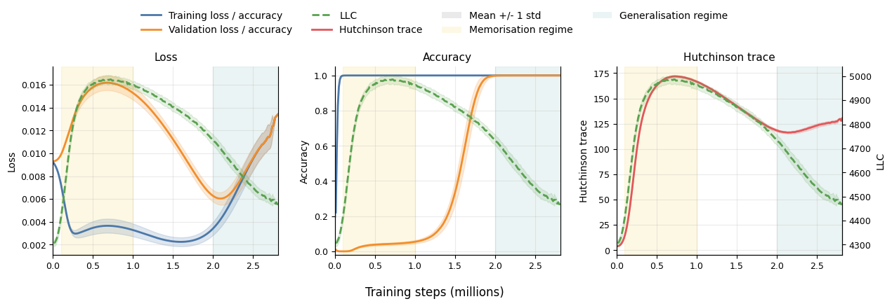

# Cullen, Estan-Ruiz, Danait, Li 2026 — A Basin-Selection Perspective on Grokking via Singular Learning Theory

См. также: [глобальный индекс понятий](../../concepts/index.md).

**Ben Cullen** (Университет Пизы), **Sergio Estan-Ruiz** (Imperial College London), **Riya Danait** (Оксфорд), **Jiayi Li** (Max Planck Institute of Molecular Cell Biology and Genetics, Дрезден; TU Dresden).

arXiv [2603.01192](https://arxiv.org/abs/2603.01192), март 2026 (версия v3; версии v1 и v2 выходили под названием «Grokking as a Phase Transition between Competing Basins: a Singular Learning Theory Approach»). 1 цитирование — сорок четвёртая по цитируемости работа корпуса. Источник — нативный HTML arXiv версии v3. Код: [anonymous.4open.science](https://anonymous.4open.science/r/geom_phase_transitions-DF59/), пакет [DevInterp](https://github.com/timaeus-research/devinterp).

Файлы разбора этой статьи:

- [`2603.01192.a-basin-selection-perspective-on-grokking-via-singular-learning-theory.claims.txt`](2603.01192.a-basin-selection-perspective-on-grokking-via-singular-learning-theory.claims.txt) — пронумерованные утверждения статьи с пометками разбора.
- [`2603.01192.a-basin-selection-perspective-on-grokking-via-singular-learning-theory.license.txt`](2603.01192.a-basin-selection-perspective-on-grokking-via-singular-learning-theory.license.txt) — лицензионная запись arXiv для этой статьи.

Схема якорей и правила ссылок на карточку — в [README папки статей](../README.md).

**Карточка-выдержка.** Лицензия статьи (`arxiv-nonexclusive`) не разрешает публикацию копии оригинала и полного перевода, поэтому карточка содержит редакторские секции и цитируемые фрагменты перевода (право цитирования). Полный текст статьи: <https://arxiv.org/abs/2603.01192>.

## Затрагиваемые понятия

**[Гроккинг](../../concepts/grokking.md)** — работа берёт явление не как загадку оптимизации, а как частный случай более широкой задачи **отбора котловины**: когда обучающим данным подходят несколько решений с почти нулевой потерей, какое из них статистически предпочтительно и когда оптимизация до него доберётся ([`p1-3`](#p1-3)). Эти два вопроса — статистический и динамический — разделены нарочно: на первый отвечают выражения в замкнутом виде, на второй — опытные ходы LLC ([`p2-1`](#p2-1)).

**[Котловины ландшафта потерь](../../concepts/loss-landscape-basins.md)** — сердцевина работы. Соперничающим котловинам приписывается число, упорядочивающее их по статистическому предпочтению: местный коэффициент обучения (LLC) $\lambda$, инвариантная относительно перепараметризации мера местного вырождения ([`p1-4`](#p1-4)). Гроккинг при таком взгляде есть переход из котловины с большим LLC (запоминающей) в котловину с меньшим LLC (обобщающую), главенствующую в апостериоре ([`p1-2`](#p1-2)).

**[Фазовый переход](../../concepts/phase-transition.md)** — механизм перехода взят из байесовской асимптотики: разрыв местных свободных энергий двух котловин определяется величиной $(\lambda_{a}-\lambda_{b})\log n$, отчего с ростом $n$ котловина с меньшим LLC в конце концов получает большую апостериорную массу, а состязание способно дать резкое переключение при предельном размере выборки — переход первого рода ([`p3-2`](#p3-2)). Существенная оговорка: у Ватанабэ растёт **размер выборки**, а при гроккинге набор данных закреплён и растёт **время обучения** ([`p2-1`](#p2-1)).

**[Плоскость минимума и мера сложности](../../concepts/generalization-bounds.md)** — размежевание с обычными показателями плоскости проведено прямо: меры на основе кривизны гессиана не инвариантны относительно общих перепараметризаций, тогда как LLC инвариантен относительно диффеоморфизмов и связан с байесовской генерализацией ([`p3-4`](#p3-4)). В приложении A показано, что тот же $\lambda$ управляет и асимптотикой байесовской ошибки генерализации ([`p16-2`](#p16-2)).

**[Параметр порядка](../../concepts/order-parameter.md)** — LLC предлагается именно в этой роли: величина, вычисляемая **только по обучающим данным**, чей ход по времени обучения повторяет ход потери на проверке ([`p8-8`](#p8-8)). Ход имеет вид горба: LLC поднимается до вершины и убывает, тогда как точность на обучении уже насыщена, а точность на проверке резко растёт ([`p9-1`](#p9-1)).

**[От ленивого к богатому](../../concepts/lazy-to-rich-kernel-to-feature-learning.md)** — теоретическая часть выстроена по этой оси: ранние приближения с закреплённым представлением (NTK и ленивый режим Тяня) против позднего выучивания признаков ([`p5-3`](#p5-3), [`p6-3`](#p6-3)). Для каждого режима выведено своё выражение LLC, и они сведены таблицей ([`tab-1`](#tab-1)).

**[Нейронное касательное ядро](../../concepts/neural-tangent-kernel-ntk.md)** — теорема 5.1 даёт LLC линеаризованной модели: он равен половине ранга матрицы Фишера, $\lambda=r/2$, причём при полном ранге модель попросту регулярна ([`p6-10`](#p6-10), [`p6-11`](#p6-11)). Это ранняя точка отсчёта, применимая и за пределами квадратичных сетей.

**[Запоминание](../../concepts/memorization-phase.md)** — запоминающая котловина описана точно: при замороженном $W$ и гребневом решении по $V$ LLC равен $\tfrac{1}{2}p\min\{l,K\}$, где $l$ — внутренняя размерность признакового подпространства случайных столбцов ([`p7-4`](#p7-4)). Для модульного сложения с квадратичной активацией отсюда получается вилка $\tfrac{1}{2}p(2p-1)\leq\lambda\leq\tfrac{1}{2}pK$ ([`p7-6`](#p7-6)).

**[Выучивание признаков](../../concepts/feature-emergence-feature-learning.md)** — поздняя котловина описывается уже не приближением, а самим устройством ширины $K$: в скудном невырожденном режиме $\lambda=\frac{1}{2}K(3p-1)$ ([`p8-3`](#p8-3)). Именно это выражение и проверяется опытом по зависимости от $p$ и от $K$.

**[Модульная арифметика](../../concepts/modular-arithmetic.md)** — узаконенная постановка корпуса взята без изменений: сложение по модулю простого $p$, входы в унитарном коде, двухслойная сеть с квадратичной активацией и потерей $\ell^{2}$ ([`p3-7`](#p3-7), [`p4-1`](#p4-1)). Проектор на нулевое среднее введён нарочно, чтобы отсечь подгонку постоянным смещением и сделать возникновение признаков главным путём к генерализации ([`p4-3`](#p4-3)).

**[Меры продвижения](../../concepts/progress-measures.md)** — LLC сопоставлен с классическим показателем кривизны, следом Хатчинсона. До конца поры гроккинга они согласованы, оба достигают вершины перед переходом и убывают, но затем расходятся: LLC продолжает убывать, а след гессиана растёт ([`p9-1`](#p9-1)). Истолкование: модель упрощается в смысле SLT, заостряясь при этом вдоль остающихся различимых направлений ([`p38-16`](#p38-16)).

**[Скорость обучения](../../concepts/learning-rate.md)** — введена мера резкости гроккинга (GSM), накапливающая разрыв между точностью на обучении и на проверке при условии, что генерализация всё же наступает ([`p36-1`](#p36-1)). GSM заметно убывает с ростом скорости обучения, и это увязано с меньшими вершинными значениями LLC — правда, с оговоркой, что связь истолковывающая, а не выведенная ([`p36-2`](#p36-2)).

**[Weight decay](../../concepts/weight-decay.md)** — играет роль в поздней поре: после насыщения точностей продолжающаяся под его действием оптимизация ещё упрощает внутреннее представление, не меняя выученного классификатора ([`p9-1`](#p9-1)).

**[Оптимизаторы](../../concepts/optimizer-adam-adamw-sgd.md)** — мост между байесовской картиной и настоящим обучением положен через приложение C: SGD с малым шагом и малой пачкой есть шумная дискретизация диффузии Ланжевена, то есть формально выборщик Гиббса при температуре $T\propto\eta/(nB)$ ([`p18-2`](#p18-2), [`p18-8`](#p18-8)). Это единственное обоснование того, отчего байесовская мера вообще должна что-то говорить о пути SGD.

**[Эффективная теория и статистическая физика](../../concepts/effective-theory-statistical-mechanics.md)** — весь аппарат заимствован оттуда: свободная энергия, её асимптотическое разложение $F_{n}=nL_{n}(w_{0})+\lambda\log n-(m-1)\log\log n+o_{p}(1)$ и полюсы дзета-функции ([`p15-9`](#p15-9), [`p14-5`](#p14-5)).

Отдельно стоит сказать, чего в работе **нет**. Нет разбора динамики SGD: даётся описание отбора котловины, а не вывод времени перехода, и это признано ([`p10-1`](#p10-1)). Нет и опоры на настоящие устройства: все выражения выведены для квадратичной активации и двух слоёв, а перенос на ReLU и трансформеры назван направлением дальнейшей работы ([`p9-2`](#p9-2)). Нет наконец и уверенности в самих числах: оценки LLC меняются на порядки при изменении гиперпараметров выборщика SGLD, и авторы сами предупреждают, что сравнивать можно лишь при неизменной настройке ([`p18-1`](#p18-1)).

Карточки статей корпуса: [Power et al. 2022](../2201.02177.grokking-generalization-beyond-overfitting-on-small-algorithmic-datasets/2201.02177.grokking-generalization-beyond-overfitting-on-small-algorithmic-datasets.card.md) — исходное явление; [Nanda et al. 2023](../2301.05217.progress-measures-for-grokking-via-mechanistic-interpretability/2301.05217.progress-measures-for-grokking-via-mechanistic-interpretability.card.md) — фурье-контур и меры продвижения, названные в обзоре; [Omnigrok, Liu et al. 2022](../2210.01117.omnigrok-grokking-beyond-algorithmic-data/2210.01117.omnigrok-grokking-beyond-algorithmic-data.card.md) — расширение явления за пределы алгоритмических задач; [Kumar et al. 2023](../2310.06110.grokking-as-the-transition-from-lazy-to-rich-training-dynamics/2310.06110.grokking-as-the-transition-from-lazy-to-rich-training-dynamics.card.md) — переход от ленивого режима к богатому, взятый как рамка раздела 5; [Jiang et al. 2026](../2601.03162.on-the-convergence-behavior-of-preconditioned-gradient-descent-toward-the-rich-learning-regime/2601.03162.on-the-convergence-behavior-of-preconditioned-gradient-descent-toward-the-rich-learning-regime.card.md) — та же догадка, проверяемая вмешательством в оптимизацию, а не геометрией; [Prakash & Martin 2026](../2602.02859.late-stage-generalization-collapse-in-grokking-detecting-anti-grokking-with-weightwatcher/2602.02859.late-stage-generalization-collapse-in-grokking-detecting-anti-grokking-with-weightwatcher.card.md) — другая мера, считаемая по одним весам без данных.

**[Квадратичные сети](../../concepts/quadratic-networks.md)** — постановка выбрана ради разрешимости: двухслойная сеть с активацией $x^2$ без свободных членов ([`p4-1`](#p4-1)), а проектор нарочно устраняет тривиальное приближение постоянным смещением, чтобы обобщение шло только через выучивание признаков ([`p4-3`](#p4-3)).

**[Сингулярная теория обучения](../../concepts/singular-learning-theory.md)** — рамка приложена к гроккингу напрямую: местный коэффициент обучения упорядочивает соперничающие котловины с почти нулевой потерей, а переход между ними остаётся за динамикой оптимизации ([`p1-2`](#p1-2)).
## Что показано, а что предположено

Замечания редактора карточки по итогам разбора утверждений (`…claims.txt`). Работа математическая: девять страниц основного текста и двадцать восемь приложений, где живут все доказательства.

**Главный вклад теоретический, и он заявлен точно.** Насколько известно авторам, аналитического выражения коэффициента обучения в замкнутом виде для нейронной сети с **нелинейной** активацией прежде не было ([`p3-6`](#p3-6)); здесь оно выведено для квадратичной сети через секансную размерность многообразия Сегре — Веронезе ([`p4-9`](#p4-9), [`p34-7`](#p34-7)). Это подлинно новый предмет, а не приложение готового.

**Опытная проверка нацелена ровно на то, что предсказано.** Следствие 5.4 даёт линейный рост $\lambda$ по $p$ и по $K$; оба закона проверены отдельно ([`p8-6`](#p8-6)). Существенно, что проверяется **форма зависимости**, а не безусловное значение, — и это честно, ибо безусловные значения оценщика ненадёжны.

**Побочное наблюдение о ширине заслуживает внимания.** При закреплённом $p$ итоговый LLC растёт с шириной, хотя обобщают все ширины. Отсюда вывод: широкая модель не есть «малая плюс избыточные нейроны», и единого решения, одинакового при любой ширине, нет ([`p8-6`](#p8-6), [`p8-7`](#p8-7)).

**Ход LLC во времени — самое наглядное во всей работе.** Горб перед переходом к генерализации, вычисленный **без единого проверочного примера** ([`p8-8`](#p8-8)). Для корпуса это ценно само по себе: мера, не требующая отложенного набора, предсказывает, когда наступит генерализация.

**Однако причинности здесь нет, и это признано.** Разбор ведётся в байесовской асимптотике и описывает **отбор** котловины, а не динамику SGD; полная связь между средоточием апостериора и оптимизацией на случайном градиенте названа открытой ([`p10-1`](#p10-1)). Мост через приложение C (SGD как выборщик Гиббса) есть приближение при малом шаге и малой пачке, а не тождество.

**Оценка LLC хрупка, и работа этого не скрывает.** При изменении локализации $\gamma$ и шага SGLD оценки меняются **на порядки**, а зависимость логарифмически-линейна ([`p18-1`](#p18-1)). Отсюда прямое следствие: сопоставлять теоретические предсказания с оценёнными числами затруднительно, и все сравнения имеют смысл лишь внутри одной настройки выборщика.

**Главное выражение — общее опорное значение, а не итог для всякой обученной сети.** Замечание 4.3 и раздел ограничений говорят прямо: обученная конечная точка может лежать на необщем слое или устройство может оказаться вырожденным, и тогда настоящий LLC **меньше** предсказанного ([`p5-2`](#p5-2), [`p10-1`](#p10-1)). Тем самым опытное согласие проверяет форму закона, но не исключает систематического смещения.

**Расхождение LLC и следа Хатчинсона — тонкое наблюдение, но истолковано вольно.** После насыщения точностей LLC убывает, а след гессиана растёт ([`p9-1`](#p9-1)). Объяснение («упрощается в смысле SLT, заостряясь вдоль деятельных направлений») правдоподобно, но ни одного независимого измерения в его пользу не приведено.

**Отдельно об оговорках, сделанных к месту.** Разбор кривизны в приложении I начинается с признания, что след гессиана вообще не есть понятие плоскости: вдали от минимума это знаковое среднее, обращающееся в нуль на седле $x^{2}-y^{2}$ ([`p38-8`](#p38-8)). Такая мера сдержанности к собственному вспомогательному показателю в корпусе встречается нечасто.

**Постановка мала и однородна.** Одна задача (сложение по модулю), одна активация (квадрат), два слоя, $p\in\{53,61,71\}$. Обстановка воспроизводимости при этом хорошая: все гиперпараметры выложены файлами, а главный рисунок сведён по 100 семенам с полосами разброса ([`fig-2`](#fig-2), [`p35-6`](#p35-6)).

**Место в корпусе.** Это первая работа вики, дающая гроккингу **байесовское** объяснение с явно вычисленной величиной: не «плоские минимумы лучше», а «котловина с меньшим коэффициентом обучения получает большую апостериорную массу, и вот его значение для этой сети». Ценны два вклада: выражение LLC в замкнутом виде для сети с нелинейной активацией и опытная мера, которая предсказывает переход, не заглядывая в проверочные данные. Цена — байесовская асимптотика вместо динамики SGD, хрупкость оценщика и одна малая постановка.

---

# Цитируемые фрагменты перевода

Ниже приведены только те фрагменты перевода, на которые ссылаются карточки корпуса (право цитирования). Нумерация якорей `pN-M` / `fig-N` / `sec-X` совпадает с полной карточкой и оригиналом.

## Аннотация

###### p1-2

Гроккинг — резкий переход от запоминания к генерализации после продлённого обучения — указывает на присутствие соперничающих котловин решений с несхожими статистическими свойствами. Мы разбираем это явление сквозь призму сингулярной теории обучения (SLT), байесовской рамки, описывающей строение ландшафта потерь. Ключевая мера — местный коэффициент обучения (LLC), измеряющий местное вырождение поверхности потерь. SLT связывает котловины с меньшим LLC с большим средоточием апостериорной массы и с меньшей ожидаемой ошибкой генерализации. Опираясь на SLT, мы развиваем взгляд на гроккинг как на отбор котловины в квадратичных сетях: LLC упорядочивает соперничающие котловины с почти нулевой потерей по статистическому предпочтению, тогда как переход между ними по времени обучения управляется динамикой оптимизации. При таком взгляде гроккинг отвечает переходу из котловины с большим LLC (запоминающей) в котловину с меньшим LLC (обобщающую), главенствующую в апостериоре. В подкрепление этого мы выводим аналитические выражения LLC для мелких квадратичных сетей и в ленивом режиме, и в режиме выучивания признаков. Опытно мы показываем, что оценённые по обучающим данным ходы LLC отслеживают наступление генерализации и дают осведомляющий щуп для пути оптимизации.

## 1 Введение

###### p1-3

Гроккингом называют явление обучения, при котором модель рано достигает почти нулевой эмпирической потери, однако долго обобщает плохо, а затем, при продолжении оптимизации, качество на тесте резко улучшается. Это поведение заметно на алгоритмических задачах вроде модульной арифметики Power et al. (2022); Nanda et al. (2023); Liu et al. (2023); Miller et al. (2024) и наводит на мысль о сосуществовании нескольких котловин решений с почти нулевой потерей и резко несхожей генерализацией, отчего гроккинг оказывается частным случаем более широкой задачи отбора котловины в невыпуклой оптимизации. Отсюда встают два дополняющих друг друга вопроса: когда обучающие данные подходят нескольким котловинам, какая из них статистически предпочтительна и как оптимизация переходит между такими котловинами по ходу обучения?

###### p1-4

Сингулярная теория обучения Watanabe (2009) (SLT) даёт обоснованный ответ на первый вопрос. В нынешнем глубоком обучении для объяснения опытных успехов обыкновенно призывают две тесно связанные догадки: что решения, лежащие в более «плоских» частях ландшафта потерь, обобщают лучше и что оптимизации на основе SGD **[p. 2]** обладают индуктивным предпочтением таких частей Hochreiter and Schmidhuber (1997); Keskar et al. (2017). Хотя за эти мысли говорит немало опытных свидетельств Li et al. (2018); Jastrzebski et al. (2018); Foret et al. (2021), теоретические основания остаются неполны. Для сингулярных моделей, каковы и нейронные сети, SLT сопоставляет каждой минимизирующей котловине местный коэффициент обучения (LLC) $\lambda$ — инвариантную относительно перепараметризации меру местной статистической сложности. Это точно и независимо от выбора координат выражает то, что более широкие или менее сложные действенные котловины статистически предпочтительны. В разложении местной свободной энергии $\lambda$ стоит множителем при $\log n$, поэтому среди котловин с почти нулевой потерей и сравнимой обучающей потерей котловины с меньшим LLC асимптотически получают большую апостериорную массу. Та же величина управляет и асимптотической байесовской ошибкой генерализации.

###### p2-1

Мы применяем SLT к разбору строения ландшафтов потерь при закреплённых данных, а не отождествляем размер выборки со временем обучения. Классическая SLT занимается асимптотикой байесовской свободной энергии при росте размера выборки, тогда как гроккинг происходит на закреплённом наборе $D$, когда SGD переходит между соперничающими котловинами эмпирической потери $L_{D}(\theta)$ с почти нулевым значением. Байесовская призма остаётся уместной, ибо шумный SGD с постоянным шагом часто приближается динамикой Ланжевена или темперированным апостериором (Mandt et al., 2017), а LLC измеряет местный объём котловины и вырождение. В прежних работах LLC применяли к разбору байесовского и SGD-строения фаз в игрушечных моделях (Chen et al., 2023) и возникающего строения в малых языковых моделях (Hoogland et al., 2025), но отложенного перехода гроккинга по времени обучения при закреплённых данных они не выводят. Поэтому мы отделяем статистический вопрос о том, какая котловина предпочтительна в смысле Байеса и SLT, от динамического вопроса о том, когда SGD переходит между котловинами, отвечая на первый теоретически — аналитическими выражениями в замкнутом виде, а на второй опытно — ходами LLC.

### 2.1 Местный коэффициент обучения

###### p3-2

Для двух соперничающих решений $a$ и $b$ со сравнимой обучающей потерей разрыв их местных свободных энергий асимптотически определяется величиной $(\lambda_{a}-\lambda_{b})\log n$. Оттого с ростом $n$ котловина с меньшим LLC в конце концов достигает меньшей свободной энергии и, стало быть, большей апостериорной массы Watanabe (2022). Это состязание способно дать резкое переключение при некотором предельном размере выборки, отвечающее байесовскому фазовому переходу первого рода из одной котловины в другую Chen et al. (2023).

### 2.2 Смежные работы

###### p3-4

**Плоскость ландшафта потерь.** Классическая догадка машинного обучения гласит, что более плоские минимумы обобщают лучше более острых Hochreiter and Schmidhuber (1994). Многие меры плоскости строятся на местной кривизне поверхности потерь и опираются на собственные числа гессиана Kaur et al. (2023). Однако эти меры не инвариантны относительно общих перепараметризаций Dinh et al. (2017); Zhang et al. (2021), а поправки, устраняющие эту беду, обыкновенно ограничены, как, скажем, послойная инвариантность Petzka et al. (2019). Напротив, LLC есть мера вырождения, инвариантная относительно диффеоморфизмов Lau et al. (2025), с крепкими теоретическими и опытными связями с байесовской генерализацией Watanabe (2009). В приложении F мы показываем его инвариантность относительно весьма общих перепараметризаций.

###### p3-6

**Вычисления RLCT в замкнутом виде.** Коэффициенты обучения в замкнутом виде и их границы выведены лишь для немногих статистических моделей, у которых сингулярное строение поверхности потерь удаётся разрешить явно. Примеры: регрессия с пониженным рангом Aoyagi and Watanabe (2005), где RLCT зависит от входной и выходной размерности модели и от ранга подлежащей матрицы регрессии; неотрицательное матричное разложение (NMF) Hayashi and Watanabe (2017), где границы зависят от размеров матрицы и действенного ранга разложения; и глубокие устройства с линейными активациями Aoyagi (2024); Lehalleur and Rimányi (2024), где коэффициенты обучения оказались ограничены при росте глубины сети. Насколько нам известно, ни для одной нейронной сети с нелинейными активациями аналитического выражения коэффициента обучения в замкнутом виде прежде получено не было.

### 3.1 Задача модульной арифметики

###### p3-7

Пусть $p$ просто и $a,b,c\in\mathbb{Z}_{p}$. Функция сложения по модулю $f:\mathbb{Z}_{p}\times\mathbb{Z}_{p}\rightarrow\mathbb{Z}_{p}$ задана как $f(a,b)=a+b\mod p$ и вполне описывается собранием троек **[p. 4]** $\mathcal{D}=\{(a,b,c)\in\mathbb{Z}_{p}^{3}:c=f(a,b)\}$, где $|\mathcal{D}|=p^{2}$. При взгляде на неё как на задачу классификации обучающее подмножество $\mathcal{D}_{\text{N}}:=\{(a_{i},b_{i},c_{i})\}_{i=1}^{N}$ выбирается равномерно без возвращения. Каждая пара «пример — цель» кодируется затем как $\mathbf{x}_{i}=[e_{a_{i}};e_{b_{i}}]^{\top}\in\mathbb{R}^{2p}$ и $\mathbf{y}_{i}=e_{c_{i}}\in\mathbb{R}^{p}$, где $e_{i}$ — стандартный $i$-й базисный вектор $\mathbb{R}^{p}$. Матрицы данных и целей суть тогда $X_{N}=[\mathbf{x}_{1}\dots\mathbf{x}_{N}]\in\mathbb{R}^{2p\times N}$ и $Y_{N}=[\mathbf{y}_{1}\dots\mathbf{y}_{N}]\in\mathbb{R}^{p\times N}$ соответственно.

### 3.2 Устройство модели

###### p4-1

Мы обучаем двухслойную квадратичную сеть $f_{\theta}$ с параметрами $\theta=(W,V)$, шириной скрытого слоя $K$ и без свободных членов, так что предсказанные метки задаются как:

###### p4-3

где $P_{\perp}:=I_{N}-\mathbf{11}^{\top}/N$ — проектор на нулевое среднее вдоль выборочной оси, а $\|.\|_{F}$ — норма Фробениуса. Этот проектор устраняет пустое приближение постоянным смещением, вынуждая модель выучить строение задачи и делая возникновение признаков (в смысле Tian (2025)) главным путём к генерализации.

##### **Теорема 4.1****.**

###### p4-9

*Пусть $f_{\theta}$ — квадратичная сеть с тройкой устройства $(d,p,K)$, осуществляющая отображение параметров $\Phi_{p}(\theta)$ при $\theta=(W,V)$. Пусть $\mathcal{X}=\mathbb{P}(\widehat{\mathcal{X}})\subset\mathbb{\mathbb{P}(\mathcal{Y})}$ обозначает проективное многообразие атомов с одним скрытым нейроном, а $\widehat{\sigma_{K}(\mathcal{X})}$ — аффинный конус над его $K$-м секансным многообразием. Положим: (1) $w_{j}\not=0$ и $v_{:j}\not=0$ для всех $j=1,\dots,K$; (2) атомы ${x}_{j}:=v_{:j}\otimes(w_{j}w_{j}^{\top})\in\widehat{\mathcal{X}}$ находятся в общем положении и $y=\sum_{j=1}^{K}x_{j}$ есть общая гладкая точка на $\widehat{\sigma_{K}(\mathcal{X})}$; и (3) допущения теоремы о перепараметризации для MSE (теорема F.1) выполнены в $y=\Phi_{p}(\theta)$. Тогда $\lambda=\frac{1}{2}\dim\widehat{\sigma_{K}(\mathcal{X})}.$*

##### *Замечание 4.3**.*

###### p5-2

Следствие 4.2 есть выражение общей секансной размерности. Однако особое решение может лежать на необщем слое секансного многообразия, где оно представлено лишь $K_{\textrm{eff.}}<K$ различными ненулевыми атомами $v\otimes(ww^{\top})$. Тогда тот же довод о секансном многообразии применим с заменой $K$ на $K_{\textrm{eff.}}$ — при условии, что урезанное представление само общее и невырожденно, а решение местно гладко. Если атомы ненулевые, но подчинены необщим алгебраическим соотношениям, местная размерность образа может оказаться меньше общей секансной размерности. Оттого следствие следует считать общим ориентиром местной сложности, а не разбиением всех решений на роды. Доказательства и дальнейшее геометрическое обсуждение отнесены в приложение G.

## 5 От ленивого обучения к выучиванию признаков

###### tab-1

| **Режим** | **Род решения** | **Итог** | **Роль** |
|---|---|---|---|
| Общий | Истинное решение | Следствие 4.2 | Ориентир на уровне устройства: даёт общую местную сложность вблизи истинного решения, независимо от конкретного режима оптимизации. |
| Ранний | Линеаризация NTK | Теорема 5.1 | Начальная точка отсчёта, когда обучение остаётся вблизи инициализации и сеть хорошо приближается ядерной моделью. |
| Ранний | Ленивые признаки | Теорема 5.2 | Ранний режим закреплённого представления для модульного сложения, где скрытые признаки действенно заморожены. |
| Ранний | Запоминание | Следствие 5.3 | Предсказание для ранней запоминающей котловины, полученное из разбора ленивых признаков. |
| Поздний | Выучивание признаков | Следствие 5.4 | Предсказание для поздней упорядоченной котловины итоговой обученной модели; именно это выражение проверяется в разделе 6 по его зависимости от $p$ и $K$. |

###### p5-3

Чтобы получить предсказания в замкнутом виде для модульного сложения, мы сравниваем LLC в различных равновесиях обучения, возникающих при разных режимах оптимизации. Следуя дополняющим друг друга взглядам — приближению нейронного касательного ядра (NTK) (Jacot et al., 2018) и картине поэтапного выучивания признаков у Tian (2025), — мы делим этот раздел на две части: ранние приближения с закреплённым представлением и поздние приближения с выучиванием признаков. Такое устройство вторит недавним теоретическим разборам гроккинга, подчёркивающим отложенный переход от ядерной, ленивой динамики к богатому режиму выучивания признаков (Kumar et al., 2023; Mohamadi et al., 2024; Lyu et al., 2024; Rubin et al., 2024).

### 5.1 Ранние приближения: NTK и ленивое обучение

###### p6-3

В начале обучения нейронную сеть можно приблизить двумя моделями с закреплённым представлением. Во-первых, приближение нейронным касательным ядром (NTK) — линеаризация по параметрам — верно, когда $\|\theta_{t}-\theta_{0}\|$ мало и оттого $f_{\theta_{t}}$ хорошо приближается разложением Тейлора первого порядка вокруг инициализации (Jacot et al., 2018). Во-вторых, ленивый режим, описанный у Tian (2025), есть продлённый этап I, наступающий там, где $V$ подгоняется быстро, а $W$ меняется пренебрежимо мало. В этом случае $F=\sigma(XW)$ рассматривается как закреплённые случайные признаки, а $V$ сходится к центрированному гребневому решению. В этом разделе мы приводим итоги о LLC для каждого режима.

##### **Теорема 5.1** (LLC моделей NTK)**.**

###### p6-10

*Положим: (i) $\ell$ есть $C^{2}$ по $f$, а $w(\cdot)$ отделена от $0$ и от $\infty$ на носителе $P_{X}$; (ii) существует собственная априорная плотность $\varphi$ на $\theta$ с $\varphi(\theta^{*})>0$; и (iii) данные $(X_{i},Y_{i})_{i=1}^{n}$ независимы и одинаково распределены по $P_{\star}$ с $f_{\star}$, как выше. Тогда местный коэффициент обучения (настоящий логарифмический канонический порог) модели NTK в точке $\theta_{\star}$ равен*

###### p6-11

*В частности, если $\mathcal{I}$ полного ранга ($r=\tilde{d}$), модель регулярна и $\lambda=\tilde{d}/2$; если же $r<\tilde{d}$, модель сингулярна, но по-прежнему $\lambda=r/2$.*

##### **Теорема 5.2** (LLC в ленивом, случайно-признаковом режиме запоминания)**.**

###### p7-4

*В описанной обстановке мы работаем в пределе интерполяции $\eta\to 0^{+}$, где $V_{\mathrm{ridge}}$ приближается к минимизатору нерегуляризованной потери, а вклад избыточной эмпирической потери в местную свободную энергию становится пренебрежимым. При квадратичной потере и $(X,Y)$, равномерно распределённых по конечному набору данных, положим, что распределение инициализации каждого $w_{j}$ имеет плотность, абсолютно непрерывную относительно меры Лебега. Тогда местный коэффициент обучения в гребневом запоминающем решении удовлетворяет $\lambda\;=\;\frac{1}{2}p\,\min\{l,K\}$.*

##### **Следствие 5.3** (модульная арифметика с квадратичной активацией)**.**

###### p7-6

*Пусть $\sigma(t)=t^{2}$ и пусть мы находимся в опытно значимом режиме, где $2p-1<K<<p^{2}$. Тогда $\tfrac{1}{2}p(2p-1)\leq\lambda\leq\tfrac{1}{2}pK.$*

### 5.2 Поздние приближения: выучивание признаков

###### p7-8

Этап II начинается, как только обратно распространённый к скрытому представлению сигнал становится *согласованным с задачей*. В недавних теориях гроккинга это отвечает «выходу из ядерного режима» и вступлению в богатую фазу выучивания признаков, где представление меняется достаточно, чтобы вскрыть упорядоченное обобщающее решение (Kumar et al., 2023; Mohamadi et al., 2024; Lyu et al., 2024; Rubin et al., 2024). **[p. 8]** Отсюда следует, что на протяжении части обучения нейроны приблизительно *расцеплены* («независимое выучивание признаков»): записывая $W=[w_{1},\dots,w_{K}]$ и $F=[f_{1},\dots,f_{K}]$, каждый нейрон склонен восходить по энергии вида

##### **Следствие 5.4** (LLC на этапе II)**.**

###### p8-3

*Положим, что позднее решение с выучиванием признаков есть общее истинное решение $\theta^{*}$ квадратичной сети ширины $K$, где $K(d+p-1)<p\tfrac{1}{2}d(d+1)$, а $(d,p,K)$ — невырожденное устройство. Тогда по следствию 4.2 LLC для сложения по модулю ($d=2p$) есть $\lambda=\frac{1}{2}K(3p-1).$*

### 6.1 Опытная проверка теоретических законов масштабирования

###### p8-6

Следствие 5.4 предсказывает линейные законы масштабирования LLC $\lambda$ и по $p$, и по $K$. На рисунках 1(a) и 1(b) мы проверяем эти теоретические предсказания и по $p$, и по $K$ в разнообразных опытных постановках. На рисунке 1(b) видно, что при закреплённом $p$ итоговый LLC растёт соразмерно ширине сети, хотя в конце концов обобщают все ширины. Это наводит на мысль, что более широкие модели не суть попросту «малая модель плюс избыточные нейроны» (малое решение не вкладывается как подсеть), что несовместимо с единым решением, упорядоченным одинаково при любой ширине, где LLC был бы одним и тем же для всех устройств. Подробные описания опытной постановки, в том числе устройства модели, порядка обучения и гиперпараметров, приведены в разделе H.1.

###### p8-7

С геометрической точки зрения раздела 4 такое поведение согласуется с тем, что позднее решение занимает общую область секансного многообразия $\widehat{\sigma_{K}(X)}$, чья размерность в скудном режиме растёт линейно по $K$. При таком взгляде увеличение ширины расширяет набор независимых направлений, доступных модели, отчего размерность решения — а с ней и LLC — продолжает расти с $K$ даже после того, как генерализация уже достигнута.

### 6.2 LLC отслеживает возникновение генерализации

###### fig-2

*Рисунок 2: Три графика, разбирающие разные стороны одного и того же опыта по ходу обучения. Итоги сведены по 100 случайным семенам; сплошные линии обозначают среднее по семенам, а затенённые области — $\pm 1$ отклонение. Набор данных $p=53$, скорость обучения 0.0001, weight decay 0.00001, размер пачки 128 и размерность скрытого слоя 1024. Оценщик следа Хатчинсона вычислен по $m=100$ случайным векторам. Слева: кривая LLC и кривые потери на обучении и на проверке. В середине: кривая LLC и кривые точности на обучении и на проверке. Справа: кривая LLC и кривая следа Хатчинсона.* **[p. 9]**

###### p8-8

Во-вторых, мы следим за потерями, точностями на обучении и на проверке и за LLC на всём протяжении обучения модели с обычными гиперпараметрами. Хотя LLC вычисляется исключительно по обучающим данным, его развитие тесно вторит развитию потери на проверке, как видно на рисунке 2. Схожие итоги сообщены у Panickssery and Vaintrob (2023). Сверх того, в приложении H мы показываем статистическую значимость этого опыта, повторяя его при разных значениях $p$, размерности скрытого слоя и таких гиперпараметров, как скорость обучения и weight decay.

###### p9-1

В поре отложенной генерализации LLC поднимается до вершины, а затем убывает, тогда как точность на обучении остаётся по сути неизменной, а точность на проверке резко растёт. Это согласуется с движением оптимизатора внутри области малой потери от запоминающей, геометрически более сложной части к геометрически более простой, которую мы называем *обобщающим решением.* Стало быть, в этом режиме случайная оптимизация согласуется с предпочтением областей с меньшим LLC, отвечающих более вырожденным минимумам большего объёма. Чтобы сопоставить эту сингулярно-геометрическую картину с классическим показателем на основе кривизны, мы строим также след Хатчинсона, оценивающий $\operatorname{tr}(H)$ и, стало быть, среднее изменение потери второго порядка (см. приложение I). На рисунке 2 след Хатчинсона и LLC тесно согласованы вплоть до конца поры гроккинга: оба достигают вершины перед переходом к генерализации и затем убывают. Однако, как только точности на обучении и на проверке насытились, два щупа расходятся: LLC продолжает убывать до выхода на полку, тогда как след Хатчинсона начинает расти. Мы истолковываем это как послегенерализационный режим, в котором продолжающаяся оптимизация под действием weight decay ещё более упрощает внутреннее представление, заостряя при этом остающиеся различимые направления в пространстве параметров, но не меняя выученного классификатора. Тем самым сложность модели в смысле SLT падает, давая меньший LLC, а вдоль деятельных направлений модель становится острее, давая больший след гессиана. Это позднее расхождение показывает, что след Хатчинсона есть полезная замена кривизны на переходе гроккинга, но что одна лишь кривизна не есть полная мера сингулярной сложности. Наконец, хотя LLC оценивается лишь по обучающим данным, он действенно схватывает геометрические свойства ландшафта потерь, управляющие качеством вне выборки.

## 7 Заключение

###### p9-2

В этой работе мы разобрали гроккинг как фазовый переход между соперничающими котловинами с почти нулевой потерей и несхожими LLC. Мы показали теоретически для квадратичных моделей, как различные решения могут иметь разные LLC, и опытно воспользовались LLC, чтобы объяснить некоторые черты гроккинга. Шире, эта работа наводит на мысль, что величины из SLT, каков местный коэффициент обучения, могут служить осведомляющими щупами динамики обучения в переизбыточно параметризованных моделях, связывая строение ландшафта потерь, неявную регуляризацию и поведение генерализации. Перенесение этого взгляда на другие устройства (скажем, сети с ReLU и трансформеры) и на более широкий круг задач с гроккингом остаётся важным направлением дальнейшей работы.

###### p10-1

**Ограничения.** Наш разбор проведён в байесовской асимптотической обстановке и даёт описание отбора котловины, а не прямой разбор динамики SGD. Хотя за такой взгляд говорят прежние работы Mandt et al. (2017); Chen et al. (2023) и наши опытные итоги, полная теоретическая связь между средоточием апостериора и оптимизацией на случайном градиенте остаётся открытой. Сверх того, наши итоги установлены для упрощённых классов моделей, чтобы допустить явный разбор; перенесение их на более сложные устройства и режимы обучения было бы направлением дальнейшей работы. Наконец, главный итог следствия 5.4 следует понимать как общее опорное значение: обученные конечные точки могут нарушать допущения общности, а устройство может оказаться вырожденным, что даст LLC меньше предсказанного.

##### **Определение A.5** (дзета-функция и RLCT)**.**

###### p14-5

Это даёт геометрическое понимание того, что именно измеряет коэффициент обучения. Он есть мера вырождения ландшафта потерь (равносильного геометрически ландшафту KL). Меньшие значения $\lambda$ отвечают более вырожденным, то есть более плоским, областям. Опять же, это наглядно говорит, что $\lambda$ есть мера действенного числа параметров модели. Это понимание можно сделать строже, разобрав другие асимптотические итоги о коэффициенте обучения. Чтобы выразиться точнее, введём ещё несколько понятий:

#### Статистические свойства моделей

###### p15-9

В работе Watanabe [2009] Ватанабэ даёт асимптотическое разложение свободной энергии: при данном $w_{0}\in W_{0}$ свободную энергию можно асимптотически разложить как $F_{n}=nL_{n}(w_{0})+\lambda\log n-(m-1)\log\log n+o_{p}(1)$.

###### p16-2

Этот итог весьма значителен. Вместе с геометрическим истолкованием коэффициента обучения он подкрепляет широко принятую в сообществе машинного обучения мысль, что более плоские части ландшафта потерь ведут к моделям с лучшей генерализацией Petzka et al. [2021].

### B.2 Оценивание LLC: влияние гиперпараметров

###### p18-1

Чтобы понять влияние локализации $\gamma$ и скорости обучения SGLD на оценщики LLC, мы обучили в точности одну и ту же модель и сравнили итоговую оценку LLC, меняя лишь выборщик SGLD. Оценки различались на порядки. А именно, мы наблюдали логарифмически-линейную связь между $\gamma$ и оценённым LLC при разных скоростях обучения SGLD. Логарифмически-линейная связь согласуется с теорией: объём параметров растёт показательно по мере того, как выборщик SGLD становится менее сосредоточенным у минимума. Существенный вывод из этих опытов таков: (i) точные сопоставления теоретических предсказаний LLC с оценёнными значениями затруднительны и (ii) чтобы сравнивать разные оценки LLC между собой, крайне важно держать эти гиперпараметры неизменными.

## Приложение C SGLD для выборки из апостериора

###### p18-2

Случайную оптимизацию по обычаю разбирают в понятиях схождения к минимизатору. В режиме малого шага и малой пачки SGD осуществляет шумную дискретизацию диффузии Ланжевена, чей равновесный закон есть темперированный байесовский апостериор [Welling and Teh, 2011, Mandt et al., 2017].

###### p18-8

Тем самым случайный градиентный спуск формально есть **выборщик Гиббса** при *температуре* $T\propto\eta/(nB)$. Детерминированный градиентный спуск возникает как предел *нулевой температуры* $T\to 0$ (полная пачка или исчезающий шаг).

##### **Теорема G.9** (общее выражение LLC через секансную размерность)**.**

###### p34-7

Итак, отыскание LLC сводится к отысканию ожидаемой размерности секансного многообразия $\widehat{\sigma_{k}(\mathcal{X})}$ в общей гладкой точке $y$. Заметим следующее: каждый скрытый нейрон вносит $d+p-1$ факторизованных направлений, тогда как объемлющее пространство имеет размерность

### H.1 Опытная постановка

###### p35-6

Все конкретные постановки доступны в хранилище https://anonymous.4open.science/r/geom_phase_transitions-DF59/. А именно, в папке results каждая папка прогона содержит два файла csv. Файл params.csv содержит перечень всех гиперпараметров модели, семян, сведений о наборе данных и прочего. Файл loss_data.csv содержит сводку потерь и точностей на обучении и на проверке, а также значений LLC по ходу обучения.

### H.3 LLC объясняет влияние скорости обучения на резкость гроккинга

###### p36-1

Чтобы измерить влияние гиперпараметров оптимизации на отложенную генерализацию, мы вводим меру резкости гроккинга (GSM), схватывающую накопленный разрыв между запоминанием и генерализацией при условии, что генерализация в конце концов наступает. Если $a_{T}(x),a_{V}(x)$ — точности модели на эпохе обучения $x\in[0,T]$ на обучающем и на проверочном наборах соответственно, мы определяем

###### p36-2

Тем самым GSM велика, когда модель запоминает рано, но долго не достигает высокого качества на проверке, и обращается в нуль для прогонов, так и не пришедших к генерализации. **[p. 37]** Рисунок 9 показывает, что GSM заметно убывает с ростом скорости обучения. Схожие ходы для других наборов гиперпараметров приведены в приложении H.4. Мы истолковываем этот ход сквозь призму SLT. В приложении H.4 мы показываем, что большие скорости обучения связаны и с меньшими вершинными значениями LLC по ходу обучения. Вместе взятые, эти наблюдения согласуются с картиной SLT, где большие скорости обучения уводят оптимизацию прочь от более острых областей малой потери с большим LLC и тем сокращают время, проводимое в режиме «запомнил, но ещё не обобщил». Мы подчёркиваем, однако, что это истолковывающая связь, а не прямой вывод динамики SGD из SLT.

## Приложение I След Хатчинсона как замена средней местной кривизны

###### p38-8

Мы подчёркиваем, однако, что $\operatorname{Tr}(H)$ не есть полное понятие плоскости. Вдали от местного минимума это лишь *знаковая* средняя кривизна, так что положительные и отрицательные собственные числа могут взаимно уничтожиться. Скажем, у функции $f(x,y)=x^{2}-y^{2}$ гессиан

###### p38-16

Итак, след Хатчинсона следует рассматривать в наших опытах как вычислительно действенный оценщик *средней местной кривизны* ландшафта потерь. В значимом для гроккинга режиме вблизи минимума убывание $\operatorname{Tr}(H)$ указывает, что оптимизация движется к более широким и менее искривлённым котловинам, — а это и есть то качественное явление, которое призван схватить LLC.
