# Hwang & Park 2026 — Intrinsic Task Symmetry Drives Generalization in Algorithmic Tasks

См. также: [глобальный индекс понятий](../../concepts/index.md).

**Hyeonbin Hwang** (KAIST), **Yeachan Park** (Университет Седжона).

arXiv [2603.01968](https://arxiv.org/abs/2603.01968), март 2026 (единственная версия v1), 40 страниц, 55 рисунков, 2 таблицы. Числа цитирований в таблице корпуса нет. Работа переносит вопрос с «отчего представления сжимаются» на «отчего они принимают именно такое очертание» и отвечает: очертание задаёт **собственная симметрия задачи** — тождества, которым обязано удовлетворять правильное решение. Гроккинг переописан тремя порами: запоминание, обретение симметрии, устроение геометрии. Полигон расширен от остаточной арифметики к восполнению метрики графа (шесть геометрий) и к сравнению по двоичным отношениям. Источник — подача LaTeX с arXiv.

Оригинал и производные файлы этой папки:

- [`original/2603.01968.e-print-tex-only.tar.gz`](original/2603.01968.e-print-tex-only.tar.gz) — первоисточник, подача LaTeX с arXiv.
- [`original/2603.01968.intrinsic-task-symmetry-drives-generalization-in-algorithmic-tasks.md`](original/2603.01968.intrinsic-task-symmetry-drives-generalization-in-algorithmic-tasks.md) — конверсия оригинала в Markdown без правок содержания.
- [`images/`](images/) — 56 иллюстраций статьи.

**О выборе источника.** Нативный HTML arXiv для этой работы неполон: LaTeXML оборвался на разделе 5, отдав около 18 КБ текста вместо сорока страниц, и оставил все ссылки на литературу нераскрытыми ключами. Взята подача LaTeX, из которой собран и PDF.

**Об архиве.** Подача целиком весит 27 МБ, из них 27 МБ — иллюстрации. В `original/` положен архив только с исходниками (`arxiv.tex`, `appendix.tex`, `appendix_theory.tex`, `arxiv.bib`, стилевые файлы, 56 КБ); сами иллюстрации лежат рядом в [`images/`](images/) в виде PNG, а `00README.json` подачи сохранён, чтобы конверсию можно было повторить.

**О недостающей иллюстрации.** Файла `figures/appendix/task7_appendix.png`, на который ссылается рисунок A.32, в подаче нет. Иллюстрация восстановлена отрисовкой страницы 25 PDF при 200 dpi.

Схема якорей и правила ссылок на карточку — в [README папки статей](../README.md).

## Затрагиваемые понятия

**[Гроккинг](../../concepts/grokking.md)** — предмет работы, но переописанный: не два состояния (запоминание и обобщение), а **три поры** — запоминание, обретение симметрии, устроение геометрии ([`p1-6`](#p1-6), [`p5-1`](#p5-1), [`fig-6`](#fig-6)). Заявка в том, что обобщение возникает именно в среднюю пору, а видимая геометрия складывается уже после ([`p5-3`](#p5-3), [`p5-4`](#p5-4)).

**[Обучение устроенным представлениям](../../concepts/structured-representation-learning.md)** — исходное наблюдение: после обобщения вложения неизменно выкладываются в малоразмерное устроение — окружность и винтовая линия для остаточной арифметики, очертание графа для восполнения метрики, решётка для сравнения ([`p3-7`](#p3-7), [`p3-8`](#p3-8), [`fig-1`](#fig-1), [`fig-2`](#fig-2)). Работа спрашивает не «как это выглядит», а «отчего именно так» ([`p3-10`](#p3-10)).

**[Сжатие представлений](../../concepts/manifold-representation-compression.md)** — предлагаемое объяснение: симметрия налагает на представления алгебраические ограничения и тем уменьшает число степеней свободы, а слабая склонность оптимизации уже внутри этого стеснённого пространства отбирает решения малой нормы ([`p6-3`](#p6-3), [`p6-4`](#p6-4)). Действенная размерность считается как число главных составляющих с долей разброса выше 1 % ([`p22-1`](#p22-1)).

**[Остаточная арифметика](../../concepts/modular-arithmetic.md)** — первый из трёх полигонов, и взят он шире обычного: шесть действий от $x+y$ до $x+xy+y$ при $p=113$ и доле обучающих данных 0,3 ([`p2-7`](#p2-7), [`p36-4`](#p36-4)). Для непереместительных действий выписаны **замещающие тождества**, играющие роль переместительности и сочетательности ([`tab-1`](#tab-1)).

**[Графы знаний и рассуждение](../../concepts/reasoning-knowledge-graphs.md)** — третий полигон: сравнение, где надзор даётся только двоичными попарными отношениями, а всеобщее строение (2D или 3D решётка признаков) модель должна вывести сама ([`p3-3`](#p3-3), [`p3-4`](#p3-4), [`p36-6`](#p36-6)). Вводится и второй, промежуточный полигон — **восполнение метрики графа**: по двум вершинам предсказать геодезическое расстояние, шесть геометрий от пути до трёхмерной решётки ([`p3-1`](#p3-1), [`p3-2`](#p3-2), [`fig-3`](#fig-3)).

**[Меры продвижения](../../concepts/progress-measures.md)** — главный рабочий итог: **нарушение симметрии**, измеряемое симметричным расхождением Кульбака—Лейблера между предсказаниями на связанных симметрией входах ([`p5-3`](#p5-3), [`p12-2`](#p12-2)). Для графа мерилом служит равенство треугольника через свёртку предсказанных распределений ([`p16-1`](#p16-1)), для сравнения — переходность через сложительность логарифма отношения шансов ([`p19-1`](#p19-1)). Заявлен **мягкий порог**: как только нарушение падает ниже него, прогон надёжно доходит до безупречной точности ([`p5-8`](#p5-8), [`fig-7`](#fig-7)).

**[Запоминание](../../concepts/memorization-phase.md)** — переопределено: запоминание есть пора, из которой можно выйти, не переставая обучаться, ибо потеря на обучении уже почти нулевая, а нарушение симметрии всё ещё убывает ([`p4-8`](#p4-8), [`p5-2`](#p5-2)). Довод простой: если в наборе встречаются переместительные пары и сочетательные тройки, сеть сталкивается с самой алгебраической симметрией, а не только с отдельными примерами ([`p4-9`](#p4-9)).

**[Ослабление весов](../../concepts/weight-decay.md)** — понижено в роли и намеренно: опыт без ослабления весов даёт безупречную точность на проверке всё равно ([`p6-1`](#p6-1), [`fig-8`](#fig-8)). Отсюда вывод, что ослабление весов не необходимо, а лишь устаивает и упрощает представления в третью пору ([`p5-9`](#p5-9), [`p5-4`](#p5-4)).

**[Разновидности сглаживания](../../concepts/regularization-variants.md)** — вмешательство: к потере добавляются либо **подсказывающие симметрию** слагаемые (наказание за нарушение переместительности, сочетательности, равенства треугольника, переходности), либо **поощряющие геометрию** склонности — ядерная норма, энтропия, липшицева гладкость ([`p7-12`](#p7-12), [`p8-3`](#p8-3)).

**[Низкочастотная фильтрация градиента](../../concepts/gradient-low-pass-filtering.md)** — соперник в сравнении: GrokFast ускоряет обобщение в одних постановках и задерживает схождение в других, тогда как подсказывание симметрии сокращает время до обобщения неизменно ([`p8-6`](#p8-6), [`fig-9`](#fig-9)).

**[Действенность контуров](../../concepts/circuit-efficiency.md)** — одно из ходовых объяснений, от которых работа отмежёвывается: они, по мнению авторов, описывают *склонность* к сжатию, но не *вид* получающейся геометрии ([`p1-4`](#p1-4)).

**[Переход от ленивого к богатому](../../concepts/lazy-to-rich-kernel-to-feature-learning.md)** и **[масштаб начального приближения](../../concepts/initialization-scale.md)** — разобраны как соперничающие объяснения и объявлены дополняющими: масштабирование выхода и норма начального приближения правят *видом* и *сроками* обучения признакам, а симметрия задаёт *направление* ([`p8-9`](#p8-9), [`p35-1`](#p35-1), [`p35-2`](#p35-2)).

**[Оценки обобщения](../../concepts/generalization-bounds.md)** — связь, на которую работа опирается лишь ссылкой: теоретические работы, связывающие выучивание неизменности с оценками обобщения ([`p2-5`](#p2-5)).

Карточки статей корпуса: [Power et al. 2022](../2201.02177.grokking-generalization-beyond-overfitting-on-small-algorithmic-datasets/2201.02177.grokking-generalization-beyond-overfitting-on-small-algorithmic-datasets.card.md) — исходное явление и полигон; [Nanda et al. 2023](../2301.05217.progress-measures-for-grokking-via-mechanistic-interpretability/2301.05217.progress-measures-for-grokking-via-mechanistic-interpretability.card.md) — разложение на запоминание, складывание контура и уборку, с которым здесь прямо спорят; [Omnigrok](../2210.01117.omnigrok-grokking-beyond-algorithmic-data/2210.01117.omnigrok-grokking-beyond-algorithmic-data.card.md) — норма весов и масштаб начального приближения; [Kumar et al. 2023](../2310.06110.grokking-as-the-transition-from-lazy-to-rich-training-dynamics/2310.06110.grokking-as-the-transition-from-lazy-to-rich-training-dynamics.card.md) — переход от ленивого к богатому и масштабирование выхода; [Varma et al. 2023](../2309.02390.explaining-grokking-through-circuit-efficiency/2309.02390.explaining-grokking-through-circuit-efficiency.card.md) — действенность контуров; [Liu et al. 2022](../2205.10343.towards-understanding-grokking-an-effective-theory-of-representation-learning/2205.10343.towards-understanding-grokking-an-effective-theory-of-representation-learning.card.md) — перестройка геометрии представлений как признак обобщения; [Lee et al. 2024](../2405.20233.grokfast-accelerated-grokking-by-amplifying-slow-gradients/2405.20233.grokfast-accelerated-grokking-by-amplifying-slow-gradients.card.md) — GrokFast, с которым здесь сравниваются; [Prieto et al. 2025](../2501.04697.grokking-at-the-edge-of-numerical-stability/2501.04697.grokking-at-the-edge-of-numerical-stability.card.md) — обобщение без ослабления весов; [Gromov 2023](../2301.02679.grokking-modular-arithmetic/2301.02679.grokking-modular-arithmetic.card.md) — разрешимая модель, на которую опирается раздел смежных работ.

## Что показано, а что предположено

Замечания редактора карточки по итогам разбора утверждений (`…claims.txt`). Работа большая: 9 страниц основного текста и 31 страница приложений, 55 рисунков, 2 таблицы.

**Полигон расширен, и это главное, что в работе есть.** Остаточная арифметика взята как частный случай движения по циклическому графу $C_p$, и от неё сделан шаг к произвольным графам с явной геометрией, а затем к сравнению, где метрики нет вовсе и есть только двоичные отношения ([`p3-1`](#p3-1), [`p3-3`](#p3-3)). Три области с разными симметриями — переместительность и сочетательность, равенство треугольника, переходность — и одно и то же трёхпорное описание для всех трёх. Работ, выходящих за остаточное сложение так далеко, в корпусе мало.

**Мерило симметрии определено и сосчитано, а не объявлено.** Для каждой области выписано, что именно измеряется: расхождение Кульбака—Лейблера между предсказаниями на алгебраически равносильных путях ([`p12-2`](#p12-2)), свёртка распределений расстояний против прямого предсказания ([`p16-1`](#p16-1)), сложительность логарифма отношения шансов ([`p19-1`](#p19-1)). Двадцать семян на задачу, точечные графики «мерило против точности» ([`p5-7`](#p5-7), [`fig-7`](#fig-7)).

**Отрицательная поверка на ослабление весов поставлена и доложена.** Без ослабления весов модель всё равно доходит до безупречной точности ([`p6-1`](#p6-1), [`fig-8`](#fig-8)) — то есть заявка не «симметрия вместо ослабления весов», а «ослабление весов не необходимо, симметрия необходима». Это честнее, чем перетягивание одеяла.

**Вмешательство поставлено как проверка причинности.** Если симметрия правит наступлением обобщения, то её поощрение должно сдвинуть срок; поощрение вводится прямо в потерю, и срок сдвигается ([`p7-11`](#p7-11), [`p8-5`](#p8-5)). Сравнение с GrokFast полезно вдвойне: он ускоряет не везде, а поощрение симметрии — везде ([`p8-6`](#p8-6)).

**Однако «порог» назван мягким, и мягок он не случайно.** В тексте прямо сказано, что переход не вполне резок ([`p5-8`](#p5-8)); ни одного числа — ни самого порога, ни доли верно предсказанных прогонов, ни ошибки — не приведено. Мерило, которое предлагается как предсказатель обобщения, не оценено ни одной величиной, по которой его можно сравнить с соперниками из корпуса.

**Причинность показана в одну сторону.** Поощрение симметрии ускоряет обобщение — это опыт. Обратного опыта нет: симметрию не подавляли, чтобы посмотреть, задержится ли обобщение. Без этого «причинная роль» ([`p8-7`](#p8-7)) остаётся заявкой о согласованности, а не о причине.

**Теория доказывает не то, что заявлено.** Утверждения 7.1–7.3 говорят: *если* вложение уже сохраняет симметрию и живёт в малоразмерном пространстве, *то* его образ имеет то самое очертание ([`p7-1`](#p7-1), [`p7-5`](#p7-5), [`p7-8`](#p7-8)). Это выводы из симметрии в геометрию — и они верны. Но того, что сеть эту симметрию обретает, теория не показывает: доказательства ведутся о непрерывных вложениях и топологических группах, а не о ходе обучения. Разрыв между теорией и опытом в работе не оговорён.

**Слово «симметрия» несёт два разных смысла.** В остаточной арифметике это настоящая алгебраическая симметрия действия; в графе это равенство треугольника, то есть свойство самой метрики; в сравнении это переходность, то есть свойство отношения порядка. Общее у них — что все три суть тождества, которым обязано удовлетворять правильное решение. Назвать их одним словом можно, но заявка «собственная симметрия задачи» звучит уже как о симметрии в смысле теории групп, а в двух случаях из трёх это не так.

**Три опечатки и одна оборванная фраза.** «Moodular Arithmetics» в заголовке подраздела, «sepcifically», «Comparsion» в подписи к рисунку 9; предложение о поощряющих геометрию склонностях обрывается точкой посреди довода ([`p8-6`](#p8-6)). Подпись рисунка A.37 и следующих трёх повторяет «[p. 22]» там, где рисунки стоят на страницах 27–29 — след того, что подписи в исходнике плавают отдельно от текста.

**Постановки не выровнены между областями.** Доля обучающих данных 0,3 для остаточной арифметики, 0,8 для графа, 0,2 для сравнения; ослабление весов 1, 3 и 1 ([`p36-4`](#p36-4), [`p36-5`](#p36-5), [`p36-6`](#p36-6)). Различия объяснимы, но нигде не объяснены, а трёхпорное описание сравнивается по областям так, будто постановки одинаковы.

**Ценное для корпуса — мерило и полигон.** Нарушение симметрии как считаемая величина, предваряющая обобщение, встаёт в один ряд с прежними мерами продвижения и в отличие от многих из них определено для трёх разных областей. А набор задач — шесть геометрий графа и сравнение по двоичным отношениям — сам по себе годится как полигон для чужих работ, где остаточное сложение давно исчерпано.

Hyeonbin Hwang (KAIST), Yeachan Park (Университет Седжона)

## Ошибочные цитирования

Замечания редактора карточки: места, где эта статья передаёт чужие результаты с ошибкой или без авторских оговорок. Сюда ведут ссылки «подробности» из разделов «Ошибочные пересказы и цитирования этой статьи» карточек процитированных работ.

###### mc-2501-04697
**Prieto et al. (2501.04697) — нестабильность как объяснение и уроненное условие вмешательства.** (1) `"Prevailing explanations range from … or numerical instability (Prieto et al., 2025)"` — численная нестабильность поставлена в ряд объяснений отложенной генерализации: у Prieto она объясняет [остановку обучения без регуляризации](../2501.04697.grokking-at-the-edge-of-numerical-stability/2501.04697.grokking-at-the-edge-of-numerical-stability.card.md#p4-4), а [задержку — NLM](../2501.04697.grokking-at-the-edge-of-numerical-stability/2501.04697.grokking-at-the-edge-of-numerical-stability.card.md#p7-1). (2) `"the model reliably converges to perfect test accuracy … even in the absence of explicit regularization, as observed by previous works. (Kumar et al., 2024; Prieto et al., 2025)"` — «as observed» роняет условие: у Prieto гроккинг без регуляризации [достигнут вмешательством — StableMax или проекцией градиента](../2501.04697.grokking-at-the-edge-of-numerical-stability/2501.04697.grokking-at-the-edge-of-numerical-stability.card.md#p5-10); ванильная кросс-энтропия без регуляризации у них не генерализует.

###### mc-2506-05718
**Notsawo et al. (2506.05718) — «сжатие представлений» и обрезание общности.** (1) `"prior findings that low-rank structure facilitates representation compression (Walker et al., 2025; DeMoss et al., 2025; Junior et al., 2025)"` — о представлениях и их сжатии работа не говорит: [малый ранг там — регуляризуемое свойство решения выпуклой задачи](../2506.05718.grokking-beyond-the-euclidean-norm-of-model-parameters/2506.05718.grokking-beyond-the-euclidean-norm-of-model-parameters.card.md#p3-1). (2) `"optimization-centric views that cite … low-rank biases (Junior et al., 2025)"` — общий закон для произвольного регуляризуемого свойства P сужен до «low-rank biases»; [ослабление весов, лассо и малый ранг у авторов — равноправные частные случаи](../2506.05718.grokking-beyond-the-euclidean-norm-of-model-parameters/2506.05718.grokking-beyond-the-euclidean-norm-of-model-parameters.card.md#p3-6). В соседнем месте та же статья формулирует корректнее («linking low-rank structure to grokking dynamics»); в обоих случаях первый автор искажён — «Junior et al.».

###### mc-2412-09810
**DeMoss et al. (2412.09810) — мера перенесена в пространство представлений.** `"prior findings … entropy reduction to representation compression (DeMoss et al., 2025)"` и `"low-rank structure facilitates representation compression (Walker et al., 2025; DeMoss et al., 2025; …)"` — у DeMoss [мера живёт в пространстве параметров: спектральная энтропия сингулярных чисел матриц весов и сжатие огрублённых весов](../2412.09810.the-complexity-dynamics-of-grokking/2412.09810.the-complexity-dynamics-of-grokking.card.md#p10-2), о сжатии представлений работа не говорит. Расширение опровергнуто внутри корпуса: [2604.13123](../2604.13123.spectral-entropy-collapse-as-a-phase-transition-in-delayed-generalisation/2604.13123.spectral-entropy-collapse-as-a-phase-transition-in-delayed-generalisation.card.md) явно фиксирует, что DeMoss оперируют в параметрическом пространстве и что пространства «are not interchangeable».

---

# Текст статьи

## Аннотация

###### p1-2

Гроккинг — внезапный переход от запоминания к обобщению — сопровождается возникновением малоразмерных представлений, однако устройство, стоящее за таким упорядочением, остаётся неуловимым. Мы выдвигаем, что **собственные симметрии задачи** и суть главная причина гроккинга и они же задают устройство пространства представлений модели. Мы выделяем неизменно повторяющийся трёхпорный ход обучения, лежащий в основе гроккинга: (i) запоминание, (ii) обретение симметрии и (iii) устроение геометрии. Мы показываем, что обобщение возникает во время поры обретения симметрии, после чего представления перестраиваются в устроенную, согласную с задачей геометрию. Мы поверяем это объяснение через симметрию на разнообразных алгоритмических предметных областях, включая алгебраические, структурные и отношенческие задачи рассуждения. Опираясь на эти находки, мы вводим распознаватель на основе симметрии, предваряющий наступление обобщения, и предлагаем способы его ускорить. В совокупности наши итоги утверждают собственную симметрию как главную причину, позволяющую нейронным сетям выйти за пределы запоминания и достичь устойчивого алгоритмического рассуждения.

## 1 Введение

###### p1-3

***Что позволяет нейронным сетям обобщать?*** Это остаётся средоточием открытых вопросов глубокого обучения. Передовые модели показывают замечательную умелость в задачах, требующих затейливого рассуждения и отвлечения, однако что именно они выучивают и при каких условиях их решения простираются за пределы виденных примеров, остаётся неуловимым. Оттого гроккинг (Power et al., 2022) и стал особенно показательным полигоном для изучения обобщения: он отличается отложенным, но резким переходом от запоминания к обобщению.

###### p1-4

Ходовые объяснения гроккинга — неявные склонности (Lyu et al., 2024), нормы сглаживания (Liu et al., 2023) и действенность контуров (Varma et al., 2023) — сходятся в наблюдении, что обобщение возникает, когда представления сжимаются в малоразмерные устроенные многообразия (Nanda et al., 2023; Zheng et al., 2024). Однако объяснения, средоточие которых — *оптимизация*, вроде ослабления весов, отвечают за *склонность* к сжатию, но сами по себе не объясняют *особого вида* получающейся геометрии. Даже свойственные задаче контуры, найденные в таких задачах, как остаточное сложение (Nanda et al., 2023; Zhong et al., 2023), не дают надёжного общего ответа на вопрос, ***отчего*** модель выбирает решать задачу именно таким алгоритмом.

###### p1-5

В этой статье мы выдвигаем, что **собственная симметрия задачи и есть главная причина обобщения(footnote: Переход к безупречной точности на проверке, означающий полное восстановление моделью лежащего в основе алгоритмического правила.)**, определяющая особый вид выучиваемой геометрии в алгоритмических задачах. Чтобы поверить эту догадку, мы выводим разбор за пределы обычного полигона остаточной арифметики — в разнообразный набор алгебраических, структурных и отношенческих предметных областей.

###### p1-6

Прослеживая те особые симметрии, что правят каждой из этих задач, мы выделяем неизменно повторяющийся трёхпорный ход обучения: (i) запоминание, (ii) обретение симметрии и (iii) устроение геометрии. Тем самым наша рамка дополняет прежние описания пор гроккинга (Liu et al., 2022; Nanda et al., 2023), давая причинное объяснение тому, *отчего* возникают те или иные представления, — с точки зрения данных.

В частности, наш разбор показывает, что обобщение возникает вместе с обретением симметрии; мы находим *мягкий порог* нарушения симметрии, ниже которого безупречная точность на проверке возникает неизменно. Это обретение вместе с ограничением на малый ранг и ведёт к тому особому устроению геометрии, которое наблюдается в пространстве вложений. Далее мы показываем деятельную роль этих находок: приёмы, подсказывающие симметрию или геометрию, можно применять, чтобы ускорить наступление обобщения. Вкратце наш основной вклад таков:

###### fig-1

*Рисунок 1: вложения остаточной арифметики* **[p. 2]**

- **Собственная симметрия задачи движет обобщением:** мы утверждаем собственные симметрии задачи главной причиной обобщения в алгоритмических задачах и опытно разбираем это устройство в трёх предметных областях: алгебраической (остаточная арифметика), структурной (восполнение метрики графа) и отношенческой (сравнение).

**[p. 2]**

###### p2-1

- **Трёхпорная рамка для хода *гроккинга*:** мы предлагаем общий трёхпорный ход обучения для гроккинга: (i) *запоминание*, (ii) *обретение симметрии* и (iii) *устроение геометрии*. Мы показываем, что обобщение возникает в пору ***обретения симметрии***, которую можно отслеживать предлагаемым мерилом, и что собственная симметрия вместе с малоранговыми представлениями правит устроением геометрии пространства вложений.

- **Ускорение гроккинга согласованием симметрии:** опираясь на эти прозрения, мы показываем, что приёмы, подсказывающие симметрию и геометрию, ускоряют гроккинг, а это свидетельствует о причинной роли согласования симметрии в обобщении.

## 2 Смежные работы

**Гроккинг**, впервые замеченный в задачах остаточной арифметики (Power et al., 2022), вызвал обширное изучение устройств отложенного обобщения. Ходовые объяснения простираются от теоретических разборов простых моделей (Gromov, 2023; Zunkovič and Ilievski, 2024; Lyu et al., 2024; Mohamadi et al., 2024; Gu et al., 2025; Levi et al., 2024; Nam et al., 2025) до взглядов со средоточием в оптимизации, ссылающихся на малые нормы весов (Liu et al., 2023), склонность к малому рангу (Junior et al., 2025), виды начального приближения (Kumar et al., 2024), ход соперничества контуров (Merrill et al., n.d.; Varma et al., 2023; Huang et al., 2024) или числовую неустойчивость (Prieto et al., 2025).

###### fig-2

*Рисунок 2: вложения восполнения метрики графа и сравнения.* **[p. 2]**

С устройственной точки зрения многие работы прояснили, как именно модели обобщают, связав гроккинг с возникновением сильно устроенных представлений. Скажем, Liu et al., 2022 и Zheng et al., 2024 доводят, что резкая перестройка геометрии представлений и служит главным признаком обобщения. В частном случае остаточной арифметики эта геометрия проявляется круговыми или винтовыми строениями в пространстве вложений, которые часто истолковывают через разбор Фурье (Nanda et al., 2023; Zhong et al., 2023). Примечательно, что эти геометрические устройства появляются и в предобученных языковых моделях (Zhou et al., 2024; Kantamneni and Tegmark, 2025).

###### p2-5

Хотя возникновение этих геометрических представлений хорошо задокументировано, вопрос о том, *отчего* они принимают именно такой вид, по большей части остаётся без ответа, и его обыкновенно списывают на ослабление весов (Nanda et al., 2023; Zhu et al., 2024). С другой стороны, складывается более основательный взгляд, обращающий особое внимание на расхождение распределений обучения и проверки (Liu et al., 2023; Wang et al., 2024; Gu et al., 2025). Примечательно, что Chang et al., 2025 придаёт этому строгий вид функциональной равносильности для предсказания охвата при составном обобщении. Есть и теоретические работы, связывающие выучивание неизменности с оценками обобщения (Xu et al., 2020; Benton et al., 2020). Наша работа продвигает это рассуждение, выдвигая, что во всех разнообразных алгоритмических областях именно собственная симметрия задачи есть та лежащая в основе неизменность, которая причинно движет обобщением.

###### p2-6

Наконец, наряду с устройственными изысканиями иные работы заняты ускорением наступления обобщения. Сюда входят перенос обучения с предобученных или более слабых моделей (Furuta et al., 2024; Xu et al., 2025; Park et al., 2025), приёмы оптимизации вроде *GrokFast*, усиливающие медленно меняющиеся градиенты (Lee et al., 2024), и внедрение таких склонностей, как переместительность в остаточной арифметике (Tan and Huang, 2023; Park et al., 2025).

## 3 Общая постановка

### 3.1 Остаточная арифметика

###### p2-7

Вслед за Power et al., 2022 мы сперва оцениваем обобщение на алгоритмических задачах над кольцом целых по остатку $p$, обозначаемым $\mathcal{X} = \mathbb{Z}_p = \{0, 1, \dots, p-1\}$. Мы берём набор из шести задач — от простых линейных групп до многочленов высших степеней. Строго говоря, по входам $x, y \in \mathbb{Z}_p$ сеть должна предсказать цель $z$, заданную так: $$\begin{aligned}
T_1 &= (x+y)      & T_2 &= (x-y)      & T_3 &= (x+y)^2 \\
T_4 &= (x+y)^3    & T_5 &= x\times y  & T_6 &= (x+xy+y)
\end{aligned}$$

### 3.2 Восполнение метрики графа

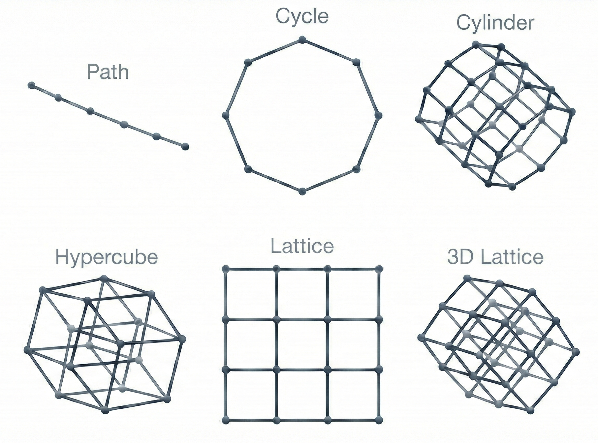

###### fig-3

*Рисунок 3: виды графов.* **[p. 3]**

**[p. 3]**

###### p3-1

Хотя остаточная арифметика и служила ходовым полигоном для гроккинга, эти алгебраические действия можно рассматривать геометрически как перемещения по особой топологии графа — циклическому графу $C_p$ кольца $\mathbb{Z}_p$. В этом свете мы расширяем постановку с простых циклов на произвольные строения графов с явно заданной геометрией.

###### p3-2

Мы вводим задачу **восполнения метрики графа**(footnote: Эта задача есть дискретный двойник задачи *восполнения матрицы евклидовых расстояний*.), назначенную восстановить всеобщее топологическое строение графа выведением полной матрицы расстояний по кратчайшим путям $D$. Точнее, по двум вершинам $u, v \in V$ графа $G=(V, E)$ сеть должна предсказать геодезическое расстояние $d(u, v)$. В наших опытах мы берём шесть разных геометрий: путь, цикл, цилиндр, гиперкуб, решётку, трёхмерную решётку (рисунок 3).

### 3.3 Сравнение

###### p3-3

Теперь мы снимаем метрические подмостки, данные в задаче о графе, и выясняем, возникает ли геометрия при строго *местном* надзоре. Мы берём **задачу сравнения**, где модель должна вывести всеобщее строение единственно из двоичных попарных отношений ($x \succ y$). Чтобы прощупать пределы геометрического представления, мы сосредоточиваемся на переходных постановках и оцениваем качество в двумерном и трёхмерном пространствах признаков.

###### p3-4

**Постановка задачи.** Мы воплощаем задачу сравнения в виде, подобном малому графу знаний, вслед за прежними работами (Wang et al., 2024; Allen-Zhu and Li, 2024). Каждая сущность есть человек, описываемый скрытыми скалярными признаками, размерность которых равна двум или трём в зависимости от постановки. Надзор даётся исключительно через отношения относительного порядка между парами сущностей, без доступа к самим значениям признаков.

Пусть $\mathcal{X}$ обозначает словарь сущностей, а $\mathcal{R}$ — словарь отношений:

$$
\begin{aligned}\mathcal{X} &= \{\, e_i = (a_i, h_i, w_i) \mid a_i, h_i, w_i \in \{1, 2, \dots, m\} \,\}, \\
\mathcal{R} &= \{\, r^{x}_{\bowtie} \mid x \in \{\text{age}, \text{height}, \text{weight}\},\
\bowtie \in \{<, =, >\} \,\}.\end{aligned}
$$

Тогда каждый обучающий пример есть тройка $(e_i, r, e_j)$ с меткой $y \in \{0,1\}$, указывающей, выполняется ли отношение $r$ между $e_i$ и $e_j$. На обычном языке это отвечает предложениям вида «Джон старше Мэри» или «Алиса выше Боба».

*Рисунок 4: полное изображение вложений остаточного сложения по главным составляющим.* **[p. 3]**

## 4 Побуждение: устроенная геометрия в пространстве вложений

###### p3-7

Во всех введённых выше задачах мы разбираем выученные вложения знаков разложением по главным составляющим (PCA), чтобы рассмотреть их представления. Проецирование на ведущие главные составляющие выявляет любопытный образец: после того как модели достигают обобщения, их вложения неизменно обнаруживают устроенное малоразмерное геометрическое устроение.

###### p3-8

Для задач остаточной арифметики это геометрическое строение особенно ясно. Как показано на рисунке 1, две ведущие главные составляющие складываются в приблизительно круговой образец, что согласуется с прежними наблюдениями на остаточном сложении (Nanda et al., 2023; Kantamneni and Tegmark, 2025). Переход к подпространствам главных составляющих большей размерности выявляет винтовое устроение, где каждая пара главных составляющих даёт круговую проекцию с закономерным сдвигом по фазе. Более подробный разбор этого строения — в приложении G.

Схожий образец появляется и в задачах восполнения графа и сравнения. Выученные вложения восстанавливают геометрические строения, отражающие отношенческие или порядковые свойства задачи, как изображено на рисунке 2. Эти наблюдения дают основание думать, что согласная с задачей геометрия есть общее свойство вложений, обеспечивающих алгоритмическое обобщение. Дополнительные изображения по главным составляющим для всех задач приведены в приложении A.2.

###### p3-10

Впрочем, связь между геометрией вложений и обобщением замечена и в прежних работах (Liu et al., 2022). Однако, хотя такое геометрическое строение и помогает описать, как обобщение проявляется в выученных представлениях, само по себе оно не объясняет, отчего эти строения возникают. Отсюда средоточный вопрос: ***что движет возникновением устроенной геометрии вложений?*** В разделе 7 мы доводим, что собственные симметрии задачи дают основательное устройство, лежащее в основе этого явления.

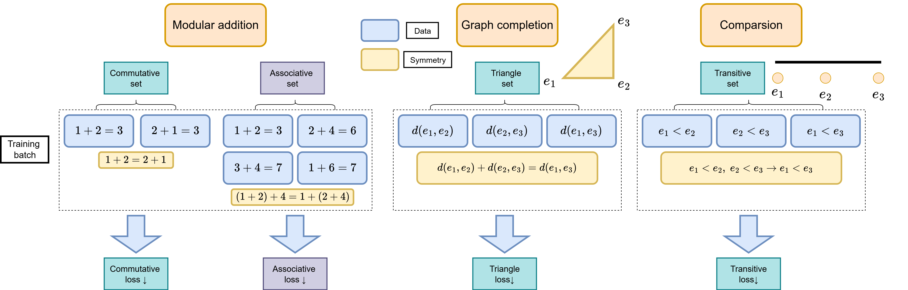

*Рисунок 5: симметричные образцы внутри набора данных ведут сеть к выучиванию собственной симметрии.* **[p. 4]**

**[p. 4]**

## 5 Собственные симметрии в алгоритмических задачах

Чтобы ответить на поставленный выше вопрос, мы обращаемся к строительному свойству, общему для этих алгоритмических задач, — *собственной симметрии задачи*. Мы доводим, что такие симметрии налагают основополагающие ограничения на правило, которому подчинены данные, и что обретение этих неизменностей есть необходимое условие настоящего алгоритмического обобщения.

С этой целью мы сперва выделяем собственные симметрии, присутствующие в каждой области (изображены на рисунке 5), и придаём строгий вид тому строению неизменности, которое модели пришлось бы неявно усвоить, чтобы обобщать за пределы обучающего распределения.

#### Остаточная арифметика

Для остаточного сложения есть две симметрии — переместительность и сочетательность:

$$
\begin{aligned}\text{Commutativity: } &\; x+y = y+x, \\[3pt]
\text{Associativity: } &\; x+(y+z) = (x+y)+z.\end{aligned}
$$

Эти два свойства суть основные свойства арифметических действий. Отметим также, что у иных действий есть схожие симметрии, которые мы приводим в таблице 1.

###### fig-6

*Рисунок 6: трёхпорный ход *гроккинга* для задачи остаточного сложения. **(1) Запоминание**: сперва модель *запоминает*, быстро достигая безупречной точности на обучении. **(2) Обретение симметрии**: затем, по мере убывания мерила симметрии до некоторого порога, достигается безупречная точность на проверке. **(3) Устроение геометрии**: наконец, по мере сжатия представления в меньшую размерность вложение складывается в геометрическое устроение.* **[p. 5]**

#### Восполнение метрики графа

В задаче восполнения метрики графа есть симметрия равенства треугольника. Пусть $e_1,e_2,e_3$ — вершины графа. Если $e_2$ лежит на кратчайшем пути между $e_1$ и $e_3$, то выполняется следующее равенство треугольника: $$\text{Triangular symmetry:  } d(e_1,e_2) + d(e_2,e_3) = d(e_1,e_3).$$

#### Сравнение

В задаче сравнения есть симметрия переходности. Пусть $e_1,e_2,e_3$ — знаковые сущности в задачах сравнения. Пусть в обучающем наборе есть $e_1 < e_2$ и $e_2 < e_3$. Тогда по переходности верно и $e_1 < e_3$, и мы называем это переходной симметрией. $$\text{Transitivity :  } e_1 < e_2, \quad e_2 < e_3 \quad \to\quad e_1 < e_3.$$

###### tab-1

*Таблица 1: симметрии разных остаточных действий. $x^+$ обозначает $x^+=x+1$.* **[p. 4]**

| **Задача** | **заместитель переместительности** | **заместитель сочетательности** |
|---|---|---|
| $x+y$ | $x + y = y +x$ | $(x+y)+z = x+(y+z)$ |
| $x-y$ | $x-(-y) =  y - (-x)$ | $(x-y)-z $ $= x-(y-(-z))$ |
| $(x+ y)^{\alpha}$ | $ (x+ y)^{\alpha} = (y+ x)^{\alpha}  $ | $ ( (x+ y)+z)^{\alpha}$ = $( x+ (y+z))^{\alpha} $ |
| $x \times y$ | $x \times y=y \times x $ | $(x\times y)\times z$ $=x\times (y\times z) $ |
| $x^{}+xy+y^{}$ | $x^+\times y^+-1$ $ = y^+ \times x^+-1$ | $\left(x^+\times y^+ \right)\times  z^+-1$ $ = x^+ \times \left( y^+ +z^+ \right)-1$ |

## 6 Обобщение, движимое симметрией

Выделив собственные симметрии, лежащие в основе каждой задачи, мы теперь рассмотрим их деятельную роль по ходу обучения.

### 6.1 Трёхпорный ход обучения

###### p4-8

Расхожее представление таково: раз сеть безупречно легла на обучающие данные, выучивать больше нечего и обучение по сути прекращается. Однако при наличии собственных симметрий обучение может продолжаться и после запоминания: модель может снижать нарушения симметрии, сохраняя почти нулевую потерю на обучении.

###### p4-9

Скажем, в остаточном сложении, если обучающий набор содержит переместительные пары или сочетательные тройки, сеть сталкивается с алгебраическими симметриями сложения. Встречая образцы симметрии снова и снова, сеть может неявно выучить эти симметрии, а не запомнить отдельные примеры. Схожие ограничения симметрии возникают и в **[p. 5]** остальных областях (рисунок 5), что наводит на мысль об общем устройстве, лежащем в основе обобщения.

###### p5-1

Опираясь на эти наблюдения, мы выдвигаем, что оптимизация при *гроккинге* проходит три разные поры: (i) запоминание данных, (ii) обретение собственной симметрии и (iii) устроение геометрии. Рисунок 6 изображает этот трёхпорный ход обучения.

###### p5-2

В пору запоминания данных сеть ложится на наблюдаемые обучающие примеры, наименьшая потерю на обучении. Даже после достижения безупречной точности на обучении этот ход может продолжаться, снижая остаточную потерю на обучении и не давая обобщения.

###### p5-3

Вслед за достаточным запоминанием обучение вступает в пору обретения симметрии. По мере того как нарушения симметрии убывают — а измеряются они расхождением Кульбака—Лейблера между предсказаниями на связанных симметрией парах входов,(footnote: Подробности — в приложении A.) — сеть усваивает собственные симметрии задачи, отчего качество на невиданных данных улучшается. Как только эти ограничения выполнены достаточно полно, возникает обобщение.

###### p5-4

С обеспеченными ограничениями симметрии обучение переходит в пору устроения геометрии. На этой поре ослабление весов оказывает на оптимизацию преобладающее влияние, отдавая среди согласных с симметрией представлений предпочтение решениям малой нормы. Это наводит малоранговое малоразмерное строение в пространстве вложений и приводит к тем устроенным геометриям, что наблюдались в разделе 4.(footnote: Хотя устроение геометрии может возникать и ближе к завершению обретения симметрии, в большинстве случаев оно становится видимым лишь после того, как действенная размерность вложений достаточно убыла.)

Ход обучения для прочих алгоритмических задач приведён в приложении A. Хотя точные сроки и резкость переходов от поры к поре разнятся по областям, мы неизменно наблюдаем, что обобщение совпадает с обретением симметрии, а не с продолжающимся запоминанием, что подкрепляет взгляд, по которому выучивание симметрии устройственно отлично от переобучения.

###### fig-7

*Рисунок 7: мерило нарушения симметрии против точности на проверке при разных семенах. Порог по нарушению симметрии отделяет **решённые** прогоны от **нерешённых**, что подкрепляет согласование симметрии как предсказатель обобщения.* **[p. 6]**

### 6.2 Мерило на основе симметрии

Наша трёхпорная рамка даёт ясное проверяемое предсказание: если обретение симметрии движет обобщением, то убывание нарушения симметрии должно надёжно совпадать с наступлением точности на проверке. Поэтому мы выясняем, может ли определённое выше мерило симметрии служить предсказывающим признаком обобщения.

###### p5-7

Рисунок 7 сводит итоги 20 независимых прогонов обучения на каждую задачу. Каждая точка отвечает одному прогону, оценённому на определённой эпохе (ось x), а ось y показывает соответствующее мерило нарушения симметрии по логарифмической шкале. Точки окрашены по тому, достигает ли прогон в итоге безупречной точности на проверке (синие, *решённые*) или так и не обобщает (красные, *нерешённые*).

###### p5-8

Во всех задачах мы наблюдаем неизменное пороговое отношение: как только нарушение симметрии у прогона падает ниже некоторого уровня, он надёжно достигает безупречной точности на проверке, тогда как прогоны, остающиеся выше этого уровня, — нет. Хотя переход и не вполне резок, мерило симметрии отделяет решённые срезы от нерешённых при разных семенах, что подкрепляет согласование симметрии как предсказывающее мерило.

###### fig-8

*Рисунок 8: мы обучаем двухслойный MLP остаточному сложению при доле обучающих данных 80 %, ***без*** ослабления весов.* **[p. 6]**

### 6.3 Обсуждение

###### p5-9

**Роль ослабления весов.** Можно возразить, что главная причина обобщения — склонности оптимизации, **[p. 6]** такие как ослабление весов, а собственные симметрии играют лишь второстепенную роль. В частности, Nanda et al., 2023 разлагают гроккинг на запоминание, складывание контура и уборку, приписывая складывание контура по преимуществу ослаблению весов, отбирающему решения малой нормы. Чтобы разобрать эту возможность, мы ставим дополнительный опыт на остаточном сложении ***без*** ослабления весов.

###### p6-1

Как показано на рисунке 8, даже при отсутствии явного сглаживания модель надёжно сходится к безупречной точности на проверке ***(пунктирная линия)***, что отмечалось и в прежних работах (Kumar et al., 2024; Prieto et al., 2025). (Обсуждение сплошной линии отложено до раздела 8.5.) Это показывает, что ослабление весов не есть необходимое условие обобщения. С нашей точки зрения ослабление весов играет вспомогательную роль, главным образом устаивая и упрощая представления в пору устроения геометрии.

## 7 Устроение геометрии, движимое симметрией

Если обретение симметрии правит наступлением обобщения, то следующий естественный вопрос таков: *какие строительные следствия симметрия налагает на выученное представление?* Выше мы показали, что убывание нарушения симметрии надёжно совпадает с обобщением. Теперь мы рассмотрим, как выполнение собственных симметрий задачи задаёт геометрию пространства вложений.

###### p6-3

Собственные симметрии налагают на представления алгебраические ограничения. Будучи усвоены, эти ограничения уменьшают действенное число степеней свободы пространства решений модели. В алгоритмических задачах, подчинённых строгим правилам, допустимые представления оттого и заперты в устроенном подмножестве меньшей размерности.

###### p6-4

Такой взгляд согласуется с догадкой о многообразии (Fefferman et al., 2016), по которой осмысленные представления лежат на малоразмерных многообразиях. В нашей постановке собственная симметрия и даёт то строительное устройство, что обеспечивает это ограничение размерности. При слабой склонности оптимизации вроде ослабления весов или неявного сглаживания (Barrett and Dherin, 2021) сеть предпочтительно отбирает решения малой нормы внутри этого стеснённого пространства, отчего и возникает устроенное геометрическое строение.

Скажем, в остаточной арифметике, собственные симметрии которой суть переместительность и сочетательность, выученные вложения обнаруживают строение, согласное с представлением переместительной группы. Опытно это проявляется замкнутой винтовой геометрией в пространстве главных составляющих, как показано в разделе 4. Теперь мы дадим теоретический отчёт о том, отчего такая симметрия неизбежно наводит это геометрическое строение.(footnote: Подробные доказательства приведены в приложении H.)

### 7.1 Теоретическое наблюдение

#### 7.1.1 Остаточная арифметика

Сперва мы строго поверим, что симметрии наводят устроенную геометрию вложений в задаче остаточного сложения. Мы считаем, что $\mathcal{X}=\mathbb{Z}_p$ непрерывно вложено в промежуток, соединяющий концы: $\mathbb{Z}_p \subset \mathcal{M} =  [0, p] / \{ 0\sim p\}$. Отметим, что остаточное сложение в $\mathbb{Z}_p$ сохраняется в $\mathcal{M}$. Если у $\mathcal{M}$ есть некоторая геометрия, то ей следует и $\mathbb{Z}_p$. Если $\mathcal{M}$ обладает переместительностью и сочетательностью, то можно сказать, что у $\mathcal{M}$ есть строение переместительной группы и $\mathcal{M}$ должно быть изоморфно замкнутой винтовой линии в многомерном торе (footnote: По определению, чтобы быть переместительной группой, $\mathcal{M}$ должно обладать единицей и обратимостью. Такие свойства просты и легки для выучивания сетью, потому эти условия мы опускаем.).

**[p. 7]**

##### **Утверждение 7.1****.**

###### p7-1

Пусть $\mathcal{M}$ — одномерная компактная переместительная топологическая группа, а $\mathbb{Z}_p$ непрерывно вложено в $ \mathcal{M}$. Тогда $\mathcal{M}$ изоморфно $S^1$, вложенной в многомерный тор $\mathbb{T}^D$ (замкнутой винтовой линии) $$\Phi: \mathcal{M} \cong  S^1 \hookrightarrow \mathbb{T}^D.$$ Оттого и $\Phi(\mathbb{Z}_p) \hookrightarrow \Phi(\mathcal{M})$ заперто в замкнутой винтовой линии.

Пользуясь утверждением 7.1: раз $\mathcal{M}$ есть компактная переместительная группа (удовлетворяющая переместительности и сочетательности), $\mathcal{M}$ изоморфно замкнутой винтовой линии. Здесь *изоморфизм* означает сохраняющее строение взаимно однозначное отображение (гомеоморфизм в топологическом смысле). Стало быть, теоретически мы наблюдаем: если сеть достаточно выучивает переместительность и сочетательность остаточного сложения, её вложения естественно устраиваются вдоль замкнутого винтового строения в пространстве представлений. Это наблюдение далее наводит на мысль, что иные остаточные действия со схожими симметриями порождают подобные геометрические строения (см. приложение G).

### 7.2 Задачи восполнения метрики графа и сравнения

Мы даём и частичный теоретический разбор того устроения геометрии, что наблюдается в задачах о метрике графа и сравнении. Если считать пространством вложений $\mathbb{R}^d$ или $\mathbb{T}^d$ при малом $d \in \mathbb{N}$, то возможно получить частичные объяснения возникновения устроенной геометрии.

Пусть $\mathcal{X} = \{v_1, \dots, v_n\}$ — множество вершин графа с вложением $\Phi : \mathcal{X} \to \mathbb{R}$ в малоразмерное пространство. Если $\Phi(\cdot)$ вбирает частичные сведения о расстояниях (запоминание обучающих данных), собственные симметрии задачи и малую размерность вложения, то образ $\Phi(\mathcal{X})$ обнаруживает устроенное геометрическое строение. Следующее утверждение придаёт этому соображению строгий вид для случая графов «путь» и «цикл» (рисунок 3). Если $\mathcal{X}$ вложено в $\mathbb{R}$ с сохранением симметрии треугольника, то полученное вложение восстанавливает строение графа.

##### **Утверждение 7.2****.**

###### p7-5

Пусть $ \mathcal{X}=\{v_1 , \dots, v_n\}$ — одномерный граф «путь» или «цикл» (см. рисунок 3) с $n$ вершинами ($n \ge 3$), а $\mathcal{Z} \in \{\mathbb{R}, \mathbb{T}\}$ — пространство вложений. Пусть $\Phi : G \to \mathcal{Z}$ — вложение с частичными сведениями о расстояниях $$\begin{aligned}d(\Phi(v_{i}) ,\Phi(v_{i+1}))&=1, \; i=1,\dots n-1, \\
        d(\Phi(v_{1}) ,\Phi(v_{n}))&=1, \; \text{ if $\mathcal{X}$ is Cycle. }\end{aligned}$$ Если $\Phi(\cdot)$ сохраняет симметрию треугольника, то $\Phi(\mathcal{X})$ несёт строение своего графа в пространстве вложений $\mathbb{R}$.

Поскольку прочие графы на рисунке 3 рассматриваются как составленные из путей и циклов, можно ждать схожего строения вложений.

Подобный итог верен и для задачи сравнения. Следующее утверждение говорит, что если $\mathcal{X}$ вложено в $\mathbb{R}$ с сохранением переходности, то полученное вложение обнаруживает решётчатое строение.

##### **Утверждение 7.3****.**

###### p7-8

Пусть $\mathcal{X}=\{v_1 , \dots, v_n\}$ — множество узлов в одномерной задаче сравнения (см. раздел 3.3) с $n \ge 3$ узлами. Пусть $\Phi : \mathcal{X} \to \mathbb{R}$ — вложение с частичными сведениями об отношениях $$\Phi(v_{i}) < \Phi(v_{i+1}), \; i=1,\dots n-1.$$ Если $\Phi(\cdot)$ сохраняет переходность, то $\Phi(\mathcal{X})$ несёт решётчатое строение в пространстве вложений $\mathbb{R}$.

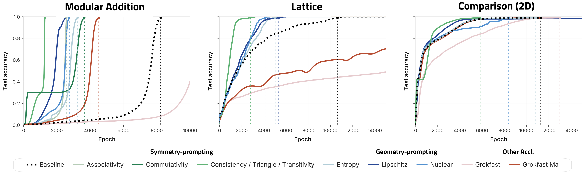

###### fig-9

*Рисунок 9: сравнение быстроты схождения на остаточном сложении, восполнении графа (решётка) и сравнении (2D) при **склонностях, поощряющих геометрию** (*ядерная*, *энтропийная*, *липшицева*); **потерях, подсказывающих симметрию** (*переместительность*/*сочетательность* и прочие); **ускорителях на основе приёма оптимизации** (*GrokFast*). Значки отмечают первую точку, где точность на проверке достигает 100 %. *Согласованность* означает применение и переместительности, и сочетательности.* **[p. 8]**

В совокупности эти наблюдения дают основание думать, что устроение геометрии объяснимо взаимодействием собственных симметрий задачи, достаточного запоминания частичных сведений и ограничения на малую размерность вложений.

## 8 Ускорение обобщения через симметрию

### 8.1 Постановка

Выше мы наблюдали, что обобщение неизменно совпадает с порой обретения симметрии, а устроение геометрии следует за ним, когда представления стягиваются к согласным с симметрией решениям. Эти наблюдения дают основание думать, что согласование симметрии играет решающую роль в том, когда наступает переход гроккинга.

###### p7-11

Чтобы рассмотреть это устройство напрямую, мы теперь вмешиваемся в обучение, вводя вспомогательные цели, явно поощряющие собственные симметрии задачи. **Если обретение симметрии правит наступлением обобщения, то, поощряя симметрию последовательно, мы должны сдвинуть время до обобщения по всем задачам и семенам.** Такие сдвиги были бы свидетельством, согласным с причинной ролью согласования симметрии в гроккинге.

###### p7-12

Точнее, мы берём (i) *подсказывающие симметрию* потери, наказывающие нарушения собственных симметрий задачи, и (ii) *поощряющие геометрию* склонности, побуждающие малоранговое строение выученных представлений. Полная цель задана как $$\mathcal{L}_{\text{total}}
=
\mathcal{L}_{\text{CE}}
+
\alpha \|\theta\|^2
+
\lambda \mathcal{L}_{\text{aux}},$$ где $\mathcal{L}_{\text{aux}}$ обозначает вспомогательное слагаемое, а $\alpha,\lambda$ суть настройки. Полное описание постановки — в приложении F.

### 8.2 Потеря, подсказывающая симметрию

Мы воплощаем $\mathcal{L}_{\text{aux}}$ как цель, подсказывающую симметрию: она прямо наказывает те самые нарушения симметрии, что измерялись в разделе 6. Если прежде нарушение симметрии служило распознающим мерилом, то здесь мы вносим его в цель обучения как явный сглаживатель.

**[p. 8]**

Для остаточной арифметики мы обеспечиваем согласованность по **переместительности** и **сочетательности** (а для непереместительных действий — по свойственным задаче замещающим тождествам; см. таблицу 1). Для задач восполнения метрики графа и сравнения мы обеспечиваем соответственно **равенство треугольника** и **переходность**. Точнее, потеря поощряет согласие предсказаний модели на связанных симметрией наборах входов, тем самым прямо снижая нарушения симметрии по ходу оптимизации.

### 8.3 Склонности, подсказывающие геометрию

Выше мы наблюдали, что устроение геометрии следует за обретением симметрии и отвечает стягиванию представлений на малоразмерное многообразие. Если согласование симметрии правит наступлением обобщения, то устроение геометрии устаивает согласные с симметрией решения, отдавая предпочтение малоранговому строению.

###### p8-3

Чтобы склонить оптимизацию к этому виду, мы вводим поощряющие геометрию склонности, побуждающие малоразмерные вложения. А именно мы берём: (i) **сглаживание ядерной нормой**, наказывающее сумму сингулярных значений и поощряющее малый действенный ранг; (ii) **энтропийное сглаживание**, отвращающее от размытых, высокоэнергетических вложений; и (iii) **липшицево сглаживание**, обеспечивающее местную гладкость в пространстве представлений.

Отметим, что эти выборы согласуются с прежними находками, связывающими малоранговое строение с ходом гроккинга (Junior et al., 2025), а снижение энтропии — со сжатием представлений (DeMoss et al., 2025).

### 8.4 Итоги

###### p8-5

Рисунок 9 сводит воздействие предложенных вмешательств на время до обобщения по задачам. Приёмы, подсказывающие симметрию, неизменно уменьшают число шагов обучения, потребных для достижения безупречной точности на проверке, по сравнению с исходной постановкой и прочими способами ускорения. Это влияние держится по всем областям и семенам, а значит, прямое наименьшение нарушений симметрии последовательно сдвигает переход гроккинга.

###### p8-6

Поощряющие геометрию склонности тоже способны сократить время до обобщения по сравнению с исходной постановкой, как и отмечалось в прежних находках о том, что малоранговое строение способствует сжатию представлений (Walker et al., 2025; DeMoss et al., 2025; Junior et al., 2025). Однако эти улучшения меньше достигаемых подсказыванием симметрии, что подкрепляет различие между обретением симметрии (*обобщение*) и устроением геометрии (*устаивание*). GrokFast (Lee et al., 2024), напротив, ведёт себя по-разному от задачи к задаче, ускоряя обобщение в одних постановках и задерживая схождение в других, а это говорит о чувствительности к строению задачи, а не о согласии с собственными неизменностями.

###### p8-7

В целом эти итоги дают свидетельство от вмешательства: согласование симметрии играет причинную роль в том, что обобщение в алгоритмических задачах становится возможным. Дополнительные итоги приведены в приложении D.

### 8.5 Обсуждение

**Сравнение с прежними истолкованиями.** Как уже отмечалось, модель надёжно сходится к безупречной точности на проверке даже ***без*** ослабления весов (рисунок 8). Добавление ограничений симметрии (**сплошная линия**) в этой постановке существенно ускоряет обобщение, сокращая время до обобщения вплоть до двух порядков.

###### p8-9

Мы рассматриваем и *начальное приближение* (Liu et al., 2023), и *масштабирование выхода* (Kumar et al., 2024) — два признанных ранее обстоятельства, влияющих на возникновение гроккинга. Как подробно показано в приложении E, цели, обеспечивающие симметрию, неизменно ускоряют обобщение в широком наборе этих постановок. Эти находки дают основание думать, что если масштабирование правит видом и сроками обучения признакам, то собственная симметрия задачи задаёт геометрическое **направление**, ведущее модель от запоминания к обобщению.

**[p. 9]**

## 9 Заключение

Мы доводим, что собственная симметрия задачи есть главная причина обобщения в алгоритмическом рассуждении. В остаточной арифметике, восполнении метрики графа и задачах сравнения мы находим, что обобщение возникает, когда модели выходят за пределы запоминания обучающих примеров и вместо того обретают собственные симметрии задачи. Это наблюдение подкрепляет неизменно повторяющийся трёхпорный ход — запоминание, обретение симметрии, устроение геометрии, — причём переход к безупречной точности на проверке тесно совпадает с обретением симметрии. Далее мы даём опытные и теоретические свидетельства того, что, как только эти ограничения симметрии усвоены, слабые склонности оптимизации и давление к малому рангу ведут представления к тем устроенным малоразмерным геометриям, что наблюдаются в пространстве вложений.

Опираясь на это устройство, мы показываем, что явное поощрение симметрии способно причинно ускорять гроккинг. Цели, подсказывающие симметрию, и склонности, поощряющие геометрию, неизменно сокращают время до обобщения во всех областях, причём наиболее надёжный выигрыш даёт согласование симметрии. В совокупности наши итоги дают основательное объяснение тому, отчего устроенные геометрии вложений возникают после обобщения, и ставят гроккинг как ход обретения симметрии, лежащий в основе обобщения в алгоритмических задачах.

## Благодарности

Мы искренне благодарим Juyoung Suk за ранний вклад в развитие этой работы.

## Список литературы

- Alethea Power, Yuri Burda, Harri Edwards, Igor Babuschkin, Vedant Misra, Grokking: Generalization Beyond Overfitting on Small Algorithmic Datasets, 2201.02177, 2022

- Vikrant Varma, Rohin Shah, Zachary Kenton, János Kramár, Ramana Kumar, Explaining grokking through circuit efficiency, 2309.02390, 2023

- Ziming Liu, Eric J Michaud, Max Tegmark, Omnigrok: Grokking Beyond Algorithmic Data, The Eleventh International Conference on Learning Representations , 2023

- Liu, Ziming, Kitouni, Ouail, Nolte, Niklas S, Michaud, Eric, Tegmark, Max, Williams, Mike, Towards understanding grokking: An effective theory of representation learning, Advances in Neural Information Processing Systems, 2022

- Tanishq Kumar, Blake Bordelon, Samuel J. Gershman, Cengiz Pehlevan, Grokking as the transition from lazy to rich training dynamics, The Twelfth International Conference on Learning Representations, 2024

- Andrey Gromov, Grokking modular arithmetic, 2301.02679, 2023

- Andrew Lee, Melanie Weber, Fernanda Viégas, Martin Wattenberg, Shared Global and Local Geometry of Language Model Embeddings, 2503.21073, 2025

- Alexander Modell, Patrick Rubin-Delanchy, Nick Whiteley, The Origins of Representation Manifolds in Large Language Models, 2505.18235, 2025

- Xingyu Zheng, Kyle Daruwalla, Ari S Benjamin, David Klindt, Delays in generalization match delayed changes in representational geometry, UniReps: 2nd Edition of the Workshop on Unifying Representations in Neural Models, 2024

- Rishi Jha, Collin Zhang, Vitaly Shmatikov, John X. Morris, Harnessing the Universal Geometry of Embeddings, 2505.12540, 2025

- Park, Yeachan, Kim, Minseok, Kim, Yeoneung, Acceleration of grokking in learning arithmetic operations via Kolmogorov-Arnold representation, Neurocomputing, 2025

- Merrill, William, Tsilivis, Nikolaos, Shukla, Aman, A Tale of Two Circuits: Grokking as Competition of Sparse and Dense Subnetworks, ICLR 2023 Workshop on Mathematical and Empirical Understanding of Foundation Models, n.d.

- Simin Fan, Razvan Pascanu, Martin Jaggi, Deep Grokking: Would Deep Neural Networks Generalize Better?, 2405.19454, 2024

- Satvik Golechha, Progress Measures for Grokking on Real-world Tasks, 2405.12755, 2024

- Beren Millidge, Grokking 'grokking', 2022

- Javier Sanguino Bautiste, Gregor Bachmann, Bobby He, Lorenzo Noci, Thomas Hofmann, Unveiling Grokking: Analyzing Feature Learning Dynamics During Training, High-dimensional Learning Dynamics 2024: The Emergence of Structure and Reasoning, 2024

- Yoshua Bengio, Aaron Courville, Pascal Vincent, Representation Learning: A Review and New Perspectives, 1206.5538, 2014

- Florian Eichin, Yupei Du, Philipp Mondorf, Barbara Plank, Michael A. Hedderich, Grokking ExPLAIND: Unifying Model, Data, and Training Attribution to Study Model Behavior, 2505.20076, 2025

- Ziqian Zhong, Ziming Liu, Max Tegmark, Jacob Andreas, The Clock and the Pizza: Two Stories in Mechanistic Explanation of Neural Networks, Thirty-seventh Conference on Neural Information Processing Systems, 2023

- Subhash Kantamneni, Max Tegmark, Language Models Use Trigonometry to Do Additio**[p. 10]** n, ICLR 2025 Workshop on Building Trust in Language Models and Applications, 2025

- Chung, SueYeon, Lee, Daniel D., Sompolinsky, Haim, Linear readout of object manifolds, Physical Review E, 2016

- Gregory Cohen, Saeed Afshar, Jonathan Tapson, André van Schaik, EMNIST: an extension of MNIST to handwritten letters, 1702.05373, 2017

- Belkin, Mikhail, Niyogi, Partha, Sindhwani, Vikas, Manifold Regularization: A Geometric Framework for Learning from Labeled and Unlabeled Examples, J. Mach. Learn. Res., 2006

- Michael M. Bronstein, Joan Bruna, Taco Cohen, Petar Veličković, Geometric Deep Learning: Grids, Groups, Graphs, Geodesics, and Gauges, 2104.13478, 2021

- Tikeng Notsawo Pascal Junior, Guillaume Dumas, Guillaume Rabusseau, Grokking Beyond the Euclidean Norm of Model Parameters, Forty-second International Conference on Machine Learning, 2025

- Beck, Alon, Levi, Noam, Bar-Sinai, Yohai, Grokking at the edge of linear separability, arXiv preprint arXiv:2410.04489, 2024

- Gallian, Joseph, Contemporary abstract algebra, Chapman and Hall/CRC, 2021

- Procesi, Claudio, Lie groups: an approach through invariants and representations, Springer, 2007

- Neel Nanda, Lawrence Chan, Tom Lieberum, Jess Smith, Jacob Steinhardt, Progress measures for grokking via mechanistic interpretability, The Eleventh International Conference on Learning Representations , 2023

- Fefferman, Charles, Mitter, Sanjoy, Narayanan, Hariharan, Testing the manifold hypothesis, Journal of the American Mathematical Society, 2016

- Zeyuan Allen-Zhu, Yuanzhi Li, Physics of Language Models: Part 3.1, Knowledge Storage and Extraction, Forty-first International Conference on Machine Learning, 2024

- Boshi Wang, Xiang Yue, Yu Su, Huan Sun, Grokking of Implicit Reasoning in Transformers: A Mechanistic Journey to the Edge of Generalization, The Thirty-eighth Annual Conference on Neural Information Processing Systems, 2024

- Jaerin Lee, Bong Gyun Kang, Kihoon Kim, Kyoung Mu Lee, Grokfast: Accelerated Grokking by Amplifying Slow Gradients, 2405.20233, 2024

- Chughtai, Bilal, Chan, Lawrence, Nanda, Neel, A toy model of universality: Reverse engineering how networks learn group operations, International Conference on Machine Learning, 2023

- Hiroki Furuta, Gouki Minegishi, Yusuke Iwasawa, Yutaka Matsuo, Towards Empirical Interpretation of Internal Circuits and Properties in Grokked Transformers on Modular Polynomials, Transactions on Machine Learning Research, 2024

- Tan, Zhiquan, Huang, Weiran, Understanding grokking through a robustness viewpoint, arXiv preprint arXiv:2311.06597, 2023

- Morris, Sidney A, Pontryagin duality and the structure of locally compact abelian groups, Cambridge University Press, 1977

- Hewitt, Edwin, Ross, Kenneth Allen, Abstract Harmonic Analysis: Volume I, Structure of Topological Groups Integration Theory Group Representations, Springer, 2013

- Pontrjagin, Leon, The theory of topological commutative groups, Annals of Mathematics, 1934

- Deng, Li, The MNIST Database of Handwritten Digit Images for Machine Learning Research [Best of the Web], IEEE Signal Processing Magazine, 2012

- Maas, Andrew L., Daly, Raymond E., Pham, Peter T., Huang, Dan, Ng, Andrew Y., Potts, Christopher, Learning Word Vectors for Sentiment Analysis, Proceedings of the 49th Annual Meeting of the Association for Computational Linguistics: Human Language Technologies, 2011

- Ramakrishnan, Raghunathan, Dral, Pavlo O, Rupp, Matthias, von Lilienfeld, O Anatole, Quantum chemistry structures and properties of 134 kilo molecules, Scientific Data, 2014

- Ziyue Li, Chenrui Fan, Tianyi Zhou, Where to find Grokking in LLM Pretraining? Monitor Memorization-to-Generalization without Test, 2506.21551, 2025

- Lv, Ang, Xie, Ruobing, Sun, Xingwu, Kang, Zhanhui, Yan, Rui, Language Models ``Grok'' to Copy, Proceedings of the 2025 Conference of the Nations of the Americas Chapter of the Association for Computational Linguistics: Human Language Technologies (Volume 2: Short Papers), 2025

- Roman Abramov, Felix Steinbauer, Gjergji Kasneci, Grokking in the Wild: Data Augmentation for Real-World Multi-Hop Reasoning with Transformers, 2504.20752, 2025

- Nouha Dziri, Ximing Lu, Melanie Sclar, Xiang Lorraine Li, Liwei Jiang, Bill Yuchen Lin, Peter West, Chandra Bhagavatula, Ronan Le Bras, Jena D. Hwang, Soumya Sanyal, Sean Welleck, Xiang Ren, Allyson Ettinger, Zaid Harchaoui, Yejin Choi, Faith and Fate: Limits of Transformers on Compositionality, 2305.18654, 2023

- Thilak, Vimal, Littwin, Etai, Zhai, Shuangfei, Saremi, Omid, Paiss, Roni, Susskind, Joshua, The slingshot mechanism: An empirical study of adaptive optimizers and the grokking phenomenon, arXiv preprint arXiv:2206.04817, 2022

- Zunkovič, Bojan, Ilievski, Enej, Grokking phase transitions in learning local rules with gradient descent, Journal of Machine Learning Research, 2024

**[p. 11]**

- Zhiwei Xu, Zhiyu Ni, Yixin Wang, Wei Hu, Let Me Grok for You: Accelerating Grokking via Embedding Transfer from a Weaker Model, The Thirteenth International Conference on Learning Representations, 2025

- Kaifeng Lyu, Jikai Jin, Zhiyuan Li, Simon Shaolei Du, Jason D. Lee, Wei Hu, Dichotomy of Early and Late Phase Implicit Biases Can Provably Induce Grokking, The Twelfth International Conference on Learning Representations, 2024

- Mohamad Amin Mohamadi, Zhiyuan Li, Lei Wu, Danica J. Sutherland, Why Do You Grok? A Theoretical Analysis on Grokking Modular Addition, Forty-first International Conference on Machine Learning, 2024

- David Barrett, Benoit Dherin, Implicit Gradient Regularization, International Conference on Learning Representations, 2021

- Diederik P. Kingma, Jimmy Ba, Adam: A Method for Stochastic Optimization, 1412.6980, 2017

- Hoyeon Chang, Jinho Park, Hanseul Cho, Sohee Yang, Miyoung Ko, Hyeonbin Hwang, Seungpil Won, Dohaeng Lee, Youbin Ahn, Minjoon Seo, Characterizing Pattern Matching and Its Limits on Compositional Task Structures, 2505.20278, 2025

- Tianyi Zhou, Deqing Fu, Vatsal Sharan, Robin Jia, Pre-trained Large Language Models Use Fourier Features to Compute Addition, 2406.03445, 2024

- Lucas Prieto, Melih Barsbey, Pedro A. M. Mediano, Tolga Birdal, Grokking at the Edge of Numerical Stability, The Thirteenth International Conference on Learning Representations, 2025

- Xuekai Zhu, Yao Fu, Bowen Zhou, Zhouhan Lin, Critical Data Size of Language Models from a Grokking Perspective, 2401.10463, 2024

- Yufei Huang, Shengding Hu, Xu Han, Zhiyuan Liu, Maosong Sun, Unified View of Grokking, Double Descent and Emergent Abilities: A Comprehensive Study on Algorithm Task, First Conference on Language Modeling, 2024

- Zihan Gu, Ruoyu Chen, Hua Zhang, Yue Hu, Xiaochun Cao, Beyond Progress Measures: Theoretical Insights into the Mechanism of Grokking, 2504.03162, 2025

- Breno W. Carvalho, Artur S. d'Avila Garcez, Luís C. Lamb, Emílio Vital Brazil, Grokking Explained: A Statistical Phenomenon, 2502.01774, 2025

- Keyulu Xu, Jingling Li, Mozhi Zhang, Simon S. Du, Ken-ichi Kawarabayashi, Stefanie Jegelka, What Can Neural Networks Reason About?, 1905.13211, 2020

- Benton, Gregory, Finzi, Marc, Izmailov, Pavel, Wilson, Andrew G, Learning invariances in neural networks from training data, Advances in neural information processing systems, 2020

- Yoonsoo Nam, Seok Hyeong Lee, Clémentine Carla Juliette Dominé, Yeachan Park, Charles London, Wonyl Choi, Niclas Alexander Göring, Seungjai Lee, Position: Solve Layerwise Linear Models First to Understand Neural Dynamical Phenomena (Neural Collapse, Emergence, Lazy/Rich Regime, and Grokking), Forty-second International Conference on Machine Learning Position Paper Track, 2025

- Noam Itzhak Levi, Alon Beck, Yohai Bar-Sinai, Grokking in Linear Estimators – A Solvable Model that Groks without Understanding, The Twelfth International Conference on Learning Representations, 2024

- DeMoss, Branton, Sapora, Silvia, Foerster, Jakob, Hawes, Nick, Posner, Ingmar, The complexity dynamics of grokking, Physica D: Nonlinear Phenomena, 2025

- Thomas Walker, Ahmed Imtiaz Humayun, Randall Balestriero, Richard Baraniuk, GrokAlign: Geometric Characterisation and Acceleration of Grokking, 2506.12284, 2025

\onecolumn

**[p. 12]**

## A Ход обучения при гроккинге

В этом разделе мы приводим рисунки с полным ходом обучения для каждой задачи наших опытов, изображающие отчётливое трёхпорное движение: запоминание, обретение симметрии, устроение геометрии.

### A.1 Задачи остаточной арифметики

###### p12-2

Для остаточной арифметики мы проверяем **переместительность и сочетательность** как наше мерило симметрии; их можно вычислить по выходным логитам модели, сравнивая предсказания вдоль алгебраически равносильных путей вычисления. Для действий, которые этим свойствам напрямую не удовлетворяют (скажем, вычитания), мы применяем подходящее *замещающее тождество*, подробно приведённое в таблице 1.

#### Обозначения.

Через $p_\theta(\cdot \mid a,b)$ мы обозначаем предсказываемое моделью распределение (softmax по логитам) при входах $(a,b)$, суженное на $\{0,\dots,p-1\}$. Чтобы измерить близость двух распределений $p$ и $q$, мы применяем *симметричное расхождение Кульбака—Лейблера*: $$\mathrm{KL}_{\text{sym}}(p,q) \;=\; \tfrac{1}{2}\Big(\mathrm{KL}(p\;\|\;q) + \mathrm{KL}(q\;\|\;p)\Big).$$

#### A.1.1 Сложение: $x+y \pmod{p}$

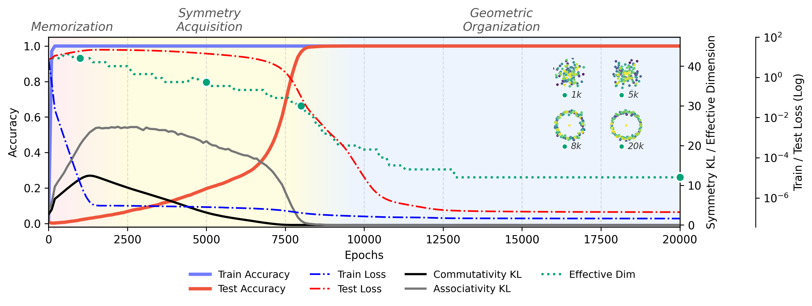

*Рисунок A.10: **ход гроккинга при остаточном сложении.*** **[p. 13]**

#### A.1.2 Вычитание: $x-y \pmod{p}$

*Рисунок A.11: **ход гроккинга при остаточном вычитании.*** **[p. 13]**

#### A.1.3 Квадрат суммы: $(x+y)^2 \pmod{p}$

*Рисунок A.12: **ход гроккинга при остаточном квадрате суммы*** **[p. 14]**

#### A.1.4 Куб суммы: $(x+y)^3 \pmod{p}$

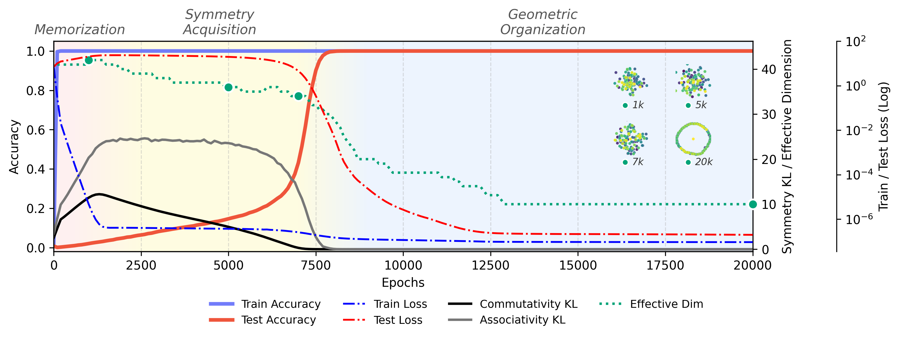

*Рисунок A.13: **ход гроккинга при остаточном кубе суммы*** **[p. 14]**

#### A.1.5 Умножение: $x \times  y \pmod{p}$

*Рисунок A.14: **ход гроккинга при остаточном умножении*** **[p. 15]**

#### A.1.6 Аффинно-билинейная задача: $x + xy + y$

*Рисунок A.15: **ход гроккинга при остаточной аффинно-билинейной задаче*** **[p. 15]**

**[p. 16]**

### A.2 Геометрическая мера продвижения для задач восполнения метрики графа

###### p16-1

Для задачи восполнения метрики графа мы применяем свойство **равенства треугольника**. Это мерило оценивает, соблюдает ли выученное моделью представление сложительную природу расстояний вдоль кратчайших путей. Строго говоря, для любых трёх узлов $u, v, w$, если $v$ лежит на геодезической (кратчайшем пути) между $u$ и $w$, метрика обязана удовлетворять: $d(u, w) = d(u, v) + d(v, w)$

Чтобы это измерить, мы выбираем тройки $(a, b, c)$ так, что $b$ есть промежуточный узел на кратчайшем пути между $a$ и $c$. Затем мы оцениваем согласованность предсказаний модели, вычисляя свёртку предсказанных распределений вероятностей для $d(a, b)$ и $d(b, c)$, обозначаемую $P_{a \to b} * P_{b \to c}$. После чего мы измеряем симметричное расхождение Кульбака—Лейблера между этим свёрнутым распределением и прямым предсказанием модели для $d(a, c)$: $\mathcal{L}_{\text{tri}} = D_{\text{KL}}\left( (P_{a \to b} * P_{b \to c}) \parallel P_{a \to c} \right)$.

#### A.2.1 Цикл

*Рисунок A.16: **ход гроккинга при восполнении метрики графа: цикл*** **[p. 16]**

#### A.2.2 Путь

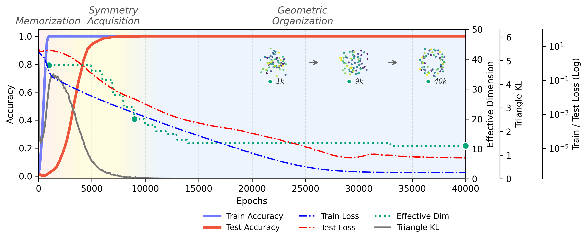

*Рисунок A.17: **ход гроккинга при восполнении метрики графа: путь*** **[p. 16]**

#### A.2.3 Цилиндр

*Рисунок A.18: **ход гроккинга при восполнении метрики графа: цилиндр*** **[p. 17]**

#### A.2.4 Гиперкуб

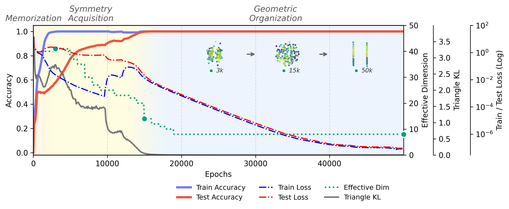

*Рисунок A.19: **ход гроккинга при восполнении метрики графа: гиперкуб*** **[p. 17]**

#### A.2.5 Двумерная решётка

*Рисунок A.20: **ход гроккинга при восполнении метрики графа: решётка*** **[p. 18]**

#### A.2.6 Трёхмерная решётка

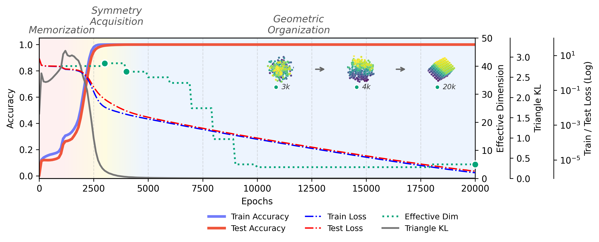

*Рисунок A.21: **ход гроккинга при восполнении метрики графа: трёхмерная решётка*** **[p. 18]**

**[p. 19]**

### A.3 Задачи сравнения

###### p19-1

Для задачи сравнения мы применяем свойство **переходности**. Мы оцениваем, согласны ли попарные сравнения модели со всеобщим линейным порядком, а именно проверяем, следуют ли выученные представления модели Брэдли—Терри, *то есть* определяется ли вероятность $P(a > b)$ разностью скрытых оценок, откуда логарифм отношения шансов обязан быть сложительным: $\ell_{ac} \approx \ell_{ab} + \ell_{bc}$.

На деле мы выбираем тройки $(a, b, c)$, строго упорядоченные по их истинному месту так, что $a < b < c$. Сперва мы извлекаем двоичный логарифм отношения шансов модели для каждой пары как разность логитов *больше* и *меньше*: $\ell = \text{logit}_{>} - \text{logit}_{<}$. Затем мы сравниваем два распределения: прямое предсказание модели $P(a > c) = \sigma(\ell_{ac})$ и переходное предсказание, вытекающее из промежуточных шагов, $Q(a > c) = \sigma(\ell_{ab} + \ell_{bc})$. Итоговое мерило есть симметричное расхождение Кульбака—Лейблера между этими двумя распределениями: $\mathcal{L}_{\text{trans}} = \frac{1}{2} \left( D_{\text{KL}}(P \parallel Q) + D_{\text{KL}}(Q \parallel P) \right)$.

#### A.3.1 Двумерное сравнение

*Рисунок A.22: **ход гроккинга при двумерном сравнении*** **[p. 19]**

#### A.3.2 Трёхмерное сравнение

*Рисунок A.23: **ход гроккинга при трёхмерном сравнении*** **[p. 19]**

**[p. 20]**

## B Описание обобщения через собственную симметрию

Ниже мы строим наибольшее *поэкземплярное* мерило симметрии, достигнутое по ходу обучения для каждой задачи. Мы наблюдаем высокую согласованность между низким наибольшим поэкземплярным мерилом и успешным обобщением. Эти итоги дают основание думать, что устранение строительных выбросов, выражаемых наибольшим нарушением симметрии, есть ключевая примета перехода от запоминания к настоящему алгоритмическому пониманию.

Для каждой задачи мы прослеживаем 20 независимых семян. На точечных графиках каждая точка представляет состояние прогона на определённой эпохе обучения: **синие точки** означают прогоны, успешно обобщившие (достигшие 100 % точности) к этой эпохе, тогда как **красные значки** указывают прогоны, ещё не обобщившие. Мы наблюдаем ***мягкий порог***, различающий эти состояния: обобщающие прогоны неизменно показывают меньшие наибольшие нарушения симметрии, чем не обобщающие.

### B.1 Остаточная арифметика

*Рисунок A.24: **наибольшее нарушение симметрии и состояние обобщения для задач **остаточной арифметики**.*** **[p. 20]**

### B.2 Восполнение метрики графа

*Рисунок A.25: потеря симметрии против точности на проверке для задач восполнения метрики графа* **[p. 21]**

### B.3 Сравнение

*Рисунок A.26: потеря симметрии против точности на проверке для задач сравнения* **[p. 21]**

**[p. 22]**

## C Разбор геометрии вложений

### C.1 Действенная размерность

###### p22-1

Мы измеряем действенную размерность пространства вложений мерилом на основе PCA. Мы применяем разложение по главным составляющим к матрице вложений знаков и определяем действенную размерность вложений как число составляющих, объяснённая доля разброса которых превышает 1 %. Это служит простым и устойчивым заместителем размерности выученных представлений.

### C.2 Полное изображение

Здесь мы изображаем геометрическое строение выученных вложений для каждой задачи разложением по главным составляющим (PCA). Чтобы полностью схватить очертание многообразия, мы изображаем попарные проекции ведущих главных составляющих, строя до восьми измерений включительно.

### C.3 Остаточная арифметика

#### C.3.1 Задача 1: сложение: $x+y \pmod{p}$

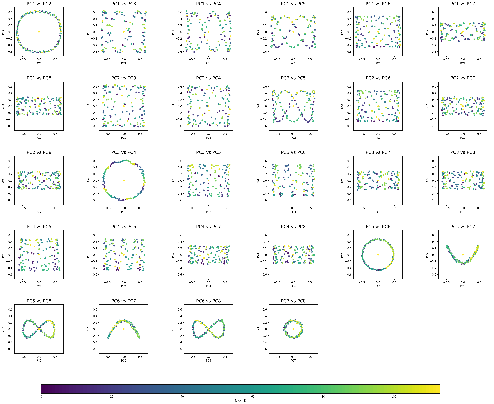

*Рисунок A.27: проекция по главным составляющим вложений модели, обученной задаче остаточного сложения.* **[p. 22]**

#### C.3.2 Задача 2: вычитание: $x-y \pmod{p}$

*Рисунок A.28: проекция по главным составляющим вложений модели, обученной задаче остаточного вычитания.* **[p. 23]**

#### C.3.3 Задача 3: $(x+y)^2 \pmod{p}$

*Рисунок A.29: проекция по главным составляющим вложений модели, обученной задаче 3.* **[p. 23]**

#### C.3.4 Задача 4: $(x+y)^3 \pmod{p}$

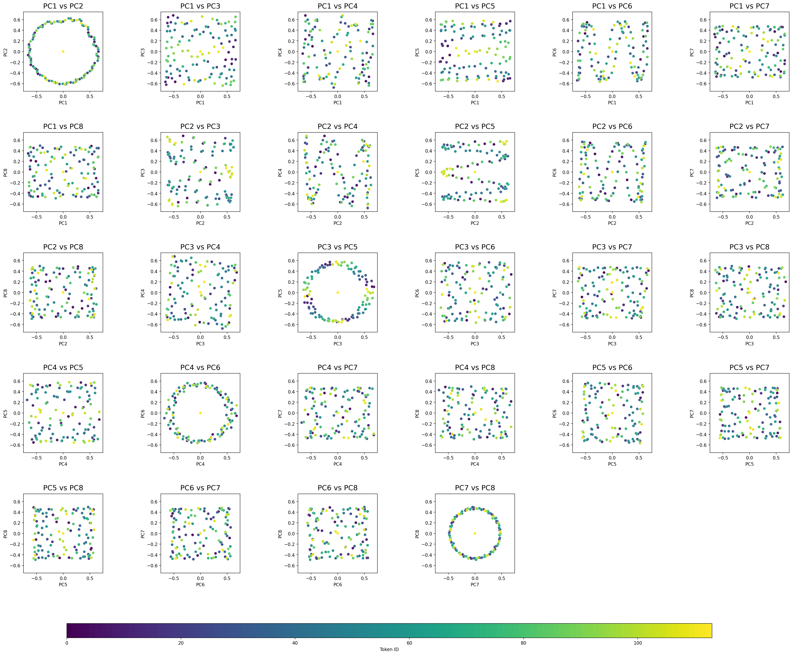

*Рисунок A.30: проекция по главным составляющим вложений модели, обученной задаче 4.* **[p. 24]**

#### C.3.5 Задача 5: умножение: $ x \times y \pmod{p}$

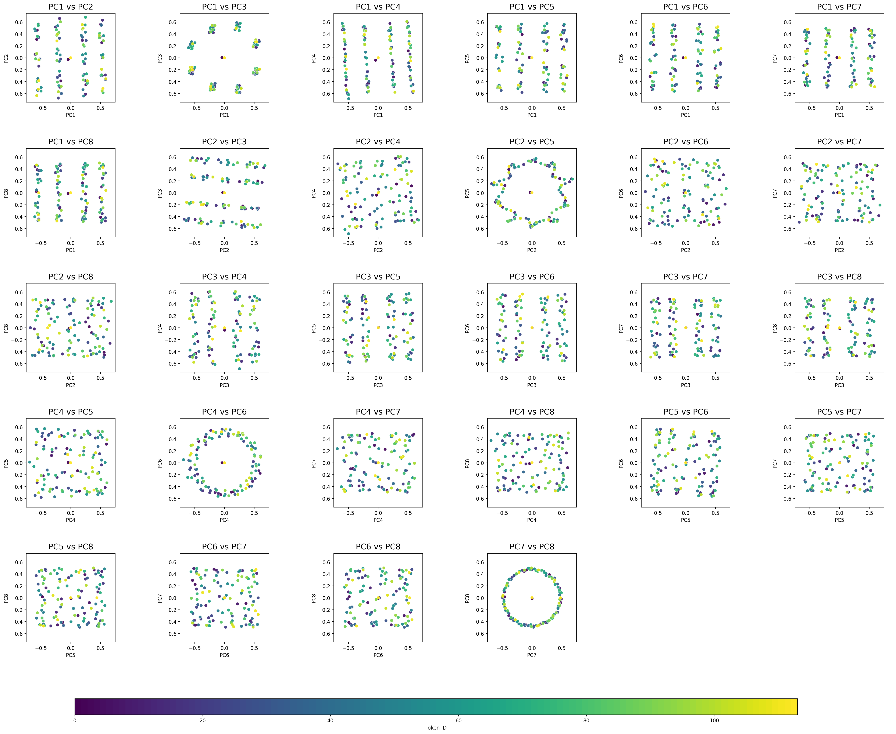

*Рисунок A.31: проекция по главным составляющим вложений модели, обученной задаче остаточного умножения.* **[p. 24]**

#### C.3.6 Задача 6: $ x+xy+y \pmod{p}$

*Рисунок A.32: проекция по главным составляющим вложений модели, обученной задаче 6.* **[p. 25]**

**[p. 26]**

### C.4 Задача восполнения метрики графа

#### C.4.1 Путь

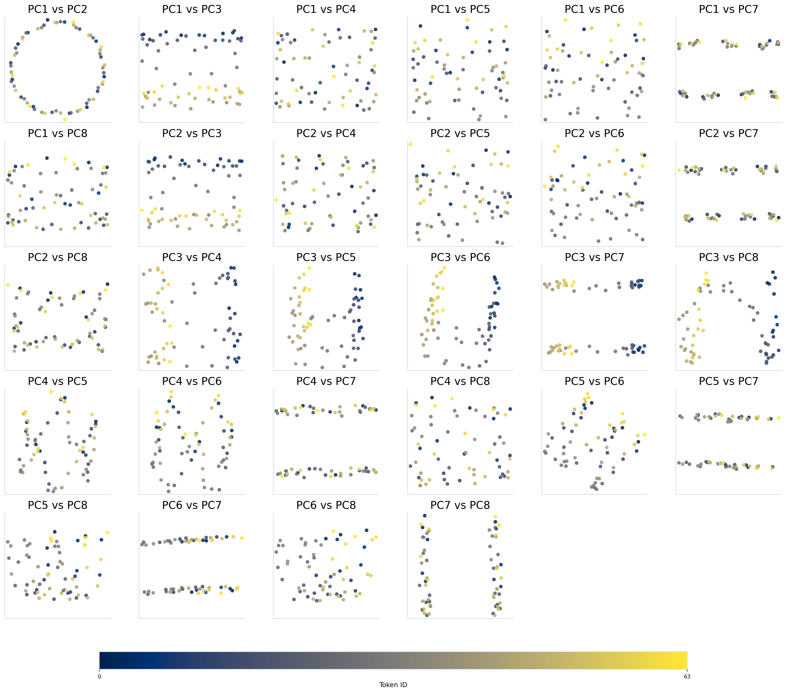

*Рисунок A.33: проекция по главным составляющим вложений модели, обученной восполнению метрики графа Path.* **[p. 22]**

#### C.4.2 Цикл

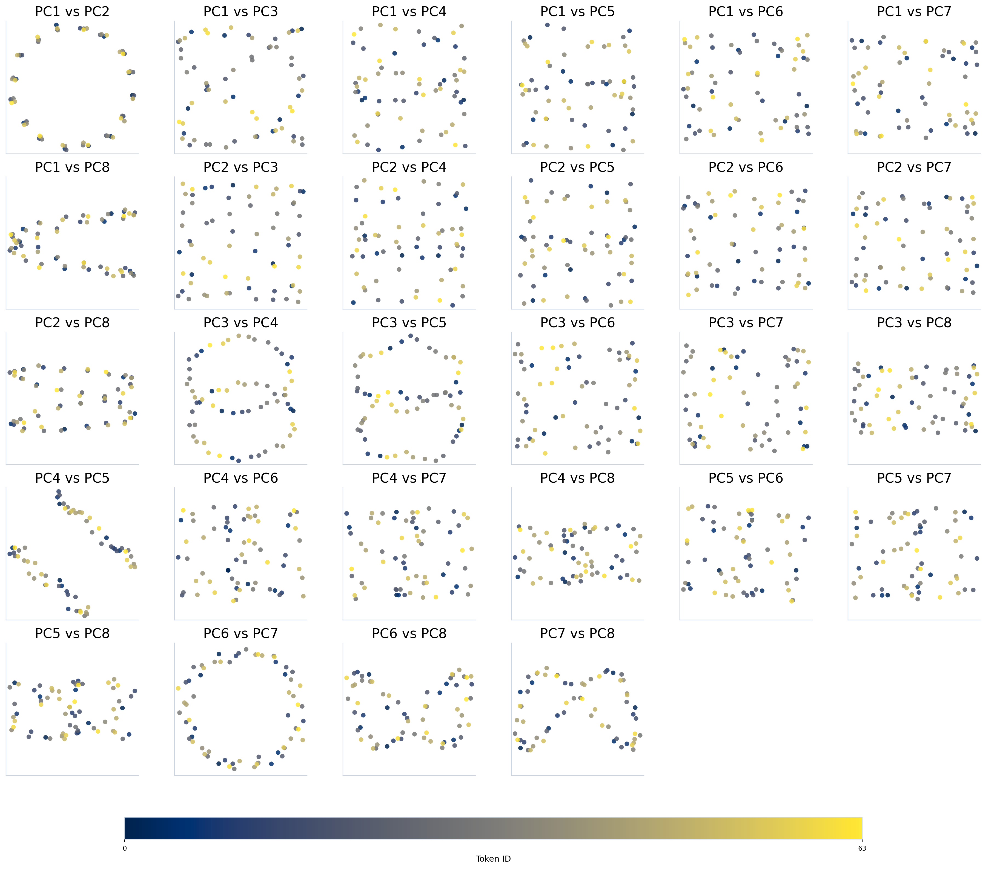

*Рисунок A.34: проекция по главным составляющим вложений модели, обученной восполнению метрики графа Cycle.* **[p. 22]**

#### C.4.3 Цилиндр

*Рисунок A.35: проекция по главным составляющим вложений модели, обученной восполнению метрики графа Cylinder.* **[p. 22]**

#### C.4.4 Гиперкуб

*Рисунок A.36: проекция по главным составляющим вложений модели, обученной восполнению метрики графа Hypercube.* **[p. 22]**

#### C.4.5 Двумерная решётка

*Рисунок A.37: проекция по главным составляющим вложений модели, обученной восполнению метрики графа 2D Lattice.* **[p. 22]**

#### C.4.6 Трёхмерная решётка

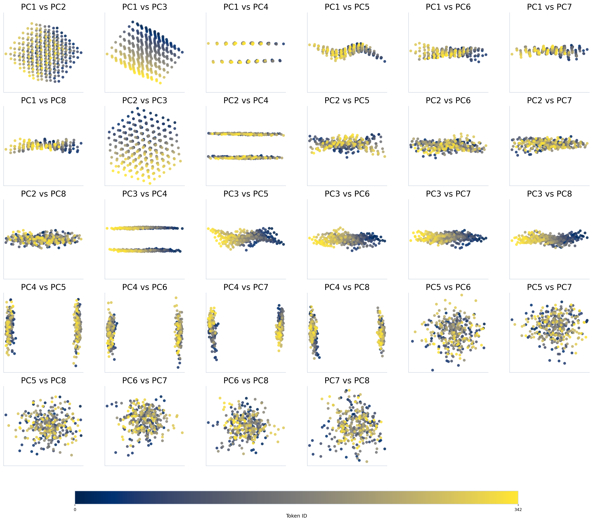

*Рисунок A.38: проекция по главным составляющим вложений модели, обученной восполнению метрики графа 3D Lattice.* **[p. 22]**

### C.5 Сравнение

#### C.5.1 Двумерное сравнение

*Рисунок A.39: проекция по главным составляющим вложений модели, обученной 2D Comparison.* **[p. 22]**

#### C.5.2 Трёхмерное сравнение

*Рисунок A.40: проекция по главным составляющим вложений модели, обученной 3D Comparison.* **[p. 22]**

**[p. 30]**

## D Ускорение задач сглаживанием по симметрии

### D.1 Остаточная арифметика

Отметим, что согласованность означает совместное обеспечение переместительности и сочетательности.

#### D.1.1 Сложение: $x+y$

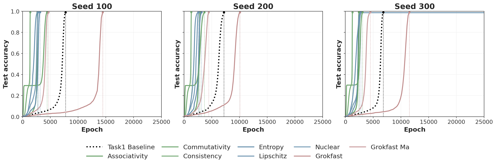

*Рисунок A.41: быстрота схождения на остаточном сложении при разном сглаживании.* **[p. 30]**

#### D.1.2 Вычитание: $x-y$

*Рисунок A.42: быстрота схождения на остаточном вычитании при разном сглаживании.* **[p. 30]**

#### D.1.3 Квадрат суммы: $(x+y)^2$

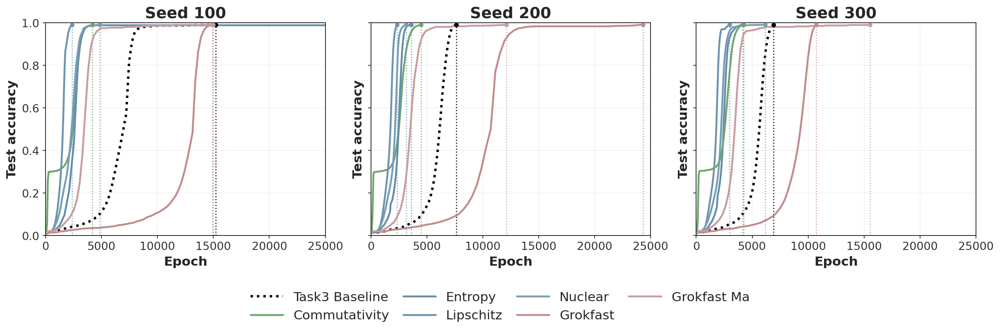

*Рисунок A.43: быстрота схождения на остаточном квадрате суммы при применении квадрата суммы.* **[p. 30]**

#### D.1.4 Куб суммы: $(x+y)^3$

*Рисунок A.44: быстрота схождения на остаточном кубе суммы при разном сглаживании.* **[p. 31]**

#### D.1.5 Умножение: $x\cdot y$

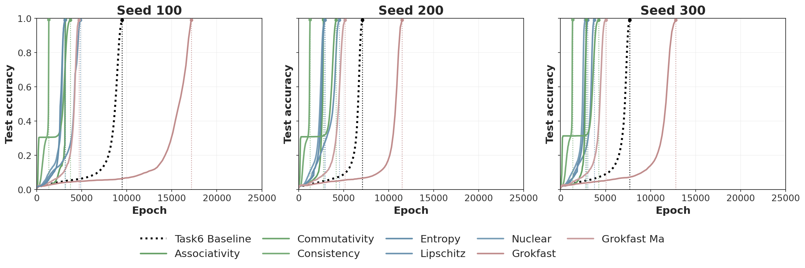

*Рисунок A.45: быстрота схождения на остаточном умножении при разном сглаживании.* **[p. 31]**

#### D.1.6 Аффинно-билинейная задача: $x + xy + y$

*Рисунок A.46: быстрота схождения на остаточной аффинно-билинейной задаче при разном сглаживании.* **[p. 31]**

### D.2 Восполнение метрики графа

#### D.2.1 Цикл

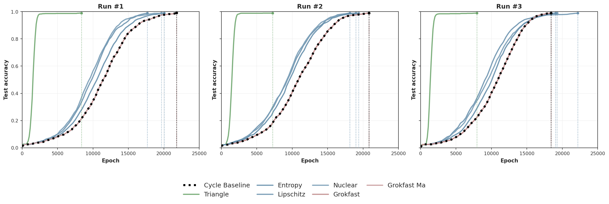

*Рисунок A.47: быстрота схождения на восполнении метрики графа **цикл** при разном сглаживании.* **[p. 32]**

#### D.2.2 Путь

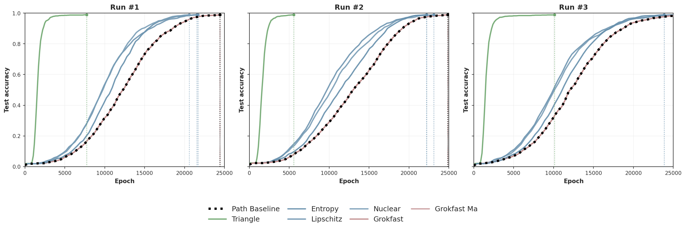

*Рисунок A.48: быстрота схождения на восполнении метрики графа **путь** при разном сглаживании.* **[p. 32]**

#### D.2.3 Цилиндр

*Рисунок A.49: быстрота схождения на восполнении метрики графа **цилиндр** при разном сглаживании.* **[p. 32]**

#### D.2.4 Гиперкуб

*Рисунок A.50: быстрота схождения на восполнении метрики графа **гиперкуб** при разном сглаживании.* **[p. 33]**

#### D.2.5 Двумерная решётка

*Рисунок A.51: быстрота схождения на восполнении метрики графа **двумерная решётка** при разном сглаживании.* **[p. 33]**

#### D.2.6 Трёхмерная решётка

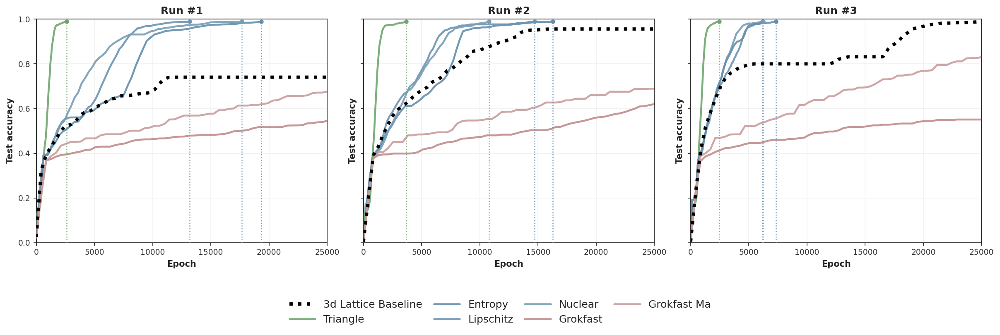

*Рисунок A.52: быстрота схождения на восполнении метрики графа **трёхмерная решётка** при разном сглаживании.* **[p. 33]**

### D.3 Сравнение

#### D.3.1 Двумерное сравнение

*Рисунок A.53: быстрота схождения на **сравнении (2D)** при разном сглаживании.* **[p. 34]**

#### D.3.2 Трёхмерное сравнение

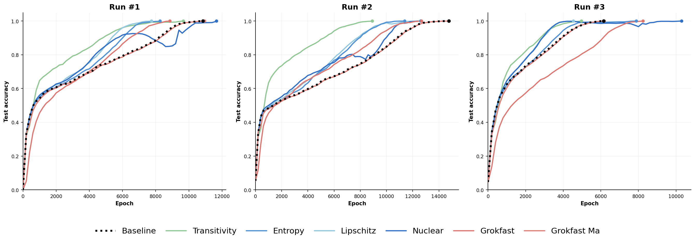

*Рисунок A.54: быстрота схождения на **сравнении (3D)** при разном сглаживании.* **[p. 34]**

**[p. 35]**

## E Отсечения соперничающих объяснений гроккинга

###### p35-1

Мы разбираем иные обстоятельства, которые прежде отмечались как влияющие на гроккинг и сроки его наступления, а именно **перемасштабирование выхода** и **масштаб начального приближения**. Вслед за (Kumar, 2023) мы умножаем выход сети на множитель $\alpha$, чтобы управлять переходом между *ленивым* и *богатым* ходом; а подобно (Liu, 2023) мы изменяем начальную норму весов матрицы вложений, подбирая среднеквадратичное отклонение гауссова распределения. Обе работы показывают, что эти обстоятельства способны загнать модель в вид, благоприятствующий первоначальному запоминанию, — либо бесконечно малыми поправками весов в *ленивом* виде, либо стартом далеко от обобщающей нормы весов.

###### p35-2

Однако мы показываем, что наши цели, обеспечивающие симметрию (потери на переместительность и сочетательность), неизменно ускоряют обобщение при самых разных значениях этих обстоятельств. В этом свете наша работа дополняет прежние истолкования: если множители масштаба главным образом управляют *ленивостью* или начальным состоянием обучения признакам, то собственная симметрия задачи даёт необходимое **геометрическое направление** для выхода за пределы запоминания, а это в конечном счёте и даёт строительное объяснение обобщению в алгоритмическом рассуждении.

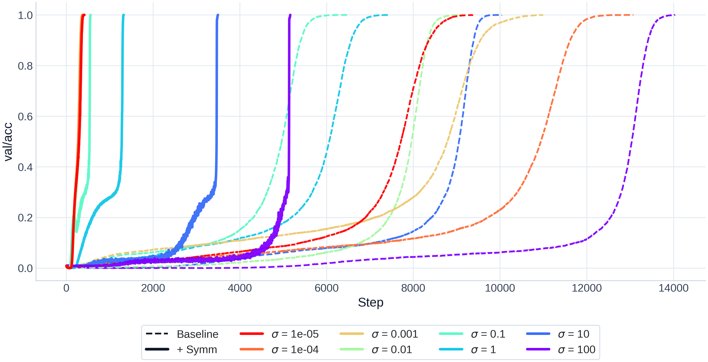

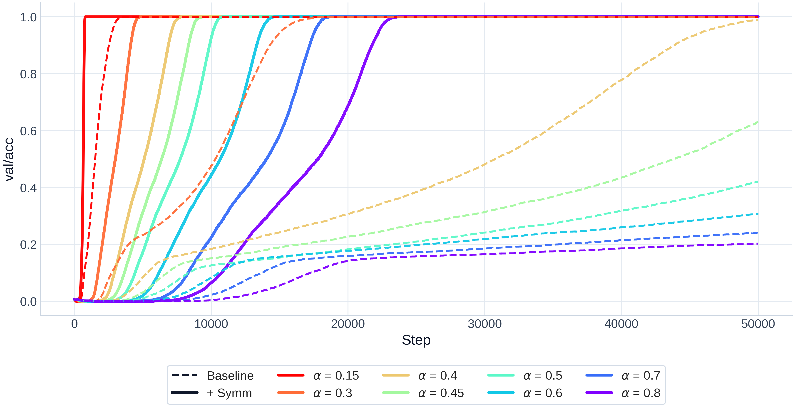

*Рисунок A.55: начальное приближение вложений* **[p. 35]**

**[p. 36]**

## F Постановка обучения

**Устройство модели.** Мы применяем обычный однослойный ($L=1$) трансформер только с раскодировщиком с $H=4$ головами внимания. Устройство пользуется размерностью вложений $d_{\text{model}} = 128$, размерностью прямого прохода (MLP) $d_{\text{mlp}} = 512$ и размерностью головы $d_{\text{head}} = 32$. Все модели пользуются возбуждениями ReLU и обходятся без послойной нормировки.

**Обучение.** Все модели обучаются не более $100,000$ эпох приёмом AdamW.

Для каждой задачи мы, в частности, применяем следующие постановки:

###### p36-4

**Остаточная арифметика.** Следуя принятому порядку, мы берём остаток $p=113$, долю обучающих данных $r_{\text{train}}=0.3$ и ослабление весов $w = 1$.

###### p36-5

**Восполнение метрики графа.** Мы увеличиваем долю обучающих данных до $r_{\text{train}}=0.8$, а ослабление весов до $w = 3$. Мы оцениваем качество на шести разных строениях графа:

| (i) 2D Grid Lattices ($7 \times 7$) | (ii) 3D Grid Lattices ($7 \times 7 \times 7$) | (iii) Simple Cycles ($N=64$) |
|---|---|---|
| (iv) Path Graphs ($N=64$) | (v) Cylinders ($7 \times 7$ periodic) | (vi) 7D Hypercubes ($2^7$ nodes) |

###### p36-6

**Сравнение.** Мы берём уменьшенную долю обучающих данных $r_{\text{train}} = 0.2$ при ослаблении весов $w = 1$. Набор данных состоит из сущностей, расставленных в двумерном ($7 \times 7$) или трёхмерном ($3 \times 3 \times 3$) строении. Каждой сущности назначено единственное сочетание признаков (рост, вес, возраст), выбранных так, чтобы значения лежали в ограниченном промежутке $[v_{\min}, v_{\max}]$.

**Ускорение.** Для опытов по ускорению мы берём весовой множитель $\lambda = 1.0$. Полная цель обучения задана тем самым как невзвешенная сумма основной и вспомогательной потерь:

$$\mathcal{L}_{\text{total}} = \mathcal{L}_{\text{CE}} + \mathcal{L}_{\text{additional}}$$

*Таблица A.2: предсказанная геометрия вложений и связанный алгоритм для разных задач остаточной арифметики. Отметим, что $q \in \mathbb{N}, \; \gcd(p,q)=1 $, $g$ есть образующая мультипликативной группы $\mathbb{Z}_p^\times$, $\mathrm{ind}_g(\cdot)$ обозначает дискретный логарифм по основанию $g$, а $\log(\cdot)$ обозначает комплексный логарифм.* **[p. 37]**

| **Задача** | **Функция вложения и связанный алгоритм** | **Геометрия вложений** | **Примечания** |
|---|---|---|---|
| $x+y=z\pmod p$ | $\phi(x)=e^{ 2\pi i q x/p} $ $\psi(x)=p \log(x) / (2 \pi i q)$ $z = \psi(\phi(x)\phi(y))$ | Окружность (замкнутая винтовая линия) $\angle(i,i+1) = \frac{2 \pi q}{p}$ | $\phi(x)\phi(y)=\phi(z)$ |
| $x-y=z\pmod p$ | $\phi(x)=e^{ 2\pi i q   x / p}$ $\psi(x)=p \log(x) / (2 \pi i q)$ $z= \phi(x)\phi(y)^{-1} $ | Окружность (замкнутая винтовая линия) $\angle(i,i+1) = \frac{2 \pi q}{p}$ | $\phi(x)\phi(y)^{-1}=\phi(z)$ |
| $(x+y)^{\alpha}=z$ $\pmod p$ $ \alpha \in \mathbb{N}$ | $\phi(x)=e^{ 2\pi i q x /p}$ $\psi(x)= h_\alpha (p \log (x)/(2\pi i q) )$ $z= \phi(x)\phi(y)$ | Окружность (замкнутая винтовая линия) $\angle(i,i+1) = \frac{2 \pi q}{p}$ | $h_\alpha: \mathbb{Z}_p^\times \to \mathbb{Z}_p^\times, $ $ h_\alpha(x) : x \mapsto x^\alpha \pmod{p}$ $\phi(x)\phi(y)=\phi(z)$ |
| $x \times y=z\pmod p$ | $\phi(x)=e^{ 2 \pi i q \cdot \mathrm{ind}_g(x) /p}$ $\psi(x)=g^{p \cdot \log(x) / (2 \pi i q )}$ $z = \psi( \phi(x)\phi(y))$ | Окружность (замкнутая винтовая линия) $\angle(g^i,g^{i+1}) = \frac{2 \pi q}{p}$ | $\phi(x)\phi(y)=\phi(z)$ |
| $x+xy+y=z\pmod p$ | $\phi(x)=e^{ 2 \pi i q \cdot \mathrm{ind}_g(x+1) /p}$ **[p. 37]** $\psi(x)=g^{p \cdot \log(x) / (2 \pi i q )}$ $z = \psi( \phi(x)\phi(y)) - 1$ | Окружность (замкнутая винтовая линия) $\angle(g^i - 1,g^{i+1} - 1) = \frac{2 \pi q}{p}$ | $\phi(x)\phi(y)=\phi(z)$ |

## G Симметрии в остаточной арифметике

Мы приводим предсказанную геометрию вложений для разных задач остаточной арифметики. Для остаточного сложения точный алгоритм, пользующийся тригонометрическими тождествами, приведён в (Nanda et al., 2023; Zhong et al., 2023; Park et al., 2025).

Если взять функцию вложения $\phi : \mathbb{Z}_p \to \mathbb{C}$ и внешнюю функцию $\psi : \mathbb{C} \to \mathbb{Z}_p$, то есть простое тождество, выражающее остаточное сложение.

$$
\begin{aligned}\phi(x) &= e^{2\pi i qx/p}, \\[4pt]
\psi(x) &= \tfrac{p}{2\pi i q}\log(x),\qquad q\in\mathbb{Z}_p,\ \gcd(p,q)=1, \\[8pt]
z &= \psi(\phi(x)\phi(y)), \\[4pt]
z &= \psi\!\left(e^{2\pi i q(x+y)/p}\right) = x+y \pmod{p}.\end{aligned}
$$

где $\log(\cdot)$ обозначает комплексный логарифм. Вложение $\phi(\cdot)$ говорит, что геометрия вложений $\{\phi(x) : x \in \mathbb{Z}_p \}$ имеет очертание окружности с одинаковым углом между соседними знаками, равным $ \frac{2 \pi q }{p}$. \\ Для остаточного умножения $\mathbb{Z}_p ^\times=\mathbb{Z}_p \setminus \{0\}$ становится циклической группой с некоторой образующей $g \in \mathbb{Z}_p^\times$ (*то есть* $\mathbb{Z}_p ^\times=\{ g^i : i=0,1,...,p-1\}$). Оттого у нас есть функция вложения $\phi : \mathbb{Z}_p^\times \to \mathbb{C}$ и внешняя функция $\psi : \mathbb{C} \to \mathbb{Z}_p^*$, и есть простое тождество, выражающее остаточное сложение.

$$
\begin{aligned}\phi(x) &= e^{2\pi i q\,\mathrm{ind}_g(x)/p}, \\[4pt]
\psi(x) &= \tfrac{p}{2\pi i q}\log(x),\qquad q\in\mathbb{Z}_p,\ \gcd(p,q)=1, \\[8pt]
z &= \psi(\phi(x)\phi(y)), \\[4pt]
z &= \psi\!\left(e^{2\pi i q(\mathrm{ind}_g(x)+\mathrm{ind}_g(y))/p}\right) = x\times y \pmod{p}.\end{aligned}
$$

**[p. 38]**

где $\mathrm{ind}_g(\cdot)$ обозначает дискретный логарифм по основанию $g$ в $\mathbb{Z}_p$. Для $T_6: z= x+xy+y \pmod{p}$ мы можем переписать это как $z+1=(x+1)(y+1) \pmod{p}$. Оттого вложение подобно умножению со сдвигом на $1$.

Схожим образом мы приводим предсказанную геометрию вложений и алгоритм для прочих разных задач остаточной арифметики, представленных в таблице A.2 приложения G.

Геометрию вложений и замещающие симметрии разных остаточных действий мы приводим в таблицах A.2 и 1.

## H Теоретическое наблюдение

### H.1 Теоретическое наблюдение об остаточной арифметике

Сперва мы приведём теорему двойственности Понтрягина для групп Ли.

##### **Определение H.1**(двойственная по Понтрягину)**.**

Для локально компактной переместительной группы $G$ двойственной по Понтрягину называется группа $\hat{G}$ непрерывных групповых гомоморфизмов из $G$ в круговую группу $\mathbb{T}$, *то есть* $$\hat{G} := \text{Hom}(G,\mathbb{T}).$$

##### **Лемма H.2****.**

Двойственная по Понтрягину к $\mathbb{T}$ есть $\mathbb{Z}$ через отображение $$\begin{aligned}\Phi :  \mathbb{Z} &\cong \hat{\mathbb{T}} \\
        n &\mapsto \left( z \mapsto  e^{2 \pi i n z} \right).\end{aligned}$$

##### **Лемма H.3****.**

Двойственная по Понтрягину к $\mathbb{Z}$ есть $\mathbb{T}$ через отображение $$\begin{aligned}\Phi :  \mathbb{T} &\cong \hat{\mathbb{Z}} \\
        e^{i \theta} &\mapsto \left( n \mapsto  e^{i n \theta} \right).\end{aligned}$$

##### **Теорема H.4**(двойственность Понтрягина (Pontrjagin, 1934; Morris, 1977; Hewitt and Ross, 2013))**.**

Пусть $G$ — локально компактная переместительная топологическая группа. Тогда есть естественный изоморфизм такой, что $$G \cong \hat{\hat{G}},$$ где $\hat{\hat{G}}$ есть дважды двойственная по Понтрягину к $G$.

Если переместительная топологическая группа $G$ одномерна, то $G$ изоморфна замкнутой винтовой линии.

### H.2 Доказательство утверждения 7.1

##### **Утверждение 1****.**

Пусть $\mathcal{M}$ — одномерная компактная переместительная топологическая группа, а $\mathbb{Z}_p$ непрерывно вложено в $ \mathcal{M}$. Тогда $\mathcal{M}$ изоморфно $S^1$, вложенной в многомерный тор $\mathbb{T}^D$ (замкнутой винтовой линии) $$\Phi: \mathcal{M} \cong  S^1 \hookrightarrow \mathbb{T}^D.$$ Оттого и $\Phi(\mathbb{Z}_p) \hookrightarrow \Phi(\mathcal{M})$ заперто в замкнутой винтовой линии.

##### Доказательство.

Отметим, что единственная одномерная связная компактная переместительная топологическая группа есть круговая группа $ \mathbb{T} \cong \mathbb{R}/\mathbb{Z} \cong [0,1] /\{0 \sim 1\}$. По теореме H.4 имеем $$\Phi: \mathbb{T} \cong \hat{\hat{\mathbb{T}}} \cong \hat{\mathbb{Z} }$$ через отображение $$\Phi(x) =  \left( n \mapsto e^{2 \pi i n x} \right) , \quad n \in \mathbb{Z}  .$$ Стало быть,

$$\Phi(\mathbb{T}) =  \prod_{n \in \mathbb{Z}} n\mathbb{T} \subset \mathbb{T}^\infty,$$ **[p. 39]** где $n$-я составляющая означает поворот $n$ раз в бесконечномерном торе. Отметим, что $\Phi(\mathbb{T})$ можно вложить в некоторый многомерный тор $\mathbb{T}^D$ $$\Phi(\mathbb{T}) \cong (n_1\mathbb{T}, n_2\mathbb{T}, \dots , n_D\mathbb{T}) \subset \mathbb{T}^D,$$ если $\gcd(n_1, \dots , n_D) = 1$. Стало быть, $\mathcal{M}$ изоморфно $S^1 \hookrightarrow \mathbb{T}^D $ в некотором многомерном торе $\mathbb{T}^D$.

### H.3 Теоретическое наблюдение о задачах восполнения метрики графа и сравнения

В этом разделе мы описываем геометрию вложений в задачах восполнения графа и сравнения.

### H.4 Доказательство утверждения 7.2

##### **Утверждение 2****.**

Пусть $ \mathcal{X}=\{v_1 , \dots, v_n\}$ — одномерный граф «путь» или «цикл» (см. рисунок 3) с $n$ вершинами ($n \ge 3$), а $\mathcal{Z} \in \{\mathbb{R}, \mathbb{T}\}$ — пространство вложений. Пусть $\Phi : G \to \mathcal{Z}$ — вложение с частичными сведениями о расстояниях $$\begin{aligned}d(\Phi(v_{i}) ,\Phi(v_{i+1}))&=1, \; i=1,\dots n-1, \\
        d(\Phi(v_{1}) ,\Phi(v_{n}))&=1, \; \text{ if $\mathcal{X}$ is Cycle. }\end{aligned}$$ Если $\Phi(\cdot)$ сохраняет симметрию треугольника, то $\Phi(\mathcal{X})$ несёт строение своего графа в пространстве вложений $\mathbb{R}$.

##### Доказательство.

**Случай 1:** $\mathcal{X}$ есть путь. \\

**Случай 1-1:** $\mathcal{Z}=\mathbb{R}$. \\ Сперва пусть $n=3$ и $\mathcal{X}=\mathbb{R}$ с обычной метрикой. Пусть $v_1,v_2,v_3$ — вершины $\mathcal{X}$. Возьмём вложение $\Phi : \mathcal{X} \to \mathbb{R}$. Не умаляя общности, пусть $\Phi(v_1)=0$. Поскольку $\Phi(\cdot)$ сохраняет симметрию треугольника, имеем $d(v_1,v_3)=d(v_1,v_2)+d(v_2,v_3)=2$. Тогда $\Phi(v_2)=\pm 1$, ибо $d(\Phi(v_1),\Phi(v_2))=1$. Не умаляя общности, пусть $\Phi(v_1)=1$. Тогда $\Phi(v_3) = 2$, ибо $d(\Phi(v_2),\Phi(v_3))=1, d(\Phi(v_1),\Phi(v_3))=2$. Стало быть, $v_1,v_2,v_3$ должны быть выстроены по порядку. \\ Для общего $n \ge 4$ желаемый итог получается применением математической индукции. \\

**Случай 1-2:** $\mathcal{Z}=\mathbb{T}$. \\ Пусть $\mathbb{T}=\{ e^{ 2 \pi i \theta / K }   : \theta \in \mathbb{R}\}$ с метрикой $d(e^{i\theta_1}, e^{i\theta_2} ) =  \min_{m \in \mathbb{Z}}| (\theta_1- \theta_2) - Km |$ при некотором большом $K \gg n $. Сперва пусть $n=3$. Пусть $v_1,v_2,v_3$ — вершины $\mathcal{X}$. Возьмём вложение $\Phi : G \to \mathbb{T}$ и пусть $\Phi(v_i)=e^{2 \pi i \theta_i/K} \in \mathbb{T}$. Не умаляя общности, пусть $\theta_1=0$. Поскольку $\Phi(\cdot)$ сохраняет симметрию треугольника, имеем $d(v_1,v_3)=d(v_1,v_2)+d(v_2,v_3)=2$.

Тогда $\theta_2=\pm 1$, ибо $d(\Phi(v_1),\Phi(v_2))=1$. Не умаляя общности, пусть $\theta_2=1$. Тогда $\theta_3 = 2$, ибо $d(\Phi(v_2),\Phi(v_3))=1, d(\Phi(v_1),\Phi(v_3))=2$. Стало быть, $v_1,v_2,v_3$ должны быть выстроены по порядку. Для общего $n \ge 4$ желаемый итог получается применением математической индукции. Отметим также, что если у $\mathbb{T}$ иная метрика — скажем, обратно перенесённая, вида

$$
\begin{aligned}d_k(e^{i\theta_1}, e^{i\theta_2} ) = \min_{m \in \mathbb{Z}} |  k (\theta_1 -\theta_2) - K m |, \quad \frac{ k}{K} \in \mathbb{Z}\end{aligned}
$$

при некотором $k \in \mathbb{R}$, то и вложения получаются иные.

**Случай 2:** $\mathcal{X}$ есть цикл. \\ В этом случае $\mathcal{Z}=\mathbb{R}$ невозможно. Если $\mathcal{Z}=\mathbb{T}$, пусть $\mathbb{T}=\{ e^{ 2 \pi i \theta / K }   : \theta \in \mathbb{R}\}$ с метрикой $d(e^{i\theta_1}, e^{i\theta_2} ) =  \min_{m \in \mathbb{Z}}| (\theta_1- \theta_2) - Km |$ при некотором большом $K \gg n $. В графе-цикле отметим, что $d(v_1,v_3)=1$. Пусть $\Phi(v_i)=e^{2 \pi i \theta_i/K} \in \mathbb{T}$. Не умаляя общности, положим $\theta_1=0$ и $\theta_2=1$. Тогда из $d(v_1,v_3)=1$ имеем $\theta_2= -1$, а из $d(v_2,v_3)=1$ имеем $\theta_2=2$. Оттого $e^{2 \pi i (-1)/K}=e^{2 \pi i (2)/K}$, откуда $e^{2 \pi i (3)/K}=1$, $K \equiv 0  \text{ (mod 3)} $. Стало быть, $\Phi(v_1), \Phi(v_2), \Phi(v_3)$ имеют циклическое очертание в $\mathbb{T}$. Для общего $n \ge 4$ желаемый итог получается применением математической индукции.

Отметим также, что если у $\mathbb{T}$ иная метрика — скажем, обратно перенесённая, вида

$$
\begin{aligned}d_k(e^{i\theta_1}, e^{i\theta_2} ) = \min_{m \in \mathbb{Z}} |  k (\theta_1 -\theta_2) - K m |, \quad \frac{ k}{K} \in \mathbb{Z}\end{aligned}
$$

**[p. 40]**

при некотором $k \in \mathbb{R}$, то и вложения получаются иные.

### H.5 Теоретическое наблюдение о задаче сравнения

### H.6 Доказательство утверждения 7.3

##### **Утверждение 3****.**

Пусть $\mathcal{X}=\{v_1 , \dots, v_n\}$ — множество узлов в одномерной задаче сравнения (см. раздел 3.3) с $n \ge 3$ узлами. Пусть $\Phi : \mathcal{X} \to \mathbb{R}$ — вложение с частичными сведениями об отношениях $$\Phi(v_{i}) < \Phi(v_{i+1}), \; i=1,\dots n-1.$$ Если $\Phi(\cdot)$ сохраняет переходность, то $\Phi(\mathcal{X})$ несёт решётчатое строение в пространстве вложений $\mathbb{R}$.

##### Доказательство.

Пусть $n=3$. Пусть $v_1,v_2,v_3$ — узлы $\mathcal{X}$ с $v_1<v_2<v_3$. Возьмём вложение $\Phi : \mathcal{X} \to \mathbb{R}$. Не умаляя общности, пусть $\Phi(v_1)=0$. Поскольку $\Phi(\cdot)$ сохраняет переходность, из $\Phi(v_1)<\Phi(v_2)$ и $\Phi(v_2)<\Phi(v_3)$ имеем $\Phi(v_1)<\Phi(v_3)$. Оттого $\Phi(v_1)<\Phi(v_2)<\Phi(v_3)$. Для общего $n \ge 4$ желаемый итог получается применением математической индукции.
