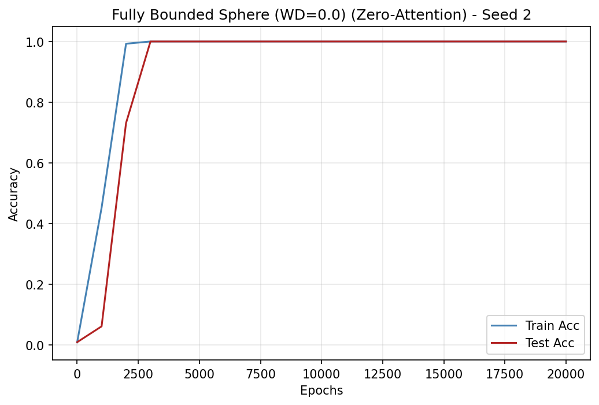

# Yildirim 2026 — The Geometric Inductive Bias of Grokking: Bypassing Phase Transitions via Architectural Topology

См. также: [глобальный индекс понятий](../../concepts/index.md).

**Alper Yildirim** (независимый исследователь).

arXiv [2603.05228](https://arxiv.org/abs/2603.05228), март 2026 (версия v3). 4 цитирования — тридцать первая по цитируемости работа корпуса. Источник — нативный HTML arXiv версии v3.

Оригинал и производные файлы этой папки:

- [`original/2603.05228.native.html`](original/2603.05228.native.html) — первоисточник, нативный HTML arXiv (v3), скачан как есть.
- [`original/2603.05228.the-geometric-inductive-bias-of-grokking-bypassing-phase-transitions-via-architectural-topology.md`](original/2603.05228.the-geometric-inductive-bias-of-grokking-bypassing-phase-transitions-via-architectural-topology.md) — конверсия оригинала в Markdown без правок содержания.
- [`images/`](images/) — 5 иллюстраций статьи в исходном разрешении.

Схема якорей и правила ссылок на карточку — в [README папки статей](../README.md).

## Затрагиваемые понятия

**[Сферическое ограничение нормы](../../concepts/spherical-weight-norm-constraint.md)** — работа доводит эту линию до крайности: оператор проекции $\Pi_{S}(x)=x/\max(\|x\|_{2},\epsilon)$ применяется перед каждым подслоем и сразу после каждого остаточного сложения, отчего норма остаточного потока закреплена на единице во всей сети ([`p5-6`](#p5-6), [`p5-7`](#p5-7), [`p6-1`](#p6-1)). Одного этого мало: без нормирования матрицы обратного вложения обучение раздувает логиты, поэтому логиты считаются как масштабированная косинусная близость с закреплённой температурой $\tau=10.0$ ([`p6-5`](#p6-5), [`p6-7`](#p6-7)). Существенная подробность, отличающая работу от nGPT: ограничение **ничем не возмещается** — ни обучаемых поразмерных множителей, ни собственных скоростей обучения ([`p23-9`](#p23-9)).

**[Гроккинг](../../concepts/grokking.md)** — заявка сильнее обычного «ускорения»: при ограниченной топологии отделимой фазы запоминания **не возникает вовсе**, точность на обучении и на тесте растут вместе с самой инициализации ([`p1-2`](#p1-2), [`p2-3`](#p2-3)). Числа: базовые модели с LayerNorm и RMSNorm грокают в среднем на 54 160 и 51 240 эпохе, ограниченная сфера — на 2400–2480, а при большей скорости обучения на 711–820 против 7300–7800 у базовых ([`tab-1`](#tab-1), [`p9-3`](#p9-3)).

**[Фазовый переход](../../concepts/phase-transition.md)** — картина перехода тут не просто сдвигается по времени, а исчезает: на рисунке 1 ограниченные модели сходятся плавно и сразу, тогда как базовые проходят затяжное плато с колебаниями точности на тесте ([`p9-4`](#p9-4), [`fig-1`](#fig-1)).

**[Слингшот](../../concepts/slingshot.md)** — эти колебания названы своим именем: перемежающиеся всплески градиента и мимолётные провалы генерализации на плато, согласные с «эффектом рогатки» Thilak et al. ([`p9-4`](#p9-4)). Отмечено отдельно, что градиенты нарочно не обрезались, чтобы это поведение не заслонить.

**[Коллапс softmax](../../concepts/softmax-collapse.md)** и **[наивная минимизация потерь](../../concepts/nlm.md)** — обоснование второй половины вмешательства A. Неограниченное обратное вложение при перекрёстно-энтропийной потере гонит величину логитов вверх, что ведёт к наивной минимизации потерь и коллапсу softmax ([`p6-5`](#p6-5)); всем сферическим моделям нормирование обратного вложения потребовалось для устойчивого обучения. Показательна и обратная проверка: одно лишь ограничение обратного вложения при LayerNorm задержку **не** устраняет, поскольку радиальная свобода остаётся внутри остаточного потока ([`p10-2`](#p10-2)).

**[Маршрутизация внимания](../../concepts/attention-routing-heads.md)** — вмешательство B независимо от первого. Гибкость маршрутизации через выученные взаимодействия запросов и ключей ([`p2-4`](#p2-4)) объявлена второй избыточной степенью свободы наряду с величиной остатка ([`p9-1`](#p9-1)); оценки внимания до softmax обнуляются, отчего распределение внимания становится равномерным $[1/3,1/3,1/3]$, а слой внимания сводится к складывателю «непрерывный мешок слов» ([`p7-3`](#p7-3), [`p7-4`](#p7-4)). Основание теоретическое: Huang and Li (2025) доказали, что модульное сложение в точности реализуемо равномерной суммой токенов ([`p7-1`](#p7-1)); эта же работа названа в обзоре как доказавшая разрыв выразительности между синусоидальными активациями и ReLU ([`p3-4`](#p3-4)). Итог: базовая модель с LayerNorm и равномерным вниманием достигает 100 % на всех 10 сидах, полностью обходя плато ([`p11-4`](#p11-4), [`tab-3`](#tab-3)), откуда вывод, что для коммутативной операции сложная маршрутизация строго не необходима ([`p12-2`](#p12-2)).

**[Модульная арифметика](../../concepts/modular-arithmetic.md)** — постановка обычная для корпуса: $p=113$, все $p\times p$ пар, деление 30 % на обучение и 70 % на тест, однослойный трансформер $d_{\text{model}}=128$ с четырьмя головами и MLP на 512 ([`p8-1`](#p8-1), [`p9-2`](#p9-2)). Ускорение проверено и на модульном **умножении**: 2200 эпох против 28 000–31 000 у базовых, то есть примерно в 13 раз ([`p11-1`](#p11-1), [`tab-2`](#tab-2)).

**[Фурье-признаки и контуры](../../concepts/fourier-features-circuits.md)** — ускорение не обходит фурье-решение, а приходит к нему быстрее. Причинное упрощение, оставляющее пять главных частот, сохраняет более 99 % точности (99,98 % у LayerNorm, 99,96 % у полностью ограниченной модели) ([`p12-4`](#p12-4)). Доля объяснённой дисперсии (FVE), считаемая по идеальным двумерным базисным функциям $\cos(\omega_{k}(a+b))$ и $\sin(\omega_{k}(a+b))$ ([`p13-1`](#p13-1)), при $\lambda=0.0$ достигает 62,55 % и 48,43 % ([`p13-4`](#p13-4)) против не более 29 % при $\lambda=1.0$ ([`p13-3`](#p13-3)).

**[Причинное упрощение и вмешательство](../../concepts/causal-ablation-intervention.md)** — методический вклад, который авторы ставят во главу угла: не разбирать обученную сеть постфактум, а менять устройство **до** обучения и смотреть на исход ([`p2-1`](#p2-1), [`p14-4`](#p14-4)). Отрицательный исход при этом равноправен положительному: «зонд, который всегда успешен, был бы непоучителен; неудача — половина вклада» ([`p23-2`](#p23-2)).

**[Композиция в некоммутативной группе](../../concepts/group-composition-non-commutative-s5.md)** и **[смежные классы](../../concepts/group-representations-cosets.md)** — отрицательный контроль и есть главный довод работы. На $S_{5}$ базовые модели грокают в среднем к 40 000 эпохе, а обе ограниченные сферические постановки не обобщают **ни на одном** сиде за 100 000 эпох, оставаясь на плато запоминания при 100 % точности на обучении ([`p13-7`](#p13-7), [`p13-8`](#p13-8), [`tab-4`](#tab-4)). Объяснение опирается на прежние разборы: успешные решения $S_{5}$ строятся на неприводимых представлениях большей размерности и контурах смежных классов, а не на круговом многообразии ([`p8-4`](#p8-4)), а сам вывод формулируется как зависимость обхода запоминания от согласия архитектурных предпочтений с симметрией задачи ([`p2-5`](#p2-5)). Приложение добавляет, что $L_{1}$-нормирование (геометрия кросс-политопа) на $S_{5}$ тоже не работает ([`p16-2`](#p16-2)).

**[Часы против пиццы](../../concepts/clock-vs-pizza.md)** — избыточные степени свободы прямо связываются с раздробленным решением: неограниченная величина позволяет делить пространство по норме и строить несвязные области решения, свойственные алгоритму «пицца», тогда как сфера оставляет лишь угловые отношения и тем смещает обучение к «часам» ([`p6-2`](#p6-2), [`p6-3`](#p6-3)).

**[Закон задержки по разделению норм](../../concepts/norm-separation-delay-law.md)** — работа прямо стыкуется с одновременной работой Truong et al. (2026): задержка раскладывается на фазу ухода оптимизации, где weight decay показательно сжимает нормы, и фазу статистического подтверждения ([`p15-1`](#p15-1)), причём разделение норм $\|\theta_{\mathrm{mem}}\|^{2}>\|\theta_{\mathrm{post}}\|^{2}$ есть необходимое условие всякой положительной задержки, а сферическая топология изымает саму возможность построить запоминающий интерполянт с большой нормой ([`p4-3`](#p4-3), [`p15-2`](#p15-2)). Через ту же рамку объясняется и трение при weight decay: сеть с $\Pi_{S}$ инвариантна к масштабу, поэтому сжатие параметров не увеличивает потерю, зато взрывает действующую скорость обучения ([`p15-3`](#p15-3)).

**[Weight decay](../../concepts/weight-decay.md)** — здесь он впервые в корпусе оказывается **вреден**: при ограниченной топологии и большой скорости обучения $\lambda=1.0$ даёт больший разброс по сидам (853 против 199) и вдвое более медленное схождение (1560 против 820 эпох) ([`p10-1`](#p10-1)), а согласованность фурье-контура при нём портится ([`p13-3`](#p13-3)).

**[Механистическая интерпретируемость](../../concepts/mechanistic-interpretability.md)** — заявленный итог: замкнутый круг «истолковать контуры — устроить архитектуру», работающий и в обратную сторону. Когда контур неизвестен, испытание архитектурных ограничений само сообщает о внутреннем устройстве задачи, и неудача на $S_{5}$ приводится как пример такого сообщения ([`p16-2`](#p16-2)).

**[Многообразие и сжатие представления](../../concepts/manifold-representation-compression.md)** — линия «медленного сжатия многообразия представлений» названа в обзоре среди объяснений задержки ([`p3-3`](#p3-3)), а собственный вывод работы формулируется в тех же понятиях: гроккинг есть представленческая перестройка, а не неизбежный фазовый переход оптимизации ([`p18-3`](#p18-3)).

**[Запоминание](../../concepts/memorization-phase.md)** — важное различение для корпуса: избыточные степени свободы не просто позволяют запоминать, а делают запоминание **предпочтительным** путём; урезав их, авторы получают обучение вовсе без отделимой фазы запоминания ([`p2-2`](#p2-2), [`p18-3`](#p18-3)).

Отдельно стоит сказать, чего в работе **нет**. Нет проверки за пределами искусственных алгоритмических задач, и это признано нарочным выбором ([`p18-1`](#p18-1)). Нет и объяснения, отчего базовые модели с равномерным вниманием на $S_{5}$ достигают 99 %, но не 100 % ([`p22-3`](#p22-3)). И нет разбора того, что происходит со сферической топологией на задачах со смешанной симметрией, — смешанные архитектуры названы будущей работой ([`p18-1`](#p18-1)).

Карточки статей корпуса: [Power et al. 2022](../2201.02177.grokking-generalization-beyond-overfitting-on-small-algorithmic-datasets/2201.02177.grokking-generalization-beyond-overfitting-on-small-algorithmic-datasets.card.md) — исходное явление и задача $S_{5}$; [Nanda et al. 2023](../2301.05217.progress-measures-for-grokking-via-mechanistic-interpretability/2301.05217.progress-measures-for-grokking-via-mechanistic-interpretability.card.md) — фурье-контур, к которому подгоняется архитектура; [Zhong et al. 2023](../../concepts/clock-vs-pizza.md) — «часы» и «пицца» (карточки статьи в вики пока нет); [Prieto et al. 2025](../2501.04697.grokking-at-the-edge-of-numerical-stability/2501.04697.grokking-at-the-edge-of-numerical-stability.card.md) — коллапс softmax и наивная минимизация потерь, на которых стоит ограничение выхода; [Lee et al. 2024](../2405.20233.grokfast-accelerated-grokking-by-amplifying-slow-gradients/2405.20233.grokfast-accelerated-grokking-by-amplifying-slow-gradients.card.md) — ускорение на уровне оптимизатора, с которым работа себя сравнивает; [Abramov et al. 2025](../2504.20752.grokking-in-the-wild-data-augmentation-for-real-world-multi-hop-reasoning-with-transformers/2504.20752.grokking-in-the-wild-data-augmentation-for-real-world-multi-hop-reasoning-with-transformers.card.md) — ускорение на уровне данных; [Musat 2026](../2511.01938.the-geometry-of-grokking-norm-minimization-on-the-zero-loss-manifold/2511.01938.the-geometry-of-grokking-norm-minimization-on-the-zero-loss-manifold.card.md) — минимизация нормы на многообразии нулевой потери, названная в обзоре.

## Что показано, а что предположено

Замечания редактора карточки по итогам разбора утверждений (`…claims.txt`). Работа опытная и одноавторская: два архитектурных вмешательства, один отрицательный контроль и спектральная проверка.

**Устройство работы образцовое, и держится оно на отрицательном контроле.** Ускорение само по себе доказывало бы мало: любое стеснение вместимости может помочь оптимизации. Довод возникает из **различия** — то же ограничение, что убирает задержку на $\mathbb{Z}_{p}$, полностью губит обучение на $S_{5}$ ([`p13-8`](#p13-8)). Авторы формулируют это заранее как проверяемое предсказание ([`p8-5`](#p8-5)), а не подгоняют объяснение задним числом.

**Два вмешательства независимы, и это существенно.** Ограничение величины (A) и изъятие маршрутизации (B) устраняют задержку **порознь**: вмешательство B работает на обычной модели с LayerNorm без всякой сферы ([`p11-4`](#p11-4)). Значит, у задержки на модульном сложении не одна причина, а по меньшей мере две достаточные.

**Спектральная проверка отвечает на главное возражение.** Без неё «ускорение» могло бы означать, что модель нашла иное, обходное решение. Упрощение до пяти частот сохраняет более 99 % точности ([`p12-4`](#p12-4)), а на модульном умножении — свыше 99,75 % на всех сидах ([`p11-2`](#p11-2)), то есть ускоренные модели пользуются тем же фурье-контуром. Это правильная проверка, и она сделана до того, как её потребовали.

**Заявка «фазы запоминания нет вовсе» сильнее, чем позволяют измерения.** Отсутствие отделимой фазы установлено по совпадению кривых точности на обучении и на тесте ([`p2-3`](#p2-3), [`fig-1`](#fig-1)), а наименьший шаг измерения — 200 эпох (эпохи в таблицах кратны 200). При схождении за 711 эпох это грубовато: разрыв в сотню эпох такой сеткой не разглядеть. Точнее было бы «фаза короче разрешения измерения», и в одном месте авторы это признают оборотом «в этой опытной постановке» ([`p18-3`](#p18-3)).

**Трение при weight decay объяснено убедительно, но объяснение позаимствовано.** Механизм — инвариантность к масштабу плюс взрыв действующей скорости обучения ([`p15-3`](#p15-3)) — известен из литературы о нормированных сетях, здесь он приложен к одновременной работе Truong et al. Собственного измерения действующей скорости обучения или угловых обновлений в статье нет; довод остаётся качественным.

**Связь с законом задержки по разделению норм привлекательна и не проверена.** Утверждается, что сферическая топология схлопывает $\log(\|\theta_{\mathrm{mem}}\|^{2}/\|\theta_{\mathrm{post}}\|^{2})$ ([`p15-2`](#p15-2)), но само это отношение нигде не измеряется. Авторы честно оговаривают, что $\Pi_{S}$ ограничивает активации, а не вектор параметров ([`p15-2`](#p15-2)), — то есть рассуждение переносит вывод с одного объекта на другой без опытной опоры.

**Отрицательный контроль сильнее, чем нужно для тезиса, и это стоит сказать вслух.** На $S_{5}$ ограниченная сфера не просто медленнее — она не обобщает вовсе, и с равномерным вниманием даёт 2,4 % при 120 классах, то есть уровень случайного угадывания ([`p22-2`](#p22-2), [`p22-3`](#p22-3)). Из этого следует не «согласие ускоряет», а «несогласие ломает», что для практики важнее заявленного.

**Числа по $S_{5}$ у базовых моделей приведены только по успешным сидам.** Средние 39 900 и 38 250 эпохи посчитаны без учёта двух неудачных сидов из десяти в каждой постановке ([`tab-4`](#tab-4)), о чём в подписи сказано прямо. Сравнение «базовые грокают, сферические — нет» остаётся верным, но средние занижены.

**Опыты на $S_{5}$ с равномерным вниманием проведены на пяти сидах, а не на десяти** ([`p22-2`](#p22-2)), и это единственное место, где размер выборки уменьшен без объяснения.

**Одноавторская работа с признанной помощью языковых моделей.** В благодарностях прямо сказано, что большие языковые модели применялись для шлифовки языка, оформления и рутинного программирования, а ответственность за содержание автор берёт на себя ([`p18-4`](#p18-4)). Это честнее, чем принято, и заслуживает упоминания в карточке именно потому, что в корпусе такие признания редки.

**Место в корпусе.** Работа переносит вопрос об ускорении гроккинга с уровня данных (Abramov et al.) и оптимизатора (Lee et al., ускорение до 50 крат низкочастотной фильтрацией градиента, [`p4-1`](#p4-1)) на уровень архитектуры и делает это с проверяемым предсказанием: ускорение возникает лишь при согласии геометрии с симметрией задачи. Самое ценное — не ускорение, а **отрицательный результат**: жёсткое сферическое ограничение полностью губит некоммутативную задачу, из чего следует, что единого геометрического предпочтения для разнородных областей быть не может. Цена — искусственные задачи, один автор, сетка измерения в 200 эпох и связь с законом разделения норм, оставшаяся рассуждением.

---

# Текст статьи

## Аннотация

###### p1-2

Прежние работы о гроккинге — отложенной генерализации после запоминания — стремились сократить эту задержку пополнением данных или устройством оптимизатора. Мы избираем архитектурный подход: вместо того чтобы разбирать обученные сети постфактум, мы меняем топологию архитектуры *до* обучения, чтобы проверить, продлевают ли определённые степени свободы фазу запоминания. Мы выделяем в обычных трансформерах два независимых множителя — неограниченную величину остаточного потока и зависящую от данных маршрутизацию внимания — и вводим для каждого направленное вмешательство. Полностью ограниченная сферическая топология, навязывающая $L_{2}$-нормирование по всему остаточному потоку, полностью устраняет фазу запоминания на модульном сложении и умножении над $\mathbb{Z}_{p}$: точность на обучении и на тесте растут вместе с самой инициализации. Независимо от этого замена выученного внимания равномерным сложением даёт то же действие, в согласии с теоретическими результатами, показывающими, что коммутативные операции требуют лишь представления «мешок токенов». Однако то же сферическое ограничение *совершенно не работает* на некоммутативной композиции перестановок $S_{5}$, где успешные решения опираются на дискретные структуры смежных классов, а не на непрерывные фурье-признаки. Это различие показывает, что обойти задержку генерализации возможно, но строго при условии согласия архитектурных предпочтений с симметрией задачи. Поскольку даже простейшая некоммутативная задача сопротивляется тому самому ограничению, которое устраняет задержку на циклической арифметике, эти результаты наводят на мысль, что никакое единое геометрическое предпочтение не способно всеобще ускорить обучение на разнородных структурах, встречающихся в областях общего назначения.

**Ключевые слова:** гроккинг, механистическая интерпретируемость, индуктивное смещение, архитектурное вмешательство, трансформер, геометрия представлений

## 1 Введение

###### p1-4

Нейронные сети часто обнаруживают сложную и противоречащую чутью динамику обучения. Один из самых поразительных примеров — гроккинг: отложенный фазовый переход, при котором модель достигает почти безупречной точности на обучении, тогда как точность на тесте остаётся низкой, а затем следует внезапный переход к полной генерализации после продолжительной оптимизации. Изначально замеченный на малых моделях, обучаемых алгоритмическим задачам (Power et al., 2022), гроккинг стал ключевым явлением для изучения связи оптимизации, генерализации и неявного смещения. Прежние попытки сократить эту задержку действовали на уровне пополнения данных (Abramov et al., 2025) **[p. 2]** или устройства оптимизатора (Lee et al., 2024). В этой работе мы избираем третий путь: архитектурное вмешательство.

###### p2-1

Механистическая интерпретируемость показала, что трансформеры, обучаемые модульной арифметике, в конце концов строят устроенные представления на основе дискретных фурье-признаков (Nanda et al., 2023). Однако бо́льшая часть этих работ ведётся постфактум: исследователи разбирают модели лишь после того, как гроккинг случился, выводя устройство из застывших весов. Мы же принимаем дополняющую вмешательскую методику. Вместо того чтобы разбирать обученную модель, мы меняем архитектурное устройство *до* обучения, чтобы проверить, влияют ли определённые представленческие степени свободы на динамику гроккинга.

###### p2-2

Наша основная догадка в том, что обычные архитектуры трансформера обладают степенями свободы, превосходящими наименьшие требования симметрии коммутативных периодических задач вроде модульной арифметики. Как показали Zhong et al. (2023), этот избыток вместимости позволяет обычным сетям сходиться к разнообразным, порой раздробленным кусочным решениям (алгоритм «пицца») вместо устроенного непрерывного фурье-решения (алгоритм «часы»). Мы предполагаем, что эти дополнительные степени свободы открывают пути решения, тяготеющие к запоминанию и откладывающие возникновение инвариантных представлений (Zhong et al., 2023; Lei and Xu, 2025; Prieto et al., 2025). Мы обособляем и изучаем два независимых архитектурных множителя:

#### Путь A: степень свободы по величине.

###### p2-3

В обычных трансформерах сведения могут кодироваться и направлением, и величиной векторов остаточного потока. Прежние работы показали, что неограниченный рост величины способен влиять на динамику обучения в постановках с гроккингом (Prieto et al., 2025). Чтобы рассмотреть роль этой степени свободы, мы вводим **полностью ограниченную сферическую топологию**, навязывающую строгое $L_{2}$-нормирование по всему остаточному потоку и применяющую нормированную матрицу обратного вложения с закреплённым температурным масштабом. Это лишает модель возможности кодировать сведения нормой вектора и заключает логиты в ограниченную косинусную геометрию. Опытным путём мы находим, что эта поправка качественно меняет динамику обучения и на модульном сложении, и на умножении над $\mathbb{Z}_{p}$: вместо свойственного гроккингу плато запоминания с последующей отложенной генерализацией ограниченные модели обнаруживают одновременный рост точности на обучении и на тесте с самой инициализации, без отделимой фазы запоминания, — и при этом всё так же пользуются фурье-контурами.

#### Путь B: степень свободы по маршрутизации.

###### p2-4

Трансформеры обладают также гибкой, зависящей от данных маршрутизацией внимания через выученные взаимодействия запросов и ключей. Однако недавние теоретические результаты показывают, что модульное сложение выполнимо равномерным сложением токенов (Huang and Li, 2025). Побуждаемые этим, мы вводим **равномерное упрощение внимания**, заменяющее выученные оценки запрос — ключ закреплённым равномерным распределением: приспосабливающаяся маршрутизация устраняется, а внимание сводится к складывателю вида «непрерывный мешок слов» (CBOW). Несмотря на изъятие гибкости маршрутизации, модели с LayerNorm и равномерным вниманием достигают 100 % наивысшей точности на тесте на всех сидах и полностью обходят задержку гроккинга.

#### Сводка вкладов.

###### p2-5

Управляемыми архитектурными вмешательствами мы показываем, что ограничение представленческой величины и изъятие зависящей от данных маршрутизации каждое по отдельности устраняют задержку гроккинга на циклической модульной арифметике (сложении и **[p. 3]** умножении над $\mathbb{Z}_{p}$). Однако, беря некоммутативную композицию перестановок $S_{5}$ как отрицательный контроль, мы находим, что то же сферическое ограничение совершенно не работает: модели не могут обобщить ни на одном сиде в пределах окна обучения, несмотря на достижение безупречной точности на обучении. Прежние работы по интерпретируемости показали, что успешные решения на $S_{5}$ опираются на дискретные структуры смежных классов (Stander et al., 2024), а не на непрерывные фурье-признаки, согласные со сферической геометрией. Это различие исходов показывает, что обход фазы запоминания зависит от согласия архитектурных предпочтений с внутренней симметрией задачи, — это не общее действие ограничения представленческой вместимости.

Эта находка несёт более широкий вывод. Поскольку даже простейшая некоммутативная алгебраическая задача сопротивляется тому самому ограничению, которое устраняет задержку на циклической арифметике, вряд ли какое-либо единое геометрическое предпочтение способно всеобще ускорить обучение на разнородных структурах, встречающихся в областях общего назначения вроде естественного языка. Наши результаты поддерживают применение структурного согласия не как всеобщего лекарства, а как средства диагностики и вмешательства: как рамки, в которой механистический разбор направляет устройство архитектуры, а устройство архитектуры даёт опытные проверки догадок интерпретируемости.

## 2 Сопутствующие работы

Прежние работы о гроккинге (Power et al., 2022) охватывают три уровня вмешательства: управление данными (Abramov et al., 2025), устройство оптимизатора (Lee et al., 2024) и архитектурное устройство. Мы вносим вклад в третий.

#### Наблюдательные основания.

###### p3-3

Механистические разборы показали, что трансформеры, обучаемые модульному сложению, строят фурье-представления, отображающие входы в корни из единицы на комплексной окружности (Nanda et al., 2023). Zhong et al. (2023) выделили два качественно различных решения: устроенный алгоритм «часы», пользующийся непрерывными фурье-признаками, и раздробленный алгоритм «пицца», опирающийся на кусочное запоминание, — чем показали, что неограниченные архитектуры способны сойтись к любому из них. Для некоммутативных задач вроде композиции перестановок $S_{5}$ успешные решения опираются вместо этого на неприводимые представления большей размерности и контуры смежных классов (Chughtai et al., 2023; Stander et al., 2024). Геометрически задержку гроккинга связывали с медленным сжатием многообразия представлений (Zheng et al., 2024; Lei and Xu, 2025; Minegishi et al., 2026), тогда как Morwani et al. (2024) теоретически показали, что возникновение устроенных контуров движимо неявной максимизацией отступа при перекрёстно-энтропийной потере, — и задержка гроккинга отвечает времени, потребному этому смещению, чтобы вылепить оптимальную геометрию из неустроенного пространства параметров. Musat (2026) формально доказал, что динамика после запоминания приближает минимизацию нормы на многообразии нулевой потери при weight decay.

#### Архитектурные индуктивные смещения.

###### p3-4

Несколько работ показали, что встраивание периодической структуры в составные части сети ускоряет обучение алгоритмическим задачам. Huang and Li (2025) доказали формальный разрыв выразительности: синусоидальные активации требуют для модульного сложения лишь постоянной ширины, тогда как сетям с ReLU нужна ширина, растущая с модулем. Существенно, что они также установили, что модульное сложение в точности реализуемо равномерной суммой входных токенов, — что и побудило наше вмешательство B. Иные подходы включают синусоидальную инициализацию (Fernández-Hernández et al., 2025), выходные головы с фурье-ограничением (Gillman **[p. 4]** et al., 2025) и наблюдение, что предобученные большие языковые модели своим ходом вырабатывают фурье-признаки для арифметики, тогда как модели, обучаемые с нуля, — нет (Zhou et al., 2024). Prieto et al. (2025) показали, что неограниченный рост логитов ведёт к коллапсу softmax, что и побудило наше устройство ограниченного обратного вложения. В одновременной работе Singh et al. (2026) обнаружили, что ограничение размещения LayerNorm способно ускорить генерализацию, снижая опору на масштаб активаций.

###### p4-1

Наш подход отличается от этих работ тем, что нацелен прямо на топологию остаточного потока. Вместо изменения активаций, инициализации, выходных голов или размещения нормирования мы налагаем жёсткое $L_{2}$-сферическое ограничение на сам остаточный поток, проверяя, способно ли устранение радиальной степени свободы полностью обойти фазу запоминания. Оптимизаторный подход Lee et al. (2024), ускоряющий гроккинг до $50\times$ низкочастотной фильтрацией градиента, дополняет наш, но действует внутри правила «сперва запомнить, потом обобщить»; наши архитектурные вмешательства устраняют фазу запоминания, а не сокращают её.

###### p4-2

Наиболее прямо к нашему вмешательству A относится работа Loshchilov et al. Loshchilov et al. (2025), предложившая nGPT — нормированный трансформер, заключающий все векторы на единичную гиперсферу и достигающий ускорения обучения в 4–20$\times$ на языковом моделировании. Наше сферическое ограничение нарочно скромнее, поскольку наша цель — не более быстрое предобучение, а выяснение того, как радиальная степень свободы влияет на переход от запоминания к генерализации.

###### p4-3

**Одновременные работы.** В одновременной независимой работе Truong et al. Truong et al. (2026) выводят точные границы задержки гроккинга, устанавливая, что $T_{\mathrm{grok}}-T_{\mathrm{mem}}=\Theta\bigl(\gamma_{\mathrm{eff}}^{-1}\log\tfrac{\|\theta_{\mathrm{mem}}\|^{2}}{\|\theta_{\mathrm{post}}\|^{2}}\bigr)$, где $\gamma_{\mathrm{eff}}$ — действующая скорость сжатия при weight decay. Устраняя величину как представленческую степень свободы устройством, наше сферическое ограничение препятствует образованию запоминающих интерполянтов с большой нормой. Это стягивает отношение норм параметров $\|\theta_{\mathrm{mem}}\|^{2}/\|\theta_{\mathrm{post}}\|^{2}$ к единице и предсказывает нулевую задержку — в согласии с нашим опытным наблюдением, что ограниченные модели обобщают без фазы запоминания. Следствия для согласия с задачей мы обсуждаем в разделе 5.1.

## 3 Формальная постановка задачи и методика

Чтобы исследовать структурные движители отложенной генерализации (гроккинга), мы опираемся на рамку механистической интерпретируемости, заложенную Nanda et al. (2023). Их работа показала, что трансформеры, обучаемые модульному сложению, строят непрерывные фурье-представления. В частности, выученные головы внимания устраивают взаимодействия токенов так, что последующие слои MLP вычисляют тригонометрические тождества, согласные с круговой фазовой структурой Zhou et al. (2024).

Однако обычные архитектуры трансформера содержат представленческие степени свободы, превосходящие наименьшие математические требования коммутативных периодических задач. Мы выделяем две различные избыточные степени свободы: неограниченную величину вектора в остаточном потоке и несимметричную, зависящую от данных маршрутизацию внимания. Мы предполагаем, что эти дополнительные степени свободы допускают пути решения, не уважающие симметрию задачи, и тем самым открывают несогласные с симметрией пути, откладывающие схождение к устроенному фурье-контуру. Zheng et al. (2024); Lei and Xu (2025).

Чтобы эту догадку оценить, мы вводим два независимых структурных вмешательства, обособляющих каждую степень свободы:

1. **Сферический остаточный поток (§3.2):** ограничивает рост величины, чтобы внести геометрическое индуктивное смещение, согласное с фурье-представлениями. **[p. 5]**

2. **Равномерное упрощение внимания (§3.3):** упраздняет зависящую от данных маршрутизацию, чтобы проверить, не есть ли сложное внимание всего лишь побочный след запоминания, сводя сложение к теоретически оптимальной равномерной сумме.

Наконец, чтобы отличить согласие геометрии с задачей от общих стабилизирующих действий, мы вводим композицию симметрической группы ($S_{5}$) как отрицательный контроль (§3.5).

### 3.1 Обычный остаточный поток (базовые модели)

В обычных архитектурах трансформера остаточный поток $h$ служит накопительным каналом связи между слоями. В отсутствие строгих топологических ограничений сведения могут кодироваться и направлением (углом), и величиной вектора состояния. Для данного слоя $l$ неограниченный прямой проход таков:

$$
h_{l}^{(mid)} =h_{l-1}+\text{Attention}(h_{l-1}) \\
h_{l} =h_{l}^{(mid)}+\text{MLP}(h_{l}^{(mid)}) \tag{1}
$$

Современные реализации обыкновенно включают механизмы нормирования вроде LayerNorm или RMSNorm ради устойчивости оптимизации. Однако эти приёмы не налагают строгого предела на величину остатка. Хотя активации нормируются статистически, обучаемые аффинные параметры — прежде всего масштабирующий параметр $\gamma$ — позволяют сети перемасштабировать представления после нормирования. Оттого величина остаётся настраиваемой представленческой степенью свободы.

Недавние теоретические и опытные работы наводят на мысль, что переопараметризованные модели сперва сходятся к высокочастотным или основанным на запоминании решениям, а уже затем находят устроенные представления Gillman et al. (2025); Zheng et al. (2024). Побуждаемые этими находками, мы предполагаем, что сохранённая гибкость величины в остаточном потоке даёт путь с высоким разбросом для кодирования шума, свойственного обучающему набору, — путь, подгоняющий обучающие данные, но не согласующийся с лежащей в основе задачи периодической структурой.

### 3.2 Сферический остаточный поток и полностью ограниченная топология (вмешательство A)

###### p5-6

Чтобы рассмотреть роль изменчивости величины, мы вводим **сферический остаточный поток**. Мы определяем оператор проекции $\Pi_{S}$, применяющий строгое $L_{2}$-нормирование по признаковой размерности:

$$
\Pi_{S}(x)=\frac{x}{\max(\|x\|_{2},\epsilon)}
$$

###### p5-7

где $\epsilon=10^{-12}$ обеспечивает вычислительную устойчивость. Этот оператор применяется к остаточному потоку перед каждым подслоем и сразу после каждого остаточного сложения. Один блок трансформера тем самым изменяется так:

$$
h_{in} =\Pi_{S}(h_{l-1}) \\
h_{mid} =\Pi_{S}(h_{in}+\text{Attention}(h_{in})) \\
h_{l} =\Pi_{S}(h_{mid}+\text{MLP}(h_{mid})) \tag{3}
$$

**[p. 6]**

###### p6-1

Этот механизм заменяет обычный LayerNorm, закрепляя общую норму остатка на единице на каждом шаге проекции.

###### p6-2

Существенно, что это сферическое ограничение действует как прямое **геометрическое индуктивное смещение**, устраняя радиальные степени свободы в остаточном потоке. В пространствах большой размерности неограниченная величина позволяет представлениям расходиться вовне и делить пространство разделением по норме. Как показали Zhong et al. (2023), такая свобода величины позволяет строить крайне раздробленные, несвязные области решения, свойственные тяготеющему к запоминанию алгоритму «пицца».

###### p6-3

Проецируя активации на гиперсферу закреплённой нормы, мы изымаем величину как представленческую ось, вынуждая модель кодировать сведения исключительно угловыми отношениями. Хотя гиперсфера остаётся $(d_{\text{model}}-1)$-мерной, устранение радиальной изменчивости существенно ограничивает возможные разбиения пространства. Это ограничение снижает способность сети образовывать кусочные бассейны запоминания по величине и вместо того смещает обучение к непрерывной угловой структуре.

В модульном сложении эта угловая структура естественно согласуется с одномерными фурье-модами (алгоритм «часы»). Опытным путём мы наблюдаем, что навязывание этого ограничения с самой инициализации резко укорачивает фазу отложенной генерализации, в согласии с догадкой, что изъятие представленческой свободы по величине ускоряет схождение к устроенным решениям.

#### Ограниченная топология выхода.

###### p6-5

Одного сферического остаточного потока недостаточно: если итоговая матрица обратного вложения ($W_{\text{unembed}}$) остаётся неограниченной, обучение при перекрёстно-энтропийной потере может гнать величину логитов вверх, искусственно снижая потерю. Это поведение, известное как наивная минимизация потерь, ведёт к вычислительной неустойчивости и коллапсу softmax, что способно сильно отложить генерализацию или обрушить её Prieto et al. (2025). Опытным путём мы обнаружили, что всем сферическим моделям для устойчивого обучения требовалось нормирование обратного вложения.

Чтобы уравновесить геометрию и предотвратить коллапс softmax, мы применяем $\Pi_{S}$ к весам обратного вложения и вычисляем логиты через масштабированную косинусную близость:

$$
\text{Logits}=\tau\left(\Pi_{S}(h_{\text{final}})\,\Pi_{S}(W_{\text{unembed}})\right)
$$

###### p6-7

Поскольку косинусная близость лежит в $[-1,1]$, величина логитов строго ограничена параметром температуры $\tau$ (положенным $10.0$ в наших опытах). Ограничивая и внутреннюю геометрию остатка, и масштаб выходных логитов, эта *полностью ограниченная сферическая топология* позволяет сети устойчиво закрепиться в фурье-решении, не опираясь на weight decay для сдерживания роста величины.

#### Фурье-инициализация.

###### p6-8

Помимо обычной случайной инициализации мы рассматриваем вариант, в котором первые 10 измерений матрицы вложения токенов детерминированно задаются косинусными и синусными значениями на пяти ключевых частотах вслед за фурье-структурой, выявленной в прежних механистических разборах (Nanda et al., 2023). Это даёт модели явное периодическое предпочтение с самой инициализации. Этот вариант мы называем **ограниченная сфера + фурье-инициализация**.

**[p. 7]**

### 3.3 Равномерная маршрутизация внимания (вмешательство B)

###### p7-1

В обычных неограниченных трансформерах механизмы внимания обладают представленческой вместимостью, достаточной, чтобы выучить сложную, зависящую от данных маршрутизацию запрос — ключ. Однако недавние теоретические доказательства устанавливают, что модульное сложение ($a+b\pmod{p}$) в точности реализуемо сетью, работающей с простой равномерной невзвешенной суммой входных токенов (вектором «мешок токенов») (Huang and Li, 2025).

Отсюда следует, что для строго коммутативных операций сложная маршрутизация запрос — ключ есть излишняя степень свободы. Мы предполагаем, что этот избыток гибкости позволяет сети строить несимметричные представления, запоминающие отдельные пары токенов $(a,b)$, и тем самым выступает независимым движителем отложенной генерализации.

###### p7-3

Чтобы формально проверить, требуется ли выученная маршрутизация вычислительно для решения задачи или же она лишь запирает модель в бассейне запоминания, мы вводим второе, независимое архитектурное вмешательство: **равномерное упрощение внимания**. В этой постановке мы полностью упраздняем зависящую от данных маршрутизацию запрос — ключ, обнуляя оценки внимания до softmax:

$$
\text{Scores}=\frac{QK^{T}}{\sqrt{d_{\text{head}}}}\rightarrow\mathbf{0} \tag{6}
$$

###### p7-4

Пропускание этой обнулённой матрицы через обычный оператор softmax вынуждает совершенно равномерное распределение внимания по последовательности. Для последовательности из трёх токенов (например, $a$, $b$ и $=$) веса внимания закрепляются на $[1/3,\,1/3,\,1/3]$. Это вмешательство сводит слой внимания к не зависящему от данных складывателю «непрерывный мешок слов» (CBOW), устройством навязывая инвариантность к перестановке и в точности отвечая теоретическому требованию мешка токенов Huang and Li (2025).

### 3.4 Задача 1: циклическая арифметика над $\mathbb{Z}_{p}$ (геометрическое согласие)

Прежние исследования по механистической интерпретируемости показывают, что модульное сложение ($\mathbb{Z}_{p}$) часто выполняется через дискретные фурье-представления, отображающие целочисленные входы в корни из единицы на комплексной окружности Nanda et al. (2023). В наших опытах мы полагаем $p=113$. Мы порождаем исчерпывающий набор всех $p\times p$ пар, оформляя входные последовательности как [a, b, equals_token]. Чтобы вызвать свойственную гроккингу отложенную генерализацию, мы обучаем на ограниченной доле данных, беря случайные $30\%$ на обучение ($\sim 3,830$ объектов) и остальные $70\%$ на тест ($\sim 8,939$ объектов):

$$
E(x)_{k}=\exp\left(i\frac{2\pi kx}{p}\right)=\cos\left(\frac{2\pi kx}{p}\right)+i\sin\left(\frac{2\pi kx}{p}\right) \tag{7}
$$

В обычных неограниченных сетях модель должна одновременно научиться выравнивать фазы, подавлять изменения величины и подобающим образом направлять токены, чтобы вычислить эти тригонометрические взаимодействия. Мы ожидаем, что, обособив и устранив устройством степени свободы, допускающие нефурье-запоминание, — либо математически ограничив геометрию (вмешательство A), либо устройством навязав коммутативное сложение токенов (вмешательство B), — модель полностью обойдёт затяжную фазу запоминания.

**[p. 8]**

#### Модульное умножение.

###### p8-1

Чтобы оценить, переносится ли ускорение за пределы сложения, мы обучаем также на модульном умножении $(a\times b)\bmod p$ при $p=113$. Мы берём тот же вид набора данных, что и для сложения: все $p^{2}$ входных пар (включая ноль) при делении 30 % на обучение и 70 % на тест. Для простого $p$ нетривиальное мультипликативное устройство задаётся циклической группой $\mathbb{Z}_{p}^{*}$ порядка $p-1=112$, представления которой допускают то же дискретное фурье-разложение, что и в аддитивной задаче. Вслед за Prieto et al. (2025) все постановки с умножением, включая базовые, берут нормированную матрицу обратного вложения с закреплённым температурным масштабом, чтобы предотвратить коллапс softmax и тем обособить действие топологии остаточного потока.

### 3.5 Задача 2: симметрическая группа $S_{5}$ (отрицательный контроль)

Чтобы отделить действие согласия геометрии с задачей от общей стабилизации оптимизации, мы берём композицию симметрической группы $S_{5}$ как отрицательный контроль. Задача композиции $S_{5}$ была изначально введена как эталон отложенной генерализации Power et al. (2022). Набор данных состоит из попарной композиции 120 перестановок пяти элементов ($a\circ b=c$). Схоже с задачей модульного сложения, мы оформляем входные последовательности как [a, b, equals_token] и навязываем строгий режим скудости данных, беря случайные $30\%$ на обучение ($4,320$ объектов) и $70\%$ на тест ($10,080$ объектов).

В отличие от модульного сложения, $S_{5}$ строго некоммутативна ($a\circ b\neq b\circ a$). Прежние разборы интерпретируемости трансформеров, обученных этой задаче, указывают, что успешные модели строят по существу неабелевы структуры представлений — то ли через неприводимые представления большей размерности Chughtai et al. (2023), то ли через контуры смежных классов подгрупп Stander et al. (2024), — а не опираются на круговые многообразия малой размерности Nanda et al. (2023). В отличие от циклической группы $\mathbb{Z}_{p}$, чьи представления сводятся к одномерным фурье-модам на окружности, опытные разборы наводят на мысль, что успешные решения композиции $S_{5}$ обыкновенно требуют архитектур, способных поддержать некоммутативную структуру большей размерности.

###### p8-4

Важно, что мы не утверждаем, будто сферическое ограничение в основе своей несовместимо с композицией перестановок. Наша догадка скорее опытная: если ускорение, наблюдаемое в модульном сложении, возникает из геометрического согласия сферического ограничения с внутренним устройством симметрии задачи, то наложение того же ограничения на $S_{5}$, чьи выученные решения обыкновенно имеют бо́льшую размерность и некоммутативны, схожего ускорения дать не должно.

###### p8-5

А именно, если сферическая топология работает всего лишь как общий регуляризатор или стабилизатор, она должна сокращать задержку гроккинга во всех задачах. И напротив, если ускорение зависит от согласия с задачей, то ограничение представлений сферическим многообразием закреплённой нормы может урезать способность модели строить структуры большей размерности, обыкновенно наблюдаемые в успешных решениях $S_{5}$, что приведёт к отложенной или вовсе отсутствующей генерализации при том же режиме обучения.

Показ такого различия исходов дал бы дополнительную поддержку нашей основной догадке: устранение или укорочение фазы запоминания зависит от согласия архитектурных степеней свободы с математическими симметриями, которыми задача пользуется наиболее естественно.

**[p. 9]**

## 4 Опытные результаты

###### p9-1

В этом разделе мы оцениваем догадку, что избыточные представленческие степени свободы — а именно гибкость величины остатка и зависящая от данных маршрутизация внимания — способствуют отложенной генерализации в задачах модульной арифметики. Мы оцениваем два наших структурных вмешательства на обычных базовых моделях (LayerNorm, RMSNorm) и на нашей ограниченной сферической топологии, испытанной с weight decay ($\lambda=1.0$) и без него ($\lambda=0.0$). Все приводимые величины собраны по 10 независимым случайным сидам на постановку.

#### Постановка опытов.

###### p9-2

Во всех постановках мы берём неглубокую архитектуру трансформера с $d_{\text{model}}=128$, $4$ головами внимания и скрытой размерностью MLP $512$. Модели обучаются полнопакетным градиентным спуском оптимизатором AdamW. В зависимости от вмешательства мы рассматриваем скорости обучения $1\times 10^{-4}$ и $6\times 10^{-4}$ наряду со значениями weight decay $\lambda=1.0$ или $\lambda=0.0$. Полные настройки гиперпараметров, включая особые поправки для задачи $S_{5}$, подробно изложены в приложении A.

### 4.1 Вмешательство A: ускорение гроккинга топологическим ограничением

###### p9-3

Сперва мы оцениваем динамику генерализации при обычном выученном внимании и устойчивой скорости обучения ($10^{-4}$). Как показано в таблице 1, и базовая модель с LayerNorm, и базовая с RMSNorm обнаруживают свойственное гроккингу поведение: модели быстро достигают безупречной точности на обучении, но требуют затяжного плато оптимизации, прежде чем точность на тесте пойдёт вверх, — со средними эпохами генерализации 54 160 и 51 240 соответственно.

###### p9-4

Осмотр общих траекторий обучения (изображённых на рисунке 1) обнаруживает разительное различие между неограниченными и топологически ограниченными моделями. На затяжном плато оптимизации базовые модели обнаруживают выраженные колебания точности на тесте — перемежающиеся всплески градиента и мимолётные провалы генерализации до окончательного установления, — в согласии с «эффектом рогатки», сообщённым в прежних работах Thilak et al. (2022); Prieto et al. (2025). Чтобы это поведение не заслонить, градиенты при обучении не обрезались. Напротив, сферические и полностью ограниченные архитектуры (сгрудившиеся у самого левого края рисунка 1) полностью обходят эту беспорядочную динамику оптимизации, плавно и сразу закрепляясь в обобщающем решении.

*(a) Крупная динамика (100 000 эпох)*

*(b) Ранняя динамика (первые 5000 эпох)*

###### fig-1

*Рисунок 1: Точность на тесте по архитектурным постановкам. **(a)** Обычные нормирования обнаруживают привычный отложенный облик гроккинга на 100 000 эпох. **(b)** Приближённый вид первых 5000 эпох обнаруживает, что топологически ограниченные модели эту задержку полностью обходят, обнаруживая немедленное и устойчивое схождение, тогда как базовые остаются запертыми на точности случайного угадывания.* **[p. 10]**

###### tab-1

*Таблица 1: Эпоха наступления гроккинга по 10 случайным сидам. Сферические постановки существенно сокращают время схождения и при обычной, и при повышенной скорости обучения.* **[p. 9]**

| **Скорость обучения** | **Архитектура** | **Средняя эпоха гроккинга** | **Ст. откл.** | **Мин.** | **Макс.** | **Неудач** | **Наивысшая точность** | |---|---|---|---|---|---|---|---| | $1\times 10^{-4}$ | LayerNorm (базовая) | 54,160 | 13,490 | 32,800 | 71,600 | 0 / 10 | 100% | | RMSNorm (базовая) | 51,240 | 11,200 | 38,800 | 74,600 | 0 / 10 | 100% | | | Ограниченная сфера ($\lambda=1.0$) | 2,400 | 353 | 1,800 | 3,000 | 0 / 10 | 100% | | | Ограниченная сфера ($\lambda=0.0$) | 2,480 | 464 | 1,800 | 3,200 | 0 / 10 | 100% | | | Ограниченная сфера + фурье-инициализация ($\lambda=1.0$) | 2,120 | 368 | 1,600 | 2,600 | 0 / 10 | 100% | | | **Ограниченная сфера + фурье-инициализация ($\lambda=0.0$)** | **2,100** | **316** | **1,800** | **2,600** | **0 / 10** | **100%** | | | $6\times 10^{-4}$ | LayerNorm (базовая) | 7,800 | 1,095 | 6,000 | 9,400 | 0 / 10 | 100% | | RMSNorm (базовая) | 7,300 | 925 | 6,000 | 9,200 | 0 / 10 | 100% | | | Ограниченная сфера ($\lambda=1.0$) | 1,560 | 853 | 600 | 3,000 | 0 / 10 | 100% | | | Ограниченная сфера ($\lambda=0.0$) | 820 | 199 | 600 | 1,200 | 0 / 10 | 100% | | | Ограниченная сфера + фурье-инициализация ($\lambda=1.0$) | 800 | 163 | 600 | 1,000 | 0 / 10 | 100% | | | **Ограниченная сфера + фурье-инициализация ($\lambda=0.0$)** | **711** | **203** | **400** | **1,000** | **0 / 10** | **100%** | |

В отличие от базовых, сферические постановки обнаруживают существенно более раннюю **[p. 10]** генерализацию. При $10^{-4}$ ограниченная сфера ($\lambda=0.0$) достигает 100 % точности на тесте в среднем за 2480 эпох — более чем на порядок быстрее базовых со статистическим нормированием. При более высокой скорости обучения ($6\times 10^{-4}$) базовым требуется в среднем около 7500 эпох, тогда как ограниченная сфера ($\lambda=0.0$) обобщает примерно за 820 эпох.

#### Опытная проверка ограниченной топологии.

###### p10-1

Как предполагалось в разделе 3.2, обычные неограниченные модели опираются на явную регуляризацию, чтобы противостоять наивной минимизации потерь и предотвратить коллапс softmax Prieto et al. (2025). Все сферические постановки берут одну и ту же ограниченную архитектуру: $L_{2}$-нормированный остаточный поток, нормированное обратное вложение и закреплённое температурное масштабирование. Единственная переменная — weight decay. При меньшей скорости обучения ($1\times 10^{-4}$) weight decay влияет ничтожно: и $\lambda=1.0$, и $\lambda=0.0$ сходятся за $\sim$2400–2480 эпох. Однако при большей скорости обучения ($6\times 10^{-4}$) weight decay вносит трение оптимизации: постановка $\lambda=1.0$ обнаруживает больший разброс по сидам (ст. откл. 853 против 199) и более медленное среднее схождение (1560 против 820 эпох). Отсюда следует, что при ограниченной топологии weight decay штрафует величины весов, уже стеснённые геометрически, и вносит излишнее давление регуляризации при напористых скоростях обучения.

###### p10-2

Существенно, что ограничение одного лишь обратного вложения отложенной генерализации не устраняет. Когда $L_{2}$-нормированное обратное вложение применяется к базовой модели с LayerNorm, модель всё так же обнаруживает затяжную фазу запоминания. Это происходит потому, что LayerNorm сохраняет внутреннюю радиальную свободу в остаточном потоке, позволяя сети наращивать величины остатка ради снижения перекрёстно-энтропийной потери наивной минимизацией потерь Prieto et al. (2025). Тогда как недавние работы предлагают вычислительные стабилизации (например, StableMax), позволяющие моделям оставаться вычислительно устойчивыми в этой фазе неограниченного масштабирования Prieto et al. (2025), наша ограниченная сферическая топология вместо этого изымает эту внутреннюю степень свободы по величине на уровне архитектуры. Ограничивая устройством сам остаточный поток, архитектура обходит затяжную фазу запоминания, наблюдаемую в базовых моделях, и обнаруживает немедленную генерализацию.

**[p. 11]**

#### Распространение на модульное умножение.

###### p11-1

Чтобы убедиться, что ускорение не присуще одному лишь сложению, мы оценили все постановки на модульном умножении $(a\times b)\bmod 113$. Как показано в таблице 2, ограниченная сферическая топология даёт сопоставимое ускорение. На рубеже 95 % генерализации модели с ограниченной сферой достигают генерализации за $\sim$2200 эпох против $\sim$28 000–31 000 у базовых — ускорение в $\sim$13$\times$. Все сиды ограниченной сферы в конце концов достигают 100 % точности на тесте.

###### p11-2

Примечательно, что спектральная проверка подтверждает: модели умножения выучивают тот же фурье-контур — причинное упрощение, оставляющее лишь пять главных частот, сохраняет $>$99,75 % точности на всех сидах ограниченной сферы.

###### tab-2

*Таблица 2: Динамика генерализации для модульного умножения $(a\times b)\bmod 113$ по 10 случайным сидам. Мы приводим эпоху, на которой каждый сид впервые достигает 95 % точности на тесте, как основной рубеж генерализации. Ограниченная сферическая топология ускоряет генерализацию сопоставимо с задачей сложения.* **[p. 11]**

| Архитектура | Средняя эпоха 95 % | Ст. откл. | Мин. | Макс. | Достигли | |---|---|---|---|---|---| | LayerNorm (базовая) | 28,220 | 3,676 | 19,600 | 32,400 | 10 / 10 | | RMSNorm (базовая) | 31,360 | 4,056 | 25,600 | 38,600 | 10 / 10 | | Ограниченная сфера ($\lambda=1.0$) | 2,320 | 223 | 2,000 | 2,800 | 10 / 10 | | Ограниченная сфера ($\lambda=0.0$) | 2,200 | 253 | 1,800 | 2,600 | 10 / 10 |

### 4.2 Вмешательство B: обход гроккинга равномерным упрощением внимания

Независимо от ограничений на величину мы проверили, способствует ли наблюдаемой задержке гроккинга сама возможность зависящей от данных маршрутизации запрос — ключ. Опираясь на теоретические доказательства, что модульное сложение требует лишь равномерного сложения вида «мешок токенов» Huang and Li (2025), мы применили равномерное упрощение внимания (закрепив веса внимания на неподвижных $[1/3,1/3,1/3]$). Модели обучались 20 000 эпох, чтобы окончательно оценить, способны ли они выйти из бассейна запоминания без приспосабливающейся маршрутизации.

###### tab-3

*Таблица 3: Наивысшая точность на тесте при равномерном упрощении внимания (нулевое внимание) по 10 случайным сидам. Упразднение зависящей от данных маршрутизации позволяет нормированным моделям полностью обойти задержку гроккинга.* **[p. 11]**

| **Архитектура (равномерное внимание)** | **Средняя наивысшая точность** | **Макс. наивысшая точность** | **Доля успеха (100 % точности)** | |---|---|---|---| | **Базовая с LayerNorm (WD=1.0)** | **100.00%** | **100.00%** | **10 / 10** | | Ограниченная сфера ($\lambda=1.0$) | 97.65% | 100.00% | 6 / 10 | | **Ограниченная сфера ($\lambda=0.0$)** | **100.00%** | **100.00%** | **10 / 10** |

###### p11-4

Как показано в таблице 3, обычная базовая модель с LayerNorm, снабжённая равномерным вниманием, достигает 100 % наивысшей точности на тесте на всех 10 независимых сидах, полностью обходя затяжное плато гроккинга. Ограниченная сфера ($\lambda=0.0$) при равномерном внимании тоже сохраняет 100 % успеха.

Помимо наивысшей точности, рассмотрение динамики обучения при равномерном внимании обнаруживает влияние топологических ограничений на устойчивость оптимизации. Как показано на рисунке 2, и обычная базовая модель с LayerNorm (рисунок 2a), и ограниченная сфера ($\lambda=0.0$) (рисунок 2c) **[p. 12]** обнаруживают немедленный, одновременный рост точности на обучении и на тесте, обходя затяжное плато запоминания, наблюдаемое в других постановках. Напротив, когда сферическое ограничение применяется с сохранением weight decay (рисунок 2b), траектория оптимизации становится заметно неустойчивой. Противоречие между наращиванием моделью величины логитов ради снижения перекрёстно-энтропийной потери и штрафом weight decay за этот рост, по-видимому, вносит существенное трение оптимизации, отчего генерализация откладывается.

Эти наблюдения наводят на мысль, что изъятие представленческой свободы по величине — через полностью ограниченное многообразие в сочетании с нулевым weight decay — способно содействовать устойчивому бесфазному схождению в этой постановке задачи.

###### p12-2

В более широком смысле результаты указывают, что сложная, зависящая от данных маршрутизация для этой коммутативной операции строго не необходима. Сводя механизм внимания к равномерному складывателю в духе непрерывного мешка слов, мы устраняем пути маршрутизации, нарушающие симметрию, что в этой постановке ведёт к немедленной генерализации.

*(a) LayerNorm (базовая)*

*(b) Ограниченная сфера ($\lambda=1.0$)*

*(c) Ограниченная сфера ($\lambda=0.0$)*

*Рисунок 2: Динамика обучения при равномерном упрощении внимания (сид 2). **(a)** Базовая модель с LayerNorm при изъятии зависящей от данных маршрутизации обобщает немедленно, обходя гроккинг. **(b)** Наложение сферического ограничения с сохранением weight decay вносит неустойчивость оптимизации, откладывая генерализацию. **(c)** Ограниченная сфера без weight decay ($\lambda=0.0$) уравновешивает геометрию, отчего генерализация наступает немедленно и безупречно.* **[p. 12]**

### 4.3 Спектральная проверка фурье-контура

Хотя точность на тесте подтверждает успешную генерализацию, она не обнаруживает, *как* модели решают задачу. Прежние работы по механистической интерпретируемости показывают, что трансформеры, обучаемые модульному сложению, строят фурье-контур, отображая дискретные входы на непрерывное одномерное круговое многообразие Nanda et al. (2023).

###### p12-4

Чтобы оценить, сохраняют или искажают это устройство наши топологические ограничения, мы провели спектральный разбор выученных представлений. Наша цель — определить, возникает ли ускорение из более раннего построения канонического фурье-контура или из иного представленческого приёма. Мы построили действующее линейное преобразование $W_{L}=W_{U}W_{out}$ и выявили пять частот наибольшей величины быстрым преобразованием Фурье (FFT). Затем мы провели упрощение, ограничив логиты этими пятью главными частотами. По всем успешным постановкам это упрощение сохранило $>99\%$ точности на тесте (например, 99,98 % для LayerNorm, 99,96 % для полностью ограниченной), что указывает на строгое главенство этих составляющих в устройстве генерализации. Это подтверждает, что ускоренные модели опираются на то же фурье-решение, что выявлено в прежних работах, а не на иной **[p. 13]** обходной приём.

###### p13-1

Чтобы измерить геометрическое устройство, мы вычислили долю объяснённой дисперсии (FVE). Для каждой главенствующей частоты $k$ мы измеряли долю дисперсии активаций MLP, объяснённую идеальными двумерными базисными функциями $\cos(\omega_{k}(a+b))$ и $\sin(\omega_{k}(a+b))$.

#### Контур базовой модели.

Базовая модель с LayerNorm строит распознаваемый фурье-контур, где главенствующие частоты объясняют до $\sim 54\%$ дисперсии активаций MLP. В успешных прогонах согласованная фурье-структура наблюдается после затяжного плато оптимизации, описанного в разделе 4.1.

#### Трение оптимизации (ограниченная сфера, $\lambda=1.0$).

###### p13-3

Когда ограниченная сферическая топология обучается с обычным weight decay ($\lambda=1.0$), согласованность контура существенно портится. Наибольшая FVE не превышает $\sim 29\%$, причём несколько главенствующих частот объясняют менее 10 % дисперсии активаций. Эта раздробленность согласуется с неустойчивостью оптимизации, возникающей из взаимодействия между движимым потерей масштабированием логитов и регуляризацией weight decay. Эта неустойчивость допускает точное истолкование через одновременный закон задержки по разделению норм Truong et al. Truong et al. (2026), чей динамический разбор показывает, что weight decay сжимает нормы параметров множителем $(1-\eta\lambda)$ за шаг. При ограниченной сферической топологии эта сжимающая сила прямо противоречит оператору проекции $\Pi_{S}$, жёстко возвращающему активации к единичной норме, — что и порождает колебательную динамику и ухудшенную согласованность контура, наблюдаемые выше. Эту связь мы разворачиваем в разделе 5.

#### Ограниченная сфера ($\lambda=0.0$).

###### p13-4

Напротив, та же ограниченная топология, обучаемая без weight decay ($\lambda=0.0$), обнаруживает сильное спектральное согласие. Главенствующие частоты объясняют существенную долю дисперсии активаций (например, FVE U: 62,55 %, V: 48,43 %). Изымая масштабирование величины и из остаточного потока, и из слоя обратного вложения, оптимизация быстро сходится к геометрически согласованному фурье-представлению.

### 4.4 Согласие с задачей: отрицательный контроль на $S_{5}$

Чтобы определить, есть ли ускорение, наблюдаемое во вмешательстве A (полностью ограниченная топология), следствие общего стабилизатора оптимизации или же геометрического индуктивного смещения, свойственного задаче, мы оценили архитектуры на композиции симметрической группы $S_{5}$. Как изложено в разделе 3.5, $S_{5}$ некоммутативна и требует представленческих пространств большей размерности, не сводимых к непрерывному одномерному круговому многообразию, управляющему модульным сложением.

Поскольку эта задача в основе своей сложнее, все модели не сходились за 100 000 эпох при прежних скоростях обучения; поэтому мы обучали все модели до 100 000 эпох при повышенной скорости обучения $10^{-3}$. Итоги сведены в таблице 4.

###### tab-4

*Таблица 4: Эпоха наступления гроккинга для задачи композиции перестановок $S_{5}$. Величины для базовых моделей считаются исключительно по успешным сидам. Тогда как базовые модели обобщают на большинстве сидов, строгие сферические ограничения генерализации в пределах окна обучения на 100 000 эпох не дают.* **[p. 14]**

| **Архитектура** | **Средняя эпоха гроккинга** | **Ст. откл.** | **Мин.** | **Макс.** | **Неудач** | |---|---|---|---|---|---| | LayerNorm (базовая) | 39,900 | 11,942 | 24,400 | 58,400 | 2 / 10 | | RMSNorm (базовая) | 38,250 | 23,600 | 19,000 | 91,600 | 2 / 10 | | Ограниченная сфера ($\lambda=1.0$) | **Не удалось** | **–** | **–** | **–** | **10 / 10** | | **Ограниченная сфера ($\lambda=0.0$)** | **Не удалось** | **–** | **–** | **–** | **10 / 10** |

###### p13-7

Существенно, что, тогда как обычные базовые модели успешно грокают $S_{5}$ (в среднем $\sim$40 000 эпох на успешных прогонах), ограниченные сферические топологии не достигают генерализации ни на одном сиде в пределах окна обучения на 100 000 эпох. Несмотря на достижение 100 % точности на обучении, сферические модели остаются запертыми на плато запоминания, а точность на тесте всё обучение держится у уровня случайного угадывания.

###### p13-8

Это различие исходов даёт свидетельство того, что ограниченная сферическая топология работает как геометрическое индуктивное смещение, свойственное задаче, а не как общий ускоритель оптимизации. **[p. 14]** Если бы сферическое ограничение всего лишь улучшало динамику оптимизации, сопоставимого ускорения следовало бы ожидать во всех задачах. Вместо этого мы наблюдаем ускорение на модульном сложении и последовательную неудачу на $S_{5}$ при том же режиме обучения.

Эти результаты поддерживают догадку, что укорочение отложенной генерализации зависит от согласия архитектурных степеней свободы с тем устройством симметрии, которым задача пользуется наиболее естественно. В коммутативном случае ($\mathbb{Z}_{p}$) сферическое ограничение согласуется с круговой фурье-геометрией, лежащей в основе успешных решений. Напротив, для некоммутативной задачи $S_{5}$, где прежние разборы указывают на представленческое устройство большей размерности, то же ограничение, по-видимому, препятствует построению обобщающих контуров в этой опытной постановке.

Дополнительно мы оценили равномерное упрощение внимания на $S_{5}$. Обычные базовые модели с равномерным вниманием достигают $\sim$99 % наивысшей точности, но заметного ускорения по сравнению с выученным вниманием не обнаруживают, — что подтверждает, что зависящая от данных маршрутизация не есть главное узкое место для некоммутативных задач. Сферические модели с равномерным вниманием проваливаются полностью ($\sim$2,4 % точности), в согласии с итогами при выученном внимании. Полные итоги приведены в приложении B.

## 5 Обсуждение и заключение

### 5.1 От разбора постфактум к предсказательному вмешательству

Механистическая интерпретируемость обыкновенно работала как наблюдательная наука постфактум: модели обучают при обычных архитектурных допущениях, а затем контуры разбирают обратной инженерией, чтобы объяснить возникшее поведение. Напротив, эта работа показывает вмешательскую методику. Опираясь на прежние находки о том, что гроккинг в модульном сложении совпадает с возникновением фурье-представлений, мы прямо урезали степени свободы архитектуры, чтобы лучше согласовать её с известной фурье-структурой задачи ещё до обучения.

###### p14-4

Наложив $L_{2}$-сферическое ограничение (вмешательство A), мы устройством согласовали остаточный поток с непрерывным круговым многообразием, потребным для фурье-признаков, чем существенно ускорили генерализацию (более чем на порядок в нашей постановке). Схожим образом, упразднив зависящую от данных маршрутизацию и навязав равномерное сложение токенов (вмешательство B), мы отвечали теоретическим требованиям коммутативности задачи, чем устранили отложенную фазу запоминания в этой постановке. Этот двусторонний результат, дополнительно подтверждаемый неудачей **[p. 15]** сферического ограничения на некоммутативной задаче $S_{5}$, даёт сильное вмешательское свидетельство того, что архитектурная топология способна работать не только как описательная линза, но и как предсказательный зонд согласия задачи и модели. Разбор представлений направляет архитектурное вмешательство, а архитектурное вмешательство проверяет механистические догадки.

#### Связь с законом задержки по разделению норм.

###### p15-1

В одновременной независимой работе Truong et al. Truong et al. (2026) выводят точные границы задержки гроккинга, устанавливая, что $T_{\mathrm{grok}}-T_{\mathrm{mem}}=\Theta\!\bigl(\gamma_{\mathrm{eff}}^{-1}\,\log\tfrac{\|\theta_{\mathrm{mem}}\|^{2}}{\|\theta_{\mathrm{post}}\|^{2}}\bigr)$, где $\gamma_{\mathrm{eff}}$ — действующая скорость сжатия при weight decay. Их рамка раскладывает задержку гроккинга на две фазы: фазу *ухода оптимизации*, в которой weight decay показательно сжимает нормы параметров от состояния запоминания с большой нормой к фурье-многообразию с малой, и последующую фазу *статистического подтверждения*, в которой точность на проверке резко растёт. Это разложение даёт точную количественную линзу для истолкования наших архитектурных вмешательств.

#### Устранение устройством предпосылки о разделении норм.

###### p15-2

Теорема 3.8 Truong et al. устанавливает, что разделение норм — а именно $\|\theta_{\mathrm{mem}}\|^{2}>\|\theta_{\mathrm{post}}\|^{2}$ — есть *необходимое* условие всякой положительной задержки гроккинга при регуляризованной динамике первого порядка. Наша полностью ограниченная сферическая топология действует прямо на эту предпосылку. Применяя оператор проекции $\Pi_{S}$ по всему остаточному потоку и ограничивая матрицу обратного вложения единичной нормой с закреплённым температурным масштабом, архитектура изымает представленческую возможность строить запоминающие интерполянты с большой нормой. Хотя $\Pi_{S}$ ограничивает лишь активации остаточного потока (а не полный вектор параметров $\theta$), устранение величины как представленческой оси мешает сети кодировать сведения, свойственные обучающему набору, в норме вектора — а это ровно тот механизм, что в неограниченных архитектурах порождает запоминающие решения с большой нормой. Опытное следствие в том, что разрыв норм $\log(\|\theta_{\mathrm{mem}}\|^{2}/\|\theta_{\mathrm{post}}\|^{2})$ схлопывается, устройством устраняя фазу ухода оптимизации, составляющую бо́льшую часть задержки гроккинга. Это согласуется с теоремой необходимости Truong et al.: когда архитектурной возможности к разделению норм нет, отложенный переход невозможен, — что мы ровно и наблюдаем, когда ограниченные модели обобщают без фазы запоминания, даже при $\lambda=0$.

#### Объяснение трения оптимизации при weight decay.

###### p15-3

Взаимодействие нашего сферического ограничения с weight decay ($\lambda=1.0$) тоже допускает опрятное объяснение через динамическую рамку Truong et al. Их разбор показывает, что регуляризованный SGD сжимает нормы параметров множителем $(1-\eta\lambda)$ за шаг (уравнение 1 у Truong et al. (2026)). Однако при ограниченной сферической топологии $\Pi_{S}$ жёстко возвращает активации к единичной норме после каждого подслоя. Когда weight decay включён, возникает математическое противоречие: регуляризованный SGD непрерывно ужимает параметры сети. Но поскольку $\Pi_{S}$ жёстко возвращает активации прямого прохода к единичной норме, выход модели становится инвариантным к масштабу. По мере того как weight decay гонит нормы параметров к искусственно малым значениям, не увеличивая потерю, действующая скорость обучения — обратно пропорциональная величине параметров в инвариантных к масштабу сетях — взрывается. Эта угловая неустойчивость и объясняет трение оптимизации, которое мы наблюдаем в разделе 4.3 (ограниченная сфера, $\lambda=1.0$), где согласованность контура существенно портится (наибольшая FVE $\sim$29 %), а разброс по сидам растёт. Напротив, изъятие weight decay ($\lambda=0.0$) устраняет это противоречие полностью: ограниченная топология вольна устояться на **[p. 16]** фурье-многообразии без соперничающего сигнала сжатия, что и даёт сильное спектральное согласие и немедленную генерализацию, о которых мы сообщаем (FVE U: 62,55 %, V: 48,43 %).

#### Схождение с противоположных сторон.

Вместе обе работы сходятся к единой картине с дополняющих друг друга сторон. Truong et al. доказывают, что именно разрыв величин между запоминающим и обобщающим решениями *задаёт* временной масштаб гроккинга при регуляризованной оптимизации; мы же опытно показываем, что *изъятие* архитектурной возможности к такому разрыву схлопывает задержку. Теория предсказывает действие вмешательства; вмешательство подтверждает механизм теории. Наш отрицательный контроль на S5 дополнительно подкрепляет это схождение: устройство разделения норм, которым пользуется закон задержки, свойственно задаче и зависит от того, что запоминающие и обобщающие решения занимают различные режимы нормы. Для задач, чьи обобщающие представления не имеют малой нормы относительно запоминающих, — как с дискретными структурами смежных классов, потребными для композиции перестановок S5 Stander et al. (2024), — от навязывания сферической геометрии устройством не следует ожидать сокращения задержки, что мы ровно и наблюдаем.

#### От истолкования к устройству.

###### p16-2

Наши результаты показывают замкнутый круг между механистической интерпретируемостью и архитектурным устройством. Прежние работы выявили фурье-контуры как обобщающее решение для модульной арифметики (Nanda et al., 2023); мы воспользовались этим знанием, чтобы устроить архитектурное ограничение, согласное с этим решением; ограничение устранило фазу запоминания. Этот порядок — *истолковать контуры, затем устроить архитектуру* — обращает понимание постфактум в инженерный рычаг даже на игрушечном масштабе. Существенно, что порядок этот работает и в обратную сторону: когда лежащий в основе контур *не* известен, испытание архитектурных ограничений и наблюдение за тем, какие из них ускоряют или затрудняют генерализацию, способно обнаружить свойства внутреннего устройства задачи. Наш результат на $S_{5}$ это и показывает: неудача сферического ограничения сама по себе поучительна и указывает, что обобщающее представление не лежит на непрерывном круговом многообразии, — в согласии с дискретными структурами смежных классов, выявленными Stander et al. (2024). Естественные следующие соискатели для такого двустороннего подхода — области с правдоподобной, но неподтверждённой периодической или симметричной структурой, где механистическая интерпретируемость изучена мало: предсказание временных рядов, обработка сигналов или физическое моделирование. Однако для разнородных областей вроде естественного языка этот порядок сталкивается с коренным препятствием: из-за разнообразия скрытых устройств вряд ли какое-либо единое архитектурное предпочтение способно послужить всем подзадачам разом. Дополнительно мы оценили $L_{1}$-нормирование, заключающее представления в геометрию кросс-политопа. Эта поправка тоже не дала генерализации на $S_{5}$, откуда следует, что устройство задачи, основанное на смежных классах, в основе своей несовместимо с простыми топологическими ограничениями по норме.

### 5.2 К согласию устройства с задачей

Наши результаты не означают существования единого всеобщего архитектурного смещения. Скорее они наводят на исследовательскую работу задача за задачей: (1) выявить устройство представления и маршрутизации, естественно возникающее при успешной генерализации, (2) закодировать это устройство как архитектурное предпочтение и (3) оценить, укорочен ли или устранён переход от запоминания к генерализации.

Отрицательный результат на $S_{5}$ играет решающую дополняющую роль. Поскольку сферическое ограничение не согласуется с неабелевым устройством представлений, лежащим в основе композиции перестановок, **[p. 17]** оно не даёт генерализации при той же постановке обучения. Это различие подкрепляет догадку, что отложенная генерализация крайне чувствительна к согласию архитектурных степеней свободы с симметрией задачи, а не есть исключительно неизбежный побочный след оптимизации. Распространение согласия на неабелевы или иерархические устройства симметрии остаётся открытым и технически непростым направлением будущей работы.

### 5.3 Горький урок и отладка, свойственная модальности

Для областей вроде естественного языка лежащее в основе устройство симметрии может быть разнородным, иерархическим или лишь приблизительно гармоническим. В таких случаях жёстко заданное единое всеобщее геометрическое предпочтение вряд ли будет достаточным. Этот взгляд не противоречит *горькому уроку* Саттона (Sutton, 2019); скорее он переосмысляет структурное согласие как средство диагностики и вмешательства для областей, где математическое устройство известно или управляемо.

Трансформеры всё чаще применяются за пределами текста — в предсказании временных рядов, обучении с подкреплением и задачах устроенного принятия решений. В таких постановках недавние архитектурные вмешательства дают наводящую опытную поддержку устройству, согласованному с симметрией. Так, Gillman et al. (2025) показывают, что замена обычной линейной классифицирующей головы топологически ограниченной «фурье-головой» значительно улучшает качество в задачах непрерывного принятия решений. Схоже Sun et al. (2025) показывают, что явное внесение периодического относительного смещения внимания по модулю в архитектуру PENGUIN даёт сильные результаты в предсказании временных рядов на длинном горизонте, устройством согласуя механизм внимания с внутренней циклической симметрией данных.

Хотя эти работы гроккинг явно не разбирают, они согласуются с выдвигаемой здесь догадкой: когда составные части архитектуры согласованы с внутренним математическим устройством задачи, модели могут оказаться способны обойти режимы, тяготеющие к запоминанию, и строить инвариантные представления напрямую.

Недавние работы начали также распространять гроккинг за пределы искусственных алгоритмических задач в области рассуждения на настоящих данных. Abramov et al. (2025) показывают, что пополнение скудных графов знаний искусственными реляционными данными способно вызвать фазовые переходы вроде гроккинга на эталонах многошагового фактического рассуждения. Через нашу структурную линзу такие результаты подкрепляют более широкий взгляд, по которому гроккинг отражает переход от запоминания к устроенному реляционному кодированию. Наш вклад дополняет это направление, показывая, что такой переход не обязательно вызывать постфактум управлением данными: когда архитектурные степени свободы урезаны под симметрию задачи, отложенная фаза способна исчезнуть вовсе.

В самом деле, успех nGPT Loshchilov et al. (2025) в языковом моделировании может показаться противоречащим этому выводу. Однако nGPT дополняет своё сферическое ограничение обучаемыми поразмерными масштабирующими множителями и собственными скоростями обучения на каждом подслое, что по сути позволяет сети местами смягчать или обходить геометрическое ограничение. Это архитектурно отлично от строгого, ничем не возмещаемого ограничения, которое рассматриваем мы: наша сферическая топология такого пути к бегству не даёт, — и именно поэтому она служит средством диагностики. Различие между успехом гибкого нормирования nGPT на языке и неудачей нашего жёсткого ограничения на S5 подкрепляет, а не подрывает наш тезис: жёсткие геометрические предпочтения ускоряют обучение лишь при согласии с симметрией задачи, тогда как применение на разнородных областях требует достаточной возмещающей гибкости, чтобы вместить несогласованные подзадачи.

**[p. 18]**

### 5.4 Роль искусственных задач и масштабирование геометрического смещения

###### p18-1

Хотя наша опытная проверка ведётся на искусственных алгоритмических наборах данных, это нарочный методический выбор, согласный с основополагающей литературой. Само явление гроккинга было изначально обнаружено и описано в управляемых условиях. Схоже и последующие восстановления постфактум фурье-контуров, некоммутативных структур смежных классов (вроде потребных для композиции перестановок $S_{5}$) и недавнее выявление коллапса softmax, движимого величиной, — всё это достигнуто на математических игрушечных задачах. Такие управляемые условия необходимы, чтобы обособить структурные фазовые переходы от статистического шума разнородных данных. Соответственно наша вмешательская методика опирается на эти условия, чтобы дать строгую математическую проверку структурного согласия.

Важный открытый вопрос — способны ли эти направленные ограничения улучшить качество за пределами задач с управляемой симметрией. Естественный следующий шаг — оценить смешанные ограниченно-неограниченные архитектуры на умеренном масштабе на разнородных корпусах. Если структурные ограничения приносят пользу прежде всего областям с сильной математической или циклической симметрией, то следовало бы ожидать, что выигрыш в качестве сосредоточится в эталонах рассуждения или алгоритмических, а чисто языковые эталоны останутся незатронутыми. Однако такие смешанные устройства несут риск спутывания представлений: без явных регуляризаций маршрутизации модель может ошибочно погнать неустроенные языковые признаки через ограниченный сферический путь. Это способно ухудшить общее качество и затемнить механистический разбор постфактум.

### 5.5 Заключение

###### p18-3

Мы даём управляемое вмешательское свидетельство того, что в задачах модульной арифметики гроккинг отражает процесс представленческой перестройки, а не исключительно неизбежный фазовый переход оптимизации. Когда модель обладает избыточными архитектурными степенями свободы — вроде неограниченного масштабирования величины или сложной зависящей от данных маршрутизации, — она способна опираться на приёмы, тяготеющие к запоминанию, прежде чем построить устроенные представления. Обособив эти степени свободы и урезав их так, чтобы лучше отвечать внутренним коммутативным и периодическим симметриям модульного сложения, мы показываем, что затяжную задержку генерализации можно резко укоротить или, в этой опытной постановке, устранить.

###### p18-4

В более широком смысле эта работа предлагает переход от интерпретируемости постфактум к предсказательной структурной отладке: к рамке, в которой механистический разбор представлений направляет архитектурное устройство, а архитектурное устройство, в свою очередь, даёт опытные проверки догадок интерпретируемости. Хотя системы искусственного интеллекта общего назначения и впредь будут опираться на большие гибкие архитектуры, структурное согласие с задачей даёт обоснованный путь к обособлению и изучению множителей, влияющих на динамику генерализации.

## Благодарности

При подготовке этой рукописи большие языковые модели применялись для ограниченной помощи в шлифовке языка, оформлении таблиц и рисунков в LaTeX и рутинных задачах программирования. Всё устройство опытов, его воплощение, разбор и научные выводы разработаны и проверены автором, который несёт полную ответственность за содержание этой работы.

**[p. 19]**

## Доступность кода

Весь код, нужный для воспроизведения опытов этой работы, включая реализации моделей, сценарии обучения, настройки гиперпараметров и средства разбора для спектральной проверки и фурье-разложения, общедоступен по адресу: https://github.com/AlperYildirim1/geometric-grokking

## Литература

- Grokking in the wild: data augmentation for real-world multi-hop reasoning with transformers. In Proceedings of ICML, Cited by: §1, §2, §5.3.

- Neural networks learn representation theory: reverse engineering how networks perform group operations. In ICLR 2023 Workshop on Physics for Machine Learning, External Links: Link Cited by: §2, §3.5.

- Sinusoidal initialization, time for a new start. In The Thirty-ninth Annual Conference on Neural Information Processing Systems, External Links: Link Cited by: §2.

- Fourier head: helping large language models learn complex probability distributions. In The Thirteenth International Conference on Learning Representations, External Links: Link Cited by: §2, §3.1, §5.3.

- Provable benefits of sinusoidal activation for modular addition. In The Thirteenth International Conference on Learning Representations, External Links: Link Cited by: §1, §2, §3.3, §3.3, §4.2.

- Grokfast: accelerated grokking by amplifying slow gradients. arXiv preprint arXiv:2405.20233. Cited by: §1, §2, §2.

- Construct-then-compress: geometric dynamics of grokking in transformers. Note: Published on OpenReview (Originally submitted as "Geometric Compression in Grokking") External Links: Link Cited by: §1, §2, §3.

- NGPT: normalized transformer with representation learning on the hypersphere. External Links: 2410.01131, Link Cited by: §2, §5.3.

- Emergent analogical reasoning in transformers. External Links: 2602.01992, Link Cited by: §2.

- Feature emergence via margin maximization: case studies in algebraic tasks. **[p. 20]** In The Twelfth International Conference on Learning Representations, External Links: Link Cited by: §2.

- The geometry of grokking: norm minimization on the zero-loss manifold. arXiv preprint arXiv:2511.01938. Cited by: §2.

###### p20-2

- Progress measures for grokking via mechanistic interpretability. In The Eleventh International Conference on Learning Representations (ICLR), External Links: Link Cited by: §1, §2, §3.2, §3.4, §3.5, §3, §4.3, §5.1.

- Grokking: generalization beyond overfitting on small algorithmic datasets. In ICLR Workshop on Mathematical Reasoning, Cited by: §1, §2, §3.5.

- Grokking at the edge of numerical stability. In The Thirteenth International Conference on Learning Representations, External Links: Link Cited by: §1, §1, §2, §3.2, §3.4, §4.1, §4.1, §4.1.

- Explaining grokking in transformers through the lens of inductive bias. arXiv preprint arXiv:2602.06702. Cited by: §2.

- Grokking group multiplication with cosets. External Links: 2312.06581 Cited by: §1, §2, §3.5, §5.1, §5.1.

- PENGUIN: enhancing transformer with periodic-nested group attention for long-term time series forecasting. arXiv preprint arXiv:2508.13773. External Links: Link Cited by: §5.3.

- The bitter lesson. Incomplete Ideas (blog) 13 (1), pp. 38. External Links: Link Cited by: §5.3.

- The slingshot mechanism: an empirical study of adaptive optimizers and the \emph{grokking phenomenon}. In Has it Trained Yet? NeurIPS 2022 Workshop, External Links: Link Cited by: §4.1.

- The norm-separation delay law of grokking: a first-principles theory of delayed generalization. arXiv preprint arXiv:2603.13331. Cited by: §2, §4.3, §5.1, §5.1.

- Delays in generalization match delayed changes in representational geometry. In UniReps: 2nd Edition of the Workshop on Unifying Representations in Neural Models, External Links: Link Cited by: §2, §3.1, §3.

- The clock and the pizza: two stories in mechanistic explanation of neural networks. In Advances in Neural Information Processing Systems (NeurIPS), Cited by: §1, §2, §3.2.

**[p. 21]**

- Pre-trained large language models use fourier features to compute addition. In The Thirty-eighth Annual Conference on Neural Information Processing Systems, External Links: Link Cited by: §2, §3.

## Приложение A Подробности опытов и гиперпараметры

Все опыты сделаны в PyTorch и выполнялись детерминированно на 10 случайных сидах ради точной воспроизводимости. Обе задачи брали одну и ту же основную архитектуру трансформера с параметрами оптимизации, свойственными задаче, как изложено ниже.

### A.1 Основная архитектура

- **Размерность вложения / остатка ($d_{\text{model}}$):** 128 - **Голов внимания:** 4 - **Размерность головы ($d_{\text{head}}$):** 32 - **Скрытая размерность MLP ($d_{\text{mlp}}$):** 512 - **Функция активации:** ReLU - **Слоёв:** 1

### A.2 Задача 1: модульное сложение ($\mathbb{Z}_{113}$)

- **Вид последовательности:** [token_a, token_b, equals_token] - **Размер словаря:** 114 (токены 0–112 плюс 113 как токен операции) - **Деление набора данных:** $30\%$ на обучение ($\sim 3,830$ объектов) / $70\%$ на тест ($\sim 8,939$ объектов) - **Оптимизатор:** AdamW ($\beta_{1}=0.9,\beta_{2}=0.999$). Для опытов с равномерным упрощением внимания (вмешательство B) $\beta_{2}$ полагалось $0.98$. - **Размер пакета:** полнопакетный (все обучающие объекты обрабатываются разом) - **Скорость обучения:** $1\times 10^{-4}$ и $6\times 10^{-4}$ - **Weight decay:** $1.0$ (базовые и сфера $\lambda=1.0$) / $0.0$ (ограниченная сфера $\lambda=0.0$) - **Наибольшее число эпох:** от 15 000 до 100 000 (в зависимости от постановки)

**[p. 22]**

### A.3 Задача 2: композиция перестановок ($S_{5}$)

- **Вид последовательности:** [token_a, token_b, equals_token] - **Размер словаря:** 121 (токены 0–119 плюс 120 как токен операции) - **Деление набора данных:** $30\%$ на обучение ($4,320$ объектов) / $70\%$ на тест ($10,080$ объектов) - **Оптимизатор:** AdamW ($\beta_{1}=0.9,\beta_{2}=0.999$) - **Размер пакета:** полнопакетный - **Скорость обучения:** $1\times 10^{-3}$ - **Weight decay:** $1.0$ (базовые и сфера $\lambda=1.0$) / $0.0$ (ограниченная сфера $\lambda=0.0$) - **Наибольшее число эпох:** 100 000

## Приложение B Равномерное упрощение внимания на $S_{5}$

###### p22-2

Чтобы завершить полный перебор двух наших вмешательств по обеим задачам, мы применили равномерное упрощение внимания (вмешательство B) к задаче композиции перестановок $S_{5}$. Модели обучались 100 000 эпох со скоростью обучения $10^{-3}$ на 5 независимых сидах. Итоги сведены в таблице 5.

*Таблица 5: Наивысшая точность на тесте при равномерном упрощении внимания на композиции перестановок $S_{5}$ по 5 случайным сидам.* **[p. 22]**

| Архитектура (равномерное внимание) | Средняя наивысшая точность | Макс. наивысшая точность | Доля успеха (100 %) | |---|---|---|---| | Базовая с LayerNorm (WD=1.0) | 99.12% | 99.42% | 0 / 5 | | Базовая с RMSNorm (WD=1.0) | 99.65% | 99.94% | 0 / 5 | | Ограниченная сфера ($\lambda=1.0$) | 2.84% | 3.42% | 0 / 5 | | Ограниченная сфера ($\lambda=0.0$) | 2.41% | 2.54% | 0 / 5 |

###### p22-3

Итоги обнаруживают две находки. Во-первых, сферическое ограничение остаётся несовместимо с $S_{5}$ независимо от вида внимания: обе ограниченные постановки не превосходят уровня случайного угадывания ($\sim$2–3 % при 120 классах), что подтверждает, что главным препятствием служит топология, а не механизм маршрутизации. Во-вторых, хотя базовые модели с LayerNorm и RMSNorm достигают при равномерном внимании почти безупречной наивысшей точности, заметного ускорения по сравнению с постановкой выученного внимания (раздел 4.4) они не обнаруживают, — а значит, зависящая от данных маршрутизация не есть узкое место для этой некоммутативной задачи.

## Приложение C Отношение к nGPT

Поскольку и наше вмешательство A, и nGPT помещают представления на единичную гиперсферу, мы приводим подробное сравнение, чтобы прояснить: эти две работы различаются целью, замыслом устройства и всякой архитектурной подробностью помимо общего применения $L_{2}$-нормирования к скрытому состоянию.

**[p. 23]**

### C.1 Различие целей

nGPT есть *предложение архитектуры*: она стремится построить более быстрый трансформер для языкового моделирования общего назначения и сообщает об ускорении обучения в $4$–$20\times$ на OpenWebText. Её мерило успеха — качество на последующих задачах.

###### p23-2

Наша ограниченная сферическая топология есть *механистический зонд*: она проверяет, меняет ли изъятие радиальной степени свободы из остаточного потока переход от запоминания к генерализации в задачах, чьи решения на уровне контуров уже описаны. Её мерило успеха — не более быстрое обучение как таковое, а *различие исходов* между задачами: ускорение на $\mathbb{Z}_{p}$ и неудача на $S_{5}$, — что и составляет свидетельство об отношении между архитектурной геометрией и симметрией задачи. Зонд, который всегда успешен, был бы непоучителен; неудача — половина вклада.

### C.2 Архитектурные различия

Несмотря на внешнее сходство, всякое решение устройства расходится.

#### Охват нормирования.

nGPT нормирует *все матрицы весов* ($W_{q}$, $W_{k}$, $W_{v}$, $W_{o}$, $W_{u}$, $W_{\nu}$, $W_{o}^{\mathrm{MLP}}$, $E_{\mathrm{input}}$, $E_{\mathrm{output}}$) вдоль их размерности вложения, обращая все произведения матрицы на вектор в косинусные близости. Наше вмешательство нормирует лишь *активации остаточного потока* (скрытое состояние $\mathbf{h}$). Никакой матрицы весов мы не ограничиваем.

#### Правило обновления.

nGPT заменяет обычное остаточное сложение интерполяцией, управляемой обучаемыми поразмерными собственными скоростями обучения:

$$
\mathbf{h}\leftarrow\mathrm{Norm}\!\left(\mathbf{h}+\boldsymbol{\alpha}_{T}\!\left(\mathrm{Norm}(\mathbf{h}_{T})-\mathbf{h}\right)\right), \tag{8}
$$

где $\boldsymbol{\alpha}_{T}\in\mathbb{R}_{\geq 0}^{d_{\mathrm{model}}}$ — выученный вектор, задающий, насколько далеко скрытое состояние движется к выходу каждого блока. Наше обновление есть обычное остаточное сложение с последующей жёсткой проекцией:

$$
\mathbf{h}\leftarrow\Pi_{S}\!\left(\mathbf{h}+\mathrm{Block}(\mathbf{h})\right), \tag{9}
$$

где $\Pi_{S}$ — свободное от параметров $L_{2}$-нормирование. Ни интерполяции, ни обучаемого шага нет.

#### Возмещающее масштабирование.

nGPT вводит шесть семейств обучаемых масштабирующих параметров ($\mathbf{s}_{qk}$, $\mathbf{s}_{u}$, $\mathbf{s}_{\nu}$, $\mathbf{s}_{z}$, $\boldsymbol{\alpha}_{A}$, $\boldsymbol{\alpha}_{M}$), позволяющих сети местами смягчать или по сути обходить геометрическое ограничение по отдельным измерениям. Они существенны для успеха nGPT на разнородных языковых данных: без них строгое сферическое ограничение было бы слишком стеснительным для задач, чьи решения со сферической геометрией не согласуются.

###### p23-9

Наше устройство *нарочно ничем не возмещается*. Никакого обучаемого пути к бегству мы не даём. Эта жёсткость не ограничение — это и есть устройство опыта. Зонд с возмещающей гибкостью запутал бы вопрос, который мы задаём: *влияет ли радиальная степень свободы на динамику гроккинга?* Если бы сеть могла научиться обходить ограничение, положительный итог нельзя было бы истолковать.

**[p. 24]**

#### Слои нормирования.

nGPT полностью убирает все слои LayerNorm и RMSNorm, заменяя их своей схемой «интерполяция плюс проекция». В наших базовых сравнениях мы оцениваем модели *с* LayerNorm и RMSNorm как контроль. Наша сферическая проекция заменяет LayerNorm лишь в ограниченных постановках.

#### Weight decay.

nGPT устраняет weight decay, поскольку все нормы весов закреплены устройством. Мы же явно меняем weight decay ($\lambda=0.0$ против $\lambda=1.0$) как опытную переменную, чтобы изучить его взаимодействие с ограниченной топологией, — и находим, что при сферическом ограничении weight decay вносит трение оптимизации (раздел 4).

#### Топология выхода.

Оба подхода нормируют матрицу обратного вложения, но nGPT берёт *обучаемый потокенный* масштабирующий вектор $\mathbf{s}_{z}\in\mathbb{R}^{V}$, тогда как мы берём один *закреплённый* температурный скаляр $\tau=10.0$. И снова наше устройство нарочно негибко.

### C.3 Сводка различий

*Таблица 6: Архитектурное сравнение nGPT и нашего вмешательства A.* **[p. 24]**

| **Решение устройства** | **nGPT** | **Наше (вмешательство A)** | |---|---|---| | Цель | Более быстрое предобучение языковой модели | Проверка механистической догадки | | Нормирование матриц весов | Все матрицы, все слои | Нет | | Обновление скрытого состояния | Обучаемая интерполяция | Остаточное сложение + жёсткая проекция | | Обучаемые размеры шага | Поразмерные $\boldsymbol{\alpha}$ | Нет | | Возмещающее масштабирование | 6 семейств параметров | Нет | | Масштабирование обратного вложения | Обучаемый потокенный $\mathbf{s}_{z}$ | Закреплённый скаляр $\tau$ | | Weight decay | Убран | Меняется в опыте | | Слои нормирования | Убраны | Заменены / сохранены (базовые) | | Отрицательный контроль | Неприменимо | Композиция перестановок $S_{5}$ |

### C.4 Почему это различие важно

Ключевое различие не в перечне архитектурных подробностей, а в той роли, которую *жёсткость* играет в каждом устройстве.

Возмещающие параметры nGPT позволяют ей преуспеть в языковом моделировании — области, содержащей разнородные подзадачи с разными устройствами симметрии. Эта гибкость архитектурно необходима, но механистически непрозрачна: когда nGPT достигает ускорения в $10\times$, неясно, какие подзадачи выигрывают от сферической геометрии, а какие спасены выученными масштабирующими множителями.

Наше жёсткое ограничение отвечает на более узкий, но более острый вопрос. На модульной арифметике ограничение полностью устраняет фазу запоминания, чем показывает, что радиальной степени свободы достаточно, чтобы объяснить задержку гроккинга в этой постановке. На $S_{5}$ то же ограничение полностью препятствует генерализации, чем показывает, что ускорение не есть общее действие регуляризации, а зависит от согласия ограничения с внутренней симметрией задачи.

**[p. 25]**

Вместе эти результаты дают рамку для понимания того, *когда и почему* ограничения на гиперсферу ускоряют обучение. Успех nGPT на языке наводит на мысль, что естественный язык содержит достаточно периодической или угловой структуры, чтобы выиграть от сферической геометрии, но её возмещающие механизмы указывают, что не все подзадачи столь согласованы. Наш результат на $S_{5}$ делает это противоречие точным: даже простейшая некоммутативная алгебраическая задача сопротивляется жёсткому сферическому ограничению, откуда следует, что поразмерные масштабирующие множители nGPT не просто удобны, а *структурно необходимы*, чтобы вместить нециклическое устройство внутри повсеместно сферической архитектуры.
