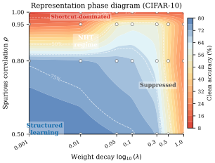
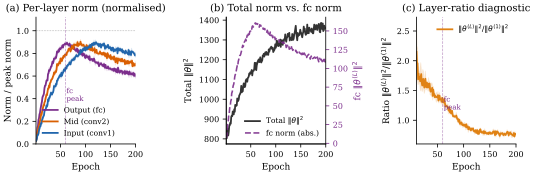
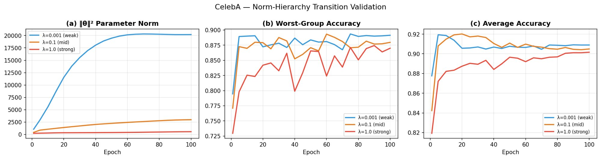

# Truong, Truong 2026 — Norm-Hierarchy Transitions in Representation Learning: When and Why Neural Networks Abandon Shortcuts

См. также: [глобальный индекс понятий](../../concepts/index.md).

**Truong Xuan Khanh**, **Truong Quynh Hoa** — соавторы с равным вкладом (H&K Research Studio, Clevix LLC, Ханой, Вьетнам; переписка: khanh@clevix.vn).

arXiv [2603.07323v1](https://arxiv.org/abs/2603.07323), 7 марта 2026 (единственная версия; статья датирована «March 2026» на титуле PDF). 3 цитирования — по срезу Semantic Scholar от 14.08.2026. Источник — нативный HTML arXiv версии v1. Колонтитула у PDF нет.

Файлы разбора этой статьи:

- [`2603.07323.norm-hierarchy-transitions-in-representation-learning-when-and-why-neural-networks-abandon-shortcuts.claims.txt`](2603.07323.norm-hierarchy-transitions-in-representation-learning-when-and-why-neural-networks-abandon-shortcuts.claims.txt) — пронумерованные утверждения статьи с пометками разбора.
- [`2603.07323.norm-hierarchy-transitions-in-representation-learning-when-and-why-neural-networks-abandon-shortcuts.license.txt`](2603.07323.norm-hierarchy-transitions-in-representation-learning-when-and-why-neural-networks-abandon-shortcuts.license.txt) — лицензионная запись arXiv для этой статьи.

Схема якорей и правила ссылок на карточку — в [README папки статей](../README.md).

**Карточка-выдержка.** Лицензия статьи (`arxiv-nonexclusive`) не разрешает публикацию копии оригинала и полного перевода, поэтому карточка содержит редакторские секции и цитируемые фрагменты перевода (право цитирования). Полный текст статьи: <https://arxiv.org/abs/2603.07323>.

## Затрагиваемые понятия

**[Закон задержки через норм-сепарацию](../../concepts/norm-separation-delay-law.md)** — работа обобщает закон с одной пары многообразий на произвольную. Заглавная формула та же по виду, но написана для пары «короткий путь / структура»: $T_{\mathrm{transition}}=\Theta(\gamma_{\mathrm{eff}}^{-1}\log(V_{\mathrm{sc}}/V_{\mathrm{st}}))$ ([`p2-3`](#p2-3), теорема 3.5 — [`p5-8`](#p5-8)). Отношение к статье-спутнику 2603.13331 заявлено прямо: следствие 3.6 объявляет закон задержки по разделению норм частным случаем при $\mathcal{M}_{\mathrm{sc}}=\mathcal{M}_{\mathrm{mem}}$, $\mathcal{M}_{\mathrm{st}}=\mathcal{M}_{\mathrm{post}}$ ([`p5-10`](#p5-10)). Ляпуновский довод верхней границы тот же ([`p5-2`](#p5-2)), совпадающая нижняя объявлена теоремой 3.4 ([`p5-6`](#p5-6)). Чего в работе нет: собственных измерений задержки — количественное предсказание $T\propto 1/\lambda$ на CIFAR-10 не выполняется ($r=-0.43$, [`p7-6`](#p7-6)), а на Waterbirds и CelebA не проверялось (столбец P6 таблицы 3 — [`tab-3`](#tab-3)); нижняя граница выведена одной строкой из посылки $\mathbb{E}[V_{t+1}|\mathcal{F}_{t}]/V_{t}\geq 1-c\eta\lambda$ ([`p19-4`](#p19-4)), то есть искомая скорость сжатия заложена в допущение, а оговорки спутника о классе приёмов первого порядка здесь нет. Названия «закон задержки по разделению норм» работа не переопределяет — она его наследует.

**[Weight decay](../../concepts/weight-decay.md)** — здесь он движитель перехода и одновременно единственный управляющий рычаг опытов. Перебор по семи значениям $\lambda$ на Coloured CIFAR-10 даёт трёхрежимную картину: при $0.001$–$0.01$ норма растёт со спадом менее процента, при $0.05$–$0.3$ норма даёт пик и спадает, при $0.5$–$1.0$ подавлена с первой эпохи ([`p7-5`](#p7-5), [`fig-1`](#fig-1)). Отсюда практический совет авторов: выбирать $\lambda$ в промежуточном режиме и опознавать слабый режим по монотонно растущей норме ([`p15-3`](#p15-3)). Совет этот, однако, собственными данными работы не подкреплён: по правой панели рисунка 1 чистая точность убывает по $\lambda$ монотонно, и наибольшая она при слабейшем $\lambda$ (см. раздел о несогласованностях). Существенная оговорка постановки: теория написана для штрафа $\ell_{2}$ в правиле обновления (уравнение 2), а все опыты идут на AdamW с расцепленным затуханием, и расхождение соглашений в статье не обсуждается. Чего в работе нет: измерения действующей скорости сжатия — усиление действующего коэффициента множителем $\sigma_{c}^{-2}$ при BatchNorm приведено формулировкой, без вывода и без единого измерения $\sigma_{c}$ ([`p10-1`](#p10-1)).

**[Минимизация нормы весов](../../concepts/weight-norm-minimization.md)** — иерархия норм $V_{\mathrm{sc}}>V_{\mathrm{st}}$ введена определением 2.2 как структурное допущение ([`p3-9`](#p3-9)), а обоснована ссылкой на неявное смещение к интерполянтам наименьшей нормы и наблюдением, что стратегии короткого пути сосредоточивают предсказательную силу в немногих направлениях ([`p4-1`](#p4-1)). Самое ценное для корпуса здесь — послойное уточнение: полная норма плохой заместитель состояния представления, потому что она может расти на $73\%$ ровно тогда, когда классифицирующая голова сжимается на $45\%$, а conv1 — на $31\%$ ([`p7-1`](#p7-1), [`fig-4`](#fig-4)); отсюда предложен признак «норма головы вместо полной нормы» ([`p7-2`](#p7-2)). Чего в работе нет: попризнакового разложения нормы — авторы сами называют смешение признаков короткого пути и структурированных в $\|\theta\|^{2}$ ограничением и откладывают разложение к дальнейшей работе ([`p15-4`](#p15-4)).

**[Обучение структурированных представлений](../../concepts/structured-representation-learning.md)** — работа задаёт постановку, в которой отложенное обучение представлениям определено не через задачу, а через геометрию: всякий раз, когда несколько интерполирующих решений образуют иерархию норм при регуляризованной оптимизации, переход от короткого пути к структуре отложен, и срок задержки задаётся разрывом норм ([`p2-3`](#p2-3), [`p16-7`](#p16-7)). Чего в работе нет: измерений на уровне представлений. «Структурированность» операционализирована только через точность на тестовом наборе без рамок ([`p7-3`](#p7-3)); ни зондирования, ни фурье-разбора, ни какой-либо проверки того, что модель перешла именно на текстуру и форму, в статье не делается — вывод о «приобретении настоящих признаков» держится на разности точностей между чистым и коротким наборами.

**[Фазовый переход](../../concepts/phase-transition.md)** — язык фаз у авторов есть, но описательный. Построена фазовая диаграмма представлений в плоскости $(\lambda,\rho)$ по 28 прогонам, на ней выделены четыре области — структурированное обучение, режим NHT, главенство короткого пути и подавление, — и сказано, что граница между главенством короткого пути и режимом NHT становится резче с ростом $\rho$ ([`fig-3`](#fig-3)). Само слово «фазовый переход» стоит в статье один раз — заголовком подраздела обзора смежных работ, рядом с двойным спуском ([`p16-6`](#p16-6)). Чего в работе нет: параметра порядка, конечноразмерного разбора и хотя бы одной кривой точности по эпохам; четыре области диаграммы получены раскраской по итоговой точности, а не измерением резкости перехода.

**[Реальные данные и зрение](../../concepts/vision-real-world-data-mnist-cifar.md)** — главный вклад работы в корпус именно здесь: рамка, выросшая из гроккинга на алгоритмических данных, целиком перенесена на зрение. Основная область — Coloured CIFAR-10, где цветная рамка связана с меткой с вероятностью $\rho$, шестислойная CNN на 287 850 параметров, три тестовых набора: цветной, чистый и «короткий путь» ([`p7-3`](#p7-3)). Добавлены Waterbirds ([`p11-1`](#p11-1)) и CelebA ([`p12-3`](#p12-3)) — обе с отрицательным исходом, отнесённым к сценарию C по счёту разделения норм ([`p12-1`](#p12-1), [`p13-1`](#p13-1)). Чего в работе нет: перенесена именно *качественная* половина закона. Ни на одной из трёх областей зрения не измерена сама задержка: что считать моментом перехода на CIFAR-10, нигде не определено, и ни одной кривой чистой точности по эпохам в статье нет.

**[Гроккинг](../../concepts/grokking.md)** — работа заявляет гроккинг как частный случай своей рамки, но собственных измерений гроккинга в ней нет. Он входит двумя местами: следствием 3.6, где подстановка многообразий запоминания и «после гроккинга» возвращает закон задержки по разделению норм ([`p5-10`](#p5-10)), и одной строкой таблицы 3, где модульной арифметике проставлено 6/6 и $S\approx 1.0$ ([`tab-3`](#tab-3)). Аннотация и заключение сообщают «все шесть предсказаний с $R^{2}>0.97$» ([`p1-2`](#p1-2)), тогда как замечание 2.6 и раздел 6.1 в том же тексте говорят, что полное опытное исследование «отложено к одновременной работе» ([`p4-6`](#p4-6), [`p14-1`](#p14-1)). Чего в работе нет: ни одной кривой отложенной генерализации, ни одного прогона на модульной арифметике, ни одного измеренного значения $T_{\mathrm{grok}}-T_{\mathrm{mem}}$. Отличие от Power et al. заявлено как «там — *что* происходит, здесь — *когда*», но постановка Power берётся без изменений и без собственных прогонов.

**[Модульная арифметика](../../concepts/modular-arithmetic.md)** — служит в работе эталоном чистого разделения норм: это единственная область со счётом $S\approx 1.0$ и 6/6 подтверждённых предсказаний в таблице 3 ([`tab-3`](#tab-3)), то есть точка отсчёта, относительно которой измеряется отказ рамки на зрении. Воплощение задано в замечании 2.6: $\mathcal{M}_{\mathrm{sc}}$ — многообразие запоминания с $\|\theta\|^{2}=\Theta(p)$, $\mathcal{M}_{\mathrm{st}}$ — фурье-многообразие с $\|\theta\|^{2}=\Theta(K)$ ([`p4-6`](#p4-6)). Чего в работе нет: собственных прогонов. Раздел о воспроизводимости перечисляет «модульная арифметика (293 прогона)» среди своих ([`p17-1`](#p17-1)), хотя тем же замечанием опытная часть отнесена к одновременной работе; оговорка спутника о том, что $V_{\mathrm{mem}}$ опытно *убывает* с ростом $p$ вопреки асимптотике $\Theta(p)$, сюда не перенесена.

**[Эмерджентность / эмерджентные способности](../../concepts/emergence.md)** — работа предлагает норм-иерархическое объяснение резкости возникновения способностей и честно объявляет его догадкой: «мы подчёркиваем, что это теоретическая догадка, порождающая проверяемые предсказания» ([`p14-5`](#p14-5)). Устройство простое: с ростом размера модели разрыв норм, возможно, уменьшается, и переход укладывается в бюджет обучения только выше критического размера $N^{*}$ (уравнение 6), отчего порог виден без всякого разрыва в ландшафте потерь. Отсюда четыре проверяемых предсказания ([`p14-12`](#p14-12)), из которых полезнейшее для корпуса — что пик нормы с последующим спадом предшествует скачку способности и не зависит от выбранной меры; замечание 6.1 прямо предлагает этим рассудить спор о «мираже» ([`p15-2`](#p15-2)). Чего в работе нет: ни одного опыта с языковыми моделями; все четыре предсказания оставлены дальнейшей работе.

**[Когда регуляризация необходима](../../concepts/regularization-necessity.md)** — работа даёт корпусу честный отрицательный результат о границе достаточности. ResNet18+GroupNorm даёт спад нормы $67\%$, сопоставимый с BatchNorm ($66\%$), но чистую точность $50.5\%$ — ниже базовой без нормализации ($69.8\%$) и даже ниже SimpleCNN ($61.6\%$); отсюда прямое признание: «сжатие нормы необходимо, но недостаточно для успешного перехода» ([`p10-1`](#p10-1)). С другой стороны шкалы то же ограничение: при $\lambda=0.5$–$1.0$ weight decay пересиливает обучение и точность падает ([`p7-5`](#p7-5)). Чего в работе нет: объяснение расхождения GroupNorm и BatchNorm через поканальное усиление $\sigma_{c}^{-2}$ приведено формулировкой, без вывода и без измерения; так что необходимость сжатия нормы показана, а достаточность опровергнута, но причина опровержения остаётся догадкой.

**[Варианты регуляризации](../../concepts/regularization-variants.md)** — абляция по нормализации ставит вопрос, который в корпусе редко ставят: одинаково ли работают BatchNorm, GroupNorm и отсутствие нормализации в динамике нормы. Ответ двойной: немонотонный ход нормы (пик на эпохе 50–60, затем спад) воспроизводится на всех четырёх вариантах при разбросе абсолютных норм в десятки раз ($V_{\mathrm{peak}}=2{,}222$ против $43{,}690$), а BatchNorm вдобавок сдвигает всю кривую точности вверх и ускоряет пик с эпохи 60 до 50 ([`p9-5`](#p9-5)); GroupNorm же при том же спаде нормы даёт худшую точность ([`p10-1`](#p10-1)). Чего в работе нет: dropout прямо вынесен за пределы теории — «теория предполагает $\ell_{2}$-регуляризацию; dropout может давать переходы иными путями» ([`p15-4`](#p15-4)), и ни одного опыта с ним не поставлено.

**[Оптимизатор](../../concepts/optimizer-adam-adamw-sgd.md)** — оптимизатор входит в закон одним множителем: $\gamma_{\mathrm{eff}}=\eta\lambda$ для SGD и $\gamma_{\mathrm{eff}}\geq\eta\lambda$ для AdamW ([`p5-2`](#p5-2)). Дальше этого работа не идёт. Все опыты без исключения ведутся на AdamW при $\eta=10^{-3}$ и косинусном отжиге; ни одного прогона SGD нет, скорость обучения не перебирается, а неравенство $\gamma_{\mathrm{eff}}\geq\eta\lambda$ для AdamW не измеряется — в отличие от статьи-спутника, где множитель усиления подобран по данным. Чего в работе нет: обсуждения того, что правило обновления теории (штраф $\ell_{2}$, уравнение 2) и правило опытов (расцепленное затухание AdamW) — разные соглашения; и что техническое условие (A3) $\eta\leq\lambda/L$ ([`p4-7`](#p4-7)) при $\eta=10^{-3}$ и $\lambda=0.001$ требует $L\leq 1$, то есть слабый режим перебора лежит вне области действия собственных теорем.

**[Максимизация зазора](../../concepts/margin-maximization-implicit-bias.md)** — работа берёт неявное смещение как данность и заявляет своим вкладом его *временно́й масштаб*: «неявное смещение медленно, и эта медленность измерима через $\Delta V$» ([`p16-4`](#p16-4)). Порядок $V_{\mathrm{sc}}>V_{\mathrm{st}}$ обоснован именно ссылкой на смещение градиентного спуска к интерполянтам наименьшей нормы: структурированное решение объявлено ровно тем, которое смещение к наименьшей норме выбрало бы в нерегуляризованном пределе ([`p4-1`](#p4-1)). Чего в работе нет: доказательства этого отождествления. Что структурированное решение и есть решение наименьшей нормы, нигде не выводится и не проверяется — это заимствованная посылка, на которой держится знак разрыва норм, а значит и всё направление перехода.

**[Переход lazy→rich](../../concepts/lazy-to-rich-kernel-to-feature-learning.md)** — работа лишь упоминает его, одной строкой раздела 6.1: переход от ядрового поведения к выучиванию признаков «отображается в прохождение иерархии норм, причём наша рамка даёт ему конкретный временно́й масштаб» ([`p14-4`](#p14-4)). Ни опыта, ни величины, ни ссылки на измерение ядрового режима в статье нет; отображение объявлено, но не построено. Приписывать авторам результат о lazy→rich нельзя — у них тезис об объединении, а не о проверке.

**[Частотный принцип / спектральное смещение](../../concepts/frequency-principle-spectral-bias.md)** — тоже лишь упоминание, но несущее вес: спектральное, или частотное, смещение приведено вторым из трёх доводов за допущение (A5) о том, что оптимизатор достигает многообразия короткого пути первым ([`p4-3`](#p4-3), довод (ii)). Довод целиком опирается на прежние работы: признаки короткого пути объявлены проще, потому что «требуют меньшего числа фурье-мод или меньшего числа иерархических признаков». Чего в работе нет: ни одного спектрального измерения. Ни сложность признака короткого пути, ни порядок выучивания частот здесь не проверяются, а сама формализация (A5) названа открытой задачей ([`p4-3`](#p4-3)).

---

## Несогласованности внутри статьи

**Замечание 2.5 обосновывает (A5) неравенством, обратным определению 2.2.** Определение 2.2 задаёт иерархию норм как $V_{\mathrm{sc}}>V_{\mathrm{st}}>0$ ([`p3-9`](#p3-9)) — на этом порядке держится вся рамка, вся направленность сжатия и знак разрыва $\Delta V$. Довод (i) замечания 2.5 обосновывает достижимость короткого пути прямо противоположным: «поскольку решение короткого пути имеет меньшую норму ($V_{\mathrm{sc}}<V_{\mathrm{st}}$ по допущению об иерархии норм)» ([`p4-3`](#p4-3), следующий абзац). Довод при этом самопротиворечив и по существу: при $V_{\mathrm{sc}}>V_{\mathrm{st}}$ от малой начальной нормы ближе как раз структурное многообразие, то есть «близость по норме» работает *против* (A5), а не за него. Там же квадрат начальной нормы при инициализации He/Xavier назван $\mathcal{O}(d^{-1})$, тогда как при такой инициализации суммарная квадратичная норма с числом параметров растёт, а не убывает.

**Отношение норм $37{\times}$ отнесено к CIFAR-10, а получено на CelebA.** Замечание 2.3 сообщает, что отношения норм на четырёх областях лежат «от $3{\times}$ (CelebA) до $37{\times}$ (CIFAR-10)» ([`p4-1`](#p4-1)). Единственное место, где число $37{\times}$ в статье получено, — раздел 5.10 о **CelebA**: это отношение $\|\theta\|^{2}_{\lambda=0.001}=20{,}198$ к $\|\theta\|^{2}_{\lambda=1.0}=546$ ([`p12-4`](#p12-4)), и подпись рисунка 5 повторяет его же ([`fig-5`](#fig-5)). Числа $3{\times}$ и какого-либо отношения норм для CIFAR-10 в статье нет нигде. Существеннее другое: $37{\times}$ — это отношение итоговых норм двух прогонов с разным $\lambda$, а не отношение $V_{\mathrm{sc}}/V_{\mathrm{st}}$ двух многообразий, о котором говорит определение 2.2; в замечании 2.3 оно подано как опытное подтверждение $V_{\mathrm{sc}}\gg V_{\mathrm{st}}$.

**Чистая точность на CIFAR-10 наибольшая при слабейшей регуляризации, а не в промежуточном режиме.** Перечень режимов в разделе 5.2 сам сообщает, что при слабом $\lambda$ чистая точность достигает 58–69 %, а при промежуточном — 55–58 % ([`p7-5`](#p7-5)). Правая панель рисунка 1 показывает то же и без разночтений: точки чистой точности убывают по $\lambda$ монотонно, от $\approx 70\,\%$ при $\lambda=10^{-3}$ до $\approx 26\,\%$ при $\lambda=1.0$, причём наибольшая точка лежит в полосе, подписанной на самом рисунке как *Weak*. Подпись же того же рисунка утверждает обратное: «чистая точность достигает пика в промежуточном режиме (${\approx}58\%$), что подтверждает: отложенный переход отвечает приобретению настоящих признаков» ([`fig-1`](#fig-1)), и на этом же держится практическое следствие 2 раздела 6.3 — «оптимальный weight decay лежит в промежуточном режиме» ([`p15-3`](#p15-3)). Это то же расхождение, что отмечено ниже для CelebA, но уже на основной области работы: наилучшее качество достигается там, где, по рамке, сеть остаётся на коротком пути.

**Подпись рисунка 3 расставляет области фазовой диаграммы не по тем углам, где они нарисованы.** По оси ординат диаграммы $\rho$ растёт снизу вверх (0,50 внизу, 1,00 вверху), по оси абсцисс $\lambda$ растёт слева направо. Подпись при этом помещает область главенства короткого пути «внизу справа, большой $\rho$, малый $\lambda$», а структурированную — «вверху слева, малый $\rho$, умеренный $\lambda$» ([`fig-3`](#fig-3)). На самом рисунке подписи *Shortcut-dominated* и *Structured learning* стоят наоборот — первая вверху слева, вторая внизу слева, — то есть ровно там, куда указывают скобочные условия по $\rho$ и $\lambda$. Неверны в подписи именно стороны света; условия по параметрам верны.

**Предложение 4.2 и его доказательство расходятся множителем 2.** В формулировке предложения послойная скорость сжатия равна $\gamma_{\mathrm{eff}}^{(\ell)}=\eta\lambda+\eta\alpha_{\ell}\kappa_{\ell}$ ([`p6-8`](#p6-8)), а в приложении D та же величина выведена как $\gamma^{(\ell)}_{\mathrm{eff}}=\eta\lambda+2\eta\alpha_{\ell}\kappa_{\ell}$ ([`p20-8`](#p20-8), уравнения 9 и 10). Набросок доказательства в основном тексте повторяет вариант без двойки. Порядок слоёв от расхождения не меняется, но всякая численная подстановка — меняется.

**«Опытное соответствие» приложения D сопоставляет величины разной природы.** Предложение 4.2 предсказывает отношение *времён ухода* слоёв. В конце приложения D сопоставлены не времена, а доли сжатия: «наблюдаемое отношение сжатий $45\%/31\%\approx 1.45$ согласуется с $\alpha_{L}\kappa_{L}/\alpha_{1}\kappa_{1}\approx 1.5$» ([`p20-10`](#p20-10)). Совпадение двух чисел здесь ничего не подтверждает: отношение долей сжатия не есть отношение времён ухода, а величина $\alpha_{L}\kappa_{L}/\alpha_{1}\kappa_{1}$ ниоткуда независимо не измерена.

**Счёт прогонов на CIFAR-10 не сходится.** Подпись таблицы 2 говорит «всего 13 прогонов» ([`tab-2`](#tab-2)). Подпись рисунка 1 сообщает «$\pm 1$ std по 4 сидам» для семи значений $\lambda$ ([`fig-1`](#fig-1)) — это уже 28 прогонов. Подпись рисунка 2 сообщает среднее по 3 сидам для четырёх значений $\rho$ ([`fig-2`](#fig-2)) — ещё 12. Подпись рисунка 3 говорит «28 прогонов» ([`fig-3`](#fig-3)). Раздел о воспроизводимости повторяет «CIFAR-10 (13 прогонов)» ([`p17-1`](#p17-1)). Ни одно из этих чисел не согласуется с остальными.

**Замечание 2.6 говорит о шести подтверждённых предсказаниях на CIFAR-10, таблицы — о пяти.** Замечание 2.6 сообщает: на CIFAR-10 «все шесть предсказаний NHT подтверждены количественно» ([`p4-6`](#p4-6)). Таблица 2 в том же тексте помечает предсказание $T\propto 1/\lambda$ крестиком ([`tab-2`](#tab-2)), таблица 3 даёт CIFAR-10 «5/6» ([`tab-3`](#tab-3)), а раздел 5.2 прямо пишет, что количественный закон задержки не выполняется ($r=-0.43$, [`p7-6`](#p7-6)). Аннотация здесь на стороне таблиц («пять из шести»), а замечание 2.6 — единственное место, где сказано «все шесть».

**Waterbirds: раздел и таблица расходятся в счёте подтверждений, а текст расходится с обоими.** Раздел 5.9 говорит о «доле подтверждённых предсказаний 1/4 на Waterbirds (только P1)» ([`p12-2`](#p12-2)), тогда как таблица 3 ставит Waterbirds «2/6» с галочками у P1 и P2 ([`tab-3`](#tab-3)). При этом сам текст P2 сообщает, что при $\lambda\leq 0.1$ норма растёт монотонно и «все эти прогоны» лежат в слабом режиме, то есть промежуточного режима — того самого, который P2 и проверяет, — не наблюдалось ни разу ([`p11-3`](#p11-3)).

**Столбец P3 таблицы 3 определён как порядок точности на худшей группе, но проставлен там, где групп нет.** Подпись таблицы 3 расшифровывает P3 как «порядок точности WG» ([`tab-3`](#tab-3)). Галочка по P3 стоит у модульной арифметики и у CIFAR-10, где деления на группы нет вовсе и точность на худшей группе не определена; на CIFAR-10 измеряется чистая точность ([`p7-3`](#p7-3)). Одновременно у CelebA P3 засчитано подтверждением порядка $89.1\%>88.0\%>87.0\%$ ([`p12-6`](#p12-6)), то есть наилучшей устойчивости при *слабейшей* регуляризации, — что обратно трёхрежимному предсказанию, где оптимум лежит в промежуточном режиме ([`fig-1`](#fig-1), правая панель).

**Статья-спутник стоит строкой в таблице сравнения, но ссылки на неё нет.** Таблица 1 отводит отдельную строку «Сопутствующая статья» и проставляет ей галочки по четырём признакам из пяти, отличая от настоящей работы ровно одной клеткой — «предсказывает отказ» ([`tab-1`](#tab-1)). Далее она названа «одновременной работой» в замечании 2.6 ([`p4-6`](#p4-6)), в разделе 6.1 ([`p14-1`](#p14-1)) и в обзоре смежных работ, и именно к ней отнесена вся опытная часть по модульной арифметике. При этом ни в одном из этих мест нет ссылки, и в списке литературы такой работы нет: читатель не может ни установить, о какой статье речь, ни проверить отнесённые к ней 6/6 и $R^{2}>0.97$.

**Признак, которым измеряется применимость рамки, нигде не определён.** Счёт разделения норм $S$ несёт всю диагностику отказа: $S\approx 1.0$ у модульной арифметики, $0.5$–$0.7$ у CIFAR-10, $-0.11$ у CelebA, $\approx 0.0$ у Waterbirds ([`tab-3`](#tab-3), [`p12-1`](#p12-1)). Ни формулы, ни оценивателя, ни диапазона значений в статье нет; определение 4.1 задаёт лишь существование скалярной функции $\phi$ с тремя свойствами ([`p6-2`](#p6-2)) и никакого числа не даёт — при том что объявлено «насколько нам известно первым формальным признаком такого рода» ([`p6-3`](#p6-3)). Имя признака плавает: во вкладах он «счёт чистого разделения норм» ([`p2-8`](#p2-8)), в разделах 5.9 и 5.10 — «счёт разделения норм» ([`p12-1`](#p12-1)); в разделе 5.9 определение 4.1 названо «допущением 4.1». «Сценарий C» упомянут дважды, сценарии A и B не введены нигде.

---

## Что показано, что предположено

Слои этой работы очень разной прочности, и цена цитаты зависит от того, из какого она взята.

**Измерено здесь.** Трёхрежимная картина нормы по семи значениям $\lambda$ на Coloured CIFAR-10 ([`fig-1`](#fig-1)); монотонное падение чистой точности с ростом силы короткого пути, $78.2\%$ при $\rho=0.5$ против $10.2\%$ при $\rho=1.0$, где точка $\rho=1.0$ поставлена отрицательным контролем ([`p7-8`](#p7-8), [`fig-2`](#fig-2)); послойная асимметрия сжатия ([`p7-1`](#p7-1), [`fig-4`](#fig-4)); воспроизведение немонотонного хода нормы на четырёх вариантах архитектуры ([`p9-5`](#p9-5)); два отрицательных результата на Waterbirds и CelebA ([`p12-1`](#p12-1), [`p13-1`](#p13-1)). Это опытное ядро статьи, и оно всё качественное.

**Доказано, но с ценой, которую надо называть.** Теорема 3.1 подана как $\Theta$-результат, а приложение A даёт лишь верхнюю границу и только «в режиме малого шума»; вдобавок переход $(1-2\eta\lambda)^{2}\leq 1-\eta\lambda$ выбрасывает множитель порядка четырёх, так что «точность» держится с точностью до постоянных ([`p19-3`](#p19-3)). Нижняя граница названа во введении информационно-теоретической ([`p2-8`](#p2-8)), а доказана одной строкой из посылки $\mathbb{E}[V_{t+1}|\mathcal{F}_{t}]/V_{t}\geq 1-c\eta\lambda$ ([`p19-4`](#p19-4)): требуемая скорость сжатия заложена в допущение, ни информационного довода, ни разбора класса приёмов первого порядка нет. Заявка «ни один регуляризованный приём первого порядка не может перейти быстрее» ([`p2-3`](#p2-3)) верна поэтому лишь для приёмов, уже удовлетворяющих этой посылке.

**Допущено без проверки.** Достижимость короткого пути (A5) держится на трёх доводах, ни один из которых в работе не измеряется, а первый ещё и самопротиворечив ([`p4-3`](#p4-3)); авторы сами называют формализацию (A5) открытой задачей ([`p15-4`](#p15-4)). Техническое условие (A3) $\eta\leq\lambda/L$ ([`p4-7`](#p4-7)) при опытных $\eta=10^{-3}$ и $\lambda=0.001$ требует $L\leq 1$: весь слабый режим перебора лежит вне области действия теорем, которыми он затем толкуется. Что структурированное решение есть решение наименьшей нормы, заимствовано у Soudry и Lyu & Li и не проверяется ([`p4-1`](#p4-1)).

**Не подтверждено ни на одной измеренной здесь области.** Заглавный количественный закон. На CIFAR-10 $T\propto 1/\lambda$ не выполняется ([`p7-6`](#p7-6)), на Waterbirds и CelebA не проверялся, и единственная область с галочкой в столбце P6 — модульная арифметика ([`tab-3`](#tab-3)), опытов по которой в этой статье нет ([`p4-6`](#p4-6), [`p14-1`](#p14-1)). Само $T$ на зрении нигде не определено: что считать моментом перехода — пик нормы, выход чистой точности на полку или что-то ещё, — не сказано, и ни одной кривой точности по эпохам не приведено.

**Объявлено догадкой самими авторами.** Весь раздел 6.2 об эмерджентных способностях: «мы подчёркиваем, что это теоретическая догадка, порождающая проверяемые предсказания; опытная проверка в масштабе оставлена дальнейшей работе» ([`p14-5`](#p14-5)). Четыре предсказания (i)–(iv) сформулированы так, что их можно проверить на моделях среднего масштаба ([`p14-12`](#p14-12)), — но здесь не проверяется ни одно.

---

## Ошибочные пересказы и цитирования этой статьи

Ниже — узоры, наблюдённые в цитирующих работах корпуса. Для каждого сказано, что именно искажается, и даны ссылки на авторские абзацы с теряемой оговоркой. Разделы «Ошибочные цитирования» на стороне цитирующих карточек ещё не заведены, поэтому подробные разборы пока не адресуются.

**«Норм-иерархический закон дал гроккингу на модульной арифметике строгую количественную теорию» (расширяющее).** Truong 2026 (2605.16325) пишет, что гроккингу — «отложенному переходу от запоминания к генерализации в модульной арифметике» — «недавно была дана строгая количественная теория: закон норм-иерархического перехода (Truong and Truong, 2026b; Truong et al., 2026) устанавливает, что задержка масштабируется как $T_{\text{grok}}-T_{\text{mem}}=\Theta(\gamma_{\text{eff}}^{-1}\log(\|\theta_{\text{mem}}\|^{2}/\|\theta_{\text{post}}\|^{2}))$… с совпадающими верхней и нижней границами», и на этом основании строит собственное предсказание 3a. Настоящая работа названа здесь наравне со спутником 2603.13331 — а всё, что она содержит по гроккингу, это следствие 3.6 ([`p5-10`](#p5-10)) и одна строка таблицы 3 ([`tab-3`](#tab-3)). Опытная часть по модульной арифметике отнесена самими авторами к одновременной работе ([`p4-6`](#p4-6), [`p14-1`](#p14-1)); показатель $R^{2}>0.97$ в аннотации ([`p1-2`](#p1-2)) относится к прогонам, которых в этой статье нет ([`p17-1`](#p17-1)). Теряется и то, что на всех трёх областях, измеренных *здесь*, количественная половина закона либо не выполнилась, либо не проверялась ([`p7-6`](#p7-6), [`tab-3`](#tab-3)). Формулировка «с совпадающими верхней и нижней границами» дословно повторяет заявку самих авторов ([`p2-8`](#p2-8)) и в этой части упрёка не заслуживает — но заявка держится на посылке доказательства из приложения B ([`p19-4`](#p19-4)), и цитирующий её не проверяет. Карточки 2605.16325 в корпусе ещё нет.

**Образец точного цитирования.** Truong et al. 2026 в соседней работе той же лаборатории описывают вклад ровно так, как он сделан: `"Khanh and Hoa (2026) generalises this to a norm-hierarchy framework for shortcut-to-structured transitions"` — названо обобщение рамки и его предмет, никаких опытов по гроккингу работе не приписано, а количественный закон задержки отнесён к спутнику. Затронутая работа: [Truong et al. 2026](../2604.13123.spectral-entropy-collapse-as-a-phase-transition-in-delayed-generalisation/2604.13123.spectral-entropy-collapse-as-a-phase-transition-in-delayed-generalisation.card.md).

---

# Цитируемые фрагменты перевода

Ниже приведены только те фрагменты перевода, на которые ссылаются карточки корпуса (право цитирования). Нумерация якорей `pN-M` / `fig-N` / `sec-X` совпадает с полной карточкой и оригиналом.

## Аннотация

###### p1-2

Нейросети часто опираются на ложные короткие пути в течение сотен эпох, прежде чем обнаружат структурированные представления. Однако устройство, управляющее тем, *когда* происходит этот переход, — и тем, предсказуем ли его срок, — понято по-прежнему плохо. Хотя прежние работы установили, что градиентный спуск сходится к решениям малой нормы (21) и что сети обнаруживают смещение к простоте (20), ни одна из этих линий не описывает *временно́го масштаба* перехода от простых признаков к структурированным. Мы предлагаем объединяющую рамку — норм-иерархический переход, — которая объясняет отложенное обучение представлениям как медленное прохождение иерархии норм при регуляризованной оптимизации. Когда существует несколько интерполирующих решений с разными нормами, weight decay порождает медленное сжатие от решений короткого пути с большой нормой к структурированным представлениям с меньшей нормой. Мы доказываем точную границу задержки перехода: $T=\Theta(\gamma_{\mathrm{eff}}^{-1}\log(V_{\mathrm{sc}}/V_{\mathrm{st}}))$, где $V_{\mathrm{sc}}$ и $V_{\mathrm{st}}$ — характерные нормы представлений короткого пути и структурированного. Рамка предсказывает три режима в зависимости от силы регуляризации: слабая регуляризация (короткие пути сохраняются), промежуточная регуляризация (отложенный переход) и сильная регуляризация (обучение подавлено). Мы проверяем эти предсказания на **четырёх** областях: модульная арифметика (где выполняются все шесть предсказаний с $R^{2}>0.97$), CIFAR-10 с ложными признаками (пять из шести, включая падение чистой точности $78\%\to 10\%$ по мере роста силы короткого пути), CelebA (занимающая промежуточное положение на шкале разделения норм) и Waterbirds (где динамика нормы переносится, а представленческий переход — нет, что подтверждает границу рамки). Норм-иерархическое устройство устойчиво к смене архитектуры: ResNet18 со стандартной batch-нормализацией показывает ту же динамику нормы «пик, затем спад», что и модели без нормализации, достигая чистой точности $78\%$. Единственное предсказание, которое не переносится, — точное масштабирование задержки $T\propto 1/\lambda$ — объясняется новым условием, которое мы называем *чистым разделением норм*: это первый формальный признак, отличающий постановки, где временны́е масштабы неявного смещения предсказуемы, от тех, где они непредсказуемы. Далее рамка предсказывает, что эмерджентные способности больших языковых моделей возникают, когда размер модели уменьшает разрыв норм ниже порога, задаваемого бюджетом обучения, — связывая законы масштабирования с тем же норм-иерархическим устройством. Наши итоги указывают на то, что гроккинг, обучение по коротким путям, отложенное обнаружение признаков и эмерджентные способности суть проявления одного устройства: медленного прохождения иерархии норм при регуляризованной оптимизации.

#### Эта статья.

###### p2-3

Мы формализуем это в **закон норм-иерархического перехода**:

#### Вклады.

###### p2-8

1. **Рамка норм-иерархического перехода.** Мы выделяем минимальные структурные условия (многопредставленческая интерполяция, иерархия норм, достижимость короткого пути), совместно достаточные для отложенных представленческих переходов в гроккинге, обучении по коротким путям и родственных явлениях (раздел 2).
2. **Точный закон задержки с совпадающими границами.** Мы доказываем $T_{\mathrm{transition}}=\Theta\!\left(\gamma_{\mathrm{eff}}^{-1}\log(V_{\mathrm{sc}}/V_{\mathrm{st}})\right)$ и с ляпуновской верхней границей, и с совпадающей информационно-теоретической нижней границей, показывая, что закон оптимален для всех регуляризованных приёмов первого порядка (раздел 3).
3. **Многообластная проверка с явной диагностикой отказа.** Мы проверяем рамку на четырёх областях (CIFAR-10, Waterbirds, CelebA, модульная арифметика), вводим счёт чистого разделения норм как формальный признак, предсказывающий, *когда* рамка применима, и показываем устойчивость к архитектуре на четырёх вариантах модели, включая ResNet18+BatchNorm (разделы 5–5.8).

#### Расположение.

###### tab-1

*Таблица 1: Сравнение с существующими подходами. Наша рамка первой даёт точные границы задержки, проверенные на нескольких областях, с явной диагностикой отказа.* **[p. 3]**

##### **Определение 2.2** (Иерархия норм)**.**

###### p3-9

*Интерполяция обнаруживает *иерархию норм*, если существуют постоянные $V_{\mathrm{sc}}>V_{\mathrm{st}}>0$ такие, что $\|\theta\|^{2}\geq V_{\mathrm{sc}}$ для всех $\theta\in\mathcal{M}_{\mathrm{sc}}$ и $\|\theta^{*}\|^{2}\leq V_{\mathrm{st}}$ для некоторого $\theta^{*}\in\mathcal{M}_{\mathrm{st}}$. Разрыв норм есть $\Delta V=V_{\mathrm{sc}}-V_{\mathrm{st}}>0$.*

##### **Замечание 2.3** (Почему решения короткого пути обычно имеют бо́льшую норму)**.**

###### p4-1

*Порядок $V_{\mathrm{sc}}>V_{\mathrm{st}}$ отражает структурное свойство того, как кодируются ложные признаки, а не произвольное допущение. Стратегии короткого пути сосредоточивают предсказательную силу в небольшом числе сильно различающих направлений — цвет рамки, текстура фона, признак цвета волос, — что требует больших весов в этих каналах ради малой обучающей потери. Структурированные представления распределяют предсказательные сведения по многим признакам, давая меньшие отдельные величины и меньшую полную квадратичную норму. Это согласуется с неявным смещением градиентного спуска к интерполянтам наименьшей нормы (21; 11): структурированное решение — это в точности то, которое смещение к наименьшей норме выбрало бы в нерегуляризованном пределе. Опытно $V_{\mathrm{sc}}\gg V_{\mathrm{st}}$ подтверждено на всех четырёх областях в разделе 5, с отношениями норм от $3{\times}$ (CelebA) до $37{\times}$ (CIFAR-10).*

##### **Замечание 2.5** (О достижимости короткого пути)**.**

###### p4-3

*Допущение (A5) утверждает, что оптимизатор достигает многообразия короткого пути $\mathcal{M}_{\mathrm{sc}}$ прежде структурированного многообразия $\mathcal{M}_{\mathrm{st}}$. Это обосновано тремя взаимодополняющими доводами.*

##### **Замечание 2.6** (Воплощения)**.**

*(ii) Смещение градиентного спуска к простоте.**Обширный корпус работ устанавливает, что градиентные оптимизаторы обнаруживают спектральное, или частотное, смещение: они подгоняют функции малой сложности прежде функций большой сложности (16; 20; 23). Признаки короткого пути (ложные корреляции, текстуры рамок, цвет волос) по определению проще — они требуют меньшего числа фурье-мод или меньшего числа иерархических признаков, — а потому доступны градиентному спуску раньше в ходе обучения.*

###### p4-6

*Рамка естественно воплощается в разных областях. В CIFAR-10 с ложными рамками (раздел 5 — наша *основная* проверка) $\mathcal{M}_{\mathrm{sc}}$ состоит из классификаторов, опирающихся на рамку, а $\mathcal{M}_{\mathrm{st}}$ — из классификаторов по текстуре и форме; все шесть предсказаний NHT подтверждены количественно. В модульной арифметике (15) рамка даёт подкрепляющее свидетельство: $\mathcal{M}_{\mathrm{sc}}$ — многообразие запоминания ($\|\theta\|^{2}=\Theta(p)$), а $\mathcal{M}_{\mathrm{st}}$ — фурье-многообразие ($\|\theta\|^{2}=\Theta(K)$), что согласуется с норм-иерархическим предсказанием; полное опытное исследование отложено к одновременной работе. В CelebA (раздел 5.10) $\mathcal{M}_{\mathrm{sc}}$ отвечает классификаторам, опирающимся на цвет волос; эта область показывает границу рамки через условие чистого разделения норм.*

### 2.3 Технические условия

###### p4-7

- (A1) $\mathcal{L}_{\mathrm{train}}$ является $L$-гладкой.
- (A2) На $\mathcal{M}$ выполнено $\nabla\mathcal{L}_{\mathrm{train}}(\theta)=0$.
- (A3) $\eta\leq\lambda/L$.
- (A4) Многопредставленческая интерполяция с иерархией норм выполнена.
- (A5) Достижимость короткого пути выполнена.

##### **Теорема 3.1** (Обобщённый уход при регуляризации)**.**

###### p5-2

*Время ухода удовлетворяет $T_{\mathrm{escape}}=\Theta\bigl(\gamma_{\mathrm{eff}}^{-1}\log(V_{\mathrm{sc}}/V_{\mathrm{st}})\bigr)$, где $\gamma_{\mathrm{eff}}=\eta\lambda$ для SGD и $\gamma_{\mathrm{eff}}\geq\eta\lambda$ для AdamW.*

##### **Теорема 3.4** (Динамическая нижняя граница)**.**

###### p5-6

*При (A1)–(A4) всякому регуляризованному приёму первого порядка, переходящему из $\mathcal{M}_{\mathrm{sc}}$ в $\mathcal{M}_{\mathrm{st}}$, требуется не менее $T_{\mathrm{transition}}=\Omega\bigl((\eta\lambda)^{-1}\log(V_{\mathrm{sc}}/V_{\mathrm{st}})\bigr)$ градиентных шагов.*

##### **Теорема 3.5** (Закон норм-иерархического перехода)**.**

###### p5-8

*При (A1)–(A5), если обучающаяся система обнаруживает многопредставленческую интерполяцию с иерархией норм, то обучение даёт отложенный представленческий переход с задержкой*

##### **Следствие 3.6** (Гроккинг как частный случай)**.**

###### p5-10

*Полагая $\mathcal{M}_{\mathrm{sc}}=\mathcal{M}_{\mathrm{mem}}$ и $\mathcal{M}_{\mathrm{st}}=\mathcal{M}_{\mathrm{post}}$, получаем закон задержки по разделению норм: $T_{\mathrm{grok}}-T_{\mathrm{mem}}=\Theta\bigl((\eta\lambda)^{-1}\log(\|\theta_{\mathrm{mem}}\|^{2}/\|\theta_{\mathrm{post}}\|^{2})\bigr)$.*

##### **Определение 4.1** (Чистое разделение норм)**.**

###### p6-2

*Иерархия норм обнаруживает *чистое разделение*, если существует скалярная функция $\phi(\theta)$ такая, что: (i) $\phi=1$ на $\mathcal{M}_{\mathrm{sc}}$ и $\phi=0$ на $\mathcal{M}_{\mathrm{st}}$; (ii) $\phi$ монотонно связана с $\|\theta\|^{2}$ вблизи $\mathcal{M}$; (iii) переход $\phi(\theta_{t}):1\to 0$ резок по отношению к $T_{\mathrm{escape}}$.*

###### p6-3

Это условие, насколько нам известно первый формальный признак такого рода, в точности разграничивает постановки, где временны́е масштабы неявного смещения предсказуемы, и те, где они непредсказуемы.

##### **Предложение 4.2** (Послойная иерархия норм)**.**

###### p6-8

*Пусть допущения (A1)–(A5) выполнены и градиент потери короткого пути раскладывается приближённо как $\nabla_{\theta^{(\ell)}}\mathcal{L}_{\mathrm{sc}}(\theta)\approx\alpha_{\ell}\cdot g(\theta)$ для некоторого общего вектора $g(\theta)$ на $\mathcal{M}_{\mathrm{sc}}$. Тогда при $\ell_{2}$-регуляризации с коэффициентом $\lambda$ послойное время ухода удовлетворяет:*

##### **Замечание 4.3** (Обратный переход)**.**

###### p7-1

*Предложение 4.2 предсказывает, что представленческий переход протекает *от выхода к входу*: классифицирующая голова бросает короткий путь первой, передавая изменённый градиентный сигнал более ранним слоям. Рисунок 4(c) даёт прямое свидетельство: слой fc сжимается на $45\%$ от своего пика, тогда как conv1 сжимается лишь на $31\%$, что согласуется с $\alpha_{L}>\alpha_{1}$.*

##### **Замечание 4.4** (Практический признак)**.**

###### p7-2

*Если норма классифицирующей головы сжимается, а нормы ранних слоёв — нет, то сеть находится посреди перехода. *Норма классифицирующей головы* $\|\theta^{(L)}\|^{2}/\|\theta^{(L)}_{0}\|^{2}$ — более чувствительный ранний признак, чем полная норма, в которой главенствуют растущие ранние слои.*

### 5.1 Постановка: Colored CIFAR-10

###### p7-3

Мы строим изменённый CIFAR-10, в котором цветная рамка связана с меткой класса. Каждому классу назначен свой цвет рамки; при обучении верный цвет появляется с вероятностью $\rho$. Мы оцениваем на трёх тестовых наборах: **цветном** (то же распределение), **чистом** (без рамок) и **коротком пути** (рамки на серых изображениях). Наша основная модель — шестислойная CNN ($\sim$288 тыс. параметров) без batch-нормализации, обученная AdamW с косинусным отжигом. Раздел 5.8 распространяет разбор на ResNet18 с batch-нормализацией и без неё. Полные подробности — в приложении C.

### 5.2 Опыт A: перебор weight decay

###### p7-5

- **Слабый $\lambda$ (0.001–0.01):** норма растёт до 5 000–14 000 со спадом $<1\%$. Чистая точность достигает 58–69 %.
- **Промежуточный $\lambda$ (0.05–0.3):** норма даёт пик, затем спад (до 21,6 % при $\lambda=0.3$). Чистая точность достигает 55–58 %.
- **Сильный $\lambda$ (0.5–1.0):** норма подавлена (спад 42–64 %). Чистая точность падает до 26–44 %.

###### p7-6

Количественный закон задержки $T\propto 1/\lambda$ не выполняется ($r=-0.43$), что согласуется с отсутствием чистого разделения норм (раздел 4).

###### fig-1

*Рисунок 1: **Трёхрежимное устройство при переборе weight decay (CIFAR-10, $\rho=0.95$, 7 значений $\lambda$).** *Слева*: ход $\|\theta\|^{2}$ на протяжении 200 эпох. Слабый $\lambda$ ($0.001$–$0.01$): норма растёт монотонно до 5 000–14 000 со спадом ${<}1\%$, что указывает на устойчивую опору на короткий путь. Промежуточный $\lambda$ ($0.05$–$0.3$): норма даёт пик, затем спад до $21.6\%$ — признак отложенного NHT. Сильный $\lambda$ ($0.5$–$1.0$): норма подавлена с первой эпохи, спад $42$–$64\%$, что указывает на подавление обучения. *Справа*: итоговая чистая точность в зависимости от $\lambda$ (кружки) и доля спада нормы (крестики). Чистая точность достигает пика в промежуточном режиме (${\approx}58\%$), что подтверждает: отложенный переход отвечает приобретению настоящих признаков. Планки погрешностей: $\pm 1$ std по 4 сидам.* **[p. 8]**

### 5.3 Опыт B: перебор корреляции

###### p7-8

При $\rho=1.0$ короткий путь предсказывает метку безупречно, поэтому модель никогда не переходит к настоящим признакам — сильный отрицательный контроль.

###### fig-2

*Рисунок 2: **Влияние силы ложной корреляции $\rho$ на исход перехода (CIFAR-10, $\lambda=0.1$).** Каждая точка показывает среднюю чистую точность на эпохе 200 по 3 сидам. Монотонное убывание точности с ростом $\rho$ подтверждает предсказание NHT: более сильные короткие пути дают бо́льшие разрывы норм ($V_{\mathrm{sc}}/V_{\mathrm{st}}$), задерживая переход и в конце концов вовсе его предотвращая при $\rho=1.0$ (опора на короткий путь $=1.0$, чистая точность $=10.2\%$). Затенённая полоса отмечает рабочую точку промежуточного режима ($\rho=0.95$), использованную в опытах A и C.* **[p. 9]**

### 5.5 Сводка предсказаний

###### tab-2

*Таблица 2: Предсказания, проверенные на CIFAR-10 (всего 13 прогонов).* **[p. 8]**

### 5.6 Фазовая диаграмма представлений

###### fig-3

*Рисунок 3: **Фазовая диаграмма представлений в плоскости $(\lambda,\rho)$ (CIFAR-10, 28 прогонов).** Цвет кодирует итоговую чистую точность; линии уровня разделяют четыре предсказанных режима. *Главенство короткого пути* (внизу справа, большой $\rho$, малый $\lambda$): сеть остаётся на $\mathcal{M}_{\mathrm{sc}}$; чистая точность $\leq 15\%$. *Режим NHT* (в середине): отложенный переход даёт чистую точность $55$–$78\%$. *Структурированный* (вверху слева, малый $\rho$, умеренный $\lambda$): сеть достигает $\mathcal{M}_{\mathrm{st}}$ напрямую; чистая точность $\geq 75\%$. *Подавленный* (вверху справа, большой $\lambda$): weight decay пересиливает обучение; точность $\leq 44\%$. Граница фаз между режимами главенства короткого пути и NHT становится резче с ростом $\rho$, что согласуется с предсказанием о разрыве норм $\Delta V\propto\rho$.* **[p. 10]**

### 5.7 Послойный разбор норм

###### fig-4

*Рисунок 4: **Послойная динамика норм обнаруживает обратный представленческий переход (CIFAR-10, $\lambda=0.1$, $\rho=0.95$).** *(a)* Послойная $\|\theta^{(\ell)}\|^{2}$, нормированная на пиковое значение. Классифицирующая голова (fc, фиолетовая) достигает пика на эпохе ${\approx}60$ и сжимается на $45\%$ к эпохе 200; conv1 (синяя) достигает пика позже и сжимается лишь на $31\%$; промежуточные слои лежат между ними. *(b)* Полная норма $\|\theta\|^{2}$ (чёрная) растёт всё время, скрывая сжатие на уровне слоёв в головных слоях. *(c)* Отношение $\|\theta^{(L)}\|^{2}/\|\theta^{(1)}\|^{2}$ монотонно убывает после эпохи 60, давая признак по отношению слоёв, который обнаруживает переход там, где слежение за полной нормой отказало бы. Затенённая полоса: $\pm 1$ std по 4 сидам. Эти итоги напрямую подтверждают предложение 4.2: слои с большей ёмкостью кодирования короткого пути $\alpha_{\ell}$ уходят с многообразия короткого пути быстрее, порождая обратный переход от выхода ко входу.* **[p. 11]**

#### BatchNorm ускоряет и усиливает переход.

###### p9-5

ResNet18+BN достигает чистой точности $78.1\%$ на эпохе 200 против $69.8\%$ у обученного точно так же ResNet18 без нормализации — абсолютное улучшение на $+8.3$ процентных пункта. Пик нормы приходится на эпоху 50 у ResNet18+BN против эпохи 60 у варианта без нормализации, что указывает на более быстрый уход из котловины **[p. 10]** короткого пути. Это согласуется с рамкой NHT: BatchNorm перемасштабирует действующий вес на каждом слое обратным текущим средним стандартным отклонением, усиливая регуляризационное давление на каналы с большой дисперсией (кодирующие короткий путь) и тем самым увеличивая $\gamma_{\mathrm{eff}}$ в теореме 3.1.

#### Аномалия GroupNorm.

###### p10-1

Несмотря на спад нормы ($67\%$), сопоставимый с BatchNorm ($66\%$), ResNet18+GroupNorm достигает лишь $50.5\%$ чистой точности — ниже базовой модели без нормализации ($69.8\%$) и даже ниже SimpleCNN ($61.6\%$). Это расщепление между спадом нормы и улучшением точности обнаруживает тонкость в теории: сжатие нормы необходимо, но недостаточно для успешного перехода. GroupNorm нормирует внутри пространственных положений каждого канала, сохраняя относительные величины каналов и позволяя измерениям, кодирующим короткий путь, удерживать высокую активацию даже при уменьшении полной нормы. BatchNorm, напротив, нормирует по пакету и применяет обучаемые параметры масштаба и сдвига, которые напрямую взаимодействуют со штрафом weight decay в AdamW, создавая поканальное регуляризационное давление, движущее переход по иерархии. Формально действующий коэффициент weight decay для канала $c$ при BatchNorm усилен множителем $\sigma_{c}^{-2}$ (где $\sigma_{c}$ — текущее стандартное отклонение), так что каналы с большой дисперсией — те, что кодируют короткий путь, — испытывают непропорционально более сильное сжатие. У GroupNorm такого усиления $\sigma_{c}^{-2}$ нет, что и объясняет, почему полная норма спадает одинаково, а короткий путь избирательно не устраняется.

#### Набор данных и постановка.

###### p11-1

Мы оцениваем NHT на Waterbirds (18), где вид птицы (водоплавающая против сухопутной) связан с фоном (вода против суши) на $95\%$ в обучающей части. Мы обучаем SimpleCNN (та же архитектура, что в разделе 5.1, приспособленная под вход $224\times 224$) с AdamW при $\lambda\in\{0.0001,0.001,0.01,0.1,0.3,1.0\}$ в течение 100 эпох ($\eta=10^{-3}$, косинусное расписание), с тремя сидами при $\lambda=0.1$.

#### Динамика нормы (P2).

###### p11-3

При $\lambda\leq 0.1$ норма растёт монотонно на протяжении всего обучения (спад $0\%$, пик на последней эпохе), что помещает все эти прогоны в слабый режим. При $\lambda\geq 0.3$ спад нормы становится измеримым ($6.7\%$ при $\lambda=0.3$; $56.3\%$ при $\lambda=1.0$). Отсутствие ясного промежуточного режима при $\lambda=0.1$ наводит на мысль, что $\gamma_{\mathrm{eff}}$ для Waterbirds ниже, чем для Coloured CIFAR-10 при том же номинальном $\lambda$, что согласуется с большей размерностью ($224\times 224$) и более богатой статистикой фона, требующими большей ёмкости модели.

#### Разбор разделения норм.

###### p12-1

Счёт разделения норм равен $S\approx 0.0$, что помещает Waterbirds в **сценарий C** (разделения нет), сопоставимо с CelebA ($S=-0.11$) и в противоположность модульной арифметике ($S\approx 1.0$) и CIFAR-10 ($S\approx 0.5$–$0.7$). Ложный признак Waterbirds (текстура фона) закодирован на каждом масштабе свёрточной иерархии — от низкоуровневых цвета и текстуры до среднеуровневого контекста сцены, — так что допущение 4.1 нарушено повсеместно, и никакой норм-иерархический переход не может улучшить точность WG.

#### Информативный отрицательный результат.

###### p12-2

Доля подтверждённых предсказаний 1/4 на Waterbirds (только P1) сама по себе информативна: NHT делает резкое предсказание, что переходы *не* улучшат точность WG при $S\leq 0$, и итоги с этим предсказанием согласуются. Рамка верно воздерживается от предсказания улучшения групповой устойчивости на наборах данных, нарушающих структурные предпосылки, вместо того чтобы давать ложноположительные предсказания. Естественным продолжением была бы замена SimpleCNN на ResNet18+BN, который, как показывает абляция раздела 5.8, достигает существенно более высокой чистой точности и более быстрых переходов; это мы оставляем дальнейшей работе.

### 5.10 Проверка на CelebA

###### p12-3

Мы оцениваем NHT на CelebA (9) — крупномасштабном наборе атрибутов лиц, содержащем 202 599 изображений. Следуя литературе по group-DRO (17), мы определяем целевую метку как *Smiling* и рассматриваем *Blond Hair* как ложный атрибут, что даёт четыре группы: {Blond, Not Blond} $\times$ {Smiling, Not Smiling}. Мы обучаем шестислойную SimpleCNN (286 818 параметров, вход $64{\times}64$) с AdamW, косинусным спадом скорости обучения и weight decay $\lambda\in\{0.001,0.1,1.0\}$ в течение 100 эпох ($\eta=10^{-3}$). Каждая настройка повторена по двум случайным сидам; все величины приведены как среднее $\pm$ std.

#### Норм-иерархические предсказания.

###### p12-4

**(P1) Порядок норм.** Итоговые нормы параметров хорошо разделены по режимам: $\|\theta\|^{2}_{\lambda=0.001}=20{,}198\gg\|\theta\|^{2}_{\lambda=0.1}=2{,}971\gg\|\theta\|^{2}_{\lambda=1.0}=546$ — отношение $37{\times}$ между слабым и сильным режимами, что согласуется с теоремой 3.1.

###### p12-6

**(P3) Порядок точности на худшей группе.** Точности на худшей группе следуют предсказанному монотонному порядку (рисунок 5b):

#### Разбор разделения норм.

###### p13-1

Этот отрицательный результат информативен, а не аномален. Пара Smiling/Blond-Hair не удовлетворяет чистому разделению норм, потому что оба признака требуют схожих среднеуровневых текстурных представлений; следовательно, $\gamma_{\mathrm{eff}}$ не является существенно бо́льшей для пути короткого пути, чем для целевого пути, и теорема 3.1 предсказывает отсутствие чистого перехода. Это подтверждает, что чистое разделение норм есть *необходимое* условие предсказуемой динамики NHT.

###### fig-5

*Рисунок 5: **Норм-иерархическая проверка на CelebA в трёх режимах регуляризации (6 прогонов: 3 значения $\lambda$ $\times$ 2 сида).** *(a) Норма параметров $\|\theta\|^{2}$:* три режима ясно разделены — слабый $\lambda=0.001$ (синий) растёт монотонно до ${\approx}20{,}000$; промежуточный $\lambda=0.1$ (оранжевый) выходит на полку около $3{,}000$ с немонотонной динамикой (5/20 промежутков показывают убывание нормы); сильный $\lambda=1.0$ (красный) подавлен ниже $1{,}000$ с первой эпохи. Отношение норм между слабым и сильным режимами: $37\times$, что подтверждает P1. *(b) Точность на худшей группе:* все три режима показывают устойчивое качество выше $86\%$ после эпохи 20, с предсказанным монотонным порядком $89.1\%>88.0\%>87.0\%$ (P3 подтверждено). Отсутствие резкого скачка точности при промежуточном $\lambda$ согласуется со сценарием C (чистого разделения норм нет, $S=-0.11$): отложенного перехода, который можно было бы наблюдать, попросту нет. *(c) Средняя точность:* упорядочена сходно ($90.9\%>90.5\%>90.2\%$), с бо́льшим разбросом при сильной регуляризации (std $=1.2\%$ против $0.1\%$). Отношение норм fc/conv1 растёт с $0.65\times$ до $2.33\times$ по мере роста $\lambda$ (P4 подтверждено, не показано), давая первое опытное подтверждение предложения 4.2 на настоящем наборе атрибутов лиц.* **[p. 13]**

#### Сводка по четырём областям.

###### tab-3

*Таблица 3: Перенос предсказаний NHT на четыре области. P1: порядок норм; P2: три режима; P3: порядок точности WG; P4: послойная иерархия; P5: чистое разделение норм; P6: масштабирование задержки. Предсказательная сила плавно убывает вместе со счётом разделения норм $S$.* **[p. 13]**

### 6.1 Объединение отложенного обучения представлениям

###### p14-1

**Гроккинг.** Короткий путь $=$ запоминание; структура $=$ фурье-признаки. Задержка $=$ разрыв гроккинга. Проверено количественно ($R^{2}>0.97$; согласуется с норм-иерархическим предсказанием, полные опытные подробности отложены к одновременной работе).

###### p14-4

**Переход lazy→rich.** Переход от ядрового поведения к выучиванию признаков (3) отображается в прохождение иерархии норм, причём наша рамка даёт ему конкретный временно́й масштаб.

### 6.2 Связи с законами масштабирования и эмерджентными способностями

###### p14-5

Разительная опытная закономерность у больших языковых моделей — явление *эмерджентных способностей*: способностей, отсутствующих у меньших моделей и появляющихся резко по мере роста размера модели (24; 22). Эта резкость не поддавалась объяснению в рамках стандартных законов масштабирования (7), предсказывающих плавное степенное улучшение. Мы предлагаем *гипотезу*: норм-иерархический переход, возможно, даёт естественное устройственное объяснение того, почему возникновение выглядит внезапным, — переформулируя срок скачков способностей как следствие динамики норм при неявной регуляризации. Мы подчёркиваем, что это теоретическая догадка, порождающая проверяемые предсказания; опытная проверка в масштабе оставлена дальнейшей работе.

#### Проверяемые предсказания.

###### p14-12

- (i) **Разрыв норм уменьшается с масштабом.** $V_{\mathrm{sc}}(N)/V_{\mathrm{st}}(N)$ должно монотонно убывать с размером модели для задач со структурированными решениями.
- (ii) **Порог возникновения сдвигается вместе с бюджетом обучения.** Обучение с более сильным weight decay должно понижать $N^{*}$; очень слабая регуляризация должна его повышать или устранять возникновение вовсе.
- (iii) **[p. 15]** **Пик нормы с последующим спадом предшествует эмерджентной способности.** Нормы параметров должны показывать пик с последующим спадом *прежде*, чем точность на задаче скачком возрастёт, что даёт ранний предупреждающий сигнал, не зависящий от модели.
- (iv) **Чистое разделение норм предсказывает, какие способности возникают чисто.** Задачи со стратегиями, разделимыми по норме, должны показывать более резкие и более предсказуемые пороги возникновения; спутанные задачи — нет.

##### **Замечание 6.1** (Отношение к спору о «мираже»)**.**

###### p15-2

19*утверждали, что видимые эмерджентные способности суть артефакты нелинейных мер оценивания. Объяснение NHT совместимо с обеими позициями: при линейных мерах переход плавен, но быстр; при пороговых мерах тот же переход даёт видимый разрыв. Существенно, что пик нормы с последующим спадом не зависит от меры и даёт опытный способ рассудить спор, не связывая себя выбором конкретной меры.*

### 6.3 Практические следствия

###### p15-3

1. **Диагностика коротких путей:** монотонно растущая норма наводит на мысль о режиме слабого $\lambda$, сохраняющем короткие пути.
2. **Выбор $\lambda$:** оптимальный weight decay лежит в промежуточном режиме, где норма даёт пик с последующим спадом.
3. **Совместимость с нормализацией:** ResNet18+BN показывает ту же динамику «пик, затем спад», что и модели без нормализации.
4. **Слежение по слоям:** норма классифицирующей головы — более чувствительный ранний признак, чем полная норма.

### 6.4 Ограничения

###### p15-4

- **Количественный закон задержки:** $T\propto 1/\lambda$ не переносится на CIFAR-10, что побуждает к попризнаковым разложениям нормы.
- **Полная норма как заместитель:** $\|\theta\|^{2}$ смешивает признаки короткого пути и структурированные; полное попризнаковое разложение — дело дальнейшей работы.
- **NLP и крупномасштабные области:** проверка на задачах NLP и на бо́льших архитектурах (ViT) дополнительно укрепила бы общность.
- **Ограниченность режима:** теория предполагает $\ell_{2}$-регуляризацию; dropout может давать переходы иными путями.
- **Достижимость короткого пути:** формализация условий, при которых выполняется (A5), — открытая задача.

#### Неявное смещение.

###### p16-4

GD сходится к решениям наименьшей нормы (21; 11). 3 описывает переход lazy→rich. 10 выделяет ранние и поздние фазы. Мы расширяем это, описывая *временно́й масштаб*: неявное смещение медленно, и эта медленность измерима через $\Delta V$.

#### Фазовые переходы и двойной спуск.

###### p16-6

2 и 12 показали немонотонные кривые генерализации. Наше трёхрежимное устройство даёт дополняющий взгляд на регуляризацию в геометрии интерполяции.

#### Положение относительно существующих теорий.

###### p16-7

Существующие работы о гроккинге, обучении по коротким путям и неявном смещении изучали эти явления по большей части порознь. Наш вклад связывает эти линии через одно динамическое устройство. Норм-иерархическая рамка показывает, что отложенное обучение представлениям возникает всякий раз, когда несколько интерполирующих решений образуют иерархию норм при регуляризованной оптимизации. Такой взгляд даёт и предсказательный закон времён перехода при чистом разделении, и диагностический признак — чистое разделение норм, — объясняющий, когда такие предсказания не переносятся между областями. Связь с эмерджентными способностями далее распространяет это объединение на литературу о законах масштабирования, наводя на мысль, что норм-иерархическое устройство работает по времени обучения, силе регуляризации и масштабу модели как по единой оси изменчивости.

#### Воспроизводимость.

###### p17-1

Весь код, обучающие скрипты и опытные данные общедоступны. Опыты на CIFAR-10 (13 прогонов) занимают $\sim$6 часов на одном GPU; абляция по архитектуре (8 прогонов) — $\sim$3 часа; Waterbirds (8 прогонов) — $\sim$75 минут; CelebA (6 прогонов) — $\sim$3 часа; модульная арифметика (293 прогона) — $\sim$2,5 часа.

## Приложение A. Доказательство теоремы об обобщённом уходе

###### p19-3

пользуясь $(1-2\eta\lambda)^{2}\leq 1-\eta\lambda$ при $\eta\lambda\in(0,1/2]$. Разворачивая: $\mathbb{E}[V_{t}]\leq(1-\eta\lambda)^{t}V_{0}+V_{\infty}$ с $V_{\infty}=\eta\sigma^{2}/\lambda$. Полагая $\mathbb{E}[V_{t}]=V_{\mathrm{st}}$, получаем $T_{\mathrm{escape}}=\Theta((\eta\lambda)^{-1}\log(V_{\mathrm{sc}}/V_{\mathrm{st}}))$ в режиме малого шума. $\hfill\square$

## Приложение B. Доказательство динамической нижней границы

###### p19-4

*Доказательство теоремы 3.4.* Пошаговое сжатие удовлетворяет $\mathbb{E}[V_{t+1}|\mathcal{F}_{t}]/V_{t}\geq 1-c\eta\lambda$ при постоянной $c$. Чтобы достичь $V_{\mathrm{st}}$ из $V_{\mathrm{sc}}$: $(1-c\eta\lambda)^{T}\leq V_{\mathrm{st}}/V_{\mathrm{sc}}$, что даёт $T\geq(c\eta\lambda)^{-1}\log(V_{\mathrm{sc}}/V_{\mathrm{st}})=\Omega((\eta\lambda)^{-1}\log(V_{\mathrm{sc}}/V_{\mathrm{st}}))$. $\hfill\square$

#### Послойная ляпуновская рекурсия.

###### p20-8

где $C^{(\ell)}=2\eta\alpha_{\ell}\kappa_{\ell}V^{(\ell)}_{\mathcal{M}_{\mathrm{sc}}}+\eta^{2}\sigma_{\ell}^{2}$. Определяя $\gamma^{(\ell)}_{\mathrm{eff}}=\eta\lambda+2\eta\alpha_{\ell}\kappa_{\ell}$ и разворачивая:

#### Опытное соответствие.

###### p20-10

Наблюдаемое отношение сжатий $45\%/31\%\approx 1.45$ согласуется с $\alpha_{L}\kappa_{L}/\alpha_{1}\kappa_{1}\approx 1.5$, что даёт прямую опытную поддержку разложению по ёмкости кодирования короткого пути.
---
