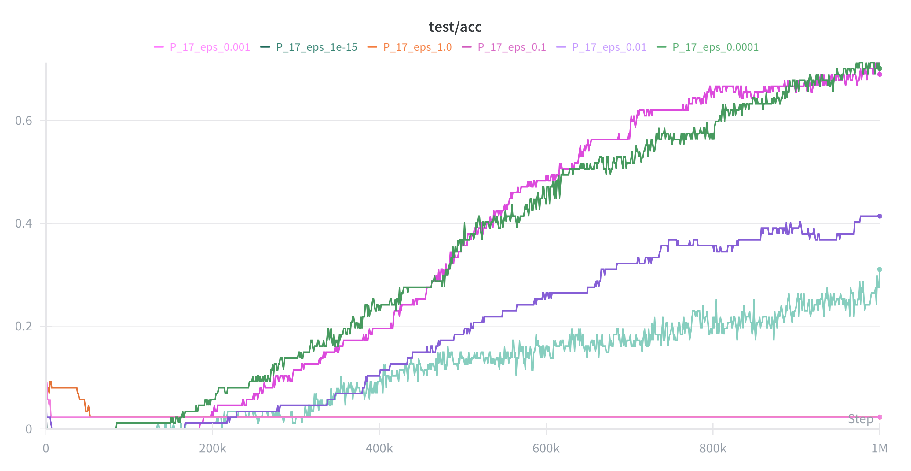
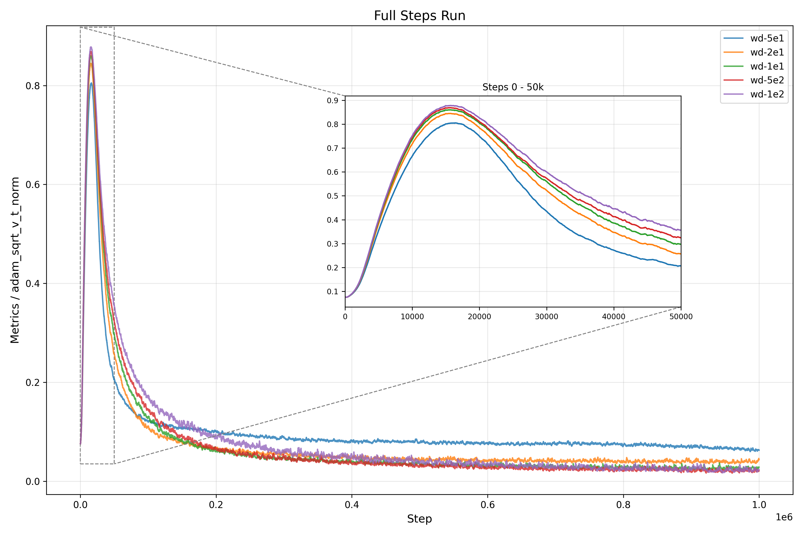
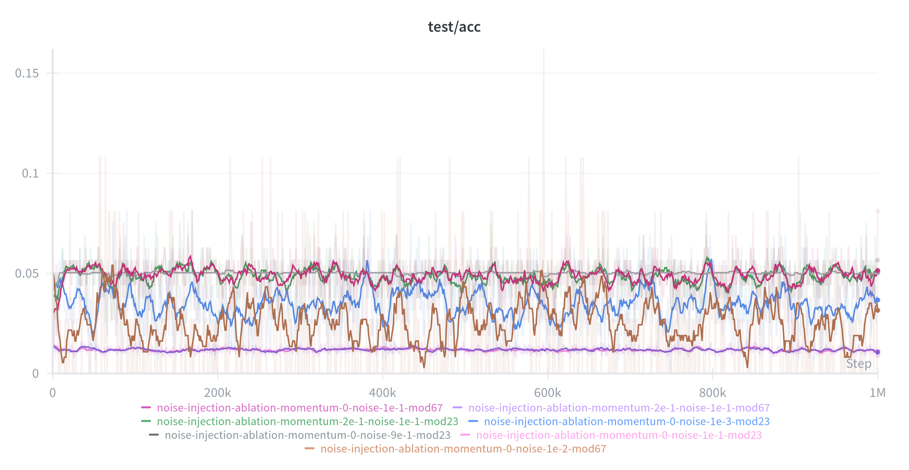
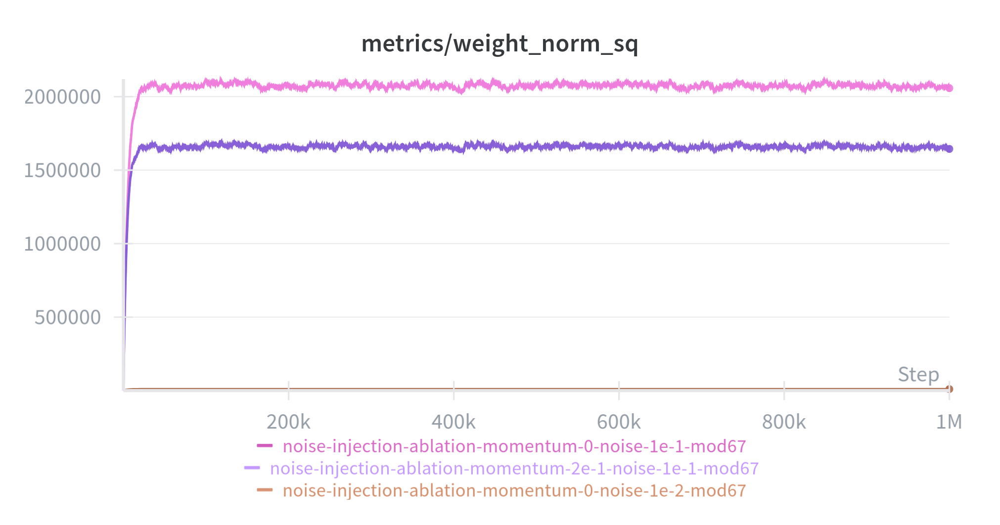
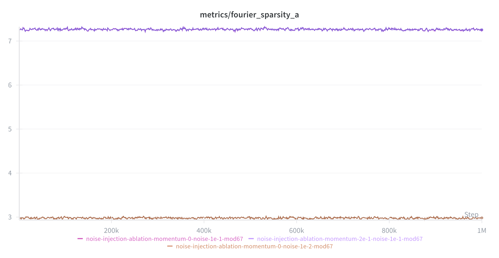
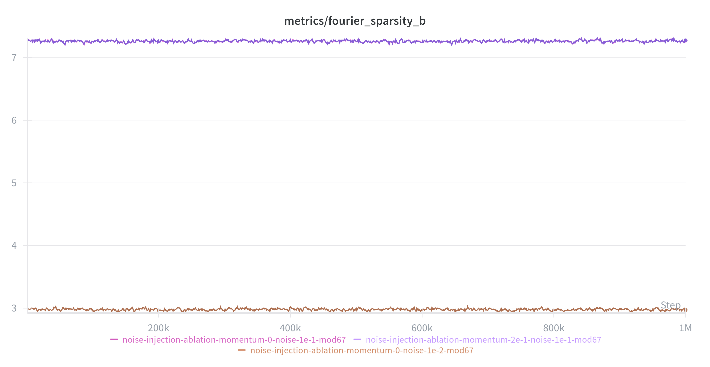
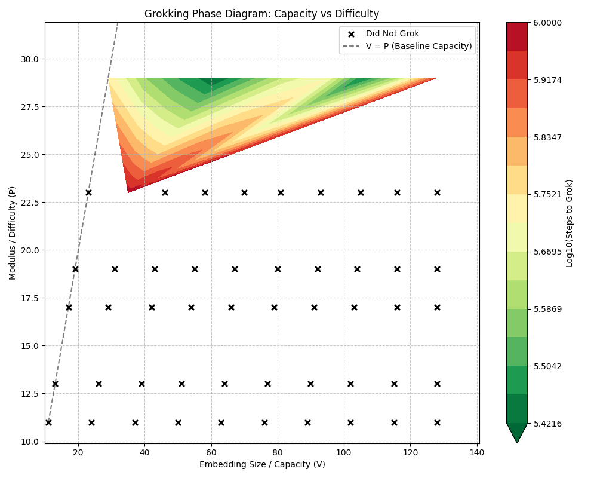
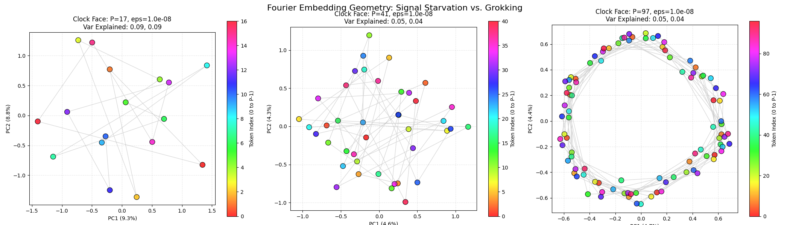
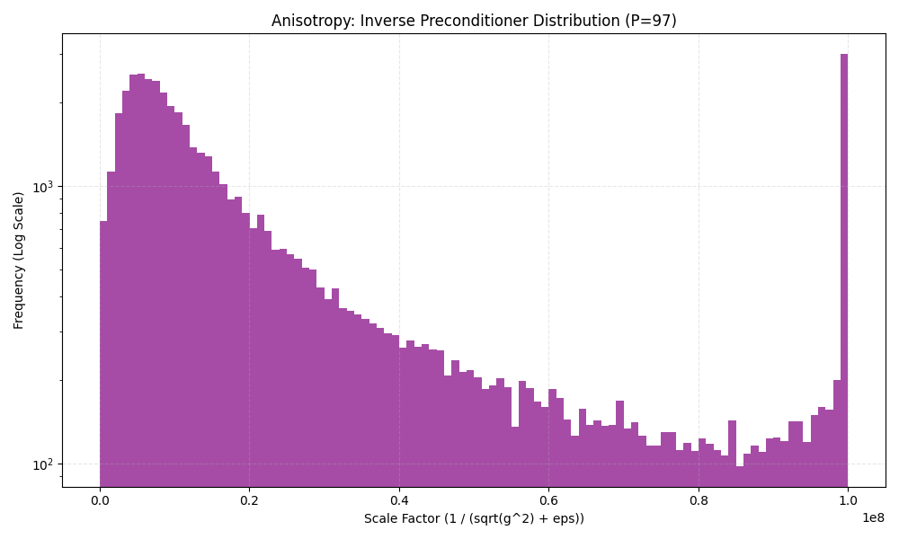
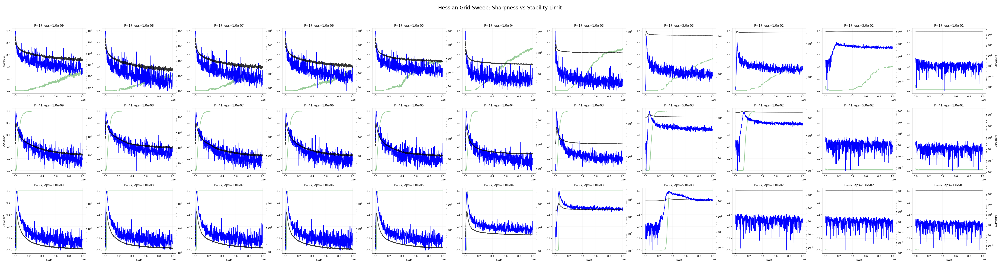

# Acharya, Dhakal 2026 — Grokking as a Variance-Limited Phase Transition: Spectral Gating and the Epsilon-Stability Threshold

См. также: [глобальный индекс понятий](../../concepts/index.md).

**Pratyush Acharya**, **Habish Dhakal** (без указания места работы).

arXiv [2603.15492](https://arxiv.org/abs/2603.15492), март 2026 (версия v1). 1 цитирование — сорок пятая по цитируемости работа корпуса. Источник — нативный HTML arXiv версии v1.

Оригинал и производные файлы этой папки:

- [`original/2603.15492.native.html`](original/2603.15492.native.html) — первоисточник, нативный HTML arXiv (v1), скачан как есть.
- [`original/2603.15492.grokking-as-a-variance-limited-phase-transition-spectral-gating-and-the-epsilon-stability-threshold.md`](original/2603.15492.grokking-as-a-variance-limited-phase-transition-spectral-gating-and-the-epsilon-stability-threshold.md) — конверсия оригинала в Markdown без правок содержания.
- [`images/`](images/) — 21 иллюстрация статьи в исходном разрешении.

Схема якорей и правила ссылок на карточку — в [README папки статей](../README.md).

## Затрагиваемые понятия

**[Гроккинг](../../concepts/grokking.md)** — переформулирован как задача **спектральной доступности**: обобщающее решение не столько поздно находится, сколько поздно становится **достижимым** ([`p10-1`](#p10-1)). Отсрочка объявлена не случайным блужданием, а порой накопления разброса градиента ([`p4-5`](#p4-5)).

**[Край устойчивости](../../concepts/edge-of-stability.md)** — сердцевина довода. Условие устойчивости шага перенесено на AdamW, где действенный шаг свой для каждого параметра, и получено **условие спектрального затвора** $\lambda_{max}^{H}<\frac{2}{\eta}(\sqrt{v_{t}}+\epsilon)$ ([`p4-2`](#p4-2)). Пока разброс мал, потолок низок, и острая обобщающая котловина попросту недоступна ([`p4-4`](#p4-4)).

**[Плоские и острые минимумы](../../concepts/loss-landscape-basins.md)** — прямое возражение корпусу: для алгоритмических задач обобщающее решение объявлено **острее** запоминающего ([`p2-4`](#p2-4)). Довод топологический: тригонометрический контур держится на точной интерференции и хрупок к сдвигу частоты или фазы, тогда как таблица поиска допускает комбинаторно много расстановок весов и потому даёт широкий плоский притягиватель ([`p11-1`](#p11-1), [`p11-2`](#p11-2)). Измерено: у задачи $P=41$ острота обобщающей котловины в 721 раз выше начального порога устойчивости ([`p9-1`](#p9-1), [`fig-7`](#fig-7)).

**[Рогатка](../../concepts/slingshot.md)** — истолкована не как отклонение, а как **потребный впрыск разброса**: всплеск $v_{t}$ уменьшает действенный шаг и тем поднимает потолок устойчивости ([`p10-6`](#p10-6)). Отсюда снимается противоречие между Thilak et al. (неустойчивость движет гроккингом) и Prieto et al. (числовая неустойчивость мешает обучению) ([`p10-4`](#p10-4)).

**[Оптимизаторы](../../concepts/optimizer-adam-adamw-sgd.md)** — AdamW описан как СДУ с «выпрямленной диффузией»; ключевое отличие от римановой динамики Ланжевена в том, что диффузия делится на $D_{t}$, а не на $D_{t}^{1/2}$, отчего диффузивность **ограничена** сверху величиной $\eta$ ([`p2-6`](#p2-6), [`p3-4`](#p3-4)).

**[Численная устойчивость](../../concepts/numerical-stability-fix.md)** — параметр $\epsilon$ поставлен в середину разбора и наделён тремя режимами: при $\epsilon\gg\sigma$ диффузия глохнет и AdamW вырождается в заторможенный SGD ([`p3-8`](#p3-8)); при $\epsilon\to 0$ норма весов расходится ([`p3-10`](#p3-10)); гроккинг живёт в узкой полосе $\epsilon\approx\sigma_{noise}$ ([`p3-11`](#p3-11), [`p8-1`](#p8-1)).

**[Фазовый переход](../../concepts/phase-transition.md)** — построена двумерная фазовая диаграмма «трудность задачи против устойчивости оптимизатора» и выделены три режима ([`fig-1`](#fig-1), [`p4-10`](#p4-10)): обвал ёмкости при $P<23$, режим, ограниченный разбросом, при $29\leq P\leq 59$ и перевес устойчивости при $P\geq 67$.

**[Модульная арифметика](../../concepts/modular-arithmetic.md)** — постановка: MLP с двумя скрытыми слоями шириной 128 на задаче $a+b\pmod P$ с вложениями, выучиваемыми с нуля, полнопакетный AdamW ([`p4-6`](#p4-6)).

**[Критический объём данных](../../concepts/data-fraction-critical-dataset-size.md)** — вместо доли данных здесь управляющей величиной служит **сложность задачи**: время до гроккинга немонотонно по $P$, и найдена «долина сложности» с вершиной при $P=41$ ([`p6-1`](#p6-1)). При $P\geq 67$ запоминание становится размерностно неустойчивым, ибо его цена растёт как $\mathcal{O}(P^{2})$ против $\mathcal{O}(1)$ у контура ([`p7-1`](#p7-1)).

**[Фурье-признаки и контуры](../../concepts/fourier-features-circuits.md)** — обвал ёмкости объяснён через них: задача требует представить $P$ различных фурье-мод, и при недостаточной размерности вложения градиентный сигнал становится неполноранговым ([`p5-1`](#p5-1), [`p11-5`](#p11-5)). Граница $V\propto P$ найдена перебором ([`fig-10`](#fig-10)).

**[Weight decay](../../concepts/weight-decay.md)** — разобран как радиальное равновесие: норма весов описана процессом Орнштейна — Уленбека, а более сильный weight decay сжимает орбиту и **ускоряет** гроккинг, ограничивая объём поиска ([`p7-2`](#p7-2), [`p7-3`](#p7-3)).

**[Неявное предпочтение](../../concepts/margin-maximization-implicit-bias.md)** — геометрические теории (Musat, Pesme et al.) приняты как описание цели пути, но их объяснение задержки слабостью weight decay отвергнуто: отсечение изотропного шума показывает, что дело не в величине сноса, а в его **направлении** ([`p10-3`](#p10-3)).

**[Меры прогресса](../../concepts/progress-measures.md)** — за складыванием контура следят тремя величинами: отношением сил $C_{push}/C_{pull}$, следом гессиана по Хатчинсону и фурье-разрежённостью ([`p4-8`](#p4-8)). У SGLD ни одна из них не трогается с места ([`p9-3`](#p9-3)).

**[От ленивого к богатому](../../concepts/lazy-to-rich-kernel-to-feature-learning.md)** — картина Kumar et al. взята как отправная, но объявлена неполной: она описывает *что* меняется, тогда как здесь предлагается *кинетическое* объяснение сроков ([`p2-2`](#p2-2), [`p11-1`](#p11-1)).

Отдельно стоит сказать, чего в работе **нет**. Нет проверки на других задачах и устройствах: вся работа — MLP на модульном сложении, и перенос на языковые модели назван вопросом дальнейшей работы ([`p12-2`](#p12-2)). Нет числа семян ни для одного перебора и ни одной полосы разброса. И нет прямого измерения самого механизма входа: рост $v_{t}$ и подъём потолка показаны кривыми, но вмешательства (принудительно поднять потолок и посмотреть, наступит ли гроккинг раньше) не поставлено.

Карточки статей корпуса: [Power et al. 2022](../2201.02177.grokking-generalization-beyond-overfitting-on-small-algorithmic-datasets/2201.02177.grokking-generalization-beyond-overfitting-on-small-algorithmic-datasets.card.md) — исходное явление; [Omnigrok, Liu et al. 2022](../2210.01117.omnigrok-grokking-beyond-algorithmic-data/2210.01117.omnigrok-grokking-beyond-algorithmic-data.card.md) — зона Златовласки, взятая как точка отсчёта; [Nanda et al. 2023](../2301.05217.progress-measures-for-grokking-via-mechanistic-interpretability/2301.05217.progress-measures-for-grokking-via-mechanistic-interpretability.card.md) — «контур-часы», чья острота здесь и измеряется; [Merrill et al. 2023](../2303.11873.a-tale-of-two-circuits-grokking-as-competition-of-sparse-and-dense-subnetworks/2303.11873.a-tale-of-two-circuits-grokking-as-competition-of-sparse-and-dense-subnetworks.card.md) и [Varma et al. 2023](../2309.02390.explaining-grokking-through-circuit-efficiency/2309.02390.explaining-grokking-through-circuit-efficiency.card.md) — состязание контуров и их действенность; [Thilak et al. 2022](../2206.04817.the-slingshot-mechanism-an-empirical-study-of-adaptive-optimizers-and-grokking/2206.04817.the-slingshot-mechanism-an-empirical-study-of-adaptive-optimizers-and-grokking.card.md) — рогатка, переистолкованная здесь как впрыск разброса; [Kumar et al. 2024](../2310.06110.grokking-as-the-transition-from-lazy-to-rich-training-dynamics/2310.06110.grokking-as-the-transition-from-lazy-to-rich-training-dynamics.card.md) — переход от ленивого режима к богатому; [Prieto et al. 2025](../2501.04697.grokking-at-the-edge-of-numerical-stability/2501.04697.grokking-at-the-edge-of-numerical-stability.card.md) — числовая устойчивость, с которой работа снимает противоречие.

**[Роль шума градиента](../../concepts/gradient-noise.md)** — теория «variance-limited» перехода: дисперсия обновлений адаптивного оптимизатора как управляющий параметр ([`p1-2`](#p1-2)). В карточке понятия стоит среди шумовых теорий, которым противостоит цепочка полнобатчевых постановок корпуса.

## Что показано, а что предположено

Замечания редактора карточки по итогам разбора утверждений (`…claims.txt`). Работа опытная и короткая (двенадцать страниц с приложением), с одной постановкой и одним измерением, ради которого всё и затевалось.

**Главное измерение сделано и оно неожиданно.** Острота обобщающей котловины при $P=41$ **в 721 раз** превосходит начальный порог устойчивости ([`p9-1`](#p9-1)). Если число верно, догадка о плоских минимумах для алгоритмических задач попросту неприменима, а это идёт наперекор большей части корпуса.

**Объяснение остроты убедительно на уровне довода.** Тригонометрический контур держится на точной интерференции и рушится от малого сдвига фазы; таблица поиска допускает комбинаторно много равноценных расстановок ([`p11-1`](#p11-1), [`p11-2`](#p11-2)). Это правдоподобно, и это же объясняет, отчего у перцептивных задач картина обратная.

**Отрицательный опыт с SGLD — самая ценная часть.** Изотропный шум, согласованный по тепловому масштабу, поднимает точность до 60–80 %, но безупречной генерализации не даёт ([`p9-2`](#p9-2), [`fig-14`](#fig-14)). Отсюда вывод: дело не в количестве шума, а в его **направлении**. Довод усилен гистограммами множителей обновления, где у AdamW тяжёлый хвост на несколько порядков ([`fig-12`](#fig-12)).

**Немонотонность по сложности показана и объяснена с двух концов.** Слева — нехватка размерности (обвал ёмкости, граница $V\propto P$, [`fig-10`](#fig-10)), справа — размерностная неустойчивость запоминания при росте $P$ ([`p7-1`](#p7-1)). Вместе это даёт «долину сложности» с вершиной при $P=41$.

**Однако причинности спектрального затвора не показано.** Всё свидетельство — совпадение кривых: разброс растёт, потолок поднимается, гроккинг наступает ([`p9-1`](#p9-1)). Ни одного вмешательства — например, принудительно поднять потолок при малом разбросе и проверить, наступит ли переход раньше, — не поставлено.

**Условие (5) выведено нестрого.** Оно получено подстановкой действенного шага AdamW в скалярное условие устойчивости $\lambda<2/\eta$, справедливое для градиентного спуска ([`p4-2`](#p4-2)). Для приспособляемого оптимизатора с покоординатным предобусловливателем такой перенос требует обоснования, которого нет.

**СДУ выведено при адиабатическом допущении, которое сама работа объявляет нарушаемым.** Замечание к разделу 3.1 прямо говорит, что переход запускается рогатками, где адиабатичность отказывает ([`p3-4`](#p3-4) и далее). Тем самым равновесное описание не покрывает именно то событие, ради которого оно строилось.

**Число прогонов не названо нигде.** Ни одной полосы разброса, ни одного упоминания семян: все кривые и вся фазовая диаграмма — по одному прогону на настройку. Для работы, чей главный итог есть граница на карте, это существенный пробел.

**Постановка одна и мала.** MLP с двумя слоями на модульном сложении, ширина 128, вложения с нуля ([`p4-6`](#p4-6)). Ни трансформера, ни иной задачи; про перенос сказано лишь, что это дело будущего ([`p12-2`](#p12-2)).

**Работа перегружена именованиями.** «Спектральный затвор», «анизотропное выпрямление», «обвал ёмкости», «перевес устойчивости», «голод по сигналу», «долина сложности» — шесть новых имён на двенадцать страниц, причём часть из них называет уже известные вещи (обвал ёмкости есть неполнота ранга, перевес устойчивости — следствие действенности контуров у Varma et al.).

**Место в корпусе.** Ценность работы в двух измерениях, а не в рамке: острота обобщающей котловины, превышающая порог устойчивости в сотни раз, и отказ изотропного шума при согласованном тепловом масштабе. Первое ставит под вопрос применимость догадки о плоских минимумах к алгоритмическим задачам, второе отделяет «нагрев» от «направления». Цена — одна малая постановка, один прогон на настройку, нестрогий перенос условия устойчивости и отсутствие вмешательства, которое сделало бы механизм причинным.

---

# Текст статьи

## Аннотация

###### p1-2

Обычные теории оптимизации с трудом объясняют гроккинг, когда генерализация наступает много позже схождения обучения. Геометрические разборы приписывают это медленному сносу, но часто упускают взаимодействие между строением шума оптимизатора и кривизной ландшафта. Эта работа разбирает динамику AdamW на задачах модульной арифметики и вскрывает механизм «спектрального затвора», управляющий переходом от запоминания к генерализации.

###### p1-3

Мы находим, что AdamW работает как система, запираемая по разбросу. Гроккинг стеснён условием устойчивости: обобщающее решение живёт в острой котловине ($\lambda_{max}^{H}$), поначалу недоступной при малом разбросе. «Отложенная» пора есть накопление разброса градиента, потребное, чтобы поднять действенный потолок устойчивости и допустить вход на это острое многообразие.

###### p1-4

Наши опыты с отсечением выделяют три режима сложности: (1) **обвал ёмкости** ($P<23$), где неполнота ранга не даёт выучить строение; (2) **режим, ограниченный разбросом** ($P\approx 41$), где генерализация ждёт открытия спектрального затвора; и (3) **перевес устойчивости** ($P>67$), где запоминание становится размерностно неустойчивым. Сверх того, мы оспариваем догадку о «плоских минимумах» для алгоритмических задач, показывая, что впрыск изотропного шума гроккинга не вызывает. Генерализация требует *анизотропного выпрямления*, свойственного лишь приспособляемым оптимизаторам, которое направляет шум в касательное пространство многообразия решений.

## 1 Введение

###### p1-5

Порой нейронная сеть выучивает задачу лишь после того, как уже безупречно подогнала обучающие данные. Этот отложенный фазовый переход, известный как *гроккинг* [1], оспаривает привычный взгляд, по которому оптимизация кончается там, где градиенты обращаются в нуль. Понять этот разрыв важно, ибо он способен объяснить, отчего большие основные модели продолжают улучшать рассуждение и после того, как их обучающая потеря вышла на полку. Отсюда следует существование многомерного **минимизирующего множества уровня** [7, 19] $\mathcal{Z}=\{\theta\mid\mathcal{L}(\theta)\approx 0\}$, где движение ведётся не градиентом потери, а внутренним строением шума оптимизатора.

Прежние работы объясняют эту динамику тремя способами:

###### p1-7

1. **Геометрический снос:** теории, по которым weight decay медленно подталкивает модель к решениям с наибольшим отступом [7, 19]. Будучи математически строгими, эти рамки предполагают общий градиентный поток. Они часто не объясняют, отчего изотропный шум (SGLD) или обычный SGD не гроккают даже при наличии weight decay [5].
2. **Состязание контуров:** механистические истолкования, видящие в гроккинге борьбу «запоминающих» и «обобщающих» контуров [3, 20]. Эти работы описывают *топологию* решения (скажем, «контур-часы»), но кинетического объяснения сроков перехода не дают.
3. **Край устойчивости (EoS):** работы, доказывающие, что неустойчивость движет выучиванием признаков [6, 18]. Однако точное взаимодействие между числовыми параметрами устойчивости (каков $\epsilon$) и фазовым переходом гроккинга изучено слабо.

В этой статье мы объединяем эти взгляды, разбирая оптимизатор как **стохастическую систему, запираемую по разбросу**. Мы находим, что гроккинг есть хрупкое состояние, зависящее от согласования сложности задачи с устойчивостью оптимизатора. Мы полагаем, что задержка генерализации есть не случайное блуждание, а **равновесие, ограниченное разбросом**: оптимизатор поначалу слишком устойчив, чтобы войти в острые многообразия, где живут обобщающие контуры.

Наш вклад таков:

**[p. 2]**

- **Механизм спектрального затвора:** мы находим, что обобщающая котловина для задач модульной арифметики заметно острее начального порога устойчивости оптимизатора. Гроккинг, по-видимому, наступает лишь тогда, когда накопленный разброс градиента $\sqrt{v_{t}}$ поднимает потолок устойчивости ($2/\eta_{eff}$), наконец допуская вход в область высокой кривизны решения.
- **Порог сложности:** мы выделяем режим «голода по сигналу» ($P<23$), где ландшафт потерь строительно скуден. Ниже этого порога ни накопление разброса, ни настройка параметров генерализации не вызывают, что опровергает чисто тепловые объяснения гроккинга.
- **Анизотропное выпрямление:** сравнивая AdamW с изотропным SGLD, мы показываем, что одной тепловой энергии недостаточно. Генерализация требует, чтобы ковариационное строение приспособляемых оптимизаторов выпрямляло шум в касательное пространство многообразия решений.

## 2 Смежные работы

#### Гроккинг и фазовые переходы.

###### p2-2

Явление гроккинга впервые описано Power et al. [1] как генерализация, наступающая много позже обращения обучающей ошибки в нуль. Последующие работы пытались очертить условия этого перехода. Liu et al. [2] выделили «зону Златовласки» по инициализации и объёму данных, а Kumar et al. [18] представили переход как переход от ленивого ядерного режима к богатому выучиванию признаков. Описывая *феноменологическую* сторону перехода, эти работы, однако, во многом обращаются с оптимизатором как с чёрным ящиком. Наша работа отличается тем, что даёт *кинетическое* объяснение: мы указываем то спектральное состояние, которого оптимизатор должен достичь, чтобы переход запустился.

#### Механистическая интерпретируемость.

###### p2-3

Смежное направление занято тем, *что* выучивается при гроккинге. Nanda et al. [3] полностью разобрали устройство сети модульного сложения, указав особый «контур-часы», опирающийся на тригонометрическую интерференцию. Varma et al. [20] и Merrill et al. [17] доказывают, что гроккинг есть состязание плотных запоминающих и разрежённых обобщающих контуров. Мы принимаем этот топологический взгляд — что решение есть особый разрежённый контур, — но обращаемся к открытому вопросу о *доступности*. Механистические работы описывают цель пути, а наша теория спектрального затвора объясняет ту динамику оптимизации, что потребна для входа в целевую котловину.

#### Неявное предпочтение и край устойчивости.

###### p2-4

Геометрические теории полагают, что градиентный спуск вносит неявное предпочтение решений с наибольшим отступом [8]. Недавние строгие построения Musat [7] и Pesme et al. [19] описывают гроккинг как риманову минимизацию нормы на многообразии нулевой потери. Однако эти теории «сноса» обыкновенно предполагают устойчивый градиентный поток. Cohen et al. [6] и Damian et al. [14] показывают, что обучение нейронных сетей обыкновенно идёт на «краю устойчивости», где острота колеблется около $2/\eta$. Thilak et al. [5] опытно связали эту неустойчивость («рогатки») с гроккингом. Наша работа объединяет геометрический взгляд со взглядом устойчивости. Мы описываем рогатку не как отклонение, а как *механизм впрыска разброса*, потребный для выполнения условий устойчивости в тех острых котловинах, что найдены механистической интерпретируемостью. Сверх того, мы оспариваем главенствующую догадку о «плоских минимумах» [9, 16] именно в этой области, приводя свидетельства, что для алгоритмических задач обобщающее решение спектрально острее запоминающего.

## 3 Теоретическая рамка: спектральный затвор и выпрямленная случайная динамика

Чтобы понять, как AdamW движется по ландшафту потерь, мы описываем его динамику обучения как непрерывный случайный процесс. Если классическая оптимизация занята схождением среднего потери, то гроккинг происходит в режиме «после схождения», где $\mathcal{L}(\theta)\to 0$, а веса $\|\theta\|$ продолжают меняться [1]. В этой поре путь определяется не градиентом потери, близким к нулю, а **ковариационным строением шума** оптимизатора.

### 3.1 AdamW как случайная динамика, запираемая по разбросу

###### p2-6

Мы рассматриваем дискретные обновления AdamW как стохастическое дифференциальное уравнение (СДУ) в непрерывном времени, чтобы схватить взаимодействие шума и строения. Пусть $g_{t}(\theta)=\nabla\mathcal{L}(\theta)+\xi_{t}$ — случайный градиент, где $\xi_{t}\sim\mathcal{N}(0,\Sigma(\theta_{t}))$ означает анизотропный, часто тяжелохвостый шум [15, 16].

**[p. 3]**

AdamW предобусловливает эти обновления величиной $v_{t}$ — показательным скользящим средним квадратов градиентов. При **адиабатическом приближении** [11] мы полагаем, что предобусловливатель $D_{t}=\text{diag}(\sqrt{v_{t}}+\epsilon)$ меняется на более медленных сроках, чем параметры. Приравнивая первый и второй моменты дискретного шага $\Delta\theta\approx-\eta D_{t}^{-1}g_{t}$, получаем следующее СДУ [10]:

$$
\mathrm{d}\theta_{t}=\underbrace{-D_{t}^{-1}\left(\nabla\mathcal{L}(\theta_{t})+\lambda\theta_{t}\right)\mathrm{d}t}_{\text{Preconditioned Drift}}+\underbrace{\eta^{1/2}D_{t}^{-1}\Sigma(\theta_{t})^{1/2}\mathrm{d}W_{t}}_{\text{Rectified Diffusion}} \tag{1}
$$

где $W_{t}$ — стандартное броуновское движение. Множитель $\eta^{1/2}$ обеспечивает согласование члена диффузии с разбросом $\mathcal{O}(\eta)$ дискретного алгоритма.

Существенно, что AdamW ведёт себя иначе, чем обычная риманова динамика Ланжевена (RLD). Тогда как RLD масштабирует диффузию обратным квадратным корнем метрики ($D_{t}^{-1/2}$), AdamW масштабирует её обратной величиной ($D_{t}^{-1}$). Это различие строения даёт особый облик диффузивности для $i$-го параметра:

$$
\mathcal{D}_{eff}^{(i)}\propto\frac{\eta\cdot\Sigma_{ii}}{(\sqrt{\Sigma_{ii}}+\epsilon)^{2}} \tag{2}
$$

###### p3-4

При росте разброса шума градиента $\Sigma_{ii}\to\infty$ диффузия RLD становится неограниченной. Напротив, диффузия AdamW насыщается на закреплённом пределе ($\mathcal{D}_{eff}\to\eta$). Эта **ограниченная диффузивность** не даёт градиентам с большим разбросом увести систему прочь с многообразия, действенно создавая «потолок разброса», который держит устойчивость даже при сильном шуме.

*Замечание о дискретной динамике:* если СДУ даёт описание равновесия, то переход в пору гроккинга часто запускается «рогатками» [5] — дискретными неустойчивостями, где адиабатическое допущение на мгновение отказывает. В эти мимолётные мгновения быстрое накопление $v_{t}$ (как описано в разделе 5.4) деятельно подавляет действенный шаг, восстанавливая устойчивость.

### 3.2 Размен между устойчивостью и диффузией

Уравнение (2) показывает, как параметр устойчивости $\epsilon$ управляет действенным коэффициентом диффузии. Разбирая пределы этого уравнения, мы выводим три различных физических режима, наблюдаемых в наших опытах.

#### 3.2.1 Режим I: подавление разброса (переторможенный)

**Условие:** $\epsilon\gg\sigma_{i}$. Когда член устойчивости главенствует в предобусловливателе, действенная диффузивность обращается в нуль:

$$
\lim_{\epsilon\to\infty}\mathcal{D}_{eff}^{(i)}\approx\frac{\eta\sigma_{i}^{2}}{\epsilon^{2}}\to 0 \tag{3}
$$

###### p3-8

В этом пределе AdamW вырождается в **заторможенный SGD**. Диффузионное давление становится слишком слабым, чтобы одолеть восстанавливающий снос weight decay [4]. Как видно на фазовой диаграмме (рисунок 1), это ведёт к застою модели: система остаётся запертой в ядерном режиме и не способна обследовать многообразие.

#### 3.2.2 Режим II: радиальное расширение (недоторможенный)

**Условие:** $\epsilon\ll\sigma_{i}$. Когда $\epsilon$ пренебрежимо мал, предобусловливатель в точности сокращает величину шума:

$$
\lim_{\epsilon\to 0}\mathcal{D}_{eff}^{(i)}\approx\frac{\eta\sigma_{i}^{2}}{(\sqrt{\sigma_{i}^{2}})^{2}}=\eta \tag{4}
$$

###### p3-10

Это доводит обследование до предела, но убирает числовой пол, потребный для устойчивости. В наших опытах с отсечением полагание $\epsilon\to 10^{-15}$ приводило к расходимости нормы весов $\|\theta\|^{2}$. Без ограничения $\epsilon$ система вступает в пору **радиального расширения**, растекаясь наружу быстрее, чем weight decay успевает её стянуть [19].

#### 3.2.3 Режим III: анизотропное выпрямление (гроккинг)

###### p3-11

**Условие:** $\epsilon\approx\sigma_{noise}$. Гроккинг наступает, когда $\epsilon$ уравновешен. В этой полосе оптимизатор осуществляет **анизотропное выпрямление**: он усиливает шум там, где сигнал связен (малое $\sigma$), и глушит беспорядочные направления (большое $\sigma$). Это равновесие позволяет системе сноситься вдоль касательного пространства $\mathcal{Z}$, не расходясь.

**[p. 4]**

### 3.3 Спектральный затвор и край устойчивости

Для задач промежуточной сложности ($P\approx 23-60$) мы наблюдаем, что выучивание строения задерживается **спектральным замком**. Мы объясняем это, связав нашу рамку с теорией **края устойчивости (EoS)** [6].

###### p4-2

В дискретной оптимизации шаг $\eta$ устойчив, лишь если местная кривизна удовлетворяет $\lambda<2/\eta$. У AdamW действенный шаг приспособляем и свой для каждого параметра: $\eta_{eff}\approx\eta/(\sqrt{v_{t}}+\epsilon)$. Оттого условие устойчивости становится подвижным. Оптимизатор способен сойтись в котловину с кривизной гессиана $\lambda_{max}^{H}$, лишь если выполнено **условие спектрального затвора**:

$$
\lambda_{max}^{H}<\frac{2}{\eta}(\sqrt{v_{t}}+\epsilon) \tag{5}
$$

Это неравенство вскрывает причинный механизм задержки:

###### p4-4

1. **Ловушка запоминания (малый разброс):** поначалу разброс градиента $v_{t}$ мал. Это опускает потолок устойчивости ($2/\eta_{eff}$), вынуждая оптимизатор искать плоские минимумы с высокой энтропией. «Ленивое» запоминающее решение таково и есть: широкое и стойкое к малым возмущениям, а потому сразу доступное.
2. **Обращение остроты:** вопреки догадке о «плоских минимумах» [9], мы доказываем, что для алгоритмических задач обобщающее решение («контур-часы» [3]) геометрически *острее* запоминающей котловины. Оно требует точного согласования параметров, отчего $\lambda_{max}^{H}$ велико и поначалу нарушает условие (5).
3. **Снятие ограничения (впрыск разброса):** по ходу обучения градиенты не исчезают, а колеблются, накапливая разброс $v_{t}$ (механизм «рогатки»). Рост знаменателя в правиле обновления действенно отжигает шаг. Это поднимает потолок устойчивости из (5) и наконец допускает оптимизатор устойчиво войти и осесть в остром обобщающем многообразии.

###### p4-5

Тем самым задержка есть не случайное блуждание, а **пора накопления разброса**. Модель должна выработать довольно градиентного шума, чтобы «отпереть» спектральный затвор, перейдя из нетерпимой к разбросу запоминающей котловины в обобщающий контур, устойчивый благодаря разбросу.

## 4 Опытная постановка

###### p4-6

**Задача и модель.** В наших опытах берётся MLP с 2 скрытыми слоями (ширина 128, активации ReLU), обучаемая задаче модульного сложения $a+b\pmod{P}$ с вложениями, выучиваемыми с нуля. Обучение ведётся полнопакетным AdamW со скоростью обучения $\eta=10^{-4}$, weight decay $\lambda=0.1$ и $\beta=(0.9,0.999)$, если не сказано иное.

**Порядок.** Мы проводим три нацеленных перебора, чтобы разобрать подлежащий механизм:

###### p4-8

1. **Граница устойчивости (трудность против затвора):** чтобы очертить термодинамические границы гроккинга, мы ведём плотный двумерный перебор по трудности задачи ($P\in[11,97]$, шаг линейный) и устойчивости оптимизатора ($\epsilon\in[10^{-9},10^{-1}]$, шаг логарифмический). Каждая настройка обучается $10^{6}$ шагов ради определения «шагов до гроккинга» (точность на тесте $>99\%$).
2. **Термодинамическая достаточность (SGLD):** чтобы выяснить, способна ли изотропная энергия заменить геометрическое направление, мы сравниваем AdamW со случайной градиентной динамикой Ланжевена (SGLD). Впрыскивая гауссов шум $\mathcal{N}(0,\sigma^{2})$ в обычные обновления SGD ($\sigma\in[10^{-4},10^{-1}]$), мы уравниваем действенное тепловое давление с AdamW и для лёгкой ($P=23$), и для трудной ($P=67$) задачи.
3. **Механизм и топология:** наконец, мы следим за топологическими величинами высокого разрешения, в том числе за **отношением сил** ($R=C_{push}/C_{pull}$), **следом гессиана** (оценщиком Хатчинсона) и **фурье-разрежённостью** (нормой $L_{1}$ дискретного преобразования весов). Эти величины позволяют следить за складыванием строения «контура-часов» в живом времени.

Эти опыты и задают три динамических режима, разбираемые в следующем разделе.

## 5 Итоги и разбор

### 5.1 Границы фаз генерализации: влияние сложности задачи

###### p4-10

Чтобы очертить динамические режимы гроккинга, мы провели плотный перебор по трудности задачи ($P\in[11,97]$) и устойчивости оптимизатора ($\epsilon\in[10^{-9},10^{-1}]$). Полученная фазовая диаграмма (рисунок 1) показывает, что скорость генерализации **[p. 5]** немонотонна по сложности. Наши итоги вскрывают три различных режима, объясняющих, как гроккинг начинается и как кончается.


###### fig-1

*Рисунок 1: **Фазовая диаграмма «устойчивость — сложность». Мы выделяем три режима по времени до генерализации: (1) обвал ёмкости ($P<23$), где неполнота ранга не даёт представить решение; (2) режим, ограниченный разбросом ($29\leq P\leq 59$), где генерализация задержана спектральным затвором; и (3) перевес устойчивости ($P\geq 67$), где высокая размерность запоминающего многообразия вынуждает немедленно выучивать строение. Белая пунктирная черта отмечает $\epsilon=\sigma_{noise}$ — внутренний уровень шума градиента.*** **[p. 5]**

#### 5.1.1 Режим I: обвал ёмкости ($P<23$)

###### p5-1

Область $P<23$ отмечена отказом схождения (рисунок 1, красное). Хотя странно, что более лёгкие задачи выучиваются труднее, мы приписываем это **обвалу ёмкости** (неполноте ранга). Как разобрано в разделе 6.4, задача модульного сложения требует от модели представить $P$ различных фурье-мод [2]. Когда размерность вложения $d_{model}$ мала относительно $P$ (или когда $P$ настолько мало, что ортогональность высокочастотных мод рушится разбросом инициализации), градиентный сигнал становится неполноранговым. Модель вступает в пору «туннелирования» (рисунок 2), где случайно сносится, не запираясь в связном минимуме. Это отказ представления, а не термодинамики.



*Рисунок 2: **Обвал ёмкости ($P=17$). Несмотря на решительную настройку устойчивости ($\epsilon\to 10^{-15}$), оптимизатор не находит обобщающего минимума. Динамика являет случайное туннелирование без схождения, что указывает на нехватку у пространства вложений геометрической ёмкости для разделения фурье-мод задачи.*** **[p. 6]**

**[p. 6]**

#### 5.1.2 Режим II: режим, ограниченный разбросом ($29\leq P\leq 59$)

###### p6-1

Промежуточные задачи являют узаконенный «разрыв гроккинга» с вершиной при $P=41$ (рисунок 3, красная линия). Мы приписываем это **состязательному накоплению разброса**. Запоминающее решение действует как «ленивый» притягиватель: оно геометрически широко (высокая энтропия) и легко доступно из случайной инициализации. Однако оно не есть глобальный минимум. Оптимизатор быстро сходится в эту котловину, но в конце концов теряет в ней устойчивость из-за накопления разброса градиента $\sqrt{v_{t}}$. Задержка отвечает времени, потребному $v_{t}$, чтобы вырасти достаточно и «нагреть» оптимизатор, выведя его из плоской ловушки запоминания в более острую обобщающую котловину.


*Рисунок 3: **Немонотонная динамика генерализации. Время генерализации достигает вершины при промежуточной сложности ($P=41$, красное). Трудные задачи ($P=97$, бирюзовое) обобщают сразу (перевес устойчивости), а лёгкие ($P=23$, лиловое) застревают. Итоги вскрывают «долину сложности», где состязание между энтропийным притяжением запоминания и спектральным затвором генерализации наибольшее.*** **[p. 6]**

**[p. 7]**

#### 5.1.3 Режим III: перевес устойчивости ($P\geq 67$)

###### p7-1

Для задач высокой сложности ($P\geq 67$) задержка гроккинга исчезает (рисунок 3, бирюзовая линия). Мы наблюдаем **перевес устойчивости**. Параметрическая цена запоминающей таблицы растёт квадратично, как $\mathcal{O}(P^{2})$, тогда как обобщающий контур (поворот на постоянную частоту) остаётся $\mathcal{O}(1)$ [20]. С ростом $P$ объём пространства параметров, занятый годными запоминающими решениями, показательно сжимается относительно строительного решения. При $P=100$ запоминающая котловина становится размерностно неустойчивой — она просто слишком «мала», чтобы поймать оптимизатор. Оттого AdamW вовсе минует «ленивую» пору и сходится прямо к строительному решению.

### 5.2 Радиальная стационарность: динамика толкания и притяжения

###### p7-2

Динамика после схождения определяется радиальным равновесием между weight decay (регуляризацией $\ell_{2}$) и выпрямленной диффузией оптимизатора. Мы описываем норму весов $\|\theta\|^{2}$ как радиальный процесс Орнштейна — Уленбека.


*(a) Диффузионное расширение ($F_{push}$)*


*(b) Восстанавливающий снос ($F_{pull}$)*


*(c) Радиальная орбита $\|\theta\|^{2}$*

*Рисунок 4: **Радиальная стационарность. (a) AdamW создаёт постоянное диффузионное «толкание» (персиковая линия), противостоящее восстанавливающей силе. (b) Восстанавливающий снос стабилизируется, подтверждая закреплённую радиальную орбиту. (c) Более сильный weight decay (персиковое) устанавливает равновесие при меньшей норме, сжимая пространство поиска на многообразие [7].*** **[p. 7]**

###### p7-3

При разборе возникают различные стационарные состояния (рисунок 4). Сильный weight decay ($\lambda=0.5$) загоняет систему на орбиту высокой энергии и малого радиуса (рисунок 4c). Это сжатие ускоряет гроккинг (рисунок 5), ограничивая объём пространства поиска. Действенно ограничение вынуждает оптимизатор выпрямлять шум в касательные направления многообразия, что согласуется с теориями римановой минимизации нормы [19].


*(a) Точность на тесте против числа шагов*



*(b) Разброс оптимизатора $\sqrt{\hat{v}_{t}}$*

*Рисунок 5: **Ускорение ограничением. (a) Более сильный weight decay (персиковое) заметно ускоряет фазовый переход. (b) Сильная регуляризация подавляет вершинный разброс градиента, вынуждая упорядоченный поиск в касательном пространстве.*** **[p. 7]**

### 5.3 Диффузия, управляемая устойчивостью

Параметр устойчивости $\epsilon$ действует как спектральный привратник. Рисунок 6 показывает чувствительность фазового перехода к $\epsilon$.


*Рисунок 6: **Порог устойчивости. Класс C (трудные): качество падает при $\epsilon\to 10^{-1}$, что подтверждает нужду в анизотропном шуме (предел I). Класс B (промежуточные): являет выпуклую область «оптимальной устойчивости» около $\epsilon=10^{-4}$. Класс A (лёгкие): отказывает при любых настройках устойчивости.*** **[p. 8]**

**[p. 8]**

###### p8-1

Для разрешимых задач мы выделяем **промежуток оптимальной устойчивости** ($\epsilon\approx 10^{-4}$):

- **Переторможенность ($\epsilon\to 10^{-1}$):** действенная диффузивность $\mathcal{D}_{eff}\to 0$. Оптимизатор ведёт себя как SGD и не обследует многообразие.
- **Недоторможенность ($\epsilon\to 10^{-9}$):** система страдает радиальной неустойчивостью. Диффузия доведена до предела, но отсутствие пола устойчивости не даёт весам сгуститься на разрежённый контур [21].

### 5.4 Механизм: спектральный затвор и нарушение остроты

Мы приводим прямое свидетельство того, что отложенной генерализацией управляет **спектральное условие устойчивости**. По теории края устойчивости (EoS) [6] оптимизатор не способен устойчиво войти в котловину, где кривизна $\lambda_{max}^{H}$ превосходит порог устойчивости $2/\eta_{eff}$.


###### fig-7

*Рисунок 7: **Нарушение начального условия устойчивости. Мы сравниваем остроту гессиана (синее) с *начальным* пределом устойчивости, задаваемым $\epsilon$ (красная пунктирная черта). Для задачи с гроккингом ($P=41$, посредине) обобщающее решение живёт в котловине, где $\lambda_{max}$ **в 721 раз выше** начального порога устойчивости. Отложенная пора (0–200 тыс. шагов) отвечает времени, потребному разбросу градиента $\sqrt{v_{t}}$, чтобы вырасти достаточно и поднять потолок устойчивости (чёрная штриховая черта) выше кривизны котловины.*** **[p. 9]**

**[p. 9]**

###### p9-1

Рисунок 7 поясняет сердцевину механизма. Для задачи с гроккингом ($P=41$) обобщающий минимум чрезвычайно остёр. «Отношение нарушения остроты» достигает **721,31**. Так возникает **спектральный затвор**: поначалу модель заперта снаружи обобщающей котловины. Она остаётся в плену плоской запоминающей котловины, пока накопленный разброс шума градиента $\sqrt{v_{t}}$ не увеличит знаменатель действенного шага. Это накопление поднимает действенный потолок устойчивости $2/\eta_{eff}$ и в конце концов допускает вход в острую котловину «контура-часов».

### 5.5 Необходимость анизотропии: отказ изотропной диффузии

###### p9-2

Чтобы отделить роль «тепловой энергии» (разброса) от «геометрического выпрямления» (ковариации), мы обучали моделью со случайной градиентной динамикой Ланжевена (SGLD). Мы впрыскивали изотропный гауссов шум, согласованный с тепловым масштабом AdamW.



*(a) test/acc: полка на уровне случайного угадывания*



*(b) metrics/weight_norm_sq: скалярное равновесие*

*Рисунок 8: **Отказ изотропного SGLD. (a) Несмотря на $1\times 10^{6}$ шагов и обширную настройку шума ($\sigma\in[10^{-3},10^{-1}]$), SGLD не обобщает. (b) Изотропный шум успешно держит норму весов, чем доказано, что одной радиальной энергии недостаточно.*** **[p. 9]**

###### p9-3

Изотропная диффузия гроккинга не вызывает (рисунок 8). Шум не даёт весам осыпаться, но модель остаётся в состоянии высокой энтропии (рисунок 9). Это подтверждает, что гроккинг требует **анизотропного выпрямления**: оптимизатор обязан строго подавлять шум в направлениях высокой кривизны и усиливать его в касательных направлениях, чтобы двигаться по минимизирующему множеству уровня [10].



*(a) metrics/fourier_sparsity_a: высокая энтропия*



*(b) metrics/fourier_sparsity_b: высокая энтропия*


*(c) metrics/hessian_trace: спектральных черт нет*

*Рисунок 9: **Строительный застой при SGLD. (a) и (b) Фурье-разрежённость остаётся высокой, то есть контур не складывается. (c) У следа гессиана нет свойственного AdamW всплеска «зажигания».*** **[p. 10]**

**[p. 10]**

## 6 Обсуждение

###### p10-1

Гроккинг издавна подавали как загадку сроков — а именно, отчего генерализация так отстаёт от схождения обучения. Наши находки наводят на мысль, что дело здесь в **спектральной доступности**. Разбирая AdamW как **стохастическую систему, запираемую по разбросу**, мы показываем, что задержка есть не просто медленный снос, а строительное требование устойчивости. Оптимизатор должен пройти через определённые изменения внутреннего состояния, чтобы получить доступ к котловинам высокой кривизны. Такой взгляд помогает снять три напряжения нынешней литературы.

### 6.1 Кинетический механизм: геометрическое выпрямление

Недавние геометрические построения [19, 7] доказывают, что гроккинг отвечает римановой минимизации нормы на минимизирующем множестве уровня $\mathcal{Z}$. Однако задержку они приписывают главным образом слабости weight decay.

###### p10-3

Наше отсечение изотропного SGLD (раздел 5.5) уточняет этот взгляд. Мы находим, что изотропный шум способен уберечь веса от осыпания и поднять точность на тесте выше случайной, но безупречной генерализации он не вызывает. Проще говоря, добавление случайного шума помогает модели выбраться из мелких местных минимумов, но не даёт того направления, что потребно для отыскания именно обобщающего контура. Поскольку изотропные шумовые векторы статистически ортогональны маломерному многообразию решений $\mathcal{Z}$, обычная диффузия даёт ортогональные колебания. AdamW разрешает это **анизотропным выпрямлением**: масштабируя обновления на $v_{t}^{-1/2}$, он направляет шум в касательные направления многообразия [10, 16]. Тем самым изотропный шум помогает модели двигаться, а геометрическое выпрямление обеспечивает движение в верную сторону.

### 6.2 Снятие противоречия об устойчивости

###### p10-4

В литературе есть противоречие насчёт неустойчивости. Thilak et al. [5] доказывают, что «рогатки» — всплески потери и разброса градиента — движут гроккингом. Напротив, Prieto et al. [21] полагают, что числовая неустойчивость (каков обвал softmax) обучению мешает.

Наша **теория спектрального затвора** (уравнение 5) показывает, что эти взгляды совместимы. Мы опознаём рогатку как необходимое событие накопления разброса.

###### p10-6

- **Механизм входа:** рогатка даёт всплеск оценки второго момента $v_{t}$. Рост знаменателя уменьшает действенный шаг $\eta_{eff}\approx\eta/\sqrt{v_{t}}$. Это уменьшение поднимает потолок устойчивости $2/\eta_{eff}$, временно позволяя оптимизатору выжить в более острой обобщающей котловине.
- **Ограничение по эпсилон:** как замечено у Thilak et al., увеличение $\epsilon$ прекращает рогатки. Мы выводим это аналитически: если $\epsilon$ слишком велик, разброс $v_{t}$ никогда не возьмёт верх в знаменателе и потолок устойчивости никогда не поднимется. Если $\epsilon$ слишком мал, неустойчивость становится неограниченной.

###### p10-7

Гроккинг, по-видимому, происходит близ края устойчивости. Оптимизатору нужно достаточно неустойчивости, чтобы выработать разброс для обследования, но чрезмерная неустойчивость ведёт к числовой расходимости.

### 6.3 Пересмотр плоскости: геометрия алгоритмической точности

Kumar et al. [18] описывают гроккинг как переход от «ленивой» динамики к «богатой». Отсюда теоретическое напряжение с главенствующей догадкой о «плоских минимумах» [9], по которой генерализация связана с широкими котловинами малой кривизны.

**[p. 11]**

###### p11-1

Мы предлагаем топологическое разрешение, свойственное именно алгоритмическим задачам. Плоские минимумы стойки к шуму на входе в перцептивных задачах (скажем, в распознавании изображений), тогда как алгоритмические решения — каков тригонометрический «контур-часы», найденный Nanda et al. [3], — опираются на **точные картины интерференции**. Созидательная интерференция геометрически хрупка: малые возмущения частоты или фазы разрушают логику контура. Оттого обобщающее решение живёт в **узком многообразии высокой кривизны**.

###### p11-2

Напротив, «ленивое» запоминающее решение опирается на устройство таблицы поиска. Эта котловина **энтропийно огромна**: приписать веса запомненным несвязным точкам можно комбинаторно многими способами, отчего возникает широкий плоский притягиватель, легко доступный из случайной инициализации.

Задержка гроккинга есть, стало быть, кинетическая цена такой геометрии. Поначалу оптимизатор заперт в запоминающей котловине высокой энтропии. Он не способен войти в обобщающее многообразие низкой энтропии и высокой точности, пока не накопит довольно разброса градиента, чтобы поднять спектральный затвор (уравнение 5) и удовлетворить строгим требованиям устойчивости алгоритмического решения.

### 6.4 Размерностные узкие места: обвал ёмкости

Наконец, обратимся к пределам этого явления. Наше отсечение по вложениям (рисунок 10) показывает, что трудность задачи определяется не одним модулем $P$, а отношением ёмкости к сложности.



###### fig-10

*Рисунок 10: **Обвал ёмкости. Мы отсекаем размерность вложения $V$ против модуля $P$. Цветовая шкала означает время до гроккинга (десятичный логарифм числа шагов). Резкая диагональная граница показывает, что гроккинг требует наименьшей размерностной ёмкости, соразмерной сложности задачи ($V\propto P$). Чёрные крестики отмечают настройки, не обобщившие за $10^{6}$ шагов.*** **[p. 11]**

###### p11-5

Как видно на рисунке 10, возникает резкая граница фаз. Отказ наступает, когда размерность вложения недостаточна относительно модуля ($V\lesssim P$). Мы называем это **обвалом ёмкости**. Когда пространству вложений недостаёт геометрической полосы, чтобы представить $P$ дискретных фурье-мод, потребных для решения [2], градиентный сигнал становится **неполноранговым**. Это не даёт оптимизатору выстроить обобщающий контур, сколько бы разброса ему ни поставляли. Находка подтверждает, что спектральный затвор есть второстепенный механизм, работающий лишь тогда, когда ёмкость модели геометрически достаточна для решения.

**[p. 12]**

## 7 Заключение

Мы описали гроккинг как условный фазовый переход, управляемый взаимодействием строения ландшафта и устойчивости оптимизатора. Мы устанавливаем три правящих начала:

###### p12-2

1. **Порог сложности:** генерализация не монотонна. Мы выделяем режим «голода по сигналу», где ландшафт строительно скуден ($V<P$), и режим «перевеса сложности» ($P>67$), где запоминание становится размерностно неустойчивым и вынуждает раннюю генерализацию.
2. **Спектральный затвор:** мы показываем, что отложенная пора есть устойчивое равновесие, в котором модель спектрально не допущена в обобщающую котловину. Задержка отвечает времени, потребному разбросу градиента, чтобы накопиться и поднять потолок устойчивости, задаваемый $\epsilon$.
3. **Анизотропное выпрямление:** мы показываем, что одной тепловой энергии недостаточно. Генерализация требует направленного проведения разброса, свойственного лишь приспособляемым оптимизаторам, которые выпрямляют шум в касательное пространство многообразия решений.

Коротко говоря, генерализация зависит от того, как оптимизатор уравновешивает шум и устойчивость. Дальнейшая работа могла бы выяснить, управляют ли схожие механизмы спектрального затвора возникновением способности рассуждать в больших языковых моделях или же такое поведение свойственно лишь строго упорядоченным алгоритмическим задачам.

## Литература

- Alethea Power, Yuri Burda, Harri Edwards, Igor Babuschkin, and Vedant Misra. Grokking: Generalization beyond overfitting on small algorithmic datasets. *arXiv preprint arXiv:2201.02177*, 2022.

- Ziming Liu, Eric J. Michaud, and Max Tegmark. Omnigrok: Grokking beyond algorithmic data. *ICLR*, 2023.

- Neel Nanda, Lawrence Chan, Tom Liberum, Jess Smith, and Jacob Steinhardt. Progress measures for grokking via mechanistic interpretability. *International Conference on Learning Representations (ICLR)*, 2023.

- Ilya Loshchilov and Frank Hutter. Decoupled weight decay regularization. *ICLR*, 2019.

- Vimal Thilak, Etai Littwin, Shuangfei Zhai, Omid Saremi, Roni Paiss, and Joshua Susskind. The slingshot mechanism: An empirical study of adaptive optimizers and the grokking phenomenon. *arXiv preprint arXiv:2206.04817*, 2022.

- Jeremy Cohen, Simran Kaur, Yuanzhi Li, J. Zico Kolter, and Ameet Talwalkar. Gradient descent on neural networks typically occurs at the edge of stability. *ICLR*, 2021.

- Tiberiu Musat. The Geometry of Grokking: Norm Minimization on the Zero-Loss Manifold. *arXiv preprint arXiv:2511.01938*, 2025.

- Daniel Soudry, Elad Hoffer, Mor Shpigel Nacson, Suriya Gunasekar, and Nathan Srebro. The implicit bias of gradient descent on separable data. *The Journal of Machine Learning Research*, 19(1):2822–2878, 2018.

- Sepp Hochreiter, Jurgen Schmidhuber Flat Minima *Neural Computation*, 1997

- Lukas Balles and Philipp Hennig. Dissecting Adam: The sign, magnitude and variance of stochastic gradients. *Proceedings of the 35th International Conference on Machine Learning (ICML)*, 2018.

- Frederik Kunstner, Philipp Hennig, and Lukas Balles. Limitations of the empirical fisher approximation for natural gradient descent. *Advances in Neural Information Processing Systems (NeurIPS)*, 32, 2019.

- Samy Jelassi and Yuanzhi Li. Towards understanding how momentum improves generalization in deep learning. *Proceedings of the 39th International Conference on Machine Learning (ICML)*, 2022.

- Sanjeev Arora, Zhiyuan Li, and Abhishek Panigrahi. The scale of initialization determines the edge of stability. *Advances in Neural Information Processing Systems (NeurIPS)*, 35, 2022.

- Alex Damian, Eshaan Nichani, and Jason D. Lee. Self-stabilization: The implicit bias of gradient descent at the edge of stability. *International Conference on Learning Representations (ICLR)*, 2023.

**[p. 13]**

- Umut Simsekli, Levent Sagun, and Mert Gurbuzbalaban. A tail-index analysis of stochastic gradient noise in deep neural networks. *Proceedings of the 36th International Conference on Machine Learning (ICML)*, 2019.

- Zeke Xie, Issei Sato, and Masashi Sugiyama. A diffusion theory for deep learning dynamics: Stochastic gradient descent exponentially favors flat minima. *International Conference on Learning Representations (ICLR)*, 2021.

- William Merrill, Nikolaos Tsilivis, and Aman Shukla. A tale of two circuits: Grokking as competition of sparse and dense subnetworks. *arXiv preprint arXiv:2303.11873*, 2023.

- Tanishq Kumar, Blake Bordelon, Samuel J. Gershman, and Cengiz Pehlevan. Grokking as the transition from lazy to rich training dynamics. *International Conference on Learning Representations (ICLR)*, 2024.

- Scott Pesme, Etienne Boursier, and Radu-Alexandru Dragomir. A Theoretical Framework for Grokking: Interpolation followed by Riemannian Norm Minimisation. *Advances in Neural Information Processing Systems (NeurIPS)*, 2025.

- Vikrant Varma, Rohin Shah, Zachary Kenton, János Kramár, and Ramana Kumar. Explaining grokking through circuit efficiency. *arXiv preprint arXiv:2309.02390*, 2023.

- Lucas Prieto, Melih Barsbey, Pedro A.M. Mediano, and Tolga Birdal. Grokking at the Edge of Numerical Stability. *International Conference on Learning Representations (ICLR)*, 2025.

## Приложение A Приложение

Этот дополнительный материал приводит подробные геометрические и спектральные свидетельства в пользу рамки **спектрального затвора**, изложенной в основном тексте. Мы даём топологические изображения пространства вложений (раздел A.1), измеряем анизотропное ковариационное строение обновлений AdamW (раздел A.2) и разбираем спектральные пределы впрыска теплового шума по всему кругу сложностей задачи (раздел A.4).

### A.1 Топологический разбор: циферблат

В разделе 5.1 выдвинута догадка, что режим «голода по сигналу» ($P<23$) происходит от неудачи сложить потребную геометрию задачи. Рисунок 11 изображает веса вложений $W_{E}$ методом главных составляющих (PCA).



*Рисунок 11: **Геометрия вложений по режимам сложности. Выученные вложения спроецированы на первые две главные составляющие. Слева ($P=17$): режим голода по сигналу лишён строительного порядка; вложения рассеяны, то есть модульная окружность не найдена. Посредине ($P=41$): режим гроккинга являет узнаваемую, но зашумлённую круговую геометрию, что согласуется с равновесием, ограниченным разбросом, где оптимизатор держит высокую энтропию, чтобы двигаться по котловине. Справа ($P=97$): режим перевеса устойчивости немедленно складывает ясное круговое строение, то есть задачи высокой сложности вынуждают быстрое геометрическое сгущение.*** **[p. 13]**

**[p. 14]**

### A.2 Свидетельства анизотропии

В разделе 5.5 доказывалось, что гроккинг опирается на **анизотропное выпрямление** — избирательное усиление шума в касательных направлениях. Рисунок 12 описывает это, изображая распределение обратных множителей предобусловливателя $\alpha_{i}=1/(\sqrt{v_{t,i}}+\epsilon)$ в мгновение генерализации.


*(a) Режим гроккинга ($P=41$)*



*(b) Режим перевеса ($P=97$)*

###### fig-12

*Рисунок 12: **Распределение масштабов обновления. Гистограммы показывают действенные скорости обучения, прилагаемые AdamW к каждому параметру. В отличие от изотропного SGLD (который предполагает распределение Дирака), AdamW порождает **тяжелохвостое распределение**, простирающееся на несколько порядков. Это указывает, что оптимизатор деятельно лепит геометрию шума, подавляя разброс в направлениях высокой кривизны (левый хвост) и усиливая его в плоских направлениях (правый хвост).*** **[p. 14]**

### A.3 Спектральная динамика по сложности

Чтобы удостовериться, что найденные в разделе 5.4 механизмы приложимы и за пределами отдельных случаев, рисунок 13 показывает спектральную динамику по всему кругу модулей.



*Рисунок 13: **Спектральная динамика при разных модулях. Зелёные линии означают точность на тесте, синие — остроту гессиана. Для успешных случаев генерализации ($P\geq 29$) мы наблюдаем свойственное событие «зажигания», когда движимый разбросом потолок устойчивости (чёрная штриховая) поднимается навстречу местной кривизне.*** **[p. 14]**

### A.4 Пределы изотропного шума

Рисунок 14 даёт подробный взгляд на взаимодействие изотропного шума с режимом «голода по сигналу».


###### fig-14

*Рисунок 14: **Впрыск изотропного шума. Впрыск изотропного шума ($\sigma=0.01$, голубые линии) позволяет модели покинуть ленивую котловину и достичь $\approx 60-80\%$ точности, превзойдя бесшумную точку отсчёта. Однако безупречной генерализации, свойственной гроккингу, он не вызывает. Тем самым изотропный шум помогает оптимизации, но не заменяет геометрического направления, потребного для строительного схождения.*** **[p. 15]**

---

# Машиночитаемый блок фактов

```yaml
paper:
  id: 2603.15492
  title: "Grokking as a Variance-Limited Phase Transition: Spectral Gating and the Epsilon-Stability Threshold"
  authors: [Pratyush Acharya, Habish Dhakal]
  affiliation: "не указана"
  date: 2026-03
  venue: "препринт arXiv (v1)"
  citations: 1
  source: native-html-v1
  code: "не выложен"

core_claim:
  name: "спектральный затвор"
  thesis: "обобщающая котловина острее запоминающей и потому недоступна оптимизатору,
    пока накопленный разброс градиента не поднимет потолок устойчивости"
  condition: "lambda_max^H < (2/eta)(sqrt(v_t) + epsilon)"
  necessity: "одной тепловой энергии мало: нужен анизотропный шум, выпрямляемый
    приспособляемым оптимизатором в касательное пространство многообразия решений"

setup:
  task: "модульное сложение a+b mod P, P от 11 до 97"
  architecture: "MLP, 2 скрытых слоя, ширина 128, ReLU, вложения с нуля"
  optimizer: "полнопакетный AdamW, eta=1e-4, weight decay 0.1, beta=(0.9,0.999)"
  sweeps: "двумерный перебор P на epsilon (1e-9..1e-1), до 10^6 шагов на настройку"
  baseline: "SGLD с изотропным гауссовым шумом sigma в 1e-4..1e-1"
  metrics: "отношение сил C_push/C_pull, след гессиана по Хатчинсону, фурье-разрежённость"
  seeds: "число прогонов не названо; полос разброса нет"

results:
  sharpness: "при P=41 острота обобщающей котловины в 721 раз выше начального порога"
  regimes: "обвал ёмкости P<23; режим, ограниченный разбросом, 29<=P<=59;
    перевес устойчивости P>=67"
  capacity: "граница V пропорционально P: при недостаточной размерности вложения
    градиентный сигнал неполноранговый"
  sgld: "изотропный шум даёт 60-80 % точности, но не гроккинг"
  anisotropy: "гистограммы множителей обновления AdamW тяжелохвосты на несколько порядков"
  epsilon: "оптимум около 1e-4; при 1e-1 диффузия глохнет, при 1e-15 норма весов расходится"
  weight_decay: "сильный weight decay сжимает радиальную орбиту и ускоряет гроккинг"

findings:
  - id: 1
    claim: "обобщающее решение алгоритмической задачи спектрально острее запоминающего"
    anchor: p2-4
  - id: 2
    claim: "условие спектрального затвора связывает кривизну котловины с разбросом"
    anchor: p4-2
  - id: 3
    claim: "изотропный шум гроккинга не вызывает — нужна анизотропия"
    anchor: p9-2
  - id: 4
    claim: "время до гроккинга немонотонно по сложности задачи"
    anchor: p6-1
  - id: 5
    claim: "рогатка есть потребный впрыск разброса, а не отклонение"
    anchor: p10-6

concept_cards:
  grokking: p10-1
  edge-of-stability: p4-2
  loss-landscape-basins: p2-4
  slingshot: p10-6
  optimizer-adam-adamw-sgd: p3-4
  numerical-stability-fix: p3-11
  phase-transition: p4-10
  modular-arithmetic: p4-6
  data-fraction-critical-dataset-size: p7-1
  fourier-features-circuits: p11-5
  weight-decay: p7-3
  margin-maximization-implicit-bias: p10-3
  progress-measures: p4-8
  lazy-to-rich-kernel-to-feature-learning: p2-2

sources:
  original_html: original/2603.15492.native.html
  converted_text: original/2603.15492.grokking-as-a-variance-limited-phase-transition-spectral-gating-and-the-epsilon-stability-threshold.md
  images_dir: images/
  pdf: https://arxiv.org/pdf/2603.15492v1

anchors:
  scheme: "pN-M | fig-N | tab-N | sec-N (token headings, cross-viewer portable)"
  policy: "якоря заводятся только там, где на них ссылаются; разрывы страниц якорей не несут"
  paragraph: [p1-2, p1-3, p1-4, p1-5, p1-7, p2-2, p2-4, p2-6, p3-4, p3-8, p3-10, p3-11,
    p4-2, p4-4, p4-5, p4-6, p4-8, p4-10, p5-1, p6-1, p7-1, p7-2, p7-3, p8-1, p9-1,
    p9-2, p9-3, p10-1, p10-3, p10-4, p10-6, p10-7, p11-1, p11-2, p11-5, p12-2]
  figure: [fig-1, fig-7, fig-10, fig-12, fig-14]
  table: []

review_summary:                   # см. раздел «Что показано, а что предположено»
  strong: "измерена острота обобщающей котловины — в сотни раз выше порога устойчивости;
    отрицательный опыт с изотропным SGLD при согласованном тепловом масштабе;
    немонотонность по сложности объяснена с обоих концов; граница V ~ P найдена перебором"
  weak: "причинности нет — только совпадение кривых, ни одного вмешательства;
    условие устойчивости перенесено на AdamW нестрого; адиабатическое допущение
    нарушается именно в момент перехода; число прогонов не названо;
    одна малая постановка; шесть новых имён на двенадцать страниц"
  authors_own_limits:
    - "перенос на большие языковые модели назван вопросом дальнейшей работы"
    - "спектральный затвор объявлен второстепенным механизмом: он работает лишь
      при достаточной ёмкости модели"

translation:
  status: complete
  formula_parity: "display 5/5, inline поблочно совпадает во всех переведённых блоках"
  figures: "21/21"
  pagination: "27 отметок страниц, совпадает с оригиналом"
```
