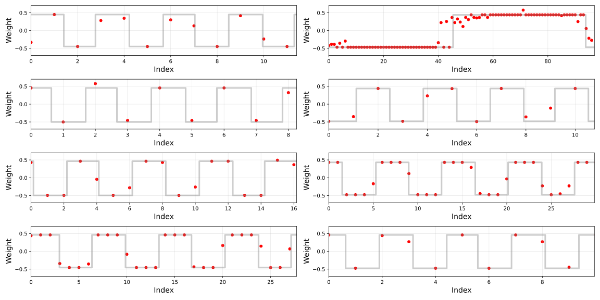
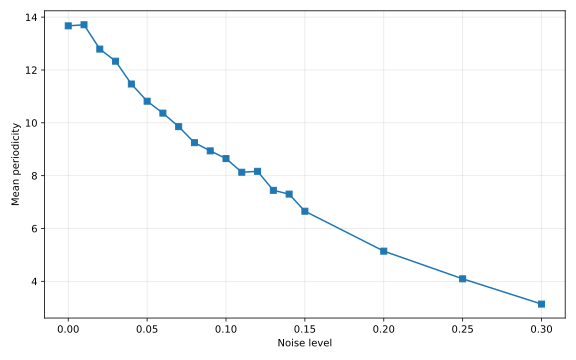
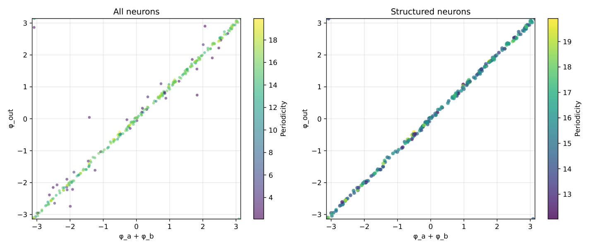

# Swaroop 2026 — Latent Algorithmic Structure Precedes Grokking: A Mechanistic Study of ReLU MLPs on Modular Arithmetic

См. также: [глобальный индекс понятий](../../concepts/index.md).

**Anand Swaroop** (независимый автор).

arXiv [2603.23784](https://arxiv.org/abs/2603.23784), март 2026 (v1), 9 страниц, 5 рисунков (6 файлов), 2 таблицы. Всего цитирований по Semantic Scholar — 0, в картотеке — 0. Одноавторский препринт с сильным центральным опытом: в ReLU-MLP на $a+b\bmod 97$ входные веса выходят не синусоидами, а почти двоичными *прямоугольными волнами* (промежуточные значения — только у границ смены знака), фурье-фазы выходных весов удовлетворяют $\phi_{\mathrm{out}}=\phi_{a}+\phi_{b}$, и это соотношение держится даже под тяжёлым шумом меток, когда модель не гроккает вовсе. Подстановка извлечённых DFT частот и фаз в заранее известную идеальную конструкцию даёт 95.5% точности из модели с 0.23%, а из точек насыщения (99% на обучении, до гроккинга) — 0.65–0.88. Вывод: гроккинг не открывает алгоритм, а затачивает уже закодированный при запоминании.

Оригинал и производные файлы этой папки:

- [`original/2603.23784.latent-algorithmic-structure-precedes-grokking-a-mechanistic-study-of-relu-mlps-on-modular-arithmetic.md`](original/2603.23784.latent-algorithmic-structure-precedes-grokking-a-mechanistic-study-of-relu-mlps-on-modular-arithmetic.md) — конверсия оригинала (native arXiv HTML, v1) в Markdown без правок содержания.
- [`2603.23784.latent-algorithmic-structure-precedes-grokking-a-mechanistic-study-of-relu-mlps-on-modular-arithmetic.claims.txt`](2603.23784.latent-algorithmic-structure-precedes-grokking-a-mechanistic-study-of-relu-mlps-on-modular-arithmetic.claims.txt) — пронумерованные утверждения статьи с пометками разбора.
- [`images/`](images/) — 5 рисунков (6 файлов).

Схема якорей и правила ссылок на карточку — в [README папки статей](../README.md).

## Затрагиваемые понятия

**[Гроккинг](../../concepts/grokking.md)** — переосмысление того, что гроккинг делает: не открывает правильный алгоритм, а *затачивает* латентную структуру, уже в существенной мере закодированную при запоминании, — постепенно бинаризуя входные веса в более чистые прямоугольные волны и выравнивая выходные, пока генерализация не станет возможной ([`p2-5`](#p2-5)). Разбор: явление, вынесенное в заголовок, ни разу не показано на собственных прогонах — ни одной кривой обучения, срок гроккинга не измерен; один прогон на каждый уровень шума, без семян; заголовочная цифра 95.5% взята с конечной точки несгроккавшей модели, а довод «структура есть до гроккинга» несут более скромные числа точек насыщения (0.65–0.88) — аннотация подаёт эти два случая как один.

**[Фурье-признаки и цепи](../../concepts/fourier-features-circuits.md)** — качественно иная форма весов, чем в канонической линии: входные веса ReLU-MLP — почти двоичные прямоугольные волны (значения $\sim\epsilon\pm A$, промежуточные — только у границ смены знака), а не косинусы Gromov/Nanda; фазовое соотношение $\phi_{\mathrm{out}}=\phi_{a}+\phi_{b}$ при этом подтверждается почти идеально (круговая корреляция $r=0.9993$ у структурированных нейронов), и в конструкции с нуля прямоугольный вход с косинусным выходом (Sq$\to$Cos) значимо точнее чисто косинусного на всех ширинах $N\leq 384$ ([`p3-1`](#p3-1)). Разбор: количественная проверка «прямоугольная лучше косинусной» скошена — амплитуда подгоняется под медианы полупериодов прямоугольной волны и навязывается косинусу-сопернику (основная гармоника прямоугольной волны в $4/\pi$ раза больше её уровня); спектральной проверки нечётных гармоник нет; происхождение формы (ReLU, weight decay $1.0$ или их взаимодействие) честно оставлено открытым — без единого опыта с их вариацией; «Clock and Pizza» с отличным механизмом для ReLU-MLP на той же задаче не процитирована (в списке литературы всего пять работ).

**[Фаза запоминания](../../concepts/memorization-phase.md)** — самый сильный результат: уже в точке насыщения (99% на обучении, реальная проверочная точность около нуля) извлечение частот и фаз из весов и подстановка в идеальную конструкцию даёт 0.65–0.88 точности при всех уровнях шума — алгоритмическая разметка (частоты и фазовая сумма) закодирована в форме, достаточной для почти-восстановления решения, уже при запоминании ([`p7-3`](#p7-3)). Разбор: извлечение вкладывает в модель заранее известную рабочую конструкцию (Gromov) — из модели берутся только частота и три фазы на нейрон, так что показано «параметры уже правильные», а не «алгоритм уже собран»; реальная точность насыщения указана как $<0.0001$ — строго ниже случайного $1/97$, аномалия не прокомментирована.

**[Шум меток / случайные метки](../../concepts/label-noise-random-labels.md)** — фазовая структура переживает порчу меток, губящую генерализацию: при $\alpha$ от 0.01 до 0.30 проверочная точность конечной модели падает сигмоидой до 0.0023, средняя периодичность убывает плавно, но $\phi_{\mathrm{out}}=\phi_{a}+\phi_{b}$ держится у самых периодичных нейронов при всех $\alpha$ ($r^{\prime}\geq 0.998$), и извлечение Sq$\to$Cos даёт 0.9548 при $\alpha=0.30$ ([`p4-6`](#p4-6)). Разбор: при $\alpha=0.30$ структурированных нейронов остаётся семь, а извлечение с 95.5% идёт по всем 256 — работоспособную фазовую разметку несут и нейроны, объявленные непериодичными; связь с Doshi et al. (сосуществование запоминающих и обобщающих нейронов под порчей) заявлена, но их результат по форме весов не сопоставлен.

## Что показано, а что предположено

Замечания редактора карточки по итогам разбора утверждений (`…claims.txt`, 45 пунктов).

**Ценное — извлечение из точки насыщения и прямоугольная форма.** Восстановление 0.65–0.88 точности из весов, реальная точность которых около нуля, — сильное свидетельство ранней латентной структуры; преимущество Sq$\to$Cos над Cos$\to$Cos на узких слоях статистически значимо и повторено на 40 семенах (единственное место с семенами); двумодальность периодичности с проверкой обнулением неструктурированных нейронов (падение $<0.001$) аккуратна.

**Опытная база узка, ключевые вещи не измерены.** Один прогон на уровень шума, без семян и кривых обучения — гроккинг принят как данность и не показан; сравнение форм волн скошено подгонкой амплитуды; «средняя дистанция до ближайшей точки» не определена; аннотация обещает извлечение амплитуд, но в формулах §4.1 их нет (все волны единичной амплитуды — неструктурированные нейроны, наоборот, усиливаются); частота берётся только из $W_a$ при 7% нейронов с расходящимися частотами.

**Внутренние нестыковки.** «Неструктурированные» — то 37, то 44 нейрона (семь промежуточных то исключены, то включены); подпись рис. 5 «для всех уровней $\alpha$» при шести панелях из девятнадцати; атрибуции спутаны (Doshi — то «та же ReLU-архитектура», то «преимущественно квадратичные активации»); точность $<0.0001$ ниже случайной без комментария; кода и приложений нет.

**Как работу будут цитировать** («доказано, что гроккинг ничего не открывает, а только затачивает готовый алгоритм») — точнее: на одном прогоне на каждый уровень шума, на $p=97$, без кривых обучения показано, что фазы доминирующих фурье-составляющих уже в точке насыщения дают при подстановке в заранее известную идеальную конструкцию 0.65–0.88 точности.

---

# Текст статьи

## Латентное алгоритмическое строение предшествует гроккингу: механистическое исследование ReLU-MLP на модульной арифметике

**Anand Swaroop** (email: anandswaroop191@gmail.com)

## Аннотация

Гроккинг — явление, при котором проверочная точность нейронных сетей на модульном сложении двух целых растёт долго после запоминания обучающих данных, — характеризовался в прежних работах как порождающий синусоидальные распределения входных весов в трансформерах и многослойных перцептронах (MLP). Мы эмпирически находим, что ReLU-MLP в нашей экспериментальной постановке вместо этого выучивают почти двоичные прямоугольные входные веса, где промежуточные значения встречаются исключительно у границ смены знака, вместе с распределениями выходных весов, чьи доминирующие фурье-фазы удовлетворяют фазовому соотношению $\phi_{\mathrm{out}}=\phi_{a}+\phi_{b}$; это соотношение держится, даже когда модель обучена на зашумлённых данных и не гроккает. Мы извлекаем частоту и фазу весов каждого нейрона через DFT и строим идеализированную MLP: входные веса заменяются идеальными двоичными прямоугольными волнами, а выходные — косинусами, оба параметризованы частотами, фазами и амплитудами, извлечёнными из доминирующих фурье-составляющих весов настоящей модели. Эта идеализированная модель достигает **95.5% точности**, когда частоты и фазы извлечены из весов модели, обученной на зашумлённых данных, которая сама достигает лишь 0.23% точности. Это наводит на мысль, что гроккинг не открывает правильный алгоритм, а затачивает алгоритм, в существенной мере закодированный при запоминании, — постепенно бинаризуя входные веса в более чистые прямоугольные волны и выравнивая выходные веса, пока генерализация не станет возможной.

## 1 Введение

Нейронные сети, обучаемые на задачах модульной арифметики, являют контринтуитивное явление: после быстрого запоминания обучающего набора проверочная точность остаётся около случайной ещё тысячи шагов, прежде чем резко подняться к почти идеальной генерализации [Power et al., 2022]. Эта отложенная генерализация, названная *гроккингом*, стала полигоном понимания того, как и когда нейронные сети развивают структурированные внутренние представления.

Работы по механистической интерпретируемости трансформеров охарактеризовали один из алгоритмов, лежащих в основе гроккинга, как цепь фурье-умножения: сеть выучивает входные эмбеддинги — синусоидальные функции входного токена — и вычисляет сумму механизмом сложения фаз в пространстве весов [Nanda et al., 2023]. Эта картина была поставлена на аналитическую основу Gromov [2023], который показал, что косинусные входные веса с фазовым ограничением $\phi_{\mathrm{out}}=\phi_{a}+\phi_{b}$ достаточны для сколь угодно высокой точности модульного сложения в MLP с достаточно большим скрытым слоем, вывел аналитическое построение цепи для квадратичных активаций и эмпирически показал, что это распространяется на ReLU. Вместе эти работы устанавливают синусоидальные веса как общую сигнатуру гроккинга на задачах модульного сложения.

Li et al. [2025] доказывают, что фурье-цепи возникают в MLP с одним скрытым слоем через максимизацию зазора, устанавливая теоретическое основание синусоидального строения в однослойных MLP на модульном сложении.

**[p. 2]**

Doshi et al. [2024] изучают ту же ReLU-MLP архитектуру при порче меток, показывая, что запоминающие и обобщающие нейроны сосуществуют и различимы по их фурье-локализации. Хотя их работа характеризует *наличие* периодического строения под шумом, она не рассматривает форму весов, фазовое ограничение или сохранность алгоритмической структуры в моделях, вовсе не гроккающих.

**Вклад.** Мы изучаем ReLU-MLP на той же задаче модульного сложения (по двум целым $a$ и $b$ найти $a+b\bmod 97$) и находим качественно иное строение весов. В нашей экспериментальной постановке (weight decay $1.0$, доля обучения $0.3$) входные веса — *почти двоичные прямоугольные волны*, а не косинусы: веса принимают значения $\sim\epsilon\pm A$ на большей части области (эмпирически $A$ примерно постоянна по нейронам, а $\epsilon$ близко к нулю), с промежуточными значениями исключительно у границ смены знака.

Для каждого скрытого нейрона $i$ пусть $W_{a}^{(i)}$ и $W_{b}^{(i)}$ — векторы входных весов над one-hot кодировками $a$ и $b$, $W_{\mathrm{out}}^{(i)}$ — вектор весов, связывающих скрытый нейрон $i$ с каждым выходным узлом, а $\phi_{a}^{(i)}$, $\phi_{b}^{(i)}$ и $\phi_{\mathrm{out}}^{(i)}$ — фазы соответствующих доминирующих фурье-составляющих (извлечённые дискретным преобразованием Фурье). Мы находим, что для данного $i$ веса $W_{a}^{(i)}$ и $W_{b}^{(i)}$ следуют прямоугольным волнам с одинаковыми частотой и амплитудой, но не обязательно одинаковой фазой. Выходные веса $W_{\mathrm{out}}^{(i)}$, не проходящие через нелинейность, прямоугольной волне не следуют; однако они сохраняют ту же частоту, что $W_{a}^{(i)}$ и $W_{b}^{(i)}$, и их доминирующие фурье-фазы удовлетворяют $\phi_{\mathrm{out}}=\phi_{a}+\phi_{b}$.

Мы используем это строение для построения идеализированной MLP: входные веса заменяются идеальными двоичными прямоугольными волнами, выходные — косинусами, оба параметризованы целиком частотами и фазами, извлечёнными через DFT. Эта идеализированная модель достигает **95.5% точности**, будучи построена из модели, обученной на сильно зашумлённых данных, которая сама достигает лишь **0.23% точности**.

###### p2-5

Этот результат означает, что гроккинг не открывает правильный алгоритм. Алгоритмическая структура (периодические фазы входных весов и их суммовое соотношение) уже закодирована при запоминании. Гроккинг затачивает латентную алгоритмическую структуру, пока не будет достигнута генерализация.

## 2 Постановка

Мы обучаем многослойный перцептрон (MLP) с одним скрытым слоем задаче сложения двух целых, $a$ и $b$, по модулю 97. Вход — двухгорячий вектор размерности 194 (one-hot кодировка $a$, соединённая с one-hot кодировкой $b$). Выход — one-hot вектор размерности 97, представляющий $a+b\ (\mathrm{mod}\ 97)$. Скрытый слой состоит из 256 полносвязных нейронов и использует активацию ReLU. Мы определяем $W_{a}^{(i)}$, $W_{b}^{(i)}$ и $W_{\mathrm{out}}^{(i)}$, как обсуждено выше.

Мы используем оптимизатор AdamW на всех параметрах модели со скоростью обучения $10^{-3}$ и коэффициентом weight decay $1.0$.

Используемый набор — полное множество $97^{2}$ целочисленных троек $(a,b,c)$, где $a,b,c\in[0,96]$ и $c\equiv a+b\ (\mathrm{mod}\ 97)$. Мы используем разбиение 30/70 обучение/проверка, расслоённое по $c$. Мы вводим гиперпараметр $\alpha\in[0,1]$ шума меток. Мы портим долю $\alpha$ обучающих меток, заменяя каждую значением, выбранным равномерно случайно среди оставшихся $96$ классов. Проверочный набор не затронут $\alpha$ и всегда содержит истинные тройки. Мы обучаем с $\alpha=0$ (без шума, стандартная задача гроккинга; будем называть это «чистой моделью»), а также с 18 ненулевыми значениями от $0.01$ до $0.30$[^1] для исследования влияния шума меток на гроккинг (будем называть их «зашумлёнными моделями»).

[^1]: Конкретные значения: $0.01$, $0.02$, $0.03$, $0.04$, $0.05$, $0.06$, $0.07$, $0.08$, $0.09$, $0.1$, $0.11$, $0.12$, $0.13$, $0.14$, $0.15$, $0.20$, $0.25$ и $0.30$.

Мы применяем ранний останов: обучение останавливается, когда максимальная проверочная точность модели не улучшилась хотя бы на $10^{-4}$ за прошедшие $50{,}000$ шагов, или когда проверочная точность поднялась выше $0.999$. Мы ставим жёсткий предел $500{,}000$ шагов (в наших опытах он никогда не достигается; при $\alpha=0$ срабатывает второе условие останова, при ненулевых $\alpha$ — первое). Для каждой модели мы сохраняем контрольную точку насыщения, когда модель достигает 99% точности на своём обучающем наборе, и финальную модель при срабатывании любого из условий останова.

**[p. 3]**

## 3 Результаты

###### p3-1

Мы находим, что в чистой модели $W_{a}^{(i)}$ и $W_{b}^{(i)}$ почти идеально следуют прямоугольным волнам — в отличие от синусоид, найденных в эмбеддингах гроккающих трансформеров у Nanda et al. [2023]. Для каждого нейрона мы извлекаем частоту и фазу доминирующей фурье-составляющей DFT и строим прямоугольную волну с той же частотой и фазой; подгонка частоты и фазы не выполняется. Мы вычисляем амплитуду и вертикальный сдвиг так, чтобы верхний и нижний уровни построенной волны совпали с медианными значениями положительных и отрицательных полупериодов весов нейрона. Мы называем эти построенные волны *идеальными прямоугольными волнами*. Несколько примеров показаны на рисунках 1 и 2.

*Рисунок 1: Настоящие $W_{a}$ разных нейронов — синим, идеальная прямоугольная волна — серым. Промежуточные значения — только у границ смены знака. Рисунки масштабированы горизонтально так, чтобы было видно не более 5 периодов, ради мелких деталей.* **[p. 3]**

*Рисунок 2: Настоящие $W_{b}$ разных нейронов — красным, идеальная волна — серым. Промежуточные значения — только у границ смены знака, и доминирующая частота, извлечённая из $W_{b}$, совпадает с частотой $W_{a}$.* **[p. 3]**

Не все нейроны скрытого слоя выучивают периодические представления. Чтобы различить нейроны, кодирующие полезную частотную структуру, и прочие, мы квантифицируем периодичность входных весов каждого нейрона *баллом периодичности*: отношением величины доминирующей фурье-составляющей к средней величине по всем не-DC-составляющим,

**[p. 4]**

$$
\mathrm{per}(w)=\frac{\max_{k=1}^{p-1}|\hat{w}_{k}|}{\frac{1}{p-1}\sum_{k=1}^{p-1}|\hat{w}_{k}|}, \tag{1}
$$

где $\hat{w}_{k}$ обозначает $k$-й DFT-коэффициент вектора весов $w$. Высокий балл периодичности указывает, что вектор весов господствуется одной частотой; балл около 1 — плоский спектр без доминирующей частоты.

Применение этой меры к $W_{a}^{(i)}$ по всем 256 скрытым нейронам раскрывает двумодальное распределение: 212 нейронов имеют высокие баллы периодичности ($\mathrm{per}(W_{a}^{(i)})>12$), 37 — низкие ($\mathrm{per}(W_{a}^{(i)})<5$), с ясным провалом между двумя популяциями; 7 нейронов попадают между порогами и исключены из обеих групп (на $W_{b}$ мы находим тождественные результаты с теми же нейронами в каждой группе). Пороги выбраны так, чтобы схватить ясный провал двумодального распределения. Нейроны высокой периодичности мы называем *структурированными*, остальные — *неструктурированными*. Обнуление выходов всех неструктурированных нейронов даёт падение точности меньше 0.001, подтверждая их пренебрежимый вклад в выход сети. Мы находим, что неструктурированные нейроны имеют значительно меньшую норму связей с выходным слоем. Также мы находим, что доминирующие фурье-частоты $W_{a}^{(i)}$, $W_{b}^{(i)}$ и $W_{\mathrm{out}}^{(i)}$ равны у $92.97\%$ всех нейронов и у 100% структурированных.

Для количественной меры соответствия мы для каждого нейрона вычисляем среднюю дистанцию до ближайшей точки между входными весами и идеальной прямоугольной волной, а также среднюю дистанцию до ближайшей точки между входными весами и идеальной косинусной волной с теми же фазой, частотой, амплитудой и вертикальным сдвигом. Мы выполняем парный $t$-критерий на этих значениях и находим, что дистанция до идеальных прямоугольных волн ниже: $t(211)=-27.0052$ и $p<10^{-6}$ для структурированных нейронов; $t(255)=-28.29$ и $p<10^{-6}$ по всем 256 нейронам.

### 3.1 Шум

Мы находим, что с ростом уровня шума $\alpha$ проверочная точность финальной модели следует убывающему сигмоидальному переходу (рис. 3(a)) от $0.999$ при $\alpha=0.00$ до $0.0023$ при $\alpha=0.30$, тогда как периодичность нейронов убывает плавно (рис. 3(b)).

*(a) Проверочная точность против $\alpha$.*

*(b) Средняя периодичность по всем нейронам против $\alpha$.*

*Рисунок 3: Точность и периодичность по уровням шума.* **[p. 4]**

Мы находим, что при всех уровнях шума доминирующие частоты $W_{a}^{(i)}$, $W_{b}^{(i)}$ и $W_{\mathrm{out}}^{(i)}$ совпадают у 100% нейронов с периодичностью $>12$ (хотя при $\alpha=0.30$ таких нейронов лишь 7). Мы извлекаем фазу доминирующей фурье-составляющей из $W_{\mathrm{out}}$ каждого нейрона. Мы находим, что $\phi_{\mathrm{out}}=\phi_{a}+\phi_{b}$ держится у нейронов наивысшей периодичности и в чистой модели, и в зашумлённых. Как показано на рисунке 4, все структурированные нейроны удовлетворяют $\phi_{\mathrm{out}}=\phi_{a}+\phi_{b}$ — с точностью до сдвигов на кратные $2\pi$ — почти идеально. Это отвечает эмпирическим результатам, вскрытым в Gromov [2023] и Nanda et al. [2023], и аналитическому построению в первом. Однако обе работы находят это соотношение в синусоидальных весах, а не в прямоугольно-волновых.

*Рисунок 4: $\phi_{\mathrm{out}}$ против $\phi_{a}+\phi_{b}$ по всем нейронам чистой модели, свёрнуто в $[-\pi,\pi]$. При ограничении структурированными нейронами корреляция почти идеальна (круговая корреляция $r=0.9993$).* **[p. 5]**

###### p4-6

Хотя периодичность в целом деградирует с ростом шума меток, мы находим, что соотношение $\phi_{\mathrm{out}}=\phi_{a}+\phi_{b}$ сохраняется у нейронов наивысшей периодичности внутри каждого проверенного уровня $\alpha$. Это видно на рисунке 5. Это наводит на мысль, что латентная структура в какой-то мере формируется даже при значительном шуме **[p. 5]** меток, что поднимает вопрос, можно ли извлечь её для восстановления правильного алгоритма несмотря на неспособность модели обобщиться. Мы находим, что это возможно.

*Рисунок 5: $\phi_{\mathrm{out}}$ против $\phi_{a}+\phi_{b}$ для разных уровней $\alpha$. Нейроны наивысшей периодичности в каждой модели лежат близко к диагонали независимо от разброса нейронов меньшей периодичности. Приведены круговые коэффициенты корреляции; $r$ — по всем нейронам, $r^{\prime}$ — только по структурированным (периодичность $>12$). $r^{\prime}\geq 0.998$ при всех уровнях $\alpha$, что указывает: структурированные нейроны удовлетворяют фазовому соотношению независимо от шума.* **[p. 5]**

## 4 Идеализированная модель

Сначала мы строим с нуля MLP, решающую задачу модульного сложения. Мы используем MLP с той же постановкой (двухгорячий вход размерности 194, скрытый слой размерности 256, one-hot выход **[p. 6]** размерности 97). Мы используем веса

$$
W_{a}^{(i)}[j] =f\left(\frac{2\pi ij}{97}-\phi_{ai}\right),  i\in[0,255],j\in[0,96] \\
W_{b}^{(i)}[j] =f\left(\frac{2\pi ij}{97}-\phi_{bi}\right), \\
W_{\mathrm{out}}^{(i)}[j] =g\left(\frac{2\pi ij}{97}-\phi_{ai}-\phi_{bi}\right),
$$

с фазами $\phi_{ai}$ и $\phi_{bi}$, выбираемыми независимо для каждого нейрона равномерно случайно из диапазона $[-\pi,\pi]$. Все смещения мы ставим в ноль: в обученной модели действенное смещение первого слоя (с учётом вертикального сдвига входных весов) имеет среднее $0.010\pm 0.004$ (SD) по структурированным нейронам — меньше 2.5% типичной амплитуды весов $A\approx 0.45$, — и все 212 структурированных нейронов удовлетворяют $|b_{\text{eff}}|<0.05$.

$f$ и $g$ определяют тип волны, которой следуют $W_{a}$, $W_{b}$, $W_{\mathrm{out}}$: $\cos$ для синусоид и $\mathrm{sign}\circ\cos$ для прямоугольных волн. Мы проверяем три настройки:

1. $f=g=\cos$; это тождественно постановке Gromov [2023] с активациями ReLU.
2. $f=\mathrm{sign}\circ\cos$, $g=\cos$.
3. $f=g=\mathrm{sign}\circ\cos$.

Будем называть их Cos$\to$Cos, Sq$\to$Cos и Sq$\to$Sq соответственно. Цель использования $\mathrm{sign}\circ\cos$ — определить, как прямоугольные волны влияют на точность модели в сравнении с синусоидами. Во всех построенных моделях мы используем активации ReLU.

Gromov [2023] доказывает, что при достаточно большом скрытом слое их чисто косинусная модель с квадратичными активациями достигает сколь угодно высокой точности. Они также эмпирически находят, что то же происходит с активациями ReLU, хотя для достижения точности квадратичных активаций требуется больше нейронов.

Мы оцениваем построенные модели на 40 разных семенах и разных ширинах скрытого слоя $N$; результаты сведены в таблице 1. Все три метода показывают монотонный рост точности с шириной скрытого слоя, и все достигают высокой ($>0.998$) точности при 512 нейронах. Прямоугольные входные веса с синусоидальными выходными показывают наибольшую точность на всех ширинах — со статистически значимым отрывом при $N\leq 384$ ($p<0.01$). Это наводит на мысль, что прямоугольно-волновая конструкция входных весов не только вернее представлению, выучиваемому нашей моделью, но и является более точным решением.

*Таблица 1: Точность построенных моделей при разных ширинах скрытого слоя. Значения — среднее $\pm$ стандартное отклонение по 40 семенам. Все модели используют активации ReLU.* **[p. 6]**

| $N$ | Cos$\to$Cos | Sq$\to$Cos | Sq$\to$Sq |
|---|---|---|---|
| 16 | $0.0422\pm 0.0049$ | $\mathbf{0.0735\pm 0.0041}$ | $0.0458\pm 0.0064$ |
| 32 | $0.1322\pm 0.0125$ | $\mathbf{0.1944\pm 0.0093}$ | $0.1415\pm 0.0107$ |
| 64 | $0.3653\pm 0.0313$ | $\mathbf{0.4449\pm 0.0234}$ | $0.3314\pm 0.0178$ |
| 96 | $0.5850\pm 0.0379$ | $\mathbf{0.6522\pm 0.0263}$ | $0.5057\pm 0.0245$ |
| 128 | $0.7482\pm 0.0372$ | $\mathbf{0.7968\pm 0.0243}$ | $0.6512\pm 0.0258$ |
| 192 | $0.9222\pm 0.0178$ | $\mathbf{0.9417\pm 0.0100}$ | $0.8450\pm 0.0196$ |
| 256 | $0.9793\pm 0.0067$ | $\mathbf{0.9849\pm 0.0042}$ | $0.9375\pm 0.0107$ |
| 384 | $0.9987\pm 0.0008$ | $\mathbf{0.9992\pm 0.0005}$ | $0.9907\pm 0.0030$ |
| 512 | $0.9999\pm 0.0001$ | $\mathbf{1.0000\pm 0.0001}$ | $0.9989\pm 0.0006$ |

Заметим, что эта построенная модель — с нуля, без связи с фактически обученными нами моделями, кроме прямоугольно-волнового строения и соотношения $\phi_{\mathrm{out}}=\phi_{a}+\phi_{b}$. В разделе 4.1 мы закрываем этот разрыв, используя параметры, извлечённые прямо из обученных моделей, вместо построенных нами.

**[p. 7]**

### 4.1 Извлечение

Чтобы определить, есть ли латентная структура в весах наших зашумлённых моделей, мы используем процедуру замены всех $W_{a}^{(i)}$, $W_{b}^{(i)}$ и $W_{\mathrm{out}}^{(i)}$ прямоугольными или косинусными волнами. Процесс прост: для каждого нейрона мы извлекаем частоту из доминирующей фурье-составляющей $W_{a}^{(i)}$ и фазы из доминирующих фурье-составляющих $W_{a}^{(i)}$, $W_{b}^{(i)}$, $W_{\mathrm{out}}^{(i)}$. Пусть $\nu$ — извлечённая частота, а $\phi_{a}^{(i)},\phi_{b}^{(i)},\phi_{\mathrm{out}}^{(i)}$ — извлечённые фазы. Тогда мы строим модель, чьи входные и выходные веса следуют извлечённым фазам и частотам. Более формально,

$$
W_{a}^{(i)}[j] =f\left(\frac{2\pi\nu j}{97}-\phi_{a}^{(i)}\right), \\
W_{b}^{(i)}[j] =f\left(\frac{2\pi\nu j}{97}-\phi_{b}^{(i)}\right), \\
W_{\mathrm{out}}^{(i)}[j] =g\left(\frac{2\pi\nu j}{97}-\phi_{\mathrm{out}}^{(i)}\right).
$$

Мы проверяем те же три настройки $f$ и $g$, что описаны выше. Мы выполняем извлечение на настоящих моделях с разными значениями $\alpha$, на финальной контрольной точке и на точке насыщения. Каждую извлечённую модель мы оцениваем на проверочном наборе; результаты сведены в таблице 2.

*Таблица 2: Проверочная точность настоящих и извлечённых моделей по уровням шума. Показаны результаты для финальной контрольной точки и точки насыщения (когда обучающая точность впервые достигает 99%).* **[p. 7]**

|  | Final checkpoint |  |  |  | Saturation checkpoint |  |  |  |
|---|---|---|---|---|---|---|---|---|
| $\alpha$ | Real | Sq$\to$Sq | Sq$\to$Cos | Cos$\to$Cos | Real | Sq$\to$Sq | Sq$\to$Cos | Cos$\to$Cos |
| 0.00 | 0.9991 | 0.9719 | 0.9979 | **0.9988** | $<0.0001$ | 0.6912 | **0.8133** | 0.7661 |
| 0.05 | 0.9358 | 0.9705 | 0.9970 | **0.9979** | $<0.0001$ | 0.7545 | **0.8407** | 0.7967 |
| 0.10 | 0.5663 | 0.9607 | 0.9954 | **0.9957** | $<0.0001$ | 0.7586 | **0.8825** | 0.8420 |
| 0.15 | 0.1797 | 0.9505 | 0.9912 | **0.9921** | 0.0005 | 0.6408 | **0.7799** | 0.7289 |
| 0.20 | 0.0436 | 0.9135 | **0.9778** | 0.9766 | 0.0002 | 0.6402 | **0.7571** | 0.6959 |
| 0.25 | 0.0120 | 0.9320 | **0.9813** | 0.9765 | 0.0003 | 0.5086 | **0.6496** | 0.5912 |
| 0.30 | 0.0023 | 0.8735 | **0.9548** | 0.9405 | 0.0011 | 0.5641 | **0.6501** | 0.5944 |

###### p7-3

Извлечение Sq$\to$Cos последовательно достигает высокой точности на финальных контрольных точках при всех уровнях шума, доходя до 95.5% при $\alpha=0.30$, где настоящая модель достигает лишь 0.23%. При меньших уровнях шума Sq$\to$Cos и Cos$\to$Cos работают на финальной точке похоже, намекая, что у хорошо обученных моделей фазовая структура выхода сохранена достаточно, чтобы любой тип входной волны восстановил алгоритм. Преимущество Sq$\to$Cos становится выраженным на финальных точках при высоком шуме ($\alpha\geq 0.25$) и последовательно на всех точках насыщения, где реальная точность модели около нуля повсюду. Результаты насыщения подтверждают, что алгоритмическая структура — подходящие фазы и частоты для модульного сложения — уже в значительной мере закодирована при запоминании, до наступления гроккинга.

## 5 Обсуждение

Наши находки предлагают переосмысление того, что гроккинг совершает. Прежние механистические исследования показали, что гроккинг включает фазу постепенного формирования цепи во время запоминания, где структурированные механизмы непрерывно усиливаются перед скачком тестовой точности [Nanda et al., 2023]. Наши результаты расширяют эту картину на ReLU-MLP при шуме меток: мы извлекаем высокоточную идеализированную модель прямо из весов фазы запоминания (насыщения), даже в негроккающих режимах, где настоящая модель не обобщается. Это демонстрирует, что стержневая алгоритмическая структура — частоты и фазовые соотношения — закодирована в форме, достаточной для почти-восстановления решения уже при запоминании, и стойко сохраняется под порчей. Что гроккинг делает — это затачивает эту латентную структуру, выравнивая веса модели ближе к идеальным волнам.

Наша находка, что входные веса следуют прямоугольным волнам, а не синусоидам прежних работ, может зависеть от режима. Gromov [2023] аналитически строит косинусные веса, используя **[p. 8]** ванильный градиентный спуск без регуляризации; Doshi et al. [2024] используют AdamW с weight decay, но преимущественно изучают квадратичные активации, для которых аналитическое косинусное решение точно. Наша постановка использует активации ReLU с AdamW и weight decay 1.0. Возникает ли прямоугольно-волновое строение из активации ReLU, силы weight decay или их взаимодействия — остаётся открытым вопросом.

Применимы несколько ограничений. Наши опыты ограничены одной задачей (модульное сложение), одной архитектурой (ReLU-MLP с одним скрытым слоем) и одним модулем ($p=97$). Обобщается ли находка о латентном строении на другие задачи или архитектуры — важное направление будущей работы.

## 6 Заключение

Мы показали, что ReLU-MLP, обученные модульному сложению, выучивают почти двоичные прямоугольные входные веса, чьи доминирующие фурье-фазы удовлетворяют $\phi_{\mathrm{out}}=\phi_{a}+\phi_{b}$, и что эта фазовая структура во многом сохраняется даже при тяжёлом шуме меток, препятствующем генерализации. Извлечение этих фаз и построение идеализированной модели восстанавливает 95.5% точности из модели, которая сама достигает 0.23%, и существенную точность из точек насыщения, где настоящая модель ещё вовсе не обобщилась. Вместе эти результаты наводят на мысль, что гроккинг не открывает правильный алгоритм — он затачивает тот, что уже был.

**[p. 9]**

## References

- D. Doshi, A. Das, T. He, and A. Gromov To grok or not to grok: disentangling generalization and memorization on corrupted algorithmic datasets. In The Twelfth International Conference on Learning Representations, 2024. Cited by: §1, §5.

- A. Gromov Grokking modular arithmetic. 2023. External Links: 2301.02679, Link Cited by: §1, §3.1, item 1, §4, §5.

- C. Li, Y. Liang, Z. Shi, Z. Song, and T. Zhou Fourier circuits in neural networks and transformers: a case study of modular arithmetic with multiple inputs. In International Conference on Artificial Intelligence and Statistics, pp. 523–531, PMLR, 2025. Cited by: §1.

- N. Nanda, L. Chan, T. Lieberum, J. Smith, and J. Steinhardt Progress measures for grokking via mechanistic interpretability. 2023. External Links: Link Cited by: §1, §3.1, §3, §5.

- A. Power, Y. Burda, H. Edwards, I. Babuschkin, and V. Misra Grokking: generalization beyond overfitting on small algorithmic datasets. 2022. External Links: 2201.02177, Link Cited by: §1.
