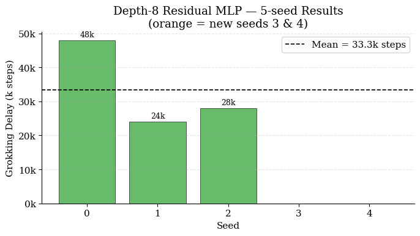
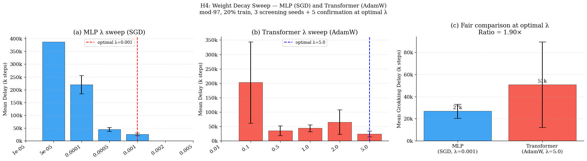
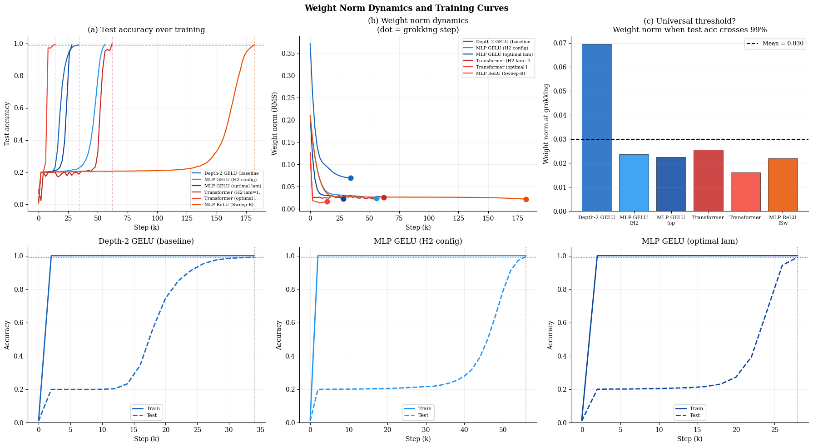

# Manir, Rupa 2026 — A Systematic Empirical Study of Grokking: Depth, Architecture, Activation, and Regularization

См. также: [глобальный индекс понятий](../../concepts/index.md).
arXiv [2603.25009v1](https://arxiv.org/abs/2603.25009), 26 марта 2026. Колонтитула у PDF нет.

**Shalima Binta Manir** — University of Maryland, Baltimore County; smanir1@umbc.edu.
**Anamika Paul Rupa** — Howard University; anamikal.rupa@howard.edu.
Оба автора помечены звёздочкой с примечанием «Equal contribution».

Файлы разбора этой статьи:

- [`2603.25009.a-systematic-empirical-study-of-grokking-depth-architecture-activation-and-regularization.claims.txt`](2603.25009.a-systematic-empirical-study-of-grokking-depth-architecture-activation-and-regularization.claims.txt) — пронумерованные утверждения статьи с пометками разбора.
- [`2603.25009.a-systematic-empirical-study-of-grokking-depth-architecture-activation-and-regularization.license.txt`](2603.25009.a-systematic-empirical-study-of-grokking-depth-architecture-activation-and-regularization.license.txt) — лицензионная запись arXiv для этой статьи.

Схема якорей и правила ссылок на карточку — в [README папки статей](../README.md).

**Карточка-выдержка.** Лицензия статьи (`arxiv-nonexclusive`) не разрешает публикацию копии оригинала и полного перевода, поэтому карточка содержит редакторские секции и цитируемые фрагменты перевода (право цитирования). Полный текст статьи: <https://arxiv.org/abs/2603.25009>.

## Затрагиваемые понятия

**[Гроккинг](../../concepts/grokking.md)** — работа не вводит и не объясняет явление, а задаёт по нему систематику: берёт гроккинг как данность и перебирает, какая из четырёх осей — глубина, семейство устройств, функция активации, сила регуляризации — им управляет. Ответ вынесен в аннотацию ([с. 1, абз. 3](#p1-3)): динамику задаёт «не столько устройство сети, сколько взаимодействие между устойчивостью оптимизации и регуляризацией», а в заключении к нему добавлено, что weight decay определяет «и то, произойдёт ли гроккинг, и то, когда он произойдёт», тогда как устройство и активация меняют лишь траекторию обучения ([с. 16, абз. 8](#p16-8)). Полигон воспроизведён и показан отдельным опытом ([с. 5, абз. 4](#p5-4), [рис. 1](#fig-1)): обучающая точность 100% на шаге 1000, тестовая пересекает 99% на шаге 33 000. Чего в работе нет: механизма — ни одного вмешательства, кроме смены гиперпараметров, не делается, все выводы сняты с кривых точности, RMS-нормы весов и спектра вложений; нет и своей теории — авторские объяснения («оптимизационная патология», «самовнимание как неявный механизм разрежённости») помечены как предположения. Существенная для цитирующих оговорка: полка до перехода стоит не у уровня случайного угадывания — при 97 исходах он около 1%, а на [рис. 1](#fig-1) и на всех панелях [рис. 6](#fig-6) полка держится около 20%, и авторы сами называют её «$\approx$19.9%», продолжая при этом говорить «near chance».

**[Weight decay](../../concepts/weight-decay.md)** — главный предмет работы и её самое подробное измерение. Перебраны семь значений $\lambda$ для MLP (от $10^{-5}$ до $5\times 10^{-3}$) и шесть для трансформера (от 0.01 до 5.0), по 3 разведочных семени на значение. У MLP зависимость резко немонотонна ([с. 9, абз. 6](#p9-6)): при $\lambda\leq 10^{-5}$ выборка запоминается, но гроккинга нет; наилучшее — при $\lambda=10^{-3}$ (25 333 ± 5 033); при $2\times 10^{-3}$ сеть уже не может запомнить обучающую выборку. У трансформера гроккинга нет при $\lambda=0.01$, а оптимум — при $\lambda=5.0$ ([с. 9, абз. 7](#p9-7)). Работа даёт корпусу прямо измеренное расхождение оптимумов между SGD и AdamW в 5000 раз. Чего в работе нет: совместного перебора $\lambda$ с шагом обучения и шириной — все три величины меняются вместе при переходе от Sweep A к Sweep B ([с. 8, абз. 2](#p8-2)); нет и разбора механизма — «главность» weight decay установлена перебором одной величины при закреплённых остальных.

**[Зона Златовласки](../../concepts/goldilocks-zone.md)** — авторы прямо пользуются этим именем и переносят его с пространства гиперпараметров на одну ось: «зона Златовласки у MLP ($\lambda\in[5\times 10^{-4},\,10^{-3}]$) узка: шаг в два раза за оптимум полностью обрушивает обучение» ([с. 10, абз. 2](#p10-2)). Узость показана обрывом с двух сторон: слева $\lambda\leq 10^{-5}$ даёт запоминание без гроккинга, справа $\lambda\geq 2\times 10^{-3}$ отнимает само запоминание ([рис. 5](#fig-5), панель a). Чего в работе нет: карты фаз — перебор одномерный, по 3 семени на точку, и границы зоны определены с точностью до шага сетки (множитель 2 или 5), а вторая ось (ширина) взята всего в двух значениях.

**[Когда регуляризация необходима](../../concepts/regularization-necessity.md)** — работа даёт двусторонний ответ на одной задаче: без достаточной регуляризации гроккинга нет ($\lambda=0.01$ у трансформера — ни одного семени за 400 000 шагов, [с. 9, абз. 7](#p9-7); $\lambda\leq 10^{-5}$ у MLP — запоминание без гроккинга), а при избыточной нет и запоминания, без которого гроккинг невозможен по определению меры. Про трансформер сказано прямо, что большой weight decay «требуется, чтобы надёжно вызвать гроккинг с AdamW» ([с. 4, абз. 4](#p4-4)). Чего в работе нет: проверки постановок, где гроккинг воспроизводится без регуляризации вовсе, — соответствующая линия корпуса не цитируется, а необходимость weight decay здесь не выведена, а унаследована от Liu et al. (2022) как настройка.

**[Оптимизатор](../../concepts/optimizer-adam-adamw-sgd.md)** — оптимизаторы разведены по устройствам нарочно: SGD с импульсом у MLP, AdamW у трансформера ([с. 3, абз. 8](#p3-8), [с. 7, абз. 3](#p7-3)). Отсюда самое чистое количественное наблюдение работы: оптимум weight decay у трансформера под AdamW в 5000 раз больше, чем у MLP под SGD ([с. 9, абз. 7](#p9-7)), то есть одно и то же значение $\lambda$ на разных оптимизаторах означает разное; объяснение — масштабирование действующей скорости обучения на параметрах с большой нормой ([с. 10, абз. 2](#p10-2)). Обратная сторона того же выбора — что ось «устройство» здесь неотделима от оси «оптимизатор», и авторы признают это в ограничениях: «полное отделение устройства от оптимизации остаётся открытой задачей» ([с. 16, абз. 4](#p16-4)). Чего в работе нет: прогонов одного устройства под обоими оптимизаторами — такого сравнения не сделано ни разу.

**[Минимизация нормы весов](../../concepts/weight-norm-minimization.md)** — лучшая часть работы. У пяти настроек шириной 512 RMS-норма всех параметров в точке гроккинга держится в узком поясе $0.0219\pm 0.0032$ (CV 14.5%), тогда как у опорной модели глубины 2 шириной 256 она втрое выше — 0.0695 ([с. 10, абз. 5](#p10-5), [рис. 6](#fig-6)). На этом построен развод двух вещей: ReLU и GELU грокают при почти одинаковой норме (0.0219 против 0.0225), но ReLU идёт к ней в 6.9 раза дольше, откуда следует, что «функция активации управляет *скоростью*, с которой weight decay доводит норму до этого порога, а не самим порогом» ([с. 11, абз. 1](#p11-1)). Порог отнесён к ширине модели, а не к устройству, активации или оптимизатору ([с. 11, абз. 2](#p11-2)). Чего в работе нет: порог здесь измерен, а не выведен; на настройку взято по одному семени ([с. 10, абз. 4](#p10-4)), ширин всего две, и при смене ширины «всеобщность» порога как раз не выполняется — то есть проверена она внутри одной ширины. Нет и вмешательства: норма не удерживается принудительно, задержка как функция заданной нормы не мерена.

**[Фаза меморизации / плато](../../concepts/memorization-phase.md)** — работа даёт побочное, но устойчивое наблюдение: срок запоминания $T_{\text{train}}$ по всем таблицам держится на 2000 шагах (реже 4000) при любой глубине, любом устройстве и любом семени — меняется только срок генерализации. Отдельно введено разделение отказов: DNF${}_{\text{tr}}$ — не сумел запомнить, DNF${}_{\text{te}}$ — запомнил, но не грокнул (таблица 5, [с. 9, абз. 6](#p9-6)); при $\lambda=2\times 10^{-3}$ MLP глубины 4 шириной 512 не доходит до 99% обучающей точности за 60 000 шагов. Запоминание объявлено предпосылкой гроккинга и этим объяснён полный отказ GELU в Sweep A ([с. 8, абз. 4](#p8-4)). Чего в работе нет: измерения этого объяснения — в таблице 4 отказы не разделены на «не запомнил» и «не грокнул», так что заявленная причина провала GELU не показана ни одним числом.

**[Скорость обучения](../../concepts/learning-rate.md)** — величина, которая в работе всё время меняется, но ни разу не перебирается отдельно. Sweep A и Sweep B отличаются шагом обучения ($10^{-2}$ против $3\times 10^{-2}$) одновременно с weight decay и шириной ([с. 8, абз. 2](#p8-2)), и переворот порядка активаций между переборами отнесён целиком к weight decay. В разборе опыта 6 скорость обучения появляется как сомножитель: то, насколько быстро норма съезжает к порогу, названо «функцией произведения $\lambda$ на lr и, что существенно, функции активации» ([с. 11, абз. 2](#p11-2)). Чего в работе нет: ни одной точки, где менялся бы только шаг обучения.

**[Доля данных / критический размер набора](../../concepts/data-fraction-critical-dataset-size.md)** — доля закреплена на 20% (1882 обучающие пары против 7527 отложенных) во всех опытах без исключения, и это названо условием самого явления: «эта малая доля обучающих данных критична для того, чтобы вызвать фазу запоминания, необходимую для гроккинга; при больших долях модели обобщают без характерной задержки» ([с. 3, абз. 7](#p3-7)). Работа лишь упоминает эту ось: перебора долей нет, порогового значения не измеряется, а утверждение о больших долях приведено без опыта. Побочно: разбиение одно и то же во всех опытах, поэтому весь сообщаемый разброс — разброс по инициализации, а не по разбиению.

**[Роль шума градиента](../../concepts/gradient-noise.md)** — все модели обучаются полным батчем: «размер пакета равен всей обучающей выборке» ([с. 3, абз. 8](#p3-8)). Тем самым вся систематика работы получена в постановке без шума партий, и гроккинг здесь возникает и управляется без него. Работа этой оси не касается: сравнения с обучением партиями нет, слово «шум градиента» появляется только в перечне дальнейших направлений.

**[Модульная арифметика](../../concepts/modular-arithmetic.md)** — задача одна и простейшая: $(a+b)\bmod 97$, 9409 пар, 97 исходов ([с. 3, абз. 6](#p3-6)). Ценное для корпуса — вторая задача: опыт 8 переносит сравнение устройств и активаций на $(a\times b)\bmod 97$ с исключением нулевых сомножителей (9216 пар, [с. 13, абз. 2](#p13-2)) и находит, что оба устройства грокают на умножении быстрее, чем на сложении, а разрыв устройств сужается с 1.90$\times$ до 1.42$\times$ ([с. 13, абз. 4](#p13-4)); отношение GELU к ReLU на умножении — 3.82$\times$ против 4.32$\times$ на сложении ([с. 14, абз. 1](#p14-1)). Чего в работе нет: других операций — ни некоммутативных, ни вычитания с делением; модуль один, разбиение одно, и перенос сделан только для H2 и H3, но не для глубины и не для перебора weight decay.

**[Эталонный полигон гроккинга](../../concepts/canonical-grokking-testbed.md)** — постановка взята у Power et al. 2022, но отличается от неё по трём осям сразу, и это существенно при сопоставлении чисел: обучение идёт полным батчем, у MLP оптимизатор без адаптивности (SGD с импульсом), а сроки на порядок-два короче — десятки тысяч шагов вместо сотен тысяч ([с. 3, абз. 8](#p3-8)). Работа задаёт свою меру задержки: $T_{\text{train}}$ — первый шаг с обучающей точностью не ниже 99%, $T_{\text{grok}}$ — с тестовой не ниже 99%, $\Delta T$ — их разность ([с. 3, абз. 9](#p3-9)); сетка измерения 2000 шагов, недошедшие прогоны помечаются DNF и исключаются из средних с явным указанием числа успешных семян ([с. 4, абз. 1](#p4-1)). Чего в работе нет: перебора кодирования входа и разбиения — они закреплены, — и объединения MLP-ветви с трансформерной под одним оптимизатором.

**[Фурье-признаки и контуры](../../concepts/fourier-features-circuits.md)** — работа расширяет наблюдение Nanda et al. 2023 вширь и находит при этом различие: после гроккинга все три модели дают разрежённый спектр вложений, но трансформер держит 98.5% энергии в пяти частотах против 74.7% у MLP-GELU и 75.6% у MLP-ReLU ([с. 12, абз. 1](#p12-1)). У обоих MLP две частоты общие (6 и 21), у трансформера набор иной и включает постоянную составляющую, чего у MLP нет ([с. 12, абз. 2](#p12-2)). Чего в работе нет: подтверждения кольцевого строения — подпись [рис. 7](#fig-7) утверждает, что «круговое/эллиптическое строение на всех трёх панелях» подтверждает синусоидальное кодирование, тогда как на панелях (d–f) видно рассеянное облако точек, и раскраска по остатку по углу не упорядочена. Нет и разбора контуров: спектр снят с матрицы вложений, механизм не восстанавливается, семя одно на модель ([с. 11, абз. 4](#p11-4)). Толкование «самовнимание есть скрытый механизм, поощряющий разрежённость в частотной области» авторы подают как предположение ([с. 12, абз. 4](#p12-4)).

**[Обучение структурированных представлений](../../concepts/structured-representation-learning.md)** — работа даёт наблюдение о разделении «что выучено» и «за какое время»: GELU и ReLU приходят к представлениям равной разрежённости (74.7% против 75.6%) при различии в сроках в 3.1 раза, откуда вывод, что «функции активации не меняют, *какое* решение выучивается, а меняют лишь, *как быстро* сеть до него добирается» ([с. 12, абз. 4](#p12-4)). Вместе с одинаковой нормой весов в точке гроккинга у тех же двух активаций ([с. 11, абз. 1](#p11-1)) это единственное в работе утверждение о содержании решения, а не о сроках. Чего в работе нет: меры сходства самих решений — сравниваются два скалярных показателя (доля энергии в пяти частотах и норма), совпадение частот между двумя MLP частичное (две из пяти), а прогон один на модель.

**[Эффект рогатки](../../concepts/slingshot.md)** — работа лишь упоминает механизм, дважды и в одной роли: повышенной задержкой одного семени трансформера (76 000 шагов) и вчетверо большим разбросом трансформера объясняются ссылкой на Thilak et al. 2022 — «переход к генерализации у моделей на основе внимания более чувствителен к колебательной динамике нормы весов» ([с. 7, абз. 4](#p7-4), [с. 7, абз. 5](#p7-5)). Чего в работе нет: измерения рогатки — ни всплесков потери, ни циклов нормы весов последнего слоя, ни $\epsilon$ адаптивного шага здесь не смотрят; на [рис. 6](#fig-6), панель (a), пилообразные колебания у трансформера при $\lambda=1.0$ видны, но не обсуждаются. Ссылка остаётся объяснением постфактум для разброса.

---

## Несогласованности внутри статьи

**Число для трансформера при оптимальном $\lambda$ расходится вдвое.** Разведочный перебор даёт при $\lambda=5.0$ среднее $\Delta T=24{,}000\pm 10{,}583$ по 3 семенам ([с. 9, абз. 7](#p9-7)), а «окончательное» сравнение части C при том же $\lambda=5.0$ — $50{,}800\pm 38{,}745$ по 5 семенам ([с. 10, абз. 1](#p10-1)), то есть вдвое хуже — и хуже, чем 44 000 при $\lambda=1.0$ из той же таблицы 6. При этом именно из разведочного числа выведено, что $\lambda=1.0$ «неоптимальное по задержке в $1.83\times$» ($44{,}000/24{,}000$), и вывод этот стоит в разборе ([с. 10, абз. 2](#p10-2)) уже после того, как часть C привела для того же $\lambda=5.0$ другое число. Расхождение нигде не оговорено. Побочно: среднее трансформера в части C (50 800) совпадает со средним H2 (50 800) до последней цифры при объявленных разных $\lambda$ (5.0 против 1.0) и разном разбросе (38 745 против 22 565).

**Итоговое отношение задержек между устройствами меняется по ходу статьи трижды, и в аннотацию вынесено отменённое.** По тексту проходят 2.18$\times$ (прежний прогон, не показан), 1.11$\times$ ([с. 7, абз. 4](#p7-4)) и 1.90$\times$ (часть C, объявлено окончательным, [с. 10, абз. 1](#p10-1)). В аннотации стоит 1.11$\times$ с формулировкой «видимый разрыв… по большей части исчезает» ([с. 1, абз. 3](#p1-3)) — то есть аннотация несёт то число, которое §5.5 прямо объявляет отменённым. Это тот самый узор, который наблюдается в цитирующих работах (см. ниже).

**«Согласованные гиперпараметры» аннотации и «разные оптимизаторы по замыслу» тела.** Аннотация называет сравнение устройств проведённым «при согласованных гиперпараметрах» ([с. 1, абз. 3](#p1-3)), тогда как §5.3 прямо говорит, что устройства используют разные оптимизаторы, разные скорости обучения и разное значение $\lambda$ — «по замыслу» ([с. 7, абз. 3](#p7-3)). Согласованы здесь задача, доля данных и бюджет шагов, но не гиперпараметры.

**«$\lambda\geq 2\times 10^{-3}$ полностью препятствует запоминанию» верно не всюду, но подано без оговорки.** Так сказано в подписи [рис. 5](#fig-5) и в §5.5 ([с. 9, абз. 6](#p9-6)). Между тем опорный опыт 1 обучается ровно при $\lambda=2\times 10^{-3}$ (глубина 2, ширина 256) и грокает ([с. 5, абз. 3](#p5-3)), а Sweep A при том же $\lambda$ и той же ширине даёт запоминание и гроккинг у ReLU и Tanh ([с. 8, абз. 3](#p8-3)). Утверждение относится только к MLP глубины 4 шириной 512.

**Опыт 1 и таблица 2 расходятся в сроках для одного и того же прогона.** Опыт 1 сообщает $T_{\text{train}}=1{,}000$ и $T_{\text{grok}}=33{,}000$ для семени 0 при глубине 2 ([с. 5, абз. 4](#p5-4)), тогда как таблица 2 для той же глубины и того же семени даёт 2000 и 34 000 ([с. 6, абз. 2](#p6-2)). Разность (32 000) в обоих местах одна и та же, поэтому итоговая задержка не меняется; расходятся сами шаги.

**Учёт семян для глубины 8 описан тремя разными способами.** §4.3 говорит «3 семени для глубины 8» ([с. 4, абз. 9](#p4-9)), §5.2 — «5 семян для всех глубин; результаты для глубины 8 используют 3 ранее выполненных семени плюс 2 дополнительных» ([с. 6, абз. 1](#p6-1)), а подпись таблицы 2 и текст результатов — «среднее по 3 семенам из 5» ([с. 6, абз. 2](#p6-2)). Три формулировки совместимы только при чтении «прогнано 5, грокнули 3», но на слух §4.3 говорит о другом. Побочно к тому же месту: подпись [рис. 2](#fig-2) обещает оранжевые столбцы для семян 3 и 4, а на рисунке столбцов для них нет вовсе; сам рисунок назван итогом H1, но показывает только глубину 8.

**Панель (c) рисунка 6 подписывает не то среднее, о котором говорит текст.** Легенда панели даёт «Mean = 0.030» — среднее по всем шести настройкам, включая выброс шириной 256, — тогда как текст и таблица 7 дают $0.0219\pm 0.0032$ по пяти настройкам шириной 512 ([с. 10, абз. 5](#p10-5), [рис. 6](#fig-6)). Заголовок панели «Universal threshold?» стоит при этом рядом со столбцом-выбросом.

**Отношение GELU к ReLU приведено двумя числами при разных $\lambda$, и это нигде не оговорено.** Опыт 6 даёт 6.9$\times$ (180 000 против 26 000 шагов) для ReLU при Sweep-B, $\lambda=5\times 10^{-4}$ ([с. 11, абз. 1](#p11-1)); опыт 7 даёт 3.1$\times$ (80 000 против 26 000) для ReLU при оптимальном $\lambda=10^{-3}$ ([с. 11, абз. 4](#p11-4), таблица 8). Оба числа вынесены в сводку находок рядом, как пункты 5 и 6, без указания, что они сняты при разных значениях weight decay и потому между собой не сопоставимы. Само «оптимальное $\lambda$», кроме того, определялось перебором для MLP с GELU и на ReLU перенесено.

**Мелкое.** Таблица 1 объявляет бюджет «400,000–800,000» шагов ([с. 3, абз. 8](#p3-8)), тогда как ни одного прогона на 800 000 шагов в статье нет: в опытах фигурируют 400 000 и 600 000. Подписи обеих панелей [рис. 4](#fig-4) читаются «Sweep d» вместо A и B.

## Что измерено, что показано и что предположено

Работа устроена как перебор четырёх осей, но оси эти управляемы неодинаково, и цитирующему полезно различать три уровня.

**Измерено чисто.** Расхождение оптимумов weight decay между SGD и AdamW в 5000 раз ([с. 9, абз. 7](#p9-7)) — самое надёжное число работы: обе ветви перебора одномерны, по 3 семени на точку, и обе показывают немонотонность с обрывами по краям. Сюда же — развод порога по норме весов и скорости съезда к нему: одинаковая норма при гроккинге у ReLU и GELU при 6.9-кратной разнице во времени ([с. 11, абз. 1](#p11-1)). И побочное, но устойчивое: срок запоминания почти не зависит от условий, меняется только срок генерализации.

**Показано, но при смешанных осях.** Ось «глубина» не управляемая: глубина 8 — это одновременно остаточные связи, LayerNorm, ширина 512 вместо 256 и обрезка градиента, тогда как глубины 2 и 4 суть плоский MLP шириной 256 ([с. 6, абз. 1](#p6-1)). Из «глубина 8 грокает, а 4 — нет» вывод о глубине не следует, и авторы сами переформулируют итог как «глубина при условии устойчивости оптимизации» ([с. 7, абз. 1](#p7-1)) — но раздельного опыта (глубина 4 с остаточными связями либо глубина 8 без них) нет ни одного. Так же смешаны Sweep A и Sweep B: они различаются сразу тремя величинами — шагом обучения, weight decay и шириной, — а переворот порядка активаций объяснён одной из них ([с. 8, абз. 2](#p8-2), [с. 8, абз. 4](#p8-4)). Само объяснение провала GELU в Sweep A («регуляризация вовсе не даёт запомнить») ничем не измерено: разделения отказов на обучающий и тестовый, как в таблице 5, здесь нет. Вывод опыта 8 «оба устройства грокают на умножении быстрее» опирается на сравнение при разном weight decay: для GELU и ReLU сложение взято из Sweep B ($\lambda=5\times 10^{-4}$), а умножение считано при $\lambda=10^{-3}$, и панель (c) [рис. 8](#fig-8) ставит эти столбцы рядом; для MLP разница (24 800 против 26 800) меньше собственного разброса ([с. 14, абз. 2](#p14-2)).

**Объявлено предположением.** «Оптимизационная патология, где запоминающее решение слишком укоренено, чтобы выбраться из него в пределах бюджета» ([с. 7, абз. 1](#p7-1)); «самовнимание действует как неявный механизм, поощряющий разрежённость в частотной области» и «более сосредоточенное, хрупкое решение более чувствительно к инициализации» ([с. 12, абз. 4](#p12-4)) — всё это авторские догадки при одном семени на модель, и цитировать их как результаты нельзя.

**Не следует из показанного.** Кольцевое строение вложений, объявленное в подписи [рис. 7](#fig-7), на самом рисунке не видно. Уровень «случайного угадывания» назван равным $\approx$19.9% при 97 исходах ([с. 5, абз. 4](#p5-4)). Объявленные «примерно 10–12 GPU-часов» не сходятся с перечнем самого приложения ([с. 17, абз. 3](#p17-3)): только H3 (6 часов), H2 (65 минут) и глубина 8 (100 минут) дают около девяти часов, а на два перебора $\lambda$ (39 прогонов по 400 тысяч шагов), опыты 6, 7 и весь опыт 8 (25 прогонов) остаётся около двух.

**Отдельно — цитирование чужих результатов.** NLM и $\perp$SGD приписаны Kumar et al. 2023 ([с. 2, абз. 9](#p2-9)), тогда как и понятие, и приём принадлежат Prieto et al. 2025 ([2501.04697](../2501.04697.grokking-at-the-edge-of-numerical-stability/2501.04697.grokking-at-the-edge-of-numerical-stability.card.md)), причём NLM там раскрывается как naive loss minimization, а не «negative learning momentum», как здесь. Тому же Kumar et al. приписан довод «запоминающее и обобщающее решения сосуществуют, обобщающее лежит в области меньшей $\ell_{2}$-нормы» — это довод Omnigrok ([Liu et al. 2022](../2210.01117.omnigrok-grokking-beyond-algorithmic-data/2210.01117.omnigrok-grokking-beyond-algorithmic-data.card.md)). ReLU процитирован по Glorot & Bengio 2010 — работе об инициализации ([с. 2, абз. 2](#p2-2)), а линейная проекция в 97 логитов — по Hendrycks & Gimpel 2016, работе о GELU ([с. 4, абз. 6](#p4-6)). Список литературы — 13 работ, самая поздняя 2024 года; работ 2025–2026 годов нет вовсе, при том что работа заявляет исправление накопившихся в литературе смешений.

## Ошибочные пересказы и цитирования этой статьи

Ниже — узоры, наблюдённые в цитирующих работах корпуса. Для каждого сказано, что именно искажается, и даны ссылки на авторские абзацы с теряемой оговоркой. Разделы «Ошибочные цитирования» на стороне цитирующих карточек ещё не заведены, поэтому подробные разборы пока не адресуются, а сами цитирующие работы названы идентификаторами: карточек у них ещё нет.

**«Разрыв между трансформерами и MLP исчезает при согласованных гиперпараметрах (1.11$\times$)» (ошибочное относительно тела статьи).** Это самый частый пересказ работы, и он дословно точен по аннотации. Truong et al. 2026 (2606.13753) пишут: `"the Transformer–MLP gap nearly vanishes ($1.11\times$ delay) under matched hyperparameters"`; Truong 2026 (2607.06639) — `"the apparent Transformer–MLP grokking gap largely dissolves (a $1.11\times$ delay) under matched hyperparameters, and they attribute previously reported architecture differences to optimization and regularization confounds"`. Теряется при этом ровно то, что сама статья говорит об этом числе двумя разделами позже: 1.11$\times$ получено при $\lambda=1.0$ для трансформера, которое §5.5 объявляет неоптимальным, а «окончательным сравнением устройств» называет 1.90$\times$ при оптимальном $\lambda$ у каждого ([с. 10, абз. 1](#p10-1), [с. 10, абз. 2](#p10-2)), и итог сформулирован противоположно пересказу: «устройство всё же оказывает реальное, пусть и умеренное, влияние на скорость гроккинга». Теряется и второе: «согласованными» гиперпараметры названы только в аннотации — §5.3 прямо говорит, что оптимизаторы, шаги обучения и значения $\lambda$ у устройств разные «по замыслу» ([с. 7, абз. 3](#p7-3)). Правомерный пересказ должен нести оба числа с их условиями, а не одно. Затронутые работы: Truong et al. 2026 (`2606.13753`), Truong 2026 (`2607.06639`) — карточек у обеих ещё нет.

**«Показано, что гроккинг определяется регуляризацией и оптимизацией, а не устройством» (точное, но требующее оговорки).** Этот пересказ передаёт главную находку так, как она заявлена: Verma 2026 пишет `"Manir & Rupa 2026 find empirically that grokking is primarily determined by regularization and optimization rather than architecture"`, Song & Ye 2026 — `"A recent empirical study [18] disentangles depth, architecture, activation, and regularisation effects on modular addition, finding that grokking dynamics are dominated by optimisation–regularisation interactions rather than architectural specifics"`. Оговорка, которая при этом теряется: показано это на одной задаче, при одном закреплённом разбиении и 3–5 семенах, причём ось «устройство» неотделима от оси «оптимизатор» — авторы признают это прямо ([с. 16, абз. 4](#p16-4)), — а собственное итоговое число статьи (1.90$\times$ при оптимальной регуляризации у каждого) говорит, что вклад устройства не исчезает, а лишь оказывается умеренным ([с. 10, абз. 1](#p10-1)). Затронутые работы: Verma 2026 (`2605.20441`), Song & Ye 2026 (`2605.09724`) — карточек у обеих ещё нет.

Образцовую по точности формулировку для сравнения даёт та же работа Truong et al. 2026 (`2606.13753`), когда цитирует опыт с нормой весов: она называет число прогонов — `"in a single weight-norm experiment (one seed per configuration) they report that the RMS parameter norm at grokking is concentrated to $0.0219\pm 0.0032$ (CV $14.5\%$) across five width-512 models"` — и отдельно оговаривает границу метода: `"Both studies are *observational* on the norm–time relation: each records the norm at which the transition occurs and varies hyperparameters around it; neither holds the norm fixed, measures a delay as a function of a controlled norm, or reports a scaling law."` Это ровно та оговорка, которой требует [с. 10, абз. 4](#p10-4).

---

# Цитируемые фрагменты перевода

Ниже приведены только те фрагменты перевода, на которые ссылаются карточки корпуса (право цитирования). Нумерация якорей `pN-M` / `fig-N` / `sec-X` совпадает с полной карточкой и оригиналом.

## Аннотация

###### p1-3

Наша главная находка состоит в том, что динамика гроккинга определяется не столько устройством сети, сколько взаимодействием между устойчивостью оптимизации и регуляризацией. Конкретно мы показываем: (1) **глубина действует немонотонно** — MLP глубины 4 неизменно не грокают, тогда как остаточные сети глубины 8 возвращают генерализацию, что показывает: глубина требует архитектурной стабилизации; (2) **видимый разрыв между трансформерами и MLP по большей части исчезает** (задержка 1.11$\times$) при согласованных гиперпараметрах, а значит, ранее сообщавшиеся различия по большей части объясняются примесью оптимизатора и регуляризации; (3) **влияние функции активации зависит от режима** — GELU до 4.3$\times$ быстрее ReLU, но лишь тогда, когда регуляризация позволяет запоминание; и (4) **weight decay есть главный управляющий параметр**, обнаруживающий узкий режим «Златовласки», в котором гроккинг происходит, тогда как и слишком слабый, и слишком сильный не дают генерализации.

## 1 Введение

###### p2-2

1. **Глубина требует стабилизации.** Гроккинг обнаруживает немонотонную зависимость от глубины: MLP глубины 4 не обобщают, тогда как остаточные сети глубины 8 возвращают гроккинг, что показывает: увеличенная глубина требует архитектурной стабилизации.
2. **Различия между устройствами по большей части смешаны с прочим.** При согласованных гиперпараметрах разрыв между трансформерами и MLP существенно сокращается и становится умеренным лишь тогда, когда каждое устройство оценивается при своей оптимальной регуляризации, а значит, ранее сообщавшиеся различия по большей части вызваны выбором оптимизатора и регуляризации.
3. **Влияние активаций зависит от режима.** Преимущество GELU Hendrycks & Gimpel (2016) над ReLU Glorot & Bengio (2010) проявляется только в режимах, где регуляризация позволяет запоминание, что обнаруживает сильное взаимодействие функции активации и weight decay.
4. **Weight decay есть главный управляющий параметр.** Гроккинг происходит только внутри узкого диапазона сил регуляризации, причём и недостаточный, и избыточный weight decay не дают генерализации.

### 2.2 Теоретические описания

###### p2-9

**Динамика на основе градиента.** Недавние работы дополнительно выделяют роль динамики оптимизатора. Усиление низкочастотных составляющих градиента может ускорить гроккинг более чем в $50\times$, а значит, генерализация движима медленно меняющимися направлениями градиента Lee et al. (2024). Дополняющие разборы выделяют составляющую градиента, выровненную с вектором параметров, — названную *отрицательным импульсом обучения* (negative learning momentum, NLM), — которая противодействует генерализации Kumar et al. (2023). Проецируя градиенты на подпространство, ортогональное параметрам ($\perp$SGD), эту составляющую можно устранить, что приводит к разительно более быстрой генерализации. Эти результаты подчёркивают центральную роль динамики нормы весов и её взаимодействия с градиентными обновлениями.

### 3.1 Задача: модульное сложение по модулю 97

###### p3-6

которая задаёт задачу классификации с $97^{2}=9{,}409$ входными парами и 97 выходными классами. Следуя Power et al. (2022), каждое целое представляется через обучаемое вложение. Для трансформеров $(a,b)$ подаётся как входная последовательность длины 2; для MLP вложения складываются перед подачей в сеть.

### 3.2 Разбиение данных

###### p3-7

Мы используем закреплённое разбиение 20%/80% на обучение и тест, отбирая 1,882 пары для обучения и оставляя остальные 7,527 для тестирования. Одно и то же разбиение используется во всех опытах, чтобы обеспечить сопоставимость. Эта малая доля обучающих данных критична для того, чтобы вызвать фазу запоминания, необходимую для гроккинга; при больших долях модели обобщают без характерной задержки.

### 3.3 Протокол обучения

###### p3-8

Если не сказано иное, мы используем следующие гиперпараметры по умолчанию. Все модели обучаются полнопакетным градиентным спуском (то есть размер пакета равен всей обучающей выборке). Мы используем SGD с импульсом для MLP и AdamW Loshchilov & Hutter (2017) для трансформеров; сравнительно большой weight decay для AdamW следует прежним работам, показавшим его необходимость для вызова гроккинга в этой постановке Liu et al. (2022).

### 3.4 Мера задержки гроккинга

###### p3-9

Мы определяем $T_{\text{train}}$ как первый шаг, на котором обучающая точность $\geq 99\%$, и $T_{\text{grok}}$ как первый шаг, на котором проверочная (тестовая) точность $\geq 99\%$. Задержка гроккинга есть:

###### p4-1

Если настройка не достигает 99% тестовой точности в пределах бюджета шагов, она помечается как *не грокнувшая* (did not grok, DNF). Семена с DNF исключаются из вычисления средних задержек, но сообщаются явно наряду с числом успешных семян. Мы сообщаем среднее и стандартное отклонение $\Delta T$ по семенам без DNF.

### 4.1 Трансформер

###### p4-4

Модель обучается AdamW Loshchilov & Hutter (2017) (lr $=10^{-3}$, weight decay $=1.0$, норма обрезки градиента $=1.0$). Сравнительно большой weight decay ($\lambda=1.0$) следует Liu et al. (2022) и требуется, чтобы надёжно вызвать гроккинг с AdamW.

### 4.2 MLP (базовая модель и варианты по глубине)

###### p4-6

за которыми следует линейное проецирование в 97 логитов Hendrycks & Gimpel (2016). Базовая модель использует ширину $w=256$ и глубину $d=2$.

### 4.3 Варианты по глубине (H1)

###### p4-9

Мы рассматриваем три глубины: $d\in\{2,4,8\}$. Глубины 2 и 4 используют стандартный (неостаточный) MLP шириной 256. Глубина 8 использует остаточный MLP шириной 512 с LayerNorm, что необходимо для устойчивого обучения на этой глубине. Мы используем 5 семян для глубин 2 и 4 и 3 семени для глубины 8.

### 5.1 Опыт 1: воспроизведение канонического гроккинга

###### p5-3

**Постановка.** Мы обучаем двухслойный MLP (ширина 256, активации GELU) с SGD (lr $=10^{-2}$, импульс $=0.9$, weight decay $=2\times 10^{-3}$) при доле обучающих данных 20% ($\approx$1,883 пары) в течение 400,000 шагов. Мы приводим результаты для семени 0.

###### p5-4

**Результаты.** Рисунок 1 показывает канонический узор гроккинга. Обучающая точность быстро достигает 100% на шаге $T_{\text{train}}=1{,}000$, тогда как тестовая точность застревает у уровня случайного угадывания ($\approx$19.9%) на тысячи последующих шагов. Затем происходит резкий переход к генерализации: тестовая точность пересекает 99% на шаге $T_{\text{grok}}=33{,}000$, что даёт **задержку гроккинга $\Delta T=32{,}000$ шагов**. После гроккинга тестовая точность устанавливается на $\approx$99.35% и продолжает медленно улучшаться, достигая 99.35% к шагу 400,000. Общее время обучения составило 611 секунд на NVIDIA GeForce RTX 3060 Laptop GPU.

###### fig-1

*Рисунок 1: Канонический *гроккинг* на модульном сложении mod 97 (прямой вывод опыта). Обучающая точность (синяя) достигает 100% на шаге $T_{\text{train}}=1{,}000$, тогда как тестовая точность (оранжевая) остаётся у уровня случайного угадывания вплоть до резкого перехода на шаге $T_{\text{grok}}=33{,}000$ (задержка гроккинга $=32{,}000$ шагов). Тестовая точность устанавливается на $\approx$99.35% и продолжает медленно улучшаться вплоть до шага 400,000. Пунктирная линия отмечает порог 99%.* **[p. 5]**

### 5.2 Опыт 2: глубина сети (H1)

###### p6-1

**Постановка.** Мы обучаем варианты MLP с глубинами $\{2,4,8\}$. Глубина 2 и глубина 4 используют стандартный плоский MLP (ширина 256). Глубина 8 использует остаточное устройство MLP (ширина 512, LayerNorm, обрезка градиента $=1.0$) для обеспечения устойчивости обучения на этом масштабе. Мы прогоняем 5 семян для всех глубин; результаты для глубины 8 используют 3 ранее выполненных семени плюс 2 дополнительных, прогнанных здесь, чтобы дополнить полный набор из 5 семян.

###### p6-2

**Результаты.** Таблица 2 и рисунок 2 сводят результаты. Связь между глубиной и гроккингом **немонотонна**. Глубина 2 — наша опорная точка со средней задержкой гроккинга 72,000 шагов по грокнувшим семенам (4 из 5 грокнули; одно семя показало очень поздний гроккинг на шаге 212,000, ещё одно — DNF). Глубина 4 представляет собой **режим критического отказа**: все 5 семян не грокнули в пределах бюджета в 400,000 шагов. Глубина 8, которой помогли остаточные связи и нормализация слоя, вернула надёжный гроккинг со средней задержкой $\mathbf{33{,}333\pm 12{,}858}$ шагов по 3 семенам из 5 (семена 3 и 4 не грокнули в пределах 400,000 шагов).

###### fig-2

*Рисунок 2: H1: задержка гроккинга у остаточного MLP глубины 8 по 5 семенам. Семена 3 и 4 (оранжевые) не грокнули в пределах бюджета в 400,000 шагов (показаны как 0); семена 0–2 грокнули со средним $\Delta T=33{,}333\pm 12{,}858$ шагов (пунктирная линия).* **[p. 6]**

###### p7-1

**Разбор.** Отказ плоских MLP глубины 4 примечателен. Без остаточных связей сети глубины 4, по-видимому, попадают в оптимизационную патологию, где запоминающее решение слишком укоренено, чтобы выбраться из него в пределах бюджета. Остаточный MLP глубины 8 показывает, что архитектурная стабилизация (пропускающие связи, LayerNorm) необходима — и достаточна — для возвращения гроккинга на бо́льших глубинах, хотя доля успеха 3/5 (против 0/5 при глубине 4) указывает, что даже с остаточными связями глубина 8 обнаруживает заметную случайность в том, происходит ли гроккинг в пределах бюджета шагов. Это позволяет предположить, что существенная величина — не глубина сама по себе, а *глубина при условии устойчивости оптимизации*.

### 5.3 Опыт 3: устройство сети (H2)

###### p7-3

**Постановка.** Мы сравниваем однослойный трансформер (ширина 512, 4 головы, AdamW, $\lambda=1.0$) с четырёхслойным MLP (ширина 512, GELU, SGD, $\lambda=5\times 10^{-4}$), оба обучаются на 20% данных модульного сложения в течение до 600,000 шагов на NVIDIA T4 GPU, по 5 случайным семенам. Эти гиперпараметры в точности совпадают с настройками, использованными в исходных прогонах ноутбука. Устройства используют разные оптимизаторы по замыслу: трансформерам требуется AdamW с сильным weight decay для надёжного гроккинга, тогда как MLP надёжно грокают с SGD и более лёгкой регуляризацией.

###### p7-4

**Результаты.** Таблица 3 и рисунок 3 показывают результаты. Когда оба устройства оцениваются при своих в точности канонических настройках гиперпараметров, разрыв в гроккинге оказывается гораздо меньше, чем предполагали первоначальные оценки: MLP достигает средней задержки $\mathbf{45{,}600\pm 5{,}550}$ шагов, тогда как трансформер достигает $\mathbf{50{,}800\pm 22{,}565}$ шагов — отношение **1.11$\times$** при в $4.1\times$ большем разбросе. Все 10 семян грокнули. Это существенный пересмотр прежней оценки в 2.18$\times$, которая возникла из-за несогласованных настроек гиперпараметров между двумя устройствами; в частности, трансформер в более раннем прогоне использовал неоптимальные weight decay и скорость обучения относительно своей итоговой канонической настройки. Одно семя трансформера (семя 2) показало повышенную задержку в 76,000 шагов, что согласуется с динамикой «рогатки», описанной Thilak et al. (2022).

###### p7-5

**Разбор.** Почти полное равенство устройств (1.11$\times$) при согласованных настройках — ключевая находка H2. Более ранний видимый разрыв в 2.18$\times$ был по существу артефактом несбалансированных гиперпараметров: в тех первоначальных прогонах трансформер был снабжён неоптимальным weight decay относительно MLP, что искусственно завышало его задержку гроккинга. Когда оба устройства оцениваются при своих канонических настройках, трансформер грокает лишь незначительно медленнее в среднем. Оставшийся в $4.1\times$ больший разброс у трансформера — даже при согласованных настройках — согласуется с механизмом «рогатки» Thilak et al. (2022): переход к генерализации у моделей на основе внимания более чувствителен к колебательной динамике нормы весов, **[p. 8]** что даёт более широкий разброс шагов гроккинга по случайным семенам. Этот результат предостерегает от того, чтобы приписывать различия в гроккинге на уровне устройств одним лишь индуктивным смещениям, когда выбор оптимизатора и регуляризации различается.

### 5.4 Опыт 4: функция активации (H3)

###### p8-2

**Постановка.** Мы обучаем MLP глубины 4 с тремя функциями активации (ReLU, GELU, Tanh) при *двух* настройках гиперпараметров: **Sweep A** (lr $=10^{-2}$, $\lambda=2\times 10^{-3}$, ширина 256; изначально задуманная настройка H3) и **Sweep B** (lr $=3\times 10^{-2}$, $\lambda=5\times 10^{-4}$, ширина 512; опорная настройка MLP из H2). Мы прогоняем 5 семян на активацию на перебор на NVIDIA T4 GPU, по 400,000 шагов каждый.

###### p8-3

**Результаты.** Таблица 4 сводит результаты. Два перебора дают разительно разные исходы. В Sweep A GELU *полностью не грокает* (0 семян из 5), тогда как ReLU и Tanh грокают в 2 и 3 семенах из 5 соответственно с большими средними задержками ($\sim$266,000 и $\sim$243,000 шагов). В Sweep B — при опорной настройке MLP из H2 с более лёгкой регуляризацией — картина полностью переворачивается: GELU грокает во всех 5 семенах за 45,600 $\pm$ 5,550 шагов, что в **4.32$\times$** быстрее по среднему, чем ReLU (196,800 $\pm$ 89,728 шагов, 5/5 семян). Tanh в Sweep B грокает лишь в 2 семенах из 5, с высоким разбросом.

###### p8-4

**Разбор.** Результаты H3 обнаруживают критическое взаимодействие между функцией активации и режимом гиперпараметров. При настройке Sweep A ($\lambda=2\times 10^{-3}$, ширина 256) weight decay слишком силён относительно ёмкости модели для GELU: регуляризация не даёт сети вовсе запомнить обучающую выборку, что есть предпосылка гроккинга. ReLU и Tanh, будучи менее чувствительны к этому режиму, в конце концов запоминают **[p. 9]** и грокают, хотя и медленно. При настройке Sweep B ($\lambda=5\times 10^{-4}$, ширина 512) регуляризация легче, а модель шире, что позволяет всем трём активациям надёжно запоминать; в этом режиме гладкий, ненулевой профиль градиента GELU сильно ускоряет переход к генерализации — что согласуется с описанием обучения фурье-признаков у Nanda et al. (2023), где гладкие нелинейности лучше поддерживают представленческую перестройку, лежащую в основе гроккинга. Сильное преимущество GELU (4.32$\times$) поэтому *обусловлено* подходящим режимом гиперпараметров; функция активации нетривиально взаимодействует с weight decay.

###### fig-4

*Рисунок 4: H3: сравнение функций активации при двух настройках гиперпараметров. **Слева (Sweep A)**: исходная настройка H3 (lr $=10^{-2}$, $\lambda=2\times 10^{-3}$, ширина 256). GELU отказывает полностью (0/5 семян); ReLU и Tanh грокают в 2/5 и 3/5 семенах с большими задержками. **Справа (Sweep B)**: опорная настройка MLP из H2 (lr $=3\times 10^{-2}$, $\lambda=5\times 10^{-4}$, ширина 512). GELU главенствует с 5/5 семенами на 45.6k шагов — в 4.32$\times$ быстрее ReLU. Переворот между переборами показывает взаимодействие активации и weight decay: преимущество GELU проявляется только тогда, когда регуляризация достаточно легка, чтобы позволить запоминание.* **[p. 9]**

### 5.5 Опыт 5: weight decay (H4)

###### p9-6

**Перебор для MLP.** Связь между $\lambda$ и гроккингом резко немонотонна. При $\lambda\leq 10^{-5}$ все семена запоминают, но никогда не грокают в пределах бюджета. При $\lambda=5\times 10^{-5}$ грокнуло лишь 1 семя из 3 (задержка 388,000 шагов). Надёжный быстрый гроккинг появляется при $\lambda=10^{-4}$ (3/3 семени, среднее $\Delta T=220{,}000\pm 36{,}056$) и достигает наилучшего при $\lambda=10^{-3}$ (3/3 семени, среднее $\Delta T=25{,}333\pm 5{,}033$). Разительно, что $\lambda=2\times 10^{-3}$ вызывает *полную неспособность запомнить*: все семена не достигают 99% обучающей точности в пределах 60,000 шагов — резкий обрыв всего в два раза выше оптимума.

###### p9-7

**Перебор для трансформера.** При $\lambda=0.01$ ни одно семя не грокает в пределах 400,000 шагов. Оптимум — $\lambda=5.0$ (3/3 семени, среднее $\Delta T=24{,}000\pm 10{,}583$), что заметно *выше* $\lambda=1.0$, использованного в H2, которое даёт среднее $\Delta T=44{,}000$. Тем самым трансформеру требуется в 5,000$\times$ более сильный weight decay, чем MLP, чтобы достичь своего оптимума, что отражает принципиально иное масштабирование градиентов у AdamW.

###### p10-1

**Часть C: честное сравнение при оптимальном $\lambda$ у каждого (5 семян).** При своей оптимальной регуляризации MLP достигает среднего $\Delta T=26{,}800\pm 6{,}419$ шагов, а трансформер достигает $50{,}800\pm 38{,}745$ шагов — отношение **1.90$\times$**. Это наше окончательное сравнение устройств, отменяющее 1.11$\times$ из H2 (где использовалось неоптимальное $\lambda=1.0$ для трансформера).

###### p10-2

**Разбор.** Эти результаты **подтверждают H4**, а заодно дают ретроспективную поправку к H2. Зона Златовласки у MLP ($\lambda\in[5\times 10^{-4},\,10^{-3}]$) узка: шаг в два раза за оптимум полностью обрушивает обучение. Оптимум трансформера при $\lambda=5.0$ в 5,000$\times$ больше, что подтверждает: weight decay работает совершенно по-разному под AdamW и под SGD — адаптивные скорости обучения AdamW требуют гораздо более сильного $\ell_{2}$-давления, чтобы противодействовать масштабированию действующей скорости обучения на параметрах с большой нормой Loshchilov & Hutter (2017). Существенно, что в H2 для трансформера использовалось $\lambda=1.0$, неоптимальное по задержке в $1.83\times$, что объясняет, почему разрыв в H2 в 1.11$\times$ оказался столь мал. Истинный разрыв устройств при оптимальной регуляризации есть **1.90$\times$** (часть C), что подтверждает: устройство всё же оказывает реальное, пусть и умеренное, влияние на скорость гроккинга помимо выбора оптимизатора.

###### fig-5

*Рисунок 5: H4: переборы weight decay для MLP (SGD) и трансформера (AdamW), плюс честное сравнение при оптимальном $\lambda$ у каждого (5 семян). **(a)** Перебор $\lambda$ у MLP: оптимум при $\lambda=10^{-3}$; $\lambda\geq 2\times 10^{-3}$ полностью препятствует запоминанию. **(b)** Перебор $\lambda$ у трансформера: оптимум при $\lambda=5.0$, что требует в 5,000$\times$ более сильной регуляризации, чем у MLP. **(c)** Честное сравнение при оптимальном $\lambda$ у каждого (5 семян): MLP достигает $26.8\text{k}\pm 6.4\text{k}$ против $50.8\text{k}\pm 38.7\text{k}$ у трансформера — разрыв в **1.90$\times$**, окончательное сравнение устройств, отменяющее 1.11$\times$ из H2.* **[p. 11]**

### 5.6 Опыт 6: динамика нормы весов

###### p10-4

**Постановка.** Мы обучаем 6 настроек (по 1 семени каждая, с ускорением через CUDA-графы) и записываем RMS-норму параметров, обучающую точность и тестовую точность каждые 2,000 шагов: опорный GELU глубины 2; MLP с GELU при настройке H2 ($\lambda=5\times 10^{-4}$) и при оптимальной ($\lambda=10^{-3}$); трансформер при H2 ($\lambda=1.0$) и при оптимальной ($\lambda=5.0$); и MLP с ReLU при Sweep-B ($\lambda=5\times 10^{-4}$).

###### p10-5

**Результаты.** Таблица 7 и рисунок 6 показывают результаты. Все шесть настроек следуют одной и той же качественной траектории нормы весов: быстрый спад от инициализации ($\|W\|_{\text{RMS}}\approx 0.1$–$0.4$) к низкому плато, причём гроккинг происходит вблизи дна этого спада. Норма весов на шаге гроккинга крайне согласована у пяти моделей шириной 512: среднее $0.0219\pm 0.0032$ (CV $=14.5\%$). Опорная модель глубины 2 (ширина 256) грокает при более высокой норме (0.0695), что согласуется с тем, что её меньшее число параметров даёт более высокую норму на параметр при равнозначной представленческой ёмкости.

###### p11-1

Самый разительный результат касается ReLU против GELU: обе грокают при почти одинаковых нормах весов ($0.0219$ против $0.0225$), однако ReLU требует в $6.9\times$ больше шагов ($180{,}000$ против $26{,}000$). Это чисто разводит два механизма: *(i)* порог по норме весов, при котором происходит генерализация, не зависит от активации; *(ii)* функция активации управляет *скоростью*, с которой weight decay доводит норму до этого порога, а не самим порогом.

###### fig-6

*Рисунок 6: Динамика нормы весов и кривые обучения по шести настройкам. **(a)** Тестовая точность в ходе обучения; вертикальные пунктирные линии отмечают шаги гроккинга. **(b)** RMS-норма весов в ходе обучения; точки отмечают норму весов на каждом шаге гроккинга. Все модели шириной 512 сходятся к $\|W\|\approx 0.022$ при гроккинге, независимо от устройства или активации. **(c)** Норма весов на шаге гроккинга: опорная модель глубины 2 (ширина 256) — выброс; пять моделей шириной 512 сгруппированы тесно (CV $=14.5\%$). **(d–f)** Отдельные кривые обучающей и тестовой точности для трёх настроек MLP, показывающие характерное плато запоминания с последующей резкой генерализацией.* **[p. 12]**

###### p11-2

**Разбор.** Эти результаты поддерживают описание гроккинга через порог по норме весов Kumar et al. (2023); Liu et al. (2022): для данной ёмкости модели существует характерная норма весов, ниже которой обобщающее решение становится доступным. Порог, по-видимому, задаётся шириной модели (и тем самым числом параметров), а не устройством, активацией или оптимизатором. Что меняется между условиями — так это то, насколько быстро weight decay может довести норму до этого порога; это функция произведения $\lambda$ на lr и, что существенно, функции активации. GELU достигает порога в 6.9$\times$ быстрее ReLU при одинаковом значении порога, что согласуется с тем, что более гладкий градиентный ландшафт GELU способствует более быстрому действенному затуханию весов. Эта находка даёт механистический мост между H3 (активация влияет на скорость гроккинга) и H4 (weight decay управляет гроккингом): они связаны через своё совместное влияние на траекторию нормы весов.

### 5.7 Опыт 7: анализ Фурье выученных представлений

###### p11-4

**Постановка.** Мы обучаем MLP (GELU), MLP (ReLU) и трансформер до полного гроккинга (оптимальное $\lambda$ у каждого, семя 0), после чего вычисляем дискретное преобразование Фурье выученной матрицы вложений $W_{E}\in\mathbb{R}^{97\times d}$ вдоль измерения остатков. Мы приводим концентрацию в пяти сильнейших частотах (долю полной фурье-энергии в **[p. 12]** пяти частотах с наибольшей энергией) и изображаем вложения каждой модели, спроецированные на два их сильнейших фурье-направления.

###### p12-1

**Результаты.** Таблица 8 и рисунок 7 показывают результаты. Все три модели сходятся к сильно разрежённым фурье-представлениям, подтверждая находку Nanda et al. (2023) для более широкого набора устройств и активаций. Однако степень разрежённости различается существенно: трансформер сосредоточивает 98.5% энергии своих вложений всего в 5 частотах против 74.7% у MLP-GELU и 75.6% у MLP-ReLU.

###### p12-2

Модели MLP разделяют две главенствующие частоты (6 и 21), что позволяет предположить общее алгоритмическое решение, тогда как трансформер использует совершенно иной набор частот ([0, 16, 29, 32, 34] против [6, 12, 21, 37, 46]). Постоянная составляющая (частота 0), появляющаяся в решении трансформера, не имеет аналога в решениях MLP, что согласуется с тем, что усреднение по последовательности у трансформера создаёт смещение в сторону представлений, не зависящих от позиции.

###### fig-7

*Рисунок 7: Анализ Фурье выученных вложений после гроккинга. **Верхний ряд (a–c):** нормированный спектр фурье-энергии матрицы вложений $W_{E}$ для каждой модели. Выделенные столбцы (цветом) показывают пять сильнейших частот. Трансформер (c) сосредоточивает 98.5% энергии в 5 частотах; MLP сосредоточивают $\sim$75%. **Нижний ряд (d–f):** вложение каждого остатка, спроецированное на два фурье-направления с наибольшей энергией, раскрашенное по значению остатка. Круговое/эллиптическое строение на всех трёх панелях подтверждает, что выученные представления кодируют модульную арифметику через синусоидальные узоры Nanda et al. (2023).* **[p. 13]**

###### p12-4

**Разбор.** Из этих результатов следуют три вывода. Во-первых, разрежённые фурье-представления — всеобщее свойство грокнувших моделей на модульном сложении, появляющееся и у MLP, и у трансформеров, независимо от функции активации. Во-вторых, разительно более высокая концентрация у трансформера (98.5% против $\sim$75%) позволяет предположить, что самовнимание действует как неявный механизм, поощряющий разрежённость в частотной области, добиваясь более чистого алгоритмического решения. Это может также объяснять более высокий разброс трансформера от семени к семени (H2): более сосредоточенное, хрупкое решение более чувствительно к инициализации. В-третьих, тот факт, что GELU и ReLU сходятся к представлениям равной разрежённости — несмотря на очень разные сроки обучения, — подтверждает анализ нормы **[p. 13]** весов из опыта 6: функции активации не меняют, *какое* решение выучивается, а меняют лишь, *как быстро* сеть до него добирается.

### 5.8 Опыт 8: модульное умножение

###### p13-2

**Постановка.** Мы заменяем задачу сложения $(a+b)\bmod 97$ умножением $(a\times b)\bmod 97$, исключая пары, где $a=0$ или $b=0$ (которые всегда отображаются в класс 0), что оставляет $96^{2}=9{,}216$ пар всего. Мы воспроизводим H2 (MLP против трансформера, по 5 семян, 600,000 шагов, оптимальное $\lambda$ из H4) и H3 (GELU/ReLU/Tanh, по 5 семян, 400,000 шагов) на этой задаче при в остальном одинаковых гиперпараметрах.

###### p13-4

**Устройство (H2-mul).** Все 10 семян грокнули. MLP достигает среднего $\Delta T=24{,}800\pm 3{,}347$ шагов; трансформер достигает $35{,}200\pm 17{,}470$ — отношение **1.42$\times$**. Оба устройства грокают на умножении *быстрее*, чем на **[p. 14]** сложении (MLP: $24{,}800$ против $26{,}800$; трансформер: $35{,}200$ против $50{,}800$), что позволяет предположить, что при оптимальной регуляризации умножение не труднее сложения для этих моделей. Разрыв устройств сужается с 1.90$\times$ до 1.42$\times$, но *направление* сохраняется: MLP грокают быстрее на обеих задачах.

###### p14-1

**Активация (H3-mul).** GELU грокает в 5/5 семенах ($24{,}400\pm 3{,}578$ шагов); ReLU в 5/5 ($93{,}200\pm 47{,}045$); Tanh в 3/5 ($102{,}667\pm 19{,}732$, семена 1 и 3 — DNF в пределах 400,000 шагов). Отношение GELU/ReLU есть **3.82$\times$** — близко к отношению на сложении в 4.32$\times$ и вполне в пределах шума, учитывая высокий разброс ReLU на обеих задачах.

###### fig-8

*Рисунок 8: Результаты по модульному умножению $(a\times b)\bmod 97$. **(a)** Задержки гроккинга по семенам для MLP против трансформера; отношение = 1.42$\times$ (против 1.90$\times$ на сложении). **(b)** Сравнение активаций: GELU главенствует, будучи в 3.82$\times$ быстрее ReLU; Tanh грокает в 3/5 семенах. **(c)** Прямое сравнение сложения и умножения для каждого условия. Оба устройства и GELU грокают на умножении *быстрее*; разрыв ReLU сохраняется.* **[p. 15]**

###### p14-2

**Разбор.** Ключевая находка состоит в том, что и влияние устройства, и преимущество GELU *обобщаются* на модульное умножение, подтверждая, что это свойства моделей и динамики обучения, а не артефакты конкретного строения сложения. Сужение разрыва устройств с 1.90$\times$ до 1.42$\times$ позволяет предположить, что самовнимание трансформера относительно лучше подходит для умножения, чем для сложения, — что согласуется с наблюдением, что оба устройства на умножении на самом деле *быстрее*, но трансформер выигрывает больше (0.69$\times$ своего времени на сложении против 0.91$\times$ у MLP). Отношение GELU/ReLU в 3.82$\times$ по существу не отличается от 4.32$\times$ на сложении (в пределах высокого разброса ReLU), что подтверждает: преимущество GELU в затухании нормы весов не зависит от задачи.

### 6.3 Ограничения

###### p16-4

Сравнение устройств требует разных оптимизаторов и режимов регуляризации (например, SGD для MLP, AdamW для трансформеров), чтобы обеспечить устойчивое обучение. Хотя мы тщательно согласовываем настройки, полное отделение устройства от оптимизации остаётся открытой задачей.

## 7 Заключение

###### p16-8

По всем опытам weight decay выступает главным управляющим параметром, определяя и то, произойдёт ли гроккинг, и то, когда он произойдёт. Выбор устройства и активации вместо этого изменяет *траекторию* обучения, влияя на устойчивость и скорость, но не на лежащий в основе механизм генерализации. Это отражается в согласованном пороге по норме весов, при котором возникает генерализация, что позволяет предположить объединяющий взгляд на отложенную генерализацию.

### A.1 Вычислительные ресурсы

###### p17-3

Все опыты прогонялись на NVIDIA T4 GPU (Google Colab) с использованием ускорения через CUDA-графы (torch.cuda.CUDAGraph). Канонический MLP (глубина 2, 400,000 шагов) завершился за $\approx$611 секунд на исходном RTX 3060; прогоны остаточного MLP глубины 8 (2 семени, по 400,000 шагов, параллельно) завершились за $\approx$100 минут на T4. Сравнение устройств H2 (10 семян, до 600,000 шагов) завершилось за $\approx$65 минут. Перебор активаций H3 (6 условий $\times$ 5 семян) завершился за $\approx$6 часов всего. Общие вычисления по всем приведённым опытам составили примерно 10–12 GPU-часов.
