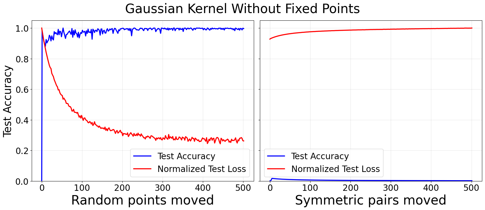
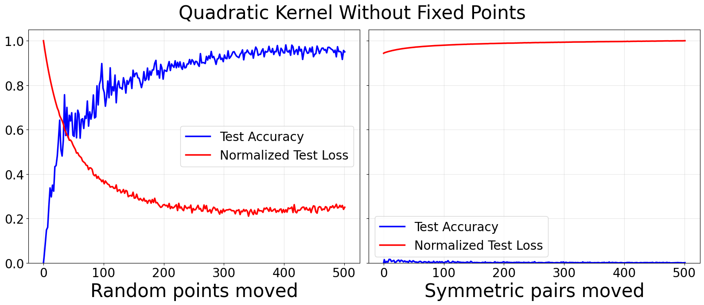
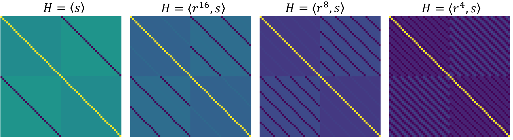
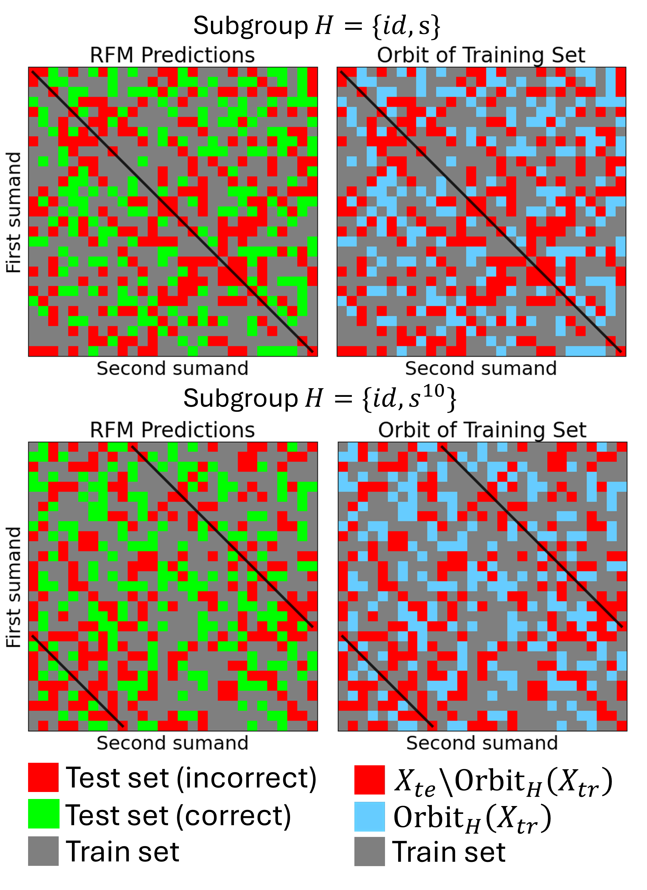
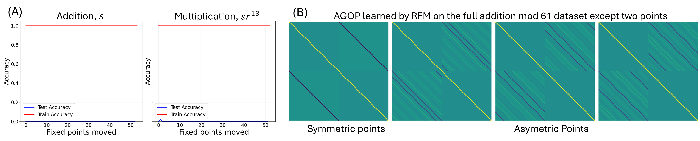
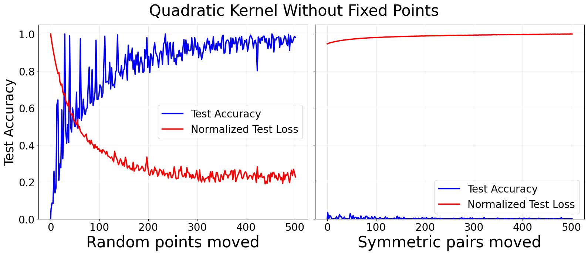
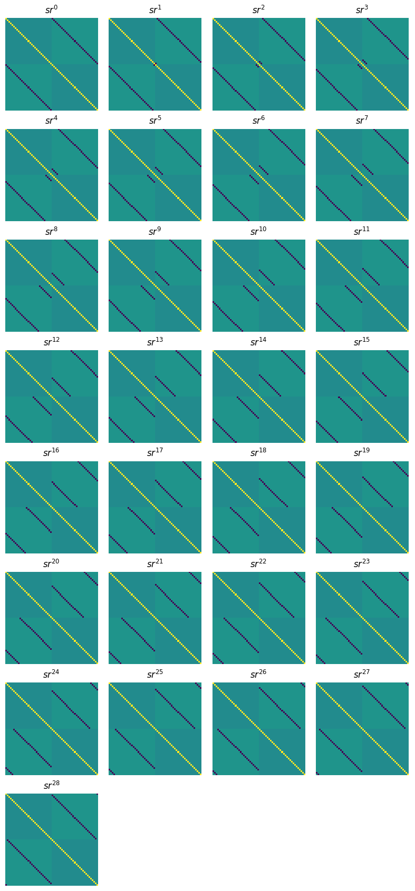
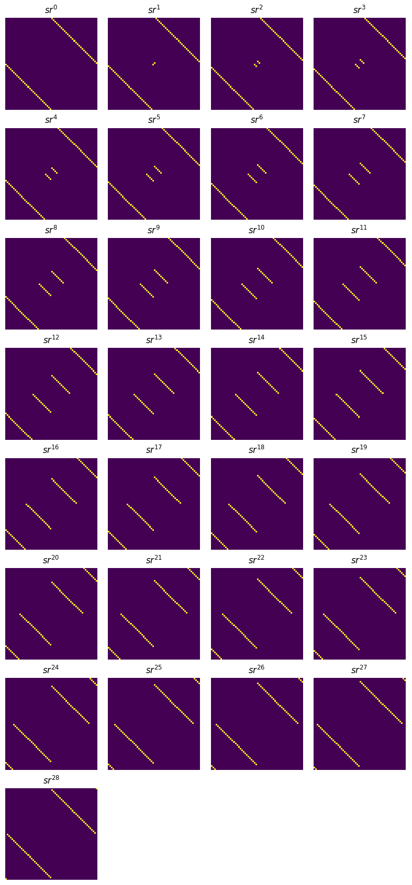
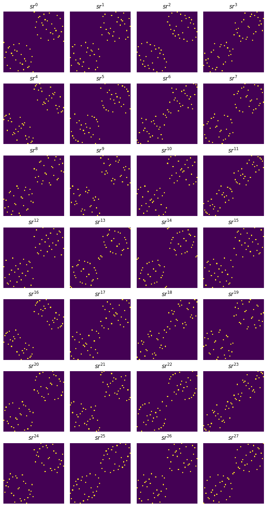
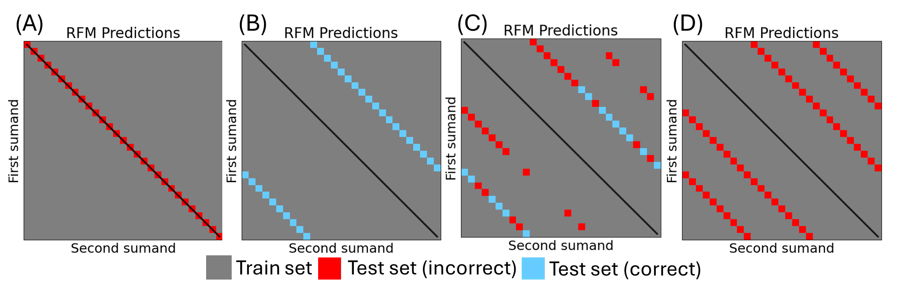

# Tomàs, Mallinar, Belkin 2026 — Breaking Data Symmetry is Needed For Generalization in Feature Learning Kernels

###### p1-1

См. также: [глобальный индекс понятий](../../concepts/index.md).

**Marcel Tomàs** (CFIS UPC), **Neil Mallinar**, **Mikhail Belkin** (UC San Diego).

arXiv [2604.00316](https://arxiv.org/abs/2604.00316), апрель 2026 (версия v1). 1 цитирование — сорок седьмая по цитируемости работа корпуса. Источник — нативный HTML arXiv версии v1. Код: [github.com/marceltomas/breaking-data-symmetries](https://github.com/marceltomas/breaking-data-symmetries).

Оригинал и производные файлы этой папки:

- [`original/2604.00316.native.html`](original/2604.00316.native.html) — первоисточник, нативный HTML arXiv (v1), скачан как есть.
- [`original/2604.00316.breaking-data-symmetry-is-needed-for-generalization-in-feature-learning-kernels.md`](original/2604.00316.breaking-data-symmetry-is-needed-for-generalization-in-feature-learning-kernels.md) — конверсия оригинала в Markdown без правок содержания.
- [`images/`](images/) — 21 иллюстрация статьи в исходном разрешении.

Схема якорей и правила ссылок на карточку — в [README папки статей](../README.md).

## Затрагиваемые понятия

**[Гроккинг](../../concepts/grokking.md)** — работа переносит вопрос с модели на **данные**: генерализация наступает лишь тогда, когда в обучающем наборе нарушена определённая симметрия ([`p1-4`](#p1-4)). Явление изучается не в нейронной сети, а в ядре с выучиванием признаков, а потому итоги не зависят ни от устройства сети, ни от выбора оптимизации ([`p8-3`](#p8-3)).

**[Выучивание признаков](../../concepts/feature-emergence-feature-learning.md)** — рабочий предмет: рекурсивная признаковая машина (RFM), где ядро Махаланобиса перемежается обновлением признаковой матрицы средним внешним произведением градиентов (AGOP) ([`p2-7`](#p2-7), [`p2-9`](#p2-9)). Именно AGOP и оказывается тем местом, где проступает групповое строение.

**[Групповые представления и смежные классы](../../concepts/group-representations-cosets.md)** — сердцевина работы. Группа симметрий модульного сложения найдена точно: она изоморфна диэдральной группе $D_{2p}$ с поворотами $r^{k}(a,b)=(a+k,b-k)$ и отражениями $sr^{k}(a,b)=(b-k,a+k)$ ([`p4-5`](#p4-5)). Для произвольной абелевой группы доказано более общее: группа симметрий изоморфна обобщённой диэдральной группе $\mathrm{Dih}(\mathcal{A})=\mathcal{A}\rtimes C_{2}$ ([`p12-11`](#p12-11)).

**[Модульная арифметика](../../concepts/modular-arithmetic.md)** — все четыре действия над $\mathbb{Z}_{p}$ и, сверх того, сложение в абелевых группах вида $C_{5}\times C_{11}$ ([`p2-5`](#p2-5), [`p17-3`](#p17-3)). Вычитание и деление разобраны через действие с правым обратным, для которого выписано своё представление ([`p13-7`](#p13-7)).

**[Критический объём данных](../../concepts/data-fraction-critical-dataset-size.md)** — прямое возражение привычному счёту «чем больше данных, тем лучше»: при симметричном разбиении обучение на $\sim 99\%$ данных даёт **нулевую** точность на тесте, а перенос одной случайной точки из обучения в тест поднимает её до $98\%$ ([`p4-1`](#p4-1), [`p4-3`](#p4-3), [`tab-1`](#tab-1)). Меньше данных — лучше генерализация, если удалённое нарушает симметрию.

**[Дробление данных и симметрии](../../concepts/sparse-parity.md)** — механизм отказа описан точно. Если из обучения изъять все неподвижные точки одного отражения, оставшийся набор становится $H$-инвариантным при $H=\{\text{id},sr^{k}\}$, все орбиты полны, и RFM не обобщает ([`p5-4`](#p5-4)). Перенос неподвижных точек обратно не помогает ([`p5-5`](#p5-5)), перенос симметричными парами тоже ([`p5-9`](#p5-9)) — помогает лишь несимметричное изъятие.

**[Ядерный режим и NTK](../../concepts/neural-tangent-kernel-ntk.md)** — работа лежит в русле возражения Mohamadi et al.: перестановочно эквивариантные ядра на модульной арифметике обобщать не способны ([`p8-5`](#p8-5)). Здесь показано, чем именно ограничена такая эквивариантность и как она снимается строением данных.

**[Механистическая интерпретируемость](../../concepts/mechanistic-interpretability.md)** — выученная матрица AGOP прочитана буквально: вместо полного циркулянтного строения при случайном разбиении в ней остаются полосы ровно в тех местах, где стоят перестановочные представления отражения $sr^{k}$ и тождества ([`p6-9`](#p6-9), [`fig-2`](#fig-2)). Это редкий в корпусе случай, когда выученный признак совпадает с заранее выписанной матрицей.

**[Замораживание подсети](../../concepts/freezing-subnetwork.md)** — обратный опыт: если **навязать** начальную признаковую матрицу $M_{0}$, кодирующую подгруппу $H$, то RFM «не уходит от симметрии» и обобщает ровно на орбиту $\text{Orbit}_{H}(X_{tr})$ ([`p7-4`](#p7-4), [`p7-7`](#p7-7)). Совпадение предсказания с опытом полное: 100 % точности и 100 % полноты ([`p7-9`](#p7-9)).

**[Обучение структурированным представлениям](../../concepts/structured-representation-learning.md)** — вывод для практики: разбиения с одним и тем же объёмом данных дают крайне разные итоги, и дело в их групповом строении, а не в количестве ([`p9-1`](#p9-1)).

**[От ленивого к богатому](../../concepts/lazy-to-rich-kernel-to-feature-learning.md)** — предложено как догадка для дальнейшей работы: нарушение симметрии в RFM (переход от перестановочно эквивариантного ядра к ядру, согласованному с задачей) может отвечать переходу от ленивого режима к богатому в нейронных сетях ([`p9-4`](#p9-4)).

Отдельно стоит сказать, чего в работе **нет**. Нет теорем о самом гроккинге: обе главные заявки названы «находками», то есть опытными закономерностями, а не доказанными утверждениями ([`p4-2`](#p4-2), [`p7-5`](#p7-5)). Нет и полноты рамки: признано, что $H$-инвариантность — не вся картина, ибо навязывание строения признакам восстанавливает генерализацию без нарушения симметрии данных ([`p9-2`](#p9-2)). И нет переноса на задачи без осмысленной группы симметрий — про MNIST сказано прямо, что такой группы у него нет ([`p9-3`](#p9-3)).

Карточки статей корпуса: [Power et al. 2022](../2201.02177.grokking-generalization-beyond-overfitting-on-small-algorithmic-datasets/2201.02177.grokking-generalization-beyond-overfitting-on-small-algorithmic-datasets.card.md) — исходное явление; [Gromov 2023](../2301.02679.grokking-modular-arithmetic/2301.02679.grokking-modular-arithmetic.card.md) — построение данных, взятое отсюда; [Nanda et al. 2023](../2301.05217.progress-measures-for-grokking-via-mechanistic-interpretability/2301.05217.progress-measures-for-grokking-via-mechanistic-interpretability.card.md) — механистический разбор контура; [Varma et al. 2023](../2309.02390.explaining-grokking-through-circuit-efficiency/2309.02390.explaining-grokking-through-circuit-efficiency.card.md) — действенность контуров; [Kumar et al. 2024](../2310.06110.grokking-as-the-transition-from-lazy-to-rich-training-dynamics/2310.06110.grokking-as-the-transition-from-lazy-to-rich-training-dynamics.card.md) — переход от ленивого режима к богатому, с которым работа сопоставляет своё нарушение симметрии; [Omnigrok](../2210.01117.omnigrok-grokking-beyond-algorithmic-data/2210.01117.omnigrok-grokking-beyond-algorithmic-data.card.md) — расширение явления за пределы алгебраических задач; [Zhang et al. 2026](../2603.29262.grokking-from-abstraction-to-intelligence/2603.29262.grokking-from-abstraction-to-intelligence.card.md) — то же кольцевое строение, но найденное в нейронной сети.

## Что показано, а что предположено

Замечания редактора карточки по итогам разбора утверждений (`…claims.txt`). Работа опытная и алгебраическая: девять страниц основного текста и семнадцать страниц приложений, где живут доказательства о группах.

**Главный опытный итог поразителен и проверяем.** При симметричном разбиении RFM даёт ровно $0\%$ на отложенных точках, а перенос **одной** случайной точки из обучения в тест поднимает точность до $98\%$ ([`p4-3`](#p4-3), [`tab-1`](#tab-1)). Это опровергает счёт «больше данных — лучше» самым наглядным образом: меньший обучающий набор обобщает несравнимо лучше.

**Механизм отказа описан точно, а не приблизительно.** Изъятие всех неподвижных точек отражения делает обучающий набор $H$-инвариантным: все орбиты полны, и модель выучивает лишь это отражение, а отложенные точки в его орбиту не входят ([`p9-1`](#p9-1)). Отсюда и нуль на тесте — не «трудность», а прямое следствие строения.

**Три сверки закрывают очевидные возражения.** Перенос неподвижных точек обратно в обучение не помогает ([`p5-5`](#p5-5)); перенос симметричными парами не помогает ([`p5-9`](#p5-9)); помогает лишь несимметричное изъятие ([`p5-7`](#p5-7)). Тем самым дело именно в симметрии, а не в объёме или в самих точках.

**Групповая часть доказана, а не заявлена.** Что группа симметрий сложения абелевой группы изоморфна $\mathrm{Dih}(\mathcal{A})$, доказано полностью (лемма A.1 и теорема A.2), как и утверждение о том, что каждая точка неподвижна ровно при одном отражении ([`p12-11`](#p12-11), [`p14-12`](#p14-12)). Это редкая в корпусе опрятность.

**Самое сильное — предсказание, а не объяснение.** Находка 4.1 предсказывает **поимённо**, какие тестовые точки будут распознаны верно, если начальную матрицу задать подгруппой $H$: это в точности $\text{Orbit}_{H}(X_{tr})$ ([`p7-5`](#p7-5)). Совпадение с опытом полное — 100 % точности и 100 % полноты ([`p7-9`](#p7-9)) — и проверено для всех отражений при сложении и вычитании по модулю 29.

**Однако обе главные заявки — «находки», а не теоремы.** Ни находка 3.1, ни находка 4.1 не доказаны; доказаны лишь групповые предложения, на которые они опираются. Работа сама объявляет своей целью «прояснить вопросы и выдвинуть догадки, которые дальнейшие работы смогут доказать» ([`p9-4`](#p9-4)).

**Рамка $H$-инвариантности признана неполной.** Сказано прямо: нарушать $H$-инвариантность **не обязательно**, ибо навязывание строения признакам модели восстанавливает генерализацию, а разные ядра могут вести себя на одном разбиении по-разному ([`p9-2`](#p9-2)). Тем самым «нужно» из названия статьи следует читать как «нужно при обычной инициализации».

**Разница между ядрами не объяснена.** Гауссову ядру довольно одной удалённой точки, квадратичному нужно около сотни и всё равно остаётся $\sim 60\%$ ([`p5-8`](#p5-8)). Отчего так, авторы не знают и оставляют вопрос дальнейшей работе ([`p6-1`](#p6-1)).

**Круг применимости узок и это оговорено.** Итоги держатся на том, что целевая функция вполне описывается своей группой симметрий: любые два образца с одной меткой связаны обратимым преобразованием. У большинства наборов данных такого свойства нет, и про MNIST сказано, что осмысленной группы симметрий у него нет вовсе ([`p9-3`](#p9-3)).

**Число прогонов указано лишь для одного рисунка.** Кривые рисунка 1 усреднены по 5 независимым прогонам ([`fig-1`](#fig-1)); для таблицы 1 и остальных опытов ни числа семян, ни разброса не приведено, хотя главный итог — именно скачок с 0 % до 98 %.

**Место в корпусе.** Это первая работа вики, где отказ генерализации объяснён **строением обучающего разбиения**, а не устройством модели или ходом оптимизации, и где предсказание сделано поимённо по точкам, а не по кривой. Ценны два вклада: опытная демонстрация того, что меньший набор данных может обобщать лучше, и совпадение выученной матрицы AGOP с заранее выписанным перестановочным представлением отражения. Цена — главные утверждения остаются опытными находками, круг задач ограничен теми, чья целевая функция задана группой симметрий, и разница поведения ядер не объяснена.

---

# Текст статьи

## Аннотация

###### p1-4

Гроккинг наступает, когда модель достигает высокой точности на обучении, а генерализация на невиданные тестовые точки происходит много позже. Это явление впервые наблюдалось на круге алгебраических задач, каково выучивание модульной арифметики (power2022grokking). Мы изучаем гроккинг на алгебраических задачах в классе ядер с выучиванием признаков — в алгоритме рекурсивной признаковой машины (RFM) (rfm_science), который итеративно обновляет признаковые матрицы средним внешним произведением градиентов (AGOP) оценщика, чтобы выучить значимые для задачи признаки. Наша главная опытная находка: генерализация наступает лишь тогда, когда нарушена определённая симметрия обучающего набора. Сверх того, мы опытно показываем, что RFM обобщает, восстанавливая подлежащее действие группы симметрий, присущее данным. Мы находим, что выученные признаковые матрицы кодируют определённые элементы группы симметрий, чем и объясняется зависимость генерализации от симметрии.111Код доступен по адресу: https://github.com/marceltomas/breaking-data-symmetries.

## 1 ВВЕДЕНИЕ

###### p1-5

Явление гроккинга привлекло много внимания в недавней литературе (power2022grokking; kumar2024grokking; mohamadi2023grokking; gromov2023grokking; liu2023omnigrokgrokkingalgorithmicdata; mallinar2025emergence). Гроккингом называют действие отложенной генерализации, при котором модель почти сразу безупречно подгоняет (то есть *интерполирует*) обучающий набор, но на тестовых данных работает не лучше случайного угадывания. После продолжения обучения, порой на тысячи добавочных шагов оптимизации (power2022grokking), качество на тесте вырастает от случайного до почти безупречного, будто бы без причины. Это часто считают примером так называемых возникающих явлений в глубоком обучении; впервые оно было показано на трансформерах, обучаемых алгебраическим задачам, каково восполнение недостающих клеток таблицы Кэли для модульной арифметики (power2022grokking).

Недавно mallinar2025emergence показали, что такие кривые возникновения в модульной арифметике не свойственны исключительно нейронным устройствам и приёмам оптимизации на градиентном спуске, а появляются и в классе ядер с выучиванием признаков — в алгоритме рекурсивной признаковой машины (RFM) (rfm_science). RFM, приложенный к ядру, работает так: он итеративно подгоняет предсказатель на ядре Махаланобиса по обучающим данным, а затем обновляет признаковую матрицу средним внешним произведением градиентов (AGOP), выучивающим свойственные задаче признаки.

###### p1-7

mallinar2025emergence показывают, что RFM с гауссовым и квадратичным ядрами выучивает блочно-циркулянтные признаковые преобразования (над данными), решая задачи модульной арифметики (сложение, вычитание, умножение и деление). Они доказывают, что гроккинг есть проявление постепенного выучивания признаков, понимаемого через среднее внешнее произведение градиентов (AGOP), и что этих преобразований входных данных достаточно для генерализации. Мы строим наше исследование на этом направлении, отыскивая теоретико-групповое истолкование таких преобразований признаков через изучение группы симметрий задачи и через то, как строение данных сказывается на поведении RFM и на выучиваемых им признаках.

**[p. 2]**

###### p2-1

Точнее, мы разбираем, как RFM выучивает признаки на более широком круге алгебраических задач, выходя за пределы модульной арифметики к другим абелевым группам. Ради этого мы обращаемся к теоретико-групповым свойствам модульной арифметики и, шире, абелевых групп и точнее описываем, каким образом AGOP в RFM выучивает признаки из группового строения. Двоичные действия — весьма изученная обстановка в исследованиях гроккинга (mlpGrokking22; morwani2024featureemergencemarginmaximization; stander2024grokkinggroupmultiplicationcosets), и мы сужаем круг до сложения в двоичных абелевых группах ввиду строения их группы симметрий.

Мы находим, что целевая функция в этой обстановке вполне описывается своей группой симметрий, а потому всякий образец данных обращается в любой другой образец с той же меткой преобразованиями из этой группы. Понимание присущей данным группы симметрий даёт нам рамку для описания выучиваемых признаков, а также для построения таких разбиений данных, которые запирают RFM в определённых порождённых симметрией отказах и не дают ему обобщать. Наш основной вклад таков:

1. Мы опытно находим, что RFM обобщает, выучивая группу симметрий целевой функции, и что для восстановления генерализации нужно нарушить симметрию обучающих данных.
2. Мы предлагаем описание тех разбиений данных в модульной арифметике и в других абелевых группах, которые, как мы показываем опытно, не дают RFM обобщать.
3. Опытно мы показываем, что выучиваемые RFM признаки согласуются с представлениями группы симметрий целевой функции задачи, и что инициализация признаков RFM, кодирующая подгруппу группы симметрий, ведёт к генерализации лишь внутри орбиты действия этой подгруппы.

## 2 ПРЕДВАРИТЕЛЬНЫЕ СВЕДЕНИЯ

Задача модульной арифметики отвечает более общей задаче двоичных групповых действий. А именно, множество целых по модулю $p$ со сложением по модулю $\mathbb{Z}_{p}$ изоморфно циклической группе порядка $p$. Точно так же мультипликативное множество целых по модулю $p$ (без нуля) с умножением по модулю $\mathbb{Z}^{*}_{p}$ есть циклическая группа порядка $p-1$ (если $p$ просто). Оттого задачу можно понимать как восполнение недостающих значений таблицы Кэли (см. раздел 2.2) для циклической группы $C_{p}$ при сложении по модулю и $C_{p-1}$ при умножении по модулю для некоторого простого $p$. Далее мы рассматриваем распространение этой постановки на другие абелевы группы.

###### p2-5

Мы следуем построению данных из gromov2023grokking; mallinar2025emergence и описываем его здесь. Наша цель — выучить двоичную функцию $f(a,b)=a\star b=c$, где $a,b,c\in\mathcal{A}$ для абелевой группы $\mathcal{A}$ порядка $n$ с действием $\star$. Элементы группы поодиночке кодируются унитарным кодом в векторы $e_{i}\in\mathbb{R}^{n}$. Входные обучающие точки $x$ образуются парами элементов группы $(a,b)$, сцепляемыми в данные $x=e_{a}||e_{b}\in\mathbb{R}^{2n}$. Метка каждой точки $y\in\mathbb{R}^{n}$ задаётся унитарным кодом соответствующей клетки таблицы Кэли, $e_{a\star b}\in\mathbb{R}^{n}$. По таблице Кэли мы получаем $n^{2}$ точек для абелевой группы порядка $n$.

Для сложения и вычитания по модулю $p$ выходит $p^{2}$ точек. С другой стороны, для умножения и деления по модулю $p$ выходит ${(p-1)^{2}}$ точек, ибо 0 не есть элемент группы. Затем мы делим эти точки на обучающий и тестовый наборы, причём доля точек в обучающем наборе называется долей обучения $r\in[0,1]$.

### 2.1 Выучивание признаков рекурсивными признаковыми машинами (RFM)

###### p2-7

rfm_science предлагают класс ядер с выучиванием признаков, называемых рекурсивными признаковыми машинами (RFM), которые выучивают признаки, итеративно обновляя их средним внешним произведением градиентов (AGOP) ядра после подгонки данных. Сперва мы строго определим AGOP, а затем ради полноты приведём алгоритм RFM.

##### **Определение 2.1** (среднее внешнее произведение градиентов (AGOP))**.**

*Пусть даны $n$ точек данных $X\in\mathbb{R}^{n\times d}$ и функция с $c$ выходами $f:\mathbb{R}^{d}\to\mathbb{R}^{c}$; обозначим якобиан $f$ в точке $x_{i}\in X$ через $J_{f}(x_{i})\in\mathbb{R}^{c\times d}=\frac{\partial f(x_{i})}{\partial x}$. Тогда AGOP определяется как*

$$
\text{AGOP}(f,X) =\frac{1}{n}\sum_{i=1}^{n}J_{f}(x_{i})^{T}J_{f}(x_{i})\in\mathbb{R}^{d\times d}.
$$

###### p2-9

rfm_science показывают, что AGOP нейронной сети выделяет значимые для задачи признаковые направления во входных данных и тесно связан с ковариационной матрицей весов сети на всём протяжении обучения. Исходя из этого наблюдения, они предлагают RFM как итеративный ход, позволяющий ядрам (у которых своего устройства выучивания признаков нет) признаки выучивать.

Пусть даны обучающие данные $X\in\mathbb{R}^{n\times d}$, обучающие метки **[p. 3]** $y\in\mathbb{R}^{n\times c}$, ядро Махаланобиса $k_{M}(\cdot,\cdot):\mathbb{R}^{d}\times\mathbb{R}^{d}\to\mathbb{R}$ и начальная положительно полуопределённая матрица $M_{0}\in\mathbb{R}^{d\times d}$ (обыкновенно берётся единичная, то есть никакого предварительного строения признаков в начале не навязывается). RFM прилагает следующие два шага на протяжении $T$ итераций, начиная с $t=0$:

1. Подгонка оценщика: строится ядро $K\in\mathbb{R}^{n\times n}$, где $K_{i,j}=k_{M_{t}}(x_{i},x_{j})$. Подгоняются параметры $\alpha=K^{-1}y$, чем получается оценщик $\widehat{f}(\cdot)=\sum_{i=1}^{n}\alpha_{i}k_{M_{t}}(x_{i},\cdot)$.
2. Обновление признаков: $M_{t+1}=(\text{AGOP}(\widehat{f},X))^{s}$ при некоторой степени $s>0$ (обыкновенно берут $s=1/2$).

В этой работе мы рассматриваем квадратичное ядро Махаланобиса $k_{M}(x,x^{\prime})=(x^{T}Mx^{\prime})^{2}$ и гауссово ядро Махаланобиса $k_{M}(x,x^{\prime})=\exp(\frac{-\|x-x^{\prime}\|^{2}_{M}}{L})$, где $\|a\|_{M}^{2}=a^{T}Ma$, а $L\in\mathbb{R}$ — параметр ширины ядра. Мы выбрали эти ядра и значение ширины ($L=2.5$) по прежней работе, где они гроккали модульную арифметику (mallinar2025emergence).

### 2.2 Теория групп

В этом разделе мы кратко излагаем теорию групп, охватывая основные определения, значимые для этой работы.

#### Группы.

Группа $G$ есть непустое множество с двоичным действием $\star$, соединяющим два элемента $a,b\in G$ в другой элемент $G$ так, что выполняется ассоциативность, есть нейтральный элемент и у всех элементов есть обратные по этому действию. Группа $G$ *абелева*, если её действие коммутативно, то есть $a\star b=b\star a$ для всех $a,b\in G$.

#### Подгруппы.

Для группы $G$ подгруппа $H$, обозначаемая $H\leq G$, есть подмножество $G$, удовлетворяющее аксиомам группы.

#### Таблицы Кэли.

Пусть $G=\{g_{1},g_{2},\cdots g_{p}\}$ — конечная группа порядка $p$ с двоичным действием $\star$. Таблица Кэли, связанная с $(G,\star)$, описывает строение группы при этом действии и изображается как обычная «таблица умножения», где в клетках стоят $g_{i}\star g_{j}$ для всех пар $i,j$.

#### Гомоморфизмы.

Если $(G,\star)$ и $(H,\star)$ — группы, то *гомоморфизмом* называют отображение $\varphi:G\to H$, для которого $\varphi(x\star y)=\varphi(x)\star\varphi(y)$ при всех $x,y\in G$. Иначе говоря, оно уважает групповое действие. *Изоморфизм* есть *биективный* гомоморфизм. *Автоморфизм* есть изоморфизм группы на саму себя.

#### Действия групп.

Действие группы есть способ, каким группа $G$ может действовать на некотором множестве $X$, преобразуя его элементы и уважая групповое строение. Строго, если $G$ — группа с нейтральным элементом $e$, то действием группы называют отображение $\varphi:G\times X\to X$, часто записываемое как $\varphi(g,x)=gx$, удовлетворяющее двум ключевым свойствам:

1. Нейтральный элемент: для нейтрального $e\in G$ верно $ex=x$ при всех $x\in X$.
2. Согласованность: для любых $g,h\in G$ и $x\in X$ действие должно удовлетворять правилу $g(hx)=(g\star h)x$.

Действия групп дают математическую рамку для описания и разбора симметрий. Действие группы, сохраняющее те или иные важные свойства, скажем расстояния или углы, называют симметрией.

#### Орбита под действием группы.

Если группа $G$ действует на множестве $X$, то орбитой элемента $x\in X$ называют собрание всех точек, достижимых из $x$ под действием группы:

$$
\text{Orb}_{G}(x)=\{gx\mid g\in G\}.
$$

Шире, орбита подмножества $X^{\prime}\subseteq X$ есть объединение орбит его элементов, то есть

$$
\text{Orb}_{G}(X^{\prime})=\bigcup_{x\in X^{\prime}}\text{Orb}_{G}(x)=\{gx\mid g\in G,x\in X^{\prime}\}.
$$

#### Группы симметрий.

Пусть группа $G$ действует на множестве $X$. Пусть $f:X\to Y$ — функция, где $x\in X$ и $Y$ — некоторое множество. Функция $f$ *инвариантна* под действием $G$, если $f(gx)=f(x)$ при всех $x\in X$ и $g\in G$. *Группа симметрий* (называемая также *группой инвариантности*) функции $f$ определяется как:

$$
\text{Sym}_{f}:=\{g\in\text{Aut}(X)\mid f(gx)=f(x)\>\>\forall\>\>x\in X\}
$$

где $\text{Aut}(X)$ — множество всех автоморфизмов $X$ с композицией в роли группового действия. Если $f$ есть классификатор, это отвечает множеству преобразований, не меняющих выходной метки.

## 3 НАРУШЕНИЕ СИММЕТРИИ ДАННЫХ ДЕЛАЕТ ГЕНЕРАЛИЗАЦИЮ ВОЗМОЖНОЙ

Пользуясь построением из раздела 2, мы обучаем RFM на парах «вход — метка» в унитарном коде для модульной арифметики (итоги для других абелевых групп мы обобщаем в приложениях D и F). Прежняя работа показывает, что RFM гроккает сложение, вычитание, умножение и деление (mallinar2025emergence). Мы воспроизводим эти итоги с гауссовым и квадратичным ядрами на случайных обучающих разбиениях в 50 % при $p=61$ (из $p^{2}$ **[p. 4]** образцов всего), чего RFM достаточно, чтобы достичь $100\%$ точности на тесте. Рисунок 2 (первый ряд) показывает признаковые матрицы после обучения.

###### p4-1

В отличие от случайных независимых разбиений, отдельные *симметричные* разбиения дают неожиданное поведение: (i) обучение на всех образцах, кроме одного (то есть при доле обучения $\sim 99\%$), гроккингу мешает, и модель ошибается именно на отложенной точке; (ii) при отложении двух точек RFM обобщает *лишь* тогда, когда пара точек нарушает симметрию (то есть обе не закреплены одним и тем же отражением). Ниже мы придаём этому понятию симметрии строгий вид и показываем сказанное опытно, а расширенные итоги приводим в приложении D.

##### **Находка 3.1****.**

###### p4-2

*При обучении RFM модульной арифметике с группой симметрий $D_{2p}$ для простого модуля $p$ RFM не обобщает лишь тогда, когда разбиение на обучение и тест инвариантно относительно действия неодноэлементной подгруппы $H$ группы симметрий $G=\text{Sym}_{f}\cong D_{2p}$. С другой стороны, при случайных разбиениях, не инвариантных ни относительно какой подгруппы $G$, RFM верно распознаёт тестовые образцы.*

###### p4-3

Примечательно, что при симметричном разбиении, дающем $0\%$ точности на тесте, перенос всего *одной* случайной обучающей точки в тестовый набор (чем нарушается $H$-инвариантность) способен поднять точность на тесте до $98\%$ в некоторых случаях (см. таблицу 1). Тем самым *меньшее* число обучающих данных может обобщать лучше, если перенесённые точки нарушают симметрию. Чтобы как следует понять и описать такое поведение, мы пользуемся рамкой групп симметрий.

###### tab-1

*Таблица 1: Точность RFM на тесте при обучении на всех образцах, кроме неподвижных точек отражения $sr^{k}$, для разных действий по модулю $p=61$. Запись $(+,s)$ означает сложение с отражением $s$, а $(\cdot,sr^{35})$ — умножение с отражением $sr^{35}$. Точность приводится до и после случайного удаления точек из обучающего набора. В такой постановке удаление точек способно улучшить генерализацию.* **[p. 4]**

| Ядро / (задача, отражение) | Ядро / | (задача, отражение) | Число (случайных) точек, перенесённых из обучения в тест | Число (случайных) | точек, перенесённых | из обучения в тест | Точность на отложенных тестовых точках | Отложенная | тестовая | точность |
|---|---|---|---|---|---|---|---|---|---|---|
| Ядро / |  |  |  |  |  |  |  |  |  |  |
| (задача, отражение) |  |  |  |  |  |  |  |  |  |  |
| Число (случайных) |  |  |  |  |  |  |  |  |  |  |
| точек, перенесённых |  |  |  |  |  |  |  |  |  |  |
| из обучения в тест |  |  |  |  |  |  |  |  |  |  |
| Отложенная |  |  |  |  |  |  |  |  |  |  |
| тестовая |  |  |  |  |  |  |  |  |  |  |
| точность |  |  |  |  |  |  |  |  |  |  |
| гауссово $(+,s)$ | гауссово | $(+,s)$ | 0 1 | 0 | 1 | 0% 98% | 0% | 98% |  |  |
| гауссово |  |  |  |  |  |  |  |  |  |  |
| $(+,s)$ |  |  |  |  |  |  |  |  |  |  |
| 0 |  |  |  |  |  |  |  |  |  |  |
| 1 |  |  |  |  |  |  |  |  |  |  |
| 0% |  |  |  |  |  |  |  |  |  |  |
| 98% |  |  |  |  |  |  |  |  |  |  |
| квадратичное $(+,s)$ | квадратичное | $(+,s)$ | 0 100 200 | 0 | 100 | 200 | 0% 62% 91% | 0% | 62% | 91% |
| квадратичное |  |  |  |  |  |  |  |  |  |  |
| $(+,s)$ |  |  |  |  |  |  |  |  |  |  |
| 0 |  |  |  |  |  |  |  |  |  |  |
| 100 |  |  |  |  |  |  |  |  |  |  |
| 200 |  |  |  |  |  |  |  |  |  |  |
| 0% |  |  |  |  |  |  |  |  |  |  |
| 62% |  |  |  |  |  |  |  |  |  |  |
| 91% |  |  |  |  |  |  |  |  |  |  |
| гауссово $(\cdot,sr^{35})$ | гауссово | $(\cdot,sr^{35})$ | 0 10 20 | 0 | 10 | 20 | 0% 13% 98% | 0% | 13% | 98% |
| гауссово |  |  |  |  |  |  |  |  |  |  |
| $(\cdot,sr^{35})$ |  |  |  |  |  |  |  |  |  |  |
| 0 |  |  |  |  |  |  |  |  |  |  |
| 10 |  |  |  |  |  |  |  |  |  |  |
| 20 |  |  |  |  |  |  |  |  |  |  |
| 0% |  |  |  |  |  |  |  |  |  |  |
| 13% |  |  |  |  |  |  |  |  |  |  |
| 98% |  |  |  |  |  |  |  |  |  |  |
| квадратичное $(\cdot,sr^{35})$ | квадратичное | $(\cdot,sr^{35})$ | 0 100 200 | 0 | 100 | 200 | 0% 65% 97% | 0% | 65% | 97% |
| квадратичное |  |  |  |  |  |  |  |  |  |  |
| $(\cdot,sr^{35})$ |  |  |  |  |  |  |  |  |  |  |
| 0 |  |  |  |  |  |  |  |  |  |  |
| 100 |  |  |  |  |  |  |  |  |  |  |
| 200 |  |  |  |  |  |  |  |  |  |  |
| 0% |  |  |  |  |  |  |  |  |  |  |
| 65% |  |  |  |  |  |  |  |  |  |  |
| 97% |  |  |  |  |  |  |  |  |  |  |

#### Группа симметрий модульного сложения.

В этом разделе мы описываем группу симметрий модульного сложения. Чтобы решить модульное сложение, нам нужно выучить двоичную функцию $f(a,b)=a+b=c\,\mathrm{mod}\,p$ при $a,b,c\in\mathbb{Z}_{p}$. Группа симметрий $f$ есть:

$$
\text{Sym}_{f}= \>\{g\in\text{Aut}(\mathbb{Z}^{2}_{p})\mid f(g(a,b)) \\
=f(a,b)\;\;\forall\;\;(a,b)\in\mathbb{Z}^{2}_{p}\}
$$

##### **Утверждение 3.2****.**

###### p4-5

*Группа симметрий модульного сложения $f(a,b)=a+b\,\mathrm{mod}\,p$ изоморфна диэдральной группе $D_{2p}$ с поворотом $r(a,b)=(a+1,b-1)$ и отражением $s(a,b)=(b,a)$. В группе $2p$ элементов, разделяемых на*

$$
\text{Rotations:}\>\>r^{k}(a,b)=(a+k,\;b-k) \\
\text{Reflections:}\>\>sr^{k}=(b-k,\;a+k)
$$

*при $k\in\mathbb{Z}_{p}$.*

Доказательства того, что эти преобразования оставляют целевую функцию $f$ инвариантной и отвечают диэдральной группе $D_{2p}$, мы приводим в приложении A вместе с разбором через действие *обобщённой диэдральной группы*, применимое к вычитанию, умножению, делению и другим абелевым группам.

#### Неподвижные точки.

Отражения $sr^{k}$ суть *инволюции*: применённые дважды, они возвращают тот же элемент: $(sr^{k})^{2}(a,b)=(a,b)$. Для каждого $sr^{k}$ данные разбиваются на два набора: неподвижные точки $sr^{k}$ и отражательные пары под $sr^{k}$. *Неподвижная точка* $sr^{k}$ инвариантна относительно отражения: $sr^{k}(a,b)=(a,b)$. У всех точек, не являющихся неподвижными, есть пара при этом отражении: $\{(a,b),sr^{k}(a,b)\}$.

##### **Утверждение 3.3****.**

*Пусть даны все $p^{2}$ образцов данных для модульного сложения:*

1. *Всякая точка данных неподвижна ровно при одном отражении*$sr^{k}$*.*
2. *У всякой точки данных есть пара при каждом отражении*$sr^{m}$*, кроме того отражения*$sr^{k}$*, при котором она неподвижна.*

Доказательство этого утверждения мы приводим в приложении C. Чтобы получить выражение для неподвижных точек сложения, достаточно решить уравнение неподвижной точки:

$$
sr^{k}(a,b)=(b-k,a+k)=(a,b)\implies b=a+k.
$$

**[p. 5]**

Для сложения неподвижные точки $sr^{k}$ суть точки $(a,a+k)$ при $a\in\mathbb{Z}_{p}$. В приложении C.2 мы выводим выражение для неподвижных точек в задаче сложения абелевых групп, откуда получаются выражения для неподвижных точек всех четырёх действий модульной арифметики.





###### fig-1

*Рисунок 1: Для сложения по модулю $p=53$ мы обучаем гауссово (верхний ряд) и квадратичное ядра (нижний ряд) 60 итераций без неподвижных точек отражения $s$, имеющих вид $(a,a)$, и переносим случайные точки из обучения в тест, что делает генерализацию возможной. Мы также переносим точки из обучения в тест симметричными парами под отражением $s$, что генерализации не даёт. Потеря приведена так, чтобы наибольшее значение равнялось 1, и добавлена ради наглядности её развития. Кривые усреднены по 5 независимым прогонам.* **[p. 5]**

### 3.1 Разбиения, мешающие генерализации

Перейдём к опытной проверке находки 3.1. Сперва мы строим симметричные разбиения данных, мешающие RFM обобщать. Сначала закрепим какое-нибудь отражение. Ради изложения мы выбираем в этом разделе $s$, а итоги для других выборов и действий приводим в приложении D (итоги этого раздела верны при любом таком выборе). Затем мы обучаем и испытываем RFM на следующих наборах:

- Тестовый набор ($X_{te}$): все образцы, кодирующие неподвижные точки $s$, то есть пары $(a,a)$ при $a\in\mathbb{Z}_{p}$.
- Обучающий набор ($X_{tr}$): все остальные образцы данных.

###### p5-4

Заметим, что этот обучающий набор $H$-инвариантен при $H=\{\text{id},s\}$, то есть $hX_{tr}=X_{tr}$ для всякого $h\in H$. Мы видим, что RFM не обобщает на неподвижные точки тестового набора и достигает почти нулевой точности на тесте (см. таблицу 1).

###### p5-5

Может показаться заманчивым предположить, что перенос неподвижных точек из теста в обучение даст обобщающее разбиение, но мы находим, что это не так: $H$-инвариантность не нарушается. Пока тестовый набор целиком составлен из неподвижных точек одного и того же отражения, RFM, обученный на таком разбиении, не обобщает. Это верно для всякого отражения $sr^{k}$ и его неподвижных точек. Опытная проверка дана в приложении D.

Заметим, что после удаления из обучающего набора всех неподвижных точек отражения $sr^{k}$ все обучающие образцы можно разбить на пары под этим отражением $sr^{k}$ (см. приложение C), отчего обучающий набор становится *симметричным* относительно него. Иначе говоря, все орбиты под отражением $sr^{k}$ полны: нет точек без пары под $sr^{k}$. Поскольку у неподвижных точек $sr^{k}$ есть пары при всяком другом $sr^{m}$, ни для какого другого отражения это не так — иначе остались бы точки без пары.

#### Несимметричное удаление точек из обучающего набора.

###### p5-7

Мы начинаем с построения симметричного разбиения, описанного выше: обучаем на всех образцах, кроме неподвижных точек $s$, которые и составят наш тестовый набор. Затем мы случайно переносим образцы из обучения в тест и обучаем RFM на получившемся наборе. На рисунке 1 видно, что переноса всего одной точки из обучающего набора достаточно, чтобы точность на тесте выросла с почти 0 % до 98 % для сложения по модулю 61 у гауссова ядра, которое теперь верно предсказывает метки, прежде ему недоступные. Удалив один случайный образец, мы нарушаем $H$-инвариантность, и обучающие образцы больше не разбиваются на пары под $s$: парная точка удалённой остаётся без своей симметричной пары.

###### p5-8

Таблица 1 показывает, как растёт точность на тесте до и после удаления случайных точек. Для сложения по модулю $61$ удаления одной точки довольно, чтобы гауссово ядро достигло почти безупречной точности на тесте, тогда как квадратичное после удаления 100 точек остаётся около $60\%$. Для умножения по модулю $61$ мы удаляем неподвижные точки относительно $sr^{35}$, а не $s$. Квадратичное ядро ведёт себя очень схоже, а гауссову требуется удалить больше точек, чем в случае сложения (около 20), чтобы достичь почти безупречной точности на тесте.

#### Симметричное удаление точек.

###### p5-9

Во втором опыте мы начинаем с того же симметричного разбиения, но вместо случайного переноса образцов переносим их парами. То есть, случайно выбрав и перенеся обучающий образец $(a,b)$ **[p. 6]** в тестовый набор, мы переносим и его отражательную пару $(b,a)$ под $s$ (заметим, это то же отражение, каким разбиение и строилось). Такой перенос $H$-инвариантности не нарушает, ибо все обучающие образцы по-прежнему разбиваются на пары под $s$. И правда, на рисунке 1 видно, что перенос отражательных пар на точность теста не влияет вовсе: она остаётся около нуля. Сколько бы симметричных пар мы так ни перенесли, ни гауссово, ни квадратичное ядра не обобщают. Для абелевых групп итоги те же (см. рисунок 7).

###### p6-1

Мы видели также на рисунке 1, что опытно квадратичному ядру нужно удалить больше случайных точек, чтобы достичь того же прироста точности на тесте, что и гауссову. Оставляем дальнейшей работе выяснить, устойчивее ли квадратичное ядро к нарушению симметрии и способен ли выбор ширины ядра (гауссова или квадратичного) влиять на такую устойчивость модели. Тем не менее начало нарушения симметрии таким образом восстанавливает генерализацию у обоих ядер, тогда как перенос симметричных пар — нет.

## 4 ПРИЗНАКОВЫЕ МАТРИЦЫ И ГЕНЕРАЛИЗАЦИЯ

В этом разделе мы ближе разбираем природу выучиваемых RFM признаков и связываем их с групповым строением выбранного разбиения на обучение и тест. В прежней работе (mallinar2025emergence) наблюдалось, что поведение гроккинга связано с блочно-циркулянтностью выучиваемых признаков (рисунок 2, первый ряд). Если посмотреть на признаковые матрицы (задаваемые AGOP), выученные при необобщающих разбиениях из раздела 3.1, мы находим иное, но родственное строение. Теперь мы связываем эти выученные признаковые матрицы наших разбиений с элементами группы симметрий. Сперва напомним потребные сведения из теории представлений.

#### Теория представлений.

Теория представлений разбирает, как элементы группы можно представить матрицами, действующими на векторном пространстве и сохраняющими строение группы. Строго, линейным представлением конечной группы $G$ называют групповой гомоморфизм $\rho:G\to GL(V)$, где $V$ — векторное пространство над $\mathbb{R}$ или $\mathbb{C}$, а $GL(V)$ — полная линейная группа обратимых матриц на $V$.

Каждый элемент группы $g\in G$ отображается в обратимую матрицу $\rho(g)$, для которой $\rho(g_{1}\star g_{2})=\rho(g_{1})\rho(g_{2})$. Поскольку мы работаем с данными в унитарном коде, мы берём *перестановочное представление*, где все элементы группы записаны перестановочными матрицами.


###### fig-2

*Рисунок 2: RFM с гауссовым ядром на модульной арифметике по модулю $p=29$, обучение 60 итераций. Первый ряд показывает признаки, выученные при обучении на случайном разбиении для модульного сложения, вычитания, умножения и деления. Мы сравниваем AGOP, выученный RFM после отложения неподвижных точек данного отражения (второй ряд), с перестановочным представлением этого отражения (третий ряд).* **[p. 6]**

#### Перестановочное представление группы симметрий.

Мы кодируем элементы группы $g\in G$ (при $|G|=n$), как в gromov2023grokking; mallinar2025emergence, унитарными векторами $e_{g}\in\mathbb{R}^{n}$. Входные точки данных суть упорядоченные пары $(a,b)\in G\times G$, представляемые сцеплением $x=e_{a}||e_{b}\in\mathbb{R}^{2n}$. Действия группы на $(a,b)$ отвечают тогда линейным преобразованиям $x$, осуществляемым блочными перестановочными матрицами.

Для группы симметрий сложения абелевой группы образующие суть

$$
r^{x}(a,b)=(a\star x,b\star x^{-1}),\>\>s(a,b)=(b,a).
$$

Пусть $R_{x}\in\mathbb{R}^{n\times n}$ означает перестановочную матрицу правого умножения на $x$. Тогда связанное перестановочное представление $\Pi:G\to\mathrm{GL}(2n,\mathbb{R})$ задаётся как

$$
\Pi(r^{x})=\begin{bmatrix}R_{x}&0\\
0&R_{x}^{-1}\end{bmatrix},\qquad\Pi(s)=\begin{bmatrix}0&I_{n}\\
I_{n}&0\end{bmatrix}.
$$

Для вычитания и деления мы рассматриваем задачу с правым обратным, $\tilde{f}(a,b)=a\star b^{-1}$ (см. приложение A.2), с немного иным представлением (см. приложение E).

###### p6-9

Если обучить RFM на всех образцах данных, кроме неподвижных точек отражения $sr^{k}$, мы находим, что **[p. 7]** выученная признаковая матрица на последней итерации, вместо полного циркулянтного строения, выучиваемого при случайном разбиении данных, имеет заметные полосы лишь в точках, отвечающих перестановочным представлениям отражения $sr^{k}$ и тождества. Заметим, что эти два элемента образуют отражательную подгруппу $H=\{\text{id},sr^{k}\}\leq D_{2p}$. На рисунке 2 мы сравниваем выученные признаковые матрицы (AGOP) (второй ряд рисунка 2) с теоретическими перестановочными представлениями (третий ряд рисунка 2) соответствующих отражений в четырёх примерах. Полный набор таких сравнений мы приводим в приложении E.

#### Другие диэдральные подгруппы.

В прежних опытах мы ограничились *отражательными* подгруппами $D_{2p}$ вида $H=\langle sr^{k}\rangle$ — диэдральными подгруппами порядка 2. Если заменить $p$ на составное число, строение подгрупп становится много богаче. Вид подгрупп диэдральной группы мы описываем в приложении B. Коротко: для делителя $d\mid p$ можно определить подгруппу $\langle r^{d},sr^{m}\rangle$ с совместимым $m$, содержащую элементы $H=\{\text{id},r^{d},r^{dk},\dots,sr^{m},sr^{m+d},sr^{m+dk},\dots\}$. Скажем, при сложении по модулю 32 у нас есть подгруппа $H=\langle r^{16},s\rangle=\{\text{id},r^{16},s,sr^{16}\}\cong D_{4}$.

Если выбрать неподвижные точки всякого отражения одной из диэдральных подгрупп, отнести их в тестовый набор, а остальные образцы — в обучающий, мы получим $H$-инвариантное разбиение, подобное разбиениям по *неподвижным точкам* из прежних опытов. Мы показываем это в приложении C.2, где доказываем, что неподвижные точки под $s$ с одинаковой меткой образуют пару под $sr^{16}$ и наоборот. А именно, неподвижные точки под $sr^{k}$ образуют пару под $sr^{k-p/2}$, чем и объясняется строение нашего разбиения. Мы проверяем это опытно на рисунке 3 для подгрупп $H=\langle s\rangle$, $H=\langle r^{16},s\rangle$, $H=\langle r^{8},s\rangle$, $H=\langle r^{4},s\rangle$ (дальнейшее обсуждение см. в приложении D.3).



*Рисунок 3: AGOP, выученные RFM с гауссовым ядром при обучении сложению по модулю 32 на всех образцах данных, кроме неподвижных точек всех отражений $sr^{k}$ диэдральных подгрупп, слева направо: $H=\langle s\rangle$, $H=\langle r^{16},s\rangle$, $H=\langle r^{8},s\rangle$, $H=\langle r^{4},s\rangle$. Ни в одной из этих постановок RFM не обобщает на отложенные точки.* **[p. 7]**

#### RFM обобщает на орбиту выученных симметрий.

До сих пор мы рассматривали алгоритм RFM с начальными признаками $M_{0}=I_{2p}$, то есть не навязывали данным никакого добавочного строения в начале. Строя разбиения на обучение и тест по симметриям закреплённого отражения, мы нашли, что RFM не обобщает на отложенные неподвижные точки этого отражения и что выученные признаковые матрицы согласуются со строением подгруппы $H=\{\text{id},sr^{k}\}$, имея носитель главным образом на перестановочных представлениях элементов подгруппы. Нарушая симметрию данных, мы восстанавливаем генерализацию RFM.

###### p7-4

Теперь рассмотрим обратную постановку. В нашей теоретической рамке мы показываем, что способны предсказать те точки тестового набора, которые RFM верно распознает по схождении, если признаковая матрица предварительно устроена по какому-нибудь закреплённому отражению, а разбиения берутся случайные. А именно, вынуждая строение признаков при инициализации следовать определённому отражению, мы лишаем RFM возможности *уйти от симметрии*, и он обобщит лишь на точки орбиты этого отражения.

##### **Находка 4.1****.**

###### p7-5

*Пусть $f(a,b)=(a+b)\,\mathrm{mod}\,p$ при простом $p$ с группой симметрий $\text{Sym}_{f}\cong D_{2p}$, и пусть $M_{0}\in\mathbb{R}^{2p\times 2p}$ — AGOP, выученный RFM при обучении на всех данных, кроме неподвижных точек отражения $sr^{k}$. Тогда RFM с гауссовым ядром, обученный на случайном обучающем разбиении $X_{tr}\subseteq\mathbb{Z}_{p}^{2}$ и инициализированный $M_{0}$:*

1. *запомнит обучающие данные*$X_{tr}$*;*
2. *выучит лишь подгруппу*$H=\{\text{id},sr^{k}\}\leq D_{2p}$*, навязанную*$M_{0}$*.*

###### p7-7

*Тогда RFM верно распознает лишь точки из $\text{Orbit}_{H}(X_{tr})$.*



*Рисунок 4: Мы обучаем RFM с гауссовым ядром сложению по модулю $p=29$ на 50 % данных, где $M_{0}$ кодирует подгруппу $H=\{\text{id},s\}$ (верхний ряд) и $H\{\text{id},s^{10}\}$ (нижний ряд). Ось отражения отмечена чёрной чертой. Верные предсказания в точности совпадают с нашим теоретическим предсказанием (находка 4.1).* **[p. 8]**

Обучая RFM на случайном разбиении с $M_{0}$, кодирующим $H=\{\text{id},sr^{k}\}$, мы можем вычислить $\text{Orbit}_{H}(X_{tr})$ и сравнить его с верными догадками в $X_{te}$. Опытно мы проверяем это на рисунке 4. Мы приводим таблицы Кэли для сложения по модулю 29, где элементы случайного обучающего набора выделены серым, а неверно распознанные элементы тестового набора — красным.

###### p7-9

Верно распознанные выделены зелёным в таблицах первого столбца, а наши теоретические предсказания о том, какие элементы RFM распознает верно, исходя из орбиты подгруппы, закодированной **[p. 8]** в $H$, выделены синим в таблицах второго столбца. Опытно мы находим полное совпадение (100 % точности и 100 % полноты) теоретического предсказания с опытными итогами.

Для таблиц верхнего ряда мы выбрали $H=\{\text{id},s\}$. Это отвечает отражению относительно главной диагонали. Точки на диагонали суть неподвижные точки, и они либо лежат в обучающем наборе, либо распознаются неверно. Неверные предсказания симметричны относительно диагонали: если $(a,b)$ распознана неверно, то и $(b,a)$ тоже, при всех $a,b\in\mathbb{Z}_{p}$.

В подтверждение находки 4.1: если $(a,b)$ лежит в обучающем наборе, то $(b,a)$ будет распознана верно при всех $a,b\in\mathbb{Z}_{p}$. Для таблиц нижнего ряда взято $H=\{\text{id},s^{10}\}$, и верно то же самое, но осью отражения служит 10-я циклическая диагональ (отмеченная чёрной чертой).

## 5 СМЕЖНЫЕ РАБОТЫ

#### Гроккинг и выучивание признаков в нейронных сетях.

###### p8-3

Недавние работы разбирали динамику гроккинга в нейронных сетях и указали выучивание признаков как сердцевинное устройство фазового перехода (mlpGrokking22; lyu2023dichotomy; gromov2023grokking; liu2023omnigrokgrokkingalgorithmicdata). Эти работы пытаются объяснить гроккинг через наибольший отступ (morwani2024featureemergencemarginmaximization), механистическую интерпретируемость трансформеров (nanda2023progress), действенность контуров (varma2023explaininggrokkingcircuitefficiency) и переход от ленивого обучения к богатому (kumar2024grokking) — и это лишь часть. Многое здесь сводится к разбору динамики оптимизации нейронных сетей или опирается на истолкования отдельных нейронных устройств. В нашей работе мы изучаем групповое строение данных, не привязываясь ни к нейронным сетям, ни к выбору оптимизации, — сквозь призму выучиваемых преобразований *самих данных*, как их понимают RFM и AGOP.

#### Рекурсивные признаковые машины и AGOP.

###### p8-4

Новое направление работ связало AGOP с устройствами выучивания признаков в нейронных сетях. Эти работы показали, что RFM воспроизводит многие занятные явления выучивания признаков, свойственные нейронным сетям: восстановление матриц малого ранга (LinearRFM), нейронный коллапс (agopNC), выучивание признаков в нейронных сетях (BeagleholeNFA; rfm_science; convRFM), возникновение и гроккинг (mallinar2025emergence), пользу катапульт в ландшафте потерь (catapultsAGOP) — и это лишь часть. Тем самым RFM и AGOP образуют убедительную рамку для изучения выучивания признаков в отдельных задачах. Наш разбор строится на этом направлении и изучает, как RFM выучивает признаки из данных с абелевым групповым строением.

#### Теория групп и выучивание алгебраических задач.

###### p8-5

Часть прежних работ обсуждала выучивание алгебраических задач с теоретико-групповой точки зрения. (mlpGrokking22; morwani2024featureemergencemarginmaximization; stander2024grokkinggroupmultiplicationcosets; shutman2025learningwordsgroupsfusion) изучают гроккинг и генерализацию в нейронных сетях на групповых действиях. mohamadi2024why полагают, что перестановочно эквивариантные ядерные приёмы не способны обобщать на задачах модульной арифметики и что нейронные сети гроккают, покидая ядерный режим и выучивая признаки. Эти прежние работы разбирают группу, чьё действие они и стараются выучить, а не группу симметрий целевой функции, тогда как наша работа занята скорее данными и целевой функцией, чем самой моделью. Тем же путём perin2025abilitydeepnetworkslearn разбирают повёрнутую разновидность набора MNIST и доказывают, что нейронные сети не обобщают на данные с алгебраическим строением, если симметрии данных не навязаны нейронному устройству (или равнозначному нейронному касательному ядру). Сверх того, они связывают способность обобщать с отделимостью данных.

**[p. 9]**

## 6 ОБСУЖДЕНИЕ

###### p9-1

В этой работе мы сосредоточились почти исключительно на симметриях и свойствах данных и нашли, что одной лишь симметрии данных достаточно, чтобы объяснить и предсказать поведение генерализации у ядер с выучиванием признаков. Наши находки подчёркивают важность обучающих данных для поведения модели и показывают, что разбиения с одним и тем же объёмом данных могут давать крайне разные итоги. В рамке раздела 4 итоги раздела 3 объясняются просто. После удаления неподвижных точек $sr^{k}$ выученные признаковые матрицы согласуются со строением подгруппы $H=\{\text{id},sr^{k}\}$. Тем самым RFM *выучивает* лишь отражение $sr^{k}$, а поскольку у неподвижных точек $sr^{k}$ нет пар под этим отражением, они не входят в $\text{Orbit}_{H}(X_{tr})$, чем и объясняется нулевая точность на тесте. Заметим, что в постановке раздела 3, если инициализировать RFM матрицей $M_{0}$, кодирующей иное отражение $sr^{m}$ при $m\neq k$, а не единичной, мы возвращаем 100 % точности на тестовом наборе неподвижных точек $sr^{k}$.

###### p9-2

Говоря о нарушении симметрии, мы упоминаем понятие инвариантности обучающего набора относительно действия группы $H$. Однако $H$-инвариантность не есть вся картина. Нарушать $H$-инвариантность в данных не обязательно, чтобы обобщать за пределы $H$. Скажем, навязывания строения признакам модели достаточно, чтобы восстановить генерализацию (см. приложение F), а разные ядра, параметры или модели могут вести себя на одних и тех же разбиениях по-разному. Чтобы придать строгий вид понятию *ловушек симметрии*, введённому в этой работе, нужны теоретические доказательства и понятия.

###### p9-3

Сверх того, изучаемый нами круг задач — двоичное сложение в абелевых группах — отмечен тем, что целевые функции вполне описываются своими группами симметрий. Иначе говоря, любые два образца с одной меткой связаны обратимым преобразованием. У большинства наборов данных этого свойства нет, а у части целевых функций осмысленной группы симметрий нет вовсе (скажем, у MNIST). Более глубокое понимание различий между этими режимами способно пролить свет на то, отчего отложенная генерализация (гроккинг) наблюдается именно в этом круге двоичных действий и отчего некоторым моделям машинного обучения трудно выучивать симметрии, как замечено в perin2025abilitydeepnetworkslearn.

###### p9-4

Цель этой работы была в том, чтобы прояснить вопросы и выдвинуть догадки, которые дальнейшие работы смогут доказать теоретически. Дальнейшая работа может придать строгий вид соответствию между нарушением симметрии в RFM (переходом от перестановочно эквивариантного ядра к ядру, согласованному с задачей) и переходом от ленивого режима к богатому в нейронных сетях, распространив эти итоги на другие модели и задачи. Сверх того, здесь мы сосредоточились на сложении в абелевых группах, ибо группа симметрий этой задачи описывается легко. Понимание группы симметрий для двоичного действия общих конечных групп способно распространить эти мысли на описание поведения и в других группах.

### Благодарности

MT acknowledges the CFIS Mobility Program for the partial funding of this research work, particularly Fundació Privada Mir-Puig, CFIS partners (G-Research, Qualcomm and Semidynamics), and donors of the CFIS crowdfunding program. NM acknowledges funding and support for this research from the Eric and Wendy Schmidt Center at The Broad Institute of MIT and Harvard. The authors would like to additionally thank Daniel Beaglehole and Gil Pasternak for useful discussions during the preliminary phases of this research.

We gratefully acknowledge support from the National Science Foundation (NSF) under grants CCF-2112665 and MFAI 2502258, the Office of Naval Research (ONR N000142412631) and the Defense Advanced Research Projects Agency (DARPA) under Contract No. HR001125CE020. This work used the Delta system at the National Center for Supercomputing Applications through allocation TG-CIS220009 from the Advanced Cyberinfrastructure Coordination Ecosystem: Services & Support (ACCESS) program, which is supported by National Science Foundation grants #2138259, #2138286, #2138307, #2137603, and #2138296.

## Литература

**Дополнительные материалы**

**[p. 11]**

## Приложение A Группы симметрий

Мы изучаем случай сложения абелевых групп. У нас есть двоичная функция $f(a,b)=a\star b=c$ при $a,b,c\in\mathcal{A}$, где $(\mathcal{A},\star)$ — абелева группа. Здесь действие группы $G$ на $X=\mathcal{A}\times\mathcal{A}$, оставляющее $f$ инвариантной, выглядит так:

$$
\text{Sym}_{f}=\{g\in\text{Aut}(\mathcal{A}\times\mathcal{A})\mid f(g(a,b))=f(a,b)\;\;\forall\;\;(a,b)\in\mathcal{A}\times\mathcal{A}\}.
$$

Мы рассматриваем действие $\mathrm{Dih}(\mathcal{A})$ — *обобщённой диэдральной группы* группы $\mathcal{A}$. Это действие повторяет поведение диэдральной группы, но циклическая группа поворотов заменена произвольной абелевой группой $\mathcal{A}$. Строго, она определяется как $\mathrm{Dih}(\mathcal{A})\;=\;\mathcal{A}\rtimes C_{2},\>\>sxs=x^{-1}$, то есть как полупрямое произведение $\mathcal{A}$ на $C_{2}=\{1,s\}$, где $s$ действует обращением.

##### **Лемма A.1****.**

*Пусть $\mathcal{A}$ — абелева группа. Группа симметрий функции $f(a,b)=a\star b$ при $a,b\in\mathcal{A}$ составлена следующими отображениями $\mathcal{A}\times\mathcal{A}$:*

1. *Обобщённый поворот:*$r^{x}(a,b)=(a\star x,\;b\star x^{-1}),\quad x\in\mathcal{A}$*.*
2. *Отражение:*$s(a,b)=(b,a)$*.*
3. *Отражения:*$sr^{x}(a,b)=(b\star x^{-1},\;a\star x)$*.*

##### Доказательство.

Пусть $\text{Sym}_{f}=\{\varphi:\mathcal{A}\times\mathcal{A}\to\mathcal{A}\times\mathcal{A}\>\>\text{bijective}\mid f\circ\varphi=f\}$. То есть $\text{Sym}_{f}$ состоит из биекций $\mathcal{A}\times\mathcal{A}$, сохраняющих значение группового действия $f(a,b)=a\star b$. Для каждого $l\in\mathcal{A}$ слой $f^{-1}(l)=\{(a,b)\in\mathcal{A}\times\mathcal{A}\mid a\star b=l\}$ находится в биекции с $\mathcal{A}$ через

$$
\Phi_{l}:\mathcal{A}\to f^{-1}(l),\quad\Phi_{l}(x)=(x,x^{-1}\star l),
$$

ибо $f(x,x^{-1}\star l)=l$. Всякое $\varphi\in\text{Sym}_{f}$ переставляет слои, а потому при данном $l$ ограничивается перестановкой $f^{-1}(l)$, что даёт биекцию $\sigma_{l}:\mathcal{A}\to\mathcal{A}$, для которой

$$
\varphi(x,x^{-1}\star l)=(\sigma_{l}(x),\sigma_{l}(x^{-1})\star l)
$$

Запишем $\varphi(e,e)=(x,x^{-1})$ при некотором $x\in\mathcal{A}$. Рассмотрим $\psi:=r^{x^{-1}}\circ\varphi$, где $r^{x}(a,b)=(a\star x,b\star x^{-1})$. Имеем $\psi\in\text{Sym}_{f}$, ибо $r^{x}\in\text{Sym}_{f}$:

$$
f\big(r^{x}(a,b)\big) =f\big(a\star x,\;b\star x^{-1}\big)=(a\star x)\star(b\star x^{-1}) \\
=a\star x\star b\star x^{-1}\overset{\text{(commutativity)}}{=}a\star b\star x\star x^{-1}=a\star b=f(a,b).
$$

Отсюда $\psi(e,e)=r^{x^{-1}}(\varphi(e,e))=r^{x^{-1}}(x,x^{-1})=(e,e)$. Тем самым всякое $\varphi\in\text{Sym}_{f}$ записывается как $\varphi=r^{x}\circ\psi$, где $\psi\in\text{Sym}_{f}$ оставляет $(e,e)$ на месте. Остаётся разобрать элементы стабилизатора

$$
H:=\{\psi\in\text{Sym}_{f}\mid\psi(e,e)=(e,e)\}.
$$

**[p. 12]**

Возьмём $\psi\in H$. Тогда у нас есть семейство $(\sigma_{l})_{l\in\mathcal{A}}$, для которого $\psi(x,x^{-1}l)=(\sigma_{l}(x),\sigma_{l}(x^{-1})l)$. Поскольку $\psi(e,e)=(e,e)$, имеем $\sigma_{e}(e)=e$. Ради краткости пишем $a\star b=ab$. Определим отображение $\mu:(\mathcal{A}\times\mathcal{A})^{2}\to\mathcal{A}^{2}$ как $\mu((u,v),(u^{\prime},v^{\prime}))=(u\star u^{\prime},v^{\prime}\star v)$, чтобы описать групповое действие на $\mathcal{A}\times\mathcal{A}$.

Возьмём $\psi(x,x^{-1})=(\sigma_{e}(x),\sigma_{e}(x)^{-1})$ и $\psi(y,y^{-1})=(\sigma_{e}(y),\sigma_{e}(y)^{-1})$. Тогда $\mu((x,x^{-1})(y,y^{-1}))=(xy,y^{-1}x^{-1})$ и $\psi(xy,y^{-1}x^{-1})=(\sigma_{e}(xy),\sigma_{e}(xy)^{-1})$. Поскольку и $\psi(xy,y^{-1}x^{-1})$, и $\mu(\psi(x,x^{-1}),\psi(y,y^{-1}))$ лежат в одном слое $f^{-1}(e)$, а $\Phi_{e}$ есть биекция, их первые координаты обязаны совпасть. Тем самым либо $\sigma_{e}(xy)=\sigma_{e}(x)\sigma_{e}(y)$, либо $\sigma_{e}(xy)=\sigma_{e}(y)\sigma_{e}(x)$.

Отсюда $\sigma_{e}$ есть либо автоморфизм $\mathcal{A}\to\mathcal{A}$, либо отображение $x\mapsto x^{-1}$. Наконец, из $\psi(x,x^{-1})=(\sigma_{e}(x),\sigma_{e}(x)^{-1})$ следует, что $\sigma_{e}$ уважает обратные, откуда лишь две возможности:

$$
\sigma_{e}=\mathrm{id}\qquad\text{or}\qquad\sigma_{e}:x\mapsto x^{-1}.
$$

Рассмотрим три точки:

$$
P=(x,x^{-1}a)\in f^{-1}(a),\quad Q=(e,b)\in f^{-1}(b),\quad R=(x,x^{-1}ab)\in f^{-1}(ab).
$$

Пользуясь коммутативностью $\mathcal{A}$, получаем $\mu(P,Q)=R$. Приложим $\psi$ и вычислим

$$
\mu\big(\psi(P),\psi(Q)\big)=\big(\sigma_{a}(x)\sigma_{b}(e),(\sigma_{b}(e)^{-1}b)(\sigma_{a}(x)^{-1}a)\big)=\big(\sigma_{a}(x)\sigma_{b}(e),\sigma_{b}(e)^{-1}\sigma_{a}(x)^{-1}ab\big).
$$

И $\psi(R)$, и $\mu(\psi(P),\psi(Q))$ лежат в одном слое $f^{-1}(ab)$, а по биекции $\Phi_{ab}$ два элемента этого слоя равны тогда и только тогда, когда совпадают их первые координаты. Сравнение первых координат даёт ключевое тождество $\ \sigma_{ab}(x)=\sigma_{a}(x)\sigma_{b}(e)\ (\forall a,b,x)$, которое при $x=e$ даёт $\sigma_{ab}(e)=\sigma_{a}(e)\sigma_{b}(e)$, а при $a=e$ — $\sigma_{b}(x)=\sigma_{e}(x)\sigma_{b}(e)$

- Если $\sigma_{e}=\mathrm{id}$, то $\sigma_{b}(x)=x\sigma_{b}(e)$. Полагая $x=e$, получаем $\sigma_{e}(b)=\sigma_{b}(e)$. Но $\psi(e,e)=(e,e)$ означает $\sigma_{b}(e)=e$ при всяком $b$, так что $\sigma_{b}=\mathrm{id}$ для всех $b$. Оттого $\psi=\mathrm{id}$.
- Если $\sigma_{e}(x)=x^{-1}$, то $\sigma_{b}(x)=x^{-1}\sigma_{b}(e)$. Прямая проверка показывает, что это в точности действие перестановки $s(a,b)=(b,a)$ на параметризации: $s(x,x^{-1}b)=(x^{-1}b,x)$, так что $\psi=s$.

Тем самым

$$
H=\{\mathrm{id},s\}.
$$

Поскольку всякое $\varphi\in\mathrm{Sym}_{f}$ разлагается как $\varphi=r^{x}\circ\psi$ при $x\in\mathcal{A}$ и $\psi\in H$, мы получаем искомое описание

$$
\boxed{\ \mathrm{Sym}_{f}=\{r^{x}\mid x\in\mathcal{A}\}\ \cup\ \{s\circ r^{x}\mid x\in\mathcal{A}\}\ }.
$$

∎

##### **Теорема A.2****.**

###### p12-11

*Пусть $\mathcal{A}$ — абелева группа. Группа симметрий $f(a,b)=a\star b$ при $a,b\in\mathcal{A}$ изоморфна обобщённой диэдральной группе:*

$$
\text{Sym}_{f}\;\cong\;\mathrm{Dih}(\mathcal{A})\;=\;\mathcal{A}\rtimes C_{2}.
$$

##### Доказательство.

Подгруппа, порождённая элементами $r^{x}$, изоморфна $\mathcal{A}$: и правда, $r^{x}\circ r^{y}=r^{x\star y}$ и $(r^{x})^{-1}=r^{x^{-1}}$ при любых $x,y\in\mathcal{A}$. Оттого $\langle r^{x}:x\in\mathcal{A}\rangle\cong\mathcal{A}$. Имеем $s^{2}=\mathrm{id}$, а сопряжение через $s$ действует обращением:

$$
sr^{x}s(a,b)=s(b\star x,a\star x^{-1})=(a\star x^{-1},b\star x)=r^{x^{-1}}(a,b).
$$

Тем самым $sr^{x}s=r^{x^{-1}}$. Это в точности соотношения, определяющие полупрямое произведение $\mathcal{A}\rtimes C_{2}$, где $C_{2}$ действует обращением. Оттого группа, образованная элементами $r^{x}$ и $sr^{x}$, изоморфна $\mathrm{Dih}(\mathcal{A})$. Поскольку мы уже доказали, что эти отображения порождают подгруппу $\mathrm{Sym}_{f}$ и осуществляют соотношения $\mathrm{Dih}(\mathcal{A})$, заключаем, что $\text{Sym}_{f}\;\cong\;\mathrm{Dih}(\mathcal{A}).$ ∎

**[p. 13]**

### A.1 Модульная арифметика

Когда $\mathcal{A}$ циклична, обобщённая диэдральная группа сводится к классической диэдральной. Так и обстоит дело с действиями модульной арифметики вроде сложения и умножения по модулю $p$.

##### **Утверждение A.3****.**

*Если $\mathcal{A}=C_{n}$, где $C_{n}$ — конечная циклическая группа порядка $n$, то*

$$
\mathrm{Dih}(\mathcal{A})\;\cong\;D_{2n},
$$

*диэдральная группа порядка $2n$.*

##### Доказательство.

Возьмём $\mathcal{A}=\langle x\rangle\cong C_{n}$. Тогда у $\mathrm{Dih}(\mathcal{A})=\mathcal{A}\rtimes C_{2}$ есть образующие $r$ и $s$ с соотношениями

$$
r^{n}=e,\quad s^{2}=e,\quad srs=r^{-1}.
$$

Это в точности задание классической диэдральной группы $D_{2n}$. Оттого $\mathrm{Dih}(C_{n})\cong D_{2n}$. ∎

Скажем, возьмём $\mathcal{A}=\mathbb{Z}_{p}$ со сложением по модулю. Повороты суть $r^{k}(a,b)=(a+k,\;b-k)$ с приведением по модулю $p$, главное отражение есть $s(a,b)=(b,a)$, и приведённые выше соотношения показывают, что группа есть $D_{2p}$.

$$
D_{2p}=\langle r,s\mid r^{p}=e,\>s^{2}=e,\>srs=r^{-1}\rangle.
$$

### A.2 Действие группы с обращением

###### p13-7

Мы желаем работать с вычитанием и делением по модулю, где вместо обычного (прямого) группового действия $f(a,b)=a\star b$ берётся *действие с правым обратным* $\tilde{f}(a,b)=a\star b^{-1}$. Чтобы описать симметрии таких функций, мы определяем связанное *действие группы с обращением*. Это действие, обозначаемое $\tilde{G}$, повторяет исходное действие обобщённой диэдральной группы $G$, но согласовано с правым обратным. В аддитивной постановке ему отвечает вычитание, в мультипликативной — деление. Пусть $G$ — *обобщённая диэдральная группа* группы $\mathcal{A}$, действующая на $X=\mathcal{A}\times\mathcal{A}$; определим действие с обращением $\tilde{G}$ на $X$ так:

1. Обобщённый поворот: $\tilde{r}^{x}(a,b)=(a\star x,\;b\star x)$
2. Отражение: $\tilde{s}(a,b)=(b^{-1},\;a^{-1})$
3. Отражения: $\tilde{s}\tilde{r}^{x}(a,b)=((b\star x)^{-1},\;(a\star x)^{-1})$

Чтобы связь между $G$ и $\tilde{G}$ была явной, определим отображение образующих $\Phi:\tilde{G}\to G$, соединяющее действие с обращением с прямым:

$$
\Phi(\tilde{r}^{x})=\Delta_{x}\circ r^{x},\quad\text{where }\Delta_{x}(a,b):=(a,\;b\star x^{2})
$$

$$
\Phi(\tilde{s})=\iota\circ s,\quad\text{where }\iota(a,b):=(a^{-1},\;b^{-1})
$$

где $x,a,b\in\mathcal{A}$. То есть поворот с обращением равносилен исходному повороту с последующим покоординатным масштабированием второй составляющей, а отражение с обращением есть обращение, применённое после перестановки.

## Приложение B Строение подгрупп $D_{2n}$

Чтобы изучить орбиты под действием диэдральной группы $D_{2n}$, нужно изучить строение её подгрупп. В обычных обозначениях задание диэдральной группы таково:

$$
D_{2n}=\langle a,x\mid a^{n}=x^{2}=e,\>xax^{-1}=a^{-1}\rangle.
$$

У группы две образующие: $a$ — поворот порядка $n$ и $x$ — отражение порядка 2. Все подгруппы делятся на два различных рода:

**[p. 14]**

1. Циклические подгруппы (поворотов) $\langle a^{d}\rangle\cong\mathbb{Z}_{n/d}$. Такая подгруппа есть для каждого возможного делителя $d\mid n$, а всего их $\tau(n)=\text{number of positive divisors of }n$.
2. Диэдральные подгруппы $\langle a^{d},a^{r}x\rangle\cong D_{2n/d}$ при $d\mid n$ и $0\leq r<d$. Всего подгрупп этого рода $\sigma(n)=\text{the sum of positive divisors of }n$.

Заметим, что диэдральные подгруппы включают *отражательные подгруппы* $\langle a^{r}x\rangle$ порядка 2 при $d=n$, ибо $a^{n}=\text{id}$. Когда $n$ просто, все циклические подгруппы $\langle a^{d}\rangle$ изоморфны $\mathbb{Z}_{n}$, а единственные диэдральные подгруппы суть упомянутые *отражательные подгруппы*. Строение подгрупп обобщённой диэдральной группы абелевой группы $\mathcal{A}$, обозначаемой $\text{Dih}(\mathcal{A})$, зависит от самой абелевой группы. Для целей этой работы довольно знать, что отражения образуют те же *отражательные подгруппы* порядка 2, что и в обычном диэдральном случае. Заметим, что поворот мы обозначаем через $r$, а отражение через $s$ всюду далее.

## Приложение C Классы симметрии

В этом приложении мы разбираем строение классов симметрии, порождаемых действием обобщённой диэдральной группы. Всюду пусть $(\mathcal{A},\star)$ — абелева группа и пусть $G=\mathrm{Dih}(\mathcal{A})$ действует на $X=\mathcal{A}\times\mathcal{A}$, как описано в разделе A. Цель — понять, как это действие разбивает $X$ на классы равнозначности, как эти классы устроены изнутри поддействиями и во что это переходит в модульной арифметике.

#### Классы симметрии как орбиты.

Орбита точки $x\in X$ под действием группы $G$ определяется как $\text{Orb}_{G}(x)=\{gx\mid g\in G\}.$ Две точки принадлежат одному классу симметрии, если лежат в одной орбите, то есть если одна переводится в другую каким-нибудь элементом группы. Поскольку действие группы сохраняет $f(a,b)=a\star b$, для образца $(a,b)\in X$ другой образец $(a^{\prime},b^{\prime})$ лежит в той же $G$-орбите тогда и только тогда, когда у него та же *метка* $l=f(a,b)=a\star b.$ Сверх того, все точки с меткой $l$ принадлежат одному классу симметрии, а потому орбиту можно указывать по её метке:

$$
\text{Orb}_{G}((a,b))=O_{l}=\{(a^{\prime},b^{\prime})\in\mathcal{A}\times\mathcal{A}\mid a^{\prime}\star b^{\prime}=l\}.
$$

Тем самым $X$ разбивается на непересекающиеся классы $\{O_{l}:l\in\mathcal{A}\}$, каждый из которых собирает все пары, дающие одно и то же произведение или сумму по $\star$.

### C.1 Подорбиты и внутреннее строение

Внутри каждого класса симметрии $O_{l}$ можно рассмотреть более тонкое разбиение, наводимое подгруппой $G$. Подгруппа $H\leq G$ разбивает $O_{l}$ на *подорбиты*:

$$
\text{Orb}_{H}((a,b))=\{h(a,b)\mid h\in H\}.
$$

Отсюда разложение

$$
O_{l}=\bigsqcup_{i}\text{Orb}_{H}(x_{i}),
$$

с одним представителем $x_{i}$ из каждой подорбиты. Мы называем это *внутренним орбитным разбиением* $O_{l}$ относительно $h$:

$$
\mathcal{P}_{h}(O):=\left\{\text{Orb}_{H}(x^{\prime})\mid x^{\prime}\in O\right\}/\sim
$$

где $\sim$ отождествляет равнозначные орбиты (орбиты, содержащие одни и те же элементы):

$$
\text{Orb}_{H}(x^{\prime})\sim\text{Orb}_{H}(x^{\prime\prime})\iff\text{Orb}_{H}(x^{\prime})=\text{Orb}_{H}(x^{\prime\prime})
$$

#### Отражательные подгруппы.

Всякое отражение $sr^{x}$ образует подгруппу $H=\{\text{id},sr^{x}\}$, ибо это элементы порядка 2, а их действие есть инволюция: $(sr^{x})^{2}=\mathrm{id}.$ Оттого каждая подорбита, задаваемая подгруппой $H=\{\text{id},sr^{x}\}$, имеет либо размер 1 (неподвижная точка), либо размер $2$ (отражательная пара). Так внутри каждого $O_{l}$ возникает узаконенное строение «зеркальной симметрии».

##### **Утверждение C.1****.**

*Пусть даны все $n^{2}$ образцов данных для задачи сложения абелевой группы $\mathcal{A}$ порядка $n$:*

###### p14-12

1. *Всякая точка данных неподвижна ровно при одном отражении*$sr^{x}$*.*
**[p. 15]**

2. *У всякой точки данных есть пара при каждом отражении*$sr^{m}$*, кроме того отражения*$sr^{x}$*, при котором она неподвижна.*

##### Доказательство.

Пусть $\mathcal{A}$ — абелева группа. Напомним, что $sr^{x}(a,b)=(b\star x^{-1},\;a\star x)$.

*Неподвижная точка.* Решаем уравнение неподвижной точки $sr^{x}(a,b)=(a,b)$. Равенства $b\star x^{-1}=a,\>a\star x=b$ равносильны $x=a^{-1}\star b$, что и есть единственное решение.

*Отражательные пары.* Если $x\neq a^{-1}\star b$, то по единственности $(a^{\prime},b^{\prime}):=sr^{x}(a,b)=(b\star x^{-1},a\star x)\neq(a,b)$. Поскольку $sr^{x}$ есть инволюция, $sr^{x}(a^{\prime},b^{\prime})=(a,b)$, так что $\{(a,b),(a^{\prime},b^{\prime})\}$ есть двухэлементная орбита (отражательная пара). Тем самым всякий не неподвижный элемент лежит в двухчленном цикле под $sr^{x}$. ∎

### C.2 Неподвижные точки

Пусть группа $G$ действует на $X$. Неподвижные точки элемента $g\in G$ суть точки, инвариантные под действием $g$. Строго, неподвижные точки элемента $g$ суть $\text{Fix}(g)=\{x\in X\mid gx=x\}$. Для отражений $sr^{x}$ выражение для неподвижных точек находится так:

$$
sr^{x}(a,b)=(b\star x^{-1},\>a\star x)=(a,b)\quad\Rightarrow\quad b=a\star x.
$$

Отсюда неподвижные точки $sr^{x}$ имеют вид

$$
\text{Fix}(sr^{x})=\{(a,\;a\star x):a\in\mathcal{A}\}.
$$

В случае действий с обращением верны подобные выражения. Пользуясь строительным определением $\tilde{sr}^{x}=\iota\circ s\circ(\Delta_{x}\circ r^{x})$, получаем $\tilde{sr}^{x}(a,b)=\iota(s(\Delta_{x}(r^{x}(a,b))))=((b\star x)^{-1},\>(a\star x)^{-1})$, откуда

$$
\text{Fix}(\tilde{sr}^{x})=\{(a,\;(a\star x)^{-1}):a\in\mathcal{A}\}.
$$

| Действие | Сложение | Умножение | Вычитание | Деление |
|---|---|---|---|---|
| Неподвижные точки | $(a,\;a+k)$ | $(a,\;a\cdot k)$ | $(a,\;-a-k)$ | $(a,\;1/ak)$ |

#### Неподвижные точки модульного сложения.

Кратко опишем неподвижные точки в этой постановке. Для сложения по модулю $p$ точка $(a,b)$ будет неподвижной при отражении $sr^{k}$, если

$$
sr^{k}(a,b)=(b-k,a+b)=(a,b)\implies k=b-a
$$

и будет иметь метку $l=a+b$. Отсюда решения $a=\frac{l-k}{2},b=\frac{l+k}{2}$. Когда $p$ нечётно, решение единственно, то есть для каждой метки есть ровно одна неподвижная точка при каждом отражении. Однако если $p$ чётно, у 2 больше нет обратного по умножению.

При чётном $p$ уравнения разрешимы, лишь если $l$ и $k$ одинаковой чётности: либо оба нечётны, либо оба чётны. И правда, $a=\frac{l-k}{2},b=\frac{l+k}{2}$ требует делимости $l-k$ и $l+k$ на 2. Сверх того, при годном сочетании $l$ и $k$ неподвижных точек теперь две:

$$
(a_{1},b_{1})=(\frac{l-k}{2}\,\mathrm{mod}\,p,\frac{l+k}{2}\,\mathrm{mod}\,p)\quad(a_{2},b_{2})=(\frac{l-k+p}{2}\,\mathrm{mod}\,p,\frac{l+k+p}{2}\,\mathrm{mod}\,p)
$$

Скажем, при $p=32$ у нас две неподвижные точки при $k=0$ с меткой $l=0$: $(0,0),(16,16)\,\mathrm{mod}\,32$. Теперь мы желаем найти отражение $sr^{m}$, меняющее эти две неподвижные точки при $k$ местами (обозначение mod $p$ ради ясности опускаем):

$$
sr^{m}(\frac{l-k}{2},\frac{l+k}{2})= (\frac{l+k}{2}-m,\frac{l-k}{2}+m)=(\frac{l-k+p}{2},\frac{l+k+p}{2})\implies \\
\frac{l+k}{2}-m=\frac{l-k+p}{2};\>\frac{l-k}{2}+m=\frac{l+k+p}{2}
$$

Отсюда решение $m=k-\frac{p}{2}$. Сверх того, неподвижные точки отражения $sr^{m}$ меняются местами отражением $sr^{k}$, ибо $m-\frac{p}{2}=k-\frac{p}{2}-\frac{p}{2}=k$.

**[p. 16]**

### C.3 Пример: сложение по простому модулю

Пусть $\mathcal{A}=\mathbb{Z}_{p}$ при простом $p$ и $f(a,b)=a+b\pmod{p}$. Здесь $G\cong D_{2p}$ — классическая диэдральная группа. Ради удобочитаемости мы опускаем явное обозначение по модулю, разумея, что все действия происходят в $\mathbb{Z}_{p}$.

#### Классы симметрии.

Для каждого $l\in\mathbb{Z}_{p}$ класс симметрии есть $O_{l}=\{(a,b)\in\mathbb{Z}_{p}^{2}:a+b=l\pmod{p}\}.$ Каждый $O_{l}$ имеет размер $p$, и эти $p$ классов разбивают $\mathbb{Z}_{p}^{2}$.

#### Циклические подорбиты.

Поскольку $p$ просто, каждый поворот $r^{k}$ порождает полную циклическую подгруппу $\langle r^{k}\rangle\cong\mathbb{Z}_{p}$ при любом $k\in\mathbb{Z}_{p}$. Сверх того, для точки $(a,b)$ орбита циклической подгруппы $\langle r\rangle$ есть класс $O_{l}$. Тем самым подорбита циклической подгруппы $\langle r\rangle$ равна всему классу $O_{l}$.

#### Отражательные подорбиты.

Поскольку $p$ просто, единственные диэдральные подгруппы суть отражательные подгруппы $\langle sr^{k}\rangle$. Каждая отражательная подгруппа $\langle sr^{k}\rangle$ разбивает $O_{l}$ на:

- одну неподвижную точку $(a,b)=\big(\tfrac{l-k}{2},\tfrac{l+k}{2}\big)$, ввиду обратимости $2$ по модулю $p$;
- $(p-1)/2$ отражательных пар вида $(a,b)$ и $(b-k,a+k)$, меняемых местами отражением $sr^{k}$.

Оттого каждое отражение задаёт своё разбиение $O_{l}$, и каждая точка $O_{l}$ есть неподвижная точка ровно одного отражения. Это следует из того, что в каждом $O_{l}$ $p$ элементов; удаление единственной неподвижной точки оставляет $p-1$, что чётно, а потому распадается ровно на $(p-1)/2$ непересекающихся двухчленных циклов.

## Приложение D Опыты с неподвижными точками

Мы стремимся распространить наши итоги на сложение в абелевых группах. Пусть $\mathcal{A}$ — абелева группа, то есть $a\star b=b\star a$ при всех $a,b\in\mathcal{A}$. Приведём основную теорему о конечных абелевых группах. Пусть $\mathcal{A}$ — конечная абелева группа. Тогда существуют натуральные $n_{1},n_{2},\dots,n_{r}$, такие что

$$
\mathcal{A}\cong C_{n_{1}}\times C_{n_{2}}\times\cdots\times C_{n_{r}},
$$

где каждая $C_{n_{i}}$ есть циклическая группа порядка $n_{i}$ и выполняется одно из условий:

- (Примарное разложение) Каждое $n_{i}$ есть степень простого, и такое разложение единственно с точностью до изоморфизма и порядка.
- (Инвариантные множители) Числа удовлетворяют $n_{1}\mid n_{2}\mid\cdots\mid n_{r}$, и разложение единственно с точностью до изоморфизма.

Мы рассматриваем задачу выучивания двоичной функции $f:\mathcal{A}\times\mathcal{A}\to\mathcal{A}$, где $\mathcal{A}$ — конечная абелева группа и $f(a,b)=a\star b,$ а $\star$ означает групповое действие в $\mathcal{A}$. Поскольку всякая конечная абелева группа изоморфна прямому произведению циклических, мы пишем $\mathcal{A}\cong\mathbb{Z}_{n_{1}}\times\mathbb{Z}_{n_{2}}\times\cdots\times\mathbb{Z}_{n_{k}}.$ Соответственно всякий элемент $a\in\mathcal{A}$ записывается набором $a=(a_{1},a_{2},\ldots,a_{k})$, где $a_{i}\in\mathbb{Z}_{n_{i}}$. Групповое действие выполняется покомпонентно: $a\star b=(a_{1}+b_{1}\bmod n_{1},\ a_{2}+b_{2}\bmod n_{2},\ \ldots,\ a_{k}+b_{k}\bmod n_{k}).$

### D.1 Перенос неподвижных точек

Перейдём к опытной проверке утверждений раздела 3. Для арифметики по модулю $p$ мы начинаем с того же разбиения: тестовый набор ($X_{te}$) содержит все $p$ образцов (или $p-1$, если речь об умножении или делении), кодирующих неподвижные точки отражения $sr^{k}$, а обучающий набор ($X_{tr}$) — остальные образцы. RFM с гауссовым и квадратичным ядрами на таком разбиении не обобщает. Перенос неподвижных точек из теста в обучение обобщающего разбиения не даёт, и мы проверяем это для гауссова ядра на рисунке 5 (A) для сложения с отражением $s$ и умножения с отражением $sr^{13}$. Ось $x$ означает число неподвижных точек, перенесённых из теста в обучение. В ходе удаления нет последовательной зависимости: на каждом шаге мы случайно выбираем $x$ неподвижных точек из тестового набора. Это придаёт опыту устойчивость, ибо каждый набор точек выбирается независимо, в отличие от обычного приёма, где $x$-я точка удалялась бы исходя из предыдущего шага (скажем, удаляются $x-1$ точек предыдущего шага и ещё одна случайная).

**[p. 17]**

Это увязывается с нашим наблюдением, что при отложении двух точек RFM обобщает *лишь* тогда, когда пара точек не инвариантна относительно общего отражения. На рисунке 5 (B) мы сравниваем признаки (AGOP), выученные RFM с гауссовым ядром на полном наборе данных без двух случайных точек, в четырёх повторах. На крайнем левом AGOP обе удалённые точки неподвижны при одном и том же отражении $s$, тогда как в остальных случаях точки неподвижны при разных отражениях, что видно по диагональным полосам.



*Рисунок 5: (A) Для сложения с отражением $s$ (слева) и умножения с отражением $sr^{13}$ (справа) по модулю 53 мы обучаем RFM с гауссовым ядром 60 итераций без неподвижных точек этого отражения и переносим неподвижные точки из теста в обучение. Генерализация от этого не возвращается. (B) AGOP, выученные RFM с гауссовым ядром при сложении по модулю 61 на полном наборе данных без двух случайных образцов. На первом изображении обе отложенные точки неподвижны при одном и том же отражении $s$ (необобщающее разбиение), тогда как в остальных отложенные точки неподвижны при разных отражениях (обобщающее разбиение).* **[p. 17]**

### D.2 Перенос случайных точек и симметричных пар

Мы повторяем опыты раздела 3. Сперва мы строим то же разбиение: тестовый набор ($X_{te}$) содержит все неподвижные точки отражения $sr^{k}$, а обучающий набор ($X_{tr}$) — остальные образцы, для произвольного отражения и действия либо абелевой группы. На рисунке 6 мы опытно проверяем, что, начав с такого разбиения, случайный перенос точек из обучения в тест даёт обобщающее разбиение и для квадратичного, и для гауссова ядер — для умножения по модулю 61 с отражением $sr^{35}$ (слева) и деления по модулю 53 с отражением $sr^{27}$ (справа). Ось $x$ означает число случайных точек, перенесённых из обучения в тест. Как и в предыдущем подразделе, в ходе удаления нет непрерывности: на каждом шаге мы случайно выбираем $x$ точек из обучающего набора, отчего выбранные точки не зависят от предыдущего шага.


*Рисунок 6: **Для умножения по модулю 61** (слева) мы обучаем RFM с гауссовым и квадратичным ядрами 60 итераций без неподвижных точек отражения $sr^{35}$ и переносим случайные точки из обучения в тест, что делает генерализацию возможной. То же самое мы делаем **для деления по модулю 53** (справа) при отражении $sr^{27}$. Потеря приведена так, чтобы наибольшее значение равнялось 1, и добавлена ради наглядности её развития.* **[p. 17]**

###### p17-3

На рисунке 7 мы повторяем опыт для абелевой группы $\mathcal{A}\cong C_{5}\times C_{11}$ с отражением $sr^{(3,2)}$ (напомним, что отражения указываются элементами абелевой группы) для гауссова (слева) и квадратичного (справа) ядер, а также приводим опыт, где вместо случайных точек переносятся симметричные пары под выбранным отражением, что обобщающего разбиения не даёт. Как и в прежних опытах, в ходе удаления нет непрерывности.




*Рисунок 7: **Для абелевой группы $\mathcal{A}\cong C_{5}\times C_{11}$** мы обучаем RFM с гауссовым (слева) и квадратичным (справа) ядрами 60 итераций без неподвижных точек отражения $sr^{(3,2)}$ и переносим случайные точки из обучения в тест, что делает генерализацию возможной. Мы также переносим точки из обучения в тест симметричными парами под отражением $sr^{(3,2)}$, что генерализации не даёт. Потеря приведена так, чтобы наибольшее значение равнялось 1, и добавлена ради наглядности её развития.* **[p. 18]**

**[p. 18]**

### D.3 Другие подгруппы $D_{2p}$

В прежних опытах мы ограничились *отражательными* подгруппами $D_{2p}$ вида $H=\langle sr^{k}\rangle$. Мы желаем повторить часть опытов для других подгрупп, главным образом для диэдральных подгрупп, описанных в разделе B. Для делителя $d\mid p$ можно определить подгруппу $\langle r^{d},sr^{m}\rangle$ с совместимым $m$, содержащую элементы $H=\{\text{id},r^{d},r^{dk},\dots,sr^{m},sr^{m+d},sr^{m+dk},\dots\}$. Скажем, при сложении по модулю 32 среди подгрупп есть:

1. $H=\langle r^{16},s\rangle=\{\text{id},r^{16},s,sr^{16}\}\cong D_{4}$.
2. $H=\langle r^{8},s\rangle=\{\text{id},r^{8},r^{16},r^{24},s,sr^{8},sr^{16},sr^{24}\}\cong D_{8}$.
3. $H=\langle r^{4},s\rangle=\{\text{id},r^{4},r^{8},r^{12},r^{16},r^{20},r^{24},r^{28},s,sr^{4},sr^{8},sr^{12},sr^{16},sr^{20},sr^{24},sr^{28}\}\cong D_{16}$.

Если выбрать неподвижные точки всякого отражения этих подгрупп, составить из них тестовый набор, а из остальных образцов — обучающий, мы получим $H$-инвариантное разбиение, подобное разбиениям по *неподвижным точкам* из прежних опытов. Это проверяется по нашему описанию неподвижных точек в непростом случае из раздела C.2, где показано, что неподвижные точки под $s$ с одной меткой образуют пару под $sr^{16}$ и наоборот. А именно, неподвижные точки под $sr^{k}$ образуют пару под $sr^{k-p/2}$, чем и объясняется строение нашего разбиения. Мы проверяем это опытно на рисунке 8 для подгрупп $H=\langle s\rangle$, $H=\langle r^{16},s\rangle$, $H=\langle r^{8},s\rangle$, $H=\langle r^{4},s\rangle$.


*Рисунок 8: AGOP, выученные RFM с гауссовым ядром при обучении сложению по модулю 32 на всех образцах данных, кроме неподвижных точек всех отражений $sr^{k}$ диэдральных подгрупп, слева направо: $H=\langle s\rangle$, $H=\langle r^{16},s\rangle$, $H=\langle r^{8},s\rangle$, $H=\langle r^{4},s\rangle$. Ни в одной из этих постановок RFM не обобщает на отложенные точки.* **[p. 18]**

**[p. 19]**

## Приложение E Перестановочные представления

Перестановочные представления группы симметрий каждого действия получаются из замкнутого вида её элементов и унитарного кода данных. В нашей постановке, следуя кодированию данных из gromov2023grokking; mallinar2025emergence, элементы группы представлены унитарными векторами. Пусть $G$ — группа размера $n$ и пусть каждый элемент $g\in G$ закодирован вектором $e_{g}\in\mathbb{R}^{n}$, где $e_{g}$ есть унитарный код $g$. Входные точки данных суть упорядоченные пары $(a,b)\in G\times G$, кодируемые сцеплением $x=e_{a}\,\|\,e_{b}\in\mathbb{R}^{2n}.$ Действиям группы на $(a,b)$ отвечают линейные преобразования $x\in\mathbb{R}^{2n}$, задаваемые блочными перестановочными матрицами. Для группы симметрий группового действия (отвечающего сложению и умножению):

$$
r^{x}(a,b)=(a\star x,\;b\star x^{-1}),\quad s(a,b)=(b,a),
$$

мы определяем перестановочные матрицы $R_{x},R_{x}^{-1}\in\mathbb{R}^{n\times n}$, отвечающие правому умножению на $x$ и на $x^{-1}$ соответственно. Оператор отражения отвечает перестановке двух элементов группы. Тогда действие $r^{x}$ и $s$ на унитарном входном векторе $x=e_{a}\,\|\,e_{b}$ осуществляется как:

$$
\Pi(r^{x})=\begin{bmatrix}R_{x}&0\\
0&R_{x}^{-1}\end{bmatrix},\quad\Pi(s)=\begin{bmatrix}0&I_{n}\\
I_{n}&0\end{bmatrix}
$$

где $\Pi:G\to\mathrm{GL}(2n,\mathbb{R})$ означает перестановочное представление действия группы на данных. Рассмотрим теперь действие с правым обратным $\tilde{f}(a,b)=a\star b^{-1}$ (отвечающее вычитанию и делению) с группой симметрий $\tilde{G}$, определяемой как:

$$
\tilde{r}^{x}(a,b)=(a\star x,\;b\star x),\quad\tilde{s}(a,b)=(b^{-1},a^{-1}).
$$

Отсюда изменённое линейное представление $\tilde{\Pi}:\tilde{G}\to\mathrm{GL}(2n,\mathbb{R})$. Пусть $R_{x}\in\mathbb{R}^{n\times n}$ — как прежде, и пусть $\mathcal{I}\in\mathbb{R}^{n\times n}$ — *матрица обращения*, то есть $I_{ij}=1$, если $i=j^{-1}$, и нуль иначе. Тогда матрицы представления принимают вид:

$$
\tilde{\Pi}(\tilde{r}^{x})=\begin{bmatrix}R_{x}&0\\
0&R_{x}\end{bmatrix},\quad\tilde{\Pi}(\tilde{s})=\begin{bmatrix}0&\mathcal{I}\\
\mathcal{I}&0\end{bmatrix}
$$

Перейдём к сравнению признаковых матриц, выученных RFM при обучении на всех образцах, кроме неподвижных точек отражения $sr^{k}$, с перестановочным представлением этих отражений для сложения, вычитания, умножения и деления по модулю 29 и всех возможных отражений.


*Рисунок 9: Признаковые матрицы, выученные RFM с гауссовым ядром при обучении решению сложения для абелевой группы $\mathcal{A}\cong\mathbb{Z}_{3}\times\mathbb{Z}_{7}$ за 60 итераций на всех образцах данных, кроме неподвижных точек отражения $sr^{x}$ при $x\in\mathcal{A}$.* **[p. 19]**





*Рисунок 10: Слева — признаковые матрицы, выученные RFM с гауссовым ядром при обучении решению сложения по модулю $29$ за 60 итераций на всех образцах данных, кроме неподвижных точек отражения $sr^{k}$. Справа — матричные представления отражений $sr^{k}$ по теории представлений.* **[p. 20]**


*Рисунок 11: Слева — признаковые матрицы, выученные RFM с гауссовым ядром при обучении решению вычитания по модулю $29$ за 60 итераций на всех образцах данных, кроме неподвижных точек отражения $sr^{k}$. Справа — матричные представления отражений $sr^{k}$ по теории представлений.* **[p. 21]**


*Рисунок 12: Слева — признаковые матрицы, выученные RFM с гауссовым ядром при обучении решению умножения по модулю $29$ за 60 итераций на всех образцах данных, кроме неподвижных точек отражения $sr^{k}$. Справа — матричные представления отражений $sr^{k}$ по теории представлений.* **[p. 22]**




*Рисунок 13: Слева — признаковые матрицы, выученные RFM с гауссовым ядром при обучении решению деления по модулю $29$ за 60 итераций на всех образцах данных, кроме неподвижных точек отражения $sr^{k}$. Справа — матричные представления отражений $sr^{k}$ по теории представлений.* **[p. 23]**

**[p. 23]**

## Приложение F Опыты по генерализации

В этом приложении мы обобщаем итоги раздела 4. На рисунке 14 мы изображаем верные и неверные предсказания RFM для сложения по модулю 29 на разбиениях, описанных в разделе 3. В (A) мы обучаем RFM с гауссовым ядром при $M_{0}=I_{2p}$ на всех образцах данных, кроме неподвижных точек под $s$, и выученная признаковая матрица согласуется со строением подгруппы $H=\{\text{id},s\}$. Неподвижные точки лежат на *оси отражения* $s$ (отмеченной чёрной чертой) и, не входя в обучающий набор, распознаются неверно. В (B) мы вместо этого удаляем неподвижные точки под $sr^{10}$, но выбираем $M_{0}$ так, чтобы оно кодировало подгруппу $H=\{\text{id},s\}$ (мы полагаем $M_{0}$ равной признаковой матрице, выученной в постановке A). Поскольку модель *выучивает* $s$ (находка 4.1), ось отражения остаётся прежней, и тестовые образцы распознаются верно. В (C) мы повторяем постановку B, но удаляем пары под $s$ у части тестовых образцов. Те тестовые образцы, чьи пары удалены из обучающего набора, распознаются неверно — в согласии с находкой 4.1, ибо они больше не лежат в $\text{Orbit}_{H}(X_{tr})$. В (D) мы удаляем все пары, отчего все точки тестового набора распознаются неверно.



*Рисунок 14: Мы обучаем RFM с гауссовым ядром сложению по модулю $p=29$. (A) Обучение на всех образцах данных, кроме неподвижных точек под $s$, при $M_{0}=I_{2p}$. Неподвижные точки распознаются неверно. (B) Обучение на всех образцах, кроме неподвижных точек под $sr^{10}$, при $M_{0}$, кодирующем $H=\{\text{id},s\}$. (C) Мы повторяем постановку B, но удаляем из обучающего набора часть пар под $s$ — отражением, закодированным в $M_{0}$, — для точек тестового набора, отчего часть образцов распознаётся неверно. (D) Мы продолжаем ту же линию, удаляя на этот раз все пары под $s$ для точек тестового набора. Все тестовые образцы распознаются неверно.* **[p. 24]**

**[p. 24]**

Мы опытно проверяем находку 4.1 для всех возможных отражений при сложении по модулю 29 (рисунок 15) и вычитании по модулю 29 (рисунок 16). Мы обучаем на случайных 50 % данных, полагая $M_{0}$ кодирующим $H=\{\text{id},sr^{k}\}$ для всех возможных $sr^{k}$. На рисунках приведены таблицы Кэли для сложения и вычитания по модулю 29, где элементы случайного обучающего набора выделены серым, неверно распознанные элементы тестового набора — красным, а верно распознанные тестовые образцы — синим. Цветовую схему мы взяли иную, чем на рисунке 4, ради удобочитаемости. Строение матриц на рисунках 15 и 16 согласуется с находкой 4.1. Во-первых, образцы на соответствующей оси отражения (отмеченной чёрной чертой) либо лежат в обучающем наборе, либо распознаются неверно. Во-вторых, неверные предсказания симметричны относительно оси отражения, и если $(a,b)$ есть верное предсказание, то $(b-k,a-k)$ (его отражение относительно оси) лежит в обучающем наборе. Повторяя слова находки 4.1: тестовые образцы распознаются верно, лишь если лежат в $\text{Orbit}_{H}(X_{tr})$ для выбранной $H=\{\text{id},sr^{k}\}$ (отмеченной на графиках чёрными чертами).


*Рисунок 15: Мы обучаем RFM с гауссовым ядром **сложению** по модулю $p=29$ на 50 % данных, где $M_{0}$ кодирует подгруппу $H=\{\text{id},sr^{k}\}$. Ось отражения отмечена чёрной чертой. Квадрат в положении $(i,j)$ кодирует образец $(i,j)$. Обучающие образцы выделены серым, неверные предсказания — красным, верные — синим. Верные предсказания и орбита обучающего набора относительно $H$, то есть $\text{Orbit}_{H}(X_{tr})$, совпадают со 100 % точности и 100 % полноты, что проверяется по строению матриц относительно оси отражения.* **[p. 25]**


*Рисунок 16: Мы обучаем RFM с гауссовым ядром **вычитанию** по модулю $p=29$ на 50 % данных, где $M_{0}$ кодирует подгруппу $H=\{\text{id},sr^{k}\}$. Ось отражения отмечена чёрной чертой. Квадрат в положении $(i,j)$ кодирует образец $(i,j)$. Обучающие образцы выделены серым, неверные предсказания — красным, верные — синим.* **[p. 26]**

---

# Машиночитаемый блок фактов

```yaml
paper:
  id: 2604.00316
  title: "Breaking Data Symmetry is Needed For Generalization in Feature Learning Kernels"
  authors: [Marcel Tomàs, Neil Mallinar, Mikhail Belkin]
  affiliation: "CFIS UPC; UC San Diego"
  date: 2026-04
  venue: "препринт arXiv (v1)"
  citations: 1
  source: native-html-v1
  code: https://github.com/marceltomas/breaking-data-symmetries

core_claim:
  name: "нарушение симметрии данных"
  thesis: "RFM обобщает, лишь если обучающее разбиение не инвариантно относительно
    неодноэлементной подгруппы группы симметрий целевой функции"
  mechanism: "выученная матрица AGOP совпадает с перестановочным представлением
    того отражения, которым разбиение и было устроено"
  prediction: "при начальной матрице, кодирующей подгруппу H, верно распознаются
    ровно точки орбиты Orbit_H(X_tr) — 100 % точности и 100 % полноты"
  counterintuitive: "меньший обучающий набор обобщает лучше: перенос одной точки
    из обучения в тест поднимает точность с 0 % до 98 %"

setup:
  model: "RFM (рекурсивная признаковая машина) с ядрами Махаланобиса —
    гауссовым (L=2.5) и квадратичным; 60 итераций"
  task: "сложение, вычитание, умножение, деление по модулю p (61, 53, 29, 32);
    сложение в абелевых группах C_5 x C_11 и Z_3 x Z_7"
  data: "пары элементов группы в унитарном коде, вход R^{2n}, метка — клетка таблицы Кэли"
  partitions: "случайные 50 % против симметричных: тест — все неподвижные точки
    одного отражения"
  seeds: "рисунок 1 — среднее по 5 прогонам; для остальных опытов число прогонов не названо"

theory:
  symmetry_group: "модульное сложение: D_2p; произвольная абелева группа: Dih(A) = A x| C_2"
  fixed_points: "всякая точка неподвижна ровно при одном отражении и имеет пару при прочих"
  representation: "блочные перестановочные матрицы; для вычитания и деления —
    действие с правым обратным и матрица обращения"
  status: "групповая часть доказана; обе главные заявки о генерализации — опытные находки"

results:
  symmetric_partition: "0 % на тесте при обучении на ~99 % данных"
  one_point: "перенос одной случайной точки даёт 98 % (гауссово ядро)"
  moving_back: "перенос неподвижных точек обратно не помогает"
  symmetric_pairs: "перенос симметричными парами не помогает вовсе"
  agop: "полосы AGOP совпадают с перестановочным представлением отражения"
  orbit: "при навязанном M_0 верно распознаются ровно точки Orbit_H(X_tr)"
  kernels: "квадратичному ядру нужно около 100 удалённых точек против одной у гауссова"

findings:
  - id: 1
    claim: "разбиение, инвариантное относительно подгруппы симметрий, не обобщает"
    anchor: p4-2
  - id: 2
    claim: "меньше данных может значить лучшую генерализацию"
    anchor: p4-3
  - id: 3
    claim: "AGOP кодирует именно те элементы группы, что оставлены разбиением"
    anchor: p6-9
  - id: 4
    claim: "навязанная подгруппа ограничивает генерализацию её орбитой"
    anchor: p7-5
  - id: 5
    claim: "группа симметрий сложения абелевой группы есть обобщённая диэдральная"
    anchor: p12-11

concept_cards:
  grokking: p1-4
  feature-emergence-feature-learning: p2-7
  group-representations-cosets: p4-5
  modular-arithmetic: p2-5
  data-fraction-critical-dataset-size: p4-3
  sparse-parity: p5-4
  neural-tangent-kernel-ntk: p8-5
  mechanistic-interpretability: p6-9
  freezing-subnetwork: p7-4
  structured-representation-learning: p9-1
  lazy-to-rich-kernel-to-feature-learning: p9-4

sources:
  original_html: original/2604.00316.native.html
  converted_text: original/2604.00316.breaking-data-symmetry-is-needed-for-generalization-in-feature-learning-kernels.md
  images_dir: images/
  pdf: https://arxiv.org/pdf/2604.00316v1

anchors:
  scheme: "pN-M | fig-N | tab-N | sec-N (token headings, cross-viewer portable)"
  policy: "якоря заводятся только там, где на них ссылаются; разрывы страниц якорей не несут"
  paragraph: [p1-4, p1-5, p1-7, p2-1, p2-5, p2-7, p2-9, p4-1, p4-2, p4-3, p4-5, p5-4,
    p5-5, p5-7, p5-8, p5-9, p6-1, p6-9, p7-4, p7-5, p7-7, p7-9, p8-3, p8-4, p8-5,
    p9-1, p9-2, p9-3, p9-4, p12-11, p13-7, p14-12, p17-3]
  figure: [fig-1, fig-2]
  table: [tab-1]

review_summary:                   # см. раздел «Что показано, а что предположено»
  strong: "групповая часть доказана полностью; три сверки закрывают очевидные
    возражения (перенос назад, перенос парами, несимметричное изъятие);
    выученный AGOP совпадает с заранее выписанным представлением;
    предсказание сделано поимённо по точкам и подтверждено со 100 % точности и полноты"
  weak: "обе главные заявки остаются опытными находками, а не теоремами;
    рамка H-инвариантности признана неполной самими авторами;
    разница поведения гауссова и квадратичного ядер не объяснена;
    число прогонов указано лишь для одного рисунка"
  authors_own_limits:
    - "нарушать H-инвариантность не обязательно: навязанное строение признаков
      восстанавливает генерализацию"
    - "итоги держатся на том, что целевая функция задана своей группой симметрий;
      у большинства наборов данных такой группы нет"
    - "соответствие с переходом от ленивого режима к богатому есть догадка"

translation:
  status: complete
  formula_parity: "display 43/43, inline поблочно совпадает во всех переведённых блоках"
  figures: "22/22 (21 файл; одна иллюстрация встречается дважды, как в оригинале)"
  pagination: "36 отметок страниц, совпадает с оригиналом"
```
