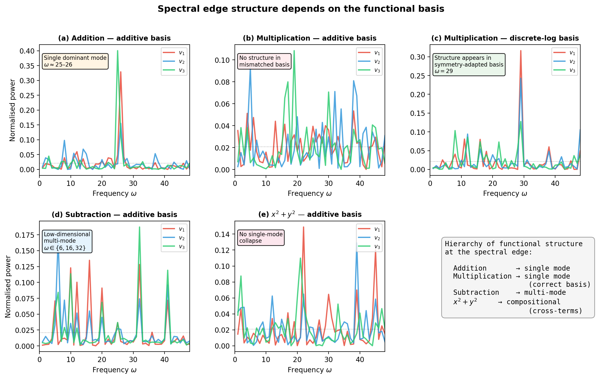

# Xu 2026 — Spectral Edge Dynamics Reveal Functional Modes of Learning

См. также: [глобальный индекс понятий](../../concepts/index.md).

**Yongzhong Xu** (аффилиация в статье не указана; переписка — abbyxu@gmail.com; код — https://github.com/skydancerosel/grokking-integrability).

arXiv [2604.06256v1](https://arxiv.org/abs/2604.06256), 6 апреля 2026. 2 цитирования по Semantic Scholar, из них 2 — внутри корпуса. Источник — нативный HTML arXiv версии v1. Колонтитула у PDF нет: на первой странице стоит только сноска с почтой автора и ссылкой на код, снизу — номер страницы и штамп `arXiv:2604.06256v1 [cs.LG] 6 Apr 2026`.

Оригинал и производные файлы этой папки:

- [`original/2604.06256.native.html`](original/2604.06256.native.html) — первоисточник, нативный HTML arXiv (v1), скачан как есть.
- [`original/2604.06256.spectral-edge-dynamics-reveal-functional-modes-of-learning.md`](original/2604.06256.spectral-edge-dynamics-reveal-functional-modes-of-learning.md) — конверсия оригинала в Markdown без правок содержания; английский текст для сверки перевода.
- [`images/`](images/) — единственная иллюстрация статьи (рисунок 1, пять панелей одним файлом) в исходном разрешении.
- [`2604.06256.spectral-edge-dynamics-reveal-functional-modes-of-learning.claims.txt`](2604.06256.spectral-edge-dynamics-reveal-functional-modes-of-learning.claims.txt) — рабочий разбор: пронумерованные утверждения с пометками.

Схема якорей и правила ссылок на карточку — в [README папки статей](../README.md).

## Затрагиваемые понятия

**[Спектральный анализ / FVE](../../concepts/spectral-analysis-svd-esd-fve.md)** — работа заводит для этого понятия **новую ветвь**: диагностическая матрица собрана не из весов, не из градиента и не из ковариации возбуждений, а из **траектории обновлений** — матрицы Грама $G_{ij}=\langle\delta\theta_{i},\delta\theta_{j}\rangle$ на скользящем окне из $W=20$ подряд идущих $\delta\theta_{t}$, ограниченных параметрами внимания ([`p3-5`](#p3-5)). Наблюдаемая величина — спектральный зазор $g_{23}=\sigma_{2}-\sigma_{3}$, а «положение кромки» $k^{*}$ определено как показатель с наибольшим отношением $\sigma_{k}/\sigma_{k+1}$, взвешенным по накопленной массе сигнала ([`p3-6`](#p3-6), [`p3-7`](#p3-7)). Главный количественный итог: по 36 однозадачным условиям убывание $g_{23}$ обнаружено в 12/12 гроккающих прогонах (величина $15$–$110\times$) и в 1 из 24 сверок ([`p6-7`](#p6-7), [`tab-1`](#tab-1)). Работа заявляет также согласие трёх независимых разложений — матрицы Грама, PCA смещения и SVD самих матриц внимания ([`p7-3`](#p7-3)). Чего в работе нет: ни одна из трёх спектральных кривых не показана ни рисунком, ни таблицей — согласие сообщено словами; $k^{*}$ ни разу не назван числом, и деление «над кромкой / под кромкой» ведётся по фиксированной тройке $v_{1},v_{2},v_{3}$ против $v_{4},v_{5}$; спектр берётся у матрицы $20\times 20$, то есть у выборки из 20 обновлений в $D=131{,}072$-мерном пространстве, без случайной опоры (Марченко — Пастур либо перемешанные обновления) и без проверки устойчивости к ширине окна $W$; из спектрального разбора исключена вся MLP-часть.

**[Гроккинг](../../concepts/grokking.md)** — явление взято как данность корпуса и определено чисто рабочим порогом: операция считается гроккающей, если достигает $>95\,\%$ точности на проверке за 5000 шагов ([`p3-2`](#p3-2)). Ни одной кривой обучения в статье нет, наступление гроккинга нигде не измеряется как событие, а постановка Power et al. 2022 взята без изменений. Вклад работы в понятие — не в описании самого явления, а в признаке: спектральный зазор $g_{23}$ отделяет гроккающие прогоны от негроккающих по 36 условиям ([`p6-7`](#p6-7)). Чего в работе нет: разбора того, что именно происходит на переходе (кроме словесного «кромка обостряется на переходе», [`p7-3`](#p7-3)), и согласования собственного порога с собственными же числами — трёхзадачная модель гроккает на шагах 17 900, 24 800 и 30 500 ([`p3-4`](#p3-4)), а особое событие сверки отнесено к шагу 41 700 ([`p6-7`](#p6-7)), то есть впятеро и вдесятеро позже объявленных 5000.

**[Модульная арифметика](../../concepts/modular-arithmetic.md)** — шесть двуместных действий по модулю $p=97$: $(a+b)$, $(a-b)$, $(a\cdot b)$, $(a^{2}+b^{2})$, $(a^{2}+ab+b^{2})$, $(a^{3}+ab)$; первые четыре объявлены гроккающими, последние два взяты сверками без гроккинга ([`p3-2`](#p3-2)). Сверх однозадачных обучены модели с общим стволом и головами под каждую задачу — двузадачная (add + mul) и трёхзадачная (add + mul + $x^{2}+y^{2}$) ([`p3-4`](#p3-4)). Существенно для корпуса, что действия здесь разобраны **по алгебраическому строению группы**, а не по трудности: сложение и вычитание живут в аддитивной группе $\mathbb{Z}/p\mathbb{Z}$, умножение — в мультипликативной $(\mathbb{Z}/p\mathbb{Z})^{*}$ с базисом дискретного логарифма при первообразном корне $g=5$ ([`p9-5`](#p9-5)), а $x^{2}+y^{2}$ пробуется в том числе через гауссовы целые при $i_{p}=22$ ([`p11-3`](#p11-3)). Чего в работе нет: тех же операций у Furuta et al. (2402.16726), где при том же $p=97$, том же weight decay $\lambda=1.0$ и AdamW набор гроккающих и негроккающих действий совпадает с здешним, а $a^{2}+b^{2}$ уже описан как суперпозиция представлений начальной арифметики; эта работа не процитирована.

**[Фурье-признаки и контуры](../../concepts/fourier-features-circuits.md)** — главный содержательный вклад: направление обновления $v_{k}$ переводится в поле на входах $f_{k}(a,b)=\|\Delta h_{k}(a,b)\|^{2}$, и уже это поле раскладывается по характерам группы ([`p4-2`](#p4-2)). Для сложения все три ведущих направления садятся на $\omega\approx 25$–$26$, наибольшая сосредоточенность $F=0.40$ при равномерной опоре $0.021$ ([`p8-10`](#p8-10), [`tab-2`](#tab-2)); для умножения в аддитивном базисе сигнала нет ($F\leq 0.11$), а в базисе дискретного логарифма все три садятся на $\omega=29$ с ростом $F$ у $v_{1}$ в $5.9\times$ ([`p9-7`](#p9-7)). Сильнейшее место работы — двусторонняя сверка: сосредоточенность **сложения** в базисе дискретного логарифма, наоборот, падает до $0.2$–$0.3\times$ от аддитивного значения ([`p9-8`](#p9-8)), чем утверждение о «согласованном с симметрией базисе» делается опровержимым. Столь же существенны два отрицательных итога: у вычитания каждое из трёх направлений садится на свою частоту ($v_{1}\to 16$, $v_{2}\to 6$, $v_{3}\to 32$, объединение — пять мод $\{6,10,16,32,41\}$, [`p10-3`](#p10-3)), но сосредоточенность тройки ($F\approx 0.16$) не отделяется от объёма ($F\approx 0.16$), и многомодовое описание прямо объявлено правдоподобным толкованием без отделения от нулевой модели ([`p10-5`](#p10-5)); у $x^{2}+y^{2}$ ни один из пяти испытанных базисов не даёт главенствующей моды ($F\approx 0.10$–$0.15$) ([`p11-4`](#p11-4), [`fig-1`](#fig-1)). Чего в работе нет: собственного разбора конечных весов — сопоставление с фурье-строением обученной модели ведётся по одной фразе о Nanda et al. 2023 ([`p14-7`](#p14-7)), и именно эта фраза содержит ошибку (см. «Ошибочные цитирования»); слова «контуры» авторы применительно к своим направлениям намеренно избегают ([`p17-5`](#p17-5)).

**[Механистическая интерпретируемость](../../concepts/mechanistic-interpretability.md)** — работа даёт корпусу три отрицательных итога подряд, изложенных без попытки их смягчить. Чистота головы $\approx 0.14$ у всех трёх верхних направлений по всем четырём гроккающим действиям — вывод «кромка глобально распределена по всем головам» ([`p7-5`](#p7-5)); эффективный ранг возмущения возбуждений $\approx 40$ из $d_{\mathrm{model}}=128$ — «возмущение размазано по пространству возбуждений» ([`p7-6`](#p7-6)); перекрытие Жаккара по признакам разрежённого автокодировщика лежит на уровне нулевой модели случайного направления или ниже ([`p8-4`](#p8-4)). Диагноз авторов — несовпадение разрядов, а не отсутствие строения: средства работают в пространстве представлений, тогда как предмет живёт в пространстве функций ([`p8-5`](#p8-5), [`p13-6`](#p13-6)). Чего в работе нет: разбора того, что отклонение перекрытия Жаккара **вниз** от случайной опоры (наблюдаемые $0.25$–$0.60$ против опоры $0.30$–$0.83$) само есть сигнал, а не его отсутствие ([`p8-3`](#p8-3)); и опоры $1/32$, отвечающей заявленному максимуму по $2$ слоям $\times$ $4$ головам $\times$ $4$ типам матриц (см. «Несогласованности внутри статьи»).

**[Обучение структурированных представлений](../../concepts/structured-representation-learning.md)** — работа ставит понятию отрицательный ограничитель: строение, различающее гроккинг, **не** обнаруживается на уровне представлений. Наведённое возмущение $\Delta h_{k}(x)$ имеет высокий ранг в пространстве возбуждений, тогда как скалярное поле $f_{k}(x)$ низкоразмерно по входам — «строение обучения заключено не в том, как возмущение распределено по нейронам, а в том, какие входы затронуты сильнее всего» ([`p5-4`](#p5-4), [`p5-5`](#p5-5), [`p5-6`](#p5-6)). Предлагаемая смена разряда описания — от нейронов, голов, контуров и признаков к «функциональным модам на области входов» ([`p13-6`](#p13-6)). Чего в работе нет: измерений самих представлений (эмбеддингов, логитов, нейрон-логитного отображения) — весь разбор ведётся по отклику на возмущение, а эффективный ранг возбуждений приведён лишь как отрицательный итог.

**[Маршрутизация внимания](../../concepts/attention-routing-heads.md)** — все спектральные наблюдаемые работы посчитаны **только** по параметрам внимания: 4 матрицы $\times$ 2 слоя, развёрнутая размерность $D=131{,}072$ ([`p3-5`](#p3-5)). Отсюда прямой итог для понятия: ведущие направления обновления не сосредоточены в отдельной голове — чистота головы $\approx 0.14$ едва превышает названную авторами равномерную опору $1/8$ ([`p7-5`](#p7-5)). Чего в работе нет: обоснования исключения MLP-части — той самой, где Nanda et al. 2023 нашли фурье-строение; ни разбора того, какая именно из четырёх матриц ($W_{Q},W_{K},W_{V},W_{O}$) несёт кромку, кроме упоминания $W_{Q}$ и $W_{K}$ в третьем разложении ([`p7-3`](#p7-3)).

**[Weight decay](../../concepts/weight-decay.md)** — weight decay входит в работу двумя способами. Как рычаг опыта: 36 однозадачных условий суть 6 действий $\times$ 2 настройки ($\mathrm{wd}=1.0$ и $\mathrm{wd}=0$) $\times$ 3 семени, и при $\mathrm{wd}=0$ убывание $g_{23}$ не обнаружено ни в одном из 12 прогонов ([`tab-1`](#tab-1), [`p6-7`](#p6-7)). Как предполагаемая причина отбора: «фурье-представления экономны по параметрам для теоретико-групповых задач…, так что регуляризация склоняет оптимизатор к таким решениям», и авторы прямо хеджируют — «weight decay, по-видимому, играет роль в этом отборе» ([`p5-11`](#p5-11)). Чего в работе нет: ни одного опыта, где отбор фурье-моды измерялся бы как функция силы weight decay, — настроек всего две, и обе крайние; ни разбора того, что при $\mathrm{wd}=0$ модель попросту не гроккает, так что 12 из 24 сверок разом лишены и гроккинга, и weight decay.

**[Когда регуляризация необходима](../../concepts/regularization-necessity.md)** — работа даёт утверждение о необходимости в сильной форме: «спектральная кромка складывается только при weight decay ($\mathrm{wd}=1.0$) и не складывается без него» ([`p5-11`](#p5-11)). Существенно, что устройство опыта эту заявку частично разводит с гроккингом: строка таблицы 1 «операции без гроккинга при $\mathrm{wd}=1.0$» даёт 1/6 — то есть при наличии weight decay, но без гроккинга кромка почти не складывается ([`tab-1`](#tab-1)). Чего в работе нет: собственно проверки необходимости — ни одной попытки получить гроккинг без weight decay (иным ограничением нормы, иным оптимизатором, иной долей данных), так что «только при weight decay» относится к двум испытанным настройкам, а не к weight decay как таковому.

**[Групповые представления и cosets](../../concepts/group-representations-cosets.md)** — понятие входит в самое ядро догадки 1: для задач, пропускающихся через групповой гомоморфизм $\phi:\mathcal{X}\to G$, естественными собственными модами объявлены неприводимые представления (характеры) группы $G$, и утверждается, что кромка отбирает направления, чьи поля сосредоточены на тех же характерах ([`p5-9`](#p5-9)). Практически это разыгрывается сменой группы: аддитивные характеры для $a\pm b$, характеры мультипликативной группы через дискретный логарифм для $a\cdot b$ ([`p9-5`](#p9-5)), гауссовы целые и угловая координата для $x^{2}+y^{2}$ ([`p11-3`](#p11-3)); вывод авторов — «простота спектральной кромки не присуща пространству параметров; она зависит от выражения отклика на возмущение в правильных функциональных координатах» ([`p10-1`](#p10-1)). Авторы прямо оговаривают, что Фурье не объявляется всеобщим и для неабелевых групп существенными были бы неприводимые представления, а не характеры ([`p5-11`](#p5-11)). Чего в работе нет: ни одной неабелевой задачи — $S_{5}$ и групповая композиция не испытывались, а Chughtai et al. 2023 и Stander et al. 2024 упомянуты одной фразой ([`p14-7`](#p14-7)); догадка не предсказывает ни того, какие представления отбираются, ни сколько их.

**[Эталонный полигон гроккинга](../../concepts/canonical-grokking-testbed.md)** — постановка взята целиком канонической и без пояснений: двухслойный трансформер, $d_{\mathrm{model}}=128$, 4 головы, $d_{\mathrm{ff}}=256$, pre-norm, GELU, около 290 тыс. параметров; AdamW ($\mathrm{lr}=10^{-3}$, $\mathrm{wd}=1.0$, $\beta_{2}=0.98$), $p=97$, разбиение 50/50, три семени $\{42,137,2024\}$ ([`p3-2`](#p3-2)). Работа добавляет к полигону два расширения: пару негроккающих действий как сверку и модели с общим стволом на двух и трёх задачах ([`p3-4`](#p3-4)). Чего в работе нет: перебора ни по $p$, ни по доле данных, ни по глубине; и — существенно для чтения всех фурье-величин — таблицы 2–5 и рисунок 1 посчитаны на **одном** семени (42) и на контрольных точках после гроккинга ([`fig-1`](#fig-1)), тогда как три семени подпирают только таблицу 1.

**[Возникновение признаков](../../concepts/feature-emergence-feature-learning.md)** — работа предлагает понятию новый предмет: *функциональную моду*, то есть направление кромки, чьё наведённое поле $f_{k}$ упорядоченно меняется по входам ([`p4-2`](#p4-2)). Заявка о переиспользуемости проверяется общим стволом: у $x^{2}+y^{2}$ в трёхзадачной модели аддитивная сосредоточенность при $\omega=26$ растёт с $F=0.09$ до $F=0.20$, взаимоподдержка — с $+0.024$ до $+0.043$, а пиковая аддитивная частота смещается с рассеянной $\omega=17$ ровно на моду сложения ([`p12-4`](#p12-4), [`tab-4`](#tab-4)). Отсюда вывод авторов, что функциональные моды суть переиспользуемые первоосновы выученного вычисления ([`p12-6`](#p12-6)). Чего в работе нет: догадка 2 записана строгим включением подпространств ([`p6-1`](#p6-1)), но проверяется двумя скалярами, ни один из которых включением не является, а сами подпространства взяты у двух **разных** обученных моделей; абляции «только сложение / только умножение / оба» авторы называют напрашивающейся и оставляют дальнейшей работе ([`p14-3`](#p14-3)).

**[Линейное зондирование](../../concepts/linear-sparse-probing.md)** — зондирование входит дважды и с противоположным исходом. Разрежённый автокодировщик TopK ($d_{\mathrm{SAE}}=512$, $k=32$) на остаточном потоке после гроккинга даёт отрицательный итог ([`p8-2`](#p8-2)). Гребневая регрессия по аддитивным, мультипликативным и перекрёстным фурье-признакам ([`p11-6`](#p11-6)), наоборот, даёт единственное положительное свидетельство составности: для $x^{2}+y^{2}$ поодиночке $R^{2}\leq 0.02$, вместе $0.03$–$0.04$, с перекрёстными членами $0.15$–$0.16$ ([`p11-7`](#p11-7), [`tab-3`](#tab-3)). Авторы сами настаивают, что опорой служит не величина $R^{2}$, а качественная избирательность — перекрёстные члены помогают именно $x^{2}+y^{2}$ ([`p12-1`](#p12-1)). Чего в работе нет: зонда как причинного средства — ни одного вмешательства, подтверждающего, что найденные моды несут вычисление; ни разбора того, почему добавление перекрёстных членов поднимает $R^{2}$ и у сложения ($0.18$–$0.31\to 0.29$–$0.40$), где составности быть не должно.

**[Оптимизатор](../../concepts/optimizer-adam-adamw-sgd.md)** — работа обучает всюду AdamW ([`p3-2`](#p3-2)), а догадку 1 формулирует про SGD: «SGD сосредоточивает свои обновления вдоль направлений, выровненных с существенными для задачи собственными модами» ([`p5-10`](#p5-10)). Расхождение нигде не оговорено, и вопрос о том, что из наблюдаемого спектра обновлений принадлежит оптимизатору (состояние моментов, поэлементная нормировка), а что — ландшафту, не ставится. Чего в работе нет: ни одного прогона с другим оптимизатором, ни разбора влияния $\beta_{2}=0.98$ на матрицу Грама подряд идущих $\delta\theta_{t}$.

**[Фазовый переход](../../concepts/phase-transition.md)** — понятие лишь упоминается: гроккинг назван фазовым переходом одной фразой во введении ([`p1-7`](#p1-7)), а рамка BBP (Байк — Бен Арус — Пеше) приведена как источник толкования убывающего $g_{23}$, со ссылкой на Xu 2026c ([`p3-6`](#p3-6)). Ни параметра порядка, ни разбора резкости, ни конечноразмерного анализа в работе нет; порога BBP как числа тоже нет, и никакая величина с ним не сопоставляется.

**[Меры прогресса](../../concepts/progress-measures.md)** — понятие входит только через ссылку на Nanda et al. 2023 ([`p14-7`](#p14-7)); термином «мера прогресса» авторы своей величины не называют. При этом $g_{23}$ по устройству есть величина, различающая гроккинг и его отсутствие по 36 условиям ([`p6-7`](#p6-7)), и авторы ставят её именно как противопоставление «путь против пункта назначения» ([`p15-1`](#p15-1)). Чего в работе нет: измерения упреждения — ни одного числа о том, за сколько шагов до гроккинга убывание $g_{23}$ становится различимым, тогда как у соседних работ того же автора такие числа есть.

**[Алгоритмы Clock и Pizza](../../concepts/clock-vs-pizza.md)** — лишь упоминание: «Zhong et al. 2024 описали представления часов и пиццы в этой постановке» ([`p14-7`](#p14-7)), одной фразой в перечислении смежных работ и с датировкой 2024 вместо 2023 (препринт вышел в июне 2023-го). Ни разделения часов и пиццы, ни силы внимания как рычага в работе нет, и вопрос о том, какой из двух алгоритмов отвечает найденной моде $\omega\approx 25$–$26$, не ставится.

**[Ландшафт потерь / бассейны](../../concepts/loss-landscape-basins.md)** — упоминание с притязанием: догадка 1 объявлена «утверждением о геометрии ландшафта потерь, а не о теории представлений» ([`p5-10`](#p5-10)). Никакой величины ландшафта работа при этом не измеряет — ни кривизны, ни гессиана, ни барьеров; связь с кривизной проведена только ссылкой на предшествующую работу того же автора о коммутаторных дефектах ([`p7-3`](#p7-3), [`p15-2`](#p15-2)).

## Несогласованности внутри статьи

**Убывание $g_{23}$ истолковано двумя противоположными способами.** В [определении кромки](#p3-6) убывающий $g_{23}=\sigma_{2}-\sigma_{3}$ означает, что «верхний блок из двух направлений уплотняется», а [в разделе 4.1](#p6-7) та же величина введена словами «два верхних собственных числа отделяются от остальных». Убывание разности $\sigma_{2}-\sigma_{3}$ буквально означает сближение $\sigma_{2}$ с $\sigma_{3}$, то есть **ослабление** отделения второго собственного числа от третьего. Примирение в статье дано словами — «остальной спектр сжимается» ([`p3-6`](#p3-6)), — но ни нормировки $g_{23}$ на след или на $\sigma_{1}$, ни отношения $\sigma_{2}/\sigma_{3}$ нигде нет, так что читателю не на чем проверить, что убывание разности вызвано именно общим сжатием.

**Среднее по объёму подменено одним значением.** [В разделе 6.2](#p8-10) сказано: «Среднее по верхней тройке $F=0.29$ превосходит среднее по объёму $F=0.18$ в $1.6\times$». По [таблице 2](#tab-2) подкромочные значения равны $0.18$ ($v_{4}$) и $0.12$ ($v_{5}$), их среднее — $0.15$, а не $0.18$; при верном среднем превышение выходит $1.9\times$, а не $1.6\times$. Взято, судя по всему, значение одного $v_{4}$ вместо среднего по двум. Ошибка в пользу более слабого вывода, но число $1.6\times$ и число $0.18$ не согласуются с собственной таблицей.

**Пиковость $32.8\times$ приписана не тому объекту и не той частоте.** [В разделе 5](#p8-1) сказано, что пиковость Фурье «достигает $32.8\times$ равномерной для $v_{1}$ в точке перехода гроккинга (сложение, $\omega=25$)». По [таблице 2](#tab-2) у $v_{1}$ пик стоит на $\omega=26$ при $F=0.33$, то есть $15.7\times$ над опорой $0.021$. Значение $32.8\times$ отвечает $F\approx 0.69$ — а такая величина в статье одна: $F=0.67$ при $\omega=26$ у **первой главной компоненты** смещения $\Delta h_{1}$ [в разделе 6.2](#p9-1), где речь не о $v_{1}$, а о разборе по отдельным главным компонентам. Различаются и моменты измерения: раздел 5 говорит «в точке перехода», тогда как подпись к [рисунку 1](#fig-1) объявляет все спектры посчитанными на контрольных точках после гроккинга.

**Опора чистоты головы не отвечает измеряемому максимуму.** [В гипотезе 1](#p7-5) чистота головы определена формулой $\max_{\ell,h,m}\|v_{k}[\text{block}_{\ell,h,m}]\|^{2}/\|v_{k}\|^{2}$ с максимумом по $2$ слоям $\times$ $4$ головам $\times$ $4$ типам матриц, то есть по 32 блокам, а измеренное $0.14$ тут же сопоставлено с равномерной опорой $1/8=0.125$ «для 8 сочетаний слой$\times$голова (с усреднением по типу матрицы)». Максимум по 32 блокам и опора для 8 — величины разных наборов: для 32 блоков равномерная опора равна $1/32\approx 0.031$, и те же $0.14$ дали бы превышение примерно в $4.5\times$. Вывод «кромка глобально распределена по всем головам» держится на том, какая из двух опор верна, а какая из двух величин на деле измерена, в статье не сказано.

**Рабочее определение гроккинга не согласовано с собственными числами статьи.** [В разделе 2.1](#p3-2) гроккающими названы операции, достигающие $>95\,\%$ точности на проверке **за 5000 шагов**. При этом [трёхзадачная модель](#p3-4) гроккает на шагах 17 900, 24 800 и 30 500, а особое событие в сверке отнесено [к шагу 41 700](#p6-7). Порог 5000 шагов нигде не пересмотрен и не отнесён отдельно к однозадачным прогонам; при буквальном чтении трёхзадачная модель под собственное определение гроккинга не подпадает.

**Ловушка чтения, не противоречие: в таблице 5 и в тексте разные сводки.** [Таблица 5](#tab-5) даёт для вычитания «Пиковое $F$ = 0.19», тогда как [текст раздела 6.4](#p10-5) называет $F\approx 0.16$. Расхождение снимается тем, что колонка таблицы 5 есть **максимум** по трём верхним направлениям (для сложения там стоит $0.40$ — значение $v_{3}$, для умножения $0.32$ — значение $v_{1}$), а в тексте приведено **среднее** по тройке. Согласование это нигде не оговорено, и цитирование числа $0.19$ рядом с текстовым $0.16$ создаёт видимость противоречия там, где его нет.

---

## Что показано, что предположено и чего работа не утверждает

Статья сама делит своё содержание на три разряда — определения, опытное наблюдение и догадки ([раздел 3](#p4-2), [`p5-4`](#p5-4), [`p5-9`](#p5-9)) — и отдельным разделом перечисляет, чего она **не** утверждает: точного разложения, всеобщности за пределами модульной арифметики, полной теории и описанности функционального подпространства вычитания ([`p14-2`](#p14-2)). Разметка границ здесь необычно честная, и цитирующему стоит держаться её, а не пересказа.

**Показано и подкреплено сверкой.** Различение гроккинга по $g_{23}$ на 36 условиях с тремя семенами ([`p6-7`](#p6-7), [`tab-1`](#tab-1)) — единственная величина работы, посчитанная больше чем на одном семени. Двусторонняя сверка базисом на умножении: выигрыш в $5.9\times$ при переходе к дискретному логарифму **и** встречная потеря у сложения в том же базисе ([`p9-7`](#p9-7), [`p9-8`](#p9-8)) — именно вторая половина делает утверждение о «согласованном с симметрией базисе» опровержимым. Качественная избирательность перекрёстных членов: они поднимают $R^{2}$ у $x^{2}+y^{2}$ вчетверо и не помогают простым действиям ([`p11-7`](#p11-7), [`tab-3`](#tab-3)) — причём авторы сами настаивают, что опорой служит избирательность, а не величина $R^{2}$ ([`p12-1`](#p12-1)).

**Показано, но на одном семени и после перехода.** Все фурье-величины — таблицы 2–5 и рисунок 1 — посчитаны на семени 42 и на контрольных точках после гроккинга ([`fig-1`](#fig-1)). Ни разбросов по семенам, ни доверительных промежутков, ни временно́го хода сосредоточенности в статье нет; при этом раздел 5 говорит о пиковости «в точке перехода» ([`p8-1`](#p8-1)), а раздел 4.2 — о том, что кромка «складывается в пору запоминания и обостряется на переходе» ([`p7-3`](#p7-3)), без единой кривой.

**Отрицательные итоги, изложенные прямо.** Три отказа средств уровня представлений ([`p7-5`](#p7-5), [`p7-6`](#p7-6), [`p8-4`](#p8-4)); отсутствие отделения кромки от объёма у вычитания, названное авторами честным отрицательным итогом ([`p10-5`](#p10-5)); отсутствие главенствующей моды у $x^{2}+y^{2}$ ни в одном из пяти базисов ([`p11-4`](#p11-4)). Оговорка о силе сигнала — «$F=0.40$ означает, что 60% мощности распределены по прочим частотам» ([`p9-3`](#p9-3)) — стоит в тексте, и она первой теряется при пересказе.

**Предположено и прямо объявлено недоказанным.** Обе догадки: об отборе динамикой собственных мод задачи ([`p5-9`](#p5-9)) и о составном наследовании при общем стволе ([`p6-1`](#p6-1)); авторы говорят «ни одну из догадок мы не доказываем» ([`p6-4`](#p6-4)). Роль weight decay в отборе фурье-мод хеджирована — «по-видимому, играет роль» ([`p5-11`](#p5-11)). Догадка 2 записана строгим включением подпространств $\mathcal{F}_{T}^{\mathrm{shared}}\cap(\mathcal{F}_{T_{2}}+\mathcal{F}_{T_{3}})\supsetneq\mathcal{F}_{T}^{\mathrm{single}}\cap(\dots)$, но подпространства берутся у двух разных обученных моделей, между которыми включение не определено, а проверяется догадка двумя скалярами — сосредоточенностью при $\omega=26$ и приростом взаимоподдержки ([`p12-4`](#p12-4)); ни один из них включением не является.

**Не проверено и не оговорено.** Положение кромки $k^{*}$ ни разу не названо числом, а его определение — «взвешенному по накопленной массе сигнала» ([`p3-7`](#p3-7)) — не формула: ни веса, ни порог не выписаны, и деление «над кромкой / под кромкой» нигде не выведено из измеренного $k^{*}$. Спектр берётся у матрицы Грама $20\times 20$ в пространстве размерности $D=131{,}072$ ([`p3-5`](#p3-5)) — без случайной опоры и без проверки устойчивости к $W$. Величина $\varepsilon=0.005\cdot\|\theta_{\mathrm{attn}}\|$ ([`p4-1`](#p4-1)) выбрана без проверки чувствительности, и конечная разность подставлена вместо производной из определения 1 при единственном шаге. Группировка по дискретному логарифму не определена при $a=0$ или $b=0$ (около 2 % пар входов при $p=97$), и как эти пары исключены или обработаны, не сказано ([`p9-5`](#p9-5)). Раздел 7 и приложение A не содержат ни таблицы, ни рисунка: сообщены только числа $S\approx 0.8$–$0.9$ над кромкой и $0.3$–$0.5$ под ней ([`p13-5`](#p13-5), [`p17-4`](#p17-4)), — при $T=3$ нижняя граница шкалы равна $1/T\approx 0.33$, то есть «подкромочные» лежат на самом полу.

**Отрицание по разрежённым автокодировщикам построено так, что отрицательный итог остаётся неистолкованным.** Наблюдаемое перекрытие Жаккара $0.25$–$0.60$ оказывается **ниже** нулевой модели случайного направления $0.30$–$0.83$ ([`p8-3`](#p8-3), [`p8-4`](#p8-4)). Отклонение вниз от случайного — тоже сигнал (направления кромки перекрываются по признакам SAE **меньше** случайных), но истолковано оно как отсутствие строения и не обсуждается.

**Ближайший сосед не назван.** Furuta et al. 2024 ([2402.16726](../2402.16726.towards-empirical-interpretation-of-internal-circuits-and-properties-in-grokked-transformers-on-modular-polynomials/2402.16726.towards-empirical-interpretation-of-internal-circuits-and-properties-in-grokked-transformers-on-modular-polynomials.card.md)) не процитированы вовсе, хотя при том же $p=97$, том же weight decay $\lambda=1.0$ и AdamW у них тот же набор действий: $a^{2}+b^{2}$ грокает, а $a^{2}+ab+b^{2}$ и $a^{3}+ab$ — нет, по причине неразложимости ([Furuta, рис. 6](../2402.16726.towards-empirical-interpretation-of-internal-circuits-and-properties-in-grokked-transformers-on-modular-polynomials/2402.16726.towards-empirical-interpretation-of-internal-circuits-and-properties-in-grokked-transformers-on-modular-polynomials.card.md#fig-6), [рис. 7](../2402.16726.towards-empirical-interpretation-of-internal-circuits-and-properties-in-grokked-transformers-on-modular-polynomials/2402.16726.towards-empirical-interpretation-of-internal-circuits-and-properties-in-grokked-transformers-on-modular-polynomials.card.md#fig-7)). Там же $a^{2}+b^{2}$ описан как суперпозиция представлений начальной арифметики — по сути то же наблюдение, что и здешние «перекрёстные члены», — и уже разобрана многозадачная смесь с со-гроккингом. Постановки различаются (у Furuta однослойный трансформер и доля данных $r=0.3$), но выбор шести действий и раздел выборки на гроккающие и негроккающие совпадают вплоть до состава.

---

## Ошибочные цитирования

Редакторские замечания о местах, где настоящая работа передаёт результаты других работ ошибочно или без авторских оговорок. Ссылки «подробности» из разделов «Ошибочные пересказы и цитирования этой статьи» в карточках процитированных работ ведут сюда.

###### mc-2301-05217

**Nanda et al. (2301.05217) — подменены и модуль, и число ключевых частот.** [В разделе 9](#p14-7) сказано: `"Nanda et al. 2023 identified Fourier-basis representations (“grokking circuits”) in 1-layer models trained on modular addition, showing that the trained network uses specific Fourier frequencies (e.g., $\omega=25$ for mod-97 addition) in its internal computation."` («Nanda et al. 2023 выявили представления в фурье-базисе («контуры гроккинга») в однослойных моделях, обучаемых модульному сложению, показав, что обученная сеть использует в своём внутреннем вычислении определённые фурье-частоты (например, $\omega=25$ для сложения по модулю 97)»). В основном опыте Nanda et al. модуль равен **113**, а не 97 ([Nanda, §3](../2301.05217.progress-measures-for-grokking-via-mechanistic-interpretability/2301.05217.progress-measures-for-grokking-via-mechanistic-interpretability.card.md#sec-3)), и ключевых частот найдено **пять**, $k\in\{14,35,41,42,52\}$, а не одна ([Nanda, §4.1](../2301.05217.progress-measures-for-grokking-via-mechanistic-interpretability/2301.05217.progress-measures-for-grokking-via-mechanistic-interpretability.card.md#sec-4-1)); частоты $\omega=25$ среди них нет. Цена ошибки высока: совпадение «своей» $\omega\approx 25$–$26$ с «их» $\omega=25$ и есть главный довод [раздела 8.1](#p13-8) и [раздела 9](#p15-1) — «те же частоты возникают в динамике и в конечных весах, значит, фурье-моды отбираются в ходе оптимизации». Совпадать в действительности нечему: при разных модулях частоты и не обязаны совпадать, а у Nanda et al. их пять. Отметим при этом, что второе цитирование той же работы — [в догадке 1](#p5-10), где сказано, что использование моделью групповых характеров «следует ожидать из предшествующих работ (Nanda et al. 2023)», — точно.

###### mc-2602-18523

**Xu (2602.18523) — порядок гроккинга в трёхзадачной модели переставлен.** [В разделе 2.2](#p3-4) сказано: `"The tri-task model groks on all three operations (at steps 17,900, 24,800, and 30,500 respectively), with the staggered ordering providing a natural testbed for compositional reuse (Xu 2026b)."` («Трёхзадачная модель грокает на всех трёх операциях (на шагах 17 900, 24 800 и 30 500 соответственно), причём разнесённый порядок даёт естественный стенд для составного переиспользования (Xu 2026b)»). Слово «соответственно» отсылает к порядку перечисления задач в том же предложении — add + mul + $x^{2}+y^{2}$, — то есть приписывает сложению шаг 17 900, умножению 24 800 и квадратичной сумме 30 500. В цитируемой работе, откуда эти прогоны и взяты, порядок обратный — первым грокает умножение, затем квадратичная сумма ($x^{2}+y^{2}$), затем сложение: умножение 17 900, $x^{2}+y^{2}$ 24 800, сложение 30 500 ([Xu 2602.18523, с. 4, абз. 5](../2602.18523.the-geometry-of-multi-task-grokking-transverse-instability-superposition-and-weight-decay-phase-structure/2602.18523.the-geometry-of-multi-task-grokking-transverse-instability-superposition-and-weight-decay-phase-structure.card.md#p4-5), [таблица 2](../2602.18523.the-geometry-of-multi-task-grokking-transverse-instability-superposition-and-weight-decay-phase-structure/2602.18523.the-geometry-of-multi-task-grokking-transverse-instability-superposition-and-weight-decay-phase-structure.card.md#tab-2)). Речь об одних и тех же прогонах (семя 42, $\lambda=1.0$), так что расхождение не в постановке, а в записи. Существенно оно не только для хронологии: в [разделе 6.6](#p12-4) вывод строится на том, что $x^{2}+y^{2}$ наследует моду сложения, — а по цитируемой работе сложение грокает **последним**, то есть позже квадратичной суммы, и наследование идёт от ещё не гроккнувшей задачи.

###### mc-2312-06581

**Stander et al. (2312.06581) — в списке литературы подменён автор.** [Ссылка](#p16-11) значится как `"D. Stander, Q. Yu, H. Fan, and E. Vonosek. Grokking group multiplication with cosets. *arXiv:2312.06581*, 2024."` — четвёртый автор назван несуществующим лицом; в действительности это S. Biderman ([карточка работы](../2312.06581.grokking-group-multiplication-with-cosets/2312.06581.grokking-group-multiplication-with-cosets.card.md)). Само упоминание работы в тексте ([`p14-7`](#p14-7)) — перечислительное («изучали теоретико-групповое строение в грокнувших моделях») и по существу верно; ошибка только в ссылке, но она делает работу ненаходимой по авторам.

###### mc-2603-28964

**Xu (2603.28964) — процитирован под несуществующим названием.** [Ссылка](#p16-14) значится как `"Y. Xu. The spectral edge thesis: A mathematical framework for intra-signal phase transitions in neural network training. *arXiv:2603.28964*, 2026."`, тогда как работа под этим идентификатором называется «Spectral Edge Dynamics: An Analytical-Empirical Study of Phase Transitions in Neural Network Training» (arXiv, 30 марта 2026). Расхождение не разовое: та же работа под тем же идентификатором названа «The spectral edge thesis: Intra-signal gap dynamics in transformer training» в [Xu 2602.16746](../2602.16746.low-dimensional-and-transversely-curved-optimization-dynamics-in-grokking/2602.16746.low-dimensional-and-transversely-curved-optimization-dynamics-in-grokking.card.md) и «The spectral edge thesis: A mathematical framework for intra-signal phase transitions…» в 2604.07380 (карточки в корпусе нет), то есть тремя разными названиями в трёх работах одного автора. Существенно это потому, что именно на 2603.28964 держатся понятие спектральной кромки, рамка BBP и определение $k^{*}$ ([`p3-6`](#p3-6), [`p15-2`](#p15-2)) — несущий каркас статьи, — а сама работа в корпус не входит и проверке по карточке не подлежит.

###### mc-2306-17844

**Zhong et al. (2306.17844) — сдвинут год.** [В разделе 9](#p14-7) работа названа «Zhong et al. 2024», тогда как препринт вышел в июне 2023-го (v2 — в ноябре 2023-го); доклад на NeurIPS относится к 2023 году. Пересказ по существу верен и предельно краток — «описали представления часов и пиццы в этой постановке», — так что замечание только о датировке. Расхождение это разошлось по корпусу и встречается в нескольких работах того же автора ([2602.16746](../2602.16746.low-dimensional-and-transversely-curved-optimization-dynamics-in-grokking/2602.16746.low-dimensional-and-transversely-curved-optimization-dynamics-in-grokking.card.md), 2602.18523), поэтому проверять ссылку следует по идентификатору 2306.17844.

---

## Ошибочные пересказы и цитирования этой статьи

Ниже — узоры, наблюдённые в цитирующих работах корпуса. По каждому сказано, что именно искажается, и даны ссылки на авторские абзацы с теряемой оговоркой.

**«Показано, что кромка схлопывается в фурье-частоты для модульной арифметики» (расширяющее).** Единственная содержательно цитирующая работа корпуса — 2604.07380 (Xu, «The Lifecycle of the Spectral Edge…», карточки в корпусе нет) — пересказывает статью так: `"A companion paper (Xu 2026h) shows that edge directions are *functional modes*—structured perturbation patterns that collapse to Fourier frequencies for modular arithmetic."` («Работа-спутник (Xu 2026h) показывает, что направления кромки суть *функциональные моды* — упорядоченные узоры возмущения, схлопывающиеся в фурье-частоты для модульной арифметики»). Обобщение до «модульной арифметики» отбрасывает ровно ту половину статьи, ради которой она написана: схлопывание в единственную моду получено для сложения и умножения, тогда как у вычитания сосредоточенность тройки от объёма **не отделяется** и многомодовое описание объявлено правдоподобным толкованием без опоры на нулевую модель ([`p10-5`](#p10-5)), а у $x^{2}+y^{2}$ главенствующей моды нет ни в одном из пяти испытанных базисов ([`p11-4`](#p11-4)). Теряется и оговорка о силе сигнала: $F=0.40$ означает, что 60 % мощности лежит на прочих частотах ([`p9-3`](#p9-3)), а сами авторы прямо отказываются утверждать точное разложение ([`p14-2`](#p14-2)). Заголовок раздела 6.5 в статье прямо говорит обратное пересказу: низкоразмерное строение — не то же, что гармоническое ([`p11-1`](#p11-1)).

**«Кромка несёт $\omega=25$ для сложения» (расширяющее).** Та же работа далее пишет: `"Edge directions carry distinct Fourier frequencies ($\omega=25$ for addition, $\omega=29$ for multiplication in the discrete-log basis (Xu 2026h))."` («Направления кромки несут различимые фурье-частоты ($\omega=25$ для сложения, $\omega=29$ для умножения в базисе дискретного логарифма (Xu 2026h))»). Для умножения число точно ([`p9-7`](#p9-7)); для сложения статья всюду даёт **не** одну частоту, а полосу $\omega\approx 25$–$26$, причём по [таблице 2](#tab-2) $v_{1}$ и $v_{2}$ пикуют на $26$, и только $v_{3}$ — на $25$ ([`p8-10`](#p8-10)). Единственное место, где стои́т голое «$\omega=25$», — это как раз [раздел 5](#p8-1), содержащий разобранную выше внутреннюю несогласованность. Числа $25$ и $26$ в пересказе неразличимы, но именно на совпадении со «своей» частотой построен главный довод статьи о согласии динамики с конечными весами ([`p15-1`](#p15-1)), и там же он опирается на ошибочно процитированного Nanda et al. (см. [`mc-2301-05217`](#mc-2301-05217)).

**Точный пересказ для сравнения.** В 2605.20441 (Wang, «Weight Decay Regimes in Grokking Transformers», карточки в корпусе нет) работа названа в перечислении диагностик того же автора: `"Xu’s diagnostics operate in weight and update space (PCA trajectory variance, the commutator norm $\|[W_{Q},W_{K}]\|_{F}$, spectral-edge gradient/decay decomposition, functional-mode spectra) and require full checkpoint access"` — «спектры функциональных мод» отнесены к пространству весов и обновлений, и оговорено, что величины требуют полного доступа к контрольным точкам. Это верно и по предмету, и по стоимости измерения; никакой заявки о всеобщности схлопывания в пересказ не внесено.

**Риск, к которому статья располагается.** Работу будут цитировать как «показано, что гроккинг выбирает одну фурье-моду». Точнее было бы: на одном семени, на контрольных точках после гроккинга, по параметрам внимания двухслойного трансформера при $p=97$ показано, что три верхних направления обновления наводят поля с сосредоточенностью $F\leq 0.40$ при равномерной опоре $0.021$, — и только для сложения и умножения; у вычитания отделения от объёма нет вовсе, у $x^{2}+y^{2}$ гармонического описания нет ни в одном из пяти базисов.

---

# Текст статьи

## Аннотация

Мы изучаем геометрию динамики обучения при гроккинге через спектральный анализ обновлений весов в трансформерах, обучаемых модульной арифметике. Мы подтверждаем существование *спектральной кромки* — небольшого блока ведущих направлений, отделяющегося от объёма, — которая надёжно различает режимы гроккинга и его отсутствия по нескольким задачам и семенам.

Затем мы исследуем функциональное содержание этих направлений. Стандартные разложения механистической интерпретируемости — включая вклад голов, разбор в пространстве возбуждений и разрежённые автокодировщики — спектральную кромку уловить не могут, что указывает: её строение не сосредоточено ни в пространстве параметров, ни в пространстве признаков. Напротив, если смотреть на них как на возмущения функции «вход — выход» модели, ведущие направления обнаруживают упорядоченное поведение в надлежащим образом выбранных базисах на области входов.

Для задач, согласованных с симметрией, — таких как сложение и умножение — спектральная кромка схлопывается в единственную главенствующую фурье-моду, если выразить её в правильном теоретико-групповом базисе (аддитивном или мультипликативном через дискретный логарифм). Для вычитания кромка охватывает малое семейство фурье-мод, тогда как для квадратичной задачи $x^{2}+y^{2}$ никакой простой одномерный гармонический базис не годится. Вместо этого её строение отчасти объясняется перекрёстными членами аддитивных и мультипликативных признаков, что согласуется с её составной формой.

Наконец, мы показываем, что многозадачное обучение с общим стволом усиливает это составное строение: спектральная кромка головы $x^{2}+y^{2}$ становится сильнее выровненной с аддитивными модами, свойственными контуру сложения, что даёт свидетельство функционального переиспользования между задачами.

Эти результаты позволяют предположить, что динамика спектральной кромки выделяет низкоразмерные функциональные подпространства, управляющие обучением, представление которых зависит от алгебраического строения задачи. В частности, простое гармоническое строение возникает только тогда, когда задача допускает подходящий согласованный с симметрией базис, тогда как более сложные задачи требуют более богатых функциональных описаний.

## 1 Введение

###### p1-7

Траектории обучения нейронных сетей сильно упорядочены, несмотря на огромную размерность пространства параметров. Растущее число работ указывает, что динамика оптимизации сосредоточивается вдоль небольшого числа главенствующих направлений, особенно вблизи фазовых переходов, таких как гроккинг (Xu 2026a; Xu 2026c; Li et al. 2018). Однако природа этих направлений остаётся неясной: это локализованные контуры, интерпретируемые признаки или же нечто совсем иное?

В настоящей работе мы показываем, что эти главенствующие направления — выделяемые *спектральной кромкой* в сингулярном разложении обновлений параметров — не отвечают локализованным структурам ни в пространстве параметров, ни в пространстве возбуждений. Напротив, они задают *функциональные моды*: упорядоченные возмущения поведения модели «вход — выход». Конкретно, каждое ведущее сингулярное направление наводит функцию на области входов, улавливающую, как меняются внутренние представления модели по входам. Эти функции обнаруживают низкоразмерное строение, невидимое для стандартных средств интерпретируемости.

**[p. 2]**

Мы показываем, что общепринятые подходы этого строения не улавливают. Вклад в пространстве параметров размазан по головам и слоям, возмущения возбуждений имеют высокий ранг, а признаки разрежённых автокодировщиков не обнаруживают осмысленной со-специализации. Эта неудача не случайна: она отражает несовпадение между предметом изучения и средствами разбора. Спектральная кромка выделяет в пространстве параметров направления, связные на уровне *функций*, а не представлений.

Существенное побуждение идёт от разбора *весов помех* у Olah et al. (Olah et al. 2025): весов, которые существуют в сети не потому, что служат какому-то одному вычислению, а как уступка, позволяющая нескольким признакам сосуществовать. Их различение «виртуальных весов» (сырых величин) и «действующих весов» (поправленных на совместную активацию) ставит перед спектральной кромкой естественный вопрос: являются ли эти ведущие направления подлинными функциональными модами или же артефактами помех? Наш разбор совместного использования (раздел 7) показывает, что надкромочные направления ведут себя как действующие веса — связные функциональные моды, — тогда как подкромочные несут помехи.

Если разбирать их в пространстве входов, эти функциональные моды обнаруживают поразительные закономерности. Для модульного сложения все главенствующие направления схлопываются в единственную фурье-частоту, обнаруживая одномерное гармоническое строение. Для модульного умножения то же схлопывание проявляется только после перехода к базису дискретного логарифма, согласующему разбор с мультипликативным групповым строением. Напротив, вычитание охватывает малое многочастотное подпространство, тогда как $x^{2}+y^{2}$ не обнаруживает ни одной главенствующей гармоники, занимая вместо этого упорядоченное, но нефурьевское подпространство.

Существенно, что эти функциональные моды не являются артефактами, свойственными отдельной задаче. В многозадачной постановке мы обнаруживаем, что модели переиспользуют функциональное строение между задачами: главенствующие моды составной задачи выравниваются с модами более простых составляющих её задач. Это даёт прямое свидетельство того, что нейронные сети выучивают переиспользуемые функциональные первоосновы и что составное строение возникает через совместную динамику обучения.

Вместе эти результаты позволяют предположить смену взгляда. Вместо того чтобы рассматривать обучение в терминах локализованных контуров или признаков, мы предлагаем считать, что обучение открывает низкоразмерные функциональные подпространства на области входов. Динамика спектральной кромки даёт прямой щуп для этих подпространств, обнаруживая алгебраическое и составное строение, лежащее в основе выученных вычислений.

#### Основные вклады.

1. **Устойчивое обнаружение спектральной кромки.** Мы подтверждаем, что спектральная кромка — небольшой набор ведущих направлений обновления — возникает неизменно в ходе гроккинга и отличает гроккинг от условий без гроккинга по нескольким задачам, семенам и спектральным разложениям.
2. **Отрицательные результаты для интерпретируемости на уровне представлений.** Мы показываем, что стандартные средства механистической интерпретируемости (вклад голов, разбор в пространстве возбуждений, разрежённые автокодировщики) спектральную кромку уловить не могут, что указывает: её строение не сосредоточено ни в пространстве параметров, ни в пространстве признаков.
3. **Функциональное строение в согласованных с симметрией базисах.** Если разбирать направления спектральной кромки как возмущения на области входов, они обнаруживают упорядоченное поведение. Для сложения и умножения это строение схлопывается в единственную фурье-моду в подходящем теоретико-групповом базисе; для вычитания оно охватывает малое многомодовое семейство.
4. **Негармоническое функциональное строение в составных задачах.** Для $x^{2}+y^{2}$ никакой простой одномерный фурье-базис спектральную кромку не улавливает. Вместо этого строение отчасти объясняется перекрёстными членами аддитивных и мультипликативных признаков, что указывает на низкоразмерное, но нетривиально упорядоченное функциональное подпространство.
**[p. 3]**

5. **Свидетельство составного переиспользования при многозадачном обучении.** В моделях с общим стволом спектральная кромка головы $x^{2}+y^{2}$ становится сильнее выровненной с аддитивными функциональными модами, свойственными задаче сложения, что даёт прямое свидетельство того, что многозадачное обучение способствует переиспользованию функционального строения.

## 2 Постановка эксперимента

### 2.1 Модель и задачи

###### p3-2

Мы берём двухслойный трансформер с $d_{\mathrm{model}}=128$, 4 головами внимания, $d_{\mathrm{ff}}=256$, pre-norm, возбуждением GELU и $\sim$290 тыс. параметров. Однозадачные модели обучаются AdamW ($\mathrm{lr}=10^{-3}$, $\mathrm{wd}=1.0$, $\beta_{2}=0.98$) на задачах модульной арифметики по модулю $p=97$ с разбиением на обучение и проверку 50/50. Мы изучаем шесть бинарных операций: $(a+b)$, $(a-b)$, $(a\cdot b)$, $(a^{2}+b^{2})$, $(a^{2}+ab+b^{2})$ и $(a^{3}+ab)$ по модулю $p$. Первые четыре грокают (достигают $>$95 % точности на проверке за 5000 шагов); последние две — нет и служат сверками без гроккинга. Каждая настройка прогоняется с тремя случайными семенами ($s\in\{42,137,2024\}$).

Функциональный разбор в разделах 6–6.6 сосредоточен на четырёх грокающих операциях, поскольку спектральная кромка хорошо определена лишь тогда, когда гроккинг происходит. Операции без гроккинга используются главным образом в разделе 4 как сверки.

### 2.2 Многозадачные модели

###### p3-4

Мы обучаем также модели с общим стволом и головами классификации под каждую задачу: двузадачную модель (add + mul) и трёхзадачную модель (add + mul + $x^{2}+y^{2}$), с тем же строением ствола. Трёхзадачная модель грокает на всех трёх операциях (на шагах 17 900, 24 800 и 30 500 соответственно), причём разнесённый порядок даёт естественный стенд для составного переиспользования (Xu 2026b).

### 2.3 Определение спектральной кромки

###### p3-5

На каждом шаге обучения $t$ мы вычисляем обновление весов $\delta\theta_{t}=\theta_{t}-\theta_{t-1}$, ограниченное параметрами внимания (4 матрицы $\times$ 2 слоя, размерность после развёртки $D=131{,}072$). На скользящем окне из $W=20$ подряд идущих обновлений мы строим *матрицу Грама*

$$
G_{ij}=\langle\delta\theta_{i},\,\delta\theta_{j}\rangle,\qquad i,j\in\{t-W+1,\ldots,t\},
$$

###### p3-6

и вычисляем её собственные числа $\sigma_{1}\geq\sigma_{2}\geq\cdots\geq\sigma_{W}$. *Спектральные зазоры* $g_{k,k+1}=\sigma_{k}-\sigma_{k+1}$ измеряют, насколько резко каждое собственное число отделяется от следующего. В рамке BBP (Байк — Бен Арус — Пеше) (Xu 2026c) убывающий $g_{23}=\sigma_{2}-\sigma_{3}$ указывает, что верхний блок из двух направлений уплотняется: небольшое число направлений вбирает всё большую долю дисперсии обновлений, тогда как остальной спектр сжимается.

###### p3-7

*Положение спектральной кромки* $k^{*}$ определяется как показатель, доставляющий наибольшее значение отношению зазоров $\sigma_{k}/\sigma_{k+1}$, взвешенному по накопленной массе сигнала. Правые сингулярные векторы $v_{1},\ldots,v_{k^{*}}$ матрицы обновлений и составляют направления спектральной кромки.

### 2.4 Отклик на возмущение

Дано направление спектральной кромки $v_{k}$; мы определяем *отклик на возмущение* как изменение остаточного потока модели при малом сдвиге вдоль $v_{k}$:

$$
\Delta h_{k}(a,b)\;=\;h(a,b;\,\theta+\varepsilon v_{k})\;-\;h(a,b;\,\theta),
$$

**[p. 4]**

###### p4-1

где $h(a,b;\theta)$ обозначает остаточный поток в позиции 0 после всех слоёв кодировщика, а $\varepsilon=0.005\cdot\|\theta_{\mathrm{attn}}\|$. Скалярное поле

$$
f_{k}(a,b)\;=\;\left\|\Delta h_{k}(a,b)\right\|^{2}
$$

###### p4-2

улавливает, насколько каждая пара входов $(a,b)$ чувствительна к возмущению вдоль $v_{k}$. Это и есть центральный предмет нашего разбора. Мы определяем *функциональную моду* как направление спектральной кромки $v_{k}$, чьё наведённое поле возмущения $f_{k}(a,b)$ обнаруживает упорядоченное изменение на области входов — изменение, которое устроено алгебраическими свойствами задачи, а не строением сети. Направление $v_{k}$ живёт в пространстве параметров, но функциональная мода описывается через $f_{k}$: функцию на области входов. Мост от геометрии (сингулярные векторы обновлений весов) к функции (упорядоченные узоры возмущения по входам) и есть главный понятийный ход настоящей статьи.

### 2.5 Фурье-разбор отклика на возмущение

Для заданной группирующей переменной $q(a,b)\in\{0,\ldots,M-1\}$ мы вычисляем усреднённый по группам сигнал возмущения

$$
\bar{f}_{k}[q]\;=\;\frac{1}{|\{(a,b):q(a,b)=q\}|}\sum_{q(a,b)=q}f_{k}(a,b),
$$

сигнал из $M$ отсчётов, занумерованный элементами группы. Затем мы вычисляем его дискретное преобразование Фурье. *Сосредоточенность Фурье* $F_{k}$ есть доля полной мощности на пиковой частоте:

$$
F_{k}\;=\;\max_{\omega}\frac{|\hat{\bar{f}}_{k}[\omega]|^{2}}{\sum_{\omega^{\prime}}|\hat{\bar{f}}_{k}[\omega^{\prime}]|^{2}}.
$$

Равномерная опора равна $F=2/M$ (одна пара «косинус — синус» из $M/2$). Высокое $F_{k}$ указывает, что узор возмущения определяется единственной фурье-модой группирующей переменной.

Выбор группирующей переменной — а значит, и фурье-базиса — есть ключевая степень свободы. Разные выборы отвечают разным теоретико-групповым разложениям области входов.

## 3 Функциональные подпространства: определения и рамка

Прежде чем излагать опытные результаты, мы формализуем ключевые понятия. Настоящий раздел разделяет то, что является определением (отображение из направлений в пространстве параметров в функции), то, что наблюдается опытно (низкоразмерное строение), и то, что предполагается (связь с групповыми представлениями).

### 3.1 Определения

Пусть $\theta\in\mathbb{R}^{D}$ обозначает параметры модели, а $h(x;\theta)\in\mathbb{R}^{d_{\mathrm{model}}}$ — остаточный поток в позиции 0 для входа $x=(a,b)$. Пусть $v_{k}\in\mathbb{R}^{D}$ — направление спектральной кромки.

**Определение 1** (Функциональная мода). *Наведённое возмущение возбуждений* вдоль $v_{k}$ есть

$$
\Delta h_{k}(x)\;:=\;\left.\frac{d}{d\varepsilon}\,h(x;\,\theta+\varepsilon v_{k})\right|_{\varepsilon=0},
$$

а отвечающая ему *скалярная функциональная мода* есть

$$
f_{k}(x)\;:=\;\left\|\Delta h_{k}(x)\right\|^{2}.
$$

Хотя $v_{k}$ есть направление в пространстве параметров $\mathbb{R}^{D}$, наведённая функция $f_{k}$ живёт в пространстве входов $\mathcal{X}=\{0,\ldots,p-1\}^{2}$. На деле мы приближаем производную конечной разностью при $\varepsilon=0.005\cdot\left\|\theta_{\mathrm{attn}}\right\|$ (раздел 2.4).

**[p. 5]**

**Определение 2** (Функциональное подпространство). Пусть $v_{1},\ldots,v_{k^{*}}$ — направления спектральной кромки. *Функциональное подпространство*, наводимое динамикой спектральной кромки, есть

$$
\mathcal{F}\;:=\;\mathrm{span}\{f_{1},\ldots,f_{k^{*}}\}\;\subset\;L^{2}(\mathcal{X}).
$$

Эти определения точны: они вводят отображение из геометрии пространства параметров в пространство функций. Содержание статьи — в том, что это отображение обнаруживает опытно.

### 3.2 Опытное наблюдение

Мы наблюдаем неизменное разделение строения между пространствами:

###### p5-4

**Опытное наблюдение** (Функциональное строение спектральной кромки). В ходе гроккинга обновления весов сосредоточиваются на подпространстве параметров, чьё наведённое функциональное подпространство $\mathcal{F}$ низкоразмерно и упорядочено. Конкретно:

###### p5-5

- $\Delta h_{k}(x)$ имеет высокий ранг в пространстве возбуждений (эффективный ранг $\approx 40$ из $d_{\mathrm{model}}=128$);
- но $f_{k}(x)$ обнаруживает низкоразмерное строение по входам, сосредоточенное на небольшом числе фурье-мод, если выразить его в правильном теоретико-групповом базисе.

###### p5-6

Строение обучения заключено не в том, как возмущение распределено по нейронам, а в том, *какие входы* затронуты сильнее всего.

Это наблюдение задокументировано на четырёх грокающих операциях, трёх семенах и трёх независимых спектральных разложениях (разделы 4–6).

### 3.3 Догадка

Опытные наблюдения позволяют предположить две догадки разной силы.

###### p5-9

**Догадка 1** (Динамический отбор мод, существенных для задачи). Спектральная кромка траектории обновлений весов предпочтительно отбирает направления, чьи функциональные моды $f_{k}$ выравниваются с естественными собственными модами задачи. Для задач, пропускающихся через групповой гомоморфизм $\phi:\mathcal{X}\to G$, эти собственные моды суть неприводимые представления (характеры) группы $G$. Среди всех возможных направлений обновления те, у которых сингулярные числа наибольшие, наводят узоры возмущения, сосредоточенные на тех же характерах, которыми модель пользуется для решения задачи.

###### p5-10

Нетривиальное содержание здесь не в том, что модель пользуется групповыми характерами, — этого следует ожидать из предшествующих работ (Nanda et al. 2023), и это вытекает из строения задачи. Догадка — о *динамике обучения*: о том, что SGD сосредоточивает свои обновления вдоль направлений, выровненных с существенными для задачи собственными модами, а не распределяет обновления равномерно по всем возможным функциональным направлениям. Это утверждение о геометрии ландшафта потерь, а не о теории представлений.

#### Почему именно Фурье?

###### p5-11

Фурье-базис не объявляется всеобщим. Он есть частное воплощение собственных мод задачи для конечных абелевых групп: характеры диагонализуют свёртку на этих группах и суть естественный базис, в котором разлагаются теоретико-групповые вычисления. Для задач с иным строением — неабелевых групп, непрерывных симметрий или же вовсе без очевидного алгебраического строения — существенные собственные моды были бы иными (неприводимые представления, сферические гармоники или собственные функции какого-либо зависящего от задачи оператора). Всеобщим может оказаться не «Фурье» **[p. 6]**, а начало, по которому динамика обучения выравнивается с теми собственными модами, которые управляют задачей. Weight decay, по-видимому, играет роль в этом отборе: фурье-представления экономны по параметрам для теоретико-групповых задач (они пользуются симметрией), так что регуляризация склоняет оптимизатор к таким решениям. Это согласуется с наблюдением, что спектральная кромка складывается только при weight decay ($\mathrm{wd}=1.0$) и не складывается без него.

###### p6-1

**Догадка 2** (Составное наследование при совместном обучении). Пусть $T$ — задача, вычисление которой раскладывается на более простые операции $T_{2},T_{3}$ (например, $a^{2}+b^{2}=(a+b)^{2}-2ab$ раскладывается на сложение и умножение). Обозначим через $\mathcal{F}_{T}^{\mathrm{shared}}$ функциональное подпространство задачи $T$ при совместном обучении с $T_{2}$ и $T_{3}$ в модели с общим стволом, а через $\mathcal{F}_{T}^{\mathrm{single}}$ — подпространство при обучении в одиночку. Тогда совместное обучение способствует наследованию мод составляющих:

$$
\mathcal{F}_{T}^{\mathrm{shared}}\;\cap\;(\mathcal{F}_{T_{2}}+\mathcal{F}_{T_{3}})\;\supsetneq\;\mathcal{F}_{T}^{\mathrm{single}}\;\cap\;(\mathcal{F}_{T_{2}}+\mathcal{F}_{T_{3}}).
$$

То есть совместное обучение увеличивает перекрытие между функциональными модами составной задачи и модами её составляющих. При однозадачном обучении модель вольна выучить непрозрачное представление с малым перекрытием или вовсе без него; при обучении с общим стволом функциональные моды переиспользуются.

Заметим, что эта догадка касается лишь того, наследуются ли моды составляющих $\mathcal{F}_{T_{2}},\mathcal{F}_{T_{3}}$, — она не описывает полное функциональное подпространство $\mathcal{F}_{T}$, которое может содержать ещё и моды, возникающие из того, как составляющие соединены (например, шаг возведения в квадрат в $(a+b)^{2}-2ab$). Наше зондирование перекрёстными членами улавливает часть этого взаимодействия, но не объясняет его полностью ($R^{2}=0.16$).

###### p6-4

Ни одну из догадок мы не доказываем. Дальнейшая часть статьи даёт свидетельства в пользу догадки 1 на четырёх задачах (два чистых случая, один частичный и один отрицательный) и в пользу догадки 2 через сравнение однозадачного обучения с многозадачным на $x^{2}+y^{2}$. Мы прямо говорим, где свидетельство сильно, где слабо и где оно распадается.

#### Чего догадки не предсказывают.

Ни одна из догадок не предсказывает, *какие* именно неприводимые представления отбираются и *сколько* их. Для модульного сложения и умножения мы наблюдаем $m=1$ (единственный главенствующий характер); для вычитания $m\approx 3$; все эти задачи пропускаются через одну и ту же группу $\mathbb{Z}/97\mathbb{Z}$. Более сильная теория предсказывала бы $m$ из свойств целевой функции (например, из числа фурье-составляющих, нужных для $\varepsilon$-приближения ландшафта потерь). Мы оставляем это открытой задачей.

## 4 Спектральная кромка существует и различает гроккинг

### 4.1 Динамика зазора матрицы Грама

Мы следим за спектральным зазором $g_{23}=\sigma_{2}-\sigma_{3}$ матрицы Грама на протяжении обучения. Убывающий $g_{23}$ указывает, что два верхних собственных числа отделяются от остальных: траектория обновлений сосредоточивается на подпространстве меньшей размерности.

###### tab-1

*Таблица 1: Различение спектральной кромкой: величина убывания $g_{23}$ (отношение значений в начале обучения к значениям после гроккинга) по 36 однозадачным условиям. Гроккающие прогоны обнаруживают убывание в $15$–$110\times$; условия без гроккинга — $<2\times$.* **[p. 7]**

| **Условие** | **Прогонов** | **Убывание** $g_{23}$**обнаружено** | **Средняя величина** |
|---|---|---|---|
| Гроккинг ($\mathrm{wd}=1.0$, 4 операции) | 12 | 12/12 (100%) | $40\times$ |
| Сверка ($\mathrm{wd}=0$, 4 операции) | 12 | 0/12 (0%) | $1.2\times$ |
| Операции без гроккинга ($\mathrm{wd}=1.0$) | 6 | 1/6 (17%) | $1.5\times$ |
| Операции без гроккинга ($\mathrm{wd}=0$) | 6 | 0/6 (0%) | $1.1\times$ |

###### p6-7

По 36 однозадачным условиям (6 операций $\times$ 2 настройки weight decay $\times$ 3 семени) зазор $g_{23}$ чисто отделяет режимы гроккинга от режимов без гроккинга (таблица 1). Все 12 гроккающих прогонов обнаруживают убывание $g_{23}$ величиной $15$–$110\times$. Лишь 1 из 24 сверочных условий обнаруживает сравнимое убывание (позднее особое событие на шаге 41 700 в операции без гроккинга).

**[p. 7]**

### 4.2 Три независимых разложения согласуются

Чтобы удостовериться, что спектральная кромка не есть артефакт построения матрицы Грама, мы сравниваем три независимых спектральных разбора на одних и тех же траекториях обучения:

1. **Матрица Грама** (SVD обновлений на скользящем окне): собственные числа $G_{ij}$, определённого выше.
2. **PCA смещения** (расширяющееся окно от начального приближения): собственные числа ковариации $\theta_{t}-\theta_{0}$.
3. **SVD матрицы весов**: сингулярные числа $\sigma_{1}\geq\sigma_{2}\geq\cdots$ отдельных матриц внимания $W_{Q}$, $W_{K}$.

###### p7-3

Все три дают согласованные временны́е приметы: спектральная кромка складывается в пору запоминания, обостряется на переходе гроккинга и закрепляется после него. SVD матрицы весов вскрывает вдобавок механизм: гроккингу предшествует кратковременное почти вырождение ведущих сингулярных чисел ($\sigma_{1}\approx\sigma_{2}$), за которым при генерализации следует нарушение симметрии ($\sigma_{1}\gg\sigma_{2}$). Это почти вырождение создаёт неустойчивость ориентации в верхнем сингулярном подпространстве, что согласуется с резким ростом коммутаторных дефектов, наблюдённым в предшествующей работе (Xu 2026a).

## 5 Спектральная кромка живёт в пространстве функций, а не в пространстве представлений

Стандартная механистическая интерпретируемость работает в *пространстве представлений*: она раскладывает сети на структурные единицы (головы, нейроны) или на выученные признаки (элементы словаря SAE). Мы проверяем, можно ли понять спектральную кромку в этих терминах. Каждая проверка нацелена на естественную гипотезу; каждая проваливается — не потому, что кромка лишена строения, а потому, что эти средства работают не в том пространстве.

#### Гипотеза 1: сосредоточение в голове.

###### p7-5

Если бы $v_{k}$ отвечало одной голове внимания, его масса в параметрах сосредоточилась бы в одном блоке (слой, голова, тип матрицы). Мы вычисляем *чистоту головы*: $\max_{\ell,h,m}\|v_{k}[\text{block}_{\ell,h,m}]\|^{2}/\|v_{k}\|^{2}$, где максимум берётся по 2 слоям $\times$ 4 головам $\times$ 4 типам матриц. По всем четырём грокающим операциям чистота головы $\approx 0.14$ для всех трёх верхних направлений — едва выше равномерной опоры $1/8=0.125$ для 8 сочетаний слой$\times$голова (с усреднением по типу матрицы). **Спектральная кромка глобально распределена по всем головам.**

#### Гипотеза 2: признак малого ранга в возбуждениях.

###### p7-6

Даже если $v_{k}$ размазано по пространству параметров, оно могло бы давать возмущение малого ранга в пространстве возбуждений. Мы вычисляем *эффективный ранг* матрицы смещений $[\Delta h_{k}(x_{1}),\ldots,\Delta h_{k}(x_{N})]^{\top}\in\mathbb{R}^{N\times d_{\mathrm{model}}}$, определённый как $\exp(H(p))$, где **[p. 8]** $H(p)=-\sum_{j}p_{j}\log p_{j}$ есть энтропия приведённых квадратов сингулярных чисел. Итог: эффективный ранг $\approx 40$ для всех $v_{k}$ и всех операций, из $d_{\mathrm{model}}=128$. **Возмущение размазано по пространству возбуждений.**

###### p8-1

Однако *пиковость Фурье* скалярного поля $f_{k}(a,b)=\|\Delta h_{k}\|^{2}$ достигает $32.8\times$ равномерной для $v_{1}$ в точке перехода гроккинга (сложение, $\omega=25$). Это указывает, что, хотя $\Delta h_{k}$ и высокоразмерно как вектор в $\mathbb{R}^{d_{\mathrm{model}}}$, *узор* того, где возмущение велико по входам, обладает резким строением.

#### Гипотеза 3: общие разрежённые признаки.

###### p8-2

Мы обучаем разрежённый автокодировщик TopK ($d_{\mathrm{SAE}}=512$, $k=32$) на остаточном потоке после гроккинга и вычисляем перекрытие Жаккара для 20 сильнее всего затронутых признаков SAE между парами из трёх верхних направлений. Наблюдаемый Жаккар лежит в пределах от 0.25 (сложение) до 0.60 (вычитание). Мы проверяем его по трём нулевым моделям:

###### p8-3

- **Комбинаторная нулевая модель**: ожидаемый Жаккар $\approx 0.02$ при случайном выборе 20 из 512.
- **Нулевая модель случайного направления** (50 случайных единичных векторов в пространстве параметров): средний Жаккар лежит в пределах от 0.30 до 0.83 в зависимости от операции.
- **Нулевая модель с уравненным углом** (искусственные пары направлений с тем же подпространственным углом $45^{\circ}$, что и у наблюдённой тройки): $p\geq 0.97$ для всех операций.

###### p8-4

Наблюдаемые значения Жаккара во всех случаях оказываются *на уровне среднего по случайным направлениям или ниже него*. **Видимое перекрытие SAE есть артефакт плотности представления при этом уровне разрежённости, а не свойство спектральной кромки.**

#### Диагноз: несовпадение разрядов, а не отсутствие строения.

###### p8-5

Эти три отрицательных итога не означают, что спектральная кромка лишена строения. Они означают, что её строение невидимо для средств, работающих в пространстве представлений, — голов, признаков возбуждений и разрежённых словарей. Итог о пиковости Фурье ($32.8\times$ равномерной) уже обнаруживает, что строение существует, но в другом пространстве: в узоре того, как $f_{k}(a,b)$ меняется *по входам*. Спектральная кромка есть функциональный предмет. Следующий раздел показывает, как она выглядит, если разбирать её в правильных функциональных координатах.

## 6 Функциональное строение в согласованных с симметрией базисах

### 6.1 От отдельных мод к функциональным подпространствам

Изначально мы предполагали, что ведущие направления обновления $\{v_{1},v_{2},v_{3}\}$ выровняются с единственной главенствующей фурье-модой. Хотя для некоторых задач это выполняется, полная картина тоньше. По всем операциям спектральная кромка неизменно выделяет *низкоразмерное функциональное строение*. В одних случаях оно схлопывается в единственную главенствующую моду; в других охватывает малое семейство мод.

Это ведёт к уточнённому взгляду: динамика спектральной кромки отбирает *функциональное подпространство*, не обязательно единственную частоту.

### 6.2 Сложение: схлопывание в единственную моду

Для модульного сложения мы берём группирующую переменную $q=(a+b)\bmod p$, так что фурье-базис состоит из аддитивных характеров $\chi_{\omega}(a,b)=e^{2\pi i\omega(a+b)/p}$ с $\omega\in\{1,\ldots,48\}$.

###### tab-2

*Таблица 2: Фурье-профили направлений спектральной кромки для модульного сложения. Все три верхних направления сосредоточиваются на $\omega\approx 25$–$26$. Направления объёма (под спектральной кромкой) обнаруживают меньшую и менее согласованную сосредоточенность.* **[p. 9]**

| **Направление** | **Пиковая** $\omega$ | **Сосредоточенность** $F$ | **Верхние три** $\omega$ |
|---|---|---|---|
| $v_{1}$ (кромка) | 26 | 0.33 | $\{26,12,25\}$ |
| $v_{2}$ (кромка) | 26 | 0.16 | $\{26,8,14\}$ |
| $v_{3}$ (кромка) | 25 | 0.40 | $\{25,26,3\}$ |
| $v_{4}$ (объём) | 8 | 0.18 | $\{8,26,11\}$ |
| $v_{5}$ (объём) | 26 | 0.12 | $\{26,8,15\}$ |
| *равномерная опора* | — | 0.021 | — |

Итог предельно прост (таблица 2):

###### p8-10

- Все три ведущих направления сосредоточиваются на одной и той же частоте $\omega\approx 25$–$26$,
- **[p. 9]** сосредоточенность Фурье достигает $F=0.40$ (опора $0.021$, превышение в $19\times$),
- Среднее по верхней тройке $F=0.29$ превосходит среднее по объёму $F=0.18$ в $1.6\times$.

###### p9-1

Разбор по отдельным главным компонентам вектора смещения $\Delta h_{1}$ обнаруживает ещё более резкую сосредоточенность: первая главная компонента достигает $F=0.67$ при $\omega=26$. Двумерный фурье-разбор (вычисление $P(\omega_{a},\omega_{b})$ по отдельным входам $a$ и $b$) показывает мощность, сосредоточенную на *диагонали* $(\omega_{a},\omega_{b})=(26,26)$, что согласуется с аддитивным строением $e^{2\pi i\omega(a+b)/p}=e^{2\pi i\omega a/p}\cdot e^{2\pi i\omega b/p}$.

Верхний блок фактически схлопывается в одномерное функциональное подпространство: $\mathrm{span}\{g_{1},g_{2},g_{3}\}\approx\mathrm{span}\{\chi_{25\text{--}26}\}$.

#### Замечание о силе сигнала.

###### p9-3

Мы не утверждаем точного разложения. $F=0.40$ означает, что 60% мощности распределены по прочим частотам; отклик на возмущение есть шумный, размазанный предмет. Ключевой сигнал — не чистота, а *выравненность с базисом*: согласованный отбор частоты по всем трём верхним направлениям и превышение равномерной опоры в $19\times$. Сильнейшее свидетельство даётся относительными сравнениями — улучшением в $5.9\times$ для умножения при дискретном логарифме (раздел 6.3) и тем, что применение неправильного базиса деятельно разрушает строение.



###### fig-1

*Рисунок 1: Спектральная кромка неизменно выделяет низкоразмерное функциональное строение, но его простота зависит от базиса. **(a)** Сложение схлопывается в единственную фурье-моду ($\omega\approx 25$–$26$) в аддитивном базисе. **(b)** Умножение не обнаруживает строения в аддитивном базисе. **(c)** Те же данные умножения схлопываются на $\omega=29$ в базисе дискретного логарифма (улучшение сосредоточенности в $5.9\times$ для $v_{1}$). **(d)** Вычитание охватывает малый набор мод ($\omega\in\{6,16,32\}$). **(e)** $x^{2}+y^{2}$ обнаруживает размазанное строение, не улавливаемое ни одним одномерным гармоническим базисом. Пунктирная линия: равномерная опора. Все спектры посчитаны на контрольных точках после гроккинга, семя 42.* **[p. 10]**

### 6.3 Умножение: схлопывание в согласованном с симметрией базисе

Для умножения то же схлопывание проявляется — но лишь после перехода к подходящему теоретико-групповому базису.

###### p9-5

В аддитивном фурье-базисе (группировка по $(a\cdot b)\bmod p$) сигнал слаб и размазан: пиковое $F\leq 0.11$ для всех трёх верхних направлений, при рассеянных частотах ($\omega\in\{5,19,38\}$). У мультипликативной группы $(\mathbb{Z}/p\mathbb{Z})^{*}$ теория характеров другая. Взяв первообразный корень $g$ (здесь $g=5$ при $p=97$), получаем естественную группирующую переменную $q=(\mathrm{dlog}_{g}(a)+\mathrm{dlog}_{g}(b))\bmod(p-1)$ с периодом $p-1=96$.

В этом базисе дискретного логарифма:

###### p9-7

- Все три ведущих направления схлопываются на $\omega=29$,
- Сосредоточенность возрастает вплоть до $5.9\times$ ($v_{1}$: $F=0.054\to 0.32$),
- Среднее улучшение по верхней тройке: $2.7\times$.

###### p9-8

Как сверка, сосредоточенность Фурье у сложения *убывает* в базисе дискретного логарифма (до $0.2$–$0.3\times$ от её значения в аддитивном базисе), что подтверждает: улучшение свойственно именно базису.

**[p. 10]**

###### p10-1

Это показывает, что схлопывание в единственную моду зависит от применения *согласованного с симметрией базиса*, отвечающего алгебраическому строению задачи. Простота спектральной кромки не присуща пространству параметров; она зависит от выражения отклика на возмущение в правильных функциональных координатах.

### 6.4 Вычитание: малое семейство мод

Для вычитания аддитивный фурье-базис (группировка по $(a-b)\bmod p$) остаётся теоретико-групповым образом подходящим, но строение не схлопывается в единственную частоту. Вместо этого:

###### p10-3

- Каждое ведущее направление выравнивается со своей частотой: $v_{1}\to\omega=16$, $v_{2}\to\omega=6$, $v_{3}\to\omega=32$,
- Объединение их наборов из трёх верхних частот охватывает пять мод $\{6,10,16,32,41\}$.

Спектральная кромка охватывает малое многомодовое подпространство: $\mathrm{span}\{g_{1},g_{2},g_{3}\}\subset\mathrm{span}\{\chi_{6},\chi_{16},\chi_{32}\}$.

###### p10-5

Однако сосредоточенность верхней тройки ($F\approx 0.16$) не отделяется от объёма ($F\approx 0.16$): в отличие от сложения и умножения, направления спектральной кромки не сосредоточеннее по Фурье, чем объёмные **[p. 11]** направления под кромкой. Это позволяет предположить либо что функциональное подпространство плохо выравнено с каким-либо одним гармоническим базисом, либо что наш разбор не сумел найти подходящий базис для вычитания. Мы сообщаем об этом как о честном отрицательном итоге: многомодовое описание есть правдоподобное толкование, но оно не подкреплено чистым отделением от нулевой модели.

### 6.5 $x^{2}+y^{2}$: низкоразмерное строение — не то же, что гармоническое строение

###### p11-1

Квадратичная задача даёт глубочайшую понятийную проверку. Сложение и умножение показывают, что спектральная кромка может схлопнуться в единственную фурье-моду; отсюда можно было бы заключить, что спектральная кромка $=$ фурье-мода. Случай $x^{2}+y^{2}$ это отождествление опровергает: спектральная кромка остаётся низкоразмерной и осмысленной, но *ни один* простой гармонический базис её не улавливает. Это тот случай, который вынуждает нас выйти за пределы фурье-мод к более широкому понятию низкоразмерных функциональных подпространств.

Мы испытываем пять различных фурье-базисов:

###### p11-3

1. **Аддитивный**: группировка по $(a^{2}+b^{2})\bmod p$, период $p=97$.
2. **Мультипликативный**: $\mathrm{dlog}$ выхода, период $p-1=96$.
3. **Гауссовы целые**: пользуясь тем, что $a^{2}+b^{2}\equiv uv\pmod{p}$, где $u=a+i_{p}b$, $v=a-i_{p}b$, а $i_{p}=\sqrt{-1}\bmod p$ (здесь $i_{p}=22$, поскольку $22^{2}\equiv-1\pmod{97}$). Группировка по $(\mathrm{dlog}(u)+\mathrm{dlog}(v))\bmod(p-1)$.
4. **Угловой**: $(\mathrm{dlog}(u)-\mathrm{dlog}(v))\bmod(p-1)$, отвечающий фазе гауссова целого $z=a+i_{p}b$.
5. **Двумерный фурье**: $P(\omega_{a},\omega_{b})$ как в обычных координатах, так и в координатах возведённых в квадрат входов.

###### p11-4

Ни один не даёт главенствующей моды. Пиковая сосредоточенность остаётся $F\approx 0.10$–$0.15$ по всем базисам, сравнимо с направлениями объёма под спектральной кромкой.

###### p11-5

Двумерный гауссов фурье-разбор поучителен иначе: он обнаруживает 97% внедиагональной мощности в плоскости $(\mathrm{dlog}(u),\mathrm{dlog}(v))$, что указывает на чувствительность возмущения к *угловой* координате (какая пара $(a,b)$ отображается в данный выход), а не к *радиальной* (само значение выхода). Но и угловая переменная не сосредоточивается на единственной частоте.

#### Проверка составности.

###### p11-6

Алгебраическое тождество $a^{2}+b^{2}=(a+b)^{2}-2ab$ позволяет предположить, что модель может *составлять* сложение и умножение. Мы проверяем это, зондируя возмущение тремя наборами признаков через гребневую регрессию: (A) аддитивными фурье-признаками ($\cos(2\pi\omega(a+b)/p)$ для всех $\omega$), (B) мультипликативными признаками (дискретного логарифма) и (C) их перекрёстными членами (произведениями аддитивных и мультипликативных признаков).

###### tab-3

*Таблица 3: $R^{2}$ многомерного зонда (предсказание полного смещения $\Delta h_{k}$ по фурье-признакам). Для сложения и умножения признаки соответствующего одиночного базиса объясняют существенную часть дисперсии. Для $x^{2}+y^{2}$ ни один по отдельности не годится, но перекрёстные члены дают прирост в $4\times$.* **[p. 11]**

| **Задача** | **Аддитивные признаки** | **Мультипликативные признаки** | **Вместе** | **+перекрёстные члены** |
|---|---|---|---|---|
| Сложение | 0.17–0.29 | 0.02 | 0.18–0.31 | 0.29–0.40 |
| Умножение | 0.02 | 0.11–0.26 | 0.12–0.27 | 0.23–0.37 |
| $x^{2}+y^{2}$ | 0.01 | 0.02 | 0.03–0.04 | **0.15–0.16** |

###### p11-7

Итоги (таблица 3) согласуются с гипотезой составности: сложение объясняется одними лишь аддитивными признаками; умножение — одними лишь признаками дискретного логарифма. Для $x^{2}+y^{2}$ ни те, ни другие не годятся ($R^{2}\leq 0.02$), но перекрёстные члены поднимают $R^{2}$ с 0.04 до 0.16 — прирост в $4\times$.

**[p. 12]**

###### p12-1

Это $R^{2}=0.16$ покрывает лишь часть полной дисперсии, что указывает: составность — не вся история. Но качественный узор — что перекрёстные члены помогают именно для $x^{2}+y^{2}$ и не помогают для более простых операций — подкрепляет составное толкование.

### 6.6 Функциональные моды переиспользуемы: свидетельство многозадачности

Проверка составности выше показывает, что $x^{2}+y^{2}$ вовлекает и аддитивное, и мультипликативное строение. Более сильная проверка спрашивает: если модель *вынуждена* делить параметры со сложением и умножением (через общий ствол), наследует ли спектральная кромка $x^{2}+y^{2}$ их функциональные моды? Если да, это было бы свидетельством того, что функциональные моды — не просто описательные ярлыки, а *переиспользуемые кирпичики* выученного вычисления.

###### tab-4

*Таблица 4: Сравнение однозадачной и трёхзадачной моделей для $x^{2}+y^{2}$. Трёхзадачная модель обнаруживает более сильную выравненность с аддитивными модами и большую составную взаимоподдержку.* **[p. 12]**

| **Величина** | **Однозадачная** | **Трёхзадачная** | **Отношение** |
|---|---|---|---|
| Аддитивная сосредоточенность при $\omega=26$ | $F=0.09$ | $F=0.20$ | $2.3\times$ |
| Составная взаимоподдержка ($v_{1}$) | $+0.024$ | $+0.043$ | $1.7\times$ |
| Пиковая аддитивная частота | $\omega=17$ (рассеянная) | $\omega=26$ (= мода сложения) | — |

Итоги (таблица 4) подкрепляют гипотезу составности:

###### p12-4

- Аддитивная сосредоточенность Фурье при $\omega=26$ возрастает в $2.3\times$ (с $F=0.09$ до $F=0.20$).
- Составная взаимоподдержка (совместное $R^{2}$ за вычетом $\max(\text{add},\text{mul})$ по отдельности) возрастает в $1.7\times$.
- Существенно, что трёхзадачная спектральная кромка наследует свойственную контуру сложения частоту $\omega=26$, которой в однозадачной модели нет.

Общий ствол вынуждает вычисление $x^{2}+y^{2}$ отчасти переиспользовать функциональные моды сложения и умножения, а спектральная кромка делает это переиспользование видимым.

###### p12-6

Этот итог поднимает функциональные моды из описательного средства в потенциально причинное: те же моды, которые устраивают простые задачи, могут привлекаться более сложными задачами, что позволяет предположить, что функциональные моды суть переиспользуемые первоосновы выученного вычисления.

### 6.7 Единая картина

###### tab-5

*Таблица 5: Иерархия функционального строения на спектральной кромке. Правильный базис и природа функционального подпространства зависят от алгебраического строения задачи.* **[p. 12]**

| **Задача** | **Базис** | **Строение** | **Пиковое** $F$ |
|---|---|---|---|
| $(a+b)\bmod p$ | Аддитивные характеры | Единственная мода ($\omega\approx 25$–$26$) | 0.40 |
| $(a\cdot b)\bmod p$ | Характеры дискретного логарифма | Единственная мода ($\omega=29$) | 0.32 |
| $(a-b)\bmod p$ | Аддитивные характеры | Многомодовое ($\omega\in\{6,16,32\}$) | 0.19 |
| $(a^{2}\!+\!b^{2})\bmod p$ | Перекрёстный (add $\times$ mul) | Составное | $0.16^{\dagger}$ |

$^{\dagger}$Одиночного базисного $F$ нет; значение есть $R^{2}$ многомерного зонда из таблицы 3.

Эти итоги (таблица 5) позволяют предположить следующее толкование:

**[p. 13]**

*Динамика спектральной кромки выделяет низкоразмерное функциональное подпространство. В одних задачах это подпространство схлопывается в единственную гармоническую моду; в других оно охватывает малый набор мод или требует более богатых базисов для описания.*

Простота Фурье не всеобща, но низкоразмерное функциональное строение, по-видимому, всеобще.

## 7 Связь с весами помех

Рамка весов помех Olah et al. 2025 даёт дополняющую призму для спектральной кромки. Для каждого проверочного входа $x$ и направления $v_{k}$ мы вычисляем поэкземплярное возбуждение $a_{k}(x)=\langle\nabla_{\theta}\ell(x),\,v_{k}\rangle$, измеряющее, насколько градиент для входа $x$ выравнен с $v_{k}$.

После гроккинга надкромочные направления ($k\leq k^{*}$) возбуждаются связными, непересекающимися подмножествами входов, тогда как подкромочные направления возбуждаются размазанно и с высокой взаимной корреляцией между направлениями. В терминах Olah et al. надкромочные направления ведут себя как *действующие веса* (виртуальный вес $\approx$ действующий вес после поправки на совместную активацию), тогда как подкромочные несут *помехи* — массу параметров, существующую как уступка между соперничающими вычислениями.

###### p13-5

В многозадачных моделях надкромочные направления обнаруживают вдобавок высокую общность между задачами ($S\approx 0.8$–$0.9$), тогда как подкромочные более свойственны отдельной задаче ($S\approx 0.3$–$0.5$). Это согласуется с фурье-картиной: общие функциональные моды (такие как $\omega=26$, используемая и сложением, и подконтуром сложения в $x^{2}+y^{2}$) выступают надкромочными направлениями, тогда как уточнения, свойственные отдельной задаче, сосредоточиваются в объёме. Полное изложение разбора совместного использования — в приложении A.

## 8 Обсуждение

### 8.1 Иной разряд описания

###### p13-6

Наши результаты позволяют предположить, что спектральная кромка занимает иной разряд описания, нежели стандартная механистическая интерпретируемость:

| **Подход** | **Предметы** |
|---|---|
| Механистическая интерпретируемость | нейроны, головы, контуры, признаки |
| Настоящая работа | *функциональные моды на области входов* |

Несовпадение разрядов между средствами уровня представлений и предметами уровня функций не случайно. Оно отражает подлинное различие в том, что описывается: спектральная кромка говорит не «какой нейрон возбуждается», а «какая функция на входах выучивается». Это ближе к гармоническому анализу или теории операторов, чем к разложению на уровне контуров.

###### p13-8

Предшествующая работа (Nanda et al. 2023) выделяет фурье-строение в конечных обученных представлениях. Наши результаты показывают, что то же строение возникает в динамике обучения, через направления спектральной кромки. Разбор контуров описывает пункт назначения; разбор спектральной кромки описывает путь. То, что в обоих взглядах возникают одни и те же частоты, позволяет предположить, что фурье-моды суть не просто свойства конечного представления, а *отбираются в ходе оптимизации*.

### 8.2 Что мы утверждаем и чего не утверждаем

Мы утверждаем:

- Динамика обучения отбирает низкоразмерные функциональные моды на области входов.
- **[p. 14]** Эти моды выравниваются с фурье-базисами, когда задача допускает подходящее групповое строение.
- Они переиспользуемы между задачами при совместном обучении.
- Стандартные средства уровня представлений их не видят (несовпадение разрядов).

Мы *не* утверждаем:

###### p14-2

- Точного разложения (наши сосредоточенности Фурье умеренны: $F\leq 0.40$; у нашего зонда $R^{2}\leq 0.16$ для $x^{2}+y^{2}$).
- Всеобщности за пределами модульной арифметики.
- Полной теории (догадка из раздела 3 не доказана).
- Того, что функциональное подпространство вычитания хорошо описано (наш разбор не достигает для этой задачи отделения кромки от объёма).

### 8.3 Ограничения

###### p14-3

Наш разбор ограничен задачами модульной арифметики в малых трансформерах, где лежащее в основе алгебраическое строение сравнительно прозрачно. Перенос этой рамки на области вроде языка, где подходящий функциональный базис не очевиден *a priori*, остаётся открытым вызовом. В богатых симметрией задачах правильный базис характеров способен обнаружить функциональное строение; более сложные задачи могут потребовать *поиска* подходящего функционального базиса, а не его допущения.

Два конкретных продолжения напрашиваются сразу: систематическая многозадачная абляция (обучение $x^{2}+y^{2}$ только со сложением, только с умножением или с обоими), чтобы выделить, какой подконтур жертвует какую функциональную моду, и выяснение того, сохраняется ли строение спектральной кромки в более глубоких моделях или в других семействах задач.

#### Решающая проверка.

Ценность рамки функциональных мод зависит от того, распространяется ли она за пределы постановок, где алгебраическое строение известно *a priori*. В модульной арифметике мы можем указать правильный фурье-базис, потому что знаем группу симметрии. В языковых, зрительных или рассуждательных задачах существенные «собственные моды» неизвестны — и их поиск и есть трудная задача.

Самым весомым следующим шагом было бы показать, что спектральная кромка траектории обучения языковой модели выравнивается с *каким-либо* интерпретируемым функциональным базисом — синтаксическими строениями, семантическими ролями или существенными для задачи признаками — даже без знания базиса заранее. Если функциональные моды существуют в настоящих постановках, они могли бы дать новую рукоять для вопросов, к которым область сейчас подступается через законы масштабирования и зондирующие классификаторы: *что* именно выучивается на каждой поре обучения, а не только *сколько*. Если же нет, то настоящая работа описывает занятное свойство теоретико-групповых задач, которое не обобщается. Мы считаем это открытым опытным вопросом.

## 9 Смежные работы

#### Гроккинг и фурье-представления.

###### p14-7

Power et al. 2022 первыми наблюдали отложенную генерализацию в модульной арифметике. Nanda et al. 2023 выявили представления в фурье-базисе («контуры гроккинга») в однослойных моделях, обучаемых модульному сложению, показав, что обученная сеть использует в своём внутреннем вычислении определённые фурье-частоты (например, $\omega=25$ для сложения по модулю 97). Zhong et al. 2024 описали представления часов и пиццы в этой постановке. Chughtai et al. 2023 и Stander et al. 2024 изучали теоретико-групповое строение в грокнувших моделях.

**[p. 15]**

###### p15-1

Наша работа дополняет это направление исследований. Разбор контуров выделяет фурье-строение в *конечных обученных весах* — описывая пункт назначения. Разбор спектральной кромки выделяет то же фурье-строение в *динамике обучения* — описывая путь. То, что в обоих взглядах возникают одни и те же частоты ($\omega\approx 25$–$26$ для сложения, $\omega=29$ в базисе дискретного логарифма для умножения), позволяет предположить, что фурье-моды суть не просто свойства конечного представления, а *отбираются в ходе оптимизации*. Спектральная кромка даёт динамическую призму для того, что разбор контуров наблюдает статически.

#### Спектральная кромка и динамика обучения.

###### p15-2

Xu 2026a показал, что траектории весов при гроккинге лежат на низкоразмерных исполнительных многообразиях и что коммутаторные дефекты в нормальном расслоении предсказывают переход к генерализации. Xu 2026b распространил это на многозадачные постановки, разобрав поперечную неустойчивость и суперпозицию в моделях с общим стволом. Xu 2026c формализовал спектральную кромку через разбор матрицы Грама и теорию BBP. Мы продолжаем эти геометрические результаты, описывая *функциональное содержание* направлений спектральной кромки.

#### Механистическая интерпретируемость.

Разрежённые автокодировщики (Bricken et al. 2023; Cunningham et al. 2024) и вклад голов и контуров (Elhage et al. 2021) дают структурные разложения внутренностей нейронных сетей. Рамка суперпозиции (Elhage et al. 2022) описывает, как модели представляют больше признаков, чем у них есть измерений. Olah et al. 2025 продолжают это, различая виртуальные веса (сырые величины) и действующие веса (поправленные на совместную активацию), и показывают, что значительная часть видимого строения в матрицах весов есть помехи, а не вычисление. Это различение прямо вдохновило наш разбор совместного использования: положение спектральной кромки $k^{*}$ отмечает границу, на которой виртуальные веса переходят от действующих (над кромкой) к определяемым помехами (под кромкой). Наши отрицательные итоги для SAE и вклада голов высвечивают ограничение структурных средств интерпретируемости в применении к размазанным предметам пространства параметров; наш фурье-разбор даёт тот функциональный базис, которого этим средствам недостаёт.

#### Внутренняя размерность.

Li et al. 2018 показали, что оптимизация нейронных сетей происходит в низкоразмерных подпространствах. Наш фурье-разбор описывает *функциональное содержание* этих подпространств, идя дальше подсчёта размерности — к тому, чтобы выяснить, что́ это низкоразмерное строение вычисляет.

## 10 Заключение

Мы ввели функциональный взгляд на динамику обучения, показав, что направления спектральной кромки отвечают низкоразмерным модам в пространстве входов, а не локализованным структурам в пространстве параметров или возбуждений. Это разрешает устойчивое несовпадение в интерпретируемости: тогда как стандартные приёмы ищут строение в представлениях, главенствующие предметы обучения могут вместо этого жить на уровне функций.

Наши опыты обнаруживают отчётливую иерархию. Когда задача согласована с групповым строением, функциональные моды схлопываются в отдельные фурье-составляющие в подходящем базисе. Когда такой согласованности нет, выученное строение остаётся низкоразмерным, но расходится по нескольким модам или составным подпространствам. Многозадачное обучение вдобавок показывает, что эти моды переиспользуемы, что подкрепляет взгляд, по которому нейронные сети строят сложные вычисления, составляя более простые функциональные первоосновы.

Этот взгляд намечает несколько направлений дальнейшей работы. Во-первых, перенос разбора на языковые модели может обнаружить, лежат ли схожие функциональные подпространства в основе обработки естественного языка. Во-вторых, выявление групп симметрии или алгебраических строений более сложных задач могло бы дать предсказательное понимание строения выученных представлений. В-третьих, систематическая **[p. 16]** многозадачная абляция — обучение $x^{2}+y^{2}$ только со сложением, только с умножением или с обоими — выделила бы, какой подконтур жертвует какую функциональную моду. Наконец, разработка средств, работающих непосредственно в пространстве функций, могла бы навести мост между динамикой обучения и интерпретируемостью.

Шире говоря, наши результаты указывают, что понимание нейронных сетей может потребовать выхода за пределы описаний на уровне представлений — к теории функциональных мод обучения.

## Список литературы

- T. Bricken et al. Towards monosemanticity: Decomposing language models with dictionary learning. *Transformer Circuits Thread*, 2023.

- B. Chughtai, L. Chan, and N. Nanda. A toy model of universality: Reverse engineering how networks learn group operations. In *ICML*, 2023.

- H. Cunningham, A. Ewart, L. Riggs, R. Huben, and L. Sharkey. Sparse autoencoders find highly interpretable features in language models. In *ICLR*, 2024.

- N. Elhage et al. A mathematical framework for transformer circuits. *Transformer Circuits Thread*, 2021.

- N. Elhage et al. Toy models of superposition. *Transformer Circuits Thread*, 2022.

- C. Olah, N. Elhage, T. Henighan, and others. A toy model of interference weights. *Transformer Circuits Thread*, 2025. https://transformer-circuits.pub/2025/interference-weights/index.html.

- C. Li, H. Farkhoor, R. Liu, and J. Yosinski. Measuring the intrinsic dimension of objective landscapes. In *ICLR*, 2018.

- N. Nanda, L. Chan, T. Lieberum, J. Smith, and J. Steinhardt. Progress measures for grokking via mechanistic interpretability. In *ICLR*, 2023.

- A. Power, Y. Burda, H. Edwards, I. Babuschkin, and V. Misra. Grokking: Generalization beyond overfitting on small algorithmic datasets. *arXiv:2201.02177*, 2022.

###### p16-11

- D. Stander, Q. Yu, H. Fan, and E. Vonosek. Grokking group multiplication with cosets. *arXiv:2312.06581*, 2024.

- Y. Xu. Low-dimensional and transversely curved optimization dynamics in grokking. *arXiv:2602.16746*, 2026.

- Y. Xu. The geometry of multi-task grokking: Transverse instability, superposition, and weight decay phase structure. *arXiv:2602.18523*, 2026.

###### p16-14

- Y. Xu. The spectral edge thesis: A mathematical framework for intra-signal phase transitions in neural network training. *arXiv:2603.28964*, 2026.

- Z. Zhong, Z. Liu, M. Tegmark, and J. Andreas. The clock and the pizza: Two stories in mechanistic explanation of neural networks. In *NeurIPS*, 2024.

**[p. 17]**

## Приложение A Подробности разбора совместного использования

Для каждого проверочного входа $x=(a,b)$ и спектрального направления $v_{k}$ мы определяем поэкземплярное возбуждение $a_{k}(x)=\langle\nabla_{\theta}\ell(x),\,v_{k}\rangle$. *Матрица совместного использования* $M_{ij}=\mathrm{corr}(a_{i},a_{j})$ улавливает, возбуждаются ли два направления одними и теми же входами.

В рамке Olah et al. [Olah et al. 2025] сырое сингулярное число $\sigma_{k}$ подобно «виртуальному весу» — его величине в пространстве параметров. Поправленная на совместную активацию значимость $\sigma_{k}\times d_{k}$ (где $d_{k}$ измеряет диагональное преобладание матрицы совместного использования в окрестности $v_{k}$) подобна «действующему весу» после учёта помех.

В многозадачных моделях мы дополнительно вычисляем *использование при условии задачи* $U_{o,k}=E_{x\sim\text{task }o}[a_{k}(x)^{2}]$ и *счёт общности*

$$
S_{k}\;=\;\frac{\bigl(\sum_{o}U_{o,k}\bigr)^{2}}{T\cdot\sum_{o}U_{o,k}^{2}},
$$

###### p17-4

лежащий в пределах от $1/T$ (свойственно отдельной задаче) до $1$ (равномерно общее по $T$ задачам). Надкромочные направления обнаруживают высокую общность ($S\approx 0.8$–$0.9$); подкромочные более свойственны отдельной задаче ($S\approx 0.3$–$0.5$).

###### p17-5

Мы намеренно избегаем слова «контуры» применительно к направлениям спектральной кромки. Раздел 5 установил, что эти направления не сосредоточены ни в каком стандартном структурном смысле. Различение проводится между функционально разрешёнными и функционально неразрешёнными модами, а не между выявленными и невыявленными контурами.

---

# Машиночитаемый блок фактов

```
paper:
  arxiv: 2604.06256
  version: v1 (2026-04-06)
  venue: "препринт arXiv (cs.LG), рецензирование не заявлено"
  authors: Yongzhong Xu
  affiliation: "не указана; переписка abbyxu@gmail.com"
  code: https://github.com/skydancerosel/grokking-integrability
  citations_s2: 2               # на 2026-08-14, по списку citations-2201.02177.txt
  citations_in_corpus: 2        # 2604.07380 (содержательно), 2605.20441 (перечисление)

setup:
  task_family: "модульная арифметика, p=97; шесть двуместных действий: a+b, a-b, a*b, a^2+b^2, a^2+ab+b^2, a^3+ab"
  grokking_ops: ["a+b", "a-b", "a*b", "a^2+b^2"]
  control_ops: ["a^2+ab+b^2", "a^3+ab"]
  model: "двухслойный трансформер, d_model=128, 4 головы, d_ff=256, pre-norm, GELU, ~290k параметров"
  optimizer: "AdamW, lr=1e-3, wd=1.0, beta2=0.98"
  data_regime: "разбиение 50/50; три семени {42, 137, 2024}"
  multitask: "общий ствол + головы под задачу: двузадачная (add+mul), трёхзадачная (add+mul+x^2+y^2)"
  grokking_criterion: ">95% точности на проверке за 5000 шагов (рабочий порог, кривых обучения в статье нет)"
  spectral_object: "матрица Грама G_ij = <dtheta_i, dtheta_j> на скользящем окне W=20; только параметры внимания, D=131,072"
  probe: "отклик на возмущение f_k(a,b) = ||h(theta + eps*v_k) - h(theta)||^2 в позиции 0 после всех слоёв; eps = 0.005*||theta_attn||"
  fourier_baseline: "F = 2/M; при M=97 это 0.021"
  seeds_behind_fourier_tables: "одно семя (42), контрольные точки после гроккинга; три семени подпирают только таблицу 1"

findings:
  - {claim: "убывание g23 = sigma2 - sigma3 обнаружено в 12/12 гроккающих прогонах (15-110x, среднее 40x) и в 1 из 24 сверок (шаг 41,700)", anchor: p6-7, table: tab-1}
  - {claim: "три независимых разложения (Грам, PCA смещения, SVD весов внимания) дают согласованные временные приметы; показано словами, без рисунка и таблицы", anchor: p7-3, fig: null}
  - {claim: "чистота головы ~0.14 у всех трёх верхних направлений; вывод: кромка глобально распределена по головам", anchor: p7-5, fig: null}
  - {claim: "эффективный ранг возмущения возбуждений ~40 из d_model=128 — возмущение размазано в пространстве возбуждений", anchor: p7-6, fig: null}
  - {claim: "перекрытие Жаккара признаков SAE 0.25-0.60 лежит НИЖЕ нулевой модели случайного направления 0.30-0.83", anchor: p8-4, fig: null}
  - {claim: "сложение: все три верхних направления на omega ~ 25-26, F = 0.40 при опоре 0.021 (19x); среднее по тройке 0.29", anchor: p8-10, table: tab-2}
  - {claim: "сложение, по первой главной компоненте: F = 0.67 при omega = 26; 2D-мощность на диагонали (26,26)", anchor: p9-1, fig: null}
  - {claim: "умножение: в аддитивном базисе F <= 0.11, в базисе дискретного логарифма все три на omega = 29, F(v1): 0.054 -> 0.32 (5.9x), среднее 2.7x", anchor: p9-7, fig: fig-1}
  - {claim: "встречная сверка: сосредоточенность СЛОЖЕНИЯ в базисе дискретного логарифма падает до 0.2-0.3x аддитивного значения", anchor: p9-8, fig: fig-1}
  - {claim: "вычитание: v1->16, v2->6, v3->32, объединение — пять мод {6,10,16,32,41}; отделения тройки (F~0.16) от объёма (F~0.16) НЕТ", anchor: p10-5, table: tab-5}
  - {claim: "x^2+y^2: пять базисов (аддитивный, мультипликативный, гауссовы целые i_p=22, угловой, 2D) — ни один не даёт главенствующей моды, F ~ 0.10-0.15", anchor: p11-4, fig: fig-1}
  - {claim: "x^2+y^2: 97% мощности вне диагонали в плоскости (dlog u, dlog v) — чувствительность к угловой, а не радиальной координате", anchor: p11-5, fig: null}
  - {claim: "гребневая регрессия: для x^2+y^2 поодиночке R^2 <= 0.02, вместе 0.03-0.04, с перекрёстными членами 0.15-0.16 (4x)", anchor: p11-7, table: tab-3}
  - {claim: "трёхзадачная модель: аддитивная сосредоточенность при omega=26 у x^2+y^2 растёт с 0.09 до 0.20 (2.3x), взаимоподдержка +0.024 -> +0.043 (1.7x), пиковая частота 17 -> 26", anchor: p12-4, table: tab-4}
  - {claim: "надкромочные направления: общность между задачами S ~ 0.8-0.9; подкромочные 0.3-0.5 (при T=3 пол шкалы равен 1/3)", anchor: p17-4, fig: null}

grokking_relation:
  role: "гроккинг взят как данность корпуса (Power et al. 2022); своих кривых обучения нет"
  contribution: "признак, различающий гроккинг и его отсутствие: убывание g23 матрицы Грама обновлений"
  conceptual_move: "от геометрии (сингулярные векторы обновлений весов) к функции (поле f_k на области входов)"
  hedges: ["We do not prove either conjecture", "likely plays a role", "a plausible interpretation but is not supported by a clean separation from the null", "We report this as an honest negative", "We do not claim exact decomposition"]

overcited:
  - {claim: "«показано, что гроккинг выбирает одну фурье-моду в модульной арифметике»", anchor: p11-4,
     status: "схлопывание получено для сложения и умножения; у вычитания отделения от объёма нет (p10-5), у x^2+y^2 нет ни в одном из пяти базисов; наблюдено в пересказе 2604.07380"}
  - {claim: "«три независимых спектральных разложения согласуются»", anchor: p7-3,
     status: "ни одно из трёх не показано ни рисунком, ни таблицей; согласие сообщено словами"}
  - {claim: "«кромка отделена от объёма»", anchor: p3-7,
     status: "k* ни разу не назван числом; всюду берётся фиксированная тройка v1,v2,v3 против v4,v5"}
  - {claim: "«механизм почти вырождения sigma1 ~ sigma2 подтверждён здесь»", anchor: p7-3,
     status: "дословно совпадает с итогом Xu 2026a (2602.16746); подано как собственная проверка, ссылка стоит рядом, но при другом утверждении"}

concept_cards:
  spectral-analysis-svd-esd-fve.md: p3-5
  grokking.md: p3-2
  modular-arithmetic.md: p3-2
  fourier-features-circuits.md: p8-10
  mechanistic-interpretability.md: p8-5
  structured-representation-learning.md: p5-5
  attention-routing-heads.md: p7-5
  weight-decay.md: p5-11
  regularization-necessity.md: p5-11
  group-representations-cosets.md: p5-9
  canonical-grokking-testbed.md: p3-2
  feature-emergence-feature-learning.md: p12-6
  linear-sparse-probing.md: p11-7
  optimizer-adam-adamw-sgd.md: p5-10
  phase-transition.md: p1-7
  progress-measures.md: p14-7
  clock-vs-pizza.md: p14-7
  loss-landscape-basins.md: p5-10

sources:
  original_html: original/2604.06256.native.html
  converted_text: original/2604.06256.spectral-edge-dynamics-reveal-functional-modes-of-learning.md
  images_dir: images/
  pdf: https://arxiv.org/pdf/2604.06256v1

internal_inconsistencies:
  - what: "убывающий g23 означает уплотнение верхнего блока (2.3) и отделение двух верхних от остальных (4.1) — противоположные прочтения одной величины"
    anchors: [p3-6, p6-7]
  - what: "«среднее по объёму F=0.18» есть значение одного v4; по таблице 2 среднее равно 0.15, и превышение выходит 1.9x, а не 1.6x"
    anchors: [p8-10, tab-2]
  - what: "пиковость 32.8x приписана v1 при omega=25; по таблице 2 у v1 пик на omega=26 при F=0.33 (15.7x), а 32.8x отвечает F~0.67 первой главной компоненты"
    anchors: [p8-1, p9-1, tab-2]
  - what: "чистота головы измеряется максимумом по 32 блокам (2 слоя x 4 головы x 4 типа матриц), а сопоставляется с опорой 1/8 для 8 сочетаний"
    anchors: [p7-5]
  - what: "порог гроккинга «>95% за 5000 шагов» несовместим с собственными числами: 17,900 / 24,800 / 30,500 у трёхзадачной модели и 41,700 у сверки"
    anchors: [p3-2, p3-4, p6-7]
  - what: "ловушка чтения, не противоречие: колонка «Peak F» таблицы 5 есть максимум по тройке, текст раздела 6.4 даёт среднее; согласование не оговорено"
    anchors: [tab-5, p10-5]

miscitations_by_this_paper:
  - {work: 2301.05217, anchor: mc-2301-05217, what: "приписаны модуль 97 и одна ключевая частота omega=25; у Nanda et al. модуль 113 и пять частот {14,35,41,42,52}"}
  - {work: 2602.18523, anchor: mc-2602-18523, what: "порядок гроккинга трёхзадачной модели переставлен: «соответственно» даёт add/mul/x^2+y^2, у цитируемой работы mul/x^2+y^2/add"}
  - {work: 2312.06581, anchor: mc-2312-06581, what: "в списке литературы четвёртый автор назван E. Vonosek вместо S. Biderman"}
  - {work: 2603.28964, anchor: mc-2603-28964, what: "процитирован под названием «The spectral edge thesis…»; действительное название — «Spectral Edge Dynamics: An Analytical-Empirical Study…»"}
  - {work: 2306.17844, anchor: mc-2306-17844, what: "датировано 2024 годом; препринт вышел в июне 2023-го"}

uncited_neighbours:
  - {work: 2402.16726, what: "тот же p=97, wd=1.0, AdamW и тот же набор действий (a^2+b^2 грокает; a^2+ab+b^2 и a^3+ab — нет); там же a^2+b^2 описан как суперпозиция представлений начальной арифметики и разобрана многозадачная смесь с со-гроккингом"}
  - {work: 2604.13123, what: "вышла тем же месяцем; помещает признак в спектр возбуждений и подтверждает вмешательством, тогда как здесь спектр возбуждений (эффективный ранг ~40 из 128) объявлен неинформативным"}
  - {work: 2603.01968, what: "ближайший сосед по замыслу «правильного, согласованного с симметрией базиса»; там симметрия читается по геометрии представлений"}

self_citations:
  count: 3
  works: [2602.16746, 2602.18523, 2603.28964]
  load: "понятие кромки, рамка BBP, определение k*, механизм почти вырождения и обстановка многозадачности — всё опирается на них; из трёх две есть в корпусе, 2603.28964 нет"

anchors:
  scheme: "pN-M | fig-N | tab-N | mc-<arxiv-id с дефисом> (token headings, cross-viewer portable)"
  policy: "anchors exist only where something links to them"
  paragraph: [p1-7, p3-2, p3-4, p3-5, p3-6, p3-7, p4-1, p4-2, p5-4, p5-5, p5-6, p5-9, p5-10, p5-11, p6-1, p6-4, p6-7, p7-3, p7-5, p7-6, p8-1, p8-2, p8-3, p8-4, p8-5, p8-10, p9-1, p9-3, p9-5, p9-7, p9-8, p10-1, p10-3, p10-5, p11-1, p11-3, p11-4, p11-5, p11-6, p11-7, p12-1, p12-4, p12-6, p13-5, p13-6, p13-8, p14-2, p14-3, p14-7, p15-1, p15-2, p16-11, p16-14, p17-4, p17-5]
  figure: [fig-1]
  table: [tab-1, tab-2, tab-3, tab-4, tab-5]
  miscitation: [mc-2301-05217, mc-2602-18523, mc-2312-06581, mc-2603-28964, mc-2306-17844]
  mirrored_in: original/2604.06256.spectral-edge-dynamics-reveal-functional-modes-of-learning.md
  page_breaks_marked_as: "**[p. N]**  (visible marker, no anchor)"

language:
  card: ru
  original: en
  quotes_in_concept_cards: "verbatim en (link to original/), translation must match this card"
  untranslated: [references, work titles, author names, "weight decay", "pre-norm", "GELU", "AdamW", "SAE / TopK", "dlog"]
  terms_introduced: {"spectral edge": "спектральная кромка", "bulk": "объём", "functional mode": "функциональная мода", "interference weights": "веса помех", "virtual/effective weights": "виртуальные / действующие веса", "head purity": "чистота головы", "sharedness": "общность"}
```
