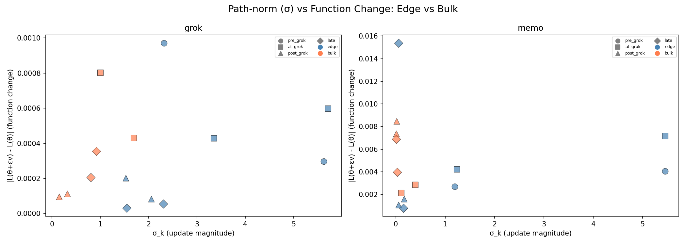
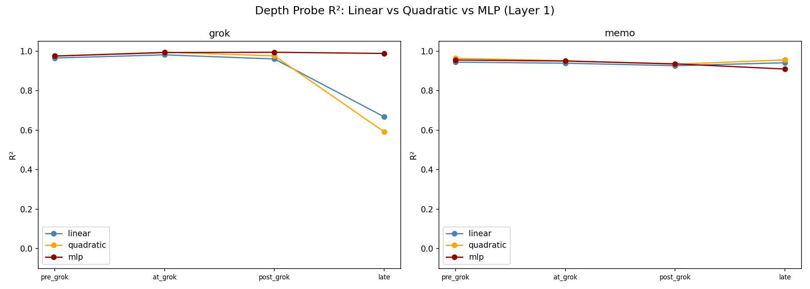
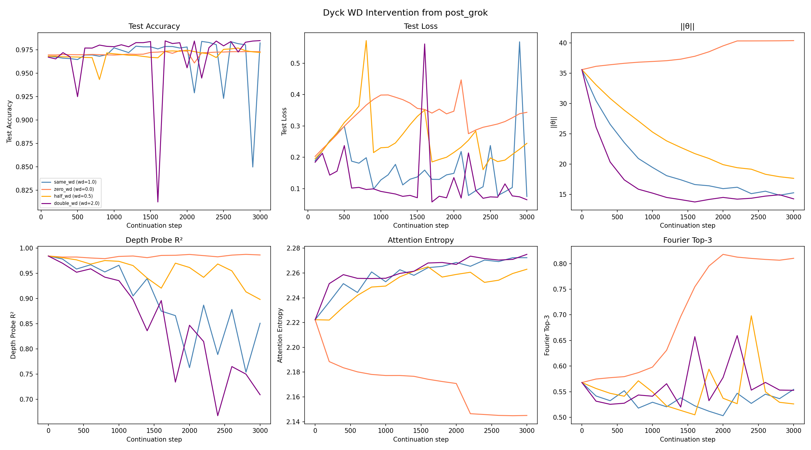
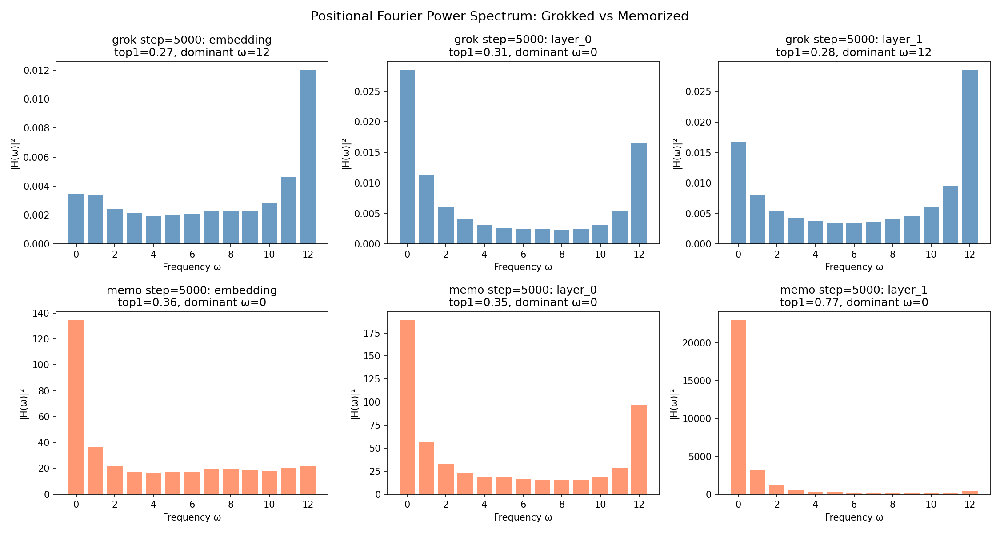
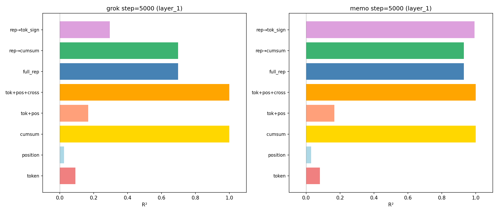
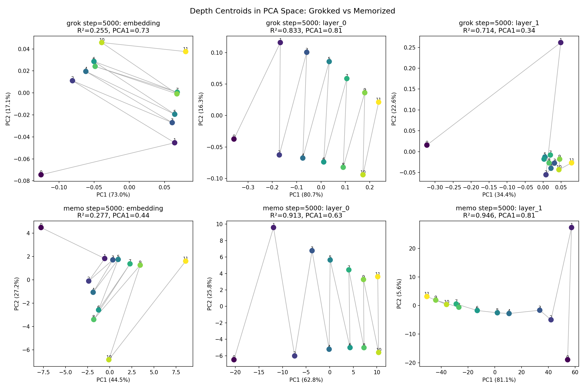

# Xu 2026 — The Lifecycle of the Spectral Edge: From Gradient Learning to Weight-Decay Compression

См. также: [глобальный индекс понятий](../../concepts/index.md).

**Yongzhong Xu** (независимый; код: github.com/skydancerosel/dyck_scan).

arXiv [2604.07380](https://arxiv.org/abs/2604.07380), апрель 2026, 15 страниц, 12 рисунков, 2 таблицы. Всего цитирований по Semantic Scholar — 1, в картотеке — 1. Продолжение серии Xu о спектральной кромке — ведущем направлении $v_{1}$ матрицы Грама приращений весов: заявлен «двухфазный жизненный цикл» — до гроккинга кромка движима градиентом и функционально деятельна, в точке гроккинга градиентная и weight-decay составляющие обновления сонаправляются вдоль $v_{1}$, после — кромка движима weight decay и служит осью сжатия. Отсюда переосмысление weight decay: он не «регуляризует вообще», а отбирает плоские направления, вдоль которых параметры сжимаются без функциональной цены. Задачи — Dyck-1 (глубина скобочного стека) и SCAN; лучшие методические находки — точное разложение обновления AdamW на градиентную и weight-decay части и вмешательство по расписанию weight decay с опровержимым практическим следствием.

Оригинал и производные файлы этой папки:

- [`original/2604.07380.the-lifecycle-of-the-spectral-edge-from-gradient-learning-to-weight-decay-compression.md`](original/2604.07380.the-lifecycle-of-the-spectral-edge-from-gradient-learning-to-weight-decay-compression.md) — конверсия оригинала (native arXiv HTML, v1) в Markdown без правок содержания.
- [`2604.07380.the-lifecycle-of-the-spectral-edge-from-gradient-learning-to-weight-decay-compression.claims.txt`](2604.07380.the-lifecycle-of-the-spectral-edge-from-gradient-learning-to-weight-decay-compression.claims.txt) — пронумерованные утверждения статьи с пометками разбора.
- [`images/`](images/) — 14 панелей рисунков.

Схема якорей и правила ссылок на карточку — в [README папки статей](../README.md).

## Затрагиваемые понятия

**[Спектральный анализ](../../concepts/spectral-analysis-svd-esd-fve.md)** — кромка считается по матрице Грама $X(t)\in\mathbb{R}^{W\times p}$ из $W=5$ подряд идущих приращений весов внимания ([`p3-2`](#p3-2)); новизна против соседей серии — динамическое разложение: доля градиентной энергии на $v_{1}$ падает с 97.6% (Dyck) и 88.7% (SCAN) до гроккинга до 5.3% и 0.2% в его точке ([`p3-5`](#p3-5), [`fig-1`](#fig-1)). Разбор отмечает: «выравнивание» ни разу не измерено как угол — есть только доли энергии; определение зазора $g_{23}=\sigma_{2}^{2}-\sigma_{3}^{2}$ молча сменилось против $\sigma_{2}-\sigma_{3}$ прежних работ той же серии; у Dyck «фаза сжатия» — одиночный всплеск в одной контрольной точке (поздняя доля градиента — 87%).

**[Weight decay](../../concepts/weight-decay.md)** — заявленное переосмысление: weight decay отбирает плоские направления ландшафта, вдоль которых параметры можно сжимать без функциональной цены, и спектральная кромка есть отобранное направление ([`p12-2`](#p12-2)); вмешательство с посттранзитной точки при $\omega\in\{0,0.5,1,2\}$ показывает, что точность выживает без weight decay (0.973), а линейная читаемость представлений падает с его ростом ([`p5-7`](#p5-7), [`fig-6`](#fig-6)) — «weight decay — двигатель сжатия, а не обобщения». Разбор: «обращение» сжатия на деле предотвращение (ветвь $\omega=0$ просто не падает), таблица — одно семя, а точность в ней с $\omega$ монотонно растёт.

**[Гроккинг](../../concepts/grokking.md)** — сонаправление градиента и weight decay вдоль $v_{1}$ объявлено «микроскопическим признаком фазового перехода» ([`p4-1`](#p4-1)); статистика «24/24 грокают с weight decay против 0/24 без» ([`p3-1`](#p3-1)). Разбор: определения гроккинга в статье нет вовсе — ни порога, ни единой кривой обучения; «нет выравнивания без гроккинга» — тождество (при $\omega=0$ weight-decay-составляющей не существует), а предыдущая работа той же серии честно заключала, что местная геометрия гроккинг не предсказывает, — оговорка здесь не упомянута.

**[Ландшафт потерь](../../concepts/loss-landscape-basins.md)** — «парадокс абляции»: возмущение вдоль $v_{1}$ почти ничего не меняет (KL $\approx 0.00005$, кривизна 0.078), а снятие пары $v_{1}+v_{2}$ катастрофично против нулевого эффекта случайных пар ([`p4-6`](#p4-6), [`fig-2`](#fig-2)); разрешение — зазор по Дэвису—Кахану держит *ориентацию* кромки, малая кривизна делает движение *вдоль* безвредным ([`p5-1`](#p5-1)). Разведение «ориентация против смещения» для корпуса полезно; сама оценка ни разу не вычислена, а сверка кромки с объёмными направлениями Грама — единственная, что отделила бы кромку от объёма, — отсутствует.

**[Линейное зондирование](../../concepts/linear-sparse-probing.md)** — «нелинейное перекодирование, а не потеря сведений»: линейный зонд глубины падает с $R^{2}=0.98$ до $0.86$, квадратичный — до 0.59, а MLP-зонд держит $0.990\pm 0.003$ ([`p5-4`](#p5-4), [`fig-5`](#fig-5)); у запомнившей модели линейный $R^{2}$ выше (0.95 против 0.71) — признак явного хранения, а не лучшего вычисления ([`p10-1`](#p10-1)). Практическое следствие: обучать с большим weight decay ради гроккинга, затем снижать ради линейно читаемых представлений ([`p13-1`](#p13-1)).

**[Фурье-признаки](../../concepts/fourier-features-circuits.md)** — редкий в корпусе разбор неарифметической задачи: у грокнутой Dyck-модели двойственное фурье-строение — представления на частоте Найквиста $\omega=12$ («что считать» — тождество токена), внимание равномерно-обратное, $\omega=0$ («как считать» — счёт усреднением) ([`p9-2`](#p9-2), [`fig-7`](#fig-7), [`fig-8`](#fig-8)); запомнившая модель схлопывается в $\omega=0$ представлений (77% энергии). Параллель с модульной арифметикой заявлена как «одна групповая характеристика» — у Nanda et al. ключевых частот около пяти.

## Что показано, а что предположено

Замечания редактора карточки по итогам разбора утверждений (`…claims.txt`, 45 пунктов).

**Лучшее в работе — дешёвые наблюдаемые и опровержимое следствие.** Разложение обновления AdamW на градиентную и weight-decay части точно и считается внутри оптимизатора; разведение «ориентации» и «смещения вдоль» объясняет расхождение абляции и возмущения; вмешательство по расписанию weight decay даёт проверяемое практическое следствие для истолковываемости; двойственное фурье-строение Dyck — внятная механистическая находка.

**Само явление в работе не показано.** Определения гроккинга нет: ни порога точности, ни правила выбора контрольных точек, ни единой кривой обучения — все двенадцать рисунков показывают производные величины. Power et al. в тексте не процитирован ни разу (стоит только в списке); 9 из 22 позиций списка в тексте не упоминаются, 8 из 22 — самоцитирования, и несущая опора (тезис Xu 2026g со «уравнением потока зазора» и «19/20 предсказаний») в корпус не входит и названа в ссылке не своим настоящим названием.

**«Двухфазный жизненный цикл» подтверждается только у SCAN.** У Dyck доля градиента идёт 97.6% → 5.3% → около 99% → 87%: господство weight decay — одиночный всплеск, а не фаза, и поздние 87% несовместимы с «фазой сжатия» врезки; аннотация описывает картину SCAN как общую. «Нет выравнивания без гроккинга» — тождество: при $\omega=0$ выравниваться не с чем, и различение «гроккинг/негроккинг» тождественно различению «есть weight decay/нет».

**Абляция и сверки.** «$>4000\times$» и «$>10^{7}\times$» получены делением на порог $10^{-4}$, а не на измеренную величину; вторая панель рисунка 2 (абляция одного $v_{1}$: $\Delta\text{acc}\approx-0.005$ в точке post-grok) текстом не упомянута; сверки с объёмными направлениями Грама нет. Плоскость — свойство грокнутой модели, а не кромки: подпись к рисунку 3 сама говорит «все кривые почти плоские — и кромка, и объём», а числа «0.001 против 1.83» сравнивают сразу две разные модели и два разных направления; в §4.2 значение кромки приписано объёму.

**Внутренние расхождения чисел.** 0.26–0.62 против 0.29–0.62 (текст против подписи рис. 2); $0.86\pm0.01$ против 0.665 на рисунке 5; «$5.2\times$» §8.4 против «$4.1\pm0.7\times$» §9; «универсальность» трёх классов держится на одной задаче на класс, строка функционального класса не содержит ни одного числа, а Term 2/Term 3 «предсказывающего» баланса ни для одной задачи не вычислены.

**Как работу будут цитировать** («доказано, что при гроккинге weight decay перехватывает спектральную кромку и превращает её в ось сжатия») — точнее: на двух малых задачах, по весам внимания, преимущественно на одном семени показано, что доля weight-decay-энергии на $v_{1}$ в одной контрольной точке подскакивает до 95–99.8%, что снятие пары $v_{1}+v_{2}$ роняет точность, а случайной пары — нет, и что при продолжении обучения без weight decay линейный зонд не падает.

---

# Текст статьи

## Жизненный цикл спектральной кромки: от градиентного обучения к weight-decay-сжатию

Yongzhong Xu Благодарности: abbyxu@gmail.com; код на https://github.com/skydancerosel/dyck_scan

## Аннотация

Спектральная кромка — ведущее направление матрицы Грама обновлений параметров — как было показано, отслеживает фазовые переходы в обучении нейросетей. Но что *движет* спектральной кромкой и почему она важна причинно?

Мы раскладываем спектральную кромку на её градиентную и weight-decay составляющие на двух последовательностных задачах (Dyck-1 сбалансированные скобки и композициональная генерализация SCAN) и открываем резкий двухфазный жизненный цикл. **До гроккинга** кромка движима градиентом (88–98% градиентной энергии) и несёт задаче-значимое функциональное содержание. **В точке гроккинга** градиент и weight decay *выравниваются* вдоль кромки — оба толкают в одну сторону — и кромка переходит в режим сжатия (0.2–5% градиента, 95–99.8% weight decay). Это выравнивание — микроскопический признак фазового перехода.

Посттранзитная кромка предъявляет парадокс: возмущение вдоль неё почти ничего не меняет (макс. KL $\approx 0.00005$; кривизна гессиана $0.08$), но её удаление катастрофично ($\Delta\text{acc}=-0.58\pm 0.09$; в $>$4000$\times$ хуже удаления случайных направлений). Разрешение геометрично: функция модели зависит от *ориентации* кромки (запертой спектральным зазором), но не от смещения *вдоль* неё (плоская кривизна). Кромка задаёт устойчивую ось, которую weight decay сжимает, не нарушая.

Возникают три класса универсальности: *функциональные кромки* (модульная арифметика: кромка несёт различимые фурье-моды), *смешанные кромки* (Dyck: кромка удерживает частичное функциональное содержание) и *сжимающие кромки* (SCAN: кромка функционально пуста, заморожена на повороте $8^{\circ}$). Класс предсказывается балансом градиентного движения и weight-decay-затухания в уравнении потока зазора.

Шесть причинных экспериментов устанавливают механизм: разложение градиент—WD, абляция со случайными сверками, кривые возмущения по $\varepsilon$, кривизна гессиана, нелинейные зонды (MLP $R^{2}=0.99$ там, где линейный $R^{2}=0.86$) и вмешательство по weight decay, показывающее, что снятие WD после гроккинга обращает сжатие ($R^{2}_{\text{linear}}:0.85\to 0.99$), сохраняя выученный алгоритм (точность 0.97). Все находки воспроизводятся на 3 семенах.

## 1 Введение

Динамика обучения нейросетей высоко структурирована несмотря на огромную размерность пространства параметров. Тезис спектральной кромки (Xu 2026g) делает это точным: матрица Грама обновлений параметров в скользящем окне развивает внутрисигнальный зазор собственных значений, отделяющий несколько ведущих направлений от объёма. Эти ведущие направления — спектральная кромка — сосредотачивают дисперсию обучения, и фазовые переходы в обучении совпадают с событиями зазора (Xu 2026h; Xu 2026a; Xu 2026c).

Тезис устанавливает, *что* спектральная кромка существует и отслеживает обучение. Эта статья спрашивает *почему*: что движет спектральной кромкой и что даёт ей причинную важность?

**[p. 2]**

### 1.1 Центральное утверждение

###### p2-1

> **Утверждение (двухфазный жизненный цикл).**
> При обучении с weight decay ведущий сингулярный вектор $v_{1}$ матрицы Грама
> обновлений параметров (определённой в §2) претерпевает резкий переход:
>
> 1. **Фаза обучения**: $v_{1}$ движим градиентом, функционально деятелен и несёт задаче-значимые сведения.
> 2. **Переход**: в точке гроккинга градиент и weight decay выравниваются вдоль $v_{1}$ (оба толкают в одну сторону).
> 3. **Фаза сжатия**: $v_{1}$ становится движимым weight decay, функционально плоским, но причинно существенным — функция модели зависит от ориентации кромки, но инвариантна к смещению вдоль неё.

Всё в этой статье поддерживает это утверждение через множественные проекции одного и того же механизма:

- В *пространстве весов*: разложение градиент—WD (§3).
- В *пространстве функций*: парадокс абляции и плоскость возмущений (§4).
- В *пространстве представлений*: нелинейное перекодирование и инверсия зондового $R^{2}$ (§5).
- В *уравнении потока зазора*: баланс Term 2/Term 3 предсказывает классы универсальности (§7).

### 1.2 Связь с предшествующими работами

Тезис спектральной кромки (Xu 2026g) выводит динамику зазора из трёх аксиом и подтверждает 19/20 количественных предсказаний на шести семействах моделей от 150K до 124M параметров (TinyStories 51M, GPT-2 124M и опыты с гроккингом на Dyck, SCAN и модульной арифметике). Сопутствующая работа (Xu 2026h) показывает, что направления кромки — *функциональные моды* — структурированные узоры возмущений, схлопывающиеся в фурье-частоты для модульной арифметики. Коммутаторный анализ (Xu 2026c; Xu 2026b) отслеживает $\left\|[W_{Q},W_{K}]\right\|_{F}$ и показывает его пик перед гроккингом со сверхлинейными временами опережения на Dyck, SCAN и модульной арифметике.

Все три работы описывают спектральную кромку как *геометрический объект*: зазоры собственных значений, сингулярные векторы, нормы коммутаторов. Эта статья добавляет *динамическое разложение*: кромка — не одна сущность; в момент гроккинга она переходит из градиентно-движимого направления обучения в weight-decay-движимую ось сжатия. Это разрешает открытый вопрос, почему спектральный зазор продолжает расширяться после гроккинга, хотя обучение уже произошло: посттранзитный зазор поддерживается weight-decay-сжатием, а не продолжающимся обучением.

## 2 Постановка

### 2.1 Задачи

#### Предсказание глубины Dyck-1.

Двухслойный причинный трансформер ($d_{\text{model}}=128$, 4 головы, ${\sim}$150K параметров) предсказывает глубину стека (0–12) в каждой позиции последовательностей сбалансированных скобок. Обучение: 50 последовательностей; тест: 5000. Вычисление — накопительная сумма: $\text{depth}(t)=\sum_{i\leq t}s_{i}$, где $s_{i}=+1$ (открывающая) или $-1$ (закрывающая).

#### SCAN.

Шестислойный трансформер кодировщик—декодировщик ($d_{\text{model}}=256$, 4 головы, ${\sim}$1.5M параметров) переводит команды («jump left twice») в действия. Обучение: 2048 пар; тест: 500. Вычисление факторизуется композиционально: глагол $\times$ направление $\times$ повторение.

**[p. 3]**

#### Гроккинг.

###### p3-1

Обе задачи обучаются AdamW ($\beta_{2}=0.98$), weight decay $\omega\in\{0,1\}$, по 3 семени. При $\omega=1$: Dyck грокает на шагах 600–1400, SCAN — на 2500–4000. При $\omega=0$: гроккинга нет ни в одном прогоне. Частота попаданий: 6/6 грокают с WD, 0/6 без, на задачу. Вместе с прогонами модульной арифметики тезиса (Xu 2026g) это даёт 24/24 гроккинга с WD и 0/24 без, на четырёх семействах задач.

### 2.2 Построение спектральной кромки

###### p3-2

Следуя тезису, мы вычисляем траекторную матрицу $X(t)\in\mathbb{R}^{W\times p}$ из $W=5$ подряд идущих приращений обновлений параметров (ограниченных весами внимания), извлекаем сингулярные значения $\sigma_{1}\geq\cdots\geq\sigma_{W}$ и правые сингулярные векторы $v_{1},\ldots,v_{W}\in\mathbb{R}^{p}$. Спектральный зазор $g_{23}=\sigma_{2}^{2}-\sigma_{3}^{2}$ сжимается в $33\times$ (Dyck) и $43\times$ (SCAN) при гроккинге, при $k^{*}=1$ повсеместно — воспроизводя тезис.

## 3 Механизм: выравнивание градиента и weight decay

### 3.1 Разложение

Обновление параметров AdamW раскладывается точно:

$$
\Delta\theta=\underbrace{\Delta\theta_{\text{grad}}}_{\text{Adam-processed gradient}}+\underbrace{\Delta\theta_{\text{wd}}}_{=\;-\eta\omega\theta}.
$$

Мы проецируем каждую составляющую на сингулярные векторы Грама $v_{k}$ и измеряем долю энергии обновления от каждого источника.

###### fig-1

*Рисунок 1: **(A) Weight decay управляет разменом сжатие—доступность: рост $\omega$ повышает точность и энтропию внимания, но снижает линейный зондовый $R^{2}$ (представления становятся абстрактнее). (B) Переход градиент→WD на $v_{1}$: обе задачи перещёлкиваются из градиентно-господствующего (синее) в WD-господствующее (оранжевое) в точке гроккинга. Переход SCAN резче (99.8% WD). (C) Кривизна гессиана: грокнутая кромка (сплошная) плоская (синяя заливка); запомнивший объём (пунктир) резко искривлён (красная заливка, до $v^{\top}\!Hv=1.84$).*** **[p. 3]**

### 3.2 Перещёлкивание

###### p3-5

Рисунок 1B показывает главный результат. До гроккинга $v_{1}$ движим градиентом: 97.6% (Dyck) и 88.7% (SCAN) энергии обновления вдоль $v_{1}$ приходит от градиентной составляющей. В точке гроккинга это перещёлкивается: градиент падает до 5.3% (Dyck) и 0.2% (SCAN), а остаток даёт weight decay.

**[p. 4]**

###### p4-1

Критично, что градиент и weight decay *выровнены* вдоль $v_{1}$ — они толкают в одну сторону. На объёмных направлениях ($v_{3}$, $v_{4}$) они *противостоят* (обычная динамика: градиент спускается, WD регуляризует). Выравнивание на $v_{1}$ — признак фазового перехода: в точке гроккинга градиент оптимизатора и его регуляризатор *согласны* о направлении кромки.

### 3.3 Почему выравнивание важно

В уравнении потока зазора тезиса (Xu 2026g):

$$
\frac{dg}{dt}\approx\underbrace{-\eta(h_{k^{*}}-h_{k^{*}+1})\bar{d}}_{\text{Term 1: curvature}}-\underbrace{\eta(\bar{h}+\omega)g}_{\text{Term 2: WD damping}}+\underbrace{\eta W\!\left(\frac{|G_{k^{*}}|^{2}}{d_{k^{*}}}-\frac{|G_{k^{*}+1}|^{2}}{d_{k^{*}+1}}\right)}_{\text{Term 3: gradient driving}}, \tag{1}
$$

наше разложение прямо измеряет баланс членов 2 и 3. До гроккинга господствует Term 3 (градиент раскрывает зазор). В точке гроккинга верх берёт Term 2 (WD поддерживает зазор). Выравнивание градиент—WD — момент, когда господствующая сила сменяется с градиента на регуляризатор: кромка перестаёт *учиться* и начинает *сжимать*.

### 3.4 Корреляционное свидетельство: нет выравнивания без гроккинга

Во всех 6 сверочных прогонах ($\omega=0$) weight decay нет, а значит нет и WD-составляющей, с которой можно выравниваться. Соответственно, гроккинга не происходит. По всем 12 прогонам (6 грокающих, 6 сверочных) на задачу соответствие идеальное: выравнивание появляется тогда и только тогда, когда происходит гроккинг. Это корреляция, а не причинность — выравнивание могло бы быть следствием, а не причиной генерализации, — но вмешательство по WD (§6) даёт причинное направление: WD необходим для выравнивания, а выравнивание необходимо для перехода кромки от обучения к сжатию.

## 4 Парадокс абляции: плоско, но существенно

Посттранзитная кромка предъявляет кажущееся противоречие.

### 4.1 Кромка уникально важна

###### fig-2

*Рисунок 2: Абляция: снятие кромки Грама ($v_{1}+v_{2}$, синее) ухудшает точность на 0.29–0.62; снятие случайных двумерных подпространств (красное, 20 испытаний на фазу) не даёт эффекта ($\Delta\text{acc}<10^{-4}$). Кромка в $>$4000$\times$ влиятельнее случайных направлений. Это не эффект нормы — случайные направления снимают то же число измерений из того же подпространства параметров.* **[p. 5]**

###### p4-6

Выпроецирование $v_{1}+v_{2}$ из весов внимания модели ухудшает точность на 0.26–0.62 по фазам обучения (рисунок 2). Выпроецирование случайных двумерных подпространств даёт буквально нулевой эффект — 20 испытаний на фазу, все $|\Delta\text{acc}|<10^{-4}$. Кромка в $>$4000$\times$ влиятельнее случайной. Это держится для обеих задач: абляция кромки SCAN даёт $\Delta\text{acc}=-0.49$ для грокнутой модели против $-0.03$ для запомнившей (где кромка схлопнулась до почти нулевой величины).

### 4.2 И всё же кромка функционально плоская

*Рисунок 3: Кривые возмущения (развёртка по $\varepsilon$) для грокнутой Dyck-модели. Сверху: потеря; снизу: KL-расходимость от базовой модели. Все кривые почти плоские — и кромка, и объём. Грокнутая модель сидит в широкой долине, где возмущение вдоль *любого* направления Грама едва меняет выход. Максимальная KL $\approx 0.00005$ для кромки.* **[p. 6]**

###### p4-7

Возмущение модели *вдоль* $v_{1}$ (а не его снятие) едва меняет выход (рисунок 3). Макс. KL-расходимость $\approx 0.00005$; кривизна гессиана $v_{1}^{\top}\!Hv_{1}=0.078$ (рисунок 1C). Всё подпространство Грама плоское у грокнутой модели. Объём запомнившей модели, напротив, достигает кривизны 1.84 — узкий хрупкий минимум.

*Рисунок 4: Норма пути ($\sigma_{k}$ = величина обновления) против изменения функции ($|\Delta L|$) по направлениям. **Грокнутая** (слева): большая $\sigma$ при почти нулевом изменении функции — сжатие (движение в пространстве весов без функциональных последствий). **Запомнившая** (справа): малая $\sigma$ при большом изменении функции — хрупкость (любое движение нарушает функцию).* **[p. 6]**

Рисунок 4 делает это конкретным: грокнутая кромка имеет $\sigma=2.3$, но $|\Delta L|=0.00005$ (большое движение, нулевое функциональное изменение); запомнивший объём имеет $\sigma=0.01$, но $|\Delta L|=0.015$ (крошечное движение, большое нарушение).

**[p. 5]**

### 4.3 Разрешение: ориентация важна, смещение — нет

###### p5-1

Парадокс разрешается через геометрическое различение, сформулированное границей устойчивости Дэвиса—Кахана тезиса: спектральный зазор защищает *ориентацию* $v_{1}$ (возмущение $\sin\theta\leq\left\|\Delta G\right\|_{F}/g$, а $g$ велико), тогда как низкая кривизна $h_{1}=0.08$ означает, что потеря плоская *вдоль* $v_{1}$.

Функция модели зависит от того, *куда* указывает $v_{1}$ (его снятие катастрофично). Она не зависит от *движения вдоль* $v_{1}$ (возмущение безвредно). Weight decay отбирает плоские направления, сохраняющие выученную функцию при снижении нормы параметров.

Это переосмысляет weight decay: вместо «регуляризации» в общем смысле WD именно отбирает направления, вдоль которых ландшафт потерь плоский — направления, где параметры можно сжимать без функциональной цены. Спектральная кромка и *есть* это отобранное направление.

## 5 Нелинейное перекодирование, а не потеря сведений

###### fig-5

*Рисунок 5: Зондовый $R^{2}$ глубины по представлениям слоя 1 (Dyck). **Слева (грокнутая)**: линейные зонды деградируют поздно ($0.97\to 0.67$); квадратичные проваливаются ещё хуже ($0.59$); но MLP-зонды держат $0.99$ всюду. **Справа (запомнившая)**: все зонды остаются высокими. Сведения о глубине не теряются — они нелинейно перекодируются weight-decay-сжатием.* **[p. 7]**

###### p5-4

Линейный зонд глубины по представлениям слоя 1 падает с $R^{2}=0.98$ в точке гроккинга до $R^{2}=0.86\pm 0.01$ поздно (3 семени). Это истолковывали как потерю сведений. Это не так.

###### p5-5

Неглубокий MLP-зонд (один скрытый слой, 64 узла) возвращает $R^{2}=0.990\pm 0.003$ на тех же представлениях (рисунок 5). Квадратичные зонды тоже проваливаются ($R^{2}=0.59$), так что перекодирование подлинно глубоко нелинейное, а не полиномиальное.

Сведения присутствуют всегда; weight decay меняет то, как они *закодированы*, сжимая линейно доступные представления в более абстрактную форму. Это согласуется с парадоксом абляции: модель знает глубину (MLP $R^{2}=0.99$), но не хранит её в линейно читаемом направлении (линейный $R^{2}=0.86$, падающий до $0.67$ у отдельных семян поздно в обучении).

## 6 Вмешательство по weight decay: причинная проверка

###### fig-6

*Рисунок 6: Продолжение обучения с посттранзитной контрольной точки при четырёх условиях WD (Dyck). Снятие WD ($\omega=0$, красное): точность держится на 0.97, зондовый $R^{2}$ восстанавливается до 0.99, энтропия падает, норма параметров раздувается. Удвоение WD ($\omega=2$, фиолетовое): точность слегка растёт, зондовый $R^{2}$ падает дальше, энтропия максимизируется. WD движет сжатие представления; выученный алгоритм от WD независим.* **[p. 8]**

###### p5-7

Мы продолжаем обучение с посттранзитной контрольной точки при четырёх условиях weight decay (рисунок 6).

*Таблица 1: Вмешательство по weight decay (после гроккинга, Dyck). WD движет сжатие (ниже $R^{2}$, выше энтропия, ниже $\left\|\theta\right\|$), но не генерализацию (точность переживает снятие).* **[p. 7]**

| **Условие** | **Тестовая точность** | **Линейный $R^{2}$** | **Энтропия** | $\left\\|\theta\right\\|$ |
|---|---|---|---|---|
| $\omega=0$ (снять) | 0.973 | **0.987** | 2.15 | 40.4 |
| $\omega=0.5$ | 0.972 | 0.898 | 2.26 | 17.7 |
| $\omega=1.0$ (тот же) | 0.982 | 0.851 | 2.27 | 15.3 |
| $\omega=2.0$ (удвоить) | **0.985** | 0.709 | **2.28** | **14.3** |

Три вывода:

**[p. 6]**

1. **Алгоритм выживает без WD.** Точность падает лишь на 0.009 при полном снятии WD. Генерализующее вычисление было выучено в точке гроккинга и сохраняется без продолжающегося сжатия.
2. **WD движет нелинейное перекодирование.** Снятие WD восстанавливает линейный $R^{2}$ с 0.85 до 0.99. Удвоение WD толкает его к 0.71. MLP $R^{2}$ равен 0.99 всюду. Кодирование меняется; сведения — нет.
3. **WD движет равномерное внимание.** Энтропия растёт с $\omega$ монотонно ($2.15\to 2.28$). Без WD внимание становится менее равномерным — счётный алгоритм расслабляется к позиционно-специфичным узорам.

###### p6-2

Это устанавливает причинное направление: weight decay — двигатель посттранзитного сжатия, а не двигатель генерализации. Посттранзитное поведение спектральной кромки (расширяющийся зазор, растущее $\sigma_{1}/\sigma_{2}$) движимо WD-сжатием вдоль $v_{1}$, а не продолжающимся обучением.

**[p. 7]**

## 7 Три класса универсальности спектральной кромки

###### p7-1

Спектральная кромка ведёт себя не одинаково на разных задачах. Мы выделяем три режима, предсказываемые балансом градиентного движения (Term 3) и WD-затухания (Term 2) в потоке зазора (1):

*Таблица 2: Три класса универсальности поведения спектральной кромки. Класс определяется относительной силой градиентного движения (Term 3) против WD-затухания (Term 2) после гроккинга.* **[p. 9]**

| **Класс** | **Задача** | **Градиент% (поздно)** | **Поворот** | **Функц. $R^{2}$** | **Характер** |
|---|---|---|---|---|---|
| Функциональный | Мод. арифм. | high | moderate | high (single $\omega$) | кромка несёт фурье-моды |
| Смешанный | Dyck | 87% | $18^{\circ}$ | 0.80 | частичное функциональное содержание |
| Сжимающий | SCAN | 2% | $8^{\circ}$ | 0.04 | функционально пуста |

#### Функциональная кромка (модульная арифметика).

Term 3 остаётся деятельным после гроккинга: градиент продолжает проецироваться на $v_{1}$, поддерживая функциональное содержание. Направления кромки несут различимые фурье-частоты ($\omega=25$ для сложения, $\omega=29$ для умножения в базисе дискретного логарифма (Xu 2026h)). Разделение кромка/объём чистое: кромка сосредотачивается на задаче-значимых модах, объём размыт.

#### Смешанная кромка (Dyck).

Term 3 частично сохраняется (87% градиента поздно), держа $v_{1}$ функционально деятельным ($R^{2}=0.80$). Кромка поворачивается на $18^{\circ}$ за окно — больше замороженной оси SCAN, меньше объёмных $52^{\circ}$. Фурье-анализ в базисе глубины показывает сосредоточенность $5.2\times$ над равномерной в точке гроккинга, но без разделения кромка/объём (все направления проецируются на единственную собственную моду: счёт глубины).

#### Сжимающая кромка (SCAN).

Term 2 господствует почти полностью (99.8% WD в точке гроккинга, 98% поздно). Кромка замерзает (поворот $8^{\circ}$) и функционально пустеет ($R^{2}=0.04$). Она становится чистой осью сжатия — направлением, вдоль которого WD снижает $\left\|\theta\right\|$, не затрагивая функцию. У модели достаточно избыточности (1.5M параметров на задачу из 2048 примеров), чтобы WD нашёл вдоволь плоских направлений.

#### Предсказание.

Класс универсальности определяется отношением $\text{capacity}/\text{task complexity}$. Высокая избыточность $\to$ сжимающая кромка (WD легко находит плоские направления). Низкая избыточность $\to$ функциональная или смешанная **[p. 8]** кромка (WD должен делить направления с градиентом). Для больших языковых моделей мы предсказываем господство сжимающего класса, где спектральная кромка станет осью снижения параметров, а не выучивания признаков.

## 8 Что модели выучивают: фурье-строение

Спектральная кромка описывает, *как* динамика обучения отбирает вычисления. Фурье-анализ описывает, *какие* вычисления отобраны. Это связанные, но разные вещи: кромка — свойство траектории обучения; фурье-строение — свойство выученной модели.

### 8.1 Dyck: двойственное частотное строение

###### fig-7

*Рисунок 7: Позиционные фурье-спектры мощности (Dyck, после обучения). **Грокнутая** (сверху): энергия пикует на $\omega=12$ (частота Найквиста при $T=24$, отвечающая чередованию открывающих/закрывающих). **Запомнившая** (снизу): 77% энергии слоя 1 схлопывается в $\omega=0$ (DC). Грокнутая модель кодирует тождество токена в частотной области; запомнившая хранит позиционно-инвариантный шаблон.* **[p. 9]**

Скрытые представления грокнутой модели сосредотачиваются на $\omega=12$ — частоте Найквиста для последовательностей длины $T=24$, отвечающей двоичному чередованию открывающих и закрывающих токенов (рисунок 7). Запомнившая модель схлопывается в $\omega=0$ (DC-моду): все позиции имеют примерно одинаковое представление.

###### fig-8

*Рисунок 8: Средние узоры внимания (Dyck). **Грокнутая** (сверху): все головы слоя 0 сходятся к равномерному обратному вниманию (гладкий градиент = счётный алгоритм). **Запомнившая** (снизу): пиковые позиционно-специфичные узоры (яркие пятна = таблица подстановки).* **[p. 10]**

Узоры внимания рассказывают дополняющую историю (рисунок 8): все четыре головы слоя 0 грокнутой модели сходятся к *почти совершенному равномерному обратному вниманию* (KL от равномерного $<0.001$, энтропия = 2.28). Равномерное внимание вычисляет невзвешенное среднее вложений прошлых токенов, которое линейно кодирует долю открывающих токенов, увиденных к данному моменту, — то есть глубину. Это и есть счётный алгоритм, и это $\omega=0$-мода узора внимания.

**[p. 9]**

###### p9-1

Грокнутая Dyck-модель, таким образом, имеет двойственное фурье-строение:

###### p9-2

- **Представления**: $\omega=12$ («что считать» — тождество токена).
- **Внимание**: $\omega=0$ («как считать» — равномерное усреднение).

Это параллельно модульной арифметике, где выученное вычисление выравнивается с одной групповой характеристикой (Nanda et al. 2023; Liu et al. 2023b). Различие в том, что «группа» Dyck — двоичное множество токенов $\{+1,-1\}$ с накопительным суммированием, а не $\mathbb{Z}_{p}$ с модульным сложением. Фурье-строение диагностично при наличии симметрии, но более глубокий инвариант — что гроккинг отбирает низкоразмерное алгоритмическое вычисление — держится независимо.

### 8.2 Композициональная факторизация

*Рисунок 9: Композициональное зондирование (Dyck, слой 1). Перекрёстные признаки (токен $\times$ накопительная сумма) достигают $R^{2}=1.0$ у обеих моделей, подтверждая композициональную определённость глубины. Но грокнутая модель не кодирует линейно тождество токена ($R^{2}=0.30$ против $0.99$ у запомнившей) — она абстрагируется от поверхностных признаков.* **[p. 11]**

Перекрёстные признаки (тип токена $\times$ бегущая сумма) достигают $R^{2}=1.0$ у обеих моделей (рисунок 9), подтверждая, что глубина композиционально определена. Но грокнутая модель не хранит составляющие линейно: тождество токена $R^{2}=0.30$ (против 0.99 у запомнившей), бегущая глубина $R^{2}=0.70$ (против 0.93). Грокнутая модель вычисляет композицию, не представляя явно её сомножители — **[p. 10]** сжатое, абстрактное кодирование.

### 8.3 Геометрия представления глубины

*Рисунок 10: Центроиды глубин в PCA-пространстве (слой 1). **Грокнутая** (сверху): распределены по измерениям (PCA${}_{1}=34\%$), гладкая дуга. **Запомнившая** (снизу): растянута вдоль одной оси (PCA${}_{1}=81\%$), в $150\times$ большие межглубинные расстояния. Более высокий линейный $R^{2}$ у запомнившей модели (0.95 против 0.71) — признак явного хранения, а не лучшего вычисления.* **[p. 12]**

###### p10-1

Неожиданная инверсия: у запомнившей модели *выше* линейный зондовый $R^{2}$ глубины (0.95 против 0.71) и в $150\times$ большие межглубинные расстояния (рисунок 10). Она кодирует глубину в одном высокодисперсном направлении (PCA${}_{1}=81\%$); грокнутая распределяет её по многим измерениям (PCA${}_{1}=34\%$). Это не дефект — это признак парадокса абляции в пространстве представлений: кодирование глубины у грокнутой модели сжато и нелинейно, требуя MLP для считывания ($R^{2}_{\text{MLP}}=0.99$).

### 8.4 Фурье-анализ спектральной кромки

*(a) Фурье-сосредоточенность в базисе глубины. В точке гроккинга кромка достигает $5.2\times$ равномерного.*

*(b) Отклик на возмущение $\bar{f}_{k}[d]$, сгруппированный по глубине: структурированная вариация (глубокое против мелкого).*

*Рисунок 11: Фурье-анализ направлений кромки Грама в базисе глубины (правильной функциональной координате для Dyck).* **[p. 13]**

Для самих направлений спектральной кромки мы вычисляем отклик на возмущение $f_{k}(x)=\left\|\Delta h_{k}(x)\right\|^{2}$, группируем по глубине $d\in\{0,\ldots,12\}$ и применяем DFT — тот же протокол, что и в сопутствующей работе (Xu 2026h), но с глубиной вместо $(a+b)\bmod p$ как переменной группировки.

В точке гроккинга кромка достигает фурье-сосредоточенности $F=0.87$ ($5.2\times$ над равномерной, рисунок 11) с пиком на $\omega=1$ — одно колебание по уровням глубины (мелкие позиции отзываются иначе, чем глубокие). Это параллельно результату модульной арифметики ($19\times$ для сложения на $\omega=25$), хотя абсолютное возвышение ниже, потому что область меньше (13 уровней глубины против 97 вычетов).

В отличие от модульной арифметики, направления кромки и объёма не разделяются в базисе глубины: оба сосредотачиваются на $\omega=1$. Это потому, что у Dyck одна функциональная собственная мода (счёт глубины), и все направления Грама проецируются на неё. Различие кромка/объём становится количественным (величина обновления), а не качественным (функциональное содержание), когда мода лишь одна — в согласии с классом универсальности «смешанная кромка».

## 9 Воспроизведение и сверки

*(a) Воспроизведение по семенам (Dyck, 3 семени).*

*(b) Сингулярные значения и поворот направлений (Dyck, гроккинг против запоминания).*

*Рисунок 12: Устойчивость. (a) Все ключевые находки воспроизводятся на семенах 42, 137, 2024. MLP-зондовый $R^{2}=0.990\pm 0.003$ — самый устойчивый. (b) Иерархия устойчивости: $v_{1}$ поворачивается на $18^{\circ}$ (умеренно), $v_{3}$ — на $52^{\circ}$ (неустойчиво). $v_{1}$ у SCAN поворачивается лишь на $8^{\circ}$ (заморожен).* **[p. 13]**

#### Мультисеменное.

Все находки воспроизводятся на семенах 42, 137, 2024 (рисунок 12(a)): абляция $\Delta\text{acc}=-0.58\pm 0.09$; линейный $R^{2}=0.86\pm 0.01$; MLP $R^{2}=0.990\pm 0.003$; фурье-возвышение по глубине $=4.1\pm 0.7\times$.

#### Устойчивость поворота.

Тезис предсказывает $\alpha_{\text{dom}}>\alpha_{\text{gap}}>\alpha_{\text{sub}}$. Мы подтверждаем: $\alpha_{1}=0.77>\alpha_{2}=0.16$ в точке гроккинга; $v_{1}$ поворачивается на $18^{\circ}$, $v_{3}$ — на $52^{\circ}$ (рисунок 12(b)). Кромка SCAN ещё более заморожена ($8^{\circ}$), в согласии с её характером сжимающей кромки.

**[p. 11]**

#### Случайные сверки.

Абляция случайных направлений не даёт эффекта (20 испытаний на фазу, все $|\Delta\text{acc}|<10^{-4}$). Кромка в $>$4000$\times$ влиятельнее (рисунок 2).

#### Полный набор SCAN.

Все результаты распространяются на SCAN: абляция кромки $\Delta\text{acc}=-0.49$ (гроккинг) против $-0.03$ (запоминание); кривизна гессиана $0.001$ (грокнутая кромка) против $1.83$ (запомнивший объём); случайная абляция не даёт эффекта (отношение кромка/случайное $>10^{7}\times$).

## 10 Обсуждение

### 10.1 Один механизм, множественные проекции

Центральный механизм — выравнивание градиент—WD в точке гроккинга, порождающее двухфазную кромку, — проявляется по-разному в зависимости от того, куда смотреть:

| **Пространство** | **До гроккинга** | **После гроккинга** |
|---|---|---|
| Пространство весов | Градиентно-движимый $v_{1}$ | WD-движимый $v_{1}$ |
| Пространство функций | Возмущение меняет выход | Возмущение плоское |
| Пространство представлений | Глубина линейно доступна | Глубина нелинейно закодирована |
| Пространство внимания | Позиционно-специфичное (подстановка) | Равномерное (счётный алгоритм) |
| Фурье (представления) | Распределено | $\omega=12$ (строение токенов) |
| Фурье (кромка, базис глубины) | Умеренная сосредоточенность | Возвышение $5.2\times$ на $\omega=1$ |

Это не независимые находки — это проекции одного события. Выравнивание градиент—WD порождает плоское направление сжатия (пространство весов), которое сохраняет функцию при сжатии параметров (пространство функций), что движет нелинейное перекодирование глубины (пространство представлений), совпадающее с кристаллизацией счётного алгоритма (пространство внимания).

**[p. 12]**

### 10.2 Что weight decay делает на самом деле

Наши результаты предполагают конкретное переосмысление:

###### p12-2

Weight decay отбирает плоские направления в ландшафте потерь — направления, вдоль которых параметры можно сжимать без функциональной цены. Спектральная кромка и *есть* это отобранное направление. После гроккинга WD движет модель вдоль кромки, снижая $\left\|\theta\right\|$ при сохранении $f(\theta)$. Получающееся сжатие нелинейно перекодирует представления, делая их абстрактнее и менее линейно доступными.

Это связывается с литературой о плоских минимумах (Hochreiter and Schmidhuber 1997; Cohen et al. 2021): WD смещает к решениям с плоским ландшафтом, и спектральная кромка — направление наибольшей плоскости. Это также связывается с неявным смещением и максимизацией зазора (Lyu and Li 2020; Lyu et al. 2024): кромка — направление максимизации зазора, спроецированное на подпространство обновлений. Наблюдение, что динамика обучения сосредоточена в крошечном подпространстве (Gur-Ari et al. 2018; Sagun et al. 2017), — отправная точка; мы показываем, что это подпространство имеет внутреннюю структуру (различие кромка/объём) с динамическим жизненным циклом.

**[p. 13]**

### 10.3 Практическое предсказание: расписание WD

###### p13-1

Поскольку WD движет сжатие (ниже линейный $R^{2}$), не затрагивая алгоритм (точность стабильна), следует конкретное предсказание:

*Обучать с высоким WD, чтобы грокнуть, затем снижать WD, чтобы получить линейно доступные представления, не теряя алгоритма.*

Наше вмешательство показывает, что это работает: снятие WD после гроккинга возвращает $R^{2}_{\text{linear}}$ с 0.85 до 0.99, держа точность на 0.97. Это могло бы пригодиться для истолковываемости: модель, обученная с расписанием WD, имела бы читаемое представление своего выученного вычисления без жертвы генерализацией.

### 10.4 Ограничения

Обе задачи малого масштаба (150K–1.5M параметров, 50–2048 обучающих примеров). Тезис (Xu 2026g) подтверждает $k^{*}\leq 3$ и корреляцию зазора с потерей для моделей до 124M параметров, но разложение градиент—**[p. 14]** WD на том масштабе не проверено. Базис глубины для Dyck «правильный» по построению; для задач, где естественная функциональная координата неизвестна, рамка требует открытия базиса — открытая задача. Наше корреляционное свидетельство (выравнивание тогда и только тогда, когда гроккинг) не доказывает, что выравнивание *вызывает* гроккинг; оно может быть нижестоящим следствием более глубокого механизма.

## References

- **Cohen et al. [2021]** Cohen, J. M., Kaur, S., Li, Y., Kolter, J. Z., and Talwalkar, A. Gradient descent on neural networks typically occurs at the edge of stability. In *ICLR*, 2021.

- **Davis and Kahan [1970]** Davis, C. and Kahan, W. M. The rotation of eigenvectors by a perturbation. III. *SIAM J. Numer. Anal.*, 7(1):1–46, 1970.

- **Gur-Ari et al. [2018]** Gur-Ari, G., Roberts, D. A., and Dyer, E. Gradient descent happens in a tiny subspace. *arXiv preprint arXiv:1812.04754*, 2018.

- **Hochreiter and Schmidhuber [1997]** Hochreiter, S. and Schmidhuber, J. Flat minima. *Neural Computation*, 9(1):1–42, 1997.

- **Lake and Baroni [2018]** Lake, B. M. and Baroni, M. Generalization without systematicity: On the compositional skills of sequence-to-sequence recurrent networks. In *ICML*, 2018.

- **Liu et al. [2023a]** Liu, Z., Michaud, E. J., and Tegmark, M. Omnigrok: Grokking beyond algorithmic data. In *ICLR*, 2023.

- **Liu et al. [2023b]** Liu, Z., Kitouni, O., Nolte, N., Michaud, E. J., Tegmark, M., and Williams, M. Towards understanding grokking: An effective theory of representation learning. In *NeurIPS*, 2023.

- **Loshchilov and Hutter [2019]** Loshchilov, I. and Hutter, F. Decoupled weight decay regularization. In *ICLR*, 2019.

- **Lyu and Li [2020]** Lyu, K. and Li, J. Gradient descent maximizes the margin of homogeneous neural networks. In *ICLR*, 2020.

- **Lyu et al. [2024]** Lyu, K., Jin, J., Li, Z., Du, S. S., Lee, J. D., and Hu, W. Dichotomy of early and late phase implicit biases can provably induce grokking. In *ICLR*, 2024.

- **Nanda et al. [2023]** Nanda, N., Chan, L., Lieberum, T., Smith, J., and Steinhardt, J. Progress measures for grokking via mechanistic interpretability. In *ICLR*, 2023.

- **Olah et al. [2025]** Olah, C., Batson, J., Templeton, A., Conerly, T., Henighan, T., and Carter, S. A toy model of interference weights. *Transformer Circuits Thread*, 2025. https://transformer-circuits.pub/2025/interference-weights/index.html.

- **Power et al. [2022]** Power, A., Burda, Y., Edwards, H., Babuschkin, I., and Misra, V. Grokking: Generalization beyond overfitting on small algorithmic datasets. In *MATH-AI Workshop, ICLR*, 2022.

- **Sagun et al. [2017]** Sagun, L., Evci, U., Güney, V. U., Dauphin, Y., and Bottou, L. Empirical analysis of the Hessian of over-parametrized neural networks. *arXiv preprint arXiv:1706.04454*, 2017.

- **Xu [2026a]** Xu, Y. Low-dimensional execution manifolds in transformer learning dynamics: Evidence from modular arithmetic tasks. *arXiv preprint arXiv:2602.10496*, 2026.

- **Xu [2026b]** Xu, Y. Low-dimensional and transversely curved optimization dynamics in grokking. *arXiv preprint arXiv:2602.16746*, 2026.

**[p. 15]**

- **Xu [2026c]** Xu, Y. Early-warning signals of grokking via loss-landscape geometry. *arXiv preprint arXiv:2602.16967*, 2026.

- **Xu [2026d]** Xu, Y. The geometry of multi-task grokking: Transverse instability, superposition, and weight decay phase structure. *arXiv preprint arXiv:2602.18523*, 2026.

- **Xu [2026e]** Xu, Y. Holographic encoding and spectral edge events in neural network training. *arXiv preprint arXiv:2602.18649*, 2026.

- **Xu [2026f]** Xu, Y. Backbone drift and phase transitions in transformer pretraining. *arXiv preprint arXiv:2602.23696*, 2026.

- **Xu [2026g]** Xu, Y. The spectral edge thesis: A mathematical framework for intra-signal phase transitions in neural network training. *arXiv preprint arXiv:2603.28964*, 2026.

- **Xu [2026h]** Xu, Y. Spectral edge dynamics reveal functional modes of learning. *arXiv preprint*, 2026.
