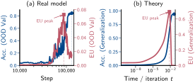
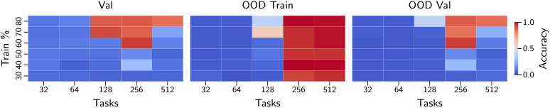
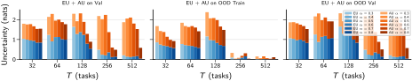
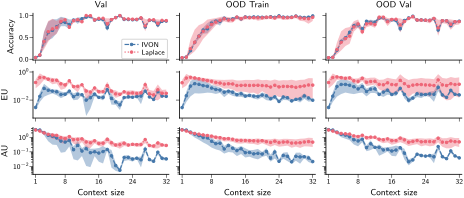
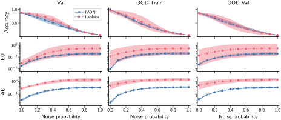
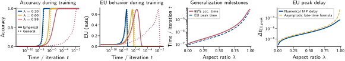

# Qchohi, Rossi 2026 — A Bayesian Perspective on the Role of Epistemic Uncertainty for Delayed Generalization in In-Context Learning

См. также: [глобальный индекс понятий](../../concepts/index.md).

**Abdessamed Qchohi**, **Simone Rossi** (EURECOM, Франция).

arXiv [2604.12434](https://arxiv.org/abs/2604.12434), апрель 2026 (v1), 27 страниц, 7 рисунков (9 файлов), 4 таблицы. Всего цитирований по Semantic Scholar — 0, в картотеке — 0. Первый в корпусе байесовский взгляд на отложенную генерализацию в обучении в контексте (ICL): на линейной модульной арифметике $z=ax+by\bmod 29$ по постановке He et al. (вектор задачи скрыт, модель выводит его из троек в контексте) эпистемическая неопределённость (EU), оцененная двумя приближёнными байесовскими способами (IVON и последнеслойный Лаплас), предложена как признак генерализации, не требующий меток; теоретическая опора — разрешимая линейная модель Levi et al. плюс гауссов вариационный поток Буреса–Вассерштейна, где и задержка порогов точности, и задержка пиков EU выведены из одного спектрального устройства — нижнего края закона Марченко–Пастура. Главный разрыв статьи: временной язык («EU обрушивается, когда модель гроккает») против сеточной природы основных рисунков (конечные значения по сетке настроек), и «обрушение» против «пика» EU, которые в собственной теории — разные величины.

Оригинал и производные файлы этой папки:

- [`original/2604.12434.a-bayesian-perspective-on-the-role-of-epistemic-uncertainty-for-delayed-generalization-in-in-context-learning.md`](original/2604.12434.a-bayesian-perspective-on-the-role-of-epistemic-uncertainty-for-delayed-generalization-in-in-context-learning.md) — конверсия оригинала (LaTeXML HTML v1, сверена с PDF и LaTeX-исходником) в Markdown без правок содержания.
- [`2604.12434.a-bayesian-perspective-on-the-role-of-epistemic-uncertainty-for-delayed-generalization-in-in-context-learning.claims.txt`](2604.12434.a-bayesian-perspective-on-the-role-of-epistemic-uncertainty-for-delayed-generalization-in-in-context-learning.claims.txt) — пронумерованные утверждения статьи с пометками разбора.
- [`images/`](images/) — 7 рисунков (9 файлов).

Схема якорей и правила ссылок на карточку — в [README папки статей](../README.md).

## Затрагиваемые понятия

**[Гроккинг](../../concepts/grokking.md)** — перенос имени на ICL-постановку: «обобщить» здесь значит вывести новую задачу из примеров в контексте, а не выучить одну таблицу; OOD-генерализация (невиданные задачи на невиданных входах) возникает только при наибольших разнообразиях задач ($T\geq 256$) и требует настройки доли данных, и в тех же настройках конечная EU низка ([`p4-6`](#p4-6)). Разбор: кривой обучающей точности в статье нет ни одной — разрыв «запомнил → долго ничего → обобщил» на трансформере не показан, отложенность как таковая не измерена; главные рисунки — карты *конечных* значений по сетке $(T,\alpha)$, а не траектории, но поданы временным языком («обрушивается, когда модель гроккает»); настоящих траекторий две, и обе говорят о *пике* EU перед порогом точности, а не об обрушении — три разные формулировки в одной статье.

**[Меры прогресса](../../concepts/progress-measures.md)** — заявка «EU как признак генерализации без меток»: гроккинг до сих пор определяли через точность (нужны метки), а эпистемическая неопределённость меряется по апостериору без меток; по сетке настроек при малом разнообразии задач полная неопределённость почти вся эпистемическая, при $T\geq 256$ EU резко падает при остающейся высокой алеаторной, и это согласовано у IVON и Лапласа ([`p4-10`](#p4-10)). Разбор: с существующими мерами прогресса (Clauw, Golechha — обе процитированы) на этой же задаче ничего не сопоставлено, порога срабатывания для EU не предложено; «без меток» верно наполовину — EU считается на заранее выделенном OOD-срезе, то есть требует знания о распределении задач; сличение IVON и Лапласа неоднородно по существу (две разные обученные модели, weight decay различается на шесть порядков: $1$ против $10^{-6}$).

**[Эффективная теория / статфизика](../../concepts/effective-theory-statistical-mechanics.md)** — самодостаточная выкладка вариационной динамики: для байесовской линейной регрессии гауссов поток Буреса–Вассерштейна даёт замкнутые ОДУ и точные решения; в пределе $n,d\to\infty$ при $\lambda=d/n<1$ обе избыточные потери — средние по закону Марченко–Пастура с одинаковым поздним поведением $t^{-3/2}e^{-\kappa t}$ и общим $\kappa$, задаваемым нижним краем $\nu_{-}=(1-\sqrt{\lambda})^{2}$; задержка — логарифм отношения предмножителей $K_{\text{gen}}/K_{\text{emp}}=(1-\sqrt{\lambda})^{-2}$, делённый на $\kappa$ ([`p8-4`](#p8-4)). Разбор: в этой модели гроккинг — плавное смещение двух кривых с одинаковой скоростью убывания, а не резкий переход; немонотонность EU заложена пороговым переопределением (двоичная энтропия пикует при $p=1/2$ по определению), тогда как собственно регрессионная EU при $\Sigma_{0}\prec\Sigma_{\infty}$ монотонно растёт и никакого обрушения не даёт (лемма C.3 против леммы 5.1); задержка пиков EU буквально совпадает с задержкой порогов точности — обе суть монотонные функции одной избыточной потери, и теорема 5.1 в этом смысле тавтологична; $\lambda$ для трансформера не измерено, количественной связи теории с опытом нет.

**[Модульная арифметика](../../concepts/modular-arithmetic.md)** — ICL-вариант канонического полигона по He et al.: $z=ax+by\bmod 29$, вектор задачи $(a,b)$ скрыт, модель получает 32 тройки $(x,y,z)$ в контексте (окно 96 токенов) и обязана вывести задачу; четыре среза (ID Train/Val, OOD Train/Val) скрещивают невиданность задач и входов; развёртки на выводе — по длине контекста (EU немонотонна: сперва растёт, затем резко падает при монотонном росте точности) и по шуму в контексте (порча меток $z_{i}$ поднимает и алеаторную, и эпистемическую составляющие) ([`p4-1`](#p4-1)). Разбор: один модуль ($p=29$), одна архитектура, одно семейство задач; «число задач $T$» основного текста и «базовое $n_{\mathrm{task}}$ с параллелограммным расширением $4n_{\mathrm{task}}$» приложения нигде явно не сшиты; рост алеаторной составляющей при впрыснутом шуме меток назван «слегка неожиданным», хотя это ожидаемый исход.

## Что показано, а что предположено

Замечания редактора карточки по итогам разбора утверждений (`…claims.txt`, 44 пункта).

**Ценное — сама постановка и выкладка.** Мысль мерить отложенную генерализацию разложением предсказательной неопределённости на эпистемическую и алеаторную — новый прибор для корпуса; немонотонность EU по длине контекста (рост при малом контексте, затем резкое падение), согласованная у двух методов, — содержательное наблюдение о приспособлении во время вывода; выкладка вариационной динамики приложения C самодостаточна и пригодна повторно; раскрытие использования LLM и бюджета (~12 000 ускорительных часов) честное.

**Между языком и данными — разрыв.** «Обрушение EU в момент гроккинга» подано как временное явление, но показано сеточное (конечные значения по $(T,\alpha)$); траекторий обучения две, и они про *пик* EU до порога точности; кривой обучающей точности нет — отложенность не измерена. В теории «обрушение» есть только у пороговой замены (двоичная энтропия), а регрессионная EU монотонна; задержки пиков EU и порогов точности — одно выражение, при этом статья настаивает то на «разных наблюдаемых», то на «двух зондах одного устройства».

**Сличение методов и нестыковки.** IVON против Лапласа — две разные обученные модели (вариационное обучение против послеобучающей надстройки над MAP) с weight decay, различающимся на шесть порядков, — несопоставимы ровно по главному рычагу гроккинга; величина затухания IVON расходится внутри статьи ($10^{-6}$ против $10^{-5}$); столкновение обозначений $d$ (слои против размерности); следы правки (дословный повтор абзаца с опечаткой «we identify a the condition», оборванная фраза «tokenized into three numerical.»).

**Как работу будут цитировать** («доказано, что эпистемическая неопределённость обрушивается в момент гроккинга») — точнее: на одной ICL-задаче при $p=29$ показано, что в настройках с высокой конечной OOD-точностью конечная EU низка, а на одной траектории обучения пик EU наступает раньше порога точности; теоретическая опора — линейная модель, где немонотонность EU заложена пороговым переопределением.

---

# Текст статьи

## Байесовский взгляд на роль эпистемической неопределённости в отложенной генерализации при обучении в контексте

**Abdessamed Qchohi** (EURECOM, Франция; email: abdessamed.qchohi@eurecom.fr), **Simone Rossi** (EURECOM, Франция; email: simone.rossi@eurecom.fr)

## Аннотация

Обучение в контексте позволяет трансформерам приспосабливаться к новым задачам по нескольким примерам во время вывода, а гроккинг подчёркивает, что эта генерализация может возникать резко лишь после продолжительного обучения. Мы изучаем задачную генерализацию и гроккинг в обучении в контексте с байесовской точки зрения, спрашивая, что делает возможным отложенный переход от запоминания к генерализации. Конкретно, мы рассматриваем задачи модульной арифметики, в которых трансформер должен вывести скрытую линейную функцию исключительно из примеров в контексте, и анализируем, как предсказательная неопределённость эволюционирует при обучении. Мы сочетаем приближённые байесовские техники для оценки апостериорного распределения и изучаем, как неопределённость ведёт себя по ходу обучения и при изменениях разнообразия задач, длины контекста и шума в контексте. Мы находим, что эпистемическая неопределённость резко обрушивается, когда модель гроккает, что делает неопределённость практичной, не требующей меток диагностикой генерализации в трансформерах. Дополнительно мы даём теоретическую поддержку упрощённой байесовской линейной моделью, показывая, что асимптотически и отложенная генерализация, и пики неопределённости возникают из одного лежащего в основе спектрального механизма, связывающего время гроккинга с динамикой неопределённости.

## 1 Введение

Обучение в контексте (In-Context Learning, ICL) возникло как мощная парадигма, в которой большие языковые модели (LLM) могут выучиваться выполнять новые задачи, обуславливаясь несколькими примерами во входной подсказке (Brown et al., 2020). Однако, несмотря на эмпирический успех, лежащие в основе механизмы, позволяющие LLM действенно учиться на примерах в контексте, остаются плохо понятыми. Недавние исследования начали разбирать теоретические основания ICL, предлагая гипотезы от неявного байесовского вывода (Xie et al., 2022; Akyurek et al., 2023) до мета-обучающих рамок (Von Oswald et al., 2023). Тем не менее целостного байесовского взгляда на то, как LLM обрабатывают примеры в контексте и учатся на них, всё ещё нет. Более того, при обучении LLM модели часто являют явление, известное как *гроккинг*: они внезапно переходят от слабого к почти идеальному качеству на задаче после продолжительного обучения, несмотря на то что уже подогнали обучающие данные (Power et al., 2022). В этой работе мы стремимся изучить, что делает возможным гроккинг в ICL, с байесовской точки зрения, и как обучающие динамики (и меры неопределённости) эволюционируют при обучении. Байесовское глубокое обучение (BDL) даёт принципиальную рамку моделирования неопределённости в глубоких моделях, трактуя параметры модели как случайные величины и выводя их апостериорные распределения по данным (Gal & Ghahramani, 2016; Blundell et al., 2015; Lakshminarayanan et al., 2017). Хотя точный вывод в крупных моделях вроде LLM невыполним, различные техники приближённого вывода, такие как вариационный вывод (VI) и приближения Лапласа, успешно применялись для схватывания неопределённости в глубоком обучении (Papamarkou et al., 2024). Трактуя модель в байесовской рамке, мы экспериментально анализируем, как квантификация неопределённости и апостериорные распределения над параметрами модели меняются по мере того, как модель гроккает на примерах в контексте. Следуя классической постановке, мы подходим к этому явлению, анализируя обучающие динамики трансформеров на задачах модульной арифметики (Power et al., 2022). Дополнительно мы даём теоретическую поддержку нашим **[p. 2]** эмпирическим находкам, анализируя динамику неопределённости в упрощённой модели и показывая, как переход к генерализации отвечает обрушению эпистемической неопределённости.

*Рисунок 1: **Эпистемическая неопределённость резко обрушивается на переходе гроккинга.** У декодерного трансформера, обученного на задачах модульной арифметики, эпистемическая неопределённость резко обрушивается перед переходом к генерализации. Этот узор следует теоретическому предсказанию для упрощённой линейной модели, где переход гроккинга отвечает спектральному сдвигу апостериорного распределения, вызывающему обрушение эпистемической неопределённости.* **[p. 2]**

Наши вклады таковы: (1) Мы изучаем гроккинг в ICL в байесовской рамке, используя задачи модульной арифметики для анализа того, как предсказательная неопределённость эволюционирует по мере того, как трансформер выучивается выводить скрытую задачу из примеров в контексте. (2) Мы эмпирически показываем, что резкое обрушение эпистемической неопределённости совпадает с переходом гроккинга, что делает её не требующей меток диагностикой генерализации. Мы далее сличаем Improved Variational Online Newton (IVON) и последнеслойный Лаплас по ходу обучения, разнообразию задач, длине контекста и шуму в контексте, высвечивая и общие узоры неопределённости, и метод-специфичные различия в out-of-distribution (OOD) генерализации. (3) Мы даём теоретическую поддержку упрощённой байесовской линейной моделью, показывая, что отложенная генерализация и отложенные пики эпистемической неопределённости возникают из одного лежащего в основе спектрального механизма, связывающего время гроккинга с динамикой неопределённости. Снимок наших главных эмпирических и теоретических находок показан на рисунке 1.

#### Связанные работы.

ICL изучалось и эмпирически, и теоретически с его появления в больших языковых моделях (Brown et al., 2020). Распространённый теоретический взгляд — что трансформеры могут реализовывать процедуры обучения или оценивания в прямом проходе, включая неявный байесовский вывод, гребневую регрессию и градиентное приспособление (Xie et al., 2022; Akyurek et al., 2023; Von Oswald et al., 2023; Bai et al., 2023; Xie et al., 2025; Zhang et al., 2025). Дополняющие работы рассматривают надёжность при подсказках: Zhang et al. (2024) изучают калибровку по числу примеров, Ling et al. (2024) разлагают неопределённость ICL на эпистемическую и алеаторную части, а Wang et al. (2025) анализируют неопределённость при длинном контексте. Байесовская рамка даёт естественный язык для связывания этих нитей: предобучение можно истолковать как выучивание неявного приора (или неявного семейства приоров) над задачами/концептами, а ICL отвечает приближённому байесовскому выводу (или байесовскому усреднению моделей) над скрытыми задачными переменными по подсказке (Xie et al., 2022; Zhang et al., 2025). Параллельно BDL трактует неопределённость как первоклассную — через приоры и апостериоры над параметрами и предсказательные распределения как маргинализацию — и предлагает инструменты, делающие траектории неопределённости при обучении и выводе измеримыми (например, Graves, 2011; Blundell et al., 2015; Gal & Ghahramani, 2016; Lakshminarayanan et al., 2017; Maddox et al., 2019; Ritter et al., 2018). Со стороны гроккинга Power et al. (2022) представили каноническое явление отложенной генерализации на модульной арифметике. Последующие работы охарактеризовали его фазы обучения и динамику представлений (Liu et al., 2022), объяснили аспекты модульного сложения через выход из режима нейронного касательного ядра (NTK) (Mohamadi et al., 2024) и предложили информационно-теоретические или структурные меры прогресса, способные предвосхищать гроккинг (Clauw et al., 2024; Golechha, 2024). Ближе всего к нашей постановке He et al. (2024) расширяют классическое семейство задач до модульных линейных функций и изучают обучение и в распределении, и вне его. Мы строим на той же экспериментальной постановке, но наш фокус — байесовские обучающие динамики и траектории неопределённости при гроккинге, а не характеризация фаз обучения или представленческих изменений. Примечательно, что мы выявляем условие, при котором модель может обобщаться в домене и вне домена, и анализируем, как неопределённость модели эволюционирует при переходе от переобучения к генерализации, давая новый взгляд на явление гроккинга. Более подробный обзор связанных работ доступен в приложении A.

**[p. 3]**

## 2 Предварительные сведения

#### Байесовский вывод.

Вместо трактовки параметров модели как закреплённых значений байесовские методы моделируют их как случайные величины. По набору данных $\mathcal{D}$ и параметрам модели ${\boldsymbol{\theta}}$ правило Байеса даёт апостериор:

$$
p({\boldsymbol{\theta}}\mid\mathcal{D})=\frac{p(\mathcal{D}\mid{\boldsymbol{\theta}})\,p({\boldsymbol{\theta}})}{p(\mathcal{D})}
$$

где $p(\theta)$ — приор, кодирующий убеждения о параметрах до наблюдения данных, $p(\mathcal{D}\mid{\boldsymbol{\theta}})$ — правдоподобие, описывающее, насколько вероятны наблюдённые данные при конкретном выборе параметров, а $p(\mathcal{D})=\int p(\mathcal{D}\mid{\boldsymbol{\theta}})\,p({\boldsymbol{\theta}})\,\mathrm{d}{\boldsymbol{\theta}}$ — маргинальное правдоподобие, интегрирующее параметры и действующее как нормирующая константа, обеспечивающая корректность апостериора как распределения вероятностей. Предсказания для нового входа ${\boldsymbol{x}}^{*}$ получаются маргинализацией по апостериору:

$$
p({\boldsymbol{y}}^{*}\mid{\boldsymbol{x}}^{*},\mathcal{D})=\int p({\boldsymbol{y}}^{*}\mid{\boldsymbol{x}}^{*},{\boldsymbol{\theta}})\,p({\boldsymbol{\theta}}\mid\mathcal{D})\,d{\boldsymbol{\theta}} \tag{1}
$$

Это предсказательное распределение схватывает неопределённость в параметрах модели, что важно при малых данных или оценке модели на out-of-distribution входах. Точный вывод для нейронных сетей невыполним, поскольку апостериор многомерен, а маргинальное правдоподобие не имеет замкнутой формы. Потому нужны методы приближённого вывода.

Хотя набор методов приближённого вывода велик и быстро развивается, мы сосредотачиваемся на двух взаимодополняющих подходах, хорошо подходящих нашей постановке: вариационном выводе и приближении Лапласа. IVON (Shen et al., 2024) встраивает оценку неопределённости в обучение, поддерживая гауссов вариационный апостериор над всеми весами, обновляемый ньютоно-подобными шагами при вычислительной цене, сравнимой с Adam. Последнеслойное приближение Лапласа (Daxberger et al., 2021) — послеобучающий метод, подгоняющий гауссово приближение к апостериору финального линейного слоя после стандартного MAP-обучения, используя кронекер-факторизованное приближение гессиана и оставляя все прочие параметры закреплёнными. Для обоих методов предсказания получаются усреднением по $S$ выборкам весов из $q({\boldsymbol{\theta}})$. Дополнительные подробности об этих методах — в приложении B.

#### Разложение неопределённости.

Оба метода приближённого вывода дают распределение над предсказаниями, позволяя принципиальное разложение предсказательной неопределённости (Wimmer et al., 2023; Rosso et al., 2025; Hüllermeier & Waegeman, 2021). По $S$ выборкам весов ${\boldsymbol{\theta}}^{(s)}$ из приближённого апостериора полная неопределённость (TU) — энтропия среднего предсказания; алеаторная неопределённость (AU) — средняя энтропия отдельных предсказаний, схватывающая неустранимый шум меток; эпистемическая неопределённость (EU) — их разность:

$$
\mathrm{EU}({\boldsymbol{x}})=\mathbb{H}\!\left[\frac{1}{S}\sum_{s=1}^{S}p({\boldsymbol{y}}\mid{\boldsymbol{x}},{\boldsymbol{\theta}}^{(s)})\right]-\underbrace{\frac{1}{S}\sum_{s=1}^{S}\mathbb{H}\!\left[p({\boldsymbol{y}}\mid{\boldsymbol{x}},{\boldsymbol{\theta}}^{(s)})\right]}_{\mathrm{AU}({\boldsymbol{x}})}
$$

Эпистемическая неопределённость отражает нехватку знаний модели о задаче и, как ожидается, снижается по мере получения моделью информации. В постановке гроккинга мы используем EU как зонд перехода к генерализации.

## 3 Обучение в контексте, гроккинг и неопределённость

В этом разделе мы описываем главные экспериментальные результаты о связи гроккинга и неопределённости в обучении в контексте. Сначала мы вводим экспериментальную постановку, включая распределение задач, архитектуру модели и протокол оценки. Затем мы представляем главные эмпирические находки о поведении точности и эпистемической неопределённости. Наконец, мы анализируем, как разнообразие задач, длина контекста и шум в контексте влияют и на генерализацию, и на динамику неопределённости.

**[p. 4]**

### 3.1 Экспериментальная постановка

#### Задачи.

###### p4-1

Мы следуем He et al. (2024) и сосредотачиваемся на линейных задачах модульной арифметики вида $z=ax+by\pmod{p}$, где $(a,b)$ — вектор задачи, а $(x,y)$ — входной вектор, со всеми значениями в $\{0,\ldots,p-1\}$. Модульная арифметика даёт контролируемую постановку для изучения гроккинга, поскольку задачи имеют ясную лежащую в основе структуру, которую модель может либо запомнить, либо выучиться обобщать. Вектор задачи модели никогда не показывается: она получает только тройки вход-выход $(x,y,z)$ и должна вывести лежащую в основе задачу из примеров в контексте. Каждое уравнение токенизируется в три числовых. Пример входной последовательности:

$$
(x_{1},y_{1},z_{1}),\;\ldots,\;(x_{n_{\mathrm{ctx}}},y_{n_{\mathrm{ctx}}},z_{n_{\mathrm{ctx}}}),\;(x_{t},y_{t},\textbf{?})
$$

При обучении модель предсказывает каждый третий токен $z_{i}$, а также финальную цель $z_{t}$, с перекрёстно-энтропийной потерей только на этих позициях. При оценке мы меряем точность только на $z_{t}$, что прямо проверяет, вывела ли модель верную задачу из контекста. Мы разбиваем множества векторов задач и входных примеров на виденные и невиданные подмножества, $\mathcal{T}_{\mathrm{id}}$, $\mathcal{T}_{\mathrm{ood}}$ и $\mathcal{X}_{\mathrm{train}}$, $\mathcal{X}_{\mathrm{test}}$ соответственно. Скрещивание этих двух разбиений даёт четыре среза: ID Train ($\mathcal{T}_{\mathrm{id}}$, $\mathcal{X}_{\mathrm{train}}$), используемый для обучения; ID Val ($\mathcal{T}_{\mathrm{id}}$, $\mathcal{X}_{\mathrm{test}}$), проверяющий генерализацию на невиданные входы на виденных задачах; OOD Train ($\mathcal{T}_{\mathrm{ood}}$, $\mathcal{X}_{\mathrm{train}}$), проверяющий приспособление к невиданным задачам на виденных входах; и OOD Val ($\mathcal{T}_{\mathrm{ood}}$, $\mathcal{X}_{\mathrm{test}}$) — самый трудный срез, проверяющий полную out-of-distribution генерализацию и на невиданные задачи, и на невиданные входы. Мы обучаем исключительно на ID Train и используем остальные три среза для оценки генерализации. Это построение позволяет отслеживать, запоминает ли модель, обобщается ли в распределении или вне его, и в какой момент гроккинг наступает в каждом режиме.

#### Архитектура модели и обучение.

Мы используем декодерный трансформер с Rotary Positional Embeddings (RoPE) (Su et al., 2024) с $d=6$ слоями, размерностью эмбеддинга $512$, $4$ головами внимания и множителем ширины MLP $4$. Мы связываем веса входного эмбеддинга и выходной проекции и применяем weight decay для регуляризации. Векторы задач выбираются правилом параллелограмма, варьируя по одной компоненте за раз, чтобы модель могла строить на прежде выученной структуре, и каждый батч строится так, чтобы все задачи $\mathcal{T}_{\mathrm{id}}$ делили одни входные последовательности, ограничивая межзадачную интерференцию. Если не указано иное, мы обучаем четыре случайных семени и сообщаем медианы с $95\%$ квантильными интервалами по семенам для всех метрик и конфигураций. Подробные описания процедуры обучения, гиперпараметров и методов приближённого вывода даны в приложении D.

## 4 Эмпирические результаты и анализ

**IVON**

**Laplace**

*Рисунок 2: **Карта точности с IVON и Лапласом**. На OOD Train и IVON, и Лаплас достигают высокой точности начиная с $T=256$ и $T=512$ при любой доле обучающих данных. На OOD Val (самом трудном срезе) Лаплас обобщается шире по конфигурациям, тогда как IVON достигает конкурентного качества только при высоких долях обучающих данных.* **[p. 5]**

#### Гроккинг по разнообразию задач.

###### p4-6

Чтобы изучить, как гроккинг возникает как функция разнообразия задач и обучающих данных, мы обучаем модель по сетке конфигураций, варьируя число предобучающих задач $T\in\{32,64,128,256,512\}$ и долю обучающих данных $\alpha\in\{0.3,0.4,0.5,0.6,0.7,0.8\}$, с четырьмя семенами на конфигурацию. Мы меряем точность на Val, OOD Train и OOD Val и сличаем IVON и Лаплас, чтобы оценить, влияет ли выбор оптимизатора на ландшафт генерализации. Рисунок 2 показывает результаты. И IVON, и Лаплас достигают высокой точности OOD Train при $T=256$ и $T=512$. На OOD Val Лаплас являет более сильную и последовательную генерализацию по числам задач и долям данных, тогда как IVON достигает конкурентной точности OOD Val только при наибольших долях обучающих данных. Генерализация OOD Val возникает только при наибольших числах задач у обоих методов и требует тщательной настройки доли обучающих данных.

#### Эпистемическая неопределённость отслеживает гроккинг.

Чтобы проверить, отслеживает ли эпистемическая неопределённость переход гроккинга, мы используем IVON и Лаплас для разложения предсказательной неопределённости на эпистемическую и алеаторную части по той же сетке гиперпараметров. Рисунок 3 показывает результаты на каждом оценочном наборе.

**IVON**

**Laplace**

*Рисунок 3: **Разложение неопределённости с IVON и Лапласом**. Разложение предсказательной неопределённости на алеаторную и эпистемическую части по сетке гиперпараметров предобучения.* **[p. 5]**

###### p4-10

Оба метода показывают, что при малом разнообразии задач полная неопределённость господствуется эпистемической частью на всех срезах. С ростом $T$ эпистемическая неопределённость резко падает при $T=256$ и $T=512$ и у IVON, и у Лапласа, тогда как алеаторная остаётся высокой. Это снижение тесно отслеживает переход к генерализации на картах точности, давая принципиальную неопределённостную сигнатуру гроккинга, согласованную между методами приближённого вывода. **[p. 5]** Это важная находка: на момент написания *гроккинг* характеризовался прежде всего динамикой точности (что подразумевает нужду в метках для его обнаружения), тогда как здесь мы показываем, что у него есть и ясная сигнатура в апостериорной неопределённости модели, которую можно мерить без доступа к меткам и которая даёт более прямое окно в обучающие динамики модели.

#### Влияние длины контекста на генерализацию.

Чтобы изучить, как число примеров в контексте влияет на способность модели вывести лежащую в основе задачу, мы берём модели, обученные с $n_{\mathrm{ctx}}=32$, и оцениваем их, варьируя число примеров в контексте от $1$ до $32$ во время вывода, без дополнительного обучения. Вектор задачи $(a,b)$ модели никогда не даётся: она должна вывести его исключительно из троек вход-выход в контексте. Мы сличаем IVON и Лаплас на Val, OOD Train и OOD Val. **[p. 6]** Рисунок 4 показывает точность, эпистемическую и алеаторную неопределённость как функцию размера контекста.

*Рисунок 4: **Точность, эпистемическая и алеаторная неопределённость по размерам контекста**. Рост числа примеров в контексте монотонно улучшает точность и снижает алеаторную неопределённость, тогда как эпистемическая следует немонотонному поведению.* **[p. 6]**

###### p6-1

Точность улучшается монотонно с размером контекста у IVON и Лапласа на всех срезах, подтверждая, что больше примеров действительно помогают модели вывести задачу (и потому лучше обобщаться на OOD-срезах). Как ожидалось, алеаторная неопределённость снижается с ростом контекста и сходится к полке, отражая сниженную двусмысленность задачи при большем свидетельстве. Поведение эпистемической неопределённости сложнее: она растёт при малых размерах контекста, вероятно из-за исходной неопределённости модели о задаче, затем резко падает по мере добавления примеров. Примечательно, что это поведение присутствует и у IVON, и у Лапласа, хотя и с разными величинами, намекая, что это не артефакт метода приближённого вывода, а свойство (мета-)обучающей динамики модели при обработке свидетельств в контексте. Также заметим, что это свидетельство не противоречит известному факту, что неопределённость масштабируется монотонно с данными в байесовском выводе (см., например, Rosso et al., 2025), но скорее подчёркивает, что нынешние законы масштабирования неопределённости следует уточнить для учёта эффекта приспособления во время вывода через обучение в контексте.

*Рисунок 5: **Точность против эпистемической и алеаторной неопределённости по уровням шума в контексте**. Порча примеров в контексте случайным шумом меток деградирует точность и поднимает и алеаторную, и эпистемическую неопределённость.* **[p. 6]**

#### Прочность к шуму в контексте.

###### p6-2

Как финальную проверку оценок неопределённости модели мы оцениваем их отклик на шум в примерах контекста. Для этого опыта мы портим контекст, заменяя каждую метку $z_{i}$ в тройках контекста случайным токеном, **[p. 7]** выбранным равномерно из $\{0,\ldots,p-1\}$ с вероятностью $p_{\mathrm{noise}}\in[0,1]$. Входные токены $x$ и $y$ никогда не портятся, и финальная тройка запроса всегда чиста. Как и прежде, мы оцениваем IVON и Лаплас на Val, OOD Train и OOD Val, меряя точность, алеаторную и эпистемическую неопределённость как функции уровня шума (рисунок 5). Точность деградирует плавно с ростом шума у обоих методов и на всех срезах. Алеаторная неопределённость растёт соразмерно уровню шума, верно схватывая возросшую двусмысленность меток в контексте. Эпистемическая неопределённость тоже растёт с шумом, но заметнее у Лапласа, чем у IVON, намекая, что вариационный апостериор, выученный IVON, прочнее к порченому контексту. Это слегка неожиданно: можно было бы ожидать, что порченый контекст поднимет прежде всего эпистемическую неопределённость, поскольку он затрудняет вывод задачи, тогда как алеаторная должна остаться стабильной, отражая неустранимый шум данных, а не нехватку контекста. Это демонстрирует, что недавние анализы разделения алеаторной и эпистемической неопределённости (например, Mucsányi et al., 2024; Kirchhof et al., 2025) не обязательно применимы к постановке обучения в контексте, и нужна дальнейшая работа для понимания того, как эти составляющие неопределённости взаимодействуют, когда модель выполняет приспособление во время вывода.

## 5 Почему эпистемическая неопределённость тоже может определять время гроккинга

Наши эмпирические результаты наводят на мысль, что гроккинг виден не только в кривых точности, но и в эпистемической неопределённости. Сделать это утверждение строгим для полного трансформера на модульной арифметике сейчас недостижимо, поэтому в этом разделе мы резко упрощаем задачу. Следуя линейно-регрессионной постановке Levi et al. (2024), мы заменяем последовательностную модель байесовской линейной регрессией. Хотя это очень простая модель, Levi et al. (2024) показывают, что она уже схватывает ключевое явление отложенной генерализации. Здесь мы показываем, что она схватывает и ключевое явление отложенных пиков EU, когда модель обучается гауссовым вариационным выводом. Эта абстракция явно много проще модели, изучаемой в остальной части статьи, но она даёт полностью податливые динамики и всё же отвечает качественной эмпирической картине: обучающая ошибка убывает раньше обобщающей, эпистемическая неопределённость немонотонна, и переход на обобщающей стороне отложен. Полные выводы отложены в приложение C; здесь мы набрасываем главные результаты.

#### Упрощённая задача.

Пусть ${\boldsymbol{X}}\in\mathbb{R}^{n\times d}$ — матрица плана с ${\boldsymbol{x}}_{i}\sim\mathcal{N}({\boldsymbol{0}},{\boldsymbol{I}}_{d})$, и ${\boldsymbol{y}}\in\mathbb{R}^{n}$ — вектор целей, порождённый из ${\boldsymbol{w}}_{\star}$ с изотропным гауссовым приором. Рассмотрим линейно-гауссову модель

$$
p({\boldsymbol{y}}\mid{\boldsymbol{w}}) =\mathcal{N}({\boldsymbol{y}};{\boldsymbol{X}}{\boldsymbol{w}},\sigma^{2}{\boldsymbol{I}}_{n}),  p({\boldsymbol{w}}) =\mathcal{N}({\boldsymbol{w}};{\boldsymbol{0}},\tau^{2}{\boldsymbol{I}}_{d}). \tag{2}
$$

Мы изучаем режим $n,d\to\infty$ при закреплённом аспектном отношении $\lambda=d/n<1$. Наша цель — проанализировать динамику гауссова вариационного вывода в этой модели и понять, как риск и неопределённость эволюционируют вдоль вариационной траектории. По результатам Lambert et al. (2022), поскольку модель линейна и вариационное семейство гауссово, градиентные потоки на пространстве Буреса–Вассерштейна гауссовых мер $q_{t}({\boldsymbol{w}})=\mathcal{N}({\boldsymbol{w}};{\boldsymbol{\mu}}_{t},{\boldsymbol{\Sigma}}_{t})$ записываются в замкнутой форме как система ОДУ:

$$
\dot{\boldsymbol{\mu}}_{t} ={\boldsymbol{b}}-{\boldsymbol{A}}{\boldsymbol{\mu}}_{t}, \tag{3}\\
\dot{\boldsymbol{\Sigma}}_{t} =2{\boldsymbol{I}}_{d}-{\boldsymbol{A}}{\boldsymbol{\Sigma}}_{t}-{\boldsymbol{\Sigma}}_{t}{\boldsymbol{A}}. \tag{4}
$$

с ${\boldsymbol{A}}=\sigma^{-2}{\boldsymbol{X}}^{\top}{\boldsymbol{X}}+\tau^{-2}{\boldsymbol{I}}_{d}$ и ${\boldsymbol{b}}=\sigma^{-2}{\boldsymbol{X}}^{\top}{\boldsymbol{y}}$. Эта система имеет точные решения, как показано в приложении. Вдоль гауссовой вариационной траектории нас интересуют ожидаемые риски

$$
\mathcal{L}_{\text{emp}}(t)=\mathbb{E}_{q_{t}}\frac{1}{n}\sum_{i=1}^{n}\ell(y_{i},{\boldsymbol{x}}_{i}^{\top}{\boldsymbol{w}})\qquad\text{and}\qquad\mathcal{L}_{\text{gen}}(t)=\mathbb{E}_{q_{t}({\boldsymbol{w}})p({\boldsymbol{x}},y)}\ell(y_{i},{\boldsymbol{x}}_{i}^{\top}{\boldsymbol{w}}) \tag{5}
$$

где $\ell$ — квадратичная потеря, т. е. $\ell(y,\hat{y})=\frac{1}{2}(y-\hat{y})^{2}$. Мы также можем определить избыточные риски — разности рисков в момент $t$ и их предельных значений при $t\to\infty$.

**[p. 8]**

#### Динамика рисков и спектральное разложение.

В режиме верно специфицированной модели неподвижная точка ${\boldsymbol{\mu}}_{\infty}$ совпадает с точными параметрами ${\boldsymbol{w}}_{\star}$, а популяционная ковариация изотропна, так что значимы зазор среднего $\delta{\boldsymbol{\mu}}_{0}\equiv{\boldsymbol{\mu}}_{0}-{\boldsymbol{\mu}}_{\infty}$ и зазор ковариации $\Delta{\boldsymbol{\Sigma}}_{0}\equiv{\boldsymbol{\Sigma}}_{0}-{\boldsymbol{\Sigma}}_{\infty}$. Записывая ${\boldsymbol{E}}_{t}\equiv e^{-{\boldsymbol{A}}t}$, избыточные эмпирический и обобщающий риски суть

$$
\widetilde{\mathcal{L}}_{\mathrm{emp}}(t) =\frac{1}{2n}\delta{\boldsymbol{\mu}}_{0}^{\top}{\boldsymbol{E}}_{t}{\boldsymbol{X}}^{\top}{\boldsymbol{X}}{\boldsymbol{E}}_{t}\delta{\boldsymbol{\mu}}_{0}+\frac{1}{2n}\operatorname{Tr}({\boldsymbol{X}}^\top{\boldsymbol{X}}{\boldsymbol{E}}_t \Delta{\boldsymbol{\Sigma}}_0 {\boldsymbol{E}}_t), \tag{6}\\
\widetilde{\mathcal{L}}_{\mathrm{gen}}(t) =\frac{1}{2}\delta{\boldsymbol{\mu}}_{0}^{\top}{\boldsymbol{E}}_{t}^{2}\delta{\boldsymbol{\mu}}_{0}+\frac{1}{2}\operatorname{Tr}({\boldsymbol{E}}_t \Delta{\boldsymbol{\Sigma}}_0 {\boldsymbol{E}}_t). \tag{7}
$$

Первый член отслеживает остаточное смещение вариационного среднего, второй — остаточную неопределённость от ковариации. Существенно, что оба риска движутся одним оператором ${\boldsymbol{A}}$, но считываются в двух разных величинах: эмпирический риск использует обучающую ковариацию $\widehat{{\boldsymbol{\Sigma}}}={\boldsymbol{X}}^{\top}{\boldsymbol{X}}/n$, а популяционный — единичную матрицу. В многомерном пределе собственные числа выборочной ковариации $\widehat{{\boldsymbol{\Sigma}}}$ сходятся по распределению к закону Марченко–Пастура $\mathrm{MP}(\lambda)$, и избыточные риски выражаются средними по этому распределению:

$$
\widetilde{\mathcal{L}}_{\text{emp}}(t) \approx C_{0}\,\mathbb{E}_{\nu\sim\mathrm{MP}(\lambda)}\left[\nu\exp\left(-2\left(\frac{n}{\sigma^{2}}\nu+\frac{1}{\tau^{2}}\right)t\right)\right], \tag{8}\\
\widetilde{\mathcal{L}}_{\text{gen}}(t) \approx C_{0}\,\mathbb{E}_{\nu\sim\mathrm{MP}(\lambda)}\left[\exp\left(-2\left(\frac{n}{\sigma^{2}}\nu+\frac{1}{\tau^{2}}\right)t\right)\right]. \tag{9}
$$

где $C_{0}$ собирает исходные зазоры среднего и ковариации (подробности в приложении). При допущении многомерного самоусредняющегося режима позднее поведение управляется нижним краем Марченко–Пастура $\nu_{-}=(1-\sqrt{\lambda})^{2}$:

$$
\widetilde{\mathcal{L}}_{\text{emp,gen}}(t)\sim K_{\text{emp,gen}}t^{-3/2}e^{-\kappa t},\qquad\kappa=2\left(\frac{n}{\sigma^{2}}(1-\sqrt{\lambda})^{2}+\frac{1}{\tau^{2}}\right), \tag{10}
$$

###### p8-4

с отношением $K_{\text{gen}}/K_{\text{emp}}=(1-\sqrt{\lambda})^{-2}$. Общая экспоненциальная скорость $\kappa$ отражает общую краевую моду, тогда как различие множителей происходит от лишнего $\nu$ в эмпирическом риске и отвечает за задержку между обучением и тестом. Это асимптотическое рассогласование — единственный ингредиент, нужный для результата о неопределённости ниже.

*Рисунок 6: **Обучающая и обобщающая динамики упрощённой модели.** Рост аспектного отношения $\lambda$ задерживает генерализацию относительно обучения (*слева*). Пики эпистемической неопределённости совпадают с переходом от интерполяции к генерализации (*в центре слева*), хотя пик EU наступает до превышения порога точности (*в центре справа*). Согласованно, задержка пика EU быстро растёт при $\lambda\to 1$, и асимптотическая формула теоремы 5.1 даёт хороший прокси наблюдаемой задержки (*справа*).* **[p. 8]**

#### Пороговая неопределённость и отложенные пики EU.

Следуя построению Levi et al. (2024), мы превращаем регрессию в бинарное событие успеха, выбирая допуск $\epsilon>0$ и объявляя предсказание верным, когда ожидаемая квадратичная невязка меньше $\epsilon$. Для точки данных $({\boldsymbol{x}},y)$ определим пороговую переменную успеха $Z_{\epsilon}({\boldsymbol{x}},y;{\boldsymbol{w}})=\mathbb{1}\{(y-{\boldsymbol{x}}^{\top}{\boldsymbol{w}})^{2}\leq\epsilon\}$. Мы можем определить эмпирическую и обобщающую точности $\mathcal{A}_{\text{emp}}$ и $\mathcal{A}_{\text{gen}}$ как ожидания $Z_{\epsilon}$ под вариационным распределением и распределением данных (подробности в приложении). По аналогии с порогом точности из Levi et al. (2024) можно определить время гроккинга как момент пересечения кривой точности некоторого порога, что равнозначно моменту пересечения избыточным риском некоторого порога; для $95\%$ точности **[p. 9]** имеем $\widetilde{\mathcal{L}}(t_{\mathrm{grok}})\approx\epsilon/8$. Теперь наша цель — проанализировать эпистемическую неопределённость этой модели.

##### **Лемма 5.1** (эпистемическая неопределённость классификационно-эквивалентной модели).

*Для закреплённых $({\boldsymbol{x}},y)$ невязка под $q_{t}$ гауссова, а пороговое событие успеха — бернуллиевская случайная величина. Значит, её эпистемическая неопределённость есть в точности двоичная энтропия вероятности успеха, которую в пределе $n,d\to\infty$ можно записать через избыточный риск $\widetilde{\mathcal{L}}(t)$:*

$$
\mathrm{EU}(t)\approx h_{2}\!\left(\operatorname{erf}\left(\sqrt{\frac{\epsilon}{4\widetilde{\mathcal{L}}(t)}}\right)\right), \tag{11}
$$

*где $h_{2}(p)=-p\log p-(1-p)\log(1-p)$ — двоичная энтропия. Это немонотонная функция избыточного риска, и её пик наступает, когда*

$$
\widetilde{\mathcal{L}}(t_{\mathrm{peak}})=\frac{\epsilon}{4(\operatorname{erf}^{-1}(1/2))^{2}}\approx 1.10\,\epsilon, \tag{12}
$$

*то есть когда пороговое событие успеха максимально двусмысленно. Обратив это соотношение, можно вывести и $t_{\mathrm{peak}}$ как функцию $\epsilon$ и динамики риска.*

##### *Замечание 5.1*.

###### p9-4

Заметим, что пик эпистемической неопределённости наступает не одновременно с порогом точности, а раньше, когда избыточный риск ещё около $1.10\,\epsilon$ (вместо $\epsilon/8$); это смещение показано на панели в центре справа рисунка 6.

Наконец, мы можем проанализировать задержку между пиками EU на обучении и тесте, которая служит прокси времени гроккинга, определённого через эпистемическую неопределённость.

##### **Теорема 5.1** (задержка между пиками пороговой неопределённости).

*Предположим построение леммы 5.1 и описанные выше асимптотики. Если эмпирическая и обобщающая кривые неопределённости пикуют в этом режиме, то задержка между двумя пиками EU удовлетворяет*

$$
\Delta t_{\mathrm{EU,peak}}(\lambda)=t_{\mathrm{peak},\mathrm{gen}}-t_{\mathrm{peak},\mathrm{emp}}\simeq\frac{\log\left(\frac{1}{1-\sqrt{\lambda}}\right)}{\frac{n}{\sigma^{2}}(1-\sqrt{\lambda})^{2}+\frac{1}{\tau^{2}}}. \tag{13}
$$

Это масштабирование видно и на рисунке 6, где разделение между эмпирическим и обобщающим пиками EU заметно растёт при $\lambda\to 1$ и следует асимптотическому предсказанию.

*Рисунок 7: **Эмпирическая траектория точности и эпистемической неопределённости.** Даже в полной трансформерной модели пик EU наступает до превышения порога точности, подобно асимптотическому поведению упрощённой модели.* **[p. 9]**

#### Вывод.

###### p9-8

Теорема 5.1 — главная теоретическая причина говорить, что время гроккинга можно определять и через эпистемическую неопределённость. Суть не в том, что пик EU наступает в тот же абсолютный момент, что порог точности (в самом деле, пик EU случается раньше порога точности), а в том, что обе наблюдаемые наследуют одну и ту же задержку обучение-генерализация от одних и тех же медленных мод края спектра. В этой упрощённой модели точность и эпистемическая неопределённость — два разных зонда одного лежащего в основе механизма. Это ровно то качественное поведение, что мы наблюдаем в эмпирическом анализе. В самом деле, даже в полной трансформерной модели на наборе модульной арифметики пик EU наступает до превышения порога точности, показывая, что теоретическая картина упрощённой модели совместима с эмпирическим поведением (рисунок 7).

## 6 Заключительные замечания

Мы представили взгляд квантификации неопределённости на отложенную генерализацию в обучении в контексте и показали, что эпистемическая неопределённость даёт резкую, не требующую меток сигнатуру гроккинга. В контролируемой постановке модульной линейной арифметики с явными срезами в распределении и вне его мы нашли, что гроккинг совпадает с внезапным **[p. 10]** обрушением эпистемической неопределённости, и что это поведение остаётся информативным при изменениях разнообразия задач, длины контекста и шума в контексте. И для IVON, и для последнеслойного Лапласа этот сигнал неопределённости прочен, раскрывая при этом осмысленные различия в out-of-distribution поведении. Мы далее поддержали эти находки теоретическими результатами на упрощённой байесовской линейной модели, показав, что отложенная генерализация и пики неопределённости движутся одним лежащим в основе спектральным механизмом. В заключение мы хотим подчеркнуть, что хотя наши находки дают новый взгляд на явление гроккинга и его связь с динамикой неопределённости, они основаны на конкретной синтетической постановке и упрощённой теоретической модели. Расширение этих прозрений на большие модели и другие языковые задачи остаётся важным направлением будущей работы, и к истолкованию динамики неопределённости в более сложных обстановках следует подходить осторожно.

## Благодарности

Этому проекту предоставлены вычислительные и хранилищные ресурсы ИИ GENCI в IDRIS по гранту 2025-AD011016811 на разделе A100/H100 суперкомпьютера Jean Zay. SR благодарит за поддержку установку CIRCALIS AI-HPC в EURECOM с частичным финансированием французского региона Sud.

## References

- Akyurek et al. (2023) E. Akyurek, D. Schuurmans, J. Andreas, T. Ma, and D. Zhou What learning algorithm is in-context learning? Investigations with linear models. In The Eleventh International Conference on Learning Representations, External Links: Link Cited by: Appendix A, §1, §1.

- Bai et al. (2023) Y. Bai, F. Chen, H. Wang, C. Xiong, and S. Mei Transformers as Statisticians: Provable In-Context Learning with In-Context Algorithm Selection. In Thirty-seventh Conference on Neural Information Processing Systems, External Links: Link Cited by: Appendix A, §1.

- Blundell et al. (2015) C. Blundell, J. Cornebise, K. Kavukcuoglu, and D. Wierstra Weight Uncertainty in Neural Networks. In International Conference on Machine Learning (ICML), External Links: Link Cited by: Appendix A, §1, §1.

- Brown et al. (2020) T. Brown, B. Mann, N. Ryder, M. Subbiah, J. D. Kaplan, P. Dhariwal, A. Neelakantan, P. Shyam, G. Sastry, A. Askell, et al. Language models are few-shot learners. Advances in neural information processing systems 33, pp. 1877–1901. Cited by: Appendix A, §1, §1.

- Clauw et al. (2024) K. Clauw, S. Stramaglia, and D. Marinazzo Information-Theoretic Progress Measures reveal Grokking is an Emergent Phase Transition. In ICML 2024 Workshop on Mutual Information (MI), External Links: 2408.08944, Document Cited by: Appendix A, §1.

- Daxberger et al. (2021) E. Daxberger, A. Kristiadi, A. Immer, R. Eschenhagen, M. Bauer, and P. Hennig Laplace Redux - Effortless Bayesian Deep Learning. In neurips, Vol. 34. Cited by: §B.2, §2.

- Gal & Ghahramani (2016) Y. Gal and Z. Ghahramani Dropout as a Bayesian Approximation: Representing Model Uncertainty in Deep Learning. In International Conference on Machine Learning, Cited by: Appendix A, §1, §1.

- Golechha (2024) S. Golechha Progress Measures for Grokking on Real-world Tasks. In ICML 2024 Workshop on High-dimensional Learning Dynamics (HiLD), External Links: 2405.12755, Document Cited by: Appendix A, §1.

- Graves (2011) A. Graves Practical Variational Inference for Neural Networks. In Advances in Neural Information Processing Systems, Cited by: Appendix A, §1.

- He et al. (2024) T. He, D. Doshi, A. Das, and A. Gromov Learning to grok: Emergence of in-context learning and skill composition in modular arithmetic tasks. In Advances in Neural Information Processing Systems, Vol. 37. External Links: Link Cited by: Appendix A, §D.1, §1, §3.1.

- Hüllermeier & Waegeman (2021) E. **[p. 11]** Hüllermeier and W. Waegeman Aleatoric and epistemic uncertainty in machine learning: an introduction to concepts and methods. Machine Learning 3 (110), pp. 457–506. Cited by: §2.

- Khan et al. (2018) M. E. Khan, D. Nielsen, V. Tangkaratt, W. Lin, Y. Gal, and A. Srivastava Fast and Scalable Bayesian Deep Learning by Weight-Perturbation in Adam. In International Conference on Machine Learning (ICML), External Links: Link Cited by: §B.1.

- Kirchhof et al. (2025) M. Kirchhof, G. Kasneci, and E. Kasneci Position: Uncertainty Quantification Needs Reassessment for Large Language Model Agents. In Forty-second International Conference on Machine Learning Position Paper Track, External Links: Link Cited by: §4.

- Lakshminarayanan et al. (2017) B. Lakshminarayanan, A. Pritzel, and C. Blundell Simple and Scalable Predictive Uncertainty Estimation using Deep Ensembles. In Advances in Neural Information Processing Systems 30, External Links: Link Cited by: Appendix A, §1, §1.

- Lambert et al. (2022) M. Lambert, S. Chewi, F. Bach, S. Bonnabel, and P. Rigollet Variational inference via Wasserstein gradient flows. In Advances in Neural Information Processing Systems, A. H. Oh, A. Agarwal, D. Belgrave, and K. Cho (Eds.), External Links: Link Cited by: Definition C.3, §5.

- Levi et al. (2024) N. I. Levi, A. Beck, and Y. Bar-Sinai Grokking in Linear Estimators – A Solvable Model that Groks without Understanding. In The Twelfth International Conference on Learning Representations, External Links: Link Cited by: Appendix C, §5, §5.

- Ling et al. (2024) C. Ling, X. Zhao, X. Zhang, W. Cheng, Y. Liu, Y. Sun, M. Oishi, T. Osaki, K. Matsuda, J. Ji, G. Bai, L. Zhao, and H. Chen Uncertainty Quantification for In-Context Learning of Large Language Models. In Proceedings of the 2024 Conference of the North American Chapter of the Association for Computational Linguistics: Human Language Technologies (Volume 1: Long Papers), K. Duh, H. Gomez, and S. Bethard (Eds.), Mexico City, Mexico, pp. 3357–3370. External Links: Link, Document Cited by: Appendix A, §1.

- Liu et al. (2022) Z. Liu, O. Kitouni, N. S. Nolte, E. Michaud, M. Tegmark, and M. Williams Towards understanding grokking: An effective theory of representation learning. Advances in Neural Information Processing Systems 35, pp. 34651–34663. Cited by: Appendix A, §1.

- Maddox et al. (2019) W. J. Maddox, P. Izmailov, T. Garipov, D. P. Vetrov, and A. G. Wilson A simple baseline for Bayesian uncertainty in deep learning. In Advances in Neural Processing Systems (NeurIPS), Vol. 32. Cited by: Appendix A, §1.

- Mohamadi et al. (2024) M. A. Mohamadi, Z. Li, L. Wu, and D. J. Sutherland Why Do You Grok? A Theoretical Analysis of Grokking Modular Addition. In Proceedings of the 41st International Conference on Machine Learning, Proceedings of Machine Learning Research, Vol. 235, pp. 35155–35173. Cited by: Appendix A, §1.

- Mucsányi et al. (2024) B. Mucsányi, M. Kirchhof, and S. J. Oh Benchmarking uncertainty disentanglement: Specialized uncertainties for specialized tasks. Advances in neural information processing systems 37, pp. 50972–51038. Cited by: §4.

- Papamarkou et al. (2024) T. Papamarkou, M. Skoularidou, K. Palla, L. Aitchison, J. Arbel, D. Dunson, M. Filippone, V. Fortuin, P. Hennig, J. M. Hernández-Lobato, A. Hubin, A. Immer, T. Karaletsos, M. E. Khan, A. Kristiadi, Y. Li, S. Mandt, C. Nemeth, M. A. Osborne, T. G. J. Rudner, D. Rügamer, Y. W. Teh, M. Welling, A. G. Wilson, and R. Zhang Position: Bayesian Deep Learning is Needed in the Age of Large-Scale AI. In International Conference on Machine Learning, Cited by: §1.

- Power et al. (2022) A. Power, Y. Burda, H. Edwards, I. **[p. 12]** Babuschkin, and V. Misra Grokking: Generalization Beyond Overfitting on Small Algorithmic Datasets. arXiv. Cited by: Appendix A, Appendix A, §1, §1.

- Ritter et al. (2018) H. Ritter, A. Botev, and D. Barber A scalable Laplace approximation for neural networks. In International conference on learning representations, Cited by: Appendix A, §1.

- Rosso et al. (2025) M. Rosso, S. Rossi, G. Franzese, M. Heinonen, and M. Filippone Scaling Laws for Uncertainty in Deep Learning. arXiv preprint arXiv:2506.09648. Cited by: §2, §4.

- Shen et al. (2024) Y. Shen, N. Daheim, B. Cong, P. Nickl, G. M. Marconi, B. C. E. M. Raoul, R. Yokota, I. Gurevych, D. Cremers, M. E. Khan, and T. Möllenhoff Variational Learning is Effective for Large Deep Networks. In Proceedings of the 41st International Conference on Machine Learning, R. Salakhutdinov, Z. Kolter, K. Heller, A. Weller, N. Oliver, J. Scarlett, and F. Berkenkamp (Eds.), Proceedings of Machine Learning Research, Vol. 235, pp. 44665–44686. Cited by: §B.1, §2.

- Su et al. (2024) J. Su, M. Ahmed, Y. Lu, S. Pan, W. Bo, and Y. Liu Roformer: Enhanced transformer with rotary position embedding. Neurocomputing 568, pp. 127063. Cited by: §3.1.

- Von Oswald et al. (2023) J. Von Oswald, E. Niklasson, E. Randazzo, J. Sacramento, A. Mordvintsev, A. Zhmoginov, and M. Vladymyrov Transformers learn in-context by gradient descent. In International Conference on Machine Learning, pp. 35151–35174. Cited by: Appendix A, §1, §1.

- Wang et al. (2025) Y. Wang, Y. Sheng, L. Li, and D. D. Zeng Uncertainty Unveiled: Can Exposure to More In-context Examples Mitigate Uncertainty for Large Language Models?. In Findings of the Association for Computational Linguistics: ACL 2025, W. Che, J. Nabende, E. Shutova, and M. T. Pilehvar (Eds.), Vienna, Austria, pp. 20659–20678. External Links: Link, Document, ISBN 979-8-89176-256-5 Cited by: Appendix A, §1.

- Wimmer et al. (2023) L. Wimmer, Y. Sale, P. Hofman, B. Bischl, and E. Hüllermeier Quantifying aleatoric and epistemic uncertainty in machine learning: Are conditional entropy and mutual information appropriate measures?. In Conference on Uncertainty in Artificial Intelligence, Cited by: §2.

- Xie et al. (2022) S. M. Xie, A. Raghunathan, P. Liang, and T. Ma An Explanation of In-context Learning as Implicit Bayesian Inference. In International Conference on Learning Representations, Cited by: Appendix A, §1, §1.

- Xie et al. (2025) S. Xie, R. Yuan, S. Rossi, and T. Hannagan The Initialization Determines Whether In-Context Learning Is Gradient Descent. Transactions on Machine Learning Research. Note: External Links: ISSN 2835-8856, Link Cited by: Appendix A, §1.

- Zhang et al. (2024) H. Zhang, Y. Zhang, Y. Yu, D. Madeka, D. Foster, E. Xing, H. Lakkaraju, and S. Kakade A Study on the Calibration of In-context Learning. In Proceedings of the 2024 Conference of the North American Chapter of the Association for Computational Linguistics: Human Language Technologies (Volume 1: Long Papers), K. Duh, H. Gomez, and S. Bethard (Eds.), Mexico City, Mexico, pp. 6118–6136. External Links: Link, Document Cited by: Appendix A, §1.

- Zhang et al. (2025) Y. Zhang, F. Zhang, Z. Yang, and Z. Wang What and How Does In-Context Learning Learn? Bayesian Model Averaging, Parameterization, and Generalization. In Proceedings of the 28th International Conference on Artificial Intelligence and Statistics (AISTATS), Cited by: Appendix A, §1.

**[p. 13]**

## Приложение A Расширенный обзор связанных работ

Гроккинг и ICL — явления обучения и вывода, вскрывающие общую тему глубокого обучения: генерализация может возникать резко, поздно и способами, плохо предсказуемыми ранними оптимизационными сигналами. Гроккинг, исходно охарактеризованный на малых алгоритмических наборах (прежде всего модульной арифметике), — режим отложенной генерализации, где тестовое качество остаётся слабым долго после насыщения обучающего, а затем резко переходит к почти идеальной генерализации (Power et al., 2022). ICL, популяризованное большими трансформерными языковыми моделями (например, GPT-3), — способность приспосабливаться к задаче во время вывода, обуславливаясь подсказкой с примерами вход-выход, без градиентных обновлений параметров (Brown et al., 2020). Объяснения ICL всё чаще характеризуют трансформеры как реализующие узнаваемые статистические оценщики или процедуры обучения в прямом проходе, включая гребневую регрессию, градиентный спуск и в некоторых режимах байесовские оценщики (Akyurek et al., 2023; Von Oswald et al., 2023; Bai et al., 2023; Xie et al., 2025). Байесовская рамка даёт естественный язык для связывания этих нитей: предобучение можно истолковать как выучивание неявного приора (или неявного семейства приоров) над задачами/концептами, а ICL отвечает приближённому байесовскому выводу (или байесовскому усреднению моделей) над скрытыми задачными переменными по подсказке (Xie et al., 2022; Zhang et al., 2025). Параллельно BDL трактует неопределённость как первоклассную — через приоры и апостериоры над параметрами и предсказательные распределения — и предлагает инструменты, делающие траектории неопределённости при обучении и выводе измеримыми (Graves, 2011; Blundell et al., 2015; Gal & Ghahramani, 2016; Lakshminarayanan et al., 2017; Maddox et al., 2019; Ritter et al., 2018).

#### Обучение в контексте.

Пока теоретическое понимание ICL развивается, растущий пласт работ эмпирически изучает разные аспекты ICL, включая калибровку и меры неопределённости при подсказках. Zhang et al. (2024) систематически изучают калибровку под ICL на NLP-задачах и сообщают, что рост числа примеров ICL может сперва ухудшать некалиброванность, а затем улучшать калибровку, и что некалиброванность выражена в режимах малого числа примеров. Ling et al. (2024) предлагают формулировку, разлагающую предсказательную неопределённость ICL на эпистемическую и алеаторную части, и вводят методы оценки для готового разложения неопределённости ICL. Wang et al. (2025) изучают длинноконтекстное ICL и сообщают, что добавление примеров может снижать полную и эпистемическую неопределённость, а также анализируют эволюцию уверенности по слоям.

#### Гроккинг.

Эмпирические исследования гроккинга прежде всего характеризовали динамику потерь и точности, изменения представлений и механистические истолкования явления. Power et al. (2022) установили каноническую постановку гроккинга на малых задачах модульной арифметики и наблюдали, что генерализация возникает внезапно после долгого периода переобучения. Liu et al. (2022) дали обширные свидетельства фазовых диаграмм и выделили несколько фаз обучения, подчёркивая возникновение структурированных представлений как двигатель генерализации. Mohamadi et al. (2024) сосредоточились именно на модульном сложении и предложили теоретическое объяснение на основе режима NTK, показав, что переход к генерализации, отвечающий выходу из ядерного режима, происходит лишь после начального переобучения. Часть смежных с гроккингом работ вводит информационно-теоретические меры прогресса, концептуально близкие к квантификации неопределённости, но не тождественные предсказательной неопределённости. Clauw et al. (2024) анализируют высокопорядковую взаимную информацию (синергию/избыточность) среди нейронов по ходу обучения и сообщают о различных фазах, способных предвосхищать гроккинг, оформляя гроккинг как эмерджентный фазовый переход, вызванный синергетическими взаимодействиями. Golechha (2024) исследует гроккинг на классификационных задачах реального мира и предлагает меры прогресса — разрежённость активаций, абсолютную энтропию весов и приближённую локальную сложность цепей, — коррелирующие с гроккингом сильнее, чем нормы весов в том исследовании.

#### Отличие от прежних работ.

Ближе всего к нашей работа He et al. (2024), расширившая классическую постановку гроккинга на больший класс модульных линейных функций, что позволило более подробный анализ обучающих динамик не только в распределении, но и вне его. Мы строим на той же экспериментальной постановке, но наш фокус — байесовские обучающие динамики и траектории неопределённости при гроккинге, а не характеризация **[p. 14]** фаз обучения или представленческих изменений. Примечательно, что мы выявляем условие, при котором модель может обобщаться в домене и вне домена, и анализируем, как неопределённость модели эволюционирует при переходе от переобучения к генерализации, давая новый взгляд на явление гроккинга.

## Приложение B Описание использованных методов

### B.1 Improved Variational Online Newton (IVON)

IVON (Shen et al., 2024) — масштабируемый оптимизатор второго порядка, делающий вариационный вывод выполнимым для больших глубоких нейронных сетей. Вместо минимизации эмпирического риска IVON прямо оптимизирует нижнюю границу свидетельства (ELBO):

$$
\mathcal{L}(q)=\lambda\mathbb{E}_{q({\boldsymbol{w}})}[\bar{\ell}({\boldsymbol{w}})]+\mathbb{D}_{KL}(q({\boldsymbol{w}})||p({\boldsymbol{w}})) \tag{14}
$$

где $q({\boldsymbol{w}})=\mathcal{N}({\boldsymbol{w}};{\boldsymbol{\mu}},\operatorname{diag}({\boldsymbol{\Sigma}})^{2})$ — диагональное гауссово приближение апостериора, $p({\boldsymbol{w}})$ — приор, $\bar{\ell}({\boldsymbol{w}})$ — эмпирическая потеря, а $\lambda$ масштабирует цель.

Прежние методы вроде VON (Khan et al., 2018) опирались на вычислительно дорогую попримерную оценку гессиана Гаусса—Ньютона. IVON обходит это, используя *трюк репараметризации* для оценки гессиана $\hat{{\boldsymbol{h}}}$ только по стандартному минибатчевому градиенту:

$$
\hat{{\boldsymbol{h}}}\leftarrow\hat{\nabla}\bar{\ell}({\boldsymbol{w}})\odot\frac{{\boldsymbol{w}}-{\boldsymbol{\mu}}}{{\boldsymbol{\Sigma}}^{2}} \tag{15}
$$

где $\odot$ — поэлементное произведение и ${\boldsymbol{w}}\sim q({\boldsymbol{w}})$. Требуя лишь одного векторного умножения, вычислительная цена IVON совпадает с ценой Adam.

Чтобы гессиан оставался положительно определённым, IVON применяет обновление риманова градиентного спуска:

$$
{\boldsymbol{h}}\leftarrow\beta_{2}{\boldsymbol{h}}+(1-\beta_{2})\hat{{\boldsymbol{h}}}+\frac{1}{2}(1-\beta_{2})^{2}\frac{({\boldsymbol{h}}-\hat{{\boldsymbol{h}}})^{2}}{{\boldsymbol{h}}+\delta} \tag{16}
$$

Здесь $\beta_{2}$ — момент гессиана, а $\delta>0$ действует как параметр демпфирования, отвечающий точности приора (weight decay).

Среднее ${\boldsymbol{\mu}}$ обновляется предобусловленным ньютоно-подобным шагом, а стандартное отклонение привязано к гессиану через ${\boldsymbol{\Sigma}}=1/\sqrt{\lambda({\boldsymbol{h}}+\delta)}$. При выводе IVON квантифицирует неопределённость байесовским усреднением моделей (BMA), выбирая ${\boldsymbol{w}}^{(s)}\sim\mathcal{N}({\boldsymbol{\mu}},\operatorname{diag}({\boldsymbol{\Sigma}})^{2})$.

### B.2 Приближение Лапласа (LA)

Приближение Лапласа (Daxberger et al., 2021) — *послеобучающая* рамка, превращающая детерминированно обученную нейронную сеть в байесовскую модель для квантификации неопределённости, без изменения цели обучения.

LA истолковывает финальные веса, обученные с $L_{2}$-регуляризацией, как оценку максимума апостериора (MAP), ${\boldsymbol{w}}_{\text{MAP}}$, полученную минимизацией регуляризованного отрицательного лог-апостериора:

$$
{\boldsymbol{w}}_{\text{MAP}}=\arg\min_{{\boldsymbol{w}}}\left(-\sum_{n=1}^{N}\log p(y_{n}\mid f_{{\boldsymbol{w}}}({\boldsymbol{x}}_{n}))-\log p({\boldsymbol{w}})\right) \tag{17}
$$

где $p({\boldsymbol{w}})=\mathcal{N}({\boldsymbol{w}};{\boldsymbol{0}},\tau^{2}{\boldsymbol{I}}_{d})$ — изотропный гауссов приор, наводимый weight decay.

LA строит локальное гауссово приближение невыполнимого истинного апостериора с центром в MAP-решении:

**[p. 15]**

$$
p({\boldsymbol{w}}\mid\mathcal{D})\approx\mathcal{N}({\boldsymbol{w}};{\boldsymbol{w}}_{\text{MAP}},{\boldsymbol{\Sigma}}) \tag{18}
$$

Матрица ковариации ${\boldsymbol{\Sigma}}={\boldsymbol{H}}^{-1}$ — обратная к гессиану ${\boldsymbol{H}}$, выведенному разложением Тейлора второго порядка в ${\boldsymbol{w}}_{\text{MAP}}$.

Вычисление и обращение полного точного гессиана ${\boldsymbol{H}}\in\mathbb{R}^{d\times d}$ вычислительно невыполнимо и часто даёт незнакоопределённую матрицу. Практические реализации LA разрешают это тремя стержневыми приближениями:

1. Информационная матрица Фишера (FIM): заменяет точный гессиан, гарантируя положительную полуопределённость.
2. Последнеслойный Лаплас (LLLA): ограничивает байесовский вывод финальным линейным слоем, оставляя предшествующие слои закреплёнными в ${\boldsymbol{w}}_{\text{MAP}}$, что резко снижает размерность.
3. Кронекер-факторизованная приближённая кривизна (KFAC): приближает матрицу Фишера кронекеровым произведением $F\approx A\otimes B$ (ковариации входов и градиентов предактиваций) для эффективного обращения.

Предсказательное распределение для новой точки ${\boldsymbol{x}}^{*}$ вычисляется маргинализацией по этому приближённому апостериору:

$$
p(y\mid{\boldsymbol{x}}^{*},\mathcal{D})\approx\int p(y\mid f_{{\boldsymbol{w}}}({\boldsymbol{x}}^{*}))\mathcal{N}({\boldsymbol{w}};{\boldsymbol{w}}_{\text{MAP}},{\boldsymbol{\Sigma}})\,\mathrm{d}{\boldsymbol{w}} \tag{19}
$$

На практике этот интеграл приближается методом Монте-Карло, порождая распределение выходов для квантификации эпистемической неопределённости.

## Приложение C Упрощённая модель гроккинга при вариационном выводе

Этот раздел переписывает вывод в самодостаточной форме для линейно-гауссовой модели учитель-ученик. Цель — изолировать механизм, порождающий различные обучающие и обобщающие масштабы времени при гауссовом вариационном выводе, сохраняя все величины аналитически податливыми. Заметим, что хотя стиль доказательств и часть промежуточных результатов схожи с Levi et al. (2024), финальные результаты и истолкование различны, поскольку мы сосредоточены на вариационных обучающих динамиках, а не на градиентном потоке популяционного риска. Более того, анализ Levi et al. (2024) в основном сосредоточен на динамике потерь и точности, тогда как мы делаем особый упор на динамике неопределённости и её связи с переходом к генерализации, что даёт новый взгляд на явление гроккинга.

### C.1 Байесовская линейная регрессия

##### **Определение C.1** (линейно-гауссова модель).

Пусть ${\boldsymbol{X}}\in\mathbb{R}^{n\times d}$ — матрица плана, ${\boldsymbol{w}}\in\mathbb{R}^{d}$ — вектор параметров, ${\boldsymbol{y}}\in\mathbb{R}^{n}$ — наблюдаемые отклики. Рассмотрим байесовскую линейную модель

$$
p({\boldsymbol{y}}\mid{\boldsymbol{w}}) =\mathcal{N}({\boldsymbol{y}};{\boldsymbol{X}}{\boldsymbol{w}},\sigma^{2}{\boldsymbol{I}}_{n}), \tag{20}\\
p({\boldsymbol{w}}) =\mathcal{N}({\boldsymbol{w}};{\boldsymbol{0}},\tau^{2}{\boldsymbol{I}}_{d}), \tag{21}
$$

с дисперсией правдоподобия $\sigma^{2}>0$ и дисперсией приора $\tau^{2}>0$. При необходимости мы также предполагаем, что истинный порождающий процесс линейно-гауссов:

$$
y={\boldsymbol{x}}^{\top}{\boldsymbol{w}}_{\star}+\varepsilon,\qquad\mathbb{E}[\varepsilon]=0,\qquad\mathbb{E}[\varepsilon^{2}]=\sigma_{\varepsilon}^{2}, \tag{22}
$$

с популяционной ковариацией ${\boldsymbol{\Sigma}}_{x}\equiv\mathbb{E}[{\boldsymbol{x}}{\boldsymbol{x}}^{\top}]$.

**[p. 16]**

##### **Определение C.2** (апостериорная точность и линейный член).

Для модели выше определим

$$
{\boldsymbol{A}} \equiv\frac{{\boldsymbol{X}}^{\top}{\boldsymbol{X}}}{\sigma^{2}}+\frac{{\boldsymbol{I}}_{d}}{\tau^{2}}, \tag{23}\\
{\boldsymbol{b}} \equiv\frac{{\boldsymbol{X}}^{\top}{\boldsymbol{y}}}{\sigma^{2}}. \tag{24}
$$

Поскольку $\tau^{2}>0$, матрица ${\boldsymbol{A}}$ симметрична и положительно определена.

Апостериорное распределение этой модели — следующая гауссиана:

$$
p({\boldsymbol{w}}\mid{\boldsymbol{y}})=\mathcal{N}({\boldsymbol{w}};{\boldsymbol{\mu}},{\boldsymbol{\Sigma}}), \tag{25}
$$

где

$$
{\boldsymbol{\Sigma}} ={\boldsymbol{A}}^{-1}, \tag{26}\\
{\boldsymbol{\mu}} ={\boldsymbol{\Sigma}}{\boldsymbol{b}}. \tag{27}
$$

### C.2 Гауссов вариационный вывод как вассерштейновский поток

##### **Определение C.3** (гауссово вариационное семейство и поток Буреса–Вассерштейна).

Мы приближаем апостериор зависящей от времени гауссианой

$$
q_{t}({\boldsymbol{w}})=\mathcal{N}({\boldsymbol{w}};{\boldsymbol{\mu}}_{t},{\boldsymbol{\Sigma}}_{t}), \tag{28}
$$

и изучаем градиентный поток Буреса–Вассерштейна вариационной цели (Lambert et al., 2022). В гауссовом семействе поток записывается как

$$
\dot{\boldsymbol{\mu}}_{t} =-\mathbb{E}_{q_{t}}\left[\nabla_{{\boldsymbol{w}}_{t}}\log\frac{q_{t}({\boldsymbol{w}}_{t})}{p({\boldsymbol{y}},{\boldsymbol{w}}_{t})}\right], \\
\dot{{\boldsymbol{\Sigma}}}_{t} =-\mathbb{E}_{q_{t}}\Biggl[\left(\nabla_{{\boldsymbol{w}}_{t}}\log\frac{q_{t}({\boldsymbol{w}}_{t})}{p({\boldsymbol{y}},{\boldsymbol{w}}_{t})}\right)({\boldsymbol{w}}_{t}-{\boldsymbol{\mu}}_{t})^{\top}+({\boldsymbol{w}}_{t}-{\boldsymbol{\mu}}_{t})\left(\nabla_{{\boldsymbol{w}}_{t}}\log\frac{q_{t}({\boldsymbol{w}}_{t})}{p({\boldsymbol{y}},{\boldsymbol{w}}_{t})}\right)^{\top}\Biggr]. \tag{29}
$$

##### **Пропозиция C.1** (замкнутые ОДУ для вариационных среднего и ковариации).

*Гауссовы вариационные параметры подчиняются*

$$
\dot{\boldsymbol{\mu}}_{t} ={\boldsymbol{b}}-{\boldsymbol{A}}{\boldsymbol{\mu}}_{t}, \tag{30}\\
\dot{\boldsymbol{\Sigma}}_{t} =2{\boldsymbol{I}}_{d}-{\boldsymbol{A}}{\boldsymbol{\Sigma}}_{t}-{\boldsymbol{\Sigma}}_{t}{\boldsymbol{A}}. \tag{31}
$$

##### Доказательство.

Имеем

$$
\log q_{t}({\boldsymbol{w}})=-\frac{1}{2}({\boldsymbol{w}}-{\boldsymbol{\mu}}_{t})^{\top}{\boldsymbol{\Sigma}}_{t}^{-1}({\boldsymbol{w}}-{\boldsymbol{\mu}}_{t})+\mathrm{const}, \tag{32}
$$

так что

$$
\nabla_{{\boldsymbol{w}}}\log q_{t}({\boldsymbol{w}}) =-{\boldsymbol{\Sigma}}_{t}^{-1}({\boldsymbol{w}}-{\boldsymbol{\mu}}_{t}), \tag{33}\\
\nabla_{{\boldsymbol{w}}}\log p({\boldsymbol{y}},{\boldsymbol{w}}) ={\boldsymbol{b}}-{\boldsymbol{A}}{\boldsymbol{w}}. \tag{34}
$$

Вычитание этих двух градиентов даёт

$$
-\nabla_{{\boldsymbol{w}}}\log\frac{q_{t}({\boldsymbol{w}})}{p({\boldsymbol{y}},{\boldsymbol{w}})}={\boldsymbol{b}}-{\boldsymbol{A}}{\boldsymbol{w}}+{\boldsymbol{\Sigma}}_{t}^{-1}({\boldsymbol{w}}-{\boldsymbol{\mu}}_{t}). \tag{35}
$$

Взятие ожидания уравнения 35 под $q_{t}$ и использование $\mathbb{E}_{q_{t}}[{\boldsymbol{w}}]={\boldsymbol{\mu}}_{t}$ даёт

$$
-\mathbb{E}_{q_{t}}\left[\nabla_{{\boldsymbol{w}}}\log\frac{q_{t}({\boldsymbol{w}})}{p({\boldsymbol{y}},{\boldsymbol{w}})}\right]={\boldsymbol{b}}-{\boldsymbol{A}}{\boldsymbol{\mu}}_{t}, \tag{36}
$$

что доказывает уравнение 30.

Для динамики ковариации положим ${\boldsymbol{d}}={\boldsymbol{w}}-{\boldsymbol{\mu}}_{t}$, так что $\mathbb{E}_{q_{t}}[{\boldsymbol{d}}]={\boldsymbol{0}}$ и $\mathbb{E}_{q_{t}}[{\boldsymbol{d}}{\boldsymbol{d}}^{\top}]={\boldsymbol{\Sigma}}_{t}$. Тогда

$$
\mathbb{E}_{q_{t}}\left[\left(-\nabla_{{\boldsymbol{w}}}\log\frac{q_{t}({\boldsymbol{w}})}{p({\boldsymbol{y}},{\boldsymbol{w}})}\right){\boldsymbol{d}}^{\top}\right] =\mathbb{E}_{q_{t}}\left[({\boldsymbol{b}}-{\boldsymbol{A}}{\boldsymbol{w}}){\boldsymbol{d}}^{\top}\right]+\mathbb{E}_{q_{t}}\left[{\boldsymbol{\Sigma}}_{t}^{-1}{\boldsymbol{d}}{\boldsymbol{d}}^{\top}\right] \\
=-{\boldsymbol{A}}{\boldsymbol{\Sigma}}_{t}+{\boldsymbol{I}}_{d}. \tag{37}
$$

В самом деле, первый член становится

$$
\mathbb{E}_{q_{t}}\left[({\boldsymbol{b}}-{\boldsymbol{A}}({\boldsymbol{\mu}}_{t}+{\boldsymbol{d}})){\boldsymbol{d}}^{\top}\right]=-{\boldsymbol{A}}\mathbb{E}_{q_{t}}[{\boldsymbol{d}}{\boldsymbol{d}}^{\top}]=-{\boldsymbol{A}}{\boldsymbol{\Sigma}}_{t}, \tag{38}
$$

а второй упрощается до

**[p. 17]**

$$
\mathbb{E}_{q_{t}}\left[{\boldsymbol{\Sigma}}_{t}^{-1}{\boldsymbol{d}}{\boldsymbol{d}}^{\top}\right]={\boldsymbol{\Sigma}}_{t}^{-1}{\boldsymbol{\Sigma}}_{t}={\boldsymbol{I}}_{d}. \tag{39}
$$

Подстановка этого тождества и его транспонирования в уравнение 29 даёт

$$
\dot{\boldsymbol{\Sigma}}_{t}=({\boldsymbol{I}}_{d}-{\boldsymbol{A}}{\boldsymbol{\Sigma}}_{t})+({\boldsymbol{I}}_{d}-{\boldsymbol{A}}{\boldsymbol{\Sigma}}_{t})^{\top}=2{\boldsymbol{I}}_{d}-{\boldsymbol{A}}{\boldsymbol{\Sigma}}_{t}-{\boldsymbol{\Sigma}}_{t}{\boldsymbol{A}}, \tag{40}
$$

поскольку ${\boldsymbol{A}}$ симметрична. ∎

##### **Теорема C.1** (явная вариационная траектория и сходимость).

*Пусть ${\boldsymbol{\mu}}_{\infty}\equiv{\boldsymbol{A}}^{-1}{\boldsymbol{b}}$ и ${\boldsymbol{\Sigma}}_{\infty}\equiv{\boldsymbol{A}}^{-1}$. Тогда решение уравнений 30 и 31 есть*

$$
{\boldsymbol{\mu}}_{t} ={\boldsymbol{\mu}}_{\infty}+e^{-{\boldsymbol{A}}t}({\boldsymbol{\mu}}_{0}-{\boldsymbol{\mu}}_{\infty}), \tag{41}\\
{\boldsymbol{\Sigma}}_{t} ={\boldsymbol{\Sigma}}_{\infty}+e^{-{\boldsymbol{A}}t}({\boldsymbol{\Sigma}}_{0}-{\boldsymbol{\Sigma}}_{\infty})e^{-{\boldsymbol{A}}t}. \tag{42}
$$

*В частности, $({\boldsymbol{\mu}}_{t},{\boldsymbol{\Sigma}}_{t})$ сходится экспоненциально быстро к точным апостериорным параметрам из уравнения 26.*

##### Доказательство.

Неподвижная точка уравнения 30 — ${\boldsymbol{\mu}}_{\infty}={\boldsymbol{A}}^{-1}{\boldsymbol{b}}$. Записывая $\delta{\boldsymbol{\mu}}_{t}\equiv{\boldsymbol{\mu}}_{t}-{\boldsymbol{\mu}}_{\infty}$, получаем

$$
\dot{\delta{\boldsymbol{\mu}}_{t}}=-{\boldsymbol{A}}\delta{\boldsymbol{\mu}}_{t}, \tag{43}
$$

откуда $\delta{\boldsymbol{\mu}}_{t}=e^{-{\boldsymbol{A}}t}\delta{\boldsymbol{\mu}}_{0}$, что доказывает уравнение 41.

Аналогично ${\boldsymbol{\Sigma}}_{\infty}={\boldsymbol{A}}^{-1}$ решает стационарное уравнение $2{\boldsymbol{I}}_{d}-{\boldsymbol{A}}{\boldsymbol{\Sigma}}_{\infty}-{\boldsymbol{\Sigma}}_{\infty}{\boldsymbol{A}}={\boldsymbol{0}}$. Положим $\Delta_{t}\equiv{\boldsymbol{\Sigma}}_{t}-{\boldsymbol{\Sigma}}_{\infty}$. Тогда

$$
\dot{\Delta}_{t}=-{\boldsymbol{A}}\Delta_{t}-\Delta_{t}{\boldsymbol{A}}. \tag{44}
$$

Поскольку ${\boldsymbol{A}}$ симметрична, функция $e^{-{\boldsymbol{A}}t}\Delta_{0}e^{-{\boldsymbol{A}}t}$ удовлетворяет тому же ОДУ и начальному условию, что доказывает уравнение 42. Поскольку ${\boldsymbol{A}}\succ 0$, матричная экспонента затухает экспоненциально, так что ${\boldsymbol{\mu}}_{t}\to{\boldsymbol{\mu}}_{\infty}$ и ${\boldsymbol{\Sigma}}_{t}\to{\boldsymbol{\Sigma}}_{\infty}$. Эти пределы — в точности апостериорные среднее и ковариация. ∎

### C.3 Эмпирический и обобщающий риски

##### **Определение C.4** (эмпирический и популяционный риски).

Для детерминированного предиктора ${\boldsymbol{w}}$ определим квадратично-потерьные риски

$$
\mathcal{R}_{\text{emp}}({\boldsymbol{w}}) =\frac{1}{2n}\left\|{\boldsymbol{y}}- {\boldsymbol{X}}{\boldsymbol{w}}\right\|^{2}, \tag{45}\\
\mathcal{R}_{\text{gen}}({\boldsymbol{w}}) =\frac{1}{2}\mathbb{E}_{p({\boldsymbol{x}},y)}(y-{\boldsymbol{x}}^{\top}{\boldsymbol{w}})^{2}. \tag{46}
$$

Вдоль гауссовой вариационной траектории нас интересуют ожидаемые риски

$$
\mathcal{L}_{\text{emp}}(t) \equiv\mathbb{E}_{q_{t}}\mathcal{R}_{\text{emp}}({\boldsymbol{w}}), \tag{47}\\
\mathcal{L}_{\text{gen}}(t) \equiv\mathbb{E}_{q_{t}}\mathcal{R}_{\text{gen}}({\boldsymbol{w}}). \tag{48}
$$

##### **Пропозиция C.2** (точные риски гауссова предиктора).

*Для любого гауссова предиктора $q_{t}({\boldsymbol{w}})=\mathcal{N}({\boldsymbol{\mu}}_{t},{\boldsymbol{\Sigma}}_{t})$,*

$$
\mathcal{L}_{\text{emp}}(t) =\frac{1}{2n}\left(\left\|{\boldsymbol{y}}- {\boldsymbol{X}}{\boldsymbol{\mu}}_t\right\|^{2}+\operatorname{Tr}({\boldsymbol{X}}^\top{\boldsymbol{X}}{\boldsymbol{\Sigma}}_t)\right), \tag{49}\\
\mathcal{L}_{\text{gen}}(t) =\frac{1}{2}\left(({\boldsymbol{\mu}}_{t}-{\boldsymbol{w}}_{\star})^{\top}{\boldsymbol{\Sigma}}_{x}({\boldsymbol{\mu}}_{t}-{\boldsymbol{w}}_{\star})+\operatorname{Tr}({\boldsymbol{\Sigma}}_x {\boldsymbol{\Sigma}}_t)+\sigma_{\varepsilon}^{2}\right). \tag{50}
$$

##### Доказательство.

Пусть ${\boldsymbol{w}}\sim\mathcal{N}({\boldsymbol{\mu}}_{t},{\boldsymbol{\Sigma}}_{t})$. Тогда

**[p. 18]**

$$
\mathbb{E}_{q_{t}}\left\|{\boldsymbol{y}}- {\boldsymbol{X}}{\boldsymbol{w}}\right\|^{2}=\left\|{\boldsymbol{y}}- {\boldsymbol{X}}{\boldsymbol{\mu}}_t\right\|^{2}+\operatorname{Tr}({\boldsymbol{X}}^\top{\boldsymbol{X}}{\boldsymbol{\Sigma}}_t), \tag{51}
$$

что доказывает уравнение 49. Для популяционного риска запишем $y={\boldsymbol{x}}^{\top}{\boldsymbol{w}}_{\star}+\varepsilon$ и используем независимость $\varepsilon$, ${\boldsymbol{x}}$ и ${\boldsymbol{w}}$:

$$
\mathbb{E}(y-{\boldsymbol{x}}^{\top}{\boldsymbol{w}})^{2} =\mathbb{E}\bigl[{\boldsymbol{x}}^{\top}({\boldsymbol{w}}_{\star}-{\boldsymbol{w}})\bigr]^{2}+\sigma_{\varepsilon}^{2} \\
=\mathbb{E}_{{\boldsymbol{x}}}\left[({\boldsymbol{w}}_{\star}-{\boldsymbol{\mu}}_{t})^{\top}{\boldsymbol{x}}{\boldsymbol{x}}^{\top}({\boldsymbol{w}}_{\star}-{\boldsymbol{\mu}}_{t})\right]+\mathbb{E}_{{\boldsymbol{x}}}\operatorname{Tr}({\boldsymbol{x}}{\boldsymbol{x}}^\top{\boldsymbol{\Sigma}}_t)+\sigma_{\varepsilon}^{2} \\
=({\boldsymbol{\mu}}_{t}-{\boldsymbol{w}}_{\star})^{\top}{\boldsymbol{\Sigma}}_{x}({\boldsymbol{\mu}}_{t}-{\boldsymbol{w}}_{\star})+\operatorname{Tr}({\boldsymbol{\Sigma}}_x {\boldsymbol{\Sigma}}_t)+\sigma_{\varepsilon}^{2}. \tag{52}
$$

Умножение на $1/2$ даёт уравнение 50. ∎

##### **Следствие C.1** (точное разложение рисков вдоль VI-потока).

*Определим*

$$
{\boldsymbol{E}}_{t} \equiv e^{-{\boldsymbol{A}}t}, \delta{\boldsymbol{\mu}}_{0} \equiv{\boldsymbol{\mu}}_{0}-{\boldsymbol{\mu}}_{\infty}, \Delta{\boldsymbol{\Sigma}}_{0} \equiv{\boldsymbol{\Sigma}}_{0}-{\boldsymbol{\Sigma}}_{\infty}. \tag{53}
$$

*Пусть ${\boldsymbol{r}}_{\infty}\equiv{\boldsymbol{y}}-{\boldsymbol{X}}{\boldsymbol{\mu}}_{\infty}$ и ${\boldsymbol{b}}_{\infty}\equiv{\boldsymbol{\mu}}_{\infty}-{\boldsymbol{w}}_{\star}$. Тогда*

$$
\mathcal{L}_{\text{emp}}(t) =\mathcal{L}_{\text{emp},\infty}-\frac{1}{n}{\boldsymbol{r}}_{\infty}^{\top}{\boldsymbol{X}}{\boldsymbol{E}}_{t}\delta{\boldsymbol{\mu}}_{0}+\frac{1}{2n}\delta{\boldsymbol{\mu}}_{0}^{\top}{\boldsymbol{E}}_{t}{\boldsymbol{X}}^{\top}{\boldsymbol{X}}{\boldsymbol{E}}_{t}\delta{\boldsymbol{\mu}}_{0}+\frac{1}{2n}\operatorname{Tr}({\boldsymbol{X}}^\top{\boldsymbol{X}}{\boldsymbol{E}}_t \Delta{\boldsymbol{\Sigma}}_0 {\boldsymbol{E}}_t), \tag{54}\\
\mathcal{L}_{\text{gen}}(t) =\mathcal{L}_{\text{gen},\infty}+{\boldsymbol{b}}_{\infty}^{\top}{\boldsymbol{\Sigma}}_{x}{\boldsymbol{E}}_{t}\delta{\boldsymbol{\mu}}_{0}+\frac{1}{2}\delta{\boldsymbol{\mu}}_{0}^{\top}{\boldsymbol{E}}_{t}{\boldsymbol{\Sigma}}_{x}{\boldsymbol{E}}_{t}\delta{\boldsymbol{\mu}}_{0}+\frac{1}{2}\operatorname{Tr}({\boldsymbol{\Sigma}}_x {\boldsymbol{E}}_t \Delta{\boldsymbol{\Sigma}}_0 {\boldsymbol{E}}_t), \tag{55}
$$

*где*

$$
\mathcal{L}_{\text{emp},\infty} \equiv\frac{1}{2n}\left(\left\|{\boldsymbol{r}}_\infty\right\|^{2}+\operatorname{Tr}({\boldsymbol{X}}^\top{\boldsymbol{X}}{\boldsymbol{\Sigma}}_\infty)\right), \tag{56}\\
\mathcal{L}_{\text{gen},\infty} \equiv\frac{1}{2}\left({\boldsymbol{b}}_{\infty}^{\top}{\boldsymbol{\Sigma}}_{x}{\boldsymbol{b}}_{\infty}+\operatorname{Tr}({\boldsymbol{\Sigma}}_x {\boldsymbol{\Sigma}}_\infty)+\sigma_{\varepsilon}^{2}\right). \tag{57}
$$

##### Доказательство.

Подставьте уравнения 41 и 42 в уравнения 49 и 50 и разверните получившиеся квадратичные формы. Эмпирический и обобщающий члены неподвижной точки — части, не зависящие от ${\boldsymbol{E}}_{t}$; линейные и квадратичные зависящие от времени вклады — в точности показанные выше. ∎

##### **Следствие C.2** (согласованный режим интерполяции).

*Пусть ${\boldsymbol{\Sigma}}_{x}={\boldsymbol{I}}_{d}$ и стационарный предиктор верно специфицирован в том смысле, что*

$$
{\boldsymbol{\mu}}_{\infty}={\boldsymbol{w}}_{\star},\qquad{\boldsymbol{r}}_{\infty}={\boldsymbol{0}}. \tag{58}
$$

*Определим избыточные риски*

$$
\widetilde{\mathcal{L}}_{\text{emp}}(t) \equiv\mathcal{L}_{\text{emp}}(t)-\mathcal{L}_{\text{emp},\infty}, \tag{59}\\
\widetilde{\mathcal{L}}_{\text{gen}}(t) \equiv\mathcal{L}_{\text{gen}}(t)-\mathcal{L}_{\text{gen},\infty}. \tag{60}
$$

*Тогда*

$$
\widetilde{\mathcal{L}}_{\text{emp}}(t) =\frac{1}{2n}\delta{\boldsymbol{\mu}}_{0}^{\top}{\boldsymbol{E}}_{t}{\boldsymbol{X}}^{\top}{\boldsymbol{X}}{\boldsymbol{E}}_{t}\delta{\boldsymbol{\mu}}_{0}+\frac{1}{2n}\operatorname{Tr}({\boldsymbol{X}}^\top{\boldsymbol{X}}{\boldsymbol{E}}_t \Delta{\boldsymbol{\Sigma}}_0 {\boldsymbol{E}}_t), \tag{61}\\
\widetilde{\mathcal{L}}_{\text{gen}}(t) =\frac{1}{2}\delta{\boldsymbol{\mu}}_{0}^{\top}{\boldsymbol{E}}_{t}^{2}\delta{\boldsymbol{\mu}}_{0}+\frac{1}{2}\operatorname{Tr}({\boldsymbol{E}}_t \Delta{\boldsymbol{\Sigma}}_0 {\boldsymbol{E}}_t). \tag{62}
$$

##### Доказательство.

В уравнениях 54 и 55 линейные члены исчезают, поскольку ${\boldsymbol{r}}_{\infty}={\boldsymbol{0}}$ и ${\boldsymbol{b}}_{\infty}={\boldsymbol{0}}$, а ${\boldsymbol{\Sigma}}_{x}={\boldsymbol{I}}_{d}$ упрощает квадратичные и следовые члены. ∎

**[p. 19]**

### C.4 Спектральная редукция и асимптотики случайных матриц

##### **Лемма C.1** (спектральная форма избыточных рисков).

*Пусть*

$$
\widehat{{\boldsymbol{\Sigma}}}\equiv\frac{1}{n}{\boldsymbol{X}}^{\top}{\boldsymbol{X}}={\boldsymbol{U}}\operatorname{diag}(\nu_{1},\dots,\nu_{d}){\boldsymbol{U}}^{\top}. \tag{63}
$$

*Тогда*

$$
{\boldsymbol{A}}={\boldsymbol{U}}\operatorname{diag}(a_{1},\dots,a_{d}){\boldsymbol{U}}^{\top},\qquad a_{i}=\frac{n}{\sigma^{2}}\nu_{i}+\frac{1}{\tau^{2}}. \tag{64}
$$

*Записывая*

$$
\bar{{\boldsymbol{d}}}_{0} \equiv{\boldsymbol{U}}^{\top}\delta{\boldsymbol{\mu}}_{0}, \bar{{\boldsymbol{S}}}_{0} \equiv{\boldsymbol{U}}^{\top}\Delta{\boldsymbol{\Sigma}}_{0}{\boldsymbol{U}}, \tag{65}
$$

*избыточные риски уравнений 61 и 62 становятся*

$$
\widetilde{\mathcal{L}}_{\text{emp}}(t) =\frac{1}{2}\sum_{i=1}^{d}\nu_{i}\bigl(\bar{d}_{0,i}^{2}+(\bar{{\boldsymbol{S}}}_{0})_{ii}\bigr)e^{-2a_{i}t}, \tag{66}\\
\widetilde{\mathcal{L}}_{\text{gen}}(t) =\frac{1}{2}\sum_{i=1}^{d}\bigl(\bar{d}_{0,i}^{2}+(\bar{{\boldsymbol{S}}}_{0})_{ii}\bigr)e^{-2a_{i}t}. \tag{67}
$$

##### Доказательство.

$\widehat{{\boldsymbol{\Sigma}}}$ и ${\boldsymbol{A}}$ диагонализуются одной ортогональной матрицей ${\boldsymbol{U}}$. В этом базисе

$$
{\boldsymbol{E}}_{t}=e^{-{\boldsymbol{A}}t}={\boldsymbol{U}}\operatorname{diag}(e^{-a_{1}t},\dots,e^{-a_{d}t}){\boldsymbol{U}}^{\top}. \tag{68}
$$

Подстановка этого в уравнения 61 и 62 немедленно даёт заявленные суммы. ∎

##### **Допущение C.1** (самоусредняющаяся инициализация).

В пределе большой системы предположим, что исходные модовые веса асимптотически некоррелированы с собственным базисом $\widehat{{\boldsymbol{\Sigma}}}$, так что

$$
\bar{d}_{0,i}^{2}+(\bar{{\boldsymbol{S}}}_{0})_{ii}\approx\frac{\left\|\delta{\boldsymbol{\mu}}_0\right\|^{2}+\operatorname{Tr}(\Delta{\boldsymbol{\Sigma}}_0)}{d} \tag{69}
$$

равномерно по $i$.

##### **Пропозиция C.3** (самоусреднённые формулы потерь).

*При C.1, если*

$$
C_{0}\equiv\frac{1}{2}\left(\left\|\delta{\boldsymbol{\mu}}_0\right\|^{2}+\operatorname{Tr}(\Delta{\boldsymbol{\Sigma}}_0)\right), \tag{70}
$$

*то*

$$
\widetilde{\mathcal{L}}_{\text{emp}}(t) \approx C_{0}\frac{1}{d}\sum_{i=1}^{d}\nu_{i}\exp\left[-2\left(\frac{n}{\sigma^{2}}\nu_{i}+\frac{1}{\tau^{2}}\right)t\right], \tag{71}\\
\widetilde{\mathcal{L}}_{\text{gen}}(t) \approx C_{0}\frac{1}{d}\sum_{i=1}^{d}\exp\left[-2\left(\frac{n}{\sigma^{2}}\nu_{i}+\frac{1}{\tau^{2}}\right)t\right]. \tag{72}
$$

*Если, более того, $d,n\to\infty$ при аспектном отношении $\lambda=d/n<1$, то*

$$
\widetilde{\mathcal{L}}_{\text{emp}}(t) \approx C_{0}\,\mathbb{E}_{\nu\sim\mathrm{MP}(\lambda)}\left[\nu\exp\left(-2\left(\frac{n}{\sigma^{2}}\nu+\frac{1}{\tau^{2}}\right)t\right)\right], \tag{73}\\
\widetilde{\mathcal{L}}_{\text{gen}}(t) \approx C_{0}\,\mathbb{E}_{\nu\sim\mathrm{MP}(\lambda)}\left[\exp\left(-2\left(\frac{n}{\sigma^{2}}\nu+\frac{1}{\tau^{2}}\right)t\right)\right]. \tag{74}
$$

##### Доказательство.

Замените модо-зависимые предмножители в уравнениях 66 и 67 общим самоусреднённым значением из C.1. Это даёт конечные суммы. Формулы Марченко–Пастура следуют заменой эмпирического спектрального среднего его пределом при больших $d,n$. ∎

**[p. 20]**

##### **Теорема C.2** (поздние асимптотики и задержка гроккинга).

*Предположим постановку пропозиции C.3 с $\lambda<1$, и пусть*

$$
\nu_{\pm}=(1\pm\sqrt{\lambda})^{2},\qquad\kappa=2\left(\frac{n}{\sigma^{2}}(1-\sqrt{\lambda})^{2}+\frac{1}{\tau^{2}}\right). \tag{75}
$$

*Тогда при $t\to\infty$*

$$
\widetilde{\mathcal{L}}_{\text{emp}}(t) \sim K_{\text{emp}}\,t^{-3/2}e^{-\kappa t}, \tag{76}\\
\widetilde{\mathcal{L}}_{\text{gen}}(t) \sim K_{\text{gen}}\,t^{-3/2}e^{-\kappa t}, \tag{77}
$$

*с отношением предмножителей*

$$
\frac{K_{\text{gen}}}{K_{\text{emp}}}=\frac{1}{\nu_{-}}=\frac{1}{(1-\sqrt{\lambda})^{2}}. \tag{78}
$$

*Если время гроккинга определено порогом точности $95\%$*

$$
\widetilde{\mathcal{L}}(t^{\star})=\frac{\epsilon}{8}, \tag{79}
$$

*то ведущая задержка обучение-генерализация есть*

$$
\Delta t_{\text{grok}}\equiv t^{\star}_{\text{gen}}-t^{\star}_{\text{emp}}\simeq\frac{\log\left(\frac{1}{1-\sqrt{\lambda}}\right)}{\frac{n}{\sigma^{2}}(1-\sqrt{\lambda})^{2}+\frac{1}{\tau^{2}}}. \tag{80}
$$

##### Доказательство.

Плотность Марченко–Пастура на $[\nu_{-},\nu_{+}]$ вблизи нижнего края ведёт себя как

$$
p_{\mathrm{MP}}(\nu)\propto\sqrt{\nu-\nu_{-}}. \tag{81}
$$

Запишем $\nu=\nu_{-}+u$. В уравнениях 73 и 74 экспоненциальный множитель — $e^{-\kappa t}e^{-2(n/\sigma^{2})ut}$. Значит, оба интеграла управляются одним краевым вкладом

$$
e^{-\kappa t}\int_{0}^{\infty}u^{1/2}e^{-2(n/\sigma^{2})ut}\mathrm{d} u\propto t^{-3/2}e^{-\kappa t}, \tag{82}
$$

что доказывает уравнения 76 и 77. Эмпирическая потеря содержит лишний множитель $\nu=\nu_{-}+u$, дающий в ведущем порядке лишь мультипликативную константу $\nu_{-}$; это даёт уравнение 78.

Для получения задержки решите $Kt^{-3/2}e^{-\kappa t}=\epsilon/8$ асимптотически относительно $t$. Подведущая поправка $t^{-3/2}$ одинакова для эмпирической и обобщающей потерь, так что ведущая разность двух решений есть

$$
\Delta t_{\text{grok}}\simeq\frac{\log(K_{\text{gen}}/K_{\text{emp}})}{\kappa}. \tag{83}
$$

Использование уравнения 78 и определения $\kappa$ даёт уравнение 80. ∎

### C.5 Точность и неопределённость выборочного предиктора

##### **Пропозиция C.4** (точная точность выборочного VI-предиктора).

*Пусть ${\boldsymbol{w}}\sim q_{t}$. Для закреплённой точки $({\boldsymbol{x}},y)$ определим*

$$
m_{t}({\boldsymbol{x}},y) \equiv y-{\boldsymbol{x}}^{\top}{\boldsymbol{\mu}}_{t},  v_{t}({\boldsymbol{x}}) \equiv{\boldsymbol{x}}^{\top}{\boldsymbol{\Sigma}}_{t}{\boldsymbol{x}}. \tag{84}
$$

*Тогда невязка*

$$
r_{t}({\boldsymbol{x}},y;{\boldsymbol{w}})\equiv y-{\boldsymbol{x}}^{\top}{\boldsymbol{w}} \tag{85}
$$

*условно гауссова под $q_{t}$, и для любого допуска $\epsilon>0$ эмпирическая и популяционная точности суть*

$$
\mathcal{A}_{\text{emp}}(t) =\frac{1}{n}\sum_{i=1}^{n}\left[\Phi\left(\frac{\sqrt{\epsilon}-m_{i}(t)}{\sqrt{v_{i}(t)}}\right)-\Phi\left(\frac{-\sqrt{\epsilon}-m_{i}(t)}{\sqrt{v_{i}(t)}}\right)\right], \tag{86}\\
\mathcal{A}_{\text{gen}}(t) =\mathbb{E}_{p({\boldsymbol{x}})}\left[\Phi\left(\frac{\sqrt{\epsilon}-{\boldsymbol{x}}^{\top}({\boldsymbol{w}}_{\star}-{\boldsymbol{\mu}}_{t})}{\sqrt{\sigma_{\varepsilon}^{2}+{\boldsymbol{x}}^{\top}{\boldsymbol{\Sigma}}_{t}{\boldsymbol{x}}}}\right)-\Phi\left(\frac{-\sqrt{\epsilon}-{\boldsymbol{x}}^{\top}({\boldsymbol{w}}_{\star}-{\boldsymbol{\mu}}_{t})}{\sqrt{\sigma_{\varepsilon}^{2}+{\boldsymbol{x}}^{\top}{\boldsymbol{\Sigma}}_{t}{\boldsymbol{x}}}}\right)\right], \tag{87}
$$

*где $m_{i}(t)=y_{i}-{\boldsymbol{x}}_{i}^{\top}{\boldsymbol{\mu}}_{t}$ и $v_{i}(t)={\boldsymbol{x}}_{i}^{\top}{\boldsymbol{\Sigma}}_{t}{\boldsymbol{x}}_{i}$, а $\Phi$ — стандартная гауссова CDF.*

**[p. 21]**

##### Доказательство.

Поскольку ${\boldsymbol{w}}\sim\mathcal{N}({\boldsymbol{\mu}}_{t},{\boldsymbol{\Sigma}}_{t})$, скалярная случайная величина ${\boldsymbol{x}}^{\top}{\boldsymbol{w}}$ гауссова со средним ${\boldsymbol{x}}^{\top}{\boldsymbol{\mu}}_{t}$ и дисперсией ${\boldsymbol{x}}^{\top}{\boldsymbol{\Sigma}}_{t}{\boldsymbol{x}}$. Следовательно,

$$
r_{t}({\boldsymbol{x}},y;{\boldsymbol{w}})\mid({\boldsymbol{x}},y)\sim\mathcal{N}(m_{t}({\boldsymbol{x}},y),v_{t}({\boldsymbol{x}})). \tag{88}
$$

Формулы следуют вычислением гауссовой вероятности отрезка $[-\sqrt{\epsilon},\sqrt{\epsilon}]$. Для обобщающего выражения используйте $y={\boldsymbol{x}}^{\top}{\boldsymbol{w}}_{\star}+\varepsilon$ и поглотите шум меток в условную дисперсию. ∎

##### **Пропозиция C.5** (энтропийное разложение предсказательной неопределённости).

*Предположим предсказательную модель*

$$
y\mid{\boldsymbol{x}},{\boldsymbol{w}}\sim\mathcal{N}({\boldsymbol{x}}^{\top}{\boldsymbol{w}},\sigma_{\varepsilon}^{2}). \tag{89}
$$

*Тогда предсказательная энтропия разлагается как*

$$
\mathbb{H}[y\mid{\boldsymbol{x}},\mathcal{D},t]=\mathbb{E}_{q_{t}({\boldsymbol{w}})}\mathbb{H}[y\mid{\boldsymbol{x}},{\boldsymbol{w}}]+\mathbb{I}_{t}(y;{\boldsymbol{w}}\mid{\boldsymbol{x}},\mathcal{D}). \tag{90}
$$

*Более того, предсказательное распределение есть*

$$
p_{t}(y\mid{\boldsymbol{x}},\mathcal{D})=\mathcal{N}\left(y;{\boldsymbol{x}}^{\top}{\boldsymbol{\mu}}_{t},\sigma_{\varepsilon}^{2}+{\boldsymbol{x}}^{\top}{\boldsymbol{\Sigma}}_{t}{\boldsymbol{x}}\right), \tag{91}
$$

*а поточечная эпистемическая неопределённость есть*

$$
\text{EU}({\boldsymbol{x}},t)=\frac{1}{2}\log\left(1+\frac{{\boldsymbol{x}}^{\top}{\boldsymbol{\Sigma}}_{t}{\boldsymbol{x}}}{\sigma_{\varepsilon}^{2}}\right). \tag{92}
$$

*Используя явную траекторию ковариации из уравнения 42, это можно записать и как*

$$
\text{EU}({\boldsymbol{x}},t)=\frac{1}{2}\log\left(1+\frac{{\boldsymbol{x}}^{\top}{\boldsymbol{\Sigma}}_{\infty}{\boldsymbol{x}}+{\boldsymbol{x}}^{\top}{\boldsymbol{E}}_{t}\Delta{\boldsymbol{\Sigma}}_{0}{\boldsymbol{E}}_{t}{\boldsymbol{x}}}{\sigma_{\varepsilon}^{2}}\right). \tag{93}
$$

##### Доказательство.

Энтропийное разложение — стандартное тождество $H(Y\mid X)=\mathbb{E}H(Y\mid X,W)+I(Y;W\mid X)$. Поскольку и $p(y\mid{\boldsymbol{x}},{\boldsymbol{w}})$, и $q_{t}({\boldsymbol{w}})$ гауссовы, маргинализация по ${\boldsymbol{w}}$ даёт уравнение 91. Дифференциальная энтропия гауссианы $\mathcal{N}(0,s^{2})$ есть $\frac{1}{2}\log(2 \pi e s^2)$, так что алеаторный член — $\frac{1}{2}\log(2 \pi e \sigma_\varepsilon^2)$, а эпистемический вклад — разность предсказательной и алеаторной энтропий, что даёт уравнение 92. ∎

##### *Замечание C.1* (позднее замыкание точности).

В согласованном режиме интерполяции поздняя невязка примерно центрирована, а её дисперсия контролируется избыточным риском:

$$
\mathbb{E}[r_{t}^{2}]\approx 2\widetilde{\mathcal{L}}(t). \tag{94}
$$

Приближение невязки одной действенной гауссианой потому даёт

$$
\mathcal{A}_{\text{emp}/\text{gen}}(t)\approx\operatorname{erf}\left(\sqrt{\frac{\epsilon}{4\widetilde{\mathcal{L}}_{\text{emp}/\text{gen}}(t)}}\right). \tag{95}
$$

Порог гроккинга $95\%$ из теоремы C.2 тогда отвечает $\widetilde{\mathcal{L}}(t^{\star})=\epsilon/8$, поскольку $\operatorname{erf}(\sqrt{2})\approx 0.95$.

##### **Лемма C.2** (следовая динамика ковариации).

*След ковариации подчиняется*

$$
\frac{\mathrm{d}}{\mathrm{d} t}\operatorname{Tr}({\boldsymbol{\Sigma}}_t)=2\operatorname{Tr}({\boldsymbol{I}}_d - {\boldsymbol{A}}{\boldsymbol{\Sigma}}_t). \tag{96}
$$

*В собственном базисе ${\boldsymbol{A}}$, если ${\boldsymbol{\Sigma}}_{t}={\boldsymbol{\Sigma}}_{\infty}+{\boldsymbol{E}}_{t}\Delta{\boldsymbol{\Sigma}}_{0}{\boldsymbol{E}}_{t}$ и $\Delta s_{i}$ обозначает $i$-й диагональный элемент ${\boldsymbol{U}}^{\top}\Delta{\boldsymbol{\Sigma}}_{0}{\boldsymbol{U}}$, то*

$$
\frac{\mathrm{d}}{\mathrm{d} t}\operatorname{Tr}({\boldsymbol{\Sigma}}_t)=-2\sum_{i=1}^{d}a_{i}\Delta s_{i}e^{-2a_{i}t}. \tag{97}
$$

##### Доказательство.

Взятие следа уравнения 31 даёт

**[p. 22]**

$$
\frac{\mathrm{d}}{\mathrm{d} t}\operatorname{Tr}({\boldsymbol{\Sigma}}_t)=2\operatorname{Tr}({\boldsymbol{I}}_d)-\operatorname{Tr}({\boldsymbol{A}}{\boldsymbol{\Sigma}}_t)-\operatorname{Tr}({\boldsymbol{\Sigma}}_t {\boldsymbol{A}})=2\operatorname{Tr}({\boldsymbol{I}}_d - {\boldsymbol{A}}{\boldsymbol{\Sigma}}_t), \tag{98}
$$

по цикличности следа. Спектральная формула следует подстановкой явного решения из уравнения 42. ∎

##### **Лемма C.3** (усреднённая по популяции эпистемическая неопределённость).

*Точная усреднённая по популяции эпистемическая неопределённость есть*

$$
\text{EU}(t)\equiv\mathbb{E}_{p({\boldsymbol{x}})}\text{EU}({\boldsymbol{x}},t)=\frac{1}{2}\mathbb{E}_{p({\boldsymbol{x}})}\log\left(1+\frac{{\boldsymbol{x}}^{\top}{\boldsymbol{\Sigma}}_{t}{\boldsymbol{x}}}{\sigma_{\varepsilon}^{2}}\right). \tag{99}
$$

*При изотропном гауссовом плане ${\boldsymbol{x}}\sim\mathcal{N}({\boldsymbol{0}},{\boldsymbol{I}}_{d})$ и том же самоусредняющем замыкании, что выше,*

$$
\text{EU}(t)\approx\frac{1}{2}\log\left(1+\frac{\operatorname{Tr}({\boldsymbol{\Sigma}}_t)}{\sigma_{\varepsilon}^{2}}\right). \tag{100}
$$

*Если ${\boldsymbol{\Sigma}}_{0}\prec{\boldsymbol{\Sigma}}_{\infty}$, эта приближённая эпистемическая кривая монотонно растёт; если ${\boldsymbol{\Sigma}}_{0}\succ{\boldsymbol{\Sigma}}_{\infty}$, она монотонно убывает; а если ${\boldsymbol{\Sigma}}_{0}={\boldsymbol{\Sigma}}_{\infty}$, она постоянна.*

##### Доказательство.

Точное тождество — просто среднее уравнения 92. При изотропном гауссовом плане квадратичная форма ${\boldsymbol{x}}^{\top}{\boldsymbol{\Sigma}}_{t}{\boldsymbol{x}}$ концентрируется около своего следа в высокой размерности, давая уравнение 100. Поскольку $u\mapsto\frac{1}{2}\log(1 + u/\sigma_\varepsilon^2)$ возрастает, монотонность приближённой энтропийной кривой совпадает с монотонностью $\operatorname{Tr}({\boldsymbol{\Sigma}}_t)$. Явное решение (уравнение 42) показывает, что каждая спектральная мода эволюционирует как $a_{i}^{-1}+\Delta s_{i}e^{-2a_{i}t}$, так что знак $\Delta s_{i}$ определяет, растёт эта мода или убывает. Если ${\boldsymbol{\Sigma}}_{0}\prec{\boldsymbol{\Sigma}}_{\infty}$, то все $\Delta s_{i}<0$, и лемма C.2 влечёт монотонный рост $\operatorname{Tr}({\boldsymbol{\Sigma}}_t)$; противоположный случай аналогичен, а равенство даёт постоянную кривую. ∎

##### **Следствие C.3** (изотропная инициализация).

*Если ${\boldsymbol{\Sigma}}_{0}=s_{0}{\boldsymbol{I}}_{d}$, то*

$$
\frac{1}{d}\operatorname{Tr}({\boldsymbol{\Sigma}}_t)\approx\mathbb{E}_{\nu\sim\mathrm{MP}(\lambda)}\left[\frac{1}{a(\nu)}+\left(s_{0}-\frac{1}{a(\nu)}\right)e^{-2a(\nu)t}\right],\qquad a(\nu)=\frac{n}{\sigma^{2}}\nu+\frac{1}{\tau^{2}}. \tag{101}
$$

*В частности, при ${\boldsymbol{\Sigma}}_{0}={\boldsymbol{0}}$,*

$$
\frac{1}{d}\operatorname{Tr}({\boldsymbol{\Sigma}}_t)\approx\mathbb{E}_{\nu\sim\mathrm{MP}(\lambda)}\left[\frac{1-e^{-2a(\nu)t}}{a(\nu)}\right]. \tag{102}
$$

##### Доказательство.

При изотропной инициализации $\Delta{\boldsymbol{\Sigma}}_{0}$ диагональна в любом собственном базисе, так что спектральное представление уравнения 42 сводится к скалярной формуле мода за модой. Усреднение по эмпирическому спектру и переход к пределу Марченко–Пастура даёт результат. ∎

##### **Пропозиция C.6** (эпистемическая неопределённость пороговой модели).

*Определим пороговый индикатор успеха*

$$
Z_{\epsilon}({\boldsymbol{x}},y;{\boldsymbol{w}})\equiv\mathbb{1}\{(y-{\boldsymbol{x}}^{\top}{\boldsymbol{w}})^{2}\leq\epsilon\}. \tag{103}
$$

*Для закреплённых $({\boldsymbol{x}},y)$ вероятность успеха под $q_{t}$ есть*

$$
p_{t}({\boldsymbol{x}},y) =\Phi\left(\frac{\sqrt{\epsilon}-m_{t}({\boldsymbol{x}},y)}{\sqrt{v_{t}({\boldsymbol{x}})}}\right)-\Phi\left(\frac{-\sqrt{\epsilon}-m_{t}({\boldsymbol{x}},y)}{\sqrt{v_{t}({\boldsymbol{x}})}}\right), \tag{104}
$$

*и*

$$
Z_{\epsilon}({\boldsymbol{x}},y;{\boldsymbol{w}})\mid({\boldsymbol{x}},y,\mathcal{D},t)\sim\mathrm{Bernoulli}(p_{t}({\boldsymbol{x}},y)). \tag{105}
$$

*Значит, эпистемическая неопределённость пороговой модели есть в точности*

$$
\text{EU}_{t}(Z_{\epsilon};{\boldsymbol{w}}\mid{\boldsymbol{x}},y,\mathcal{D})=h_{2}\bigl(p_{t}({\boldsymbol{x}},y)\bigr), \tag{106}
$$

*где $h_{2}(p)=-p\log p-(1-p)\log(1-p)$ — двоичная энтропия. В позднем самоусредняющемся режиме*

$$
p_{t}\approx\operatorname{erf}\left(\sqrt{\frac{\epsilon}{4\widetilde{\mathcal{L}}(t)}}\right), \tag{107}
$$

*и потому*

**[p. 23]**

$$
\text{EU}_{\mathrm{th}}(t)\approx h_{2}\!\left(\operatorname{erf}\left(\sqrt{\frac{\epsilon}{4\widetilde{\mathcal{L}}(t)}}\right)\right). \tag{108}
$$

##### Доказательство.

Точная вероятность успеха — гауссова вероятность отрезка из пропозиции C.4. При условии ${\boldsymbol{w}}$ переменная $Z_{\epsilon}$ детерминирована, так что её условная энтропия исчезает. Предсказательное распределение потому бернуллиево с энтропией $h_{2}(p_{t}({\boldsymbol{x}},y))$, и вся неопределённость эпистемическая. Формула замыкания следует из того же действенно-гауссова приближения, связывающего дисперсию невязки с избыточным риском в позднее время. ∎

##### *Замечание C.2* (пороговая неопределённость против гроккинга).

Двоичная энтропия $h_{2}(p)$ максимальна при $p=1/2$, так что эпистемическая неопределённость пороговой модели обычно следует немонотонной траектории: растёт, пока предсказания двусмысленны, и падает, когда модель становится уверенно правой. По уравнению 107 пик наступает при

$$
\widetilde{\mathcal{L}}(t_{\mathrm{peak}})=\frac{\epsilon}{4(\operatorname{erf}^{-1}(1/2))^{2}}, \tag{109}
$$

и численно

$$
\frac{1}{4(\operatorname{erf}^{-1}(1/2))^{2}}\approx 1.10. \tag{110}
$$

Итак, пик наступает, когда потеря ещё порядка $\epsilon$, что много раньше порога гроккинга $95\%$: $\widetilde{\mathcal{L}}(t^{\star})=\epsilon/8$. Итак, энтропийный пик и задержка гроккинга — различные наблюдаемые, хотя обе управляются одними медленными модами края спектра в режиме Марченко–Пастура.

##### **Теорема C.3** (задержка между пиками пороговой неопределённости).

*Предположим постановку теоремы C.2 и пропозиции C.6, и пусть эмпирический и обобщающий пики пороговой неопределённости наступают в позднем режиме, где применимы уравнения 108, 76 и 77. Тогда*

$$
\Delta t_{\text{EU peak}}(\lambda) \equiv t_{\mathrm{peak},\mathrm{gen}}-t_{\mathrm{peak},\mathrm{emp}} \\
\simeq\frac{\log\left(\frac{1}{1-\sqrt{\lambda}}\right)}{\frac{n}{\sigma^{2}}(1-\sqrt{\lambda})^{2}+\frac{1}{\tau^{2}}}, \tag{111}
$$

*с точностью до порого-зависимых подведущих поправок.*

##### Доказательство.

Для $\alpha\in\{\mathrm{emp},\mathrm{gen}\}$ запишем

$$
h_{\alpha}(t) \approx h_{2}\bigl(p_{\alpha}(t)\bigr),  p_{\alpha}(t) \approx\operatorname{erf}\left(\sqrt{\frac{\epsilon}{4\widetilde{\mathcal{L}}_{\alpha}(t)}}\right), \tag{112}
$$

как в уравнении 108. Поскольку $h_{2}^{\prime}(p)=\log\!\bigl(\frac{1-p}{p}\bigr)$, двоичная энтропия единственно максимальна при $p=1/2$. Более того, отображение

$$
\widetilde{\mathcal{L}}\longmapsto\operatorname{erf}\left(\sqrt{\frac{\epsilon}{4\widetilde{\mathcal{L}}}}\right) \tag{113}
$$

строго убывает по $\widetilde{\mathcal{L}}$, тогда как в позднем режиме уравнения 76 и 77 влекут строгое убывание каждой потери при больших $t$. Значит, каждая поздняя кривая неопределённости достигает максимума ровно при $p_{\alpha}(t)=1/2$, а именно когда

$$
\widetilde{\mathcal{L}}_{\alpha}(t_{\mathrm{peak},\alpha})=c_{\mathrm{peak}}\equiv\frac{\epsilon}{4(\operatorname{erf}^{-1}(1/2))^{2}}, \tag{114}
$$

**[p. 24]**

что есть уравнение 109.

Теперь используем поздние асимптотики теоремы C.2. Для каждого $\alpha\in\{\mathrm{emp},\mathrm{gen}\}$,

$$
\widetilde{\mathcal{L}}_{\alpha}(t)\sim K_{\alpha}\,t^{-3/2}e^{-\kappa t}. \tag{115}
$$

Потому время пика удовлетворяет

$$
c_{\mathrm{peak}}=K_{\alpha}\,t_{\mathrm{peak},\alpha}^{-3/2}e^{-\kappa t_{\mathrm{peak},\alpha}}\bigl(1+o(1)\bigr). \tag{116}
$$

Взятие логарифмов даёт

$$
\kappa t_{\mathrm{peak},\alpha}=\log\!\left(\frac{K_{\alpha}}{c_{\mathrm{peak}}}\right)-\frac{3}{2}\log t_{\mathrm{peak},\alpha}+o(1). \tag{117}
$$

Вычитание эмпирической и обобщающей версий даёт

$$
\kappa\Delta t_{\text{EU peak}}\simeq\log\!\left(\frac{K_{\text{gen}}}{K_{\text{emp}}}\right)-\frac{3}{2}\log\!\left(\frac{t_{\mathrm{peak},\mathrm{gen}}}{t_{\mathrm{peak},\mathrm{emp}}}\right), \tag{118}
$$

с точностью до членов $o(1)$. Логарифмическое отношение времён пиков — подведущая поправка от общего множителя $t^{-3/2}$, в точности как в доказательстве теоремы C.2. Итак, ведущий вклад есть

$$
\Delta t_{\text{EU peak}}\simeq\frac{\log(K_{\text{gen}} / K_{\text{emp}})}{\kappa}, \tag{119}
$$

с порого-зависимостью, входящей только через отброшенные подведущие члены. Наконец, уравнение 78 даёт

$$
\log\!\left(\frac{K_{\text{gen}}}{K_{\text{emp}}}\right)=-2\log(1 - \sqrt{\lambda}), \tag{120}
$$

и

$$
\kappa=2\left(\frac{n}{\sigma^{2}}(1-\sqrt{\lambda})^{2}+\frac{1}{\tau^{2}}\right). \tag{121}
$$

Подстановка этих выражений даёт уравнение 111. Итак, пик пороговой неопределённости и задержка гроккинга — разные наблюдаемые, но около $\lambda\simeq 1$ ими правит одно и то же замедление края спектра. ∎

## Приложение D Воспроизводимость

Мы сводим здесь полную экспериментальную спецификацию, нужную для воспроизведения сообщаемых результатов. Во всех опытах мы держим семейство задач, архитектуру трансформера и протокол оценки закреплёнными, варьируя только явно перечисленные величины.

### D.1 Распределение задач и построение последовательностей

Каждый пример — двухпеременное правило модульной арифметики

$$
z=(ax+by)\bmod 29,
$$

где $(a,b)$ идентифицирует задачу, а $(x,y)$ — входная пара. Арифметическое основание, размер словаря и модуль — все равны $29$. Входное пространство потому содержит $29^{2}=841$ различных пар $(x,y)$.

Для каждой экспериментальной настройки мы сначала выбираем $n_{\mathrm{task}}$ пар коэффициентов в распределении, затем применяем параллелограммное расширение, разворачивающее семейство в распределении до $4n_{\mathrm{task}}$ родственных задач; подробности процедуры расширения — в He et al. (2024). Out-of-distribution оценка использует $256$ дополнительных задач из дополнения множества в распределении.

**[p. 25]**

Обучение и оценка ведутся на последовательностях из $32$ троек, что отвечает токенному окну длины $96$. Надзирается только токен ответа $z$ в каждой тройке, так что обучение — предсказание следующего токена только на позициях ответов. Номинальный размер батча — $1024$ для обучения и оценки. Обучение использует виртуальный множитель набора в распределении $1000$ для увеличения числа выбираемых батчей на прогон оптимизации. Каждая оценка сообщает три среза: валидацию в распределении, out-of-distribution оценку на обучающих точках и out-of-distribution оценку на валидационных точках.

*Таблица 1: Выборы порождения задач и построения последовательностей, общие для главных опытов.* **[p. 25]**

| **Quantity** | **Value** |
|---|---|
| Arithmetic rule | $z=(ax+by)\bmod 29$ |
| Vocabulary size | $29$ |
| Task dimension | $2$ |
| Input-pair dimension | $2$ |
| Input space size | $29^{2}=841$ |
| Base in-distribution task count | $n_{\mathrm{task}}$ |
| Parallelogram augmentation | Enabled in all reported runs |
| Effective in-distribution task count | $4n_{\mathrm{task}}$ |
| Out-of-distribution task count | $256$ |
| Training-point fraction | $\{0.3,0.4,0.5,0.6,0.7,0.8\}$, depending on sweep |
| Context length | $32$ triplets |
| Token window | $96$ tokens |
| Nominal batch size | $1024$ |

### D.2 Общая архитектура модели

Все методы используют один декодерный трансформер. Хребет имеет $6$ слоёв, $4$ головы внимания, ширину эмбеддинга $512$ и ширину feed-forward $2048$. Размер словаря — $29$, максимальное токенное окно — $96$. Модель использует LayerNorm с $\epsilon=10^{-5}$, полное поворотное позиционное кодирование, связанные входные и выходные эмбеддинги и никаких смещений в attention, MLP или выходных проекциях. Все прогоны используют смешанную точность bfloat16 и один ускоритель на прогон.

*Таблица 2: Общая архитектура для оценок MAP, IVON и Лапласа.* **[p. 25]**

| **Quantity** | **Value** |
|---|---|
| Architecture | Decoder-only transformer |
| Layers | $6$ |
| Attention heads | $4$ |
| Embedding width | $512$ |
| Feed-forward width | $2048$ |
| Vocabulary size | $29$ |
| Maximum token window | $96$ |
| Normalization | LayerNorm, $\epsilon=10^{-5}$ |
| Positional encoding | Rotary |
| Embedding tying | Enabled |
| Bias terms | Disabled |
| Numerical precision | Mixed bfloat16 |

### D.3 Протокол обучения и оценки

Стандартный горизонт оптимизации — $100{,}000$ шагов обновления. Для наибольшей базовой настройки задач, $n_{\mathrm{task}}=128$, горизонт удвоен до $200{,}000$ шагов. Для каждого валидационного среза мы сообщаем точность, ожидаемую ошибку калибровки, среднее лог-правдоподобие, алеаторную и эпистемическую неопределённость. Точность, калибровка и неопределённость сообщаются и по всем надзираемым позициям ответов в последовательности, и только по финальному токену ответа.

**[p. 26]**

### D.4 Метод-специфичные настройки

Базовая линия MAP обучается AdamW с пиковой скоростью обучения $1.5\times 10^{-4}$, линейным разогревом $1000$ шагов от $1\%$ пиковой скорости и косинусным спадом до $10\%$ пиковой. Параметры момента — $(0.9,0.98)$, константа численной устойчивости — $10^{-8}$, норма градиента обрезается на $1.0$.

IVON использует скорость обучения $0.5$, $2000$ шагов разогрева, ту же огибающую расписания $1\%\rightarrow 100\%\rightarrow 10\%$, $\beta_{1}=0.9$, $\beta_{2}=0.99999$, инициализацию гессиана $1$, радиус обрезки $10^{-3}$, одну выборку Монте-Карло весов при обучении. Действенный размер выборки ставится автоматически равным числу обучающих пар точек в распределении, умноженному на действенное число задач в распределении после расширения.

Модель Лапласа подгоняется постфактум на финальном MAP-решении. Приближение ограничено последним слоем, использует кронекер-факторизованный гессиан и ставит точность приора равной weight decay MAP (без оптимизации маргинального правдоподобия). Подгонка Лапласа всегда выполняется на чистых обучающих данных в распределении, с полными контекстными последовательностями из $32$ троек.

*Таблица 3: Оптимизационные настройки двух обучаемых семейств моделей.* **[p. 26]**

| **Field** | **MAP (AdamW)** | **IVON** |
|---|---|---|
| Peak learning rate | $1.5\times 10^{-4}$ | $0.5$ |
| Warmup steps | $1000$ | $2000$ |
| Initial learning-rate scale | $0.01$ | $0.01$ |
| Final learning-rate scale | $0.1$ | $0.1$ |
| Schedule | Linear warmup + cosine decay | Linear warmup + cosine decay |
| Weight decay | $1$ | $10^{-6}$ |
| Momentum parameters | $(0.9,0.98)$ | $(0.9,0.99999)$ |
| Stability / curvature init | $\epsilon=10^{-8}$ | Hessian init $=1$ |
| Gradient control | Norm clip at $1.0$ | Clip radius $10^{-3}$ |
| Training samples per step | Deterministic model | $1$ Monte Carlo sample |
| Evaluation samples | Deterministic model | $16$/$64$ Monte Carlo samples |

*Таблица 4: Настройки, специфичные для Лапласа.* **[p. 26]**

| **Field** | **Laplace approximation** |
|---|---|
| Base solution | Final MAP model |
| Bayesian scope | Last layer only |
| Curvature structure | Kronecker-factored Hessian |
| Prior precision | Equal to MAP weight decay |
| Posterior samples | $16$/$64$ |
| Fit data | Clean in-distribution training data |
| Role | Post-hoc predictive uncertainty estimation |

### D.5 Семейства опытов

Главное MAP-исследование сворачивает базовое число задач, долю обучающих точек и семя инициализации. Конкретно, оно использует $n_{\mathrm{task}}\in\{8,16,32,64,128\}$, $p_{\mathrm{train}}\in\{0.3,0.4,0.5,0.6,0.7,0.8\}$ и 4 семени. Полное исследование Лапласа выровнено ровно по этой сетке, используя соответствующие финальные MAP-решения.

Первичное исследование IVON использует те же оси свёртки по базовому числу задач и доле обучающих точек, с 4 семенами. Если не указано иное, эти прогоны используют IVON weight decay по умолчанию $10^{-5}$, автоматическое разрешение действенного размера выборки и $100{,}000$ шагов оптимизации, с тем же расширением до $200{,}000$ шагов для $n_{\mathrm{task}}=128$.

Развёртки длины контекста на выводе оценивают размеры контекста $1,2,\ldots,32$ при закреплённой обученной модели. Эти развёртки используют $n_{\mathrm{task}}=64$ и $p_{\mathrm{train}}=0.8$.

**[p. 27]**

Развёртки шума контекста на выводе также используют $n_{\mathrm{task}}=64$ и $p_{\mathrm{train}}=0.8$, с закреплённой длиной контекста $32$. Вероятности шума пробегают $\{0.0,0.1,\ldots,1.0\}$. Порча применяется только к подходящим токенам ответов контекста; тройка запроса и оценочные цели остаются чистыми.

### D.6 Распределение оборудования

Все прогоны используют один ускоритель на опыт. Главные обучающие прогоны используют ускорители NVIDIA H200/H100/A100, а лёгкая валидация — малые MIG-разделы H200. Полный вычислительный бюджет экспериментальной кампании — примерно $12^{\prime}000$ ускорительных часов, поделённых примерно поровну между разработкой и финальными прогонами.

## Приложение E Раскрытие использования LLM

В соответствии с политикой COLM об использовании больших языковых моделей мы раскрываем, что инструменты на основе LLM использовались для программно-инженерных задач и редакторской помощи — конкретно для поддержки реализации кода и его ревью (сверх простого автодополнения) и переписывания или шлифовки текста (сверх простой проверки грамматики). Они не использовались для порождения исследовательских идей или формулирования научных утверждений. Авторы несут полную ответственность за устройство исследования, опыты, анализ и финальную рукопись.
