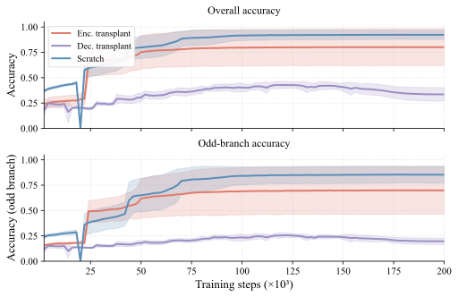
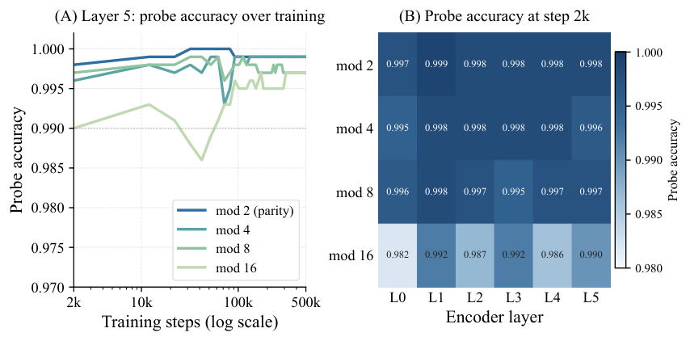
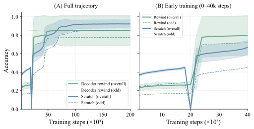
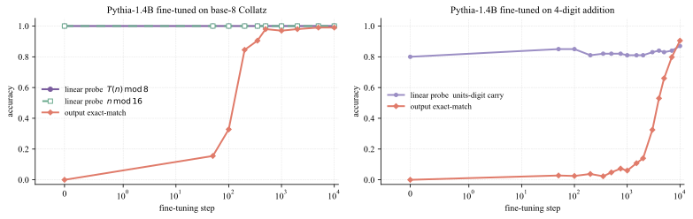
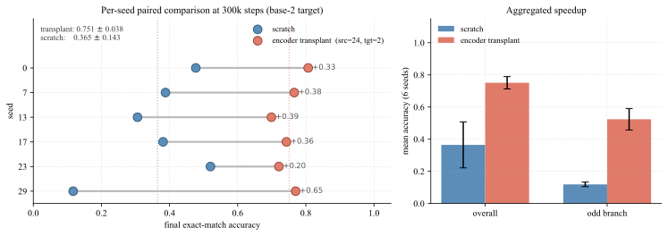
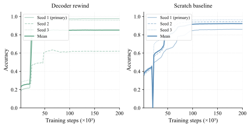
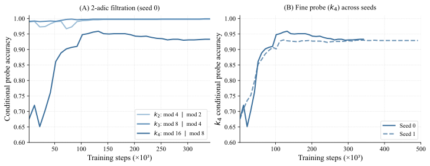
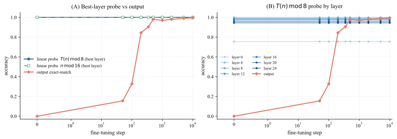
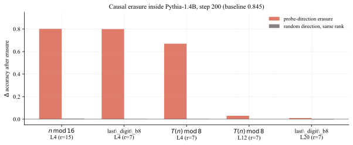
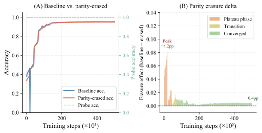

# Gomezjurado Gonzalez 2026 — The Long Delay to Arithmetic Generalization: When Learned Representations Outrun Behavior

См. также: [глобальный индекс понятий](../../concepts/index.md).

**Laura Gomezjurado Gonzalez** — Stanford University (lpgomez@stanford.edu). В самой статье подпись стоит как «Laura Gomezjurado»; полная форма имени взята из метаданных arXiv и из цитирующих работ.

arXiv [2604.13082v2](https://arxiv.org/abs/2604.13082), 30 марта 2026 (v2 — 17 июня 2026). Колонтитул PDF: «Preprint. Under review.». 2 цитирования (на 2026-08-14, по таблице [citations-2201.02177.txt](../citations-2201.02177.txt)). Источник — нативный HTML-рендеринг arXiv версии v2; пагинация восстановлена по PDF v2 (29 страниц).

Оригинал и производные файлы этой папки:

- [`original/2604.13082.native.html`](original/2604.13082.native.html) — первоисточник, нативный HTML-рендеринг arXiv, скачан как есть.
- [`original/2604.13082.the-long-delay-to-arithmetic-generalization-when-learned-representations-outrun-behavior.md`](original/2604.13082.the-long-delay-to-arithmetic-generalization-when-learned-representations-outrun-behavior.md) — конверсия оригинала в Markdown без правок содержания; английский текст для сверки перевода.
- [`images/`](images/) — иллюстрации статьи в исходном разрешении (17 файлов).
- [`2604.13082.the-long-delay-to-arithmetic-generalization-when-learned-representations-outrun-behavior.claims.txt`](2604.13082.the-long-delay-to-arithmetic-generalization-when-learned-representations-outrun-behavior.claims.txt) — рабочий разбор: пронумерованные утверждения с пометками.

Схема якорей и правила ссылок на карточку — в [README папки статей](../README.md).

## Затрагиваемые понятия

**[Гроккинг](../../concepts/grokking.md)** — работа берёт у Power et al. 2022 только форму кривой (долгая полка, затем резкий подъём) и переносит её на задачу, полигоном корпуса не бывшую: одношаговое отображение Коллатца $T(n)$ на энкодер-декодерном трансформере. Вклад заявлен не в наличии задержки, а в её адресе: авторы прямо переформулируют вопрос — [«не о том, предшествует ли внутренняя структура поведению, а о том, где именно расположен возникающий разрыв»](#p8-2), — и двумя вмешательствами относят задержку к считыванию декодера, а не к образованию представлений ([с. 5, абз. 4](#p5-4)). Сам разрыв между линейно читаемым признаком и поведением получает у них имя — [*разрыв теневого знания*](#fig-1), а итог сформулирован как [«выученные представления могут опережать поведение»](#p9-2). Чего в работе нет: точности на обучающей выборке. Она не показана ни на одном графике и ни в одной таблице, так что классический признак гроккинга — подгонка под обучение задолго до генерализации — здесь не измерен вовсе, а «плато» описано только по отложенной выборке. Нет и weight decay как рычага, доли обучающих данных как управляющей величины и вообще какого-либо перебора вокруг перехода: гиперпараметры закреплены, а варьируются задача, основание, архитектура и масштаб.

**[Фаза меморизации / плато](../../concepts/memorization-phase.md)** — работа даёт плато нового рода: не «обучение подогнано, тест стоит», а «признак линейно читается, выход стоит». В базе 8 зонд чётности выходит на 99.7% к шагу 2000, тогда как точная последовательностная точность в этот момент 38% и остаётся низкой до излома около шага 44k ([с. 4, абз. 1](#p4-1), [рис. 1](#fig-1)). Отдельно от этого в основании 2 описан классический эпизод запоминания: пик 56.0% на шаге 16 000, затем обвал в нуль без восстановления до 500k шагов ([с. 19, абз. 8](#p19-8)). Чего в работе нет: измерения запоминания как такового — обучающая точность не сообщается, а слова [«модель запоминает свои 1000 обучающих примеров»](#p19-8) расходятся с описанной здесь же онлайновой выборкой из диапазона в 10 000 целых ([с. 13, абз. 3](#p13-3)); см. раздел о несогласованностях.

**[Обучение структурированных представлений](../../concepts/structured-representation-learning.md)** — работа даёт понятию наблюдение на арифметике с ветвлением: энкодер приобретает структуру младших остатков рано и в определённом порядке. Зонды на mod 2, 4, 8, 16 все выходят к потолку примерно к шагу 2k, причём грубые — чуть раньше тонких ([с. 4, абз. 2](#p4-2), [рис. 3](#fig-3)), а условные зонды 2-адической фильтрации показывают, что порядок именно последовательный: $k_{2}$ и $k_{3}$ выше 0.99 с шага 2000, а $k_{4}$ поднимается с 0.676 и достигает пика около 0.96 лишь к шагу 130k ([с. 18, абз. 3](#p18-3), [рис. 10](#fig-10)). Чего в работе нет: геометрии представлений. Ни эмбеддингов, ни их структуры здесь не разглядывают — весь довод построен на линейной читаемости, и единственная геометрическая величина во всей статье — отношение участия, посчитанное для двоичного отказа.

**[Возникновение признаков](../../concepts/feature-emergence-feature-learning.md)** — самое сильное наблюдение работы по этой части относится к предобученной модели: в Pythia-1.4B зонды на $T(n)\bmod 8$ и $n\bmod 16$ читают 1.00 уже на шаге 0, до единого градиента задачи, при точном совпадении ровно 0.000, и разрыв закрывается за ~500 шагов дообучения ([с. 7, абз. 4](#p7-4), [рис. 5](#fig-5)). Авторы делают отсюда вывод, что дообучение [«устанавливает считывание, а не признаки»](#p7-4). Чего в работе нет: обучения на шаге 0 — а значит, и отложенной генерализации в смысле Power et al.: наблюдаемый разрыв там есть разрыв между линейной читаемостью входа у предобученной модели и умением породить строку, и подан он в одном ряду с гроккинговым плато малой модели, хотя измеряет другое.

**[Линейное зондирование](../../concepts/linear-sparse-probing.md)** — главный инструмент работы, и работа доводит его до предела: зонд есть логистическая регрессия с L2-регуляризацией на стандартизованных усреднённых по позициям состояниях последнего слоя энкодера ([с. 14, абз. 3](#p14-3)), обучаемая на 5000 примеров при внутреннем разбиении 80/20. Тем же протоколом сняты Pythia-160M и Pythia-1.4B, а в decoder-only базовом уровне он даёт крайний случай: точное совпадение 0.000 при зондах $\geq 0.999$ в ранних слоях ([с. 25, абз. 2](#p25-2), [рис. 12](#fig-12)). Чего в работе нет: сверки зонда с необученной моделью или с зондом на входных эмбеддингах. Это существенно именно здесь, потому что статья сама доказывает ([с. 19, абз. 7](#p19-7)), что в чётном основании младшие цифры выхода определяются двумя младшими цифрами входа, — то есть насыщение зонда совместимо с тем, что нужную арифметику выполняет сам зонд, а не модель.

**[Каузальная абляция](../../concepts/causal-ablation-intervention.md)** — работа приносит корпусу два приёма. Первый — стирание направления зонда с контролем случайным подпространством того же ранга: на плато удаление одного направления чётности стоит 8.2 п.п. точности, к шагу 22 000 — 0.3 п.п., при сходимости пренебрежимо ([с. 28, абз. 3](#p28-3), [рис. 16](#fig-16)); при сходимости несущей остаётся одна ось «величины» (0.141), а все подпространства остатков избыточны ([с. 28, абз. 4](#p28-4)). Второй — перенос того же вмешательства внутрь предобученной языковой модели: в Pythia-1.4B стирание подпространства ранга 15 для $n\bmod 16$ на слое 4 роняет точность 0.845 → 0.043, тогда как случайное подпространство того же ранга стоит 0.005 ([с. 8, абз. 1](#p8-1)). Чего в работе нет: вмешательства в путь считывания внутри одной обучаемой модели. Пересадка и отмотка — тоже названы каузальными, но действуют иначе: они меняют начальные условия оптимизации («какая половина взята готовой»), а не компоненту работающей сети.

**[Механистическая интерпретируемость](../../concepts/mechanistic-interpretability.md)** — работа пользуется набором приёмов МИ (зонды, стирание направлений, разбор голов внимания), но обратной разработки не делает: алгоритм, который сеть исполняет, здесь не восстанавливается, и ни один контур не назван. Единственное механистическое отождествление — сопоставление рассыпания головы, маршрутизирующей чётность, с фазой очистки Nanda et al.: [«энкодер-декодерный аналог фазы *очистки*»](#p6-1). Ценность для корпуса — в другом: траектория стирания шести признаков по 50 контрольным точкам показывает, как опора считывания переходит от одной простой подсказки к распределённому коду ([с. 29, абз. 1](#p29-1), [рис. 17](#fig-17)).

**[Меры прогресса](../../concepts/progress-measures.md)** — эту траекторию авторы сами называют [«механистической *мерой прогресса* в смысле Nanda et al.»](#p29-1), и это единственное место статьи, где термин употреблён. Величина действительно меняется на плоской области потерь, где точность не регистрирует ничего. Чего в работе нет: проверки меры на то, чем мера прогресса обязана быть. Ни предсказания времени до перехода, ни сопоставления с ограниченной и исключающей потерями Nanda et al., ни воспроизведения на других основаниях: траектория снята на одном прогоне в основании 8.

**[Маршрутизация внимания](../../concepts/attention-routing-heads.md)** — работа даёт наблюдение на кросс-внимании энкодер-декодерной модели, которого в корпусе не было: во время плато доля внимания с позиции BOS на последнюю входную цифру собрана в одну голову (0.89 на шаге 66 000), которая рассыпается до 0.21 к шагу 70 000, внутри второго излома, и не восстанавливается ([с. 20, абз. 2](#p20-2)). Какая именно пара (слой, голова) станет маршрутизирующей, зависит от семени. Чего в работе нет: вмешательства — голову не отключают и не подменяют, мера снимается только с прямого прохода на контрольной точке ([с. 20, абз. 1](#p20-1)); и узор выражен на трёх семенах из четырёх, тогда как в подводящей фразе стоит [«держится во всех трёх»](#p20-2).

**[Эталонный полигон гроккинга](../../concepts/canonical-grokking-testbed.md)** — работа стоит вне полигона Power et al. и делает это нарочно. Таблицы бинарной операции нет: примеры порождаются процедурно из детерминированного отображения, каждый шаг берёт свежие 1000 целых из $[1,10{,}000]$, а оценка идёт на закреплённых 5000 невиданных целых ([с. 3, абз. 6](#p3-6), [с. 13, абз. 1](#p13-1)). Отсюда следствие, важное при сопоставлении с корпусом: доли обучающих данных как управляющей величины здесь нет вовсе, переобучения по устройству постановки почти нет, а место управляющего параметра занимает система счисления. Модель по умолчанию тоже иная — не малый decoder-only трансформер, а энкодер-декодер 6+6 слоёв.

**[Модульная арифметика](../../concepts/modular-arithmetic.md)** — работа противопоставляет себя ей прямо: в отличие от эталонов модульной арифметики, [«управляемых одним глобальным правилом»](#p2-1), шаг Коллатца смешивает лёгкие и трудные случаи внутри одной задачи. При этом все зонды статьи нацелены именно на остатки ($\bmod\,2,4,8,16$), так что модульная структура входит сюда не как задача, а как измеряемый признак. Чего в работе нет: собственно модульной задачи — ни одного прогона на $(a+b)\bmod p$, и потому прямое сопоставление её чисел с числами корпуса невозможно.

**[Сжатие многообразия представлений](../../concepts/manifold-representation-compression.md)** — работа даёт корпусу редкое наблюдение обратного знака: сжатие сопровождает не генерализацию, а отказ. В основании 2 отношение участия представлений энкодера падает с 5.2 до 1.0 за одну контрольную точку, точность обрушивается в нуль и не восстанавливается до 500k шагов, а соседние контрольные точки на шаге 66 000 имеют косинусную близость $-0.98$ ([с. 19, абз. 8](#p19-8)). Чего в работе нет: отношения участия где-либо ещё. Оно посчитано только для двоичного отказа, для успешных оснований не приводится, так что сравнить сжатие при обвале со сжатием при гроккинге по этим данным нельзя.

**[Эффективность контуров](../../concepts/circuit-efficiency.md)** — лишь упоминается. Совпадение рассыпания головы с изломом потерь названо [«согласующимся с объяснениями гроккинга через соревнование контуров»](#p20-2) со ссылкой на Varma et al. 2023 и Merrill et al. 2023, а в основном тексте те же работы отнесены к соперничающим объяснениям, помещающим разрыв в формирование структуры ([с. 8, абз. 2](#p8-2)). Ни эффективность, ни ёмкость контуров здесь не измеряются, и никакого контура в сети не выделено.

**[Weight decay](../../concepts/weight-decay.md)** — лишь упоминается и ни разу не перебирается: закреплён на $10^{-2}$ во всех прогонах ([с. 23, абз. 2](#p23-2)). Единственное содержательное появление — в объяснении двоичного отказа, где обвал приписан [«хрупкому запомненному решению, которое позже разрушается регуляризацией»](#p19-8). Проверки этого объяснения — прогона в основании 2 без weight decay или при другом его значении — в работе нет.

## Несогласованности внутри статьи

**Размер пакета назван дважды и по-разному.** §3 говорит, что [«каждый шаг обучения берёт 1000 целых»](#p3-6), и приложение C.1.1 это повторяет ([с. 13, абз. 3](#p13-3)); приложение G говорит, что [«размер пакета был 512, если не оговорено иное»](#p23-2). Оговорок в тексте нет. При цитировании настройки обучения стоит помнить, что число примеров на шаг у этой работы указано двумя несовместимыми значениями.

**Двоичный отказ описан как запоминание закреплённого набора, которого в постановке нет.** В приложении D.2 сказано: [«модель запоминает свои 1000 обучающих примеров»](#p19-8), — и то же в основном тексте, [«модель ненадолго запоминает обучающую выборку»](#p7-1). Но обучающая выборка здесь порождается онлайн, свежими 1000 целых на каждом шаге из диапазона в 10 000 ([с. 13, абз. 3](#p13-3)); за 16 000 шагов до пика модель видит диапазон многократно, и закреплённого набора из 1000 примеров, который можно было бы запомнить, не существует. Это меняет прочтение всего двоичного эпизода: то, что названо «хрупким запомненным решением», по постановке им быть не может.

**Аннотация обещает уровень случайного угадывания, тело статьи даёт 38%.** В аннотации: [«точность выхода держится около уровня случайного угадывания ещё десятки тысяч шагов»](#p1-2). В §4.1 в той же самой постановке: [«точность выхода на уровне последовательности в этот момент составляет всего 38%»](#p4-1). При точном совпадении на четырёх-пяти цифрах в основании 8 случайный уровень практически нулевой, так что 38% — не он. Расхождение существенно для цитирующих: «около случайного» и «38%» описывают разные явления.

**Зонд как сигнал остановки противоречит собственной развёртке снимков.** Заключение утверждает: [«как только зонды остатков у энкодера насыщаются, дальнейшее обучение энкодера непродуктивно, а точность зонда даёт сигнал остановки»](#p9-3), — и приложение B повторяет это как первый практический вывод ([с. 11, абз. 8](#p11-8)). Зонды насыщаются к шагу 2000 ([с. 4, абз. 1](#p4-1)). Но развёртка снимков даёт свежему декодеру, обученному против снимков энкодера с 2k по 50k шагов, [«точность 0.65–0.80 без выигрыша от дополнительных вычислений энкодера»](#p5-5), тогда как против сошедшегося энкодера тот же приём даёт 0.978 ([с. 16, абз. 1](#p16-1)). Между шагом 50k и сходимостью энкодер, стало быть, прибавляет около 0.18 итоговой точности. Авторы этот факт отмечают ([«энкодер продолжает дорабатываться после шага 50k»](#p16-2)), но вывод о непродуктивности дальнейшего обучения энкодера и о зонде как сигнале остановки при этом сохраняют.

**Таблица 2 идёт против главного результата, а подводящая фраза этого не отражает.** На дополнительных семенах обучающих данных пересадка энкодера даёт 54.4% против 94.4% у обучения с нуля (семя 10) и 93.6% против 96.4% (семя 11); отмотка декодера на семени 10 даёт 62.0% против тех же 94.4% ([с. 14, абз. 10](#p14-10), таблица 2). Обе дополнительные затравки, стало быть, идут против эффекта, а на одной из них он обращён. Текст сразу за таблицей говорит противоположное: [«по всем условиям отдельные семена согласованы по направлению, даже там, где итоговая точность разнится, что подкрепляет качественные утверждения основного текста»](#p14-11). Вдобавок строки «основной» оставлены без чисел, так что сопоставление семян внутри условия неполно.

**«Коллатц с нуля при той же настройке» назван тремя разными числами.** В §4.2 и в приложении F это 86.1% ([с. 5, абз. 4](#p5-4), [«тогда как Коллатц с нуля достигает 86.1% при том же бюджете»](#p22-4)); в контроле с выравненным форматом — [«на ~84 процентных пункта ниже Коллатца с нуля (≈93%) при той же настройке»](#p22-6); а в приложении C.3 совместное сквозное обучение при том же вычислительном бюджете названо 0.969 ([с. 16, абз. 1](#p16-1)). Три числа стоят опорой у трёх разных сравнений, и какое из них с каким сопоставимо, из текста не следует.

## Что измерено, что показано и что предположено

Работа неоднородна по силе доводов, и половины её держатся на разном. Этот раздел разделяет их — числа сами по себе не говорят, откуда взялись.

**Предсказано и проверено.** Отмотка декодера — прямая проверка следствия из объяснения через считывание: если задержка в считывании, то заморозка сошедшегося энкодера и возврат декодера к весам шага 2k должны убрать плато. Они его убирают: 91.9% к шагу 22 000, итог 97.6% ([с. 5, абз. 4](#p5-4), [рис. 4](#fig-4)). Так же построены оба стирания: траектория просадки от стирания чётности предсказана как пиковая на плато и пренебрежимая при сходимости — и такова ([с. 28, абз. 3](#p28-3)); перенос того же вмешательства в Pythia-1.4B снабжён контролем случайным подпространством равного ранга, и разница составляет два порядка ([с. 8, абз. 1](#p8-1)). Это самая крепкая часть работы.

**Показано, но без нужной сверки.** Асимметрия пересадок — центральный довод §4.2 — не имеет контроля с *необученным* замороженным декодером: свежий энкодер, обучаемый против любого закреплённого выхода, уже плохо обусловлен, и вклад именно обученности декодера не выделен ([с. 5, абз. 2](#p5-2)). Мера локальной предсказуемости $H^{(r)}$, объявленная опорой вывода об основаниях, оснований не различает вовсе: [«условная энтропия равна нулю для каждого проверенного нами основания»](#p19-1) на нечётной ветви, а на чётной — 1.00 у всех чётных оснований и 0.00 у чисто нечётных, так что у основания 2 (0%) и основания 24 (99.8%) значения совпадают ([с. 23, абз. 6](#p23-6), таблица 6). Сами авторы оговариваются: [«мы используем $H_{b}^{(r)}$ как эвристическую меру выставленности локальной структуры, а не как полную меру вычислительной трудности»](#p18-1). Порядок оснований поэтому держится на прямом переборе и на выкладке про заглядывание на одну цифру ([с. 19, абз. 7](#p19-7)), а не на энтропийной мере.

**Названо задержкой там, где задержки не измерено.** В decoder-only базовом уровне генерализация не наступает ни в одном из пяти оснований (точное совпадение 0.000) при зондах $\geq 0.999$ в ранних слоях ([с. 25, абз. 2](#p25-2)): показан разрыв, но не задержка — второго конца у неё нет. В Pythia-1.4B зонды дают 1.00 на шаге 0, то есть до всякого обучения на задаче ([с. 7, абз. 4](#p7-4)); это разрыв между линейной читаемостью входа и умением породить строку, а не отложенная генерализация в смысле Power et al., хотя подан он в одном ряду с плато малой модели.

**Предположено.** Приложение B («практические выводы»: зонд как сигнал остановки, тёплый старт энкодером с удобного основания, вложения в считыватель, выбор основания) перенесено на дообучение языковых моделей ожиданием — [«мы ожидаем, что эти выводы перенесутся»](#p12-2) — и на опыте не проверено; первый из четырёх выводов вдобавок расходится с развёрткой снимков (см. выше). Отождествление рассыпания головы с фазой очистки Nanda et al. ([с. 6, абз. 1](#p6-1), [с. 20, абз. 2](#p20-2)) есть аналогия, а не измерение: механизм двух фаз не сопоставлен, сопоставлено совпадение по времени. Переходная неустойчивость прогона глубины 4 названа согласующейся с перестройкой наподобие замены контура, и авторы сами оговаривают, что [«на эту трактовку мы в главном утверждении не опираемся»](#p22-2).

**Оговорки, которые авторы делают, но которые легко потерять.** Межосновные сравнения по точному совпадению смешаны с длиной выхода, и авторы прямо пишут, что [«сравнения между далёкими основаниями не следует читать как чистую меру алгоритмической трудности»](#p12-9); довод против этого смешения дан отдельно, пересчётом на поцифровую точность и корзины равной длины ([с. 19, абз. 9](#p19-9)). Часть ячеек развёртки $k$-Коллатца снята на одном-двух семенах ([с. 27, абз. 1](#p27-1)), основные величины главного текста — на трёх, и лишь межосновная пересадка доведена до шести. Автор один. И сами авторы очерчивают границу переноса: [«механизм чище всего в энкодер-декодерной постановке»](#p9-4), а самая крупная проверка — управляемая арифметическая задача, а не естественная языковая нагрузка.

## Ошибочные цитирования

Редакторские заметки о местах, где эта работа передаёт чужие результаты неточно.

###### mc-2205-10343

**Liu et al. (2205.10343) — замена контура приписана работе об обучении представлений.** В приложении E переходная неустойчивость прогона глубины 4 описана так: `"This pattern is consistent with a circuit-replacement-like reorganization (Liu et al., 2022)"` — *«Этот узор согласуется с перестройкой наподобие замены контура (Liu et al., 2022)»* ([с. 22, абз. 2](#p22-2)). Liu et al. 2022 — [эффективная теория обучения представлений](../2205.10343.towards-understanding-grokking-an-effective-theory-of-representation-learning/2205.10343.towards-understanding-grokking-an-effective-theory-of-representation-learning.card.md): там вводятся $\delta$-параллелограммы, RQI, зона Златовласки и четыре фазы обучения, но ни контуров, ни их замены нет — язык контуров пришёл в корпус из других работ. Родословная ошибки видна внутри самой статьи: в приложении D.3 то же самое явление — вытеснение одного решения другим на изломе — отнесено к правильному адресу, [«согласуется с объяснениями гроккинга через соревнование контуров (Varma et al., 2023; Merrill et al., 2023)»](#p20-2). То есть работа знает верную ссылку и в одном месте из двух ставит её мимо. Утверждение при этом хеджировано дважды («согласуется», «наподобие») и снабжено оговоркой, что на эту трактовку главное утверждение не опирается, так что цена ошибки невелика; но при цитировании приложения E ссылку следует поправить.

Мягче того же рода: в §5 «продвижение через более трудные подзадачи» отнесено к Barak et al. 2022 и Michaud et al. 2023 разом ([с. 8, абз. 2](#p8-2)). У [Barak et al.](../2207.08799.hidden-progress-in-deep-learning-sgd-learns-parities-near-the-computational-limit/2207.08799.hidden-progress-in-deep-learning-sgd-learns-parities-near-the-computational-limit.card.md) механизм иной — постепенное усиление разрежённого решения через фурье-зазор в популяционном градиенте, а не прохождение подзадач по возрастанию трудности; отдельного пункта это не заслуживает, потому что стоит в перечислении соперничающих объяснений, а не в опоре довода.

## Ошибочные пересказы и цитирования этой статьи

Узоры, наблюдённые в цитирующих работах корпуса. Цитирующих работ пока две, и обе передают главный тезис верно; ниже — единственное место, где формулировка сильнее авторской.

**«Пересадка энкодера ускоряет гроккинг в 2.75 раза» (расширяющее, требует оговорки).** Цитирующие берут число 2.75 как коэффициент ускорения гроккинга. Наблюдённая формулировка — у Janati et al. (2608.07436; карточки этой работы в корпусе ещё нет): `"transplanting a trained encoder accelerates grokking by $2.75$ times while transplanting a trained decoder hurts"` — *«пересадка обученного энкодера ускоряет гроккинг в 2.75 раза, тогда как пересадка обученного декодера вредит»*. Авторская величина иная и уже: [«пересадка энкодера достигает 70% точности на шаге 24 000 против шага 66 000 у обучения с нуля»](#p5-2) — то есть в 2.75 раза раньше достигается один выбранный порог точности, а не наступает гроккинговый переход, и снято это на трёх семенах ([рис. 2](#fig-2)). В теле версии v2 главной величиной пересадки сделано другое: удвоение точности на шести семенах в самой трудной настройке (0.751 против 0.365, [с. 5, абз. 3](#p5-3)), а 2.75 осталось лишь в §4.2 и подписи к рисунку 2. Вдобавок дополнительные семена обучающих данных дают по этому же условию 54.4% против 94.4% и 93.6% против 96.4% ([с. 14, абз. 10](#p14-10)) — то есть коэффициент не устойчив по семенам. Родословная формулировки прослеживается: оборот «accelerates grokking by 2.75 times» стоит дословно в аннотации метаданных arXiv, оставшейся от версии v1 и не обновлённой к v2, тогда как аннотация тела v2 этого числа уже не содержит. Прочие половины той же цитирующей фразы — про зонд 99.7% при точности около 38% и про то, что заморозка сошедшегося энкодера с переобучением декодера убирает плато, — авторскому тексту отвечают точно.

Образец точного цитирования, для контраста — Verma 2026 (2605.20441; карточки тоже пока нет): `"attribute delayed generalization in encoder-decoder Collatz prediction to a representation-access bottleneck rather than feature-acquisition failure"` — *«относят отложенную генерализацию в энкодер-декодерном предсказании Коллатца к узкому месту доступа к представлению, а не к отказу приобрести признаки»*. Здесь названы и постановка, и то, что именно противопоставляется, и никакой величины из работы не вынесено.

Отдельно — риск, которого в наблюдённых цитированиях пока нет, но который эта работа притягивает по своему устройству: цитировать её как показавшую, что структура возникает раньше поведения. Этого она не показывала и не заявляет: разрыв как таковой описан у Barak et al. 2022 и Nanda et al. 2023, а сама статья прямо пишет, что спрашивает [не об этом, а о месте разрыва](#p8-2). Новое здесь — попытка указать адрес, и цитировать следует именно её.

---

# Текст статьи

# The Long Delay to Arithmetic Generalization

Laura Gomezjurado (Stanford University, lpgomez@stanford.edu)

## Аннотация

###### p1-2

Гроккинг у трансформеров, обучаемых на алгоритмических задачах, проявляется как долгая задержка между подгонкой под обучающую выборку и внезапной генерализацией, и причина этой задержки понята не до конца. Мы находим устойчивый разрыв между тем, когда модель выучивает нужную задаче структуру, и тем, когда она способна ею воспользоваться. Задержка отражает ограниченный доступ к уже выученной структуре, а не неспособность её приобрести. Разрыв держится и у энкодер-декодерных, и у decoder-only трансформеров, на задачах от одношагового Коллатца до многошаговых итераций и переноса на GCD, и на масштабах от 30M до 1.4B параметров. Резче всего он на масштабе. При дообучении Pythia-1.4B арифметические признаки линейно читаемы уже на предобученной контрольной точке, тогда как точность на уровне последовательности в точности нулевая. В одношаговом предсказании Коллатца энкодер организует структуру чётности и остатков за первые несколько тысяч шагов, тогда как точность на выходе держится около уровня случайного угадывания ещё десятки тысяч шагов. Два каузальных вмешательства локализуют узкое место в считывании декодера. На шести семенах пересадка обученного энкодера в свежую модель удваивает общую точность и учетверяет точность на нечётной ветви по сравнению с совместным обучением с нуля (в среднем 0.751 против 0.365 в целом и 0.524 против 0.119 на нечётной ветви, при непересекающихся 95%-интервалах), тогда как пересадка обученного декодера точность снижает. Заморозка сошедшегося энкодера и переобучение одного лишь декодера убирают плато и дают 97.6% точности против 86.1% у совместного обучения. Считывание неодинаково трудно для всех входов. Из 15 оснований те, чья факторизация согласована с отображением Коллатца, достигают 99.8% точности, тогда как двоичное не справляется и его представления обрушиваются без восстановления. Модель, ещё не начавшая обобщать, может уже содержать нужную задаче структуру. Остаётся её считать — а насколько это трудно, зависит от того, как представлен вход.

## 1 Введение

Алгоритмические арифметические задачи позволяют изучать генерализацию у трансформеров в управляемых условиях, потому что целевое вычисление точно, порождающий данные процесс известен, а представление входа можно менять систематически. Трансформеры решают некоторые изощрённые математические задачи и при этом остаются хрупкими на элементарной арифметике (Charton & Narayanan, 2025; Nogueira et al., 2021; Lample & Charton, 2019; Jelassi et al., 2023). В энкодер-декодерных моделях архитектурное разделение разводит отказы представления и отказы использования. Это позволяет спросить, выучивает ли модель нужную задаче структуру прежде, чем оказывается способна воспользоваться ею для порождения правильных выходов (Burns et al., 2024; Langedijk et al., 2024; Sun et al., 2025).

Однако даже в этих управляемых условиях энкодер-декодерные трансформеры, обучаемые на арифметических задачах, могут проводить десятки тысяч шагов почти без видимого продвижения по тестовой точности, а затем внезапно начать обобщать. Этот режим отложенного перехода, часто называемый *гроккингом*, есть случай, когда внутренняя способность и наблюдаемое поведение расходятся в ходе обучения (Power et al., 2022). Предшествующие работы указывают, что долгие плато не обязательно означают отсутствие обучения, поскольку структурированные представления могут возникать задолго до того, как отразятся в правильных выходах (Nanda et al., 2023; Barak et al., 2022; Varma et al., 2023; Liu et al., 2022; Wang et al., 2024). В энкодер-декодерных моделях, однако, источник задержки остаётся неясным. **[p. 2]** Вопрос в том, отражает ли плато позднее формирование арифметической структуры или позднее считывание уже присутствующей структуры.

###### p2-1

Мы изучаем этот вопрос на одношаговом предсказании Коллатца, где модель должна предсказать цифры $T(n)$, задаваемого как $n/2$, когда $n$ чётно, и $3n+1$, когда $n$ нечётно. Эта задача сочетает ветвление, информацию об остатках и поцифровые преобразования, трудность которых зависит от системы счисления. В отличие от эталонов модульной арифметики, управляемых одним глобальным правилом, шаг Коллатца смешивает лёгкие и трудные случаи внутри одной задачи. Одношаговый Коллатц — наша основная постановка. Мы также оцениваем ещё три семейства задач ($k$-Коллатц, итерацию $T^{2}$ и перенос между Коллатцем и GCD при выравненном формате). Арифметическая генерализация у трансформеров чувствительна к токенизации, порядку цифр и распространению переноса (Nogueira et al., 2021; Lee et al., 2023; Quirke & Barez, 2023; Shen et al., 2023; Charton, 2022). Представление числа определяет, какие вычислительные закономерности локально доступны модели, и может влиять на то, насколько трудно считывание у декодера. Наши главные находки таковы:

- **Плато есть узкое место считывания декодера, а не позднее представление.** Линейный зонд чётности на энкодере достигает 99.7%, тогда как точность на уровне последовательности составляет около 38%, то есть структура присутствует прежде, чем модель способна на ней действовать (§4.1). Два каузальных вмешательства — пересадка обученного энкодера и переобучение одного лишь декодера — прикрепляют задержку к считыванию (§4.2).
- **Структура делимости основания предсказывает, насколько трудно считывание у декодера.** Основания, согласованные с арифметикой задачи, достигают 99.8% точности, тогда как двоичное обрушивается и никогда не восстанавливается (§4.3).
- **Диссоциация обобщается на архитектуры, семейства задач и масштабы. В предобученной модели на 1.4B параметров $T(n)\bmod 8$ и $n\bmod 16$ линейно декодируются с точностью $1.00$, тогда как точное совпадение на уровне последовательности равно $0.00$ (§4.4).**


###### fig-1

*Рисунок 1: Энкодер становится информативным задолго до того, как улучшается точность. **(A)** Последовательностная точность на одношаговом предсказании Коллатца в основании 8 остаётся низкой до позднего скачка около шага 44k, причём примеры чётной ветви выучиваются раньше примеров нечётной. **(B)** Все шесть зондов чётности ($n\bmod 2$) по слоям энкодера превышают $99.7\%$ точности начиная с шага 2k (левая ось), тогда как точность выхода на уровне последовательности (пунктир, правая ось) растёт только после гроккингового перехода. Устойчивый разрыв между ними и есть *разрыв теневого знания* (shadow-knowledge gap). Чётность линейно декодируема по всему энкодеру задолго до того, как проявляется в выходах.* **[p. 2]**

## 2 Предварительные сведения

#### Задачи и постановка модели.

Опираясь на Charton & Narayanan (2025), мы изучаем задачу одношагового предсказания Коллатца. Модель получает целое $n$, записанное как последовательность цифр в основании $b$, и должна предсказать соответствующую последовательность цифр для $T(n)$, где

$$
T(n)=\begin{cases}n/2,&\text{if }n\text{ is even},\\
3n+1,&\text{if }n\text{ is odd}.\end{cases} \tag{1}
$$

**[p. 3]**

В более общем виде мы пишем $T_{k}$ для семейства Коллатца, получаемого сохранением чётной ветви $n/2$ и заменой нечётной ветви $3n+1$ на $kn+1$, так что стандартное отображение выше есть $T_{3}$. Член $k=-1$ мы используем как контролируемое сравнение, потому что он меняет арифметику нечётной ветви, сохраняя структуру ветвления по чётности. Это усиливает нашу трактовку эффекта основания. Если та же структура локальной предсказуемости и тот же порядок оснований сохраняются при $k=-1$, их менее естественно объяснять особенностями стандартного правила $3n+1$ и более естественно — следствиями представления числа (прил. H).

И входы, и цели представлены в одном и том же основании $b$ и записаны как последовательности цифр $d_{k}\cdots d_{0}$, упорядоченные от старшей цифры к младшей. Для стандартного отображения $T_{3}$ чётная и нечётная ветви качественно различаются трудностью. В чётных основаниях ветвь $n/2$ локально вычислима с заглядыванием на одну цифру вперёд, тогда как ветвь $3n+1$ требует распространения переноса через позиции цифр; мы уточняем это в §4.3. Помимо $k=-1$ мы оцениваем также $k$-Коллатц при $k\in{5,7}$, итерацию $T^{2}$, перенос между Коллатцем и GCD при выравненном формате и сложение $4$-значных чисел; полные определения задач и результаты — в приложениях K, F и J

#### Представление числа и локальная арифметическая структура.

Мы представляем каждое входное целое $n$ в основании $b$ как последовательность цифр $d_{k}\cdots d_{0}$, такую что

$$
n=\sum_{i=0}^{k}d_{i}b^{i}.
$$

Смена основания влияет и на длину последовательности, и на локальные цифровые узоры, доступные модели. Под *локальной цифровой структурой* мы понимаем арифметическую информацию, восстановимую из малой окрестности соседних, обычно младших, цифр, — такую как чётность, короткие узоры переноса или подсказки об остатках, не требующие согласования по всей последовательности.

## 3 Постановка опытов

Основные опыты построены на одной управляемой постановке — энкодер-декодерном трансформере, обучаемом на одношаговом предсказании Коллатца в основании $8$ (1), — которую мы варьируем по представлению, задаче, архитектуре и масштабу.

#### Задача и данные.

###### p3-6

Энкодер читает цифры $n$ в основании $b$, а декодер авторегрессионно порождает цифры $T(n)$. Примеры порождаются процедурно из детерминированного отображения Коллатца (приложение C.1.1). Каждый шаг обучения берёт $1{,}000$ целых из $[1,10{,}000]$, а оцениваем мы на закреплённой отложенной выборке из $5{,}000$ невиданных целых.

#### Модель, обучение и меры.

В основных разборах используется трансформер с $6$-слойным энкодером и $6$-слойным декодером ($d_{\mathrm{model}}{=}256$, $8$ голов). Обучение идёт с teacher forcing, а оценка — жадным декодированием слева направо; архитектура, оптимизатор, семена и бюджеты шагов — в приложении G. Мы сообщаем точную точность на уровне последовательности вместе с точностями, обусловленными чётной и нечётной ветвями $n$, которые различаются трудностью (определения в приложении C.1); для межосновных сравнений мы дополнительно сообщаем поцифровую точность и точное совпадение внутри закреплённых корзин по длине выхода. (Приложение D.2).

#### Вариации.

Мы варьируем этот основной объект по четырём осям, вынося ключевые сравнения в основной текст, а полные настройки — в приложение: представление ($15$ систем счисления; приложение C.4), задача (обобщённые отображения $T_{k}$ при $k\in\{5,7,-1\}$, итерация $T^{2}$, перенос между Коллатцем и GCD при выравненном формате и сложение $4$-значных чисел; приложения K, H, F, J), архитектура (свёртка $3{\times}3$ по энкодеру-декодеру и $12$-слойный decoder-only трансформер; приложение I) и масштаб (NanoGPT-$30$M с нуля и предобученные Pythia-$160$M и Pythia-$1.4$B; приложение J).

#### Согласованные условия.

Чтобы локализовать узкое место, мы сравниваем четыре согласованных условия: *пересадка энкодера* (сошедшийся энкодер заморожен, свежий декодер обучается), *пересадка декодера* (**[p. 4]** сошедшийся декодер заморожен, свежий энкодер обучается), *базовый уровень с нуля* (обучаются оба из случайной инициализации) и *отмотка декодера* (сошедшийся энкодер заморожен, декодер возвращён к ранней контрольной точке и доучивается). Как дополняющий разбор мы подгоняем линейные зонды к замороженным представлениям энкодера для чётности и структуры младших остатков по ходу обучения и стираем выученные линейные направления признаков на выводе — от единственного направления чётности во время плато до иерархии из шести признаков при сходимости; мы также прослеживаем специализацию голов кросс-внимания декодера по ходу обучения и каузально воспроизводим стирание направлений зондов внутри Pythia-$1.4$B. Мы также варьируем распределение обучения и предъявляемость переноса на нечётной ветви и перебираем глубину декодера при закреплённом энкодере. Подробности зондов и стирания, иерархия стирания и разбор голов внимания, условия выборки и глубины, мера локальной предсказуемости, а также воспроизведения на нескольких семенах с $95\%$-интервалами Клоппера — Пирсона — в приложениях C.2, L, D.3, C.4, E, C.3, J.



###### fig-2

*Рисунок 2: Пересадка энкодера ускоряет гроккинг, тогда как пересадка декодера — нет. Линии показывают среднюю точность по $3$ случайным семенам; затенённые ленты обозначают $\pm 1$ стандартное отклонение. *Сверху:* общая точность. Обученный замороженный энкодер в паре со свежим декодером (*пересадка энк.*) достигает $70\%$ точности в $2.75\times$ раньше, чем совместное обучение с нуля, и сходится к более высокой итоговой точности. Напротив, обученный замороженный декодер в паре со свежим энкодером (*пересадка дек.*) по ходу обучения снижается. *Снизу:* та же асимметрия наибольшая на нечётной ветви ($3n{+}1$), где считывание труднее всего.* **[p. 4]**

## 4 Результаты

### 4.1 Энкодер образует арифметическую структуру задолго до того, как она доходит до выхода

###### p4-1

Первый вопрос — отражает ли гроккинговое плато подлинное отсутствие полезной структуры в энкодере или же неспособность воспользоваться структурой, которая уже присутствует. Свидетельства говорят в пользу второго. Как показано на рис. 1A–B, в базовой постановке с основанием 8 линейный зонд для чётности ($n\bmod 2$) на последнем слое энкодера достигает 99.7% точности к шагу 2000, тогда как точность выхода на уровне последовательности в этот момент составляет всего 38%. Этот разрыв держится десятки тысяч шагов, указывая, что чётность уже линейно декодируема в энкодере прежде, чем модель способна надёжно порождать правильную выходную последовательность.

###### p4-2

Эта ранняя структура не ограничена чётностью. Рисунок 3A показывает, что зонды для целей по младшим остаткам по модулю $2,4,8,$ и $16$ все становятся высокоточными рано в обучении, причём более грубые цели возникают чуть раньше более тонких. К шагу 2000 эти признаки уже декодируемы по слоям энкодера (рис. 3B), хотя $\bmod\,16$ несколько слабее в ранних слоях. Вместе рис. 1 и 3 показывают, что энкодер быстро приобретает арифметическую структуру младших разрядов задолго до того, как поведение на уровне последовательности его нагоняет. Дополнительные разборы при альтернативных распределениях обучения, включая лог-равномерную выборку, а также полная разбивка зондов по остаткам вынесены в приложение D.



###### fig-3

*Рисунок 3: Модульная структура становится линейно декодируемой рано в энкодере. **(A)** Точность зонда на слое $5$ для целей по модулю $2$, $4$, $8$ и $16$ по ходу обучения (основание 8, логарифмическая шкала шагов). Все зонды выходят к потолку примерно к шагу 2k, причём более грубые цели выучиваются чуть раньше. **(B)** Точность зонда на шаге 2k по слоям энкодера и модульным целям. Точность близка к потолку по всем слоям, хотя по модулю $16$ она немного слабее в ранних слоях.* **[p. 5]**

**[p. 5]**

### 4.2 Вмешательства локализуют главное узкое место в считывании декодера

Ранняя структура в энкодере наводит на мысль, но не каузальна, поэтому мы проверяем, лежит ли узкое место в энкодере или в декодере.

#### Пересадка.

###### p5-2

Наши три согласованных условия — *пересадка энкодера*, *пересадка декодера* и *базовый уровень с нуля*. Если бы главным узким местом был энкодер, пересадка энкодера должна была бы укоротить плато, — и она укорачивает (рис. 2A). Пересадка энкодера достигает $70\%$ точности на шаге $24{,}000$ против шага $66{,}000$ у обучения с нуля и сходится к $92.4\%$, тогда как пересадка декодера не помогает и по ходу обучения дрейфует вниз. Асимметрия наибольшая на нечётной ветви (рис. 2B).

###### p5-3

Чтобы подтвердить это статистически и в самом трудном случае, мы повторили самую требовательную настройку — пересадку энкодера основания 24 в свежую модель основания 2 — на шести семенах против согласованного базового уровня с нуля в основании 2. На шаге $300{,}000$ пересадка достигает среднего точного совпадения $0.751\pm 0.038$ против $0.365\pm 0.142$, удваивая общую точность при непересекающихся $95\%$-интервалах. Разрыв больше на нечётной ветви, где обучение с нуля в основании 2 несётся почти целиком тривиальной чётной ветвью; там пересадка достигает $0.524\pm 0.067$ против $0.119\pm 0.014$, то есть примерно четырёхкратного разделения (рис. 7). Пересадка также примерно в $4\times$ теснее по разбросу от семени к семени, так что обученный энкодер не только повышает точность, но и стабилизирует оптимизацию. Значения по семенам, интервалы и контроль с выравненным форматом — в приложении C.3.



###### fig-4

*Рисунок 4: Отмотка одного лишь декодера в значительной мере убирает гроккинговое плато. Кривые показывают среднюю точность по $3$ случайным семенам; затенённые ленты обозначают $\pm 1$ стандартное отклонение. **(A)** Отправляясь от сошедшейся модели, мы замораживаем энкодер, отматываем декодер к его весам шага 2k и возобновляем обучение. Отмотанная модель улучшается сразу, тогда как обучение с нуля остаётся на затяжном плато до гроккинга. **(B)** Приближение раннего обучения показывает этот выигрыш на обеих ветвях, чётной и нечётной, в отмотанном условии, тогда как базовый уровень с нуля держится около уровня случайного угадывания. Поскольку оба условия делят один и тот же сошедшийся энкодер, эта разница выделяет инициализацию декодера.* **[p. 6]**
#### Отмотка декодера.

###### p5-4

Пересадка показывает, что обученный энкодер помогает, но не различает медленное считывание декодера, продолжающуюся доработку энкодера и связанную динамику между ними. Чтобы разделить их, мы замораживаем сошедшийся энкодер, отматываем декодер к ранней контрольной точке и обучаем только декодер. Это в значительной мере убирает плато (рис. 4). Точность поднимается до $91.9\%$ к шагу $22{,}000$ и достигает $97.6\%$ против $86.1\%$ у совместного обучения при том же бюджете. Отмотанный декодер улучшается сразу, в том числе на более трудной нечётной ветви (рис. 4B). Как только представление энкодера закреплено, декодер учится быстро, так что главная задержка при совместном обучении лежит в считывании декодера, а не в формировании структуры энкодера.

###### p5-5

Ещё два результата исключают энкодер как источник выигрыша. На пяти свежих семенах декодера отмотка декодера на сошедшемся энкодере даёт среднюю точность $0.978$ (по семенам $\{0.976,0.986,0.983,0.985,0.959\}$), чуть выше совместного обучения при том же бюджете ($0.969$), так что свежеинициализированный декодер выходит на точность совместного обучения без всяких дальнейших градиентов энкодера. От того, с какого снимка мы отматываем, зависит мало. По $\{2\mathrm{k},10\mathrm{k},20\mathrm{k},50\mathrm{k}\}$ шагам свежие декодеры выходят на точность $0.65$–$0.80$ без выигрыша от дополнительных вычислений энкодера, и даже глубокий до-гроккинговый снимок (совместное точное совпадение $0.35$ на шаге $2\mathrm{k}$) есть столь же хорошая отправная точка, **[p. 6]** как и послеизломный снимок на шаге $50\mathrm{k}$. Второй излом, стало быть, не вызван доработкой энкодера, и до-изломные и послеизломные снимки взаимозаменяемы. Значения по семенам и развёртка снимков — в приложении C.3.

#### Дальнейшие механистические проверки.

###### p6-1

Три дополнительных вмешательства подкрепляют это объяснение через считывание независимыми методами: стирание линейного направления чётности энкодера на выводе вредит сильнее всего во время плато и пренебрежимо при сходимости; иерархия стирания из шести признаков при сходимости показывает, что считывание сошло с этой подсказки о чётности на код, привязанный к величине и избыточный по остаткам; а кросс-внимание декодера во время плато сосредоточено на единственной голове, маршрутизирующей чётность, которая рассыпается на втором изломе потерь, — энкодер-декодерный аналог фазы *очистки* у Nanda et al. (Nanda et al., 2023). Полные результаты и рисунки — в приложениях L и D.3.

### 4.3 Система счисления определяет, насколько трудна работа декодера

###### p6-2

Далее мы выясняем, меняет ли представление числа трудность задачи считывания у декодера. Система счисления — естественное место, откуда начать, поскольку она меняет и длину последовательности, и локальные арифметические подсказки, доступные декодеру. Как показано в таблице 1, обучаемость резко меняется от представления к представлению. Несколько недвоичных оснований выходят почти на идеальную итоговую точность, тогда как степени 2 сохраняют выраженную асимметрию чётного и нечётного. В основании 8, например, модель достигает $99.7\%$ точности на чётных входах, но лишь $94.9\%$ на нечётных; в основании 16 разрыв расширяется до $99.8\%$ против $87.3\%$. Напротив, такие основания, как 6 и 12, почти устраняют разрыв между ветвями.

*Таблица 1: Развёртка по системам счисления. Точность меняется с основанием, близка к потолку для оснований, делящихся на $2$ и $3$, и равна нулю для двоичного. Точная точность на уровне последовательности на отложенной выборке на шаге $500{,}000$, при $n_{\mathrm{train}}=1{,}000$ целых, выбираемых на шаг, и оценке на $5{,}000$ невиданных целых. «Все» — общая точность точного совпадения на полной цифровой последовательности $T(n)$; «Чёт» и «Нечёт» ограничивают оценку чётными и нечётными входами. Строка основания $2$ сообщает итоговую контрольную точку после обвала, следующую за более ранней фазой запоминания.* **[p. 7]**

| Последовательностная точность (%) |  |  |  |  |  |  |  |  |  |  |  |  |  |  |  |
|---|---|---|---|---|---|---|---|---|---|---|---|---|---|---|---|
| Основание $b$ | Все | Чёт | Нечёт | Основание $b$ | Все | Чёт | Нечёт | Основание $b$ | Все | Чёт | Нечёт | Основание $b$ | Все | Чёт | Нечёт |
| 2 | 0.0 | 0.0 | 0.0 | 8 | 97.3 | 99.7 | 94.9 | 16 | 93.6 | 99.8 | 87.3 | 32 | 96.3 | 99.9 | 92.7 |
| 3 | 45.8 | 33.4 | 58.3 | 9 | 92.1 | 89.1 | 95.2 | 18 | 99.6 | 99.7 | 99.5 | 36 | 97.1 | 99.6 | 94.7 |
| 4 | 99.2 | 99.8 | 98.7 | 10 | 99.0 | 99.9 | 98.1 | 24 | 99.8 | 99.9 | 99.6 | 48 | 93.7 | 97.4 | 90.0 |
| 6 | 99.7 | 99.4 | 100.0 | 12 | 99.4 | 99.9 | 99.0 | 27 | 92.4 | 98.8 | 85.9 |  |  |  |  |

У этой асимметрии есть структурное объяснение. Если $d_{i}$ обозначает $i$-ю входную цифру $n$ в основании $b$ (считая от младшей цифры), а $e_{i}$ — соответствующую цифру $n/2$, то в чётном основании $b$ каждая выходная цифра определяется всего двумя соседними входными цифрами,

$$
e_{i}=\left\lfloor\frac{d_{i}}{2}\right\rfloor+(d_{i+1}\bmod 2)\cdot\frac{b}{2}.
$$

Это следует из записи вклада каждой цифры при делении на $2$: локальная цифра $d_{i}$ вносит $\lfloor d_{i}/2\rfloor$, тогда как чётность следующей цифры $d_{i+1}$ вносит перенос $b/2$ (подробности вывода в приложении D.2). Тем самым $n/2$ есть преобразование с ограниченным заглядыванием вперёд, что объясняет, почему точность чётной ветви держится у потолка в степенях 2. Наоборот, нечётная ветвь $3n+1$ требует распространения состояния переноса через позиции цифр, так что её действительная трудность **[p. 7]** зависит от того, насколько быстро переносы поглощаются в выбранном основании. Основания, делящиеся и на 2, и на 3, поэтому дают более благоприятное преобразование, потому что чётная ветвь остаётся локальной, а нечётная склонна разрешать переносы быстрее. Этот взгляд согласуется и с вмешательствами по предъявляемости переноса в приложении E, где обучение на мелких переносах не даёт декодера, экстраполирующего на более глубокие.

###### p7-1

Двоичное — предельный случай. В основании 2 модель ненадолго запоминает обучающую выборку, достигает пика $56.0\%$ последовательностной точности на шаге 16 000, а затем обрушивается до нуля без восстановления. Этот отказ, по-видимому, не поведенческий. Действительная размерность представлений энкодера, измеряемая отношением участия, падает с $5.2$ до $1.0$ за одну контрольную точку, что согласуется с обвалом представлений в режиме, где у декодера мало полезной локальной структуры, которой можно воспользоваться. Полные вычисления локальной предсказуемости и дополнительная диагностика двоичного случая — в приложении D.2. Эта зависящая от основания энтропийная структура не специфична для $k=3$. Тот же самый узор держится и для варианта Коллатца с $k=-1$ (прил. H), потому что $H^{(r)}$ зависит только от чётной ветви $n/2$ и от того, разрешается ли нечётная ветвь внутри двухцифрового окна, — а и то, и другое не зависит от $k$. Локальная предсказуемость, стало быть, есть свойство системы счисления, а не множителя.

Переоценка каждого сошедшегося прогона развёртки по основаниям поцифровой микроточностью и точным совпадением внутри закреплённых корзин по длине выхода сохраняет тот же порядок, так что предсказание по делимости основания переживает смешение с длиной (приложение D.2, таблица 4).

### 4.4 Диссоциация обобщается на архитектуру, масштаб и семейство задач

###### p7-3

Локализация до сих пор опиралась на одну энкодер-декодерную модель, обученную на одношаговом Коллатце. Диссоциация держится при изменениях архитектуры, масштаба и задачи. Свёртка $3\times 3$ по энкодеру-декодеру над $d_{\mathrm{model}}\in\{128,256,512\}$ и глубиной $\in\{2,4,6\}$ воспроизводит разрыв теневого знания и второй излом во всех девяти настройках (итоговое точное совпадение $0.853$–$0.968$; основание 8, $200{,}000$ шагов; приложение I). Устранение энкодер-декодерного разделения разрыв не закрывает, а расширяет. $12$-слойный decoder-only трансформер не обобщает в пределах бюджета (точное совпадение $0.000$ при основаниях $2,4,8,16,32$), однако линейные зонды восстанавливают mod $2,4,8$ и последнюю цифру с точностью $\geq 0.999$ в его ранних слоях, прежде чем эта структура обрушится в последних слоях (приложение I). Задержка сохраняется и на большем масштабе. Предобученная Pythia-160M ($\sim 5\times$) идёт по той же траектории «плато, затем излом» на Коллатце в основании 8 и достигает излома по меньшей мере в $33\times$ раньше, чем NanoGPT-30M с нуля, которая застревает на $0.013$ точного совпадения к шагу $200{,}000$ (приложение J). Оба эффекта распространяются и на другие семейства задач. Порядок по делимости основания, задающий трудность декодера, держится для $k$-Коллатца при $k\in\{5,7\}$, так что это свойство семейства Коллатца, а не $3n+1$ (приложение K). Диссоциация повторяется и на многошаговой итерации $T^{2}$, и на переносе между Коллатцем и GCD при выравненном формате (приложения K, F).

###### p7-4

В самой большой модели, Pythia-1.4B ($\sim 50\times$, $24$ слоя, $d=2048$), арифметическая структура задачи присутствует до всякого дообучения. Мы дообучили все параметры под FSDP в течение $10{,}000$ шагов на Коллатце в основании 8, плотно снимая контрольные точки на первой $1{,}000$ шагов. На шаге $0$ линейные зонды на позиции последней входной цифры восстанавливают $T(n)\bmod 8$ (лучший слой $4$, $\geq 0.94$ по слоям $4$–$24$) и $n\bmod 16$, оба с точностью $1.00$, **[p. 8]** тогда как точное совпадение на уровне последовательности в точности равно $0.000$. Разрыв закрывается за первые $\sim 500$ шагов дообучения: с $1.00$ на шаге $0$ до $0.85$ на шаге $50$, $0.16$ на шаге $200$ и $0.02$ на шаге $500$ (рис. 5, слева). В модели, обучаемой с нуля, эта структура образуется медленно во время плато, а считывание декодера есть следующее за этим узкое место; в Pythia-1.4B дообучение устанавливает считывание, а не признаки.



###### fig-5

*Рисунок 5: Точность зонда насыщается раньше, чем сдвигается точность выхода, внутри предобученной decoder-only модели на $1.4$B параметров, на двух арифметических задачах. *Слева:* Pythia-$1.4$B, дообученная на Коллатце в основании $8$. Линейные зонды для $T(n)\bmod 8$ и $n\bmod 16$ читают $1.00$ на шаге $0$, на предобученной контрольной точке до всякого градиента задачи, тогда как точное совпадение на уровне последовательности в точности равно $0.000$; разрыв закрывается за первые $\sim 500$ шагов дообучения. *Справа:* та же модель, дообученная на сложении $4$-значных чисел. Зонд переноса в разряде единиц держится в полосе $0.78$–$0.87$ с шага $0$, тогда как точное совпадение остаётся ниже $0.14$ в течение $\sim 2{,}000$ шагов. Зондируемый признак специфичен для задачи (остатки для Коллатца, перенос для сложения); разрыв же от задачи не зависит.* **[p. 8]**

###### p8-1

Чтобы проверить, что подпространства, выровненные с зондами, каузально используются, а не только соотнесены с выходом, мы провели вмешательство со стиранием из приложения L внутри Pythia-1.4B. На шаге $200$ дообучения на Коллатце (базовая точность $0.845$) проекция вон подпространства зонда ранга $15$ для $n\bmod 16$ на слое $4$ роняет точность до $0.043$, то есть на $0.802$, тогда как проекция вон случайного подпространства того же ранга стоит $0.005$, на два порядка меньше (приложение J, рис. 15). Зависимость сосредоточена на том слое, где насыщаются предобученные зонды, и к сходимости смещается к распределённому кодированию в более глубоких слоях — та же траектория, что и у иерархии стирания в малой модели в приложении L.

## 5 Родственные работы

#### Гроккинг, поэтапное обучение и скрытый прогресс.

###### p8-2

Гроккинг был впервые замечен у трансформеров на малых алгоритмических наборах данных (Power et al., 2022), а сходные резкие приросты с тех пор сообщались и шире (Liu et al., 2023). Более поздние работы установили, что плато скрывает продолжающееся обучение, причём структура улучшается, а нужные задаче контуры образуются до того, как сдвинется тестовая точность (Nanda et al., 2023; Wang et al., 2024). Мы опираемся на это и спрашиваем не о том, предшествует ли внутренняя структура поведению, а о том, где именно расположен возникающий разрыв. Соперничающие объяснения помещают его в формирование структуры — будь то соревнование запоминания и обобщения под регуляризацией (Varma et al., 2023; Merrill et al., 2023; Kumar et al., 2023), продвижение через более трудные подзадачи (Barak et al., 2022; Michaud et al., 2023) или перестройка представлений (Liu et al., 2022); наши же вмешательства помещают его в считывание, поскольку структура энкодера присутствует, пока декодер ещё учится ею пользоваться. Nanda et al. (Nanda et al., 2023) обратно разрабатывают фурье-контуры в однослойном трансформере на модульном сложении, а Mallinar et al. (Mallinar et al., 2024) связывают гроккинговый переход с возникновением блочно-циркулянтных признаков в ядровых машинах. Ни в той, ни в другой постановке нет отделимого считывания, в котором можно было бы выделить узкое место на стороне декодера. Наши вмешательства с отмоткой декодера и пересадкой декодера пользуются энкодер-декодерным разделением, чтобы показать, что признаки образуются рано и остаются впереди поведения десятки тысяч шагов, причём разрыв каузально относится к считыванию, а не к формированию представлений.

#### Арифметические и математические трансформеры как управляемые научные объекты.

Математические задачи дают управляемую постановку для изучения поведения трансформеров. Charton и соавторы **[p. 9]** связывают успехи и неудачи на таких задачах, как предсказание GCD и линейная алгебра, с устройством задачи и распределением обучения (Charton, 2023; 2022; Lample & Charton, 2019; Jelassi et al., 2023), а недавняя работа по Коллатцу документирует сильную зависимость от основания и структурированные траектории обучения (Charton & Narayanan, 2025). Мы ближе всего к этой работе по Коллатцу и прослеживаем сообщаемую в ней зависимость от основания до считывания декодера. Там, где эта линия составляет карту того, какие задачи и входы трансформеры способны выучить, наши зонды показывают, *когда* арифметическая структура появляется в энкодере, а наши вмешательства — *где* действует трудность.

#### Выбор кодировки как индуктивное смещение в арифметических трансформерах.

Арифметическое качество у трансформеров чувствительно к численному представлению. Гранулярность токенизации, порядок цифр и позиционные описания могут решать, возникнет ли генерализация (Nogueira et al., 2021; Lee et al., 2023; Shen et al., 2023); распространение переноса через позиции цифр есть главный источник трудности в сложении (Quirke & Barez, 2023); а обратная разработка показывает, что трансформеры восстанавливают алгебраическую структуру, когда задача и представление согласованы (Chughtai et al., 2023). Мы локализуем эту чувствительность в считывании, где основание задаёт, сколько локальной цифровой структуры декодер способен использовать.

## 6 Заключение и ограничения

###### p9-2

В энкодер-декодерных арифметических моделях выученные представления могут опережать поведение. Энкодер приобретает нужную задаче арифметическую структуру рано, тогда как декодер остаётся главным узким местом для превращения её в правильные выходы. Система счисления задаёт, сколько локальной цифровой структуры этот декодер способен использовать. Задержка, стало быть, лежит отчасти в выходном пути, где структура может присутствовать, а считывающий её декодер — отставать.

###### p9-3

Свежий декодер, отмотанный на замороженном сошедшемся энкодере, сравнивается по сквозной точности с совместным обучением, так что, как только зонды остатков у энкодера насыщаются, дальнейшее обучение энкодера непродуктивно, а точность зонда даёт сигнал остановки. Этот и прочие практические выводы мы собираем в приложении B.

###### p9-4

Наши свидетельства получены в нарочито управляемом режиме. Опыты на обобщение его расширяют, но механизм чище всего в энкодер-декодерной постановке, и даже самая большая наша проверка — Pythia-1.4B, дообученная на Коллатце и сложении, — есть управляемая арифметическая задача, а не естественная языковая нагрузка. Опосредует ли то же узкое место считывания разрыв в более крупных предобученных моделях — главный открытый вопрос, который это оставляет. Основной разбор с обучением с нуля использует одно семейство задач. Расширение на более крупные модели, другие архитектуры и задачи с выравненным форматом — естественный следующий шаг.

## Благодарности

Мы благодарим François Charton, чья работа непосредственно вдохновила эту статью и который направлял раннюю выработку гипотезы и разведочные опыты. Эта работа поддержана Masason Foundation его вычислительными ресурсами и исследовательским сообществом.
## References

- Barak et al. (2022) B. Barak, B. L. Edelman, S. Goel, S. Kakade, E. Malach, and C. Zhang Hidden progress in deep learning: SGD learns parities near the computational limit. Note: NeurIPS 2022 External Links: 2207.08799, Link Cited by: §1, §5.

- Biderman et al. (2023) S. Biderman, H. Schoelkopf, Q. Anthony, H. Bradley, K. O’Brien, E. Hallahan, M. A. Khan, S. Purohit, U. S. Prashanth, E. Raff, A. Skowron, L. Sutawika, and O. van der Wal Pythia: a suite for analyzing large language models across training and scaling. External Links: 2304.01373, Link Cited by: Appendix J.

- Burns et al. (2024) C. Burns, H. Ye, D. Klein, and J. Steinhardt Discovering latent knowledge in language models without supervision. Note: ICLR 2023 External Links: 2212.03827, Link Cited by: §1.

- Charton & Narayanan (2025) F. Charton and A. Narayanan Transformers know more than they can tell – learning the collatz sequence. External Links: 2511.10811, Link Cited by: §1, §2, §5.

**[p. 10]**

- Charton (2022) F. Charton Linear algebra with transformers. Note: TMLR External Links: 2112.01898, Link Cited by: §1, §5.

- Charton (2023) F. Charton Learning the greatest common divisor: explaining transformer predictions. External Links: 2308.15594, Link Cited by: §5.

- Chughtai et al. (2023) B. Chughtai, L. Chan, and N. Nanda A toy model of universality: reverse engineering how networks learn group operations. External Links: 2302.03025, Link Cited by: §5.

- Jelassi et al. (2023) S. Jelassi, S. d’Ascoli, C. Domingo-Enrich, Y. Wu, Y. Li, and F. Charton Length generalization in arithmetic transformers. External Links: 2306.15400, Link Cited by: §1, §5.

- Kumar et al. (2023) T. Kumar, B. Bordelon, S. J. Gershman, and C. Pehlevan Grokking as the transition from lazy to rich training dynamics. External Links: 2310.06110, Link Cited by: §5.

- Lample & Charton (2019) G. Lample and F. Charton Deep learning for symbolic mathematics. External Links: 1912.01412, Link Cited by: §1, §5.

- Langedijk et al. (2024) A. Langedijk, H. Mohebbi, G. Sarti, W. Zuidema, and J. Jumelet DecoderLens: layerwise interpretation of encoder-decoder transformers. In Findings of the Association for Computational Linguistics: NAACL 2024, K. Duh, H. Gomez, and S. Bethard (Eds.), Mexico City, Mexico, pp. 4764–4780. External Links: Link, Document Cited by: §1.

- Lee et al. (2023) N. Lee, K. Sreenivasan, J. D. Lee, K. Lee, and D. Papailiopoulos Teaching arithmetic to small transformers. External Links: 2307.03381, Link Cited by: §1, §5.

- Liu et al. (2022) Z. Liu, O. Kitouni, N. Nolte, E. J. Michaud, M. Tegmark, and M. Williams Towards understanding grokking: an effective theory of representation learning. Note: NeurIPS 2022 External Links: 2205.10343, Link Cited by: Appendix E, §1, §5.

- Liu et al. (2023) Z. Liu, E. J. Michaud, and M. Tegmark Omnigrok: grokking beyond algorithmic data. Note: ICLR 2023 External Links: 2210.01117, Link Cited by: §5.

- Mallinar et al. (2024) N. Mallinar, D. Beaglehole, L. Zhu, A. Radhakrishnan, P. Pandit, and M. Belkin Emergence in non-neural models: grokking modular arithmetic via average gradient outer product. Note: ICML 2025 External Links: 2407.20199, Link Cited by: §5.

- Merrill et al. (2023) W. Merrill, N. Tsilivis, and A. Shukla A tale of two circuits: grokking as competition of sparse and dense subnetworks. External Links: 2303.11873, Link Cited by: §D.3, §5.

- Michaud et al. (2023) E. J. Michaud, Z. Liu, U. Girit, and M. Tegmark The quantization model of neural scaling. External Links: 2303.13506, Link Cited by: §5.

- Nanda et al. (2023) N. Nanda, L. Chan, T. Lieberum, J. Smith, and J. Steinhardt Progress measures for grokking via mechanistic interpretability. Note: ICLR 2023 External Links: 2301.05217, Link Cited by: Appendix L, §D.3, §1, §4.2, §5, §5.

- Nogueira et al. (2021) R. Nogueira, Z. Jiang, and J. Lin Investigating the limitations of transformers with simple arithmetic tasks. External Links: 2102.13019, Link Cited by: §1, §1, §5.

- Power et al. (2022) A. Power, Y. Burda, H. Edwards, I. Babuschkin, and V. Misra Grokking: generalization beyond overfitting on small algorithmic datasets. Note: ICLR Workshop 2022 External Links: 2201.02177, Link Cited by: §1, §5.

**[p. 11]**

- Quirke & Barez (2023) P. Quirke and F. Barez Understanding addition in transformers. External Links: 2310.13121, Link Cited by: §1, §5.

- Shen et al. (2023) R. Shen, S. Bubeck, R. Eldan, Y. T. Lee, Y. Li, and Y. Zhang Positional description matters for transformers arithmetic. External Links: 2311.14737, Link Cited by: §1, §5.

- Sun et al. (2025) Y. Sun, A. Stolfo, and M. Sachan Probing for arithmetic errors in language models. In Proceedings of the 2025 Conference on Empirical Methods in Natural Language Processing, C. Christodoulopoulos, T. Chakraborty, C. Rose, and V. Peng (Eds.), Suzhou, China, pp. 8111–8128. External Links: Link, Document, ISBN 979-8-89176-332-6 Cited by: §1.

- Varma et al. (2023) V. Varma, R. Shah, Z. Kenton, J. Kramár, and R. Kumar Explaining grokking through circuit efficiency. External Links: 2309.02390, Link Cited by: §D.3, §1, §5.

- Wang et al. (2024) B. Wang, X. Yue, Y. Su, and H. Sun Grokked transformers are implicit reasoners: a mechanistic journey to the edge of generalization. Note: NeurIPS 2024 External Links: 2405.15071, Link Cited by: §1, §5.

## Приложение A Наглядная иллюстрация представления числа

Рисунок 6 даёт наглядную иллюстрацию представленческого эффекта, обсуждавшегося в предварительных сведениях. Смена основания меняет и длину последовательности, и то, какие младшие арифметические подсказки локально доступны, даже для одного и того же лежащего в основе целого.


*Рисунок 6: Одно и то же целое может порождать разные задачи считывания у декодера в разных основаниях. Целое $n=80$ показано в основаниях 8, 10 и 2. Хотя младшая цифра остаётся на месте у правого края, число предшествующих токенов меняется с основанием. Система счисления, стало быть, меняет и длину последовательности, и доступ к младшим арифметическим подсказкам.* **[p. 11]**

## Приложение B Практические выводы

Объяснение через узкое место наводит на четыре практических вывода для задач, насыщенных арифметикой или алгоритмически структурированных.

###### p11-8

Во-первых, точность зонда энкодера может служить сигналом остановки во время обучения. Свежий декодер, отмотанный на замороженном сошедшемся энкодере, сравнивается со сквозной точностью (среднее точное совпадение $0.978$ против $0.969$), так что точность зонда на кандидатном снимке предсказывает, продуктивны ли дальнейшие вычисления энкодера. Как только зонды остатков насыщаются, дополнительные градиентные шаги энкодера излом не сдвигают, а оставшиеся продуктивные градиенты — на стороне декодера.

Во-вторых, энкодер, предобученный на благоприятном основании, может дать тёплый старт обучению на более трудном. Шестисеменной результат по пересадке ($\sim 2\times$ в целом, $\sim 4\times$ на нечётной ветви, непересекающиеся интервалы) показывает, что энкодер, предобученный на численно благоприятном основании, переносится на более трудное целевое основание и укорачивает обучение там.

В-третьих, архитектурные и оптимизационные усилия лучше тратить на считывание, чем на энкодер. 12-слойный decoder-only базовый уровень достигает $0.000$ точного совпадения, неся при этом mod 2, 4, 8 и последнюю цифру с точностью зонда $\geq 0.999$ в своих ранних слоях, так что признаки остатков того же качества могут стоять выше по потоку от считывания, которое отказывает полностью.

**[p. 12]**

В-четвёртых, представление числа управляет обучаемостью при закреплённом бюджете. Один и тот же бюджет параметров даёт разную обучаемость в разных основаниях ($0.510$ против $0.998$ на уровне цифр), а благоприятные основания — те, чья факторизация согласована с модульной структурой задачи. В сочетании с диагностикой зондом из первого вывода это позволяет выбрать представление, в котором нужные признаки линейно декодируемы ещё до начала обучения.

###### p12-2

Мы ожидаем, что эти выводы перенесутся на дообучение языковых моделей в областях, насыщенных арифметикой, поскольку результат на Pythia-1.4B воспроизводит диссоциацию на масштабе.

## Приложение C Подробности опытов

### C.1 Последовательностная точность и межосновная сопоставимость

Пусть $\mathcal{D}_{\mathrm{eval}}=\{(x_{i},y_{i},n_{i})\}_{i=1}^{N}$ обозначает отложенную выборку для оценки, где $x_{i}$ — входная цифровая последовательность, $y_{i}$ — целевая выходная цифровая последовательность для одношагового предсказания Коллатца, а $n_{i}$ — лежащее в основе целое. Пусть $\hat{y}_{i}=f_{\theta}(x_{i})$ — предсказание модели. Наша главная мера — точная точность на уровне последовательности,

$$
\mathrm{Acc}_{\mathrm{seq}}\;=\;\frac{1}{N}\sum_{i=1}^{N}\mathbf{1}\!\left[\hat{y}_{i}=y_{i}\right],
$$

где $\mathbf{1}[\cdot]$ — индикаторная функция, а равенство берётся по всей выходной последовательности. Тем самым предсказание засчитывается верным, только если каждая выходная цифра в точности совпадает с целевой.

Эта мера наиболее естественна для нашей постановки «последовательность в последовательность», поскольку сама задача — породить полную правильную цифровую строку для $T(n)$, а не восстановить лишь её часть. Поэтому в основном тексте мы сообщаем $\mathrm{Acc}_{\mathrm{seq}}$ как главную меру качества на задаче. Когда мы расслаиваем по ветвям, мы вычисляем ту же меру на определяемых чётностью подмножествах

$$
\mathcal{D}_{\mathrm{eval}}^{\mathrm{even}}=\{(x_{i},y_{i},n_{i})\in\mathcal{D}_{\mathrm{eval}}:n_{i}\equiv 0\!\!\!\pmod{2}\}, \\
\mathcal{D}_{\mathrm{eval}}^{\mathrm{odd}}=\{(x_{i},y_{i},n_{i})\in\mathcal{D}_{\mathrm{eval}}:n_{i}\equiv 1\!\!\!\pmod{2}\}
$$

а именно

$$
\mathrm{Acc}_{\mathrm{seq}}^{(p)}\;=\;\frac{1}{|\mathcal{D}_{\mathrm{eval}}^{(p)}|}\sum_{(x_{i},y_{i},n_{i})\in\mathcal{D}_{\mathrm{eval}}^{(p)}}\mathbf{1}\!\left[\hat{y}_{i}=y_{i}\right],\qquad p\in\{\mathrm{even},\mathrm{odd}\}.
$$

Однако точная точность на уровне последовательности не нормирована по длине. Пусть $L_{i}=|y_{i}|$ обозначает длину целевого выхода в цифрах. Если у модели поцифровая доля верных ответов на примере $i$ равна $q_{i}$, то в приближении независимости вероятность точного совпадения примерно масштабируется как

$$
\Pr[\hat{y}_{i}=y_{i}]\approx q_{i}^{L_{i}},
$$

так что более длинные выходы штрафуются сильнее коротких. Это важно в нашей развёртке по основаниям, потому что один и тот же диапазон целых порождает разные длины выхода в разных системах счисления. Для целых до $10{,}000$ двоичные представления могут требовать до 14 цифр, тогда как такие основания, как 32, — не более 3. В итоге межосновные различия в $\mathrm{Acc}_{\mathrm{seq}}$ отчасти отражают длину выхода вдобавок к арифметической трудности.

###### p12-9

Поэтому мы истолковываем межосновные результаты по точному совпадению с этой оговоркой в виду. В частности, сравнения между далёкими основаниями не следует читать как чистую меру алгоритмической трудности. Сравнения внутри основания, такие как разрыв между чётной и нечётной ветвями при закреплённом основании, затронуты меньше, поскольку обе ветви оцениваются при одном и том же представлении и на схожем масштабе длин. Нормированная по токенам мера вроде поцифровой точности могла бы отчасти вынести этот эффект длины за скобки, но мы не используем такую меру как главную меру оценки, потому что наш основной вопрос — порождает ли модель полную правильную выходную последовательность.

Там, где для точности точного совпадения на закреплённой выборке показаны интервалы неопределённости, мы сообщаем точные $95\%$-интервалы Клоппера — Пирсона для соответствующей биномиальной доли.

Отдельная структурная диагностика, используемая для истолкования развёртки по основаниям (ветвевая мера локальной предсказуемости, основанная на условной энтропии суффикса), определена в приложении C.4.

**[p. 13]**

#### C.1.1 Набор данных и порождение данных

###### p13-1

Все примеры Коллатца порождаются процедурно, а не берутся из внешнего набора данных. При выбранном основании $b$ каждый пример начинается с выборки целого $n\in[1,10{,}000]$. Входная последовательность — цифровое представление $n$ в основании $b$, упорядоченное от старшей цифры к младшей. Целевая последовательность получается точным вычислением одношагового отображения Коллатца $T(n)$ и перекодировкой результата в том же основании $b$. Тем самым каждый пример есть детерминированная пара $(x(n),y(n))$, где $x(n)=\mathrm{digits}_{b}(n)$ и $y(n)=\mathrm{digits}_{b}(T(n))$.

Мы используем синтетические данные, потому что цель статьи — не моделировать естественную изменчивость, а изучать генерализацию в управляемой алгоритмической постановке. Процедурное порождение обеспечивает точные метки, снимает смешения от сбора и разметки данных и позволяет независимо менять систему счисления, распределение обучения, структуру остатков и глубину переноса, сохраняя лежащее в основе вычисление закреплённым. Это важно для наших каузальных и межосновных сравнений, которые опираются на смену представления и условий выборки без смены самого определения задачи.

###### p13-3

Обучающие данные выбираются онлайн согласно распределению, заданному каждым опытом (равномерное, лог-равномерное, расслоённое по остаткам, расслоённое по переносу или короткопереносное). Оценка использует закреплённую отложенную выборку невиданных целых, порождённую тем же способом, если сама задача не меняется, как в опытах по переносу на GCD. В стандартной настройке Коллатца в статье диапазон целых есть $n\in[1,10{,}000]$, каждый шаг обучения берёт 1000 выборок, а оценка использует 5000 отложенных примеров.

#### Прочие задачи.

Всякая другая задача использует тот же процедурный рецепт; меняется только целевое отображение (а для GCD — раскладка входа), и оценка всегда использует закреплённую отложенную выборку, порождённую тем же способом. *$k$-Коллатц и $T^{2}$:* мы выбираем $n\in[1,10{,}000]$ как выше и заменяем $T$ на $T_{k}(n)=n/2$ (чёт) $/\,kn{+}1$ (нечёт) при $k\in\{5,7,-1\}$ либо на двухшаговую итерацию $T^{2}(n)=T(T(n))$ при $k=3$, перекодируя результат в том же основании $b$. *GCD:* мы выбираем два целых $a,b$ независимо и равномерно из $[1,1{,}000]$, кодируем вход как $[\mathrm{digits}_{b}(a),\,\texttt{BOS},\,\mathrm{digits}_{b}(b)]$ с BOS в роли разделителя и используем $\mathrm{digits}_{b}(\gcd(a,b))$ как цель. *Сложение $4$-значных чисел (Pythia):* мы выбираем два целых $a,b$ равномерно из $[10^{3},10^{4}{-}1]$ и оформляем каждый пример как текст compute $a$ + $b$ = с целью в виде десятичной строки $a{+}b$; дообучение Pythia на Коллатце оформлено по аналогии — как разделённые пробелами цифры в основании $b$ после затравки compute T(n) in base $b$:.

### C.2 Подробности вмешательств и зондирования

Запишем модель как энкодер-декодерное отображение

$$
\hat{y}=D_{\psi}(E_{\phi}(x)),
$$

где $E_{\phi}$ обозначает энкодер с параметрами $\phi$, $D_{\psi}$ — декодер с параметрами $\psi$, а $\hat{y}$ — предсказанную выходную последовательность. Наши каузальные вмешательства меняют, какое подмножество $(\phi,\psi)$ инициализируется из сошедшейся базовой контрольной точки, а какое обучается.

В условии *пересадки энкодера* мы закрепляем $\phi=\phi^{\star}$ из сошедшейся базовой модели и обучаем свежий декодер $\psi_{0}$ из случайной инициализации. В условии *пересадки декодера* мы закрепляем $\psi=\psi^{\star}$ и обучаем свежий энкодер $\phi_{0}$. В условии *базового уровня с нуля* и $\phi_{0}$, и $\psi_{0}$ инициализируются случайно и обучаются совместно. Во вмешательстве *отмотки декодера* мы закрепляем $\phi=\phi^{\star}$, сбрасываем декодер к ранней контрольной точке $\psi^{(2k)}$ и продолжаем обучать далее только декодер. Если не оговорено иное, все условия используют ту же архитектуру, оптимизатор и разбиение данных, что и соответствующий базовый опыт.

Для разборов зондированием пусть $H_{t}(x)=\{h_{t,1}(x),\dots,h_{t,m}(x)\}$ обозначает скрытые состояния последнего слоя энкодера на контрольной точке $t$. Мы сводим их усреднением по позициям,

$$
z_{t}(x)\;=\;\frac{1}{m}\sum_{j=1}^{m}h_{t,j}(x),
$$

и подгоняем линейные зонды на $z_{t}(x)$ при замороженных параметрах энкодера. Для чётности целью зонда служит

$$
a_{1}(n)=n\bmod 2.
$$

**[p. 14]**

Для более тонкой структуры младших остатков мы используем двоичные цели

$$
a_{k}(n)=\left\lfloor\frac{n}{2^{k-1}}\right\rfloor\bmod 2,\qquad k\in\{2,3,4\},
$$

которые отвечают следующему младшему биту за пределами $n\bmod 2^{k-1}$. Равносильно, эти зонды проверяют, линейно ли декодируемо $n\bmod 2^{k}$ после того, как более грубая структура остатков вынесена за скобки.

###### p14-3

Каждый зонд есть логистическая регрессия с L2-регуляризацией, подогнанная на стандартизованных усреднённых по позициям состояниях энкодера. В двоичном случае

$$
p_{\eta}(a=1\mid z)=\sigma(w^{\top}z+b),
$$

с параметрами зонда $\eta=(w,b)$. Зонды обучаются на поверочной выборке из 5000 примеров, не пересекающейся с обучением модели, при внутреннем разбиении 80/20 на обучение и тест. Точность зонда тогда есть

$$
\mathrm{Acc}_{\mathrm{probe}}\;=\;\frac{1}{M}\sum_{i=1}^{M}\mathbf{1}\!\left[\hat{a}_{i}=a_{i}\right]
$$

на отложенной тестовой выборке зонда.

Для стирания чётности мы оцениваем линейное направление чётности по обученному зонду чётности. Пусть

$$
u=\frac{w}{\|w\|_{2}}
$$

будет нормированным направлением зонда. Затем мы проецируем это направление вон из каждого скрытого состояния последнего слоя энкодера, передаваемого декодеру:

$$
h_{t,j}^{\perp}(x)=h_{t,j}(x)-\langle h_{t,j}(x),u\rangle u.
$$

Прогон декодера по изменённым состояниям энкодера даёт стёртое предсказание $\hat{y}_{i}^{\,\perp}$. Мы измеряем эффект стирания получающейся просадкой точности на уровне последовательности,

$$
\Delta_{\mathrm{erase}}\;=\;\mathrm{Acc}_{\mathrm{seq}}-\mathrm{Acc}_{\mathrm{seq}}^{\,\perp},
$$

где $\mathrm{Acc}_{\mathrm{seq}}^{\,\perp}$ вычисляется в точности как выше, но по стёртым состояниям энкодера. Это даёт прямую оценку того, насколько сильно декодер зависит от линейно доступной информации о чётности.

### C.3 Каузальные воспроизведения на нескольких семенах

###### p14-10

Мы воспроизводим условия *пересадки энкодера*, *базового уровня с нуля* и *отмотки декодера* при дополнительных случайных семенах для *обучающих* данных, при прочих настройках, тождественных основному тексту. Каждое воспроизведение обучается то же число шагов, что и соответствующий основной прогон, и оценивается на *той же* отложенной выборке из $5{,}000$ примеров. Таблица 2 сообщает итоговую общую точность и $95\%$-интервалы Клоппера — Пирсона по условию и семени. Рисунки 8 и 9 показывают полные траектории по семенам; это и есть отдельные прогоны, из которых вычислены ленты «среднее $\pm 1$ std» на рис. 2 и 4.

*Таблица 2: **Итоговые точки по семенам для каузальных воспроизведений.** Общая точность на уровне последовательности на той же отложенной выборке из $5{,}000$ примеров с точными $95\%$-интервалами Клоппера — Пирсона (биномиальными). «Основной» обозначает прогон основного текста; альтернативные строки используют семена обучающих данных 10 и 11. Все альтернативные строки оценены на шаге 200 000 (тот же бюджет обучения, что и у основных прогонов).* **[p. 15]**

| Условие | Семя | Общая точн. | $95\%$ ДИ | Примечания |
|---|---|---|---|---|
| Пересадка энкодера | основной | (основной текст) | траектория на рис. 2 |  |
| Пересадка энкодера | альт. 1 | 54.4% | [53.0, 55.7] | семя данных 10 |
| Пересадка энкодера | альт. 2 | 93.6% | [92.9, 94.2] | семя данных 11 |
| Базовый уровень с нуля | основной | (основной текст) |  |  |
| Базовый уровень с нуля | альт. 1 | 94.4% | [93.7, 95.0] | семя данных 10 |
| Базовый уровень с нуля | альт. 2 | 96.4% | [95.9, 97.0] | семя данных 11 |
| Отмотка декодера | основной | (основной текст) | рис. 4 |  |
| Отмотка декодера | альт. 1 | 62.0% | [60.7, 63.4] | семя данных 10 |
| Отмотка декодера | альт. 2 | 95.9% | [95.3, 96.5] | семя данных 11 (контр. точка шага 194k) |

###### p14-11

Рисунки 8 и 9 показывают полные траектории обучения для каждого отдельного семени, делая явными прогоны, лежащие в основе лент «среднее $\pm 1$ std» на рисунках основного текста. По всем условиям отдельные семена согласованы по направлению, даже там, где итоговая точность разнится, что подкрепляет качественные утверждения основного текста.

#### Шестисеменная межосновная пересадка (исходное основание $24$, целевое основание $2$).

Сравнение по трём семенам недостаточно мощно для утверждения об отношении, поэтому мы повторили настройку с наибольшим разрывом между исходным и целевым основанием — энкодер, предобученный в основании $24$ и пересаженный в свежую модель основания $2$, — на шести независимых семенах и сравнили с согласованными базовыми уровнями с нуля в основании $2$ при том же бюджете шагов ($300{,}000$ шагов). Таблица 3 сообщает итоговую точность точного совпадения по семенам и сводку по нечётной ветви; рис. 7 показывает те же данные. Плечо с пересадкой превосходит базовый уровень с нуля на каждом семени. Общее среднее есть $0.751$ против $0.365$ (непересекающиеся 95%-интервалы), среднее по нечётной ветви — $0.524$ против $0.119$, а стандартное отклонение от семени к семени у плеча с пересадкой в $\sim 4\times$ меньше, чем у плеча с нуля.

*Таблица 3: Шестисеменная межосновная пересадка. Итоговая точность точного совпадения на шаге $300{,}000$ для пересадки энкодера (исходное основание $24$, целевое основание $2$) против согласованного базового уровня с нуля. Отношение пересадки к обучению с нуля есть $2.06$ в целом и $4.4$ на нечётной ветви, при непересекающихся 95%-интервалах по обеим мерам.* **[p. 15]**

| Семя | Пересадка (исх.=$24$, цел.=$2$) | С нуля (цел.=$2$) |
|---|---|---|
| $0$ | $0.807$ | $0.477$ |
| $7$ | $0.766$ | $0.388$ |
| $13$ | $0.699$ | $0.306$ |
| $17$ | $0.743$ | $0.381$ |
| $23$ | $0.721$ | $0.520$ |
| $29$ | $0.770$ | $0.117$ |
| **среднее** | $\mathbf{0.751}$ | $\mathbf{0.365}$ |
| **std** | $0.038$ | $0.142$ |
| среднее по нечётной ветви | $\mathbf{0.524}$ | $\mathbf{0.119}$ |
| std по нечётной ветви | $0.067$ | $0.014$ |



###### fig-7

*Рисунок 7: Шестисеменная пересадка энкодера на настройке с наибольшим разрывом оснований (исходное основание 24, целевое основание 2). **(A)** Итоговая точность точного совпадения по семенам на шаге 300 000. Плечо с пересадкой превосходит базовый уровень с нуля на каждом семени; его среднее ($0.751$) есть $2.06\times$ от среднего с нуля ($0.365$), при непересекающихся 95%-интервалах. **(B)** Агрегированная средняя точность с $\pm 1$ стандартным отклонением. Разделение наибольшее на нечётной ветви (отношение $\sim 4.4$), где среднее по нечётной ветви у обучения с нуля в основании 2 есть $0.119$. Разброс у пересадки в $\sim 4\times$ меньше разброса у обучения с нуля.* **[p. 15]**

**[p. 16]**

#### Воспроизведения отмотки декодера по семенам и развёртка снимков.

###### p16-1

Результат по отмотке декодера в основной статье сообщался на трёх семенах. Мы расширяем его до пяти свежих семян декодера против того же сошедшегося энкодера; итоговое точное совпадение по пяти семенам есть $\{0.9756,0.9858,0.9832,0.9852,0.9592\}$, среднее $0.978$, что немного превосходит совместное сквозное обучение при том же вычислительном бюджете ($0.969$). Снимок сошедшегося энкодера, стало быть, не лежит на критическом пути второго излома по этой мере: свежий декодер достигает по меньшей мере точности совместного обучения без всякого дальнейшего градиента энкодера.

###### p16-2

Чтобы локализовать, где энкодер становится достаточно хорош, так что дальнейшие вычисления энкодера напрасны, мы дополнительно развернули снимок энкодера, с которого начинается отмотка, по $\{2\mathrm{k},10\mathrm{k},20\mathrm{k},50\mathrm{k}\}$ шагам обучения, удерживая настройку свежего декодера закреплённой. Свежие декодеры, обученные против каждого снимка, выходят на итоговые точности в полосе $0.65$–$0.80$, без сколько-нибудь значимого улучшения от дополнительных вычислений энкодера в этом диапазоне. Даже снимок шага $2$k, взятый на глубоком до-гроккинговом плато, когда совместная модель находится на точном совпадении $0.35$, есть столь же хорошая основа для обучения свежего декодера, как и послеизломный снимок шага $50$k. Энкодер продолжает дорабатываться после шага $50$k, но сам второй излом не вызван доработкой энкодера.


*Рисунок 8: Траектории обучения по семенам для трёх условий пересадки. Каждая панель показывает три отдельных прогона обучения (сплошная, штриховая, пунктирная линии) с их средним (более толстая сплошная линия) для общей точности на уровне последовательности за 200k шагов. *Слева* (пересадка энкодера). Все три семени показывают быстрое раннее продвижение при тесном согласии, так что ускорение на рис. 2 воспроизводимо по семенам, а не есть артефакт одного прогона. *В центре* (базовый уровень с нуля). Семена согласны по итоговой точности, но различаются шагом, на котором происходит гроккинговый переход, что и даёт более широкую ленту на основном рисунке. *Справа* (пересадка декодера). Все три семени снижаются или стоят на протяжении всего обучения, так что асимметрия между пересадкой энкодера и пересадкой декодера держится по семенам.* **[p. 16]**



*Рисунок 9: Траектории обучения по семенам для отмотки декодера и базового уровня с нуля. Каждая панель показывает три отдельных семени с их средним для общей точности за 200k шагов. *Слева* (отмотка декодера). Два семени из трёх быстро улучшаются с раннего обучения без видимого плато; семя 2 (семя данных 10) медленнее, но всё же улучшается монотонно. *Справа* (базовый уровень с нуля). Семена тесно согласны по окну гроккингового перехода и итоговой точности, что согласуется с более тесной лентой на рис. 4. Противопоставление отмотки и обучения с нуля воспроизводимо по семенам, даже там, где конечные точки отдельных семян разнятся.* **[p. 17]**

### C.4 Условия выборки и развёртка по основаниям

Этот подраздел даёт полные определения распределений обучения, условий выборки по переносу, развёртки по глубине декодера, развёртки по основаниям и меры локальной предсказуемости, сведённых в основном тексте.

#### Распределения обучения.

Чтобы проверить, влияет ли учебный план на обучаемость декодера, мы сравниваем три распределения обучения по целым в стандартной постановке Коллатца. В *равномерном* условии обучающие примеры выбираются равномерно из стандартного диапазона целых. В *лог-равномерном* условии обучающие примеры выбираются с большей массой на меньших целых согласно лог-масштабированному распределению по тому же диапазону. В *расслоённом по остаткам* условии мы выбираем равные количества обучающих примеров из каждого класса вычетов по модулю 64, так что узоры младших остатков сбалансированы по обучающей выборке. Если не оговорено иное, все прочие стороны постановки удерживаются закреплёнными.

#### Условия выборки по переносу.

Чтобы выделить эффект сложности нечётной ветви, мы вводим два дополнительных условия выборки, основанных на глубине переноса преобразования $3n+1$. Здесь глубина переноса обозначает число ненулевых шагов распространения в **[p. 17]** преобразователе, реализующем нечётную ветвь от младшего бита к старшему. В *расслоённом по переносу* условии нечётные примеры перевыбираются как функция глубины переноса, так что более сложные узоры переноса появляются во время обучения чаще. В *короткопереносном* условии мы исключаем нечётные примеры, чья глубина переноса превышает 2, тем самым ограничивая обучение случаями с короткими цепочками переноса. Эти условия предназначены проверить, чувствительна ли длина гроккингового плато к локальной вычислительной сложности нечётной ветви.

#### Развёртка по глубине декодера.

Чтобы проверить, ограничивает ли ёмкость декодера обучение считыванию, мы перебираем глубину декодера по $\{1,2,4,6\}$ слоям, удерживая энкодер закреплённым на 6 слоях. Мы включаем также согласованный по ширине мелкий контроль, чтобы отделить эффект архитектурной глубины от эффекта числа параметров. Все условия по глубине в остальном следуют стандартному протоколу обучения и оценки.

#### Развёртка по основаниям.

Чтобы изучить, как представление числа влияет на обучаемость декодера, мы обучаем отдельные модели при 15 основаниях:

$$
\{2,4,8,16,32\},\quad\{3,9,27\},\quad\{6,12,18,24,36,48\},\quad\text{and }10.
$$

Эти группы покрывают соответственно степени 2, степени 3, основания, делящиеся и на 2, и на 3, и десятичное как привычную точку отсчёта. Каждый прогон обучается 500k шагов по тому же протоколу оценки, что и стандартная постановка.

#### Мера локальной предсказуемости.

Чтобы истолковать развёртку по основаниям, мы вычисляем ветвевую меру локальной предсказуемости, измеряющую, насколько выходная структура определяется закреплённой локальной окрестностью входа. Закрепим основание $b$ и ветвь $r\in\{\mathrm{even},\mathrm{odd}\}$. Для целых $n$ в диапазоне разбора пусть $X_{\mathrm{suffix}}^{(b,r)}(n)$ обозначает две последние входные цифры $n$ в основании $b$, а $Y_{\mathrm{suffix}}^{(b,r)}(n)$ — две последние выходные цифры $T(n)$, ограниченные ветвью $r$, снова в основании $b$. Мы определяем тогда оценку локальной предсказуемости через условную энтропию

$$
H_{b}^{(r)}\;=\;H\!\left(Y_{\mathrm{suffix}}^{(b,r)}\mid X_{\mathrm{suffix}}^{(b,r)}\right).
$$

Более низкие значения $H_{b}^{(r)}$ указывают, что ветвь выставляет больше локально предсказывающей цифровой структуры в основании $b$, тогда как более высокие указывают, что выходной суффикс меньше определяется наблюдаемым входным суффиксом. На практике мы оцениваем $H_{b}^{(r)}$ эмпирически по распределению, порождаемому перебором целых $n\in[1,10{,}000]$ внутри соответствующей ветви. Эта **[p. 18]** мера задумана как структурная диагностика порождаемого цифрового преобразования, а не как замена точности на уровне последовательности.

###### p18-1

Низкое значение $H_{b}^{(r)}$ означает, что короткое локальное входное окно уже определяет бо́льшую часть соответствующего локального поведения выхода. Однако эта мера зависит от выбранного размера окна: например, в чётных основаниях чётная ветвь $n/2$ всё ещё может быть локально вычислима с заглядыванием на одну цифру вперёд, даже когда энтропия двухцифрового суффикса высока. Поэтому мы используем $H_{b}^{(r)}$ как эвристическую меру выставленности локальной структуры, а не как полную меру вычислительной трудности.
## Приложение D Дополнительные результаты

### D.1 Иерархия зондов остатков за пределами чётности

Основной текст сосредоточен на чётности как на самом ясном примере рано линейно декодируемого знания энкодера. Здесь мы показываем, что эта структура распространяется на более тонкие уровни остатков и что энкодер разрешает их в последовательном порядке от грубого к тонкому. Мы подгоняем условные зонды остатков, измеряющие $I(h;\,n\bmod 2^{k}\mid n\bmod 2^{k-1})$: информацию в конечном скрытом состоянии энкодера о $k$-м уровне 2-адической фильтрации при условии, что вся более грубая структура уже известна. А именно, $k_{2}$ измеряет mod 4 при данном mod 2, $k_{3}$ измеряет mod 8 при данном mod 4, а $k_{4}$ измеряет mod 16 при данном mod 8. Последовательный узор от грубого к тонкому предсказывает, что $k_{2}$ и $k_{3}$ насытятся рано, тогда как $k_{4}$ поднимется позже.

###### p18-3

Как показано на рис. 10A, это ровно то, что мы наблюдаем. Зонды $k_{2}$ и $k_{3}$ оба превышают 0.99 точности с шага 2000, по сути с самого начала обучения, тогда как $k_{4}$ начинает с 0.676 и растёт постепенно, достигая пика около 0.96 в районе шага 130 000, после чего медленно снижается. Тем самым энкодер не просто кодирует чётность рано; он разрешает 2-адическую фильтрацию последовательно, причём более тонкая информация об остатках возникает постепенно по ходу обучения. Рис. 10B показывает, что траектория $k_{4}$ согласована на двух независимых семенах, подтверждая, что медленный рост и поздний пик не артефакты одного прогона.



###### fig-10

*Рисунок 10: Энкодер разрешает структуру остатков от грубого к тонкому. Точность условного зонда измеряет, сколько информации несёт последний слой энкодера о каждом уровне 2-адической фильтрации при условии, что все более грубые уровни известны. **(A)** Зонды $k_{2}$ (mod 4$\mid$mod 2) и $k_{3}$ (mod 8$\mid$mod 4) насыщаются выше 0.99 с шага 2k, тогда как $k_{4}$ (mod 16$\mid$mod 8) начинает с 0.676 и растёт медленно, достигая пика около 0.96 в районе шага 130k. Порядок последовательный, от грубого к тонкому, а не разом. **(B)** Траектория $k_{4}$ имеет ту же форму на двух семенах, и оба показывают медленный рост и поздний пик, так что узор воспроизводим, а не есть артефакт одного прогона.* **[p. 18]**

**[p. 19]**

### D.2 Локальная предсказуемость и двоичный режим отказа

###### p19-1

Пользуясь мерой локальной предсказуемости $H_{b}^{(r)}$, определённой в приложении C.4, мы находим ясный зависящий от ветви узор по основаниям. Для нечётной ветви $3n+1$ условная энтропия равна нулю для каждого проверенного нами основания, поскольку две последние входные цифры определяют две последние выходные цифры. Для чётной ветви $n/2$ узор зависит от основания. В нечётных основаниях (3, 9, 27) энтропия тоже нулевая, тогда как в чётных основаниях она близка к максимальной по мере с двухцифровым окном, потому что вторая выходная цифра зависит от третьей входной.

Это не означает, что чётная ветвь требует глобального вычисления. Скорее это отражает несоответствие между двухцифровым окном меры и подлинной локальностью вычисления. Пусть

$$
n=\sum_{i}d_{i}b^{i}
$$

будет разложением $n$ в основании $b$, где $d_{i}\in\{0,\dots,b-1\}$ индексируются от младшей цифры, и пусть $e_{i}$ обозначает $i$-ю цифру $n/2$. Тогда

$$
\frac{n}{2}=\sum_{i}\frac{d_{i}}{2}b^{i}=\sum_{i}\left(\left\lfloor\frac{d_{i}}{2}\right\rfloor+\frac{d_{i}\bmod 2}{2}\right)b^{i}.
$$

Поскольку $b$ чётно,

$$
\frac{d_{i+1}\bmod 2}{2}b^{i+1}=(d_{i+1}\bmod 2)\frac{b}{2}b^{i},
$$

то $i$-я выходная цифра есть

$$
e_{i}=\left\lfloor\frac{d_{i}}{2}\right\rfloor+(d_{i+1}\bmod 2)\cdot\frac{b}{2}.
$$

Более того,

$$
0\leq\left\lfloor\frac{d_{i}}{2}\right\rfloor\leq\frac{b}{2}-1,\qquad(d_{i+1}\bmod 2)\frac{b}{2}\in\left\{0,\frac{b}{2}\right\},
$$

###### p19-7

так что $e_{i}\in\{0,\dots,b-1\}$ и никакого дальнейшего переноса не создаётся. Тем самым в чётных основаниях каждая выходная цифра $n/2$ зависит лишь от двух соседних входных цифр: чётная ветвь есть преобразование с заглядыванием на одну цифру вперёд, а не глобально связанное вычисление. Меру локальной предсказуемости поэтому следует истолковывать как свойство выбранного размера окна, а не как прямую меру внутренней глобальной трудности.

###### p19-8

Двоичное иллюстрирует предельный режим отказа, когда декодеру доступно мало полезной локальной структуры на нечётной ветви, а оценка точным совпадением сильнее всего штрафует длинные выходы. В основании 2 модель запоминает свои 1000 обучающих примеров и достигает пика $56.0\%$ последовательностной точности на шаге 16 000 ($89.5\%$ на чётных входах и $22.1\%$ на нечётных). Вскоре после этого потеря растёт, точность обрушивается до нуля, а отношение участия представлений энкодера падает с $5.2$ до $1.0$ за одну контрольную точку. На шаге 66 000 соседние контрольные точки имеют косинусную близость $-0.98$, что указывает на почти полное обращение знака, но качество не восстанавливается. Точность остаётся на нуле до 500 000 шагов. Эта диагностика согласуется с хрупким запомненным решением, которое позже разрушается регуляризацией, — без того, чтобы модель когда-либо приобрела устойчивый преобразователь нечётной ветви.

###### p19-9

Точная точность на уровне последовательности смешивает арифметическую трудность с длиной выхода, которая меняется от основания к основанию. Поэтому мы переоценили каждый сошедшийся прогон развёртки по основаниям поцифровой микроточностью и точным совпадением внутри закреплённых корзин по длине выхода (таблица 4). Порядок переносится на обе нормированные по длине меры. Основания, делящиеся на $6$ (24, 12, 6), держатся на поцифровой точности $\approx 1.00$, степени $2$ (16, 32) — на $0.97$–$0.98$, нечётные основания (3, 9) — на $0.86$–$0.96$, а двоичное — на $0.51$. Поцифровое оценивание закрывает часть межосновного разрыва, и основание 2 поднимается с $0.00$ точного совпадения до $0.51$, чего и следует ожидать от его более длинных выходов, но двоичное остаётся худшим случаем. Его разрыв $0.51$–$0.86$ до основания 3 превышает разброс среди всех прочих оснований вместе взятых, а столбцы с закреплёнными корзинами по длине показывают тот же порядок внутри согласованных по длине выхода подмножеств. Частичное восстановление для основания 2 согласуется с предлагаемым механизмом, поскольку модель восстанавливает структуру младших разрядов поцифрово, всё ещё не справляясь с порождением связных многозначных выходов.

*Таблица 4: **Развёртка по основаниям, нормированная по длине.** Точная точность на уровне последовательности, поцифровая микроточность и точное совпадение, ограниченное закреплёнными корзинами по длине выхода, на сошедшейся контрольной точке. Содержательный порядок (составное с 2 $>$ простая степень 2 $>$ нечётное составное $>$ двоичное) сохраняется при мере, очищенной от длины; корзины со слишком малым числом отложенных целых помечены «—».* **[p. 20]**

**[p. 20]**

| Основание $b$ | Точное совпадение | Поцифровая (микро) | Точное при len=4 | Точное при len=5 |
|---|---|---|---|---|
| 2 | 0.00 | **0.51** | — | — |
| 4 | 0.98 | 0.996 | 0.95 | 0.98 |
| 8 | 0.93 | 0.98 | 0.99 | 0.95 |
| 10 | 0.96 | 0.99 | 0.99 | 0.99 |
| 16 | 0.91 | 0.97 | 0.91 | — |
| 24 | 0.996 | 0.999 | 1.00 | — |
| 32 | 0.96 | 0.98 | — | — |

### D.3 Специализация голов внимания на кросс-внимании декодера, на нескольких семенах

###### p20-1

Чтобы выяснить, что декодер вычисляет во время плато, мы измерили — на сошедшейся модели с основанием 8 и вдоль её траектории обучения — долю массы каждой головы кросс-внимания декодера, приходящуюся на *последнюю входную позицию-цифру* (младший бит $n$), при условии чётности входа. Для каждой контрольной точки мы прогоняем декодирование с teacher forcing только по *BOS* на 2000 отложенных целых $n\in[1,10^{4}]$ (поверочное семя 99, совпадающее с оценкой иерархии стирания) и снимаем кросс-внимание декодера с позиции-запроса BOS через прямые хуки на модуле cross_attn каждого слоя декодера. Для каждой головы мы затем усредняем внимание к последней непополняющей позиции энкодера, расслаиваем по $n\bmod 2$ и вычисляем долю этой головы в общем межголовном бюджете внимания для этой позиции. Мера зависит только от вывода на контрольной точке; переобучения не требуется.

###### p20-2

Траектория стирания из приложения L предсказывает, что на плато декодер должен читать единственную доступную подсказку из локализованного места в энкодере и что этот контур должен быть вытеснен на втором изломе. Кросс-внимание с позиции BOS декодера к последней входной цифре (которая в основании $8$ кодирует $n\bmod 8$) отвечает обоим предсказаниям. На опорном прогоне с основанием $8$ голова $h_{1}$ слоя $1$ захватывает $0.89$ кросс-внимания BOS на последней входной позиции на шаге $66{,}000$, затем рассеивается до $0.21$ к шагу $70{,}000$, внутри самой крутой части второго излома потерь, и никогда не восстанавливается. За те же две контрольные точки голова $h_{1}$ слоя $2$ вырабатывает узор, обусловленный чётностью, помещая больше внимания BOS на последнюю входную цифру для входов с нечётным $n$, чем для входов с чётным $n$ (нечётное $n$ идёт по ветви $3n{+}1$ и требует переноса, начинающегося с младшего бита). На трёх дополнительных семенах три прогона из четырёх достигают пиковых одноголовных долей BOS в $\{0.89,0.95,0.97\}$, тогда как четвёртый остаётся размытым, с пиком ниже $0.50$. Какая именно (слой, голова) становится головой, маршрутизирующей чётность, зависит от семени, чего и следует ожидать при перестановочной симметрии голов внимания, но структурный узор — одна голова, преобладающая во время плато и рассеивающаяся на изломе, — держится во всех трёх. Эта замена единственной маршрутизирующей чётность головы на голову, различающую чётность, на втором изломе есть энкодер-декодерный аналог фазы *очистки* у Nanda et al. (Nanda et al., 2023), в которой хрупкий узкий контур уступает место более общему. Её пошаговое совпадение с изломом потерь согласуется с объяснениями гроккинга через соревнование контуров (Varma et al., 2023; Merrill et al., 2023), при которых запоминающее решение вытесняется обобщающим. Пики и слои по семенам сведены в таблице 5.

*Таблица 5: Специализация голов кросс-внимания декодера во время плато, на четырёх семенах с основанием 8. *Доля верхней головы* — доля среднего кросс-внимания к последней входной позиции-цифре, захваченная единственной преобладающей головой (из 8) при условии входа нечётной чётности. Область плато $=$ шаги в $[25\mathrm{k},80\mathrm{k}]$. Столбец сходимости сообщает долю слоя 1 на самой поздней доступной контрольной точке (500 000 для трёх семян, 342 000 для семени 0).* **[p. 21]**

| Семя | Имя прогона | Пик | Слой | Шаг | Голова | Пик плато на L1 | L1 при сходимости |
|---|---|---|---|---|---|---|---|
| 42 | factor_sweep_base8 | $\mathbf{0.89}$ | 1 | 66,000 | $h_{1}$ | 0.89 | 0.19 |
| 0 | grok_base8_seed0 | $\mathbf{0.95}$ | 5 | 60,000 | $h_{3}$ | 0.64 | — |
| 1 | grok_base8_seed1 | 0.47 | 4 | 70,000 | $h_{0}$ | 0.45 | 0.44 |
| 2 | grok_base8_seed2 | $\mathbf{0.97}$ | 3 | 70,000 | $h_{6}$ | 0.45 | 0.22 |

Полные записи по (семя, шаг, слой, голова) и траектории на плотной сетке (шаги $\{26\mathrm{k},30\mathrm{k},36\mathrm{k},\ldots,80\mathrm{k}\}$ с шагом $5\mathrm{k}$), вместе со сценариями разбора и агрегации, воспроизводящими таблицу 5, выпущены вместе с дополнительным кодом.

## Приложение E Ёмкость декодера и предъявляемость при обучении совместно формируют узкое место

Тогда возникают два вопроса. Помогает ли дать декодеру больше ёмкости и зависит ли генерализация от того, встречались ли трудные случаи нечётной ветви во время обучения? Рисунок 11 сводит оба результата.

**[p. 21]**

#### Глубина декодера.

Изменение глубины декодера обнаруживает немонотонную связь между ёмкостью и качеством на нечётной ветви. При энкодере, закреплённом на 6 слоях, 4-слойный декодер достигает лучшей итоговой нечётной точности ($93.6\%$), но 1-слойный декодер финиширует близко за ним ($92.4\%$) и учится быстрее в начале, достигая $80\%$ нечётной точности на шаге 44 000 против шага 102 000 у глубины 4. С другой стороны, 2- и 6-слойные декодеры остаются ниже $90\%$ нечётной точности в пределах 500 000 шагов. Чётная точность почти постоянна при всех глубинах ($99.6\%$–$99.9\%$), что указывает, что добавленная ёмкость декодера важна прежде всего для более трудной нечётной ветви. Согласованный по ширине 1-слойный контроль восстанавливает лишь малую долю выигрыша глубины 4, что наводит на мысль, что это преимущество не объясняется одним лишь числом параметров.

#### Предъявление переноса необходимо.

###### p21-2

Далее мы спрашиваем, можно ли сдвинуть узкое место нечётной ветви, изменив, какие нечётные примеры появляются при обучении. В расслоённом по переносу условии мы перевыбираем нечётные числа с длинными цепочками переноса. Это оставляет нечётную точность неизменной на $91.5\%$, но снижает чётную точность до $26.9\%$, показывая, что большая предъявляемость трудных нечётных случаев сама по себе не улучшает обучение нечётной ветви и может вытеснить контур чётной ветви. В короткопереносном условии мы удаляем нечётные числа с глубиной переноса больше 2. Чётная точность остаётся почти идеальной ($99.9\%$), но нечётная выходит на плато $38.3\%$ и никогда не восстанавливается. Это, по-видимому, наводит на мысль, что предъявление глубоких цепочек переноса необходимо для генерализации нечётной ветви, так что обучение на одних лишь короткопереносных случаях не даёт декодера, экстраполирующего на более длинные вычисления с переносом.


###### fig-11

*Рисунок 11: Глубина декодера и предъявляемость переноса формируют обучение декодера. **(A)** Точность на нечётной ветви за 500k шагов для глубин декодера 1, 2, 4 и 6 при энкодере, закреплённом на 6 слоях. Качество немонотонно: глубина 4 лучше всех при сходимости, глубина 1 учится быстрее всех в начале и финиширует близко за ней, а глубины 2 и 6 отстают на всём протяжении. **(B)** Чётная (штриховая) и нечётная (сплошная) точность при трёх распределениях обучения. Расслоённое по переносу обучение сохраняет нечётную точность, но снижает чётную до 26.9%, тогда как короткопереносное обучение сохраняет чётную точность, но ограничивает нечётную на 38.3%, показывая, что примеры с глубоким переносом необходимы для генерализации нечётной ветви.* **[p. 21]**

**[p. 22]**

Чтобы проверить, есть ли видимое преимущество глубины лишь эффект числа параметров, мы обучили согласованный по ширине 1-слойный декодер с $d_{\text{ff}}=1{,}900$, согласовав число параметров модели глубины 4 (8.96M) с точностью до $0.1\%$. Этот контроль достигает $92.6\%$ нечётной точности, то есть выигрыша всего в $0.2$ п.п. над стандартной моделью глубины 1, против преимущества в $+1.0$ п.п. у глубины 4. Это наводит на мысль, что улучшение от глубины не объясняется одной лишь шириной или числом параметров.

###### p22-2

Прогон с глубиной 4 показывает также переходную неустойчивость около шага 100 000, где общая точность падает с $88.4\%$ до $74.3\%$ за одну контрольную точку, затем восстанавливается до $90.4\%$ двумя контрольными точками позже и продолжает расти до лучшего итогового качества в развёртке. Этот узор согласуется с перестройкой наподобие замены контура (Liu et al., 2022), хотя на эту трактовку мы в главном утверждении не опираемся.

Что до вмешательств по предъявляемости, расслоённое по переносу условие перевыбирает нечётные входы по корзинам глубины переноса, тогда как короткопереносное условие удаляет все нечётные входы с глубиной переноса больше 2. Первое показывает, что увеличенная частота трудных нечётных случаев недостаточна для улучшения обучения нечётной ветви, тогда как второе показывает, что обучение на мелких переносах не экстраполирует на более глубокие. Вместе эти контроли подкрепляют вывод, что примеры с глубоким переносом необходимы, но сами по себе недостаточны для устойчивой генерализации нечётной ветви.

## Приложение F Подробности межзадачного переноса и его истолкование

###### p22-4

Чтобы проверить, схватывают ли представления энкодера переиспользуемую арифметическую структуру, а не только специфичные для задачи признаки, мы проверяем перенос в обоих направлениях между предсказанием Коллатца и предсказанием GCD. В одном направлении мы замораживаем сошедшийся энкодер Коллатца и обучаем свежий декодер GCD. Это условие переноса достигает $63.2\%$ точности на GCD на шаге 180 000 против $72.6\%$ у GCD, обученного с нуля, на шаге 154 000. В обратном направлении мы замораживаем сошедшийся энкодер GCD и обучаем свежий декодер Коллатца. Это условие достигает $9.5\%$ точности и остаётся там на протяжении 178 000 шагов, тогда как Коллатц с нуля достигает $86.1\%$ при том же бюджете.

Эти опыты следует истолковывать осторожно. GCD и Коллатц различаются форматом входа: GCD кодирует два целых в одной последовательности, $[a_{\text{digits}},\texttt{BOS},b_{\text{digits}}]$, тогда как Коллатц кодирует одно. Вероятное объяснение состоит поэтому в том, что энкодеры выучивают представления, привязанные к композиционной и распределительной структуре собственного формата входа, которой декодер, обученный на другой задаче, не может легко воспользоваться. При таком прочтении результат не показывает, что энкодер не выучил ничего полезного; скорее он ограничивает род выученной им структуры. Более чистая проверка переиспользуемой арифметической структуры сравнивала бы задачи с согласованным форматом входа.

#### Контроль с выравненным форматом.

###### p22-6

Чтобы снять токенизацию как возможный движитель асимметрии, мы переобучили энкодер GCD с однопоточным форматом входа, согласованным с энкодером Коллатца. Два целых сцеплены в одну цифровую последовательность с единственным разделительным токеном, а токены BOS/EOS размещены в согласованных позициях, так что энкодер получает ту же композиционную структуру, какую видит при обучении Коллатцу на одном целом. При этом контроле обучение GCD с нуля достигает $73.0\%$ (скромно выше исходного базового уровня с нуля при несогласованном формате, $72.6\%$; разница внутри разброса по семенам). Замороженный энкодер Коллатца в паре со свежим декодером GCD достигает $63.2\%$, в пределах $\sim 10$ процентных пунктов от базового уровня с нуля при выравненном формате. Замороженный энкодер GCD в паре со свежим декодером Коллатца достигает $9.5\%$, на $\sim 84$ процентных пункта ниже Коллатца с нуля ($\approx 93\%$) при той же настройке. Асимметрия между направлениями составляет поэтому $\sim 8\times$ по переиспользуемой структуре и сохраняется при контроле с выравненным форматом. Мы читаем это как положительное свидетельство того, что обучение Коллатцу устанавливает широко применимые признаки младших остатков и величины, тогда как обучение GCD не устанавливает подсказок, требуемых свежему декодеру Коллатца; это согласуется с иерархией признаков в сошедшемся состоянии из приложения L и подкрепляет истолкование в §4.4.

**[p. 23]**

## Приложение G Вычислительные ресурсы и программное окружение

Все опыты выполнялись на одной машине с восемью GPU NVIDIA V100 (по 16 ГБ). Каждый прогон использовал один GPU; мы не использовали ни многокарточного параллелизма по данным, ни распределённого обучения, ни DeepSpeed, ни ZeRO. Опыты выполнялись на Python 3.10.12 с PyTorch 2.10.0+cu128 и средой исполнения CUDA 12.8, поставляемой с этим wheel. Дополнительно использовались NumPy, scikit-learn, matplotlib, tqdm, pandas и umap-learn.

###### p23-2

Обучение велось в FP32 без автоматической смешанной точности и без gradient checkpointing. Мы использовали AdamW с $\beta_{1}=0.9$, $\beta_{2}=0.999$, $\epsilon=10^{-9}$, скоростью обучения $10^{-4}$, линейным прогревом в течение 4000 шагов и косинусным спадом до нуля за весь прогон. Градиенты обрезались по глобальной норме $5.0$, weight decay был $10^{-2}$, а dropout — $0$. Размер пакета был 512, если не оговорено иное. Большинство прогонов использовали 100 000 шагов обучения; опыты со вмешательствами использовали 200 000 шагов, а длинные гроккинговые прогоны и развёртки по множителям — 500 000 шагов.

Модель — самодельный энкодер-декодерный трансформер с $d_{\mathrm{model}}=256$, 8 головами внимания, $d_{\mathrm{ff}}=1024$ и 6 слоями энкодера. Глубина декодера равна 6 в основной постановке и варьируется по $\{1,2,4,6\}$ в абляции по глубине. Максимальная длина последовательности — 64, а размер словаря — $b+3$ для основания $b$.

## Приложение H Устойчивость к множителю Коллатца $k=-1$

#### Обобщённое семейство Коллатца.

Стандартное отображение Коллатца $T(n)=n/2$ (чёт) / $3n+1$ (нечёт) принадлежит однопараметрическому семейству

$$
T_{k}(n)=\begin{cases}n/2,&\text{if }n\text{ is even,}\\
kn+1,&\text{if }n\text{ is odd,}\end{cases} \tag{2}
$$

индексируемому целым множителем $k$. Стандартное отображение есть $T_{3}$. Мы изучаем $k=-1$ как случай, меняющий поцифровое преобразование нечётной ветви и сохраняющий при этом структуру ветвления по чётности. Поскольку всякая находка, воспроизводящаяся по значениям $k$, должна быть свойством представления числа, а не конкретного правила, это даёт чистую проверку устойчивости для двух главных структурных утверждений статьи.

#### Локальная предсказуемость.

###### p23-6

Таблица 6 показывает ветвевую условную энтропию $H^{(r)}$ для обоих отображений по всем 15 проверенным основаниям. Два столбца численно тождественны. Это структурное следствие: $H^{(r)}$ зависит только от чётной ветви ($n/2$, в которую $k$ не входит) и от того, определяются ли две последние цифры $kn+1$ двумя последними цифрами $n$ в отдельности, что верно для любого закреплённого целого $k$. Локальная предсказуемость, стало быть, не есть эмпирическое совпадение между $k=3$ и $k=-1$; она инвариантна по всему семейству Коллатца.

*Таблица 6: Локальная предсказуемость тождественна у членов семейства Коллатца. Ветвевая условная энтропия $H^{(r)}$ для стандартного ($k=3$) и $k=-1$ отображений. Два столбца численно тождественны: энтропия нечётной ветви равна нулю для каждого основания, энтропия чётной ветви близка к максимальной для оснований с чётным множителем и равна нулю для чисто нечётных оснований (3, 9, 27). Это не совпадение. Это следствие того, что $H^{(r)}$ зависит только от чётной ветви ($n/2$, не зависящей от $k$) и от того, разрешается ли нечётная ветвь внутри двухцифрового окна (что верно для любого закреплённого $k$ в любом основании).* **[p. 24]**

|  | $k=3$ (стандартное) | $k=-1$ |  |  |
|---|---|---|---|---|
| Основание $b$ | $H^{\mathrm{even}}$ | $H^{\mathrm{odd}}$ | $H^{\mathrm{even}}$ | $H^{\mathrm{odd}}$ |
| 2 | 1.00 | 0.00 | 1.00 | 0.00 |
| 3 | 0.00 | 0.00 | 0.00 | 0.00 |
| 4 | 1.00 | 0.00 | 1.00 | 0.00 |
| 6 | 1.00 | 0.00 | 1.00 | 0.00 |
| 8 | 1.00 | 0.00 | 1.00 | 0.00 |
| 9 | 0.00 | 0.00 | 0.00 | 0.00 |
| 10 | 1.00 | 0.00 | 1.00 | 0.00 |
| 12 | 1.00 | 0.00 | 1.00 | 0.00 |
| 16 | 1.00 | 0.00 | 1.00 | 0.00 |
| 18 | 1.00 | 0.00 | 1.00 | 0.00 |
| 24 | 1.00 | 0.00 | 1.00 | 0.00 |
| 27 | 0.00 | 0.00 | 0.00 | 0.00 |
| 32 | 1.00 | 0.00 | 1.00 | 0.00 |
| 36 | 1.00 | 0.00 | 1.00 | 0.00 |
| 48 | 0.99 | 0.00 | 0.99 | 0.00 |

#### Развёртка по основаниям.

Таблица 7 показывает, что основания с чётным множителем всё ещё превосходят чисто нечётные при $k=-1$ и что грубый порядок из таблицы 1 в основном сохранён. Абсолютная точность скромно ниже для $k=-1$ на нескольких основаниях (в частности, основание 4: $82.0\%$ против $99.2\%$), что согласуется с более трудным преобразованием нечётной ветви при смене множителя. Широкий порядок обучаемости из таблицы 1 переносится на все тринадцать оснований; основания 6, 9, 12 и 24 сообщаются на своей самой поздней контрольной точке ($\sim$210k–218k шагов), а остальные основания — на шаге 500 000, причём порядок уже устойчив на этих контрольных точках.

*Таблица 7: Порядок обучаемости по основаниям сохраняется при $k=-1$. Итоговая точность на уровне последовательности для стандартного ($k=3$, шаг 500 000) и $k=-1$ отображений Коллатца. Значения $k=-1$ для оснований 6, 9, 12 и 24 взяты на их самой поздней контрольной точке ($\sim$210k–218k шагов); все прочие прогоны $k=-1$ — на шаге 500 000. Относительный порядок в основном сохранён: сильно составные основания с чётным множителем (18, 32, 36, 48) остаются среди самых лёгких, а чисто нечётное основание 27 остаётся труднее большинства оснований с чётным множителем в обоих условиях.* **[p. 24]**

| Основание $b$ | $k=3$ точн. (%) | $k=-1$ точн. (%) |
|---|---|---|
| 4 | 99.2 | 82.0 |
| 8 | 97.3 | 94.0 |
| 10 | 99.0 | 95.1 |
| 16 | 93.6 | 86.4 |
| 18 | 99.6 | 99.2 |
| 27 | 92.4 | 91.3 |
| 32 | 96.3 | 96.1 |
| 36 | 97.1 | 96.6 |
| 48 | 93.7 | 96.5 |
| 6 | 99.7 | 97.0 |
| 9 | 92.1 | 49.9 |
| 12 | 99.4 | 99.9 |
| 24 | 99.8 | 99.6 |

#### Гроккинговая динамика.

###### p23-8

Обучение модели на предсказании Коллатца при $k=-1$ в основании 8 с 1000 обучающих примеров на шаг даёт ту же качественную динамику отложенной генерализации: последовательностная точность остаётся ниже $50\%$ первые 50 000 шагов и растёт далее, достигая $91.0\%$ при сходимости против $95.7\%$ у $k=3$ при прочих равных условиях. Гроккинговое плато присутствует в обоих случаях, так что отложенная генерализация не специфична для правила $3n+1$. Более низкий потолок у $k=-1$ согласуется с более трудным преобразованием нечётной ветви для этого множителя, а не с качественной сменой динамики обучения.

**[p. 25]**

## Приложение I Развёртка по архитектуре и decoder-only базовый уровень

#### Развёртка $3\times 3$ по энкодеру-декодеру.

###### p25-1

Мы обучили энкодер-декодерные трансформеры по декартову произведению $d_{\mathrm{model}}\in\{128,256,512\}$ и полной глубины $\in\{2,4,6\}$ (поровну поделённой между энкодером и декодером), удерживая все прочие гиперпараметры на значениях по умолчанию основной статьи и обучая каждую настройку на Коллатце в основании $8$ в течение $200{,}000$ шагов. Итоговые точности точного совпадения сообщены в таблице 8. Разрыв теневого знания и второй излом потерь появляются в каждой ячейке сетки: в каждой настройке зонды чётности и mod-$4$ на стороне энкодера достигают $\geq 0.99$ за первые несколько тысяч шагов, тогда как точное совпадение на выходе остаётся заметно ниже итогового значения вплоть до позднего излома. Форма траектории, стало быть, не специфична для настройки основной статьи с $d_{\mathrm{model}}=256$ и $6{+}6$ слоями.

*Таблица 8: **Развёртка по архитектуре, итоговое точное совпадение.** Энкодер-декодерные трансформеры при трёх ширинах и трёх полных глубинах, Коллатц в основании $8$, $200{,}000$ шагов обучения. Разрыв теневого знания появляется в каждой ячейке; траектории зондов и выхода по ячейкам выпущены вместе с дополнительным кодом.* **[p. 25]**

| $d_{\mathrm{model}}$ \ глубина | $2$ ($1{+}1$) | $4$ ($2{+}2$) | $6$ ($3{+}3$) |
|---|---|---|---|
| $128$ | $0.968$ | $0.858$ | $0.863$ |
| $256$ | $0.959$ | $0.853$ | $0.918$ |
| $512$ | $0.938$ | $0.936$ | $0.967$ |

#### Decoder-only базовый уровень при пяти основаниях.

###### p25-2

Мы дополнительно обучили $12$-слойный decoder-only трансформер ($d_{\mathrm{model}}=256$, $8$ голов, $d_{\mathrm{ff}}=1024$) на той же задаче Коллатца при основаниях $2$, $4$, $8$, $16$ и $32$ в течение $\geq 170{,}000$ шагов каждый. Точное совпадение на итоговой контрольной точке равно $0.000$ в каждом основании (основание $2$ на шаге $95\mathrm{k}$, основание $4$ на шаге $145\mathrm{k}$, основание $8$ на шаге $200\mathrm{k}$, основание $16$ на шаге $170\mathrm{k}$, основание $32$ на шаге $180\mathrm{k}$), а послойный узор обвала зондов с рис. 12 воспроизводится по основаниям. Поведенческий отказ, стало быть, устойчив по развёртке оснований и не есть артефакт выбора основания $8$, которым мы иллюстрируем атлас зондов в основном тексте.


###### fig-12

*Рисунок 12: Decoder-only базовый уровень при основании 8, шаг 200k. Линейные зонды восстанавливают признаки остатков и последней цифры на $\geq 0.95$ по слоям $0$–$8$, а затем обрушиваются в последних слоях, тогда как точное совпадение выхода на уровне последовательности равно $0.000$. Разрыв теневого знания шире, чем в энкодер-декодерной постановке.* **[p. 25]**

## Приложение J Подробности по Pythia-160M и Pythia-1.4B и вмешательство со стиранием

#### Постановка Pythia-160M.

Мы дообучили общедоступную контрольную точку Pythia-$160\mathrm{M}$ (Biderman et al., 2023) на Коллатце в основании $8$ с пакетом $16$, скоростью обучения $5\times 10^{-5}$, AdamW, полными обновлениями параметров и прогнали тот же протокол зондирования, что и для нашей энкодер-декодерной модели, на каждой логарифмически разнесённой контрольной точке. Итоговое точное совпадение есть $\geq 0.97$ в пределах $10{,}000$ шагов дообучения. **[p. 26]** Полная траектория зондов показывает точность $\geq 0.97$ для всех $T(n)\bmod\{2,4,8\}$, $n\bmod 16$ и последней цифры на каждой контрольной точке от шага $0$ до шага $50\mathrm{k}$, тогда как траектория выхода очерчивает кривую, сообщённую в основном тексте. Рис. 13 прорисовывает эту диссоциацию напрямую: зонды лучшего слоя для $T(n)\bmod 8$ и $n\bmod 16$ сидят на $\geq 0.98$ с шага $0$, и каждый слой выше эмбеддинга несёт $T(n)\bmod 8$ на $\geq 0.96$, тогда как точное совпадение на выходе поднимается с $0$. Поскольку прогон на $160\mathrm{M}$ снимался контрольными точками лишь каждые $\sim\!2{,}000$ шагов, кривая выхода неизбежно груба; плотно выбранный прогон на $1.4$B (рис. 14) разрешает тот же разрыв в гладкую кривую.


*Рисунок 13: Диссоциация зонда и выхода внутри Pythia-$160$M (Коллатц в основании $8$). *(A)* Линейные зонды лучшего слоя для $T(n)\bmod 8$ и $n\bmod 16$ насыщены ($\geq 0.98$) с шага $0$, тогда как точное совпадение на выходе растёт с $0.000$ на шаге $0$ до $\geq 0.97$ к шагу $10{,}000$. *(B)* Зонд $T(n)\bmod 8$, разрешённый по слоям: каждый слой с $3$ по $12$ несёт признак на $\geq 0.96$, тогда как слой эмбеддинга ($0$) сидит на $0.755$; выход наложен для сравнения. Это разрыв теневого знания с рис. 1, воспроизведённый в предобученной decoder-only языковой модели на $160$M, при разрешении контрольных точек в $\sim\!2{,}000$ шагов у этого прогона.* **[p. 26]**

#### Постановка Pythia-1.4B.

Мы дообучили Pythia-$1.4\mathrm{B}$ ($24$ слоя, $d=2048$, decoder-only) с полными параметрами под FSDP на восьми V100, со смешанной точностью fp16, глобальным пакетом $28$, скоростью обучения $5\times 10^{-5}$, AdamW, в течение $10{,}000$ шагов на двух задачах: Коллатц в основании $8$ и сложение $4$-значных чисел. Контрольные точки выбираются по логарифмически разнесённому расписанию, плотно покрывающему ранний режим: $\{0,50,100,200,350,500,750,1000,1500,2000,3000,4000,5000,7000,10000\}$. На каждой контрольной точке, включая шаг $0$ (предобученное состояние до всякого градиента задачи), мы прогоняли зонды логистической регрессии по остаточному потоку на позиции последней входной цифры для $T(n)\bmod\{2,4,8\}$, $n\bmod 16$, $n\bmod\{2,4,8\}$, последней цифры и (для сложения) $\mathrm{sum}\bmod\{2,4,8,10\}$, последней цифры суммы и признака переноса в разряде единиц, определяемого как $\mathbf{1}\!\left[(a\bmod 10)+(b\bmod 10)\geq 10\right]$. Траектория зонда против выхода на Коллатце и её послойное устройство показаны на рис. 14: оба зонда лучшего слоя насыщены на $1.00$ с шага $0$, каждый слой с $4$ по $24$ несёт $T(n)\bmod 8$ на $\geq 0.94$, а плотное расписание ранних шагов разрешает закрытие разрыва в гладкую кривую, достигающую $\geq 0.97$ к шагу $\sim\!500$. Это панель, дополняющая взгляд на общность по задачам с рис. 5 и выделяющая устройство диссоциации по глубине внутри одной модели на $1.4$B.



*Рисунок 14: Диссоциация зонда и выхода внутри Pythia-$1.4$B (Коллатц в основании $8$). *(A)* Линейные зонды лучшего слоя для $T(n)\bmod 8$ и $n\bmod 16$ насыщены на $1.00$ с шага $0$ (предобученная контрольная точка, до всякого градиента задачи), тогда как точное совпадение на выходе поднимается с $0.000$ на шаге $0$ до $\geq 0.97$ к шагу $\sim\!500$, причём плотное расписание ранних шагов разрешает закрытие разрыва в гладкую кривую. *(B)* Зонд $T(n)\bmod 8$, разрешённый по слоям: каждый слой с $4$ по $24$ несёт признак на $\geq 0.94$ на всём протяжении, тогда как слой эмбеддинга ($0$) сидит на $0.755$; выход наложен для сравнения. Разрыв теневого знания с рис. 1, воспроизведённый внутри предобученной decoder-only языковой модели на $1.4$B параметров при тонком разрешении ранних шагов.* **[p. 27]**

#### Стирание направлений зондов внутри Pythia-1.4B.

Чтобы подтвердить, что выровненные с зондами подпространства каузально используются дообученным считыванием, мы прогнали контроль со случайным направлением того же ранга на каждом оцениваемом слое. Для признака с $C$ классами мы извлекали подпространство зонда ранга $(C{-}1)$ как верхние правые сингулярные векторы центрированной матрицы весов логистической регрессии, проецировали его вон из остаточного потока на каждой позиции перед жадным декодированием и сравнивали получающуюся просадку точности с просадкой от равномерно случайного подпространства того же ранга. Рис. 15 показывает результат на контрольной точке шага $200$ на Коллатце (базовый уровень $0.845$). Стирание подпространства зонда ранга $15$ для $n\bmod 16$ на слое $4$ обрушивает точность до $0.043$ ($\Delta=+0.802$), тогда как контроль со случайным направлением того же ранга стоит $\Delta=+0.005$. Стирание $T(n)\bmod 8$ и last_digit_b$8$ на слое $4$ стоит $\Delta=+0.670$ и $\Delta=+0.800$ соответственно, при контролях со случайным направлением на $\Delta\approx 0.002$. На более глубоких слоях зависимость слабеет (слой $12$: $\Delta(\mathrm{probe})\leq 0.18$; слой $20$: $\Delta(\mathrm{probe})\leq 0.01$). При сходимости (шаг $10\mathrm{k}$, базовый уровень $1.000$) некоторая специфическая зависимость на слое $4$ сохраняется ($n\bmod 16$: $\Delta=+0.373$; last_digit_b$8$: $\Delta=+0.412$). **[p. 27]** На задаче сложения, напротив, сошедшееся считывание полностью распределено ($|\Delta|\leq 0.005$ для каждого зондируемого слоя и признака). Две конечные точки по задачам вместе отражают траекторию малой модели из приложения L: считывание каузально упирается в выровненное с зондом подпространство во время окна закрытия разрыва и к сходимости смещается к распределённому кодированию.



###### fig-15

*Рисунок 15: Каузальное стирание направлений зондов внутри Pythia-$1.4$B на шаге $200$ дообучения на Коллатце. Стирания направлений зондов обрушивают точность на слое $4$ ($\Delta\geq+0.67$ для $T(n)\bmod 8$, last_digit_b$8$ и $n\bmod 16$), тогда как случайные подпространства того же ранга не стоят практически ничего. Зависимость сосредоточена ровно на том слое, где насыщаются предобученные зонды, и рассеивается с глубиной.* **[p. 27]**

## Приложение K Дополнительные семейства арифметических задач

#### $k$-Коллатц при $k\in\{5,7\}$.

###### p27-1

Мы обучили ту же энкодер-декодерную модель на обобщённом отображении $T_{k}(n)=n/2$ (чёт) / $kn{+}1$ (нечёт) для $k=5$ и $k=7$. По развёртке оснований $\{4,5,7,8,10,14,20,28\}$ предсказание §4.3 воспроизводится: основания, делящиеся на $k$, достигают наивысшей точности на нечётной ветви (например, основание $10$ для $k=5$, основание $14$ для $k=7$), основания, делящиеся на $2$, но не на $k$, идут вторыми, а чисто нечётные основания, не делящиеся на $k$, идут последними. Настройки $k=5$/основание $10$ и $k=7$/основание $14$ воспроизведены на $3$ семенах; остальные ячейки используют **[p. 28]** $1$–$2$ семени. История с согласованием оснований, стало быть, есть свойство семейства цифрово закодированных отображений Коллатца, а не стандартного правила $3n{+}1$.

#### Многошаговый Коллатц ($T^{2}$).

Мы проверили, сохраняется ли узор «признаки энкодера рано, декодер поздно», когда энкодер должен быть переиспользован для более трудной итерированной задачи. Мы взяли сошедшийся энкодер $1$-шагового Коллатца, заморозили его и обучили свежий декодер на $T^{2}$ ($3$ семени). Форма «плато, затем излом» возникает вновь в меньшем масштабе: плоская ранняя область с точным совпадением на выходе заметно ниже итогового значения, за которой следует поздний излом. Признаки, уже установленные $1$-шаговым энкодером, переиспользуются для более трудного преобразования, но фаза считывания требует времени, как и предсказано.

#### Перенос между Коллатцем и GCD при выравненном формате.

Мы проверяем также перенос между Коллатцем и GCD при согласованном однопоточном формате входа (два целых, сцепленные с разделителем, BOS/EOS в согласованных позициях). Замороженный энкодер Коллатца переносится на свежий декодер GCD, тогда как замороженный энкодер GCD не переносится на свежий декодер Коллатца, и направленная асимметрия переживает контроль с выравненным форматом. Полные числа и истолкование — в приложении F.

## Приложение L Стирание чётности и полная иерархия стирания

#### Стирание чётности во время плато.

###### p28-3

Как дополняющую механистическую проверку мы стираем выученное линейное направление чётности из скрытых состояний энкодера на выводе. Вмешательство даёт сильнейший эффект во время плато (рис. 16). Просадка точности достигает пика в $8.2$ процентных пункта на шаге $18{,}000$, прямо перед гроккинговым переходом, затем сжимается до $0.3$ пункта к шагу $22{,}000$ и пренебрежима при сходимости. Раннее считывание декодера, стало быть, опирается на простую линейную подсказку о чётности, тогда как позднее считывание более распределено.



###### fig-16

*Рисунок 16: Стирание направления чётности энкодера избирательно ухудшает качество во время плато. **(A)** На каждой контрольной точке мы удаляем выученное направление чётности из скрытых состояний энкодера на выводе и сравниваем качество с неизменённой моделью. Стёртая модель уступает базовому уровню сильнее всего до гроккинга, даже при том что точность зонда чётности уже близка к потолку. **(B)** Эффект стирания чётности, измеряемый как базовая точность минус стёртая, достигает пика во время плато и падает после гроккинга.* **[p. 28]**

#### Иерархия в состоянии сходимости.

###### p28-4

Затем мы стираем полную иерархию из шести признаков на стороне энкодера (mod $2$, $4$, $8$, $16$, последняя цифра и величина) на сошедшейся контрольной точке в основании $8$ (шаг $492{,}000$). Подпространство зонда на последнем слое энкодера есть линейная оболочка верхних $C{-}1$ правых сингулярных векторов центрированной матрицы весов логистической регрессии для этого признака; мы проецируем это подпространство вон на каждой позиции перед жадным декодированием, со стираниями по случайным направлениям того же ранга в качестве контроля. Подпространства остатков теперь избыточны. Стирание mod $2$, $4$, $8$ или $16$ (ранги $1,3,7,15$) либо последней цифры (ранг $7$) стоит самое большее $0.001$ точности, что неотличимо от случайного контроля, даже при том что каждый зонд всё ещё классифицирует свою цель на $\geq 0.99$. Несущей является одна лишь величина, на $0.141$, то есть на два порядка больше (таблица 9). Считывание, стало быть, **[p. 29]** перешло от привязанной к чётности подсказки времён плато к коду, привязанному к величине и избыточному по остаткам, где каждая подсказка об остатке размазана по нескольким направлениям.

*Таблица 9: **Полная иерархия стирания при сходимости (шаг $492$k, основание $8$).** Всякое подпространство младших остатков при сходимости не несущее; подпространство величины есть единственная несущая ось. Контроли со случайными направлениями равного ранга стоят $\leq 0.005$ в каждом случае.* **[p. 29]**

| Стёртый признак | Ранг подпространства | Точн. зонда до стирания | Просадка точности после стирания |
|---|---|---|---|
| mod $2$ | $1$ | $1.000$ | $0.000$ |
| mod $4$ | $3$ | $0.997$ | $0.000$ |
| mod $8$ | $7$ | $0.999$ | $0.000$ |
| mod $16$ | $15$ | $0.999$ | $0.001$ |
| последняя цифра | $7$ | $0.999$ | $0.000$ |
| **величина** | $7$ | $0.987$ | $\mathbf{0.141}$ |

#### Иерархия, разрешённая по траектории.

###### p29-1

Мы разрешили то же вмешательство на $50$ контрольных точках от шага $2$k до шага $492$k. Качественная форма (рис. 17) такова, что просадки от стирания остатков достигают пика во время плато и затухают через второй излом, тогда как просадка от стирания величины растёт монотонно до сходимости. Временной порядок, в котором признаки становятся неизбыточно несущими, совпадает с порядком, в котором сходятся их обусловленные остатками точности на рис. 3A, и с кривыми точности от грубого к тонкому из §4.1: траектория согласуется с итоговой иерархией и отражает порядок, в котором энкодер приобретает каждый признак. Эта траектория есть механистическая *мера прогресса* в смысле Nanda et al. (Nanda et al., 2023), записывающая непрерывную перестройку считывания на всём протяжении плоской области потерь, где одна лишь точность на уровне последовательности не регистрирует никакого изменения. Аналогичное вмешательство внутри Pythia-1.4B — в приложении J.


###### fig-17

*Рисунок 17: Просадка точности после проецирования вон подпространства зонда для каждого признака на стороне энкодера, разрешённая по ходу обучения. Пять признаков остатков (mod 2/4/8/16, последняя цифра) достигают пика во время плато и затухают до $\Delta\leq 0.001$ к сходимости; затенённая полоса очерчивает их огибающую от минимума до максимума. Стирание величины растёт монотонно и преобладает при сходимости ($\Delta=0.141$). Перекрёст на $\sim\!5{\times}10^{4}$ шагах отмечает во времени переход от считывания по простой подсказке к распределённому считыванию.* **[p. 29]**

---

# Машиночитаемый блок фактов

```
paper:
  arxiv: 2604.13082
  version: v2 (2026-06-17; v1 2026-03-30)
  venue: "препринт, под рецензией (колонтитул PDF: Preprint. Under review.)"
  authors: Gomezjurado Gonzalez (единственный автор; в подписи статьи — Laura Gomezjurado)
  citations_s2: 2              # на 2026-08-14, по списку citations-2201.02177.txt
  pages_pdf: 29

setup:
  task_family: "одношаговое отображение Коллатца T(n)=n/2 (чёт) / 3n+1 (нечёт), цифры в основании b;
                дополнительно k-Коллатц (k=5,7,-1), итерация T^2, перенос Коллатц<->GCD, сложение 4-значных (Pythia)"
  operations_bases: "15 оснований: {2,4,8,16,32}, {3,9,27}, {6,12,18,24,36,48}, 10; основное — 8"
  model: "энкодер-декодер трансформер 6+6 слоёв, d_model=256, 8 голов, d_ff=1024, max len 64, словарь b+3;
          варианты: свёртка 3x3 (d_model 128/256/512 x глубина 2/4/6), decoder-only 12 слоёв,
          NanoGPT-30M, Pythia-160M, Pythia-1.4B"
  optimizer: "AdamW, beta=(0.9,0.999), eps=1e-9, lr 1e-4, линейный прогрев 4000 шагов, косинусный спад до нуля,
              обрезка градиента 5.0, weight decay 1e-2 (не перебирается), dropout 0, FP32"
  batch: "КОНФЛИКТ: §3 и C.1.1 — 1000 целых на шаг; приложение G — размер пакета 512"
  data_regime: "процедурная онлайн-выборка n из [1,10000]; оценка — закреплённые 5000 невиданных целых;
                закреплённого обучающего набора и доли обучающих данных НЕТ"
  budget: "100k шагов (большинство), 200k (вмешательства), 500k (длинные гроккинговые прогоны и развёртки)"
  probes: "логистическая регрессия с L2 на стандартизованных усреднённых по позициям состояниях последнего
           слоя энкодера; 5000 примеров, внутреннее разбиение 80/20"
  seeds: "3 семени у основных величин; 6 у межосновной пересадки; 5 у отмотки декодера; 1-2 в части ячеек прил. K"
  hardware: "8x NVIDIA V100 16GB, по одному GPU на прогон; Pythia-1.4B — FSDP на восьми V100, fp16"

findings:
  - {claim: "зонд чётности на энкодере 99.7% к шагу 2000 при последовательностной точности 38%; разрыв держится десятки тысяч шагов (shadow-knowledge gap)", anchor: p4-1, fig: fig-1}
  - {claim: "зонды остатков mod 2,4,8,16 у потолка к шагу 2k; условные зонды 2-адической фильтрации разрешаются от грубого к тонкому (k4 с 0.676 до пика ~0.96 к 130k)", anchor: p18-3, fig: fig-10}
  - {claim: "пересадка энкодера: 70% на шаге 24000 против 66000 у обучения с нуля (2.75x), потолок 92.4%; пересадка декодера не помогает и снижается", anchor: p5-2, fig: fig-2}
  - {claim: "шестисеменная межосновная пересадка (энкодер базы 24 -> модель базы 2): 0.751 против 0.365 в целом, 0.524 против 0.119 на нечётной ветви, интервалы не пересекаются", anchor: p5-3, fig: fig-7}
  - {claim: "отмотка декодера на замороженном сошедшемся энкодере убирает плато: 91.9% к шагу 22000, итог 97.6% против 86.1% у совместного обучения", anchor: p5-4, fig: fig-4}
  - {claim: "пять свежих декодеров на сошедшемся энкодере дают 0.978 против 0.969 у совместного; развёртка снимков 2k-50k даёт лишь 0.65-0.80", anchor: p16-2, fig: null}
  - {claim: "развёртка по 15 основаниям: 24 -> 99.8%, 18 -> 99.6%, 6 -> 99.7%, 16 -> 93.6% при разрыве ветвей 99.8/87.3, двоичное -> 0.0", anchor: p6-2, fig: null}
  - {claim: "в чётном основании выходная цифра n/2 определяется двумя соседними входными: e_i = floor(d_i/2) + (d_{i+1} mod 2)*b/2; нечётная ветвь требует переноса", anchor: p19-7, fig: null}
  - {claim: "двоичный отказ: пик 56.0% на шаге 16000, обвал в нуль, отношение участия 5.2 -> 1.0 за одну контрольную точку, косинус соседних точек -0.98, восстановления нет до 500k", anchor: p19-8, fig: null}
  - {claim: "пересчёт на поцифровую микроточность и корзины равной длины сохраняет порядок оснований; база 2 поднимается 0.00 -> 0.51 и остаётся худшей", anchor: p19-9, fig: null}
  - {claim: "decoder-only 12 слоёв: точное совпадение 0.000 во всех пяти основаниях при зондах >=0.999 в ранних слоях и обвале в последних", anchor: p25-2, fig: fig-12}
  - {claim: "Pythia-1.4B: зонды T(n) mod 8 и n mod 16 дают 1.00 на шаге 0 (до градиента задачи) при точном совпадении 0.000; разрыв закрывается за ~500 шагов", anchor: p7-4, fig: fig-5}
  - {claim: "стирание подпространства ранга 15 для n mod 16 на слое 4 Pythia-1.4B: 0.845 -> 0.043; случайное подпространство того же ранга стоит 0.005", anchor: p8-1, fig: fig-15}
  - {claim: "стирание направления чётности: просадка 8.2 п.п. на шаге 18000, 0.3 п.п. к 22000, пренебрежимо при сходимости", anchor: p28-3, fig: fig-16}
  - {claim: "иерархия стирания при сходимости: все подпространства остатков избыточны (<=0.001), несущая ось одна — величина (0.141), случайные контроли <=0.005", anchor: p28-4, fig: null}
  - {claim: "траектория стирания по 50 контрольным точкам названа механистической мерой прогресса в смысле Nanda et al.", anchor: p29-1, fig: fig-17}
  - {claim: "голова кросс-внимания, маршрутизирующая чётность: доля 0.89 на шаге 66000, рассыпание до 0.21 к 70000, внутри второго излома; узор на 3 семенах из 4", anchor: p20-2, fig: null}
  - {claim: "предъявление глубоких переносов необходимо: короткопереносное обучение ограничивает нечётную точность 38.3%, расслоённое по переносу роняет чётную до 26.9%", anchor: p21-2, fig: fig-11}
  - {claim: "перенос Коллатц->GCD даёт 63.2% против 72.6% с нуля, GCD->Коллатц 9.5%; асимметрия ~8x переживает контроль с выравненным форматом", anchor: p22-6, fig: null}
  - {claim: "k=-1: H^(r) тождественна по построению, порядок оснований в основном сохранён, плато присутствует (91.0% против 95.7% у k=3)", anchor: p23-8, fig: null}
  - {claim: "свёртка 3x3 по ширине и глубине воспроизводит разрыв и второй излом во всех девяти ячейках (0.853-0.968)", anchor: p25-1, fig: null}
  - {claim: "диссоциация держится при смене архитектуры, масштаба и семейства задач; Pythia-160M выходит на излом >=33x раньше, чем NanoGPT-30M с нуля (0.013 к шагу 200000)", anchor: p7-3, fig: null}

grokking_relation:
  citation_of_power: "одна ссылка в §1 (постановка вопроса) и одна в §5 (первое наблюдение явления)"
  regime: "не полигон Power et al.: нет таблицы бинарной операции, нет доли обучающих данных, онлайн-порождение,
           энкодер-декодер вместо малого decoder-only; управляющая величина — система счисления"
  own_term: "shadow-knowledge gap (разрыв теневого знания) — разрыв между линейно читаемым признаком и поведением"
  train_accuracy_reported: false     # обучающая точность не показана нигде; плато описано только по отложенной выборке
  hedges: ["seems to not be behavioral", "This seems to suggest", "consistent with", "we do not rely on that interpretation",
           "We expect these implications to transfer", "suggesting that this advantage is not explained by parameter count alone"]

overcited:
  - {claim: "«показано, что структура возникает раньше поведения»", anchor: p8-2,
     status: "работа прямо отказывается от этого вопроса («ask not whether internal structure precedes behavior,
              but where the resulting gap is located»); наличие разрыва — Barak et al. 2022 и Nanda et al. 2023,
              новизна здесь — попытка указать его место"}
  - {claim: "«пересадка энкодера ускоряет гроккинг в 2.75 раза»", anchor: p5-2,
     status: "авторская величина — достижение порога 70% в 2.75 раза раньше, 3 семени; главная величина тела v2 —
              удвоение на шести семенах; на двух дополнительных семенах данных эффект обращён (табл. 2);
              оборот 'accelerates grokking by 2.75 times' стоит в необновлённой аннотации метаданных v1"}
  - {claim: "«точность зонда даёт сигнал остановки обучения энкодера»", anchor: p9-3,
     status: "объявлено в заключении и в приложении B; собственная развёртка снимков даёт 0.65-0.80 против 0.978
              на сошедшемся энкодере, то есть после насыщения зондов энкодер прибавляет ~0.18"}
  - {claim: "«практические выводы приложения B применимы к дообучению языковых моделей»", anchor: p12-2,
     status: "перенос объявлен ожиданием ('We expect these implications to transfer'), опыта нет"}

concept_cards:
  grokking.md: p8-2
  memorization-phase.md: p4-1
  structured-representation-learning.md: p4-2
  feature-emergence-feature-learning.md: p7-4
  linear-sparse-probing.md: p14-3
  causal-ablation-intervention.md: p8-1
  mechanistic-interpretability.md: p6-1
  progress-measures.md: p29-1
  attention-routing-heads.md: p20-2
  canonical-grokking-testbed.md: p3-6
  modular-arithmetic.md: p2-1
  manifold-representation-compression.md: p19-8
  circuit-efficiency.md: p20-2
  weight-decay.md: p23-2

sources:
  original_html: original/2604.13082.native.html
  converted_text: original/2604.13082.the-long-delay-to-arithmetic-generalization-when-learned-representations-outrun-behavior.md
  images_dir: images/
  pdf: https://arxiv.org/pdf/2604.13082v2

internal_inconsistencies:
  - what: "число примеров на шаг: 1000 в §3 и C.1.1 против размера пакета 512 в приложении G"
    anchors: [p3-6, p13-3, p23-2]
  - what: "«модель запоминает свои 1000 обучающих примеров» при онлайн-выборке из диапазона в 10000 целых"
    anchors: [p19-8, p7-1, p13-3]
  - what: "аннотация: точность «около уровня случайного угадывания»; §4.1 в той же постановке: 38%"
    anchors: [p1-2, p4-1]
  - what: "зонд как сигнал остановки против развёртки снимков (0.65-0.80 при 2k-50k против 0.978 на сошедшемся)"
    anchors: [p9-3, p11-8, p5-5, p16-1, p16-2]
  - what: "таблица 2: обе дополнительные затравки идут против эффекта пересадки, текст говорит о согласии по направлению"
    anchors: [p14-10, p14-11]
  - what: "«Коллатц с нуля при той же настройке» назван как 86.1%, как ~93% и как 0.969"
    anchors: [p5-4, p22-4, p22-6, p16-1]

misattributed_citations:
  - {cited: 2205.10343, anchor: mc-2205-10343, what: "«circuit-replacement-like reorganization (Liu et al., 2022)» —
     замена контура приписана работе об эффективной теории обучения представлений; та же мысль в прил. D.3
     отнесена к Varma et al. 2023 и Merrill et al. 2023 верно", severity: "низкая (двойной хедж, на вывод не опирается)"}
  - {cited: 2207.08799, anchor: null, what: "«progression through harder subproblems» отнесено к Barak et al. 2022
     наравне с Michaud et al. 2023; у Barak механизм — усиление разрежённого решения через фурье-зазор", severity: "низкая (перечисление в §5)"}

cited_by_in_corpus:
  - {id: 2605.20441, formulation: "точное", note: "названы и постановка, и противопоставление; величин не вынесено"}
  - {id: 2608.07436, formulation: "расширяющее, требует оговорки", note: "«accelerates grokking by 2.75 times» —
     оборот аннотации метаданных v1; карточки этой работы в корпусе ещё нет"}

anchors:
  scheme: "pN-M | fig-N | mc-<arxiv-id с дефисом> (token headings, cross-viewer portable)"
  policy: "anchors exist only where something links to them"
  paragraph: [p1-2, p2-1, p3-6, p4-1, p4-2, p5-2, p5-3, p5-4, p5-5, p6-1, p6-2, p7-1, p7-3, p7-4, p8-1, p8-2, p9-2, p9-3, p9-4, p11-8, p12-2, p12-9, p13-1, p13-3, p14-3, p14-10, p14-11, p16-1, p16-2, p18-1, p18-3, p19-1, p19-7, p19-8, p19-9, p20-1, p20-2, p21-2, p22-2, p22-4, p22-6, p23-2, p23-6, p23-8, p25-1, p25-2, p27-1, p28-3, p28-4, p29-1]
  figure: [fig-1, fig-2, fig-3, fig-4, fig-5, fig-7, fig-10, fig-11, fig-12, fig-15, fig-16, fig-17]
  miscitation: [mc-2205-10343]
  mirrored_in: original/2604.13082.the-long-delay-to-arithmetic-generalization-when-learned-representations-outrun-behavior.md
  page_breaks_marked_as: "**[p. N]**  (visible marker, no anchor)"

language:
  card: ru
  original: en
  quotes_in_concept_cards: "verbatim en (link to original/), translation must match this card"
  untranslated: [references, work titles, author names, "weight decay", "decoder-only", "teacher forcing",
                 "FSDP", "BOS/EOS", "dropout", "gradient checkpointing", "GCD"]
  terms: {readout: "считывание", probe: "зонд", probing: "зондирование", transplant: "пересадка",
          rewind: "отмотка", erasure: "стирание", elbow: "излом", base: "основание (система счисления)",
          carry: "перенос", participation ratio: "отношение участия", exact-match: "точное совпадение"}
```
