# Kim, Park, Østby, Gu 2026 — Grokking of Diffusion Models: Case Study on Modular Addition

См. также: [глобальный индекс понятий](../../concepts/index.md).

**Joon Hyeok Kim**\*, **Yonghyun Park**\*, **Mattis Dalsætra Østby**, **Jiatao Gu** (Department of Computer and Information Science, University of Pennsylvania; \* — равный вклад).

arXiv [2604.17673](https://arxiv.org/abs/2604.17673), апрель 2026 (v1), 31 страница, 42 рисунка (71 файл), 3 таблицы; подана на воркшоп DeLTa при ICLR 2026. Всего цитирований по Semantic Scholar — 0, в картотеке — 0. Заявка на первенство: гроккинг впервые показан в порождающей диффузионной модели — однослойный DiT с обучением потоковым сопоставлением (Rectified Flow, $x_{0}$-параметризация) на модульном сложении, перенесённом в картинки (символы — буквы EMNIST, результат порождается прямо в пиксельном пространстве). Два режима: токеноподобный $N=1$ (классическая картина гроккинга + полное восстановление тригонометрических тождеств по Nanda et al. с FVE 0.87–0.96) и разнообразный $N=256$ (нужна «FFN-сэндвич» архитектура; траектория сэмплирования распадается на арифметическую и визуальную фазы с критическим шагом $t^{\ast}$, предсказываемым по скачку энтропии FVE, $r^{2}=0.95$). Все прогоны единичные, без семян и разброса.

Оригинал и производные файлы этой папки:

- [`original/2604.17673.grokking-of-diffusion-models-case-study-on-modular-addition.md`](original/2604.17673.grokking-of-diffusion-models-case-study-on-modular-addition.md) — конверсия оригинала (arXiv-HTML v1, сверена с PDF) в Markdown без правок содержания.
- [`2604.17673.grokking-of-diffusion-models-case-study-on-modular-addition.claims.txt`](2604.17673.grokking-of-diffusion-models-case-study-on-modular-addition.claims.txt) — пронумерованные утверждения статьи с пометками разбора.
- [`images/`](images/) — 42 рисунка (71 файл).

Схема якорей и правила ссылок на карточку — в [README папки статей](../README.md).

## Затрагиваемые понятия

**[Гроккинг](../../concepts/grokking.md)** — перенос явления на порождающую диффузионную модель: в токеноподобном режиме $N=1$ (одна картинка на символ) классическая картина — обучающая точность быстро выходит на потолок, проверочная долго держится на случайном уровне, затем резкий переход к почти полной генерализации ([`p5-5`](#p5-5)). Разбор: при $N=4$ подпись к рисунку 2 сама описывает взлёт проверочной точности *до* насыщения обучающей — это не отложенная генерализация, но картина $N=256$ объявлена «согласующейся со случаем $N=4$»; доля обучающих пар взята одной и высокой ($R=0.9$), развёртки по управляющей величине Power et al. нет, weight decay не обсуждается вовсе; все кривые — единичные прогоны без семян.

**[Фурье-признаки и цепи](../../concepts/fourier-features-circuits.md)** — весь аппарат Nanda et al. воспроизведён в диффузионной модели: активации внимания операнда сосредоточивают энергию на четырёх частотах ($w_{1},w_{3},w_{7},w_{9}$ при $P=23$), на стыке SA→FFN одномерные составляющие исчезают и преобладают двумерные перекрёстные члены $\cos(w_{k}a)\sin(w_{k}b)$, а проекция предактиваций FFN на фурье-базис восстанавливает тригонометрические тождества сложения с FVE 0.87–0.96 ([`p6-4`](#p6-4)). Разбор: отступление от Nanda объявлено и обосновано (базис — из активаций прямого прохода, а не из весов, потому что остаточные связи несут существенную порождающую информацию), но базис извлечён из тех же активаций позиции $c$, на которые ведётся проекция, — близкая к единице FVE частично заложена в способ измерения, контрольного базиса нет; восстановление тождеств получено только в режиме $N=1$, для $N=256$ — лишь столбики FVE и энтропия.

**[Модульная арифметика](../../concepts/modular-arithmetic.md)** — канонический полигон впервые перенесён в пиксельное пространство: $a+b=c\pmod{P}$, где символы — картинки букв EMNIST (или Kuzushiji-MNIST), а ответ модель рисует, шумоподавляя гауссову карту $32\times 32$ на месте результата; коммутативность закрыта строже обычного — неупорядоченная пара $\{a,b\}$ выбрасывается из обучения целиком ([`p4-3`](#p4-3)). Разбор: правильность меряется сторонним классификатором ResNet18 с точностью «свыше 95%» — модель даёт 94–95%, то есть упирается в потолок измерителя, раздельной оценки ошибок нет; множитель в объёме проверочного набора $11\times P^{2}$ не объяснён.

**[Механистическая интерпретируемость](../../concepts/mechanistic-interpretability.md)** — новый для корпуса объект разбора: не какой алгоритм выучен (он взят готовым у Nanda/Zhong), а *когда вдоль траектории сэмплирования* он работает — причинное вмешательство подменяет позицию результата неверной картинкой, зашумлённой до выбранного шага, и ниже критического порога шума модель уже не перебивает неверный вход; момент отказа предсказывается по скачку энтропии FVE чисто по внутренним сигналам ([`p7-4`](#p7-4)). Разбор: толкование двух фаз («арифметическое рассуждение» против «визуального шумоподавления») — истолкование совпадения двух кривых, вмешательства, отключающего именно контур, в работе нет; определение $t^{\ast}$ несогласовано внутри статьи (вторая производная FVE в тексте против второй производной *энтропии* FVE в подписях); $r^{2}=0.95$ назван один раз без числа точек (их не больше семи).

## Что показано, а что предположено

Замечания редактора карточки по итогам разбора утверждений (`…claims.txt`, 48 пунктов).

**Ценное — перенос различения «структура раньше поведения» на ось сэмплирования.** Ближайшие соседи корпуса (2604.13082, 2603.23784) показывают, что внутренняя структура складывается раньше, чем это видно по поведению, — вдоль оси обучения; здесь то же различение перенесено на ось шагов сэмплирования: сосредоточенность FVE в предактивации FFN высока уже тогда, когда картинка ещё размыта, — «арифметика решается раньше, чем прорисовывается изображение». Сильны и два предсказательных попадания: перебивание неверного входа при достаточном шуме и согласие предсказанного и наблюдаемого моментов перехода по всем модулям и обоим наборам данных.

**Опытная база — единичные прогоны на нестандартной постановке.** Ни одного упоминания семян, повторов или разброса; доля данных закреплена ($R=0.9$), weight decay не обсуждается; механистическое ядро (тождества, таблицы 1 и 3) получено только в токеноподобном $N=1$ без FFN-сэндвича, тогда как заключение приписывает дистилляцию правил именно сэндвичу; необходимость сэндвича обоснована одной фразой «расширение по ширине не помогает» без графика, и приложение H само её ослабляет — обычная двухслойная модель гроккает лучше (почти полная генерализация против 94%).

**Следы спешки.** Точность $N=256$ — то 94%, то 95%; размер патча — $S=1$, $S=32$, $S=8$ и $S=16$ в разных местах об одних конфигурациях; соглашение о времени ($t=0$ — чистая картинка) нарушается в приложениях; ссылки на рисунок архитектуры ведут на рисунки 41 и 27 вместо 7; «Ablation Study 3» отсутствует; Li & He процитированы дважды под разными годами; опечатка «diffuesion» в перечне вкладов.

**Как работу будут цитировать** («доказано, что диффузионные модели гроккают») — точнее: на однослойном DiT с самодельной FFN-сэндвич-архитектурой, на EMNIST при 90% обучающих пар и единичных прогонах отчётливая отложенная генерализация показана в токеноподобном режиме $N=1$, в режиме $N=256$ — кривой без числовых характеристик задержки; восстановление тождеств — только для $N=1$.

---

# Текст статьи

## Гроккинг диффузионных моделей: разбор случая модульного сложения

**Joon Hyeok Kim**\*, **Yonghyun Park**\*, **Mattis Dalsætra Østby**, **Jiatao Gu**

Department of Computer and Information Science, University of Pennsylvania, Philadelphia, PA 19104, USA; {hozy, park19, mdals, jgu32}@seas.upenn.edu

\* Равный вклад

## Аннотация

Несмотря на эмпирический успех, то, как диффузионные модели обобщают, остаётся плохо понятым с механистической точки зрения. Мы демонстрируем, что диффузионные модели, обученные с целями потокового сопоставления, являют гроккинг — отложенную генерализацию после переобучения — на модульном сложении, что делает возможным контролируемый анализ их внутренних вычислений. Мы изучаем это явление на двух уровнях режима данных. В однокартиночном режиме механистическое рассечение раскрывает, что модель реализует модульное сложение, компонуя периодические представления отдельных операндов. В разнокартиночном режиме с высокой внутриклассовой изменчивостью мы находим, что модель использует свой итеративный процесс сэмплирования, чтобы разбить задачу на фазу арифметического вычисления, за которой следует фаза визуального шумоподавления, разделённые критическим порогом шага. Наша работа даёт механистическую декомпозицию алгоритмического обучения в диффузионных моделях, раскрывая, как эти модели соединяют непрерывное порождение в пиксельном пространстве и дискретное символьное рассуждение.

## 1 Введение

Диффузионные модели (Sohl-Dickstein et al., 2015; Ho et al., 2020; Song et al., 2020) достигли качества уровня лучших систем на изображениях (Rombach et al., 2022; Saharia et al., 2022; Ramesh et al., 2022), звуке (Zhang et al., 2023), видео (Wan et al., 2025; Wiedemer et al., 2025; Wu et al., 2025) и в научных приложениях (Abramson et al., 2024; Price et al., 2025). Их успех происходит не просто из порождения новых образцов, а из способности понимать и удовлетворять лежащие в основе правила — например, схватывать химию корректных белковых структур (Abramson et al., 2024) или физическое правило для симуляции мира (Bruce et al., 2024) — способности, которую мы называем *алгоритмической генерализацией*.

Несмотря на этот эмпирический успех, наше понимание их способности к генерализации остаётся ограниченным. Недавние исследования начали закрывать этот пробел, изучая, почему эти модели избегают запоминания и как их индуктивные смещения делают возможным порождение новых образцов (Pham et al., 2025; Kamb & Ganguli, 2025; Song et al., 2025; Buchanan et al., 2025). При всей ценности эти анализы ещё не объясняют, *как* диффузионные модели реализуют вычислительные правила, делающие их выходы не просто новыми, а систематически правильными. Этот пробел особенно насущен по мере того, как диффузионные модели продвигаются к задачам, требующим всё более изощрённого понимания правил, которое должно схватывать синтаксическую логику, физические законы и не только.

В отличие от этого, исследования больших языковых моделей показали, что тщательно контролируемые задачи могут раскрывать внутренние механизмы, движущие алгоритмической генерализацией (Elhage et al., 2021; Olsson et al., 2022; Von Oswald et al., 2023). Заметный пример — явление гроккинга, т. е. отложенной генерализации после переобучения, впервые наблюдённое на модульном сложении (Power et al., 2022; Nanda et al., 2023; Zhong et al., 2023). Эта постановка показала, что трансформеры выучивают кольцеобразные представления и реализуют явные алгоритмические цепи (Zhong et al., 2023). Такие находки не только воспроизводят поведение алгоритмической генерализации, но и объясняют, *как* оно возникает. Для диффузионных моделей, однако, гроккинг продемонстрирован не был, и не существует сопоставимого понимания того, какие компоненты выполняют выучивание правил или реализуют дискретные вычисления.

**[p. 2]**

В этой статье мы закрываем этот пробел, демонстрируя, что диффузионные модели, обученные с целями потокового сопоставления (Lipman et al., 2022; Liu et al., 2022a; Li & He, 2025), могут являть гроккинг на модульном сложении. Мы выбираем эту задачу именно потому, что её алгоритмические решения хорошо охарактеризованы (Nanda et al., 2023; Zhong et al., 2023), что даёт эталонные ориентиры, по которым мы можем сверять наши механистические открытия. Чтобы понять, как диффузионные модели сочетают алгоритмическое рассуждение с визуальным порождением, мы изучаем два взаимодополняющих режима данных: однокартиночный и разнокартиночный.

В однокартиночном режиме мы изолируем возникновение алгоритмических цепей и раскрываем, что модель реализует модульное сложение именно через тригонометрическую композицию периодических представлений (рисунок 1, слева). Строя на этом механистическом основании, мы затем обращаемся к разнокартиночному режиму и анализируем итеративный процесс шумоподавления. Мы находим, что траектория сэмплирования естественно разбивается на две функционально различные фазы: фазу арифметического вычисления, в которой выявленная цепь активна, и фазу визуального шумоподавления, в которой она неактивна (рисунок 1, в центре). Мы проверяем это разбиение поведенчески, впрыскивая шум на разных шагах в картинку неверного результата и меряя, может ли модель всё ещё исправить её. Мы находим, что шаг, за которым исправление отказывает, точно предсказывается фазовым переходом, выявленным по одним лишь внутренним сигналам энтропии ($r^{2}$=0.95, рисунок 1, справа).

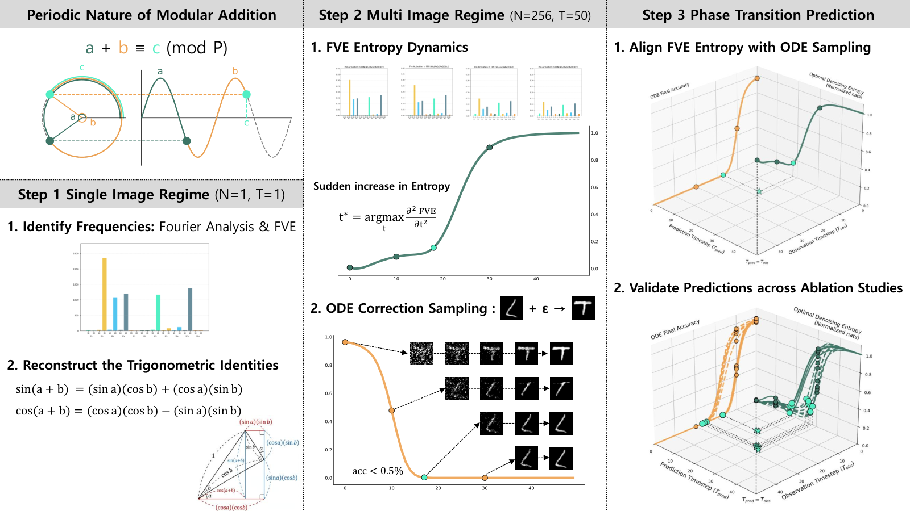

*Рисунок 1: **Обзор конвейера анализа.** (Слева) Чтобы механистически объяснить наблюдаемое явление гроккинга, мы демонстрируем, что модель обобщает периодическую алгоритмическую структуру модульного сложения. С помощью фурье-анализа мы выявляем доминирующие частоты в активациях модели и проверяем, что они восстанавливают тригонометрические тождества. (В центре) Расширяя наш анализ на многокартиночный режим, мы исследуем временную динамику энтропии Fractional Variance Explained (FVE) и точности ODE-сэмплирования. (Справа) Внезапный скачок энтропии FVE — отражающий распад частотной сосредоточенности — совпадает с шагом, где конечная точность ODE-сэмплирования падает почти до нуля ($<0.5\%$). Мы утверждаем, что этот критический шаг $t^{\ast}$ отмечает фазовый переход модели от алгоритмического рассуждения к визуальному шумоподавлению. Мы подтверждаем этот предсказанный переход в ablation-исследованиях на разнородных наборах данных (EMNIST и KMNIST) и различных модулях $P$.* **[p. 2]**

Наши вклады тройственны:

1. **Гроккинг в порождающей диффузионной модели**: мы демонстрируем, что диффузионные модели являют гроккинг на модульном сложении, устанавливая контролируемую постановку, в которой алгоритмическую генерализацию можно изучать механистически в порождающих диффузионных моделях.
2. **Механистический анализ цепей в диффузионных моделях**: мы раскрываем, что диффузионные модели реализуют модульное сложение через периодические представления, компонующиеся посредством тригонометрических **[p. 3]** тождеств, устанавливая точный механистический отчёт об алгоритмическом вычислении в порождающей модели.
3. **Механистическая характеризация смен режимов**: мы выявляем динамический функциональный сдвиг во время итеративного процесса шумоподавления. Мы демонстрируем, что модель систематически переходит от символьного арифметического вычисления к визуальной доводке по достижении критического порога шума, давая временную карту порождающей динамики. Опираясь на высокую точность нашего механистического анализа, мы можем точно предсказать тот самый шаг, на котором происходит эта смена режима, демонстрируя сильное согласие с эмпирическими наблюдениями.

## 2 Связанные работы

#### Механистическая интерпретируемость

Эта область стремится вскрыть внутренние вычисления нейронных сетей, выявляя представления и цепи, ответственные за решающее задачу поведение (Cammarata et al., 2020; Elhage et al., 2021). Ранние исследования продемонстрировали, что большие нелинейные модели часто являют модульную структуру с чистыми вычислительными декомпозициями — такими как копирование, сортировка или индукция, — компоненты которых можно причинно изолировать и манипулировать ими (Wang et al., 2022; Conmy et al., 2023; Cunningham et al., 2023). Эти продвижения утвердили механистическую интерпретируемость как мощную рамку для объяснения того, как и почему генерализация возникает в современных архитектурах.

#### Гроккинг и модульное сложение

Впервые наблюдённый на задачах модульной арифметики (Power et al., 2022), гроккинг описывает отложенную генерализацию после переобучения. Сети быстро достигают полной обучающей точности, пока проверочное качество остаётся около нуля, затем резко переходят к полной генерализации. Это явление стало ключевым полигоном для изучения того, как сети выучивают дискретные правила (Kumar et al., 2023; Davies et al., 2023; Liu et al., 2022b; Varma et al., 2023). Прежние анализы раскрыли, что трансформеры в конце концов открывают явные вычислительные решения, реализующие модульную арифметику, формируя периодически структурированные представления, согласные с алгебраической структурой задачи (Nanda et al., 2023). Разные архитектуры сходятся к различным решениям, таким как стратегии «часов» или «пиццы» (Zhong et al., 2023), давая эталонные базовые линии для исследований интерпретируемости. Однако гроккинг изучался почти исключительно в дискретных трансформерных моделях, оставляя диффузионные порождающие модели неисследованными.

#### Генерализация в диффузионных моделях

Недавняя теоретическая работа изучает, почему диффузионные модели избегают запоминания и как их индуктивные смещения поддерживают порождение новых образцов (Pham et al., 2025; Buchanan et al., 2025; Kadkhodaie et al., 2023; Bonnaire et al., 2025). Дополняющая линия работ исследует, когда и почему генерализация отказывает, выявляя такие виды отказов, как интерполяция мод и локальное порождающее смещение, порождающие галлюцинации (Aithal et al., 2024; Lu et al., 2025). Однако эти работы сосредоточены на границах генерализации — либо почему избегается запоминание, либо почему генерализация отказывает, — а не на прямом объяснении того, как успешная алгоритмическая генерализация достигается вообще.

#### Механистическая интерпретируемость в диффузионных моделях

Прежняя работа изучала внутренние представления диффузионных моделей через призму геометрии и разрежённости, выявляя семантические латентные пространства в бутылочных горлышках U-Net (Kwon et al., 2023; Park et al., 2023) и разлагая активации модели на интерпретируемые признаки посредством разрежённых автокодировщиков (Tian et al., 2025; Surkov et al., 2025). Ближайшая линия работ изучает композиционную генерализацию в диффузионных моделях, раскрывая, как модели сочетают выученные концепты для производства новых выходов (Okawa et al., 2025; Park et al., 2024; Wiedemer et al., 2023; Deschenaux et al., 2024). Однако ни одна из этих работ не касается *алгоритмической* генерализации и не даёт механистических отчётов уровня цепей о том, как диффузионные модели реализуют дискретные вычислительные правила. Наша работа закрывает этот пробел.

## 3 Экспериментальная постановка

Мы вводим нашу экспериментальную постановку для изучения гроккинга в порождении изображений. Сначала мы напоминаем модульное сложение — канонический полигон исследований гроккинга, — затем описываем нашу адаптацию к пространству изображений и трансформерную архитектуру, использованную в наших опытах.

**[p. 4]**

### 3.1 Предварительные сведения: модульное сложение и фурье-анализ

Мы обучаем нашу модель выполнять модульное сложение $a+b=c\pmod{P}$, где $a,b,c\in\{0,1,\dots,P-1\}$. Чтобы истолковать, как трансформерный хребет решает эту задачу, мы принимаем фурье-анализ периодичности, предложенный Nanda et al. (2023). Этот метод выявляет «вычислительную цепь», анализируя частотные составляющие в весах и активациях модели. От модели, действенно обобщающей модульное сложение, ожидается представление входных активаций круговыми вложениями $(\cos(w_{k}x),\sin(w_{k}x))$ на определённых частотах $w_{k}=\frac{2\pi k}{P}$, где $k\in\{1,\dots,\lfloor\frac{P}{2}\rfloor\}$. Конкретно, мы проверяем алгоритмическую целостность, выявляя слой, где синтезируются представления двух операндов. Демонстрируя, что это взаимодействие следует тригонометрическим тождествам сложения, мы подтверждаем, что модель выполняет модульное сложение внутри этих избирательных частотных каналов, а не полагается на механическое запоминание:

$$
\cos(w_{k}(a+b)) =\cos(w_{k}a)\cos(w_{k}b)-\sin(w_{k}a)\sin(w_{k}b) \\
\sin(w_{k}(a+b)) =\sin(w_{k}a)\cos(w_{k}b)+\cos(w_{k}a)\sin(w_{k}b) \tag{1}
$$

Эти тождества иллюстрируют, как произведение входных вложений, схватываемое механизмом внимания, может восстановить представление суммы $c=(a+b)\bmod P$.

### 3.2 Набор данных: модульное сложение изображений

###### p4-3

Чтобы исследовать гроккинг в порождающих диффузионных моделях, мы адаптируем задачу модульного сложения к домену изображений. В отличие от стандартных токенных моделей, предсказывающих дискретные логиты из one-hot векторов (Power et al., 2022; Nanda et al., 2023; Zhong et al., 2023), наша рамка требует от модели порождать картинку результата $c$ прямо в многомерном непрерывном пиксельном пространстве (то есть цель прямого предсказания $x_{0}$; Li & He (2026)). Мы используем заглавные буквы A–W из набора данных EMNIST (Cohen et al., 2017) для представления символов $\{0,\dots,P-1\}$. Хотя мы в основном сообщаем результаты для $P=23$, чтобы поддерживать стабильный режим гроккинга в разумных вычислительных бюджетах, мы подчёркиваем, что наши находки не идиосинкразичны конкретному модулю или набору данных. Конкретно, мы даём обширные ablation-исследования, демонстрирующие, что согласованное поведение гроккинга и механистические узоры возникают при различных значениях $P$ в приложении E и на разнородном наборе данных Kuzushiji-MNIST (Clanuwat et al., 2018) в приложении F.

Следуя Power et al. (2022), мы разбиваем $P^{2}$ возможных пар операндов на обучающее и проверочное множества с обучающей долей $R=0.9$. Чтобы модель не эксплуатировала коммутативность как лазейку запоминания, мы считаем каждую неупорядоченную пару $\{a,b\}$ единой единицей; если $(a,b)$ исключена из обучающего множества, $(b,a)$ тоже удаляется. Это ограничение обеспечивает, что модель встречает совершенно невиданные пары операндов при проверке, тем самым делая необходимым выучивание лежащих в основе арифметических правил, а не простое запоминание.

Внутри этой постановки мы изучаем два режима данных с разными уровнями визуального разнообразия. Сначала мы рассматриваем случай одной картинки на символ ($N=1$), дающий упрощённую, токеноподобную постановку для демонстрации гроккинга. Затем мы увеличиваем разнообразие до $N=256$ картинок на символ, чтобы исследовать, может ли диффузионная модель дистиллировать согласованный дискретный концепт из сильно варьирующих визуальных входов. Эта высокоразнообразная постановка также позволяет нам использовать шумоподавляющую природу диффузионных моделей для подробного пошагового анализа лежащей в основе алгоритмической цепи.

### 3.3 Архитектура модели: однослойный DiT

Мы применяем однослойный Diffusion Transformer (DiT) (Peebles & Xie, 2023), чтобы облегчить механистический анализ механизма внимания (рисунок 41, справа). Модель обучается с целью потокового сопоставления (Lipman et al., 2022; Liu et al., 2022a). По чистой картинке $x_{0}$ и шуму $x_{1}\sim\mathcal{N}(0,I)$ мы определяем интерполированное состояние $x_{t}=(1-t)x_{0}+tx_{1}$, так что $t=0$ отвечает чистой картинке, а $t=1$ — чистому шуму. Обучающая цель минимизирует $\mathcal{L}_{\text{CFM}}(x_{t};\theta)=\|x_{1}-x_{0}-v_{\theta}(x_{t})\|_{2}^{2}$. В этой работе мы принимаем $x_{0}$-параметризацию (Li & He, 2026), где сеть прямо предсказывает $x_{0}$, что даёт эквивалентную скорость $v_{\theta}(x_{t},t)=(x_{t}-x_{0})/t$. Дальнейшие подробности реализации — в приложении A. Кроме того, чтобы проверить, что это поведение не артефакт нашей упрощённой архитектуры, мы демонстрируем, что явление гроккинга распространяется на многослойные модели в приложении H.

**[p. 5]**

#### Начальный шумовой вход для порождения

В отличие от прежних полигонов модульного сложения, использующих специальный токен-заполнитель (например, «$=$») для запуска логитного порождения результата (Power et al., 2022; Nanda et al., 2023), наша диффузионная рамка применяет гауссову карту шума $32\times 32$ как начальное состояние (рисунок 27). Модель итеративно шумоподавляет эту карту, обусловленная картинками операндов, чтобы породить финальное визуальное представление модульной суммы.

#### Протокол оценки

Для оценки точности модульного сложения мы классифицируем порождённые картинки классификатором ResNet18 (He et al., 2015), обученным на наборе данных EMNIST, который достиг свыше 95% точности на тестовом множестве EMNIST. При построении набора данных мы применяем схему фильтрации по уверенности с этим классификатором и оставляем только высокоуверенные образцы. В результате обучающее распределение состоит из визуально недвусмысленных знаков, что делает классификаторную оценку порождённых образцов более надёжной.

## 4 Результаты

В этом разделе мы демонстрируем, что диффузионные модели являют гроккинг на модульном сложении, и раскрываем внутренние механизмы, делающие возможной эту алгоритмическую генерализацию.

### 4.1 Разминка: однокартиночный режим (одношаговое сэмплирование)

Мы начинаем с однокартиночного режима ($N=1$), где каждая картинка действует как токен. Помимо воспроизведения гроккинга, мы даём механистическое истолкование: фурье-анализ раскрывает, что модель кодирует картинки как периодические признаки, компонующиеся через тригонометрические тождества для реализации модульного сложения.

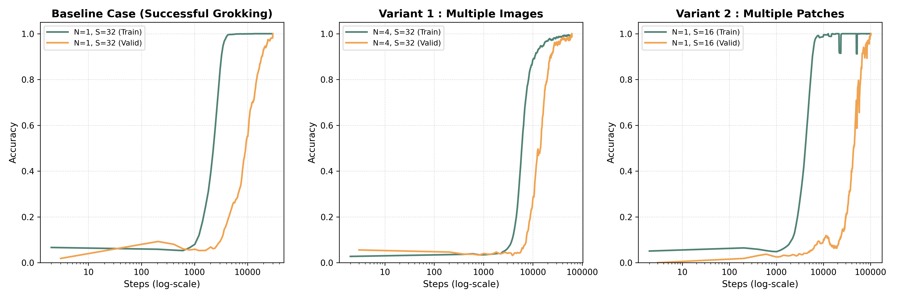

*Рисунок 2: **Динамика гроккинга при разных визуальных сложностях.** (**Слева**) Базовая линия ($N=1,S=32$): классический гроккинг со значительным запаздыванием генерализации после насыщения обучения. (**В центре**) Вариант 1 ($N=4,S=32$): возросшее визуальное разнообразие сокращает запаздывание, показывая синхронизированную сходимость, где проверочная точность взлетает до насыщения обучающей — что мотивирует масштабирование до $N=256$ в разделе 4.2. (**Справа**) Вариант 2 ($N=1,S=16$): более высокое разрешение через меньшие патчи продлевает переобучение и задерживает точку гроккинга. Настройки — в приложении A.* **[p. 5]**

#### Гроккинг

###### p5-5

Рисунок 2 (слева) иллюстрирует явление гроккинга, воспроизведённое в однокартиночном режиме ($N=1$). В этой постановке существует закреплённое взаимно однозначное соответствие между метками и отвечающими им картинками знаков, что действенно сводит задачу к токеноподобному предсказанию. Модель с готовностью запоминает обучающие пары, что ведёт к быстрому росту обучающей точности, пока проверочная точность остаётся на уровне случайного угадывания продолжительное время. После затянувшегося переобучения проверочная точность претерпевает резкий переход к почти полной генерализации, указывая, что модель открыла лежащую в основе алгоритмическую структуру модульного сложения. Чтобы исследовать, какие внутренние представления движут этим переходом, мы применяем рамку фурье-анализа, описанную в разделе 3.1, для рассечения выученных вычислений модели.

#### Механистическое свидетельство через фурье-анализ

В однокартиночной постановке, где каждая метка отображается в единственную картинку, модель может восстановить цель за один шаг сэмплирования от $t=1$ к $t=0$ (Zhang et al., 2022). Потому мы сосредотачиваем наш механистический анализ на предсказании сети при $t=1$.

**[p. 6]**

Строя на фурье-рамке, установленной в разделе 3.1, мы исследуем, реализует ли диффузионная модель модульное сложение через периодические представления. Наш анализ прослеживает возникновение арифметической цепи через две стадии: кодирование отдельных операндов внутри блока самовнимания (SA) и их композицию на стыке SA и полносвязной сети (FFN). Сначала мы рассматриваем внутренние активации внутри блока SA. Как иллюстрирует рис. 3 (слева, в центре), и оценки внимания (${\boldsymbol{A}}$), и компоненты значений (${\boldsymbol{v}}$) операнда $a$ сосредоточивают энергию на разрежённом множестве частот ($w_{1},w_{3},w_{7},w_{9}$), образуя периодические представления первой степени вида $\cos(w_{k}a)$ и $\sin(w_{k}a)$.

*Рисунок 3: **Спектральный анализ через Fractional Variance Explained (FVE).** FVE меряет долю полной мощности, приписываемую фурье-коэффициентам каждой частоты. Столбики представляют спектральные плотности для частот $w_{k}$, включая одностепенные (1D) и двустепенные (2D) составляющие; 2D-признаки схватывают квадратичные взаимодействия вроде $\cos(w_{k}a)\sin(w_{k}b)$. (**Слева**) В оценке внимания ${\boldsymbol{A}}$, опосредующей запрос ($c$) и ключ ($a$), возникают четыре избирательные частоты. (**В центре**) Активации значений (${\boldsymbol{v}}[a]$) выравниваются с частотами $w_{1},w_{3},w_{7},w_{9}$, показывая периодическое кодирование операндов. (**Справа**) В предактивации FFN (позиция $c$) 1D-признаки исчезают, а 2D-составляющие становятся преобладающими, указывая на успешный синтез модульного сложения.* **[p. 6]**

Критический переход происходит на стыке SA–FFN. Конкретно, мы рассматриваем пред-GeLU активации на позиции результата $c$ (рис. 3, справа). На этом сочленении мы наблюдаем отчётливый спектральный сдвиг: одностепенные составляющие исчезают, а двустепенные перекрёстные члены, такие как $\cos(w_{k}a)\sin(w_{k}b)$, становятся преобладающими. Этот переход — ожидаемая сигнатура мультипликативного взаимодействия между периодическими кодировками двух операндов, служащая представленческой предпосылкой реализации тригонометрических тождеств сложения из ур. 1.

Тем не менее возникновение 2D фурье-составляющих на позиции $c$ само по себе не подтверждает, что эта смесь отражает именно правило модульного сложения. Мы дополнительно проверяем это, приближая композицию тригонометрическими тождествами из ур. 1. Хотя прежняя работа (Nanda et al., 2023) выводила тригонометрические базисы $({\boldsymbol{u}}_{k},{\boldsymbol{v}}_{k})$ линейным разложением весовых матриц — оправданным пренебрежимой ролью остаточных связей в их постановке, — такой подход непригоден для нашей рамки. Наши эмпирические ablation-исследования раскрывают, что отключение остаточных связей при сэмплировании ведёт к значительной деградации разрешения изображений и качества синтеза, указывая, что эти пути несут существенную порождающую информацию. Чтобы обеспечить верное представление внутренней динамики, мы вместо этого принимаем подход прямых активаций, извлекая внутренние базисы $({\boldsymbol{u}}_{k},{\boldsymbol{v}}_{k})$ прямо из активаций модели на позиции $c$ во время порождающего процесса.

###### p6-4

К счастью, наш альтернативный подход проецирования промежуточных предактивационных признаков FFN на фурье-базисы, выведенные из прямой активации, восстанавливает тригонометрические тождества сложения с почти совершенной верностью (таблица 1). Это поразительное согласие — где проекция на прокси-базис в точности сообразуется с теоретическими правилами модульной арифметики — даёт убедительное свидетельство, что наши эмпирические базисы схватывают истинную внутреннюю вычислительную логику модели, действенно обходя аналитические преграды, поставленные архитектурой.

*Таблица 1: Модель восстанавливает тригонометрические тождества сложения (ур. 1) через доминирующие 2D фурье-составляющие. Полные данные — в таблице 3.* **[p. 7]**

| Цель ($W_{L}^{\prime}$) | Вычисленная фурье-проекция | FVE |
|---|---|---|
| $\cos(w_{1}(a+b))$ | $138,910\cos(w_{1}a)\cos(w_{1}b)-139,849\sin(w_{1}a)\sin(w_{1}b)$ | **0.95** |
| $\sin(w_{1}(a+b))$ | $137,133\cos(w_{1}a)\sin(w_{1}b)+136,206\sin(w_{1}a)\cos(w_{1}b)$ | **0.94** |
| $\cos(w_{3}(a+b))$ | $171,404\cos(w_{3}a)\cos(w_{3}b)-181,490\sin(w_{3}a)\sin(w_{3}b)$ | **0.95** |
| $\sin(w_{3}(a+b))$ | $163,861\cos(w_{3}a)\sin(w_{3}b)+160,307\sin(w_{3}a)\cos(w_{3}b)$ | **0.93** |
| $\cos(w_{7}(a+b))$ | $52,852\cos(w_{7}a)\cos(w_{7}b)-53,542\sin(w_{7}a)\sin(w_{7}b)$ | **0.87** |
| $\sin(w_{7}(a+b))$ | $64,718\cos(w_{7}a)\sin(w_{7}b)+64,358\sin(w_{7}a)\cos(w_{7}b)$ | **0.88** |
| $\cos(w_{9}(a+b))$ | $176,727\cos(w_{9}a)\cos(w_{9}b)-178,583\sin(w_{9}a)\sin(w_{9}b)$ | **0.95** |
| $\sin(w_{9}(a+b))$ | $192,981\cos(w_{9}a)\sin(w_{9}b)+195,516\sin(w_{9}a)\cos(w_{9}b)$ | **0.96** |
| Прочие ($w_{k\notin\{1,3,7,9\}}$) | Коэффициенты в пределах $\pm 10^{-3}$ – $\pm 10^{3}$ (пренебрежимы) | $\leq 0.01$ |

Подводя итог: сочетание высоких значений FVE на позиции $c$ и почти совершенного восстановления тригонометрических тождеств даёт прочное свидетельство возникновения алгоритмической генерализации. Однако анализ однокартиночного случая в одношаговой постановке сэмплирования остаётся **[p. 7]** принципиально аналогичным токенным моделям, поскольку каждая картинка по сути служит закреплённым представлением дискретной метки. Чтобы выйти за пределы этой токеноподобной постановки и задействовать итеративный процесс сэмплирования, присущий диффузионным моделям, — конкретно их способность дистиллировать абстрактные концепты из многомерных многообразий, — мы переходим к более сложному режиму, включающему временное измерение: шаг сэмплирования $t$. В следующем разделе мы исследуем случай многошагового сэмплирования, где итеративное шумоподавление требуется для обобщения дискретных концептов из разнообразных визуальных входов и постепенного синтеза арифметического результата.

### 4.2 Разнокартиночный режим (многошаговое сэмплирование)

Строя на нашем наблюдении, что гроккинг остаётся осуществимым при $N=4$ (рисунок 2, в центре), мы масштабируем набор данных до $N=256$ разнообразных картинок на метку. Хотя множество арифметических пар операндов $(a,b)$ остаётся тождественным однокартиночной постановке, каждая пара теперь допускает $256^{2}$ различных визуальных воплощений. Это расширение вносит существенную внутриклассовую изменчивость, позволяя нам изучать, как динамика генерализации и внутренние арифметические представления эволюционируют по шагам шумоподавления.

*Рисунок 4: Динамика гроккинга при $N=256$* **[p. 7]**

#### Формирование дискретных концептов через FFN

###### p7-2

Однако стандартная базовая архитектура (SA–FFN) не смогла запустить гроккинг в разнокартиночном режиме ($N=256$). Примечательно, что наращивание ширины модели оказалось недостаточным для преодоления этого отказа, указывая, что сырая ёмкость сама по себе не гарантирует алгоритмической генерализации. Мы гипотезируем, что для задач абстрактного рассуждения, таких как модульное сложение, модель должна дистиллировать непрерывные пиксельные входы в дискретные концепты, прежде чем сможет происходить композиционное рассуждение. Чтобы этому способствовать, мы предлагаем архитектуру FFN-сэндвич (FFN–SA–FFN) как ключевой архитектурный вклад. Наш эмпирический анализ сильно поддерживает этот механизм: PCA-визуализации (рисунок 5) раскрывают, что пред-SA FFN успешно распутывает сильно перепутанный слой вложений и группирует их в отчётливые классы по классу результата операции. Эта структурная модификация позволяет последующему механизму самовнимания работать с чистыми, дискретизированными концептуальными входами.

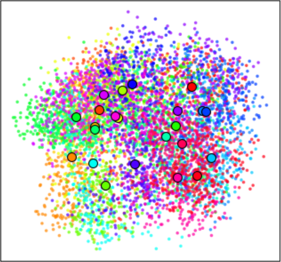

*(a) Вход слоя Pre-SA-FFN*

*(b) Выход слоя Pre-SA-FFN*

*Рисунок 5: **PCA-визуализация активаций слоя Pre-SA-FFN.** Каждый класс закодирован цветом, центроиды классов помечены кружками. (a) Входные активации — отвечающие выходу слоя вложений — являют сильно перепутанные представления, отражая высокую внутриклассовую дисперсию непрерывного входного пространства. (b) Напротив, выходные активации демонстрируют ясные, линейно разделимые сгустки для каждого класса. Это подтверждает, что вспомогательная нелинейность слоя успешно выполняет символьную абстракцию, дистиллируя разнообразные непрерывные входы в дискретные концепты до самовнимания. Визуализации последующих слоёв — на рисунке 18.* **[p. 8]**

#### Гроккинг в режиме $N=256$

###### p7-3

Как иллюстрирует рис. 4, режим $N=256$ являет узор гроккинга, согласный со случаем $N=4$, несмотря на значительно более высокую визуальную сложность. Модель достигает предельной проверочной точности 94%, демонстрируя успешную алгоритмическую генерализацию (подробности оценки — в приложении C.2).

#### Фазовый переход: арифметический вывод и шумоподавление

###### p7-4

Чтобы прозондировать временную структуру процесса сэмплирования ($\text{NFE}=50$), мы спрашиваем, служат ли различные диапазоны шагов различным функциональным ролям. Для проверки мы выполняем причинные вмешательства на позиции результата $c$: мы инициализируем $c$ либо правильной картинкой, либо неправильной картинкой $c^{\prime}$, возмущённой гауссовым шумом до уровня, отвечающего конкретному промежуточному шагу, и начинаем ODE-сэмплирование с этой точки (рис. 6). **[p. 8]** Это позволяет проверить, может ли модель всё ещё задействовать арифметическую цепь или лишь шумоподавляет данный вход, в зависимости от того, где она входит в траекторию сэмплирования. Чтобы отслеживать, активна ли арифметическая цепь, мы меряем энтропию распределения FVE по частотам в предактивационном слое FFN. Более низкая энтропия указывает на сосредоточение на избирательных частотах — сигнатуру арифметического вычисления, установленную в разделе 4.1.

###### p8-1

Наша центральная находка — **критический фазовый переход**, резко сдвигающий модель от алгоритмического рассуждения к визуальному шумоподавлению. При достаточном шуме (зелёные траектории, рис. 6(b)) модель формирует низкоэнтропийное периодическое состояние, сосредоточивает спектральную энергию и успешно перебивает неверный вход $c^{\prime}$. Ниже критического порога шума (красные траектории) эта периодическая структура рассыпается, оставляя арифметическую цепь неактивной.

*(a) Восстановление правильной картинки результата*

*(b) Исправление неправильной картинки результата*

*Рисунок 6: **Причинное вмешательство во внутренние представления.** (a) Правильная картинка $c$, возмущённая гауссовым шумом разных уровней (от серого к зелёному — от высокого шума к низкому). (b) Траектории энтропии, начинающиеся с неправильной картинки $c^{\prime}$, возмущённой шумом разных уровней. Траектории окрашены по конечной точности ODE-сэмплирования: зелёный обозначает успешное исправление, красный — отказ. Начальный уровень энтропии каждого процесса сэмплирования помечен синим кружком. В совокупности эти начальные точки образуют траекторию, которую можно истолковать как оптимальную энтропию шумоподавления, представляющую внутреннюю неопределённость возмущённой картинки до какого-либо вмешательства модели.* **[p. 8]**

Этот переход засвидетельствован совершенным согласием между отказом алгоритмической коррекции (почти нулевая конечная точность ODE) и резким скачком оптимальной шумоподавляющей энтропии FVE (рис. 41 и 6b). Это временное совпадение подтверждает, что скачок энтропии строго отмечает точную границу, где модель оставляет частотное сосредоточение и прекращает алгоритмическое рассуждение.

**[p. 9]**

## 5 Заключение

Мы демонстрируем, что диффузионные модели являют гроккинг на модульном сложении, что делает возможным механистический анализ алгоритмического обучения внутри порождающих рамок. Наше исследование раскрывает, что архитектура FFN-сэндвич дистиллирует дискретные арифметические правила в структурированные периодические представления, тогда как многошаговый процесс сэмплирования претерпевает отчётливый фазовый переход — сдвигаясь от глобального алгоритмического рассуждения к локальной порождающей доводке. Эти находки закладывают основание для механистической интерпретируемости диффузионных моделей.

## References

- J. Abramson, J. Adler, J. Dunger, R. Evans, T. Green, A. Pritzel, O. Ronneberger, L. Willmore, A. J. Ballard, J. Bambrick, et al. (2024) Accurate structure prediction of biomolecular interactions with alphafold 3. Nature 630 (8016), pp. 493–500. Cited by: §1.

- S. K. Aithal, P. Maini, Z. Lipton, and J. Z. Kolter (2024) Understanding hallucinations in diffusion models through mode interpolation. Advances in neural information processing systems 37, pp. 134614–134644. Cited by: §2.

- T. Bonnaire, R. Urfin, G. Biroli, and M. Mézard (2025) Why diffusion models don’t memorize: the role of implicit dynamical regularization in training. arXiv preprint arXiv:2505.17638. Cited by: §2.

- J. Bruce, M. D. Dennis, A. Edwards, J. Parker-Holder, Y. Shi, E. Hughes, M. Lai, A. Mavalankar, R. Steigerwald, C. Apps, et al. (2024) Genie: generative interactive environments. In Forty-first International Conference on Machine Learning, Cited by: §1.

- S. Buchanan, D. Pai, Y. Ma, and V. De Bortoli (2025) On the edge of memorization in diffusion models. arXiv preprint arXiv:2508.17689. Cited by: §1, §2.

- N. Cammarata, S. Carter, G. Goh, C. Olah, M. Petrov, L. Schubert, C. Voss, B. Egan, and S. K. Lim (2020) Thread: circuits. Distill. Note: https://distill.pub/2020/circuits External Links: Document Cited by: §2.

- T. Clanuwat, M. Bober-Irizar, A. Kitamoto, A. Lamb, K. Yamamoto, and D. Ha (2018) Deep learning for classical japanese literature. CoRR abs/1812.01718. External Links: Link, 1812.01718 Cited by: §C.1, Appendix F, §3.2.

- G. Cohen, S. Afshar, J. Tapson, and A. van Schaik (2017) EMNIST: an extension of mnist to handwritten letters. arXiv preprint arXiv:1702.05373. Cited by: §3.2.

- A. Conmy, A. Mavor-Parker, A. Lynch, S. Heimersheim, and A. Garriga-Alonso (2023) Towards automated circuit discovery for mechanistic interpretability. Advances in Neural Information Processing Systems 36, pp. 16318–16352. Cited by: §2.

- H. Cunningham, A. Ewart, L. Riggs, R. Huben, and L. Sharkey (2023) Sparse autoencoders find highly interpretable features in language models. arXiv preprint arXiv:2309.08600. Cited by: §2.

- X. Davies, L. Langosco, and D. Krueger (2023) Unifying grokking and double descent. arXiv preprint arXiv:2303.06173. Cited by: §2.

- J. Deschenaux, I. Krawczuk, G. Chrysos, and V. Cevher (2024) Going beyond compositions, ddpms can produce zero-shot interpolations. External Links: 2405.19201, Link Cited by: §2.

- N. Elhage, N. Nanda, C. Olsson, T. Henighan, N. Joseph, B. Mann, A. Askell, Y. Bai, A. Chen, T. Conerly, N. DasSarma, D. Drain, D. Ganguli, Z. Hatfield-Dodds, D. Hernandez, A. Jones, J. Kernion, L. Lovitt, K. Ndousse, D. Amodei, T. Brown, J. Clark, J. Kaplan, S. McCandlish, and C. Olah (2021) A mathematical framework for transformer circuits. Transformer Circuits Thread. Note: https://transformer-circuits.pub/2021/framework/index.html Cited by: §1, §2.

**[p. 10]**

- K. He, X. Zhang, S. Ren, and J. Sun (2015) Deep residual learning for image recognition. External Links: 1512.03385, Link Cited by: §3.3.

- D. Hendrycks and K. Gimpel (2023) Gaussian error linear units (gelus). External Links: 1606.08415, Link Cited by: Appendix A.

- J. Ho, A. Jain, and P. Abbeel (2020) Denoising diffusion probabilistic models. Advances in neural information processing systems 33, pp. 6840–6851. Cited by: §1.

- Z. Kadkhodaie, F. Guth, E. P. Simoncelli, and S. Mallat (2023) Generalization in diffusion models arises from geometry-adaptive harmonic representations. arXiv preprint arXiv:2310.02557. Cited by: §2.

- M. Kamb and S. Ganguli (2025) An analytic theory of creativity in convolutional diffusion models. In Forty-second International Conference on Machine Learning, External Links: Link Cited by: §1.

- T. Kumar, B. Bordelon, S. J. Gershman, and C. Pehlevan (2023) Grokking as the transition from lazy to rich training dynamics. In The twelfth international conference on learning representations, Cited by: §2.

- M. Kwon, J. Jeong, and Y. Uh (2023) Diffusion models already have a semantic latent space. External Links: 2210.10960, Link Cited by: §2.

- T. Li and K. He (2025) Back to basics: let denoising generative models denoise. arXiv preprint arXiv:2511.13720. Cited by: §1.

- T. Li and K. He (2026) Back to basics: let denoising generative models denoise. External Links: 2511.13720, Link Cited by: Appendix A, §3.2, §3.3.

- Y. Lipman, R. T. Chen, H. Ben-Hamu, M. Nickel, and M. Le (2022) Flow matching for generative modeling. arXiv preprint arXiv:2210.02747. Cited by: §1, §3.3.

- X. Liu, C. Gong, and Q. Liu (2022a) Flow straight and fast: learning to generate and transfer data with rectified flow. arXiv preprint arXiv:2209.03003. Cited by: Appendix A, §1, §3.3.

- Z. Liu, E. J. Michaud, and M. Tegmark (2022b) Omnigrok: grokking beyond algorithmic data. arXiv preprint arXiv:2210.01117. Cited by: §2.

- R. Lu, R. Wang, K. Lyu, X. Jiang, G. Huang, and M. Wang (2025) Towards understanding text hallucination of diffusion models via local generation bias. In The Thirteenth International Conference on Learning Representations, Cited by: §2.

- N. Nanda, L. Chan, T. Lieberum, J. Smith, and J. Steinhardt (2023) Progress measures for grokking via mechanistic interpretability. arXiv preprint arXiv:2301.05217. Cited by: §1, §1, §2, §3.1, §3.2, §3.3, §4.1.

- M. Okawa, E. S. Lubana, R. P. Dick, and H. Tanaka (2025) Compositional abilities emerge multiplicatively: exploring diffusion models on a synthetic task. External Links: 2310.09336, Link Cited by: §2.

- C. Olsson, N. Elhage, N. Nanda, N. Joseph, N. DasSarma, T. Henighan, B. Mann, A. Askell, Y. Bai, A. Chen, T. Conerly, D. Drain, D. Ganguli, Z. Hatfield-Dodds, D. Hernandez, S. Johnston, A. Jones, J. Kernion, L. Lovitt, K. Ndousse, D. Amodei, T. Brown, J. Clark, J. Kaplan, S. McCandlish, and C. Olah (2022) In-context learning and induction heads. Transformer Circuits Thread. Note: https://transformer-circuits.pub/2022/in-context-learning-and-induction-heads/index.html Cited by: §1.

- C. F. Park, M. Okawa, A. Lee, H. Tanaka, and E. S. Lubana (2024) Emergence of hidden capabilities: exploring learning dynamics in concept space. External Links: 2406.19370, Link Cited by: §2.

- Y. Park, M. Kwon, J. Choi, J. Jo, and Y. Uh (2023) Understanding the latent space of diffusion models through the lens of riemannian geometry. External Links: 2307.12868, Link Cited by: §2.

**[p. 11]**

- W. Peebles and S. Xie (2023) Scalable diffusion models with transformers. In Proceedings of the IEEE/CVF international conference on computer vision, pp. 4195–4205. Cited by: Figure 7, Appendix A, §3.3.

- B. Pham, G. Raya, M. Negri, M. J. Zaki, L. Ambrogioni, and D. Krotov (2025) Memorization to generalization: emergence of diffusion models from associative memory. arXiv preprint arXiv:2505.21777. Cited by: §1, §2.

- A. Power, Y. Burda, H. Edwards, I. Babuschkin, and V. Misra (2022) Grokking: generalization beyond overfitting on small algorithmic datasets. arXiv preprint arXiv:2201.02177. Cited by: §1, §2, §3.2, §3.2, §3.3.

- I. Price, A. Sanchez-Gonzalez, F. Alet, T. R. Andersson, A. El-Kadi, D. Masters, T. Ewalds, J. Stott, S. Mohamed, P. Battaglia, et al. (2025) Probabilistic weather forecasting with machine learning. Nature 637 (8044), pp. 84–90. Cited by: §1.

- A. Ramesh, P. Dhariwal, A. Nichol, C. Chu, and M. Chen (2022) Hierarchical text-conditional image generation with clip latents. arXiv preprint arXiv:2204.06125 1 (2), pp. 3. Cited by: §1.

- R. Rombach, A. Blattmann, D. Lorenz, P. Esser, and B. Ommer (2022) High-resolution image synthesis with latent diffusion models. In Proceedings of the IEEE/CVF conference on computer vision and pattern recognition, pp. 10684–10695. Cited by: §1.

- C. Saharia, W. Chan, S. Saxena, L. Li, J. Whang, E. L. Denton, K. Ghasemipour, R. Gontijo Lopes, B. Karagol Ayan, T. Salimans, et al. (2022) Photorealistic text-to-image diffusion models with deep language understanding. Advances in neural information processing systems 35, pp. 36479–36494. Cited by: §1.

- N. Shazeer (2020) GLU variants improve transformer. External Links: 2002.05202, Link Cited by: Appendix A.

- J. Sohl-Dickstein, E. Weiss, N. Maheswaranathan, and S. Ganguli (2015) Deep unsupervised learning using nonequilibrium thermodynamics. In International conference on machine learning, pp. 2256–2265. Cited by: §1.

- K. Song, J. Kim, S. Chen, Y. Du, S. Kakade, and V. Sitzmann (2025) Selective underfitting in diffusion models. arXiv preprint arXiv:2510.01378. Cited by: §1.

- Y. Song, J. Sohl-Dickstein, D. P. Kingma, A. Kumar, S. Ermon, and B. Poole (2020) Score-based generative modeling through stochastic differential equations. arXiv preprint arXiv:2011.13456. Cited by: §1.

- J. Su, M. Ahmed, Y. Lu, S. Pan, W. Bo, and Y. Liu (2024) Roformer: enhanced transformer with rotary position embedding. Neurocomputing 568, pp. 127063. Cited by: Appendix A.

- V. Surkov, C. Wendler, A. Mari, M. Terekhov, J. Deschenaux, R. West, C. Gulcehre, and D. Bau (2025) One-step is enough: sparse autoencoders for text-to-image diffusion models. External Links: 2410.22366, Link Cited by: §2.

- Z. Tian, S. Nan, M. Xu, S. Zhai, W. Qu, J. Liu, R. Jia, and J. Zhang (2025) Sparse autoencoder as a zero-shot classifier for concept erasing in text-to-image diffusion models. External Links: 2503.09446, Link Cited by: §2.

- V. Varma, R. Shah, Z. Kenton, J. Kramár, and R. Kumar (2023) Explaining grokking through circuit efficiency. arXiv preprint arXiv:2309.02390. Cited by: §2.

- J. Von Oswald, E. Niklasson, E. Randazzo, J. Sacramento, A. Mordvintsev, A. Zhmoginov, and M. Vladymyrov (2023) Transformers learn in-context by gradient descent. In International Conference on Machine Learning, pp. 35151–35174. Cited by: §1.

- T. Wan, A. Wang, B. Ai, B. Wen, C. Mao, C. Xie, D. Chen, F. Yu, H. Zhao, J. Yang, et al. (2025) Wan: open and advanced large-scale video generative models. arXiv preprint arXiv:2503.20314. Cited by: §1.

**[p. 12]**

- K. Wang, A. Variengien, A. Conmy, B. Shlegeris, and J. Steinhardt (2022) Interpretability in the wild: a circuit for indirect object identification in gpt-2 small. arXiv preprint arXiv:2211.00593. Cited by: §2.

- T. Wiedemer, Y. Li, P. Vicol, S. S. Gu, N. Matarese, K. Swersky, B. Kim, P. Jaini, and R. Geirhos (2025) Video models are zero-shot learners and reasoners. arXiv preprint arXiv:2509.20328. Cited by: §1.

- T. Wiedemer, P. Mayilvahanan, M. Bethge, and W. Brendel (2023) Compositional generalization from first principles. External Links: 2307.05596, Link Cited by: §2.

- B. Wu, C. Zou, C. Li, D. Huang, F. Yang, H. Tan, J. Peng, J. Wu, J. Xiong, J. Jiang, et al. (2025) HunyuanVideo 1.5 technical report. arXiv preprint arXiv:2511.18870. Cited by: §1.

- C. Zhang, C. Zhang, S. Zheng, M. Zhang, M. Qamar, S. Bae, and I. S. Kweon (2023) A survey on audio diffusion models: text to speech synthesis and enhancement in generative ai. arXiv preprint arXiv:2303.13336. Cited by: §1.

- Q. Zhang, M. Tao, and Y. Chen (2022) Gddim: generalized denoising diffusion implicit models. arXiv preprint arXiv:2206.05564. Cited by: §4.1.

- Z. Zhong, Z. Liu, M. Tegmark, and J. Andreas (2023) The clock and the pizza: two stories in mechanistic explanation of neural networks. Advances in neural information processing systems 36, pp. 27223–27250. Cited by: §1, §1, §2, §3.2.

**[p. 13]**

## Приложение A Подробности реализации

Мы обучаем нашу модель в рамке Rectified Flow (RF) (Liu et al., 2022a) предсказывать вектор скорости $v_{\theta}(x_{t},t)$. Следуя принятой в этой работе $x_{0}$-параметризации, модель прямо предсказывает чистую картинку $x_{0}$, связанную со скоростью соотношением $v_{\theta}(x_{t},t)=(x_{t}-x_{0})/t$. Эта формулировка даёт прямопутевое отображение между шумом и пиксельным пространством, которое мы находим более благоприятным для визуализации структурной организации представлений в процессе шумоподавления (Li & He, 2026). Рисунок 27 изображает общую архитектуру DiT. Подробные гиперпараметры, использованные в наших опытах, таковы:

#### Разбиение на патчи ($S$)

Следуя архитектуре Diffusion Transformer (DiT) (Peebles & Xie, 2023), мы делим каждую картинку $32\times 32$ пикселей на неперекрывающиеся патчи размера $S$. Наша постановка состоит из трёх картинок (операнды $a,b$ и результат $c$), которые преобразуются в последовательность токенов, представляющих их соответствующие пространственные области. Хотя наша базовая линия использует $S=1$ для облегчения механистической ясности, мы также оцениваем $S=16$, что даёт 4 патча на картинку и общую длину последовательности 12 токенов. Эта конфигурация успешно явила почти-гроккинговое явление. Достижение полного гроккинга в этом патчевом режиме потребовало бы выучивания сложных зависимостей через границы патчей. Следовательно, исследование многомерных взаимодействий между этими пространственными токенами предлагает многообещающий путь к расшифровке того, как лежащая в основе цепь модели координирует порождающие задачи через распределённые представления.

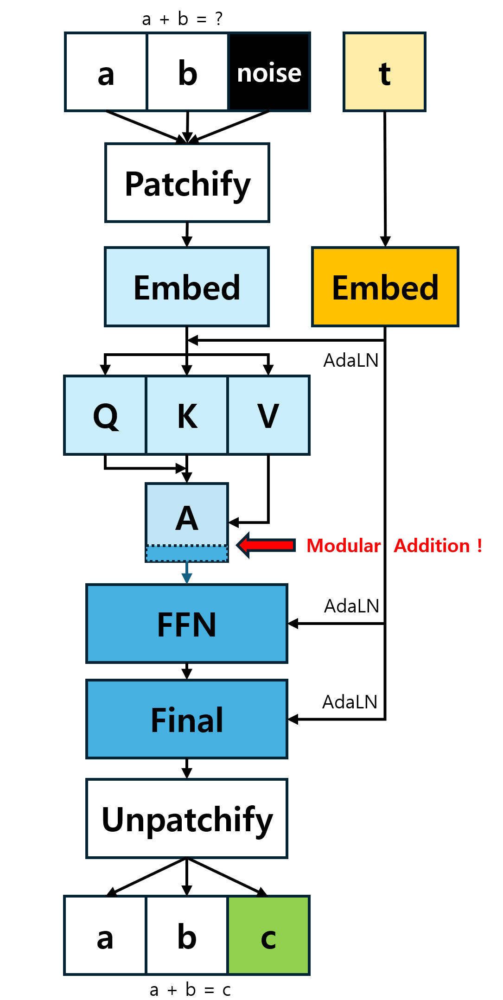

*Рисунок 7: **Схема архитектуры однослойного Diffusion Transformer.** Операнды $a,b$ и гауссова карта шума сцепляются, разбиваются на патчи и проецируются в латентное пространство. Внутри блока самовнимания модель вычисляет компоненты $Av[a]$ и $Av[b]$, которые затем сплавляются на стыке внимания и FFN. Этот переход способствует квадратичной смеси признаков операндов, делая возможным возникновение алгоритма модульного сложения. Временной контекст от времени сэмплирования $t$ впрыскивается через Adaptive Layer Normalization (AdaLN) (Peebles & Xie, 2023), а Residual Gate динамически модулирует поток информации между слоями. Процесс завершается прямым синтезом целевой картинки $c$ в многомерном пиксельном пространстве на исходном месте шума.* **[p. 13]**

**[p. 14]**

#### Слои вложения и развложения

Мы используем несвязанные линейные слои для обработки патчей. Матрица вложения $W_{E}\in\mathbb{R}^{d\times d_{\text{patch}}}$ и матрица развложения $W_{U}\in\mathbb{R}^{d_{\text{patch}}\times d}$ параметризованы независимо. Для базовой модели ($S=32$) $d_{\text{patch}}=1024$. Для многопатчевой конфигурации ($S=8$), использованной в нашем механистическом анализе, мы ставим $d_{\text{patch}}=64$. Это позволяет нам исследовать многомерные взаимодействия между пространственными токенами.

#### Самовнимание

Блок самовнимания состоит из 16 голов с размерностью модели $d=512$, что даёт размерность головы $d_{h}=32$. Мы включаем 2D Rotary Positional Embeddings (RoPE) (Su et al., 2024) для придания пространственного контекста патчевым токенам.

#### Полносвязная сеть

FFN содержит 512 скрытых нейронов с активацией GeLU (Hendrycks & Gimpel, 2023), поддерживая коэффициент расширения $1\times$ для баланса ёмкости и простоты. Хотя мы исследовали более сложные варианты, такие как SwiGLU (Shazeer, 2020), ради улучшенной реконструкции, мы нашли, что стандартная активация GeLU предлагает превосходную ясность для механистической интерпретируемости, конкретно в отслеживании энтропийных переходов предактивационных состояний.

*Таблица 2: Гиперпараметры модели и набора данных.* **[p. 14]**

| **Параметр** | **Значение** |
|---|---|
| *Набор данных* |  |
| Модуль ($P$) | 23 |
| Картинок на символ ($N$) | 1, 4, 256 |
| Обучающая доля ($R$) | 0.9 |
| Разрешение картинки | $32\times 32$ |
| Размер патча | $32\times 32$, $16\times 16$ |
| *Архитектура* |  |
| Размерность модели ($d_{\text{model}}$) | 512, 2048 |
| Число слоёв | 1 |
| Число голов | 16, 64 |
| Размерность головы ($d_{h}$) | 32 |
| Размерность FFN | 512, 2048 |
| Позиционное кодирование | RoPE |
| Активация FFN | GeLU |
| Всего параметров | 2.1M, 106.1M |

**[p. 15]**

## Приложение B Подробности однокартиночного режима

### B.1 Результаты сэмплирования

Сначала мы представляем результаты одношагового вывода, порождённые нашей моделью. Поскольку каждая метка представлена единственной картинкой, модель просто запоминает отображение и выдаёт соответствующую картинку согласно правилам модульного сложения.

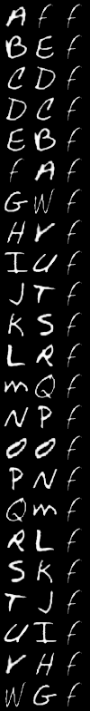

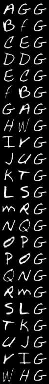

*Рисунок 8: **Результаты одношагового сэмплирования*** **[p. 15]**

**[p. 16]**

### B.2 Результаты фурье-анализа

Мы представляем всеобъемлющие результаты фурье-анализа по всем слоям, включая и столбиковые диаграммы FVE, и активации уровня нейронов. Для каждого слоя левая столбиковая диаграмма показывает FVE для частот $w_{1},\ldots,w_{11}$. Согласно обсуждению в разделе 4.1, мы наблюдаем, что FVE не сосредоточена внутри этой конкретной рамки.

*(a) Столбиковая диаграмма FVE*

*(b) Тепловая карта активаций на уровне нейронов и голов*

*Рисунок 9: **Активация вложения операнда** $a$* **[p. 16]**

Однако мы наблюдаем отчётливую значимость четырёх конкретных частот — $w_{1},w_{3},w_{7}$ и $w_{9}$ — внутри блоков самовнимания, как показано ниже. Для этих слоёв мы дополнительно даём активации на уровне отдельных голов внимания. Примечательно, что наш анализ раскрывает: конкретные головы специализируются на схватывании единственной, изолированной частоты.

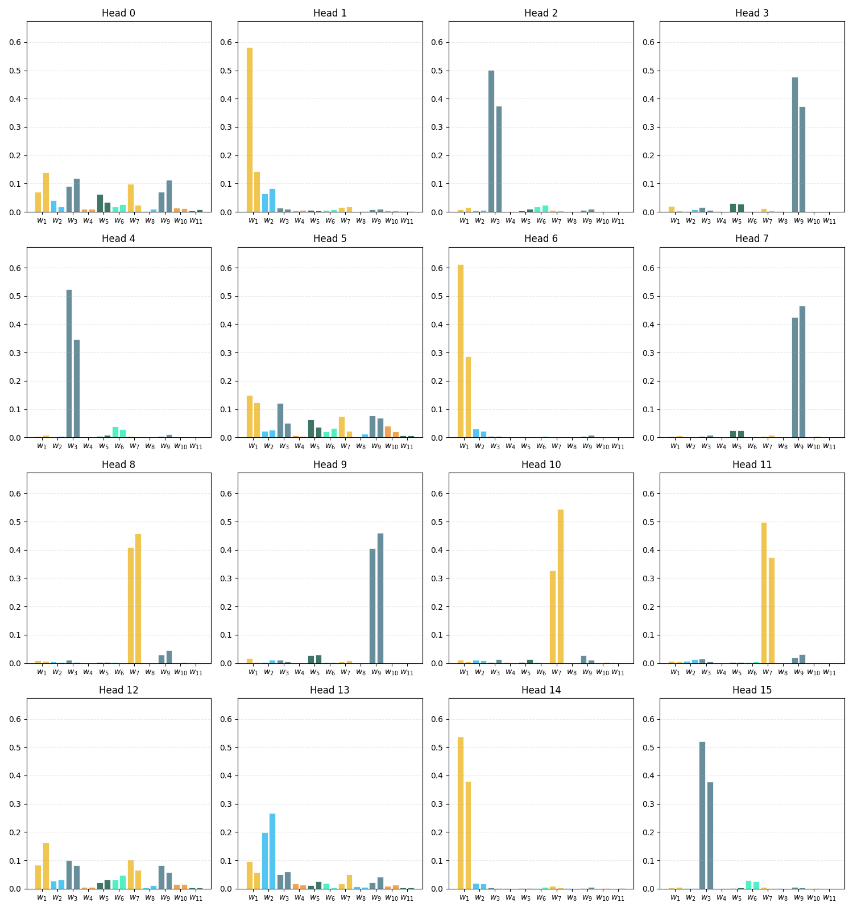

*(a) Столбиковая диаграмма FVE*

*(b) Тепловая карта активаций на уровне нейронов и голов*

*Рисунок 10: **Активация значений внимания операнда** $a$* **[p. 16]**

*(a) Столбиковая диаграмма FVE*

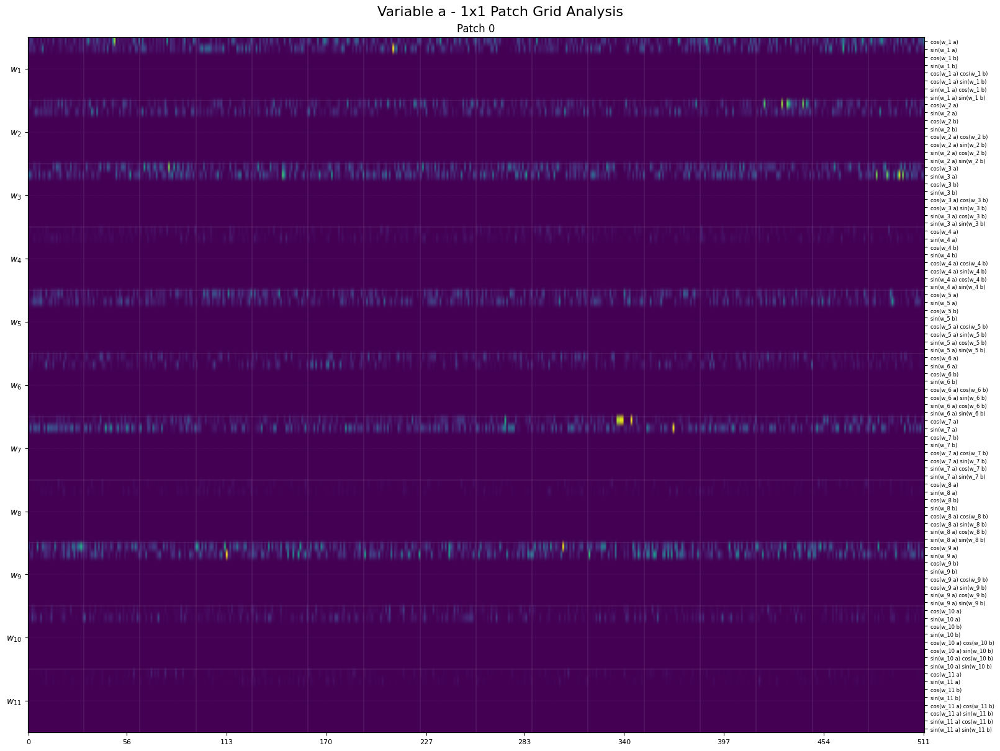

*(b) Тепловая карта активаций на уровне нейронов и голов*

*Рисунок 11: **Активация ключей внимания операнда** $a$* **[p. 17]**

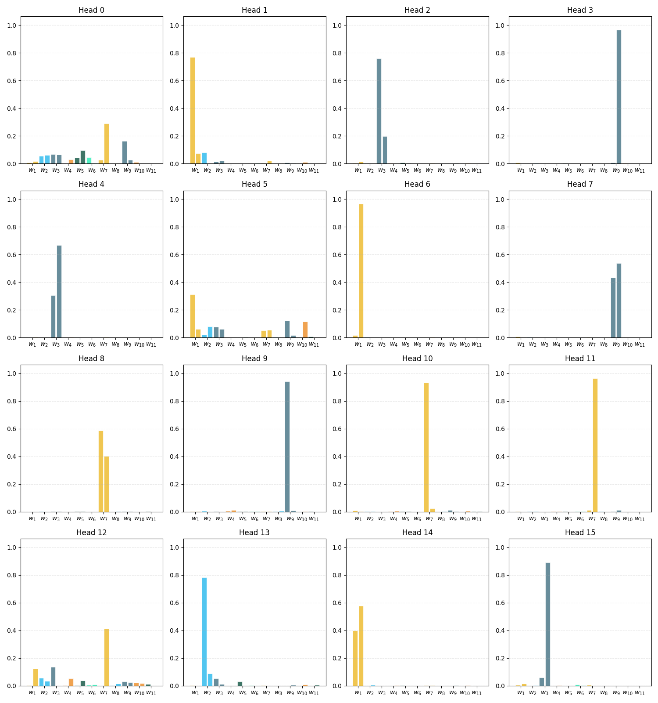

*(a) Столбиковая диаграмма FVE*

*(b) Тепловая карта активаций на уровне голов*

*Рисунок 12: **Активация оценок внимания операнда** $a$* **[p. 17]**

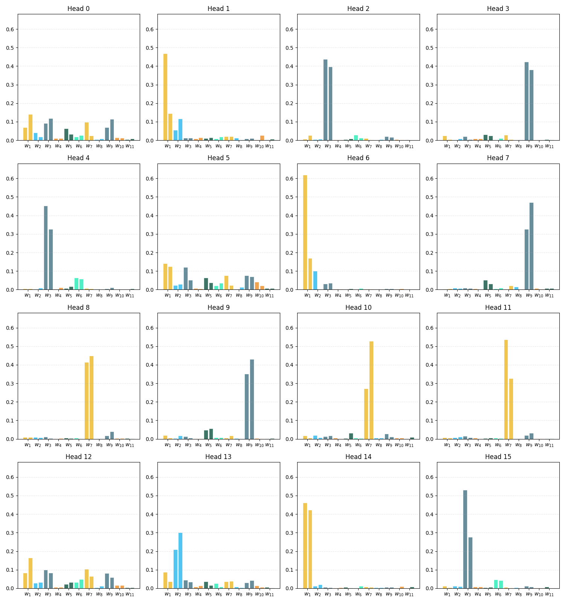

*(a) Столбиковая диаграмма FVE*

*(b) Тепловая карта активаций на уровне нейронов и голов*

*Рисунок 13: **Активация внимания ${\boldsymbol{A}}{\boldsymbol{v}}$ операнда** $a$* **[p. 17]**

**[p. 18]**

Механизм самовнимания архитектурно компонует активации отдельных операндов, ${\boldsymbol{A}}{\boldsymbol{v}}[a]$ и ${\boldsymbol{A}}{\boldsymbol{v}}[b]$. Следовательно, мы можем наблюдать обе 2D-составляющие на позиции результата $c$, как иллюстрируют следующие графики. Примечательно, что на этом слое активация в $c$ ещё не полностью дистиллирована в 2D-составляющие, а являет смесь 1D- и 2D-составляющих.

*(a) Столбиковая диаграмма FVE*

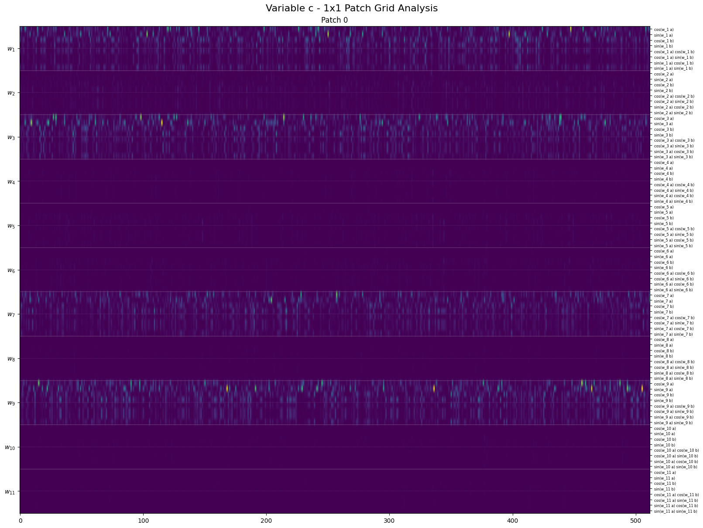

*(b) Тепловая карта активаций на уровне нейронов и голов*

*Рисунок 14: **Активация выхода внимания результата операции** $c$* **[p. 18]**

Наконец, на стадии пред-GeLU активации слоя FFN активация на позиции $c$ ясно составлена из 2D FVE, отвечающих избирательным частотам, разделяемым по всему предшествующему блоку SA. Эта характеристика мотивировала наше сосредоточение именно на этом слое, поскольку структурно он представляет возникновение арифметической генерализации.

*(a) Столбиковая диаграмма FVE*

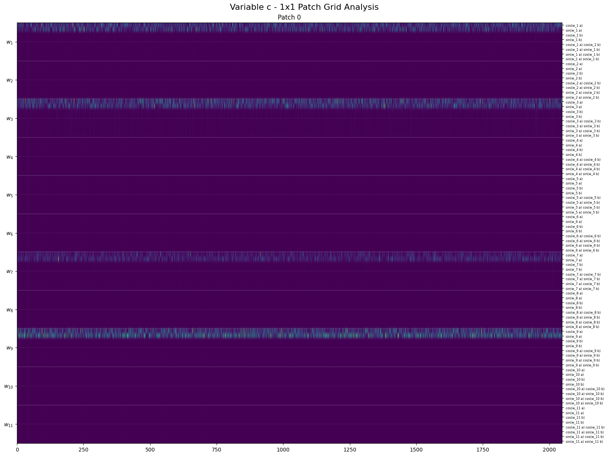

*(b) Тепловая карта активаций на уровне нейронов и голов*

*Рисунок 15: **Пред-GeLU активация FFN результата операции** $c$* **[p. 18]**

На этом слое мы вывели фурье-базис и восстановили лежащие в основе тригонометрические тождества, поскольку он явил самые значительные периодические структуры, характеризуемые 2D-сигналами. Следующая таблица представляет полный набор восстановленных тождеств, демонстрируя ясную корреляцию со сложением угловых значений.

*Таблица 3: **Фурье-анализ предактиваций FFN.** Таблица демонстрирует в полной подробности восстановление моделью тригонометрических тождеств сложения (ур. 1) через доминирующие 2D фурье-составляющие на избирательных частотах ($w_{1},w_{3},w_{7},w_{9}$) наряду с незначимыми частотами.* **[p. 19]**

| $W_{L}^{\prime}$ | $\mathbf{u}_{k}^{\top}\text{FFN}_{\text{pre\_act}}(a,b)$ и $\mathbf{v}_{k}^{\top}\text{FFN}_{\text{pre\_act}}(a,b)$ | FVE |
|---|---|---|
| $\cos(w_{1}(a+b))$ | $138910\cos(w_{1}a)\cos(w_{1}b)-139849\sin(w_{1}a)\sin(w_{1}b)$ | **0.95** |
| $\sin(w_{1}(a+b))$ | $137133\cos(w_{1}a)\sin(w_{1}b)+136206\sin(w_{1}a)\cos(w_{1}b)$ | **0.94** |
| $\cos(w_{2}(a+b))$ | $939\cos(w_{2}a)\cos(w_{2}b)-426\sin(w_{2}a)\sin(w_{2}b)$ | $0.01$ |
| $\sin(w_{2}(a+b))$ | $1017\cos(w_{2}a)\sin(w_{2}b)+1081\sin(w_{2}a)\cos(w_{2}b)$ | $0.01$ |
| $\cos(w_{3}(a+b))$ | $171404\cos(w_{3}a)\cos(w_{3}b)-181490\sin(w_{3}a)\sin(w_{3}b)$ | **0.95** |
| $\sin(w_{3}(a+b))$ | $163861\cos(w_{3}a)\sin(w_{3}b)+160307\sin(w_{3}a)\cos(w_{3}b)$ | **0.93** |
| $\cos(w_{4}(a+b))$ | $168\cos(w_{4}a)\cos(w_{4}b)-168\sin(w_{4}a)\sin(w_{4}b)$ | $0.00$ |
| $\sin(w_{4}(a+b))$ | $74\cos(w_{4}a)\sin(w_{4}b)+83\sin(w_{4}a)\cos(w_{4}b)$ | $0.00$ |
| $\cos(w_{5}(a+b))$ | $315\cos(w_{5}a)\cos(w_{5}b)-410\sin(w_{5}a)\sin(w_{5}b)$ | $0.00$ |
| $\sin(w_{5}(a+b))$ | $403\cos(w_{5}a)\sin(w_{5}b)+420\sin(w_{5}a)\cos(w_{5}b)$ | $0.00$ |
| $\cos(w_{6}(a+b))$ | $245\cos(w_{6}a)\cos(w_{6}b)-117\sin(w_{6}a)\sin(w_{6}b)$ | $0.00$ |
| $\sin(w_{6}(a+b))$ | $259\cos(w_{6}a)\sin(w_{6}b)+294\sin(w_{6}a)\cos(w_{6}b)$ | $0.00$ |
| $\cos(w_{7}(a+b))$ | $52852\cos(w_{7}a)\cos(w_{7}b)-53542\sin(w_{7}a)\sin(w_{7}b)$ | **0.87** |
| $\sin(w_{7}(a+b))$ | $64718\cos(w_{7}a)\sin(w_{7}b)+64358\sin(w_{7}a)\cos(w_{7}b)$ | **0.88** |
| $\cos(w_{8}(a+b))$ | $105\cos(w_{8}a)\cos(w_{8}b)-65\sin(w_{8}a)\sin(w_{8}b)$ | $0.00$ |
| $\sin(w_{8}(a+b))$ | $87\cos(w_{8}a)\sin(w_{8}b)+81\sin(w_{8}a)\cos(w_{8}b)$ | $0.00$ |
| $\cos(w_{9}(a+b))$ | $176727\cos(w_{9}a)\cos(w_{9}b)-178583\sin(w_{9}a)\sin(w_{9}b)$ | **0.95** |
| $\sin(w_{9}(a+b))$ | $192981\cos(w_{9}a)\sin(w_{9}b)+195516\sin(w_{9}a)\cos(w_{9}b)$ | **0.96** |
| $\cos(w_{10}(a+b))$ | $41\cos(w_{10}a)\cos(w_{10}b)-86\sin(w_{10}a)\sin(w_{10}b)$ | $0.00$ |
| $\sin(w_{10}(a+b))$ | $149\cos(w_{10}a)\sin(w_{10}b)+141\sin(w_{10}a)\cos(w_{10}b)$ | $0.00$ |
| $\cos(w_{11}(a+b))$ | $109\cos(w_{11}a)\cos(w_{11}b)-103\sin(w_{11}a)\sin(w_{11}b)$ | $0.00$ |
| $\sin(w_{11}(a+b))$ | $47\cos(w_{11}a)\sin(w_{11}b)+46\sin(w_{11}a)\cos(w_{11}b)$ | $0.00$ |

**[p. 19]**

Интересно, что GeLU-активация слоя FFN размазывает сигналы — прежде сосредоточенные на избирательных частотах — по всему частотному спектру. Это указывает, что нелинейное преобразование перераспределяет дистиллированную арифметическую информацию, действенно отображая её назад в более широкое пространство представлений, требуемое для финального синтеза изображения.

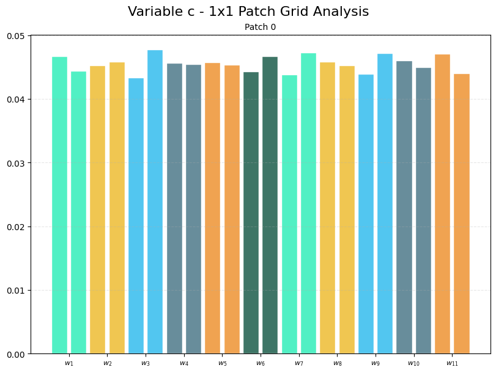

*(a) Столбиковая диаграмма FVE*

*(b) Тепловая карта активаций на уровне нейронов и голов*

*Рисунок 16: **Пост-GeLU активация FFN результата операции** $c$* **[p. 19]**

Наконец, мы представляем выходную активацию финального слоя MLP. Эта активация распатчивается сетью и отображается назад в модальность изображения. Как иллюстрировано, отчётливые частотные сигналы — прежде доминировавшие во внутренних слоях — больше не присутствуют, указывая, что представление полностью преобразовано в пространственный домен для финального синтеза изображения.

*(a) Столбиковая диаграмма FVE*

*(b) Тепловая карта активаций на уровне нейронов и голов*

*Рисунок 17: **Выходная активация финального слоя MLP** на позиции результата $c$* **[p. 20]**

**[p. 20]**

## Приложение C Подробности многокартиночного режима

### C.1 Архитектура FFN-сэндвич

Чтобы способствовать действенному отображению многомерных визуальных входов в алгоритмическое пространство, мы принимаем вспомогательный слой FFN, помещённый между слоем вложений и блоком самовнимания (SA). Визуализация через PCA демонстрирует, что эта «сэндвич»-архитектура успешно проецирует разнообразные пиксельные данные в дискретные, специфичные для метки сгустки в самом начале обрабатывающего конвейера модели.

Дополнительно в приложении F мы даём ablation-исследование на разнородном наборе данных Kuzushiji-MNIST (Clanuwat et al., 2018). Поскольку этот набор данных содержит относительно более сложные пространственные структуры по сравнению с исходным набором EMNIST, периодические структуры, наблюдаемые в моделях, обученных на нём, служат сильным свидетельством того, что наша FFN-сэндвич-архитектура прочно выучивает дискретные концепты даже в куда более трудных визуальных обстоятельствах.

Помимо подтверждения роли слоя Pre-SA-FFN в выучивании дискретных концептов, PCA-визуализации предлагают убедительное геометрическое свидетельство периодических структур, обсуждённых в нашем фурье-анализе. Как показано на рисунке 18, представления на позиции операнда $a$ являют отчётливую группировку по модульным меткам прямо с начального шага ($t=0$), и эти сгустки остаются прочными на всём протяжении траектории шумоподавления. Примечательно, что при проекции в последующее пространство Attention Key эти активации самоорганизуются в ясную кольцеобразную геометрию (рисунок 19). Возникновение этого кругового многообразия совершенно подкрепляет наши находки в частотном домене, демонстрируя, что модель естественно вкладывает дискретные сгустки меток в непрерывное периодическое пространство представлений для вычисления модульной арифметики.

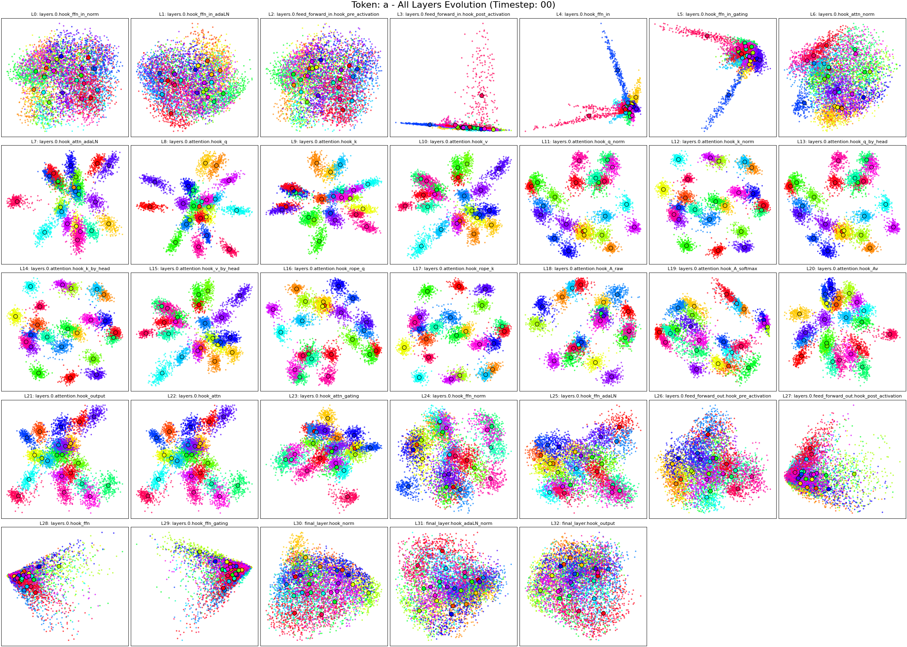

*Рисунок 18: PCA на позиции операнда $a$ при timestep = 0* **[p. 21]**

*Рисунок 19: PCA на позиции операнда $a$ при timestep = 50* **[p. 21]**

**[p. 21]**

### C.2 Построение оценочного набора данных

Чтобы строго оценить алгоритмическую генерализацию модели за пределами простого визуального отображения, мы построили крупномасштабный неизбыточный набор данных для режима $N=256$. Процесс построения следовал строгому протоколу для обеспечения и арифметического покрытия, и визуального разнообразия:

1. **Визуальное разнообразие:** для каждой метки модульной арифметической группы $\mathbb{Z}_{P}$ мы использовали пул из 256 уникальных высокоуверенных картинок EMNIST.
2. **Неизбыточное спаривание:** чтобы модель не запоминала конкретные пары картинок, мы реализовали механизм перемешивания и выборки. **[p. 22]** Для каждой возможной арифметической комбинации $(a,b)$ картинки тянулись из своих пулов без возвращения, пока не израсходованы все 256 картинок на метку.
3. **Общий объём выборки:** этот процесс дал в сумме $11\times P^{2}$ уникальных оценочных пар (например, 5 819 пар для базового случая $P=23$), где каждая пара представляет отдельное визуальное воплощение лежащего в основе модульного сложения.

### C.3 Качество вывода

На этом исчерпывающем наборе данных диффузионная модель достигла точности вывода 95%. Это качество особенно значимо, поскольку оно приближается к 95%-ному верхнему пределу выделенного классификатора ResNet-18, используемого для проверки. Высокая точность на наборе данных, где все возможные картиночные комбинации проверяются без повторения, демонстрирует, что модель успешно дистиллировала абстрактную модульную логику из многомерного визуального многообразия.

Мы визуализируем процесс сэмплирования по дискретным временным шагам. Следуя соглашению, мы обозначаем $t=1$ как начальное шумовое состояние и $x_{0}$ как финальную синтезированную картинку. Интервал $[1,0]$ дискретизирован на 50 равномерных шагов для иллюстрации перехода. Для ясности визуализации ниже мы индексируем эти шаги как $T=0$ (начальный шум) до $T=50$ (финальная картинка). Точность предсказания оценивается ResNet-классификатором, предобученным на наборе данных EMNIST. Красные, жёлтые и зелёные рамки указывают, что классификатор определяет порождённую картинку как неверную, низкоуверенную или верную соответственно.

*Рисунок 20: Шаг 0 с точностью 0%* **[p. 22]**

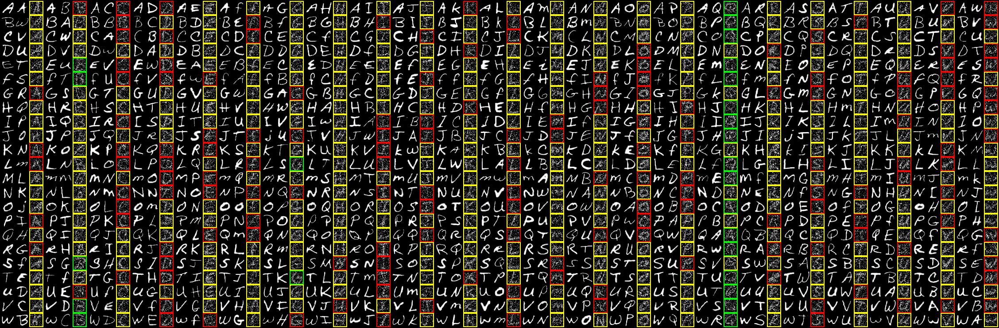

*Рисунок 21: Шаг 21 с точностью 7%* **[p. 22]**

*Рисунок 22: Шаг 32 с точностью 54%* **[p. 23]**

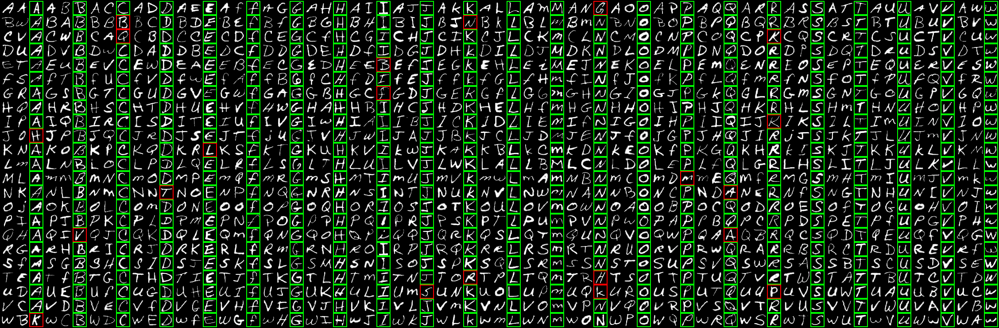

*Рисунок 23: Шаг 50 с точностью 96%* **[p. 23]**

**[p. 24]**

## Приложение D Результаты фурье-анализа множественных картинок

Мы расширяем наш фурье-анализ на многокартиночный (многошаговый) сценарий, вводя в наше исследование временное измерение (шаг). Следуя наблюдениям однокартиночного случая, мы сосредотачиваемся на слоях, критичных для арифметической генерализации: блоке SA и предактивационном слое FFN.

Заметное отступление от однокартиночной базовой линии — возникновение пяти значимых частот по сравнению с четырьмя, наблюдавшимися прежде. В многокартиночной постановке эти избирательные частоты являют высокую значимость с начального шага и в оценке внимания, и в предактивационных слоях FFN. Напротив, слой значений внимания показывает противоположную тенденцию, где значимость частот эволюционирует во времени иначе. Мы даём столбиковые диаграммы FVE и тепловые карты уровня нейронов для этих ключевых слоёв рядом с соответствующими траекториями сэмплирования.

###### p24-3

Как обсуждалось в разделе 4.2, низкая энтропия, наблюдаемая в предактивационном слое FFN, означает «режим арифметического сосредоточения» модели. Визуализации ниже дают этому эмпирическую поддержку: хотя сэмплированные картинки на ранних шагах остаются перцептивно размытыми, FVE слоя FFN уже резко сосредоточены на пяти значимых частотах. Это расцепление наводит на мысль, что структурное разрешение арифметической задачи предшествует визуальной доводке выходной модальности.

*Рисунок 24: Шаг 0 с точностью 0%* **[p. 24]**

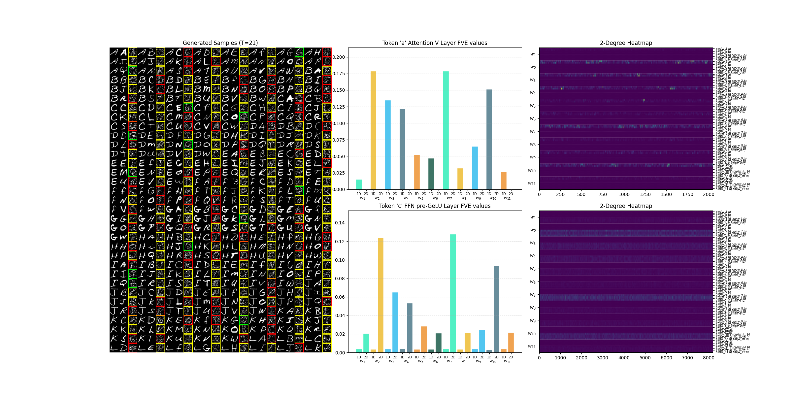

*Рисунок 25: Шаг 21 с точностью 0%* **[p. 24]**

**[p. 25]**

По мере того как порождаемый знак становится перцептивно различимым в синтезируемой картинке, резкое сосредоточение FVE начинает рассеиваться, о чём свидетельствует растущая энтропия во внутренних слоях. Этот переход, иллюстрированный визуализациями ниже, означает сдвиг модели от абстрактной арифметической операции к пространственной реконструкции визуального выхода.

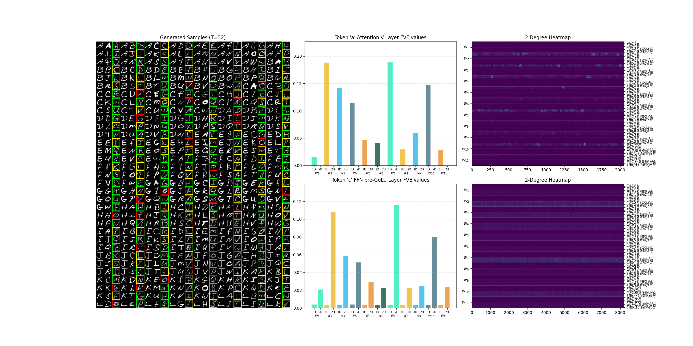

*Рисунок 26: Шаг 32 с точностью 54%* **[p. 25]**

*Рисунок 27: Шаг 50 с точностью 96%* **[p. 25]**

## Приложение E Ablation-исследование 1: различные значения $P$

Чтобы проверить, что периодические структуры, наблюдаемые в операции модульного сложения, поддаются обобщению, мы сначала даём ablation-исследование по различным значениям $P$. Мы демонстрируем, что 1D- и 2D-периодичности, раскрытые фурье-анализом, наблюдаемы и в случаях $P=27$, $31$ и $35$. Хотя набор данных EMNIST предоставляет и заглавные, и строчные буквы, мы наблюдали, что число картинок строчных букв значительно мало. Дополнительно были частые случаи, когда строчные буквы неверно помечены как заглавные. Потому мы используем смешанное множество картинок цифр и заглавных букв из набора данных EMNIST, чтобы обеспечить достаточно данных для случаев $P>26$. Число картинок на класс результата операции закреплено как $N=256$ согласно разделу 4.2. Рисунки 28$\sim$31 показывают 1D и 2D значения FVE на трёх слоях: оценка внимания в $a$, компонента значений внимания в $a$ и предактивация FFN в $c$. Шаги сэмплирования закреплены на $t=0$, где энтропии FVE остаются низкими (то есть высокие сосредоточения на немногих частотах).

*Рисунок 28: $P=23$.* **[p. 26]**

*Рисунок 29: $P=27$* **[p. 26]**

*Рисунок 30: $P=31$* **[p. 26]**

*Рисунок 31: $P=35$* **[p. 26]**

**[p. 27]**

Рисунки 32–34 демонстрируют смену режима во время ODE-сэмплирования при различных значениях $P$. Как и в базовом случае $P=23$, мы наблюдаем схожие траектории и для восстановления правильных ответов, и для исправления изначально неверных картинок.

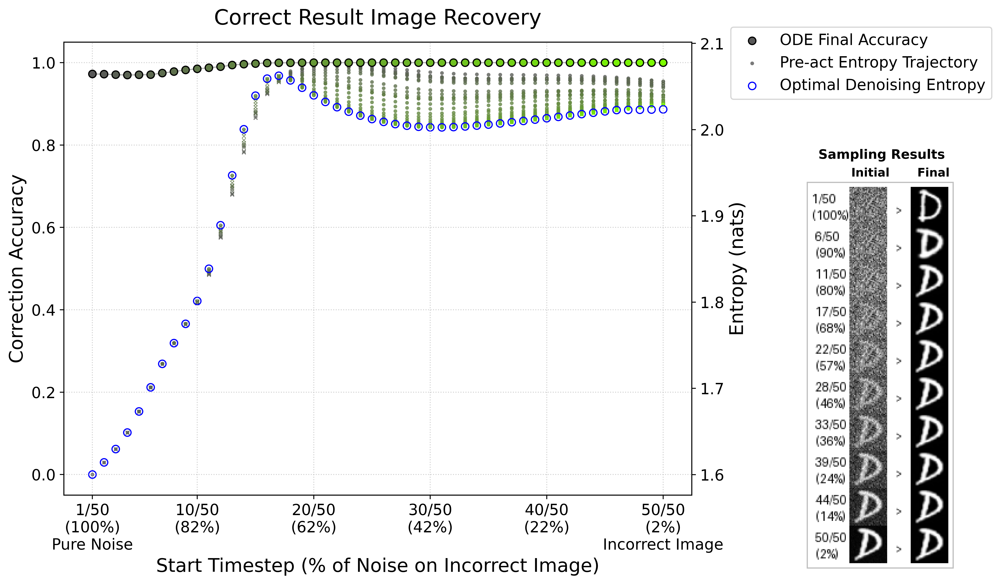

*(a) Восстановление правильной картинки результата*

*(b) Исправление неправильной картинки результата*

*Рисунок 32: $P=27$* **[p. 27]**

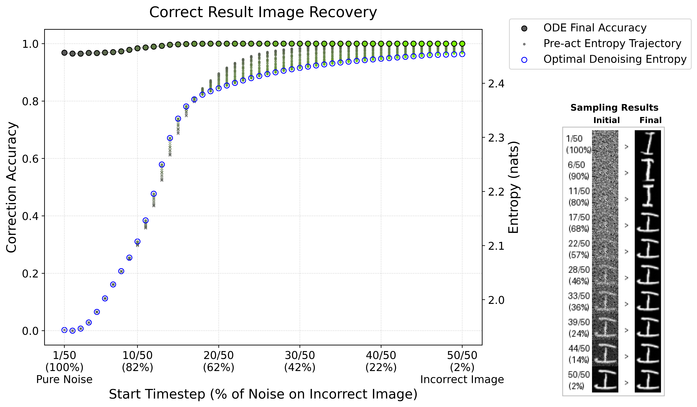

*(a) Восстановление правильной картинки результата*

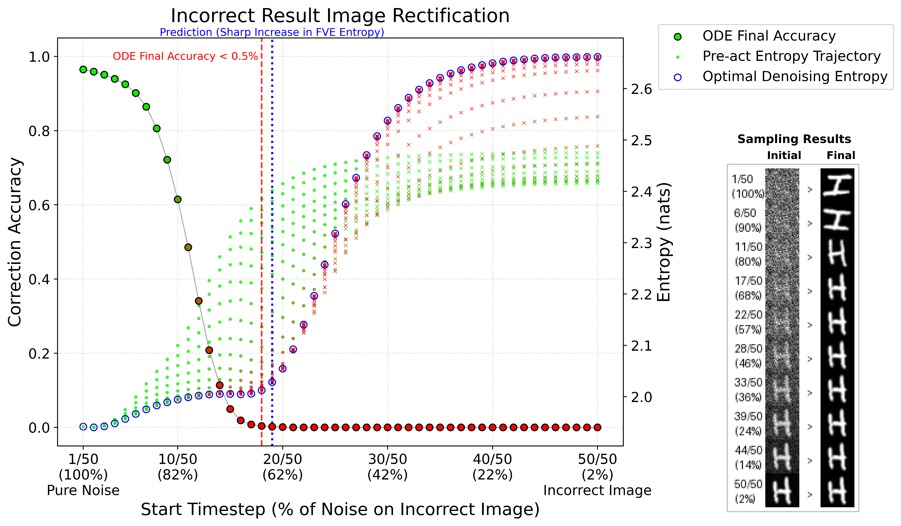

*(b) Исправление неправильной картинки результата*

*Рисунок 33: $P=31$* **[p. 27]**

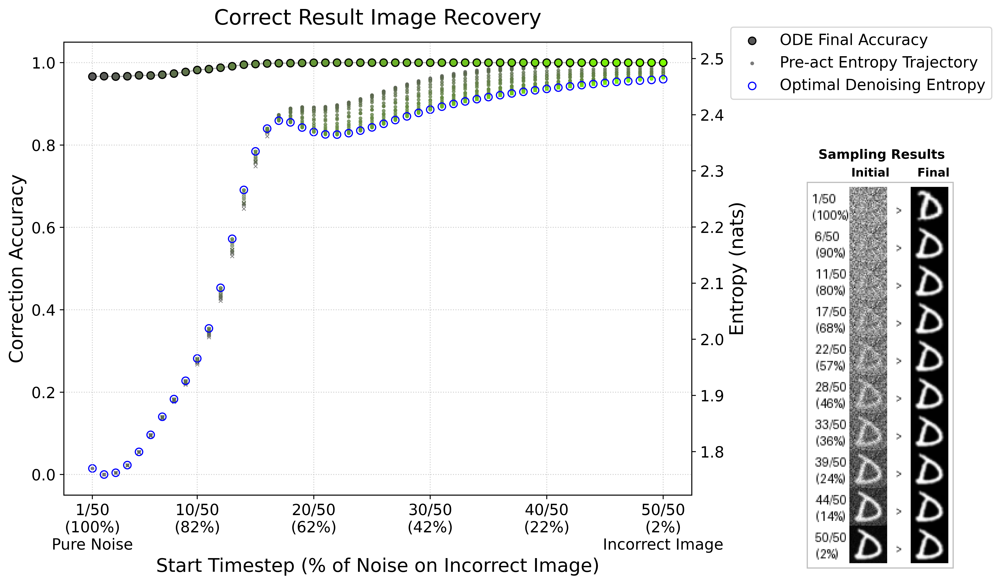

*(a) Восстановление правильной картинки результата*

*(b) Исправление неправильной картинки результата*

*Рисунок 34: $P=35$* **[p. 27]**

## Приложение F Ablation-исследование 2: набор данных Kuzushiji-EMNIST

Мы далее утверждаем, что возникновение периодических структур не является явлением, специфичным для набора данных, предоставляя тождественный фурье-анализ моделей, обученных на наборе данных Kuzushiji-MNIST (Clanuwat et al., 2018). Поскольку рукописные японские знаки содержат относительно более сложные формы, чем английский алфавит, этот опыт сильно поддерживает прочность структуры FFN-сэндвич в выучивании дискретных концептов до арифметического рассуждения. **[p. 28]** Пользуясь богатым разнообразием классов, предоставляемым набором данных Kuzushiji-MNIST, мы демонстрируем эти согласованные узоры на расширенных случаях $P=39,43,\text{ and }47$, как показано ниже.

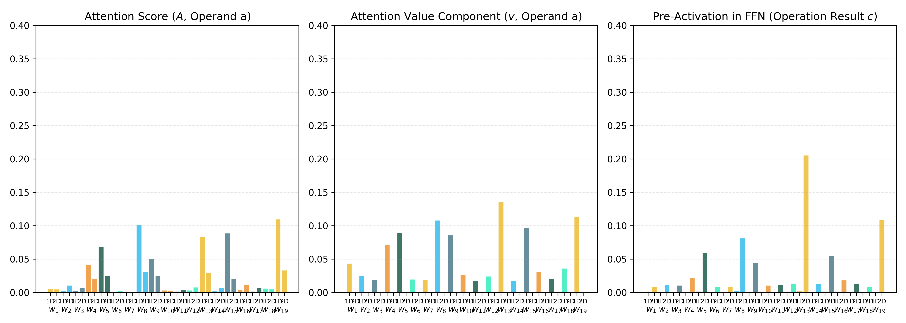

*Рисунок 35: $P=39$ с набором данных Kuzushiji-MNIST* **[p. 28]**

*Рисунок 36: $P=43$ с набором данных Kuzushiji-MNIST* **[p. 28]**

*Рисунок 37: $P=47$ с набором данных Kuzushiji-MNIST* **[p. 28]**

Рисунки 38$\sim$40 демонстрируют смену режима между рассуждением и шумоподавлением на пути ODE-сэмплирования у модели, обученной на наборе данных Kuzushiji-MNIST.

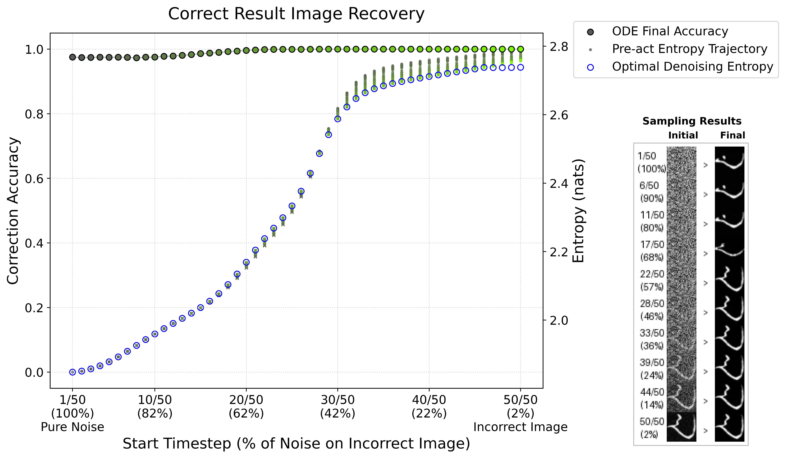

*(a) Восстановление правильной картинки результата*

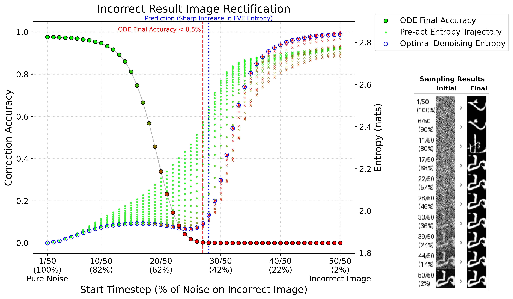

*(b) Исправление неправильной картинки результата*

*Рисунок 38: $P=39$ на наборе данных Kuzushiji-MNIST.* **[p. 29]**

*(a) Восстановление правильной картинки результата*

*(b) Исправление неправильной картинки результата*

*Рисунок 39: $P=43$ на наборе данных Kuzushiji-MNIST.* **[p. 29]**

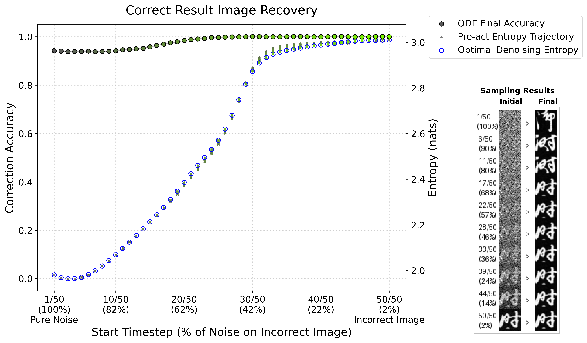

*(a) Восстановление правильной картинки результата*

*(b) Исправление неправильной картинки результата*

*Рисунок 40: $P=47$ на наборе данных Kuzushiji-MNIST.* **[p. 29]**

**[p. 29]**

## Приложение G Ablation-исследование 4: фазовый переход при различных значениях $P$ и наборах данных

Замечательно, что при различных значениях $P$ и на разнородных наборах данных внезапный рост энтропии FVE — отражающий распад сосредоточения на избирательных частотах — последовательно совпадает с шагом, на котором конечная точность ODE-сэмплирования падает почти до нуля ($<0.5\%$). Мы утверждаем, что этот критический шаг $t^{\ast}$ отмечает точку, где модель переходит от фазы алгоритмического рассуждения к фазе визуального шумоподавления. Формально $t^{\ast}$ легко выявляется нахождением максимума второй производной FVE: $t^{\ast}=\operatorname{argmax}_{t}\frac{\partial^{2}\mathrm{FVE}}{\partial t^{2}}$.

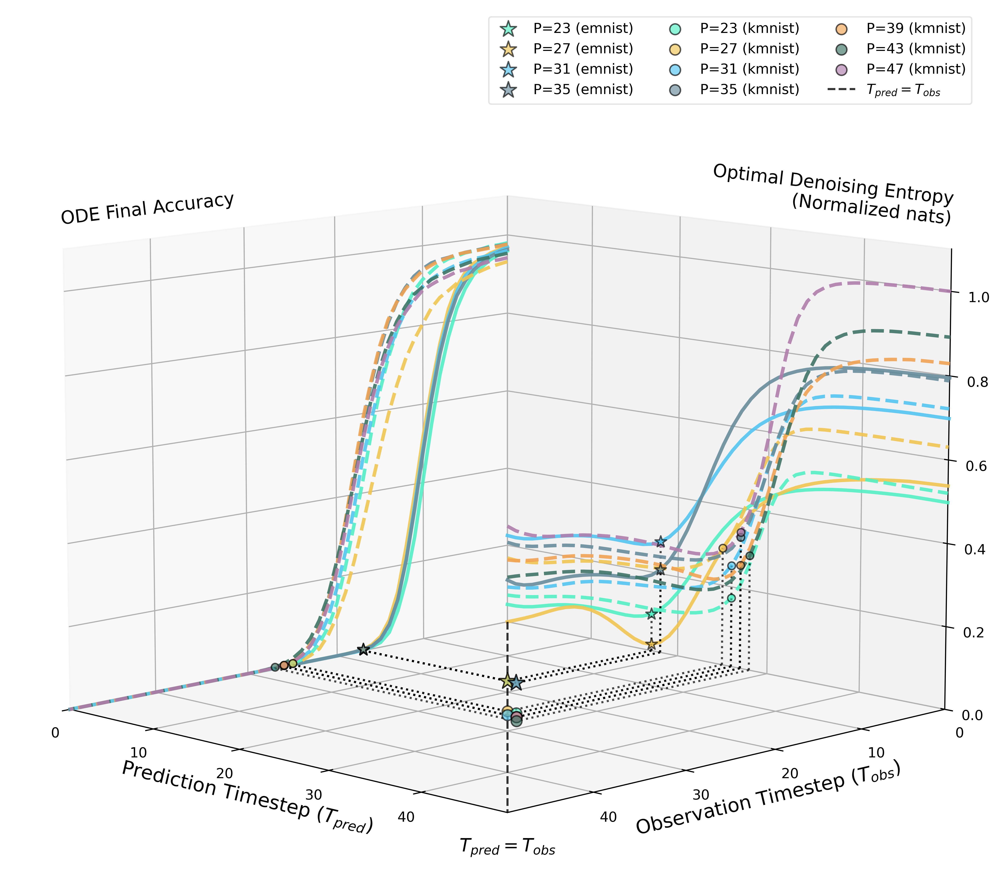

*Рисунок 41: **Согласие предсказанных и наблюдаемых шагов фазового перехода.** Эта 3D-визуализация иллюстрирует динамику исправления неверных картинок, подробно описанную в разделе 4.2. Левая вертикальная плоскость показывает конечные точности ODE при варьирующих начальных уровнях шума для моделей, обученных на разных значениях $P$ и наборах данных (EMNIST и KMNIST). Помеченные точки обозначают порог точности $0.5\%$ — критический шаг, где модели в основном отказываются исправлять неверные входы, указывая на прекращение алгоритмического рассуждения. Правая вертикальная плоскость наносит энтропию Fourier Variance Explained (FVE) вдоль оптимальной траектории шумоподавления, с маркерами, указывающими резкое начало нарастания энтропии ($\arg\max_{t}\frac{\partial^{2}\text{FVE}}{(\partial t)^{2}}$). Нижняя плоскость проецирует эти два различных критических шага, раскрывая сильную корреляцию вдоль диагонали $T_{\text{pred}}=T_{\text{obs}}$. Это согласие поддерживает то, что внезапный рост энтропии FVE служит высокоточным прокси для предсказания фазового перехода от алгоритмического рассуждения к визуальному шумоподавлению. Ablation-исследования наборов данных — в приложении E.* **[p. 30]**

**[p. 31]**

## Приложение H Ablation-исследование 5: гроккинг в многослойной модели

Наш архитектурный выбор однослойного DiT в основном тексте был намеренным: изоляция единственного блока самовнимания позволила ясную механистическую демонстрацию периодической внутренней цепи через фурье-анализ, явно раскрывая, как модель смешивает два операнда. Однако само явление гроккинга не зависит строго от самодельной архитектуры FFN-сэндвич.

###### p31-2

Чтобы это продемонстрировать, мы проводим ablation-исследование со стандартной многослойной диффузионной моделью глубины 2 (то есть Embedding $\rightarrow$ SA $\rightarrow$ FFN $\rightarrow$ SA $\rightarrow$ FFN $\rightarrow$ Output). Как показано на рисунке 42, гроккинг успешно возникает и в режиме $N=1$, и в разнокартиночном режиме $N=256$. Это ожидаемый исход, совершенно согласный с нашей гипотезой символьной абстракции: в стандартной модели глубины 2 первый слой FFN неотъемлемо предшествует второму блоку самовнимания. Следовательно, этот первый FFN даёт необходимую нелинейную ёмкость для формирования дискретных концептуальных представлений, исполняя ровно ту же роль бутылочного горлышка, что и пред-SA FFN в нашей сэндвич-архитектуре. Интересно, что модель глубины 2 выигрывает от усиленной выразительной ёмкости дополнительного блока SA, достигая почти полной генерализации в случае $N=256$ (рисунок 42(b)). Это заметное улучшение по сравнению с однослойной FFN-сэндвич-архитектурой, которая вышла на полку примерно на 94% точности (рисунок 4).

*(a) Случай однокартиночного режима $N=1$*

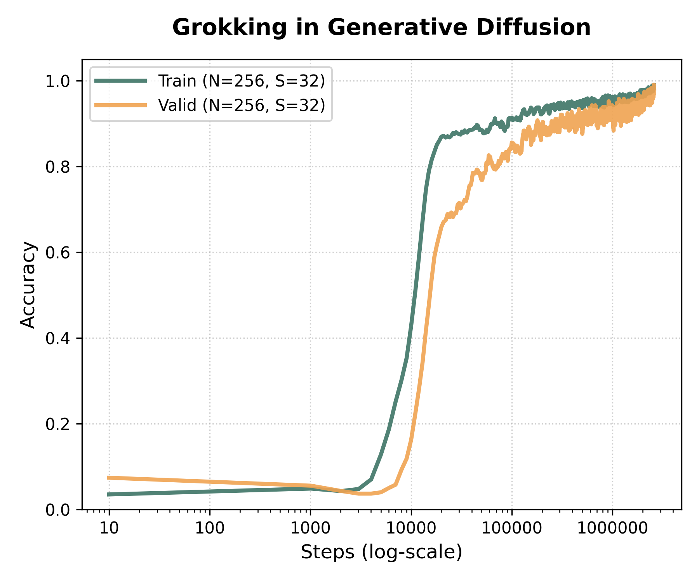

*(b) Случай разнокартиночного режима $N=256$*

*Рисунок 42: **Явления гроккинга, продемонстрированные на стандартной архитектуре глубины 2.** Траектории проверочной точности показывают, что успешная генерализация (гроккинг) происходит и в (a) однокартиночном режиме $N=1$, и в (b) разнокартиночном режиме $N=256$, подтверждая, что явление не ограничено однослойной FFN-сэндвич-моделью.* **[p. 31]**
