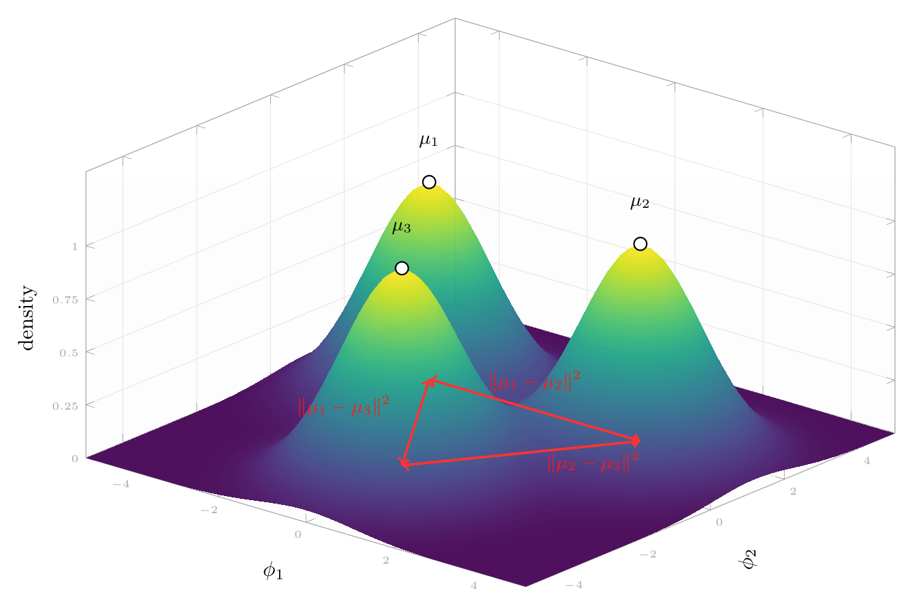

# Golwala 2026 — ILDR: Geometric Early Detection of Grokking

См. также: [глобальный индекс понятий](../../concepts/index.md).
arXiv [2604.20923v1](https://arxiv.org/abs/2604.20923), 22 апреля 2026. Колонтитула у PDF нет: препринт без места публикации.

**Shreel Golwala** — Virginia Tech (golwalas@vt.edu). Единственный автор; в благодарностях назван Sri Sambangi (UVA) за вычитку. Код: [github.com/shreelg/ILDR](https://github.com/shreelg/ILDR.git).

Оригинал и производные файлы этой папки:

- [`original/2604.20923.main.tex`](original/2604.20923.main.tex) — первоисточник: LaTeX-исходник статьи, скачанный с arXiv как есть (нативного HTML-рендеринга нет ни у arXiv, ни у ar5iv).
- [`original/2604.20923.ildr-geometric-early-detection-of-grokking.md`](original/2604.20923.ildr-geometric-early-detection-of-grokking.md) — конверсия оригинала в Markdown без правок содержания; английский текст для сверки перевода.
- [`images/`](images/) — иллюстрация статьи в исходном разрешении (1 файл).
- [`2604.20923.ildr-geometric-early-detection-of-grokking.claims.txt`](2604.20923.ildr-geometric-early-detection-of-grokking.claims.txt) — рабочий разбор: пронумерованные утверждения с пометками.

Схема якорей и правила ссылок на карточку — в [README папки статей](../README.md).

## Затрагиваемые понятия

**[Гроккинг](../../concepts/grokking.md)** — работа не прибавляет понятию содержания, а берёт его готовым по Power et al. 2022 и заменяет собственным операциональным определением: шагом гроккинга назван [первый замер, где точность на отложенной выборке превышает $95\%$](#p5-3). Вводный абзац пересказывает явление как двухфазную динамику, где сеть «достигает почти совершенной точности на обучении», а много позже «резко переходит к сильной генерализации» ([с. 1, абз. 3](#p1-3)). Чего в работе нет: точность **на обучении** не показана и не измерена ни разу — ни на графике, ни в таблице, — так что классический признак гроккинга (подгонка обучающей выборки задолго до генерализации) здесь не наблюдается; наблюдается только момент пересечения отложенной точностью порога $95\%$. Прогонов, где гроккинг не наступил, в оценке признака тоже нет — кроме тех, где переход подавлен собственным вмешательством ([с. 12, абз. 2](#p12-2)).

**[Меры прогресса](../../concepts/progress-measures.md)** — вклад работы адресован именно этому понятию: предложена скалярная величина, вычисляемая по внутреннему состоянию сети и, по замыслу, пересекающая порог раньше внешнего скачка. Довод, ради которого она вводится, сформулирован против прежних признаков: [все они косвенны](#p2-7), потому что смотрят на веса или градиенты, а не на структуру выученных представлений. Существенно, что автор **не** пользуется термином «мера прогресса»: слова `progress measure` в тексте нет, Nanda et al. 2023 стоит в списке литературы и цитируется единственный раз по другому поводу ([с. 10, абз. 2](#p10-2)), и приписывать автору постановку о мерах прогресса нельзя. Нет здесь и обычных для понятия проверок: ILDR не сопоставляется ни с ограниченной, ни с исключающей потерей, не предсказывает, сколько шагов осталось до перехода ([с. 11, абз. 1](#p11-1): «не предсказывает, сколько времени займёт полная генерализация»), и не проверяется на ложные срабатывания.

**[Grokfast / фильтрация градиента](../../concepts/gradient-low-pass-filtering.md)** — самое ценное для корпуса измерение работы отрицательное и относится сюда: медленное EMA градиента, взятое как пассивный признак, неустойчиво по семенам. На восьми семенах оно опережает на трёх и запаздывает на четырёх-пяти, среднее $-1862 \pm 3532$ шага — [стандартное отклонение превышает среднее по модулю](#p7-5), что делает признак статистически неинформативным. Оговорка, без которой это измерение нельзя цитировать: усиление градиента, ради которого Grokfast и создан, здесь [нарочно убрано](#p2-5), так что испытан не метод, а только его EMA в роли наблюдателя (подробнее — в разделе «[Ошибочные цитирования](#mc-2405-20233)»). Отдельно стоит запомнить устройство порога: [флаг поднимается при падении EMA ниже $50\%$ значения на шаге 3000](#p2-6), и в трёх «опережающих» прогонах он встаёт ровно на шаге 3100, то есть на первом же замере после базы. Развёртка по глубине добавляет к этому, что [запаздывание Grokfast сокращается с глубиной — 13600, 4900 и 1000 шагов при 1, 2 и 4 слоях](#p9-4), то есть зависит от модели, а не от задачи.

**[Минимизация нормы весов](../../concepts/weight-norm-minimization.md)** — работа даёт корпусу восьмисеменное измерение того, что норма весов как признак запаздывает: [$-450 \pm 200$ шагов на всех восьми семенах](#p7-4), с механическим объяснением, что $\lVert W \rVert$ падает, когда weight decay отсекает уже ненужные параметры, то есть после перестройки геометрии. Оговорка обязательна: измеряется не норма как таковая, а момент, когда она падает [ниже $75\%$ базы шага 3000](#p5-6) — порог, подобранный на одном семени. И на единственной задаче с длинным сроком ($S_5$) та же норма весов опережает переход на 12 600 шагов, то есть тезис о «последовательном запаздывании» опровергается собственной таблицей 3 (см. «Несогласованности»).

**[Сжатие многообразия представлений](../../concepts/manifold-representation-compression.md)** — работа задаёт понятию дешёвый скалярный инструмент: отношение среднего квадрата расстояния между классовыми центроидами к среднему внутриклассовому разбросу, считаемое [на представлениях предпоследнего слоя](#p2-8) и [только на отложенных входах](#p4-2). Механизм описан как стягивание примеров одного класса к общим центроидам при одновременном расхождении классов. Чего в работе нет: ни одной кривой измеренного ILDR — единственная иллюстрация синтетическая ([с. 4, абз. 1](#p4-1)); раздельного разложения межклассовой и внутриклассовой частей, обещанного в [§3.3](#p6-2), в результатах не приведено; размерность многообразия, эффективный ранг и прочие меры сжатия не измеряются вовсе.

**[Обучение структурированных представлений](../../concepts/structured-representation-learning.md)** — работа встаёт на сторону трактовки, по которой представления перестраиваются раньше, чем это видно в поведении: «модель может выработать чистую латентную структуру немного раньше, чем её выходная голова начнёт полностью её использовать» ([с. 4, абз. 2](#p4-2)). Во введении та же мысль дана общо — представления «[со временем перестраиваются и в конце концов оседают в более компактную и структурированную форму, поддерживающую генерализацию](#p2-1)». Самое сильное свидетельство — деление по модулю, где опережение достигает 2900 шагов против ~400 у сложения и умножения ([с. 8, абз. 1](#p8-1)), с толкованием через выучивание обратных по модулю. Сам автор помечает это толкование как непроверенное: «хотя это ещё нуждается в подтверждении» ([с. 8, абз. 3](#p8-3)). Никакой структуры представлений — ни круга эмбеддингов, ни фурье-компонент, ни зондов — работа не разглядывает: разделимость классов измеряется одним числом.

**[Нейронный коллапс](../../concepts/neural-collapse.md)** — работа стоит к понятию ближе, чем сознаёт. Определение ILDR ([с. 3, абз. 2](#p3-2) и [абз. 3](#p3-3)) при равных размерах классов есть, с точностью до множителя, отношение следов матриц рассеяния $\operatorname{Tr}(S_B)/\operatorname{Tr}(S_W)$, то есть величина, обратная стандартной мере $\mathrm{NC1}$; описание послегроккингового состояния — стягивание к центроидам и стабилизация центроидов в разнесённых положениях — есть словесное описание первого свойства нейронного коллапса. При этом связь с коллапсом отнесена [в будущую работу](#p13-3): «может быть связана с динамикой нейронного коллапса (Papyan et al., 2020)». Симплексной равноугольной конфигурации, углов между центроидами и прочих свойств $\mathrm{NC2}$–$\mathrm{NC4}$ здесь нет; сверки с работами корпуса, разбиравшими ту же величину, — [Sakamoto & Sato 2025](../2509.20829.explaining-grokking-and-information-bottleneck-through-neural-collapse-emergence/2509.20829.explaining-grokking-and-information-bottleneck-through-neural-collapse-emergence.card.md) и [Han et al. 2025](../2509.17738.flatness-is-necessary-neural-collapse-is-not-rethinking-generalization-via-grokking/2509.17738.flatness-is-necessary-neural-collapse-is-not-rethinking-generalization-via-grokking.card.md) — тоже нет.

**[Фазовый переход](../../concepts/phase-transition.md)** — язык фазового перехода в работе есть, но опирается на одно измерение: [падение дисперсии ILDR в 1,696× между режимами](#p10-2) названо «свидетельством фазового перехода в пространстве представлений». Ни параметра порядка, ни конечноразмерного анализа, ни критических показателей работа не вводит и на теорию фазовых переходов не ссылается; переход опознаётся по одному продлённому прогону. Три числа этого опыта к тому же не согласуются между собой и с его описанием (см. «Несогласованности»), поэтому цитировать 1696× как измеренную резкость перехода нельзя.

**[Фаза меморизации / плато](../../concepts/memorization-phase.md)** — работа даёт понятию геометрическую характеристику фазы: во время запоминания «представления одного класса рассеяны в латентном пространстве», внутриклассовый разброс велик, межклассовое разделение мало, и ILDR остаётся низким ([с. 4, абз. 2](#p4-2)). Длительность плато и его завершение при этом определяются только по отложенной точности; ни точности на обучении, ни потери на обучении в работе нет, так что плато как «обучение подогнано, тест стоит» здесь не показано ни разу.

**[Эталонный полигон гроккинга](../../concepts/canonical-grokking-testbed.md)** — постановка Power et al. воспроизведена почти без изменений и без ссылки на этот факт: модульная арифметика при [$p = 97$ и доле обучения $f = 0.3$](#p5-1), [AdamW со скоростью $10^{-3}$ и weight decay $1.0$, пакет 512, без расписания и dropout](#p5-3). Два отличия от полигона существенны при сравнении чисел: вход подаётся [тремя лексемами $[a,\, b,\, {=}]$](#p4-3), а не пятью, и модель — трансформер-кодировщик, а не decoder-only. Доля обучающих данных перебирается ([$\{0.2, 0.3, 0.4, 0.5\}$](#p6-7)), но как условие, меняющее длительность фазы уплотнения, а не как управляющий параметр самого перехода.

**[Модульная арифметика](../../concepts/modular-arithmetic.md)** — три бинарные операции над $\mathbb{Z}_p$: [сложение, умножение и деление через малую теорему Ферма](#p5-1), плюс развёртка по модулю $p \in \{43, 67, 97, 113\}$. Работа даёт корпусу наблюдение о порядке трудности внутри этого семейства: [опережение геометрии над поведением растёт от сложения и умножения (~400 шагов) к делению (2900 шагов)](#p8-1), а срок гроккинга у деления вдвое больше. Механизма деления работа не разбирает — обратные по модулю названы «существенно более трудной алгебраической структурой» ([с. 8, абз. 2](#p8-2)) и на этом остановлено.

**[Композиция групп / некоммутативность](../../concepts/group-composition-non-commutative-s5.md)** — $S_5$ взят как задача с [120 выходными классами и $120^2 = 14{,}400$ парами входов](#p5-2), обучаемая [двухслойным трансформером с $d = 256$ на бюджете $40{,}000$ шагов ради существенно более длинного срока гроккинга](#p6-3). Это единственная неарифметическая задача работы и единственная, где опережение велико (14 800 шагов, 73%). Некоммутативность $S_5$ нигде не используется и даже не упоминается как свойство: группа взята ради числа классов и длины срока. Оговорка для цитирующих: строка $S_5$ — тот самый единственный случай, где вместе с ILDR опережают и обе базовые меры, так что она не годится как свидетельство преимущества ILDR.

**[Доля данных / критический размер набора](../../concepts/data-fraction-critical-dataset-size.md)** — работа даёт наблюдение, полезное всему корпусу: опережение геометрии над поведением исчезает при обилии данных. [При $f=0.2$ гроккинг наступает на шаге 15800 и опережение равно 3400 шагам (22%), при $f=0.5$ срок обрушивается примерно до 3100, а опережение падает до нуля](#p10-1). Толкование автора — «фаза уплотнения» имеет конечную длительность, монотонно сокращающуюся с ростом $f$. Критического размера набора работа не измеряет и понятия не вводит; каждое из четырёх значений $f$ получено на одном семени, а при $f = 0.4$ и $f = 0.5$ переход наступает на шагах 3000 и 3100, то есть практически на самой базе шага 3000, — так что нулевое опережение здесь может быть свойством измерения, а не задачи.

**[Weight decay / L2-регуляризация](../../concepts/weight-decay.md)** — самое сильное вмешательство работы сделано именно weight decay: [ослабление его в 10 раз в момент срабатывания флага отодвигает гроккинг до среднего $16267 \pm 1694$ шага против 5567 у базы](#p12-2), то есть в 2.9 раза, а усиление втрое ускоряет переход. Толкование автора: «в этот момент weight decay ведёт модель от запоминания к более простому решению» ([с. 12, абз. 3](#p12-3)). Оговорки, без которых опыт не свидетельствует о роли ILDR: сверки с тем же изменением weight decay в закреплённый шаг, не зависящий от флага, в работе нет, а подпись к таблице 11 говорит, что вмешательство откатывается через 500 шагов, — как пятисотшаговое ослабление даёт задержку в 10–14 тысяч шагов, текст не объясняет.

**[Скорость обучения](../../concepts/learning-rate.md)** — второй рычаг вмешательства: [умножение на $5\times$ ускоряет переход, деление на $10\times$ оставляет два семени из трёх без гроккинга в пределах 20 000 шагов](#p12-2). Развёртки по скорости обучения как таковой в работе нет — только два значения, включаемые по флагу; расписание скорости не используется вовсе ([с. 5, абз. 3](#p5-3)).

**[Оптимизатор](../../concepts/optimizer-adam-adamw-sgd.md)** — AdamW взят по умолчанию и не сравнивается ни с чем; понятия работа касается лишь тем, что [вмешательства меняют гиперпараметры оптимизатора на лету](#p7-2) и откатывают их. Ни SGD, ни иных оптимизаторов, ни разбора того, что именно в AdamW отвечает за наблюдаемый эффект, здесь нет.

**[Каузальная абляция](../../concepts/causal-ablation-intervention.md)** — работа заявляет каузальность, но проверяет её не абляцией части сети, а изменением гиперпараметров оптимизации по срабатыванию признака: [шесть настроек, три семени, откат через 500 шагов](#p7-2). Вывод сформулирован осторожно — «согласуется с тем, что ILDR отслеживает условие, лежащее в основе перехода, а не просто с ним коррелирует» ([с. 12, абз. 3](#p12-3)), — и абстракт называет свидетельство «наводящим на устройство» (`mechanistically suggestive`). Чего нет: контрольного прогона с тем же вмешательством в закреплённый шаг. Флаг встаёт на 4300–5100 шаге, то есть около 85% срока базового прогона, и без такой сверки опыт воспроизводит давно известную зависимость гроккинга от weight decay, а не показывает роль самой меры.

**[Спектральный анализ / FVE](../../concepts/spectral-analysis-svd-esd-fve.md)** — спектральная энтропия сингулярных чисел упомянута дважды: во введении она [отвергнута как косвенная и малоопережающая](#p2-3), а в разделе о мерах [объявлена диагностикой, не используемой для поднятия флага](#p5-8). Ни одного её значения в работе не приведено — она появляется только строкой в таблице времени счёта. Приписывать работе измерение спектральных мер нельзя: она их не измеряет.

---

## Несогласованности внутри статьи

**«Норма весов последовательно запаздывает» — кроме единственной задачи с наибольшим опережением.** Тезис заявлен в аннотации и подтверждён на восьми семенах ([с. 7, абз. 4](#p7-4)). Но таблица 3 ($S_5$) даёт норме весов опережение 12 600 шагов (62%) и Grokfast — 12 500 (62%) при 14 800 (73%) у ILDR. Строка, дающая работе её лучший результат, — единственная, где обе базовые меры тоже опережают, и общий тезис ею опровергнут. Текст этого не замечает, потому что читает собственную таблицу неверно: [абзац](#p8-6) утверждает, что прочие признаки «достигают пика лишь много позже, около 12500 шага», тогда как 12 500 — величина опережения Grokfast, а его флаг стоит на шаге 7700. Отсюда и «разрыв примерно в 7000 шагов»: на деле разрыв между ILDR (5400) и нормой весов (7600) равен 2200 шагам.

**«С ростом $p$ растут и шаг гроккинга, и опережение» — по собственной таблице не растут.** [Абзац](#p9-1) утверждает возрастающую тенденцию и сам же перечисляет опережения «$1800$, $2600$, $500$ и $800$ шагов», то есть немонотонный ряд; сроки гроккинга по таблице 4 равны 6500, 8500, 3900 и 4500, и наименьший из четырёх приходится на самый большой из трёх первых модулей. Отклонение списано на «разброс единственного семени», хотя нарушена сама заявленная связь, а не её точность.

**Аннотация обещает опережение «9–73% бюджета обучения», таблица 6 даёт запаздывание и нуль.** [В аннотации](#p1-2) диапазон дан без оговорок. В опыте 6 при $f = 0.4$ ILDR **запаздывает** на 500 шагов, при $f = 0.5$ опережение равно нулю ([с. 10, абз. 1](#p10-1)). Объяснение автора («фаза уплотнения исчезает при обилии данных») к тому же смешано с устройством измерения: база всех мер берётся [на шаге 3000](#p5-4), а гроккинг при $f = 0.4$ и $f = 0.5$ наступает на шагах 3000 и 3100 — опередить переход флаг здесь физически не может.

**«Примерно 17–24% шага гроккинга» против собственной таблицы, где стоит 9%.** [Абзац об опыте 1](#p7-3) называет диапазон $17\text{--}24\%$, тогда как первая же строка таблицы 1 (семя 0) даёт «(+500, 9%)». Восемь долей по таблице — 9, 19, 22, 17, 20, 21, 24, 17 процентов; нижняя граница диапазона в тексте вдвое выше действительной.

**Столбец «Опережение» таблицы 11 подписан не тем, что в нём стоит.** Подпись называет его «сбережённые шаги относительно базы», а числа равны разности шага гроккинга и шага вмешательства: $5200-5100=100$, $15900-5100=10800$ и так далее. Из-за этого вывод [«увеличение LR или WD ускоряет гроккинг на 200–600 шагов»](#p12-2) взят из неверного столбца: относительно базовых 6400, 4800 и 5500 подлинное ускорение составляет 300–1200 шагов по семенам (567–667 по средним трёх ускоряющих настроек), а «задержка 11 600» на деле равна $16267-5567=10700$.

**Сложность объявлена $O(|\mathcal{C}|^2 + N)$, а в опыте 10 та же величина оценивается как $O(N\cdot d)$.** Утверждение о снижении цены «с $O(d^2)$ до $O(|\mathcal{C}|^2 + N)$» стоит [во втором из трёх отличий от критерия Фишера](#p3-10) и повторено в аннотации как $O(|C|^2 + N)$; [абзац об измеренном времени](#p12-1) объясняет форму кривой тем, что «большая часть цены приходится на вычисление центроидов по N точкам, которое растёт как O(N·d)». Множитель $d$ (128–256) выпал из объявленной оценки, хотя и центроиды, и попарные расстояния считаются в $d$ измерениях.

**Накладные расходы 41% не выводятся из приведённых 82 мс.** [Абзац](#p12-1) говорит: «ILDR занимает 82 мс на одно вычисление против 3.31 мс на шаг обучения, что даёт 41% накладных расходов при записи каждые 100 шагов». Отношение $82/(100\cdot 3.31)$ равно 24.8%, а 41.26% из нижней правой таблицы получается из 136.39 мс — величины из верхней таблицы, для которой размер выборки $N$ нигде не назван. При этом подпись к таблице 10 приписывает нижнюю правую часть случаю $n{=}1000$, где измеренное время равно 81.8 мс. Заявленная в том же абзаце полка «79–83 мс» между $N = 750$ и $N = 2000$ тоже не сходится с таблицей: при $N = 1500$ там стоит 86.4 мс.

**Одна и та же настройка даёт разные сроки гроккинга в разных опытах.** Семя 42 на модульном умножении: 5000 (опыт 1), 5900 (опыт 9), 6400 (опыт 11); семя 0: 5300, 4800, 4800; семя 1: 5400 и 5500; семя 123: 5200 и 3700; семя 2: 5900 и 5100. Причина не оговорена ни разу. Сюда же: [опыт 8 объявлен измеряющим «те же параметры, что и опыт 2»](#p10-3), но строка сложения в таблице 8 другая (4800 и 4100 против 4400 и 4000), тогда как умножение и деление совпадают дословно.

**«Grokfast не грокнул в пределах бюджета» противоречит разделу 3.2.** Подпись к таблице 4 объясняет прочерки тем, что Grokfast не достиг гроккинга, и [абзац](#p9-2) развивает это как свойство метода — «не даёт последовательной сходимости к обобщающему решению в отведённом горизонте оптимизации». Но [в разделе 3.2](#p2-5) сказано, что шаг усиления убран, «так что обучение остаётся неизменным во всех условиях»: Grokfast здесь ничего не оптимизирует, и прочерк означает, что не поднялся флаг, а не что прогон не грокнул. Обучение в этих ячейках — то же самое, что в соседних.

**Три числа опыта 7 не согласуются ни между собой, ни с его описанием.** [Приведены](#p10-2) коэффициент изменчивости 121.8% до перехода, 61.6% после и отношение дисперсий 1,696×. Из них следует, что среднее ILDR после перехода примерно в 21 раз **ниже**, чем до него ($\sqrt{1696}\cdot 0.616/1.218 \approx 20.8$), — прямо противоположно и описанию «ILDR оседает в высокое установившееся состояние с малой дисперсией», и всей рамке работы, где ILDR растёт при переходе. Отдельно: нормированный разброс упал лишь вдвое и остался равным 61.6%, что «малой дисперсией» назвать трудно, а падение **не**нормированной дисперсии у величины с изменившимся средним само по себе о резкости перехода ничего не говорит.

**Вмешательство откатывается через 500 шагов, а вызванная им задержка — 10–14 тысяч шагов.** Подпись к таблице 11 прямо говорит: «Вмешательства применяются на флаге ILDR и откатываются 500 шагов спустя». Ослабление weight decay применяется на шагах 4300–5100 и отодвигает гроккинг до 14 400–18 500. Согласовать одно с другим текст не пытается.

**Обещанные измерения отсутствуют, подписи к таблицам расходятся с содержимым.** [В §3.3 обещано](#p6-2), что «межклассовые и внутриклассовые расстояния раздельно разлагаются, чтобы подтвердить геометрическую перестройку», — в результатах такого разложения нет. Спектральная энтропия [объявлена диагностикой](#p5-8) и далее не приведена нигде, хотя во введении отвергнута именно за малое опережение. Таблица 3 ($S_5$) названа «опытом с длиной последовательности... и сбережениями относительно базы», таблица 8 — «продлённым прогоном»; в таблице 10 число отложенных примеров названо «длиной последовательности» $n$, тогда как в §3.3.5 та же величина есть размер выборки $N$; [в §3.3.6 объявлено шесть настроек](#p7-2), а перечислено пять (шестой, по-видимому, считается база).

---

## Что измерено, что показано и что предположено

**Измерено с повторами.** Единственный опыт с повторами по семенам — восемь прогонов модульного умножения при $p=97$. В нём ILDR опережает переход на всех восьми семенах ($950 \pm 250$ шагов), норма весов запаздывает на всех восьми ($-450 \pm 200$), а медленный градиент Grokfast как признак неустойчив ($-1862 \pm 3532$: опережает на трёх семенах, запаздывает на пяти). Арифметика таблицы 1 сходится с приведёнными итогами точно. Это и есть проверяемое ядро работы.

**Показано на одном семени.** Все три развёртки — по модулю, по глубине и по доле обучающих данных — а также опыт с колебаниями идут [по одному семени на условие](#p6-4); это оговорено прямо. Опыт 11 идёт на трёх семенах, опыт 9 — на пяти. Отсюда следует, что величины «опережение растёт со сложностью операции» и «опережение растёт с $p$» держатся на единичных прогонах, а разброс по семенам той же настройки, измеренный в опыте 1, составляет $\pm 250$ шагов — того же порядка, что и сами опережения в большинстве строк этих развёрток (300, 400, 500, 800 шагов).

**Показано, но не тем, чем названо.** Пороги всех трёх мер ($2.5\times$, $75\%$, $50\%$ от базы шага 3000) [подобраны предварительным перебором на одном отложенном семени](#p5-4) и закреплены; чувствительность выводов к порогу не проверяется. Ложные срабатывания не измерялись вовсе: прогонов без гроккинга в оценке признака нет, и утверждение «признак срабатывает раньше перехода» проверено только там, где переход случился. ILDR требует **размеченных** отложенных данных — ровно того, чем меряется точность на проверке, — так что выигрыш не в дешевизне наблюдения (136.39 мс против 0.34 мс у нормы весов и 3.31 мс у шага обучения, то есть в 400 раз дороже нормы весов и в 41 раз дороже шага обучения), а лишь в том, что геометрия шевелится раньше.

**Устойчивость самой оценки не обсуждается.** ILDR считается [на подвыборке до $N = 1{,}500$ отложенных примеров](#p5-5): это около 15 примеров на класс при $p = 97$ и около 12 на класс в $S_5$. Внутриклассовый разброс в 128–256 измерениях оценивается по десятку точек; ни доверительных интервалов, ни зависимости меры от $N$ в работе нет.

**Предположено.** Причинная роль ILDR — вывод опыта 11, и он хеджирован самим автором: «согласуется с тем, что ILDR отслеживает условие, лежащее в основе перехода» ([с. 12, абз. 3](#p12-3)), аннотация называет свидетельство «наводящим на устройство». Толкование опережения при делении помечено как неподтверждённое: «хотя это ещё нуждается в подтверждении» ([с. 8, абз. 3](#p8-3)). Связь с нейронным коллапсом отнесена [в будущую работу](#p13-3), хотя измеряемая величина уже есть, с точностью до множителя, обратная к $\mathrm{NC1}$. Ссылка на сборку контура (Nanda et al., 2023) в [опыте 7](#p10-2) единственная и держится на созвучии: ни фурье-мер, ни иной проверки сборки контура здесь нет.

**Признано автором.** [Область применимости сужена](#p13-2) до алгоритмических задач с чёткой классовой структурой; поведение при размытых границах и при очень большом числе классов неизвестно; накладные расходы 41% названы неприемлемыми для коротких прогонов; разброс точности на проверке в точке ранней остановки признан высоким. Про раннюю остановку сказано прямо, что величина 18.6% «отражает сбережённые шаги, а не успешную раннюю остановку во всех случаях» ([с. 11, абз. 1](#p11-1)) — в четырёх семенах из пяти обучение обрывается до генерализации (точность на проверке 7.1%, 31.6%, 35.2%, 36.5% против 99.3% у пятого).

**Ни одного графика измеренных величин в работе нет.** Одиннадцать таблиц и одна синтетическая иллюстрация — всё изобразительное содержание. Кривых ILDR, на которые ссылается текст («ILDR достигает своего главного перехода на 5400 шаге», [с. 8, абз. 5](#p8-5)), не показано. Сама иллюстрация к тому же не отвечает своему описанию: [сказано](#p4-1) «$K$ классовых центроидов равноудалённо на окружности радиуса $\delta$», а нарисованы три центроида в точках $(-2.4, 1.2)$, $(2.4, 1.2)$ и $(0, -2.4)$ — ни общей окружности, ни равных попарных расстояний (4.8 против 4.33).

---

## Ошибочные цитирования

Редакторские заметки о местах, где настоящая работа передаёт чужой результат ошибочно или без авторских оговорок. Ссылки «подробности» из разделов «Ошибочные пересказы и цитирования этой статьи» в карточках процитированных работ ведут сюда.

###### mc-2405-20233

**Lee et al. (2405.20233) — GrokFast приписан другим авторам и переиначен в пассивный измеритель, после чего объявлен негодным.**

Формулировки: `"GrokFast (Liu et al., 2024) is originally an optimizer modification that computes an exponential moving average (EMA) of the gradient"` — *«GrokFast (Liu et al., 2024) изначально есть модификация оптимизатора, вычисляющая экспоненциальное скользящее среднее (EMA) градиента»*; в списке литературы — `"[2] Liu, Y., et al. *Grokfast: Accelerating Grokking by Amplifying Slow Gradients*. arXiv preprint arXiv:2405.20233, 2024."`; и [вывод по развёртке глубины](#p9-4): `"This is a fundamental failure since this method is designed to accelerate grokking by amplifying low-frequency gradients but cannot track the transition it targets."` — *«Это коренная неудача, поскольку метод создан для ускорения гроккинга усилением низкочастотных градиентов, но не может отследить переход, на который нацелен.»*

Разбор. Во-первых, авторство: GrokFast — работа [Lee et al. 2024](../2405.20233.grokfast-accelerated-grokking-by-amplifying-slow-gradients/2405.20233.grokfast-accelerated-grokking-by-amplifying-slow-gradients.card.md) (Jaerin Lee, Bong Gyun Kang, Kihoon Kim, Kyoung Mu Lee), и ошибка проведена последовательно — в тексте раздела 2.2, в подписи к мере в разделе 3.2 («Liu, 2024») и в самом списке литературы, где верны только arXiv-идентификатор и название. Во-вторых, предмет: [настоящая работа сама сообщает](#p2-5), что «шаг усиления убран, так что обучение остаётся неизменным во всех условиях», — то есть испытан не GrokFast, а его EMA в роли наблюдателя. Вывод о «коренной неудаче метода, ведь он создан ускорять гроккинг» подменяет предмет: усиление, ради которого метод и создан, здесь отключено, и ни одного прогона с включённым GrokFast в работе нет. Того же рода подпись к таблице 4 («Grokfast не грокнул в пределах бюджета обучения») — она прямо противоречит собственному разделу 3.2 и разобрана выше, в «Несогласованностях».

Что при этом передано верно: формула EMA, значение $\alpha = 0.99$ и действующее окно $1/(1-\alpha)=100$ шагов ([с. 2, абз. 4](#p2-4)) соответствуют оригиналу, и измеренная неустойчивость самого EMA как признака — добросовестный результат, если читать его как утверждение об EMA, а не о методе. Предупреждение относится к формулировке и к атрибуции, а не к измерению.

---

# Текст статьи

# ILDR: Geometric Early Detection of Grokking

Shreel Golwala (Virginia Tech, golwalas@vt.edu)(сноска: Код доступен по адресу https://github.com/shreelg/ILDR.git)

## 1 Аннотация

###### p1-2

Гроккинг описывает явление отложенной генерализации, при котором нейросеть достигает совершенной точности на обучении задолго до того, как улучшается точность на проверке, после чего резко переходит к сильной генерализации. Существующие сигналы обнаружения косвенны: норма весов отслеживает регуляризацию в пространстве параметров и последовательно запаздывает относительно перехода, а медленное EMA градиента из GrokFast, переиначенное здесь в пассивный измеритель без усиления градиента, оказывается неустойчивым по семенам — стандартное отклонение превышает среднее опережение. Мы предлагаем отношение межклассового и внутриклассового расстояний (Inter/Intra-class Distance Ratio, ILDR) — геометрическую меру, вычисляемую прямо на представлениях предпоследнего слоя как отношение межклассового разделения центроидов к внутриклассовому разбросу. ILDR работает как сигнал раннего обнаружения: он растёт и пересекает порог в 2.5$\times$ от своего базового значения до того, как гроккинговый переход становится виден в точности на проверке, отмечая начало геометрической перестройки в пространстве представлений раньше генерализации. Основанный на критерии линейного дискриминанта Фишера, ILDR не требует разложения по собственным числам, работает за $O(|C|^2 + N)$ и вычисляется исключительно на отложенных данных, что делает его невосприимчивым к раздуванию за счёт запоминания. На модульной арифметике и композиции в группе перестановок ($S_5$) ILDR опережает гроккинговый переход на 9–73% бюджета обучения, причём опережение растёт с алгебраической сложностью задачи. На 8 случайных семенах ILDR опережает на $950 \pm 250$ шагов при коэффициенте изменчивости 26%, а дисперсия после гроккинга падает в $1{,}696\times$, что согласуется с резким фазовым переходом в пространстве представлений. Использование флага ILDR как спускового крючка ранней остановки сокращает обучение в среднем на 18.6%. Вмешательства в оптимизатор, запускаемые по флагу ILDR, показывают двустороннее управление переходом, давая наводящее на устройство свидетельство того, что ILDR отслеживает репрезентационное условие, лежащее в основе генерализации, а не следствие ниже по течению.

## 2 Введение

### 2.1 Гроккинг

###### p1-3

Нейросети, обучаемые на конечных наборах данных, могут показывать разительную двухфазную динамику обучения. В начале обучения модель часто достигает почти совершенной точности на обучении, но по-прежнему плохо работает на новых данных, что показывает: она запоминает обучающие примеры, а не выучивает закономерности, которые обобщаются. Много позже, иногда через тысячи градиентных шагов после того, как обучающая потеря уже вышла на плато, модель резко переходит к сильной генерализации. Это поведение, называемое гроккингом (Power et al., 2022), впервые наблюдалось у малых трансформеров, обученных **[p. 2]** на задачах модульной арифметики, и с тех пор его видели в целом ряде структурных и алгоритмических постановок.

###### p2-1

Это явление оспаривает обычную интуицию, согласно которой, раз модель запомнила свои обучающие данные, обучение фактически завершено. Напротив, модель продолжает меняться внутри, даже когда стандартные меры говорят о сходимости. Её представления со временем перестраиваются и в конце концов оседают в более компактную и структурированную форму, поддерживающую генерализацию.

### 2.2 Прежние меры предсказания гроккинга

Для отслеживания или предсказания гроккингового перехода предложено несколько мер. Норма весов — одна из наиболее изученных. По мере перехода моделей от запоминания к генерализации нормы параметров часто убывают, что можно истолковать как разновидность неявной регуляризации. Однако этот сдвиг обычно происходит в момент перехода или после него, что ограничивает её полезность как раннего признака.

###### p2-3

Спектральные меры, такие как энтропия сингулярных чисел весовых матриц, пытаются уловить сложность выученных представлений. Хотя они и отражают структурные изменения в модели, работают они всё же косвенно, через веса, и вообще дают ограниченное предсказательное опережение.

###### p2-4

Градиентные подходы идут иным путём. GrokFast (Liu et al., 2024) изначально есть модификация оптимизатора, вычисляющая экспоненциальное скользящее среднее (EMA) градиента, $$\tilde{g}_t = \alpha \tilde{g}_{t-1} + (1 - \alpha) g_t,$$ при $\alpha = 0.99$, и добавляющая его обратно к сырому градиенту, чтобы усилить медленно меняющиеся составляющие. Это EMA ведёт себя как фильтр низких частот с действующим окном в $1/(1-\alpha)=100$ шагов и снижает высокочастотный шум, сохраняя медленно меняющееся направление градиента.

###### p2-5

Поскольку эта низкочастотная составляющая связана с генерализацией, EMA можно использовать и как сигнал обнаружения. В настоящей работе то же EMA вычисляется при $\alpha = 0.99$, но шаг усиления убран, так что обучение остаётся неизменным во всех условиях. Далее EMA отслеживается как скалярный сигнал.

###### p2-6

Флаг обнаружения поднимается, когда величина EMA падает ниже $50\%$ от своего значения на шаге 3000. Этот порог закреплён для всех опытов по итогам предварительного перебора. Во время запоминания градиенты быстро меняются и склонны взаимно гаситься, отчего EMA остаётся малым. С началом генерализации возникает более согласованное направление, увеличивающее величину EMA, которая позже убывает по мере сходимости обучения и выполаживания поверхности потерь.

###### p2-7

Общее ограничение этих подходов в том, что они косвенны. Большинство рассматривает свойства весов или градиентов, а не прощупывает напрямую структуру выученных представлений. Мера, прямо измеряющая геометрическое качество внутренних представлений модели — чисто ли разделены классы в латентном пространстве, — могла бы в принципе обнаруживать начало генерализации до того, как оно видно в точности на проверке.

### 2.3 ILDR: отношение межклассового и внутриклассового расстояний

###### p2-8

В настоящей работе предлагается отношение межклассового и внутриклассового расстояний (Inter/Intra-class Distance Ratio, ILDR) — мера, прямо измеряющая геометрию представлений в предпоследнем слое модели, чтобы обнаруживать гроккинг. ILDR измеряет, насколько хорошо выученные эмбеддинги разделяют разные классы относительно изменчивости внутри каждого класса, и служит непрерывной мерой того, насколько линейно разделимо пространство представлений. Эта мера строится на линейном дискриминантном анализе Фишера, установившем, что идеальное пространство признаков максимизирует межклассовую дисперсию относительно внутриклассовой, и переносит этот принцип на представления глубокого обучения.

#### 2.3.1 Формула

**[p. 3]**

Пусть $\{(x_i, y_i)\}_{i=1}^{N}$ — набор отложенных входов с классовыми метками $y_i \in \mathcal{C}$, а $\phi(x_i) \in \mathbb{R}^d$ обозначает представление предпоследнего слоя, порождённое моделью. Для каждого класса $c \in \mathcal{C}$ определим классовый центроид как

$$
\mu_c = \frac{1}{|S_c|} \sum_{i \in S_c} \phi(x_i),
    \qquad S_c = \{i : y_i = c\}.
$$

###### p3-2

Внутриклассовый разброс есть средний квадрат расстояния каждого примера от его классового центроида:

$$
\text{Intra} = \frac{1}{|\mathcal{C}|} \sum_{c \in \mathcal{C}}
    \frac{1}{|S_c|} \sum_{i \in S_c} \|\phi(x_i) - \mu_c\|^2.
$$

###### p3-3

Межклассовое разделение есть средний квадрат расстояния между всеми парами классовых центроидов:

$$
\text{Inter} = \frac{1}{\binom{|\mathcal{C}|}{2}}
    \sum_{\{c,\, c'\} \subseteq \mathcal{C}} \|\mu_c - \mu_{c'}\|^2.
$$

ILDR тогда определяется как отношение этих двух величин:

$$
\text{ILDR} = \frac{\text{Inter}}{\text{Intra} + \varepsilon},
$$

где $\varepsilon > 0$ — малая константа для численной устойчивости. Высокий ILDR указывает, что классовые скопления далеко разнесены относительно своего внутреннего разброса (а это геометрия, поддерживающая сильную генерализацию).

Критерий Фишера находит проекцию $w^* = \arg\max_w J(w)$, где:

$$
J(w) = \frac{w^\top S_B w}{w^\top S_W w},
    \qquad
    S_B = \sum_c n_c(\mu_c - \mu)(\mu_c - \mu)^\top,
    \qquad
    S_W = \sum_c \sum_{i \in S_c}
    (\phi(x_i) - \mu_c)(\phi(x_i) - \mu_c)^\top
$$

где $S_B, S_W \in \mathbb{R}^{d \times d}$ — матрицы межклассового и внутриклассового рассеяния.

ILDR вносит в это три изменения:

1. Никакой проекции. Фишер оптимизирует по $w$, тогда как ILDR действует прямо в $\mathbb{R}^d$.

###### p3-10

2. Она сворачивает матрицы рассеяния $d\times d$ в скалярные средние, снижая цену с $O(d^2)$ до $O(|\mathcal{C}|^2 + N)$: $$\underbrace{S_B}_{d\times d}
        \;\longrightarrow\;
        \underbrace{\text{}
        \tfrac{1}{\binom{|\mathcal{C}|}{2}}
        \sum_{\{c,c'\}} \|\mu_c - \mu_{c'}\|^2}_{\text{scalar}},
        \qquad
        \underbrace{S_W}_{d\times d}
        \;\longrightarrow\;
        \underbrace{\text{}
        \tfrac{1}{|\mathcal{C}|}\sum_c \tfrac{1}{|S_c|}
        \sum_{i \in S_c} \|\phi(x_i) - \mu_c\|^2}_{\text{scalar}}$$

3. Вместо того как Фишер взвешивает по размеру класса $n_c$, ILDR обходится со всеми парами одинаково: $$\underbrace{\sum_c n_c(\mu_c-\mu)(\mu_c-\mu)^\top
        }_{\text{weighted by } n_c}
        \;\longrightarrow\;
        \underbrace{\tfrac{1}{\binom{|\mathcal{C}|}{2}}
        \sum_{\{c,c'\}} \|\mu_c - \mu_{c'}\|^2
        }_{\text{uniform over pairs}}$$

Это даёт нам закреплённый скаляр, не требующий ни оптимизации, ни разложения по собственным числам. Во всех опытах используется $\varepsilon = 1 \times 10^{-8}$, чтобы предотвратить деление на нуль, оказывая при этом пренебрежимое влияние на отношение, когда внутриклассовый разброс велик.

**[p. 4]**

#### 2.3.2 Устройство

###### p4-1

Геометрия ILDR изображена размещением $K$ классовых центроидов равноудалённо на окружности радиуса $\delta$ в пространстве признаков и отрисовкой суммарной гауссовой плотности $$z(\boldsymbol{\phi}) = \sum_{k=1}^{K} \exp\!\left(-\frac{\|\boldsymbol{\phi} - \boldsymbol{\mu}_k\|^2}{2\sigma^2}\right),$$ где $\boldsymbol{\mu}_k$ — классовые центроиды.

#### 2.3.3 Механизм и связь с гроккингом

###### p4-2

Во время фазы запоминания представления одного класса рассеяны в латентном пространстве (внутриклассовый разброс велик, межклассовое разделение мало), и ILDR здесь остаётся низким. По мере перехода модели к генерализации примеры одного класса стягиваются к общим центроидам, тогда как различные классы расходятся, отчего ILDR растёт. Эта геометрическая перестройка начинается до того, как она проявляется в точности на проверке, поскольку модель может выработать чистую латентную структуру немного раньше, чем её выходная голова начнёт полностью её использовать. Поскольку ILDR вычисляется только на отложенных входах, он не может быть раздут запоминанием, и, в отличие от нормы весов или спектральной энтропии (которые наблюдают веса, порождающие представления), ILDR наблюдает представления напрямую, что делает его опережающим признаком гроккингового перехода, а не запаздывающим подтверждением.

## 3 Методика

### 3.1 Постановка опытов

#### 3.1.1 Архитектура модели

###### p4-3

Во всех опытах используется трансформер-кодировщик (Vaswani, 2017) с многоголовым самовниманием и полносвязным подслоем. Настройка по умолчанию — один слой кодировщика с $d_{\mathrm{model}} = 128$ и $h = 4$ головами внимания. Каждая входная пара $(a, b)$ разбивается на трёхтокенную последовательность $[a,\, b,\, {=}]$, где $=$ работает как токен считывания. Предпоследний слой представления $\phi(x)$ **[p. 5]** берётся с последней позиции выхода трансформера (существует перед линейной классификационной головой). Где оговорено, используются более крупные настройки.

#### 3.1.2 Наборы данных

#### Модульная арифметика.

###### p5-1

Оцениваются три бинарные операции над $\mathbb{Z}_p$: сложение $(a + b) \bmod p$, умножение $(a \times b) \bmod p$ и деление $(a \times b^{-1}) \bmod p$, где $b^{-1}$ вычисляется по малой теореме Ферма. Модуль по умолчанию $p = 97$. Доля $f$ всех входных пар отбирается равномерно как обучающая выборка; остаток образует тестовую. Если не оговорено иное, $f = 0.3$.

#### Группа перестановок $S_5$.

###### p5-2

Входы — пары перестановок $(i, j) \in S_5 \times S_5$ с метками, задаваемыми их композицией $\sigma_j \circ \sigma_i$. В группе $|S_5| = 120$ элементов, что даёт $120^2 = 14{,}400$ входных пар и 120 выходных классов.

#### 3.1.3 Протокол обучения

###### p5-3

Все модели обучаются AdamW (Loshchilov & Hutter, 2019) со скоростью обучения $\eta = 10^{-3}$ и weight decay $\lambda = 1.0$, с размером пакета $B = 512$, отбираемым равномерно с возвращением. Ни расписания скорости обучения, ни dropout не используется. Шаг гроккинга — первая контрольная точка оценки, где точность на отложенной выборке превышает $95\%$. Поскольку меры записываются каждые 100 шагов, все приводимые шаги гроккинга и опережения квантованы этим промежутком.

### 3.2 Меры и критерии обнаружения

###### p5-4

Меры вычисляются на отложенной выборке каждые 100 шагов. У каждой есть база на шаге 3000 (после того, как переходные процессы улягутся), и флаг поднимается, когда она пересекает порог относительно этой базы. Пороги обнаружения были выбраны предварительным перебором на одном отложенном семени и закреплены до всех опытов (удерживались постоянными во всех условиях).

#### ILDR.

###### p5-5

Он вычисляется на подвыборке до $N = 1{,}500$ тестовых примеров. Флаг поднимается на первом шаге, где ILDR превышает своё базовое значение в $2.5\times$ (достаточно много, чтобы избежать шума и ложных срабатываний, оставаясь при этом чувствительным к подлинным структурным сдвигам).

#### Норма весов.

###### p5-6

Сумма $\ell_2$-норм по всем параметрам: $\lVert W \rVert = \sum_\theta \lVert \theta \rVert_2$. Флаг поднимается, когда $\lVert W \rVert$ падает ниже $75\%$ своего базового значения.

#### Медленный градиент Grokfast.

Экспоненциальное скользящее среднее градиента с затуханием $\alpha = 0.99$, отслеживающее низкочастотную составляющую градиента (Liu, 2024). Флаг поднимается, когда этот сигнал падает ниже $50\%$ своего базового значения.

#### Спектральная энтропия.

###### p5-8

Энтропия нормированного распределения сингулярных чисел первых двух весовых матриц: $H = -\sum_i \hat{\sigma}_i \log \hat{\sigma}_i$, где $\hat{\sigma}_i = \sigma_i / \sum_j \sigma_j$. Записывается как диагностика, но для поднятия флага не используется.

#### Опережение.

Для каждой меры опережение определяется как $\Delta t = t_{\mathrm{grok}} - t_{\mathrm{flag}}$, где положительные значения означают, что мера сработала до гроккинга.

**[p. 6]**

### 3.3 Опыты

#### 3.3.1 Устойчивость и генерализация

#### Статистическая значимость.

Модульное умножение при $p = 97$ обучается на 8 случайных семенах, где опережения ILDR и нормы весов приводятся как среднее $\pm$ стандартное отклонение. Односеменные развёртки не повторяются на разных случайных семенах из-за вычислительной цены; вместо этого согласованность оценивается на многосеменном подмножестве, которое служит образцом для этих условий.

#### Модульные операции.

###### p6-2

ILDR проверяется на сложении, умножении и делении, чтобы проверить генерализацию по структурам задач. Межклассовые и внутриклассовые расстояния раздельно разлагаются, чтобы подтвердить геометрическую перестройку.

#### Группа перестановок $S_5$.

###### p6-3

Двухслойный трансформер с $d = 256$ обучается $40{,}000$ шагов на композиции в $S_5$, испытывая ILDR при 120 выходных классах и существенно более длинном сроке гроккинга.

#### 3.3.2 Анализ чувствительности

###### p6-4

Каждое условие использует единственное семя.

#### Развёртка по модулю.

Модульное умножение прогоняется по $p \in \{43, 67, 97, 113\}$, чтобы увидеть, как опережение ILDR растёт со сложностью задачи, измеряемой шагом гроккинга.

#### Развёртка по архитектуре.

Трансформеры с 1, 2 и 4 слоями кодировщика обучаются на модульном умножении, чтобы проверить, согласовано ли опережение ILDR по глубинам модели.

#### Доля обучающих данных.

###### p6-7

Доля обучающих данных $f$ меняется по $\{0.2, 0.3, 0.4, 0.5\}$, чтобы увидеть, как доступность данных влияет и на опережение ILDR, и на шаг гроккинга.

#### 3.3.3 Сравнение с базовыми мерами

ILDR, норма весов и медленный градиент Grokfast сравниваются на всех трёх арифметических операциях. Шаги флага для каждой меры записываются относительно шага гроккинга и сводятся в среднее опережение по задачам.

#### 3.3.4 Прикладные применения

#### Ранняя остановка.

На 5 семенах флаг ILDR используется как сигнал ранней остановки с отсрочкой в 200 шагов. Отсрочка была закреплена и не подбиралась под каждый прогон. Приводятся точность на проверке на шаге флага и число шагов, сбережённых относительно истинного шага гроккинга.

#### Колебания после гроккинга.

Единственный прогон продлевается до $30{,}000$ шагов, чтобы рассмотреть поведение ILDR после гроккингового перехода. Распределения до и после гроккинга сравниваются по коэффициенту изменчивости и отношению дисперсий, чтобы охарактеризовать устойчивость выученных представлений.

**[p. 7]**

#### 3.3.5 Вычислительная цена

Время счёта ILDR сопоставляется с одним шагом обучения по размерам выборки $N \in \{100, 250, 500, 750, 1000, 1500, 2000\}$ и частотам записи $\in \{50, 100, 200, 500, 1000\}$ шагов. Накладные расходы — доля от полной цены обучения в процентах. Каждое измерение времени усредняется по 40 повторам для снижения разброса.

#### 3.3.6 Вмешательство по срабатыванию ILDR

###### p7-2

Вмешательства в оптимизатор по срабатыванию ILDR сравниваются с базой на шести настройках (ускорить LR, ускорить WD, ускорить обе, подавить LR и подавить WD), обученных на модульном умножении mod 97 на семенах $\in \{42, 0, 1\}$ и шагах $\in \{1, \ldots, 20000\}$ с малым трансформером ($d=128$, 4 головы, 1 слой). Гроккинг определён как превышение точностью на проверке 95%, а вмешательства запускаются, когда ILDR превышает в $2.5\times$ своё базовое значение, установленное на шаге 3000, умножая LR на $5\times$ и/или WD на $3\times$ для ускоряющих настроек и уменьшая в $10\times$ для подавляющих. Средний шаг гроккинга, опережение вмешательства и следы LR/WD/ILDR записываются по семенам, чтобы проверить, является ли ILDR надёжным сигналом в реальном времени, способным ускорить или задержать гроккинговый переход.

## 4 Результаты

#### 4.0.1 Опыт 1: статистическая значимость (exp_statistical)

*Таблица 1: развёртка по семенам (положительные значения означают опережение, отрицательные соответствуют запаздыванию).* **[p. 7]**

| Семя | Гроккинг | ILDR | Норма весов | Grokfast |
|---|---|---|---|---|
| 0 | 5300 | 4800 (+500, 9%) | 5500 ($-$200) | 3100 (+2200, 42%) |
| 1 | 5400 | 4400 (+1000, 19%) | 5700 ($-$300) | 3100 (+2300, 43%) |
| 2 | 5900 | 4600 (+1300, 22%) | 6800 ($-$900) | 12400 ($-$6500) |
| 3 | 4700 | 3900 (+800, 17%) | 5200 ($-$500) | 10500 ($-$5800) |
| 42 | 5000 | 4000 (+1000, 20%) | 5300 ($-$300) | 3100 (+1900, 38%) |
| 123 | 5200 | 4100 (+1100, 21%) | 5600 ($-$400) | 5500 ($-$300) |
| 777 | 5100 | 3900 (+1200, 24%) | 5600 ($-$500) | 9500 ($-$4400) |
| 9999 | 4200 | 3500 (+700, 17%) | 4700 ($-$500) | 8500 ($-$4300) |
| ILDR: $950 \pm 250$ | Норма весов: $-450 \pm 200$ | Grokfast: $-1862 \pm 3532$ |  |  |

###### p7-3

ILDR опережает гроккинговый переход на каждом семени в среднем на $950 \pm 250$ шагов (примерно $17\text{--}24\%$ шага гроккинга). Коэффициент изменчивости в $\sim 26\%$ означает, что опережение последовательно положительно и метрически устойчиво по случайным инициализациям. Таково поведение сигнала, отслеживающего детерминированный геометрический переход (inter и intra начинают расти, когда классовые центроиды в пространстве представлений начинают расходиться быстрее, чем растёт внутриклассовый разброс, а этот процесс происходит в воспроизводимой точке обучения независимо от семени).

###### p7-4

Норма весов запаздывает единообразно ($-450 \pm 200$ шагов). Это истолковывается механистически, поскольку $\lVert W \rVert$ падает по мере того, как weight decay отсекает параметры, более не нужные обобщающему решению, а это происходит после того, как геометрия представлений уже перестроилась. Это следствие гроккинга ниже по течению, а не его предвестник.

###### p7-5

Grokfast — самое поучительное противопоставление. На семенах $0, 1,$ и $42$ он опережает на $\sim 2000$ шагов, а на семенах $2, 3, 777,$ и $9999$ запаздывает на $4000\text{--}6500$ шагов. Стандартное отклонение ($3532$) превышает **[p. 8]** среднее по модулю, что делает его статистически неинформативным как критерий обнаружения. Неустойчивость, вероятно, отражает то, что Grokfast отслеживает частотные составляющие градиента, чувствительные к изменениям кривизны ландшафта потерь, которые могут совпадать или не совпадать с репрезентационным переходом в зависимости от инициализации.

#### 4.0.2 Опыт 2: модульные операции (exp_modular_ops)

*Таблица 2: развёртка по операции: шаг гроккинга для модульных сложения, умножения и деления.* **[p. 8]**

| Операция | Гроккинг | ILDR | Норма весов | Grokfast |
|---|---|---|---|---|
| Сложение | 4400 | 4000 (+400, 9%) | 5100 ($-$700) | 7400 ($-$3000) |
| Умножение | 3900 | 3500 (+400, 10%) | 4600 ($-$700) | 6900 ($-$3000) |
| Деление | 9100 | 6200 (+2900, 32%) | 9800 ($-$700) | 9900 ($-$800) |

###### p8-1

Ключевая находка в том, что опережение растёт с алгебраической сложностью задачи. Для сложения и умножения ILDR опережает на $\sim 400$ шагов ($\sim 9\text{--}10\%$). Для деления ILDR опережает на $2900$ шагов, что составляет $32\%$ всего бюджета обучения.

###### p8-2

Деление над $\mathbb{Z}_p$ требует от сети неявно выучить обратные по модулю через малую теорему Ферма — существенно более трудную алгебраическую структуру, чем прямое сложение или умножение. Большое опережение ILDR указывает, что геометрия представлений для деления перестраивается задолго до того момента, когда эта геометрия может быть надёжно раскодирована выходной головой.

###### p8-3

Одно из толкований в том, что сеть выучивает верную структуру эмбеддингов для обратных по модулю раньше, чем выходная голова может её надёжно использовать, хотя это ещё нуждается в подтверждении.

Это отделяет обучение представлений от генерализации, что согласуется с двухфазной теорией гроккинга, и ILDR измеряет эту разницу по-разному для каждой задачи.

#### 4.0.3 Опыт 3: группа перестановок (exp_s5)

*Таблица 3: опыт с длиной последовательности: шаг гроккинга и сбережения относительно базы.* **[p. 8]**

| Настройка | Гроккинг | ILDR | Норма весов | Grokfast |
|---|---|---|---|---|
| S5 | 20200 | 5400 (+14800, 73%) | 7600 (+12600, 62%) | 7700 (+12500, 62%) |

###### p8-5

Сильнейшее свидетельство двух фаз даёт разница во времени между ILDR и другими мерами. ILDR достигает своего главного перехода на 5400 шаге, и к этому моменту внутренняя структура представлений уже перестроилась так, что поддерживает генерализацию.

###### p8-6

Другие признаки, связываемые с генерализацией, — такие как изменения нормы весов и сигналы, относящиеся к Grokfast, — достигают пика лишь много позже, около 12500 шага. Это создаёт разрыв примерно в 7000 шагов между тем, когда ILDR сигнализирует о структурном изменении, и тем, когда его отражают другие меры.

В опытах с более коротким горизонтом этот порядок становится ещё яснее, потому что тот же узор держится без длинного окна обучения, размывающего сроки. ILDR сдвигается первым, тогда как другие меры отстают, что поддерживает толкование, при котором изменение представлений происходит в более ранней фазе, а уплотнение в генерализацию — позже.

**[p. 9]**

#### 4.0.4 Опыт 4: развёртка по модулю (exp_moduli)

*Таблица 4: развёртка по модулю: шаг гроккинга для разных простых модулей («—» означает, что Grokfast не грокнул в пределах бюджета обучения).* **[p. 9]**

| Модуль | Гроккинг | ILDR | Норма весов | Grokfast |
|---|---|---|---|---|
| $p=43$ | 6500 | 4700 (+1800, 28%) | 7500 ($-$1000) | — |
| $p=67$ | 8500 | 5900 (+2600, 31%) | 9100 ($-$600) | — |
| $p=97$ | 3900 | 3400 (+500, 13%) | 4600 ($-$700) | 9600 ($-$5700) |
| $p=113$ | 4500 | 3700 (+800, 18%) | 5100 ($-$600) | 5100 ($-$600) |

###### p9-1

С ростом $p$ растут и шаг гроккинга, и опережение ILDR. Опережение ILDR лежит в пределах примерно от $13\%$ шага гроккинга при $p = 97$ до $31\%$ при $p = 67$. В абсолютном выражении опережение ILDR составляет приблизительно $1800$, $2600$, $500$ и $800$ шагов по настройкам, показывая в целом возрастающую тенденцию. Небольшая немонотонность при $p = 97$ и $p = 113$ отнесена на разброс единственного семени, поскольку в этой развёртке нет повторов по семенам.

###### p9-2

Grokfast не достигает гроккинга в пределах закреплённого бюджета обучения при $p = 43$ и $p = 67$. Этот исход указывает, что метод не даёт последовательной сходимости к обобщающему решению в отведённом горизонте оптимизации на этих настройках. Напротив, ILDR — мера пассивная и процесс оптимизации не изменяет, а потому не станет причиной провала обучения такого рода.

#### 4.0.5 Опыт 5: развёртка по архитектуре (exp_architecture)

*Таблица 5: развёртка по архитектуре: шаг гроккинга по глубинам трансформера.* **[p. 9]**

| Архитектура | Гроккинг | ILDR | Норма весов | Grokfast |
|---|---|---|---|---|
| 1-слойный TF | 5000 | 4200 (+800, 16%) | 5500 ($-$500) | 18600 ($-$13600) |
| 2-слойный TF | 3700 | 3400 (+300, 8%) | 4500 ($-$800) | 8600 ($-$4900) |
| 4-слойный TF | 3600 | 3200 (+400, 11%) | 4200 ($-$600) | 4600 ($-$1000) |

Опережение ILDR составляет 16%, 8% и 11% шага гроккинга для 1-, 2- и 4-слойных трансформеров (систематической связи с глубиной нет). Абсолютные шаги гроккинга убывают с глубиной (5000, 3700, 3600), но относительное опережение ILDR устойчиво, а значит, ILDR отслеживает репрезентационную структуру задачи.

###### p9-4

Grokfast обнаруживает генерализацию на 13600, 4900 и 1000 шагов позже шага гроккинга для 1-, 2- и 4-слойных моделей. Запаздывание сокращается с глубиной. В однослойном случае Grokfast срабатывает в 2.7× позже гроккинга, а значит, низкочастотный градиентный сигнал, за которым он следит, не отзывается на переход к генерализации в мелких сетях. Это коренная неудача, поскольку метод создан для ускорения гроккинга усилением низкочастотных градиентов, но не может отследить переход, на который нацелен. Убывающее с глубиной запаздывание наводит на мысль, что Grokfast выигрывает от более богатой градиентной структуры в глубоких моделях, а не улавливает что-то внутренне присущее вроде генерализации для этой задачи. ILDR такого узора не показывает, что опять-таки наводит на мысль, что он отслеживает свойство задачи, а не зависящую от глубины часть распределения градиента (инвариантен к глубине).

**[p. 10]**

#### 4.0.6 Опыт 6: доля обучающих данных (exp_train_fraction)

*Таблица 6: развёртка по доле обучающих данных: шаг гроккинга по размерам набора.* **[p. 10]**

| Доля обучения | Гроккинг | ILDR | Норма весов | Grokfast |
|---|---|---|---|---|
| 0.2 | 15800 | 12400 (+3400, 22%) | 16900 ($-$1100) | — |
| 0.3 | 3800 | 3300 (+500, 13%) | 4500 ($-$700) | 4500 ($-$700) |
| 0.4 | 3000 | 3500 ($-$500) | 3800 ($-$800) | 3700 ($-$700) |
| 0.5 | 3100 | 3100 (0) | 5400 ($-$2300) | 3100 (0) |

###### p10-1

При f = 0.2 гроккинг наступает на шаге 15800, и ILDR опережает на 3400 шагов (22%). Мера хорошо работает при ограниченных обучающих данных, где ранняя остановка наиболее ценна. При f = 0.5 шаг гроккинга обрушивается примерно до 3100, а опережение ILDR падает до нуля. Это не провал меры. Когда данных вдоволь, геометрическая перестройка и генерализация происходят почти одновременно, и фаза уплотнения исчезает (по меньшей мере становится очень слабой). Опережение ILDR ограничено длительностью фазы уплотнения, которая монотонно сокращается с ростом f. Мера наиболее полезна, когда гроккинг медленный, ведь именно тогда цена ненужного обучения выше всего.

#### 4.0.7 Опыт 7: колебания после гроккинга (exp_oscillation)

*Таблица 7: опыт с колебаниями: шаг гроккинга и статистики сигнала ILDR. CV = коэффициент изменчивости, а отношение дисперсий измеряет дисперсию ILDR до и после гроккинга.* **[p. 10]**

|  | Гроккинг | ILDR | Норма весов | Grokfast |
|---|---|---|---|---|
| Колебания | 5100 | 3800 (+1300, 25%) | 5500 ($-$400) | 3100 (+2000, 39%) |
| CV (до гроккинга): 121.8% | CV (после гроккинга): 61.6% | Отношение дисперсий: $1696\times$ |  |

###### p10-2

Коэффициент изменчивости ILDR до гроккинга равен 121.8% и падает до 61.6% после гроккинга — отношение дисперсий между режимами 1,696×. До гроккинга классовые центроиды сдвигаются, внутриклассовый разброс колеблется, и ILDR колеблется соответственно. После гроккинга центроиды стабилизируются в хорошо разделённых положениях, внутриклассовый разброс сжимается, и ILDR оседает в высокое установившееся состояние с малой дисперсией. Падение дисперсии в 1,696× есть свидетельство фазового перехода в пространстве представлений, согласующееся с объяснением гроккинга через сборку контура (Nanda et al., 2023), в котором сеть закрепляется за определённым алгоритмическим решением. Нормы весов и статистики градиента этого перехода не улавливают, отчего они и запаздывают, тогда как ILDR опережает.

#### 4.0.8 Опыт 8: сравнение с базовыми мерами (exp_grokfast)

*Таблица 8: продлённый прогон.* **[p. 10]**

| Операция | Гроккинг | ILDR | Норма весов | Grokfast |
|---|---|---|---|---|
| Сложение | 4800 | 4100 (+700, 15%) | 5300 ($-$500) | 9100 ($-$4300) |
| Умножение | 3900 | 3500 (+400, 10%) | 4600 ($-$700) | 6900 ($-$3000) |
| Деление | 9100 | 6200 (+2900, 32%) | 9800 ($-$700) | 9900 ($-$800) |

###### p10-3

Опыт 8 измеряет те же параметры, что и опыт 2, но его цель — сравнить один лишь ILDR, а не изучать сложность задачи. ILDR опережает на всех операциях, тогда как норма весов **[p. 11]** запаздывает, а Grokfast в целом справляется хуже всех.

#### 4.0.9 Опыт 9: ранняя остановка (exp_early_stopping)

*Таблица 9: шаги, сбережённые ранней остановкой по срабатыванию ILDR («Val grace» — точность на проверке (%) на шаге ILDR$+200$).* **[p. 11]**

| Семя | Гроккинг | ILDR | Сбережено ILDR (%) | Норма весов | Grokfast | Val grace (%) |
|---|---|---|---|---|---|---|
| 0 | 4800 | 4000 | +800 (16.7%) | 5500 ($-$700) | 8600 ($-$3800) | 35.2 |
| 1 | 5200 | 4000 | +1200 (23.1%) | 5500 ($-$300) | 3100 (+2100) | 31.6 |
| 2 | 5100 | 4400 | +700 (13.7%) | 5700 ($-$600) | 9600 ($-$4500) | 36.5 |
| 42 | 5900 | 3900 | +2000 (33.9%) | 6300 ($-$400) | 14900 ($-$9000) | 7.1 |
| 123 | 3700 | 3500 | +200 (5.4%) | 4100 ($-$400) | 7200 ($-$3500) | 99.3 |
| Среднее сбережение ILDR |  |  | 18.6% |  |  |  |  |

###### p11-1

Использование флага ILDR с закреплённой отсрочкой в 200 шагов как критерия остановки даёт среднее сокращение обучения на 18.6%, в пределах от 5.4% до 33.9% по семенам. Это сокращение следует толковать осторожно: одно семя достигло в точке остановки лишь 7.1% точности на проверке, что указывает, что флаг ILDR не гарантирует завершения фазы уплотнения, и величина 18.6% отражает сбережённые шаги, а не успешную раннюю остановку во всех случаях. Отсрочка нарочно консервативна и не подбиралась под каждое семя, так что эти сбережения, вероятно, представляют нижнюю границу для оптимизированной постановки. Точность на проверке в точке остановки меняется широко (7.1%–99.3%), что указывает, что время уплотнения после срабатывания ILDR сильно зависит от семени. ILDR надёжно обнаруживает, когда складывается структура представлений, но не предсказывает, сколько времени займёт полная генерализация, так что ранняя остановка сокращает шаги, не гарантируя завершения обучения.

#### 4.0.10 Опыт 10: вычислительная цена (exp_compute_overhead)

*Таблица 10: вычислительные накладные расходы. **Сверху**: время по часам для каждого метода относительно одного шага обучения. **Снизу слева**: время работы ILDR в зависимости от длины последовательности $n$. **Снизу справа**: приведённые накладные расходы при $n{=}1000$ как функция частоты записи.* **[p. 11]**

| Метод | Время (мс) | % от шага обучения |
|---|---|---|
| Шаг обучения | 3.31 | 100.0% |
| Норма весов | 0.34 | 10.4% |
| Спектральная энтропия | 3.66 | 110.8% |
| ILDR | 136.39 | 4125.8% |

| $n$ | Время ILDR (мс) |
|---|---|
| 100 | 11.0 |
| 250 | 40.6 |
| 500 | 72.7 |
| 750 | 79.9 |
| 1000 | 81.8 |
| 1500 | 86.4 |
| 2000 | 82.8 |

| `log_every` | Накладные расходы (%) |
|---|---|
| 50 | 82.52 |
| 100 | 41.26 |
| 200 | 20.63 |
| 500 | 8.25 |
| 1000 | 4.13 |

**[p. 12]**

###### p12-1

При N = 1000 примерах ILDR занимает 82 мс на одно вычисление против 3.31 мс на шаг обучения, что даёт 41% накладных расходов при записи каждые 100 шагов. Время работы выходит на полку между N = 750 и N = 2000 (79–83 мс), так что добавление примеров в этом промежутке цену повышает мало. Так происходит, потому что большая часть цены приходится на вычисление центроидов по N точкам, которое растёт как O(N·d). При частоте записи в 500 шагов накладные расходы падают до 8.25%, так что ILDR эффективнее для долгих прогонов обучения, чем для коротких с частой записью.

#### 4.0.11 Опыт 11: вмешательство по срабатыванию ILDR

*Таблица 11: опыт с вмешательством. **Сверху**: результаты по семенам с шагом гроккинга, шагом срабатывания вмешательства, изменениями гиперпараметров и опережением (сбережённые шаги относительно базы). Вмешательства применяются на флаге ILDR и откатываются 500 шагов спустя. **Снизу**: сводные статистики по трём семенам на настройку.* **[p. 12]**

| Настройка | Семя | Гроккинг | Вмешательство | Изменение LR | Изменение WD | Опережение |
|---|---|---|---|---|---|---|
| База | 42 | 6400 | — | — | — | — |
|  | 0 | 4800 | — | — | — | — |
|  | 1 | 5500 | — | — | — | — |
| Ускорить LR | 42 | 5200 | 5100 | $0.001 \to 0.005$ | $1.0 \to 1.0$ | 100 |
|  | 0 | 4400 | 4300 | $0.001 \to 0.005$ | $1.0 \to 1.0$ | 100 |
|  | 1 | 5100 | 4600 | $0.001 \to 0.005$ | $1.0 \to 1.0$ | 500 |
| Ускорить WD | 42 | 5600 | 5100 | $0.001 \to 0.001$ | $1.0 \to 3.0$ | 500 |
|  | 0 | 4500 | 4300 | $0.001 \to 0.001$ | $1.0 \to 3.0$ | 200 |
|  | 1 | 4900 | 4600 | $0.001 \to 0.001$ | $1.0 \to 3.0$ | 300 |
| Ускорить обе | 42 | 5300 | 5100 | $0.001 \to 0.005$ | $1.0 \to 3.0$ | 200 |
|  | 0 | 4500 | 4300 | $0.001 \to 0.005$ | $1.0 \to 3.0$ | 200 |
|  | 1 | 5200 | 4600 | $0.001 \to 0.005$ | $1.0 \to 3.0$ | 600 |
| Подавить LR | 42 | — | 5100 | $0.001 \to 0.0001$ | $1.0 \to 1.0$ | — |
|  | 0 | 14000 | 4300 | $0.001 \to 0.0001$ | $1.0 \to 1.0$ | 9700 |
|  | 1 | — | 4600 | $0.001 \to 0.0001$ | $1.0 \to 1.0$ | — |
| Подавить WD | 42 | 15900 | 5100 | $0.001 \to 0.001$ | $1.0 \to 0.1$ | 10800 |
|  | 0 | 14400 | 4300 | $0.001 \to 0.001$ | $1.0 \to 0.1$ | 10100 |
|  | 1 | 18500 | 4600 | $0.001 \to 0.001$ | $1.0 \to 0.1$ | 13900 |

| Настройка | Средний гроккинг | Ст. откл. | Среднее опережение |
|---|---|---|---|
| База | 5567 | 655 | 0 |
| Ускорить LR | 4900 | 356 | 233 |
| Ускорить WD | 5000 | 455 | 333 |
| Ускорить обе | 5000 | 356 | 333 |
| Подавить LR | Грокнуло 1/3 семян (только семя 0, шаг 14000); среднее опущено из-за незавершения. |  |  |
| Подавить WD | 16267 | 1694 | 11600 |

###### p12-2

Главная находка — двустороннее управление гроккинговым переходом. Увеличение LR или WD ускоряет гроккинг на 200–600 шагов при малом разбросе. Уменьшение WD до 0.1 отодвигает гроккинг до среднего в 16267 шагов, что есть увеличение в 2.9 раза при стандартном отклонении 1694. Уменьшение LR в 10× предотвращает гроккинг на двух семенах из трёх.

###### p12-3

ILDR активируется, когда классовые центроиды достаточно разделены относительно внутриклассового разброса, а это означает, что структура эмбеддингов готова к генерализации. В этот момент weight decay ведёт модель от запоминания к более простому решению. Выключение WD на этой стадии перекрывает этот **[p. 13]** сдвиг и порождает большую задержку. Это согласуется с тем, что ILDR отслеживает условие, лежащее в основе перехода, а не просто с ним коррелирует.

## 5 Заключение

Настоящая работа предлагает ILDR как прямой геометрический сигнал для обнаружения гроккингового перехода раньше, чем это делают испытанные здесь существующие подходы. Результаты двусторонних вмешательств показывают, что действие по ILDR меняет момент наступления гроккинга, что наводит на мысль, что он отслеживает нечто большее, чем поверхностный коррелят.

###### p13-2

Тем не менее эти опыты ограничены в охвате. Все оценки проведены на алгоритмических задачах с чёткой классовой структурой, и пока не ясно, как ILDR ведёт себя на задачах, где границы классов менее резки или где число классов очень велико. Результаты ранней остановки (при всей их многообещающести — среднее сокращение 18.6%) показывают высокий разброс от семени к семени в точности на проверке в точке остановки, что указывает, что фаза уплотнения после флага ILDR пока непредсказуема. Вычислительные накладные расходы в 41% при частоте записи в 100 шагов к тому же неприемлемы для коротких прогонов обучения, хотя они падают до 8.25% при 500 шагах.

###### p13-3

Будущая работа могла бы распространить ILDR на другие виды моделей, где может происходить гроккинг. Стабилизация ILDR после гроккинга может быть связана с динамикой нейронного коллапса (Papyan et al., 2020), что оставлено на будущую работу. Опыты с вмешательством открывают также направление к ведомым ILDR расписаниям обучения, подстраивающим гиперпараметры в реальном времени по готовности представлений, а не по закреплённому числу эпох.

## 6 Благодарности

Я хотел бы поблагодарить Sri Sambangi (UVA) за вычитку и предложенные полезные правки.

## Список литературы

- [1] Power, A., et al. *Grokking: Generalization Beyond Overfitting on Small Algorithmic Datasets*. arXiv preprint arXiv:2201.02177, 2022.

- [2] Liu, Y., et al. *Grokfast: Accelerating Grokking by Amplifying Slow Gradients*. arXiv preprint arXiv:2405.20233, 2024.

- [3] Vaswani, A., et al. *Attention is All You Need*. Advances in Neural Information Processing Systems (NeurIPS), 2017.

- [4] Loshchilov, I. and Hutter, F. *Decoupled Weight Decay Regularization*. International Conference on Learning Representations (ICLR), 2019.

- [5] Nanda, N., Chan, L., Lieberum, T., Smith, J., and Steinhardt, J. *Progress Measures for Grokking via Mechanistic Interpretability*. arXiv preprint arXiv:2301.05217, 2023.

- [6] Papyan, V., Han, X.Y., and Donoho, D.L. *Prevalence of Neural Collapse during the Terminal Phase of Deep Learning Training*. arXiv preprint arXiv:2008.08186, 2020.
