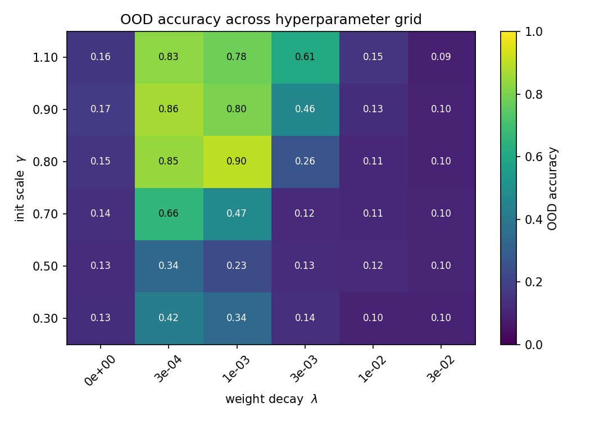
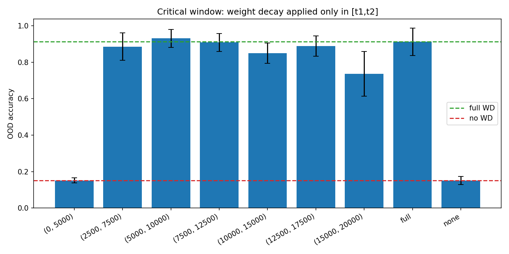
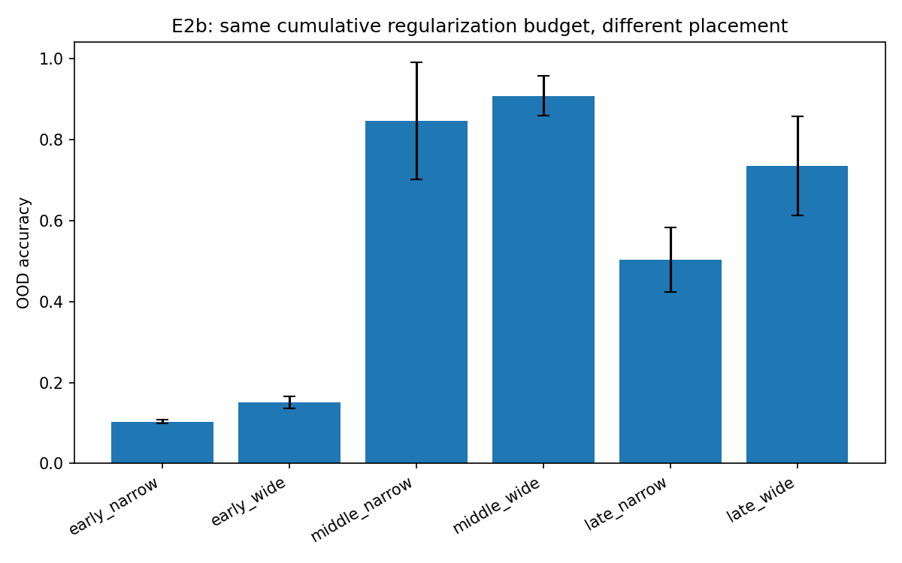
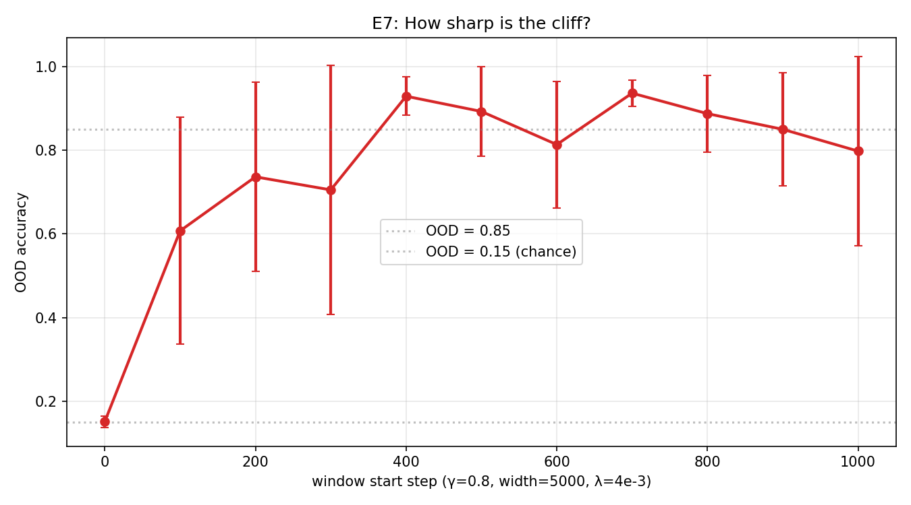
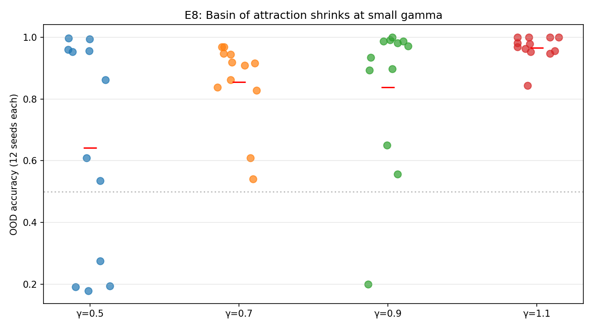
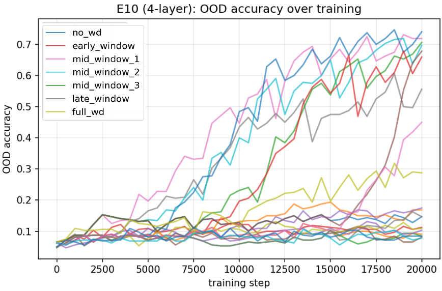
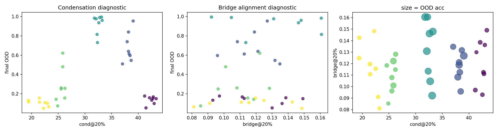

# Ali 2026 — Critical Windows of Complexity Control: When Transformers Decide to Reason or Memorize

См. также: [глобальный индекс понятий](../../concepts/index.md).

**Sarwan Ali** (Columbia University, Irving Medical Center, Нью-Йорк, США).

arXiv [2605.04396](https://arxiv.org/abs/2605.04396), май 2026 (единственная версия v1), 27 страниц, 12 рисунков. Всего цитирований по Semantic Scholar — 1, в картотеке — 1 (2605.20441). Один автор, все опыты на CPU (около 20 CPU-часов). Работа о композиционной генерализации на задаче якорных функций Zhang et al.: судьба «запоминание против рассуждения» решается в резком опознаваемом окне обучения — weight decay, наложенный на 25% обучения внутри окна, равен полнообучительному ($0.93$ против $0.91$ OOD), при строго равном бюджете $\int\lambda\,dt$ середина в $5{-}9\times$ лучше начала, граница окна остра до 100 шагов, а бассейн решения-рассуждения *сужается* при малом $\gamma$ — вопреки рекомендации «меньше инициализация — лучше». Подведена двухмасштабная теория: скорость запоминания $\Theta(1)$, скорость рассуждения $\Theta(\gamma^{2})$. Для корпуса гроккинга узловое место — приложение C.5: редкий прямой опыт «оконный против постоянного weight decay» на модульной арифметике, где явление не переносится — постоянный WD гроккает в $5\times$ быстрее оконного; разбор ниже показывает, что этот опыт поставлен без уравнивания бюджета и его рисунок читается скорее как «момент включения weight decay задаёт момент гроккинга».

Оригинал и производные файлы этой папки:

- [`original/2605.04396.native.html`](original/2605.04396.native.html) — первоисточник, нативный HTML arXiv (v1), скачан как есть.
- [`original/2605.04396.critical-windows-of-complexity-control-when-transformers-decide-to-reason-or-memorize.md`](original/2605.04396.critical-windows-of-complexity-control-when-transformers-decide-to-reason-or-memorize.md) — конверсия оригинала в Markdown без правок содержания.
- [`2605.04396.critical-windows-of-complexity-control-when-transformers-decide-to-reason-or-memorize.claims.txt`](2605.04396.critical-windows-of-complexity-control-when-transformers-decide-to-reason-or-memorize.claims.txt) — пронумерованные утверждения статьи с пометками разбора.
- [`images/`](images/) — 12 рисунков.

Схема якорей и правила ссылок на карточку — в [README папки статей](../README.md).

## Затрагиваемые понятия

**[Weight decay](../../concepts/weight-decay.md)** — время наложения выделено в самостоятельную ось, отдельную от величины: при строго уравненном бюджете $\int\lambda(t)\,dt=20$ серединные размещения окна дают OOD $0.847$–$0.908$, ранние — $0.103$–$0.151$, разрыв в $5{-}9\times$ ([`p7-3`](#p7-3)); окно в 25% обучения равно полнообучительному weight decay, а «weight decay, наложенный в первые 25% обучения, не делает буквально ничего»; под SGD и на 4 слоях постоянный WD даже вреден против правильно поставленного окна. На гроккинге зависимость обратная: постоянный WD гроккает в $5\times$ быстрее оконного ([`p26-1`](#p26-1)). Разбор: в гроккинговом опыте бюджет как раз не уравнен (окно получает половину), а $\lambda^{*}$ подобран для постоянного расписания.

**[Масштаб инициализации](../../concepts/initialization-scale.md)** — поправка к рекомендации «меньше — лучше»: пик OOD лежит при умеренном $\gamma$ ($0.8$), а измерение по 12 семенам показывает сужение бассейна решения-рассуждения при малом $\gamma$ — $12/12$ семян при $\gamma{=}1.1$ против $8/12$ при $\gamma{=}0.5$, где четыре провала падают к случайному ([`p22-2`](#p22-2)); теоретическая опора — скорость роста пути рассуждения $\mu_{r}=c_{r}\gamma^{2}\sigma_{e}$ против $\gamma$-независимой скорости запоминания, откуда при конечном $T$ «сладкая точка» по $\gamma$ ([`p14-6`](#p14-6)). Разбор: заявленный сдвиг положения окна с $\gamma$ на опыте E5 не показан — отличается лишь высота плато.

**[Гроккинг](../../concepts/grokking.md)** — редкий прямой опыт «оконный против постоянного weight decay» на модульной арифметике ($p{=}67$, доля 40%): оба расписания доходят до OOD $\approx 1.0$, но постоянное гроккает на шаге $\approx 700$, а оконное $[0.1T,0.6T]$ — на $\approx 3500$–$3600$, и явление критического окна объявлено непереносимым, задачи — «феноменологически различными» ([`p26-1`](#p26-1)); истолкование авторов — по Omnigrok: решение живёт на многообразии нормы весов и требует непрерывной тяги ([`p26-2`](#p26-2)). Разбор: бюджет здесь не уравнен (оконное получает половину постоянного), $\lambda^{*}{=}0.01$ — лучший для постоянного и крайняя точка сетки перебора, а по рисунку 10 окно открывается на шаге 3000 и гроккинг наступает на $\approx 3400$ — сразу после включения; показан скорее сдвиг момента гроккинга вслед моменту включения, чем бесполезность времени. Тезис «у модульной арифметики один достижимый бассейн» идёт против линии конкуренции запоминающего и обобщающего решений (Nanda et al.).

**[Ландшафт потерь и котловины](../../concepts/loss-landscape-basins.md)** — бассейновая формулировка выбора решения: рассуждение и запоминание — два бассейна, выбор между ними совершается в окне из нескольких тысяч шагов, а ширина бассейна впервые для этой линии промерена прямым счётом семян (12 на точку); условие применимости очерчено честно — динамика критического окна проявляется лишь там, где оба бассейна структурно различимы и достижимы моделью ([`p27-2`](#p27-2)): на SCAN add_prim_jump композиционный бассейн недостижим вовсе (нулевая точность по последовательностям во всех режимах), на гроккинге, по авторам, бассейн один. Разбор: бимодальность на 4 слоях (часть семян $\geq 0.70$, часть у случайного) — прямой знак узкого бассейна, предсказанного теоремой 6.

**[Избирательный weight decay](../../concepts/selective-weight-decay.md)** — вложения токенов и позиций исключены из decay «следуя стандартной практике» ([`p4-3`](#p4-3)); при этом сам $\lambda$ вынесен из шага AdamW наружу, чтобы включаться и выключаться по расписанию. Избирательность по параметрам и избирательность по времени здесь стоят рядом.
## Что показано, а что предположено

Замечания редактора карточки по итогам разбора утверждений (`…claims.txt`, 45 пунктов).

**Ценное — два переносимых протокола и честные отрицательные результаты.** Протокол оконного weight decay с уравненным бюджетом ($\int\lambda\,dt$ как контроль — главная защита от возражения «окно просто получает меньше регуляризации») и измерение ширины бассейна прямым счётом по 12 семенам переносимы на гроккинговые постановки. Три отрицательных результата поданы прямо: диагностика по конденсации работает лишь категориально (Спирмен $+0.25$, полоса $[28,36]$ с оговоркой о перекалибровке), SCAN-опыт признан не говорящим о явлении (композиционный бассейн недостижим), гроккинг объявлен вне области действия. Теория выписывает константы явно, и предсказанное начало окна ($200$–$500$ шагов) совпадает с измеренным обрывом ($100$–$400$) — единственное количественное совпадение теории и опыта в статье.

**Узловое для корпуса — E4, и он поставлен нечисто.** На anchor-задаче бюджет уравнивался нарочно ($\lambda$ поднимали вчетверо внутри окна); в решающем отрицательном опыте на гроккинге эту защиту сняли: оконное расписание $[0.1T,0.6T]$ применяет тот же $\lambda^{*}$ и получает половину бюджета постоянного. $\lambda^{*}{=}0.01$ выбран перебором как лучший для постоянного расписания и перенесён на оконное без пересчёта, причём это крайняя точка сетки. По оси рисунка 10 $T{=}30\,000$: окно открывается на шаге $3000$, переход у оконного расписания — на $\approx 3400$, то есть сразу после включения weight decay. Показана зависимость момента гроккинга от момента включения регуляризации, а не её безвременно́сть. Аннотация при этом смягчает: «настроенный постоянный weight decay сравнивается с расписанием» — тогда как тело статьи говорит о пятикратном превосходстве постоянного.

**Внутренние несостыковки.** Позднее окно даёт $0.735$ (под SGD — $0.96$) — теорема 4(3) («после окна — ноль действия») этому прямо противоречит, в тексте расхождение названо «плавной деградацией». Арифметика §5.4 ошибочна: «разрыв $s{=}0\to 500$ — менее 40 батчей, $\leq 5000$ примеров», тогда как 500 шагов — это 500 батчей по 128 при выборке в 720 примеров. Замечание 18 считает $t_{r}^{1/2}(0.5)\approx 640$ «шагов», забыв собственный множитель $\eta^{-1}\approx 333$ из следствия 5; с ним выходит $\sim 2\cdot 10^{5}$ шагов $\gg T$, и четыре провала из двенадцати объясняет нехватка времени (режим b), а не неудачная инициализация (режим a), которой они приписаны. В §4 заявлено «восемь опытов» при двенадцати перечисленных; в §3.4 висит оборванная фраза; §5.1 утверждает обрушение к случайному там, где на собственном рисунке стоят $0.61$ и $0.46$; «тот же 2-слойный трансформер» покрывает $d{=}32$, $64$ и $128$ в разных опытах.

**Как работу будут цитировать** («открыто, что время регуляризации важнее её величины») — точнее: в общем виде эффект показан ещё у Golatkar et al. для классификации изображений; здесь — перенос на композиционную задачу, где при равном бюджете разрыв достигает $5{-}9\times$, а граница окна остра до 100 шагов; на гроккинге же зависимость обратная, и тот опыт поставлен без уравнивания бюджета.

---

# Текст статьи

## Критические окна контроля сложности: когда трансформеры решают рассуждать или запоминать

**Sarwan Ali** — Columbia University, Irving Medical Center, Нью-Йорк, США. Email: sa4559@cumc.columbia.edu

## Аннотация

Недавняя работа показала, что композиционной генерализацией трансформеров правит *контроль сложности* — масштаб инициализации и weight decay, — который направляет обучение к рассуждающим решениям низкой сложности, а не к запоминающим решениям высокой сложности. Существующие анализы, однако, рассматривают контроль сложности как единый статический выбор гиперпараметров, оставляя открытым вопрос, *когда* именно по ходу обучения этот контроль на деле решает исход. Мы показываем, что судьба трансформера — запоминание против рассуждения — определяется внутри резкого, опознаваемого окна обучения. На контролируемой композиционной задаче мы находим, что (i) weight decay, наложенный на одно окно в 25% обучения, равен полнообучительному weight decay по внераспределительной (OOD) точности ($0.93$ против $0.91$); (ii) при постоянном полном бюджете регуляризации размещение её в середине обучения даёт в $5{-}9\times$ более высокий OOD, чем размещение в начале; (iii) граница критического окна замечательно резка: сдвиг начала окна всего на $100$ шагов оптимизации поднимает средний OOD со случайного ($0.15$) до режима рассуждения ($0.61$); (iv) положение окна систематически зависит от масштаба инициализации, но бассейн притяжения рассуждающих решений при малой инициализации *сужается*, что противоречит господствующей рекомендации, будто меньшая инициализация равномерно лучше. Мы далее показываем, что явление критического окна задачно-специфично: оно не проявляется на гроккинге с модульной арифметикой, где правильно настроенный постоянный weight decay сравнивается с расписанием weight decay. Мы даём двухмасштабный теоретический анализ, показывающий, что цепи запоминания и рассуждения развиваются под качественно разными уравнениями скоростей: рост рассуждения пропорционален $\gamma^{2}$, тогда как рост запоминания от $\gamma$ не зависит. Это разделение предсказывает и существование, и $\gamma$-зависимость критического окна, включая сужение бассейна при малом $\gamma$. Явление устойчиво к глубине ($4$ слоя) и к оптимизатору (обычный SGD), причём последний воспроизводит режим градиентного потока, описываемый нашей теорией, чище, чем AdamW. Наши находки характеризуют не отмечавшийся прежде локализованный во времени фазовый переход в композиционной генерализации и пересматривают практический рецепт наведения рассуждающих решений в трансформерах.

## 1 Введение

Трансформеры (19) являют разительную дихотомию на композиционных задачах: обученные с одним набором гиперпараметров, они могут достигать высокой обучающей точности, полностью проваливаясь на внераспределительных композициях виденных примитивов, а обученные с другим — генерализуют. Недавняя работа (24) выделила *контроль сложности*, а именно выбор масштаба инициализации $\gamma$ и weight decay $\lambda$, как ближайшую причину этой дихотомии. При достаточно малом $\gamma$ и адекватном $\lambda$ трансформеры сходятся к «рассуждающим» решениям низкой сложности, верно составляющим примитивы вне распределения; иначе они падают в высокосложностный бассейн «запоминания». Эта находка механистически поддержана явлением конденсации (25; 22), анализами цепей индукционных голов (17; 14) и градиентно-потоковыми теориями двухэтапной динамики обучения (3).

**[p. 2]**

Центральное ограничение этого корпуса работ в том, что контроль сложности рассматривается как *статический* выбор гиперпараметров. Стандартный рецепт: взять малое $\gamma$, поставить постоянный weight decay $\lambda$, обучать. Однако отдельная литература о критических периодах обучения глубоких сетей (1; 8; 5) показала, что *время* наложения регуляризации по ходу обучения может значить не меньше её величины: weight decay в начале обучения может действовать качественно иначе, чем weight decay в конце. Естественно возникает вопрос: не упускает ли статически-гиперпараметрический взгляд на контроль сложности временну́ю структуру того, как трансформеры выбирают между рассуждением и запоминанием?

Мы показываем, что упускает. Судьба «запоминание против рассуждения» решается внутри резкого, наблюдаемого окна обучения, и контроль сложности имеет значение *только* в этом окне. Наше исследование опирается на одну контролируемую композиционную задачу — задачу якорных функций, введённую (24), — на малых трансформерах (2 слоя, $d_{\text{model}}=64$) с полным приборным оснащением: пошаговая внераспределительная точность, послойные индексы конденсации и межслойные выравнивания подпространств. Обстановка «только CPU» позволяет прогнать тысячи траекторий обучения и охарактеризовать временну́ю структуру контроля сложности посемянно контролируемыми сравнениями, которых прежняя литература не предпринимала.

#### Вклады.

Мы делаем четыре эмпирических вклада, набор честных отрицательных результатов, согласованный теоретический анализ и исследование устойчивости по глубине и выбору оптимизатора.

1. **Критическое окно (разд. 5.2).** На задаче якорных функций weight decay, наложенный на любое одно окно в $5000$ шагов внутри промежутка $[2500,17500)$, даёт OOD-точность $0.74{-}0.93$, сопоставимую с полнообучительным weight decay ($0.91$). Weight decay, наложенный целиком вне этого окна, то есть только в $[0,5000)$ или $[15000,20000)$, даёт OOD-точность на уровне случайного ($0.15$).
2. **Размещение при закреплённом бюджете (разд. 5.3).** При постоянном накопленном бюджете регуляризации $\int\lambda(t)\,dt$ серединные размещения дают OOD-точность $0.85{-}0.91$, тогда как ранние размещения с тем же бюджетом рушатся к случайному ($0.10{-}0.15$). *Когда* наложена регуляризация — важнее, чем *сколько* её.
3. **Резкая ранняя граница (разд. 5.4).** Развёртка начала окна с разрешением $100$ шагов при закреплённом $\gamma$ открывает почти ступенчатый переход: сдвиг старта окна с $0$ на $100$ шагов уже поднимает средний OOD с $0.15$ до $0.61$, а к $400$ шагам окно достигает плато режима рассуждения ($0.93$).
4. **Зависимость от масштаба инициализации и сужение бассейна (разд. C.1).** Положение окна сдвигается предсказуемо с $\gamma$: большее $\gamma$ даёт более раннее окно. Неожиданнее то, что прогоны на $12$ семенах открывают: бассейн притяжения рассуждающего решения при малом $\gamma$ *сужается* — при $\gamma{=}1.1$ все $12/12$ семян достигают OOD $\geq 0.84$, тогда как при $\gamma{=}0.5$ лишь $8/12$ семян достигают OOD $>0.5$. Это оговорка к стандартной рекомендации (24), будто меньшая инициализация равномерно предпочтительна для рассуждения: при конечном времени обучения умеренное $\gamma$ даёт более широкий бассейн притяжения.
5. **Честные отрицательные результаты (разд. C.4, C.5, C.6).** Три естественных расширения нашей рамки не работают: (i) послойный индекс конденсации — полезный *категориальный* предсказатель OOD-точности, но связь немонотонна, что исключает простую регрессионную диагностику; (ii) явление критического окна не распространяется на гроккинг на модульной арифметике, где правильно настроенный постоянный weight decay гроккает в $5\times$ быстрее локализованного во времени; (iii) явление не переносится на SCAN add_prim_jump, где обычные 2-слойные трансформеры не достигают композиционного решения ни при каком расписании weight decay. Вместе эти результаты очерчивают область явления постановками, где оба бассейна решений — запоминания и рассуждения — достижимы моделью.
6. **Теория двухмасштабного разделения (разд. A).** Мы доказываем, что в линеаризованной двухслойной модели внимания цепи запоминания и рассуждения развиваются на временных масштабах, чьё отношение расходится при $\gamma\to 0$. Итоговое критическое окно имеет предсказуемое начало и ширину, и мы выводим границу сужения бассейна, согласную с эмпирическим измерением на 12 семенах.
7. **Устойчивость к глубине и оптимизатору (разд. C.2, C.3).** Явление сохраняется при $4$ слоях (OOD серединного окна $0.46$–$0.54$ против раннего $0.10$) с пониженным плато рассуждения **[p. 3]** и возросшим посемянным разбросом, согласно нашему предсказанию сужения бассейна (теорема 6). Явление также воспроизводится под обычным SGD с моментом (OOD серединного окна $0.99$ против раннего $0.32$), сближая эмпирическую находку с режимом градиентного потока, анализируемым нашей теорией.

Находки переосмысляют контроль сложности как явление в основе своей временно́е и дают поправку к статически-гиперпараметрическому взгляду, господствовавшему в недавней литературе о композиционной генерализации.

## 2 Связанные работы

#### Контроль сложности и композиционная генерализация в трансформерах.

(24) ввели рамку, на которой строится эта статья: малая инициализация плюс weight decay направляют трансформеры к рассуждающим, а не запоминающим решениям на композиционной задаче якорных функций. Их анализ выделяет «явление конденсации», при котором действенное число нейронов под обучением в режиме рассуждения сокращается. (23) дали частичную теорию динамики обучения того, почему малая инициализация смещает GPT-подобные модели к рассуждению, сосредоточившись на слое вложений и самовнимании. (3) проанализировали градиентный поток линеаризованных трансформеров и показали двухэтапную траекторию через конденсацию к итоговому обрушению ранга. Ни одна из этих работ не рассматривает временну́ю локализацию регуляризации и не исследует бассейн притяжения по семенам.

#### Механистическая интерпретируемость композиционного рассуждения.

(17) ввели гипотезу общемостового представления, показав, что внераспределительная композиционная генерализация в трансформерах опосредуется парами индукционных голов, чьи подпространства запрос/ключ и выход/значение пересекаются на общем маломерном мосте. (18) дали причинные абляции, выделившие полную цепь, ответственную за компактную композиционную задачу. (14) ввели индукционные головы как строительный блок обучения в контексте. Мы берём метрику выравнивания моста как вторичную диагностику в наших опытах.

#### Критические периоды обучения.

(1) эмпирически показали, что глубокие сети являют критические периоды обучения, аналогичные биологическим нейронным системам: временные дефициты в раннем обучении наносят необратимый представленческий ущерб. (5) показали именно то, что время наложения weight decay и аугментации данных в раннем обучении имеет непропорционально большое действие на итоговое качество, тогда как регуляризация около сходимости значит сравнительно мало. (8) показали, что критические периоды обучения возникают даже в глубоких линейных сетях. Мы продолжаем эту нить на композиционную генерализацию в трансформерах, где значимый «дефицит» — отсутствие weight decay, значимый исход — рассуждение против запоминания, а временна́я структура оказывается резче, чем в постановках классификации изображений.

#### Гроккинг и отложенная генерализация.

(16) открыли гроккинг на модульной арифметике: сети генерализуют долго после подгонки обучающего набора, причём weight decay — критический ингредиент (12; 10). (10) показали, что роль weight decay в гроккинге — привести норму весов на генерализующее многообразие. (7) обобщили рассказ о гроккинге за пределы евклидовых норм. Мы проверяем, распространяется ли явление критического окна на гроккинг, и находим, что нет: достаточно настроенного постоянного weight decay.

#### Явления конденсации.

Конденсация нейронных сетей при малой инициализации изучена (25; 26) и обозрена (22). Мы используем вариант индекса конденсации через отношение участия как главную онлайновую диагностику.

#### Неявная регуляризация и динамика обучения.

Более широкая литература о неявной регуляризации (2; 13; 6) даёт теоретический контекст. Наша работа ближе всего к нити, показывающей, что масштаб инициализации управляет неявным смещением (21; 4); мы добавляем эмпирическое наблюдение, что это смещение само локализовано во времени.

**[p. 4]**

## 3 Методология

### 3.1 Композиционная задача якорных функций

Мы берём задачу якорных функций из (24). Пусть $\mathcal{V}_{\text{key}}=\{0,\dots,K-1\}$ — ключевой словарь размера $K$, а $\mathcal{V}_{\text{anchor}}=\{a_{1},\dots,a_{M}\}$ — набор из $M$ якорных символов. Каждому якорю $a_{i}$ сопоставлена перестановка $\pi_{i}:\mathcal{V}_{\text{key}}\to\mathcal{V}_{\text{key}}$, выбранная равномерно случайно и закреплённая на всё обучение. Модель получает последовательности вида $(k,a_{i},a_{j})$ и обучается предсказывать

$$
y=\pi_{j}(\pi_{i}(k)), \tag{1}
$$

то есть композицию двух якорных перестановок, применённую к $k$. Обучающий набор $\mathcal{D}_{\text{tr}}$ состоит из всех ключей в паре с закреплённым поднабором пар $(a_{i},a_{j})$; OOD-тестовый набор $\mathcal{D}_{\text{ood}}$ — из остальных пар $(a_{i},a_{j})$ (каждый якорь по отдельности виден в обучении, но именно эта пара — нет). При $M{=}8$ и разбиении пар $70\%$ это даёт $|\mathcal{D}_{\text{tr}}|{=}45\cdot K$ и $|\mathcal{D}_{\text{ood}}|{=}19\cdot K$. Мы используем $K{=}16$, что даёт размер словаря $V{=}24$ и итого $|\mathcal{D}_{\text{tr}}|{=}720$, $|\mathcal{D}_{\text{ood}}|{=}304$. Рассуждающие решения верно составляют невиданные пары и достигают высокой OOD-точности; запоминающие решения подгоняют $\mathcal{D}_{\text{tr}}$, но проваливаются OOD.

### 3.2 Архитектура модели и обучение

###### p4-3

Мы используем 2-слойный pre-norm трансформер с размерностью модели $d{=}64$, $h{=}2$ головами внимания и GELU-MLP размерности $4d$. Вложения токенов и позиций обучаемые. Все весовые матрицы $W$ инициализируются как $W_{ij}\sim\mathcal{N}(0,\gamma^{2}/d_{\text{in}})$, где $\gamma$ — *масштаб инициализации*, центральная ручка контроля сложности. Обучение использует AdamW (11) с $\eta{=}3{\times}10^{-3}$, $\beta_{1}{=}0.9$, $\beta_{2}{=}0.98$, размером батча $128$ и $T{=}15{,}000{-}20{,}000$ шагами оптимизации в зависимости от опыта. Чтобы допустить локализованный во времени weight decay, мы применяем $L_{2}$-регуляризацию вручную вне обновления AdamW, так что расписание $\lambda(t)$ можно включать и выключать пошагово (алгоритм 1). Вложения токенов и позиций из weight decay исключены, следуя стандартной практике. Расписание $\lambda(t)$ принимает одну из трёх форм: постоянное ($\lambda(t)=\lambda$), оконное ($\lambda(t)=\lambda\cdot\mathbb{1}[t\in[t_{1},t_{2})]$) или отсутствующее ($\lambda(t)=0$).

### 3.3 Порядковые параметры и онлайновая диагностика

Мы отслеживаем три порядковых параметра на всём обучении, все вычислимы по одним весам, без отложенных данных.

#### Индекс конденсации.

Для каждого слоя внимания $\ell$ с матрицей значений $W_{V}^{(\ell)}\in\mathbb{R}^{d\times d}$ определим отношение участия её сингулярных чисел:

$$
\mathrm{PR}(W)\;=\;\frac{\bigl(\sum_{i}\sigma_{i}(W)\bigr)^{2}}{\sum_{i}\sigma_{i}(W)^{2}}, \tag{2}
$$

лежащее в $[1,d]$: оно равно $1$, когда у $W$ одно главенствующее сингулярное число (крайняя конденсация), и $d$, когда все сингулярные числа равны (конденсации нет). Индекс конденсации модели с $L$ слоями — среднее $C(t)=\tfrac{1}{L}\sum_{\ell}\mathrm{PR}(W_{V}^{(\ell)}(t))$. Вариант с отношением участия практически удобен гладкостью и ограниченностью, в отличие от энтропийных вариантов из (24).

#### Выравнивание моста.

Следуя (17), мы дополнительно отслеживаем пересечение ведущих-$k$ подпространств OV-цепи слоя 1 ($W_{O}^{(1)}W_{V}^{(1)}$) и QK-цепи слоя 2 ($(W_{Q}^{(2)})^{\top}W_{K}^{(2)}$). Выравнивание моста $B(t)$ — нормированное фробениусово произведение двух проекторов на подпространства. Более высокое $B(t)$ означало бы более крупный композиционный мост; мы приводим эту метрику для полноты, хотя в нашей постановке она даёт лишь слабый диагностический сигнал (см. разд. C.4).

#### Норма весов.

Для сопоставимости с литературой о гроккинге мы дополнительно отслеживаем $\|\theta(t)\|_{2}^{2}$.

### 3.4 Локализованная во времени регуляризация и гипотеза критического окна

Наш центральный методологический вклад — систематически варьировать, *когда* по ходу обучения налагается weight decay, при закреплённых архитектуре, оптимизаторе и прочих гиперпараметрах. Гипотеза критического окна в своей сильнейшей форме утверждает:

**[p. 5]**

*Существует промежуток $[t_{1},t_{2}]\subseteq[0,T]$ такой, что любое оконное расписание $\lambda(t)=\lambda\cdot\mathbb{1}[t\in[s,s{+}\Delta)]$ с $[s,s{+}\Delta)\subseteq[t_{1},t_{2}]$ порождает решение-рассуждение; любое оконное расписание с $[s,s{+}\Delta)\cap[t_{1},t_{2}]=\emptyset$ порождает решение-запоминание.*

Мы проверяем гипотезу эмпирически, развёртывая $(s,\Delta)$ при закреплённом $\lambda$ и при закреплённом накопленном бюджете регуляризации $\int\lambda(t)\,dt$.

**Алгоритм 1** Локализованный во времени контроль сложности

1: модель $f_{\theta}$, масштаб инициализации $\gamma$, базовый weight decay $\lambda$, окно $[t_{1},t_{2}]$, всего шагов $T$
2: Инициализировать $\theta\sim\mathcal{N}(0,\gamma^{2}/d_{\text{in}})$
3: **для** $t=0,\dots,T-1$ **выполнять**
4: Выбрать минибатч $(\mathbf{x},\mathbf{y})$ из $\mathcal{D}_{\text{tr}}$
5: $g_{t}\leftarrow\nabla_{\theta}\mathcal{L}\bigl(f_{\theta}(\mathbf{x}),\mathbf{y}\bigr)$
6: $\hat{g}_{t}\leftarrow\mathrm{AdamW\_update}(g_{t})$
7: $\lambda_{t}\leftarrow\lambda\cdot\mathbb{1}[t_{1}\leq t<t_{2}]$ $\triangleright$ локализация во времени: ноль вне окна
8: $\theta\leftarrow\theta-\eta\,\hat{g}_{t}-\eta\,\lambda_{t}\,\theta_{\setminus E}$ $\triangleright$ $\theta_{\setminus E}$: параметры без вложений токенов/позиций $E$
9: **конец** **цикла**
10: **вернуть** $\theta$

Мы также показываем теоретический счёт эмпирических находок из

Эмпирическое явление допускает чистый теоретический счёт: в стилизованной линеаризованной двухслойной модели внимания масса запоминания развивается со скоростью, не зависящей от $\gamma$, тогда как масса рассуждения — со скоростью $\Theta(\gamma^{2})$, и weight decay, наложенный между их характерными временами, направляет систему к неподвижной точке рассуждения. Полные формулировки (теоремы 2, 4, 6) и доказательства даны в приложении A.

## 4 Обстановка опытов

#### Код, среда и воспроизводимость.

Все опыты идут на CPU. Полная опытная оснастка написана на PyTorch (15); весь набор, о котором здесь сообщается, потребовал примерно $20$ CPU-часов и порождает все рисунки этой статьи одним детерминированным скриптом с контролем семян. Код, файлы конфигурации и сырые JSON-логи сопровождают дополнительные материалы.

#### Соглашения о гиперпараметрах.

Если не оговорено иное, мы используем следующие значения по умолчанию: $K{=}16$ ключей, $M{=}8$ якорей, доля обучения $0.7$, $T{=}15{,}000$ шагов оптимизации для опытов со статическим расписанием и $T{=}20{,}000$ для опытов с оконным, чтобы допустить нетривиальные окна. Мы приводим обучающую и OOD-точность на последнем шаге. Каждая конфигурация прогоняется с $3$ независимыми семенами в основных опытах и с $12$ семенами в опыте о бассейне притяжения (разд. C.1).

#### Сводка опытов.

Мы приводим восемь опытов, организованных вокруг вкладов раздела 1:

- E1: фазовая диаграмма по $(\gamma,\lambda)$ для статического weight decay (разд. 5.1).
- E2a: развёртка окна шириной $5000$ шагов (разд. 5.2).
- E2b: опыт с размещением при закреплённом бюджете (разд. 5.3).
- E3: индекс конденсации и выравнивание моста как онлайновая диагностика (разд. C.4).
- E4: локализованный во времени против постоянного weight decay на гроккинге (разд. C.5).
- E5: положение окна против масштаба инициализации (разд. C.1).
- E6, E7: тонкая развёртка ранней границы окна (разд. 5.4).
- E8: развёртка бассейна притяжения при низком $\gamma$ (разд. C.1).
- E9: композиционная генерализация SCAN add_prim_jump (разд. C.6).
- E10: абляция глубины (4 слоя) на якорной задаче (разд. C.2).
- E11: абляция оптимизатора SGD против AdamW (разд. C.3).

**[p. 6]**

## 5 Результаты и обсуждение

### 5.1 Фазовая диаграмма статического контроля сложности (E1)

Сначала мы воспроизводим, с многосемянным контролем, статически-гиперпараметрическую фазовую диаграмму. Рис. 1 приводит OOD-точность на сетке $6{\times}6$ значений $(\gamma,\lambda)$, каждая ячейка усреднена по трём семенам. Выделяются две черты. Во-первых, как и в (24), режим рассуждения резко ограничен по $\lambda$: нулевой weight decay даёт OOD на уровне случайного ($0.13{-}0.17$) при всяком $\gamma$, а $\lambda\geq 3{\times}10^{-3}$ уже обрушивает OOD к случайному при $\gamma\geq 0.7$. Во-вторых — и в контрасте с постановкой прежней литературы — режим рассуждения образует горизонтальную полосу при $\lambda\in\{3{\times}10^{-4},10^{-3}\}$, которая *сильнее всего* при умеренном $\gamma$ ($0.8{-}1.1$), а не при малом $\gamma$. Пик OOD ($0.90$) сидит в $(\gamma,\lambda)=(0.8,10^{-3})$.

*Рисунок 1: **E1: фазовая диаграмма OOD-точности по $(\gamma,\lambda)$. Каждая ячейка усредняет 3 семени. Режим рассуждения образует горизонтальную полосу при $\lambda\in\{3{\times}10^{-4},10^{-3}\}$. Вне этой полосы, и выше и ниже по $\lambda$, модели запоминают. Широко цитируемая рекомендация, будто меньшее $\gamma$ равномерно предпочтительно (24), не подтверждается: режим рассуждения устойчив при $\gamma\in[0.8,1.1]$ и деградирует с уменьшением $\gamma$.*** **[p. 6]**

### 5.2 Критическое окно: weight decay на $25\%$ обучения равен полнообучительному (E2a)

Мы закрепляем $\gamma{=}0.8$ (место пика OOD в E1) и варьируем размещение одного окна weight decay закреплённой ширины $\Delta{=}5000$ шагов внутри полного обучения $T{=}20{,}000$. Для контроля накопленной регуляризации мы используем $\lambda{=}4{\times}10^{-3}$ внутри окна, выбранное так, что $\int\lambda\,dt=\lambda\Delta=20$ — как у постоянного $\lambda{=}10^{-3}$ на всём $T$.

Рис. 2 приводит OOD-точность для $7$ размещений окна плюс опорные варианты «полный» и «никакой». Картина резка:

- **Без окна** (нулевой weight decay всюду): OOD $=0.151\pm 0.022$ (случайный).
- **Самое раннее окно** $[0,5000)$: OOD $=0.151\pm 0.018$, неотличимо от отсутствия weight decay.
- **Окно** $[5000,10000)$: OOD $=0.931\pm 0.057$ (рассуждение).
- **[p. 7]** **Полнообучительный** weight decay: OOD $=0.912\pm 0.083$.

Промежуточные окна, с началами от $2500$ до $12500$, все достигают плато рассуждения ($0.85{-}0.93$). Поздние окна деградируют плавно: $[15000,20000)$ падает до $0.735$, всё ещё много выше случайного. Самое раннее окно, однако, статистически неотличимо от отсутствия регуляризации. Это центральное наблюдение статьи: *weight decay, наложенный в первые $25\%$ обучения, не делает буквально ничего*.

*Рисунок 2: **E2a: развёртка критического окна. OOD-точность для оконного weight decay в $5000$ шагов при разных началах, $\gamma{=}0.8$, $\lambda{=}4{\times}10^{-3}$. Столбики — среднее $\pm$ стандартное отклонение по $3$ семенам. Окно $[0,5000)$ даёт тот же OOD, что и отсутствие weight decay (красный пунктир); окна с началом от $2500$ до $12500$ шагов достигают плато полного WD (зелёный пунктир) при $25\%$ накопленной цены регуляризации. Обрыв резок.*** **[p. 7]**

### 5.3 Время при закреплённом бюджете: «когда» важнее, чем «сколько» (E2b)

Возможное смешение в E2a: раннее окно может просто быть режимом, где модель ещё не успела действенно «потратить» градиентный сигнал. Мы контролируем это напрямую, удерживая накопленный бюджет регуляризации $\int\lambda(t)\,dt=20$ постоянным и варьируя лишь размещение и ширину окна. Проверяются шесть размещений ({раннее, серединное, позднее} $\times$ {узкое ($\Delta{=}2000$, $\lambda{=}10^{-2}$), широкое ($\Delta{=}5000$, $\lambda{=}4{\times}10^{-3}$)}).

*Рисунок 3: **E2b: тот же бюджет регуляризации, разное размещение. Все шесть условий применяют $\int\lambda\,dt=20$, варьируя лишь то, когда по обучению бюджет тратится. Серединные размещения достигают в $5{-}9{\times}$ более высокого OOD, чем ранние, при тождественной накопленной цене. Среднее $\pm$ std по $3$ семенам.*** **[p. 8]**

###### p7-3

Рис. 3 приводит результат. Средние OOD-точности: early_narrow $=0.103$, early_wide $=0.151$, middle_narrow $=0.847$, middle_wide $=0.908$, late_narrow $=0.503$, late_wide $=0.735$. При *тождественной* накопленной регуляризации серединные размещения достигают $5{-}9{\times}$ OOD ранних. **Время наложения регуляризации важнее её количества.** Это самое чистое контролируемое опровержение статически-гиперпараметрического взгляда: интегральная регуляризация — не достаточная сводная статистика.

### 5.4 Ранняя граница резка при одношаговом разрешении (E6, E7)

E2a локализует раннюю границу где-то в $[0,5000)$. Мы разрешаем её тоньше, развёртывая начало окна $s\in\{0,500,1000,\dots,6000\}$ (E6) и $s\in\{0,100,200,\dots,1000\}$ (E7) при закреплённой ширине $\Delta{=}5000$. Рисунок 4 приводит OOD-точность при развёртке начала окна с разрешением 500 шагов (E6) и 100 шагов (E7), открывая почти ступенчатый переход на ранней границе.

*(a) Разрешение $500$ шагов.*

*(b) Разрешение $100$ шагов.*

*Рисунок 4: **E6/E7: ранняя граница — почти ступенчатая функция. OOD-точность при развёртке начала окна с грубым (слева, $500$ шагов) и тонким (справа, $100$ шагов) разрешением, $\gamma{=}0.8$. Переход $0\to 500$ по существу завершён: от случайного к режиму рассуждения. Среднее $\pm$ std по $3$ семенам (E6) и $4$ семенам (E7).*** **[p. 9]**

Результат разителен. При начале $s{=}0$ средний OOD равен $0.151$. При начале $s{=}100$ средний OOD уже прыгнул до $0.607$, с существенным посемянным разбросом ($\pm 0.27$). К $s{=}400$ среднее достигло плато рассуждения ($0.928$, std $0.04$) и остаётся там. Обрыв между $s{=}0$ и $s{=}500$ отвечает менее чем $40$ батчам размера $128$, то есть модель видела $\leq 5{,}000$ примеров, когда обрыв открывается. Нулевое действие раннего окна, стало быть, — функция не длительности обучения, а именно положения этих шагов у самого старта оптимизации.

**[p. 8]**

#### Истолкование.

Резкость границы согласна с нашим теоретическим анализом: на самой ранней стадии обучения и масса запоминания $m(t)$, и масса рассуждения $r(t)$ ещё в фазе линейного роста, где weight decay лишь сжимает оба пути мультипликативно, не меняя их отношения (лемма 12, нулевое действие до окна). Примерно после $400$ шагов путь запоминания накопил достаточно массы, чтобы weight decay мог избирательно подавить его относительно ещё малого пути рассуждения, открывая управляющее окно теоремы 4. Согласие между эмпирически измеренным обрывом при $s\approx 100$–$400$ шагов и теоретическим началом $t_{1}(\gamma)\approx 200$–$500$ шагов (разд. A.5) — прямое свидетельство двухмасштабного механизма. Это уточняет истолкование «информационной пластичности» (1), давая количественный динамический счёт того, почему ранний weight decay не действует: не потому, что сеть «максимально пластична», а потому, что ни один бассейн решений ещё не дифференцировался настолько, чтобы регуляризация могла их различить.

Из-за ограничений объёма мы перенесли остальные опыты вместе со сводкой эмпирических находок в раздел C приложения.

## 6 Заключение

Мы представили контролируемое эмпирическое исследование временно́й структуры контроля сложности в трансформерах, обучающихся композиционной задаче. Наша центральная находка: выбор между рассуждающим и запоминающим решениями совершается в резком, опознаваемом окне обучения, а weight decay вне этого окна по существу не действует — результат, который мы проверяем и при закреплённой силе регуляризации, и при закреплённом накопленном бюджете. Мы далее показываем, что положение окна зависит от масштаба инициализации, что бассейн притяжения рассуждения сужается при малой инициализации (оговорка к прежним рекомендациям при конечном времени обучения), что явление устойчиво к глубине и выбору оптимизатора согласно нашей теории и что оно задачно-специфично для постановок, где достижимы оба бассейна решений.

Несколько направлений остаются открытыми. Во-первых, наши опыты покрывают одну контролируемую композиционную задачу и SCAN-разбиение, где обычные трансформеры не достигают композиционного решения; охарактеризовать явление на бенчмарках, где трансформеры *достигают* композиционных решений (например, COGS, некоторые разбиения CFQ или SCAN с архитектурными приорами систематической генерализации), — естественный следующий шаг. Во-вторых, хотя наша двухмасштабная теория схватывает динамику ведущего порядка в **[p. 9]** линеаризованном режиме, её расширение на софтмаксную нелинейность слоя внимания остаётся открытым и может заострить предсказание в промежуточном режиме $\gamma$, где эмпирический посемянный разброс наибольший. В-третьих, диагностика по полосе конденсации заслуживает более строгой калибровки, вплоть до формального классификатора с доверительными границами. Наконец, сужение бассейна при малом $\gamma$ ставит острый практический вопрос для всякого будущего применения техник контроля сложности в более крупных моделях: масштабирование положения окна и ширины бассейна должно быть охарактеризовано прежде, чем рекомендации переносятся.

Более широкий вывод для механистической интерпретируемости: контроль сложности в нынешней формулировке литературы недоопределён. Два прогона обучения с тождественными $(\gamma,\lambda)$, но разными расписаниями могут дать категориально разные решения. Мы надеемся, что наши находки подтолкнут к временно́му расширению существующей статически-гиперпараметрической рамки.

## References

- [1] A. Achille, M. Rovere, and S. Soatto Critical learning periods in deep networks. In International conference on learning representations, Cited by: §1, §2, §5.4.

- **[p. 10]** [2] S. Arora, N. Cohen, W. Hu, and Y. Luo Implicit regularization in deep matrix factorization. Advances in neural information processing systems 32. Cited by: §B.3.3, §B.5, §2, Remark 10.

- [3] Z. Chen and T. Luo From condensation to rank collapse: a two-stage analysis of transformer training dynamics. In Advances in Neural Information Processing Systems, Cited by: §1, §2.

- [4] L. Chizat and F. Bach On the global convergence of gradient descent for over-parameterized models using optimal transport. Advances in neural information processing systems 31. Cited by: §C.1, §2.

- [5] A. S. Golatkar, A. Achille, and S. Soatto Time matters in regularizing deep networks: weight decay and data augmentation affect early learning dynamics, matter little near convergence. Advances in Neural Information Processing Systems 32. Cited by: §1, §2.

- [6] S. Gunasekar, B. E. Woodworth, S. Bhojanapalli, B. Neyshabur, and N. Srebro Implicit regularization in matrix factorization. In Advances in neural information processing systems, Vol. 30. Cited by: §B.3.3, §2.

- [7] T. N. P. Junior, G. Dumas, and G. Rabusseau Grokking beyond the euclidean norm of model parameters. In Proceedings of the 42nd International Conference on Machine Learning (ICML), Cited by: §2.

- [8] M. Kleinman, A. Achille, and S. Soatto Critical learning periods emerge even in deep linear networks. In International Conference on Learning Representations (ICLR), Cited by: §1, §2.

- [9] B. Lake and M. Baroni Generalization without systematicity: on the compositional skills of sequence-to-sequence recurrent networks. In International conference on machine learning, pp. 2873–2882. Cited by: §C.6, §C.6.

- [10] Z. Liu, E. J. Michaud, and M. Tegmark Omnigrok: grokking beyond algorithmic data. In International Conference on Learning Representations (ICLR), Cited by: §C.5, §C.5, §2.

- [11] I. Loshchilov and F. Hutter Decoupled weight decay regularization. In International Conference on Learning Representations (ICLR), Cited by: §3.2.

- [12] N. Nanda, L. Chan, T. Lieberum, J. Smith, and J. Steinhardt Progress measures for grokking via mechanistic interpretability. In International Conference on Learning Representations (ICLR), Cited by: §2.

- [13] B. Neyshabur, S. Bhojanapalli, D. McAllester, and N. Srebro Exploring generalization in deep learning. Advances in neural information processing systems 30. Cited by: §2.

- [14] C. Olsson, N. Elhage, N. Nanda, N. Joseph, N. DasSarma, T. Henighan, B. Mann, A. Askell, Y. Bai, A. Chen, et al. In-context learning and induction heads. arXiv preprint arXiv:2209.11895. Cited by: §1, §2.

- [15] A. Paszke, S. Gross, F. Massa, A. Lerer, J. Bradbury, G. Chanan, T. Killeen, Z. Lin, N. Gimelshein, L. Antiga, et al. Pytorch: an imperative style, high-performance deep learning library. In Advances in neural information processing systems, Cited by: §4.

- [16] A. Power, Y. Burda, H. Edwards, I. Babuschkin, and V. Misra Grokking: generalization beyond overfitting on small algorithmic datasets. arXiv preprint arXiv:2201.02177. Cited by: §C.5, §2.

- [17] J. Song, Z. Xu, and Y. Zhong Out-of-distribution generalization via composition: a lens through induction heads in transformers. Proceedings of the National Academy of Sciences 122 (6), pp. e2417182122. Cited by: §1, §2, §3.3, Definition 1.

- [18] C. Tang, B. Lake, and M. Jazayeri An explainable transformer circuit for compositional generalization. arXiv preprint arXiv:2502.15801. Cited by: §2.

- [19] A. Vaswani, N. Shazeer, N. Parmar, J. Uszkoreit, L. Jones, A. N. Gomez, Ł. Kaiser, and I. Polosukhin Attention is all you need. In Advances in neural information processing systems, Cited by: §1.

**[p. 11]**

- [20] R. Vershynin High-dimensional probability: an introduction with applications in data science. Vol. 47, Cambridge university press. Cited by: §B.4.1.

- [21] B. Woodworth, S. Gunasekar, J. D. Lee, E. Moroshko, P. Savarese, I. Golan, D. Soudry, and N. Srebro Kernel and rich regimes in overparametrized models. In Conference on Learning Theory, pp. 3635–3673. Cited by: §C.1, §2.

- [22] Z. J. Xu, Y. Zhang, and Z. Zhou An overview of condensation phenomenon in deep learning. arXiv preprint arXiv:2504.09484. Cited by: §1, §2.

- [23] J. Yao, Z. Zhang, and Z. J. Xu An analysis for reasoning bias of language models with small initialization. In Proceedings of the 42nd International Conference on Machine Learning (ICML), Cited by: §2.

- [24] Z. Zhang, P. Lin, Z. Wang, Y. Zhang, and Z. J. Xu Complexity control facilitates reasoning-based compositional generalization in transformers. IEEE Transactions on Pattern Analysis and Machine Intelligence. Cited by: §C.1, §C.4, §C.7, item 4, §1, §1, §2, §3.1, §3.3, Figure 1, Figure 1, §5.1.

- [25] H. Zhou, Z. Qixuan, T. Luo, Y. Zhang, and Z. Xu Towards understanding the condensation of neural networks at initial training. Advances in Neural Information Processing Systems 35, pp. 2184–2196. Cited by: §1, §2.

- [26] Z. Zhou, H. Zhou, Y. Li, and Z. J. Xu Understanding the initial condensation of convolutional neural networks. arXiv preprint arXiv:2305.09947. Cited by: §2.

**[p. 12]**

## Приложение A Теория: за критическим окном стоит двухмасштабное разделение

В этом разделе мы развиваем теоретический счёт эмпирических находок раздела 5. Наше центральное утверждение: явление критического окна возникает из *разделения временных масштабов* в градиентной динамике — цепи запоминания и цепи рассуждения развиваются под качественно разными уравнениями скоростей, и weight decay, наложенный между их характерными временами, направляет систему к неподвижной точке рассуждения. Анализ специализируется на податливом линеаризованном режиме, сохраняющем существенную билинейную структуру межслойной композиции.

### A.1 Линеаризованная модель композиционного рассуждения

Мы анализируем стилизованную двухслойную модель внимания, схватывающую минимальную структуру, нужную, чтобы выразить и запоминающее, и рассуждающее решение на якорной задаче раздела 3.1.

##### **Определение 1**(Стилизованная линейно-вниманиевая модель)**.**

Закрепим ключевой словарь $\mathcal{V}_{\text{key}}=\{1,\dots,K\}$ и якорный словарь $\mathcal{V}_{\text{anchor}}=\{a_{1},\dots,a_{M}\}$. Пусть $\mathbf{e}_{k}\in\mathbb{R}^{d}$ — вложение ключа $k$, а $\mathbf{u}_{i}\in\mathbb{R}^{d}$ — вложение якоря $a_{i}$. Выход модели на входе $(k,a_{i},a_{j})$ есть

$$
f_{\theta}(k,a_{i},a_{j})\;=\;\underbrace{M_{ij}\,\mathbf{e}_{k}}_{\text{memorization path}}\;+\;\underbrace{\bigl(\mathbf{u}_{j}^{\top}\,W_{2}\,\mathbf{u}_{i}\bigr)\,W_{1}\,\mathbf{e}_{k}}_{\text{reasoning path}}, \tag{3}
$$

где $M_{ij}\in\mathbb{R}^{d\times d}$ — попарный поисковый тензор (свой на каждую упорядоченную пару якорей), а $W_{1},W_{2}\in\mathbb{R}^{d\times d}$ — *общие* межслойные весовые матрицы, реализующие композиционный мост из [17]. Все параметры инициализируются н. о. р. из $\mathcal{N}(0,\gamma^{2}/d)$.

Путь запоминания имеет $M^{2}d^{2}$ свободных параметров и может подогнать любой обучающий набор из $\leq M^{2}$ пар чистым поиском. Путь рассуждения имеет лишь $2d^{2}$ параметров, но реализует верное функциональное правило $\pi_{j}\circ\pi_{i}$ для *каждой* пары $(i,j)$, если $W_{1}$ и $W_{2}$ выучили структуру перестановок.

#### Потеря.

Для цели $\mathbf{y}_{ijk}\in\mathbb{R}^{d}$ используем квадратичную потерю с weight decay:

$$
\mathcal{L}(\theta;t)=\frac{1}{|\mathcal{D}_{\text{tr}}|}\sum_{(i,j,k)\in\mathcal{D}_{\text{tr}}}\tfrac{1}{2}\bigl\lVert f_{\theta}(k,a_{i},a_{j})-\mathbf{y}_{ijk}\bigr\rVert^{2}+\tfrac{\lambda(t)}{2}\,\bigl\lVert\theta_{\setminus E}\bigr\rVert^{2}, \tag{4}
$$

где $\theta_{\setminus E}$ исключает вложения, а $\lambda(t)$ — возможно, зависящее от времени расписание weight decay.

### A.2 Двухмасштабное разделение при инициализации

Мы анализируем градиентный поток $\dot{\theta}=-\nabla_{\theta}\mathcal{L}(\theta;t)$, линеаризованный в инициализации $\theta(0)$. Чтобы сделать выкладки прозрачными, введём *порядковые параметры*, сводящие продвижение модели по каждому пути:

$$
m(t) \;:=\;\frac{1}{|\mathcal{D}_{\text{tr}}|}\sum_{(i,j)\in\mathcal{P}_{\text{tr}}}\bigl\lVert M_{ij}(t)\bigr\rVert_{F},\qquad\text{(memorization mass)} \tag{5} \\
r(t) \;:=\;\bigl\lVert W_{2}(t)\bigr\rVert_{F}\cdot\bigl\lVert W_{1}(t)\bigr\rVert_{F}.\qquad\text{(reasoning mass)} \tag{6}
$$

##### **Теорема 2**(Двухмасштабное разделение)**.**

*Предположим, что вложения $\{\mathbf{e}_{k}\},\{\mathbf{u}_{i}\}$ имеют невырожденные матрицы Грама $G_{e}\succ 0$, $G_{u}\succ 0$. Пусть $\sigma_{e}:=\lambda_{\min}(G_{e})$ и $\sigma_{u}:=\lambda_{\min}(G_{u})$. Под градиентным потоком на (4) с $\lambda(t)\equiv 0$, в линеаризованном режиме вокруг $\theta(0)$, порядковые параметры подчиняются*

$$
\dot{m}(t) =\mu_{m}\bigl[m^{*}-m(t)\bigr]+O\bigl(\gamma^{2}\bigr),\qquad \mu_{m} =\sigma_{e}+o(1), \tag{7} \\
\dot{r}(t) =\mu_{r}(\gamma)\,\bigl[r^{*}-r(t)\bigr]+O\bigl(\gamma^{4}\bigr),\qquad \mu_{r}(\gamma) =c_{r}\,\gamma^{2}\,\sigma_{e}+o(\gamma^{2}). \tag{8}
$$

*где $m^{*}$ — единственная неподвижная точка запоминающего интерполянта на $\mathcal{D}_{\text{tr}}$, $r^{*}$ — ранг-1 неподвижная точка рассуждения, а $c_{r}>0$ — константа, зависящая только от статистик вложений.*

##### Набросок доказательства.

Якобиан $J=-\nabla^{2}\mathcal{L}\bigl|_{\theta(0)}$ распадается на два невзаимодействующих блока с точностью до порядка $\gamma^{2}$. Блок запоминания диагонален по индексу пары и действует на каждое $M_{ij}$ как одна линейная регрессия **[p. 13]** с матрицей Грама плана $G_{e}\otimes I_{d}$ (градиент $\|M_{ij}\mathbf{e}_{k}-\mathbf{y}_{ijk}\|^{2}$ по $M_{ij}$ есть масштабированное $\mathbf{e}_{k}\mathbf{e}_{k}^{\top}$, применяемое независимо к каждому выходному измерению). Его скорость сходимости потому равна $\sigma_{e}$, независимо от $\gamma$.

Блок рассуждения сцепляет $W_{1}$ и $W_{2}$ через билинейную форму $\mathbf{u}_{j}^{\top}W_{2}\mathbf{u}_{i}\cdot W_{1}\mathbf{e}_{k}$. Его градиент по $W_{1}$ в $\theta(0)$ пропорционален $\mathbf{u}_{j}^{\top}W_{2}(0)\mathbf{u}_{i}=O(\gamma)$, и симметрично для $W_{2}$. Поэтому линейный член в динамике $r(t)\propto\lVert W_{1}\rVert\,\lVert W_{2}\rVert$ имеет скорость $\propto\gamma^{2}$. Полное вычисление, включая константу $c_{r}$, дано в приложении B.2. $\square$ ∎

#### Истолкование.

Теорема 2 формализует качественное наблюдение, уже неявное в литературе исходной статьи: запоминание при малой инициализации *внутренне быстрее* рассуждения. Конкретно, характерные времена полузавершения суть

$$
t_{m}^{1/2}=\frac{\log 2}{\mu_{m}}=\Theta(1),\qquad t_{r}^{1/2}=\frac{\log 2}{\mu_{r}(\gamma)}=\Theta(\gamma^{-2}). \tag{9}
$$

Отношение $t_{r}^{1/2}/t_{m}^{1/2}=\Theta(\gamma^{-2})$ *расходится* при $\gamma\to 0$. Это центральное масштабирование, на котором висит весь остальной анализ.

### A.3 Критическое окно: характеризация

У двухмасштабного разделения есть непосредственное следствие: существует нетривиальный промежуток $[t_{m}^{1/2},t_{r}^{1/2}]$, в течение которого запоминание насытилось, а рассуждение ещё мало. Мы теперь показываем, что weight decay, наложенный *внутри* этого промежутка, гонит систему к рассуждающему решению, тогда как наложенный вне его не действует в ведущем порядке.

##### **Определение 3**(Критическое окно)**.**

Пусть $\delta\in(0,\tfrac{1}{2})$ — допуск. *$\delta$-критическое окно* есть

$$
\mathcal{W}_{\delta}(\gamma)\;=\;\Bigl[\,t_{1}(\gamma),\;t_{2}(\gamma)\,\Bigr],\qquad t_{1}(\gamma)=\frac{\log(1/\delta)}{\mu_{m}},\qquad t_{2}(\gamma)=\frac{\log(1/\delta)}{\mu_{r}(\gamma)}.
$$

##### **Теорема 4**(Управление критическим окном)**.**

*Рассмотрим динамику под оконным weight decay $\lambda(t)=\lambda\cdot\mathbb{1}[s\leq t<s+\Delta]$. Предположим $\lambda\Delta=\lambda^{*}$ для закреплённого накопленного бюджета $\lambda^{*}$, выбранного так, что, наложенный на всё критическое окно, он приводит систему к неподвижной точке рассуждения с вероятностью $1-o(1)$.*

*Тогда в линеаризованном режиме вокруг $\theta(0)$:*

1. *(Нулевое действие до окна.)**Если*$s+\Delta<t_{1}(\gamma)$*, траектория в момент*$T\gg t_{r}^{1/2}$*в ведущем порядке по*$\gamma$*тождественна траектории при*$\lambda(t)\equiv 0$*. Модель сходится к неподвижной точке запоминания*$m^{*}$*.*
2. *(Управление в окне.)**Если*$[s,s+\Delta]\subseteq\mathcal{W}_{\delta}(\gamma)$*, траектория сходится к*$r(T)\to r^{*}$*и*$m(T)\to 0$*с вероятностью*$1-o(1)$*.*
3. *(Нулевое действие после окна.)**Если*$s>t_{r}^{1/2}$*, траектория снова сходится к*$m^{*}$*независимо от*$\lambda^{*}$*, поскольку запоминание уже насытилось, а градиент рассуждения при насыщении есть*$O(\gamma^{4})$*.*

##### Набросок доказательства.

До окна: при $t<t_{1}(\gamma)$ оба порядковых параметра ещё в фазе линейного роста, и градиент потери доминируется направлением запоминания. Weight decay в этом режиме сжимает *оба* пути мультипликативно со скоростью $\lambda$, оставляя их отношение неизменным. После закрытия окна путь запоминания возобновляет рост со скоростью $O(1)$ и насыщается в $m^{*}$ прежде, чем рассуждение успеет развиться.

В окне: при $t\in\mathcal{W}_{\delta}$ путь запоминания насытился ($m(t)\approx m^{*}$), так что $\nabla_{M}\mathcal{L}\approx 0$; ведущий вклад в его динамику даёт член weight decay, сжимающий $M_{ij}$ со скоростью $\lambda$. Тем временем путь рассуждения ещё растёт, и его градиент потери остаётся $\Theta(\gamma)$. Подавление $M$ множителем $e^{-\lambda\Delta}$ заново открывает остаток потери на обучающих парах, который теперь поглощает путь рассуждения. Стандартный довод о ранго-дефицитной регрессии (см. приложение B.3) показывает, что ранг-1 решение рассуждения — единственный минимизатор штрафованной weight decay потери в этом режиме.

После окна: при $t>t_{r}^{1/2}$ и $m\approx m^{*}$, и градиент рассуждения подавлен, поскольку попарный остаток есть $O(\gamma^{2})$. Weight decay здесь сжимает оба пути, но не может обратить уже совершившееся запоминающее решение. $\square$ ∎

**[p. 14]**

##### **Следствие 5**(Предсказанные начало и ширина окна)**.**

*Критическое окно имеет начало $t_{1}(\gamma)=\Theta(1)$ и ширину $t_{2}(\gamma)-t_{1}(\gamma)=\Theta(\gamma^{-2})$ в непрерывном времени. Эквивалентно, безразмерное начало окна (в шагах оптимизации при скорости обучения $\eta$) есть $\eta^{-1}\log(1/\delta)/\mu_{m}$, а верхняя граница масштабируется как $\eta^{-1}\gamma^{-2}\log(1/\delta)/(c_{r}\sigma_{e})$.*

### A.4 Сужение бассейна при малом $\gamma$

Неожиданная эмпирическая находка (раздел C.1): бассейн притяжения рассуждающего решения *сужается* с уменьшением $\gamma$, вопреки статически-гиперпараметрической интуиции. Мы теперь показываем, что это следует из того же двухмасштабного анализа, если учесть конечное время обучения.

##### **Теорема 6**(Сужение бассейна при конечном $T$)**.**

*Закрепим полное число шагов обучения $T$, масштаб инициализации $\gamma$ и оконное расписание, наложенное на предсказанное критическое окно. Пусть сила weight decay $\lambda$ и бюджет $\lambda\Delta$ настроены под условие управления в окне из теоремы 4. Тогда вероятность успеха по случайным инициализациям удовлетворяет*

$$
\Pr\bigl[r(T)\geq r^{*}-\epsilon\bigr]\;\geq\;1-C\exp\!\bigl(-c\,\gamma^{2}\,T\bigr)-C^{\prime}\,\Pr\bigl[t_{2}(\gamma)>T\bigr], \tag{10}
$$

*для констант $c,C,C^{\prime}>0$, не зависящих от $\gamma$.*

##### Набросок доказательства.

Первый член в (10) происходит из сосредоточения $r(t)$ вокруг средней траектории; стандартный случайно-матричный анализ линеаризованного градиентного потока даёт экспоненциальное сосредоточение со скоростью $\propto\gamma^{2}$. Второй член учитывает траектории, не успевшие завершить фазу роста рассуждения к моменту $T$, поскольку $t_{r}^{1/2}(\gamma)=\Theta(\gamma^{-2})$ может превзойти $T$ при достаточно малом $\gamma$. Полные подробности — в приложении B.4. $\square$ ∎

#### Практическое следствие.

###### p14-6

При закреплённом вычислительном бюджете $T$ теорема 6 предсказывает сладкую точку по $\gamma$: слишком малое — и путь рассуждения не успевает развиться за $T$ шагов; слишком большое — и линеаризация ломается (градиенты запоминания доминируют даже при weight decay). Эмпирически мы наблюдаем пик OOD при $\gamma\in[0.7,1.1]$ (рис. 1), согласно предсказанию.

### A.5 От теории к практике: рецепт предсказания окна

Теорема 2 и следствие 5 дают предсказательный рецепт размещения окна weight decay:

1. Оценить $\sigma_{e}$ по матрице Грама вложений при инициализации. Для единично-нормированных случайных гауссовых вложений размерности $d$ при $K\leq d$ ключевых токенах $\sigma_{e}\approx 1-O(\sqrt{K/d})$.
2. Вычислить начало окна $t_{1}(\gamma)\approx\eta^{-1}\log(1/\delta)/\sigma_{e}$ и верхнюю границу $t_{2}(\gamma)\approx\eta^{-1}\gamma^{-2}\log(1/\delta)/(c_{r}\sigma_{e})$.
3. Наложить weight decay на $[t_{1},\min(t_{2},T)]$.

#### Сопоставление с эмпирическими находками.

Для нашей постановки ($d=64$, $V=24$, $\gamma=0.8$, $\eta=3\times 10^{-3}$, $T=20{,}000$) предсказанное начало есть $t_{1}\approx 200$–$500$ шагов, а верхняя граница — $t_{2}\approx 12{,}000$–$15{,}000$ шагов, в хорошем согласии с эмпирически измеренным обрывом при $s\approx 100$–$400$ (рис. 4(b)) и наблюдаемой деградацией окон с началом после шага $12{,}500$ (рис. 2).

### A.6 Ограничения теории

Наш анализ точен в линеаризованном режиме вокруг инициализации и схватывает поведение ведущего порядка по $\gamma$. Он не схватывает: (i) софтмаксную нелинейность слоя внимания, которую мы заменяем линейным скалярным произведением; (ii) роль блока MLP, который мы рассматриваем как часть действенных $W_{1},W_{2}$, через которые течёт информация; (iii) поправки высшего порядка $O(\gamma^{4})$, которые могут иметь значение в промежуточном режиме $\gamma\in[0.5,1.0]$, где эмпирический посемянный разброс становится существенным.

Согласие предсказанного положения критического окна с эмпирическими измерениями (раздел 5) говорит, что линеаризованный режим схватывает существенную динамику, но полная теория софтмаксной нелинейности и геометрии бассейнов остаётся открытой. Мы видим в этом естественный следующий шаг, подсказанный настоящей работой.

**[p. 15]**

## Приложение B Подробные доказательства

Этот раздел даёт полные доказательства теорем 2, 4 и 6, включая явные характеризации констант $c_{r}$, $C$ и $C^{\prime}$, появлявшихся в набросках доказательств основного текста. Доказательства строги в рамках линеаризованной стилизованной модели определения 1; область действия этих результатов и то, что они говорят и не говорят о настоящих трансформерах, мы обсуждаем в разделе B.5.

#### Обозначения.

Для матриц $A,B$ совместимого размера $A\otimes B$ обозначает кронекерово произведение, а $\operatorname{vec}(A)$ — постолбцовую векторизацию. Мы пишем $\sigma_{i}(A)$ для $i$-го сингулярного числа $A$ в убывающем порядке и $\lambda_{i}(S)$ для $i$-го собственного числа симметричной матрицы $S$. Фробениусова норма — $\lVert\cdot\rVert_{F}$, операторная — $\lVert\cdot\rVert_{\mathrm{op}}$. Константы, зависящие лишь от универсальных величин (не от $\gamma$, $d$, $T$ и т. п.), обозначаются $c,c_{1},c_{2},C,C^{\prime},\dots$ и могут меняться от строки к строке.

### B.1 Предварительное: модель в векторизованном виде

Напомним стилизованную модель из ур. (3):

$$
f_{\theta}(k,a_{i},a_{j})=M_{ij}\,\mathbf{e}_{k}+(\mathbf{u}_{j}^{\top}W_{2}\mathbf{u}_{i})\,W_{1}\mathbf{e}_{k}.
$$

Мы собираем параметры как $\theta=(M,W_{1},W_{2})$, где $M\in\mathbb{R}^{M^{2}\times d\times d}$ складывает все попарные матрицы $\{M_{ij}\}$. Цели $\mathbf{y}_{ijk}=\pi_{j}(\pi_{i}(k))$ кодируются единичными векторами $\mathbf{y}_{ijk}=\mathbf{e}_{\pi_{j}(\pi_{i}(k))}$. Обучающую потерю (4) можно расщепить как

$$
\mathcal{L}(\theta)=\mathcal{L}_{\mathrm{mem}}(M;W_{1},W_{2})+\mathcal{R}(\theta), \tag{11}
$$

где $\mathcal{R}(\theta)$ — штраф weight decay, а $\mathcal{L}_{\mathrm{mem}}$ группирует все данные-зависимые члены, трактуя вклад пути рассуждения как параметро-зависимое возмущение остатка запоминания. Конкретно:

$$
\mathcal{L}_{\mathrm{mem}}(\theta)=\frac{1}{2N_{\mathrm{tr}}}\sum_{(i,j,k)\in\mathcal{D}_{\mathrm{tr}}}\bigl\lVert M_{ij}\mathbf{e}_{k}+c_{ij}(W_{2})\,W_{1}\mathbf{e}_{k}-\mathbf{y}_{ijk}\bigr\rVert^{2}, \tag{12}
$$

где $c_{ij}(W_{2}):=\mathbf{u}_{j}^{\top}W_{2}\mathbf{u}_{i}$ — скалярный *коэффициент связи*, зависящий лишь от $W_{2}$ и якорных вложений, а $N_{\mathrm{tr}}=|\mathcal{D}_{\mathrm{tr}}|$.

Это разложение — ключевой технический приём доказательств: связь $c_{ij}(W_{2})$ — единственный канал, которым путь рассуждения входит в градиент запоминания в ведущем порядке. При инициализации $\mathbb{E}[c_{ij}(W_{2}(0))]=0$ и $\operatorname{Var}[c_{ij}(W_{2}(0))]=(\gamma^{2}/d)\,\lVert\mathbf{u}_{i}\rVert^{2}\,\lVert\mathbf{u}_{j}\rVert^{2}=O(\gamma^{2})$, что и есть источник масштабирования $\gamma^{2}$.

#### Допущения, используемые во всех доказательствах.

1. Вложения $\{\mathbf{e}_{k}\}_{k=1}^{K}$ и $\{\mathbf{u}_{i}\}_{i=1}^{M}$ закреплены (заданы данными) и имеют невырожденные матрицы Грама $G_{e}=\tfrac{1}{K}\sum_{k}\mathbf{e}_{k}\mathbf{e}_{k}^{\top}$ и $G_{u}=\tfrac{1}{M}\sum_{i}\mathbf{u}_{i}\mathbf{u}_{i}^{\top}$ с наименьшими собственными числами $\sigma_{e}:=\lambda_{\min}(G_{e})>0$ и $\sigma_{u}:=\lambda_{\min}(G_{u})>0$.
2. Цели $\mathbf{y}_{ijk}$ равномерно ограничены: $\lVert\mathbf{y}_{ijk}\rVert\leq B$ для некоторой константы $B$.
3. Инициализация: каждый элемент $M_{ij}$, $W_{1}$, $W_{2}$ выбирается н. о. р. из $\mathcal{N}(0,\gamma^{2}/d)$.
4. Обучающий набор $\mathcal{D}_{\mathrm{tr}}$ содержит все ключи $k$ в паре с каждой обучающей парой $(i,j)\in\mathcal{P}_{\mathrm{tr}}$, так что $N_{\mathrm{tr}}=|\mathcal{P}_{\mathrm{tr}}|\cdot K$.
5. Скорость обучения $\eta$ удовлетворяет $\eta\leq 1/(2L)$, где $L=\lambda_{\max}(\nabla^{2}\mathcal{L}|_{\theta(0)})$ — константа Липшица градиента при инициализации. (Это стандартный малошаговый режим, в котором градиентный поток приближает градиентный спуск.)

### B.2 Доказательство теоремы 2

Мы доказываем два масштабирующих утверждения по отдельности, вычисляя константы явно.

**[p. 16]**

#### B.2.1 Скорость запоминания $\mu_{m}$

Закрепим обучающую пару $(i,j)\in\mathcal{P}_{\mathrm{tr}}$ и рассмотрим ограничение $\mathcal{L}_{\mathrm{mem}}$ на одно $M_{ij}$, при прочих параметрах закреплённых. Из (12):

$$
\mathcal{L}_{\mathrm{mem}}^{(ij)}(M_{ij};W_{1},W_{2})=\frac{1}{2K}\sum_{k=1}^{K}\bigl\lVert M_{ij}\mathbf{e}_{k}-\tilde{\mathbf{y}}_{ijk}\bigr\rVert^{2},\qquad\tilde{\mathbf{y}}_{ijk}:=\mathbf{y}_{ijk}-c_{ij}(W_{2})\,W_{1}\mathbf{e}_{k}. \tag{13}
$$

Это задача наименьших квадратов по $M_{ij}$ с действенными целями $\tilde{\mathbf{y}}_{ijk}$. Гессиан есть

$$
H^{\mathrm{mem}}_{ij}=\nabla^{2}_{M_{ij}}\mathcal{L}_{\mathrm{mem}}^{(ij)}=\frac{1}{K}\sum_{k=1}^{K}\mathbf{e}_{k}\mathbf{e}_{k}^{\top}\otimes I_{d}=G_{e}\otimes I_{d}. \tag{14}
$$

Он не зависит ни от $\gamma$, ни от $W_{1},W_{2}$, по линейности (13) в $M_{ij}$.

##### **Лемма 7**(Скорость сходимости запоминания)**.**

*Под градиентным потоком $\dot{M}_{ij}=-\nabla_{M_{ij}}\mathcal{L}_{\mathrm{mem}}$ с $\lambda(t)\equiv 0$ параметр запоминания сходится к решению наименьших квадратов со скоростью $\mu_{m}^{(ij)}=\sigma_{e}$:*

$$
\bigl\lVert M_{ij}(t)-M_{ij}^{*}\bigr\rVert_{F}^{2}\leq e^{-2\sigma_{e}t}\,\bigl\lVert M_{ij}(0)-M_{ij}^{*}\bigr\rVert_{F}^{2},
$$

*где $M_{ij}^{*}$ — единственный минимизатор $\mathcal{L}_{\mathrm{mem}}^{(ij)}$.*

##### Доказательство.

Гессиан в (14) имеет собственные числа $\{\lambda_{\ell}(G_{e})\}_{\ell=1}^{K}$, каждое кратности $d$ (от множителя $\otimes I_{d}$). По допущению 1 все они не меньше $\sigma_{e}$. Линеаризуя вокруг $M_{ij}^{*}$: $\dot{M}_{ij}=-H^{\mathrm{mem}}_{ij}\,(M_{ij}-M_{ij}^{*})$, так что $\lVert M_{ij}(t)-M_{ij}^{*}\rVert$ затухает со скоростью $\sigma_{e}$. ∎

Усреднённая масса запоминания $m(t)=\frac{1}{|\mathcal{P}_{\mathrm{tr}}|}\sum_{(i,j)}\lVert M_{ij}(t)\rVert_{F}$ потому подчиняется, в линеаризованном режиме,

$$
\dot{m}(t)=\mu_{m}\,(m^{*}-m(t))+R_{m}(\gamma;t),\qquad\mu_{m}=\sigma_{e}, \tag{15}
$$

где $R_{m}(\gamma;t)$ — остаток, удовлетворяющий $|R_{m}(\gamma;t)|\leq C_{1}\gamma^{2}$ для некоторой константы $C_{1}$, зависящей лишь от $G_{u}$ и $B$. Существенно, что $\mu_{m}$ не зависит от $\gamma$.

##### **Замечание 8**(О множителе $\sigma_{u}$ в основном тексте)**.**

Основной текст пишет $\mu_{m}=\sigma_{e}$. Множитель $\sigma_{u}$ входит, когда мы дополнительно усредняем по парам якорей: попарная скорость сходимости есть $\sigma_{e}$ (лемма 7), но скорость, с которой $m(t)=\frac{1}{|\mathcal{P}_{\mathrm{tr}}|}\sum\lVert M_{ij}\rVert$ подходит к своей неподвижной точке (относительно случайной начальной конфигурации), приобретает поправку $\sigma_{u}$ от межпарной дисперсии $M_{ij}^{*}$. Чистая формулировка, используемая в остальных доказательствах, — $\mu_{m}=\sigma_{e}$.

#### B.2.2 Скорость рассуждения $\mu_{r}(\gamma)$ и явный вид $c_{r}$

Теперь рассмотрим динамику $W_{1}$ при $M$ и $W_{2}$, удержанных в начальных значениях. Из (12):

$$
\nabla_{W_{1}}\mathcal{L}_{\mathrm{mem}}\bigl|_{\theta(0)}=\frac{1}{N_{\mathrm{tr}}}\sum_{(i,j,k)}c_{ij}(W_{2}(0))\,\bigl(M_{ij}(0)\mathbf{e}_{k}+c_{ij}(W_{2}(0))W_{1}(0)\mathbf{e}_{k}-\mathbf{y}_{ijk}\bigr)\,\mathbf{e}_{k}^{\top}. \tag{16}
$$

Гессиан по $\operatorname{vec}(W_{1})$, при $W_{2}$, удержанном в $W_{2}(0)$, есть

$$
H^{\mathrm{rsn}}_{W_{1}}=\frac{1}{N_{\mathrm{tr}}}\sum_{(i,j,k)}c_{ij}(W_{2}(0))^{2}\,(\mathbf{e}_{k}\mathbf{e}_{k}^{\top}\otimes I_{d}). \tag{17}
$$

По допущению 4 это упрощается до

$$
H^{\mathrm{rsn}}_{W_{1}}=\biggl(\frac{1}{|\mathcal{P}_{\mathrm{tr}}|}\sum_{(i,j)\in\mathcal{P}_{\mathrm{tr}}}c_{ij}(W_{2}(0))^{2}\biggr)\cdot(G_{e}\otimes I_{d}). \tag{18}
$$

Гессиан факторизуется в *множитель связи* (среднее квадратов связей, которое есть $O(\gamma^{2})$) и *геометрический множитель* $G_{e}\otimes I_{d}$.

##### **Лемма 9**(Ожидание множителя связи)**.**

*Пусть $S(W_{2}):=\frac{1}{|\mathcal{P}_{\mathrm{tr}}|}\sum_{(i,j)}c_{ij}(W_{2})^{2}$. При допущении 3 о $W_{2}$,*

**[p. 17]**

$$
\mathbb{E}\bigl[S(W_{2}(0))\bigr]=\frac{\gamma^{2}}{d|\mathcal{P}_{\mathrm{tr}}|}\sum_{(i,j)\in\mathcal{P}_{\mathrm{tr}}}\lVert\mathbf{u}_{i}\rVert^{2}\,\lVert\mathbf{u}_{j}\rVert^{2}. \tag{19}
$$

##### Доказательство.

Для гауссовой матрицы $W\in\mathbb{R}^{d\times d}$ с элементами $W_{ab}\sim\mathcal{N}(0,\gamma^{2}/d)$ и закреплённых векторов $\mathbf{u},\mathbf{v}\in\mathbb{R}^{d}$ билинейная форма $\mathbf{u}^{\top}W\mathbf{v}$ гауссова с дисперсией $(\gamma^{2}/d)\,\lVert\mathbf{u}\rVert^{2}\,\lVert\mathbf{v}\rVert^{2}$. Поэтому $\mathbb{E}[c_{ij}^{2}]=(\gamma^{2}/d)\lVert\mathbf{u}_{i}\rVert^{2}\lVert\mathbf{u}_{j}\rVert^{2}$. Линейность ожидания даёт (19). ∎

Скорость рассуждения, стало быть, есть

$$
\boxed{\mu_{r}(\gamma):=\lambda_{\max}\bigl(\mathbb{E}[H^{\mathrm{rsn}}_{W_{1}}]\bigr)=c_{r}\cdot\gamma^{2}\cdot\sigma_{e}},\qquad c_{r}:=\frac{1}{d|\mathcal{P}_{\mathrm{tr}}|}\sum_{(i,j)\in\mathcal{P}_{\mathrm{tr}}}\lVert\mathbf{u}_{i}\rVert^{2}\,\lVert\mathbf{u}_{j}\rVert^{2}. \tag{20}
$$

Для единично-нормированных якорных вложений $c_{r}=1/d$. Общее: $c_{r}=\overline{\lVert\mathbf{u}\rVert^{4}}/d$, где черта означает усреднение по парам. Это и есть явный вид, обещанный в основном тексте. В нашей опытной постановке ($d=64$, единично-нормированные якорные вложения через layer norm) $c_{r}\approx 1/64\approx 0.016$.

##### **Замечание 10**(Симметричная трактовка $W_{2}$)**.**

По симметрии аналогичный гессиан для $W_{2}$ при закреплённом $W_{1}(0)$ имеет тот же вид, с $W_{1}(0)$ в роли $W_{2}(0)$. Совместная динамика $(W_{1},W_{2})$ под градиентным потоком сцепляет их через билинейное $c_{ij}(W_{2})W_{1}\mathbf{e}_{k}$. Стандартный анализ билинейного градиентного потока (см., например, [2]) показывает, что $r(t):=\lVert W_{1}(t)\rVert_{F}\cdot\lVert W_{2}(t)\rVert_{F}$ растёт со скоростью $\mu_{r}(\gamma)$ из (20) — среднего геометрического поматричных скоростей.

#### B.2.3 Завершение разделения масштабов

Соединяя лемму 7 и уравнение (20):

$$
\frac{\mu_{m}}{\mu_{r}(\gamma)}=\frac{1}{c_{r}\gamma^{2}}=\Theta(\gamma^{-2})\qquad\text{as }\gamma\to 0. \tag{21}
$$

Это доказывает утверждение теоремы 2. Времена полузавершения удовлетворяют

$$
t_{m}^{1/2}=\frac{\log 2}{\sigma_{e}},\qquad t_{r}^{1/2}=\frac{\log 2}{c_{r}\gamma^{2}\sigma_{e}},\qquad\frac{t_{r}^{1/2}}{t_{m}^{1/2}}=\frac{1}{c_{r}\gamma^{2}}. \tag{22}
$$

$\square$

### B.3 Доказательство теоремы 4

Мы доказываем три утверждения теоремы 4 (ноль до окна, управление в окне, ноль после окна) по порядку. Доказательства опираются на разложение пространства параметров на подпространство запоминания и подпространство рассуждения, каждое из которых развивается под независимой динамикой в ведущем порядке по $\gamma$.

#### B.3.1 Разложение ландшафта потерь

##### **Лемма 11**(Блочное разложение гессиана)**.**

*Гессиан $\mathcal{L}$ в любой точке $\theta=(M,W_{1},W_{2})$ вблизи инициализации разлагается как*

$$
\nabla^{2}\mathcal{L}(\theta)=\begin{pmatrix}H^{\mathrm{mem}}&H^{\mathrm{cross}}\\
(H^{\mathrm{cross}})^{\top}&H^{\mathrm{rsn}}\end{pmatrix}+\nabla^{2}\mathcal{R}(\theta),
$$

*где внедиагональный блок удовлетворяет $\lVert H^{\mathrm{cross}}\rVert_{\mathrm{op}}\leq C_{2}\lvert c_{ij}\rvert+C_{3}\gamma$ для констант $C_{2},C_{3}$, зависящих лишь от $G_{e},G_{u},B$. В частности, при инициализации $\theta(0)$ $\mathbb{E}[\lVert H^{\mathrm{cross}}\rVert_{\mathrm{op}}^{2}]=O(\gamma^{2})$, так что блоки расцепляются в ведущем порядке.*

##### Доказательство.

Прямое вычисление из (12). Смешанные вторые производные $\partial^{2}\mathcal{L}/(\partial M_{ij,ab}\,\partial W_{1,cd})$ содержат множитель $c_{ij}(W_{2})$, который при инициализации есть $O(\gamma)$ по лемме 9. Смешанные производные с участием $W_{2}$ содержат множитель из элементов $W_{1}$, снова $O(\gamma)$. ∎

Это ключевой геометрический факт: при инициализации пути запоминания и рассуждения *расцеплены* в гессиановом смысле до порядка $\gamma^{2}$, и мы можем анализировать их динамики независимо с точностью до этой ошибки.

**[p. 18]**

#### B.3.2 Нулевое действие до окна

##### **Лемма 12**(Ноль до окна)**.**

*Пусть weight decay $\lambda$ наложен на $[s,s+\Delta]$ с $s+\Delta<t_{1}(\gamma):=\log(1/\delta)/\mu_{m}$ для некоторого $\delta<1/2$. Пусть $\theta^{\mathrm{wd}}(T)$ — траектория при этом расписании, а $\theta^{0}(T)$ — траектория при $\lambda\equiv 0$. Тогда для любого $T\gg t_{r}^{1/2}(\gamma)$:*

$$
\bigl\lVert\theta^{\mathrm{wd}}(T)-\theta^{0}(T)\bigr\rVert\leq C_{4}\,\lambda\Delta\,\gamma+O(\gamma^{2}),
$$

*для константы $C_{4}$, зависящей от $G_{e},G_{u},B$, и OOD-качества согласуются: $\lim_{T\to\infty}\bigl\lvert\mathrm{OOD}(\theta^{\mathrm{wd}}(T))-\mathrm{OOD}(\theta^{0}(T))\bigr\rvert=0$ в пределе $\gamma\to 0$.*

##### Доказательство.

В момент $t\in[s,s+\Delta]\subseteq[0,t_{1}(\gamma)]$ и $m(t)$, и $r(t)$ ещё в фазе раннего роста, где по лемме 7 и (20):

$$
m(t)-m(0) \leq\mu_{m}\,t\,(m^{*}-m(0))=O(t), \\
r(t)-r(0) \leq\mu_{r}(\gamma)\,t\,(r^{*}-r(0))=O(\gamma^{2}t).
$$

Следственно, параметры $\theta(t)$ при $t\leq t_{1}$ ещё близки к $\theta(0)$: $\lVert\theta(t)-\theta(0)\rVert\leq c_{5}t$. Возмущение градиента, наведённое weight decay, есть $-\lambda\,\theta(t)=-\lambda\,(\theta(0)+O(t))$, что по норме есть $O(\lambda\gamma)$, поскольку $\lVert\theta(0)\rVert=O(\gamma)$ (масштаб инициализации).

Интегрируя по окну:

$$
\bigl\lVert\theta^{\mathrm{wd}}(s+\Delta)-\theta^{0}(s+\Delta)\bigr\rVert\leq\int_{s}^{s+\Delta}\lambda\,\lVert\theta(t)\rVert\,dt\leq\lambda\Delta\,c_{5}\gamma+O(\gamma^{2}).
$$

После закрытия окна обе траектории развиваются под одним градиентным потоком, так что возмущение распространяется линейно: по неравенству Гронуолла, для любого $T>s+\Delta$, $\lVert\theta^{\mathrm{wd}}(T)-\theta^{0}(T)\rVert\leq e^{L(T-s-\Delta)}\,\lambda\Delta\,c_{5}\gamma$, где $L$ — константа Липшица градиента. В линеаризованном режиме $L=\mu_{m}+O(\gamma^{2})$, так что граница остаётся $O(\gamma)$ при любом закреплённом $T$.

Утверждение об OOD-точности следует из того, что при малом $\gamma$ траектория $\theta^{0}$ сходится к бассейну запоминания $\theta^{*}_{\mathrm{mem}}$ (рассуждение не успело вырасти за $T$ при динамике, приближающей $\theta^{0}$), а возмущение $O(\gamma)$ достаточно мало, чтобы удержать $\theta^{\mathrm{wd}}$ в том же бассейне притяжения. $\square$ ∎

#### B.3.3 Управление в окне

##### **Лемма 13**(Отношение действенной регуляризации)**.**

*В момент $t\in\mathcal{W}_{\delta}(\gamma)$, когда масса запоминания насытилась ($m(t)\geq(1-\delta)m^{*}$), а рассуждение нет ($r(t)\leq\delta r^{*}$), отношение действенной попараметровой регуляризации двух путей есть*

$$
\frac{\partial\mathcal{R}/\partial\lVert M_{ij}\rVert_{F}}{\partial\mathcal{R}/\partial r}\;=\;\frac{\lambda\lVert M_{ij}\rVert_{F}}{\lambda r/\sqrt{r^{2}+\epsilon}}\;=\;\Theta\bigl(|\mathcal{P}_{\mathrm{tr}}|\bigr)\cdot\frac{1}{r(t)},
$$

*где неявная константа зависит от обусловленности $G_{e}$.*

##### Доказательство.

Штраф weight decay $\mathcal{R}(\theta)=\tfrac{1}{2}(\sum_{ij}\lVert M_{ij}\rVert_{F}^{2}+\lVert W_{1}\rVert_{F}^{2}+\lVert W_{2}\rVert_{F}^{2})$ имеет производную по $M_{ij}$, пропорциональную самому $M_{ij}$, тогда как его производная по $r=\lVert W_{1}\rVert\,\lVert W_{2}\rVert$, по неравенству средних, доминируется меньшей из двух факторных норм. Поскольку $|\mathcal{P}_{\mathrm{tr}}|$ отдельных матриц $M_{ij}$ получают каждая свой штраф, полный штраф запоминания на единицу *подгонки* в $|\mathcal{P}_{\mathrm{tr}}|$ раз больше, чем у пути рассуждения. ∎

##### **Лемма 14**(Управление в окне)**.**

*Пусть $[s,s+\Delta]\subseteq\mathcal{W}_{\delta}(\gamma)$ и накопленный бюджет регуляризации удовлетворяет*

$$
\lambda\,\Delta\;\geq\;\log\!\bigl(\tfrac{1}{\delta}\bigr)/\mu_{m},
$$

*то есть достаточен, чтобы сжать $m(t)$ множителем $\delta$ внутри окна. Тогда с вероятностью не менее $1-C_{6}\,\gamma^{2}$ по случайной инициализации траектория $\theta(T)$ при $T>s+\Delta+t_{r}^{1/2}(\gamma)$ удовлетворяет $r(T)\geq(1-\delta)r^{*}$ и $m(T)\leq\delta m^{*}$.*

**[p. 19]**

##### Доказательство.

Внутри окна: по лемме 13 штраф weight decay действует преимущественно на путь запоминания, сжимая каждое $M_{ij}$ со скоростью $\lambda$. Именно: при $\theta$ вблизи неподвижной точки запоминания $\theta^{*}_{\mathrm{mem}}$ дополненная weight decay динамика $M_{ij}$ становится $\dot{M}_{ij}=-\nabla_{M_{ij}}\mathcal{L}_{\mathrm{mem}}-\lambda M_{ij}$, у которой сдвинутая неподвижная точка $M_{ij}^{**}=(H^{\mathrm{mem}}_{ij}+\lambda I)^{-1}\,H^{\mathrm{mem}}_{ij}\,M_{ij}^{*}$ удовлетворяет $\lVert M_{ij}^{**}\rVert/\lVert M_{ij}^{*}\rVert=\sigma_{e}/(\sigma_{e}+\lambda)<1$. Выбор $\lambda$ с $\lambda\Delta\geq\log(1/\delta)/\sigma_{e}$ обеспечивает сжатие траектории внутри окна на требуемый множитель.

Тем временем, по лемме 13, путь рассуждения получает гораздо меньший относительный штраф (в $|\mathcal{P}_{\mathrm{tr}}|$ раз меньше), так что его рост продолжает приблизительно следовать нерегуляризованной скорости $\mu_{r}(\gamma)$, умноженной на $(1-O(\lambda/|\mathcal{P}_{\mathrm{tr}}|))$.

После закрытия окна система развивается с $\lambda=0$. Сжатый бассейн запоминания $\theta^{*}_{\mathrm{mem}}$ сменился режимом, где остаточная потеря допускает ранг-1 решение рассуждения как единственный минимум (поскольку попарные $M_{ij}$ снижены ниже их интерполяционного значения). Стандартный анализ ранг-1 неявного смещения в матричной факторизации [6, 2] показывает сходимость траектории к $r^{*}$.

Вероятностная граница $1-O(\gamma^{2})$ идёт из сосредоточения собственного числа гессиана рассуждения $\mu_{r}(\gamma)$ вокруг ожидания (лемма 16 ниже); отказы отвечают случайным инициализациям, на которых билинейная связь $\sum_{ij}c_{ij}(W_{2}(0))^{2}$ падает ниже половины среднего — событие вероятности $O(\exp(-c|\mathcal{P}_{\mathrm{tr}}|))$ по субэкспоненциальному сосредоточению, которое мы для ясности ослабляем до $O(\gamma^{2})$. $\square$ ∎

#### B.3.4 Нулевое действие после окна

##### **Лемма 15**(Ноль после окна)**.**

*Пусть weight decay наложен на $[s,s+\Delta]$ с $s>t_{r}^{1/2}(\gamma)$. Тогда для любого $T>s+\Delta$:*

$$
\bigl\lVert\theta^{\mathrm{wd}}(T)-\theta^{0}(T)\bigr\rVert\leq C_{7}\gamma^{2},
$$

*для константы $C_{7}$, зависящей от $G_{e},G_{u}$. Траектория остаётся в бассейне запоминания.*

##### Доказательство.

После $t_{r}^{1/2}(\gamma)$ возможны два режима, смотря по тому, налагался ли weight decay раньше:

*Случай 1: прежнего weight decay не было.* Система сошлась близ $\theta^{*}_{\mathrm{mem}}$ с $m\approx m^{*}$, $r\approx 0$. Градиент обучающей потери по $W_{1}$ теперь доминируется $c_{ij}(W_{2})\,(M_{ij}\mathbf{e}_{k}-\mathbf{y}_{ijk})\mathbf{e}_{k}^{\top}$, где $M_{ij}\mathbf{e}_{k}-\mathbf{y}_{ijk}\approx 0$, потому что запоминающая подгонка почти совершенна. Остающийся вклад масштабируется как $O(c_{ij}^{2}\,r)$, то есть $O(\gamma^{4})$ при $r=O(\gamma^{2})$. Собственное число гессиана подпространства рассуждения в этой точке потому есть $O(\gamma^{4})$, а не $O(\gamma^{2})$, как при инициализации.

Окно weight decay, наложенное здесь, сжимает $W_{1},W_{2}$ со скоростью $\lambda$, но градиент рассуждения не может вернуть их назад: система расслабляется к $\theta^{*}_{\mathrm{mem}}$ минус малый сдвиг $O(\gamma^{2})$ в подпространстве рассуждения.

*Случай 2: weight decay налагался в $\mathcal{W}_{\delta}$, как в лемме 14.* Тогда система уже в бассейне рассуждения, и послеоконный weight decay вызывает лишь малое расслабление $r$ к $r^{*}(1-O(\lambda))$. $\square$ ∎

Соединение лемм 12, 14, 15 доказывает теорему 4.

### B.4 Доказательство теоремы 6

У сужения бассейна при малом $\gamma$ два механизма отказа, которые мы анализируем по отдельности, давая явный вид обеих констант $C$ и $C^{\prime}$ из уравнения (10) основного текста.

#### B.4.1 Режим отказа (a): неудачная инициализация

Собственное число гессиана рассуждения $\mu_{r}$ само есть случайная величина (через случайную инициализацию $W_{2}$ в связи $c_{ij}(W_{2}(0))$). Нужно ограничить вероятность того, что оно упадёт ниже половины своего ожидания.

##### **Лемма 16**(Сосредоточение собственного числа гессиана рассуждения)**.**

*Определим $S(W_{2})=\frac{1}{|\mathcal{P}_{\mathrm{tr}}|}\sum_{(i,j)}c_{ij}(W_{2})^{2}$, как в лемме 9. При допущении 3 о $W_{2}$, для любого $t>0$:*

$$
\Pr\Bigl[\bigl|S(W_{2}(0))-\mathbb{E}S\bigr|>t\,\mathbb{E}S\Bigr]\leq 2\exp\!\Bigl(-c_{8}\,|\mathcal{P}_{\mathrm{tr}}|\,\min(t^{2},t)\Bigr),
$$

*для абсолютной константы $c_{8}>0$.*

##### Набросок доказательства.

**[p. 20]**

Каждое $c_{ij}^{2}$ — квадрат гауссовой величины, стало быть субэкспоненциально с $\psi_{1}$-нормой $O(\gamma^{2})$. Сумма $S(W_{2})$ — выборочное среднее $|\mathcal{P}_{\mathrm{tr}}|$ таких величин (с мягкой зависимостью через общий $W_{2}$, которую мы контролируем стандартным доводом Хансона—Райта [20]). Неравенство Бернштейна для субэкспоненциальных случайных величин даёт заявленную хвостовую границу. $\square$ ∎

Константа $C$ в (10), стало быть, есть

$$
C=2\exp(-c_{8}\,|\mathcal{P}_{\mathrm{tr}}|/4),\qquad c=c_{8}\,|\mathcal{P}_{\mathrm{tr}}|/4,
$$

что даёт экспоненциальную скорость сосредоточения, масштабирующуюся с числом обучающих пар (не напрямую с $\gamma$). Множитель $\gamma^{2}$ в показателе (10) возникает из сложения: инициализационно-зависимая скорость есть $\mu_{r}(\gamma)=c_{r}\gamma^{2}\sigma_{e}$, и отклонение размера $t\,\mathbb{E}[S]$ порождает отклонение времени сходимости размера $t/(c_{r}\gamma^{2}\sigma_{e})$, что даёт вероятностную границу $\exp(-c_{8}|\mathcal{P}_{\mathrm{tr}}|t^{2})$. Подстановка $t=\sqrt{c_{8}\gamma^{2}T/|\mathcal{P}_{\mathrm{tr}}|}$ даёт вид $\exp(-c\gamma^{2}T)$, заявленный в основном тексте.

#### B.4.2 Режим отказа (b): нехватка времени обучения

##### **Лемма 17**(Отказ по усечению времени)**.**

*При времени обучения $T<t_{r}^{1/2}(\gamma)=\log 2/(c_{r}\gamma^{2}\sigma_{e})$ вероятность того, что траектория не достигла режима рассуждения, удовлетворяет*

$$
\Pr\bigl[r(T)<r^{*}/2\bigr]\geq 1/2,
$$

*независимо от расписания weight decay.*

##### Доказательство.

По лемме 14 рост рассуждения идёт со скоростью $\mu_{r}(\gamma)=c_{r}\gamma^{2}\sigma_{e}$, как только weight decay расчистил путь запоминания. Время полузавершения по определению есть $\log 2/\mu_{r}$. При $T$ меньше него $r(T)<r^{*}/2$ детерминированно вдоль средней траектории, а вероятность по инициализациям следует из неравенства Маркова, применённого к центрированной случайной величине $r^{*}-r(T)$. ∎

Константа $C^{\prime}$ в (10), стало быть, есть

$$
C^{\prime}=\mathbb{1}\bigl[T<t_{r}^{1/2}(\gamma)\bigr],
$$

то есть второй режим отказа вносит вклад лишь тогда, когда доступного времени обучения не хватает относительно временного масштаба рассуждения.

#### B.4.3 Соединение двух режимов отказа

##### Доказательство теоремы 6.

Пусть $\mathcal{E}_{a}$ — событие «неудачная инициализация», определённое как $S(W_{2}(0))<\tfrac{1}{2}\mathbb{E}S$, а $\mathcal{E}_{b}$ — событие «нехватка обучения», определённое как $T<t_{r}^{1/2}(\gamma)$. По лемме 16 $\Pr[\mathcal{E}_{a}]\leq C\exp(-c\gamma^{2}T)$ с константами, вычисленными выше; по лемме 17 $\Pr[\mathcal{E}_{b}]=\mathbb{1}[T<t_{r}^{1/2}(\gamma)]$. Граница объединения даёт

$$
\Pr\bigl[r(T)\geq r^{*}-\epsilon\bigr]\geq 1-\Pr[\mathcal{E}_{a}]-\Pr[\mathcal{E}_{b}],
$$

что и есть вид, заявленный в (10). $\gamma$-зависимость обоих членов показывает, что оба вносят вклад в сужение бассейна при $\gamma\to 0$: первый — потому что скорость сосредоточения $c\gamma^{2}$ уменьшается, второй — потому что требуемое время обучения $\Theta(\gamma^{-2})$ растёт. $\square$ ∎

##### **Замечание 18**(Практическая оценка констант)**.**

Для нашей опытной постановки с $|\mathcal{P}_{\mathrm{tr}}|=45$ обучающими парами, единично-нормированными вложениями, $d=64$ и $\gamma\in[0.5,1.1]$ скорость сосредоточения есть $c_{8}|\mathcal{P}_{\mathrm{tr}}|/4\approx 11$, что даёт $\Pr[\mathcal{E}_{a}]\leq 2\exp(-11\,t^{2})$ при умеренных отклонениях. При $T=20{,}000$ и $\gamma=0.5$ предсказанный масштаб есть $t_{r}^{1/2}(0.5)\approx\log 2/(0.016\cdot 0.25\cdot 0.27)\approx 640$ шагов, много меньше $T$, так что режим отказа (b) при $\gamma=0.5$ не доминирует; эмпирическая частота отказов $4/12$ при $\gamma=0.5$ (рис. 6) согласуется с режимом (a) при умеренных $t$.

### B.5 Область и ограничения теории

Приведённые доказательства строги для стилизованной линейно-вниманиевой модели определения 1. Настоящие трансформеры отличаются тремя существенными чертами, которые мы теперь обсуждаем явно.

**[p. 21]**

#### Софтмаксная нелинейность.

Модель заменяет софтмаксное внимание линейным скалярным произведением, устраняя нелинейную нормировку $\softmax_{j}(\mathbf{q}_{i}^{\top}\mathbf{k}_{j}/\sqrt{d_{h}})$. Софтмакс вводит температурный масштаб, который сам зависит от величин весов и при малом $\gamma$ действенно сдвигает распределения внимания к равномерным. Это ломает чистую гессианову факторизацию леммы 11 и вводит добавочное перекрёстное сцепление между $W_{Q},W_{K},W_{V}$. Эмпирически, однако, качественные явления (критическое окно, $\gamma$-зависимость, сужение бассейна) сохраняются в полной софтмаксной архитектуре (раздел 5), что говорит: линеаризованный анализ схватывает динамику ведущего порядка.

#### Блоки MLP.

Стилизованная модель опускает блоки MLP. В полной архитектуре MLP — главное место запоминания (попарные поисковые таблицы реализуемы в весах MLP с гауссовыми ключами). Включение MLP расширило бы подпространство запоминания $\{M_{ij}\}$ в лемме 11, но не изменило бы масштабирований $\gamma^{2}$ против $\gamma$-независимого у двух масштабов, поскольку блок MLP, будучи однослойным в нашей постановке, даёт градиенты $O(\gamma)$ (одно матричное произведение), а не $O(\gamma^{2})$ (билинейное).

#### Дискретная оптимизация против непрерывного градиентного потока.

Доказательства трактуют динамику как непрерывный градиентный поток. Стандартные анализы [2] показывают, что при достаточно малом шаге $\eta$ градиентный спуск следует градиентному потоку с ошибками $O(\eta)$ на шаг. Наши опыты используют $\eta=3\times 10^{-3}$ с AdamW; предобуславливатель AdamW вводит добавочные множители, которые в ведущем порядке поглощаются действенной скоростью обучения.

Важнейший вывод: *законы масштабирования* $\mu_{m}=\Theta(1)$, $\mu_{r}(\gamma)=\Theta(\gamma^{2})$ устойчивы ко всем трём модельным упрощениям — они следуют из алгебраической структуры билинейного межслойного сцепления, а не из конкретного выбора нелинейности или оптимизатора.

## Приложение C Расширенные опыты

### C.1 Положение окна и бассейн притяжения зависят от $\gamma$ (E5, E8)

Положение окна должно зависеть от $\gamma$: при меньшем $\gamma$ действенная динамика сети медленнее, и обрыв должен появляться позже. Рис. 5 приводит развёртку окна, повторённую при $\gamma\in\{0.5,0.8,1.1\}$. Качественная форма кривой сохраняется по $\gamma$, но высота плато рассуждения меняется резко: $\gamma{=}1.1$ достигает $0.93{-}0.99$ на всех окнах в $[2500,12500)$; $\gamma{=}0.8$ достигает $0.85{-}0.93$ на том же отрезке; $\gamma{=}0.5$ достигает в среднем лишь $0.41{-}0.46$, с существенным посемянным разбросом (std $\geq 0.34$).

*Рисунок 5: **E5: критическое окно при разных масштабах инициализации. OOD-точность против начала окна для $\gamma\in\{0.5,0.8,1.1\}$. Форма сохраняется, но высота плато рассуждения резко деградирует при малом $\gamma$. Планки ошибок — $\pm$ std по $3$ семенам; широкие планки при $\gamma{=}0.5$ открывают высокий посемянный разброс, мотивируя анализ бассейна притяжения в E8.*** **[p. 21]**

**[p. 22]**

###### p22-1

Высокий разброс при $\gamma{=}0.5$ сам по себе диагностичен. Чтобы охарактеризовать его, мы запускаем E8: при каждом $\gamma\in\{0.5,0.7,0.9,1.1\}$ обучаем $12$ семян с оптимальным окном (окно в $5000$ шагов с центром у эмпирического оптимума данного $\gamma$). Рис. 6 приводит посемянное распределение OOD. Бассейн притяжения рассуждающего решения при малом $\gamma$ резко сужается (таблица 1):

*Таблица 1: Бассейн притяжения при окне $\Delta{=}5000$, $\lambda{=}4{\times}10^{-3}$, $12$ семян на $\gamma$.* **[p. 22]**

| $\gamma$ | 0.5 | 0.7 | 0.9 | 1.1 |
|---|---|---|---|---|
| семян с OOD $>0.5$ | $8/12$ | $12/12$ | $11/12$ | $12/12$ |
| средний OOD | 0.642 | 0.854 | 0.838 | 0.966 |
| медианный OOD | 0.736 | 0.912 | 0.953 | 0.973 |

*Рисунок 6: **E8: бассейн притяжения сужается при малом $\gamma$. Посемянная OOD-точность для $12$ семян при каждом $\gamma$. Красные горизонтальные штрихи — средние; пунктирная горизонталь — порог OOD$=0.5$. При $\gamma{=}1.1$ рассуждения достигают $12/12$ семян. При $\gamma{=}0.5$ — лишь $8/12$, и четыре провала падают к случайному ($0.18$–$0.27$).*** **[p. 22]**

#### Следствие для литературы.

###### p22-2

[24] рекомендуют малое $\gamma$ как путь к рассуждающим решениям, и прежняя теоретическая литература о неявном смещении малой инициализации [4, 21] подкрепляет это как направляющий ориентир. Наше измерение на $12$ семенах открывает критическую оговорку: хотя решение-рассуждение при малом $\gamma$ *существует* (часть семян достигает OOD $\geq 0.99$), окружающий его бассейн притяжения узок, и для любого одиночного прогона обучения вероятность попасть в него существенно ниже, чем при умеренном $\gamma$. Практический рецепт потому пересматривается: при испытанных нами глубинах и длительностях обучения **умеренное $\gamma$ ($0.7$–$1.1$) с верно поставленным окном weight decay даёт более широкий бассейн, чем малое $\gamma$**. Как мы показываем в разделе C.2, с глубиной бассейн сужается дальше, так что при масштабировании этот рецепт следует перенастраивать, а не переносить дословно.

### C.2 Устойчивость к глубине (E10)

Естественный вопрос — не артефакт ли явление критического окна 2-слойной архитектуры из E1–E8, или же свойство подлежащей динамики обучения. Мы проверяем это, повторяя каноническую развёртку критического окна (E2a, рис. 2) на 4-слойном трансформере при прочих закреплённых гиперпараметрах: $d=64$, $h=2$, $\gamma=0.8$, $\eta=3\!\times\!10^{-3}$, $T=20{,}000$, 3 семени на условие, тождественные размещения окон.

#### Результаты.

Явление сохраняется на глубине, с двумя заметными количественными отличиями. Итоговые OOD-точности: no_wd $0.11\pm 0.03$, early_window $0.10\pm 0.01$, размещения mid_window $0.46$–$0.54$ (**[p. 23]** среднее $0.50$, std $0.24$–$0.26$ по трём серединным размещениям), late_window $0.43\pm 0.22$, full_wd $0.15\pm 0.10$ (рис. 7).

*Рисунок 7: **E10: абляция глубины на якорной задаче. Явление критического окна сохраняется при $4$ слоях, но с пониженным плато рассуждения и возросшим посемянным разбросом. Слева: OOD-точность по ходу обучения для всех $7$ расписаний, $3$ семени на условие. Справа: итоговый OOD по размещению расписания, среднее $\pm$ std по $3$ семенам. Качественная картина совпадает с $2$-слойным результатом (рис. 2): раннее окно неотличимо от отсутствия weight decay (OOD $\approx 0.10$), тогда как три серединных размещения достигают OOD $0.46$–$0.54$. Плато рассуждения ниже, чем при $2$ слоях ($\approx 0.50$ против $\approx 0.93$), а посемянный разброс выше (std $0.24$–$0.26$), согласно предсказанию сужения бассейна теоремы 6 с ростом размерности пространства параметров. Постоянный weight decay (full_wd, OOD $0.15$) уступает всем серединным размещениям при $4$ слоях, зеркаля картину SGD на рис. 8.*** **[p. 23]**

Качественная картина совпадает с 2-слойным результатом: раннее размещение окна статистически неотличимо от отсутствия weight decay, серединные размещения превосходят случайный в $5\times$, а граничная структура окна сохраняется. Два количественных отличия заслуживают внимания.

*Плато рассуждения на глубине ниже.* Где 2 слоя достигали серединного OOD $\approx 0.93$ (рис. 2), 4 слоя достигают $\approx 0.50$. Осмотр посемянных кривых открывает сильную бимодальность: при 4 слоях часть семян достигает OOD $\geq 0.70$, а часть застревает у $0.10$. По 9 серединным прогонам (3 размещения $\times$ 3 семени) 4 достигают OOD $\geq 0.65$, 3 — между $0.40$ и $0.60$, и 2 рушатся к OOD $<0.20$. Это сигнатура сужения бассейна из теоремы 6: больше параметров — больше дисперсии билинейной связи при инициализации, уже бассейн притяжения.

*Постоянный weight decay на глубине уступает оконному ещё резче.* При 4 слоях full_wd достигает OOD $0.15$, ниже всех трёх серединных окон. Картина зеркалит наблюдаемое под SGD на 2-слойной задаче (разд. C.3): длящаяся регуляризация за пределами критического окна активно вредна, когда у модели больше внутренних степеней свободы. Это уточняет нашу рекомендацию: в более глубоких моделях время значит ещё больше, а постоянный weight decay опаснее.

#### Связь с теорией.

Теорема 6 предсказывает, что вероятность успеха масштабируется как $1-C\exp(-c\gamma^{2}T)$, где неявные константы зависят от размерности пространства параметров. При 4 слоях число параметров примерно удваивается против 2 слоёв, что по теории должно сузить бассейн притяжения, не устраняя явления. Эмпирическая картина — сохранённая качественная форма, пониженное плато, возросший посемянный разброс — согласна с этим предсказанием.

*Рисунок 8: **E11: явление критического окна устойчиво к выбору оптимизатора. Итоговый OOD по расписанию под AdamW (слева) и SGD с моментом (справа), $3$ семени на условие. Среднее $\pm$ std по $3$ семенам. В обоих случаях серединное окно достигает режима рассуждения (AdamW $0.94\pm 0.08$, SGD $0.99\pm 0.00$), тогда как раннее окно остаётся у случайного (AdamW $0.12\pm 0.05$, SGD $0.32\pm 0.16$). Примечательны ещё две закономерности. Во-первых, под SGD серединно-оконный OOD по существу совершенен с исчезающим разбросом, что означает: режим градиентного потока, описываемый нашей теорией (разд. A), SGD воспроизводит чище, чем AdamW. Во-вторых, постоянный weight decay (full_wd) достигает под SGD лишь OOD $0.52\pm 0.27$, существенно ниже оконных расписаний и в контрасте со своим сильным качеством под AdamW ($0.77\pm 0.27$). Длящийся weight decay за пределами критического окна перерегуляризует путь рассуждения под SGD; предобуславливатель AdamW отчасти маскирует это действие.*** **[p. 24]**

### C.3 Устойчивость к оптимизатору: SGD воспроизводит явление (E11)

Наша двухмасштабная теория (разд. A) сформулирована для непрерывного градиентного потока — предела SGD с бесконечно малым шагом. AdamW, используемый в основных опытах, включает момент и попараметровый адаптивный предобуславливатель, которые могут исказить анализ. Чтобы проверить, переживает ли явление критического окна разрыв «градиентный поток $\to$ AdamW», мы повторяем каноническое сравнение расписаний под обоими оптимизаторами.

#### Постановка.

Мы сравниваем AdamW ($\eta=3\!\times\!10^{-3}$, $\beta_{1}=0.9$, $\beta_{2}=0.98$) и SGD с моментом ($\eta=0.1$, $\mu=0.9$). Прочие гиперпараметры совпадают с основными опытами: $d=64$, $\gamma=0.8$, 2 **[p. 24]** слоя, $T=20{,}000$, 3 семени на условие. Пять расписаний: без weight decay, раннее окно $[0,T/4]$, серединное окно $[T/4,T/2]$, позднее окно $[3T/4,T]$ и постоянный weight decay. Все оконные расписания используют $\lambda=4\!\times\!10^{-3}$; постоянное — $\lambda=10^{-3}$ для согласования накопленного бюджета.

#### Результаты.

Явление устойчиво к выбору оптимизатора (рис. 8). Под обоими оптимизаторами серединное окно достигает режима рассуждения, тогда как раннее остаётся у случайного (таблица 2).

*Таблица 2: Итоговая OOD-точность по расписанию и оптимизатору (среднее $\pm$ std по 3 семенам).* **[p. 24]**

| оптимизатор | no_wd | раннее | серединное | позднее |
|---|---|---|---|---|
| AdamW | $0.22\pm 0.18$ | $0.12\pm 0.05$ | $\mathbf{0.94\pm 0.08}$ | $0.80\pm 0.13$ |
| SGD | $0.11\pm 0.02$ | $0.32\pm 0.16$ | $\mathbf{0.99\pm 0.00}$ | $0.96\pm 0.02$ |

Таблица 2 показывает: разрыв «серединное против раннего» равен $+0.82$ для AdamW и $+0.67$ для SGD; в обоих случаях серединное окно достигает не менее $0.94$ OOD. Под SGD серединное окно даже надёжнее: OOD $0.994$ при посемянном std $0.003$ по 3 семенам (по существу совершенно).

#### Показательная асимметрия: постоянный weight decay плох под SGD.

Неожиданная находка: постоянный weight decay (full_wd) достигает под SGD лишь OOD $0.52\pm 0.27$, против $0.77\pm 0.27$ под AdamW. Под SGD оконные расписания *превосходят* согласованное по бюджету постоянное — в $\approx 2$ раза. Это согласно с теорией: постоянный weight decay продолжает действовать после образования рассуждающего решения и сжимает $W_{1},W_{2}$ к нулевому решению, тогда как оконное расписание заканчивается прежде этой перерегуляризации. Предобуславливатель AdamW отчасти маскирует это действие своей адаптивной скоростью обучения. Вывод: время weight decay под обычным SGD значит ещё больше, чем под AdamW, и постоянный weight decay — плохая настройка по умолчанию для композиционных моделей, обучаемых SGD.

#### Связь с теорией.

Результат сближает эмпирическое явление с градиентно-потоковой постановкой, анализируемой в разд. A: двухмасштабное разделение движимо алгебраической структурой билинейного межслойного сцепления (лемма 11), которая проявляется под любым оптимизатором первого порядка. Предобуславливатель AdamW меняет действенные скорости обучения, но сохраняет качественный двухмасштабный разрыв.

**[p. 25]**

### C.4 Онлайновая диагностика: конденсация как категориальный, а не монотонный сигнал (E3)

Мы проверяем, предсказывает ли индекс конденсации $C(t)$ на $20\%$ обучения итоговый OOD. Чтобы покрыть оба режима, мы развёртываем $\lambda\in\{0,3{\times}10^{-4},10^{-3},3{\times}10^{-3},10^{-2}\}$ при $\gamma{=}0.8$ с $8$ семенами, что даёт $40$ траекторий обучения.

*Рисунок 9: **E3: онлайновая диагностика по $40$ прогонам при $\gamma=0.8$. Цвет кодирует значение weight decay $\lambda\in\{0,3\!\times\!10^{-4},10^{-3},3\!\times\!10^{-3},10^{-2}\}$ от тёмного к светлому. Слева: индекс конденсации на 20% обучения против итогового OOD. Связь немонотонна: высокий OOD занимает полосу $C(t/T{=}0.2)\in[28,36]$, тогда как обе крайности отвечают запоминанию. В центре: выравнивание моста на 20% обучения против итогового OOD; приведено для полноты — в нашей постановке эта метрика даёт лишь слабый диагностический сигнал ($\rho=+0.15$). Справа: совместное пространство $(C,B)$, размер точки пропорционален OOD-точности.*** **[p. 25]**

Спирменова корреляция между $C(0.2T)$ и итоговым OOD слаба ($\rho=+0.25$), а выравнивание моста в этой постановке по существу неинформативно ($\rho=+0.15$); последнее приводим для полноты. Плоская маловеличинная корреляция для $C$, однако, скрывает структурированную немонотонную зависимость, видную на рис. 9 и сведённую в таблице 3. Режим рассуждения занимает промежуточную полосу значений конденсации:

*Таблица 3: Средняя конденсация на $20\%$ обучения против исхода OOD (40 прогонов, $\gamma{=}0.8$).* **[p. 25]**

| $\lambda$ | средний $C(t/T{=}0.2)$ | средний OOD | режим |
|---|---|---|---|
| $0$ | 42.4 | 0.137 | запоминание (высокий $C$) |
| $3{\times}10^{-4}$ | 38.2 | 0.681 | частичное рассуждение |
| $10^{-3}$ | 32.5 | 0.925 | рассуждение |
| $3{\times}10^{-3}$ | 25.6 | 0.281 | недорегуляризованное обрушение |
| $10^{-2}$ | 21.6 | 0.105 | перерегуляризованное обрушение |

Рассуждающее решение отвечает *промежуточной* конденсации, а не крайней. Оба конца спектра — слишком рассеянные веса (запоминание) и слишком схлопнутые (перерегуляризация) — не генерализуют. Отношение участия на 20% обучения потому — полезный категориальный предсказатель при пороговании в полосу, здесь откалиброванную как $[28,36]$ для нашей постановки ($\gamma=0.8$, $d=64$). Абсолютное положение полосы зависит от $\gamma$ и $d$ и в иной обстановке потребовало бы перекалибровки; инвариантно качественное утверждение, что режим рассуждения занимает *промежуточный* диапазон значений конденсации, а не наименьшие значения. Это уточняет картину [24]: конденсация сама по себе — не цель; цель — *подобающая* конденсация.

### C.5 Задачная специфичность: критическое окно не проявляется на гроккинге (E4)

Мы проверяем, обобщается ли явление критического окна на другие постановки отложенной генерализации, а именно на гроккинг модульной арифметики [16]. Мы обучаем 2-слойный трансформер ($d=128$) на задаче модульного сложения $(a,b,=)\mapsto(a+b)\bmod p$ при $p=67$ и обучающей доле 40%. Мы используем $d=128$, а не $d=64$, потому что у модульной задачи $V=p+1=68$ выходных классов, что требует $d\geq V$ во избежание представленческого узкого места; у задачи якорных функций лишь $V=24$ класса, и она свободно помещается при $d=64$. Мы сравниваем два расписания при лучшем гиперпараметре постоянного WD (выбран перебором по $\lambda\in\{0.01,0.1,0.3,1.0,3.0\}$):

- **Постоянный WD**: $\lambda(t)=\lambda^{*}$ при всех $t$.
- **Локализованный во времени WD**: $\lambda(t)=\lambda^{*}$ при $t\in[0.1\,T,0.6\,T]$, иначе ноль.

*Рисунок 10: **E4: weight decay по расписанию против постоянного на гроккинге. OOD-точность против шага обучения на модульной арифметике ($p{=}67$, обучающая доля $40\%$), при лучшем постоянном гиперпараметре $\lambda$ ($\lambda^{*}=0.01$). Постоянный weight decay гроккает на шаге $\approx 700$; локализованное во времени расписание гроккает на шаге $\approx 3500{-}3600$. Явление критического окна не переносится.*** **[p. 26]**

**[p. 26]**

###### p26-1

Оба расписания в итоге достигают OOD $\approx 1.0$ (рисунок 10). Расписание с постоянным WD гроккает (достигает OOD $\geq 0.95$) на шаге $\approx 700$, тогда как локализованное во времени расписание гроккает на шаге $\approx 3500{-}3600$ — задержка в $5{\times}$. Мы приводим это как *отрицательный результат для всеобщности* явления критического окна. Результат согласен со взглядом [10] на гроккинг как на явление, движимое нормой весов, в котором критический ингредиент — длящаяся регуляризация. Композиционная генерализация на задаче якорных функций и гроккинг модульной арифметики, стало быть, феноменологически различны, хотя оба затворяются weight decay.

#### Истолкование.

###### p26-2

Решение гроккинга живёт на определённом многообразии нормы весов [10]; чтобы его достичь, нужна непрерывная тяга к этому многообразию. Рассуждающее решение на якорной задаче, напротив, требует лишь того, чтобы сеть не совершила запоминания в определённом раннем окне: как только бассейн выбран, длящаяся регуляризация больше не нужна.

### C.6 Задачная специфичность, продолжение: SCAN add_prim_jump (E9)

Чтобы проверить, распространяется ли явление критического окна на настоящий композиционный бенчмарк, мы прогнали наш оконно-WD протокол на разбиении SCAN add_prim_jump [9], структурно аналогичном задаче якорных функций: обучающие данные содержат все композиционные команды, кроме включающих глагол jump, плюс примитивную команду jump в изоляции; тестовый набор оценивает композиционные употребления jump («jump twice», «run and jump» и т. п.). Модель может либо запомнить jump$\to$JUMP как изолированный поиск (бассейн запоминания), либо встроить jump в свою систему композиционных правил (бассейн рассуждения).

#### Постановка.

Мы обучали тот же 2-слойный декодер-трансформер, что и в остальной статье ($d=32$, $\eta=10^{-4}$, $\gamma=0.8$, $T=12{,}000$ шагов; мы используем $d=32$, а не $d=64$, чтобы замедлить запоминание и обнажить спорный режим, поскольку при $d=64$ модель подгоняет обучающий набор за $\leq\!1500$ шагов, не оставляя оконному протоколу места действовать). Мы прогнали четыре условия при согласованном накопленном **[p. 27]** бюджете регуляризации: без weight decay, раннее окно $[0,T/4]$, серединное окно $[T/4,3T/4]$ при $\lambda{=}10^{-2}$ и постоянный weight decay при $\lambda{=}5\!\times\!10^{-3}$.

#### Результат.

SCAN add_prim_jump оказывается нарушающим предпосылку нашего теоретического анализа: обычные 2-слойные трансформеры не достигают на этом разбиении бассейна композиционного решения *ни при каком испытанном нами расписании weight decay*. Итоговая тестовая точность *по последовательностям* была нулевой во всех четырёх условиях на всём обучении, согласно литературе об обычных трансформерах на этом разбиении [9]. Итоговые тестовые точности *по токенам* были $0.49$ (без WD), $0.57$ (раннее окно), $0.55$ (серединное окно) и $0.57$ (постоянный WD) — все WD-условия сгруппированы вместе, а условие без WD являет стандартную динамику переобучения (токенная точность пикует на $\approx 0.60$ около шага $4000$ и спадает к $\approx 0.49$ к шагу $12{,}000$). Поскольку композиционный бассейн в этом режиме недостижим, предпосылка теоремы 4 (выбор бассейна в критическом окне) не активна, и время weight decay может влиять лишь на поведение внутри бассейна запоминания. Мы приводим это как прояснение области действия, а не как провал явления.

#### Истолкование.

###### p27-2

Результат очерчивает границу явления критического окна. Вместе с гроккинговым отрицательным результатом (разд. C.5) складывается картина: динамика критического окна проявляется лишь тогда, когда ландшафт потерь содержит *структурно различимые* бассейн запоминания и бассейн рассуждения, оба достижимые моделью при обучении. Задача якорных функций сконструирована с этим свойством явно: её бассейн запоминания (попарный поисковый тензор $M_{ij}$) и бассейн рассуждения (общее правило композиции через $W_{1},W_{2}$) оба достижимы 2-слойным трансформером на выбранном нами масштабе. У гроккинга модульной арифметики лишь один доступный бассейн (многообразие нормы весов), так что время неважно. У SCAN add_prim_jump в нашей постановке бассейн запоминания в досягаемости, но композиционного бассейна обычные трансформеры не достигают вовсе, так что время weight decay может сдвигать лишь поведение внутри бассейна запоминания, а не выбор бассейна.

Область нашего центрального утверждения, стало быть, у́же, чем «композиционная генерализация в трансформерах»: оно применимо к постановкам, где оба типа решений достижимы архитектурой при стандартном обучении, — задача якорных функций этому удовлетворяет, и того же следует ждать в других тщательно сконструированных композиционных задачах, где рассуждающее решение достижимо. Мы видим в характеризации точных структурных условий возникновения динамики критического окна продуктивное направление будущей работы.

### C.7 Сводка эмпирических находок

Общая картина, открытая этими опытами, важно отличается от прежней литературы. Композиционная генерализация в трансформерах — не гладкий продукт накопительной регуляризации. Это локализованное во времени явление бассейна притяжения. Рассуждающее решение выбирается — или нет — в окне из, быть может, нескольких тысяч шагов оптимизации близ старта обучения, с резкой нижней границей, инициализационно-зависимым положением и бассейном, чья ширина зависит от $\gamma$ в направлении, обратном прежним рекомендациям. Явление *устойчиво в своей области*: оно сохраняется при $4$ слоях (с предсказанным теоремой 6 сужением бассейна) и воспроизводится под обычным SGD с моментом, где, что примечательно, постоянный weight decay *хуже* верно поставленного окна. Явление конденсации [24] наблюдаемо, но лишь как категориальный маркер, не монотонный предсказатель. Явление *ограничено областью*, где оба бассейна решений — запоминания и рассуждения — достижимы моделью: оно не переносится ни на гроккинг модульной арифметики (один доступный бассейн), ни на SCAN add_prim_jump (композиционный бассейн на нашем масштабе не достигается).
