# Liu, Cao, Li, Zhou 2026 — Grokking or Glitching? How Low-Precision Drives Slingshot Loss Spikes

См. также: [глобальный индекс понятий](../../concepts/index.md).

**Liu Hanqing** (Университет Цинхуа; Токийский университет), **Jianjun Cao**, **Yuanze Li**, **Zijian Zhou** (Университет Цинхуа).

arXiv [2605.06152](https://arxiv.org/abs/2605.06152), май 2026 (версия v3). Цитирований нет — работа в корпусе как соседняя ветвь: изучается не гроккинг, а численный отказ, который ему сопутствует, — пращевой ход. Источник — нативный HTML arXiv версии v3 (последней из трёх).

Оригинал и производные файлы этой папки:

- [`original/2605.06152.native.html`](original/2605.06152.native.html) — первоисточник, нативный HTML arXiv (v3), скачан как есть.
- [`original/2605.06152.grokking-or-glitching-how-low-precision-drives-slingshot-loss-spikes.md`](original/2605.06152.grokking-or-glitching-how-low-precision-drives-slingshot-loss-spikes.md) — конверсия оригинала в Markdown без правок содержания.
- [`images/`](images/) — 28 иллюстраций статьи в исходном разрешении.

Схема якорей и правила ссылок на карточку — в [README папки статей](../README.md).

## Затрагиваемые понятия

**[Праща](../../concepts/slingshot.md)** — предмет работы, и она перетолковывает его целиком. У Thilak et al. праща была свойством самой оптимизации; здесь показано, что довольно перевести вычисление логитов и потери в float64 — и всплески исчезают, при том что параметры по-прежнему хранятся в float32 ([`p5-1`](#p5-1), [`fig-1`](#fig-1)). Заявка предельно ясная: праща есть след ограниченной разрядности мантиссы, а не динамика ландшафта.

**[Схлопывание softmax](../../concepts/softmax-collapse.md)** — отправная точка. Prieto et al. показали, что при отступе $z_{m}-\max_{k\neq m}z_{k}>23\ln 2\approx 16$ градиент верного рода округляется ровно до нуля, отчего рост точности на тесте прекращается ([`p3-1`](#p3-1)). Эта работа указывает **второе** действие того же отказа: градиенты неверных родов остаются ненулевыми, а значит, нарушается условие нулевой суммы по родам ([`p4-6`](#p4-6), [`p4-7`](#p4-7)).

**[Численная устойчивость](../../concepts/numerical-stability-fix.md)** — устройство названо и измерено. Нарушение нулевой суммы сообщает общему среднему разделяющего слоя $\bm{W}_{G}$ снос в направлении $-\bm{\mu}_{G}$, а то, в свой черёд, сносит среднее признаков к $-\bm{W}_{G}$; петля замыкается, обе нормы растут показательно, а косинус между ними идёт к $-1$ ([`p2-1`](#p2-1)). Авторы называют это *численным раздуванием признаков* ($\mathcal{NFI}$). Отдельно исключено исчезновение порядка: при зажиме логитов так, чтобы $z_{min}\geq z_{max}-100$, пращи сохраняются ([`p15-7`](#p15-7)).

**[Нейронный коллапс](../../concepts/neural-collapse.md)** — вторая опора вывода. Разбор ведётся в предположении, что модель уже пришла в состояние NC, и пользуется всеми тремя его условиями: схлопыванием изменчивости, симплексным ETF и самодвойственностью ([`p4-9`](#p4-9)). Существенно, что снос $\bm{W}_{G}$ требует переопределить самодвойственность: ETF образуют уже не сами веса, а средоточенные $\bm{W}_{k}-\bm{W}_{G}$ ([`p5-4`](#p5-4)).

**[Приёмы оптимизации](../../concepts/optimizer-adam-adamw-sgd.md)** — Adam здесь не причина, а усилитель. Пока градиенты близки к нулю, накопитель второго момента убывает и действующая скорость обучения подходит к пределу $\eta/\varepsilon_{\text{Adam}}$; когда градиент верного рода возвращается, шаг оказывается примерно в 50 раз больше обычного ([`p6-3`](#p6-3)). Проверка прямая: переключение на обычный градиентный спуск с $\eta=10^{5}$ даёт всплеск примерно на той же эпохе ([`p7-7`](#p7-7)).

**[Край устойчивости](../../concepts/edge-of-stability.md)** — размежевание проведено дотошно и с доказательством. При перекрёстной энтропии с жёсткими метками наибольшее собственное значение гессиана стремится к нулю, а значит, поздняя неустойчивость происходит не из кривизны ([`p16-3`](#p16-3), [`p16-5`](#p16-5)). Более того, на узкой сети показано сосуществование: в float64 ранние колебания EOS остаются, а поздние пращи исчезают ([`p16-7`](#p16-7), [`fig-5`](#fig-5)).

**[Гроккинг](../../concepts/grokking.md)** — связь двоякая. С одной стороны, гроккинг на перекрёстной энтропии без ослабления весов теоретически считается неисполнимым (Lyu et al. оценивают потребность в $10^{100}$ шагов), а наблюдался он у Thilak et al. именно вместе с пращами ([`p3-1`](#p3-1)). С другой — здесь показано, что в остаточном делении каждый всплеск сопровождается ступенчатым ростом точности на тесте вплоть до $100\%$, и это истолковано как неявное возмущение, выбивающее модель из нынешнего состояния ([`p7-5`](#p7-5), [`fig-2`](#fig-2)).

**[Ослабление весов](../../concepts/weight-decay.md)** — отсюда и ответ на вопрос, отчего пращи редки. Явное сглаживание ограничивает величину параметров ($\|w\|_{\infty}\lesssim 1/\lambda$ у AdamW), логиты остаются в конечных пределах, и отступ почти никогда не переходит порога поглощения ([`p17-2`](#p17-2)). Все опыты работы поставлены при нулевом ослаблении весов.

**[Неявное предпочтение и наращивание отступа](../../concepts/margin-maximization-implicit-bias.md)** — работа указывает на расхождение с известной теорией. Разбор через градиентный поток (Soudry et al., Lyu & Li) предсказывает лишь логарифмический рост норм у разделимых моделей, тогда как на деле нормы и логиты растут быстро ([`p2-3`](#p2-3)). Объяснение предложено такое: разбор через градиентный поток не учитывает конечной точности вычисления потери, и после устранения $\mathcal{NFI}$ рост параметров заметно уменьшается.

**[Котловины ландшафта потерь](../../concepts/loss-landscape-basins.md)** — тут два неожиданных наблюдения. Первое: **меньшая** скорость обучения запускает пращи чаще, ибо большие шаги вносят шум и не дают осесть в острых котловинах ([`p14-3`](#p14-3), [`p14-4`](#p14-4)). Второе: малые пачки подавляют $\mathcal{NFI}$ и случайной задержкой схождения, и неявным сглаживанием в сторону плоских минимумов ([`p17-4`](#p17-4), [`p17-5`](#p17-5)).

**[Остаточная арифметика](../../concepts/modular-arithmetic.md)** — постановка Thilak et al. воспроизведена: остаточное деление при $p=97$, двухслойный трансформер и шестислойная MLP, деление данных пополам ([`p6-4`](#p6-4), [`p27-2`](#p27-2)). Именно на этой задаче пращи видны отчётливее всего, ибо она упорядочена и почти бесшумна ([`p9-1`](#p9-1)).

**[Зрительные данные и реальные задачи](../../concepts/vision-real-world-data-mnist-cifar.md)** — проверка на CIFAR-10 охватывает MLP, VGG11, ViT и ResNet18, а также объёмы набора от 200 до 50 000 примеров ([`tab-1`](#tab-1), [`p14-1`](#p14-1)). Единственное исключение — ResNet18, и оно объяснено внутри теории: остаточная масса $\epsilon$ там убывает слишком быстро, отчего множитель $(1+\eta\epsilon/\sqrt{K})^{t}$ не успевает разогнать рост ([`p7-4`](#p7-4)).

Отдельно стоит сказать о том, что в работе есть сверх обещанного. Раздел A.4 сообщает о **неудачном воспроизведении** известного итога: расхождения логитов к минус бесконечности из работы Wortsman et al. авторы не увидели ни в PyTorch, ни в NanoDo, и отмечают, что за три года со дня выхода той статьи независимых подтверждений им найти не удалось ([`p17-8`](#p17-8), [`p17-9`](#p17-9)). Наблюдаемое же ими расхождение идёт в **плюс** бесконечность ([`p18-2`](#p18-2)). Для корпуса это отдельно ценная запись.

Карточки статей корпуса: [Power et al. 2022](../2201.02177.grokking-generalization-beyond-overfitting-on-small-algorithmic-datasets/2201.02177.grokking-generalization-beyond-overfitting-on-small-algorithmic-datasets.card.md) — исходное явление; [Thilak et al. 2022](../2206.04817.the-slingshot-mechanism-an-empirical-study-of-adaptive-optimizers-and-grokking/2206.04817.the-slingshot-mechanism-an-empirical-study-of-adaptive-optimizers-and-grokking.card.md) — работа, вводящая пращу, чью опытную рамку здесь и воспроизводят; [Prieto et al. 2025](../2501.04697.grokking-at-the-edge-of-numerical-stability/2501.04697.grokking-at-the-edge-of-numerical-stability.card.md) — схлопывание softmax, прямая предшественница; [Nanda et al. 2023](../2301.05217.progress-measures-for-grokking-via-mechanistic-interpretability/2301.05217.progress-measures-for-grokking-via-mechanistic-interpretability.card.md) — первое указание на численную природу пращи; [Kumar et al. 2024](../2310.06110.grokking-as-the-transition-from-lazy-to-rich-training-dynamics/2310.06110.grokking-as-the-transition-from-lazy-to-rich-training-dynamics.card.md) и [Liu et al. 2022](../2210.01117.omnigrok-grokking-beyond-algorithmic-data/2210.01117.omnigrok-grokking-beyond-algorithmic-data.card.md) — гроккинг без явного сглаживания; [Sakamoto, Sato 2026](../2509.20829.explaining-grokking-and-information-bottleneck-through-neural-collapse-emergence/2509.20829.explaining-grokking-and-information-bottleneck-through-neural-collapse-emergence.card.md) и [Han et al. 2025](../2509.17738.flatness-is-necessary-neural-collapse-is-not-rethinking-generalization-via-grokking/2509.17738.flatness-is-necessary-neural-collapse-is-not-rethinking-generalization-via-grokking.card.md) — связь гроккинга с нейронным коллапсом, на который здесь опирается весь вывод; [Prakash & Martin 2026](../2602.02859.late-stage-generalization-collapse-in-grokking-detecting-anti-grokking-with-weightwatcher/2602.02859.late-stage-generalization-collapse-in-grokking-detecting-anti-grokking-with-weightwatcher.card.md) — иная поздняя неустойчивость, тоже наступающая много позже гроккинга.

## Что показано, а что предположено

Замечания редактора карточки по итогам разбора утверждений (`…claims.txt`). Работа из четырёх авторов (Университет Цинхуа и Токийский университет), 29 страниц, из которых 11 — основной текст.

**Главный довод проверяем одной строкой кода, и это его сила.** Перевод вычисления логитов и потери в float64 при неизменном хранении параметров в float32 устраняет пращи ([`fig-1`](#fig-1)). Такой опыт отделяет численную причину от всех прочих разом, и повторить его может каждый.

**Вмешательство подобрано под теорию, а не под итог.** Если петлю запускает нарушение нулевой суммы, то проекция градиента логитов $g\leftarrow g-\frac{1}{K}\sum_{k}g_{k}$ должна пращу убрать — и убирает ([`p7-3`](#p7-3)). Это проверка не следствия, а самого звена вывода.

**Разграничение с краем устойчивости сделано доказательством, а не рассуждением.** Показано, что при перекрёстной энтропии с жёсткими метками наибольшее собственное значение гессиана стремится к нулю ([`p16-3`](#p16-3)), а затем на узкой сети показано сосуществование двух явлений: в float64 ранние колебания остаются, поздние всплески уходят ([`p16-7`](#p16-7)). В корпусе это редкий случай, когда два внешне схожих явления разведены опытом.

**Исключение объяснено внутри теории, а не отброшено.** ResNet18 пращи не даёт — и это выведено из условия теоремы 3.7: у него остаточная масса $\epsilon$ убывает слишком быстро, отчего показательного роста не набирается ([`p7-4`](#p7-4)). Предсказание проверяемое: достаточно посмотреть на ход $\epsilon$ ([`fig-2`](#fig-2)).

**Неудачное воспроизведение чужой работы изложено открыто.** Авторы прямо пишут, что не смогли воспроизвести расхождение логитов к минус бесконечности из работы Wortsman et al. ни в PyTorch, ни в NanoDo, и что за три года независимых подтверждений не нашли ([`p17-8`](#p17-8), [`p17-9`](#p17-9)). Для препринта это редкая прямота.

**Однако весь вывод держится на допущении нейронного коллапса.** Теоремы 3.4, 3.6 и 3.7 предполагают, что модель уже в состоянии NC, а сверх того — что $\bm{W}_{G}$ ортогонально распознающему подпространству ([`p5-8`](#p5-8)) и что $\epsilon$ почти постоянна ([`p5-11`](#p5-11)). Мера отклонения от NC в опытах не приводится, а условие ортогональности взято как допущение, хотя лемма C.1 доказывает его лишь для средних признаков в сети с ReLU, а не для весов.

**Модель неограниченных признаков признана слабым местом самими авторами.** Разбор ведётся только для предпоследнего слоя и разделителя, полагая, что несущая сеть способна породить любые признаки ([`p10-1`](#p10-1)). Для мелких сетей это допущение может не выполняться — что, как отмечено, и согласуется с трудностями Nanda et al. с наблюдением пращей в мелких сетях.

**Связь с гроккингом заявлена, но не показана.** «Каждый всплеск сопровождается ступенчатым ростом точности» ([`p7-5`](#p7-5)) есть наблюдение на одной задаче и одном рисунке; в чём именно состоит польза возмущения, сказано осторожно («может помогать»), и проверки нет. Между тем заглавие ставит вопрос «гроккинг или сбой?», а ответ на него в тексте не даётся ни в какую сторону.

**Численные оценки местами приблизительны.** Оценка величины обновления Adam ведётся на скалярной игрушечной модели ([`p7-1`](#p7-1)), а совпадение с опытом (40-кратный рост против предсказанного 50-кратного) названо тесным. Порядок величины и впрямь сходится, но это оценка порядка, а не расчёт.

**Часть проверок сделана лишь на одной настройке.** Опыты с объёмом набора, скоростью обучения, смещением и исчезновением порядка приведены по одному прогону с семенем 42 ([`p27-1`](#p27-1) и приложение D); отклонений по семенам нет нигде в работе.

**Заявка о низкой точности пока есть догадка.** Утверждение, что при BF16, FP8 и FP4 $\mathcal{NFI}$ станет решающим источником неустойчивости ([`p17-6`](#p17-6)), сформулировано как предположение и опытом не подкреплено: сами опыты с большой языковой моделью поставлены в BF16, но там точность роста логитов **не** уменьшила, а увеличила ([`p9-4`](#p9-4)).

**Место в корпусе.** Работа не о гроккинге, а о численном отказе, который гроккингу сопутствует. Её ценность для корпуса в трёх вещах: праща объявлена и показана как след арифметики, а не свойство оптимизации; дано устройство ($\mathcal{NFI}$) с проверяемым вмешательством; и край устойчивости отделён от пращи доказательством и опытом. Цена — весь вывод опирается на неизмеренное допущение нейронного коллапса, связь с гроккингом остаётся наблюдением на одной задаче, а вынесенный в заглавие вопрос ответа не получает.

---

# Текст статьи

## Аннотация

###### p1-2

Глубокие нейронные сети при долгом обучении без сглаживания дают повторяющиеся всплески потери — явление, известное как «пращевой ход» (Slingshot Mechanism) Thilak et al. (2022). Обыкновенно его приписывают внутренней динамике оптимизации, но что именно его запускает, остаётся неясным. Эта работа доказывает, что явление есть следствие ограниченной точности арифметики с плавающей точкой. Когда обучение входит в пору высокой уверенности, разность между логитом верного рода и прочими логитами может превзойти порог ошибки поглощения. Тогда при обратном распространении градиент верного рода округляется ровно до нуля, а градиенты неверных родов остаются ненулевыми. Это нарушает условие нулевой суммы градиентов по родам и вносит закономерный снос в обновление параметров разделяющего слоя. Мы доказываем, что этот снос образует петлю положительной обратной связи с признаками, отчего общее среднее разделяющего слоя и общее среднее признаков растут показательно. Мы называем это устройство *численным раздуванием признаков* ($\mathcal{NFI}$). Оно объясняет быстрый рост нормы перед пращевым всплеском, последующее возвращение градиентов и сам всплеск потери. Далее мы показываем, что $\mathcal{NFI}$ не равносильно наблюдаемому всплеску потери: в более житейских задачах частичное поглощение может и не давать видимых всплесков, но всё же нарушает условие нулевой суммы и вызывает быстрый рост норм параметров. Наши итоги перетолковывают пращевой ход как численную динамику обучения при конечной точности и дают проверяемое объяснение ненормальному росту параметров и расхождению логитов на поздних порах обучения.

## 1 Введение

###### p1-3

Всплески потери суть давняя загадка обучения нейронных сетей, затрудняющая и теоретическое понимание, и устойчивость на деле. Один из показательных примеров — *пращевой ход*, впервые замеченный при изучении гроккинга без явного сглаживания. Гроккингом называют явление, при котором нейронные сети внезапно начинают обобщать много позже достижения безукоризненной точности на обучении Power et al. (2022). В таких условиях обучение часто сопровождается повторяющейся неустойчивостью: норма параметров последнего слоя растёт быстро, нередко почти показательно, а вслед за этим следует резкий всплеск обучающей потери.

###### p1-4

Прежние работы истолковывали пращевой ход главным образом как явление, свойственное самой оптимизации. Так, Thilak et al. Thilak et al. (2022) связали его с краем устойчивости (EOS) Cohen et al. (2021), где приём оптимизации то и дело переходит границу устойчивости. Nanda et al. Nanda et al. (2023) предположили, что действие может возникать из взаимодействия градиентов разного размаха с динамикой подвижного приёма оптимизации. *Мы же* показываем, что пращевой ход вызван не столько внутренней динамикой оптимизации модели, сколько арифметикой конечной точности при вычислении потери перекрёстной энтропии (CE).

###### p1-5

После долгого обучения модель входит в режим высокой уверенности: она достигает безукоризненной точности на обучении, и для каждого обучающего примера логит верного рода становится много больше прочих логитов. **[p. 2]** Потеря CE обращает логиты в вероятности через softmax. Prieto et al. Prieto et al. (2025) показали, что когда разрыв между наибольшим логитом $z_{m}$ и прочими логитами превосходит порог, задаваемый точностью с плавающей точкой, ошибка поглощения приводит к расхождению вычисленного значения с точным вещественным. В итоге при обратном распространении градиент потери по логиту верного рода, $\partial L/\partial z_{m}$, округляется ровно до нуля. Они назвали это явление *схлопыванием softmax* (SC).

###### p2-1

Мы показываем, что у SC есть второе действие, прямо порождающее пращевой ход. В точной арифметике градиенты на строках $\bm{W}_{k}$ последнего разделяющего слоя удовлетворяют условию нулевой суммы по родам. Поэтому общее среднее разделяющего слоя $\bm{W}_{G}=\frac{1}{K}\sum_{k=1}^{K}\bm{W}_{k}$ не меняется при обновлениях по градиенту. Однако SC это условие нарушает. Мы доказываем, что отсюда возникает снос $\bm{W}_{G}$ в направлении $-\bm{\mu}_{G}$, где $\bm{\mu}_{G}=\frac{1}{B}\sum_{k,i}\bm{h}_{k,i}$ есть среднее признаков предпоследнего слоя в пачке. Далее мы доказываем, что как только $\bm{W}_{G}$ становится ненулевым, среднее признаков $\bm{\mu}_{G}$ тоже получает снос в направлении $-\bm{W}_{G}$. Эти два действия образуют петлю положительной обратной связи: $\bm{W}_{G}$ и $\bm{\mu}_{G}$ становятся противонаправленными, а их нормы растут показательно. Мы называем этот ход *численным раздуванием признаков* ($\mathcal{NFI}$).

$\mathcal{NFI}$ объясняет, чем запускаются пращевые всплески потери. По мере роста $\bm{W}_{G}$ и $\bm{\mu}_{G}$ отступ на уровне примера $z_{m}-\max_{k\neq m}z_{k}$ у части примеров становится хрупким и в конце концов опускается ниже порога SC. Тогда градиент верного рода внезапно возвращается. До этого мгновения градиент верного рода был нулевым, а градиенты неверных родов — крайне малыми, отчего Adam способен раздуть действующую скорость обучения до большого значения. Когда градиент верного рода вдруг переходит от нуля к конечному значению, эта большая действующая скорость даёт большое обновление параметров, вызывающее всплеск потери.

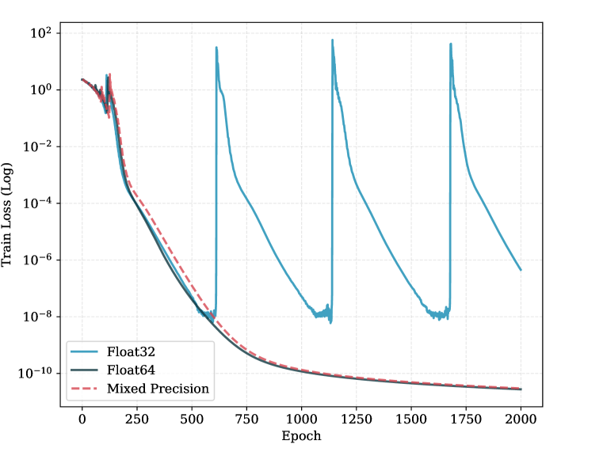

*(a)*


*(b)*

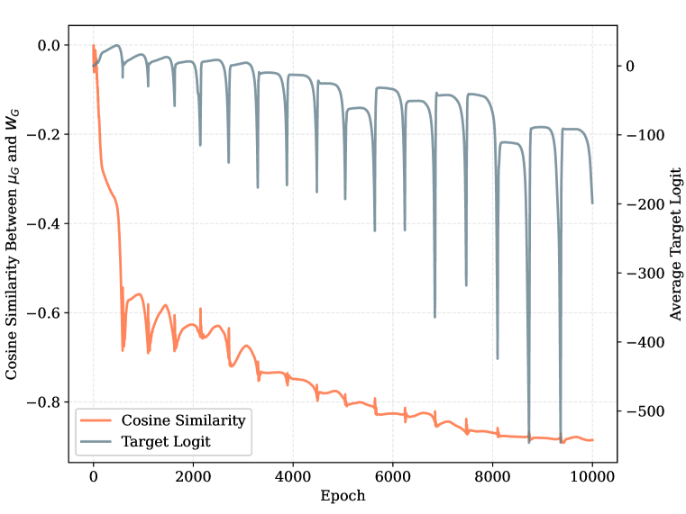

*(c)*

###### fig-1

*Рисунок 1: **Динамика $\mathcal{NFI}$, вызванная точностью.** **(a)** Пращевые всплески потери исчезают, если обучение ведётся в float64. Достаточно перевести в float64 только вычисление логитов и потери — всплески пропадают и тогда, что показывает: неустойчивость происходит из вычисления потери. **(b)** Пока большинство примеров не вошло в схлопывание softmax, общее среднее признаков растёт медленно. Как только большинство примеров схлопывается, $\|\bm{\mu}_{G}\|$ вступает в пору быстрого роста. **(c)** Косинусная близость $\bm{W}_{G}$ и $\bm{\mu}_{G}$ подходит к $-1$. При такой противонаправленности даже логиты верного рода становятся глубоко отрицательными.* **[p. 2]**

###### p2-3

Помимо пращевого хода, мы показываем, что $\mathcal{NFI}$ объясняет и ненормальный рост параметров в более житейских условиях. Обычный разбор через градиентный поток Lyu and Li (2020); Soudry et al. (2018) говорит, что без явного сглаживания разделимые модели наращивают отступ, а нормы их параметров растут лишь логарифмически. Это предсказание часто расходится с делом, где несглаженные модели способны являть быстрый рост норм параметров и логитов. Мы полагаем, что расхождение возникает оттого, что разбор через градиентный поток не учитывает действия конечной точности при вычислении потери. После устранения динамики $\mathcal{NFI}$ рост параметров модели заметно уменьшается.

Наша работа имеет отношение и к нынешнему повороту к обучению при низкой точности. Недавние исследования указали несколько источников неустойчивости при предобучении с низкой точностью: ошибки округления при перемножении матриц Wortsman et al. (2023), всплески потери от «стока внимания» Xiao et al. (2024) и накопление ошибок округления во Flash Attention Qiu and Yao (2026). Наша работа указывает иной род отказа: численную ошибку при вычислении логарифмов вероятностей. По мере перехода обучающих устройств ко всё более низкой точности понимание этого хода важно для устойчивости обучения крупных моделей.

Наш вклад состоит в следующем:

- Мы даём теоретическое объяснение пращевому ходу, исходя из вычисления перекрёстной энтропии при конечной точности.
- **[p. 3]** Мы указываем численное раздувание признаков — петлю обратной связи между общим средним разделяющего слоя и общим средним признаков — как устройство ненормального роста параметров и логитов после долгого обучения без сглаживания.
- Мы предлагаем и проверяем применимые вмешательства (восстановление условия нулевой суммы или удаление среднего последнего слоя), подавляющие вызванные $\mathcal{NFI}$ неустойчивость и рост параметров.

## 2 Сопутствующие работы

#### Гроккинг и численная динамика

###### p3-1

Ослабление весов издавна считали главной причиной гроккинга Liu et al. (2023); Lyu et al. (2024); Boursier et al. (2025); Tian (2026). Однако накапливается опытное свидетельство того, что гроккинг возникает и без явного сглаживания, хотя многие такие показы поставлены при потере среднего квадрата отклонения (MSE) Gromov (2023); Kumar et al. (2024); Golechha (2024); Prakash and Martin (2025). Напротив, добиться гроккинга при потере CE и без ослабления весов представляется теоретически неисполнимым: Lyu et al. Lyu et al. (2024) оценивают, что при градиентном спуске на это потребовалось бы около $10^{100}$ шагов. Тем не менее Thilak et al. Thilak et al. (2022) наблюдали гроккинг при потере CE с Adam, где генерализация сопровождалась повторяющимися пращевыми всплесками потери. Ввиду теоретической трудности гроккинга на CE без сглаживания недавние работы обратились к роли численной точности. Nanda et al. Nanda et al. (2023) первыми связали пращевой ход с численной неустойчивостью, отметив, что более низкая точность её усугубляет. Xu et al. Xu et al. (2025) затем обнаружили, что точность float64 способна смягчить пращевое действие. Ещё позже Prieto et al. Prieto et al. (2025) подробно разобрали эти неустойчивости, указав на «схлопывание softmax» (SC) как на решающее явление. Они показали, что в воплощении потери CE в PyTorch ошибки поглощения возникают, когда верный логит $z_{m}$ превосходит неверные на порог, задаваемый точностью мантиссы (для float32 — $z_{m}-\max_{k\neq m}z_{k}>23\ln 2\approx 16$). При SC градиент верного рода строго округляется до нуля, отчего рост точности на тесте прекращается. Однако Prieto et al. не установили причинной связи между SC и самим пращевым ходом, а предположили, что пращи могут быть внутренним ответом оптимизации, позволяющим избежать SC.

#### Нейронный коллапс

###### p3-2

Недавние исследования указывают, что после долгого обучения нейронные сети склонны сходиться к состоянию, известному как нейронный коллапс (NC) Papyan et al. (2020). Теоретические работы установили, что при потере CE без ослабления весов состояние NC есть всеобщий наилучший исход Lu and Steinerberger (2022); Garrod and Keating (2025). Далее, Dang et al. Dang et al. (2024) показали, что при возбуждении ReLU средние по родам векторы признаков стремятся стать взаимно ортогональными. Sakamoto & Sato Sakamoto and Sato (2025) установили связь гроккинга с NC. Хотя генерализация строго не требует NC, Han et al. Han et al. (2025) полагают, что при отсутствии явного сглаживания модели сильно склонны к NC.

#### Неустойчивость Adam и всплески потери

Свойства схождения Adam Kingma and Ba (2015) изучены основательно. Reddi et al. Reddi et al. (2018) указали на случаи, когда Adam не сходится. Shazeer & Stern Shazeer and Stern (2018) показали, что медленное убывание накопителя второго момента $v_{t}$ способно давать обновления больше желаемых и делать обучение неустойчивым. Zhang et al. Zhang et al. (2022) показали, что должный выбор настроек обеспечивает схождение. Cohen et al. Cohen et al. (2023, 2025) исследовали явление EOS и всплески потери при подвижной оптимизации. Molybog et al. Molybog et al. (2023) объяснили всплески потери временными корреляциями градиентов, из-за которых отношение обновления Adam переходит в двухвершинное распределение. В этом режиме необычные пачки данных вызывают цепное действие, вынуждающее вектор обновления покинуть подавленное состояние, отчего обучающая потеря взрывается. Позже Bai et al. Bai et al. (2025) дали объяснение через устойчивость, заметив, что при долго остающихся малыми градиентах (на плоских участках ландшафта) подвижный член $v_{t}$ убывает, отчего действующая скорость обучения $\eta/(\sqrt{v_{t}}+\varepsilon)$ взрывается. При обычных настройках ($\eta=10^{-3},\varepsilon=10^{-8}$) этот действующий шаг может вырасти на порядки (скажем, в $10^{5}$ раз), отчего модель делается крайне уязвимой к резким обновлениям при возвращении градиентного сигнала. Однако эти разборы обыкновенно сосредоточены на потере MSE, где гессиан не обращается в ноль. Напротив, Ma et al. Ma et al. (2022) теоретически доказывали, что при потере CE собственные значения гессиана на поздней поре обучения исчезают, а значит, оптимизация должна устанавливаться и быть невосприимчивой к таким всплескам.

## 3 Устройство *численного раздувания признаков*

###### p3-4

В этом разделе мы выводим теоретическое устройство неустойчивости обучения, наблюдаемой при низкой точности. Как показано на рисунке 1(a), наши итоги говорят, что пращевой ход есть по сути **[p. 4]** след ограниченной численной точности. Даже когда параметры модели хранятся в float32, довольно перевести выходные логиты в float64 лишь на время вычисления потери, чтобы пращевое действие исчезло. Как разобрали Prieto et al. Prieto et al. (2025), эта неустойчивость происходит из ошибок поглощения в арифметике с плавающей точкой.

### 3.1 Предварительные сведения

Согласно стандарту IEEE 754 16, число с плавающей точкой состоит из 1 знакового разряда $s$, $E$ разрядов порядка и $p$ разрядов мантиссы.

##### **Определение 3.1**(**ошибка поглощения**)**.**

Рассмотрим сложение двух ненулевых чисел с плавающей точкой $a$ и $b$ (где $|a|\geq|b|$). Действие требует выравнивания порядков. Если отношение удовлетворяет $\frac{|b|}{|a|}<2^{-(p-1)}$, то меньшее значение $b$ после выравнивания не представимо в пределах точности мантиссы. Отсюда возникает ошибка поглощения, определяемая как $a+b=a$.

Для float32 точность мантиссы составляет $p=24$ разряда. Отсюда пороговое значение $2^{-(24-1)}=2^{-23}\approx 1.19\times 10^{-7}$.

Ошибки поглощения возникают при вычислении потери перекрёстной энтропии с softmax. PyTorch Paszke et al. (2019) воплощает эту потерю через приём Log-Sum-Exp ради численной устойчивости. Знаменатель хранится как:

$$
Z=\log\left(\sum_{k}\exp(z_{k})\right)=z_{m}+\log\left(\sum_{k}\exp(z_{k}-z_{m})\right) \tag{1}
$$

где $z_{k}$ есть выходной логит рода $k$, а $z_{m}=\max z_{k}$. Если отступ наибольшего логита от прочих удовлетворяет $z_{m}-\max_{k\neq m}z_{k}>(p-1)\ln 2$, второй член исчезает из-за ошибки поглощения, откуда $Z=z_{m}$. На поздних порах обучения наибольший логит $z_{m}$ обыкновенно отвечает логиту верного рода $z_{r}$.

##### **Определение 3.2**(**схлопывание softmax** Prieto et al. (2025))**.**

###### p4-6

При ошибке поглощения (когда $Z=z_{r}$) градиент логита верного рода $r$ становится строго нулевым:

$$
g_{r}=\hat{y}_{r}-y_{r}=e^{z_{r}-Z}-1=e^{z_{r}-z_{r}}-1=0 \tag{2}
$$

###### p4-7

При этом и потеря становится равной $-\log(\hat{y}_{r})=0$. Однако для неверных родов $k\neq r$ градиенты остаются малыми, но ненулевыми ($g_{k}=e^{z_{k}-z_{r}}\neq 0$).

###### p4-8

Поскольку схлопывание softmax (SC) возникает на завершающей поре обучения, его действие неразрывно связано с геометрией пространства признаков в этом режиме. Мы полагаем, что модель сошлась к состоянию нейронного коллапса (NC), описывающему геометрию весовой матрицы разделяющего слоя $\bm{W}$ и её входных возбуждений (признаков) $\bm{h}$.

##### **Определение 3.3**(**нейронный коллапс** Papyan et al. (2020))**.**

###### p4-9

Рассмотрим задачу распознавания с $K$ родами. Состояние нейронного коллапса задаётся такими условиями: **NC1:** схлопывание изменчивости. Изменчивость признаков внутри рода исчезает: для всякого примера $i$ рода $k$ вектор признаков $\bm{h}_{k,i}$ сходится к среднему рода $\bm{\mu}_{k}$; **NC2:** симплексная ETF. Средоточенные средние родов $\bm{\mu}_{k}^{*}=\bm{\mu}_{k}-\bm{\mu}_{G}$ (где $\bm{\mu}_{G}$ есть общее среднее) образуют симплексный равноугольный тесный остов (ETF); **NC3:** самодвойственность. Строчные векторы весов разделяющего слоя $\bm{W}_{k}$ сонаправлены со средоточенными средними родов $\bm{\mu}_{k}^{*}$.

###### p4-10

Prieto et al. Prieto et al. (2025) указали SC и предположили, что оно лишь останавливает генерализацию, отчего точность на тесте выходит на полку. Однако наше исследование обнаруживает решающее второе действие: взаимодействие SC и NC наводит *численное раздувание признаков* — ход, прямо запускающий пращевой ход.

### 3.2 Численное раздувание признаков

В этом разделе мы придаём строгий вид устройству численного раздувания признаков ($\mathcal{NFI}$). Мы показываем, что взаимодействие SC и NC создаёт предопределённую петлю обратной связи, вызывающую раздувание признаков.

Как уже установлено, арифметика с плавающей точкой вносит ошибки поглощения. Сперва мы измерим нарушение условия нулевой суммы.

**[p. 5]**

##### **Теорема 3.4****.**

###### p5-1

*Рассмотрим сеть с потерей CE. Положим, что модель находится в приближённом состоянии NC и удовлетворяет условию SC. При градиентном спуске со скоростью обучения $\eta$ ожидаемое обновление общего среднего весов разделяющего слоя $\bm{W}_{G}=\frac{1}{K}\sum_{k=1}^{K}\bm{W}_{k}$ на уравновешенной по родам пачке $\mathcal{B}$ равно:*

$$
\mathbb{E}_{\mathcal{B}}[\Delta\bm{W}_{G}]=-\frac{\eta\epsilon}{K}\bm{\mu}_{G} \tag{3}
$$

*где $\epsilon=\mathbb{E}[\sum_{k\neq r}\hat{y}_{k}]$ есть ожидаемая остаточная вероятностная масса на неверных родах.*

##### Набросок доказательства.

Возьмём вход $\bm{x}$ с признаком $\bm{h}$ и меткой $y_{r}$. В идеале градиент потери $\mathcal{L}$ по $\bm{W}_{k}$ удовлетворяет строгому условию нулевой суммы:

$$
\sum_{k=1}^{K}\nabla_{\bm{W}_{k}}\mathcal{L}=\sum_{k=1}^{K}(\hat{y}_{k}-y_{k})\bm{h}=\left(\underbrace{\sum_{k}\hat{y}_{k}}_{1}-\underbrace{\sum_{k}y_{k}}_{1}\right)\bm{h}=0 \tag{4}
$$

###### p5-4

Однако при SC градиент верного рода математически исчезает. Сумма становится такой: $\sum_{k=1}^{K}\nabla_{\bm{W}_{k}}\mathcal{L}\xrightarrow{SC}\sum_{k\neq r}\hat{y}_{k}\bm{h}=\epsilon\bm{h}$. Правило обновления $\bm{W}\leftarrow\bm{W}-\eta\nabla\bm{W}$ тем самым сообщает $\bm{W}_{G}$ чистый снос в направлении $-\bm{\mu}_{G}$. ∎

Этот снос требует переопределить геометрическую сонаправленность.

##### **Определение 3.5**(NC3*′*)**.**

Когда $\bm{W}_{G}\neq\bm{0}$, исходные веса $\bm{W}_{k}$ больше не образуют ETF. Вместо этого свойству самодвойственности удовлетворяют средоточенные веса $\bm{W}_{k}^{*}=\bm{W}_{k}-\bm{W}_{G}$: они сонаправлены с $\bm{\mu}_{k}^{*}$ и образуют ETF.

Этот снос весов меняет градиент слоя признаков.

##### **Утверждение 3.6****.**

###### p5-8

*Положим, что модель удовлетворяет NC1, NC2 и NC3′ и что $\bm{W}_{G}$ ортогонально распознающему подпространству ($\bm{W}_{G}\perp\text{span}\{\bm{W}_{k}^{*}\}$). В режиме SC градиент потери по вектору признаков $\bm{h}$ содержит ненулевую составляющую, сонаправленную с $\bm{W}_{G}$:*

$$
\text{Proj}_{\bm{W}_{G}}(\nabla_{\bm{h}}\mathcal{L})=\epsilon\bm{W}_{G} \tag{5}
$$

##### Набросок доказательства.

Градиент равен $\nabla_{\bm{h}}\mathcal{L}=\sum_{k}(\hat{y}_{k}-y_{k})\bm{W}_{k}=\sum_{k}(\hat{y}_{k}-y_{k})(\bm{W}_{G}+\bm{W}_{k}^{*})$. Поскольку $\bm{W}_{G}\perp\text{span}\{\bm{W}_{k}^{*}\}$, проекция на $\bm{W}_{G}$ пропорциональна $\bm{W}_{G}$. ∎

Соединение теоремы 3.4 и утверждения 3.6 вскрывает устройство обратной связи. Взаимное усиление сноса весов $\bm{W}_{G}$ и сноса признаков $\bm{\mu}_{G}$ создаёт связанную динамическую систему:

##### **Теорема 3.7**(**численное раздувание признаков**)**.**

###### p5-11

*В сети с ReLU и потерей CE наступление схлопывания softmax наводит петлю положительной обратной связи. Если изменение $\epsilon$ пренебрежимо мало в сравнении с динамикой параметров (то есть $|\dot{\epsilon}|\ll\frac{d}{dt}\|\bm{W}_{G}\|$), то нормы общего среднего весов $\bm{W}_{G}$ и среднего признаков $\bm{\mu}_{G}$ после долгого обучения растут показательно:*

$$
\lim_{t\to\infty}\|\bm{W}_{G}^{(t)}\| \propto\left(1+\frac{\eta\epsilon}{\sqrt{K}}\right)^{t} \\
\lim_{t\to\infty}\|\bm{\mu}_{G}^{(t)}\| \propto\left(1+\frac{\eta\epsilon}{\sqrt{K}}\right)^{t} \tag{6}
$$

*причём $\bm{W}_{G}$ постепенно становится противонаправленным $\bm{\mu}_{G}$:*

$$
\lim_{t\to\infty}\cos(\bm{W}_{G}^{(t)},\bm{\mu}_{G}^{(t)})\to-1 \tag{8}
$$

Подробное доказательство — в приложении C.

**[p. 6]**

### 3.3 Как устроен пращевой ход

Показательный рост общего среднего разделяющего слоя и общего среднего признаков сам по себе не даёт всплеска потери сразу. Он лишь ведёт систему в режим, где условие поглощения на уровне отдельного примера становится хрупким.

В идеальном состоянии NC все признаки $\bm{h}_{k,i}$ рода $k$ близки к среднему своего рода $\bm{\mu}_{k}$. В этом случае внутри подпространства $\text{span}\{\bm{\mu}_{k}^{*}\}$, ортогонального $\bm{\mu}_{G}$, оставшиеся градиенты неверных родов всё ещё расталкивают признаки разных родов друг от друга. Поэтому пращевой всплеск возникает не сразу. Однако это приближение перестаёт выполняться, как только показательный рост общего среднего признаков берёт верх. Как показано в утверждении 3.6, рост вдоль направления $\bm{\mu}_{G}/\bm{W}_{G}$ пропорционален остаточной вероятностной массе на неверных родах, обозначаемой $\epsilon$. Тем самым примеры, лежащие ближе к границе решения и имеющие большую остаточную массу, движутся вдоль направления $\bm{\mu}_{G}$ быстрее. Спустя некоторое время такого показательного роста разброс внутри рода становится сравним с разбросом между родами. На этой поре обновления по градиенту могут всё ещё увеличивать расстояние между средними двух родов $\bm{\mu}_{p}$ и $\bm{\mu}_{q}$, но вместе с тем способны уменьшать отступ отдельных выбивающихся примеров $\bm{h}_{p,o}$ от границы решения. Как только этот отступ опускается ниже порога поглощения $z_{m}-\max_{k\neq m}z_{k}>(p-1)\ln 2$, градиентный сигнал верного рода возвращается.

###### p6-3

До этого возвращения градиент верного рода равен нулю, а градиенты неверных родов крайне малы. В итоге действующая скорость обучения Adam раздувается к своему теоретическому наибольшему значению $\eta/\varepsilon_{\text{Adam}}$. Когда у части примеров градиент верного рода вдруг переходит от нуля к конечному значению, Adam не способен немедленно снизить действующую скорость обучения из-за своих оценок моментов. Отсюда чрезмерно большой шаг обновления. В наших опытах величина обновления на эпохе всплеска обыкновенно примерно в 50 раз больше, чем на предыдущей. Столь большое обновление существенно меняет параметры модели и возвращает потерю к уровню случайного угадывания. Так и возникают всплески потери, известные как *пращевой ход*.

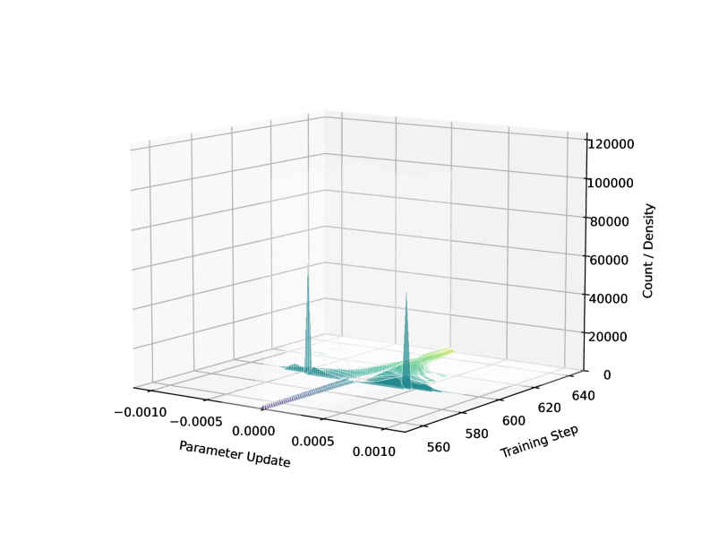

*(a)*

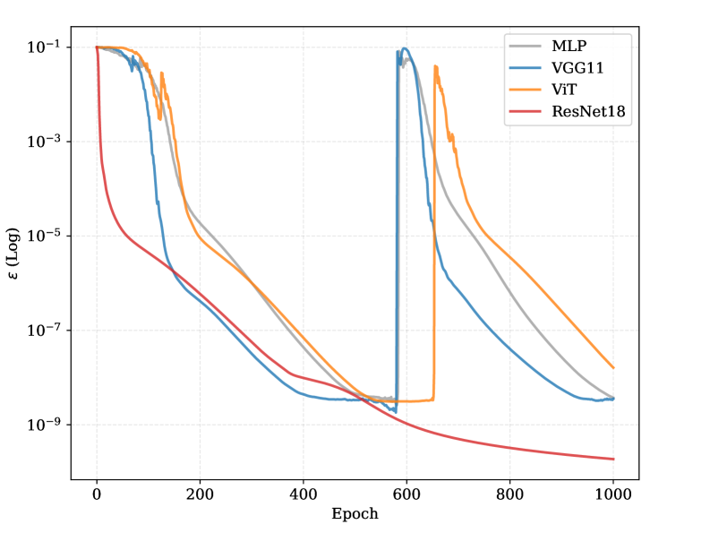

*(b)*

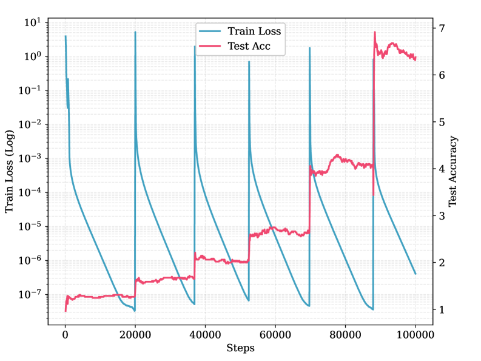

*(c)*

###### fig-2

*Рисунок 2: **Устройственное свидетельство пращевых всплесков.** **(a)** Распределение обновлений параметров разделяющего слоя вблизи всплеска потери. До всплеска обновления сосредоточены около нуля. На шаге всплеска распределение образует две острые вершины около $-4\times 10^{-4}$ и $4\times 10^{-4}$. После всплеска величины обновлений расходятся по параметрам. **(b)** Изменение остаточной вероятностной массы $\epsilon$ у разных устройств. Перед всплеском у MLP, VGG11 и ViT величина $\epsilon$ убывает медленно или застаивается, что позволяет петле $\mathcal{NFI}$ разрастаться. Напротив, у ResNet18 $\epsilon$ продолжает быстро убывать, чем и предотвращается пращевой ход. **(c)** В остаточном делении каждый пращевой всплеск потери сопровождается ступенчатым ростом точности на тесте.* **[p. 6]**

## 4 Опытные итоги и разбор

#### Опытная постановка

###### p6-4

Мы берём опытную рамку Thilak et al. Thilak et al. (2022), охватывая все их настройки, кроме линейных моделей, и расширяем оценивание на добавочные устройства. Наши опыты сосредоточены на 3 наборах данных: (1) **остаточная арифметика:** для задачи остаточного деления с простым $p=97$ мы берём двухслойный трансформер только с раскодировщиком и шестислойную полносвязную сеть (MLP); (2) **распознавание изображений:** мы пользуемся набором CIFAR-10. Ради всестороннего оценивания мы обучаем шестислойную MLP, свёрточные сети (VGG11, ResNet18) и малый двенадцатислойный зрительный трансформер (ViT); (3) **языковое моделирование:** мы обучаем модель nanoGPT на 110 млн параметров на наборе FineWeb вслед за постановкой Wortsman et al. Wortsman et al. (2024). Во всех опытах мы берём потерю CE при нулевом ослаблении весов и приём оптимизации Adam. Подробные настройки приведены в приложении D.

**[p. 7]**

### 4.1 Устройственная проверка $\mathcal{NFI}$

#### Возвращение градиента и всплески потери

###### p7-1

Следуя устройству, описанному в разделе 3.3, мы оцениваем, чем запускается пращевой всплеск потери. Возьмём скалярную игрушечную модель с общей скоростью обучения $\eta=10^{-3}$ и $\beta_{1},\beta_{2}=0.9,0.95$. Перед всплеском средний градиентный сигнал по всем примерам составляет около $3\times 10^{-9}$. Когда всплеск запускается, вернувшийся градиентный сигнал больше $\exp(-(p-1)\ln 2)=1.19\times 10^{-7}$. Для первого момента получаем $m_{t}=0.9\times 3\times 10^{-9}+0.1\times 1.19\times 10^{-7}=1.46\times 10^{-8}$. Для второго момента получаем $\sqrt{v}=\sqrt{9\times 10^{-18}\times 0.95+1.19^{2}\times 10^{-14}\times 0.05}=2.7\times 10^{-8}$. Тем самым величина обновления Adam на шаге всплеска составляет около $\eta\frac{m_{t}}{\sqrt{v_{t}}+\varepsilon}=4\times 10^{-4}$.

Эта оценка тесно совпадает с нашим опытным наблюдением. Как видно на рисунке 2(a), перед всплеском средняя величина обновления в разделяющем слое составляет около $1\times 10^{-5}$. На эпохе всплеска, однако, распределение обновлений даёт две острые вершины около $4\times 10^{-4}$ и $-4\times 10^{-4}$. Такой более чем $40$-кратный рост величины обновления равносилен приложению большого знакового смещения ко многим параметрам. В итоге предсказания становятся почти случайными, а потеря вырастает до порядка $10^{0}$. Так и возникает наблюдаемый пращевой всплеск потери. Мы проверяем и обычные для машинного зрения настройки Adam $\beta_{1},\beta_{2}=0.9,0.999$, и предложенную Orvieto and Gower Orvieto and Gower (2026) настройку $\beta_{1},\beta_{2}=0.9,0.9$. В обоих случаях наблюдаемые всплески обновлений имеют величину, согласную с тем же вычислением.

#### Проекция на нулевую сумму

###### p7-3

Чтобы проверить теорему 3.4, мы удерживаем обновление $W$ в подпространстве, удовлетворяющем условию нулевой суммы из выражения 4. А именно, мы прилагаем проекцию к градиенту логитов $g=\nabla_{z}L$, заменяя его на $g\leftarrow g-\frac{1}{K}\sum^{K}_{k}g_{k}$. Эта проекция заставляет обновление по градиенту для каждого примера удовлетворять условию нулевой суммы из выражения 4. Когда это условие удерживается на всём обучении, пращевой всплеск исчезает. Итог подкрепляет предсказание о том, что составляющая, нарушающая нулевую сумму, необходима для петли обратной связи $\mathcal{NFI}$.

#### Зависимость от устройства

###### p7-4

Далее мы проверяем, возникает ли пращевой ход на разных наборах данных и устройствах; итоги сведены в таблице 1. Мы обнаруживаем, что пращевые всплески являют все проверенные модели, кроме ResNet18. Более пристальный разбор показывает, что это исключение согласуется с теоремой 3.7. Устройство $\mathcal{NFI}$ требует, чтобы изменение $\epsilon$ было пренебрежимо мало в сравнении с динамикой $W$ и $\mu$. У прочих устройств это условие выполняется. Как видно на рисунке 2(b), перед всплеском потери $\epsilon$ убывает медленно или держится почти неизменной. Поэтому множитель $(1+\frac{\eta\epsilon}{\sqrt{K}})^{t}$ способен поддерживать показательный рост. Напротив, если $\epsilon$ убывает слишком быстро — скажем, $\epsilon(t)\propto\frac{1}{t}$ или $\epsilon(t)\propto\frac{\log t}{t}$, — то накопленный рост $(1+\frac{\eta\epsilon(t)}{\sqrt{K}})^{t}$ оказывается степенным или логарифмическим. Тем самым $\mathcal{NFI}$ не способно перейти в режим показательного роста, и пращевого хода не возникает. ResNet18, по-видимому, учится достаточно быстро, чтобы покинуть эту неустойчивую область прежде, чем петля обратной связи $\mathcal{NFI}$ возьмёт верх.

#### Связь с гроккингом

###### p7-5

Занятное следствие пращевого хода — его связь с гроккингом. Как видно на рисунке 2(c), в задаче остаточного деления каждый всплеск потери сопровождается ступенчатым ростом точности на тесте, которая в конце концов достигает $100\%$. Мы истолковываем эти повторяющиеся всплески как род неявного возмущения: они раз за разом уводят модель из её нынешнего состояния с малой потерей и позволяют обучению возобновиться в иной области ландшафта потерь. Это может помогать модели выходить к более плоским и лучше обобщающим решениям.

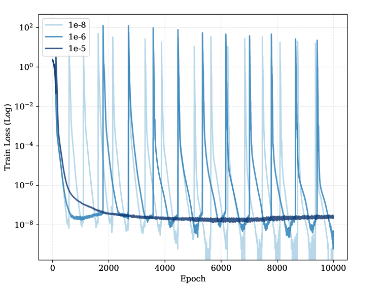

*(a)*

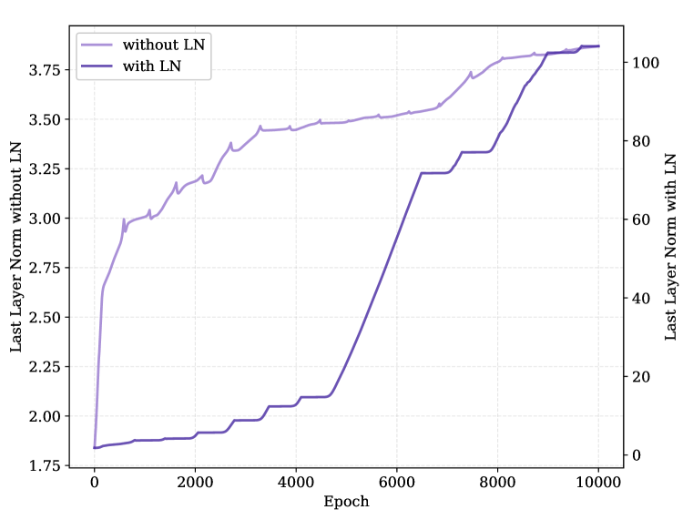

*(b)*


*(c)*

*Рисунок 3: **Разбор смягчающих мер. (a) $\varepsilon$ у Adam. Увеличение параметра $\varepsilon$ приёма оптимизации смягчает неустойчивость: при $\varepsilon=10^{-6}$ всплески становятся реже, а при $\varepsilon=10^{-5}$ исчезают вовсе. (b) Послойная нормировка. Приложение LN меняет ход нормы последнего слоя с непрерывного на отчётливо ступенчатый. Примечательно, что LN заметно увеличивает величину нормы последнего слоя. (c) Пачечная нормировка. Обычный VGG11 с BN внутри свёрточных слоёв всё же являет пращевые всплески. Однако приложение BN прямо перед разделяющим слоем устраняет неустойчивость, удерживая обучение в состоянии SC с нулевой потерей.*** **[p. 8]**

### 4.2 Разбор смягчающих мер

После того как мы указали устройство $\mathcal{NFI}$, мы поставили ряд опытов с отсечением, чтобы оценить, способны ли те или иные изменения устройства или алгоритма смягчить пращевое действие. Мы опускаем разбор явных сглаживающих членов вроде ослабления весов или z-потери (ограничивающей нормировщик логарифма softmax $Z$), поскольку их способность смягчать пращевой ход показана в прежних работах Thilak et al. (2022); Chowdhery et al. (2023); Wortsman et al. (2024).

#### Смешанная точность

###### p7-7

Как видно на рисунке 1(a), довольно поднять вычисление softmax до точности float64, чтобы пращевой ход исчез. Порог ошибки поглощения при двойной точности равен **[p. 8]** $\frac{|b|}{|a|}<2^{-52}\approx 2.22\times 10^{-16}$. Достичь столь малой величины обучающей потери, чтобы этот порог сработал, в пределах обычной длительности обучения по большей части неисполнимо.

#### Приём оптимизации

###### p8-1

Хотя пращевой ход обыкновенно связывают с подвижными приёмами оптимизации, мы показываем, что начало неустойчивости не зависит от подвижности и вызвано единственно величиной шага. Чтобы это проверить, мы переключили приём оптимизации с Adam на обычный градиентный спуск сразу после того, как обучающая потеря достигла строгого нуля. Скорость обучения мы вручную положили равной $\eta=10^{5}$, подражая огромному действующему шагу ($\approx\eta_{\text{Adam}}/\varepsilon_{\text{Adam}}$). Существенно, что градиентный спуск запустил пращевой всплеск примерно на той же эпохе, что и прогон с Adam для сравнения. Отметим, однако, важное различие в последствиях: Adam способен приспособить свои моменты и оправиться от всплеска (образуя повторяющуюся картину), тогда как градиентный спуск с большой скоростью обучения не сходится обратно и расходится окончательно.

#### Увеличение $\varepsilon_{\text{Adam}}$

Thilak et al. Thilak et al. (2022) сообщали, что увеличение параметра $\varepsilon$ у Adam до $10^{-5}$ предотвращает пращи. Наш разбор подтверждает, что это вмешательство работает, снижая верхнюю границу действующей скорости обучения ($\eta/\varepsilon_{\text{Adam}}$) и тем самым откладывая раздувание вернувшихся градиентных сигналов.

#### Послойная нормировка (LN)

Приложение LN к признакам прямо перед разделяющим слоем действия не смягчает. Поскольку LN нормирует каждый пример по отдельности, оно не мешает совместному выстраиванию признаков вдоль общего направления (то есть $\mathcal{NFI}$ сохраняется). Более того, как видно на рисунке 3(b), наши опыты показывают, что LN *ускоряет* наступление пращей. LN ограничивает норму признаков, а меньшая норма означает, что даже малое уменьшение углового расхождения способно нарушить порог поглощения. Кроме того, LN расцепляет динамику направления и величины. В наших опытах с ненормированной MLP норма последнего слоя растёт непрерывно, что согласуется с Soudry et al. Soudry et al. (2018). Однако с LN мы наблюдаем ступенчатый рост, отмеченный Thilak et al.: модель попеременно то улучшает угловую сонаправленность ради уменьшения потери, то, когда углы устанавливаются, увеличивает скалярный размах последнего слоя.

#### Пачечная нормировка (BN)

Как показано на рисунке 3(c), BN, приложенное прямо перед разделяющим слоем, успешно устраняет пращи. Средоточивая признаки пачки (вычитая общее среднее $\bm{\mu}_{G}$), BN убирает главную составляющую сноса. Отметим, что Thilak et al. наблюдали, что BN пращей не предотвратило. Это расхождение происходит из их устройства: они прилагали BN внутри свёрточных слоёв VGG11, за которыми следовали новые слои ReLU, вновь вносившие сжатие ранга Daneshmand et al. (2020). Мы удостоверяемся, что BN действенно, когда приложено прямо перед последним линейным слоем.

#### Сглаживание меток (LS)

Сглаживание меток задаёт целевую вероятность $y<1$, чем предотвращает безграничный рост логитов верного рода. Хотя оно успешно устраняет вызванные точностью всплески $\mathcal{NFI}$ **[p. 9]**, наши опыты обнаруживают, что LS вносит новый род неустойчивости, не связанный с численной точностью. Когда целевая вероятность не равна 1 (а неверные цели не равны 0), теоретическое ручательство Ma et al. Ma et al. (2022) о том, что собственные значения гессиана на поздней поре обучения исчезают, больше не выполняется. Напротив, наибольшее собственное значение гессиана остаётся конечным. Это уводит оптимизацию в режим EOS, где всплески потери происходят из собственной остроты ландшафта потерь (см. рисунок 4(b)). Подробный разбор различий пращевого хода и EOS дан в приложении A.2, а отчего LS ведёт к конечным собственным значениям гессиана — разобрано в приложении C.4.3.

### 4.3 $\mathcal{NFI}$ в житейских задачах

###### p9-1

До сих пор мы изучали главным образом обучение полной выборкой. В настоящем обучении, однако, ради быстроты и генерализации пользуются малыми пачками. Случайность малых пачек делает маловероятным, что все примеры разом опустятся ниже порога схлопывания softmax, — кроме сильно упорядоченных и почти бесшумных задач вроде остаточной арифметики. Поэтому видимого пращевого всплеска потери может и не появиться. Тем не менее мы обнаруживаем, что $\mathcal{NFI}$ всё равно возникает.

#### Малая пачка

У VGG11, обученной с пачкой в $256$ примеров, примерно половина примеров всё же входит в схлопывание softmax после $10^{6}$ шагов обучения, имея ровно нулевую потерю. Примеры, не схлопнувшиеся, сохраняют ненулевые градиенты верного рода. Эти градиенты продолжают разделять признаки в распознающем подпространстве, поддерживают оценки моментов Adam живыми и не дают действующей скорости обучения вдруг стать чрезмерно большой. Оттого пращевого всплеска и не наблюдается. Однако схлопнувшиеся примеры всё же наводят снос $\mathcal{NFI}$, отчего $\bm{\mu}_{G}$ и логиты на поздней поре быстро растут. В согласии с этим истолкованием вычитание $\bm{W}_{G}$ или приложение BatchNorm перед разделяющим слоем, убирающее $\bm{\mu}_{G}$ во время обучения, существенно замедляет поздний рост параметров.

#### Большие языковые модели

Мы рассматриваем и языковое моделирование. Схлопывание softmax возникает и при обучении GPT: на каждом шаге примерно из $1.3\times 10^{5}$ лексем около $4000$ имеют ровно нулевую потерю. Эти лексемы отвечают крайне предсказуемым обстановкам. На FineWeb десять лексем с наибольшей частотой схлопывания softmax суть «.», «org», «example», «,», «to», «t», «last», « », « you» и «of». Некоторые из них — скажем, «example», «org» и «last» — не суть попросту самые частые лексемы. Они крайне предсказуемы из-за свойственных набору данных образцов вроде «example.org» или полей вида «first name» и «last name».

###### p9-4

Долгое обучение языковой модели тоже являет ненормальный рост логитов. Чтобы проверить действие численной точности, мы заменяем вычисление потери на float64 и сверяем с обычным обучением в bf16 (потеря считается в float32); итог показан на рисунке 13. Занятно, что, в отличие от опытов с MLP, свёрточными сетями и ViT, более высокая точность здесь роста логитов не уменьшает. После $10^{5}$ шагов средний логит при обучении с float32 равен $183$, а при вычислении потери в float64 возрастает до $498$.

Мы полагаем, что это различие происходит из особого устройства данных естественного языка. В прежних задачах распознавания роды уравновешены. В языковом моделировании частоты лексем подчиняются закону Ципфа, отчего выходные векторы вложений $\bm{W}_{k}$ по своей природе смещены в пользу частых лексем. Эта неуравновешенность способна создавать большое общее среднее $\bm{W}_{G}$ даже без численного схлопывания Gao et al. (2019). В итоге признаки и выходные вложения могут усиливать друг друга в одном и том же направлении: вложения частых лексем ведут отвечающие им признаки к росту вдоль сонаправленных направлений. Напротив, $\mathcal{NFI}$ создаёт противонаправленное взаимодействие $\bm{W}_{G}$ и $\bm{\mu}_{G}$. Поэтому в этих условиях низкая точность способна отчасти подавлять более быстрое расхождение логитов, вызванное частотным $\bm{W}_{G}$.

В обоих случаях решающей оказывается составляющая общего среднего выходного вложения. Удаление среднего последнего слоя $\bm{W}_{G}$ устраняет это взаимное усиление и устанавливает логиты. Дальнейший разбор расхождения логитов у языковых моделей дан в приложении A.4.

## 5 Заключение

В этой работе мы разъяснили пращевой ход, показав, что он есть след арифметики с плавающей точкой — а именно численное раздувание признаков ($\mathcal{NFI}$), — а не внутренняя динамика оптимизации. Наши итоги обнаруживают разрыв между разбором через градиентный поток и настоящей оптимизацией. Нынешние уточнения вроде срединных потоков Cohen et al. (2025) и нейронной термодинамики Ziyin et al. (2025) по-прежнему описывают главным образом внутреннюю динамику модели, тогда как численная динамика часто остаётся без внимания. **[p. 10]** Далее мы показываем, что SC и $\mathcal{NFI}$ не ограничены игрушечными моделями: они возникают и при обучении настоящих больших моделей и способны существенно менять путь оптимизации. Поэтому вычисление потери при конечной точности следует считать величиной первого порядка при разборе устойчивости долгого обучения.

#### Ограничения

###### p10-1

Наш разбор $\mathcal{NFI}$ исследует главным образом взаимодействие признаков предпоследнего слоя с разделяющим слоем. Такой взгляд неявно принимает допущение модели неограниченных признаков Mixon et al. (2022), полагая, что несущая сеть достаточно выразительна, чтобы породить произвольные признаки, и что градиенты по признакам прямо переходят в смещение признаков. Хотя для глубоких нейронных сетей это допущение по большей части выполняется, оно может чрезмерно упрощать динамику мелких сетей, где средних по родам $\bm{\mu}_{k}$ может не хватать для описания изменения признаков. И впрямь, Nanda et al. Nanda et al. (2023) сообщали о трудностях с наблюдением пращей в мелких сетях.

**[p. 11]**

## Заявление о влиянии

Эта работа имеет целью продвижение области машинного обучения. У неё есть множество возможных общественных последствий, ни одно из которых, на наш взгляд, не нуждается здесь в особом упоминании.

## Список литературы

- Adaptive preconditioners trigger loss spikes in Adam. arXiv preprint arXiv:2506.04805. Cited by: §A.2, §2.

- A theoretical framework for grokking: interpolation followed by riemannian norm minimisation. In The Thirty-ninth Annual Conference on Neural Information Processing Systems, Cited by: §2.

- Palm: scaling language modeling with pathways. Journal of Machine Learning Research 24 (240), pp. 1–113. Cited by: §A.4, §4.2.

- Understanding optimization in deep learning with central flows. In The Thirteenth International Conference on Learning Representations, Cited by: §A.2, §2, §5.

- Adaptive gradient methods at the edge of stability. In NeurIPS 2023 Workshop Heavy Tails in Machine Learning, Cited by: §A.2, §2.

- Gradient descent on neural networks typically occurs at the edge of stability. In International Conference on Learning Representations, Cited by: §A.2, §1.

- Batch normalization provably avoids ranks collapse for randomly initialised deep networks. Advances in Neural Information Processing Systems 33, pp. 18387–18398. Cited by: §4.2.

- Neural collapse for cross-entropy class-imbalanced learning with unconstrained reLU features model. In Forty-first International Conference on Machine Learning, Cited by: §C.3.1, §2.

- An image is worth 16x16 words: transformers for image recognition at scale. In 9th International Conference on Learning Representations, Cited by: 4th item.

- Representation degeneration problem in training natural language generation models. In International Conference on Learning Representations, Cited by: §4.3.

- The persistence of neural collapse despite low-rank bias. In The Thirty-ninth Annual Conference on Neural Information Processing Systems, Cited by: §2.

- Progress measures for grokking on real-world tasks. arXiv preprint arXiv:2405.12755. Cited by: §2.

- Grokking modular arithmetic. arXiv preprint arXiv:2301.02679. Cited by: §2.

- Flatness is necessary, neural collapse is not: rethinking generalization via grokking. In The Thirty-ninth Annual Conference on Neural Information Processing Systems, Cited by: §2.

- Deep residual learning for image recognition. In Proceedings of the IEEE conference on computer vision and pattern recognition, pp. 770–778. Cited by: 2nd item.

- (2019) IEEE standard for floating-point arithmetic. IEEE Std 754-2019 (Revision of IEEE 754-2008) (), pp. 1–84. Cited by: §3.1.

- On large-batch training for deep learning: generalization gap and sharp minima. In International Conference on Learning Representations, Cited by: §A.3.2.

- Adam: A method for stochastic optimization. In The Third International Conference on Learning Representations, Cited by: §2.

- Grokking as the transition from lazy to rich training dynamics. In The Twelfth International Conference on Learning Representations, Cited by: §2.

- Omnigrok: grokking beyond algorithmic data. In The Eleventh International Conference on Learning Representations, Cited by: §2.

**[p. 12]**

- Neural collapse under cross-entropy loss. Applied and Computational Harmonic Analysis 59, pp. 224–241. Note: Special Issue on Harmonic Analysis and Machine Learning External Links: ISSN 1063-5203 Cited by: §2.

- Dichotomy of early and late phase implicit biases can provably induce grokking. In The Twelfth International Conference on Learning Representations, Cited by: §2.

- Gradient descent maximizes the margin of homogeneous neural networks. In International Conference on Learning Representations, Cited by: §1.

- A qualitative study of the dynamic behavior for adaptive gradient algorithms. In Proceedings of the 2nd Mathematical and Scientific Machine Learning Conference, Proceedings of Machine Learning Research, Vol. 145, pp. 671–692. Cited by: §2, §4.2.

- Neural collapse with unconstrained features. Sampling Theory, Signal Processing, and Data Analysis 20 (2), pp. 11. Cited by: §5.

- A theory on Adam instability in large-scale machine learning. arXiv preprint arXiv:2304.09871. Cited by: §2.

- Progress measures for grokking via mechanistic interpretability. In The Eleventh International Conference on Learning Representations, Cited by: §1, §2, §5.

- In search of Adam’s secret sauce. In The Thirty-ninth Annual Conference on Neural Information Processing Systems, Cited by: §4.1.

- Prevalence of neural collapse during the terminal phase of deep learning training. Proceedings of the National Academy of Sciences 117 (40), pp. 24652–24663. Cited by: §2, Definition 3.3.

- Traces of class/cross-class structure pervade deep learning spectra. Journal of Machine Learning Research 21 (252), pp. 1–64. Cited by: §C.4.

- PyTorch: an imperative style, high-performance deep learning library. Advances in neural information processing systems 32. Cited by: §3.1.

- Grokking: generalization beyond overfitting on small algorithmic datasets. arXiv preprint arXiv:2201.02177. Cited by: §1.

- Grokking and generalization collapse: insights from HTSR theory. arXiv preprint arXiv:2506.04434. Cited by: §2.

- Grokking at the edge of numerical stability. In The Thirteenth International Conference on Learning Representations, Cited by: §1, §2, §3.1, Definition 3.2, §3.

- Why low-precision transformer training fails: an analysis on flash attention. In The Fourteenth International Conference on Learning Representations, Cited by: §1.

- On the convergence of adam and beyond. In International Conference on Learning Representations, Cited by: §2.

- Explaining grokking and information bottleneck through neural collapse emergence. arXiv preprint arXiv:2509.20829. Cited by: §2.

- Adafactor: adaptive learning rates with sublinear memory cost. In International Conference on Machine Learning, pp. 4596–4604. Cited by: §2.

- Very deep convolutional networks for large-scale image recognition. In 3rd International Conference on Learning Representations, Y. Bengio and Y. LeCun (Eds.), Cited by: 3rd item.

- A bayesian perspective on generalization and stochastic gradient descent. In International Conference on Learning Representations, Cited by: §A.3.2.

- The implicit bias of gradient descent on separable data. Journal of Machine Learning Research 19 (70), pp. 1–57. Cited by: §1, §4.2.

- Output embedding centering for stable llm pretraining. arXiv preprint arXiv:2601.02031. Cited by: §A.4, §D.3.

- The slingshot effect: a late-stage optimization anomaly in adaptive gradient methods. Transactions on Machine Learning Research. External Links: ISSN 2835-8856 Cited by: §A.4.

- The slingshot mechanism: an empirical study of adaptive optimizers and the grokking phenomenon. arXiv preprint arXiv:2206.04817. Cited by: §1, §2, §4, §4.2, §4.2.

- Provable scaling laws of feature emergence from learning dynamics of grokking. In The Fourteenth International Conference on Learning Representations, Cited by: §2.

- Attention is all you need. Advances in neural information processing systems 30. Cited by: 1st item.

- Stable and low-precision training for large-scale vision-language models. In Thirty-seventh Conference on Neural Information Processing Systems, Cited by: §1.

- Small-scale proxies for large-scale transformer training instabilities. In The Twelfth International Conference on Learning Representations, Cited by: §A.4, §4, §4.2.

- Efficient streaming language models with attention sinks. In The Twelfth International Conference on Learning Representations, Cited by: §1.

- Implicit bias of adamw: $\ell_{\infty}$-norm constrained optimization. In Forty-first International Conference on Machine Learning, Cited by: §A.3.1.

- Let me grok for you: accelerating grokking via embedding transfer from a weaker model. In The Thirteenth International Conference on Learning Representations, Cited by: §2.

- Adam can converge without any modification on update rules. In Advances in Neural Information Processing Systems, Cited by: §2.

**[p. 13]**

- Neural thermodynamics: entropic forces in deep and universal representation learning. In The Thirty-ninth Annual Conference on Neural Information Processing Systems, Cited by: §5.

## Содержание приложений

**[p. 14]**

## Приложение A Дополнительный разбор

### A.1 Дополнительные опыты со смягчающими мерами

#### A.1.1 Объём набора данных

###### p14-1

Чтобы строго проверить, не есть ли пращевой ход след малого объёма данных, мы поставили опыты на подмножествах CIFAR-10 разной величины: $N\in\{200,2000,20000,50000\}$, где $N=50000$ есть полный обучающий набор. Чтобы отделить действие объёма от шума случайной выборки (разобранного в приложении A.3.2), мы во всех настройках брали *Adam на полной выборке*.

Мы наблюдали отчётливые пращевые всплески потери при всех объёмах набора, включая полный CIFAR-10. Это опытное свидетельство показывает, что возникновение пращей не зависит от объёма данных. Оно подтверждает, что пока у модели довольно ёмкости, чтобы опустить остаточную вероятностную массу $\epsilon$ ниже порога поглощения с плавающей точкой, петля обратной связи $\mathcal{NFI}$ будет запущена — если только путь оптимизации не сбивается непрерывно шумом малых пачек.

#### A.1.2 Скорость обучения

###### p14-3

Мы разобрали чувствительность, перебирая общую скорость обучения $\eta$ по ряду $\{10^{-2},10^{-3},10^{-4},10^{-5}\}$. Вопреки ожиданию, мы обнаруживаем, что *меньшие* скорости обучения заметно чаще запускают пращевую неустойчивость.

###### p14-4

Это явление означает, что большая скорость обучения даёт важный род неявного сглаживания. Большие шаги вносят случайный шум, не дающий приёму оптимизации осесть в острых, изрезанных котловинах притяжения, и тем самым сглаживают путь оптимизации. Напротив, малая скорость обучения позволяет модели добросовестно сойтись к ближайшему местному минимуму. В сложном ландшафте потерь глубоких сетей эти «ближайшие» решения часто оказываются «плохими» местными минимумами, отличающимися крайней остротой.

**[p. 15]**

#### A.1.3 Смещение

Мы обнаруживаем, что добавление члена смещения в разделяющем слое ускоряет наступление пращей. Эта неустойчивость происходит из существенного различия размаха обновлений весов и смещений. Градиент по весу $\bm{W}_{k}$ умножен на вектор признаков $\bm{h}$:

$$
\nabla_{\bm{W}_{k}}\mathcal{L}=(\hat{y}_{k}-y_{k})\bm{h} \tag{9}
$$

Напротив, градиент по смещению $b_{k}$ равен:

$$
\nabla{b_{k}}\mathcal{L}=(\hat{y}_{k}-y_{k}) \tag{10}
$$

В наших опытах норма признаков $\|\bm{h}\|$ вырастает примерно до $10^{2}$. Отсюда следует, что весовая матрица $\bm{W}$ обновляется на два порядка быстрее смещения $b$. В итоге член смещения по сути «отстаёт» от быстро меняющихся весов. Это несоответствие динамик расшатывает вычисление логитов $z_{k}=\bm{W}_{k}^{T}\bm{h}+b_{k}$, отчего система чаще нарушает порог поглощения и запускает всплески.

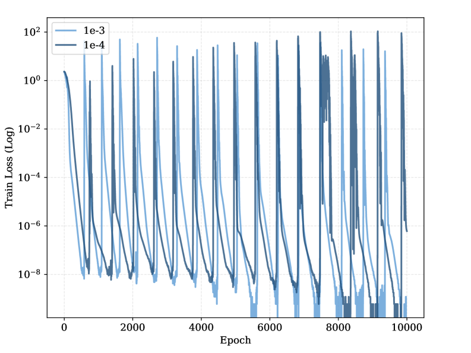

*(a)*


*(b)*

*Рисунок 4: **(a)** Обучающая потеря при разных скоростях обучения. **(b)** Обучающая потеря при сглаживании меток.* **[p. 15]**

#### A.1.4 Численное исчезновение порядка

Мы показываем, что пращевой ход не связан с исчезновением порядка (его часто называют переполнением точности или усечением диапазона).

Арифметика с плавающей точкой подвержена двум различным родам потери точности: *ошибке поглощения* (из-за ограниченного числа разрядов мантиссы) и *исчезновению порядка* (из-за ограниченного числа разрядов порядка). Исчезновение порядка происходит, когда значение меньше наименьшего представимого положительного числа и потому усекается до нуля. А именно, для softmax градиент по наименьшему логиту $z_{min}$ обращается в ноль, если:

$$
\exp(z_{min}-z_{max})<2^{-(p-1+2^{E-1}-2)} \tag{11}
$$

где $p$ означает число разрядов мантиссы, а $E$ — число разрядов порядка. Для обычной точности float32 эта граница достигается, когда разность логитов удовлетворяет $z_{max}-z_{min}>149\ln 2\approx 103.28$.

###### p15-7

Чтобы исключить исчезновение порядка как причину, мы поставили опыт, в котором прямо зажимали логиты так, чтобы отступ всегда удовлетворял $z_{min}\geq z_{max}-100$. Это ограничение ручается, что градиенты остаются строго в представимом диапазоне float32. Мы наблюдали, что пращевые всплески сохраняются и при таком вмешательстве, что подтверждает: явление вызвано единственно ошибками поглощения в мантиссе и не связано с исчезновением порядка.

### A.2 Есть ли пращевой ход явление края устойчивости?

Хотя и пращевой ход, и явление края устойчивости (EOS) проявляются как частые колебания и всплески на пути обучающей потери, наш теоретический разбор и опытное свидетельство показывают, что ими управляют в корне разные устройства.

В выпуклой оптимизации условие устойчивого схождения градиентного спуска (GD) на функции $f$ состоит в том, что скорость обучения должна удовлетворять $\eta<2/\lambda$, где $\lambda$ есть постоянная Липшица градиента $\nabla f$. Для дважды дифференцируемых функций $\lambda$ отвечает верхней границе наибольшего собственного значения (спектральной нормы) гессиана $\nabla^{2}f(x)$.

Cohen et al. Cohen et al. **[p. 16]** (2021) указали на явление «постепенного обострения» при обучении нейронных сетей, где наибольшее собственное значение гессиана $\lambda_{max}$ неуклонно растёт, пока не достигнет порога устойчивости $2/\eta$. Перейдя этот предел, оптимизация входит в неустойчивый режим с колебаниями, которые и удерживают $\lambda_{max}$ около опасного значения $2/\eta$. Такое самоустанавливающееся поведение у предела расходимости и называют «краем устойчивости». Внешний признак EOS на кривой обучающей потери — обыкновенно череда частых колебаний.

Для подвижных приёмов оптимизации условие устойчивости распространяется на наибольшее собственное значение *предобусловленного гессиана* $\mathbf{P}\mathbf{H}(w)$, где $\mathbf{P}=\text{diag}(1/(\sqrt{v}+\epsilon))$ служит предобуславливателем Cohen et al. (2023, 2025). При наличии момента (скажем, у Adam) этот порог устойчивости дополнительно изменяется множителем $\kappa(\beta_{1},\beta_{2})$, зависящим от настроек Cohen et al. (2023); Bai et al. (2025).

Хотя пращевые события тоже проявляются как всплески потери, лежащее в их основе начало отлично от EOS по нескольким причинам:


*(a)*

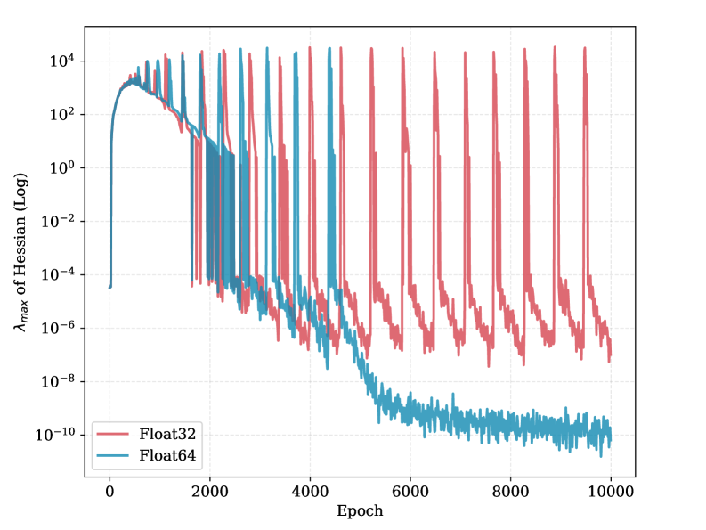

*(b)*

###### fig-5

*Рисунок 5: **Сосуществование EOS и пращевого хода.** **(a)** Обучающая потеря: ранние колебания EOS против поздних численных всплесков. **(b)** Изменение наибольшего собственного значения гессиана $\lambda_{max}$.* **[p. 16]**

#### A.2.1 Исчезающий гессиан при перекрёстной энтропии

###### p16-3

Во-первых, именно при потере CE постепенное обострение, нужное для EOS, на поздних порах обучения не происходит. Напротив, $\lambda_{max}$ стремится к нулю.

##### **Теорема A.1****.**

*Рассмотрим нейронную сеть с параметрами $\theta\in\mathbb{R}^{d}$ и выходными логитами $z(\theta,x)\in\mathbb{R}^{K}$. Для задачи распознавания с потерей перекрёстной энтропии $\mathcal{L}$, если модель сходится к решению с полной подгонкой (то есть вектор предсказанных вероятностей $\hat{y}$ сходится к однобитной метке $y$), то наибольшее собственное значение гессиана $\lambda_{\max}(H_{\theta})$ сходится к 0 — при условии, что производные сети местно ограничены.*

###### p16-5

Доказательство приведено в разделе C.4. Отсюда следует, что на поздней поре обучения оптимизация идёт много ниже порога устойчивости $2/\eta$, а значит, неустойчивость происходит не из кривизны ландшафта потерь.

#### A.2.2 Численный след против собственного свойства

###### p16-6

Во-вторых, EOS есть собственное свойство ландшафта оптимизации, сохраняющееся независимо от численной точности. Резко напротив, пращевое действие есть численный след. Как показано в наших основных итогах, довольно поднять точность до float64, чтобы пращевые всплески исчезли вовсе, тогда как настоящие колебания EOS сохранились бы и при двойной точности.

#### A.2.3 Сосуществование явлений

###### p16-7

Наконец, отметим, что эти два явления могут сосуществовать в одном и том же прогоне обучения. Мы проверили это, обучив узкую сеть (скрытая размерность $d=20$). Как изображено на рисунке 5, модель, обученная в float32, являет всплески потери и на ранней, и на поздней поре обучения. Однако при обучении в float64 поздние всплески (пращи) исчезают, а ранние колебания — происходящие, пока $\lambda_{max}$ ещё конечно и велико, — сохраняются. Это подтверждает, что ранняя неустойчивость есть подлинный EOS, а поздняя строго есть следствие численного отказа.

**[p. 17]**

### A.3 Отчего пращи редки на деле?

Пращевой ход остаётся по большей части неисследованным прежде всего оттого, что при обычных настройках обучения глубоких сетей он проявляется редко. Мы указываем две главные причины, естественно подавляющие это явление в привычных условиях:

#### A.3.1 Ослабление весов

###### p17-2

Явное сглаживание действенно ограничивает величину весов, а с нею и рост выходных логитов. Xie & Li Xie and Li (2024) теоретически показали, что для приёма оптимизации AdamW с множителем ослабления весов $\lambda$ величина параметров ограничена как $\|w\|_{\infty}\lesssim 1/\lambda$. Поскольку логиты удерживаются в конечных пределах, отступ логитов $z_{m}-\max_{k\neq m}z_{k}$ редко превосходит порог, нужный для запуска ошибок поглощения с плавающей точкой (около 16 для float32). Без этого численного отказа петля обратной связи начаться не может.

#### A.3.2 Малая пачка

Хотя мы удостоверились, что пращевые события возникают и на полном наборе CIFAR-10, при обычном обучении наблюдать их зачастую труднее из-за динамики малых пачек. Мы указываем два основных устройства, которыми малые пачки подавляют или откладывают наступление $\mathcal{NFI}$:

###### p17-4

*Случайная задержка схождения.* Начало петли обратной связи $\mathcal{NFI}$ требует, чтобы модель вошла в «безмолвный» режим, где остаточная вероятностная масса $\epsilon$ опускается ниже порога поглощения с плавающей точкой (около $10^{-7}$ для float32). При градиентном спуске на полной выборке потеря убывает единообразно и быстро, отчего модель достигает этого численного дна скоро. Однако случайный шум выборки малых пачек создаёт колебания на пути оптимизации. Эти колебания заметно мешают тому точному предельному схождению, которое нужно для запуска ошибок поглощения.

###### p17-5

*Неявное сглаживание в сторону плоских минимумов.* Ещё существеннее, что случайный градиентный спуск по малым пачкам создаёт неявное сглаживание, склоняющее оптимизацию к более плоским минимумам Keskar et al. (2017); Smith and Le (2018). Поэтому пращи заметнее всего тогда, когда пачка достаточно велика (то есть приближается к полной выборке).

#### A.3.3 Что это значит для обучения при низкой точности

###### p17-6

Хотя при обычном обучении в float32 пращевые события успешно смягчаются, наши итоги говорят, что для нынешних низкоточных подходов они могут представлять существенную скрытую опасность. По мере перехода области к обучению больших языковых моделей в BF16, FP8 и даже FP4 отступ, нужный для запуска ошибок поглощения, резко уменьшается. Мы полагаем, что вызванные $\mathcal{NFI}$ всплески потери способны стать решающим источником неустойчивости при столь резком снижении разрядности.

### A.4 Разбор расхождения выходных логитов у больших языковых моделей

Ненормально быстрый рост логитов после долгого обучения больших языковых моделей впервые наблюдали в PaLM Chowdhery et al. (2023), а позже Wortsman et al. Wortsman et al. (2024) назвали его «расхождением выходных логитов». В их опытах средний логит быстро уходит к минус бесконечности, что качественно похоже на динамику сноса, наблюдаемую у нас (см. рисунок 1(c)). В нашем случае происхождение этого сноса явно: по мере того как $\bm{W}_{G}$ и $\bm{\mu}_{G}$ становятся противонаправленными и растут показательно, всякий логит содержит большую общую составляющую

$$
z_{k}=\bm{W}_{k}^{\top}\bm{h}=(\bm{W}_{G}+\bm{W}_{k}^{*})^{\top}(\bm{\mu}_{G}+\bm{h}^{*})=\bm{W}_{G}^{\top}\bm{\mu}_{G}+\bm{W}_{G}^{\top}\bm{h}^{*}+(\bm{W}_{k}^{*})^{\top}\bm{\mu}_{G}+(\bm{W}_{k}^{*})^{\top}\bm{h}^{*}. \tag{12}
$$

###### p17-8

Господствующий член $\bm{W}_{G}^{\top}\bm{\mu}_{G}$ стремится к $-\infty$, чем и тянет все логиты вниз. И Wortsman et al., и Thilak et al. Thilak et al. (2024) предполагали, что у этих явлений может быть общее происхождение, и мы поначалу приняли то же истолкование. Однако, попытавшись воспроизвести это явление, мы такого поведения не наблюдали. Следуя описанным в их работе устройствам моделей и настройкам, мы обучили модели GPT-2 на 19 млн и 150 млн параметров. Сперва мы поставили опыты в PyTorch, но не смогли воспроизвести уход логитов к минус бесконечности, показанный на рисунке 4 в версии их работы на arXiv (рисунок G.2 в сборнике). Затем мы взяли NanoDo111https://github.com/google-deepmind/nanodo — малое воплощение GPT-2 на JAX/Flax, на котором, по словам их работы, она и основана. Изменив настройки так, чтобы возможно точнее соответствовать описанию в работе, мы всё равно описанного явления не наблюдали.

###### p17-9

Проверив дальше сопутствующие материалы, мы обнаружили, что, хотя работа и была устным докладом на ICLR, нам не известно ни одной независимой работы, которой удалось бы воспроизвести то же явление за три года с её выхода. Stollenwerk et al. Stollenwerk et al. (2026) сообщают об успешном воспроизведении, но когда мы запустили обнародованный ими исходный код, наблюдаемое поведение оказалось не вполне тем же. Кроме того, мы заметили, что лишь связанные с Google открытые модели вроде PaLM и Gemma разбирают в своих отчётах, как смягчать расхождение выходных логитов, тогда как прочие открытые модели об этой беде не упоминают. Это удивляет, ибо Wortsman et al. утверждают, что **[p. 18]** явление легко воспроизводится и на модели всего в 2,4 млн параметров, если поднять скорость обучения до $0.1$.

Поэтому мы подозреваем, что это явление может быть свойственно именно работе JAX/Flax на TPU или же зависеть от подробностей воплощения, не описанных в работе. В отличие от PyTorch, дающего сравнительно зрелую защиту точности через autocast, обучение со смешанной точностью во Flax при написании частей сети нередко требует ручного приведения типов. Отсюда могут возникать добавочные беды с точностью.

###### p18-2

Явление же, наблюдаемое нами у больших языковых моделей, согласуется со Stollenwerk et al.: выходные логиты расходятся к плюс бесконечности.

## Приложение B Дополнительные итоги

###### tab-1

*Таблица 1: Сводка наблюдений всплеска потери у разных устройств моделей и наборов данных.* **[p. 18]**

| **Модель** | **Набор данных** | **Всплеск потери?** | **Рисунок** |
|---|---|---|---|
| Transformer | Остаточное деление | Да | Рисунок 6 |
| MLP | Остаточное деление | Да | Рисунок 7 |
| MLP | CIFAR-10 | Да | Рисунок 8 |
| VGG11 | CIFAR-10 | Да | Рисунок 9 |
| VGG11 с BN | CIFAR-10 | Да | Рисунок 10 |
| ViT | CIFAR-10 | Да | Рисунок 11 |
| ResNet18 | CIFAR-10 | **Нет** | Рисунок 12 |

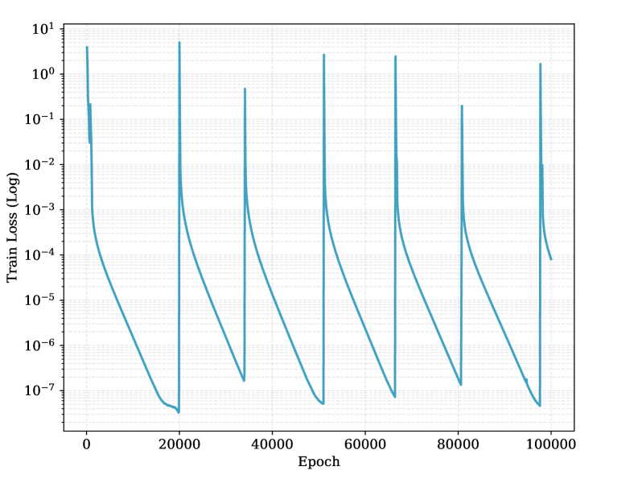


*Рисунок 6: Праща у трансформера на остаточном делении.* **[p. 18]**

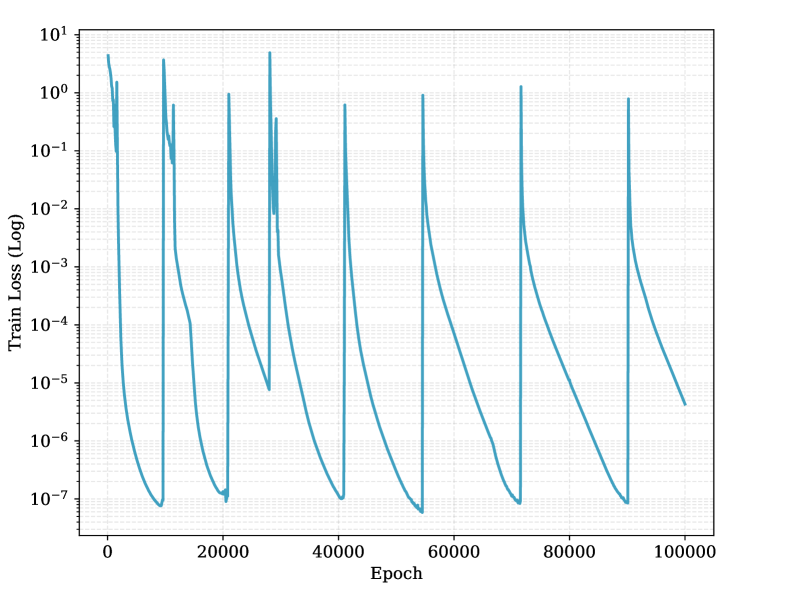


*Рисунок 7: Праща у MLP на остаточном делении.* **[p. 18]**

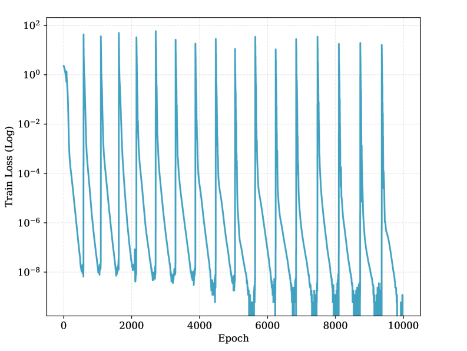


*Рисунок 8: Праща у MLP на CIFAR-10.* **[p. 19]**

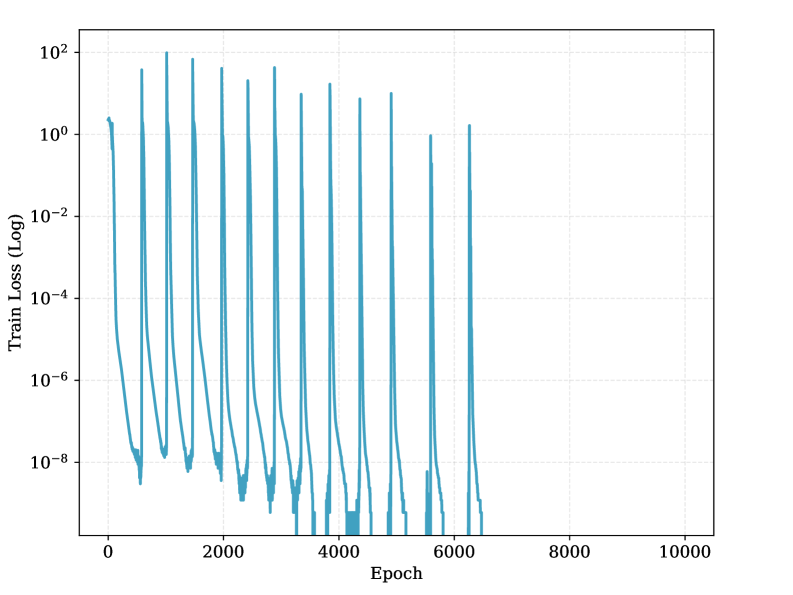

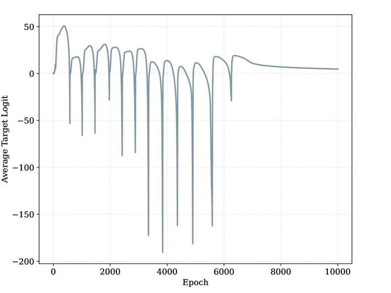

*Рисунок 9: Праща у VGG11 на CIFAR-10.* **[p. 19]**

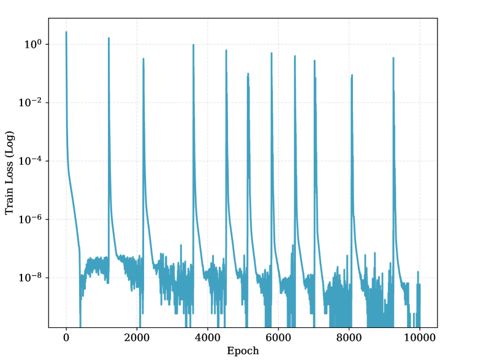

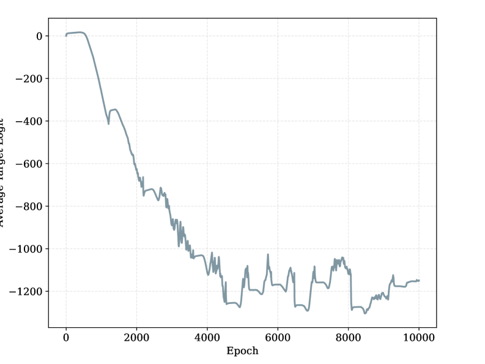

*Рисунок 10: Праща у VGG11 с BN на CIFAR-10.* **[p. 19]**


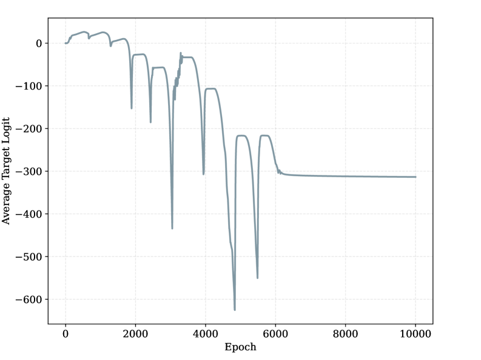

*Рисунок 11: Праща у ViT на CIFAR-10.* **[p. 19]**


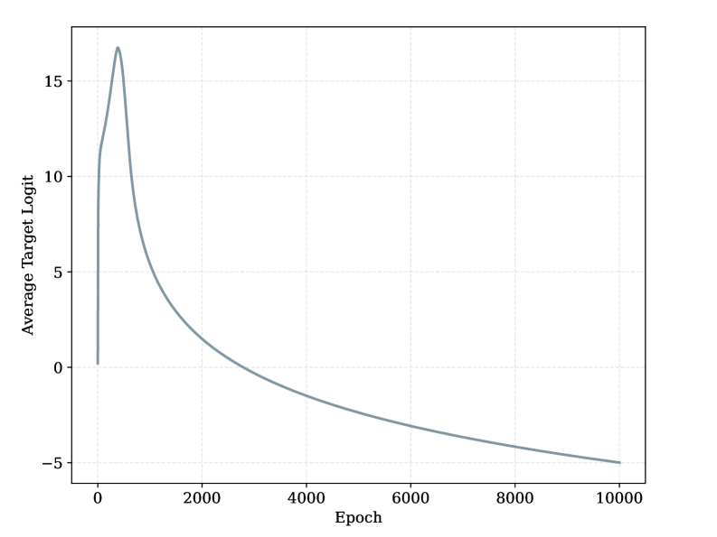

*Рисунок 12: У ResNet18 на CIFAR-10 пращи нет.* **[p. 20]**

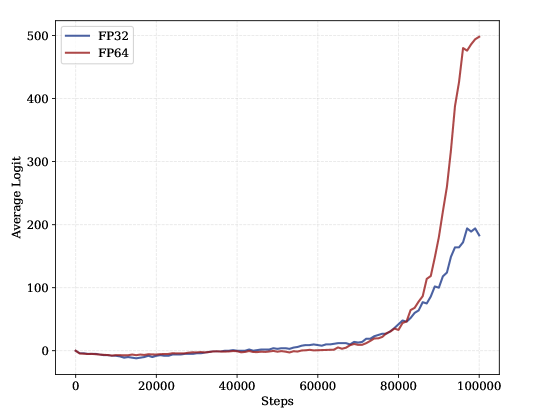

*Рисунок 13: Средний логит при разной точности в обучении большой языковой модели.* **[p. 20]**

**[p. 20]**

## Приложение C Доказательства

### C.1 Доказательство теоремы 3.4

В этом разделе мы даём подробный вывод теоремы 3.4, показывая, как ошибки поглощения с плавающей точкой (схлопывание softmax) вместе с геометрией нейронного коллапса наводят предопределённый снос общего среднего весов.

#### C.1.1 Предварительные сведения и допущения

Мы рассматриваем задачу распознавания с $K$ родами, пачкой размера $B$ и скоростью обучения $\eta$. Пусть $(\bm{x},y)$ означает пару «вход — метка», а $\bm{h}\in\mathbb{R}^{d}$ — вектор признаков для $\bm{x}$. Логиты задаются как $\bm{z}=\bm{W}\bm{h}$, где $\bm{W}\in\mathbb{R}^{K\times d}$.

Мы полагаем, что модель находится в состоянии приближённого нейронного коллапса (NC), удовлетворяя:

- **NC1:** признаки схлопываются к средним родов: $\bm{h}_{k,i}\approx\bm{\mu}_{k}=\bm{\mu}_{G}+\bm{\mu}_{k}^{*}$.
- **NC2:** средоточенные средние родов $\bm{\mu}_{k}^{*}$ образуют симплексный ETF, удовлетворяя $\langle\bm{\mu}_{p}^{*},\bm{\mu}_{q}^{*}\rangle=-\frac{1}{K-1}\|\bm{\mu}^{*}\|^{2}$ при $p\neq q$.
- **NC3:** разделяющие векторы сонаправлены с признаками: $\bm{W}_{k}\propto\bm{\mu}_{k}^{*}$, откуда $\|\bm{W}_{k}\|=\|\bm{W}\|$ и $\langle\bm{W}_{p},\bm{W}_{q}\rangle=-\frac{1}{K-1}\|\bm{W}\|^{2}$ для средоточенных весов.

**[p. 21]**

#### C.1.2 Нарушение условия нулевой суммы

Градиент потери перекрёстной энтропии $\mathcal{L}$ по $k$-му весу разделяющего слоя $\bm{W}_{k}$ для одного примера $(\bm{x},y)$ равен:

$$
\nabla_{\bm{W}_{k}}\mathcal{L}=(\hat{y}_{k}-y_{k})\bm{h} \tag{13}
$$

где $y_{k}$ есть однобитная метка (1 при $k=r$, иначе 0), а $\hat{y}_{k}$ — вероятность из softmax.

Рассмотрим градиент общего среднего весов $\bm{W}_{G}=\frac{1}{K}\sum_{k=1}^{K}\bm{W}_{k}$. Суммируя градиенты по всем родам:

$$
\nabla_{\bm{W}_{G}}\mathcal{L}=\frac{1}{K}\sum_{k=1}^{K}(\hat{y}_{k}-y_{k})\bm{h}=\frac{1}{K}\left(\underbrace{\sum_{k=1}^{K}\hat{y}_{k}}_{1}-\underbrace{\sum_{k=1}^{K}y_{k}}_{1}\right)\bm{h}=0 \tag{14}
$$

В идеальной арифметике $\bm{W}_{G}$ получает нулевой градиент и остаётся неподвижным.

#### C.1.3 Случай схлопывания softmax (SC)

При SC, как определено в разделе 3, ошибка поглощения с плавающей точкой возникает при вычислении вклада верного рода $r$ в потерю. А именно, член $\hat{y}_{r}-1$ численно округляется до $0$, ибо предел точности не позволяет вычесть малый остаток $(1-\hat{y}_{r})$ из большой мантиссы единицы. Тем самым сумма становится такой:

$$
\sum_{k=1}^{K}\nabla_{\bm{W}_{k}}\mathcal{L} =(\hat{y}_{r}-y_{r})\bm{h}+\sum_{k\neq r}(\hat{y}_{k}-0)\bm{h} \\
\approx 0\cdot\bm{h}+\sum_{k\neq r}\hat{y}_{k}\bm{h} \\
=\epsilon\bm{h} \tag{15}
$$

где $\epsilon=\sum_{k\neq r}\hat{y}_{k}>0$ есть полная вероятностная масса, отданная неверным родам.

#### C.1.4 Оценка остатка $\epsilon$

Полагая, что модель находится в состоянии NC, мы можем приблизить $\hat{y}_{k}$ для неверных родов ($k\neq r$) через геометрию ETF. Вероятность задаётся как $\hat{y}_{k}\approx\exp(z_{k}-z_{r})$. Пользуясь сонаправленностью NC3, для примера рода $r$:

- верный логит: $z_{r}=\langle\bm{W}_{r},\bm{h}\rangle\approx\|\bm{W}\|\|\bm{\mu}^{*}\|$;
- неверный логит ($k\neq r$): $z_{k}=\langle\bm{W}_{k},\bm{h}\rangle\approx\|\bm{W}\|\|\bm{\mu}^{*}\|\cos\theta_{ETF}=-\frac{1}{K-1}\|\bm{W}\|\|\bm{\mu}^{*}\|$.

Подставляя это в показатель:

$$
\hat{y}_{k} \approx\exp\left(-\frac{1}{K-1}\|\bm{W}\|\|\bm{\mu}^{*}\|-\|\bm{W}\|\|\bm{\mu}^{*}\|\right) \\
=\exp\left(-\frac{K}{K-1}\|\bm{W}\|\|\bm{\mu}^{*}\|\right) \tag{18}
$$

Суммируя по $K-1$ неверным родам:

$$
\epsilon=\sum_{k\neq r}\hat{y}_{k}\approx(K-1)\exp\left(-\frac{K}{K-1}\|\bm{W}\|\|\bm{\mu}^{*}\|\right) \tag{20}
$$

#### C.1.5 Сведение по пачке и снос

Наконец, рассмотрим правило обновления $\bm{W}_{G}$ на пачке размера $B$ при скорости обучения $\eta$. Мы полагаем, что потеря усредняется.

$$
\Delta\bm{W}_{G}=-\eta\left(\frac{1}{B}\sum_{i=1}^{B}\nabla_{\bm{W}_{G}}^{(i)}\mathcal{L}\right) \tag{21}
$$

Подставляя остаточный градиент $\sum_{k}\nabla_{\bm{W}_{k}}^{(i)}\mathcal{L}=\epsilon_{i}\bm{h}_{i}$ и замечая, что $\nabla_{\bm{W}_{G}}=\frac{1}{K}\sum_{k}\nabla_{\bm{W}_{k}}$:

$$
\Delta\bm{W}_{G}=-\frac{\eta}{KB}\sum_{i=1}^{B}\epsilon_{i}\bm{h}_{i} \tag{22}
$$

**[p. 22]**

Полагая $\epsilon_{i}\approx\epsilon$ примерно постоянным по пачке (в силу NC), сосредоточимся на сумме признаков $\sum\bm{h}_{i}$. При NC1 (схлопывании признаков) и уравновешенном по родам наборе данных:

$$
\mathbb{E}\left[\sum_{i=1}^{B}\bm{h}_{i}\right]=\sum_{k=1}^{K}\frac{B}{K}\bm{\mu}_{k}=\sum_{k=1}^{K}\frac{B}{K}(\bm{\mu}_{G}+\bm{\mu}_{k}^{*}) \tag{23}
$$

Поскольку средоточенные средние $\bm{\mu}_{k}^{*}$ образуют ETF, имеем $\sum_{k}\bm{\mu}_{k}^{*}=\mathbf{0}$. Тем самым:

$$
\mathbb{E}\left[\sum_{i=1}^{B}\bm{h}_{i}\right]=B\bm{\mu}_{G} \tag{24}
$$

Подставляя это обратно в выражение для обновления:

$$
\mathbb{E}[\Delta\bm{W}_{G}]=-\frac{\eta\epsilon}{KB}(B\bm{\mu}_{G})=-\frac{\eta\epsilon}{K}\bm{\mu}_{G} \tag{25}
$$

**Вывод:** при схлопывании softmax общий весовой вектор $\bm{W}_{G}$ непрерывно сносится в направлении, противоположном общему среднему признаков $\bm{\mu}_{G}$, чем и доказывается теорема 3.4.

### C.2 Доказательство утверждения 3.6

В этом разделе мы даём вывод утверждения 3.6. Мы разбираем поток градиента обратно к слою признаков в режиме схлопывания softmax (SC) при снесённых весах.

#### C.2.1 Разложение градиента

Градиент потери $\mathcal{L}$ по вектору признаков $\bm{h}$ задаётся так:

$$
\nabla_{\bm{h}}\mathcal{L}=\bm{W}^{T}(\hat{\bm{y}}-\bm{y})=\sum_{k=1}^{K}(\hat{y}_{k}-y_{k})\bm{W}_{k} \tag{26}
$$

Мы раскладываем весовые векторы на общее среднее и средоточенные составляющие: $\bm{W}_{k}=\bm{W}_{G}+\bm{W}_{k}^{*}$. Подставляя это в градиент:

$$
\nabla_{\bm{h}}\mathcal{L}=\sum_{k=1}^{K}(\hat{y}_{k}-y_{k})(\bm{W}_{G}+\bm{W}_{k}^{*}) \tag{27}
$$

#### C.2.2 Приложение схлопывания softmax

При условии SC вклад градиента от верного рода $r$ исчезает (то есть член, отвечающий $(\hat{y}_{r}-1)$, из-за поглощения становится строго равным 0). Для неверных родов $k\neq r$ метка равна $y_{k}=0$. Тем самым сумма упрощается до:

$$
\nabla_{\bm{h}}\mathcal{L}\approx\sum_{k\neq r}\hat{y}_{k}(\bm{W}_{G}+\bm{W}_{k}^{*}) \tag{28}
$$

Эту сумму можно разделить на две составляющие:

$$
\nabla_{\bm{h}}\mathcal{L}=\left(\sum_{k\neq r}\hat{y}_{k}\right)\bm{W}_{G}+\sum_{k\neq r}\hat{y}_{k}\bm{W}_{k}^{*} \tag{29}
$$

Пользуясь определением $\epsilon=\sum_{k\neq r}\hat{y}_{k}$, первый член упрощается до $\epsilon\bm{W}_{G}$.

#### C.2.3 Проекция на направление сноса

Теперь вычислим проекцию этого градиента на направление общего сноса весов $\bm{W}_{G}$. Действие проецирования определяется так:

$$
\text{Proj}_{\bm{W}_{G}}(\nabla_{\bm{h}}\mathcal{L})=\frac{\langle\nabla_{\bm{h}}\mathcal{L},\bm{W}_{G}\rangle}{\|\bm{W}_{G}\|^{2}}\bm{W}_{G} \tag{30}
$$

Сперва вычислим скалярное произведение $\langle\nabla_{\bm{h}}\mathcal{L},\bm{W}_{G}\rangle$:

$$
\langle\nabla_{\bm{h}}\mathcal{L},\bm{W}_{G}\rangle =\left\langle\epsilon\bm{W}_{G}+\sum_{k\neq r}\hat{y}_{k}\bm{W}_{k}^{*},\bm{W}_{G}\right\rangle \\
=\epsilon\langle\bm{W}_{G},\bm{W}_{G}\rangle+\sum_{k\neq r}\hat{y}_{k}\langle\bm{W}_{k}^{*},\bm{W}_{G}\rangle \tag{31}
$$

**[p. 23]**

Мы пользуемся допущением ортогональности, изложенным в теореме 4: общий снос ортогонален средоточенному распознающему подпространству, то есть $\bm{W}_{G}\perp\text{span}\{\bm{W}_{k}^{*}\}$. Поэтому $\langle\bm{W}_{k}^{*},\bm{W}_{G}\rangle=0$ для всех $k$. Скалярное произведение упрощается до:

$$
\langle\nabla_{\bm{h}}\mathcal{L},\bm{W}_{G}\rangle=\epsilon\|\bm{W}_{G}\|^{2} \tag{33}
$$

Подставляя это обратно в выражение для проекции:

$$
\text{Proj}_{\bm{W}_{G}}(\nabla_{\bm{h}}\mathcal{L})=\frac{\epsilon\|\bm{W}_{G}\|^{2}}{\|\bm{W}_{G}\|^{2}}\bm{W}_{G}=\epsilon\bm{W}_{G} \tag{34}
$$

**Вывод:** вектор признаков $\bm{h}$ получает неизменную ненулевую составляющую градиента $\epsilon\bm{W}_{G}$. Поскольку $\bm{W}_{G}$ сносится к $-\bm{\mu}_{G}$ (по теореме 2), шаг обновления $\bm{h}\leftarrow\bm{h}-\eta\nabla_{\bm{h}}\mathcal{L}$ по сути прибавляет составляющую, сонаправленную с $+\bm{\mu}_{G}$, чем и движет численное раздувание признаков.

### C.3 Доказательство теоремы 3.7: численное раздувание признаков

В этом разделе мы даём строгое доказательство теоремы 3.7. Мы определяем выстраивание признаков вдоль общего среднего как неизбежное следствие петли обратной связи, установленной в теоремах 3.4 и 3.6.

#### C.3.1 Геометрическая ортогональность

Сперва установим геометрическое отношение общего среднего к распознающему подпространству.

##### **Лемма C.1**(ортогональность общего среднего)**.**

*Для сети с ReLU в состоянии NC с $K$ уравновешенными родами общее среднее $\bm{\mu}_{G}=\frac{1}{K}\sum_{k=1}^{K}\bm{\mu}_{k}$ ортогонально подпространству средоточенных средних родов $\mathcal{S}_{NC}=\text{span}\{\bm{\mu}_{k}^{*}\}_{k=1}^{K}$.*

##### Доказательство.

Dang et al. Dang et al. (2024) доказали, что для сети с ReLU в состоянии NC несредоточенные средние родов $\bm{\mu}_{k}$ взаимно ортогональны ($\bm{\mu}_{p}^{T}\bm{\mu}_{q}=0$ при $p\neq q$) и лежат в первом октанте.

Набор данных уравновешен по родам, так что $\|\bm{\mu}_{k}\|=R$ для всех $k$. Поскольку несредоточенные средние родов $\{\bm{\mu}_{k}\}$ образуют ортогональный основной набор в пространстве признаков (с множителем $R$), можно вычислить квадрат нормы общего среднего:

$$
\|\bm{\mu}_{G}\|^{2}=\left\|\frac{1}{K}\sum_{k=1}^{K}\bm{\mu}_{k}\right\|^{2}=\frac{1}{K^{2}}\sum_{k=1}^{K}\|\bm{\mu}_{k}\|^{2}=\frac{1}{K^{2}}\cdot KR^{2}=\frac{R^{2}}{K} \tag{35}
$$

Далее вычислим проекцию любого среднего рода $\bm{\mu}_{k}$ на общее среднее:

$$
\langle\bm{\mu}_{G},\bm{\mu}_{k}\rangle=\frac{1}{K}\sum_{j=1}^{K}\langle\bm{\mu}_{j},\bm{\mu}_{k}\rangle=\frac{1}{K}\|\bm{\mu}_{k}\|^{2}=\frac{R^{2}}{K} \tag{36}
$$

при этом перекрёстные члены $\langle\bm{\mu}_{j},\bm{\mu}_{k}\rangle$ при $j\neq k$ исчезают. Средоточенные средние родов определены как $\bm{\mu}_{k}^{*}=\bm{\mu}_{k}-\bm{\mu}_{G}$. Вычисляя скалярное произведение с $\bm{\mu}_{G}$:

$$
\langle\bm{\mu}_{G},\bm{\mu}_{k}^{*}\rangle=\langle\bm{\mu}_{G},\bm{\mu}_{k}-\bm{\mu}_{G}\rangle=\langle\bm{\mu}_{G},\bm{\mu}_{k}\rangle-\|\bm{\mu}_{G}\|^{2}=\frac{R^{2}}{K}-\frac{R^{2}}{K}=0 \tag{37}
$$

Поскольку $\bm{\mu}_{G}$ ортогонально всякому основному вектору $\bm{\mu}_{k}^{*}$ подпространства $\mathcal{S}_{NC}$, отсюда следует $\bm{\mu}_{G}\perp\text{span}\{\bm{\mu}_{k}^{*}\}$. ∎

#### C.3.2 Предельное выстраивание через связанную динамику

Мы рассматриваем изменение общего среднего весов $\bm{W}_{G}$ и общего среднего признаков $\bm{\mu}_{G}$ как связанную линейную динамическую систему в $\mathbb{R}^{d}$.

Выведем правила обновления этих векторов.

- Из теоремы 3.4 обновление среднего весов таково:

$$
\bm{W}_{G}^{(t+1)}=\bm{W}_{G}^{(t)}-\alpha\bm{\mu}_{G}^{(t)} \tag{38}
$$

 где $\alpha=\frac{\eta\epsilon}{K}>0$.
- Из утверждения 3.6 градиенты признаков содержат составляющую, сонаправленную с нынешним средним весов. Полагая, что строение ETF ведёт к взаимному погашению ортогональных составляющих при усреднении по пачке (то есть $\sum_{k}\bm{W}_{k}^{*}\approx 0$), обновление среднего признаков определяется главным образом так:

$$
\bm{\mu}_{G}^{(t+1)}=\bm{\mu}_{G}^{(t)}-\beta\bm{W}_{G}^{(t)} \tag{39}
$$

 где $\beta=\eta\epsilon>0$.

Пусть $\bm{u}^{(t)}=\begin{bmatrix}\bm{W}_{G}^{(t)}\\ \bm{\mu}_{G}^{(t)}\end{bmatrix}$ **[p. 24]** есть вектор состояния в произведении пространств $\mathbb{R}^{2d}$. Динамикой управляет блочная матрица $\mathbf{M}$:

$$
\begin{bmatrix}\bm{W}_{G}^{(t+1)}\\
\bm{\mu}_{G}^{(t+1)}\end{bmatrix}=\begin{bmatrix}I&-\alpha I\\
-\beta I&I\end{bmatrix}\begin{bmatrix}\bm{W}_{G}^{(t)}\\
\bm{\mu}_{G}^{(t)}\end{bmatrix} \tag{40}
$$

где $I$ есть единичная матрица $d\times d$.

У $\mathbf{M}$ два собственных значения:

$$
\lambda_{1}=1+\sqrt{\alpha\beta}=1+\eta\epsilon/\sqrt{K}>1 \\
\lambda_{2}=1-\sqrt{\alpha\beta}=1-\eta\epsilon/\sqrt{K}<1 \tag{41}
$$

Решая $\mathbf{M}\bm{v}=\lambda\bm{v}$:

1. Для $\lambda_{1}$:

$$
v_{W}-\alpha v_{\mu}=(1+\sqrt{\alpha\beta})v_{W}\implies-\alpha v_{\mu}=\sqrt{\alpha\beta}v_{W}\implies\bm{W}_{G}=-\frac{1}{\sqrt{K}}\bm{\mu}_{G} \tag{43}
$$
2. Для $\lambda_{2}$ имеем $\bm{W}_{G}=\frac{1}{\sqrt{K}}\bm{\mu}_{G}$.

Вектор состояния можно записать как линейное сочетание собственных векторов:

$$
\bm{u}^{(t)}=c_{1}\lambda_{1}^{t}\begin{bmatrix}-\frac{1}{\sqrt{K}}\bm{\mu}_{G}\\
\bm{\mu}_{G}\end{bmatrix}+c_{2}\lambda_{2}^{t}\begin{bmatrix}\frac{1}{\sqrt{K}}\bm{\mu}_{G}\\
\bm{\mu}_{G}\end{bmatrix} \tag{44}
$$

При $t\to\infty$ берёт верх член с $\lambda_{1}$, ибо $\lambda_{1}>1$, а $\lambda_{2}<1$:

$$
\lim_{t\to\infty}\bm{u}^{(t)}\propto\begin{bmatrix}-\frac{1}{\sqrt{K}}\bm{\mu}_{G}\\
\bm{\mu}_{G}\end{bmatrix} \tag{45}
$$

Отсюда предельное соотношение:

$$
\lim_{t\to\infty}\bm{W}_{G}^{(t)}\approx-\frac{1}{\sqrt{K}}\bm{\mu}_{G}^{(t)} \tag{46}
$$

Тем самым векторы предельно выстраиваются согласно соотношению, задаваемому господствующим собственным вектором:

$$
\lim_{t\to\infty}\cos(\bm{W}_{G}^{(t)},\bm{\mu}_{G}^{(t)})=-1 \tag{47}
$$

А нормы растут показательно:

$$
\|\bm{W}_{G}^{(t)}\| \propto(1+\frac{\eta\epsilon}{\sqrt{K}})^{t} \\
\|\bm{\mu}_{G}^{(t)}\| \propto(1+\frac{\eta\epsilon}{\sqrt{K}})^{t} \tag{48}
$$

#### C.3.3 Численное раздувание признаков ($\mathcal{NFI}$)

Наконец, докажем второе утверждение: признаки сгущаются к $\bm{\mu}_{G}$. Мы раскладываем обновление признака $\Delta\bm{h}$ на составляющую вдоль $\bm{\mu}_{G}$ и составляющую, перпендикулярную ей и лежащую в подпространстве $\mathcal{S}_{NC}$. Из утверждения 3.6 составляющая градиента вдоль направления сноса такова:

$$
\bm{g}_{\parallel}=\text{Proj}_{\bm{\mu}_{G}}(\nabla_{\bm{h}}\mathcal{L})=\epsilon\bm{W}_{G} \tag{50}
$$

Ввиду итога раздела C.3.2 при больших $t$ можно приблизить $\bm{W}_{G}\approx-\|\bm{W}_{G}\|\frac{\bm{\mu}_{G}}{\|\bm{\mu}_{G}\|}$. Шаг обновления по градиенту $h\leftarrow h-\eta\nabla_{h}\mathcal{L}$ прибавляет составляющую:

$$
\Delta h_{\parallel}=-\eta(\epsilon\bm{W}_{G})\approx\eta\epsilon\|\bm{W}_{G}\|\frac{\bm{\mu}_{G}}{\|\bm{\mu}_{G}\|} \tag{51}
$$

Для перпендикулярной составляющей, при NC3*′*, градиент есть взвешенная сумма средоточенных весов ETF:

$$
\bm{g}_{\perp}=\sum_{k\neq r}\hat{y}_{k}\bm{W}_{k}^{*} \tag{52}
$$

В расположении ETF векторы $\bm{W}_{k}^{*}$ в сумме дают ноль. Взвешенная сумма $\bm{g}_{\perp}$ есть остаточное взаимное влияние. Величина сонаправленного обновления определяется скалярной суммой вероятностей $\epsilon=\sum\hat{y}_{k}$, тогда как **[p. 25]** перпендикулярное обновление есть векторная сумма случайно направленных симплексных векторов с весами $\hat{y}_{k}\approx\epsilon/(K-1)$. Сверяя скорости роста:

$$
\frac{\|\Delta\bm{h}_{\parallel}\|}{\|\Delta\bm{h}_{\perp}\|}=\frac{\|\epsilon\bm{W}_{G}\|}{\|\sum_{k\neq r}\hat{y}_{k}\bm{W}_{k}^{*}\|}\approx\frac{\epsilon\|\bm{W}_{G}\|}{\sqrt{K-1}\frac{\epsilon}{K-1}\|\bm{W}^{*}\|}\propto\frac{\|\bm{W}_{G}\|}{\|\bm{W}^{*}\|} \tag{53}
$$

Поскольку $\|\bm{W}_{G}\|$ растёт показательно из-за петли обратной связи, а $\|\bm{W}^{*}\|$ (отвечающее неподвижному распознающему строению) растёт линейно или остаётся ограниченным относительно сноса, сонаправленная составляющая берёт верх. Поэтому

$$
\lim_{t\to\infty}\frac{\|\bm{h}_{\perp}\|}{\|\bm{h}_{\parallel}\|}\to 0\implies\lim_{t\to\infty}\cos(\bm{h}_{t},\bm{\mu}_{G})\to 1 \tag{54}
$$

Это подтверждает, что пространство признаков по сути схлопывается в подпространство ранга 1, сонаправленное с общим средним.

### C.4 Доказательство теоремы A.1

В этом разделе мы даём подробное доказательство теоремы A.1, показывая, что наибольшее собственное значение гессиана по параметрам модели сходится к нулю по мере приближения модели к решению с полной подгонкой.

Гессиан потери по параметрам $H_{\theta}=\nabla^{2}_{\theta}\mathcal{L}$ можно разложить на обобщённый член Гаусса — Ньютона (GGN) и остаточный член Papyan (2020):

$$
H_{\theta}=\underbrace{J^{T}H_{z}J}_{G(\theta)}+\underbrace{\sum_{k=1}^{K}(\nabla_{z}\mathcal{L})_{k}\nabla^{2}_{\theta}z_{k}}_{E(\theta)} \tag{55}
$$

где $J=\nabla_{\theta}z\in\mathbb{R}^{K\times d}$ есть матрица Якоби логитов, а $H_{z}=\nabla^{2}_{z}\mathcal{L}\in\mathbb{R}^{K\times K}$ — гессиан потери по логитам. Схождение этих двух членов мы разбираем порознь.

#### C.4.1 Разбор члена Гаусса — Ньютона $G(\theta)$

Для потери перекрёстной энтропии с softmax гессиан по логитам задаётся явно:

$$
H_{z}=\text{diag}(\hat{y})-\hat{y}\hat{y}^{T} \tag{56}
$$

где $\hat{y}=\text{softmax}(z)$ есть вектор предсказанных вероятностей. Поскольку $H_{z}$ неотрицательно определён, его спектральная норма (наибольшее собственное значение) ограничена его следом:

$$
\|H_{z}\|_{2}=\lambda_{\max}(H_{z})\leq\text{tr}(H_{z})=\sum_{k=1}^{K}(\hat{y}_{k}-\hat{y}_{k}^{2})=1-\|\hat{y}\|_{2}^{2} \tag{57}
$$

На поздней поре обучения, полагая, что модель вошла в режим полной подгонки, предсказание $\hat{y}$ сходится к однобитному вектору метки $y$. Поскольку $\|y\|_{2}^{2}=1$, имеем:

$$
\lim_{\hat{y}\to y}\|H_{z}\|_{2}\leq\lim_{\hat{y}\to y}(1-\|\hat{y}\|_{2}^{2})=0 \tag{58}
$$

Пользуясь подмультипликативностью матричной нормы, норма члена GGN ограничена так:

$$
\|G(\theta)\|_{2}=\|J^{T}H_{z}J\|_{2}\leq\|J\|_{2}^{2}\|H_{z}\|_{2} \tag{59}
$$

Полагая якобиан $J$ ограниченным в местной области схождения (то есть $\exists M_{1}>0$ такое, что $\|J\|_{2}\leq M_{1}$), получаем:

$$
\lim_{\hat{y}\to y}\|G(\theta)\|_{2}=0 \tag{60}
$$

#### C.4.2 Разбор остаточного члена $E(\theta)$

Градиент потери по логитам есть ошибка предсказания: $\nabla_{z}\mathcal{L}=\hat{y}-y$. Остаточный член раскрывается так:

$$
E(\theta)=\sum_{k=1}^{K}(\hat{y}_{k}-y_{k})\nabla^{2}_{\theta}z_{k} \tag{61}
$$

Прилагая неравенство треугольника:

$$
\|E(\theta)\|_{2}\leq\sum_{k=1}^{K}|\hat{y}_{k}-y_{k}|\cdot\|\nabla^{2}_{\theta}z_{k}\|_{2} \tag{62}
$$

Положим, что действие сети $z(\theta)$ непрерывно по классу $C^{2}$ и её вторые производные местно ограничены (то есть $\exists M_{2}>0$ такое, что $\|\nabla^{2}_{\theta}z_{k}\|_{2}\leq M_{2}$). При $\hat{y}\to y$ член ошибки $|\hat{y}_{k}-y_{k}|\to 0$ для всех родов $k$. Отсюда:

$$
\lim_{\hat{y}\to y}\|E(\theta)\|_{2}=0 \tag{63}
$$

#### Вывод

Соединяя границы обоих членов:

$$
\|H_{\theta}\|_{2}\leq\|G(\theta)\|_{2}+\|E(\theta)\|_{2} \tag{**[p. 26]** 64}
$$

Поскольку и $\|G(\theta)\|_{2}\to 0$, и $\|E(\theta)\|_{2}\to 0$ по мере схождения модели к решению с полной подгонкой, заключаем, что:

$$
\lim_{\hat{y}\to y}\lambda_{\max}(H_{\theta})=0 \tag{65}
$$

#### C.4.3 Сглаживание меток ведёт к неисчезающему гессиану

В теореме A.1 мы доказали, что при обычной перекрёстной энтропии с жёсткими целями наибольшее собственное значение гессиана $\lambda_{max}\to 0$, ибо вектор предсказанных вероятностей $\hat{y}$ сходится к однобитному. Здесь мы показываем, что сглаживание меток в корне меняет это предельное поведение.

##### **Определение C.2**(сглаживание меток)**.**

Пусть $y$ есть однобитная метка верного рода $r$. Сглаживание меток заменяет $y$ мягкой целью $y^{LS}$:

$$
y^{LS}_{k}=\begin{cases}1-\alpha&\text{if }k=r\\
\frac{\alpha}{K-1}&\text{if }k\neq r\end{cases} \tag{66}
$$

где $\alpha\in(0,1)$ есть параметр сглаживания.

##### Доказательство.

Рассмотрим разложение гессиана по Гауссу — Ньютону, определённое в выражении 55. Основная часть, задающая размах собственных значений гессиана, есть гессиан потери по логитам $H_{z}=\text{diag}(\hat{y})-\hat{y}\hat{y}^{T}$.

В отличие от обычного обучения, где логиты уходят в бесконечность ради уменьшения потери (что ведёт $\hat{y}\to y$), при сглаживании меток всеобщий наименьший исход достигается при конечных значениях логитов, где предсказанное распределение в точности совпадает с мягкой целью:

$$
\lim_{t\to\infty}\hat{y}=y^{LS} \tag{67}
$$

Отсюда для верного рода $r$ предсказание $\hat{y}_{r}$ сходится к $1-\alpha$, а не к $1$.

След $H_{z}$ есть сумма собственных значений (разбросов разрядного распределения):

$$
\text{tr}(H_{z})=\sum_{k=1}^{K}(\hat{y}_{k}-\hat{y}_{k}^{2})=1-\|\hat{y}\|_{2}^{2} \tag{68}
$$

Подставляя предел $\hat{y}\to y^{LS}$:

$$
\lim_{\hat{y}\to y^{LS}}\text{tr}(H_{z}) =1-\left((1-\alpha)^{2}+(K-1)\left(\frac{\alpha}{K-1}\right)^{2}\right) \\
=1-\left((1-\alpha)^{2}+\frac{\alpha^{2}}{K-1}\right) \\
=2\alpha-\alpha^{2}-\frac{\alpha^{2}}{K-1} \\
=\alpha\left(2-\alpha\left(1+\frac{1}{K-1}\right)\right) \tag{69}
$$

Поскольку $\alpha\in(0,1)$, член $2-\alpha\left(1+\frac{1}{K-1}\right)>0$. Поэтому след $H_{z}$ сходится к положительной постоянной:

$$
\lim_{\hat{y}\to y^{LS}}\text{tr}(H_{z})=C_{LS}>0 \tag{73}
$$

Поскольку $H_{z}$ неотрицательно определён, его наибольшее собственное значение снизу ограничено средним собственным значением:

$$
\lambda_{\max}(H_{z})\geq\frac{\text{tr}(H_{z})}{K}=\frac{C_{LS}}{K}>0 \tag{74}
$$

Тем самым член Гаусса — Ньютона удовлетворяет:

$$
\|G(\theta)\|_{2}=\|J^{T}H_{z}J\|_{2}\geq\|J\|_{2}^{2}\cdot\frac{C_{LS}}{K}>0 \tag{75}
$$

Полагая, что якобиан $J$ остаётся отделённым от нуля, заключаем, что:

$$
\lim_{t\to\infty}\lambda_{\max}(H_{\theta})\geq\lim_{t\to\infty}\|G(\theta)\|_{2}>0 \tag{76}
$$

Поэтому при сглаживании меток наибольшее собственное значение гессиана не исчезает, что подтверждает: $\lambda_{\max}(H_{\theta})$ сходится к положительной постоянной, а не к нулю. ∎

**[p. 27]**

## Приложение D Подробности опытов

###### p27-1

Все опыты поставлены на видеоускорителях NVIDIA RTX5090. Для опытов с остаточной арифметикой и CIFAR-10 один прогон занимает около 1 часа. Для опытов с большими языковыми моделями — около 12 часов.

### D.1 Остаточная арифметика

###### p27-2

В опытах с остаточной арифметикой мы сосредоточиваемся на задаче остаточного деления. При простом $p=97$ модель обучается предсказывать $c=(a\cdot b^{-1})\pmod{p}$ для всех пар $a\in\{0,\dots,p-1\}$ и $b\in\{1,\dots,p-1\}$.

#### Набор данных и задача

Набор данных состоит из $p(p-1)$ примеров. Каждый вход записан как последовательность из четырёх лексем: $[a,\text{OP},b,=]$, где OP означает знак деления. Объём словаря равен $p+2$ с учётом знака действия и знака равенства. Мы делим данные пополам на обучающую и проверочную части.

#### Устройства моделей

Мы оцениваем два основных устройства: трансформер только с раскодировщиком и глубокую MLP.

- **Трансформер** Vaswani et al. (2017): двухслойный трансформер только с раскодировщиком. Каждый слой состоит из многоголового самовнимания с $n_{head}=4$ и прямопроходной сети (FFN) со скрытой размерностью $4\times d_{model}$. Модель берёт $d_{model}=128$. В наших основных опытах без сглаживания послойная нормировка отключена, чтобы выделить пращевую динамику.
- **MLP**: шестислойная полносвязная сеть. Устройство включает 5 скрытых слоёв шириной 512 с возбуждением ReLU и завершающий линейный разделяющий слой. Вход подаётся как развёрнутые однобитные коды последовательности лексем. Члены смещения включены во все линейные слои.

#### Обучение и оптимизация

Все модели обучаются приёмом оптимизации Adam с потерей перекрёстной энтропии. В опытах для сравнения явного сглаживания не прилагается.

*Таблица 2: Настройки опытов с остаточной арифметикой* **[p. 27]**

| **Настройка** | **Значение** |
|---|---|
| Простое $p$ | 97 |
| Приём оптимизации | Adam |
| Скорость обучения | $10^{-3}$ |
| Шагов разогрева | 10 |
| $\beta_{1},\beta_{2}$ | 0.9, 0.999 |
| $\varepsilon$ (Adam) | $10^{-8}$ |
| Ослабление весов | 0.0 |
| Размер пачки | 512 |
| Всего шагов | 100,000 |
| Численная точность | Float32 |
| Случайное семя | 42 |

### D.2 Распознавание изображений (CIFAR-10)

Для задач распознавания изображений мы проверяем пращевой ход на наборе данных CIFAR-10.

#### Набор данных и предобработка

В согласии с прежними работами о пращевом ходе мы пользуемся набором CIFAR-10. Для оценивания мы берём неподвижный тестовый набор из 1000 примеров. Изображения обращаются в тензоры обычным действием transforms.ToTensor() без добавочного расширения данных, чтобы динамика оптимизации оставалась предопределённой и сосредоточенной на численных свойствах ландшафта потерь.

#### Устройства моделей

Мы ставим опыты на четырёх различных устройствах, чтобы проверить всеобщность $\mathcal{NFI}$:

- **MLP**: шестислойная полносвязная сеть. Устройство включает 5 скрытых слоёв шириной 512 с возбуждением ReLU и завершающий линейный разделяющий слой.
- **ResNet18** He et al. (2016): изменённое устройство ResNet18, приспособленное к разрешению $32\times 32$ у CIFAR-10. Первый свёрточный слой заменён ядром $3\times 3$ (шаг 1, отступ 1), а начальный слой наибольшего объединения удалён, чтобы предотвратить чрезмерное пространственное сжатие в ранних слоях.
- **VGG11** Simonyan and Zisserman (2015): **[p. 28]** обычное устройство VGG11, оцениваемое и с пачечной нормировкой, и без неё. Распознающая голова упрощена до одного линейного слоя, чтобы соответствовать разделу «признаки — разделитель» в нашей теоретической модели.
- **ViT** Dosovitskiy et al. (2021): малый зрительный трансформер примерно на 10 млн параметров. Он берёт лоскут размера 4, размерность вложения 256, 12 трансформерных блоков и 8 голов внимания.

#### Обучение и оптимизация

Все модели обучаются 10 000 эпох приёмом оптимизации Adam. Чтобы выделить действие $\mathcal{NFI}$, мы полагаем ослабление весов нулевым и берём обычную потерю перекрёстной энтропии без сглаживания меток.

*Таблица 3: Настройки распознавания изображений на CIFAR-10* **[p. 28]**

| **Настройка** | **Значение** |
|---|---|
| Приём оптимизации | Adam |
| Скорость обучения | $10^{-3}$ |
| $\beta_{1},\beta_{2}$ | 0.9, 0.95 |
| $\varepsilon$ (Adam) | $10^{-8}$ |
| Ослабление весов | 0.0 |
| Сглаживание меток | 0.0 |
| Размер пачки | 2048 для ViT, полная выборка для прочих |
| Всего эпох | 10,000 |
| Численная точность | Float32 |
| Случайное семя | 42 |

**[p. 29]**

### D.3 Большие языковые модели

Для опытов с языковым моделированием мы берём трансформер только с раскодировщиком в духе nanoGPT. Мы возможно точнее следуем опытной постановке Stollenwerk et al. Stollenwerk et al. (2026), включая приём оптимизации, устройство, точность, расписание обучения и настройки обработки данных. Мы не меняем самого порядка обучения, а лишь добавляем измерения, нужные для нашего разбора: долю лексем в схлопывании softmax, среднее и норму выходных логитов, общее среднее выходного вложения $\bm{W}_{G}$ и действие удаления $\bm{W}_{G}$ при оценивании или обучении. Основные настройки сведены в таблице 4.

*Таблица 4: Настройки опытов с языковым моделированием.* **[p. 29]**

| **Настройка** | **Значение** |
|---|---|
| приём оптимизации | AdamW |
| $\beta_{1}$ | $0.9$ |
| $\beta_{2}$ | $0.95$ |
| $\varepsilon_{\mathrm{Adam}}$ | $10^{-8}$ |
| ослабление весов | $0.0$ |
| зажим градиента | $1.0$ |
| dropout | $0.0$ |
| связывание весов | нет |
| QK-послойная нормировка | да |
| смещение | нет |
| расписание скорости обучения | косинусное убывание |
| наименьшая скорость обучения | $10^{-5}$ |
| нормировка | LayerNorm |
| точность | BF16 |
| позиционное вложение | RoPE |
| объём словаря | $50304$ |
| скрытое возбуждение | SwiGLU |
| длина последовательности | $2048$ |
| размер пачки (примеров) | $64$ |
| размер пачки (лексем) | $131072$ |
| длительность обучения | $100000$ шагов $\approx 13.1$ млрд лексем |
| разогрев | $5000$ шагов $\approx 0.7$ млрд лексем |
| начальные вложения | нормальные с отклонением $1/\sqrt{d}$ |
| начальные веса | по Ксавье со средним fan_in и fan_out |

---

# Машиночитаемый блок фактов

```yaml
paper:
  id: 2605.06152
  title: "Grokking or Glitching? How Low-Precision Drives Slingshot Loss Spikes"
  authors: [Liu Hanqing, Jianjun Cao, Yuanze Li, Zijian Zhou]
  affiliation: "Tsinghua University; The University of Tokyo"
  date: 2026-05
  venue: "препринт arXiv (v3), вёрстка ICML"
  citations: 0
  source: native-html-v3
  role_in_corpus: "соседняя ветвь: пращевой ход как численный отказ,
    сопутствующий гроккингу при обучении без ослабления весов"

core_claim:
  name: "численное раздувание признаков (NFI)"
  thesis: "пращевые всплески потери суть след ограниченной разрядности мантиссы,
    а не свойство внутренней динамики оптимизации"
  chain:
    - "высокая уверенность -> отступ логитов превосходит порог поглощения"
    - "градиент верного рода округляется до нуля (схлопывание softmax)"
    - "градиенты неверных родов ненулевые -> нарушено условие нулевой суммы"
    - "снос общего среднего весов к -mu_G и среднего признаков к -W_G"
    - "петля обратной связи: показательный рост норм, косинус -> -1"
    - "отступ отдельных примеров падает ниже порога -> градиент возвращается"
    - "раздутая действующая скорость Adam -> огромный шаг -> всплеск потери"
  threshold: "для float32: z_m - max_{k != m} z_k > 23 ln 2 = 16"

setup:
  modular: "остаточное деление, p=97; двухслойный трансформер и шестислойная MLP"
  vision: "CIFAR-10; MLP, VGG11 (с BN и без), ViT, ResNet18; полная выборка"
  language: "nanoGPT на 110 млн параметров, набор FineWeb, BF16"
  common: "потеря CE, нулевое ослабление весов, Adam, семя 42"
  hardware: "NVIDIA RTX5090; прогон 1 час (зрение), 12 часов (язык)"

results:
  precision: "float64 в вычислении логитов и потери устраняет всплески"
  projection: "проекция градиента логитов на нулевую сумму устраняет всплески"
  alignment: "cos(W_G, mu_G) -> -1, нормы растут как (1 + eta*eps/sqrt(K))^t"
  update_spike: "предсказано 4e-4, наблюдаются две вершины около +-4e-4
    против 1e-5 до всплеска"
  optimizer: "GD со скоростью 1e5 даёт всплеск на той же эпохе; подвижность не нужна"
  exception: "ResNet18 пращи не даёт: eps убывает слишком быстро"
  underflow: "исключено зажимом логитов (разность не больше 100)"
  dataset_size: "всплески на всех объёмах CIFAR-10, включая полный набор"
  learning_rate: "меньшая скорость обучения запускает пращи чаще"
  llm: "около 4000 из 1.3e5 лексем на шаг имеют ровно нулевую потерю;
    средний логит 183 (float32) против 498 (float64) — здесь точность
    рост логитов не уменьшает"

mitigations:
  works: [float64 в потере, "epsilon Adam = 1e-5", BatchNorm перед разделителем,
    вычитание W_G, проекция на нулевую сумму]
  fails: [LayerNorm перед разделителем]
  side_effect: "сглаживание меток убирает NFI, но уводит в режим EOS
    (гессиан перестаёт исчезать)"

eos_separation:
  theorem: "при CE с жёсткими метками lambda_max(H) -> 0 в пределе полной подгонки"
  experiment: "узкая сеть (d=20): в float64 ранние колебания EOS остаются,
    поздние пращи исчезают"

reproduction_note:
  target: "Wortsman et al. 2024 — расхождение выходных логитов к минус бесконечности"
  outcome: "не воспроизведено ни в PyTorch, ни в NanoDo (JAX/Flax)"
  observed_instead: "расхождение к плюс бесконечности, как у Stollenwerk et al. 2026"

findings:
  - id: 1
    claim: "праща устраняется переводом вычисления потери в float64"
    anchor: p5-1
  - id: 2
    claim: "нарушение условия нулевой суммы — необходимое звено петли"
    anchor: p7-3
  - id: 3
    claim: "Adam не причина, а усилитель: величина шага, а не подвижность"
    anchor: p7-7
  - id: 4
    claim: "при CE наибольшее собственное значение гессиана исчезает, значит это не EOS"
    anchor: p16-3
  - id: 5
    claim: "исключение ResNet18 предсказано условием на скорость убывания eps"
    anchor: p7-4

concept_cards:
  slingshot: p5-1
  softmax-collapse: p4-6
  numerical-stability-fix: p2-1
  neural-collapse: p4-9
  optimizer-adam-adamw-sgd: p6-3
  edge-of-stability: p16-3
  grokking: p7-5
  weight-decay: p17-2
  margin-maximization-implicit-bias: p2-3
  loss-landscape-basins: p14-3
  modular-arithmetic: p6-4
  vision-real-world-data-mnist-cifar: p14-1

sources:
  original_html: original/2605.06152.native.html
  converted_text: original/2605.06152.grokking-or-glitching-how-low-precision-drives-slingshot-loss-spikes.md
  images_dir: images/
  pdf: https://arxiv.org/pdf/2605.06152v3

anchors:
  scheme: "pN-M | fig-N | tab-N (token headings, cross-viewer portable)"
  policy: "якоря заводятся только там, где на них ссылаются; разрывы страниц якорей не несут"
  paragraph: [p1-2, p1-3, p1-4, p1-5, p2-1, p2-3, p3-1, p3-2, p3-4, p4-6, p4-7, p4-8, p4-9, p4-10,
    p5-1, p5-4, p5-8, p5-11, p6-3, p6-4, p7-1, p7-3, p7-4, p7-5, p7-7,
    p8-1, p9-1, p9-4, p10-1, p14-1, p14-3, p14-4, p15-7, p16-3, p16-5, p16-6, p16-7,
    p17-2, p17-4, p17-5, p17-6, p17-8, p17-9, p18-2, p27-1, p27-2]
  figure: [fig-1, fig-2, fig-5]
  table: [tab-1]

review_summary:                   # см. раздел «Что показано, а что предположено»
  strong: "главный довод проверяем одной строкой кода (float64 в потере);
    вмешательство бьёт в звено вывода, а не в следствие (проекция на нулевую сумму);
    край устойчивости отделён доказательством и опытом с сосуществованием;
    исключение ResNet18 объяснено внутри теории;
    неудачное воспроизведение чужого итога изложено открыто"
  weak: "весь вывод опирается на неизмеренное допущение нейронного коллапса;
    условие ортогональности W_G взято как допущение, а лемма доказывает его
    лишь для средних признаков; вынесенный в заглавие вопрос ответа не получает;
    связь с гроккингом — наблюдение на одной задаче; отклонений по семенам нет;
    опыт с языковой моделью идёт против простой картины"
  authors_own_limits:
    - "разбор ведётся только для предпоследнего слоя и разделителя"
    - "модель неограниченных признаков может не годиться для мелких сетей"
    - "трудности Nanda et al. с наблюдением пращей в мелких сетях согласуются с этим"

translation:
  status: complete
  formula_parity: "display 66/66, inline поблочно совпадает во всех переведённых блоках"
  figures: "28/28"
  pagination: "44 отметки страниц, совпадает с оригиналом"
```
