# Tang, Wang, García-Redondo, Monod 2026 — Topological Signatures of Grokking

См. также: [глобальный индекс понятий](../../concepts/index.md).
arXiv [2605.06352v1](https://arxiv.org/abs/2605.06352), 7 мая 2026. Колонтитул PDF: «Preprint.».

**Yifan Tang** — Imperial College London; yifan.tang23@imperial.ac.uk.
**Qiquan Wang** — Queen Mary University of London; qiquan.wang@qmul.ac.uk.
**Inés García-Redondo** — University of Fribourg; ines.garciaredondo@unifr.ch.
**Anthea Monod** — Imperial College London; a.monod@imperial.ac.uk.

Файлы разбора этой статьи:

- [`2605.06352.topological-signatures-of-grokking.claims.txt`](2605.06352.topological-signatures-of-grokking.claims.txt) — пронумерованные утверждения статьи с пометками разбора.
- [`2605.06352.topological-signatures-of-grokking.license.txt`](2605.06352.topological-signatures-of-grokking.license.txt) — лицензионная запись arXiv для этой статьи.

Схема якорей и правила ссылок на карточку — в [README папки статей](../README.md).

**Карточка-выдержка.** Лицензия статьи (`arxiv-nonexclusive`) не разрешает публикацию копии оригинала и полного перевода, поэтому карточка содержит редакторские секции и цитируемые фрагменты перевода (право цитирования). Полный текст статьи: <https://arxiv.org/abs/2605.06352>.

## Затрагиваемые понятия

**[Гроккинг](../../concepts/grokking.md)** — работа не объясняет явление и не спорит о его причине: она навешивает на него новый измеритель и спрашивает, что при переходе происходит с *формой* облака представлений. Измеритель — устойчивые гомологии (persistent homology, PH), а заявленная подпись названа узко и проверяемо: «резкий рост как максимальной, так и суммарной устойчивости первых гомологий ($H_{1}$)» ([с. 1, абз. 2](#p1-2)). Само явление воспроизведено в привычном виде — все доли обучающих данных выходят на почти идеальную обучающую точность за несколько тысяч шагов, а тестовая поднимается с задержкой, растущей при уменьшении доли: при $\alpha=0.3$ около шагов 15 000–20 000, при $\alpha=0.2$ около 35 000–45 000 ([с. 4, абз. 5](#p4-5)). Существенно для цитирующих, что собственно *определения* шага гроккинга в статье нет — ни порога по точности, ни правила выделения момента перехода, — и все утверждения вида «переход совпадает с гроккингом» опираются на совмещение кривых. Чего в работе нет: механизма — авторы сами пишут, что PH «даёт описательные геометрические сводки, а не механистические объяснения динамики обучения» ([с. 9, абз. 4](#p9-4)); нет и ни одного вмешательства — топологию нигде не навязывают и не подавляют, чтобы проверить, что станет с задержкой. И есть наблюдение, прямо противоположное роли PH как признака-предвестника: взаимная корреляция первых разностей даёт у трансформера устойчивое запаздывание около 1000 шагов, причём изменения тестовой точности **предшествуют** сдвигу статистик PH ([с. 8, абз. 2](#p8-2)) — в аннотации, во введении и в заключении этого нет.

**[Модульная арифметика](../../concepts/modular-arithmetic.md)** — задача одна и взята в самом простом виде: модульное сложение $(a+b)\bmod p$ при $p\in\{113,149,197\}$, полный набор из всех $p^{2}$ пар, вход — двухтокенная последовательность $[a,b]$ ([с. 3, абз. 2](#p3-2)). Именно на круговом строении $\mathbb{Z}/p\mathbb{Z}$ держится вся трактовка: долгоживущая петля в диаграмме устойчивости прочитывается как «складывание структурированной периодической организации» ([рис. 1](#fig-1)). Чего в работе нет: ни умножения, ни некоммутативных групп, ни какой-либо другой алгоритмической задачи — при том, что заявка сформулирована как утверждение о задачах со «скрытым круговым строением» вообще. Проверка того, что подпись исчезает у задачи без такого строения, сделана единственным способом — переносом на MNIST ([с. 8, абз. 3](#p8-3)).

**[Эталонный полигон гроккинга](../../concepts/canonical-grokking-testbed.md)** — постановка заявлена как следование Power et al., но отличий от канона несколько, и часть из них авторы называют сами. Простые взяты свои ($113$, $149$, $197$), доли обучения сужены до $\alpha\in\{0.20,0.25,0.30\}$, бюджет закреплён на $6\times 10^{4}$ шагах, AdamW с lr $3\times 10^{-3}$ и weight decay $\lambda=0.1$, пакет $512$, снимки каждые 500 шагов, пять семян (46–50) ([с. 3, абз. 5](#p3-5), [с. 3, абз. 7](#p3-7)). Устройств два: двухслойный трансформер-кодировщик с pre-layer-norm ($d_{\text{model}}=128$, четыре головы, $d_{ff}=256$, GELU, без dropout) и MLP с общим вложением $128$ и тремя скрытыми слоями ширины $512$ ([с. 3, абз. 4](#p3-4)). Главное расхождение с каноном авторы выносят в отдельный абзац сравнения с Ruppik et al.: там последовательность четырёхтокенная, вида «$a+b=$», здесь — только два входных токена $(a,b)$ ([с. 4, абз. 2](#p4-2)). Последствия этого отличия для сравнимости результатов в работе не проверены. Отдельно ценна редкая для корпуса откровенность в счёте: вся сетка опытов сделана на одном ноутбучном GPU, 8–10 минут на модель, 2 минуты на PH и 6 на LID ([с. 3, абз. 6](#p3-6), [с. 3, абз. 7](#p3-7)); ссылки на код при этом нет.

**[Обучение структурированных представлений](../../concepts/structured-representation-learning.md)** — здесь главный вклад работы в корпус. Облако точек для основной наблюдаемой — строки матрицы токенных вложений, то есть $p$ выученных векторов *до* прибавления позиционных вложений ([с. 3, абз. 9](#p3-9)); к ним добавляются скрытые состояния второго токена после каждого слоя кодировщика. По этим облакам считается фильтрация Vietoris–Rips в степенях 0 и 1 через Ripser, и из диаграмм берутся ровно четыре числа: максимальная и суммарная устойчивость для $H_{0}$ и для $H_{1}$. Утверждение о структуре двойное: количественное — $H_{1}$ max держится на полке $\approx 0.075$–$0.08$ всю фазу запоминания и подскакивает до $0.20$–$0.25$ при генерализации, $H_{1}$ total растёт с $\approx 20$ до $30$–$50$ ([с. 4, абз. 6](#p4-6), [рис. 3](#fig-3)); и качественное — на диаграммах устойчивости одна долгоживущая точка $H_{1}$ всё сильнее отделяется от остальных ([рис. 1](#fig-1)). Та же картина повторена на MLP, что снимает подозрение на привязку к вниманию ([с. 5, абз. 4](#p5-4), [рис. 4](#fig-4)), но с оговоркой о месте: у трансформера подписи PH «сильно сосредоточены в ранних представлениях», а MLP «кодирует топологическое строение глубже по иерархии сети» ([с. 15, абз. 1](#p15-1)). Чего в работе нет: проверки, что петля — именно круг $\mathbb{Z}/p\mathbb{Z}$, а не какой-то другой цикл; ни отображения точек диаграммы на конкретные остатки, ни ошибки гомоморфизма, ни круговой корреляции здесь не считается. И нет оценки устойчивости самой оценки: разброс дан по пяти семенам обучения, но не по подвыборкам облака, а при $p\approx 100$–$200$ точках в 128 измерениях диаграмма $H_{1}$ шумна по построению.

**[Сжатие многообразия представлений](../../concepts/manifold-representation-compression.md)** — работа даёт корпусу редкое прямое сопоставление двух геометрических измерителей на одних прогонах. Локальная внутренняя размерность (LID) оценивается TwoNN по 2000 точкам скрытых состояний второго слоя ([с. 4, абз. 1](#p4-1)) и ведёт себя зеркально топологии: поднимается до $20$–$25$ на запоминании и резко падает примерно до $5$ на шаге гроккинга ([с. 4, абз. 7](#p4-7), [рис. 3](#fig-3)). Вывод авторов — «ни один из показателей по отдельности не описывает переход, но вместе они рисуют согласованную картину представленческого фазового перехода». Оговорка, которую стоит держать при цитировании: зеркальность снята с **разных объектов** — $H_{1}$ на [рис. 3](#fig-3) считается по матрице вложений, а LID — по скрытым состояниям слоя 2 на тестовой выборке, — так что «PH ловит то, что LID упускает» из такого сопоставления строго не следует.

**[Фурье-признаки и контуры](../../concepts/fourier-features-circuits.md)** — фурье-разбор Nanda et al. взят как эталон сравнения, а не как предмет проверки. Воспроизведён он на **одном** показательном прогоне при $\alpha=0.3$ без усреднения по семенам: спектр матрицы вложений сосредоточивается на нескольких господствующих частотах, а ограниченная и исключающая точности следуют за тестовой ([с. 4, абз. 8](#p4-8), [рис. 2](#fig-2)). Разграничение сформулировано аккуратно: «фурье-разбор выявляет господствующие частотные составляющие, связанные с выученным контуром модульной арифметики, тогда как PH схватывает изменяющуюся геометрическую и топологическую организацию» ([с. 5, абз. 1](#p5-1)). Чего в работе нет: проверки фурье-механизма гомологиями — довод «строение возникает уже на самом первом этапе обработки, согласно разбору Nanda et al.» ([с. 6, абз. 1](#p6-1)) опирается лишь на то, что признак виден на слое вложений, то есть на совпадение по расположению, а не на связь величин.

**[Шум в метках / случайные метки](../../concepts/label-noise-random-labels.md)** — главная сверка работы устроена как развёртка по доле переставленных обучающих меток $P_{\mathrm{frac}}$ от $0\%$ до $100\%$ при закреплённом бюджете 60 000 шагов ([с. 6, абз. 4](#p6-4)); тестовые метки при этом остаются исходными ([с. 3, абз. 2](#p3-2)). Итог двусторонний. При $P_{\mathrm{frac}}\leq 10\%$ гроккинг сохраняется, и связь PH с тестовой точностью сильная: $H_{0}$ total на слое вложений доходит до $\rho=-0.91$, $H_{1}$ max на слое 1 — до $\rho=0.81$ ([с. 7, абз. 1](#p7-1), [табл. 1](#tab-1)). При $P_{\mathrm{frac}}\geq 20\%$ модель не генерализует в отведённые 60 000 шагов, и связи «по большей части исчезли» ([с. 7, абз. 2](#p7-2), [с. 7, абз. 3](#p7-3)) — отсюда вывод аннотации, что топологические переходы привязаны к генерализации, а не к запоминанию. В заключении это сформулировано как «эти подписи исчезают, когда гроккинга не происходит» ([с. 9, абз. 3](#p9-3)). Довод, однако, слабее заявленного: при $P_{\mathrm{frac}}\geq 20\%$ исчезает сам гроккинг, поэтому исчезновение его подписи — не независимая проверка. Отрицательного контроля, где генерализация есть, а петли нет, в работе нет.

**[Реальные данные и зрение](../../concepts/vision-real-world-data-mnist-cifar.md)** — MNIST взят единственной проверкой на задаче без скрытого кругового строения, по постановке Omnigrok ([с. 8, абз. 3](#p8-3)). Итог отрицательный и подан как таковой: $H_{1}$ max растёт плавно и шумно, без резкого перехода ([с. 9, абз. 1](#p9-1)); $H_{1}$ total поднимается к пику на шагах 25 000–50 000 и затем убывает, и «ясно выраженной господствующей долгоживущей черты $H_{1}$ не возникает» ([с. 9, абз. 2](#p9-2), [рис. 6](#fig-6)). Оговорка, снимающая часть силы вывода, стоит в самой работе: тестовая точность на MNIST растёт «более постепенно», то есть резкого перехода нет и в самой точности, — так что объяснение «нет циклической топологии» и объяснение «нет гроккинга» здесь не разделены. Ни LID, ни фурье-разбор для MNIST не приведены, поэтому заявка о единящей рамке на настоящих данных не проверена.

**[Масштаб инициализации](../../concepts/initialization-scale.md)** — в опытах на MNIST рычагом служит именно он: «$\alpha$ обозначает множитель масштаба инициализации относительно принятого в PyTorch, а не долю обучающих данных, как в опытах по модульной арифметике» ([с. 8, абз. 3](#p8-3)). Работа берёт этот рычаг у Omnigrok готовым и не перебирает его как самостоятельную ось: ни зависимости топологических статистик от $\alpha$, ни порога, при котором задержка появляется, здесь не измеряется — на [рис. 6](#fig-6) кривые разных $\alpha$ просто нарисованы рядом.

**[Фазовый переход](../../concepts/phase-transition.md)** — язык перехода у авторов описательный и появляется ровно в одном месте: два измерителя вместе «рисуют согласованную картину представленческого фазового перехода» ([с. 4, абз. 7](#p4-7)). Ни параметра порядка, ни критического показателя, ни конечноразмерного масштабирования в работе нет; слово «переход» здесь означает наблюдаемый излом кривых, а не элемент теории.

**[Меры прогресса](../../concepts/progress-measures.md)** — работа не заявляет PH мерой прогресса, и это существенно: её собственный временной разбор говорит против такой роли. Взаимно-корреляционная функция (CCF) первых разностей тестовой точности и статистик PH даёт у трансформера пик на **отрицательном** запаздывании, то есть «улучшения предсказательного качества устойчиво предшествуют соответствующей топологической перестройке» ([с. 8, абз. 2](#p8-2), [рис. 12](#fig-12)); отсюда авторский вывод о двухэтапной динамике — сначала находится верное отображение входа в выход, затем с запозданием перестраивается геометрия. Двойная оговорка: запаздывание в 1000 шагов измерено на сетке снимков в 500 шагов, показано оно только для $H_{0}$ total, а у MLP пик CCF лежит около нуля по всем четырём статистикам ([с. 15, абз. 2](#p15-2), [рис. 14](#fig-14)) — направление во времени, стало быть, зависит от устройства сети.

**[Механистическая интерпретируемость](../../concepts/mechanistic-interpretability.md)** — работа сознательно ставит себя вне этой линии и говорит об этом прямо: подход «наблюдательный, а не вмешательский» ([с. 2, абз. 10](#p2-10)), а в разделе ограничений — что PH «даёт описательные геометрические сводки, а не механистические объяснения динамики обучения» ([с. 9, абз. 4](#p9-4)). Ни обратной разработки алгоритма, ни выделения контуров, ни абляций внутри сети здесь нет; фурье-разбор Nanda et al. привлечён как внешний ориентир, а не как объект проверки.

**[Сферическое ограничение нормы](../../concepts/spherical-weight-norm-constraint.md)** — лишь упоминание, но методически важное: Yıldırım назван работой, где задержка гроккинга сокращена «ограничением представлений лежать на сфере», и именно ему противопоставлено собственное наблюдательное положение ([с. 2, абз. 10](#p2-10)). Иначе говоря, там топология навязывается устройством сети до обучения, здесь измеряется после; в карточке понятия эту работу стоит держать в «Цитированиях».

---

## Несогласованности внутри статьи

**Аннотация обещает рост обеих статистик, приложение показывает падение одной из них.** В аннотации подпись определена как «резкий рост как максимальной, так и суммарной устойчивости первых гомологий ($H_{1}$)» ([с. 1, абз. 2](#p1-2)). Между тем на третьем скрытом слое MLP при $p=113$ и $p=149$ $H_{1}$ total **убывает** — у $p=149$ с $\approx 15$ до $8$–$10$, — и это признано в основном тексте прямо ([с. 6, абз. 1](#p6-1)) и подписано под рисунком ([рис. 10](#fig-10)). То есть «резкий рост суммарной устойчивости» есть свойство слоя вложений и большого простого, а не общая подпись; в аннотацию оговорка не вынесена. Само расхождение между простыми объяснено тем, что «$\mathbb{Z}/197\mathbb{Z}$ удерживает больше топологического строения по всем слоям», — объяснение не проверено ни одним измерением и смешано с очевидным счётным сдвигом: суммарная устойчивость складывается по всем точкам диаграммы, а точек в облаке ровно $p$.

**У MLP суммарная устойчивость $H_{1}$ связана с точностью отрицательно — на всех слоях.** [Таблица 2](#tab-2) даёт для $H_{1}$ Total отрицательные коэффициенты Спирмена на слое вложений ($-0.36$) и на всех трёх скрытых ($-0.68\ldots-0.72$), тогда как [рис. 4](#fig-4) того же MLP показывает рост $H_{1}$ total на слое 0 с $\approx 20$ до $30$–$70$ ([с. 5, абз. 4](#p5-4)), а аннотация объявляет рост суммарной устойчивости частью подписи. Текст раздела C.2 смены знака не отмечает и не объясняет: он говорит о «сильных и статистически значимых связях по всем статистикам PH» и называет только те два числа, что подтверждают картину, — $\rho=-0.86$ для $H_{0}$ и $\rho=0.79$ для $H_{1}$ max ([с. 14, абз. 2](#p14-2)).

**Порог утраты связи назван дважды и по-разному.** Основной текст выводит порог на $P_{\mathrm{frac}}\geq 20\%$: там модель не генерализует, и связи «по большей части исчезли» ([с. 7, абз. 2](#p7-2), [с. 7, абз. 3](#p7-3)); поведение MLP при этом объявлено «качественно схожим» с трансформером ([с. 6, абз. 5](#p6-5)). Подпись к [таблице 2](#tab-2) утверждает обратное — что глубокие слои «сохраняют устойчивую структурную связь с генерализацией даже при 50 % шума», — и числа таблицы это подтверждают: $-0.72$ и $+0.56$ при $50\%$. Оговорка C.2, призванная согласовать одно с другим, вводит понятие, которое нигде не определено и ничем не измерено: «это согласуется с тем, что модель находится в промежуточном режиме генерализации, где выравненное с PH циклическое строение складывается, но ещё не устоялось» ([с. 14, абз. 3](#p14-3)).

## Что измерено, что показано и что предположено

**Измерено.** Полная сетка из четырёх топологических статистик (max и total для $H_{0}$ и $H_{1}$) по слоям, трём простым, трём долям обучения, двум устройствам и уровням перестановки меток от $0\%$ до $100\%$, с разбросом по пяти семенам. Это и есть главное, что корпус получает от работы: воспроизводимый набор чисел на канонической задаче.

**Показано, но на одном прогоне.** Сопоставление с фурье-разбором сделано без усреднения по семенам, на одном показательном прогоне при $\alpha=0.3$ ([с. 4, абз. 8](#p4-8)). Диаграммы устойчивости [рис. 1](#fig-1) — тоже четыре снимка одного прогона.

**Показано, но на разных объектах.** Зеркальность «LID вниз, $H_{1}$ вверх» ([с. 4, абз. 7](#p4-7)) снята с разных облаков: топология — с матрицы вложений, LID — со скрытых состояний слоя 2 на тестовой выборке ([с. 3, абз. 9](#p3-9), [с. 4, абз. 1](#p4-1)).

**Предположено.** Объяснение расхождения между простыми — «$\mathbb{Z}/197\mathbb{Z}$ удерживает больше топологического строения» ([с. 6, абз. 1](#p6-1)) — гипотеза, не проверенная ни одним измерением. Гипотетична и трактовка петли как круга $\mathbb{Z}/p\mathbb{Z}$: круговое строение задачи известно заранее, а из диаграммы следует лишь наличие одного долгоживущего одномерного цикла.

**Не определено.** Шаг гроккинга нигде не определён операционально, поэтому «переход совпадает с гроккингом» всюду означает совмещение кривых на глаз. Не сказано и то, какая именно нормировка применяется к облаку перед подсчётом PH («каждое облако точек центрируется и нормируется», [с. 3, абз. 9](#p3-9)), — а она прямо задаёт шкалу устойчивости, то есть все численные пороги выше определены с точностью до этого умолчания.

**Слабое место статистики.** Пороги значимости в обеих таблицах взяты как $p<0.05$ без поправки на множественность при 60 проверках в [таблице 1](#tab-1) и 80 в [таблице 2](#tab-2).

**Противоречит собственной рамке.** Временной довод — единственное место, где работа говорит о причинном порядке, и говорит она против себя: точность идёт впереди топологии ([с. 8, абз. 2](#p8-2)), и в приложении это названо «основным выводом» ([с. 13, абз. 2](#p13-2)). Ни в аннотации, ни во введении, ни в заключении этого нет. Сама величина запаздывания к тому же зависит от слоя: на [рис. 12](#fig-12) пик приходится примерно на $-1000$ шагов после вложения, примерно на $-500$ после первого слоя кодировщика и почти на нуль после второго — в тексте назван только «около 1000».

**Заявка о первенстве.** «Насколько нам известно, это первая работа, применяющая устойчивые гомологии для описания топологических подписей гроккинга» ([с. 3, абз. 1](#p3-1)). В корпусе есть более ранняя работа, где устойчивые гомологии уже применены ровно к этому: [Zhang et al. 2026](../2603.29262.grokking-from-abstraction-to-intelligence/2603.29262.grokking-from-abstraction-to-intelligence.card.md) (март 2026) меряет время жизни петли Бетти-1 во вложениях и показывает его взлёт в самой точке перехода при $p=97$; здесь она не цитируется. Заявку поэтому следует читать в более узком смысле — как первую работу, где PH служит главным, а не вспомогательным измерителем, с разбором по слоям, простым, устройствам и уровням порчи меток.

---

# Цитируемые фрагменты перевода

Ниже приведены только те фрагменты перевода, на которые ссылаются карточки корпуса (право цитирования). Нумерация якорей `pN-M` / `fig-N` / `sec-X` совпадает с полной карточкой и оригиналом.

## Аннотация

###### p1-2

Мы изучаем явление гроккинга через призму топологии. Применяя устойчивые гомологии к облакам точек, полученным из матриц вложений у ряда моделей, обученных модульной арифметике при разных простых, мы выявляем ясную и устойчивую топологическую подпись гроккинга: резкий рост как максимальной, так и суммарной устойчивости первых гомологий ($H_{1}$). Диаграммы устойчивости обнаруживают возникновение господствующей долгоживущей топологической черты вместе со всё более упорядоченными второстепенными чертами, что отражает лежащее в основе задачи циклическое строение. В сравнении с существующими спектральными и геометрическими диагностиками — а именно с фурье-разбором и локальной внутренней размерностью — устойчивые гомологии дают единое геометрическое и топологическое описание обучения представлений, схватывая как местное, так и всемирное многомасштабное строение. Абляции по режимам данных и контрольным постановкам показывают, что эти топологические переходы привязаны к генерализации, а не к запоминанию. Наши результаты дают основание полагать, что устойчивые гомологии предлагают принципиальную и интерпретируемую рамку для разбора того, как нейронные сети усваивают скрытое строение в ходе обучения.

### 2.2 Смежные работы

###### p2-10

В рамках этого взгляда [15] при помощи фурье-разбора показали, что трансформеры, обучаемые модульной арифметике, выучивают представления, согласующиеся с круговым строением, связав тем самым гроккинг с возникновением скрытой геометрической организации. Родственным образом [21] сократили задержку гроккинга, ограничив представления лежать на сфере. Наш подход наблюдательный, а не вмешательский: при помощи устойчивых гомологий мы обнаруживаем возникновение устойчивого одномерного топологического строения в представлениях, выучиваемых при гроккинге. Мы также сравниваем наш подход с локальной внутренней размерностью (LID) — ещё одной геометрической диагностикой, предложенной для изучения динамики гроккинга [3, 17].

###### p3-1

Устойчивые гомологии и прежде применялись для разбора представлений нейронных сетей и вложений трансформеров [20, 1, 19, 11, 9, 18]. Однако, насколько нам известно, это первая работа, применяющая устойчивые гомологии для описания топологических подписей гроккинга и связывающая их со скрытым циклическим строением обучающей задачи.

## 3 Постановка опытов

###### p3-2

**Задача и данные.** Мы изучаем задачу модульного сложения: по двум целым $a,b\in\{0,\ldots,p-1\}$ предсказать $(a+b)\bmod p$. Полный набор данных состоит из всех $p^{2}$ входных пар, представленных двухтокенными последовательностями $[a,b]$. В качестве модуля мы используем $p\in\{113,149,197\}$, следуя предшествующим работам о гроккинге [16]. Модели обучаются на случайном подмножестве доли $\alpha\in\{0.20,0.25,0.30\}$ от всех пар, остальные откладываются как тестовая выборка. Чтобы проверить, что наблюдаемые сигналы не являются артефактами, в качестве контрольной постановки мы дополнительно проводим опыты, где обучающие метки независимо переставляются случайным образом, а тестовая выборка сохраняет исходные метки.

###### p3-4

1. **Трансформер.** Мы берём двухслойный трансформер-кодировщик с pre-layer-norm. Токенные вложения и выучиваемые позиционные вложения размерности $d_{\text{model}}=128$ складываются и пропускаются через два стандартных блока кодировщика, каждый с $h=4$ головами внимания, размерностью ключа/запроса $d_{\text{attn}}=32$ на голову и двухслойным MLP со скрытой размерностью $d_{\text{ff}}=256$ и активациями GELU. После того как кодировщик обработал оба токена самовниманием, извлекается только скрытое состояние на позиции второго токена, пропускается через layer norm и линейно проецируется, порождая логиты по $p$ выходным классам. Dropout не применяется.
2. **MLP.** В качестве базового уровня без внимания мы берём сеть прямого распространения с общим токенным вложением размерности $d_{\text{embed}}=128$. Вложения $a$ и $b$ склеиваются в вектор размерности $2d_{\text{embed}}$ и пропускаются через три скрытых слоя ширины $512$ с активациями GELU, за которыми следует линейное считывание в $p$ классов. Ни позиционного кодирования, ни самовнимания не используется.

###### p3-5

**Обучение.** Модели оптимизируются AdamW ($\beta_{1}=0.9$, $\beta_{2}=0.98$, $\epsilon=10^{-6}$, weight decay $\lambda=0.1$) при скорости обучения $3\times 10^{-3}$. Обучение включает краткий линейный разогрев на первых 10 шагах, после чего скорость обучения держится постоянной. Модели обучаются $6\times 10^{4}$ градиентных шагов при закреплённом размере пакета 512. Веса модели, состояния оптимизатора и обучающие/тестовые показатели сохраняются в контрольных точках каждые 500 шагов. Все опыты проводятся с закреплёнными случайными семенами ради воспроизводимости.

###### p3-6

Опыты проводились на локальной рабочей станции, оснащённой одним GPU NVIDIA GeForce RTX 3070 Laptop (8 ГБ памяти) и CPU AMD Ryzen 7 5800H. Программной средой служила Windows Subsystem for Linux 2 (WSL2), настроенная на 10 потоков CPU и 10 ГБ системной памяти. Каждый опыт использовал один GPU.

###### p3-7

Для каждого простого и каждой доли обучающих данных модели обучались на пяти случайных семенах (46–50). Обучение одной модели требовало примерно 8–10 минут — как для трансформера, так и для MLP. Разбор PH по Vietoris–Rips на CPU и разбор LID требовали примерно 2 и 6 минут на модель соответственно.

###### p3-9

1. **Топологический анализ данных.** В выбранных контрольных точках мы строим облака точек из (i) строк матрицы токенных вложений $\texttt{tok\_emb.weight}\in\mathbb{R}^{p\times d_{\text{model}}}$, то есть $p$ выученных токенных векторов до прибавления позиционных вложений, и (ii) скрытых состояний второго токена после каждого слоя кодировщика на тестовой выборке. Перед подсчётом PH каждое облако точек центрируется и нормируется. Затем мы считаем PH по Vietoris–Rips в размерностях 0 и 1 при помощи Ripser [2].
2. **Фурье-разбор.** Следуя Nanda et al. [15], мы считаем двумерное дискретное преобразование Фурье тензора логитов $p\times p$ и измеряем ограниченную и исключающую точности. Мы также считаем поголовные одномерные фурье-спектры строк весов вложения, ключа, запроса и значения, чтобы выявить господствующие частоты, выучиваемые на каждом слое.
**[p. 4]**

###### p4-1

3. **Локальная внутренняя размерность.** Мы оцениваем локальную внутреннюю размерность (LID) тех же контрольных точек модели, что использовались для разбора TDA, при помощи оценщика TwoNN [7] в реализации skdim. Облако точек строится из скрытых состояний слоя 2 для обеих токенных позиций на тестовой выборке, подвыборкой до 2000 точек, и мы следим за тем, как средняя LID и её распределение меняются по контрольным точкам обучения, чтобы описать постепенное сжатие или расширение выученной геометрии.

###### p4-2

**Сравнение с предшествующими исследованиями локальной внутренней размерности [17].** Ruppik et al. [17] изучают динамику LID при гроккинге на модульном сложении в близкородственной постановке, которой мы в целом следуем, но отличаемся в нескольких отношениях. В их опытах взят единственный модуль $p=197$ и доли обучающих данных от $10\%$ до $50\%$, тогда как мы меняем $p\in\{113,149,197\}$ и сосредоточиваемся на $\alpha\in\{0.20,0.25,0.30\}$. Обе работы обучают $60{,}000$ шагов оптимизации, но устройства сетей и представления входа различаются: в их постановке используются четырёхтокенные последовательности вида «$a+b=$», тогда как в нашей — только два входных токена $(a,b)$.

### 4.1 Гроккинг трансформера на модульной арифметике

###### p4-5

**Динамика гроккинга.** Рисунок 3 сводит воедино обучение трансформера на модульном сложении при $p=197$ — том же модуле, что изучали Ruppik et al. [17], — для долей $\alpha\in\{0.2,0.25,0.3\}$, усреднённое по нескольким семенам с затенением $\pm 1$ стандартного отклонения. Кривые точности (верхняя левая панель) подтверждают узор гроккинга: все доли достигают почти идеальной обучающей точности за несколько тысяч шагов, тогда как тестовая точность растёт с задержкой, увеличивающейся по мере убывания $\alpha$. При $\alpha=0.3$ генерализация наступает около шага 15 000–20 000; при $\alpha=0.2$ она откладывается примерно до шага 35 000–45 000.

###### p4-6

**Топологические подписи гроккинга.** Наибольшее значение устойчивости точки в диаграмме устойчивости степени 1 (H1 max persistence, нижняя левая панель рисунка 3) обнаруживает ясный и воспроизводимый переход: продержавшись у своего базового уровня $\approx 0.075$–$0.08$ всю фазу запоминания, оно резко возрастает при генерализации и устанавливается на $0.20$–$0.25$. Срок перехода следует за шагом гроккинга каждой доли, причём бо́льшие доли переходят раньше. Сумма устойчивостей всех точек диаграммы устойчивости степени 1 (total H1 persistence, нижняя правая панель) показывает соответствующий рост от базового уровня $\approx 20$ до значений в промежутке $30$–$50$, согласованно для всех трёх долей. Диаграммы устойчивости на протяжении обучения обнаруживают, кроме того, возникновение господствующей долгоживущей черты $H_{1}$, всё сильнее отделяющейся от остальных топологических черт по мере наступления гроккинга (рисунок 1). Вместе эти показатели указывают, что гроккинг совпадает по времени с возникновением связного одномерного топологического строения в пространстве токенных вложений, согласного с циклической геометрией, лежащей в основе модульной арифметики.

###### fig-1

*Рисунок 1: Диаграммы устойчивости Vietoris–Rips, посчитанные по выученным представлениям модели-трансформера на разных этапах обучения задаче модульного сложения при простом модуле $p=197$ и доле обучающих данных $30\%$. Панели отвечают шагам обучения 1, 20 000, 30 000 и 50 000 соответственно. По мере продвижения обучения и перехода модели в режим генерализации господствующая долгоживущая черта $H_{1}$ всё сильнее отделяется от остальных топологических черт. Это возникновение крайне устойчивого одномерного цикла согласуется со складыванием структурированной периодической организации в выученных представлениях вслед за гроккингом.* **[p. 5]**

###### p4-7

**Сравнение PH с локальной внутренней размерностью.** Кривые LID (верхняя правая панель рисунка 3) показывают взаимодополняющий, но обратный узор: LID поднимается примерно до $20$–$25$ при запоминании, а затем резко падает на шаге гроккинга, устанавливаясь около $5$. Первоначальный рост отражает сборку сетью высокоразмерного, неупорядоченного представления обучающих данных; последующее падение указывает на сжатие на низкоразмерное многообразие. PH схватывает ту двойственную сторону, которую LID упускает: всемирное петлевое строение, геометрически проявляющееся лишь после этого сжатия. Ни один из показателей по отдельности не описывает переход, но вместе они рисуют согласованную картину представленческого фазового перехода.

###### p4-8

**Сравнение с фурье-разбором [15].** Чтобы поместить результаты PH в контекст, мы разбираем также фурье-механистический разбор гроккинга [15]. Мы изучаем показательный прогон обучения при $\alpha=0.3$. Как показано на рисунке 2(a), фурье-спектр матрицы токенных вложений сперва **[p. 5]** размыт, но по ходу обучения постепенно сосредоточивается вокруг небольшого числа господствующих частот. Рисунок 2(b) показывает, что точности, полученные ограничением на эти господствующие частоты или их исключением, тесно следуют за тестовой точностью, отражая наступление гроккинга.

###### p5-1

Эти наблюдения дают взаимодополняющий спектральный взгляд на возникновение строения в ходе обучения. Тогда как фурье-разбор выявляет господствующие частотные составляющие, связанные с выученным контуром модульной арифметики, PH схватывает изменяющуюся геометрическую и топологическую организацию выученных представлений.

###### fig-2

*Рисунок 2: Фурье-механистический разбор гроккинга на модульном сложении ($p=197$, $\alpha=0.3$). (a) Изменение фурье-спектра токенных вложений в ходе обучения. (b) Тестовая точность вместе с ограниченной и исключающей фурье-точностями, показывающая возникновение господствующих частотных составляющих при гроккинге.* **[p. 5]**

###### fig-3

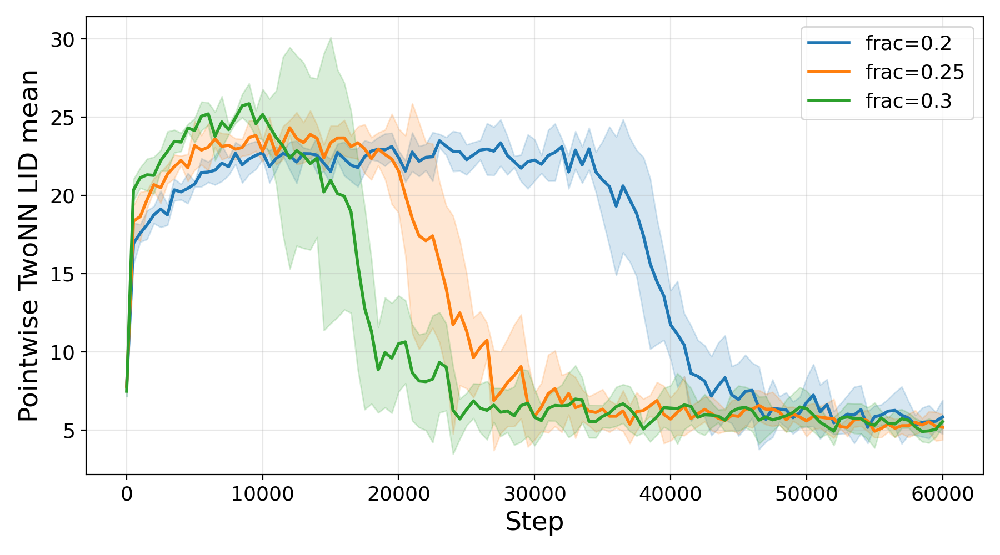

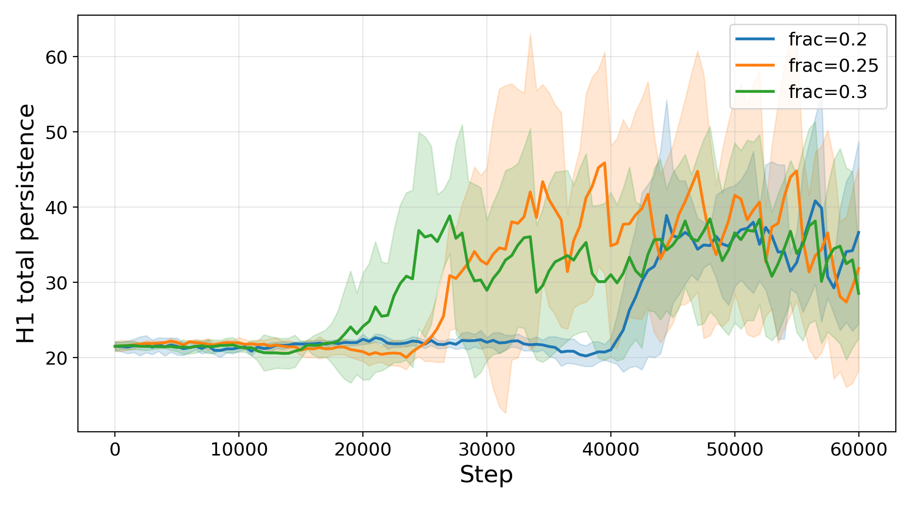

*Рисунок 3: Трансформер на модульном сложении, $p=197$, усреднение по семенам (затенение $\pm 1$ ст. откл.). Верхний ряд: точность на обучении и на тесте (слева) и средняя поточечная LID на тестовой выборке (справа). Нижний ряд: H1 max persistence (слева) и H1 total persistence (справа), обе посчитаны по матрице токенных вложений. Оба показателя H1 растут, тогда как LID одновременно падает при гроккинге, при всех долях обучающих данных.* **[p. 6]**

### 4.2 Гроккинг MLP на модульной арифметике

###### p5-4

**Топологические подписи.** H1 max persistence на слое токенных вложений (слой 0, средний ряд рисунка 4) поднимается с базового уровня около $0.08$ примерно до $0.29$–$0.35$ при гроккинге. Рост H1 total persistence ещё разительнее: начиная с базового уровня $\approx 20$, она возрастает до промежутка $30$–$70$ для всех трёх долей на шаге гроккинга. Оба показателя растут при всех долях, включая $\alpha=0.2$, что указывает на устойчивость топологического сигнала к режиму данных.

###### p6-1

**Послойное поведение.** На третьем скрытом слое (нижний ряд рисунка 4) H1 max поднимается ещё выше (до $0.4$–$0.5$), откуда следует полагать, что циклическое строение становится геометрически более выраженным в глубоких представлениях. В отличие от меньших простых $p=113$ и $p=149$ (см. Приложение B), где H1 total на слое 3 *убывает*, отражая укрупнение в меньшее число более сильных циклов, при $p=197$ H1 total на слое 3 показывает умеренный положительный рост наряду с максимумом. Мы приписываем это различие большему размеру группы: $\mathbb{Z}/197\mathbb{Z}$ удерживает больше топологического строения по всем слоям, вместо того чтобы сжимать его в единственную господствующую черту. То, что сигнал виден уже на слое вложений, подтверждает, что строение возникает на самом первом этапе обработки, согласно разбору Nanda et al. [15].

###### fig-4

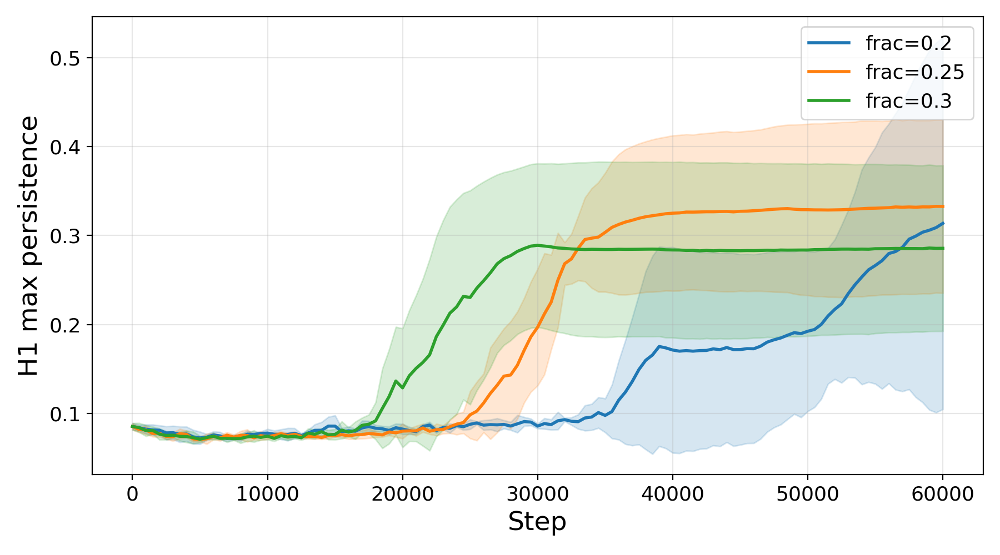

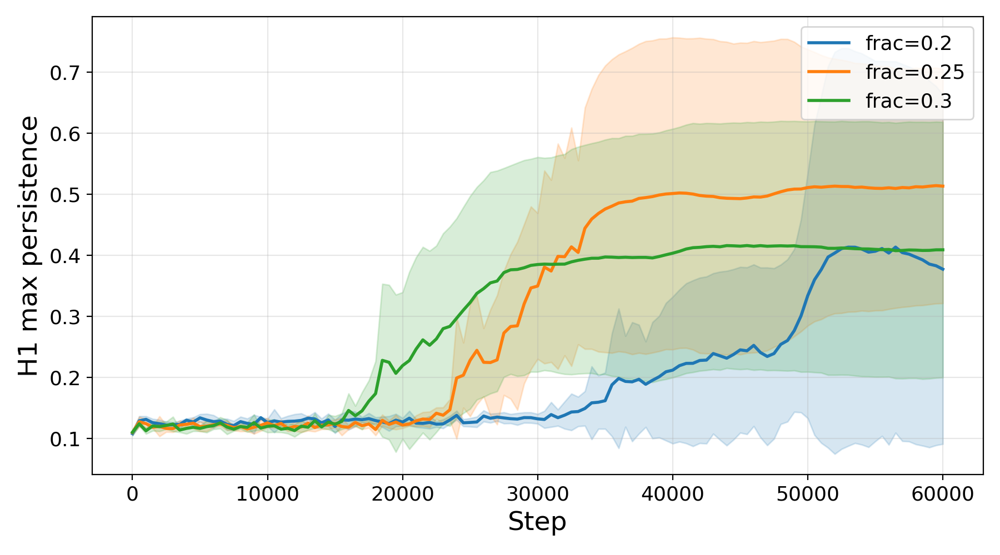

*Рисунок 4: MLP на модульном сложении, $p=197$. Сверху: точность на обучении и на тесте. Средний ряд: H1 max (слева) и H1 total persistence (справа) на слое токенных вложений (слой 0) — обе растут при гроккинге для всех трёх долей, причём H1 total показывает наиболее разительный рост во всех постановках. Нижний ряд: те же показатели на третьем скрытом слое (слой 3) — H1 max растёт дальше, а H1 total тоже умеренно возрастает, откуда следует полагать, что топологическое строение усиливается с глубиной для этой большей группы.* **[p. 7]**

### 4.3 Абляционное исследование: перестановка меток и топологическая устойчивость

###### p6-4

Настройки обучения таковы, как описано в разделе 3, причём модель-трансформер обучается при доле обучающих данных $0.3$, а модель MLP — при доле $0.2$. Для каждого устройства мы ввели долю перестановки меток, обозначаемую $P_{\mathrm{frac}}$ и отвечающую доле обучающих меток, случайно переставленных между обучающими образцами, и исследовали $P_{\mathrm{frac}}$ в промежутке от $0\%$ до $100\%$. Все модели обучались при закреплённом бюджете 60 000 шагов оптимизации, чтобы охватить как гроккинг, так и динамику после него.

###### p6-5

Мы сосредоточиваемся на результатах абляции с перестановкой меток для модели-трансформера, тогда как соответствующие результаты MLP для модульной арифметики приведены в Приложении C.2. Согласно с трансформером, MLP обнаруживает качественно схожее поведение, при котором улучшения генерализации тесно связаны с топологическими подписями, схватываемыми статистиками PH.

###### p7-1

**Топологические подписи при гроккинге.** При уровнях перестановки до $P_{\mathrm{frac}}\leq 10\%$ модель-трансформер устойчиво обнаруживала поведение гроккинга. В этом режиме мы наблюдали сильные и весьма согласованные связи между качеством генерализации модели и статистиками PH, особенно на слое вложений и на первом слое (таблица 1 в Приложении). На этих ранних слоях статистики на основе $H_{0}$ обнаруживали сильные отрицательные корреляции с тестовой точностью — коэффициенты Спирмена опускались до $\rho=-0.91$ для суммарной устойчивости $H_{0}$ и устойчиво держались ниже $-0.49$ при всех уровнях перестановки, где есть гроккинг. Напротив, максимальная устойчивость $H_{1}$ обнаруживала сильную положительную корреляцию с тестовой точностью, достигая $\rho=0.81$ на слое 1 и устойчиво оставаясь положительной в тех же режимах. Эти результаты указывают, что улучшение генерализации сопровождается ростом связности вместе с возникновением господствующей одномерной топологической черты в пространстве выученных представлений. Рисунок 5 иллюстрирует изменение этих подписей PH по ходу обучения при возрастающей перестановке меток; дальнейшие иллюстрации можно найти в разделе C.1 Приложения.

###### p7-2

**Слом при усилении порчи меток.** При более высоких уровнях перестановки ($P_{\mathrm{frac}}\geq 20\%$) модель не смогла обобщить в пределах окна обучения в 60 000 шагов. Вместо этого модель оставалась в режиме, где преобладает запоминание, с высокой обучающей точностью и плохим качеством вне выборки.

###### p7-3

Существенно, что в этих условиях ранее наблюдавшиеся корреляции между тестовой точностью и мерами PH по большей части исчезли. Отсюда следует полагать, что топологические подписи, выявляемые нашими мерами PH, не суть попросту артефакты длительности обучения или минимизации потери, но связаны именно с возникновением генерализации модели.

###### p8-2

По всем прогонам модели-трансформера с гроккингом разбор взаимной корреляции обнаружил устойчивое временное запаздывание, сосредоточенное около 1000 шагов обучения, между изменениями предсказательного качества и соответствующим топологическим переходом. Изменения тестовой точности устойчиво предшествовали сдвигам статистик PH (например, суммарной устойчивости $H_{0}$); полный набор графиков взаимной корреляции приведён в Приложении C.1. Отсюда следует полагать двухэтапную динамику обучения, при которой модель сперва находит функционально верное отображение входа в выход, а затем с задержкой геометрически перестраивает скрытое пространство в более сжатое и топологически связное представление.

### 4.4 Топологическое поведение на MNIST

###### p8-3

Чтобы выяснить, переносятся ли наблюдаемые топологические подписи за пределы задач со скрытым циклическим строением, мы применяем тот же разбор к представлениям, выученным на MNIST — задаче классификации, чья лежащая в основе геометрия существенно более разнородна и не является естественно циклической. Опыты следуют реализации Liu et al. [12] с изменением масштаба инициализации весов. В этой постановке $\alpha$ обозначает множитель масштаба инициализации относительно принятого по умолчанию в PyTorch, а не долю обучающих данных, как в опытах по модульной арифметике. Результаты усреднены по пяти случайным семенам. Как показано на рисунке 6, обучающая точность на MNIST быстро выходит на насыщение при всех значениях $\alpha$, тогда как тестовая точность растёт более постепенно.

###### p9-1

**Максимальная устойчивость $H_{1}$.** Максимальная устойчивость $H_{1}$ (левая панель нижнего ряда рисунка 6) постепенно растёт на протяжении всего обучения при всех условиях. В отличие от постановки с модульной арифметикой, резкого перехода не наблюдается: рост сравнительно медленный и шумный, а не сосредоточенный вокруг отчётливого шага гроккинга.

###### p9-2

**Суммарная устойчивость $H_{1}$.** Суммарная устойчивость $H_{1}$ (правая панель нижнего ряда рисунка 6) показывает качественно иную траекторию, нежели в случае модульной арифметики. Она растёт в начале обучения до пика около шагов 25 000–50 000, после чего постепенно убывает на протяжении оставшегося обучения. Отсюда следует полагать первоначальный рост распределённой топологической сложности при ранней подгонке, за которым следует постепенное укрупнение выученных представлений. В отличие от модульной арифметики, устойчивого роста суммарной устойчивости не наблюдается, и ясно выраженной господствующей долгоживущей черты $H_{1}$ не возникает.

###### fig-6

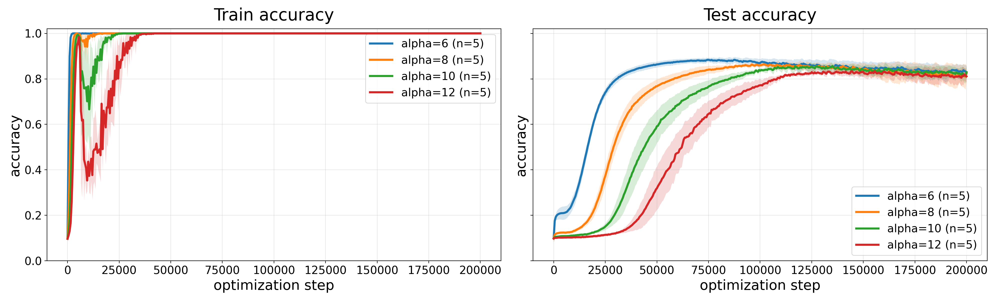

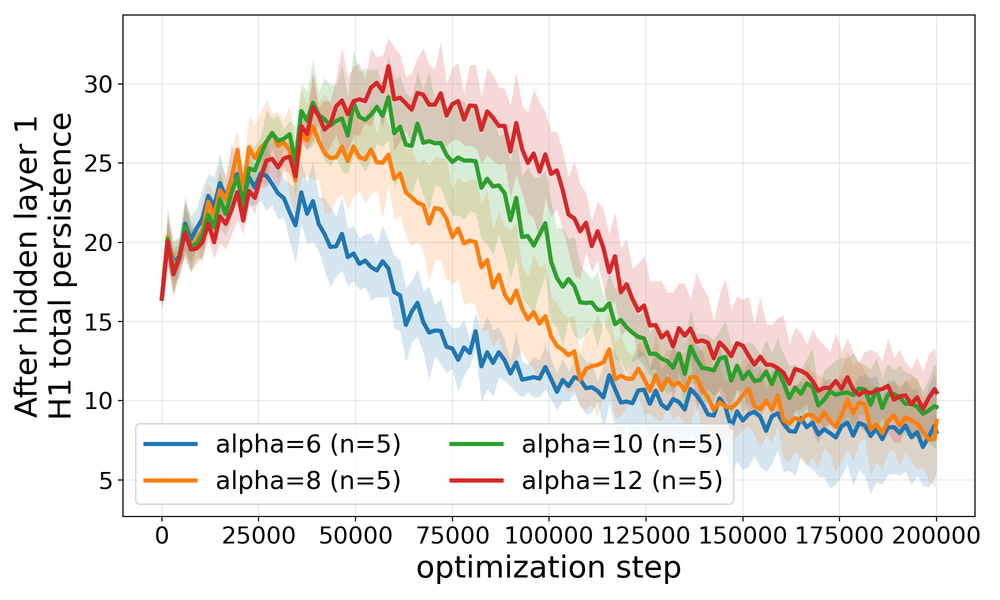

*Рисунок 6: Результаты на MNIST, слой 1 (после первого скрытого слоя). Верхний ряд: точность на обучении и на тесте. Нижний ряд, слева направо: максимальная устойчивость $H_{1}$ и суммарная устойчивость $H_{1}$. В отличие от постановки с модульной арифметикой, максимальная устойчивость $H_{1}$ растёт постепенно, без резкого перехода, тогда как суммарная устойчивость $H_{1}$ достигает пика рано и затем убывает. Ясно выраженного господствующего долгоживущего цикла не возникает, что согласуется с отсутствием простого всемирного циклического строения в задаче MNIST.* **[p. 9]**

## 5 Заключение: ограничения и будущая работа

###### p9-3

Мы изучили гроккинг через призму топологии, применяя PH к выученным нейронным представлениям. На задачах модульной арифметики, у разных устройств и режимов обучения мы выявили устойчивую топологическую подпись гроккинга, определяемую ростом устойчивости $H_{1}$ и возникновением господствующих долгоживущих топологических черт. Абляционные исследования показали, кроме того, что эти подписи исчезают, когда гроккинга не происходит, что указывает на их связь с генерализацией, а не с запоминанием.

###### p9-4

**Ограничения.** Хотя наблюдаемые топологические переходы ясны на модульной арифметике, поведение на MNIST существенно более размыто, откуда следует полагать, что интерпретируемое всемирное топологическое строение может сильно зависеть от геометрии, лежащей в основе задачи. В более общем смысле PH даёт описательные геометрические сводки, а не механистические объяснения динамики обучения.

## Приложение B Дополнительные результаты для MLP

###### fig-10

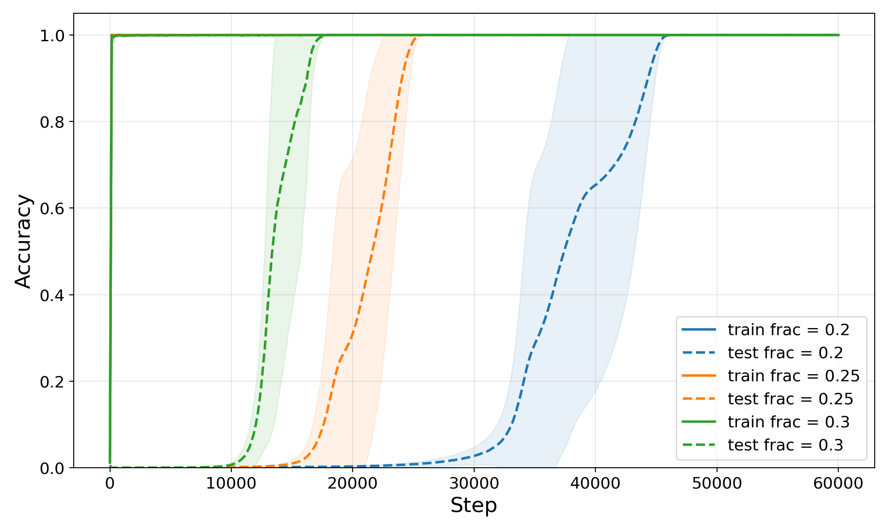

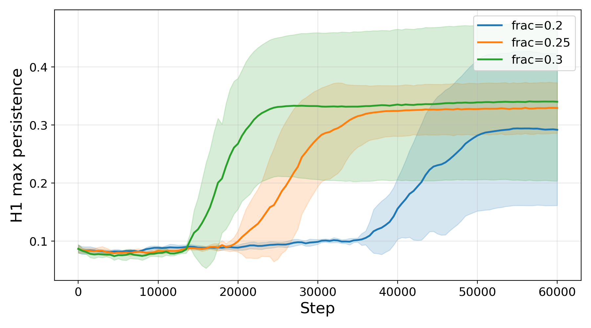

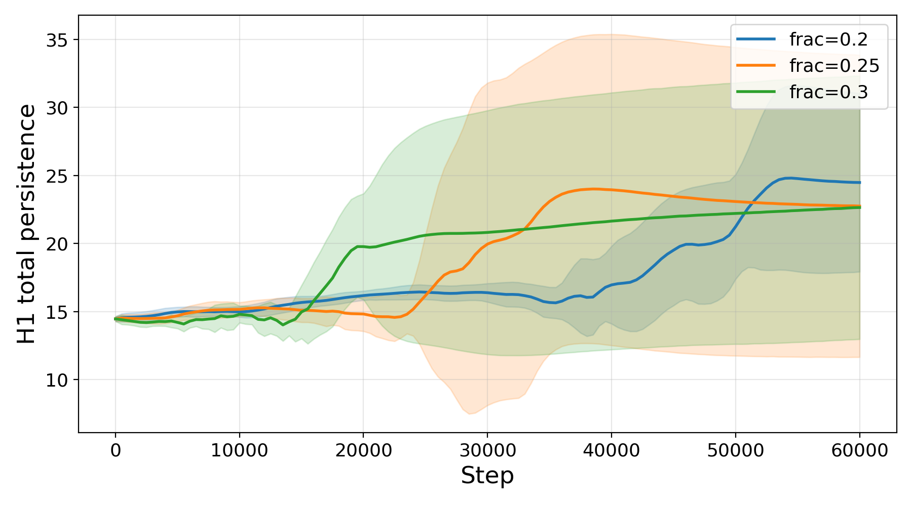

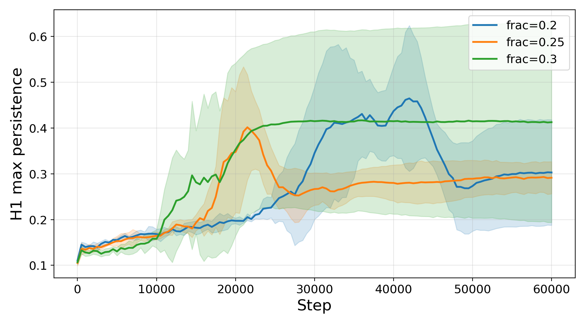

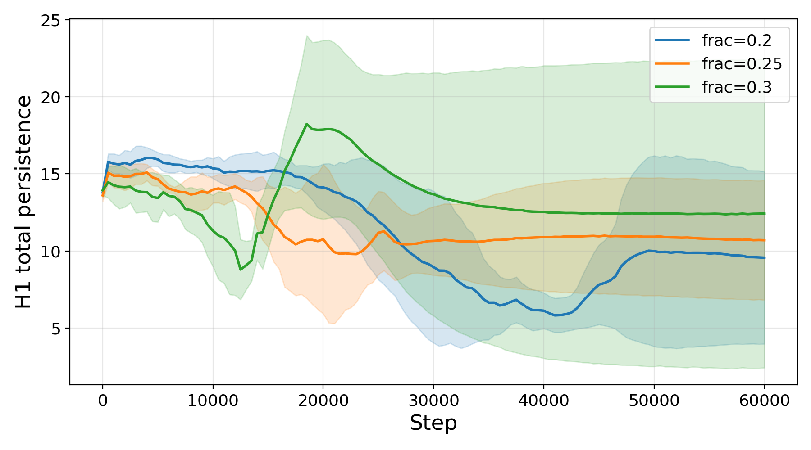

*Рисунок 10: MLP на модульном сложении, $p=149$. Та же раскладка, что и на рисунке 4. Все три доли показывают ясный рост обоих показателей H1 на слое вложений. Обращение на слое 3 выражено сильнее всего из трёх простых: H1 total падает с $\approx 15$ до $8$–$10$, тогда как H1 max растёт.* **[p. 14]**

### C.1 Результаты абляций для трансформера

###### p13-2

В этом разделе мы приводим дополнительные результаты по взаимной корреляции и дополнительные абляционные разборы в дополнение к разбору, представленному в основном тексте. Таблица 1 даёт всеобъемлющую сводку корреляций Спирмена между мерами PH и тестовой точностью по всем слоям и уровням перестановки для модели-трансформера. Эта таблица подробно расписывает связи, обсуждаемые в основном тексте. Рисунок 11 даёт дальнейшую иллюстрацию дополнительных топологических статистик на протяжении динамики обучения при разных уровнях перестановки на слоях 0 и 1. Рисунок 12 показывает отношение между первой разностью тестовой точности и суммарной устойчивостью $H_{0}$ при разных уровнях перестановки меток для модели-трансформера. Эти результаты дополняют **[p. 14]** основной вывод о том, что улучшения генерализации устойчиво предшествуют соответствующему топологическому переходу.

###### tab-1

*Таблица 1: Ранговая корреляция Спирмена ($\rho$) между мерами PH и тестовой точностью (среднее $\pm$ SD). Полужирным выделены значения при $p<0.05$.* **[p. 15]**

###### fig-12

*Рисунок 12: Взаимно-корреляционные функции (CCF) между первыми разностями тестовой точности и суммарной устойчивости $H_{0}$ для модели-трансформера при разных уровнях перестановки меток. Во всех режимах с гроккингом ($P_{\mathrm{frac}}\in\{1\%,2\%,5\%,10\%\}$) пик корреляции устойчиво приходится на отрицательное запаздывание, указывая, что улучшения предсказательного качества предшествуют соответствующей топологической перестройке пространства выученных представлений.* **[p. 17]**

### C.2 Результаты абляций для MLP

###### p14-2

В отличие от модели-трансформера, MLP обнаруживает заметно более распределённое по слоям устройство корреляций. Ранние слои (вложения и первый скрытый слой) показывают более слабые и более изменчивые связи с генерализацией, с большой дисперсией и несколькими незначимыми узорами при усилении перестановки. Напротив, более глубокие слои (Скрытый 2 и Скрытый 3) устойчиво обнаруживают сильные и статистически значимые корреляции по всем статистикам PH в режиме малого шума ($P_{\mathrm{frac}}\leq 10\%$), причём статистики $H_{0}$ достигают корреляций силой до $\rho=-0.86$, а максимальная устойчивость $H_{1}$ доходит до $\rho=0.79$.

###### p14-3

По мере роста порчи меток эти корреляции слабеют и рушатся при полной перестановке. Это согласуется с тем, что модель находится в промежуточном режиме генерализации, где выравненное с PH циклическое строение складывается, но ещё не вполне устоялось.

###### p15-1

В целом отсюда следует полагать, что, в отличие от трансформера, где подписи PH сильно сосредоточены в ранних представлениях, MLP кодирует топологическое строение глубже по иерархии сети, причём связанная с генерализацией геометрическая организация возникает преимущественно в поздних скрытых слоях.

###### tab-2

*Таблица 2: Ранговая корреляция Спирмена ($\rho\pm\text{SD}$) между мерами PH и тестовой точностью по всем слоям MLP. Полужирные значения указывают на статистическую значимость ($p<0.05$). Заметим, что, хотя ранние слои показывают несогласованные сигналы (высокое SD), более глубокие слои сохраняют устойчивую структурную связь с генерализацией даже при 50 % шума.* **[p. 15]**

###### p15-2

В отличие от модели-трансформера, где изменения предсказательного качества устойчиво предшествовали связанному с ними топологическому переходу, MLP обнаруживает пик взаимной корреляции вблизи нулевого запаздывания по всем статистикам PH (рисунок 14). Это поведение устойчиво и при других уровнях перестановки, где наблюдается генерализация. В целом отсюда следует полагать, что у MLP улучшения генерализации и соответствующая геометрическая перестройка скрытого пространства происходят примерно одновременно.

###### fig-14

*Рисунок 14: Взаимно-корреляционные функции (CCF) между первыми разностями тестовой точности и статистиками PH для модели MLP при $P_{\mathrm{frac}}=0$. По всем четырём топологическим статистикам пик корреляции приходится вблизи нулевого запаздывания, указывая, что изменения предсказательного качества и соответствующая топологическая перестройка пространства выученных представлений происходят примерно одновременно* **[p. 19]**
