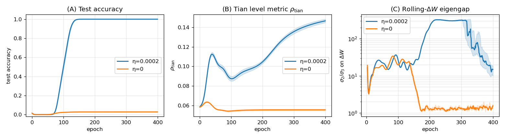
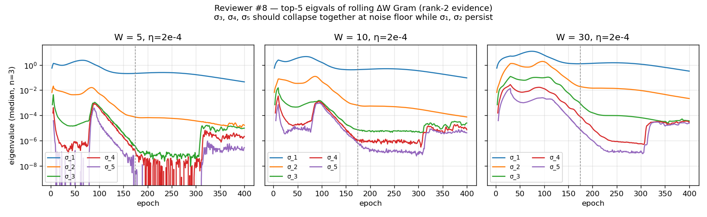

# Xu 2026 — Feature Repulsion and Spectral Lock-in: An Empirical Study of Two-Layer Network Grokking

См. также: [глобальный индекс понятий](../../concepts/index.md).

**Yongzhong Xu** (независимый автор; код — github.com/skydancerosel/grokking-integrability).

arXiv [2605.08119](https://arxiv.org/abs/2605.08119), апрель 2026 (v1), 11 страниц, 4 рисунка, 5 таблиц. Всего цитирований по Semantic Scholar — 0, в картотеке — 0. Одноавторская эмпирическая проверка двух положений Tian 2025 (рамка Li2, arXiv:2509.21519) на его же двухслойной постановке модульного сложения ($M=71$, $K=2048$, MSE): теорема 6 (отталкивание схожих признаков — знаковое правило на внедиагоналях $B=(\widetilde{F}^{\top}\widetilde{F}+\eta I)^{-1}$) подтверждена и при $\sigma=x^{2}$ (согласие знаков 0.865→0.985 на 5 семенах), и при ReLU (до 1.000) — механизм активационно-общий; а спектральный след в обновлениях весов — «залипание ранга 2» скользящего отношения $\sigma_{2}/\sigma_{3}$ грама $\Delta W$ (срабатывание 15/15 против 0/15, разделение 229 крат) — существует только при $\sigma=x^{2}$ и исчезает при ReLU (0/15, 1.4 крат): расподобление «устройство против признака». Отрицательные результаты вынесены в аннотацию; детектор при этом запаздывает на 35 эпох после гроккинга.

Оригинал и производные файлы этой папки:

- [`original/2605.08119.feature-repulsion-and-spectral-lock-in-an-empirical-study-of-two-layer-network-grokking.md`](original/2605.08119.feature-repulsion-and-spectral-lock-in-an-empirical-study-of-two-layer-network-grokking.md) — конверсия оригинала (arXiv-HTML v1, сверена с PDF) в Markdown без правок содержания.
- [`2605.08119.feature-repulsion-and-spectral-lock-in-an-empirical-study-of-two-layer-network-grokking.claims.txt`](2605.08119.feature-repulsion-and-spectral-lock-in-an-empirical-study-of-two-layer-network-grokking.claims.txt) — пронумерованные утверждения статьи с пометками разбора.
- [`images/`](images/) — 4 рисунка.

Схема якорей и правила ссылок на карточку — в [README папки статей](../README.md).

## Затрагиваемые понятия

**[Гроккинг](../../concepts/grokking.md)** — двухслойный игрушечный вариант явления, унаследованный от Tian: обучающая точность достигает 1 к 25-й эпохе, тестовая пересекает 0.5 на медианной 102-й при weight decay $2\times 10^{-4}$ и никогда при $\eta=0$ (совпадающие семена, 15 прогонов) — рисунок 3 Tian воспроизведён количественно ([`p3-8`](#p3-8)). Разбор: разрыв «запоминание→обобщение» здесь 4–5 крат, а не порядки шагов, как у Power et al., — расхождение масштабов отсрочки не обсуждается, с исходной работой статья связана только определением явления; перенос на трансформеры и неалгебраические данные не обсуждается даже в оговорках, хотя заголовок говорит о «two-layer network grokking» вообще.

**[Меры прогресса](../../concepts/progress-measures.md)** — два кандидата с противоположными недостатками: метрика уровня $\rho_{\mathrm{tian}}$ (отклонение $FF^{\top}$ от вида $aI+b\mathbf{1}\mathbf{1}^{\top}$) в рабочей точке опережает тест на 84 эпохи и разделяет 15/15 против 15/15, но на развёртке из 60 прогонов по $(M,p)$ срабатывает в 60/60 на почти постоянной эпохе независимо от исхода, а при ReLU — на нулевой (сам автор сводит её к необходимому, но не достаточному признаку «динамика признаков началась»); детектор залипания $\sigma_{2}/\sigma_{3}$ специфичен идеально, но срабатывает на 35 эпох *позже* достижения тестом 0.99 ([`p9-4`](#p9-4)). Разбор: как предупреждение о гроккинге залипание бесполезно — это описание уже случившегося, хотя во введении величина подана как считаемая практиком по ходу обучения; сверка только против $\eta=0$, специфичность против медленно-гроккающего прогона не проверялась; у детектора четыре подобранные величины, и выбор окна «несущий» (при $W\leq 10$ — 3/3 ложных срабатываний).

**[Спектральный анализ (SVD/ESD/FVE)](../../concepts/spectral-analysis-svd-esd-fve.md)** — дешёвый онлайн-прибор: топ-5 собственных чисел скользящего грама приращений $\Delta W$ (матрица $W\times W$ при окне $W=20$); при $\sigma=x^{2}$ между эпохами 150 и 200 $\sigma_{2}$ держится, а $\sigma_{3}$ проваливается на два порядка — залипание ранга 2, при малых окнах точное ($\sigma_{3},\sigma_{4},\sigma_{5}$ садятся на дно вместе), при $W=30$ — геометрический каскад ([`p6-5`](#p6-5)). Разбор: внутреннее натяжение — «ранг 2» точен именно при тех окнах, при которых детектор не работает; при ReLU спектр остаётся одноранговым, но естественный аналог детектора ($\sigma_{1}/\sigma_{2}$) назван и не проверен — вывод «признака нет» относится к одной величине, а не к спектру вообще; позднее $\sigma_{2}/\sigma_{3}$ несогласовано между таблицами (6.8 в развёртке против 300 в основном опыте при том же $\eta$, и 1949 при $\eta=5\times 10^{-5}$ — немонотонность не объяснена).

**[Weight decay](../../concepts/weight-decay.md)** — рычаг всей постановки: $\eta$ у Tian — именно weight decay (не скорость обучения), сверка «грок / не грок» — пара прогонов с совпадающими семенами при $\eta=2\times 10^{-4}$ против $\eta=0$; развёртка по пяти значениям даёт гроккинг 5/5 везде, кроме $\eta=10^{-5}$ за 600 эпох, а продлённый прогон при $\eta=10^{-5}$ гроккает на 1527-й эпохе при ожидании $\approx 2000$ из закона $1/\eta$ Tian ([`p9-1`](#p9-1)). Разбор: проверка закона $1/\eta$ — одно семя, расхождение в четверть названо подтверждением; утверждение «существование срабатывания сохраняется» в медленном режиме не подкреплено (эпоха срабатывания не приведена, а в таблице развёртки при $\eta=10^{-5}$ стоит позднее отношение 1.8).

## Что показано, а что предположено

Замечания редактора карточки по итогам разбора утверждений (`…claims.txt`, 45 пунктов).

**Ценное — первая независимая проверка теоремы 6 Tian и открытость выше средней.** Знаковое правило отталкивания подтверждено количественно на предсказании, сделанном до опыта (0.865→0.985, IQR $\leq 0.015$ на 5 семенах); стадия III подтверждена и при ReLU, о которой из части Tian про стадию II не следует ничего; расподобление «механизм общий — след активационно-специфичен» воспроизводимо (15/15 против 0/15) и заявлено как результат, а не спрятано; код выложен, отрицательные результаты — в аннотации.

**Проверена не буквальная теорема, и без нулевого отсчёта.** Вместо проектора $P_{\eta,-j\ell}$ взят полный $P_{\eta}$ с оправданием на 10 парах одной точки одного семени (автор сам ограничивает вывод знаком); согласие знаков на случайных парах или в сверке $\eta=0$ не показано — неясно, насколько 0.865 отличается от «само собой»; обобщение на ReLU («механизм активационно-общий») измерено на одном семени, в аннотации подано без оговорки, и там правило проверяется на почти коллинеарных парах (сходство 0.95–1.00), где знак предсказать легче; объяснение через теорему 5 (сосредоточенное против размазанного запоминания) — рассуждение: «сосредоточенность» признаков не измерена, вывод сделан по самой ранговой структуре, которую он должен объяснить.

**Числовые нестыковки.** «Подскакивает с 0.91 до 0.955» — 0.91 взято из ReLU-таблицы, в $x^{2}$-таблице на эпохе 100 стоит 0.895; «отношение подскакивает с 22 до 212» — чисел 22 нет в таблице (там 27 и 43); знак опережения $\rho_{\mathrm{tian}}$ записан то как $-84$, то как $+84$; совпадение «эпоха насыщения = эпоха срабатывания» имеет разрешение сетки контрольных точек, и точка 175 выбрана после того, как известна эпоха срабатывания 174.

**Как работу будут цитировать** («спектральный детектор гроккинга по собственному зазору») — точнее, и это заявлено самим автором: на одной игрушечной постановке с квадратичной активацией найдена запаздывающая на 35 эпох величина с подобранным окном, которая при смене активации перестаёт работать.

---

# Текст статьи

## Отталкивание признаков и спектральное залипание: эмпирическое исследование гроккинга двухслойных сетей

**Yongzhong Xu** (abbyxu@gmail.com; код — https://github.com/skydancerosel/grokking-integrability/tree/main/tian_eigengap)

## Аннотация

Tian 2025 доказывает теорему отталкивания (теорему 6) для внедиагональной структуры $B=(\widetilde{F}^{\top}\widetilde{F}+\eta I)^{-1}$ в двухслойных сетях на интерактивной стадии выучивания признаков при гроккинге, но не уточняет, когда в обучении этот механизм становится эмпирически наблюдаемым. Мы проверяем теорему и кандидатную спектральную наблюдаемую прямо на точной постановке модульного сложения Tian ($M=71$, $K=2048$, $n=2016$, MSE).

**Теорема 6 держится при разных активациях.** Знаковое правило $\operatorname{sgn}(B_{j\ell})=-\operatorname{sgn}(\widetilde{f}_{j}^{\top}P_{\eta,-j\ell}\widetilde{f}_{\ell})$ проверено на топ-200 наиболее схожих парах признаков в пяти чекпойнтах детерминированного воспроизведения на $n{=}5$ семенах. Эмпирическое согласие растёт с 0.865 [IQR 0.865, 0.875] на эпохе 50 до тугого насыщения 0.985 [IQR 0.980, 0.990] к эпохе 300 при $\sigma(x){=}x^{2}$. При $\sigma{=}\mathrm{ReLU}$ то же знаковое правило *тоже* держится, насыщаясь даже быстрее (1.000 к эпохе 500). Механизм активационно-общий.

**Спектральный признак в обновлениях параметров активационно-специфичен.** Скользящий собственный зазор $\sigma_{2}/\sigma_{3}$ на граме обновлений параметров $\Delta W$ срабатывает только тогда, когда теорема 6 насыщается *и* признаки схлопываются в острые пики (режим *сосредоточенного запоминания* теоремы 5 Tian, характерный для степенных активаций). При $\sigma{=}x^{2}$ детектор по наклону срабатывает в 15/15 гроккающих семенах на эпохе 174 (IQR$=[173,174]$) и в 0/15 сверочных, с разделением поздних величин между условиями в $229\times$. При $\sigma{=}\mathrm{ReLU}$ — которую теорема 5 Tian помещает в режим *размазанного запоминания* — тот же детектор срабатывает в 0/15 гроккающих семян, позднее разделение величин обрушивается до $1.4\times$, а спектр господствуется рангом 1, а не рангом 2.

**Две находки вместе прочерчивают различение структуры и механизма.** Теорема 6 Tian правит внедиагональной знаковой структурой $B$ через свойства одной лишь $\widetilde{F}^{\top}\widetilde{F}$, зависящей от активации только через её влияние на $\widetilde{F}$. Признак же в спектре обновлений параметров зависит от того, *как* отталкивание переводится в обновления весов — что зависит от $\sigma^{\prime}$. Степенные активации ($\sigma(x){=}x^{2}$) производят сосредоточенные признаки, консолидирующиеся на двух устойчивых направлениях ранга 2; ReLU производит размазанные признаки, остающиеся под господством ранга 1. Мы связываем это с различением «сосредоточенное против размазанного» теоремы 5.

Мы также сообщаем поддерживающие находки: детектор залипания чувствителен к размеру окна (W $\leq 10$ даёт ложные срабатывания в сверке $\eta{=}0$; W$\in\{20,30\}$ дают совершенную специфичность); $\sigma_{3},\sigma_{4},\sigma_{5}$ садятся вместе при малых окнах, подтверждая ранг 2 на тончайшем временном разрешении; опережение метрики уровня $\rho_{\mathrm{tian}}$ при $\eta{=}10^{-5}$ масштабируется по предсказанию $1/\eta$ Tian (опережение 567 эпох, гроккинг на эпохе 1527).

## 1 Введение

Гроккинг — резкое наступление генерализации долго после запоминания (Power et al. 2022) — накопил объяснения через механистическую интерпретируемость (Nanda et al. 2023), weight decay как неявную регуляризацию (Liu et al. 2022) и переходы от ленивого к богатому режиму (Kumar et al. 2024). **[p. 2]** Tian 2025 даёт самую принципиальную рамку: Li2 разлагает динамику гроккинга в двухслойных сетях на три стадии — *ленивое* обучение, *независимое* выучивание признаков и *интерактивное* выучивание признаков, — характеризуемые прогрессивно более богатыми структурами обратно распространяемого градиента $G_{F}$ и активационного грама $\widetilde{F}^{\top}\widetilde{F}$.

Внутри стадии III теорема 6 Tian (*отталкивание схожих признаков*) утверждает, что внедиагональные элементы $B:=(\widetilde{F}^{\top}\widetilde{F}+\eta I)^{-1}$ удовлетворяют

$$
\operatorname{sgn}(B_{j\ell})\;=\;-\operatorname{sgn}\!\left(\widetilde{f}_{j}^{\top}P_{\eta,-j\ell}\widetilde{f}_{\ell}\right),\qquad P_{\eta,-j\ell}:=I-\widetilde{F}_{-j\ell}(\widetilde{F}_{-j\ell}^{\top}\widetilde{F}_{-j\ell}+\eta I)^{-1}\widetilde{F}_{-j\ell}^{\top}, \tag{1}
$$

где $\widetilde{F}_{-j\ell}$ исключает $j$-й и $\ell$-й столбцы. Механизм: когда два скрытых узла приобретают схожие активации ($\widetilde{f}_{j}^{\top}\widetilde{f}_{\ell}$ велико и положительно), $B_{j\ell}$ становится отрицательным, производя действенную силу, разводящую их врозь.

Рамка теоретически чиста. Два вопроса, на которые она не отвечает эмпирически: (i) когда в обучении это отталкивание становится наблюдаемым, и (ii) проявляется ли оно измеримым признаком в величинах, которые практик может считать по ходу обучения без дорогой офлайн-диагностики? Эта статья отвечает на оба.

#### Два взаимодополняющих теста.

На точной постановке Tian ($M=71$, $K=2048$, $\sigma(x)=x^{2}$, MSE, обучающая доля $p\!\approx\!0.40$, $\eta=2\times 10^{-4}$ против $\eta=0$ как сверки без гроккинга) мы запускаем два теста.

Первый прямо проверяет знаковое правило уравнения (1) реконструкцией детерминированного воспроизведения в нескольких обучающих чекпойнтах, вычислением $B$ через тождество Вудбери и проверкой согласия знаков на топ-200 наиболее схожих парах признаков.

Второй проверяет кандидата в онлайн-наблюдаемые: скользящий собственный зазор $\sigma_{2}/\sigma_{3}$ грама обновлений параметров. Если отталкивание стадии III консолидирует избыточные признаковые измерения, скользящий спектр $\Delta W$ должен стать низкоранговым — два устойчивых направления обновления для выживших консолидаций признаков, с проваливающимися в шум субдоминантными направлениями. Отношение $\sigma_{2}/\sigma_{3}$ — естественный детектор этого провала.

#### Вклады.

1. **Многосеменная проверка теоремы 6 при $\sigma=x^{2}$.** Эмпирическое согласие знаков (топ-200 схожих пар) растёт с 0.865 [IQR 0.865, 0.875] на эпохе 50 до 0.985 [IQR 0.980, 0.990] на эпохе 300 по $n=5$ семенам. Насыщение до $\geq 0.95$ происходит на эпохе 175 в каждом семени.
2. **Теорема 6 обобщается за пределы степенных активаций.** При $\sigma=\mathrm{ReLU}$ та же проверка знакового правила даёт 0.91 на эпохе 100, 0.995 на эпохе 300 и 1.000 на эпохе 500. Механизм отталкивания активационно-общий.
3. **Спектральный признак в обновлениях параметров специфичен для $\sigma=x^{2}$.** Детектор по наклону на $\sigma_{2}/\sigma_{3}$ срабатывает в 15/15 гроккающих семенах на эпохе 174 (IQR$=[173,174]$) при $\sigma=x^{2}$, с разделением поздних величин от сверки $\eta=0$ в $229\times$. При $\sigma=\mathrm{ReLU}$ он срабатывает в 0/15 гроккающих семян, и разделение величин обрушивается до $1.4\times$. Спектр ReLU господствуется рангом 1, а не рангом 2. Это расподобление согласно с различением теоремы 5 Tian между сосредоточенным (степенные активации) и размазанным (ReLU/сигмоида) запоминанием.
4. **Методические сверки.** Развёртка чувствительности к размеру окна показывает, что W $\leq 10$ даёт ложные срабатывания в сверке $\eta=0$; специфичность держится при W $\in\{20,30\}$. С логированием $\sigma_{4},\sigma_{5}$ утверждение о ранге 2 точно при тончайшем размере окна (W=5), где $\sigma_{3},\sigma_{4},\sigma_{5}$ садятся вместе на шумовое дно; при больших окнах возникает геометрический каскад.
5. **[p. 3]** **Расширение по $\eta$.** Продлённый односеменной прогон при $\eta=10^{-5}$ подтверждает масштабирование $1/\eta$ Tian: гроккинг на эпохе 1527, с метрикой уровня $\rho_{\mathrm{tian}}$ (уравнение (7) ниже), опережающей тестовую точность на 567 эпох. Величина залипания $\sigma_{2}/\sigma_{3}$ на пике падает с $\sim 300$ до $\sim 25$ при этом медленном $\eta$, согласно с тем, что структура ранга 2 неполностью развита к концу измерения.

#### План статьи.

Раздел 2 описывает постановку. Раздел 3 представляет проверку теоремы 6 по активациям и семенам — заглавный результат. Раздел 4 представляет спектральный признак в обновлениях параметров при $\sigma=x^{2}$ и документирует его отказ при $\sigma=\mathrm{ReLU}$. Раздел 5 сообщает развёртку по $\eta$, включая продлённый прогон. Раздел 6 кратко сообщает детектор по метрике уровня, работающий при $\sigma=x^{2}$, но не обобщающийся по $(M,p,\sigma)$, очерчивая его применимость. Раздел 7 обсуждает, что различение «активационно-общий механизм $/$ активационно-специфичный признак» означает для спектрального подхода к диагностике гроккинга.

## 2 Постановка и приборы

### 2.1 Архитектура и обучение

Мы воспроизводим рисунок 3 Tian 2025 точно. Модель —

$$
\widehat{Y}=\sigma(XW)V, \tag{2}
$$

с замороженным единичным вложением $X\in\mathbb{R}^{n\times 2M}$ (сцепленные one-hot двух входных токенов), несмещённым линейным $W\in\mathbb{R}^{2M\times K}$, $V\in\mathbb{R}^{K\times M}$ и настраиваемой активацией $\sigma$. Потеря — нулецентрированная MSE, используемая в коде Tian:

$$
J(W,V)=\tfrac{1}{2}\left\|P_{1}^{\perp}(Y-\sigma(XW)V)\right\|_{F}^{2},\quad P_{1}^{\perp}:=I_{n}-\tfrac{1}{n}\mathbf{1}\mathbf{1}^{\top}. \tag{3}
$$

Обучение использует Adam при скорости обучения $10^{-3}$ с weight decay $\eta$. Гиперпараметр $\eta$ в обозначениях Tian — *weight decay* (не скорость обучения); мы следуем этому соглашению всюду.

Постановка по умолчанию — $M=71$, $K=2048$, $p=n_{\text{train}}/M^{2}\approx 0.40$, $\eta\in\{2\!\times\!10^{-4},0\}$, 400 эпох (800 для ReLU, гроккающей медленнее), 15 семян. Сверка $\eta=0$ с совпадающими семенами изолирует эффект weight decay.

### 2.2 Логируемые величины

На каждой эпохе мы логируем: обучающую/тестовую точность; внедиагональное отношение $\widetilde{F}^{\top}\widetilde{F}$; метрику уровня $\rho_{\mathrm{tian}}$ (уравнение (7), раздел 6); $\left\|G_{F}\right\|$; топ-5 собственных чисел грама скользящего окна $\Delta W$ (и $\Delta V$) при $W=20$; и 500-парную прокси-меру независимости для расцепления столбцов $G_{F}$.

Скользящий грам поддерживается как дек вытянутых параметрических приращений; на каждом шаге мы формируем $\Delta=[\Delta W_{t-W+1},\ldots,\Delta W_{t}]\in\mathbb{R}^{P\times W}$ и вызываем torch.linalg.eigvalsh на $\Delta^{\top}\Delta\in\mathbb{R}^{W\times W}$ — операция $O(W^{3})$, пренебрежимая на эпоху. Топ-$k$ собственных чисел скользящего грама — $\sigma_{k}(t)$; главным детектором мы сообщаем $\sigma_{2}/\sigma_{3}$.

### 2.3 Воспроизведение рисунка 3 Tian

###### p3-8

Рисунок 1 воспроизводит рисунок 3 Tian 2025 на 15 семенах: обучающая точность достигает $1$ к эпохе 25; тестовая пересекает $0.5$ на медианной эпохе $102$ при $\eta=2\!\times\!10^{-4}$ и никогда при $\eta=0$; $\left\|G_{F}\right\|$ пикует около эпохи 50; внедиагональное отношение $\widetilde{F}^{\top}\widetilde{F}$ остаётся ниже $0.04$ на всём протяжении (в пределах границы $8\%$ Tian).

*Рисунок 1: Межсеменная медиана ($\pm$ std для точности и метрики уровня; IQR для собственного зазора) на заглавной 15-семенной развёртке. Сверху: воспроизведение тестовой точности. В середине: метрика уровня $\rho_{\mathrm{tian}}$ растёт на стадии II только в гроккающем условии. Снизу: $\sigma_{2}/\sigma_{3}$ на скользящем граме $\Delta W$ (лог-масштаб) насыщается после гроккинга только в гроккающем условии. $N=15$ семян на условие.* **[p. 4]**

**[p. 4]**

## 3 Проверка теоремы 6 по активациям и семенам

### 3.1 Протокол проверки

Мы вычисляем $B=(\widetilde{F}^{\top}\widetilde{F}+\eta I)^{-1}$ точно через тождество Вудбери,

$$
B=\tfrac{1}{\eta}I-\tfrac{1}{\eta^{2}}\widetilde{F}^{\top}(\widetilde{F}\widetilde{F}^{\top}+\eta I)^{-1}\widetilde{F}, \tag{4}
$$

которое сводит обращение $K\times K=2048\times 2048$ к обращению $n\times n=2016\times 2016$, вычисляемому в float64 на CPU (PyTorch 2.5 MPS не поддерживает линейную алгебру двойной точности).

Для каждого чекпойнта мы выявляем топ-200 наиболее схожих неупорядоченных пар признаков $(j,\ell)$ через косинусную матрицу $S_{j\ell}=\widetilde{f}_{j}^{\top}\widetilde{f}_{\ell}/(\left\|\widetilde{f}_{j}\right\|\,\left\|\widetilde{f}_{\ell}\right\|)$ и оцениваем знаковое правило теоремы 6 (уравнение (1)) на этих парах.

Вычисление $P_{\eta,-j\ell}$ требует исключения столбцов $j$ и $\ell$ из $\widetilde{F}$ и пересчёта проектора для каждой пары. Мы используем приближение $P_{\eta,-j\ell}\approx P_{\eta}:=I-\widetilde{F}(\widetilde{F}^{\top}\widetilde{F}+\eta I)^{-1}\widetilde{F}^{\top}$, использующее полный проектор. Прямая проверка приближения на 10 парах на эпохе 175 (семя 0) показывает, что *знак* остаточного сходства $\widetilde{f}_{j}^{\top}P_{\eta,-j\ell}\widetilde{f}_{\ell}$ сохраняется приближением в 10/10 парах, хотя величины различаются существенно (полный проектор $P_{\eta}$ почти аннигилирует $\widetilde{f}_{\ell}$, поскольку $\widetilde{f}_{\ell}$ лежит в столбцовом пространстве $\widetilde{F}$, тогда как $P_{\eta,-j\ell}$ — нет). Для проверки теоремы 6 нам нужен только знак, так что приближение уместно.

### 3.2 Многосеменной результат при $\sigma=x^{2}$

###### p4-5

Таблица 1 сообщает эмпирическое согласие знаков по $n=5$ семенам в пяти чекпойнтах. Воспроизводимость туга: IQR $\leq 0.015$ в каждом чекпойнте, и эпоха насыщения (согласие $\geq 0.95$) совпадает с эпохой срабатывания наклона $\sigma_{2}/\sigma_{3}$ в каждом семени.

*Таблица 1: Согласие знаков теоремы 6 $\Pr[\operatorname{sgn}(B_{j\ell})=-\operatorname{sgn}(\widetilde{f}_{j}^{\top}P_{\eta}\widetilde{f}_{\ell})]$ на топ-200 наиболее схожих парах признаков по $n=5$ семенам, при $\sigma=x^{2}$, $\eta=2\!\times\!10^{-4}$, $M=71$, $K=2048$.* **[p. 5]**

| эпоха | медиана $\|S_{j\ell}\|$ | медиана согласия | IQR согласия | размах согласия |
|---|---|---|---|---|
| 50 | 0.20 | 0.865 | [0.865, 0.875] | [0.830, 0.900] |
| 100 | 0.22 | 0.895 | [0.880, 0.910] | [0.880, 0.920] |
| **175 (залипание)** | 0.40 | **0.955** | [0.955, 0.965] | [0.945, 0.975] |
| 250 | 0.59 | 0.970 | [0.965, 0.975] | [0.965, 0.975] |
| 300 | 0.64 | **0.985** | [0.980, 0.990] | [0.965, 0.995] |

**[p. 5]**

Рисунок 2 визуализирует продвижение с наложенной эпохой срабатывания наклона.

*Рисунок 2: Согласие знаков теоремы 6 по $n=5$ семенам с медианой, IQR и следами отдельных семян. Насыщение ($\geq 0.95$) на эпохе 175 совпадает с эпохой срабатывания наклона $\sigma_{2}/\sigma_{3}$ (раздел 4).* **[p. 5]**

### 3.3 Обобщение на $\sigma=\mathrm{ReLU}$

###### p5-2

Мы перепрогнали заглавную 15-семенную развёртку с $\sigma(x)=\mathrm{ReLU}(x)$ (800 эпох, в остальном тождественная постановка; ReLU при этом $\eta$ гроккает, но на более долгом масштабе: тестовая точность достигает 0.99 на медианной эпохе 530). Затем мы перепрогнали проверку теоремы 6 на семени 0 в пяти чекпойнтах.

Знаковое правило продолжает держаться:

| эпоха ($\sigma{=}\mathrm{ReLU}$) | 100 | 300 | 500 | 600 | 700 |
|---|---|---|---|---|---|
| согласие знаков | 0.91 | 0.995 | 1.000 | 1.000 | 1.000 |
| медиана $\|S_{j\ell}\|$ | 0.41 | 0.95 | 0.95 | 0.99 | 1.00 |

ReLU насыщает знаковое правило даже *быстрее*, чем $\sigma=x^{2}$ (достигая 1.000 к эпохе 500 против асимптотических 0.985 у $x^{2}$ на эпохе 300). Заметьте, что медианное сходство признаков у ReLU тоже выше — признаки становятся более коллинеарными при кусочно-линейной активации ReLU, чем при $x^{2}$.

#### Вывод.

Теорема 6 эмпирически проверена и *активационно-общая*: знаковое правило уравнения (1) держится всякий раз, когда сеть прошла стадию II, независимо от того, является ли активация $x^{2}$ или ReLU.

**[p. 6]**

## 4 Спектральный признак в обновлениях параметров: залипание ранга 2 при $\sigma=x^{2}$

### 4.1 Детектор

Определим грам скользящего окна $\Delta W$,

$$
\Delta:=[\Delta W_{t-W+1},\ldots,\Delta W_{t}]\in\mathbb{R}^{P\times W},\qquad\sigma_{k}(t):=\lambda_{k}\!\left(\Delta^{\top}\Delta\right), \tag{5}
$$

где $P=2MK$ — параметрическая размерность $W$, а $W=20$ — размер окна. Детектор по наклону,

$$
s(t):=\tfrac{1}{25}\bigl[\log(\sigma_{2}/\sigma_{3})(t)-\log(\sigma_{2}/\sigma_{3})(t-25)\bigr],\quad\text{``fire''}:=\min\{t\geq 100:s(t)>0.04\}, \tag{6}
$$

выявляет момент, когда $\sigma_{2}/\sigma_{3}$ входит в свой рост после стадии II. Ограничение $t\geq 100$ исключает переходный процесс начального заполнения скользящего окна.

### 4.2 Результат при $\sigma=x^{2}$ (15 семян, заглавный)

###### p6-4

Таблица 2 подводит итог. Детектор по наклону срабатывает в 15/15 гроккающих семенах на эпохе 174 (IQR $[173,174]$) и в 0/15 сверочных. Позднее разделение величин между условиями — $229\times$ (гроккающая медиана $\sigma_{2}/\sigma_{3}\approx 300$ против сверочной $\approx 1.31$ на эпохах 200–400).

*Таблица 2: Детектор залипания при $\sigma=x^{2}$: совершенная специфичность, тугая синхронность, большое разделение величин.* **[p. 6]**

|  | $\sigma=x^{2}$, $\eta=2\!\times\!10^{-4}$ (грок) | $\sigma=x^{2}$, $\eta=0$ (сверка) |
|---|---|---|
| эпоха срабатывания наклона (медиана, 15 семян) | **174 (IQR $[173,174]$)** | **никогда (0/15)** |
| позднее $\sigma_{2}/\sigma_{3}$ (эпохи 200–400) | 300 (размах [168, 320]) | 1.31 (размах [1.25, 1.37]) |
| позднее отношение (грок / сверка) | **229$\times$** |  |
| $t_{\text{slope-fire}}-t_{\text{test}\geq 0.99}$ (запаздывание) | медиана $+35$ эпох (IQR $[34,38]$) | — |

### 4.3 Механизм: провал до ранга 2

###### p6-5

Механизм залипания — прямое снижение ранга в скользящем спектре $\Delta W$. Осмотр сырых собственных чисел на семени 0 (таблица 3): в гроккающем условии $\sigma_{2}$ стабилизируется около $5\!\times\!10^{-3}$ между эпохами 150 и 200, тогда как $\sigma_{3}$ проваливается на два порядка. Отношение $\sigma_{2}/\sigma_{3}$ подскакивает с $22$ до $212$. К эпохе 300 оно равно $310$. Сверка ($\eta=0$) показывает противоположное: $\sigma_{1},\sigma_{2},\sigma_{3}$ все проваливаются к $\sim 10^{-4}$ к эпохе 250 — изотропный численный шум.

*Таблица 3: Топ-3 собственных числа грама скользящего окна ($W=20$) $\Delta W$ на семени 0. Залипание ранга 2 развивается между эпохами 150 и 200.* **[p. 6]**

| эпоха | $\sigma_{1}$ (грок) | $\sigma_{2}$ (грок) | $\sigma_{3}$ (грок) | $\sigma_{2}/\sigma_{3}$ (грок) | $\sigma_{2}/\sigma_{3}$ (сверка) | $\sigma_{1}$ (сверка) |
|---|---|---|---|---|---|---|
| 25 | 3.6 | 0.46 | 0.027 | 17 | 15 | 4.9 |
| 100 | 3.5 | 0.54 | 0.020 | 27 | 20 | 2.7 |
| **175** | **0.82** | $\mathbf{5.9\!\times\!10^{-3}}$ | $\mathbf{1.4\!\times\!10^{-4}}$ | **43** | 1.7 | 0.066 |
| 200 | 0.92 | $4.4\!\times\!10^{-3}$ | $2.1\!\times\!10^{-5}$ | **212** | 1.1 | 0.013 |
| 300 | 0.73 | $2.6\!\times\!10^{-3}$ | $8.4\!\times\!10^{-6}$ | **310** | 1.5 | $9.6\!\times\!10^{-4}$ |

Связь с теоремой 6 эмпирична и туга: по $n=5$ семенам эпоха срабатывания наклона (174 $\pm 1$) совпадает с моментом, когда согласие знаков $\Pr[\operatorname{sgn}(B_{j\ell})=-\operatorname{sgn}(\widetilde{f}_{j}^{\top}P_{\eta}\widetilde{f}_{\ell})]$ подскакивает с 0.91 (**[p. 7]** эпоха 100) до 0.955 (эпоха 175). Истолкование: между эпохами 150 и 200 избыточные пары признаков имеют достаточно схожие активации, чтобы $B_{j\ell}$ стал отрицательным на хвосте топ-сходства, порождая отталкивание, достаточно сильное для консолидации избыточных признаков в два устойчивых направления, что проявляется в скользящем спектре $\Delta W$ как залипание ранга 2.

### 4.4 Чувствительность к размеру окна

###### p7-1

Таблица 4 сообщает развёртку по размеру окна ($n=3$ семени, оба условия) при $W\in\{5,10,20,30\}$. Выбор W$=$20 — *несущий*: при меньших окнах детектор по наклону ложно срабатывает в сверочном условии (3/3 ложных срабатывания при W$=$5; 3/3 ложных срабатывания при W$=$10 с обращённой специфичностью).

*Таблица 4: Чувствительность к размеру окна. Переход шириной $\sim 25$ эпох, так что окна должны превышать её, чтобы усреднить одношаговый шум, но быть достаточно малыми, чтобы не размазаться в стадии I/II.* **[p. 7]**

| W | срабатывание грок (3 семени) | срабатывание сверка (3 семени) | позднее $\sigma_{2}/\sigma_{3}$ грок | позднее $\sigma_{2}/\sigma_{3}$ сверка |
|---|---|---|---|---|
| 5 | [144, 149, 153] | **[179, 193, 263] (3/3 срабатывают)** | 408 | 8.0 |
| 10 | [—, —, 347] (1/3 срабатывает) | **[263, 266, 278] (3/3 срабатывают)** | 64 | 2.3 |
| **20** | [173, 173, 174] | [—, —, —] (0/3 срабатывают) | **285** | 1.3 |
| 30 | [180, 180, 180] | [—, —, —] (0/3 срабатывают) | 140 | 1.2 |

### 4.5 Подтверждение ранга через $\sigma_{4},\sigma_{5}$

При W $\leq 10$ $\sigma_{3},\sigma_{4},\sigma_{5}$ садятся все вместе к $\sim 10^{-5}$, поддерживая рамку ранга 2 точно. При W$=$30 возникает геометрический каскад: $\sigma_{3}\approx 10^{-4}$, $\sigma_{4}\approx 10^{-5}$, $\sigma_{5}\approx 10^{-6}$. Истолкование: при больших окнах скользящий грам схватывает структуру более длинных траекторий, включая ранний спуск стадии II, так что субдоминантные направления удерживают некоторую структуру. Утверждение о «ранге 2» точно на тончайшем временном разрешении и приближённо («ранг $\lesssim 3$ с каскадом») при больших W. Рисунок 3 наносит траектории.

*Рисунок 3: Топ-5 собственных чисел скользящего грама $\Delta W$ при трёх размерах окна. При малых W $\sigma_{3},\sigma_{4},\sigma_{5}$ садятся вместе на шумовое дно, тогда как $\sigma_{1},\sigma_{2}$ сохраняются (ранг 2). При W$=$30 спектр образует геометрический каскад.* **[p. 7]**

### 4.6 Отказ при $\sigma=\mathrm{ReLU}$

Мы перепрогнали заглавную развёртку с $\sigma=\mathrm{ReLU}$ (15 семян по 800 эпох, в остальном тождественно). Рисунок 4 сравнивает две активации на четырёх панелях: тестовая точность, $\sigma_{2}/\sigma_{3}$, $\sigma_{1}/\sigma_{2}$ и $\rho_{\mathrm{tian}}$.

*Рисунок 4: $\sigma=x^{2}$ (синий) против $\sigma=\mathrm{ReLU}$ (зелёный), медианы по 15 семенам каждая. Детектор залипания ранга 2 $\sigma_{2}/\sigma_{3}$, дающий совершенную специфичность при $\sigma=x^{2}$, отказывает на ReLU: разделение падает с $229\times$ до $1.4\times$, срабатывание наклона 0/15. Метрика уровня $\rho_{\mathrm{tian}}$ срабатывает на эпохе 0 при ReLU, потому что инициализация ReLU уже далека от формы ленивого режима (раздел 6).* **[p. 8]**

**[p. 8]**

###### p8-1

Контраст резок: при $\sigma=\mathrm{ReLU}$ детектор по наклону срабатывает в 0/15 гроккающих семян; позднее разделение величин — $1.4\times$ вместо $229\times$. Спектр ReLU господствуется рангом 1: $\sigma_{1}\gg\sigma_{2}\approx\sigma_{3}\approx\sigma_{4}\approx\sigma_{5}$ на всём протяжении. Залипания ранга 2 для обнаружения нет.

#### Почему?

Теорема 5 Tian различает *сосредоточенное запоминание* (степенные активации $\sigma(x)=x^{2}$, с постоянным $\sigma^{\prime}(x)/x$) и *размазанное запоминание* (ReLU, сигмоида, со строго убывающим $\sigma^{\prime}(x)/x$). В сосредоточенном режиме признаки схлопываются в острые пики — два выживших признаковых направления, консолидирующие избыточные признаки. В размазанном режиме признаки остаются распределёнными по скрытому слою, с господством $\sigma_{1}$, но без субструктуры ранга 2. Знаковое правило теоремы 6 всё равно держится (раздел 3), потому что структура $B$ зависит от одной лишь $\widetilde{F}^{\top}\widetilde{F}$, а не от $\sigma^{\prime}$. Но то, как отталкивание теоремы 6 переводится в обновления параметров, критически зависит от $\sigma^{\prime}$, и спектральный признак ранга 2 не переживает смены активационного режима.

Это и есть центральное различение структуры против механизма, выявляемое статьёй: *отталкивание теоремы 6 общее; его спектральная наблюдаемая в обновлениях параметров специфична сосредоточенным активациям.*

## 5 Развёртка по $\eta$: масштабирование и медленно-гроккающий режим

### 5.1 $\eta\in\{10^{-5},5\!\times\!10^{-5},10^{-4},2\!\times\!10^{-4},5\!\times\!10^{-4}\}$, 5 семян

Мы развёртываем $\eta$ при $M=71$, $K=2048$, $\sigma=x^{2}$, 600 эпох, по пять семян ($n=25$). Таблица 5 подводит итог.

*Таблица 5: Сводка развёртки по $\eta$, медианные значения на ячейку.* **[p. 9]**

| $\eta$ | доля гроккинга | $t_{\rho\geq 0.075}$ | $t_{\text{test}=0.5}$ | опережение (эп.) | позднее $\sigma_{2}/\sigma_{3}$ |
|---|---|---|---|---|---|
| $10^{-5}$ (*600 эп.*) | $0/5$ | — | — | — | 1.8 |
| $5\!\times\!10^{-5}$ | $5/5$ | 185 | 312 | $+127$ | 1949 |
| $10^{-4}$ | $5/5$ | 20 | 174 | $+154$ | 14.3 |
| $2\!\times\!10^{-4}$ | $5/5$ | 17 | 101 | $+84$ | 6.8 |
| $5\!\times\!10^{-4}$ | $5/5$ | 23 | 102 | $+79$ | 20.4 |

**[p. 9]**

### 5.2 Продлённый $\eta=10^{-5}$: предсказанный медленный режим

###### p9-1

Tian 2025 предсказывает, что масштаб времени гроккинга масштабируется как $1/\eta$. Для проверки мы продлеваем одно семя при $\eta=10^{-5}$ до 2000 эпох. Модель гроккает: тестовая точность пересекает 0.5 на эпохе 1094 и 0.99 на эпохе 1527. При этом медленном $\eta$ метрика уровня $\rho_{\mathrm{tian}}$ пересекает 0.075 на эпохе 527, опережая тестовую точность на 567 эпох. Масштабирование $1/\eta$ сохранено: экстраполируя от $\eta=10^{-4}$ ($t_{\text{test}=0.99}\approx 200$), $\eta=10^{-5}$ должно гроккать на $\approx 2000$ эпох; наблюдено 1527.

Величина залипания $\sigma_{2}/\sigma_{3}$ на пике драматически снижена в этом медленном режиме: $\approx 25$ против $\approx 300$ при $\eta=2\!\times\!10^{-4}$. Это согласно с тем, что структура ранга 2 неполностью развита к концу измерения: при $\eta=10^{-5}$ модель едва закончила гроккать, и $\sigma_{3}$ не провалилась так глубоко. Поздняя величина потому $\eta$-зависима, но *существование* срабатывания наклона сохраняется.

## 6 Детектор инициации по метрике уровня $\rho_{\mathrm{tian}}$: тесно очерченный инструмент

Более простой сигнал — внедиагональная метрика уровня на активационном граме,

$$
\rho_{\mathrm{tian}}(t):=\frac{\left\|P_{1}^{\perp}FF^{\top}-(a(t)I+b(t)\,\mathbf{1}\mathbf{1}^{\top})\right\|_{F}}{\left\|FF^{\top}\right\|_{F}}, \tag{7}
$$

###### p9-4

где $a(t),b(t)$ — эмпирические диагональное/внедиагональное средние — выглядит предсказательным в рабочей точке: при $\eta=2\!\times\!10^{-4}$ на $\sigma=x^{2}$ порог $0.075$ разделяет 15/15 гроккающих семян (медианная эпоха срабатывания 17) от 15/15 сверочных (макс. $\rho_{\mathrm{tian}}=0.0645<0.075$), с опережением $-84$ эпохи против $t_{\text{test}=0.5}$.

Развёртка по $\eta$ (таблица 5) сохраняет эту картину: положительное опережение в 20/20 гроккающих прогонах при $\sigma=x^{2}$, размах 79–154 эпох.

Однако метрика не обобщается за пределы $\sigma=x^{2}$ на модульном сложении:

###### p9-7

- **Масштабная развёртка $M\times p$.** На развёртке из 60 прогонов ($M\in\{41,71,127\}$, $p\in\{0.1,0.2,0.3,0.5\}$, 5 семян) $\rho_{\mathrm{tian}}\geq 0.075$ срабатывает в 60/60 прогонах на почти постоянной эпохе ($\sim 11$–$25$), включая все ячейки, не гроккающие в пределах обучающего бюджета. Эпоха срабатывания расцеплена с исходом гроккинга. Сигнал отмечает «динамика признаков инициирована» (необходимое), а не «гроккинг удастся» (достаточное).
- **$\sigma=\mathrm{ReLU}$.** $\rho_{\mathrm{tian}}$ срабатывает на эпохе 0 в 15/15 гроккающих семян, потому что инициализация ReLU уже далека от формы $aI+b\mathbf{1}\mathbf{1}^{\top}$. «База ленивого режима», неявная в метрике, осмысленна только для активаций, дающих приблизительно изотропные случайные признаки на инициализации. ReLU асимметрична, так что грам случайных признаков не приблизительно кратен единичной матрице даже на инициализации.

Мы сохраняем $\rho_{\mathrm{tian}}$ в статье как тесно очерченную диагностику: она работает для активаций, дающих приблизительно изотропные случайные признаки на инициализации, срабатывает на почти постоянном масштабе времени выхода из стадии I **[p. 10]** и даёт положительное (но не специфичное гроккингу) предсказательное содержание. Она не переживает смены активации, и тщательный анализ того, *что* $\rho_{\mathrm{tian}}$ меряет в разных активационных режимах, за пределами этой статьи.

## 7 Обсуждение

#### Структура против механизма.

Центральная находка статьи — расподобление между лежащим в основе механизмом теоремы 6 (знаковым правилом на внедиагоналях $B$) и его спектральным признаком в обновлениях параметров (залипанием ранга 2 в $\Delta W$). При $\sigma=x^{2}$ присутствуют оба; при $\sigma=\mathrm{ReLU}$ — только механизм. Механизм зависит от структуры $\widetilde{F}^{\top}\widetilde{F}$, питающей $B$ без явной зависимости от $\sigma$. Признак же зависит от того, *как структура признакового грама переводится в обновления параметров*, что вовлекает $\sigma^{\prime}$ и потому активационно-зависимо.

Это соединяется с теоремой 5 Tian 2025, формально различающей сосредоточенное запоминание (степенные активации: признаки схлопываются в острые пики) и размазанное (ReLU/сигмоида: признаки остаются распределёнными). Наше эмпирическое наблюдение — спектральная сторона этого различения: сосредоточенное запоминание производит залипание ранга 2 в $\Delta W$, потому что у отталкивания теоремы 6 есть малый набор признаковых направлений для консолидации; размазанное — нет, потому что нет острых пиков, вокруг которых отталкиванию консолидироваться.

#### Методические уроки.

- Детектор залипания требует $W\in\{20,30\}$. Меньшие окна дают ложные срабатывания в сверке без гроккинга. Переход шириной $\sim 25$ эпох, так что окно должно усреднять по нему, не размазываясь в стадии I/II. Практикам следует развёртывать $W$ эмпирически, а не полагаться на выборы по умолчанию.
- Рамка ранга 2 точна при малых $W$ (где $\sigma_{3},\sigma_{4},\sigma_{5}$ садятся вместе) и приближённа при $W=30$ (геометрический каскад). Оба взгляда правомерны; они раскрывают разные стороны спектра стадии III.
- Приближение $P_{\eta,-j\ell}\approx P_{\eta}$ в проверке теоремы 6 сохраняет *знак* (10/10 пар, которые мы проверили точно), но не величину. Для знакового правила уравнения (1) приближение достаточно; для любого количественного утверждения о $|B_{j\ell}|$ следует использовать точный проектор.
- Спектральные метрики на $\Delta W$ активационно-специфичны. $\sigma_{1}/\sigma_{2}$ было бы естественным ранг-1 детектором для ReLU, аналогичным $\sigma_{2}/\sigma_{3}$ для $x^{2}$; мы здесь не оптимизировали ReLU-детектор.

#### Открытый эмпирический вопрос.

Детектор инициации по метрике уровня $\rho_{\mathrm{tian}}$ срабатывает на почти постоянной эпохе $\sim 11$–$25$ по всей масштабной развёртке $M\times p$, независимо от $M$, $p$ и того, удаётся ли гроккинг. Эта инвариантность не объяснена. Естественная механистическая догадка: масштаб времени задаётся сходимостью верхнего слоя $V$ к его гребневому решению по лемме 1 Tian, зависящей от спектра $\widetilde{F}\widetilde{F}^{\top}$, но, возможно, приблизительно $M$-инвариантной при $K\gg M$. Мы не проверяли это прямо. Вопрос, *почему* выход из стадии I происходит на примерно закреплённом масштабе $\sim 17$ эпох по (M, p), оставлен как продолжение.

#### Пределы.

Одна скрытая ширина $K=2048$. Один оптимизатор (Adam). Мы не проверяли границу между решениями запоминания и генерализации (теорема 5 Tian 2025 о сосредоточенном запоминании). Мы не проверяли более глубокие архитектуры, оптимизатор Muon (теорема 8) или модуляцию сверху вниз (теорема 7). Развёртка по размеру окна — на трёх семенах вместо пятнадцати (по цене; результат достаточно чист, чтобы больше семян не изменили вывода).

**[p. 11]**

#### Связь с прежней спектрально-краевой работой.

Xu 2026 выявил низкоразмерное исполнительное многообразие в гроккающих моделях с вниманием, с коммутаторными дефектами, ортогональными многообразию и растущими в $10$–$1000\times$ во время перехода гроккинга. Настоящая работа согласна: залипание ранга 2, которое мы наблюдаем на уровне обновлений параметров, — малосетевой аналог той низкоразмерной структуры. Новый вклад здесь — сопоставление спектрального признака конкретной теореме (теореме 6) и затем показ, что признак активационно-специфичен, тогда как сама теорема — нет.

## References

- Tanishq Kumar, Blake Bordelon, Samuel J Gershman, and Cengiz Pehlevan. Grokking as the transition from lazy to rich training dynamics. *arXiv preprint arXiv:2310.06110*, 2024.

- Ziming Liu, Ouail Kitouni, Niklas Nolte, Eric J Michaud, Max Tegmark, and Mike Williams. Omnigrok: Grokking beyond algorithmic data. *arXiv preprint arXiv:2210.01117*, 2022.

- Neel Nanda, Lawrence Chan, Tom Lieberum, Jess Smith, and Jacob Steinhardt. Progress measures for grokking via mechanistic interpretability. *arXiv preprint arXiv:2301.05217*, 2023.

- Alethea Power, Yuri Burda, Harri Edwards, Igor Babuschkin, and Vedant Misra. Grokking: Generalization beyond overfitting on small algorithmic datasets. In *ICLR 2022 Workshop on MATH-AI*, 2022. URL https://arxiv.org/abs/2201.02177.

- Yuandong Tian. Provable scaling laws of feature emergence from learning dynamics of grokking. *arXiv preprint arXiv:2509.21519*, 2025. URL https://arxiv.org/abs/2509.21519.

- Yongzhong Xu. Low-dimensional and transversely curved optimization dynamics in grokking. *arXiv preprint arXiv:2602.16746*, 2026.
