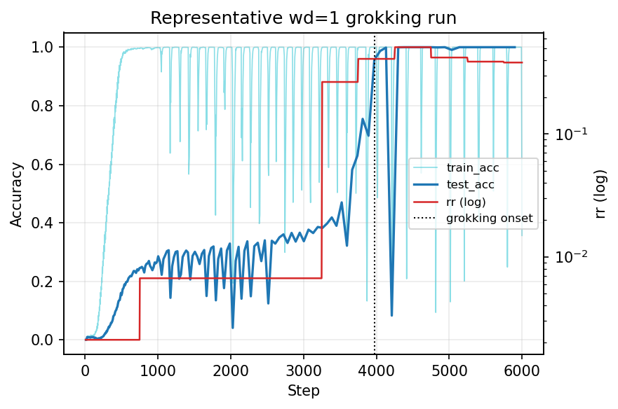
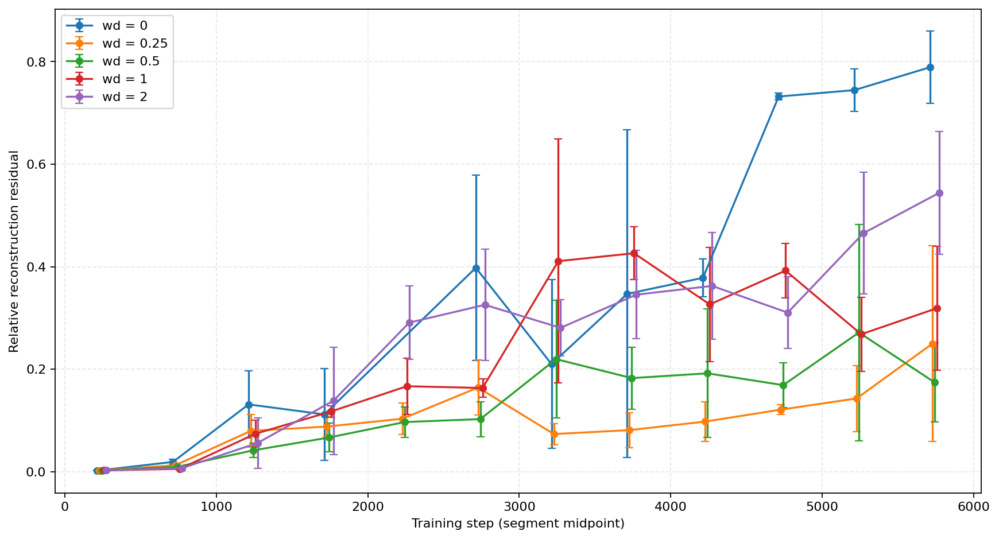
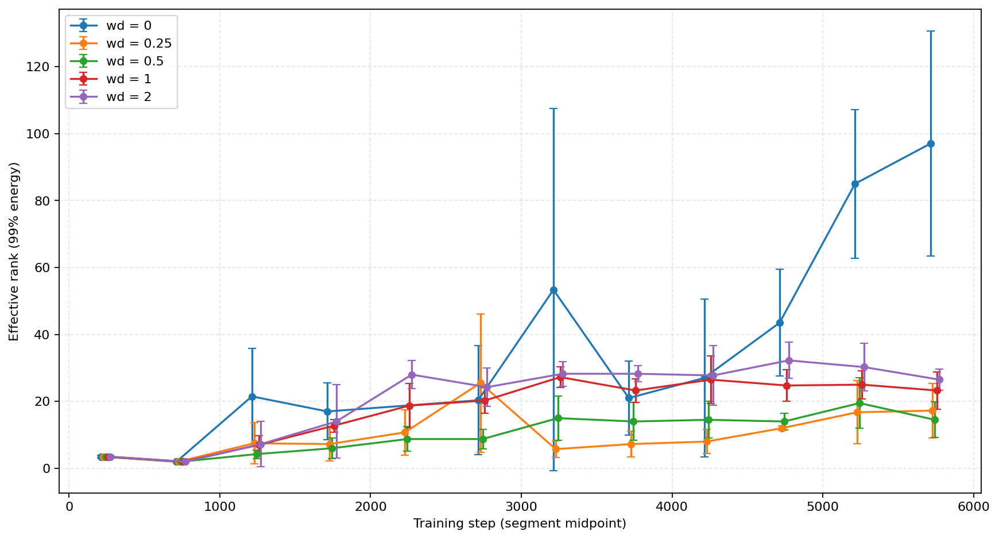
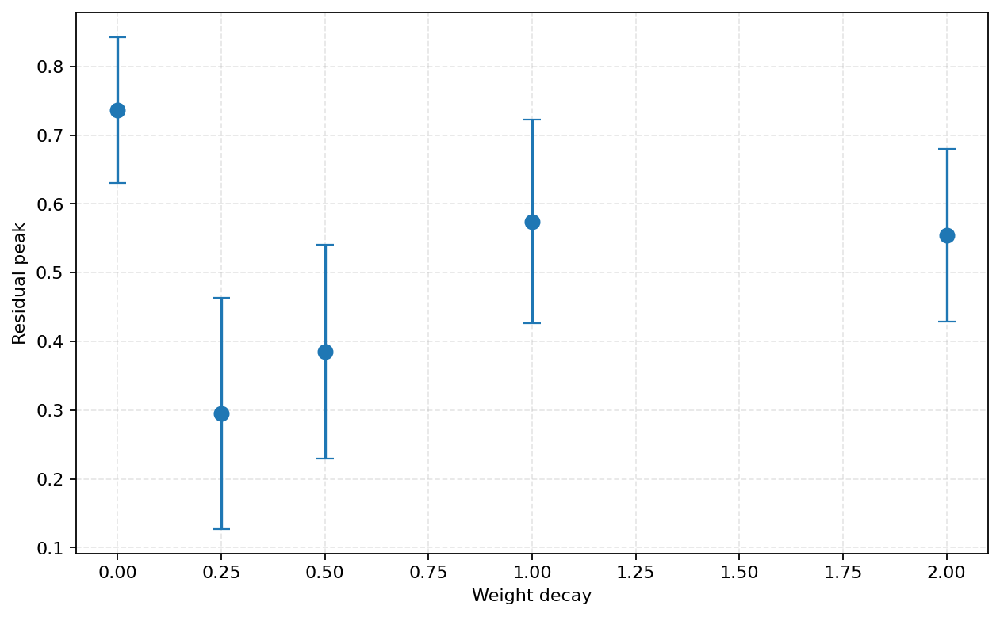
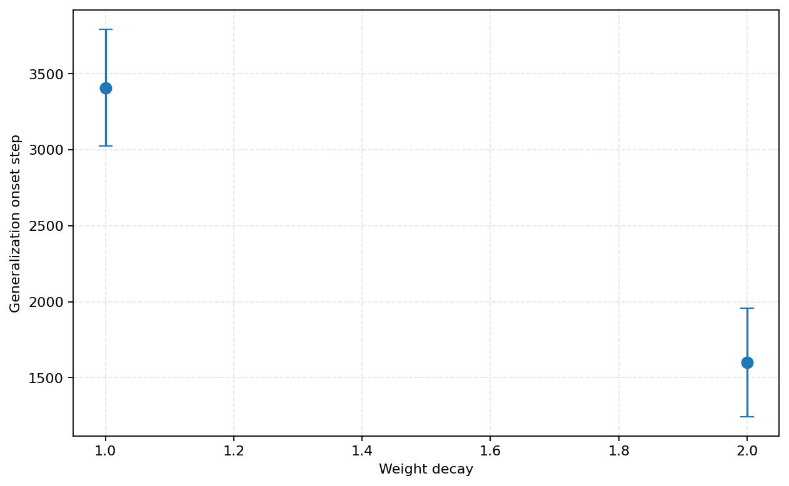
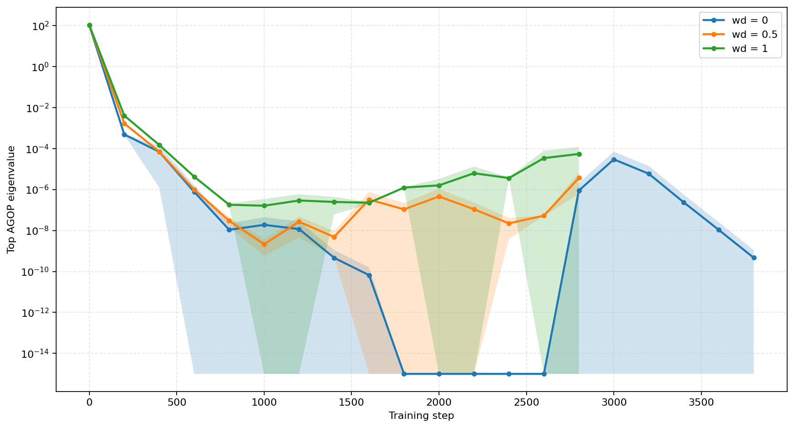
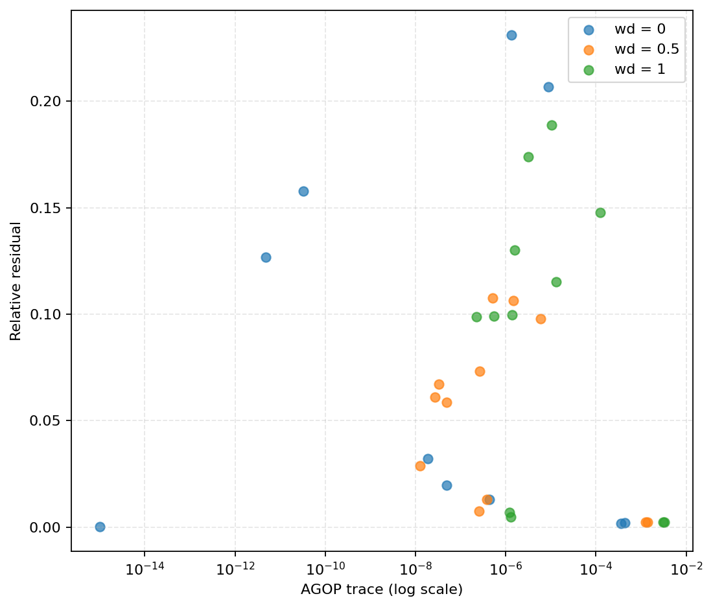
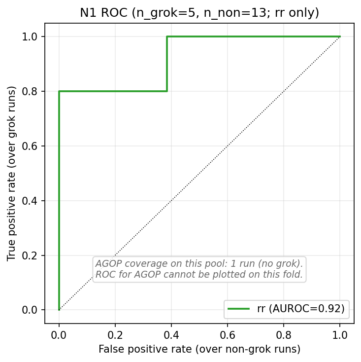
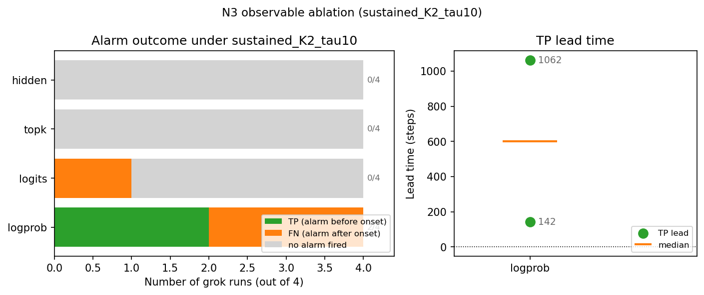

# Wang, Ying, Kanamori 2026 — Distributional Spectral Diagnostics for Localizing Grokking Transitions

См. также: [глобальный индекс понятий](../../concepts/index.md).
arXiv [2605.08237v1](https://arxiv.org/abs/2605.08237), 7 мая 2026. Колонтитул PDF: «Preprint.».

**Ziyue Wang** — Institute of Science Tokyo.
**Yufeng Ying** — University of Science and Technology of China.
**Takafumi Kanamori** — Institute of Science Tokyo.

Файлы разбора этой статьи:

- [`2605.08237.distributional-spectral-diagnostics-for-localizing-grokking-transitions.claims.txt`](2605.08237.distributional-spectral-diagnostics-for-localizing-grokking-transitions.claims.txt) — пронумерованные утверждения статьи с пометками разбора.
- [`2605.08237.distributional-spectral-diagnostics-for-localizing-grokking-transitions.license.txt`](2605.08237.distributional-spectral-diagnostics-for-localizing-grokking-transitions.license.txt) — лицензионная запись arXiv для этой статьи.

Схема якорей и правила ссылок на карточку — в [README папки статей](../README.md).

**Карточка-выдержка.** Лицензия статьи (`arxiv-nonexclusive`) не разрешает публикацию копии оригинала и полного перевода, поэтому карточка содержит редакторские секции и цитируемые фрагменты перевода (право цитирования). Полный текст статьи: <https://arxiv.org/abs/2605.08237>.

## Затрагиваемые понятия

## Затрагиваемые понятия

**[Гроккинг](../../concepts/grokking.md)** — работа не объясняет гроккинг и прямо отказывается это делать («Это иной вопрос, нежели объяснение того, *почему* возникает гроккинг», [с. 1, абз. 3](#p1-3)); она превращает его в **предмет обнаружения**. Гроккинг здесь определён операционально и узко: onset есть первый шаг, на котором тестовая точность пересекает 99 %, а «гроккинг» отделён от «ранней генерализации» шаговым порогом, положенным в бимодальный провал распределения onset ([с. 5, абз. 2](#p5-2), [прил. M](#p25-5)). Средний onset при wd$=1$ — 3398 шагов, при wd$=2$ — около 1528; весь разбор обрезан 6000 шагами. Существенно для корпуса, что порог разделения признан выбранным по данным post-hoc, а негрокающий класс собран из прогонов, не дошедших до onset внутри бюджета, — в той же статье сказано, что без weight decay «некоторые семена не обобщают вплоть до более чем $5\times 10^{5}$ шагов» ([с. 16, абз. 4](#p16-4)). Чего в работе нет: ни механизма, ни меры внутреннего прогресса, ни утверждения о том, что гроккинг предсказуем заранее вообще; заявка ограничена «изучаемыми постановками трансформера на модульной арифметике» ([с. 2, абз. 4](#p2-4)).

**[Эталонный полигон гроккинга](../../concepts/canonical-grokking-testbed.md)** — работа берёт полигон Power et al. целиком и говорит об этом прямо: задача модульного сложения mod 97, обучающая кодовая база `openai/grok`, decoder-only трансформер $d_{\mathrm{model}}=128$, 2 слоя, 4 головы, AdamW, до 6000 шагов; изменена **только** доля обучающего множества, поднятая до 0.4 ([прил. D.2](#p16-1), [с. 4, абз. 8](#p4-8)). Вклад в понятие — не новая настройка, а новое **употребление** полигона: он служит не витриной явления, а стендом, на котором меряется детектор с порогом, долей ложных тревог и временем упреждения. Оговорка, важная при цитировании: гроккинг здесь вызывается weight decay и укладывается в 6000 шагов, тогда как у Power et al. масштаб времени на порядки больше, — числа упреждения из этой работы несопоставимы с исходной постановкой напрямую.

**[Модульная арифметика](../../concepts/modular-arithmetic.md)** — единственная задача, на которой предъявлены числа обнаружения: модульное сложение при $p=97$. Перенос внутри семейства объявлен **проверкой, а не результатом**: то же правило срабатывает на модульном умножении при wd$=1$, но с более коротким упреждением ([прил. S](#p30-2)), а перебор доли обучения и величины простого модуля даёт «частичный перенос с явными случаями провала» ([прил. S](#p30-1)). Ни одного числа — ни упреждения, ни FPR — приложение S не приводит. Чего в работе нет: разбора того, чем модульная арифметика особенна для распределения логарифмов вероятностей; задача взята как удобный носитель гроккинга, а не как объект.

**[Weight decay](../../concepts/weight-decay.md)** — служит **управляющей ручкой всего опыта**, а не предметом изучения. Три настройки $\mathrm{wd}\in\{0,1,2\}$ задают три режима: без weight decay прогоны остаются переобученными и часть семян не обобщает в пределах бюджета, при wd$=1$ наступает гроккинг с задержкой, при wd$=2$ — ранняя генерализация без выраженной поры переобучения ([с. 16, абз. 4](#p16-4), [рис. 5](#fig-5)). В расширенном переборе на пять значений $\{0,0.25,0.5,1,2\}$ качественное упорядочение сохраняется: среди грокающих прогонов больший weight decay связан с более ранним onset ([прил. E](#p17-2), [рис. 9](#fig-9)), а невязка и эффективный ранг отслеживают кривые точности ([рис. 8](#fig-8)). Отдельно ценное для корпуса наблюдение: пиковая невязка **убывает** с ростом weight decay (0.780 при wd$=0$, 0.625 при wd$=1$, 0.584 при wd$=2$ у базовой архитектуры, [прил. F](#p17-9)), то есть наибольший спектральный беспорядок стоит у прогонов, которые как раз **не** грокают. Чего в работе нет: механизма влияния weight decay и вообще какой-либо теории — упорядочение объявлено описательной сводкой, «а не откалиброванной тенденцией, экстраполированной на другие режимы регуляризации».

**[Когда регуляризация необходима](../../concepts/regularization-necessity.md)** — работа даёт ещё одно свидетельство в пользу того, что при этой постановке weight decay практически необходим для генерализации **в пределах разумного бюджета**, и формулирует это аккуратно: без weight decay «некоторые семена не обобщают вплоть до более чем $5\times 10^{5}$ шагов», тогда как «все прогоны с weight decay обобщают в пределах 6000 шагов» ([с. 16, абз. 4](#p16-4)). Это утверждение о **времени**, а не о возможности: авторы прямо не говорят, что без weight decay генерализация невозможна. Оговорка, которую легко потерять: именно этот факт делает отрицательный класс детектора неоднородным — часть «негрокающих» прогонов есть грокающие прогоны, обрезанные бюджетом.

**[Фаза меморизации / плато](../../concepts/memorization-phase.md)** — плато взято как **источник трудности, а не как объект**: «Плоскость и есть трудность — потеря и точность сами по себе прямо не указывают, когда наступит переход, даже в прогонах, которые в конце концов грокают» ([с. 1, абз. 3](#p1-3)). Отсюда весь замысел работы: усреднённая потеря схлопывает распределение наблюдаемой в один скаляр, а распределение при этом продолжает меняться ([с. 3, абз. 2](#p3-2)). Вклад в понятие — предъявление величины, которая на плато **не** плоская. Чего в работе нет: разбора того, что происходит внутри модели во время плато, и вообще какого-либо содержательного описания фазы запоминания — обучающая точность появляется на рисунках лишь «как отсылка к поре запоминания» ([рис. 2](#fig-2)).

**[Спектральный анализ / FVE](../../concepts/spectral-analysis-svd-esd-fve.md)** — работа задаёт корпусу **новое место, откуда берётся спектр**. Все прочие спектральные линии корпуса читают собственные или сингулярные числа матриц сети: весов, градиента, ковариации возбуждений. Здесь спектр берётся у **линейного оператора, подогнанного к траектории самой наблюдаемой**: распределение логарифмов вероятностей верного ответа на фиксированном пробном наборе сводится к 19 квантильным координатам, а по ним на окне считается Ханкелево DMD, дающее спектр $\{\lambda_{j}\}$, эффективный ранг $r_{0.99}$ и невязку восстановления ([рис. 1](#fig-1)). Конвейер при этом намеренно одномерен: для многомерных распределений «вообще говоря нет глобального изометрического изоморфизма, отображающего вассерштейново пространство в линейное» ([прил. A](#p13-1)). Второй ход, ещё более необычный для корпуса: главным диагнозом сделан **не спектр, а его негодность**. Невязка объявлена «вентилем годности»: при малой невязке спектр и эффективный ранг читаются как описание местного режима, при большой — «саму невязку следует истолковывать как сигнал перехода или хрупкости, а спектральные точки и эффективный ранг не следует переистолковывать как устойчивые дескрипторы режима» ([с. 4, абз. 3](#p4-3)). Чего в работе нет: сопоставления с любой из спектральных мер корпуса — ни HTSR, ни спектра весов, ни спектральной энтропии представлений; единственный численно сравненный соперник — норма весов, и она выигрывает на уровне прогона. Расширение диагностики на подлинно многомерные наблюдаемые авторы прямо выносят за рамки работы ([с. 9, абз. 5](#p9-5)).

**[Меры прогресса](../../concepts/progress-measures.md)** — работа сознательно **отмежёвывается** от этой рубрики, употребляя сам термин: невязка «предназначена как сигнал мониторинга уровня окна, а не как мера прогресса, привязанная к определённому механизму» ([прил. U](#p31-1)). Различие содержательное, а не словесное: мера прогресса должна монотонно расти вместе со скрытым продвижением к решению, тогда как невязка есть **всплеск**, локализующий окно перестройки, и после перехода она падает — на пуле AGOP «насыщенные послегроккинговые контрольные точки стоят при большом AGOP и всё же малой невязке» ([рис. 12](#fig-12)). Что корпус может отсюда взять помимо величины — **форму отчёта**: ранний признак предъявлен как детектор с порогом, TPR, FPR, временем упреждения и доверительными интервалами, и заранее объявлено, что считать промахом. Чего в работе нет: сопоставления с прогресс-мерами Nanda et al. или с эффективностью контуров Varma et al. — они названы объяснительной линией и ни разу не сравнены с невязкой численно.

**[Минимизация нормы весов](../../concepts/weight-norm-minimization.md)** — самое честное и самое напряжённое соседство работы. На уровне прогона норма выигрывает у невязки с огромным отрывом, и авторы это печатают: полная норма параметров даёт AUROC 0.9829, $\lvert\Delta\mathrm{norm}\rvert$ — 0.9915, а невязка (максимум по траектории) — 0.4103 ([прил. Q](#p28-5)). Заявка сдвинута соответственно: ценность невязки объявлена **оконной, а не прогонной**. Единственный довод в её пользу — оконный контроль на тех же данных: если те же 21 возмущённых прогонов перемаркировать по перцентилю полной нормы вместо перцентиля невязки, отношение хрупкости «высокие/низкие» переворачивается с $\approx 3.82\times$ на $\approx 0.41\times$ ([с. 8, абз. 1](#p8-1), [прил. Q](#p29-1)). Оговорка авторов, которую нельзя терять: норма и невязка в динамике wd$=1$ временно́ антикоррелированы, так что две разметки выбирают соседние во времени окна, и контроль «не устанавливает причинного механизма» ([с. 8, абз. 2](#p8-2)). Чего в работе нет: заявки, что невязка где-либо превосходит норму, — «Мы не заявляем, что RR повсеместно превосходит норменные базовые сигналы».

**[Возникновение признаков](../../concepts/feature-emergence-feature-learning.md)** — AGOP введён как **параллельный путь, а не соперник**, и причина названа прямо: «разрежённое покрытие контрольными точками не позволяет честного количественного сравнения» — на пуле N1 полное покрытие есть ровно у одного негрокающего прогона, из-за чего TPR у AGOP попросту не определена ([с. 4, абз. 5](#p4-5), [прил. H](#p20-1), [рис. 13](#fig-13)). Что работа всё же добавляет к понятию — наблюдение о **немонотонности** связи: невязка повышена в среднем диапазоне AGOP, содержащем окна перехода, а насыщенные послегроккинговые точки дают большой AGOP при малой невязке ([рис. 12](#fig-12)). Чего в работе нет: никакого измерения признаков, их числа, качества или момента появления; AGOP взят как чужая величина для качественной сверки, и сами авторы называют это «качественным подкреплением, а не независимым подтверждением».

**[Механистическая интерпретируемость](../../concepts/mechanistic-interpretability.md)** — упоминается только как линия, от которой работа себя отделяет, и разделение проведено по вопросу, а не по качеству: «Механистические объяснения остаются дополнительными: они объясняют, *почему* возникает гроккинг, тогда как невязка обращается к тому, *где в обучении* можно расположить переход» ([с. 9, абз. 6](#p9-6)). Практический смысл, который работа приписывает своей величине, — служебный по отношению к мехинтерпу: невязка «помогает определить, куда следует направить механистические или градиентные разборы» ([с. 9, абз. 3](#p9-3)). Чего в работе нет: ни одного механистического измерения — ни контуров, ни голов, ни зондов; работа даже не смотрит внутрь сети, и это её сознательный выбор, поскольку диагностика считается по выходному распределению и «не зависит от индексации скрытых единиц» ([с. 2, абз. 1](#p2-1)).

**[Каузальная абляция](../../concepts/causal-ablation-intervention.md)** — работа делает два вмешательства и оба раза удерживается от причинных выводов, что редкость. Первое: одинаковые мультипликативные возмущения масштабов $\{0.005,0.01\}$, приложенные в окнах с высокой и низкой невязкой, дают краткосрочное отклонение $0.090$ против $0.029$ и $0.107$ против $0.034$ ([с. 7, абз. 1](#p7-1), [рис. 3](#fig-3)); вывод формулируется как измерение чувствительности, а «не устанавливает причинного механизма». Второе — вмешательство по тревоге, и оно **отрицательное и предъявленное**: снижение скорости обучения вдвое по сигналу невязки не ускоряет гроккинг надёжно, зато вносит 10 % отказов, которых нет у фиксированного и случайного расписаний, откуда вывод «Мониторинг не влечёт напрямую полезного управления» ([прил. R](#p29-4), [рис. 19](#fig-19)). Чего в работе нет: абляций частей сети, вмешательств в представления и вообще какой-либо попытки установить причинность — авторы объявляют это границей заявки.

**[Скорость обучения](../../concepts/learning-rate.md)** — появляется только как **рычаг вмешательства**, а не как изучаемый фактор: три стратегии применяют однократное снижение скорости обучения вдвое — на фиксированном шаге 4000, на равномерно случайном шаге внутри окна и по тревоге невязки ([прил. R](#p29-4)). Результат для понятия отрицательный и потому полезный: ни одна из трёх стратегий не ускоряет гроккинг надёжно, а привязка снижения к сигналу приносит долю отказов 0.10 против нуля у двух других. Чего в работе нет: перебора скоростей обучения, расписаний и их связи с задержкой; базовая скорость $10^{-3}$ взята из репозитория Power et al. без изменений ([табл. 6](#sec-d-2)).

**[Оптимизатор](../../concepts/optimizer-adam-adamw-sgd.md)** — трансформерная часть идёт целиком на AdamW, а сравнение оптимизаторов вынесено во вторичные постановки. На FCN, обучаемых на MNIST, работа сообщает, что «AdamW склонен давать меньший эффективный ранг, чем SGD, при согласованных настройках», причём наиболее ясные различия в динамике даёт всё же ширина, а не оптимизатор ([прил. T](#p30-5)). На CIFAR-10 два оптимизатора дают близкую пиковую невязку (0.619 против 0.595 при 32 каналах). Чего в работе нет: связи оптимизатора с гроккингом — обе постановки, где оптимизаторы сравниваются, гроккинга не содержат и объявлены проверками режима, а не диагностическими заявками.

**[Доля данных / критический размер набора](../../concepts/data-fraction-critical-dataset-size.md)** — доля обучения есть **единственное, что работа поменяла** в постановке Power et al.: она поднята до 0.4 ([прил. D.2](#p16-1)), что и делает гроккинг наблюдаемым в пределах 6000 шагов. Отдельно доля обучения перебирается в приложении S вместе с величиной простого модуля, и там она даёт «частичный перенос с явными случаями провала при том же рабочем правиле» ([прил. S](#p30-1)); один такой провал назван в сводной таблице — доля $=0.5$. Чего в работе нет: ни кривой зависимости от доли, ни чисел провалов, ни понятия критического размера — сам перебор существует лишь как строка сводки, а приложение S не приводит по нему ни одного числа.

**[Эффективность контуров](../../concepts/circuit-efficiency.md)** — лишь упоминается: Varma et al. названы в числе механистических объяснений — «компромиссов эффективности контуров», дающих меры прогресса, отслеживающие образование контуров ([прил. U](#p30-7)). Никакого сопоставления с невязкой нет ни численного, ни качественного, и никаких контуров работа не измеряет.

**[Фурье-признаки и контуры](../../concepts/fourier-features-circuits.md)** — лишь упоминается в той же фразе: «фурье-признаков для модульного сложения» как примера возникающих вычислительных контуров ([прил. U](#p30-7)). Показательно, что работа ведёт весь разбор на mod 97 и при этом ни разу не смотрит на фурье-структуру представлений: наблюдаемая берётся с выхода, а не изнутри.

**[Коллапс softmax](../../concepts/softmax-collapse.md)** — лишь упоминается как одно из «объяснений на основе устойчивости», связывающих гроккинг «с масштабированием логитов и коллапсом softmax» ([с. 1, абз. 4](#p1-4), [прил. U](#p30-7)). Логиты в работе всё же появляются — как альтернативная наблюдаемая в абляции, где они вызывают тревоги на 3/4 прогонов и ни одной до onset ([прил. P](#p28-2)), — но связи с коллапсом softmax или численной устойчивостью не проводится.

**[Эффект рогатки](../../concepts/slingshot.md)** — лишь упоминается: Thilak et al. стоят в той же скобке «объяснений на основе устойчивости» ([с. 1, абз. 4](#p1-4)). Ни рогаточных всплесков, ни поведения нормы во времени работа не разбирает, хотя её собственная величина как раз меряет краткосрочную неустойчивость в окне.

**[Переход lazy→rich](../../concepts/lazy-to-rich-kernel-to-feature-learning.md)** — упомянут в обзорном приложении как одна из линий описания обучения: «различных ленивом/богатом режимах», где «точное масштабирование определяет, происходит ли обучение признакам» ([прил. U](#p31-2)); в том же перечислении стоят [нейронное касательное ядро](../../concepts/neural-tangent-kernel-ntk.md) и работы о среднеполевом пределе. Собственная позиция работы противоположна по духу: среднеполевые результаты «требуют определённых параметризаций и асимптотических режимов, прямо не приложимых к нашей постановке с конечной шириной и конечным числом шагов», и вассерштейнова геометрия взята лишь как описательная система координат, без асимптотических заявок. Архитектурная абляция при этом прямо оговорена как проверка масштаба модели, «а не стандартной против среднеполевой параметризации» ([с. 8, абз. 4](#p8-4)).

**[Край устойчивости](../../concepts/edge-of-stability.md)** — лишь упоминается в перечне спектральных и геометрических диагностик обучения: «явление края устойчивости, при котором старшее собственное значение гессиана насыщается вблизи $2/\eta$» ([прил. U](#p31-2)). Кривизна в работе не измеряется вовсе; противопоставление проведено по месту сигнала — «на эмпирическом распределении выбранной наблюдаемой, а не на сырых параметрах или кривизне».

**[Тяжёлохвостовая саморегуляризация](../../concepts/heavy-tailed-self-regularization-htsr.md)** — лишь упоминается: «Спектры весовых матриц изучались через теорию случайных матриц и тяжелохвостовую саморегуляризацию» ([прил. U](#p31-2)). Сравнения с показателем $\alpha$ или ESD нет; для корпуса это заметный пропуск, поскольку HTSR — ближайшая по замыслу линия «дешёвой спектральной диагностики без доступа к тесту», и обе линии меряют одно и то же событие с разных сторон.

**[Реальные данные и зрение](../../concepts/vision-real-world-data-mnist-cifar.md)** — две вторичные постановки, обе с явно снятой заявкой. CIFAR-10 с Tiny CNN (8 прогонов, 5 эпох, 2 ширины каналов, 2 оптимизатора) «включена только как проверка переносимости, а не как эталонный тест диагностики гроккинга»: перехода гроккинга в этой постановке нет, и «никакая мера обнаружения (TPR/FPR/AUROC) не сообщается» ([прил. J](#p23-1)). FCN на MNIST служит употреблением невязки и эффективного ранга как дескрипторов режима при низкой невязке — «Мы не истолковываем эти результаты по FCN как диагностическую заявку о гроккинге» ([прил. T](#p30-4), [прил. T](#p30-5)). Чего в работе нет: гроккинга на реальных данных вообще — ни в постановке Omnigrok, ни в какой-либо иной; обе главы дают лишь свидетельство, что конвейер доходит до конца.

---

## Несогласованности внутри статьи

Ниже — места, где статья расходится сама с собой. Это редакторский раздел: он не оспаривает выводы, а фиксирует, что именно в тексте написано по-разному, чтобы цитирующий сверялся с нужным местом.

**Под именем «run-level AUROC» стоят два несравнимых числа: 0.93 и 0.4103.** В [§3.2](#p6-2) невязка даёт AUROC $\approx 0.93$ на отложенном фолде, и это число вынесено в [аннотацию](#p1-2) со словами «на уровне прогона». В [приложении Q](#p28-5) при оценивании максимумом по траектории та же невязка на уровне прогона даёт AUROC $=0.4103$ — против 0.9829 и 0.9915 у норменных сигналов. Авторы предупреждают о несравнимости («Эту AUROC RR уровня прогона не следует сравнивать напрямую с выбранным результатом удерживаемого порога из §3.2; протоколы различаются», [с. 8, абз. 1](#p8-1)), но в аннотацию вынесено только большее число, и читатель, знающий лишь аннотацию, получает противоположное представление о том, как невязка соотносится с нормой.

**Число семян базового пула не сходится в четырёх местах.** [§3.1](#p4-8): «$41$ различного прогона ($8$ семян $\times$ $5$ настроек weight decay $+\,1$ пробный прогон)». [Таблица 6](#sec-d-2): «$\mathrm{wd}\in\{0,1,2\}$ с 10 семенами». [Приложение D.2](#p16-2): «обучаем одну модель на настройку». [Приложение M](#p25-4): «стандартном отклонении $361$ по $9$ прогонам wd$=1$» — при восьми семенах на настройку. Сюда же примыкает [приложение E](#p17-2), где перебор из пяти значений weight decay описан как **расширение** исходных трёх и сделан на четырёх семенах, тогда как базовый пул §3.1 уже состоит из пяти настроек по восемь семян. Восстановить, сколько прогонов стои́т за каким числом, по тексту нельзя.

**Пиковая невязка базовой настройки при wd$=1$ названа двумя числами.** Текст [приложения F](#p17-9) говорит «базовая $\sim 0.68$», а собственная [таблица 7](#sec-f) той же строкой даёт 0.625. Значение 0.676 стои́т в [таблице 8](#sec-g) — но для другого подмножества прогонов и другого разбиения на сегменты, так что совпадение с «$\sim0.68$» скорее указывает на перепутанную таблицу, чем разрешает расхождение.

**Поведение на семенах 42–45 описано дважды по-разному.** [§3.2](#p6-3): правило «вызывает почти ни одной тревоги». [Приложение N](#p26-2): «не вызывает ни одной тревоги». Оба места дают TPR $=0$ и FPR $=0$, что означает ровно ноль тревог; смягчение в основном тексте не соответствует ни собственному приложению, ни собственным числам.

**Пик невязки объявлен совпадающим с onset, а таблица показывает разрыв в тысячи шагов.** [Приложение E](#p17-3): «пик невязки примерно совпадает с onset генерализации для грокающих прогонов ($\mathrm{wd}\geq 1$)». [Таблица 8](#sec-g) при том же условии даёт для wd$=1$ шаг пика 4062–4374 при onset 3387, а для wd$=2$ — шаг пика 5124–5312 при onset 1539, то есть пик отстаёт от onset на три с половиной тысячи шагов. Оговорка, которая делает работу связной, в тексте не сформулирована: упреждение даёт **передний фронт** невязки, а не её пик, — и именно так подписан [рисунок 2](#fig-2) («передний фронт невязки предшествует onset»).

**Число семян архитектурной абляции расходится с её собственной таблицей.** [§3.3](#p8-4) и [приложение F](#sec-f) говорят «$2$ семенами на масштаб» и «Каждый вариант обучается при $\mathrm{wd}\in\{0,1,2\}$ и 2 семенах», тогда как в [таблице 7](#sec-f) столбец «Семена» несёт 2 только для строк wd$=0$, а для wd$=1$ и wd$=2$ у малого и большого вариантов — по 5.

**Число тревог у логитов в тексте и в подписи рисунка разное.** [Приложение P](#p28-2) и [§3.1](#p5-4): «Логиты ($19$ измерений) вызывают тревоги на $3/4$ прогонах». Подпись [рисунка 18](#fig-18): «логиты срабатывают один раз и попадают после onset (FN)». Там же — мелкая арифметическая неточность: медиана двух упреждений 142 и 1062 равна 602, а не $\approx 601$.

**Арифметика пертурбационного пула не закрывается.** [§3.3](#p7-3) и [приложение Q](#p29-1) говорят о «$21$ возмущённых прогонов ($17$ повторно употреблённых… плюс $4$ новых)», тогда как [приложение K](#p24-1) описывает пул как «$4$ прогона с высокой RR и $5$ прогонов с низкой RR на каждом масштабе, $21$ прогон в сумме с учётом дополнительных семян с низкой нормой»: два масштаба по девять прогонов дают 18, а не 17. Сами пулы при этом малы — четыре и пять прогонов на масштаб, с двумя невосстановимыми отказами, один из которых отнесён к граничным случаям по содержательному, а не заранее объявленному признаку.

**Слово «тестовый фолд» обозначает два разных пула.** В [§3.2](#p6-1) это 17 прогонов ($n_{\mathrm{grok}}{=}5$, $n_{\mathrm{non}}{=}12$), в [приложении Q](#p28-6) под тем же именем стоят 9 ($n_{\mathrm{test\_grok}}{=}4$, $n_{\mathrm{test\_non\_grok}}{=}5$). Различие протоколов оговорено, различие пулов — нет, и числа TPR $0.75$ и упреждение $273.5$ шага из приложения Q относятся не к тому фолду, к которому относятся TPR $0.80$ и упреждение $1068$ шагов основного текста.

**Рисунки 7 и 10 — один и тот же файл.** Это так и в исходном PDF: изображение на страницах 19 и 20 имеет один и тот же внутренний идентификатор. Подпись [рисунка 7](#fig-7) обещает «Траектории тестовой точности при пяти значениях weight decay», а показано наложение обучающей и тестовой точности, то есть содержимое [рисунка 10](#fig-10). Единственного рисунка с одними тестовыми траекториями по пяти значениям weight decay в статье, следовательно, нет.

**След незавершённой правки в приложении S.** Приложение о переносе на семейство задач не приводит ни одного числа и оканчивается фразой о том, что заявки о переносе будут снабжены FPR, «как только соответствующие строки будут добавлены в указатель» ([прил. S](#p30-3)). При этом [таблица 4](#p8-5) уже ссылается на это приложение строкой о «более коротком упреждении, чем у mod-add». Сходным образом часть проверок в [приложении D.1](#p15-2) объявлена без чисел: «мы сообщаем только направление и опускаем численные таблицы».

---

## Что показано, что проверено и что признано неудачей

Работа необычна тем, что сама расставляет эти границы, и раздел ниже лишь сводит расстановку воедино. Ничего **доказанного** в статье нет: приложения A и B пересказывают известные свойства одномерного вассерштейнова пространства по Villani, новых утверждений не формулируют и не доказывают.

**Измерено и предъявлено с ценой ошибки.** Обнаружение на отложенном фолде из 17 прогонов: AUROC $\approx 0.93$, в выбранной рабочей точке TPR $=0.80$ при FPR $=0.50$, медианное упреждение 1068 шагов с бутстрэп-ДИ $[142,\,2426]$ ([с. 6, абз. 2](#p6-2)); ширина интервалов признана следствием малого сплита, и авторы отдельно оговаривают, что интервалы «не суть свидетельство того, что фиксированная рабочая точка статистически откалибрована или подтверждена» ([прил. O](#p27-3)). Компромисс порогов выписан целиком, а не одной удобной точкой: мгновенное правило $\tau{=}5\times$ ловит все грокающие прогоны ценой FPR 0.917, $\tau{=}20\times$ снижает FPR до 0.250 при полноте 40 % ([табл. 3](#sec-3-2)). Порог объявлен эвристическим и, по прямому заявлению авторов, не подбирался оптимизацией AUROC ни на одном фолде ([с. 5, абз. 3](#p5-3)).

**Измерено на малых пулах.** Хрупкость под возмущениями: отношение краткосрочных отклонений $\approx 3.1\times$ и $\approx 3.2\times$ на двух масштабах шума при четырёх и пяти прогонах на масштаб ([с. 7, абз. 1](#p7-1)). Оконный контроль по норме на тех же данных: переворот отношения с $3.82\times$ на $0.41\times$ ([с. 8, абз. 1](#p8-1)). Это сильнейший довод работы — и он держится на 21 прогоне.

**Проверено, но не заявлено как результат.** Расширенный перебор weight decay, чувствительность к размеру сегмента, архитектурная абляция, сверка с AGOP, перенос на семейство задач, CIFAR-10 и FCN объявлены «проверками границ применимости, а не заявками об универсальной устойчивости» ([с. 2, абз. 3](#p2-3)). У двух из них заявка снята полностью: на CIFAR-10 нет ни одной меры обнаружения ([прил. J](#p23-1)), у FCN нет диагностической заявки о гроккинге ([прил. T](#p30-5)). Сверка с AGOP не состоялась по покрытию: один прогон, TPR не определена ([прил. H](#p20-1)).

**Признано неудачей и не спрятано.** Три места, каждое из которых авторы могли бы опустить. Первое: на сплите с повторно употреблёнными семенами 42–45 то же фиксированное правило не даёт ни одной тревоги — TPR $=0$, FPR $=0$ ([прил. N](#p26-2)); порог не откалиброван, и это сказано прямо. Второе: на уровне прогона норма весов различает режимы много лучше невязки ([прил. Q](#p28-5)). Третье: вмешательство по тревоге не ускоряет гроккинг и вносит 10 % отказов ([прил. R](#p29-4)).

**Не показано, вопреки названию.** «Локализация» в заголовке обещает больше, чем даёт рабочая точка: FPR $=0.50$ при базовой ставке 0.29 означает, что половина негрокающих прогонов даёт ложную тревогу; сами авторы описывают назначение правила как отбор «окон-кандидатов перехода для дальнейшего разбора», а не как решающее правило. Медианное упреждение 1068 шагов сопоставимо с самой длительностью явления (средний onset 3398 шагов), а нижняя граница ДИ, 142 шага, означает тревогу практически в момент перехода. Что ложная тревога — не умозрительная опасность, показано в самой статье: [рисунок 17](#fig-17) предъявляет негрокающий прогон, у которого невязка растёт, а генерализации не следует.

---

## Ошибочные пересказы и цитирования этой статьи

Раздел строится только из наблюдённых формулировок цитирующих работ корпуса. Работа новая и цитируется пока дважды, поэтому узор здесь один; он тем не менее показателен, потому что искажает ровно ту черту метода, которая и составляет его новизну.

**«Диагностика читается со спектров весов и активаций» (ошибочное).** [Verma 2026](../2605.20441.weight-decay-regimes-in-grokking-transformers-cheap-online-diagnostics/2605.20441.weight-decay-regimes-in-grokking-transformers-cheap-online-diagnostics.card.md) верно пересказывает замысел, но помещает сигнал не туда, где он берётся: `"Wang et al. 2026 likewise localize grokking transitions via distributional spectral coordinates (Wasserstein/quantile, Hankel DMD residual, effective rank) on modular-addition Transformer trajectories; this is another transition-localization diagnostic at a different signal location (weight/activation spectra) rather than an attention-head activation order parameter."` — *«Wang et al. 2026 сходным образом локализуют переходы гроккинга через распределительные спектральные координаты (вассерштейновы/квантильные, невязка Ханкелева DMD, эффективный ранг) на траекториях трансформера на модульном сложении; это ещё одна диагностика локализации перехода в ином месте сигнала (спектры весов/активаций), а не параметр порядка на активациях голов внимания»*. У Wang et al. сигнал берётся **с выхода**: наблюдаемая есть распределение логарифмов вероятностей верного ответа на фиксированном пробном наборе из 100 обучающих примеров ([с. 3, абз. 1](#p3-1)), и авторы отдельно подчёркивают, что построение «употребляет выбранное выходное распределение, а не координаты скрытых единиц» и потому «не зависит от индексации скрытых единиц» ([с. 2, абз. 1](#p2-1)) — это заявлено как прямое преимущество перед координатами весов. Более того, наблюдаемые скрытых состояний были испытаны и **не сработали ни разу**: top-$k$ и скрытые вызвали $0/4$ тревог ([прил. P](#p28-2)). Формулировка «спектры весов/активаций» тем самым приписывает работе ровно то место сигнала, от которого она отталкивается; в остальном пересказ Verma точен, и работа корректно отнесена к линии локализации перехода.

Для сравнения, точная формулировка того же вклада стои́т у работы `2607.06639` (Golwala 2026, «At-Grok Is Not Converged», карточки в корпусе пока нет): `"Wang et al. [11] map trajectory observables to Wasserstein/quantile coordinates and a Hankel-DMD residual (alongside spectrum and effective rank) and report run-level grok-vs-no-grok discrimination with a threshold/false-alarm/lead-time trade-off"` — *«Wang et al. [11] отображают наблюдаемые траектории в вассерштейновы/квантильные координаты и невязку Ханкелева DMD (наряду со спектром и эффективным рангом) и сообщают различение гроккинга и не-гроккинга на уровне прогона с компромиссом порог/ложные тревоги/время упреждения»*: место сигнала не названо вовсе, а компромисс с ложными тревогами удержан. Ни одна из двух цитирующих работ не воспроизводит числа 0.93 без протокола и не приписывает работе универсального предсказания — узор, которого корпусу стоит ожидать в дальнейшем, здесь пока не наблюдался.

---

# Цитируемые фрагменты перевода

Ниже приведены только те фрагменты перевода, на которые ссылаются карточки корпуса (право цитирования). Нумерация якорей `pN-M` / `fig-N` / `sec-X` совпадает с полной карточкой и оригиналом.

## Аннотация

###### p1-2

При гроккинге модель сперва подгоняется под обучающие данные, пока тестовая точность остаётся низкой, и лишь позже начинает обобщать. Мы спрашиваем, можно ли локализовать этот переход по наблюдаемым траекториям обучения до того, как тестовая точность вырастет, и формулируем локализацию перехода гроккинга как диагностическую задачу с явным компромиссом порог/FPR/время упреждения. Зависящие от задачи наблюдаемые сводятся к эмпирическим распределениям, переводятся в вассерштейновы/квантильные координаты и разбираются Ханкелевым разложением по динамическим модам (DMD); получающаяся невязка восстановления вместе со спектром и эффективным рангом образует диагностический выход. На отложенных прогонах трансформера на модульном сложении невязка достигает AUROC $\approx$ 0.93 при различении гроккинга и не-гроккинга на уровне прогона; при фиксированном правиле удерживаемого порога истинно-положительные тревоги могут предшествовать onset, причём время упреждения сообщается совместно с долей ложных тревог и интервалами неопределённости. Опыты с возмущениями показывают, что в испытанном пуле $wd=1$ окна с высокой невязкой обнаруживают примерно в $3\times$ большее краткосрочное отклонение под возмущением, чем окна с низкой невязкой. В оконном контроле по норме на тех же данных чувствительность к возмущению согласуется с упорядочением по невязке, а не с упорядочением по полной норме параметров, что позволяет предположить, что невязка не есть просто прокси полной нормы на уровне окна в изучаемой динамике $wd=1$. Норменные сигналы остаются сильными указателями режима на уровне прогона, а логарифм вероятности оказывается лучшим среди наблюдаемых, испытанных при нынешнем протоколе. Мы позиционируем невязку как сигнал мониторинга и локализации на уровне окна в изучаемых постановках трансформера на модульной арифметике, а не как универсальный предиктор раннего предупреждения или правило вмешательства.

## 1 Введение

###### p1-3

Гроккинг — поразительный отказной режим стандартных сводок обучения: на некоторых алгоритмических задачах модель рано подгоняется под обучающее множество и всё же обобщает лишь после долгой задержки, причём кривые тестовой точности остаются почти плоскими на протяжении всего промежутка [31]. Плоскость и есть трудность — потеря и точность сами по себе прямо не указывают, когда наступит переход, даже в прогонах, которые в конце концов грокают. Мы обращаемся к узкому вопросу, вызванному этим пробелом: можно ли локализовать окна перехода по наблюдаемым траекториям обучения, пользуясь общими распределительными наблюдаемыми и явным диагностическим протоколом порог/FPR/время упреждения? Это иной вопрос, нежели объяснение того, *почему* возникает гроккинг.

###### p1-4

Растущее число работ объясняет гроккинг через механизм. Механистическая интерпретируемость выявляет возникающие вычислительные контуры [28, 43]; разборы неявного смещения приписывают переход позднефазовой минимизации нормы на многообразии нулевой потери [20, 22, 27]; объяснения на основе устойчивости связывают гроккинг с масштабированием логитов и коллапсом softmax [42, 32]. Рост нормы, масштабирование логитов, возникновение признаков на основе AGOP [33] и взгляды с точки зрения образования контуров — естественные точки отсчёта для нашей работы. Наша цель дополнительна: пороговый сигнал локализации, вычисляемый по зависящим **[p. 2]** от задачи наблюдаемым и сообщаемый с явными компромиссами по ложным тревогам и времени упреждения, предназначенный отмечать окна перехода, а не объяснять их.

###### p2-1

Мы сводим выбранную зависящую от задачи наблюдаемую $o_{t}$ на каждом шаге обучения к эмпирическому распределению $\mu_{t}$. Поскольку диагностика вычисляется по выбранному выходному распределению, а не по координатам скрытых единиц, она не зависит от индексации скрытых единиц. Вассерштейновы/квантильные координаты переводят $\mu_{t}$ в векторное наблюдение $z_{t}$, а оконное Ханкелево разложение по динамическим модам (DMD) даёт локальное динамическое приближение [38, 15, 2]. Невязка восстановления $\mathrm{Res}^{(r)}$ — первичная диагностика; спектр и эффективный ранг $r_{0.99}$ — вспомогательные дескрипторы, истолковываемые главным образом в окнах с низкой невязкой. Наша первичная постановка берёт наблюдаемую из эмпирического распределения логарифмов вероятностей верного ответа на фиксированном пробном наборе у трансформеров, обучаемых модульному сложению; вторичные наблюдаемые и сравнения с FCN появляются далее как проверки границ применимости.

#### Вклады.

###### p2-3

- (i) Мы предлагаем оконную распределительную диагностику для динамики обучения. Метод отображает зависящие от задачи наблюдаемые в эмпирические распределения, представляет их вассерштейновыми/квантильными координатами и применяет Ханкелево DMD для вычисления спектра, эффективного ранга и невязки восстановления.
- (ii) Мы оцениваем невязку восстановления как сигнал локализации перехода для гроккинга. В паре с правилом удерживаемого порога она даёт поведение обнаружения на отложенных данных при явном компромиссе порог/FPR/время упреждения; логарифм вероятности лучше всех работает среди наблюдаемых, которые мы испытали при нынешнем протоколе.
- (iii) Мы даём свидетельство на основе возмущений, что окна с высокой невязкой отвечают хрупким периодам обучения, что поддерживает невязку как сигнал мониторинга/локализации, а не как правило вмешательства.
- (iv) Мы оцениваем границы применимости через проверки по масштабу модели, семейству задач, норменным базовым сигналам, AGOP, вмешательству, CIFAR-10 и FCN; они предъявлены как проверки границ применимости, а не как заявки об универсальной устойчивости.

#### Границы заявок.

###### p2-4

Мы не заявляем ни универсального предиктора гроккинга, ни архитектурно-независимой диагностики, ни автоматического правила вмешательства. Мы не заявляем, что невязка заменяет норменные классификаторы режима, и не заявляем, что согласование с возмущениями устанавливает причинный механизм. Наша заявка уже: в изучаемых постановках трансформера на модульной арифметике невязка восстановления есть подсказка уровня окна для локализации перехода и мониторинга хрупкости, оцениваемая при явном компромиссе порог/FPR/время упреждения. Расширенные сравнения с механистическими, спектральными, куопмановскими/DMD и вассерштейновыми диагностиками динамики обучения отложены к Приложению U.

#### Наблюдаемая и распределительное состояние.

###### p3-1

Для трансформеров на модульном сложении (первичная постановка) мы фиксируем пробный набор $\mathcal{P}=\{(x_{i},y_{i}^{\star})\}_{i=1}^{M}$ ($M=100$ примеров), где $y_{i}^{\star}$ — токен верного ответа для входа $x_{i}$. На шаге обучения $t$ поэкземплярная наблюдаемая есть скалярный логарифм вероятности верного ответа $o_{t,i}=\log p_{\theta_{t}}(y_{i}^{\star}\mid x_{i})$, а распределительное состояние есть эмпирическое распределение этих $M$ скаляров:

###### p3-2

Тем самым диагностика отслеживает эмпирическое распределение логарифмов вероятностей верного ответа на фиксированном пробном наборе; усреднённая потеря или точность схлопывает это распределение в один скаляр. Поскольку построение употребляет выбранное выходное распределение, а не координаты скрытых единиц, оно не зависит от индексации скрытых единиц. Представление дают вассерштейновы/квантильные координаты: они переводят состояния-распределения в векторнозначные наблюдения. Ханкелево DMD даёт локальное динамическое приближение: оно разбирает, как эти векторы развиваются на коротких окнах обучения. Наблюдаемые для FCN, употребляемые как вторичный дескриптор при низкой невязке, определены в Приложении T.

#### Вентиль годности.

###### p4-3

Как сведено на Рисунке 1, невязка служит вентилем годности для вспомогательных дескрипторов. В окнах с низкой невязкой спектр $A_{H}^{\star}$ и $r_{0.99}$ можно читать как эмпирические сводки местного режима линейной эволюции. В окнах с высокой невязкой низкоранговое линейное приближение плохо; тогда саму невязку следует истолковывать как сигнал перехода или хрупкости, а спектральные точки и эффективный ранг не следует переистолковывать как устойчивые дескрипторы режима.

###### fig-1

*Рисунок 1: **Конвейер предлагаемой диагностики.** Выбранная зависящая от задачи наблюдаемая $o_{t}$ на каждом шаге обучения сводится к эмпирическому распределению $\mu_{t}$. Вассерштейновы/квантильные координаты переводят каждое $\mu_{t}$ в векторное наблюдение $z_{t}\in\mathbb{R}^{d}$. Затем оконное Ханкелево DMD разбирает местную временную эволюцию $\{z_{t}\}$ на фиксированных шаговых окнах и возвращает спектр, эффективный ранг и невязку восстановления. Низкая невязка поддерживает истолкование спектра и эффективного ранга как местных дескрипторов; высокая невязка трактуется как сигнал перехода/хрупкости.* **[p. 4]**

#### AGOP как параллельный путь.

###### p4-5

Усреднённое внешнее произведение градиентов (AGOP) [33] сводит воедино чувствительность к входу через усреднённые внешние произведения входных градиентов и употреблялось для изучения возникновения признаков и связанных с гроккингом переходов. Диагностики на основе AGOP дают параллельный путь при достаточном покрытии контрольными точками; в нашей постановке разрежённое покрытие контрольными точками не позволяет честного количественного сравнения, поэтому мы трактуем AGOP как подкрепляющее, а не как соперничающее свидетельство (Приложение H).

#### Постановка.

###### p4-8

Мы обучаем decoder-only трансформер ($d_{\mathrm{model}}{=}128$, $n_{\mathrm{layers}}{=}2$, $n_{\mathrm{heads}}{=}4$, AdamW, доля обучения $0.4$, $6{,}000$ шагов максимум) на задаче модульного сложения из [31]. Базовый пул состоит из $41$ различного прогона ($8$ семян $\times$ $5$ настроек weight decay $+\,1$ пробный прогон); полные гиперпараметры — в Приложении D. Наблюдаемая по умолчанию есть эмпирическое распределение логарифмов вероятностей верного ответа на фиксированном пробном наборе, точно определяемое ниже и сводимое к $19$ фиксированным квантильным координатам ($0.05$–$0.95$).

#### Onset и разметка.

###### p5-2

Onset гроккинга определяется как первый шаг, на котором тестовая точность пересекает $99\%$. В базовом пуле средний onset для прогонов wd$=1$ составляет $3398\pm 361$ шагов, тогда как прогоны wd$=2$ достигают того же порога в среднем к шагу $1528$; бимодальный провал между этими распределениями обосновывает шаговый порог, отделяющий гроккинг от ранней генерализации (обоснование и гистограмма onset — в Приложении M).

#### Рабочее правило.

###### p5-3

Тревога уровня прогона срабатывает, когда $\mathrm{Res}^{(r)}$ превосходит $\tau\!\times\!b_{\mathrm{run}}$ на $K$ подряд идущих окнах, где $b_{\mathrm{run}}$ — прогонный базовый уровень невязки. Мы берём $K{=}2,\tau{=}10$ как фиксированную эвристическую рабочую точку: $\tau$ задан порядка $10\times$ базового уровня (эвристика множителя невязки), а $K{=}2$ обеспечивает выдержку. Отложенные свежие семена употребляются только для оценивания, и мы сообщаем полный перебор порогов, чтобы обнажить компромисс чувствительности и специфичности (Приложение N). Мы не выбираем $\tau$ оптимизацией AUROC или AUPRC ни на одном из фолдов.

#### Абляция наблюдаемой.

###### p5-4

Замена логарифма вероятности другими наблюдаемыми при той же настройке DMD (Приложение P) даёт на $4$ грокающих прогонах подпула абляции: логарифм вероятности вызывает тревоги sustained_K2_tau10 на $4/4$ прогонах, из которых $2/4$ приходятся до onset (TP) с медианным упреждением $\approx 601$ шаг; согласованная FPR есть значение правила на тестовом фолде $0.50$ из §3.2. Логиты вызывают тревоги на $3/4$; top-$k$ ($\sim 95$ измерений) и скрытые ($\sim 1900$ измерений) срабатывают на $0/4$. Среди наблюдаемых, которые мы испытали при нынешнем протоколе, логарифм вероятности есть лучше всего работающая величина по умолчанию. Нынешняя реализация лучше всего подходит скалярным эмпирическим наблюдаемым, представленным одномерными квантильными координатами, поэтому провал вариантов top-$k$ и скрытых состояний при той же настройке DMD следует истолковывать как ограничение этой реализации со скалярными распределениями и фиксированной настройки DMD, а не как свидетельство того, что в тех наблюдаемых нет полезных сведений.

###### sec-3-2

### 3.2 Невязка локализует переходы гроккинга

#### Протокол.

###### p6-1

Тестовый фолд: свежие семена $46$–$49$, $n_{\mathrm{grok}}{=}5$, $n_{\mathrm{non}}{=}12$ (базовая ставка $\approx 0.29$); прогоны ранней генерализации wd$=2$ исключены и из числителя, и из знаменателя. Onset есть первый шаг, пересекающий $99\%$ тестовой точности. Рабочее правило: sustained_K2_tau10, зафиксированное эвристикой из §3.1. Время упреждения считается только по истинно-положительным тревогам. Если не сказано иное, AUROC и AUPRC, сообщаемые в этом разделе, суть ранжирующие меры уровня прогона, вычисленные по оценкам тревог на основе невязки на отложенных прогонах; временны́е меры тревог (TPR, FPR, упреждение, ДИ) описывают время первой тревоги и упреждение относительно onset гроккинга при пороговом правиле. Свидетельства уровня окна появляются в §3.3 (возмущения и оконные контроли по норме).

#### Свидетельства.

###### p6-2

На этом фолде невязка достигает AUROC $\approx 0.93$ (AUPRC $\approx 0.91$). В выбранной рабочей точке TPR $=0.80$ и FPR $=0.50$; медианное упреждение, считаемое только по истинно-положительным тревогам, составляет $1068$ шагов ($95\%$ бутстрэп-ДИ $[142,\,2426]$; Приложение O). Компромисс порогов (Табл. 3): мгновенное правило $\tau{=}5\times$ восстанавливает все грокающие прогоны (TPR $1.00$) ценой FPR $0.917$ и более долгого упреждения ($1774$ шага); более строгое мгновенное правило $\tau{=}20\times$ снижает FPR до $0.250$, но узнаёт лишь $40\%$ грокающих прогонов. Рисунок 2 показывает представительный прогон wd$=1$ с невязкой, растущей до onset; полные кривые ROC и распределения времени упреждения на тестовом фолде — в Приложении N.

#### Ограничение.

###### p6-3

На сплите с повторно употреблёнными семенами (семена $42$–$45$) та же фиксированная рабочая точка sustained_K2_tau10 вызывает почти ни одной тревоги, давая TPR $=0$ и FPR $=0$ на этом сплите (Приложение N). Поэтому мы сообщаем эту асимметрию как чувствительность к сплиту семян, а не как свидетельство откалиброванного выбора порога: сплит с повторно употреблёнными семенами не подтверждает калибровку порога. Высокая абсолютная невязка может встречаться в негрокающих прогонах, что и обосновывает относительное правило удерживаемого порога, а не абсолютную отсечку. Время упреждения всегда следует читать вместе с FPR и ДИ. Выбранное рабочее правило есть одна конкретная точка на компромиссе чувствительности и специфичности.

#### AUROC/AUPRC против рабочей точки.

###### fig-2

*Рисунок 2: **Представительный грокающий прогон wd$=1$.** Тёмно-синяя кривая показывает тестовую точность (левая ось), светло-голубая кривая на заднем плане показывает обучающую точность (левая ось, включена как отсылка к поре запоминания), а красная кривая показывает невязку восстановления в логарифмическом масштабе (правая ось). Вертикальная пунктирная линия отмечает onset гроккинга, определённый как первый шаг, на котором тестовая точность превосходит $99\%$. В этом прогоне передний фронт невязки предшествует onset.* **[p. 7]**

#### Хрупкость под возмущениями.

###### p7-1

Протокол: одинаковые мультипликативные возмущения масштабов $\{0.005,0.01\}$ прикладываются в окнах с высокой RR против окон с низкой RR на грокающих базовых прогонах wd$=1$ ($4$ прогона с высокой RR и $5$ прогонов с низкой RR на каждом масштабе; подробности в Приложении K). Свидетельства: на масштабе $0.01$ среднее краткосрочное отклонение составляет $0.090$ (высокая RR) против $0.029$ (низкая RR), что даёт отношение высокая/низкая $\approx 3.1\times$; на масштабе $0.005$ — $0.107$ против $0.034$, отношение $\approx 3.2\times$. Рисунок 3 показывает распределение отклонений. Ограничение: один невосстановимый отказ происходит в окне с высокой RR вблизи перехода; один отказ при низкой RR в раннем обучении указывает на отдельную неустойчивость, не связанную с хрупкостью перехода, и трактуется как граничный случай в Приложении K.

###### fig-3

*Рисунок 3: **Хрупкость под возмущениями.** Краткосрочное отклонение по окну RR и масштабу шума на пуле wd$=1$. Окна с высокой RR показывают большее краткосрочное отклонение при согласованном шуме, чем окна с низкой RR; отказ при низкой RR в раннем обучении есть граничный случай, обсуждаемый в Приложении K.* **[p. 7]**

#### Норменные базовые сигналы и оконный контроль на тех же данных.

###### p7-3

Протокол: (i) те же $21$ возмущённых прогонов ($17$ повторно употреблённых выше плюс $4$ новых возмущения с низкой нормой $s{=}5250$ на семенах $46$/$49$) перемечаются по перцентилю полной нормы параметров, а не по перцентилю RR (протокол оконного контроля); (ii) AUROC уровня прогона (максимум по траектории) для нескольких сигналов вычисляется на общем пуле из $22$ прогонов; (iii) временная тревога при равной FPR согласует FPR с $0.50$ на сплите с повторно употреблёнными семенами для каждого сигнала независимо. Заметим, что протокол равной FPR в (iii) есть протокол сравнения с базовыми сигналами, употребляемый для назначения порогов сравнения, и *не есть* рабочее правило sustained_K2_tau10, употреблённое в §3.2; подробности в Приложении Q.

###### p8-1

- Отклонение в оконном контроле (масштаб $0.01$): при разметке по окнам RR отношение высокая/низкая составляет $\approx 3.82\times$; при разметке по окнам нормы те же прогоны дают $\approx 0.41\times$, переворачивая упорядочение.
- AUROC уровня прогона при оценивании максимумом по траектории на общем норменном базовом пуле ($22$ прогона): полная норма параметров $0.9829$, $\lvert\Delta\mathrm{norm}\rvert$ $0.9915$, RR (максимум уровня прогона) $0.4103$. Эту AUROC RR уровня прогона не следует сравнивать напрямую с выбранным результатом удерживаемого порога из §3.2; протоколы различаются.
- При временной тревоге с равной FPR (цель FPR $0.50$ на сплите с повторно употреблёнными семенами) RR срабатывает с TPR $=0.75$ на тестовом фолде с медианным упреждением $273.5$ шага; norm_N_total срабатывает с TPR $=0$ (ни одной тревоги) при том же протоколе равной FPR. Это иной протокол, нежели выбранное рабочее правило удерживаемого порога из §3.2.

###### p8-2

Ограничение: норма и RR временно́ антикоррелированы в динамике wd$=1$, поэтому две разметки выбирают соседние во времени окна; контроль различает, какой сигнал согласуется с направлением исхода возмущения, но не устанавливает причинного механизма. Высокая AUROC норменных сигналов на уровне прогона и согласование невязки с возмущениями на уровне окна суть взаимодополняющие случаи употребления. Мы не заявляем, что RR повсеместно превосходит норменные базовые сигналы, а вполне честное лобовое сравнение обнаружения требует перекалибровки порога для каждого сигнала. Указание на приложение: Приложение Q.

#### Масштаб архитектуры.

###### p8-4

Протокол и свидетельства: малый ($d_{\mathrm{model}}{=}64$, $1$ слой), базовый ($d_{\mathrm{model}}{=}128$, $2$ слоя) и большой ($d_{\mathrm{model}}{=}256$, $3$ слоя) варианты обучаются при wd$\in\{0,1,2\}$ с $2$ семенами на масштаб; таблица, сведённая по масштабам, — в Приложении F. Ограничение: амплитуда невязки уменьшается с ёмкостью, поэтому поведение правила относительного порога на малом масштабе требует дальнейшего исследования; эта абляция не проверяет масштабирование параметризации.

### 3.4 Границы применимости и оставшиеся проверки

###### p8-5

Оставшиеся проверки сведены в Таблице 4; полные графики и подробности протокола по строкам — в указанных приложениях. Времена упреждения, сообщаемые в этой таблице, употребляют протокол соответствующего приложения и составлены в пару с FPR протокола этого приложения.

#### Что добавляет диагностика.

###### p9-3

Главная ценность невязки восстановления не в том, чтобы заменить механистические, норменные или градиентные разборы, а в том, чтобы дать лёгкое считывание на уровне окна, когда наблюдаемое выходное распределение перестраивается. В отличие от норменных оценок уровня прогона, которые суть сильные указатели режима, невязка вычисляется местно на фиксированных шаговых окнах и высвечивает поры-кандидаты перехода для дальнейшего разбора. Контроли с возмущениями и по норме позволяют предположить, что эти окна имеют функциональный смысл: согласованный шум даёт большие отклонения в окнах с высокой RR, а те же прогоны не показывают того же упорядочения при перемечивании по полной норме параметров. Тем самым невязка даёт дополнительный взгляд на динамику обучения со стороны выходного распределения: её можно вычислить постфактум по фиксированному пробному набору, она не опирается на индексацию скрытых единиц и помогает определить, куда следует направить механистические или градиентные разборы.

#### Границы.

###### p9-5

Нынешняя реализация предполагает скалярную эмпирическую наблюдаемую, представленную одномерными квантильными координатами; провал наблюдаемых top-$k$ и скрытых состояний, не вызвавших ни одной тревоги при нынешней настройке DMD, лучше всего истолковывать как ограничение этой реализации со скалярными распределениями и фиксированной настройки DMD, а не как приговор содержанию сведений в тех наблюдаемых. Расширение диагностики на подлинно многомерные наблюдаемые потребовало бы отдельных геометрических вложений — таких как разрезанные вассерштейновы представления, ядровые средние вложения или послойные скалярные сводки, — и лежит вне рамок настоящего исследования. Сигнал наблюдается на всех трёх испытанных масштабах трансформера, но с уменьшающейся амплитудой невязки на малом масштабе (Приложение F); грубые выводы устойчивы по размерам сегментов $\{250,500,1000\}$, тогда как тонкое упорядочение может разниться (Приложение G). Перенос между задачами частичен, с более коротким упреждением на модульном умножении и явными случаями провала на переборе доли/простого модуля (Приложение S).

#### Дальнейшая работа.

###### p9-6

Послойные наблюдаемые и многомерные вассерштейновы вложения, такие как ядровые средние вложения [40], уважающие распределительную геометрию за пределами одномерного случая; перекалибровка порога для каждого сигнала ради вполне честных лобовых сравнений обнаружения с норменными базовыми сигналами; неавтономные расширения, учитывающие снос, вносимый расписанием [23]; и крупномасштабное оценивание по архитектурам и семействам задач. Механистические объяснения остаются дополнительными: они объясняют, *почему* возникает гроккинг, тогда как невязка обращается к тому, *где в обучении* можно расположить переход по выбранным зависящим от задачи наблюдаемым.

## Приложение A Почему одномерные распределения

###### p13-1

Раздел 2 вводит, как спроецировать одномерное распределение на касательное пространство и получить конечномерное координатное представление через фиксированные квантильные уровни. Однако для многомерных распределений вообще говоря нет глобального изометрического изоморфизма, отображающего вассерштейново пространство в линейное [44], что создаёт практическое препятствие построению конечномерных координат снимков, требуемых в Разделе 2.2. Взамен можно употребить ядровые средние вложения (KME) [40] или многомерное шкалирование (MDS) для получения конечномерного представления, но это обычно вносит систематическое искажение и не сохраняет вассерштейнову геометрию, ограничивая точность получающегося динамического описания в выбранном пространстве наблюдения.

#### Качественные проверки спектральной устойчивости.

###### p15-2

Мы провели три качественные проверки устойчивости спектров FCN при описанном выше перемешивающем контроле; соответствующие сырые выходы опытов не входят в опубликованный указатель заявок, поэтому мы сообщаем только направление и опускаем численные таблицы. (i) *Мультипликативные возмущения инициализации.* Для $h=40$ приложение поэлементных относительных мультипликативных возмущений $0.1\%$ к весам и вычисление вассерштейнова расстояния между спектрами по получающимся парам инициализаций даёт малые расстояния и при SGD, и при AdamW; перемешивающий контроль не отвергает нулевую гипотезу, что наблюдаемые расстояния лежат в пределах перемешивающего базового уровня. (ii) *Изменчивость по семенам.* Для каждой ширины $h\in\{5,40,256,1024\}$ мы берём $25$ независимых семян и вычисляем попарные спектральные вассерштейновы расстояния; расстояния от семени к семени внутри одной ширины малы при всякой испытанной ширине и опять же не превосходят перемешивающего базового уровня. Расстояния между разными ширинами заметно больше, чем расстояния между семенами внутри ширины, что указывает, что в этой постановке смена ширины меняет спектр сильнее, чем выбор семени. (iii) *Выбор функции возбуждения (ReLU против GeLU).* При SGD и $h\in\{40,256\}$ спектральное вассерштейново расстояние ReLU против GeLU мало при $h=256$ и больше при $h=40$, но ни в одном случае не превосходит перемешивающего базового уровня; Рисунок 4 показывает соответствующие спектральные точки.

###### sec-d-2

### D.2 Трансформеры

###### p16-1

Мы следуем задаче модульного сложения (mod-$97$) и обучающей кодовой базе, введённым в [31], и употребляем их открытую реализацию https://github.com/openai/grok. Задача отображает пары $(a,b)\in\{0,\dots,96\}^{2}$ в метку $y=(a+b)\bmod 97$. Мы изменяем только долю обучающего множества, задавая её равной $0.4$, и оставляем прочее порождение данных и протокол оценивания неизменными.

###### p16-2

Мы рассматриваем три настройки weight decay, $\mathrm{wd}\in\{0,1,2\}$, и обучаем одну модель на настройку при прочих согласованных гиперпараметрах. Если не сказано иное, все архитектурные выборы и гиперпараметры оптимизации следуют умолчаниям репозитория. Подробные значения (оптимизатор, скорость обучения, размер пакета, число шагов обучения, размерности модели, случайные семена и всякое расписание скорости обучения) приведены в Таблице 6.

###### fig-5

*Рисунок 5: (a) Пример кривых обучающей и тестовой точности без weight decay. Синяя сплошная линия обозначает обучающую точность, а красная пунктирная — тестовую; прогон остаётся переобученным продолжительное время. (b) Средние кривые обучающей и тестовой точности при weight decay $\mathrm{wd}=1$ с полосой $\pm 25\%$ стандартного отклонения. Синяя сплошная линия обозначает обучающую точность, красная пунктирная — тестовую, а закрашенная область указывает размах $\pm 25\%$ стандартного отклонения; после поры переобучения модель претерпевает быструю генерализацию. (c) Средние кривые обучающей и тестовой точности при weight decay $\mathrm{wd}=2$ с полосой $\pm 25\%$ стандартного отклонения. Синяя сплошная линия обозначает обучающую точность, красная пунктирная — тестовую, а закрашенная область указывает размах $\pm 25\%$ стандартного отклонения; генерализация наступает без выраженной поры переобучения.* **[p. 17]**

###### p16-4

По нашим трём настройкам weight decay прогоны без weight decay обнаруживают продолжительное переобучение с последующей медленной генерализацией. Даже при доле обучения, заданной равной 40%, некоторые семена не обобщают вплоть до более чем $5\times 10^{5}$ шагов. Напротив, при нашей опытной постановке все прогоны с weight decay обобщают в пределах 6000 шагов, как показано на Рисунке 5. Поэтому мы разбираем спектральные признаки только на траектории обучения от шага 1 до 6000: мы записываем логарифм вероятности каждые два шага и определяем стадии непересекающимися окнами по 500 шагов. Полные спектральные графики приведены на Рисунке 6.

## Приложение E Расширенная устойчивость к weight decay

###### p17-2

Рисунок 7 показывает средние траектории тестовой точности с полосами $\pm 1$ стандартного отклонения. Качественное упорядочение между силой weight decay и временем onset гроккинга, наблюдённое в исходных опытах, остаётся видным по расширенному перебору: среди грокающих прогонов более высокий weight decay в этом переборе склонен связываться с более ранним onset генерализации.

###### fig-7

*Рисунок 7: Траектории тестовой точности при пяти значениях weight decay (по 4 семени), с полосами $\pm 1$ ст. откл.* **[p. 19]**

#### Согласование диагностики и точности.

###### p17-3

Рисунки 8(a) и 8(b) показывают соответственно кривые невязки восстановления и эффективного ранга. Обе диагностики отслеживают траектории точности, причём пик невязки примерно совпадает с onset генерализации для грокающих прогонов ($\mathrm{wd}\geq 1$).

###### fig-8

*Рисунок 8: Невязка восстановления и эффективный ранг по ходу обучения при пяти значениях weight decay. Слева: невязка восстановления отслеживает окна перехода и даёт всплески вблизи генерализации для грокающих прогонов. Справа: эффективный ранг остаётся сравнительно устойчивым вдали от этих окон перехода.* **[p. 19]**

#### Пиковая невязка и onset.

###### fig-9

*Рисунок 9: Пиковая невязка восстановления и шаг onset гроккинга по значениям weight decay. Слева: пиковая невязка гладко разнится с силой регуляризации. Справа: onset гроккинга смещается раньше по мере роста weight decay среди прогонов, которые обобщают.* **[p. 20]**

#### Согласованность обучения и теста.

###### fig-10

*Рисунок 10: Наложение обучающей и тестовой точности по настройкам weight decay.* **[p. 20]**

###### sec-f

## Приложение F Архитектурная абляция

###### p17-9

Таблица 7 сообщает сведённые результаты. Базовое наблюдение, что более высокий weight decay способствует генерализации на этой задаче, сохраняется на всех трёх испытанных масштабах; пик невязки сопутствует режиму генерализации на всех трёх масштабах, но его амплитуда существенно смещается с ёмкостью (малая **[p. 18]** $\sim 0.24$, базовая $\sim 0.68$, большая $\sim 0.84$ при $\mathrm{wd}=1$). При $\mathrm{wd}=2$ малый/мелкий вариант не обобщает на этом пуле прогонов, а большой/глубокий недообобщает и при $\mathrm{wd}=1$, и при $\mathrm{wd}=2$, что указывает, что сила связи wd с генерализацией зависит от архитектуры.

###### sec-g

## Приложение G Чувствительность к разбиению на стадии

#### Ограничение покрытия (N1).

###### p20-1

На пуле базовой битвы N1 AGOP можно вычислить только в сохранённых контрольных точках; нынешнее показательное расписание контрольных точек оставляет лишь $1$ негрокающий прогон с полным покрытием, чего недостаточно для честного лобового сравнения AUROC. Поэтому мы не истолковываем получающуюся AUROC AGOP на этом пуле как свидетельство против метода и трактуем AGOP как подкрепляющее при достаточном покрытии контрольными точками, а не как соперничающее свидетельство.

###### fig-12

*Рисунок 12: Диагностика AGOP и её отношение к невязке восстановления. Слева: след AGOP по ходу обучения в логарифмическом масштабе. В середине: старшее собственное значение AGOP по ходу обучения в логарифмическом масштабе. Справа: рассеяние относительной невязки против следа AGOP (логарифмический масштаб) по контрольным точкам. Отношение немонотонно на этом пуле: невязка повышена в среднем диапазоне AGOP, содержащем окна перехода для грокающих прогонов ($\mathrm{wd}\geq 1$), тогда как насыщенные послегроккинговые контрольные точки стоят при большом AGOP и всё же малой невязке. Поэтому мы читаем панель (c) как качественное совместное повышение AGOP и невязки внутри окон перехода у тех прогонов, которые мы смогли оценить, а не как глобальную монотонную корреляцию между величиной AGOP и невязкой.* **[p. 23]**

#### Пул детектора N1.

###### fig-13

*Рисунок 13: Пул базовой битвы N1 ($18$ прогонов; $5$ грокающих / $13$ негрокающих). ROC уровня прогона для детектора на невязке (AUROC $=0.9231$). AGOP невозможно нанести на этот пул, поскольку его покрытие есть один прогон без гроккинга, так что TPR не определена; это отмечено внутри рисунка, а не изображено пустой кривой. Поэтому мы не истолковываем оценку AGOP на этом пуле как свидетельство против метода.* **[p. 23]**

## Приложение J Переносимость на CIFAR-10 с Tiny CNN

###### p23-1

CIFAR-10 включена только как проверка переносимости, а не как эталонный тест диагностики гроккинга: прогон мал ($8$ прогонов, $5$ эпох), в этой постановке нет перехода гроккинга, который надлежало бы локализовать, и никакая мера обнаружения (TPR/FPR/AUROC) не сообщается. Конвейер отрабатывает от начала до конца и даёт читаемую кривую RR/эффективного ранга; мы не делаем из этого раздела никаких выводов об обнаружении или хрупкости.

#### Пул и протокол.

###### p24-1

На грокающих базовых прогонах wd$=1$ одинаковые мультипликативные возмущения величины $\{0.005,0.01\}$ прикладываются к параметрам модели в окнах с высокой RR против окон с низкой RR ($4$ прогона с высокой RR и $5$ прогонов с низкой RR на каждом масштабе, $21$ прогон в сумме с учётом дополнительных семян с низкой нормой). Для каждого возмущения мы записываем краткосрочное отклонение точности (среднюю разность точности между возмущённой и невозмущённой траекториями на первых $1000$ шагах после возмущения) и итоговую точность.

#### Определение onset.

###### p25-4

Для каждого прогона onset гроккинга есть первый шаг, на котором тестовая точность пересекает $99\%$. В базовом пуле ($41$ различный прогон: $8$ семян $\times$ $5$ настроек weight decay $+\,1$ пробный прогон) это даёт средний onset wd$=1$ в $3398$ шагов при стандартном отклонении $361$ по $9$ прогонам wd$=1$; прогоны wd$=2$ достигают того же порога в среднем к шагу $1528$. Опубликованный код содержит скрипты для воспроизведения этих сводок.

#### Бимодальный провал.

###### p25-5

Эмпирическое распределение onset явно бимодально между прогонами ранней генерализации wd$=2$ и грокающими прогонами wd$=1$: наибольший onset пула wd$=2$ заметно ниже наименьшего onset пула wd$=1$, и мы выбираем шаговый порог так, чтобы он попал в этот провал. Порог определён данными (post-hoc), но поддержан видимой бимодальной структурой.

#### Поведение сплита с повторно употреблёнными семенами.

###### p26-2

На сплите с повторно употреблёнными семенами (семена $42$–$45$; $5$ грокающих / $11$ негрокающих) та же фиксированная рабочая точка sustained_K2_tau10 не вызывает ни одной тревоги, давая TPR $=0$ и FPR $=0$. Мы сообщаем это как чувствительность к сплиту семян, а не как свидетельство откалиброванного выбора порога: сплит с повторно употреблёнными семенами не подтверждает калибровку порога, и поэтому мы избегаем употреблять его для подстройки $K$ или $\tau$.

#### Точность-полнота и случай негрокающего прогона с растущей невязкой.

###### fig-17

*Рисунок 17: Диагностика обнаружения на тестовом фолде. (a) AUPRC $\approx 0.91$ на тестовом фолде. (b) Негрокающий прогон, у которого RR растёт, не порождая генерализации; удерживаемые пороговые правила с относительными базовыми уровнями предназначены подавлять такие случаи ценой некоторого упреждения.* **[p. 27]**

## Приложение O Оценки неопределённости для отложенного обнаружения

###### p27-3

Широкие интервалы отражают малый отложенный сплит. Интервалы AUROC/AUPRC поддерживают ценность RR для ранжирования на уровне прогона, тогда как интервалы TPR/FPR показывают, что фиксированная рабочая точка имеет существенную неопределённость. Упреждение только по TP сводит тревоги, происходящие до onset гроккинга; упреждение по всем тревожащим дополнительно включает грокающие прогоны, чьи тревоги происходят после onset, что и объясняет отрицательный нижний конец. Мы сообщаем эти интервалы как измерение неопределённости при малой выборке, а не как свидетельство того, что фиксированная рабочая точка статистически откалибрована или подтверждена.

## Приложение P Абляция наблюдаемой

###### p28-2

Для $4$ грокающих прогонов подпула абляции наблюдаемой логарифм вероятности ($19$ измерений) вызывает тревоги sustained_K2_tau10 на $4/4$ прогонах, но лишь $2/4$ до onset (истинно-положительные); медианное истинно-положительное упреждение составляет $\approx 601$ шаг. Логиты ($19$ измерений) вызывают тревоги на $3/4$ прогонах, но $0/3$ до onset; top-$k$ ($\sim 95$ измерений) и скрытые ($\sim 1900$ измерений) вызывают $0/4$ тревог. Согласованная FPR для этих чисел упреждения есть значение правила на тестовом фолде $0.50$ из §3.2; FPR по каждой наблюдаемой на этом подпуле отдельно не сообщается. Как и в §3.1 и в Обсуждении, нынешняя реализация лучше всего подходит скалярным эмпирическим наблюдаемым, представленным одномерными квантильными координатами, поэтому провал вариантов top-$k$ и скрытых состояний при той же настройке DMD следует истолковывать как ограничение этой реализации со скалярными распределениями и фиксированной настройки DMD, а не как свидетельство того, что в тех наблюдаемых нет полезных сведений.

###### fig-18

*Рисунок 18: Абляция наблюдаемой N3 при выбранном правиле sustained_K2_tau10 на четырёх грокающих прогонах подпула. **Слева:** исход тревоги по наблюдаемым, сложенный по четырём прогонам: зелёное = TP (тревога до onset), оранжевое = FN (тревога после onset), серое = тревога не сработала. Логарифм вероятности вызывает тревоги на всех четырёх прогонах и попадает двумя из них до onset (TP); логиты срабатывают один раз и попадают после onset (FN); top-$k$ и скрытые не порождают тревог при нынешней настройке DMD. **Справа:** время упреждения TP-тревог — TP есть только у логарифма вероятности, с упреждениями $142$ и $1062$ шага (медиана $\approx 601$). Рисунок показывает, что при этом правиле и настройке DMD логарифм вероятности есть единственная скалярно-распределительная наблюдаемая, дающая полезный сигнал до onset на этом подпуле; мы читаем это как ограничение нынешней скалярно-квантильной реализации, а не как свидетельство того, что в прочих наблюдаемых нет сведений.* **[p. 28]**

#### AUROC уровня прогона.

###### p28-5

При оценивании максимумом по траектории на уровне прогона на этом пуле полная норма параметров даёт AUROC $=0.9829$, $\lvert\Delta\mathrm{norm}\rvert$ даёт $0.9915$, а RR (максимум уровня прогона) даёт $0.4103$. Тем самым производные от нормы сигналы суть сильные указатели режима на уровне прогона на этом пуле, тогда как сила RR — на уровне окна (следующий абзац и Табл. 14).

#### Протокол временной тревоги при равной FPR.

###### p28-6

Для сравнения с нормой при равной FPR порог каждого сигнала выбирается отдельно, чтобы согласоваться с целевой FPR на сплите с повторно употреблёнными семенами; эти пороги не суть рабочее правило sustained_K2_tau10, употреблённое в основном опыте с RR в §3.2. Это протокол сравнения с базовыми сигналами, а не выбранное рабочее правило, и сплит с повторно употреблёнными семенами употребляется здесь лишь для назначения порогов сравнения, а не как успешный фолд калибровки. При цели FPR $0.50$ на сплите с повторно употреблёнными семенами и сообщении на тестовом фолде ($n_{\mathrm{test\_grok}}{=}4$, $n_{\mathrm{test\_non\_grok}}{=}5$): при этом протоколе равной FPR RR **[p. 29]** срабатывает с TPR $=0.75$ при медианном упреждении $273.5$ шага; norm_N_total срабатывает с TPR $=0$ (ни одной тревоги) при том же протоколе равной FPR. Вполне честное лобовое сравнение обнаружения потребовало бы перекалибровки порога для каждого сигнала, приноровленной к динамическому размаху каждого сигнала, и оставлено на будущее.

#### Противопоставление в оконном контроле.

###### p29-1

Те же $21$ возмущённых прогонов ($17$ повторно употреблённых из §3.3 плюс $4$ новых возмущения с низкой нормой $s{=}5250$ на семенах $46$/$49$) перемечаются по перцентилю полной нормы параметров, а не по перцентилю RR. Агрегатор ниже сообщает краткосрочное отклонение точности по шкале $0$–$100$, поэтому значения в $100\times$ больше, чем в изложении §3.3.

## Приложение R Вмешательство по тревоге

###### p29-4

Три стратегии применяют событие снижения скорости обучения вдвое: (a) на фиксированном шаге ($4000$); (b) на равномерно случайном шаге внутри фиксированного окна; (c) когда срабатывает тревога RR (rr_trigger, употребляя правило sustained_K2_tau10). На прогонах wd$=1$ ($10$ прогонов на стратегию) стратегия rr_trigger предотвращает гроккинг в $0.10$ прогонов; фиксированная стратегия попадает в среднем на $773$ шага после onset (отрицательное $=$ слишком поздно). Фиксированная и случайная стратегии дают $0$ отказов, но и не ускоряют гроккинг надёжно; вариант rr_trigger даёт самое большее краевое ускорение ценой ненулевой доли отказов. Мониторинг не влечёт напрямую полезного управления.

###### fig-19

*Рисунок 19: Распределение исходов по стратегии запуска (фиксированная / случайная / rr_trigger). Вмешательство по тревоге RR вносит отказной режим в $10\%$, которого фиксированная и случайная стратегии не обнаруживают.* **[p. 29]**

#### Перебор доли и простого модуля для модульного сложения.

###### p30-1

Перебор доли обучения и величины простого модуля даёт частичный перенос с явными случаями провала при том же рабочем правиле.

#### Модульное умножение.

###### p30-2

То же правило sustained_K2_tau10 срабатывает на прогонах модульного умножения wd$=1$, но с более коротким упреждением, чем на модульном сложении.

###### p30-3

Мы подчёркиваем, что это предварительное свидетельство переноса на семейство задач, а не чистая межзадачная устойчивость, и составляем всякую заявку о переносе в пару с FPR, прежде чем переформулировать время упреждения, как только соответствующие строки будут добавлены в указатель.

## Приложение T Вторичная проверка на FCN

###### p30-4

Для FCN разной ширины на MNIST мы трактуем невязку и эффективный ранг как дескрипторы режима при низкой невязке (вторичное употребление), а не как первичный сигнал обнаружения. Подробности обучения FCN (Табл. 5), перемешивающий контроль и качественные проверки устойчивости к семени/инициализации/возбуждению сообщены в составе Раздела D выше. Рисунок 20 сообщает постадийную невязку восстановления и эффективный ранг по ширинам при SGD и AdamW.

###### p30-5

Качественные наблюдения таковы: спектральная структура разнится с шириной и при SGD, и при AdamW; более широкие сети склонны обнаруживать меньшие невязки восстановления и меньший эффективный ранг по стадиям; AdamW склонен давать меньший эффективный ранг, чем SGD, при согласованных настройках; и спектры устойчивы к малым мультипликативным возмущениям инициализации и по семенам. Среди испытанных факторов в этой постановке с FCN ширина даёт наиболее ясные наблюдаемые различия в динамике обучения. Мы не истолковываем эти результаты по FCN как диагностическую заявку о гроккинге; они включены как проверка режима с низкой невязкой и как точка сравнения с прежними куопмановско-спектральными разборами обучения FCN [34].

#### Механистические и норменные объяснения гроккинга.

###### p30-7

Со времени исходного наблюдения отложенной генерализации на алгоритмических задачах [31] несколько линий работ стремились объяснить гроккинг. Механистическая интерпретируемость выявляет возникновение определённых вычислительных контуров — фурье-признаков для модульного сложения [28] и компромиссов эффективности контуров [43] — и даёт меры прогресса, отслеживающие образование контуров. Объяснения через неявное смещение приписывают гроккинг позднефазовой минимизации нормы на многообразии нулевой потери [20, 22, 27]; объяснения на основе устойчивости связывают его с масштабированием логитов и коллапсом softmax [42, 32]. Эти работы прежде всего обращаются к тому, почему возникает гроккинг, и дают сигналы, привязанные к определённым контурам или механизмам. Наша невязка восстановления обращается к иному вопросу — **[p. 31]** локализации перехода на уровне окна по выбранным зависящим от задачи распределительным наблюдаемым — и предназначена дополнять, а не подменять эти механистические объяснения.

#### Градиентные диагностики.

###### p31-1

Отдельная линия работ отслеживает обучение через производные от градиента величины. Усреднённое внешнее произведение градиентов (AGOP) [33] употреблялось для изучения возникновения признаков и связанных с гроккингом переходов, давая ещё один путь к выявлению окон перехода. Мы смотрим на нашу невязку как на дополнительную: она выводится из оконной распределительной динамики, а не из внешних произведений градиентов, и предназначена как сигнал мониторинга уровня окна, а не как мера прогресса, привязанная к определённому механизму. В нашей постановке разрежённое покрытие контрольными точками не позволяет честного лобового сравнения; AGOP появляется в Приложении H как подкрепляющее, а не как соперничающее свидетельство.

#### Спектральные и геометрические диагностики обучения.

###### p31-2

Большое число работ описывает обучение через спектры кривизны [37, 29, 13], стеснение градиента в старших гессиановых подпространствах [14] и явление края устойчивости, при котором старшее собственное значение гессиана насыщается вблизи $2/\eta$ [7, 9]. Спектры весовых матриц изучались через теорию случайных матриц и тяжелохвостовую саморегуляризацию [30, 25]. Разборы на основе траекторий сообщают о низкоразмерной структуре эволюции параметров [18, 1, 24, 19], коррелированной динамике [3] и различных ленивом/богатом режимах [16, 6, 17, 45], причём точное масштабирование определяет, происходит ли обучение признакам [46]. Наша диагностика работает на эмпирическом распределении выбранной наблюдаемой, а не на сырых параметрах или кривизне, и вычисляется по окнам, а не как мгновенные сводки; для наблюдаемых выходного распределения построение не зависит от индексации скрытых единиц.
