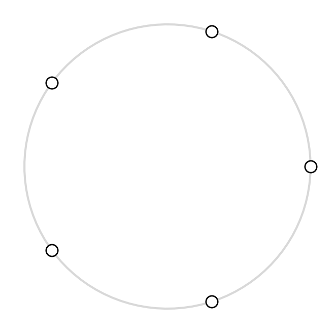
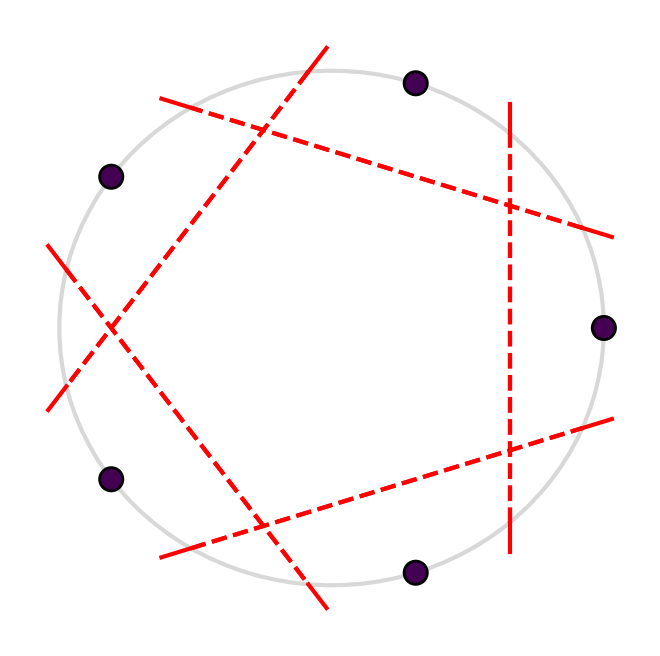

# Walker et al. 2026 — The Geometric Structure of Models Learning Sparse Data

См. также: [глобальный индекс понятий](../../concepts/index.md).

**Thomas Walker**, **T. Mitchell Roddenberry** (Rice University), **Ahmed Imtiaz Humayun** (Rice University, ныне Google Research), **Randall Balestriero** (Brown University), **Richard Baraniuk** (Rice University).

arXiv [2605.08464](https://arxiv.org/abs/2605.08464), май 2026 (v2), 27 страниц, 7 рисунков (11 файлов), 6 таблиц. Всего цитирований по Semantic Scholar — 0, в картотеке — 0. Сплайновая линия группы Baraniuk, а не механистическая интерпретируемость: там, где гипотеза многообразия неприменима (режимы названы *разрежёнными* — от гроккинга до табличных данных), модели выигрывают за счёт **нормальной согласованности** — якобиан в точке обучения ранга один и направлен вдоль самой точки. Она оптимальна под нормовым ограничением (теорема 1), максимально устойчива (теорема 2), у кусочно-аффинных сетей выражается как согласованность центроидов степенной диаграммы (центроид = построчная сумма якобиана), а её динамика связана с режимом обучения признаков (теорема 3). Отсюда **GrokAlign** — штраф на норму Фробениуса якобиана, ускоряющий гроккинг в 1.5–19.8 раза на пяти постановках против Grokfast и OrthoGrad, — и **RFAM**, инициализация ковариацией для Recursive Feature Machines на табличных данных.

Оригинал и производные файлы этой папки:

- [`original/2605.08464.the-geometric-structure-of-models-learning-sparse-data.md`](original/2605.08464.the-geometric-structure-of-models-learning-sparse-data.md) — конверсия оригинала (ar5iv HTML v2, сверена с PDF; рисунок 7 восстановлен из PDF, нумерация ссылок перенумерована по PDF) в Markdown без правок содержания.
- [`2605.08464.the-geometric-structure-of-models-learning-sparse-data.claims.txt`](2605.08464.the-geometric-structure-of-models-learning-sparse-data.claims.txt) — пронумерованные утверждения статьи с пометками разбора.
- [`images/`](images/) — 7 рисунков (11 файлов).

Схема якорей и правила ссылок на карточку — в [README папки статей](../README.md).

## Затрагиваемые понятия

**[Гроккинг](../../concepts/grokking.md)** — введён как частный случай разрежённой постановки и главный испытательный полигон приёма: GrokAlign достигает гроккед-состояния в 100% прогонов во всех пяти постановках (XOR, sparse parity, MNIST на двух потерях, модульное сложение) и ускоряет в 1.51–19.76 раза с $p<10^{-4}$, тогда как Grokfast незначим в четырёх постановках из пяти, а OrthoGrad вовсе не гроккает на двух ([`p7-10`](#p7-10)). Разбор: «гроккинг — прототипический пример разрежённой задачи по определению» заявлено без проверки (определение 2 требует существования нормально согласованного подкласса — оно предполагается); порог «гроккед-состояния» задан вручную и различается по задачам (95/90/80/80/99%); модульное сложение здесь — полносвязная сеть с квадратичной активацией по Mallinar et al., а не трансформер, и именно там ускорение наименьшее (1.60); силы штрафа GrokAlign подобраны под каждую задачу, тогда как пара Grokfast выбрана по одному семени.

**[Ленивый и богатый режимы](../../concepts/lazy-to-rich-kernel-to-feature-learning.md)** — теорема 3, ключевая для гроккинга: *если* сеть уже запомнила обучающие данные, то ненулевая вторая производная скалярного произведения $\langle\boldsymbol{x},\boldsymbol{\mu}_{\varphi(\boldsymbol{x})}\rangle$ влечёт нестационарность NTK, то есть режим обучения признаков; расхожее объяснение гроккинга — застревание в линейном режиме с отсроченным включением обучения признаков ([`p7-7`](#p7-7)). Разбор: мостик от теоремы к приёму держится на обращении импликации — доказано «движение центроида $\Rightarrow$ движение NTK», а применяется «навяжем движение центроида $\Rightarrow$ получим обучение признаков»; формулировка теоремы говорит «changing rate of change», доказательство — «increasing»; под одну формулировку «застревания в линейном режиме» сведены три разных объяснения (Lyu, Rubin, Kumar), из которых к ней прямо относится лишь lazy-to-rich Kumar et al.

**[Меры прогресса](../../concepts/progress-measures.md)** — дешёвый измеримый геометрический признак: центроид ячейки степенной диаграммы равен построчной сумме якобиана, $\boldsymbol{\mu}_{\varphi(\boldsymbol{x})}=\boldsymbol{J}_{\boldsymbol{x}}^{\top}\mathbf{1}$, и доступен одним якобиан-векторным произведением для любой сети, включая трансформеры; у однослойного трансформера на модульной арифметике согласованность центроидов растёт вместе с выходом тестовой точности на плато ([`p5-15`](#p5-15)). Разбор: это соотнесение, вмешательства на трансформере нет; существенная оговорка приложения B — при перекрёстной энтропии центроиды нормально согласованного решения *нулевые* (признак вырождается ровно при самой ходовой потере, спасают его промежуточные слои ResNet); левая панель рисунка 1 получена на сетях, обученных с уже включённым GrokAlign — признак измеряется в присутствии приёма, который его наводит.

**[Варианты регуляризации](../../concepts/regularization-variants.md)** — GrokAlign как новый рычаг: штраф $\mathcal{R}_{\sigma}(\boldsymbol{x})=\mathbb{E}_{\boldsymbol{\epsilon}}(\|f(\boldsymbol{x}+\boldsymbol{\epsilon})-f(\boldsymbol{x})\|_{2}^{2}/\sigma^{2})\to\|\boldsymbol{J}_{\boldsymbol{x}}\|_{F}^{2}$ убирает не видимые на выходе ортогональные составляющие якобиана; приложение E сводит к той же норме Фробениуса и прямую оптимизацию согласованности, и ядерную норму, все три считаются оценщиком Хатчинсона, а выбранная реализация (случайные векторы в выходном пространстве, одна проекция) использует уже накопленные градиенты прямого прохода ([`p7-5`](#p7-5)). Разбор: связь нормового ограничения теоремы 1 с weight decay объявлена аналогией, а не выведена; в ячейке «OrthoGrad, XOR» среднее число эпох напечатано по 20% выживших прогонов — отбор по исходу; на MNIST-CE Grokfast и OrthoGrad медленнее базовой линии, но их $p$-значения не приведены.

## Что показано, а что предположено

Замечания редактора карточки по итогам разбора утверждений (`…claims.txt`, 51 пункт).

**Ценное — теория с выведенным из неё дешёвым приёмом и честной сверкой.** Цепочка «оптимальность (теорема 1) → устойчивость (теорема 2) → геометрия центроидов (предложение 1) → динамика признаков (теорема 3) → GrokAlign» — редкий для корпуса случай, когда ускоритель гроккинга выведен из теоремы, а не подобран; сравнение с Grokfast и OrthoGrad — на общем стенде с парным t-критерием и десятью семенами; приложение D добросовестно отрабатывает возражение о нулевых якобианах; воспроизводимость выше средней (два открытых хранилища, полные таблицы гиперпараметров, 50 GPU-часов на таблицу 1). Ветку RFAM делает осмысленной для корпуса связь с Mallinar et al. — гроккинг вне нейронных сетей.

**Несущее слабое звено — обращение импликации.** Теорема 3 доказывает «движение центроида при запомненных данных $\Rightarrow$ нестационарный NTK», а GrokAlign обоснован обратным ходом; сама разрежённость (определение 2 — свойство пары «данные + модель») в опытах нигде не проверяется, а принимается; правая часть размена RFAM скромна — точность «не хуже» не показана ($p=1.0$), $\alpha<1$ помогает лишь в трети табличных задач.

**Следы правки.** Лемма 3 напечатана с испорченным условием ($\mathbb{E}(\boldsymbol{u})$ и $=\boldsymbol{0}=\boldsymbol{I}_{C}$ слиты); «normal alignment serve as», «we consistently accelerates», «an extract dimension»; в определении 4 введено $c_{i}$, а в формуле стоит $c$ без индекса; битая ссылка на рисунок 7 в исходнике.

**Как работу будут цитировать** («GrokAlign ускоряет гроккинг в разы») — точнее: на пяти малых постановках с полносвязными сетями и десятью семенами штраф на норму Фробениуса якобиана даёт ускорение от 1.5 до 19.8 раза при собственной настройке силы штрафа под каждую задачу; мостик от теоремы к приёму держится на обращении импликации.

---

# Текст статьи

## Геометрическое строение моделей, обучающихся на разрежённых данных

**Thomas Walker**\* (Rice University), **T. Mitchell Roddenberry** (Rice University), **Ahmed Imtiaz Humayun** (Rice University†), **Randall Balestriero** (Brown University), **Richard Baraniuk** (Rice University)

\* Переписка: thomas.walker@rice.edu

† Ныне в Google Research

## Аннотация

Гипотезу многообразия (MH) часто используют для объяснения того, как машинное обучение может преодолеть *проклятие размерности*. Однако MH применима только в режимах, где обучающие данные дают достаточно плотную выборку лежащего в основе низкоразмерного многообразия данных, или где такое низкоразмерное многообразие мыслимо присутствует. Режимы, где MH неприменима, мы называем **разрежёнными**. В этой статье мы демонстрируем, что модели преуспевают в разрежённом режиме, эксплуатируя высокоструктурированную местную геометрию — свойство, которое мы формализуем как **нормальную согласованность**. Мы доказываем, что нормально согласованные классификаторы — чьи входо-выходные якобианы ранга один и совершенно согласованы с обучающими данными — минимизируют обучающую цель под нормовыми ограничениями и достигают наибольшей местной устойчивости под ограничением ненулевого якобиана. Для непрерывных кусочно-аффинных глубоких сетей нормальная согласованность проявляется геометрически как *согласованность центроидов* внутри наведённого сетью разбиения степенной диаграммы и происходит из режима обучения признаков. Движимые этими теоретическими прозрениями, мы вводим **GrokAlign** — стратегию регуляризации, активно наводящую нормальную согласованность. Мы демонстрируем, что GrokAlign значительно ускоряет обучающую динамику глубоких сетей, относящуюся к явлению гроккинга. Далее мы применяем принцип нормальной согласованности к Recursive Feature Machines (RFM), вводя **Recursive Feature Alignment Machines (RFAM)**. Мы показываем, что RFAM являют большую состязательную устойчивость по сравнению с RFM при обучении на табличных данных.

## 1 Введение

Гипотеза многообразия (MH) утверждает, что многомерные природные данные имеют большую часть своей структуры в низкоразмерном подпространстве [1, 2]. Практики машинного обучения используют это как апостериорное объяснение того, как модели могут преодолевать *проклятие размерности* и извлекать узоры из многомерных наборов данных.

MH предполагает непрерывную низкоразмерную структуру; потому для применимости на практике необходимо, чтобы обучающие данные были достаточно плотной выборкой. Более того, предполагаемая низкоразмерная структура должна быть достаточно регулярной относительно естественных индуктивных смещений моделей машинного обучения. В самом деле, многие распространённые практики машинного обучения можно рассматривать как обеспечение этих условий. Например, аугментация данных обеспечивает плотную выборку многообразия [3, 4, 5, 6, 7, 8], а архитектуры моделей проектируются дополняющими известные структуры данных [9, 10].

**[p. 2]**

Тем не менее модели машинного обучения регулярно преуспевают в режимах, где гипотеза многообразия рушится. Это происходит прежде всего при двух условиях: во-первых, в бедных данными постановках, где стандартную аугментацию данных нельзя легко применить, что делает плотную выборку входного пространства недостижимой. Во-вторых, во внутренне дискретных доменах — таких как алгоритмическая задача модульного сложения — понятие непрерывного лежащего в основе многообразия данных остаётся целиком неприменимым даже при допущении бесконечных данных.

В этой статье мы показываем, что успех моделей машинного обучения в этих *разрежённых* постановках можно схожим образом приписать эксплуатации низкоразмерных структур.

###### p2-3

Поскольку явление гроккинга — насыщение качества на обучающем множестве задолго до насыщения качества на тестовом [11] — есть канонический пример разрежённой постановки, мы используем эти прозрения, чтобы ввести стратегию **GrokAlign** для ускорения обучающей динамики гроккинга. Схожим образом, поскольку табличные данные можно описать как разрежённые, мы вводим **Recursive Feature Alignment Machines (RFAM)** для улучшения устойчивости Recursive Feature Machines (RFM) [12] при обучении на табличных данных.

## 2 Разрежённые наборы данных и нормально согласованные классификаторы

Пусть $f:\mathbb{R}^{d}\to\mathbb{R}^{C}$ — классификатор, предсказывающий класс входа $\boldsymbol{x}\in\mathbb{R}^{d}$ как $\mathrm{argmax}(f(\boldsymbol{x}))$. Пусть $\boldsymbol{J}_{\boldsymbol{x}}\in\mathbb{R}^{C\times d}$ обозначает входо-выходной якобиан $f$ в $\boldsymbol{x}$, с $c^{\text{th}}$ строкой, обозначаемой $\boldsymbol{J}^{(c)}_{\boldsymbol{x}}$, и $\boldsymbol{\nu}_{\boldsymbol{x}}^{(k)}\in\mathbb{R}^{d}$, обозначающим его $k^{\text{th}}$ верхний правый сингулярный вектор с соответствующим сингулярным числом $\sigma_{\boldsymbol{x}}^{(k)}\in\mathbb{R}$. Выход классификатора разлагается как $f(\boldsymbol{x})=\boldsymbol{J}_{\boldsymbol{x}}\boldsymbol{x}+\boldsymbol{b}_{\boldsymbol{x}}$, где $\boldsymbol{b}_{\boldsymbol{x}}\in\mathbb{R}^{C}$ — смещение $f$ в $\boldsymbol{x}$. Классификаторы обучаются на наборе данных $\mathcal{D}=\left\{\left(\boldsymbol{x}_{i},y_{i}\right)\right\}_{i=1}^{n}$ — где $\boldsymbol{x}_{i}\in\mathbb{R}^{d}$ и $y_{i}\in\mathbb{R}$ — его соответствующий класс — под некоторой функцией потерь $\mathcal{L}=\frac{1}{n}\sum_{i=1}^{n}\ell\left(f\left(\boldsymbol{x}_{i}\right),y_{i}\right)=:\frac{1}{n}\sum_{i=1}^{n}\ell_{i}$.

##### **Определение 1.**

Классификатор $f$ **нормально согласован** с набором данных $\mathcal{D}$, если для каждого $i\in\{1,\dots,n\}$ существует $\boldsymbol{c}_{i}\in\mathbb{R}^{C}$ такой, что $\boldsymbol{J}_{\boldsymbol{x}_{i}}=\boldsymbol{c}_{i}\boldsymbol{x}_{i}^{\top}$.

То есть модель $f$ нормально согласована с $\mathcal{D}$, если в каждой обучающей точке $\boldsymbol{x}_{i}$ из $\mathcal{D}$ она варьируется только вдоль направления $\boldsymbol{x}_{i}$. В частности, якобиан модели в $\boldsymbol{x}_{i}$ — *ранга один* со строками, кратными $\boldsymbol{x}_{i}$.

Вспоминая, как выход классификатора восстанавливается как $f(\boldsymbol{x}_{i})=\boldsymbol{J}_{\boldsymbol{x}_{i}}\boldsymbol{x}_{i}+\boldsymbol{b}_{\boldsymbol{x}_{i}}$, нормальная согласованность сильно резонирует с понятием *банка согласованных фильтров* из классической теории обнаружения (радар и сонар в особенности) [13, 14]. Банк согласованных фильтров классифицирует сигнал, выбирая шаблон, максимизирующий скалярное произведение сигнала и шаблона. Когда входной сигнал — $\boldsymbol{x}_{i}$, это делается оптимально установкой шаблона равным $\boldsymbol{x}_{i}$ (по неравенству Коши–Шварца). Итак, нормально согласованный классификатор в точности реализует программу оптимального согласованного фильтра на обучающих данных.

### 2.1 Разрежённые наборы данных

Строение обученной модели может раскрывать информацию о данных, на которых она обучалась. Геометрия нормально согласованного классификатора локально одномерна, поскольку вариации происходят только вдоль направлений обучающих данных. То есть, с точки зрения нормально согласованной модели, никакой лежащей в основе структуры, связывающей набор данных, нет. Иными словами, набор данных *разрежён*.

##### **Определение 2.**

Набор данных $\mathcal{D}$ **разрежён** относительно класса классификаторов $\mathcal{H}$, если существует подкласс классификаторов $\mathcal{H}^{\prime}$, нормально согласованных с $\mathcal{D}$, такой что для каждого $i=\left\{1,\dots,n\right\}$ значение $\ell_{i}$ может меняться независимо от $\ell_{j}$ для $j\neq i$.

Нормально согласованные классификаторы осуществимы для параметризованных моделей, таких как глубокие сети. В приложении A мы демонстрируем, как глубокую сеть с одним скрытым слоем можно построить нормально согласованной с набором данных $\mathcal{D}$. Построение демонстрирует, что с ростом размера $\mathcal{D}$ (то есть по мере уплотнения) нормально согласованный классификатор становится всё более нерегулярным с точки зрения нормы весов.

### 2.2 Свойства нормально согласованных классификаторов

#### Оптимизация обучающей цели.

Хотя нормальная согласованность выглядит ограничительным свойством, она оказывается оптимальной в разрежённом режиме.

**[p. 3]**

##### **Теорема 1.**

###### p3-1

*Пусть $\ell$ выпукла, неотрицательна и дифференцируема, и пусть $\mathcal{D}$ разрежён. Тогда под ограничением $\left\|\boldsymbol{J}_{\boldsymbol{x}_{i}}\right\|_{F}^{2}+\left\|\boldsymbol{b}_{\boldsymbol{x}_{i}}\right\|_{2}^{2}\leq\alpha$ для $i\in\{1,\dots,n\}$ классификатор, минимизирующий $\mathcal{L}$, таков, что $\boldsymbol{J}_{\boldsymbol{x}_{i}}=\boldsymbol{c}_{i}\boldsymbol{x}_{i}^{\top}$ для $i\in\{1,\dots,n\}$, причём $\boldsymbol{c}_{i}$ зависит от $\boldsymbol{x}_{i}$ только через его норму и $y_{i}$.*

*Доказательство.* См. раздел G.2. ∎

Теорема 1 говорит, что в оптимуме обучающей цели — под ограничением на норму якобиана и смещения на обучающих данных — классификатор нормально согласован. Нормовое ограничение теоремы 1 аналогично налагаемому weight decay; известно также, что оно предотвращает «взрыв градиента» [15, 16].

Природу согласованности для разных функций потерь мы исследуем в приложении B.

#### Проявление устойчивости.

На практике желателен устойчивый классификатор, верно классифицирующий обучающие данные. То есть классификатор, инвариантный к малым возмущениям входа. Чтобы изучить это формально, закрепим входную точку $\boldsymbol{x}$ с истинным классом $y$. Пусть $\mathcal{G}_{\boldsymbol{x},\lambda}$ — множество линейных моделей $g(\boldsymbol{z})=\boldsymbol{J}\boldsymbol{z}+\boldsymbol{b}$ таких, что $\arg\max\left(g(\boldsymbol{x})\right)=y$ и $\frac{\left|[\boldsymbol{b}]_{y}-[\boldsymbol{b}]_{c}\right|}{\left\|\boldsymbol{J}^{(y)}-\boldsymbol{J}^{(c)}\right\|_{2}}\leq\lambda$ для $c\neq y$.

Хотя это второе условие предотвращает тривиальное решение постоянной функции с нулевым якобианом, оно естественно возникает из стандартного регуляризованного обучения. Конкретно, weight decay строго ограничивает величину местного смещения $\boldsymbol{b}_{x}$. Следовательно, для получения подходящего классификационного зазора сеть вынуждена поддерживать ненулевые якобианы и удовлетворять этому условию. Принуждение якобианов к нулю геометрически схлопывает модель в ограниченную постоянную функцию внутри каждого активационного политопа, разрушая её выразительность и ведя к тяжёлой деградации качества. Мы излагаем этот довод подробнее в приложении D, а также проверяем его эмпирически.

Пусть местная устойчивость $g\in\mathcal{G}_{\boldsymbol{x},\lambda}$ задана как

$$
\rho\left(\boldsymbol{x};g\right)=\inf\left(\left\{\left\|\boldsymbol{\epsilon}\right\|_{2}:\arg\max(g(\boldsymbol{x}+\boldsymbol{\epsilon}))\neq y\right\}\right),
$$

так что наибольшая местная устойчивость есть $\rho(\boldsymbol{x})=\sup_{g\in\mathcal{G}_{\boldsymbol{x},\lambda}}\left(\rho\left(\boldsymbol{x};g\right)\right)$. Для произвольного классификатора $f$ можно говорить о его местной устойчивости в $\boldsymbol{x}$ как $\rho\left(\boldsymbol{x};\tilde{f}\right)$, где $\tilde{f}\in\mathcal{G}_{\boldsymbol{x},\lambda}$ задан как $\tilde{f}(\boldsymbol{z})=\boldsymbol{J}_{\boldsymbol{x}}\boldsymbol{z}+\boldsymbol{b}_{\boldsymbol{x}}$.

##### **Теорема 2.**

*Нормально согласованный классификатор $f$ из теоремы 1 достигает наибольшей местной устойчивости на $\mathcal{D}$.*

*Доказательство.* См. раздел G.3. ∎

Чтобы понять, достигается ли нормально согласованный классификатор на практике, мы считаем нормальной согласованностью и действенным рангом модели к множеству $\mathcal{D}$ величины

$$
\mathrm{na}(f;\mathcal{D})=\frac{1}{|\mathcal{D}|}\sum_{\boldsymbol{x}\in\mathcal{D}}\left|\frac{\left\langle\boldsymbol{\nu}_{\boldsymbol{x}}^{(1)},\boldsymbol{x}\right\rangle}{\left\|\boldsymbol{\nu}_{\boldsymbol{x}}^{(1)}\right\|_{2}\left\|\boldsymbol{x}\right\|_{2}}\right|,\quad\text{and}\quad\mathrm{er}(f;\mathcal{D}):=\frac{1}{|\mathcal{D}|}\sum_{\boldsymbol{x}\in\mathcal{D}}\frac{\sum_{r=1}^{C}\left(\sigma_{\boldsymbol{x}}^{(r)}\right)^{2}}{\left(\sigma^{(1)}_{\boldsymbol{x}}\right)^{2}},
$$

соответственно.

### 2.3 Возникновение разрежённости

Разрежённость зависит и от набора данных, и от модели. С одной стороны, если у набора данных низкая плотность выборки, он с большей вероятностью разрежён. В домене изображений техники вроде аугментации данных [3, 4, 5, 6, 7, 8] могут увеличить плотность выборки набора, уводя его из разрежённого режима. На левой панели рисунка 1 мы обучаем полносвязную глубокую сеть на подмножестве MNIST [17] с разной интенсивностью аугментации данных. С ростом интенсивности аугментации величина нормальной согласованности убывает.

С другой стороны, если ёмкость модели растёт, растёт её способность нормально согласоваться с данным набором. Схожим образом разные индуктивные смещения архитектуры модели могут делать её более или менее способной проявлять нормальную согласованность. На правой панели рисунка 1 мы наблюдаем, что с ростом ёмкости модели проявляется большая величина нормальной согласованности при закреплённом количестве обучающих данных CIFAR10 [18].

*Рисунок 1: **Разрежённость набора данных — свойство набора данных и модели.** На левой панели мы отслеживаем нормальную согласованность при обучении глубокой сети на подмножестве MNIST при варьирующих интенсивностях аугментации данных. На правой панели мы устойчиво обучаем широкие остаточные архитектуры глубоких сетей [19] на подмножествах CIFAR10 разного размера. В конце обучения мы отслеживаем нормальную согласованность моделей. Подробности опытов — в разделе F.1.* **[p. 4]**

## 3 Нормальная согласованность для разных архитектур моделей

До сих пор теория нормальной согласованности была безразлична к архитектуре модели. Понимание взаимодействия между нормальной согласованностью и архитектурой модели может высветить *внутреннюю* полезность разных архитектур и подсказать стратегии улучшения их реализации.

В этом разделе мы рассматриваем нормальную согласованность в глубоких сетях и recursive feature machines [12]. Более простой пример — гауссову ядерную логистическую регрессию — мы рассматриваем в приложении C.

### 3.1 Глубокие сети

Для развития теории глубоких сетей мы сосредотачиваемся на непрерывных кусочно-аффинных (CPA) глубоких сетях. Неоклассические классификаторы вроде ReLU-сетей — в точности CPA, тогда как современные классификаторы вроде трансформеров — приблизительно CPA [13, 14]. Поскольку якобианы вычислимы для произвольных дифференцируемых функций, выводы в CPA-постановке переносятся на общую постановку.

#### 3.1.1 Непрерывные кусочно-аффинные глубокие сети

Любая глубокая сеть, построенная из аффинных преобразований (например, свёртки, матричного умножения) и кусочно-линейных операций (например, активации ReLU, max pooling), — это CPA-сплайн [13, 14]. У CPA глубоких сетей две тесно взаимосвязанные черты: (i) нерегулярная мозаика (она же разбиение) $\Omega$ $d$-мерного входного пространства на выпуклые политопы [20]; (ii) набор аффинных отображений (по одному на политоп), устроенных так, что общее отображение вход-выход непрерывно. Эти политопы и аффинные отображения соединяются в представление

$$
f(\boldsymbol{x})=\sum_{\omega\in\Omega}(\boldsymbol{A}_{\omega}\boldsymbol{x}+\boldsymbol{b}_{\omega})\mathbb{I}_{\{\boldsymbol{x}\in\omega\}}, \tag{1}
$$

где матрица «наклонов» $\boldsymbol{A}_{\omega}$ и вектор «сдвига» $\boldsymbol{b}_{\omega}$ задают аффинное преобразование, отображающее все входы из ячейки $\omega\in\Omega$ в выход. Хотя это не явно в (1), $\Omega$, $\boldsymbol{A}_{\omega}$ и $\boldsymbol{b}_{\omega}$ устроены так, что общее отображение $f$ непрерывно. Ясно, что якобиан и смещение CPA-классификатора во входной точке $\boldsymbol{x}$ задаются просто как $\boldsymbol{J}_{\boldsymbol{x}}=\boldsymbol{A}_{\omega}$ и $\boldsymbol{b}_{\boldsymbol{x}}=\boldsymbol{b}_{\omega}$, где $\boldsymbol{x}\in\omega$. Конечно, якобиан не существует на границах ячеек, но это множество имеет меру нуль во входном пространстве.

Мозаика входного пространства $\Omega$ неявно определена весами и смещениями CPA глубокой сети. Кратко, для ReLU-сети (подробнее см. [13, 14]) вычисление вывода в каждом нейроне слоя вовлекает скалярное произведение входа слоя с соответствующей строкой весовой матрицы слоя. Вместе с аддитивным членом смещения это вычисление задаёт гиперплоскость, делящую входное пространство слоя на два полупространства. Ячейки образуются комбинаторными пересечениями этих полупространств. Сцепление слоёв ведёт к процессу подразбиения, создающему всё более тонкую мозаику [21].

Чтобы рассмотреть это точнее, введём следующие обозначения. Для CPA глубокой сети $f=\left(f^{(L)}\circ\dots\circ f^{(1)}\right)$ каждый слой $f^{d^{(l)}}:\mathbb{R}^{(l-1)}\to\mathbb{R}^{d^{(l)}}$ и подкомпонента **[p. 5]** $f^{(1\leftarrow l)}=\left(f^{(l)}\circ\dots\circ f^{(1)}\right):\mathbb{R}^{d}\to\mathbb{R}^{d^{(l)}}$ — тоже CPA глубокая сеть. Пусть $\boldsymbol{A}^{(l)}_{\omega^{(l)}}$, $\boldsymbol{b}^{(l)}_{\omega^{(l)}}$, $\omega^{(l)}$, $\Omega^{(l)}$ и $\boldsymbol{A}^{(1\leftarrow l)}_{\omega^{(1\leftarrow l)}}$, $\boldsymbol{b}^{(1\leftarrow l)}_{\omega^{(1\leftarrow l)}}$, $\omega^{(1\leftarrow l)}$, $\Omega^{(1\leftarrow l)}$ — аналогичные обозначения, как введённые для CPA глубоких сетей.

#### 3.1.2 Теория согласованности центроидов

$l^{\text{th}}$ слой CPA глубокой сети разбивает своё входное пространство как степенную диаграмму $\Omega^{(l)}\subseteq\mathbb{R}^{(l-1)}$, делая разбиение входного пространства глубокой сети подразбиением степенной диаграммы [20]. Степенные диаграммы близко родственны диаграммам Вороного, но применяют иное определяющее расстояние [22].

##### **Определение 3.**

По набору из $Q$ пар **центроид-радиус** $\left\{\left(\boldsymbol{\mu}_{q},r_{q}\right)\right\}_{q=1}^{Q}\subseteq\mathbb{R}^{d}\times\mathbb{R}$ **степенная диаграмма** разбивает $\mathbb{R}^{d}$ на $Q$ непересекающихся ячеек $\Omega=\{\omega_{1},\dots,\omega_{Q}\}$ таких, что $\cup_{q=1}^{Q}\omega_{q}=\mathbb{R}^{d}$, с каждой ячейкой, заданной как

$$
\omega_{q}=\left\{\boldsymbol{x}\in\mathbb{R}^{d}:q=\arg\min_{q^{\prime}\in\{1,\dots,Q\}}\left(\left\|\boldsymbol{x}-\boldsymbol{\mu}_{q^{\prime}}\right\|_{2}^{2}-r_{q^{\prime}}\right)\right\}. \tag{2}
$$

Расстояние, минимизируемое в (2), называется расстоянием Лагерра [23].

Подразбиение степенной диаграммы, наводимое глубокой сетью, строится рекурсивно. Первый слой сети разбивает входное пространство $\mathbb{R}^{d}$ как $\Omega^{(1)}$. Второй слой затем разбивает проекции ячеек $\omega^{(1)}\subseteq\mathbb{R}^{d}$ в $\mathbb{R}^{d^{(1)}}$, наведённые $f^{(1)}$. Они затем стягиваются назад в $\mathbb{R}^{d}$, давая более тонкое разбиение входного пространства $\Omega^{(1\leftarrow 2)}$, которое есть подразбиение степенной диаграммы. В конце концов строится подразбиение степенной диаграммы $\Omega=\Omega^{(1\leftarrow L)}$ сети. Этот процесс аналогичен иерархическому $k$-means [24]. Подробнее см. [20], где показано, что можно схожим образом получить дескрипторы области $\omega_{q}^{(1\leftarrow l)}$ подразбиения степенной диаграммы $\Omega^{(1\leftarrow l)}$, а именно $\boldsymbol{\mu}_{q}^{(1\leftarrow l)}$ и $r_{q}^{(1\leftarrow l)}$. Для простоты мы всё равно будем называть $\boldsymbol{\mu}_{q}^{(1\leftarrow l)}$ и $r_{q}^{(1\leftarrow l)}$ центроидами и радиусами; однако важно отметить, что они не восстанавливают разбиение $\Omega^{(1\leftarrow l)}$ через (2).

Хотя каждая ячейка $\omega$ разбиения определена неявно через комбинаторное пересечение полупространств, её центроид и радиус определены явно. В диаграмме Вороного центроиды можно истолковывать как элементы входного пространства $\mathbb{R}^{d}$. В отличие от диаграмм Вороного, в степенной диаграмме (подразбиении) центроид, скорее всего, лежит вне своего политопа.

Пусть $\varphi(\boldsymbol{x})=q$, где $\boldsymbol{x}\in\omega_{q}$, и обозначим вектор из единиц через $\mathbf{1}$.

##### **Предложение 1.**

*Для CPA глубокой сети $f$ имеем $\boldsymbol{\mu}_{\varphi(\boldsymbol{x})}=\boldsymbol{J}_{\boldsymbol{x}}^{\top}\mathbf{1}$ и $r_{\varphi(\boldsymbol{x})}=\left\|\boldsymbol{\mu}_{\varphi(\boldsymbol{x})}\right\|_{2}^{2}+2\boldsymbol{b}_{\boldsymbol{x}}^{\top}\mathbf{1}$.*

*Доказательство.* См. раздел G.4. ∎

###### p5-9

Словами: *центроид политопа — построчная сумма его якобиана*. Предложение 1 позволяет нам получать доступ к центроиду и радиусу политопов через действенное якобиан-векторное произведение для произвольных глубоких сетей, включая трансформеры [10].

Установленная связь между параметрами степенной диаграммы глубокой сети и её якобианом позволяет рассмотреть следствия нормальной согласованности в глубоких сетях.

##### **Определение 4.**

Глубокая сеть $f$ **центроидно согласована** с $\mathcal{D}$, если для каждого $i\in\{1,\dots,n\}$ существует $c_{i}\in\mathbb{R}$ такой, что $\boldsymbol{\mu}_{\varphi(\boldsymbol{x}_{i})}=c\boldsymbol{x}_{i}$.

Из определения 1 и предложения 1 ясно, что центроидная согласованность — более слабое свойство, чем нормальная согласованность.

##### **Следствие 1.**

*Глубокая сеть, нормально согласованная с $\mathcal{D}$, центроидно согласована с $\mathcal{D}$.*

Доказательство следует прямым вычислением центроида согласованного якобиана: $\boldsymbol{\mu}_{\varphi(\boldsymbol{x})}=\boldsymbol{c}\boldsymbol{x}^{\top}\mathbf{1}=\boldsymbol{x}\boldsymbol{c}^{\top}\mathbf{1}=c\boldsymbol{x}$, где $c=\boldsymbol{c}^{\top}\mathbf{1}$.

###### p5-15

На рисунке 2 мы проверяем, что однослойный трансформер, обученный модульному сложению, становится центроидно согласованным. В частности, центроидная согласованность коррелирует с генерализацией трансформера с обучающего множества на тестовое. Теперь мы поддержим это наблюдение, связав центроидную согласованность с *режимом обучения признаков*.

*Рисунок 2: **Трансформер с одним скрытым слоем, обучающийся модульной арифметике, являет центроидную согласованность.** Здесь мы обучаем однослойный трансформер на задаче модульной арифметики. Слева мы показываем точность модели на обучающем и отложенном тестовом множествах. Справа мы показываем центроидную согласованность отображения от вложения к логитам последнего токена контекста. Подробности опытов — в разделе F.3.* **[p. 6]**

#### 3.1.3 Центроидная согласованность отвечает обучению признаков

Пусть у глубокой сети $f$ есть параметры (например, веса и смещения) $\theta$. В частности, рассмотрим двухслойную глубокую сеть вида $f_{\theta}(\boldsymbol{x})=\boldsymbol{W}_{2}\left(\sigma\left(\boldsymbol{W}_{1}\boldsymbol{x}\right)\right)$, где $\boldsymbol{W}_{2}\in\mathbb{R}^{d^{(2)}\times d^{(1)}}$, $\boldsymbol{W}_{1}\in\mathbb{R}^{d^{(1)}\times d}$, а $\sigma$ — нелинейность ReLU.

##### **Лемма 1.**

*Для $f_{\theta}$ имеем $\boldsymbol{\mu}_{\varphi(\boldsymbol{x})}=\left(\boldsymbol{W}_{2}\boldsymbol{Q}_{\boldsymbol{x}}\boldsymbol{W}_{1}\right)^{\top}\mathbf{1}$, где $\boldsymbol{Q}_{\boldsymbol{x}}:=\mathrm{diag}\left(\sigma^{\prime}\left(\boldsymbol{W}_{1}\boldsymbol{x}\right)\right)$.*

Пусть $\mathcal{L}=\frac{1}{n}\sum_{i=1}^{n}\ell\left(f\left(\boldsymbol{x}_{i}\right),y_{i}\right)$ — произвольная дифференцируемая функция потерь, и глубокая сеть обучается полнобатчевым градиентным спуском со скоростью обучения $\eta$. Обозначим отрицательный градиент потери по выходу сети как $\boldsymbol{m}_{\boldsymbol{x}_{i}}:=-\nabla_{\boldsymbol{z}}\ell\left(\boldsymbol{z},y_{i}\right)\big|_{\boldsymbol{z}=f_{\theta}(\boldsymbol{x}_{i})}$.

##### **Предложение 2.**

*В описанной постановке имеем*

$$
\partial_{t}\left(\left\langle\boldsymbol{x},\boldsymbol{\mu}_{\varphi(\boldsymbol{x})}\right\rangle\right)=\frac{\eta}{n}\sum_{i=1}^{n}\boldsymbol{m}_{\boldsymbol{x}_{i}}^{\top}\left[\left(\boldsymbol{W}_{2}\boldsymbol{Q}_{\boldsymbol{x}_{i}}\boldsymbol{Q}_{\boldsymbol{x}}\left(\boldsymbol{W}_{2}\right)^{\top}\right)\left\langle\boldsymbol{x},\boldsymbol{x}_{i}\right\rangle+\left(\sigma\left(\boldsymbol{W}_{1}\boldsymbol{x}\right)^{\top}\sigma\left(\boldsymbol{W}_{1}\boldsymbol{x}_{i}\right)\right)\right]\mathbf{1}.
$$

*Доказательство.* См. раздел G.5. ∎

Нейронное касательное ядро [25] между $\boldsymbol{x},\boldsymbol{x}^{\prime}\in\mathbb{R}^{d}$ принимается как $\Theta\left(\boldsymbol{x},\boldsymbol{x}^{\prime}\right)=\nabla_{\theta}f_{\theta}(\boldsymbol{x})\left(\nabla_{\theta}f_{\theta}\left(\boldsymbol{x}^{\prime}\right)\right)^{\top}$. Для рассматриваемой здесь двухслойной сети нейронное касательное ядро задано как

$$
\Theta(\boldsymbol{x},\boldsymbol{x}_{i})=\left(\sigma(\boldsymbol{W}_{1}\boldsymbol{x})^{\top}\sigma(\boldsymbol{W}_{1}\boldsymbol{x}_{i})\right)\boldsymbol{I}+\left(\boldsymbol{x}^{\top}\boldsymbol{x}_{i}\right)\boldsymbol{W}_{2}\boldsymbol{Q}_{\boldsymbol{x}_{i}}\boldsymbol{Q}_{\boldsymbol{x}}\left(\boldsymbol{W}_{2}\right)^{\top}.
$$

Отсюда выражение предложения 2 можно записать как

$$
\partial_{t}\left(\left\langle\boldsymbol{x},\boldsymbol{\mu}_{\varphi(\boldsymbol{x})}\right\rangle\right)=\frac{\eta}{n}\sum_{i=1}^{n}\boldsymbol{m}_{\boldsymbol{x}_{i}}^{\top}\Theta(\boldsymbol{x},\boldsymbol{x}_{i})\mathbf{1}. \tag{3}
$$

*Линейный* режим и режим *обучения признаков* при обучении глубокой сети характеризуются относительно статичным или динамичным нейронным касательным ядром соответственно [26, 27, 28]. Точнее, глубокая сеть в линейном режиме обучения, когда для $\boldsymbol{x}\in\mathbb{R}^{d}$ имеем $\partial_{t}\left(\boldsymbol{\Theta}\left(\boldsymbol{x},\boldsymbol{x}_{i}\right)\right)=0$ для каждого $i=1,\dots,n$, и в режиме обучения признаков иначе. Первый выявляет, когда глубокая сеть приближает линейную функцию, тогда как второй вовлекает нелинейности глубокой сети.

##### **Теорема 3.**

###### p6-9

*Пусть глубокая сеть $f$ запомнила обучающие данные (то есть $\partial_{t}\left(\boldsymbol{m}_{\boldsymbol{x}_{i}}\right)=0$ для каждого $i=1,\dots,n$). Тогда меняющаяся скорость изменения скалярного произведения с центроидом (то есть $\partial^{2}_{t}\left(\left\langle\boldsymbol{x},\boldsymbol{\mu}_{\varphi(\boldsymbol{x})}\right\rangle\right)\neq 0$) влечёт нахождение глубокой сети в режиме обучения признаков.*

*Доказательство.* См. раздел G.5. ∎

**[p. 7]**

#### 3.1.4 GrokAlign

Из теоремы 3 очевидно, что поощрение центроидной согласованности выгодно для наведения обучения признаков. Потому в этом разделе мы исследуем, как нормальную согласованность (влекущую центроидную) можно наводить в глубоких сетях, обучаемых градиентными методами. Теорема 1 мотивирует регуляризацию норм якобиана и смещения во время обучения — метод, который мы вводим как GrokAlign.

Однако априори неясно, как эта стратегия связана с прямой регуляризацией нормальной согласованности и действеннее ли она. Для простоты мы отныне рассматриваем модели без смещений, так что $\boldsymbol{b}_{\boldsymbol{x}}=\boldsymbol{0}$ для каждого $\boldsymbol{x}\in\mathbb{R}^{d}$. Однако все выводы верны и для моделей со смещениями — добавлением измерения из единиц к входному пространству.

Одна из причин, по которой якобианы классификатора могут являть высокий действенный ранг и не согласовываться при стандартном обучении, — присутствие ортогональных составляющих. Точнее, если $\boldsymbol{J}_{\boldsymbol{x}}\in\mathbb{R}^{C\times d}$ не согласован, то с необходимостью существуют ненулевые векторы $\boldsymbol{c}\in\mathbb{R}^{C}$ и $\boldsymbol{u}\in\mathbb{R}^{d}$ вместе с матрицей $\tilde{\boldsymbol{J}}_{\boldsymbol{x}}\in\mathbb{R}^{C\times d}$ такие, что $\boldsymbol{J}_{\boldsymbol{x}}=\tilde{\boldsymbol{J}}_{\boldsymbol{x}}+\boldsymbol{c}\boldsymbol{u}^{\top}$ с $\boldsymbol{u}\perp\boldsymbol{x}$. Эта ортогональная составляющая $\boldsymbol{c}\boldsymbol{u}^{\top}$ якобиана $\boldsymbol{J}_{\boldsymbol{x}}$ не влияет на выход классификатора, поскольку $f(\boldsymbol{x})=\boldsymbol{J}_{\boldsymbol{x}}\boldsymbol{x}=\tilde{\boldsymbol{J}}_{\boldsymbol{x}}\boldsymbol{x}+\boldsymbol{c}\boldsymbol{u}^{\top}\boldsymbol{x}=\tilde{\boldsymbol{J}}_{\boldsymbol{x}}\boldsymbol{x}$. Следовательно, при обучении классификатор не увидит никаких градиентов для удаления этой составляющей из якобиана.

Для удаления этих ортогональных составляющих необходимо, чтобы якобиан $f$ в $\boldsymbol{x}$ действовал на вход, не параллельный $\boldsymbol{x}$. Для непрерывной кусочно-аффинной (CPA) модели мы можем применить малое возмущение $\boldsymbol{\epsilon}\in\mathbb{R}^{d}$ к $\boldsymbol{x}$ так, что $\boldsymbol{J}_{\boldsymbol{x}+\boldsymbol{\epsilon}}=\boldsymbol{J}_{\boldsymbol{x}}$. Значит,

$$
f(\boldsymbol{x}+\boldsymbol{\epsilon})=\boldsymbol{J}_{\boldsymbol{x}+\boldsymbol{\epsilon}}(\boldsymbol{x}+\boldsymbol{\epsilon})=\boldsymbol{J}_{\boldsymbol{x}}\boldsymbol{x}+\boldsymbol{J}_{\boldsymbol{x}}\boldsymbol{\epsilon}=f(\boldsymbol{x})+\left(\tilde{\boldsymbol{J}}_{\boldsymbol{x}}+\boldsymbol{c}\boldsymbol{u}^{\top}\right)\boldsymbol{\epsilon}, \tag{4}
$$

###### p7-5

то есть ортогональные составляющие, которые мы хотим удалить, вносят вклад в выход классификатора. Потому на практике для удаления ортогональных составляющих достаточно регуляризовать $\mathcal{R}_{\sigma}(\boldsymbol{x}):=\mathbb{E}_{\boldsymbol{\epsilon}}\left(\frac{\left\|f(\boldsymbol{x}+\boldsymbol{\epsilon})-f(\boldsymbol{x})\right\|_{2}^{2}}{\sigma^{2}}\right)$ для $\boldsymbol{\epsilon}$, тянутого из гауссова распределения с ковариацией $\sigma^{2}\boldsymbol{I}$. При $\sigma\to 0$ следует $\mathcal{R}_{\sigma}(\boldsymbol{x})\to\left\|\boldsymbol{J}_{\boldsymbol{x}}\right\|_{F}^{2}=:\mathcal{R}(\boldsymbol{x})$; то есть регуляризацию GrokAlign можно истолковать как метод удаления ортогональных составляющих якобианов классификатора. В приложении E мы разбираем практическую реализацию GrokAlign и сравниваем её с прямой регуляризацией нормальной согласованности.

*Таблица 1: **GrokAlign значительно ускоряет темп гроккинга.** Для каждой постановки мы рассматриваем обучающие конвейеры на десяти случайных инициализациях и записываем эпоху достижения гроккед-состояния. Мы сообщаем среднюю эпоху, степень улучшения над базовым обучающим конвейером и $p$-значение соответствующего парного t-критерия, сравнивающего отдельные обучающие прогоны рассматриваемой регуляризации и базовой линии; незначимые результаты помечены звёздочкой. Подробности опытов — в разделе F.4.* **[p. 8]**

| **Набор данных** | **Метрика** | **База** | **Grokfast** | **OrthoGrad** | **GrokAlign** |
|---|---|---|---|---|---|
| XOR | Достигает гроккед-состояния | $100\%$ | $100\%$ | $20\%$ | $100\%$ |
|  | Число эпох | $148$ | $148$ | $59^{*}$ | $\mathbf{97}$ |
|  | Степень ускорения | – | $1.0$ | $2.51^{*}$ | $\mathbf{1.51}$ |
|  | $p$-значение | – | – | $0.053$ | $3.2\times 10^{-8}$ |
| Sparse Parity | Достигает гроккед-состояния | $100\%$ | $90\%$ | $100\%$ | $100\%$ |
|  | Число эпох | $2000$ | $1629^{*}$ | $242$ | $\mathbf{101}$ |
|  | Степень ускорения | – | $1.23^{*}$ | $8.26$ | $\mathbf{19.76}$ |
|  | $p$-значение | – | $0.06$ | $1.43\times 10^{-8}$ | $1.11\times 10^{-8}$ |
| MNIST — перекрёстная энтропия | Достигает гроккед-состояния | $100\%$ | $100\%$ | $100\%$ | $100\%$ |
|  | Число эпох | $2070$ | $2230$ | $2570$ | $\mathbf{329}$ |
|  | Степень ускорения | – | – | – | $\mathbf{6.29}$ |
|  | $p$-значение | – | – | – | $6.4\times 10^{-5}$ |
| MNIST — квадратичная ошибка | Достигает гроккед-состояния | $100\%$ | $10\%$ | $0\%$ | $100\%$ |
|  | Число эпох | $7630$ | $7300^{*}$ |  | $\mathbf{1170}$ |
|  | Степень ускорения | – | $1.05^{*}$ | – | $\mathbf{6.52}$ |
|  | $p$-значение | – | $0.32$ | – | $6.6\times 10^{-10}$ |
| Модульное сложение | Достигает гроккед-состояния | $100\%$ | $100\%$ | $0\%$ | $100\%$ |
|  | Число эпох | $265$ | $251^{*}$ | – | $\mathbf{166}$ |
|  | Степень ускорения | – | $1.06^{*}$ | – | $\mathbf{1.60}$ |
|  | $p$-значение | – | $0.11$ | – | $1.8\times 10^{-10}$ |

#### 3.1.5 Ускорение гроккинга с GrokAlign

Гроккинг — явление в обучении глубоких сетей, при котором обучающая точность может насыщаться относительно быстро, а качеству на тестовых данных требуется значительное дальнейшее обучение для улучшения [11]. Это прототипический пример разрежённой задачи, поскольку, по определению, значение потери модели может меняться независимо на разных образцах.

###### p7-7

Основное объяснение гроккинга — что глубокая сеть застряла в линейном режиме обучения в начале обучения, и наведение обучения признаков отсрочено [29, 30, 31]. Следовательно, по теореме 3, GrokAlign должен ускорять гроккинг. Мы исследуем это в этом разделе.

Мы сравниваем действенность GrokAlign в наведении гроккинга с двумя другими методами, предназначенными для ускорения гроккинга, против базовой линии. Grokfast [32] работает над ускорением темпа гроккинга, манипулируя градиентами при обучении для усиления определённых сигналов. OrthoGrad [33] согласовывает градиенты для предотвращения наивной минимизации потерь и поощрения генерализации.

Мы применяем эти методы к полносвязным глубоким сетям, обучающимся задаче XOR [34], MNIST [35], модульному сложению [36] и задаче sparse parity [33]. По нескольким случайным инициализациям мы меряем число эпох, требуемое для достижения гроккед-состояния, как задано в таблице 4. Для определения статистической значимости против базовой линии мы выполняем парный t-критерий на числе эпох, требуемом для гроккинга.

###### p7-10

Из таблицы 1 мы видим, что GrokAlign даёт самое значительное ускорение гроккинга. В частности, он работает согласованно по постановкам, тогда как прочие стратегии регуляризации являют переменное качество.

### 3.2 Recursive Feature Machines

Recursive Feature Machines (RFM) — это встраивание начал обучения признаков, формализованных средним внешним произведением градиентов, в классические ядерные модели машинного обучения [12].

**[p. 8]**

По набору данных $\mathcal{D}$ RFM задана как $f(\boldsymbol{x})=\sum_{i=1}^{n}\boldsymbol{\alpha}_{i}\phi_{M}\left(\boldsymbol{x}_{i},\boldsymbol{x}\right)$, где $\boldsymbol{\alpha}\in\mathbb{R}^{n}$, а $\phi_{M}$ — ядерная функция, включающая обучаемую матрицу признаков $\boldsymbol{M}\in\mathbb{R}^{d\times d}$. Для простоты и в согласии с Radhakrishnan et al. [12] мы считаем $\phi_{M}$ ядром Лапласа $\phi_{\boldsymbol{M}}(\boldsymbol{x},\boldsymbol{z})=\exp\left(-\gamma\left\|\boldsymbol{x}-\boldsymbol{z}\right\|_{M}\right)$, где $\gamma>0$ и $\left\|\boldsymbol{x}-\boldsymbol{z}\right\|_{2}^{2}=(\boldsymbol{x}-\boldsymbol{z})^{\top}\boldsymbol{M}(\boldsymbol{x}-\boldsymbol{z})$. Метод обучения RFM вычисляет матрицу Грама $\left(\boldsymbol{J}_{\boldsymbol{x}}\right)^{\top}\boldsymbol{J}_{\boldsymbol{x}}$ для обучающих точек и описан в алгоритме 1.

**Алгоритм 1** Обучение RFM.

**Require:** Обучающие данные $\mathcal{D}=\left\{\left(\boldsymbol{x}_{i},y_{i}\right)\right\}_{i=1}^{n}$, число итераций $T$
$\boldsymbol{M}\leftarrow\boldsymbol{M}_{\text{init}}$
**for** $t=1,\dots,T$ **do**
$\boldsymbol{K}\leftarrow\sum_{i,j=1}^{n}\phi_{\boldsymbol{M}}\left(\boldsymbol{x}_{i},\boldsymbol{x}_{j}\right)\boldsymbol{e}_{i}\boldsymbol{e}_{j}^{\top}$
$\boldsymbol{\alpha}=\boldsymbol{K}\boldsymbol{y}$ $\triangleright$ $\boldsymbol{y}=\left(y_{1},\dots,y_{n}\right)^{\top}$
$\boldsymbol{M}\leftarrow\frac{1}{n}\sum_{i=1}^{n}\left(\boldsymbol{J}_{\boldsymbol{x}_{i}}\right)^{\top}\boldsymbol{J}_{\boldsymbol{x}_{i}}$ $\triangleright$ $f(\boldsymbol{x})=\sum_{i=1}^{n}\boldsymbol{\alpha}_{i}\phi_{\boldsymbol{M}}\left(\boldsymbol{x}_{i},\boldsymbol{x}\right)$
**end** **for**

#### 3.2.1 Свойства неподвижной точки Recursive Feature Machines

В Radhakrishnan et al. [12] $\boldsymbol{M}_{\text{init}}$ алгоритма 1 берётся единичной матрицей $d\times d$. Это предполагает отсутствие априорного понимания того, какие признаки модель должна реализовать. Однако из нашего обсуждения мы бы ожидали, что якобианы согласуются с обучающими данными. Предполагая, что $\boldsymbol{J}_{\boldsymbol{x}_{i}}=\boldsymbol{c}_{i}\boldsymbol{x}_{i}^{\top}$, следует, что

$$
\boldsymbol{M}=\frac{1}{n}\sum_{i=1}^{n}\left(\boldsymbol{J}_{\boldsymbol{x}_{i}}\right)^{\top}\boldsymbol{J}_{\boldsymbol{x}_{i}}=\frac{1}{n}\sum_{i=1}^{n}\left\|\boldsymbol{c}_{i}\right\|_{2}^{2}\boldsymbol{x}_{i}\boldsymbol{x}_{i}^{\top}=\sum_{i=1}^{n}c_{i}\boldsymbol{x}_{i}\boldsymbol{x}_{i}^{\top}.
$$

То есть матрица признаков становится линейной комбинацией внешних произведений обучающих образцов. Это свойство матрицы признаков $\boldsymbol{M}$ сохраняется итерациями алгоритма 1.

**[p. 9]**

##### **Предложение 3.**

*Пусть $f$ — RFM с $\boldsymbol{M}=\sum_{i=1}^{n}c_{i}\boldsymbol{x}_{i}\boldsymbol{x}_{i}^{\top}$. Тогда одна итерация алгоритма 1 даёт RFM с матрицей признаков $\boldsymbol{M}^{\prime}=\sum_{i=1}^{n}c_{i}^{\prime}\boldsymbol{x}_{i}\boldsymbol{x}_{i}^{\top}$ для некоторых $c_{i}^{\prime}\in\mathbb{R}$.*

*Доказательство.* См. раздел G.6. ∎

#### 3.2.2 Recursive Feature Alignment Machines

Пока гроккинг и модульная арифметика представляют явные примеры разрежённых обучающих сред, табличные данные представляют уникально распространённый случай неявной разрежённости в машинном обучении. Табличные наборы данных обычно попадают в разрежённый режим из-за краха MH. В самом деле, табличные наборы данных принципиально анизотропны; их измерения представляют признаки с различной семантикой, масштабами и распределениями. Потому определить естественное непрерывное метрическое пространство или предположить гладкую лежащую в основе геометрию между образцами трудно. Этот геометрический разрыв усугубляется типично низким отношением числа образцов к сложности признаков, присущим табличным задачам. Следовательно, теория нормальной согласованности выглядит особенно применимой к моделям, обучающимся на табличных данных.

Как результат предложения 3, мы рассматриваем обобщённую стратегию установки $\boldsymbol{M}_{\text{init}}$ в алгоритме 1, дающую Recursive Feature Alignment Machines (RFAM). RFAM обучаются алгоритмом 1 с $\boldsymbol{M}_{\text{init}}$, равной $(1-\alpha)\mathrm{Cov}\left(\boldsymbol{X}\right)+\alpha\boldsymbol{I}$, где $\boldsymbol{X}:=\left(\boldsymbol{x}_{1},\dots,\boldsymbol{x}_{n}\right)^{\top}\in\mathbb{R}^{n\times d}$ — матрица данных, $\mathrm{Cov}(\boldsymbol{X})$ — её ковариационная матрица, $\boldsymbol{I}\in\mathbb{R}^{d\times d}$ — единичная матрица, и $\alpha\in[0,1]$. Значит, при $\alpha$, равном единице, мы возвращаем RFM.

###### p9-5

Для сравнения RFM с RFAM мы рассматриваем табличные задачи Fernández-Delgado et al. [37] и Erickson et al. [38]. Для задач, сообщаемых Fernández-Delgado et al. [37], мы сравниваем RFM ($\alpha=1.0$) и RFAM с $\alpha=0.0$. В таблице 2 мы видим, что RFAM аналогичны «состязательно обученным» RFM. Хотя их тестовая точность ниже, чем у RFM, они являют большую устойчивость. Это напоминает размен точности и устойчивости, присутствующий в глубоких сетях [39].

*Таблица 2: **RFAM дают значительно более устойчивые модели, чем RFM, на табличных задачах.** Используя табличные наборы данных Fernández-Delgado et al. [37], мы сравниваем тестовую точность и устойчивость RFAM и RFM. Устойчивость мерится как доля верно классифицированных тестовых образцов, успешно возмущаемых PGD-возмущением [40] амплитуды $1.0$ до неверной классификации моделью. Нормальная согласованность мерится по обучающему множеству. Все результаты значимы на уровне $1\%$ по t-критерию. Подробности опытов и результаты — в разделе F.5.* **[p. 9]**

| Метод | Тестовая точность $(\uparrow)$ | Доля успешных атак $(\downarrow)$ | Нормальная согласованность $(\uparrow)$ |
|---|---|---|---|
| RFM | $\mathbf{84.9\%}$ | $71.6\%$ | $0.31$ |
| RFAM | $83.2\%$ | $\mathbf{68.3\%}$ | $\mathbf{0.38}$ |

Для задач Erickson et al. [38] мы рассматриваем значения $\alpha$ в диапазоне $\{0.0,0.001,0.01,0.1,1.0\}$. Мы находим, что значения $\alpha$ меньше $1.0$ улучшают качество в трети случаев, в среднем на $\mathbf{5.27}\%$ по валидационной ошибке. Раскладка отвалидированных значений $\alpha$ по этим задачам — $34$, $11$, $0$, $2$ и $4$ для значений $\alpha$ $1.0$, $0.1$, $0.01$, $0.001$ и $0.0$ соответственно. В таблице 5 мы даём подробную раскладку отдельных улучшений.

## 4 Обсуждение

Эта работа даёт строгую геометрическую рамку для объяснения того, как модели преуспевают, когда классические допущения, такие как гипотеза многообразия, отказывают. Мы показываем, что нормальная согласованность служит структурной сигнатурой моделей, обученных в этих разрежённых постановках, предлагая механистическое объяснение того, как модели успешно ориентируются в бедных данными или дискретных средах.

Мы активно переводим эту теоретическую рамку в действенные алгоритмы. Регуляризуя нормальную согласованность через GrokAlign, мы последовательно ускоряем динамику гроккинга на разнообразном множестве задач. Схожим образом, оформляя табличные наборы данных как принципиально разрежённые, Recursive Feature Alignment Machines (RFAM) используют эти геометрические начала для достижения превосходящей состязательной устойчивости над стандартными Recursive Feature Machines (RFM).

Ключевое направление будущей работы — картирование фазового перехода между разрежённым и «плотным» режимами обучения, особенно поскольку агрессивная аугментация данных уменьшает опору модели на явную **[p. 10]** согласованность. Дополнительно, распространение регуляризации нормальной согласованности на домены, где господствуют дискретные токены и разрежённые сигналы, такие как обучение с подкреплением и большие языковые модели, представляет многообещающий рубеж ускорения обучения признаков в масштабе.

## Заявление о воспроизводимости

Реализацию GrokAlign и код для воспроизведения результатов таблицы 1 см. в хранилище: https://github.com/ThomasWalker1/GrokAlign. Реализацию RFAM и код для воспроизведения результатов таблицы 2 см. в хранилище: https://github.com/ThomasWalker1/RFAM.

## Благодарности

Эта работа поддержана грантом ONR N00014-23-1-2714, грантом DOE DE-SC0020345, грантом DOI 140D0423C0076 и наградой Google Cloud Computing Award.

**[p. 11]**

## References

- [1] Joshua B. Tenenbaum, Vin de Silva, and John C. Langford. A Global Geometric Framework For Nonlinear Dimensionality Reduction. Science, 290(5500), 2000. Cited by: §1.

- [2] Sam T. Roweis and Lawrence K. Saul. Nonlinear Dimensionality Reduction by Locally Linear Embedding. Science, 290(5500), 2000. Cited by: §1.

- [3] Hongyi Zhang, Moustapha Cisse, Yann N. Dauphin, and David Lopez-Paz. Mixup: Beyond Empirical Risk Minimization. In International Conference on Learning Representations, 2018. Cited by: §1, §2.3.

- [4] Sangdoo Yun, Dongyoon Han, Seong Joon Oh, Sanghyuk Chun, Junsuk Choe, and Young Joon Yoo. CutMix: Regularization Strategy to Train Strong Classifiers with Localizable Features. IEEE/CVF International Conference on Computer Vision, 2019. Cited by: §1, §2.3.

- [5] Ryo Takahashi, Takashi Matsubara, and Kuniaki Uehara. Data Augmentation Using Random Image Cropping and Patching for Deep CNNs. IEEE Trans. Cir. and Sys. for Video Technol., 30 (9), 2020. Cited by: §1, §2.3.

- [6] Zhun Zhong, Liang Zheng, Guoliang Kang, Shaozi Li, and Yi Yang. Random Erasing Data Augmentation. In Proceedings of the AAAI Conference on Artificial Intelligence, volume 34, 2020. Cited by: §1, §2.3.

- [7] Ekin D Cubuk, Barret Zoph, Dandelion Mane, Vijay Vasudevan, and Quoc V Le. Autoaugment: Learning Augmentation Strategies from Data. In Proceedings of the IEEE/CVF Conference on Computer Vision and Pattern Recognition, 2019. Cited by: §1, §2.3.

- [8] Dan Hendrycks, Norman Mu, Ekin Dogus Cubuk, Barret Zoph, Justin Gilmer, and Balaji Lakshminarayanan. AugMix: A Simple Method to Improve Robustness and Uncertainty Under Data Shift. In International Conference on Learning Representations, 2020. Cited by: §1, §2.3.

- [9] Y. LeCun, B. Boser, J. S. Denker, D. Henderson, R. E. Howard, W. Hubbard, and L. D. Jackel. Backpropagation Applied to Handwritten Zip Code Recognition. Neural Computation, 1(4), 1989. Cited by: §1.

- [10] Ashish Vaswani, Noam Shazeer, Niki Parmar, Jakob Uszkoreit, Llion Jones, Aidan N Gomez, Lukasz Kaiser, and Illia Polosukhin. Attention Is All You Need. In Advances in Neural Information Processing Systems, 2017. Cited by: §1, §3.1.2.

- [11] Alethea Power, Yuri Burda, Harri Edwards, Igor Babuschkin, and Vedant Misra. Grokking: Generalization Beyond Overfitting on Small Algorithmic Datasets. arXiv:2201.02177, 2022. Cited by: §1, §3.1.5.

- [12] Adityanarayanan Radhakrishnan, Daniel Beaglehole, Parthe Pandit, and Mikhail Belkin. Mechanism for Feature Learning in Neural Networks and Backpropagation-free Machine Learning Models. Science, 383, 2024. Cited by: §F.5, §1, §3.2.1, §3.2, §3.

- [13] Randall Balestriero and Richard Baraniuk. A Spline Theory of Deep Learning. In Proceedings of the 35th International Conference on Machine Learning. PMLR, 2018. Cited by: §2, §3.1.1, §3.1.

- [14] Randall Balestriero and Richard G Baraniuk. Mad Max: Affine Spline Insights Into Deep Learning. Proceedings of the IEEE, 2020. Cited by: §2, §3.1.1, §3.1.

- [15] Y. Bengio, P. Simard, and P. Frasconi. Learning Long-Term Dependencies with Gradient Descent Is Difficult. IEEE Transactions on Neural Networks, 5(2), 1994. Cited by: §2.2.

- [16] Razvan Pascanu, Tomas Mikolov, and Yoshua Bengio. On the Difficulty of Training Recurrent Neural Networks. In Proceedings of the 30th International Conference on Machine Learning, 2013. Cited by: §2.2.

- [17] Y. LeCun, L. Bottou, Y. Bengio, and P. Haffner. Gradient-Based Learning Applied to Document Recognition. Proceedings of the IEEE, 86(11), 1998. Cited by: Appendix D, §2.3.

- [18] Alex Krizhevsky and Geoffrey Hinton. Learning Multiple Layers of Features from Tiny Images. Technical report, University of Toronto, 2009. Cited by: Figure 4, §2.3.

**[p. 12]**

- [19] Sergey Zagoruyko and Nikos Komodakis. Wide Residual Networks. arXiv:1605.07146, 2017. Cited by: Figure 1.

- [20] Randall Balestriero, Romain Cosentino, Behnaam Aazhang, and Richard Baraniuk. The Geometry of Deep Networks: Power Diagram Subdivision. In Neural Information Processing Systems, 2019. Cited by: §3.1.1, §3.1.2, Theorem 5, Theorem 6.

- [21] Ahmed Imtiaz Humayun, Randall Balestriero, Guha Balakrishnan, and Richard Baraniuk. SplineCam: Exact Visualization and Characterization of Deep Network Geometry and Decision Boundaries. In IEEE Conference on Computer Vision and Pattern Recognition, 2023. Cited by: §3.1.1.

- [22] C. A. Rogers. Packing and Covering. Cambridge University Press, 1964. ISBN 978-0-521- 09034-6. Cited by: §3.1.2.

- [23] Hiroshi Imai, Masao Iri, and Kazuo Murota. Voronoi Diagram in the Laguerre Geometry and Its Applications. SIAM Journal on Computing, 14(1), 1985. Cited by: §3.1.2.

- [24] David Nister and Henrik Stewenius. Scalable Recognition With a Vocabulary Tree. In IEEE Conference on Computer Vision and Pattern Recognition, volume 2. IEEE, 2006. Cited by: §3.1.2.

- [25] Arthur Jacot, Franck Gabriel, and Clément Hongler. Neural Tangent Kernel: Convergence and Generalization in Neural Networks. In Proceedings of the 32nd International Conference on Neural Information Processing Systems, 2018. Cited by: §3.1.3.

- [26] Lénaïc Chizat, Edouard Oyallon, and Francis Bach. On Lazy Training in Differentiable Programming. In Advances in Neural Information Processing Systems, 2019. Cited by: §3.1.3.

- [27] Blake Woodworth, Suriya Gunasekar, Jason D. Lee, Edward Moroshko, Pedro Savarese, Itay Golan, Daniel Soudry, and Nathan Srebro. Kernel and Rich Regimes in Overparametrized Models. In Proceedings of 33rd on Learning Theory, 2020. Cited by: §3.1.3.

- [28] Edward Moroshko, Blake Woodworth, Suriya Gunasekar, Jason D. Lee, Nathan Srebro, and Daniel Soudry. Implicit Bias in Deep Linear Classification: Initialization Scale vs Training Accuracy. Advances in Neural Information Processing Systems, 2020. Cited by: §3.1.3.

- [29] Kaifeng Lyu, Jikai Jin, Zhiyuan Li, Simon Shaolei Du, Jason D. Lee, and Wei Hu. Dichotomy of Early and Late Phase Implicit Biases Can Provably Induce Grokking. In The 12th International Conference on Learning Representations, 2024. Cited by: §3.1.5.

- [30] Noa Rubin, Inbar Seroussi, and Zohar Ringel. Grokking as a First Order Phase Transition in Two Layer Networks. In The 12th International Conference on Learning Representations, 2024. Cited by: §3.1.5.

- [31] Tanishq Kumar, Blake Bordelon, Samuel J. Gershman, and Cengiz Pehlevan. Grokking as the Transition From Lazy to Rich Training Dynamics. In The Twelfth International Conference on Learning Representations, 2024. Cited by: §3.1.5.

- [32] Jaerin Lee, Bong Gyun Kang, Kihoon Kim, and Kyoung Mu Lee. Grokfast: Accelerated Grokking by Amplifying Slow Gradients. arXiv:2405.20233, 2024. Cited by: §3.1.5.

- [33] Lucas Prieto, Melih Barsbey, Pedro A. M. Mediano, and Tolga Birdal. Grokking at the Edge of Numerical Stability. In The 13th International Conference on Learning Representations, 2025. Cited by: §F.4, §3.1.5.

- [34] Zhiwei Xu, Zhiyu Ni, Yixin Wang, and Wei Hu. Let Me Grok For You: Accelerating Grokking via Embedding Transfer From a Weaker Model. In The 13th International Conference on Learning Representations, 2025. Cited by: §F.4, §3.1.5.

- [35] Ziming Liu, Eric J. Michaud, and Max Tegmark. Omnigrok: Grokking Beyond Algorithmic Data. In The 11th International Conference on Learning Representations, 2022. Cited by: §F.4, §3.1.5.

- [36] Neil Mallinar, Daniel Beaglehole, Libin Zhu, Adityanarayanan Radhakrishnan, Parthe Pandit, and Mikhail Belkin. Emergence in non-neural models: Grokking modular arithmetic via average gradient outer product. arXiv:2407.20199, 2025. Cited by: §F.4, §3.1.5.

- [37] Manuel Fernández-Delgado, Eva Cernadas, Senén Barro, and Dinani Amorim. Do We Need Hundreds of Classifiers to Solve Real World Classification Problems? Journal of Machine Learning Research, 15(90), 2014. Cited by: §F.5, §3.2.2, Table 2.

**[p. 13]**

- [38] Nick Erickson, Lennart Purucker, Andrej Tschalzev, David Holzmüller, Prateek Mutalik Desai, David Salinas, and Frank Hutter. TabArena: A Living Benchmark for Machine Learning on Tabular Data. In Proceedings of the 39th Conference on Neural Information Processing Systems, 2025. Cited by: Table 5, §3.2.2.

- [39] Dimitris Tsipras, Shibani Santurkar, Logan Engstrom, Alexander Turner, and Aleksander Madry. Robustness May Be at Odds with Accuracy. In International Conference on Learning Representations, 2019. Cited by: Appendix D, §3.2.2.

- [40] Aleksander Madry, Aleksandar Makelov, Ludwig Schmidt, Dimitris Tsipras, and Adrian Vladu. Towards Deep Learning Models Resistant to Adversarial Attacks. In International Conference on Learning Representations, 2018. Cited by: Appendix D, Table 2.

- [41] Kaiming He, Xiangyu Zhang, Shaoqing Ren, and Jian Sun. Deep Residual Learning for Image Recognition. In IEEE Conference on Computer Vision and Pattern Recognition, 2016. Cited by: Appendix B.

- [42] Benjamin Recht, Maryam Fazel, and Pablo A. Parrilo. Guaranteed Minimum-rank Solutions of Linear Matrix Equations via Nuclear Norm Minimization. SIAM Review, 52(3), 2010. Cited by: §E.2.

- [43] Christopher Scarvelis and Justin Solomon. Nuclear Norm Regularization for Deep Learning. In The 38th Annual Conference on Neural Information Processing Systems, 2024. Cited by: §E.2, Theorem 4.

- [44] Ilya Loshchilov and Frank Hutter. Decoupled Weight Decay Regularization. In International Conference on Learning Representations, 2019. Cited by: §F.1.

- [45] Jiequan Cui, Zhuotao Tian, Zhisheng Zhong, Xiaojun Qi, Bei Yu, and Hanwang Zhang. Decoupled Kullback-Leibler Divergence Loss. In The 38th Annual Conference on Neural Information Processing Systems, 2024. Cited by: §F.1.

- [46] Neel Nanda, Lawrence Chan, Tom Lieberum, Jess Smith, and Jacob Steinhardt. Progress Measures for Grokking via Mechanistic Interpretability. In The 11th International Conference on Learning Representations, 2022. Cited by: §F.3.

**[p. 14]**

## Приложение A Построение нормально согласованных глубоких сетей

Для простоты считаем каждый $\boldsymbol{x}_{i}$ единичной нормы и положим $f(\boldsymbol{x})=\boldsymbol{W}_{2}\sigma\left(\boldsymbol{W}_{1}\boldsymbol{x}+\boldsymbol{b}\right)$, где $\boldsymbol{W}_{1}\in\mathbb{R}^{n\times d}$, $\boldsymbol{b}\in\mathbb{R}^{n}$, $\boldsymbol{W}_{2}\in\mathbb{R}^{C\times n}$, а $\sigma$ — функция активации ReLU. Пусть $m_{i}:=\max_{i\neq j}\left(\left\langle\boldsymbol{x}_{i},\boldsymbol{x}_{j}\right\rangle\right)$. Тогда установка $\boldsymbol{W}_{1}^{(i)}=\boldsymbol{x}_{i}$ и $\boldsymbol{b}_{i}:=-\frac{1+m_{i}}{2}$ достаточна, чтобы получить нормально согласованную глубокую сеть. Интуитивно, глубокая сеть строится размещением активационных множеств уровня каждого нейрона (то есть гиперплоскости, вдоль которой вход нелинейности нулевой) так, что $i^{\text{th}}$ нейрон активен только для $\boldsymbol{x}_{i}$, а нормаль гиперплоскости параллельна направлению $\boldsymbol{x}_{i}$. Визуализация этой процедуры показана на рисунке 3.

Поскольку это построение зависит только от $\boldsymbol{W}_{1}$ и $\boldsymbol{b}$, параметры $\boldsymbol{W}_{2}$ не вносят вклад в свойство согласованности. Вместо этого $\boldsymbol{W}_{2}$ манипулирует выходом $i^{\text{th}}$ нейрона, который равен $\boldsymbol{z}_{i}:=\frac{1-m_{i}}{2}$, чтобы образовать выход модели. Если $\mathcal{D}$ — *более плотная* выборка, то $m_{i}$ ближе к единице, что означает, что $\boldsymbol{z}_{i}$ приближается к нулю. Значит, при закреплённом выходе $\boldsymbol{W}_{2}$ должна иметь большую норму, что означает, что под регулярностными ограничениями (например, weight decay) нормально согласованное решение труднее выучить. На рисунке 3 мы визуализируем это, окрашивая точки на второй и четвёртой панелях согласно норме $\boldsymbol{W}_{2}$, необходимой для обеспечения $f(\boldsymbol{x}_{i})=1$.

## Приложение B Нормальная согласованность для конкретных функций потерь

Для конкретных функций потерь мы можем охарактеризовать $\boldsymbol{c}_{i}$ теоремы 1. Для квадратичной потери $c^{\text{th}}$ строка якобиана в обучающей точке $\boldsymbol{x}_{i}$ задана формулой (слева), а для перекрёстно-энтропийной потери — формулой (справа):

$$
\boldsymbol{J}_{\boldsymbol{x}_{i}}^{(c)}=\begin{cases}\beta\boldsymbol{x}_{i}&c=y_{i}\\
\boldsymbol{0}&c\neq y_{i},\end{cases} \tag{5}
$$

$$
\boldsymbol{J}_{\boldsymbol{x}_{i}}^{(c)}=\begin{cases}\gamma\sqrt{C-1}\boldsymbol{x}_{i}&c=y_{i}\\
-\frac{\gamma}{\sqrt{C-1}}\boldsymbol{x}_{i}&c\neq y_{i},\end{cases} \tag{6}
$$

с положительными константами $\beta,\gamma$, зависящими от $\boldsymbol{x}_{i}$.

В частности, нормальная согласованность уравнения 5 даёт центроиды $\boldsymbol{\mu}_{\boldsymbol{x}_{i}}$, являющиеся проекциями обучающих данных на гиперсферу, тогда как уравнение 6 даёт нулевые центроиды. Этот последний случай не проблема, поскольку он просто означает, что выход глубокой сети на обучающих данных линеен по последним нескольким промежуточным скрытым слоям. В самом деле, на рисунке 4 мы наблюдаем, что отображения от входного пространства промежуточных слоёв к выходному пространству остаточных нейронных сетей [41] являют центроидную согласованность.

## Приложение C Гауссовы ядерные логистические регрессионные модели

Как предварительный пример рассмотрим гауссову ядерную логистическую регрессию. А именно, для $c=1,\dots,C$ имеем $f_{c}(\boldsymbol{x}):=\left[f(\boldsymbol{x})\right]_{c}=\sum_{k=1}^{K}\boldsymbol{W}_{ck}\phi_{k}(\boldsymbol{x})$ для $\boldsymbol{W}\in\mathbb{R}^{C\times K}$, $\phi_{k}(\boldsymbol{x})=\exp\left(-\gamma\left\|\boldsymbol{x}-\boldsymbol{\tau}_{i}\right\|_{2}^{2}\right)$, $\boldsymbol{\tau}_{i}\in\mathbb{R}^{d}$ и $\gamma\in\mathbb{R}$. Параметры модели — веса $\boldsymbol{W}$ и центры $\left\{\boldsymbol{\tau}\right\}_{k=1}^{K}$, тогда как $K$ и $\gamma$ — гиперпараметры.

##### **Лемма 2.**

*Для гауссовой ядерной логистической модели $f$, $\boldsymbol{J}_{\boldsymbol{x}}^{(c)}=-2\gamma\sum_{k=1}^{K}\boldsymbol{W}_{ck}\phi_{k}(\boldsymbol{x})\boldsymbol{x}+2\gamma\sum_{k=1}^{K}\boldsymbol{W}_{ck}\phi_{k}(\boldsymbol{x})\boldsymbol{\tau}_{k}$.*

*Доказательство.* См. раздел G.1. ∎

Лемма 2 показывает, что якобианы гауссовой ядерной логистической модели имеют две составляющие, одна из которых согласована с входной точкой, а другая — взвешенная сумма центров модели. Следовательно, нормальная согласованность возникает либо когда эта вторая составляющая нулевая, либо когда она согласована с входной точкой. На практике, см. рис. 5, мы видим, что модель продвигается к нормально согласованному состоянию, с действенным рангом, проваливающимся к единице.

## Приложение D Модели с якобианами, равными нулю

Нормально согласованные классификаторы оптимально устойчивы среди классификаторов, чьи входо-выходные якобианы ненулевые. Здесь мы демонстрируем теоретически, что этот класс классификаторов возникает при естественном регуляризованном **[p. 15]** обучении. Далее мы показываем, что классификаторы с нулевыми якобианами страдают от деградации качества.

Пусть weight decay применяется с коэффициентом $\eta>0$. Тогда существует $\mathcal{B}(\eta)$ для $\ell_{2}$-нормы $\boldsymbol{b}_{\boldsymbol{x}}$ со свойством $\mathcal{B}(\eta)\to 0$ при $\eta\to\infty$. Итак,

$$
\left|\left[\boldsymbol{b}_{\boldsymbol{x}}\right]_{y}-\left[\boldsymbol{b}_{\boldsymbol{x}}\right]_{c}\right|\leq\sqrt{2}\left\|\boldsymbol{b}_{\boldsymbol{x}}\right\|_{2}\leq\sqrt{2}\mathcal{B}(\eta).
$$

Теорема 1 уже демонстрирует, что есть оптимизационное давление к ненулевым якобианам. Однако мы можем вывести это естественнее, замечая, что достаточно хорошо обученный классификатор удовлетворит некоторому условию классификационного зазора. А именно, $f_{y}(\boldsymbol{x})-f_{c}(\boldsymbol{x})\geq\gamma$ для некоторого $\gamma>0$. Следовательно,

$$
\left(\boldsymbol{J}_{\boldsymbol{x}}^{(y)}-\boldsymbol{J}_{\boldsymbol{x}}^{(c)}\right)^{\top}\boldsymbol{x}\geq\gamma-\left(\left[\boldsymbol{b}_{\boldsymbol{x}}\right]_{y}-\left[\boldsymbol{b}_{\boldsymbol{x}}\right]_{c}\right).
$$

Предполагая $\boldsymbol{x}$ ненулевым, перегруппировка позволяет заключить, что $\boldsymbol{J}_{\boldsymbol{x}}$ ненулевой, поскольку

$$
\left\|\boldsymbol{J}_{\boldsymbol{x}}^{(y)}-\boldsymbol{J}_{x}^{(c)}\right\|_{2}\geq\frac{\gamma-\sqrt{2}\mathcal{B}(\eta)}{\|\boldsymbol{x}\|_{2}}.
$$

Значит, для каждого $c\neq y$ имеем

$$
\frac{\left|\left[\boldsymbol{b}_{\boldsymbol{x}}\right]_{y}-\left[\boldsymbol{b}_{\boldsymbol{x}}\right]_{c}\right|}{\left\|\boldsymbol{J}_{\boldsymbol{x}}^{(y)}-\boldsymbol{J}_{\boldsymbol{x}}^{(c)}\right\|_{2}}\leq\frac{\sqrt{2}\mathcal{B}(\eta)\|\boldsymbol{x}\|_{2}}{\gamma-\sqrt{2}\mathcal{B}(\eta)}=:\lambda_{c}.
$$

Потому взятие $\lambda=\max_{c\neq y}\lambda_{c}$ достаточно для удовлетворения ограничения отношения из раздела 2.2.

Мы можем схожим доводом показать, что явная регуляризация к нулевым якобианам может деградировать качество классификатора. В самом деле, если бы якобианы были нулевыми, то $f(\boldsymbol{x})=\boldsymbol{b}_{\boldsymbol{x}}$, что означает, что зазор задан как $\min_{c\neq y}\left(\left[\boldsymbol{b}_{\boldsymbol{x}}\right]_{y}-\left[\boldsymbol{b}_{\boldsymbol{x}}\right]_{c}\right)$. Однако из-за weight decay это означает, что зазор ограничен $\mathcal{B}(\eta)$. Поскольку большие зазоры связаны с лучшими классификаторами, это означает, что классификаторы с нулевыми якобианами работают хуже.

Мы можем эмпирически проверить, что на практике модели не выучивают классификаторов с нулевыми якобианами, и что регуляризация к нулевым якобианам влияет на качество. Мы обучаем полносвязную глубокую сеть на подмножестве MNIST [17] размера $1000$. Мы обучаем сеть состязательно, применяя PGD [40] к каждому обучающему батчу, и с weight decay. Далее мы применяем штраф на норму Фробениуса якобиана к функции потерь с весовым множителем $\gamma$. На протяжении обучения мы отслеживаем чистую и устойчивую точность модели на отложенном тестовом множестве, а также нормы якобианов и членов смещения, оцененные на обучающих данных.

На рисунке 6 мы видим, что при малых значениях $\gamma$ нормы якобианов растут при обучении, а размер членов смещения сходится к ограниченному значению. Только при больших значениях $\gamma$ выучиваются решения с якобианами, равными нулю. Однако в этих случаях качество модели тяжело деградирует; возможно, потому что соответствующие члены смещения всё равно сходятся к ограниченным значениям.

Итак, похоже, что оптимально устойчивое решение классификатора с якобианами, равными нулю, страдает от неоптимальности для задачи. Это распространённый размен при обучении состязательно устойчивых моделей. Оптимально устойчивая модель — просто постоянная функция; однако такая функция не способна выучить задачу [39].

## Приложение E Аблация градиентной регуляризации

В разделе 3.1.4 мы вводим метод GrokAlign для регуляризации нормальной согласованности. В этом разделе мы сравниваем его с другими формами регуляризации и разбираем его практическую реализацию. В разделах E.1 и E.2 мы демонстрируем, что прямая оптимизация нормальной согласованности и регуляризация ядерной нормы схожи с GrokAlign, $\mathcal{R}$, в том, что вовлекают регуляризацию нормы Фробениуса якобиана модели. Затем в разделе E.3 мы рассматриваем практическую реализацию вычисления нормы Фробениуса якобиана модели. Потому в разделе E.4 мы можем эмпирически сравнить качество этих разных форм регуляризации в наведении нормальной согласованности.

**[p. 16]**

### E.1 Прямая оптимизация согласованности

Пусть $\hat{\boldsymbol{u}}\in\mathbb{R}^{d}$ — единичный вектор. Пусть $\boldsymbol{P}_{\hat{\boldsymbol{u}}^{\perp}}=\boldsymbol{I}-\hat{\boldsymbol{u}}\hat{\boldsymbol{u}}^{\top}$ — ортогональный проектор на подпространство, ортогональное $\hat{\boldsymbol{u}}$. Пусть $\mathcal{R}_{\perp}(\boldsymbol{x})=\left\|\boldsymbol{J}_{\boldsymbol{x}}\boldsymbol{P}_{\hat{\boldsymbol{u}}^{\perp}}\right\|_{F}^{2}$. Интуитивно, $\mathcal{R}_{\perp}(\boldsymbol{x})$ меряет, насколько $\boldsymbol{J}_{\boldsymbol{x}}$ отклоняется от натягивания направления $\hat{\boldsymbol{u}}$.

##### **Предложение 4.**

*В обозначениях выше $\min_{\boldsymbol{c}\in\mathbb{R}^{C}}\left\|\boldsymbol{J}_{\boldsymbol{x}}-\boldsymbol{c}\hat{\boldsymbol{u}}^{\top}\right\|_{F}^{2}=\mathcal{R}_{\perp}(\boldsymbol{x})$ с минимизатором $\boldsymbol{c}^{\star}=\boldsymbol{J}_{\boldsymbol{x}}\hat{\boldsymbol{u}}$.*

##### Доказательство.

Заметим, что

$$
\left\|\boldsymbol{J}_{\boldsymbol{x}}-\boldsymbol{c}\hat{\boldsymbol{u}}^{\top}\right\|_{F}^{2} =\left\|\boldsymbol{J}_{\boldsymbol{x}}\left(\boldsymbol{P}_{\hat{\boldsymbol{u}}^{\perp}}+\hat{\boldsymbol{u}}\hat{\boldsymbol{u}}^{\top}\right)-\boldsymbol{c}\hat{\boldsymbol{u}}^{\top}\right\|_{F}^{2} \\
=\left\|\boldsymbol{J}_{\boldsymbol{x}}\boldsymbol{P}_{\hat{\boldsymbol{u}}^{\perp}}+\left(\boldsymbol{J}_{\boldsymbol{x}}\hat{\boldsymbol{u}}-\boldsymbol{c}\right)\hat{\boldsymbol{u}}^{\top}\right\|_{F}^{2} \\
=\left\|\boldsymbol{J}_{\boldsymbol{x}}\boldsymbol{P}_{\hat{\boldsymbol{u}}^{\perp}}\right\|_{F}^{2}+\left\|\left(\boldsymbol{J}_{\boldsymbol{x}}\hat{\boldsymbol{u}}-\boldsymbol{c}\right)\hat{\boldsymbol{u}}^{\top}\right\|_{F}^{2}+2\left\langle\boldsymbol{J}_{\boldsymbol{x}}\boldsymbol{P}_{\hat{\boldsymbol{u}}^{\top}},\left(\boldsymbol{J}_{\boldsymbol{x}}\hat{\boldsymbol{u}}-\boldsymbol{c}\right)\hat{\boldsymbol{u}}^{\top}\right\rangle_{F} \\
\overset{(1)}{=}\left\|\boldsymbol{J}_{\boldsymbol{x}}\boldsymbol{P}_{\hat{\boldsymbol{u}}^{\perp}}\right\|_{F}^{2}+\left\|\left(\boldsymbol{J}_{\boldsymbol{x}}\hat{\boldsymbol{u}}-\boldsymbol{c}\right)\hat{\boldsymbol{u}}^{\top}\right\|_{F}^{2} \\
=\left\|\boldsymbol{J}_{\boldsymbol{x}}\boldsymbol{P}_{\hat{\boldsymbol{u}}^{\perp}}\right\|_{F}^{2}+\left\|\boldsymbol{J}_{\boldsymbol{x}}\hat{\boldsymbol{u}}-\boldsymbol{c}\right\|_{2}^{2},
$$

где в (1) мы использовали то, что столбцы $\boldsymbol{J}_{\boldsymbol{x}}\boldsymbol{P}_{\hat{\boldsymbol{u}}^{\perp}}$ ортогональны $\hat{\boldsymbol{u}}$, а столбцы $\left(\boldsymbol{J}_{\boldsymbol{x}}\hat{\boldsymbol{u}}-\boldsymbol{c}\right)\hat{\boldsymbol{u}}^{\top}$ лежат в оболочке $\hat{\boldsymbol{u}}$. Отсюда результат следует. ∎

Из предложения 4 следует, что регуляризация $\mathcal{R}_{\perp}(\boldsymbol{x})$ равносильна подгонке якобиана $\boldsymbol{J}_{\boldsymbol{x}}$ к матрице, согласованной с вектором $\hat{\boldsymbol{u}}$. Итак, для достижения нормальной согласованности достаточно заменить $\hat{\boldsymbol{u}}$ на $\frac{\boldsymbol{x}}{\|\boldsymbol{x}\|}$.

### E.2 Регуляризация ядерной нормы.

Нормально согласованное решение представляет глубокую сеть с якобианами ранга один на обучении. Поскольку ограничение ядерной нормы — выпуклая релаксация минимизации ранга [42], выглядит уместным рассмотреть регуляризацию ядерной нормы якобиана глубокой сети для наведения нормальной согласованности.

В Scarvelis and Solomon [43] показано, что регуляризация норм Фробениуса якобианов двух подкомпонент классификатора, композиция которых даёт полное отображение вход-выход, равносильна регуляризации ядерной нормы полного входо-выходного якобиана сети.

##### **Теорема 4** (Scarvelis and Solomon [43])**.**

*Пусть $f=g\circ h$. Тогда минимизация $\ell(f(\boldsymbol{x}),y)+\eta\left\|\boldsymbol{J}_{\boldsymbol{x}}(f)\right\|_{\star}$, где $\|\cdot\|_{\star}$ обозначает ядерную норму, равносильна минимизации $\ell(f(\boldsymbol{x}),y))+\eta\mathcal{R}_{\text{Nuc}}(\boldsymbol{x})$, где $\mathcal{R}_{\text{Nuc}}(\boldsymbol{x}):=\frac{1}{2}\left(\left\|\boldsymbol{J}_{h(\boldsymbol{x})}(g)\right\|_{F}^{2}+\left\|\boldsymbol{J}_{\boldsymbol{x}}(h)\right\|_{F}^{2}\right)$.*

### E.3 Практическая реализация регуляризации нормы Фробениуса

Мы продемонстрировали, что практическую реализацию $\mathcal{R}$, $\mathcal{R}_{\perp}$ и $\mathcal{R}_{\text{Nuc}}$ можно свести к пониманию того, как вычислять нормы Фробениуса якобианов модели. В частности, вычислять полные якобианы классификатора не нужно. Вычисление якобианов классификаторов вычислительно дорого. Подобно тому как стохастичность делает градиентный спуск практичным (то есть стохастический градиентный спуск), мы можем использовать стохастичность, чтобы сделать вышеуказанные регуляризаторы практичными. Мы используем факт $\mathrm{tr}\left(\boldsymbol{J}_{\boldsymbol{x}}\boldsymbol{J}_{\boldsymbol{x}}^{\top}\right)=\left\|\boldsymbol{J}_{\boldsymbol{x}}\right\|_{F}^{2}$, чтобы заметить, что оценщиком Хатчинсона можно образовать несмещённую оценку $\left\|\boldsymbol{J}_{\boldsymbol{x}}\right\|_{F}^{2}$.

##### **Лемма 3.**

*Пусть $\boldsymbol{J}\in\mathbb{R}^{C\times d}$, и пусть $\boldsymbol{z}\in\mathbb{R}^{d}$ удовлетворяет $\mathbb{E}(\boldsymbol{z})=\boldsymbol{0}$ и $\mathbb{E}\left(\boldsymbol{z}\boldsymbol{z}^{\top}\right)=\boldsymbol{I}_{d}$. Тогда $\mathbb{E}\left(\left\|\boldsymbol{J}\boldsymbol{z}\right\|_{2}^{2}\right)=\mathrm{tr}\left(\boldsymbol{J}\boldsymbol{J}^{\top}\right)=\left\|\boldsymbol{J}\right\|_{F}^{2}$. Равно, если $\boldsymbol{u}\in\mathbb{R}^{C}$ удовлетворяет $\mathbb{E}\left(\boldsymbol{u}\right)$ и $\mathbb{E}\left(\boldsymbol{u}\boldsymbol{u}^{\top}\right)=\boldsymbol{0}=\boldsymbol{I}_{C}$. Тогда $\mathbb{E}\left(\left\|\boldsymbol{J}^{\top}\boldsymbol{u}\right\|_{2}^{2}\right)=\mathrm{tr}\left(\boldsymbol{J}\boldsymbol{J}^{\top}\right)=\left\|\boldsymbol{J}\right\|_{F}^{2}$.*

**[p. 17]**

Реализация леммы 3 для оценивания нормы Фробениуса $\boldsymbol{J}_{\boldsymbol{x}}$ приведена в алгоритме 2. Однако лемму 3 можно равносильно сформулировать со случайными векторами в $\mathbb{R}^{C}$. Реализация этой оценки нормы Фробениуса $\boldsymbol{J}_{\boldsymbol{x}}$ приведена в алгоритме 3.

Этих оценщиков достаточно для реализации GrokAlign, $\mathcal{R}$, и регуляризации ядерной нормы, $\mathcal{R}_{\text{Nuc}}$. На практике мы используем случайные векторы в выходном пространстве классификаторов для получения приближения нормы Фробениуса якобиана классификатора (то есть алгоритм 3). Причина в том, что мы можем использовать накопленные градиенты прямого прохода для вычисления якобиан-векторного произведения $\boldsymbol{J}_{\boldsymbol{x}}^{\top}\boldsymbol{u}$ через torch.autograd.grad. Использование случайных векторов во входном пространстве (то есть алгоритм 2) потребовало бы torch.nn.functional.jvp, выполняющего дополнительный прямой проход через классификатор.

**Алгоритм 2** Оценка норм Фробениуса якобианов входными случайными векторами.

**Require:** Классификатор $f$, вход $\boldsymbol{x}\in\mathbb{R}^{d}$, число проекций $K$.
**for** $k=1,\dots,K$ **do**
Тянем $\boldsymbol{u}$ из $\mathcal{N}\left(\boldsymbol{0},\boldsymbol{I}_{d}\right)$
$\boldsymbol{J}^{(\boldsymbol{u})}_{\boldsymbol{x}}\leftarrow\boldsymbol{J}_{\boldsymbol{x}}\boldsymbol{u}$ $\triangleright$ jvp, требует прямого прохода.
$s_{k}\leftarrow\left\|\boldsymbol{J}^{(\boldsymbol{u})}_{\boldsymbol{x}}\right\|_{2}^{2}$
**end** **for**
$\mathcal{R}(\boldsymbol{x})\leftarrow\frac{1}{K}\sum_{k=1}^{K}s_{k}$
**return** $\mathcal{R}(\boldsymbol{x})$

**Алгоритм 3** Оценка норм Фробениуса якобианов выходными случайными векторами.

**Require:** Классификатор $f$, вход $\boldsymbol{x}\in\mathbb{R}^{d}$, число проекций $K$.
Накапливаем градиенты $f(\boldsymbol{x})$ $\triangleright$ Уже необходимо для вычисления классификационной потери.
**for** $k=1,\dots,K$ **do**
Тянем $\boldsymbol{u}$ из $\mathcal{N}\left(\boldsymbol{0},\boldsymbol{I}_{C}\right)$
$\boldsymbol{J}^{(\boldsymbol{u})}_{\boldsymbol{x}}\leftarrow\boldsymbol{J}_{\boldsymbol{x}}^{\top}\boldsymbol{u}$ $\triangleright$ autograd, использует уже накопленные градиенты.
$s_{k}\leftarrow\left\|\boldsymbol{J}^{(\boldsymbol{u})}_{\boldsymbol{x}}\right\|_{2}^{2}$
**end** **for**
$\mathcal{R}(\boldsymbol{x})\leftarrow\frac{1}{K}\sum_{k=1}^{K}s_{k}$
**return** $\mathcal{R}(\boldsymbol{x})$

Выгода рассмотрения случайных векторов во входном пространстве в том, что случайные векторы живут в одном пространстве с $\boldsymbol{x}$. Это полезно, поскольку расширение леммы 3 позволяет нам схожим образом приближать $\left\|\boldsymbol{J}_{\boldsymbol{x}}\boldsymbol{P}_{\hat{\boldsymbol{x}}^{\perp}}\right\|_{F}^{2}$, получая практический способ реализовать регуляризатор $\mathcal{R}_{\perp}(\boldsymbol{x})$.

##### **Лемма 4.**

*Пусть $\hat{\boldsymbol{u}}\in\mathbb{R}^{d}$ единичной длины, и $\boldsymbol{P}_{\hat{\boldsymbol{u}}^{\perp}}=\boldsymbol{I}-\hat{\boldsymbol{u}}\hat{\boldsymbol{u}}^{\top}$. Пусть $\boldsymbol{z}\in\mathbb{R}^{d}$ как в лемме 3, и $\boldsymbol{z}_{\perp}=\boldsymbol{P}_{\hat{\boldsymbol{u}}^{\perp}}\boldsymbol{z}$. Тогда $\mathbb{E}\left(\left\|\boldsymbol{J}\boldsymbol{z}_{\perp}\right\|_{2}^{2}\right)=\mathrm{tr}\left(\boldsymbol{J}\boldsymbol{P}_{\hat{\boldsymbol{u}}^{\perp}}\boldsymbol{J}^{\top}\right)=\left\|\boldsymbol{J}\boldsymbol{P}_{\hat{\boldsymbol{u}}^{\top}}\right\|_{F}^{2}$.*

В алгоритме 4 мы представляем процедуру порождения оценки $\left\|\boldsymbol{J}_{\boldsymbol{x}}\boldsymbol{P}_{\hat{\boldsymbol{x}}^{\perp}}\right\|_{F}^{2}$ оценщиком леммы 4. Интересно, что это даёт другое истолкование $\mathcal{R}_{\perp}(\boldsymbol{x})$. Как мы переистолковали GrokAlign как удаление ортогональных составляющих в якобианах, мы можем схожим образом переистолковать прямую оптимизацию согласованности как более действенную стратегию удаления ортогональных составляющих в якобианах. В частности, заметим в ур. 4, что $\tilde{\boldsymbol{J}}_{\boldsymbol{x}}$ имеет составляющие в направлении $\boldsymbol{x}$. Поскольку мы не хотим включать его вклад в нашу регуляризацию, нам следует вместо этого выбирать $\boldsymbol{\epsilon}$ ортогональным $\boldsymbol{x}$, чтобы максимизировать вклад ортогональных составляющих якобиана. Это в точности процедура, изложенная в алгоритме 4, порождающая оценку $\left\|\boldsymbol{J}_{\boldsymbol{x}}\boldsymbol{P}_{\hat{\boldsymbol{x}}^{\perp}}\right\|_{F}^{2}$ для $\mathcal{R}_{\perp}(\boldsymbol{x})$.

**[p. 18]**

**Алгоритм 4** Оценка норм Фробениуса якобианов входными случайными, но ортогональными векторами.

**Require:** Классификатор $f$, вход $\boldsymbol{x}\in\mathbb{R}^{d}$, число проекций $K$.
$\hat{\boldsymbol{x}}\leftarrow\frac{\boldsymbol{x}}{\|\boldsymbol{x}\|_{2}}$
**for** $k=1,\dots,K$ **do**
Тянем $\boldsymbol{u}$ из $\mathcal{N}\left(\boldsymbol{0},\boldsymbol{I}_{d}\right)$.
$\boldsymbol{u}\leftarrow\boldsymbol{u}-\left(\hat{\boldsymbol{x}}^{\top}\boldsymbol{u}\right)\hat{\boldsymbol{x}}$
$\boldsymbol{J}^{(\boldsymbol{u})}_{\boldsymbol{x}}\leftarrow\boldsymbol{J}_{\boldsymbol{x}}\boldsymbol{u}$ $\triangleright$ jvp, требует прямого прохода.
$s_{k}\leftarrow\left\|\boldsymbol{J}^{(\boldsymbol{u})}_{\boldsymbol{x}}\right\|_{2}^{2}$
**end** **for**
$\mathcal{R}_{\perp}(\boldsymbol{x})\leftarrow\frac{1}{K}\sum_{k=1}^{K}s_{k}$
**return** $\mathcal{R}_{\perp}(\boldsymbol{x})$

### E.4 Эмпирическое сравнение

Для проверки этих стратегий регуляризации и их гиперпараметров мы обучаем полносвязную глубокую сеть на MNIST. Веса глубокой сети масштабируются множителем 2 на инициализации, применяется weight decay $0.0001$. Рассматриваемые гиперпараметры — число проекций для порождения оценок и коэффициент регуляризации для присоединения регуляризатора к функции потерь; полный их список — в таблице 6. Затем мы выбираем наилучшие гиперпараметры для сравнения регуляризаторов.

По итогам опытов мы наблюдаем, что GrokAlign с алгоритмом 3 и одной проекцией — самая действенная стратегия наведения согласованности и устойчивости в глубокой сети. Следовательно, мы используем эту реализацию как стандартный метод GrokAlign.

## Приложение F Подробности опытов

Большинство опытов проведено на сочетании NVIDIA TITAN X и NVIDIA Quadro RTX 8000. Некоторые задачи таблицы 2 требовали большей памяти, поэтому использовалась NVIDIA A100-SXM4-80GB. Опыты таблицы 1 заняли около 50 GPU-часов, тогда как опыт таблицы 2 — лишь несколько часов.

### F.1 Рисунок 1

Для левой панели мы обучаем полносвязную ReLU глубокую сеть на подмножестве MNIST из 2000 образцов. Глубокая сеть имеет 4 слоя со скрытой шириной 256. Она обучается с размером батча 100, weight decay $0.0001$ и оптимизатором AdamW [44] со скоростью обучения $0.001$. GrokAlign используется с силой $0.0001$. При обучении применяются аугментации поворота, сдвига и гауссова шума. Параметр интенсивности, скажем $\gamma\in[0,1]$, управляет силой этих аугментаций. Повороты применяются с максимальным углом $30\cdot\gamma$ градусов, сдвиги — с максимальным смещением $0.2\cdot\gamma$, гауссов шум — со стандартным отклонением $0.3\cdot\gamma$.

Для правой панели мы используем состязательный обучающий конвейер из Cui et al. [45]. Конкретнее, мы обучаем на CIFAR10 с базовой стратегией аугментации данных и всеми прочими параметрами обучения по умолчанию.[^3] Для образования подмножеств мы делили общий размер подмножества на число классов и затем брали первые изображения из каждого класса.

### F.2 Рисунок 5

Набор данных состоит из $1000$ образцов из гауссовых сгустков в десятимерном пространстве. Набор данных делится на $80\%$ для обучения и $20\%$ для тестирования.

Модель использует $50$ векторов центров, инициализированных центрами кластеризации K-means данных. Модель обучается полнобатчевым градиентным спуском оптимизатором Adam со скоростью обучения $0.01$ на протяжении $1000$ эпох. Weight decay применяется с коэффициентом $0.001$. Мы повторяем опыт пять раз со случайными инициализациями.

**[p. 19]**

### F.3 Рисунок 2

Обучающий конвейер тождественен конвейеру Nanda et al. [46].

### F.4 Таблица 1

Этот опыт состоит из разных обучающих постановок, и мы опишем каждую по очереди. В таблице 4 мы представляем критерии гроккед-состояния для каждой постановки. Во всех конфигурациях мы поддерживаем одну и ту же силу weight decay. При реализации OrthoGrad другого гиперпараметра нет. На одном семени мы проверяем GrokFast-EMA со значениями $\alpha\in\{0.8,0.98\}$ и $\lambda\in\{0.1,1.0\}$, чтобы установить значения для опыта. Для GrokAlign мы проверяем разные значения $\lambda_{\text{Jac}}$, меньшие или равные $1.0$.

#### XOR.

Постановка схожа с постановкой Xu et al. [34] и вовлекает двухслойную полносвязную сеть со скалярным выходом, обучающуюся на данных XOR-кластеров. Данные XOR-кластеров содержат $40000$-мерные векторы вида $\boldsymbol{x}=\left(x_{1},x_{2},\tilde{\boldsymbol{x}}^{\top}\right)^{\top}\in\mathbb{R}^{40000}$, где $x_{1},x_{2}\in\left\{\pm 1\right\}$ и $\tilde{\boldsymbol{x}}\in\mathbb{R}^{39998}$. $400$ образцов для обучения сети строятся выборкой элементов $x_{1}$, $x_{2}$ равномерно из $\left\{\pm 1\right\}$ и элементов $\tilde{\boldsymbol{x}}$ равномерно из $\left\{\pm\epsilon\right\}$; здесь мы берём $\epsilon=0.05$. Соответствующая метка такого образца — $x_{1}x_{2}\in\{\pm 1\}$. Схожая выборка того же размера порождается как тестовое множество.

Сеть обучается до $1000$ эпох полнобатчевым градиентным спуском со скоростью обучения $0.1$ и weight decay $0.1$. Для проверки состязательной точности сети мы возмущаем последние $39998$ компонент тестового множества случайным шумом со стандартным отклонением $0.2$.

GrokAlign используется с $\lambda_{\text{Jac}}$, равным $1.0$. GrokFast используется с $(\alpha,\lambda)=(0.8,0.1)$.

#### Sparse Parity.

Эта постановка взята из Prieto et al. [33]. Она вовлекает бинарную классификацию битовой строки по чётности суммы избранных индексов. Конкретнее, обучающее распределение состоит из $2000$ битовых строк длины $40$ с метками, равными чётности суммы первых трёх битов. Мы обучаем сеть с двумя скрытыми слоями ширины $200$ на половине этого обучающего распределения и тестируем на другой половине. Сеть обучается перекрёстно-энтропийной потерей с оптимизатором AdamW и скоростью обучения $0.01$. Мы рассматриваем до $20,000$ эпох. Weight decay применяется на уровне $0.1$. GrokAlign используется с $\lambda_{\text{Jac}}$, равным $0.1$. GrokFast используется с $(\alpha,\lambda)=(0.8,0.1)$.

#### MNIST.

Здесь мы принимаем постановку, схожую с Liu et al. [35]. То есть мы обучаем сеть с тремя скрытыми слоями на случайном $1024$-образцовом подмножестве классификационной задачи MNIST. Глубокая сеть имеет постоянную ширину $196$, без членов смещения, и её веса умножаются на 4 на инициализации. Сеть обучается оптимизатором AdamW со скоростью обучения $0.001$, размером батча $128$ и weight decay $0.01$. Мы рассматриваем до $20,000$ эпох. GrokAlign используется с $\lambda_{\text{Jac}}$, равным $0.01$. GrokFast используется с $(\alpha,\lambda)=(0.8,0.1)$.

#### Модульное сложение.

Эта постановка схожа с одной из Mallinar et al. [36] и вовлекает полносвязную сеть с одним скрытым слоем, обучающуюся сложению по модулю $61$. Сеть имеет ширину $256$ и использует квадратичную функцию активации. Сеть обучается оптимизатором AdamW со скоростью обучения $0.001$ и размером батча $32$. Мы рассматриваем до $1,000$ эпох. Weight decay $1.0$. GrokAlign используется с $\lambda_{\text{Jac}}$, равным $0.01$. GrokFast используется с $(\alpha,\lambda)=(0.8,0.1)$.

### F.5 Таблица 2

Используя обучающий конвейер GitHub-хранилища, сопровождающего Radhakrishnan et al. [12],[^4] мы оцениваем качество RFAM и RFM на наборах данных Fernández-Delgado et al. [37].

*Таблица 3: Для каждого набора данных, рассмотренного в таблице 2, мы рассматриваем относительное изменение метрик качества от использования RFAM вместо RFM. Мы сообщаем среднее и стандартное отклонение этих изменений вместе с $p$-значением одностороннего t-критерия, сравнивающего качество RFAM с базовой линией RFM.* **[p. 20]**

| Метрика | Тестовая точность | Нормальная согласованность | Доля успешных атак |
|---|---|---|---|
| Среднее | $-0.021$ | $0.42$ | $-3.26$ |
| Стандартное отклонение | $0.052$ | $1.1$ | $14.2$ |
| $p$-значение | $1.0$ | $<0.001$ | $0.007$ |

**[p. 20]**

## Приложение G Математические выводы

### G.1 Гауссова ядерная логистическая регрессия

#### Доказательство леммы 2.

Ясно,

$$
\nabla_{\boldsymbol{x}}f_{c}(\boldsymbol{x}) =\nabla_{\boldsymbol{x}}\left(\sum_{i=1}^{K}\boldsymbol{W}_{c,i}\phi_{i}(\boldsymbol{x})\right) \\
=\sum_{i=1}^{K}\boldsymbol{W}_{c,i}\left(-2\gamma\right)\left(\boldsymbol{x}-\boldsymbol{\tau}_{i}\right)\phi_{i}(\boldsymbol{x}).
$$

∎

### G.2 Оптимизация обучающей цели нормально согласованными классификаторами

#### Доказательство теоремы 1.

Мы можем учесть член смещения, добавив лишнее измерение к входному пространству. А именно, пусть $\tilde{\boldsymbol{x}}_{i}=\left(\boldsymbol{x}_{i},1\right)$ и $\tilde{\boldsymbol{J}}_{\boldsymbol{x}_{i}}=\left(\boldsymbol{J}_{\boldsymbol{x}_{i}},\boldsymbol{b}_{\boldsymbol{x}_{i}}\right)$. Без потери общности впредь положим $\tilde{\boldsymbol{x}}_{i}=\boldsymbol{x}_{i}$, $\tilde{\boldsymbol{J}}_{\boldsymbol{x}_{i}}=\boldsymbol{J}_{\boldsymbol{x}_{i}}$ и установим $\boldsymbol{b}_{\boldsymbol{x}_{i}}=\boldsymbol{0}$.

Поскольку $\ell_{i}=\ell\left(f\left(\boldsymbol{x}_{i}\right)\right)=\ell\left(\boldsymbol{J}_{\boldsymbol{x}_{i}}\boldsymbol{x}_{i}\right)$, из цепного правила следует, что

$$
\frac{\partial\ell_{i}}{\partial\boldsymbol{J}_{\boldsymbol{x}_{i}}^{(c)}}=\frac{\partial\ell}{\partial\boldsymbol{J}_{\boldsymbol{x}_{i}}^{(c)}}\cdot\boldsymbol{x}_{i}.
$$

Для простоты предположим, что $\ell$ относится ко всем неверным классам одинаково, так что

$$
\frac{\partial\ell_{i}}{\partial\boldsymbol{J}^{(c)}_{\boldsymbol{x}_{i}}}=\begin{cases}\beta_{1}(c)\boldsymbol{x}_{i}&c=y_{i}\\
\beta_{2}(c)\boldsymbol{x}_{i}&c\neq y_{i},\end{cases} \tag{7}
$$

однако доказательство проходит и без этого допущения.

Заметим, что задача оптимизации выпукла на выпуклом множестве, и потому достаточно рассмотреть условия Каруша–Куна–Таккера с множителем Лагранжа. Конкретнее, поскольку ограничение нормы Фробениуса влечёт $\sum_{c=1}^{C}\left\|\boldsymbol{J}^{(c)}_{\boldsymbol{x}_{i}}\right\|_{2}^{2}\leq\alpha$, мы можем рассмотреть

$$
\ell_{i}^{(\text{KKT})}=\ell_{i}+\lambda\left(\sum_{c=1}^{C}\left\|\boldsymbol{J}^{(c)}_{\boldsymbol{x}_{i}}\right\|_{2}^{2}-\alpha\right).
$$

Итак,

$$
\boldsymbol{0}=\frac{\partial\ell_{i}^{(\text{KKT})}}{\partial\boldsymbol{J}^{(c)}_{\boldsymbol{x}_{i}}}=\frac{\partial\ell_{i}}{\partial\boldsymbol{J}^{(c)}_{\boldsymbol{x}_{i}}}+2\lambda\boldsymbol{J}^{(c)}_{\boldsymbol{x}_{i}} \tag{8}
$$

для $c=1,\dots,C$, и

$$
0=\frac{\partial\ell^{(\text{KKT})}}{\partial\lambda}=\sum_{c=1}^{C}\left\|\boldsymbol{J}^{(c)}_{\boldsymbol{x}_{i}}\right\|_{2}^{2}-\alpha. \tag{9}
$$

**[p. 21]**

Из ур. 8 имеем

$$
0=\sum_{c=1}^{C}\left\langle\boldsymbol{J}^{(c)}_{\boldsymbol{x}_{i}},\frac{\partial\ell_{i}^{(\text{KKT})}}{\partial\boldsymbol{J}^{(c)}_{\boldsymbol{x}_{i}}}\right\rangle=\sum_{c=1}^{C}\left\langle\boldsymbol{J}^{(c)}_{\boldsymbol{x}_{i}},\frac{\partial\ell_{i}}{\partial\boldsymbol{J}^{(c)}_{\boldsymbol{x}_{i}}}\right\rangle+2\lambda\left\|\boldsymbol{J}^{(c)}_{\boldsymbol{x}_{i}}\right\|_{2}^{2}\overset{\text{(9)}}{=}2\lambda\alpha+\sum_{c=1}^{C}\left\langle\boldsymbol{J}^{(c)}_{\boldsymbol{x}_{i}},\frac{\partial\ell_{i}}{\partial\boldsymbol{J}^{(c)}_{\boldsymbol{x}_{i}}}\right\rangle,
$$

что влечёт $\lambda=-\frac{1}{2\alpha}\sum_{c=1}^{C}\left\langle\boldsymbol{J}^{(c)}_{\boldsymbol{x}_{i}},\frac{\partial\ell_{i}}{\partial\boldsymbol{J}^{(c)}_{\boldsymbol{x}_{i}}}\right\rangle$. Подставляя это назад в ур. 8, выводим, что

$$
\boldsymbol{0}=\frac{\partial\ell_{i}}{\partial\boldsymbol{J}^{(c)}_{\boldsymbol{x}_{i}}}-\frac{1}{\alpha}\sum_{c^{\prime}=1}^{C}\left\langle\boldsymbol{J}^{(c^{\prime})}_{\boldsymbol{x}_{i}},\frac{\partial\ell_{i}}{\partial\boldsymbol{J}^{(c^{\prime})}_{\boldsymbol{x}_{i}}}\right\rangle\boldsymbol{J}^{(c)}_{\boldsymbol{x}_{i}} \tag{10}
$$

для $c=1,\dots,C$. Рассмотрим анзац

$$
\boldsymbol{J}^{(c)}_{\boldsymbol{x}_{i}}=\begin{cases}a_{1}\boldsymbol{x}_{i}&c=y_{i}\\
a_{2}\boldsymbol{x}_{i}&c\neq y_{i}.\end{cases} \tag{11}
$$

Тогда для $c=y_{i}$ ур. 10 становится

$$
\boldsymbol{0} =\beta_{1}\boldsymbol{x}_{i}-\frac{1}{\alpha}\left((C-1)a_{2}\beta_{2}\left\|\boldsymbol{x}_{i}\right\|_{2}^{2}+a_{1}\beta_{1}\left\|\boldsymbol{x}_{i}\right\|_{i}^{2}\right)a_{1}\boldsymbol{x}_{i} \\
=\left(\alpha\beta_{1}-\left((C-1)a_{2}\beta_{2}+a_{1}\beta_{1}\right)a_{1}\left\|\boldsymbol{x}_{i}\right\|_{2}^{2}\right)\boldsymbol{x}_{i},
$$

что влечёт

$$
0=\alpha\beta_{1}-\left((C-1)a_{1}a_{2}\beta_{2}+a_{1}^{2}\beta_{1}\right)\left\|\boldsymbol{x}_{i}\right\|_{2}^{2}. \tag{12}
$$

Схожим образом, при $c\neq y_{i}$ из ур. 10 выводим, что

$$
0=\alpha\beta_{2}-\left((C-1)a_{2}^{2}\beta_{2}+a_{1}a_{2}\beta_{1}\right)\left\|\boldsymbol{x}_{i}\right\|_{2}^{2}. \tag{13}
$$

Далее, из ур. 9 получаем

$$
\alpha=\left\|\boldsymbol{x}_{i}\right\|_{2}^{2}\left(a_{1}^{2}+(C-1)a_{2}^{2}\right). \tag{14}
$$

При ненулевых $\beta_{1}$ и $\beta_{2}$

$$
\begin{cases}a_{1}=\frac{\beta_{1}\sqrt{\alpha}}{\left\|\boldsymbol{x}_{i}\right\|_{2}\sqrt{\beta_{1}^{2}+(C-1)\beta_{2}^{2}}}\\
a_{2}=-\frac{\beta_{2}\sqrt{\alpha}}{\left\|\boldsymbol{x}_{i}\right\|_{2}^{2}\sqrt{\beta_{1}^{2}+(C-1)\beta_{2}^{2}}}\end{cases} \tag{15}
$$

демонстрирует, что системы ур. 12, 13 и 14 образуют согласованную систему уравнений, допускающую единственное решение. Если $\beta_{2}$ равно нулю, то

$$
\begin{cases}a_{1}=\frac{\sqrt{\alpha}}{\left\|\boldsymbol{x}_{i}\right\|_{2}}\\
a_{2}=0\end{cases} \tag{16}
$$

демонстрирует, что системы ур. 12, 13 и 14 образуют согласованную систему уравнений, допускающую единственное решение. Следовательно, $\boldsymbol{J}_{\boldsymbol{x}_{i}}$, построенный в ур. 11, минимизирует ограниченную оптимизацию.

В частности, $\boldsymbol{J}_{\boldsymbol{x}_{i}}$ якобиан-согласован с $\boldsymbol{c}=\sum_{c=1}^{C}a_{1}\mathbb{I}_{\left\{c=y_{i}\right\}}+a_{2}\mathbb{I}_{\left\{c\neq y_{i}\right\}}$. Более того, мы можем восстановить член смещения как $\boldsymbol{b}_{\boldsymbol{x}_{i}}=\boldsymbol{c}$. ∎

∎

### G.3 Нормально согласованные классификаторы устойчивы

##### **Лемма 5.**

*Пусть $\boldsymbol{W}\in\mathbb{R}^{d}\setminus\{0\}$, и рассмотрим бинарную решающую границу $\left\{\boldsymbol{z}:\boldsymbol{W}^{\top}\boldsymbol{z}+\alpha=0\right\}$. Для точки $\boldsymbol{x}$ с $\boldsymbol{W}^{\top}\boldsymbol{x}+\alpha\neq 0$ имеем*

$$
\min\left(\left\{\|\boldsymbol{\epsilon}\|_{2}:\boldsymbol{W}^{\top}(\boldsymbol{x}+\boldsymbol{\epsilon})+\alpha=0\right\}\right)=\frac{|\boldsymbol{W}^{\top}\boldsymbol{x}+\alpha|}{\|\boldsymbol{W}\|_{2}},
$$

*достигаемое при $\boldsymbol{\epsilon}=-\frac{\boldsymbol{W}^{T}\boldsymbol{x}+\alpha}{\|\boldsymbol{W}\|_{2}^{2}}\boldsymbol{W}.$*

**[p. 22]**

##### **Предложение 5.**

*Пусть $\boldsymbol{x}\in\mathbb{R}^{d}$ и $\max_{c=1,\dots,C}\left(\frac{\left|\boldsymbol{b}_{\boldsymbol{x}}^{(y)}-\boldsymbol{b}_{\boldsymbol{x}}^{(c)}\right|}{\left\|\boldsymbol{J}_{\boldsymbol{x}}^{(y)}-\boldsymbol{J}_{\boldsymbol{x}}^{(c)}\right\|_{2}}\right)\leq\lambda$, тогда $\rho(\boldsymbol{x})\leq\left\|\boldsymbol{x}\right\|_{2}+\lambda$.*

##### Доказательство.

Рассмотрим любой соперничающий класс $c\neq y$. Попарная решающая граница между $y$ и $c$ задана как

$$
\left(\boldsymbol{J}_{\boldsymbol{x}}^{(y)}-\boldsymbol{J}_{\boldsymbol{x}}^{(c)}\right)^{\top}\boldsymbol{z}+\left(\boldsymbol{b}_{\boldsymbol{x}}^{(y)}-\boldsymbol{b}_{\boldsymbol{x}}^{(c)}\right)=0.
$$

Положим $\boldsymbol{W}_{y,c}:=\boldsymbol{J}_{\boldsymbol{x}}^{(y)}-\boldsymbol{J}_{\boldsymbol{x}}^{(c)}\in\mathbb{R}^{d}$ и запишем $\boldsymbol{W}_{y,c}=\alpha\hat{\boldsymbol{x}}+\beta\boldsymbol{u}$, где $\hat{\boldsymbol{x}}=\frac{\boldsymbol{x}}{\|\boldsymbol{x}\|_{2}}$, $\boldsymbol{u}\perp\boldsymbol{x}$ и $\alpha,\beta\in\mathbb{R}$. Тогда, используя лемму 5, минимальное возмущение, переносящее $\boldsymbol{x}$ на эту границу, есть

$$
\frac{\left|\boldsymbol{W}_{y,c}^{\top}\boldsymbol{x}+\left(\boldsymbol{b}_{\boldsymbol{x}}^{(y)}-\boldsymbol{b}_{\boldsymbol{x}}^{(c)}\right)\right|}{\|\boldsymbol{W}_{y,c}\|_{2}}=\frac{\left||\alpha|\|\boldsymbol{x}\|_{2}+\left(\boldsymbol{b}_{\boldsymbol{x}}^{(y)}-\boldsymbol{b}_{\boldsymbol{x}}^{(c)}\right)\right|}{\sqrt{\alpha^{2}+\beta^{2}}}\leq\|\boldsymbol{x}\|_{2}+\lambda.
$$

При закреплённом $\boldsymbol{J}$ противник выберет минимизирующий $c$ (ближайшую границу). Следовательно,

$$
\rho(\boldsymbol{J};\boldsymbol{x})=\min_{c\neq y}\frac{\left|\boldsymbol{W}_{y,c}^{\top}\boldsymbol{x}\right|}{\|\boldsymbol{W}_{y,c}\|_{2}}\leq\|\boldsymbol{x}\|_{2}+\lambda. \tag{17}
$$

Это верно для каждого допустимого $\boldsymbol{J}$. Взятие максимума даёт $\rho(\boldsymbol{x})\leq\|\boldsymbol{x}\|_{2}+\lambda$. ∎

#### Доказательство теоремы 2.

Равенство в ур. 17 достигается только при $\beta=0$ и $\boldsymbol{b}_{\boldsymbol{x}}^{(y)}-\boldsymbol{b}_{\boldsymbol{x}}^{(c)}=\lambda$ для каждого $c\neq y$. Ясно, что якобиан-согласованные решения теоремы 1 удовлетворяют этим условиям.

∎

### G.4 Теория центроидов и радиусов

##### **Теорема 5** (Balestriero et al. [20])**.**

*$l^{\text{th}}$ слой сети разбивает своё входное пространство согласно степенной диаграмме с центроидами*

$$
\boldsymbol{\mu}^{(l)}_{\omega_{\varphi(\boldsymbol{x})}^{(l)}}=\left(\boldsymbol{A}^{(l)}_{\omega_{\varphi(\boldsymbol{x})}^{(l)}}\right)^{\top}\mathbf{1},
$$

*и радиусами*

$$
r_{\omega_{\boldsymbol{x}}^{(l)}}^{(l)}=\left\|\boldsymbol{\mu}^{(l)}_{\omega_{\varphi(\boldsymbol{x})}^{(l)}}\right\|_{2}^{2}+2\left(\boldsymbol{b}^{(l)}_{\omega_{\varphi(\boldsymbol{x})}^{(l)}}\right)^{\top}\mathbf{1}.
$$

##### **Теорема 6** (Balestriero et al. [20])**.**

*Непрерывная кусочная операция сети от входа до выхода $l^{\text{th}}$ слоя разбивает её входное пространство согласно степенной диаграмме с центроидами*

$$
\boldsymbol{\mu}_{\omega_{\varphi(\boldsymbol{x})}^{(1\leftarrow\ell)}}^{(1\leftarrow l)}=\left(\boldsymbol{A}^{(l-1)}_{\omega_{\varphi(\boldsymbol{x})}^{(l-1)}}\cdots\boldsymbol{A}^{(1)}_{\omega_{\varphi(\boldsymbol{x})}^{(1)}}\right)^{\top}\boldsymbol{\mu}_{\omega_{\varphi(\boldsymbol{x})}^{(l)}}^{(l)}=:\left(\boldsymbol{A}^{(1\leftarrow l-1)}_{\omega_{\varphi(\boldsymbol{x})}^{(1\leftarrow l-1)}}\right)^{\top}\boldsymbol{\mu}_{\omega_{\varphi(\boldsymbol{x})}^{(l)}}^{(l)}
$$

*и радиусами*

$$
r_{\omega_{\boldsymbol{x}}^{(1\leftarrow l)}}^{(1\leftarrow l)}=\left\|\boldsymbol{\mu}^{(1\leftarrow l)}_{\omega_{\varphi(\boldsymbol{x})}^{(l\leftarrow l)}}\right\|_{2}^{2}+2\left(\boldsymbol{\mu}^{(l)}_{\omega_{\varphi(\boldsymbol{x})}^{(l)}}\right)^{\top}\boldsymbol{b}^{(1\leftarrow l-1)}_{\omega_{\varphi(\boldsymbol{x})}^{(1\leftarrow l-1)}}+2\left(\boldsymbol{b}^{(l)}_{\omega_{\varphi(\boldsymbol{x})}^{(l)}}\right)^{\top}\mathbf{1}
$$

#### Доказательство предложения 1.

Используя теоремы 5 и 6, следует, что

$$
r_{\omega_{\varphi(\boldsymbol{x})}^{(1\leftarrow l)}}^{(1\leftarrow l)} =\left\|\boldsymbol{\mu}^{(1\leftarrow l)}_{\omega_{\varphi(\boldsymbol{x})}^{(1\leftarrow l)}}\right\|_{2}^{2}+2\left(\boldsymbol{\mu}^{(l)}_{\omega_{\varphi(\boldsymbol{x})}^{(l)}}\right)^{\top}\boldsymbol{b}^{(1\leftarrow l-1)}_{\omega_{\varphi(\boldsymbol{x})}^{(1\leftarrow l-1)}}+2\left(\boldsymbol{b}^{(l)}_{\omega_{\varphi(\boldsymbol{x})}^{(l)}}\right)^{\top}\mathbf{1} \\
=\left\|\boldsymbol{\mu}^{(1\leftarrow l)}_{\omega_{\varphi(\boldsymbol{x})}^{(1\leftarrow l)}}\right\|_{2}^{2}+2\left(\left(\boldsymbol{A}^{(l)}_{\omega_{\varphi(\boldsymbol{x})}^{(l)}}\right)^{\top}\mathbf{1}\right)^{\top}\boldsymbol{b}^{(1\leftarrow l-1)}_{\omega_{\varphi(\boldsymbol{x})}^{(1\leftarrow l-1)}}+2\left(\boldsymbol{b}^{(l)}_{\omega_{\varphi(\boldsymbol{x})}^{(l)}}\right)^{\top}\mathbf{1} \\
=\left\|\boldsymbol{\mu}^{(1\leftarrow l)}_{\omega_{\varphi(\boldsymbol{x})}^{(1\leftarrow l)}}\right\|_{2}^{2}+2\left(\boldsymbol{A}^{(l)}_{\omega_{\varphi(\boldsymbol{x})}^{(l)}}\boldsymbol{b}^{(1\leftarrow l-1)}_{\omega_{\varphi(\boldsymbol{x})}^{(l)}}+\boldsymbol{b}^{(l)}_{\omega_{\varphi(\boldsymbol{x})}^{(l)}}\right)^{\top}\mathbf{1} \\
=\left\|\boldsymbol{\mu}^{(1\leftarrow l)}_{\omega_{\varphi(\boldsymbol{x})}^{(1\leftarrow l)}}\right\|_{2}^{2}+2\left(\boldsymbol{b}^{(1\leftarrow l)}_{\omega_{\varphi(\boldsymbol{x})}^{(l)}}\right)^{\top}\mathbf{1}.
$$

**[p. 23]**

Распространение этого до $L^{\text{th}}$ даёт желаемый результат.

Схожим образом, используя теоремы 5 и 6, следует, что

$$
\boldsymbol{\mu}_{\omega_{\varphi(\boldsymbol{x})}^{(1\leftarrow l)}}^{(1\leftarrow l)} =\left(\boldsymbol{A}^{(l-1)}_{\omega_{\varphi(\boldsymbol{x})}^{(l-1)}}\cdots\boldsymbol{A}^{(1)}_{\omega_{\varphi(\boldsymbol{x})}^{(1)}}\right)^{\top}\boldsymbol{\mu}_{\omega_{\varphi(\boldsymbol{x})}^{(l)}}^{(l)} \\
=\left(\boldsymbol{A}^{(l-1)}_{\omega_{\varphi(\boldsymbol{x})}^{(l-1)}}\cdots\boldsymbol{A}^{(1)}_{\omega_{\varphi(\boldsymbol{x})}^{(1)}}\right)^{\top}\left(\boldsymbol{A}^{(l)}_{\omega_{\varphi(\boldsymbol{x})}^{(l)}}\right)^{\top}\mathbf{1} \\
=\left(\boldsymbol{A}^{(l)}_{\omega_{\varphi(\boldsymbol{x})}^{(l)}}\cdots\boldsymbol{A}^{(1)}_{\omega_{\varphi(\boldsymbol{x})}^{(1)}}\right)^{\top}\mathbf{1} \\
=\left(\boldsymbol{A}^{(1\leftarrow l)}_{\omega_{\varphi(\boldsymbol{x})}^{(1\leftarrow l)}}\right)^{\top}\mathbf{1}.
$$

Распространение этого до $L^{\text{th}}$ даёт желаемый результат. ∎

### G.5 Динамика центроидной согласованности

#### Доказательство предложения 2.

Из леммы 1 заметим, что

$$
\partial_{t}\left(\boldsymbol{\mu}_{\varphi(\boldsymbol{x})}\right)=\left(\partial_{t}\left(\boldsymbol{W}_{2}\right)\boldsymbol{Q}_{\boldsymbol{x}}\boldsymbol{W}_{1}+\boldsymbol{W}_{2}\boldsymbol{Q}_{\boldsymbol{x}}\partial_{t}\left(\boldsymbol{W}_{1}\right)+\boldsymbol{W}_{2}(\partial_{t}\boldsymbol{Q}_{\boldsymbol{x}})\boldsymbol{W}_{1}\right)^{\top}\mathbf{1}.
$$

Поскольку $\sigma$ — нелинейность ReLU, имеем $\sigma^{\prime\prime}(z)=0$ для всех $z\neq 0$. Следовательно, $\partial_{t}\boldsymbol{Q}_{\boldsymbol{x}}=0$ почти всюду вдоль градиентного потока, поскольку $\boldsymbol{Q}_{\boldsymbol{x}}=\mathrm{diag}(\sigma^{\prime}(\boldsymbol{W}_{1}\boldsymbol{x}))$ меняется только при пересечении предактивацией нуля. Игнорируя эти события меры нуль, динамика упрощается до

$$
\partial_{t}\left(\boldsymbol{\mu}_{\varphi(\boldsymbol{x})}\right)=\left(\partial_{t}\left(\boldsymbol{W}_{2}\right)\boldsymbol{Q}_{\boldsymbol{x}}\boldsymbol{W}_{1}+\boldsymbol{W}_{2}\boldsymbol{Q}_{\boldsymbol{x}}\partial_{t}\left(\boldsymbol{W}_{1}\right)\right)^{\top}\mathbf{1},
$$

где

$$
\partial_{t}\left(\boldsymbol{W}^{(j)}\right)=-\eta\nabla_{\boldsymbol{W}^{(j)}}\mathcal{L}
$$

для $j=1,2$. По цепному правилу можно показать, что

$$
\nabla_{\boldsymbol{W}_{1}}\mathcal{L}=-\frac{1}{n}\sum_{i=1}^{n}\left(\boldsymbol{W}_{2}\boldsymbol{Q}_{\boldsymbol{x}_{i}}\right)^{\top}\boldsymbol{m}_{\boldsymbol{x}_{i}}\boldsymbol{x}_{i}^{\top}
$$

и

$$
\nabla_{\boldsymbol{W}_{2}}\mathcal{L}=-\frac{1}{n}\sum_{i=1}^{n}\boldsymbol{m}_{\boldsymbol{x}_{i}}\sigma\left(\boldsymbol{W}_{1}\boldsymbol{x}_{i}\right)^{\top}.
$$

Подстановка этих градиентов в уравнение динамики даёт

$$
\partial_{t}\left(\boldsymbol{\mu}_{\varphi(\boldsymbol{x})}\right)=\frac{\eta}{n}\sum_{i=1}^{n}\left(\left(\boldsymbol{m}_{\boldsymbol{x}_{i}}^{\top}\boldsymbol{W}_{2}\boldsymbol{Q}_{\boldsymbol{x}_{i}}\boldsymbol{Q}_{\boldsymbol{x}}\left(\boldsymbol{W}_{2}\right)^{\top}\mathbf{1}\right)\boldsymbol{x}_{i}+\left(\boldsymbol{W}_{1}\right)^{\top}\boldsymbol{Q}_{\boldsymbol{x}}\sigma\left(\boldsymbol{W}_{1}\boldsymbol{x}_{i}\right)\boldsymbol{m}_{\boldsymbol{x}_{i}}^{\top}\mathbf{1}\right).
$$

Чтобы найти динамику проекции, вычислим $\partial_{t}\left(\left\langle\boldsymbol{x},\boldsymbol{\mu}_{\varphi(\boldsymbol{x})}\right\rangle\right)=\boldsymbol{x}^{\top}\partial_{t}\left(\boldsymbol{\mu}_{\varphi(\boldsymbol{x})}\right)$. Распределение $\boldsymbol{x}^{\top}$ во второй член даёт $\boldsymbol{x}^{\top}\left(\boldsymbol{W}_{1}\right)^{\top}\boldsymbol{Q}_{\boldsymbol{x}}$.

Поскольку $\sigma$ — функция ReLU, она удовлетворяет тождеству $z\sigma^{\prime}(z)=\sigma(z)$. Следовательно, $\boldsymbol{x}^{\top}\left(\boldsymbol{W}_{1}\right)^{\top}\boldsymbol{Q}_{\boldsymbol{x}}=\left(\boldsymbol{Q}_{\boldsymbol{x}}\boldsymbol{W}_{1}\boldsymbol{x}\right)^{\top}=\sigma\left(\boldsymbol{W}_{1}\boldsymbol{x}\right)^{\top}$.

Применяя это упрощение, результат следует:

$$
\partial_{t}\left(\left\langle\boldsymbol{x},\boldsymbol{\mu}_{\varphi(\boldsymbol{x})}\right\rangle\right)=\frac{\eta}{n}\sum_{i=1}^{n}\boldsymbol{m}_{\boldsymbol{x}_{i}}^{\top}\left[\left(\boldsymbol{W}_{2}\boldsymbol{Q}_{\boldsymbol{x}_{i}}\boldsymbol{Q}_{\boldsymbol{x}}\left(\boldsymbol{W}_{2}\right)^{\top}\right)\boldsymbol{x}^{\top}\boldsymbol{x}_{i}+\left(\sigma\left(\boldsymbol{W}_{1}\boldsymbol{x}\right)^{\top}\sigma\left(\boldsymbol{W}_{1}\boldsymbol{x}_{i}\right)\right)\right]\mathbf{1}.
$$

∎

**[p. 24]**

#### Доказательство теоремы 3.

По предположению, $\partial_{t}\left(\boldsymbol{m}_{\boldsymbol{x}_{i}}\right)=0$. Заметим из уравнения 3, что

$$
\partial^{2}_{t}\left(\left\langle\boldsymbol{x},\boldsymbol{\mu}_{\varphi(\boldsymbol{x})}\right\rangle\right)=\frac{\eta}{n}\sum_{i=1}^{n}\boldsymbol{m}_{\boldsymbol{x}_{i}}^{\top}\partial_{t}\left(\boldsymbol{\Theta}\left(\boldsymbol{x},\boldsymbol{x}_{i}\right)\right)\mathbf{1}+\frac{\eta}{n}\sum_{i=1}^{n}\partial_{t}\left(\boldsymbol{m}_{\boldsymbol{x}_{i}}\right)^{\top}\boldsymbol{\Theta}\left(\boldsymbol{x},\boldsymbol{x}_{i}\right)\mathbf{1}
$$

для $\boldsymbol{x}\in\mathbb{R}^{d}$. Итак, если $\partial^{2}_{t}\left(\left\langle\boldsymbol{x},\boldsymbol{\mu}_{\varphi(\boldsymbol{x})}\right\rangle\right)\neq 0$ (то есть растущая скорость изменения скалярного произведения с центроидом), то $\partial_{t}\left(\boldsymbol{\Theta}\left(\boldsymbol{x},\boldsymbol{x}_{i}\right)\right)\neq 0$ для некоторого $\boldsymbol{x}_{i}$, поскольку $\boldsymbol{m}_{\boldsymbol{x}_{i}}\neq\boldsymbol{0}$. Значит, растущая скорость изменения скалярного произведения с центроидом влечёт, что глубокая сеть в режиме обучения признаков. ∎

### G.6 Recursive Feature Machines

#### Доказательство предложения 3.

Пусть для каждого $i\in\{1,\dots,n\}$ имеем $\nabla f(\boldsymbol{x}_{i})=\sum_{j=1}^{n}c_{j}^{i}\boldsymbol{x}_{j}$ для $c_{j}^{i}\in\mathbb{R}$. Тогда,

$$
\boldsymbol{M} =\frac{1}{n}\sum_{i=1}^{n}\nabla f(\boldsymbol{x}_{i})\left(\nabla f(\boldsymbol{x}_{i})\right)^{\top} \\
=\frac{1}{n}\sum_{i=1}^{n}\left(\sum_{j=1}^{n}c_{j}^{i}\boldsymbol{x}_{j}\right)\left(\sum_{j=1}^{n}c_{j}^{i}\boldsymbol{x}_{j}\right)^{\top} \\
=\frac{1}{n}\sum_{i,j=1}^{n}\tilde{c}_{ij}\boldsymbol{x}_{i}\boldsymbol{x}_{j}^{\top}.
$$

Итак,

$$
f(\boldsymbol{x})=\sum_{i=1}^{n}\boldsymbol{\alpha}_{i}\phi_{M}(\boldsymbol{x},\boldsymbol{x}_{i})=\sum_{i=1}^{n}\boldsymbol{\alpha}_{i}\exp\left(-\gamma(\boldsymbol{x}-\boldsymbol{x}_{i})^{\top}\boldsymbol{M}(\boldsymbol{x}-\boldsymbol{x}_{i})\right),
$$

что влечёт $\nabla f(\boldsymbol{x}_{i})=\boldsymbol{M}\boldsymbol{v}_{i}$ для некоторого $\boldsymbol{v}_{i}\in\mathbb{R}^{d}$, то есть $\nabla f(\boldsymbol{x}_{i})=\sum_{j=1}^{n}\tilde{c}_{j}^{i}\boldsymbol{x}_{j}$ для некоторых $\tilde{c}_{j}^{i}\in\mathbb{R}$. Следовательно, как прежде, следует, что

$$
\boldsymbol{M}^{\prime}:=\frac{1}{n}\sum_{i=1}^{n}\nabla f(\boldsymbol{x}_{i})\left(\nabla f(\boldsymbol{x}_{i})\right)^{\top}=\sum_{i=1}^{n}c_{i}^{\prime}\boldsymbol{x}_{i}\boldsymbol{x}_{i}^{\top}.
$$

*Обучающие данные из 5 образцов*

*Нормально согласованная глубокая сеть*

*Обучающие данные из 10 образцов*

*Нормально согласованная глубокая сеть*

*Рисунок 3: **Глубокая сеть с одним скрытым слоем способна выучить нормально согласованное решение для любого обучающего множества.** С ростом плотности набора данных нерегулярность глубокой сети — меренная нормой весов — растёт. На первой и второй панелях (соответственно третьей и четвёртой) мы изображаем обучающее множество размера 5 (соответственно 10) вместе с множествами уровня нейронов однослойной нормально согласованной глубокой сети ширины 5 (соответственно 10). На второй и четвёртой панелях обучающие точки окрашены (шкалой «viridis») согласно норме весов последнего слоя, требуемой, чтобы выход глубокой сети был равен 1.* **[p. 25]**

*Рисунок 4: **Центроидная согласованность растёт для глубоких слоёв глубоких сетей.** Здесь мы берём устойчиво обученные на CIFAR10 [18] модели ResNet18 и ResNet50 и рассматриваем центроидную согласованность отображения от входного пространства промежуточных слоёв к выходному пространству.* **[p. 25]**

*Рисунок 5: **Гауссова ядерная логистическая регрессия являет нормальную согласованность, подтверждая теорему 1.** Здесь мы обучаем гауссову ядерную логистическую регрессию на десятимерной классификационной задаче с шестью, восемью или десятью классами. На левой панели мы отслеживаем тестовую точность модели. На средней панели мы отслеживаем нормальную согласованность модели. На правой панели мы отслеживаем действенный ранг модели. Дальнейшие подробности опытов — в разделе F.2.* **[p. 25]**

*Рисунок 6: **Оптимальные классификаторы выучивают решения с ненулевыми входо-выходными якобианами.** Здесь мы обучаем полносвязную глубокую сеть на подмножестве MNIST из 1000 примеров на протяжении 100 эпох. При обучении к батчам применяются PGD-атаки, используется weight decay $0.0001$, и к функции потерь применяется штраф на норму Фробениуса с весом $\gamma$. На первой панели мы сообщаем точность модели на тестовом множестве («Clean Accuracy») и на PGD-возмущённых тестовых образцах («Robust Accuracy») в конце обучения. На второй и третьей панелях мы записываем средние якобиан и смещение модели на обучающих данных соответственно.* **[p. 26]**

*Таблица 4: Здесь мы приводим критерии, использованные для определения гроккед-состояния сети в опытах таблицы 1.* **[p. 26]**

| Постановка | Критерий |
|---|---|
| XOR | Тестовая и состязательная точность выше $95\%$ |
| Sparse Parity | Тестовая точность выше $90\%$ |
| MNIST — перекрёстная энтропия | Тестовая точность выше $80\%$ |
| MNIST — квадратичная ошибка | Тестовая точность выше $80\%$ |
| Модульное сложение | Тестовая точность выше $99\%$ |

*Таблица 5: Здесь мы детализируем качество RFAM на задачах Erickson et al. [38], для которых значение $\alpha$ меньше единицы показало себя лучше всего.* **[p. 26]**

| Название задачи | Размер набора | Число признаков | $\alpha$ | Улучшение качества |
|---|---|---|---|---|
| Bank Customer Churn | $10000$ | $11$ | $0.0$ | $0.52\%$ |
| Fitness Club | $1500$ | $7$ | $0.0$ | $2.78\%$ |
| Give Me Some Credit | $150000$ | $11$ | $0.0$ | $11.53\%$ |
| Website Phishing | $1353$ | $10$ | $0.0$ | $9.52\%$ |
| Churn | $5000$ | $20$ | $0.001$ | $3.12\%$ |
| Amazon Employee Access | $32769$ | $10$ | $0.001$ | $4.45\%$ |
| Bank Marketing | $45211$ | $14$ | $0.1$ | $1.11\%$ |
| APS Failure | $76000$ | $171$ | $0.1$ | $2.01\%$ |
| Hiva Agnostic | $3845$ | $1618$ | $0.1$ | $6.20\%$ |
| NATICUS Droid | $7491$ | $87$ | $0.1$ | $6.03\%$ |
| SDSS17 | $78053$ | $12$ | $0.1$ | $7.22\%$ |
| QSAR-TID-11 | $5742$ | $1025$ | $0.1$ | $0.97\%$ |
| Seismic Bumps | $2584$ | $16$ | $0.1$ | $1.93\%$ |
| Splice | $3190$ | $61$ | $0.1$ | $10.09\%$ |
| Wine Quality | $6497$ | $13$ | $0.1$ | $0.04\%$ |
| MIC | $1699$ | $13$ | $0.1$ | $5.80\%$ |
| KddCup09 Appetency | $50000$ | $213$ | $0.1$ | $16.19\%$ |

*Таблица 6: Здесь мы указываем, какие гиперпараметры рассматривались при проверке разных стратегий регуляризации, изложенных в приложении E. **Жирным** мы выделяем гиперпараметры, выбранные по наилучшему качеству и затем рассмотренные на рисунке 7.* **[p. 27]**

| Стратегия регуляризации | Число проекций | Весовые коэффициенты |
|---|---|---|
| $\mathcal{R}$ (алгоритм 2) | $\{\mathbf{1},2,4\}$ | $\{0.0001,0.001,0.01,\mathbf{0.1},1.0\}$ |
| $\mathcal{R}$ (алгоритм 3) | $\{\mathbf{1},2,4\}$ | $\{0.0001,0.001,\mathbf{0.01},0.1\}$ |
| $\mathcal{R}_{\perp}$ | $\{\mathbf{1},2,4\}$ | $\{0.0001,0.001,0.01,\mathbf{0.1},1.0\}$ |
| $\mathcal{R}_{\text{Nuc}}$ | $\{\mathbf{1},2,4\}$ | $\{0.0001,0.001,\mathbf{0.01},0.1\}$ |

*Рисунок 7: **GrokAlign — самая действенная стратегия регуляризации для наведения нормальной согласованности в глубоких сетях.** Мы сравниваем стратегии регуляризации таблицы 6, вместе с базовой линией без регуляризации, в наведении нормальной согласованности и снижении действенных рангов якобианов сети. Глубокая сеть обучается на MNIST.* **[p. 27]**

[^3]: https://github.com/jiequancui/DKL/tree/main/DKLv2/Adv-training-dkl

[^4]: https://github.com/aradha/recursive_feature_machines/tree/pip_install/tabular_benchmark_experiments
