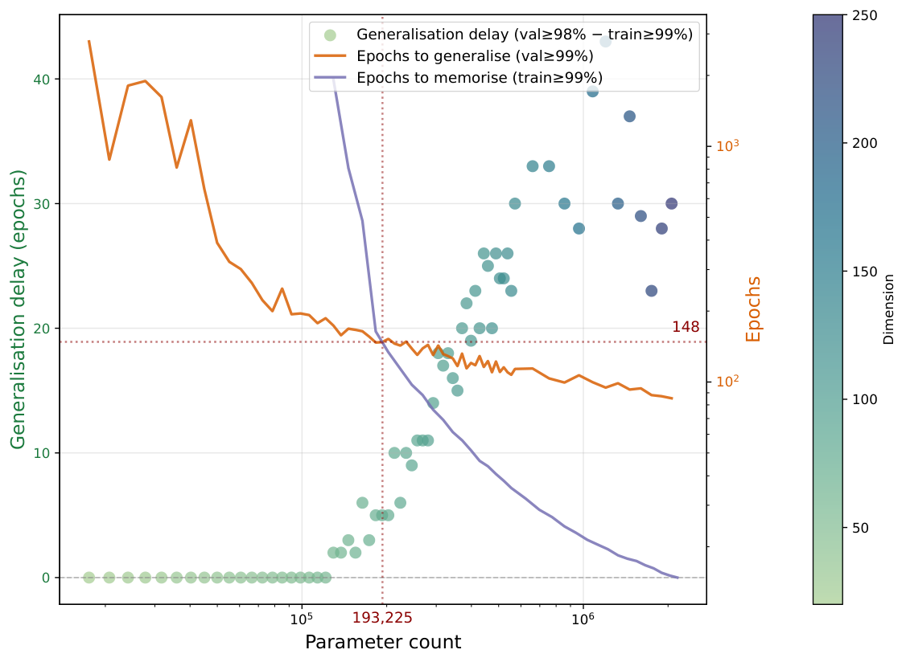
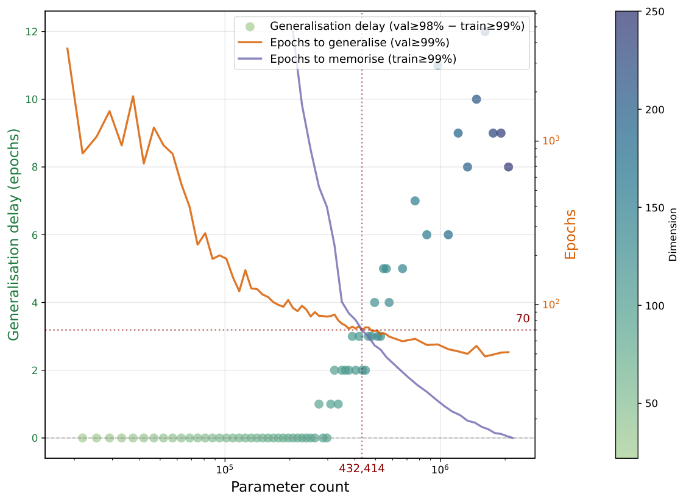
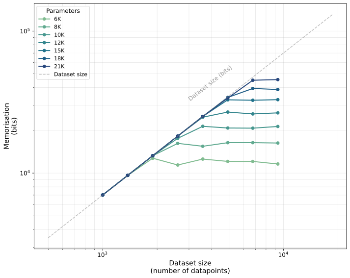
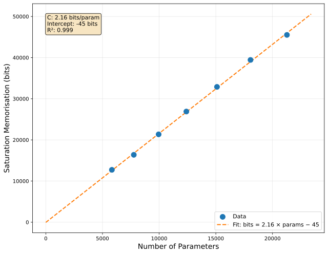
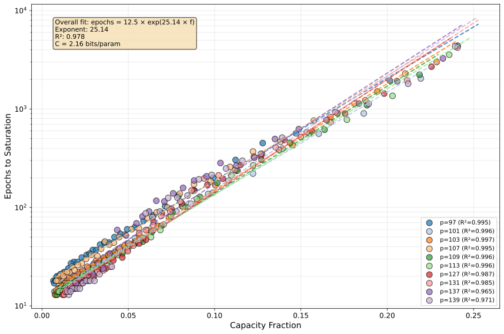
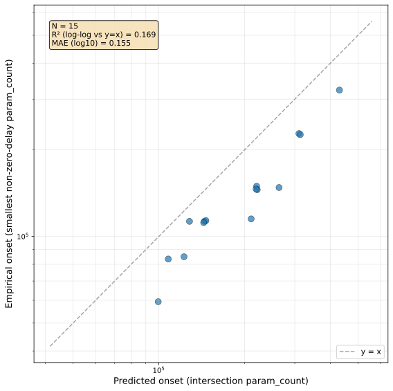
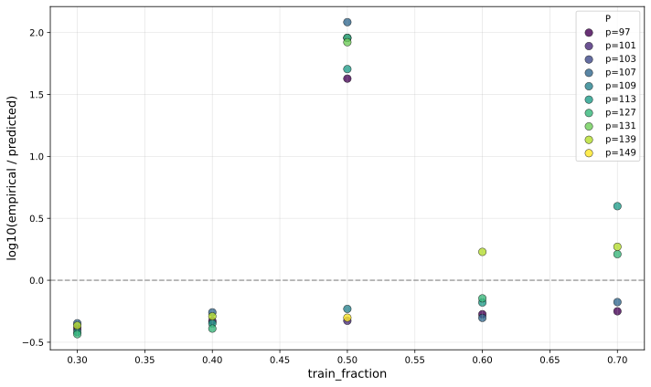

# Song, Ye 2026 — Model Capacity Determines Grokking through Competing Memorisation and Generalisation Speeds

См. также: [глобальный индекс понятий](../../concepts/index.md).
arXiv [2605.09724v1](https://arxiv.org/abs/2605.09724), 10 мая 2026. Колонтитул PDF: «Preprint.».

**Yiding ‘Vincent’ Song** — Harvard College, Cambridge, MA 02138; yidingsong@college.harvard.edu.
**Hanming Ye** — Harvard College, Cambridge, MA 02138; hanmingye@college.harvard.edu.

Оригинал и производные файлы этой папки:

- [`original/2605.09724.native.html`](original/2605.09724.native.html) — первоисточник, нативный HTML-рендеринг arXiv (LaTeXML), скачан как есть.
- [`original/2605.09724.model-capacity-determines-grokking-through-competing-memorisation-and-generalisation-speeds.md`](original/2605.09724.model-capacity-determines-grokking-through-competing-memorisation-and-generalisation-speeds.md) — конверсия оригинала в Markdown без правок содержания; английский текст для сверки перевода.
- [`images/`](images/) — иллюстрации статьи в исходном разрешении (20 файлов).
- [`2605.09724.model-capacity-determines-grokking-through-competing-memorisation-and-generalisation-speeds.claims.txt`](2605.09724.model-capacity-determines-grokking-through-competing-memorisation-and-generalisation-speeds.claims.txt) — рабочий разбор: пронумерованные утверждения с пометками.

Схема якорей и правила ссылок на карточку — в [README папки статей](../README.md).

## Затрагиваемые понятия

**[Гроккинг](../../concepts/grokking.md)** — работа не объясняет механизм явления, а отвечает на вопрос «при каком размере модели оно вообще появляется», и делает это разведением двух величин, которые прежде сливались в одну. Первая — порог ёмкости $P_{\text{mem}}$, размер, начиная с которого запоминающее решение представимо; вторая — начало гроккинга, наименьший размер, начиная с которого задержка устойчиво ненулевая. Обе величины введены как измеримые времена первого достижения порога и объявлены исходом соревнования двух процессов — запоминающего и алгоритмически обобщающего ([с. 2, абз. 1](#p2-1), [с. 5, абз. 6](#p5-6)); в аннотации это сформулировано так, что гроккинг «возникает как исход соревнования между двумя измеримыми временными шкалами» ([с. 1, абз. 2](#p1-2)). Главное утверждение в том, что второе строго больше первого: «модели с числом параметров существенно выше этого порога продолжают обобщать немедленно» ([с. 1, абз. 4](#p1-4)), а переход в режим гроккинга совпадает с размером, на котором пересекаются две измеренные кривые времён ([с. 9, абз. 3](#p9-3), [рис. 1](#fig-1)); как это выглядит на кривых обучения одного простого, показано отдельно ([рис. 4](#fig-4)). Формулировка механизма предельно короткая: «Тем, грокает ли модель, управляет не то, представим ли просмотр таблицы, а то, достигается ли он раньше алгоритмического решения». Чего в работе нет: собственно механизма — ни одного вмешательства во внутренности сети не делается, представления не разбираются, контуры не выделяются, и обе скорости именно *измеряются*, а не выводятся, что авторы объявляют прямо ([с. 9, абз. 6](#p9-6)). Существенная для цитирующих оговорка: совпадение предсказания с наблюдением не точное, а с постоянным сдвигом — эмпирическое начало наступает примерно на 30% раньше предсказанного ([с. 13, абз. 5](#p13-5)), — и сдвиг этот перекалибровывается при смене weight decay, доли обучения, глубины и операции.

**[Эталонный полигон гроккинга](../../concepts/canonical-grokking-testbed.md)** — постановка взята стандартной — модульная арифметика названа «управляемым полигоном для отделения запоминания от алгоритмических решений» ([с. 3, абз. 1](#p3-1)) — и закреплена жёстко: модульное деление, вход из четырёх токенов $X_{i}=[a,\ \texttt{op},\ b,\ \texttt{=}]$, словарь $V=p+2$, доля обучения $\alpha=1/2$ ([с. 4, абз. 1](#p4-1)); устройство — decoder-only трансформер глубины $L_{\text{depth}}=2$ с одной головой, RoPE, вентильной FFN шириной $4d$ и RMSNorm, причём размер меняется только шириной вложения $d\in[10,1000]$ ([с. 4, абз. 5](#p4-5)); AdamW, lr $10^{-3}$, weight decay $1.0$, пакет $512$, максимум $5{,}000$ эпох ([с. 12, абз. 2](#p12-2)). Полигону работа даёт две новые измеримые величины и одну меру: задержку обобщения $\Delta E(P)$ как разность первых эпох выхода на пороги ([с. 6, абз. 2](#p6-2)) и «точку гроккинга» как наименьший размер, начиная с которого $\Delta E$ устойчиво положительна ([с. 6, абз. 3](#p6-3)). Протоколы измерения разведены и описаны порознь: скорости запоминания меряются на 44 ширинах при 10 семенах (42–51) ([с. 12, абз. 5](#p12-5)), прогоны гроккинга — на своей сетке ширин, усечённой до $d\leq 256$ при подаче в графики пересечения ([с. 12, абз. 6](#p12-6)). Существенно, что ось развёртки здесь — размер модели, а не время обучения: каждая точка на [рис. 1](#fig-1) есть отдельный прогон, а не момент одного прогона. Чего в работе нет: перебора кодирования входа, разбиения и числа голов; dropout закреплён на $0.2$ в прогонах гроккинга и скоростей и на $0$ в прогонах ёмкости ([с. 12, абз. 2](#p12-2)), и своей развёртки по нему нет — соответствующий подраздел C.5 состоит из обещания ([с. 19, абз. 2](#p19-2)).

**[Модульная арифметика](../../concepts/modular-arithmetic.md)** — главная задача одна, деление $a/b\bmod p$, и она берётся сразу на десяти простых промежутка 90–140 (97, 101, 103, 107, 109, 113, 127, 131, 137, 139; [с. 12, абз. 1](#p12-1)) — редкая для корпуса развёртка по модулю, которая и позволяет проверить масштабирование предсказания с $p$. Вторая операция появляется одним приложением: модульное сложение перечисляет все $p^{2}$ пар вместо $p(p-1)$, отчего $K_{\text{mem}}$ и $n_{\text{equiv}}$ пересчитываются ([с. 22, абз. 3](#p22-3)). Ценное для корпуса число оттуда: при сложении $T_{\text{gen}}(P)$ последовательно быстрее, чем при делении, и предсказатель перебирает начало в $\approx 2.5\times$ для $+$ против $\approx 1.4\times$ для $/$ ([с. 23, абз. 1](#p23-1), [рис. 10](#fig-10)). Чего в работе нет: умножения и вычитания — они объявлены запланированными ([с. 23, абз. 2](#p23-2)), — и композиции перестановок; и нет ни одного опыта, где алгоритмическая сложность $K_{\text{alg}}(p)$ была бы вычислена, хотя понятие вводится ([с. 4, абз. 4](#p4-4)).

**[Фаза меморизации / плато](../../concepts/memorization-phase.md)** — работа превращает запоминание из фазы обучения в отдельно измеряемую скорость. $T_{\text{mem}}(P)$ определена как число эпох до 99% обучающей точности на наборе *со случайными метками* той же информационной сложности, что и модульный набор ([с. 5, абз. 7](#p5-7)); тем самым запоминание меряется в прогоне, где обобщать нечего по построению, и не смешивается с обобщением. Главная эмпирическая находка об этой величине: она определяется прежде всего долей ёмкости $f=K/(C_{\text{model}}P)$, а не $P$ и $K$ по отдельности — точки для наборов разной сложности ложатся примерно на одну кривую ([рис. 3](#fig-3), [с. 6, абз. 5](#p6-5)), а зависимость от доли ёмкости подогнана экспонентой на $f\in[0,0.25]$ ([с. 5, абз. 10](#p5-10)). Чего в работе нет: связи между временем запоминания на случайных метках и временем запоминания на самой модульной задаче — эта величина не измеряется вовсе, а $E_{\text{train}}(P)$ из определения задержки нигде не сопоставляется с $T_{\text{mem}}(P)$; предположение, что одно замещает другое, остаётся предположением.

**[Шум в метках / случайные метки](../../concepts/label-noise-random-labels.md)** — случайные метки здесь не помеха и не предмет изучения, а измерительный прибор, и это главное, что работа даёт понятию. Наборы $D^{\text{rand}}$ строятся из равномерных входов и независимых равномерных меток, «так что никакой структуры для обобщения нет» ([с. 5, абз. 1](#p5-1)); на них меряется и ёмкость (плато кривой $M_{T}(n)$), и скорость запоминания. Существенная подробность постановки: полностью случайный набор той же *информационной* сложности берётся вместо модульного набора с испорченными метками, то есть доля шума не перебирается вовсе, а берётся равной единице. Чего в работе нет: промежуточных долей шума, сопоставления с постановками частичного повреждения меток и проверки того, что время насыщения на случайных метках предсказывает время подгонки обучающей выборки в самой модульной задаче.

**[Колмогоровская сложность](../../concepts/kolmogorov-complexity.md)** — работа переводит разговор о запоминании в биты и даёт корпусу рабочую пару величин. Понятия перенесены из [21] и приспособлены «к нашей дискретной постановке классификации» ([с. 4, абз. 6](#p4-6)). Сложность данных определена как худший случай при случайных метках, $K_{\text{mem}}(p,\alpha)=N_{\text{train}}\log_{2}V=\alpha p(p-1)\log_{2}(p+2)$ ([с. 4, абз. 3](#p4-3)), а полное запоминание — как сумма превышений логарифма правдоподобия над равномерным основанием, ограниченная сверху $n\log_{2}V$ ([с. 4, абз. 8](#p4-8)); измеряется она кривой $M_{T}(n)$, выходящей на плато, и плато это линейно по числу параметров ([рис. 2](#fig-2)). Алгоритмическая сложность $K_{\text{alg}}(p)$ введена словесно и не вычисляется ([с. 4, абз. 4](#p4-4)) — понятие в работе есть, числа за ним нет. Отсюда единственное косвенное свидетельство о ней: первые модели, достигающие почти идеальной точности и на обучении, и на проверке, имеют $P$ чуть ниже $P_{\text{mem}}$, что авторы читают как способность градиентного спуска «находить алгоритмические решения более компактные, чем сырой набор данных» ([с. 7, абз. 3](#p7-3)). Чего в работе нет: описания или измерения самого компактного решения — ни длины программы, ни минимального описания весов, ни сжатия.

**[Доля данных / критический размер набора](../../concepts/data-fraction-critical-dataset-size.md)** — ось перебирается прямо и даёт одну из двух самых показательных развёрток. Доля обучения введена как управляющая величина сразу в постановке: обучающее подмножество содержит долю $\alpha\in(0,1)$ всех допустимых пар, а при $\alpha=1/2$ выполняется $N_{\text{train}}=N_{\text{test}}$ ([с. 4, абз. 2](#p4-2)). Центральная настройка $\alpha=1/2$, перебор $\{0.3,\,0.4,\,0.5,\,0.6,\,0.7\}$, причём при каждом $\alpha$ пересчитывается и размер случайного набора $n_{\text{equiv}}$ ([с. 18, абз. 1](#p18-1)). Внутри каждого $\alpha$ предсказание держится, но постоянная калибровки едет монотонно — от $-0.39$ dex при $\alpha=0.3$ до $+0.21$ dex при $\alpha=0.7$, то есть $+1.23$ dex на единицу $\alpha$, — и добавление $\alpha$ к предсказателю оказывается пограничным ($F=4.45$, $p=0.044$; [с. 19, абз. 1](#p19-1)). Работа даёт понятию и вторую величину — критическое *число параметров* $P_{\text{mem}}(p,\alpha)=K_{\text{mem}}(p,\alpha)/C_{\text{model}}$ ([с. 5, абз. 4](#p5-4)), связывающее долю данных с размером модели через биты. Чего в работе нет: критической доли как таковой — порога $\alpha$, ниже которого обобщения нет, здесь не ищут; при $\alpha\in\{0.6,0.7\}$ измерение упирается в край сетки ширин, и авторы это признают прямо ([с. 19, абз. 1](#p19-1)).

**[Фазовый переход](../../concepts/phase-transition.md)** — язык фаз в работе есть, но он описательный и относится к оси размера модели, а не времени: три режима — недостаток ёмкости, немедленное обобщение и гроккинг за точкой пересечения ([с. 2, абз. 2](#p2-2), развёрнуто на [с. 8, абз. 3](#p8-3)), а сама смена режимов описана тремя пронумерованными закономерностями ([с. 8, абз. 1](#p8-1)). Единственное место, где слово «фазовая граница» употреблено всерьёз, — заявление, что пересечение двух временных шкал «отслеживает эмпирическую фазовую границу» ([с. 9, абз. 4](#p9-4)). Чего в работе нет: параметра порядка, критических показателей, конечноразмерного масштабирования и вообще любой проверки, что переход между режимами резок, — граница определена операционально, через первый размер, на котором $\Delta E$ становится положительной, и с разрешением, равным шагу сетки ширин.

**[Weight decay](../../concepts/weight-decay.md)** — единственная ось, на которой рамка проверена во всю ширину и на которой она даёт сбой в сильной форме. Перебраны семь значений $\lambda\in\{0,\,0.01,\,0.03,\,0.1,\,0.3,\,1.0,\,3.0\}$, согласованных между прогонами скоростей и гроккинга ([с. 16, абз. 2](#p16-2)); центральное значение $\lambda=1.0$. Ранговая предсказательность остаётся высокой ($\rho=0.900$), но смещение едет монотонно на $+0.32$ dex на единицу $\lambda$, и «дружественное скептику» сравнение $M_{3}$ против $M_{1}$ отвергается ($F=92.0$): $\lambda$ добавляет сведения сверх пересечения ([с. 16, абз. 3](#p16-3)). Собственное объяснение авторов — что weight decay «перекраивает кривые скоростей, а не просто сдвигает их», — предположение, не подкреплённое отдельным измерением. Чего в работе нет: разбора того, почему при $\lambda=0$ предсказатель промахивается сильнее всего ($-0.535$ dex) — то есть в единственном режиме, где weight decay нет вовсе, рамка калибрована хуже, чем где бы то ни было.

**[Скорость обучения](../../concepts/learning-rate.md)** — единственная ось, на которой калибровка держится плоско и достаточность проходит: наклон остатка по $\eta$ статистически нулевой ($p=0.62$), $M_{3}$ против $M_{1}$ не отвергается ($F=0.98$, $p=0.34$) ([с. 17, абз. 2](#p17-2)). Держится она, однако, на трёх значениях из пяти: при $\eta=3{\times}10^{-3}$ ни одна модель развёрнутого промежутка ширин не грокает за бюджет эпох, хотя предсказатель выдаёт конечное $\widehat{P}_{\text{cross}}$, а при $\eta=10^{-2}$ обучение вовсе не достигает насыщения ни на случайных, ни на модульных данных ([с. 17, абз. 1](#p17-1)). Оба случая авторы объявляют лежащими «вне того окна оптимизации, где сами измерения скоростей хорошо определены», и относят к выходящим за область охвата, а не к отказам предсказателя, — это авторское решение, а не результат проверки. Чего в работе нет: расписаний скорости обучения и разведения $\eta$ с $\lambda$, хотя произведение этих двух величин и задаёт скорость съезда нормы в соседних работах корпуса.

**[Масштаб инициализации](../../concepts/initialization-scale.md)** — перебраны три значения $\{0.5,1.0,2.0\}$, применяемые как мультипликативное масштабирование всех весов после инициализации ([с. 15, абз. 1](#p15-1)). Наблюдение, полезное корпусу: при $1.0$ и $2.0$ разброс остатков тесен ($\sigma_{\log}\leq 0.03$), а при $0.5$ он вырастает на порядок ($0.260$), причём задан одним простым $p=139$, где наблюдаемое начало приходит на $\sim\!2.2\times 10^{6}$ параметрах против предсказанных $\sim\!6.8\times 10^{5}$ ([с. 16, абз. 1](#p16-1)). Авторское объяснение — «уход режима малой инициализации в недообученный угол, где измерения скоростей более шумны» — предположение. Чего в работе нет: связи с линией «lazy-to-rich», для которой масштаб инициализации есть основной рычаг: сопоставления с этой линией по данной оси не делается, а сам разброс при $0.5$ не разбирается дальше.

**[Оптимизатор](../../concepts/optimizer-adam-adamw-sgd.md)** — оптимизатор один во всех опытах, AdamW с бетами $(0.9,0.98)$ ([с. 5, абз. 7](#p5-7), [с. 12, абз. 2](#p12-2)), и это существенное ограничение: обе скорости, на которых держится вся рамка, суть свойства связки «архитектура + AdamW + протокол», что авторы и закрепляют в определении, вводя $\Theta$ как «устройство модели (включая оптимизатор и протокол обучения)» ([с. 5, абз. 1](#p5-1)). Работа этой оси не перебирает: сравнения с SGD нет, влияния адаптивности на соотношение $T_{\text{mem}}$ и $T_{\text{gen}}$ не измеряется, и постоянная ёмкости $C_{\text{model}}=2.16$ тоже привязана к этому оптимизатору.

**[Эффективность контуров](../../concepts/circuit-efficiency.md)** — работа лишь ссылается на объяснение Varma et al. и отводит ему определённое место: те выясняют, «какое решение предпочитается на сходимости», тогда как здесь — «какое решение градиентный спуск встречает первым как функцию ёмкости модели» ([с. 9, абз. 4](#p9-4)). Заявлено это как уточнение, а не спор, и никакой проверки утверждений об эффективности контуров работа не делает: ни нормы контуров, ни их выделения здесь нет. В карточке понятия работа стоит в «Цитированиях».

**[Переход lazy→rich](../../concepts/lazy-to-rich-kernel-to-feature-learning.md)** — упомянут дважды и только в обзоре: Kumar et al. как управление гроккингом через параметр «лености» выходного масштаба и выравнивание начального NTK с метками, с гроккингом «в режиме Златовласки, где обучение признаков отложено», и Mohamadi et al. как статический представленческий аналог — доказательство, что ядровый режим не может решить модульное сложение ([с. 3, абз. 2](#p3-2)). Собственных измерений по этой оси в работе нет, хотя перебор масштаба инициализации ([с. 15, абз. 1](#p15-1)) стоит ровно на том рычаге, которым эта линия пользуется, — связь не проводится.

**[Разрежённая подсеть / lottery ticket](../../concepts/sparse-subnetwork-lottery-ticket.md)** — упомянута однажды, в обзоре: Merrill et al. «в постановке разрежённой чётности описывают гроккинг как появление разрежённой подсети через избирательный рост нормы у небольшого набора нейронов» ([с. 3, абз. 2](#p3-2)), и затем отнесены к тем, кто отвечает на вопрос о предпочтении решения на сходимости ([с. 9, абз. 4](#p9-4)). Разрежённость в работе не измеряется.

**[Двойной спуск](../../concepts/double-descent.md)** — работа называет линию «скоростей выучивания закономерностей» своим понятийным предком и указывает на Davies et al., объединяющих гроккинг и двойной спуск спектром скоростей, а также на двойной спуск по эпохам как довод в пользу того, что «время обучения, а не только размер модели, есть содержательная ось» ([с. 3, абз. 3](#p3-3)). Собственный вклад заявлен как замена этой качественной картины двумя порознь измеримыми временами ([с. 9, абз. 4](#p9-4)). Чего в работе нет: собственно двойного спуска — немонотонности качества по размеру модели здесь не ищут и не показывают, хотя развёртка идёт именно по размеру.

**[Меры прогресса](../../concepts/progress-measures.md)** — работа лишь упоминает линию: «меры прогресса на основе сложности» (Clauw et al., DeMoss et al.) отнесены к трактовкам гроккинга «как эмерджентного перехода во внутренней организации сети» ([с. 3, абз. 2](#p3-2)). Своей меры прогресса работа не вводит: обе её величины — времена первого достижения порога, то есть исходы прогона, а не функции состояния обучения, предсказывающие срок; они меряются на *отдельных* прогонах и как функции размера модели, а не по ходу одного обучения.

**[Эффект рогатки](../../concepts/slingshot.md)** — упомянут однажды: Thilak et al. как выявившие «позднюю динамику „рогатки“ в адаптивных оптимизаторах, часто совпадающую с гроккинг-переходом», в одном ряду с вмешательствами со стороны оптимизатора, поддерживающими картину разных скоростей ([с. 3, абз. 3](#p3-3)). Все опыты работы идут под AdamW, то есть ровно в том классе оптимизаторов, где рогатка наблюдалась, но ни всплесков потери, ни колебаний нормы здесь не смотрят.

---

## Несогласованности внутри статьи

**Две главные величины разбора отсчитываются от разных событий.** Скорость обобщения $T_{\text{gen}}(P)$ определена как число эпох до превышения проверочной точностью порога насыщения, «мы использовали $99\%$» ([с. 5, абз. 11](#p5-11)), а задержка обобщения $\Delta E(P)$ — как разность между первой эпохой с проверочной точностью выше $98\%$ и первой эпохой с обучающей выше $99\%$ ([с. 6, абз. 2](#p6-2)). Понижение порога оговорено сноской и объяснено желанием «убрать шум из эмпирических данных», но следствие нигде не обсуждается: наблюдаемое начало $P_{\text{onset}}$ и предсказывающая его кривая $T_{\text{gen}}$ отсчитываются от разных событий, и постоянный сдвиг между предсказанием и наблюдением ($-0.16$ dex, то есть примерно 30%) разбирается как свойство предсказателя ([с. 13, абз. 5](#p13-5)), хотя часть его может создаваться этим расхождением порогов.

**Точка гроккинга определена двумя неэквивалентными способами.** В разделе 4.3 это «наименьший размер модели $P$, для которого $\Delta E(P^{\prime})>0$ для всех измеренных $P^{\prime}\geq P$» ([с. 6, абз. 3](#p6-3)); в приложении B та же величина $P_{\text{onset}}(p)$ определена как наименьший $P$, для которого $\Delta E(P^{\prime})>0$ «для каждого $P^{\prime}>P$» ([с. 13, абз. 1](#p13-1)). Второе определение не требует $\Delta E(P)>0$ у самой точки и потому даёт значение на один шаг сетки ширин меньше. Все количественные проверки работы ведутся именно по $P_{\text{onset}}$ из приложения B, а словесное описание в теле — по определению раздела 4.3.

**Проверка достаточности на центральной развёртке ведётся против признака, который на этой развёртке не меняется.** В теле результат подан как содержательный: «при данном $\widehat{P}_{\text{cross}}$ dropout не добавляет никакой объяснительной силы сверх одного лишь пересечения ($F\approx 0$, $p=1$)» ([с. 8, абз. 2](#p8-2)). Между тем приложение A.2 говорит, что «dropout равен $0.2$ в прогонах гроккинга и скоростей и $0$ в прогонах ёмкости» ([с. 12, абз. 2](#p12-2)), а само приложение B отмечает, что подутверждение об устойчивости «несущественно на центральной развёртке, где dropout закреплён внутри каждой ячейки гроккинга» ([с. 14, абз. 4](#p14-4)). Числа это подтверждают: модель $M_{2}$ из одного dropout даёт внутривыборочное $R^{2}=0$ ровно и скорректированное $-0.125$ ([с. 14, абз. 3](#p14-3)) — подпись постоянного признака. Тем самым «достаточность против базовых линий» на центральной развёртке проверена против пустого соперника; настоящую проверку дают только развёртки приложений C–E, и там она проходит лишь по скорости обучения.

**Число простых центральной развёртки названо и десятью, и одиннадцатью.** Приложение A.1 говорит: «мы используем все 10 простых в промежутке от 90 до 140» и перечисляет их ([с. 12, абз. 1](#p12-1)). Между тем область охвата развёртки по weight decay называет шесть простых на ячейку, включая $p=149$ — вне объявленного промежутка, — «причём простые центральной развёртки $\{101,103,109,131,137\}$ также присутствуют при $\lambda{=}1.0$» ([с. 16, абз. 2](#p16-2)), что даёт одиннадцать; строка $\lambda=1.0$ таблицы 5 несёт $n_{\text{primes}}=11$, а подпись таблицы 9 прямо говорит о «сетке центральной развёртки по 11 простым». Таким образом состав центральной развёртки — той самой, на которой получены Spearman $\rho=0.976$ и таблица 1, — по тексту статьи неоднозначен.

**Медиана логарифмического остатка центральной развёртки приведена двумя числами.** В теле и в приложении B это $-0.16$ ([с. 8, абз. 2](#p8-2), [с. 13, абз. 5](#p13-5)), в таблицах 5 и 9 для той же настройки ($\lambda=1.0$, $\alpha=0.5$, 11 простых) — $-0.171$. Расхождение нигде не оговорено и, по-видимому, отвечает разному составу ячеек, то есть тому же вопросу «10 или 11 простых».

**Мелкое.** Подпись таблицы 1 объявляет перестановочное $p$-значение «по 10 000 перемешиваний», а таблица 8 приводит $p_{\text{perm}}<10^{-4}$ — значение ниже разрешения такой процедуры (наименьшее достижимое равно $10^{-4}$). В разборе рис. 3(a) обратная ёмкость набрана как $1/C_{\text{model}P}$ ([с. 6, абз. 5](#p6-5)) вместо $1/(C_{\text{model}}P)$ из подписи рисунка — опечатка в наборе формулы.

## Что измерено, что подогнано и что предположено

Работа устроена как цепочка «ёмкость $\to$ скорости $\to$ гроккинг», и надёжность звеньев в ней очень разная; цитирующему полезно различать четыре уровня.

**Измерено чисто.** Что порог ёмкости началом гроккинга не является: при $P>P_{\text{mem}}$ модели ещё в широком промежутке размеров обобщают немедленно, с нулевой задержкой ([с. 1, абз. 4](#p1-4), [с. 7, абз. 4](#p7-4), [с. 9, абз. 3](#p9-3)). Это отрицательный результат, он не зависит ни от одной подгонки, кроме перевода битов в параметры, и он же — самое ценное, что работа даёт корпусу. Сюда же — сопутствующее наблюдение, что для нескольких простых первые модели с почти идеальной точностью на обучении и проверке имеют $P$ чуть *ниже* $P_{\text{mem}}$ ([с. 7, абз. 3](#p7-3)). И третье: обвал точек разной сложности на одну кривую при откладывании времени запоминания против доли ёмкости ([рис. 3](#fig-3)).

**Подогнано.** Постоянная ёмкости $C_{\text{model}}\approx 2.16$ получена линейной подгонкой по семи ширинам $d\in\{10,\dots,22\}$ при одном простом $p=113$, при dropout $0$ и одном семени (42) на ячейку ([с. 12, абз. 4](#p12-4)), а применяется ко всем простым, к моделям до $d=1000$ и к числам параметров до $10^{6}$, то есть экстраполируется на один-два порядка за пределы подгонки; прогоны же скоростей и гроккинга идут при dropout $0.2$. В развёртках по weight decay и по глубине ёмкость перемеряется лишь при части значений, а в остальных ячейках $C_{\text{model}}$ «прибивается» к $2.16$ ([с. 16, абз. 2](#p16-2), [с. 20, абз. 2](#p20-2)). Ни свободного члена $b$, ни значения $R^{2}$ статья не приводит — сказано лишь «с малым свободным членом и высоким $R^{2}$» ([с. 6, абз. 4](#p6-4)). Через $C_{\text{model}}$ подгонка входит и в $P_{\text{mem}}$, и в долю ёмкости $f$, а через них — во все выводы.

**Предположено и объявлено таковым.** Экспоненциальный вид $T_{\text{mem}}(P)\approx be^{af}$ авторы дважды называют эмпирической подгонкой, а не механистическим утверждением ([с. 7, абз. 1](#p7-1), [с. 9, абз. 5](#p9-5)). Так же оговорено, что рамка «механистична, а не предсказательна безотносительно устройства»: $T_{\text{gen}}(P)$ измеряется, а не выводится, и всякое новое устройство или задача требуют повторного прогона измерений ([с. 9, абз. 6](#p9-6)). Отдельно авторы перечисляют, чем их проверка не является: не анализ мощности, не кросс-проверка, не иерархическая модель, около десяти ячеек на рисунок ([с. 14, абз. 5](#p14-5)).

**Не выполнено там, где заявлено.** Итоговая формулировка «во всех шести наша рамка держится внутри любой одной согласованной настройки» ([с. 9, абз. 1](#p9-1)) в приложениях подтверждается неполно. По weight decay достаточность отвергается ($F=92.0$; [с. 16, абз. 3](#p16-3)), по доле обучения она пограничная ($F=4.45$, $p=0.044$; [с. 19, абз. 1](#p19-1)), при смене операции категориальный признак значим ($F=155$; [с. 23, абз. 1](#p23-1)). Самое тяжёлое — глубина: при $L_{\text{depth}}\geq 6$ пересечения в развёрнутом промежутке нет вовсе, $T_{\text{mem}}$ всюду выше $T_{\text{gen}}$, так что $\widehat{P}_{\text{cross}}$ не определено, тогда как гроккинг эмпирически наблюдается, а ранговая связь на девяти уцелевших ячейках незначима ($\rho=0.600$, $p_{\text{perm}}=0.10$) ([с. 20, абз. 3](#p20-3), [рис. 9](#fig-9)). Предсказатель молчит там, где явление есть. Наконец, препринт открыто незавершён: подразделы C.5, D.2 и E.2 состоят из обещаний ([с. 19, абз. 2](#p19-2), [с. 22, абз. 1](#p22-1), [с. 23, абз. 2](#p23-2)), и среди неисполненного — как раз развёртка по dropout, на котором держится единственная проверка достаточности центральной развёртки.

## Ошибочные цитирования

Редакторские заметки о местах, где эта работа передаёт чужие результаты с ошибкой или без авторских оговорок.

###### mc-2402-15175

**Huang et al. (2402.15175) — «прогрессия» названа режимом немедленного обобщения.** В обзоре сказано: `"[9] extend this competition picture to a 2D phase diagram over model size and dataset size that includes a small-model ‘progression’ regime of immediate generalisation"` — *«[9] расширяют эту картину соревнования до двумерной фазовой диаграммы по размеру модели и размеру набора данных, включающей режим „прогрессии“ с немедленным обобщением у малых моделей»* ([с. 3, абз. 2](#p3-2)). У самих Huang et al. прогрессия немедленным обобщением не является: в подписи их рисунка 1 она определена как режим, где модель «сперва запоминает часть обучающих данных при нулевом качестве на проверке и лишь затем обобщает» ([Huang et al., рис. 1](../2402.15175.unified-view-of-grokking-double-descent-and-emergent-abilities/2402.15175.unified-view-of-grokking-double-descent-and-emergent-abilities.card.md#fig-1)), и они прямо пишут, что прогрессия и гроккинг «показывают схожую динамику качества на проверке в ходе обучения», различаясь тем, на каком уровне обучающей точности возникают обобщающие контуры, и тем, что при прогрессии модель не в силах запомнить обучающую выборку целиком. То есть отложенная генерализация в прогрессии есть; нет лишь предшествующей ей полной подгонки. Ошибка не безобидна: именно на неё опирается одно из двух «прежних наблюдений, восстановленных как следствия рамки», — «малые модели на модульной арифметике не грокают» со ссылкой на [13, 9] ([с. 2, абз. 4](#p2-4), [с. 9, абз. 4](#p9-4)).

###### mc-2205-10343

**Liu et al. (2205.10343) — «ёмкость декодера» подменена числом параметров.** Сказано: `"[13] earlier mapped a four-phase diagram (comprehension, grokking, memorisation, confusion) on modular arithmetic and noted a small-decoder regime that does not grok"` — *«[13] ранее составили четырёхфазную диаграмму (понимание, гроккинг, запоминание, путаница) на модульной арифметике и отметили режим малого декодера, который не грокает»* ([с. 3, абз. 2](#p3-2)), и отсюда во введении: `"very small models on modular arithmetic do not exhibit grokking at all, generalising immediately instead [13, 9]"` — *«очень малые модели на модульной арифметике вовсе не показывают гроккинга, а вместо этого обобщают немедленно [13, 9]»* ([с. 1, абз. 4](#p1-4)). У Liu et al. фазовые диаграммы построены по скорости обучения представлений, скорости обучения декодера и weight decay декодера ([Liu et al., с. 6, абз. 10](../2205.10343.towards-understanding-grokking-an-effective-theory-of-representation-learning/2205.10343.towards-understanding-grokking-an-effective-theory-of-representation-learning.card.md#p6-10), [с. 7, абз. 2](../2205.10343.towards-understanding-grokking-an-effective-theory-of-representation-learning/2205.10343.towards-understanding-grokking-an-effective-theory-of-representation-learning.card.md#p7-2)); ни ширины, ни числа параметров они не перебирают ни разу, а «ёмкость декодера» в их заключении названа величиной, задаваемой «среди прочего, скоростью обучения и weight decay». Для работы, вся мысль которой — что дело именно в числе параметров, а не в эффективной ёмкости, подмена существенна: она превращает наблюдение о гиперпараметрах в наблюдение о размере модели и тем самым создаёт «прежнее наблюдение», которое рамке предстоит восстановить.

###### mc-2603-25009

**Manir & Rupa (2603.25009) — вывод передан без авторских оговорок.** Сказано: `"A recent empirical study [18] disentangles depth, architecture, activation, and regularisation effects on modular addition, finding that grokking dynamics are dominated by optimisation–regularisation interactions rather than architectural specifics"` — *«Недавнее эмпирическое исследование [18] расщепляет влияние глубины, устройства, активации и регуляризации на модульное сложение и находит, что динамика гроккинга определяется взаимодействиями оптимизации и регуляризации, а не подробностями устройства»* ([с. 3, абз. 2](#p3-2)). Пересказ верен по аннотации цитируемой работы, но теряет три её оговорки: ось «устройство» там неотделима от оси «оптимизатор», и авторы признают это прямо ([Manir & Rupa, с. 16, абз. 4](../2603.25009.a-systematic-empirical-study-of-grokking-depth-architecture-activation-and-regularization/2603.25009.a-systematic-empirical-study-of-grokking-depth-architecture-activation-and-regularization.card.md#p16-4)); их же итоговое число говорит, что вклад устройства не исчезает, а лишь оказывается умеренным — $1.90\times$ при оптимальной регуляризации у каждого ([Manir & Rupa, с. 10, абз. 1](../2603.25009.a-systematic-empirical-study-of-grokking-depth-architecture-activation-and-regularization/2603.25009.a-systematic-empirical-study-of-grokking-depth-architecture-activation-and-regularization.card.md#p10-1)); и «на модульном сложении» неполно — сравнение устройств перенесено там и на умножение. Тот же узор пересказа наблюдается и у других цитирующих Manir & Rupa работ.

**Незакрытое.** Утверждение о [21] — `"They argue that grokking begins when capacity is saturated."` (*«Они утверждают, что гроккинг начинается, когда ёмкость насыщена»*, [с. 3, абз. 4](#p3-4)) — служит той мишенью, опровержением которой держится вся работа, но проверить его по хранимым текстам нельзя: Morris et al. (arXiv 2505.24832) в корпусе нет. Само же опровержение в статье ведётся не против цитаты, а против «естественного прочтения» рамки ([с. 9, абз. 3](#p9-3)) — то есть против формулировки, которую авторы приписывают источнику сами.

## Ошибочные пересказы и цитирования этой статьи

Узоры, наблюдаемые в цитирующих работах корпуса; в каждом случае указано, что именно искажается, и даны ссылки на авторские абзацы с теряемой оговоркой. Карточек у цитирующих работ (`2607.13749`, `2607.04333`, `2605.20441`) пока нет, поэтому подробные разборы с их стороны ещё не заведены.

**«Показано, что гроккинг возникает из пересечения двух измеримых временных шкал» (расширяющее).** Цитирующие передают центральное утверждение без числа, которым оно оговорено. Так, `2607.13749` пишет: `"they show that grokking emerges from the intersection of two measurable timescales, a memorisation speed and a generalisation speed, both functions of parameter count"` и называет рамку `"the precise capacity framework of Song and Ye 2026"`. У самих авторов совпадение не точное: остаётся «малое, не зависящее от простого постоянное смещение — эмпирическое начало наступает примерно на 30% раньше предсказанного» ([с. 8, абз. 2](#p8-2)), и оно же формулируется как «предсказатель верно масштабируется с $p$, но переоценивает абсолютное начало на $\sim 30\%$» ([с. 13, абз. 5](#p13-5)). Теряется и то, что смещение это не переносится между настройками: оно перекалибровывается с weight decay ([с. 16, абз. 3](#p16-3)), с долей обучения ([с. 19, абз. 1](#p19-1)), с глубиной ([с. 20, абз. 3](#p20-3)) и со сменой операции ([с. 23, абз. 1](#p23-1)). Образцом точной передачи служит формулировка из `2605.20441`: `"Song & Ye 2026 relate grokking on modular arithmetic to competing memorisation and generalisation timescales as functions of parameter count"` — она удерживает и задачу, и то, что речь о временных шкалах как функциях числа параметров, а не о доказанном законе.

**«С ростом ёмкости окно гроккинга сужается, и крупные сети грокают после более короткого ожидания» (ошибочное).** `2607.13749` выводит из рамки временну́ю зависимость, которой в статье нет: `"As capacity grows, the memorisation timescale shrinks faster than the generalisation timescale, and the grokking window narrows"` и `"Large networks memorise quickly and grok after a shorter wait."` У Song и Ye измеряемая величина — задержка $\Delta E(P)$, и за точкой пересечения она становится *ненулевой*; ни одного утверждения о том, что дальше она убывает, в работе нет, а «точка гроккинга» определена именно как размер, начиная с которого задержка устойчиво положительна ([с. 6, абз. 3](#p6-3)). Три панели [рис. 1](#fig-1) показывают появление ненулевой задержки и её дальнейший рост с числом параметров, а не сокращение: на панели $p=113$ точки задержки поднимаются от нуля слева от перекрестья до трёх с лишним десятков эпох у самых крупных моделей. Быстрее с ростом $P$ становится запоминание ([с. 6, абз. 5](#p6-5)) — именно поэтому задержка и возникает.

**«Рамка применима лишь там, где сеть заведомо достаточно велика, чтобы запомнить» (ошибочное).** `2607.13749` дважды отводит Song и Ye только верхний конец шкалы: `"Existing work, including the precise capacity framework of Song and Ye 2026, studies what happens when the network is at least large enough to memorise"` и `"Their analysis assumes throughout that the network is large enough to memorise the training data; the regime where memorisation is structurally impossible lies outside their framework."` Между тем режим недостатка ёмкости у Song и Ye назван первым из трёх и описан прямо: «ёмкость модели существенно ниже сложности набора данных», «ни одно из решений не представлено и как обучающая, так и тестовая точность низки» ([с. 2, абз. 2](#p2-2)), а в разборе трёх режимов он развёрнут как режим недообучения при $P\ll P_{\text{mem}}(p,\alpha)$ ([с. 8, абз. 3](#p8-3)) и показан кривыми обучения — «малые модели недообучаются» ([рис. 4](#fig-4)). Оговорка в пользу цитирующего: на [рис. 1](#fig-1) этот режим почти не виден, потому что развёртка ширин начинается уже около $P_{\text{mem}}$, — но в тексте статьи он есть. Различие, которое цитирующая работа проводит по существу верно, — иное: у Song и Ye нехватка ёмкости есть нехватка *числа параметров*, тогда как у неё самой невозможность запоминания структурна; но сформулировано это как отсутствие у Song и Ye целого режима, который у них есть.

**Более слабые отголоски.** `2607.04333` передаёт работу одной фразой и точно: `"Song and Ye [16] frame grokking as a race between memorization and generalization speeds."` — оговорок она не теряет, потому что и не претендует на результат.

---

# Текст статьи

# Model Capacity Determines Grokking through Competing Memorisation and Generalisation Speeds

Yiding ‘Vincent’ Song Аффилиация: Harvard College Аффилиация: Cambridge, MA 02138 Почта: yidingsong@college.harvard.edu Hanming Ye Аффилиация: Harvard College Аффилиация: Cambridge, MA 02138 Почта: hanmingye@college.harvard.edu

## Аннотация

###### p1-2

Существующие объяснения гроккинга описывают явление в терминах механистических рамок вроде эффективности контуров или переходов lazy-to-rich. Однако, несмотря на известную зависимость между гроккингом и размером модели, вопрос о том, как ёмкость модели формирует гроккинг, остаётся открытым. Мы даём информационно-теоретическое описание этой связи на задаче модульной арифметики, показывая, что гроккинг не наступает сразу, как только модель становится достаточно большой, чтобы запомнить обучающую выборку, а возникает как исход соревнования между двумя измеримыми временными шкалами: скоростью запоминания $T_{\text{mem}}(P)$ и скоростью обобщения $T_{\text{gen}}(P)$, обе из которых суть функции числа параметров модели $P$. Приспосабливая рамку информационной ёмкости из [21], мы оцениваем $T_{\text{mem}}(P)$ на данных со случайными метками равной сложности и $T_{\text{gen}}(P)$ на самой модульной задаче и показываем, что гроккинг возникает вблизи того масштаба параметров, на котором эти временные шкалы пересекаются. Рамка попутно подсказывает эмпирическую модель для предсказания скорости запоминания по ёмкости модели и сложности набора данных, восстанавливая ранее сообщённое эмпирическое наблюдение, что более крупные модели запоминают быстрее. В целом мы обосновываем формализацию различных временных шкал обучения как важных абстракций, которые стоит изучать при объяснении того, как ёмкость модели формирует гроккинг на алгоритмических задачах.

## 1 Введение

Явление гроккинга [24] на модульной арифметике, при котором обучающая точность насыщается задолго до тестовой, стало каноническим полигоном для динамики запоминания и обобщения в переопределённых сетях. Существующие объяснения выделяют механизмы, отбирающие итоговое обобщающее решение: неявное смещение и динамические переходы lazy-to-rich [17, 11], доводы об эффективности контуров при weight decay [29, 9], избирательный рост нормы, разрежающий сеть [19], невозможность модульного сложения в ядровом режиме [20] и механистический обратный инжиниринг грокнувших трансформеров [23]. Эти объяснения указывают, почему обобщающее решение предпочитается на сходимости.

###### p1-4

Однако существующий свод работ не объясняет полностью, как гроккинг зависит от размера модели. Эмпирически несколько работ наблюдали, что очень малые модели на модульной арифметике вовсе не показывают гроккинга, а вместо этого обобщают немедленно [13, 9]; лишь за каким-то бо́льшим масштабом появляется характерная задержка. Естественное предсказание следует из рамки ёмкости «бит на параметр» из [21]: гроккинг должен начинаться, как только ёмкость модели превысит размер набора данных, поскольку именно там запоминающее решение впервые становится представимым. Эмпирически, однако, модели с числом параметров существенно выше этого порога продолжают обобщать немедленно; начало гроккинга сидит на числе параметров строго большем, чем порог ёмкости. Это оставляет открытым вопрос о том, что задаёт масштаб параметров, на котором начинается гроккинг, если не сам порог ёмкости.

###### p2-1

Мы утверждаем, что недостающая составляющая — количественное рассмотрение *временных шкал обучения*. Опираясь на методологию ёмкости «бит на параметр» из [21], мы определяем две измеримые скорости для трансформера размера $P$: **скорость запоминания** $T_{\text{mem}}(P)$ — число эпох до подгонки набора со случайными метками равного информационного содержания; и **скорость обобщения** $T_{\text{gen}}(P)$ — число эпох до достижения высокой проверочной точности на модульной задаче. Мы сосредоточиваемся на модульном делении над простыми полями и на семействе малых decoder-only трансформеров. Наша центральная находка состоит в том, что начало гроккинга тесно совпадает с числом параметров, на котором эти две временные шкалы пересекаются, — числом, строго бо́льшим, чем порог ёмкости $P_{\text{mem}}$, на котором запоминание впервые становится представимым. Ёмкости, достаточной для представления запоминающего решения, недостаточно, чтобы сделать запоминание тем путём, по которому идёт градиентный спуск; важно то, быстрее ли запоминание, чем обобщение.


*(a) $p=97$*



*(b) $p=113$*



**[p. 2]**

*(c) $p=139$*

###### fig-1

*Рисунок 1: Задержка обобщения (точки, левая ось: число эпох между выходом модели на высокую обучающую точность и на высокую проверочную точность; цветом закодирована размерность модели $d$) и скорости обучения (оранжевая: эпохи до обобщения; фиолетовая: эпохи до запоминания случайного набора той же сложности) в зависимости от числа параметров модели для трёх простых. Пунктирное перекрестье отмечает предсказанную точку гроккинга $\widehat{P}_{\text{cross}}(p)$, задаваемую пересечением кривых обобщения (оранжевая) и запоминания (фиолетовая); она тесно совпадает с началом ненулевой задержки обобщения (то есть с «гроккингом»). У малых моделей обобщение быстрее запоминания, и модель обобщает немедленно (нулевая задержка, гроккинга нет). По мере роста числа параметров $P$ скорость запоминания приближается к скорости обобщения; как только они пересекаются, задержки обобщения становятся ненулевыми и гроккинг начинается.* **[p. 2]**

###### p2-2

Конкретно, по мере роста числа параметров модели $P$ мы наблюдаем три режима (рис. 1): режим **недостатка ёмкости** (ёмкость модели существенно ниже сложности набора данных), в котором ни одно из решений не представлено и как обучающая, так и тестовая точность низки; режим **немедленного обобщения**, в котором ёмкость модели сопоставима со сложностью набора данных или превышает её, но $T_{\text{gen}}(P)<T_{\text{mem}}(P)$, так что градиентный спуск достигает алгоритмического решения раньше, чем завершится какое-либо запоминание, и задержки обобщения нет; и режим **гроккинга** за точкой пересечения скоростей, в котором $T_{\text{mem}}(P)\lesssim T_{\text{gen}}(P)$ и модель сперва запоминает и лишь позже обобщает.

Наши основные вклады в этой статье таковы:11 1 Код, нужный для воспроизведения и отображения результатов этой статьи, доступен по адресу https://github.com/PerceptronV/grokking-capacity.

###### p2-4

1. **Механистическое описание того, как ёмкость управляет гроккингом, через соревнующиеся скорости запоминания и обобщения.** Приспосабливая рамку «бит на параметр» из [21], мы формализуем измерения $T_{\text{mem}}(P)$ и $T_{\text{gen}}(P)$ для малых трансформеров и показываем, что число параметров, на котором они пересекаются, тесно отслеживает эмпирическое начало гроккинга по разным простым и размерам наборов данных.
2. **Два прежних наблюдения, восстановленные как отдельные следствия рамки.** Эмпирическое наблюдение, что малые модели на модульной арифметике не грокают [13, 9], следует из нашей рамки, поскольку при малых $P$ выполняется $T_{\text{gen}}(P)<T_{\text{mem}}(P)$, так что обобщающее решение достигается первым. Наблюдение, что более крупные языковые модели запоминают быстрее [28], восстанавливается в нашей постановке эмпирической закономерностью, по которой $T_{\text{mem}}(P,n)$ зависит прежде всего от доли ёмкости $f=K/(C_{\text{model}}P)$, где $K$ — размер набора данных, а $C_{\text{model}}$ — ёмкость модели, причём $T_{\text{mem}}\propto e^{af}$ при $f\in[0,0.25]$ (рис. 3(b)). Оба эмпирических наблюдения следуют из разных составляющих нашей рамки.

**[p. 3]**

## 2 Предпосылки и смежные работы

#### Гроккинг и алгоритмическое обобщение.

###### p3-1

Гроккинг, то есть отложенное обобщение после быстрого переобучения на обучающей выборке, был введён в [24] на малых трансформерах, обучаемых алгоритмическим задачам вроде модульного сложения. С тех пор модульная арифметика служила управляемым полигоном для отделения запоминания от алгоритмических решений и для исследования динамики, опосредующей переход между ними, — с механистическим обратным инжинирингом грокнувшего фурье-алгоритма [23] и расширениями на более богатые модульные семейства и рассуждениеподобные композиции [7, 30, 8]. Гроккингоподобные переходы сообщались и вне алгоритмических данных, что позволяет предположить, что отложенное обобщение не специфично для модульной арифметики, а отражает более общие свойства переопределённой оптимизации [14, 10].

#### Механистические объяснения: почему предпочитается обобщающее решение.

###### p3-2

Целый ряд работ объясняет гроккинг, выделяя механизмы, отбирающие обобщающее решение. [29] относят позднее переключение на счёт эффективности контуров: weight decay благоприятствует эффективному по норме обобщающему контуру перед запоминающим просмотром таблицы, а [9] расширяют эту картину соревнования до двумерной фазовой диаграммы по размеру модели и размеру набора данных, включающей режим «прогрессии» с немедленным обобщением у малых моделей. [19] в постановке разрежённой чётности описывают гроккинг как появление разрежённой подсети через избирательный рост нормы у небольшого набора нейронов. [13] ранее составили четырёхфазную диаграмму (понимание, гроккинг, запоминание, путаница) на модульной арифметике и отметили режим малого декодера, который не грокает, предвосхитив эмпирическое явление, на котором мы здесь сосредоточиваемся. Дополняющая линия трактует гроккинг как выход из ленивого/ядрового режима: [11] показывают, что гроккингом в двухслойной сети можно управлять параметром «лености» выходного масштаба и выравниванием между начальным NTK и метками задачи, причём гроккинг возникает в режиме Златовласки, где обучение признаков отложено; [20] доказывают, что ядровый режим не может решить модульное сложение, давая статический представленческий аналог динамического утверждения Kumar et al.; а [17] выводят гроккинг из дихотомии между неявными смещениями ранней и поздней фазы. Трактовки через фазовые переходы [26] и меры прогресса на основе сложности [4, 6] истолковывают гроккинг как эмерджентный переход во внутренней организации сети. Эти объяснения выделяют механизмы, отбирающие обобщающее решение, но меньше говорят о масштабе параметров, на котором гроккинг появляется, и о том, *когда* в ходе обучения достигается каждое решение. Недавнее эмпирическое исследование [18] расщепляет влияние глубины, устройства, активации и регуляризации на модульное сложение и находит, что динамика гроккинга определяется взаимодействиями оптимизации и регуляризации, а не подробностями устройства.

#### Скорости выучивания закономерностей и интуиции на основе временных шкал.

###### p3-3

Понятийный предок нашей рамки — взгляд, по которому гроккинг возникает оттого, что разные закономерности выучиваются с разной скоростью. [5] утверждают, что гроккинг и двойной спуск объединяются спектром скоростей выучивания закономерностей: градиентный спуск сперва подгоняет быстрые, плохо обобщающие составляющие и лишь позже выучивает более медленные и более устойчивые. Вмешательства со стороны оптимизатора поддерживают эту картину: [12] резко ускоряют гроккинг, усиливая медленные составляющие градиента, а [27] выявляют позднюю динамику «рогатки» в адаптивных оптимизаторах, часто совпадающую с гроккинг-переходом. Двойной спуск по эпохам в обычном обучении с учителем равным образом подкрепляет то, что время обучения, а не только размер модели, есть содержательная ось поведения обобщения [22]. Наш вклад превращает эту качественную интуицию о скоростях в две количественные, порознь измеримые временные шкалы $T_{\text{mem}}(P)$ и $T_{\text{gen}}(P)$ и показывает, что именно их пересечение управляет началом гроккинга на модульной арифметике, — отвечая на зависимость от масштаба параметров, которую механистические объяснения выше оставляют открытой.

#### Запоминание, ёмкость и масштабирование.

###### p3-4

Методологическая родословная, на которую мы опираемся, — использование обучения на случайных метках для описания запоминания. [31] показывают, что современные сети способны интерполировать чистый шум; [2] описывают динамику этого запоминания; а [3] измеряют его в языковых моделях. Наиболее прямо [21] операционализируют запоминание в битах и оценивают ёмкость «бит на параметр» $C_{\text{model}}$, обучая до насыщения на случайных токенах. Они утверждают, что гроккинг начинается, когда ёмкость насыщена. Мы перенимаем их измерительную рамку, но используем её для описания временных шкал обучения, а не статического порога запоминания: начало гроккинга на модульном делении приходится на пересечение скоростей, которое сидит на числе параметров, большем порога ёмкости $P_{\text{mem}}$, выделяемого в [21]. Эмпирическое наблюдение, что более крупные языковые модели запоминают быстрее [28], **[p. 4]** восстанавливается в нашей постановке закономерностью, по которой $T_{\text{mem}}$ зависит прежде всего от доли ёмкости $f=K/(C_{\text{model}}P)$.

## 3 Постановка задачи и обозначения

### 3.1 Наборы данных модульной арифметики

###### p4-1

Закрепим простое $p$ и операцию $\circ\in\{+,-,\times,/\}$ на $\mathbb{Z}_{p}$. Для модульного деления мы используем $a/b\equiv a\cdot b^{-1}\pmod{p}$ при $b\in\{1,\dots,p-1\}$. Следуя стандартным бенчмаркам гроккинга, мы перечисляем все допустимые пары $(a,b)$ и строим набор данных $\mathcal{D}_{p}=\{(X_{i},y_{i})\}_{i=1}^{N_{\text{full}}}$, где каждый вход $X_{i}$ есть последовательность из $4$ токенов, кодирующая равенство $X_{i}=[a,\ \texttt{op},\ b,\ \texttt{=}],$ а метка $y_{i}=a\circ b\in\{0,\dots,p-1\}$. Мы отводим два особых токена под знак операции и знак равенства, так что размер словаря равен $V=p+2.$

###### p4-2

Для модульного деления число допустимых пар равно $N_{\text{full}}=p(p-1)$. Мы случайно отбираем обучающее подмножество $\mathcal{D}^{\text{train}}_{p}$, содержащее долю $\alpha\in(0,1)$ этих пар, а остаток используем как отложенную тестовую выборку. Всюду мы сосредоточиваемся на $\alpha=1/2$, так что $N_{\text{train}}=\alpha p(p-1)$ и $N_{\text{test}}=N_{\text{train}}$.

### 3.2 Сложность набора данных и информационное содержание

###### p4-3

Нас интересует худшее число битов, необходимое для запоминания меток $y_{i}$ при данных входах $X_{i}$. В предположении случайных меток каждая $y_{i}$ распределена равномерно по $V$ возможностям и потому требует $\log_{2}V$ битов для указания. Информационное содержание (или *сложность*) обучающих данных тогда равно

$$
K_{\text{mem}}(p,\alpha)=N_{\text{train}}\log_{2}V=\alpha p(p-1)\log_{2}(p+2). \tag{1}
$$

###### p4-4

Мы рассматриваем модульное деление как структурированную задачу, допускающую гораздо более компактное алгоритмическое описание сложности $K_{\text{alg}}(p)$, хотя здесь мы не пытаемся вычислить $K_{\text{alg}}$ явно.

### 3.3 Устройство модели

###### p4-5

Во всех опытах используется одно и то же decoder-only устройство трансформера с глубиной $L_{\text{depth}}=2$ и одной головой внимания ($H=1$). Модель получает последовательность целочисленных идентификаторов токенов $x\in\{0,\dots,V-1\}^{L}$ при $L=4$ и размере словаря $V=p+2$ и выдаёт логиты по словарю для последней позиции. Каждый из двух остаточных блоков содержит самовнимание с вращательными позиционными вложениями, применяемыми к запросам и ключам, а за ним — вентильную сеть прямого распространения со скрытой шириной $4d$; оба подблока обёрнуты в RMS-нормализацию. Заключительный RMSNorm и линейная проекция из $\mathbb{R}^{d}$ в $\mathbb{R}^{V}$ дают выходные логиты; мы меняем $P$, перебирая ширину вложения $d\in[10,1000]$.

### 3.4 Полное запоминание

###### p4-6

Мы кратко излагаем используемые нами информационно-теоретические понятия запоминания, приспосабливая [21] к нашей дискретной постановке классификации. Рассмотрим набор данных $D=\{(x_{i},y_{i})\}_{i=1}^{n}$ с метками $y_{i}\in\{1,\dots,V\}$ и модель $p_{\theta}(y\mid x)$. Мы измеряем логарифмы вероятностей в битах, то есть используя $\log_{2}$.

##### **Определение 3.1**($M_{T}$)**.**

Полное запоминание $p_{\theta}$ на $D$ есть

$$
M_{T}(\theta;D)=\sum_{i=1}^{n}\left(\log_{2}V+\log_{2}p_{\theta}(y_{i}\mid x_{i})\right). \tag{2}
$$

###### p4-8

Каждое слагаемое есть сокращение длины кода (в битах) для примера $i$ относительно равномерного основания, приписывающего вероятность $1/V$ каждой метке. Мы имеем $0\leq M_{T}(\theta;D)\leq n\log_{2}V$, причём верхняя граница достигается, когда модель предсказывает каждую метку с вероятностью $1$.

## 4 Ёмкость, скорости обучения и гроккинг

Теперь мы формализуем два наших главных количественных объекта: информационную ёмкость, измеряемую в битах на параметр, и скорости запоминания/обобщения, измеряемые числом эпох обучения, требуемых для достижения порога насыщения.

**[p. 5]**

### 4.1 Эмпирическая информационная ёмкость

###### p5-1

Пусть $\Theta$ обозначает устройство модели (включая оптимизатор и протокол обучения) с $P$ обучаемыми параметрами. Мы хотим оценить, сколько битов информации о метках можно хранить в его весах. Следуя [21], мы обучаем $\Theta$ на данных со случайными метками. Закрепим размер словаря $V$ и длину последовательности $L$. Мы строим случайные наборы данных $D^{\text{rand}}=\{(X_{i},Y_{i})\}_{i=1}^{n},$ где каждый вход $X_{i}\in\{0,\dots,V-1\}^{L}$ берётся равномерно, и каждая метка $Y_{i}\in\{0,\dots,V-1\}$ берётся независимо и равномерно, так что никакой структуры для обобщения нет. Мы обучаем $\Theta$ на $D^{\text{rand}}$, пока его обучающая точность не насытится (то есть не сравняется с порогом насыщения или не превысит его; всюду в наших опытах он положен равным 99%), и обозначаем получившиеся параметры через $\theta^{*}(D^{\text{rand}})$. Затем мы вычисляем полное запоминание $M_{T}(\theta^{*}(D^{\text{rand}});D^{\text{rand}})$ по формуле 2. По мере роста $n$ мы получаем *кривую ёмкости* $M_{T}(n)$, которая сперва растёт примерно линейно по $n$ (каждая новая точка данных может быть запомнена) и в конце концов насыщается, когда параметры «полны». Соответственно, для данного устройства $\Theta$ с $P$ параметрами мы определяем его ёмкость как

$$
\widehat{\text{Cap}}(\Theta):=\lim_{n\to\infty}M_{T}(n), \tag{3}
$$

приближаемую на практике плато эмпирической кривой ёмкости. Повторение по ряду размеров моделей с числами параметров $P_{1},\dots,P_{K}$ даёт пары $(P_{k},\widehat{\text{Cap}}_{k})$. Затем мы подгоняем линейную модель

$$
\widehat{\text{Cap}}_{k}\approx C_{\text{model}}P_{k}+b, \tag{4}
$$

где $C_{\text{model}}$ (биты на параметр) — наша эмпирическая постоянная ёмкости, а $b$ близко к нулю.

###### p5-4

В разделе 5.1 мы показываем, что для нашего семейства трансформеров подгонка сильно линейна с малым свободным членом, что поддерживает взгляд, по которому ёмкость модели хорошо приближается постоянным числом битов на параметр. Сочетание $C_{\text{model}}$ со сложностью набора данных $K_{\text{mem}}(p,\alpha)$ из формулы 1 даёт грубое критическое число параметров

$$
P_{\text{mem}}(p,\alpha)=\frac{K_{\text{mem}}(p,\alpha)}{C_{\text{model}}}, \tag{5}
$$

выше которого модель теоретически могла бы запомнить всю обучающую выборку.

### 4.2 Определение скоростей обучения

###### p5-6

Ёмкость говорит нам, что представимо, но не то, что градиентный спуск в действительности выучивает к данному моменту. Чтобы уловить динамику, мы рассматриваем обучение как соревнование двух процессов: (1) процесса запоминания, движущегося к решению, приближающему обучающую выборку; (2) процесса алгоритмического обобщения, движущегося к решению, осуществляющему модульное деление. Мы операционализируем эти процессы через времена первого достижения при реальном обучении.

#### Скорость запоминания.

###### p5-7

Закрепим размер модели $P$, размер словаря $V$ и число обучающих точек данных $n$. Мы обучаем модель на $n$ случайных метках с помощью AdamW [15], пока обучающая точность не превысит порог насыщения (мы использовали 99%). Мы записываем полное число эпох, затраченных за это время, обозначаемое $T_{\text{mem}}(P,n)$. Для данного простого $p$ мы вводим краткое обозначение

$$
T_{\text{mem}}(P):=T_{\text{mem}}(P,n_{\text{equiv}}),\quad n_{\text{equiv}}=\frac{K_{\text{mem}}(p,\alpha)}{\log_{2}V}, \tag{6}
$$

то есть ожидаемое число эпох, требуемых для запоминания случайного набора данных с тем же полным числом битов, что и у набора модульной арифметики с простым $p$.

В сочетании со скоростью запоминания мы также определяем *долю ёмкости*

$$
f(P,n_{\text{equiv}})=\frac{n_{\text{equiv}}\log_{2}V}{C_{\text{model}}P} \tag{7}
$$

###### p5-10

как отношение сложности набора данных к оценённой предельной ёмкости модели. Эмпирически мы находим, что $T_{\text{mem}}(P)\propto e^{af}$ при некоторой постоянной $a$ и $f\in[0,0.25]$ (раздел 5.1).

#### Скорость обобщения.

###### p5-11

Для набора модульного деления $\mathcal{D}^{\text{train}}_{p}$ мы обучаем модель и следим за проверочной точностью на $\mathcal{D}^{\text{test}}_{p}$. Мы определяем скорость обобщения $T_{\text{gen}}(P)$ как число эпох, за которое проверочная точность превышает порог насыщения (мы использовали $99\%$), улавливая время, за которое модель достигает обобщающего решения. Мы вычисляли эту величину по 10 семенам для каждого размера модели и брали среднее.



*(a) Полное запоминание в зависимости от сложности набора данных.*



**[p. 6]**

*(b) Запоминание при насыщении в зависимости от числа параметров.*

###### fig-2

*Рисунок 2: Опыты по ёмкости на случайных метках, следуя [21]. Рис. 2(a) показывает полное запоминание $M_{T}$ в зависимости от сложности набора данных на наборах со случайными метками для нескольких размеров моделей. Пунктирная серая линия показывает сложность набора данных в битах. Рис. 2(b) откладывает наибольшее число битов, которое модель может запомнить, в зависимости от её числа параметров. Наклон линейной подгонки даёт постоянную «бит на параметр» $C_{\text{model}}$ для нашего семейства трансформеров.* **[p. 6]**

### 4.3 Количественное описание гроккинга

#### Задержка обобщения.

Отдельно мы определяем задержку обобщения

$$
\Delta E(P)=\max\big\{0,\,E_{\text{val}}(P)-E_{\text{train}}(P)\big\}, \tag{8}
$$

###### p6-2

где $E_{\text{train}}(P)$ — первая эпоха, когда обучающая точность превышает $99\%$, а $E_{\text{val}}(P)$ — первая эпоха, когда проверочная точность превышает $98\%$. Мы вычисляли эту величину по 10 семенам для каждого размера модели и брали наименьшее значение по семенам, поскольку нас интересует нахождение наименьшего размера модели, для которого мы устойчиво наблюдаем $\Delta E(P)>0$. Нулевое $\Delta E(P)$ отвечает немедленному обобщению. Большое положительное $\Delta E(P)$ отвечает гроккингу: модель подгоняет обучающие данные раньше, чем обобщает.22 2 Мы выбрали чуть более низкий порог для проверочной точности, потому что это помогло убрать шум из эмпирических данных — мы наблюдали прогоны, где модели достигали $99\%$ обучающей точности и выше $98\%$ проверочной, но затем проходило большое число эпох, прежде чем проверочная точность сравнивалась с обучающей.

#### Точка гроккинга.

###### p6-3

Мы определяем её как наименьший размер модели $P$, для которого $\Delta E(P^{\prime})>0$ для всех измеренных $P^{\prime}\geq P$ (равносильно: наименьший измеренный размер строго выше наибольшего негрокающего размера); то есть наименьший размер модели, начиная с которого мы начинаем устойчиво наблюдать гроккинг.

## 5 Результаты

### 5.1 Ёмкость модели

###### p6-4

Рис. 2 показывает полное запоминание $M_{T}(n)$ на случайных данных для нескольких размеров моделей. При малых $n$ кривые растут линейно с наклоном, близким к $\log_{2}V$, что согласуется с запоминанием моделью каждой новой метки. При бо́льших $n$ они насыщаются на плато $\widehat{\text{Cap}}_{k}$, линейно масштабирующихся с числом параметров $P_{k}$ (рис. 2, справа). Подгонка $\widehat{\text{Cap}}_{k}\approx C_{\text{model}}P_{k}+b$ даёт постоянную ёмкости $C_{\text{model}}\approx 2.16$ с малым свободным членом и высоким $R^{2}$. Эта гладкая зависимость подобна наблюдавшимся в прежней литературе [25, 16, 1, 21]. Наше семейство моделей-трансформеров хранит примерно 2.16 бита информации на параметр.


*(a) Время насыщения в зависимости от обратной ёмкости модели $1/(C_{\text{model}}P)$.*



*(b) Время насыщения в зависимости от доли ёмкости $f(P,n_{\text{equiv}})$.*

###### fig-3

*Рисунок 3: Опыты по скорости запоминания. Рис. 3(a) показывает, что время запоминания растёт с обратной ёмкостью модели $1/(C_{\text{model}}P)$ по разным наборам данных; то есть меньшие модели запоминают дольше. Вид кривой меняется от набора к набору. Рис. 3(b) показывает, что при откладывании эпох до насыщения против доли ёмкости все наборы данных примерно ложатся на одну кривую, что позволяет предположить, что скорость запоминания определяется долей ёмкости, а не размером модели или сложностью набора данных по отдельности.* **[p. 7]**

### 5.2 Скорости запоминания

###### p6-5

Мы измерили время запоминания $T_{\text{mem}}(P,n)$ для нескольких размеров моделей и размеров наборов данных и для каждого вычислили соответствующую долю ёмкости $f(P,n)$. **[p. 7]** Рис. 3(a) показывает, что время запоминания растёт с обратной ёмкостью модели $1/C_{\text{model}P}$ по разным наборам данных; то есть меньшие модели запоминают дольше. Равносильно, более крупные модели запоминают быстрее, что подкрепляет прежние результаты из [28]. Между тем рис. 3(b) показывает, что при откладывании эпох до насыщения против доли ёмкости точки по всем наборам данных примерно ложатся на одну кривую, что позволяет предположить, что скорость запоминания определяется долей ёмкости, а не размером модели или сложностью набора данных по отдельности.

###### p7-1

В частности, число эпох до запоминания растёт с долей ёмкости, и мы находим, что $T_{\text{mem}}(P)\approx be^{af}$ при некоторых постоянных $a,b$ и $f\in[0,0.25]$. Мы рассматриваем эту экспоненту как эмпирическую функциональную подгонку, а не как механистическое утверждение; тем не менее она даёт принципиальное объяснение ранее сообщённого наблюдения, что более крупные модели запоминают быстрее [28], перетолковывая его как почти линейное масштабирование с долей ёмкости: закреплённая сложность набора данных занимает меньшую долю ёмкости более крупной модели, и наша подгонка тогда предсказывает более быстрое насыщение.

### 5.3 Задержка обобщения

Мы обучили ряд моделей с разными внутренними размерностями $d$ и простыми $p$ и записали обучающую и проверочную точности и потери на каждой эпохе, что позволило нам вычислить $E_{\text{train}}(P),E_{\text{val}}(P),$ и $\Delta E(P)$. Рис. 4 показывает представительные кривые обучения и проверки для модульного деления при $p=127$ по мере изменения размера модели.

###### p7-3

Мы также отложили задержку обобщения $\Delta E(P)$ против числа параметров на рис. 1 для нескольких простых, что позволило нам увидеть различные режимы запоминания / обобщения как функцию размера модели. По формуле 5 мы вычисляем критическое число параметров $P_{\text{mem}}$ для наборов модульного деления. Мы находим, что для нескольких простых (включая $p=113$ и $p=139$, показанные на рис. 1) первые модели, способные достичь почти идеальной обучающей *и* тестовой точности, имеют числа параметров $P$ чуть ниже $P_{\text{mem}}$, но того же порядка, что указывает на способность градиентного спуска находить алгоритмические решения более компактные, чем сырой набор данных.

###### p7-4

Что удивительно, $\Delta E(P)$ остаётся нулевой по мере роста размера модели у малых моделей — даже когда модель обладает достаточной теоретической ёмкостью, чтобы запомнить обучающую выборку. Точная точка, в которой $\Delta E(P)$ становится ненулевой, зависит от простого $p$ и доли обучения $\alpha$ и сильно коррелирует с пересечением скоростей запоминания и обобщения, как мы увидим далее в разделе 5.4.

### 5.4 Пересечение скоростей отслеживает начало гроккинга

Для каждого простого $p$ мы загружаем опыты по скорости запоминания для совпадающих размеров моделей, где мы вычислили время запоминания $T_{\text{mem}}(P)$ для случайного набора данных той же сложности $K_{\text{mem}}(p,\alpha)$. **[p. 8]** Мы откладываем задержку обобщения $\Delta E(P)$ и время обобщения $T_{\text{gen}}(P)$ против числа параметров на общей оси $x$. Рис. 1 показывает получающиеся графики для трёх простых. Проступает несколько закономерностей:

###### p8-1

1. При малых числах параметров $T_{\text{gen}}(P)<T_{\text{mem}}(P)$: обобщение быстрее запоминания, и задержки обобщения нулевые.
2. По мере роста $P$ величина $T_{\text{mem}}(P)$ убывает круче, чем $T_{\text{gen}}(P)$. При характерном числе параметров $P_{\text{cross}}(p)$ две кривые пересекаются.
3. Эмпирически $P_{\text{cross}}(p)$ тесно совпадает с началом ненулевой задержки обобщения.

###### p8-2

Чтобы оценить это количественно, мы раскладываем гипотезу о том, что пересечение $T_{\text{mem}}$ и $T_{\text{gen}}$ предсказывает эмпирическое начало гроккинга, на три фальсифицируемых подутверждения — предсказательность, калибровку к $y=x$ и достаточность против базовых линий — и приводим проверку для каждого (таблица 1); четвёртое, устойчивость по развёрнутым осям, входит в набор (приложение B), но несущественно на центральной развёртке, где dropout закреплён. Ранговый порядок предсказанных и эмпирических начал по существу идеален (Spearman $\rho=0.976$, перестановочное $p<10^{-3}$); наклон log–log равен $0.985$, что указывает на отсутствие пропорционального смещения; и предсказанное начало есть достаточная статистика против развёрнутого гиперпараметра (dropout): при данном $\widehat{P}_{\text{cross}}$ dropout не добавляет никакой объяснительной силы сверх одного лишь пересечения ($F\approx 0$, $p=1$). Единственный остаток — малое, не зависящее от простого постоянное смещение: эмпирическое начало наступает примерно на 30% раньше предсказанного (медиана $\log_{10}(P_{\text{onset}}/\widehat{P}_{\text{cross}})=-0.16$), — так что пересечение улавливает масштабирование начала с простым в точности, с точностью до одной мультипликативной поправки. Полные определения проверок и числа регрессий по моделям отнесены в приложение B.

*Таблица 1: Количественные проверки гипотезы о пересечении. Все проверки работают в координатах $\log_{10}$ начала; $p_{\text{perm}}$ обозначает перестановочное $p$-значение по 10 000 перемешиваний. $M_{0},\dots,M_{3}$ — вложенные МНК-модели с целевой переменной $\log_{10}P_{\text{onset}}$: $M_{0}$ — только свободный член, $M_{1}=\{\log_{10}\widehat{P}_{\text{cross}}\}$, $M_{2}=\{\text{dropout}\}$, $M_{3}=M_{1}\cup M_{2}$. Определения и разбор остатков — в приложении B.* **[p. 8]**

| Подутверждение / проверка | Статистика | $p$-значение |
|---|---|---|
| *(1) Ранговая предсказательность* |  |  |
| Spearman $\rho$ | $0.976$ | $p_{\text{perm}}<10^{-3}$ |
| Kendall $\tau$ | $0.911$ | $3.0\times 10^{-5}$ |
| *(2) Калибровка к $y=x$* |  |  |
| CCC Лина (95% ДИ) | $0.74\;[0.51,\,0.80]$ | — |
| Наклон $\hat{b}$ (log–log МНК) | $0.985$ | — |
| Свободный член $\hat{a}$ | $-0.076$ | — |
| Совместный $F$-тест на $(a=0,b=1)$ | $F=199$ | $1.5\times 10^{-7}$ |
| Уилкоксон на логарифмических остатках | медиана $-0.16$ | $2.0\times 10^{-3}$ |
| *(3) Достаточность против базовых линий (вложенный МНК)* |  |  |
| $M_{1}$ против $M_{0}$ (у пересечения есть сигнал) | $F=569$ | $1.0\times 10^{-8}$ |
| $M_{3}$ против $M_{2}$ (пересечение добавляет сверх гиперпараметров) | $F=498$ | $9.2\times 10^{-8}$ |
| $M_{3}$ против $M_{1}$ (гиперпараметры добавляют сверх пересечения) | $F\approx 0$ | $1.0$ |

###### p8-3

Взятые вместе, эти результаты дают свидетельства того, что гроккинг появляется, когда скорость запоминания модели примерно равна скорости обобщения. Данные позволяют предположить, что по мере роста размера модели в грокающем модульном делении есть три режима обучения. Мы начинаем с режима недообучения: при $P\ll P_{\text{mem}}(p,\alpha)$ у модели недостаточно ёмкости, чтобы запомнить хоть обучающую выборку, хоть алгоритмическое решение, так что она достигает низкой обучающей точности и низкого обобщения. По мере приближения $P$ к $P_{\text{mem}}(p,\alpha)$, но без превышения, обобщение следует немедленно за высокой обучающей точностью, потому что у модели недостаточно ёмкости, чтобы запомнить всю обучающую выборку, так что низкая обучающая потеря должна достигаться через алгоритмическое обобщение. По мере дальнейшего роста $P$ за $P_{\text{mem}}(p,\alpha)$ модель поначалу не сваливается в запоминание обучающей выборки (хотя ёмкости для этого достаточно), потому что $T_{\text{mem}}(P)\gg T_{\text{gen}}(P)$, так что градиентный спуск останавливается на более быстро находимом алгоритмическом решении, и мы остаёмся в режиме немедленного обобщения. Наконец, по мере дальнейшего роста $P$ за точку пересечения $P_{\text{cross}}(p)$ модель предпочитает запоминание, когда $T_{\text{mem}}(P)\lesssim T_{\text{gen}}(P)$, так что градиентный спуск сперва находит запоминающее решение, а обобщает лишь потом, что приводит к отложенному обобщению (то есть к «гроккингу»).

**[p. 9]**

#### Устойчивость к другим гиперпараметрам, устройствам и задачам.

###### p9-1

Центральная развёртка выше закрепляет каждый гиперпараметр, кроме простого $p$ и ширины вложения $d$. Мы проверяем устойчивость рамки к другим настройкам в шести дальнейших наборах: развёртка по weight decay (раздел C.2), развёртка по скорости обучения (раздел C.3), развёртка по масштабу инициализации (раздел C.1) и развёртка по доле обучения (раздел C.4); развёртка по масштабированию глубины (раздел D.1); и развёртка по задаче модульного сложения (раздел E.1). Во всех шести наша рамка держится внутри любой одной согласованной настройки гиперпараметра, устройства и задачи; разбор того, как рамка калибруется между настройками, — отдельный вопрос, который мы оставляем будущей работе.

## 6 Обсуждение

Вместе наши результаты дают механистическое описание того, как ёмкость модели управляет гроккингом на модульной арифметике, задавая относительные скорости двух процессов обучения.

#### Ёмкость действует на гроккинг через скорости обучения, а не через порог ёмкости.

###### p9-3

Естественное прочтение ёмкости «бит на параметр» [21] — предсказание порога: гроккинг начинается, когда $C_{\text{model}}P\gtrsim K_{\text{mem}}$, поскольку только тогда запоминающее решение представимо. Наши данные показывают, что для модульного деления происходит не это. Для нескольких простых наименьшие модели, достигающие почти идеальной обучающей и тестовой точности, уже имеют $P\lesssim P_{\text{mem}}$, что указывает на способность градиентного спуска находить алгоритмическое решение более компактное, чем сырой просмотр таблицы; и на протяжённом промежутке $P>P_{\text{mem}}$ модели продолжают обобщать немедленно, без гроккинг-задержки. Переход в режим гроккинга вместо этого совпадает с числом параметров, на котором измеренные кривые $T_{\text{mem}}(P)$ и $T_{\text{gen}}(P)$ пересекаются, — числом строго бо́льшим, чем $P_{\text{mem}}$. Тем, грокает ли модель, управляет не то, представим ли просмотр таблицы, а то, достигается ли он раньше алгоритмического решения.

#### Связь с существующими объяснениями.

###### p9-4

Наша работа уточняет существующие объяснения, представляющие гроккинг как соревнование между запоминающими и обобщающими решениями [29, 19, 9, 11]: прежние работы выделяют, какое решение предпочитается на сходимости, тогда как мы даём более формальное рассмотрение того, какое решение градиентный спуск встречает первым как функцию ёмкости модели. Качественный режим «малые модели не грокают», описанный в [13] и [9], восстанавливается как режим $T_{\text{gen}}(P)<T_{\text{mem}}(P)$. Наша постановка также формализует интуицию о скоростях из [5], заменяя общую картину «разные закономерности выучиваются с разной скоростью» двумя конкретными, порознь измеримыми временными шкалами, пересечение которых отслеживает эмпирическую фазовую границу.

#### Восстановление наблюдения «более крупные модели запоминают быстрее».

###### p9-5

На данных со случайными метками время запоминания зависит прежде всего от доли ёмкости $f=K/(C_{\text{model}}P)$, а не от $P$ или $K$ по отдельности (рис. 3(b)), с эмпирической подгонкой $T_{\text{mem}}\propto e^{af}$ при $f\in[0,0.25]$. При закреплённом $K$ большее $P$ тогда запоминает быстрее, что восстанавливает качественное наблюдение из [28] как почти линейное масштабирование по доле ёмкости. Экспонента, однако, есть эмпирическая функциональная форма, а не выведенная теорема.

#### Область применимости, ограничения и перспективы.

###### p9-6

Рамка механистична, а не предсказательна безотносительно устройства: $T_{\text{gen}}(P)$ измеряется, а не выводится, так что новое устройство или новая задача требуют повторного прогона измерений скоростей. Дополнительно мы проверяем устойчивость к weight decay, скорости обучения, масштабу инициализации и доле обучения $\alpha$ (приложение C), к глубине (приложение D) и к модульному сложению вместо деления (приложение E). Внутри каждой закреплённой настройки предсказательность рамки внутри настройки сохраняется, тогда как постоянная калибровки плавно смещается между настройками: она перекалибровывается с weight decay, с глубиной и с долей обучения $\alpha$, слабее — с масштабом инициализации, и остаётся по существу плоской по скорости обучения внутри того режима оптимизации, где сама скорость хорошо определена. Чувствительность к dropout и к числу голов внимания, равно как и к архитектурным вариантам за пределами вентильного decoder-only трансформера (например, невентильные FFN, LayerNorm вместо RMSNorm, обучаемые позиционные вложения, базовые линии на MLP), остаётся будущей работой, как и вопрос о том, применимы ли похожие соотношения скорости и ёмкости к более крупным моделям и естественным задачам. Более широкий вывод состоит в том, что для гроккинга на модульной арифметике начало определяется не одним лишь статическим порогом ёмкости, а относительными скоростями запоминания и обобщения как функциями ёмкости модели, — абстракцией, которая, как мы надеемся, окажется полезной для изучения отложенного обобщения и за пределами этой постановки.

## References

- [1] Z. **[p. 10]** Allen-Zhu and Y. Li Physics of language models: part 3.3, knowledge capacity scaling laws. arXiv preprint arXiv:2404.05405. Cited by: §5.1.

- [2] D. Arpit, S. Jastrzębski, N. Ballas, D. Krueger, E. Bengio, M. S. Kanwal, T. Maharaj, A. Fischer, A. Courville, Y. Bengio, and S. Lacoste-Julien A closer look at memorization in deep networks. In Proceedings of the 34th International Conference on Machine Learning, D. Precup and Y. W. Teh (Eds.), Proceedings of Machine Learning Research, Vol. 70, pp. 233–242. External Links: Link Cited by: §2.

- [3] N. Carlini, D. Ippolito, M. Jagielski, K. Lee, F. Tramer, and C. Zhang Quantifying memorization across neural language models. In The Eleventh International Conference on Learning Representations, Cited by: §2.

- [4] K. Clauw, S. Stramaglia, and D. Marinazzo Information-theoretic progress measures reveal grokking is an emergent phase transition. arXiv preprint arXiv:2408.08944. External Links: Document, Link, 2408.08944 Cited by: §2.

- [5] X. Davies, L. Langosco, and D. Krueger Unifying grokking and double descent. arXiv preprint arXiv:2303.06173. Cited by: §2, §6.

- [6] B. DeMoss, S. Sapora, J. Foerster, N. Hawes, and I. Posner The complexity dynamics of grokking. arXiv preprint arXiv:2412.09810. External Links: Link Cited by: §2.

- [7] H. Furuta, G. Minegishi, Y. Iwasawa, and Y. Matsuo Interpreting grokked transformers in complex modular arithmetic. arXiv preprint arXiv:2402.16726. External Links: Document, Link, 2402.16726 Cited by: §2.

- [8] T. He, D. Doshi, A. Das, and A. Gromov Learning to grok: emergence of in-context learning and skill composition in modular arithmetic tasks. arXiv preprint arXiv:2406.02550. External Links: Document, Link, 2406.02550 Cited by: §2.

- [9] Y. Huang, S. Hu, X. Han, Z. Liu, and M. Sun Unified view of grokking, double descent and emergent abilities: a perspective from circuits competition. arXiv preprint arXiv:2402.15175. External Links: Document, Link, 2402.15175 Cited by: item 2, §1, §1, §2, §6.

- [10] A. I. Humayun, R. Balestriero, and R. Baraniuk Deep networks always grok and here is why. In Proceedings of the 41st International Conference on Machine Learning, Proceedings of Machine Learning Research, Vol. 235, pp. 20722–20745. External Links: Link Cited by: §2.

- [11] T. Kumar, B. Bordelon, S. J. Gershman, and C. Pehlevan Grokking as the transition from lazy to rich training dynamics. In The Twelfth International Conference on Learning Representations, Note: arXiv:2310.06110 External Links: Link Cited by: §1, §2, §6.

- [12] J. Lee, B. G. Kang, K. Kim, and K. M. Lee Grokfast: accelerated grokking by amplifying slow gradients. arXiv preprint arXiv:2405.20233. External Links: Document, Link, 2405.20233 Cited by: §2.

- [13] Z. Liu, O. Kitouni, N. S. Nolte, E. Michaud, M. Tegmark, and M. Williams Towards understanding grokking: an effective theory of representation learning. Advances in Neural Information Processing Systems 35, pp. 34651–34663. Cited by: item 2, §1, §2, §6.

- [14] Z. Liu, E. J. Michaud, and M. Tegmark Omnigrok: grokking beyond algorithmic data. arXiv preprint arXiv:2210.01117. Cited by: §2.

- [15] I. Loshchilov and F. Hutter Decoupled weight decay regularization. arXiv preprint arXiv:1711.05101. Cited by: §4.2.

- [16] X. Lu, X. Li, Q. Cheng, K. Ding, X. **[p. 11]** Huang, and X. Qiu Scaling laws for fact memorization of large language models. In Findings of the Association for Computational Linguistics: EMNLP 2024, pp. 11263–11282. Cited by: §5.1.

- [17] K. Lyu, J. Jin, Z. Li, S. S. Du, J. D. Lee, and W. Hu Dichotomy of early and late phase implicit biases can provably induce grokking. In The Twelfth International Conference on Learning Representations, Note: arXiv:2311.18817 External Links: Link Cited by: §1, §2.

- [18] S. B. Manir and A. P. Rupa A systematic empirical study of grokking: depth, architecture, activation, and regularization. arXiv preprint arXiv:2603.25009. External Links: Link Cited by: §2.

- [19] W. Merrill, N. Tsilivis, and A. Shukla A tale of two circuits: grokking as competition of sparse and dense subnetworks. arXiv preprint arXiv:2303.11873. Note: ICLR Workshop on Mathematical and Empirical Understanding of Foundation Models Cited by: §1, §2, §6.

- [20] M. A. Mohamadi, Z. Li, L. Wu, and D. J. Sutherland Why do you grok? A theoretical analysis on grokking modular addition. In Proceedings of the 41st International Conference on Machine Learning, Proceedings of Machine Learning Research, Vol. 235, pp. 35934–35967. Cited by: §1, §2.

- [21] J. X. Morris, C. Sitawarin, C. Guo, N. Kokhlikyan, G. E. Suh, A. M. Rush, K. Chaudhuri, and S. Mahloujifar How much do language models memorize?. arXiv preprint arXiv:2505.24832. Cited by: item 1, §1, §1, §2, §3.4, Figure 2, Figure 2, §4.1, §5.1, §6, Abstract.

- [22] P. Nakkiran, G. Kaplun, Y. Bansal, T. Yang, B. Barak, and I. Sutskever Deep double descent: where bigger models and more data hurt. In International Conference on Learning Representations, Note: arXiv:1912.02292 External Links: Link Cited by: §2.

- [23] N. Nanda, L. Chan, T. Lieberum, J. Smith, and J. Steinhardt Progress measures for grokking via mechanistic interpretability. arXiv preprint arXiv:2301.05217. Cited by: §1, §2.

- [24] A. Power, Y. Burda, H. Edwards, I. Babuschkin, V. Misra, A. Mishkin, J. Kramer, J. Skalse, M. Andrychowicz, I. Sutskever, et al. Grokking: generalization beyond overfitting on small algorithmic datasets. arXiv preprint arXiv:2201.02177. Cited by: §1, §2.

- [25] A. Roberts, C. Raffel, and N. Shazeer How much knowledge can you pack into the parameters of a language model?. arXiv preprint arXiv:2002.08910. Cited by: §5.1.

- [26] N. Rubin, I. Seroussi, and Z. Ringel Grokking as a first order phase transition in two layer networks. arXiv preprint arXiv:2310.03789. Note: Also appeared at ICLR 2024. External Links: Document, Link, 2310.03789 Cited by: §2.

- [27] V. Thilak, E. Littwin, S. Zhai, O. Saremi, and R. Paiss The slingshot mechanism. arXiv preprint arXiv:2206.04817. External Links: Document, Link, 2206.04817 Cited by: §2.

- [28] K. Tirumala, A. Markosyan, L. Zettlemoyer, and A. Aghajanyan Memorization without overfitting: analyzing the training dynamics of large language models. Advances in Neural Information Processing Systems 35, pp. 38274–38290. Cited by: item 2, §2, §5.2, §5.2, §6.

- [29] V. Varma, R. Shah, Z. Kenton, J. Kramár, and R. Kumar Explaining grokking through circuit efficiency. arXiv preprint arXiv:2309.02390. Cited by: §1, §2, §6.

- [30] B. Wang, X. Yue, Y. Su, and H. Sun Grokked transformers are implicit reasoners: a mechanistic journey to the edge of generalization. arXiv preprint arXiv:2405.15071. Cited by: §2.

- [31] C. Zhang, S. Bengio, M. Hardt, B. Recht, and O. Vinyals Understanding deep learning requires rethinking generalization. In International Conference on Learning Representations (ICLR), External Links: Link Cited by: §2.

**[p. 12]**

## Приложение A Подробности опытов

### A.1 Набор данных модульного деления

###### p12-1

Мы используем все 10 простых в промежутке от 90 до 140 для наших опытов: то есть 97, 101, 103, 107, 109, 113, 127, 131, 137, 139.

### A.2 Устройство и оптимизация

###### p12-2

Все опыты центральной развёртки обучают decoder-only трансформеры в PyTorch с помощью AdamW со скоростью обучения $10^{-3}$, бетами $(0.9,0.98)$, weight decay $1.0$ и размером пакета $512$, максимум за $5{,}000$ эпох. Мы закрепляем глубину $L_{\text{depth}}=2$ и одну голову внимания $H=1$, меняя размер модели изменением ширины вложения $d$. Dropout равен $0.2$ в прогонах гроккинга и скоростей и $0$ в прогонах ёмкости.

### A.3 Вычислительные ресурсы

Все опыты прогонялись на GPU NVIDIA A100 и H100, причём каждый обучающий прогон занимал один GPU. Прогоны рассылались параллельно по доступным GPU через настраиваемый YAML планировщик заданий (gc-dispatch); время работы по часам для каждого прогона записано в реестре прогонов. Полный набор опытов по ёмкости, скоростям и гроккингу, изложенных здесь, потребовал в совокупности порядка $10^{3}$ GPU-часов; предварительные и отброшенные развёртки использовали сопоставимое дополнительное количество.

### A.4 Оценка ёмкости на случайных данных

###### p12-4

Для каждой размерности модели $d\in\{10,12,14,16,18,20,22\}$ и размера набора данных $n\in\{1000,\,1374,\,1891,\,2601,\,3576,\,4917,\,6761,\,9300\}$ мы порождаем случайный набор данных $(X_{\text{train}},T_{\text{train}})$ размера $n$, беря каждый токен и каждую цель равномерно из словаря размера $V=p+2$ при $p=113$. Мы создаём трансформер ширины $d$ и обучаем его как в разделе A.2, но с dropout $0$, останавливаясь, когда обучающая потеря не улучшается более чем на $\Delta=10^{-4}$ в течение окна терпения в $100$ эпох. Мы вычисляем полное запоминание $M_{T}$ по формуле 2 и число запомненных битов на пример $m_{T}=M_{T}/n$. Кривые ёмкости внутри одного устройства устойчивы по семенам в нашей постановке, так что мы используем одно семя (42) на ячейку. Рис. 2 (слева) показывает получающееся $M_{T}(n)$ для нескольких размеров моделей.

### A.5 Измерение скоростей запоминания на случайных данных

###### p12-5

Для каждого простого $p$ из развёртки по 10 простым (приложение A) и каждой размерности модели $d\in\{20,24,28,\ldots,256\}$ (44 ширины в $\{20,24,\ldots,128\}\cup\{136,144,\ldots,256\}$) мы порождаем набор данных со случайными метками размера $n_{\text{equiv}}(p,\alpha)=K_{\text{mem}}(p,\alpha)/\log_{2}V$. Мы создаём трансформер ширины $d$ и обучаем его как в разделе A.2 (dropout $0.2$, weight decay $1.0$), записывая обучающую точность на каждой эпохе. Мы объявляем насыщение, как только обучающая точность впервые превышает $99\%$, и приводим $T_{\text{mem}}(P)$ как среднее эпохи насыщения по 10 семенам (семена 42–51).

### A.6 Опыты по гроккингу на модульном делении

###### p12-6

Для каждого простого $p$ из развёртки по 10 простым и каждой размерности модели $d\in\{20,22,24,\ldots,128\}\cup\{130,140,150,\ldots,1000\}$ (усечённой до $d\leq 256$ при подаче в графики пересечения по простым через max_dim) мы строим набор данных модульного деления $(X_{\text{train}},T_{\text{train}},X_{\text{test}},T_{\text{test}})$ с долей обучения $\alpha=0.5$ и случайным разбиением на обучение и тест. Мы создаём трансформер ширины $d$ и обучаем его как в разделе A.2 (dropout $0.2$, weight decay $1.0$), записывая обучающую и проверочную точности и потери на каждой эпохе. Мы используем 10 семян на ячейку (семена 42–51); $T_{\text{gen}}(P)$ приводится как среднее, а $\Delta E(P)$ — как наименьшее по семенам, как определено в разделе 4.3.

Рис. 4 показывает представительные кривые обучения и проверки для модульного деления при $p=127$ по мере изменения размера модели.


###### fig-4

*Рисунок 4: Кривые обучающей (слева) и проверочной (справа) точности для модульного деления при $p=127$ по разным размерам моделей. Малые модели недообучаются, промежуточные обобщают немедленно, а более крупные показывают гроккинг.* **[p. 13]**

### A.7 Развёртки по гиперпараметрам, устройствам и задачам за пределами центральной настройки

За пределами центральной развёртки мы прогоняем аналогичные конвейеры «ёмкость $\to$ скорость $\to$ гроккинг» при изменённых гиперпараметрах, изменённых архитектурных осях и изменённых задачах модульной арифметики. **[p. 13]** Каждая развёртка переиспользует устройство, оптимизатор, построение набора данных и соглашения об усреднении из разделов A.2, A.4, A.5 и A.6; меняется только развёртываемая ось, а все зависящие от данных величины (например, $K_{\text{mem}}$, $n_{\text{equiv}}$) пересчитываются. Для развёртки по глубине dim подбирается для каждой ячейки так, чтобы попасть в закреплённые целевые числа параметров, а не выбирается напрямую. Для развёртки по доле обучения $n_{\text{equiv}}$ пересчитывается для каждого $\alpha$ на стороне скоростей, тогда как устройство (а значит, и постоянная «бит на параметр», унаследованная от совпадающей группы устройств) держится закреплённым. Настройки по осям, ключевые рисунки и статистические проверки приведены в приложении C (инвариантность к гиперпараметрам), приложении D (инвариантность к устройству) и приложении E (инвариантность к задаче).

## Приложение B Количественные проверки гипотезы о пересечении

###### p13-1

Мы превращаем качественное утверждение «пересечение $T_{\text{mem}}$ и $T_{\text{gen}}$ предсказывает эмпирическое начало гроккинга» в три фальсифицируемых подутверждения и приводим проверку для каждого. Все проверки работают на $\{(\widehat{P}_{\text{cross}}(p),\,P_{\text{onset}}(p))\}_{p}$ в координатах $\log_{10}$, где $\widehat{P}_{\text{cross}}(p)$ — число параметров, на котором усреднённые по семенам кривые $T_{\text{mem}}$ и $T_{\text{gen}}$ пересекаются, а $P_{\text{onset}}(p)$ — наименьший размер модели $P$, для которого $\Delta E(P^{\prime})>0$ по семенам для каждого $P^{\prime}>P$.

#### Предсказательность.

Мы проверяем наличие какой-либо монотонной связи между предсказанными и эмпирическими началами через $\rho$ Спирмена (с аналитическим $p$-значением и перестановочным $p$-значением по $10^{4}$ перемешиваниям, последнее — для защиты от оптимистичных аналитических хвостов при малом $N$) и $\tau$ Кендалла (иное поведение хвостов при малом $N$, чем у Спирмена). Обе проходят с $\rho=0.976$ и $\tau=0.911$.

#### Калибровка.

Одна лишь ранговая корреляция не обязывает к $\hat{e}\approx\hat{p}$: сильно коррелированный предсказатель с неверным наклоном или постоянным смещением может пройти предсказательность, но провалить калибровку. Мы проверяем калибровку тремя статистиками:

- Коэффициент конкордантной корреляции Лина $\text{CCC}=2\rho\sigma_{p}\sigma_{e}/(\sigma_{p}^{2}+\sigma_{e}^{2}+(\mu_{p}-\mu_{e})^{2})$ — естественная однозначная сводка «предсказанное равно эмпирическому», поскольку он штрафует и раскоррелированность, и смещение от $y=x$. Мы приводим 95%-й бутстрэп-ДИ по $10^{4}$ пересэмплированиям на уровне ячеек.
- МНК-подгонку $\log_{10}P_{\text{onset}}=a+b\log_{10}\widehat{P}_{\text{cross}}$ с совместным $F$-тестом на $(a=0,b=1)$. Раздельное приведение $(\hat{a},\hat{b})$ делает *направление* промаха читаемым: наклон $<1$ означает, что предсказатель переэкстраполирует большие начала, свободный член $>0$ означает, что он систематически недопредсказывает.
- Знаково-ранговый критерий Уилкоксона на логарифмических остатках $\log_{10}(P_{\text{onset}}/\widehat{P}_{\text{cross}})$ против нуля, который проверяет наличие симметричного смещения и устойчив к выбросам так, как совместный $F$-тест не устойчив.

###### p13-5

На центральной развёртке наклон равен $\hat{b}=0.985$ (пропорционального смещения нет), а свободный член $\hat{a}=-0.076$, но данные достаточно тесны, чтобы совместный $F$-тест всё же отверг $(0,1)$ ($F=199$, $p=1.5\times 10^{-7}$). Критерий Уилкоксона подтверждает малое симметричное смещение (медиана логарифмического остатка $-0.16$, $p=2\times 10^{-3}$). МНК-свободный член и медиана Уилкоксона не противоречат друг другу: остаточная модель $\log_{10}P_{\text{onset}}\approx-0.076+0.985\log_{10}\widehat{P}_{\text{cross}}$, вычисленная при типичных значениях начала $\log_{10}\widehat{P}_{\text{cross}}\approx 5$, даёт смещение на ячейку **[p. 14]** $\log_{10}(P_{\text{onset}}/\widehat{P}_{\text{cross}})\approx-0.076-0.015\cdot 5\approx-0.15$, что согласуется с медианой логарифмического остатка. Мы истолковываем это как единственное постоянное смещение около $\sim 0.16$ dex, а не как структурную ошибку калибровки: предсказатель верно масштабируется с $p$, но переоценивает абсолютное начало на $\sim 30\%$.

#### Достаточность против базовых линий.

Сильнейшая версия утверждения состоит в том, что пересечение есть достаточная статистика для эмпирического начала в том смысле, что ни один более простой предсказатель не справляется так же хорошо. Мы операционализируем это вложенными МНК-сравнениями против $\log_{10}P_{\text{onset}}$:

- $M_{0}$ **(нулевая):** только свободный член.
- $M_{1}$ **(пересечение):** $\log_{10}\widehat{P}_{\text{cross}}$.
- $M_{2}$ **(гиперпараметры):** каждый столбец развёрнутых осей конфигурации (здесь — dropout).
- $M_{3}$ **(объединённая):** предсказатели $M_{1}\cup M_{2}$.

###### p14-3

$M_{1}$ против $M_{0}$ подтверждает, что у пересечения вообще есть какой-либо сигнал. $M_{3}$ против $M_{2}$ подтверждает, что пересечение добавляет сведения *сверх* развёрнутых гиперпараметров — это проверка для скептика, утверждающего, что корреляция мнимая, поскольку и начало, и пересечение зависят от $p$. $M_{3}$ против $M_{1}$ — собственно проверка достаточности: добавляют ли гиперпараметры что-либо сверх пересечения? На центральной развёртке значения RSS дают внутривыборочный / скорректированный $R^{2}$: $M_{0}=0$, $M_{1}=0.986/0.984$, $M_{2}=0/{-0.125}$, $M_{3}=0.986/0.982$. Соответствующие $F$-тесты (таблица 1) отвергают $M_{0}$ в пользу $M_{1}$ ($F=569$, $p=10^{-8}$) и $M_{2}$ в пользу $M_{3}$ ($F=498$, $p=9\times 10^{-8}$), но переход от $M_{1}$ к $M_{3}$ статистически и численно нулевой ($F\approx 0$, $p=1$): при данном $\widehat{P}_{\text{cross}}$ dropout не добавляет никакой объяснительной силы.

#### Устойчивость.

###### p14-4

Для конфигураций с несколькими развёрнутыми осями мы дополнительно регрессируем логарифмический остаток по ячейкам на каждую ось и поправляем получающиеся $p$-значения по Холму по осям. Замысел — отметить систематические промахи предсказания вдоль какой-либо оси (например, остатки, идущие в тренде с weight decay или глубиной). Подутверждение об устойчивости несущественно на центральной развёртке, где dropout закреплён внутри каждой ячейки гроккинга.

#### Чем это не является.

###### p14-5

Изложенная выше постановка не есть анализ мощности: при $\sim 10$ ячейках на рисунок обнаружимы только крупные эффекты, и смысл в том, чтобы не дать переутверждать по недостаточным данным, а не в том, чтобы удостоверить предсказатель как безупречный. Она также не кросс-проверена: при таком $N$ $k$-кратное разбиение оставляет $5$–$6$ обучающих точек на слой, и разброс господствует над смещением, так что $F$-тесты вложенных моделей используют внутривыборочные подгонки и приводят скорректированный $R^{2}$ как честную версию сравнения. Наконец, это не иерархическая модель: каждая ячейка есть одно наблюдение, и изменчивость по семенам сворачивается в оценку начала по минимуму по семенам процедурой усреднения раздела 5.3, а не моделируется явно.

## Приложение C Инвариантность к гиперпараметрам

#### Область охвата и путеводитель.

Центральная развёртка (раздел 5.4) закрепляет каждый гиперпараметр, кроме простого $p$ и ширины вложения $d$. Чтобы оценить устойчивость, мы заново прогоняем полный конвейер «ёмкость $\to$ скорость $\to$ гроккинг» при каждой настройке развёртываемого гиперпараметра и применяем статистическую рамку приложения B. Центральное утверждение рамки — что внутри закреплённой настройки гиперпараметра и задачи число параметров, на котором $T_{\text{mem}}(P)$ и $T_{\text{gen}}(P)$ пересекаются, предсказывает начало гроккинга, — не требует, чтобы одна и та же постоянная калибровки применялась во всех настройках. Иной режим оптимизации (например, иной масштаб инициализации) может сместить мультипликативное смещение между $\widehat{P}_{\text{cross}}$ и $P_{\text{onset}}$, оставив предсказательность внутри настройки нетронутой. Поэтому мы оцениваем каждую развёртку по двум отдельным вопросам:

1. **Предсказательность внутри настройки.** При закреплённом развёртываемом гиперпараметре отслеживают ли друг друга предсказанные и эмпирические начала по простым и устойчив ли логарифмический остаток по ячейкам?
2. **Калибровка между настройками.** При объединении всех ячеек действует ли развёртываемый гиперпараметр как гладкое мультипликативное смещение или же он взаимодействует с наклоном предсказателя?

Каждый подраздел ниже следует закреплённому шаблону: абзац *Область охвата*; ключевые рисунки (диаграмма рассеяния «предсказанное против эмпирического» и график «остаток против оси»); таблица *Объединённых проверок*, переиспользующая схему таблицы 1; **[p. 15]** таблица *Внутри настройки*, сводящая логарифмические остатки по ячейкам; и абзац *Вердикт*, отвечающий на оба вопроса выше. Новые развёртки по гиперпараметрам встраиваются как дополнительные подразделы, не меняя окружающего строения.

### C.1 Масштаб инициализации

#### Область охвата.

###### p15-1

init_scale$\in\{0.5,1.0,2.0\}$, применяемый как мультипликативное масштабирование всех весов после инициализации; все прочие гиперпараметры как в разделе A.2. Пять простых на ячейку ($p\in\{97,107,113,127,139\}$); 10 семян на ячейку; искатель пересечения и определения начала тождественны разделу 5.4. init_scale$=1.0$ совпадает с центральной развёрткой и служит опорной линией внутри развёртки.


*(a) Предсказанное против эмпирического начала, точки раскрашены по init_scale.*


*(b) Логарифмический остаток по ячейкам в зависимости от init_scale.*

*Рисунок 5: Развёртка по масштабу инициализации: диаграмма рассеяния «предсказанное против эмпирического» и тренд остатка по развёртываемой оси.* **[p. 15]**

*Таблица 2: Развёртка по масштабу инициализации: объединённые проверки гипотез на 15 ячейках (5 простых $\times$ 3 значения init_scale, $\circ=/$). Схема как в таблице 1; строка устойчивости регрессирует логарифмический остаток по ячейкам на $\log_{2}$init_scale.* **[p. 15]**

| Подутверждение / проверка | Статистика | $p$-значение |
|---|---|---|
| *(1) Ранговая предсказательность* |  |  |
| Spearman $\rho$ | $0.839$ | $p_{\text{perm}}=10^{-4}$ |
| Kendall $\tau$ | $0.676$ | $2.0\times 10^{-4}$ |
| *(2) Калибровка к $y=x$* |  |  |
| CCC Лина (95% ДИ) | $0.622\;[0.28,\,0.71]$ | — |
| Наклон $\hat{b}$ (log–log МНК) | $1.583$ | — |
| Свободный член $\hat{a}$ | $-3.290$ | — |
| Совместный $F$-тест на $(a=0,b=1)$ | $F=5.29$ | $0.021$ |
| Уилкоксон на логарифмических остатках | медиана $-0.154$ | $0.022$ |
| *(3) Достаточность против базовых линий (вложенный МНК)* |  |  |
| $M_{1}$ против $M_{0}$ (у пересечения есть сигнал) | $F=30.7$ | $9.5\times 10^{-5}$ |
| $M_{3}$ против $M_{2}$ (пересечение добавляет сверх гиперпараметров) | $F=52.0$ | $1.1\times 10^{-5}$ |
| $M_{3}$ против $M_{1}$ (гиперпараметры добавляют сверх пересечения) | $F=14.3$ | $2.6\times 10^{-3}$ |
| *(4) Устойчивость по развёртываемой оси* |  |  |
| init_scale (числовой) | наклон $=-0.236$/единицу | $0.0031$ |

*Таблица 3: Развёртка по масштабу инициализации: сводка логарифмических остатков внутри настройки по 5 простым. Тесные стандартные отклонения по ячейкам указывают, что предсказатель верно масштабируется с $p$ при каждой закреплённой настройке.* **[p. 16]**

| init_scale | $n_{\text{primes}}$ | медиана $\log_{10}(P_{\text{onset}}/\widehat{P}_{\text{cross}})$ | ст. откл. | вердикт внутри настройки |
|---|---|---|---|---|
| $0.5$ | 5 | $+0.007$ | $0.260$ | слабый (задан $p=139$) |
| $1.0$ | 5 | $-0.154$ | $0.024$ | сильный |
| $2.0$ | 5 | $-0.294$ | $0.026$ | сильный |

**[p. 16]**

#### Вердикт.

###### p16-1

Внутри init_scale$\in\{1.0,2.0\}$ логарифмические остатки тесны по простым ($\sigma_{\log}\leq 0.03$, таблица 3): предсказатель верно масштабируется с $p$ и несёт лишь постоянное мультипликативное смещение внутри каждой настройки. Строка init_scale$=1.0$ воспроизводит результат центральной развёртки на тех же пяти простых, с логарифмическими остатками по простым $\{-0.17,-0.15,-0.14,-0.18,-0.13\}$. Внутри init_scale$=0.5$ дисперсия остатков заметно больше, задана она прежде всего $p=139$, где эмпирическое начало приходит на $\sim\!2.2\times 10^{6}$ параметрах против предсказанных $\sim\!6.8\times 10^{5}$, — что согласуется с уходом режима малой инициализации в недообученный угол, где измерения скоростей более шумны. По объединённой развёртке предсказательность сохраняется ($\rho=0.839$), а постоянная калибровки монотонно идёт в тренде с init_scale ($-0.24$ dex на единицу, $p=0.003$). Мы читаем это как гладкую перекалибровку предсказателя, зависящую от настройки, а не как структурный провал: предсказатель по-прежнему верно ранжирует, а внутри init_scale$\in\{1.0,2.0\}$ смещение по ячейкам устойчиво.

### C.2 Weight decay

#### Область охвата.

###### p16-2

weight_decay$\in\{0,\,0.01,\,0.03,\,0.1,\,0.3,\,1.0,\,3.0\}$, согласованный между прогонами скоростей и гроккинга. Шесть простых на ячейку ($p\in\{97,107,113,127,139,149\}$, причём простые центральной развёртки $\{101,103,109,131,137\}$ также присутствуют при $\lambda{=}1.0$ для преемственности); 5 семян на ячейку, кроме опорных ячеек $\lambda{=}1.0$, которые наследуют пул семян центральной развёртки; искатель пересечения и определения начала тождественны разделу 5.4. weight_decay$=1.0$ совпадает с центральной развёрткой и служит опорной линией внутри развёртки; $\lambda{=}3.0$ выталкивает большинство ячеек за исследованный промежуток ширин и потому даёт лишь частичные ячейки (2/6 начал записаны при $\lambda{=}3.0$). Ёмкость перемеряется при $\lambda\in\{0.01,0.1,1.0\}$ и прибивается к $C_{\text{model}}=2.16$, когда совпадающей ячейки ёмкости нет.


*(a) Предсказанное против эмпирического начала, точки раскрашены по weight_decay.*


*(b) Логарифмический остаток по ячейкам в зависимости от weight_decay.*

*Рисунок 6: Развёртка по weight decay: диаграмма рассеяния «предсказанное против эмпирического» и тренд остатка по развёртываемой оси.* **[p. 16]**

*Таблица 4: Развёртка по weight decay: объединённые проверки гипотез на 42 действительных ячейках (из 47; недостающие 5 ячеек приходятся на $\lambda\in\{0.03,3.0\}$, где эмпирическое начало лежит выше развёрнутого промежутка ширин). Схема как в таблице 1; строка устойчивости регрессирует логарифмический остаток по ячейкам на $\lambda$.* **[p. 17]**

| Подутверждение / проверка | Статистика | $p$-значение |
|---|---|---|
| *(1) Ранговая предсказательность* |  |  |
| Spearman $\rho$ | $0.900$ | $p_{\text{perm}}=10^{-4}$ |
| Kendall $\tau$ | $0.774$ | $9.8\times 10^{-13}$ |
| *(2) Калибровка к $y=x$* |  |  |
| CCC Лина (95% ДИ) | $0.531\;[0.35,\,0.65]$ | — |
| Наклон $\hat{b}$ (log–log МНК) | $1.439$ | — |
| Свободный член $\hat{a}$ | $-2.683$ | — |
| Совместный $F$-тест на $(a=0,b=1)$ | $F=72.4$ | $5.1\times 10^{-14}$ |
| Уилкоксон на логарифмических остатках | медиана $-0.431$ | $2.0\times 10^{-9}$ |
| *(3) Достаточность против базовых линий (вложенный МНК)* |  |  |
| $M_{1}$ против $M_{0}$ (у пересечения есть сигнал) | $F=150$ | $4.0\times 10^{-15}$ |
| $M_{3}$ против $M_{2}$ (пересечение добавляет сверх гиперпараметров) | $F=167$ | $1.8\times 10^{-15}$ |
| $M_{3}$ против $M_{1}$ (гиперпараметры добавляют сверх пересечения) | $F=92.0$ | $2.7\times 10^{-15}$ |
| *(4) Устойчивость по развёртываемой оси* |  |  |
| weight_decay (числовой) | наклон $=+0.321$/единицу $\lambda$ | $1.9\times 10^{-18}$ |

*Таблица 5: Развёртка по weight decay: сводка логарифмических остатков внутри настройки по простым. У строк с менее чем 5 простыми начала в недостающих ячейках лежат выше исследованного промежутка ширин.* **[p. 17]**

| weight_decay | $n_{\text{primes}}$ | медиана $\log_{10}(P_{\text{onset}}/\widehat{P}_{\text{cross}})$ | ст. откл. | вердикт внутри настройки |
|---|---|---|---|---|
| $0.0$ | 6 | $-0.535$ | $0.119$ | слабый (остатки расширяются при малых $\lambda$) |
| $0.01$ | 6 | $-0.564$ | $0.131$ | слабый |
| $0.03$ | 5 | $-0.548$ | $0.096$ | умеренный |
| $0.1$ | 6 | $-0.458$ | $0.105$ | умеренный |
| $0.3$ | 6 | $-0.415$ | $0.082$ | умеренный |
| $1.0$ | 11 | $-0.171$ | $0.049$ | сильный |
| $3.0$ | 2 | $+0.376$ | $0.105$ | недоразрешённый (4/6 ячеек выше промежутка ширин) |

#### Вердикт.

###### p16-3

Предсказательность внутри настройки лучше всего при $\lambda{=}1.0$ (режим центральной развёртки) и плавно ухудшается по мере ухода $\lambda$ от этой опорной линии: смещение по ячейкам становится более отрицательным при малых $\lambda$ (предсказатель перебирает эмпирическое начало, тем сильнее, чем слабее затухание) и становится положительным при $\lambda{=}3.0$. Регрессия устойчивости по оси улавливает это монотонно: каждая единица увеличе**[p. 17]** ния $\lambda$ сдвигает логарифмический остаток на $+0.32$ dex ($p{=}10^{-18}$). Объединённая ранговая предсказательность остаётся высокой ($\rho=0.900$), и пересечение добавляет существенные сведения сверх одного лишь $\lambda$ ($M_{3}$ против $M_{2}$, $F{=}167$), но дружественное скептику сравнение $M_{3}$ против $M_{1}$ отвергается: $\lambda$ *действительно* добавляет здесь сведения сверх пересечения. Мы читаем это как перекалибровку предсказателя с $\lambda$, а не как перенос единственного смещения, что согласуется с тем, что weight decay перекраивает кривые скоростей, а не просто сдвигает их. Качественное утверждение, что пересечение отслеживает начало гроккинга, сохраняется при каждом $\lambda$, где обе кривые хорошо разрешены, но для межнастроечных сравнений требуется калибровка с учётом $\lambda$.

### C.3 Скорость обучения

#### Область охвата.

###### p17-1

lr$\in\{10^{-4},\,3{\times}10^{-4},\,10^{-3},\,3{\times}10^{-3},\,10^{-2}\}$, согласованная между прогонами скоростей и гроккинга. Пять простых на ячейку ($p\in\{97,107,113,127,139\}$); 4 семени на ячейку; все прочие гиперпараметры как в разделе A.2. lr$=10^{-3}$ совпадает с центральной развёрткой и служит опорной линией внутри развёртки. Две наибольшие скорости обучения не порождают гроккинга внутри исследованного промежутка ширин ($d\leq 256$): при lr$=3{\times}10^{-3}$ предсказатель всё ещё выдаёт конечное $\widehat{P}_{\text{cross}}$, но эмпирического начала за $5{,}000$ эпох не записано, а при lr$=10^{-2}$ обучение не достигает насыщения ни на случайных, ни на модульных данных. Поэтому объединённые проверки работают на 15 ячейках трёх меньших скоростей обучения.



*(a) Предсказанное против эмпирического начала, точки раскрашены по lr.*


*(b) Логарифмический остаток по ячейкам в зависимости от lr.*

*Рисунок 7: Развёртка по скорости обучения: диаграмма рассеяния «предсказанное против эмпирического» и тренд остатка по развёртываемой оси.* **[p. 18]**

*Таблица 6: Развёртка по скорости обучения: объединённые проверки гипотез на 15 ячейках (5 простых $\times$ 3 действительных значения lr). Схема как в таблице 1; строка устойчивости регрессирует логарифмический остаток по ячейкам на $\eta$.* **[p. 18]**

| Подутверждение / проверка | Статистика | $p$-значение |
|---|---|---|
| *(1) Ранговая предсказательность* |  |  |
| Spearman $\rho$ | $0.972$ | $p_{\text{perm}}=10^{-4}$ |
| Kendall $\tau$ | $0.900$ | $3.2\times 10^{-6}$ |
| *(2) Калибровка к $y=x$* |  |  |
| CCC Лина (95% ДИ) | $0.699\;[0.45,\,0.81]$ | — |
| Наклон $\hat{b}$ (log–log МНК) | $0.942$ | — |
| Свободный член $\hat{a}$ | $0.150$ | — |
| Совместный $F$-тест на $(a=0,b=1)$ | $F=51.8$ | $6.4\times 10^{-7}$ |
| Уилкоксон на логарифмических остатках | медиана $-0.142$ | $6.1\times 10^{-5}$ |
| *(3) Достаточность против базовых линий (вложенный МНК)* |  |  |
| $M_{1}$ против $M_{0}$ (у пересечения есть сигнал) | $F=127$ | $4.4\times 10^{-8}$ |
| $M_{3}$ против $M_{2}$ (пересечение добавляет сверх гиперпараметров) | $F=86.3$ | $7.9\times 10^{-7}$ |
| $M_{3}$ против $M_{1}$ (гиперпараметры добавляют сверх пересечения) | $F=0.98$ | $0.342$ |
| *(4) Устойчивость по развёртываемой оси* |  |  |
| lr (числовой) | наклон $=+20.4$/единицу $\eta$ | $0.62$ |

*Таблица 7: Развёртка по скорости обучения: сводка логарифмических остатков внутри настройки по 5 простым.* **[p. 19]**

| lr | $n_{\text{primes}}$ | медиана $\log_{10}(P_{\text{onset}}/\widehat{P}_{\text{cross}})$ | ст. откл. | вердикт внутри настройки |
|---|---|---|---|---|
| $10^{-4}$ | 5 | $-0.169$ | $0.079$ | умеренный |
| $3{\times}10^{-4}$ | 5 | $-0.112$ | $0.062$ | сильный |
| $10^{-3}$ | 5 | $-0.142$ | $0.032$ | сильный |
| $3{\times}10^{-3}$ | 0/5 | — | — | гроккинга в промежутке ширин не наблюдалось |
| $10^{-2}$ | 0/5 | — | — | обучение не достигает насыщения |

#### Вердикт.

###### p17-2

По трём скоростям обучения, которые порождают гроккинг, предсказательность внутри настройки сохраняется: логарифмические остатки по ячейкам тесны ($\sigma_{\log}\leq 0.08$), предсказатель верно ранжирует пять простых при каждом закреплённом $\eta$, а постоянная калибровки по существу плоска как функция $\eta$ (наклон по оси статистически нулевой, $p{=}0.62$). Объединённая ранговая предсказательность превосходна ($\rho{=}0.972$), и сравнение на достаточность проходит: при данном $\widehat{P}_{\text{cross}}$ величина $\eta$ не добавляет никакой объяснительной силы ($M_{3}$ против $M_{1}$, $F{=}0.98$, $p{=}0.34$). **[p. 18]** Вне этого режима мы наблюдаем два качественно различных вида отказа: при $\eta{=}3{\times}10^{-3}$ предсказатель экстраполирует $\widehat{P}_{\text{cross}}$ в область $10^{6}$ параметров, но ни одна модель из развёрнутого промежутка ширин не грокает в пределах бюджета эпох, а при $\eta{=}10^{-2}$ обучение никогда не достигает насыщения ни на случайных, ни на модульных данных. Оба режима лежат вне того окна оптимизации, где сами измерения скоростей хорошо определены, и мы считаем их выходящими за область охвата, а не отказами предсказателя.

### C.4 Доля обучения

#### Область охвата.

###### p18-1

train_fraction$\in\{0.3,\,0.4,\,0.5,\,0.6,\,0.7\}$, применяемая к набору модульного деления; для каждого $\alpha$ размер набора со случайными метками, используемый прогоном скоростей, пересчитывается по $n_{\text{equiv}}(p,\alpha)=K_{\text{mem}}(p,\alpha)/\log_{2}V$. Пять простых на ячейку ($p\in\{97,107,113,127,139\}$); 4 семени на ячейку, кроме ячеек $\alpha=0.5$, которые наследуют полный пул семян и сетку по 11 простым центральной развёртки.33 3 $\alpha=0.5$ совпадает с центральной настройкой, так что строка $\alpha=0.5$ всюду в этом разделе взята прямо из центральной развёртки (таблица 1), а не пересобрана конвейером развёртки по альфа. **[p. 19]** Искатель пересечения, определения начала и max_dim$=256$ как в разделе 5.4. train_fraction$=0.5$ совпадает с центральной развёрткой и служит опорной линией внутри развёртки. Новых прогонов ёмкости не требуется: изменение $\alpha$ меняет сложность набора данных, но не устройство, так что $C_{\text{model}}$ переиспользуется от совпадающей группы устройств ($\lambda{=}1.0$, dropout$=0.2$).


*(a) Предсказанное против эмпирического начала, точки раскрашены по train_fraction.*



*(b) Логарифмический остаток по ячейкам в зависимости от train_fraction.*

*Рисунок 8: Развёртка по доле обучения: диаграмма рассеяния «предсказанное против эмпирического» и тренд остатка по развёртываемой оси.* **[p. 19]**

*Таблица 8: Развёртка по доле обучения: объединённые проверки гипотез на всех 31 ячейках (5 простых $\times$ 4 доли обучения плюс строка центральной развёртки по 11 простым при $\alpha{=}0.5$). Схема как в таблице 1; строка устойчивости регрессирует логарифмический остаток по ячейкам на $\alpha$.* **[p. 20]**

| Подутверждение / проверка | Статистика | $p$-значение |
|---|---|---|
| *(1) Ранговая предсказательность* |  |  |
| Spearman $\rho$ | $0.977$ | $p_{\text{perm}}<10^{-4}$ |
| Kendall $\tau$ | $0.890$ | $2.2\times 10^{-12}$ |
| *(2) Калибровка к $y=x$* |  |  |
| CCC Лина (95% ДИ) | $0.804\;[0.70,\,0.86]$ | — |
| Наклон $\hat{b}$ (log–log МНК) | $1.452$ | — |
| Свободный член $\hat{a}$ | $-2.605$ | — |
| Совместный $F$-тест на $(a=0,b=1)$ | $F=29.95$ | $8.8\times 10^{-8}$ |
| Уилкоксон на логарифмических остатках | медиана $-0.179$ | $4.9\times 10^{-4}$ |
| *(3) Достаточность против базовых линий (вложенный МНК)* |  |  |
| $M_{1}$ против $M_{0}$ (у пересечения есть сигнал) | $F=263.9$ | $4.4\times 10^{-16}$ |
| $M_{3}$ против $M_{2}$ (пересечение добавляет сверх гиперпараметров) | $F=79.6$ | $1.1\times 10^{-9}$ |
| $M_{3}$ против $M_{1}$ (гиперпараметры добавляют сверх пересечения) | $F=4.45$ | $0.044$ |
| *(4) Устойчивость по развёртываемой оси* |  |  |
| train_fraction (числовой) | наклон $=+1.23$/единицу $\alpha$ | $9.4\times 10^{-6}$ |

*Таблица 9: Развёртка по доле обучения: сводка логарифмических остатков внутри настройки по простым. Строка $\alpha{=}0.5$ использует сетку центральной развёртки по 11 простым и полному пулу семян; прочие строки используют подсетку развёртки по альфа с 5 простыми и 4 семенами.* **[p. 20]**

| train_fraction | $n_{\text{primes}}$ | медиана $\log_{10}(P_{\text{onset}}/\widehat{P}_{\text{cross}})$ | ст. откл. | вердикт внутри настройки |
|---|---|---|---|---|
| $0.3$ | 5 | $-0.390$ | $0.036$ | сильный |
| $0.4$ | 5 | $-0.329$ | $0.051$ | сильный |
| $0.5$ | 11 | $-0.171$ | $0.049$ | сильный |
| $0.6$ | 5 | $-0.179$ | $0.214$ | умеренный |
| $0.7$ | 5 | $+0.211$ | $0.348$ | умеренный |

#### Вердикт.

###### p19-1

Внутри каждого закреплённого $\alpha$ предсказатель ранжирует пять (или одиннадцать, при $\alpha{=}0.5$) простых по существу верно: логарифмические остатки по ячейкам тесны при $\alpha\in\{0.3,0.4,0.5\}$ ($\sigma_{\log}\leq 0.05$, таблица 9). Разброс остатков расширяется при $\alpha\in\{0.6,0.7\}$ ($\sigma_{\log}\approx 0.2$–$0.35$), отчасти по-настоящему, а отчасти как артефакт со стороны измерения: при $\alpha{=}0.7$, $p=113$ эмпирическое начало приходится на $2.16\times 10^{6}$ параметров — ровно на потолок dim$=256$ развёрнутого промежутка ширин, — что указывает на недостаточную ширину развёрнутой сетки для разрешения начала при больших $\alpha$. При объединении всех 31 ячейки предсказательность по существу идеальна (Spearman $\rho=0.977$, Kendall $\tau=0.890$), а CCC Лина высок ($0.80$). Совместная проверка калибровки $(a,b)=(0,1)$ отвергается ($F{=}30.0$, $p=10^{-7}$), потому что смещение по ячейкам систематически идёт в тренде с $\alpha$: от $-0.39$ dex при $\alpha=0.3$ до $+0.21$ dex при $\alpha=0.7$, то есть перекалибровка на $+1.23$ dex на единицу $\alpha$ ($p=9.4\times 10^{-6}$). Дружественное скептику сравнение $M_{3}$ против $M_{1}$ пограничное ($F{=}4.45$, $p=0.044$): при данном $\widehat{P}_{\text{cross}}$ величина $\alpha$ добавляет предельно малую объяснительную силу, что согласуется с гладкой перекалибровкой по $\alpha$, улавливаемой регрессией устойчивости. Мы читаем это как тот же узор, что наблюдался для weight decay и глубины: внутри любого закреплённого $\alpha$ предсказание рамки по пересечению весьма точно, но мультипликативное смещение между $\widehat{P}_{\text{cross}}$ и $P_{\text{onset}}$ плавно смещается по $\alpha$ — перекалибровка, зависящая от настройки, а не структурный провал.

### C.5 Прочие развёртки по гиперпараметрам

###### p19-2

Dropout (с согласованием dropout между ёмкостью, скоростями и гроккингом) и более мелкая сетка $\eta$ выше нынешней верхней границы запланированы и будут добавлены в это приложение отдельными подразделами по шаблону *Область охвата* / рисунок / объединённые / внутри настройки / вердикт, изложенному выше. **[p. 20]** Развёртки по архитектурным осям (глубина, головы внимания, снятие вентильности FFN, RMSNorm$\to$LayerNorm, RoPE$\to$обучаемое позиционное вложение, базовая линия на MLP) приведены отдельно в приложении D, где глубина уже охвачена.

## Приложение D Инвариантность к устройству

#### Область охвата и путеводитель.

Центральная развёртка закрепляет устройство при глубине $L_{\text{depth}}=2$ с одной головой внимания ($H=1$) и вентильными блоками FFN. Чтобы оценить, специфично ли предсказание по пересечению скоростей для устройства, мы заново прогоняем полный конвейер «ёмкость $\to$ скорость $\to$ гроккинг» при каждой настройке развёртываемой архитектурной оси и применяем ту же оценку по двум вопросам, что и в приложении C: предсказательность внутри настройки по простым и калибровка между настройками. Каждый подраздел ниже использует тот же закреплённый шаблон (*Область охвата*, ключевые рисунки, объединённые проверки, сводка внутри настройки, вердикт), так что дальнейшие архитектурные оси встраиваются без перестройки.

### D.1 Масштабирование глубины

#### Область охвата.

###### p20-2

depth$\in\{2,4,6,8,10\}$ при закреплённом $H{=}1$, согласованная по числу параметров, а не по ширине вложения: целевые числа $\{5{\times}10^{3},\,10^{4},\,2{\times}10^{4},\,5{\times}10^{4},\,10^{5},\,2{\times}10^{5},\,5{\times}10^{5}\}$ достигаются подбором на каждой глубине того dim, что ближе всего к каждой цели. Пять простых на ячейку ($p\in\{97,107,113,127,139\}$); 4 семени на ячейку; все прочие гиперпараметры как в разделе A.2. depth$=2$ совпадает с центральной развёрткой и служит опорной линией внутри развёртки. Ёмкость перемеряется при depth$\in\{2,6,10\}$ и прибивается к $C_{\text{model}}=2.16$ для недостающих глубин.


*(a) Предсказанное против эмпирического начала, точки раскрашены по depth.*


*(b) Логарифмический остаток по ячейкам в зависимости от depth.*

###### fig-9

*Рисунок 9: Развёртка по масштабированию глубины: диаграмма рассеяния «предсказанное против эмпирического» и тренд остатка по развёртываемой оси.* **[p. 21]**

*Таблица 10: Развёртка по масштабированию глубины: объединённые проверки гипотез на 9 действительных ячейках (из 25; у 16 ячеек при depth$\geq 4$ пересечения внутри развёрнутого промежутка чисел параметров не записано, см. текст). Схема как в таблице 1; строка устойчивости регрессирует логарифмический остаток по ячейкам на $L_{\text{depth}}$.* **[p. 21]**

| Подутверждение / проверка | Статистика | $p$-значение |
|---|---|---|
| *(1) Ранговая предсказательность* |  |  |
| Spearman $\rho$ | $0.600$ | $p_{\text{perm}}=0.10$ |
| Kendall $\tau$ | $0.444$ | $0.119$ |
| *(2) Калибровка к $y=x$* |  |  |
| CCC Лина (95% ДИ) | $0.392\;[0.07,\,0.64]$ | — |
| Наклон $\hat{b}$ (log–log МНК) | $0.603$ | — |
| Свободный член $\hat{a}$ | $1.955$ | — |
| Совместный $F$-тест на $(a=0,b=1)$ | $F=31.6$ | $3.1\times 10^{-4}$ |
| Уилкоксон на логарифмических остатках | медиана $-0.171$ | $3.9\times 10^{-3}$ |
| *(3) Достаточность против базовых линий (вложенный МНК)* |  |  |
| $M_{1}$ против $M_{0}$ (у пересечения есть сигнал) | $F=13.7$ | $7.7\times 10^{-3}$ |
| $M_{3}$ против $M_{2}$ (пересечение добавляет сверх гиперпараметров) | $F=21.8$ | $3.4\times 10^{-3}$ |
| $M_{3}$ против $M_{1}$ (гиперпараметры добавляют сверх пересечения) | $F=3.93$ | $0.095$ |
| *(4) Устойчивость по развёртываемой оси* |  |  |
| depth (числовой) | наклон $=-0.061$/единицу $L_{\text{depth}}$ | $0.012$ |

*Таблица 11: Развёртка по масштабированию глубины: сводка логарифмических остатков внутри настройки. При depth$\geq 4$ лишь часть простых даёт измеренное пересечение внутри развёрнутого промежутка чисел параметров; у остальных ячеек $T_{\text{mem}}(P)>T_{\text{gen}}(P)$ на всём исследованном промежутке, так что $\widehat{P}_{\text{cross}}$ не определено, тогда как эмпирические начала всё же записаны.* **[p. 22]**

| depth | $n_{\text{primes}}$ | медиана $\log_{10}(P_{\text{onset}}/\widehat{P}_{\text{cross}})$ | ст. откл. | вердикт внутри настройки |
|---|---|---|---|---|
| $2$ | 5 | $-0.154$ | $0.024$ | сильный |
| $4$ | 3/5 | $-0.363$ | $0.135$ | слабый (малое $N$, большой разброс) |
| $6$ | 1/5 | $-0.389$ | — | недоразрешённый |
| $8$ | 0/5 | — | — | пересечения в промежутке нет |
| $10$ | 0/5 | — | — | пересечения в промежутке нет |

#### Вердикт.

###### p20-3

При устройстве центральной развёртки (depth$=2$) предсказатель воспроизводит своё опорное поведение: тесные остатки по ячейкам ($\sigma_{\log}=0.024$) и постоянное смещение, согласованное по простым. **[p. 21]** По мере роста глубины диагностика смещается двояко. Во-первых, постоянное смещение становится более отрицательным — эмпирическое начало приходит раньше (относительно предсказанного $\widehat{P}_{\text{cross}}$) у более глубоких моделей, — и регрессия устойчивости по оси улавливает этот тренд на $-0.061$ dex на единицу глубины ($p{=}0.012$). Во-вторых, и это более важно для истолкования, более глубокие модели ($L_{\text{depth}}\geq 6$) сплошь и рядом не показывают пересечения скоростей внутри развёртываемого нами промежутка чисел параметров ($\leq 5{\times}10^{5}$): $T_{\text{mem}}(P)$ остаётся выше $T_{\text{gen}}(P)$ на всём промежутке, так что $\widehat{P}_{\text{cross}}$ не определено, тогда как эмпирические начала всё же наступают. Объединённое $\rho=0.60$ и пограничная проверка $M_{3}$ против $M_{1}$ ($p{=}0.095$, лишь слабо отвергающая дополнительную объяснительную ценность глубины) отражают и малое число действительных ячеек, и зависящую от глубины перекалибровку. Мы читаем это как то, что рамка остаётся хорошо определённой внутри каждой закреплённой глубины, но геометрия кривых скоростей — а значит, и постоянная калибровки — смещается с устройством, что согласуется с изменением глубиной того, как запоминание и обобщение каждое масштабируется с числом параметров, а не только того, где они пересекаются. Расширение промежутка чисел параметров (или, равносильно, сетки dim) для восстановления хорошо определённых пересечений при $L_{\text{depth}}\geq 6$ оставлено будущей работе.

**[p. 22]**

### D.2 Прочие архитектурные развёртки

###### p22-1

Развёртка по числу голов ($H\in\{1,2,4,8\}$ при закреплённой глубине) и развёртки по архитектурным вариантам (снятие вентильности FFN, RMSNorm$\to$LayerNorm, RoPE$\to$обучаемое позиционное вложение, базовая линия на MLP) запланированы и будут добавлены как дальнейшие подразделы по тому же шаблону.

## Приложение E Инвариантность к задаче

#### Область охвата и путеводитель.

Центральная развёртка использует модульное деление. Чтобы оценить, распространяется ли предсказание по пересечению скоростей на другие модульные операции, мы заново прогоняем полный конвейер для каждой операции и применяем ту же оценку по двум вопросам, что и в приложении C: предсказательность внутри задачи по простым и калибровка предсказателя между задачами. Каждый подраздел ниже использует тот же закреплённый шаблон (*Область охвата*, ключевые рисунки, объединённые проверки, сводка внутри настройки, вердикт), так что дальнейшие семейства задач встраиваются без перестройки.

### E.1 Модульное сложение

#### Область охвата.

###### p22-3

Операция $\circ\in\{+,/\}$ при тех же пяти простых ($p\in\{97,107,113,127,139\}$); устройство, оптимизатор и усреднение как в разделе A.2. Для $\circ=+$ набор данных перечисляет все $p^{2}$ пар (а не $p(p-1)$, как для $/$), так что $K_{\text{mem}}(p,\alpha)$ и $n_{\text{equiv}}(p,\alpha)$ пересчитываются соответственно. Ячейки $\circ=/$ переиспользуют прогоны скоростей и гроккинга центральной развёртки и служат опорной линией внутри развёртки.


*(a) Предсказанное против эмпирического начала, точки раскрашены по операции.*


*(b) Логарифмический остаток по ячейкам в зависимости от операции.*

###### fig-10

*Рисунок 10: Развёртка по задаче сложения: диаграмма рассеяния «предсказанное против эмпирического» и тренд остатка по развёртываемой оси.* **[p. 22]**

*Таблица 12: Развёртка по задаче сложения: объединённые проверки гипотез на 10 ячейках (5 простых $\times$ 2 операции). Схема как в таблице 1; строка устойчивости трактует операцию как категориальный признак.* **[p. 23]**

| Подутверждение / проверка | Статистика | $p$-значение |
|---|---|---|
| *(1) Ранговая предсказательность* |  |  |
| Spearman $\rho$ | $0.801$ | $p_{\text{perm}}=7.5\times 10^{-3}$ |
| Kendall $\tau$ | $0.644$ | $0.011$ |
| *(2) Калибровка к $y=x$* |  |  |
| CCC Лина (95% ДИ) | $0.395\;[0.12,\,0.58]$ | — |
| Наклон $\hat{b}$ (log–log МНК) | $0.634$ | — |
| Свободный член $\hat{a}$ | $1.740$ | — |
| Совместный $F$-тест на $(a=0,b=1)$ | $F=35.0$ | $1.1\times 10^{-4}$ |
| Уилкоксон на логарифмических остатках | медиана $-0.273$ | $2.0\times 10^{-3}$ |
| *(3) Достаточность против базовых линий (вложенный МНК)* |  |  |
| $M_{1}$ против $M_{0}$ (у пересечения есть сигнал) | $F=16.1$ | $3.9\times 10^{-3}$ |
| $M_{3}$ против $M_{2}$ (пересечение добавляет сверх гиперпараметров) | $F=263$ | $8.3\times 10^{-7}$ |
| $M_{3}$ против $M_{1}$ (гиперпараметры добавляют сверх пересечения) | $F=82.8$ | $4.0\times 10^{-5}$ |
| *(4) Устойчивость по развёртываемой оси* |  |  |
| операция (категориальная) | $F=155$ | $1.6\times 10^{-6}$ |

*Таблица 13: Развёртка по задаче сложения: сводка логарифмических остатков внутри настройки по 5 простым.* **[p. 23]**

| Операция | $n_{\text{primes}}$ | медиана $\log_{10}(P_{\text{onset}}/\widehat{P}_{\text{cross}})$ | ст. откл. | вердикт внутри настройки |
|---|---|---|---|---|
| $+$ | 5 | $-0.394$ | $0.037$ | сильный |
| $/$ | 5 | $-0.154$ | $0.024$ | сильный |

#### Вердикт.

###### p23-1

Внутри каждой операции логарифмические остатки тесны (**[p. 23]** $\sigma_{\log}\leq 0.04$, таблица 13): предсказатель верно ранжирует пять простых и несёт лишь постоянное мультипликативное смещение внутри каждой задачи (строка $\circ=/$ воспроизводит результат центральной развёртки на тех же пяти простых). Между операциями предсказатель перебирает эмпирическое начало в $\approx 2.5\times$ для $+$ против $\approx 1.4\times$ для $/$ — разрыв, который признак операции улавливает начисто: категориальная проверка устойчивости значима ($F=155$, $p=10^{-6}$), а сравнения на достаточность ставят $M_{3}>M_{1}$ и $M_{3}>M_{2}$. Мы истолковываем это как ожидаемую калибровку, зависящую от задачи, — $T_{\text{mem}}(P)$ на случайных метках равной сложности не зависит от операции по построению, но $T_{\text{gen}}(P)$ для $+$ последовательно быстрее, чем для $/$, что сдвигает пересечение на постоянную в логарифмическом масштабе, — а не как провал рамки внутри задачи.

### E.2 Прочие развёртки по задачам

###### p23-2

Модульные умножение и вычитание запланированы и будут добавлены как дальнейшие подразделы по тому же шаблону; композиция перестановок (например, $S_{5}$) — более отдалённая цель, требующая новой оснастки для задач.

---

# Машиночитаемый блок фактов

```
paper:
  arxiv: 2605.09724
  version: v1 (2026-05-10)
  venue: "Preprint (колонтитул PDF: «Preprint.»)"
  authors: Song, Ye
  citations_s2: 3              # на 2026-08-14, по списку citations-2201.02177.txt
  in_corpus_citations: 3       # 2605.20441, 2607.04333, 2607.13749

setup:
  task_family: "модульное деление a/b mod p, 10 простых 90-140 (97,101,103,107,109,113,127,131,137,139); приложение E — модульное сложение на 5 простых"
  operations: ["/", "+"]
  input: "4 токена [a, op, b, =], словарь V = p+2, метка y = a∘b"
  train_fraction: "alpha = 1/2 (центральная развёртка); развёртка 0.3-0.7 в C.4"
  model: "decoder-only трансформер, L_depth = 2, H = 1, RoPE, вентильная FFN шириной 4d, RMSNorm; размер меняется шириной d ∈ [10,1000]"
  optimizer: "AdamW, lr 1e-3, betas (0.9,0.98), weight decay 1.0, batch 512, максимум 5000 эпох"
  dropout: "0.2 в прогонах гроккинга и скоростей, 0 в прогонах ёмкости (своей развёртки нет)"
  seeds: "10 (42-51) в центральной развёртке; 4-5 в приложениях C-E; 1 (42) в прогонах ёмкости"
  compute: "~1e3 GPU-часов на A100/H100"
  measured_quantities:
    T_mem: "эпохи до 99% обучающей точности на случайных метках при n_equiv = K_mem/log2 V"
    T_gen: "эпохи до 99% проверочной точности на модульной задаче, среднее по 10 семенам"
    delta_E: "max{0, E_val(98%) - E_train(99%)}, минимум по 10 семенам"
    C_model: "2.16 бита на параметр; подгонка при p=113, d ∈ {10..22}, dropout 0, 1 семя"

findings:
  - {claim: "порог ёмкости P_mem началом гроккинга НЕ является: при P > P_mem модели ещё в широком промежутке размеров обобщают немедленно", anchor: p1-4, fig: fig-1}
  - {claim: "начало гроккинга совпадает с размером, где пересекаются измеренные T_mem(P) и T_gen(P); этот размер строго больше P_mem", anchor: p9-3, fig: fig-1}
  - {claim: "три режима по мере роста P: недостаток ёмкости, немедленное обобщение, гроккинг за точкой пересечения", anchor: p2-2, fig: null}
  - {claim: "у нескольких простых (p=113, p=139) первые модели с почти идеальной точностью на обучении И проверке имеют P чуть НИЖЕ P_mem", anchor: p7-3, fig: fig-1}
  - {claim: "скорость запоминания определяется прежде всего долей ёмкости f = K/(C_model P), а не P и K по отдельности: наборы разной сложности ложатся на одну кривую", anchor: p6-5, fig: fig-3}
  - {claim: "отсюда «крупные модели запоминают быстрее» выводится как следствие при закреплённой сложности данных", anchor: p9-5, fig: fig-3}
  - {claim: "количественная проверка на центральной развёртке: Spearman rho = 0.976, Kendall tau = 0.911, наклон log-log 0.985", anchor: p8-2, fig: null}
  - {claim: "калибровка отвергается совместным F-тестом (F=199, p=1.5e-7); Уилкоксон даёт медианный лог-остаток -0.16, то есть начало наступает на ~30% раньше предсказанного", anchor: p13-5, fig: null}
  - {claim: "постоянная калибровки перекалибровывается по weight decay (+0.32 dex на единицу lambda, достаточность отвергается F=92.0)", anchor: p16-3, fig: null}
  - {claim: "по доле обучения +1.23 dex на единицу alpha, достаточность пограничная (F=4.45, p=0.044)", anchor: p19-1, fig: null}
  - {claim: "при смене операции признак значим (F=155): предсказатель перебирает начало в ~2.5x для + против ~1.4x для /", anchor: p23-1, fig: fig-10}
  - {claim: "при L_depth >= 6 пересечения в развёрнутом промежутке нет вовсе (T_mem всюду выше T_gen), P_cross не определено, тогда как гроккинг наблюдается; rho = 0.600, p_perm = 0.10", anchor: p20-3, fig: fig-9}
  - {claim: "единственная ось, где калибровка плоска и достаточность проходит, — скорость обучения (p=0.62; M3 vs M1 p=0.34), и то на 3 значениях из 5", anchor: p17-2, fig: null}

grokking_relation:
  role: "не механизм явления, а зависимость его наличия от размера модели"
  axis_of_sweep: "число параметров (каждая точка — отдельный прогон), а не время обучения"
  key_separation: "порог ёмкости P_mem и начало гроккинга P_onset — две разные величины, P_onset > P_mem"
  hedges: ["We treat this exponential as an empirical functional fit rather than a mechanistic claim",
           "mechanistic rather than architecture-agnostic-predictive",
           "T_gen(P) is measured rather than derived",
           "not a power analysis / not cross-validated / not a hierarchical model"]

overcited:
  - {claim: "«показано, что ёмкость определяет гроккинг» / «гроккинг возникает из пересечения двух измеримых времён»", anchor: p8-2,
     status: "совпадение с постоянным сдвигом -0.16 dex (~30%), и сдвиг перекалибровывается при смене weight decay, доли обучения, глубины и операции; наблюдено у 2607.13749"}
  - {claim: "«достаточность против гиперпараметров показана на центральной развёртке»", anchor: p8-2,
     status: "соперник M2 состоит из одного dropout, который на центральной развёртке закреплён (A.2, приложение B); R^2 = 0 ровно — подпись постоянного признака"}
  - {claim: "«рамка применима лишь там, где сеть заведомо способна запомнить»", anchor: p2-2,
     status: "ошибочно: режим недостатка ёмкости назван первым из трёх; наблюдено у 2607.13749"}
  - {claim: "«с ростом ёмкости окно гроккинга сужается, крупные сети грокают быстрее»", anchor: p6-3,
     status: "ошибочно: измеряется появление ненулевой задержки, её убывание не показано; наблюдено у 2607.13749"}

concept_cards:
  grokking.md: p9-3
  canonical-grokking-testbed.md: p4-5
  modular-arithmetic.md: p12-1
  memorization-phase.md: p5-7
  label-noise-random-labels.md: p5-1
  kolmogorov-complexity.md: p4-3
  data-fraction-critical-dataset-size.md: p18-1
  phase-transition.md: p2-2
  weight-decay.md: p16-3
  learning-rate.md: p17-2
  initialization-scale.md: p16-1
  optimizer-adam-adamw-sgd.md: p12-2
  circuit-efficiency.md: p9-4
  lazy-to-rich-kernel-to-feature-learning.md: p3-2
  sparse-subnetwork-lottery-ticket.md: p3-2
  double-descent.md: p3-3
  progress-measures.md: p3-2
  slingshot.md: p3-3

sources:
  original_html: original/2605.09724.native.html
  converted_text: original/2605.09724.model-capacity-determines-grokking-through-competing-memorisation-and-generalisation-speeds.md
  images_dir: images/
  pdf: https://arxiv.org/pdf/2605.09724v1
  code: https://github.com/PerceptronV/grokking-capacity

internal_inconsistencies:
  - what: "T_gen отсчитывается от 99% проверочной точности, а delta_E — от 98%; постоянный сдвиг предсказания разбирается без учёта этого"
    anchors: [p5-11, p6-2, p13-5]
  - what: "точка гроккинга определена как P' >= P в разделе 4.3 и как P' > P в приложении B; проверки ведутся по второму определению"
    anchors: [p6-3, p13-1]
  - what: "достаточность на центральной развёртке проверена против dropout, который на этой развёртке закреплён (M2 даёт R^2 = 0 ровно)"
    anchors: [p8-2, p12-2, p14-4, p14-3]
  - what: "состав центральной развёртки — 10 простых по A.1 и 11 простых по таблицам 5 и 9; p=149 лежит вне объявленного промежутка 90-140"
    anchors: [p12-1, p16-2]
  - what: "медиана логарифмического остатка центральной развёртки: -0.16 в теле и приложении B, -0.171 в таблицах 5 и 9"
    anchors: [p8-2, p13-5]
  - what: "мелкое: p_perm < 1e-4 при 1e4 перемешиваний (ниже разрешения процедуры); опечатка 1/C_{model P} вместо 1/(C_model P)"
    anchors: [p6-5]

miscitations_by_this_paper:
  - {paper: 2402.15175, anchor: mc-2402-15175, what: "«прогрессия» названа режимом немедленного обобщения, тогда как у Huang et al. она показывает отложенную генерализацию"}
  - {paper: 2205.10343, anchor: mc-2205-10343, what: "«режим малого декодера» подан как малое число параметров, тогда как у Liu et al. ёмкость декодера задаётся скоростью обучения и weight decay"}
  - {paper: 2603.25009, anchor: mc-2603-25009, what: "вывод передан без авторских оговорок (ось устройства неотделима от оптимизатора; вклад устройства умеренный, а не нулевой)"}
  - {paper: 2505.24832, anchor: null, what: "«они доказывают, что гроккинг начинается при насыщении ёмкости» — проверить нельзя, работы Morris et al. в корпусе нет"}

anchors:
  scheme: "pN-M | fig-N | sec-... | mc-<arxiv-id> (token headings, cross-viewer portable)"
  policy: "anchors exist only where something links to them"
  paragraph: [p1-2, p1-4, p2-1, p2-2, p2-4, p3-1, p3-2, p3-3, p3-4, p4-1, p4-3, p4-4, p4-5, p4-8,
              p5-1, p5-4, p5-7, p5-11, p6-2, p6-3, p6-4, p6-5, p7-1, p7-3, p7-4, p8-2, p8-3,
              p9-1, p9-3, p9-4, p9-5, p9-6, p12-1, p12-2, p12-4, p13-1, p13-5, p14-3, p14-4, p14-5,
              p15-1, p16-1, p16-2, p16-3, p17-1, p17-2, p18-1, p19-1, p19-2, p20-2, p20-3,
              p22-1, p22-3, p23-1, p23-2]
  figure: [fig-1, fig-3, fig-9, fig-10]
  miscitation: [mc-2402-15175, mc-2205-10343, mc-2603-25009]
  mirrored_in: original/2605.09724.model-capacity-determines-grokking-through-competing-memorisation-and-generalisation-speeds.md
  page_breaks_marked_as: "**[p. N]**  (visible marker, no anchor)"

language:
  card: ru
  original: en
  quotes_in_concept_cards: "verbatim en (link to original/), translation must match this card"
  untranslated: [references, work titles, author names, "weight decay", "dropout", "decoder-only", "RoPE", "RMSNorm", "AdamW", "lazy-to-rich"]
```
