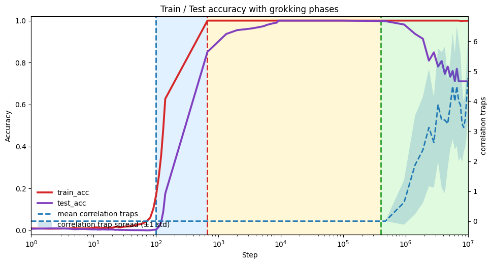
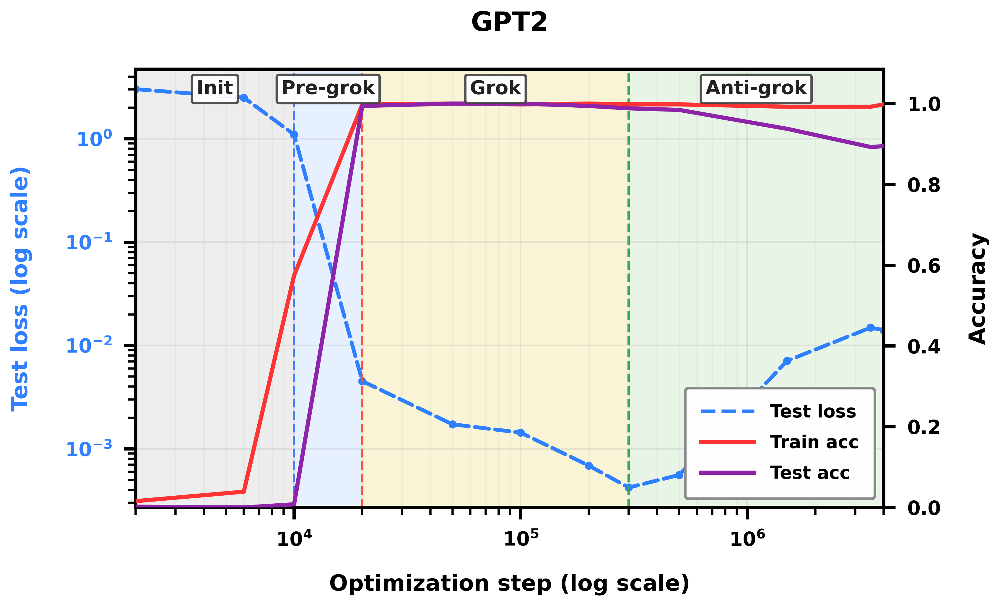
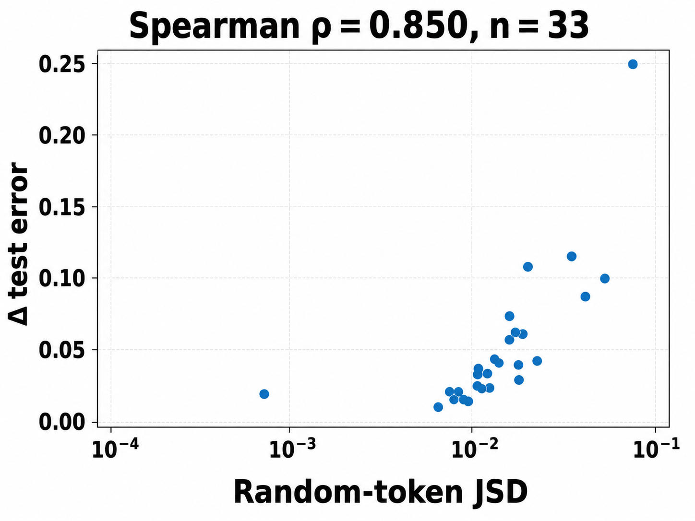
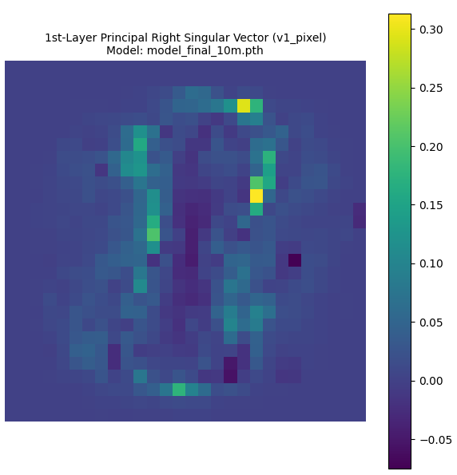
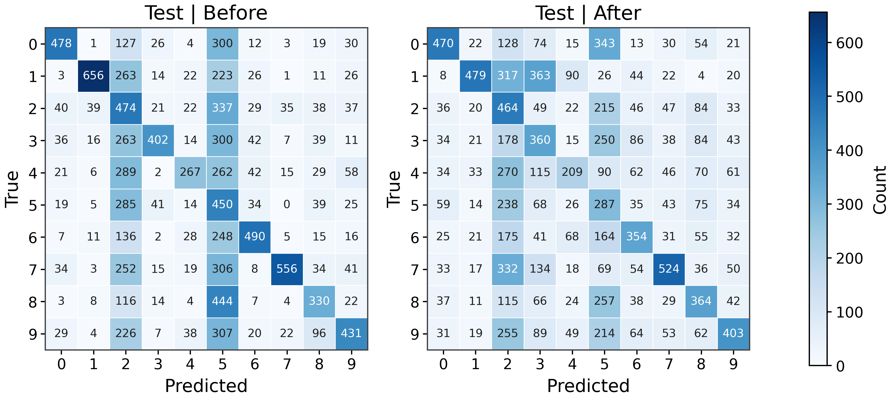
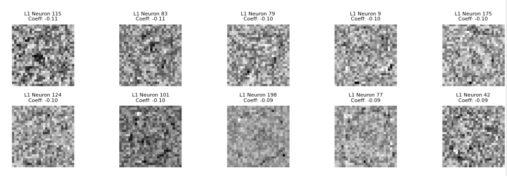
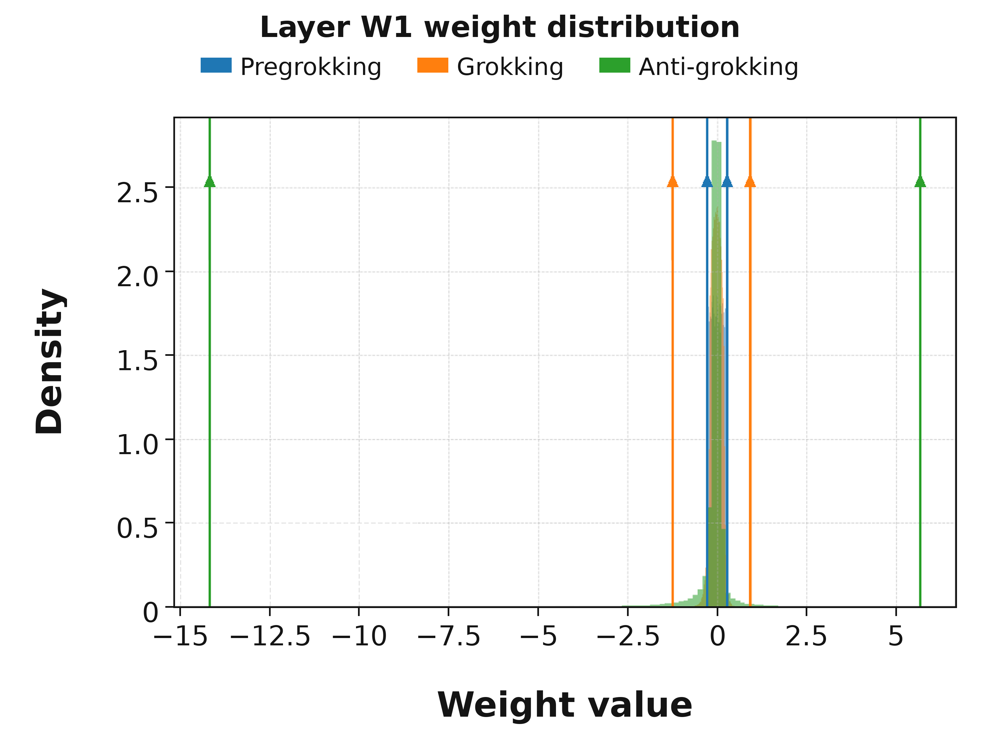
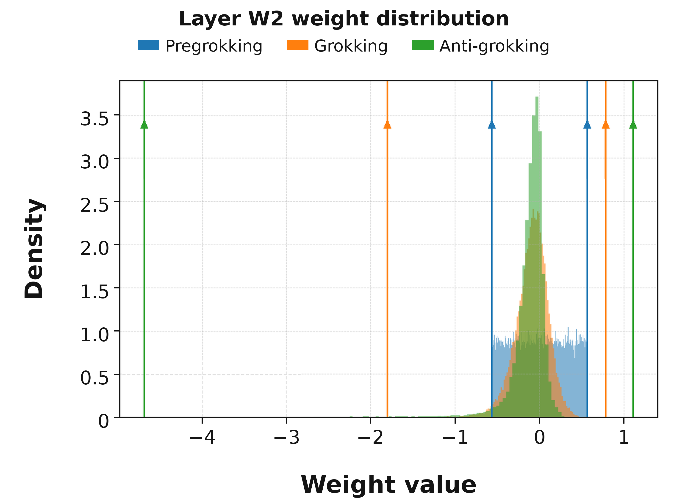
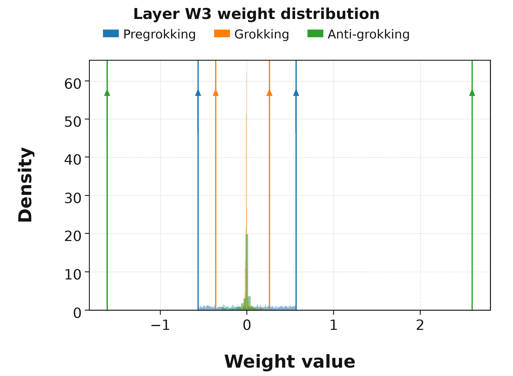

# Prakash & Martin 2026 — Detecting overfitting in Neural Networks during long-horizon grokking using Random Matrix Theory

См. также: [глобальный индекс понятий](../../concepts/index.md).

**Hari K. Prakash** (Калифорнийский университет в Сан-Диего), **Charles H. Martin** (Calculation Consulting).

arXiv [2605.12394](https://arxiv.org/abs/2605.12394), май 2026 (v2), 24 страницы, 24 панели рисунков, 14 таблиц. Всего цитирований по Semantic Scholar — 1, в картотеке — 1. Приборная работа линии WeightWatcher: распознать начало переобучения по одним весам — без данных, градиентов и состояния оптимизатора. Приём: почленно перемешать матрицу весов, подогнать спектр ковариации перемешанной матрицы распределением Марченко—Пастура и считать выбросы за краем — «ловушки корреляции» (Correlation Traps), нарушающие самоусреднение. На трёх постановках долгого горизонта (MLP/MNIST, модульное сложение, GPT2 на композиции знаний) ловушки отсутствуют в предгроккинге и гроккинге и возникают скачком на входе в позднюю пору падения тестовой точности, названную здесь **анти-гроккингом**; weight decay подавляет и ловушки, и глубину падения. Плюс послойный просмотр открытых gpt-oss-20b/120b.

Оригинал и производные файлы этой папки:

- [`original/2605.12394.detecting-overfitting-in-neural-networks-during-long-horizon-grokking-using-random-matrix-theory.md`](original/2605.12394.detecting-overfitting-in-neural-networks-during-long-horizon-grokking-using-random-matrix-theory.md) — конверсия оригинала (native arXiv HTML, v2) в Markdown без правок содержания.
- [`2605.12394.detecting-overfitting-in-neural-networks-during-long-horizon-grokking-using-random-matrix-theory.claims.txt`](2605.12394.detecting-overfitting-in-neural-networks-during-long-horizon-grokking-using-random-matrix-theory.claims.txt) — пронумерованные утверждения статьи с пометками разбора.
- [`images/`](images/) — 24 панели рисунков.

Схема якорей и правила ссылок на карточку — в [README папки статей](../README.md).

## Затрагиваемые понятия

**[Анти-гроккинг](../../concepts/anti-grokking.md)** — послегроккинговая пора падения тестовой точности при почти безупречной обучающей названа анти-гроккингом и подана как собственное введение названия ([`p1-4`](#p1-4)). Опорное наблюдение: предгроккинг и анти-гроккинг неразличимы по кривым train/test, но различны структурно — ловушки корреляции возникают только во второй поре ([`p8-5`](#p8-5)); их появление совпадает с минимумом тестовой потери ([`p6-7`](#p6-7)). Разбор: прямые предшественники с теми же опытами и тем же понятием (2602.02859 того же первого автора, 2506.04434) не процитированы — правдоподобно из-за обезличенной подачи, но в тексте, каков он есть, и термин, и ловушки выглядят введёнными впервые здесь.

**[Тяжелохвостая самрегуляризация (HTSR)](../../concepts/heavy-tailed-self-regularization-htsr.md)** — прямое продолжение линии Martin—Mahoney—WeightWatcher, но с переворотом прибора: прежние диагностики читали спектр *коррелированной* матрицы $\mathbf{W}$, здесь анализируется спектр *перемешанной* $\mathbf{W}^{\mathrm{rand}}$ — перемешивание уничтожает корреляции, сохраняя мультимножество величин, и переживший его выброс говорит об атипичности самого распределения членов ([`p2-7`](#p2-7)). Показатель $\alpha$ не используется вовсе, и в приложении прямо сказано, что устройство не требует хвоста с показателем $<2$ ([`p23-1`](#p23-1)) — ослабление прежней формулировки «много ловушек $+\ \alpha<2$» из некитируемых предшественников.

**[Гроккинг](../../concepts/grokking.md)** — взят не как предмет объяснения, а как лаборатория: долгий горизонт даёт наблюдаемое переобучение с уже размеченными порами ([`p1-4`](#p1-4)); главный урок — «гроккинг не всегда конец обучения»: модель может найти обобщающее правило и затем потерять его при продолжении оптимизации ([`p8-3`](#p8-3)). Гроккинг у MLP вызван домножением начальных весов на 8.0 — приём линии Omnigrok, связь с которой не обсуждается; основной прогон MLP — одно семя.

**[Weight decay](../../concepts/weight-decay.md)** — управляемость признака: при WD=0.01 подавляются и ловушки (2.0 и 1.0 против $7.5\pm 5.6$ и $1\pm 0$), и глубина позднего падения точности ([`p7-1`](#p7-1)) — «дело не просто в меньших весах, а в подавлении ловушек». Дополнена сверка против роста нормы: при возмущении масштаба глобальная $\ell_{2}$-норма гуляет по всем порам, а ловушки остаются нулевыми до третьей ([`p21-3`](#p21-3)).

**[Спектральный анализ](../../concepts/spectral-analysis-svd-esd-fve.md)** — ловушка определена спектрально: $\lambda_{trap}>\lambda_{+}^{\mathrm{MP}}+\Delta_{\mathrm{TW}}$ с обоснованием через переход Байка—Бен Ару—Пеше ([`p4-5`](#p4-5)); истолкование — нарушение самоусреднения двумя устройствами: геометрическая локализация (масса собственного вектора на малом наборе координат) и спектральное сгущение (одно большое собственное значение при делокализованном векторе) ([`p5-5`](#p5-5)). Оговорено, что нарушение MP — не знаковое правило: вредность решается вмешательством или пробой JSD на случайных входах ([`p5-13`](#p5-13)).

## Что показано, а что предположено

Замечания редактора карточки по итогам разбора утверждений (`…claims.txt`, 45 пунктов).

**Три опоры признака выдерживают проверку.** Итог един для трёх постановок: нуль ловушек в первых двух порах против скачка в третьей (модульное сложение: $0.00/0.00/4.88\pm 1.55$ по восьми матрицам). Weight decay подавляет и ловушки, и глубину падения — признак управляем, а не только совпадающ. Сверка против роста нормы: при возмущении масштаба $\ell_{2}$-норма гуляет по всем порам ($17.52\to 16.80\to 27.64$), ловушки — нет. Плюс единственное настоящее вмешательство: замена ловушки первого слоя MLP меняет матрицу ошибок и ослабляет смещение к классу-прообразу.

**«Вредность без данных» не сходится с собственной разметкой.** Заявлено различение вредных и безвредных ловушек «без каких-либо данных», но сама разметка вредности получена по изменению тестовой ошибки; без данных считается только JSD-проба, а её согласие с вредностью проверено по тестовым данным. Само определение вредной ловушки («замена улучшает или ухудшает тестовую точность») означает лишь деятельность — знак воздействия из него не следует.

**Заявленный вклад о локализации не подкреплён.** Ни одной измеренной величины локализации (IPR, доля массы, размер носителя) в работе нет; единственный сообщённый итог отрицателен («ограниченный предсказательный сигнал, связь меняется от опыта к опыту») и противоречит приложению D.3 («важна именно локализация»). Следы вырезанного приложения: ссылки на «доказательство» и обозначения, нигде не введённые; процедура отображения ловушки в координаты слоя названа «изложенной ниже», но не изложена.

**Границы пор и сверки расходятся.** Границы пор MLP в главной части и в приложении C различаются на порядок; у «предгроккинга» в таблице 10 обучающая точность 0.73 — вопреки собственному определению поры; приложение E о семенах и повторных перемешиваниях не содержит ни одного числа; утверждение «удалённая ловушка возвращается при продолжении обучения» — без рисунка и чисел. Отрицательный образец один (предгроккинг): ни обычного переобучения без гроккинга, ни случайных меток.

**gpt-oss — только просмотр.** Ловушки у gpt-oss-20b/120b посчитаны послойно, но ни с каким качеством модели не соотнесены; вывод «возможно, вредное переобучение у больших моделей» остаётся догадкой (признано в ограничениях), при этом раздел о влиянии на общество предлагает ловушки как меру отбора открытых моделей и приборный довод для надзорных ведомств.

**Как работу будут цитировать** («доказано, что ловушки корреляции вызывают вредное переобучение, в том числе у больших языковых моделей») — точнее: на трёх постановках показано совпадение появления ловушек с третьей порой и минимумом тестовой потери, одно вмешательство на одной ловушке MLP меняет матрицу ошибок, «вредность» определена как всякое изменение тестовой точности при замене, а у gpt-oss ловушки лишь посчитаны.

---

# Текст статьи

## Обнаружение переобучения в нейронных сетях при гроккинге на долгом горизонте с помощью теории случайных матриц

Hari K. Prakash Аффилиация: Калифорнийский университет в Сан-Диего Аффилиация: Data Science and Engineering Email: hprakash@ucsd.edu Charles H. Martin Аффилиация: Calculation Consulting Аффилиация: Сан-Франциско, Калифорния, США Email: charles@calculationconsulting.com

## Аннотация

Обучать нейронные сети (NN) без переобучения трудно; обнаружить это переобучение тоже трудно. Мы представляем новый метод теории случайных матриц, который обнаруживает начало переобучения в моделях глубокого обучения без доступа к обучающим или тестовым данным. Для каждого слоя модели мы рандомизируем каждую матрицу весов поэлементно, $\mathbf{W}\rightarrow\mathbf{W}^{\mathrm{rand}}$, подгоняем эмпирическое спектральное распределение перемешанной матрицы распределением Марченко—Пастура и находим большие выбросы, нарушающие самоусреднение. Мы называем эти выбросы ловушками корреляции (Correlation Traps). При начале переобучения, которое мы называем порой «анти-гроккинга» в гроккинге на долгом горизонте, ловушки корреляции образуются и растут числом и масштабом по мере падения тестовой точности при сохраняющейся высокой обучающей. Ловушки могут быть безвредными или вредить генерализации; мы даём эмпирический способ различить их, пропуская случайные данные через обученную модель и оценивая JS-расходимость выходных логитов. Наши находки показывают, что анти-гроккинг — дополнительная пора гроккинга с высокой обучающей точностью и падающей тестовой, структурно отличная от предгроккинга своими ловушками корреляции. Шире, мы находим, что некоторые LLM фундаментного масштаба демонстрируют те же ловушки корреляции, указывая на потенциально вредное переобучение.

## 1 Введение

Модели с открытыми весами всё чаще используются как основания для последующих систем, но часто неясно, надёжно ли обучена контрольная точка или переобучена на своё обучающее распределение. Пользователи могут иметь доступ к весам и карточке модели, но не к обучающим данным, отложенным потерям, состоянию оптимизатора или истории контрольных точек на долгом горизонте. В результате две модели могут выглядеть похоже снаружи, резко различаясь тем, кодируют ли их веса полезную структуру или хрупкие, привязанные к данным корреляции. Это мотивирует базовый вопрос: можно ли обнаружить признаки переобучения прямо по весам обученной модели, не имея доступа к обучающим и никаким тестовым данным?

*Рисунок 1: **Динамика гроккинга и ловушки корреляции. Воспроизведение известных опытов с гроккингом, продлённых до обучения на долгом горизонте. Обучающая точность (красное), тестовая точность (фиолетовое) и ловушки корреляции (синее) показаны для (a) MLP на MNIST, (b) модульного сложения (MA) и (c) GPT2. Заштрихованные области обозначают предгроккинг (серое), гроккинг (жёлтое) и анти-гроккинг (зелёное). Ловушки корреляции возникают в начале позднего падения тестовой точности и следят за ним по мере его углубления.*** **[p. 2]**

###### p1-4

Поскольку такие истории для контрольных точек с открытыми весами обычно недоступны, мы сначала изучаем постановку, где значимая динамика видима и переобучение легко вызывается обучением на долгом горизонте: *гроккинг*. При гроккинге обучающая точность достигает почти совершенства, тогда как тестовая держится около случайной многие шаги оптимизации, а затем резко улучшается [22]. Гроккинг изучен на нескольких архитектурах и задачах, включая алгоритмические задачи вроде модульного сложения, модели компьютерного зрения и трансформеры GPT-типа [17, 24]. Мы расширяем этот взгляд на долгий горизонт после гроккинга, где продолжительное обучение может завести модель в классическую пору переобучения. Мы называем эту послегенерализационную пору *анти-гроккингом*.

Наша постановка позволяет сравнить три поры обучения: предгроккинг, гроккинг и анти-гроккинг. Предгроккинг и анти-гроккинг могут выглядеть обманчиво похоже по одним лишь обучающей и тестовой точностям: в обеих порах обучающая точность высока, а отложенная плоха. Но они структурно различны. Предгроккинг наступает до того, как модель нашла генерализующее решение; анти-гроккинг **[p. 2]** — после того, как такое решение было найдено и затем потеряно. В сравнении разных пор это делает гроккинг на долгом горизонте отличным случаем для изучения вредного переобучения.

###### p2-1

Чтобы обнаружить эту послегроккинговую структуру переобучения, мы вводим *ловушки корреляции*. Ловушки корреляции — это выбросы относительно (самоусредняющегося) описания весовых матриц слоя теорией случайных матриц (RMT). Для каждого слоя мы перемешиваем веса поэлементно, $\mathbf{W}\rightarrow\mathbf{W}^{\rm rand}$, подгоняем спектр собственных значений ковариационной матрицы $\mathbf{X}^{\rm rand}=\frac{1}{N}(\mathbf{W}^{\rm rand})^{\top}\mathbf{W}^{\rm rand}$ объёмом Марченко—Пастура (MP) и считаем выбросы далеко за краем MP. Ключевое наблюдение: хотя предгроккинг и анти-гроккинг могут выглядеть похоже, только анти-гроккинг демонстрирует ловушки корреляции.

###### p2-2

Рисунок 1 показывает явление в трёх управляемых постановках: MLP на MNIST, трансформер на модульном сложении (MA) и GPT2-трансформер, обучаемый до гроккинга на долгом горизонте [24]. Во всех трёх случаях обучение разделяется на три поры. При предгроккинге обучающая точность растёт при низкой тестовой. При гроккинге тестовая точность улучшается, и модель достигает решения с высокой генерализацией. При анти-гроккинге тестовая точность падает несмотря на устойчиво почти совершенную обучающую. На всех трёх задачах сигнал ловушек следит за этим поздним расхождением: счётчики ловушек низки, пока генерализация улучшается, и растут по мере падения тестовой точности.

Эти результаты указывают, что ловушки корреляции открывают начало этой поры переобучения в хорошо изученной постановке гроккинга, где одни лишь стандартные кривые train/test не отличили бы её от предгроккинга.

#### Наши вклады.

- Мы определяем ловушки корреляции как выбросы за правым краем MP/TW в перемешанных спектрах слоёв.
- Мы показываем, что появление ловушек следит за анти-гроккингом в прогонах MLP, MA и GPT2-типа.
- Мы связываем ловушки с неусреднением через локализацию и сгущение.
- Мы различаем вредные и безвредные ловушки поведенческой проверкой на основе JSD.
- Мы просматриваем контрольные точки GPT-OSS 20B/120B послойными профилями ловушек.

Однако важнее всего то, что, как мы утверждаем, ловушки корреляции могут использоваться для обнаружения признаков потенциально вредного переобучения в открытых моделях фундаментного масштаба по одним лишь весам.

## 2 Связанные работы

#### Гроккинг и генерализация на долгом горизонте.

Гроккинг был введён Power et al. [22] как отложенная генерализация после насыщения обучающей точности. Последующие работы изучали гроккинг в алгоритмических и механистических постановках, включая модульную арифметику, MLP и трансформерные модели [11, 17, 9, 24]. Большая часть этой литературы сосредоточена на переходе от запоминания к генерализации: модель сначала подгоняет обучающий набор, затем открывает правило, которое обобщается. Наш предмет — режим долгого горизонта после этого перехода, где уже грокнувшая модель может потерять качество на отложенных данных (и переобучиться на свои обучающие) после продолжительного обучения.

#### Случайноматричные диагностики весов нейросетей.

###### p2-7

Наша диагностика строится на спектральных подходах к весовым матрицам нейросетей, особенно на теории случайных матриц (RMT) и рамке WeightWatcher [16, 13, 14, 15]. **[p. 3]** Прежние спектральные диагностики используют тяжелохвостую структуру коррелированных (нерандомизированных) весовых матриц слоёв $\mathbf{W}$ и связанные метрики для характеристики обученных сетей. Мы анализируем спектральные свойства рандомизированной $\mathbf{W}$ и ищем большие собственные значения $(\lambda_{trap})$, отклоняющиеся от базовой линии Марченко—Пастура (MP) теории случайных матриц (RMT). Мы называем эти выбросы ловушками корреляции и отслеживаем их через продлённое обучение, связывая с переобучением в поре анти-гроккинга. Отметим, что ловушки корреляции были впервые предложены в [13].

#### Самоусреднение и переобучение.

Наш критерий переобучения связывается со статистико-механическими описаниями стеклообразного обучения, где плохая генерализация отражает привязанную к выборке структуру, а не единое устойчивое правило [8, 1, 7, 23, 4]. Закон MP даёт самоусредняющуюся базовую линию для рандомизированных спектров слоёв, а ловушки корреляции её нарушают. Такие ловушки могут поддерживать несамоусредняющуюся ошибку генерализации — например, через локализацию, когда малый набор координат удерживает $O(1)$ дисперсии при подвыборке, или через сгущение, когда господствующая спектральная мода несёт макроскопическую дисперсию.[^1] В любом случае наличие ловушек согласуется с классическими понятиями переобучения, возникающими в спин-стекольных фазах простых статистико-механических моделей нейросетей.

[^1]: Соответствующие физические аналогии — андерсоновская локализация, конденсация Бозе—Эйнштейна и среднеполевая модель намагниченности Кюри—Вейса [2, 5, 6, 25].

## 3 WeightWatcher, теория случайных матриц и ловушки корреляции

Открытый инструмент WeightWatcher (WeightWatcher) реализует несколько случайноматричных анализов слоёв нейросетей [16]. Здесь он используется для исследования спектральных плотностей отдельных слоёв приёмами, взятыми из теории случайных матриц (RMT) и строго установленными статистической механикой и обширными экспериментальными наблюдениями.

### 3.1 Самоусредняющаяся базовая линия Марченко—Пастура (MP)

Для весовой матрицы слоя $\mathbf{W}\in\mathbb{R}^{N\times M}$ определим ковариацию слоя

$$
\mathbf{X}:=\frac{1}{N}\mathbf{W}^{\top}\mathbf{W}\in\mathbb{R}^{M\times M}. \tag{1}
$$

Пусть $\{\lambda_{i}\}_{i=1}^{M}$ — собственные значения $\mathbf{X}$. Эмпирическая спектральная плотность (ESD) есть

$$
\rho_{\mathrm{emp}}(\lambda):=\frac{1}{M}\sum_{i=1}^{M}\delta(\lambda-\lambda_{i}). \tag{2}
$$

Если члены $\mathbf{W}$ н.о.р. и хорошо себя ведут, то в пределе $N,M\to\infty$ при фиксированном $Q=N/M\geq 1$ $\rho_{\mathrm{emp}}(\lambda)$ сходится к плотности Марченко—Пастура [12].

$$
\rho_{\mathrm{MP}}(\lambda)=\frac{Q}{2\pi\sigma^{2}}\frac{\sqrt{(\lambda_{+}-\lambda)(\lambda-\lambda_{-})}}{\lambda}\mathbf{1}_{[\lambda_{-},\lambda_{+}]}(\lambda), \tag{3}
$$

с краями

$$
\lambda_{\pm}=\sigma^{2}\left(1\pm Q^{-1/2}\right)^{2}. \tag{4}
$$

При конечном $N$ правый край $\lambda_{+}$ живёт в масштабе флуктуаций Трейси—Видома (TW).

Также — и это важно — сингулярные и/или собственные векторы MP $\mathbf{v}$ делокализованы со случайно распределёнными компонентами. То есть можно ожидать $|v_{j}|^{2}\sim\tfrac{1}{M}$ с точностью до флуктуаций.

Объём MP согласуется с **самоусредняющимся** поведением. В пределе больших $N$ ESD концентрируется на детерминированном законе MP,

$$
\rho_{\mathrm{emp}}(\lambda)\;\to\;\rho_{\mathrm{MP}}(\lambda),\quad N,M\to\infty,\;Q=\tfrac{N}{M}\ \text{fixed}.
$$

Большие спектральные выбросы представляют **несамоусредняющуюся** структуру: малое число направлений господствует в статистике. Наблюдаемые, зависящие от этих направлений, не концентрируются. В этом суть нашего анализа: такие выбросы $(\lambda_{trap},\mathbf{v}_{trap})$ можно обнаружить прямо по весовым матрицам, и они означают, что слой развил структурированные неслучайные корреляции, связанные с переобучением.

*Рисунок 2: **Рандомизированные ESD, подгонки MP и возникновение ловушек корреляции.** (a) Пример ESD $\mathbf{X}^{\mathrm{rand}}$ в сравнении с подгонкой Марченко—Пастура (MP). В самоусредняющемся рандомизированном слое спектр описывается объёмом MP, и больших выбросов за правым краем не остаётся. (b,c) Примеры ловушечных рандомизированных спектров из слоя 2 MLP. Прямо перед обвалом рандомизированный спектр уже показывает господствующий пик около $\lambda_{\mathrm{trap}}\approx 10^{6.5}$; на финальной стадии анти-гроккинга множественные пики лежат далеко за объёмом MP. Мы называем эти выбросы ловушками корреляции.* **[p. 4]**

**[p. 4]**

### 3.2 Поэлементное перемешивание и ловушки корреляции

Признавая, что RMT требует, чтобы члены матрицы были н.о.р. и хорошо себя вели (то есть не слишком тяжелохвосты), для честного применения RMT мы рандомизируем весовую матрицу поэлементно и образуем

$$
\mathbf{W}\mapsto\mathbf{W}^{\mathrm{rand}}.\;\; \tag{5}
$$

Под рандомизированным нулём члены $\mathbf{W}^{\mathrm{rand}}$ должны быть по существу некоррелированы, так что ESD $\mathbf{X}^{\mathrm{rand}}=\tfrac{1}{N}(\mathbf{W}^{\mathrm{rand}})^{\top}\mathbf{W}^{\mathrm{rand}}$ должна хорошо подгоняться распределением MP, если модель хорошо обучена. Также сингулярные векторы $\mathbf{W}^{\mathrm{rand}}$ (и собственные векторы $\mathbf{X}^{\mathrm{rand}}$) будут делокализованы.[^2]

[^2]: Компоненты $v_{i}$ объёмных векторов MP будут следовать распределению Портера—Томаса [20, 21].

Рисунок 2 показывает эту диагностику. В хорошо ведущем себя слое рандомизированная ESD следует подогнанному объёму MP, и больших выбросов за правым краем не появляется; см. рис. 2(a). Однако при анти-гроккинге рандомизированный спектр развивает отделившиеся пики далеко за краем MP; см. рис. 2(b,c). Эти пики — структурные выбросы, переживающие поэлементное перемешивание (и часто локализующиеся).

###### p4-5

Мы называем эти выбросы **ловушками корреляции**. Если $\lambda_{trap}$ — собственное значение $\mathbf{X}^{\mathrm{rand}}$, а $\lambda_{+}^{\mathrm{MP}}$ — подогнанный правый край MP, то ловушка — это собственное значение, лежащее значимо за правым краем MP:

$$
\text{Correlation Trap:}\qquad\lambda_{trap}>\lambda_{+}^{\mathrm{MP}}+\Delta_{\mathrm{TW}} \tag{6}
$$

где $\Delta_{\mathrm{TW}}$ обозначает масштаб конечноразмерных флуктуаций Трейси—Видома.

###### p4-7

По теории Байка—Бен Ару—Пеше (BBP), собственное значение, отделившееся за край TW, есть структурный выброс [3]. Именно поэтому подгонка MP даёт рандомизированный нуль для нашей диагностики. Более того, получающиеся выбросы близки по духу к сильным выровненным направлениям, подчёркнутым Li и Sonthalia [10], которые вызывают катастрофический отказ.

Наша постановка непараметрическая и реализована как практическая диагностика; она не различает конкретные механизмы, которые могут порождать видимое неусреднение/отказ концентрации. Кроме того, одни ловушки вредны, другие безвредны. Позже мы покажем, как различить вредные и безвредные ловушки, снова не нуждаясь ни в каких тестовых или обучающих данных, в данной модели.

*Таблица 1: **Алгоритм обнаружения ловушек. Полная процедура, используемая для вычисления кривых счёта ловушек.*** **[p. 4]**

| **Шаг** | **Процедура** |
|---|---|
| 1 | Взять обученный слой $\mathbf{W}\in\mathbb{R}^{N\times M}$ в сохранённой контрольной точке. |
| 2 | Перемешать члены $W_{ij}$ поэлементно, образовав $\mathbf{W}^{\mathrm{rand}}$. |
| 3 | Выполнить SVD($\mathbf{W}^{\mathrm{rand}}$), образовать плотность собственных значений $\rho_{emp}(\lambda)$ (или ESD) |
| 4 | Подогнать ESD $\rho_{emp}(\lambda)$ законом Марченко—Пастура (MP). |
| 5 | Найти собственные значения $\lambda_{trap}>\lambda_{+}^{\mathrm{MP}}+\Delta_{\mathrm{TW}}$; это ловушки корреляции |

Инструмент WeightWatcher обнаруживает ловушки корреляции автоматически, как изложено в таблице 1.

**[p. 5]**

## 4 Ловушки как признаки неусреднения: локализация и сгущение

Самоусреднение — статистико-механический аналог концентрации. Наблюдаемая $A_{N}$ самоусредняется, когда её относительные флуктуации исчезают, например когда

$$
\frac{\operatorname{Var}(A_{N})}{\mathbb{E}[A_{N}]^{2}}\longrightarrow 0. \tag{7}
$$

Для эмпирического риска $R_{n}$ определяют дисперсию и ковариацию:

$$
R_{n}=\frac{1}{n}\sum_{i=1}^{n}L_{i},\qquad\operatorname{Var}(R_{n})=\frac{1}{n^{2}}\mathbf{1}^{\top}\Sigma_{n}\mathbf{1},\quad(\Sigma_{n})_{ij}=\operatorname{Cov}(L_{i},L_{j}). \tag{8}
$$

Концентрация требует, чтобы ковариация не имела макроскопических, привязанных к выборке мод. Общее: определим ковариационно-подобную матрицу $C$ с собственным разложением

$$
C=\sum_{\alpha}\lambda_{\alpha}v_{\alpha}v_{\alpha}^{\top}. \tag{9}
$$

Пусть $A_{b}$ — некоторая линеаризованная наблюдаемая с вектором чувствительности $b$. Запишем дисперсию $A_{b}$ как

$$
\operatorname{Var}(A_{b})=b^{\top}Cb=\sum_{\alpha}\lambda_{\alpha}\langle b,v_{\alpha}\rangle^{2}. \tag{10}
$$

###### p5-5

Ловушка, следовательно, опасна, когда один член этой суммы остаётся макроскопическим. *Отказ концентрации* может случиться по меньшей мере двумя разными путями: *локализацией* и/или *сгущением*.

#### Геометрическая локализация.

Ловушечная мода может быть локализована в координатах. Для нормированного собственного вектора $v\in\mathbb{R}^{M}$ это значит, что его квадратичная масса сосредоточена на малом наборе $S$:

$$
\sum_{i\in S}v_{i}^{2}\approx 1,\qquad|S|\ll M. \tag{11}
$$

Соответствующая компонента дисперсии $\lambda vv^{\top}$ тогда несётся малым эффективным носителем. Если наблюдаемая $(A_{b})$ имеет непренебрежимую проекцию на этот носитель, она не усредняется по многим сравнимым координатам, и её флуктуации не обязаны спадать обычным темпом.

Практически это означает, что ловушка сильно локализована и часто содержит значительную долю верхних $5\%$ массы $W_{ij}$. Мы исследовали локализацию ловушек и нашли, что она даёт лишь ограниченный предсказательный сигнал о вредных ловушках, причём связь меняется от опыта к опыту.[^3]

[^3]: Это аналогично андерсоновской локализации: собственная мода пространственно или координатно локализована, так что значимая дисперсия поддержана лишь немногими степенями свободы.

#### Спектральное сгущение.

Ловушка может быть и размазанной по координатам, но господствующей в спектре. Пусть одно собственное значение $\lambda_{\rm max}$ много больше остальных. Тогда вклад в дисперсию

$$
\lambda_{\rm max}\langle b,v_{1}\rangle^{2} \tag{12}
$$

может господствовать в ур. (10), даже когда $v_{1}$ размазан по многим координатам. В этом случае самоусреднение отказывает не потому, что мода геометрически разрежена (то есть ловушка сильно локализована), а потому, что дисперсия сгустилась в одну большую спектральную степень свободы.[^4]

[^4]: Это напоминает модель Кюри—Вейса с матрицей $(J/N)\mathbf{1}\mathbf{1}^{\top}$ — одно большое собственное значение при совершенно делокализованном собственном векторе $\mathbf{1}/\sqrt{N}$. Аналогично, конденсат Бозе занимает одну спектральную моду, которая может оставаться пространственно размазанной.

###### p5-13

Ловушки корреляции могут проявлять локализацию, сгущение или смесь обоих. Нарушение MP означает несамоусредняющуюся структуру, но это не знаковое правило: и локализованные ловушки, и размазанные спектральные пики могут быть полезными, вредными или безразличными. Их влияние на генерализацию должно поэтому определяться либо вмешательством, либо описанной ниже бесданной диагностической JSD-пробой с абляцией.

## 5 Эмпирические результаты: ловушки корреляции следят за анти-гроккингом

Мы изучаем три стандартные постановки гроккинга, обозначаемые MLP, MA и GPT2. Первая, MLP, — полносвязный ReLU MLP глубины 3, обучаемый на сбалансированном подмножестве MNIST со 100 примерами **[p. 6]** каждого класса, всего 1,000 обучающих точек. Сеть имеет ширину $M=200$ в каждом скрытом слое и обучается AdamW, MSE-потерей на one-hot целях и скоростью обучения $\text{lr}=5\times 10^{-4}$ до $10^{7}$ шагов оптимизации. Основные прогоны используют WD=0, и мы включаем сверку с WD=0.01 для измерения эффекта weight decay. Полные гиперпараметры — в Приложении A.

Вторая постановка, MA, — малый однослойный трансформер на задаче модульного сложения $\mathbf{x}+\mathbf{y}\bmod P$. Мы снова обучаем далеко за точку, где модель впервые обобщается. Детали архитектуры, сводки пор и послойные счётчики ловушек — в Приложении A.3. Предгроккинг, гроккинг и анти-гроккинг — описательные метки пор, привязанные к наблюдаемым траекториям train/test.

Третья постановка, GPT2, следует синтетической задаче композиции из GrokkedTransformer — Wang et al. [24]. Она использует синтетический граф знаний с атомарными однохоповыми фактами $(h,r,t)$, запрашиваемыми как $(h,r)\mapsto t$, и латентными правилами композиции, порождающими выведенные двуххоповые факты. Например, атомарные факты $(h,r_{1},m)$ и $(m,r_{2},t)$ влекут выведенный запрос $(h,r_{1},r_{2})\mapsto t$. Следуя исходной постановке, атомарные факты разбиты на $\mathrm{atomic}{\mathrm{ID}}$ и $\mathrm{atomic}{\mathrm{OOD}}$. Обучение включает все атомарные факты плюс случайное подмножество выведенных фактов, полученных только из $\mathrm{atomic}{\mathrm{ID}}$, обозначаемое $\mathrm{train\_inferred}{\mathrm{ID}}$, и отложенный набор $\mathrm{test\_inferred}_{\mathrm{ID}}$. Тем самым «тест» измеряет внутрираспределённую композиционную генерализацию на невиданных выведенных фактах из того же атомарного пула. Подробнее см. Приложение A.4.

Дополнительные материалы (см. Приложение F) содержат соответствующий код обучения и анализа.

### 5.1 MLP: третья пора после гроккинга

Рисунок 1(a) показывает полную траекторию долгого горизонта для MLP на подмножестве MNIST. Прогон демонстрирует знакомый переход предгроккинг $\to$ гроккинг: обучающая точность быстро насыщается, тестовая улучшается много позже, и модель достигает режима высокой генерализации около $10^{6}$ шагов. Продолжение оптимизации открывает третью пору. После гроккинга тестовая точность снова существенно падает, тогда как обучающая остаётся по существу совершенной. Аналогично, как показано на рис. 3, тестовая потеря в некоторой точке достигает минимума. Это и есть режим (зелёный), который мы называем анти-гроккингом.

*Рисунок 3: **Динамика гроккинга и тестовая потеря. Обучающая точность (красное), тестовая точность (фиолетовое) и тестовая потеря (синее) показаны для (a) MLP на MNIST, (b) модульного сложения (MA) и (c) GPT2.*** **[p. 6]**

###### p6-5

Счёт ловушек отделяет этот режим от более ранних пор. При предгроккинге, когда модель уже подогнала обучающий набор, но ещё не обобщилась, среднее число обнаруженных ловушек фактически равно нулю. При гроккинге счёт ловушек остаётся около нуля. Только когда начинается поздний анти-гроккинг, счёт ловушек резко растёт. Это ровно то, чего следовало бы ожидать, если ловушки измеряют отход от самоусредняющейся случайной базовой линии, а не простой рост масштаба.

Таблица 3 делает разделение пор явным. И в настройке без weight decay (WD=0), и в сверке с weight decay (WD>0) ловушки отсутствуют при предгроккинге и гроккинге и появляются только при анти-гроккинге. Прогон без weight decay демонстрирует и больший счёт ловушек, и более тяжёлое падение тестовой точности, предполагая, что счёт ловушек отражает не только начало, но и тяжесть.

### 5.2 GPT2: тот же узор в большей архитектуре

###### p6-7

Мы также изучаем модель GPT2, спроектированную специально для вызова гроккинга [24], теперь обучаемую на очень долгом горизонте, чтобы вызвать и анти-гроккинг. Та же трёхпоровая структура появляется в этой совсем другой постановке. Рисунок 1(c) показывает обучающую и тестовую точность GPT2-трансформера вместе со счётом ловушек, на этот раз для каждого слоя. Как и у MLP, модель сначала запоминает, затем обобщается, а позже испытывает существенную деградацию тестовой точности при продолжении оптимизации, ( **[p. 7]** по большей части) сохраняя совершенную обучающую. Появление ловушек корреляции также очень хорошо коррелирует с минимумом тестовой потери, как показано на рис. 3

### 5.3 Weight decay подавляет анти-гроккинг (рост ловушек и переобучение)

###### p7-1

Полезная сверка — прогон MLP с ненулевым weight decay. Weight decay не устраняет три поры целиком, но снижает и число ловушек, и размах поздней тестовой деградации (Приложение A.2; таблица 3). Это важно по двум причинам. Во-первых, это показывает, что анти-гроккинг — не просто артефакт определений пор: когда оптимизация регуляризована, структурный признак слабее — и слабее деградация. Во-вторых, это поддерживает несамоусредняющееся истолкование; дело не просто в том, что веса меньше, а в том, что подавлены ловушки корреляции.

### 5.4 Дополнительная проверка: исследование с возмущением

Приложение C проводит эксперимент с возмущением с целью исключить более простое объяснение: что счётчики ловушек лишь следят за общей величиной весов. Мы возмущаем контрольные точки так, что меняется глобальный масштаб весов, и норменные величины движутся по порам обучения. Даже под этим возмущением счёт ловушек по перемешанным спектрам остаётся около нуля в предгроккинге и гроккинге и становится ненулевым только в анти-гроккинге. Таким образом, ловушки корреляции — не просто прокси растущей глобальной нормы весов; они поро-специфичны и указывают на переобучение.

## 6 Классификация ловушек диагностической JSD-пробой с абляцией

Теория случайных матриц (RMT) позволяет обнаружить ловушки корреляции, но мы хотим знать и то, насколько ловушки действительно вредны; для этого мы определяем бесданную диагностическую JSD-пробу с абляцией, которая может количественно оценить важность ловушки. Пусть $M_{\theta}$ обозначает исходную модель, а $M_{\theta\setminus k}$ — модель после замены ловушки $k$ подходящим случайным вектором. Определим температурно-масштабированные выходные распределения

$$
p_{\theta}(\mathbf{x};T)=\operatorname{softmax}\!\left(z_{\theta}(\mathbf{x})/T\right),\qquad p_{\theta\setminus k}(\mathbf{x};T)=\operatorname{softmax}\!\left(z_{\theta\setminus k}(\mathbf{x})/T\right).
$$

При пробных входах $\mathbf{x}_{p}$ определим счёт удаления ловушки

$$
J_{k}(T)=\mathbb{E}_{\mathbf{x}_{p}}\!\left[D_{\mathrm{JS}}\!\left(p_{\theta}(\mathbf{x}_{p};T)\,\middle\|\,p_{\theta\setminus k}(\mathbf{x}_{p};T)\right)\right]. \tag{13}
$$

Здесь $z_{\theta}(\mathbf{x})$ и $z_{\theta\setminus k}(\mathbf{x})$ — исходные и после удаления ловушки логиты, а $D_{\mathrm{JS}}$ обозначает расходимость Йенсена—Шеннона (симметричную сглаженную версию KL-расходимости).

Для модульного сложения и моделей GPT-типа пробное распределение — последовательности случайных токенов. Для MLP случайные токены не осмысленны, поэтому пробы — гауссовы входы, подогнанные под заданные среднее и стандартное отклонение. $J_{k}(T)$ измеряет, насколько ловушка важна: большой $J_{k}(T)$ означает, что удаление ловушки значимо меняет выходы модели даже на случайных входных данных $\mathbf{x}_{p}$.

Чтобы разметить ловушку как вредную или безвредную в наших опытах, мы заменяем её подходящим случайным вектором и вычисляем изменение ($\Delta$) тестовой ошибки. Классификация:

- **Вредная ловушка:** замена меняет логиты и улучшает либо ухудшает тестовую точность.
- **Безвредная ловушка:** замена почти не влияет на тестовую точность.

Абляция большинства ловушек либо заставляет $\Delta$ (изменение) тестовой точности падать ещё сильнее при удалении/замене, а также деградирует обучающую точность, либо имеет очень малый, иногда положительный эффект на одну или обе.

*Рисунок 4: **Диагностическая JSD-проба с абляцией для выбранных контрольных точек анти-гроккинга MLP, MA и GPT2. Счёт удаления ловушки $J_{k}(T=1)$ против изменения тестовой ошибки для отдельных ловушек. Безвредные ловушки имеют $J_{k}(T=1)\approx 0$, тогда как вредные — относительно большие счёты $J_{k}(T=1)$.*** **[p. 8]**

###### p7-10

Рисунок 4 показывает поведенческую JSD-диагностику для трёх экспериментов. Для MLP и MA мы оцениваем первую, среднюю и финальную контрольные точки анти-гроккинга. Для GPT2 мы анализируем представительный слой из первой контрольной точки анти-гроккинга ($1.5\times 10^{6}$ шагов). Внутри данной обученной модели счёт удаления ловушки $J_{k}(T=1)$ близко следит за изменением качества, вызванным абляцией ловушки. Абсолютная шкала зависит от модели и силы ловушки, поэтому JSD лучше всего истолковывать как внутримодельную меру деятельности ловушки, различающую относительно безвредные и вредные ловушки.

**[p. 8]**

## 7 Более широкие следствия для моделей передового масштаба

###### p8-1

Чтобы мотивировать более широкую значимость ловушек корреляции, мы применили ту же диагностику перемешанных спектров к двум открытым рассуждающим моделям OpenAI, gpt-oss-20b и gpt-oss-120b [19, 18]. Рисунок 5 приводит число обнаруженных ловушек корреляции по слоям.

*Рисунок 5: **Послойные профили ловушек корреляции в открытых LLM передового масштаба. Число обнаруженных ловушек корреляции по слоям для моделей OpenAI gpt-oss-20b и gpt-oss-120b.*** **[p. 8]**

###### p8-2

Вместе взятые, эти наблюдения предполагают, что ловушки корреляции могут дать практическую спектральную диагностику для выявления потенциально вредных структур переобучения в фундаментных моделях передового масштаба. Шире, большое число ловушек на рисунке 5 предполагает, что LLM фундаментного масштаба могут непреднамеренно переобучаться на свои обучающие данные потенциально вредными способами.

## 8 Заключение

###### p8-3

Главный урок в том, что гроккинг — не всегда конец обучения. Модель может сначала выучить правило, которое обобщается, а затем потерять эту генерализацию при продолжении оптимизации. Мы называем этот поздний отказ *анти-гроккингом*: а именно, после генерализации тестовая точность деградирует, тогда как обучающая остаётся высокой. На опытах с гроккингом MLP/MNIST, модульного сложения (MA) и GPT2-типа этот переход отмечен появлением выбросов $(\lambda_{trap})$ в спектре одной или нескольких рандомизированных послойных весовых матриц. Мы называем эти выбросы *ловушками корреляции*.

Термин «ловушка корреляции» операционален. Мы называем эти выбросы ловушками корреляции, потому что они выявляют скрытые структуры, которые как бы «ловят» корреляции, заставляя модель переобучаться на свои данные, снижая тестовую точность модели, но не (обязательно) обучающую. И по мере усугубления переобучения ловушек появляется больше. Более того, их удаление может даже повредить тестовой (и обучающей) точности модели, по-видимому удаляя корреляции, которые модель выучила.

###### p8-5

Ловушки корреляции открывают структурное различие между двумя внешне похожими режимами. И в предгроккинге, и в анти-гроккинге обучающая точность может быть высокой при плохой тестовой. Но весовые спектры различны. При предгроккинге счётчики ловушек остаются около нуля. **[p. 9]** При успешном гроккинге они тоже отсутствуют или почти отсутствуют. Они появляются только при анти-гроккинге; тем самым ловушки не просто обнаруживают запоминание, низкую тестовую или высокую обучающую точность. Они обнаруживают переобучение, возникающее при анти-гроккинге.

Диагностика проста и работает по одним весам. Ей не нужны обучающие данные, тестовые данные, градиенты, состояние оптимизатора или доступ к обучающему конвейеру. Нужна только контрольная точка. Для каждого слоя мы перемешиваем весовую матрицу поэлементно, образуем рандомизированный ковариационный спектр, подгоняем объём Марченко—Пастура (MP) и считаем выбросы за подогнанным краем MP/TW. Закон MP/TW даёт самоусредняющуюся базовую линию. Ловушка корреляции — отделившаяся спектральная мода, нарушающая эту базовую линию, и она может быть вредной или безвредной.

Самоусредняющееся истолкование объясняет, почему эти моды важны. Ловушка может нарушить концентрацию двумя путями: геометрической локализацией и/или спектральным сгущением. В любом случае выровненные с ловушкой наблюдаемые, такие как тестовая ошибка, могут стать несамоусредняющимися, когда ловушка значимо перекрывается с генерализующими собственными компонентами слоёв модели. Это даёт по меньшей мере два конкретных механизма, которыми спектральная аномалия в весах может стать поведенческим отказом.

Вредные ловушки можно отличить от безвредных бесданной эмпирической проверкой, называемой JSD-пробой с абляцией ловушки. Мы заменяем ловушку случайным вектором, пропускаем пробные входы через исходную и аблированную модели и меряем расходимость Йенсена—Шеннона между их выходными распределениями. Большая JSD означает, что удаление ловушки значимо меняет выходы модели даже на случайных входных данных, что показательно для эффекта на настоящих входах. Ловушка вредна, если замена меняет тестовую точность, и безвредна, если эффект мал или отсутствует.

###### p9-4

Пример MLP показывает, как вредная ловушка может выглядеть механистически. При анти-гроккинге отображённые направления ловушек первого слоя становятся прообразо-подобными в пространстве пикселей, и вмешательство на ловушке меняет структуру матрицы ошибок. Модель по-прежнему верно классифицирует конечный обучающий набор, но на затронутых ловушкой тестовых примерах её поведение всё сильнее зависит от амплитуды вытянутого вектора и статистик прообраза, таких как $\|x\|_{2}$, а не от коррелированного двумерного узора цифры. Это даёт один конкретный пример того, как модель может оставаться совершенно подогнанной к обучающим данным, теряя корреляционное правило, поддерживавшее генерализацию.

Тот же признак появления ловушек не специфичен для картиночных MLP. Модульное сложение даёт алгоритмическую трансформерную постановку, где счётчики ловушек остаются около нуля до и во время гроккинга и растут при анти-гроккинге. Опыт GPT2-типа показывает тот же узор долгого горизонта в архитектуре трансформерной языковой модели. Вместе эти опыты показывают, что ловушки корреляции повторяются в изученных здесь семействах моделей и типах задач: плотные картиночные классификаторы, алгоритмические трансформеры и последовательностные модели GPT-типа.

Опыт просмотра передового масштаба указывает на практический случай применения. Некоторые большие открытые контрольные точки LLM демонстрируют большое число ловушек. Эти профили сами по себе не доказывают вредное переобучение в этих моделях, но наводят на мысль о возможных проблемах. Для обучения фундаментных моделей счётчики ловушек могли бы служить сигналом предупреждения на уровне контрольных точек. Для дообучения они могут помочь выявить слои базовой модели, поведение которых стоит проверить перед адаптацией.

Мы не утверждаем, что всякая форма переобучения обязана порождать ловушки корреляции. Здешнее утверждение острее: в гроккинге на долгом горизонте появление ловушек следит за анти-гроккингом, а предгроккинг даёт безловушечную отрицательную сверку. С помощью диагностической JSD-пробы с абляцией ловушки можно разметить как вредные или безвредные для данной модели. Эти результаты предполагают, что некоторые формы вредного переобучения оставляют обнаружимые признаки в послойных весовых матрицах внешне хорошо обученных моделей. Следующий шаг — использовать эту диагностику при обучении и дообучении и проверить, можно ли вредные ловушки корреляции подавить, удалить или зарегуляризовать, не повредив полезной выученной структуре.

## 9 Ограничения

Наше контролируемое свидетельство приходит из трёх постановок гроккинга на долгом горизонте: MLP/MNIST, модульное сложение (MA) и траектория обучения GPT2-типа. Эти опыты ясно обнажают поры предгроккинга, гроккинга и анти-гроккинга, но не исчерпывают пространства архитектур, оптимизаторов, наборов данных, потерь или семян. Результаты GPT-OSS показывают, что ловушки корреляции встречаются и в больших открытых моделях, но это лишь просмотровое свидетельство; само по себе оно не устанавливает вредного поведения. Главный риск — переистолкование: счётчики ловушек не следует использовать как универсальные оценки качества или безопасности модели без дополнительных пробных и задачных оценок.

**[p. 10]**

#### Возможные общественные последствия.

Доступно для скачивания более миллиона открытых весов моделей, но многие из них, без сомнения, переобучены на свои обучающие данные. Это исследование позволяет пользователям отбирать модели с меньшим числом признаков переобучения, потенциально лучше подходящие для желаемых задач. Более того, с призывами к регулированию моделей фундаментного масштаба ловушки корреляции могут дать надзорным ведомствам один непредвзятый способ оценки безопасности модели — и без нужды в доступе к собственническим, защищённым или вообще каким-либо данным.

## References

- D. J. Amit, H. Gutfreund, and H. Sompolinsky (1985) Spin-glass models of neural networks. Physical Review A 32 (2), pp. 1007–1018. External Links: Document Cited by: §D.1, §2.

- P. W. Anderson (1958) Absence of diffusion in certain random lattices. Physical Review 109 (5), pp. 1492–1505. External Links: Document Cited by: footnote 1.

- J. Baik, G. Ben Arous, and S. Péché (2005) Phase transition of the largest eigenvalue for nonnull complex sample covariance matrices. The Annals of Probability 33 (5), pp. 1643–1697. Cited by: §3.2.

- S. Bös (1998) Statistical mechanics approach to early stopping and weight decay. Physical Review E 58 (1), pp. 833–847. External Links: Document Cited by: §D.1, §2.

- S. N. Bose (1924) Plancks Gesetz und Lichtquantenhypothese. Zeitschrift für Physik 26 (1), pp. 178–181. External Links: Document Cited by: footnote 1.

- A. Einstein (1925) Quantentheorie des einatomigen idealen Gases. Sitzungsberichte der Preussischen Akademie der Wissenschaften, pp. 3–14. Cited by: footnote 1.

- E. Gardner (1988) The space of interactions in neural network models. Journal of Physics A: Mathematical and General 21 (1), pp. 257–270. External Links: Document Cited by: §D.1, §2.

- J. J. Hopfield (1982) Neural networks and physical systems with emergent collective computational abilities. Proceedings of the National Academy of Sciences 79 (8), pp. 2554–2558. External Links: Document Cited by: §D.1, §2.

- J. Lee, B. G. Kang, K. Kim, and K. M. Lee (2024) Grokfast: accelerated grokking by amplifying slow gradients. External Links: 2405.20233, Link Cited by: §2.

- J. Li and R. Sonthalia (2025) Risk phase transitions in spiked regression: alignment driven benign and catastrophic overfitting. arXiv preprint arXiv:2510.01414. Cited by: §3.2.

- Z. Liu, O. Kitouni, N. S. Nolte, E. J. Michaud, M. Tegmark, and M. Williams (2022) Towards understanding grokking: an effective theory of representation learning. In Advances in Neural Information Processing Systems, Vol. 35, pp. 34651–34663. External Links: Link Cited by: §2.

- V. A. Marchenko and L. A. Pastur (1967) Distribution of eigenvalues for some sets of random matrices. Matematicheskii Sbornik 72(114) (4), pp. 507–536. Cited by: §3.1.

- C. H. Martin and C. Hinrichs (2025) SETOL: a semi-empirical theory of (deep) learning. arXiv preprint arXiv:2507.17912. External Links: Link Cited by: §2.

- C. H. Martin and M. W. Mahoney (2021) Implicit self-regularization in deep neural networks: evidence from random matrix theory and implications for learning. Journal of Machine Learning Research 22 (1), pp. 1–73. External Links: Link Cited by: §2.

- C. H. Martin, T. Peng, and M. W. **[p. 11]** Mahoney (2021) Predicting trends in the quality of state-of-the-art neural networks without access to training or testing data. Nature Communications 12, pp. 4122. External Links: Document, Link Cited by: §2.

- C. H. Martin (2018) WeightWatcher: analyze Deep Learning Models without Training or Data. Note: https://github.com/CalculatedContent/WeightWatcherVersion 0.7.5.5 used in this study. Accessed May 12, 2025 Cited by: Table 2, Appendix F, §2, §3.

- N. Nanda, L. Chan, T. Lieberum, J. Smith, and J. Steinhardt (2023) Progress measures for grokking via mechanistic interpretability. External Links: 2301.05217, Link Cited by: §1, §2.

- OpenAI (2025) Gpt-oss-120b & gpt-oss-20b model card. Note: https://openai.com/index/gpt-oss-model-card/Accessed: 2026-03-28 Cited by: §7.

- OpenAI (2025) Introducing gpt-oss. Note: https://openai.com/index/introducing-gpt-oss/Accessed: 2026-03-28 Cited by: §7.

- C. E. Porter and R. G. Thomas (1956) Fluctuations of nuclear reaction widths. Physical Review 104 (2), pp. 483–491. Cited by: footnote 2.

- M. Potters and J. Bouchaud (2021) A first course in random matrix theory: for physicists, engineers and data scientists. Cambridge University Press. External Links: ISBN 9781108768900 Cited by: footnote 2.

- A. Power, Y. Burda, H. Edwards, I. Babuschkin, and V. Misra (2022) Grokking: generalization beyond overfitting on small algorithmic datasets. External Links: 2201.02177, Link Cited by: §1, §2.

- H. S. Seung, H. Sompolinsky, and N. Tishby (1992) Statistical mechanics of learning from examples. Physical Review A 45 (8), pp. 6056–6091. External Links: Document Cited by: §D.1, §2.

- B. Wang, X. Yue, Y. Su, and H. Sun (2024) Grokked transformers are implicit reasoners: a mechanistic journey to the edge of generalization. In The Thirty-eighth Annual Conference on Neural Information Processing Systems, External Links: Link Cited by: §A.4, §1, §1, §2, §5.2, §5.

- P. Weiss (1907) L’hypothèse du champ moléculaire et la propriété ferromagnétique. Journal de Physique Théorique et Appliquée 6 (1), pp. 661–690. External Links: Document Cited by: footnote 1.

**[p. 12]**

## Приложение A Постановка экспериментов и дополнительные замечания: MLP, MA и GPT2

### A.1 Постановка эксперимента MLP

Мы обучаем многослойный перцептрон (MLP) на подмножестве набора данных MNIST с гиперпараметрами из таблицы 2. Обучающее подмножество строится случайным отбором 100 образцов из каждого из 10 классов MNIST, что даёт сбалансированный набор из 1,000 уникальных обучающих точек. Первичные прогоны долгого горизонта выполнялись на одном GPU NVIDIA Quadro P2000, и главный MLP-эксперимент на $10^{7}$ шагов занял примерно 11 часов; заметная доля времени приходится на сохранение контрольных точек и измерений для последующего анализа.

*Таблица 2: Гиперпараметры MLP-эксперимента, использованные в исследовании.* **[p. 12]**

| **Параметр** | **Значение** |
|---|---|
| Архитектура сети | Полносвязный MLP |
| Глубина | 3 линейных слоя (Вход $\to$ Скрытый1 $\to$ Скрытый2 $\to$ Выход) |
| Ширина | 200 скрытых узлов на скрытый слой |
| Функция активации | ReLU |
| Размер входного слоя | 784 (вытянутое изображение MNIST $28\times 28$) |
| Размер выходного слоя | 10 |
| Инициализация весов | По умолчанию PyTorch (Kaiming Uniform для весов), параметры домножены на 8.0 |
| Инициализация смещений | По умолчанию PyTorch (Uniform), затем домножение на 8.0 |
| Набор данных | MNIST |
| Обучающие точки | 1,000 (100 на класс, стратифицированный случайный отбор) |
| Тестовые точки | Стандартный тестовый набор MNIST (10,000 образцов) |
| Размер батча | 200 |
| Функция потерь | MSE с one-hot целями |
| Оптимизатор | AdamW |
| Скорость обучения (LR) | $5\times 10^{-4}$ |
| Weight Decay (WD) | 0.0 (основные результаты), 0.01 (сверочный эксперимент) |
| AdamW $\beta_{1}$ | 0.9 |
| AdamW $\beta_{2}$ | 0.999 |
| AdamW $\epsilon$ | $10^{-8}$ |
| Шаги оптимизации | $10^{7}$ |
| Тип данных (PyTorch) | torch.float64 |
| Случайное семя | 0 |
| Программная среда | PyTorch |
| Версия WeightWatcher | v0.7.5.5 [16] |

#### Замечание о weight decay.

Первичные результаты основной части получены при weight decay, явно установленном в 0. Это изолирует оптимизационную динамику долгого горизонта от явной норменной регуляризации. Прогоны с ненулевым weight decay (WD=0.01) выполнены для сравнения и демонстрируют существенно более слабый рост ловушек и более мягкую потерю генерализации.

### A.2 Сверочный эксперимент MLP с weight decay

*Таблица 3: **Среднее число ловушек корреляции в MLP с weight decay (WD) и без. Счётчики ловушек для FC1 и FC2 в представительных контрольных точках у правого края каждой поры: предгроккинг ($\sim 10^{5}$ шагов), гроккинг ($10^{6}$), анти-гроккинг ($10^{7}$). Добавление weight decay подавляет рост ловушек и поздний обвал, но не устраняет переобучение целиком.*** **[p. 12]**

| **Настройка, слой** | **Предгроккинг** | **Гроккинг** | **Анти-гроккинг** |
|---|---|---|---|
| WD=0, FC1 | $0\pm 0$ | $0\pm 0$ | $7.5\pm 5.6$ |
| WD=0, FC2 | $0\pm 0$ | $0\pm 0$ | $1\pm 0$ |
| WD>0, FC1 | $0$ | $0$ | $2.0\pm 0.0$ |
| WD>0, FC2 | $0$ | $0$ | $1.0\pm 0.0$ |

**[p. 13]**

Сверка с weight decay использует ту же архитектуру, данные и оптимизатор, что и главный MLP-эксперимент, но с WD=0.01. Центральное наблюдение: weight decay подавляет рост ловушек. Как показывает таблица 3, анти-гроккинг при WD>0 всё же демонстрирует ловушки, но меньше, чем в случае WD=0, и сопутствующая деградация тестовой точности гораздо меньше. Это поддерживает истолкование, что weight decay смягчает структурные аномалии, обнаруживаемые диагностикой перемешанных спектров.

### A.3 Эксперимент с модульным сложением (MA)

Мы дополнительно оцениваем диагностику перемешанных спектров на задаче модульного сложения с малым однослойным трансформером.

#### Архитектура модели.

| **Гиперпараметр** | **Значение** |
|---|---|
| Слои | 1 |
| Размерность модели $d_{\mathrm{model}}$ | 128 |
| Скрытый размер MLP $d_{\mathrm{mlp}}$ | 512 |
| Головы $\times$ размерность головы | $4\times 32$ |
| Длина контекста $n_{\mathrm{ctx}}$ | 3 |
| Активация | ReLU |
| LayerNorm отключён | use_ln=False |
| Размер словаря | 114 ($=$ equals_token+1) |

*Таблица 4: **Сводка пор модульного сложения. Обучающая и тестовая точность (среднее$\pm$стд) по отобранным контрольным точкам в каждой поре.*** **[p. 13]**

| **Пора** | **Обуч. точность (среднее$\pm$стд)** | **Тест. точность (среднее$\pm$стд)** |
|---|---|---|
| Предгроккинг | $1.0\pm 0.0$ | $0.40\pm 0.28$ |
| Гроккинг | $1.0\pm 0.0$ | $0.97\pm 0.02$ |
| Анти-гроккинг | $1.0\pm 0.0$ | $0.68\pm 0.11$ |

*Таблица 5: **Счётчики ловушек модульного сложения. Число выбросов перемешанных спектров, обнаруженных WeightWatcher, по слоям и порам.*** **[p. 13]**

| **Слой** | **Ловушки до гроккинга** | **Ловушки при гроккинге** | **Ловушки при анти-гроккинге** |
|---|---|---|---|
| embed.embed | 0.00 | 0.00 | 7 |
| blocks.0.attn.W_Q | 0.00 | 0.00 | 3 |
| blocks.0.attn.W_K | 0.00 | 0.00 | 5 |
| blocks.0.attn.W_V | 0.00 | 0.00 | 3 |
| blocks.0.attn.out_proj | 0.00 | 0.00 | 4 |
| blocks.0.mlp.fc1 | 0.00 | 0.00 | 5 |
| blocks.0.mlp.fc2 | 0.00 | 0.00 | 7 |
| unembed.unembed | 0.00 | 0.00 | 5 |
| **Среднее$\pm$Стд** | $\mathbf{0.00\pm 0.00}$ | $\mathbf{0.00\pm 0.00}$ | $\mathbf{4.88\pm 1.55}$ |

Счётчики ловушек фактически нулевые при предгроккинге и гроккинге и резко растут по многим слоям при анти-гроккинге. Это воспроизводит тот же качественный признак, что наблюдался у MLP: свободные от ловушек перемешанные спектры в первых двух порах и многочисленные выбросы перемешанных спектров при позднем обвале.

### A.4 Постановка эксперимента GPT2

Мы оцениваем диагностику перемешанных спектров на синтетической постановке композиции из GrokkedTransformer [24]. Задача порождается из случайного графа знаний с атомарными однохоповыми фактами и латентными двуххоповыми правилами композиции. Таблица 6 сводит построение набора данных, таблица 7 определяет оценочные разбиения, а таблица 8 перечисляет конфигурацию обучения и анализа.

*Таблица 6: **Синтетический композиционный набор данных GPT2. Постановка порождается из случайного графа знаний с атомарными фактами $(h,r,t)$, запрашиваемыми как $(h,r)\mapsto t$, и выведенными двуххоповыми запросами $(h,r_{1},r_{2})\mapsto t$, порождаемыми парами атомарных фактов $(h,r_{1},m)$ и $(m,r_{2},t)$.*** **[p. 14]**

| **Параметр набора данных** | **Значение** |
|---|---|
| Вариант набора | composition.2000.200.12.6 |
| Число сущностей | $2000$ |
| Число отношений | $200$ |
| Исходящих атомарных фактов на сущность | $20$ |
| Форма атомарного факта | $(h,r,t)$ |
| Форма атомарного запроса | $(h,r)\mapsto t$ |
| Правило композиции | $(h,r_{1},m),(m,r_{2},t)\Rightarrow(h,r_{1},r_{2})\mapsto t$ |
| Разбиение атомарных | $\mathrm{atomic}_{\mathrm{ID}}\cup\mathrm{atomic}_{\mathrm{OOD}}$ |
| Доля OOD атомарных | Примерно $5\%$ |
| Прореживание обучающих выведенных | $12.6\times\|\mathrm{atomic}_{\mathrm{ID}}\|$ |

*Таблица 7: **Определения разбиений train/test GPT2. Главная кривая гроккинга рассматривает $\mathrm{train\_inferred}_{\mathrm{ID}}$ как обучающую кривую и $\mathrm{test\_inferred}_{\mathrm{ID}}$ как тестовую. Выведенное OOD-разбиение оставлено как более сильная диагностика систематичности.*** **[p. 14]**

**[p. 14]**

| **Разбиение** | **Входит в обучение?** | **Роль в оценке** |
|---|---|---|
| $\mathrm{id\_atomic}$ | Да | ID-атомарная точность запоминания/сверки |
| $\mathrm{ood\_atomic}$ | Да | OOD-атомарная точность запоминания/сверки |
| $\mathrm{train\_inferred}_{\mathrm{ID}}$ | Да | Главная «обучающая» кривая выведенных фактов |
| $\mathrm{test\_inferred}_{\mathrm{ID}}$ | Нет | Главная «тестовая» кривая ID-композиционной генерализации |
| $\mathrm{test\_inferred}_{\mathrm{OOD}}$ | Нет | Более сильная диагностика систематичности |

Обучающий набор содержит все атомарные факты, и ID, и OOD, вместе со случайным подмножеством выведенных фактов, дедуцированных только из $\mathrm{atomic}_{\mathrm{ID}}$. Поэтому первичное сравнение train/test измеряет внутрираспределённую композиционную генерализацию: модель должна применить выученное латентное правило композиции к невиданным выведенным фактам из того же атомарного пула, что порождал обучающие композиции. $\mathrm{test\_inferred}_{\mathrm{OOD}}$ мы приводим отдельно, поскольку оно зондирует генерализацию на выведенные факты с участием отложенного атомарного пула, а не главный переход гроккинга.

*Таблица 8: **Конфигурация модели, обучения и оценки GPT2. Модель — 8-слойный декодерный трансформер GPT2-типа, инициализированный с нуля и обучаемый кодом обучения GrokkedTransformer.*** **[p. 15]**

| **Гиперпараметр** | **Значение** |
|---|---|
| Архитектура | Декодерный трансформер GPT2-типа |
| Инициализация | С нуля |
| Число слоёв | $8$ |
| Словарь | Добавлены синтетические токены сущностей, отношений и разделителя ответа |
| Максимальная длина последовательности | $10$ |
| Размер батча | $512$ |
| Оптимизатор | AdamW |
| Скорость обучения | $10^{-4}$ |
| Weight decay | $0.001$ |
| Расписание | Постоянное с разогревом |
| Точность | Смешанная |
| Шаги обучения | $1.5\times 10^{6}$ |
| Контрольные точки | Сохраняются на всём протяжении обучения |
| Протокол оценки | Порождение с точным совпадением |
| Критерий верности | Порождённый токен ответа совпадает с целевым до закрывающего разделителя |
| Отчётные точности | $\mathrm{id\_atomic}$, $\mathrm{ood\_atomic}$, $\mathrm{train\_inferred}_{\mathrm{ID}}$, $\mathrm{test\_inferred}_{\mathrm{ID}}$, $\mathrm{test\_inferred}_{\mathrm{OOD}}$ |

Для спектрального и абляционного анализов мы запускаем WeightWatcher на матрицах трансформерных блоков и исключаем слой позиционного вложения wpe. Это исключение позволяет не рассматривать таблицу позиционных вложений как стандартное выученное линейное отображение в послойном счёте ловушек.

*Таблица 9: **Конвенция спектрального анализа GPT2. WeightWatcher применяется к выученным матрицам трансформерных блоков, позиционные вложения исключены из послойного счёта ловушек.*** **[p. 15]**

| **Выбор анализа** | **Конвенция** |
|---|---|
| Диагностика | Обнаружение выбросов перемешанных спектров с WeightWatcher |
| Включённые модули | Матрицы трансформерных блоков |
| Исключённый модуль | Слой позиционного вложения wpe |
| Причина исключения | wpe — таблица вложений, а не стандартное выученное линейное отображение |
| Послойный выход | Счётчики ловушек по анализируемым матрицам трансформера |

## Приложение B Механистический разбор анти-гроккинга в MLP-эксперименте

Сама рандомизированная ловушка — лишь диагностика атипичного амплитудного беспорядка. Чтобы истолковать устройство отказа, мы отображаем ловушечную моду обратно в исходные неперемешанные координаты слоя процедурой WeightWatcher, кратко изложенной ниже и показанной на рис. 7. Иными словами, ловушка говорит, что некоторое направление ушло в переобученный сектор пространства весов; прообразо-подобная структура появляется, когда это направление выражено обратно в координатах исходного слоя.

### B.1 Локализованные ведущие направления вызывают норменный обвал к прообразу

Рисунок 6 показывает, что анти-гроккинговый MLP более не использует устойчивую геометрию цифр в обычном смысле. На исходном MNIST матрица ошибок остаётся структурированной, но когда каждое изображение независимо перемешано по пикселям, та же сеть сваливает большинство предсказаний в малое число классов, особенно класс $5$. Это значит, что классификатор не просто распознаёт пространственные шаблоны цифр. Вместо этого он отзывается на низкопорядковые глобальные статистики, переживающие перемешивание, прежде всего на общий масштаб входа.

Чтобы изолировать этот эффект, мы затем убираем цифровую структуру целиком и зондируем модель подогнанными гауссовыми входами, чьи среднее и дисперсия совпадают со входным распределением MNIST. Эти входы не содержат ни классовой информации, ни связных штрихов, однако модель снова предсказывает почти исключительно класс $5$, **[p. 15]** с почти постоянной уверенностью. Таким образом, поздний классификатор развил вырожденное решающее правило, в котором предсказание сильно управляется величиной входа типа $\|\mathbf{x}\|_{2}$, а не семантической формой цифры. Это поддерживает истолкование на рисунке 7: локализованные ведущие направления становятся прообразо-подобными, но некоррелированными с настоящей задачей. Они могут сохранять совершенную обучающую точность, порождая хрупкое, чувствительное к норме поведение на возмущённых или бесданных пробах.

*Рисунок 6: Свидетельство норменного обвала к прообразу в анти-гроккинговом MLP. (a) Матрица ошибок на исходном MNIST остаётся частично структурированной. (b–c) После попримерного перемешивания пикселей пространственная информация цифр уничтожена, но предсказания сваливаются к малому набору меток. (d–e) Подогнанные гауссовы пробы не содержат цифровой структуры, однако модель предсказывает почти целиком класс $5$ с почти постоянной уверенностью. Вместе эти пробы указывают, что поздние предсказания правятся глобальной величиной входа, а не устойчивой семантикой цифр.* **[p. 17]**

*(a) Предгроккинг*

*(b) Гроккинг*

*(c) Анти-гроккинг*

*Рисунок 7: **Прообразо-подобные направления, связанные с ловушечными слоями. Наибольший правый сингулярный вектор $\mathbf{v}^{(1)}$ матрицы $\mathbf{W}_{1}$ в пространстве пикселей. Соответствующее направление эволюционирует от бесструктурного шума в предгроккинге через гладкий общий шаблон при гроккинге к локализованному прообразо-подобному изображению при анти-гроккинге. Отображая ловушку обратно в слой FC1, можно наблюдать переобученный сектор $\mathbf{W}_{1}$.*** **[p. 18]**

Именно в этом смысле ловушка диагностирует вредное переобучение, не будучи сама выученным узором. Перемешанная ловушка говорит, что рандомизированный слой стал атипичным. Когда мы вытягиваем эту моду обратно в исходный слой, мы видим, какое направление в настоящей весовой матрице сгустилось в переобученный прообраз — но опирающийся исключительно на статистические свойства членов тестового примера $x^{test}_{i,j}$, такие как норма тестового примера $\|\mathbf{x}^{test}\|_{2}$, а не на их коррелированную узорную структуру.

### B.2 Вмешательство на ловушечном направлении меняет поведение

Рисунок 8 показывает, что это структурное истолкование не только зрительное. В режиме анти-гроккинга ловушка FC1 смещает многие тестовые примеры к классу-прообразу. Замена этого ловушечного направления подогнанным случайным вектором меняет структуру матрицы ошибок и ослабляет смещение к прообразу. Это важно: это показывает, что переобученный сектор, выявленный через ловушку, поведенчески деятелен.

*Рисунок 8: **Вмешательство на ловушке в поре анти-гроккинга. (a) Матрица ошибок полной модели при анти-гроккинге. (b) Матрица ошибок после замены ловушечного направления FC1 подогнанным гауссовым случайным вектором. Сильное смещение к одному классу-прообразу (то есть $5$) существенно снижено.*** **[p. 18]**

### B.3 Ловушки возобновляются при продолжении оптимизации

Когда локализованная ловушка удалена, она обычно появляется вновь при продолжении обучения. Те же данные, цель и оптимизатор продолжают благоприятствовать этому сгущённому направлению. Это возобновление согласуется с мыслью, что ловушка — эмерджентная конечноразмерная неустойчивость оптимизационной динамики долгого горизонта, а не статический артефакт одной контрольной точки.

**[p. 16]**

### B.4 Ведущие собственные векторы, рецептивные поля и структурные выбросы

Для весовой матрицы $\mathbf{W}\in\mathbb{R}^{N\times M}$ запишем

$$
\mathbf{X}(\mathbf{W}):=\frac{1}{N}\mathbf{W}^{\top}\mathbf{W},\qquad\lambda_{\max}(\mathbf{W}):=\lambda_{\max}\bigl(\mathbf{X}(\mathbf{W})\bigr). \tag{14}
$$

Если $\mathbf{W}=U\boldsymbol{\Sigma}\mathbf{V}^{\top}$ — тонкое SVD, то собственные пары $\mathbf{X}(\mathbf{W})$ суть $(\sigma_{k}^{2}/N,\mathbf{v}_{k})$, так что ведущий правый сингулярный вектор выявляет господствующее направление во входном пространстве слоя. У MLP это делает ведущий вектор первого слоя прямо визуализируемым в пиксельных координатах.

Рисунок 10 показывает, что анти-гроккинг вносит зримо крайние координаты в распределения весов всех трёх слоёв. Это поддерживает мысль, что поздний ловушечный режим связан с возмущениями большой величины, а не только с размытой перестройкой объёма.

Рисунок 9 дополнительно заостряет устройство. Строки $\mathbf{W}_{1}$, отобранные локализацией ведущего вектора, эволюционируют от шумоподобных узоров к цифроподобным рецептивным полям при анти-гроккинге. Это согласуется с картиной основного текста: вредные ловушки связаны с резко локализованными прообразными направлениями. В обозначениях статьи те же строки отвечают большим значениям $\mathcal{O}_{l}\!\left(\mathbf{v}_{k}\right)$, когда отображённое ловушечное направление проецируется на господствующие собственные векторы $\mathbf{X}(\mathbf{W}_{1})$.

*(a) Топ-10 строк $\mathbf{W}_{1}$ (предгроккинг)*

*(b) Топ-10 строк $\mathbf{W}_{1}$ (гроккинг)*

*(c) Топ-10 строк $\mathbf{W}_{1}$ (анти-гроккинг)*

*Рисунок 9: **Строки $\mathbf{W}_{1}$, отобранные локализацией ведущего вектора. Отобранные рецептивные поля шумоподобны в предгроккинге, остаются размытыми у пика генерализации и становятся узнаваемыми шаблонами цифр при анти-гроккинге.*** **[p. 19]**

**[p. 20]**

### B.5 Не является ли распределение весов при анти-гроккинге просто очень тяжелохвостым?

Если переобучение движимо атипично большими членами, можно вообразить прямой осмотр наибольших весов. На практике это неудовлетворительно. Порог на наибольшие члены неизбежно произволен, зависит от масштаба и архитектуры и не может отличить размытый рост больших весов от подлинно сгущённой вредной моды. Прямая подгонка хвоста тоже проблематична. Гистограмма членов может выглядеть примерно лапласовской в одном режиме, степенно-подобной в другом и часто показывает конечноразмерные кроссоверы или смесевое поведение, а не чистый единый показатель. Стандартные процедуры требуют выбора квантилей или отсечек, и при миллионах квадратов членов даже лобовая подгонка может быть численно неустойчивой и концептуально двусмысленной.

Вместо этого мы используем закон MP как непараметрическую самоусредняющуюся базовую линию для поэлементно рандомизированного слоя. Вопрос становится простым: после уничтожения выученного расположения — насколько далеко рандомизированный спектр всё ещё сидит вне объёма MP? Это превращает задачу обнаружения в вопрос об атипичной спектральной массе вместо неустойчивой подгонки гистограмм. Нуль MP — не только утверждение о собственных значениях. В случайноматричном режиме плотность собственных значений концентрируется в детерминированный объём, а связанные собственные векторы по большей части делокализованы и выглядят случайно-равномерными. Перемешанный слой, развивший отделившееся собственное значение правого края или зримо локализованный верхний вектор, тем самым отошёл от этого нуля. В этом смысле хорошие подгонки MP — эмпирическое свидетельство самоусреднения рандомизированного слоя, а сильные отклонения от подгонки — качественное свидетельство неусреднения.

###### p20-3

Суть не в том, что $\mathbf{W}_{ij}$ обязаны следовать очень тяжелохвостому закону. Эмпирически члены могут выглядеть примерно лапласовскими, степенно-подобными с показателем $\alpha\gtrsim 2$ или как конечноразмерная смесь. Наша теория поэтому использует совместимые с заменой пробы выученных ловушечных векторов, а не единую асимптотическую модель хвоста. Механизм не требует показателя $<2$, и наблюдаемые ловушки часто движимы несколькими большими или умеренно большими членами, а не одной исключительной координатой.

*(a) Веса $\mathbf{W}_{1}$*

*(b) Веса $\mathbf{W}_{2}$*

*(c) Веса $\mathbf{W}_{3}$*

*Рисунок 10: **Распределения весов с крайними координатами по контрольным точкам. Анти-гроккинг вносит структурные выбросы в значения весов всех трёх слоёв. Эти крайние координаты согласуются с выбросами перемешанных спектров, считаемыми как ловушки корреляции.*** **[p. 21]**

**[p. 21]**

## Приложение C Исследование MLP с возмущением

#### Не отражают ли ловушки просто масштаб весов?

Как дополнительную проверку устойчивости мы хотим исключить возможность, что счётчики ловушек лишь следят за масштабом весов. Мы оцениваем число ловушек на возмущённой версии контрольных точек MLP. Возмущение меняет общий масштаб весов, так что глобальные норменные величины движутся по порам обучения. Даже под этим возмущением счётчики ловушек остаются около нуля в предгроккинге и гроккинге и становятся ненулевыми только в анти-гроккинге.

#### Протокол и определения пор.

Для этого исследования мы используем границы пор: предгроккинг ($10^{2}$–$5\times 10^{4}$ шагов), гроккинг ($5\times 10^{4}$–$5\times 10^{5}$ шагов) и анти-гроккинг ($>5\times 10^{5}$ шагов). Отчётные статистики — среднее$\pm$стд по отобранным контрольным точкам внутри каждой поры.

*Таблица 10: Точность по порам под возмущением.* **[p. 21]**

| Пора | Обуч. точность (среднее$\pm$стд) | Тест. точность (среднее$\pm$стд) |
|---|---|---|
| Предгроккинг | $0.7298\pm 0.0408$ | $0.4926\pm 0.0187$ |
| Гроккинг | $1.0000\pm 0.0000$ | $0.8879\pm 0.0051$ |
| Анти-гроккинг | $1.0000\pm 0.0000$ | $0.6184\pm 0.1086$ |

*Таблица 11: Глобальная $\ell_{2}$-норма по порам под возмущением.* **[p. 21]**

| Пора | Норма весов (среднее$\pm$стд) |
|---|---|
| Предгроккинг | $17.52\pm 0.00$ |
| Гроккинг | $16.80\pm 0.22$ |
| Анти-гроккинг | $27.64\pm 8.39$ |

*Таблица 12: Послойная статистика ловушек по порам под возмущением.* **[p. 21]**

| Слой | Предгроккинг | Гроккинг | Анти-гроккинг |
|---|---|---|---|
| 1 | $0.00$ | $0.00$ | $7.00$ |
| 3 | $0.00$ | $0.00$ | $1.17$ |
| 5 | $0.00$ | $0.00$ | $5.50$ |
| Среднее$\pm$Стд | $\mathbf{0.00\pm 0.00}$ | $\mathbf{0.00\pm 0.00}$ | $\mathbf{4.56\pm 3.03}$ |

###### p21-3

Тот же узор появляется вновь: счётчики ловушек остаются нулевыми при предгроккинге и гроккинге и растут только при анти-гроккинге, тогда как глобальная $\ell_{2}$-норма меняется всюду и сама по себе поры не различает.

**[p. 22]**

## Приложение D Самоусреднение, концентрация и почему MP — правильный нуль

### D.1 Статистико-механический язык против статистической концентрации

Самоусреднение — всегда свойство *наблюдаемой*, а не матрицы в отвлечённости. В статистической механике обычно изучают межвыборочные флуктуации макроскопических величин — плотности свободной энергии, намагниченности, перекрытия. В статистике и теории обучения та же мысль появляется как концентрация меры: наблюдаемая $A_{N}$ самоусредняется, если $A_{N}-\mathbb{E}A_{N}\to 0$ по вероятности, и достаточный $L^{2}$-критерий — $\mathrm{Var}(A_{N})\to 0$. Неусреднение означает, что флуктуации порядка единицы сохраняются даже при большом номинальном размере системы. В таком случае любая возможная граница на значимую наблюдаемую откажет, потому что наблюдаемая не концентрируется.

#### Исторический статистико-механический взгляд.

Спин-стекольное истолкование переобучения нейросетей старше современного языка концентрации. Модели Хопфилда и Амита—Гутфройнда—Сомполинского уже в 1980-х показали, что ассоциативные памяти развивают стеклообразную фазу со многими метастабильными, привязанными к выборке состояниями, как только интерференция хранимых узоров становится достаточно сильной [8, 1]. Программа Гарднер затем превратила это в геометрическую теорию ограничений обучения: изучается объём взаимодействий, совместимых со многими узорами, и переограниченный режим естественно описывается стеклообразным ландшафтом, а не единым чистым состоянием извлечения [7]. К 1990-м статистико-механические анализы обучения и регуляризации уже истолковывали плохую генерализацию и переобучение как движение в такие стеклообразные, зависящие от выборки состояния, а weight decay или раннюю остановку — как способы удерживать систему вдали от этого режима [23, 4].

#### Современный концентрационно-теоретический взгляд.

Настоящая статья использует ту же качественную картину, но выражает её современным вероятностным языком. Вместо реплик или параметров порядка для всего ансамбля беспорядка мы спрашиваем, концентрируются ли явные наблюдаемые. Для наблюдаемой $A_{N}$ самоусреднение означает схлопывание дисперсии и концентрацию; неусреднение означает, что дисперсия остаётся порядка единицы и неравенства концентрации не могут улучшаться с размерностью. Эта переформулировка не меняет истории. Она лишь выделяет точные наблюдаемые, для которых стеклообразное поведение видимо.

Этот наблюдаемо-специфичный взгляд здесь важен. Перемешанная весовая матрица может иметь хорошо ведущие себя объёмные средние и всё же несамоусредняющиеся краевые наблюдаемые. Это в точности глубокообученческий аналог статистико-механического различения обычной беспорядочной фазы и спин-стекольной: объёмные сводки могут выглядеть безобидно, тогда как малый набор замёрзших, привязанных к выборке направлений продолжает господствовать в поведении. Настоящая статья поэтому делает намеренно узкое утверждение. Мы не говорим, что целый слой несамоусредняющ во всякой статистике. Мы говорим, что ловушки корреляции способны сделать ошибку генерализации несамоусредняющейся и потому не концентрирующейся.

### D.2 Почему MP — подходящая рандомизированная базовая линия

Для случайных матриц ковариационного типа с независимыми, хорошо ведущими себя членами эмпирическая спектральная плотность концентрируется вокруг закона Марченко—Пастура. Это случайноматричная версия закона больших чисел для собственных значений. Нуль несёт и векторное утверждение: сингулярные/собственные векторы делокализованы и по существу случайно выглядят, а не сосредоточены на крошечном наборе координат. С этой точки зрения подгонка MP — эмпирическое свидетельство, что перемешанный слой ведёт себя как самоусредняющийся ансамбль беспорядка.

Значимая правая краевая планка — не подогнанный край объёма сам по себе, а край объёма вместе с краевыми флуктуациями масштаба Трейси—Видома. Переход Байка—Бен Ару—Пеше затем даёт концептуальное истолкование: как только собственное значение чисто отделяется за этот краевой масштаб, его следует рассматривать уже не как обычную случайную флуктуацию, а как структурный выброс. Именно так ловушки корреляции используются в основной части.

### D.3 Почему умеренных хвостов и многочленной структуры достаточно

Фактическая диагностика реализована как поэлементное перемешивание выученного мультимножества членов. Приложение формулирует доказательство для координатных проб без возвращения, отвечающее этому конечнопопуляционному взгляду, и затем отмечает, что аналог с возвращением даёт ту же дихотомию с точностью до констант. Научная суть *не* зависит от конвенции выборки. **[p. 23]** То же различение безвредного и вредного сохраняется: важны локализация ловушечных векторов и спектральный размер связанных выбросов, а не выбор конвенции выборки.

###### p23-1

Аналогично, механизм не требует крайне тяжёлых хвостов или суб-гауссова закона членов. Один очень большой член — один достаточный путь к выбросу, но не типичный практический. В контрольных точках анти-гроккинга мы чаще видим малую совокупность больших или умеренно больших значений ${W}_{ij}$, чья совместная квадратичная масса порождает локализованное ловушечное направление после рандомизации. Поэтому эмпирическое распределение весов $\rho({W}_{i,j})$ может подгоняться лапласовским или степенно-подобным законом с показателем PL $\geq 2$, или как кроссовер между ними, всё же порождая большие ловушки.

## Приложение E Устойчивость к случайным семенам и рандомизации перемешивания

Это приложение записывает компактные сводки устойчивости, поддерживающие два утверждения уровня статьи: трёхпоровая траектория анти-гроккинга — не артефакт одного прогона, и диагностика перемешанных спектров не движима одной удачной перестановкой. Эти проверки используют те же постановки и контрольные точки, что уже анализировались в основной части. Их роль техническая, а не концептуальная: они подтверждают, что история неизменна при умеренной вариации от семени к семени и от перемешивания к перемешиванию.

### E.1 Устойчивость пор по случайным семенам

Таблица 13 сводит качественные наблюдения устойчивости по семенным прогонам, проанализированным для этого исследования. Суть не в том, что каждое семя обваливается ровно на том же шаге, а в том, что качественный порядок пор неизменен: предгроккинг остаётся свободным от ловушек, гроккинг остаётся свободным или почти свободным от них, а анти-гроккинг по-прежнему начинается только после успешной генерализации и по-прежнему совпадает с появлением явно ненулевых счётчиков ловушек.

*Таблица 13: **Качественная устойчивость по случайным семенам. Точный шаг начала анти-гроккинга умеренно варьируется по семенам, но качественная трёхпоровая структура и разделение «с ловушками/без ловушек» неизменны.*** **[p. 23]**

| **Пора** | **Наблюдаемое поведение по семенам** | **Истолкование** |
|---|---|---|
| Предгроккинг | Обучающая точность растёт при низкой тестовой; счётчики ловушек остаются примерно нулевыми | Устойчивый безловушечный режим |
| Гроккинг | Тестовая точность резко улучшается; перемешанные спектры остаются MP-подобными с малым числом ловушек или без них | Устойчивый режим генерализации |
| Анти-гроккинг | Тестовая точность падает при продолжении оптимизации, счётчики ловушек становятся явно ненулевыми | Устойчивый ловушечный режим переобучения |

### E.2 Устойчивость к повторным поэлементным рандомизациям

Поскольку диагностика перемешивает каждый слой поэлементно, точный счёт ловушек может слегка меняться от одного перемешивания к другому. Таблица 14 записывает вывод уровня статьи, нужный для главного утверждения. В безловушечных порах повторные перемешивания могут создавать микроскопическую вариацию вокруг нуля, но не создают двусмысленности пор. **[p. 24]** При анти-гроккинге счёт слегка флуктуирует между перемешиваниями, но остаётся явно ненулевым, так что разделение ранних пор и поры обвала неизменно.

*Таблица 14: **Качественная устойчивость к повторной рандомизации. Повторение поэлементного перемешивания слегка меняет точный счёт ловушек, но не меняет разделения пор, числа наблюдаемых ловушек в существенной степени или истолкования диагностики.*** **[p. 24]**

| **Пора** | **Эффект повторения перемешивания** | **Истолкование** |
|---|---|---|
| Предгроккинг | Изредка микроскопическая вариация вокруг нуля обнаруженных ловушек | Остаётся безловушечной на уровне статьи |
| Гроккинг | То же качественное поведение, что в предгроккинге; устойчивых выбросов правого края не появляется | Остаётся безловушечной или почти безловушечной |
| Анти-гроккинг | Счёт ловушек слегка флуктуирует между перемешиваниями, но остаётся явно ненулевым для той же контрольной точки | Разделение пор неизменно; аномалия структурна, а не артефакт одного перемешивания |

Эти сводки устойчивости следует читать как техническую поддержку главного утверждения, а не как второй вклад. Они показывают, что фазовый переход анти-гроккинга и различение «с ловушками/без ловушек» — устойчивые черты динамики обучения, а не артефакты одного семени или одной рандомизации.

## Приложение F Артефакты воспроизводимости

Дополнительные материалы, сопровождающие эту подачу, включают обезличенный набор артефактов для воспроизведения главных экспериментов. Выпуск содержит: (i) скрипты обучения для постановок MLP и модульного сложения, включая точные настройки гиперпараметров статьи; (ii) скрипты анализа для счёта ловушек по перемешанным спектрам, KS-тестов и построения рисунков; (iii) контрольные точки или скрипты для восстановления представительных контрольных точек для попорового анализа; и (iv) короткий README с программной средой, версиями пакетов и примерами команд для воспроизведения главных таблиц и рисунков. Наборы данных и главный инструмент анализа публичны: MNIST используется для MLP-постановки, а анализ ловушек выполняется открытым пакетом WeightWatcher [16]. Этот набор артефактов предназначен сделать статью воспроизводимой из конца в конец.

## Приложение G Ресурсы, лицензии и атрибуция

Статья использует только существующие публичные ресурсы. MLP-постановка использует MNIST, чья общераспространённая лицензия набора данных — Creative Commons Attribution-Share Alike 3.0. Анализ перемешанных спектров использует открытый пакет WeightWatcher версии v0.7.5.5, распространяемый под лицензией Apache License 2.0. Разведочный анализ передовых моделей использует публичные открытые выпуски gpt-oss-20b и gpt-oss-120b, доступные под лицензией Apache License 2.0 и соответствующей политикой использования OpenAI. Нового набора данных мы не вводим.
