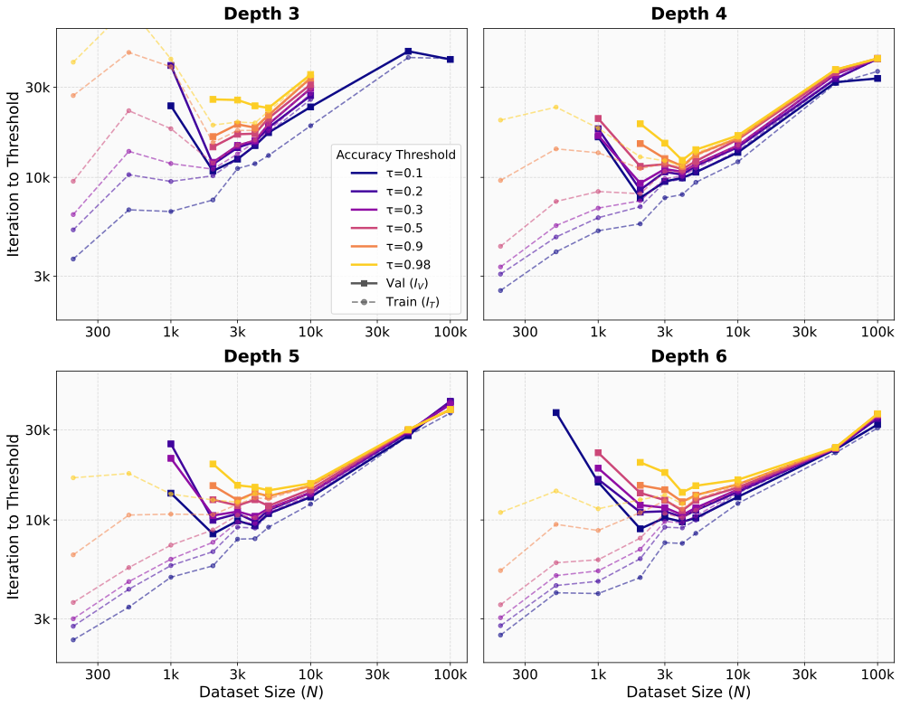
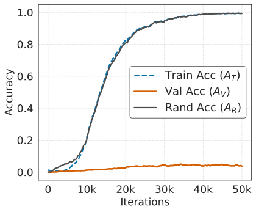
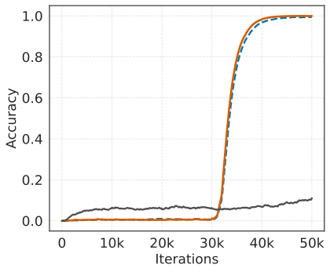
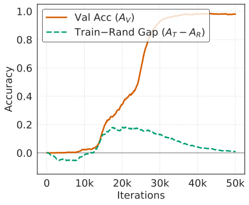
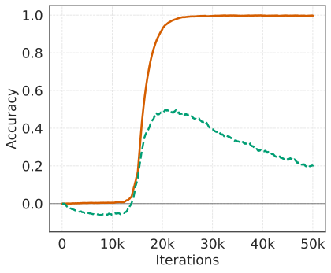
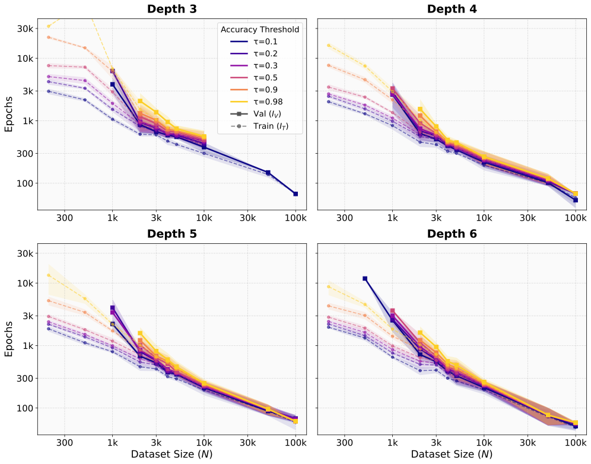
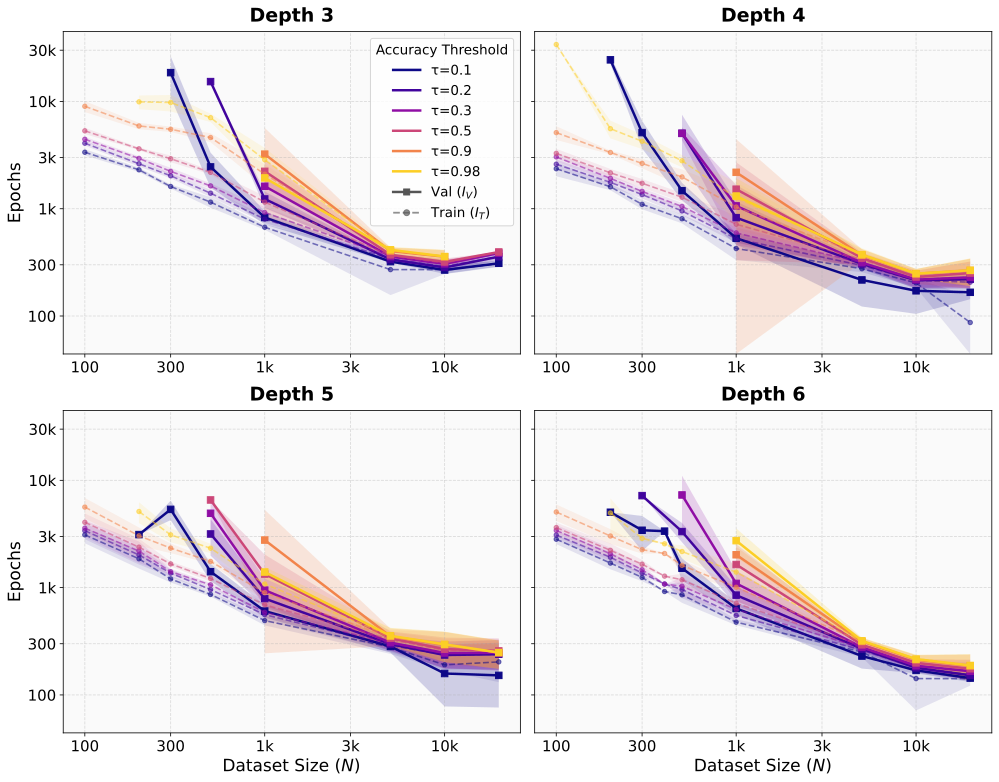

# So, Lee, No 2026 — Slower Generalization, Faster Memorization: A Sweet Spot in Algorithmic Learning

См. также: [глобальный индекс понятий](../../concepts/index.md).

**Shin So**, **Kyelim Lee**, **Albert No** (Yonsei University; переписка — albertno@yonsei.ac.kr).

arXiv [2605.14659](https://arxiv.org/abs/2605.14659), май 2026 (v1), 17 страниц, 11 рисунков (16 файлов). Всего цитирований по Semantic Scholar — 0, в картотеке — 0. Вопрос поставлен правее порога критического размера данных: не «когда генерализация становится возможной», а «при каком размере набора она достигается за наименьшее число шагов оптимизатора». На порождении матрицы Нидлмана–Вунша (короткий вход — две строки длины 5, длинный связанный выход — матрица $6\times 6$, зачёт только за полное совпадение) малые трансформеры выходят на строгий порог валидации быстрее всего при *промежуточном* размере набора: правее «сладкой точки» генерализация остаётся достижимой, но требует больше шагов. В полосе появления слабой валидации рост $N$ ускоряет подгонку *обучающего* набора — частично выученное правило облегчает подгонку. Умножение и сложение (короткий выход) внутреннего оптимума не дают; проба случайным суффиксом (четыре бита к каждой цели) разделяет правилоопосредованную подгонку и попримерное запоминание.

Оригинал и производные файлы этой папки:

- [`original/2605.14659.slower-generalization-faster-memorization-a-sweet-spot-in-algorithmic-learning.md`](original/2605.14659.slower-generalization-faster-memorization-a-sweet-spot-in-algorithmic-learning.md) — конверсия оригинала (arXiv-HTML v1, сверена с PDF) в Markdown без правок содержания.
- [`2605.14659.slower-generalization-faster-memorization-a-sweet-spot-in-algorithmic-learning.claims.txt`](2605.14659.slower-generalization-faster-memorization-a-sweet-spot-in-algorithmic-learning.claims.txt) — пронумерованные утверждения статьи с пометками разбора.
- [`images/`](images/) — 11 рисунков (16 файлов).

Схема якорей и правила ссылок на карточку — в [README папки статей](../README.md).

## Затрагиваемые понятия

**[Гроккинг](../../concepts/grokking.md)** — размер набора сделан свободной переменной, а время меряется до порога точности: сметка по $N$ показывает в одной временной диаграмме и отложенную генерализацию (малые $N$), и почти синхронную сходимость обучения и валидации, и послепороговое замедление (большие $N$); подано как уточнение классической картины, а не спор с ней ([`p2-1`](#p2-1)). Разбор: внутреннее натяжение — заявлено «уточняет, а не противоречит», и тут же главным свидетельством названо то, что модель *не* достраивает запоминание перед началом генерализации, а это и есть отрицание последовательной картины; заголовочное «запоминание» спорит с §4.3, где ускорение подгонки объясняется именно тем, что она не попримерная; разрыв $I_{V}-I_{T}$ как величина нигде не построен — самое дешёвое, что можно было взять.

**[Доля данных / критический размер](../../concepts/data-fraction-critical-dataset-size.md)** — главный вывод: критический размер $N_{c}(\tau)$ (когда валидация вообще достижима) и оптимальный по скорости размер $N^{\star}(\tau)=\arg\min_{N}I_{V}(\tau;N)$ — разные величины, и в наблюдённой сметке $N_{c}(\tau)<N^{\star}(\tau)<N_{\max}$: быстрее всего генерализует не самый большой набор ([`p4-10`](#p4-10)). Разбор: чисел нет ни одного — ни $N^{\star}$, ни $N_{c}$, ни отношения времён в тексте не приведены, главный вывод существует только как чтение с рисунков; немонотонность нигде не проверена статистически (рисунки основного текста без полос разброса); нормировка на эпохи возвращает монотонную картину, и разложение «шаги = эпохи $\times N/160$» — единственная проверка, отличившая бы содержательное явление от арифметики неизменного батча, — не проведено; послепороговое ожидание приписано критическим-размерным работам общим списком без указания места — оппонент отчасти соломенный.

**[Фаза запоминания](../../concepts/memorization-phase.md)** — проба случайным суффиксом как дешёвый разделитель: к каждой цели дописаны четыре случайных бита, не выводимых из входа; «длиннотный» взгляд предсказывает, что короткий суффикс подгоняется легче, — наблюдено обратное: при больших $N$ матрица из 36 связанных клеток подгоняется *раньше* четырёх битов, а при малых $N$ обе растут в одном темпе при нулевой валидации; разрывная мера $G=A_{T}-A_{R}$ становится положительной ровно тогда, когда начинает расти валидация, и на раннем участке $A_{T}\approx A_{R}+A_{V}$ ([`p6-6`](#p6-6)). Разбор: уровень случайного угадывания для $A_{R}$ (1/16) нигде не назван, хотя $A_{R}$ служит вычитаемым; проба меняет задачу (цель = матрица плюс биты), так что её прогоны — не те же, что в основной сметке, и перенос механизма — допущение; разложение предъявлено только для ранней стадии, что авторы сами оговаривают.

**[Канонический полигон](../../concepts/canonical-grokking-testbed.md)** — новый для корпуса стенд: порождение таблицы динамического программирования, где короткий вход индуцирует длинный взаимно связанный выход (универсум конечен, $4^{10}$ пар; построчная сериализация согласована с рекуррентностью); авторы предсказали до проверки, что внутренний оптимум ждать там, где есть и переиспользуемое правило, и большой посложный выход, и подтвердили на сверке: NW — да, сложение и умножение — нет ([`p1-4`](#p1-4)). Разбор: сверка задач не выровнена по покрытию универсума (у NW максимум ~9.5%, у умножения ~половина, у сложения — исчезающая доля), задачи расходятся сразу по сложности правила, длине выхода и покрытию — «дело в длине выхода» однозначно не следует; ни кода, ни данных не выложено, учёт вычислений внутренне не сходится; литература по порождению таблиц ДП и нейросетевому алгоритмическому рассуждению не процитирована вовсе.

## Что показано, а что предположено

Замечания редактора карточки по итогам разбора утверждений (`…claims.txt`, 44 пункта).

**Ценное — разведение двух размеров и суффиксная проба.** Вопрос «что происходит правее критического размера данных» корпусом почти не ставился; аппарат $I_{T}(\tau;N)$, $I_{V}(\tau;N)$ — естественное обобщение гроккинг-разрыва на ось размера набора; два предсказания сделаны до опыта и подтверждены (область действия механизма — рис. 5; «длиннотный» прогноз суффиксной пробы опровергнут в предсказанную сторону); цензурирование и шаговая (не эпохная) природа вывода оговорены честно, включая признание, что нормировка на эпохи возвращает монотонную картину.

**Вывод без чисел и без статистики.** Ни одного числа в тексте: ни $N^{\star}$, ни $N_{c}$, ни отношения времён — всё чтение с рисунков; немонотонность не проверена статистически при пяти семенах, полосы разброса — только в приложении; весь размах явления — около декады (времена между ~3k и ~30k шагов при бюджете 50k); разложение оптимума на «эпохи $\times$ покрытие» не сделано; воспроизведение затруднено — код и данные не выложены, учёт GPU-часов не сходится.

**Как работу будут цитировать** («показано, что больше данных замедляет генерализацию / гроккинг») — точнее: на одной синтетической задаче порождения таблицы динамического программирования, при неизменном батче 160 и бюджете 50 000 шагов время выхода на порог *по шагам* немонотонно по $N$, тогда как то же время *по эпохам* монотонно убывает.

---

# Текст статьи

## Медленнее генерализация, быстрее запоминание: сладкая точка в алгоритмическом обучении

**Shin So**, **Kyelim Lee**, **Albert No** (переписка: albertno@yonsei.ac.kr; Yonsei University)

## Аннотация

Счета гроккинга через критический размер данных подсказывают естественное послепороговое ожидание: раз обучающих данных достаточно для опознания лежащего в основе правила, дополнительные данные должны ускорять сходимость валидации. Мы показываем, что это ожидание может не выполняться в контролируемой задаче со структурированным выходом. В порождении матрицы Нидлмана–Вунша (NW) малые трансформеры достигают высокой валидационной точности точного совпадения быстрее всего при промежуточном размере набора данных, а не при наибольшем. Правее этой сладкой точки по размеру набора генерализация остаётся достижимой, но требует больше градиентных обновлений. Напротив, в режиме, где впервые появляется частичная валидационная компетентность, большие наборы могут требовать меньше обновлений для достижения высокой обучающей точности, наводя на мысль, что возникающая структура правила может ускорять подгонку сверх попримерного запоминания. База умножения того же послепорогового замедления не показывает. Эти результаты разделяют критический размер данных для наступления генерализации и размер набора, оптимизирующий сходимость по обновлениям, и выявляют задачи со структурированным выходом, где выучивание правила и завершение точной подгонки могут расходиться.

## 1 Введение

Стандартный урок эмпирических законов масштабирования: большие наборы данных обычно ресурс — при подходящем масштабировании модели и вычислений дополнительные данные улучшают потерю, точность или распределение вычислений [Hestness et al., 2017, Kaplan et al., 2020, Hoffmann et al., 2022]. Исследования гроккинга и критического размера данных дают более резкую версию этого взгляда для алгоритмических задач. Ниже зависящего от задачи порога данных модель может подогнать обучающее множество, не открыв правила; выше него возникают структурированные представления и валидационная точность улучшается [Power et al., 2022, Liu et al., 2022, Zhu et al., 2024, Morris et al., 2025]. Эти работы прежде всего касаются наступления генерализации. Мы задаём другой вопрос: *после того как генерализация возможна, какой размер набора делает сходимость валидации самой быстрой при закреплённом протоколе оптимизации?*

###### p1-4

Мы изучаем этот вопрос на порождении матрицы Нидлмана–Вунша (NW) — задаче со структурированным выходом, происходящей из выравнивания последовательностей [Needleman and Wunsch, 1970]. По двум строкам динамическая программа NW вычисляет матрицу оценок, чьи элементы рекурсивно зависят от соседних. Модель обучается отображать входную пару в матрицу, и предсказание верно, только когда порождено точно. Мы используем NW не потому, что выравнивание — целевое применение. Скорее NW — компактный стенд, в котором короткий вход индуцирует много более длинный структурированный выход, и верное порождение требует согласованного предсказания многих зависимых клеток. Построчная сериализация также даёт естественный последовательный порядок цели: клетки, нужные для рекуррентности, появляются раньше в выходной последовательности.

Рисунок 1 сравнивает порождение матрицы NW с трёхзначным умножением. Умножение следует привычному послепороговому ожиданию: рост размера набора не создаёт выраженного замедления после того, как валидация становится достижимой. NW ведёт себя иначе. Валидационные пороги достигаются быстрее всего при промежуточном размере набора. Малые наборы дают слишком мало структурного покрытия и либо не **[p. 2]** генерализуют, либо генерализуют лишь с задержкой. Большие наборы всё ещё генерализуют, но требуют больше обновлений для достижения того же порога точного совпадения. Мы называем этот внутренний оптимум сладкой точкой по размеру набора. Это удивительно при обычном послепороговом ожидании, что раз генерализация достижима, наибольший набор должен быть как минимум не медленнее меньших. Находка основана на обновлениях: она касается градиентных обновлений при закреплённом протоколе, а не асимптотической точности или нормированной на эпохи выборочной эффективности.

*(a) Трёхзначное умножение.*

*(b) Порождение матрицы NW, $L=5$.*

*Рисунок 1: Сметки по размеру набора для умножения и порождения матрицы NW. Каждая кривая сообщает первое обновление оптимизатора, на котором точность точного совпадения достигает порога $\tau$; меньшие значения означают более быструю сходимость. Цвета обозначают пороги $\tau$, сплошные линии показывают валидационные пересечения $I_{V}(\tau;N)$, пунктирные — обучающие пересечения $I_{T}(\tau;N)$. Умножение не показывает выраженного послепорогового замедления, тогда как NW достигает валидационных порогов быстрее всего при промежуточном размере набора.* **[p. 2]**

###### p2-1

Этот результат уточняет классическую картину гроккинга, а не противоречит ей. Классический гроккинг обычно закрепляет размер набора и изучает временной разрыв между обучающей и валидационной точностью [Power et al., 2022]. Разворачивая размер набора, мы показываем более широкую временную диаграмму: около сладкой точки слабая валидационная компетентность может появляться до строгой сходимости обучения, а рост $N$ может уменьшать число обновлений, нужных для достижения высокой обучающей точности. Итак, запоминание и генерализация не строго последовательны; частичное выучивание правила может облегчать подгонку.

Наше истолкование — счёт двумя давлениями. Дополнительные данные сперва помогают модели выучить достаточно правила NW, чтобы объяснить много примеров и клеток разом. Когда это полезное правило в основном доступно, дальнейшие примеры добавляют мало новой информации о правиле, но увеличивают остаточные детали, которые надо подогнать под строгое точное совпадение. NW обнажает оба давления, потому что каждый пример содержит зависимую таблицу динамического программирования; умножение, чей выход в нашей постановке много короче, того же замедления не показывает.

#### Вклады.

Мы делаем три эмпирических вклада. Во-первых, мы выявляем послепороговую сладкую точку в порождении матрицы NW: сходимость валидации быстрее всего при промежуточном размере набора, а не при наибольшем. Во-вторых, мы показываем, что частичное выучивание правила может ускорять подгонку: в режиме слабой валидации больше данных может уменьшать число обновлений до высокой обучающей точности. В-третьих, контроли со случайным суффиксом и по охвату задач поддерживают счёт двумя давлениями: открытие правила сперва помогает, но после его насыщения остаточные затраты точной подгонки могут господствовать в задачах со структурированным выходом.

## 2 Связанные работы

#### Гроккинг и синхронность обучения и валидации.

###### p2-4

Наша работа ближе всего к гроккингу, поскольку изучает относительную синхронность сходимости обучения и валидационной генерализации. Гроккинг был введён как отложенная генерализация после переобучения на малых алгоритмических наборах [Power et al., 2022]; позднейшие работы связали эту синхронность со структурированными представлениями, формированием цепей, переходами неявного смещения и внутренними подсетями [Liu et al., 2022, Nanda et al., 2023, Varma et al., 2023, Lyu et al., 2023, Minegishi et al., 2025]. Мы не вводим постороннего явления: разворачивая размер набора, мы показываем, что отложенная генерализация, почти синхронная сходимость обучения и валидации и послепороговое замедление могут появляться в одной временной диаграмме.

**[p. 3]**

#### Размер набора, масштабирование и критические пороги.

Эмпирические законы масштабирования изучают, как потеря меняется с данными, параметрами и вычислениями [Hestness et al., 2017, Kaplan et al., 2020, Hoffmann et al., 2022], тогда как двойной спуск показывает, что больше данных или обучения может иногда вредить в определённых режимах действенной сложности [Nakkiran et al., 2021]. Работы о критическом размере данных спрашивают, когда генерализация впервые становится возможной, и часто находят, что дополнительные данные за этим порогом ускоряют сходимость валидации [Power et al., 2022, Liu et al., 2022, Zhu et al., 2024]. Эти результаты мотивируют дополнительный вопрос после этого порога: среди размеров набора, способных генерализовать, обязательно ли наибольший — самый быстрый к строгому валидационному порогу, или промежуточный размер может требовать меньше обновлений оптимизатора? Наши результаты показывают, что последнее может происходить в порождении матрицы NW.

#### Запоминание и правилоопосредованная подгонка.

Нейронные сети могут запоминать случайные метки [Zhang et al., 2017], но часто выучивают простые общие узоры до подгонки шума [Arpit et al., 2017]. Запоминание может быть и полезным для высокоточного обучения, когда простых общих узоров недостаточно [Feldman and Zhang, 2020]; в языковых моделях запоминание изучалось через непреднамеренное запоминание, извлечение и оценки ёмкости [Carlini et al., 2019, 2021, Morris et al., 2025]. Механистические счета гроккинга наводят на мысль, что запоминающие и генерализующие решения могут различаться по действенности [Nanda et al., 2023, Varma et al., 2023, Liu et al., 2023, Huang et al., 2024]. Порождение матрицы NW позволяет нам наблюдать это взаимодействие через сметки по размеру набора.

#### Алгоритмические задачи и задачи со структурированным выходом.

Контролируемые алгоритмические задачи полезны тем, что точную генерализацию и запоминание можно мерить чисто. Прежние работы использовали модульную арифметику, чётность, арифметику и синтетические символьные задачи для изучения отложенной генерализации и скрытого прогресса [Power et al., 2022, Barak et al., 2022, Lee et al., 2023, Charton, 2024]. Порождение матрицы NW отличается от скалярных арифметических задач тем, что короткая входная пара индуцирует полную таблицу динамического программирования, чьи клетки взаимно ограничены. Это помещает NW среди структурированных задач динамического программирования, таких как расстояние редактирования, местное выравнивание последовательностей, декодирование Витерби и разбор контекстно-свободных грамматик [Wagner and Fischer, 1974, Smith and Waterman, 1981, Viterbi, 1967, Younger, 1967]. Мы используем NW как главную доказательную задачу и умножение как контрастную базу.

## 3 Определение задачи и опытный протокол

Наша цель — измерить, как размер набора меняет синхронность высокой обучающей точности и валидационной генерализации. Мы считаем размер набора $N$ главной переменной и удерживаем закреплёнными распределение задачи, семейство моделей, оптимизатор и правило оценки внутри каждой сметки. Всюду «быстрее» значит меньше обновлений оптимизатора, а не меньше эпох и не лучшая асимптотическая точность.

### 3.1 Порождение матрицы Нидлмана–Вунша и база умножения

Для порождения матрицы NW пусть $\Sigma=\{A,C,G,T\}$ и $x,y\in\Sigma^{L}$. Каждой входной паре отвечает целевая матрица $M(x,y)\in\mathbb{Z}^{(L+1)\times(L+1)}$. Граничные элементы используют закреплённый штраф за пропуск, а внутренние подчиняются

$$
M_{i,j}=\max\{M_{i-1,j-1}+s(x_{i},y_{j}),\;M_{i-1,j}+g,\;M_{i,j-1}+g\}, \tag{1}
$$

где $s$ — оценка совпадения/несовпадения, а $g$ — штраф за пропуск. Если не указано иное, мы используем оценку совпадения $5$, несовпадения $-4$ и штраф за пропуск $-5$. Главные опыты используют $L=5$, так что каждый вход имеет десять символов, а цель — матрица $6\times 6$. Модель предсказывает сериализованную матрицу авторегрессивно, и точность точного совпадения засчитывает пример как верный, только если каждый элемент матрицы верен.

Мы используем трёхзначное умножение как контрастную задачу. Каждый вход — пара трёхзначных целых, цель — точное десятичное произведение. Умножение тоже алгоритмично и поддерживает оценку точного совпадения, но его выход много короче матрицы NW и не налагает той же структуры таблицы динамического программирования. Главные находки статьи касаются NW; умножение проверяет, не создаёт ли сам анализ пересечения порогов ложной сладкой точки. Дополнительные подробности об оценках NW, сериализации, дополнении и арифметических базах даны в приложении A.

### 3.2 Сметка по набору и модель

Для NW при длине $L$ конечный универсум задачи имеет размер $|\mathcal{D}_{\mathrm{full}}|=|\Sigma|^{2L}=4^{2L}$. При $L=5$ это даёт $4^{10}=1{,}048{,}576$ возможных входных пар. Для каждого размера набора $N$ мы выбираем обучающее множество $\mathcal{D}_{N}\subset\mathcal{D}_{\mathrm{full}}$ **[p. 4]** и оцениваем на отложенных примерах из того же универсума. Сметка NW использует

$$
N\in\{200,500,10^{3},2{\cdot}10^{3},3{\cdot}10^{3},4{\cdot}10^{3},5{\cdot}10^{3},10^{4},5{\cdot}10^{4},10^{5}\}.
$$

Мы обучаем декодерные трансформеры [Vaswani et al., 2017]. Модель глубины $D$ имеет $D$ слоёв, $D$ голов внимания, размерность вложения $64D$ и ширину feed-forward $256D$. Главная сметка по глубине использует $D\in\{3,4,5,6\}$. Модели обучаются AdamW [Loshchilov and Hutter, 2019] с косинусным расписанием скорости обучения от $10^{-3}$ до $10^{-4}$, с $\beta_{1}=0.9$, $\beta_{2}=0.99$ и weight decay $0.1$. Действенный размер батча — $160$, полученный накоплением градиентов, и каждый прогон обучается не более $50{,}000$ обновлений оптимизатора с оценкой каждые $100$ обновлений. Размер батча, настройки оптимизатора, токенизация и частота оценки закреплены внутри каждой задачной сметки. Все не пересёкшие порог прогоны мы считаем цензурированными, а не приписываем им конечные времена пересечения. Каждая конфигурация задачи и размера набора запускается с пятью случайными семенами, если не указано иное.

### 3.3 Пороги точного совпадения и времена пересечения

Пусть $A_{T}(t;N)$ и $A_{V}(t;N)$ обозначают обучающую и валидационную точность точного совпадения после $t$ обновлений оптимизатора при обучении на $\mathcal{D}_{N}$. Для порога точного совпадения $\tau\in(0,1)$ определим

$$
I_{T}(\tau;N)=\min\{t:A_{T}(t;N)\geq\tau\},\qquad I_{V}(\tau;N)=\min\{t:A_{V}(t;N)\geq\tau\}. \tag{2}
$$

Если прогон не достигает порога в пределах обучающего бюджета, его время пересечения считается цензурированным. Главный строгий порог — $\tau=0.98$, а более низкие пороги на рисунке 1 обнаруживают слабую частичную компетентность.

Две производные величины подводят итог эффекту размера набора. Эмпирический критический размер набора —

$$
N_{c}(\tau)=\min\{N:I_{V}(\tau;N)\;\text{is not censored}\},
$$

а эмпирическая сладкая точка —

$$
N^{\star}(\tau)=\arg\min_{N}I_{V}(\tau;N).
$$

Ключевой вопрос — является ли $N^{\star}(\tau)$ наибольшим доступным набором, как подсказало бы простое ожидание «больше данных помогает», или внутренним размером.

## 4 Главные результаты: размер набора меняет синхронность обучения и валидации

Теперь мы рассматриваем, как размер набора меняет число итераций, нужное обучающей и валидационной точности точного совпадения для достижения целевого порога. Рисунок 1 сравнивает трёхзначное умножение и порождение матрицы NW. Для каждого порога $\tau$ сплошные кривые показывают валидационные пересечения, пунктирные — обучающие. Итак, более низкие кривые означают более быструю сходимость в градиентных обновлениях.

### 4.1 Умножение ведёт себя как ожидается

База умножения следует стандартному послепороговому ожиданию. Как только набор достаточно велик для валидационной генерализации, рост числа примеров не производит выраженного замедления сходимости валидации. Валидационные кривые остаются примерно плоскими или улучшаются с размером набора. Это поведение полезно как проверка на вменяемость: анализ пересечения порогов не создаёт внутреннего оптимума автоматически, и одной оценки точного совпадения недостаточно для получения изучаемого нами явления.

### 4.2 Вывод 1: у NW есть промежуточно-данный валидационный оптимум

Порождение матрицы NW показывает иной узор. Для строгих валидационных порогов время валидационного пересечения немонотонно по размеру набора. Малые наборы либо не достигают цели, либо достигают её лишь после долгой задержки. Промежуточные наборы сходятся быстрее всего. Большие наборы всё ещё генерализуют, но требуют больше обновлений до того же порога.

###### p4-10

Мы называем это промежуточно-данным валидационным оптимумом, или *сладкой точкой*. Пусть $N_{c}(\tau)$ — наименьший размер набора, достигающий валидационного порога $\tau$, $N^{\star}(\tau)$ — размер набора с самым быстрым валидационным пересечением, и $N_{\max}$ — наибольший размер набора в сметке. В наблюдённой сметке NW $N^{\star}(\tau)$ — внутренний, а не наибольший; для строгих порогов, где сладкая точка видна, $N_{c}(\tau)<N^{\star}(\tau)<N_{\max}$. Итак, наступление генерализации и самая быстрая сходимость валидации происходят при различных размерах набора.

*Рисунок 2: Многопороговые сметки NW по глубинам $D\in\{3,4,5,6\}$ при $L=5$. Цвета обозначают пороги точного совпадения, сплошные линии — валидационные пересечения, пунктирные — обучающие. По глубинам время валидационного пересечения немонотонно по размеру набора, давая промежуточно-данную сладкую точку. В той же полосе размеров набора, где слабые валидационные пороги впервые становятся достижимыми, обучающие пересечения тоже могут ускоряться с ростом $N$, поддерживая истолкование через частичное правило.* **[p. 5]**

**[p. 5]**

### 4.3 Вывод 2: частичное выучивание правила может ускорять подгонку

###### p5-1

Та же панель NW показывает второй временной эффект. Около режима, где слабая валидационная компетентность впервые появляется, рост $N$ может уменьшать число обновлений до строгого обучающего порога. Это противоречит чисто попримерному взгляду на запоминание: если бы подгонка требовала лишь складирования независимых пар вход-выход, большие наборы должны были бы замедлять сходимость обучения.

Мы истолковываем этот режим как наступление полезного частичного правила. Модели не нужно выучить полную символьную реализацию NW; ей нужно лишь достаточно правила, чтобы объяснить много общих регулярностей по выходным клеткам. Остаётся задача точной настройки: строгие пороги всё ещё требуют устранения остаточных ошибок, не полностью определяемых частичным правилом. Рисунок 2 показывает этот узор по глубинам: слабые валидационные пороги становятся достижимыми до строгой сходимости обучения, и в той же полосе размеров набора время обучающего пересечения может убывать с ростом $N$.

### 4.4 Непосредственное истолкование

Вместе два вывода объясняют кривую NW. На стороне «больше данных — быстрее» от сладкой точки малые наборы дают недостаточное структурное покрытие, но рост $N$ помогает модели извлечь достаточно правила, чтобы ускорить и сходимость валидации, и пересечение обучающего порога.

На стороне «больше данных — медленнее» полезное правило в основном доступно, так что дополнительные примеры дают убывающую отдачу для открытия правила. Они всё ещё добавляют полные матрицы, чьи остаточные детали должны быть подогнаны под строгое точное совпадение. Поскольку выученное правило не обязано определять каждый выход точно, последние **[p. 6]** остаточные ошибки должны быть подогнаны или запомнены. С ростом $N$ это остаточное бремя точной подгонки может господствовать в счёте обновлений и производить замедление на больших данных.

Эта задачная зависимость объясняет контраст с умножением. Обе задачи алгоритмичны, но NW отображает короткий вход в зависимую матрицу динамического программирования, делая остаточную точную подгонку видимой после того, как правило становится выучиваемым. Умножение имеет более короткий выход в нашей постановке и того же послепорогового замедления не показывает.

## 5 Механизм: правилоопосредованная подгонка и проба случайным суффиксом

Раздел 4 наводит на мысль, что частичное выучивание правила может ускорять подгонку, но строгое точное совпадение всё ещё требует остаточного запоминания. Теперь мы проверяем это истолкование пробой, разделяющей структурированное предсказание и неустранимую попримерную информацию.

### 5.1 От открытия правила к точной подгонке

У порождения матрицы NW два сцепленных источника трудности. Во-первых, модель должна выучить достаточно общего правила динамического программирования, чтобы переноситься между примерами и выходными клетками. Во-вторых, она должна достичь высокой точности точного совпадения на многих полных матрицах. Дополнительные данные помогают первой трудности, улучшая структурное покрытие, но после того, как полезное правило в основном доступно, дальнейшие примеры в основном добавляют остаточные детали, которые надо подогнать под строгое точное совпадение.

Этот взгляд согласен с прежней работой, доказывавшей, что высокоточное обучение может требовать удержания информации, не схватываемой простыми общими узорами [Feldman and Zhang, 2020]. Мы не утверждаем, что выявили длиннохвостую субпопуляцию в NW; смысл лишь в том, что выучивание правила и остаточная попримерная подгонка не обязаны исключать друг друга. Сладкая точка возникает там, где выгода дополнительного покрытия правила доступна, но крупноданное бремя запоминания ещё не возгосподствовало.

### 5.2 Проба случайным суффиксом

Мы дописываем четырёхбитный случайный двоичный суффикс к каждой цели NW. Матричная составляющая порождается общим правилом NW, тогда как суффикс независим между примерами и не может быть выведен из входа. Поскольку суффикс много короче матрицы, чисто длиннотный или попримерно-запоминательный взгляд предсказал бы, что суффикс должен подгоняться легче.

*(a) $N=$1k*

*(b) $N=$10k*

*(c) $N=$100k*

*Рисунок 3: Проба случайным суффиксом. Каждая цель NW дополнена четырёхбитным случайным суффиксом. Мы отслеживаем обучающую точность на структурированной матрице NW $A_{T}$, валидационную точность на матрице NW $A_{V}$ и обучающую точность на случайном суффиксе $A_{R}$. Матрица NW порождена правилом, тогда как суффикс попримерен и не выводим из входа. При малых $N$ точности матрицы и суффикса растут на схожих масштабах времени, пока валидация остаётся низкой. При больших $N$ порождённая правилом матрица подгоняется раньше много более короткого суффикса, поддерживая правилоопосредованный путь к подгонке.* **[p. 6]**

###### p6-6

Рисунок 3 показывает противоположное поведение при больших $N$. При малых $N$ точность матрицы и точность суффикса растут на схожих масштабах времени, пока валидация остаётся низкой. При больших $N$ модель подгоняет порождённую правилом матрицу раньше много более короткого случайного суффикса. Итак, структурированная составляющая выигрывает от частичного правила, а $A_{R}$ служит прокси остаточной попримерной подгонки: продвижения на информации, которую правило дать не может.

**[p. 7]**

### 5.3 Почему это видно в NW

Результат со случайным суффиксом также проясняет, почему NW отличается от умножения. В обеих задачах модель может выигрывать от переиспользуемой алгоритмической структуры. Однако NW сочетает переиспользуемую структуру с высокой попримерной сложностью выхода. Каждый новый обучающий пример вносит полную зависимую матрицу, так что раз правило выучиваемо, строгое обучение точному совпадению всё ещё требует существенной остаточной подгонки. Случайный суффикс — не сам остаток NW, но он изолирует то же давление: подгонку информации, не даваемой общим правилом. Итак, $A_{R}$ даёт диагностику остаточной попримерной составляющей, остающейся после правилоопосредованной подгонки.

Мы потому истолковываем сладкую точку NW как следствие двух противоборствующих давлений: дополнительные данные сперва улучшают открытие правила, но позже увеличивают цену точной подгонки. Проба случайным суффиксом изолирует эти давления внутри одного обучающего прогона, помещая структурированную и неструктурированную составляющие бок о бок. Структурированная составляющая выучивается через правило; неструктурированный суффикс должен подгоняться пример за примером.

### 5.4 Область действия механизма

Этот механизм задуман как эмпирическое объяснение, а не теорема. Он предсказывает, что промежуточно-данные валидационные оптимумы должны быть виднее всего в задачах и с переиспользуемой структурой, и с высокой попримерной сложностью выхода. Задачи порождения таблиц динамического программирования — естественные кандидаты, поскольку сочетают компактные правила с длинными зависимыми выходами. Напротив, задачи с компактными скалярными или короткострочными выходами могут являть отложенную генерализацию или коэволюцию обучения и валидации без сильного послепорогового замедления.

В этой области действия результат уточняет взгляд критического размера данных на гроккинг. Критический размер данных объясняет, когда генерализация становится возможной. Наша сметка по размеру набора показывает, что в обучении со структурированным выходом самый быстрый по обновлениям путь к валидационной генерализации может происходить при другом размере набора, потому что открытие правила и точная подгонка налагают разные оптимизационные давления.

## 6 Задачная специфичность и разрыв обучение-случайность

Раздел 5.2 ввёл пробу случайным суффиксом, где $A_{R}$ меряет продвижение на попримерном суффиксе без переносимого правила. Теперь мы используем ту же пробу для образования разрывной диагностики. Пусть $A_{V}(t)$ — валидационная точность на матрице NW, $A_{T}(t)$ — обучающая точность на матрице NW, и $A_{R}(t)$ — обучающая точность на случайном суффиксе. Мы определяем

$$
G(t)=A_{T}(t)-A_{R}(t),
$$

величину обучающей точности NW сверх базы подгонки случайного суффикса.

*(a) $N=4\mathrm{k}$*

*(b) $N=5\mathrm{k}$*

*(c) $N=10\mathrm{k}$*

*Рисунок 4: Разрывная диагностика обучение-случайность. Оранжевые кривые показывают валидационную точность NW $A_{V}$. Зелёные пунктирные кривые показывают $G=A_{T}-A_{R}$ — обучающую точность NW сверх подгонки случайного суффикса. Валидация начинает расти, когда $G>0$, и две кривые сначала идут вместе, наводя на мысль, что одно и то же правилоопосредованное продвижение вносит вклад и в валидацию, и в подгонку обучающего множества.* **[p. 7]**

###### p7-7

Рисунок 4 показывает, что $A_{V}(t)$ становится ненулевой, когда $G(t)$ становится положительным. До этой точки модель не подгоняет матрицу NW лучше случайного суффикса, так что свидетельств **[p. 8]** переносимого выучивания правила мало. После $G(t)>0$ модель подгоняет структурированную матрицу сверх попримерной суффиксной базы, и валидационная точность начинает расти.

В раннем переходе $G(t)$ близко следует $A_{V}(t)$. Равносильно,

$$
A_{T}(t)\approx A_{R}(t)+A_{V}(t).
$$

Это подсказывает простое разложение: точность на случайном суффиксе схватывает попримерную подгонку, а валидационная точность — переносимую часть выучивания NW. Итак, то же правило, что улучшает валидацию, вносит вклад и в обучающую точность.

После того как валидационная точность становится высокой, это отношение уже не обязано держаться. На той стадии выученное правило NW достаточно сильно, чтобы решать и обучающие, и отложенные матрицы, так что суффиксоподобное запоминание менее важно для точности NW. Случайный суффикс остаётся отдельным попримерным бременем. Это поддерживает наш счёт двумя давлениями: дополнительные данные сперва помогают открыть переиспользуемое правило NW, но после того, как правило доступно, большие наборы в основном увеличивают цену точной подгонки.

Это также объясняет, почему NW отличается от умножения. Обе задачи содержат переиспользуемую алгоритмическую структуру, но у NW много больший структурированный выход на пример. Каждая входная пара индуцирует полную матрицу динамического программирования, так что обучение точному совпадению остаётся дорогим даже после того, как правило выучиваемо. Умножение имеет много более короткий выход в нашей постановке, так что эта послепороговая цена подгонки менее видна.

*Рисунок 5: Контроли охвата задач при $\tau=0.98$. NW, но не сложение и не умножение, показывает внутренний валидационный оптимум.* **[p. 8]**

###### p8-5

Рисунок 5 поддерживает это утверждение об области действия. У сложения лёгкое правило и короткий выход, так что обучающие и валидационные пересечения остаются близкими. У трёхзначного умножения короткий выход, но более трудное открытие правила, так что дополнительные данные продолжают помогать на оцененном диапазоне. NW обнажает оба давления: данные сперва помогают извлечь правило, но после насыщения этой выгоды господствует остаточная точная подгонка полных матриц динамического программирования. Итак, сладкая точка — не общее следствие оценки точного совпадения; она появляется, когда послепороговые выгоды правила насыщаются, а остаточные затраты точной подгонки продолжают расти.

Этот счёт также отделяет наш результат от стандартных взглядов критического размера данных и двойного спуска. Критический размер данных описывает, когда генерализующее решение становится опознаваемым [Liu et al., 2022, Zhu et al., 2024]. Наш результат касается того, что происходит после того, как генерализация уже достижима: самая быстрая по обновлениям сходимость может происходить раньше наибольшего набора, потому что открытие правила насыщается, а затраты точной подгонки продолжают расти. Суффиксная диагностика показывает то же внутри одной задачи: короткий неструктурированный суффикс может оставаться труднее для подгонки, чем много большая структурированная матрица NW, раз правило выучено. Мы потому ожидаем схожих сладких точек прежде всего в структурированных задачах порождения таблиц с компактными правилами и высоким бременем точного выхода, таких как расстояние редактирования, Смит–Уотерман, Витерби или таблицы разбора [Wagner and Fischer, 1974, Smith and Waterman, 1981, Viterbi, 1967, Younger, 1967].

## 7 Устойчивость и область измерения

Мы представляем главные свидетельства устойчивости в этом разделе и переносим полные графики устойчивости в приложения C–E. Приложение включает сметки по всем глубинам, графики разброса по семенам, нормированные на эпохи анализы, повторения при длине последовательности $L=4$ и полную суффиксную сметку. Эти результаты показывают, что качественный временной узор не специфичен одной глубине, случайному семени или нормировке.

#### Устойчивость по глубине.

Рисунок 2 повторяет сметку NW по глубинам. Качественный узор стабилен: время валидационного пересечения немонотонно по $N$, а время обучающего пересечения может убывать около наступления слабой валидационной компетентности. Точное положение сладкой точки смещается с глубиной, но два вывода не опираются на одну представительную модель.

#### Устойчивость по порогу.

###### p8-9

Использование нескольких порогов существенно. Один строгий порог показал бы только позднюю стадию обучения. Более низкие пороги раскрывают, что валидационная компетентность возникает **[p. 9]** постепенно и может предшествовать строгой сходимости обучения. Это главное свидетельство того, что модель не просто завершает запоминание и затем начинает генерализацию. Вместо этого слабое выучивание правила появляется, пока подгонка ещё идёт. Строгий порог $\tau=0.98$ используется для заглавной сладкой точки, потому что он меряет точность почти уровня исполнения; более слабые пороги диагностируют переход в этот режим.

#### Область действия шагового счёта.

###### p9-1

Сообщаемое нами замедление — именно по обновлениям. Одно обновление оптимизатора видит закреплённый размер батча, а не закреплённую долю набора. С ростом $N$ то же число обновлений покрывает меньше эпох. Итак, наш результат не следует читать как утверждение, что большие наборы внутренне хуже или что они снижают асимптотическую точность. Он говорит, что для строгого порождения NW по точному совпадению при изученном здесь обучающем протоколе самый быстрый путь в счёте градиентных обновлений происходит при промежуточном размере набора. Нормированные на эпохи кривые отвечают на другой вопрос: сколько проходов по данным нужно, а не сколько обновлений параметров.

#### Цензурирование и истолкование.

Прогоны, не достигающие порога в пределах обучающего бюджета, считаются цензурированными, а не конечными временами сходимости. Это важно в малоданном режиме, где валидация может провалиться целиком, и в крупноданном, где строгая сходимость может превысить бюджет. Сладкая точка не определяется одними цензурированными провалами: она видна среди размеров набора, которые до высокой валидационной точности доходят. Ключевое сравнение — между промежуточными и большими наборами, которые оба генерализуют, но различаются числом обновлений до одного порога.

## 8 Обсуждение и ограничения

Вывод 1 — центральный эмпирический вклад: сходимость валидации NW немонотонна по размеру набора, с внутренним оптимумом по обновлениям. Вывод 2 согласен с прежними механизмами гроккинга, в которых генерализующие цепи могут замещать менее действенные запоминающие [Nanda et al., 2023, Varma et al., 2023]. NW делает эту синхронность видимой, потому что каждый пример содержит структурированную матрицу динамического программирования. Многопороговые кривые и суффиксная проба показывают, как правилоопосредованная подгонка и остаточное запоминание меняются с размером набора.

Результат не следует преувеличивать. Мы не утверждаем, что у каждой алгоритмической задачи есть сладкая точка, что больше данных вообще вредно или что порождение матрицы NW прямо моделирует рассуждение на естественном языке. Контролируемая постановка полезна именно потому, что входной универсум конечен, целевое правило явно и точная верность хорошо определена. Эти свойства позволяют нам отделить наступление генерализации от скорости сходимости по обновлениям, но они же ограничивают внешнюю валидность.

Несколько методических выборов могут влиять на кривую. Точность точного совпадения может усиливать остаточные затраты подгонки для структурированных выходов со многими зависимыми элементами. Построчная сериализация согласована с рекуррентностью NW; другие порядки выхода могли бы изменить оптимизационную динамику. Большие модели, более длинные последовательности, переменные длины, другие токенизации или параллельное предсказание матрицы могли бы сместить или ослабить сладкую точку.

Проба случайным суффиксом поддерживает предложенный механизм, но не выявляет внутренних цепей, держащих правилоопосредованную подгонку. Остаточная подгонка может включать местные ассоциативные или копирующие механизмы, а не чистое табличное запоминание; выявление этих цепей оставлено будущей работе.

В этих пределах вклад — уточнение взгляда критического размера данных: критический размер данных объясняет, когда генерализация становится возможной, а наши опыты показывают, что самый быстрый по обновлениям путь к валидационной генерализации может происходить при другом размере набора. В обучении со структурированным выходом открытие правила и точная подгонка могут налагать противоборствующие оптимизационные давления, чей баланс эмпирически измерим.

## 9 Заключение

Мы изучили эффекты размера набора у малых трансформеров, обучаемых порождению матрицы NW. В отличие от умножения, NW достигает высокой валидационной точности точного совпадения быстрее всего при промежуточном размере набора. В том же режиме частичной генерализации рост $N$ может уменьшать число обновлений до высокой обучающей точности, наводя на мысль, что частично выученное правило может ускорять подгонку. Критический размер данных отмечает, когда достаточно правила становится доступно для генерализации, но строгая сходимость точного совпадения всё ещё требует остаточной подгонки; итак, размер набора, при котором генерализация становится возможной, и размер набора, при котором сходимость по обновлениям самая быстрая, не обязаны совпадать.

## References

- D. Arpit, S. Jastrzebski, N. Ballas, D. Krueger, E. Bengio, M. S. Kanwal, T. Maharaj, A. Fischer, A. Courville, Y. **[p. 10]** Bengio, and S. Lacoste-Julien A closer look at memorization in deep networks. In ICML, 2017. Cited by: §2.

- B. Barak, B. Edelman, S. Goel, S. Kakade, E. Malach, and C. Zhang Hidden progress in deep learning: sgd learns parities near the computational limit. In NeurIPS, 2022. Cited by: §2.

- N. Carlini, C. Liu, Ú. Erlingsson, J. Kos, and D. Song The secret sharer: evaluating and testing unintended memorization in neural networks. In USENIX Security, 2019. Cited by: §2.

- N. Carlini, F. Tramer, E. Wallace, M. Jagielski, A. Herbert-Voss, K. Lee, A. Roberts, T. Brown, D. Song, U. Erlingsson, A. Oprea, and C. Raffel Extracting training data from large language models. In USENIX Security, 2021. Cited by: §2.

- F. Charton Learning the greatest common divisor: explaining transformer predictions. In ICLR, 2024. Cited by: §2.

- V. Feldman and C. Zhang What neural networks memorize and why: discovering the long tail via influence estimation. In NeurIPS, 2020. Cited by: §2, §5.1.

- J. Hestness, S. Narang, N. Ardalani, G. Diamos, H. Jun, H. Kianinejad, Md. M. A. Patwary, Y. Yang, and Y. Zhou Deep learning scaling is predictable, empirically. arXiv preprint arXiv:1712.00409, 2017. Cited by: §1, §2.

- J. Hoffmann, S. Borgeaud, A. Mensch, E. Buchatskaya, T. Cai, E. Rutherford, D. de Las Casas, L. A. Hendricks, J. Welbl, A. Clark, T. Hennigan, E. Noland, K. Millican, G. van den Driessche, B. Damoc, A. Guy, S. Osindero, K. Simonyan, E. Elsen, J. W. Rae, O. Vinyals, and L. Sifre Training compute-optimal large language models. arXiv preprint arXiv:2203.15556, 2022. Cited by: §1, §2.

- Y. Huang, S. Hu, X. Han, Z. Liu, and M. Sun Unified view of grokking, double descent and emergent abilities: a perspective from circuits competition. arXiv preprint arXiv:2402.15175, 2024. Cited by: §2.

- J. Kaplan, S. McCandlish, T. Henighan, T. B. Brown, B. Chess, R. Child, S. Gray, A. Radford, J. Wu, and D. Amodei Scaling laws for neural language models. arXiv preprint arXiv:2001.08361, 2020. Cited by: §1, §2.

- N. Lee, K. Sreenivasan, J. D. Lee, K. Lee, and D. Papailiopoulos Teaching arithmetic to small transformers. arXiv preprint arXiv:2307.03381, 2023. Cited by: §2.

- Z. Liu, O. Kitouni, N. S. Nolte, E. Michaud, M. Tegmark, and M. Williams Towards understanding grokking: an effective theory of representation learning. In NeurIPS, 2022. Cited by: §1, §2, §2, §6.

- Z. Liu, E. J. Michaud, and M. Tegmark Omnigrok: grokking beyond algorithmic data. In ICLR, 2023. Cited by: §2.

- I. Loshchilov and F. Hutter Decoupled weight decay regularization. In ICLR, 2019. Cited by: §3.2.

- K. Lyu, J. Jin, Z. Li, S. S. Du, J. D. Lee, and W. Hu Dichotomy of early and late phase implicit biases can provably induce grokking. arXiv preprint arXiv:2311.18817, 2023. Cited by: §2.

- G. Minegishi, Y. Iwasawa, and Y. Matsuo Bridging lottery ticket and grokking: understanding grokking from inner structure of networks. TMLR, 2025. Cited by: §2.

- J. X. Morris, C. Sitawarin, C. Guo, N. Kokhlikyan, G. E. Suh, A. M. Rush, K. Chaudhuri, and S. Mahloujifar How much do language models memorize?. arXiv preprint arXiv:2505.24832, 2025. Cited by: §1, §2.

- P. Nakkiran, G. Kaplun, Y. Bansal, T. Yang, B. Barak, and I. Sutskever Deep double descent: where bigger models and more data hurt. Journal of Statistical Mechanics: Theory and Experiment, 2021. Cited by: §2.

- N. Nanda, L. Chan, T. Lieberum, J. **[p. 11]** Smith, and J. Steinhardt Progress measures for grokking via mechanistic interpretability. In ICLR, 2023. Cited by: §2, §2, §8.

- S. B. Needleman and C. D. Wunsch A general method applicable to the search for similarities in the amino acid sequence of two proteins. Journal of Molecular Biology, 1970. Cited by: §1.

- A. Power, Y. Burda, H. Edwards, I. Babuschkin, and V. Misra Grokking: generalization beyond overfitting on small algorithmic datasets. arXiv preprint arXiv:2201.02177, 2022. Cited by: §1, §1, §2, §2, §2.

- T. F. Smith and M. S. Waterman Identification of common molecular subsequences. Journal of Molecular Biology, 1981. Cited by: §2, §6.

- V. Varma, R. Shah, Z. Kenton, J. Kramár, and R. Kumar Explaining grokking through circuit efficiency. arXiv preprint arXiv:2309.02390, 2023. Cited by: §2, §2, §8.

- A. Vaswani, N. Shazeer, N. Parmar, J. Uszkoreit, L. Jones, A. N. Gomez, L. Kaiser, and I. Polosukhin Attention is all you need. In NeurIPS, 2017. Cited by: §3.2.

- A. J. Viterbi Error bounds for convolutional codes and an asymptotically optimum decoding algorithm. IEEE Transactions on Information Theory, 1967. Cited by: §2, §6.

- R. A. Wagner and M. J. Fischer The string-to-string correction problem. Journal of the ACM, 1974. Cited by: §2, §6.

- D. H. Younger Recognition and parsing of context-free languages in time $n^{3}$. Information and Control, 1967. Cited by: §2, §6.

- C. Zhang, S. Bengio, M. Hardt, B. Recht, and O. Vinyals Understanding deep learning requires rethinking generalization. In ICLR, 2017. Cited by: §2.

- X. Zhu, Y. Fu, B. Zhou, and Z. Lin Critical data size of language models from a grokking perspective. arXiv preprint arXiv:2401.10463, 2024. Cited by: §1, §2, §6.

**[p. 12]**

## Приложение A Подробности задач

### A.1 Подробности задачи Нидлмана–Вунша

Мы используем предсказание матрицы Нидлмана–Вунша закреплённой длины как контролируемую задачу со структурированным выходом. Каждый вход состоит из двух последовательностей $x=(x_{1},\ldots,x_{m})$ и $y=(y_{1},\ldots,y_{m})$ над конечным алфавитом $\mathcal{A}$. Цель — полная матрица оценок динамического программирования $M\in\mathbb{Z}^{(m+1)\times(m+1)}$, вычисленная рекуррентностью Нидлмана–Вунша. В главных опытах мы используем длину последовательности $m=5$ и размер алфавита $|\mathcal{A}|=4$.

Матрица оценок инициализируется как

$$
M_{0,0}=0,\qquad M_{i,0}=i\cdot g,\qquad M_{0,j}=j\cdot g,
$$

где $g$ — штраф за пропуск. Для $i,j\geq 1$ рекуррентность —

$$
M_{i,j}=\max\left\{M_{i-1,j-1}+s(x_{i},y_{j}),M_{i-1,j}+g,M_{i,j-1}+g\right\},
$$

где $s(x_{i},y_{j})$ — оценка совпадения/несовпадения. Мы используем $s(a,b)=5\;(\text{match}),-4\;(\text{mismatch})$ и штраф за пропуск $g=-5$ во всех главных опытах.

Модель предсказывает матрицу оценок как последовательность дискретных выходных токенов. Если не указано иное, мы оцениваем точную полноматричную точность: пример засчитывается верным, только когда все предсказанные элементы матрицы совпадают с целевой матрицей Нидлмана–Вунша. Поклеточная точность используется только для диагностических анализов и не является главной метрикой сходимости.

Для каждого размера набора $N$ мы выбираем $N$ обучающих примеров из конечного универсума задачи и оцениваем на закреплённом отложенном валидационном множестве. Если не указано иное, валидационное множество закреплено между прогонами для одной конфигурации задачи. Размеры набора разворачиваются по $N\in\{200,500,1k,2k,3k,4k,5k,10k,50k,100k\}$.

### A.2 Базы сложения и умножения

Мы используем десятичные сложение и умножение как алгоритмические базы с коротким выходом. Эти задачи включены, чтобы проверить, не производит ли одно пороговое измерение точного совпадения внутреннего оптимума по размеру набора. Главные утверждения статьи касаются порождения матрицы Нидлмана–Вунша; арифметические задачи служат контрастными контролями.

Для $d$-значного сложения каждый вход — пара неотрицательных десятичных целых $(a,b)$, где $a,b\in\{0,\ldots,10^{d}-1\}$, а цель — точная десятичная запись $a+b$. Для $d$-значного умножения вход — снова пара $(a,b)$ с $a,b\in\{0,\ldots,10^{d}-1\}$, а цель — точная десятичная запись $a\cdot b$. База умножения на рисунке 1(a) использует $d=3$. Контроль сложения на рисунке 5 использует $d=10$.

Входы дополняются пробелами до длины $d$. Цели сперва записываются в каноническом десятичном виде без ведущих нулей и затем дополняются пробелами до максимальной длины цели для батчинга и авторегрессивного предсказания. Точность точного совпадения вычисляется на полной дополненной целевой последовательности.

Для арифметических баз обучающие примеры выбираются из конечного входного универсума, а валидационные откладываются из того же семейства задач. Сметка умножения использует

$$
N\in\{500,1\mathrm{k},5\mathrm{k},10\mathrm{k},20\mathrm{k},30\mathrm{k},40\mathrm{k},50\mathrm{k},100\mathrm{k},200\mathrm{k},300\mathrm{k},400\mathrm{k},500\mathrm{k}\}.
$$

Сметка сложения использует

$$
N\in\{500,600,700,800,900,1\mathrm{k},5\mathrm{k},10\mathrm{k},20\mathrm{k},30\mathrm{k},40\mathrm{k},50\mathrm{k},100\mathrm{k},200\mathrm{k},300\mathrm{k},400\mathrm{k},500\mathrm{k}\}.
$$

Все соглашения об оптимизаторе, размере модели, пересечении порогов и цензурировании совпадают с опытами NW, если не указано иное.

## Приложение B Полные подробности модели и обучения

Для модели глубины $D$ мы используем декодерный трансформер с $D$ слоями, $D$ головами внимания, размерностью вложения $d_{\mathrm{emb}}=64D$ и размерностью feed-forward $d_{\mathrm{ff}}=4d_{\mathrm{emb}}$. **[p. 13]** Все модели обучаются со случайной инициализации. Если не указано иное, мы используем AdamW со скоростью обучения, спадающей от $10^{-3}$ до $10^{-4}$ по косинусному расписанию, $\beta_{1}=0.9$, $\beta_{2}=0.99$ и weight decay $0.1$.

Мы используем размер батча $8$ с накоплением градиентов по $20$ шагам, что отвечает действенному размеру батча $160$. Каждый прогон обучается не более $50{,}000$ обновлений оптимизатора. Обучающие и валидационные метрики оцениваются каждые $100$ обновлений оптимизатора. Если не указано иное, время сходимости меряется в обновлениях оптимизатора, а не эпохах. Если не указано иное, каждая конфигурация задачи и размера набора запускается с пятью случайными семенами; заштрихованные области сообщают одно стандартное отклонение по семенам.

Если прогон не достигает порога за $50{,}000$ обновлений, мы считаем его цензурированным и помечаем отдельно на соответствующем графике. В основном тексте мы сосредотачиваемся на представительной настройке $D=6$. Полные сметки по глубине приведены ниже.

#### Вычислительные ресурсы.

Все опыты прогонялись на GPU NVIDIA RTX 3090 с 24 ГБ памяти. Один прогон NW при L=5 и глубине D=6 занимает примерно 10 GPU-часов на 50,000 обновлений оптимизатора. Полный набор сообщаемых опытов занял примерно 2,600 GPU-часов, включая главную сметку по размеру набора, сметку по глубине, опыты устойчивости по длине последовательности и суффиксные пробы. Предварительные или неудачные разведочные прогоны потребовали примерно 1,077 дополнительных GPU-часов.

## Приложение C Устойчивость по глубине

Мы проверяем, специфичны ли выводы 1 и 2 представительной настройке $D=6$, $L=5$, или они воспроизводятся по глубине модели. Рисунок 2 сообщает многопороговые траектории рисунка 1 (справа) для $D\in\{3,4,5,6\}$ при $L=5$. Качественный узор сохраняется по глубинам: $I_{V}(\tau)$ немонотонно по $N$ (вывод 1), а в полосе частичной генерализации $I_{T}(\tau)$ убывает с ростом $N$ (вывод 2). Положение $N^{\star}$ умеренно смещается с глубиной, согласно с тем, что более глубокие модели имеют чуть больший порог структурного покрытия.

*Рисунок 6: Разброс по семенам для многопороговых сметок NW при $L=5$. Кривые показывают ту же сметку по глубинам, что рисунок 2, а заштрихованные области обозначают одно стандартное отклонение по случайным семенам. Хотя точные времена пересечения меняются, качественный узор остаётся стабильным: валидационные пересечения немонотонны по $N$, а обучающие пересечения улучшаются около наступления слабой валидационной компетентности.* **[p. 13]**

*Рисунок 7: Нормированная на эпохи сходимость для сметки NW по глубинам при $L=5$. Те же пересечения порогов меряются в эпохах, а не обновлениях оптимизатора. Нормировка на эпохи подчёркивает экспозицию данных и восстанавливает более привычный взгляд, в котором большим наборам нужно меньше проходов по данным. Это подтверждает, что сладкая точка в основном тексте — явление именно сходимости по обновлениям.* **[p. 14]**

**[p. 14]**

## Приложение D Устойчивость по длине последовательности

Чтобы проверить, специфичен ли временной узор задаче Нидлмана–Вунша при $L=5$, мы повторяем тот же анализ при длине последовательности $L=4$. Полный универсум задачи меньше, но качественная структура схожа: сходимость валидации немонотонна по $N$, а убывание $I_{T}(\tau)$ появляется около наступления слабых валидационных порогов. Рисунки 8 и 9 сообщают соответствующие виды с разбросом по семенам и нормировкой на эпохи.

*Рисунок 8: Разброс по семенам для сметок NW при $L=4$. Заштрихованные области обозначают одно стандартное отклонение по случайным семенам. Точные времена пересечения порогов меняются, но промежуточно-данный режим снова показывает перекрытие слабой валидационной компетентности и более быстрых пересечений обучающего порога.* **[p. 15]**

*Рисунок 9: Нормированная на эпохи сходимость для задачи NW при $L=4$. Мы сообщаем эпохи до порога для тех же конфигураций $L=4$, что на рисунке 8. Как и в опытах $L=5$, нормировка на эпохи подчёркивает экспозицию данных, а не действенность обновлений параметров, и восстанавливает привычный монотонно-данный взгляд. Это укрепляет то, что изучаемая в основном тексте сладкая точка основана на обновлениях.* **[p. 15]**

**[p. 16]**

## Приложение E Опыты со случайным суффиксом

Основной текст показывает три представительных размера набора для суффиксной пробы. Здесь мы сообщаем полную сметку по размеру набора. Рисунок 10 показывает покомпонентные траектории, рисунок 11 — соответствующий разрыв обучение-случайность.

*Рисунок 10: Полные покомпонентные траектории случайного суффикса. Каждая цель NW дополнена четырёхбитным случайным суффиксом. Мы отслеживаем обучающую точность на структурированной матрице NW $A_{T}$, валидационную точность на матрице NW $A_{V}$ и обучающую точность на случайном суффиксе $A_{R}$. При малых $N$ $A_{T}$ и $A_{R}$ растут вместе, пока $A_{V}$ остаётся около нуля. При больших $N$ структурированная составляющая NW достигает высокой обучающей точности раньше много более короткого случайного суффикса, совпадая с представительным поведением рисунка 3.* **[p. 16]**

*Рисунок 11: Полная сметка по размеру набора для разрыва обучение-случайность. Для каждого $N$ мы сравниваем валидационную точность NW $A_{V}$ с $G=A_{T}-A_{R}$, где $A_{T}$ — обучающая точность на матрице NW, а $A_{R}$ — обучающая точность на случайном суффиксе. Представительные случаи рисунка 4 отражают полную сметку: при малых $N$ разрыв остаётся малым и валидация низкой; при больших $N$ разрыв растёт вместе с валидационной точностью.* **[p. 17]**

**[p. 17]**

## Приложение F Более широкое влияние

Эта работа фундаментальна и изучает синтетические алгоритмические наборы данных, а не развёрнутые системы. Её главная потенциальная польза — более ясное понимание динамики запоминания и генерализации в контролируемых условиях. Мы не выпускаем предобученных моделей, соскобленных наборов данных, персональных данных или обращённых к пользователю систем. Мы потому не предвидим прямого общественного вреда, хотя общее изучение запоминания может информировать будущую работу о приватности, устойчивости и эффективности данных.
