# Liu, Lu 2026 — Unveiling Memorization–Generalization Coexistence: A Case Study on Arithmetic Tasks with Label Noise

См. также: [глобальный индекс понятий](../../concepts/index.md).

**Linyu Liu** (Taylor Lab, Huawei Technologies), **Pinyan Lu** (Taylor Lab, Huawei; Shanghai University of Finance and Economics).

arXiv [2605.18022](https://arxiv.org/abs/2605.18022), май 2026 (v1), 27 страниц, 32 рисунка (41 файл), 3 таблицы. Всего цитирований по Semantic Scholar — 0, в картотеке — 0. Предмет — сосуществование запоминания шумных меток и генерализации в одной переобученной сети: двуслойная модель на модульной арифметике ($P=113$, ширина 17–4097, шум меток до 80%) внутри формирует генерализующую структуру, но её выражение в выходе подавлено необходимостью подгонять шум. Ключевой прибор — частотная фильтрация (FF): удержание доминирующей частоты каждого нейрона восстанавливает «почти идеальный» тест даже при 80% шума, а остаток несёт запоминание. Плюс двойной спуск по размеру (больше — лучше в переобученной области), контринтуитивный порядок обучения (шумные метки запоминаются раньше чистых при полном батче) и отрицательный результат по нейронному разбиению: генерализующая структура размазана по сети, отбор нейронов сильно уступает FF.

Оригинал и производные файлы этой папки:

- [`original/2605.18022.unveiling-memorization-generalization-coexistence-a-case-study-on-arithmetic-tasks-with-label-noise.md`](original/2605.18022.unveiling-memorization-generalization-coexistence-a-case-study-on-arithmetic-tasks-with-label-noise.md) — конверсия оригинала (arXiv-HTML v1, сверена с PDF) в Markdown без правок содержания.
- [`2605.18022.unveiling-memorization-generalization-coexistence-a-case-study-on-arithmetic-tasks-with-label-noise.claims.txt`](2605.18022.unveiling-memorization-generalization-coexistence-a-case-study-on-arithmetic-tasks-with-label-noise.claims.txt) — пронумерованные утверждения статьи с пометками разбора.
- [`images/`](images/) — 32 рисунка (41 файл).

Схема якорей и правила ссылок на карточку — в [README папки статей](../README.md).

## Затрагиваемые понятия

**[Шум меток и случайные метки](../../concepts/label-noise-random-labels.md)** — центральное утверждение: даже при 80% испорченных меток переобученная модель *внутри* выучивает правило — подсеть доминирующей частоты восстанавливает почти идеальный тест, тогда как сырой выход сильно испорчен; контринтуитивный порядок обучения — шумные метки запоминаются раньше чистых на самых первых эпохах полного батча, и разрыв тем больше, чем меньше доля шума ([`p6-7`](#p6-7)). Разбор: числа тестовой точности после FF в тексте нет ни разу — только «near-perfect» и график; порядок «шум раньше чистых» объяснён градиентно (на пример малого шумного подмножества приходится больший толчок) и честно очерчен — при мини-батчах ослабевает или исчезает; MNIST-таблица слаба: шумная точность эпохи 1 (10.87%) неотличима от случайной при 10 классах, и вывод держится на аномально низкой чистой (2.86%).

**[Фаза запоминания](../../concepts/memorization-phase.md)** — сосуществование как разделение в весах, а не во времени: генерализация и запоминание закодированы в одних нейронах, но в разных частотах — G-часть (доминирующая частота) даёт тест, R-часть (остаток) подгоняет шум и почти не даёт теста; перенос FF на трансформер: удержание 20 старших частот unembedding-головы роняет точность на шумных метках со 100% до 36.8% и поднимает тест с 76.8% до 87.8% ([`p6-6`](#p6-6)). Разбор: сосуществование задокументировано только в конечной точке обучения — когда внутреннее правило возникает и как соотносится с моментом гроккинга, не показано ни одним рисунком, хотя из введения напрашивается временная картина; «подавление» выражения правила заявлено, но не измерено (разложение неаддитивно по функции, вклад частей в выход не разделён); конфигурация трансформера не описана, «топ-20» выбрано задним числом.

**[Фурье-признаки и цепи](../../concepts/fourier-features-circuits.md)** — генерализационная часть ReLU-модели близка к аналитическому решению Morwani для квадратичной активации: косинусы одной частоты на нейрон с фазовым соотношением $\varphi^{(a)}+\varphi^{(b)}\approx\varphi^{(c)}$ (для вычитания — с минусом), после FF каждая частота покрыта хотя бы одним нейроном с ширины 513 — численно согласуется с аналитическим порогом $M\geq 4(P-1)=448$; замена уже обученной ReLU на квадратичную или «обратный ReLU» сохраняет или улучшает тест, снижая точность на шуме ([`p7-1`](#p7-1)). Разбор: три независимые сверки (FF вширь — чистые данные, квадратичная активация, вычитание; замена активации; Phase MSE, растущая с шумом) — редкая по обстоятельности проверка; но единственный seed 42, повторов и разбросов нет нигде, а часть выводов читается с глазомерных различий кривых.

**[Двойной спуск](../../concepts/double-descent.md)** — воспроизведён по четырём осям (активации, доля обучения 40/50/60%, оптимизаторы AdamW/Adam/Muon, задачи): в переобученной области больше — лучше, усиление регуляризации сдвигает порог интерполяции к большим размерам; у квадратичной и GeLU активаций — потолки тестовой точности во всём диапазоне ширин, объяснённые симметрией впитывания шума; при связанном первом слое ($\boldsymbol{U}=\boldsymbol{V}$) асимметричный шум неинтерполируем, и «фаза сосуществования» не возникает ([`p3-9`](#p3-9)). Разбор: «больше — лучше» уживается с потолками только при чтении «не убывает»; заявлена устойчивость по «noise-to-training ratios», но в таблице 1 столбца по доле шума нет; объяснения потолков и низкой кросс-энтропии больших моделей даны рассуждением.

## Что показано, а что предположено

Замечания редактора карточки по итогам разбора утверждений (`…claims.txt`, 45 пунктов).

**Ценное — FF как дешёвый инструмент и обстоятельная сверка.** Частотная фильтрация разделяет запоминание и генерализацию прямо в весах и проверена вширь: улучшает тест на чистых данных, пробивает потолок квадратичной активации, работает на вычитании и переносится на трансформер; фазовые соотношения и покрытие частот численно согласуются с аналитическим решением (порог 513 против $4(P-1)=448$); отрицательный результат по нейронному разбиению содержателен — структура распределена, а не локализована, и даже FF поверх отобранной подсети не догоняет FF на полной модели; предложенная задаче-независимая мера Str работает и на умножении, где IPR бесполезен.

**Без чисел, без семян, без времени.** Главное количественное утверждение («near-perfect тест при 80% шума») не имеет числа в тексте; единственный seed 42; сосуществование показано только в конечной точке — временной связи с гроккингом нет; отбор $\mathcal{M}^{R}$ в алгоритме 1 требует знания, какие метки испорчены (недоступного на практике), и порог $\tau$ не указан; следы неправленого текста (сломанный пункт 4 вкладов, «3. 3.» в Result 3.1).

**Как работу будут цитировать** («сеть выучивает правило даже при 80% шума меток») — точнее: на сложении по модулю 113, в двуслойной сети, при чтении весов частотным фильтром на конечной точке обучения и без числового значения восстановленной точности в тексте.

---

# Текст статьи

## Вскрывая сосуществование запоминания и генерализации: разбор случая арифметических задач с шумом меток

**Linyu Liu**$^{1}$, **Pinyan Lu**$^{1,2}$ ($^{1}$Taylor Lab, Huawei Technologies Co., Ltd.; $^{2}$Key Laboratory of Interdisciplinary Research of Computation and Economics, Shanghai University of Finance and Economics; liulinyu001@gmail.com, lu.pinyan@mail.shufe.edu.cn)

Препринт. arXiv:2605.18022v1 [cs.LG] 18 May 2026

## Аннотация

Сильно перепараметризованные модели могут одновременно запоминать шумные метки и хорошо обобщать, но как эти поведения сосуществуют, остаётся плохо понятым. В этой работе мы исследуем лежащие в основе механизмы этого сосуществования на задачах модульной арифметики под тяжёлым шумом меток. Через обширные опыты на двухслойных нейронных сетях мы находим, что большие модели склонны лучше обобщать при подходящих настройках оптимизации и модели, тогда как шумные метки запоминаются быстрее чистых данных. Перепараметризованные модели внутренне формируют генерализующую структуру, но её выражение в выходе подавлено необходимостью подгонять шумные метки. Замечательно, что даже при 80% шума меток почти идеальная тестовая точность достижима извлечением этой внутренней структуры частотными методами. Мы далее предлагаем задаче-независимый метод разбиения сетей на генерализующую и запоминающую компоненты. Хотя эта подсеть улучшает генерализацию, она ограничена по сравнению с частотным извлечением, указывая, что генерализующая структура распределена по нейронам, и мотивируя развитие новых инструментов извлечения обобщаемого знания из перепараметризованных сетей.

## 1 Введение

Большие языковые модели преуспевают во многом потому, что рост ёмкости модели последовательно улучшает генерализацию [1, 2, 3, 4]. В структурированных задачах большие модели являют эмерджентные способности схватывать лежащие в основе правила из данных [5]. Однако реальные обучающие данные часто загрязнены шумом, таким как неверно размеченные образцы или фактические несоответствия. Хотя парадигма масштабирования подсказывает, что большие модели работают лучше в чистых средах [6], остаётся неясным, как они обращаются с испорченными данными. Конкретно, нам нужно понять внутреннюю конкуренцию двух различных компонент: генерализации — открытия структурных правил, применимых к невиданным данным, и запоминания — подгонки конкретных шумных меток, не отражающих лежащего в основе правила.

Анализ этого взаимодействия в реалистичных задачах труден, потому что генерализацию часто трудно диагностировать механистически. Невиданные примеры могут разделять местные узоры, семантические признаки или распределенческие корреляции с обучающими данными, так что высокая тестовая точность сама по себе не раскрывает, выучила ли модель истинное правило или эксплуатировала лазейки. Чтобы это разрешить, мы используем задачи модульной арифметики (такие как сложение и умножение по модулю $P$) как контролируемую опытную среду. Эти задачи идеальны по нескольким причинам. Во-первых, они дают ясное различение между генерализацией по правилу и поточечным запоминанием [7]. Во-вторых, они являют гроккинг [8, 9, 10] — явление, при котором генерализация происходит долго после того, как модель полностью запомнила обучающее множество. В-третьих, эти задачи допускают строгий анализ, поскольку имеют известные аналитические решения при определённых постановках [11, 12].

**[p. 2]**

В этой работе, вводя шум меток в эту постановку, мы можем точно отслеживать, как модель разрешает конфликт между схватыванием математического правила и запоминанием случайного шума. Мы проводим обширные опыты по разнообразным настройкам, покрывающим различные функции активации, оптимизаторы и силы регуляризации. Этот широкий подход позволяет нам определить, сохраняются ли выгоды масштабирования при экстремальной порче и как модель внутренне организует эти два конкурирующих поведения. Мы сосредотачиваемся на трёх ключевых вопросах:

Q1. При каких условиях рост размера модели улучшает генерализацию, когда метки шумны?

Q2. Могут ли модели всё ещё восстанавливать внутренние структурные правила при экстремальном шуме меток?

Q3. Возможно ли отделить нейроны, ответственные за генерализацию, от используемых для запоминания?

Через эти опыты мы даём следующие находки:

1. Мы показываем, что масштабирование размера модели продолжает улучшать генерализацию даже на шумных данных, при условии правильной настройки оптимизации и регуляризации.
2. Мы наблюдаем контринтуитивную обучающую динамику, при которой шумные метки часто запоминаются быстрее чистых на очень раннем этапе.
3. Мы находим, что модели могут *внутренне* восстанавливать лежащее в основе алгебраическое правило при экстремальном шуме меток ($\sim 80\%$ шума), хотя эти правила подавлены необходимостью интерполировать шумные метки.
4. Мы демонстрируем, что разбиение сети имеет потенциал улучшить генерализацию, генерализация и запоминание остаются глубоко переплетёнными на нейронном уровне.

Эти результаты высвечивают и прочность, и ограничение перепараметризованного обучения под порчей: модели могут выучивать обобщаемые правила, даже будучи вынужденными запоминать шум, но нынешние нейронные инструменты не могут полностью извлечь эту структуру правила из запоминания. Остаток статьи развивает эти находки. Раздел 2 вводит постановку задачи. Раздел 3 даёт обзор точностного качества с точек зрения конца обучения и динамики (Q1). Раздел 4 механистически анализирует внутреннее представление генерализации (Q2). Раздел 5 рассматривает, разделимы ли запоминание и генерализация на уровне нейронов (Q3). Связанные работы мы переносим в приложение A.

## 2 Постановка задачи

Мы изучаем задачу модульной арифметики $a\circ b=c$ вслед за Power et al. [8], где $a,b,c\in\{0,\dots,P-1\}$, а $\circ$ обозначает модульную операцию, такую как сложение, вычитание или умножение. Мы сосредотачиваемся прежде всего на модульном сложении и используем прочие операции для проверки общности. Задача сформулирована как $P$-классовая классификация.

Мы обучаем двухслойную нейронную сеть, параметризованную $\theta$:

$$
\boldsymbol{f}_{\theta}(a,b)=\boldsymbol{W}\,\phi\!\left(\boldsymbol{U}\boldsymbol{e}_{a}+\boldsymbol{V}\boldsymbol{e}_{b}\right)+\boldsymbol{\mu}, \tag{1}
$$

где $\theta=\{\boldsymbol{W},\boldsymbol{U},\boldsymbol{V},\boldsymbol{\mu}\}$. Здесь $\boldsymbol{e}_{a},\boldsymbol{e}_{b}\in\mathbb{R}^{P}$ — one-hot кодировки $a$ и $b$; $\boldsymbol{U},\boldsymbol{V}\in\mathbb{R}^{M\times P}$ — веса первого слоя; $\boldsymbol{W}\in\mathbb{R}^{P\times M}$ — весовая матрица второго слоя; $\boldsymbol{\mu}\in\mathbb{R}^{P}$ — смещение; и $M$ обозначает число скрытых нейронов. Выход $\boldsymbol{f}_{\theta}(a,b)\in\mathbb{R}^{P}$ обучается перекрёстно-энтропийной потерей предсказывать one-hot метку $\boldsymbol{e}_{a\circ b}$.

Если не указано иное, мы закрепляем $P=113$ вслед за Nanda et al. [9] и варьируем ширину модели как $M=2^{k}+1$ для $k\in\{4,\dots,12\}$, поскольку ReLU-модели эмпирически лучше обобщают при нечётных ширинах в этих задачах [7].

#### Набор данных.

Полный набор данных —

$$
\mathcal{D}_{\text{total}}=\{(a,b,c):a,b\in\{0,\dots,P-1\},\ c=a\circ b\}.
$$

Мы случайно делим $\mathcal{D}_{\text{total}}$ на обучающее, валидационное и тестовое множества с долями $50\%$, $20\%$ и $30\%$ соответственно. В приложении C.1 мы также варьируем обучающую долю при закреплённой тестовой.

**[p. 3]**

Для введения шума меток мы случайно выбираем подмножество $\mathcal{D}_{\text{noise}}\subset\mathcal{D}_{\text{train}}$ с долей шума $\alpha$, то есть $\frac{|\mathcal{D}_{\text{noise}}|}{|\mathcal{D}_{\text{train}}|}=\alpha$. Для каждого $(a,b,c)\in\mathcal{D}_{\text{noise}}$ мы определяем наблюдаемую метку $\tilde{c}$ как

$$
\tilde{c}=\text{Uniform}\big(\{0,\cdots,P-1\}\setminus\{c\}\big),(a,b,c)\in\mathcal{D}_{\text{noise}}.
$$

Получающееся шумное обучающее подмножество задано как

$$
\tilde{\mathcal{D}}_{\text{noise}}\mathrel{:=}\{(a,b,\tilde{c}):(a,b,c)\in\mathcal{D}_{\text{noise}}\}.
$$

Шумное обучающее множество — $\tilde{\mathcal{D}}_{\text{train}}=\mathcal{D}_{\text{clean}}\cup\tilde{\mathcal{D}}_{\text{noise}}$. Все оценки выполняются на чистых валидационном и тестовом множествах.

#### Оценка.

Для измерения качества модели $\boldsymbol{f}$ мы определяем её точность на наборе данных $\mathcal{D}$ как

$$
\text{Acc}\left(\boldsymbol{f},\mathcal{D}\right)=\frac{1}{|\mathcal{D}|}\sum_{(a,b,c)\in\mathcal{D}}\mathbb{I}\left(\hat{c}=c\right),
$$

где $\hat{c}=\operatorname*{arg\,max}_{c^{\prime}}\left[\boldsymbol{f}\left(a,b\right)\right]_{c^{\prime}}$, а $\mathbb{I}\left(\cdot\right)$ — индикаторная функция.

#### Оптимизаторы.

Мы обучаем модели перекрёстно-энтропийной потерей с Adam, AdamW [13] и Muon [14], где weight decay управляет силой регуляризации. Мы также экспериментируем с SGD, но он неэффективен и требует тщательной настройки гиперпараметров для достижения генерализации (см. рисунок 14).

Если не указано иное, все результаты сообщаются после 200,000 эпох полнобатчевого обучения. Мы применяем линейный разогрев скорости обучения на первых 10 шагах. Настройка по умолчанию использует ReLU-активации с AdamW (скорость обучения $10^{-3}$, weight decay $0.1$, случайное семя 42) на задаче модульного сложения.

## 3 Когда больше — лучше

В этом разделе мы исследуем, как присутствие шума меток взаимодействует с ёмкостью модели на задачах модульной арифметики. Мы подходим к вопросу с двух дополняющих сторон. Во-первых, мы рассматриваем качество на конец обучения, спрашивая, при каких условиях — таких как выборы оптимизации и регуляризации — рост размера модели последовательно улучшает генерализацию несмотря на шум. Во-вторых, мы анализируем обучающую динамику, чтобы изучить, выучивает ли модель чистые и шумные метки с разными скоростями.

### 3.1 Качество на конец обучения

*(a) Иллюстрация двойного спуска. За порогом интерполяции перепараметризованная область отвечает второму спуску, где рост размера модели ведёт к улучшенной генерализации даже после подгонки всех обучающих образцов, включая шум меток.*

*(b) Качество по различным функциям активации. В целом тестовая точность неубывающая в перепараметризованной области, но у квадратичной и GeLU активаций существуют потолки тестовой точности.*

*Рисунок 1: Помодельный двойной спуск и качество по различным функциям активации.* **[p. 3]**

*Рисунок 2: Качество ReLU-моделей, обученных AdamW при варьирующем weight decay. Первый ряд показывает обучающую точность на чистых ($\mathcal{D}_{\text{clean}}$) и шумных ($\tilde{\mathcal{D}}_{\text{noise}}$) данных для характеризации запоминания. Второй ряд показывает тестовую точность, третий — тестовую перекрёстно-энтропийную потерю. Рост weight decay сдвигает порог интерполяции к большим размерам, задерживая область второго спуска.* **[p. 4]**

###### p3-9

Мы устойчиво наблюдаем явление *двойного спуска* тестовой *ошибки* ($1-\text{test accuracy}$) по разным функциям активации, отношениям шума к обучению, оптимизаторам (включая AdamW, Adam и **[p. 4]** Muon) и арифметическим задачам (полные результаты в разделе C.1). Как иллюстрирует рис. 1(a), *двойной спуск* — немонотонная кривая тестовой ошибки, в которой генерализация сперва ухудшается около порога интерполяции и затем снова улучшается с дальнейшим ростом размера модели. В перепараметризованной области продолжающееся укрупнение модели ведёт к неубывающей тестовой точности, тогда как порог входа в эту область зависит от силы регуляризации. Мы сводим наблюдения в Result 3.1.

##### **Result 3.1.**

*Двойной спуск последовательно наблюдается по варьирующим постановкам:*

*1. Внутри перепараметризованной области большие модели обобщают лучше.*

*2. Усиление регуляризации сдвинет модели из перепараметризованной области к недопараметризованной. (Рисунок 2)*

*3. 3. Размеры моделей насыщения тестовой точности зависят от активации (рисунок 1(b))*

Регуляризация действительно играет роль в формовке кривой двойного спуска, управляя действенной сложностью модели (EMC) [15]. Интуитивно, более сильная регуляризация ограничивает множество функций, реализуемых при обучении, действенно снижая ёмкость модели. Когда EMC ограничена, обучающие сигналы генерализации и запоминания конкурируют сильнее. В результате усиление регуляризации может быть выгодным, когда запоминание шума меток нежелательно.

Модели с квадратичной или GeLU функцией активации являют ясные потолки тестовой точности с ростом размера модели в исследованном диапазоне размеров (ширина $<10{,}000$, рисунок 1(b)). Мы включаем сюда квадратичные активации, потому что для них доступны аналитические решения (см. раздел 4). Одно возможное объяснение этих потолков — что симметрия этих активаций ограничивает способ, которым шум может впитываться при сохранении генерализации. Напротив, ReLU-активации хранят шум несимметричным образом, тогда как представление генерализации остаётся симметричным (см. раздел 4), что позволяет гибче использовать ёмкость модели и ведёт к улучшенной генерализации.

Мы также наблюдаем, что модели увереннее (то есть являют более низкую тестовую перекрёстно-энтропийную потерю) в перепараметризованной области, чем в недопараметризованной. Большие модели в целом увереннее (рисунок 2, нижний ряд). Перекрёстно-энтропийная потеря отражает калибровку уверенности предсказаний модели. В недопараметризованной области модели часто предсказывают истинную метку даже для испорченных образцов. Чтобы согласовать предсказанную вероятность с долей правильности, модель назначает более низкие вероятности, что даёт более высокую неопределённость и более высокую тестовую перекрёстную энтропию. Напротив, в перепараметризованной области большие модели могут разделять данные с большими зазорами, всё ещё удовлетворяя тому же $\ell_{2}$-ограничению регуляризации. Большие зазоры ведут к более уверенным предсказаниям и, следовательно, к более низкой тестовой перекрёстно-энтропийной потере.

**[p. 5]**

###### p5-1

**Замечания о неверной спецификации модели.** Мы отмечаем, что некоторые архитектуры моделей неспособны интерполировать все шумные метки, и в этом случае перепараметризованная область строго не существует. Например, модели со связанными весами первого слоя ($\boldsymbol{U}=\boldsymbol{V}$) не могут запомнить асимметричный случайный шум, где $a\circ b\neq b\circ a$. В таких случаях тестовая точность не меняется монотонно с размером модели, и выбор подходящей силы регуляризации может быть действеннее наращивания ёмкости модели. Подробное обсуждение мы даём в разделе C.2.

### 3.2 Обучающая динамика

###### p5-2

Мы наблюдаем контринтуитивное явление в обучающей динамике: шумные метки последовательно запоминаются быстрее чистых на начальных обучающих эпохах, как сведено в Result 3.2. Хотя скорости обучения этих двух компонент не различаются драматично, это обращение типичного порядка обучения прочно по разным оптимизаторам, включая AdamW, Adam и Muon (подробности в разделе C.4). Даже для SGD, которому вообще нужны значительно более долгие масштабы времени для достижения генерализации, эта тенденция остаётся согласованной (рисунок 14).

##### **Result 3.2.**

*И в недо-, и в перепараметризованной области модель отдаёт приоритет запоминанию шумных меток над подгонкой чистых.*

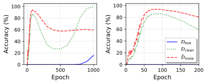

*(a) Недопараметризованная область.*

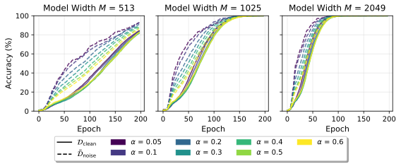

*(b) Перепараметризованная область.*

*Рисунок 3: Более быстрое запоминание шумных меток наблюдается и в недо-, и в перепараметризованной области. **(a)** Недопараметризованная обучающая динамика с приближением первых 200 эпох ($\alpha=0.3$, $M=2049$, Adam с weight decay $0.001$). **(b)** Перепараметризованная обучающая динамика под AdamW. В обоих случаях точность на шумных метках растёт раньше точности на чистых.* **[p. 5]**

Избранные кривые обучения показаны на рисунке 3. Более быстрое запоминание шумных меток появляется в обеих областях, но перепараметризованный случай на рисунке 3(b) раскрывает ещё два узора: (i) возросшая ёмкость модели ускоряет процесс запоминания, согласуясь с эмпирическими находками в больших языковых моделях [16]; и (ii) разрыв между скоростями запоминания шума и чистых данных выраженнее при меньших долях шума $\alpha$.

Это наблюдение стоит в контрасте с существующими исследованиями, подсказывающими, что модели сперва подгоняют типичные образцы и игнорируют нетипичные, делая тем самым раннюю остановку действенной [17]. Наши находки подсказывают иное раннестадийное динамическое поведение: при полнобатчевом обучении шумные метки могут получать больший попримерный оптимизационный сигнал, чем чистые, заставляя их точность расти раньше. Важно, что это явление не ограничено двухслойными сетями на задачах модульной арифметики. В разделе C.3 мы даём градиентное обсуждение и показываем, что схожий ранний порядок «шум прежде чистых» появляется и на MNIST с трёхслойной нейронной сетью при полнобатчевом обучении. Итак, хотя модульная арифметика даёт контролируемую постановку, где поведение можно чисто измерить и проанализировать, явление может отражать более широкое свойство ранней полнобатчевой оптимизации при явной порче меток. Дополнительные результаты — в разделе C.4.

## 4 Представление генерализации

Мы отвечаем на Q2, спрашивая, отражает ли кажущийся провал ReLU-сетей при экстремальном шуме меток отсутствие выученного внутреннего правила, или же правило выучено, но затемнено шумными выходами. Мы находим свидетельства второго, разделяя внутреннее представление обобщаемого правила от представления запоминания. Конкретно, наша главная находка: хотя ReLU-сети не имеют того же выражения, что сеть с квадратичной активацией, их генерализационная компонента близко **[p. 6]** совпадает с аналитическим решением, известным для квадратичных активаций на *чистых* данных [11] (уравнение (2)). Это подсказывает способ отделить выученное правило от запомненного шума: удержать доминирующую частотную компоненту, согласованную с этой аналитической структурой, и удалить остаточные компоненты.

**Аналитическое решение для сети с квадратичной активацией.** Двухслойную сеть (1) можно равносильно записать как сумму нейронов:

$$
\boldsymbol{f}_{\theta}\left(a,b\right)=\sum_{m\in\mathcal{M}}\boldsymbol{w}_{m}\phi\left(\boldsymbol{u}^{\top}_{m}\boldsymbol{e}_{a}+\boldsymbol{v}^{\top}_{m}\boldsymbol{e}_{b}\right)+\boldsymbol{\mu},
$$

где $\mathcal{M}=\left\{1,\cdots,M\right\}$. Тройка $\left(\boldsymbol{u}_{m},\boldsymbol{v}_{m},\boldsymbol{w}_{m}\right)$ представляет $m^{\text{th}}$ нейрон. Здесь $\boldsymbol{w}_{m}$ — $m^{\text{th}}$ столбец $\boldsymbol{W}$, а $\boldsymbol{u}^{\top}_{m}$ и $\boldsymbol{v}^{\top}_{m}$ — $m^{\text{th}}$ строки $\boldsymbol{U}$ и $\boldsymbol{V}$ соответственно. Рисунок 4 (a) визуализирует это разложение. Максимизирующее зазор решение для модульного сложения с квадратичной активацией $\phi(z)=z^{2}$ имеет вид [18, 11]

$$
u_{mi}=\lambda\cos(\tfrac{2\pi}{P}\omega_{m}i+\varphi^{(a)}_{m}),v_{mj}=\lambda\cos(\tfrac{2\pi}{P}\omega_{m}j+\varphi^{(b)}_{m}),w_{mk}=\lambda\cos(\tfrac{2\pi}{P}\omega_{m}k+\varphi^{(c)}_{m}), \tag{2}
$$

с $\varphi^{(a)}_{m}+\varphi^{(b)}_{m}=\varphi^{(c)}_{m}$ и $\omega_{m}\in\{1,\dots,\frac{P-1}{2}\}$ (предл. B.1). Это решение достигнет 100% точности на всех чистых образцах. Эмпирически ReLU-модели, обученные на чистых данных, тоже развивают периодический узор в $(\boldsymbol{u}_{m},\boldsymbol{v}_{m},\boldsymbol{w}_{m})$ (рисунок 4 (b)), но явного решения для них нет.

*(a)*

*(b)*

*(c)*

*Рисунок 4: **(a) Нейрон представлен тройкой $(\boldsymbol{u}_{m},\boldsymbol{v}_{m},\boldsymbol{w}_{m})$. (b) Представительный нейрон обученной ReLU-модели являет периодичность. (c) Соотношение фаз при $M=1025$ и $\alpha=0.3$. Каждая точка представляет нейрон, где $\varphi_{a}$, $\varphi_{b}$ и $\varphi_{c}$ — фазы $\boldsymbol{u}^{G}$, $\boldsymbol{v}^{G}$ и $\boldsymbol{w}^{G}$ соответственно.*** **[p. 6]**

**Частотная фильтрация отделяет выучивание правила от запоминания шума.** Черпая вдохновение в аналитическом решении сети с квадратичной активацией, мы гипотезируем, что сигнал генерализации в ReLU-нейроне несёт его доминирующая частота. Мы выполняем фурье-разложение каждого скрытого нейрона $m\in\mathcal{M}$, характеризуемого параметрами $(\boldsymbol{u}_{m},\boldsymbol{v}_{m},\boldsymbol{w}_{m})$. Конкретно, мы применяем фильтр для изоляции частоты $\omega$ с максимальной амплитудой в весовом векторе $\boldsymbol{w}_{m}$ и извлекаем ту же частотную компоненту из $\boldsymbol{u}_{m}$ и $\boldsymbol{v}_{m}$. Эта доминирующая компонента называется генерализационной частью, $(\boldsymbol{u}^{G}_{m},\boldsymbol{v}^{G}_{m},\boldsymbol{w}^{G}_{m})$, тогда как остальные частотные компоненты составляют остаточную часть, $(\boldsymbol{u}^{R}_{m},\boldsymbol{v}^{R}_{m},\boldsymbol{w}^{R}_{m})$. Формальные математические определения этого процесса фильтрации подробно изложены в приложении D.1. Затем мы строим две подсети: одну из доминирующих частотных компонент, обозначаемую $\left\{\boldsymbol{U}^{G},\boldsymbol{V}^{G},\boldsymbol{W}^{G},\boldsymbol{\mu}\right\}$, и другую из остатков, $\left\{\boldsymbol{U}^{R},\boldsymbol{V}^{R},\boldsymbol{W}^{R},\boldsymbol{\mu}\right\}$. Оценивая эти разбитые модели порознь, мы квантифицируем их соответствующие вклады в запоминание и генерализацию.

##### **Result 4.1.**

*Генерализационное представление ReLU-моделей близко совпадает с аналитическим решением (2) для задач модульного сложения и вычитания.*

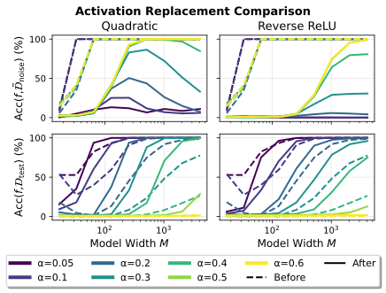

*Рисунок 5: *Слева: FF для ReLU-сетей. Компонента доминирующей частоты $\{U^{G},V^{G},W^{G}\}$ восстанавливает высокую тестовую точность (после FF), тогда как остаточная компонента $\{U^{R},V^{R},W^{R}\}$ в основном удерживает запоминание шума. Справа: замена обученной ReLU-активации на квадратичную или обратный ReLU сохраняет или даже улучшает тестовую точность и снижает точность на шумных метках, подсказывая, что выученные веса уже кодируют представление правила, совместимое с другими функциями активации.** **[p. 7]**

###### p6-6

Рисунок 5 (слева) показывает, что подсеть доминирующей частоты достигает высокой тестовой точности даже при тяжёлом шуме меток, тогда как остаточная компонента много сильнее согласована с запоминанием шумных меток. Это даёт прямое свидетельство того, что генерализация и запоминание сосуществуют в обученной сети, но закодированы по-разному в частотном пространстве.

###### p6-7

Разделяющий правило эффект FF удивительно силён. Даже когда модель обучена с $80\%$ шума меток, подсеть доминирующей частоты может восстановить почти идеальную тестовую точность, указывая, что модель внутренне выучила верное правило, хотя её сырой выход тяжело испорчен запоминанием шума. Обратно, остаточная подсеть в основном сохраняет способность подгонять шумные метки, внося мало в тестовую генерализацию. Этот резкий контраст подсказывает, что шум меток не просто мешает модели выучить правило; вместо этого правило выучено, но замаскировано дополнительными **[p. 7]** остаточными частотными компонентами, используемыми для запоминания. Мы далее наблюдаем, что FF также улучшает тестовую точность для моделей, обученных на бесшумных образцах, для сетей с квадратичными активациями и для моделей на задачах модульного вычитания, подсказывая, что фильтрация доминирующей частоты не просто убирает шумные артефакты, а извлекает общее представление правила. Ту же частотную идею фильтрации можно распространить и на трансформер (см. приложение D.2).

###### p7-1

**Дополнительные свидетельства аналитической структуры.** Мы даём две дополняющие проверки того, что ReLU-представление грубо согласовано с аналитическим решением. Во-первых, замена активации показывает, что выученное правило не опирается на точную форму ReLU: после обучения замена ReLU на квадратичную или обратный ReLU (определяемый как $\phi(x)=\max\{-x,0\}$) сохраняет и часто усиливает генерализацию при снижении точности на шумных метках (рисунок 5 (справа)). Это согласно с гипотезой, что веса уже образовали симметричное представление правила.

###### p7-2

Во-вторых, фазы отфильтрованных доминирующих компонент совпадают с фазовым соотношением аналитического решения. Для сложения фазы удовлетворяют $\varphi^{(a)}_{m}+\varphi^{(b)}_{m}\approx\varphi^{(c)}_{m}$; для вычитания — $\varphi^{(a)}_{m}-\varphi^{(b)}_{m}\approx\varphi^{(c)}_{m}$ (рисунок 4 (c)). Эти результаты вместе с FF и заменой активации поддерживают один вывод: ReLU-сети обобщают, формируя частотно-структурированное представление, близкое к квадратичному аналитическому решению, что позволяет распутать генерализацию и запоминание во внутреннем представлении. Дополнительные результаты опытов перенесены в приложения D.3–D.4.

Вышеуказанные свидетельства подсказывают, что FF может распутать запоминание от генерализации. Однако FF внутренне ограничена в двух отношениях: (i) она не даёт строгого функционального разложения, поскольку $\boldsymbol{f}_{\theta}\neq\boldsymbol{f}_{\{\boldsymbol{W}^{G},\boldsymbol{U}^{G},\boldsymbol{V}^{G},\boldsymbol{\mu}\}}+\boldsymbol{f}_{\{\boldsymbol{W}^{R},\boldsymbol{U}^{R},\boldsymbol{V}^{R},\boldsymbol{\mu}\}}$; и (ii) она опирается на априорное знание структуры задачи. Это мотивирует вопрос, можно ли вместо этого отделить запоминание от генерализации задаче-независимым образом (Q3).

## 5 Разбиение сети

Теперь мы отвечаем на Q3, спрашивая, разделимы ли генерализация и запоминание на уровне нейронов. Конкретно, мы исследуем, можно ли разбить обученную сеть на два подмножества нейронов: одно $\mathcal{M}^{G}\subseteq\mathcal{M}$, ответственное за генерализацию, и другое $\mathcal{M}^{R}\subseteq\mathcal{M}$, ответственное за запоминание шума меток. Выбор $\mathcal{M}^{G}$ для генерализации равносилен прореживанию остальных нейронов из полной сети. Для выбранного подмножества нейронов соответствующие подсети определены как

$$
\small\boldsymbol{f}_{\mathcal{M}^{G}}(a,b)=\sum_{m\in\mathcal{M}^{G}}\boldsymbol{w}_{m}\phi\!\left(\boldsymbol{u}_{m}^{\top}\boldsymbol{e}_{a}+\boldsymbol{v}_{m}^{\top}\boldsymbol{e}_{b}\right)+\boldsymbol{\mu},\ \boldsymbol{f}_{\mathcal{M}^{R}}(a,b)=\sum_{m\in\mathcal{M}^{R}}\boldsymbol{w}_{m}\phi\!\left(\boldsymbol{u}_{m}^{\top}\boldsymbol{e}_{a}+\boldsymbol{v}_{m}^{\top}\boldsymbol{e}_{b}\right)+\boldsymbol{\mu}. \tag{3}
$$

Мы ранжируем нейроны мерой важности и выбираем высокобалльные нейроны для генерализации, низкобалльные — для запоминания шума. Полная процедура отбора дана в алгоритме 1.

**[p. 8]**

**Алгоритм 1** Отбор нейронов для разложения сети

1: **Input:** Сеть $\boldsymbol{f}_{\theta}$ с $M$ нейронами $\mathcal{M}$; метрика $S(m)$; $\mathcal{D}_{\text{val}}$; $\tilde{\mathcal{D}}_{\text{noise}}$; порог $\tau$.
2: **Initialize:** $\mathcal{M}^{G}\leftarrow\emptyset,\mathcal{M}^{R}\leftarrow\emptyset$.
3: {// Шаг 1: ранжирование нейронов}
4: Вычислить балл $s_{m}=S(m)$ для каждого $m\in\mathcal{M}$.
5: Отсортировать нейроны по убыванию: $\{m_{\pi(1)},\dots,m_{\pi(M)}\}$, где $s_{m_{\pi(i)}}\geq s_{m_{\pi(j)}}$ для $i<j$.
6: {// Шаг 2: отбор для генерализации}
7: **for** $k\in\{1,\dots,M\}$ **do**
8: $\mathcal{M}_{k}=\{m_{\pi(1)},\dots,m_{\pi(k)}\}$; $A_{k}=\text{Acc}(\boldsymbol{f}_{\mathcal{M}_{k}},\mathcal{D}_{\text{val}})$.
9: **end** **for**
10: $k^{G}=\arg\max_{k}A_{k}$; $\gamma^{G}=k^{G}/M$ и $\mathcal{M}^{G}=\{m_{\pi(1)},\dots,m_{\pi(k^{G})}\}$.
11: {// Шаг 3: минимальный отбор для запоминания шума}
12: **for** $k\in\{1,\dots,M\}$ **do**
13: $\mathcal{M}^{\prime}_{k}=\{m_{\pi(M-k+1)},\dots,m_{\pi(M)}\}$. {Снизу вверх}
14: **if** $\text{Acc}(\boldsymbol{f}_{\mathcal{M}^{\prime}_{k}},\tilde{\mathcal{D}}_{\text{noise}})\geq\tau$ **then**
15: $k^{R}=k$, **break**.
16: **end** **if**
17: **end** **for**
18: $\gamma^{R}=k^{R}/M$ и $\mathcal{M}^{R}=\{m_{\pi(M-k^{R}+1)},\dots,m_{\pi(M)}\}$.
19: **Output:** Доли $\gamma^{G},\gamma^{R}$; выбранные нейроны $\mathcal{M}^{G}$, $\mathcal{M}^{R}$; подсети $\boldsymbol{f}^{G}=\boldsymbol{f}_{\mathcal{M}^{G}}$, $\boldsymbol{f}^{R}=\boldsymbol{f}_{\mathcal{M}^{R}}$.

Естественная мера важности — обратное отношение участия (IPR) [19, 20, 18, 21], предложенное и применённое в Doshi et al. [21]. Оно меряет периодичность каждого нейрона и определено как

$$
\text{IPR}_{m}\mathrel{:=}\left(\frac{\lVert\tilde{\boldsymbol{w}}_{m}\rVert_{4}}{\lVert\tilde{\boldsymbol{w}}_{m}\rVert_{2}}\right)^{4}, \tag{4}
$$

где $\lVert\cdot\rVert_{p}$ — $\ell_{p}$-норма, а $\tilde{\boldsymbol{w}}_{m}$ — фурье-образ $\boldsymbol{w}_{m}$. Уравнение (4) влечёт $\text{IPR}_{m}\in[1/M,1]$, где большее значение указывает более сильную периодичность. Эта метрика хорошо подходит модульному сложению [21], чьи обобщаемые решения опираются на периодические структуры.

Чтобы не полагаться на задаче-специфичный фурье-приор, мы также предлагаем задаче-независимую меру — силу нейрона (Str.), определённую как

$$
\text{Str}_{m}\mathrel{:=}\lVert\boldsymbol{w}_{m}\rVert_{\infty}\phi\left(\lVert\boldsymbol{u}_{m}\rVert_{\infty}+\lVert\boldsymbol{v}_{m}\rVert_{\infty}\right), \tag{5}
$$

где $\lVert\cdot\rVert_{\infty}$ обозначает $\ell_{\infty}$-норму. Интуитивно, Str. меряет наибольший возможный вклад нейрона в выходной зазор. В отличие от IPR, она не предполагает периодичности и потому применима к задачам вроде модульного умножения, где периодичность в исходном входном домене больше не прямой прокси генерализации.

##### **Result 5.1.**

*Нейроны, вносящие наибольший вклад в генерализацию, обычно являют более высокую силу нейрона. Конкретно, нейроны с высоким IPR также достигают высокой Str. на модульном сложении и вычитании.*

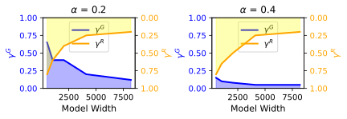

*Рисунок 6: *Слева: IPR нейрона против Str. на задаче модульного сложения. Нейроны с более сильной периодичностью также склонны иметь большую Str., поддерживая Str. как задаче-независимую прокси важности нейрона. Справа: доли отбора нейронов по Str. на задаче модульного сложения. Более высокая доля шума ведёт к меньшей подсети для генерализации ($\gamma^{G}$). Две подсети не имеют перекрывающихся нейронов при достаточно большой ширине модели.** **[p. 9]**

##### **Result 5.2.**

*Подсети не перекрываются при достаточно большой ширине модели, то есть $\gamma^{G}+\gamma^{R}\leq 1$, где $\gamma^{G}=\frac{|\mathcal{M}^{G}|}{|\mathcal{M}|}$ и $\gamma^{R}=\frac{|\mathcal{M}^{R}|}{|\mathcal{M}|}$. (Рисунок 6 справа)*

Рисунок 6 (слева) показывает, что IPR и Str. сильно коррелированы. Мы также наблюдаем, что большая доля шума снижает число нейронов с высоким IPR или высокой Str. Оптимальная доля нейронов для генерализации ($\gamma^{G}$) тоже ниже при большей доле шума (рисунок 6 справа). Это может объяснять ухудшение генерализации при тяжёлом шуме меток. Дополнительные результаты в приложении E показывают, что Str. даёт качество, сопоставимое с IPR, на сложении и вычитании, будучи действеннее на модульном умножении, где IPR менее пригоден.

*Рисунок 7: Улучшение генерализации на модульном сложении. IPR и Str. достигают схожего качества. Применение FF к подсети $f^{G}$, отобранной по Str., дополнительно улучшает генерализацию, но выигрыш остаётся существенно меньше применения FF прямо к полной модели $f$.* **[p. 9]**

##### **Result 5.3.**

*Улучшение генерализации от отбора/прореживания нейронов ограничено по сравнению с FF.*

###### p8-11

Рисунок 7 показывает, что отбор нейронов может улучшить генерализацию, особенно при лёгком шуме меток, и что задаче-независимая мера Str. работает сопоставимо с задаче-специфичной IPR. Однако это улучшение много слабее выигрыша от применения FF прямо к полной модели. Даже применение FF после отбора генерализационной подсети $f^{G}$ не восстанавливает качества **[p. 9]** FF на исходной сети. Этот контраст указывает, что обобщаемая структура не локализована в малом подмножестве нейронов; вместо этого она диффузно закодирована по сети и переплетена с компонентами, используемыми для запоминания шума.

Это сравнение проясняет ограничение задаче-независимого постфактумного отбора нейронов. В отличие от FF, использующей доменно-специфичную фурье-структуру задачи для извлечения латентного правила, отбор нейронов может лишь выявить нейроны, более важные в среднем. В результате прореживание может отчасти улучшить генерализацию, но не может полностью высвободить правило, уже выученное моделью. Это подсказывает два более широких следствия: будущим парадигмам обучения, возможно, потребуется явно изолировать запоминание от логического вывода при обучении, а постфактумное извлечение знаний может требовать доменно-специфичных структурных приоров, а не общих мер важности нейронов.

#### Заключение.

Наши результаты демонстрируют, что перепараметризованные модели могут внутренне выучивать лежащие в основе правила даже при явном шуме меток, хотя эта генерализация остаётся тяжело переплетённой с запоминанием по распределённым нейронам. Хотя задаче-независимый отбор нейронов даёт лишь ограниченное улучшение, частотная фильтрация может успешно восстанавливать латентные правила, когда доступен подходящий структурный приор. Существенно, что мы наблюдаем, что эти стержневые механизмы переплетения распространяются за пределы **[p. 10]** алгебраических задач на архитектуры вроде трансформеров и наборы данных вроде MNIST. Мы признаём, что наша постановка внутренне абстрагируется от сложной изменчивости естественных зрительных или языковых задач, но эта контролируемая постановка необходима, чтобы дать строгую проверяемую границу между структурной генерализацией и неструктурированным запоминанием. В конечном счёте это фундаментальное исследование высвечивает принципиальное ограничение постфактумного извлечения на основе прореживания, подсказывая, что полное распутывание этих процессов в практических приложениях потребует новых парадигм обучения или архитектурных решений с явным разделением функций.

## References

- [1] T. Brown, B. Mann, N. Ryder, M. Subbiah, J. D. Kaplan, P. Dhariwal, A. Neelakantan, P. Shyam, G. Sastry, A. Askell, et al. (2020) Language models are few-shot learners. Advances in neural information processing systems 33, pp. 1877–1901. Cited by: §1.

- [2] J. Kaplan, S. McCandlish, T. Henighan, T. B. Brown, B. Chess, R. Child, S. Gray, A. Radford, J. Wu, and D. Amodei (2020) Scaling laws for neural language models. arXiv preprint arXiv:2001.08361. Cited by: §1.

- [3] T. Henighan, J. Kaplan, M. Katz, M. Chen, C. Hesse, J. Jackson, H. Jun, T. B. Brown, P. Dhariwal, S. Gray, et al. (2020) Scaling laws for autoregressive generative modeling. arXiv preprint arXiv:2010.14701. Cited by: §1.

- [4] J. Hoffmann, S. Borgeaud, A. Mensch, E. Buchatskaya, T. Cai, E. Rutherford, D. d. L. Casas, L. A. Hendricks, J. Welbl, A. Clark, et al. (2022) Training compute-optimal large language models. arXiv preprint arXiv:2203.15556. Cited by: §1.

- [5] J. Wei, Y. Tay, R. Bommasani, C. Raffel, B. Zoph, S. Borgeaud, D. Yogatama, M. Bosma, D. Zhou, D. Metzler, et al. (2022) Emergent abilities of large language models. arXiv preprint arXiv:2206.07682. Cited by: §1.

- [6] Y. Liu, Z. Liu, and J. Gore (2025) Superposition yields robust neural scaling. arXiv preprint arXiv:2505.10465. Cited by: Appendix A, §1.

- [7] A. Pearce, A. Ghandeharioun, N. Hussein, N. Thain, M. Wattenberg, and L. Dixon (2023) Do machine learning models memorize or generalize?. Google PAIR. Note: Accessed: 2024-01-20 External Links: Link Cited by: Appendix B, §C.2, §1, §2.

- [8] A. Power, Y. Burda, H. Edwards, I. Babuschkin, and V. Misra (2022) Grokking: generalization beyond overfitting on small algorithmic datasets. arXiv preprint arXiv:2201.02177. Cited by: Appendix A, §1, §2.

- [9] N. Nanda, L. Chan, T. Lieberum, J. Smith, and J. Steinhardt (2023) Progress measures for grokking via mechanistic interpretability. In The Eleventh International Conference on Learning Representations, Cited by: Appendix A, §D.2, §1, §2.

- [10] Z. Zhong, Z. Liu, M. Tegmark, and J. Andreas (2023) The clock and the pizza: two stories in mechanistic explanation of neural networks. Advances in neural information processing systems 36, pp. 27223–27250. Cited by: Appendix A, §1.

- [11] D. Morwani, B. L. Edelman, C. Oncescu, R. Zhao, and S. M. Kakade (2024) Feature emergence via margin maximization: case studies in algebraic tasks. In The Twelfth International Conference on Learning Representations, Cited by: Proposition B.1, Appendix B, §1, §4, §4.

- [12] Y. Tian (2025) Provable scaling laws of feature emergence from learning dynamics of grokking. arXiv preprint arXiv:2509.21519. Cited by: Appendix A, §1.

- [13] I. Loshchilov and F. Hutter (2017) Decoupled weight decay regularization. arXiv preprint arXiv:1711.05101. Cited by: §2.

- [14] K. Jordan, Y. Jin, V. Boza, Y. Jiacheng, F. Cecista, L. Newhouse, and J. Bernstein Muon: an optimizer for hidden layers in neural networks, 2024. URL https://kellerjordan. github. io/posts/muon 6. Cited by: §2.

- [15] P. Nakkiran, G. Kaplun, Y. Bansal, T. Yang, B. Barak, and I. **[p. 11]** Sutskever (2021) Deep double descent: where bigger models and more data hurt. Journal of Statistical Mechanics: Theory and Experiment 2021 (12), pp. 124003. Cited by: Appendix A, §3.1.

- [16] K. Tirumala, A. Markosyan, L. Zettlemoyer, and A. Aghajanyan (2022) Memorization without overfitting: analyzing the training dynamics of large language models. Advances in Neural Information Processing Systems 35, pp. 38274–38290. Cited by: §C.4.1, §3.2.

- [17] M. Li, M. Soltanolkotabi, and S. Oymak (2020) Gradient descent with early stopping is provably robust to label noise for overparameterized neural networks. In International conference on artificial intelligence and statistics, pp. 4313–4324. Cited by: Appendix A, §3.2.

- [18] A. Gromov (2023) Grokking modular arithmetic. arXiv preprint arXiv:2301.02679. Cited by: Appendix A, §4, §5.

- [19] R. Pastor-Satorras and C. Castellano (2016) Distinct types of eigenvector localization in networks. Scientific reports 6 (1), pp. 18847. Cited by: §5.

- [20] S. M. Girvin and K. Yang (2019) Modern condensed matter physics. Cambridge University Press. Cited by: §5.

- [21] D. Doshi, A. Das, T. He, and A. Gromov (2024) To grok or not to grok: disentangling generalization and memorization on corrupted algorithmic datasets. In The Twelfth International Conference on Learning Representations, Cited by: Appendix A, §5, §5.

- [22] M. Belkin, D. Hsu, S. Ma, and S. Mandal (2019) Reconciling modern machine-learning practice and the classical bias–variance trade-off. Proceedings of the National Academy of Sciences 116 (32), pp. 15849–15854. External Links: Document, Link Cited by: Appendix A.

- [23] Z. Yang, Y. Yu, C. You, J. Steinhardt, and Y. Ma (2020) Rethinking bias-variance trade-off for generalization of neural networks. In International Conference on Machine Learning, pp. 10767–10777. Cited by: Appendix A.

- [24] M. Belkin, D. Hsu, and J. Xu (2020) Two models of double descent for weak features. SIAM Journal on Mathematics of Data Science 2 (4), pp. 1167–1180. Cited by: Appendix A.

- [25] M. S. Advani, A. M. Saxe, and H. Sompolinsky (2020) High-dimensional dynamics of generalization error in neural networks. Neural Networks 132, pp. 428–446. Cited by: Appendix A.

- [26] B. Adlam and J. Pennington (2020) The neural tangent kernel in high dimensions: triple descent and a multi-scale theory of generalization. In International Conference on Machine Learning, pp. 74–84. Cited by: Appendix A.

- [27] P. L. Bartlett, P. M. Long, G. Lugosi, and A. Tsigler (2020) Benign overfitting in linear regression. Proceedings of the National Academy of Sciences 117 (48), pp. 30063–30070. Cited by: Appendix A.

- [28] S. Mei and A. Montanari (2022) The generalization error of random features regression: precise asymptotics and the double descent curve. Communications on Pure and Applied Mathematics 75 (4), pp. 667–766. Cited by: Appendix A.

- [29] T. Hastie, A. Montanari, S. Rosset, and R. J. Tibshirani (2022) Surprises in high-dimensional ridgeless least squares interpolation. Annals of statistics 50 (2), pp. 949. Cited by: Appendix A.

- [30] V. Muthukumar, K. Vodrahalli, V. Subramanian, and A. Sahai (2020) Harmless interpolation of noisy data in regression. IEEE Journal on Selected Areas in Information Theory 1 (1), pp. 67–83. Cited by: Appendix A.

- [31] P. Nakkiran, P. Venkat, S. Kakade, and T. Ma (2020) Optimal regularization can mitigate double descent. arXiv preprint arXiv:2003.01897. Cited by: Appendix A.

- [32] A. H. Umar, F. K. N. Tezoh, J. Barbier, S. Acevedo, and A. Laio (2025) The effect of label noise on the information content of neural representations. arXiv preprint arXiv:2510.06401. Cited by: Appendix A.

- [33] M. Gamba, E. Englesson, M. Björkman, and H. **[p. 12]** Azizpour (2022) Deep double descent via smooth interpolation. arXiv preprint arXiv:2209.10080. Cited by: Appendix A.

- [34] G. Somepalli, L. Fowl, A. Bansal, P. Yeh-Chiang, Y. Dar, R. Baraniuk, M. Goldblum, and T. Goldstein (2022) Can neural nets learn the same model twice? investigating reproducibility and double descent from the decision boundary perspective. In Proceedings of the ieee/cvf conference on computer vision and pattern recognition, pp. 13699–13708. Cited by: Appendix A.

- [35] X. Davies, L. Langosco, and D. Krueger (2023) Unifying grokking and double descent. arXiv preprint arXiv:2303.06173. Cited by: Appendix A.

- [36] Y. Huang, S. Hu, X. Han, Z. Liu, and M. Sun (2024) Unified view of grokking, double descent and emergent abilities: a perspective from circuits competition. arXiv preprint arXiv:2402.15175. Cited by: Appendix A, §C.4.1.

- [37] Z. Liu, O. Kitouni, N. S. Nolte, E. Michaud, M. Tegmark, and M. Williams (2022) Towards understanding grokking: an effective theory of representation learning. Advances in Neural Information Processing Systems 35, pp. 34651–34663. Cited by: Appendix A.

- [38] N. R. Mallinar, D. Beaglehole, L. Zhu, A. Radhakrishnan, P. Pandit, and M. Belkin (2025) Emergence in non-neural models: grokking modular arithmetic via average gradient outer product. In Forty-second International Conference on Machine Learning, Cited by: Appendix A.

- [39] G. McCracken, G. Moisescu-Pareja, V. Letourneau, D. Precup, and J. Love (2025) Uncovering a universal abstract algorithm for modular addition in neural networks. arXiv preprint arXiv:2505.18266. Cited by: Appendix A.

- [40] S. Liu, Z. Zhu, Q. Qu, and C. You (2022) Robust training under label noise by over-parameterization. In International Conference on Machine Learning, pp. 14153–14172. Cited by: Appendix A.

- [41] H. Song, M. Kim, D. Park, Y. Shin, and J. Lee (2022) Learning from noisy labels with deep neural networks: a survey. IEEE transactions on neural networks and learning systems 34 (11), pp. 8135–8153. Cited by: Appendix A.

- [42] Z. Xu, Y. Wang, S. Frei, G. Vardi, and W. Hu (2023) Benign overfitting and grokking in relu networks for xor cluster data. arXiv preprint arXiv:2310.02541. Cited by: Appendix A.

## Приложение A Связанные работы

#### Помодельный двойной спуск и перепараметризация.

Открытие явления двойного спуска (иллюстрировано на рисунке 1(a)) отметило значительный сдвиг в современном машинном обучении, подсказывая, что классический размен смещения и дисперсии неполон [22, 23]. В перепараметризованной области тестовая ошибка может снова убывать за порогом интерполяции, ведя к превосходящей генерализации. Теоретически этот второй спуск строго охарактеризован в линейной регрессии при различных предположениях [24, 25, 26, 27, 28, 29, 30], хотя некоторые исследования указывают, что подходящая регуляризация может смягчить или устранить этот эффект [31]. В нелинейных постановках двойной спуск прочно наблюдён в задачах компьютерного зрения, особенно в присутствии шума меток [15, 32].

Недавние усилия искали механистические объяснения генерализующей силы крупномасштабных моделей. Одна перспектива предлагает, что перепараметризованные модели обобщают через более гладкую интерполяцию шумных точек данных [33, 34]. Далее, возникновение нейронных законов масштабирования всё чаще приписывается суперпозиции дискретных признаков или представлений [6]. Davies et al. [35], Huang et al. [36] далее объединяют двойной спуск с гроккингом, оформляя оба явления как конкуренцию контуров запоминания и генерализации. Наша работа расширяет эту линию исследований, изучая, как размер модели конкретно управляет разрешением этой конкуренции при шуме меток.

**[p. 13]**

#### Гроккинг и эмерджентная генерализация.

В перепараметризованных моделях генерализация часто возникает долго после исчезновения обучающей потери — явление, известное как гроккинг [8]. Это расцепление подгонки и открытия правила выпукло наблюдается на задачах модульной арифметики по различным архитектурам [37, 9, 38]. Хотя для трансформеров, решающих эти задачи, выявлены конкретные алгоритмы, такие как Pizza и Clock [9, 10], и вскрыт универсальный абстрактный алгоритм для глубоких нейронных сетей [39], точное аналитическое решение для двухслойных ReLU-сетей остаётся ненайденным. Существующие теоретические работы исследовали доказуемые решения с квадратичными активациями или конкретными схемами регуляризации [18, 12], но роль и влияние шума меток в этих постановках остаются в основном неисследованными.

#### Обучение при шуме меток.

Большинство существующих работ об обучении с шумом меток сосредоточено на устойчивых обучающих стратегиях предотвращения переобучения [17, 40]. Отсылаем читателей к Song et al. [41] за всеобъемлющим обзором. Xu et al. [42] теоретически анализируют качество двухслойных ReLU-сетей на шумных XOR-данных при предположении закреплённых весов второго слоя, что отступает от стандартной сквозной обучающей динамики. Doshi et al. [21] рассматривают эффекты долей шума и разных методов регуляризации на арифметических задачах. Напротив, мы прежде всего сосредоточены на связи размера модели и генерализационного качества и далее исследуем механистическое переплетение запоминания и генерализации.

## Приложение B Аналитическое решение при квадратичной активации

Тот факт, что решение из уравнений (2) точно для квадратичных активаций, хорошо обсуждён в Pearce et al. [7], Morwani et al. [11]. Мы представляем их теорию здесь, адаптированную к нашим обозначениям, в предложении B.1.

##### **Предложение B.1.**

*(Теорема 7, Morwani et al. [11]) Для задачи модульного сложения любая двухслойная сеть $f_{\theta}=\boldsymbol{W}\left(\boldsymbol{U}\boldsymbol{e}_{a}+\boldsymbol{V}\boldsymbol{e}_{b}\right)^{2}$ с $M\geq 4(P-1)$, максимизирующая зазор на $\mathcal{D}_{\text{total}}$, удовлетворяет следующим условиям:*

*1. для каждого нейрона $\left\{\boldsymbol{u}_{m},\boldsymbol{v}_{m},\boldsymbol{w}_{m}\right\}$ существуют масштабная константа $\lambda\in\mathbb{R}$ и частота $\omega\in\left\{1,\cdots,\frac{P-1}{2}\right\}$ такие, что*

$$
u_{mi}=\lambda\cos\left(\frac{2\pi}{P}\omega_{m}i+\varphi^{(a)}_{m}\right), \tag{6a} \\
v_{mj}=\lambda\cos\left(\frac{2\pi}{P}\omega_{m}j+\varphi^{(b)}_{m}\right), \tag{6b} \\
w_{mk}=\lambda\cos\left(\frac{2\pi}{P}\omega_{m}k+\varphi^{(c)}_{m}\right), \tag{6c}
$$

*для некоторых фазовых сдвигов $\varphi^{(a)}_{m},\varphi^{(b)}_{m},\varphi^{(c)}_{m}\in\mathbb{R}$, удовлетворяющих $\varphi^{(a)}_{m}+\varphi^{(b)}_{m}=\varphi^{(c)}_{m}$.*

*2. Для каждой частоты $\omega\in\left\{1,\cdots,\frac{P-1}{2}\right\}$ хотя бы один нейрон сети использует эту частоту.*

## Приложение C Дополнительные опыты к разделу 3

### C.1 Кривые двойного спуска на варьирующих постановках

Помодельный двойной спуск ясно наблюдается по разным функциям активации, обучающим долям, оптимизаторам и арифметическим задачам. Мы сводим рисунки о нём в таблице 1.

*Таблица 1: Индексы рисунков, показывающих кривые двойного спуска при варьирующих постановках.* **[p. 13]**

| Функции активации | Обучающие доли | Оптимизаторы | Арифметические задачи |
|---|---|---|---|
| 1(b), 8 | 9 (40%), 2(50%), 10(60%) | 2 (AdamW), 11 (Adam), 12 (Muon) | 13 |

*Рисунок 8: Потолки тестовой точности для квадратичных функций активации существуют при варьирующих weight decay.* **[p. 14]**

*Рисунок 9: Качество AdamW при обучающей доле 40%.* **[p. 14]**

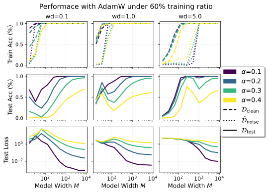

*Рисунок 10: Качество AdamW при обучающей доле 60%.* **[p. 15]**

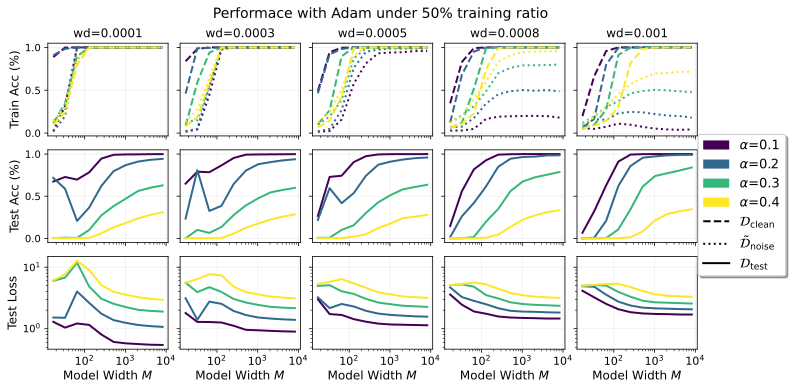

*Рисунок 11: Качество Adam при варьирующих weight decay.* **[p. 15]**

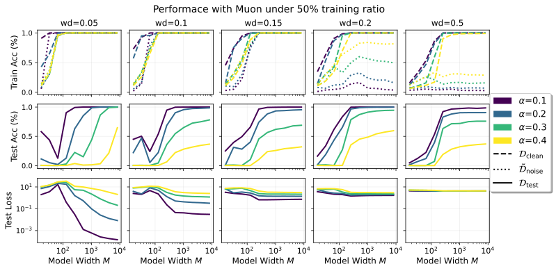

*Рисунок 12: Качество Muon при варьирующих weight decay.* **[p. 15]**

*Рисунок 13: Качество на задачах модульного вычитания (*слева*) и умножения (*справа*). Модели обучены AdamW при обучающей доле 50%.* **[p. 16]**

#### SGD — не лучший выбор.

Рисунок 14 показывает обучающую динамику SGD при разных выборах скорости обучения и weight decay. Среди всех конфигураций только настройка с $\text{lr}=0.1$ и **[p. 14]** $\text{wd}=0.001$ являет заметное генерализационное поведение. Это подсказывает, что SGD требует крайне ограничительной настройки гиперпараметров для достижения разумной генерализации. Более того, даже на эпохе 200,000 тестовая точность остаётся относительно низкой и всё ещё растёт, указывая, что SGD сходится крайне медленно. В целом SGD неэффективен для этой задачи, поскольку потребляет чрезмерное число обучающих эпох для достижения скромного уровня генерализации.

*Рисунок 14: Обучающая динамика SGD при разных значениях скорости обучения (lr) и weight decay (wd) при $M=2049$ и $\alpha=0.3$. Результаты сообщаются каждые 2,000 эпох, всего эпох 200,000.* **[p. 16]**

### C.2 Обсуждение неверной спецификации модели

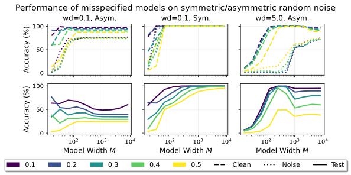

*Рисунок 15: Качество моделей со связанным первым слоем при неверной спецификации. *(Слева)* При асимметричном случайном шуме связанная модель не может полностью интерполировать шумные метки и являет нерегулярное генерализационное поведение. *(В центре)* При симметричном шуме связанная модель успешно интерполирует все шумные метки, и генерализация улучшается с ростом размера модели. *(Справа)* Более сильная регуляризация смягчает вредный эффект неверной спецификации, поощряя модель игнорировать шумные метки.* **[p. 16]**

Мы рассматриваем сценарий, где архитектура модели недостаточно выразительна, чтобы запомнить все шумные метки, что ведёт к нетипичному генерализационному поведению.

Модульные сложение и умножение — коммутативные операции, то есть $a\circ b=b\circ a$. Соответственно, альтернативная архитектура навязывает связанный первый слой установкой $U=V$ [7]. При случайном шуме меток, однако, шумные образцы вообще нарушают эту симметрию. В результате связанная модель неспособна интерполировать все шумные метки, и фаза сосуществования в этой постановке не возникает, ведя к нерегулярным кривым тестовой точности (см. левую панель рисунка 15).

**[p. 17]**

Чтобы проверить, что за это поведение ответственна асимметричная структура случайного шума, мы строим симметричный шумовой узор и переоцениваем связанную модель. Конкретно, для доли шума $\alpha$ в модульном сложении мы случайно выбираем $\frac{\alpha}{2}|\mathcal{D}_{\text{train}}|$ примеров, образуя $\mathcal{D}_{\text{asym}}$, где каждый $(a,b,c)\in\mathcal{D}_{\text{asym}}$ удовлетворяет $a<b$. Шумный набор данных затем строится как

$$
\tilde{\mathcal{D}}_{\text{noise}}=\{(a,b,\tilde{c})\mid(a,b,c)\in\mathcal{D}_{\text{asym}}\text{ or }(b,a,c)\in\mathcal{D}_{\text{asym}},\ \tilde{c}\neq c,\ \tilde{c}\in\{0,\ldots,P-1\}\}.
$$

При этом симметричном шуме связанная модель являет предсказуемое поведение: шумные метки могут быть полностью запомнены, как только ширина модели превышает порог (то есть фаза сосуществования появляется), и генерализация улучшается с ростом размера модели (см. среднюю панель рисунка 15).

Когда структура шума неизвестна, неверная спецификация модели становится потенциальным риском. Одна практическая стратегия смягчения — усилить регуляризацию, чтобы продлить фазу инверсии. Связанная модель способна интерполировать все чистые образцы, и рост weight decay поощряет модель подавлять/пренебрегать шумными метками, тем самым восстанавливая хорошее генерализационное качество (см. правую панель рисунка 15).

### C.3 Обсуждение Result 3.2

Мы даём градиентное объяснение контринтуитивного наблюдения Result 3.2. Пусть $\mathcal{D}_{\mathrm{c}}=\mathcal{D}_{\text{clean}}$ и $\mathcal{D}_{\mathrm{n}}=\tilde{\mathcal{D}}_{\text{noise}}$ обозначают чистое и шумное подмножества обучающих данных соответственно. Для модели, параметризованной $\theta$, мы разлагаем эмпирическую потерю как

$$
L(\theta)=L_{\mathrm{c}}(\theta)+L_{\mathrm{n}}(\theta),\qquad L_{\mathrm{c}}(\theta)=\sum_{z\in\mathcal{D}_{\mathrm{c}}}\ell(z;\theta),\qquad L_{\mathrm{n}}(\theta)=\sum_{z\in\mathcal{D}_{\mathrm{n}}}\ell(z;\theta),
$$

где $\ell$ — перекрёстно-энтропийная потеря на одном примере. При полнобатчевом градиентном спуске направление обновления —

$$
-\nabla L(\theta)=-\nabla L_{\mathrm{c}}(\theta)-\nabla L_{\mathrm{n}}(\theta).
$$

Для достаточно малого шага $\eta$ первопорядковое убывание чистой и шумной потерь после одного обновления приблизительно

$$
\Delta L_{\mathrm{c}}\approx-\eta\left\langle\nabla L_{\mathrm{c}},\nabla L_{\mathrm{c}}+\nabla L_{\mathrm{n}}\right\rangle,\qquad\Delta L_{\mathrm{n}}\approx-\eta\left\langle\nabla L_{\mathrm{n}},\nabla L_{\mathrm{c}}+\nabla L_{\mathrm{n}}\right\rangle.
$$

Итак, мгновенная скорость обучения каждого подмножества управляется тем, насколько его собственный градиент согласован с полнобатчевым обучающим направлением. Чтобы честно сравнить два подмножества, мы нормируем на их размеры и определяем попримерные скорости убывания потерь

$$
s_{\mathrm{c}}=\frac{\left\langle\nabla L_{\mathrm{c}},\nabla L_{\mathrm{c}}+\nabla L_{\mathrm{n}}\right\rangle}{|\mathcal{D}_{\mathrm{c}}|},\qquad s_{\mathrm{n}}=\frac{\left\langle\nabla L_{\mathrm{n}},\nabla L_{\mathrm{c}}+\nabla L_{\mathrm{n}}\right\rangle}{|\mathcal{D}_{\mathrm{n}}|}.
$$

Эмпирически в начале обучения мы наблюдаем $\langle\nabla L_{\mathrm{c}},\nabla L_{\mathrm{n}}\rangle<0$, то есть чистое и шумное подмножества наводят отчасти конфликтующие градиентные направления. Тем не менее обе нормированные меры продвижения остаются положительными, то есть $s_{\mathrm{c}}>0$ и $s_{\mathrm{n}}>0$. Это указывает, что полнобатчевое обновление всё же уменьшает и чистую, и шумную потери в самом начале обучения, хотя и с разными попримерными скоростями. Однако поскольку шумное подмножество много меньше при малой доле шума $\alpha$, направление обновления может производить большее *попримерное* убывание на шумном подмножестве. Иными словами, хотя шумные метки неструктурированы, каждый шумный пример получает более сильный индивидуальный толчок от полнобатчевого градиента. Это объясняет, почему точность на шумных метках может расти раньше точности на чистых, особенно при меньших долях шума.

Это градиентное объяснение также согласно с дополнительными опытами за пределами модульной арифметики. Чтобы проверить, не наведён ли ранний порядок «шум прежде чистых» чисто алгебраической структурой модульной арифметики, мы далее обучаем трёхслойную нейронную сеть на MNIST со случайно испорченными метками (скрытые размерности $=[1024,256]$, AdamW со скоростью обучения $0.001$). Как показано в таблице 2, при полнобатчевом обучении точность на шумных метках выше точности на чистых на эпохе 1 и для $\alpha=0.05$, и для $\alpha=0.2$. На следующей эпохе чистая точность быстро догоняет и становится много больше, тогда как шумная падает. Эти результаты подсказывают, что раннее преимущество шумных меток — не только следствие фурье-структуры модульной арифметики, но может возникать и в стандартной задаче классификации изображений при схожем оптимизационном протоколе.

*Таблица 2: Раннестадийная чистая и шумная точность на MNIST с трёхслойной нейронной сетью при полнобатчевом обучении.* **[p. 18]**

|  | $\alpha=0.05$ |  | $\alpha=0.2$ |  |
|---|---|---|---|---|
| Период | Шумная точн. | Чистая точн. | Шумная точн. | Чистая точн. |
| Эпоха 1 | $10.87\%$ | $2.86\%$ | $10.75\%$ | $2.89\%$ |
| Эпоха 2 | $6.47\%$ | $46.29\%$ | $5.71\%$ | $48.09\%$ |

MNIST-опыт также помогает прояснить область явления. Эффект виднее всего в самом начале полнобатчевого обучения и не должен истолковываться как утверждение, что шумные метки в конечном счёте легче выучиваются, чем чистые. **[p. 18]** Вместо этого первые несколько обновлений могут создавать большее попримерное продвижение на меньшем шумном подмножестве, тогда как чистая структура вскоре начинает господствовать. Это согласно с нашим градиентным анализом: начальные величины $s_{\mathrm{c}}$ и $s_{\mathrm{n}}$ могут быть обе положительны, с $s_{\mathrm{n}}>s_{\mathrm{c}}$, даже при частичном конфликте чистого и шумного градиентов.

Это объяснение также проясняет, почему явление зависит от обучающего протокола. При полнобатчевом обучении градиентный вклад шумного подмножества накапливается когерентно в каждом обновлении, так что направление, выгодное текущим шумным меткам, применяется повторно. Напротив, при мелкобатчевом обучении разные мини-батчи содержат разные шумные примеры, и градиентное направление, помогающее запомнить шумные метки одного батча, вообще непереносимо на другой. В результате попримерный толчок к любой конкретной испорченной метке становится менее стабильным, и ранний порядок «шум прежде чистых» ослабевает или может исчезнуть.

### C.4 Кривые обучения точности

Кривые обучения точности схватывают, когда возникают запоминание и генерализация при обучении. Мы наблюдаем явление гроккинга даже при шумных метках: модель быстро достигает 100% обучающей точности, тогда как тестовая точность значительно улучшается лишь позже. Для иллюстрации мы порознь представляем обучающую динамику на коротком и длинном масштабах времени, высвечивая запоминание и генерализацию соответственно.

#### C.4.1 Запоминание на коротком масштабе времени

Без шума в обучающем наборе прежние исследования нашли, что большие модели запоминают обучающие данные быстрее [16, 36]. Эта тенденция сохраняется при шумных обучающих данных, хотя скорости запоминания различаются для чистого и шумного подмножеств. Мы находим, что модель запоминает шумные метки быстрее чистых, и что разрыв больше при меньших долях шума. Эти явления последовательно наблюдаются по нескольким оптимизаторам, включая Adam (рисунок 16), AdamW (рисунок 17) и Muon (рисунок 18).

*Рисунок 16: Кривые запоминания для оптимизатора Adam. Большие модели быстрее достигают высокой обучающей точности. Шумные метки запоминаются быстрее чистых, и меньшие доли шума дополнительно ускоряют этот эффект.* **[p. 18]**

*Рисунок 17: Кривые запоминания для оптимизатора AdamW.* **[p. 19]**

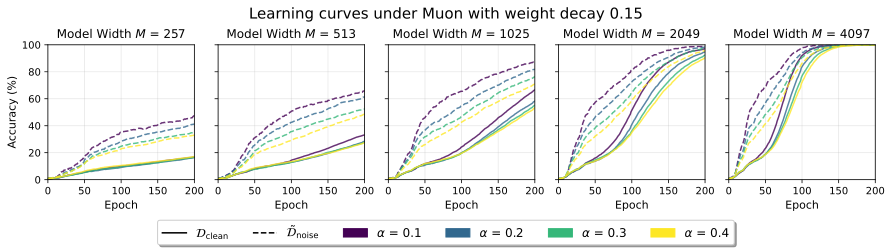

*Рисунок 18: Кривые запоминания для оптимизатора Muon.* **[p. 19]**

#### C.4.2 Генерализация на длинном масштабе времени

По тестовой точности мы наблюдаем общую тенденцию, что модели при большем weight decay гроккают быстрее, хотя тенденция не равно выражена по всем настройкам гиперпараметров. **[p. 19]** Эта тенденция ясна для AdamW (рисунок 19) и Muon (рисунок 21), но не очевидна для Adam (рисунок 20). Во всех них модели при меньшей доле шума гроккают быстрее.

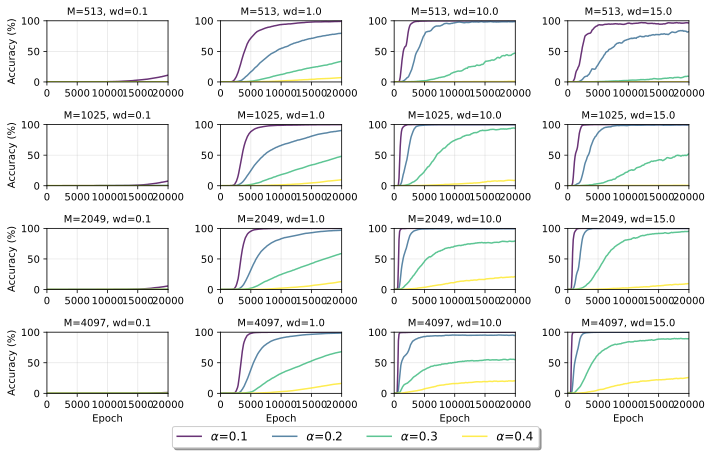

*Рисунок 19: Обучающая динамика тестовой точности по различным weight decay для AdamW. Малый weight decay (wd=0.1) ведёт к задержанному и медленному гроккингу.* **[p. 19]**

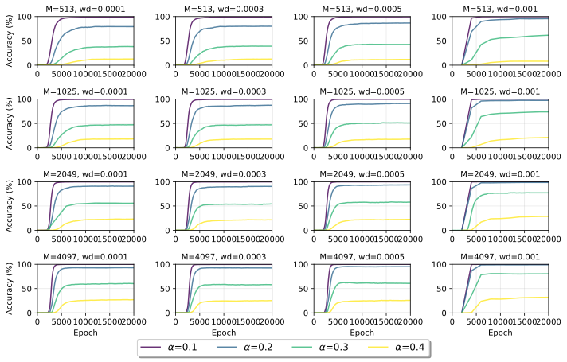

*Рисунок 20: Обучающая динамика тестовой точности по различным weight decay для Adam.* **[p. 20]**

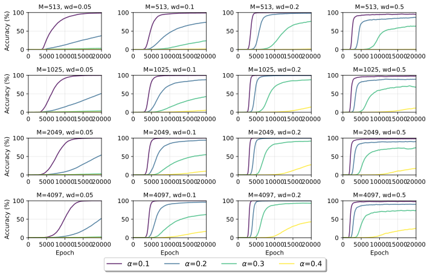

*Рисунок 21: Обучающая динамика тестовой точности по различным weight decay для Muon.* **[p. 20]**

**[p. 21]**

## Приложение D Дополнительные материалы к разделу 4

### D.1 Подробности частотной фильтрации

В этом разделе мы даём подробности частотной фильтрации. То есть подробности разложения $\left(\boldsymbol{u}_{m},\boldsymbol{v}_{m},\boldsymbol{w}_{m}\right)$, $m^{\text{th}}$ нейрона, на $\left(\boldsymbol{u}^{G}_{m},\boldsymbol{v}^{G}_{m},\boldsymbol{w}^{G}_{m}\right)$ и $\left(\boldsymbol{u}^{R}_{m},\boldsymbol{v}^{R}_{m},\boldsymbol{w}^{R}_{m}\right)$.

Пусть $\omega=e^{-2\pi i/P}$. Определим матрицу преобразования Фурье $F\in\mathbb{C}^{P\times P}$ как

$$
F_{k,n}=\frac{1}{\sqrt{P}}\omega^{kn}=\frac{1}{\sqrt{P}}e^{-2\pi ikn/P}.
$$

Для любого вектора $\boldsymbol{x}\in\mathbb{R}^{P\times 1}$ обозначим его фурье-образ $\tilde{\boldsymbol{x}}=\boldsymbol{F}\boldsymbol{x}$. $\boldsymbol{F}$ — унитарная матрица, так что её эрмитово сопряжение $\boldsymbol{F}$, обозначаемое $\boldsymbol{F}^{H}$, даёт $\boldsymbol{F}^{H}\boldsymbol{F}\boldsymbol{v}=\boldsymbol{v}$. Без потери общности предполагаем, что $\boldsymbol{x}$ — вектор, для которого $\operatorname*{arg\,max}_{k}\lvert\tilde{x}_{k}\rvert$ — одноэлементное множество.

Мы определяем оператор извлечения главной частоты (для генерализационной части) как $\boldsymbol{F}^{H}\boldsymbol{F}_{G}(\boldsymbol{x})$, фильтрующий частоту с максимальной амплитудой, а именно

$$
F_{G}(\boldsymbol{x})_{k,n}=\left\{\begin{array}[]{ll}F_{k,n},&k\in\operatorname*{arg\,max}_{k^{\prime}}\lvert\tilde{x}_{k^{\prime}}\rvert\\
0,&k\notin\operatorname*{arg\,max}_{k^{\prime}}\lvert\tilde{x}_{k^{\prime}}\rvert\end{array}\right.,
$$

и оператор извлечения остальных частот (для запоминания) как $\boldsymbol{F}^{H}\boldsymbol{F}_{R}(\boldsymbol{x})$, где $\boldsymbol{F}_{R}(\boldsymbol{x})=\boldsymbol{F}-\boldsymbol{F}_{G}(\boldsymbol{x})$.

Для $m^{\text{th}}$ нейрона пусть $\boldsymbol{P}_{G,m}=\boldsymbol{F}^{H}\boldsymbol{F}_{G}(\boldsymbol{w}_{m})$ и $\boldsymbol{P}_{R,m}=\boldsymbol{F}^{H}\boldsymbol{F}_{R}(\boldsymbol{w}_{m})$. Тогда мы определяем разложение нейрона $m$ как

$$
\boldsymbol{u}^{G}_{m}=\text{Real}(\boldsymbol{P}_{G,m}\boldsymbol{u}_{m}),\ \boldsymbol{u}^{R}_{m}=\text{Real}(\boldsymbol{P}_{R,m}\boldsymbol{u}_{m}), \\
\boldsymbol{v}^{G}_{m}=\text{Real}(\boldsymbol{P}_{G,m}\boldsymbol{v}_{m}),\ \boldsymbol{v}^{R}_{m}=\text{Real}(\boldsymbol{P}_{R,m}\boldsymbol{v}_{m}), \\
\boldsymbol{w}^{G}_{m}=\text{Real}(\boldsymbol{P}_{G,m}\boldsymbol{w}_{m}),\ \boldsymbol{w}^{R}_{m}=\text{Real}(\boldsymbol{P}_{R,m}\boldsymbol{w}_{m}).
$$

Легко проверить $\boldsymbol{P}_{G,m}+\boldsymbol{P}_{R,m}=\boldsymbol{I}$, так что

$$
\left(\boldsymbol{u}_{m},\boldsymbol{v}_{m},\boldsymbol{w}_{m}\right)=\left(\boldsymbol{u}^{G}_{m},\boldsymbol{v}^{G}_{m},\boldsymbol{w}^{G}_{m}\right)+\left(\boldsymbol{u}^{R}_{m},\boldsymbol{v}^{R}_{m},\boldsymbol{w}^{R}_{m}\right).
$$

Визуализацию нейрона под такой частотной фильтрацией мы даём на рисунке 22.

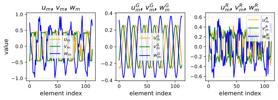

*Рисунок 22: Визуализация применения частотной фильтрации к нейрону. $(\boldsymbol{u}^{G}_{m},\boldsymbol{v}^{G}_{m},\boldsymbol{w}^{G}_{m})$ удерживает частотную компоненту с максимальной амплитудой в $(\boldsymbol{u}_{m},\boldsymbol{v}_{m},\boldsymbol{w}_{m})$.* **[p. 21]**

### D.2 Частотная фильтрация улучшает генерализацию при варьирующих постановках

Частотная фильтрация также распутывает генерализацию и запоминание для задачи модульного *вычитания* (рисунок 23) и для моделей с *квадратичными* активациями (рисунок 24). Мы наблюдаем существенное улучшение генерализации после частотной фильтрации: ReLU-модели восстанавливают тестовую точность при тяжёлом шуме меток, а квадратичные модели превышают наблюдавшиеся прежде пределы точности. Тестовая точность растёт и для моделей, обученных на бесшумных данных (рисунок 25).

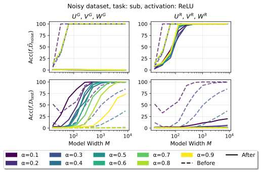

*Рисунок 23: Качество до (пунктир) и после (сплошная) частотной фильтрации на задаче модульного *вычитания*.* **[p. 22]**

*Рисунок 24: Качество до (пунктир) и после (сплошная) частотной фильтрации на моделях с *квадратичной* активацией. Отметим, что частотная фильтрация также пробивает потолки тестовой точности.* **[p. 22]**

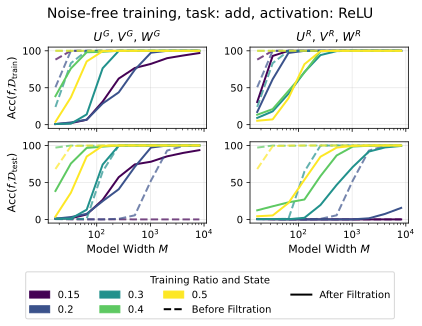

*Рисунок 25: Качество до (пунктир) и после (сплошная) частотной фильтрации для моделей, обученных на чистых данных модульного сложения. Модели используют ReLU-активацию и обучены AdamW. В целом тестовая точность после фильтрации ($U^{G}$, $V^{G}$, $W^{G}$) вообще выше, особенно для больших моделей.* **[p. 22]**

#### Частотная фильтрация на трансформерах.

###### p21-10

Чтобы проверить, ограничена ли частотная идея фильтрации двухслойными сетями, мы также применяем FF к трансформеру, обученному модульному сложению с шумом меток. Механизм трансформера для задачи модульного сложения на *чистых* данных исследован в Nanda et al. [9]. Конкретно, после обучения мы оставляем только 20 старших частот в **[p. 23]** unembedding-голове и удаляем остальные частотные компоненты. Это простое вмешательство существенно снижает способность модели запоминать шумные метки, улучшая её тестовую точность, подсказывая, что частотно-структурированное представление правила не исключительно для двухслойной постановки. (Таблица 3) Эти результаты дают предварительное свидетельство, что FF может распространяться за пределы двухслойных сетей.

*Таблица 3: Применение частотной фильтрации к трансформеру, обученному модульному сложению. FF оставляет только 20 старших частот в unembedding-голове.* **[p. 23]**

| Метод | Чистая точн. | Шумная точн. | Тестовая точн. |
|---|---|---|---|
| До FF | $100\%$ | $100\%$ | $76.8\%$ |
| После FF | $98.1\%$ | $36.8\%$ | $87.8\%$ |

### D.3 Соотношение фаз $\varphi^{(a)}_{m}$, $\varphi^{(b)}_{m}$ и $\varphi^{(c)}_{m}$

Пусть доминирующая частота нейрона $m$ имеет вид

$$
u^{G}_{mi}=\lambda_{u}\cos\left(\frac{2\pi}{P}\omega_{m}i+\varphi^{(a)}_{m,G}\right), \tag{7a} \\
v^{G}_{mj}=\lambda_{v}\cos\left(\frac{2\pi}{P}\omega_{m}j+\varphi^{(b)}_{m,G}\right), \tag{7b} \\
w^{G}_{mk}=\lambda_{w}\cos\left(\frac{2\pi}{P}\omega_{m}k+\varphi^{(c)}_{m,G}\right). \tag{7c}
$$

Для моделей, обученных с ReLU или квадратичными активациями, существует $q\in\mathbb{Z}$ такое, что следующие уравнения приблизительно выполнены:

$$
\varphi^{(a)}_{m,G}+\varphi^{(b)}_{m,G} =\varphi^{(c)}_{m,G}+2q\pi \text{(modular addition)}, \tag{8} \\
\varphi^{(a)}_{m,G}-\varphi^{(b)}_{m,G} =\varphi^{(c)}_{m,G}+2q\pi \text{(modular subtraction)}. \tag{9}
$$

Мы квантифицируем эмпирическое отклонение этих соотношений средней квадратичной ошибкой (MSE). Конкретно, для модульного сложения:

$$
\text{Phase MSE}=\frac{1}{M}\sum_{m=1}^{M}\min_{q\in\mathbb{Z}}\left(\varphi^{(a)}_{m,G}+\varphi^{(b)}_{m,G}-\varphi^{(c)}_{m,G}+2q\pi\right)^{2},
$$

а для модульного вычитания $+$ заменяется на $-$ в определении выше.

Мы визуализируем эти соотношения на рисунках 26 (сложение) и 27 (вычитание), а тренды Phase MSE по размеру модели и доле шума показаны на рисунке 28. Мы наблюдаем, что большие доли шума вообще ведут к большей Phase MSE, то есть большему отклонению от аналитического соотношения.

*Рисунок 26: Точечный график соотношения фаз на задачах модульного сложения. Каждая точка представляет нейрон, где $\varphi_{a}$, $\varphi_{b}$ и $\varphi_{c}$ — фазы $\boldsymbol{u}^{G}$, $\boldsymbol{v}^{G}$ и $\boldsymbol{w}^{G}$ соответственно.* **[p. 24]**

*Рисунок 27: Точечный график соотношения фаз на задачах модульного вычитания. Каждая точка представляет нейрон, где $\varphi_{a}$, $\varphi_{b}$ и $\varphi_{c}$ — фазы $\boldsymbol{u}^{G}$, $\boldsymbol{v}^{G}$ и $\boldsymbol{w}^{G}$ соответственно.* **[p. 24]**

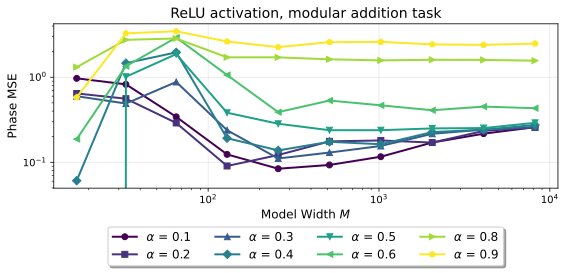

*Рисунок 28: Phase MSE по разным задачам, функциям активации, ширинам модели и долям шума. Большие доли шума увеличивают Phase MSE для ReLU-моделей, и схожая тенденция наблюдается для квадратичных моделей на задаче модульного сложения.* **[p. 25]**

### D.4 Равномерное распределение частоты

Рисунок 29 показывает, что каждая частота покрыта хотя бы одним нейроном после частотной фильтрации (у каждого нейрона оставлена только доминирующая частота). Рисунок 30 также показывает, что распределение амплитуды частот после фильтрации близко к равномерному при большей ширине модели. Здесь пусть $\tilde{\boldsymbol{W}}^{G}$ — фурье-образ $\boldsymbol{W}^{G}$ с каждым столбцом, составленным из $\left\{\boldsymbol{w}_{m}\right\}_{m=1}^{M}$, так что рисунок 30 наносит норму каждой строки $\tilde{\boldsymbol{W}}^{G}$ с индексом в $\left\{1,\cdots,\frac{P-1}{2}+1\right\}$.

*Рисунок 29: Каждая частота $\omega\in\left\{1,\cdots,\frac{P-1}{2}\right\}$ покрыта хотя бы одним нейроном, когда ширина модели не меньше $513$.* **[p. 25]**

*Рисунок 30: Амплитуда (норма) каждой частоты $\omega\in\left\{1,\cdots,\frac{P-1}{2}\right\}$ матрицы $\boldsymbol{W}^{G}$ после частотной фильтрации каждого нейрона.* **[p. 26]**

## Приложение E Дополнительные материалы к разделу 5

### E.1 Качество алгоритма 1 с использованием Str. или IPR

В этом разделе мы рассматриваем улучшения генерализации на разных задачах, достигнутые отбором нейронов. Рисунок 31 сообщает улучшение, полученное с IPR для отбора нейронов, а рисунок 32 представляет соответствующие результаты для Str.

*Рисунок 31: Улучшение генерализации по различным задачам отбором/прореживанием нейронов с IPR. Заметного улучшения на задаче модульного умножения не наблюдается.* **[p. 26]**

*Рисунок 32: Улучшение генерализации по различным задачам отбором/прореживанием нейронов со Str. Значительное улучшение наблюдается и на задаче модульного умножения.* **[p. 26]**

**[p. 27]**

Сравнение результатов на задаче модульного умножения иллюстрирует общность метода со Str. Этой задаче не хватает периодических узоров, значимых для генерализации, так что измерение важности нейронов через IPR даёт ограниченное улучшение.
