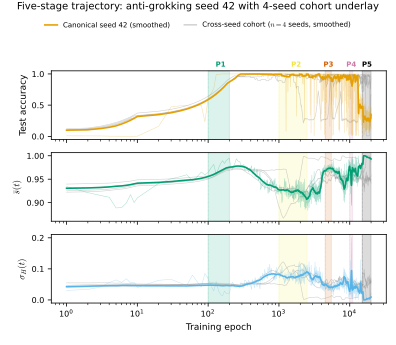
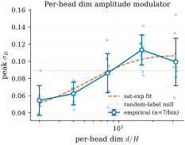
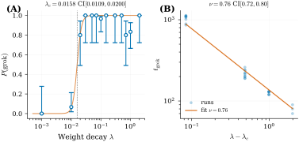
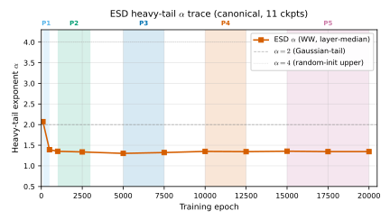
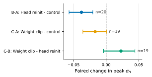

# Verma 2026 — Weight Decay Regimes in Grokking Transformers: Cheap Online Diagnostics

См. также: [глобальный индекс понятий](../../concepts/index.md).
arXiv [2605.20441v1](https://arxiv.org/abs/2605.20441), 19 мая 2026. Колонтитула у PDF нет: препринт, не привязанный к конференции.

**Lucky Verma** (luckyv1@umbc.edu) — Independent Researcher. Единственный автор.

Оригинал и производные файлы этой папки:

- [`original/2605.20441.native.html`](original/2605.20441.native.html) — первоисточник, нативный HTML-рендеринг arXiv, скачан как есть.
- [`original/2605.20441.weight-decay-regimes-in-grokking-transformers-cheap-online-diagnostics.md`](original/2605.20441.weight-decay-regimes-in-grokking-transformers-cheap-online-diagnostics.md) — конверсия оригинала в Markdown без правок содержания; английский текст для сверки перевода.
- [`images/`](images/) — иллюстрации статьи в исходном разрешении (11 файлов).
- [`2605.20441.weight-decay-regimes-in-grokking-transformers-cheap-online-diagnostics.claims.txt`](2605.20441.weight-decay-regimes-in-grokking-transformers-cheap-online-diagnostics.claims.txt) — рабочий разбор: пронумерованные утверждения с пометками.

Схема якорей и правила ссылок на карточку — в [README папки статей](../README.md).

## Затрагиваемые понятия

**[Гроккинг](../../concepts/grokking.md)** — работа берёт явление как данность и превращает его в предмет картографии: не объясняет задержку, а меряет, при каких значениях одного гиперпараметра она вообще случается. Вклад в понятие — карта $(\lambda,N)$ с тремя качественно различными областями и **двумя** отказными краями, измеренными на одной сетке: ниже $\lambda_{c}=0.0158$ доля гроккинга почти нулевая, в промежутке $\lambda\in[0.1,2.0]$ она составляет от 90 до 100 %, при $\lambda=10$ головы сводятся к тождественным образцам ([§4.1](#p6-2), [рис. 1](#fig-1)). Из этого следует, что гроккинг здесь — не свойство задачи и не свойство архитектуры, а область в пространстве настроек, и что «не грокнул» распадается на два разных отказа. Чего в работе нет: механизма — ни контуров, ни фурье-разбора, ни разбора того, что именно выучивается; определение гроккинга операционально (тестовая точность $\geq 0.99$ внутри горизонта), а весь охват заявок сужен самим автором до модульной арифметики в моделях внимания до 85 М параметров ([§5.1](#p16-3)).

**[Эталонный полигон гроккинга](../../concepts/canonical-grokking-testbed.md)** — статья наследует полигон Power et al. 2022 дословно и делает это осознанно: канонический набор $(p,L,H,d,\mathrm{lr},\mathrm{batch})=(97,4,8,128,10^{-3},512)$ выбран ради прямой сопоставимости с волной работ 2026 года ([§3.1](#p5-1)). Взамен она отдаёт полигону число: величину $\lambda_{c}$ с доверительным промежутком, посчитанным бутстрапом по 210 прогонам, и прямо отвечает на оставленный в §4 Power et al. открытый вопрос о том, коррелируют ли дешёвые меры с переходом ([§5.2](#p17-2)). Чего в работе нет: перебора $p$, доли обучающих данных и скорости обучения — все три зафиксированы во всех опытах, а композиции перестановок $S_{5}$ нет вовсе, так что о некоммутативных задачах работа не говорит ничего.

**[Модульная арифметика](../../concepts/modular-arithmetic.md)** — полигон расширен с одного сложения до четырёх операций ($\mathrm{mod}_{+}$, $\mathrm{mod}_{-}$, $\mathrm{mod}_{\times}$, $\mathrm{mod}_{\div}$) при $p=97$, причём пары с $b=0$ для деления выброшены до разбиения ([§3.1](#p5-1)). Многозадачное повторение на 280 прогонах даёт корпусу редкую вещь — упорядочение операций по доле гроккинга при одинаковом укладе: $\mathrm{mod}_{+}\,0.73$, $\mathrm{mod}_{\div}\,0.71$, $\mathrm{mod}_{\times}\,0.70$, $\mathrm{mod}_{-}\,0.49$ ([§4.7](#p13-2), [рис. 9](#fig-9)). Автор сам оговаривает, что упорядочение по задачам при $n{=}5$ на ячейку недостаточно мощно и что вывод несёт сводная монотонная картина, а не порядок; на упорядочение как на результат ссылаться нельзя.

**[Weight decay](../../concepts/weight-decay.md)** — центральное понятие работы: именно weight decay объявлен скалярным **эмпирическим управляющим параметром**, чья развёртка проводит обучение через качественно разные режимы ([аннотация](#p1-2)). Существенно, что смысл слова оговорён узко и сразу: гамильтониана, функционала свободной энергии и равновесной статистической суммы не выводится, траектории SGD тепловым ансамблем не объявляются, а вкладом названо эмпирическое выявление двумерной диаграммы ([§5.1](#p16-4)). Впервые в корпусе weight decay получает не «направление влияния», а **числовую границу с промежутком** и вторую, верхнюю границу режима. Чего в работе нет: сравнения с другими регуляризаторами — dropout и сглаживание меток прямо объявлены вне области рассмотрения, dropout зафиксирован нулём; и нет опыта, где weight decay менялся бы по ходу обучения.

**[Направление влияния weight decay](../../concepts/weight-decay-direction.md)** — это первая работа корпуса, которая строит немонотонную кривую целиком на одной сетке: провал ниже $\lambda_{c}$, монотонное ускорение $1090\to 83$ эпохи при росте $\lambda$ от 0.1 до 2.0 и коллапс при $\lambda=10$ ([§4.1](#p6-2), [рис. 5](#fig-5)). В рабочем промежутке направление подтверждает сторону Omnigrok и Кумара против чисел приложения D.1 Nanda. Но ускорение здесь **медленнее обратной пропорции**: рост $\lambda$ в 20 раз ускоряет гроккинг в 13,1 раза, тогда как закон Omnigrok $t\propto\gamma^{-1}$ предсказал бы 20. Сопоставления с этим законом в статье нет: Liu et al. 2023 цитируются один раз и только как расширение гроккинга за пределы алгоритмических данных. Показатель $\nu=0.757$ ([§4.4](#p7-1)) к этому отношения не имеет — он относится к расстоянию до порога $(\lambda-\lambda_{c})$, а не к самому $\lambda$, и путать их нельзя. Чего в работе нет: измерений между $\lambda=2.0$ и $\lambda=10$, поэтому оптимум и верхняя граница по-прежнему не локализованы измерением.

**[Когда регуляризация необходима](../../concepts/regularization-necessity.md)** — автор отвечает на встречную рамку Yıldırım 2026 прямым отказом от сильной заявки: weight decay **не** объявляется необходимым для генерализации, утверждается лишь, что внутри стандартной архитектуры внимания он ведёт себя как эмпирический управляющий параметр с определённой диаграммой режимов ([§2](#p3-1)). Три кросс-архитектурные пробы усиливают это с другой стороны: управляемый через weight decay переход воспроизводится и там, где внимания нет вовсе — на MLP, LSTM и Mamba ([§4.9](#p14-1), [§4.9](#p14-3), [рис. 10](#fig-10)), — значит, явление не есть частность внимания. Чего в работе нет: постановки с $\lambda=0$ и иным механизмом генерализации; «необходимость» здесь не проверяется, а обходится оговоркой.

**[Параметр порядка](../../concepts/order-parameter.md)** — работа вводит в корпус два скалярных параметра порядка, считаемых **из одних лишь весов внимания прямого прохода**: среднюю попарную косинусную близость голов $\bar{s}(t)$ и разброс энтропий по головам $\sigma_{H}(t)$ ([§3.2](#p5-2)). Отличие от прежних параметров порядка корпуса — в цене и месте: стоимость $\mathcal{O}(LH^{2}BT^{2})$ и $\mathcal{O}(LHBT^{2})$ за оценку, около 3 % накладных расходов при замере раз в 10 шагов, никакого доступа к контрольным точкам и никакой выборки по цепям ([§3.2](#p5-3)). Существенная оговорка самого автора: заранее заявленный порог предсказательности (AUC $\geq 0.85$) **не пройден** — случайный лес на отложенных прогонах даёт $0.799$, и диагностики объявлены корреляционными, а не предсказательными ([§4.8](#p13-4)). Чего в работе нет: определения этих величин для архитектур без голов и связи с симметрией в смысле Ландау — «параметр порядка» здесь употреблён в лексическом, а не в статфизическом смысле.

**[Фазовый переход](../../concepts/phase-transition.md)** — язык фазового перехода взят у авторов и подкреплён числом: логистическая подгонка $P(\mathrm{grok})$ по $\log\lambda$ даёт $\lambda_{c}=0.0158$ с 95 % промежутком $[0.0109,0.0200]$, а степенная подгонка $t_{\text{grok}}\propto(\lambda-\lambda_{c})^{-\nu}$ — показатель $\nu=0.757$ ([§4.4](#p7-1), [рис. 5](#fig-5)). Существенное для корпуса — не сама величина, а честность её статуса: проверенные опорные показатели $\nu=1/2$ и трёхмерный изинговский $\nu\approx 0.63$ отвергнуты, но с оговоркой «при нашей сетке из четырёх корзин», отнесение к классу универсальности прямо отложено, а полное конечноразмерное схлопывание данных признано неосуществимым на трёх корзинах развёртки ([§3.4](#p6-1)). Чего в работе нет: термодинамического вывода, кумулянтов Биндера, схлопывания данных — эту половину автор отдаёт Bi et al. 2026 и располагает свою работу как поставщика феноменологии.

**[Анти-гроккинг](../../concepts/anti-grokking.md)** — работа даёт понятию первое независимое наблюдение **при условиях, противоположных исходным**. У Prakash & Martin поздний коллапс наступает на исходном наборе **без** weight decay после порядка $10^{7}$ шагов; здесь качественно похожий коллапс виден при $\lambda=1.0$ на 20 000 эпохах, а по когорте удержания коллапс **сгущается при большем** weight decay ([§4.2](#p6-3), [рис. 3](#fig-3)). Второй вклад — отрицательный и важный: цикл объявлен **семя-зависимой хрупкостью**, а не всеобщим правилом (доли удержания $5/5$, $4/5$, $3/5$, $4/5$), и наиболее выраженная пятиступенчатая форма встречается примерно у трети семян при каноническом WD. Третий — расхождение с механизмом: тяжелохвостовый показатель $\alpha$ падает $2.07\to 1.39$ уже к эпохе 500, то есть при **входе** в гроккинг, и держится ниже 1,5 вплоть до коллапса, поэтому как определитель поры коллапса он не годится; автор сам называет это частичной параллелью, а не воспроизведением ([§4.5](#p8-2), [рис. 7](#fig-7)). Чего в работе нет: ловушек корреляции, катастрофического забывания и вообще механизма коллапса — только его временной ход и зависимость от $\lambda$; рисунок 7 к тому же построен на одном семени.

**[Маршрутизация внимания](../../concepts/attention-routing-heads.md)** — обучение разложено на две последовательные фазы, обе описанные через согласование голов: фаза 1 — сближение голов ($\bar{s}$ растёт $0.93\to 0.995$) вблизи поры гроккинга, фаза 2 — их расхождение ($\bar{s}\to 0.88$) при уже стоящей на полке тестовой точности ([§4.2](#p6-3), [рис. 2](#fig-2)). Отдельный вклад — выделение **размерности на голову** $d/H$ как эмпирически преобладающей переменной для амплитуды расхождения: пик $\sigma_{H}$ растёт с $d/H$ насыщающе-монотонно и выходит на полку при $d/H\geq 16$ ([§4.3](#p6-4), [рис. 4](#fig-4)), а элементарная граница ранга $\mathrm{rank}(QK^{\top})\leq d_{h}$ даёт этому согласующееся, но не доказанное объяснение ([приложение C](#p17-3)). Чего в работе нет: разбора того, что вычисляют разошедшиеся головы, — автор прямо пишет, что его диагностики отмечают, **когда** происходит расхождение и какова его величина, а не **что** делают головы по отдельности, и оставляет опознание алгоритма последующей работе ([§5.2](#p18-2)).

**[Каузальная абляция](../../concepts/causal-ablation-intervention.md)** — сильнейший довод статьи и лучший её приём: парный опыт с тремя группами и заранее заявленными гипотезами, где переинициализация 2 голов из 8 в пору пика $\sigma_{H}$ снижает этот пик ($B-A=-0.038$, парный $t$ $p_{t}=9.3\times 10^{-4}$), а **согласованное** обрезание нормы весов до той же медианы в ту же пору не даёт эффекта ([§4.6](#p11-2), [§4.6](#p11-4), [рис. 8](#fig-8)). Ценность для корпуса — именно в сверке: она отделяет строение образцов голов от величины весов, то есть разводит два объяснения, которые в корпусе обычно смешаны. Автор при этом сам сужает вывод: вмешательство не мешает генерализации (все три группы грокают со стопроцентной долей), эпоха гроккинга не сдвигается значимо, а перенос на другие архитектуры, задачи и значения $\lambda$ вне $\{0.015,0.05\}$ прямо не заявляется ([§4.6](#p12-1)).

**[Меры прогресса](../../concepts/progress-measures.md)** — статья предлагает свои параметры порядка на роль дешёвой онлайновой меры и **сама же отвергает** эту роль по заранее объявленному критерию: на отложенных прогонах при невиданных значениях $\lambda$ случайный лес даёт AUC $0.799$ при пороге $0.85$, логистическая регрессия — $0.678$, вердикт «только корреляционные» ([§4.8](#p13-4)). Существенная подробность для корпуса: в важностях признаков сам weight decay стоит первым ($0.247$), норма весов второй ($0.220$), а два параметра порядка вместе дают $0.275$ — сопоставимо с одной лишь нормой весов. Сличение с уточнённым локальным коэффициентом обучения (rLLC) даёт корреляцию Пирсона $r=0.46$ при промежутке Фишера $[-0.20,0.82]$, который, по словам самого автора, согласуется с чем угодно от нулевой корреляции до сильной ([§2](#p4-1)). Чего в работе нет: сравнения с мерами прогресса корпуса — ни ограниченная и исключающая потеря Nanda, ни скрытый прогресс Barak не упоминаются и не считаются.

**[Тяжелохвостовая саморегуляризация](../../concepts/heavy-tailed-self-regularization-htsr.md)** — работа применяет Weightwatcher к своей канонической траектории и получает результат, **расходящийся по времени** с тем, ради чего мера сюда пришла: $\alpha$ падает с $2.07$ при инициализации до $1.39$ к эпохе 500 и остаётся в тяжелохвостовом режиме ($\alpha<2$) вплоть до фазы 5 ([§4.5](#p8-2), [рис. 7](#fig-7)). Тяжёлый хвост, следовательно, складывается при входе в гроккинг, а не при позднем коллапсе, и признак «третьей фазы» как прямой определитель начала коллапса не годится. Это единственное в корпусе прямое сопоставление хода $\alpha$ с независимой диагностикой на одной и той же траектории. Чего в работе нет: разбора самих ловушек корреляции, слоевого разреза (взята медиана по слоям) и межсеменного покрытия — рисунок 7 построен на одном семени, и автор прямо объявляет межсеменной расчёт отложенным.

**[Спектральный анализ](../../concepts/spectral-analysis-svd-esd-fve.md)** — вторая спектральная величина работы живёт не в весах, а в **ковариации образцов голов**: аффинно нормированное отношение участия $\mathrm{PR}_{\mathrm{norm}}$ её спектра, идущее $0.86$ (инициализация) $\to 0.71$ (фаза 1) $\to$ колебания $0.18$–$0.55$ (фазы 2–4) $\to 0.13$ (фаза 5) ([§4.5](#p7-2), [§4.5](#p8-1), [рис. 6](#fig-6)). Величина заявлена как прямая проверка нарушения перестановочной симметрии $S_{H}$ и заменяет косвенную меру $M_{\text{perm}}$ предыдущей редакции рукописи; её алгебраическая связь с коэффициентом вариации спектра доказана и машинно проверена. Чего в работе нет: причинного порога нарушения симметрии — автор сам пишет, что проверка удостоверяет лишь алгебраическую эквивалентность и не переносит диагностику на архитектуры без внимания.

**[Оптимизатор](../../concepts/optimizer-adam-adamw-sgd.md)** — AdamW здесь не фон, а часть довода: множитель усиления $\kappa$, вбирающий адаптивное перемасштабирование шага, выверен по траектории фробениусовой нормы и даёт $\kappa=18.6$ на канонической траектории семени 42 ([приложение C.5](#p26-4), [рис. 11](#fig-11)). Корпус получает отсюда две вещи: первую эмпирическую выверку того, насколько развязанный weight decay в AdamW сжимает норму быстрее номинального $\eta\lambda$, и честно предъявленный отказ — по семенам $\kappa$ двумодален ($\{18.4,19.2,17.9,8.1,8.6\}$ при подгонке по окну перехода), и медленную релаксацию семян 31 и 123 модель не объясняет ([приложение C.5](#p26-5)). Чего в работе нет: SGD, Lion и Sophia — иные оптимизаторы прямо объявлены вне области рассмотрения, так что заявка привязана к AdamW и ни на что другое не переносится.

**[Закон задержки через норм-сепарацию](../../concepts/norm-separation-delay-law.md)** — статья встаёт к закону Truong et al. в положение эмпирической выверки и **обращения**: где они предсказывают задержку через ляпуновское сжатие, здесь предсказывается порог через двойственное горизонтное ограничение, $\lambda_{c}=-\ln(1-p_{\text{relax}})/(\eta\kappa T_{\max})$, что при $p_{\text{relax}}=0.99$ даёт $0.0124$ — внутри эмпирического промежутка ([приложение C.5](#p26-4), [§5.2](#p17-2)). Их $\gamma_{\text{eff}}$ отвечает нашему $\eta\,\kappa\,\lambda$, а отношение норм — отношению $(\Omega_{0}/\Omega_{\infty})^{2}$. Автор называет это выверенной проверкой согласия, а не выводом из первых начал, и прямо перечисляет, чего вывод не устанавливает. Чего в работе нет: независимой проверки самого закона задержки — время до гроккинга подгоняется степенным законом по $(\lambda-\lambda_{c})$, а логарифмическая форма Truong et al. на этих данных не проверяется.

**[Эффективная теория / статистическая механика](../../concepts/effective-theory-statistical-mechanics.md)** — работа пользуется словарём статистической механики (управляющий параметр, параметры порядка, режимы, критический показатель) и одновременно отгораживается от него в отдельном абзаце: ни гамильтониана, ни свободной энергии, ни статсуммы, ни объявления траекторий SGD тепловым ансамблем ([§5.1](#p16-4)). Формальная часть сведена к пяти элементарным утверждениям (A1–E1), четыре из которых машинно проверены в Lean 4 против mathlib v4.29.0 без единого `sorry`, — и автор сразу оговаривает, что доказывается **корректность определений**, а не эмпирические заявки ([приложение C](#p23-4)). Резкость границ в теореме A1 — свойство постановки (разности целевых функций аффинны по $\lambda$), а не вывод из динамики обучения. Чего в работе нет: собственно теории — минимальная модель трёх режимов есть утверждение о существовании порогов, а не предсказание их значений.

**[Скорость обучения](../../concepts/learning-rate.md)** — рычаг, который работа держит зафиксированным и о котором её собственная формула говорит больше всего. Скорость обучения $\mathrm{lr}=10^{-3}$ не менялась ни в одном из 1120 прогонов ([§3.1](#p5-1)), тогда как выведенное в приложении C.5 выражение $\lambda_{c}=-\ln(1-p_{\text{relax}})/(\eta\kappa T_{\max})$ содержит $\eta$ в знаменателе и, значит, предсказывает $\lambda_{c}\propto 1/\eta$ ([приложение C.5](#p26-4)). Проверяемое предсказание собственной теории статьи оставлено непроверенным. Из той же формулы следует, что $\lambda_{c}$ есть свойство уклада $(\eta,T_{\max})$, а не модели, — оговорка, которую автор делает для архитектур, но не для скорости обучения и горизонта.

**[Шум в метках / случайные метки](../../concepts/label-noise-random-labels.md)** — случайные метки употреблены как нулевая сверка амплитуды: 15 прогонов дают пиковый $\sigma_{H}=0.087\pm 0.025$, тот же порядок величины, что и режим малой амплитуды при $d/H=2$ ([§4.7](#p13-1), [рис. 4](#fig-4)). Ценна здесь именно осторожность вывода: различие значимо, но мало (перестановочный тест $p=0.009$, Cohen's $d=1.11$), поэтому сверка объявлена **нижней границей** амплитуды, а не статистической эквивалентностью, и пунктирная линия на рисунке 4 подписана как опорный масштаб, а не как заявка об эквивалентности. Чего в работе нет: перебора доли зашумлённых меток — метки либо все настоящие, либо все случайные.

---

## Несогласованности внутри статьи

**Две несовпадающие оценки одной и той же величины $\lambda_{c}$ для модульного сложения.** Канонический результат — $\lambda_{c}=0.0158$ с промежутком $[0.0109,0.0200]$ ([§4.4](#p7-1)); сводная по четырём операциям переподгонка на малой модели даёт $0.0077$ с промежутком $[0.0056,0.0106]$, и промежутки **не пересекаются** ([§4.7](#p13-2)). Автор объявляет это «различием уклада, а не противоречием» (разные горизонты, разная плотность корзин WD) и оставляет $0.0158$ как канон, а E9 — как пробу согласия. Оговорка честная, но расхождение остаётся незакрытым: величина, поданная в аннотации как число с промежутком, зависит от уклада измерения сильнее, чем ширина этого промежутка.

**Одиннадцать условий против пятнадцати когорт.** Аннотация говорит «across eleven experimental conditions» ([аннотация](#p1-2)), приложение A перечисляет пятнадцать когорт E1–E15. Что именно считается «условием», нигде не определено, и свести одно к другому по тексту нельзя.

**Метка E8 обозначает две разные когорты.** В [§4.2](#p6-3) и в таблице 2 приложения A E8 — это развёртка удержания на длинном горизонте (4 значения WD $\times$ 5 семян, 20 тыс. эпох, $n{=}20$). В [§4.7](#p13-1) той же меткой назван пилот сверки со случайными метками: «superseding the smaller E8 pilot». Совместить эти два употребления нельзя.

**Доли гроккинга у MLP заданы взаимоисключающими условиями.** В [§4.9](#p14-1) написано, что MLP грокает «при $\lambda{\geq}0.05$ в $3/10$ семенах, при $\lambda{=}0.07$ в $10/10$ и при $\lambda{<}0.05$ в $0/10$». Первое и второе условия пересекаются: $\lambda=0.07$ входит в $\lambda\geq 0.05$. Сумма $13/70$, приводимая тут же, сходится только при чтении «при $\lambda=0.05$ — $3/10$», то есть первое условие следует понимать как равенство.

## Что показано, что выверено и что предположено

Половина работы — измерение, вторая половина — выверка одной подгоняемой постоянной, и в тексте они стоят рядом; читателю, берущему отсюда число, полезно знать, из какой половины оно взято.

**Показано измерением.** Трёхрежимная карта по оси $\lambda$ с обоими отказными краями ([§4.1](#p6-2)); монотонное падение времени до гроккинга $1090\to 83$ эпохи; логистическая граница $\lambda_{c}=0.0158$ по 210 прогонам; воспроизведение картины управления через WD на 280 прогонах по четырём операциям ([§4.7](#p13-2)) и на трёх архитектурах без внимания ([§4.9](#p14-1), [§4.9](#p14-3)); парное причинное противопоставление «переинициализация голов против обрезания нормы» ([§4.6](#p11-4)); и отрицательный результат по предсказательности диагностик, объявленный по заранее заданному порогу ([§4.8](#p13-4)).

**Выверено, а не выведено.** Граница $\lambda_{c}^{\text{bound}}=0.0124$ держится на двух подбираемых величинах. Из пяти значений $p_{\text{relax}}$ в таблице 4 внутрь эмпирического промежутка попадает **только** $0.99$ (при $0.95$ выходит уже $0.0081$, отношение $0.51$). Сам $\kappa$ по семенам двумодален: при подгонке по всему горизонту $\{18.6,19.0\}$ против $\{5.5,6.9,6.4\}$, при подгонке по окну перехода — $\{18.4,19.2,17.9,8.1,8.6\}$, и семена 31 и 123 модель, по признанию автора, не объясняет ([§5.1](#p16-6), [приложение C.5](#p26-5)). Автор перечисляет ограничения сам, отдельным абзацем ([приложение C.5](#p27-1)).

**Предположено или опирается на одну точку.** Верхняя граница режима развития получена символической регрессией (PySR) по данным об амплитуде: из вида $\sigma_{H}^{\max}\approx c\,(d/H)/(\mathrm{wd}+\sqrt{d/H})$ следует полумаксимум при $\lambda_{c}\approx\sqrt{d/H}=4.0$, и «две границы охватывают режим развития $[0.012,4]$» ([приложение C.5](#p26-6)). Между $\lambda=2.0$ и $\lambda=10$ измерений нет вовсе, так что верхняя граница подпёрта одной точкой сетки и подобранной формулой; зависимости этой границы от $d/H$ никто не мерил. Аналогия с синхронизацией предъявлена и тут же ослаблена самим автором: без ограничений $16/50$ подгонок вырождены, с ограничением на осмысленные параметры остаётся $34/50$ годных с медианой $R^{2}=0.63$ ([§3.3](#p5-4)). Аналогия с сердечной синхронизацией, давшая работе словарь, отвергнута прямо: измеренный показатель далёк от $\nu=1/2$ модели SNIC ([§2](#p4-5), [§5.2](#p18-1)). И наконец, скорость обучения не варьировалась ни разу, хотя собственная формула статьи предсказывает $\lambda_{c}\propto 1/\eta$, — проверяемое предсказание собственной теории оставлено непроверенным.

## Ошибочные цитирования

Редакторская заметка о месте, где эта работа передаёт чужой результат без авторской оговорки. Ссылки «подробности» из разделов «Ошибочные пересказы» цитируемых карточек ведут сюда.

###### mc-2603-05228

**Yıldırım (2603.05228) — обход гроккинга приписан отсутствию weight decay.** Формулировка: `"Yıldırım 2026 presents a counter-framing in which grokking is bypassable via a uniform-attention architectural ablation without weight decay"` — «Yıldırım 2026 предлагает встречную рамку, в которой гроккинг обходится архитектурной абляцией с равномерным вниманием и без weight decay» ([§2](#p3-1)).

Разбор. У Yıldırım это два **разных** вмешательства с разными настройками. Абляция равномерного внимания применена к базовым конфигурациям, а базовые конфигурации обучаются при $\lambda=1.0$: в приложении A прямо перечислено «Weight Decay: $1.0$ (Baselines & Sphere $\lambda=1.0$) / $0.0$ (Bounded Sphere $\lambda=0.0$)», и подпись рисунка 2 говорит, что именно базовая конфигурация с LayerNorm «immediately generalizes when data-dependent routing is removed, bypassing grokking». Нулевой weight decay стоит в третьей панели того же рисунка и относится к другому вмешательству — ограниченной сфере, где $\lambda=0$ убирает конфликт между сжатием нормы и геометрическим ограничением. Соединив их в одну фразу, статья приписывает обход гроккинга отсутствию weight decay, тогда как у Yıldırım тот же обход получается **при** $\lambda=1.0$ и объясняется устройством маршрутизации, а не регуляризацией.

Существенно, что от этого страдает не вывод, а атрибуция: собственная оговорка автора («мы не утверждаем, что weight decay необходим») от неточности не зависит и остаётся верной. Прочие цитирования корпуса в этой статье выборочно проверены и расхождений не дали: изложение Power et al. 2022, Nanda et al. 2023, Varma et al. 2023, Kumar et al. 2024, Prakash & Martin 2026a, Bi et al. 2026, Truong Xuan Khanh et al. 2026a и 2026b, Tang et al. 2026, Manir & Rupa 2026, Musat 2025 и Tian 2025 отвечает тому, что в этих работах написано, включая хеджи.

---

# Текст статьи

# Weight Decay Regimes in Grokking Transformers: Cheap Online Diagnostics

Lucky Verma (luckyv1@umbc.edu), Independent Researcher

## Аннотация

###### p1-2

Гроккинг-трансформеры, обучаемые на модульной арифметике, обнаруживают резкие переходы между режимами запоминания, генерализации и коллапса. Мы показываем, что weight decay работает скалярным эмпирическим управляющим параметром для этих режимов, и вводим две дешёвые онлайн-диагностики — среднюю попарную косинусную близость голов внимания и стандартное отклонение энтропии, — которые отслеживают лежащую в основе динамику обучения в этих decoder-only постановках модульной арифметики по одним лишь активациям внимания и дополняют диагностики ландшафта потерь при меньших вычислительных затратах. На одиннадцати экспериментальных условиях и трёх масштабах модели (от 0,82 М до 85 М параметров) ось weight decay разделяет запоминание ($\lambda<\lambda_{c}$, почти нулевой гроккинг), развивающийся гроккинг ($\lambda\geq\lambda_{c}$, достигающий $\sim$100 % доли гроккинга к $\lambda\sim 0.1$ при падении времени до гроккинга $1090\to 83$ эпох на $\lambda\in[0.1,2.0]$) и коллапс ($\lambda=10$, тождественные образцы внимания). Логистическая подгонка вблизи перехода помещает границу запоминание—развитие в $\lambda_{c}=0.0158$ (95 % ДП $[0.0109,0.0200]$, $N{=}210$); степенная подгонка ко времени до гроккинга даёт эмпирический показатель $\nu=0.757$ (ДП $[0.725,0.799]$). Проверенные опорные показатели $\nu=1/2$ и трёхмерный изинговский $\nu\approx 0.63$ лежат вне эмпирического ДП при нашей сетке из четырёх корзин; мы сообщаем $\nu$ как эмпирический и откладываем отнесение к классу универсальности до более плотных данных для конечноразмерного масштабирующего схлопывания (Bi et al. 2026). Согласованное по горизонту многозадачное повторение ($n{=}280$, четыре модульные операции, два масштаба) сохраняет картину управления через WD за пределами сложения; парный опыт с переинициализацией голов внимания меняет амплитуду фазы 2 при каноническом послепереходном $\lambda=0.05$ (Cohen's $d=-1.190$, $n{=}10$ пар, $p_{t}=4.5{\times}10^{-3}$), тогда как согласованное обрезание нормы весов её не меняет, что локализует эффект в строении образцов голов, а не в величине весов. Размерность на голову $d/H$ модулирует амплитуду расхождения насыщающе-монотонно. Три кросс-архитектурные пробы охвата (4-слойный MLP $h{=}512$, 4-слойный LSTM $h{=}512$ и 4-слойная Mamba $d{=}128$; у каждой канонический $n{=}70$) воспроизводят управляемый через WD переход в архитектурах без внимания, причём $\lambda_{c}$ по архитектурам разбросан примерно на порядок (MLP $\lambda_{c}{=}0.0511$ $[0.0495,0.0591]$; LSTM $\lambda_{c}{=}0.0365$ $[0.0299,0.0473]$; Mamba $\lambda_{c}{=}0.0144$ $[0.0106,0.0159]$, чей ДП перекрывается с каноническим ДП трансформера, а не лежит выше него). Заявки ограничены модульной арифметикой в малых трансформерных моделях внимания; заявки уровня архитектур вообще, языковых моделей и классов универсальности вне области рассмотрения.

## 1 Введение

Когда трансформеры обучают на модульной арифметике, они обнаруживают *гроккинг*: внезапный переход от запоминания к генерализации намного позже того, как обучающая точность вышла на насыщение (Power et al. 2022). Механистический разбор показывает, что этот переход отвечает образованию внутренних контуров (представлений на основе Фурье), которые складываются постепенно, а проявляются резко (Nanda et al. 2023). Схожим образом образование induction-голов при обучении трансформера составляет «фазовую перемену», видимую от двухслойных моделей до систем в 70 млрд+ параметров (Olsson et al. 2022).

Поверх отдельных явлений обучения (гроккинг (Power et al. 2022; Nanda et al. 2023; Kumar et al. 2024), эмерджентные способности (Wei et al. 2022), лотерейные билеты (Frankle & Carbin 2019), нейронный коллапс (Papyan et al. 2020)) недавние взгляды на механику обучения выдвигают ступенчатое обучение, эмпирические законы, предельные модели и дешёвые измеримые диагностики как центральные предметы будущей теории глубокого обучения (Simon et al. 2026). **[p. 2]** Сообщество статистической механики связало обучение с фазовыми переходами (Bahri et al. 2020; Saxe et al. 2014; Ziyin & Ueda 2023; Žunkovič & Ilievski 2024), а недавние работы применяют осцилляторные модели синхронизации к нейронным активациям (Miyato et al. 2025). Однако существующие исследования гроккинга редко дают дешёвую онлайн-диагностику в пространстве активаций и карту режимов для управляемой через weight decay динамики внимания.

Мы делаем четыре вклада:

###### p2-2

1. **Количественный критический порог weight decay с бутстрап-ДП и формальными проверками корректности.** Плотная развёртка по weight decay плюс разрежённая проба по трём масштабам даёт согласованную по горизонту логистическую оценку перехода $\lambda_{c}=0.0158$ (95 % ДП $[0.0109,0.0200]$, $N{=}210$) для канонической когорты плотной развёртки WD на $\mathrm{mod}_{+}$ и степенной показатель $\nu=0.757$ (ДП $[0.725,0.799]$) для времени до гроккинга выше $\lambda_{c}$. Двухосевая карта $(\lambda,N)$ обнаруживает три качественно различных режима (запоминание, развитие, коллапс) с обоими отказными краями — и «слишком мало», и «слишком много», — дополняя работы по конечноразмерному масштабированию и весовой геометрии, которые тоже считают weight decay значимой для фазы переменной, но не закрепляют числовой порог. Четыре тождества корректности диагностик (A1, B1, C1, E1) машинно проверены в Lean 4; они удостоверяют границы и алгебраические тождества диагностик, а не эмпирические заявки о режимах.
2. **Дешёвые онлайн-параметры порядка для согласования голов внимания.** Мы определяем две скалярные величины, вычислимые на каждом шаге обучения: среднюю попарную косинусную близость $\bar{s}(t)$ и стандартное отклонение энтропии $\sigma_{H}(t)$. Они отслеживают согласование голов внимания на протяжении обучения, дополняют уточнённый локальный коэффициент обучения (Wang et al. 2024), требуя при этом лишь весов внимания прямого прохода, и мы сличаем их напрямую на тождественных контрольных точках.
3. **Две последовательные фазы плюс семя-зависимый отказ удержания на поздней стадии.** Вдоль канонической траектории обучения мы описываем: фазу 1 (согласование голов внимания, вблизи гроккинга), где головы сходятся и $\bar{s}$ растёт $0.93\to 0.995$; фазу 2 (расхождение, после гроккинга), где головы расходятся $\bar{s}\to 0.88$, а точность держится. На двадцати тысячах эпох обучения каноническая траектория семени 42 продолжается в пятиступенчатую картину с поздним обрушением точности, напоминающим анти-гроккинг; когорта удержания на длинном горизонте в 20 тыс. эпох (E8, $n{=}20$) показывает, что это семя-зависимая хрупкость, а не всеобщий цикл (доли удержания $5/5$, $4/5$, $3/5$, $4/5$ при $\lambda\in\{0.1,0.5,1.0,2.0\}$). Траектория коллапса качественно похожа на поздний цикл, о котором сообщают Prakash & Martin 2026a, хотя наши спектральные свидетельства (§4.5) расходятся с их данными по времени.
4. **Размерность на голову как модулятор амплитуды.** При фиксированной размерности модели изменение числа голов выделяет размерность на голову $d/H$ как эмпирически преобладающую переменную для амплитуды расхождения: пиковый $\sigma_{H}$ растёт насыщающе-монотонно с $d/H$ (монотонно на $d/H\in\{2,4,8,16\}$, с выходом на полку при $d/H{\geq}16$, где средние по корзинам при $d/H{=}16$ и $d/H{=}32$ имеют перекрывающиеся 95 % корзинные ДП), доходя до того же порядка величины, что и нулевые сверки со случайными метками, при $d/H\approx 2$ и оставаясь при этом статистически различимым (перестановочный тест $p{=}0.009$, Cohen's $d{=}1.11$). Поэтому мы называем это эмпирическим архитектурным порогом в данной постановке и откладываем заявки о причинном механизме до последующей работы.

## 2 Смежные работы

#### Гроккинг и фазовые переходы обучения.

Power et al. 2022 обнаружили, что малые трансформеры генерализуют на алгоритмических задачах намного позже запоминания, — явление, объяснённое механистически Nanda et al. 2023 как образование контура с последующей очисткой, а теоретически Varma et al. 2023 как состязание запоминающих и обобщающих контуров, движимое weight decay. Kumar et al. 2024 подают гроккинг как переход из ленивого режима в богатый, тогда как Liu et al. 2023 распространяют гроккинг за пределы алгоритмических данных. Работы 2025 и 2026 годов сошлись на подаче гроккинга как количественного фазового перехода: Bi et al. 2026 применяют конечноразмерное масштабирование с пересечениями кумулянтов Биндера и спектральный контраст «голова—хвост» в качестве параметра порядка; Wang 2026a и Wang 2026b разбирают эффективную размерность и самоорганизованную критичность через показатели каскадной размерности; Acharya & Dhakal 2026 связывают гроккинг со спектральным вентилированием, ограниченным дисперсией; Truong Xuan Khanh et al. 2026b предлагают нормированную спектральную энтропию ковариации представления как скалярный порог (переход через $\sim\!0.61$ до генерализации); Hennick & Corlouer 2026 изучают спектры приведённой матрицы плотности как **[p. 3]** ранние предупреждения; Golwala 2026 применяет геометрию центроида представления на отложенной выборке для раннего обнаружения; Tian 2025 даёт доказуемые трёхступенчатые законы масштабирования в двухслойных сетях. Xu et al. 2026 доказывают отложенную генерализацию в гребневой регрессии при weight decay, а Zhang et al. 2026 дают взгляд на гроккинг через абстракцию SLT и алгоритмической сложности; Song & Ye 2026 связывают гроккинг на модульной арифметике с состязанием временных масштабов запоминания и генерализации как функций числа параметров, что дополняет нашу эмпирическую карту WD$\times N$ при зафиксированном укладе. Эти результаты подкрепляют ценность дешёвых параметров порядка и управляемых через weight decay режимов, но не дают карты режимов голов внимания WD$\times N$, изучаемой здесь. Lyu et al. 2024 устанавливают каноническую дихотомию раннего и позднего неявного смещения; Musat 2025 описывает гроккинг как минимизацию нормы на многообразии нулевой потери, движимую weight decay; Manir & Rupa 2026 находят эмпирически, что гроккинг определяется прежде всего регуляризацией и оптимизацией, а не архитектурой. Prakash & Martin 2026a сообщают о «ранее не описанной третьей фазе» (позднее обрушение генерализации), выявляемой по тяжелохвостовости спектральной плотности, с последующим оформлением в рамке RMT/корреляционных ловушек в Prakash & Martin 2026b, где анти-гроккинг подан как фаза переобучения на длинном горизонте. Мы наблюдаем качественно схожую траекторию позднего обрушения при помощи диагностик близости внимания и описываем её зависимость от weight decay, хотя наши спектральные свидетельства (§4.5) расходятся с их данными, потому что тяжелохвостовая структура складывается при входе в гроккинг, а не в течение позднего цикла.

#### Параллельные работы по геометрии гроккинга.

###### p3-1

Xu 2026d изучает многозадачный гроккинг на модульной арифметике и выделяет weight decay как *фазовый параметр*, управляющий временным масштабом гроккинга и глубиной кривизны, сообщая о двух качественных режимах ($\lambda\!\geq\!0.5$ быстрый против $\lambda\!\leq\!0.3$ медленный) с дополняющими результатами в Xu 2026c; Xu 2026a; Xu 2026e; Xu 2026f; Xu 2026b. Наша работа отличается в трёх отношениях. Во-первых, Xu 2026d держит размер модели $N$ зафиксированным всюду; мы развёртываем совместно и $\lambda$, и $N$, обнаруживая согласованную по горизонту оценку перехода $\lambda_{c}$, устойчивую на проверенной паре малая/средняя с перекрывающимися 95 % ДП (подгонка $\lambda_{c}=0.0158$, 95 % ДП $[0.0109,0.0200]$, из нашей когорты плотной развёртки WD в $N{=}210$ прогонов после фазы A), и третий режим *коллапса* при $\lambda\!>\!5$, отсутствующий на диаграмме Xu. Во-вторых, диагностики Xu работают в пространстве весов и обновлений (дисперсия PCA-траектории, норма коммутатора $\|[W_{Q},W_{K}]\|_{F}$, разложение градиента и распада на спектральном крае, спектры функциональных мод) и требуют полного доступа к контрольным точкам; наши параметры порядка (средняя попарная косинусная близость активаций внимания и стандартное отклонение энтропии по головам) — диагностики в пространстве активаций, вычислимые онлайн за $O(H^{2})$ на шаг оценки. В-третьих, Xu не обращается ни к синхронизации, ни к динамике редукции перестановочной симметрии; рамки синхронизации фазы 1 и специализации голов фазы 2, пятиступенчатая траектория анти-гроккинга и модуляция амплитуды через $d/H$ в его работах отсутствуют. Yıldırım 2026 предлагает встречную рамку, в которой гроккинг обходится архитектурной абляцией с равномерным вниманием и без weight decay; мы не утверждаем, что weight decay *необходим* для генерализации, а лишь то, что в пределах стандартной архитектуры внимания weight decay ведёт себя как эмпирический управляющий параметр с чётко определённой диаграммой режимов. Tang et al. 2026 сообщают о резком росте признаков персистентной гомологии $H_{1}$ при входе в гроккинг на модульной арифметике — это офлайновая апостериорная геометрическая диагностика, дополняющая наши онлайновые параметры порядка согласования внимания; два класса диагностик нацелены на одни и те же переходы режимов, но в разных местах сигнала (топология представлений против согласования образцов голов) и при разной стоимости оценки. Wang et al. 2026 схожим образом локализуют переходы гроккинга через распределительные спектральные координаты (Вассерштейн/квантили, невязка Ханкель-DMD, эффективный ранг) на траекториях трансформера на модульном сложении; это ещё одна диагностика локализации перехода в другом месте сигнала (спектры весов/активаций), а не параметр порядка активаций голов внимания. Ali 2026 разбирает выбор момента для WD на композиционных задачах и сообщает о явлении критического окна обучения, явно отсутствующем на модульной арифметике, — это ортогональная ось (когда WD) к нашей карте режимов по величине (сколько WD). Gomezjurado Gonzalez 2026 объясняет отложенную генерализацию в предсказании Коллатца моделью «энкодер-декодер» узким местом доступа к представлению, а не отказом усвоения признаков, что дополняет наш управляемый через weight decay сигнал согласования внимания в decoder-only моделях модульной арифметики. Lyle et al. 2025 связывают динамику усвоения признаков в духе гроккинга с нестационарным смещением первенства в непрерывном обучении через эффективную скорость обучения, подавая гроккинг как насос пластичности, ортогональный нашей диаграмме режимов weight decay.

#### Эмерджентные способности у больших языковых моделей.

Wei et al. 2022 описали $\sim$100 способностей, резко появляющихся с масштабом, хотя Schaeffer et al. 2023 доказывали, что некоторые из них — артефакты меры. Квантовая модель Michaud et al. 2023 предполагает дискретное усвоение навыков, а Nam et al. 2024 дают аналитически разрешимые модели упорядоченной эмерджентности.

**[p. 4]**

#### Специализация голов внимания.

###### p4-1

Voita et al. 2019 показали, что немногие головы несут большую часть вычислений, а Michel et al. 2019 продемонстрировали, что от 70 до 90 % голов можно обрезать. Olsson et al. 2022 описали «фазовую перемену» при обучении, когда induction-головы образуются резко. Chen et al. 2024 доказывают, что образование induction-голов следует градиентному потоку в пределе бесконечного времени (непрерывная сходимость; не заявка о дискретных провалах потери в SGD с конечным шагом). Ближе всего к нашей находке о фазе 2 стоит работа Wang et al. 2024, вводящая уточнённый локальный коэффициент обучения (rLLC) как диагностику ступенчатого расхождения голов при обучении на основе SGLD-оценки локального коэффициента обучения; мы сличаем наш параметр порядка на косинусной близости с rLLC на тождественной канонической траектории 4L8H из 11 контрольных точек (эпохи от 100 до 20 000, devinterp 1.0.0 SGLD, 3 цепи $\times$ 200 выборок на контрольную точку) и находим корреляцию Пирсона $r{=}0.46$ между $\mathrm{LLC}(t)$ и $\sigma_{H}(t)$ (сличение по $n{=}11$ контрольным точкам даёт широкий 95 % ДП Фишера-$z$ $[-0.20,0.82]$, согласующийся с чем угодно от отсутствия корреляции до сильной), что указывает: две диагностики *дополняют друг друга, а не эквивалентны*: $\sigma_{H}$ отслеживает разброс энтропии внимания по головам (сигнал пространства представлений), тогда как rLLC отслеживает геометрию локального ландшафта потерь, и на проверенном числе контрольных точек эти две величины коррелируют лишь умеренно на пяти фазах. Поэтому мы не утверждаем, что $\sigma_{H}$ заменяет rLLC; вместо этого он даёт дешёвое, вычислимое онлайн дополнение, схватывающее родственную, но отличную сторону динамики фазы 2. Sagitova et al. 2026 дают теоретическое описание специализации softmax-голов как ступенчатого перехода в высокой размерности в модели с одним местом.

#### Статистическая механика глубокого обучения.

Bahri et al. 2020 связали ландшафты потерь со спиновыми стёклами и динамическими фазовыми переходами. Saxe et al. 2014 вывели точную динамику обучения для глубоких линейных сетей, показав структуру «плато—переход». Saxe et al. 2019 применили эту динамику к моделированию семантического развития со ступенчатыми переходами, отвечающими данным психологии развития, хотя и ограничившись линейными сетями и игрушечными наборами данных. Poole et al. 2016 показали, что сети на «краю хаоса» достигают экспоненциальной выразительности.

#### Физика синхронизации в нейронных сетях.

Miyato et al. 2025 заменили пороговые нейроны осцилляторами Курамото (AKOrN), продемонстрировав улучшенную устойчивость и рассуждение через фазовую синхронизацию. Nguyen et al. 2024 применили модель Курамото для предотвращения пересглаживания в GNN. Hays 2026 заменяет стандартное самовнимание оператором стационарного состояния Курамото в замкнутой форме, который превращает каждый токен в осциллятор с обучаемой частотой и считывает веса внимания из силы фазового захвата. Все эти подходы применяют Курамото к *представлениям* во время вывода; мы же применяем его как качественную аналогию к *динамике обучения* во времени и прямо отказываемся от количественной подгонки модели Курамото (§3.3).

#### Ландшафты развития и механизм weight decay.

Boukacem et al. 2024 продемонстрировали последовательные бифуркации в духе Уоддингтона в обобщённых сетях Хопфилда на MNIST; мы распространяем эту рамку ступенчатой динамики на динамику обучения трансформеров, отмечая при этом, что наблюдаемый нами послегроккинговый переход есть эмпирическое событие специализации голов, отличное от бифуркации «седло-узел из сёдел» у Boukacem et al. 2024. Механистическая роль weight decay прояснена недавними работами: D'Angelo et al. 2023 дают современное изложение того, зачем weight decay нужен в глубоком обучении; Galanti et al. 2022 показывают, что SGD с weight decay втайне минимизирует эффективный ранг; Singh et al. 2026 демонстрируют, что архитектурные решения вроде размещения слоевой нормализации сильно модулируют динамику гроккинга; Wang & Aitchison 2024 выводят правила масштабирования weight decay для AdamW по размеру модели и набора данных, трактуя выученные веса как экспоненциальное скользящее среднее недавних обновлений, что дополняет нашу подгонку усиления по траектории. Truong Xuan Khanh et al. 2026a выводят количественный закон масштабирования задержки гроккинга $T_{\text{grok}}-T_{\text{mem}}=\Theta((1/\gamma_{\text{eff}})\log(\|\theta_{\text{mem}}\|^{2}/\|\theta_{\text{post}}\|^{2}))$ через ляпуновское сжатие, с $\gamma_{\text{eff}}\geq\eta\lambda$ для AdamW; наш §C.5 даёт эмпирическую выверку усиления AdamW ($\kappa$) для канонической когорты 4L8H на модульном сложении плюс обращённую постановку как порог $\lambda_{c}$ при зафиксированном горизонте обучения. Zhang et al. 2025 подают гроккинг как стеклоподобную релаксацию по аналогии (запоминание как быстрое охлаждение в стеклообразное состояние, генерализация как медленная релаксация), и это иная абстракция, нежели механистический довод о релаксации обновления AdamW, который мы разворачиваем в §C.5.

#### Биологическая сердечная синхронизация (только происхождение терминологии).

###### p4-5

Словарь ступенчатого согласования, употребляемый в этой статье, был изначально навеян литературой о сердечной синхронизации: Jia et al. 2023 показали, что первое сердцебиение у позвоночных есть бифуркация «седло-узел на инвариантной окружности» (SNIC); Nitsan et al. 2016 продемонстрировали механическую синхронизацию через внеклеточный матрикс; Chiou et al. 2016 показали, что зародышевые **[p. 5]** сердца согласуются механически до того, как созреет электрическая инфраструктура. Мы не делаем никаких биологических заявок; §5 объясняет, почему эмпирический показатель масштабирования исключает аналогию SNIC.

## 3 Методы

### 3.1 Задача и модель

###### p5-1

Мы обучаем малые decoder-only трансформеры на модульной арифметике вслед за Power et al. 2022. Для $\mathrm{mod}_{+}$, $\mathrm{mod}_{\times}$ и $\mathrm{mod}_{-}$ входами служат пары $(a,b)\in\{0,\dots,p-1\}^{2}$ при $p=97$ (то есть $p^{2}=9409$ примеров всего), половина идёт в обучение, половина отложена при перестановке, управляемой семенем. Для $\mathrm{mod}_{\div}$ пары с $b=0$ исключаются до того же разбиения, потому что деление на нуль по простому модулю $p$ не определено. Каноническая архитектура — 4-слойный, 8-головый трансформер с $d_{\text{model}}{=}128$, шириной FFN 512, dropout 0, pre-LayerNorm. Дополнительно мы развёртываем слои $\in\{2,4,6,12\}$, головы $\in\{4,8,16,32,64\}$ и $d_{\text{model}}\in\{32,64,128,256,512,768\}$ для опытов с конечноразмерным масштабированием и по оси масштаба, что даёт числа параметров от 0,82 М (малая, $4{\times}8{\times}128$, $d_{\text{ff}}{=}512$) через 19 М (средняя, $6{\times}8{\times}512$, $d_{\text{ff}}{=}2048$) до 85 М (большая, $12{\times}12{\times}768$, $d_{\text{ff}}{=}3072$). Все прогоны используют AdamW при $\mathrm{lr}{=}10^{-3}$, пакете 512, перекрёстной энтропии в качестве потери. Канонический выбор $(p,L,H,d,\mathrm{lr},\mathrm{batch})=(97,4,8,128,10^{-3},512)$ следует базовой постановке гроккинга на модульной арифметике Power 2022, употребляемой Nanda et al. 2023; Kumar et al. 2024; Bi et al. 2026, что обеспечивает прямую сопоставимость с литературой волны гроккинга 2026 года; мы развёртываем $L,H,d_{\mathrm{model}}$ для конечноразмерного масштабирования, но держим $p$, $\mathrm{lr}$ и размер пакета зафиксированными. Чувствительность к иным регуляризаторам (dropout, сглаживание меток) и оптимизаторам (SGD, Lion, Sophia) вне области рассмотрения и отложена. Семена берутся из базового набора в 10 семян $\mathcal{S}_{0}=\{7,11,31,42,73,97,123,199,401,977\}$ при $n{=}10$ на ячейку. Расширение фазы A на 20 семян $\mathcal{S}_{1}=\{2,\allowbreak 3,\allowbreak 5,\allowbreak 17,\allowbreak 23,\allowbreak 29,\allowbreak 53,\allowbreak 67,\allowbreak 89,\allowbreak 103,\allowbreak 113,\allowbreak 137,\allowbreak 149,\allowbreak 167,\allowbreak 181,\allowbreak 197,\allowbreak 211,\allowbreak 229,\allowbreak 241,\allowbreak 263\}$ добавляет повторение при $\lambda\in\{0.01,0.1,1.0\}$ для около-критических и канонических ячеек с $n{=}30$.

### 3.2 Параметры порядка

###### p5-2

Пусть $A_{lh}(t)\in\mathbb{R}^{B\times T\times T}$ — тензор весов внимания головы $h$ в слое $l$ на шаге обучения $t$, где $B$ — размер пакета оценки, а $T{=}3$ — длина последовательности токенов после добавления выходного токена-запроса. Мы определяем два скалярных параметра порядка, вычисляемых каждые 10 шагов обучения:

$$
\bar{s}(t) \coloneqq\mathbb{E}_{l}\!\left[\tfrac{2}{H(H-1)}\sum_{i<j}\cos\!\big(\mathrm{vec}(A_{li}),\mathrm{vec}(A_{lj})\big)\right]\quad \\
\sigma_{H}(t) \coloneqq\mathbb{E}_{l}\!\left[\mathrm{Std}_{h}\!\left(H[A_{lh}]\right)\right]\quad \tag{1}
$$

###### p5-3

Здесь $H[\cdot]$ — энтропия Шеннона. Обе диагностики используют только веса внимания, уже произведённые прямым проходом; $\bar{s}$ и $\sigma_{H}$ стоят $\mathcal{O}(LH^{2}BT^{2})$ и $\mathcal{O}(LHBT^{2})$ соответственно на шаг оценки — в сравнении с SGLD-оценкой на уровне контрольных точек для диагностики rLLC у Wang et al. 2024 (где преобладают повторные прогоны модели и цепи выборки, а не число голов). Поскольку $T=3$ зафиксировано в этих прогонах на модульной арифметике, накладные расходы диагностики определяются размером пакета и числом голов, а не параметрами модели. На канонической модели 4L8H вычисление $\bar{s}$ и $\sigma_{H}$ добавляет примерно $3\%$ времени по часам, амортизированных по употребляемому здесь ритму «раз в 10 шагов». Две дополнительные сверки (когерентность Курамото $r_{\phi}$ и спектральный зазор матрицы близости $\lambda_{g}$) отслеживаются в дополнительных JSON-следах, но не употребляются ни для карты режимов, ни для причинных противопоставлений; их определения и обоснование выбора — в приложении B.

### 3.3 Аналогия с синхронизацией и подгонка tanh

###### p5-4

В качестве нестрогой аналогии с синхронизацией можно трактовать каждую голову как осциллятор, чья фаза есть главное направление образца внимания. Эмпирически мы подгоняем предгроккинговый подъём $\bar{s}(t)$ передемпфированной формой tanh $\bar{s}(t)=s_{0}+A\tanh((t-t_{c})/\tau)$, которая отвечает виду модели синхронизации среднего поля с равномерной связью и не зависящим от времени возбуждением. Из $n{=}50$ канонических прогонов (после фазы A; расширено с $n{=}22$ до фазы A) подгонка tanh без ограничений достигает $R^{2}{>}0.9$ в 10 прогонах и $R^{2}{>}0.7$ в 33 прогонах (медиана $R^{2}{=}0.843$). Однако $16/50$ этих неограниченных подгонок достигают высокого видимого $R^{2}$ за счёт выхода $\tanh$ на постоянную ($s_{0},A$ расходятся с противоположными знаками на окне подгонки), что есть вырождение вида подгонки на почти плоской полке фазы 1, а не **[p. 6]** успешная подгонка синхронизации. Ограничение физически осмысленными параметрами ($s_{0}\in[0,1.5]$, $A\in[0,1]$, $|t_{c}|,\tau<5000$) даёт $34/50$ годных подгонок с медианой $R^{2}{=}0.63$ и лишь $4/34$ при $R^{2}{>}0.9$. Это подкрепляет лишь качественную аналогию с синхронизацией для фазы 1; это не количественное подтверждение модели Курамото, а явное извлечение постоянной связи из обновления AdamW отложено.

### 3.4 Конечноразмерное масштабирование

###### p6-1

Вслед за разборами гроккинга через конечноразмерное масштабирование (Bi et al. 2026; Wang 2026a) мы проверяем, следует ли время до гроккинга вблизи $\lambda_{c}$ закону $t_{\text{grok}}\propto(\lambda-\lambda_{c})^{-\nu}$. Мы оцениваем $\lambda_{c}$, подгоняя логистическую кривую к $P(\mathrm{grok})$ по $\log\lambda$ на $N{=}210$ прогонах малого масштаба (логистическая когорта после фазы A; расширена с $N{=}150$ до фазы A через повторение при $n{=}30$ на $\lambda\in\{0.01,0.1,1.0\}$), затем подгоняем $\nu$ линейной регрессией $\log t_{\text{grok}}$ на $\log(\lambda-\lambda_{c})$, ограничившись грокающими прогонами. Ось масштаба $N\in\{0.82,19,85\}\,$М берётся при $\lambda\in\{0.01,0.1,1.0\}$ с $n{=}10$ семенами на ячейку. Это подкрепляет эмпирическую фазовую карту $\lambda\times N$, но остаётся недостаточным для полного конечноразмерного схлопывания данных, потому что сетка weight decay имеет лишь три корзины (оснащено, но недостаточно мощно; более плотные сетки и $n{\geq}20$ на ячейку намечены на будущую работу). Доверительные промежутки приводятся из непараметрических бутстрапов (1500 пересэмплирований для логистической подгонки $\lambda_{c}$ и степенной подгонки $\nu$) и из складного ножа с исключением по одному семени; сверка чувствительности $\nu$ бутстрапом по остаткам использует 5000 пересэмплирований.

## 4 Результаты

### 4.1 Двухосевая диаграмма режимов

###### p6-2

Рисунок 1 картирует эмпирическую диаграмму режимов $\lambda\times N$ по $N{=}210$ прогонам развёртки WD (после фазы A) и $n{=}90$ прогонам развёртки по трём масштабам (E5; 3 размера $\times$ 3 WD $\times$ 10 семян). Вдоль оси WD при малом $N$: $\lambda{<}0.0158$ даёт почти нулевой гроккинг; $\lambda\in[0.1,2.0]$ даёт примерно от 90 до 100 % гроккинга при монотонном падении времени до гроккинга $1090\to 83$ эпох; $\lambda=10$ сводит все головы к тождественным образцам ($\bar{s}=1.000$ ровно). Вдоль оси $N$ при $\lambda=1.0$: малая (0,82 М) грокает надёжно; большая (85 М) сваливается в вырожденное состояние ($\bar{s}=1.000$, $\sigma_{H}=0.000$) к эпохе 3000. Имеющаяся сетка масштабов, таким образом, подкрепляет зависимость от масштаба при заявленных горизонтах обучения, но не монотонный закон $\lambda_{c}(N)$; завершённое согласованное по горизонту продолжение на паре малая/средняя (E7) и многозадачная сводная переподгонка (E9) употребляются лишь для того, чтобы исключить чистую заявку о монотонном пороге от малой к средней, а не для того, чтобы выявить новый закон масштаба.


###### fig-1

*Рисунок 1: Двухосевая эмпирическая диаграмма режимов по $n{=}300$ прогонам после фазы A (210 прогонов логистической когорты развёртки WD + 90 прогонов по трём масштабам). Закрашенные чёрные кружки: грокающие прогоны. Синие кресты: негрокающие (запоминание или коллапс). Затенённые области: режимы вдоль оси $\lambda$. Штриховая вертикальная линия: логистическая подгонка $\lambda_{c}{=}0.0158$.* **[p. 7]**

### 4.2 Двухфазная динамика и пятифазный цикл на длинном горизонте

###### p6-3

Рисунок 2 показывает повторённую каноническую когорту ($n{=}50$), обнаруживающую резкую синхронизацию фазы 1 (медиана $\bar{s}$ растёт на эпохах от 100 до 200), за которой следует расхождение фазы 2 (расширение межквартильного размаха у $\bar{s}$ и $\sigma_{H}$ на эпохах от 1000 до 3000), тогда как тестовая точность остаётся вблизи полки. На 20 000 эпохах (рисунок 3) каноническая траектория семени 42 вытягивается в пять размеченных ступеней, оканчивающихся коллапсом анти-гроккинга ($\bar{s}\to 0.99$, тестовая точность $\to 0.46$); подложка из когорты в $4$ семени (семена $\{7,11,31,123\}$ при согласованной настройке 4L8H $\lambda{=}1.0$ на $20\,000$ эпох через когорту контрольных точек по разным семенам), отрисованная рядом с каноническими подробностями, напрямую раскрывает межсеменную изменчивость. Согласованная по горизонту когорта удержания на длинном горизонте (E8; $n{=}5$ семян на каждом из $\lambda\in\{0.1,0.5,1.0,2.0\}$, всего $20$ прогонов на 20 000 эпохах) подтверждает, что пятиступенчатая картина есть *семя-зависимая хрупкость*, а не всеобщий цикл: доли удержания составляют $5/5$ при $\lambda{=}0.1$, $4/5$ при $\lambda{=}0.5$, $3/5$ при $\lambda{=}1.0$ и $4/5$ при $\lambda{=}2.0$, то есть коллапс сгущается при более высоком WD, но нетривиальная доля семян удерживает генерализацию на всём горизонте при каждом проверенном WD. Пятиступенчатый канонический рисунок показывает самое сильное проявление цикла, встречающееся примерно у трети семян при каноническом WD; межсеменная подложка есть прямое зрительное подтверждение. Картина качественно согласуется с феноменологией третьей фазы у Prakash & Martin 2026a.


###### fig-2

*Рисунок 2: Каноническая двухфазная динамика при $\lambda{=}1.0$ по $n{=}50$ повторённым прогонам 4L8H. Сплошные кривые показывают медианы по когорте; полосы показывают межквартильные размахи. Фаза 1 (жёлтая заливка): синхронизация + гроккинг. Фаза 2 (синяя заливка): расхождение + полка тестовой точности.* **[p. 8]**



###### fig-3

*Рисунок 3: Каноническая траектория семени $42$ на длинном горизонте с согласованной подложкой из $4$ семян ($\{7,11,31,123\}$) при настройке 4L8H mod-add $\lambda{=}1.0$ на $20\,000$ эпох. Жирные цветные следы (каноническое семя $42$): сырые значения по эпохам при низкой прозрачности плюс наложение, сглаженное скользящим средним. Серые следы: сглаженные межсеменные траектории, подложенные для раскрытия изменчивости когорты. Полосы P1–P5 — реперные окна канонического семени $42$, а не границы, подогнанные по каждому семени. P1: согласование голов внимания. P2: первое расхождение. P3: пересинхронизация. P4: второе расхождение (канонический сырой пик $\sigma_{H}$ $0.201$ на эпохе $\sim$10 500; сглаженный пик $\sim$0.10). P5: коллапс с падением канонической тестовой точности до $0.46$. Пятиступенчатая картина наиболее выражена у канонического семени; межсеменная подложка показывает, что 1–2 из четырёх дополнительных семян обнаруживают конечное обрушение точности в позднем цикле, а остальные семена восстанавливаются или удерживают генерализацию к полному горизонту, что согласуется с семя-зависимой хрупкостью, описанной в когорте удержания E8.* **[p. 9]**

### 4.3 Размерность на голову как модулятор амплитуды

###### p6-4

При фиксированной полной размерности модели $d$ изменение числа голов $H$ сканирует размерность на голову $d/H$. Рисунок 4 показывает, что пиковый $\sigma_{H}$ следует насыщающе-экспоненциальному профилю $\sigma_{H}^{\max}=c+a(1-e^{-b(d/H)})$ на $n{=}44$ прогонах малого масштаба (информационный критерий Акаике, AIC, предпочитает его линейному, логарифмическому и степенному вариантам), приближаясь к масштабу нулевой сверки со случайными метками $0.087\pm 0.025$ при $d/H\approx 2$.



###### fig-4

*Рисунок 4: Пиковый $\sigma_{H}$ против размерности на голову $d/H$. Насыщающая экспонента предпочтена по AIC. Пунктирная линия: опорный масштаб нулевой сверки со случайными метками, не заявка об эквивалентности.* **[p. 10]**

**[p. 7]**

### 4.4 Показатель масштабирования и пределы отнесения к классу универсальности

###### p7-1

Рисунок 5A показывает логистическую подгонку $P(\mathrm{grok})$, помещающую $\lambda_{c}=0.0158$ (95 % ДП $[0.0109,0.0200]$) по $N{=}210$ прогонам оси WD (логистическая когорта, 13 корзин WD с $n{=}10$ до $30$ семян на корзину, повторение фазы A при $\lambda\in\{0.01,0.1,1.0\}$). Рисунок 5B показывает степенную подгонку $t_{\text{grok}}\propto(\lambda-\lambda_{c})^{-\nu}$ с $\nu=0.757$ (95 % ДП $[0.725,0.799]$, $n{=}140$ грок-положительных прогонов в логистической когорте $N{=}210$); складной нож на расширенной многозадачной грок-положительной когорте ($n{=}148$) даёт исправленный на смещение $\nu{=}0.761$ ($[0.723,0.799]$) с ДП бутстрапа по остаткам $[0.738,0.786]$. Эти промежутки для $\nu$ условны на подогнанной точечной оценке $\lambda_{c}=0.0158$ и не переносят неопределённость самого $\lambda_{c}$; полностью совместный бутстрап $(\lambda_{c},\nu)$ отложен до работы по конечноразмерному масштабированию с более плотной сеткой, упомянутой ниже. Измеренный показатель не совпадает с проверенными опорными показателями вроде $\nu{=}1/2$ или трёхмерного изинговского $\nu{\approx}0.63$ (оба вне ДП при нашей сетке из четырёх корзин). Мы сообщаем значение как *эмпирический показатель* и прямо откладываем отнесение к классу универсальности до будущей работы по конечноразмерному схлопыванию данных с более плотными сетками weight decay и большим повторением на ячейку.



###### fig-5

*Рисунок 5: (A) Логистическая $P(\mathrm{grok})$ против weight decay по $N{=}210$ прогонам после фазы A. Точки — корзины WD с 95 % ДП Уилсона, оранжевая кривая — логистическая подгонка, а штриховая вертикальная линия отмечает $\lambda_{c}{=}0.0158$ (95 % ДП $[0.0109,0.0200]$). (B) Степенная расходимость $t_{\text{grok}}$ выше $\lambda_{c}$; $\nu{=}0.757$, ДП $[0.725,0.799]$. Проверенные опорные показатели вроде $\nu{=}1/2$ и трёхмерного изинговского $\nu{\approx}0.63$ лежат вне ДП при сетке из четырёх корзин; класс универсальности мы не выявляем.* **[p. 10]**

### 4.5 Редукция перестановочной симметрии: прямая проверка на канонических контрольных точках

###### p7-2

Индексы голов взаимозаменяемы при инициализации (группа перестановок $S_{H}$ действует на головах транзитивно); после фазы 2 ковариация образцов голов становится менее участвующей и различимой по перестановкам. Мы измеряем это напрямую на 11 сохранённых контрольных точках канонической траектории (4L8H, $d{=}128$, $\lambda{=}1.0$, 20 000 эпох, семя $42$), употребляя аффинно нормированное отношение участия спектра ковариации голов:

$$
R_{l}(t)\coloneqq\frac{\big(\sum_{k=1}^{H}a_{lk}(t)\big)^{2}}{\sum_{k=1}^{H}a_{lk}(t)^{2}},\qquad\mathrm{PR}_{\text{norm}}(t)\coloneqq\mathbb{E}_{l}\!\left[\frac{R_{l}(t)-1}{H-1}\right], \tag{3}
$$

где $a_{lk}(t)$ — неотрицательные собственные значения матрицы ковариации образцов голов слоя $l$, употребляемой в прямой проверке. $\mathrm{PR}_{\text{norm}}=1$, когда все спектральные направления участвуют одинаково, и $\mathrm{PR}_{\text{norm}}=0$ при сосредоточении ранга 1.

**[p. 8]**

###### p8-1

Канонический след семени 42 (рисунок 6, 11 контрольных точек, $\mathrm{PR}_{\text{norm}}$ приводится с 2 значащими цифрами): инициализация $0.86\to$ согласование голов внимания фазы 1 $0.71$ на эпохах от 100 до 500 (вход в гроккинг) $\to$ колебание расхождения фаз со 2 по 4 (эпохи с 1000 по 12 500) $\to$ коллапс фазы 5 $0.13$ на эпохе 20 000 (строение ковариации голов с низким участием, заметно ниже базового уровня случайной инициализации). Когорта из $5$ семян (каноническое семя $42$ + межсеменные $\{7,11,31,123\}$), отрисованная на рисунке 6, подтверждает ту же качественную траекторию на всех пяти семенах с разбросом по семенам в надире поздней фазы; полоса межквартильного размаха берётся по конечным значениям в каждой контрольной точке (годных $n{=}4$ на эпохе $17\,500$ и $n{=}5$ в остальных). Это заменяет косвенную меру $M_{\text{perm}}$ доконтрольноточечной редакции рукописи прямой диагностикой нарушения $S_{H}$. Приложение C.4 проверяет тождество сырого отношения участия и коэффициента вариации и выпущенную аффинную нормировку на 183 строках слой-эпоха от тех же пяти семян, при наибольшей абсолютной ошибке PR $1.73{\times}10^{-6}$.


###### fig-6

*Рисунок 6: Проверка перестановочной симметрии через аффинно нормированное $\mathrm{PR}_{\mathrm{norm}}$ на 11 контрольных точках канонической траектории по когорте из $5$ семян (каноническое семя $42$ + межсеменная когорта $\{7,11,31,123\}$, все при согласованной настройке 4L8H $\lambda{=}1.0$ на $20\,000$ эпох). Синие кружки + жирная линия: фокусный след канонического семени $42$. Серые тонкие линии: отдельные межсеменные следы. Синяя затенённая полоса: межквартильный размах когорты по конечным значениям в каждой контрольной точке (годных $n{=}4$ на эпохе $17\,500$ и $n{=}5$ в остальных). Серый пунктир: базовый уровень случайной инициализации $0.86$. Штриховая киноварная: пол ранга 1 в $0$. Канонический след медианы по слоям падает до $0.71$ при входе в фазу 1, колеблется между $0.18$ и $0.55$ на фазах со 2 по 4 и обрушивается до $0.13$ на фазе 5; межсеменная когорта подтверждает качественную траекторию на всех пяти семенах с разбросом по семенам в надире поздней фазы. Межсеменная проверка тождества C1 приведена в приложении C.4; таблица 3 приводит усреднённые по слоям значения.* **[p. 11]**

###### p8-2

Дополнительно мы проводим разбор спектральной эмпирической плотности (Weightwatcher) на тех же 11 контрольных точках, отслеживая тяжелохвостовый показатель $\alpha$ спектральной плотности весовой матрицы, вслед за тяжелохвостовой рамкой Weightwatcher (Martin et al. 2021) в применении к анти-гроккингу у Prakash & Martin 2026a; след показан на рисунке 7. $\alpha$ падает с $2.07$ при инициализации до $1.39$ к эпохе 500 (вход в гроккинг фазы 1) и остаётся $\lesssim 1.5$ вплоть до фазы 5. Тяжелохвостовая структура, следовательно, *складывается при входе в гроккинг, а не при позднем коллапсе*, что затрудняет прямое опознание признака «третьей фазы» из Prakash & Martin 2026a **[p. 9]** на нашей траектории: два явления сопутствуют друг другу, но сам $\alpha$ не монотонен по отношению к обрушению генерализации. Мы сообщаем это как частичную параллель, а не как воспроизведение.



###### fig-7

*Рисунок 7: Тяжелохвостовый показатель $\alpha$ ESD (Weightwatcher, медиана по слоям) на 11 контрольных точках канонической траектории (только семя $42$). Межсеменной Weightwatcher на согласованной сетке из 11 контрольных точек отложен; более грубый след по 3 семенам даёт качественную проверку входа. $\alpha$ падает с $2.07$ при случайной инициализации до $1.39$ при входе в гроккинг фазы 1 и остаётся в тяжелохвостовом режиме ($\alpha<2$) вплоть до фазы 5. Признак третьей фазы из Prakash & Martin 2026a сопутствует входу в гроккинг, а не складывается в ходе позднего коллапса, что затрудняет его употребление как прямого определителя начала коллапса.* **[p. 12]**

### 4.6 Причинное вмешательство: переинициализация голов против обрезания весов

#### Заранее заявленные гипотезы.

Исследование причинного вмешательства (E12) оценивалось по трём запланированным гипотезам (заданным до просмотра исходов, без внешней регистрации): H1, переинициализация голов снижает пиковый **[p. 10]** $\sigma_{H}$ относительно парной сверки; H2, вмешательство не препятствует гроккингу; и H3, сверка с обрезанием весов отличает нарушение образцов голов от согласованного возмущения нормы весов. Сводные парные противопоставления подтверждающи для этих гипотез. Противопоставления, разделённые по WD, включая подкритическую ячейку $\lambda{=}0.015$, суть разведочные проверки охвата.

**[p. 11]**

Результаты по параметрам порядка в разделах с 4.2 по 4.5 корреляционны: пиковый $\sigma_{H}$, $\bar{s}$ и $\mathrm{PR}_{\mathrm{norm}}$ развиваются вместе в течение фазы 2. Чтобы прощупать причинное строение, мы проводим парный опыт с вмешательством ($n{=}60$ прогонов, 3 группы $\times$ 10 семян $\times$ 2 значения $\lambda$ вмешательства): группа A — сверка без вмешательства, группа B переинициализирует 2 из 8 голов внимания на эпохе пика $\sigma_{H}$ для своего семени (обычно итерации с 1000 по 2000), группа C обрезает $\|W\|_{2}$ до медианы по своему семени на той же эпохе. Все прочие гиперпараметры согласованы.

###### p11-2

Все три группы грокают с долей $100\%$ (10/10 в группах A и B при обоих значениях $\lambda$; 9/9 в группе C при $\lambda{=}0.05$, где один прогон с обрезанием весов был исключён, потому что состояние оптимизатора после обрезания дало неконечный градиент на следующем обратном проходе; исключение было записано до последующего разбора, и решение применялось одинаково по всем ячейкам). Вмешательство не препятствует генерализации. Амплитуда фазы 2 действительно откликается причинно: попарно по семенам и $\lambda$ ($n{=}20$) разность пикового $\sigma_{H}$ $B-A$ имеет среднее $-0.038\pm 0.043$ (парный $t$, $p_{t}{=}9.3{\times}10^{-4}$, Уилкоксон $p{=}2.5{\times}10^{-3}$, Cohen's $d{=}-0.876$).[^1] Пиковый дифференциал размерности на голову $\bar{r}_{\mathrm{diff}}$ показывает меньший парный эффект ($\Delta{=}-0.014$, $p_{t}{=}0.020$, $d{=}-0.569$), конечная тестовая точность и $\min(\bar{s})$ не меняются, а эпоха гроккинга сдвигается на $377{\pm}1\,282$ итераций ($p_{t}{=}0.20$, статистически нулевое при этом $n$).

[^1]: Парные $t$-критерии предполагают приблизительно нормальные разности внутри пар и могут страдать от выбросов; знаково-ранговые критерии Уилкоксона суть непараметрическая парная сверка и дают здесь то же основное решение. Cohen's $d$ вычисляется по парным разностям, где $0.2/0.5/0.8$ — опорные величины малого/среднего/большого. ДП бутстрапа по остаткам для подгонки чувствительности $\nu$ используют 5 000 пересэмплирований; складной нож сообщает исправленный на смещение $\nu$ с исключением по одному.

###### p11-4

С разделением по $\lambda$ ($n{=}10$ на ячейку) эффект переинициализации голов на пиковый $\sigma_{H}$ сосредоточен при каноническом послепереходном $\lambda{=}0.05$ ($\Delta{=}-0.055\pm 0.046$, $p_{t}{=}4.5{\times}10^{-3}$, $d{=}-1.190$) и незначим при подкритическом $\lambda{=}0.015$ ($\Delta{=}-0.021\pm 0.034$, $p_{t}{=}0.086$, $d{=}-0.609$). Группа C (обрезание весов) не даёт значимого изменения пикового $\sigma_{H}$ относительно группы A ни при одном $\lambda$ (парное $d{=}-0.406$, $p_{t}{=}0.094$ сводно), что локализует эффект в строении образцов голов, а не в норме весов. Противопоставление C против B при каноническом $\lambda{=}0.05$ значимо ($\Delta_{\mathrm{peak}~\sigma_{H}}{=}+0.048\pm 0.030$, $p_{t}{=}1.4{\times}10^{-3}$, $d{=}+1.586$): замена строения голов подавляет амплитуду фазы 2 так, как масштабирование нормы весов не воспроизводит. По семейству из 15 парных проверок исходов (три сводных попарных противопоставления $B{-}A$, $C{-}A$, $C{-}B$ на пяти исходах: пиковый $\sigma_{H}$, минимум $\bar{s}$, пиковый $\bar{r}_{\mathrm{diff}}$, эпоха входа **[p. 12]** в гроккинг и конечная тестовая точность) строгий порог Бонферрони равен $\alpha/15=0.0033$; сводный результат $B-A$ по пиковому $\sigma_{H}$ остаётся ниже этого порога, тогда как запланированное разделение по WD удерживает каноническое противопоставление $\lambda{=}0.05$ по Холму—Бонферрони, а подкритическое противопоставление $\lambda{=}0.015$ поправки не переживает.



###### fig-8

*Рисунок 8: Парный лесной график причинного вмешательства для пикового $\sigma_{H}$, сводно по $\lambda\in\{0.015,0.05\}$. Точки показывают среднее парное изменение, а планки — 95 % ДП: $B-A=-0.038$ ($[-0.057,-0.020]$, $n{=}20$), $C-A=-0.017$ ($[-0.036,0.0005]$, $n{=}19$) и $C-B=+0.023$ ($[-0.004,0.044]$, $n{=}19$). Разбивка по WD в теле §4.6: при каноническом послепереходном $\lambda{=}0.05$ и $B-A=-0.055$ ($p_{t}=4.5{\times}10^{-3}$, $d=-1.190$), и $C-B=+0.048$ ($p_{t}=1.4{\times}10^{-3}$, $d=+1.586$) весьма значимы.* **[p. 12]**

###### p12-1

Мы читаем это как причинное свидетельство (лесной график на рисунке 8) того, что амплитуда фазы 2 чувствительна к строению образцов голов, а не к величине весов, при каноническом послепереходном $\lambda$ в изученном трансформере 4L8H $d{=}128$ **[p. 13]** на $\mathrm{mod}_{+}$ ($p{=}97$). Мы не утверждаем, что эффект возмущения голов переносится на другие архитектуры, задачи или значения WD вне $\{0.015,0.05\}$, ни что вмешательство спасает какую-либо меру удержания.

### 4.7 Сверки и предсказания

###### p13-1

Нулевая сверка со случайными метками ($n{=}15$ расширенных прогонов сверки со случайными метками, вытеснивших меньший пилот E8) даёт пиковый $\sigma_{H}{=}0.087\pm 0.025$ — тот же порядок величины, что и режим малой амплитуды при $d/H{=}2$; противопоставление амплитуд «сложение против случайных» значимо, но мало (перестановочный тест $p{=}0.009$, Cohen's $d{=}1.11$, $n_{a}{=}12$ против $n_{b}{=}15$), так что нулевая сверка есть содержательная нижняя граница амплитуды, а не статистическая эквивалентность $d/H{=}2$.

#### Многозадачное повторение при $n{=}280$.

###### p13-2

Более ранняя когорта задачной сверки при $n{=}28$ (E3) теперь вытеснена согласованной по горизонту многозадачной развёрткой (E9) (рисунок 9) по всем четырём операциям $\mathrm{mod}_{+}$, $\mathrm{mod}_{-}$, $\mathrm{mod}_{\times}$, $\mathrm{mod}_{\div}$ на двух масштабах (4L8H $d{=}128$ и 6L8H $d{=}512$) и семи около-критических значениях $\lambda$ с $n{=}5$ семенами на каждое, что даёт $n{=}280$ прогонов на 10 тыс. эпохах. Сводная доля гроккинга по WD (по 4 операциям $\times$ 2 масштабам) растёт монотонно с $7/40$ ($0.175$) при $\lambda{=}0.003$ до $40/40$ ($1.00$) при $\lambda{=}0.07$, воспроизводя каноническое строение управления через WD. Доля гроккинга по задачам (сводно по WD и масштабам) составляет $\mathrm{mod}_{+}\,0.73$, $\mathrm{mod}_{\div}\,0.71$, $\mathrm{mod}_{\times}\,0.70$, $\mathrm{mod}_{-}\,0.49$, что восстанавливает медленно-грокающий порядок $\mathrm{mod}_{-}$ исходной когорты E3 при куда большем $n$. Логистическая переподгонка, сводная по 4 операциям, даёт $\lambda_{c}$ малая $0.0077$ (95 % ДП $[0.0056,0.0106]$, $n{=}102/140$ грокнули) и $\lambda_{c}$ средняя $0.0128$ ($[0.0076,0.0194]$, $n{=}82/140$). ДП малой и средней перекрываются, что согласуется с нашим согласованным по горизонту вердиктом, что монотонный закон $\lambda_{c}(N)$ на паре малая/средняя не подкреплён. Сводный по 4 операциям ДП малой в E9 не перекрывается с каноническим ДП оси WD $\lambda_{c}{=}0.0158$ ($[0.0109,0.0200]$); это различие уклада, а не противоречие. Канонический основной результат подогнан на когорте плотной развёртки WD на $\mathrm{mod}_{+}$ с 13 корзинами WD при каноническом горизонте обучения; E9 — согласованная по горизонту сводная когорта из четырёх операций с 7 корзинами WD на $10{,}000$ эпохах. Две оценки согласны в качественном монотонном строении управления через WD и в порядке величины $\lambda_{c}$; они расходятся в числовой точечной оценке, потому что сводят разные задачи и используют разную плотность корзин WD. Мы трактуем $\lambda_{c}{=}0.0158$ как канонический опорный уровень для модульного сложения, а сводные значения E9 — как пробы согласия по набору задач, а не как состязающиеся точечные оценки единого скаляра. Разброс по задачам на среднем масштабе наводит на мысли, но по отдельности недостаточно мощен при $n{=}5$ на ячейку, со взаимно перекрывающимися 95 % ДП ($\mathrm{mod}_{\div}\,0.003$, $\mathrm{mod}_{+}\,0.012$, $\mathrm{mod}_{\times}\,0.019$, $\mathrm{mod}_{-}\,0.025$); вывод несёт сводная монотонная картина управления через WD, а не порядок задач. Восемь логистических подгонок по задачам (4 задачи $\times$ 2 масштаба) трактуются как одно семейство множественных сравнений; действующий вывод — сводная монотонная картина управления через WD, а не отдельно значимая проверка порядка задач.


###### fig-9

*Рисунок 9: Тепловая карта долей гроккинга по многим задачам (4 модульные операции $\times$ 2 масштаба модели $\times$ 7 weight decay, $n{=}5$ семян на ячейку, всего $N{=}280$). Каждая ячейка показывает $\mathrm{groked}/n$; цвет кодирует ту же долю на последовательной шкале cividis. Строки по большей части монотонны слева направо: weight decay есть преобладающая ось. Сводный порядок задач $\mathrm{mod}_{+}\,0.73$, $\mathrm{mod}_{\div}\,0.71$, $\mathrm{mod}_{\times}\,0.70$, $\mathrm{mod}_{-}\,0.49$ воспроизводит ранжирование по трудности исходной когорты задачной сверки при $n{=}28$.* **[p. 14]**

### 4.8 Параметры порядка как корреляционные различители удержания на длинном горизонте

Мы проверили, предсказывают ли дешёвые онлайн-параметры порядка, определённые в §3.2, исход на длинном горизонте (устойчивое удержание против «никогда не грокнул» против коллапса), употребляя отложенную когорту из 50 прогонов (отложенная проверка удержания) при значениях WD, не встречавшихся в обучающем наборе ($\lambda\in\{0.025,0.04\}$), с новыми семенами. Обучающая когорта: $998$ прогонов из пула фазы A; признаки на прогон на эпохе 1 тыс.: $\sigma_{H}$, $\bar{s}$, норма весов, $\mathrm{ent}_{\mathrm{std}}$, пиковый $\bar{r}_{\mathrm{diff}}$, $d/H$, масштаб, WD, тестовая точность. Два классификатора (логистическая регрессия и случайный лес) обучались с групповой перекрёстной проверкой на уровне (масштаб, WD).

###### p13-4

Площадь под ROC-кривой (AUC) случайного леса на отложенной выборке составляет $0.799$ при мере Брайера $0.098$ в канонической обучающей среде scikit-learn 1.5.x; по недавним версиям scikit-learn (с 1.4.x по 1.6.x) на тождественных входах AUC на отложенной выборке колеблется от $0.79$ до $0.81$, а мера Брайера от $0.098$ до $0.102$ из-за изменений умолчаний в RandomForestClassifier, причём обе крайние AUC ниже заранее заявленного порога предсказателя $0.85$. AUC логистической регрессии на отложенной выборке составляет $0.678$. AUC на обучении была $0.834$, так что зазор обобщения на отложенной выборке равен $-0.035$ (примерно $4\%$ относительного падения). Вердикт по нашему заранее заявленному порогу приёмки (AUC$\geq 0.85$ для статуса предсказателя, заданному до просмотра исходов и без внешней регистрации) — **только корреляционные**: параметры порядка на эпохе 1 тыс. несут сигнал об удержании, но не достигают порога предсказателя на WD вне распределения. Пятёрка ведущих важностей признаков для случайного леса: WD ($0.247$), норма весов ($0.220$), $\bar{s}$ ($0.145$), $\mathrm{ent}_{\mathrm{std}}$ ($0.130$), тестовая точность ($0.123$); признаки-параметры порядка ($\bar{s}$, $\mathrm{ent}_{\mathrm{std}}$) вместе дают $0.275$ важности признаков, что сопоставимо с одной лишь величиной нормы весов.

**[p. 14]**

### 4.9 Кросс-архитектурные пробы охвата: сетки 4L MLP, 4L LSTM и 4L Mamba

###### p14-1

Чтобы ограничить архитектурную частность, мы провели согласованную по горизонту кросс-архитектурную развёртку (E10) (рисунок 10) на 4-слойном MLP (скрытая размерность $512$, без внимания) для $\mathrm{mod}_{+}$, $p{=}97$, с 7 значениями WD $\times$ 10 семян $=70$ прогонов на 10 тыс. эпохах. MLP грокает при $\lambda{\geq}0.05$ в $3/10$ семенах, при $\lambda{=}0.07$ в $10/10$ и при $\lambda{<}0.05$ в $0/10$. Логистическая переподгонка даёт $\lambda_{c}{=}0.0511$ (95 % ДП $[0.0495,0.0591]$, $n{=}13/70$ грокнули), сдвинутое вверх примерно в 3—7$\times$ относительно сводных значений трансформера $0.0077$ малая и $0.0128$ средняя. Гроккинг, следовательно, не частность внимания в нашей постановке, но масштаб перехода по $\lambda$ сильно зависит от архитектуры; значение $\lambda_{c}{=}0.0158$ в остальной части этой статьи относится к когорте трансформера 4L8H $d{=}128$ и не должно переноситься на другие архитектуры без пересчёта под конкретную архитектуру. Наши частные для внимания параметры порядка $\bar{s}$ и $\sigma_{H}$ прямо не определены для MLP без структуры голов; кросс-архитектурные диагностики — последующая работа.

Вторая кросс-архитектурная проба (E14) на 4-слойном LSTM (скрытая размерность $h{=}512$, без внимания, без структуры голов, $7.68$ М параметров; сопоставимо по масштабу с когортой средних трансформеров и примерно в $9\times$ больше малого трансформера) для $\mathrm{mod}_{+}$, $p{=}97$, с теми же 7 значениями WD $\times$ 10 семян $=70$ прогонов на 10 тыс. эпохах даёт $22/70$ грокнувших. Логистическая подгонка даёт $\lambda_{c}{=}0.0365$ (95 % бутстрап-ДП $[0.0299,0.0473]$, $1000$ пересэмплирований). Доли гроккинга по WD с 95 % ДП Уилсона: $0/10$ при $\lambda{\leq}0.015$ (Уилсон $[0.0,0.278]$), $1/10$ при $\lambda{=}0.02$ ($[0.018,0.404]$), $2/10$ при $\lambda{=}0.03$ ($[0.057,0.510]$), $9/10$ при $\lambda{=}0.05$ ($[0.596,0.982]$), $10/10$ при $\lambda{=}0.07$ ($[0.722,1.000]$). $\lambda_{c}$ у LSTM лежит между сводными значениями трансформера ($0.0077$ малая, $0.0128$ средняя) и пробой MLP ($0.0511$); мы сообщаем этот монотонный порядок как эмпирическое наблюдение и не заявляем для него механизма. Проба LSTM не согласована строго по числу параметров с каноническим трансформером; канонический $\lambda$ для каждой архитектуры следует пересчитывать, а не переносить.

###### p14-3

Третья кросс-архитектурная проба (E15) на 4-слойной сети Mamba с избирательным пространством состояний (Gu & Dao 2023) (каноническая настройка $d_{\mathrm{model}}{=}128$, множитель расширения $4$, $d_{\mathrm{state}}{=}16$, $d_{\mathrm{conv}}{=}4$; $0.96$ М параметров, сопоставимо по масштабу с когортой малых трансформеров) для $\mathrm{mod}_{+}$, $p{=}97$, с теми же 7 значениями WD $\times$ 10 семян $=70$ прогонов на **[p. 15]** 10 тыс. эпохах даёт $46/70$ грокнувших. Логистическая подгонка по сглаженным по Лапласу долям гроккинга в корзинах даёт $\lambda_{c}{=}0.0144$ (95 % бутстрап-ДП $[0.0106,0.0159]$, $1500$ пересэмплирований). Доли гроккинга по WD с 95 % ДП Уилсона: $0/10$ при $\lambda{\leq}0.006$ (Уилсон $[0.0,0.278]$), $6/10$ при $\lambda{=}0.015$ ($[0.313,0.832]$), $10/10$ при $\lambda{\geq}0.02$ (нижняя граница Уилсона $[0.722,1.000]$ при $n{=}10$). Переход резче, чем в пробах LSTM и MLP (параметр крутизны подгонки $k{=}20.6$ против LSTM $k{=}6.7$ и MLP $k$ не сообщён в E10), что и даёт узкий ДП для $\lambda_{c}$. Точечная оценка $\lambda_{c}$ у Mamba лежит вблизи подгонки для средних трансформеров и перекрывается с её ДП; мы сообщаем эту близость как эмпирическое наблюдение и не заявляем, что пространственно-состоянные архитектуры и архитектуры внимания разделяют механизм перехода. Две развёртки «проба внутри пробы охвата» дополнительно измерили чувствительность Mamba к множителю расширения и к задаче: меньший вариант с расширением $2$ на $\mathrm{mod}_{+}$ ($0.49$ М параметров; $42/70$ грокнули; $\lambda_{c}{=}0.0163$, ДП $[0.0138,0.0182]$) и проба с расширением $4$ на $\mathrm{mod}_{\times}$ ($0.96$ М параметров; $37/70$ грокнули; $\lambda_{c}{=}0.0191$, ДП $[0.0169,0.0219]$). Канонический $\lambda$ для каждой архитектуры следует пересчитывать, а не переносить.


###### fig-10

*Рисунок 10: Кросс-архитектурное сравнение переходов по логистическим подгонкам долей гроккинга. Столбцы показывают $\lambda_{c}$ и 95 % бутстрап-ДП для малого трансформера ($0.0077$, ДП $[0.0056,0.0106]$, $102/140$ грокнули), среднего трансформера ($0.0128$, ДП $[0.0076,0.0194]$, $82/140$), 4L MLP $h{=}512$ ($0.0511$, ДП $[0.0495,0.0591]$, $13/70$), 4L LSTM $h{=}512$ ($0.0365$, ДП $[0.0299,0.0473]$, $22/70$) и 4L Mamba $d{=}128$ ($0.0144$, ДП $[0.0106,0.0159]$, $46/70$). Значения $\lambda_{c}$ разбросаны примерно на порядок по пяти архитектурным настройкам; сообщается как эмпирическое наблюдение, механизм не заявляется.* **[p. 15]**

### 4.10 Воспроизводимость и след артефактов

Все основные числовые заявки прослеживаются через машиночитаемый манифест происхождения, отображающий каждый рисунок или ячейку таблицы в сводный JSON, а затем в записи по прогонам (каноническая трансформерная когорта включает 1120 принятых в статью прогонов, прослеженных через 1442 сырых JSON трансформерной когорты; дополнительные 322 сырых JSON — пилотные или отфильтрованные записи, сохранённые для перепроверки, наряду с 861 унаследованным сводным JSON). Три кросс-архитектурные пробы охвата добавляют 350 сырых JSON по прогонам (70 MLP для E10, 70 LSTM для E14, 210 Mamba для E15), прослеженных по той же карте приложения D и по подробным сводкам по сеткам под eval/ (отдельные JSON логистических подгонок для кросс-архитектурной пробы LSTM, канонической пробы 4L Mamba на $\mathrm{mod}_{+}$, варианта Mamba с расширением $2$ и пробы Mamba на $\mathrm{mod}_{\times}$). Рисунки и сводные JSON порождаются сборочным конвейером статьи, а не правятся вручную. Публичная поверхность артефактов намеренно меньше внутреннего обучающего конвейера: в неё входят отрисованные рисунки, сводные JSON, отобранные скрипты сводки и рисования, манифест покрытия, цель Lean и лёгкие скрипты числовой проверки; сырые JSON по прогонам лежат в сопутствующем наборе данных. Полное переобучение и полное сквозное перепорождение каждого рисунка из сырых прогонов не заявляются как публичные артефакты «в одну команду». Полная карта заявка$\to$компонент$\to$данные приведена в приложении D.

**[p. 16]**

#### Формальная проверка.

Мы формализуем A1 (три части о режимах), B1, C1 и E1 в Lean 4 против mathlib v4.29.0; все четыре доказательства компилируются без единого sorry. C1 (тождество сырого отношения участия и коэффициента вариации и аффинно нормированная форма $\mathrm{PR}_{\mathrm{norm}}$, употребляемая в JSON-артефактах) сведено к элементарному разложению дисперсии $\sum_{i}x_{i}^{2}=\sum_{i}(x_{i}-\bar{x})^{2}+n\bar{x}^{2}$, поданному отдельной леммой в том же файле. Эти доказательства устанавливают *корректность* тождеств диагностик (границы, тождества, свойства ранга); они не формализуют эмпирические экспериментальные заявки, которые остаются прослеженными по JSON через карту происхождения в приложении D.

#### Выпуск.

Код, сводные JSON и формализация в Lean выпущены вместе с рукописью под Apache-2.0 (код) и CC-BY-4.0 (данные) по адресу https://github.com/lucky-verma/grokking-diagnostics; 1792 JSON по прогонам (1442 из трансформерной когорты, содержащие 1120 принятых в статью прогонов; 350 кросс-архитектурных проб охвата, все принятые в статью) и сводные подгонки по сеткам размещены по адресу https://huggingface.co/datasets/lucky-verma/grokking-diagnostics-runs. Цитируемый архив Zenodo с тарболом исходников v1 создаётся после присвоения идентификатора arXiv.

## 5 Обсуждение

### 5.1 Ограничения

###### p16-3

Эмпирическая область — модульная арифметика в трансформерных моделях внимания до 85 М параметров. Мы не заявляем ни формального термодинамического вывода, ни принадлежности к каноническому классу универсальности, ни общности за пределами проверенных модульных операций, размеров моделей и архитектур внимания. Исследования языковых моделей, больших масштабов и архитектур без внимания суть последующая работа, а не предпосылка сделанных здесь заявок.

###### p16-4

Мы употребляем язык управляющего параметра в частном, ограниченном смысле: weight decay $\lambda$ есть один скаляр, чья развёртка проводит систему через качественно различные эмпирические режимы, разделённые резкими границами. Мы *не* выводим ни гамильтониана, ни функционала свободной энергии, ни равновесной статистической суммы для обучения трансформера и не утверждаем, что траектории SGD составляют тепловой ансамбль. Наш вклад — эмпирическое выявление двумерной диаграммы режимов $(\lambda,N)$, трёх режимов, оценки перехода $\lambda_{c}=0.0158$ со степенной подгонкой $\nu=0.757$ ко времени до гроккинга и параметров порядка на уровне активаций, делающих переход наблюдаемым онлайн. Измеренный показатель не совпадает с проверенными опорными показателями, поэтому отнесение к классу универсальности отложено до работы по конечноразмерному схлопыванию данных с большим повторением на ячейку и теоретическим обоснованием. Строгие статистико-механические разборы гроккинга с конечноразмерным масштабированием и пересечениями кумулянтов Биндера — параллельная работа Bi et al. 2026, которую мы располагаем как дополняющую: мы поставляем феноменологию и дешёвые диагностики, они поставляют проверку на опровержимость.

Три согласованные по горизонту кросс-архитектурные пробы в §4.9 (4L MLP $n{=}70$, $\lambda_{c}{=}0.0511$ $[0.0495,0.0591]$; 4L LSTM $h{=}512$ $n{=}70$, $\lambda_{c}{=}0.0365$ $[0.0299,0.0473]$; 4L Mamba $d{=}128$ $n{=}70$, $\lambda_{c}{=}0.0144$ $[0.0106,0.0159]$) подтверждают, что управляемый через WD переход гроккинга на этой задаче не есть частность внимания, причём значения $\lambda_{c}$ разбросаны примерно на порядок по пяти архитектурным настройкам, а проба Mamba лежит вблизи подгонки для средних трансформеров. Проба LSTM находится на ином масштабе параметров (7,68 М против 0,82 М у когорты малых трансформеров), а проба Mamba (0,96 М) примерно согласована по числу параметров с малым трансформером, но использует избирательное сканирование, а не внимание; поэтому кросс-архитектурное сравнение качественное, а не строго согласованное по числу параметров по всем пяти точкам. Величины $\bar{s}$ и $\sigma_{H}$ настоящей статьи суть параметры порядка голов внимания и прямо не определены для архитектур без внимания; кросс-архитектурные параметры порядка для MLP, рекуррентных и пространственно-состоянных моделей, а также согласованные по числу параметров пробы для каждой архитектуры суть последующая работа.

###### p16-6

Выверка релаксации AdamW в приложении C.5 обнаруживает двумодальный по семенам $\kappa$: 2 из 5 когорт (семена 31, 123) лежат вне эмпирического 95 % ДП для $\lambda_{c}$ при подгонке по раннему окну, с более медленными темпами ранней релаксации, которые однопараметрический довод о релаксации пока не объясняет. Полный вывод $\kappa$ на основе СДУ из динамики второго момента AdamW есть естественное продолжение.

#### Покрытие семенами по рисункам.

Рисунки 1, 2, 4, 5, 8, 9, 10 получены из многосеменных когорт ($n{\geq}5$ на корзину WD там, где применимо). Рисунки 3 и 6 отрисовывают когорту из $5$ семян (каноническое семя $42$ + межсеменные $\{7,11,31,123\}$ при согласованной настройке 4L8H $\lambda{=}1.0$ на $20\,000$ эпох) с каноническим семенем как фокусным **[p. 17]** следом и межсеменными следами как подложкой. Рисунок 7 (тяжелохвостовый $\alpha$ ESD) в настоящей редакции показывает только траекторию канонического семени 42, потому что разбор Weightwatcher на межсеменных контрольных точках на согласованной эпохальной сетке из 11 контрольных точек при $\lambda{=}1.0$ в этой версии не завершён; когорта из 3 семян на более грубой эпохальной сетке, записанная в дополнительном prakash_out/, подкрепляет качественный признак входа, но на иной эпохальной сетке. Полное межсеменное вычисление Weightwatcher на сетке канонической траектории отложено до последующей работы.

### 5.2 Числовое сравнение с параллельными работами по теории гроккинга

Таблица 1 располагает настоящую работу относительно недавней (с 2024 по 2026 год) волны теории гроккинга по четырём измерениям: абстракция рамки, основное числовое предсказание, поддержка оптимизаторов и режим проверки. Эмпирический охват настоящей статьи (1120 прогонов, 5 межсеменных траекторий при каноническом 4L8H, формально проверенные свойства корректности диагностик) дополняет аналитическое ляпуновское сжатие Truong Xuan Khanh et al. 2026a, рамку конечноразмерного масштабирования Bi et al. 2026, масштабирование размерности Wang 2026a и доказуемое двухслойное масштабирование Tian 2025. Ни одна рамка не преобладает по всем четырём измерениям. Числовое согласие в пределах порядка величины между нашей логистической подгонкой $\lambda_{c}=0.0158$, выверенным усилением AdamW $\kappa=18.6$ и неравенством Khanh $\gamma_{\text{eff}}\geq\eta\lambda$ есть выверенная проверка согласия с задокументированными отказами на уровне семян (§C.5), а не независимое предсказание $\lambda_{c}$ из механики оптимизатора.

*Таблица 1: Сравнение с параллельными работами по теории гроккинга. Настоящая статья поставляет эмпирическую выверку соотношения сжатия Khanh et al. ($\gamma_{\text{eff}}{\geq}\eta\lambda$, подгонка $\kappa{=}18.6$ на канонической траектории 4L8H mod-add семени 42; межсеменной $\kappa$ двумодален, 3 из 5 когорт внутри эмпирического ДП для $\lambda_{c}$, см. §C.5) плюс машинно проверенные свойства корректности диагностик при mathlib v4.29.0. Ни одна работа не выявляет класса универсальности для $\nu{\approx}0.76$; проверенные опорные показатели ($1/2$, трёхмерный изинговский $0.63$) лежат вне эмпирического ДП при нашей сетке из четырёх корзин.* **[p. 17]**

| Работа | Рамка | Основное предсказание | Оптимизатор | Проверка |
|---|---|---|---|---|
| Bi et al. 2026 | конечноразмерное масштабирование, кумулянты Биндера | пересечения $U_{4}$ Биндера $\to\lambda_{c}$ | AdamW | эмпирическая |
| Tian 2025 | двухслойная доказуемая | масштабирование возникновения признаков | SGD | теория + опыты |
| Xu 2026d | многозадачная геометрия | WD как фазовый параметр | AdamW | эмпирическая |
| Truong Xuan Khanh et al. 2026a | ляпуновское сжатие | масштабирование задержки $T_{\text{grok}}$ | SGD, AdamW | аналитическая + $n{=}293$ |
| Zhang et al. 2025 | аналогия со стеклянной релаксацией | качественное фазовое строение | AdamW | по аналогии |
| Wang 2026a | эффективная размерность | показатели каскадной размерности | AdamW | эмпирическая |
| **Настоящая работа** | релаксация AdamW, диагностики | $\lambda_{c}$, онлайновые $\bar{s},\sigma_{H}$ | AdamW | эмпирическая ($n{=}1120$) + Lean 4 |

#### Параллельные работы и открытые вопросы, поднятые в Power et al. 2022.

###### p17-2

Исходная статья о гроккинге (Power et al. 2022) в §4 оставила открытым, коррелируют ли меры минимальной плоскости или неявного смещения с переходом от запоминания к генерализации. Мы поставляем две дешёвые онлайн-диагностики ($\bar{s},\sigma_{H}$; стоимость вычисления см. в §3.2), которые дополняют оцениваемый через SGLD rLLC (корреляция $r{=}0.46$, §2), описываем переход при $\lambda_{c}=0.0158$ с эмпирическим показателем $\nu=0.757$ и даём однопараметрическую релаксационную границу на $\lambda_{c}$ (§C.5), эмпирически выверяющую множитель усиления $\gamma_{\text{eff}}$, введённый аналитически у Truong Xuan Khanh et al. 2026a. Там, где Khanh et al. предсказывают *задержку* гроккинга через ляпуновское сжатие, мы предсказываем критический *порог* через двойственное горизонтное ограничение, причём двумодальный по семенам $\kappa$ документирует остающийся пробел, побуждающий к уточнению на основе СДУ, которое они оставляют открытым. Этот вклад дополняет рамки конечноразмерного масштабирования (Bi et al. 2026), размерности (Wang 2026a) и стеклянной релаксации (Zhang et al. 2025): каждая работает на своей абстракции (конечноразмерное масштабирование через кумулянты Биндера, эффективная размерность, аналогия с физикой стёкол, механика обновления AdamW), и одно и то же эмпирическое явление подкрепляет их все с точностью до порядка величины.

#### Математические свойства диагностик и однопараметрическая граница на $\lambda_{c}$.

###### p17-3

Приложение C записывает пять элементарных результатов, подтверждающих, что диагностики математически корректно определены: регуляризованная модель состязания может порождать режимы запоминания, развития и коллапса (A1); преобладающий weight decay отбирает предсказатели наименьшей сложности, когда разности потерь ограничены (B1); диагностика на отношении **[p. 18]** участия есть аффинное преобразование точной статистики коэффициента вариации по спектру ковариации голов (C1); онлайновые оценки близости концентрируются с размером пакета (D1); а размерность на голову ограничивает ранг оценок внимания (E1). Раздел C.5 сужает предсказательный пробел доводом о релаксации AdamW, который соединяет A1 с одной эмпирически подгоняемой постоянной (усиление AdamW $\kappa=18.6$ из канонической траектории семени 42), ограничивая $\lambda_{c}^{\text{bound}}=0.0124$ — внутри эмпирического 95 % ДП $[0.0109,0.0200]$ для $\kappa$ канонической траектории. Мы называем это выверенной проверкой согласия, а не выводом из первых начал: $\kappa$ подгоняется по каждому семени, межсеменная когорта обнаруживает двумодальный $\kappa$ с 3 из 5 семян внутри эмпирического ДП при подгонке по раннему окну, а полный вывод $\kappa$ на основе СДУ из механики оптимизатора отложен. Эти результаты объясняют, почему диагностики математически корректно определены, и дают выверку перехода M$\to$G с точностью до порядка величины; они не устанавливают универсальности гроккинга в трансформерах и не выявляют класса универсальности.

#### Аналогия с развитием не есть свидетельство.

###### p18-1

Биология развития навеяла словарь ступенчатого согласования, но никакая биологическая аналогия не подкрепляет результаты этой статьи. В частности, повторение фазы A в §4.4 помещает наш подогнанный показатель далеко от масштабирования $\nu{=}1/2$, связанного с моделью сердцебиения SNIC у Jia et al. 2023; математический мостик не держится.

#### Что делает расхождение фазы 2, механистически.

###### p18-2

Наши диагностики на косинусной близости и стандартном отклонении энтропии измеряют избыточность голов, а не ту частную функцию, которую каждая голова вычисляет. Чтобы прощупать строение фазы 2, мы вычислили на каждой пилотной контрольной точке (24 контрольные точки $\times$ 3 семени, 32 головы на модель) число различных *ролей* голов как иерархических кластеров одиночной связи по выходным векторам голов при пороге косинусного расстояния 0,5. Числа кластеров шумны, но подкрепляют ту же грубую картину: в первой контрольной точке у трёх семян $11$, $15$ и $8$ кластеров; затем семена 42 и 123 сжимаются около эпох с $100$ по $200$ (семя 42 доходит до $4$ кластеров на эпохе $160$; семя 123 остаётся в промежутке с $9$ по $12$), после чего идут более широкие послепереходные числа, доходящие до $24$ и $20$ кластеров соответственно к эпохам с $2000$ по $4999$. Семя 7, которое к тому же обнаруживает аномалию позднего коллапса анти-гроккинга, обсуждаемую в §4, более шумно и чистой U-образной формы не показывает; поэтому мы трактуем этот кластерный разбор как механистическую поддержку толкования «синхронизация/расхождение», а не как дополнительный критерий фаз, переносимый между постановками. Механистическое опознание того, *какой* алгоритм вычисляет каждый кластер (например, умножение в базисе Фурье, как у Nanda et al. 2023, или моносемантические признаковые контуры, как у Elhage et al. 2022), оставлено последующей работе; наши диагностики отмечают, *когда* происходит расхождение и какова его величина, а не *что* делают разошедшиеся головы по отдельности.

## 6 Заключение

Обучение в этих трансформерах на модульной арифметике обнаруживает ступенчатую динамику (синхронизацию с последующим расхождением), которая не заложена явно, а возникает из взаимодействия оптимизации, регуляризации и архитектуры. Обобщается ли каскад ступенчатых переходов за пределы этой постановки — открыто; настоящие результаты устанавливают их присутствие при гроккинге в малых трансформерах на модульной арифметике, а не их универсальность по всем обучающимся системам.

## Список литературы

- Pratyush Acharya and Habish Dhakal. Grokking as a variance-limited phase transition: Spectral gating and the epsilon-stability threshold. *arXiv preprint arXiv:2603.15492*, 2026. URL https://arxiv.org/abs/2603.15492.

- Sarwan Ali. Critical windows of complexity control: When transformers decide to reason or memorize. *arXiv preprint arXiv:2605.04396*, 2026. URL https://arxiv.org/abs/2605.04396.

- Yasaman Bahri, Jonathan Kadmon, Jeffrey Pennington, Sam S Schoenholz, Jascha Sohl-Dickstein, and Surya Ganguli. Statistical mechanics of deep learning. *Annual Review of Condensed Matter Physics*, 11:501–528, 2020.

- Yuda Bi, Chenyu Zhang, Qiheng Wang, and Vince D. Calhoun. Grokking as a falsifiable finite-size transition. *arXiv preprint arXiv:2603.24746*, 2026.

**[p. 19]**

- Nacer Eddine Boukacem, Allen Leary, Robin Thériault, Felix Gottlieb, Madhav Mani, and Paul François. Waddington landscape for prototype learning in generalized Hopfield networks. *Physical Review Research*, 6:033098, 2024. doi: 10.1103/PhysRevResearch.6.033098. URL https://arxiv.org/abs/2312.03012.

- Siyu Chen, Heejune Sheen, Tianhao Wang, and Zhuoran Yang. Unveiling induction heads: Provable training dynamics and feature learning in transformers. In *NeurIPS*, 2024.

- Kevin K. Chiou, Jason W. Rocks, Christina Yingxian Chen, Sangkyun Cho, Koen E. Merkus, Anjali Rajaratnam, Patrick Robison, Manorama Tewari, Kenneth Vogel, Stephanie F. Majkut, Benjamin L. Prosser, Dennis E. Discher, and Andrea J. Liu. Mechanical signaling coordinates the embryonic heartbeat. *Proceedings of the National Academy of Sciences of the United States of America*, 113(32):8939–8944, 2016. doi: 10.1073/pnas.1520428113.

- Francesco D’Angelo, Maksym Andriushchenko, Aditya Varre, and Nicolas Flammarion. Why do we need weight decay in modern deep learning? *arXiv preprint arXiv:2310.04415*, 2023. URL https://arxiv.org/abs/2310.04415.

- Nelson Elhage, Tristan Hume, Catherine Olsson, Nicholas Schiefer, Tom Henighan, Shauna Kravec, Zac Hatfield-Dodds, Robert Lasenby, Dawn Drain, Carol Chen, Roger Grosse, Sam McCandlish, Jared Kaplan, Dario Amodei, Martin Wattenberg, and Christopher Olah. Toy models of superposition. *Transformer Circuits Thread, Anthropic*, 2022. URL https://transformer-circuits.pub/2022/toy_model/index.html.

- Jonathan Frankle and Michael Carbin. The lottery ticket hypothesis: Finding sparse, trainable neural networks. In *ICLR*, 2019.

- Tomer Galanti, Zachary S. Siegel, Aparna Gupte, and Tomaso Poggio. SGD and weight decay secretly minimize the rank of your neural network. *arXiv preprint arXiv:2206.05794*, 2022. URL https://arxiv.org/abs/2206.05794.

- Shreel Golwala. ILDR: Geometric early detection of grokking. *arXiv preprint arXiv:2604.20923*, 2026. URL https://arxiv.org/abs/2604.20923.

- Laura Gomezjurado Gonzalez. The long delay to arithmetic generalization: When learned representations outrun behavior. *arXiv preprint arXiv:2604.13082*, 2026. URL https://arxiv.org/abs/2604.13082.

- Albert Gu and Tri Dao. Mamba: Linear-time sequence modeling with selective state spaces. *arXiv preprint arXiv:2312.00752*, 2023.

- Hasi Hays. Selective synchronization attention. *arXiv preprint arXiv:2602.14445*, 2026. URL https://arxiv.org/abs/2602.14445.

- Max Hennick and Guillaume Corlouer. From density matrices to phase transitions in deep learning: Spectral early warnings and interpretability. *arXiv preprint arXiv:2603.29805*, 2026. URL https://arxiv.org/abs/2603.29805.

- Bill Z Jia, Yitong Qi, J David Wong-Campos, Sean G Megason, and Adam E Cohen. A bioelectrical phase transition patterns the first vertebrate heartbeats. *Nature*, 622(7981):149–155, 2023. doi: 10.1038/s41586-023-06561-z.

- Tanishq Kumar, Blake Bordelon, Samuel J Gershman, and Cengiz Pehlevan. Grokking as the transition from lazy to rich training dynamics. In *ICLR*, 2024.

- Ziming Liu, Eric J Michaud, and Max Tegmark. Omnigrok: Grokking beyond algorithmic data. In *ICLR*, 2023.

- Clare Lyle, Gharda Sokar, Razvan Pascanu, and Andras Gyorgy. What can grokking teach us about learning under nonstationarity? *arXiv preprint arXiv:2507.20057*, 2025. URL https://arxiv.org/abs/2507.20057.

**[p. 20]**

- Kaifeng Lyu, Jikai Jin, Zhiyuan Li, Simon S. Du, Jason D. Lee, and Wei Hu. Dichotomy of early and late phase implicit biases can provably induce grokking. In *International Conference on Learning Representations*, 2024. URL https://arxiv.org/abs/2311.18817.

- Shalima Binta Manir and Anamika Paul Rupa. A systematic empirical study of grokking: Depth, architecture, activation, and regularization. *arXiv preprint arXiv:2603.25009*, 2026. URL https://arxiv.org/abs/2603.25009.

- Charles H. Martin, Tongsu Peng, and Michael W. Mahoney. Predicting trends in the quality of state-of-the-art neural networks without access to training or testing data. *Nature Communications*, 12(1):4122, 2021. doi: 10.1038/s41467-021-24025-8. URL https://arxiv.org/abs/2002.06716.

- Eric J Michaud, Ziming Liu, Uzay Girit, and Max Tegmark. The quantization model of neural scaling. In *NeurIPS*, 2023.

- Paul Michel, Omer Levy, and Graham Neubig. Are sixteen heads really better than one? In *NeurIPS*, 2019.

- Takeru Miyato, Sindy Löwe, Andreas Geiger, and Max Welling. Artificial kuramoto oscillatory neurons. In *ICLR (Oral)*, 2025. URL https://openreview.net/forum?id=nwDRD4AMoN.

- Tiberiu Musat. The geometry of grokking: Norm minimization on the zero-loss manifold. *arXiv preprint arXiv:2511.01938*, 2025. URL https://arxiv.org/abs/2511.01938.

- Yoonsoo Nam, Nayara Fonseca, Seok Hyeong Lee, Chris Mingard, and Ard A. Louis. An exactly solvable model for emergence and scaling laws in the multitask sparse parity problem. In *NeurIPS*, 2024. URL https://arxiv.org/abs/2404.17563.

- Neel Nanda, Lawrence Chan, Tom Lieberum, Jess Smith, and Jacob Steinhardt. Progress measures for grokking via mechanistic interpretability. In *ICLR*, 2023.

- Tuan Nguyen, Hirotada Honda, Takashi Sano, Vinh Nguyen, Shugo Nakamura, and Tan M. Nguyen. From coupled oscillators to graph neural networks: Reducing over-smoothing via a Kuramoto model-based approach. In *International Conference on Artificial Intelligence and Statistics*, 2024. URL https://arxiv.org/abs/2311.03260.

- Ido Nitsan, Stavit Drori, Yair E. Lewis, Shlomi Cohen, and Shelly Tzlil. Mechanical communication in cardiac cell synchronized beating. *Nature Physics*, 12(5):472–477, 2016. doi: 10.1038/nphys3619.

- Catherine Olsson, Nelson Elhage, Neel Nanda, et al. In-context learning and induction heads. *Transformer Circuits Thread, Anthropic*, 2022.

- Vardan Papyan, X Y Han, and David L Donoho. Prevalence of neural collapse during the terminal phase of deep learning training. *PNAS*, 117(40):24652–24663, 2020.

- Ben Poole, Subhaneil Lahiri, Maithra Raghu, Jascha Sohl-Dickstein, and Surya Ganguli. Exponential expressivity in deep neural networks through transient chaos. In *NeurIPS*, 2016.

- Alethea Power, Yuri Burda, Harri Edwards, Igor Babuschkin, and Vedant Misra. Grokking: Generalization beyond overfitting on small algorithmic datasets. *arXiv preprint arXiv:2201.02177*, 2022.

- Hari K. Prakash and Charles H. Martin. Late-stage generalization collapse in grokking: Detecting anti-grokking with Weightwatcher. *arXiv preprint arXiv:2602.02859*, 2026a. URL https://arxiv.org/abs/2602.02859.

- Hari K. Prakash and Charles H. Martin. Detecting overfitting in neural networks during long-horizon grokking using random matrix theory. *arXiv preprint arXiv:2605.12394*, 2026b. URL https://arxiv.org/abs/2605.12394.

- M. Sagitova, O. Duranthon, and L. Zdeborová. Specialization of softmax attention heads: Insights from the high-dimensional single-location model. *arXiv preprint arXiv:2603.03993*, 2026. URL https://arxiv.org/abs/2603.03993.

**[p. 21]**

- Andrew M Saxe, James L McClelland, and Surya Ganguli. Exact solutions to the nonlinear dynamics of learning in deep linear neural networks. In *ICLR*, 2014.

- Andrew M Saxe, James L McClelland, and Surya Ganguli. A mathematical theory of semantic development in deep neural networks. *Proceedings of the National Academy of Sciences*, 116(23):11537–11546, 2019. doi: 10.1073/pnas.1820226116. URL https://arxiv.org/abs/1810.10531.

- Rylan Schaeffer, Brando Miranda, and Sanmi Koyejo. Are emergent abilities of large language models a mirage? In *NeurIPS*, 2023. URL https://arxiv.org/abs/2304.15004.

- Jamie Simon, Daniel Kunin, Alexander Atanasov, Enric Boix-Adserà, Blake Bordelon, Jeremy Cohen, Nikhil Ghosh, Florentin Guth, Arthur Jacot, Mason Kamb, Dhruva Karkada, Eric J. Michaud, Berkan Ottlik, and Joseph Turnbull. There will be a scientific theory of deep learning. *arXiv preprint arXiv:2604.21691*, 2026.

- Jaisidh Singh, Diganta Misra, and Antonio Orvieto. Explaining grokking in transformers through the lens of inductive bias. *arXiv preprint arXiv:2602.06702*, 2026. URL https://arxiv.org/abs/2602.06702.

- Yiding Song and Hanming Ye. Model capacity determines grokking through competing memorisation and generalisation speeds. *arXiv preprint arXiv:2605.09724*, 2026. URL https://arxiv.org/abs/2605.09724.

- Yifan Tang, Qiquan Wang, Inés García-Redondo, and Anthea Monod. Topological signatures of grokking. *arXiv preprint arXiv:2605.06352*, 2026. URL https://arxiv.org/abs/2605.06352.

- Yuandong Tian. Provable scaling laws of feature emergence from learning dynamics of grokking. *arXiv preprint arXiv:2509.21519*, 2025. doi: 10.48550/arXiv.2509.21519. URL https://arxiv.org/abs/2509.21519.

- Truong Xuan Khanh, Truong Quynh Hoa, Luu Duc Trung, and Phan Thanh Duc. The norm-separation delay law of grokking: A first-principles theory of delayed generalization. *arXiv preprint arXiv:2603.13331*, 2026a.

- Truong Xuan Khanh, Truong Quynh Hoa, Luu Duc Trung, and Phan Thanh Duc. Spectral entropy collapse as a phase transition in delayed generalisation: An interventional and predictive framework for grokking. *arXiv preprint arXiv:2604.13123*, 2026b.

- Vikrant Varma, Rohin Shah, Zachary Kenton, János Kramár, and Ramana Kumar. Explaining grokking through circuit efficiency. *arXiv preprint arXiv:2309.02390*, 2023.

- Elena Voita, David Talbot, Fedor Moiseev, Rico Sennrich, and Ivan Titov. Analyzing multi-head self-attention: Specialized heads do the heavy lifting, the rest can be pruned. In *ACL*, 2019.

- George Wang, Jesse Hoogland, Stan van Wingerden, Zach Furman, and Daniel Murfet. Differentiation and specialization of attention heads via the refined local learning coefficient. *arXiv preprint arXiv:2410.02984*, 2024.

- Ping Wang. Grokking as dimensional phase transition in neural networks. *arXiv preprint arXiv:2604.04655*, 2026a. URL https://arxiv.org/abs/2604.04655.

- Ping Wang. Dimensional criticality at grokking across MLPs and transformers. *arXiv preprint arXiv:2604.16431*, 2026b.

- Xi Wang and Laurence Aitchison. How to set adamw’s weight decay as you scale model and dataset size. *arXiv preprint arXiv:2405.13698*, 2024.

- Ziyue Wang, Yufeng Ying, and Takafumi Kanamori. Distributional spectral diagnostics for localizing grokking transitions. *arXiv preprint arXiv:2605.08237*, 2026. URL https://arxiv.org/abs/2605.08237.

- Jason Wei, Yi Tay, Rishi Bommasani, et al. Emergent abilities of large language models. *TMLR*, 2022.

- Mingyue Xu, Gal Vardi, and Itay Safran. To grok grokking: Provable grokking in ridge regression. *arXiv preprint arXiv:2601.19791*, 2026. URL https://arxiv.org/abs/2601.19791.

**[p. 22]**

- Yongzhong Xu. Early-warning signals of grokking via loss-landscape geometry. *arXiv preprint arXiv:2602.16967*, 2026a.

- Yongzhong Xu. Spectral edge dynamics reveal functional modes of learning. *arXiv preprint arXiv:2604.06256*, 2026b. URL https://arxiv.org/abs/2604.06256.

- Yongzhong Xu. Low-dimensional and transversely curved optimization dynamics in grokking. *arXiv preprint arXiv:2602.16746*, 2026c.

- Yongzhong Xu. The geometry of multi-task grokking: Transverse instability, superposition, and weight decay phase structure. *arXiv preprint arXiv:2602.18523*, 2026d.

- Yongzhong Xu. Spectral edge dynamics: An analytical-empirical study of phase transitions in neural network training. *arXiv preprint arXiv:2603.28964*, 2026e. doi: 10.48550/arXiv.2603.28964. URL https://arxiv.org/abs/2603.28964.

- Yongzhong Xu. The lifecycle of the spectral edge: From gradient learning to weight-decay compression. *arXiv preprint arXiv:2604.07380*, 2026f. URL https://arxiv.org/abs/2604.07380.

- Alper Yıldırım. The geometric inductive bias of grokking: Bypassing phase transitions via architectural topology. *arXiv preprint arXiv:2603.05228*, 2026. URL https://arxiv.org/abs/2603.05228.

- Junjie Zhang, Zhen Shen, Gang Xiong, and Xisong Dong. Grokking from abstraction to intelligence. *arXiv preprint arXiv:2603.29262*, 2026. doi: 10.48550/arXiv.2603.29262. URL https://arxiv.org/abs/2603.29262.

- Xiaotian Zhang, Yue Shang, Entao Yang, and Ge Zhang. Is grokking a computational glass relaxation? *arXiv preprint arXiv:2505.11411*, 2025.

- Liu Ziyin and Masahito Ueda. Zeroth, first, and second-order phase transitions in deep neural networks. *Physical Review Research*, 5:043243, 2023.

- Bojan Žunkovič and Enej Ilievski. Grokking phase transitions in learning local rules with gradient descent. *Journal of Machine Learning Research*, 25(199):1–52, 2024. URL https://jmlr.org/papers/v25/22-1228.html.

**[p. 23]**

## Приложение A Указатель опытов

Всюду в статье мы ссылаемся на конкретные экспериментальные когорты короткими кодами (E$\cdot$, M$\cdot$, X$\cdot$). Таблица 2 отображает каждый код в его охват, настройку и число семян.

*Таблица 2: Указатель экспериментальных когорт. Тело статьи ссылается на каждую когорту её меткой $E\cdot$ в скобках при первом упоминании внутри каждого подраздела. Сводные числа прогонов в тексте рукописи суть объединение перечисленных когорт.* **[p. 23]**

| Когорта | Охват | Настройка ($n$ прогонов) |
|---|---|---|
| E1 | Пилот воспроизводимости | канонический 4L8H, $\lambda{=}1.0$, 3 семени |
| E2 | Каноническая траектория длинного горизонта | 4L8H $d{=}128$, $\lambda{=}1.0$, семя 42, 20 тыс. эпох (1 прогон) |
| E3 | Ранняя задачная сверка (вытеснена E9) | 4 модульные операции, $n{=}28$ |
| E4 | Партия повторений на длинном горизонте | 4L8H, 4 WD, от 3 до 5 семян, 20 тыс. эпох ($n{=}12$ до $20$) |
| E5 | Развёртка по трём масштабам | 3 размера (0,82 М / 19 М / 85 М), 3 WD, 10 семян ($n{=}90$) |
| E6 | Межсеменные повторения PR/ESD по контрольным точкам | 4L8H семена $\{7,11,31,123\}$, $\lambda{=}1.0$ (4 прогона $\times$ сохранённые контрольные точки) |
| E7 | Согласованная по горизонту пара малая/средняя | сверка при равном горизонте для $\lambda_{c}(N)$ ($n{=}70$) |
| E8 | Развёртка удержания на длинном горизонте | 4 WD $\{0.1,0.5,1.0,2.0\}$ $\times$ 5 семян, 20 тыс. эпох ($n{=}20$) |
| E9 | Многозадачное повторение | 4 операции $\times$ 2 масштаба $\times$ 7 WD $\times$ 5 семян, 10 тыс. эпох ($n{=}280$) |
| E10 | Кросс-архитектурная проба | 4L MLP $h{=}512$, 7 WD, 10 семян ($n{=}70$) |
| E11 | Отложенная проверка удержания | 5 новых семян при невиданных WD $\{0.025,0.04\}$ ($n{=}50$) |
| E12 | Причинное вмешательство (переинициализация голов против обрезания весов) | 3 группы $\times$ 10 семян $\times$ 2 WD ($n{=}60$) |
| E13 | Подгонка $\kappa$ релаксации AdamW | 5 межсеменных траекторий $\Omega(t)$ из сохранённых контрольных точек |
| E14 | Кросс-архитектурная проба LSTM | 4L LSTM $h{=}512$, 7 WD, 10 семян ($n{=}70$, $22/70$ грокнули, $\lambda_{c}{=}0.0365$) |
| E15 | Кросс-архитектурная проба Mamba | 4L Mamba $d{=}128$, $0.96$ М, канонический $\mathrm{mod}_{+}$ ($n{=}70$, $46/70$ грокнули, $\lambda_{c}{=}0.0144$ $[0.0106,0.0159]$); вариант с расширением $2$ на $\mathrm{mod}_{+}$, $0.49$ М ($n{=}70$, $42/70$, $\lambda_{c}{=}0.0163$ $[0.0138,0.0182]$); проба $\mathrm{mod}_{\times}$, $0.96$ М ($n{=}70$, $37/70$, $\lambda_{c}{=}0.0191$ $[0.0169,0.0219]$) |

## Приложение B Дополнительные параметры порядка

Две дополнительные сверки записываются наряду с основными диагностиками $\bar{s}$ и $\sigma_{H}$ (§3.2), но не употребляются ни для карты режимов, ни для причинных противопоставлений:

$$
r_{\phi}(t) \coloneqq\left|\,\mathbb{E}_{l,h}\!\left[e^{i\phi_{lh}(t)}\right]\,\right|\quad \\
\lambda_{g}(t) \coloneqq\lambda_{1}(S)-\lambda_{2}(S),\;S_{ij}\!=\!\cos(A_{i},A_{j})\quad \tag{4}
$$

где $\phi_{lh}$ — главное направление образца внимания. Мы наблюдаем, что $r_{\phi}$ близко следует за $\bar{s}$ при канонической настройке, а $\lambda_{g}$ добавляет шума, не разрешая фазу 2 лучше, чем $\sigma_{H}$, поэтому ни та ни другая не приводятся в основных результатах. Обе доступны в дополнительных артефактах со следами для последующих разборов, требующих осцилляторных или спектрально-зазорных рамок.

## Приложение C Свойства диагностик и релаксационная граница AdamW

###### p23-4

Это приложение записывает математические свойства диагностик, введённых в §3.2, и однопараметрическую релаксационную границу на эмпирический критический weight decay $\lambda_{c}$. Пять элементарных результатов (A1, B1, C1, D1, E1) подтверждают, что параметры порядка корректно определены и ограничены; довод о релаксации из раздела C.5 ограничивает $\lambda_{c}$ через обновление AdamW с развязанным WD при одной эмпирически подгоняемой постоянной. Четыре собственных доказательства в Lean 4 (mathlib v4.29.0) компилируются без единого sorry: A1 (части с 1 по 3, состязание трёх режимов), B1 (коллапс при большом WD), C1 (тождество сырого отношения участия и коэффициента вариации плюс аффинно нормированная форма PR*norm* через явную лемму о дисперсии) и E1 (граница ранга). D1 (Хёфдинг) следует из стандартной границы концентрации в mathlib и здесь заново не выводится (согласно стандартному результату о концентрации).

### C.1 Регуляризованное состязание трёх режимов

#### Теорема A1.

Пусть

**[p. 24]**

$$
J_{\lambda}(f)=L_{\mathrm{tr}}(f)+\lambda\Omega(f)
$$

и пусть три семейства-кандидата решений — запоминающее $M$, обобщающее $G$ и вырожденное $C$ — имеют представительные потери и сложности, удовлетворяющие

$$
\ell_{M}\leq\ell_{G}<\ell_{C},\qquad\omega_{C}<\omega_{G}<\omega_{M}.
$$

Определим

$$
\lambda_{MG}=\frac{\ell_{G}-\ell_{M}}{\omega_{M}-\omega_{G}},\qquad\lambda_{GC}=\frac{\ell_{C}-\ell_{G}}{\omega_{G}-\omega_{C}}.
$$

Если $0\leq\lambda_{MG}<\lambda_{GC}$, то $M$ предпочтительнее $G$ при $\lambda<\lambda_{MG}$, $G$ предпочтительнее и $M$, и $C$ при $\lambda_{MG}<\lambda<\lambda_{GC}$, а $C$ предпочтительнее $G$ при $\lambda>\lambda_{GC}$.

#### Набросок доказательства.

Разности целевых функций $J_{\lambda}(f_{M})-J_{\lambda}(f_{G})$ и $J_{\lambda}(f_{G})-J_{\lambda}(f_{C})$ суть аффинные функции $\lambda$ с наклонами $\omega_{M}-\omega_{G}>0$ и $\omega_{G}-\omega_{C}>0$. Они пересекают нуль в $\lambda_{MG}$ и $\lambda_{GC}$ соответственно. Строгий порядок пересечений даёт непустой промежуточный промежуток, в котором обобщающий кандидат побеждает обе альтернативы.

### C.2 Коллапс при большом weight decay

#### Теорема B1.

Предположим $0\leq L_{\mathrm{tr}}(f)\leq L_{\max}$ на классе гипотез и $\Omega(f)\geq 0$. Пусть $\Omega_{\min}=\min_{f}\Omega(f)$ и

$$
\mathcal{F}_{\epsilon}=\{f:\Omega(f)\geq\Omega_{\min}+\epsilon\}.
$$

Если $\lambda>L_{\max}/\epsilon$, то ни один минимизатор $J_{\lambda}(f)=L_{\mathrm{tr}}(f)+\lambda\Omega(f)$ не лежит в $\mathcal{F}_{\epsilon}$.

#### Набросок доказательства.

Выберем $f_{0}$ с $\Omega(f_{0})=\Omega_{\min}$. Для любого $f\in\mathcal{F}_{\epsilon}$

$$
J_{\lambda}(f)-J_{\lambda}(f_{0})\geq-L_{\max}+\lambda\epsilon.
$$

Правая часть положительна при $\lambda>L_{\max}/\epsilon$, так что такое $f$ не может минимизировать регуляризованную цель. В этой статье связь между этой областью наименьшей сложности и равномерным или вырожденным вниманием эмпирическая.

### C.3 Отношение участия и разброс голов

#### Теорема C1.

Пусть $a_{h}\geq 0$ — неотрицательные спектральные веса матрицы ковариации голов в зафиксированных слое и контрольной точке. Если хотя бы одно $a_{h}$ отлично от нуля, определим сырое отношение участия

$$
R=\frac{\big(\sum_{h=1}^{H}a_{h}\big)^{2}}{\sum_{h=1}^{H}a_{h}^{2}}
$$

и выпущенную аффинно нормированную диагностику

$$
\mathrm{PR}_{\mathrm{norm}}=\frac{R-1}{H-1}.
$$

Тогда $1\leq R\leq H$ и $0\leq\mathrm{PR}_{\mathrm{norm}}\leq 1$. При популяционных среднем и дисперсии

$$
\mu=\frac{1}{H}\sum_{h}a_{h},\qquad\sigma^{2}=\frac{1}{H}\sum_{h}(a_{h}-\mu)^{2},
$$

сырое отношение удовлетворяет точному тождеству

$$
\frac{R}{H}=\frac{\mu^{2}}{\mu^{2}+\sigma^{2}}=\frac{1}{1+\mathrm{CV}^{2}},\qquad\mathrm{PR}_{\mathrm{norm}}=\frac{H/(1+\mathrm{CV}^{2})-1}{H-1}.
$$

#### Набросок доказательства.

Неравенство Коши—Буняковского даёт $(\sum_{h}a_{h})^{2}\leq H\sum_{h}a_{h}^{2}$, откуда $R\leq H$, а $(\sum_{h}a_{h})^{2}\geq\sum_{h}a_{h}^{2}$ для неотрицательных $a_{h}$, откуда $R\geq 1$. Подстановка $\sum_{h}a_{h}=H\mu$ и **[p. 25]** $\sum_{h}a_{h}^{2}=H(\mu^{2}+\sigma^{2})$ в определение даёт тождество с коэффициентом вариации, а затем и аффинно нормированную форму.

### C.4 Эмпирическая проверка тождества C1

Тождество C1 проверяется также на сохранённых данных контрольных точек. Проверка использует каноническую траекторию семени 42 плюс межсеменную когорту семян 7, 11, 31 и 123. Разбор сравнивает измеренное отношение участия со значением, предсказанным по коэффициенту вариации собственных значений, после поправки хранимого выборочного стандартного отклонения к популяционному, затем применяет аффинную нормировку, употребляемую выпущенными JSON-артефактами. По 183 годным строкам слой-эпоха средняя абсолютная ошибка сырого PR составляет $2.10{\times}10^{-7}$, наибольшая ошибка сырого PR — $1.73{\times}10^{-6}$, а наибольшая ошибка аффинно нормированного PR — $2.56{\times}10^{-7}$.

*Таблица 3: Эмпирическая проверка C1 на канонической траектории семени 42, усреднённая по четырём слоям на контрольную точку. Показанная статистика разброса собственных значений — выборочный $\mathrm{CV}(\lambda)$; предсказание C1 сначала применяет послойную поправку выборочной дисперсии к популяционной, а затем выпущенную аффинную нормировку перед усреднением. Статистика растёт с 0,392 на эпохе 100 до 1,880 на эпохе 20 000, с колебаниями масштаба фаз; предсказанный по C1 аффинный $\mathrm{PR}_{\mathrm{norm}}$ совпадает с измеренным значением с точностью до показанных разрядов.* **[p. 25]**

| Эпоха | Фаза | выборочный $\mathrm{CV}(\lambda)$ | аффинный $\mathrm{PR}_{\mathrm{norm}}$ измеренный / C1 |
|---|---|---|---|
| 100 | P0 инициализация | 0.392 | 0.864 / 0.864 |
| 500 | P1 синхронизация | 0.788 | 0.612 / 0.612 |
| 1000 | P1 синхронизация | 1.278 | 0.434 / 0.434 |
| 2500 | P2 расхождение | 0.870 | 0.548 / 0.548 |
| 5000 | P3 пересинхронизация | 1.601 | 0.306 / 0.306 |
| 7500 | P3 пересинхронизация | 1.726 | 0.293 / 0.293 |
| 10000 | P4 второе расхождение | 1.516 | 0.335 / 0.335 |
| 12500 | P4 второе расхождение | 1.738 | 0.276 / 0.276 |
| 15000 | P5 коллапс | 1.476 | 0.399 / 0.399 |
| 17500 | P5 коллапс | 1.591 | 0.326 / 0.326 |
| 20000 | P5 коллапс | 1.880 | 0.251 / 0.251 |

Эта проверка удостоверяет лишь алгебраическую эквивалентность между параметром порядка на отношении участия и разбросом собственных значений для проверенного набора контрольных точек. Она не устанавливает причинного порога нарушения симметрии и не переносит диагностику на архитектуры без внимания.

### C.5 Довод о релаксации AdamW, ограничивающий $\lambda_{c}$

Пороги минимальной модели в теореме A1 суть утверждения о существовании; они не предсказывают числового значения $\lambda_{c}$. Раздел C.5 сужает предсказательный пробел доводом о релаксации, соединяющим A1 с правилом обновления AdamW с развязанным weight decay и одной эмпирически подгоняемой постоянной. Мы не заявляем вывода из первых начал: усиление AdamW $\kappa$ подгоняется по одной канонической траектории обучения, а не выводится из динамики второго момента оптимизатора. Довод, следовательно, предсказывает $\lambda_{c}$ как функцию $(\eta,T_{\max},p_{\text{relax}},\kappa)$ с $\kappa$ в качестве единственного остающегося эмпирического параметра.

#### Довод о релаксации.

При развязанном weight decay (D'Angelo et al. 2023) обновление AdamW есть $\theta_{t+1}=\theta_{t}-\eta\,\hat{m}_{t}/(\sqrt{\hat{v}_{t}}+\epsilon)-\eta\lambda\theta_{t}$, где $\eta$ — скорость обучения, а $\lambda$ — коэффициент weight decay. Детерминированная составляющая нормы параметров, следовательно, спадает как

$$
\Omega(t)=\Omega_{\infty}+(\Omega_{0}-\Omega_{\infty})\,e^{-\eta\lambda_{\mathrm{eff}}\,t},\qquad\lambda_{\mathrm{eff}}=\kappa\,\lambda, \tag{6}
$$

где $\Omega_{0}$ — начальная фробениусова норма, $\Omega_{\infty}$ — асимптота послегроккинговой траектории, а $\kappa$ — множитель усиления AdamW, вбирающий в себя адаптивное перемасштабирование шага. Теорема A1 помещает $\Omega_{0}$ в бассейн M, а $\Omega_{\infty}$ — в бассейн G; теорема B1 обеспечивает, что траектория не может покинуть область регуляризованного минимума при достаточно большом $\lambda$.

**[p. 26]**

#### Отношение к Khanh et al. (2026).

Truong Xuan Khanh et al. 2026a независимо выводят тесно связанный результат через довод о дискретном ляпуновском сжатии: $T_{\text{grok}}-T_{\text{mem}}=\Theta((1/\gamma_{\text{eff}})\,\log(\|\theta_{\text{mem}}\|^{2}/\|\theta_{\text{post}}\|^{2}))$, с $\gamma_{\text{eff}}=\eta\lambda$ для SGD и $\gamma_{\text{eff}}\geq\eta\lambda$ для AdamW. Их $\gamma_{\text{eff}}$ отвечает нашему $\eta\,\kappa\,\lambda$, а отношение норм $\|\theta_{\text{mem}}\|^{2}/\|\theta_{\text{post}}\|^{2}$ отвечает нашему $(\Omega_{0}/\Omega_{\infty})^{2}$. Khanh et al. дают аналитическую нижнюю границу эффективного темпа сжатия AdamW ($\gamma_{\text{eff}}\geq\eta\lambda$) и прямое предсказание задержки гроккинга; мы даём эмпирическую *выверку* $\kappa$ на пяти траекториях канонической архитектуры (полная подгонка канонической траектории $\kappa{=}18.6$; межсеменное среднее по раннему окну $\kappa{=}14.4$, размах от $8.1$ до $19.2$) и двойственную *обращённую* постановку $\lambda_{c}$ как функции $T_{\max}$. Раздел C.5 есть эмпирический частный случай рамки Khanh, ограниченный канонической когортой 4L8H на модульном сложении, с двумодальным по семенам $\kappa$, задокументированным как цель для уточнения на основе СДУ, которое они оставляют открытым.

#### Горизонтное ограничение.

Гроккинг в пределах обучения требует, чтобы релаксирующая норма подошла к асимптоте бассейна G на долю $1-p_{\text{relax}}$ к шагу $T_{\max}$:

$$
\Omega(T_{\max})-\Omega_{\infty}\leq(1-p_{\text{relax}})(\Omega_{0}-\Omega_{\infty}). \tag{7}
$$

Решение относительно наименьшего $\lambda$, удовлетворяющего этому ограничению, даёт

$$
\boxed{\lambda_{c}\;=\;\frac{-\ln(1-p_{\text{relax}})}{\eta\,\kappa\,T_{\max}}.} \tag{8}
$$

#### Числовое воплощение.

###### p26-4

Для когорты канонической траектории (4L8H, $d{=}128$, $p{=}97$, $\eta{=}10^{-3}$, $T_{\max}{=}20\,000$) экспоненциальная подгонка к траектории $\Omega_{\text{total}}(t)$ по $11$ сохранённым контрольным точкам (при обучении с $\lambda{=}1.0$) даёт $\Omega_{\infty}=28.4$, $\Omega_{0}\approx 200$ (верхняя граница подгонки, траектория начинается с $55.2$) и $\eta\lambda_{\text{eff}}=1.86\times 10^{-2}$, откуда $\kappa=18.6$. *Это значение $\kappa$ подогнано по единственной канонической траектории семени 42*; среднее по межсеменной когорте, приводимое в следующем абзаце ($\kappa{=}14.4$, размах от $8.1$ до $19.2$), есть честная сводка по когорте из пяти семян. Таблица 4 записывает чувствительность $\lambda_{c}^{\text{bound}}$ к критерию релаксации $p_{\text{relax}}$. Естественный физический выбор $p_{\text{relax}}{=}0.99$ (отвечающий критерию гроккинга по тестовой точности $\geq 0.99$) даёт $\lambda_{c}^{\text{bound}}=0.0124$, внутри эмпирического 95 % ДП $[0.0109,0.0200]$ для $\lambda_{c}=0.0158$.

#### Межсеменная устойчивость $\kappa$.

###### p26-5

Повторение подгонки по $4$ доступным межсеменным траекториям контрольных точек (семена $7$, $11$, $31$, $123$) при той же архитектуре и $\lambda{=}1.0$ плюс каноническая траектория (семя $42$) обнаруживает зависимость от окна подгонки: при подгонке по всей траектории в $20\,000$ эпох поздний анти-грок-цикл (§4.2) загрязняет одну экспоненту и порождает двумодальное распределение $\kappa$ ($\{18.6,19.0\}$ для семян $\{42,7\}$ против $\{5.5,6.9,6.4\}$ для семян $\{11,31,123\}$, $2/5$ в ДП). Ограничение подгонки окном перехода M$\to$G ($t\leq 5\,000$) устраняет загрязнение поздним циклом и даёт значения $\kappa$ $\{18.4,19.2,17.9,8.1,8.6\}$ на тех же $5$ семенах, с границей $\lambda_{c}\in\{0.0125,0.0120,0.0128,0.0284,0.0268\}$. Три из пяти когорт теперь попадают в эмпирический 95 % ДП; среднее по когортам сдвигается к $\lambda_{c}^{\text{bound}}=0.0185\pm 0.0074$ (размах $[0.012,0.028]$), причём само среднее находится внутри эмпирического ДП. Остающиеся вне ДП семена ($31$, $123$) обнаруживают более медленные темпы ранней релаксации, которых модель пока не объясняет; полное уточнение на основе СДУ есть естественное продолжение. Рисунок 11 отрисовывает траектории и остатки ранней подгонки.


###### fig-11

*Рисунок 11: (a) Траектории фробениусовой нормы $\Omega_{\text{total}}(t)$ для $5$ межсеменных когорт (каноническое семя $42$ + межсеменная когорта семян $7$, $11$, $31$, $123$) при одной и той же архитектуре, обучении с $\lambda{=}1.0$, $20\,000$ эпох. Штриховые линии показывают подгонки одиночной экспонентой релаксации AdamW, ограниченные окном перехода M$\to$G ($t\leq 5\,000$, вертикальная серая). Поздний цикл, видимый при $t\!>\!10\,000$, объясняет двумодальность $\kappa$ при полной подгонке. (b) Остатки раннего окна по большей части лежат в пределах нескольких фробениусовых единиц, но включают выбросы на уровне семян от $-4.30$ до $+7.67$, так что подгонка есть полезная выверка, а не строгий механистический закон.* **[p. 27]**

*Таблица 4: Чувствительность $\lambda_{c}^{\text{bound}}$ релаксации AdamW к критерию релаксации $p_{\text{relax}}$. При $p_{\text{relax}}{=}0.99$ (критерий, физически согласованный с эмпирическим порогом гроккинга) граница лежит внутри эмпирического 95 % ДП для $\lambda_{c}{=}0.0158$.* **[p. 26]**

| $p_{\text{relax}}$ | выведенный $\lambda_{c}$ | отношение (выведенный/эмпирический) | внутри 95 % ДП? |
|---|---|---|---|
| 0.50 | 0.0019 | 0.12 | нет |
| 0.70 | 0.0032 | 0.21 | нет |
| 0.90 | 0.0062 | 0.39 | нет |
| 0.95 | 0.0081 | 0.51 | нет |
| **0.99** | **0.0124** | **0.78** | **да** |

#### Две дополняющие границы охватывают режим развития.

###### p26-6

Релаксационный вывод даёт нижнюю границу (переход M$\to$G). Независимый разбор символической регрессией по данным об амплитуде из E9 (PySR, совместная форма **[p. 27]** $\sigma_{H}^{\max}\approx c\,(d/H)/(\mathrm{wd}+\sqrt{d/H})$ предпочтена насыщающе-экспоненциальному анзацу с $\Delta\text{AIC}$ от 215 до 273 по когортам) даёт верхнюю границу: переход через половину максимума амплитуды находится при $\lambda_{c}\approx\sqrt{d/H}$, что равно $4.0$ для канонической когорты $d/H=16$. Это граница анти-гроккинга G$\to$C при высоком $\mathrm{wd}$, отличная от перехода M$\to$G и согласующаяся с эмпирическим наблюдением, что $\lambda{=}10$ сводит головы к тождественным образцам. Две границы охватывают режим развития $[0.012,4]$ с точностью до порядка величины относительно эмпирического $[0.0158,\sim 5]$.

#### Чего этот вывод не устанавливает.

###### p27-1

Вывод не предсказывает критического показателя $\nu$, для чего требуется конечноразмерное схлопывание данных с более плотными сетками (отложено). Он не устанавливает универсальности гроккинга в трансформерах, а множитель усиления AdamW $\kappa=18.6$ подогнан, а не выведен из динамики второго момента оптимизатора (полный вывод на основе СДУ оставлен на продолжение). Единственная каноническая траектория семени 42, употреблённая для закрепления канонического $\kappa$, не покрывает оси масштаба модели; межкогортная выверка (3 из 5 семян внутри эмпирического ДП для $\lambda_{c}$ при подгонке по раннему окну) сообщается, но полная проверка есть будущая работа.

### C.6 Концентрация онлайновых параметров порядка

#### Теорема D1.

Для зафиксированных контрольной точки и слоя пусть

$$
Z_{b}=\frac{2}{H(H-1)}\sum_{i<j}\cos(\mathrm{vec}(A_{b,i}),\mathrm{vec}(A_{b,j}))
$$

будет средней попарной близостью голов на пример. Поскольку $Z_{b}\in[-1,1]$, пакетная оценка $\hat{s}_{B}=B^{-1}\sum_{b=1}^{B}Z_{b}$ удовлетворяет

$$
\Pr(|\hat{s}_{B}-s|\geq\epsilon)\leq 2\exp\!\left(-\frac{B\epsilon^{2}}{2}\right).
$$

#### Набросок доказательства.

Применим неравенство Хёфдинга к независимым ограниченным величинам с длиной размаха $2$. Та же логика ограниченных величин применима к оценкам энтропии по головам, потому что энтропия внимания лежит в $[0,\log T]$ для длины последовательности $T$; стандартное отклонение по головам есть липшицева функция вектора энтропий голов.

**[p. 28]**

### C.7 Граница ёмкости по размерности головы

#### Утверждение E1.

Для одной головы внимания с $Q,K\in\mathbb{R}^{T\times d_{h}}$ ненормированная матрица оценок $S=QK^{\top}$ имеет ранг не выше $d_{h}$.

#### Следствие E2.

Если целевое ядро оценок внимания $S_{\star}\in\mathbb{R}^{T\times T}$ имеет ранг $r$, то одна голова скалярно-произведённого внимания может представить его точно, только если $d_{h}\geq r$.

#### Набросок доказательства.

Субмультипликативность ранга матриц даёт

$$
\mathrm{rank}(QK^{\top})\leq\min\{\mathrm{rank}(Q),\mathrm{rank}(K^{\top})\}\leq d_{h}.
$$

Если $S_{\star}=QK^{\top}$ точно, то его ранг не может превосходить $d_{h}$, откуда следствие. Наблюдаемый в этой статье порог по $d/H$, следовательно, согласуется с узким местом низкого ранга, но точный ранг целевого ядра контура модульной арифметики здесь не выявляется.

## Приложение D Происхождение кода и данных

Таблица 5 отображает каждую заявку или рисунок рукописи в компонент разбора сборочного конвейера статьи и в артефакт данных. Публичный репозиторий поставляет исполняемое подмножество для рецензента под scripts/ и eval/scripts/, вместе со сводными JSON под eval/, манифестом покрытия под docs/ и формализацией в Lean 4 под lean_proofs/. Некоторые строки называют компоненты сборочного конвейера, чьим публичным соответствием служит поставляемый сводный артефакт плюс верификатор, а не драйвер сырого обучения.

*Таблица 5: Карта происхождения: заявка или рисунок рукописи $\to$ компонент разбора $\to$ артефакт данных. Сырые JSON по прогонам выпущены в сопутствующем наборе данных; публичный репозиторий кода поставляет сводные JSON, отобранные скрипты, манифест покрытия и цель Lean. Для строк, чей полный сборочный компонент не входит в лёгкий публичный выпуск кода, выпущенный сводный артефакт и числовой верификатор дают проверку, обращённую к рецензенту.* **[p. 28]**

| Заявка / рисунок | Скрипт разбора | Артефакт данных |
|---|---|---|
| Логистическая $\lambda_{c}$ и степенной $\nu$ (рис. 5) | a5_wd_critical.py | a5_wdc_fit.json |
| Складной нож $\nu$ + бутстрап по остаткам | a5_jackknife_nu.py | a5_nu_jackknife.json |
| Двухфазная медианная траектория (рис. 2) | build_paper_analyses_and_figs.py | JSON историй по прогонам |
| Пятифазная траектория длинного горизонта (рис. 3) | gen_fig3_cross_seed.py | JSON историй канонического и межсеменных прогонов |
| Амплитуда по размерности на голову (рис. 4) | a_series.py | a2_per_head_dim_scaling.json |
| След $\mathrm{PR}_{\mathrm{norm}}$ (рис. 6) | gen_fig6_fig7.py | b5_direct_perm_test.json |
| След $\alpha$ ESD (рис. 7) | gen_fig6_fig7.py | esd_alpha_trace.json |
| Лесной график причинного вмешательства (рис. 8) | intervention_stats.py | intervention_stats.json |
| Тепловая карта многозадачного гроккинга (рис. 9) | gen_fig9_multitask_heatmap.py | multitask_summary.json |
| Кросс-архитектурное сравнение (рис. 10) | gen_fig10_cross_arch.py | multitask_logistic.json |
| Кросс-архитектурная проба LSTM (§4.9) | aggregate_lstm_crossarch.py | lstm_logistic.json |
| Кросс-архитектурная проба Mamba (§4.9) | aggregate_lstm_crossarch.py | mamba_logistic.json, mamba_expand2_logistic.json, mamba_replication_logistic.json |
| Классификатор удержания (§4.8) | retention_predictor.py | retention_holdout.json |
| Межсеменная проверка C1 (таблица 3) | c1_empirical_validation.py | таблица слой-эпоха (это приложение) |
| Статистика подгонки Курамото (§3.3) | build_paper_analyses_and_figs.py | b4_kuramoto_phase1.json |
| $\kappa$ релаксации AdamW (рис. 11) | theory_kappa_refined.py | kappa_refined_early_fit.json |
| Чувствительность $\lambda_{c}$ (таблица 4) | theory_lambda_c_derivation.py | lambda_c_derivation.json |
| Межсеменная подгонка $\kappa$ (§C.5) | theory_kappa_cross_seed.py | kappa_cross_seed.json |
| Формализация в Lean (A1, B1, C1, E1) | Diagnostics.lean (lake build) | манифест mathlib v4.29.0 |
| Панель покрытия (сборочный вентиль) | docs/COVERAGE.json | docs/paper_sources.json |

---

# Машиночитаемый блок фактов

```
paper:
  arxiv: 2605.20441
  version: v1 (2026-05-19)
  venue: "препринт (колонтитула конференции нет)"
  authors: Verma
  citations_s2: 2              # на 2026-08-14, по списку citations-2201.02177.txt
  in_corpus_citations: 2       # 2606.13753, 2607.06639 (обе цитируют точно)

setup:
  task_family: "модульная арифметика при p=97: mod+, mod-, mod*, mod/ (для mod/ пары b=0 выброшены); p^2=9409 примеров, половина в обучении"
  operations_canonical: "mod+ (13 корзин WD, канонический результат)"
  operations_multitask: "mod+, mod-, mod*, mod/ (E9, 7 корзин WD, 2 масштаба)"
  model: "decoder-only трансформер, канон 4 слоя / 8 голов / d_model=128 / FFN 512 / dropout 0 / pre-LayerNorm"
  scales: "0.82M (4x8x128) / 19M (6x8x512) / 85M (12x12x768)"
  sweeps: "слои {2,4,6,12}; головы {4,8,16,32,64}; d_model {32,64,128,256,512,768}"
  optimizer: "AdamW, lr=1e-3, батч 512, кросс-энтропия; lr, p и батч ЗАФИКСИРОВАНЫ во всех прогонах"
  seeds: "базовый набор из 10 + расширение фазы A из 20 (n=30 в около-критических ячейках)"
  volume: "1120 принятых прогонов трансформерной когорты (из 1442 сырых JSON) + 350 кросс-архитектурных; 15 когорт E1-E15"
  cross_architecture: "4L MLP h=512; 4L LSTM h=512 (7.68M); 4L Mamba d=128 (0.96M) + варианты expand-2 и mod*"
  formal: "A1, B1, C1, E1 в Lean 4 против mathlib v4.29.0, без sorry (корректность определений, НЕ эмпирические заявки)"

findings:
  - {claim: "три режима по оси weight decay при малом N: memorization (lambda<0.0158, почти нулевой гроккинг), развитие (lambda в [0.1,2.0], 90-100%), коллапс (lambda=10, s_bar=1.000 ровно)", anchor: p6-2, fig: fig-1}
  - {claim: "время до гроккинга падает монотонно 1090 -> 83 эпохи при lambda от 0.1 до 2.0 (рост lambda в 20 раз даёт ускорение в 13.1 раза)", anchor: p6-2, fig: fig-1}
  - {claim: "логистическая подгонка P(grok) по log(lambda) на N=210: lambda_c=0.0158, 95% ДП [0.0109,0.0200], бутстрап 1500", anchor: p7-1, fig: fig-5}
  - {claim: "степенная подгонка t_grok ~ (lambda-lambda_c)^-nu даёт nu=0.757, ДП [0.725,0.799]; nu=1/2 и 3D Ising 0.63 вне ДП ПРИ СЕТКЕ ИЗ ЧЕТЫРЁХ КОРЗИН; класс универсальности не выявляется", anchor: p7-1, fig: fig-5}
  - {claim: "фаза 1: s_bar растёт 0.93->0.995 вблизи гроккинга; фаза 2: s_bar -> 0.88 при точности на полке", anchor: p6-3, fig: fig-2}
  - {claim: "пять ступеней на 20 тыс. эпох (семя 42), P5 — коллапс с падением тестовой точности до 0.46; когорта E8 показывает СЕМЯ-ЗАВИСИМУЮ хрупкость: удержание 5/5, 4/5, 3/5, 4/5 при lambda 0.1/0.5/1.0/2.0", anchor: p6-3, fig: fig-3}
  - {claim: "PR_norm ковариации голов: 0.86 (инициализация) -> 0.71 (фаза 1) -> колебания 0.18-0.55 (фазы 2-4) -> 0.13 (фаза 5)", anchor: p8-1, fig: fig-6}
  - {claim: "ESD alpha (Weightwatcher) падает 2.07 -> 1.39 к эпохе 500, то есть при ВХОДЕ в гроккинг, и держится <1.5 до фазы 5; частичная параллель к Prakash & Martin, НЕ воспроизведение; рисунок на ОДНОМ семени", anchor: p8-2, fig: fig-7}
  - {claim: "пиковый sigma_H растёт с d/H насыщающе-монотонно (AIC предпочитает насыщающую экспоненту), полка при d/H>=16", anchor: p6-4, fig: fig-4}
  - {claim: "парное вмешательство: переинициализация 2 из 8 голов снижает пиковый sigma_H (B-A=-0.038, p_t=9.3e-4, d=-0.876); при lambda=0.05 — d=-1.190; согласованное обрезание нормы весов эффекта НЕ даёт (d=-0.406, p_t=0.094)", anchor: p11-4, fig: fig-8}
  - {claim: "все три группы вмешательства грокают со стопроцентной долей; эпоха гроккинга сдвигается на 377+-1282 итераций (p_t=0.20, статистически нулевое)", anchor: p11-2, fig: fig-8}
  - {claim: "многозадачное повторение n=280: сводная доля гроккинга растёт монотонно 7/40 (lambda=0.003) -> 40/40 (lambda=0.07); по задачам mod+ 0.73, mod/ 0.71, mod* 0.70, mod- 0.49", anchor: p13-2, fig: fig-9}
  - {claim: "ОТРИЦАТЕЛЬНЫЙ результат: AUC случайного леса 0.799 на отложенных WD против заранее заявленного порога 0.85; диагностики объявлены КОРРЕЛЯЦИОННЫМИ", anchor: p13-4, fig: null}
  - {claim: "кросс-архитектурно: MLP lambda_c=0.0511 [0.0495,0.0591]; LSTM 0.0365 [0.0299,0.0473]; Mamba 0.0144 [0.0106,0.0159] — разброс примерно на порядок", anchor: p14-3, fig: fig-10}
  - {claim: "нулевая сверка со случайными метками: пиковый sigma_H=0.087+-0.025, тот же порядок, что d/H=2; различие значимо, но мало (p=0.009, d=1.11) — объявлено нижней границей, не эквивалентностью", anchor: p13-1, fig: fig-4}
  - {claim: "выверка релаксации AdamW: kappa=18.6 по канонической траектории, lambda_c^bound=0.0124 внутри эмпирического ДП; по семенам kappa ДВУМОДАЛЕН {18.4,19.2,17.9,8.1,8.6}", anchor: p26-4, fig: fig-11}
  - {claim: "сличение с rLLC (Wang et al. 2024) на 11 контрольных точках: r=0.46 при ДП Фишера [-0.20,0.82] — 'consistent with anything from no correlation to a strong one'", anchor: p4-1, fig: null}

grokking_relation:
  role: "не объясняет гроккинг, а картирует условия его появления; weight decay объявлен эмпирическим управляющим параметром"
  control_parameter_scope: "узкий смысл, оговорён явно: без гамильтониана, свободной энергии и статсуммы; траектории SGD тепловым ансамблем не объявляются"
  hedges: ["empirical control parameter", "we report nu as empirical and defer universality-class identification",
           "empirical architectural threshold", "seed-dependent fragility, not a universal cycle",
           "partial parallel rather than a reproduction", "correlational only",
           "calibrated consistency check rather than a first-principles derivation",
           "we do not claim that weight decay is necessary for generalization"]

overcited:
  - {claim: "«доказано, что критический weight decay гроккинга равен 0.0158»", anchor: p7-1,
     status: "логистическая подгонка на модульном СЛОЖЕНИИ при p=97, ОДНОЙ скорости обучения, ОДНОМ горизонте и ОДНОЙ архитектуре; собственная сводная оценка статьи по четырём операциям даёт 0.0077 с НЕПЕРЕСЕКАЮЩИМСЯ промежутком, а по архитектурам величина разбросана на порядок; автор сам предупреждает, что переносить число нельзя (p14-1)"}
  - {claim: "«три кросс-архитектурные пробы воспроизводят диагностики вне внимания»", anchor: p14-1,
     status: "воспроизводится только ПОРОГ по lambda; собственные параметры порядка s_bar и sigma_H для архитектур без голов не определены, что признано в §4.9 и §5.1"}
  - {claim: "«показатель nu=0.757 опровергает изинговский класс универсальности»", anchor: p7-1,
     status: "отвергнуто 'under our four-bin grid'; промежутки для nu условны на точечной оценке lambda_c, совместный бутстрап (lambda_c, nu) не делался — это признано в тексте"}

concept_cards:
  grokking.md: p6-2
  canonical-grokking-testbed.md: p5-1
  modular-arithmetic.md: p13-2
  weight-decay.md: p1-2
  weight-decay-direction.md: p6-2
  regularization-necessity.md: p3-1
  order-parameter.md: p5-2
  phase-transition.md: p7-1
  anti-grokking.md: p6-3
  attention-routing-heads.md: p6-4
  causal-ablation-intervention.md: p11-4
  progress-measures.md: p13-4
  heavy-tailed-self-regularization-htsr.md: p8-2
  spectral-analysis-svd-esd-fve.md: p8-1
  optimizer-adam-adamw-sgd.md: p26-4
  norm-separation-delay-law.md: p26-4
  effective-theory-statistical-mechanics.md: p16-4
  learning-rate.md: p5-1
  label-noise-random-labels.md: p13-1

sources:
  original_html: original/2605.20441.native.html
  converted_text: original/2605.20441.weight-decay-regimes-in-grokking-transformers-cheap-online-diagnostics.md
  images_dir: images/
  pdf: https://arxiv.org/pdf/2605.20441v1
  code: https://github.com/lucky-verma/grokking-diagnostics
  data: https://huggingface.co/datasets/lucky-verma/grokking-diagnostics-runs

internal_inconsistencies:
  - what: "две несовпадающие оценки lambda_c для mod+: канон 0.0158 [0.0109,0.0200] против сводной по 4 операциям 0.0077 [0.0056,0.0106]; промежутки не пересекаются"
    anchors: [p7-1, p13-2]
  - what: "аннотация говорит 'eleven experimental conditions', приложение A перечисляет 15 когорт E1-E15"
    anchors: [p1-2]
  - what: "метка E8 обозначает две разные когорты: развёртку удержания (§4.2, таблица 2) и пилот сверки со случайными метками (§4.7)"
    anchors: [p6-3, p13-1]
  - what: "доли гроккинга MLP заданы пересекающимися условиями: 'lambda>=0.05 в 3/10' и 'lambda=0.07 в 10/10'; сумма 13/70 сходится только при чтении первого как равенства"
    anchors: [p14-1]

miscitations_by_this_paper:
  - target: 2603.05228
    anchor: mc-2603-05228
    what: "обход гроккинга приписан отсутствию weight decay; у Yildirim абляция равномерного внимания применена к базовым конфигурациям при lambda=1.0, а lambda=0 относится к другому вмешательству (ограниченной сфере)"

anchors:
  scheme: "pN-M | fig-N | mc-<arxiv-id с дефисом> (token headings, cross-viewer portable)"
  policy: "anchors exist only where something links to them"
  paragraph: [p1-2, p2-2, p3-1, p4-1, p4-5, p5-1, p5-2, p5-3, p5-4, p6-1, p6-2, p6-3, p6-4,
              p7-1, p7-2, p8-1, p8-2, p11-2, p11-4, p12-1, p13-1, p13-2, p13-4, p14-1, p14-3,
              p16-3, p16-4, p16-6, p17-2, p17-3, p18-1, p18-2, p23-4, p26-4, p26-5, p26-6, p27-1]
  figure: [fig-1, fig-2, fig-3, fig-4, fig-5, fig-6, fig-7, fig-8, fig-9, fig-10, fig-11]
  editorial: [mc-2603-05228]
  mirrored_in: original/2605.20441.weight-decay-regimes-in-grokking-transformers-cheap-online-diagnostics.md
  page_breaks_marked_as: "**[p. N]**  (visible marker, no anchor)"

language:
  card: ru
  original: en
  quotes_in_concept_cards: "verbatim en (link to original/), translation must match this card"
  untranslated: [references, work titles, author names, "weight decay", "decoder-only", "dropout",
                 "pre-LayerNorm", "AdamW", "Weightwatcher", "Mamba", "sorry (Lean)", "rLLC"]
```
