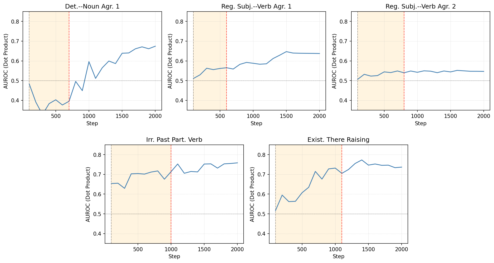
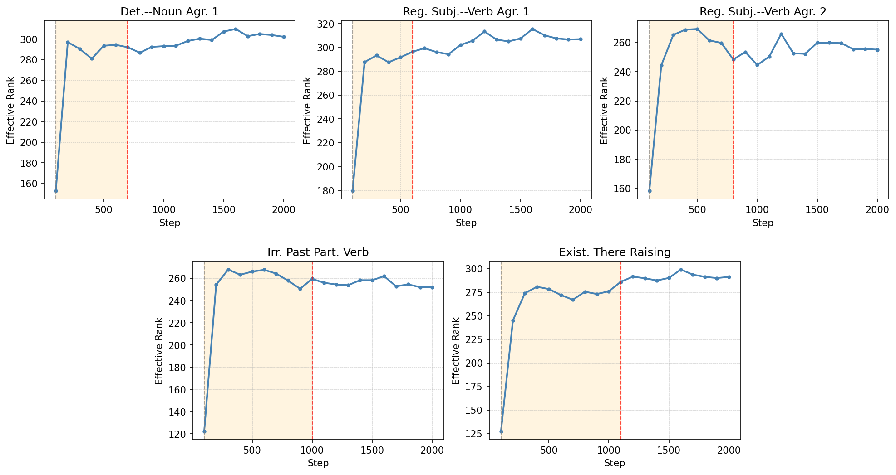
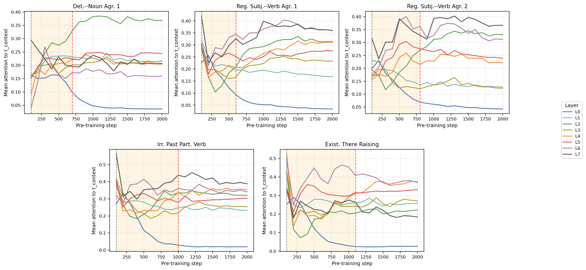
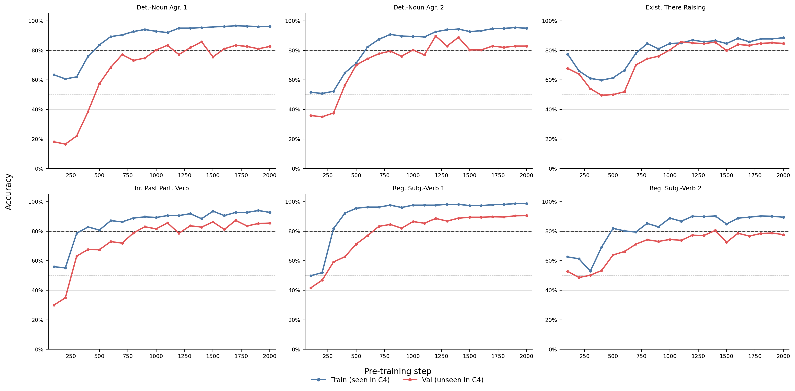
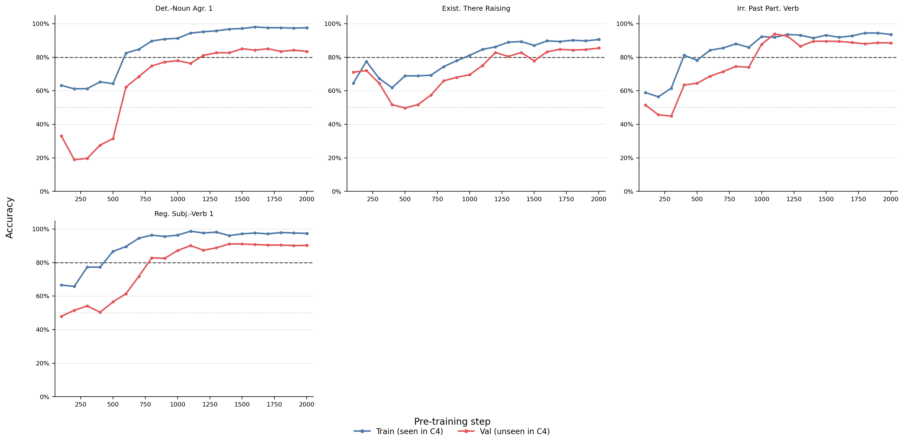
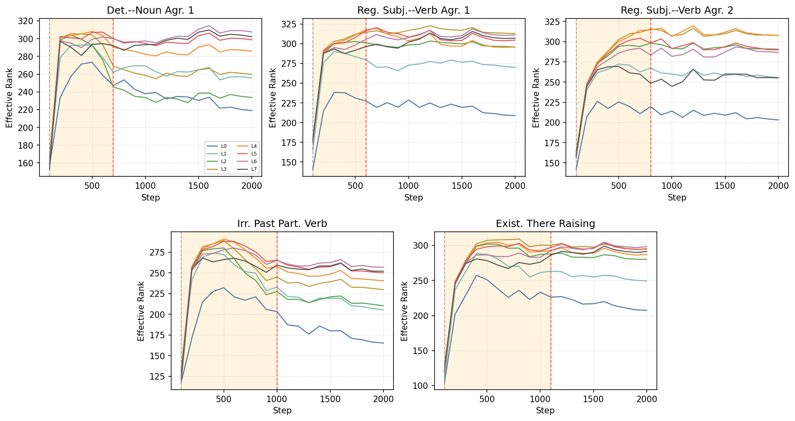

# Muckatira, Shivagunde, Deshpande, Rumshisky 2026 — A Pre-Training Analogue of Grokking in Language Models: Tracing Delayed Grammatical Generalization

См. также: [глобальный индекс понятий](../../concepts/index.md).

**Sherin Muckatira**, **Namrata Shivagunde**, **Vijeta Deshpande**, **Anna Rumshisky** (University of Massachusetts Lowell).

arXiv [2606.00230](https://arxiv.org/abs/2606.00230), май 2026 (v1), 18 страниц, 10 рисунков, 9 таблиц. Всего цитирований по Semantic Scholar — 0, в картотеке — 0. Предмет — перенос классической постановки гроккинга на претрейн языковых моделей через заместительное разбиение по встречаемости: для каждой минимальной пары BLiMP извлекается «критическая фраза», и примеры, чья фраза дословно встретилась в потоке C4 за окно претрейна, образуют proxy-train, остальные — proxy-validation. На пяти грамматических явлениях и моделях LLaMA-типа 35M/60M/130M proxy-train пересекает порог 80% на 100–900 шагов раньше proxy-validation, и перестановочный тест на сопоставленных случайных разбиениях показывает, что задержка не сводится к размерам частей. Внутренности: грамматические концепт-векторы становятся более разделяющими (AUROC) и занимают подпространство большего действенного ранга после генерализации; прирост внимания с критического токена на контекстный сосредоточен в единичных головах, своих у каждого явления.

Оригинал и производные файлы этой папки:

- [`original/2606.00230.a-pre-training-analogue-of-grokking-in-language-models-tracing-delayed-grammatical-generalization.md`](original/2606.00230.a-pre-training-analogue-of-grokking-in-language-models-tracing-delayed-grammatical-generalization.md) — конверсия оригинала (arXiv-HTML v1, сверена с PDF) в Markdown без правок содержания.
- [`2606.00230.a-pre-training-analogue-of-grokking-in-language-models-tracing-delayed-grammatical-generalization.claims.txt`](2606.00230.a-pre-training-analogue-of-grokking-in-language-models-tracing-delayed-grammatical-generalization.claims.txt) — пронумерованные утверждения статьи с пометками разбора.
- [`images/`](images/) — 10 рисунков.

Схема якорей и правила ссылок на карточку — в [README папки статей](../README.md).

## Затрагиваемые понятия

**[Гроккинг](../../concepts/grokking.md)** — классическая постановка объявлена непереносимой на претрейн (нет ни надзора, ни разбиения примеров задачи, ни многократных проходов) и замещена разбиением по встречаемости: proxy-train — примеры BLiMP, чья критическая фраза дословно встретилась в C4, proxy-validation — остальные; на пяти явлениях первая часть достигает 80% на 100–900 шагов раньше второй, и сопоставленные случайные разбиения этой задержки не воспроизводят ([`p6-1`](#p6-1)). Разбор: запоминания обучающей выборки, с которого начинается классический гроккинг, здесь нет вовсе — модель не обучалась ни на одной части BLiMP, обе кривые растут плавно без разрыва «100% против случайного уровня»; встречаемость определена по всему окну 2000 шагов, так что пример, чья фраза впервые встретилась на шаге 1900, числится «встреченным» уже на шаге 100; пятое сито отбора оставляет наборы со значимой задержкой — и затем та же значимость подаётся как результат.

**[Эмерджентность](../../concepts/emergence.md)** — задержка привязана к явлению, а не общая: короткая у Regular Subject–Verb Agreement 1, наибольшая у Irregular Past Participle Verbs и Existential There Subject Raising; порядок «встреченное раньше невстреченного» воспроизводится на 35M и 130M, причём меньшая модель достигает порога раньше большей, что авторы объясняют ёмкостью при фиксированном бюджете шагов — и подают это именно как догадку ([`p12-1`](#p12-1)). Разбор: «LLM pre-training» заголовка — это модели 35–130M весов и около 200M токенов C4; шкала задержек — целые контрольные точки по 100 шагов, то есть все наблюдённые лаги составляют 1–9 отсчётов; наборы, где proxy-validation так и не дошла до 80%, выброшены четвёртым ситом до измерения.

**[Линейное зондирование](../../concepts/linear-sparse-probing.md)** — грамматический концепт-вектор как разность скрытых состояний приемлемого и неприемлемого предложений: средний вектор, посчитанный на proxy-train, разделяет грамматичность на proxy-validation по скалярному произведению (AUROC), а действенный ранг центрированной матрицы концепт-векторов после перехода выше, чем до, во всех пяти наборах — вопреки линии «после генерализации представления сжимаются» ([`p7-2`](#p7-2)). Разбор: AUROC отчётливо растёт лишь у трёх явлений из пяти (у неправильных причастий отделимость высока с самого начала, у второго согласования подлежащего со сказуемым держится у случайного уровня); спор о сжатии ведётся на несопоставимых мерах — ранг здесь считается по матрице разностей пар, а цитируемые работы мерили геометрию самих скрытых состояний; сравнение точек $t_{\text{before}}=100$ и $t_{\text{after}}$ (500–1400 шагов) спутано с общим ходом раннего обучения, равноудалённой контрольной пары нет.

**[Маршрутизация внимания](../../concepts/attention-routing-heads.md)** — прирост внимания с критического токена на контекстный не общий, а сосредоточенный в единичных головах, своих у каждого явления (L2H7, L6H2, L5H0, L6H2, L5H3), с величиной до $+0.81$ при максимуме веса 1.0; энтропия внимания критического токена после перехода чаще падает или выходит на полку, а тепловые карты показывают сдвиг *sketch*→*this*, *references*→*Paula* ([`p7-4`](#p7-4)). Разбор: опубликована полная решётка слой×голова (Табл. 9, 64 головы на пять наборов) — редкость для работ этого рода; но по той же решётке у четырёх явлений из пяти большинство голов внимание к контексту СНИЖАЕТ, среднее по 64 головам отрицательно у трёх наборов, и формулировка заключения о «возросшем внимании» с этим расходится; числа лучших голов в Табл. 8 и Табл. 9 не совпадают ($+0.81$ против $+0.77$, $+0.63$ против $+0.62$).

## Что показано, а что предположено

Замечания редактора карточки по итогам разбора утверждений (`…claims.txt`, 45 пунктов).

**Ценное — воспроизводимая рамка и честная статистика вокруг неё.** Заместительное разбиение по встречаемости — первый прямой перенос пары «обучаемая/проверочная часть» на примеры оценки при претрейне, а не определение гроккинга через одну обучающую потерю; перестановочный тест на 1000 сопоставленных разбиений с посемянными $p$-значениями и полная решётка внимания слой×голова опубликованы целиком; ограничения (дословность как заместитель встречаемости, только грамматика, задержка уровня контрольных точек) признаны самими авторами.

**Разбиение — не обучающая выборка, отбор замкнут на итог, частотного контроля нет.** Модель не обучалась на BLiMP, так что «запоминания» в классическом смысле нет и имя proxy-train вводит в заблуждение; встречаемость определена за всё окно, а сравниваются точки внутри него; пятое сито отбора требует значимой задержки — и значимость затем подаётся как проверка; перестановочный тест держит только размеры частей и не отвечает на возражение «дословно встреченные фразы — это частые n-граммы, то есть лёгкие примеры»; арифметика сит не сходится (Табл. 3 содержит 16 строк вместо 15, третье сито «исключает 4» при шести строках нижней группы), у existential there в сумме 935 примеров из 1000 без объяснения.

**Как работу будут цитировать** («гроккинг показан в претрейне языковых моделей») — точнее: на пяти отобранных наборах BLiMP и моделях 35–130M примеры, чья критическая фраза дословно встретилась в C4, пересекают порог 80% на 1–9 контрольных точек раньше остальных, причём сами наборы отобраны по значимости этой самой задержки, а сопоставления со случайным разбиением, уравненным по частоте фраз, нет.

---

# Текст статьи

## Претрейновый аналог гроккинга в языковых моделях: прослеживание отсроченной грамматической генерализации

Sherin Muckatira, Namrata Shivagunde, Vijeta Deshpande, Anna Rumshisky. Аффилиация: University of Massachusetts Lowell. Почта: sherinbojappa_muckatira@student.uml.edu

## Аннотация

Гроккинг, явление, при котором нейронные сети генерализуют долго после подгонки своих обучающих данных, изучался в постановках с надзором на многих эпохах. Претрейн LLM вместо этого включает предсказание следующего токена на неразмеченном корпусе, с ограниченным повторением данных и без явного разбиения train/validation. Чтобы к этому подступиться, мы предлагаем рамку на основе встречаемости, которая позволяет изучать гроккингоподобную динамику во время претрейна LLM. Мы заземляем нашу оценку в минимальных парах BLiMP, которые дают контролируемые грамматические противопоставления. Для каждой минимальной пары BLiMP мы определяем критическую фразу — наименьший непрерывный отрезок, который схватывает грамматическое противопоставление и относящийся к явлению контекст. Примеры, чья критическая фраза появляется в окне претрейна, относятся к proxy-train части; остальные примеры относятся к proxy-validation части. На пяти грамматических явлениях мы наблюдаем отсроченную генерализацию. Разбор контрольных точек претрейна до и после генерализации показывает, что грамматические концепт-векторы становятся более предсказательными для грамматической приемлемости и занимают подпространство большей размерности после генерализации. Мы также находим, что внимание с критического токена на относящийся к делу контекстный токен сосредоточено в малом числе голов.

*Рисунок 1: Кривые отсроченной генерализации и накопленная встречаемость в C4 для разбираемых явлений BLiMP. Синие и красные линии показывают среднюю точность на proxy-train (встреченной) и proxy-validation (невстреченной) частях по трём случайным семенам; ось x показывает шаги обучения; закрашенные полосы обозначают $\pm 1$ стандартную ошибку. Оранжевые столбцы показывают накопленное число уникальных критических фраз, встреченных в потоке претрейна C4 к каждой контрольной точке. По всем явлениям точность proxy-train растёт раньше точности proxy-validation.* **[p. 2]**

## 1 Введение

Гроккинг — это явление в нейронных сетях, при котором модели переходят от подгонки обучающих примеров к генерализации на держаные примеры. В классической постановке модели обучаются много эпох на фиксированной обучающей части с надзором и оцениваются на держаной проверочной части из того же распределения задачи (Power et al., 2022). Этот отсроченный переход даёт хорошо определённую поведенческую границу для разбора внутренних изменений, связанных с началом генерализации.

Однако классический гроккинг определён относительно конкретной задачи: модели обучаются на подмножестве примеров задачи, и отсроченная генерализация измеряется на держаных примерах той же задачи. Эта постановка не переносится напрямую на претрейн языковых моделей. Во время претрейна модель оптимизируется на предсказание следующего токена по большому неразмеченному корпусу, а не обучается напрямую на размеченных примерах последующей оценочной задачи. В результате нет естественного надзорного разбиения train/validation на примерах последующей оценки. Чтобы перенести классическую формулировку гроккинга в постановку претрейна, мы строим заместительное разбиение по встречаемости на последующих оценочных наборах данных.

Мы подступаемся к этой проблеме, строя заместительное разбиение по встречаемости для изучения отсроченной генерализации во время претрейна языковых моделей. Мы используем грамматику как проверочный случай, потому что грамматические зависимости структурированы, измеримы и могут проверяться контролируемыми наборами минимальных пар. В частности, мы используем BLiMP (Warstadt et al., 2020), где каждый пример содержит приемлемое предложение и минимально отличающееся неприемлемое предложение, нацеленное на конкретное грамматическое явление. Для каждой минимальной пары мы извлекаем критическую фразу: непрерывный отрезок, который содержит грамматическое различие и контекст, нужный для оценки грамматической зависимости. Затем мы относим примеры либо к proxy-train части, если критические фразы появляются дословно в токенах C4 (Raffel et al., 2020), увиденных за разбираемое окно претрейна, либо к proxy-validation части иначе.

Это разбиение не подразумевает, что модель никогда не видела соответствующего грамматического правила. Оно лишь различает примеры с дословной встречаемостью критической фразы и примеры без такой встречаемости. Это даёт претрейновый аналог классической постановки гроккинга: модель может сначала хорошо справляться с примерами с прямой встречаемостью фразы и лишь позже улучшаться на примерах без прямой **[p. 2]** встречаемости.

Используя эту рамку, мы изучаем ранние контрольные точки претрейна языковых моделей LLaMA-типа на 35M, 60M и 130M параметров на пяти грамматических явлениях BLiMP. Сначала мы измеряем, достигают ли примеры с дословной встречаемостью критической фразы высокой точности раньше примеров без такой встречаемости, и проверяем этот эффект против сопоставленных случайных разбиений, сохраняющих размеры частей. Затем мы разбираем грамматико-специфичные контрастные представления и узоры внимания до и после перехода отсроченной генерализации, чтобы спросить, сопровождается ли поведенческая задержка изменениями в представлениях грамматических понятий и узорах внимания модели. Мы находим, что точность proxy-train последовательно достигает высокого уровня раньше точности proxy-validation, выявляя отсроченную генерализацию. Разборы на уровне контрольных точек далее показывают, что этот переход сопровождается изменениями грамматико-специфичных концепт-векторов и узоров внимания к контексту.

Наши вклады:

1. Мы вводим рамку на основе встречаемости для изучения гроккингоподобной отсроченной генерализации во время претрейна языковых моделей.
2. Мы показываем, что на пяти грамматических явлениях примеры с дословной встречаемостью критической фразы достигают высокой точности раньше примеров без такой встречаемости.
3. Мы подтверждаем этот эффект перестановочными тестами на сопоставленных случайных разбиениях, показывая, что наблюдаемая задержка не объясняется одним размером частей.
4. Мы показываем, что переход сопровождается изменениями грамматико-специфичных концепт-векторов и узоров внимания к контексту.

## 2 Связанные работы

#### Гроккинг и отсроченная генерализация.

Гроккинг был введён как отсроченный переход от запоминания к генерализации, при котором модели сначала достигают высокой обучающей точности при низкой проверочной точности и лишь позже генерализуют на держаные примеры (Power et al., 2022). Большинство предшествующих работ изучает это поведение в контролируемых постановках с явными разбиениями train/validation, таких как модульная арифметика и другие алгоритмические задачи (Gromov, 2023; Nanda et al., 2023). Механистические разборы подсказывают, что поведенческому переходу могут предшествовать внутренние изменения в цепях или представлениях (Nanda et al., 2023). Последующая работа расширяет гроккинг на более богатые языкоподобные синтетические задачи с иерархической структурой (Murty et al., 2023). Мы изучаем постановку претрейна, в которой модель **[p. 3]** обучается предсказанию следующего токена на естественном языке, а не напрямую на последующей задаче с надзором.

#### Гроккингоподобная динамика во время претрейна языковых моделей.

Недавние работы начали спрашивать, происходит ли гроккингоподобная динамика во время претрейна языковых моделей. Li et al. (2026b) разбирают гроккинг в больших моделях со смесью экспертов. Однако они оценивают на последующих задачах после применения дообучения LoRA, из-за чего неясно, обусловлена ли наблюдаемая динамика одним претрейном. Они также определяют гроккинг единственно через обучающую потерю, без проверочной части. Lv et al. (2025) утверждают, что языковые модели развивают способность копирования гроккингоподобным образом, с индукционными головами, возникающими во время претрейна. Эти работы выводят гроккинг за пределы синтетических задач, но они не прикладывают классическую формулировку train/validation напрямую к примерам последующей оценки. Мы закрываем этот пробел, строя заместительное разбиение по встречаемости: примеры последующей оценки разделяются по тому, появляются ли их критические фразы дословно в корпусе претрейна. Это позволяет нам измерить, улучшается ли качество сначала на примерах с прямой корпусной встречаемостью и лишь позже на примерах без такой встречаемости.

#### Лингвистическая генерализация и геометрия представлений.

BLiMP даёт контролируемые минимальные пары для оценки грамматического знания в языковых моделях. Предшествующая работа с BLiMP показывает, что разные грамматические явления следуют разным траекториям обучения по контрольным точкам (Bunzeck and Zarrieß, 2024). Мы используем BLiMP для другой цели: чтобы проверить, являют ли грамматические минимальные пары отсроченную генерализацию во время претрейна.

#### Геометрия представлений во время обучения.

Предшествующие работы подсказывают, что генерализация может сопровождаться изменениями геометрии представлений модели. Исследования динамики обучения трансформеров находят, что геометрия скрытых состояний меняется по ходу обучения, включая сдвиги анизотропии, внутренней размерности и общей сложности представления (Razzhigaev et al., 2024; Li et al., 2026a). Вместо измерения геометрии представлений скрытых состояний по всем токенам мы сосредотачиваемся на грамматико-специфичных концепт-векторах. Это мотивировано работами, трактующими понятия или поведения как направления в пространстве активаций (Park et al., 2024; Rimsky et al., 2024). В нашем использовании концепт-векторов мы не стремимся управлять моделью или установить общую теорию линейных представлений. Вместо этого мы используем грамматико-специфичные концепт-направления как диагностический инструмент для отслеживания того, как отделимость и размерностная структура грамматических понятий меняются по контрольным точкам претрейна.

## 3 Метод

В этом разделе мы описываем постановку претрейна, заместительное разбиение по встречаемости, используемое для измерения отсроченной генерализации, и разборы представлений и внимания на уровне контрольных точек.

### 3.1 Постановка претрейна и оценки

Мы обучаем декодерные языковые модели LLaMA-типа (Touvron et al., 2023) на 35M, 60M и 130M параметров на кодовой базе, выпущенной Zhao et al. (2024). Модели обучаются на английском C4 (Raffel et al., 2020) с длиной контекста 256 и размером партии 512, на протяжении 2000 шагов с контрольными точками каждые 100 шагов. Модель обучается примерно на 200M непополняющих токенах. Мы используем косинусное расписание скорости обучения. Модели 35M и 60M используют скорость обучения $10^{-3}$, а модель 130M использует $5\times 10^{-4}$. Модель 60M обучается с тремя независимыми случайными семенами и используется для главных разборов на уровне контрольных точек; модели 35M и 130M используются как проверки устойчивости к масштабу.

На каждой контрольной точке мы оцениваем на BLiMP с помощью оценочной обвязки EleutherAI (Gao et al., 2024). Каждый пример BLiMP — минимальная пара, содержащая одно приемлемое и одно неприемлемое предложение. Модель права, если приписывает большую вероятность приемлемому предложению, отчего случайная точность равна 50%. Мы сосредотачиваемся на первых 2000 шагах претрейна, потому что хотим разбирать не полностью насыщенный режим, а сравнивать поведение модели до и после того, как точность proxy-validation начинает улучшаться. Мы обучаем наши модели на одном GPU NVIDIA RTX ADA 6000 48 GB.

### 3.2 Заместительное разбиение по встречаемости

Для каждой минимальной пары BLiMP мы извлекаем *критическую фразу*: непрерывный отрезок, содержащий токен, различающийся между приемлемым и неприемлемым предложением, вместе с контекстом, нужным для оценки грамматической зависимости. Мы извлекаем критические фразы и из приемлемого, и из неприемлемого предложения, переводим их в нижний регистр и убираем хвостовую пунктуацию. Правила извлечения для конкретных наборов и примеры даны в приложении A.1.

**[p. 4]**

Мы определяем встречаемость точным совпадением критической фразы с токенами C4, увиденными за разбираемое окно претрейна. Пример BLiMP относится к proxy-train, или встреченной, части, если либо его приемлемая, либо неприемлемая критическая фраза появляется дословно в C4 за это окно. Иначе он относится к proxy-validation, или невстреченной, части. Эта процедура разбиения по встречаемости схватывает только дословную встречаемость критической фразы; она не подразумевает, что модель никогда не видела лежащего в основе грамматического правила или родственных конструкций.

### 3.3 Измерение отсроченной генерализации

Пусть $A_{\mathrm{train}}(t)$ и $A_{\mathrm{val}}(t)$ обозначают точность на proxy-train и proxy-validation частях на контрольной точке $t$, и пусть $\tau$ — порог точности. Мы определяем

$$
t_{\mathrm{train}}(\tau) =\min\{t:A_{\mathrm{train}}(t)\geq\tau\}, \\
t_{\mathrm{val}}(\tau) =\min\{t:A_{\mathrm{val}}(t)\geq\tau\}.
$$

Задержка отсроченной генерализации есть

$$
\Delta t(\tau)=t_{\mathrm{val}}(\tau)-t_{\mathrm{train}}(\tau).
$$

Мы используем $\tau=80\%$ как первичный порог, потому что BLiMP бинарен и 80% представляет существенное качество выше случайного, оставаясь достижимым в разбираемом диапазоне контрольных точек. Поскольку контрольные точки сохраняются каждые 100 шагов, времена перехода — оценки уровня контрольных точек. Для разборов представлений и внимания мы задаём $t_{\mathrm{before}}=100$ и $t_{\mathrm{after}}=t_{\mathrm{val}}(80\%)$. Для модели 60M мы вычисляем $t_{\mathrm{after}}$ отдельно по каждому семени и используем медианное значение для интерпретируемостных разборов. Таблица 5 приложения сообщает размеры частей и контрольные точки перехода по порогам.

### 3.4 Отбор наборов данных

Изучение отсроченной генерализации требует режима «Златовласки»: набор данных не должен быть ни настолько лёгким, чтобы точность насыщалась в первых нескольких контрольных точках, ни настолько трудным, чтобы точность proxy-validation никогда не достигала осмысленного порога. Поэтому мы отбираем наборы BLiMP, где переход может быть измерен в нашем окне контрольных точек в 2000 шагов.

Мы применяем четыре стадии фильтрации. Мы исключаем наборы, которые генерализуют слишком рано (средняя точность на шагах 100–300 $\geq 70\%$) или никогда не достигают высокой точности (пиковая точность $<80\%$); наборы, для которых целевое грамматическое противопоставление и контекстная зависимость не могут быть схвачены подпредложенческой критической фразой; наборы с менее чем 100 proxy-train примерами после построения частей train/val, и наборы, чья proxy-validation часть никогда не достигает 80%. Эти критерии отбирают наборы, где отсроченная генерализация измерима, но они не обусловлены тем, что proxy-train часть улучшается раньше proxy-validation части. Это даёт шесть пригодных наборов.

После построения наборов-кандидатов мы используем описанный ниже тест сопоставленных случайных разбиений как шаг проверки задержки. Мы оставляем наборы, чья задержка по встречаемости значима на уровне $p<0.05$ хотя бы в двух семенах. Это исключает Determiner–Noun Agreement 2, который показывает нулевую задержку и ни одного значимого семени. Окончательный набор разбора содержит пять грамматических явлений. Полные подробности отбора даны в приложении B.

### 3.5 Тест сопоставленных случайных разбиений

Наблюдаемая задержка между proxy-train и proxy-val примерами могла бы возникать из размера частей или произвольных различий между примерами, а не из корпусной встречаемости. Чтобы это проверить, мы сравниваем разбиение по встречаемости с сопоставленными случайными разбиениями. Для каждого набора и семени мы порождаем 1000 случайных разбиений, которые сохраняют число proxy-train и proxy-val примеров, но случайно переназначают примеры независимо от встречаемости критической фразы. Для каждого случайного разбиения мы пересчитываем кривые точности по контрольным точкам и измеряем задержку между достижением двумя группами точности 80%. Это даёт нулевое распределение задержек, ожидаемых от произвольных разбиений с теми же размерами групп. Затем мы сравниваем задержку отсроченной генерализации разбиения по встречаемости proxy-train/proxy-validation с этим нулевым распределением, используя одностороннее эмпирическое $p$-значение,

$$
p=\frac{c+1}{n+1},
$$

где $c$ — число случайных разбиений, чья задержка больше или равна наблюдённой задержке по встречаемости, а $n=1000$ — число случайных разбиений. Полные посемянные задержки и $p$-значения сообщаются в приложении B.1.

### 3.6 Разборы грамматических концепт-векторов

Чтобы разобрать, как грамматическая информация представлена по ходу обучения, мы строим грамматические концепт-векторы из грамматичных и неграмматичных пар BLiMP. Для данной контрольной точки и примера $i$ пусть $h^{(i)}_{\mathrm{gram}}$ и $h^{(i)}_{\mathrm{ungram}}$ обозначают скрытые **[p. 5]** состояния модели для приемлемого и неприемлемого предложения. Мы определяем концепт-вектор $v_{i}$

$$
v_{i}=h^{(i)}_{\mathrm{gram}}-h^{(i)}_{\mathrm{ungram}}.
$$

Если не сказано иное, скрытые состояния берутся из последнего слоя на позиции последнего содержательного токена. Хотя эти векторы построены из парных разностей активаций, мы называем их грамматическими концепт-векторами, потому что они представляют грамматическое понятие, выражаемое каждой минимальной парой BLiMP. Это построение мотивировано работами, трактующими понятия и поведения как направления в пространстве представлений (Park et al., 2024; Rimsky et al., 2024).

Мы разбираем эти векторы двумя способами. Во-первых, мы вычисляем средне-разностный концепт-вектор по proxy-train части,

$$
\bar{v}_{t}=\frac{1}{N}\sum_{i=1}^{N}\left(h^{(i)}_{\mathrm{gram},t}-h^{(i)}_{\mathrm{ungram},t}\right),
$$

и оцениваем, разделяет ли это направление грамматичные и неграмматичные предложения в proxy-validation части. Подобно средне-разностному подходу оценивания Zou et al. (2023), мы оцениваем каждое предложение в proxy-validation части его скалярным произведением с $\bar{v}_{t}$ и сообщаем AUROC.

Во-вторых, мы измеряем действенный ранг центрированной по среднему матрицы концепт-векторов (Roy and Vetterli, 2007). Для каждой контрольной точки $t$ мы формируем матрицу $V_{t}\in\mathbb{R}^{N\times d}$, где $N$ — число примеров минимальных пар, а $d$ — размерность скрытого состояния. $i$-я строка этой матрицы концепт-векторов — попримерный концепт-вектор

$$
v_{i,t}=h^{(i)}_{\mathrm{gram},t}-h^{(i)}_{\mathrm{ungram},t}.
$$

Мы центрируем $V_{t}$ по примерам и вычисляем её сингулярные значения. При ненулевых сингулярных значениях $\sigma_{1},\ldots,\sigma_{r}$ мы нормируем $\hat{\sigma}_{k}=\sigma_{k}/\sum_{j}\sigma_{j}$ и определяем

$$
\mathrm{\text{effective rank}}=\exp\left(-\sum_{k=1}^{r}\hat{\sigma}_{k}\log\hat{\sigma}_{k}\right).
$$

Больший действенный ранг указывает, что грамматические концепт-векторы распределены по большему числу независимых направлений.

### 3.7 Разбор внимания к контексту

Для каждой минимальной пары мы определяем критический токен $t_{\mathrm{critical}}$, чья форма различается между приемлемым и неприемлемым предложением, и более ранний контекстный токен $t_{\mathrm{context}}$, который нужен для определения правильной грамматической формы. На каждой контрольной точке, слое и голове мы извлекаем вес внимания от $t_{\mathrm{critical}}$ к $t_{\mathrm{context}}$, усреднённый по всем минимальным парам набора. Затем мы измеряем изменение этой оценки внимания к контексту от $t_{\mathrm{before}}$ до $t_{\mathrm{after}}$ и определяем головы с наибольшим приростом. Мы также измеряем энтропию внимания на $t_{\mathrm{critical}}$, чтобы установить, становится ли внимание после генерализации более размазанным или сосредоточенным.

## 4 Результаты

Сначала мы показываем, что заместительное разбиение по встречаемости выявляет отсроченную генерализацию. Затем мы подтверждаем, что эта задержка не объясняется одним размером частей, тестами сопоставленных случайных разбиений. Наконец, мы разбираем сохранённые контрольные точки по всему раннему окну претрейна, сосредотачиваясь на том, как грамматические концепт-векторы и узоры внимания к контексту меняются до, во время и после перехода отсроченной генерализации.

*Рисунок 2: AUROC концепт-вектора на proxy-validation части по контрольным точкам претрейна. На каждой контрольной точке мы вычисляем средне-разностный вектор по минимальным парам proxy-train и оцениваем предложения proxy-validation их скалярным произведением с этим вектором. AUROC измеряет, насколько хорошо эти оценки разделяют грамматичные и неграмматичные предложения по представлениям последнего слоя на последнем токене.* **[p. 6]**

### 4.1 Разбиения по встречаемости выявляют отсроченную генерализацию

Рисунок 1 показывает точность на proxy-train (встреченной) и proxy-validation (невстреченной) частях по ранним контрольным точкам претрейна, усреднённую по трём независимо обученным моделям на 60M параметров. По пяти разбираемым явлениям BLiMP proxy-train часть достигает высокой точности раньше, чем proxy-validation часть. Это даёт положительную задержку отсроченной генерализации: примеры, чьи критические фразы появляются дословно в окне претрейна C4, достигают порога точности 80% раньше примеров без дословной встречаемости критической фразы. Задержка отсроченной генерализации разнится по грамматическим явлениям. Некоторые явления, такие как *Regular Subject–Verb Agreement 1*, показывают относительно короткие задержки, тогда как *Irregular Past Participle Verbs* и *Existential There Subject Raising* показывают большие задержки. Мы используем порог точности 80% как первичный критерий перехода.

Мы также запускаем ту же обусловленную встречаемостью оценку для моделей 35M и 130M. В обеих постановках proxy-train часть в целом достигает высокой точности раньше proxy-validation части. Задержка отсроченной генерализации разнится по наборам **[p. 6]** и размерам моделей. Эти результаты показывают, что задержка отсроченной генерализации не специфична для модели 60M. Кривые отсроченной генерализации для этих размеров моделей показаны в приложении C.

###### p6-1

Мы подтверждаем задержку отсроченной генерализации тестом сопоставленных случайных разбиений, описанным в разделе 3.5; полные посемянные результаты сообщаются в приложении B.1. Таблица 1 сводит результаты перестановочных тестов на сопоставленных случайных разбиениях. Пять из шести пригодных наборов показывают значимые задержки отсроченной генерализации по встречаемости хотя бы в двух семенах. *Determiner–Noun Agreement 2* — единственный пригодный набор с нулевой наблюдённой задержкой во всех трёх семенах и без значимого результата перестановочного теста; поэтому мы исключаем его из главного разбора и сообщаем как пригодный случай без задержки. Эти результаты подсказывают, что наблюдаемая задержка не объясняется одним размером частей. Случайные разбиения с теми же размерами proxy-train/proxy-val не воспроизводят задержку отсроченной генерализации по встречаемости. Вместо этого задержка привязана к тому, была ли критическая фраза увидена дословно в корпусе претрейна.

*Таблица 1: Результаты перестановочного теста на сопоставленных случайных разбиениях. Размах наблюдённых задержек — размах задержек, в шагах обучения, между достижением proxy-train и proxy-validation частями точности 80% по семенам. Значимые семена — те, где задержка по встречаемости превосходит нулевое распределение сопоставленных случайных разбиений при $p<0.05$. Для *Subject–Verb Agreement 2* одно семя исключено, потому что proxy-validation часть не достигает точности 80% в окне обучения.* **[p. 6]**

| Набор | Размах наблюдённых задержек | Значимые семена |
|---|---|---|
| Det.–Noun Agr. 1 | 100–500 | 2/3 |
| Det.–Noun Agr. 2 | 0 | 0/3 |
| Subj.–Verb Agr. 1 | 300–500 | 3/3 |
| Subj.–Verb Agr. 2 | 300–900 | 2/2 |
| Irr. Past Participle | 500–600 | 3/3 |
| Exist. There Raising | 400–500 | 3/3 |

*Рисунок 3: Действенный ранг грамматических концепт-векторов по контрольным точкам претрейна для пяти разбираемых явлений BLiMP. Больший действенный ранг указывает, что грамматические концепт-векторы покрывают больше независимых направлений в пространстве представлений. Штриховые вертикальные линии отмечают $t_{\text{before}}=100$ и набор-специфичное $t_{\text{after}}$; закрашенная область отмечает окно отсроченной генерализации.* **[p. 7]**

### 4.2 Концепт-векторы схватывают грамматическую отделимость

Рисунок 2 отслеживает, насколько хорошо грамматические концепт-векторы разделяют грамматичные и неграмматичные предложения на proxy-validation части по ранним контрольным точкам претрейна. На каждой контрольной точке мы вычисляем средний концепт-вектор по минимальным парам proxy-train и оцениваем предложения proxy-validation их скалярным произведением с этим вектором, как описано в разделе 3.6. Больший AUROC указывает, что грамматичные и неграмматичные предложения более отделимы вдоль направления концепт-вектора.

###### p6-3

По пяти разбираемым явлениям отделимость в целом усиливается во время претрейна, но траектория различается по явлениям. *Determiner–noun agreement*, *Regular subject–verb agreement 1* и *Existential-there subject raising* показывают самые отчётливые приросты. Неправильные причастия уже отделимы рано и остаются заметно выше случайного уровня. *Regular subject–verb agreement 2* **[p. 7]** остаётся ближе к случайному уровню. В целом эти результаты показывают, что отделимость вдоль грамматических концепт-векторов в целом улучшается во время претрейна, но сила и время этого улучшения разнятся по грамматическим явлениям. Результаты по всем слоям даны на рисунке 7 в приложении.

### 4.3 Концепт-векторы становятся более распределёнными после генерализации

Далее мы спрашиваем, как грамматико-специфичные концепт-векторы меняются в размерности во время и после отсроченной генерализации. Вместо разбора скрытых состояний напрямую мы разбираем концепт-векторы, вычисленные как разности между грамматичными и неграмматичными предложениями BLiMP, как описано в разделе 3.6.

###### p7-2

Рисунок 3 показывает, что действенный ранг грамматических концепт-векторов в целом растёт в раннем претрейне. При $t_{\text{before}}$ ранг ниже, подсказывая, что грамматическое понятие сосредоточено в меньшем числе доминирующих направлений. В окне отсроченной генерализации ранг колеблется. Мы используем набор-специфичные значения $t_{\text{after}}$, сообщённые в таблице 7. После $t_{\text{after}}$ действенный ранг растёт и остаётся выше, чем при $t_{\text{before}}$, по всем пяти наборам согласования. Этот узор подсказывает, что после отсроченной генерализации грамматический концепт-вектор представлен в подпространстве большей размерности. Предшествующие работы (Li et al., 2026a; Razzhigaev et al., 2024) показали, что представления скрытых состояний могут становиться более сжатыми после генерализации. В нашем разборе мы находим, что для этих концепт-векторов действенный ранг в целом растёт после отсроченной генерализации, подсказывая, что грамматическое понятие не схлопывается в несколько доминирующих направлений. Вместо этого грамматические концепт-векторы становятся распределёнными по большему числу направлений. Результаты по всем слоям даны на рисунке 8 в приложении.

### 4.4 Изменения внимания к контексту вокруг отсроченной генерализации

*Рисунок 4: Средняя оценка внимания к контексту по контрольным точкам претрейна. Каждая панель показывает одно явление BLiMP; каждая линия — один слой, усреднённый по всем 8 головам. Оценка — вес внимания от критического токена $t_{\text{critical}}$ к более раннему контекстному токену $t_{\text{context}}$, который определяет соответствующую грамматическую зависимость.* **[p. 8]**

Далее мы спрашиваем, отражается ли переход отсроченной генерализации в узорах внимания токен-к-токену. В частности, мы проверяем, сильнее ли критический токен внимает более раннему контекстному токену, нужному для определения грамматической зависимости.

###### p7-4

Рисунок 4 показывает среднюю оценку внимания к контексту по ранним контрольным точкам претрейна. Вместо единообразного роста по всем слоям и головам изменения внимания местные: некоторые слои показывают отчётливые приросты вокруг перехода отсроченной генерализации, тогда как другие остаются стабильными или снижаются. Наибольшие изменения внимания к контексту сосредоточены в малом числе голов, и сильнейшие головы различаются по явлениям, как показано в таблице 8. Полные результаты слой–голова даны в таблице 9 приложения.

*Determiner–noun agreement* показывает сильнейший прирост в раннем слое, тогда как **[p. 8]** явления *Subject–verb* показывают свои сильнейшие приросты в поздних слоях. Рисунок 9 приложения показывает, что энтропия внимания тоже колеблется рано, а затем часто стабилизируется или снижается после $t_{\mathrm{after}}$. Показательные потокенные тепловые карты на рисунке 10 приложения демонстрируют качественный узор: после $t_{\mathrm{after}}$ отобранные головы сильнее внимают контекстным токенам, относящимся к зависимости. Вместе эти результаты подсказывают, что отсроченная грамматическая генерализация сопровождается местной и явление-специфичной перестройкой внимания, а не единообразным сдвигом к более сосредоточенному вниманию.

## 5 Заключение

Мы изучили, может ли гроккингоподобная отсроченная генерализация наблюдаться во время стандартного претрейна языковых моделей. Поскольку претрейн не даёт явного надзорного разбиения train/validation, мы построили заместительное разбиение по встречаемости на минимальных парах BLiMP: примеры, чьи критические фразы появляются дословно в окне претрейна C4, образуют proxy-train часть, а остальные примеры образуют proxy-validation часть.

Используя это разбиение, мы находим претрейновый аналог гроккинга. В отличие от продолжительного многоэпохового разрыва train–validation, часто изучаемого в классическом гроккинге с надзором, наша постановка выявляет задержку уровня контрольных точек между встреченными и невстреченными оценочными примерами. По пяти грамматическим явлениям proxy-train часть достигает высокой точности раньше точности proxy-validation, и тесты сопоставленных случайных разбиений подсказывают, что эта задержка не объясняется одним размером частей.

Разборы на уровне контрольных точек далее показывают, что этот поведенческий переход сопровождается изменениями грамматико-специфичных контрастных представлений и узоров внимания к контексту. Разборы концепт-векторов показывают, что грамматичные и неграмматичные примеры становятся более отделимыми по ходу претрейна, и эти концепт-векторы становятся распределёнными по подпространству представлений большей размерности после генерализации. Разборы внимания показывают возросшее внимание с критического токена на контекстный токен, нужный для разрешения грамматической зависимости, с наибольшими изменениями, сосредоточенными в разных головах у разных явлений. Вместе эти результаты подсказывают, что корпусная встречаемость может использоваться для изучения гроккингоподобной отсроченной генерализации во время претрейна.

## 6 Этические соображения

Эта работа использует общедоступные наборы данных: C4 для претрейна и BLiMP для оценки. Мы используем эти ресурсы для исследования и оценки согласно их соответствующим условиям использования. Мы не распространяем совпавшие документы C4 или извлечённый текст. Исследование сосредоточено на понимании динамики обучения языковых моделей, и мы не предвидим прямых отрицательных общественных последствий.

## Ограничения

Наша рамка опирается на точное совпадение критической фразы как заместитель встречаемости. Это не значит, что модель никогда не видела того же грамматического правила в других предложениях. **[p. 9]** Поэтому proxy-validation часть следует толковать как примеры без дословной встречаемости критической фразы, а не как примеры с полностью невиданной грамматикой.

Эта работа проверяет рамку на грамматических явлениях, где минимальные пары BLiMP позволяют определить подпредложенческую критическую фразу. Будущая работа могла бы расширить эту рамку за пределы грамматики на другие постановки, где соответствующее поведение может быть привязано к подпредложенческой фразе или отрезку.

## References

- Bunzeck and Zarrieß (2024) B. Bunzeck and S. Zarrieß Fifty shapes of BLiMP: syntactic learning curves in language models are not uniform, but sometimes unruly. In Proceedings of the 2024 CLASP Conference on Multimodality and Interaction in Language Learning, A. Qiu, B. Noble, D. Pagmar, V. Maraev, and N. Ilinykh (Eds.), Gothenburg, Sweden, pp. 39–55. External Links: Link Cited by: §2.

- Gao et al. (2024) L. Gao, J. Tow, B. Abbasi, S. Biderman, S. Black, A. DiPofi, C. Foster, L. Golding, J. Hsu, A. Le Noac’h, H. Li, K. McDonell, N. Muennighoff, C. Ociepa, J. Phang, L. Reynolds, H. Schoelkopf, A. Skowron, L. Sutawika, E. Tang, A. Thite, B. Wang, K. Wang, and A. Zou The language model evaluation harness. Zenodo. External Links: Document, Link Cited by: §3.1.

- Gromov (2023) A. Gromov Grokking modular arithmetic. arXiv preprint arXiv:2301.02679. Cited by: §2.

- Li et al. (2026a) M. Z. Li, K. K. Agrawal, A. Ghosh, K. K. Teru, A. Santoro, G. Lajoie, and B. A. Richards Tracing the representation geometry of language models from pretraining to post-training. In The Thirty-ninth Annual Conference on Neural Information Processing Systems, External Links: Link Cited by: §2, §4.3.

- Li et al. (2026b) Z. Li, C. Fan, and T. Zhou Grokking in LLM pretraining? monitor memorization-to-generalization without test. In The Fourteenth International Conference on Learning Representations, External Links: Link Cited by: §2.

- Lv et al. (2025) A. Lv, R. Xie, X. Sun, Z. Kang, and R. Yan Language models “grok” to copy. In Proceedings of the 2025 Conference of the Nations of the Americas Chapter of the Association for Computational Linguistics: Human Language Technologies (Volume 2: Short Papers), L. Chiruzzo, A. Ritter, and L. Wang (Eds.), Albuquerque, New Mexico, pp. 735–741. External Links: Link, Document, ISBN 979-8-89176-190-2 Cited by: §2.

- Murty et al. (2023) S. Murty, P. Sharma, J. Andreas, and C. Manning Grokking of hierarchical structure in vanilla transformers. In Proceedings of the 61st Annual Meeting of the Association for Computational Linguistics (Volume 2: Short Papers), A. Rogers, J. Boyd-Graber, and N. Okazaki (Eds.), Toronto, Canada, pp. 439–448. External Links: Link, Document Cited by: §2.

- Nanda et al. (2023) N. Nanda, L. Chan, T. Lieberum, J. Smith, and J. Steinhardt Progress measures for grokking via mechanistic interpretability. In The Eleventh International Conference on Learning Representations, External Links: Link Cited by: §2.

- Park et al. (2024) K. Park, Y. J. Choe, and V. Veitch The linear representation hypothesis and the geometry of large language models. In Forty-first International Conference on Machine Learning, External Links: Link Cited by: §2, §3.6.

- Power et al. (2022) A. Power, Y. Burda, H. Edwards, I. Babuschkin, and V. Misra Grokking: generalization beyond overfitting on small algorithmic datasets. arXiv preprint arXiv:2201.02177. Cited by: §1, §2.

- Raffel et al. (2020) C. Raffel, N. Shazeer, A. Roberts, K. Lee, S. Narang, M. Matena, Y. Zhou, W. Li, and P. J. Liu Exploring the limits of transfer learning with a unified text-to-text transformer. Journal of machine learning research 21 (140), pp. 1–67. Cited by: §1, §3.1.

- Razzhigaev et al. (2024) A. Razzhigaev, M. Mikhalchuk, E. Goncharova, I. Oseledets, D. Dimitrov, and A. Kuznetsov The shape of learning: anisotropy and intrinsic dimensions in transformer-based models. In Findings of the Association for Computational Linguistics: EACL 2024, Y. Graham and M. Purver (Eds.), St. Julian’s, Malta, pp. 868–874. External Links: Link, Document Cited by: §2, §4.3.

- Rimsky et al. (2024) N. Rimsky, N. Gabrieli, J. Schulz, M. Tong, E. Hubinger, and A. Turner Steering llama 2 via contrastive activation addition. In Proceedings of the 62nd Annual Meeting of the Association for Computational Linguistics (Volume 1: Long Papers), L. Ku, A. Martins, and V. Srikumar (Eds.), Bangkok, Thailand, pp. 15504–15522. External Links: Link, Document Cited by: §2, §3.6.

- Roy and Vetterli (2007) O. Roy and M. Vetterli The effective rank: a measure of effective dimensionality. Proceedings of the 15th European Signal Processing Conference, pp. 606–610. Cited by: §3.6.

- Touvron et al. (2023) H. Touvron, T. Lavril, G. Izacard, X. Martinet, M. Lachaux, T. Lacroix, B. Rozière, N. Goyal, E. Hambro, F. Azhar, et al. Llama: open and efficient foundation language models. arXiv preprint arXiv:2302.13971. Cited by: §3.1.

- Warstadt et al. (2020) A. Warstadt, A. Parrish, H. Liu, A. Mohananey, W. Peng, S. Wang, and S. R. Bowman BLiMP: the benchmark of linguistic minimal pairs for English. Transactions of the Association for Computational Linguistics 8, pp. 377–392. External Links: Link, Document Cited by: §1.

- Zhao et al. (2024) J. Zhao, Z. Zhang, B. Chen, Z. Wang, A. Anandkumar, and Y. Tian GaLore: memory-efficient LLM training by gradient low-rank projection. In Forty-first International Conference on Machine Learning, External Links: Link Cited by: §3.1.

- Zou et al. (2023) A. Zou, L. Phan, S. Chen, J. Campbell, P. Guo, R. Ren, A. Pan, X. Yin, M. Mazeika, A. **[p. 10]** Dombrowski, et al. Representation engineering: a top-down approach to ai transparency. arXiv preprint arXiv:2310.01405. Cited by: §3.6.

## Приложение A Приложение

### A.1 Извлечение критических фраз

Для каждой минимальной пары BLiMP мы извлекаем *критическую фразу*: непрерывный отрезок, содержащий токен, различающийся между грамматичным и неграмматичным предложениями, вместе с контекстом, нужным для оценки грамматической зависимости. Правило извлечения критической фразы определено отдельно для каждого грамматического явления. Для Determiner–Noun Agreement 1 мы извлекаем отрезок от определителя до изменённого существительного. Для Regular Plural Subject–Verb Agreement 1 мы извлекаем отрезок от главного существительного подлежащего до изменённого глагола. Для Regular Plural Subject–Verb Agreement 2 мы извлекаем отрезок от изменённого существительного подлежащего до следующего глагола. Для Irregular Past Participle Verbs отрезок идёт от главного существительного подлежащего до изменённой глагольной формы. Для Existential There Subject Raising мы извлекаем начальную экзистенциальную конструкцию предложения вплоть до предиката, определяющего, лицензирована ли конструкция подъёма. Примеры критических фраз показаны в таблице 2 приложения. Для каждой минимальной пары мы извлекаем критические фразы и из приемлемого, и из неприемлемого предложения. Перед сопоставлением с C4 мы переводим фразы в нижний регистр и убираем хвостовую пунктуацию.

*Таблица 2: Примеры минимальных пар BLiMP из наборов, использованных в этом исследовании. Каждая строка показывает один набор с приемлемым предложением и его минимально отличающимся неприемлемым напарником.* **[p. 11]**

| **набор** | **приемлемое** | **неприемлемое** | **критические фразы** |
|---|---|---|---|
| blimp_regular_plural_subject_verb_agreement_1 | Paula references Robert. | Paula reference Robert. | Paula reference; Paula references |
| blimp_regular_plural_subject_verb_agreement_2 | The students perform. | The student perform. | student perform; student performs |
| blimp_determiner_noun_agreement_1 | Raymond is selling this sketch. | Raymond is selling this sketches. | this sketch; this sketches |
| blimp_existential_there_subject_raising | There is soon to be a cat existing. | There is willing to be a cat existing. | There is soon to; There is willing to |
| blimp_irregular_past_participle_verbs | The mushroom went bad. | The mushroom gone bad. | The mushroom went; The mushroom gone |

Таблица 2 показывает представительные примеры BLiMP из наборов, использованных в этой работе. Каждая строка содержит приемлемое предложение и похожее неприемлемое предложение. Различие между двумя предложениями используется для извлечения критической фразы для заместительного разбиения по встречаемости.

## Приложение B Отбор наборов-кандидатов

BLiMP содержит 67 наборов минимальных пар, покрывающих диапазон грамматических явлений. Для изучения отсроченной генерализации нам нужны наборы, где переход от почти случайного уровня к высокой точности наблюдаем в нашем диапазоне контрольных точек. Мы применяем многостадийный набор критериев для отфильтровывания наборов для изучения.

#### Стадия 1: Фильтрация по точности.

Мы исключаем наборы, где модель генерализует уже рано в обучении (средняя точность на шагах 100–300 $\geq 70\%$; 19 наборов), и наборы, где модель никогда надёжно не генерализует (пиковая точность $<80\%$; 27 наборов). Поскольку BLiMP — бинарная задача (случайный уровень = 50%), 80% соответствует 60% максимального качества выше случайного. Критерии точности исключают 46 наборов. Оставшийся 21 набор-кандидат перечислен в таблице 4.

#### Стадия 2: Извлекаемость фразы.

Наша методология заместительного разбиения требует извлечения подпредложенческой критической фразы, чьё присутствие в обучающем корпусе C4 определяет, относится ли пример к обучаемой или проверочной части. Для 6 из 21 кандидата грамматическая зависимость покрывает всё предложение, делая подпредложенческое извлечение неприменимым: *anaphor_number_agreement*, *anaphor_gender_agreement*, *principle_A_case_2*, *tough_vs_raising_2*, *coordinate_structure_constraint_object_extraction* и *wh_island*. Поскольку предложения BLiMP порождены синтетически и бенчмарк был выпущен после сбора корпуса C4, использованного в обучении моделей исследования, полные предложения BLiMP не появляются дословно в C4, делая сопоставление полных предложений неинформативным. Это оставляет 15 наборов с извлекаемыми подпредложенческими фразами.

#### Стадия 3: Минимальный размер обучаемой части.

После поиска совпадений критических фраз в C4 мы требуем не менее 100 примеров в обучаемой части, чтобы обеспечить надёжную кривую точности. Эта стадия исключает 4 набора.

#### Стадия 4: Сходимость проверочной части.

Наконец, мы требуем, чтобы точность проверочной части достигала не менее 80% к концу обучения. Наборы, где проверочная кривая не сходится, указывают, что модель не может генерализовать за пределы своей обучающей встречаемости, и потому не подходят для нашего исследования гроккинга. Это убирает четыре дополнительных набора.

Таблица 3 сообщает размеры обучаемой и проверочной частей и пиковую проверочную точность для всех наборов с извлекаемыми фразами, организованные по тому, на какой стадии они отфильтрованы.

*Таблица 3: Размеры заместительных частей train/validation и пиковая точность proxy-validation для наборов с извлекаемыми подпредложенческими критическими фразами. Peak Val — максимальная точность proxy-validation по контрольным точкам, усреднённая по трём семенам, где доступно. Наборы сгруппированы по итогу отбора: прошедшие все стадии (сверху), исключённые стадией 4 за недостаточную сходимость проверочной части (в середине) и исключённые стадией 3 за менее чем 100 proxy-train примеров (снизу). Для наборов, исключённых на стадии 3, Peak Val не сообщается, потому что proxy-train часть слишком мала для надёжной кривой отсроченной генерализации.* **[p. 11]**

| **Набор** | **Train** | **Val** | **Peak Val** |
|---|---|---|---|
| determiner_noun_agreement_1 | 873 | 127 | 89.2% |
| determiner_noun_agreement_2 | 883 | 117 | 92.6% |
| regular_plural_subject_verb_agreement_1 | 383 | 617 | 90.3% |
| irregular_past_participle_verbs | 234 | 766 | 85.1% |
| existential_there_subject_raising | 254 | 681 | 84.3% |
| regular_plural_subject_verb_agreement_2 | 476 | 524 | 80.8% |
| irregular_plural_subject_verb_agreement_1 | 501 | 499 | 75.3% |
| irregular_plural_subject_verb_agreement_2 | 634 | 366 | 75.4% |
| determiner_noun_agreement_irregular_1 | 778 | 222 | 53.6% |
| determiner_noun_agreement_irregular_2 | 837 | 163 | 79.8% |
| determiner_noun_agreement_with_adjective_1 | 19 | 981 | — |
| determiner_noun_agreement_with_adj_2 | 33 | 967 | — |
| determiner_noun_agreement_with_adj_irregular_2 | 43 | 957 | — |
| determiner_noun_agreement_with_adj_irregular_1 | 67 | 933 | — |
| only_npi_licensor_present | 0 | 1000 | — |
| superlative_quantifiers_1 | 0 | 1000 | — |

*Таблица 4: 21 набор-кандидат BLiMP, прошедший начальные критерии фильтрации по точности: ранняя точность ниже 70% и пиковая точность не менее 80%. Early — средняя точность на шагах 100–300; Peak — максимальная точность по всем контрольным точкам; Final — средняя точность на шагах 1600–2000.* **[p. 12]**

| **Набор** | **Early** | **Peak** | **Final** |
|---|---|---|---|
| only_npi_licensor_present | 59.2% | 99.6% | 96.1% |
| anaphor_number_agreement | 47.4% | 98.2% | 97.1% |
| determiner_noun_agreement_1 | 56.7% | 96.0% | 95.7% |
| determiner_noun_agreement_2 | 50.3% | 95.1% | 93.3% |
| determiner_noun_agreement_with_adjective_1 | 58.0% | 94.5% | 94.2% |
| regular_plural_subject_verb_agreement_1 | 64.6% | 93.5% | 92.5% |
| superlative_quantifiers_1 | 38.1% | 93.5% | 64.0% |
| principle_A_case_2 | 55.8% | 92.7% | 91.0% |
| determiner_noun_agreement_with_adj_2 | 48.9% | 92.2% | 91.4% |
| regular_plural_subject_verb_agreement_2 | 52.1% | 90.7% | 88.6% |
| determiner_noun_agreement_irregular_2 | 54.0% | 89.1% | 86.2% |
| anaphor_gender_agreement | 32.7% | 88.9% | 88.5% |
| irregular_plural_subject_verb_agreement_2 | 57.7% | 88.4% | 87.4% |
| determiner_noun_agreement_with_adj_irregular_2 | 54.6% | 88.1% | 86.2% |
| irregular_past_participle_verbs | 60.9% | 87.1% | 82.3% |
| tough_vs_raising_2 | 65.7% | 85.5% | 83.5% |
| determiner_noun_agreement_with_adj_irregular_1 | 52.4% | 84.3% | 82.8% |
| existential_there_subject_raising | 57.4% | 84.1% | 83.6% |
| irregular_plural_subject_verb_agreement_1 | 53.3% | 81.8% | 80.7% |
| coordinate_structure_constraint_object_extraction | 50.6% | 81.7% | 80.9% |
| wh_island | 29.0% | 81.2% | 79.1% |

### B.1 Полные результаты перестановочного теста

Мы проводим перестановочный тест, чтобы оценить, специфична ли наблюдаемая задержка между встреченными и невстреченными примерами для разбиения по встречаемости. Для каждого набора и случайного семени мы сохраняем размеры встреченной и невстреченной частей, но случайно переназначаем примеры в две группы независимо от корпусной встречаемости. **[p. 11]** Это даёт нулевое распределение задержек, которые ожидались бы от произвольных разбиений того же размера.

Для каждой из 1000 случайных перестановок мы пересчитываем кривые точности по контрольным точкам для двух переставленных групп. Затем мы измеряем силу гроккинга, определяемую как задержка, в шагах обучения, между первыми контрольными точками, на которых обучаемое и проверочное значения достигают точности 80%. Наблюдённая задержка по встречаемости сравнивается с этим нулевым распределением через одностороннее эмпирическое $p$-значение,

$$
p=\frac{c+1}{n+1},
$$

где $c$ — число перестановок, чья задержка больше или равна наблюдённой задержке, а $n=1000$ — число перестановок.

Таблица 6 сообщает полные посемянные результаты. Пять из шести наборов показывают значимые задержки по встречаемости хотя бы в двух семенах. Subject–Verb Agreement 1, Irregular Past Participle Verbs и Existential There Subject Raising значимы во всех трёх семенах. Determiner–Noun Agreement 1 значим в двух семенах из трёх. Subject–Verb Agreement 2 значим в обоих семенах; оставшееся семя не оценивается, потому что невстреченная часть не достигает порога 80% в окне обучения. Determiner–Noun Agreement 2 — единственный набор без значимых семян. Эти результаты показывают, что наблюдаемые задержки в общем случае не воспроизводятся произвольными разбиениями с теми же размерами групп.

### B.2 Сводка наборов

Таблица 5 приложения сообщает размеры proxy-train и proxy-validation частей для каждого набора вместе с контрольными точками перехода proxy-validation по порогам от 70% до 90% на одном семени.

*Таблица 5: Размеры заместительных частей train/validation и проверочные шаги перехода $t_{\text{after}}$ по разным порогам точности. Каждый столбец порога сообщает первую сохранённую контрольную точку претрейна, в шагах обучения, на которой точность proxy-validation достигает этого порога. N/A указывает, что порог не достигнут в окне обучения в 2000 шагов. Контрольные точки сохраняются каждые 100 шагов.* **[p. 13]**

|  |  |  | $t_{\text{after}}$ |  |  |  |  |
|---|---|---|---|---|---|---|---|
| Набор | Train | Val | 70% | 75% | 80% | 85% | 90% |
| Det.-Noun Agr. 1 | 873 | 127 | 500 | 700 | 1000 | 1000 | 1400 |
| Reg. Plural Subj.-Verb Agr. 1 | 383 | 617 | 600 | 600 | 600 | 700 | 1300 |
| Reg. Plural Subj.-Verb Agr. 2 | 476 | 524 | 700 | 700 | 800 | 1200 | N/A |
| Irr. Past Participle Verb | 234 | 766 | 500 | 600 | 800 | 1400 | N/A |
| Existential There Subject Raising | 254 | 681 | 800 | 1100 | 1400 | N/A | N/A |

## Приложение C Влияние масштаба на отсроченную генерализацию

*Рисунок 5: Кривые отсроченной генерализации для модели 35M. Синие и красные линии показывают точность на proxy-train и proxy-validation частях соответственно.* **[p. 13]**

*Рисунок 6: Кривые отсроченной генерализации для модели 130M. Синие и красные линии показывают точность на proxy-train и proxy-validation частях соответственно.* **[p. 14]**

**[p. 12]**

###### p12-1

Рисунки 5 и 6 подтверждают, что кривые гроккинга появляются на обоих масштабах: точность обучаемой части последовательно опережает точность проверочной части. Однако динамика различается по масштабам. Модель 35M достигает проверочного порога 80% раньше, чем модель 130M, на большинстве наборов, несмотря на то что она меньшая. Это может объясняться ёмкостным эффектом фиксированного бюджета: поскольку все три модели обучаются одинаковое число шагов, меньшие модели видят больше токенов на параметр и сильнее ограничены по ёмкости, что может вынуждать более раннее извлечение обобщаемых узоров. Большим моделям может требоваться больше обучения, прежде чем их дополнительная ёмкость превратится в прочную генерализацию.

Рисунки 5 и 6 показывают, что узор отсроченной генерализации виден и на других масштабах моделей. И в 35M, и в 130M моделях proxy-train часть в целом достигает высокой точности раньше proxy-validation части, указывая, что узор отсроченной генерализации не специфичен для модели 60M.

*Таблица 6: Полные результаты перестановочного теста по трём семенам. Lag — число шагов обучения между достижением proxy-train и proxy-validation частями точности 80%. Эмпирическое p-значение вычисляется как $(c+1)/(n+1)$, где $c$ — число из 1000 сопоставленных случайных перестановок с задержкой, большей или равной наблюдённой. Столбец Sig. сообщает число семян с $p<0.05$.* **[p. 14]**

| Набор | Lag (Run 1/2/3) | $p$-значение (Run 1/2/3) | # Sig. |
|---|---|---|---|
| Det.–Noun Agr. 1 | 500 / 200 / 100 | 0.001 / 0.003 / 0.087 | 2 |
| Det.–Noun Agr. 2 | 0 / 0 / 0 | 0.682 / 0.911 / 0.706 | 0 |
| Subj.–Verb Agr. 1 | 500 / 300 / 400 | 0.001 / 0.001 / 0.001 | 3 |
| Subj.–Verb Agr. 2 | 300 / 900 / N/A | 0.001 / 0.001 / N/A | 2 |
| Irr. Past Participle | 500 / 600 / 500 | 0.001 / 0.001 / 0.002 | 3 |
| Exist. There Raising | 500 / 400 / 400 | 0.024 / 0.030 / 0.002 | 3 |

### C.1 Точки перехода отсроченной генерализации

Таблица 7 сообщает точку перехода отсроченной генерализации $t_{\text{after}}$ для каждого набора. Мы определяем $t_{\text{after}}$ как первую сохранённую контрольную точку претрейна, на которой точность на proxy-validation части достигает 80%. Поскольку контрольные точки сохраняются каждые 100 шагов, это значение — оценка времени перехода на уровне контрольных точек.

Для каждого набора мы вычисляем $t_{\text{after}}$ отдельно для каждого из трёх независимо обученных семян LLaMA на 60M параметров и сообщаем медианное значение. Эти медианные точки перехода используются для интерпретируемостных разборов.

*Таблица 7: Набор-специфичные значения $t_{\text{after}}$, используемые в интерпретируемостных разборах. $t_{\text{after}}$ — первая сохранённая контрольная точка претрейна, на которой точность proxy-validation достигает 80%, вычисленная отдельно для каждого семени и сообщённая как медиана по трём прогонам 60M.* **[p. 14]**

| Набор | $t_{\text{after}}$ |
|---|---|
| Det.–Noun Agr. 1 | 700 |
| Reg. Subj.–Verb Agr. 1 | 600 |
| Reg. Subj.–Verb Agr. 2 | 800 |
| Irr. Past Part. Verb | 1000 |
| Exist. There Raising | 1100 |

## Приложение D Концепт-векторы

*Рисунок 7: AUROC концепт-вектора на proxy-validation части по всем слоям. На каждой контрольной точке и слое мы вычисляем средне-разностный вектор по парам proxy-train и измеряем, насколько хорошо оценки скалярным произведением разделяют грамматичные и неграмматичные предложения proxy-validation по представлениям последнего токена этого слоя.* **[p. 15]**

Рисунок 7 показывает тот же разбор AUROC концепт-вектора по всем слоям. Главные тренды разбора последнего слоя в основном сохраняются, но сила сигнала грамматичности разнится по слоям и явлениям. Existential-there raising и неправильные причастия показывают устойчивую отделимость по многим слоям, с AUROC, растущим рано и остающимся заметно выше случайного. Регулярное согласование подлежащего со сказуемым показывает более слабый, но всё же положительный тренд: первый набор согласования улучшается постепенно по слоям, тогда как второй остаётся ближе к случайному уровню. Согласование определителя с существительным более слоезависимо, с самым отчётливым приростом в поздних слоях. В целом результаты по всем слоям поддерживают главную находку, что направления грамматичности усиливаются во время претрейна, показывая при этом, что слой, на котором **[p. 13]** сигнал наиболее виден, зависит от грамматического явления.

*Рисунок 8: Действенный ранг грамматических концепт-векторов по всем слоям и контрольным точкам претрейна. Больший действенный ранг указывает, что грамматические концепт-векторы покрывают больше независимых направлений. Штриховые вертикальные линии отмечают $t_{\text{before}}=100$ и набор-специфичные $t_{\text{after}}$; закрашенная область отмечает окно отсроченной генерализации.* **[p. 16]**

Рисунок 8 показывает действенный ранг по всем слоям. Общий узор поддерживает главный результат, что грамматические концепт-векторы становятся распределёнными по большему числу направлений после окна отсроченной генерализации. По разным грамматическим явлениям действенный ранг резко растёт рано в обучении, указывая, что грамматическое противопоставление быстро становится распределённым по более широкому подпространству. Этот эффект наиболее устойчив в средних и поздних слоях, которые в целом держат больший ранг, чем самые ранние слои. Динамика вокруг $t_{\text{after}}$ зависит от явления: некоторые наборы продолжают расти или остаются высокими после точки отсроченной генерализации, тогда как другие достигают пика раньше и затем стабилизируются или слегка снижаются.

## Приложение E Внимание

*Рисунок 9: Средняя энтропия внимания на критическом токене по контрольным точкам претрейна. Каждая панель показывает одно явление BLiMP; каждая линия — один слой, усреднённый по всем 8 головам. Меньшая энтропия указывает, что внимание от $t_{\text{critical}}$ сосредоточено на меньшем числе предшествующих токенов, тогда как большая энтропия указывает на более размазанное внимание.* **[p. 16]**

#### Энтропия внимания.

Мы измеряем энтропию внимания на $t_{\mathrm{critical}}$, чтобы проверить, становится ли внимание более сосредоточенным после отсроченной генерализации. Для каждого слоя и головы мы вычисляем энтропию распределения внимания от $t_{\mathrm{critical}}$ по всем предшествующим токенам:

$$
H=-\sum_{j}\alpha_{j}\log\alpha_{j},
$$

где $\alpha_{j}$ — вес внимания от $t_{\mathrm{critical}}$ к токену $j$. Меньшая энтропия указывает, что внимание сосредоточено на меньшем числе токенов, тогда как большая энтропия указывает на более размазанное внимание. Рисунок 9 показывает, что энтропия часто снижается или стабилизируется после $t_{\mathrm{after}}$, согласуясь с тем, что внимание становится менее размазанным в том же окне, в котором растёт внимание к контексту.

*Рисунок 10: Потокенные тепловые карты внимания для голов с наибольшим приростом внимания к контексту после отсроченной генерализации. Каждая строка показывает одно явление BLiMP и отобранную пару слой-голова. Левый столбец показывает внимание при $t_{\text{before}}=100$, а правый столбец — внимание при набор-специфичном $t_{\text{after}}$. Более яркие клетки обозначают большие веса внимания.* **[p. 17]**

**[p. 14]**

#### Потокенные узоры внимания.

###### p14-1

Рисунок 10 показывает потокенные тепловые карты внимания для представительных примеров из пяти разбираемых явлений BLiMP. Каждая строка сравнивает отобранную голову при $t_{\text{before}}=100$ и при соответствующем $t_{\text{after}}$. До отсроченной генерализации внимание часто доминировано ранними токенами или простыми позиционными узорами. После $t_{\text{after}}$ те же головы являют более структурированные узоры внимания, лучше согласованные с соответствующей грамматической зависимостью. Рисунок 10 показывает представительные потокенные тепловые карты внимания для лучшей головы внимания к контексту в каждом явлении. Для Determiner–Noun Agreement 1 критическое существительное *sketch* сдвигается от внимания в основном к начальному токену предложения *Raymond* при $t_{\text{before}}$ к более сильному вниманию к определителю *this* при $t_{\text{after}}$. Для Regular Subject–Verb Agreement 1 изменённый глагол *references* увеличивает внимание к подлежащему *Paula* после гроккинга. Для Regular Subject–Verb Agreement 2 глагол *perform* похоже сильнее внимает существительному подлежащего *students* после гроккинга, соответствуя зависимости, нужной для оценки согласования подлежащего со сказуемым в числе. Для Irregular Past Participle Verbs изменённая глагольная форма *woke* показывает более сильное внимание к предшествующему подлежащему *Kevin* после $t_{\text{after}}$, согласуясь с контекстом существительное–глагол, **[p. 15]** используемым для различения допустимых и недопустимых причастных форм.

*Таблица 8: Сводка головы с наибольшим приростом внимания к контексту для каждого набора. $\Delta$ Attn вычисляется как среднее внимание от $t_{\text{critical}}$ к $t_{\text{context}}$ при $t_{\text{after}}$ минус та же величина при $t_{\text{before}}$. Сильнейшие приросты происходят в разных слоях и головах у разных грамматических явлений.* **[p. 15]**

| Набор | Лучшая голова | $\Delta$ Attn |
|---|---|---|
| Det.-Noun Agr. 1 | L2 H7 | $+0.81$ |
| Reg. Subj.-Verb Agr. 1 | L6 H2 | $+0.35$ |
| Reg. Subj.-Verb Agr. 2 | L5 H0 | $+0.63$ |
| Irr. Past Part. Verb | L6 H2 | $+0.35$ |
| Exist. There Raising | L5 H3 | $+0.61$ |

*Таблица 9: Изменение внимания к контексту от $t_{\text{before}}$ до $t_{\text{after}}$ для всех сочетаний слой-голова по пяти разбираемым наборам. Каждая клетка сообщает $\Delta$ внимания к контексту, вычисленное как внимание от $t_{\text{critical}}$ к $t_{\text{context}}$ при $t_{\text{after}}$ минус та же величина при $t_{\text{before}}$. Жирным выделена голова с наибольшим положительным приростом для каждого набора.* **[p. 18]**

| Слой | Голова | Det-Noun 1 | Subj-Verb 1 | Subj-Verb 2 | Irr-Past-Part | Exist-There |
|---|---|---|---|---|---|---|
| 0 | 0 | -0.07 | -0.10 | -0.12 | -0.17 | -0.18 |
| 0 | 1 | -0.03 | -0.25 | -0.24 | -0.34 | -0.32 |
| 0 | 2 | -0.04 | -0.03 | -0.04 | -0.20 | -0.21 |
| 0 | 3 | -0.02 | -0.11 | -0.13 | -0.21 | -0.22 |
| 0 | 4 | +0.00 | -0.08 | -0.09 | -0.17 | -0.19 |
| 0 | 5 | -0.13 | -0.18 | -0.15 | -0.34 | -0.29 |
| 0 | 6 | -0.05 | -0.18 | -0.16 | -0.28 | -0.26 |
| 0 | 7 | -0.18 | -0.13 | -0.10 | -0.23 | -0.15 |
| 1 | 0 | +0.11 | -0.14 | -0.05 | -0.11 | -0.23 |
| 1 | 1 | +0.08 | -0.19 | -0.13 | -0.31 | -0.40 |
| 1 | 2 | +0.09 | -0.17 | -0.10 | -0.20 | -0.35 |
| 1 | 3 | +0.26 | -0.06 | -0.10 | -0.02 | -0.03 |
| 1 | 4 | -0.22 | -0.00 | -0.08 | -0.11 | -0.09 |
| 1 | 5 | +0.27 | -0.06 | +0.03 | -0.18 | -0.45 |
| 1 | 6 | -0.04 | -0.27 | -0.22 | -0.31 | -0.21 |
| 1 | 7 | -0.04 | -0.10 | -0.11 | -0.13 | -0.02 |
| 2 | 0 | +0.02 | -0.09 | +0.13 | -0.06 | -0.43 |
| 2 | 1 | -0.65 | -0.10 | -0.15 | -0.29 | -0.10 |
| 2 | 2 | +0.68 | -0.15 | -0.06 | -0.21 | -0.43 |
| 2 | 3 | -0.15 | +0.04 | +0.31 | +0.09 | -0.03 |
| 2 | 4 | +0.43 | -0.04 | +0.22 | +0.29 | +0.16 |
| 2 | 5 | +0.02 | -0.22 | -0.06 | -0.20 | -0.44 |
| 2 | 6 | +0.29 | -0.16 | -0.01 | -0.27 | -0.35 |
| 2 | 7 | **+0.77** | +0.10 | +0.41 | +0.30 | -0.10 |
| 3 | 0 | +0.02 | -0.24 | -0.18 | -0.33 | -0.36 |
| 3 | 1 | +0.20 | -0.33 | -0.20 | -0.39 | -0.76 |
| 3 | 2 | +0.47 | -0.11 | -0.01 | +0.01 | -0.16 |
| 3 | 3 | +0.02 | -0.12 | +0.11 | -0.18 | +0.03 |
| 3 | 4 | +0.18 | -0.08 | -0.00 | -0.11 | -0.24 |
| 3 | 5 | -0.21 | -0.18 | -0.13 | -0.25 | -0.33 |
| 3 | 6 | -0.49 | +0.07 | +0.08 | -0.13 | +0.43 |
| 3 | 7 | +0.21 | -0.07 | -0.02 | -0.03 | -0.16 |
| 4 | 0 | +0.07 | -0.21 | -0.09 | -0.17 | -0.00 |
| 4 | 1 | +0.25 | -0.07 | +0.24 | +0.15 | -0.35 |
| 4 | 2 | +0.14 | -0.14 | +0.05 | -0.16 | -0.58 |
| 4 | 3 | +0.00 | -0.06 | +0.07 | -0.07 | -0.31 |
| 4 | 4 | +0.18 | -0.26 | -0.01 | -0.47 | -0.49 |
| 4 | 5 | +0.03 | -0.13 | +0.01 | -0.04 | -0.11 |
| 4 | 6 | +0.09 | -0.09 | -0.13 | +0.01 | +0.22 |
| 4 | 7 | +0.27 | +0.16 | +0.34 | +0.26 | -0.09 |
| 5 | 0 | +0.21 | +0.11 | **+0.62** | +0.20 | +0.20 |
| 5 | 1 | +0.02 | -0.19 | +0.04 | -0.31 | -0.50 |
| 5 | 2 | -0.25 | +0.17 | +0.38 | -0.18 | -0.47 |
| 5 | 3 | +0.14 | -0.08 | -0.12 | -0.02 | **+0.61** |
| 5 | 4 | -0.03 | -0.14 | -0.05 | -0.30 | -0.27 |
| 5 | 5 | +0.08 | -0.30 | -0.24 | -0.29 | +0.02 |
| 5 | 6 | +0.55 | +0.03 | +0.08 | +0.00 | +0.09 |
| 5 | 7 | -0.12 | -0.01 | -0.06 | -0.14 | +0.10 |
| 6 | 0 | +0.09 | -0.07 | +0.32 | +0.14 | -0.06 |
| 6 | 1 | +0.05 | -0.03 | +0.25 | +0.09 | +0.09 |
| 6 | 2 | +0.14 | **+0.35** | +0.48 | **+0.35** | +0.20 |
| 6 | 3 | +0.01 | -0.30 | -0.18 | -0.24 | -0.47 |
| 6 | 4 | +0.07 | +0.16 | +0.19 | +0.04 | -0.03 |
| 6 | 5 | +0.15 | -0.09 | +0.06 | -0.33 | -0.25 |
| 6 | 6 | +0.06 | +0.18 | +0.27 | +0.15 | -0.35 |
| 6 | 7 | +0.50 | +0.10 | +0.12 | +0.13 | +0.15 |
| 7 | 0 | +0.03 | +0.12 | +0.52 | +0.18 | -0.07 |
| 7 | 1 | +0.12 | -0.23 | +0.00 | -0.22 | -0.50 |
| 7 | 2 | +0.10 | -0.35 | -0.28 | -0.11 | +0.01 |
| 7 | 3 | -0.34 | +0.07 | +0.05 | +0.05 | +0.01 |
| 7 | 4 | -0.25 | -0.24 | -0.12 | -0.47 | -0.02 |
| 7 | 5 | -0.13 | -0.07 | -0.05 | -0.42 | -0.09 |
| 7 | 6 | +0.13 | -0.03 | -0.08 | -0.10 | -0.03 |
| 7 | 7 | -0.44 | -0.02 | +0.05 | +0.11 | +0.13 |

---

## Машиночитаемый блок
