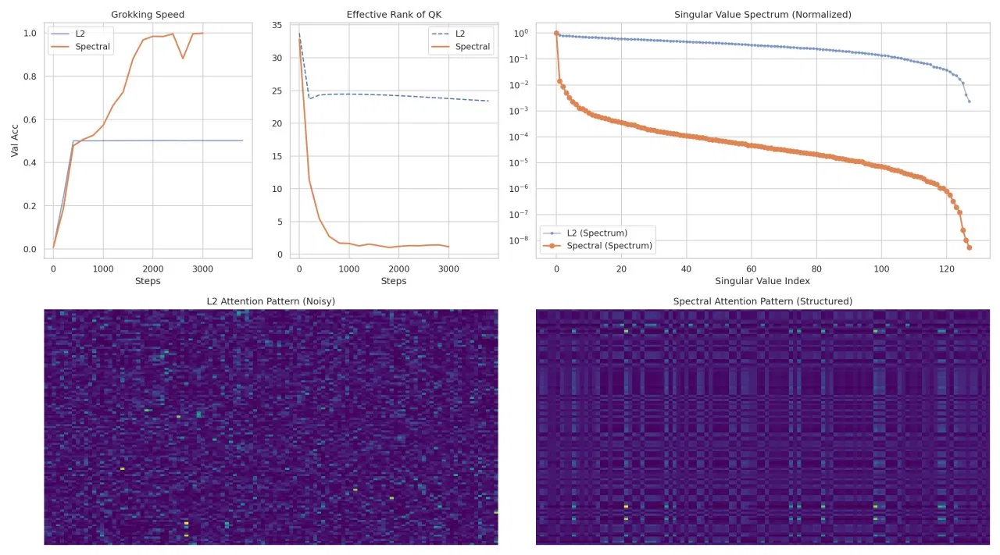

# Li 2026 — Low-Rank Decay for Grokking in Scale-Invariant Transformers: A Spectral-Geometric View

См. также: [глобальный индекс понятий](../../concepts/index.md).

**Mingyu Li** (Пекинский педагогический университет).

arXiv [2606.04405](https://arxiv.org/abs/2606.04405), июнь 2026, 9 страниц, 2 рисунка, 1 таблица; помечена «Preliminary Draft», автор один. Всего цитирований по Semantic Scholar — 1, в картотеке — 1. Отправной вопрос: что вообще регуляризует weight decay, если часть трансформера масштабно-инвариантна (RMSNorm, QK-Norm)? Ответ: ничего функционального — фробениусов штраф действует чисто радиально, и после запоминания (когда градиенты задачи исчезают) он функционально инертен. Предложение: заменить радиальный штраф спектральным — Low-Rank Decay (LRD), шаг вдоль полярного множителя $UV^{\top}$ ядерной нормы (приближаемого итерацией Ньютона—Шульца), вычитающий из каждого сингулярного числа одну и ту же величину. На модульном сложении LRD обрушивает устойчивый ранг QK-матриц с ~35 до ~3 и расширяет зону успешного гроккинга — главным образом по силе регуляризации, по доле данных на один шаг сетки.

Файлы разбора этой статьи:

- [`2606.04405.low-rank-decay-for-grokking-in-scale-invariant-transformers-a-spectral-geometric-view.claims.txt`](2606.04405.low-rank-decay-for-grokking-in-scale-invariant-transformers-a-spectral-geometric-view.claims.txt) — пронумерованные утверждения статьи с пометками разбора.
- [`2606.04405.low-rank-decay-for-grokking-in-scale-invariant-transformers-a-spectral-geometric-view.license.txt`](2606.04405.low-rank-decay-for-grokking-in-scale-invariant-transformers-a-spectral-geometric-view.license.txt) — лицензионная запись arXiv для этой статьи.

Схема якорей и правила ссылок на карточку — в [README папки статей](../README.md).

**Карточка-выдержка.** Лицензия статьи (`arxiv-nonexclusive`) не разрешает публикацию копии оригинала и полного перевода, поэтому карточка содержит редакторские секции и цитируемые фрагменты перевода (право цитирования). Полный текст статьи: <https://arxiv.org/abs/2606.04405>.

## Затрагиваемые понятия

**[Направление влияния weight decay](../../concepts/weight-decay-direction.md)** — к спору о силе decay добавлена ось геометрии шага: радиальный против спектрального. Предложение 1: при масштабной инвариантности потери теорема Эйлера даёт $\left\langle\nabla_{W}\mathcal{L},W\right\rangle=0$, градиент задачи касателен к сфере постоянной нормы, а weight decay радиален — он меняет только $\rho=\left\lVert W\right\rVert_{F}$ и не проецируется на угловую динамику ([`p3-9`](#p3-9)). Remark 1 честно ослабляет заявку: при AdamW, конечных шагах и лишь приближённой инвариантности decay всё же влияет косвенно ([`p3-12`](#p3-12)).

**[Weight decay](../../concepts/weight-decay.md)** — центральная асимметрия: после запоминания, когда градиенты задачи исчезают, L2 продолжает сжимать норму без функционального следствия, а LRD продолжает вычитать из сингулярных чисел, перестраивая спектр и при нулевом градиенте задачи ([`p6-6`](#p6-6)). Разбор отмечает: механизм «L2 функционально инертен» не согласован с собственной фазовой диаграммой, где L2 при сильном $\lambda$ всё же выводит сеть на высокую точность (сеть инвариантна лишь частично), и это расхождение не разобрано.

**[Спектральный анализ](../../concepts/spectral-analysis-svd-esd-fve.md)** — в спектральной линии корпуса спектр впервые взят как рукоять управления, а не измеритель: подтверждённое предсказание механизма — устойчивый ранг QK-матриц под LRD падает с ~35 до ~3 за первые 500 шагов против ~25 у L2, хвост спектра проседает на 4–5 порядков ([`p6-1`](#p6-1), [`fig-2`](#fig-2)). Ближайший сосед — 2604.07380, где weight decay сжимает спектральную кромку побочно: LRD — попытка сделать то же сжатие прямым.

**[Доля данных](../../concepts/data-fraction-critical-dataset-size.md)** — главная заявка: LRD «расширяет границу по доле данных» для гроккинга ([`p5-9`](#p5-9), [`fig-1`](#fig-1)). Разбор уточняет: по самой диаграмме сдвиг границы по данным — один шаг сетки ($f\approx 0.45\to 0.40$; при 0.3–0.35 не гроккает никто), а основной выигрыш лежит по оси силы регуляризации; измеренная граница зависит от неназванного числа шагов — что делает её иной величиной, нежели бюджето-независимый порог Varma et al.

**[Гроккинг](../../concepts/grokking.md)** — LRD выходит выше 0.95 тестовой точности за 3000 шагов, где L2 остаётся ниже 0.5 ([`p6-1`](#p6-1)); но 3000 шагов — горизонт, на котором канонический гроккинг ещё не наступает, а по рисунку у LRD почти нет задержки между запоминанием и обобщением — приём скорее устраняет разбираемое явление, чем улучшает его протекание. Признано прямо: причинная связь обрушения ранга с генерализацией не установлена ([`p8-3`](#p8-3)).

**[Избирательный weight decay](../../concepts/selective-weight-decay.md)** — разбиение сообщается вместе со способом применения: L2 действует на все параметры, кроме смещений и норм, и все три сравниваемые стратегии применены развязанно, после шага оптимизатора ([`p4-11`](#p4-11)). Для адаптивного оптимизатора это не то же самое, что штраф в потере.
## Что показано, а что предположено

Замечания редактора карточки по итогам разбора утверждений (`…claims.txt`, 45 пунктов).

**Ценное — постановка вопроса и подтверждённое предсказание.** «Что регуляризует decay в масштабно-инвариантном блоке» — чёткий вопрос с проверяемым следствием: спектр обязан перестраиваться и при нулевом градиенте задачи. Предсказание механизма подтверждено: обрушение устойчивого ранга и спектральная разрежённость под LRD против L2 (рис. 2). Против LoRA приём мягкий: субградиент ядерной нормы у малоранговой матрицы разрастается «из иглы в веер», оставляя градиентам задачи выбор, какие подпространства сохранить.

**Один и тот же шаг записан трижды и по-разному.** Алгоритм 1 даёт $G_{\mathrm{reg}}\leftarrow\lambda X$ без адаптивного множителя; §5 определяет шаг с множителем $\left\lVert W\right\rVert_{F}/\left\lVert\operatorname{polar}(W)\right\rVert_{F}$; §6.3 возвращается к шагу без множителя. Множитель при этом возвращает зависимость от масштаба весов, отсутствие которой объявлено ключевым отличием LRD от L2. Что работало в опытах — не восстановимо. Число итераций Ньютона—Шульца $K$ нигде не названо, а при малом $K$ итерация как раз не даёт полярный множитель на слабых направлениях — тех самых, которые приём должен срезать.

**Гиперпараметры и сверки.** Не указаны число шагов фазовой диаграммы, семена, оптимизатор (AdamW всплывает лишь в Remark 1), скорость обучения, размер батча, $K$ и $\epsilon$. Сравнение несимметрично по области применения: L2 — на все параметры, LRD — только на матрицы блоков; LRD Elastic заявлен третьим приёмом, но в результатах не появляется; сверок при $\lambda=0$ и при выключенной QK-Norm нет. Кривая L2 залипает ровно на 0.5 — для сложения по модулю 97 полка неестественна и не прокомментирована. «Контур» на картинах $|W_{Q}W_{K}^{\top}|$ — чисто визуальное утверждение без фурье-разбора.

**Пропущенные предшественники.** 2506.05718 (Notsawo et al.) уже показал, что регуляризация ядерной нормой порождает гроккинг наравне с L2, — прямой предшественник главной посылки, не процитирован; Ньютон—Шульц с нормировкой — примитив оптимизатора Muon, линия ортогонализованных шагов не упомянута.

**Как работу будут цитировать** («спектральный decay сдвигает критическую долю данных для гроккинга») — точнее: на одном модульном сложении при $p=97$, на одном 2-слойном трансформере, без указания числа шагов, семян и $K$, зона успеха расширилась главным образом по $\lambda$, а по доле данных — на один шаг сетки (0.45 → 0.40).

---

# Цитируемые фрагменты перевода

Ниже приведены только те фрагменты перевода, на которые ссылаются карточки корпуса (право цитирования). Нумерация якорей `pN-M` / `fig-N` / `sec-X` совпадает с полной карточкой и оригиналом.

##### **Предложение 1**(Радиальная развязка фробениусова weight decay)**.**

###### p3-9

*При идеализированных предположениях выше фробениусов weight decay влияет только на радиальный масштаб $\rho$ и не имеет прямой проекции на угловую динамику $\Theta$.*

##### **Замечание 1****.**

###### p3-12

*Это идеализированное непрерывновременно́е утверждение. В практическом обучении с AdamW, конечными шагами, ненормализованными параметрами и приближённой масштабной инвариантностью weight decay всё же может влиять на оптимизацию косвенно. Утверждается не то, что weight decay бесполезен, а то, что он не является прямым функциональным приором сложности для совершенно масштабно-инвариантных параметрических блоков.*

### 4.3 Геометрия субдифференциала вблизи малоранговых страт

###### p4-11

Когда $W$ квадратная и полноранговая, ортогональные дополнения тривиальны и субградиент единствен. С падением ранга подпространства нулевых сингулярных значений разрастаются, и допустимые направления $Z$ расширяются. Геометрически субградиент меняется от почти единственного «игольного» направления к вееро-подобному множеству над нулевыми сингулярными подпространствами.

### 6.1 Фазовая диаграмма генерализации

- **L2 (фробениусов weight decay):** $W\leftarrow W\cdot(1-\eta\lambda)$, применяется ко всем параметрам, кроме смещений и норм.
- **LRD Decoupled:** $W\leftarrow W-\eta\lambda\cdot\frac{\left\lVert W\right\rVert_{F}}{\left\lVert\operatorname{polar}(W)\right\rVert_{F}+\epsilon}\cdot\operatorname{polar}(W)$, применяется только к матрицам внимания и MLP внутри трансформерных блоков. Адаптивный масштабный множитель $\left\lVert W\right\rVert_{F}/\left\lVert\operatorname{polar}(W)\right\rVert_{F}$ предотвращает катастрофическое усиление при малой норме весов.
- **LRD Elastic:** LRD и L2 совместно с независимыми коэффициентами $\lambda_{\mathrm{lrd}}$ и $\lambda_{l2}$.

###### p5-9

Рисунок 1 показывает фазовую диаграмму модульного сложения по долям обучающих данных и силам распада. L2 weight decay достигает высокой тестовой точности только в верхне-правой области (большая доля данных и сильный распад), тогда как спектральный распад (LRD) существенно расширяет область успешного гроккинга, особенно при умеренных долях данных ($f=0.4$–$0.6$) и промежуточных силах распада ($\lambda=5\times 10^{-4}$ до $5\times 10^{-3}$). Это расширение согласуется с гипотезой, что ядерно-норменная регуляризация даёт более действенное индуктивное смещение, чем фробениусова, в масштабно-инвариантных сетях.

###### fig-1

*Рисунок 1: Фазовая диаграмма генерализации модульного сложения. Слева: L2-распад. Справа: спектральный (LRD) распад. Цвет обозначает итоговую тестовую точность после фиксированного числа шагов обучения. LRD расширяет границу гроккинга к меньшим долям данных и более широкому диапазону сил распада.* **[p. 6]**

### 6.2 Скорость гроккинга и динамика обрушения ранга

###### p6-1

Рисунок 2 сравнивает скорость гроккинга, эффективный ранг и спектры сингулярных значений для L2 и LRD на модульном сложении ($f=0.4$). LRD достигает тестовой точности $>0.95$ в пределах 3000 шагов, тогда как L2 за тот же срок остаётся ниже 0.5. Эффективный ранг матриц запросов/ключей под LRD резко падает с $\sim$35 до $\sim$3 в первые 500 шагов, тогда как L2 держит ранг $\sim$25 на всём протяжении.

###### fig-2

*Рисунок 2: Сверху слева: скорость гроккинга (тестовая точность против шагов обучения). Сверху в центре: эффективный ранг (устойчивый ранг) QK-матриц. Сверху справа: нормированный спектр сингулярных значений в конце обучения (лог-шкала). Снизу: узоры внимания QK для L2 (слева) и LRD (справа).* **[p. 7]**

### 6.3 Режим исчезновения градиента: почему L2 буксует

###### p6-6

Эта асимметрия — L2 действует радиально и становится инертным в масштабно-инвариантных сетях после исчезновения градиента, тогда как LRD сохраняет касательную спектрально-формирующую составляющую — и есть центральное механистическое различие.

### 7.3 Ограничения

###### p8-3

У этой работы несколько важных ограничений. Текущее свидетельство основано прежде всего на модульном сложении; для установления общности нужно расширение на модульное умножение, композицию перестановок (S5) и другие задачи. Нужны многосеменные результаты с доверительными интервалами, чтобы исключить эффекты семени. Мы не установили причинной связи между обрушением ранга и генерализацией — одного временно́го предшествования недостаточно. Взаимодействие LRD с неявным спектральным смещением оптимизатора (наблюдаемым и без регуляризации) требует дальнейшего распутывания. Наконец, нестабильности обучения (осцилляции ранга, всплески градиента), наблюдаемые в некоторых конфигурациях, не вполне поняты.
