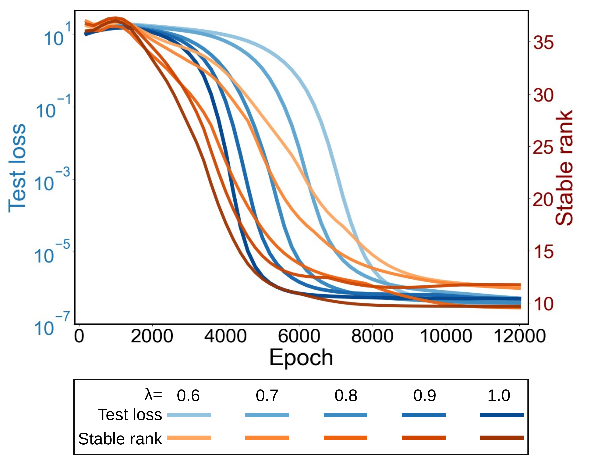

# Tan, Gai & Zhang 2026 — Deciphering Two Training Clocks in Grokking via Deep Linear Network Theory with Conditional ReLU Reduction

См. также: [глобальный индекс понятий](../../concepts/index.md).

**Hu Tan**, **Shihua Zhang** (Академия математики и системных наук КАН; Университет КАН), **Kuo Gai** (SIMIS, Шанхай).

arXiv [2606.05863](https://arxiv.org/abs/2606.05863), июнь 2026, 42 страницы, 3 рисунка, 5 таблиц приложений. Всего цитирований по Semantic Scholar — 1, в картотеке — 1. Гроккинг переформулирован как рассогласование **двух времён остановки**: «часы классификатора» $T_{\mathrm{cls}}(\varepsilon)$ — когда хвост перекрёстной энтропии падает ниже $\varepsilon$, и «часы представления» $T_{\mathrm{rep}}(\eta)$ — когда строительный зазор (устойчивый ранг и т.п.) падает ниже $\eta$; полка есть промежуток между ними. Для глубокой линейной сети доказано: первые часы логарифмичны по $1/\varepsilon$ (при допущении пост-зазорного роста), вторые полиномиальны по $1/\eta$ (при допущении острого KL-хвоста) — послойный weight decay действует на сквозное отображение как шаттеновский штраф $\|A\|_{S_{2/L}}^{2/L}$. Для ReLU даны условные переносы (замороженные вентили, иерархия градиентов), а не доказательства нелинейной динамики; разделение статусов выдержано таблицами по всему тексту.

Файлы разбора этой статьи:

- [`2606.05863.deciphering-two-training-clocks-in-grokking-via-deep-linear-network-theory-with-conditional-relu-reduction.claims.txt`](2606.05863.deciphering-two-training-clocks-in-grokking-via-deep-linear-network-theory-with-conditional-relu-reduction.claims.txt) — пронумерованные утверждения статьи с пометками разбора.
- [`2606.05863.deciphering-two-training-clocks-in-grokking-via-deep-linear-network-theory-with-conditional-relu-reduction.license.txt`](2606.05863.deciphering-two-training-clocks-in-grokking-via-deep-linear-network-theory-with-conditional-relu-reduction.license.txt) — лицензионная запись arXiv для этой статьи.

Схема якорей и правила ссылок на карточку — в [README папки статей](../README.md).

**Карточка-выдержка.** Лицензия статьи (`arxiv-nonexclusive`) не разрешает публикацию копии оригинала и полного перевода, поэтому карточка содержит редакторские секции и цитируемые фрагменты перевода (право цитирования). Полный текст статьи: <https://arxiv.org/abs/2606.05863>.

## Затрагиваемые понятия

**[Гроккинг](../../concepts/grokking.md)** — редкая для корпуса форма предмета: не порог, не мера прогресса, а **сравнение времён остановки**; центральное заявление — разные законы сходимости: $T_{\mathrm{cls}}(\varepsilon)=O(\log(1/\varepsilon))$ против $T_{\mathrm{rep}}(\eta)=\Theta(\eta^{-(2\theta-1)})$, и полка — промежуток $T_{\mathrm{cls}}\ll t\ll T_{\mathrm{rep}}$ ([`p16-5`](#p16-5)). Разбор: оба закона условны (рост зазоров — допущение 3.4, KL-хвост — допущение 4.5, и для одной траектории они несовместимы напрямую — рост зазоров против сходимости к конечной точке); связь допусков $\eta\asymp\varepsilon^{q}$ постулирована; в собственном опыте разрыв часов — множитель порядка 4, а оценщики часов из F.4 ни разу не вычислены.

**[Weight decay](../../concepts/weight-decay.md)** — источник медленных часов: послойный фробениусов распад в глубокой линейной сети индуцирует шаттеновский штраф $\|A\|_{S_{2/L}}^{2/L}$ на сквозном отображении ([`p6-6`](#p6-6)), и при $p=2/L<1$ малые сингулярные числа получают тем более сильное сжатие, чем они меньше ([`p12-9`](#p12-9)). Роль оговорена узко: WD — один математически прозрачный источник медленной строительной силы, не единственный ([`p42-6`](#p42-6)). Разбор: тождество (2.7) — минимум по разложениям, а обучение штрафует текущее; контрпример Kumar et al. (гроккинг без WD при растущей норме) прямо не разобран.

**[Максимизация зазора](../../concepts/margin-maximization-implicit-bias.md)** — редкая аккуратность в стандартно замалчиваемом месте: лемма 3.3 — намеренно отрицательный результат о том, что постоянный положительный запас не даёт равномерного условия Поляка—Лоясевича для кросс-энтропии, поскольку $|\ell'(z)|^{2}/\ell(z)\sim e^{-z}\to 0$ ([`p8-7`](#p8-7)); потому быстрые часы честно висят на допущении роста зазоров, а не на «сокращении через PL».

**[Спектральный анализ](../../concepts/spectral-analysis-svd-esd-fve.md)** — устойчивый ранг взят как одна прозрачная дорога от строения к обобщению, с прямой оговоркой, что на его место можно поставить другой строительный зазор (разделение классов, долю энергии вне фурье-подпространства, ошибку симплекса) ([`p37-9`](#p37-9)); опытно ранг падает с $\approx 36$ до $\approx 10$–$12$ в окне генерализации ([`fig-3`](#fig-3)). Безусловного заявления о схлопывании ранга нет: данные могут уравновешивать сжатие, а повороты сингулярных векторов — перераспределять энергию ([`p41-1`](#p41-1)).

**[Границы обобщения](../../concepts/generalization-bounds.md)** — мост от низкого ранга к обобщению через робастность Xu—Mannor: устойчивый ранг задаёт выходно-действенную размерность $d_{\eta}=\lceil\operatorname{srank}/\eta^{2}\rceil$ (Эккарт—Янг), уменьшающую показатель покрывающего члена ([`p15-1`](#p15-1), [`p15-3`](#p15-3)). Разбор: при собственных величинах статьи граница пуста численно — покрывающий член $(2R/\alpha)^{d_{\eta}}$ при наблюдаемом ранге ~10 выходит на сотни в показателе при $n\leq 12769$; «отложенная генерализация» выводится из улучшения границы, а не измеренной тестовой потери.

## Что показано, а что предположено

Замечания редактора карточки по итогам разбора утверждений (`…claims.txt`, 45 пунктов).

**Образцовое самоограничение статусов.** Таблицы S2 и S4 выписывают область и математический вход каждого заявления построчно; ReLU-утверждения везде помечены условными; лемма 3.3 доказывает, что запас не даёт PL, — там, где обычно берут PL без оговорок. Протокол измерения двух часов (F.4, окна устойчивости, накопленное оптимизаторное время) — готовая заготовка для проверки на чужих прогонах.

**Оба закона — условные, и их соединение спорно.** Логарифмичность быстрых часов — подстановка допущенного линейного роста зазоров в лемму 3.1 («оптимизаторная часть не спрятана в тождестве, она и есть допущение»); полиномиальность медленных — интегрирование допущенного двустороннего KL-хвоста с необмеренным показателем $\theta$. Теорема 5.6 требует обоих допущений одновременно, но для одной траектории они несовместимы: рост зазоров влечёт неограниченный рост нормы, а KL-допущение — сходимость к конечной точке; примирение возможно лишь на разных конечных окнах, а доказательство просто подставляет обе оценки. Связь допусков $\eta\asymp\varepsilon^{q}$ постулирована. При $2\theta-1<1$ «медленные» часы не медленнее $O(1/\eta)$ — медленность есть асимптотика по допуску, не число шагов.

**Иерархия градиентов слабее своего пересказа.** Предложение 4.2 сравнивает верхнюю границу для нижних слоёв с равенством для головы; «голова подгоняет первой» верно лишь при малых $\|U\|_{2},\|W\|_{2}$ и непренебрежимом $\|h\|$ — в опытах не проверяется, а в аннотацию попадает более сильная картина. Устойчивость вентилей — ключ всего ReLU-моста — ни разу не измерена, хотя достаточное условие через запас выписано в F.3.

**Опыт качественный и не измеряет собственный предмет.** Единственная постановка — сложение mod 113; гроккинг виден в потере, не в точности; устойчивый ранг и обучающая потеря ни разу не показаны на одних осях — само разделение часов не изображено ни на одном рисунке; оценщики часов из F.4 не вычислены. Разрыв в опыте — ~1500 против ~6000 эпох (множитель 4) против двух-трёх порядков у Power et al. Не названы: доля выборки, семена, глубина и ширина сети, оптимизатор (беты выдают семейство Adam); теория требует $L>2$, а глубина MLP неизвестна; оси рисунков обрезаны на 12000 при заявленных 15000 эпохах.

**Пропущенные соседи.** 2505.20172 (двухфазность с выведенным медленным масштабом ~$1/\lambda$) — ближайший формальный родственник, не процитирован; спектральные работы корпуса (2604.13123, 2604.06256, 2604.07380, 2408.11804) и норм-линия (2511.01938) не цитируются; перецитирование в §1.2 (Wang et al. про ResNet и Aubry et al. про LLM в связке «механистические разборы модульной арифметики»).

**Как работу будут цитировать** («доказано, что гроккинг есть разделение двух временных масштабов») — точнее: доказаны две условные теоремы о скоростях для линейного заместителя, выписано точное тождество цепного правила для двухслойной модели с вложениями и приведён один качественный опыт, в котором сами часы не измерены. Отдельная опасность — совпадение имени с «часами» из The Clock and the Pizza, где так называется выученный алгоритм.

---

# Цитируемые фрагменты перевода

Ниже приведены только те фрагменты перевода, на которые ссылаются карточки корпуса (право цитирования). Нумерация якорей `pN-M` / `fig-N` / `sec-X` совпадает с полной карточкой и оригиналом.

### 2.4 Шаттеновская регуляризация из послойного weight decay

###### p6-6

Для глубины-$L$ линейной факторизации $A=W_{L}\cdots W_{1}$ послойный фробениусов weight decay индуцирует следующий сквозной штраф [Shang et al., 2020]:

###### p6-7

Тем самым в глубоко-линейном заместителе обычный послойный weight decay становится штрафом шаттеновского типа на произведении-отображении. Это математический источник часов представления, изучаемых в разделе 4.

##### **Лемма 3.3**(Неподвижный зазор — не равномерное условие PL)**.**

###### p8-7

*Не существует константы $\beta>0$ такой, что импликация*

###### p8-8

*выполняется равномерно по всем бо́льшим зазорам. В частности, одного сохранения зазора недостаточно для обоснования геометрического убывания перекрёстно-энтропийной потери.*

### 4.1 Эмпирическая иллюстрация малоранговой структуры

###### fig-3

*Рисунок 3: Тестовая потеря и устойчивый ранг в ходе обучения для ReLU MLP на модульном сложении с weight decay $\lambda\in\{0.6,0.7,0.8,0.9,1.0\}$. Тестовая потеря нанесена на левую ось $y$ в лог-шкале, устойчивый ранг — на правую ось $y$. Позднее снижение устойчивого ранга — эмпирическая диагностика часов представления, используемая как качественная поддержка теории.* **[p. 11]**

##### **Предложение 4.3**(Спроецированный дрейф сингулярных значений)**.**

###### p12-9

*В частности, при $0<p<1$ меньшие положительные сингулярные значения испытывают более сильное сжатие от регуляризатора.*

### 5.2 Устойчивый ранг управляет выходно-действенным подпространством

###### p15-1

Рассмотрим отображение вложений $z=W_{1}x\in\mathbb{R}^{d_{1}}$, за которым следует финальное линейное отображение $f(z)=A^{\prime}z$, где $A^{\prime}\in\mathbb{R}^{k\times d_{1}}$. Множество вложений есть

##### **Теорема 5.2**(Устойчивый ранг управляет выходно-действенной размерностью)**.**

###### p15-3

*Пусть $A^{\prime}\in\mathbb{R}^{k\times d_{1}}$. Для $\eta\in(0,1)$ положим*

###### p15-5

*Тем самым действие $A^{\prime}$ на вложениях приближается, с точностью до относительной выходной ошибки $\eta$, главным $d_{\eta}$-мерным подпространством, управляемым устойчивым рангом.*

##### **Теорема 5.6**(Временно́е рассогласование двух часов)**.**

###### p16-5

*Примем условие быстрых часов теоремы 3.5. Примем также условие острого KL-хвоста теоремы 4.9 для структурного зазора $\mathcal{S}(A(t))$, сопоставимого с зазором энергии. Тогда*

#### Истолкование

###### p16-9

Теорема даёт главное объяснение гроккинга статьёй. Обучающая потеря может стать малой по часам классификатора, тогда как структурная величина, нужная для робастного обобщения, продолжает эволюционировать по часам представления. Отложенная тестовая точность потому совместима с быстрой интерполяцией: первые часы закончили, вторые — нет.

#### Альтернативные структурные зазоры

###### p37-9

Устойчивый ранг используется в основном тексте, потому что он — простой заместитель эффективной размерности и прямо связан со спектральным заместителем. Возможны и другие часы представления. Тот же шаблон доказательства может использовать иной структурный зазор, если этот зазор связан с утверждением об обобщении или робастности и сопоставим с поздним зазором энергии на области применения KL-анализа.

#### Граничные случаи

###### p41-1

Одно спектральное сжатие слабее низкого эффективного ранга. На гладком слое регуляризатор вносит $-\lambda ps^{p-1}$ в положительное сингулярное значение, но настойчивая сила данных может уравновешивать это сжатие, а повороты сингулярных векторов — перераспределять энергию. Если выученное правило подлинно требует многих сравнимых направлений, устойчивый ранг не обязан схлопываться. Теорема о часах представления потому сформулирована через структурный зазор и позднее хвостовое условие, без безусловного заявления о схлопывании ранга.

#### Связь с weight decay

###### p42-6

Это также избегает распространённого перезаявления. Weight decay — один математически поддающийся анализу источник медленной структурной силы за явлением. Другие формы неявной или явной регуляризации могут порождать похожие часы, если они продолжают упрощать представление после подгонки. Такие альтернативы поменяли бы структурный зазор и доказательство медленных часов, но не логическую форму временно́го сравнения.
