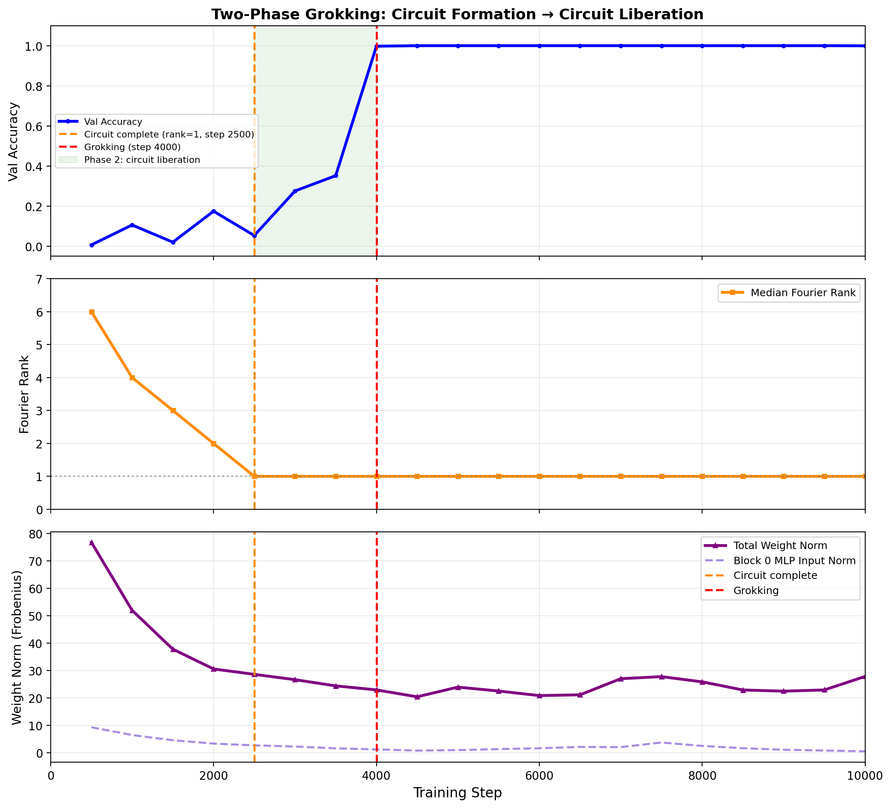
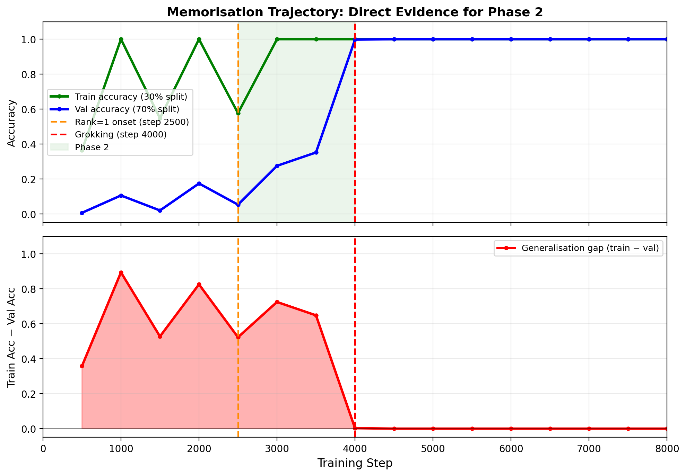

# Sivasankar 2026 — Circuit Synchronization Precedes Generalization: A Causal Precursor to Grokking

См. также: [глобальный индекс понятий](../../concepts/index.md).
arXiv [2606.12966v2](https://arxiv.org/abs/2606.12966), 11 июня 2026 (v2 — 21 июня 2026). Колонтитул PDF: «Preprint. Under review.».

**Achyuthan Sivasankar** — New York University (as21154@nyu.edu).

Файлы разбора этой статьи:

- [`2606.12966.circuit-synchronization-precedes-generalization-a-causal-precursor-to-grokking.claims.txt`](2606.12966.circuit-synchronization-precedes-generalization-a-causal-precursor-to-grokking.claims.txt) — пронумерованные утверждения статьи с пометками разбора.
- [`2606.12966.circuit-synchronization-precedes-generalization-a-causal-precursor-to-grokking.license.txt`](2606.12966.circuit-synchronization-precedes-generalization-a-causal-precursor-to-grokking.license.txt) — лицензионная запись arXiv для этой статьи.

Схема якорей и правила ссылок на карточку — в [README папки статей](../README.md).

**Карточка-выдержка.** Лицензия статьи (`arxiv-nonexclusive`) не разрешает публикацию копии оригинала и полного перевода, поэтому карточка содержит редакторские секции и цитируемые фрагменты перевода (право цитирования). Полный текст статьи: <https://arxiv.org/abs/2606.12966>.

## Затрагиваемые понятия

**[Гроккинг](../../concepts/grokking.md)** — работа берёт понятие готовым и добавляет к нему операциональный признак, срабатывающий заранее: на девяти настройках модульного сложения нормированная доля нейронов с общей доминирующей частотой пересекает порог 0.80 раньше, чем проверочная точность пересекает 95 %, с опережением от 500 до 3000 шагов и средним $+1{,}722$ шага ([с. 4, абз. 12](#p4-12)). Гроккинг здесь определён исключительно операционально — первая контрольная точка с проверочной точностью $\geq 95\%$ ([таблица 1](#p3-6)) — и наблюдается на замерах с шагом 500. Чего в работе нет: ни одного прогона без гроккинга, то есть проверки признака на ложные срабатывания; ни разбора того, что происходит при $\lambda=0$; ни попытки связать величину опережения с чем-либо, кроме длины плато запоминания.

**[Меры прогресса](../../concepts/progress-measures.md)** — работа вводит меру прогресса нового рода: FSD считается по сырым активациям MLP и, в отличие от мер Нанды, не требует заранее знать ключевые частоты контура ([определение 2](#p4-3)). Второй вклад — прямое сопоставление с существующей мерой: базовый признак по ограниченным логитам объявлен «нашей реализацией исключающей потери Nanda et al.» ([с. 5, абз. 1](#p5-1)) и во всех девяти настройках синхронизируется не раньше гроккинга ([с. 5, абз. 3](#p5-3)). Оговорки, без которых это сравнение читается неверно: две меры сняты с разных блоков (FSD — с MLP блока 0, базовый признак — с блока 1), пороги выбраны для каждой по-своему (0.80 нормированной доли против 0.5 нат), а в восьми случаях из девяти базовый признак «срабатывает» ровно на шаге гроккинга, что есть след порога на сетке 500 шагов, а не измерение начала спада. Чего в работе нет: обещанных перестановочных $p$-значений ([с. 4, абз. 7](#p4-7)) — ни одного из одиннадцати таблиц; сопоставления с мерами прогресса, появившимися в корпусе после 2024 года (в списке литературы нет ни одной работы позже 2024-го).

**[Фурье-признаки и контуры](../../concepts/fourier-features-circuits.md)** — постановка целиком наследована от фурье-объяснения Нанды: то же тождество произведения косинусов ([ур. 1](#p3-1)), те же ключевые частоты, тот же логит-считыватель. Работа добавляет к понятию два измеряемых средства: фурье-ранг — наименьшее число компонент DFT, объясняющих 90 % дисперсии отклика нейрона на сумму, — и FSD, долю нейронов с общей доминирующей частотой. Измерено, что медианный фурье-ранг обваливается $6\to 1$ **до** гроккинга и затем держится на 1 ([с. 6, абз. 2](#p6-2)), а символическое извлечение FourierKAN независимо восстанавливает ту же доминирующую частоту ([с. 7, абз. 2](#p7-2)). Чего в работе нет: разбора самого контура — ни весов, ни голов внимания, ни считывания; фурье-организация измеряется только на активациях MLP, а её связь с вычислением проверена лишь грубой абляцией нулём, по которой отслеживаемый слой и оказывается наименее нагруженным.

**[Механистическая интерпретируемость](../../concepts/mechanistic-interpretability.md)** — работа применяет рамку контуров (Elhage et al. 2021) и заявляет причинную проверку через абляцию нулём, прямо оговаривая, почему выбран именно этот, самый грубый, инструмент: он «недвусмыслен» и не требует предположения о восстановлении ([с. 3, абз. 3](#p3-3)). Оговорка авторов о границах инструмента приведена честно и подробно: абляция нулём не отличает «эта компонента вычисляет фурье-алгоритм» от «эта компонента передаёт важные сведения остаточного потока» ([с. 15, абз. 4](#p15-4)). Чего в работе нет: патчирования активаций, патчирования на уровне голов, разбора весов — авторы сами называют это ценным продолжением, а не сделанным.

**[Каузальная абляция](../../concepts/causal-ablation-intervention.md)** — работа даёт понятию два разнородных вмешательства. Первое — абляция нулём четырёх компонент грокнувшей модели ([с. 4, абз. 10](#p4-10)), измеряющая необходимость по падению точности. Второе, и главное для заявки, — развилка обучения: одна и та же контрольная точка шага 1000 разветвляется на шесть ветвей, различающихся только $\lambda$ ([с. 6, абз. 5](#p6-5)). Ход силён именно закреплением состояния: формирование контура фиксировано, свободна одна переменная. Чего в работе нет — и это существенно при цитировании: ни одно вмешательство не действует на **сам предвестник**. Синхронизацию нигде не усиливают, не подавляют и не сдвигают; причинно показано только то, что срок перехода от закреплённой точки убывает с $\lambda$. Заголовок «причинный предвестник» этим опытом не покрыт, и цитирующая работа `2607.04333` относит настоящую работу к наблюдательным объяснениям.

**[Weight decay / L2-регуляризация](../../concepts/weight-decay.md)** — здесь работа даёт корпусу самое конкретное: количественный временной закон. При развилке от закреплённой контрольной точки устойчивые ветви ($\lambda\leq 3$) грокают строго монотонно раньше и ложатся на $\Delta t=3{,}000/\lambda$ ([с. 7, абз. 1](#p7-1)), а межпростое воспроизведение с пятью розыгрышами на ячейку даёт $R^{2}=0.89$–$0.99$ по усреднённым семенам при разбросе $[0.49,1.00]$ по отдельному розыгрышу ([с. 12, абз. 2](#p12-2)). Там же измерены два предела: мягкое выполаживание при больших $\lambda$ и потолок перерегуляризации, при котором гроккинг не наступает вовсе. Прикладное следствие — повышение $\lambda$ по достижении потолка FSD ускоряет гроккинг на 36–43 % ([с. 13, абз. 1](#p13-1)). Чего в работе нет: направление эффекта («больше weight decay — раньше гроккинг») авторы сами называют общим местом и предвосхищённым у Varma et al.; развёртки по $\lambda$ с самого начала обучения нет, все ветви стартуют из одной точки; ускорение 36–43 % держится на одном рисунке без таблицы и без разброса по трём семенам.

**[Минимизация нормы весов](../../concepts/weight-norm-minimization.md)** — работа даёт понятию редкое прямое измерение: норма весов **на гроккинге** почти постоянна по $\lambda\in\{1,2,3,5\}$ (среднее $\tau\approx 23.5$, коэффициент изменчивости 0.13; [с. 12, абз. 3](#p12-3)). Это независимое свидетельство порогового устройства перехода, а не следствие подгонки временного закона. Там же честно сказано, что подогнанная скорость затухания составляет $\approx 0.2$ от номинальной $\eta\lambda$, поскольку градиентные шаги отчасти противодействуют затуханию, — отчего постоянная $C$ объявлена измеренной, а не выведенной, а порог $\tau$ по одним временам не идентифицируем ([с. 11, абз. 2](#p11-2)). Чего в работе нет: разделения нормы на «запоминающую» и «обобщающую» части — величина $\|W_{\mathrm{mem}}\|$ введена в теории, но измеряется всюду полная фробениусова норма; попытка менять норму на развилке масштабированием весов признана смешанной и отброшена.

**[Фаза меморизации / плато](../../concepts/memorization-phase.md)** — работа даёт фазе прямое измерение: точность на обучении достигает 100 % к шагу 1000, разрыв «обучение $-$ проверка» достигает пика 0.894 и обваливается до 0.003 за один промежуток между контрольными точками ([с. 6, абз. 3](#p6-3), [рис. 4](#fig-4)). Именно это измерение отличает работу от соседей по линии предвестников, где обучающая точность часто вовсе не приводится. Чего в работе нет: заявленный коридор разрыва «0.52–0.72 на всём протяжении фазы 2» не сходится с собственной таблицей 5 — на первом замере фазы 2 разрыв равен 0.947 (см. «Несогласованности»); а сама двухфазная разметка («формирование» до 2500, «освобождение» после) построена по одному прогону при $p=97$ и на другие простые не перенесена.

**[Модульная арифметика](../../concepts/modular-arithmetic.md)** — работа даёт понятию сопоставление операций по механизму, а не по трудности: сложение и вычитание дают опережающий FSD, умножение — запаздывающий на 10 000 шагов, что авторы читают как признак иного алгоритма (например, дискретного логарифма), а не как провал меры ([с. 8, абз. 3](#p8-3)). Вычитание при этом заявлено как предсказание из алгебраического тождества, сделанное до опыта, и подтверждено ([с. 9, абз. 1](#p9-1)). Развёртка по простым — $p\in\{53,71,97,113,131\}$ ([с. 3, абз. 6](#p3-6)) — и наблюдение, что при $p=113$ контур требует двух одновременно действующих частот, тогда как при остальных простых сходится к одной. Чего в работе нет: деления, ни одной операции вне группы $\mathbb{Z}_{p}$ и $S_{5}$, и разбора того, какой именно алгоритм осуществляется при умножении, — «дискретный логарифм» назван предположительно и не проверен.

**[Эталонный полигон гроккинга](../../concepts/canonical-grokking-testbed.md)** — постановка воспроизводит полигон Power–Nanda почти дословно: доля обучения 30 %, AdamW при $\eta=10^{-3}$ и $\lambda=1.0$, пакет 512, замеры каждые 500 шагов ([с. 3, абз. 5](#p3-5)). Отличия от полигона, важные при сравнении чисел: двухслойный трансформер вместо однослойного у Нанды, вход из трёх лексем $[a,b,\texttt{sep}]$ и считывание с последней позиции ([с. 3, абз. 4](#p3-4)). Чего в работе нет: сверки собственных сроков гроккинга с опубликованными на том же полигоне и оговорки о том, что 500-шаговая сетка замеров сама по себе задаёт нижнюю границу измеримого опережения — а два из девяти опережений равны ровно 500, то есть одному замеру.

**[Обучение структурированных представлений](../../concepts/structured-representation-learning.md)** — вклад работы понятию в том, что структура здесь измеряется не через геометрию представлений, а через **согласованность** нейронов: доля нейронов, у которых доминирует одна и та же частота, нормированная на случайный уровень. Главный итог для понятия — обобщение этой величины на произвольную конечную группу и вывод, что «синхронизация предшествует генерализации» есть свойство верного задаче представленческого базиса, а не фурье-базиса ([с. 14, абз. 5](#p14-5)). Чего в работе нет: сопоставления FSD с обычными для понятия величинами (кольцевая структура вложений, эффективный ранг, зонды) — ни одна из них не измеряется, так что о соотношении синхронизации и прочих признаков структуры сказать по этой работе нечего.

**[Групповые представления и cosets](../../concepts/group-representations-cosets.md)** — работа даёт корпусу готовый рецепт: мера синхронизации, построенная через преобразование Питера–Вейля с весом Планшереля и нормировкой на $d_{\rho}^{2}$, снимающей смещение в пользу наибольшего неприводимого представления ([ур. 4](#p14-1)). Проверено численно, что при $G=\mathbb{Z}_{p}$ построение сводится в точности к исходному FSD ([с. 14, абз. 2](#p14-2)) — редкая для корпуса сверка обобщения с частным случаем. Чего в работе нет: разбора смежных классов и самого выученного контура на $S_{5}$ — доминирующее неприводимое представление названо (метка Юнга и размерность), но что именно сеть в нём вычисляет, не исследовано; ссылка на Chughtai et al. 2023 служит обоснованием выбора задачи, а не сопоставлением механизмов.

**[Композиция групп / некоммутативность](../../concepts/group-composition-non-commutative-s5.md)** — $S_{5}$ взят здесь не ради трудности, а как решающая проверка: если бы «синхронизация предшествует генерализации» было артефактом наведения фурье-детектора на фурье-контур, то на неабелевой группе, чей контур живёт в многомерных неприводимых представлениях, признак должен был бы молчать ([с. 13, абз. 2](#p13-2)). Правило решения заявлено до опыта, приведены все шесть семян: $\mathrm{FSD}_{\mathrm{gen}}$ опережает на 6/6 (среднее $+2{,}417$, знаковый критерий $p=0.03$), доминирующее неприводимое представление всегда многомерно ([с. 14, абз. 4](#p14-4)). Чего в работе нет: контроль сработал рано на одном семени из шести, так что заявленное в аннотации «исходный фурье-FSD этого не делает» строже, чем показано; и вся проверка — одна группа, шесть семян, без развёртки по размеру группы.

**[Маршрутизация внимания](../../concepts/attention-routing-heads.md)** — работа даёт понятию два измерения. Первое: по абляции нулём внимание блока 1 — самая критическая компонента (падение 94.4 п.п. до почти случайного уровня), тогда как MLP блока 0 стоит всего 11.8 п.п. ([с. 8, абз. 2](#p8-2)). Второе: двухслойная модель **только с вниманием** грокает и даёт сильнейший предвестник, тогда как модель только с MLP не грокает вовсе ([с. 10, абз. 2](#p10-2)). Отсюда авторское истолкование: MLP блока 0 — организационный предвестник выше по течению, а не несущая нагрузку часть ([с. 15, абз. 1](#p15-1)). Чего в работе нет: разбора на уровне голов — ни одна из четырёх голов не рассмотрена отдельно, так что «маршрутизация» здесь измерена только на уровне целых блоков; причинная связь «организация блока 0 $\to$ уплотнение блока 1» названа, но не измерена.

**[Эффективность контуров](../../concepts/circuit-efficiency.md)** — отношение к Varma et al. 2023 разобрано в работе подробно и необычно честно: направление эффекта прямо названо предвосхищённым и общим местом, а новизна заявлена только в количественной форме, закреплённой развилке и пороговом свидетельстве ([с. 16, абз. 4](#p16-4)). Работа предлагает себя как прямое управляемое свидетельство того механизма, за который Varma доводят на основаниях эффективности. Чего в работе нет: ни одной величины эффективности — ни нормы параметров на единицу логита, ни разделения весов на запоминающую и обобщающую части; понятие используется как рамка истолкования, а не как измеряемое.

**[Фазовый переход](../../concepts/phase-transition.md)** — язык фазового перехода употреблён во вводном абзаце ([с. 1, абз. 3](#p1-3)) и унаследован от Liu et al. 2022 в разделе о родственных работах; собственная «двухфазная теория» работы — это разметка обучения на формирование и освобождение контура, а не термодинамическая картина. Чего в работе нет: ни параметра порядка, ни конечноразмерного разбора, ни критических показателей; слово «хаотичный» применительно к переходу означает разброс по повторам, а не динамическую характеристику. Полезное для понятия наблюдение обратного свойства: измеренный разброс $R^{2}$ по повторам $[0.49,1.00]$ показывает, что однопрогонные подгонки степенных законов в этой области ничего не значат ([с. 12, абз. 2](#p12-2)).

**[Разрежённая чётность](../../concepts/sparse-parity.md)** — работа лишь упоминает: «скрытый прогресс» Barak et al. 2022 назван прямо созвучным предвестнику FSD ([с. 16, абз. 2](#p16-2)). Ни задача чётности, ни вычислительные пороги здесь не воспроизводятся, сопоставления величин нет — это ссылка на предшественника в роли «то же самое, но на другой задаче».

**[Эффект рогатки](../../concepts/slingshot.md)** — работа лишь упоминает, но упоминание содержательно: потеря устойчивости после гроккинга при больших $\lambda$ (таблица 4) отождествлена с оптимизационной неустойчивостью «рогатки» Thilak et al. 2022 ([с. 16, абз. 2](#p16-2)). Отождествление сделано одной фразой, без измерения нормы или скачков потери, — то есть это истолкование наблюдённой неустойчивости, а не её разбор.

**[Алгоритмы Clock и Pizza](../../concepts/clock-vs-pizza.md)** — работа лишь упоминает, но опирается на понятие в одном из своих выводов: множественность алгоритмов (Zhong et al. 2023; Stander et al. 2024) служит объяснением того, почему FSD запаздывает при умножении, — мера по устройству отслеживает только путь фурье-синхронизации ([с. 16, абз. 3](#p16-3)). Какой именно алгоритм осуществляется при умножении, работа не выясняет.

**[Grokfast / фильтрация градиента](../../concepts/gradient-low-pass-filtering.md)** — работа лишь упоминает: ускорение через усиление медленно меняющихся составляющих градиента (Lee et al. 2024) названо дополняющим, а собственное вмешательство — действующим через скорость регуляризации от диагностированной точки формирования контура, а не через оптимизатор ([с. 16, абз. 4](#p16-4)). Сопоставления по скорости или по устойчивости с Grokfast нет.

**[Частотный принцип / спектральное смещение](../../concepts/frequency-principle-spectral-bias.md)** — работа лишь упоминает, связывая собственный обвал фурье-ранга со спектральным смещением Rahaman et al. 2019: смещение к низким частотам «сжимает представление фурье-контура до его наименьшего набора частот» ([с. 17, абз. 2](#p17-2)). Проверки этой связи нет — доминирующие частоты $k^{*}$ в таблице 6 лежат в пределах от 3 до 54 и низкими не являются.

---

## Несогласованности внутри статьи

**Порог синхронизации пересечён раньше, чем объявлено синхронизацией.** §5.1 сообщает, что для add_mod97_s42 «FSD поднимается до $\approx 0.84$ на шаге 1000, впервые пересекает порог синхронизации (FSD $\geq 0.80$) на шаге 1500» ([с. 4, абз. 12](#p4-12)). Значение 0.84 уже больше порога 0.80, так что либо синхронизация приходится на шаг 1000 (и опережение равно $+3{,}000$, а не $+2{,}500$), либо значение 0.84 на шаге 1000 неверно. Косвенно за первое: развилка ставится «в шаге потолка FSD» именно на 1000 ([с. 6, абз. 5](#p6-5)), и в межпростом опыте шаг развилки для $p=53$ и $p=131$ совпадает с шагом синхронизации из таблицы 2, а для $p=97$ — нет ([с. 12, абз. 1](#p12-1)). Аннотация усугубляет расхождение третьей формулировкой: там FSD «достигает своего послегроккингового уровня» за 500–3000 шагов до перехода ([с. 1, абз. 2](#p1-2)), тогда как послегроккинговый уровень для этого прогона равен $\approx 0.97$, а не 0.80 и не 0.84.

**Три таблицы дают три разных числа для одного прогона.** Для add_mod97_s42 таблицы 2 и 3 дают синхронизацию 1500 и опережение $+2{,}500$, таблица 8 для той же настройки под именем «2-слойная обычная (база)» — синхронизацию 2500 и опережение $+1{,}500$ ([с. 10, абз. 1](#p10-1)). Разница не объяснена; поскольку FSD в таблице 8 считается «на господствующей вычислительной единице», возможно, для базовой строки взят другой слой, но текст этого не говорит.

**«Той же величины» не равно ни одному из двух чисел.** §5.7 пишет, что модель только с вниманием опережает на 3000 шагов — «той же величины, что у двухслойной обычной базы» ([с. 10, абз. 2](#p10-2)). У базы ни $+1{,}500$ (таблица 8), ни $+2{,}500$ (таблица 2) не равно $+3{,}000$.

**Заявленный коридор разрыва генерализации не сходится с таблицей 5.** §5.3 и подпись к рисунку 4 говорят, что разрыв «держится на 0.52–0.72 всю фазу 2» ([с. 6, абз. 3](#p6-3), [рис. 4](#fig-4)). Точность на обучении равна 100 % с шага 1000, а проверочная точность в фазе 2 по таблице 5 составляет 0.053, 0.275 и 0.352, то есть разрыв равен 0.947, 0.725 и 0.648. Первый замер фазы 2 в заявленный коридор не попадает вовсе, второй выходит за его верхнюю границу. Та же арифметика на шаге 1000 даёт 0.894 и с работой согласуется, так что расхождение именно в описании фазы 2.

**Число настроек: пять против одиннадцати.** §1 говорит «мы обучаем двухслойный трансформер на пяти настройках модульной арифметики» ([с. 2, абз. 4](#p2-4)); таблица 1 перечисляет одиннадцать ([с. 3, абз. 6](#p3-6)). По-видимому, имелись в виду пять простых.

**Вычитание: два семени в §5.1, один прогон в таблицах.** §5.1 сообщает об опережениях вычитания на двух семенах ([с. 4, абз. 12](#p4-12)), §5.6 приводит sub_mod97_s123 с гроккингом на 5000 и синхронизацией на 3000 ([с. 9, абз. 1](#p9-1)), однако в таблицах 1 и 2 вычитание представлено единственной строкой, и итог «одиннадцать настроек» второй прогон не учитывает.

**Базовый признак фильтрует семь частот, а объясняется как одночастотный.** Порядок действий §5.2 отбирает семь верхних частот ([с. 5, абз. 2](#p5-2)), тогда как объяснение его неудачи при $p=113$ ссылается на фильтр, «нацеленный на одну верхнюю частоту» ([с. 5, абз. 4](#p5-4)). Одно из двух описаний неверно, и именно на этом объяснении держится вывод, что при $p=113$ базовый признак «вообще не годится в предсказатели».

**Обещанные $p$-значения перестановочного критерия отсутствуют.** Мера названа «проверяемой перестановочным критерием» в заглавии вклада и в аннотации, §4 обещает: «мы приводим $p$-значения и отмечаем значимость при $\alpha=0.05$» ([с. 4, абз. 7](#p4-7)), а алгоритм 1 в приложении A возвращает $p$-значение. Ни одного перестановочного $p$-значения ни в одной из одиннадцати таблиц нет; приводимые $p$ относятся к знаковому критерию по настройкам, а не к перестановкам по нейронам.

**«Восемь из девяти» не сходится с таблицей 6.** §5.4 говорит, что после гроккинга нейроны сходятся к представлениям ранга 1 «с аналитическим $R^{2}>0.92$ в восьми опытах из девяти» ([с. 7, абз. 2](#p7-2)). По таблице 6 порог $0.92$ превышен семь раз: помимо add_mod113_s42 ($0.690$) ниже порога стоит и add_mod71_s42 ($0.918$).

**Ссылка на таблицу 1 вместо таблицы 6.** Объяснение случая $p=113$ ссылается на «представление ранга 2 в таблице 1» ([с. 8, абз. 1](#p8-1)); ранги приведены в таблице 6, а таблица 1 содержит только настройки и шаги гроккинга.

**Устойчивость пуска по FSD при $\lambda_{\mathrm{high}}=10$: текст и подпись расходятся.** Текст §6 утверждает устойчивость только в пределах $3/3$ при $\lambda_{\mathrm{high}}\leq 5$ ([с. 13, абз. 1](#p13-1)), тогда как подпись к рисунку 8 говорит, что наивные пуски не дают гроккинга при $\lambda_{\mathrm{high}}=10$, «тогда как fsd остаётся безопасным» ([рис. 8](#fig-8)). Проверялся ли пуск по FSD при 10, из текста установить нельзя, — а именно на этом значении и построено всё сравнение с наивными пусками.

**«Контур вычислительно завершён на шаге 1000» против собственной фазовой разметки.** Аннотация, §5.3 и §8 говорят, что фурье-контур был вычислительно завершён за 3000 шагов до гроккинга, то есть на шаге 1000 ([с. 1, абз. 2](#p1-2), [с. 7, абз. 1](#p7-1), [с. 15, абз. 3](#p15-3)). Собственная разметка той же работы относит шаги 0–2500 к фазе формирования контура, а медианный фурье-ранг доходит до 1 только к 2500 ([с. 6, абз. 2](#p6-2)); на самом рисунке 2 оранжевая линия подписана в легенде «Circuit complete (rank=1, step 2500)» ([рис. 2](#fig-2)). Следствие для чисел: измеряемое $\Delta t=$ гроккинг $-\,1000$ есть весь остаток обучения (3000 шагов), а не длительность фазы 2 (1500 шагов), так что закон $\Delta t\propto 1/\lambda$ подогнан к сумме «остаток фазы 1 + фаза 2», а не к фазе 2.

---

## Что доказано, что показано и что предположено

**Проверено до опыта и подтвердилось.** Три места. Первое — вычитание: предсказание сделано из алгебраического тождества и подтвердилось на двух семенах ([с. 9, абз. 1](#p9-1)). Второе — пороговая посылка формулы 3: норма весов на гроккинге почти постоянна по $\lambda$ (коэффициент изменчивости 0.13), и это измерение независимо от временного закона ([с. 12, абз. 3](#p12-3)). Третье — перенос на $S_{5}$ с правилом решения, закреплённым до опыта, и раскрытыми всеми шестью семенами ([с. 14, абз. 3](#p14-3)).

**Показано, но со своими порогами.** Опережение FSD измерено на сетке замеров в 500 шагов, и два из девяти опережений равны ровно одному замеру. Сравнение с базовым признаком ведётся при порогах, выбранных для каждой меры по-своему, и на разных блоках сети; в восьми случаях из девяти «синхронизация» базового признака приходится ровно на шаг гроккинга ([таблица 3](#p5-3)), что говорит о зернистости измерения, а не о свойстве меры. Точность в таблице абляций считается на полном наборе всех $p^{2}$ пар ([с. 4, абз. 10](#p4-10)), то есть включает 30 % пар, виденных при обучении, — числа этой таблицы не сопоставимы напрямую с проверочной точностью прочих таблиц.

**Причинно проверено ровно одно.** Развилка меняет $\lambda$, а не FSD. Показано, что срок гроккинга от закреплённой контрольной точки убывает как $1/\lambda$ при $\lambda\leq 3$; не показано, что синхронизация вызывает гроккинг. Заглавие («причинный предвестник») и аннотация ([с. 1, абз. 2](#p1-2)) сильнее этого опыта, и сами авторы в §8 называют роль MLP блока 0 «истолкованием», согласующимся с данными ([с. 15, абз. 1](#p15-1)).

**Предположено и отмечено как предположение.** Что при умножении осуществляется иной алгоритм (например, дискретный логарифм) — сказано с хеджем «по-видимому» ([с. 8, абз. 3](#p8-3)). Что причина мягкого выполаживания при больших $\lambda$ есть предел скорости, с которой контур может взять верх, — «наводит на мысль» ([с. 12, абз. 2](#p12-2)).

**Границы, признанные авторами.** Перечислены в §6 и §16 честно и полно: постоянная $C$ измерена, а не выведена, и порог $\tau$ по одним временам не идентифицируем ([с. 11, абз. 2](#p11-2)); действующая скорость затухания составляет $\approx 0.2$ от номинальной $\eta\lambda$; попытка проверить логарифмический член масштабированием весов признана смешанной и отброшена ([с. 12, абз. 3](#p12-3)); из девяти настроек сложения пять делят $p=97$, так что различных простых четыре; однопрогонное $R^{2}$ объявлено ненадёжным, а прежний собственный «контрпример» при $p=53$ пересмотрен как неудачный розыгрыш ([с. 16, абз. 1](#p16-1)). Не признано: что вся линия предвестников гроккинга после 2024 года прошла мимо — в списке литературы нет ни одной работы позже 2024-го, включая работы корпуса, решающие ту же задачу.

**Одна оговорка, потерянная между разделами.** Правило решения для $S_{5}$ требовало, чтобы фурье-контроль **не** опережал; на семени 123 он опередил, и §7 это раскрывает, называя противопоставление «сильным, но не безусловным» ([с. 14, абз. 4](#p14-4)). Аннотация же говорит, что исходный фурье-FSD гроккинга не предвосхищает, без оговорки ([с. 1, абз. 2](#p1-2)).

---

## Ошибочные цитирования

Редакторские замечания о местах, где эта работа передаёт чужие результаты с ошибкой или без авторских оговорок.

###### mc-2301-05217

**Nanda et al. (2301.05217) — ограниченная потеря названа исключающей, и на этом построен вывод о её непригодности.** Базовый признак работы определён так: перекрёстная энтропия при фильтрации активаций с сохранением **только** верхних фурье-компонент ключевых частот, — и тут же назван «нашей реализацией исключающей потери Nanda et al.» ([с. 5, абз. 1](#p5-1)). У Нанды это две разные меры, определённые в одном предложении: [`"restricted loss, where we ablate every non-key frequency, and excluded loss, where we instead ablate all key frequencies"`](../2301.05217.progress-measures-for-grokking-via-mechanistic-interpretability/2301.05217.progress-measures-for-grokking-via-mechanistic-interpretability.card.md#p2-3) — *«ограниченную потерю (restricted loss), где мы удаляем абляцией все не-ключевые частоты, и исключающую потерю (excluded loss), где мы, наоборот, удаляем все ключевые частоты»*. Сохранение ключевых частот — это ограниченная потеря; работа воспроизвела её и назвала исключающей. Расхождение не терминологическое: у Нанды об ограниченной потере показано ровно то, что здесь отрицается, — [`"The restricted loss begins declining before test loss declines, but has an inflection point when grokking begins to occur."`](../2301.05217.progress-measures-for-grokking-via-mechanistic-interpretability/2301.05217.progress-measures-for-grokking-via-mechanistic-interpretability.card.md#sec-4-1) — *«Ограниченная потеря начинает убывать раньше, чем убывает тестовая потеря, но имеет точку перегиба в момент начала гроккинга.»*, тогда как здесь вывод сформулирован как «ExLoss ни разу не синхронизируется раньше гроккинга» ([с. 5, абз. 4](#p5-4)). Причина расхождения видна из порядка действий: измеряется не начало спада, а пересечение абсолютного порога 0.5 нат на сетке 500 шагов и на другом блоке сети, — то есть сравниваются не те величины, которые сравнивал Нанда. Сама реализация при этом описана прозрачно, и читатель может восстановить, что именно измерено; ошибочно только имя меры и вывод, который из него делается.

**Трёхфазная разметка Нанды пересказана другими фазами.** §2 приводит её как «формирование ограниченного контура, очистка от запоминания и полная генерализация» ([с. 2, абз. 6](#p2-6)). У Нанды фазы называются иначе и начинаются с другой: [`"three phases: memorization of the training data; circuit formation, where the network learns a mechanism that generalizes; and cleanup, where weight decay removes the memorization components"`](../2301.05217.progress-measures-for-grokking-via-mechanistic-interpretability/2301.05217.progress-measures-for-grokking-via-mechanistic-interpretability.card.md#p2-3) — *«на три фазы: запоминание обучающих данных; формирование контура, когда сеть выучивает обобщающий механизм; и очистка, когда weight decay удаляет запоминающие компоненты»*. Третья фаза у Нанды есть очистка, а не «полная генерализация». Фаза запоминания, с которой у Нанды всё начинается, из пересказа выпала — притом что собственная двухфазная разметка настоящей работы ровно её и не содержит, начиная отсчёт сразу с формирования контура.

---

# Цитируемые фрагменты перевода

Ниже приведены только те фрагменты перевода, на которые ссылаются карточки корпуса (право цитирования). Нумерация якорей `pN-M` / `fig-N` / `sec-X` совпадает с полной карточкой и оригиналом.

## Аннотация

###### p1-2

Гроккинг — явление отложенной генерализации, при котором трансформер, обучаемый модульной арифметике, резко переходит от почти случайной проверочной точности к почти безупречной, — приписывался формированию алгоритмического контура на основе Фурье, но *сроки*, *причинное устройство* и *управляемость* этого формирования остаются плохо понятыми. Мы вводим **степень частотной синхронизации (Frequency Synchronization Degree, FSD)** — формально нормированную, проверяемую перестановочным критерием меру синхронизации фурье-контура, не требующую предварительного знания контура. На девяти настройках модульного сложения (простые $p\in\{53,71,97,113,131\}$, три семени) FSD достигает своего послегроккингового уровня **за 500–3000 шагов до гроккинга** (среднее опережение $+1{,}722$ шага; во всех настройках оно положительно, знаковый критерий $p\approx 0.004$) и синхронизируется **раньше базового признака по ограниченным логитам** (нашей реализации исключающей потери Nanda et al.) во всех девяти настройках, что устанавливает FSD как самый ранний из доступных предсказателей формирования фурье-контура. Мы даём **прямое причинное свидетельство** того, что межфазный разрыв есть явление регуляризации: развилка обучения в шаге потолка FSD с weight decay $\lambda\in\{1,2,3,4,5,10\}$ вызывает строго монотонно более ранний гроккинг для устойчивых ветвей ($\lambda\leq 3$), с $\Delta t\propto 1/\lambda$, — фурье-контур был вычислительно завершён за 3000 шагов до гроккинга; лишь скорость затухания весов запоминания определяла, когда наступит генерализация. **Закон обратной $\lambda$ воспроизводится на трёх простых** ($p\!\in\!\{53,97,131\}$): подгонка усреднённых по семенам $\Delta t$ даёт $R^{2}=0.89$–$0.99$. Мы предостерегаем, что $R^{2}$ по отдельному прогону неустойчив — одиночные розыгрыши лежат в пределах $0.49$–$1.00$ из-за хаотичности гроккингового перехода, — поэтому мы приводим закон с доверительными интервалами по семенам, а не по одному прогону. Переход происходит при почти постоянной норме запоминания по всем $\lambda$ (коэффициент изменчивости $0.13$), что обосновывает эмпирическую постоянную $C$ пороговым устройством. Существенно, что действие «синхронизация предшествует генерализации» **не** есть артефакт наведения фурье-детектора на фурье-контур: на неабелевой группе $S_{5}$ — чей гроккинговый контур живёт в многомерных неприводимых представлениях, а не в одномерных фурье-модах, — верное базису обобщение FSD предшествует гроккингу на всех шести семенах (знаковый критерий $p=0.03$), тогда как исходный фурье-FSD этого не делает. Наконец, использование потолка FSD для назначения повышения weight decay ускоряет гроккинг на **36–43 %** по сравнению с фиксированным расписанием и, в отличие от пуска по сроку запоминания, делает это без потери устойчивости обучения. Вариант только с вниманием грокает при сильном предвестнике FSD, тогда как модель только с MLP не грокает никогда.

## 1 Введение

###### p1-3

Трансформер, обучаемый вычислять $(a+b)\bmod p$ на 30 % всех входных пар, после продолжительного обучения обнаруживает внезапный фазовый переход: проверочная точность подскакивает от почти случайной к почти безупречной за сотни шагов. Это явление, названное *гроккингом* у Power et al. 2022, показывает, что **[p. 2]** нейронные сети способны открывать компактные символические алгоритмы градиентным спуском — но лишь после видимого переобучения.

###### p2-4

Мы обучаем двухслойный трансформер на пяти настройках модульной арифметики и разбираем оба вопроса. Наши вклады таковы:

###### p2-5

- **FSD**: нормированная, проверяемая перестановочным критерием мера синхронизации фурье-контура, не требующая предварительного знания контура и предсказывающая гроккинг за 500–3000 шагов на всех девяти опытах со сложением (три семени, пять простых; среднее опережение $+1{,}722$).
- **FSD против потери по ограниченным логитам**: FSD синхронизируется раньше базового признака по ограниченным логитам во всех девяти настройках, что устанавливает FSD как самый ранний из доступных предсказателей (§5.2).
- **Причинное вмешательство**: развилка обучения в шаге потолка FSD с $\lambda\in\{1,2,3,4,5,10\}$ даёт монотонно более ранний гроккинг (устойчивые ветви), подтверждая, что фаза 2 есть фаза регуляризации, а не фаза вычисления; временной закон обратной $\lambda$ воспроизводится на трёх простых *с доверительными интервалами по пяти семенам/повторам на простое* (§5.3, §6).
- **Пороговое устройство временного закона**: гроккинг наступает при почти постоянной норме запоминания по всем $\lambda$ ($\mathrm{CV}=0.13$), что обосновывает эмпирическое $\Delta t=C/\lambda$ картиной затухания до порога; постоянная $C$ измерена, а не выведена (§6).
- **Общность за пределами Фурье (неабелев перенос)**: верное базису обобщение FSD на неприводимые представления группы предшествует гроккингу на неабелевой группе $S_{5}$ на всех шести семенах (знаковый критерий $p=0.03$), тогда как исходный фурье-FSD этого не делает, — что устанавливает предвестник как свойство верного задаче представленческого базиса, а не как результат фурье-обнаружения фурье-контура (§7).
- **Польза от ранности**: запуск повышения weight decay на потолке FSD ускоряет гроккинг на 36–43 % по сравнению с фиксированным расписанием и остаётся устойчивым там, где пуски по сроку запоминания катастрофически проваливаются (§7).
- **Фурье-ранг**: точная аналитическая мера представленческого сжатия на каждый нейрон, показывающая плавный обвал ранга (6 $\to$ 1) целиком внутри фазы 1.
- **Абляция архитектуры**: трансформер только с вниманием грокает при сильном предвестнике FSD, а модель только с MLP не грокает никогда; однослойная модель грокает, но её FSD запаздывает, что показывает: предвестник есть свойство многоблочных контуров (§5.7).
- **Противопоставление операций**: модульное вычитание даёт тот же предвестник FSD, что и сложение; умножение даёт запаздывающий FSD, механистически разделяя эти операции (§5.6).
- **Причинная иерархия по абляции нулём**: внимание блока 1 движет генерализацию, тогда как MLP блока 0 есть организационный предвестник.

#### Гроккинг.

###### p2-6

Power et al. 2022 обнаружили, что трансформеры на наборах с групповыми операциями обнаруживают долгие фазы запоминания перед внезапной генерализацией. Nanda et al. 2023 охарактеризовали это как трёхфазный процесс: формирование ограниченного контура, очистка от запоминания и полная генерализация, — и предложили «исключающую потерю» (excluded loss) как меру прогресса. Наши FSD и фурье-ранг суть меры прогресса, *не* требующие знать контур заранее. Liu et al. 2022 связали гроккинг с фазовыми переходами в эффективном обучении представлений.

#### Фурье-контуры.

###### p3-1

Алгоритм пользуется тождеством

#### Механистическая интерпретируемость.

###### p3-3

Elhage et al. 2021 ввели рамку контуров. Geiger et al. 2021 формализовали причинное вмешательство для контуров. Мы применяем *абляцию нулём* (обнуление выхода компоненты) как недвусмысленную проверку причинной необходимости, избегая нужды в каком-либо предположении о восстановлении.

#### Модель.

###### p3-4

Двухслойный трансформер: $d_{\mathrm{model}}=128$, $n_{\mathrm{heads}}=4$, $d_{\mathrm{mlp}}=512$ (Linear–GELU–Linear на блок), с остаточными связями и LayerNorm. Входные токены суть $[a,\;b,\;\texttt{sep}]$ ($\texttt{sep}=p$); модель предсказывает с последней позиции через голову LayerNorm–Linear. Полные подробности — в приложении B.

#### Обучение.

###### p3-5

AdamW, $\eta=10^{-3}$, weight decay $\lambda=1.0$, размер пакета 512, разбиение всех $p^{2}$ пар на 30 % обучения / 70 % проверки (разбиение детерминировано семенем). Контрольные точки сохраняются каждые 500 шагов.

#### Опыты.

###### p3-6

Одиннадцать настроек, охватывающих пять простых ($p\in\{53,71,97,113,131\}$), три семени, одну задачу на вычитание и одну на умножение (таблица 1).

##### **Определение 2**(степень частотной синхронизации)**.**

###### p4-3

*FSD нормирует пиковое участие относительно случайного уровня $c=1/\lfloor p/2\rfloor$:*

###### p4-7

Статистическая значимость оценивается перестановочным критерием (1000 перетасовок назначения доминирующей частоты по нейронам); мы приводим $p$-значения и отмечаем значимость при $\alpha=0.05$.

#### Абляция компоненты нулём.

###### p4-10

Для каждой компоненты $c$ (MLP блока 0, MLP блока 1, внимание блока 0, внимание блока 1) мы регистрируем прямой хук PyTorch, заменяющий выходной тензор компоненты нулями, а затем оцениваем точность на полном наборе из $p^{2}$ пар. Падение точности $\Delta_{c}=\mathrm{acc}_{\mathrm{orig}}-\mathrm{acc}_{c=0}$ измеряет причинную *необходимость*: большое падение означает, что остальная модель не может возместить молчание компоненты $c$. Отметим, что это осторожная проверка на уровне компонент; она измеряет, несёт ли компонента нагрузку в остаточном потоке, а не то, вычисляет ли она какой-либо конкретный подалгоритм.

### 5.1 FSD как опережающий признак гроккинга

###### p4-12

Таблица 2 сводит все одиннадцать опытов. Для сложения mod 97 (семя 42) FSD поднимается до $\approx 0.84$ на шаге 1000, впервые пересекает порог синхронизации (FSD $\geq 0.80$) на шаге 1500 и устанавливается на $\approx 0.97$ после гроккинга на шаге 4000 — опережение в 2500 шагов. На всех *девяти* настройках сложения (пять простых $p\in\{53,71,97,113,131\}$, три семени) FSD синхронизируется до гроккинга с временами опережения **[p. 5]** от 500 до 3000 шагов. **Каждая из девяти настроек имеет положительное опережение** (точный знаковый критерий, $p=2^{-9}\times 2\approx 0.004$). Среднее опережение — **+1722 шага** (бутстрап-интервал 95 % на уровне настроек: $[+1{,}111,+2{,}333]$, $B=10^{5}$ повторных выборок). Поскольку пять настроек делят $p=97$, мы также сперва усредняем внутри простого и бутстрапируем по пяти различным простым (устраняя псевдорепликацию): среднее опережение с кластеризацией по простым — **+1740 шагов** (95 % ДИ $[+1{,}240,+2{,}400]$), по-прежнему целиком выше нуля. Корреляции Пирсона между FSD и проверочной точностью лежат в пределах от 0.49 до 0.78. Модульное вычитание даёт опережения FSD в +1000 и +2000 шагов (два семени), что согласуется с общностью алгебраического устройства. Модульное умножение даёт FSD, запаздывающий относительно гроккинга на 10 000 шагов, что подтверждает: предвестник специфичен для операции.

### 5.2 FSD против потери по ограниченным логитам

###### p5-1

Чтобы выяснить, не является ли FSD всего лишь заместителем существующих мер прогресса, мы сравниваем его с *базовым признаком по ограниченным логитам*: перекрёстной энтропией, вычисленной, когда скрытые активации MLP блока 1 отфильтрованы так, что сохранены только 7 верхних фурье-компонент ключевых частот. Это наша реализация «исключающей потери» Nanda et al. (Nanda et al. 2023), которая измеряет, насколько функционально способен фурье-контур ещё до того, как модель обобщит.

#### Порядок действий.

###### p5-2

Для каждой контрольной точки: (1) вычислить DFT по каждому нейрону на активациях блока 1; (2) выделить 7 верхних частот по участию нейронов; (3) восстановить активации, пользуясь только этими компонентами; (4) завершить прямой проход и вычислить перекрёстную энтропию. Низкая ограниченная потеря сигнализирует о работающем фурье-контуре; мы объявляем *синхронизацию*, когда эта потеря впервые падает ниже 0.5 нат.

#### Результаты.

###### p5-3

Таблица 3 показывает, что FSD синхронизируется раньше потери по ограниченным логитам во **всех девяти опытах со сложением**, с опережениями FSD от 500 до 3000 шагов (в среднем $+1{,}722$ шага). В add_mod113_s42 потеря по ограниченным логитам *не* падает ниже 0.5 нат вплоть до шага 4000 — **на 1500 шагов позже гроккинга**, — тогда как FSD синхронизируется за 1000 шагов *до* гроккинга. Таким образом, FSD не только лучший предсказатель, чем потеря по ограниченным логитам; при $p=113$ (представления ранга 2) потеря по ограниченным логитам *вообще* не годится в предсказатели.

###### p5-4

Преимущество FSD особенно заметно при $p=113$: это простое требует фурье-представления ранга 2 (две доминирующие частоты делят контур). Фильтр по ограниченным логитам, нацеленный на одну верхнюю частоту, не схватывает полного состояния контура, тогда как обобщение FSD на top-$k$ верно отслеживает многочастотную синхронизацию. Во всех девяти опытах ExLoss ни разу не синхронизируется раньше гроккинга (среднее опережение ExLoss $=-167$, утянутое вниз случаем $-1{,}500$ при $p=113$); FSD синхронизируется раньше неизменно. Рисунок 1 наглядно сводит времена опережения.

### 5.3 Двухфазная теория гроккинга

###### fig-2

*Рисунок 2: Двухфазный гроккинг, сложение mod 97 (семя 42). **Вверху**: проверочная точность. Оранжевая пунктирная линия = начало ранга 1 (шаг 2500); красная пунктирная = гроккинг (шаг 4000); зелёная заливка = фаза 2. **В середине**: медианный фурье-ранг нейронов MLP блока 0, обваливающийся 6 $\to$ 1 в фазе 1, а затем удерживаемый ровным всю фазу 2. **Внизу**: полная фробениусова норма весов (сплошная) и норма входа MLP блока 0 (пунктирная), обе непрерывно убывают. Разрыв в 1500 шагов между обвалом ранга и гроккингом определяет период освобождения контура.* **[p. 7]**

###### p6-2

**Фаза 1 — формирование контура (шаги 0–2500).** Медианный фурье-ранг монотонно спускается 6$\,\to\,$1 (таблица 5). Полная норма весов падает с 76.72 до 28.60 — сокращение на 62.7 %. Проверочная точность колеблется около 0–17 %.

###### p6-3

**Фаза 2 — освобождение контура (шаги 2500–4000).** Фурье-ранг держится на 1 в течение 1500 шагов; норма весов убывает ещё на 19.8 % (28.60 $\to$ 22.94). Проверочная точность не превышает 35 %. Рисунок 4 даёт прямое свидетельство устройства запоминания: точность на обучении достигает 100 % к шагу 1000, а разрыв генерализации (обучение $-$ проверка) достигает пика 0.894. На всём протяжении фазы 2 разрыв держится на 0.52–0.72, пока контур полностью сформирован (ранг $=1$). На гроккинге (шаг 4000) разрыв обваливается до 0.003 за один промежуток между контрольными точками — падение на 99.4 %, — что подтверждает: фаза 2 есть отсечение моделью ёмкости запоминания при уже завершённом фурье-контуре.

#### Причинная проверка вмешательством по weight decay.

###### p6-5

Двухфазное объяснение предсказывает, что длительность фазы 2 определяется скоростью регуляризации, а не сроком формирования контура. **[p. 7]** Чтобы проверить это причинно, мы загружаем контрольную точку add_mod97_s42 на шаге 1000 (FSD $=0.84$, проверочная точность $=10.6\%$) и разветвляем её на шесть независимых ветвей с $\lambda\in\{1.0,2.0,3.0,4.0,5.0,10.0\}$, обучая каждую ветвь до шага 8000.

###### p7-1

Больший weight decay монотонно даёт более ранний гроккинг при $\lambda\in\{1,2,3\}$ (устойчивые ветви), каждый раз в согласии с $\Delta t=3{,}000/\lambda$: $\lambda=2.0$ вдвое сокращает длительность фазы 2 (3000$\to$1500 шагов), а $\lambda=3.0$ сокращает её в $3\times$ (3000$\to$1000 шагов). При $\lambda\in\{4,5\}$ гроккинг тоже наступил на шаге 2000, но обучение впоследствии потеряло устойчивость из-за перерегуляризации; при $\lambda=10.0$ устойчивость была потеряна до гроккинга. Строгий монотонный порядок при $\lambda\in\{1,2,3\}$ причинно подтверждает, что фаза 2 есть фаза регуляризации: фурье-контур был вычислительно завершён на шаге 1000; лишь скорость затухания весов определяла, когда наступит генерализация. Рисунок 3 показывает кривые проверочной точности для всех шести ветвей рядом с теоретическим предсказанием $1/\lambda$.

###### fig-4

*Рисунок 4: Траектория запоминания, сложение mod 97 (семя 42). **Вверху**: точность на обучении (зелёная, 30 % разбиения) и проверочная точность (синяя, 70 % разбиения). Точность на обучении достигает 100 % к шагу 1000; проверочная точность держится около нуля до гроккинга на шаге 4000. **Внизу**: разрыв генерализации (обучение $-$ проверка, красная заливка). Разрыв достигает пика 0.894 (шаг 1000), удерживается на всём протяжении фазы 2 на 0.52–0.72, а затем обваливается до 0.003 на гроккинге. Это прямо свидетельствует, что фаза 2 есть отсечение действующего запоминания, а не постепенный переход.* **[p. 9]**

### 5.4 Символическое извлечение FourierKAN

###### p7-2

Таблица 6 показывает итоги FourierKAN на всех девяти опытах со сложением (MLP блока 0). Картина единообразна: после гроккинга нейроны сходятся к представлениям ранга 1 (одна синусоида) с **[p. 8]** аналитическим $R^{2}>0.92$ в восьми опытах из девяти. FourierKAN независимо восстанавливает ту же доминирующую частоту, что и аналитическое DFT, при согласии по нейронам 88–100 % в восьми опытах.

###### p8-1

Исключение — add_mod113_s42 ($p=113$): медианный ранг сходится к 2, доля ранга 1 составляет лишь 23 %, а $R^{2}=0.69$ при ранге 1 (против $0.92$ при ранге 2). Это *не* провал модели; это отражает то, что $p=113$ требует *двух* одновременно действующих фурье-частот для верного модульного тождества (в согласии с представлением ранга 2 в таблице 1). Расширение $\mathrm{FSD}_{2}$ (определение 2) подтверждает, что двухчастотная синхронизация следует той же догроккинговой картине. add_mod131_s42 ($p=131$) показывает сильный аналитический обвал ранга ($R^{2}=0.989$, ранг $5{\to}1$, доля ранга 1 — 0.96), но обучение FourierKAN для этого простого не сошлось (KAN $R^{2}=0.04$); мы приводим только аналитические итоги и отмечаем столбец KAN значком $\dagger$.

### 5.5 Причинная иерархия по абляции нулём

###### p8-2

Таблица 7 приводит итоги абляции нулём для грокнувшей модели сложения mod 97. Внимание блока 1 — самая критическая компонента: его обнуление снижает точность до 5.4 % (почти случайный уровень, $1/97\approx 1\%$). Внимание блока 0 и MLP блока 1 одинаково критичны — падения на 89 и 88 п.п. MLP блока 0 — слой, отслеживаемый FSD и фурье-рангом, — даёт вклад лишь в 11.8 п.п., оставляя 87.97 % точности при его удалении.

### 5.6 Противопоставление операций: сложение, вычитание и умножение

###### p8-3

Модульное умножение при той же архитектуре показывает обращённые сроки (таблица 2): FSD синхронизируется на шаге 13 000, *на 10 000 шагов позже* гроккинга на шаге 3000. Это подтверждает, что предвестник FSD специфичен для сложения. У умножения нет тождества «сумма в произведение» (ур. 1), которое делает **[p. 9]** фурье-контур эффективным решением; модель, по-видимому, осуществляет иной алгоритм (например, дискретный логарифм), а фурье-подобная организация возникает лишь задним числом как побочное следствие сжатия обобщающего решения посредством weight decay. То, что модель может грокнуть одну и ту же операцию качественно различными способами, установлено (Zhong et al. 2023; Stander et al. 2024); FSD по своему устройству отслеживает только путь фурье-синхронизации, отчего он и опережает при сложении и запаздывает при умножении.

#### Модульное вычитание.

###### p9-1

$(a-b)\bmod p$ алгебраически равносильно сложению по модулю $p$ (то же групповое устройство, то же фурье-тождество). Мы предсказываем, что FSD должен синхронизироваться до гроккинга и для вычитания, с той же доминирующей частотой. Итоги: sub_mod97_s42 грокает на шаге 5500 при синхронизации FSD на шаге 4500 (опережение $=+1{,}000$); sub_mod97_s123 грокает на шаге 5000 при синхронизации FSD на шаге 3000 (**[p. 10]** опережение $=+2{,}000$). В обоих случаях FSD синхронизируется до гроккинга, что подтверждает распространение предвестниковой картины на модульное вычитание. Вычитание грокает приблизительно на 1500 шагов позже сложения (шаг 5000–5500 против 3000–4000), что согласуется с чуть более сложным групповым устройством при той же настройке обучения.

### 5.7 Абляция архитектуры

###### p10-1

Чтобы установить, что FSD измеряет общую синхронизацию фурье-контура, а не особенность, свойственную двухслойному трансформеру, мы обучаем три варианта на add_mod97_s42: (1) *однослойный обычный трансформер* ($n_{\mathrm{layers}}=1$), (2) *двухслойную модель только с вниманием* (блоки MLP заменены тождеством, так что всё вычисление есть остаточное внимание) и (3) *двухслойную модель только с MLP* (внимание заменено тождеством).

###### p10-2

Итоги подтверждают две гипотезы и вскрывают одну тонкость. *Двухслойная модель только с вниманием* грокает на шаге 4000 и показывает опережение FSD внимания блока 0 в 3000 шагов — той же величины, что у двухслойной обычной базы. *Двухслойная модель только с MLP* не грокает в пределах 15 000 шагов, что подтверждает: внимание есть необходимая компонента фурье-алгоритма на сложении. Итог *однослойной обычной* модели поучителен: модель грокает на шаге 4500, но FSD MLP блока 0 не достигает 0.80 до шага 5500 (то есть после гроккинга). В однослойной модели у MLP блока 0 нет контура ниже по течению, которому он предшествовал бы; он вынужден нести всю вычислительную нагрузку одновременно. Двухслойная находка, что MLP блока 0 есть *организационный предвестник выше по течению* (а не несущий нагрузку), свойственна архитектурам, где вторичный контур может уплотниться после того, как первичный подконтур организовался.

#### Предсказание.

###### p11-2

Ур. 3 даёт опровержимое предсказание $\Delta t\propto 1/\lambda$: увеличение $\lambda$ в точке развилки должно пропорционально сокращать длительность фазы 2, причём постоянная $C=\log(\|W(t^{*})\|/\tau)$ закреплена состоянием в $t^{*}$ и не зависит от того, какая ветвь по $\lambda$ выбрана. Мы подчёркиваем, что здесь проверяется именно *масштабирование как обратная $\lambda$*, а не абсолютное значение $\tau$: поскольку $C$ входит только под логарифмом, $\tau$ по одним лишь временным данным отдельно не идентифицируем (любая пара $(\|W_{\mathrm{mem}}\|,\tau)$ с тем же отношением даёт ту же подгонку). Поэтому мы рассматриваем ур. 3 как обоснование *эмпирического однопараметрического закона масштабирования* $\Delta t=C/\lambda$ и приводим $C$, не заявляя измеренного $\tau$.

#### Межпростое воспроизведение с доверительными интервалами.

###### p12-1

Чтобы проверить, не свойствен ли закон обратной $\lambda$ одному лишь $p=97$, и количественно оценить вскрытый выше шум от прогона к прогону, мы повторяем вмешательство на всех трёх простых с **пятью розыгрышами на ячейку** $(\text{prime},\lambda)$ вместо одного прогона, разветвляя каждое простое в его собственном шаге потолка FSD (FSD $\geq 0.80$): $p=53$ на шаге 2000, $p=97$ на шаге 1000 (пять настоящих семян), $p=131$ на шаге 1000. Мы измеряем $\Delta t$ с разрешением **100 шагов**, приводим $\mathrm{mean}\pm\mathrm{std}$ по ячейке и подгоняем $\Delta t=C_{p}/\lambda$ к усреднённым по семенам $\Delta t$ (таблица 10, рисунок 6).

###### p12-2

Отсюда следуют три вывода. *(i)* Подгонка обратной $\lambda$ по усреднённым семенам держится для каждого простого: $R^{2}=0.89$ ($p=53$), $0.94$ ($p=97$) и $0.99$ ($p=131$). *(ii)* Сообщавшийся прежде «срыв» при $p=53$ ($R^{2}=0.49$) был единственным неудачным розыгрышем: он попадает внутрь разброса $R^{2}$ по отдельным розыгрышам, наблюдаемого даже у чистых простых ($[0.49,0.95]$ для $p=53$; $[0.69,1.00]$ для $p=97$), и усреднение по пяти повторам восстанавливает чистую монотонную зависимость. Поэтому мы не считаем $p=53$ контрпримером, но всё же отмечаем, что односеменное $R^{2}$ есть ненадёжная сводка этого шумного перехода. *(iii)* Остаётся подлинное, мягкое остаточное отклонение при больших $\lambda$: $\Delta t$ падает чуть *медленнее*, чем предсказывает $1/\lambda$ (например, при $p=97$, $\lambda=5$ выходит $\Delta t\approx 667$ против предсказанных $545$), что наводит на мысль о пределе того, как быстро контур может взять верх, когда weight decay велик. Мы ограничиваем закон как $\Delta t\approx C_{p}/\lambda$ при $\lambda\lesssim 3$, с мягким выполаживанием далее. Потолок перерегуляризации воспроизводится: $p=131$ не грокает никогда при $\lambda=5$, отражая $p=97$ при $\lambda=10$. Постоянная $C_{p}$ убывает с $p$ ($4{,}780$, $2{,}727$, $1{,}760$ при $p=53,97,131$), что согласуется с масштабом запоминания на развилке, своим для каждого простого; закон зависимости $C_{p}$ от $p$ мы по трём точкам не подгоняем.

#### Логарифмический член — выведен или декоративен?

###### p12-3

Ур. 3 есть подлинное предсказание, только если верны его посылки. Мы проверяем их напрямую. Первая попытка — масштабирование весов на развилке множителем $s$, чтобы менять $\|W(t^{*})\|$ при закреплённом $\lambda$, — оказалась *смешанной*: любое $s\neq 1$ обрушивает точность на обучении (LayerNorm и GELU делают функцию сети неоднородной по её весам), так что сеть заново запоминает, и $s$ не сдвигает $\|W_{\mathrm{mem}}\|$ чисто. Поэтому мы проверяем наблюдательно две посылки, из которых построена логарифмическая форма. *(i) Экспоненциальное затухание:* вдоль каждой ветви норма параметров убывает приблизительно логарифмически-линейно, быстрее при большем $\lambda$, хотя подогнанная скорость составляет $\approx 0.2\times$ от чистого затухания $\eta\lambda$, поскольку градиентные обновления отчасти противодействуют затуханию. *(ii) Постоянный порог:* норма весов *на гроккинге* почти постоянна по $\lambda\in\{1,2,3,5\}$ (среднее $\tau\approx 23.5$, коэффициент изменчивости $0.13$; рисунок 7). Гроккинг при закреплённой норме независимо от $\lambda$ есть ровно та посылка, которой требует ур. 3, и она выполняется. Мы заключаем, что логарифмическое/пороговое *устройство* подтверждено, но, поскольку действующая скорость затухания не равна $\eta\lambda$, мы обращаемся с $C$ как с эмпирически измеренной постоянной, а не как с вычисленной из первых начал.

#### Следствие: ускоритель обучения, запускаемый по FSD.

###### p13-1

Ур. 3 разделяет фазу 1 (формирование контура, не зависящее от $\lambda$) и фазу 2 (регуляризация, длительность $\propto 1/\lambda$). Отсюда напрашивается прикладной приём: следить за FSD и, когда он достигнет своего потолка, *увеличить* $\lambda$, чтобы ускорить гроккинг. Мы проверяем это на $p=97$ (семена $\{42,0,1\}$). Запуск повышения до $\lambda_{\mathrm{high}}$ на потолке FSD сокращает число шагов до гроккинга на **36–43 %** по сравнению с фиксированным расписанием (рисунок 8). Существенно, что срок по FSD несёт сведения, которых наивному пуску не хватает: повышение $\lambda$ *до* того, как контур сформировался, — в точке запоминания (точность на обучении $\to 1$) или на фиксированном раннем шаге — перерегуляризует запомненное решение и *вовсе предотвращает гроккинг* ($0/3$ семян грокают при $\lambda_{\mathrm{high}}=10$), тогда как пуск по сроку FSD остаётся устойчивым ($3/3$ при $\lambda_{\mathrm{high}}\leq 5$). Тем самым потолок FSD отмечает самый ранний *безопасный* момент для применения решительной регуляризации; ранность не просто осведомительна, но и действенна.

###### fig-8

*Рисунок 8: Ускоритель, запускаемый по FSD ($p=97$, среднее по трём семенам). Повышение $\lambda{\to}\lambda_{\mathrm{high}}$ на потолке FSD (fsd) срезает число шагов до гроккинга на $36$–$43\%$ относительно фиксированного расписания. Пуски, срабатывающие *до* формирования контура (mem, earlystep), быстрее при мягком $\lambda_{\mathrm{high}}{=}3$, но **не дают гроккинга** при $\lambda_{\mathrm{high}}{=}10$, тогда как fsd остаётся безопасным.* **[p. 14]**

#### Возражение.

###### p13-2

FSD измеряет, насколько сильно нейроны MLP сосредоточиваются на нескольких одномерных фурье-модах, — а это и есть неприводимые представления (irreps) циклической группы $\mathbb{Z}_{p}$, лежащей в основе модульного сложения. Естественно опасаться, что «синхронизация предшествует генерализации» есть **[p. 14]** артефакт наведения фурье-детектора на фурье-контур. Мы проверяем это на задаче, чей гроккинговый контур доказуемо *не* одномерно-фурьевский: композиция на неабелевой симметрической группе $S_{5}$, $(g,h)\mapsto g\cdot h$, чей выученный контур живёт в многомерных неприводимых представлениях $S_{5}$ (Chughtai et al. 2023).

#### Верное базису обобщение FSD.

###### p14-1

Для конечной группы $G$ с неприводимыми представлениями $\{\rho\}$ (размерности $d_{\rho}$, $\sum_{\rho}d_{\rho}^{2}=|G|$) аналогом DFT служит преобразование Питера–Вейля. Для нейрона $j$ мы образуем его активацию как функцию *ответа*, $\varphi_{j}(c)=\mathrm{mean}\{\mathrm{act}_{j}(g,h):g\cdot h=c\}$ при $c\in G$ (для $\mathbb{Z}_{p}$ это ровно обусловленная суммой активация из §4), и определяем его мощность в неприводимом представлении $\rho$ через вес Планшереля

###### p14-2

Далее $\mathrm{FSD}_{\mathrm{gen}}$ измеряет синхронизацию нейронов по неприводимым представлениям ровно так же, как FSD измеряет её по частотам: участие неприводимого представления $\rho$ есть доля нейронов, у которых $\rho$ входит в число их top-$K$ неприводимых представлений — упорядоченных по $P_{j}(\rho)/d_{\rho}^{2}$, где нормировка на $d_{\rho}^{2}$ снимает смещение Планшереля, из-за которого случайные активации иначе скапливались бы на наибольшем неприводимом представлении, — и $\mathrm{FSD}_{\mathrm{gen}}=(\text{peak}-\text{chance})/(1-\text{chance})$. Для $G=\mathbb{Z}_{p}$ все $d_{\rho}=1$, ур. 4 есть DFT, и $\mathrm{FSD}_{\mathrm{gen}}$ *сводится в точности к FSD* (проверено численно). Значимость оценивается против нуль-гипотезы независимых одинаково распределённых гауссовых активаций, для которой $\mathrm{FSD}_{\mathrm{gen}}\approx 0.05$.

#### Порядок действий (заявлен заранее).

###### p14-3

Мы сперва убедились, что $S_{5}$ грокает (запоминание на $\approx$шаге 600, генерализация на $2{,}100$–$6{,}900$ в зависимости от семени), прежде чем измерять какой-либо предвестник, и закрепили правило решения заранее: действие *подтверждает общность*, если $\mathrm{FSD}_{\mathrm{gen}}$ синхронизируется за значимое число шагов до гроккинга на каждом семени (знаковый критерий) *и* если исходный фурье-FSD для $\mathbb{Z}_{p}$, применённый к тем же активациям, этого *не* делает, — что служит проверкой на здравомыслие: мера не срабатывает на любой гроккинговый сигнал. Мы приводим все шесть семян.

#### Результат.

###### p14-4

На всех шести семенах $\mathrm{FSD}_{\mathrm{gen}}$ достигает своего потолка синхронизации во время плато запоминания, захватывая многомерное неприводимое представление (размерности 4 или 5 — никогда одномерную фурье-моду), с положительным опережением на каждом семени (среднее $+2{,}417$ шагов; знаковый критерий $6/6$, двусторонний $p=0.03$; таблица 11, рисунок 9). Фурье-контроль для $\mathbb{Z}_{p}$ ведёт себя противоположно: на пяти семенах из шести он запаздывает относительно гроккинга либо вовсе не достигает своего порога. Мы раскрываем единственное исключение (семя 123), на котором контроль тоже срабатывает рано; противопоставление ($6/6$ против $1/6$ как предвестник) сильно, но не безусловно. Величина опережения не есть всеобщая постоянная — она масштабируется с длиной плато запоминания, которая меняется с семенем и долей данных, — поэтому мы подчёркиваем неизменный по семенам *порядок* ($\mathrm{FSD}_{\mathrm{gen}}$ синхр. $\ll$ гроккинг $\ll$ $\mathbb{Z}_{p}$ синхр.) и его значимость по знаковому критерию, а не какое-то определённое число шагов.

#### Истолкование.

###### p14-5

«Синхронизация предшествует генерализации» есть поэтому свойство *верного задаче представленческого базиса*, а не артефакт фурье-обнаружения фурье-контура. Исходный FSD есть частный случай $\mathbb{Z}_{p}$ той меры, которая, прочитанная в правильном базисе, предсказывает гроккинг для неабелева **[p. 15]** контура, на котором фурье-прочтение молчит, — сильнейшее из имеющихся у нас свидетельств того, что предвестник отражает общую черту того, как складываются гроккинговые контуры.

#### Почему MLP блока 0 предсказывает, не будучи причиной.

###### p15-1

Итоги абляции нулём (таблица 7) показывают, что MLP блока 0 даёт вклад лишь в 11.8 п.п., и всё же обвал его ранга устойчиво предсказывает гроккинг за 500–3000 шагов. Противоречия здесь нет. MLP блока 0 образует *подконтур — опережающий признак*: он первым организуется вокруг верной частоты $k^{*}$, в фазе 1, и это организованное состояние есть предусловие уплотнения первичного контура на основе внимания. Разрыв фазы 2 в 1500 шагов соответствует уплотнению внимания блока 1 и MLP блока 1 после того, как MLP блока 0 стал фурье-организованным.

#### Причинное устройство фазы 2.

###### p15-3

Наше вмешательство по weight decay даёт прямую причинную проверку двухфазного объяснения. Поскольку FSD достигает своего потолка на шаге 1000 (FSD $=0.84$), фурье-контур вычислительно завершён задолго до гроккинга на шаге 4000. Если фаза 2 есть фаза регуляризации, то увеличение $\lambda$ на шаге 1000 должно пропорционально сократить фазу 2. Данные вмешательства подтверждают это предсказание (§5.3, §6): гроккинг ускоряется монотонно с $\lambda$, а закон обратной $\lambda$ воспроизводится на трёх простых. Траектория запоминания (рисунок 4) уже даёт прямое свидетельство: точность на обучении держится на 100 % всю фазу 2, тогда как проверочная точность остаётся ниже 35 %, а разрыв генерализации обваливается на 99.4 % на гроккинге — прямое измерение удаления запоминания, а не просто корреляция.

#### Об абляции нулём как причинном средстве.

###### p15-4

Абляция нулём измеряет причинную *необходимость* внутри остаточного потока: компонента с большим падением несёт нагрузку. Однако она не отличает «эта **[p. 16]** компонента вычисляет фурье-алгоритм» от «эта компонента передаёт важные сведения остаточного потока, которыми пользуется другая компонента». Более острой проверкой было бы патчирование отдельных голов внимания (Geiger et al. 2021). Наше истолкование — что MLP блока 0 есть организационный предвестник, тогда как внимание блока 1 есть первичный путь, — согласуется и с итогами абляции, и со свидетельствами по фурье-рангу, но патчирование на уровне голов остаётся ценным продолжением.

#### Ограничения и область применимости.

###### p16-1

Опыты ограничены двухслойными трансформерами при $p\in\{53,71,97,113,131\}$ и, для неабелева переноса, единственной группой $S_{5}$; распространяется ли предвестник на бо́льшие группы, бо́льшие простые, более глубокие модели и задачи вне алгоритмической арифметики — остаётся открытым. Наши девять настроек сложения не вполне независимы: пять делят $p=97$ (различаясь лишь семенем), так что действительное число различных простых равно четырём. Мы смягчаем это, приводя доверительный интервал с кластеризацией по простым (§5.1), который остаётся целиком выше нуля, но более широкая развёртка по различным простым усилила бы оценку. Временной закон теперь приводится с пятью розыгрышами на ячейку $(\text{prime},\lambda)$ (§6); хаотичность перехода делает однопрогонное $R^{2}$ ненадёжным (по отдельному розыгрышу $R^{2}\in[0.49,1.00]$ даже у чистых простых), так что доверительные интервалы необходимы, а мягкое выполаживание при больших $\lambda$ ограничивает закон областью $\lambda\lesssim 3$. Закон есть *эмпирическая* однопараметрическая подгонка: мы проверяем пороговую посылку (гроккинг при почти постоянной норме, §6), но действующая скорость затухания не равна номинальной $\eta\lambda$, так что $C$ измерена, а не выведена, и $\tau$ отдельно не идентифицируем. Распространяется ли закон обратной $\lambda$ на другие *операции* (например, вычитание), не проверено. Извлечение FourierKAN сошлось для восьми простых из девяти, но не смогло подогнать $p=131$ (KAN $R^{2}=0.04$) несмотря на чистый аналитический обвал ранга, что указывает на меньшую надёжность варианта с обучаемым базисом по сравнению с аналитическим DFT, который он проверяет. Естественное продолжение — бо́льшие группы и простые, более глубокие модели и другие алгоритмические задачи (сортировка, арифметика в конечных полях). Построение $\mathrm{FSD}_{\mathrm{gen}}$ (§7) даёт рецепт для любой задачи с известным теоретико-представленческим устройством; поиск верного базиса для задач *без* такового — открытое направление. Omnigrok (Liu et al. 2023) показал, что гроккинг распространяется за пределы модульной арифметики; наш разбор умножения уже наводит на мысль, что механизмы там иные, и применение этих средств к более широкому набору Omnigrok — работа на будущее.

#### Гроккинг и меры прогресса.

###### p16-2

Power et al. 2022 обнаружили и назвали гроккинг. Nanda et al. 2023 дали объяснение через фурье-контур и предложили исключающую потерю как меру прогресса, которая требует знать компоненты контура заранее. Barak et al. 2022 показали, что SGD обнаруживает «скрытый прогресс» при обучении чётности — улучшение, невидимое по обучающей потере и проявляющееся внезапным скачком точности, — наблюдение, прямо созвучное нашему предвестнику FSD. Liu et al. 2022 дали статистико-механическую характеризацию гроккинга как фазового перехода, а Olsson et al. 2022 задокументировали созвучное резкое возникновение (индукционные головы), обнаружимое до появления способности ниже по течению. Liu et al. 2023 показали, что гроккинг распространяется на немодульные задачи (классификация изображений, языковые модели), что побуждает распространить наши средства на более широкие постановки. Смежная линия характеризует *динамику* перехода: Thilak et al. 2022 связывают гроккинг с оптимизационной неустойчивостью «рогатки» при адаптивных оптимизаторах — которую мы наблюдаем как потерю устойчивости после гроккинга при больших $\lambda$ (таблица 4), — Kumar et al. 2024 трактуют его как переход lazy-to-rich, Merrill et al. 2023 — как соперничество плотной и разрежённой подсетей, а Davies et al. 2023 связывают гроккинг с двойным спуском. Наше двухфазное объяснение через FSD с ними согласуется, но добавляет опережающий признак, не зависящий от знания контура, и управляемый причинный рычаг.

#### Механизмы модульной арифметики.

###### p16-3

Конкретный алгоритм, который трансформер выучивает для модульной арифметики, не единствен: Zhong et al. 2023 показывают, что малые изменения гиперпараметров вызывают качественно различные процедуры (алгоритмы «часов» и «пиццы»), обе на основе Фурье. Gromov 2023 вывел аналитическое решение для грокнутого фурье-контура, а Stander et al. 2024 обратной разработкой разобрали грокнутое *групповое* умножение через устройство смежных классов. Эта множественность прямо относится к нашему противопоставлению операций (§5.6): предвестник FSD отслеживает фурье-алгоритм, господствующий при сложении, а его отсутствие при умножении согласуется с иной подлежащей процедурой.

#### Отношение к объяснениям через эффективность контура.

###### p16-4

Ближе всего к нашему причинному утверждению стоит Varma et al. 2023, объясняющие гроккинг через *эффективность контура*: обобщающий контур достигает меньшей нормы параметров на единицу логита, чем запоминающий, так что weight decay в конце концов предпочитает его, — и они характеризуют гроккинг (и «унгроккинг») через этот разрыв эффективности. Наш вклад дополняет их и тоньше в трёх отношениях. Во-первых, мы даём *опережающий признак* (FSD), срабатывающий *до* **[p. 17]** генерализации и до исключающей потери, тогда как объяснение через эффективность прежде всего объясняет, а не предсказывает. Во-вторых, наше вмешательство с развилкой и перебором $\lambda$ удерживает формирование контура *закреплённым* (та же контрольная точка шага 1000, тот же FSD) и меняет только $\lambda$, выделяя скорость регуляризации как единственную свободную переменную, управляющую длительностью фазы 2, — более острая манипуляция, чем сравнение прогонов, разошедшихся с инициализации. В-третьих, мы даём явный временной закон обратной $\lambda$ для перехода, обоснованный постоянством нормы на пороге гроккинга (§6). Мы прямо говорим, что *направление* эффекта — больше weight decay, раньше гроккинг — предвосхищено объяснением через эффективность и есть общее место; новы здесь количественная форма, управляемая развилка, выделяющая фазу 2, и пороговое свидетельство. Мы рассматриваем наши итоги как прямое управляемое свидетельство в пользу того механизма, за который Varma et al. 2023 доводят на основаниях эффективности. Наш верный базису $\mathrm{FSD}_{\mathrm{gen}}$ дополнительно показывает, что опережающий признак не привязан к Фурье: он отслеживает складывание контура в неабелевой постановке (§7), где объяснение через эффективность не даёт никакого представленческого предсказания. Со стороны прикладного *ускорения* гроккинга Lee et al. 2024 усиливают медленно меняющиеся составляющие градиента; наше вмешательство дополняет их, управляя переходом через скорость регуляризации от диагностированной точки формирования контура, а не через оптимизатор.

#### Спектральный анализ и символическая регрессия.

###### p17-2

Rahaman et al. 2019 показали, что нейронные сети обнаруживают спектральное смещение в сторону низких частот при обучении; наш обвал фурье-ранга согласуется с тем, что это смещение сжимает представление фурье-контура до его наименьшего набора частот. Liu et al. 2024 ввели сети Колмогорова–Арнольда с обучаемыми базисными функциями; наш FourierKAN есть однобазисный вариант, применяемый здесь исключительно для символического извлечения и проверки аналитического разложения по DFT.
