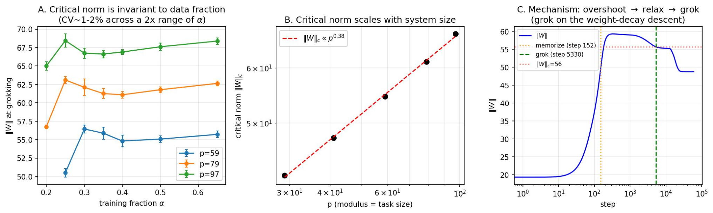
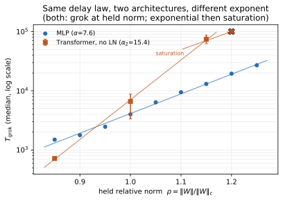
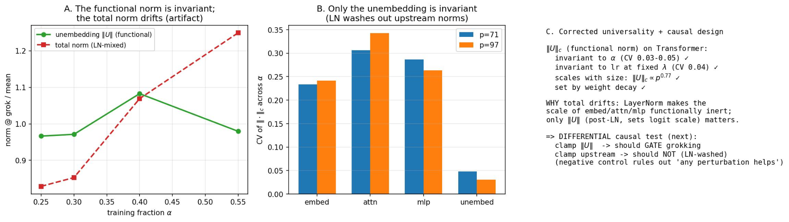
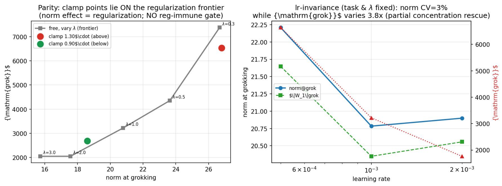

# Truong et al. 2026 — The Weight Norm Sets the Grokking Timescale: A Causal Delay Law

См. также: [глобальный индекс понятий](../../concepts/index.md).

arXiv [2606.13753v1](https://arxiv.org/abs/2606.13753), 11 июня 2026. Колонтитул PDF: «arXiv:2606.13753v1 [cs.LG] 11 Jun 2026». 2 цитирования. Источник — нативный HTML arXiv (LaTeXML) версии v1.

**Truong Xuan Khanh, Luu Duc Trung** — H&K Research Studio / Clevix LLC, Ханой, Вьетнам.
**Doan Hoang Viet** — Bac A Bank, Ханой.
**Phan Thanh Duc** — Банковская академия Вьетнама.
Переписка: khanh@clevix.vn

Файлы разбора этой статьи:

- [`2606.13753.the-weight-norm-sets-the-grokking-timescale-a-causal-delay-law.claims.txt`](2606.13753.the-weight-norm-sets-the-grokking-timescale-a-causal-delay-law.claims.txt) — пронумерованные утверждения статьи с пометками разбора.
- [`2606.13753.the-weight-norm-sets-the-grokking-timescale-a-causal-delay-law.license.txt`](2606.13753.the-weight-norm-sets-the-grokking-timescale-a-causal-delay-law.license.txt) — лицензионная запись arXiv для этой статьи.

Схема якорей и правила ссылок на карточку — в [README папки статей](../README.md).

**Карточка-выдержка.** Лицензия статьи (`arxiv-nonexclusive`) не разрешает публикацию копии оригинала и полного перевода, поэтому карточка содержит редакторские секции и цитируемые фрагменты перевода (право цитирования). Полный текст статьи: <https://arxiv.org/abs/2606.13753>.

## Затрагиваемые понятия

**[Минимизация нормы весов](../../concepts/weight-norm-minimization.md)** — самое прямое свидетельство в пользу этой линии из имеющихся в корпусе, потому что впервые норма не наблюдается, а **задаётся**: пошаговая проекция удерживает $\|W\|=\rho\,\|W\|_{c}$, и сеть грокает ровно при удерживаемом значении ($46.4,54.6,62.8,71.0$ при $\rho=0.85,1.00,1.15,1.30$), а не при каком-то одном ([`p5-9`](#p5-9), [`fig-2`](#fig-2)). Свидетельство при этом одностороннее: подтверждается роль нормы как часов, а не как места назначения. Низконормовое решение перестаёт быть тем, к чему сеть обязана прийти, — сосредоточенное $\|W\|_{c}$ объявлено нормой, которой расслабление *успевает достичь*, а не значением, которого гроккинг требует ([`p11-5`](#p11-5)). Чего здесь нет: минимизации нормы как предмета — многообразия нулевой потери, движения по нему и предельной нормы работа не разбирает вовсе.

**[Сферическое ограничение нормы](../../concepts/spherical-weight-norm-constraint.md)** — понятие получает свою первую **дозовую** развёртку. Прежде корпус знал перемасштабирование к одному значению (Zhang et al. с нормой 30) и периодическую проекцию на единичную сферу (Lyle et al.); здесь проекция ставится на десяти уровнях $\rho\in\{0.85,0.90,\dots,1.30\}$ и меряется получающаяся задержка ([`p6-3`](#p6-3), [`fig-3`](#fig-3)). Отсюда же первая в корпусе отрицательная сверка на сам поступок проецирования: рука $\rho=1.00$ применяет ту же пошаговую проекцию, но при естественной норме сети, и грокает по свободному расписанию ([`p12-5`](#p12-5)). Оговорено, что зажим действует одним общим множителем и потому закрепляет полную величину, оставляя оптимизатору свободу перераспределять норму по слоям; послойного закрепления не ставили ([`p8-1`](#p8-1)).

**[Каузальная абляция](../../concepts/causal-ablation-intervention.md)** — набор отрицательных сверок, которому в корпусе почти нет равных, и он ценнее самого закона. Семя выводится только из базовой настройки, *исключая* вмешательство, так что инициализация, разбиение данных и доинтервенционная траектория у сверки и у всех зажимов общие ([`p4-10`](#p4-10)). Сверок четыре: проекция при $\rho=1.00$ против значения нормы ([`p12-5`](#p12-5)); граница weight decay против «это просто более сильная регуляризация» ([`p7-1`](#p7-1), [`fig-4`](#fig-4)); одноразовый толчок против непрерывного удержания ($1.2\times$ против $7.3\times$) ([`p7-2`](#p7-2)); послойные доли против межслойного строения ([`p8-1`](#p8-1)). Каждая отвечает на названное вслух встречное объяснение — редкий для корпуса уклад.

**[Корреляционные ловушки](../../concepts/correlation-traps.md)** — работа целиком построена как выход из такой ловушки и сама это проговаривает: наблюдательный раздел прямо помечен как наблюдательный, а его причинный статус отложен до вмешательства ([`p5-2`](#p5-2)). Ловушка при этом воспроизведена и внутри самой работы: временное совпадение расслабления нормы с ростом фурье-сосредоточенности названо совпадением, а не воздействием, и оговорка повторена трижды ([`p5-6`](#p5-6), [`p8-1`](#p8-1), [`p11-6`](#p11-6)).

**[Закон задержки через норм-сепарацию](../../concepts/norm-separation-delay-law.md)** — отношение к сопутствующей теории того же коллектива ([Truong et al. 2026](../2603.13331.the-norm-separation-delay-law-of-grokking-a-first-principles-theory-of-delayed-generalization/2603.13331.the-norm-separation-delay-law-of-grokking-a-first-principles-theory-of-delayed-generalization.card.md)) выстроено как разделение режимов: та теория даёт **логарифмическую** задержку свободного сжатия $T_{\mathrm{grok}}-T_{\mathrm{mem}}\approx(2\kappa\,\eta\lambda)^{-1}\log(V_{\mathrm{mem}}/V_{\star})$, а зажим **перекрывает** путь сжатия и меряет экспоненциальную цену удержания вдали от порога ([`p9-1`](#p9-1), [`p4-1`](#p4-1)). Количественного совпадения показателя $\alpha\approx 7.5$ с замкнутой формулой авторы прямо **не** заявляют. Существенно, чего здесь нет: опорный опыт прежней работы описан как «причинная проверка заморозкой нормы», которой в той работе не поставлено (см. [`mc-2603-13331`](#mc-2603-13331)).

**[Гроккинг](../../concepts/grokking.md)** — переистолковано одно из ходовых наблюдений корпуса: «предотвращение» гроккинга высокой нормой объявлено не отдельным явлением, а хвостом экспоненты при конечном бюджете. Довод опытный и двойной: при $\rho=1.30$ ни одно семя не грокает раньше $20{,}000$ шагов, но к $30{,}000$ грокают $12$–$16/16$ ([`p6-1`](#p6-1)); на ненормализованной модели внимания случай $\rho=1.15$ при бюджете $30{,}000$ выходил на полку ниже $0.9$ и выглядел предотвращением, а при расширенном бюджете грокнул на $\approx 7.4\times 10^{4}$ шагах ([`p9-4`](#p9-4), [`fig-8`](#fig-8)). Оговорка авторов на месте: существование верхнего порога $\rho^{*}$ при нормах много выше проверенных они оставляют открытым ([`p12-4`](#p12-4)).

**[Weight decay](../../concepts/weight-decay.md)** — здесь он не средство ускорения, а то, что задаёт **место** порога и **не достаёт** до половины его окрестности. Критическая норма сдвигается с $\lambda$ ($\approx 49,55,63$ при $\lambda=3,1,0.3$), что согласовано с равновесной нормой weight decay ([`p5-5`](#p5-5)). Отсюда главный довод раздела: свободное обучение при $\lambda\in\{1,2,3,5,8\}$ вычерчивает границу на плоскости «норма при гроккинге — время», зажимы вниз ложатся **на** неё (и авторы честно отказываются считать нижнее ускорение отдельным действием), а зажимы вверх лежат вне её, поскольку weight decay умеет лишь понижать равновесную норму ([`p7-1`](#p7-1), [`fig-4`](#fig-4)).

**[Направление влияния weight decay](../../concepts/weight-decay-direction.md)** — сюда работа добавляет разграничение, которого в корпусе не было: ускорение от более сильного weight decay и ускорение от зажима нормы вниз **неотличимы** и объявлены одним и тем же, тогда как замедление от зажима вверх регуляризацией невоспроизводимо в принципе ([`p7-1`](#p7-1)). На разрежённой чётности это разграничение пропадает: там зажим ложится на границу weight decay в обе стороны ([`p11-2`](#p11-2)).

**[Зона Златовласки](../../concepts/goldilocks-zone.md)** — понятие получает причинное прочтение и в весовом изводе требует переформулировки. Узкий промежуток нормы, в котором наблюдается гроккинг, оказывается притягивающим равновесием weight decay, а не условием обобщения: сеть грокает и выше, и ниже него ([`p11-5`](#p11-5)). Сосредоточенность, о которой сообщали [Manir & Rupa](../2603.25009.a-systematic-empirical-study-of-grokking-depth-architecture-activation-and-regularization/2603.25009.a-systematic-empirical-study-of-grokking-depth-architecture-activation-and-regularization.card.md) (разброс $14.5\%$, одно семя на настройку), здесь принята как подтверждённая и уплотнена до $1$–$2\%$ за счёт закрепления задачи и $\lambda$ ([`p2-3`](#p2-3), [`p5-3`](#p5-3)).

**[Масштаб инициализации](../../concepts/initialization-scale.md)** — прямой опыт против весового прочтения [Omnigrok](../2210.01117.omnigrok-grokking-beyond-algorithmic-data/2210.01117.omnigrok-grokking-beyond-algorithmic-data.card.md): инициализация с низкой нормой и последующим свободным обучением **смывается** — норма расслабляется обратно к $\|W\|_{c}$, и гроккинг идёт по свободному расписанию, а не ускоряется низким началом ([`p7-1`](#p7-1), [`fig-4`](#fig-4)). Из закона задержки это следует прямо: удерживаемую норму меняет только непрерывное удержание, а не начальное значение.

**[Скорость обучения](../../concepts/learning-rate.md)** — впервые в корпусе две оси разведены на одной сетке: полная матрица $\rho\times\eta$ показывает, что норма меняет $T_{\mathrm{grok}}$ в $\approx\!19\times$, а восьмикратное изменение $\eta$ — лишь в $\approx\!2\times$, причём кривые при разных $\eta$ почти параллельны ([`p6-2`](#p6-2), [`tab-1`](#tab-1)). Это прямой ответ на объяснение через действенную скорость обучения ([Lyle et al.](../2507.20057.what-can-grokking-teach-us-about-learning-under-nonstationarity/2507.20057.what-can-grokking-teach-us-about-learning-under-nonstationarity.card.md)), принятое здесь не опровержением, а сужением области ([`p3-1`](#p3-1)). Отдельно: при достаточном weight decay ($\lambda=3$) само значение $\|W\|_{c}$ почти не зависит от $r$ на десятикратном размахе, хотя время гроккинга меняется семикратно ([`p5-3`](#p5-3)).

**[Оптимизатор](../../concepts/optimizer-adam-adamw-sgd.md)** — AdamW входит в довод дважды и оба раза как деятель, а не как фон. Зажим намеренно **не сбрасывает** моменты, чтобы отделить состояние нормы от действенной скорости обучения ([`p5-8`](#p5-8)); и именно способность оптимизатора заново приводить норму к равновесию объявлена причиной того, почему одноразовый толчок смывается, а действие требует непрерывного удержания ([`p7-2`](#p7-2)). Сравнения с другими оптимизаторами нет.

**[Фаза меморизации](../../concepts/memorization-phase.md)** — уточнено, где на траектории стоит гроккинг: норма даёт всплеск при запоминании (пик около шага $340$), затем weight decay её расслабляет, и гроккинг случается **на спуске** ([`p5-6`](#p5-6), [`fig-1`](#fig-1)). Шаг вмешательства $t_{\mathrm{int}}$ выбирается «после запоминания, до гроккинга» и числом нигде не назван ([`p4-10`](#p4-10)).

**[Модульная арифметика](../../concepts/modular-arithmetic.md)** — полигон обычный: $(a+b)\bmod p$, полная таблица $p^{2}$ пар, доля $\alpha$ в обучение ([`p4-4`](#p4-4)). Новое для корпуса — масштабирование критической нормы с модулем, измеренное дважды: $\|W\|_{c}\propto p^{0.38}$ на $p=\{29,41,59,79,97\}$ ([`p5-5`](#p5-5)) и $\propto p^{0.44}$ на $p=\{31,41,53,59,71\}$ ([`p8-3`](#p8-3), [`fig-5`](#fig-5)). Догадка о том, почему именно здесь есть недостижимый для регуляризации режим высокой нормы — «модульное сложение решается почти единственным фурье-построением, пришпиленным к определённому масштабу», — подана прямо как догадка, а не как проверенное утверждение ([`p11-2`](#p11-2)).

**[Разрежённая чётность](../../concepts/sparse-parity.md)** — задача-проверка на нефурье-строение, и перенос получается ровно наполовину. Переносится сосредоточенная, задаваемая weight decay, не зависящая от скорости обучения норма гроккинга (четырёхкратный размах $r$ меняет норму на $\approx 3\%$ при $\sim\!4\times$ изменении времени). Не переносится главное — недостижимая для регуляризации задержка сверху: норма гроккинга здесь зависит от объёма данных, а зажим ложится на границу weight decay в обе стороны ([`p11-1`](#p11-1), [`p11-2`](#p11-2), [`tab-2`](#tab-2), [`fig-9`](#fig-9)).

**[Фурье-признаки и контуры](../../concepts/fourier-features-circuits.md)** — связь заявлена только временна́я и трижды оговорена: фурье-сосредоточенность вложения (коэффициент Джини спектра мощности) растёт в том же окне, что и расслабление нормы, но вмешательства в контуры нет ([`p4-7`](#p4-7), [`p5-6`](#p5-6), [`p8-1`](#p8-1)). Заголовок «Мост между двумя объяснениями» и место в списке вкладов при этом звучат сильнее показанного ([`p11-6`](#p11-6), [`p2-1`](#p2-1)).

**[Фазовый переход](../../concepts/phase-transition.md)** и **[параметр порядка](../../concepts/order-parameter.md)** — заявка методическая: вместо уподобления предлагается указать скалярный управляющий параметр и измерить его причинное действие на временной масштаб перехода, «обращаясь с гроккингом как с явлением, которое надлежит измерять, а не просто уподоблять чему-то» ([`p4-2`](#p4-2)). Норма весов и есть этот параметр. Оговорка о конечном размахе размеров стоит рядом: показатель назван общим на *проверенном* промежутке, а не доказанно всеобщим ([`p8-3`](#p8-3)).

**[Двойной спуск](../../concepts/double-descent.md)** — взят противопоставлением, и это самое слабое место разбора соседей: утверждение, что двойной спуск «аналитически есть седлоузловая бифуркация» с показателем $\delta=1/2$, в статье не выводится, не меряется и не подкрепляется ссылкой ([`p4-3`](#p4-3), [`p12-2`](#p12-2)). Сами два места к тому же расходятся по силе вывода — см. «Несогласованности».

**[Нейронный коллапс](../../concepts/neural-collapse.md)** — работа опирается на одновременное исследование Rupa 2026 (arXiv:2604.00230, карточки в корпусе нет) дважды: как на независимое сообщение о том же расподоблении скорости и порога для *иной* наблюдаемой — нормы признаков предпоследнего слоя ([`p2-3`](#p2-3)), — и как на нулевой исход, который **побудил** к устройству опыта: одноразовое перемасштабирование нормы признаков с отпусканием ничего не меняет, потому что норма сама выправляется обратно ([`p3-2`](#p3-2)).

**[Разрежённая подсеть / lottery ticket](../../concepts/sparse-subnetwork-lottery-ticket.md)** — довод [Minegishi et al.](../2310.19470.bridging-lottery-ticket-and-grokking-understanding-grokking-from-inner-structure-of-networks/2310.19470.bridging-lottery-ticket-and-grokking-understanding-grokking-from-inner-structure-of-networks.card.md) (согласованная по норме плотная сеть обобщает медленнее разрежённой) принят как показывающий, что нормы **недостаточно**, и отнесён к сужению области ([`p3-1`](#p3-1)). Прямого ответа он не получает: настоящая работа говорит о достаточности нормы для управления **временем**, а не для генерализации, и этого разграничения в тексте не проводит.

**[Эталонный полигон гроккинга](../../concepts/canonical-grokking-testbed.md)** — полигон сдвинут: основная модель здесь не трансформер, а двухслойный MLP над обучаемыми вложениями ($d=128$, $H=256$, GELU), обучаемый полными пакетами AdamW при $r=10^{-3}$, $\lambda=1$, на $12$–$16$ семенах ([`p4-5`](#p4-5), [`p4-6`](#p4-6)). Однослойная модель внимания употреблена только в разборе архитектур, в двух видах — с LayerNorm и без него ([`p9-2`](#p9-2)).

Отдельная методическая находка, которую корпусу стоит унаследовать помимо самого закона: **в нормализованной сети «норма весов» обязана означать функционально значимую норму после нормализации, а не сырую полную** ([`p10-1`](#p10-1)). Под LayerNorm полная норма при гроккинге не сосредоточена (коэффициент изменчивости $0.15$–$0.17$), а порог возвращается на развложении $U$ (разброс $0.03$–$0.05$, $\|U\|_{c}\propto p^{0.77}$) ([`p9-3`](#p9-3), [`fig-7`](#fig-7)). Отсюда же объяснение двух чужих нулевых исходов: согласованное обрезание нормы у [Verma](../2605.20441.weight-decay-regimes-in-grokking-transformers-cheap-online-diagnostics/2605.20441.weight-decay-regimes-in-grokking-transformers-cheap-online-diagnostics.card.md) и геометрия у [Yildirim](../2603.05228.the-geometric-inductive-bias-of-grokking-bypassing-phase-transitions-via-architectural-topology/2603.05228.the-geometric-inductive-bias-of-grokking-bypassing-phase-transitions-via-architectural-topology.card.md) поставлены под нормализацией, где полная норма функционально инертна ([`p3-2`](#p3-2)).

Лишь упоминаются, без разбора: [меры прогресса](../../concepts/progress-measures.md) и [скрытый прогресс](../2207.08799.hidden-progress-in-deep-learning-sgd-learns-parities-near-the-computational-limit/2207.08799.hidden-progress-in-deep-learning-sgd-learns-parities-near-the-computational-limit.card.md) — одной строкой обзора ([`p2-2`](#p2-2)); [действенность контуров](../../concepts/circuit-efficiency.md) — там же, как состязание запоминающего и обобщающего контуров; [переход от ленивого к богатому](../../concepts/lazy-to-rich-kernel-to-feature-learning.md), [максимизация отступа](../../concepts/margin-maximization-implicit-bias.md) и [эмерджентность](../../concepts/emergence.md) — по одной ссылке в обзоре ([`p2-3`](#p2-3), [`p4-2`](#p4-2)); [данные реального мира](../../concepts/vision-real-world-data-mnist-cifar.md) — только как место, где работает Golechha ([`p3-1`](#p3-1)); [эффективная теория](../../concepts/effective-theory-statistical-mechanics.md) — как «прочтение в духе статистической физики», от рамки которого работа отказывается в пользу измерения ([`p4-2`](#p4-2)).

Отдельно стоит сказать, чего в работе **нет**. Нет ни одной проверки на настоящих данных — ни MNIST, ни языка: весь довод стоит на модульном сложении и разрежённой чётности ([`p12-6`](#p12-6)). Нет вывода показателя $\alpha$ из чего бы то ни было — он измерен, и вывод его из совместной динамики нормы и угла прямо оставлен будущей работе ([`p9-1`](#p9-1)). Нет объяснения, почему $\alpha$ на ненормализованном трансформере вдвое больше, чем на MLP, — переносится вид закона, но не его скорость ([`p9-4`](#p9-4), [`fig-6`](#fig-6)). Нет непрерывного послойного закрепления, и потому ничего не утверждается о независимом удержании нормы каждого слоя ([`p8-1`](#p8-1)). И нет числа для шага вмешательства $t_{\mathrm{int}}$, хотя именно он задаёт, сколько сеть провела в свободной динамике ([`p4-10`](#p4-10)).

## Несогласованности внутри статьи

Замечания редактора карточки по итогам разбора утверждений (`…claims.txt`). Все десять — расхождения внутри самой работы, не возражения по существу. Три последних видны только в растрах рисунков и подписям не противоречат: подписи их либо обходят, либо снимают.

**Верхний край экспоненты назван четырьмя разными способами.** §5 держит экспоненту «через $\rho=1.25$», а субэкспоненциальность относит к $\rho\approx 1.30$ ([`p6-1`](#p6-1)); §6 пишет, что «за $\rho\approx 1.15$ рост субэкспоненциален», и сообщает закон на $\rho\in[0.85,1.15]$ ([`p8-4`](#p8-4)); список вкладов даёт в пункте 2 промежуток $[0.85,1.15]$, а в пункте 3 — насыщение «за $\rho\approx 1.25$» ([`p2-1`](#p2-1)); таблица 3 — $[0.85,1.25]$ и насыщение «за $\rho\approx 1.25$» ([`tab-3`](#tab-3)). Причина расхождения видна (в развёртке по $p$ точки $1.25$ просто нет, а в плотной развёртке при $p=59$ она есть), но в тексте не оговорена.

**Подпись рисунка 3 считает уровни иначе, чем тело.** Тело: «На девяти уровнях $\rho\in[0.85,1.25]$ задержка есть чистая экспонента» ([`p6-3`](#p6-3)). Подпись: «экспоненциальна ... на десяти уровнях $\rho\in[0.85,1.25]$» ([`fig-3`](#fig-3)). Десять уровней — это вся развёртка $\{0.85,0.90,\dots,1.30\}$, включая $\rho=1.30$, которую та же подпись двумя предложениями ниже объявляет падающей ниже продолжения. Та же арифметика повторена в таблице 3 («плотный перебор $\rho$ по 10 уровням» напротив промежутка $[0.85,1.25]$) ([`tab-3`](#tab-3)).

**Устройство опыта обещает отсутствие усечения, подпись таблицы 1 его признаёт.** §5: бюджет в $30{,}000$ шагов взят «щедрым ... чтобы медленные условия наблюдались до завершения, а не оказывались усечёнными» ([`p5-8`](#p5-8)). Подпись таблицы 1: в строке $\rho{=}1.30$ при $\eta\in\{1,4\}\times 10^{-3}$ грокают $12$–$14/16$, «оставшиеся семена усечены справа на $30{,}000$, так что эти две медианы слегка занижены» ([`tab-1`](#tab-1)). Обещание и признание стоят на одной странице; перепрогон при бюджете $160{,}000$ в §6 расхождение снимает, но задним числом.

**Двойной спуск: §2 относит его к иному классу универсальности, §9 от такого вывода отказывается.** §2: седлоузловая бифуркация с иным критическим показателем, «что помещает его в иной класс универсальности, нежели изучаемый здесь переход гроккинга» ([`p4-3`](#p4-3)). §9: «Мы проводим противопоставление на уровне устройства ..., а не утверждаем различные классы универсальности из показателей, учитывая ограниченный размах размеров» ([`p12-2`](#p12-2)). Второе прямо снимает первое, но первое не поправлено.

**Показатель при размере системы измерен дважды и по-разному.** $\|W\|_{c}\propto p^{0.38}$ в §4 на $p=\{29,41,59,79,97\}$ ([`p5-5`](#p5-5)) и $\propto p^{0.44}$ в §6 на $p=\{31,41,53,59,71\}$ ([`p8-3`](#p8-3)), причём второе названо «согласующимся» с первым без какой-либо оценки разброса. Наборы модулей действительно разные, но об этом не сказано.

**Отношение при $\rho=1.30$ и $p=59$ приведено дважды с разными числами.** §5: задержка падает ниже продолжения «$\approx\!0.69\times$, что отвечает значению из перебора по $p$ в §6» ([`p6-3`](#p6-3)). §6: «при $p=59$ — отношение $0.71$» ([`p8-4`](#p8-4)). Расхождение мало, но слово «отвечает» приписывает совпадение там, где числа не совпадают.

**Два отказа истолкованы несимметрично.** Негроккинг сверху ($\rho=1.30$ при коротком бюджете) объявлен хвостом конечного бюджета и отдельным явлением не считается ([`p6-1`](#p6-1)). Негроккинг снизу ($p=31$ при $\rho=0.85$, удерживаемая $\|W\|=34$) объявлен «наименьшей работоспособной нормой», то есть свойством задачи, — хотя описан теми же словами: не грокает в пределах бюджета, точность на проверке ползёт вверх медленно ([`p8-4`](#p8-4)). Расширенного бюджета для нижнего края, в отличие от верхнего, не прогоняли.

**Панель A рисунка 1 содержит точки, которых нет в заявке о разбросе.** Подпись говорит, что норма при гроккинге «сосредоточена и почти не зависит от доли обучающих данных $\alpha$ (коэффициент изменчивости $1$–$2\%$) **при каждом $p$**» ([`fig-1`](#fig-1)), тогда как тело считает разброс по $\alpha=\{0.30,0.35,0.40,0.50,0.65\}$ ([`p5-3`](#p5-3)). На самой панели развёртка начинается с $\alpha=0.20$, и левые точки уходят далеко за $2\%$: у $p=59$ значение падает примерно до $50.5$ против $54.8$–$56.4$ на остальном промежутке (около $8$–$10\%$), у $p=79$ — примерно до $56.8$ против $61$–$63$. Тело сужение промежутка не оговаривает; подпись переносит число $1$–$2\%$ на всю панель.

**Рисунки 4 и 8 подписаны внутри растра словом «предотвращено» там, где текст его снимает.** На рисунке 4 точка зажима $1.3\,\|W\|_{c}$ несёт красный крест и надпись `PREVENTED (reg cannot reach)`, хотя §5 объявляет тот же случай задержкой и сообщает, что к $30{,}000$ шагам грокают $12$–$16/16$ семян ([`p6-1`](#p6-1)); подпись рисунка 4 слова «предотвращение» не употребляет и расхождения не снимает ([`fig-4`](#fig-4)). На рисунке 8 внутри растра стоит `PREVENTED (>=1.15 wc, 0% grok)`, но здесь подпись расхождение снимает прямо, оговаривая исходный бюджет и называя полки хвостом при конечном бюджете ([`fig-8`](#fig-8), [`p9-4`](#p9-4)).

**У рисунка 7 есть третья панель, которой нет в подписи.** Подпись описывает только панели **(A)** и **(B)** ([`fig-7`](#fig-7)), тогда как в растре есть панель **(C)** — текстовая, с планом опыта: `clamp ||U|| -> should GATE grokking`, `clamp upstream -> should NOT (LN-washed)`. Это предсказание, сделанное до опыта, и §7 его не подтверждает: зажим любой отдельной группы, **включая** $\|U\|$, сдвигает гроккинг лишь слабо и неизбирательно, до $\sim\!2\times$ ([`p9-4`](#p9-4)). Работа излагает исход ровно, не отмечая, что различительное предсказание не сбылось, а сама панель с предсказанием остаётся в рисунке.

## Что доказано, что показано и что предположено

**Причинная половина сделана образцово.** Пять отдельных встречных объяснений названы вслух и закрыты каждое своей сверкой: не проекция ([`p12-5`](#p12-5)), не регуляризация ([`p7-1`](#p7-1)), не толчок, а удержание ([`p7-2`](#p7-2)), не межслойное строение ([`p8-1`](#p8-1)), не скорость обучения ([`p6-2`](#p6-2)). Согласованный контрфакт устроен так, что различие относить больше не на что ([`p4-10`](#p4-10)). Для корпуса это самое ценное в работе — ценнее самого закона.

**Экспонента показана плотно, а не подогнана по трём точкам.** Развёртка по десяти уровням при $p=59$, все $16/16$ семян без усечения, $\alpha=7.64$ с промежутком $[7.47,7.81]$ и $R^{2}=0.994$ на тридцатикратном размахе времён ([`p6-3`](#p6-3)). Это прямой ответ на возражение, которое авторы сами себе и ставят.

**Довод об общем показателе изложен числами, которые не сходятся.** Точечные оценки убывают строго монотонно ($7.92,7.56,7.42,7.07$ при $p=41,53,59,71$); сказано, что бутстрап-промежутки всех четырёх перекрываются «в $[7.06,7.38]$», а общая оценка даётся как $7.49$ с промежутком $[7.16,7.69]$ — то есть общая оценка выходит за объявленную область перекрытия ([`p8-3`](#p8-3)). Отвод «это шум семян» опирается на снижение остаточной суммы квадратов лишь с $0.054$ до $0.037$ за три лишние степени свободы, и вывод «чего не оправдывает никакая мера отбора моделей» при двенадцати точках сказан сильнее, чем показан.

**Сравнение «норма против скорости обучения» зависит от выбранных размахов.** $19\times$ против $2\times$ — сопоставление промежутка $\rho\in[0.85,1.30]$ с восьмикратным размахом $\eta$ ([`p6-2`](#p6-2)). Более сильный довод в тексте не выписан: восьмикратное изменение $\eta$ даёт вдвое, а полуторакратное изменение нормы — в девятнадцать раз, так что через отношение $\eta/\|W\|$ отклик не объясняется, и возражение об действенной скорости обучения снимается не размахами, а этим.

**Критическая норма определена наблюдательно, а не выведена.** $T_{\mathrm{grok}}$ — первый шаг с точностью на проверке $\geq 0.9$, а $\|W\|_{c}$ — просто значение нормы в этот момент ([`p4-7`](#p4-7)). Устойчивость к порогу проверена ($0.8/0.9/0.95$ меняют норму менее чем на $2\%$) и обращена в довод, что это внутреннее состояние ([`p5-4`](#p5-4)); но никакой независимой характеризации $\|W\|_{c}$ работа не даёт, и все $\rho$ отсчитываются от измеренной величины.

**Мост к контурам слабее своего заголовка.** Вмешательства в контуры нет, и авторы признают это трижды ([`p5-6`](#p5-6), [`p8-1`](#p8-1), [`p11-6`](#p11-6)) — но пункт 6 списка вкладов и заголовок «Мост между двумя объяснениями» ставят связь в один ряд с измеренными результатами ([`p2-1`](#p2-1)). Хедж в тексте есть; при пересказе он и отпадает первым.

**Показатель $\delta=1/2$ у двойного спуска не подкреплён ничем.** Ни вывода, ни измерения, ни ссылки: [14, 15] — Belkin et al. и Nakkiran et al. — такого утверждения не содержат ([`p4-3`](#p4-3), [`p12-2`](#p12-2)).

**Две ссылки непроверяемы по устройству.** «Наше собственное прежнее сообщение», прочитавшее высокую норму как предотвращение, не названо ([`p6-1`](#p6-1)); DOI полного сырого набора на Zenodo «будет вставлен на стадии корректуры» ([`p13-2`](#p13-2)). Исправляемое утверждение и полные данные по источнику тем самым не сверить.

**Место в корпусе.** Работа переводит весовую линию из наблюдения во вмешательство и делает это на редкость аккуратно. Точнее всего её содержание звучит так: на модульном сложении с двухслойным MLP под AdamW при $\lambda=1$ и на однослойной модели внимания **без** LayerNorm пошаговая проекция всех весов на заданную норму даёт экспоненциальный дозовый отклик времени гроккинга на $\rho\in[0.85,1.15]$ с насыщением выше; на нормализованной сети управление пропадает, на разрежённой чётности переносится наполовину, на настоящих данных не проверялось вовсе.

## Ошибочные цитирования

Замечания редактора карточки: места, где эта статья передаёт чужие результаты с ошибкой или без авторских оговорок. Сюда ведут ссылки «подробности» из разделов «Ошибочные пересказы и цитирования этой статьи» карточек процитированных работ.

###### mc-2603-13331
**Truong et al. (2603.13331) — приписанный опыт с заморозкой нормы.** Настоящая работа трижды описывает свой зажим как «непрерывно-дозовый вид причинной проверки заморозкой нормы», которой пользуется теория задержки по разделению норм: `"this is a continuous-dose version of the norm-freeze causal intervention those accounts use to establish necessity (freezing the norm prevents grokking)"` — «это непрерывно-дозовый вид причинного вмешательства заморозкой нормы, которым те объяснения устанавливают необходимость (заморозка нормы предотвращает гроккинг)» ([`p9-1`](#p9-1)); то же в пункте 3 списка вкладов ([`p2-1`](#p2-1)) и в §9 ([`p11-5`](#p11-5)). Опыта с заморозкой или закреплением нормы в [цитируемой работе](../2603.13331.the-norm-separation-delay-law-of-grokking-a-first-principles-theory-of-delayed-generalization/2603.13331.the-norm-separation-delay-law-of-grokking-a-first-principles-theory-of-delayed-generalization.card.md) нет: необходимость там устанавливается **теоремой** 3.8 и проверяется отрицательным примером на разрежённой чётности, где отношение норм перевёрнуто и задержки нет в 15 прогонах из 15. Единственное вмешательство, разбираемое в той работе, — архитектурное, чужое (Yildirim 2026), и действует оно в **противоположную** сторону: закрепление нормы на гиперсфере схлопывает разрыв норм, отчего модель обобщает сразу, минуя плато запоминания. Тем самым «заморозка нормы предотвращает гроккинг» не только не поставлено в цитируемой работе, но и расходится с единственным описанным там опытом с закреплённой нормой. На собственный итог настоящей работы это не влияет — дозовый отклик измерен здесь и стоит на своих сверках; страдает изложение отношения двух работ, а вместе с ним и та мягкость, с какой сказано, что зажим «подтверждает главное утверждение той картины».

###### mc-2603-25009
**Manir & Rupa (2603.25009) — вытесненное самими авторами число.** Обзор передаёт их сравнение архитектур так: `"the Transformer–MLP gap nearly vanishes ($1.11\times$ delay) under matched hyperparameters"` — «разрыв между трансформером и MLP при согласованных гиперпараметрах почти исчезает (задержка $1.11\times$)» ([`p2-3`](#p2-3)). Число в [цитируемой работе](../2603.25009.a-systematic-empirical-study-of-grokking-depth-architecture-activation-and-regularization/2603.25009.a-systematic-empirical-study-of-grokking-depth-architecture-activation-and-regularization.card.md) есть, но она же его и вытесняет: `"This is our definitive architecture comparison, superseding H2’s 1.11$\times$ (which used a suboptimal $\lambda=1.0$ for the Transformer)."`, а «истинный» разрыв при подобранном для каждой архитектуры $\lambda$ там равен $1.90\times$. Слова «при согласованных гиперпараметрах» и передают ровно то, что цитируемая работа объявляет причиной ошибки: $\lambda=1.0$ был согласован формально и оказался неоптимален для трансформера. Прочие числа той же работы переданы точно ($0.0219\pm 0.0032$, разброс $14.5\%$, $6.9\times$), так что ошибка местная; но именно на этом числе стоит вывод обзора о том, что архитектура второстепенна.

---

# Цитируемые фрагменты перевода

Ниже приведены только те фрагменты перевода, на которые ссылаются карточки корпуса (право цитирования). Нумерация якорей `pN-M` / `fig-N` / `sec-X` совпадает с полной карточкой и оригиналом.

## Аннотация

###### p1-2

Мы показываем, что норма весов причинно управляет *временным масштабом* гроккинга, примиряя два противостоящих объяснения: что гроккинг случается при критической норме весов и что норма — не действующая переменная. На модульной арифметике сеть сперва запоминает, поднимая свою норму весов, а затем расслабляется под weight decay; при свободной динамике генерализация возникает, когда норма достигает резко сосредоточенного значения $\|W\|_{c}$ ($1$–$2\%$ на двукратном размахе долей обучающих данных, почти без изменений на десятикратном размахе скоростей обучения), что отвечает недавним сообщениям о пороге. Затем мы вмешиваемся: зажим с согласованным контрфактом, удерживающий $\|W\|=\rho\,\|W\|_{c}$ на всём обучении, показывает, что сеть грокает *при какой угодно норме, на которой её удерживают*, — никакой единственной нормы не требуется, — причём время до гроккинга растёт по экспоненциальному закону задержки $T_{\mathrm{grok}}\propto e^{\alpha\rho}$ ($R^{2}>0.99$). На пяти проверенных модулях (четыре пригодны для подгонки) это оказывается *законом масштабирования*: один общий показатель $\alpha\approx 7.5$ сворачивает задержку ($R^{2}=0.996$), а норма входит только через своё значение относительно $\|W\|_{c}(p)$. Удержание нормы выше $\|W\|_{c}$ тем самым задерживает гроккинг, а не предотвращает его — видимое «предотвращение» при закреплённом бюджете есть хвост этого закона при конечном бюджете, — и норма преобладает над скоростью обучения в управлении временем гроккинга ($\approx\!19\times$ против $\approx\!2\times$). Это примиряет два стана: сосредоточенное $\|W\|_{c}$ есть норма, которой расслабление *достигает* на своём естественном временном масштабе, а не жёсткие ворота, и потому гроккинг наблюдается и выше, и ниже неё; полученное есть причинное дополнение к теории задержки по разделению норм, чья задержка в замкнутом виде логарифмична по отношению норм при свободном сжатии. Действие изменяется *LayerNorm*, который расцепляет масштаб нормы весов и функцию. На ненормализованной модели внимания закон задержки возникает вновь со своим собственным показателем ($\alpha_{2}\approx 15$, $R^{2}=0.999$; $\approx 2\times$ от MLP), так что *вид* закона переносится между архитектурами, а его скорость — нет. Сосредоточенная, задаваемая регуляризацией норма гроккинга возникает вновь и на нефурье-задаче (разрежённая чётность), хотя задержка выше нормы переносится не полностью.

#### Вклад.

###### p2-1

1. **Сосредоточенная норма гроккинга при свободной динамике.** При свободном обучении модель грокает, когда норма весов достигает резко сосредоточенного значения $\|W\|_{c}$: при закреплённых размере задачи и weight decay $\|W\|_{c}$ меняется лишь на $1$–$2\%$ на двукратном размахе долей обучающих данных и почти не зависит от десятикратного размаха скоростей обучения (§4). Одновременные исследования сообщают о том же расподоблении скорости и порога [18, 19]; мы их подтверждаем, а затем показываем причинно, что это явление *скорости*.
2. **Норма весов причинно задаёт временной масштаб гроккинга (закон задержки).** Зажим с согласованным контрфактом, удерживающий $\|W\|=\rho\,\|W\|_{c}$ на всём обучении, обнаруживает три вещи (§5): (i) сеть грокает при *какой угодно* норме, на которой её удерживают, — никакой единственной нормы гроккинг не требует; (ii) на $\rho\in[0.85,1.15]$ время до гроккинга следует чистому экспоненциальному закону задержки $T_{\mathrm{grok}}\propto e^{\alpha\rho}$ ($R^{2}>0.99$); (iii) удержание нормы выше $\|W\|_{c}$ тем самым *задерживает* гроккинг, а не предотвращает его — видимое «предотвращение» при закреплённом бюджете есть хвост этой экспоненты при конечном бюджете. Норма — преобладающее средство управления временем гроккинга ($\approx\!19\times$ на проверенном промежутке), а скорость обучения — второстепенный, расподобляемый с ней рычаг ($\approx\!2\times$).
3. **Задержка есть закон масштабирования с общим показателем по размерам задачи.** При повторении зажима на пяти проверенных модулях $p$ четыре пригодных размера сворачиваются в одну экспоненту по *относительной* норме $\rho=\|W\|/\|W\|_{c}(p)$: один общий показатель $\alpha\approx 7.5$ подгоняет их с $R^{2}=0.996$ (по-$p$ коэффициент изменчивости $4.1\%$ на проверенном размахе размеров $1.7\times$), устанавливая причинный закон масштабирования, а не по-задачную подгонку (§6). Пределы его мы сообщаем честно — субэкспоненциальное насыщение за $\rho\approx 1.25$ и пол наименьшей нормы у самого малого $p$ (почему тот и исключён из подгонки) — и соотносим его с теорией задержки по разделению норм [28]: та теория предсказывает *логарифмическую* задержку свободного обучения через сжатие нормы, тогда как наш зажим перекрывает сжатие и есть непрерывно-дозовый вариант причинной проверки заморозкой нормы, подтверждающий норму как действующую переменную (мы не заявляем количественного совпадения показателя с предсказанием в замкнутом виде).
4. **Возникновение вновь по архитектурам и роль нормализации.** Закон задержки возникает вновь на второй, ненормализованной модели внимания со своим собственным показателем ($\alpha_{2}\approx 15$, $R^{2}=0.999$; гроккинг при удерживаемой норме и насыщение при высокой норме — как на MLP) и изменяется LayerNorm, который расцепляет масштаб нормы весов и функцию; сосредоточенной остаётся только функционально значимая норма развложения. Норма весов управляет временным масштабом тогда, когда она задаёт масштаб функции (§7).
5. **Общность по задачам на нефурье-задаче.** На разрежённой чётности гроккинг снова случается при сосредоточенной, задаваемой weight decay, не зависящей от скорости обучения норме, и норма снова действует через скорость, а не через жёсткий порог (§8).
6. **Временная связь с объяснением через контуры.** Сосредоточенность фурье-признаков растёт в том же окне расслабления нормы. Это временное совпадение согласуется с тем — но не устанавливает того, — что расслабление нормы устраивает образование признаков объяснения через контуры; мы не воздействуем на контуры напрямую и проводим связь лишь на уровне корреляции.

## 2 Обзор работ

###### p2-2

**Гроккинг: явление и устройство.** Гроккинг был опознан Power et al. 2022 на малых алгоритмических задачах, где тестовая точность возрастает внезапно, много позже того, как подогнан обучающий набор. Nanda et al. 2023 разобрали обратным инжинирингом выученное на модульной арифметике решение как малый набор контуров из фурье-частот, осуществляющих тригонометрическое тождество, и ввели меры прогресса (например, ограниченную потерю), которые улучшаются плавно до видимого скачка; Gromov 2023 дал аналитические построения таких решений, а Barak et al. 2022 показали на разрежённой чётности, что скрытый прогресс накапливается на всём плато. Varma et al. 2023 подали гроккинг как состязание между запоминающим и обобщающим контурами разной действенности по параметрам, где weight decay склоняет чашу весов. Эти работы устанавливают, *что* сеть вычисляет и что прогресс идёт постепенно; наше внимание обращено на скалярную управляющую переменную — норму весов — и её причинную роль в запуске перехода.

###### p2-3

**Сосредоточенный порог по норме весов: складывающееся, но чисто наблюдательное согласие.** Вторая линия относит гроккинг к норме параметров и неявному смещению оптимизатора. Liu et al. 2022 (Omnigrok) доказывали, что генерализация устроена нормой весов: обобщающая область существует при умеренной норме, weight decay или перемасштабированная инициализация переводят сеть в неё, а когда weight decay — единственный регуляризатор, норма расслабляется как $\|w(t)\!\approx\!e^{-\gamma t}\|w_{0}\|$ к цели $w_{c}$ за время $\propto 1/\lambda$. Смежные объяснения подают скачок как переход от ленивого к богатому [7] или как дихотомию неявных смещений поздней поры [8], связанную с классическим смещением градиентного спуска к наибольшему отступу [9]. Два одновременных опытных исследования уточняют роль регуляризации способом, близким к нашему, и мы тщательно разграничиваем, что устанавливают они и что добавляем мы. Manir & Rupa 2026 проводят факторный перебор по глубине, архитектуре, функции возбуждения и weight decay на модульном сложении, **[p. 3]** обнаруживая, что гроккинг движим взаимодействием оптимизации и регуляризации, а не архитектурой, — weight decay оказывается преобладающим средством управления с узкой зоной «Златовласки», а разрыв между трансформером и MLP при согласованных гиперпараметрах почти исчезает (задержка $1.11\times$); в единственном опыте с нормой весов (одно семя на настройку) они сообщают, что RMS-норма параметров в точке гроккинга сосредоточена у $0.0219\pm 0.0032$ (коэффициент изменчивости $14.5\%$) по пяти моделям ширины 512, причём ReLU и GELU грокают при *тождественных* нормах, несмотря на $6.9\times$ различие в задержке. Параллельное исследование динамики нейронного коллапса [19] сообщает о том же расподоблении скорости и порога для *иной* наблюдаемой — нормы *признаков* предпоследнего слоя в классификации изображений — с сосредоточенным значением в точке начала (коэффициент изменчивости внутри пары $<8\%$), которое по большей части не зависит от условий обучения, тогда как обучение задаёт лишь *скорость* подхода, и снова с зоной Златовласки. Оба исследования *наблюдательны* в отношении связи нормы и времени: каждое записывает норму, при которой случается переход, и меняет гиперпараметры вокруг неё; ни одно не удерживает норму закреплённой, не меряет задержку как функцию управляемой нормы и не сообщает закона масштабирования. Наши наблюдательные находки (§4) подтверждают это расподобление скорости и порога и уплотняют сосредоточенность до коэффициента изменчивости $1$–$2\%$ за счёт обусловливания задачей и $\lambda$, добавляя независимость от скорости обучения и от порога гроккинга, а также масштабирование по модулю $\|W\|_{c}\!\propto\!p^{0.38}$. Сам сосредоточенный порог мы считаем явлением *подтверждённым*, а не новым; наш отдельный вклад начинается там, где эти исследования останавливаются, — мы проверяем порог *причинно*, зажимая норму и считывая получающуюся задержку (§5), и показываем, что отклик есть количественный, межзадачный закон задержки (§6), а не ещё одно наблюдательное описание. (Приведённое выше межархитектурное сравнение сделано в естественной рабочей точке; наше $\alpha_{2}\!\approx\!2\alpha$ для ненормализованного трансформера меряет иную величину — чувствительность задержки к *удерживаемой* норме, — так что одно другому не противоречит.)

###### p3-1

**Возражения против причинности нормы весов.** Мощное встречное течение доказывает, что норма весов — *не* действующая переменная. Golechha 2024 сообщает о гроккинге на данных реального мира (MNIST, IMDb) вне ожидаемого промежутка норм — даже без weight decay, при возрастающей норме, — заключая, что нормы весов коррелятивны, а не причинны. Minegishi et al. 2023 показывают, что разрежённый «гроккинг-билет» обобщает быстрее *согласованной по норме* плотной сети, так что нормы недостаточно. Notsawo et al. 2025 показывают, что гроккинг может быть вызван регуляризацией к свойствам, отличным от нормы $\ell_{2}$ (разрежённости, малому рангу), что норма $\ell_{2}$ не есть надёжный заместитель — она часто растёт, пока модель обобщает, — и что одна лишь глубина может вызывать гроккинг без явной регуляризации. Lyle et al. 2025 доказывают, что переход движим *действенной скоростью обучения* — отношением нормы параметров к норме обновления, — а не нормой параметров самой по себе, и показывают, что намеренное её повышение ускоряет обучение признакам (и смягчает смещение первенства при нестационарности); дальнейшая работа вызывает гроккинг при возрастающих нормах и без weight decay [22]. Мы принимаем эту критику всерьёз и не утверждаем, что норма причинна повсеместно. Наши итоги, напротив, очерчивают, *когда* норма причинна: она управляет временным масштабом гроккинга в постановках, где задаёт масштаб функции, и это управление ослабевает или исчезает ровно там, где работают названные работы, — под нормализацией (§7), когда регуляризация нацелена на не-$\ell_{2}$ свойство или на задаче, чьё решение не пришпилено к единственной норме (§8). Чтобы отделить *состояние* нормы от действенной скорости обучения, наше вмешательство удерживает норму закреплённой, пока оптимизатор работает (без сброса моментов AdamW), и меряет дозовый отклик по уровням зажима при закреплённой скорости обучения (§5).

###### p3-2

**Вмешательства в норму и роль нормализации.** Ближайшее к нашему свидетельство от вмешательства приходит из двух разных постановок, и в каждой вмешательство отличается от нашего непрерывного зажима так, что это оказывается решающим. В исследовании нейронного коллапса Rupa 2026 перемасштабирует норму *признаков* предпоследнего слоя до $0.3\times$ или $3.0\times$ её естественного значения в начале фазы коллапса, а затем отпускает; норма признаков сама выправляется обратно к тому же значению с любой стороны, а время коллапса остаётся по существу неизменным ($p>0.2$), и авторы читают это как свидетельство, что порог есть *притягивающее состояние* градиентного потока, *а не причина*. Это одноразовое перемасштабирование с отпусканием, и его нулевой исход — тот же, что получаем мы для нормы весов при гроккинге в собственной одноразовой сверке (§5, «Удержание, а не мгновенное»): одиночное перемасштабирование смывается, потому что оптимизатор заново приводит норму к равновесию, оставляя время гроккинга в пределах $\sim\!15\%$ от свободной сверки. Далёкий от того, чтобы предвосхитить нашу находку, этот нулевой исход *побуждает* к нашему устройству опыта: действие проявляется только при *непрерывном* зажиме, удерживающем норму вдали от её притягивающего состояния на всём обучении, что и порождает экспоненциальный дозовый отклик. Два исследования тем самым дополняют друг друга и по области (норма признаков при нейронном коллапсе против нормы весов при гроккинге), и по виду вмешательства (преходящее перемасштабирование против непрерывного удержания). Ближе всего к нашей постановке с нормой весов Verma 2026 ставит вмешательство с согласованной сверкой на трансформере с LayerNorm: переинициализация голов внимания меняет расхождение голов после гроккинга, тогда как *согласованное обрезание нормы весов* — нет, что относит действие к строению голов, а не к величине весов. Этот нулевой исход обрезания нормы согласуется с нашей находкой — и объясняется ею, — что LayerNorm расцепляет масштаб нормы весов и функцию, отчего зажим полной нормы там и должен действовать слабо; наши же ворота проявляются именно в *ненормализованной* **[p. 4]** постановке (§7). У самого расцепления есть формальное основание: для завершающего слоя нормализации радиальный градиент на выходе обращается в нуль, так что потерю нельзя снизить перемасштабированием последнего скрытого состояния, тогда как без него перекрёстная энтропия толкает нормы представлений вверх [24]; направления с высокой нормой действуют на логиты только через завершающий LayerNorm [25], а инвариантность LayerNorm к масштабу классична [26]. Одновременно Yıldırım 2026 связывает нормализацию, матрицу развложения и масштаб логитов с началом гроккинга через вмешательство с ограниченной геометрией. Наш вклад в этой постановке — показать, какая норма остаётся сосредоточенной под LayerNorm (только функционально значимая норма развложения) и что управление временным масштабом гроккинга со стороны нормы возвращается, как только нормализация убрана, — частный, привязанный к гроккингу случай того общего расцепления, которое устанавливают эти работы.

###### p4-1

**Отношение к нашей прежней работе.** Сопутствующая теоретическая статья нашей группы выводит закон задержки по разделению норм из первых начал, предсказывая, что задержка гроккинга *при свободном обучении* растёт логарифмически по отношению норм, пока норма сжимается к порогу [28]. Настоящая работа отличается предметом и приёмом: она вмешивается прямо в скалярное *состояние* нормы весов (а не выводит свободную динамику) и картирует условия, при которых это состояние причинно для начала гроккинга. Там, где та теория предсказывает задержку свободного обучения логарифмической по отношению норм, наше вмешательство с пришпиленной нормой меряет дополняющий режим, в котором сжатие перекрыто, и обнаруживает экспоненциальную зависимость от удерживаемой относительной нормы. Мы опираемся на ту работу и ссылаемся на неё, а не пересказываем её.

###### p4-2

**Гроккинг и эмерджентность как фазовые переходы.** Внезапные скачки способностей при обучении и с ростом масштаба наводят на прочтение в духе статистической физики. Об эмерджентных способностях [11] Schaeffer et al. 2023 доказывали, что они отчасти суть след разрывных мер, что заострило нужду в чётко определённых параметрах порядка и конечноразмерном разборе; сингулярная теория обучения трактует обучение как прохождение через фазы разной вырожденности [13]. Внутри этого взгляда наш вклад не только опытен, но и методичен: мы указываем скалярный управляющий параметр — норму весов — и меряем его причинное количественное действие на временной масштаб перехода, обращаясь с гроккингом как с явлением, которое надлежит измерять, а не просто уподоблять чему-то.

###### p4-3

**Двойной спуск.** Двойной спуск по эпохам и по размеру модели [14, 15] — отличные от нашего переходы генерализации, при которых тестовая ошибка немонотонна вблизи порога интерполяции. Мы берём двойной спуск как противопоставление (§9): в линейной модели он аналитически есть седлоузловая бифуркация с иным критическим показателем, что помещает его в иной класс универсальности, нежели изучаемый здесь переход гроккинга.

## 3 Постановка

###### p4-4

**Задача и данные.** Мы изучаем модульное сложение $f(a,b)=(a+b)\bmod p$ при простом $p$. Каждый пример — последовательность лексем $[a,b,{=}]$ над словарём размера $p{+}1$ ($p$ вычетов плюс лексема «$=$»), а цель — вычет $f(a,b)$. Набор данных есть полное множество $p^{2}$ пар; доля $\alpha$ отбирается на каждое семя как обучающий набор, а остаток откладывается. Доля обучающих данных $\alpha$ — наш управляющий параметр; модуль $p$ (размер набора $p^{2}$) — наш размер системы.

###### p4-5

**Модель.** Если не оговорено иное, сеть есть двухслойный MLP над выучиваемыми вложениями лексем: матрица вложений $E\in\mathbb{R}^{p\times d}$, склейка вложений двух операндов ($\in\mathbb{R}^{2d}$), скрытый слой $W_{1}\in\mathbb{R}^{2d\times H}$ с GELU и выход $W_{2}\in\mathbb{R}^{H\times p}$; на смещения weight decay не действует. Мы берём $d=128$, $H=256$. Однослойная модель многоголового внимания (вложения лексем и позиций, самовнимание, MLP-блок и развложение, предсказание на последней позиции) употребляется для разбора архитектур (§7) в двух видах — с LayerNorm и без него, — чтобы выделить роль нормализации.

###### p4-6

**Оптимизация.** Мы обучаем полными пакетами с AdamW ($\beta_{1}{=}0.9$, $\beta_{2}{=}0.999$, $\epsilon{=}10^{-8}$), скоростью обучения $r$ и развязанным weight decay $\lambda$, действующим только на весовые матрицы; параметры инициализируются в масштабе $1/\sqrt{\text{fan-in}}$. Опорные гиперпараметры — $r=10^{-3}$, $\lambda=1$, если не перебираются.

###### p4-7

**Наблюдаемые.** На геометрической сетке шагов обучения и по $12$–$16$ семенам мы записываем точность на обучении и на проверке; полную норму весов

###### p4-10

**Вмешательство (согласованный контрфакт).** Для причинной проверки (§5) случайное семя выводится только из базовой настройки, *исключая* вмешательство, так что у сверки и у всякого вмешательства одинаковы инициализация, разбиение данных и доинтервенционная траектория. *Зажим* нормы проецирует веса после каждого шага так, что $\|W\|=\rho\,\|W\|_{c}$ для выбранного кратного $\rho$, удерживая норму на кратном от критического значения; одноразовый **[p. 5]** вид применяет проекцию единожды на закреплённом шаге $t_{\mathrm{int}}$ (после запоминания, до гроккинга).

## 4 Критическая норма весов

###### p5-2

Запись $\|W\|$ на шаге гроккинга обнаруживает резкую закономерность: при закреплённых архитектуре, оптимизаторе, размере задачи и силе weight decay гроккинг случается при критической норме $\|W\|_{c}$, сосредоточенной с точностью до нескольких процентов и меняющейся лишь с weight decay и размером системы. Подчеркнём, что настоящий раздел наблюдателен; его причинный статус проверяется в §5.

#### Сосредоточена и устойчива по доле данных и скорости обучения.

###### p5-3

При закреплённых $(p,\lambda,r)$ величина $\|W\|$ в точке гроккинга почти постоянна по доле обучающих данных $\alpha$: для $p=59$ это $\{56.4,55.9,54.8,55.1,55.7\}$ при $\alpha=\{0.30,0.35,0.40,0.50,0.65\}$ — коэффициент изменчивости $1$–$2\%$ на двукратном размахе данных (рис. 1A). При достаточном weight decay она также почти не зависит от скорости обучения: при $\lambda=3$ $\|W\|_{c}=\{48.9,48.7,49.1\}$ на десятикратном размахе $r$ (коэффициент изменчивости $<1\%$), хотя время гроккинга меняется семикратно. Скорость обучения тем самым меняет *время достижения* $\|W\|_{c}$ куда сильнее, чем само значение $\|W\|_{c}$, отделяя настраиваемую скорость расслабления от сравнительно устойчивого порога; это согласуется с зависимостью времени гроккинга от $(r\lambda)$.

#### Внутренний порог, а не след времени обучения.

###### p5-4

$\|W\|_{c}$ устойчива к порогу точности, определяющему гроккинг: пересчёт при порогах точности на проверке $0.8$, $0.9$, $0.95$ меняет $\|W\|_{c}$ менее чем на $2\%$ (например, $p=59\!:\,55.0/54.6/54.2$; $p=97\!:\,68.0/67.1/66.4$), причём устойчивость по доле данных не меняется ни при каком пороге. Поскольку точность круто растёт на переходе, а норма расслабляется медленно, норма почти не сдвигается на окне точности $0.8$–$0.95$: $\|W\|_{c}$ помечает внутреннее состояние, а не расстановку порога.

#### Задаётся weight decay; масштабируется с размером системы.

###### p5-5

$\|W\|_{c}$ не есть всеобщая постоянная. Она сдвигается с weight decay — $\|W\|_{c}\approx 49,55,63$ при $\lambda=3,1,0.3$, что согласуется с равновесной нормой weight decay, — и масштабируется с размером системы как $\|W\|_{c}(p)=\{42,48,55,61,67\}$ для $p=\{29,41,59,79,97\}$, то есть степенным законом $\|W\|_{c}\propto p^{0.38}$ (рис. 1B). Заявка касается устройства порога внутри закреплённого семейства $(p,\lambda,\text{architecture})$, а не единственного всеобщего значения.

#### Временно совпадает с образованием фурье-признаков.

###### p5-6

Норма даёт всплеск при запоминании (с пиком около шага $340$ на рис. 1C), после чего weight decay её расслабляет; гроккинг случается на спуске, когда норма подходит к $\|W\|_{c}$. Фурье-сосредоточенность вложения растёт в том же окне (всплеск нормы $\to$ образование признаков $\to$ гроккинг), что наводит на мысль, что расслабление нормы к $\|W\|_{c}$ *может устраивать* образование признаков объяснения через контуры. Траектория показывает временное совпадение; следующий раздел устанавливает причинную роль нормы.

###### fig-1

*Рисунок 1: **Критическая норма весов при гроккинге (наблюдательно).** **(A)** $\|W\|$ в точке гроккинга сосредоточена и почти не зависит от доли обучающих данных $\alpha$ (коэффициент изменчивости $1$–$2\%$) при каждом $p$. **(B)** Она масштабируется с размером системы, $\|W\|_{c}\propto p^{0.38}$. **(C)** Норма даёт всплеск при запоминании, затем weight decay её расслабляет; гроккинг случается на спуске, когда $\|W\|$ подходит к $\|W\|_{c}$, в том же окне, что и образование фурье-признаков.* **[p. 6]**

#### Устройство опыта.

###### p5-8

Мы берём согласованный контрфакт: инициализация, разбиение данных и доинтервенционная траектория тождественны по условиям (случайное семя зависит только от базовой настройки, а не от вмешательства или скорости обучения), так что любое различие относится на счёт одного лишь вмешательства. Вмешательство *зажимает* норму весов: на каждом шаге после закреплённой точки $t_{\mathrm{int}}$ (выбранной после запоминания, до гроккинга) мы проецируем веса так, что $\|W\|=\rho\,\|W\|_{c}$, удерживая норму на выбранном кратном от критического значения и не сбрасывая моменты оптимизатора. Чтобы отделить *состояние* нормы от скорости обучения, мы прогоняем полную матрицу $\rho\times\eta$, $\rho\in\{0.85,1.00,1.15,1.30\}$ и скорость обучения $\eta\in\{1,2,4,8\}\times 10^{-3}$, по $16$ семян на ячейку, при $p=59$, $\alpha=0.40$, $\lambda=1$, со щедрым бюджетом в $30{,}000$ шагов, чтобы медленные условия наблюдались до завершения, а не оказывались усечёнными.

#### Итог: сеть грокает при удерживаемой норме, после экспоненциально растущей задержки.

###### p5-9

Два обстоятельства решают причинный вопрос (рис. 2, таблица 1). Во-первых, сеть грокает при *какой угодно* норме, на которой её удерживают: по $\rho\in\{0.85,1.00,1.15,1.30\}$ норма в точке гроккинга равна значению зажима ($46.4,54.6,62.8,71.0$), а не закреплённому $\|W\|_{c}$. Никакой единственной нормы, которой гроккинг требует, не существует. Во-вторых, на промежутке $\rho\in[0.85,1.15]$ время до гроккинга растёт как чистая экспонента по удерживаемой норме,

###### p6-1

причём подгонка делается независимо при каждой скорости обучения (рис. 2A); плотный перебор по $10$ уровням, приведённый ниже, продлевает эту экспоненту через $\rho=1.25$ (рис. 3), за которым (при $\rho\approx 1.30$) рост становится субэкспоненциальным (§6). Удержание нормы выше $\|W\|_{c}$ тем самым *задерживает* гроккинг, а не предотвращает его: при $\rho=1.30$ ($\|W\|=71$, на $30\%$ выше критической) срединное время гроккинга составляет $\approx\!2.8\times 10^{4}$ шагов, так что при более коротком бюджете то же самое условие выглядит «никогда» не обобщающим. И правда, ни одно семя при $\rho=1.30$ не грокает раньше $20{,}000$ шагов, отчего закреплённый бюджет в $20{,}000$ шагов (и наше собственное прежнее сообщение) и прочитал это как предотвращение; к $30{,}000$ шагам грокают $12$–$16/16$ семян. «Предотвращение» есть хвост закона задержки при конечном бюджете, а не отдельное явление.

#### Норма преобладает; скорость обучения подкручивает; они расподобляются.

###### p6-2

Норма — намного больший рычаг: на проверенном промежутке она меняет $T_{\mathrm{grok}}$ в $\approx\!19\times$ (при $\eta=10^{-3}$ $T_{\mathrm{grok}}$ растёт с $1492$ при $\rho=0.85$ до $27{,}925$ при $\rho=1.30$). Скорость обучения меняет его лишь в $\approx\!2\times$ (например, при $\rho=1.30$ — $27{,}925\!\to\!16{,}893$, когда $\eta$ идёт $1\!\to\!8\times 10^{-3}$). Две оси разделимы: рост $\eta$ слегка сдвигает свободный член закона задержки, но оставляет крутую зависимость от $\rho$ нетронутой (кривые на рис. 2A почти параллельны). Норма задаёт *временной масштаб* гроккинга; скорость обучения задаёт скорость внутри него. Это прямо отвечает взгляду, что гроккинг управляется действенной скоростью обучения, а не нормой [21]: преобладающее здесь средство управления, различающее порядки величины, есть состояние нормы, а скорость обучения — второстепенный рычаг.

###### tab-1

*Таблица 1: Норма весов причинно задаёт *временной масштаб* гроккинга (согласованная сверка; $p=59$, $16$ семян, бюджет $30{,}000$ шагов). Срединное $T_{\mathrm{grok}}$ (шагов) по матрице зажимов $\rho\times\eta$; сеть грокает при удерживаемой норме в каждой ячейке. Бутстрап-промежутки $95\%$ для медианы узки (например, $\rho{=}1.00,\eta{=}1e{-}3$: $4077\,[3795,4257]$; $\rho{=}1.15,\eta{=}1e{-}3$: $13426\,[13045,13817]$); по-ячеечные промежутки — в дополнительных материалах. Все ячейки грокают $16/16$ в пределах бюджета, кроме строки $\rho{=}1.30$ при $\eta\in\{1,4\}\times 10^{-3}$ ($12$–$14/16$; оставшиеся семена усечены справа на $30{,}000$, так что эти две медианы слегка занижены), отчего §6 и перепрогоняет $\rho{=}1.30$ при бюджете $160{,}000$ шагов, где грокают все семена без усечения. Видимое «предотвращение» при высоком $\rho$ в прежних прогонах с коротким бюджетом есть хвост экспоненциальной задержки (2) при конечном бюджете.* **[p. 6]**

###### fig-2

*Рисунок 2: **Норма весов причинно задаёт временной масштаб гроккинга.** **(A)** Удержание нормы на $\rho\,\|W\|_{c}$ задерживает гроккинг как чистая экспонента $T_{\mathrm{grok}}\propto e^{\alpha\rho}$ ($R^{2}=0.99$); кривые при четырёх скоростях обучения почти параллельны (норма задаёт временной масштаб, $\eta$ — скорость). Пунктирная линия помечает обычный бюджет в $20{,}000$ шагов: зажимы с высокой нормой падают выше неё и выглядят «предотвращёнными» при коротком бюджете, но грокают к $30{,}000$ шагам. **(B)** Сеть грокает при *какой угодно* норме, на которой её удерживают (точки лежат на диагонали), так что никакой единственной нормы гроккинг не требует; $\|W\|_{c}$ есть попросту норма, которой достигает свободное расслабление.* **[p. 7]**

#### Плотный перебор подтверждает экспоненту и находит её край.

###### p6-3

Чтобы проверить, что экспонента не есть след подгонки лишь по трём уровням нормы, мы провели тонкий перебор при $p=59$ по десяти уровням зажима $\rho\in\{0.85,0.90,\dots,1.30\}$ (по $16$ семян), измерив $\|W\|_{c}=54.5$ по свободной сверке. Сеть грокает при удерживаемой норме в каждой ячейке, все $16/16$ семян, без усечения (рис. 3). На девяти уровнях $\rho\in[0.85,1.25]$ задержка есть чистая экспонента, $\alpha=7.64$ с бутстрап-промежутком $95\%$ $[7.47,7.81]$ и $R^{2}=0.994$ — тесная подгонка на $30\times$ размахе времён гроккинга, а не недоопределённая прямая по трём точкам. Экспоненциальный режим шире нашей первоначальной оценки: он держится через $\rho=1.25$, и лишь при $\rho=1.30$ задержка падает отчётливо ниже продолжения ($\approx\!0.69\times$, что отвечает значению из перебора по $p$ в §6), помечая начало субэкспоненциального насыщения. Есть лёгкая изогнутость вниз у самого низа ($\rho\leq 0.90$), где удерживаемая норма подходит к наименьшей работоспособной норме (§6).

###### fig-3

*Рисунок 3: **Плотный перебор зажимов ($p=59$, $16$ семян).** Задержка гроккинга экспоненциальна по удерживаемой относительной норме на десяти уровнях $\rho\in[0.85,1.25]$ ($\alpha=7.64$ [$95\%$ ДП $7.47,7.81$], $R^{2}=0.994$); усы — бутстрап-промежутки $95\%$ для медианы. Точка при $\rho=1.30$ (согласованная с перебором по $p$) падает ниже продолжения, помечая начало субэкспоненциального насыщения.* **[p. 7]**

#### Норма это или просто более сильная регуляризация?

###### p7-1

Естественное возражение состоит в том, что удержание нормы низкой есть попросту более сильная регуляризация, которая и так ускоряет гроккинг. Мы отвечаем на него согласованной сверкой. Свободное обучение при промежутке weight decay $\lambda\in\{1,2,3,5,8\}$ вычерчивает границу регуляризации на плоскости $(\|W\|\text{ at grokking},T_{\mathrm{grok}})$ (ниже равновесная норма — быстрее гроккинг). Точки зажимов вниз лежат *на* этой границе: ускорение в сторону понижения неотличимо от более сильной регуляризации, и мы не заявляем его отдельным действием. А вот задержка *выше* нормы регуляризацией невоспроизводима: поскольку weight decay умеет лишь *понижать* равновесную норму, ни один прогон со свободным $\lambda$ не стоит в медленных состояниях с высокой нормой ($\|W\|=63$–$71$), которые удерживает зажим, так что долгие задержки при $\rho>1$ суть свойство состояния нормы, до которого никакая настройка weight decay не доходит. Инициализация с низкой нормой *в духе Omnigrok* (перемасштабирование начальных весов с последующим свободным обучением) смывается: норма расслабляется обратно к $\|W\|_{c}$ и гроккинг случается на свободном временном масштабе, а не ускоряется низким началом, — что согласуется с законом задержки, поскольку удерживаемую норму, при которой идёт динамика, меняет только *непрерывное* удержание, а не начальное значение.

#### Удержание, а не мгновенное.

###### p7-2

*Одноразовое* перемасштабирование на одном шаге даёт лишь слабое действие, потому что оптимизатор заново приводит норму к равновесию и толчок смывается; большое действие требует *непрерывного* зажима. Количественно: одноразовое общее перемасштабирование до $\rho\,\|W\|_{c}$ с последующим отпусканием оставляет время гроккинга почти плоским на $\rho\in[0.70,1.30]$ (срединное $T_{\mathrm{grok}}$ сдвигается лишь в $1.2\times$, оставаясь в пределах $\sim\!15\%$ от свободной сверки), тогда как *непрерывное* удержание той же нормы охватывает $7.3\times$ на более узком промежутке $\rho\in[0.90,1.15]$. Одноразовое масштабирование на $0.8\times$ любой отдельной группы параметров (вложения, скрытого слоя или выхода) равным образом оставляет $T_{\mathrm{grok}}$ в пределах $\sim\!3\%$ от сверки. Значимо то состояние нормы, в котором сеть удерживают на всём протяжении расслабления, а не однократное пересечение или **[p. 8]** преходящее возмущение оптимизатора — ровно как того требует закон задержки (2).

#### Полная норма, а не межслойное строение.

###### p8-1

Зажим есть сильное, непрерывное ограничение (пошаговая проекция в духе перемасштабирования Omnigrok), а не тонкое возмущение. Он перемасштабирует все веса одним общим множителем, так что закрепляет *полную* величину, оставляя оптимизатору свободу перераспределять норму между слоями. Тот так и делает: под удерживающим зажимом доли норм по слоям (вложение, скрытый слой, выход) по-прежнему дрейфуют за обучение настолько же (наибольший сдвиг $\approx 0.06$), насколько и при свободном обучении ($\approx 0.06$), хотя полная величина пришпилена. Задержка тем самым есть отклик на *значение* полной нормы, а не на заморозку относительного межслойного строения. (Мы не ставили *непрерывного* послойного закрепления, а потому ничего не утверждаем о том, каково было бы независимое удержание нормы каждого слоя.) В целом матрица устанавливает, что *состояние* нормы причинно задаёт временной масштаб гроккинга, преобладая над скоростью обучения, и что удержание нормы высокой задерживает, а не предотвращает гроккинг. Вмешательство само по себе не устанавливает, что расслабление нормы вызывает именно фурье-признаки; эта связь остаётся временной (§4).

###### fig-4

*Рисунок 4: **Состояние нормы, а не просто регуляризация.** **(Слева)** Свободное обучение при разном weight decay вычерчивает границу $(\|W\|\text{ at grok},T_{\mathrm{grok}})$; зажимы нормы в сторону понижения лежат на ней (их ускорение есть регуляризация), но медленные состояния с высокой нормой, которые удерживает зажим ($\rho>1$), стоят вне границы, при нормах, до которых никакой weight decay не доходит, так что задержка выше нормы есть свойство состояния нормы, а не регуляризации. **(Справа)** Инициализация с низкой нормой в духе Omnigrok смывается: норма расслабляется обратно к $\|W\|_{c}$ и гроккинг случается на свободном временном масштабе, так что временной масштаб меняет только *непрерывное* удержание.* **[p. 8]**

#### Общий показатель по проверенным размерам задачи.

###### p8-3

Два итога устанавливают закон масштабирования (рис. 5). Во-первых, при всяком размере задачи сеть снова грокает *ровно* при удерживаемой норме (норма в точке гроккинга $=\rho\,\|W\|_{c}(p)$ в каждой ячейке; в каждой ячейке грокают $12/12$ семян, причём самое медленное семя укладывается в бюджет с большим запасом, так что ни одна из этих медиан не усечена), и задержка следует тому же экспоненциальному виду на $\rho\in[0.85,1.15]$ с общим показателем: подгонка каждого $p$ по отдельности даёт $\alpha=7.92,7.56,7.42,7.07$ для $p=41,53,59,71$ ($R^{2}\geq 0.986$), при среднем $\bar{\alpha}=7.49$ (коэффициент изменчивости $4.1\%$). Точечные оценки монотонно убывают с $p$, но этот дрейф лежит внутри шума семян: бутстрап-промежутки $95\%$ четырёх по-$p$ показателей все перекрываются (в $[7.06,7.38]$), а замена единственного общего наклона четырьмя свободными по-$p$ наклонами (три лишних параметра) снижает остаточную сумму квадратов лишь с $0.054$ до $0.037$, чего не оправдывает никакая мера отбора моделей. Данные, стало быть, согласуются с единственным показателем. Во-вторых, кривые *сворачиваются*: общая модель $\log T_{\mathrm{grok}}=\alpha\,\rho+f(p)$ с одним общим показателем подгоняет все четыре размера задачи при бутстрап-оценке $\alpha=7.49$ ($95\%$ ДП $[7.16,7.69]$) и $R^{2}=0.996$ (рис. 5B). Единственный показатель на проверенном $1.7\times$ размахе $p$ есть признак закона масштабирования, а не по-задачного совпадения: норма весов задаёт временной масштаб гроккинга через *ту же* экспоненциальную зависимость от нормы *относительно* её частной для задачи критической величины $\rho=\|W\|/\|W\|_{c}(p)$. (Такая относительная нормировка и опытно оказывается правильной: пересворачивание по абсолютной норме $\|W\|$ ухудшает подгонку до $R^{2}=0.988$, тогда как $\rho$ и прочие перемасштабирования по $p$ сходятся в пределах $0.001$.) Мы всё же описываем показатель как общий на *проверенном* конечном промежутке размеров, а не как доказанно всеобщий, поскольку четыре размера задачи не исключают медленного дрейфа за пределами этого промежутка. Сама критическая величина масштабируется гладко, $\|W\|_{c}(p)\propto p^{0.44}$, что согласуется с наблюдательным масштабированием §4, а функционально значимая норма вложения масштабируется схоже ($\|E\|_{c}\propto p^{0.47}$).

#### Честные пределы экспоненты: насыщение при высокой норме и пол при низкой.

###### p8-4

Экспонента не безгранична. При $\rho=1.30$ измеренная задержка падает заметно *ниже* продолжения подгонки по $[0.85,1.15]$ (при **[p. 9]** $p=41$ — $3.9\times 10^{4}$ шагов против предсказанных $1.0\times 10^{5}$, отношение $0.39$; при $p=59$ — отношение $0.71$), так что за $\rho\approx 1.15$ рост субэкспоненциален — у экспоненциального закона есть верхний край, и мы сообщаем, что он держится на $\rho\in[0.85,1.15]$, а не бесконечно. Эти ячейки с высоким $\rho$ прогнаны при бюджете $160{,}000$ шагов и *не* усечены: грокают все $12/12$ семян, причём самое медленное семя ($\leq\!4.7\times 10^{4}$ шагов) заканчивает более чем втрое ниже бюджета, так что измеренные задержки суть полные распределения, а не ограниченные бюджетом нижние оценки. На противоположном конце наименьшая задача ($p=31$), зажатая *ниже* своей критической нормы ($\rho=0.85$, удерживаемая $\|W\|=34$), не грокает в пределах бюджета — она запоминает, но её точность на проверке ползёт вверх лишь медленно, — что наводит на мысль о наименьшей работоспособной норме, ниже которой решение не может сложиться действенно при малом $p$; при бо́льших $p$ то же самое $\rho=0.85$ лежит выше этого пола и ускоряет гроккинг, как и ожидалось. Оба края скорее заостряют, чем ослабляют главную находку: в том режиме, где единственная норма весов ясно задаёт масштаб функции, задержка гроккинга подчиняется одному экспоненциальному закону масштабирования по относительной норме.

#### Отношение к теории задержки.

###### p9-1

Объяснения гроккинга через первое прохождение / разделение норм [28] моделируют свободное обучение как задачу о пересечении: weight decay экспоненциально сжимает норму параметров $V_{t}=\|\theta_{t}\|^{2}$, пока та не достигнет зависящего от архитектуры порога $V_{\star}$, при котором и случается переход на проверке, что даёт задержку, *логарифмическую* по отношению норм, $T_{\mathrm{grok}}-T_{\mathrm{mem}}\approx(2\kappa\,\eta\lambda)^{-1}\log(V_{\mathrm{mem}}/V_{\star})$. Наш зажим не меряет этого логарифмического закона сжатия — это иной опыт. Пришпиливая норму, мы *перекрываем* путь сжатия и спрашиваем, сколько длится гроккинг, когда норма не может достигнуть $V_{\star}$ сверху; это непрерывно-дозовый вид причинного вмешательства заморозкой нормы, которым те объяснения устанавливают необходимость (заморозка нормы предотвращает гроккинг). Наш дозовый отклик подтверждает главное утверждение той картины — что норма есть действующая переменная пересечения — и добавляет количественный закон для пришпиленного режима: задержка растёт *экспоненциально* по пришпиленной относительной норме, достаточно круто, чтобы вполне замороженная высокая норма воспроизводила «никогда не грокает в пределах бюджета» из вмешательства заморозкой. Экспоненциальный закон при пришпиленной норме, стало быть, дополняет логарифмический закон свободного сжатия, а не совпадает с ним: он описывает режим, в котором путь сжатия нормы недоступен и генерализации приходится достигать при закреплённой норме. Мы не заявляем количественного совпадения измеренного показателя $\alpha\approx 7.5$ с теоретическим предсказанием в замкнутом виде; вывод показателя при пришпиленной норме из совместной динамики нормы и угла оставлен будущей работе.

###### fig-5

*Рисунок 5: **Закон масштабирования для задержки гроккинга.** **(A)** По размерам задачи $p$ удержание нормы на $\rho\,\|W\|_{c}(p)$ задерживает гроккинг экспоненциально на $\rho\in[0.85,1.15]$ (прямые; почти параллельные $\Rightarrow$ общий показатель $\alpha\approx 7.5$). Метки $\times$ при $\rho=1.30$ падают ниже продолжения: закон насыщается за $\rho\approx 1.15$. **(B)** Сворачивание данных: с одним общим показателем и по-$p$ сдвигом $f(p)$ все размеры задачи ложатся на одну прямую ($\alpha=7.49$, $R^{2}=0.996$).* **[p. 9]**

## 7 Зависимость от архитектуры и роль нормализации

###### p9-2

Возникает ли явление критической нормы за пределами MLP? Мы проверяем его на второй архитектуре — однослойной модели внимания — в двух видах и находим, что ответ упирается в один архитектурный выбор, в нормализацию. Мы употребляем это, чтобы наметить, где норма управляет временным масштабом, а не чтобы заявить широкую всеобщность.

#### Функционально значимая норма воспроизводит порог.

###### p9-3

На однослойной модели внимания *с* LayerNorm *полная* норма весов в точке гроккинга не сосредоточена: она дрейфует с долей обучающих данных и скоростью обучения (коэффициент изменчивости $0.15$–$0.17$ по $\alpha$). Это след неверно выбранной наблюдаемой. LayerNorm перенормирует активации, так что масштаб весов вложения, внимания и MLP (которые стоят перед нормализацией) функционально инертен и волен дрейфовать. Единственная норма, задающая функцию, — это *развложение* $U$ (после завершающего LayerNorm оно задаёт масштаб логитов). При измерении на $\|U\|$ порог возвращается: $\|U\|$ в точке гроккинга сосредоточена (коэффициент изменчивости $0.03$–$0.05$ по $\alpha$, $0.04$ на десятикратном размахе $r$ при закреплённом $\lambda$), задаётся weight decay и масштабируется с размером системы как $\|U\|_{c}\propto p^{0.77}$ (рис. 7). Порог по критической норме, стало быть, воспроизводится на трансформере, но на функционально значимой норме.

#### Управление временным масштабом со стороны нормы ломается LayerNorm и восстанавливается без него.

###### p9-4

Далее мы зажимаем по группам. Зажим любой отдельной группы на модели с LayerNorm — включая $\|U\|$ — сдвигает гроккинг лишь слабо и неизбирательно (удержание $\|U\|$ выше её значения в точке гроккинга задерживает гроккинг до $\sim\!2\times$, а зажим вышестоящей группы даёт сопоставимое действие), потому что **[p. 10]** остаточный поток смешивает вклады, а LayerNorm их перемасштабирует, так что ни одна отдельная норма весов не задаёт функцию ясно. Убирание LayerNorm меняет это целиком. На *ненормализованной* однослойной модели внимания полная норма весов снова задаёт масштаб функции, и её управление временным масштабом гроккинга возвращается полным законом задержки (рис. 6). При критической норме, измеренной как $\|W\|_{c}\approx 37$ по свободной сверке, перебор зажимов при расширенном бюджете грокает *ровно* при удерживаемой норме в каждой ячейке (норма в точке гроккинга $=\rho\,\|W\|_{c}$: $31.4,36.9,42.4,44.3$ при $\rho=0.85,1.00,1.15,1.20$), все $16/16$ семян и без усечения, при срединном $T_{\mathrm{grok}}=718,\,6608,\,73966,\,99920$. Существенно, что случай $\rho=1.15$ — который при коротком бюджете в $30{,}000$ шагов выходил на полку ниже $0.9$ и выглядел *предотвращением* — грокает на $\approx 7.4\times 10^{4}$ шагах, как только бюджет расширен, что подтверждает задержку, а не жёсткую преграду. Задержка экспоненциальна по удерживаемой норме, $T_{\mathrm{grok}}\propto e^{\alpha_{2}\rho}$ с $\alpha_{2}=15.45$ ($95\%$ ДП $[14.84,15.98]$, $R^{2}=0.999$ на $\rho\in[0.85,1.15]$), и насыщается за ним: при $\rho=1.20$ измеренная задержка составляет $0.64\times$ от экспоненциального продолжения — тот же вид «экспонента, затем насыщение», что виден на MLP (§5–6). Показатель примерно вдвое больше, чем у MLP ($\alpha\approx 7.5$): *вид* закона задержки — гроккинг при удерживаемой норме, экспоненциальный рост, насыщение при высокой норме — переносится между архитектурами, тогда как его *скорость* частна для архитектуры. Дозовый отклик резок и двусторонен, повторяя MLP.

###### fig-6

*Рисунок 6: **Закон задержки переносится на вторую архитектуру со своим собственным показателем.** На ненормализованной однослойной модели внимания (оранжевое, $16$ семян, бутстрап-промежутки $95\%$) задержка гроккинга экспоненциальна по удерживаемой относительной норме, $T_{\mathrm{grok}}\propto e^{\alpha_{2}\rho}$ с $\alpha_{2}=15.45$ ($R^{2}=0.999$ на $[0.85,1.15]$), и насыщается при $\rho=1.20$ — тот же вид, что у MLP (синее, $\alpha\approx 7.6$), но $\approx 2\times$ круче. Обе архитектуры грокают при удерживаемой норме.* **[p. 10]**

#### Истолкование.

###### p10-1

Норма весов управляет временным масштабом гроккинга всякий раз, когда она задаёт масштаб функции, — на MLP и на ненормализованной модели внимания, — а LayerNorm есть именно та операция, которая рвёт эту связь, перенормируя активации и расцепляя масштаб нормы весов и функцию. Это показывает, что причинное устройство *возникает вновь* на второй, ненормализованной архитектуре, и очерчивает, где оно неприменимо (нормализованные сети), где сосредоточенная норма выживает лишь на считывании после нормализации. Мы говорим поэтому об устройственном возникновении вновь при явно названном условии — что единственная норма весов задаёт масштаб функции, — а не об архитектурно-независимой всеобщности. Методическое следствие: в нормализованной сети «норма весов» обязана означать функционально значимую норму после нормализации, а не сырую полную.

###### fig-7

*Рисунок 7: **На трансформере с LayerNorm порог воспроизводится на функциональной норме.** **(A)** Норма развложения $\|U\|$ в точке гроккинга не зависит от доли обучающих данных, тогда как полная норма дрейфует. **(B)** Коэффициент изменчивости по $\alpha$ по группам параметров: сосредоточено только развложение (LayerNorm смывает вышестоящие нормы).* **[p. 10]**

###### fig-8

*Рисунок 8: **Без LayerNorm управление временным масштабом со стороны нормы возвращается.** **(A)** Траектории точности на проверке на ненормализованной модели внимания: удерживаемая ниже $\|W\|_{c}$ грокает в $6\times$ быстрее, сверка посередине, удерживаемая выше $\|W\|_{c}$ задержана (траектории показаны при исходном бюджете в $30{,}000$ шагов). **(B)** Резкий двусторонний дозовый отклик. При расширенном бюджете всякий случай с удерживаемой нормой грокает при удерживаемой норме и следует экспоненциальному закону задержки рис. 6; полки выше нормы здесь суть его хвост при конечном бюджете, а не предотвращение.* **[p. 10]**

## 8 Общность: нефурье-задача

###### p11-1

У модульной арифметики есть циклическое, фурье-строение, что поднимает вопрос, не есть ли критическая норма след этого строения. Мы проверяем на $k$-разрежённой чётности — канонической нефурье-задаче гроккинга [4], где метка есть произведение $k$ значимых битов из $n$, а решение есть комбинаторный отбор признаков, а не фурье-контур, — беря MLP (без нормализации, без вложения), так что полная норма весов снова оказывается функционально значимой нормой.

###### p11-2

Две части явления переносятся. Во-первых, гроккинг случается. Во-вторых, норма гроккинга снова оказывается сосредоточенной, задаваемой weight decay, не зависящей от скорости обучения целью: при закреплённых задаче и weight decay изменение скорости обучения на четырёхкратном размахе меняет норму гроккинга лишь на $\approx 3\%$, тогда как время гроккинга меняется в $\sim\!4\times$, а weight decay задаёт норму гроккинга вдоль чистой монотонной границы (как и на модульной арифметике). Что *не* переносится — это недостижимая для регуляризации задержка выше нормы. Норма гроккинга здесь дрейфует с объёмом обучающих данных (она не независима от данных), и зажим нормы лежит *на* границе weight decay в обе стороны: в отличие от модульного случая, режим высокой нормы достижим ослаблением weight decay, так что зажим нормы высоко воспроизводит то, что и так делает слабая регуляризация, а не удерживает сеть в медленном состоянии с высокой нормой, до которого никакой weight decay не доходит. Правдоподобная причина устройственна: разрежённая чётность допускает много обобщающих решений, разбросанных по промежутку норм, тогда как модульное сложение решается почти единственным фурье-построением, пришпиленным к определённому масштабу, так что режим высокой нормы, куда регуляризация иначе не заходит, есть только у второго (мы предлагаем это как догадку, а не как проверенное утверждение).

###### p11-3

Мы поэтому различаем два утверждения по их охвату. *Сосредоточенная, задаваемая регуляризацией норма гроккинга* обща по задачам (модульная арифметика и разрежённая чётность; MLP и, на функциональной норме, трансформер). *Недостижимая для регуляризации задержка выше нормы* — медленные состояния с высокой нормой, которые удерживает зажим и до которых никакой weight decay не доходит, вместе со смыванием инициализации — частна для постановок, где единственная норма весов задаёт масштаб функции (модульная арифметика и ненормализованная модель внимания). Таблица 2 подводит итог.

###### tab-2

*Таблица 2: Какие свойства переносятся по задаче и архитектуре.* **[p. 11]**

###### fig-9

*Рисунок 9: **Разрежённая чётность (нефурье).** **(Слева)** Зажимы нормы лежат на границе weight decay в обе стороны (никакого недостижимого для регуляризации состояния с высокой нормой, в отличие от модульной арифметики). **(Справа)** При закреплённых задаче и weight decay норма гроккинга почти не зависит от скорости обучения ($\approx 3\%$), тогда как время гроккинга меняется в $\sim\!4\times$, — сосредоточенная, задаваемая регуляризацией цель.* **[p. 11]**

###### tab-3

*Таблица 3: Утверждения и сила свидетельств. Мы разделяем то, что подтверждено, то, что причинно, и то, что ограничено охватом, чтобы досягаемость каждого утверждения была явной.* **[p. 12]**

## 9 Обсуждение

###### p11-5

**Примирение объяснения через порог и объяснения «норма не причинна».** Наш главный итог растворяет стоящее разногласие. Одна линия сообщает о сосредоточенном пороге по норме весов для гроккинга [6, 18, 19]; другая доказывает, что норма коррелятивна или не есть действующая переменная [16, 17, 20, 21]. Матрица зажимов показывает, что обе видят грани одного закона *скорости*: сеть грокает при какой угодно норме, на которой её удерживают, а удерживаемая норма задаёт время гроккинга экспоненциально (2). Сосредоточенное $\|W\|_{c}$, наблюдаемое при свободном обучении, есть поэтому норма, которой *достигает* расслабление под weight decay на своём естественном временном масштабе, — отчего оно и выглядит порогом, — а не значение, которого гроккинг требует, отчего гроккинг и наблюдается выше и ниже него. Это дополняет теорию задержки по разделению норм [28], которая предсказывает задержку *свободного обучения* логарифмической по отношению норм из довода об экспоненциальном сжатии нормы: та теория объясняет, почему свободное обучение грокает на конечном временном масштабе (норма сжимается к порогу), тогда как наше вмешательство с пришпиленной нормой — непрерывно-дозовый вид её причинной проверки заморозкой нормы — выделяет норму как действующую переменную и меряет (экспоненциальную) цену удержания вдали от порога.

###### p11-6

**Мост между двумя объяснениями.** Объяснение через норму весов и объяснение через контуры предстают уровнями одного перехода: weight decay гонит норму вниз, и **[p. 12]** образование признаков — а с ним генерализация — следуют на том временном масштабе, который задаёт норма. Вмешательство показывает, что норма причинно задаёт временной масштаб; временное совпадение наводит на мысль, но не доказывает, что она устраивает признаки.

###### p12-2

**Противопоставление двойному спуску.** Двойной спуск по эпохам есть родственный, но устройственно отличный переход: в многозадачной линейной модели это седлоузловая бифуркация с показателем времени перехода $\delta=1/2$, тогда как время гроккинга здесь растёт с управляющим параметром куда круче. Мы проводим противопоставление на уровне устройства (седлоузловой уход против временного масштаба, задаваемого расслаблением), а не утверждаем различные классы универсальности из показателей, учитывая ограниченный размах размеров.

###### p12-4

**Есть ли верхняя норма, выше которой гроккинг никогда не случается?** На обследованном промежутке $\rho\in[0.85,1.30]$ гроккинг случается всегда — он лишь задержан, — и задержка растёт на верху этого промежутка *суб*экспоненциально, а не расходится, так что свидетельств конечной нормы, при которой задержка становится бесконечной, мы не видим. Мы, однако, не можем исключить верхнего порога $\rho^{*}$ при нормах много выше проверенных: наше вмешательство устанавливает закон задержки и его насыщение, а не отсутствие жёсткого потолка при крайних нормах. Существование такого $\rho^{*}$ мы оставляем открытым.

###### p12-5

**Норма это или проекция?** Поскольку зажим перепроецирует веса каждый шаг, можно опасаться, что задержку вызывает сама повторяющаяся проекция, а не значение нормы. Рука $\rho=1.00$ и есть сверка для этого: она применяет тождественную пошаговую проекцию, но при естественной норме сети, и грокает по существу на временном масштабе свободного обучения (без задержки). Задержка появляется только по мере ухода проецируемой нормы от $\|W\|_{c}$ и растёт вместе с этим уходом, так что действующей переменной оказывается значение удерживаемой нормы, а не сам поступок проецирования.

###### p12-6

**Ограничения.** Критическая норма зависит от weight decay и размера системы, так что её сосредоточенность есть сосредоточенность строения внутри закреплённого семейства, а не абсолютного значения. Зажим есть сильное, непрерывное ограничение, а не тонкое возмущение (он меняет величину, сохраняя направление). Экспоненциальный закон задержки установлен на MLP на $\rho\in[0.85,1.25]$ и, при расширенном бюджете, на ненормализованной модели внимания на $\rho\in[0.85,1.15]$ ($\alpha_{2}=15.45$, $R^{2}=0.999$), причём каждый насыщается за этим; на третью архитектуру перебор мы не распространяли. В разборе архитектур употребляются однослойные модели внимания. На модели с LayerNorm мы устанавливаем, что никакая отдельная норма весов не управляет временным масштабом, но не исчерпывающе исключаем объяснение через несколько норм. Показатели масштабирования измерены на скромном размахе размеров и сообщаются как наводящие.

## Доступность данных

###### p13-2

Код и по-семенные меры, потребные для воспроизведения всякого числа, таблицы и рисунка этой статьи, открыто доступны на https://github.com/ClevixLab/critical-norm-grokking. Полный сырой набор данных, включая полные пошаговые снимки строения, помещён в архив на Zenodo (DOI будет вставлен на стадии корректуры).
