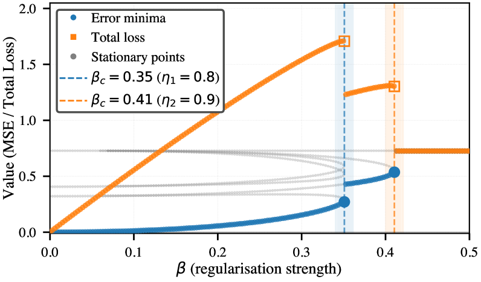

# Ersoy & Wiesner 2026 — Noise-Driven Escape from Metastable Phases explains Grokking in Deep Neural Networks

См. также: [глобальный индекс понятий](../../concepts/index.md).

**Ibrahim Talha Ersoy**, **Karoline Wiesner** (Группа науки о сложности, Институт физики и астрономии, Потсдамский университет).

arXiv [2606.17120](https://arxiv.org/abs/2606.17120), июнь 2026 (единственная версия v1), 13 страниц, 4 рисунка. Принята на HiLD 2026 — 4-ю мастерскую по ходу обучения в больших размерностях. Числа цитирований в таблице корпуса нет. Работа объясняет гроккинг **гистерезисом**: переходы по силе сглаживания L2 суть переходы первого рода, метастабильные фазы разделены энергетическими преградами, и задержка обобщения есть время ожидания, пока шум SGD не перенесёт модель через преграду. Время побега подчинено закону Крамерса—Аррениуса с действенной температурой $T_{\mathrm{eff}}\propto\eta_{\mathrm{lr}}/B$. Источник — нативный HTML arXiv версии v1.

Оригинал и производные файлы этой папки:

- [`original/2606.17120.native.html`](original/2606.17120.native.html) — первоисточник, нативный HTML arXiv (v1), скачан как есть.
- [`original/2606.17120.noise-driven-escape-from-metastable-phases-explains-grokking.md`](original/2606.17120.noise-driven-escape-from-metastable-phases-explains-grokking.md) — конверсия оригинала в Markdown без правок содержания.
- [`images/`](images/) — 6 иллюстраций статьи (рисунки 1 и 2 состоят из двух панелей каждый).

**О названии в индексе корпуса.** В `papers/index.md` работа значилась строкой «HiLD 2026: 4th Workshop on High-dimensional Learning Dynamics» — это не название, а поле «Comments» страницы arXiv. Название исправлено вместе с заведением карточки; во внешнем списке работ исходного репозитория оно с самого начала было верным.

**О блоке авторов.** В нативном HTML макросы шаблона PMLR остались нераскрытыми (`\NameIbrahim Talha Ersoy \Email…`); конверсия передаёт это как есть, а в карточке блок приведён к обычному виду.

Схема якорей и правила ссылок на карточку — в [README папки статей](../README.md).

## Затрагиваемые понятия

**[Фазовый переход](../../concepts/phase-transition.md)** — основание всей работы, и взято оно готовым из прежних работ той же группы: при изменении силы сглаживания L2 глубокая сеть переживает переходы **первого рода**, по одному на ненулевое сингулярное значение ковариации данных ([`p1-2`](#p1-2), [`p2-1`](#p2-1)). Отсюда и главный ход мысли: раз переход первого рода, значит есть сосуществующие фазы, преграда между ними и **гистерезис** ([`p3-1`](#p3-1)).

**[Гроккинг](../../concepts/grokking.md)** — объясняется не самим переходом, а **побегом из метастабильного состояния**, в котором модель заперта преградой ([`p1-3`](#p1-3)). Задержка есть время ожидания, пока шум SGD не перенесёт модель через преграду; резкость — свойство самого побега ([`p3-5`](#p3-5), [`fig-1`](#fig-1)).

**[Ландшафт потери и котловины](../../concepts/loss-landscape-basins.md)** — предмет измерен прямо: срез ландшафта вдоль пути наименьшей потери, седловая точка $\lambda^{\mathrm{sad}}\approx 0{,}41$, преграда $\Delta E_{\mathrm{min}}\approx 0{,}003$ ([`p4-1`](#p4-1), [`fig-2`](#fig-2)). Диаграмма ветвления показывает, как устойчивое наименьшее и седло сливаются и уничтожаются в седлоузловом ветвлении ([`fig-4`](#fig-4)).

**[Действенная теория и статистическая физика](../../concepts/effective-theory-statistical-mechanics.md)** — рамка заимствована целиком: SGD отображается на ланжевенов ход с действенной температурой $T_{\mathrm{eff}}\propto\eta_{\mathrm{lr}}/B$, а время побега подчинено закону Крамерса—Аррениуса ([`p3-2`](#p3-2), [`p3-3`](#p3-3)). Отсюда опровержимое предсказание: $\ln\tau$ линеен по $B/\eta_{\mathrm{lr}}$ ([`p3-4`](#p3-4)).

**[Приёмы оптимизации](../../concepts/optimizer-adam-adamw-sgd.md)** — скорость обучения и размер пакета входят в объяснение не как настройки, а как **единственная** величина $\eta_{\mathrm{lr}}/B$, задающая температуру. Проверка: пять значений скорости обучения, 50 семян на точку, линейная подгонка $R^{2}=0{,}991$ ([`p4-2`](#p4-2), [`fig-2`](#fig-2)).

**[Ослабление весов](../../concepts/weight-decay.md)** — здесь оно не причина обобщения, а **рычаг управления**: силой сглаживания намеренно устраивают западню, чтобы гроккинг воспроизвести ([`p3-5`](#p3-5), [`p10-1`](#p10-1)).

**[Возникновение признаков](../../concepts/feature-emergence-feature-learning.md)** — счётное: число метастабильных состояний равно числу выучиваемых признаков, по одному на сингулярное значение $\Sigma_{yx}$ ([`p1-2`](#p1-2), [`p3-1`](#p3-1)). Отсюда предсказание о **ступенчатом** гроккинге в $d$ ступеней ([`p5-3`](#p5-3)).

**[Доля данных](../../concepts/data-fraction-critical-dataset-size.md)** — понадобилась, чтобы получить хрестоматийную кривую: при плотных данных разрыва между обучением и проверкой нет вовсе, и он появляется лишь при разрежённом подвыборе — 25 примеров из 5000 ([`p3-5`](#p3-5), [`p6-2`](#p6-2)).

**[Запоминание](../../concepts/memorization-phase.md)** — прямое заявление: сеть линейна, задача случайна, запомнить выборку невозможно, а гроккинг всё равно воспроизводится ([`p6-2`](#p6-2)). Отсюда вывод, что запоминание не есть необходимая часть явления, а «запоминание» и «обобщение» суть описания частичного и полного продвижения сквозь череду переходов ранга.

Карточки статей корпуса: [Power et al. 2022](../2201.02177.grokking-generalization-beyond-overfitting-on-small-algorithmic-datasets/2201.02177.grokking-generalization-beyond-overfitting-on-small-algorithmic-datasets.card.md) — исходное явление; [Omnigrok](../2210.01117.omnigrok-grokking-beyond-algorithmic-data/2210.01117.omnigrok-grokking-beyond-algorithmic-data.card.md) — сглаживание как средоточная причина, с которой здесь спорят; [Nanda et al. 2023](../2301.05217.progress-measures-for-grokking-via-mechanistic-interpretability/2301.05217.progress-measures-for-grokking-via-mechanistic-interpretability.card.md) — истолковываемые представления в точке перехода; [Rubin et al. 2024](../2310.03789.grokking-as-a-first-order-phase-transition-in-two-layer-networks/2310.03789.grokking-as-a-first-order-phase-transition-in-two-layer-networks.card.md) — сравнение с фазовым переходом первого рода через энтропийную преграду, к которому эта работа ближе всего и от которого отмежёвывается; [Tian 2025](../2509.21519.provable-scaling-laws-of-feature-emergence-from-learning-dynamics-of-grokking/2509.21519.provable-scaling-laws-of-feature-emergence-from-learning-dynamics-of-grokking.card.md) — законы масштабирования возникновения признаков; [Levi et al. 2024](../2310.17247.grokking-beyond-neural-networks-an-empirical-exploration-with-model-complexity/2310.17247.grokking-beyond-neural-networks-an-empirical-exploration-with-model-complexity.card.md) — разрешимые модели, которые тоже гроккают.

**[Роль шума градиента](../../concepts/gradient-noise.md)** — единственная работа корпуса, где шум SGD положен в основание механизма: гроккинг — побег из метастабильного состояния, время побега подчинено закону Аррениуса с действенной температурой $T_{\mathrm{eff}}\propto\eta_{\mathrm{lr}}/B$ ([`p1-2`](#p1-2), [`p3-3`](#p3-3)). Проверка сделана в намеренно шумовой постановке (SGD, намеренное запирание); вопрос переноса на полнобатчевые запуски цепочки из карточки понятия остаётся открытым.

## Что показано, а что предположено

Замечания редактора карточки по итогам разбора утверждений (`…claims.txt`). Работа короткая: 5 страниц основного текста и 7 приложений, 4 рисунка.

**Устройство названо точно и проверяемо.** Не «гроккинг похож на фазовый переход», а «гроккинг есть ожидание побега из метастабильного состояния, и время ожидания подчинено закону Аррениуса с температурой $\eta_{\mathrm{lr}}/B$» ([`p3-3`](#p3-3), [`p3-4`](#p3-4)). Такая заявка либо ломается на первом же измерении, либо держится — и её проверили: пять значений скорости обучения, 50 семян на точку, $R^{2}=0{,}991$ ([`p4-2`](#p4-2)).

**Отрицательный итог о запоминании получен даром и потому убедителен.** Линейная сеть на случайной задаче запомнить выборку не может — ошибка на обучении упирается в байесов предел, — а гроккинг всё равно воспроизводится ([`p6-2`](#p6-2)). Это самое сильное место работы: оно отсекает целый разряд объяснений, не требуя ни одного дополнительного опыта.

**Расхождение между расчётной и измеренной преградой не спрятано, а объяснено.** $\Delta E_{\mathrm{min}}\approx 0{,}003$ против $\Delta E_{\mathrm{eff}}=0{,}15\pm 0{,}05$ — множитель около пятидесяти, и он отнесён к энтропийным поправкам формулы Крамерса—Лангера в $D=170$ измерениях ([`p5-1`](#p5-1), [`p11-1`](#p11-1)). Объяснение правдоподобно, но остаётся качественным: гессиан не вычислен, и число 50 из формулы не выведено.

**Однако гроккинг здесь не наблюдают, а изготавливают.** Все три уклада запирания начинают с **среза, обученного при большем сглаживании**, то есть модель помещают в западню руками ([`p3-5`](#p3-5)). Это добротная проверка того, что *если* модель заперта, *то* она ведёт себя как при гроккинге. Того, что при обычном обучении сеть попадает в такую западню сама, работа не показывает.

**Ни одного опыта на настоящей задаче с гроккингом.** Остаточная арифметика, на которой явление открыто, упомянута лишь в ссылке. Три предсказания — ступенчатость, зависимость от глубины, управление через $B/\eta_{\mathrm{lr}}$ — объявлены немедленно проверяемыми на имеющихся испытательных наборах ([`p6-1`](#p6-1)) и не проверены ни на одном.

**Перенос на нелинейные сети держится на ссылках.** В приложении G сказано, что глубокие нелинейные сети обнаруживают те же переходы первого рода, — со ссылкой на прежние работы тех же авторов ([`p13-1`](#p13-1)); собственные «предварительные опыты» упомянуты одной строкой без единого числа и рисунка ([`p6-1`](#p6-1)).

**Постановка крайне мала.** $d=2$ признака, глубина 3, ширина 10, $D=170$ значений, $N=512$ примеров ([`p9-1`](#p9-1), [`p9-2`](#p9-2)). Для аналитически разрешимой модели это оправдано, но заявка «то же устройство скорее всего действует и в общих нелинейных DNN» на таком основании не держится.

**Три числа в статье не сходятся.** Подпись рисунка 1 говорит $\beta=0{,}03$, тогда как и текст, и приложение A говорят $\beta=0{,}32$ ([`fig-1`](#fig-1), [`p3-5`](#p3-5), [`p10-1`](#p10-1)). Приложение D выводит порядок $\beta_{c}^{(1)}>\cdots>\beta_{c}^{(d)}$ ([`p12-1`](#p12-1)), а приложение B сообщает $\beta_{c}^{(1)}=0{,}36$ и $\beta_{c}^{(2)}=0{,}42$ ([`p10-2`](#p10-2)) — порядок обратный. Приложение A описывает начальное приближение из среза как обучение при $\beta_{\mathrm{init}}=0$ до решения полного ранга ([`p10-1`](#p10-1)), тогда как в разделе 3.1 срезы обучены при $\beta>\beta_{c}$ ([`p3-5`](#p3-5)); это разные постановки под одним именем.

**«Два порядка» пересчитать не удаётся.** Заявленный размах времён побега — два порядка ([`p1-2`](#p1-2)), а приведённые числа суть $\tau\approx 10$, $\tau\approx 5500$ и $\tau>10\,000$ эпох ([`p3-5`](#p3-5)), то есть три порядка от первого до последнего и меньше одного между двумя запертыми укладами. Что именно с чем сравнивается, не сказано.

**Ценное для корпуса — величина, которой можно управлять.** $\ln\tau\propto B/\eta_{\mathrm{lr}}$ есть предсказание, проверяемое на любом наборе, где гроккинг уже наблюдается: достаточно менять размер пакета и скорость обучения и смотреть, ложится ли логарифм задержки на прямую. Ни одна другая работа корпуса не даёт настолько дешёвой проверки — и тем досаднее, что сами авторы её не поставили.

Ibrahim Talha Ersoy (talha.ersoy@uni-potsdam.de), Karoline Wiesner (karoline.wiesner@uni-potsdam.de). Группа науки о сложности, Институт физики и астрономии, Потсдамский университет, Потсдам, Германия

## Ошибочные цитирования

Замечания редактора карточки: места, где эта статья передаёт чужие результаты с ошибкой или без авторских оговорок. Сюда ведут ссылки «подробности» из разделов «Ошибочные пересказы и цитирования этой статьи» карточек процитированных работ.

###### mc-2310-03789
**Rubin et al. (2310.03789) — приписан «энтропийный барьер».** `"Rubin et al. [11] proposed a first order phase transition analogy involving an entropy barrier. This was then challenged by Zhang et al. [23], who found no entropy barrier"` — «предложили аналогию перехода первого рода с энтропийным барьером». Барьера у Rubin нет: [сёдла существуют по отдельности и в смешанной фазе остаются вырожденными](../2310.03789.grokking-as-a-first-order-phase-transition-in-two-layer-networks/2310.03789.grokking-as-a-first-order-phase-transition-in-two-layer-networks.card.md#p6-6), кинетика перехода не рассматривается — конструкция «энтропийного барьера» принадлежит операционализации Zhang et al. и спроецирована назад на Rubin, отчего «вызов» Zhang выглядит опровержением того, чего Rubin не утверждал.

---

# Текст статьи

## Аннотация

###### p1-2

Глубокие нейронные сети (DNN) обнаруживают фазовые переходы первого рода при изменении силы сглаживания L2, и каждый такой переход отмечает наступление нового выучиваемого признака. Ниже опасной силы сглаживания выучиваемы в принципе все признаки, однако сосуществующие метастабильные состояния, разделённые энергетическими преградами, способны запереть сеть и помешать схождению. Сила DNN — в их способности обобщать. Но многое остаётся неясным, и среди прочего происхождение так называемого гроккинга: резкого отложенного наступления обобщения после долгого явного переобучения. Мы показываем для линейных DNN, что гроккинг согласуется с гистерезисом при фазовых переходах L2 первого рода: применяя сглаживание L2 для намеренного запирания, мы показываем, что модель в метастабильном состоянии с низкой точностью выбирается оттуда лишь тогда, когда шум SGD переносит её через энергетическую преграду, а времена побега подчиняются закону Аррениуса. Мы воспроизводим гроккингоподобное отложенное схождение в пределах двух порядков по времени побега, намеренно запирая модели в метастабильных фазах. Разрежённым подвыбором мы воспроизводим и хрестоматийную кривую гроккинга, где ошибка на проверке в конце концов приближается к итоговой ошибке на обучении. Наша работа наводит на мысль, что число метастабильных состояний равно числу выучиваемых признаков — по одному на сингулярное значение ковариации данных, — и что возможность гистерезиса естественно растёт со сложностью задачи. Мы приводим свидетельства того, что то же устройство скорее всего действует и в общих нелинейных DNN. Наши итоги указывают пути к более выгодным укладам обучения.

## 1 Введение

###### p1-3

Сглаживание L2 есть краеугольный камень современного машинного обучения, применяемый против переобучения — от классической гребневой регрессии [1] до глубокого обучения в больших размерах [2]. Помимо прикладной роли сглаживание L2 порождает богатую феноменологию, недавно понятую средствами статистической физики. Ziyin and Ueda [3] показали, что изменение силы сглаживания вызывает в DNN настоящие фазовые переходы, и выделили в DNN переходы первого рода при наступлении обучения (переход от недостаточной к избыточной параметризации). Последующие работы продлили эту картину за пределы наступления: Ersoy and Wiesner связали эти переходы с падениями кривизны в ландшафте потери [6], Ersoy, Licha, and Wiesner — с иерархиями выучиваемых признаков [7], а Ladewig, Ersoy, and Wiesner показали, что в линейных сетях каждое ненулевое сингулярное значение ковариации данных порождает свой собственный переход ранга [8], а значит, переходы повторяются по ходу обучения — по одному на выучиваемый признак. *Гроккинг*, внезапный переход от почти нулевого к почти безупречному обобщению много позже насыщения потери на обучении, привлёк большое внимание с тех пор, как Power et al. показали его на трансформерах, обученных остаточной арифметике [9]. Происхождение этого явления пока не вполне понято. Liu et al. [10] назвали сглаживание средоточной причиной гроккинга. Nanda et al. [21] выделили истолковываемые представления в точке перехода, а Tian [22] вывел законы масштабирования для возникновения признаков. **[p. 2]** Rubin et al. [11] предложили сравнение с фазовым переходом первого рода, где действует энтропийная преграда. Это было оспорено Zhang et al. [23], которые энтропийной преграды не нашли и предложили взамен стеклоподобную релаксацию. Разрешимые линейные модели, как показано, тоже гроккают [24], а расхождение распределений обучения и проверки признано причиной отложенного обобщения [25]. Мы предлагаем иное объяснение. Средоточным устройством мы полагаем *гистерезис* по образцу статистической физики фазовых переходов: модель, начально приближённая в фазе с низкой точностью, остаётся там, пока шум SGD не перенесёт её через энергетическую преграду (преграду потери) в наилучшую всеобще фазу. Чтобы показать, что гистерезис согласуется с феноменологией гроккинга, мы опираемся на находку, что изменение силы сглаживания L2 ведёт к фазовым переходам первого рода. Мы спрашиваем: может ли деятельный побег из возникающих метастабильных состояний — а не сами переходы — объяснить отличительные черты гроккинга? Чтобы ответить, мы применяем сглаживание L2 как средство управления, чтобы устроить метастабильное запирание. Мы успешно воспроизводим поведение гроккинга и сверх того показываем, что этот деятельный ход подчинён кинетике аррениусова вида [12, 13] с действенной температурой [14] $T_{\mathrm{eff}}\propto\eta_{\mathrm{lr}}/B$. Здесь $\eta_{\mathrm{lr}}$ есть скорость обучения, а $B$ — размер пакета, отчего время побега показательно чувствительно к выбору настроек. Наши итоги, установленные в разделах 2–3, подкрепляют три заявки: **(1)** фазовые переходы L2 первого рода порождают $d$ сосуществующих метастабильных состояний (по одному на выучиваемый признак), чьи энергетические преграды запирают модели в фазах с низкой точностью. **(2)** Побег подобен тепловому деятельному ходу и подчинён кинетике Аррениуса с $T_{\mathrm{eff}}\propto\eta_{\mathrm{lr}}/B$; мы подтверждаем это численно при $R^{2}=0.991$. **(3)** Намеренное запирание воспроизводит отличительные черты гроккинга — долгую задержку, резкость, чувствительность к начальному приближению и, при разрежённом подвыборе, расхождение обучения и проверки — в пределах двух порядков по времени побега.

## 2 Приёмы

### 2.1 Фазовые переходы по L2

###### p2-1

Мы берём глубокие линейные сети как наименьшую модель, ибо их ландшафт потери разрешим точно, что позволяет найти все $d$ метастабильных наименьших и энергетические преграды аналитически. Все качественные итоги — седлоузловые ветвления, сосуществующие фазы, аррениусов побег — сохраняются и в нелинейных сетях (приложение G), но линейный случай оставляет разбор посильным. В этом разделе мы напомним ключевые прежние итоги о фазовых переходах L2, прежде чем ввести нашу рамку времени побега. Ladewig et al. [8] описали точное устройство для линейных DNN, связав переходы с сингулярными значениями ковариации данных: при входе $x$ и выходе $y$, ковариациях $\Sigma_{xx}$, $\Sigma_{yy}$ и перекрёстной ковариации $\Sigma_{yx}$ сингулярные значения $\eta_{i}$ матрицы $\Sigma_{yx}$ прямо описывают выучиваемые признаки в согласованном случае ($\Sigma_{xx}=\mathbf{I}$). После того как сеть достигает 0-уравновешенного подпространства — набора расстановок весов, где все слои вносят равный вклад в сквозное отображение, — сглаженная по L2 потеря распадается на независимые слагаемые для каждого сингулярного значения $\lambda_{i}$ сквозной матрицы весов:

$$
\mathcal{L}(\{\lambda_{i}\},\beta)=\frac{1}{2}\sum_{i=1}^{d}(\lambda_{i}-\eta_{i})^{2}+\frac{\beta}{2}\sum_{i=1}^{d}\lambda_{i}^{2/L}, \tag{1}
$$

где $L$ есть глубина сети, $d$ — число ненулевых мод, а $\beta>0$ — сила сглаживания. При глубине $L\geq 3$ условие стационарности $\partial\mathcal{L}/\partial\lambda_{i}=0$ для одной моды читается так:

$$
\lambda-\eta+\beta\,\lambda^{2/L-1}=0. \tag{2}
$$

По мере того как $\beta$ растёт и проходит $\beta_{c}$, два нетривиальных решения (устойчивое наименьшее и неустойчивое седло) сливаются и уничтожаются в седлоузловом ветвлении (см. приложение D), оставляя лишь $\lambda=0$. **[p. 3]** Ниже $\beta_{c}$ решения нулевого и ненулевого ранга сосуществуют, разделённые конечной энергетической преградой (диаграмма ветвления — в приложении C). Опасная сила сглаживания такова:

$$
\beta_{c}^{(i)}=\frac{1}{1-k}\left(\eta_{i}\frac{1-k}{2-k}\right)^{2-k},\qquad k=\frac{2}{L}. \tag{3}
$$

###### p3-1

При $\beta>\beta_{c}^{(i)}$ метастабильное наименьшее исчезает. Точка равной потери $\beta^{*}_{i}$ (где решения меньшего и большего ранга имеют равную сглаженную потерю) лежит строго ниже $\beta_{c}^{(i)}$ при $L\geq 3$, что и порождает гистерезис: модель остаётся запертой в фазе меньшего ранга даже тогда, когда фаза большего ранга предпочтительнее по энергии. Порядок $\eta_{1}>\cdots>\eta_{d}>0$ даёт $d$ различных ветвлений — по одному метастабильному состоянию на выучиваемый признак.

### 2.2 SGD как ланжевенов ход и аррениусов побег

###### p3-2

Чтобы описать побег из метастабильных состояний, отметим, что шум мини-пакетов SGD вносит в градиент случайные колебания с ковариацией, растущей как $\eta_{\mathrm{lr}}/B$, где $\eta_{\mathrm{lr}}$ есть скорость обучения, а $B$ — размер пакета. В пределе сильного затухания ход отображается на ланжевенов с действенной температурой [14]:

$$
T_{\mathrm{eff}}\propto\frac{\eta_{\mathrm{lr}}}{B}. \tag{4}
$$

###### p3-3

Среднее время побега из метастабильного состояния тогда подчинено закону Крамерса—Аррениуса [12, 13]:

$$
\ln\tau=\ln\tau_{0}+\frac{\Delta E_{\mathrm{eff}}}{T_{\mathrm{eff}}}, \tag{5}
$$

###### p3-4

где $\Delta E_{\mathrm{eff}}$ есть действенная высота преграды, вбирающая многомерную кривизну и энтропийные поправки (см. приложение F). Отсюда опровержимое предсказание: $\ln\tau$ линеен по $B/\eta_{\mathrm{lr}}$.

## 3 Итоги

### 3.1 Гистерезис и запирание воспроизводят гроккинг

###### p3-5

Сосуществование метастабильных состояний означает, что исход обучения тонко зависит от начального приближения. Чтобы это показать, мы работаем при $\beta=0.32$, что лежит в промежутке $\beta<\beta_{c}^{(1)}$, так что всеобще наименьшее имеет ранг 2, но существует и метастабильное наименьшее ранга 1. Во всех трёх опытах взяты скорость обучения $\eta_{\mathrm{lr}}=0.08$ и размер пакета $B=64$. Мы рассматриваем три уклада начального приближения (рисунок 1): **(i) случайное начальное приближение.** *Постановка*: обычное случайное начальное приближение весов при $\beta=0.32$. *Наблюдение*: модель быстро сходится к всеобще наименьшему ранга 2 (рисунок 1, синее; $\tau\approx 10$ эпох). *Вывод*: запирания не происходит, когда модель начинает вне какой-либо метастабильной фазы. **(ii) Западня ранга 1.** *Постановка*: модель начально приближена из среза, обученного при $\beta>\beta_{c}^{(1)}$, что помещает её в метастабильную фазу ранга 1. *Наблюдение*: модель остаётся в состоянии ранга 1 около $\tau\approx 5500$ эпох, а затем резко выбирается в ранг 2 (рисунок 1, зелёное). *Вывод*: запирание в метастабильной фазе даёт гроккингоподобное отложенное схождение. **(iii) Западня тривиальной фазы.** *Постановка*: модель начально приближена из среза, обученного при $\beta>\beta_{c}^{(2)}$, что помещает её в фазу ранга 0. *Наблюдение*: модель выбирается в ранг 1 после $\tau>7000$ эпох, затем остаётся запертой в ранге 1 ещё долгое время, и полная задержка составляет $\tau>10{,}000$ эпох (рисунок 1, оранжевое). *Вывод*: последовательное запирание в нескольких метастабильных фазах воспроизводит ступенчатые задержки гроккинга в пределах двух порядков. **(iv) Хрестоматийный гроккинг через разрежённый **[p. 4]** подвыбор.** *Постановка*: обучение и проверка берутся из *одного и того же* распределения (слабая связь $0.8$, сильная связь $0.9$), но обучающий набор очень разрежен — всего $25$ примеров ($0.5\%$ от запаса в $5\,000$ примеров), так что слабый признак плохо определён по обучающим данным, оставаясь при полной силе на проверке. Модель начально приближена в запертом состоянии ранга 1 и обучается при $\beta=0.0025$ — малом сглаживании, выбранном так, чтобы ровный участок был долгим, но в конце концов разрешился. *Наблюдение*: после краткого переходного участка, где сильная мода приходит в равновесие, обе ошибки выходят на ровный участок, причём обучающая ниже проверочной (рисунок 1(b)); модель держится в фазе ранга 1 около ${\approx}1500$ эпох, затем выбирается в ранг 2, и ошибка на проверке резко падает, приближаясь к обучающей с точностью до малого остаточного разрыва, заданного неустранимым шумом случайной задачи. *Вывод*: то же устройство запирания воспроизводит хрестоматийную кривую гроккинга, когда слабый признак недостаточно представлен в обучающей выборке.


###### fig-1

*Рисунок 1: отложенное схождение в глубоких линейных сетях. **(a)** Случайное (синее), западня ранга 1 (зелёное), западня тривиальной фазы (оранжевое) при $\beta=0.03$, $\eta_{\mathrm{lr}}=0.08$, $B=64$. Схождение сильно задерживается, когда модель начально приближена в местных наименьших фаз с меньшей точностью. **(b)** Хрестоматийный гроккинг через разрежённый подвыбор ($25$ обучающих примеров, $\beta=0.0025$). Начально приближённая в фазе ранга 1, обучающая MSE (синее) быстро падает, но лишь до ровного участка, тогда как проверочная MSE (красное) выходит на ровный участок выше; около ${\approx}1500$ эпох модель выбирается из фазы ранга 1, и проверочная MSE резко падает, приближаясь к обучающей с точностью до малого остаточного разрыва, заданного неустранимым шумом задачи.* **[p. 4]**

### 3.2 Энергетическая преграда между метастабильными состояниями

###### p4-1

Устройство запирания требует конечной энергетической преграды между фазами разного ранга. Рисунок 2(a) показывает срез ландшафта потери вдоль пути наименьшей потери при $\beta=0.32$, размеченный сингулярным значением $\lambda$. Явная преграда отделяет местное наименьшее при $\lambda=0$ от всеобще наименьшего. Мы вычисляем уравнение (1) численно в седловой точке $\lambda^{\mathrm{sad}}\approx 0.41$ (полученной из уравнения (2) при $\beta=0.32$, $\eta=0.8$, $L=3$). Это даёт $\Delta E_{\mathrm{min}}\approx 0.003$ — преграду вдоль пути наименьшей потери из метастабильной фазы (рисунок 2(a)). Как мы покажем далее, действенная преграда, правящая временами побега, куда больше.

### 3.3 Аррениусов закон подтверждает тепловой деятельный побег

###### p4-2

Чтобы проверить, правит ли побегом деятельное преодоление преграды, как предсказывает уравнение (5), мы измерили времена побега из запертого состояния ранга 1 при $\beta=0.32$, меняя $\eta_{\mathrm{lr}}\in[5\times 10^{-4},5\times 10^{-3}]$ при закреплённом размере пакета $B=64$. При $T_{\mathrm{eff}}\propto\eta_{\mathrm{lr}}/B$ уравнение (5) предсказывает, что $\ln\tau$ линеен по $B/\eta_{\mathrm{lr}}$. Рисунок 2(b) показывает этот аррениусов график; линейная подгонка даёт $R^{2}=0.991$, что подтверждает уравнение (5). Наклон даёт действенную преграду:

**[p. 5]**

$$
\Delta E_{\mathrm{eff}}=0.15\pm 0.05. \tag{6}
$$

###### p5-1

Это много выше $\Delta E_{\mathrm{min}}\approx 0.003$, показанного на рисунке 2(a). Расхождение ожидаемо: в пространстве значений размерности $D=170$ формула Крамерса—Лангера добавляет энтропийные и геометрические поправки от $D-1$ поперечных направлений, отчего $\Delta E_{\mathrm{eff}}\gg\Delta E_{\mathrm{min}}$ (приложение F).


###### fig-2

*Рисунок 2: **(a)** срез ландшафта потери при $\beta=0.32$, $\eta=0.8$, $L=3$; пунктирные кривые показывают $\beta=0.29$ и $\beta=0.35$. Преграда от местного наименьшего при $\lambda=0$ до седла даёт $\Delta E_{\mathrm{min}}\approx 0.003$. **(b)** Аррениусова подгонка: $\ln\tau$ против $1/T_{\mathrm{eff}}$. Линейная подгонка ($R^{2}=0.991$) подтверждает тепловое деятельное преодоление преграды; наклон даёт $\Delta E_{\mathrm{eff}}=0.15\pm 0.05\gg\Delta E_{\mathrm{min}}$, а расхождение объясняется энтропийными поправками и поправками на кривизну в $D=170$ измерениях (приложение F).* **[p. 5]**

## 4 Обсуждение

### 4.1 Устройственный отчёт о гроккинге

Наши итоги устанавливают три заявки. Первая: фазовые переходы L2 первого рода порождают сосуществующие метастабильные состояния, чьи преграды запирают модели в фазах с низкой точностью. Вторая: побег из этих состояний есть деятельный ход, подчинённый кинетике Аррениуса с $T_{\mathrm{eff}}\propto\eta_{\mathrm{lr}}/B$. Третья: намеренное запирание воспроизводит отличительные черты гроккинга — долгую задержку, резкость, чувствительность к начальному приближению и расхождение обучения и проверки при разрежённом подвыборе — в аналитически посильной наименьшей модели. Эта рамка даёт ясные опровержимые предсказания:

###### p5-3

1. *Ступенчатый гроккинг*: в задачах с $d$ выучиваемыми признаками гроккинг должен проходить до $d$ отдельных ступеней — по одной на сингулярное значение $\Sigma_{yx}$.
2. *Зависимость от глубины*: более глубокие сети (больше $L$) дают более высокие преграды и оттого более долгие задержки гроккинга, ибо опасная сила $\beta_{c}^{(i)}$ убывает с $L$, тогда как точка равной потери $\beta^{*}_{i}$ остаётся конечной [8].
3. *Управление настройками*: время побега подчинено $\ln\tau\propto B/\eta_{\mathrm{lr}}$, что даёт прямой рычаг для ускорения или подавления гроккинга.

**[p. 6]**

###### p6-1

Предсказания (2) и (3) немедленно проверяемы изменением $L$, $\eta_{\mathrm{lr}}$ и $B$ в имеющихся испытательных наборах для гроккинга. Предварительные опыты и работы по нелинейным сетям [7] с возбуждениями sigmoid и tanh воспроизводят качественно то же поведение фазового перехода первого рода, что решительно наводит на мысль о приложимости того же устройства и за пределами линейной рамки.

### 4.2 Отношение к запоминанию и обобщению

###### p6-2

В опытах с плотными данными на рисунке 1(a) ошибка на обучении сходится монотонно, а большого разрыва между обучением и проверкой, свойственного хрестоматийному гроккингу [9], не появляется, ибо при $d=2$ хорошо выбранных модах у модели мало направлений, вдоль которых обучение и проверка могли бы разойтись. При разрежённом подвыборе этот разрыв всё же возникает: рисунок 1(b) показывает, что ошибка на обучении выходит на ровный участок, тогда как проверочная остаётся заметно выше, пока обе резко не падают, когда модель выбирается из фазы ранга 1. Поскольку сеть линейна, а задача случайна, модель не может запомнить обучающую выборку: ошибка на обучении устаивается на наилучшей линейной подгонке ранга 1 и после побега — близ наилучшей подгонки ранга 2, ограниченной снизу неустранимой (байесовой) ошибкой гауссовой задачи. Обучение и проверка потому сближаются и подходят к шумовому полу, но совпасть или упасть до нуля не могут. Приметой гроккинга здесь оказывается отложенное резкое смыкание разрыва между обучением и проверкой до шумового пола задачи, воспроизведённое *без всякого запоминающего решения*, — что согласуется со взглядом, по которому запоминание не есть необходимая часть явления. Когда $d$ велико, путь оптимизации снижает ошибку на обучении, выучивая одни сингулярные направления и застревая в других, отчего и возникает видимая пора запоминания. С этой точки зрения запоминание и обобщение не обязаны быть первичными понятиями: они возникают как описания частичного или полного продвижения сквозь череду переходов ранга. Более того, то, что ныне зовут «гроккингом», возможно, охватывает несколько устройственно разных явлений с внешним сходством; наша рамка даёт основательное начало, чтобы их различать.

## 5 Заключение

Мы предлагаем возможное устройство гроккинга: вызванный шумом деятельный побег из метастабильных состояний, создаваемых фазовыми переходами первого рода в сетях со сглаживанием L2. На глубоких линейных сетях, то есть в наименьшей постановке, где ландшафт потери разрешим точно [8], мы показываем три итога: **(i)** намеренное запирание в метастабильных фазах воспроизводит гроккингоподобное отложенное схождение; **(ii)** времена побега подчинены аррениусову закону $\ln\tau\propto 1/T_{\mathrm{eff}}$ при $T_{\mathrm{eff}}\propto\eta_{\mathrm{lr}}/B$; и **(iii)** извлечённая преграда $\Delta E_{\mathrm{eff}}=0.15\pm 0.05$ превосходит преграду вдоль пути наименьшей потери $\Delta E_{\mathrm{min}}\approx 0.003$ во столько раз, во сколько предсказано энтропийными поправками и поправками на кривизну в $D=170$ измерениях. Рамка связывает гроккинг с установившейся физикой вызванного шумом побега из метастабильных состояний [12, 13, 19] и даёт прямой прикладной рычаг: раз $\ln\tau\propto B/\eta_{\mathrm{lr}}$, задержки гроккинга в принципе можно ускорять или подавлять одним лишь выбором настроек.

## Благодарности

Мы благодарим Björn Ladewig и участников Группы науки о сложности за побуждающие обсуждения и вдохновляющий вклад.

## Список литературы

- A. E. Hoerl and R. W. Kennard, “Ridge regression: Biased estimation for nonorthogonal problems,” *Technometrics* **12**, 55 (1970).

**[p. 7]**

- I. Goodfellow, Y. Bengio, and A. Courville, *Deep Learning* (MIT Press, Cambridge, MA, 2017).

- Ziyin, L. & Ueda, M. Zeroth, first, and second-order phase transitions in deep neural networks. *Physical Review Research*. **5**, 043243 (2023)

- S. Amari, *Information Geometry and Its Applications*, Vol. 194 (Springer, Tokyo, 2016).

- S. Watanabe, *Algebraic Geometry and Statistical Learning Theory*, Vol. 25 (Cambridge University Press, Cambridge, 2009).

- I. T. Ersoy and K. Wiesner, “Exploring L2-phase transitions on error landscapes,” *Workshop on High-Dimensional Learning Dynamics* (2025).

- I. T. Ersoy, A. F. C. Licha, and K. Wiesner, “Phase transitions reveal hierarchical structure in deep neural networks,” arXiv:2512.11866 (2025).

- B. Ladewig, I. T. Ersoy, and K. Wiesner, “Cascading through the Hierarchy: Regulariser-induced Feature Detection as Phase Transitions in Deep Linear Neural Networks,” *(in preparation)* (2026).

- A. Power, Y. Burda, H. Edwards, I. Babuschkin, and V. Misra, “Grokking: Generalization beyond overfitting on small algorithmic datasets,” arXiv:2201.02177 (2022).

- Z. Liu, E. J. Michaud, and M. Tegmark, “Omnigrok: Grokking beyond algorithmic data,” arXiv:2210.01117 (2022).

- N. Rubin, I. Seroussi, and Z. Ringel, “Grokking as a first order phase transition in two layer networks,” *International Conference on Learning Representations* (2024).

- H. A. Kramers, “Brownian motion in a field of force and the diffusion model of chemical reactions,” *Physica* **7**, 284 (1940).

- P. Hänggi, P. Talkner, and M. Borkovec, “Reaction-rate theory: fifty years after Kramers,” *Rev. Mod. Phys.* **62**, 251 (1990).

- S. Mandt, M. D. Hoffman, and D. M. Blei, “Stochastic gradient descent as approximate Bayesian inference,” *J. Mach. Learn. Res.* **18**, 4873 (2017).

- Smith, S., Kindermans, P., Ying, C. & Le, Q. Don’t decay the learning rate, increase the batch size. *ArXiv Preprint ArXiv:1711.00489*. (2017)

- Welling, M. & Teh, Y. Bayesian learning via stochastic gradient Langevin dynamics. *Proceedings Of The 28th International Conference On Machine Learning (ICML-11)*. pp. 681-688 (2011)

- Saxe, A., McClelland, J. & Ganguli, S. Exact solutions to the nonlinear dynamics of learning in deep linear neural networks. *ArXiv Preprint ArXiv:1312.6120*. (2013)

- Wang, Z. & Jacot, A. Implicit bias of SGD in L2-regularized linear DNNs: One-way jumps from high to low rank. *ArXiv Preprint ArXiv:2305.16038*. (2023)

**[p. 8]**

- T. Mori, L. Ziyin, K. Liu, and M. Ueda, “Power-law escape rate of SGD,” *Proceedings of the 39th International Conference on Machine Learning*, PMLR **162**, 15959 (2022).

- Draxler, F., Veschgini, K., Salmhofer, M. & Hamprecht, F. Essentially No Barriers in Neural Network Energy Landscape. (2019)

- Nanda, N., Chan, L., Lieberum, T., Smith, J. & Steinhardt, J. Progress measures for grokking via mechanistic interpretability. *ArXiv Preprint ArXiv:2301.05217*. (2023)

- Y. Tian, “Provable scaling laws of feature emergence from learning dynamics of grokking,” arXiv:2509.21519 (2025).

- Zhang, X., Shang, Y., Yang, E. & Zhang, G. Is Grokking a Computational Glass Relaxation?. (2026), https://arxiv.org/abs/2505.11411

- N. Levi, A. Beck, and Y. Bar-Sinai, “Grokking in linear estimators—a solvable model that groks without understanding,” *International Conference on Learning Representations* (2024), arXiv:2310.16441.

- K. Lyu, J. Jin, Z. Li, S. S. Du, J. D. Lee, and W. Hu, “Dichotomy of early and late phase implicit biases can provably induce grokking,” *International Conference on Learning Representations* (2024), arXiv:2311.18817.

**[p. 9]**

## Приложение A Постановка опытов

###### p9-1

Во всех опытах взята глубокая линейная сеть глубины $L=3$ (два скрытых слоя) со скрытой шириной $w=10$ и размерностью выхода $p=2$, что даёт $D=170$ значений всего. Никакого нелинейного возбуждения не применяется; сквозное отображение есть одно произведение матриц. Приёмом оптимизации всюду служит SGD.

###### p9-2

**Порождение данных.** Обучающие и проверочные данные состоят каждые из $N=512$ примеров, взятых из многомерного гауссова распределения с нулевым средним над совместным пространством входов и выходов. Ковариация данных имеет $d=2$ ненулевых сингулярных значения $\eta_{1}=0.9$, $\eta_{2}=0.8$ при $\Sigma_{xx}=\mathbf{I}$. Примеры порождаются разложением Холецкого: при $\Sigma=LL^{\top}$ каждый пример берётся как $z=L\epsilon$ при $\epsilon\sim\mathcal{N}(0,\mathbf{I})$; первые $p$ составляющих суть вход, остальные $p$ — выход. Независимый проверочный набор того же размера закреплён на всё время.

**Начальное приближение и отжиг.** Во всех опытах с запиранием применяется *начальное приближение из среза*: сперва модель обучается до схождения при $\beta_{\mathrm{init}}=0$, чтобы получить решение полного ранга. Полученные веса затем берутся как отправная точка для продолжения обучения. Это подобно отжигу. Для исходной постановки со случайным начальным приближением берутся свежие веса из $\mathcal{N}(0,1/\sqrt{w})$. Схождение оценивается слежением за проверочной MSE; побег из метастабильной фазы распознаётся как эпоха, на которой проверочная MSE падает ниже порога, взятого посередине между значением на метастабильном ровном участке и всеобще наименьшим значением.

**Фазовая диаграмма** (рисунок 3, приложение B): сперва модель обучается до схождения при $\beta=0$, затем $\beta$ увеличивается квазистатически малыми шагами с переобучением до схождения на каждом шаге.

**Опыты с запиранием** (рисунок 1): во всех трёх укладах взяты $\beta=0.32$, $\eta_{\mathrm{lr}}=0.08$, $B=64$.

- *Random initialisation*: weights drawn from a standard normal distribution scaled by $1/\sqrt{w}$; training run for $2\times 10^{4}$ epochs.
- *Rank-1 trap*: model initialised from a checkpoint trained to convergence at $\beta=0.361>\beta_{c}^{(1)}=0.360$, placing the end-to-end weight matrix in the rank-1 phase; training then continued at $\beta=0.32$ for $2\times 10^{4}$ epochs.
- *Trivial-phase trap*: model initialised from a checkpoint trained to convergence at $\beta=0.43>\beta_{c}^{(2)}=0.42$, placing the network in the rank-0 phase; training continued at $\beta=0.32$ for $2\times 10^{4}$ epochs.

Каждый опыт повторён на 50 случайных семенах (семена 42–91); времена побега от семени к семени разнятся из-за случайного шума SGD, а он и есть изучаемое устройство деятельного побега. **Аррениусов перебор** (рисунок 2(b)): начиная с описанного выше начального приближения в западне ранга 1, времена побега измеряются при $\beta=0.32$ и закреплённом $B=64$ при изменении $\eta_{\mathrm{lr}}\in\{5\times 10^{-4},\,1\times 10^{-3},\,2\times 10^{-3},\,3\times 10^{-3},\,5\times 10^{-3}\}$. Каждая точка усреднена по 50 семенам. Множитель пропорциональности $C$ в $T_{\mathrm{eff}}=\eta_{\mathrm{lr}}/(BC)$ оценивается по следу ковариации градиентов. Линейность ($R^{2}=0.991$) есть ключевой итог. При $N=512$ и $B=64$ каждая эпоха состоит из $\lfloor N/B\rfloor=8$ шагов SGD; этот множитель входит в $\ln\tau_{0}$, но не в наклон $\Delta E_{\mathrm{eff}}/T_{\mathrm{eff}}$, отчего извлечённая преграда не меняется. **Опыт с разрежённым подвыбором** (рисунок 1(b)): обучение и проверка берутся из одного гауссова распределения с нулевым средним при слабой связи $0.8$ и сильной связи $0.9$ ($\Sigma_{xx}=\mathbf{I}$). Обучающий набор есть случайное подмножество из $25$ примеров запаса в $5\,000$ примеров ($0.5\%$), так что слабый признак плохо определён по обучающим данным, оставаясь при полной силе на (непересекающемся, из $10\,000$ примеров) проверочном наборе. Модель начально приближена в запертом состоянии ранга 1 и обучается при $\beta=0.0025$, $\eta_{\mathrm{lr}}=0.1$, $B=64$. Побег распознаётся как эпоха, на которой второе сингулярное значение сквозного отображения поднимается выше малого порога ($\sigma_{2}>10^{-3}$). **[p. 10]** Поскольку сеть линейна, ошибка на обучении не может достичь нуля: она выходит на ровный участок на наилучшей линейной подгонке ранга 1 и после побега устаивается близ наилучшей подгонки ранга 2, а обе ограничены снизу неустранимой (байесовой) ошибкой случайной задачи.

## Приложение B Фазовая диаграмма

###### p10-1

Рисунок 3 показывает проверочную MSE как функцию $\beta$ для глубокой линейной сети с $d=2$ сингулярными значениями ($\eta_{1}=0.9$, $\eta_{2}=0.8$, $\Sigma_{xx}=\mathbf{I}$, $L=3$), полученную обучением до схождения с последующим квазистатическим уменьшением $\beta$ шагами по $0.01$. Два резких спада отмечают переходы при $\beta_{c}^{(1)}=0.36$ и $\beta_{c}^{(2)}=0.42$, в близком согласии с уравнением (3). При каждом переходе действенный ранг сквозной матрицы весов возрастает на единицу, что отвечает выучиванию моделью ещё одного признака. Малое смещение от теоретических значений отражает склонность выходного распределения.


*Рисунок 3: фазовые переходы в глубокой линейной сети ($L=3$, $d=2$, $\eta_{1}=0.9$, $\eta_{2}=0.8$, $\Sigma_{xx}=\mathbf{I}$). Проверочная MSE против силы сглаживания $\beta$ обнаруживает два резких спада при $\beta_{c}^{(1)}=0.36$ и $\beta_{c}^{(2)}=0.42$; при каждом переходе действенный ранг возрастает на единицу. Квазистатический перебор; малое смещение от теории отражает склонность выходного распределения.* **[p. 10]**

## Приложение C Диаграмма ветвления

###### p10-2

Строение ветвления ландшафта потери показано на рисунке 4. Для одной моды с силой сигнала $\eta$ условие стационарности (2) имеет ниже $\beta_{c}$ три решения: тривиальное наименьшее при $\lambda=0$, неустойчивое седло при $\lambda^{\mathrm{sad}}$ и всеобще наименьшее при $\lambda^{**}>\lambda^{\mathrm{sad}}$. По мере того как $\beta$ растёт и проходит $\beta_{c}$, седло и всеобще наименьшее сливаются и уничтожаются в седлоузловом ветвлении, оставляя лишь $\lambda=0$. Модель на верхней ветви (ранг 1) остаётся метастабильной при всех $\beta<\beta_{c}$; модель на нижней ветви (ранг 0) при $\lambda=0$ заперта там даже тогда, когда фаза ранга 1 предпочтительнее по энергии (то есть при $\beta<\beta^{*}$). Высота преграды между ними, а значит, и среднее время побега растут по мере приближения $\beta$ к $\beta_{c}$. Отметим, что при $L=2$ такого ветвления не происходит: условие стационарности **[p. 11]** линейно по $\lambda$ и имеет единственное положительное решение при всех $\beta>0$, отчего поведение оказывается лишь второго рода [3].



###### fig-4

*Рисунок 4: диаграмма ветвления для мод ($\eta_{1}=0.9$, $\eta_{2}=0.8$, $L=3$). Сплошные линии — устойчивые стационарные точки; пунктирная линия — неустойчивое седло. Две нетривиальные ветви уничтожаются при $\beta_{c}$ в седлоузловом ветвлении, оставляя лишь $\lambda=0$ при $\beta>\beta_{c}$. Модель на ветви ранга 1 (точечное продолжение) остаётся метастабильной, пока случайный шум не перенесёт её через преграду во всеобще наименьшее ранга 2.* **[p. 11]**

## Приложение D Опасная сила сглаживания

###### p11-1

Условие стационарности для моды $i$ при потере из уравнения (1) таково

$$
\frac{\partial\mathcal{L}}{\partial\lambda_{i}}=\lambda_{i}-\eta_{i}+\beta\,\lambda_{i}^{2/L-1}=0. \tag{7}
$$

### D.1 Седлоузловое ветвление для DNN

Положив $k=2/L$, условие стационарности читается так

$$
\lambda_{i}-\eta_{i}+\beta\,\lambda_{i}^{k-1}=0. \tag{8}
$$

В некотором промежутке $\beta$ это уравнение допускает два различных положительных решения: больший корень $\lambda^{**}$ (всеобще наименьшее) и меньший корень $\lambda^{\mathrm{sad}}$ (неустойчивое седло). Два корня сливаются при $\beta_{c}^{(i)}$, для чего требуется, чтобы уравнение (8) и его производная обращались в нуль разом:

$$
1+\beta(k-1)\lambda_{i}^{k-2}=0. \tag{9}
$$

Решение уравнения (9) даёт опасное сингулярное значение $\lambda_{c}^{(i)}=\eta_{i}(1-k)/(2-k)$, а подстановка обратно в уравнение (8) даёт уравнение (3) основного текста.

**[p. 12]**

### D.2 Число переходов

###### p12-1

Поскольку моды распадаются на независимые, у каждого ненулевого сингулярного значения $\eta_{i}$ матрицы $\Sigma_{yx}$ есть своё $\beta_{c}^{(i)}$. Порядок $\eta_{1}>\cdots>\eta_{d}>0$ влечёт $\beta_{c}^{(1)}>\cdots>\beta_{c}^{(d)}$, что даёт $d$ отдельных седлоузловых ветвлений по мере уменьшения $\beta$ от большого значения.

## Приложение E Теоретические высоты преград

Для одной моды при $\beta<\beta_{c}^{(i)}$ преграда для побега из метастабильной фазы меньшего ранга есть разность потерь между седлом и тривиальным наименьшим:

$$
\Delta E=\mathcal{L}(\lambda^{\mathrm{sad}})-\mathcal{L}(0)=\tfrac{1}{2}(\lambda^{\mathrm{sad}}-\eta)^{2}+\frac{L\beta}{2}(\lambda^{\mathrm{sad}})^{2/L}-\tfrac{1}{2}\eta^{2}, \tag{10}
$$

где $\lambda^{\mathrm{sad}}$ есть меньший положительный корень уравнения (8), полученный численно. При $\beta=0.32$, $\eta_{2}=0.8$, $L=3$: $\lambda^{\mathrm{sad}}\approx 0.41$ и $\Delta E\approx 0.003$. Это наименьшая преграда вдоль пути наименьшей потери из метастабильной фазы. Большое расхождение с опытно извлечённым $\Delta E_{\mathrm{eff}}=0.15\pm 0.05$ объясняется многомерными поправками, выведенными в приложении F.

## Приложение F Действенная высота преграды в многомерных ландшафтах

### F.1 Теория Крамерса—Лангера

В пространстве значений размерности $D$ среднее время первого достижения седловой точки из метастабильного наименьшего при ланжевеновом ходе с силой шума $T_{\mathrm{eff}}$ задано формулой Крамерса—Лангера [13]:

$$
\tau=\frac{2\pi}{|\omega_{1}^{\mathrm{sad}}|}\left(\frac{\prod_{j=1}^{D}|\omega_{j}^{\mathrm{sad}}|}{\prod_{j=1}^{D-1}\omega_{j}^{\mathrm{min}}}\right)^{\!\!1/2}\exp\!\left(\frac{\Delta E}{T_{\mathrm{eff}}}\right), \tag{11}
$$

где $\omega_{j}^{\mathrm{min}}>0$ суть собственные значения гессиана в метастабильном наименьшем, а $\omega_{j}^{\mathrm{sad}}$ — в седле, причём ровно одно собственное значение отрицательно: $\omega_{1}^{\mathrm{sad}}<0$.

### F.2 Действенная преграда и энтропийные вклады

Взяв логарифм уравнения (11) и определив

$$
\Delta E_{\mathrm{eff}}\equiv\Delta E-\frac{T_{\mathrm{eff}}}{2}\sum_{j=1}^{D-1}\ln\!\frac{\omega_{j}^{\mathrm{sad}}}{\omega_{j}^{\mathrm{min}}}, \tag{12}
$$

мы в точности восстанавливаем аррениусов вид: $\ln\tau=\mathrm{const}+\Delta E_{\mathrm{eff}}/T_{\mathrm{eff}}$. В нашей постановке $D=170$. Метастабильное наименьшее сильно стесняет по всем направлениям, тогда как у седла кривизна шире по $D-1$ поперечным направлениям, так что $\omega_{j}^{\mathrm{min}}\gg\omega_{j}^{\mathrm{sad}}$ для большинства $j$. Возникающий энтропийный вклад и делает $\Delta E_{\mathrm{eff}}\gg\Delta E_{\mathrm{min}}$, что объясняет наблюдаемый множитель $\sim 50$.

### F.3 Поправка на мультипликативный шум SGD

Mori et al. [19] показали, что для потери MSE мультипликативная природа шума SGD меняет существенную преграду с линейной разности потерь на логарифмированную величину. Для приблизительно квадратичного ландшафта близ нашего метастабильного наименьшего эта поправка линейного аррениусова отношения не нарушает, что согласуется с $R^{2}=0.991$.

**[p. 13]**

### F.4 Время побега и выбор единицы времени

###### p13-1

Времена побега $\tau$ приводятся в эпохах. Поскольку $B$, $\eta_{\mathrm{lr}}$ и $N$ закреплены внутри каждого перебора, перевод между эпохами и шагами SGD есть постоянная (см. приложение A), отчего извлечённая высота преграды не меняется.

## Приложение G Перенос на нелинейные сети

Хотя наши количественные итоги (высоты преград, опасные значения $\beta$) свойственны линейным сетям, качественное устройство — метастабильное запирание из-за седлоузловых ветвлений с последующим вызванным шумом побегом — приложимо вообще. Прежние работы установили, что глубокие нелинейные сети обнаруживают те же фазовые переходы первого рода, движимые L2 [3, 6], с иерархическим обучением признакам [7]. Главная составная часть, нужная, чтобы предложить гистерезис, есть лежащий в основе фазовый переход первого рода, существующий и за пределами линейной постановки. Линейный случай тем самым служит наименьшей моделью, сохраняющей существенное строение ветвления и остающейся при этом посильной для аналитического разбора.

---

# Машиночитаемый блок фактов

```yaml
paper:
  id: 2606.17120
  title: "Noise-Driven Escape from Metastable Phases explains Grokking in Deep
    Neural Networks"
  authors: [Ibrahim Talha Ersoy, Karoline Wiesner]
  affiliation: "Complexity Science Group, Institute of Physics and Astronomy,
    University of Potsdam"
  date: 2026-06
  version: "v1 (единственная)"
  venue: "HiLD 2026: 4th Workshop on High-dimensional Learning Dynamics"
  citations: "нет данных (в таблицу citations_to_power_2022 не попала)"
  source: native-html
  source_note: "в индексе корпуса работа значилась строкой поля Comments
    («HiLD 2026: 4th Workshop…») вместо названия; исправлено при заведении
    карточки. Макросы шаблона PMLR в блоке авторов остались в HTML
    нераскрытыми и переданы конверсией как есть"
  role_in_corpus: "гроккинг как ожидание побега из метастабильной фазы;
    проверяемое предсказание ln(tau) ~ B/lr"

core_claim:
  name: "гистерезис при фазовых переходах L2 первого рода"
  thesis: "переходы по силе сглаживания L2 суть переходы первого рода;
    сосуществующие метастабильные фазы разделены энергетическими преградами,
    и задержка обобщения есть время ожидания побега через преграду"
  kinetics: "SGD отображается на ланжевенов ход с действенной температурой
    T_eff ~ eta_lr / B; время побега подчинено закону Крамерса—Аррениуса"
  prediction: "ln(tau) линеен по B / eta_lr"
  counting: "число метастабильных состояний равно числу выучиваемых признаков —
    по одному на ненулевое сингулярное значение Sigma_yx"
  memorisation: "линейная сеть на случайной задаче запомнить выборку не может,
    а гроккинг всё равно воспроизводится: запоминание не есть необходимая
    часть явления"

setup:
  model: "глубокая линейная сеть, L = 3 (два скрытых слоя), ширина w = 10,
    выход p = 2, всего D = 170 значений; нелинейностей нет"
  optimizer: SGD
  data: "N = 512 обучающих и столько же проверочных примеров из гауссова
    распределения с нулевым средним; d = 2 ненулевых сингулярных значения
    eta_1 = 0.9, eta_2 = 0.8 при Sigma_xx = I"
  trapping: "beta = 0.32, eta_lr = 0.08, B = 64; начальное приближение из среза,
    обученного при beta выше опасного значения"
  arrhenius_sweep: "beta = 0.32, B = 64, eta_lr от 5e-4 до 5e-3 (пять значений),
    50 семян на точку"
  sparse: "25 обучающих примеров из запаса в 5000 (0.5 %), проверочный набор
    10 000 примеров; beta = 0.0025, eta_lr = 0.1, B = 64"
  seeds: "50 случайных семян (42–91) на каждый опыт"

results:
  delays: "случайное начальное приближение tau ~ 10 эпох; западня ранга 1
    tau ~ 5500; западня тривиальной фазы tau > 10 000"
  arrhenius_fit: "R^2 = 0.991"
  barrier_measured: "Delta E_eff = 0.15 +- 0.05"
  barrier_computed: "Delta E_min ~ 0.003 (седло lambda_sad ~ 0.41)"
  discrepancy: "множитель около 50 отнесён к энтропийным поправкам формулы
    Крамерса—Лангера в D = 170 измерениях"
  phase_diagram: "два резких спада проверочной MSE при beta_c^(1) = 0.36
    и beta_c^(2) = 0.42"
  canonical_curve: "при разрежённом подвыборе ошибка на проверке после побега
    приближается к обучающей с точностью до шумового пола задачи"

predictions:
  staged_grokking: "в задачах с d признаками гроккинг идёт до d ступеней"
  depth: "более глубокие сети дают более высокие преграды и более долгие задержки"
  hyperparameters: "ln(tau) ~ B / eta_lr — прямой рычаг ускорения или подавления"

findings:
  - id: 1
    claim: "задержка есть время ожидания побега через энергетическую преграду"
    anchor: p1-3
  - id: 2
    claim: "ln(tau) линеен по B/lr, R^2 = 0.991"
    anchor: p4-2
  - id: 3
    claim: "гроккинг воспроизводится без всякого запоминающего решения"
    anchor: p6-2
  - id: 4
    claim: "число метастабильных состояний равно числу выучиваемых признаков"
    anchor: p3-1
  - id: 5
    claim: "действенная преграда много выше расчётной из-за энтропийных поправок"
    anchor: p5-1

concept_cards:
  phase-transition: p1-2
  grokking: p1-3
  loss-landscape-basins: p4-1
  effective-theory-statistical-mechanics: p3-2
  optimizer-adam-adamw-sgd: p4-2
  weight-decay: p3-5
  feature-emergence-feature-learning: p3-1
  data-fraction-critical-dataset-size: p6-2
  memorization-phase: p6-2

sources:
  original_html: original/2606.17120.native.html
  converted_text: original/2606.17120.noise-driven-escape-from-metastable-phases-explains-grokking.md
  images_dir: images/
  pdf: https://arxiv.org/pdf/2606.17120v1

anchors:
  scheme: "pN-M | fig-N | tab-N (token headings, cross-viewer portable)"
  policy: "якоря заводятся только там, где на них ссылаются; разрывы страниц якорей не несут"
  paragraph: [p1-2, p1-3, p2-1, p3-1, p3-2, p3-3, p3-4, p3-5, p4-1, p4-2, p5-1,
    p5-3, p6-1, p6-2, p9-1, p9-2, p10-1, p10-2, p11-1, p12-1, p13-1]
  figure: [fig-1, fig-2, fig-4]
  table: []

review_summary:                   # см. раздел «Что показано, а что предположено»
  strong: "устройство названо проверяемо, а не по сходству: время ожидания
    подчинено закону Аррениуса с температурой lr/B, и это измерено (R^2 = 0.991);
    отрицательный итог о запоминании получен даром — линейная сеть на случайной
    задаче запомнить выборку не может, а гроккинг воспроизводится;
    расхождение между расчётной и измеренной преградой не спрятано, а объяснено;
    ln(tau) ~ B/lr — дешёвая проверка, приложимая к любому набору, где гроккинг
    уже наблюдается"
  weak: "гроккинг не наблюдают, а изготавливают: модель помещают в западню
    начальным приближением из среза;
    ни одного опыта на настоящей задаче с гроккингом;
    три собственных предсказания объявлены немедленно проверяемыми и не
    проверены ни одно;
    перенос на нелинейные сети держится на ссылках;
    постановка крайне мала (d = 2, D = 170);
    подпись рисунка 1 расходится с текстом по beta;
    порядок beta_c в приложении B обратен выведенному в приложении D;
    описание начального приближения из среза в приложении A расходится
    с разделом 3.1"
  authors_own_limits:
    - "количественные итоги свойственны линейным сетям; общим объявлено лишь
      качественное устройство"
    - "при плотных данных разрыва между обучением и проверкой нет вовсе"
    - "то, что ныне зовут гроккингом, возможно, охватывает несколько
      устройственно разных явлений с внешним сходством"

translation:
  status: complete
  formula_parity: "inline поблочно совпадает во всех переведённых блоках,
    число display-разделителей сохранено"
  figures: "6/6"
  pagination: "16 отметок страниц, совпадает с оригиналом"
```
