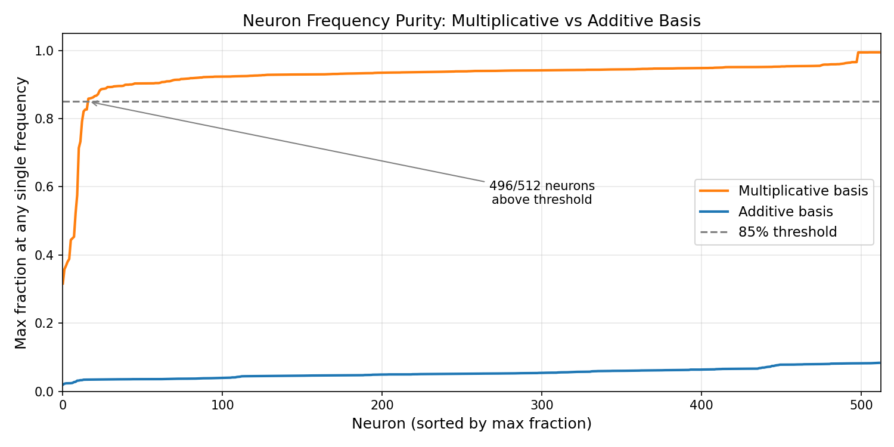
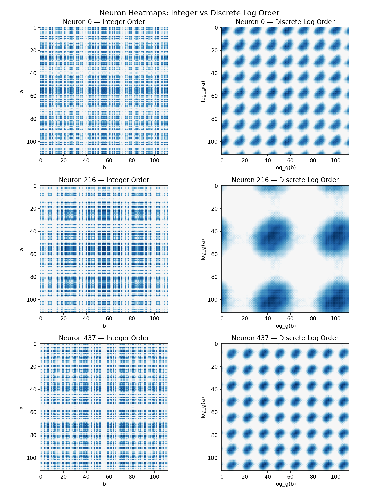

# Nguyen 2026 — The Discrete-Log Clock: How a Transformer Learns Modular Multiplication

См. также: [глобальный индекс понятий](../../concepts/index.md).

**Huu Danh Nguyen** (Stanford University).

arXiv [2606.17399](https://arxiv.org/abs/2606.17399), июнь 2026 (v1), 5 страниц, 5 рисунков, 2 таблицы. Workshop-статья (Mechanistic Interpretability Workshop, ICML 2026), один автор. Всего цитирований по Semantic Scholar — 0, в картотеке — 0. Предмет — «плотный» фурье-спектр вложений гроккнутого трансформера на модульном умножении объявлен артефактом базиса: правильный инструмент — преобразование Фурье на мультипликативной группе $(\mathbb{Z}/p\mathbb{Z})^{*}$, то есть обычный ДПФ после переиндексации строк вложения дискретным логарифмом. В этом базисе спектр вложения однослойного трансформера на $a\cdot b\bmod 113$ разрежён (Джини 0.579 против 0.071, 4 ключевые частоты $\{2,8,47,56\}$), 96.9% нейронов MLP одночастотны, а тепловые карты активаций в лог-порядке дают диагональные полосы — сигнатуру сложения в лог-пространстве. Механизм назван «Discrete-Log Clock»: умножение сведено к сложению через дискретный логарифм, дальше работает механизм «часов» Nanda et al.

Оригинал и производные файлы этой папки:

- [`original/2606.17399.the-discrete-log-clock-how-a-transformer-learns-modular-multiplication.md`](original/2606.17399.the-discrete-log-clock-how-a-transformer-learns-modular-multiplication.md) — конверсия оригинала (arXiv-HTML v1, сверена с PDF) в Markdown без правок содержания.
- [`2606.17399.the-discrete-log-clock-how-a-transformer-learns-modular-multiplication.claims.txt`](2606.17399.the-discrete-log-clock-how-a-transformer-learns-modular-multiplication.claims.txt) — пронумерованные утверждения статьи с пометками разбора.
- [`images/`](images/) — 5 рисунков.

Схема якорей и правила ссылок на карточку — в [README папки статей](../README.md).

## Затрагиваемые понятия

**[Фурье-признаки и цепи](../../concepts/fourier-features-circuits.md)** — центральное утверждение: «плотный» спектр умножения из прежних работ — не свойство алгоритма, а следствие разбора в аддитивном базисе; после переиндексации дискретным логарифмом спектр вложения собирается в 4 пика на частотах $\{2,8,47,56\}$ (Джини 0.579 против 0.071, рост в 8.1 раза), а 496 из 512 нейронов MLP держат $>$85% энергии на одной мультипликативной частоте против ровно нуля в аддитивном базисе ([`p3-5`](#p3-5)). Разбор: предупреждение всем работам, где «плотность фурье-спектра» служит показателем прогресса, — мера разрежённости зависит от выбора базиса; но «аддитивный базис» здесь построен по модулю $q=112$, а не $p=113$, как в цитируемых работах, и часть заявленной «плотности» может быть артефактом смещения модуля; три «независимых» свидетельства (спектр, нейроны, SVD) сняты с одного объекта — матрицы вложений и её образа в MLP.

**[Модульная арифметика](../../concepts/modular-arithmetic.md)** — постановка на мультипликативной группе: $a\cdot b\bmod 113$ по всем парам из $\{1,\ldots,112\}$ с нарочным исключением нуля, первообразный корень $g=3$, изоморфизм $\log_{g}:(\mathbb{Z}/p\mathbb{Z})^{*}\to\mathbb{Z}/112\mathbb{Z}$ превращает таблицу умножения в таблицу сложения по модулю 112; обстановка — точное повторение Nanda et al. (30% пар, AdamW, weight decay 1.0, 40 000 эпох полным батчем), гроккинг между эпохами 9 000 и 14 000 ([`p2-2`](#p2-2)). Разбор: исключение нуля делает задачу групповой операцией, но уводит постановку от той, на которой прежние работы получали «все частоты», — эта возможность не рассмотрена; разбор сделан по конечной модели без контрольных точек, так что привязка разрежённой структуры к моменту гроккинга не измерена.

**[Групповые представления и cosets](../../concepts/group-representations-cosets.md)** — базис мультипликативных характеров как фурье-преобразование на группе $(\mathbb{Z}/p\mathbb{Z})^{*}$: вложение раскладывается по неприводимым представлениям циклической группы порядка 112, главные компоненты $W_{E}$ в лог-порядке синусоидальны, эффективный ранг 10.3 из 112 согласуется с четырьмя частотами ([`p3-8`](#p3-8)). Разбор: работы Chughtai и Stander о неприводимых представлениях отделены как «про другие группы», хотя мультипликативные характеры — ровно тот же аппарат для абелевой группы, связь не проговорена; «4 несоизмеримые частоты» в доводе об интерференции неверны — 2, 8 и 56 имеют общий делитель, и при сдвиге $\Delta=56$ различение держится целиком на одной частоте 47, чего статья не замечает.

**[Механистическая интерпретируемость](../../concepts/mechanistic-interpretability.md)** — методологический вклад: базис разбора должен отвечать алгебраической структуре задачи, иначе стандартные средства видят шум там, где есть строение; алгоритм расписан четырьмя шагами (синусоидальное вложение от $\log_{g}(a)$, перенос вниманием, тригонометрическое сложение в MLP, скоринг конструктивной интерференцией) ([`p3-9`](#p3-9)). Разбор: причинных вмешательств нет вовсе — ни абляции ключевых частот, ни патчинга активаций, ни проверки сборки логитов по формуле; приложение A — изложение, а не вывод (амплитуды и фазы нигде не измерены, раздел о внимании — два предложения без измерений); довески раздела 5 (10 простых, $\sim$80% семян, возведение в степень) даны без чисел, рисунков и протокола.

## Что показано, а что предположено

Замечания редактора карточки по итогам разбора утверждений (`…claims.txt`, 45 пунктов).

**Ценное — короткая и чистая демонстрация зависимости меры от базиса.** Контраст резкий и четырёхкратно измеренный (Джини, число ключевых частот, доля одночастотных нейронов, средняя максимальная доля — Табл. 1); тепловые карты в лог-порядке и синусоидальные главные компоненты дают наглядную сигнатуру сложения в лог-пространстве; эффективный ранг 10.3 численно согласуется с четырьмя частотами (статья этого не отмечает, но это работает на неё); идея прямо стыкуется с корпусом — у Zhang et al. 2026 переиндексация по дискретному логарифму для умножения уже оговорена, здесь она получает эмпирическое наполнение.

**Механизм постулирован, не доказан; новизна уже была частично опубликована.** Вся механистическая часть держится на корреляциях конечной модели: ни причинных вмешательств, ни контрольных точек, ни измеренных амплитуд; §1 объявляет алгоритм умножения «плохо охарактеризованным», тогда как §2 сам сообщает, что Doshi et al. аналитически нашли дискретный логарифм в весах MLP — остаётся эмпирическое подтверждение в обученном ReLU-трансформере, а не открытие; спор с Furuta ведётся против более грубой формулировки, чем та, что там измерена (у Furuta показатель — косинусное смещение FCR, не плотность частот); один прогон при $p=113$, разбросов и статистики нет; «Inverse Participation Ratio» ведёт себя как participation ratio — название спорит с направлением шкалы.

**Как работу будут цитировать** («доказано, что трансформер решает модульное умножение алгоритмом Discrete-Log Clock») — точнее: на одной модели при $p=113$ показано, что смена базиса на мультипликативный делает спектр вложений разрежённым, а нейроны — одночастотными; сам алгоритм постулирован и причинно не проверен, а привязка структуры к моменту гроккинга не измерена.

---

# Текст статьи

## Дискретно-логарифмические часы: как трансформер выучивает модульное умножение

Huu Danh Nguyen. Аффилиация: Stanford University. Почта: dannycodeinc@gmail.com

Mechanistic Interpretability Workshop at the 43rd International Conference on Machine Learning, Seoul, South Korea, 2026. Copyright 2026 by the author(s).

## Аннотация

Когда малые трансформеры гроккают модульное умножение, прежние работы сообщают, что выученное вложение имеет «плотный» фурье-спектр, требующий всех частот. Это контрастирует с модульным сложением, где достаточно разрежённого набора ключевых частот. Мы показываем, что эта плотность — артефакт разбора в неправильном базисе. Естественное преобразование Фурье для умножения — не стандартное аддитивное ДПФ, а *преобразование мультипликативных характеров*, которое раскладывает функции на мультипликативной группе $(\mathbb{Z}/p\mathbb{Z})^{*}$ по её неприводимым представлениям. Применяя это преобразование к гроккнутому трансформеру, обученному на $a\cdot b\bmod 113$, мы находим, что спектр вложения становится сильно разрежённым (коэффициент Джини 0.58 против 0.07 в аддитивном базисе), и лишь 4 ключевые частоты несут значимую энергию. Более того, 96.9% нейронов MLP чисто настроены на одну мультипликативную частоту, а тепловые карты активаций нейронов выявляют двумерно-периодическую структуру при переупорядочении по дискретному логарифму. Эти результаты демонстрируют, что трансформер сводит умножение к сложению в дискретно-логарифмическом пространстве, реализуя алгоритм «дискретно-логарифмических часов», аналогичный алгоритму «часов» Nanda et al. для сложения. Методология обобщается: согласование базиса разбора с алгебраической структурой задачи выявляет интерпретируемую структуру там, где стандартные инструменты видят шум.

## 1 Введение

Гроккинг, явление, при котором нейронные сети внезапно генерализуют долго после запоминания обучающих данных, стал ключевым испытательным стендом для механистической интерпретируемости (Power et al., 2022). Для модульного сложения ($a+b\bmod p$) внутренний алгоритм был полностью обратно разобран: модель выучивает разрежённое фурье-представление и применяет тригонометрические тождества для композиции вращений на окружности (Nanda et al., 2023; Zhong et al., 2023).

Для модульного умножения ($a\cdot b\bmod p$) модели тоже успешно гроккают, но внутренний алгоритм оставался плохо охарактеризованным. Doshi et al. (2024) вывели аналитические решения MLP, требующие плотных фурье-компонент (всех частот), а Furuta et al. (2024) экспериментально подтвердили, что гроккнутые трансформеры используют смещённые к косинусу компоненты по всем частотам. Эти находки подсказывают, что умножение использует фундаментально иной, менее интерпретируемый алгоритм, чем сложение.

**Наш вклад.** Мы показываем, что этот вывод преждевременен. «Плотный спектр» — артефакт разбора *аддитивным* преобразованием Фурье, которое есть естественный базис для сложения, но не для умножения. Правильный инструмент разбора — *преобразование мультипликативных характеров*, которое есть преобразование Фурье на мультипликативной группе $(\mathbb{Z}/p\mathbb{Z})^{*}$. В этом базисе вложение становится разрежённым, нейроны чисто кластеризуются по частоте, и алгоритм интерпретируем: он сводит умножение к сложению через дискретный логарифм.

**Формулировка задачи.** Вход нашей модели — пара целых чисел $(a,b)\in\{1,\ldots,112\}^{2}$. Мы обучаем однослойный трансформер выдавать предсказанное произведение $c=a\cdot b\bmod 113$. Модель видит 30% всех входных пар во время обучения и должна генерализовать на оставшиеся 70%.

## 2 Связанные работы

**Механистическая интерпретируемость модульного сложения.** Nanda et al. (2023) полностью обратно разобрали алгоритм, выученный трансформерами на модульном сложении, показав, что модель использует дискретные преобразования Фурье и тригонометрические тождества для композиции вращений. Zhong et al. (2023) назвали это алгоритмом «часов» и открыли альтернативный алгоритм «пиццы», продемонстрировав, что для одной задачи существует несколько алгоритмических решений. Эти работы устанавливают методологию, которую мы распространяем на умножение.

**Прежние работы о модульном умножении.** Doshi et al. (2024) вывели аналитические замкнутые веса MLP для модульного умножения и нашли, что решения содержат дискретный логарифм $\log_{g}(i)$ в структуре весов. Однако они использовали квадратичные активации и не связали это с эмпирической фурье-картиной в обученных ReLU-трансформерах. **[p. 2]** Furuta et al. (2024) обучали трансформеры на модульных многочленах (включая умножение) и сообщили, что выученный спектр использует «все частоты» без ясной разрежённой структуры, в контраст со сложением. Наша работа разрешает это расхождение: плотность — артефакт базиса, а не алгоритмическое различие.

**Теоретико-групповые рамки.** Chughtai et al. (2023) показали, что сети, обученные на групповых операциях, выучивают неприводимые представления соответствующей группы. Stander et al. (2024) обратно разобрали сети на умножении групп перестановок (S5, S6), найдя контуры на смежных классах. McCracken et al. (2025) объединили все известные алгоритмы сложения под рамкой «приближённой КТО». Эти работы изучают иные группы (неабелевы группы перестановок, аддитивные циклические группы), чем наша; наш вклад — применение базиса мультипликативных характеров именно к $(\mathbb{Z}/p\mathbb{Z})^{*}$ в обученном трансформере.

## 3 Методы

### 3.1 Задача и архитектура

###### p2-2

Мы обучаем однослойный decoder-only трансформер на $a\cdot b\bmod 113$ для всех $a,b\in\{1,\ldots,112\}$ (исключая ноль, который лежит вне мультипликативной группы). Архитектура следует Nanda et al. (2023): $d_{\text{model}}=128$, 4 головы внимания ($d_{\text{head}}=32$), скрытая размерность MLP 512 с активацией ReLU, без LayerNorm. Формат входа — последовательность токенов $[a,b,{=}]$; предсказание модели читается из выходных логитов на позиции 2 («${=}$»).

**Гиперпараметры.** Мы используем 30% обучающих данных (3 763 из 12 544 пар), AdamW со скоростью обучения $10^{-3}$, weight decay 1.0, и обучаем 40 000 эпох полнобатчевым градиентным спуском. Эти гиперпараметры точно следуют Nanda et al. (2023) для обеспечения сопоставимости; единственное изменение — задача (умножение вместо сложения).

**Динамика обучения.** Модель запоминает обучающее множество к эпохе $\sim$500 (обучающая потеря $\to 0$, тестовая потеря остаётся высокой). Между эпохами 9 000 и 14 000 тестовая потеря внезапно падает почти до нуля: модель гроккает, достигая почти идеальной генерализации (Рисунок 1). Эта отложенная генерализация характерна для гроккинга: модель сначала переобучается, затем открывает генерализующий алгоритм под давлением weight decay.

*Рисунок 1: Кривая обучения для $a\cdot b\bmod 113$. Модель быстро запоминает (обучающая потеря падает к эпохе 500), затем внезапно генерализует во время гроккинга (эпохи 9K–14K). Weight decay движет переходом от запоминания к структурному алгоритму.* **[p. 2]**

### 3.2 Мультипликативная группа и дискретный логарифм

Поскольку 113 простое, ненулевые целые $\{1,\ldots,112\}$ образуют циклическую группу по умножению mod 113. *Первообразный корень* — это порождающий элемент: элемент $g$ такой, что $\{g^{0},g^{1},\ldots,g^{111}\}\bmod 113$ исчерпывает все 112 элементов. Для $p=113$ мы используем $g=3$.

*Дискретный логарифм* $\log_{g}\colon\{1,\ldots,112\}\to\{0,\ldots,111\}$ приписывает каждому элементу его показатель: $3^{\alpha}\equiv a\pmod{113}$ означает $\log_{3}(a)=\alpha$. Мы пишем $\alpha=\log_{g}(a)$ и $\beta=\log_{g}(b)$ для двух входов. Это точная биекция (перестановка 112 элементов), задающая изоморфизм групп:

$$
\log_{g}:(\mathbb{Z}/p\mathbb{Z})^{*}\xrightarrow{\;\cong\;}\mathbb{Z}/(p{-}1)\mathbb{Z} \tag{1}
$$

Под этим отображением умножение становится сложением:

$$
a\cdot b\equiv 3^{(\alpha+\beta)\bmod 112}\pmod{113} \tag{2}
$$

В переобозначенных координатах таблица умножения *есть* таблица сложения mod 112.

### 3.3 Два базиса Фурье

**Аддитивный** базис Фурье состоит из $\sin(2\pi ka/q)$ и $\cos(2\pi ka/q)$ для $k=1,\ldots,q/2$, где $q=112$. Это стандартное ДПФ, естественное для функций, периодичных по целочисленной метке $a$.

**Базис мультипликативных характеров** использует $\sin(2\pi k\log_{g}(a)/q)$ и $\cos(2\pi k\log_{g}(a)/q)$. Операционно: переупорядочить строки вложения дискретно-логарифмическим отображением, затем взять стандартное ДПФ. Это преобразование Фурье на группе $(\mathbb{Z}/p\mathbb{Z})^{*}$, раскладывающее функции по мультипликативным характерам.

Мотивация прямая: раз умножение становится сложением после переобозначения (Ур. 2), модель, выучившая групповую структуру, должна иметь вложения, периодичные в переобозначенных координатах, — ровно как модели сложения имеют вложения, периодичные в исходных координатах.

### 3.4 Методология разбора

Мы применяем к обученной модели следующий конвейер:

**Шаг 1: Спектр вложения.** Извлечь обученную матрицу вложений $W_{E}\in\mathbb{R}^{112\times 128}$. Спроецировать на оба базиса и вычислить объединённую норму частоты $\|f_{k}\|=\sqrt{\|s_{k}\|^{2}+\|c_{k}\|^{2}}$ для каждой частоты $k$, где $s_{k}$ и $c_{k}$ — sin- и cos-проекции (каждая — 128-мерный вектор).

**[p. 3]**

**Шаг 2: Меры разрежённости.** Мы измеряем концентрацию коэффициентом Джини:

$$
G=\frac{\sum_{i=1}^{n}(2i-n-1)|x_{i}|}{\,n\sum_{i=1}^{n}|x_{i}|} \tag{3}
$$

где $x_{1}\leq\ldots\leq x_{n}$ — отсортированные нормы частот. $G=0$ означает равномерность (плотность), $G=1$ — максимальную разрежённость. Ключевые частоты определяются как превышающие $5\times$ медианную норму.

**Шаг 3: Приписывание частот нейронам.** Для каждого из 512 нейронов MLP вычислить двумерный узор активации $h_{n}(a,b)$ по всем входным парам (переформованный в решётку $112\times 112$). Взять двумерное ДПФ в каждом базисе и измерить максимальную долю энергии на любой одной частоте. Нейроны с $>$85% энергии на одной частоте классифицируются как «одночастотно настроенные».

**Шаг 4: SVD-разбор.** Выполнить SVD над $W_{E}$ и переупорядочить главные компоненты по дискретному логарифму. Синусоидальная структура в лог-порядке подтверждает, что вложение кодирует мультипликативные характеры.

## 4 Эксперименты и результаты

### 4.1 Сравнение базисов

###### p3-5

Рисунок 2 показывает спектр вложения в обоих базисах. В аддитивном базисе энергия распределена равномерно (Джини = 0.071). В мультипликативном базисе энергия концентрируется в 4 пиках на частотах $\{2,8,47,56\}$ (Джини = 0.579, рост в 8.1$\times$). Таблица 1 сводит все меры.

*Рисунок 2: Фурье-спектр вложения. **Слева:** аддитивный базис показывает плоский, плотный спектр. **Справа:** мультипликативный базис выявляет 4 разрежённых пика. Одинаковый масштаб оси y. «Плотность», о которой сообщали прежние работы, — артефакт базиса.* **[p. 3]**

*Таблица 1: Меры разрежённости, сравнивающие два базиса.* **[p. 3]**

| Мера | Аддитивный | Мультипликативный |
|---|---|---|
| Коэффициент Джини | 0.071 | **0.579** |
| Inverse Participation Ratio | 52.7 | **4.1** |
| Обнаружено ключевых частот | 0 | **4** |
| Нейронов $>$85% одночастотных | 0/512 | **496/512** |
| Средняя максимальная доля | 0.054 | **0.925** |

### 4.2 Подтверждение на уровне нейронов

###### p3-6

В мультипликативном базисе 496 из 512 нейронов (96.9%) имеют $>$85% своей фурье-энергии на одной частоте (Рисунок 3). В аддитивном базисе ни один нейрон не проходит этот порог.

###### p3-7

Когда тепловые карты активаций нейронов переупорядочены по дискретному логарифму, возникают ясные диагонально-полосные узоры (Рисунок 4). Эти полосы указывают, что нейрон вычисляет периодическую функцию от $\alpha+\beta$, что есть сигнатура тригонометрического тождества $\cos(k(\alpha+\beta))$, работающего в лог-пространстве: тот же механизм, который Nanda et al. нашли для сложения, но применённый после дискретно-логарифмического преобразования.

*Рисунок 3: Отсортированная максимальная доля частоты на нейрон. Оранжевый: мультипликативный базис (96.9% выше порога 85%). Синий: аддитивный базис (0% выше порога).* **[p. 3]**

*Рисунок 4: Тепловые карты нейронов в целочисленном порядке (слева) и в дискретно-логарифмическом порядке (справа). В лог-порядке возникают диагональные полосы, указывающие на периодичность по $\log_{g}(a)+\log_{g}(b)$.* **[p. 4]**

### 4.3 SVD в лог-порядке

###### p3-8

Мы выполняем SVD над $W_{E}$ и переупорядочиваем главные компоненты по дискретному логарифму. В целочисленном порядке все компоненты выглядят шумными. В лог-порядке несколько компонент выявляют синусоидальную структуру (Рисунок 5), согласующуюся с кодированием вложением мультипликативных характеров. Эффективный ранг равен 10.3 (из 112), подтверждая, что вложение живёт в маломерном подпространстве.

*Рисунок 5: Главные компоненты $W_{E}$, переупорядоченные по дискретному логарифму, показывают синусоидальную структуру, подтверждая, что вложение кодирует мультипликативные характеры.* **[p. 4]**

### 4.4 Обсуждение

###### p3-9

**Алгоритм дискретно-логарифмических часов.** Наши результаты показывают, что трансформер решает модульное умножение так: (1) вкладывает каждое целое $a$ как синусоидальные функции от $\log_{g}(a)$; (2) переносит вложения вниманием на выходную позицию; (3) применяет тригонометрические тождества в MLP для вычисления $\cos(k(\alpha+\beta)/q)$; (4) оценивает каждого кандидата $c$ по совпадению с $\cos(k\,\log_{g}(c)/q)$, где только правильный ответ $c=ab\bmod p$ достигает конструктивной интерференции по всем частотам.

**Почему прежние работы это упустили.** Furuta et al. (2024) и Doshi et al. (2024) разбирали аддитивным ДПФ. Функция, периодичная по $\log_{g}(a)$, выглядит непериодичной по $a$, потому что дискретный логарифм — нелинейная перестановка целых чисел. **[p. 4]** Находка «все частоты» верна в аддитивном базисе, но вводит в заблуждение, потому что смешивает несоответствие базиса с алгоритмической сложностью.

**Переобучение и генерализация.** Гроккинг сам по себе есть явление переобучения: модель достигает нулевой обучающей потери к эпохе 500 (запоминание), затем продолжает обучаться тысячи эпох, прежде чем открыть генерализующий алгоритм. Weight decay штрафует большие, неструктурированные веса, нужные для запоминания, постепенно благоприятствуя компактному фурье-представлению, которое генерализует. Мы не используем перекрёстную проверку, потому что задача детерминирована (нет шума меток); отложенное тестовое множество в 70% напрямую измеряет генерализацию. Модель достигает 100% тестовой точности после гроккинга, подтверждая полную генерализацию.

**Ограничения.** Мы не доказываем, что это единственный возможный алгоритм; прежняя работа о сложении (Zhong et al., 2023) показывает, что разные архитектуры могут давать разные решения.

## 5 Заключение и будущая работа

Мы показали, что трансформер, обученный на модульном умножении, выучивает «дискретно-логарифмические часы»: он сводит умножение к сложению в дискретно-логарифмическом пространстве, затем применяет тот же фурье-тригонометрический механизм, известный по сложению. Ключевое методологическое озарение — базис разбора должен соответствовать алгебраической структуре задачи.

###### p4-4

В последующих экспериментах мы подтвердили дискретно-логарифмические часы на 10 простых числах ($p=59$ до $113$), все с разрежёнными мультипликативными спектрами с 4–7 ключевыми частотами. Мы также обучили несколько случайных семян на $p=113$ и нашли, что механизм универсален ($\sim$80% семян), с устойчивой разрежённостью (Джини 0.45–0.61) при варьирующихся ключевых частотах. Мы также получили предварительные результаты по модульному возведению в степень ($a^{b}\bmod p$) с двухслойным трансформером, достигающим 100% точности на $a^{b}\bmod 41$, — насколько нам известно, первая демонстрация трансформера, идеально выучивающего эту операцию. Механизм возведения в степень остаётся под активным исследованием.

Принцип «правильного базиса» естественно расширяется: для любой алгебраической задачи преобразование Фурье на соответствующей группе должно выявлять интерпретируемую структуру. Будущая работа включает распространение этой методологии на полиномиальные операции и многослойные архитектуры.

## Приложение

### A.0 Воспроизводимость

Код доступен по адресу: https://github.com/danny-cpp/Discrete-Log-Clock

### A.1 Вывод дискретно-логарифмических часов

Это приложение выводит алгоритм, который трансформер приближённо реализует для модульного умножения. Пусть $\omega_{k}=2\pi k/q$.

| Символ | Значение |
|---|---|
| $g=3$ | Первообразный корень $p=113$ |
| $\alpha,\beta,\gamma$ | Дискретные логарифмы $a$, $b$, кандидата $c$ |
| $\mathcal{K}=\{2,8,47,56\}$ | Ключевые частоты |
| $\gamma^{*}=(\alpha{+}\beta)\bmod q$ | Правильный ответ в лог-пространстве |

**[p. 5]**

### A.2 Вложение

Каждое измерение $j$ матрицы $W_{E}$, рассматриваемое как функция от $\alpha$ по всем 112 элементам, приближённо есть синусоида на ключевой частоте $k_{j}\in\mathcal{K}$:

$$
W_{E}[g^{\alpha},\;j]\;\approx\;A_{j}\sin(\omega_{k_{j}}\alpha+\phi_{j}) \tag{4}
$$

Одна строка $W_{E}[a]$ не имеет видимой структуры: это точечная выборка всех 128 волн, взятых при $\alpha=\log_{g}(a)$, плюс шум.

### A.3 Внимание

Внимание переносит информацию с позиций $a$ и $b$ на позицию $=$. После внимания остаточный поток на $=$ приближённо кодирует фурье-компоненты обоих входов на ключевых частотах.

### A.4 MLP (тригонометрическое сложение)

Записывая для краткости $c_{k}(x)=\cos(\omega_{k}x)$ и $s_{k}(x)=\sin(\omega_{k}x)$, внимание и слои MLP вместе приближённо реализуют:

$$
c_{k}(\alpha{+}\beta) =c_{k}(\alpha)\,c_{k}(\beta)-s_{k}(\alpha)\,s_{k}(\beta) \tag{5}
$$

$$
s_{k}(\alpha{+}\beta) =s_{k}(\alpha)\,c_{k}(\beta)+c_{k}(\alpha)\,s_{k}(\beta) \tag{6}
$$

После MLP остаточный поток приближённо кодирует $c_{k}(\alpha{+}\beta)$ и $s_{k}(\alpha{+}\beta)$ для каждой $k\in\mathcal{K}$.

### A.5 Скоринг (скалярное произведение с unembedding)

Столбец unembedding для кандидата $c$ приближённо кодирует $(\cos(\omega_{k}\gamma),\,\sin(\omega_{k}\gamma))$ для каждой $k$. Логит кандидата $c$ — скалярное произведение конечного остаточного потока с этим столбцом. Поскольку $\cos A\cos B+\sin A\sin B=\cos(A-B)$, вклад каждой частоты сводится к:

$$
\boxed{\;\text{logit}(c)\;\approx\;\sum_{k\in\mathcal{K}}A_{k}\cos\!\left(\omega_{k}(\alpha+\beta-\gamma)\right)\;} \tag{7}
$$

### A.6 Конструктивная интерференция

**Правильный ответ** ($\gamma^{*}=(\alpha{+}\beta)\bmod q$):

$$
\text{logit}(c^{*})\approx\sum_{k}A_{k}\cos(0)=\sum_{k}A_{k}\quad\text{(maximum)}
$$

Все косинусы равны 1; все частоты конструктивно интерферируют.

**Неправильный ответ** ($\Delta=\alpha{+}\beta{-}\gamma\neq 0$):

$$
\text{logit}(c)\approx\sum_{k}A_{k}\cos(\omega_{k}\Delta)<\sum_{k}A_{k}
$$

Косинусы на разных частотах принимают значения из $[-1,1]$, частично гася друг друга. При 4 несоизмеримых частотах деструктивная интерференция обеспечивает, что ни один неправильный ответ не приближается к оценке правильного.

## References

- Chughtai et al. (2023) B. Chughtai, L. Chan, and N. Nanda A toy model of universality: reverse engineering how networks learn group operations. In International Conference on Machine Learning, Cited by: §2.

- Doshi et al. (2024) D. Doshi, T. He, A. Das, and A. Gromov Grokking modular polynomials. arXiv preprint arXiv:2406.03495. Cited by: §1, §2, §4.4.

- Furuta et al. (2024) H. Furuta, G. Minegishi, Y. Iwasawa, and Y. Matsuo Towards empirical interpretation of internal circuits and properties in grokked transformers on modular polynomials. Transactions on Machine Learning Research. Cited by: §1, §2, §4.4.

- McCracken et al. (2025) G. McCracken, G. Moisescu-Pareja, V. Letourneau, D. Precup, and J. Love Uncovering a universal abstract algorithm for modular addition in neural networks. In Advances in Neural Information Processing Systems, Cited by: §2.

- Nanda et al. (2023) N. Nanda, L. Chan, T. Lieberum, J. Smith, and J. Steinhardt Progress measures for grokking via mechanistic interpretability. In International Conference on Learning Representations, Cited by: §1, §2, §3.1, §3.1.

- Power et al. (2022) A. Power, Y. Burda, H. Edwards, I. Babuschkin, and V. Misra Grokking: generalization beyond overfitting on small algorithmic datasets. In ICLR 2022 Workshop on MATH-AI, Cited by: §1.

- Stander et al. (2024) D. Stander, Q. Yu, H. Fan, and S. Biderman Grokking group multiplication with cosets. In International Conference on Machine Learning, Cited by: §2.

- Zhong et al. (2023) Z. Zhong, Z. Liu, M. Tegmark, and J. Andreas The clock and the pizza: two stories in mechanistic explanation of neural networks. In Advances in Neural Information Processing Systems, Cited by: §1, §2, §4.4.
