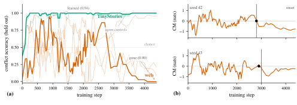
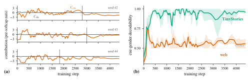

# Li, Sreedhar 2026 — Natural Ungrokking: Asymmetric Control of Which Rules Survive Pretraining

См. также: [глобальный индекс понятий](../../concepts/index.md).

**Juliana Li**, **Diya Sreedhar** (Harvard University).

arXiv [2606.26050](https://arxiv.org/abs/2606.26050), июнь 2026 (v1), 23 страницы, 5 рисунков, 12 таблиц. Доклад на семинаре «Foundations of Deep Generative Models» при ICML 2026. Всего цитирований по Semantic Scholar — 0, в картотеке — 0. Предмет — «natural ungrokking»: языковая модель на 11.5M параметров посреди обычного претрейна на стационарном вебе выучивает правило рода местоимения ($0.94$ на отложенных зондах к шагу 925) и теряет его к шагам 3500–4400 того же прогона, при том что свидетельства правила остаются в потоке. Судьба правила предсказуема по частоте поддержки в корпусе; потеря — вытеснение (контрастная маржа пересекает нуль в тот же 100-шаговый чекпоинт, что и поведенческий коллапс); управление асимметрично — переворот поддержки в противосвидетельство убивает правило с точной дозовой монотонностью в двух несвязанных правилах, а инъекция поддержки обратно, вплоть до отношения свидетельств в 450 раз выше поддерживающего уровня, не возвращает ничего. Всё пре-зарегистрировано: 22 предсказания прошли, 12 провалены, 8 неоцениваемы.

Оригинал и производные файлы этой папки:

- [`original/2606.26050.natural-ungrokking-asymmetric-control-of-which-rules-survive-pretraining.md`](original/2606.26050.natural-ungrokking-asymmetric-control-of-which-rules-survive-pretraining.md) — конверсия оригинала (arXiv-HTML v1, сверена с PDF) в Markdown без правок содержания.
- [`2606.26050.natural-ungrokking-asymmetric-control-of-which-rules-survive-pretraining.claims.txt`](2606.26050.natural-ungrokking-asymmetric-control-of-which-rules-survive-pretraining.claims.txt) — пронумерованные утверждения статьи с пометками разбора.
- [`images/`](images/) — 5 рисунков.

Схема якорей и правила ссылок на карточку — в [README папки статей](../README.md).

## Затрагиваемые понятия

**[Анти-грокинг / коллапс генерализации](../../concepts/ungrokking.md)** — новый носитель обратного знака: в отличие от ungrokking Varma et al., где генерализация отступает при ужатии датасета ниже критического размера МЕЖДУ прогонами, здесь способность гибнет ВНУТРИ одного прогона на стационарных данных, пока свидетельства правила остаются в каждой эпохе; «natural» и означает, что триггер — не правка датасета, а сама частотная структура корпуса ([`p1-6`](#p1-6)). Разбор: терминологическая оговорка — само возникновение правила посреди прогона нигде не показано как гроккинг (нет фазы запоминания при провальном обобщении), корень заимствован ради обратного знака, а не обратного явления; заявка «нет следа в кривой потерь» повторена трижды, но ни одной кривой потерь в статье нет и ни один зарегистрированный тест её не проверяет.

**[Гроккинг](../../concepts/grokking.md)** — вторая половина кривой, которую корпус до сих пор видел только с подъёмной стороны: правило возникает и обваливается по предсказуемому закону — плотно поддержанное выживает (9/9 прогонов TinyStories при любом бюджете), редко поддержанное вытесняется (0 веб-прогонов), $D/N$ меняет глубину падения, но ни разу не переворачивает исход; та же кривая «возникло и обвалилось» видна у публичных Pythia 70M–1.4B и OLMo-1B, глубина коллапса упорядочена по масштабу (Spearman $\rho=0.894$, коллапс исчезает к 410M) ([`p3-8`](#p3-8)). Разбор: ось решётки реализована через идентичность корпуса, и зарегистрированная количественная теория критической частоты провалена обоими ранжирующими предсказаниями, а замороженный счётчик поддержки признан слепым на веб-тексте (класс girl-подсказок токенизируется в ноль событий) — качественный закон стоит, количественная форма открыта; прямой корпусный сосед 2606.00230 (подъёмная половина той же кривой на минимальных парах) статье неизвестен.

**[Катастрофическое забывание](../../concepts/catastrophic-forgetting.md)** — редкий контрпример привычной рамке: забывание без сдвига распределения, без изъятия данных и без новых данных — конкурирующий поверхностный приор (корпусное предпочтение *he*) вытесняет правило, пока конструкция остаётся решённой; вытеснение достаёт до представления — декодируемость пола подсказки на месте предсказания падает к случайности ($0.56$) на вебе при потолке ($0.96$) на TinyStories, а разложение логитного разрыва показывает, что маржу несёт и теряет контекстный вклад при прижатом к нулю прямом эмбеддинговом ([`p4-6`](#p4-6)). Разбор: временна́я привязка (пересечение нуля маржой в тот же чекпоинт, что коллапс) — центральный аргумент — стоит на двух семенах из трёх (третье не проходит инструментальный страж); отложенный conflict-срез фокусного семейства — 12 items, точность «$0.94$» на таких n грубее, чем выглядит.

**[Эффективность цепей](../../concepts/circuit-efficiency.md)** — соревнование цепей, перенесённое с эффективности на измеримые статистики данных, с причинной проверкой в обе стороны: переворот поддержки на месте (число токенов сохранено, остальной корпус побайтово тот же) убивает правило с $\rho_{\mathrm{kill}}=-1.00$ и повторяется на втором правиле пятью дозами внутри одного корпуса ($0.96\to0.00$ строго монотонно); обратная инъекция при отношении свидетельств до $3565$ против $7.9$ выживающего уровня не возвращает поведение ни при равномерном, ни при раннем, ни при позднем расписании — при частичной пересборке несущей головы ([`p5-6`](#p5-6)). Разбор: асимметрия сравнивает неравные правки — убийство меняет ровно те токены, что тестирует батарея, а восстановление нарочно вливает непересекающиеся имена (анти-подсказочный контроль), так что провал возврата может быть свойством конструкции опыта; в выживающих прогонах маржу несёт одна голова последнего слоя ($0.75$–$0.90$ атрибуции), в обвалившихся носителя нет.

## Что показано, а что предположено

Замечания редактора карточки по итогам разбора утверждений (`…claims.txt`, 48 пунктов).

**Ценное — потеря на стационарных данных, дозированная правка корпуса и честное табло.** Явление поймано без сдвига распределения и изъятия данных, с контролями против дефляционных объяснений (оптимизаторная ячейка $0.927$; существительные падают как имена; agree-условие остаётся решённым — потеряно правило, не конструкция); $n$-граммная база показывает, что поверхностное свидетельство правила есть в потоке всё обучение, — потеря есть факт о динамике обучения; дозированный переворот свидетельств при сохранённом числе токенов — новый причинный инструмент; пре-регистрация с табло 22/12/8 и двумя сработавшими фальсификаторами — образец для всего корпуса.

**Количественный закон провален, измеритель слеп, асимметрия несимметрична по построению.** Обе ранжирующие формы частотной теории провалены; спасающее отношение $0.46$ для дозы убийства взято из биграммного счётчика, принятого после разбора слепоты зарегистрированного; «near-parity доза не убивает» опирается на графу displaced, тогда как восстановленным осталось лишь 1/3 семени; аннулированная гейтом средняя доза воскрешена в прозе («зачтённая по номиналу тоже была бы верна»); в аннотацию вынесено «450×» — бо́льшая из двух несопоставимых единиц одной ручки; интервенции поставлены только на 11.5M параметров, обе батареи синтетические.

**Как работу будут цитировать** («показано, что выживание способностей претрейна предсказуемо и управляемо») — точнее: на одном фокусном и одном втором правиле при 11.5M параметров показан качественный закон (плотно поддержанное выживает, редкое вытесняется), механизм вытеснения на двух исправных семенах и односторонняя управляемость; зарегистрированная количественная форма закона провалена, а измеритель частоты поддержки на веб-корпусе признан слепым.

---

# Текст статьи

## Естественный ангроккинг: асимметричное управление тем, какие правила переживают претрейн

Juliana Li. Аффилиация: Harvard University, Cambridge, MA, USA. Переписка: julianali@college.harvard.edu. Diya Sreedhar. Аффилиация: Harvard University, Cambridge, MA, USA

## Аннотация

Посреди обычного претрейнового прогона малая языковая модель выучивает правило рода местоимения: с подсказкой-именем девочки («*Sue cried because*») она разрешает следующее местоимение в *she*, генерализуя на отложенные зонды ($0.94$ к шагу 925). К шагу 3 500 та же модель даёт почти ноль на тех же зондах, хотя свидетельства правила всё ещё в обучающих данных. Мы называем этот внутрипрогонный разворот *естественным ангроккингом*: корпус решает, без следа в кривой потерь, какие выученные правила модель сохраняет.

Какие правила выживают, предсказуемо по одной статистике корпуса: как часто обучающий поток показывает победу правила. По неинтервенированным прогонам (два корпуса, три бюджета данных, три семени) частота поддержки решает судьбу правила; отношение данных к параметрам лишь модулирует, как глубоко падает обречённое правило. Та же обучающая динамика «возникновение — коллапс» появляется в публичных чекпоинтах Pythia, глубина коллапса упорядочена по масштабу модели, как предсказано. Забывание есть вытеснение: конкурирующий поверхностный узор перебарывает правило, и лог-вероятностная маржа между ними пересекает нуль в пределах 100 обучающих шагов от поведенческого коллапса.

Управление этой судьбой асимметрично: та же правка, что уничтожает правило по требованию, не может его восстановить. Переворот поддержки в противосвидетельство на месте убивает правило с монотонным дозовым откликом в двух несвязанных правилах; но инъекция поддержки обратно — даже до $450\times$ уровня, который естественно его поддерживает, — не покупает восстановления. Каждый подтверждающий порог и предсказание были пре-зарегистрированы до чтения данных, которыми они управляют.

##### Ключевые слова:

pretraining dynamics, language models, grokking, natural ungrokking, capability retention, transient capabilities, generalization dynamics, mechanistic interpretability, phase transitions

## 1 Введение

*Рисунок 1: Фокусное правило рода местоимения возникает и затем обваливается при веб-претрейне, и внутренняя маржа пересекает нуль в тот же момент. **(a)** Отложенная conflict-точность. На TinyStories (зелёный: среднее по семенам, полоса min–max) правило выживает у потолка; на вебе жирная киноварная кривая — семя, которое цитирует аннотация ($0.94$ к шагу 925, исчезает к концу), а две бледные кривые растут и обваливаются так же. Пунктирные линии — agree-контроль каждого корпуса, который продолжает расти сквозь коллапс: конструкция остаётся решённой, теряется только правило. Серый пунктир — случайный уровень. **(b)** Контрастная маржа $\mathrm{CM}$ (Раздел 4.2), предпочтение моделью правила над поверхностным дефолтом, одна полоса на каждое инструментально-исправное веб-семя; вертикальная линия отмечает начало поведенческого коллапса, точка — пересечение $\mathrm{CM}$ нуля. Они совпадают в обоих семенах (шаги $2{,}800/2{,}800$ и $2{,}900/3{,}000$). Третье веб-семя не проходит инструментальную проверку (Раздел 3) и опущено; его пересечение направленно согласуется. Маржи TinyStories остаются вне шкалы, $+2$…$+12$ натов.* **[p. 2]**

###### p1-6

В пределах одного претрейнового прогона языковая модель может потерять способность, которую уже приобрела. Случай, который препарирует эта статья, — правило рода местоимения в модели на 11.5M параметров, обучающейся на веб-тексте: при подсказке-имени девочки следующее местоимение должно разрешаться в *she*. Конфликтный зонд — префикс «*Sue cried because*», оцениваемый на продолжении *she* против *he*; корпусный приор благоволит *he*, именная подсказка требует *she*. Его agree-двойник, «*Tom cried because*», согласует подсказку и приор и служит контролем. Модель даёт $0.94$ на отложенных конфликтных зондах к шагу 925 и почти $0.00$ к шагам 3 500–4 400 того же прогона, продолжая давать $1.00$, когда правило и приор согласны, а свидетельства правила остаются в стационарном потоке. Никакие обучающие данные не изымались, никакое распределение не сдвигалось. Модель приобрела правило и затем перестала его применять (Рисунок 1a). Мы называем этот внутрипрогонный разворот *естественным ангроккингом*.

Способность, замеченная на промежуточном чекпоинте обучения, не гарантирует своего существования в итоговой модели, но её частота поддержки в корпусе предсказывает, выживет ли она. Фильтрация данных, прореживающая поддержку редкого правила, может обречь это правило, не удалив ни одного его примера. Продолженный претрейн на сдвинутой смеси может тихо разгроккать способности, которые были у базовой модели. Во всех случаях провал невидим для кривых потерь, потому что модель сохраняет конструкцию и оставляет только правило.

Эта статья делает три вклада.

**Способности дёшево уничтожить и трудно восстановить.** Правка свидетельств правила на месте — переворот в противосвидетельство с выбранной ставкой при фиксированных числах токенов и всех прочих статистиках корпуса — уничтожает правило со строго монотонным дозовым откликом. Второе, несвязанное правило (аллoморфия *a*/*an*) воспроизводит убийство на пятидозовой лестнице, построенной внутри одного корпуса, монотонно проводя финальную точность от $0.96$ до $0.00$, пока посторонние способности держатся на базовом уровне; в обоих правилах все слепые предсказания о направлении убийства сбылись. Та же ручка отказывает в обратную сторону — мы влили поддержку обратно в обвалившийся корпус вплоть до $3\times$ плотности поддержки TinyStories, достигнув пост-инъекционных отношений правило:приор много выше выживающей ячейки TinyStories; механистическая маржа сдвинулась, но ни один прогон не дал **[p. 2]** поведенческого восстановления, прошедшего свои контроли (Раздел 4.3).

**Судьба правила следует закону частоты поддержки.** Выживет ли правило к концу обучения, решается тем, как часто его поддерживающие свидетельства появляются в корпусе; отношение уникальных данных к параметрам $D/N$ модулирует, как глубоко падает обречённое правило, но никогда не переворачивает его судьбу (Раздел 4.1). Мы устанавливаем это на решётке корпусов, бюджетов данных и семян. Тот же подъём-и-спад воспроизводится в меньших публичных чекпоинтах Pythia, с глубиной коллапса по предсказанному порядку масштабов, и вердикты переносятся на внераспределённый набор зондов.

**Потеря есть вытеснение.** Обваливающееся правило проигрывает соревнование крепнущему поверхностному узору, здесь — корпусному предпочтению *he*, тогда как конструкция, в которой оно живёт, остаётся решённой. Контрастная маржа между правилом и приором пересекает нуль на шаге поведенческого коллапса, и её финальный знак в основном разделяет восстановленные и вытесненные ячейки по решётке, с граничным случаем, обсуждаемым ниже (Раздел 4.2).

Каждый порог, метрика и направленное предсказание здесь были зарегистрированы заранее (Раздел 3), с полным табло в Прил. A. Предсказание судьбы правила работает; предсказание того, *где* на частотной оси лежит граница выживания, — открытая проблема, которую эта статья передаёт будущей работе (Прил. B). Код, конфигурации, батареи зондов и замороженный регистрационный документ опубликованы.[^1]

[^1]: https://github.com/lijuliana/Natural-Ungrokking

## 2 Связанные работы

Гроккинг — отложенная генерализация (Power et al. 2022; Nanda et al. 2023), с фазовыми диаграммами по размеру данных и гиперпараметрам (Liu et al. 2023; Liu et al. 2022). Ближайший динамический родственник нашего предмета — *ангроккинг* (Varma et al. 2023), где генерализация отступает при ужатии датасета ниже критического размера между прогонами; наши способности растут и падают внутри одного прогона на стационарном тексте — это и родство, и различие, которые именует *естественный ангроккинг*. Сама транзиентность имеет прецедент: Singh et al. 2023 показывают, что эмерджентное in-context обучение может угасать при продолженном обучении; мы наблюдаем аналогичную судьбу для in-weights лингвистических правил, даём ей частотный закон и управляем ею правками корпуса. Chen et al. 2024 документируют внезапные переходы в усвоении синтаксиса и управляют ими через обучающие данные; мы следуем той же дуге от наблюдения к причинности для перехода, идущего от компетентности к некомпетентности. Chang et al. 2024 показывают, что потокенное забывание при обычном претрейне частотно-зависимо; наш предмет — способность уровня правила, вытесненная при остающихся в потоке свидетельствах. Wei et al. 2021 причинно связывают поведение согласования с частотой свидетельств через отдельно обученные модели; мы чертим внутрипрогонную судьбу. Ближе всего по методу — filtered-corpus training (Patil et al. 2024; Misra & Mahowald 2024), где изымаются прямые свидетельства конструкции и модели всё равно её усваивают; наша правка вместо этого превращает свидетельства в противосвидетельства при фиксированных числах токенов, и ближайшая к чистой абляции почти-паритетная доза правило не убивает, согласуясь с их результатами. Расширенное обсуждение — в Прил. J.

**[p. 3]**

## 3 Экспериментальная постановка

#### Модели и обучение.

Все управляемые прогоны используют 4-слойный decoder-only трансформер (Vaswani et al. 2017) с $d_{\text{model}}=256$, двумя головами внимания, контекстом 2048 токенов и корпусно-специфичным BPE-словарём (Sennrich et al. 2016) на 8192 символа (11.5M параметров; 3.1M без эмбеддингов); архитектура и инициализация следуют nanochat (Karpathy 2025). Каждый прогон обучается 4 400 шагов при размере батча 32 с косинусным warmdown на последних 30% шагов. Скорости обучения были зафиксированы один раз на корпус и никогда не пересматривались; внутри любого сравнения каждая ячейка делит ту же архитектуру, токенизатор, расписание и оптимизатор, так что движется только именованная ось. Каждая ячейка обучается тремя семенами, а непересекающийся набор семян закарантинен для слепого репликационного прохода (Прил. D).

#### Корпуса и две оси.

Мы обучаем на двух корпусах: TinyStories (Eldan & Li 2023), где изучаемое правило плотно поддержано, и фильтрованный веб-корпус, производный от ClimbMix (Diao et al. 2025), где его поддержка падает ниже нашего измерительного пола под зарегистрированным оконным счётчиком. *Частота поддержки* $f$ правила — это частота поддерживающих событий на токен под замороженной процедурой счёта (Прил. E): интуитивно, как часто обучающий поток показывает победу правила; для фокусного правила — вхождение *she* в пределах $16$ токенов от женской подсказки. Мы пишем $\delta_{\mathrm{TS}}=1.67\times 10^{-3}$ событий на токен для измеренной частоты поддержки фокусного правила рода местоимения на TinyStories — единица, в которой выражаются дозы спасения. *Отношение данных* $D/N$ — уникальные обучающие токены на параметры, варьируемое ограничением бюджета токенов ($D/N\in\{1.5,5\}$, плюс неограниченные полнокорпусные прогоны, далее «packed»-ячейки). Решётка покрывает оба корпуса при всех бюджетах, три семени на ячейку.

#### Батарея зондов и классификатор исходов.

Способности оцениваются замороженной батареей шаблонных семейств зондов, каждое с двумя условиями: условием *conflict*, где подсказка правила и конкурирующая поверхностная подсказка расходятся, и контрольным условием *agree*, где они согласны. Замороженный классификатор отображает сглаженную отложенную conflict-траекторию каждого семейства в один из пяти исходов (recovered, displaced, partial, never, unstable). Вердикт семейства засчитывается, только когда его agree-условие остаётся решённым, что исключает траектории, где модель просто потеряла конструкцию целиком: вердикт displaced означает, что модель всё ещё владеет конструкцией, но больше не следует правилу. Пороги и сглаживание воспроизведены дословно в Прил. E.

#### Метрика механизма.

Наряду с поведением мы отслеживаем контрастную маржу $\mathrm{CM}$: на замороженном наборе подсказок, не пересекающемся ни с одной обучающей интервенцией, — среднюю лог-вероятностную маржу правило-согласного продолжения над его приор-согласным конкурентом. Для фокусного правила, на подсказках $x$ с женской подсказкой,

$$
\mathrm{CM}\;=\;\tfrac{1}{|\mathcal{P}|}\textstyle\sum_{x\in\mathcal{P}}\bigl[\log p_{\theta}(\textit{she}\mid x)-\log p_{\theta}(\textit{he}\mid x)\bigr], \tag{1}
$$

так что $\mathrm{CM}>0$ означает, что правило перевешивает приор в точке предсказания, а $\mathrm{CM}<0$ — что победил приор (Прил. E). Инструментальный страж отбрасывает прогоны, где сглаженная $\mathrm{CM}$ ни разу не достигает $0.5$ ната. $\mathrm{CM}$ вычисляется независимо от поведенческого классификатора, так что механизм и поведение могут расходиться, и местами расходятся.

#### Протокол пре-регистрации.

Каждая подтверждающая метрика, порог и направленное предсказание были закоммичены в систему контроля версий до чтения данных, которыми они управляют; позднейшие изменения — датированные поправки, проваленные предсказания отчитываются как провалы, а post-hoc разборы помечены как таковые и не несут зачётных вердиктов (Прил. A). Двое ворот валидности повторяются и оставляют предсказание *неоцениваемым*, а не пройденным или проваленным: ворота *инструмента*, когда метрика не выполняет собственных предусловий (например, страж маржи в $0.5$ ната), и ворота *интервенции*, когда правленый корпус повреждает посторонние контрольные семейства.

## 4 Результаты

Картина выживания (Раздел 4.1) устанавливает закон, механизм (Раздел 4.2) показывает, чем является потеря, а причинные интервенции (Раздел 4.3) проверяют его в обе стороны. Каждое подтверждающее утверждение ниже — зарегистрированное предсказание, зачтённое по полному табло pass/fail в Прил. A (Таблица 2).

### 4.1 Частота поддержки решает судьбу правила при каждом бюджете данных

###### p3-8

Все четыре слепых предсказания, сделанные с планом решётки (P1–P4), прошли. Таблица 4 (Прил. D) даёт посемянные исходы для всех шести семейств, а Рисунок 2 рисует решётку фокусного правила. Фокусное правило рода местоимения выживает (кончает recovered под замороженным классификатором) в 9/9 прогонах TinyStories при каждом бюджете и ни в одном веб-прогоне ни при каком бюджете: на packed веб-ячейках оно возникает, обваливается и пригвождается к конкурирующему приору. Единственный веб-прогон, приближающийся к порогу ($D/N{=}5$, семя 42, финальный conflict $0.770$ против планки выживания $0.8$), — граничный случай, возвращающийся в Разделе 4.2. Все четыре семейства с высокой поддержкой держат финальный conflict $\geq 0.8$ на packed вебе в 3/3 семенах (зарегистрированный критерий P2, зачитывающий только conflict-финалы): два полностью recovered по решётке, а два других решают свои conflict-зонды, но несут неоцениваемые agree-контрольные вердикты из-за артефакта калибровки зонда. Семейство reflexive_gender кончает ниже порога на вебе, и веб-упорядочение по бюджету держится. По всем ячейкам $D/N$ модулирует глубину вытеснения, но никогда не переворачивает вердикт выживания; осью судьбы является частота поддержки.

*Рисунок 2: Базовая решётка фокусного правила рода местоимения: один маркер на семя на ячейку, с буквой вердикта замороженного классификатора (Recovered, Unstable, Displaced, Never); блёклые маркеры — семена с проваленным agree-контролем (неоцениваемые). Строки — бюджеты уникальных данных/параметров (порядковые интервалы); packed-строка имеет корпусно-специфичное $D/N$, примерно $30$ для TinyStories и $40$ для веба. Правило выживает в каждой ячейке TinyStories и ни в одной веб-ячейке; ось бюджета никогда не переворачивает вердикт.* **[p. 4]**

Две контрольные ячейки исключают дефляционные объяснения. **[p. 4]** Оптимизаторно-контрольная ячейка (TinyStories под оптимизатором веб-ячейки) кончает на conflict $0.927$, так что настройки оптимизатора сами по себе не могут вызвать коллапс; а зонды с подсказками-существительными и подсказками-именами оба кончают ниже порога выживания на вебе, что исключает забывание отдельных эмбеддингов имён. Потеря сидит на уровне правила.

Решётка реализует свою ось частоты поддержки через идентичность корпуса, так что два корпуса различаются многими статистиками сразу. Чистая атрибуция к частоте поддержки поэтому идёт от интервенций Раздела 4.3, которые правят эту одну статистику на месте, включая пятидозовую лестницу внутри одного корпуса, где тот же закон появляется вновь.

*Рисунок 3: Транзиентная подпись в публичных чекпоинтах, та же замороженная батарея: отложенная conflict-точность фокусного правила по ревизиям Pythia (70M–1.4B) и OLMo-1B, замороженное сглаживание $k{=}3$, шаги по лог-оси. Правило возникает рано в каждой модели; выживание к концу обучения упорядочено по масштабу (PUB3, Spearman $\rho=0.894$), самая малая модель падает глубже всех, коллапс исчезает к 410M. Agree-контроли обваливающихся моделей стоят у потолка или около него всё время (не показано).* **[p. 4]**

#### Перенос на публичные чекпоинты.

###### p4-2

Явление не есть артефакт нашей постановки в 11.5M параметров (Рисунок 3). Оценённое той же батареей, фокусное правило возникает рано в каждой публичной модели (Pythia 70M–1.4B и OLMo-1B, обученные другими лабораториями на других корпусах), затем обваливается в меньших, пока agree-контроль остаётся решённым. Предсказанное упорядочение глубины по масштабу переносится на модели на два порядка больше: чем меньше модель, тем глубже финальный коллапс (Spearman $\rho=0.894$ по пяти размерам Pythia, коллапс исчезает к 410M). Точные величины не перенеслись: одно предсказание провалено на $0.008$, и перепись граничных случаев промахнулась (Прил. A).

### 4.2 Контрастная маржа пересекает нуль в момент поведенческого коллапса

Две гипотезы соревнуются, когда правило исчезает: *стирание* (конструкция потеряна целиком) и *вытеснение* (правило проигрывает гонку крепнущему поверхностному дефолту, кормимому куда чаще, так что модель сохраняет конструкцию, но перестаёт чтить правило там, где они расходятся). Два контроля уже ограничивают ответ: обвалившиеся ячейки продолжают решать конструкцию, когда правило и приор согласны (против стирания), а на веб-ячейках финалы обучающих шаблонов идут вровень с отложенными в пределах $0.11$ (против чистого запоминания).

Подпись вытеснения живёт в контрастной марже $\mathrm{CM}$ (Раздел 3), и средняя финальная $\mathrm{CM}$ — чистый параметр порядка для фазовой диаграммы: $+3.68/+2.98/+2.36$ по бюджетам TinyStories (packed, $D/N{=}5$, $D/N{=}1.5$) против $-0.52/-0.07/-0.85$ по тем же веб-бюджетам, со знаковым правилом уровня прогона (финальная $\mathrm{CM}$ положительна ровно тогда, когда финальная conflict-точность превышает $0.5$), держащимся в 18/18 базовых прогонах. Тот же скаляр движется с причинной ручкой: убийство гонит $\mathrm{CM}$ от $+3.68$ до $-2.99$ дозово-монотонно (Раздел 4.3), ровно как предсказывает вытеснение.

###### p4-5

Зарегистрированное предсказание привязывает маржу к поведению во времени. В обоих веб-семенах, где инструмент маржи исправен, сглаженное пересечение $\mathrm{CM}$ нуля попадает в один $100$-шаговый чекпоинт с началом поведенческого коллапса (Рисунок 1b): пересечения на шагах $2{,}800$ против $2{,}800$ и $2{,}900$ против $3{,}000$ (третье семя не проходит страж; его пересечение направленно согласуется). Маржа пересекает нуль *в момент* коллапса поведения, а не после, и каждое пересечение предшествует косинусному warmdown (шаг $3{,}080$ из $4{,}400$), исключая артефакт расписания.

###### p4-6

Второй, безворотный измеритель подтверждает это на всех трёх веб-семенах (post-hoc, описательный; Прил. I). Точное разложение логитного разрыва *she*–*he* на прямой эмбеддинг-путевой член и контекстный член (все вклады внимания и MLP) показывает, что прямой член стоит у нуля, тогда как контекстный несёт маржу и кончает отрицательным: коллапс — в контекстном пути, не в статическом считывании. Беспараметрический зонд согласен: декодируемость пола подсказки в **[p. 5]** точке предсказания спадает к случайности на вебе, оставаясь у потолка в выживающих прогонах TinyStories: вытеснение спускается в представление, выше по течению от логитов.

Головные разборы (разведочные; Прил. I, методы по Elhage et al. 2021) поддерживают эту картину: в выживающих прогонах маржа едет на одной голове последнего слоя ($75$–$90\%$ атрибуции, зануление её стирает), тогда как в обвалившихся прогонах нет доминирующего носителя, и никакое подогнанное гендерное направление не двигает маржу более чем на $0.22$ ната. Патчинг внутри одного прогона воспроизводит ту же асимметрию «легко разрушить — трудно восстановить» на уровне цепи (Прил. I).

Один зарегистрированный вердикт маржи провален (Прил. A): все-ячеечное знаковое предсказание предполагало, что каждый веб-прогон кончает ниже знакового порога $0.5$, но граничный прогон Раздела 4.1 кончил чуть выше него (финальный conflict $0.770$, всё ещё под планкой выживания $0.8$), сработав фальсификатором механизма на этом универсальном утверждении. Временной результат стоит на собственном тесте: везде, где инструмент маржи здоров, маржа пересекает нуль ровно тогда, когда умирает поведение.

### 4.3 Причинное управление: асимметрия между снятием и восстановлением поддержки

*Рисунок 4: Два направления интервенции, каждое на своей дозовой оси с неинтервенированной базой в нулевой дозе. Верхние полосы: посемянный поведенческий исход (цвета как на Рисунке 2); блёклые маркеры провалили зарегистрированные ворота валидности (своё контрольное условие, или в ячейке ${\dagger}$ — цельноячеечную интервенционную проверку). Внизу: финальная $\mathrm{CM}$, одна точка на семя; полые точки не проходят инструментальные ворота $\mathrm{CM}$, линия — среднее по проходящим воротам семенам. Снятие **(a)** монотонно: больше перевёрнутой поддержки — глубже коллапс. Восстановление **(b)** никогда не производит control-valid восстановления (ни одного даже при тройной поддерживающей дозе) и сдвигает маржу лишь слабо, с пиком на согласованной дозе и регрессом за ней. ${\dagger}$: интервенционно-невалидная ячейка убийства (Таблица 5).* **[p. 6]**

Результат причинного эксперимента высвечивает асимметрию: та же одномерная правка, что уничтожает правило по требованию, отказывает, пущенная в обратную сторону вплоть до тройной силы, вернуть правило назад. Картина выживания и механизм оба выдвигают частоту поддержки как управляющую переменную; причинный эксперимент правит её на месте. В выживающей ячейке TinyStories мы переворачиваем правило-поддерживающий токен местоимения после подсказок-имён девочек со ставками $p\in\{0.437,0.645,1.0\}$, выбранными заранее так, чтобы привести отношение поддержки правила к приору к паритету, к отношению веб-корпуса $0.46$ и к полному снятию поддержки, оставляя корпус побайтово идентичным в остальном с неизменными числами токенов. Лестница покрывает режим изъятых свидетельств filtered-corpus training (Patil et al. 2024; Misra & Mahowald 2024) и, при $p{=}1$, строго более сильный режим противоречия. Слепые направленные предсказания и поячеечные ворота валидности предшествовали любому интервенированному корпусу (Прил. A). Рисунок 4 рисует результаты; поячеечные числа — в Таблице 5 (Прил. F).

#### Снятие дозово-градуировано и предсказуемо.

###### p5-4

При полном перевороте правило умирает в 3/3 семенах с $\mathrm{CM}$, обваливающейся от $+3.68$ (база) до $-2.99$, тогда как почти-паритетная доза $p{=}0.437$ ячейку не убивает ($0/3$ семян displaced, средняя маржа $+0.27$). Монотонность точна: $\rho_{\mathrm{kill}}=-1.00$ по четырёхточечной лестнице из базы плюс три дозы. При четырёх точках идеальное упорядочение имеет одностороннюю нулевую вероятность $1/24$, так что доказательный вес лежит на слепой регистрации направления, порога и фальсификатора, которые все сбылись как предсказано. Средняя доза повредила два посторонних контрольных семейства в 2/3 семенах, так что её поведенческий вердикт аннулирован интервенционными воротами; зачтённая по номиналу, она тоже была бы верна (3/3 умерли, $\mathrm{CM}$ $-0.38$), и при полном исключении ячейки оставшиеся точки остаются строго монотонными. Летальная граница лежит между паритетом и полным переворотом, и *каждое зачтённое предсказание в направлении снятия было верным* (3/3: поведение при полном перевороте, маржа при полном перевороте, дозовая монотонность).

#### Второе правило, один корпус.

Убийство обобщается — в постановке, которая важнее всего для конфаунда решётки (Раздел 4.1): поддержка варьирована пятью дозами *внутри* одного корпуса, так что идентичность корпуса не может нести эффект. Правило — аллoморфия *a*/*an* (выбрать *an* перед словом на гласную), у потолка в базовом TinyStories с отношением свидетельств правило:контр $23.4$. Мы переворачиваем *an* в *a* перед словами на гласную со ставками $p\in\{0.5,0.667,0.75,0.9,1.0\}$, по три семени каждая, все прочие статистики нетронуты, с пятью слепыми предсказаниями, сделанными заранее (Прил. G). Финальная conflict-точность падает строго монотонно по дозе (Таблица 1), средние по ячейкам $0.96\to 0.67\to 0.49\to 0.29\to 0.13\to 0.00$ по мере падения пост-правочного отношения свидетельств $23.4\to 0.92\to 0.47\to 0.32\to 0.11\to 0$. Правка хирургична: семейства рода местоимения, отрицания и неправильного прошедшего держатся в пределах $0.05$ от базы при каждой дозе, тогда как второе семейство зондов того же правила (*a*/*an* перед прилагательными) со-деградирует, $0.99\to 0.00$. Промежуточные дозы воспроизводят фазовую структуру решётки внутри одного корпуса: при $p{=}0.667$ правило возникает и затем обваливается; при $p{=}1.0$ оно не возникает никогда. Два предсказания промахнулись (Прил. G): правило дестабилизируется уже на паритетной дозе, где мы предсказали ему выживание, так что границы обоих правил лежат в пределах множителя два от паритета свидетельств, а agree-контроль, которому мы предсказали провал на высокой дозе, остался валидным везде.

*Таблица 1: Лестница убийства *a*/*an*, пройденная целиком внутри одного корпуса TinyStories: посемянная и средняя финальная отложенная conflict-точность (буква замороженного классификатора R/U/N) по мере падения пост-правочного отношения свидетельств правило:контр. Правило деградирует строго монотонно до нуля, и смежное семейство a_an_adj. со-деградирует, пока посторонние семейства держатся (Прил. G).* **[p. 5]**

|  |  | det_an_choice |  |  |  | a_an* |
|---|---|---|---|---|---|---|
| flip rate $p$ | r:c | final (letter), seeds 42/43/44 |  |  | mean | mean |
| 0 (base) | 23.4 | $0.95$ (R) | $0.98$ (R) | $0.96$ (R) | $0.96$ | $0.99$ |
| 0.5 | 0.92 | $0.76$ (U) | $0.69$ (U) | $0.55$ (U) | $0.67$ | $0.74$ |
| 0.667 | 0.47 | $0.66$ (U) | $0.37$ (N) | $0.45$ (U) | $0.49$ | $0.64$ |
| 0.75 | 0.32 | $0.28$ (U) | $0.13$ (U) | $0.47$ (U) | $0.29$ | $0.35$ |
| 0.9 | 0.11 | $0.25$ (U) | $0.07$ (U) | $0.08$ (N) | $0.13$ | $0.03$ |
| 1 | 0.00 | $0.00$ (N) | $0.00$ (N) | $0.00$ (N) | $0.00$ | $0.00$ |

#### Восстановление отказывает при согласованной и превышенной дозе.

###### p5-6

Плечо восстановления вливает тот же род поддержки, что снимает убийство (документы *girl*$\to$*she* с симметричными контролями *boy*$\to$*he*, числа токенов согласованы), в обвалившийся веб-корпус при дозах до $3\times\delta_{\mathrm{TS}}$, где $1\times\delta_{\mathrm{TS}}$ — плотность поддержки, при которой правило выживает $3/3$ семян на TinyStories. Никакая доза не производит control-valid восстановления ни в одном семени, срабатывая **[p. 6]** условием провала, к которому мы заранее обязались для этого плеча. Маржа регистрирует частичный эффект: при дозе $1\times$ финальная $\mathrm{CM}$ становится положительной, как предсказано (среднее по ячейке $+0.16$), но ложится на порядок ниже $+2.4$…$+3.7$ выживающего режима, и поведение не следует. Сдвинутая маржа видна и в цепи: при этой дозе доминирующая голова последнего слоя измеримо пере-формируется, с примерно вдвое большей стоимостью абляции, чем у неинъецированной базы, но доверительный интервал уровня зондов на поведенческом падении всё равно исключает нуль в каждом не помеченном артефактом спасательном прогоне (Прил. I): доза производит частичную пересборку цепи, пока поведение остаётся обвалившимся.

Единичная сверка закрывает естественное возражение: что дозы, согласованные по плотности, могут быть всё же бедны по отношению — влитые свидетельства утоплены корпусным приором. Верно обратное: под тем же оконным счётчиком, пущенным post hoc на влитый класс подсказок (Прил. F), пост-инъекционное отношение правило:приор уже $37$ при наименьшей дозе и $3{,}565$ при $1\times$ (Таблица 5), против $7.9$ ячейки TinyStories, где правило выживает. По стандарту отношения свидетельств, управляющему каждой другой ячейкой этой статьи, влитая конструкция пере-поддержана на порядки, и поведение всё равно не восстанавливается. Влитые имена нарочно не пересекаются с подсказками батареи (анти-подсказочный контроль), так что восстановление требует генерализации правила уровня класса через имена; модель, лишь запомнившая влитые предложения, на батарее бы не отметилась. Внутри этого плана частота поддержки причинно достаточна для уничтожения и недостаточна для восстановления. Одно возражение оставалось для плана с равномерной ставкой: около трети влитой дозы приходит лишь после шага коллапса, так что провал мог отражать несвоевременную дозу. Зарегистрированная поправка (датированная после чтения вердиктов равномерной ставки, до существования любого прогона с расписанием) сконцентрировала полную дозу $1\times$ в окно до шага коллапса, с согласованным поздне-оконным контролем. Ранняя доза тоже провалилась: ноль из трёх семян показывают control-valid восстановление, а единственное семя, державшее правило, пока доза текла, потеряло его, как только доза кончилась. Полные вердикты и инструментальные ворота, оставляющие сравнение механизмов незачтённым, — в Прил. F.

#### Внераспределённый перенос.

Все вердикты выше — на шаблонной батарее; OOD-батарея (864 отложенных зонда, рамки не пересекаются со всеми обучающими инъекциями, Прил. E) исключает шаблонные артефакты. Все три предсказания переноса прошли — компетентность, провал и транзиентная подпись «возникло и обвалилось», — и дозовый градиент убийства и обвалившиеся ячейки восстановления оба воспроизводятся вне распределения.

## 5 Обсуждение и ограничения

Выученную способность было дёшево уничтожить, с точным дозовым откликом в двух несвязанных правилах, и нельзя было выкупить обратно вливанием согласованных свидетельств: та же ручка, пущенная в обратную сторону вплоть до тройной силы, сдвинула внутреннюю маржу умеренно, с частичной пере-формировкой несущей маржу головы, не восстановив ничего из поведения. Сильнейшим зарегистрированным возражением были сроки дозы, и асимметрия его пережила: концентрация полной дозы до шага коллапса всё равно дала ноль control-valid восстановлений (Раздел 4.3). При каждой дозе и расписании, что мы проверили, согласованные данные не смогли выкупить то, что претрейн отбросил, — картина, согласная с тем, что отбор выживших делается рано и затем консолидируется.

**[p. 7]**

Другие два результата говорят, когда ждать потери и чем она физически является. Естественный ангроккинг предсказуем: судьбу правила к концу обучения можно прочесть по измеримой статистике корпуса, его частоте поддержки, до конца обучения, и в нём нет ничего состязательного: поток стационарен, и поддержка редкого правила просто перевешена более частым конкурирующим узором. И потеря принимает физическую форму, вытеснение, измеримую как параметр порядка уровня маржи, пересекающий нуль ровно когда обваливается поведение. Практические следствия, названные в Разделе 1, вытекают из этих трёх результатов совместно: оценка посреди обучения, фильтрация данных и продолженный претрейн — все взаимодействуют с законом выживания, невидимым для кривых потерь.

Несколько ограничений очерчивают охват этих утверждений. **Масштаб:** интервенция установлена при 11.5M параметров; публичный набор показывает явление и его упорядочение по масштабу до 1.4B, но никакая интервенция не пускалась при большем масштабе. **Зонды:** все первичные вердикты используют шаблонные минимальные пары; OOD-батарея переносит все три своих предсказания, и поверхностная $n$-граммная база не может воспроизвести фазовую картину (Прил. H), хотя обе батареи синтетичны и натуралистическая оценка оставлена будущей работе. **Асимметрия:** её сравнение механизмов покоится на одном раннe-оконном семени с валидным считыванием маржи, а её поведенческий вердикт покрывает три семени на окно и одно правило, так что консолидация за точкой невозврата, которая согласуется с результатами, остаётся неизмеренной напрямую (Прил. F). **Репликация:** закарантиненный набор семян и его зарегистрированные предсказания остаются нечитанными по замыслу (Прил. D).

Что мы передаём будущей работе — это *где* на частотной оси лежит граница. Мы зарегистрировали критически-частотную теорию ровно этого до просмотра каких-либо счётов; она предсказала, какие правила выживают, но не положение границы, так что её количественная форма оставлена открытой (пост-мортем в Прил. B), и единственный кандидат, подходящий решётке, ждёт слепого репликационного прохода. Явление, которое та теория завершила бы, уже стоит на твёрдой почве: судьба правила предсказуема по статистике корпуса до конца прогона, потеря есть вытеснение на уровне механизма, и эта судьба управляема в одну сторону одной ручкой, всё зарегистрировано заранее.

## Заявление о влиянии

Эта работа изучает, как способности языковых моделей образуются и исчезают во время претрейна, и её практический посыл конструктивен: способность, которую модель показывает посреди прогона, можно предвидеть, отслеживать и до некоторой степени контролировать до конца прогона. Если находки обобщаются, следуют три следствия для практики. Способность, наблюдаемая на промежуточном чекпоинте обучения, может отсутствовать в итоговой модели, так что время оценки принадлежит решениям о релизе. Фильтрация корпуса может убрать редкое правило, не удалив ни одного его примера. Продолженный претрейн на сдвинутой смеси может тихо отменить правила, которые базовая модель уже выучила. Ни одно из трёх не проявляется в кривой потерь, что доказывает нужность мониторинга уровня способностей во время обучения, а не только после него.

Две ответственности сопутствуют методу. Интервенция убийства правит статистики гендерных местоимений в малом синтетическом корпусе лишь для проверки причинного утверждения о сохранении правил при 11.5M параметров; та же техника, нацеленная на удаление способностей в масштабе, несла бы озабоченности двойного назначения, и мы сообщаем её, чтобы защитники могли распознавать её и отслеживать. Зонды измеряют грамматическое правило разрешения, перевешивает ли именная подсказка частотный приор, так что из них не следует никакого вывода о социальных смещениях развёрнутых моделей. Наконец, протокол пре-регистрации, которому мы следуем, — замороженные пороги и слепые направленные предсказания с отчётом о попаданиях и провалах наравне, — сам по себе вклад, который, мы надеемся, снизит долю непроверенных утверждений в исследованиях динамики обучения.

## References

- Achille, A., Rovere, M., and Soatto, S. Critical learning periods in deep networks. In *International Conference on Learning Representations*, 2019. arXiv:1711.08856.

- Biderman, S., Schoelkopf, H., Anthony, Q., Bradley, H., O’Brien, K., Hallahan, E., Khan, M. A., Purohit, S., Prashanth, U. S., Raff, E., Skowron, A., Sutawika, L., and van der Wal, O. Pythia: A suite for analyzing large language models across training and scaling. In *International Conference on Machine Learning*, 2023. arXiv:2304.01373.

- Brants, T., Popat, A. C., Xu, P., Och, F. J., and Dean, J. Large language models in machine translation. In *Proceedings of the 2007 Joint Conference on Empirical Methods in Natural Language Processing and Computational Natural Language Learning (EMNLP-CoNLL)*, pp. 858–867, 2007.

- Chang, T. A. and Bergen, B. K. Word acquisition in neural language models. *Transactions of the Association for Computational Linguistics*, 10:1–16, 2022. doi: 10.1162/tacl_a_00444.

- Chang, T. A., Tu, Z., and Bergen, B. K. Characterizing learning curves during language model pre-training: Learning, forgetting, and stability. *Transactions of the Association for Computational Linguistics*, 12:1346–1362, 2024. doi: 10.1162/tacl_a_00708.

- Chen, A., Shwartz-Ziv, R., Cho, K., Leavitt, M. L., and Saphra, N. Sudden drops in the loss: Syntax acquisition, phase transitions, and simplicity bias in mlms. In *International Conference on Learning Representations*, 2024. arXiv:2309.07311.

**[p. 8]**

- Choshen, L., Hacohen, G., Weinshall, D., and Abend, O. The grammar-learning trajectories of neural language models. In *Proceedings of the 60th Annual Meeting of the Association for Computational Linguistics*, 2022.

- Diao, S., Yang, Y., Fu, Y., Dong, X., Su, D., Kliegl, M., Chen, Z., Belcak, P., Suhara, Y., Yin, H., Patwary, M., Lin, Y., Kautz, J., and Molchanov, P. Nemotron-climb: Clustering-based iterative data mixture bootstrapping for language model pre-training. *arXiv preprint arXiv:2504.13161*, 2025.

- Eldan, R. and Li, Y. Tinystories: How small can language models be and still speak coherent english? *arXiv preprint arXiv:2305.07759*, 2023.

- Elhage, N., Nanda, N., Olsson, C., Henighan, T., Joseph, N., Mann, B., Askell, A., Bai, Y., Chen, A., Conerly, T., et al. A mathematical framework for transformer circuits. *Transformer Circuits Thread*, 2021. https://transformer-circuits.pub/2021/framework/index.html.

- Gemma Team, Rivière, M., Pathak, S., Sessa, P. G., Hardin, C., Bhupatiraju, S., Hussenot, L., Mesnard, T., Shahriari, B., Ramé, A., et al. Gemma 2: Improving open language models at a practical size. *arXiv preprint arXiv:2408.00118*, 2024.

- Groeneveld, D., Beltagy, I., Walsh, P., Bhagia, A., Kinney, R., Tafjord, O., Jha, A. H., Ivison, H., Magnusson, I., Wang, Y., et al. Olmo: Accelerating the science of language models. In *Proceedings of the 62nd Annual Meeting of the Association for Computational Linguistics*, 2024. arXiv:2402.00838.

- Hoffmann, J., Borgeaud, S., Mensch, A., Buchatskaya, E., Cai, T., Rutherford, E., de Las Casas, D., Hendricks, L. A., Welbl, J., Clark, A., et al. Training compute-optimal large language models. *arXiv preprint arXiv:2203.15556*, 2022.

- Hoogland, J., Wang, G., Farrugia-Roberts, M., Carroll, L., Wei, S., and Murfet, D. The developmental landscape of in-context learning. *arXiv preprint arXiv:2402.02364*, 2024.

- Jagielski, M., Thakkar, O., Tramèr, F., Ippolito, D., Lee, K., Carlini, N., Wallace, E., Song, S., Thakurta, A., Papernot, N., and Zhang, C. Measuring forgetting of memorized training examples. *arXiv preprint arXiv:2207.00099*, 2022.

- Jordan, K., Jin, Y., Boza, V., You, J., Cesista, F., Newhouse, L., and Bernstein, J. Muon: An optimizer for hidden layers in neural networks. https://kellerjordan.github.io/posts/muon/, 2024.

- Kandpal, N., Deng, H., Roberts, A., Wallace, E., and Raffel, C. Large language models struggle to learn long-tail knowledge. In *International Conference on Machine Learning*, 2023.

- Karpathy, A. nanochat. https://github.com/karpathy/nanochat, 2025.

- Kirkpatrick, J., Pascanu, R., Rabinowitz, N., Veness, J., Desjardins, G., Rusu, A. A., Milan, K., Quan, J., Ramalho, T., Grabska-Barwinska, A., Hassabis, D., Clopath, C., Kumaran, D., and Hadsell, R. Overcoming catastrophic forgetting in neural networks. *Proceedings of the National Academy of Sciences*, 114(13):3521–3526, 2017. arXiv:1612.00796.

- Lindsey, J., Templeton, A., Marcus, J., Conerly, T., Batson, J., and Olah, C. Sparse crosscoders for cross-layer features and model diffing. Transformer Circuits Thread, 2024. URL https://transformer-circuits.pub/2024/crosscoders/index.html.

- Liu, Z., Kitouni, O., Nolte, N., Michaud, E. J., Tegmark, M., and Williams, M. Towards understanding grokking: An effective theory of representation learning. In *Advances in Neural Information Processing Systems*, 2022.

- Liu, Z., Michaud, E. J., and Tegmark, M. Omnigrok: Grokking beyond algorithmic data. In *International Conference on Learning Representations*, 2023. arXiv:2210.01117.

- Loshchilov, I. and Hutter, F. Decoupled weight decay regularization. In *International Conference on Learning Representations*, 2019.

- Lu, K., Mardziel, P., Wu, F., Amancharla, P., and Datta, A. Gender bias in neural natural language processing. In *Logic, Language, and Security*. Springer, 2020.

- Meng, K., Bau, D., Andonian, A., and Belinkov, Y. Locating and editing factual associations in GPT. In *Advances in Neural Information Processing Systems*, 2022.

- Misra, K. and Mahowald, K. Language models learn rare phenomena from less rare phenomena: The case of the missing AANNs. *arXiv preprint arXiv:2403.19827*, 2024.

- Muennighoff, N., Rush, A. M., Barak, B., Le Scao, T., Piktus, A., Tazi, N., Pyysalo, S., Wolf, T., and Raffel, C. Scaling data-constrained language models. In *Advances in Neural Information Processing Systems*, 2023. arXiv:2305.16264.

- Murty, S., Sharma, P., Andreas, J., and Manning, C. Grokking of hierarchical structure in vanilla transformers. In *Proceedings of the 61st Annual Meeting of the Association for Computational Linguistics (**[p. 9]** Volume 2: Short Papers)*, pp. 439–448, 2023. doi: 10.18653/v1/2023.acl-short.38.

- Nanda, N., Chan, L., Lieberum, T., Smith, J., and Steinhardt, J. Progress measures for grokking via mechanistic interpretability. In *International Conference on Learning Representations*, 2023. arXiv:2301.05217.

- Olsson, C., Elhage, N., Nanda, N., Joseph, N., DasSarma, N., Henighan, T., Mann, B., Askell, A., Bai, Y., Chen, A., et al. In-context learning and induction heads. *Transformer Circuits Thread*, 2022. arXiv:2209.11895.

- Patil, A., Jumelet, J., Chiu, Y. Y., Lapastora, A., Shen, P., Wang, L., Willrich, C., and Steinert-Threlkeld, S. Filtered corpus training (FiCT) shows that language models can generalize from indirect evidence. *Transactions of the Association for Computational Linguistics*, 12:1597–1615, 2024. doi: 10.1162/tacl_a_00720.

- Power, A., Burda, Y., Edwards, H., Babuschkin, I., and Misra, V. Grokking: Generalization beyond overfitting on small algorithmic datasets. *arXiv preprint arXiv:2201.02177*, 2022.

- Schaeffer, R., Miranda, B., and Koyejo, S. Are emergent abilities of large language models a mirage? In *Advances in Neural Information Processing Systems*, 2023. arXiv:2304.15004.

- Sennrich, R., Haddow, B., and Birch, A. Neural machine translation of rare words with subword units. In *Proceedings of the 54th Annual Meeting of the Association for Computational Linguistics*, 2016.

- Singh, A. K., Chan, S. C., Moskovitz, T., Grant, E., Saxe, A. M., and Hill, F. The transient nature of emergent in-context learning in transformers. In *Advances in Neural Information Processing Systems*, 2023. arXiv:2311.08360.

- Tirumala, K., Markosyan, A. H., Zettlemoyer, L., and Aghajanyan, A. Memorization without overfitting: Analyzing the training dynamics of large language models. In *Advances in Neural Information Processing Systems*, 2022. arXiv:2205.10770.

- Toneva, M., Sordoni, A., des Combes, R. T., Trischler, A., Bengio, Y., and Gordon, G. J. An empirical study of example forgetting during deep neural network learning. In *International Conference on Learning Representations*, 2019. arXiv:1812.05159.

- Varma, V., Shah, R., Kenton, Z., Kramár, J., and Kumar, R. Explaining grokking through circuit efficiency. *arXiv preprint arXiv:2309.02390*, 2023.

- Vaswani, A., Shazeer, N., Parmar, N., Uszkoreit, J., Jones, L., Gomez, A. N., Kaiser, Ł., and Polosukhin, I. Attention is all you need. In *Advances in Neural Information Processing Systems*, 2017.

- Vig, J., Gehrmann, S., Belinkov, Y., Qian, S., Nevo, D., Singer, Y., and Shieber, S. Investigating gender bias in language models using causal mediation analysis. In *Advances in Neural Information Processing Systems*, 2020.

- Wang, G., Hoogland, J., van Wingerden, S., Furman, Z., and Murfet, D. Differentiation and specialization of attention heads via the refined local learning coefficient. *arXiv preprint arXiv:2410.02984*, 2024.

- Warstadt, A., Parrish, A., Liu, H., Mohananey, A., Peng, W., Wang, S.-F., and Bowman, S. R. Blimp: The benchmark of linguistic minimal pairs for english. *Transactions of the Association for Computational Linguistics*, 8:377–392, 2020a. arXiv:1912.00582.

- Warstadt, A., Zhang, Y., Li, X., Liu, H., and Bowman, S. R. Learning which features matter: RoBERTa acquires a preference for linguistic generalizations (eventually). In *Proceedings of the 2020 Conference on Empirical Methods in Natural Language Processing*, pp. 217–235, 2020b. doi: 10.18653/v1/2020.emnlp-main.16.

- Wei, J., Garrette, D., Linzen, T., and Pavlick, E. Frequency effects on syntactic rule learning in transformers. In *Proceedings of the 2021 Conference on Empirical Methods in Natural Language Processing*, pp. 932–948, 2021. doi: 10.18653/v1/2021.emnlp-main.72.

- Wei, J., Tay, Y., Bommasani, R., Raffel, C., Zoph, B., Borgeaud, S., Yogatama, D., Bosma, M., Zhou, D., Metzler, D., Chi, E. H., Hashimoto, T., Vinyals, O., Liang, P., Dean, J., and Fedus, W. Emergent abilities of large language models. *Transactions on Machine Learning Research*, 2022. arXiv:2206.07682.

- Xie, S. M., Pham, H., Dong, X., Du, N., Liu, H., Lu, Y., Liang, P., Le, Q. V., Ma, T., and Yu, A. W. Doremi: Optimizing data mixtures speeds up language model pretraining. In *Advances in Neural Information Processing Systems*, 2023. arXiv:2305.10429.

- Zhao, J., Wang, T., Yatskar, M., Ordonez, V., and Chang, K.-W. Gender bias in coreference resolution: Evaluation and debiasing methods. In *Proceedings of NAACL-HLT*, 2018.

- Zucchet, N., Bornschein, J., Chan, S., Lampinen, A., Pascanu, R., and De, S. How do language models learn facts? dynamics, curricula and hallucinations. *arXiv preprint arXiv:2503.21676*, 2025.

**[p. 10]**

## Приложение A Леджер пре-регистрации

Каждая подтверждающая метрика, порог и направленное предсказание в этой статье были закоммичены в систему контроля версий *до* того, как данные, которыми они управляют, существовали или были прочитаны. Консолидированный регистрационный документ (prereg/PREREGISTRATION.md) был заморожен на теге prereg-v1, со всеми позднейшими изменениями как датированными секциями поправок, добавленными к нему. Этот документ и тег, вместе с кодом оценщика и анализа, опубликованы дословно (Прил. C), так что читатель может проверить, что каждая регистрация предшествовала данным, которыми она управляет. Таблица 2 сводит каждое зарегистрированное предсказание по группам, а Таблица 3 перечисляет их по одному. Префиксы ID: P решётка, PUB публичные чекпоинты, F частотная теория, S/M механизм, R спасение, K убийство, RV5 вне распределения, CMR репликационная неделя (нечитано).

*Таблица 2: Все зарегистрированные предсказания по группам: пройдено (✓), провалено ($\times$) или неоцениваемо под инструментальными или интервенционными воротами валидности ($\circ$, никогда не конвертируется в ✓ или $\times$). Столбец фальсификаторов сообщает зарегистрированный жёсткий фальсификатор каждой группы (*silent* = не сработал, *triggered* = сработал, — = нет); итоговая строка считает сработавшие среди семи применимых фальсификаторов (2 из 7). Фальсификатор Step-6T молчит на более тонкой базе, чем прочие: его пункты уровня маржи неоцениваемы, потому что инструментальные ворота временно́го окна прошли лишь в $1/3$ семян.* **[p. 10]**

| prediction group | ✓ | $\times$ | $\circ$ | falsifier |
|---|---|---|---|---|
| Budget-only pilot (pre-grid) | 0 | 1 | 0 | — |
| Phase grid (Step 3) | 4 | 0 | 0 | silent |
| Public suite (Pythia/OLMo) | 2 | 2 | 0 | — |
| Critical-frequency theory (Step 4) | 0 | 2 | 0 | silent |
| Mechanism (Step 5) | 3 | 1 | 2 | **triggered** |
| Causal control (Step 6): rescue | 3 | 3 | 2 | **triggered** |
| Causal control (Step 6): kill | 3 | 0 | 2 | silent |
| Rescue timing (Step-6T) | 1 | 1 | 2 | silent |
| Second-rule (a/an) kill ladder | 3 | 2 | 0 | — |
| OOD transfer (rvp5) | 3 | 0 | 0 | silent |
| all | 22 | 12 | 8 | 2 of 7 |

*Таблица 3: Полный попредсказательный леджер за групповой сводкой Таблицы 2: каждое зарегистрированное предсказание, его вердикт (✓ pass, $\times$ fail, $\circ$ неоцениваемо под зарегистрированными воротами валидности) и ворота или маржа, где применимы. Пункт о марже R1 показан отдельной строкой, но является зарегистрированным под-пунктом R1, что даёт зарегистрированный счёт Step-6 в 12 предсказаний (4 неоцениваемы; 5 из 8 зачтённых верны).* **[p. 19]**

| registered prediction | verdict | note |
|---|---|---|
| *Budget-only pilot (pre-grid)* |  |  |
| $D/N{=}1.5$ displacement predictions | $\times$ | falsified |
| *Phase grid (Step 3) (falsifier silent)* |  |  |
| P1 focal rule: survives all TS, dies web-packed | ✓ |  |
| P2 high-support families survive web | ✓ |  |
| P3 reflexive below 0.8 on web | ✓ |  |
| P4 web budget ordering (packed $\leq$ d15) | ✓ |  |
| *Public suite (Pythia/OLMo)* |  |  |
| PUB1 boundary-case census | $\times$ | decomposed |
| PUB2 pythia-70m displacement depth | $\times$ | by 0.008 |
| PUB2*′* secondary (reflexive) | ✓ |  |
| PUB3 depth vs. scale ordering | ✓ |  |
| *Critical-frequency theory (Step 4) (falsifier silent)* |  |  |
| F1 support-ratio/outcome ordering | $\times$ |  |
| F2 displaced families lowest ratio | $\times$ |  |
| *Mechanism (Step 5) (falsifier triggered)* |  |  |
| M1/M2 $S_{1}$ embedding-geometry scalar | $\circ$ | instrument failure |
| M3 no memorized-template residue | ✓ |  |
| M4b $\mathrm{CM}$ zero-cross times collapse | ✓ |  |
| M4a/M4c displacement direction | $\circ$ | $<2$ valid seeds |
| M4*′*-TS sign prediction, TS cells | ✓ |  |
| M4*′*-A sign prediction, all cells | $\times$ | falsifier hit |
| *Causal control (Step 6): rescue (falsifier triggered)* |  |  |
| R1 behavioral rescue at $d{\geq}1$ | $\times$ |  |
| R1 $\mathrm{CM}$ crosses positive at $d{=}1$ | ✓ |  |
| R1c behavioral rescue at $d{=}3$ | $\times$ |  |
| R1c $\mathrm{CM}$ at $d{=}3$ | $\circ$ | 0 $\mathrm{CM}$-valid seeds |
| R2 no rescue at trace dose | ✓ |  |
| R2 trace-dose $\mathrm{CM}$ | $\circ$ | 0 $\mathrm{CM}$-valid seeds |
| R3 dose monotonicity $\rho\geq 0.8$ | $\times$ | $\rho=+0.70$ |
| RS rescue specificity | ✓ |  |
| *Causal control (Step 6): kill (falsifier silent)* |  |  |
| K1 super-critical kill ($p{=}.645$), beh. | $\circ$ | KS gate |
| K1 super-critical kill ($p{=}.645$), $\mathrm{CM}$ | $\circ$ | KS gate |
| K1c full kill ($p{=}1$), behavioral | ✓ |  |
| K1c full kill ($p{=}1$), $\mathrm{CM}$ | ✓ |  |
| K2 dose monotonicity $\rho\leq-0.8$ | ✓ | $\rho=-1.00$ |
| *Rescue timing (Step-6T) (falsifier silent)* |  |  |
| T1 early-window dose rescues, beh. | $\times$ |  |
| T1 early-window $\mathrm{CM}$ ends positive | $\circ$ | G4 gate (1/3 valid) |
| T2 late-window dose fails, beh. | ✓ |  |
| T3 early ${>}$ late $\mathrm{CM}$ ordering | $\circ$ | G4 gate |
| *Second-rule (a/an) kill ladder* |  |  |
| AK1 dose monotonicity (cell means) | ✓ |  |
| AK2 full flip ($p{=}1$) kills | ✓ |  |
| AK3 boundary within $2\times$ of pronoun’s | $\times$ | crossed lower |
| AK4 agree-gate failure at high dose | $\times$ | gate stayed valid |
| AK5 dissociation (unrelated families) | ✓ |  |
| *OOD transfer (rvp5) (falsifier silent)* |  |  |
| RV5-P1 competence transfers | ✓ |  |
| RV5-P2 failure transfers | ✓ |  |
| RV5-P3 transience transfers | ✓ |  |
| Blind directional hit rate (Step 6) | 5/8 scored (12 registered, 4 unscoreable) |  |

#### Карантинные аттестации.

Репликационные семена 1042–1044 были назначены до любого обучения на этих семенах, обучены с идентичными конфигурациями и никогда не оценивались, не осматривались и не рисовались; они зарезервированы под зарегистрированные предсказания репликационной недели (CMR1/CMR2, коммит 1164c6f). Закарантиненные артефакты неудавшихся сборок сохраняются и переименовываются, никогда не удаляются молча.

## Приложение B Критически-частотная теория: формулировка, вердикты и пост-мортем

Теория — критически-частотный расчёт: правило выживает, когда его поддерживающие свидетельства перевешивают конкурирующий поверхностный приор, который оно должно перевесить, так что исходы должны следовать *отношению поддержки* $(\mathrm{rule\ support}+1)/(\mathrm{prior\ support}+1)$, вычисленному замороженным счётчиком по токенизированному обучающему потоку (Прил. E). Мы зарегистрировали её в фальсифицируемой ранговой форме до просмотра каких-либо счётов: (F1) внутри каждой веб-ячейки отношение поддержки и conflict-финал должны коррелировать положительно по control-valid семействам; (F2) вытесненные гендерные семейства должны иметь наименьшие веб-отношения поддержки; плюс жёсткий фальсификатор (ячейка, чьи два семейства с наименьшими отношениями восстанавливаются, тогда как два верхних вытеснены).

###### p10-4

Качественный расчёт выживает; его зарегистрированная количественная форма — нет. Жёсткий фальсификатор не сработал (ни одна ячейка не показывает перевёрнутой картины, которая убила бы теорию наповал), но оба ранговых предсказания провалены. F1: Spearman по веб-ячейке равен $+0.800$ (packed), но $-0.500$ (оба ограниченных бюджета), по 3–4 control-valid семействам на ячейку; при столь малом числе точек на ячейку коэффициенты слабо определены. F2: под зарегистрированным оконным счётчиком гендерные семейства не имеют наименьших отношений (a_an $2.50$ и negation $4.85$ лежат ниже pronoun/reflexive при $6.94$). Инструментальная проверка нашла, что зарегистрированный счётчик недосчитывает на веб-тексте (класс girl-подсказок токенизируется в ноль событий; решающие отношения покоятся на 5–85 отсчётах). Что предсказывает, *где* лежит граница, потому остаётся открытым. Описательно, простой биграммный счётчик кладёт веб-отношения двух обваливающихся гендерных семейств ниже $1$ (pronoun $4547/9908=0.46$, reflexive $28/57=0.50$), единственные под-единичные отношения в обоих корпусах; зарегистрированный тест этой более строгой двухрежимной формы принадлежит репликационной неделе (Прил. D), а не утверждениям этой статьи. Целевая доза убийства $0.46$ Раздела 4.3 — это веб-отношение правила к приору под этим биграммным счётчиком, принятое для планирования доз после того, как пост-мортем слепоты оконного счётчика уже был в деле, и замороженное вместе с самими ставками.

**[p. 11]**

## Приложение C Воспроизводимость и вычисления

#### Код, конфигурации, артефакты.

Весь обучающий и оценочный код опубликован на https://github.com/lijuliana/Natural-Ungrokking. Конфигурационные файлы — единственный источник истины для гиперпараметров; код читает конфигурации и никогда не зашивает их, и каждый прогон архивирует точный config_used.yaml, с которым был запущен. Все чекпоинты, замороженные батареи зондов, логи оценки (JSONL) и выходы анализа зеркалируются в версионированное, только-дописываемое объектное хранилище; ничто никогда не удаляется, включая артефакты неудавшихся или замещённых сборок (сохраняются и переименовываются). Каждый рисунок и таблица этой статьи производится скриптом в репозитории, читающим эти артефакты; ни одно число не вводится вручную.

#### Оборудование и стенные часы.

Все модели главной решётки — одна и та же архитектура на 11.5M параметров (Раздел 3). Один обучающий прогон (4 400 шагов) занимает примерно 30 минут на одной NVIDIA A10G; обучающие задания запускаются из шаблонных облачных конфигураций, а офлайновое перепрогонивание батареи идёт на CPU или одной A10G. Оценка публичного набора (Pythia 70M–1.4B, OLMo-1B по обучающим ревизиям) использовала одну A100-80GB для крупнейших моделей и A10G ниже 410M. По логам трекинга прогонов, обучающий прогон в среднем ${\approx}0.43$ A10G-часа: базовая решётка и зарегистрированные контрольные ячейки (23 прогона) — итого ${\approx}10$ A10G-часов, интервенционные ячейки Step-6 (21 прогон) ${\approx}9$, ячейки сроков Step-6T (6 прогонов) ${\approx}3$, лестница убийства a/an (15 прогонов) ${\approx}6$ и закарантиненные репликационные семена (18 прогонов, обучены, но никогда не читаны) ${\approx}8$, всего примерно 36 A10G-часов обучения, плюс офлайновое перепрогонивание и оценочный проход публичного набора.

#### Замороженные оценщики и независимый верификатор.

Каждое подтверждающее чтение исполняется оценщиком, закоммиченным до чтения управляемых данных (Прил. A). Для шага причинного управления второй верификатор был написан с нуля по зарегистрированному тексту (не по коду оценщика) и обязан согласоваться с замороженным оценщиком по каждому попрогонному полю и всем 19 ключам вердиктов на синтезированных ячейках до чтения любого реального результата; любое будущее расхождение разбирается по зарегистрированному тексту и логируется.

#### Проверки детерминизма.

Интервенированные корпуса (kill/rescue) строятся детерминированно; манифесты пересобирались на независимых машинах и сверялись побайтово контрольной суммой до присоединения обучения к ним, а зарегистрированная инструментальная проверка счётчика поддержки сверила пост-интервенционные отношения поддержки с их предсказанными значениями до запуска (Прил. A).

## Приложение D Семена, устойчивость и репликация

Каждая ячейка каждой решётки обучается на трёх разведочных семенах (42, 43, 44). Утверждение уровня ячейки требует зарегистрированного поведения хотя бы в 2/3 семенах; посемянные исходы всегда сообщаются. Зарегистрированное правило запрещает добавлять семена после чтения вердикта; семена могут добавляться в тонкую ячейку только датированной поправкой, сделанной *до* их чтения, что предотвращает подбор семян.

*Таблица 4: Посемянные финальные исходы (семена 42/43/44) шести семейств зондов по решётке. Буквы: R recovered, D displaced, N never, U unstable (partial не встретился ни в одном прогоне); серые буквы отмечают семена с проваленным agree-контролем, которые не дают классифицируемого вердикта.* **[p. 20]**

|  | TinyStories ($D/N$) |  |  | web ($D/N$) |  |  |
|---|---|---|---|---|---|---|
| family | packed | 5 | 1.5 | packed | 5 | 1.5 |
| pronoun_gender (focal) | RRR | RRR | RRR | UUU | UUU (grey: 42,43,44) | DNN (grey: 42,43) |
| reflexive_gender | RRU | RRR | RUR | UUN (grey: 42,43) | UUN (grey: 42,44) | UUN (grey: 42,43) |
| det_an_choice | RRR | RRR | RRU | RRR | RRR | RRR |
| a_an_adjective | RRR | RRR | URR (grey: 42) | RRR | RRR | RRR |
| irregular_past | RRR | RRR | RRR | RRR (grey: 42,43,44) | RRR (grey: 42,43,44) | RRR (grey: 42,43,44) |
| negation_bare_verb | RRR | RRR | RRR | RRR (grey: 42,43,44) | RRR (grey: 42,43,44) | RRR (grey: 42,43,44) |

Отдельно, закарантиненный репликационный набор семян (1042–1044) был назначен до любого обучения на этих семенах. Эти прогоны обучены с побайтово идентичными конфигурациями, но никогда не оценивались, не осматривались и не рисовались. Два репликационных предсказания над ними (CMR1/CMR2, зарегистрированные на коммите 1164c6f до чтения каких-либо репликационных данных) будут зачтены ровно один раз, замороженным конвейером, в назначенную репликационную неделю. На момент подачи карантин цел.

## Приложение E Технические определения

#### Скоринг принудительного выбора.

Каждый зонд батареи — тройка (префикс, верное продолжение, дистрактор) с probe id вида family.condition, id шаблона и разбиением train-template/held-out. Оценка продолжения — его суммарная потокенная лог-вероятность при данном префиксе; зонд верен тогда и только тогда, когда лог-вероятность верного продолжения строго превышает дистракторную (ничьи считаются неверными). Первичная метрика — argmax-точность, агрегированная по (probe, split); вторичная — нормированная на длину разность лог-вероятностей. Классификация использует только отложенное разбиение.

#### Классификатор транзиентности (замороженные константы).

Траектории сглаживаются скользящим средним ширины $k{=}3$ по зачтённым чекпоинтам с шагом $\geq 100$. Финальное значение — среднее последних 10% оценок (не менее 3). Семейство-ячейка-семя *emerged*, если сглаженная conflict-точность достигает $\geq 0.8$ на каком-либо чекпоинте. Класс присваивается в фиксированном порядке: unstable, если сглаженный размах conflict по финальному окну $\geq 0.2$ (ещё движется в точке остановки, так что финально-состоянческий ярлык не применим); иначе recovered, если финал $\geq 0.8$; иначе displaced, если emerged и финал $\leq 0.6$; иначе partial, если emerged (финал строго между $0.6$ и $0.8$); иначе never (не возник никогда). Траектория *control-valid* тогда и только тогда, когда agree-финал $\geq 0.8$ *и* agree-просадка (максимум минус финал) $<0.15$. Класс — свойство конечного состояния: провалился-и-восстановился против провалился-и-застрял.

**[p. 12]**

#### Детали обучения (из замороженных конфигураций).

Muon (Jordan et al. 2024) на матричных параметрах и AdamW (Loshchilov & Hutter 2019) ($\beta=(0.9,0.95)$) на эмбеддингах и скалярах. Ячейки TinyStories: матричный LR $0.04$, эмбеддинговый LR $0.6$, weight decay $0.2$ с линейным спадом до нуля за обучение; веб-ячейки: матричный LR $0.02$, эмбеддинговый LR $0.2$, weight decay $0$. Батч 32 последовательности по $2{,}048$ токенов ($65{,}536$ токенов/шаг), $4{,}400$ шагов, косинусный warmdown на финальных $30\%$ (с шага $3{,}080$). Скорости обучения зафиксированы на корпус зарегистрированным свипом до любого управляемого прогона и никогда не пересматривались.

#### Счётчик поддержки ($f^{*}$-v2).

Для семейства $F$ в корпусе $C$, $\mathrm{support\_ratio}(F,C)=(\mathrm{rule\_support}+1)/(\mathrm{prior\_support}+1)$ с точно-шаблонными счётами по токенизированному обучающему потоку. Гендерные семейства используют оконный режим: событие — первое « she»/« he» в пределах $k{=}16$ токенов от однотокенной гендерной подсказки, со счётом обоих пробельных вариантов каждой подсказки; прочие семейства используют точные биграммы. Частота поддержки girl-класса TinyStories под этим счётчиком $\delta_{\mathrm{TS}}=1.67175\times 10^{-3}$ событий/токен — единица, в которой выражаются дозы спасения.

#### Контрастные маржи (CM/PM) и инструментальный страж.

На замороженном наборе подсказок, не пересекающемся со всеми обучающими инъекциями, $\mathrm{PM}$ — логитная маржа he-минус-she на нейтральных подсказках, а $\mathrm{CM}$ — маржа she-минус-he на подсказках с женской подсказкой, каждая сглажена той же конвенцией $k{=}3$. Прогон CM-инструментально-валиден тогда и только тогда, когда максимум сглаженной $\mathrm{CM}$ равен $\geq+0.5$ ната на каком-либо шаге $\geq 100$; ячейки с менее чем двумя инструментально-валидными семенами не дают CM-вердикта (инструментально-невалидны), оставляя поведенческие вердикты незатронутыми. Все инструменты несут такие предусловия валидности; нарушения дают инструментально-невалидно, никогда pass/fail.

#### Доверительные интервалы.

Поведенческие точности несут шаблонно-стратифицированные бутстрэп-ДИ: зонды ресэмплируются внутри шаблонных страт, 1 000 ресэмплов, фиксированное семя ГСЧ; ДИ сообщаются на (probe, split, checkpoint).

#### Внераспределённая батарея (rvp5).

864 отложенных зонда в трёх семействах, чьи предложенческие рамки не пересекаются со всеми прежними батареями и с каждой рамкой спасательной инъекции. Зарегистрировано до любого скоринга: семя RVP5-валидно тогда и только тогда, когда OOD agree-финал $\geq 0.7$; предсказания переноса используют $\geq 0.7$ (восстановленная сторона, фиксированная OOD-скидка $0.1$ относительно шаблонного $0.8$) и $\leq 0.6$ (вытесненная сторона, без изменений); предсказание переноса транзиентности требует OOD сглаженный max $\geq$ финал $+\,0.15$ везде, где шаблонная траектория показывает транзиентную подпись. Зарегистрированный фальсификатор: если в двух или более восстановленных-и-валидных ячейках хотя бы 2/3 валидных семян дают OOD conflict-финал $<0.6$, утверждение переноса проваливается и сообщается как ограничение основного текста. В ячейках причинного управления посемянные OOD conflict-финалы — $0.57/0.72/0.83$ при ставке убийства $p{=}0.437$, $0.48/0.16/0.27$ при $0.645$ (описательно; та ячейка интервенционно-невалидна) и $0.22/0.20/0.05$ при $1.0$; восстановительные ячейки остаются обвалившимися OOD ($0.08$–$0.33$).

## Приложение F Плечо восстановления (спасения) целиком

Это приложение сообщает каждый зарегистрированный вердикт плеча восстановления, сведённого в Разделе 4.3. Считая оба плеча причинного управления, было зарегистрировано 12 предсказаний, 4 стали неоцениваемыми под своими зарегистрированными воротами валидности, и 5 из 8 зачтённых были верны, с каждым промахом на стороне восстановления (Таблица 3). Поправка о сроках (Step-6T, ниже) зарегистрировала 4 дальнейших предсказания: 2 стали неоцениваемыми под её воротами инструмента маржи, и 1 из 2 зачтённых был верен.

*Таблица 5: Ячейки причинного управления: поведенческий исход (семена recovered-and-valid; семена displaced) и финальная контрастная маржа. Дозы спасения в единицах $\delta_{\mathrm{TS}}$; ставки убийства — вероятности переворота местоимения. rule:prior — пост-правочное отношение поддержки под оконным счётчиком (первое местоимение в пределах 16 токенов от подсказки): строки убийства считают правленый класс подсказок батареи, строки спасения (*) — влитый, батарейно-непересекающийся класс (Прил. F); клетка веб-базы пуста — фокусный класс подсказок неизмерим замороженным счётчиком на веб-словаре. ${\dagger}$: интервенционно-невалидна (2/3 семян проваливают зарегистрированные KS-ворота контрольных семейств); её поведенческие вердикты неоцениваемы, не провалены.* **[p. 20]**

| arm | dose | rule:prior | rec/3 | died/3 | $\mathrm{CM}$-valid | mean $\mathrm{CM}$ |
|---|---|---|---|---|---|---|
| TS base | — | 7.91 | 3/3 | 0/3 | 3 | $+3.68$ |
| kill | 0.437 | 1.04 | 1/3 | 0/3 | 3 | $+0.27$ |
| kill | 0.645† | 0.49 | 0/3 | 3/3 | 3 | $-0.38$ |
| kill | 1.0 | 0.02 | 0/3 | 3/3 | 2 | $-2.99$ |
| web base | — | — | 0/3 | 3/3 | 2 | $-0.52$ |
| rescue | 0.01 | 37.36* | 0/3 | 3/3 | 0 | $-0.30$ |
| rescue | 0.1 | 358* | 0/3 | 2/3 | 1 | $-0.18$ |
| rescue | 1.0 | 3,565* | 0/3 | 2/3 | 2 | $+0.16$ |
| rescue | 3.0 | 10,691* | 0/3 | 3/3 | 0 | $-0.28$ |

#### План.

Поддерживающие документы (*girl*$\to$*she* и *boy*$\to$*he*, симметрично) вливались в обвалившийся web-packed корпус при дозах $\{0.01,0.1,1,3\}\times\delta_{\mathrm{TS}}$, с изъятием равного числа токенов нейтральных документов, так что каждая ячейка совпадает с базовым корпусом по размеру. Зарегистрированные ворота непересечения проверили, что ни одна влитая рамка, имя-подсказка или подстрока маржинальной подсказки не встречается ни в одной батарее зондов; $n$-граммная база (Прил. H) операционно подтверждает, что инъекция не меняет никакой батарейно-значимой поверхностной статистики.

#### Вердикты (замороженный оценщик; верификатор согласился по всем ключам).

R1 поведенческое спасение при $d\geq 1$: провал (0/3 семян восстановлено при каждой дозе). R1c при $d{=}3$: провал. Маржинальный пункт R1: пройден; при $d{=}1$ средняя по ячейке финальная $\mathrm{CM}$ положительна ($+0.16$), как и маржа в каждом инструментально-валидном семени ($+0.12$, $+0.48$). R2 (нет спасения при следовой дозе): пройден. R3 (дозовая монотонность $\rho\geq 0.8$): провал, $\rho_{\mathrm{rescue}}=+0.70$, потому что доза $3\times$ регрессирует (средняя $\mathrm{CM}$ $-0.28$, ниже значения $1\times$). RS (специфичность): пройден. Маржинальные пункты R1c/R2: инструментально-невалидны (ноль $\mathrm{CM}$-валидных семян при $d{=}0.01$ и $d{=}3$). Зарегистрированный фальсификатор сработал на своём пункте невосстановления ($d{=}1$ и $d{=}3$ оба ниже двух восстановленных семян); его пункт о blanket-*she* артефакте молчал (семена с флагом артефакта по дозам: $0/0/1/0$), так что провал — подлинное невосстановление, и никакой испорченный успех в нём не прячется.

**[p. 13]**

#### Что сдвинулось, а что нет.

Средняя финальная $\mathrm{CM}$ по дозам: $-0.30$, $-0.18$, $+0.16$, $-0.28$. Инструментальные ворота аннулируют *пункты* вердиктов, не описательные средние: при счётах $\mathrm{CM}$-валидных семян $0/1/2/0$ по четырём дозам средние при $0.01\times$ и $3\times$ усредняют только по семенам, проваливающим ворота, и не несут инструментальной гарантии; R3 использовал их, как зарегистрировано. Зарегистрированный маржинальный пункт при $d{=}1$ прошёл (оба инструментально-валидных семени кончают положительно), и это была единственная доза, на которой он прошёл; окружающие величины малы (все четыре дозовых средних лежат в пределах $0.5$ ната от нуля, с двумя валидными семенами на проходной дозе и без зарегистрированной оценки неопределённости), так что мы читаем движение маржи так, как гласит зарегистрированный вердикт, и не дальше. Поведение не следует ни при какой дозе (OOD conflict-финалы в восстановительных ячейках стоят на $0.08$–$0.33$, Раздел 4.3). Механизм и поведение, вычисляемые независимо повсюду, здесь диссоциируют. Головные разборы (Прил. I) дают диссоциации более тонкое зерно: при дозе $1\times$ инъекция измеримо перестраивает голову-носителя (стоимость зануления доминирующей головы последнего слоя на финальном чекпоинте — $1.4$–$1.9$ ната в инструментально-валидных семенах, примерно вдвое от неинъецированной веб-базы, с положительным OV-выравниванием), тогда как бутстрэп уровня зондов на батарее (Таблица 12) показывает, что поведенческое падение всё равно исключает нуль везде, кроме прогона с флагом артефакта. Доза покупает частичную пересборку цепи, пока поведение остаётся обвалившимся.

#### Пост-инъекционные отношения свидетельств.

Замороженный счётчик поддержки подсказок батареи не может измерить влитую поддержку по причине, которая есть свойство плана, а не ошибка: влитые имена-подсказки не пересекаются с каждым именем батареи (анти-подсказочный контроль выше), и лишь $2$ из $24$ — одиночные токены в веб-словаре, тогда как счётчик матчит только однотокенные подсказки. Проверено напрямую: замороженный счётчик возвращает идентичные классовые счёты на базовом корпусе и всех четырёх спасательных корпусах, пока полные токены растут на влитую величину. Мы поэтому перезапустили идентичную логику окна «первое местоимение в пределах 16 токенов» с влитыми именами-подсказками, матчимыми как полные токенные последовательности, — определено, залогировано в журнале решений и запущено до чтения какого-либо вывода, но после того, как все спасательные вердикты были известны, так что это единичная бухгалтерия, не зарегистрированная величина. Пост-инъекционные отношения правило:приор для влитого класса женских подсказок: $1.7$ (базовый веб, естественный фон спасательных имён), $37$, $358$, $3{,}565$ и $10{,}691$ по дозам $\{0.01,0.1,1,3\}\times\delta_{\mathrm{TS}}$ (Таблица 5); класс мужских подсказок ведёт себя симметрично. Для сравнения, отношение имён-девочек батареи в ячейке TinyStories, где правило выживает, — $7.9$. Каждая спасательная доза, включая следовую, ставит отношение свидетельств влитой конструкции выше уровня, при котором правило выживает в других местах; провал восстановления — не артефакт доз, бедных по отношению в контексте.

#### Тест сроков (Step-6T, зарегистрированная поправка).

Инъекция выше — равномерной ставки: её поддержка размазана по прогону равномерно, так что окно до начала коллапса (${\approx}2{,}800$ из $4{,}400$ шагов; Раздел 4.2) получает лишь ${\approx}64\%$ номинальной дозы, а оставшиеся ${\approx}36\%$ приходят после того, как поведение уже обвалилось. Две смежные литературы делают сроки правдоподобным модератором: критические периоды, где позднее снятие дефицита не восстанавливает того, что построило бы раннее обучение (Achille et al. 2019), и заучивание фактов, где знание, влитое поздно в претрейн, портится, а не интегрируется (Zucchet et al. 2025). Зарегистрированная поправка (со всеми тестами, воротами и именованным исходом каждой ветви до запуска) потому расщепила дозу $1\times$ по расписанию: rescue_d100_early концентрирует полную дозу в шаги $0$–$2{,}400$, целиком до шага коллапса, а rescue_d100_late — в шаги $2{,}800$–$4{,}400$, целиком после него; три семени каждая, зачтённые замороженным оценщиком (scripts/eval_step6t.py).

Раннее окно провалилось поведенчески (зарегистрированный тест T1: провал). Ноль из трёх семян показывают control-valid восстановление; финальные отложенные conflict-точности — $0.17/0.36/0.66$ (замороженные классы never/unstable/unstable), две из трёх кончают ниже $0.5$. Третье семя — самая поучительная траектория плеча: оно достигает conflict $1.00$, пока концентрированная доза течёт, затем повторно обваливается после конца дозы: доза подпирает правило, а отмена возвращает его приору. Позднее окно провалилось ровно как предсказала поправка (T2: пройден; ноль из трёх восстановлений). Тесты упорядочения механизма вердикта не вернули: ворота инструмента маржи (G4, не менее двух семян с валидным считыванием $\mathrm{CM}$) держатся в поздней ячейке, но проваливаются в ранней ($1$ из $3$), так что маржинальный пункт T1 и межоконный тест упорядочения T3 инструментально-невалидны под зарегистрированным правилом, а фальсификатор, требующий ранних ворот, молчал по этой причине. Заранее именованный исход поправки для этой ветви — «поведенческое неспасение, механизм неоцениваем». Зачтённый счёт попаданий: $1$ из $2$ оцениваемых, из $4$ зарегистрированных.

Поддержанная сводка потому сильнее результата одной равномерной ставки: снятие поддержки причинно достаточно для уничтожения правила, а восстановление при согласованной дозе отказывает при равномерном, ранне-концентрированном и поздне-концентрированном расписаниях одинаково. Что тест сроков оставляет открытым — сравнение уровня механизма (инструмент маржи был валиден в слишком малом числе ранних семян для зачёта) и любое утверждение за пределами этого правила и этого масштаба.

**[p. 14]**

## Приложение G Лестница убийства второго правила (a/an) целиком

Это приложение несёт полную запись лестницы убийства второго правила, сведённой в Разделе 4.3: план, зарегистрированные предсказания, посемянные исходы и два зарегистрированных промаха.

#### План.

Целевое правило — аллoморфия *a*/*an*, зондируемая двумя замороженными семействами батареи: det_an_choice (выбор артикля перед существительным на гласную; conflict-зонды сталкивают правило с корпусно-доминантным *a*) и a_an_adjective (то же правило перед прилагательными на гласную). Базовый TinyStories содержит $485{,}862$ правило-поддерживающих события (*an* перед словом на гласную) против $20{,}731$ контр-события (*a* перед словом на гласную), отношение свидетельств $23.4$, и правило выживает у потолка во всех трёх базовых семенах. Интервенция переворачивает *an* $\to$ *a* перед словами на гласную со ставкой $p$, независимо на каждый пригодный сайт, оставляя каждый прочий токен нетронутым; каждый переворот превращает одно поддерживающее событие в контр-событие, так что пост-правочное отношение свидетельств равно $(1-p)\,S/(C+pS)$ для базовых счётов $S,C$. Пять доз ($p\in\{0.5,0.667,0.75,0.9,1.0\}$, покрывая отношения свидетельств от $0.92$ до $0$) были обучены на трёх семенах каждая (42/43/44) под конфигурацией v1-репродукции и зачтены замороженной батареей rvp31 и конвенциями замороженного классификатора — той же машинерией, без изменений, что зачитывала каждую другую ячейку этой статьи.

#### Зарегистрированные предсказания и вердикты.

Пять слепых предсказаний (AK1–AK5) были зарегистрированы в логе решений до существования какого-либо интервенированного корпуса или прогона. **AK1** (пройден): финальная conflict-точность монотонно убывает по дозе: шесть ячеечных средних строго убывают. **AK2** (пройден): полный переворот убивает правило: все три семени $p{=}1.0$ кончают ниже $0.1$ (все на $0.00$); при правиле, никогда не возникающем на этой дозе (пики $\leq 0.16$), обученная модель ведёт себя так, будто конструкции не существует. **AK3** (провал): мы предсказали, что граница ляжет в пределах множителя два от границы фокусного правила, с выживанием ($\geq 0.8$ в $\geq 2/3$ семенах) на паритетной дозе $p{=}0.5$ и ясной деградацией к $p{=}0.75$. Пункт деградации удержался, но пункт выживания — нет: $0/3$ семян достигают $0.8$ на паритете (финалы $0.76/0.69/0.55$). Описательно две границы совместимы (фокусное правило пересеклось между оконными отношениями $0.487$ и $1.035$, а a/an дестабилизируется при $0.92$), но зарегистрированная операционализация предсказала выживание при $0.92$ и зачитывается как написано. **AK4** (провал): мы предсказали, что ворота валидности agree-условия провалятся на высшей дозе ($\geq 2/3$ семян при $p{=}1.0$). Они не сработали ни разу: agree-точность остаётся $\geq 0.94$ во всех $18$ прогонах. Этот промах безвреден для толкования лестницы (именно он делает каждый поведенческий вердикт Таблицы 1 зачитываемым), но это промах, и он считается как промах. **AK5** (пройден): правка диссоциирует: средние семейств рода местоимения, отрицания и неправильного прошедшего держатся в пределах $0.05$ от базовой ячейки при каждой дозе (наблюдённый размах $0.98$–$1.00$).

Две операционализации зачёта были зафиксированы во время зачёта, до вычисления вердиктов, и залогированы в журнале решений: «ворота проваливаются» AK4 читается как провал замороженной проверки control-validity для det_an_choice в $\geq 2/3$ семенах при $p{=}1.0$, а «в пределах шума» AK5 — как допуск $\pm 0.05$ на ячеечные средние на семейство на дозу. Зачтённые вердикты живут в runs/eval_ankill.json; строки табло в Таблице 2 генерируются из этого артефакта.

## Приложение H Рассмотренные альтернативные механизмы

Мы перечисляем альтернативные объяснения, которые должен рассмотреть скептик, зарегистрированный контроль, отвечающий каждому, и, где контроль уже пущен, его результат.

#### «Спасение просто смещает модель к ‘she’ глобально.»

Инъекция симметрична (*girl*$\to$*she* и *boy*$\to$*he*); agree-условие действует как посемянные ворота валидности; и зарегистрированный спасательный фальсификатор явно именует blanket-she артефакт (conflict-восстановление при control-invalid agree-условии в $\geq 2/3$ семенах) режимом провала, не успеха. *Исход:* спорный вопрос в сильнейшем смысле: спасательный фальсификатор действительно сработал, но на своём пункте *невосстановления*; blanket-she пункт молчал (семена с флагом артефакта по дозам: $0/0/1/0$). Спорного спасения, которое надо было бы объяснять, не было, потому что спасения не было.

#### «Убийство изымает данные, так что эффект — просто меньше данных.»

Убийство сохраняет число токенов: оно переворачивает одиночные токенные id местоимений на месте, а зарегистрированные ворота (D4) утверждают равенство числа токенов, со всем вне перевёрнутых позиций побайтово идентичным исходному корпусу.

#### «Убийство повреждает корпус вообще.»

Зарегистрированный предикат (KS) требует, чтобы четыре посторонних контрольных семейства оставались recovered-and-valid в каждой ячейке убийства; если два или более проваливаются в ячейке, эта ячейка интервенционно-невалидна и не даёт вердикта. *Исход:* ворота сработали ровно один раз, при $p{=}0.645$: 2/3 семян потеряли det_an_choice и a_an_adjective, так что та ячейка была аннулирована, как зарегистрировано (K1 неоцениваем, сообщён как таковой в Таблице 5); ячейки $p{=}0.437$ и $p{=}1.0$ прошли ворота, так что вердикты убийства, цитируемые в основном тексте, покоятся только на интервенционно-валидных ячейках.

**[p. 15]**

#### «$n$-граммная модель показала бы тот же дозовый отклик, так что никакая способность не вытеснена.»

Мы обучили $n$-граммную базу Stupid Backoff (Brants et al. 2007) ($\alpha{=}0.4$; порядки 2 и 5; точные, ограниченные запросом счёты) на *точном потоке токенов, который видела модель каждой ячейки* (тот же порядок шардов, тот же бюджет токенов), и зачли замороженную батарею тем же правилом принудительного выбора. Правило интерпретации зарегистрировано до чтения какого-либо вывода. Результаты (Таблицы 6, 7, 8 и 9):

- *База вообще не может явить фазовую картину*: на отложенных зондах её agree (контрольное) условие проваливается в каждой значимой ячейке ($0.33$ на базе TinyStories, $0.00$ на веб-базе при $n{=}5$), так что под зарегистрированными воротами control-validity ни одна ячейка-семя этого класса моделей даже не классифицируема. Поверхностная со-встречаемость не решает отложенное контрольное условие, не говоря о конфликтном.
- *Сторона убийства*: conflict-точность 5-граммы следует дозе убийства ($1.00\to 0.17\to 0.08\to 0.00$), ожидаемо по построению, поскольку убийство правит токены местоимений напрямую; это заодно положительный контроль поверхностно-статистической силы интервенции. Тем временем все одиннадцать нецелевых семейств численно идентичны по дозам убийства (Таблица 7), подтверждая поверхностную специфичность убийства.
- *Сторона спасения*: батарейные оценки на отложенных зондах *идентичны неинъецированной базе при каждой дозе* (conflict $0.50$, agree $0.00$; идентичные маржи), через два порядка дозы. Влитые документы не меняют никаких батарейно-значимых поверхностных статистик — операционное подтверждение зарегистрированных ворот непересечения и прямое свидетельство, что любое поведенческое спасение в обученных моделях не может быть утечкой поверхности зондов.
- *Загадка вытеснения твердеет*: на базовом корпусе TinyStories 5-грамма зачитывает отложенный conflict на $1.00$ (поверхностное свидетельство правила присутствует всё обучение), что ровно и делает потерю правила обученной моделью на стационарных данных фактом о динамике обучения, а не о данных.

*Таблица 6: $n$-граммная база stupid-backoff ($\alpha=0.4$) на замороженной батарее, семейство местоимений, отложенное разбиение, argmax-точность принудительного выбора. База посчитана на точном потоке токенов, который видела модель каждой ячейки.* **[p. 20]**

|  | $n=2$ |  | $n=5$ |  |
|---|---|---|---|---|
| Cell | conflict | agree | conflict | agree |
| TS base | 0.50 | 0.50 | 1.00 | 0.33 |
| kill p437 | 0.00 | 1.00 | 0.17 | 1.00 |
| kill p645 | 0.00 | 1.00 | 0.08 | 1.00 |
| kill p1000 | 0.00 | 1.00 | 0.00 | 1.00 |
| web base | 0.00 | 1.00 | 0.50 | 0.00 |
| rescue d=0.01 | 0.00 | 1.00 | 0.50 | 0.00 |
| rescue d=0.1 | 0.00 | 1.00 | 0.50 | 0.00 |
| rescue d=1 | 0.00 | 1.00 | 0.50 | 0.00 |
| rescue d=3 | 0.00 | 1.00 | 0.50 | 0.00 |
| TS D/N=5 | 0.50 | 0.50 | 1.00 | 0.08 |
| TS D/N=1.5 | 0.50 | 0.50 | 1.00 | 0.00 |
| web D/N=5 | 0.00 | 1.00 | 0.00 | 1.00 |
| web D/N=1.5 | 0.00 | 1.00 | 0.00 | 1.00 |

*Таблица 7: $5$-граммная база, все семейства, отложенная argmax-точность (conflict / agree): база TinyStories и ячейки убийства.* **[p. 21]**

| Family | TS base | kill p437 | kill p645 | kill p1000 |
|---|---|---|---|---|
| a_an_adjective | 1.00 / 1.00 | 1.00 / 1.00 | 1.00 / 1.00 | 1.00 / 1.00 |
| comparative_er | 1.00 / 1.00 | 1.00 / 1.00 | 1.00 / 1.00 | 1.00 / 1.00 |
| det_an_choice | 1.00 / 1.00 | 1.00 / 1.00 | 1.00 / 1.00 | 1.00 / 1.00 |
| irregular_past | 1.00 / 1.00 | 1.00 / 1.00 | 1.00 / 1.00 | 1.00 / 1.00 |
| irregular_past_v2 | 1.00 / 0.75 | 1.00 / 0.75 | 1.00 / 0.75 | 1.00 / 0.75 |
| modal_agreement | 1.00 / 0.00 | 1.00 / 0.00 | 1.00 / 0.00 | 1.00 / 0.00 |
| modal_agreement_v2 | 1.00 / 0.06 | 1.00 / 0.06 | 1.00 / 0.06 | 1.00 / 0.06 |
| negation_bare_verb | 1.00 / 1.00 | 1.00 / 1.00 | 1.00 / 1.00 | 1.00 / 1.00 |
| negation_bare_verb_v2 | 1.00 / 1.00 | 1.00 / 1.00 | 1.00 / 1.00 | 1.00 / 1.00 |
| plural_was_were | 1.00 / 1.00 | 1.00 / 1.00 | 1.00 / 1.00 | 1.00 / 1.00 |
| pronoun_gender_ref | 1.00 / 0.33 | 0.17 / 1.00 | 0.08 / 1.00 | 0.00 / 1.00 |
| reflexive_gender | 0.29 / 0.79 | 0.29 / 0.79 | 0.29 / 0.79 | 0.29 / 0.79 |

*Таблица 8: $5$-граммная база, все семейства, отложенная argmax-точность (conflict / agree): веб-база и ячейки спасения.* **[p. 21]**

| Family | web base | rescue d=0.01 | rescue d=0.1 | rescue d=1 | rescue d=3 |
|---|---|---|---|---|---|
| a_an_adjective | 0.88 / 1.00 | 0.88 / 1.00 | 0.88 / 1.00 | 0.88 / 1.00 | 0.88 / 1.00 |
| comparative_er | 1.00 / 1.00 | 1.00 / 1.00 | 1.00 / 1.00 | 1.00 / 1.00 | 1.00 / 1.00 |
| det_an_choice | 0.99 / 1.00 | 0.99 / 1.00 | 0.99 / 1.00 | 0.98 / 1.00 | 0.98 / 1.00 |
| irregular_past | 1.00 / 0.28 | 1.00 / 0.28 | 1.00 / 0.28 | 1.00 / 0.28 | 1.00 / 0.31 |
| irregular_past_v2 | 1.00 / 0.25 | 1.00 / 0.25 | 1.00 / 0.25 | 1.00 / 0.25 | 1.00 / 0.25 |
| modal_agreement | 1.00 / 0.00 | 1.00 / 0.00 | 1.00 / 0.00 | 1.00 / 0.00 | 1.00 / 0.00 |
| modal_agreement_v2 | 1.00 / 0.04 | 1.00 / 0.04 | 1.00 / 0.04 | 1.00 / 0.04 | 1.00 / 0.04 |
| negation_bare_verb | 1.00 / 0.17 | 1.00 / 0.17 | 1.00 / 0.17 | 1.00 / 0.17 | 1.00 / 0.17 |
| negation_bare_verb_v2 | 1.00 / 0.50 | 1.00 / 0.50 | 1.00 / 0.50 | 1.00 / 0.50 | 1.00 / 0.50 |
| plural_was_were | 1.00 / 0.94 | 1.00 / 0.94 | 1.00 / 0.94 | 1.00 / 0.94 | 1.00 / 0.94 |
| pronoun_gender_ref | 0.50 / 0.00 | 0.50 / 0.00 | 0.50 / 0.00 | 0.50 / 0.00 | 0.50 / 0.00 |
| reflexive_gender | 0.08 / 1.00 | 0.08 / 1.00 | 0.08 / 1.00 | 0.08 / 1.00 | 0.08 / 1.00 |

*Таблица 9: $5$-граммная база, все семейства, отложенная argmax-точность (conflict / agree): ячейки бюджетов данных.* **[p. 21]**

| Family | TS D/N=5 | TS D/N=1.5 | web D/N=5 | web D/N=1.5 |
|---|---|---|---|---|
| a_an_adjective | 1.00 / 1.00 | 1.00 / 1.00 | 1.00 / 1.00 | 1.00 / 1.00 |
| comparative_er | 1.00 / 1.00 | 1.00 / 1.00 | 1.00 / 1.00 | 1.00 / 1.00 |
| det_an_choice | 1.00 / 0.99 | 0.99 / 1.00 | 1.00 / 1.00 | 1.00 / 1.00 |
| irregular_past | 1.00 / 0.97 | 1.00 / 0.94 | 1.00 / 0.08 | 1.00 / 0.03 |
| irregular_past_v2 | 1.00 / 0.75 | 1.00 / 0.75 | 1.00 / 0.25 | 1.00 / 0.17 |
| modal_agreement | 1.00 / 0.12 | 1.00 / 0.06 | 1.00 / 0.00 | 1.00 / 0.06 |
| modal_agreement_v2 | 1.00 / 0.08 | 1.00 / 0.04 | 1.00 / 0.02 | 1.00 / 0.00 |
| negation_bare_verb | 1.00 / 1.00 | 1.00 / 1.00 | 1.00 / 0.08 | 1.00 / 0.04 |
| negation_bare_verb_v2 | 1.00 / 0.88 | 1.00 / 0.75 | 1.00 / 0.38 | 1.00 / 0.38 |
| plural_was_were | 1.00 / 1.00 | 1.00 / 1.00 | 1.00 / 1.00 | 1.00 / 0.88 |
| pronoun_gender_ref | 1.00 / 0.08 | 1.00 / 0.00 | 0.00 / 1.00 | 0.00 / 1.00 |
| reflexive_gender | 0.29 / 0.75 | 0.29 / 0.75 | 0.00 / 1.00 | 0.00 / 1.00 |

## Приложение I Второй измеритель механизма: разложение и декодируемость

*Рисунок 5: Второй измеритель механизма. **(a)** Точное разложение пред-софткапного разрыва *she*–*he* на конфликтных префиксах, по веб-семенам: контекстный вклад $C_{\mathrm{ctx}}$ (киноварь) несёт маржу и кончает отрицательным, прямой эмбеддинг-путевой вклад $C_{\mathrm{dir}}$ (серый) стоит у нуля всё время; вертикальная линия = начало поведенческого коллапса. Измеритель не требует ворот высоты пика, так что все три семени показаны в полную силу, включая семя 44, которое инструмент $\mathrm{CM}$ отвергает. **(b)** Меж-рамочная декодируемость пола подсказки по ближайшему классовому среднему в остаточном потоке последнего слоя в точке предсказания (среднее по семенам, полоса min–max): после раннего транзиента — маргинальна на вебе сквозь жизнь правила и близка к случайности к концу: пол подсказки больше не доставляется туда, где предсказывается местоимение.* **[p. 15]**

**Статус.** Этот измеритель был определён и закоммичен (logs/DECISIONS.md) до зачёта каким-либо чекпоинтом, но после того, как зарегистрированные результаты $\mathrm{CM}$ были известны. Он — подкрепление механизма вытеснения, никогда не подтверждающее свидетельство, и никакой зарегистрированный вердикт от него не зависит. Он вычисляется офлайновым перезачётом тех же замороженных чекпоинтов и тех же замороженных срезов батареи, что и инструмент $\mathrm{CM}$ (conflict/heldout-префиксы как girl-cue набор, agree/heldout как boy-cue; идентичные рамки), так что никакие новые подсказки не сочинялись после известности результатов.

**Прямо-логитное разложение.** Следуя残аточно-потоковому взгляду Elhage et al. 2021, финальное остаточное состояние есть точная сумма эмбеддингового потока и приращений внимания и MLP каждого блока, $x_{\mathrm{final}}=\mathrm{rmsnorm}(\mathrm{wte})+\sum_{i}a_{i}+\sum_{i}m_{i}$, а пред-софткапный логитный разрыв — $x_{\mathrm{final}}\cdot(w_{she}-w_{he})/\mathrm{rms}(x_{\mathrm{final}})$, так что вклад каждой компоненты точен при данном **[p. 16]** реализованном rms (ошибка реконструкции $<10^{-3}$ утверждается на каждом чекпоинте; реплицированный прямой путь воспроизводит зарегистрированные значения $\mathrm{CM}$ точно на всех 114 чекпоинтах на прогон). Модель ограничивает логиты $\tanh$-софткапом как в Gemma Team et al. 2024, отсюда «пред-софткапный». $C_{\mathrm{dir}}$ — член эмбеддингового потока; $C_{\mathrm{ctx}}$ — сумма всех членов внимания и MLP. Софткап поэлементно монотонен, так что пред- и пост-капные разрывы согласны по знаку; пред-капные амплитуды бегут больше $\mathrm{CM}$. Поскольку ворота валидности высоты пика не применяются, $C_{\mathrm{ctx}}$ определён на всех семенах. Результат (Рисунок 5a): во всех трёх веб-семенах $C_{\mathrm{dir}}$ пришпилен к нулю с раннего обучения (финальные значения $-0.01$…$-0.05$ ната), тогда как $C_{\mathrm{ctx}}$ растёт с правилом и кончает отрицательным ($-1.6/-0.4/-1.5$ сглаженно). Выживающие прогоны TinyStories показывают ту же структуру с противоположным знаком: $C_{\mathrm{dir}}$ остаётся ниже $0.1$ ната, тогда как $C_{\mathrm{ctx}}$ кончает на $+8$…$+14$. Маржа — и её коллапс — живёт целиком в контекстном пути; выживающие и обвалившиеся прогоны различаются знаком контекстного члена, а сам путь никогда не переключается. На зерне слоёв члены внимания и MLP велики и частично гасятся, и мы там ничего не утверждаем; головные разборы ниже, зарегистрированные отдельно, дают более тонкозернистый вид в позиции предсказания.

**Декодируемость пола подсказки.** На каждом чекпоинте мы берём rms-нормированный остаток в финальной (предсказательной) позиции после каждого блока, для girl-cue и boy-cue подсказок, и классифицируем пол подсказки меж-рамочным правилом ближайшего классового среднего: классовые средние подгоняются на подсказках одной синтаксической рамки и тестируются на другой, в обоих направлениях. Классификатор не имеет обучаемых параметров и гиперпараметров и несмещён на случайном уровне $0.5$ при отсутствии сигнала. Сначала бежал leave-one-out вариант и был заменён, когда его первые частичные выводы легли много ниже $0.5$; синтетически-шумовые тесты подтвердили, что тот вариант смещён к случайности вниз при отсутствии сигнала, замена несмещена, и замена была сделана и залогирована по основаниям смещения до полного зачёта какого-либо прогона. Эмбеддинговый слой даёт $0$ по построению (одно-рамочные подсказки делят финальный токен, так что все расстояния — ничьи, а ничьи считаются ошибками) и исключён. Результат (Рисунок 5b): на вебе, кроме краткого транзиента, предшествующего поведенческому возникновению правила (сглаженный пик среднего по семенам $0.74$ на шаге $175$), декодируемость последнего слоя остаётся в пределах $0.50$–$0.64$ сквозь поведенческую жизнь правила и кончает на $0.56$; в выживающих прогонах TinyStories тот же инструмент бежит у потолка (сглаженное среднее по семенам $0.94$ с шага $500$, $0.96$ в конце). Это представленческое лицо вытеснения: после коллапса сеть больше не доставляет пол подсказки в точку предсказания, против альтернативы, что нетронутое правило лишь переголосовано на логитном слое, что оставило бы сигнал декодируемым. Инструмент — нижняя граница (ближайшее классовое среднее может пропустить маловариативные направления), так что свидетельство — контраст веб-против-TinyStories под идентичным инструментом; абсолютный уровень веса не несёт.

**Головные разборы (тот же статус).** Вторая батарея разборов (поголовная атрибуция и абляция, OV-выравнивание (Elhage et al. 2021), внутрипрогонный активационный патчинг (Vig et al. 2020; Meng et al. 2022), специфичность направления и бутстрэп-ДИ уровня зондов) была зарегистрирована тем же путём (закоммичена в лог решений до зачёта каким-либо чекпоинтом, после известности всех зарегистрированных вердиктов) и несёт тот же статус: описательное подкрепление над теми же замороженными чекпоинтами, подсказками и скорером; никакой зарегистрированный вердикт не зависит ни от чего из этого. Она покрывает базовые ячейки и ячейки причинного управления при полном убийстве и двух высших спасательных дозах (Таблицы 10, 11 и 12).

**Поголовная атрибуция и абляция.** Член внимания разложения точно расщепляется по головам (смесь value-эмбеддингов каждого слоя атрибутируется голове, что её читает; головные члены суммируются в слойный член, утверждается до $<10^{-3}$ на каждом чекпоинте). В выживающих прогонах TinyStories маржа едет на одной голове последнего слоя: одна голова несёт $0.75$–$0.90$ полной поголовной $|$атрибуции$|$ на пике $\mathrm{CM}$ и $0.75$–$0.85$ на финальном чекпоинте, и зануление этой одной головы на всех позициях стирает по существу всю пост-софткапную маржу (например, $-20.3$ из $+20.5$ ната на сильнейшем пике; $-2.7$…$-3.8$ из финальных марж $+2.4$…$+4.8$). Какая голова играет роль, различается по семенам (L3H0 или L3H1): структура повторяется по семенам при варьирующей личности головы, согласно с семя-устойчивой рамкой вытеснения Раздела 4.2. В обвалившихся веб-прогонах такого носителя нет: доля верхней головы $0.27$–$0.52$, личность нестабильна между пиком и финалом и между семенами, эффекты одноголовной абляции дробны (Таблица 10).

*Таблица 10: Доминирующая голова последней позиции на прогон (наибольшая $|$атрибуция$|$ к пред-софткапному разрыву *she*–*he*), на собственном чекпоинте пика $\mathrm{CM}$ прогона и на финальном чекпоинте. share = доля этой головы в полной поголовной $|$атрибуции$|$; $\Delta\mathrm{CM}_{\mathrm{abl}}$ = изменение пост-софткапной $\mathrm{CM}$ при занулении выхода головы на всех позициях; cos = косинус среднего OV-выхода головы на женских токенах-подсказках с $w_{she}-w_{he}$. Описательно, post-hoc (Прил. I).* **[p. 22]**

|  |  | at $\mathrm{CM}$ peak |  |  |  |  | at final |  |  |  |  |
|---|---|---|---|---|---|---|---|---|---|---|---|
| Cell | seed | $\mathrm{CM}$ | head | share | $\Delta\mathrm{CM}_{\mathrm{abl}}$ | cos | $\mathrm{CM}$ | head | share | $\Delta\mathrm{CM}_{\mathrm{abl}}$ | cos |
| TS base | 42 | $+20.53$ | L3H0 | 0.85 | $-20.28$ | $+0.49$ | $+3.83$ | L3H0 | 0.75 | $-3.79$ | $+0.54$ |
|  | 43 | $+22.32$ | L3H1 | 0.90 | $-22.29$ | $+0.69$ | $+2.42$ | L3H1 | 0.85 | $-2.74$ | $+0.59$ |
|  | 44 | $+13.77$ | L3H1 | 0.77 | $-7.72$ | $+0.45$ | $+4.79$ | L3H1 | 0.81 | $-3.63$ | $+0.50$ |
| web base | 42 | $+1.46$ | L3H1 | 0.52 | $-1.98$ | $+0.09$ | $-0.75$ | L2H1 | 0.39 | $-0.35$ | $+0.04$ |
|  | 43 | $+1.89$ | L1H0 | 0.31 | $-0.08$ | $+0.39$ | $-0.27$ | L3H1 | 0.35 | $-1.01$ | $+0.41$ |
|  | 44 | $+1.08$ | L1H0 | 0.33 | $-0.77$ | $+0.14$ | $-0.64$ | L3H0 | 0.27 | $-0.63$ | $+0.38$ |
| kill $p{=}1$ | 42 | $+0.90$ | L3H0 | 0.40 | $+0.64$ | $+0.07$ | $-4.74$ | L3H0 | 0.58 | $-1.83$ | $+0.20$ |
|  | 43 | $+1.40$ | L3H0 | 0.26 | $-2.93$ | $+0.13$ | $-1.04$ | L3H1 | 0.56 | $-2.62$ | $+0.20$ |
|  | 44 | $+2.70$ | L3H0 | 0.51 | $-2.32$ | $+0.12$ | $-3.80$ | L3H1 | 0.64 | $+3.41$ | $-0.32$ |
| rescue $d{=}1$ | 42 | $+1.10$ | L3H0 | 0.37 | $-0.13$ | $+0.01$ | $-0.22$ | L3H1 | 0.38 | $-0.54$ | $+0.34$ |
|  | 43 | $+1.51$ | L3H0 | 0.56 | $-1.23$ | $+0.20$ | $+0.16$ | L3H0 | 0.55 | $-1.86$ | $+0.18$ |
|  | 44 | $+1.18$ | L3H0 | 0.41 | $-0.89$ | $+0.44$ | $+0.44$ | L3H0 | 0.51 | $-1.38$ | $+0.42$ |
| rescue $d{=}3$ | 42 | $+0.70$ | L3H0 | 0.29 | $-0.42$ | $-0.01$ | $-0.01$ | L3H0 | 0.43 | $-0.12$ | $-0.00$ |
|  | 43 | $+0.69$ | L3H0 | 0.38 | $-1.18$ | $+0.24$ | $-0.49$ | L3H0 | 0.68 | $-2.04$ | $+0.25$ |
|  | 44 | $+0.64$ | L3H1 | 0.54 | $-0.79$ | $+0.08$ | $-0.28$ | L3H1 | 0.41 | $-0.50$ | $+0.12$ |

**OV-выравнивание.** Косинус между средним OV-выходом доминирующей головы на замороженных женских токенах-подсказках и направлением считывания $w_{she}-w_{he}$ равен $0.45$–$0.69$ в выживающих прогонах на обоих чекпоинтах; в обвалившихся веб-прогонах выравнивание (меньшей, нестабильной) доминирующей головы охватывает $0.04$–$0.41$. Полное убийство производит единственный знаковый разворот в свипе: на финальном чекпоинте одного семени $p{=}1$ доминирующая голова *анти*-выравнена (косинус $-0.32$, атрибуция $-4.7$ ната): при полностью перевёрнутых свидетельствах несущая позиция кончает записью мужского направления — вытеснение прямым разворотом.

**Внутрипрогонный активационный патчинг.** Тринадцать компонентных выходов (эмбеддинговый поток, восемь голов, четыре приращения MLP) кэшируются на замороженных подсказках с женской подсказкой на одном из собственных чекпоинтов прогона и подменяются, по одному, в прямой проход другого чекпоинта (Таблица 11). В каждом обвалившемся веб-прогоне два направления асимметричны: никакая одиночная пиковая компонента, патченная в финальную модель, не восстанавливает больше $0.38$ разрыва пик-минус-финал маржи, тогда как одиночная поздне-MLP компонента финальной модели, патченная в пиковую, воспроизводит $0.5$–$1.6\times$ полного коллапса. Описательно, одной вытесненной компоненты **[p. 17]** достаточно для уничтожения маржи, и никакой одиночной сохранённой компоненты не достаточно для её восстановления — та же асимметрия, которую корпусные интервенции показывают поведенчески (Раздел 4.3), видимая внутри траектории одного прогона. Выживающие прогоны TinyStories, где финальный чекпоинт всё ещё несёт правило и разрыв лишь ужимается, не показывают такой устойчивой картины; восстановление там распределено, и перелёты случаются в обе стороны.

*Таблица 11: Однокомпонентный активационный патчинг между собственными чекпоинтами пика $\mathrm{CM}$ и финала каждого прогона (кэшированные компонентные выходы на замороженных женских подсказках, подменённые на всех позициях). Каждая клетка — компонента с наибольшей долей восстановления $(\mathrm{CM}_{\mathrm{patch}}-\mathrm{CM}_{\mathrm{dst}})/(\mathrm{CM}_{\mathrm{src}}-\mathrm{CM}_{\mathrm{dst}})$; доли выше $1$ перелетают исходное значение. Описательно, post-hoc (Прил. I).* **[p. 22]**

|  |  | peak $\to$ final |  | final $\to$ peak |  |
|---|---|---|---|---|---|
| Cell | seed | component | rec. | component | rec. |
| TS base | 42 | MLP 2 | $+0.63$ | MLP 3 | $+1.12$ |
|  | 43 | MLP 1 | $+0.35$ | MLP 3 | $+1.18$ |
|  | 44 | MLP 0 | $+1.72$ | MLP 0 | $+1.53$ |
| web base | 42 | MLP 3 | $+0.34$ | MLP 3 | $+1.63$ |
|  | 43 | MLP 1 | $+0.18$ | MLP 3 | $+0.82$ |
|  | 44 | MLP 3 | $+0.38$ | MLP 0 | $+0.52$ |
| kill $p{=}1$ | 42 | MLP 2 | $+0.84$ | MLP 2 | $+1.67$ |
|  | 43 | MLP 2 | $+2.89$ | MLP 3 | $+0.67$ |
|  | 44 | head L3H1 | $+0.43$ | MLP 3 | $+0.68$ |
| rescue $d{=}1$ | 42 | MLP 2 | $+0.36$ | MLP 2 | $+1.56$ |
|  | 43 | MLP 3 | $+1.48$ | MLP 2 | $+0.66$ |
|  | 44 | head L1H0 | $+0.25$ | MLP 2 | $+0.39$ |
| rescue $d{=}3$ | 42 | MLP 0 | $+1.15$ | MLP 3 | $+4.00$ |
|  | 43 | MLP 3 | $+0.51$ | MLP 3 | $+0.74$ |
|  | 44 | head L0H0 | $+0.26$ | MLP 3 | $+2.15$ |

**Специфичность направления.** На каждой пост-блочной глубине классово-среднее направление женское-минус-мужское подгоняется на замороженных подсказках и проецируется вон из остаточного потока на всех позициях. В прогонах TinyStories на пике снятие одиночного направления последнего слоя стоит большей части маржи ($\Delta\mathrm{CM}$ $-9.4$…$-16.1$ ната против марж $+13.8$…$+22.3$), тогда как средняя абсолютная перемена, которую оно наводит на замороженных маржах одиннадцати нецелевых семейств, в $9$–$18\times$ меньше ($0.76$–$1.25$ ната), а цена валидационных бит-на-байт — $+0.07$…$+0.11$: направление специфично правилу и несёт мало общего вычисления. В обвалившихся веб-прогонах никакое подогнанное направление ни на какой глубине не двигает $\mathrm{CM}$ более чем на $0.22$ ната, согласно с результатом декодируемости: после вытеснения не остаётся когерентного гендерного направления, которое можно было бы снять.

**Неопределённость уровня зондов.** Замороженный лог зондов хранит агрегаты, так что пиковый и финальный чекпоинты каждого прогона были перезачтены на уровне зондов замороженным скорером и снабжены шаблонно-стратифицированными бутстрэп-ДИ, с тем же ресэмплом зондов, применённым к обоим чекпоинтам, так что падение пик-минус-финал уважает парность зондов (Таблица 12). Каждое падение веб-базы, убийства $p{=}1$ (местоимение) и спасения исключает нуль на $95\%$, с одним исключением: падение местоимения зарегистрированного артефакт-флагового спасательного прогона. Падения TinyStories нулевые в пределах разрешения. Полное убийство показывает и зондовую специфичность внутри самих гендерных семейств: правленое им семейство местоимения падает на $0.50$–$1.00$, тогда как падение нетронутого рефлексивного семейства — ровно ноль во всех трёх семенах.

*Таблица 12: Бутстрэп уровня зондов на вытесненных гендерных семействах (отложенный conflict-срез; местоимение $n{=}12$ зондов, рефлексив $n{=}24$): точность финального чекпоинта и падение пик-минус-финал с его 95% ДИ из 10 000 шаблонно-стратифицированных ресэмплов, применённых совместно к пиковому и финальному чекпоинтам (парность сохранена, так что ДИ падения учитывает зондовую корреляцию). Пиковый чекпоинт на семейство — argmax лога зондов, притянутый к ближайшему сохранённому чекпоинту. Спасательный прогон $d{=}1$ семени 44 — зарегистрированный blanket-*she* артефакт-флаговый прогон (Прил. F); его почти нулевое падение местоимения проваливает agree-контроль. Описательно, post-hoc.* **[p. 23]**

|  |  | pronoun_gender_ref |  | reflexive_gender |  |
|---|---|---|---|---|---|
| Cell | seed | final | drop [95% CI] | final | drop [95% CI] |
| TS base | 42 | $1.00$ | $+0.00$ $[+0.00,+0.00]$ | $1.00$ | $+0.00$ $[+0.00,+0.00]$ |
|  | 43 | $1.00$ | $+0.00$ $[+0.00,+0.00]$ | $1.00$ | $+0.00$ $[+0.00,+0.00]$ |
|  | 44 | $1.00$ | $+0.00$ $[+0.00,+0.00]$ | $0.96$ | $+0.04$ $[+0.00,+0.12]$ |
| web base | 42 | $0.00$ | $+1.00$ $[+1.00,+1.00]$ | $0.38$ | $+0.62$ $[+0.46,+0.79]$ |
|  | 43 | $0.17$ | $+0.83$ $[+0.67,+1.00]$ | $0.08$ | $+0.83$ $[+0.67,+0.96]$ |
|  | 44 | $0.17$ | $+0.83$ $[+0.67,+1.00]$ | $0.17$ | $+0.75$ $[+0.62,+0.88]$ |
| kill $p{=}1$ | 42 | $0.00$ | $+0.75$ $[+0.58,+0.92]$ | $1.00$ | $+0.00$ $[+0.00,+0.00]$ |
|  | 43 | $0.50$ | $+0.50$ $[+0.50,+0.50]$ | $1.00$ | $+0.00$ $[+0.00,+0.00]$ |
|  | 44 | $0.00$ | $+1.00$ $[+1.00,+1.00]$ | $1.00$ | $+0.00$ $[+0.00,+0.00]$ |
| rescue $d{=}1$ | 42 | $0.17$ | $+0.83$ $[+0.67,+1.00]$ | $0.25$ | $+0.75$ $[+0.62,+0.88]$ |
|  | 43 | $0.58$ | $+0.42$ $[+0.25,+0.50]$ | $0.08$ | $+0.88$ $[+0.75,+1.00]$ |
|  | 44 | $0.92$ | $+0.08$ $[+0.00,+0.25]$ | $0.46$ | $+0.50$ $[+0.38,+0.62]$ |
| rescue $d{=}3$ | 42 | $0.42$ | $+0.58$ $[+0.33,+0.83]$ | $0.08$ | $+0.92$ $[+0.83,+1.00]$ |
|  | 43 | $0.00$ | $+0.92$ $[+0.75,+1.00]$ | $0.33$ | $+0.67$ $[+0.54,+0.79]$ |
|  | 44 | $0.25$ | $+0.75$ $[+0.50,+1.00]$ | $0.17$ | $+0.83$ $[+0.71,+0.96]$ |

## Приложение J Расширенные связанные работы

#### Гроккинг и его варианты.

Гроккинг (Power et al. 2022) — отложенная генерализация: обучающая точность насыщается задолго до скачка тестовой. Механистические расчёты объясняют скачок формированием цепи (Nanda et al. 2023) или соревнованием запоминающей и генерализующей цепей под давлением эффективности (Varma et al. 2023); Liu et al. 2023 показывают, что явление выходит за модульную арифметику, Murty et al. 2023 наблюдают его для иерархической структуры в трансформерах, обученных на естественном языке, а Liu et al. 2022 чертят фазовые диаграммы режимов гроккинга по размеру данных и гиперпараметрам, отличаясь от наших осями (размер обучающей выборки и модели против нашей частотной статистики естественного текста и $D/N$) и тем, что чертят подъём, а не внутрипрогонный разворот. «Ангроккинг» Varma et al. (генерализация, отступающая при ужатии бюджета данных ниже критического размера) — ближайший динамический родственник нашего предмета, но он наводится сменой датасета между обучающими прогонами. Явление, которое мы изучаем, имеет противоположный знак и другой триггер: способность приобретается *рано*, затем теряется *внутри одного прогона на стационарных данных*, пока свидетельства правила остаются в каждой эпохе (и, как показывает $n$-граммная база в Прил. H, остаются извлекаемыми из поверхностных статистик всё время). Расчёты соревнования цепей предсказывают, какая цепь победит, как функцию эффективности; наша фазовая диаграмма делает аналогичное предсказание как функцию двух измеримых величин данных, $D/N$ и частоты поддержки, и проверяет его причинно.

#### Забывание.

Катастрофическое забывание (Kirkpatrick et al. 2017) и забывание примеров (Toneva et al. 2019) касаются интерференции при сдвиге распределения или пообразцовой динамики под SGD; Tirumala et al. 2022 и Jagielski et al. 2022 изучают запоминание и его спад в претрейне LM, где ранее виденные примеры забываются по мере продолжения обучения на *новых* данных. Во всех них забывание движимо исчезновением или разбавлением поддерживающих данных. Ближе к нашей постановке, Chang et al. 2024 документируют, что отдельные токены забываются при обычном претрейне на фиксированном распределении, со скоростями, зависящими от частоты токена, так что частотно-зависимое забывание на стационарных данных само по себе не ново. Ново здесь уровень и структура: способность уровня правила, проверенная на отложенных конфликтных зондах против поверхностного приора, которая приобретена, использована и затем вытеснена; фазовая диаграмма в $(f,D/N)$ для того, случится ли это; и расчёт механизм-плюс-интервенция того, почему. Продолжающееся присутствие свидетельств правила сквозь потерю — то, что делает вытеснение (конкурирующий приор, теснящий выученное правило), а не стирание, естественной механистической гипотезой.

#### Частота и усвоение грамматики в LM.

Психолингвистически окрашенная литература предвосхищает части нашей частотной оси. Wei et al. 2021 причинно варьируют претрейновую частоту свидетельств согласования подлежащего и сказуемого и показывают, что поведение правила следует абсолютной и относительной частоте; Chang & Bergen 2022 связывают возраст усвоения с частотой; в масштабе точность фактического воспроизведения следует частоте поддерживающих документов на финальных чекпоинтах (Kandpal et al. 2023), где мы чертим внутрипрогонную судьбу; Choshen et al. 2022 документируют общие, порой немонотонные поуровневые кривые обучения между LM; а Warstadt et al. 2020b показывают, что сдвиг от поверхностных эвристик к лингвистической генерализации зависим от данных. Линия filtered-corpus методически ближе всего нашему убийству: Patil et al. 2024 изымают прямые **[p. 18]** свидетельства конструкции в масштабе и находят, что модели класса BabyLM всё равно её выучивают, и Misra & Mahowald 2024 приходят к тому же выводу для редкой конструкции артикль-прилагательное-числительное-существительное. Их абляции и наша интервенция отвечают на разные вопросы. Фильтрованные корпуса изымают положительные свидетельства; наша правка переворачивает их на месте, так что при полной дозе каждое поддерживающее событие становится контрпримером, при удержанных числах токенов и всех прочих статистиках. Почти-паритетная доза $p{=}0.437$ (ступень, ближайшая к чистой абляции, прореживающая поддержку без чистого противоречия) правило не убивает ($0/3$ семян displaced) — исход, который подсказали бы результаты filtered-corpus; смерть приходит лишь по мере приближения правки к противоречию. Два корпуса свидетельств потому согласны, и совместно они сужают утверждение: косвенное свидетельство может нести правило, когда прямая поддержка изъята, но не может защитить его от перевёрнутой поддержки. Сама правка-переворот — контрфактическая аугментация данных в традиции gender-swap дебиасинга (Zhao et al. 2018; Lu et al. 2020); ново её использование как зарегистрированного, дозо-градуированного причинного зонда под слепыми направленными предсказаниями.

#### Критические периоды обучения.

Achille et al. 2019 показали, что дефициты, наложенные рано в обучении, вызывают постоянную потерю способностей в глубоких сетях. Мы не налагаем дефицита: корпус стационарен и расписание фиксировано; структура «чувствительного периода», которую мы наблюдаем, возникает из самого распределения данных. Интервенцию убийства можно читать как обратный эксперимент: вместо лишения сети входа в окне она снимает статистическую поддержку одного правила равномерно во времени и спрашивает, сдвигается ли траектория приобретение-затем-потеря, как предсказывает теория.

#### Эмерджентность и фазовые переходы в LM.

Утверждения об эмерджентных способностях (Wei et al. 2022) и их метрико-артефактная критика (Schaeffer et al. 2023) касаются появления способностей как функции *масштаба*. Наша ось — время обучения при фиксированном масштабе, где внезапная структурная перемена хорошо документирована: индукционные головы формируются в резком окне (Olsson et al. 2022), усвоение синтаксиса в MLM показывает фазовые переходы и смещение к простоте (Chen et al. 2024), эмерджентное in-context обучение само может быть транзиентным, угасая по мере того, как in-weights решения берут верх (Singh et al. 2023), а программа developmental interpretability (Hoogland et al. 2024; Wang et al. 2024) даёт количественные инструменты (локальные коэффициенты обучения) для локализации таких переходов. Chen et al. 2024 — ближайший прецедент (способности, движущиеся немонотонно во время претрейна), но документирует подъём; наш предмет — падение, его предсказуемость и его причинное управление. Методология принудительного выбора минимальных пар происходит от BLiMP (Warstadt et al. 2020a); наша батарея отличается тем, что сталкивает *правило* с *приором* (конфликтные зонды), меряя то же правило там, где правило и приор согласны (контрольные зонды), — что и позволяет траектории отличить потерю правила от глобального дрейфа. Кросскодеры (Lindsey et al. 2024) мотивировали нашу model-diffing рамку вытеснения, хотя подтверждающая метрика механизма в этой статье — более простой инструмент контрастной маржи (Прил. E).

#### Бюджеты данных и смеси.

Компьют-оптимальное масштабирование (Hoffmann et al. 2022) фиксирует ось токенного бюджета нашей решётки; Muennighoff et al. 2023 характеризуют режим ограниченных данных (наша ось $D/N$ — обратная линза на ту же величину); а работа по оптимизации смесей (Xie et al. 2023; Diao et al. 2025) трактует веса доменов как управляемую ручку. Наша причинная ручка тоньше: внутридоменная частота поддержки одного лингвистического правила, двигаемая в обе стороны при согласованных числах токенов. Корпуса: TinyStories (Eldan & Li 2023) и веб-смесь, производная от ClimbMix (Diao et al. 2025). Валидация публичного набора использует чекпоинты обучающих ревизий Pythia (Biderman et al. 2023) и OLMo (Groeneveld et al. 2024).
