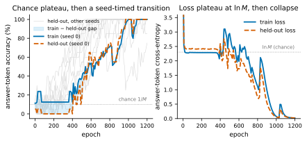
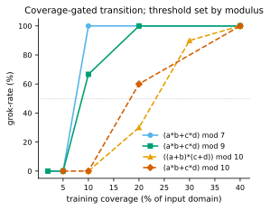
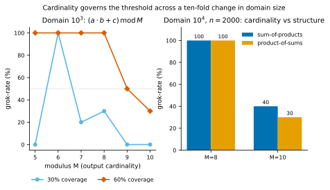
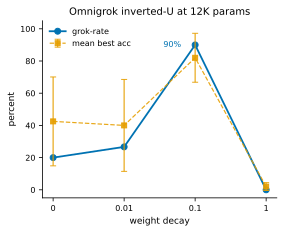
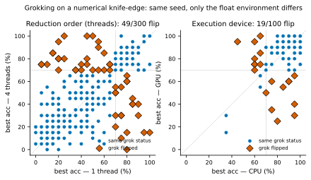
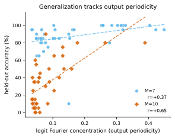
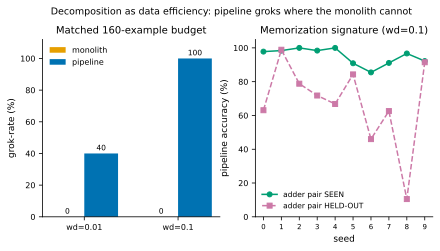

# Ootani 2026 — Grokking Is Conditional and Fragile: A Fully-Tractable, Multi-Seed Study at 12K Parameters

См. также: [глобальный индекс понятий](../../concepts/index.md).

**Yoshiyuki Ootani** (независимый исследователь; info@ootanl.com).

arXiv [2607.05104](https://arxiv.org/abs/2607.05104), июль 2026 (v1), 14 страниц, 7 рисунков, 4 таблицы. Всего цитирований по Semantic Scholar — 0, в картотеке — 0. Одноавторская работа: гроккинг измерен как многосеменна́я доля (grok-rate), а не единичный исход, на полностью перечислимом трансформере Glimmer-1-Base в 11 856 параметров (скрытая размерность 16, два слоя), дообучаемом на модульной арифметике с $M\leq 10$. Шесть находок: порог покрытия следует мощности выхода (модулю) сильнее, чем строению композиции; обратная U Omnigrok по weight decay (20%→90%→0%) воспроизведена на 12K параметров; числовое лезвие — число потоков CPU (чистая смена порядка редукции) и CPU-против-GPU переворачивают 49/300 и 19/100 семян без сдвига совокупной доли (McNemar $p\geq 0.39$); модель dim-16 НЕ образует хрестоматийной фурье-окружности вложений; декомпозиция на специалистов выигрывает за счёт покрытия, а не надзора (10/10 против 0/10 при равном бюджете, скретчпад-монолит тоже 0/10); три собственные одно-прогонные истории опровергнуты многосеменны́м контролем.

Оригинал и производные файлы этой папки:

- [`original/2607.05104.grokking-is-conditional-and-fragile-a-fully-tractable-multi-seed-study-at-12k-parameters.md`](original/2607.05104.grokking-is-conditional-and-fragile-a-fully-tractable-multi-seed-study-at-12k-parameters.md) — конверсия оригинала (arXiv-HTML v1, сверена с PDF) в Markdown без правок содержания.
- [`2607.05104.grokking-is-conditional-and-fragile-a-fully-tractable-multi-seed-study-at-12k-parameters.claims.txt`](2607.05104.grokking-is-conditional-and-fragile-a-fully-tractable-multi-seed-study-at-12k-parameters.claims.txt) — пронумерованные утверждения статьи с пометками разбора.
- [`images/`](images/) — 7 рисунков.

Схема якорей и правила ссылок на карточку — в [README папки статей](../README.md).

## Затрагиваемые понятия

**[Гроккинг](../../concepts/grokking.md)** — смена единицы свидетельства: не «модель гроккает задачу X», а grok-rate по десяти и более семенам внутри закреплённой числовой обстановки, с парностью по семени при сравнениях; доля задачи не постоянна — тот же $(a{+}b)\bmod 10$ гроккает 2–3 раза из 10 при одном weight decay и 9 из 10 при другом, а три драматичные одно-прогонные истории («стена способности», «потоки переключают гроккинг», «GPU подавляет гроккинг») оказались смещением по семенам ([`p11-2`](#p11-2)). Разбор: «гроккинг» здесь операционализован порогом лучшей отложенной точности 0.70 — это мера генерализации без срока задержки, и по собственному рисунку 1 обучающая точность опережает отложенную «самое большее на несколько десятых», обе кривые кросс-энтропии стоят на полке $\ln M$ и обрушиваются вместе — явление ближе к отложенному обучению, чем к гроккингу Power et al. с длинной фазой запоминания; постановка нестандартна и в другом — дообучение предобученной контрольной точки, а не обучение с нуля.

**[Численная устойчивость](../../concepts/numerical-stability-fix.md)** — числовое лезвие нового рода: смена числа потоков CPU (чистая перестановка порядка суммирования при неассоциативности сложения с плавающей точкой; 4 и 16 потоков дают побитово одинаковые веса, чистое возмущение — 1 против 4) переворачивает исход у 49 из 300 парных семян (средний модуль сдвига лучшей точности 0.17, максимум 0.85), а CPU против GPU при отключённом TF32 — у 19 из 100, и оба возмущения не сдвигают совокупную долю (McNemar $p=0.39$/$1.0$, интервалы Ньюкомба в пределах $\pm 10$ пунктов) ([`p8-1`](#p8-1)). Разбор: явное отличие от Softmax Collapse Prieto et al. — там числовой отказ систематически подавляет гроккинг, здесь возмущение переставляет, *какие* семена обобщают, не меняя *сколько*; прочтение «обобщающая котловина настолько мелка, что суб-ULP различия решают вход» объявлено прочтением, а не измерением; доля переворотов подпёрта порогом 0.70 — распределение сдвигов у неперевернувшихся семян не показано, и в 16% неотделимы семена, стоявшие у порога.

**[Доля данных / критический размер](../../concepts/data-fraction-critical-dataset-size.md)** — порог покрытия резкий, почти «всё или ничего», и его положение следует мощности выхода: составные mod-7 и mod-9 переходят при 5–10% покрытия, оба mod-10 (сумма произведений и произведение сумм) — в одной полосе 20–40%; упорядочение по $M$ воспроизводится на десятикратно меньшем домене, а скрещивание $2\times 2$ при $n=2000$ даёт 60–70 пунктов за модуль против $\leq$10 за строение; «слишком трудная задача» оказывается порогом покрытия, не пределом ёмкости ([`p5-4`](#p5-4)). Разбор: таблица упорядочения посчитана на 3–5 семенах на ячейку — против собственного протокола «десять и более»; упорядочение чисто лишь заметно выше порога (при 30% покрытия немонотонно: $M=5$ — 0/10, $M=6$ — 10/10 из-за строения остатков у делителей десятки); разница по строению $\leq$10 пунктов сама признана шумом при десяти семенах; декомпозиция на специалистов выигрывает тем же механизмом, прочитанным как запоминание плотных поддоменов (сложитель: 0.97 на виденных парах против 0.10 на невиденных).

**[Weight decay](../../concepts/weight-decay.md)** — обратная U Omnigrok воспроизведена на модели на два-три порядка меньше исходной: grok-rate 20% при decay 0, 27% при 0.01, 90% при 0.1, 0% при 1.0 (средняя лучшая точность 0.42/0.40/0.82/0.02; $(a{+}b)\bmod 10$, покрытие 80%, по десять семян) — положительная сверка того, что измерение доли отзывается на направленное вмешательство, лицензирующая чтение нулевых результатов лезвия как подлинно нулевых ([`p7-2`](#p7-2)). Разбор: следствие, важное для корпуса, — всякое «модель гроккает задачу X с вероятностью p» неявно обусловлено регуляризацией; сверка воспроизводит качественную зависимость, а не закон; при пороге 0.80 доли читаются 20/17/70/0% — вывод к порогу устойчив.

**[Разброс по семенам и воспроизводимость](../../concepts/seed-variance-reproducibility.md)** — вывод сформулирован резче некуда: *«одиночные прогоны лгут в этом режиме, систематически»* ([`p11-2`](#p11-2)). Отсюда и устройство работы — многосеменной разбор на модели в 12 тысяч параметров, где полный перебор ещё доступен.

**[Отрицательные результаты](../../concepts/negative-results.md)** — работа подаёт отрицательный результат отдельным вкладом, а не оговоркой ([`p10-1`](#p10-1)). Порогом значимости служит тот же разброс по семенам, без которого «эффекта не видно» неотличимо от неудачного розыгрыша.
## Что показано, а что предположено

Замечания редактора карточки по итогам разбора утверждений (`…claims.txt`, 45 пунктов).

**Ценное — протокол и опровержение собственных историй.** Единица свидетельства — grok-rate при закреплённых потоках и устройстве, парность по семени, пороги 0.60/0.70/0.80 пересчитаны для всех долей (возражение Schaeffer et al. о мираже принято всерьёз); числовое лезвие обеспечено мощностью (300 и 100 парных семян) и показано на двух независимых возмущениях с побитовой проверкой эквивалентности 4 и 16 потоков; три одно-прогонные истории разобраны на собственных данных как смещения по семенам; честно раскрыто использование ИИ-агентов в проведении опытов и написании текста.

**Наблюдаемое — не совсем гроккинг, а часть чисел тоньше заголовка.** Полка и резкий переход без длинной фазы запоминания (признано в тексте против собственной аннотации); «условен и хрупок» — утверждение о дисперсии при неизменной доле; упорядочение по мощности держится на 3–5-семенных ячейках плюс один десятисеменной сдвиг; «конвейер гроккает 10/10» засчитывает составную точность, обеспеченную запоминанием поддоменов (прочитано самими авторами); механистическая положительная связь (периодичность логитов) отчасти определительна и признана таковой — независим только отрицательный результат про вложения, и его сила ограничена постановкой (7–10 точек вложения, размерность 16, унаследованные от предобучения веса).

**Как работу будут цитировать** («число потоков и выбор CPU/GPU переключают гроккинг»; «декомпозиция даёт гроккинг там, где монолит не может») — точнее: при неизменной совокупной доле переворачивается принадлежность отдельных семян — хорошо обеспеченный мощностью нулевой результат по средней доле; а конвейер при равном бюджете достигает высокой составной точности за счёт плотного покрытия поддоменов, и механизм успеха прочитан самими авторами как запоминание.

---

# Текст статьи

## Гроккинг условен и хрупок: полностью перечислимое многосеменно́е исследование на 12K параметров

**Yoshiyuki Ootani** *info@ootanl.com*. Аффилиация: *независимый исследователь*

## Аннотация

Гроккинг, отложенное начало генерализации спустя долгое время после того, как сеть подогнала обучающую выборку, обычно изучается на моделях, достаточно больших, чтобы выученный алгоритм был лишь частично читаем, и где единичный обучающий прогон принимается за свидетельство. Мы вместо этого изучаем Llama-подобный трансформер на $\approx$11 856 параметров (Glimmer-1-Base) на модульной арифметике — режим, достаточно малый, чтобы перечислить и прочесть его веса, внимание и полное отображение вход-выход напрямую, и измеряем гроккинг как многосеменну́ю *долю*, а не единичный исход. Возникают шесть находок. (i) Переход гроккинга воро́чается покрытием обучающей выборки, и порог покрытия следует мощности выхода (модулю) сильнее, чем строению композиции, — упорядочение, которое держится выше перехода и через десятикратную смену размера домена. (ii) Weight decay воспроизводит обратную U Omnigrok на 12K параметров: grok-rate поднимается с 20% до 90% и затем обрушивается до 0% — положительная сверка измерения доли. (iii) Гроккинг сидит на числовом лезвии: два различных возмущения плавающе-точечной обстановки, число потоков CPU (чистая смена порядка редукции) и CPU-против-GPU (смена устройства, включающая её в себя), каждое переворачивает меньшинство семян (49/300 и 19/100 при пороге 0.70) без обнаружимого сдвига совокупной доли (мощность достаточна: точный McNemar $p\geq 0.39$; парно-разностные 95% доверительные интервалы в пределах $\pm 10$ пунктов). (iv) Механистическая считка смешанная: генерализующие решения имеют более периодичное выходное отображение (отчасти определительная сверка согласованности), тогда как подлинно независимый результат — *отрицательный*: модель размерности 16 не образует хрестоматийной фурье-окружности вложений. (v) Декомпозиция задачи помогает не тем, что делает возможным иначе невозможное вычисление, а тем, что превращает голодную по покрытию разрежённую задачу в плотно покрываемые подзадачи; при равном бюджете данных конвейер из двух специалистов гроккает там, где монолит не может (10/10 против 0/10), тогда как скретчпад-монолит того же бюджета, несущий идентичный разложенный надзор, всё равно проваливается (0/10), выделяя покрытие, а не плотность надзора, как движитель. (vi) Методологически многосеменно́й контроль при фиксированной числовой обстановке опровергает три драматичные одно-прогонные истории в наших собственных данных: «стену» трудной задачи, эффект «число потоков переключает гроккинг» и эффект «GPU подавляет гроккинг», — каждая из которых оказывается смещением по семенам. В этом полностью перечислимом режиме гроккинг лучше всего понимать как условный и хрупкий фазовый переход, а многосеменно́й числовой контроль — предусловие любого утверждения о нём.

## 1 Введение

Нейронная сеть может подогнать малый алгоритмический датасет до идеальной обучающей точности и продолжать, тысячи дальнейших шагов, генерализовать не лучше случая, а затем, резко, генерализовать почти идеально. Эта отложенная генерализация, *гроккинг* (Power et al., 2022), стала центральным объектом изучения науки о глубоком обучении, потому что она изолирует вопрос о том, *когда* сеть превращает запоминание в алгоритм. Большая часть того, что мы знаем о гроккинге, идёт либо из механистических разборов случая одной обученной сети (Nanda et al., 2023), либо из феноменологических отчётов на моделях с миллионами параметров (Liu et al., 2023; Prieto et al., 2025). Обе постановки делят два ограничения. Выученное вычисление лишь частично читаемо, так что утверждения о механизме покоятся на зондировании, а не на полном чтении весов; и о гроккинге сообщают из отдельных прогонов, хотя известно, что он чувствителен к семени.

**[p. 2]**

Мы берём противоположный курс по обоим пунктам. Мы изучаем Glimmer-1-Base (CompactAI, 2026), опубликованный Llama-подобный трансформер на $\approx$11 856 параметров (скрытая размерность 16, два слоя, четыре головы внимания с одной головой ключ/значение, словарь 512), предобученный лишь на 500K токенов FineWeb-Edu и работающий на уровне случая на всех стандартных мерках. При этом размере модель не полезна как языковая, но она есть нечто более ценное для нашей цели: она *полностью перечислима*. Её вложения цифр, узор внимания и выходные логиты по всему входному домену можно перечислить и прочесть напрямую. Малость здесь — разрешающая способность эксперимента, а не изъян, который мы терпим: только модель такого размера можно прочесть насквозь, переобучить достаточно дёшево, чтобы сообщать grok-*доли* вместо единичных прогонов, и закрепить достаточно плотно, чтобы держать всю её числовую обстановку фиксированной — контроль, который стирается по мере роста числа параметров. Перечислимость тем самым *разрешает*, а не является результатом сама по себе: она питает механистические считки Раздела 4.4 и чистый отрицательный результат, хотя и не полную причинную цепь. Мы соединяем эту перечислимость с методологическим обязательством: мы никогда не сообщаем гроккинг из одного прогона. Каждое утверждение — grok-*доля* по десяти и более семенам, измеренная внутри фиксированной числовой обстановки, чьи число потоков и устройство сами держатся постоянными.

Это сочетание важно, потому что режим активно приглашает ложные истории. По ходу этого исследования наши собственные одно-семенны́е наблюдения подсказали три чистые, публикуемые истории — жёсткую «стену» способности, эффект «число потоков переключает гроккинг» и эффект «GPU подавляет гроккинг», — и многосеменно́й контроль опроверг все три как смещения по семенам (подробно в Разделе 5). Мы считаем эти опровержения первичным результатом: в этом режиме единицей свидетельства должна быть многосеменна́я доля при закреплённой числовой обстановке.

Наши вклады:

1. **Картина покрытие–мощность.** Выше перехода порог покрытия гроккинга следует мощности выхода (модулю $M$) сильнее, чем строению композиции задачи, — упорядочение, которое держится через десятикратную смену размера входного домена (Раздел 4.1).
2. **Воспроизведение Omnigrok на 12K параметров.** Weight decay производит обратную U в grok-доле, предсказанную ландшафтным отчётом о гроккинге, подтверждая измерение доли как положительную сверку (Раздел 4.2).
3. **Воспроизведённое числовое лезвие.** Два различных возмущения плавающе-точечной обстановки, порядок редукции (число потоков CPU) и устройство исполнения (включающее его в себя), каждое переворачивает меньшинство одно-семенны́х исходов (49/300 и 19/100 при пороге 0.70, TF32 отключён) без совокупного смещения — хорошо обеспеченный мощностью нуль (точный McNemar $p=0.39$/$1.0$; 95% интервалы Ньюкомба в пределах $\pm 10$ пунктов), ось хрупкости, отличная от неустойчивости softmax-коллапса Prieto et al. (2025) (Раздел 4.3).
4. **Механистическая считка, чей информативный результат — отрицательный**: модель размерности 16 *не* образует хрестоматийной фурье-окружности вложений Nanda et al. (2023). Положительный коррелят, что генерализующие решения имеют более периодичное выходное отображение, — отчасти определительная сверка согласованности, а не независимый зонд (Раздел 4.4).
5. **Декомпозиция как экономия данных.** При равном бюджете данных конвейер специалистов по подзадачам гроккает составную задачу там, где монолит не может, превращая разрежённое покрытие в плотное; скретчпад-монолит того же бюджета, несущий идентичный разложенный надзор, всё равно проваливается (0/10), выделяя покрытие, а не надзор, как движитель, и механизм — запоминание плотных поддоменов (Раздел 4.5).
6. **Методологический вклад**, продемонстрированный насквозь: опровержение трёх одно-семенны́х историй и соответствующий контрольный протокол для исследований гроккинга (Разделы 4.3 и 5).

## 2 Связанные работы

**Гроккинг.** Power et al. (2022) ввели гроккинг на малых алгоритмических датасетах, показав, что генерализация может улучшаться далеко за точкой переобучения; они уже наблюдали, что степень генерализации сети зависит от *доли* данных, использованной для обучения, — зависимость, которую наш разбор покрытия (Раздел 4.1) делает **[p. 3]** количественной. Последующая работа искала механизм. Varma et al. (2023) объясняют гроккинг через эффективность цепей, постулируя критический размер датасета, за которым генерализующая цепь становится эффективнее запоминания; это механистический двойник порога покрытия, который мы измеряем. Kumar et al. (2024) переописывают ту же задержку как переход обучения от ленивого к богатому. Thilak et al. (2022) вместо этого привязывают гроккинг к оптимизаторной неустойчивости «рогатки» — один из нескольких отчётов, помещающих гроккинг у оптимизационного края. Liu et al. (2023), в *Omnigrok*, приписывают гроккинг рассогласованию кривых обучающей и тестовой потерь как функций нормы весов (механизм «LU») и показывают, что weight decay, размер данных и качество представления все его модулируют. Мы воспроизводим зависимость от weight decay в модели на два-три порядка меньше (Раздел 4.2) и используем её как положительную сверку. Дополняющий отчёт, Liu et al. (2022), кладёт гроккинг на фазовую диаграмму, чья ось размера обучающей выборки выбирает между пониманием, гроккингом, запоминанием и путаницей — снова ось покрытия Раздела 4.1.

**Механистическая интерпретируемость модульной арифметики.** Nanda et al. (2023) полностью обратно разбирают однослойный трансформер, обученный на модульном сложении, и находят, что он реализует сложение как вращение на окружности через дискретные фурье-компоненты, разбивая обучение на запоминание, формирование цепи и зачистку — ранняя форма скрытого прогресса (Barak et al., 2022). Эта картина фурье-умножения — эталонный механизм для нашей считки в Разделе 4.4. Мы находим её ослабленную версию: генерализующие решения периодичны в своём отображении вход-выход, но наша модель размерности 16 не кладёт свои вложения цифр на чистую фурье-окружность, так что мы сообщаем периодичность на уровне отображения логитов, а не вложения. Что одно модульное отображение допускает более одного механизма, задокументировано: Zhong et al. (2023) находят, что обученные сети делятся между «часами» (фурье-окружность) и качественно другим алгоритмом «пиццы», а Chughtai et al. (2023) обобщают это на произвольные групповые операции; Gromov (2023) выводит периодические (фурье) веса отображения признаков в замкнутой форме, расширенной на модульные *многочлены* Doshi et al. (2024) — многочленная постановка, которую наши составные задачи воплощают. Все показывают периодическое вычисление без вложений на чистой окружности — наш отрицательный результат. Наша считка на уровне логитов нарочно агностична к тому, какой алгоритм реализует данное семя. Гроккинг также оформлялся как соревнование запоминающей плотной и генерализующей разрежённой подсетей (Merrill et al., 2023), что соответствует разделению гроккер/запоминатель, которое наша считка различает.

**Числовые эффекты в гроккинге.** Ближе всего к нашему Разделу 4.3 — Prieto et al. (2025), показывающие, что без регуляризации задачи гроккинга загоняют softmax в плавающе-точечный отказ, названный ими Softmax Collapse, который *предотвращает* гроккинг, и чинящие его стабилизированной активацией. Их эффект систематически подавляет генерализацию. Наш иного рода: возмущение порядка редукции или устройства исполнения, переворачивающее отдельные семена без обнаружимой перемены средней grok-доли. Оба указывают, что оптимизация гроккинга работает близ числового края.

**Воспроизводимость и чувствительность к семени.** Что результаты глубокого обучения разнятся по семенам, широко известно, и учёт этой дисперсии сам по себе изученная проблема (Bouthillier et al., 2021); одно семя может быть удачливым или неудачливым выбросом (Picard, 2021) — ровно та опасность, вокруг которой построен наш протокол многосеменны́х долей. Наиболее прямо, Summers and Dinneen (2021) показывают, что разные источники обучающего недетерминизма — семя, cuDNN, порядок редукции — производят статистически неразличимую дисперсию при хаотической по-прогонной чувствительности; мы специализируем это на гроккинг, где она проявляется как дискретные перевороты grok/no-grok отдельных семян. Смежное предостережение — что резкий «эмерджентный» переход может быть артефактом разрывной метрики, а не свойством модели (Schaeffer et al., 2023); мы отвечаем на это в лоб, проверяя, что наша история о grok-долях инвариантна к порогу гроккинга (Раздел 5). Наш вклад — сделать семя, и числовую обстановку, взаимодействующую с ним, контролируемой, первоклассной переменной именно в гроккинге, и показать конкретно, как одно-семенны́е утверждения о гроккинге вводят в заблуждение.

**Смеси экспертов и декомпозиция.** Разрежённо-управляемые смеси экспертов маршрутизируют входы к специализированным подсетям ради ёмкости при фиксированных вычислениях (Shazeer et al., 2017; Fedus et al., 2022). Наш результат о декомпозиции (Раздел 4.5) родствен, но отличен: специалисты обучаются на *разных подзадачах*, а не маршрутизируются внутри одной задачи, и выгода, которую мы определяем, — эффект покрытия/экономии данных, специфичный для режима гроккинга, а не эффект ёмкости или пропускной способности.

**[p. 4]**

## 3 Модель и методология

**Модель.** Glimmer-1-Base — Llama-подобный декодер: скрытая размерность 16, два слоя, четыре головы запроса с одной головой ключ/значение (grouped-query attention), SiLU-MLP ширины 24, RMSNorm, поворотные позиционные вложения, связанные входные/выходные вложения, словарь 512, контекст 512, float32, итого 11 856 обучаемых параметров. Токенизация — байтовая BPE; цифры 0–9 — одиночные токены. Опубликованная контрольная точка предобучена на 500K токенов FineWeb-Edu, показывает уровень случая на стандартных мерках рассуждения и знаний и порождает бессвязный текст. Мы используем её не как языковую модель, а как перечислимый субстрат для дообучения.

**Задачи.** Мы дообучаем на отображениях модульной арифметики, записанных текстом, например 7+5= $\rightarrow$ 2 для $(a{+}b)\bmod 10$. Мы держим модуль $M\leq 10$, чтобы каждый ответ и каждый промежуточный результат был одной цифрой (одним токеном), отчего точности с принуждением учителя и в свободной генерации совпадают и считки остаются чистыми. Задачи простираются от одиночных бинарных операций ($(a{+}b)\bmod M$, $(a\cdot b)\bmod M$) до четырёхвходовых композитов ($(a\cdot b+c\cdot d)\bmod M$, $((a{+}b)\cdot(c{+}d))\bmod M$).

**Обучение и оценка.** Если не сказано иное, мы используем AdamW (скорость обучения $3\times 10^{-3}$, минибатч 16, weight decay 0.01) до 1 200–1 500 эпох (полных проходов по обучающей выборке), на CPU в float32. Мы определяем, что прогон *грокнул*, если его лучшая отложенная точность достигает порога $\tau=0.70$, много выше энтропийного случайного уровня $1/M$ (для составных задач, чьи маргиналы ответов слегка неравномерны, база мажоритарного класса несколько выше $1/M$, но всё же заметно ниже $\tau$). Мы пишем $n$ для числа обучающих примеров и определяем *покрытие* как $n/|\text{domain}|$, где домен имеет $10^{2}$ кортежей для бинарных операций, $10^{3}$ для трёхвходовых и $10^{4}$ для четырёхвходовых композитов. Мы оцениваем на отложенном срезе входного домена; для составных задач отложенный набор — фиксированная выборка из 1 000 кортежей с замороженным семенем, так что покрытие и трудность постоянны между условиями.

*Рисунок 1: Динамика гроккинга для $(a{+}b)\bmod 10$ при weight decay 0.1 (гроккают все десять семян). Слева: точность на токене ответа для представительного семени (жирная) поверх отложенных кривых остальных девяти семян (серые); отложенная точность держится у случая, затем резко переходит на семя-зависимой эпохе ($\approx$320–760). Справа: обучающая и отложенная кросс-энтропии, стоящие на полке у случайного значения $\ln M\approx 2.30$ перед обрушением. Краткий закрашенный зазор train$-$held-out показывает, что запоминание опережает генерализацию лишь ненамного на этом масштабе.*

###### p4-4

**Что сводка по лучшей точности схлопывает.** Определение гроккинга по лучшей отложенной точности сводит траекторию к скаляру; Рисунок 1 показывает, что этот скаляр сводит. В грок-дружелюбном режиме отложенная потеря держится на случайном значении $\ln M$ семя-зависимые несколько сотен эпох и затем обрушивается, эпоха перехода лежит в $\approx$320–760 по десяти семенам — семенна́я лотерея во временно́й области, по которой grok-доля агрегирует (Notsawo et al., 2023). Внутри перехода обучающая точность опережает отложенную самое большее на несколько десятых, а не на долгий промежуток запоминания, так что сведение каждого прогона к его лучшей отложенной точности отбрасывает немногое.

**Многосеменно́й протокол с фиксированной обстановкой.** Центральное методологическое обязательство — что никакое утверждение о способности не покоится на одном прогоне. Каждое условие прогоняется на десяти и более семенах и сообщается как grok-доля (и средняя лучшая точность с разбросом). Поскольку гроккинг в этом режиме чувствителен и к плавающе-точечной обстановке (Раздел 4.3), мы закрепляем число потоков и устройство на исследование и сообщаем **[p. 5]** их. Когда мы сравниваем два условия, мы делаем пары по семени, так что разбиение данных, порядок батчей и (детерминированно загружаемые, предобученные) начальные веса тождественны и различается лишь проверяемая переменная. Grok-доля по десяти семенам несёт 95%-полуширину Уилсона примерно в 15–30 процентных пунктов, так что разницы долей ниже примерно 30 пунктов при десяти семенах мы считаем в пределах шума и полагаемся на 30-семенны́е сетки и парные тесты для самых плотных сравнений.

**Почему CPU.** При 11 856 параметрах арифметика тривиальна и господствуют накладные расходы запуска ядер, так что CPU быстрее топового GPU (67 с против 162 с для представительного прогона; 301 с против 349 с в парном сравнении Раздела 4.3). Мы потому пускаем все свипы на CPU и трактуем GPU лишь как вторую числовую обстановку для контроля устройства — для моделей такого размера GPU не даёт выигрыша скорости, лишь другой числовой базис.

#### Использование генеративного ИИ.

При подготовке этого исследования автор использовал инструменты генеративного ИИ — ИИ-агентов для кода/исследований и большие языковые модели — для помощи в реализации и проведении экспериментов, разборе результатов и написании и правке рукописи. Все экспериментальные результаты и утверждения проверены автором, который берёт за них полную ответственность.

## 4 Результаты

### 4.1 Гроккинг, воро́чаемый покрытием, и регулярность мощности

Сначала мы спрашиваем, что управляет тем, гроккает ли составная задача вообще. Закрепив отложенный набор и варьируя лишь долю входного домена, виденную при обучении (*покрытие*), мы находим резкий, почти «всё или ничего» переход: ниже порогового покрытия grok-доля близка к нулю и отдельные прогоны сидят на случайной отложенной точности; выше него grok-доля прыгает к единице и прогоны достигают почти идеальной точности. Промежуточного поведения на семя почти нет.

###### p5-4

Порог зависит от задачи (Таблица 1, Рисунок 2) и растёт с модулем $M$ (мощностью выхода): составные mod-7 и mod-9 переходят близ 5–10% покрытия, составная mod-10 — близ 20–40%. Строение композиции значит меньше. Сумма произведений $(a\cdot b+c\cdot d)\bmod 10$ и структурно иное произведение сумм $((a{+}b)\cdot(c{+}d))\bmod 10$ переходят в той же полосе $\sim$20–40%, так что главный определитель порога — *сколько различных ответов модель должна разделить*, а *какое вычисление* их производит — вторичный фактор.

*Таблица 1: Grok-доля против обучающего покрытия. Переход 0$\rightarrow$полный резок; его положение следует модулю $M$ (мощности выхода) и делится двумя mod-10 задачами вопреки их разному строению. Ячейки используют 3–5 семян (mod-7/9 и произведение сумм: 3; mod-10: 5), так что пороги mod-9 и произведения сумм предварительны; более плотные свипы в Таблице 2 и на Рисунке 3 используют десять семян.* **[p. 5]**

| task | 5% | 10% | 20% | 40% | threshold |
|---|---|---|---|---|---|
| $(a\cdot b+c\cdot d)\bmod 7$ | 0/3 | 3/3 | 3/3 | 3/3 | $\sim$10% |
| $(a\cdot b+c\cdot d)\bmod 9$ | – | 2/3 | 3/3 | 3/3 | $\sim$10–20% |
| $((a{+}b)\cdot(c{+}d))\bmod 10$ | – | 0/3 | 0/3 | 3/3 | $\sim$40% |
| $(a\cdot b+c\cdot d)\bmod 10$ | – | 0/5 | 3/5 | 5/5 | $\sim$20–40% |

*Рисунок 2: Grok-доля против обучающего покрытия для четырёх составных задач. Моду́ли меньшей мощности ($M=7,9$) переходят близ 5–10% покрытия; обе mod-10 задачи, вопреки разному строению композиции, делят более поздний порог 20–40%, показывая, что порог задаётся мощностью выхода, а не строением оператора.* **[p. 6]**

**Упорядочение по мощности — не артефакт размера домена, и строение вторично.** Четыре задачи выше все живут на домене из $10^{4}$ кортежей, так что мощность и размер домена ими одними не разделяются. Мы потому пустили два дальнейших контроля (Рисунок 3). Во-первых, мы повторили свип покрытия на трёхвходовом композите $(a\cdot b+c)\bmod M$, чей домен $10^{3}$, на порядок меньше, прочёсывая $M$ от 5 до 10 с десятью семенами на ячейку. Упорядочение по мощности появляется вновь: при 60% покрытия grok-доля 100% для $M\leq 8$, затем падает до 50% при $M=9$ и 30% при $M=10$. Та же монотонная зависимость от $M$ на десятикратно меньшем домене показывает, что порог задаётся числом выходных классов, а не абсолютным размером домена. Упорядочение чисто, однако, лишь заметно выше порога: при 60% покрытия оно монотонно, но **[p. 6]** близ перехода при 30% покрытия немонотонно — $M=5$ гроккает 0/10, тогда как $M=6$ гроккает 10/10, — потому что моду́ли, нацело делящие десятизначный входной диапазон, налагают добавочное строение остатков на входы. Зависимость от $M$ тем самым — регулярность высокого покрытия, а не посеменно́й закон.

Во-вторых, чтобы разделить мощность и строение напрямую, мы скрещиваем два модуля с двумя строениями (Таблица 2). Этот $2\times 2$ лишь там *измерим*, где задача большего модуля посреди перехода: при $n=3000$ оба модуля насытились ($\geq$9/10 в каждой ячейке), так что мы читаем контраст при $n=2000$. Там замена суммы произведений $(a\cdot b+c\cdot d)$ на произведение сумм $((a{+}b)\cdot(c{+}d))$ при фиксированном модуле двигает grok-долю не более чем на 10 процентных пунктов, тогда как подъём модуля с 8 до 10 при фиксированном строении роняет её на 60–70. Эффект мощности много больше эффекта строения, а выше порога оба исчезают — ровно как предсказывает переход, воро́чаемый покрытием. Мы потому описываем порог как *регулярность* покрытия–мощности, управляемую прежде всего $M$ при строении как вторичном факторе меньшей величины; первичное свидетельство остаётся за свипами порога покрытия по трём модулям (Таблица 1 и свип на $10^{3}$ выше), а этот $2\times 2$ — иллюстрация при одном бюджете.

*Таблица 2: Мощность против строения при двух бюджетах (домен $10^{4}$, десять семян на ячейку). При $n=2000$, где mod-10 задача посреди перехода, подъём $M$ с 8 до 10 обрушивает grok-долю на 60–70 пунктов, тогда как смена строения двигает её на $\leq$10; при $n=3000$ оба модуля насытились и оба зазора исчезают, как предсказывает переход, воро́чаемый покрытием. Диссоциация тем самым — эффект полосы перехода, а не бюджето-независимый закон: первичное свидетельство $M$-упорядочения — свип порога покрытия (Таблица 1), а этот $2\times 2$ лишь иллюстрирует его (зазор строения $\leq$10 пунктов сам в пределах шума при десяти семенах). Обе mod-10 ячейки заменяют 3–5-семенны́е пилоты Таблицы 1 (сумма произведений 3/5$\to$4/10, произведение сумм 0/3$\to$3/10).* **[p. 6]**

| budget | structure | $M=8$ | $M=10$ |
|---|---|---|---|
| $n=2000$ (transition) | sum-of-products $(a\cdot b+c\cdot d)\bmod M$ | 10/10 | 4/10 |
| $n=2000$ (transition) | product-of-sums $((a{+}b)\cdot(c{+}d))\bmod M$ | 10/10 | 3/10 |
| $n=3000$ (saturated) | sum-of-products $(a\cdot b+c\cdot d)\bmod M$ | 10/10 | 10/10 |
| $n=3000$ (saturated) | product-of-sums $((a{+}b)\cdot(c{+}d))\bmod M$ | 10/10 | 9/10 |

*Рисунок 3: Мощность управляет порогом покрытия через десятикратную смену размера домена. Слева: на задаче $(a\cdot b+c)\bmod M$ с $10^{3}$ кортежами grok-доля падает с модулем $M$ при фиксированном покрытии (чисто при 60%; шумнее близ перехода 30%, где делители цифрового диапазона, такие как $M=5$, аномальны). Справа: при бюджете $n=2000$ на домене $10^{4}$, где mod-10 задача посреди перехода, подъём $M$ с 8 до 10 обрушивает grok-долю, тогда как смена строения композиции едва её двигает; при больших бюджетах оба модуля насыщаются и зазор закрывается (Таблица 2).* **[p. 7]**

Это переописывает представление о задаче, «слишком трудной» для модели. $(a\cdot b+c\cdot d)\bmod 10$, обученная при $\sim$8% покрытия нашего свипа способностей, гроккает в 0 из 10 семян, что читается как жёсткий потолок. Та же модель выучивает ту же задачу по существу идеально при 40% покрытия. Потолок — порог покрытия, не предел ёмкости, — пункт, который мы используем в Разделах 4.2 и 4.5 и чьё одно-семенно́е перечтение обсуждаем в Разделе 5.

**[p. 7]**

### 4.2 Регуляризация: обратная U Omnigrok на 12K параметров

Если наша grok-доля — верное измерение, она должна отзываться на вмешательство, о котором известно, что оно двигает гроккинг. Weight decay — каноническая такая ручка: отчёт Omnigrok предсказывает, что рост распада поощряет гроккинг до точки, за которой пере-регуляризация разрушает обучение. Мы прочёсываем weight decay на $(a{+}b)\bmod 10$ при фиксированном 80% покрытии, по десять семян.

###### p7-2

Результат — чистая обратная U (Таблица 3, Рисунок 4). Grok-доля — 20% при распаде 0, 27% при 0.01, **90% при 0.1** и 0% при 1.0, со средней лучшей отложенной точностью, следующей за ней (0.42, 0.40, 0.82, 0.02). Модель воспроизводит качественную зависимость Omnigrok (распад поощряет гроккинг, затем пере-регуляризация его обрушивает) на масштабе на два-три порядка ниже исходного. Следуют два следствия. Во-первых, наше измерение доли доказуемо отзывается на настоящее, направленное вмешательство, что лицензирует толкование *нулевого* эффекта в другом месте (Раздел 4.3) как подлинно нулевого, а не как нечувствительности измерения. Во-вторых, grok-доля задачи не есть внутренняя постоянная: тот же $(a{+}b)\bmod 10$ гроккает 2–3 раза из 10 при распаде, использованном нами для свипа способностей, и 9 раз из 10 при распаде 0.1. Любое утверждение вида «эта модель гроккает задачу $X$ с вероятностью $p$» неявно обусловлено регуляризацией.

*Таблица 3: Свип weight decay на $(a{+}b)\bmod 10$ (80% покрытия, по десять семян). Grok-доля следует обратной U, подписи Omnigrok, воспроизведённой здесь на 12K параметров.*

| weight decay | 0 | 0.01 | 0.1 | 1.0 |
|---|---|---|---|---|
| grok-rate | 20% | 27% | **90%** | 0% |
| mean best accuracy | 0.42 | 0.40 | 0.82 | 0.02 |

*Рисунок 4: Grok-доля и средняя лучшая отложенная точность против weight decay для $(a{+}b)\bmod 10$ (десять семян на точку; планки ошибок — стандартное отклонение лучшей точности). Обратная U, поднимающаяся до 90% при распаде 0.1 и обрушивающаяся до 0% при распаде 1.0, воспроизводит зависимость Omnigrok на 12K параметров и служит положительной сверкой измерения доли.* **[p. 8]**

### 4.3 Гроккинг сидит на числовом лезвии

Теперь мы варьируем плавающе-точечную обстановку, держа математику фиксированной. Чистейшая такая переменная — число потоков CPU. Смена числа потоков меняет только *порядок*, в котором суммируются плавающе-точечные редукции; поскольку плавающе-точечное сложение неассоциативно (Goldberg, 1991), это возмущает результат на уровне округления, оставляя задуманное вычисление неизменным. Мы обучаем $(a{+}b)\bmod 10$ при распаде 0.01 с числом потоков 1, 4 и 16, парно по семени на 300 семенах.

**[p. 8]**

###### p8-1

Выделяются два факта (Рисунок 5, слева). Во-первых, числа потоков 4 и 16 дают побитово идентичные результаты на каждом семени: при этом размере операторов дерево редукции BLAS насыщается к четырём потокам, так что 4 и 16 — *одна и та же* числовая обстановка. Мы проверили это напрямую, обучив до конца на 4 и 16 потоках при общем семени и сравнив финальные веса: каждый параметр совпадает до бита, максимум модуля разности ровно $0$. Чистое возмущение потому — 1 против 4. Во-вторых, это возмущение, чистая смена порядка редукции, переворачивает grok-исход у **49 из 300 семян (16%)**: например, семя 57 падает с 0.80 до 0.00 (теряет гроккинг), а семя 132 поднимается с 0.25 до 1.00 (обретает его). Средний модуль изменения лучшей точности 0.17, максимум 0.85. Но *совокупная* grok-доля почти неизменна: 74/300 при одном потоке против 81/300 при четырёх, при 49 несогласных семенах, разделившихся 21 против 28. При этом бюджете семян тест хорошо обеспечен мощностью, и он находит *отсутствие совокупного смещения*: точный двусторонний тест McNemar даёт $p=0.39$, а парно-разностный 95% доверительный интервал Ньюкомба на долю охватывает лишь $[-6.9,+2.2]$ процентных пункта — исключая любой систематический сдвиг больше нескольких пунктов. Возмущение переворачивает, *какие* семена генерализуют, не *сколько*.

Чтобы проверить, что это свойство гроккинга, а не одной конкретной числовой ручки, мы воспроизводим это на втором, несвязанном возмущении: CPU против GPU (Рисунок 5, справа). Мы отключаем TF32, так что сравнение — подлинная смена порядка накопления при полной точности float32, а не смена точности. Пуская $(a{+}b)\bmod 10$ при распаде 0.1 парно по семени на 100 семенах, два устройства используют целиком разные ядра и порядки накопления, но grok-доля почти тождественна (86/100 на CPU, 85/100 на GPU), тогда как 19 из 100 семян переворачиваются (точный McNemar $p=1.0$, 95% интервал Ньюкомба $[-7.8,+9.8]$ пункта). Два различных возмущения плавающе-точечной обстановки, одно (смена устройства) включающее другое (порядок редукции), производят сопоставимую подпись: оба переворачивают шестую-пятую часть одно-семенны́х исходов без обнаружимого сдвига совокупности.

Две черты говорят против списания этих переворотов на простую близость к 50% решающей границе. Во-первых, каждый переворот — событие *того же семени*: парные прогоны делят разбиение данных, порядок батчей и (детерминированно загружаемые) начальные веса, так что меняется лишь плавающе-точечная редукция — дисперсия числовая, а не пересев. Во-вторых, два возмущения сидят в очень разных точках работы — сравнение потоков при распаде 0.01 имеет совокупную grok-долю около 25%, сравнение устройств при распаде 0.1 — около 85%, — но оба переворачивают 16–19% семян, так что доля переворотов — не артефакт установки совокупности ровно на 50%. Мы, однако, не утверждаем, что два *счёта* переворотов тождественны по порогам: счёт потоков бежит 45–62/300 для $\tau\in\{0.6,0.7,0.8\}$, тогда как счёт устройств лежит в 8–23/100 в том же окне (19/100 при конвенции $\tau=0.7$, которую мы сообщаем). Воспроизводится качественная подпись — меньшинство одно-семенны́х переворотов без обнаружимого совокупного смещения, — а не точная доля.

*Рисунок 5: Парная посеменна́я лучшая точность под двумя числовыми возмущениями: порядок редукции (1 против 4 потоков CPU, 300 семян; слева) и устройство исполнения (CPU против GPU, TF32 отключён, 100 семян; справа). Каждая точка — одно семя; единственная перемена между осями — плавающе-точечная обстановка. Синие точки сохраняют свой grok-статус; оранжевые ромбы пересекают порог гроккинга 0.70 (переворот). Перевороты происходят у 49/300 (потоки) и 19/100 (устройство), но ложатся почти симметрично по обе стороны диагонали (точный McNemar $p=0.39$ и $p=1.0$), так что совокупная grok-доля не показывает обнаружимой перемены.* **[p. 9]**

**[p. 9]**

Одно прочтение — что генерализующее решение достижимо, но сидит за границей настолько тонкой, что суб-ULP различия в том, как накапливается сумма, решают, для нетривиальной доли семян, пересечёт ли её оптимизация. По нашим 300 (потоки) и 100 (устройство) парным семенам это пересэмплирует, *какие* семена генерализуют, без обнаружимого сдвига в том, *сколько*, — в отличие от направленного Softmax Collapse Prieto et al. (2025); так или иначе, числовая обстановка — неконтролируемая переменная, которую любой одиночный прогон молча фиксирует.

### 4.4 Механизм: генерализация как периодичность

Что отличает генерализующее решение от запоминающего внутри весов? Мы обучаем 42 add-специалиста на модуль на $(a{+}b)\bmod M$ (семенна́я лотерея поставляет и гроккеров, и запоминателей) и коррелируем отложенную точность каждой модели с механистическими считками её весов и отображения вход-выход, по всему континууму, а не как сравнение классов, обходя дисбаланс гроккер/запоминатель.

Чистейший сигнал — *выходная периодичность* (Рисунок 6). Мы берём логит верного токена ответа по всей решётке $(a,b)$, вычисляем его двумерное дискретное преобразование Фурье и меряем, насколько спектр сосредоточен на одной частоте. Эта сосредоточенность коррелирует с генерализацией положительно при обоих модулях: $r=+0.37$ при $M=7$ (Fisher-$z$ 95% CI $[+0.08,+0.61]$, Spearman $\rho=+0.55$) и $r=+0.65$ при $M=10$ (95% CI $[+0.43,+0.80]$, $\rho=+0.59$), с чистым разделением групповых средних гроккеров и запоминателей (0.21 против 0.06 при $M=10$). Оба интервала исключают нуль, и ранговые корреляции подкрепляют, хотя интервал $M=7$ доходит почти до нуля. Две оговорки это умеряют. Разделение классов несбалансировано — 39 гроккеров к 3 запоминателям при $M=7$ и 5 к 37 при $M=10$, — так что каждый пирсоновский $r$ заякорен малым классом-меньшинством, и двухкластерная структура раздувает $|r|$ относительно внутрикластерного тренда; мы потому ведём с разделения групповых средних и ранговой корреляции и читаем значение $M=7$ как не более чем намекающее. Более фундаментально: поскольку считка — периодичность логита *верного ответа* на решётке, порождённой периодическим правилом, модель, отвечающая верно, периодична на этой решётке почти по построению; корреляция тем самым отчасти определительна, и мы сообщаем её как сверку согласованности рамки периодичности, а не как независимый причинный зонд. Генерализующие решения вычисляют периодичное, модульное отображение вход-выход; запоминатели вычисляют апериодичный справочник — механистический двойник поведенческой подписи запоминания Раздела 4.5. Подлинно неопределительный результат — отрицательный, про вложения, ниже.

*Рисунок 6: Отложенная точность против логит-фурье-сосредоточенности (выходной периодичности) для 42 add-специалистов на модуль. Положительная корреляция ($r=+0.37$ при $M=7$, $r=+0.65$ при $M=10$; штриховые подгонки) показывает, что генерализующие решения вычисляют более периодичное отображение вход-выход.* **[p. 10]**

**[p. 10]**

###### p10-1

Мы также сообщаем ясный отрицательный результат. Хрестоматийный механизм Nanda et al. (2023) кладёт вложения цифр на фурье-окружность, так что ожидаешь, что спектр вложений сосредоточится на немногих частотах и матрица вложений будет низкоранговой. Мы этого не видим: поразмерностная фурье-сосредоточенность вложений по существу некоррелирована с генерализацией при обоих модулях, а эффективный ранг вложений коррелирует отрицательно при $M=10$ ($r=-0.55$, генерализаторы ниже рангом), но не при $M=7$ ($r\approx-0.05$, где точек вложения всего семь и грок-дисперсии мало). При скрытой размерности 16 модель не отводит чистые фурье-признаки своим вложениям; периодичность, предсказывающая генерализацию, живёт в выходном отображении полной цепи, не в сырой геометрии вложений. Мы тем самым сообщаем ослабленную, но хорошо поддержанную версию картины фурье-умножения.

### 4.5 Декомпозиция как экономия данных

Наконец мы возвращаемся к привлекательности многоагентной декомпозиции. Композит вроде $(a\cdot b+c\cdot d)\bmod 10$ может решаться одной моделью (монолитом) или конвейером: специалист умножения вычисляет $a\cdot b$ и $c\cdot d$, а специалист сложения их складывает. Естественное утверждение (что монолит не может выполнить задачу и декомпозиция его спасает) по Разделу 4.1 ложно: монолит гроккает композит при достаточном покрытии и регуляризации. Настоящий вопрос — помогает ли декомпозиция *при равном бюджете данных и равной регуляризации*.

###### p10-3

Помогает, решительно (Таблица 4, Рисунок 7). Мы даём монолиту 160 составных обучающих примеров и даём конвейеру тот же полный бюджет (80 примеров умножения и 80 сложения), и оцениваем оба на тех же отложенных 1 000 составных кортежах. При распаде 0.01 монолит гроккает 0/10 (средняя лучшая 0.20), тогда как конвейер достигает 0.70 и гроккает 4/10; при распаде 0.1 монолит по-прежнему гроккает 0/10 (средняя 0.21), тогда как конвейер достигает 0.89 и гроккает **10/10**. Конвейер бьёт монолит на каждом из десяти семян при обоих распадах, на 50 и 68 процентных пунктов средней точности соответственно (и поднимает grok-долю с 0/10 до 4/10 и 10/10). Вместе с наблюдением, что монолиту нужно примерно 800–2 000 составных примеров, чтобы грокнуть вообще (2–4/10), эффект — примерно порядок величины улучшения экономии данных, плюс большая grok-доля.

*Таблица 4: Конвейер против монолита на $(a\cdot b+c\cdot d)\bmod 10$ при равном бюджете 160 примеров, десять семян. *Скретчпад*-монолит добавляет разложенный промежуточный надзор конвейера при том же разрежённом покрытии; он тоже не гроккает, выделяя покрытие, а не надзор, как движитель. Конвейер гроккает там, где оба монолита не гроккают никогда, и выигрыш ширится при грок-дружелюбном распаде 0.1.* **[p. 11]**

|  | monolith (direct) |  | monolith (scratchpad) |  | pipeline |  |
|---|---|---|---|---|---|---|
| weight decay | grok-rate | mean best | grok-rate | mean best | grok-rate | mean acc |
| 0.01 | 0/10 | 0.20 | 0/10 | 0.27 | 4/10 | 0.70 |
| 0.1 | 0/10 | 0.21 | 0/10 | 0.31 | **10/10** | 0.89 |

*Рисунок 7: Слева: grok-доля монолита против конвейера при равном бюджете 160 примеров; конвейер гроккает (40% при распаде 0.01, 100% при 0.1) там, где монолит никогда (0%). Справа: посеменна́я точность конвейера на промежуточных парах сумм, виденных сложителем в обучении (SEEN), против невиденных пар (HELD-OUT) при распаде 0.1; большой зазор SEEN$\gg$HELD-OUT — подпись запоминания, и он закрывается у семян, чей сложитель подлинно генерализовал (1, 9).* **[p. 11]**

Механизм — ровно история покрытия Раздела 4.1, прочитанная в обратную сторону. Составной бюджет в 160 примеров покрывает лишь 1.6% разрежённого составного домена $10^{4}$, много ниже порога, но те же примеры покрывают 80% каждого плотного поддомена $10^{2}$, заметно выше него. Декомпозиция выигрывает, тратя данные там, где покрытие дёшево. Чтение внутренностей конвейера подтверждает механизм запоминания: специалист сложения достигает 100% обучающей точности, и конвейер точен на промежуточных парах сумм, виденных сложителем в обучении, и много слабее на невиденных (семя 8 даёт 0.97 на виденных против 0.10 на отложенных), причём зазор исчезает ровно у семян, чей сложитель подлинно генерализовал (семя 1, 0.98 против 0.99) — подпись запоминания, **[p. 11]** не артефакт. Декомпозиция здесь превращает задачу генерализации в посильную задачу запоминания, делая каждый поддомен плотным.

Смешение оговаривает рамку равного бюджета, и мы можем его разделить. Примеры конвейера несут не только тот же *счёт* меток, но больше *разложенного* надзора: специалисты видят промежуточные произведения и сумму как прямые цели, тогда как монолит должен выводить их из одной составной метки. Покрытие и плотность надзора тем самым смешаны по построению. Чтобы их изолировать, мы добавляем третью ветвь (Таблица 4): *скретчпад*-монолит, обученный на тех же 160 кортежах, как одна модель, но выдавать два произведения и их сумму явной цепочкой $P,Q,R=(a\cdot b)\bmod 10,\,(c\cdot d)\bmod 10,\,(P{+}Q)\bmod 10$ — ровно разложенный надзор конвейера, при покрытии, удержанном на разрежённом составном уровне. Он зазор не закрывает: скретчпад-монолит гроккает 0/10 при обоих распадах (средняя лучшая 0.27 и 0.31, едва выше 0.20 и 0.21 прямого монолита) и выдаёт верную промежуточную пару на отложенных кортежах лишь в 31% случаев — при 1.6% покрытия он не может даже восстановить промежуточные, на которые надзираем. Разложенный надзор сам по себе потому конвейер не спасает; действующий фактор — плотное покрытие поддоменов, позволяющее каждому специалисту генерализовать, и смешение разрешается в пользу покрытия против плотности надзора.

## 5 Обсуждение

###### p11-2

**Одиночные прогоны лгут в этом режиме, систематически.** Сквозная нить наших результатов — что переход гроккинга в малой модели условен на покрытии (Раздел 4.1), регуляризации (Раздел 4.2) и **[p. 12]** числовой обстановке (Раздел 4.3), и что любой одиночный прогон молча фиксирует все три. Мы столкнулись с этим не как с абстракцией, а как с тремя конкретными промахами на волосок, каждый — чистая история на одном семени: «стена способности» (0/10), которая гроккает, как только поднят распад; смена числа потоков, будто двигавшая grok-долю 95%$\to$55%; и GPU, будто подавлявший гроккинг (45% против 95%). Парно по семенам все три доли плоски — двигаются лишь отдельные исходы, кажущиеся эффекты — смещения по семенам, переодетые механизмами. Практическое следствие — короткий протокол: сообщать grok-*доли* по многим семенам; закреплять и сообщать число потоков и устройство; делать пары по семени при сравнении условий; и трактовать драматичный одно-прогонный эффект как гипотезу, подлежащую убийству контролем. Мы подозреваем, что это опасность везде, где фазовый переход меряется близ своего порога, а не причуда нашей модели.

**Почему это важно за пределами модели на 12K.** Конкретное лезвие, которое мы характеризуем, принадлежит этому малому, перечислимому режиму, и мы не утверждаем, что та же суб-ULP чувствительность сохраняется неизменной на масштабе. Переносится методологическая опасность. Резкие, пороговые переходы всё чаще привлекаются в утверждениях о больших моделях — гроккинг, эмерджентные способности, «стены» способностей, — а такие переходы суть постановки, где неконтролируемое семя или числовая обстановка могли бы, в принципе, помочь решить сообщаемый исход. Наша перечислимая постановка позволяет показать, против прямого чтения весов, что два невинно выглядящих выбора (сколько потоков использует редукция; CPU против GPU) переворачивают шестую часть одно-семенны́х исходов без совокупного сигнала, и что три чистые одно-прогонные истории в наших собственных данных растворяются под парным, многосеменны́м контролем. Следующее из этого предписание масштабо-независимо: сообщать доли по многим семенам, закреплять и сообщать числовую обстановку, делать пары по семени и трактовать драматичный одно-прогонный переход как гипотезу для опровержения, а не результат. По мере того как явления, наиболее интересующие область, становятся резче и всё чаще читаются из дорогих одиночных прогонов, цена пренебрежения этим растёт. Мы предлагаем полностью читаемый режим не столько как утверждение о моделях на 12K параметров, сколько как контролируемый испытательный стенд для дисциплины воспроизводимости, которой требует изучение фазовых переходов на любом масштабе.

**Что подразумевает хрупкость.** Результат о порядке редукции ограничивает ландшафт потерь: генерализующая котловина достижима, но настолько мелка, что суб-ULP различия накопления решают вход для шестой части семян. Это согласуется с картиной Omnigrok медленного дрейфа к далёкой, узкой области пространства весов и с картиной числового края Prieto et al. (2025); наше добавление — что край достаточно остр, чтобы *безобидный* числовой шум, а не только катастрофическая неустойчивость, имел макроскопические последствия, — так что правильная единица для теорий гроккинга — распределение по прогонам, а не представительный прогон.

**Ограничения.** Наша модель — одна игрушечная архитектура; задачи — модульная арифметика с $M\leq 10$, выбранная ради однотокенных ответов; числа, которые мы характеризуем, — CPU-специфичные редукции BLAS и один GPU. Порог гроккинга 0.70 — конвенция; поскольку разрывная метрика может сфабриковать кажущийся переход (Schaeffer et al., 2023), мы перетабулировали каждую grok-долю при порогах 0.60, 0.70 и 0.80. Обратная U, счёт переворотов потоков (45–62/300 по трём порогам) и зазор декомпозиции качественно неизменны (grok-доли weight decay читаются 20/27/90/0% при пороге 0.70 и 20/17/70/0% при 0.80); счёт переворотов устройства чувствительнее к порогу (8–23/100), но его тест McNemar незначим при каждом пороге, так что ни один вывод не опирается на отсечку. Регулярность мощности тем не менее следует проверить ещё плотнее, при больших $M$ и в основаниях записи входа, отличных от десятичных цифр, используемых всюду, прежде чем читать её как нечто большее, чем регулярность в этой постановке. Механистическая считка устанавливает корреляцию между периодичностью и генерализацией, не полную причинную цепь, которую Nanda et al. (2023) восстанавливают на большей ширине. Сохраняется ли числовое лезвие на масштабе, где усреднение по многим параметрам может гасить суб-ULP эффекты, — открытый и важный вопрос.

## 6 Заключение

В модели, достаточно малой, чтобы перечислить её насквозь, гроккинг — не свойство, которое у задачи либо есть, либо нет. Это условный, хрупкий фазовый переход: воро́чаемый тем, сколько входного домена покрыто, поощряемый и затем разрушаемый weight decay, и сбалансированный так тонко, что порядок сложения плавающе-точечных чисел переворачивает исход для шестой части случайных семян, не меняя обнаружимо, как часто он происходит в целом. Генерализующие решения имеют более периодичное выходное отображение, чем запоминающие, хотя мы читаем это как сверку согласованности; подлинно независимый механистический результат — что вложения не образуют хрестоматийной фурье-окружности. Декомпозиция помогает прежде всего тем, что делает покрытие дешёвым. **[p. 13]** Сквозь всё это дисциплина, давшая надёжные находки, была одной и той же: мерить долю по многим семенам внутри фиксированной числовой обстановки и не доверять никакой чистой истории, которую рассказывает одиночный прогон. Мы предлагаем полностью перечислимую постановку как испытательный стенд, где эту дисциплину можно сверить с прямым чтением весов и отображения вход-выход; переносятся ли эти находки на большие масштабы, мы оставляем открытым, заявляя лишь полностью читаемый режим, в котором гроккинг можно препарировать, а не только наблюдать.

#### Заявление о более широком влиянии

Эта работа изучает динамику обучения публично выпущенной игрушечной модели на синтетической арифметике, без человеческих субъектов и чувствительных данных. Её главное следствие методологично: утверждения о гроккинге и подобных фазовых переходах должны покоиться на многосеменны́х долях при контролируемой числовой обстановке, а не на одиночных прогонах. Мы не предвидим отрицательного общественного влияния, специфичного для этого исследования.

#### Заявление о воспроизводимости

Все эксперименты используют публичную контрольную точку Glint-Research/Glimmer-1-Base; все скрипты, посеменны́е записи и исходник этой статьи выпущены в публичном репозитории,[^1] и каждое сообщённое число — включая парные статистики (точный McNemar, Ньюкомб, Fisher-$z$, Spearman) — воспроизводимо из них. Числовая обстановка записана на прогон, поскольку она несуща: Python 3.12.9, PyTorch 2.12.1+cu126, Transformers 5.12.1, все свипы на CPU в float32, с ногой контроля устройства на одной NVIDIA RTX 3090 Ti (TF32 отключён — сравнение устройств есть чистая смена порядка накопления при полном float32; CPU BLAS-бэкенд — Intel MKL на CPU AMD Zen 2; число потоков закреплено и сообщено на эксперимент).

## References

- B. Barak, B. L. Edelman, S. Goel, S. Kakade, E. Malach, and C. Zhang (2022) Hidden progress in deep learning: SGD learns parities near the computational limit. In Advances in Neural Information Processing Systems (NeurIPS), Note: arXiv:2207.08799 Cited by: §2.

- X. Bouthillier, P. Delaunay, M. Bronzi, A. Trofimov, B. Nichyporuk, J. Szeto, N. Mohammadi Sepahvand, E. Raff, K. Madan, V. Voleti, S. Ebrahimi Kahou, V. Michalski, D. Serdyuk, T. Arbel, C. Pal, G. Varoquaux, and P. Vincent (2021) Accounting for variance in machine learning benchmarks. In Proceedings of Machine Learning and Systems (MLSys), Note: arXiv:2103.03098 Cited by: §2.

- B. Chughtai, L. Chan, and N. Nanda (2023) A toy model of universality: reverse engineering how networks learn group operations. In International Conference on Machine Learning (ICML), Note: arXiv:2302.03025 Cited by: §2.

- CompactAI (2026) Glimmer-1: an 11.9K-parameter Llama-style transformer. Glint Research. External Links: Link Cited by: §1.

- D. Doshi, T. He, A. Das, and A. Gromov (2024) Grokking modular polynomials. arXiv preprint arXiv:2406.03495. Cited by: §2.

- W. Fedus, B. Zoph, and N. Shazeer (2022) Switch transformers: scaling to trillion parameter models with simple and efficient sparsity. Journal of Machine Learning Research 23 (120), pp. 1–39. Cited by: §2.

- D. Goldberg (1991) What every computer scientist should know about floating-point arithmetic. ACM Computing Surveys 23 (1), pp. 5–48. Cited by: §4.3.

- A. Gromov (2023) Grokking modular arithmetic. arXiv preprint arXiv:2301.02679. Cited by: §2.

- T. Kumar, B. Bordelon, S. J. Gershman, and C. Pehlevan (2024) Grokking as the transition from lazy to rich training dynamics. In International Conference on Learning Representations (ICLR), Note: arXiv:2310.06110 Cited by: §2.

- Z. Liu, O. Kitouni, N. Nolte, E. J. Michaud, M. Tegmark, and M. **[p. 14]** Williams (2022) Towards understanding grokking: an effective theory of representation learning. In Advances in Neural Information Processing Systems (NeurIPS), Note: arXiv:2205.10343 Cited by: §2.

- Z. Liu, E. J. Michaud, and M. Tegmark (2023) Omnigrok: grokking beyond algorithmic data. In International Conference on Learning Representations (ICLR), Note: arXiv:2210.01117 Cited by: §1, §2.

- W. Merrill, N. Tsilivis, and A. Shukla (2023) A tale of two circuits: grokking as competition of sparse and dense subnetworks. arXiv preprint arXiv:2303.11873. Cited by: §2.

- N. Nanda, L. Chan, T. Lieberum, J. Smith, and J. Steinhardt (2023) Progress measures for grokking via mechanistic interpretability. In International Conference on Learning Representations (ICLR), Note: arXiv:2301.05217 Cited by: item 4, §1, §2, §4.4, §5.

- P. Jr. T. Notsawo, H. Zhou, M. Pezeshki, I. Rish, and G. Dumas (2023) Predicting grokking long before it happens: a look into the loss landscape of models which grok. arXiv preprint arXiv:2306.13253. Cited by: §3.

- D. Picard (2021) torch.manual_seed(3407) is all you need: on the influence of random seeds in deep learning architectures for computer vision. arXiv preprint arXiv:2109.08203. Cited by: §2.

- A. Power, Y. Burda, H. Edwards, I. Babuschkin, and V. Misra (2022) Grokking: generalization beyond overfitting on small algorithmic datasets. arXiv preprint arXiv:2201.02177. Cited by: §1, §2.

- L. Prieto, M. Barsbey, P. A. M. Mediano, and T. Birdal (2025) Grokking at the edge of numerical stability. In International Conference on Learning Representations (ICLR), Note: arXiv:2501.04697 Cited by: item 3, §1, §2, §4.3, §5.

- R. Schaeffer, B. Miranda, and S. Koyejo (2023) Are emergent abilities of large language models a mirage?. In Advances in Neural Information Processing Systems (NeurIPS), Note: arXiv:2304.15004 Cited by: §2, §5.

- N. Shazeer, A. Mirhoseini, K. Maziarz, A. Davis, Q. Le, G. Hinton, and J. Dean (2017) Outrageously large neural networks: the sparsely-gated mixture-of-experts layer. In International Conference on Learning Representations (ICLR), Note: arXiv:1701.06538 Cited by: §2.

- C. Summers and M. J. Dinneen (2021) Nondeterminism and instability in neural network optimization. In Proceedings of the 38th International Conference on Machine Learning (ICML), Cited by: §2.

- V. Thilak, E. Littwin, S. Zhai, O. Saremi, R. Paiss, and J. Susskind (2022) The slingshot mechanism: an empirical study of adaptive optimizers and the grokking phenomenon. arXiv preprint arXiv:2206.04817. Cited by: §2.

- V. Varma, R. Shah, Z. Kenton, J. Kramár, and R. Kumar (2023) Explaining grokking through circuit efficiency. arXiv preprint arXiv:2309.02390. Cited by: §2.

- Z. Zhong, Z. Liu, M. Tegmark, and J. Andreas (2023) The clock and the pizza: two stories in mechanistic explanation of neural networks. In Advances in Neural Information Processing Systems (NeurIPS), Note: arXiv:2306.17844 Cited by: §2.

[^1]: https://github.com/otanl/grokking-microscope, archived at https://doi.org/10.5281/zenodo.21221306
